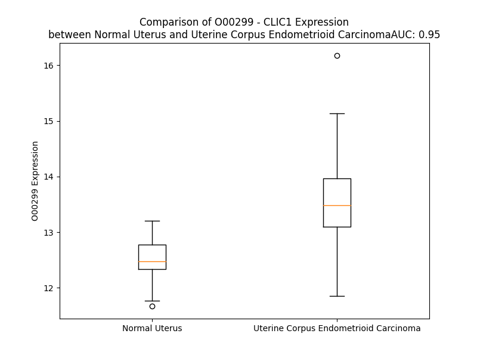

# Detailed Data for O00299

## Introduction to the Detailed Summary

### How to Interpret the Results

- **Summary & Metrics**: This section provides a quick reference to essential protein attributes, including expression changes, family classification, and biomarker applications. Regulation status (upregulated/downregulated) indicates the protein's behavior in a disease context. Some information comes from the original excel file with the proteins selected from literature, while others are derived from the analyses.
- **Expression Comparison**: A visual representation comparing protein expression between normal and disease states. It highlights significant changes in expression levels that might indicate diagnostic or therapeutic relevance. This is data coming from transcriptomics experiments and could not translate similarly to protein levels.
- **Isoform Alignment**: An interactive view of isoform alignments, revealing structural and functional differences between variants of the protein.
- **Interactors & Homologs**: Tables listing known interaction partners and homologous proteins, the more interactors and homologs, the more complex the protein is to design an antibody for.
- **Biological Assemblies**: Information about the structural arrangement of the protein in different assemblies, providing insights into its functional state but also the complexity of the protein to develop antibodies.
- **Combined Per-Residue Information**: A detailed table summarizing residue-level data. This includes predictions for epitope regions, aggregation tendencies, and modifications that might impact the protein's function. Each row corresponds to a residue in the protein, providing insights into specific sites that may be important for research or drug development.
## Summary & Metrics

- **UniProt Accession**: O00299
- **Gene Name**: CLIC1
- **Protein Name**: chloride intracellular channel 1
- **Swiss Prot**: CLIC1_HUMAN
- **Family**: ion channel
- **Biomarker Application**: diagnosis
- **Number of Isoforms**: 0
- **Regulation**: 1
- **(transcriptomics) AUC**: 0.89
- **(transcriptomics) Fold Change**: 1.07
- **(transcriptomics) Regulation**: Upregulated
- **Discotope Epitope Count**: 56
- **Max n_uniprots (Homo)**: 2
- **Max n_uniprots (Hetero)**: N/A

## Expression Comparison

## Interactors

| preferredName_A   | preferredName_B   | score   |
|-------------------|-------------------|---------|

## Homologs

| uniprot_id   | gene_id   |
|:-------------|:----------|
| O00299       | CLIC1     |
| O00299       | CLIC1     |
| O00299       | CLIC1     |
| O00299       | CLIC1     |
| O00299       | CLIC1     |
| O00299       | CLIC1     |
| Q5TE61       | GDAP1L1   |
| Q6FIC5       | CLIC4     |
| G3V4T6       | GSTZ1     |
| A0A6Q8PGQ9   | GDAP1     |
| A6PVS0       | CLIC2     |
| P0CG29       | GSTT2     |
| Q6ICJ4       | GSTT2B    |
| A0A1W2PRF8   | GSTT4     |
| Q53YD7       | EEF1G     |
| A0A2R8Y4M1   | CLIC5     |
| V9HWG9       | HEL-S-21  |
| Q9H4Y5       | GSTO2     |
| Q96NY7       | CLIC6     |
| O95833       | CLIC3     |

## Biological Assemblies

|   Unnamed: 0 |   assembly |   n_uniprots | composition   | crystal_id   |
|-------------:|-----------:|-------------:|:--------------|:-------------|
|            0 |          1 |            1 | Homo          | 4jzq         |
|            1 |          2 |            1 | Homo          | 4jzq         |
|            0 |          1 |            1 | Homo          | 4k0n         |
|            0 |          1 |            1 | Homo          | 3swl         |
|            0 |          1 |            1 | Homo          | 4k0g         |
|            0 |          1 |            1 | Homo          | 1k0m         |
|            1 |          2 |            1 | Homo          | 1k0m         |
|            0 |          1 |            1 | Homo          | 3tgz         |
|            1 |          2 |            1 | Homo          | 3tgz         |
|            0 |          1 |            1 | Homo          | 7f8r         |
|            1 |          2 |            1 | Homo          | 7f8r         |
|            0 |          1 |            1 | Homo          | 7fbq         |
|            0 |          1 |            1 | Homo          | 3p90         |
|            0 |          1 |            1 | Homo          | 1k0n         |
|            1 |          2 |            1 | Homo          | 1k0n         |
|            0 |          1 |            1 | Homo          | 3o3t         |
|            0 |          1 |            1 | Homo          | 1k0o         |
|            1 |          2 |            1 | Homo          | 1k0o         |
|            0 |          1 |            2 | Homo          | 1rk4         |
|            0 |          1 |            1 | Homo          | 3uvh         |
|            1 |          2 |            1 | Homo          | 3uvh         |
|            0 |          1 |            1 | Homo          | 4iqa         |
|            1 |          2 |            1 | Homo          | 4iqa         |
|            0 |          1 |            1 | Homo          | 3p8w         |
|            0 |          1 |            1 | Homo          | 3qr6         |

## Combined Per-Residue Information

|   res | aa   |   epitope_score | epitope   |   relative_surface_accessibility |   modeling_confidence |   Aggregation | modification                       |
|------:|:-----|----------------:|:----------|---------------------------------:|----------------------:|--------------:|:-----------------------------------|
|     1 | M    |         0.26394 | False     |                          1.25798 |                 41.48 |         0     | N/A                                |
|     2 | A    |         0.29376 | True      |                          0.95647 |                 54.99 |         0     | N-acetylalanine                    |
|     3 | E    |         0.34332 | True      |                          0.78294 |                 64.06 |         0     | N/A                                |
|     4 | E    |         0.31697 | True      |                          0.84454 |                 78.24 |         0     | N/A                                |
|     5 | Q    |         0.20809 | False     |                          0.26227 |                 84.49 |         0     | N/A                                |
|     6 | P    |         0.22317 | False     |                          0.39573 |                 92.49 |         0     | N/A                                |
|     7 | Q    |         0.14717 | False     |                          0.49981 |                 94.9  |         0     | N/A                                |
|     8 | V    |         0.03296 | False     |                          0.02469 |                 98    |         2.61  | N/A                                |
|     9 | E    |         0.27335 | False     |                          0.14447 |                 98.19 |         2.61  | N/A                                |
|    10 | L    |         0.00463 | False     |                          0       |                 98.5  |         2.61  | N/A                                |
|    11 | F    |         0.04642 | False     |                          0.02994 |                 98.3  |         2.61  | N/A                                |
|    12 | V    |         0.01193 | False     |                          0.00762 |                 97.66 |         2.61  | N/A                                |
|    13 | K    |         0.46274 | True      |                          0.38028 |                 96.65 |         2.61  | N6-acetyllysine                    |
|    14 | A    |         0.09411 | False     |                          0.08302 |                 96.7  |         1.189 | N/A                                |
|    15 | G    |         0.15441 | False     |                          0.1601  |                 95.25 |         0     | N/A                                |
|    16 | S    |         0.2912  | True      |                          0.59635 |                 93.49 |         0     | N/A                                |
|    17 | D    |         0.22546 | False     |                          0.56154 |                 93.84 |         0     | N/A                                |
|    18 | G    |         0.22816 | False     |                          0.28704 |                 92.95 |         0     | N/A                                |
|    19 | A    |         0.20816 | False     |                          0.62194 |                 93.34 |         0     | N/A                                |
|    20 | K    |         0.17052 | False     |                          0.3438  |                 93.04 |         0     | N/A                                |
|    21 | I    |         0.15572 | False     |                          0.27516 |                 94.42 |         0     | N/A                                |
|    22 | G    |         0.07103 | False     |                          0.02876 |                 95.67 |         0     | N/A                                |
|    23 | N    |         0.30546 | True      |                          0.15287 |                 95.39 |         0     | N/A                                |
|    24 | C    |         0.16137 | False     |                          0.11923 |                 96.12 |         0     | S-glutathionyl cysteine; alternate |
|    25 | P    |         0.13581 | False     |                          0.11588 |                 97    |         0     | N/A                                |
|    26 | F    |         0.27294 | False     |                          0.45096 |                 97.62 |         0     | N/A                                |
|    27 | S    |         0.11056 | False     |                          0.01631 |                 97.82 |         0     | N/A                                |
|    28 | Q    |         0.05551 | False     |                          0.04009 |                 98.33 |         0     | N/A                                |
|    29 | R    |         0.12455 | False     |                          0.08646 |                 98.49 |         0     | N/A                                |
|    30 | L    |         0.00458 | False     |                          0       |                 98.64 |        77.558 | N/A                                |
|    31 | F    |         0.16497 | False     |                          0.11088 |                 98.44 |        90.511 | N/A                                |
|    32 | M    |         0.00621 | False     |                          0       |                 98.66 |        92.973 | N/A                                |
|    33 | V    |         0.00263 | False     |                          0       |                 98.63 |        93.034 | N/A                                |
|    34 | L    |         0.00329 | False     |                          0       |                 98.53 |        93.034 | N/A                                |
|    35 | W    |         0.17778 | False     |                          0.3603  |                 98.37 |        85.924 | N/A                                |
|    36 | L    |         0.11538 | False     |                          0.15724 |                 98.33 |        73.259 | N/A                                |
|    37 | K    |         0.10034 | False     |                          0.01323 |                 97.93 |         1.808 | N/A                                |
|    38 | G    |         0.26974 | False     |                          0.75134 |                 97.29 |         2.018 | N/A                                |
|    39 | V    |         0.20338 | False     |                          0.06738 |                 97.23 |        20.655 | N/A                                |
|    40 | T    |         0.20674 | False     |                          0.85239 |                 97.24 |        20.847 | N/A                                |
|    41 | F    |         0.23897 | False     |                          0.20948 |                 98.12 |        21.175 | N/A                                |
|    42 | N    |         0.18719 | False     |                          0.57902 |                 97.8  |        21.175 | N/A                                |
|    43 | V    |         0.12839 | False     |                          0.35728 |                 97.58 |        21.175 | N/A                                |
|    44 | T    |         0.18565 | False     |                          0.32328 |                 97.28 |        20.647 | N/A                                |
|    45 | T    |         0.12183 | False     |                          0.30374 |                 96.97 |        20.333 | N/A                                |
|    46 | V    |         0.04962 | False     |                          0.02997 |                 96.7  |        18.923 | N/A                                |
|    47 | D    |         0.26148 | False     |                          0.20363 |                 94.85 |         1.808 | N/A                                |
|    48 | T    |         0.51181 | True      |                          0.40921 |                 90.39 |         0.077 | N/A                                |
|    49 | K    |         0.47744 | True      |                          0.93351 |                 90.52 |         0     | N/A                                |
|    50 | R    |         0.48973 | True      |                          0.79326 |                 92.42 |         0     | N/A                                |
|    51 | R    |         0.33044 | True      |                          0.30163 |                 91.69 |         0     | N/A                                |
|    52 | T    |         0.23767 | False     |                          0.58349 |                 93.64 |         0     | N/A                                |
|    53 | E    |         0.26547 | False     |                          0.6655  |                 94.18 |         0     | N/A                                |
|    54 | T    |         0.34776 | True      |                          0.60801 |                 93.14 |         0     | N/A                                |
|    55 | V    |         0.12647 | False     |                          0.07521 |                 94.24 |         0     | N/A                                |
|    56 | Q    |         0.31792 | True      |                          0.47875 |                 94.42 |         0     | N/A                                |
|    57 | K    |         0.40309 | True      |                          0.76538 |                 95.09 |         0     | N/A                                |
|    58 | L    |         0.24683 | False     |                          0.29684 |                 95.24 |         0     | N/A                                |
|    59 | C    |         0.26342 | False     |                          0.04148 |                 93.73 |         0     | N/A                                |
|    60 | P    |         0.35144 | True      |                          0.82137 |                 92.58 |         0     | N/A                                |
|    61 | G    |         0.31992 | True      |                          0.72566 |                 92.74 |         0     | N/A                                |
|    62 | G    |         0.34368 | True      |                          0.19767 |                 91.48 |         0     | N/A                                |
|    63 | Q    |         0.40664 | True      |                          0.4428  |                 94.4  |         0     | N/A                                |
|    64 | L    |         0.39567 | True      |                          0.26419 |                 94.77 |         0     | N/A                                |
|    65 | P    |         0.11696 | False     |                          0.02935 |                 97.65 |         0.928 | N/A                                |
|    66 | F    |         0.02026 | False     |                          0.00382 |                 98.08 |         4.919 | N/A                                |
|    67 | L    |         0.00987 | False     |                          0       |                 98.51 |         4.919 | N/A                                |
|    68 | L    |         0.15022 | False     |                          0.11294 |                 98.05 |         4.919 | N/A                                |
|    69 | Y    |         0.25613 | False     |                          0.12224 |                 97.56 |         4.919 | N/A                                |
|    70 | G    |         0.16127 | False     |                          0.30633 |                 95.97 |         3.991 | N/A                                |
|    71 | T    |         0.29525 | True      |                          0.93702 |                 94.86 |         1.489 | N/A                                |
|    72 | E    |         0.32774 | True      |                          0.58483 |                 96.41 |         0     | N/A                                |
|    73 | V    |         0.26433 | False     |                          0.37692 |                 97.27 |         0     | N/A                                |
|    74 | H    |         0.2269  | False     |                          0.20914 |                 98.09 |         0     | N/A                                |
|    75 | T    |         0.31418 | True      |                          0.34059 |                 97.08 |         0     | N/A                                |
|    76 | D    |         0.31049 | True      |                          0.41782 |                 96.97 |         0     | N/A                                |
|    77 | T    |         0.20488 | False     |                          0.1289  |                 97.75 |         0     | N/A                                |
|    78 | N    |         0.35943 | True      |                          0.51925 |                 97.22 |         0     | N/A                                |
|    79 | K    |         0.33005 | True      |                          0.64607 |                 97.92 |         0     | N/A                                |
|    80 | I    |         0.01049 | False     |                          0       |                 98.45 |         0     | N/A                                |
|    81 | E    |         0.11247 | False     |                          0.0723  |                 98.44 |         0     | N/A                                |
|    82 | E    |         0.22174 | False     |                          0.59856 |                 97.83 |         0     | N/A                                |
|    83 | F    |         0.27997 | False     |                          0.24126 |                 98.33 |         0     | N/A                                |
|    84 | L    |         0.00421 | False     |                          0       |                 98.3  |         0     | N/A                                |
|    85 | E    |         0.10231 | False     |                          0.14241 |                 98.01 |         0     | N/A                                |
|    86 | A    |         0.2341  | False     |                          0.68785 |                 97.59 |         0     | N/A                                |
|    87 | V    |         0.23536 | False     |                          0.45576 |                 96.83 |         0     | N/A                                |
|    88 | L    |         0.02141 | False     |                          0.00824 |                 96.17 |         0     | N/A                                |
|    89 | C    |         0.20373 | False     |                          0.43565 |                 92.19 |         0     | N/A                                |
|    90 | P    |         0.50289 | True      |                          0.55617 |                 95.62 |         0     | N/A                                |
|    91 | P    |         0.60184 | True      |                          1.07273 |                 95.06 |         0     | N/A                                |
|    92 | R    |         0.37193 | True      |                          0.55156 |                 95.55 |         0     | N/A                                |
|    93 | Y    |         0.1313  | False     |                          0.1052  |                 97.13 |         0     | N/A                                |
|    94 | P    |         0.1195  | False     |                          0.46609 |                 97.7  |         0     | N/A                                |
|    95 | K    |         0.19938 | False     |                          0.65934 |                 97.83 |         0     | N/A                                |
|    96 | L    |         0.10152 | False     |                          0.07476 |                 98.34 |         0     | N/A                                |
|    97 | A    |         0.16107 | False     |                          0.32346 |                 97.99 |         0     | N/A                                |
|    98 | A    |         0.17844 | False     |                          0.16244 |                 97.75 |         0     | N/A                                |
|    99 | L    |         0.37067 | True      |                          0.77491 |                 96.98 |         0     | N/A                                |
|   100 | N    |         0.22052 | False     |                          0.10895 |                 96.86 |         0     | N/A                                |
|   101 | P    |         0.21019 | False     |                          0.79831 |                 96.53 |         0     | N/A                                |
|   102 | E    |         0.31772 | True      |                          0.55224 |                 97.16 |         0     | N/A                                |
|   103 | S    |         0.0184  | False     |                          0.01153 |                 97.91 |         0     | N/A                                |
|   104 | N    |         0.26475 | False     |                          0.43133 |                 97.2  |         0     | N/A                                |
|   105 | T    |         0.29967 | True      |                          0.58639 |                 97.27 |         0     | N/A                                |
|   106 | A    |         0.13073 | False     |                          0.09921 |                 97.45 |         0     | N/A                                |
|   107 | G    |         0.07818 | False     |                          0.05965 |                 97.17 |         0     | N/A                                |
|   108 | L    |         0.32319 | True      |                          0.55373 |                 96.23 |         1.831 | N/A                                |
|   109 | D    |         0.17459 | False     |                          0.42204 |                 97.54 |         2.166 | N/A                                |
|   110 | I    |         0.04277 | False     |                          0.0128  |                 98.52 |         2.166 | N/A                                |
|   111 | F    |         0.26757 | False     |                          0.19787 |                 97.37 |         2.166 | N/A                                |
|   112 | A    |         0.28867 | False     |                          0.61956 |                 97.68 |         2.166 | N/A                                |
|   113 | K    |         0.19851 | False     |                          0.43791 |                 97.94 |         2.166 | N/A                                |
|   114 | F    |         0.00879 | False     |                          0       |                 97.78 |         2.558 | N/A                                |
|   115 | S    |         0.13962 | False     |                          0.1928  |                 96.49 |         1.665 | N/A                                |
|   116 | A    |         0.17067 | False     |                          0.44084 |                 96.43 |         1.665 | N/A                                |
|   117 | Y    |         0.04957 | False     |                          0.01204 |                 96.68 |         1.665 | N/A                                |
|   118 | I    |         0.01532 | False     |                          0       |                 96.12 |         1.665 | N/A                                |
|   119 | K    |         0.20619 | False     |                          0.52551 |                 95.09 |         0     | N6-acetyllysine                    |
|   120 | N    |         0.13475 | False     |                          0.09172 |                 94.11 |         0     | N/A                                |
|   121 | S    |         0.23303 | False     |                          0.36161 |                 92.78 |         0     | Phosphoserine                      |
|   122 | N    |         0.24041 | False     |                          0.43411 |                 93.35 |         0     | N/A                                |
|   123 | P    |         0.28539 | False     |                          0.51973 |                 92.79 |         0     | N/A                                |
|   124 | A    |         0.29649 | True      |                          0.86614 |                 94.16 |         0     | N/A                                |
|   125 | L    |         0.25347 | False     |                          0.5482  |                 94.48 |         0     | N/A                                |
|   126 | N    |         0.23481 | False     |                          0.12534 |                 94.14 |         0     | N/A                                |
|   127 | D    |         0.31696 | True      |                          0.6078  |                 95.44 |         0     | N/A                                |
|   128 | N    |         0.26599 | False     |                          0.64858 |                 97.25 |         0     | N/A                                |
|   129 | L    |         0.2263  | False     |                          0.25566 |                 97.38 |         0     | N/A                                |
|   130 | E    |         0.09536 | False     |                          0.25944 |                 97.31 |         0     | N/A                                |
|   131 | K    |         0.26275 | False     |                          0.69    |                 97.69 |         0     | N6-acetyllysine                    |
|   132 | G    |         0.14795 | False     |                          0.25069 |                 98.02 |         0     | N/A                                |
|   133 | L    |         0.00262 | False     |                          0       |                 98.25 |         0     | N/A                                |
|   134 | L    |         0.15281 | False     |                          0.28584 |                 98.3  |         0     | N/A                                |
|   135 | K    |         0.18198 | False     |                          0.74369 |                 98.29 |         0     | N/A                                |
|   136 | A    |         0.03258 | False     |                          0.03925 |                 98.51 |         0     | N/A                                |
|   137 | L    |         0.00459 | False     |                          0       |                 98.56 |         0     | N/A                                |
|   138 | K    |         0.19767 | False     |                          0.40914 |                 98.47 |         0     | N/A                                |
|   139 | V    |         0.14562 | False     |                          0.6061  |                 98.41 |         0     | N/A                                |
|   140 | L    |         0.00387 | False     |                          0.00082 |                 98.59 |         0     | N/A                                |
|   141 | D    |         0.03748 | False     |                          0.01955 |                 98.5  |         0     | N/A                                |
|   142 | N    |         0.27162 | False     |                          0.44711 |                 97.95 |         0     | N/A                                |
|   143 | Y    |         0.14826 | False     |                          0.08235 |                 98.13 |         0     | N/A                                |
|   144 | L    |         0.02901 | False     |                          0.01935 |                 98.13 |         0     | N/A                                |
|   145 | T    |         0.09207 | False     |                          0.23252 |                 96.55 |         0     | N/A                                |
|   146 | S    |         0.2925  | True      |                          0.44062 |                 95.25 |         0     | N/A                                |
|   147 | P    |         0.15525 | False     |                          0.35645 |                 93.58 |         0     | N/A                                |
|   148 | L    |         0.23706 | False     |                          0.05606 |                 94.33 |         0     | N/A                                |
|   149 | P    |         0.33994 | True      |                          0.70175 |                 89.98 |         0     | N/A                                |
|   150 | E    |         0.23379 | False     |                          0.51359 |                 85.47 |         0     | N/A                                |
|   151 | E    |         0.20079 | False     |                          0.1318  |                 83.71 |         0     | N/A                                |
|   152 | V    |         0.25349 | False     |                          0.71286 |                 75.04 |         0     | N/A                                |
|   153 | D    |         0.3157  | True      |                          0.89709 |                 67.44 |         0     | N/A                                |
|   154 | E    |         0.26333 | False     |                          0.69681 |                 60.81 |         0     | N/A                                |
|   155 | T    |         0.17833 | False     |                          0.50685 |                 56.4  |         0     | N/A                                |
|   156 | S    |         0.2259  | False     |                          0.74944 |                 54.85 |         0     | Phosphoserine                      |
|   157 | A    |         0.22478 | False     |                          0.84951 |                 56.24 |         0     | N/A                                |
|   158 | E    |         0.35623 | True      |                          0.8654  |                 58.39 |         0     | N/A                                |
|   159 | D    |         0.20134 | False     |                          0.4827  |                 59.96 |         0     | N/A                                |
|   160 | E    |         0.17443 | False     |                          0.80086 |                 63.25 |         0     | N/A                                |
|   161 | G    |         0.17437 | False     |                          0.56818 |                 80.06 |         0     | N/A                                |
|   162 | V    |         0.20609 | False     |                          0.30524 |                 89.15 |         0     | N/A                                |
|   163 | S    |         0.1171  | False     |                          0.0156  |                 93.78 |         0     | N/A                                |
|   164 | Q    |         0.21726 | False     |                          0.5299  |                 91.99 |         0     | N/A                                |
|   165 | R    |         0.15711 | False     |                          0.02585 |                 96.31 |         0     | N/A                                |
|   166 | K    |         0.30787 | True      |                          0.47056 |                 97.95 |         0     | N/A                                |
|   167 | F    |         0.01079 | False     |                          0.00955 |                 98.57 |         0     | N/A                                |
|   168 | L    |         0.00825 | False     |                          0.00412 |                 98.44 |         0     | N/A                                |
|   169 | D    |         0.15667 | False     |                          0.08656 |                 98.04 |         0     | N/A                                |
|   170 | G    |         0.12095 | False     |                          0.20279 |                 97.19 |         0     | N/A                                |
|   171 | N    |         0.21796 | False     |                          0.54525 |                 97.18 |         0     | N/A                                |
|   172 | E    |         0.18515 | False     |                          0.59601 |                 97.81 |         0     | N/A                                |
|   173 | L    |         0.03455 | False     |                          0.03472 |                 98.58 |         0     | N/A                                |
|   174 | T    |         0.09427 | False     |                          0.10187 |                 98.58 |         0     | N/A                                |
|   175 | L    |         0.03891 | False     |                          0.11096 |                 98.57 |         0     | N/A                                |
|   176 | A    |         0.04113 | False     |                          0.06455 |                 98.5  |         0     | N/A                                |
|   177 | D    |         0.00318 | False     |                          0       |                 98.77 |         0     | N/A                                |
|   178 | C    |         0.00185 | False     |                          0       |                 98.55 |         0     | N/A                                |
|   179 | N    |         0.08519 | False     |                          0.12827 |                 98.4  |         0     | N/A                                |
|   180 | L    |         0.02999 | False     |                          0.0305  |                 98.55 |         0     | N/A                                |
|   181 | L    |         0.00509 | False     |                          0       |                 98.69 |         0     | N/A                                |
|   182 | P    |         0.01032 | False     |                          0.00073 |                 98.47 |         0     | N/A                                |
|   183 | K    |         0.09268 | False     |                          0.13907 |                 98.3  |         0     | N/A                                |
|   184 | L    |         0.01043 | False     |                          0.00412 |                 97.98 |         0.668 | N/A                                |
|   185 | H    |         0.12022 | False     |                          0.06837 |                 98.09 |         0.668 | N/A                                |
|   186 | I    |         0.06373 | False     |                          0.0232  |                 98.09 |        15.731 | N/A                                |
|   187 | V    |         0.00861 | False     |                          0.00381 |                 98.01 |        15.731 | N/A                                |
|   188 | Q    |         0.31263 | True      |                          0.30518 |                 97.7  |        15.731 | N/A                                |
|   189 | V    |         0.13715 | False     |                          0.09984 |                 97.77 |        15.731 | N/A                                |
|   190 | V    |         0.00611 | False     |                          0       |                 97.8  |        15.731 | N/A                                |
|   191 | C    |         0.01169 | False     |                          0.00401 |                 97.02 |         1.307 | N/A                                |
|   192 | K    |         0.23958 | False     |                          0.65545 |                 97.28 |         0     | N/A                                |
|   193 | K    |         0.29768 | True      |                          0.57236 |                 96.96 |         0     | N/A                                |
|   194 | Y    |         0.29042 | True      |                          0.24285 |                 96.07 |         0     | N/A                                |
|   195 | R    |         0.38534 | True      |                          0.2148  |                 94.37 |         0     | N/A                                |
|   196 | G    |         0.2623  | False     |                          0.72355 |                 95    |         0     | N/A                                |
|   197 | F    |         0.25103 | False     |                          0.09382 |                 96.28 |         0     | N/A                                |
|   198 | T    |         0.21844 | False     |                          0.57773 |                 97.17 |         0     | N/A                                |
|   199 | I    |         0.19966 | False     |                          0.0454  |                 97.49 |         0     | N/A                                |
|   200 | P    |         0.24628 | False     |                          0.32904 |                 98.03 |         0     | N/A                                |
|   201 | E    |         0.29269 | True      |                          0.69927 |                 97.6  |         0     | N/A                                |
|   202 | A    |         0.27614 | False     |                          0.76541 |                 97.32 |         0     | N/A                                |
|   203 | F    |         0.12679 | False     |                          0.11274 |                 98.12 |         0     | N/A                                |
|   204 | R    |         0.33576 | True      |                          0.6868  |                 97.31 |         0     | N/A                                |
|   205 | G    |         0.01102 | False     |                          0.00614 |                 97.9  |         0     | N/A                                |
|   206 | V    |         0.00418 | False     |                          0       |                 98.45 |         0     | N/A                                |
|   207 | H    |         0.30641 | True      |                          0.27123 |                 98.43 |         0     | N/A                                |
|   208 | R    |         0.3265  | True      |                          0.24889 |                 98.12 |         0     | N/A                                |
|   209 | Y    |         0.01909 | False     |                          0.00548 |                 98.61 |         0     | N/A                                |
|   210 | L    |         0.0798  | False     |                          0.0371  |                 98.35 |         0     | N/A                                |
|   211 | S    |         0.37009 | True      |                          0.57725 |                 98.23 |         0     | Phosphoserine                      |
|   212 | N    |         0.22994 | False     |                          0.24967 |                 98.54 |         0     | N/A                                |
|   213 | A    |         0.00461 | False     |                          0       |                 98.38 |         0     | N/A                                |
|   214 | Y    |         0.29579 | True      |                          0.3584  |                 97.87 |         0     | N/A                                |
|   215 | A    |         0.24968 | False     |                          0.83615 |                 98.07 |         0     | N/A                                |
|   216 | R    |         0.1341  | False     |                          0.24263 |                 98.17 |         0     | N/A                                |
|   217 | E    |         0.23729 | False     |                          0.54866 |                 97.73 |         0     | N/A                                |
|   218 | E    |         0.11637 | False     |                          0.08961 |                 97.85 |         0     | N/A                                |
|   219 | F    |         0.0052  | False     |                          0       |                 98.26 |         0     | N/A                                |
|   220 | A    |         0.21721 | False     |                          0.47466 |                 97.19 |         0     | N/A                                |
|   221 | S    |         0.26507 | False     |                          0.47665 |                 96.48 |         0     | N/A                                |
|   222 | T    |         0.00771 | False     |                          0.00211 |                 96.37 |         0     | N/A                                |
|   223 | C    |         0.11097 | False     |                          0.2043  |                 95.96 |         0     | N/A                                |
|   224 | P    |         0.06671 | False     |                          0.07678 |                 95.77 |         0     | N/A                                |
|   225 | D    |         0.32672 | True      |                          0.48704 |                 95.66 |         0     | N/A                                |
|   226 | D    |         0.22749 | False     |                          0.47109 |                 96.65 |         0     | N/A                                |
|   227 | E    |         0.33785 | True      |                          0.68289 |                 96.03 |         0     | N/A                                |
|   228 | E    |         0.13208 | False     |                          0.05294 |                 96.63 |         0     | N/A                                |
|   229 | I    |         0.00487 | False     |                          0.0008  |                 97.35 |         0     | N/A                                |
|   230 | E    |         0.2707  | False     |                          0.17985 |                 97.01 |         0     | N/A                                |
|   231 | L    |         0.35679 | True      |                          0.55354 |                 95.52 |         0     | N/A                                |
|   232 | A    |         0.48166 | True      |                          0.52748 |                 94.41 |         0     | N/A                                |
|   233 | Y    |         0.3244  | True      |                          0.10683 |                 95.87 |         0     | Phosphotyrosine                    |
|   234 | E    |         0.34972 | True      |                          0.52851 |                 94    |         0     | N/A                                |
|   235 | Q    |         0.43528 | True      |                          0.84238 |                 90.58 |         0     | N/A                                |
|   236 | V    |         0.37977 | True      |                          0.38319 |                 91.2  |         0     | N/A                                |
|   237 | A    |         0.11177 | False     |                          0.10088 |                 88.65 |         0     | N/A                                |
|   238 | K    |         0.22043 | False     |                          0.54274 |                 74.66 |         0     | N/A                                |
|   239 | A    |         0.12947 | False     |                          0.5885  |                 78.94 |         0     | N/A                                |
|   240 | L    |         0.26649 | False     |                          0.42344 |                 77.09 |         0     | N/A                                |
|   241 | K    |         0.08456 | False     |                          1.02071 |                 71.42 |         0     | N/A                                |

