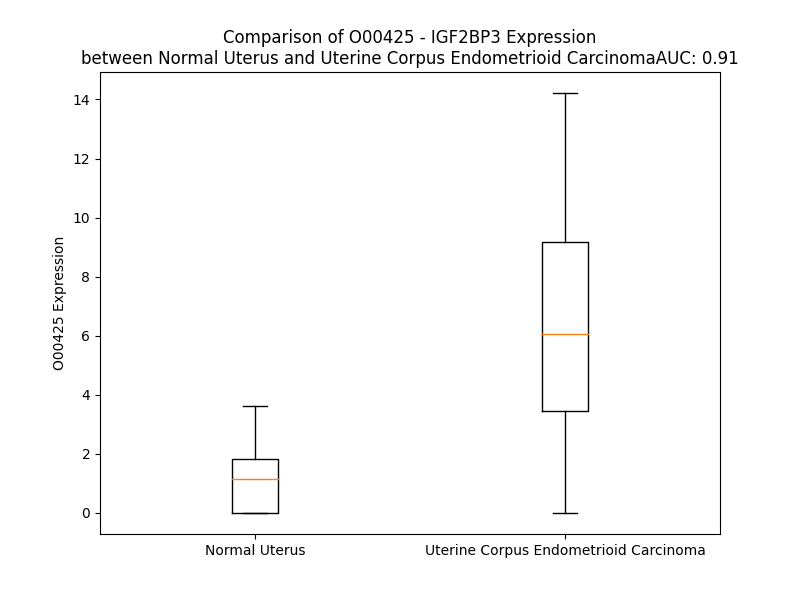

# Detailed Data for O00425

## Introduction to the Detailed Summary

### How to Interpret the Results

- **Summary & Metrics**: This section provides a quick reference to essential protein attributes, including expression changes, family classification, and biomarker applications. Regulation status (upregulated/downregulated) indicates the protein's behavior in a disease context. Some information comes from the original excel file with the proteins selected from literature, while others are derived from the analyses.
- **Expression Comparison**: A visual representation comparing protein expression between normal and disease states. It highlights significant changes in expression levels that might indicate diagnostic or therapeutic relevance. This is data coming from transcriptomics experiments and could not translate similarly to protein levels.
- **Isoform Alignment**: An interactive view of isoform alignments, revealing structural and functional differences between variants of the protein.
- **Interactors & Homologs**: Tables listing known interaction partners and homologous proteins, the more interactors and homologs, the more complex the protein is to design an antibody for.
- **Biological Assemblies**: Information about the structural arrangement of the protein in different assemblies, providing insights into its functional state but also the complexity of the protein to develop antibodies.
- **Combined Per-Residue Information**: A detailed table summarizing residue-level data. This includes predictions for epitope regions, aggregation tendencies, and modifications that might impact the protein's function. Each row corresponds to a residue in the protein, providing insights into specific sites that may be important for research or drug development.
## Summary & Metrics

- **UniProt Accession**: O00425
- **Gene Name**: IGF2BP3
- **Protein Name**: Insulin-like growth factor 2 mRNA-binding protein 3 /IMP3
- **Swiss Prot**: IF2B3_HUMAN
- **Family**: translation regulator
- **Biomarker Application**: diagnosis
- **Number of Isoforms**: 2
- **Regulation**: 1
- **(transcriptomics) AUC**: 0.99
- **(transcriptomics) Fold Change**: 7.94
- **(transcriptomics) Regulation**: Upregulated
- **Discotope Epitope Count**: 157
- **Max n_uniprots (Homo)**: 2
- **Max n_uniprots (Hetero)**: N/A

## Expression Comparison

## Isoform Alignment

<pre style='font-size:14px; font-family:monospace;'>O00425-1 MNKLYIGNLSENAAPSDLESIFKDAKIPVSGPFLVKTGYAFVDCPDESWALKAIEALSGKIELHGKPIEVEHSVPKRQRIRKLQIRNIPPHLQWEVLDSLLVQYGVVESCEQVNTDSETAVVNVTYSSKDQARQALDKLNGFQLENFTLKVAYIPDEMAAQQNPLQQPRGRRGLGQRGSSRQGSPGSVSKQKPCDLPLRLLVPTQFVGAIIGKEGATIRNITKQTQSKIDVHRKENAGAAEKSITILSTPEGTSAACKSILEIMHKEAQDIKFTEEIPLKILAHNNFVGRLIGKEGRNLKKIEQDTDTKITISPLQELTLYNPERTITVKGNVETCAKAEEEIMKKIRESYENDIASMNLQAHLIPGLNLNALGLFPPTSGMPPPTSGPPSAMTPPYPQFEQSETETVHLFIPALSVGAIIGKQGQHIKQLSRFAGASIKIAPAEAPDAKVRMVIITGPPEAQFKAQGRIYGKIKEENFVSPKEEVKLEAHIRVPSFAAGRVIGKGGKTVNELQNLSSAEVVVPRDQTPDENDQVVVKITGHFYACQVAQRKIQEILTQVKQHQQQKALQSGPPQSRRK
O00425-2 ---------------------------------------------------------------------------------------------------------------------------------------------------------------------------------------------------------------------------------------------------------------------------------------------------------------------------------------------------------------------------------------------MPPPTSGPPSAMTPPYPQFEQSETETVHLFIPALSVGAIIGKQGQHIKQLSRFAGASIKIAPAEAPDAKVRMVIITGPPEAQFKAQGRIYGKIKEENFVSPKEEVKLEAHIRVPSFAAGRVIGKGGKTVNELQNLSSAEVVVPRDQTPDENDQVVVKITGHFYACQVAQRKIQEILTQVKQHQQQKALQSGPPQSRRK
</pre>

## Interactors

| preferredName_A   | preferredName_B   |   score |
|:------------------|:------------------|--------:|
| IGF2BP3           | IGF2              |   0.989 |
| IGF2BP3           | IGF2BP1           |   0.984 |
| IGF2BP3           | HNRNPA2B1         |   0.925 |
| IGF2BP3           | HMGA2             |   0.909 |
| IGF2BP3           | YTHDF1            |   0.906 |
| IGF2BP3           | ELAVL1            |   0.903 |

## Homologs

| uniprot_id   | gene_id   |
|:-------------|:----------|
| Q9UNW9       | NOVA2     |
| Q9Y6M1       | IGF2BP2   |
| Q53SS8       | PCBP1     |
| C9J0A4       | PCBP4     |
| A0A8V8TNQ2   | FUBP3     |
| E9PFP8       | PCBP3     |
| F8VRH0       | PCBP2     |
| A0A994J6T5   | HNRNPK    |
| H0YHZ1       | NOVA1     |
| M0R263       | KHSRP     |
| Q9NZI8       | IGF2BP1   |
| Q96AE4       | FUBP1     |

## Biological Assemblies

|   Unnamed: 0 |   assembly |   n_uniprots | composition   | crystal_id   |
|-------------:|-----------:|-------------:|:--------------|:-------------|
|            0 |          1 |            1 | Homo          | 6gx6         |
|            0 |          1 |            1 | Homo          | 6fq1         |
|            1 |          2 |            1 | Homo          | 6fq1         |
|            0 |          1 |            2 | Homo          | 6fqr         |
|            0 |          1 |            1 | Homo          | 6gqe         |
|            0 |          1 |            1 | Homo          | 2e44         |

## Combined Per-Residue Information

|   res | aa   |   epitope_score | epitope   |   relative_surface_accessibility |   modeling_confidence |   Aggregation | modification     |
|------:|:-----|----------------:|:----------|---------------------------------:|----------------------:|--------------:|:-----------------|
|     1 | M    |         0.07098 | False     |                          1.21179 |                 56.12 |         0     | N/A              |
|     2 | N    |         0.05547 | False     |                          0.2344  |                 72.35 |         0     | N/A              |
|     3 | K    |         0.05121 | False     |                          0.31261 |                 85.26 |         0     | N/A              |
|     4 | L    |         0.00506 | False     |                          0       |                 87.74 |         0.648 | N/A              |
|     5 | Y    |         0.04272 | False     |                          0.24666 |                 88.86 |         0.648 | N/A              |
|     6 | I    |         0.00444 | False     |                          0       |                 89.21 |         0.648 | N/A              |
|     7 | G    |         0.02112 | False     |                          0.0177  |                 87.89 |         0.648 | N/A              |
|     8 | N    |         0.04042 | False     |                          0.36364 |                 87.13 |         0.648 | N/A              |
|     9 | L    |         0.0189  | False     |                          0.04287 |                 85.75 |         0.648 | N/A              |
|    10 | S    |         0.04724 | False     |                          0.15691 |                 81.66 |         0     | N/A              |
|    11 | E    |         0.11595 | False     |                          0.76958 |                 78.34 |         0     | N/A              |
|    12 | N    |         0.10854 | False     |                          0.74411 |                 79.71 |         0     | N/A              |
|    13 | A    |         0.03717 | False     |                          0.10404 |                 79.82 |         0     | N/A              |
|    14 | A    |         0.09237 | False     |                          0.33926 |                 86.23 |         0     | N/A              |
|    15 | P    |         0.10212 | False     |                          0.46821 |                 87.58 |         0     | N/A              |
|    16 | S    |         0.108   | False     |                          0.52374 |                 87.47 |         0     | N/A              |
|    17 | D    |         0.11212 | False     |                          0.27716 |                 88.08 |         0     | N/A              |
|    18 | L    |         0.00603 | False     |                          0       |                 88.17 |         0     | N/A              |
|    19 | E    |         0.14121 | True      |                          0.4589  |                 89.25 |         0     | N/A              |
|    20 | S    |         0.12669 | False     |                          0.43757 |                 88.16 |         0     | N/A              |
|    21 | I    |         0.06595 | False     |                          0.11217 |                 89.44 |         0     | N/A              |
|    22 | F    |         0.00994 | False     |                          0.00824 |                 90.41 |         0     | N/A              |
|    23 | K    |         0.11934 | False     |                          0.80727 |                 89.43 |         0     | N/A              |
|    24 | D    |         0.18515 | True      |                          0.70644 |                 88.52 |         0     | N/A              |
|    25 | A    |         0.04804 | False     |                          0.26857 |                 85.6  |         0     | N/A              |
|    26 | K    |         0.22048 | True      |                          0.82121 |                 89.05 |         0     | N/A              |
|    27 | I    |         0.03517 | False     |                          0.04502 |                 87.53 |         0     | N/A              |
|    28 | P    |         0.16717 | True      |                          0.38983 |                 87.75 |         0     | N/A              |
|    29 | V    |         0.06522 | False     |                          0.41282 |                 87.21 |         0     | N/A              |
|    30 | S    |         0.1986  | True      |                          0.52219 |                 80.3  |         0     | N/A              |
|    31 | G    |         0.09059 | False     |                          0.31271 |                 81.46 |         0     | N/A              |
|    32 | P    |         0.23805 | True      |                          0.78618 |                 85.97 |         0     | N/A              |
|    33 | F    |         0.06214 | False     |                          0.05563 |                 89.86 |         1.486 | N/A              |
|    34 | L    |         0.10971 | False     |                          0.56716 |                 86.77 |         1.607 | N/A              |
|    35 | V    |         0.10055 | False     |                          0.32932 |                 87.04 |         1.607 | N/A              |
|    36 | K    |         0.18846 | True      |                          0.57711 |                 83.64 |         1.607 | N/A              |
|    37 | T    |         0.11948 | False     |                          0.85905 |                 80.13 |         5.077 | N/A              |
|    38 | G    |         0.048   | False     |                          0.32473 |                 80.82 |        10.413 | N/A              |
|    39 | Y    |         0.04441 | False     |                          0.29004 |                 89.03 |        10.413 | N/A              |
|    40 | A    |         0.00485 | False     |                          0       |                 89.52 |        10.413 | N/A              |
|    41 | F    |         0.04899 | False     |                          0.23695 |                 90.57 |        10.413 | N/A              |
|    42 | V    |         0.02694 | False     |                          0.00952 |                 91.23 |        10.118 | N/A              |
|    43 | D    |         0.02925 | False     |                          0.27968 |                 88.57 |         1.607 | N/A              |
|    44 | C    |         0.01194 | False     |                          0.04367 |                 85.67 |         0     | N/A              |
|    45 | P    |         0.13576 | True      |                          0.49892 |                 82.27 |         0     | N/A              |
|    46 | D    |         0.10204 | False     |                          0.34171 |                 82.79 |         0     | N/A              |
|    47 | E    |         0.15791 | True      |                          0.57051 |                 78.54 |         0     | N/A              |
|    48 | S    |         0.11181 | False     |                          0.55649 |                 81.46 |         0     | N/A              |
|    49 | W    |         0.06963 | False     |                          0.33326 |                 89.04 |         0     | N/A              |
|    50 | A    |         0.00414 | False     |                          0       |                 84.44 |         0     | N/A              |
|    51 | L    |         0.1888  | True      |                          0.6013  |                 82.11 |         0     | N/A              |
|    52 | K    |         0.11657 | False     |                          0.48371 |                 87.35 |         0     | N/A              |
|    53 | A    |         0.00479 | False     |                          0       |                 87.97 |         0     | N/A              |
|    54 | I    |         0.10867 | False     |                          0.25185 |                 86.45 |         0     | N/A              |
|    55 | E    |         0.17691 | True      |                          0.64721 |                 85.37 |         0     | N/A              |
|    56 | A    |         0.06703 | False     |                          0.35999 |                 86.81 |         0     | N/A              |
|    57 | L    |         0.00505 | False     |                          0.00082 |                 88.82 |         0     | N/A              |
|    58 | S    |         0.0971  | False     |                          0.27637 |                 86.98 |         0     | N/A              |
|    59 | G    |         0.08903 | False     |                          0.63424 |                 81.5  |         0     | N/A              |
|    60 | K    |         0.17411 | True      |                          0.69564 |                 82.89 |         0     | N/A              |
|    61 | I    |         0.09273 | False     |                          0.27987 |                 82.68 |         0     | N/A              |
|    62 | E    |         0.11272 | False     |                          0.62046 |                 84.09 |         0     | N/A              |
|    63 | L    |         0.06854 | False     |                          0.0814  |                 80.56 |         0     | N/A              |
|    64 | H    |         0.17111 | True      |                          0.58774 |                 81.46 |         0     | N/A              |
|    65 | G    |         0.12926 | False     |                          0.74796 |                 77.15 |         0     | N/A              |
|    66 | K    |         0.10061 | False     |                          0.42643 |                 80.59 |         0     | N/A              |
|    67 | P    |         0.08805 | False     |                          0.41851 |                 84.92 |         0     | N/A              |
|    68 | I    |         0.01002 | False     |                          0       |                 88.75 |         0     | N/A              |
|    69 | E    |         0.02535 | False     |                          0.4792  |                 85.89 |         0     | N/A              |
|    70 | V    |         0.00739 | False     |                          0.00422 |                 88.8  |         0     | N/A              |
|    71 | E    |         0.07051 | False     |                          0.445   |                 84.1  |         0     | N/A              |
|    72 | H    |         0.08093 | False     |                          0.33958 |                 81.63 |         0     | N/A              |
|    73 | S    |         0.08254 | False     |                          0.17232 |                 70.95 |         0     | N/A              |
|    74 | V    |         0.10835 | False     |                          0.39367 |                 56.8  |         0     | N/A              |
|    75 | P    |         0.16969 | True      |                          0.56847 |                 51.64 |         0     | N/A              |
|    76 | K    |         0.1843  | True      |                          0.96558 |                 46.52 |         0     | N/A              |
|    77 | R    |         0.15697 | True      |                          0.77325 |                 44.03 |         0     | N/A              |
|    78 | Q    |         0.07281 | False     |                          0.38056 |                 45.05 |         0     | N/A              |
|    79 | R    |         0.13389 | True      |                          0.55444 |                 52.88 |         0     | N/A              |
|    80 | I    |         0.03218 | False     |                          0.06928 |                 61.83 |         0     | N/A              |
|    81 | R    |         0.07347 | False     |                          0.47912 |                 78.93 |         0     | N/A              |
|    82 | K    |         0.04114 | False     |                          0.2764  |                 83.28 |         0     | N/A              |
|    83 | L    |         0.0054  | False     |                          0       |                 86.97 |         0     | N/A              |
|    84 | Q    |         0.03297 | False     |                          0.16504 |                 88.22 |         0     | N/A              |
|    85 | I    |         0.00244 | False     |                          0.0008  |                 89.77 |         0     | N/A              |
|    86 | R    |         0.12589 | False     |                          0.52933 |                 88.54 |         0     | N/A              |
|    87 | N    |         0.02452 | False     |                          0.25287 |                 87.05 |         0     | N/A              |
|    88 | I    |         0.01657 | False     |                          0.0256  |                 86.1  |         0     | N/A              |
|    89 | P    |         0.0173  | False     |                          0.00955 |                 83.28 |         0     | N/A              |
|    90 | P    |         0.1888  | True      |                          0.6639  |                 77.67 |         0     | N/A              |
|    91 | H    |         0.17902 | True      |                          0.58869 |                 79.25 |         0     | N/A              |
|    92 | L    |         0.07219 | False     |                          0.19068 |                 81.41 |         0     | N/A              |
|    93 | Q    |         0.15615 | True      |                          0.63107 |                 79.61 |         0     | N/A              |
|    94 | W    |         0.12111 | False     |                          0.44355 |                 79.7  |         0     | N/A              |
|    95 | E    |         0.10389 | False     |                          0.5168  |                 79.55 |         0     | N/A              |
|    96 | V    |         0.14094 | True      |                          0.54707 |                 83.23 |         0     | N/A              |
|    97 | L    |         0.01803 | False     |                          0.02803 |                 85.37 |         0     | N/A              |
|    98 | D    |         0.07068 | False     |                          0.34143 |                 83.29 |         0     | N/A              |
|    99 | S    |         0.09369 | False     |                          0.51925 |                 85.2  |         0.675 | N/A              |
|   100 | L    |         0.05564 | False     |                          0.10858 |                 87.53 |         6.499 | N/A              |
|   101 | L    |         0.00541 | False     |                          0.00082 |                 89.42 |         8.928 | N/A              |
|   102 | V    |         0.10478 | False     |                          0.59613 |                 88.15 |         9.338 | N/A              |
|   103 | Q    |         0.21215 | True      |                          0.66292 |                 88.27 |         9.338 | N/A              |
|   104 | Y    |         0.10602 | False     |                          0.14486 |                 87.27 |         9.338 | N/A              |
|   105 | G    |         0.02348 | False     |                          0.17801 |                 85.07 |         8.235 | N/A              |
|   106 | V    |         0.09811 | False     |                          0.67502 |                 85.89 |         8.235 | N/A              |
|   107 | V    |         0.03977 | False     |                          0.23372 |                 86.84 |         7.665 | N/A              |
|   108 | E    |         0.08591 | False     |                          0.56158 |                 81.76 |         0     | N/A              |
|   109 | S    |         0.05455 | False     |                          0.33242 |                 81.69 |         0     | N/A              |
|   110 | C    |         0.07721 | False     |                          0.23157 |                 84.89 |         0     | N/A              |
|   111 | E    |         0.0876  | False     |                          0.50406 |                 81.32 |         0     | N/A              |
|   112 | Q    |         0.10633 | False     |                          0.61621 |                 83.13 |         0     | N/A              |
|   113 | V    |         0.10522 | False     |                          0.35272 |                 79.78 |         0     | N/A              |
|   114 | N    |         0.21791 | True      |                          0.97794 |                 71.86 |         0     | N/A              |
|   115 | T    |         0.11988 | False     |                          0.45214 |                 70.79 |         0     | N/A              |
|   116 | D    |         0.25886 | True      |                          0.9911  |                 70.45 |         0     | N/A              |
|   117 | S    |         0.16336 | True      |                          0.44934 |                 68.65 |         0     | N/A              |
|   118 | E    |         0.211   | True      |                          0.84357 |                 78.51 |         0     | N/A              |
|   119 | T    |         0.06563 | False     |                          0.17125 |                 81.44 |         3.252 | N/A              |
|   120 | A    |         0.04425 | False     |                          0.16235 |                 82.99 |         8.749 | N/A              |
|   121 | V    |         0.01888 | False     |                          0.07997 |                 87.22 |        17.802 | N/A              |
|   122 | V    |         0.01343 | False     |                          0.01619 |                 89.23 |        18.36  | N/A              |
|   123 | N    |         0.04488 | False     |                          0.24812 |                 89.52 |        18.36  | N/A              |
|   124 | V    |         0.00373 | False     |                          0.00407 |                 89    |        18.36  | N/A              |
|   125 | T    |         0.03406 | False     |                          0.17121 |                 86.4  |        16.763 | N/A              |
|   126 | Y    |         0.00932 | False     |                          0       |                 87.08 |        13.888 | N/A              |
|   127 | S    |         0.079   | False     |                          0.29299 |                 77.66 |         3.551 | N/A              |
|   128 | S    |         0.07596 | False     |                          0.27493 |                 77.28 |         0.269 | N/A              |
|   129 | K    |         0.11211 | False     |                          0.62    |                 76.37 |         0     | N/A              |
|   130 | D    |         0.12217 | False     |                          0.53621 |                 80.81 |         0     | N/A              |
|   131 | Q    |         0.04998 | False     |                          0.21365 |                 87.96 |         0     | N/A              |
|   132 | A    |         0.00275 | False     |                          0       |                 85.3  |         0     | N/A              |
|   133 | R    |         0.08308 | False     |                          0.51399 |                 84.35 |         0     | N/A              |
|   134 | Q    |         0.1351  | True      |                          0.49005 |                 86.7  |         0     | N/A              |
|   135 | A    |         0.00246 | False     |                          0       |                 89.3  |         0     | N/A              |
|   136 | L    |         0.03018 | False     |                          0.18383 |                 86.89 |         0     | N/A              |
|   137 | D    |         0.09272 | False     |                          0.59312 |                 85.42 |         0     | N/A              |
|   138 | K    |         0.1599  | True      |                          0.61677 |                 87.81 |         0     | N/A              |
|   139 | L    |         0.00307 | False     |                          0.00165 |                 88.41 |         0     | N/A              |
|   140 | N    |         0.13165 | False     |                          0.50086 |                 87.92 |         0     | N/A              |
|   141 | G    |         0.07419 | False     |                          0.53096 |                 84.46 |         0     | N/A              |
|   142 | F    |         0.1127  | False     |                          0.37387 |                 87.49 |         0     | N/A              |
|   143 | Q    |         0.17357 | True      |                          0.69446 |                 83.19 |         0     | N/A              |
|   144 | L    |         0.07917 | False     |                          0.11706 |                 77.59 |         0     | N/A              |
|   145 | E    |         0.23061 | True      |                          0.58397 |                 75.82 |         0     | N/A              |
|   146 | N    |         0.18975 | True      |                          0.96925 |                 81.19 |         0     | N/A              |
|   147 | F    |         0.07586 | False     |                          0.27981 |                 84.8  |         0     | N/A              |
|   148 | T    |         0.07254 | False     |                          0.38834 |                 87.35 |         0     | N/A              |
|   149 | L    |         0.00516 | False     |                          0.00265 |                 88.33 |         0     | N/A              |
|   150 | K    |         0.03776 | False     |                          0.6593  |                 86.41 |         0     | N/A              |
|   151 | V    |         0.02615 | False     |                          0.06754 |                 88.8  |         0.124 | N/A              |
|   152 | A    |         0.05209 | False     |                          0.54333 |                 84.55 |         0.124 | N/A              |
|   153 | Y    |         0.06726 | False     |                          0.21647 |                 80.94 |         0.124 | N/A              |
|   154 | I    |         0.08818 | False     |                          0.23279 |                 74.15 |         0.124 | N/A              |
|   155 | P    |         0.09623 | False     |                          0.73584 |                 57.65 |         0.124 | N/A              |
|   156 | D    |         0.08288 | False     |                          0.30986 |                 54.3  |         0     | N/A              |
|   157 | E    |         0.17756 | True      |                          0.73045 |                 48.32 |         0     | N/A              |
|   158 | M    |         0.16055 | True      |                          0.75497 |                 43.13 |         0     | N/A              |
|   159 | A    |         0.11861 | False     |                          0.83666 |                 40.67 |         0     | N/A              |
|   160 | A    |         0.15217 | True      |                          0.8489  |                 38.83 |         0     | N/A              |
|   161 | Q    |         0.16384 | True      |                          0.76299 |                 40.64 |         0     | N/A              |
|   162 | Q    |         0.19505 | True      |                          0.8217  |                 38.18 |         0     | N/A              |
|   163 | N    |         0.16646 | True      |                          0.88246 |                 33.06 |         0     | N/A              |
|   164 | P    |         0.18916 | True      |                          0.8967  |                 30.38 |         0     | N/A              |
|   165 | L    |         0.20496 | True      |                          0.94981 |                 35.89 |         0     | N/A              |
|   166 | Q    |         0.18663 | True      |                          0.76339 |                 37.96 |         0     | N/A              |
|   167 | Q    |         0.19238 | True      |                          0.7992  |                 38.55 |         0     | N/A              |
|   168 | P    |         0.11361 | False     |                          0.82271 |                 31.28 |         0     | N/A              |
|   169 | R    |         0.19997 | True      |                          0.97897 |                 36.4  |         0     | N/A              |
|   170 | G    |         0.19661 | True      |                          0.86163 |                 35.91 |         0     | N/A              |
|   171 | R    |         0.20466 | True      |                          0.92367 |                 33.25 |         0     | N/A              |
|   172 | R    |         0.19711 | True      |                          0.98622 |                 32.92 |         0     | N/A              |
|   173 | G    |         0.17854 | True      |                          0.93798 |                 34.51 |         0     | N/A              |
|   174 | L    |         0.14135 | True      |                          1.16602 |                 33.36 |         0     | N/A              |
|   175 | G    |         0.17931 | True      |                          0.89972 |                 34.76 |         0     | N/A              |
|   176 | Q    |         0.19054 | True      |                          0.84689 |                 46.25 |         0     | N/A              |
|   177 | R    |         0.22519 | True      |                          0.94386 |                 33.26 |         0     | N/A              |
|   178 | G    |         0.13712 | True      |                          0.78781 |                 34.04 |         0     | N/A              |
|   179 | S    |         0.07682 | False     |                          0.82081 |                 38.22 |         0     | N/A              |
|   180 | S    |         0.14429 | True      |                          0.78264 |                 34.42 |         0     | N/A              |
|   181 | R    |         0.15492 | True      |                          0.89065 |                 34.65 |         0     | N/A              |
|   182 | Q    |         0.10301 | False     |                          0.8768  |                 36.63 |         0     | N/A              |
|   183 | G    |         0.15789 | True      |                          0.87465 |                 30.09 |         0     | N/A              |
|   184 | S    |         0.16968 | True      |                          0.86077 |                 39.89 |         0     | Phosphoserine    |
|   185 | P    |         0.10955 | False     |                          1.01088 |                 35.53 |         0     | N/A              |
|   186 | G    |         0.13967 | True      |                          0.95797 |                 29.4  |         0     | N/A              |
|   187 | S    |         0.13932 | True      |                          0.85682 |                 31.17 |         0     | N/A              |
|   188 | V    |         0.08721 | False     |                          1.00216 |                 31.77 |         0     | N/A              |
|   189 | S    |         0.1238  | False     |                          0.77132 |                 32.34 |         0     | N/A              |
|   190 | K    |         0.11272 | False     |                          0.95982 |                 33.3  |         0     | N/A              |
|   191 | Q    |         0.11947 | False     |                          0.86163 |                 35.9  |         0     | N/A              |
|   192 | K    |         0.09892 | False     |                          0.92274 |                 41.82 |         0     | N/A              |
|   193 | P    |         0.08202 | False     |                          0.76531 |                 47.56 |         0     | N/A              |
|   194 | C    |         0.10262 | False     |                          0.40771 |                 51.61 |         0     | N/A              |
|   195 | D    |         0.08472 | False     |                          0.50867 |                 65.8  |         0     | N/A              |
|   196 | L    |         0.06757 | False     |                          0.23463 |                 82.03 |         0     | N/A              |
|   197 | P    |         0.05517 | False     |                          0.41103 |                 89.73 |         0     | N/A              |
|   198 | L    |         0.00536 | False     |                          0.00412 |                 93.26 |         0     | N/A              |
|   199 | R    |         0.06276 | False     |                          0.28741 |                 93.12 |         0     | N/A              |
|   200 | L    |         0.01639 | False     |                          0.01401 |                 94.29 |         0     | N/A              |
|   201 | L    |         0.02451 | False     |                          0.21365 |                 91.67 |         0     | N/A              |
|   202 | V    |         0.005   | False     |                          0.02095 |                 92.25 |         0     | N/A              |
|   203 | P    |         0.04186 | False     |                          0.22764 |                 90.49 |         0     | N/A              |
|   204 | T    |         0.07855 | False     |                          0.3868  |                 88.18 |         0.813 | N/A              |
|   205 | Q    |         0.1455  | True      |                          0.47514 |                 88.25 |         2.187 | N/A              |
|   206 | F    |         0.01379 | False     |                          0.00573 |                 91.4  |        37.26  | N/A              |
|   207 | V    |         0.01911 | False     |                          0.04189 |                 91.4  |        39.747 | N/A              |
|   208 | G    |         0.10372 | False     |                          0.57592 |                 90.85 |        39.832 | N/A              |
|   209 | A    |         0.05873 | False     |                          0.23159 |                 92.76 |        39.832 | N/A              |
|   210 | I    |         0.00349 | False     |                          0.0016  |                 93.4  |        39.832 | N/A              |
|   211 | I    |         0.09211 | False     |                          0.13679 |                 92.54 |        34.966 | N/A              |
|   212 | G    |         0.07235 | False     |                          0.20458 |                 90.56 |        14.067 | N/A              |
|   213 | K    |         0.23511 | True      |                          0.92745 |                 90.66 |         0     | N/A              |
|   214 | E    |         0.32767 | True      |                          0.8648  |                 88.67 |         0     | N/A              |
|   215 | G    |         0.06552 | False     |                          0.12422 |                 89.82 |         0     | N/A              |
|   216 | A    |         0.17972 | True      |                          0.5779  |                 93.63 |         0     | N/A              |
|   217 | T    |         0.06791 | False     |                          0.30325 |                 94.26 |         0     | N/A              |
|   218 | I    |         0.05391 | False     |                          0.14399 |                 93.99 |         0     | N/A              |
|   219 | R    |         0.19934 | True      |                          0.68189 |                 93.9  |         0     | N/A              |
|   220 | N    |         0.13059 | False     |                          0.48013 |                 95.39 |         0     | N/A              |
|   221 | I    |         0.04958 | False     |                          0.04    |                 94.8  |         0     | N/A              |
|   222 | T    |         0.10433 | False     |                          0.35045 |                 93.37 |         0     | N/A              |
|   223 | K    |         0.20638 | True      |                          0.82188 |                 93.59 |         0     | N/A              |
|   224 | Q    |         0.11569 | False     |                          0.65822 |                 94.02 |         0     | N/A              |
|   225 | T    |         0.05757 | False     |                          0.11187 |                 92.41 |         0     | N/A              |
|   226 | Q    |         0.19836 | True      |                          0.83401 |                 90.53 |         0     | N/A              |
|   227 | S    |         0.01258 | False     |                          0.016   |                 91.08 |         0     | N/A              |
|   228 | K    |         0.03865 | False     |                          0.58753 |                 91.64 |         0     | N/A              |
|   229 | I    |         0.07221 | False     |                          0.11649 |                 93.14 |         0     | N/A              |
|   230 | D    |         0.0706  | False     |                          0.46546 |                 91.16 |         0     | N/A              |
|   231 | V    |         0.1014  | False     |                          0.12682 |                 90.25 |         0     | N/A              |
|   232 | H    |         0.06825 | False     |                          0.26831 |                 84.62 |         0     | N/A              |
|   233 | R    |         0.23488 | True      |                          0.51464 |                 71.17 |         0     | N/A              |
|   234 | K    |         0.17691 | True      |                          0.9397  |                 62.84 |         0     | N/A              |
|   235 | E    |         0.11111 | False     |                          0.60538 |                 57.9  |         0     | N/A              |
|   236 | N    |         0.12606 | False     |                          0.51715 |                 57.28 |         0     | N/A              |
|   237 | A    |         0.08828 | False     |                          0.96714 |                 56.87 |         0     | N/A              |
|   238 | G    |         0.28888 | True      |                          0.94204 |                 59.74 |         0     | N/A              |
|   239 | A    |         0.17911 | True      |                          0.37809 |                 72.7  |         0     | N/A              |
|   240 | A    |         0.13071 | False     |                          0.78916 |                 81.9  |         0     | N/A              |
|   241 | E    |         0.08045 | False     |                          0.20655 |                 87.32 |         0     | N/A              |
|   242 | K    |         0.04375 | False     |                          0.17699 |                 87.44 |         0     | N/A              |
|   243 | S    |         0.02316 | False     |                          0.0735  |                 90.27 |         8.396 | N/A              |
|   244 | I    |         0.00534 | False     |                          0       |                 93.34 |         9.395 | N/A              |
|   245 | T    |         0.0301  | False     |                          0.176   |                 93.49 |         9.395 | N/A              |
|   246 | I    |         0.00497 | False     |                          0.00118 |                 94.34 |         9.395 | N/A              |
|   247 | L    |         0.06072 | False     |                          0.41286 |                 91.47 |         9.395 | N/A              |
|   248 | S    |         0.02067 | False     |                          0.1289  |                 89.13 |         1.923 | N/A              |
|   249 | T    |         0.05665 | False     |                          0.56305 |                 91.09 |         0     | N/A              |
|   250 | P    |         0.02981 | False     |                          0.39481 |                 89.41 |         0     | N/A              |
|   251 | E    |         0.09192 | False     |                          0.64693 |                 91.15 |         0     | N/A              |
|   252 | G    |         0.02697 | False     |                          0.0943  |                 92.2  |         0     | N/A              |
|   253 | T    |         0.00773 | False     |                          0.05827 |                 92.47 |         0     | N/A              |
|   254 | S    |         0.02056 | False     |                          0.15397 |                 92.82 |         0     | N/A              |
|   255 | A    |         0.03246 | False     |                          0.41987 |                 94.44 |         0     | N/A              |
|   256 | A    |         0.00101 | False     |                          0       |                 95.01 |         0     | N/A              |
|   257 | C    |         0.00115 | False     |                          0       |                 95.21 |         0     | N/A              |
|   258 | K    |         0.06956 | False     |                          0.37271 |                 94.91 |         0     | N/A              |
|   259 | S    |         0.02992 | False     |                          0.20556 |                 95.1  |         0     | N/A              |
|   260 | I    |         0.00488 | False     |                          0.004   |                 95.04 |         0     | N/A              |
|   261 | L    |         0.01061 | False     |                          0.01401 |                 94.21 |         0     | N/A              |
|   262 | E    |         0.13104 | False     |                          0.43389 |                 93.93 |         0     | N/A              |
|   263 | I    |         0.07902 | False     |                          0.21003 |                 93.73 |         0     | N/A              |
|   264 | M    |         0.02507 | False     |                          0.02729 |                 92.9  |         0     | N/A              |
|   265 | H    |         0.03633 | False     |                          0.2476  |                 91.09 |         0     | N/A              |
|   266 | K    |         0.15655 | True      |                          0.69138 |                 91.4  |         0     | N/A              |
|   267 | E    |         0.06326 | False     |                          0.28048 |                 91.5  |         0     | N/A              |
|   268 | A    |         0.04268 | False     |                          0.06122 |                 89.63 |         0     | N/A              |
|   269 | Q    |         0.22899 | True      |                          0.7007  |                 88.87 |         0     | N/A              |
|   270 | D    |         0.15261 | True      |                          0.64396 |                 88.55 |         0     | N/A              |
|   271 | I    |         0.25314 | True      |                          0.5299  |                 87.76 |         0     | N/A              |
|   272 | K    |         0.25709 | True      |                          0.86266 |                 81.9  |         0     | N/A              |
|   273 | F    |         0.20127 | True      |                          0.3736  |                 81.55 |         0     | N/A              |
|   274 | T    |         0.20071 | True      |                          0.96711 |                 75.55 |         0     | N/A              |
|   275 | E    |         0.15607 | True      |                          0.62353 |                 78.6  |         0     | N/A              |
|   276 | E    |         0.14883 | True      |                          0.51274 |                 81.52 |         0     | N/A              |
|   277 | I    |         0.0233  | False     |                          0.03883 |                 86.68 |         0     | N/A              |
|   278 | P    |         0.04091 | False     |                          0.22086 |                 91.77 |         0     | N/A              |
|   279 | L    |         0.00791 | False     |                          0.03203 |                 95.17 |         0     | N/A              |
|   280 | K    |         0.02628 | False     |                          0.22532 |                 94.9  |         0     | N/A              |
|   281 | I    |         0.00499 | False     |                          0.004   |                 95.12 |         0     | N/A              |
|   282 | L    |         0.02372 | False     |                          0.14993 |                 91.47 |         0     | N/A              |
|   283 | A    |         0.01535 | False     |                          0.07015 |                 90.68 |         0     | N/A              |
|   284 | H    |         0.09503 | False     |                          0.34856 |                 84.79 |         0     | N/A              |
|   285 | N    |         0.01119 | False     |                          0.01119 |                 81.58 |         0     | N/A              |
|   286 | N    |         0.07535 | False     |                          0.32168 |                 79.61 |         0     | N/A              |
|   287 | F    |         0.0388  | False     |                          0.14611 |                 87.5  |         0     | N/A              |
|   288 | V    |         0.00326 | False     |                          0       |                 87.57 |         0     | N/A              |
|   289 | G    |         0.04476 | False     |                          0.18788 |                 81.97 |         0     | N/A              |
|   290 | R    |         0.07126 | False     |                          0.38899 |                 84.23 |         0     | N/A              |
|   291 | L    |         0.01084 | False     |                          0.00801 |                 89.91 |         0     | N/A              |
|   292 | I    |         0.04629 | False     |                          0.25439 |                 87.29 |         0     | N/A              |
|   293 | G    |         0.05919 | False     |                          0.17935 |                 82.05 |         0     | N/A              |
|   294 | K    |         0.21166 | True      |                          0.54308 |                 79.61 |         0     | N/A              |
|   295 | E    |         0.24075 | True      |                          0.76514 |                 79.69 |         0     | N/A              |
|   296 | G    |         0.06066 | False     |                          0.15344 |                 82.41 |         0     | N/A              |
|   297 | R    |         0.25841 | True      |                          0.71311 |                 88.75 |         0     | N/A              |
|   298 | N    |         0.05403 | False     |                          0.38341 |                 90.63 |         0     | N/A              |
|   299 | L    |         0.02684 | False     |                          0.13025 |                 91.66 |         0     | N/A              |
|   300 | K    |         0.16471 | True      |                          0.64241 |                 91.68 |         0     | N/A              |
|   301 | K    |         0.16242 | True      |                          0.61977 |                 93.62 |         0     | N/A              |
|   302 | I    |         0.02836 | False     |                          0.0416  |                 93.66 |         0     | N/A              |
|   303 | E    |         0.04737 | False     |                          0.21315 |                 93.26 |         0     | N/A              |
|   304 | Q    |         0.22268 | True      |                          0.71967 |                 93.34 |         0     | N/A              |
|   305 | D    |         0.12499 | False     |                          0.57927 |                 94.21 |         0     | N/A              |
|   306 | T    |         0.03282 | False     |                          0.04308 |                 93.73 |         0     | N/A              |
|   307 | D    |         0.10376 | False     |                          0.75814 |                 93.63 |         0     | N/A              |
|   308 | T    |         0.02063 | False     |                          0.08596 |                 93.37 |         0     | N/A              |
|   309 | K    |         0.07349 | False     |                          0.65232 |                 93.96 |         0     | N/A              |
|   310 | I    |         0.0383  | False     |                          0.03903 |                 94.36 |         0     | N/A              |
|   311 | T    |         0.07855 | False     |                          0.45096 |                 92.69 |         0     | N/A              |
|   312 | I    |         0.06777 | False     |                          0.18565 |                 91.23 |         0     | N/A              |
|   313 | S    |         0.0387  | False     |                          0.12865 |                 87.01 |         0     | N/A              |
|   314 | P    |         0.14841 | True      |                          0.48809 |                 78.77 |         0     | N/A              |
|   315 | L    |         0.07    | False     |                          0.31653 |                 72.91 |         0     | N/A              |
|   316 | Q    |         0.13593 | True      |                          0.52894 |                 67.23 |         0     | N/A              |
|   317 | E    |         0.09607 | False     |                          0.55751 |                 66.93 |         0     | N/A              |
|   318 | L    |         0.05799 | False     |                          0.11659 |                 64.07 |         0     | N/A              |
|   319 | T    |         0.10865 | False     |                          0.39512 |                 57.22 |         0     | N/A              |
|   320 | L    |         0.13822 | True      |                          0.66332 |                 54.04 |         0     | N/A              |
|   321 | Y    |         0.25991 | True      |                          0.91091 |                 53.72 |         0     | N/A              |
|   322 | N    |         0.12668 | False     |                          0.46149 |                 67.54 |         0     | N/A              |
|   323 | P    |         0.06571 | False     |                          0.37775 |                 72.09 |         0     | N/A              |
|   324 | E    |         0.04564 | False     |                          0.17852 |                 83.19 |         0     | N/A              |
|   325 | R    |         0.02723 | False     |                          0.07312 |                 87.85 |         0     | N/A              |
|   326 | T    |         0.02974 | False     |                          0.17529 |                 90.95 |         0     | N/A              |
|   327 | I    |         0.00268 | False     |                          0       |                 94.52 |         0     | N/A              |
|   328 | T    |         0.0118  | False     |                          0.1305  |                 94.68 |         0     | N/A              |
|   329 | V    |         0.00218 | False     |                          0       |                 95.96 |         0     | N/A              |
|   330 | K    |         0.0422  | False     |                          0.4281  |                 93.09 |         0     | N/A              |
|   331 | G    |         0.02096 | False     |                          0.21377 |                 89.94 |         0     | N/A              |
|   332 | N    |         0.07549 | False     |                          0.7136  |                 91.52 |         0     | N/A              |
|   333 | V    |         0.03483 | False     |                          0.1876  |                 91.93 |         0     | N/A              |
|   334 | E    |         0.10465 | False     |                          0.58702 |                 93.06 |         0     | N/A              |
|   335 | T    |         0.04012 | False     |                          0.21806 |                 94.01 |         0     | N/A              |
|   336 | C    |         0.00591 | False     |                          0.01797 |                 94.46 |         0     | N/A              |
|   337 | A    |         0.01572 | False     |                          0.12872 |                 93.8  |         0     | N/A              |
|   338 | K    |         0.07072 | False     |                          0.60926 |                 94.45 |         0     | N/A              |
|   339 | A    |         0.00093 | False     |                          0       |                 95.34 |         0     | N/A              |
|   340 | E    |         0.00164 | False     |                          0.00361 |                 95.07 |         0     | N/A              |
|   341 | E    |         0.04823 | False     |                          0.52084 |                 94.13 |         0     | N/A              |
|   342 | E    |         0.03978 | False     |                          0.27564 |                 93.68 |         0     | N/A              |
|   343 | I    |         0.00297 | False     |                          0       |                 94.5  |         0     | N/A              |
|   344 | M    |         0.01953 | False     |                          0.06665 |                 92.63 |         0     | N/A              |
|   345 | K    |         0.07745 | False     |                          0.4655  |                 91.79 |         0     | N/A              |
|   346 | K    |         0.03923 | False     |                          0.323   |                 90.82 |         0     | N/A              |
|   347 | I    |         0.01489 | False     |                          0.0288  |                 91.24 |         0     | N/A              |
|   348 | R    |         0.039   | False     |                          0.21356 |                 89.47 |         0     | N/A              |
|   349 | E    |         0.04998 | False     |                          0.33092 |                 88.74 |         0     | N/A              |
|   350 | S    |         0.0637  | False     |                          0.08686 |                 85.63 |         0     | N/A              |
|   351 | Y    |         0.09469 | False     |                          0.2901  |                 85.44 |         0     | N/A              |
|   352 | E    |         0.06086 | False     |                          0.44108 |                 83.31 |         0     | N/A              |
|   353 | N    |         0.06468 | False     |                          0.57467 |                 82.65 |         0     | N/A              |
|   354 | D    |         0.06265 | False     |                          0.25898 |                 75.11 |         0     | N/A              |
|   355 | I    |         0.061   | False     |                          0.39406 |                 76.71 |         0     | N/A              |
|   356 | A    |         0.04409 | False     |                          0.46761 |                 76.82 |         0     | N/A              |
|   357 | S    |         0.08026 | False     |                          0.47468 |                 69.2  |         0     | N/A              |
|   358 | M    |         0.13218 | True      |                          0.75444 |                 58.76 |         0     | N/A              |
|   359 | N    |         0.09887 | False     |                          0.54104 |                 57.78 |         0     | N/A              |
|   360 | L    |         0.10449 | False     |                          0.67679 |                 56.76 |         0     | N/A              |
|   361 | Q    |         0.0968  | False     |                          0.71608 |                 46.27 |         0     | N/A              |
|   362 | A    |         0.10585 | False     |                          0.74065 |                 40.93 |         0     | N/A              |
|   363 | H    |         0.13039 | False     |                          0.78581 |                 43.5  |         0     | N/A              |
|   364 | L    |         0.26937 | True      |                          0.79988 |                 40.96 |         0     | N/A              |
|   365 | I    |         0.14992 | True      |                          0.62655 |                 40.25 |         0     | N/A              |
|   366 | P    |         0.11071 | False     |                          0.95365 |                 32.56 |         0     | N/A              |
|   367 | G    |         0.1532  | True      |                          0.89378 |                 42.1  |         0     | N/A              |
|   368 | L    |         0.14105 | True      |                          0.67058 |                 40.54 |         0     | N/A              |
|   369 | N    |         0.13569 | True      |                          0.64673 |                 40.4  |         0     | N/A              |
|   370 | L    |         0.14765 | True      |                          0.8627  |                 49.29 |         0     | N/A              |
|   371 | N    |         0.14426 | True      |                          0.79292 |                 42.82 |         0     | N/A              |
|   372 | A    |         0.18746 | True      |                          0.8417  |                 42.59 |         0     | N/A              |
|   373 | L    |         0.16104 | True      |                          0.65978 |                 47.35 |         0     | N/A              |
|   374 | G    |         0.18919 | True      |                          0.82993 |                 39.04 |         0     | N/A              |
|   375 | L    |         0.1559  | True      |                          0.95081 |                 46.91 |         0     | N/A              |
|   376 | F    |         0.15386 | True      |                          0.79488 |                 42.67 |         0     | N/A              |
|   377 | P    |         0.131   | False     |                          0.80937 |                 38.2  |         0     | N/A              |
|   378 | P    |         0.10532 | False     |                          0.93625 |                 43.66 |         0     | N/A              |
|   379 | T    |         0.12079 | False     |                          0.92717 |                 36.64 |         0     | N/A              |
|   380 | S    |         0.1451  | True      |                          0.77654 |                 43.28 |         0     | N/A              |
|   381 | G    |         0.09734 | False     |                          0.89649 |                 35.78 |         0     | N/A              |
|   382 | M    |         0.16145 | True      |                          0.96445 |                 49.7  |         0     | N/A              |
|   383 | P    |         0.12112 | False     |                          0.84932 |                 44.29 |         0     | N/A              |
|   384 | P    |         0.13613 | True      |                          0.8923  |                 49.76 |         0     | N/A              |
|   385 | P    |         0.10989 | False     |                          0.94836 |                 45.31 |         0     | N/A              |
|   386 | T    |         0.14992 | True      |                          0.90028 |                 42.33 |         0     | N/A              |
|   387 | S    |         0.20556 | True      |                          0.90188 |                 46.09 |         0     | N/A              |
|   388 | G    |         0.20816 | True      |                          0.86693 |                 51.05 |         0     | N/A              |
|   389 | P    |         0.13378 | True      |                          0.97767 |                 49.35 |         0     | N/A              |
|   390 | P    |         0.16466 | True      |                          0.93986 |                 42.28 |         0     | N/A              |
|   391 | S    |         0.15785 | True      |                          0.88055 |                 42.52 |         0     | N/A              |
|   392 | A    |         0.15499 | True      |                          0.98981 |                 37.15 |         0     | N/A              |
|   393 | M    |         0.22127 | True      |                          0.99529 |                 40.05 |         0     | N/A              |
|   394 | T    |         0.14119 | True      |                          0.87717 |                 42.13 |         0     | N/A              |
|   395 | P    |         0.1562  | True      |                          0.85348 |                 42.13 |         0     | N/A              |
|   396 | P    |         0.16269 | True      |                          0.91758 |                 38.1  |         0     | N/A              |
|   397 | Y    |         0.15522 | True      |                          0.9108  |                 36.28 |         0     | N/A              |
|   398 | P    |         0.11537 | False     |                          0.7909  |                 35.15 |         0     | N/A              |
|   399 | Q    |         0.1578  | True      |                          0.89817 |                 28.78 |         0     | N/A              |
|   400 | F    |         0.15421 | True      |                          0.92537 |                 30.55 |         0     | N/A              |
|   401 | E    |         0.14473 | True      |                          0.83154 |                 31.51 |         0     | N/A              |
|   402 | Q    |         0.17726 | True      |                          0.90682 |                 33.73 |         0     | N/A              |
|   403 | S    |         0.12242 | False     |                          0.5878  |                 47.07 |         0     | N/A              |
|   404 | E    |         0.12067 | False     |                          0.53858 |                 65.42 |         0     | N/A              |
|   405 | T    |         0.06518 | False     |                          0.68222 |                 79.51 |         0     | N/A              |
|   406 | E    |         0.05606 | False     |                          0.17979 |                 86.14 |         0     | N/A              |
|   407 | T    |         0.03579 | False     |                          0.39487 |                 91.44 |         0     | N/A              |
|   408 | V    |         0.00373 | False     |                          0.00571 |                 93.33 |         0     | N/A              |
|   409 | H    |         0.02918 | False     |                          0.10397 |                 94.49 |         0     | N/A              |
|   410 | L    |         0.00322 | False     |                          0       |                 93.8  |         0     | N/A              |
|   411 | F    |         0.0447  | False     |                          0.18412 |                 92.14 |         0     | N/A              |
|   412 | I    |         0.00368 | False     |                          0.0016  |                 90.17 |         0     | N/A              |
|   413 | P    |         0.04907 | False     |                          0.30021 |                 87.24 |         0     | N/A              |
|   414 | A    |         0.05043 | False     |                          0.34113 |                 86.5  |         1.631 | N/A              |
|   415 | L    |         0.12678 | False     |                          0.88314 |                 86.35 |         3.7   | N/A              |
|   416 | S    |         0.0101  | False     |                          0.00208 |                 87.06 |         3.982 | N/A              |
|   417 | V    |         0.01872 | False     |                          0.03999 |                 89.35 |         6.464 | N/A              |
|   418 | G    |         0.13059 | False     |                          0.59578 |                 86.55 |         6.464 | N/A              |
|   419 | A    |         0.12636 | False     |                          0.24162 |                 86.9  |         6.464 | N/A              |
|   420 | I    |         0.01156 | False     |                          0.0048  |                 88.46 |         6.464 | N/A              |
|   421 | I    |         0.07394 | False     |                          0.33839 |                 88.13 |         5.75  | N/A              |
|   422 | G    |         0.07437 | False     |                          0.25413 |                 84.57 |         0.344 | N/A              |
|   423 | K    |         0.23609 | True      |                          0.90872 |                 84.39 |         0     | N/A              |
|   424 | Q    |         0.28373 | True      |                          0.92119 |                 81.61 |         0     | N/A              |
|   425 | G    |         0.10855 | False     |                          0.13297 |                 84.32 |         0     | N/A              |
|   426 | Q    |         0.22907 | True      |                          0.63658 |                 86.74 |         0     | N/A              |
|   427 | H    |         0.10831 | False     |                          0.31798 |                 86.7  |         0     | N/A              |
|   428 | I    |         0.04923 | False     |                          0.14219 |                 89.47 |         0     | N/A              |
|   429 | K    |         0.12685 | False     |                          0.62354 |                 89.04 |         0     | N/A              |
|   430 | Q    |         0.18396 | True      |                          0.5851  |                 88.18 |         0     | N/A              |
|   431 | L    |         0.01998 | False     |                          0.05017 |                 89.04 |         0     | N/A              |
|   432 | S    |         0.0782  | False     |                          0.24551 |                 88.56 |         0     | N/A              |
|   433 | R    |         0.28215 | True      |                          0.82329 |                 88.91 |         0     | N/A              |
|   434 | F    |         0.22546 | True      |                          0.52895 |                 86.67 |         0     | N/A              |
|   435 | A    |         0.01197 | False     |                          0.04538 |                 85.91 |         0     | N/A              |
|   436 | G    |         0.10432 | False     |                          0.64403 |                 88.02 |         0     | N/A              |
|   437 | A    |         0.00811 | False     |                          0.05979 |                 89.68 |         0     | N/A              |
|   438 | S    |         0.04151 | False     |                          0.42487 |                 92.81 |         0     | N/A              |
|   439 | I    |         0.08603 | False     |                          0.08453 |                 93.13 |         0     | N/A              |
|   440 | K    |         0.10334 | False     |                          0.65435 |                 92.42 |         0     | N/A              |
|   441 | I    |         0.15932 | True      |                          0.21801 |                 90.99 |         0     | N/A              |
|   442 | A    |         0.07159 | False     |                          0.13261 |                 89.33 |         0     | N/A              |
|   443 | P    |         0.20834 | True      |                          0.87785 |                 86.2  |         0     | N/A              |
|   444 | A    |         0.15637 | True      |                          0.3877  |                 80.87 |         0     | N/A              |
|   445 | E    |         0.2967  | True      |                          0.83621 |                 77.55 |         0     | N/A              |
|   446 | A    |         0.17838 | True      |                          0.44244 |                 78.24 |         0     | N/A              |
|   447 | P    |         0.29424 | True      |                          1.03254 |                 69.97 |         0     | N/A              |
|   448 | D    |         0.27379 | True      |                          0.80059 |                 76.65 |         0     | N/A              |
|   449 | A    |         0.17566 | True      |                          0.23824 |                 80.28 |         0     | N/A              |
|   450 | K    |         0.16428 | True      |                          0.8751  |                 84.28 |         0     | N/A              |
|   451 | V    |         0.10456 | False     |                          0.51623 |                 88.62 |         0     | N/A              |
|   452 | R    |         0.13213 | True      |                          0.31791 |                 89.8  |         0     | N/A              |
|   453 | M    |         0.02945 | False     |                          0.22837 |                 92.15 |        18.147 | N/A              |
|   454 | V    |         0.00229 | False     |                          0       |                 93.84 |        18.147 | N/A              |
|   455 | I    |         0.01676 | False     |                          0.27936 |                 94.26 |        18.147 | N/A              |
|   456 | I    |         0.00482 | False     |                          0       |                 94.24 |        18.147 | N/A              |
|   457 | T    |         0.03796 | False     |                          0.32931 |                 93.62 |        18.147 | N/A              |
|   458 | G    |         0.01329 | False     |                          0.06116 |                 90.59 |         0     | N/A              |
|   459 | P    |         0.10905 | False     |                          0.31115 |                 89.98 |         0     | N/A              |
|   460 | P    |         0.03447 | False     |                          0.44    |                 86.98 |         0     | N/A              |
|   461 | E    |         0.0778  | False     |                          0.59061 |                 89.08 |         0     | N/A              |
|   462 | A    |         0.01092 | False     |                          0.03645 |                 90.96 |         0     | N/A              |
|   463 | Q    |         0.01172 | False     |                          0.05184 |                 91.94 |         0     | N/A              |
|   464 | F    |         0.06172 | False     |                          0.36096 |                 91.01 |         0     | N/A              |
|   465 | K    |         0.0486  | False     |                          0.47272 |                 90.1  |         0     | N/A              |
|   466 | A    |         0.00178 | False     |                          0       |                 93.22 |         0     | N/A              |
|   467 | Q    |         0.0019  | False     |                          0       |                 92.96 |         0     | N/A              |
|   468 | G    |         0.04038 | False     |                          0.24502 |                 90.79 |         0     | N/A              |
|   469 | R    |         0.11321 | False     |                          0.55864 |                 88.66 |         0     | N/A              |
|   470 | I    |         0.00255 | False     |                          0.0008  |                 91.2  |         0     | N/A              |
|   471 | Y    |         0.03909 | False     |                          0.07189 |                 88.9  |         0     | N/A              |
|   472 | G    |         0.05397 | False     |                          0.272   |                 85.79 |         0     | N/A              |
|   473 | K    |         0.0309  | False     |                          0.20635 |                 84.96 |         0     | N/A              |
|   474 | I    |         0.02118 | False     |                          0.01958 |                 85.86 |         0     | N/A              |
|   475 | K    |         0.08021 | False     |                          0.60245 |                 81.28 |         0     | N/A              |
|   476 | E    |         0.13937 | True      |                          0.52134 |                 77.66 |         0     | N/A              |
|   477 | E    |         0.18803 | True      |                          0.39573 |                 72.94 |         0     | N/A              |
|   478 | N    |         0.21703 | True      |                          0.71312 |                 65.91 |         0     | N/A              |
|   479 | F    |         0.21208 | True      |                          0.32026 |                 65.33 |         0     | N/A              |
|   480 | V    |         0.12741 | False     |                          0.22736 |                 61.14 |         0     | N/A              |
|   481 | S    |         0.21584 | True      |                          0.4823  |                 58.74 |         0     | N/A              |
|   482 | P    |         0.1827  | True      |                          1.01455 |                 55.73 |         0     | N/A              |
|   483 | K    |         0.20649 | True      |                          1.00812 |                 55    |         0     | N/A              |
|   484 | E    |         0.15852 | True      |                          0.53837 |                 62.08 |         0     | N/A              |
|   485 | E    |         0.0788  | False     |                          0.45915 |                 69.18 |         0     | N/A              |
|   486 | V    |         0.03327 | False     |                          0.09321 |                 77.78 |         0     | N/A              |
|   487 | K    |         0.08009 | False     |                          0.52065 |                 84.37 |         0     | N/A              |
|   488 | L    |         0.01092 | False     |                          0.00881 |                 87.42 |         0     | N/A              |
|   489 | E    |         0.04551 | False     |                          0.28549 |                 93.37 |         0     | N/A              |
|   490 | A    |         0.0015  | False     |                          0       |                 93.97 |         0     | N/A              |
|   491 | H    |         0.0294  | False     |                          0.10668 |                 94.32 |         0     | N/A              |
|   492 | I    |         0.02855 | False     |                          0.0384  |                 92.74 |         0     | N/A              |
|   493 | R    |         0.06593 | False     |                          0.43741 |                 90.57 |         0     | N/A              |
|   494 | V    |         0.00202 | False     |                          0       |                 91.18 |         0     | N/A              |
|   495 | P    |         0.06874 | False     |                          0.25747 |                 89.84 |         0     | N/A              |
|   496 | S    |         0.05301 | False     |                          0.25853 |                 87.76 |         0     | N/A              |
|   497 | F    |         0.10608 | False     |                          0.55183 |                 87.07 |         0     | N/A              |
|   498 | A    |         0.0101  | False     |                          0.01148 |                 88.9  |         0     | N/A              |
|   499 | A    |         0.01102 | False     |                          0.07908 |                 89.27 |         0     | N/A              |
|   500 | G    |         0.11317 | False     |                          0.56851 |                 88.31 |         0     | N/A              |
|   501 | R    |         0.13264 | True      |                          0.56393 |                 90.03 |         0     | N/A              |
|   502 | V    |         0.00176 | False     |                          0       |                 90.13 |         0     | N/A              |
|   503 | I    |         0.0454  | False     |                          0.32639 |                 89    |         0     | N/A              |
|   504 | G    |         0.04668 | False     |                          0.1437  |                 87.08 |         0     | N/A              |
|   505 | K    |         0.16762 | True      |                          0.85575 |                 86.8  |         0     | N/A              |
|   506 | G    |         0.21533 | True      |                          0.77562 |                 83.02 |         0     | N/A              |
|   507 | G    |         0.05383 | False     |                          0.17159 |                 84.81 |         0     | N/A              |
|   508 | K    |         0.13842 | True      |                          0.49574 |                 86.52 |         0     | N/A              |
|   509 | T    |         0.03506 | False     |                          0.26765 |                 89.03 |         0     | N/A              |
|   510 | V    |         0.03269 | False     |                          0.11234 |                 90.46 |         0     | N/A              |
|   511 | N    |         0.04727 | False     |                          0.41697 |                 87.21 |         0     | N/A              |
|   512 | E    |         0.06929 | False     |                          0.51568 |                 87.28 |         0     | N/A              |
|   513 | L    |         0.00924 | False     |                          0.02265 |                 88.95 |         0     | N/A              |
|   514 | Q    |         0.05553 | False     |                          0.15075 |                 90    |         0     | N/A              |
|   515 | N    |         0.03686 | False     |                          0.17478 |                 83.82 |         0     | N/A              |
|   516 | L    |         0.05324 | False     |                          0.58824 |                 85.57 |         0     | N/A              |
|   517 | S    |         0.01745 | False     |                          0.05981 |                 86.94 |         0     | N/A              |
|   518 | S    |         0.03284 | False     |                          0.34779 |                 86.09 |         0     | N/A              |
|   519 | A    |         0.00262 | False     |                          0.0205  |                 87.74 |         0     | N/A              |
|   520 | E    |         0.02048 | False     |                          0.38212 |                 91.35 |         0     | N/A              |
|   521 | V    |         0.01093 | False     |                          0.01548 |                 92.74 |         0     | N/A              |
|   522 | V    |         0.03077 | False     |                          0.45795 |                 91.9  |         0     | N/A              |
|   523 | V    |         0.04229 | False     |                          0.13494 |                 89.38 |         0     | N/A              |
|   524 | P    |         0.04716 | False     |                          0.31569 |                 85.35 |         0     | N/A              |
|   525 | R    |         0.2411  | True      |                          0.92256 |                 75.32 |         0     | N/A              |
|   526 | D    |         0.21954 | True      |                          0.8947  |                 76.85 |         0     | N/A              |
|   527 | Q    |         0.12886 | False     |                          0.33101 |                 79.97 |         0     | N/A              |
|   528 | T    |         0.18068 | True      |                          0.81535 |                 76.92 |         0     | Phosphothreonine |
|   529 | P    |         0.05533 | False     |                          0.48948 |                 82.12 |         0     | N/A              |
|   530 | D    |         0.06153 | False     |                          0.30448 |                 84.14 |         0     | N/A              |
|   531 | E    |         0.21906 | True      |                          0.96061 |                 85.76 |         0     | N/A              |
|   532 | N    |         0.13269 | True      |                          0.65697 |                 83.51 |         0     | N/A              |
|   533 | D    |         0.08046 | False     |                          0.44958 |                 87.2  |         0     | N/A              |
|   534 | Q    |         0.05526 | False     |                          0.27527 |                 88.75 |         0     | N/A              |
|   535 | V    |         0.02475 | False     |                          0.0933  |                 91.83 |         0     | N/A              |
|   536 | V    |         0.02041 | False     |                          0.19803 |                 91.73 |         0     | N/A              |
|   537 | V    |         0.00166 | False     |                          0       |                 93.75 |         0     | N/A              |
|   538 | K    |         0.03202 | False     |                          0.37055 |                 94.43 |         0     | N/A              |
|   539 | I    |         0.00148 | False     |                          0       |                 94.29 |         0     | N/A              |
|   540 | T    |         0.0262  | False     |                          0.25567 |                 92.03 |         0     | N/A              |
|   541 | G    |         0.01053 | False     |                          0.10783 |                 86.86 |         0     | N/A              |
|   542 | H    |         0.02684 | False     |                          0.19383 |                 87.06 |         0     | N/A              |
|   543 | F    |         0.02177 | False     |                          0.0586  |                 87.99 |         0.18  | N/A              |
|   544 | Y    |         0.10814 | False     |                          0.50594 |                 88.65 |         0.18  | N/A              |
|   545 | A    |         0.01988 | False     |                          0.08418 |                 88.28 |         0.18  | N/A              |
|   546 | C    |         0.00134 | False     |                          0.001   |                 91.56 |         0.18  | N/A              |
|   547 | Q    |         0.01926 | False     |                          0.06519 |                 91.18 |         0.18  | N/A              |
|   548 | V    |         0.01981 | False     |                          0.51352 |                 89.84 |         0.18  | N/A              |
|   549 | A    |         0.00093 | False     |                          0       |                 92.54 |         0     | N/A              |
|   550 | Q    |         0.01322 | False     |                          0.06728 |                 92.73 |         0     | N/A              |
|   551 | R    |         0.08418 | False     |                          0.59128 |                 90.73 |         0     | N/A              |
|   552 | K    |         0.03464 | False     |                          0.39516 |                 90.98 |         0     | N/A              |
|   553 | I    |         0.00198 | False     |                          0       |                 92.8  |         0     | N/A              |
|   554 | Q    |         0.03371 | False     |                          0.22304 |                 90.63 |         0     | N/A              |
|   555 | E    |         0.05613 | False     |                          0.41093 |                 90.38 |         0     | N/A              |
|   556 | I    |         0.03897 | False     |                          0.12559 |                 90.82 |         2.75  | N/A              |
|   557 | L    |         0.02121 | False     |                          0.08362 |                 89.59 |         2.75  | N/A              |
|   558 | T    |         0.031   | False     |                          0.41585 |                 88.3  |         2.75  | N/A              |
|   559 | Q    |         0.07074 | False     |                          0.58072 |                 87.59 |         2.75  | N/A              |
|   560 | V    |         0.03296 | False     |                          0.18222 |                 87.01 |         2.75  | N/A              |
|   561 | K    |         0.0889  | False     |                          0.46193 |                 84.45 |         0     | N/A              |
|   562 | Q    |         0.06468 | False     |                          0.51163 |                 82.45 |         0     | N/A              |
|   563 | H    |         0.07022 | False     |                          0.50197 |                 81.81 |         0     | N/A              |
|   564 | Q    |         0.07973 | False     |                          0.47567 |                 77.12 |         0     | N/A              |
|   565 | Q    |         0.09223 | False     |                          0.59564 |                 73.77 |         0     | N/A              |
|   566 | Q    |         0.09069 | False     |                          0.5451  |                 74    |         0     | N/A              |
|   567 | K    |         0.0881  | False     |                          0.61152 |                 68.59 |         0     | N/A              |
|   568 | A    |         0.09074 | False     |                          0.61777 |                 63.53 |         0     | N/A              |
|   569 | L    |         0.16204 | True      |                          0.93189 |                 59.28 |         0     | N/A              |
|   570 | Q    |         0.11439 | False     |                          0.78907 |                 57.22 |         0     | N/A              |
|   571 | S    |         0.08319 | False     |                          0.61037 |                 53.27 |         0     | N/A              |
|   572 | G    |         0.13101 | False     |                          0.66342 |                 47.91 |         0     | N/A              |
|   573 | P    |         0.12352 | False     |                          0.9013  |                 45.33 |         0     | N/A              |
|   574 | P    |         0.0997  | False     |                          0.94157 |                 44.13 |         0     | N/A              |
|   575 | Q    |         0.14229 | True      |                          0.8974  |                 46.57 |         0     | N/A              |
|   576 | S    |         0.13218 | True      |                          0.80597 |                 43.41 |         0     | N/A              |
|   577 | R    |         0.22552 | True      |                          0.96607 |                 42.22 |         0     | N/A              |
|   578 | R    |         0.20024 | True      |                          0.91355 |                 48.64 |         0     | N/A              |
|   579 | K    |         0.11657 | False     |                          1.30903 |                 44.23 |         0     | N/A              |

