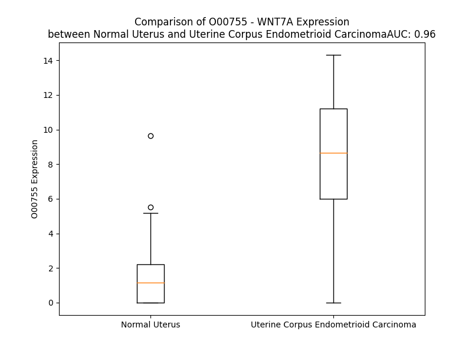

# Detailed Data for O00755

## Introduction to the Detailed Summary

### How to Interpret the Results

- **Summary & Metrics**: This section provides a quick reference to essential protein attributes, including expression changes, family classification, and biomarker applications. Regulation status (upregulated/downregulated) indicates the protein's behavior in a disease context. Some information comes from the original excel file with the proteins selected from literature, while others are derived from the analyses.
- **Expression Comparison**: A visual representation comparing protein expression between normal and disease states. It highlights significant changes in expression levels that might indicate diagnostic or therapeutic relevance. This is data coming from transcriptomics experiments and could not translate similarly to protein levels.
- **Isoform Alignment**: An interactive view of isoform alignments, revealing structural and functional differences between variants of the protein.
- **Interactors & Homologs**: Tables listing known interaction partners and homologous proteins, the more interactors and homologs, the more complex the protein is to design an antibody for.
- **Biological Assemblies**: Information about the structural arrangement of the protein in different assemblies, providing insights into its functional state but also the complexity of the protein to develop antibodies.
- **Combined Per-Residue Information**: A detailed table summarizing residue-level data. This includes predictions for epitope regions, aggregation tendencies, and modifications that might impact the protein's function. Each row corresponds to a residue in the protein, providing insights into specific sites that may be important for research or drug development.
## Summary & Metrics

- **UniProt Accession**: O00755
- **Gene Name**: WNT7A
- **Protein Name**: Wnt7
- **Swiss Prot**: WNT7A_HUMAN
- **Family**: cytokine
- **Biomarker Application**:  
- **Number of Isoforms**: 0
- **Regulation**: 1
- **(transcriptomics) AUC**: 0.94
- **(transcriptomics) Fold Change**: 4.72
- **(transcriptomics) Regulation**: Upregulated
- **Discotope Epitope Count**: 79
- **Max n_uniprots (Homo)**: N/A
- **Max n_uniprots (Hetero)**: 4

## Expression Comparison

## Interactors

| preferredName_A   | preferredName_B   |   score |
|:------------------|:------------------|--------:|
| WNT7A             | LRP5              |   0.996 |
| WNT7A             | FZD7              |   0.995 |
| WNT7A             | FZD5              |   0.994 |
| WNT7A             | FZD4              |   0.993 |
| WNT7A             | WIF1              |   0.987 |
| WNT7A             | FZD9              |   0.987 |
| WNT7A             | LRP6              |   0.987 |
| WNT7A             | FZD10             |   0.986 |
| WNT7A             | PORCN             |   0.982 |
| WNT7A             | RYK               |   0.966 |
| WNT7A             | NOTUM             |   0.965 |
| WNT7A             | FZD6              |   0.965 |
| WNT7A             | FZD3              |   0.945 |
| WNT7A             | FZD2              |   0.942 |
| WNT7A             | FZD1              |   0.932 |
| WNT7A             | SFRP1             |   0.93  |
| WNT7A             | GPC3              |   0.918 |
| WNT7A             | CER1              |   0.908 |

## Homologs

| uniprot_id   | gene_id   |
|:-------------|:----------|
| C9J3H3       | WNT10B    |
| Q93097       | WNT2B     |
| Q9UBV4       | WNT16     |
| O96014       | WNT11     |
| O14904       | WNT9A     |
| A0A9L9PXI5   | WNT3      |
| P41221       | WNT5A     |
| Q93098       | WNT8B     |
| Q9H1J7       | WNT5B     |
| Q9GZT5       | WNT10A    |
| D6RF47       | WNT8A     |
| P56705       | WNT4      |
| P04628       | WNT1      |
| P56704       | WNT3A     |
| E7EPC3       | WNT9B     |
| A8K0G1       | WNT7B     |
| A0A3B3ITC9   | WNT2      |
| Q9Y6F9       | WNT6      |

## Biological Assemblies

|   Unnamed: 0 |   assembly |   n_uniprots | composition   | crystal_id   |
|-------------:|-----------:|-------------:|:--------------|:-------------|
|            0 |          1 |            2 | Hetero        | 4uzq         |
|            0 |          1 |            3 | Hetero        | 8tzp         |
|            0 |          1 |            4 | Hetero        | 8tzo         |

## Combined Per-Residue Information

|   res | aa   |   epitope_score | epitope   |   relative_surface_accessibility |   modeling_confidence |   Aggregation | modification   | glycosylation                   |
|------:|:-----|----------------:|:----------|---------------------------------:|----------------------:|--------------:|:---------------|:--------------------------------|
|     1 | M    |         0.155   | False     |                          1.28493 |                 45.34 |         0     | N/A            | N/A                             |
|     2 | N    |         0.20153 | False     |                          0.73388 |                 53.28 |         0     | N/A            | N/A                             |
|     3 | R    |         0.22138 | True      |                          0.8932  |                 59.65 |         0     | N/A            | N/A                             |
|     4 | K    |         0.17929 | False     |                          0.82778 |                 58.1  |         0     | N/A            | N/A                             |
|     5 | A    |         0.06077 | False     |                          0.52654 |                 57.83 |         0     | N/A            | N/A                             |
|     6 | R    |         0.10977 | False     |                          0.81356 |                 60.39 |         0     | N/A            | N/A                             |
|     7 | R    |         0.12286 | False     |                          0.77533 |                 54.76 |         0     | N/A            | N/A                             |
|     8 | C    |         0.09532 | False     |                          0.64798 |                 54.13 |         0.149 | N/A            | N/A                             |
|     9 | L    |         0.09894 | False     |                          0.63464 |                 57.19 |         0.32  | N/A            | N/A                             |
|    10 | G    |         0.07976 | False     |                          0.38538 |                 51.88 |         0.406 | N/A            | N/A                             |
|    11 | H    |         0.17104 | False     |                          0.68656 |                 53.6  |         1.423 | N/A            | N/A                             |
|    12 | L    |         0.1237  | False     |                          0.68563 |                 54    |        55.705 | N/A            | N/A                             |
|    13 | F    |         0.12912 | False     |                          0.7089  |                 53.95 |        64.827 | N/A            | N/A                             |
|    14 | L    |         0.08922 | False     |                          0.74042 |                 53.29 |        65.643 | N/A            | N/A                             |
|    15 | S    |         0.06363 | False     |                          0.45882 |                 52.74 |        65.755 | N/A            | N/A                             |
|    16 | L    |         0.06045 | False     |                          0.55044 |                 49.36 |        66.828 | N/A            | N/A                             |
|    17 | G    |         0.06544 | False     |                          0.41173 |                 44.83 |        62.525 | N/A            | N/A                             |
|    18 | M    |         0.11715 | False     |                          0.70683 |                 43.9  |        62.049 | N/A            | N/A                             |
|    19 | V    |         0.06821 | False     |                          0.6417  |                 45.81 |        61.495 | N/A            | N/A                             |
|    20 | Y    |         0.08002 | False     |                          0.764   |                 43.58 |        54.841 | N/A            | N/A                             |
|    21 | L    |         0.11362 | False     |                          0.89063 |                 41.48 |        46.432 | N/A            | N/A                             |
|    22 | R    |         0.14385 | False     |                          0.89745 |                 40.16 |         0     | N/A            | N/A                             |
|    23 | I    |         0.12452 | False     |                          0.78734 |                 45.87 |         0.164 | N/A            | N/A                             |
|    24 | G    |         0.11684 | False     |                          0.74564 |                 42.4  |         0.164 | N/A            | N/A                             |
|    25 | G    |         0.1615  | False     |                          0.77654 |                 41.97 |         0.937 | N/A            | N/A                             |
|    26 | F    |         0.15303 | False     |                          0.59056 |                 46.8  |        11.518 | N/A            | N/A                             |
|    27 | S    |         0.12689 | False     |                          0.50152 |                 56.51 |        12.153 | N/A            | N/A                             |
|    28 | S    |         0.10341 | False     |                          0.63959 |                 58.83 |        18.14  | N/A            | N/A                             |
|    29 | V    |         0.17416 | False     |                          0.81746 |                 57.29 |        46.471 | N/A            | N/A                             |
|    30 | V    |         0.10966 | False     |                          0.55067 |                 61.2  |        48.707 | N/A            | N/A                             |
|    31 | A    |         0.0988  | False     |                          0.46643 |                 61.62 |        47.963 | N/A            | N/A                             |
|    32 | L    |         0.16388 | False     |                          0.74218 |                 68.61 |        47.449 | N/A            | N/A                             |
|    33 | G    |         0.15211 | False     |                          0.33158 |                 82.01 |        40.425 | N/A            | N/A                             |
|    34 | A    |         0.02964 | False     |                          0.04431 |                 84.09 |        38.035 | N/A            | N/A                             |
|    35 | S    |         0.1132  | False     |                          0.30248 |                 85.37 |        35.884 | N/A            | N/A                             |
|    36 | I    |         0.17274 | False     |                          0.53754 |                 88.13 |        35.692 | N/A            | N/A                             |
|    37 | I    |         0.34267 | True      |                          0.58091 |                 88.1  |        32.985 | N/A            | N/A                             |
|    38 | C    |         0.01125 | False     |                          0       |                 92.07 |         2.282 | N/A            | N/A                             |
|    39 | N    |         0.26339 | True      |                          0.5355  |                 90.62 |         0     | N/A            | N/A                             |
|    40 | K    |         0.25132 | True      |                          0.79235 |                 88.57 |         0     | N/A            | N/A                             |
|    41 | I    |         0.17831 | False     |                          0.19253 |                 88.8  |         0     | N/A            | N/A                             |
|    42 | P    |         0.15135 | False     |                          0.53205 |                 85.6  |         0     | N/A            | N/A                             |
|    43 | G    |         0.25207 | True      |                          0.79476 |                 85.97 |         0     | N/A            | N/A                             |
|    44 | L    |         0.05255 | False     |                          0.05933 |                 90.76 |         0     | N/A            | N/A                             |
|    45 | A    |         0.0957  | False     |                          0.14922 |                 92.02 |         0     | N/A            | N/A                             |
|    46 | P    |         0.14461 | False     |                          0.75028 |                 92.83 |         0     | N/A            | N/A                             |
|    47 | R    |         0.25427 | True      |                          0.65092 |                 94.15 |         0     | N/A            | N/A                             |
|    48 | Q    |         0.00984 | False     |                          0.00707 |                 95.02 |         0     | N/A            | N/A                             |
|    49 | R    |         0.2282  | True      |                          0.24667 |                 94.49 |         0     | N/A            | N/A                             |
|    50 | A    |         0.10286 | False     |                          0.53999 |                 94.45 |         0     | N/A            | N/A                             |
|    51 | I    |         0.11133 | False     |                          0.16457 |                 94.44 |         0     | N/A            | N/A                             |
|    52 | C    |         0.00766 | False     |                          0.00701 |                 94.56 |         0     | N/A            | N/A                             |
|    53 | Q    |         0.18916 | False     |                          0.36168 |                 94.33 |         0     | N/A            | N/A                             |
|    54 | S    |         0.06662 | False     |                          0.44341 |                 92.52 |         0     | N/A            | N/A                             |
|    55 | R    |         0.08134 | False     |                          0.12423 |                 93.21 |         0     | N/A            | N/A                             |
|    56 | P    |         0.06598 | False     |                          0.21252 |                 92.27 |         0     | N/A            | N/A                             |
|    57 | D    |         0.07979 | False     |                          0.27614 |                 92.59 |         0     | N/A            | N/A                             |
|    58 | A    |         0.00784 | False     |                          0.0051  |                 95    |        50.782 | N/A            | N/A                             |
|    59 | I    |         0.07571 | False     |                          0.0661  |                 93.5  |        55.739 | N/A            | N/A                             |
|    60 | I    |         0.12685 | False     |                          0.67204 |                 91.52 |        55.739 | N/A            | N/A                             |
|    61 | V    |         0.05202 | False     |                          0.08378 |                 96.26 |        55.739 | N/A            | N/A                             |
|    62 | I    |         0.01017 | False     |                          0.0072  |                 95.9  |        55.739 | N/A            | N/A                             |
|    63 | G    |         0.13068 | False     |                          0.22397 |                 93.02 |         9.149 | N/A            | N/A                             |
|    64 | E    |         0.12087 | False     |                          0.53175 |                 93.75 |         0     | N/A            | N/A                             |
|    65 | G    |         0.00453 | False     |                          0       |                 97.27 |         0     | N/A            | N/A                             |
|    66 | S    |         0.00254 | False     |                          0       |                 94.55 |         0     | N/A            | N/A                             |
|    67 | Q    |         0.09537 | False     |                          0.4512  |                 92.68 |         0     | N/A            | N/A                             |
|    68 | M    |         0.08078 | False     |                          0.34646 |                 96.01 |         0     | N/A            | N/A                             |
|    69 | G    |         0.00355 | False     |                          0       |                 96.37 |         0     | N/A            | N/A                             |
|    70 | L    |         0.03275 | False     |                          0.04781 |                 93.28 |         0     | N/A            | N/A                             |
|    71 | D    |         0.15535 | False     |                          0.54517 |                 94.57 |         0     | N/A            | N/A                             |
|    72 | E    |         0.03979 | False     |                          0.05166 |                 97.76 |         0     | N/A            | N/A                             |
|    73 | C    |         0.00571 | False     |                          0.001   |                 95.87 |         0     | N/A            | N/A                             |
|    74 | Q    |         0.11216 | False     |                          0.36572 |                 94.39 |         0     | N/A            | N/A                             |
|    75 | F    |         0.14071 | False     |                          0.25051 |                 96.12 |         0     | N/A            | N/A                             |
|    76 | Q    |         0.06579 | False     |                          0.1089  |                 96.17 |         0     | N/A            | N/A                             |
|    77 | F    |         0.0222  | False     |                          0.04067 |                 93.8  |         0     | N/A            | N/A                             |
|    78 | R    |         0.29963 | True      |                          0.50873 |                 90.84 |         0     | N/A            | N/A                             |
|    79 | N    |         0.2259  | True      |                          0.56554 |                 87.98 |         0     | N/A            | N/A                             |
|    80 | G    |         0.16138 | False     |                          0.25434 |                 89.97 |         0     | N/A            | N/A                             |
|    81 | R    |         0.10413 | False     |                          0.24465 |                 92.15 |         0     | N/A            | N/A                             |
|    82 | W    |         0.03521 | False     |                          0.03777 |                 91.75 |         0     | N/A            | N/A                             |
|    83 | N    |         0.06682 | False     |                          0.20962 |                 91.28 |         0     | N/A            | N-linked (GlcNAc...) asparagine |
|    84 | C    |         0.00333 | False     |                          0.001   |                 90.79 |         0     | N/A            | N/A                             |
|    85 | S    |         0.14916 | False     |                          0.32979 |                 85.24 |         0     | N/A            | N/A                             |
|    86 | A    |         0.16015 | False     |                          0.22987 |                 73.2  |         0     | N/A            | N/A                             |
|    87 | L    |         0.06064 | False     |                          0.00968 |                 69.18 |         0     | N/A            | N/A                             |
|    88 | G    |         0.19083 | False     |                          0.72455 |                 59.14 |         0     | N/A            | N/A                             |
|    89 | E    |         0.24723 | True      |                          0.49939 |                 61.71 |         0     | N/A            | N/A                             |
|    90 | R    |         0.19694 | False     |                          0.92796 |                 59.11 |         0     | N/A            | N/A                             |
|    91 | T    |         0.15441 | False     |                          0.27232 |                 74.96 |         0     | N/A            | N/A                             |
|    92 | V    |         0.11095 | False     |                          0.14343 |                 71.52 |         0     | N/A            | N/A                             |
|    93 | F    |         0.05083 | False     |                          0.08117 |                 73.54 |         0     | N/A            | N/A                             |
|    94 | G    |         0.08005 | False     |                          0.10469 |                 71.04 |         0     | N/A            | N/A                             |
|    95 | K    |         0.13303 | False     |                          0.32695 |                 74.3  |         0     | N/A            | N/A                             |
|    96 | E    |         0.16221 | False     |                          0.48605 |                 80.34 |         0     | N/A            | N/A                             |
|    97 | L    |         0.07913 | False     |                          0.056   |                 85.89 |         0     | N/A            | N/A                             |
|    98 | K    |         0.39176 | True      |                          0.6734  |                 86.11 |         0     | N/A            | N/A                             |
|    99 | V    |         0.12782 | False     |                          0.21535 |                 91.15 |         0     | N/A            | N/A                             |
|   100 | G    |         0.00516 | False     |                          0       |                 94.19 |         0     | N/A            | N/A                             |
|   101 | S    |         0.01198 | False     |                          0.01265 |                 95.94 |         0     | N/A            | N/A                             |
|   102 | R    |         0.08308 | False     |                          0.32886 |                 96.61 |         0     | N/A            | N/A                             |
|   103 | E    |         0.02002 | False     |                          0.02869 |                 94.93 |         0     | N/A            | N/A                             |
|   104 | A    |         0.00161 | False     |                          0       |                 95.15 |        52.87  | N/A            | N/A                             |
|   105 | A    |         0.00108 | False     |                          0       |                 97.87 |        61.315 | N/A            | N/A                             |
|   106 | F    |         0.00172 | False     |                          0       |                 97.78 |        89.503 | N/A            | N/A                             |
|   107 | T    |         0.01854 | False     |                          0.04951 |                 95.76 |        91.797 | N/A            | N/A                             |
|   108 | Y    |         0.02817 | False     |                          0.05288 |                 97.34 |        94.807 | N/A            | N/A                             |
|   109 | A    |         0.00058 | False     |                          0       |                 98.63 |        95.283 | N/A            | N/A                             |
|   110 | I    |         0.00275 | False     |                          0.0008  |                 98.2  |        95.668 | N/A            | N/A                             |
|   111 | I    |         0.01157 | False     |                          0.0544  |                 96.59 |        93.867 | N/A            | N/A                             |
|   112 | A    |         0.00276 | False     |                          0       |                 98.55 |        73.278 | N/A            | N/A                             |
|   113 | A    |         0.0008  | False     |                          0       |                 98.79 |        55.152 | N/A            | N/A                             |
|   114 | G    |         0.00276 | False     |                          0       |                 98.65 |        39.65  | N/A            | N/A                             |
|   115 | V    |         0.00203 | False     |                          0       |                 98.48 |        38.236 | N/A            | N/A                             |
|   116 | A    |         0.00095 | False     |                          0       |                 98.83 |        21.572 | N/A            | N/A                             |
|   117 | H    |         0.03158 | False     |                          0.10224 |                 98.82 |         7.482 | N/A            | N/A                             |
|   118 | A    |         0.01992 | False     |                          0.06993 |                 98.64 |         7.247 | N/A            | N/A                             |
|   119 | I    |         0.00317 | False     |                          0       |                 98.64 |         7.014 | N/A            | N/A                             |
|   120 | T    |         0.00229 | False     |                          0       |                 98.59 |         4.45  | N/A            | N/A                             |
|   121 | A    |         0.08249 | False     |                          0.19641 |                 98.34 |         2.924 | N/A            | N/A                             |
|   122 | A    |         0.02762 | False     |                          0.082   |                 98.38 |         1.73  | N/A            | N/A                             |
|   123 | C    |         0.01398 | False     |                          0.01655 |                 98.09 |         1.25  | N/A            | N/A                             |
|   124 | T    |         0.08766 | False     |                          0.30243 |                 96.59 |         0.147 | N/A            | N/A                             |
|   125 | Q    |         0.11367 | False     |                          0.62628 |                 95.96 |         0     | N/A            | N/A                             |
|   126 | G    |         0.16479 | False     |                          0.73652 |                 95.62 |         0     | N/A            | N/A                             |
|   127 | N    |         0.16836 | False     |                          0.68342 |                 96.18 |         0     | N/A            | N-linked (GlcNAc...) asparagine |
|   128 | L    |         0.05242 | False     |                          0.04392 |                 96.28 |         0     | N/A            | N/A                             |
|   129 | S    |         0.16077 | False     |                          0.43028 |                 93.96 |         0     | N/A            | N/A                             |
|   130 | D    |         0.24727 | True      |                          0.65088 |                 93.16 |         0     | N/A            | N/A                             |
|   131 | C    |         0.07337 | False     |                          0.26431 |                 96.94 |         0     | N/A            | N/A                             |
|   132 | G    |         0.10603 | False     |                          0.36304 |                 95.92 |         0     | N/A            | N/A                             |
|   133 | C    |         0.08367 | False     |                          0.29996 |                 95.73 |         0     | N/A            | N/A                             |
|   134 | D    |         0.09485 | False     |                          0.24292 |                 95.5  |         0     | N/A            | N/A                             |
|   135 | K    |         0.1844  | False     |                          0.77635 |                 92.04 |         0     | N/A            | N/A                             |
|   136 | E    |         0.23965 | True      |                          0.58763 |                 91.75 |         0     | N/A            | N/A                             |
|   137 | K    |         0.258   | True      |                          0.43693 |                 89.35 |         0     | N/A            | N/A                             |
|   138 | Q    |         0.23492 | True      |                          0.46665 |                 85.67 |         0     | N/A            | N/A                             |
|   139 | G    |         0.15901 | False     |                          0.6968  |                 83.87 |         0     | N/A            | N/A                             |
|   140 | Q    |         0.26458 | True      |                          0.49141 |                 88.97 |         0     | N/A            | N/A                             |
|   141 | Y    |         0.28582 | True      |                          0.60607 |                 87.47 |         0     | N/A            | N/A                             |
|   142 | H    |         0.19775 | False     |                          0.3398  |                 83.98 |         0     | N/A            | N/A                             |
|   143 | R    |         0.42822 | True      |                          0.85125 |                 79.63 |         0     | N/A            | N/A                             |
|   144 | D    |         0.35255 | True      |                          0.85101 |                 83.52 |         0     | N/A            | N/A                             |
|   145 | E    |         0.32947 | True      |                          0.53096 |                 83.17 |         0     | N/A            | N/A                             |
|   146 | G    |         0.16502 | False     |                          0.40098 |                 84.57 |         0     | N/A            | N/A                             |
|   147 | W    |         0.10211 | False     |                          0.03019 |                 91    |         0     | N/A            | N/A                             |
|   148 | K    |         0.30681 | True      |                          0.51162 |                 92.7  |         0     | N/A            | N/A                             |
|   149 | W    |         0.1436  | False     |                          0.14032 |                 92.6  |         0     | N/A            | N/A                             |
|   150 | G    |         0.06904 | False     |                          0.08726 |                 91.32 |         0     | N/A            | N/A                             |
|   151 | G    |         0.12298 | False     |                          0.59967 |                 89.65 |         0     | N/A            | N/A                             |
|   152 | C    |         0.10497 | False     |                          0.28741 |                 93.83 |         0     | N/A            | N/A                             |
|   153 | S    |         0.08663 | False     |                          0.06353 |                 96.64 |         0     | N/A            | N/A                             |
|   154 | A    |         0.0191  | False     |                          0.06072 |                 97.48 |         0     | N/A            | N/A                             |
|   155 | D    |         0.0646  | False     |                          0.2152  |                 97.82 |         0     | N/A            | N/A                             |
|   156 | I    |         0.03518 | False     |                          0.10686 |                 98.08 |         0     | N/A            | N/A                             |
|   157 | R    |         0.1609  | False     |                          0.64111 |                 98.11 |         0     | N/A            | N/A                             |
|   158 | Y    |         0.10998 | False     |                          0.28422 |                 98.29 |         0.363 | N/A            | N/A                             |
|   159 | G    |         0.00195 | False     |                          0       |                 98.36 |         0.474 | N/A            | N/A                             |
|   160 | I    |         0.0649  | False     |                          0.14879 |                 98.69 |         4.267 | N/A            | N/A                             |
|   161 | G    |         0.14074 | False     |                          0.38046 |                 98.51 |         4.569 | N/A            | N/A                             |
|   162 | F    |         0.07745 | False     |                          0.12853 |                 98.31 |         8.459 | N/A            | N/A                             |
|   163 | A    |         0.00321 | False     |                          0       |                 98.37 |         8.733 | N/A            | N/A                             |
|   164 | K    |         0.16268 | False     |                          0.43868 |                 98.46 |         9.058 | N/A            | N/A                             |
|   165 | V    |         0.17198 | False     |                          0.63392 |                 97.27 |         9.058 | N/A            | N/A                             |
|   166 | F    |         0.00594 | False     |                          0.00127 |                 97.02 |         9.058 | N/A            | N/A                             |
|   167 | V    |         0.03108 | False     |                          0.04235 |                 96.82 |         9.058 | N/A            | N/A                             |
|   168 | D    |         0.12742 | False     |                          0.13696 |                 96.79 |         9.058 | N/A            | N/A                             |
|   169 | A    |         0.03846 | False     |                          0.1107  |                 95.88 |         7.992 | N/A            | N/A                             |
|   170 | R    |         0.22008 | True      |                          0.26648 |                 91.83 |         0     | N/A            | N/A                             |
|   171 | E    |         0.18548 | False     |                          0.12311 |                 93.67 |         0     | N/A            | N/A                             |
|   172 | I    |         0.38924 | True      |                          0.62137 |                 90.3  |         0     | N/A            | N/A                             |
|   173 | K    |         0.30592 | True      |                          0.74243 |                 89.39 |         0     | N/A            | N/A                             |
|   174 | Q    |         0.34588 | True      |                          0.64565 |                 86.92 |         0     | N/A            | N/A                             |
|   175 | N    |         0.33458 | True      |                          0.36082 |                 92.99 |         0     | N/A            | N/A                             |
|   176 | A    |         0.10108 | False     |                          0.17351 |                 94.37 |         0     | N/A            | N/A                             |
|   177 | R    |         0.21315 | False     |                          0.12484 |                 94.72 |         0     | N/A            | N/A                             |
|   178 | T    |         0.0524  | False     |                          0.08787 |                 95.33 |         0     | N/A            | N/A                             |
|   179 | L    |         0.10977 | False     |                          0.27175 |                 96.61 |         0     | N/A            | N/A                             |
|   180 | M    |         0.00427 | False     |                          0       |                 97.52 |         0     | N/A            | N/A                             |
|   181 | N    |         0.00753 | False     |                          0.00814 |                 97.16 |         0     | N/A            | N/A                             |
|   182 | L    |         0.1075  | False     |                          0.34458 |                 97.58 |         0     | N/A            | N/A                             |
|   183 | H    |         0.0835  | False     |                          0.19956 |                 98.44 |         0     | N/A            | N/A                             |
|   184 | N    |         0.00517 | False     |                          0       |                 98.65 |         0     | N/A            | N/A                             |
|   185 | N    |         0.00965 | False     |                          0.009   |                 98.55 |         0     | N/A            | N/A                             |
|   186 | E    |         0.06913 | False     |                          0.30459 |                 98.72 |         0     | N/A            | N/A                             |
|   187 | A    |         0.00128 | False     |                          0       |                 98.82 |         0     | N/A            | N/A                             |
|   188 | G    |         0.00359 | False     |                          0       |                 98.84 |         0     | N/A            | N/A                             |
|   189 | R    |         0.00598 | False     |                          0.00164 |                 98.8  |         0     | N/A            | N/A                             |
|   190 | K    |         0.06575 | False     |                          0.31252 |                 98.76 |         0     | N/A            | N/A                             |
|   191 | I    |         0.01644 | False     |                          0.0144  |                 98.74 |         0     | N/A            | N/A                             |
|   192 | L    |         0.00222 | False     |                          0       |                 98.77 |         0     | N/A            | N/A                             |
|   193 | E    |         0.06271 | False     |                          0.29632 |                 98.54 |         0     | N/A            | N/A                             |
|   194 | E    |         0.22597 | True      |                          0.54235 |                 98.23 |         0     | N/A            | N/A                             |
|   195 | N    |         0.11746 | False     |                          0.29398 |                 98.29 |         0     | N/A            | N/A                             |
|   196 | M    |         0.09314 | False     |                          0.1888  |                 97.92 |         0     | N/A            | N/A                             |
|   197 | K    |         0.14693 | False     |                          0.40219 |                 96.74 |         0     | N/A            | N/A                             |
|   198 | L    |         0.37008 | True      |                          0.50909 |                 94.52 |         0     | N/A            | N/A                             |
|   199 | E    |         0.2323  | True      |                          0.40968 |                 94.93 |         0     | N/A            | N/A                             |
|   200 | C    |         0.11211 | False     |                          0.37751 |                 93.82 |         0     | N/A            | N/A                             |
|   201 | K    |         0.3826  | True      |                          0.61553 |                 92.71 |         0     | N/A            | N/A                             |
|   202 | C    |         0.15695 | False     |                          0.44391 |                 92.59 |         0     | N/A            | N/A                             |
|   203 | H    |         0.33572 | True      |                          0.43622 |                 88.98 |         0     | N/A            | N/A                             |
|   204 | G    |         0.22869 | True      |                          0.51988 |                 86.95 |         0     | N/A            | N/A                             |
|   205 | V    |         0.42171 | True      |                          0.92359 |                 90.2  |         0     | N/A            | N/A                             |
|   206 | S    |         0.30308 | True      |                          0.92293 |                 82.52 |         0     | N/A            | N/A                             |
|   207 | G    |         0.2968  | True      |                          0.85427 |                 81.33 |         0     | N/A            | N/A                             |
|   208 | S    |         0.2452  | True      |                          0.3791  |                 86.85 |         0     | N/A            | N/A                             |
|   209 | C    |         0.30185 | True      |                          0.47986 |                 88.43 |         0     | N/A            | N/A                             |
|   210 | T    |         0.37133 | True      |                          0.80502 |                 87.37 |         0     | N/A            | N/A                             |
|   211 | T    |         0.20477 | False     |                          0.56911 |                 89.48 |         0     | N/A            | N/A                             |
|   212 | K    |         0.33299 | True      |                          0.30563 |                 92.38 |         0     | N/A            | N/A                             |
|   213 | T    |         0.25307 | True      |                          0.11494 |                 93.37 |         0     | N/A            | N/A                             |
|   214 | C    |         0.01578 | False     |                          0       |                 95.29 |         0     | N/A            | N/A                             |
|   215 | W    |         0.16193 | False     |                          0.26158 |                 95.89 |         0     | N/A            | N/A                             |
|   216 | T    |         0.17478 | False     |                          0.20454 |                 96.69 |         0     | N/A            | N/A                             |
|   217 | T    |         0.14294 | False     |                          0.17137 |                 97.26 |         0     | N/A            | N/A                             |
|   218 | L    |         0.08405 | False     |                          0.17938 |                 98.25 |         0     | N/A            | N/A                             |
|   219 | P    |         0.03199 | False     |                          0.03092 |                 98.1  |         0     | N/A            | N/A                             |
|   220 | Q    |         0.22106 | True      |                          0.62332 |                 98.08 |         0     | N/A            | N/A                             |
|   221 | F    |         0.08146 | False     |                          0.10687 |                 98.53 |         0.121 | N/A            | N/A                             |
|   222 | R    |         0.21104 | False     |                          0.39274 |                 98.42 |         0.121 | N/A            | N/A                             |
|   223 | E    |         0.10121 | False     |                          0.31501 |                 98.4  |         0.121 | N/A            | N/A                             |
|   224 | L    |         0.00827 | False     |                          0.00531 |                 98.56 |        33.475 | N/A            | N/A                             |
|   225 | G    |         0.00503 | False     |                          0       |                 98.61 |        33.475 | N/A            | N/A                             |
|   226 | Y    |         0.20779 | False     |                          0.49292 |                 98.53 |        33.475 | N/A            | N/A                             |
|   227 | V    |         0.09311 | False     |                          0.35506 |                 98.66 |        33.475 | N/A            | N/A                             |
|   228 | L    |         0.00394 | False     |                          0       |                 98.68 |        33.475 | N/A            | N/A                             |
|   229 | K    |         0.13113 | False     |                          0.19436 |                 97.94 |         0     | N/A            | N/A                             |
|   230 | D    |         0.17171 | False     |                          0.54253 |                 98.01 |         0     | N/A            | N/A                             |
|   231 | K    |         0.17578 | False     |                          0.27476 |                 98.47 |         0     | N/A            | N/A                             |
|   232 | Y    |         0.09279 | False     |                          0.11524 |                 98.04 |         0     | N/A            | N/A                             |
|   233 | N    |         0.15727 | False     |                          0.57576 |                 96.17 |         0     | N/A            | N/A                             |
|   234 | E    |         0.14608 | False     |                          0.69583 |                 97.23 |         0     | N/A            | N/A                             |
|   235 | A    |         0.10057 | False     |                          0.15062 |                 98.12 |         0     | N/A            | N/A                             |
|   236 | V    |         0.06172 | False     |                          0.20755 |                 97.8  |         0     | N/A            | N/A                             |
|   237 | H    |         0.0986  | False     |                          0.19326 |                 97.95 |         0     | N/A            | N/A                             |
|   238 | V    |         0.01444 | False     |                          0.00774 |                 97.7  |         0     | N/A            | N/A                             |
|   239 | E    |         0.16524 | False     |                          0.27614 |                 95.69 |         0     | N/A            | N/A                             |
|   240 | P    |         0.12288 | False     |                          0.24546 |                 94.25 |         0     | N/A            | N/A                             |
|   241 | V    |         0.16903 | False     |                          0.20184 |                 91.7  |         0     | N/A            | N/A                             |
|   242 | R    |         0.33545 | True      |                          0.61702 |                 89.1  |         0     | N/A            | N/A                             |
|   243 | A    |         0.19    | False     |                          0.42485 |                 82.17 |         0     | N/A            | N/A                             |
|   244 | S    |         0.43981 | True      |                          0.90749 |                 78.59 |         0     | N/A            | N/A                             |
|   245 | R    |         0.41822 | True      |                          0.94177 |                 78.53 |         0     | N/A            | N/A                             |
|   246 | N    |         0.3587  | True      |                          0.62866 |                 77.08 |         0     | N/A            | N/A                             |
|   247 | K    |         0.24158 | True      |                          0.8207  |                 76.83 |         0     | N/A            | N/A                             |
|   248 | R    |         0.38911 | True      |                          0.53126 |                 82.04 |         0     | N/A            | N/A                             |
|   249 | P    |         0.23045 | True      |                          0.18032 |                 85.57 |         0     | N/A            | N/A                             |
|   250 | T    |         0.33629 | True      |                          0.6043  |                 87.03 |         0     | N/A            | N/A                             |
|   251 | F    |         0.24034 | True      |                          0.30589 |                 92.34 |         0     | N/A            | N/A                             |
|   252 | L    |         0.07015 | False     |                          0.07761 |                 95.22 |         0     | N/A            | N/A                             |
|   253 | K    |         0.2856  | True      |                          0.15645 |                 95.16 |         0     | N/A            | N/A                             |
|   254 | I    |         0.09771 | False     |                          0.17039 |                 96.4  |         0     | N/A            | N/A                             |
|   255 | K    |         0.3188  | True      |                          0.5178  |                 93.72 |         0     | N/A            | N/A                             |
|   256 | K    |         0.3533  | True      |                          0.63137 |                 91.31 |         0     | N/A            | N/A                             |
|   257 | P    |         0.44181 | True      |                          0.91728 |                 86.06 |         0     | N/A            | N/A                             |
|   258 | L    |         0.25656 | True      |                          1.16144 |                 81.41 |         0     | N/A            | N/A                             |
|   259 | S    |         0.21977 | True      |                          0.14836 |                 86.87 |         0     | N/A            | N/A                             |
|   260 | Y    |         0.46373 | True      |                          0.72947 |                 89.77 |         0     | N/A            | N/A                             |
|   261 | R    |         0.32231 | True      |                          0.74621 |                 95.22 |         0     | N/A            | N/A                             |
|   262 | K    |         0.3164  | True      |                          0.64464 |                 95.58 |         0     | N/A            | N/A                             |
|   263 | P    |         0.07217 | False     |                          0.12932 |                 96.57 |         0     | N/A            | N/A                             |
|   264 | M    |         0.21478 | False     |                          0.7267  |                 97.12 |         0     | N/A            | N/A                             |
|   265 | D    |         0.13295 | False     |                          0.50444 |                 97.25 |         0     | N/A            | N/A                             |
|   266 | T    |         0.09072 | False     |                          0.09706 |                 98.13 |         0     | N/A            | N/A                             |
|   267 | D    |         0.10102 | False     |                          0.15518 |                 98.51 |         0     | N/A            | N/A                             |
|   268 | L    |         0.00556 | False     |                          0.00354 |                 98.75 |         0.129 | N/A            | N/A                             |
|   269 | V    |         0.00228 | False     |                          0       |                 98.59 |         0.129 | N/A            | N/A                             |
|   270 | Y    |         0.08788 | False     |                          0.13493 |                 98.24 |         0.129 | N/A            | N/A                             |
|   271 | I    |         0.16125 | False     |                          0.20539 |                 97.48 |         0.129 | N/A            | N/A                             |
|   272 | E    |         0.13856 | False     |                          0.40976 |                 96.13 |         0.129 | N/A            | N/A                             |
|   273 | K    |         0.2558  | True      |                          0.79906 |                 95.88 |         0.129 | N/A            | N/A                             |
|   274 | S    |         0.11428 | False     |                          0.2359  |                 94.92 |         0     | N/A            | N/A                             |
|   275 | P    |         0.30049 | True      |                          0.29982 |                 93.41 |         0     | N/A            | N/A                             |
|   276 | N    |         0.12279 | False     |                          0.60542 |                 92.41 |         0     | N/A            | N/A                             |
|   277 | Y    |         0.0626  | False     |                          0.056   |                 93.33 |         0     | N/A            | N/A                             |
|   278 | C    |         0.08706 | False     |                          0.09591 |                 94.11 |         0     | N/A            | N/A                             |
|   279 | E    |         0.2443  | True      |                          0.4716  |                 93.97 |         0     | N/A            | N/A                             |
|   280 | E    |         0.24496 | True      |                          0.6689  |                 90.89 |         0     | N/A            | N/A                             |
|   281 | D    |         0.16698 | False     |                          0.27794 |                 88.96 |         0     | N/A            | N/A                             |
|   282 | P    |         0.33553 | True      |                          0.65131 |                 81.97 |         0     | N/A            | N/A                             |
|   283 | V    |         0.22489 | True      |                          0.53337 |                 81.83 |         0     | N/A            | N/A                             |
|   284 | T    |         0.15823 | False     |                          0.13599 |                 83.84 |         0     | N/A            | N/A                             |
|   285 | G    |         0.08794 | False     |                          0.0568  |                 81.11 |         0     | N/A            | N/A                             |
|   286 | S    |         0.05596 | False     |                          0.03739 |                 88.59 |         0     | N/A            | N/A                             |
|   287 | V    |         0.26069 | True      |                          0.50356 |                 89.88 |         0     | N/A            | N/A                             |
|   288 | G    |         0.0506  | False     |                          0.04813 |                 92.88 |         0     | N/A            | N/A                             |
|   289 | T    |         0.01159 | False     |                          0       |                 94.15 |         0     | N/A            | N/A                             |
|   290 | Q    |         0.12723 | False     |                          0.55863 |                 94.39 |         0     | N/A            | N/A                             |
|   291 | G    |         0.07767 | False     |                          0.65332 |                 93.12 |         0     | N/A            | N/A                             |
|   292 | R    |         0.26518 | True      |                          0.16412 |                 93.31 |         0     | N/A            | N/A                             |
|   293 | A    |         0.10903 | False     |                          0.54675 |                 92.33 |         0     | N/A            | N/A                             |
|   294 | C    |         0.03367 | False     |                          0.12517 |                 92.25 |         0     | N/A            | N/A                             |
|   295 | N    |         0.12681 | False     |                          0.47921 |                 90.78 |         0     | N/A            | N-linked (GlcNAc...) asparagine |
|   296 | K    |         0.16965 | False     |                          0.55687 |                 87.79 |         0     | N/A            | N/A                             |
|   297 | T    |         0.22767 | True      |                          0.88545 |                 86.06 |         0     | N/A            | N/A                             |
|   298 | A    |         0.31778 | True      |                          0.2199  |                 82.01 |         0     | N/A            | N/A                             |
|   299 | P    |         0.37184 | True      |                          0.80194 |                 76.15 |         0     | N/A            | N/A                             |
|   300 | Q    |         0.309   | True      |                          0.82409 |                 65.01 |         0     | N/A            | N/A                             |
|   301 | A    |         0.30231 | True      |                          0.75609 |                 69.01 |         0     | N/A            | N/A                             |
|   302 | S    |         0.33853 | True      |                          0.32338 |                 72.17 |         0     | N/A            | N/A                             |
|   303 | G    |         0.05502 | False     |                          0.06599 |                 88.21 |         0     | N/A            | N/A                             |
|   304 | C    |         0.02682 | False     |                          0.02292 |                 91.56 |         0     | N/A            | N/A                             |
|   305 | D    |         0.18954 | False     |                          0.66494 |                 89.58 |         0     | N/A            | N/A                             |
|   306 | L    |         0.13689 | False     |                          0.45283 |                 88.77 |         0     | N/A            | N/A                             |
|   307 | M    |         0.02375 | False     |                          0.02379 |                 91.93 |         0     | N/A            | N/A                             |
|   308 | C    |         0.00454 | False     |                          0       |                 94.25 |         0     | N/A            | N/A                             |
|   309 | C    |         0.09656 | False     |                          0.29352 |                 93.5  |         0     | N/A            | N/A                             |
|   310 | G    |         0.17778 | False     |                          0.81165 |                 91.64 |         0     | N/A            | N/A                             |
|   311 | R    |         0.23713 | True      |                          0.30733 |                 93.62 |         0     | N/A            | N/A                             |
|   312 | G    |         0.14117 | False     |                          0.30604 |                 92.98 |         0     | N/A            | N/A                             |
|   313 | Y    |         0.18171 | False     |                          0.2879  |                 94.78 |         0     | N/A            | N/A                             |
|   314 | N    |         0.16847 | False     |                          0.39894 |                 94.98 |         0     | N/A            | N/A                             |
|   315 | T    |         0.11866 | False     |                          0.48341 |                 94.49 |         0     | N/A            | N/A                             |
|   316 | H    |         0.20594 | False     |                          0.49642 |                 92.94 |         0     | N/A            | N/A                             |
|   317 | Q    |         0.15917 | False     |                          0.7624  |                 92.08 |         0     | N/A            | N/A                             |
|   318 | Y    |         0.20264 | False     |                          0.44631 |                 90.38 |         0     | N/A            | N/A                             |
|   319 | A    |         0.11299 | False     |                          0.61346 |                 92.69 |         0     | N/A            | N/A                             |
|   320 | R    |         0.15424 | False     |                          0.57966 |                 93.3  |         0     | N/A            | N/A                             |
|   321 | V    |         0.16082 | False     |                          0.64223 |                 95.24 |         0     | N/A            | N/A                             |
|   322 | W    |         0.16669 | False     |                          0.461   |                 96.27 |         0     | N/A            | N/A                             |
|   323 | Q    |         0.26567 | True      |                          0.69634 |                 96.39 |         0     | N/A            | N/A                             |
|   324 | C    |         0.10833 | False     |                          0.12618 |                 96.47 |         0     | N/A            | N/A                             |
|   325 | N    |         0.15323 | False     |                          0.67306 |                 96.27 |         0     | N/A            | N/A                             |
|   326 | C    |         0.10545 | False     |                          0.49416 |                 96.32 |         0     | N/A            | N/A                             |
|   327 | K    |         0.18514 | False     |                          0.70371 |                 95.56 |         0     | N/A            | N/A                             |
|   328 | F    |         0.27195 | True      |                          0.6188  |                 95.85 |         2.409 | N/A            | N/A                             |
|   329 | H    |         0.1416  | False     |                          0.37977 |                 92.77 |         2.558 | N/A            | N/A                             |
|   330 | W    |         0.1911  | False     |                          1.04148 |                 88.38 |         3.225 | N/A            | N/A                             |
|   331 | C    |         0.10121 | False     |                          0.77063 |                 88.5  |         3.225 | N/A            | N/A                             |
|   332 | C    |         0.12263 | False     |                          0.79608 |                 87.67 |         3.225 | N/A            | N/A                             |
|   333 | Y    |         0.24636 | True      |                          0.56999 |                 94.12 |         3.097 | N/A            | N/A                             |
|   334 | V    |         0.20087 | False     |                          0.61919 |                 95.25 |         2.941 | N/A            | N/A                             |
|   335 | K    |         0.19698 | False     |                          0.62778 |                 96.34 |         0     | N/A            | N/A                             |
|   336 | C    |         0.07732 | False     |                          0.22902 |                 97.52 |         0     | N/A            | N/A                             |
|   337 | N    |         0.16377 | False     |                          0.53464 |                 97.61 |         0     | N/A            | N/A                             |
|   338 | T    |         0.26706 | True      |                          0.76255 |                 96.94 |         0     | N/A            | N/A                             |
|   339 | C    |         0.20762 | False     |                          0.27216 |                 96.96 |         0     | N/A            | N/A                             |
|   340 | S    |         0.21479 | False     |                          0.59976 |                 95.64 |         0     | N/A            | N/A                             |
|   341 | E    |         0.25422 | True      |                          0.5047  |                 95.46 |         0     | N/A            | N/A                             |
|   342 | R    |         0.18872 | False     |                          0.92305 |                 93.61 |         0     | N/A            | N/A                             |
|   343 | T    |         0.13667 | False     |                          0.24955 |                 91.02 |         0     | N/A            | N/A                             |
|   344 | E    |         0.08204 | False     |                          0.41124 |                 91    |         0     | N/A            | N/A                             |
|   345 | M    |         0.15063 | False     |                          0.47573 |                 91.43 |         0     | N/A            | N/A                             |
|   346 | Y    |         0.11889 | False     |                          0.15253 |                 93.98 |         0     | N/A            | N/A                             |
|   347 | T    |         0.12783 | False     |                          0.14069 |                 94.82 |         0     | N/A            | N/A                             |
|   348 | C    |         0.03274 | False     |                          0.02073 |                 94.86 |         0     | N/A            | N/A                             |
|   349 | K    |         0.03556 | False     |                          0.60719 |                 94.98 |         0     | N/A            | N/A                             |

