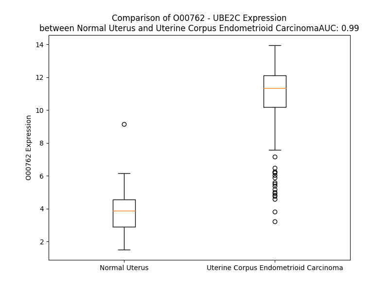

# Detailed Data for O00762

## Introduction to the Detailed Summary

### How to Interpret the Results

- **Summary & Metrics**: This section provides a quick reference to essential protein attributes, including expression changes, family classification, and biomarker applications. Regulation status (upregulated/downregulated) indicates the protein's behavior in a disease context. Some information comes from the original excel file with the proteins selected from literature, while others are derived from the analyses.
- **Expression Comparison**: A visual representation comparing protein expression between normal and disease states. It highlights significant changes in expression levels that might indicate diagnostic or therapeutic relevance. This is data coming from transcriptomics experiments and could not translate similarly to protein levels.
- **Isoform Alignment**: An interactive view of isoform alignments, revealing structural and functional differences between variants of the protein.
- **Interactors & Homologs**: Tables listing known interaction partners and homologous proteins, the more interactors and homologs, the more complex the protein is to design an antibody for.
- **Biological Assemblies**: Information about the structural arrangement of the protein in different assemblies, providing insights into its functional state but also the complexity of the protein to develop antibodies.
- **Combined Per-Residue Information**: A detailed table summarizing residue-level data. This includes predictions for epitope regions, aggregation tendencies, and modifications that might impact the protein's function. Each row corresponds to a residue in the protein, providing insights into specific sites that may be important for research or drug development.
## Summary & Metrics

- **UniProt Accession**: O00762
- **Gene Name**: UbcH10
- **Protein Name**: Ubiquitin-conjugating enzyme E2 C
- **Swiss Prot**: UBE2C_HUMAN
- **Family**: enzyme
- **Biomarker Application**:  
- **Number of Isoforms**: 4
- **Regulation**: 1
- **(transcriptomics) AUC**: 1.0
- **(transcriptomics) Fold Change**: 3.10
- **(transcriptomics) Regulation**: Upregulated
- **Discotope Epitope Count**: 41
- **Max n_uniprots (Homo)**: 1.0
- **Max n_uniprots (Hetero)**: 10.0

## Expression Comparison

## Isoform Alignment

<pre style='font-size:14px; font-family:monospace;'>O00762-1 MASQNRDPAATSVAAARKGAEPSGGAARGPVGKRLQQELMTLMMSGDKGISAFPESDNLFKWVGTIHGAAGTVYEDLRYKLSLEFPSGYPYNAPTVKFLTPCYHPNVDTQGNICLDILKEKWSALYDVRTIL---LSIQSLLGEPNIDSPLNTHAAELWKNPTAFKKYLQETYSKQVTSQEP
O00762-2 ---------------------------------------MTLMMSGDKGISAFPESDNLFKWVGTIHGAAGTVYEDLRYKLSLEFPSGYPYNAPTVKFLTPCYHPNVDTQGNICLDILKEKWSALYDVRTIL---LSIQSLLGEPNIDSPLNTHAAELWKNPTAFKKYLQETYSKQVTSQEP
O00762-3 MASQNRDPAATSVAAARKGAEPSGGAARGPVGKRLQQELMTLMV-----------------------------YEDLRYKLSLEFPSGYPYNAPTVKFLTPCYHPNVDTQGNICLDILKEKWSALYDVRTIL---LSIQSLLGEPNIDSPLNTHAAELWKNPTAFKKYLQETYSKQVTSQEP
O00762-4 MASQNRDPAATSVAAARKGAEPSGGAARGPVGKRLQQELMTLMMSGDKGISAFPESDNLFKWVGTIHGAAGTAVGSIRTSSTVCLLSGPRETQDSS---------------------KPLVWGLGWDMRLLLELTLQLFLQMPEPNIDSPLNTHAAELWKNPTAFKKYLQETYSKQVTSQEP
</pre>

## Interactors

| preferredName_A   | preferredName_B   |   score |
|:------------------|:------------------|--------:|
| UBE2C             | CDC20             |   0.999 |
| UBE2C             | ANAPC11           |   0.999 |
| UBE2C             | ANAPC2            |   0.998 |
| UBE2C             | CCNA2             |   0.994 |
| UBE2C             | ANAPC10           |   0.993 |
| UBE2C             | CDC27             |   0.993 |
| UBE2C             | ANAPC4            |   0.993 |
| UBE2C             | ANAPC15           |   0.992 |
| UBE2C             | CDC16             |   0.992 |
| UBE2C             | BIRC5             |   0.992 |
| UBE2C             | FZR1              |   0.991 |
| UBE2C             | BUB1B             |   0.991 |
| UBE2C             | CDC23             |   0.991 |
| UBE2C             | ANAPC5            |   0.99  |
| UBE2C             | CCNB1             |   0.99  |
| UBE2C             | ANAPC13           |   0.987 |
| UBE2C             | CDC26             |   0.987 |
| UBE2C             | ANAPC16           |   0.987 |
| UBE2C             | ANAPC1            |   0.986 |
| UBE2C             | AURKA             |   0.986 |
| UBE2C             | UBE2S             |   0.985 |
| UBE2C             | ANAPC7            |   0.983 |
| UBE2C             | CDK1              |   0.982 |
| UBE2C             | PTTG1             |   0.98  |
| UBE2C             | TOP2A             |   0.973 |
| UBE2C             | UBA1              |   0.971 |
| UBE2C             | CCNB2             |   0.968 |
| UBE2C             | DLGAP5            |   0.968 |
| UBE2C             | CDCA8             |   0.966 |
| UBE2C             | TPX2              |   0.965 |
| UBE2C             | NUSAP1            |   0.964 |
| UBE2C             | CDCA3             |   0.962 |
| UBE2C             | KIF20A            |   0.961 |
| UBE2C             | AURKB             |   0.955 |
| UBE2C             | UBE3D             |   0.954 |
| UBE2C             | BUB1              |   0.954 |
| UBE2C             | KIF2C             |   0.954 |
| UBE2C             | BRCA1             |   0.951 |
| UBE2C             | MELK              |   0.948 |
| UBE2C             | PBK               |   0.946 |
| UBE2C             | ASPM              |   0.943 |
| UBE2C             | UBC               |   0.942 |
| UBE2C             | CENPF             |   0.94  |
| UBE2C             | CENPA             |   0.938 |
| UBE2C             | CCNA1             |   0.938 |
| UBE2C             | PCLAF             |   0.938 |
| UBE2C             | CEP55             |   0.938 |
| UBE2C             | BARD1             |   0.936 |
| UBE2C             | RRM2              |   0.931 |
| UBE2C             | MAD2L1            |   0.929 |

## Homologs

| uniprot_id   | gene_id   |
|:-------------|:----------|
| A0M8W4       | UBE2V2    |
| I3L0Q0       | UBE2G1    |
| H3BPC4       | UBE2I     |
| A0A140VJY9   | UBE2U     |
| P49427       | CDC34     |
| H3BVH0       | AKTIP     |
| G3V2F7       | UBE2V1    |
| D6RB84       | UBE2J2    |
| I3L4C5       | UBE2Z     |
| Q9Y385       | UBE2J1    |
| A4D1L5       | UBE2H     |
| P61086       | UBE2K     |
| P60604       | UBE2G2    |
| G5E9R6       | UBE2F     |
| A0A0D9SG71   | UBE2A     |
| A0A8V8TNE2   | UBE2T     |
| F8VV71       | UBE2N     |
| nan          | nan       |
| P63146       | UBE2B     |
| Q16763       | UBE2S     |
| Q712K3       | UBE2R2    |
| Q5TGE2       | PEDS1     |
| Q9C0C9       | UBE2O     |
| X6REH9       | UBE2W     |

## Biological Assemblies

|   Unnamed: 0 |   assembly |   n_uniprots | composition   | crystal_id   |
|-------------:|-----------:|-------------:|:--------------|:-------------|
|            0 |          1 |            9 | Hetero        | 5a31         |
|            0 |          1 |            2 | Hetero        | 4yii         |
|            0 |          1 |           10 | Hetero        | 5l9u         |
|            0 |          1 |           10 | Hetero        | 8tau         |
|            0 |          1 |           10 | Hetero        | 8tar         |
|            0 |          1 |            1 | Homo          | 1i7k         |
|            1 |          2 |            1 | Homo          | 1i7k         |

## Combined Per-Residue Information

|   res | aa   |   epitope_score | epitope   |   relative_surface_accessibility |   modeling_confidence |   Aggregation | modification    |
|------:|:-----|----------------:|:----------|---------------------------------:|----------------------:|--------------:|:----------------|
|     1 | M    |         0.21241 | False     |                          1.31302 |                 54.16 |         0     | N/A             |
|     2 | A    |         0.1664  | False     |                          0.91271 |                 45.71 |         0     | N-acetylalanine |
|     3 | S    |         0.20367 | False     |                          0.74247 |                 53.71 |         0     | Phosphoserine   |
|     4 | Q    |         0.24064 | False     |                          0.75857 |                 55.58 |         0     | N/A             |
|     5 | N    |         0.2043  | False     |                          0.77291 |                 52.16 |         0     | N/A             |
|     6 | R    |         0.333   | False     |                          0.89083 |                 47.86 |         0     | N/A             |
|     7 | D    |         0.1846  | False     |                          0.81265 |                 49.98 |         0     | N/A             |
|     8 | P    |         0.20505 | False     |                          0.90267 |                 51.68 |         0     | N/A             |
|     9 | A    |         0.14045 | False     |                          1.00247 |                 47.12 |         0     | N/A             |
|    10 | A    |         0.14583 | False     |                          1.01157 |                 43.74 |         0     | N/A             |
|    11 | T    |         0.1993  | False     |                          0.9479  |                 46.99 |         0     | N/A             |
|    12 | S    |         0.21085 | False     |                          0.8504  |                 47.55 |         0     | N/A             |
|    13 | V    |         0.20303 | False     |                          0.9994  |                 46.89 |         0     | N/A             |
|    14 | A    |         0.19111 | False     |                          1.02163 |                 45.96 |         0     | N/A             |
|    15 | A    |         0.25403 | False     |                          0.87875 |                 41.52 |         0     | N/A             |
|    16 | A    |         0.1987  | False     |                          0.90204 |                 43.27 |         0     | N/A             |
|    17 | R    |         0.27103 | False     |                          0.95698 |                 51.24 |         0     | N/A             |
|    18 | K    |         0.17101 | False     |                          1.04501 |                 44.28 |         0     | N/A             |
|    19 | G    |         0.24077 | False     |                          0.84209 |                 37.44 |         0     | N/A             |
|    20 | A    |         0.22175 | False     |                          0.97202 |                 48.64 |         0     | N/A             |
|    21 | E    |         0.24443 | False     |                          0.83595 |                 46.24 |         0     | N/A             |
|    22 | P    |         0.25674 | False     |                          0.8805  |                 46.73 |         0     | N/A             |
|    23 | S    |         0.23065 | False     |                          0.64996 |                 52.54 |         0     | N/A             |
|    24 | G    |         0.20407 | False     |                          0.47182 |                 52.89 |         0     | N/A             |
|    25 | G    |         0.29024 | False     |                          0.7266  |                 55.15 |         0     | N/A             |
|    26 | A    |         0.23533 | False     |                          0.44774 |                 57.1  |         0     | N/A             |
|    27 | A    |         0.13459 | False     |                          0.32689 |                 61.45 |         0     | N/A             |
|    28 | R    |         0.3682  | True      |                          0.88308 |                 67.15 |         0     | N/A             |
|    29 | G    |         0.38526 | True      |                          0.27377 |                 88.57 |         0     | N/A             |
|    30 | P    |         0.44271 | True      |                          0.87565 |                 93.48 |         0     | N/A             |
|    31 | V    |         0.40621 | True      |                          0.1911  |                 95.11 |         0     | N/A             |
|    32 | G    |         0.01252 | False     |                          0       |                 94.89 |         0     | N/A             |
|    33 | K    |         0.38188 | True      |                          0.63268 |                 95.18 |         0     | N/A             |
|    34 | R    |         0.34469 | False     |                          0.21348 |                 97.39 |         0     | N/A             |
|    35 | L    |         0.00869 | False     |                          0       |                 97.71 |         0     | N/A             |
|    36 | Q    |         0.41452 | True      |                          0.4062  |                 95.95 |         0     | N/A             |
|    37 | Q    |         0.42785 | True      |                          0.4798  |                 97.26 |         0     | N/A             |
|    38 | E    |         0.10292 | False     |                          0.03659 |                 98.21 |         0     | N/A             |
|    39 | L    |         0.26468 | False     |                          0.20362 |                 97.61 |         1.101 | N/A             |
|    40 | M    |         0.43887 | True      |                          0.68095 |                 97.04 |         1.101 | N/A             |
|    41 | T    |         0.33433 | False     |                          0.47529 |                 97.83 |         1.101 | N/A             |
|    42 | L    |         0.15252 | False     |                          0.07491 |                 98.05 |         1.101 | N/A             |
|    43 | M    |         0.28918 | False     |                          0.64407 |                 95.87 |         1.101 | N/A             |
|    44 | M    |         0.42243 | True      |                          0.88086 |                 96.79 |         0.587 | N/A             |
|    45 | S    |         0.26453 | False     |                          0.33479 |                 95.76 |         0     | N/A             |
|    46 | G    |         0.41219 | True      |                          0.77552 |                 93.4  |         0     | N/A             |
|    47 | D    |         0.28463 | False     |                          0.22331 |                 96.71 |         0     | N/A             |
|    48 | K    |         0.30235 | False     |                          0.92466 |                 95.65 |         0     | N/A             |
|    49 | G    |         0.18841 | False     |                          0.342   |                 97.35 |         0     | N/A             |
|    50 | I    |         0.18122 | False     |                          0.08902 |                 98.53 |         0     | N/A             |
|    51 | S    |         0.22216 | False     |                          0.33275 |                 98.25 |         0     | N/A             |
|    52 | A    |         0.05277 | False     |                          0.0166  |                 98.4  |         0     | N/A             |
|    53 | F    |         0.20638 | False     |                          0.55291 |                 97.8  |         0     | N/A             |
|    54 | P    |         0.21407 | False     |                          0.26128 |                 97.47 |         0     | N/A             |
|    55 | E    |         0.27461 | False     |                          0.34112 |                 94.4  |         0     | N/A             |
|    56 | S    |         0.37135 | True      |                          0.83528 |                 90.72 |         0     | N/A             |
|    57 | D    |         0.37011 | True      |                          0.75768 |                 88.68 |         0     | N/A             |
|    58 | N    |         0.35751 | True      |                          0.42043 |                 91.67 |         0     | N/A             |
|    59 | L    |         0.15318 | False     |                          0.12204 |                 94.57 |         0     | N/A             |
|    60 | F    |         0.18244 | False     |                          0.228   |                 96.49 |         0     | N/A             |
|    61 | K    |         0.25087 | False     |                          0.30235 |                 98.01 |         0     | N/A             |
|    62 | W    |         0.01746 | False     |                          0.00044 |                 98.47 |         0.646 | N/A             |
|    63 | V    |         0.27492 | False     |                          0.31129 |                 98.53 |         0.646 | N/A             |
|    64 | G    |         0.00597 | False     |                          0       |                 98.48 |         0.646 | N/A             |
|    65 | T    |         0.15975 | False     |                          0.21605 |                 98.48 |         0.646 | N/A             |
|    66 | I    |         0.0121  | False     |                          0       |                 98.7  |         0.646 | N/A             |
|    67 | H    |         0.26956 | False     |                          0.46437 |                 98.37 |         0     | N/A             |
|    68 | G    |         0.07104 | False     |                          0.1289  |                 98.28 |         0     | N/A             |
|    69 | A    |         0.22609 | False     |                          0.40889 |                 97.97 |         0     | N/A             |
|    70 | A    |         0.25565 | False     |                          0.83623 |                 97.15 |         0     | N/A             |
|    71 | G    |         0.35635 | True      |                          0.91232 |                 96.47 |         0     | N/A             |
|    72 | T    |         0.2884  | False     |                          0.22551 |                 97.73 |         0     | N/A             |
|    73 | V    |         0.1902  | False     |                          0.13689 |                 98.33 |         0     | N/A             |
|    74 | Y    |         0.00853 | False     |                          0       |                 98.5  |         0     | N/A             |
|    75 | E    |         0.2366  | False     |                          0.27927 |                 97.69 |         0     | N/A             |
|    76 | D    |         0.48886 | True      |                          0.83789 |                 96.56 |         0     | N/A             |
|    77 | L    |         0.18414 | False     |                          0.08535 |                 97.85 |         0     | N/A             |
|    78 | R    |         0.32854 | False     |                          0.59034 |                 97.67 |         0     | N/A             |
|    79 | Y    |         0.00721 | False     |                          0.00261 |                 98.48 |         0     | N/A             |
|    80 | K    |         0.39552 | True      |                          0.55637 |                 98.36 |         0     | N/A             |
|    81 | L    |         0.0096  | False     |                          0       |                 98.72 |         0     | N/A             |
|    82 | S    |         0.21862 | False     |                          0.07615 |                 98.56 |         0     | N/A             |
|    83 | L    |         0.0095  | False     |                          0       |                 98.74 |         0     | N/A             |
|    84 | E    |         0.37879 | True      |                          0.40659 |                 98.39 |         0     | N/A             |
|    85 | F    |         0.11785 | False     |                          0.05624 |                 98.17 |         0     | N/A             |
|    86 | P    |         0.26162 | False     |                          0.33146 |                 96.71 |         0     | N/A             |
|    87 | S    |         0.47681 | True      |                          0.8479  |                 92.13 |         0     | N/A             |
|    88 | G    |         0.37266 | True      |                          0.30472 |                 94.93 |         0     | N/A             |
|    89 | Y    |         0.08678 | False     |                          0.0126  |                 97.78 |         0     | N/A             |
|    90 | P    |         0.39535 | True      |                          0.17297 |                 97.53 |         0     | N/A             |
|    91 | Y    |         0.52708 | True      |                          0.81829 |                 97.51 |         0     | N/A             |
|    92 | N    |         0.48908 | True      |                          0.52131 |                 97.63 |         0     | N/A             |
|    93 | A    |         0.1131  | False     |                          0.25204 |                 98.24 |         0     | N/A             |
|    94 | P    |         0.03456 | False     |                          0.02866 |                 98.56 |         0     | N/A             |
|    95 | T    |         0.2727  | False     |                          0.49559 |                 98.56 |         0     | N/A             |
|    96 | V    |         0.08457 | False     |                          0.06712 |                 98.78 |         0     | N/A             |
|    97 | K    |         0.42974 | True      |                          0.36847 |                 98.73 |         0     | N/A             |
|    98 | F    |         0.08048 | False     |                          0.05494 |                 98.61 |         0     | N/A             |
|    99 | L    |         0.28232 | False     |                          0.55948 |                 97.41 |         0     | N/A             |
|   100 | T    |         0.18622 | False     |                          0.13278 |                 97    |         0     | N/A             |
|   101 | P    |         0.13541 | False     |                          0.37271 |                 97.08 |         0     | N/A             |
|   102 | C    |         0.0936  | False     |                          0.09394 |                 98    |         0     | N/A             |
|   103 | Y    |         0.20356 | False     |                          0.13019 |                 98.36 |         0     | N/A             |
|   104 | H    |         0.0249  | False     |                          0.00205 |                 98.65 |         0     | N/A             |
|   105 | P    |         0.0062  | False     |                          0       |                 98.6  |         0     | N/A             |
|   106 | N    |         0.03717 | False     |                          0.00296 |                 98.73 |         0     | N/A             |
|   107 | V    |         0.03353 | False     |                          0.01441 |                 98.69 |         0     | N/A             |
|   108 | D    |         0.17314 | False     |                          0.25595 |                 98.05 |         0     | N/A             |
|   109 | T    |         0.3702  | True      |                          0.96296 |                 96.28 |         0     | N/A             |
|   110 | Q    |         0.31171 | False     |                          0.65928 |                 97.55 |         0     | N/A             |
|   111 | G    |         0.0826  | False     |                          0.07156 |                 98.22 |         0     | N/A             |
|   112 | N    |         0.30095 | False     |                          0.31913 |                 98.47 |         0     | N/A             |
|   113 | I    |         0.28827 | False     |                          0.06373 |                 98.54 |         0.19  | N/A             |
|   114 | C    |         0.31908 | False     |                          0.27623 |                 97.58 |         0.19  | N/A             |
|   115 | L    |         0.18503 | False     |                          0.12443 |                 97.29 |         0.19  | N/A             |
|   116 | D    |         0.30797 | False     |                          0.30125 |                 95.38 |         0.19  | N/A             |
|   117 | I    |         0.37558 | True      |                          0.11839 |                 97.21 |         0.19  | N/A             |
|   118 | L    |         0.23192 | False     |                          0.13222 |                 97.07 |         0.19  | N/A             |
|   119 | K    |         0.35277 | True      |                          0.60545 |                 94.53 |         0.19  | N/A             |
|   120 | E    |         0.6269  | True      |                          0.69136 |                 95.23 |         0     | N/A             |
|   121 | K    |         0.47998 | True      |                          0.5989  |                 97.33 |         0     | N/A             |
|   122 | W    |         0.24079 | False     |                          0.16937 |                 98.51 |         5.602 | N/A             |
|   123 | S    |         0.37656 | True      |                          0.26905 |                 98.31 |         5.602 | N/A             |
|   124 | A    |         0.34465 | False     |                          0.294   |                 97.9  |         7.19  | N/A             |
|   125 | L    |         0.38201 | True      |                          0.9973  |                 98.11 |         9.069 | N/A             |
|   126 | Y    |         0.33502 | False     |                          0.28073 |                 98.54 |         9.373 | N/A             |
|   127 | D    |         0.25662 | False     |                          0.14406 |                 98.4  |         8.709 | N/A             |
|   128 | V    |         0.00311 | False     |                          0       |                 98.62 |         8.709 | N/A             |
|   129 | R    |         0.30812 | False     |                          0.30302 |                 98.48 |         8.709 | N/A             |
|   130 | T    |         0.24205 | False     |                          0.2882  |                 98.49 |        15.826 | N/A             |
|   131 | I    |         0.00852 | False     |                          0       |                 98.72 |        27.315 | N/A             |
|   132 | L    |         0.0043  | False     |                          0       |                 98.75 |        27.383 | N/A             |
|   133 | L    |         0.24135 | False     |                          0.30801 |                 98.45 |        26.82  | N/A             |
|   134 | S    |         0.16134 | False     |                          0.22557 |                 98.54 |        23.619 | N/A             |
|   135 | I    |         0.01494 | False     |                          0.00459 |                 98.7  |        22.959 | N/A             |
|   136 | Q    |         0.15754 | False     |                          0.12824 |                 98.61 |        10.453 | N/A             |
|   137 | S    |         0.29522 | False     |                          0.50228 |                 98.14 |        10.039 | N/A             |
|   138 | L    |         0.18235 | False     |                          0.10564 |                 98.23 |        10.039 | N/A             |
|   139 | L    |         0.03268 | False     |                          0.02143 |                 98.5  |         9.822 | N/A             |
|   140 | G    |         0.18994 | False     |                          0.30541 |                 97.68 |         0.795 | N/A             |
|   141 | E    |         0.24962 | False     |                          0.72344 |                 97.73 |         0     | N/A             |
|   142 | P    |         0.1296  | False     |                          0.14081 |                 97.96 |         0     | N/A             |
|   143 | N    |         0.28556 | False     |                          0.46389 |                 96.25 |         0     | N/A             |
|   144 | I    |         0.31977 | False     |                          0.3529  |                 96.54 |         0     | N/A             |
|   145 | D    |         0.45731 | True      |                          0.84916 |                 94.15 |         0     | N/A             |
|   146 | S    |         0.37043 | True      |                          0.4353  |                 92.19 |         0     | N/A             |
|   147 | P    |         0.28709 | False     |                          0.35109 |                 96.24 |         0     | N/A             |
|   148 | L    |         0.3527  | True      |                          0.48337 |                 98.06 |         0     | N/A             |
|   149 | N    |         0.1848  | False     |                          0.22287 |                 98.21 |         0     | N/A             |
|   150 | T    |         0.48307 | True      |                          0.61825 |                 97.75 |         0     | N/A             |
|   151 | H    |         0.45088 | True      |                          0.49871 |                 97.77 |         0     | N/A             |
|   152 | A    |         0.0079  | False     |                          0       |                 98.4  |         0     | N/A             |
|   153 | A    |         0.12991 | False     |                          0.06036 |                 98.25 |         0     | N/A             |
|   154 | E    |         0.43027 | True      |                          0.62133 |                 97.7  |         0     | N/A             |
|   155 | L    |         0.26914 | False     |                          0.2512  |                 97.95 |         0     | N/A             |
|   156 | W    |         0.25529 | False     |                          0.23592 |                 98.12 |         0     | N/A             |
|   157 | K    |         0.40862 | True      |                          0.83823 |                 96.81 |         0     | N/A             |
|   158 | N    |         0.39688 | True      |                          0.48499 |                 97.85 |         0     | N/A             |
|   159 | P    |         0.25602 | False     |                          0.6041  |                 96.43 |         0     | N/A             |
|   160 | T    |         0.2846  | False     |                          0.79468 |                 97.65 |         0     | N/A             |
|   161 | A    |         0.29388 | False     |                          0.31832 |                 98.2  |         0     | N/A             |
|   162 | F    |         0.00804 | False     |                          0.00137 |                 98.56 |         0     | N/A             |
|   163 | K    |         0.31678 | False     |                          0.34102 |                 98.31 |         0     | N/A             |
|   164 | K    |         0.42033 | True      |                          0.64469 |                 98.02 |         0     | N/A             |
|   165 | Y    |         0.38768 | True      |                          0.38548 |                 97.89 |         0     | N/A             |
|   166 | L    |         0.03874 | False     |                          0.00742 |                 98.14 |         0     | N/A             |
|   167 | Q    |         0.30298 | False     |                          0.37104 |                 96.78 |         0     | N/A             |
|   168 | E    |         0.35151 | True      |                          0.40536 |                 95.72 |         0     | N/A             |
|   169 | T    |         0.26677 | False     |                          0.19047 |                 94.06 |         0     | N/A             |
|   170 | Y    |         0.2405  | False     |                          0.14128 |                 96.1  |         0     | N/A             |
|   171 | S    |         0.28132 | False     |                          0.4969  |                 92.75 |         0     | N/A             |
|   172 | K    |         0.28279 | False     |                          0.68189 |                 90.46 |         0     | N/A             |
|   173 | Q    |         0.18219 | False     |                          0.34059 |                 85.92 |         0     | N/A             |
|   174 | V    |         0.10093 | False     |                          0.38104 |                 80.37 |         0     | N/A             |
|   175 | T    |         0.22225 | False     |                          0.70776 |                 77.81 |         0     | N/A             |
|   176 | S    |         0.19012 | False     |                          0.73038 |                 74.36 |         0     | N/A             |
|   177 | Q    |         0.23075 | False     |                          0.58902 |                 59.88 |         0     | N/A             |
|   178 | E    |         0.21808 | False     |                          0.66136 |                 52.96 |         0     | N/A             |
|   179 | P    |         0.12728 | False     |                          1.43342 |                 40.78 |         0     | N/A             |

