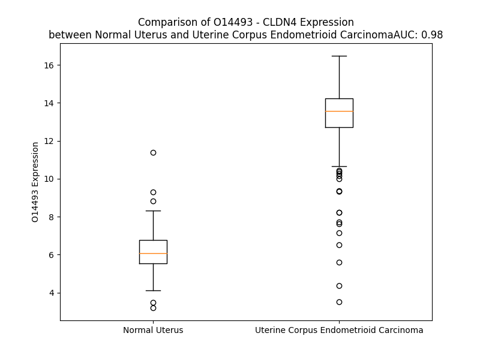

# Detailed Data for O14493

## Introduction to the Detailed Summary

### How to Interpret the Results

- **Summary & Metrics**: This section provides a quick reference to essential protein attributes, including expression changes, family classification, and biomarker applications. Regulation status (upregulated/downregulated) indicates the protein's behavior in a disease context. Some information comes from the original excel file with the proteins selected from literature, while others are derived from the analyses.
- **Expression Comparison**: A visual representation comparing protein expression between normal and disease states. It highlights significant changes in expression levels that might indicate diagnostic or therapeutic relevance. This is data coming from transcriptomics experiments and could not translate similarly to protein levels.
- **Isoform Alignment**: An interactive view of isoform alignments, revealing structural and functional differences between variants of the protein.
- **Interactors & Homologs**: Tables listing known interaction partners and homologous proteins, the more interactors and homologs, the more complex the protein is to design an antibody for.
- **Biological Assemblies**: Information about the structural arrangement of the protein in different assemblies, providing insights into its functional state but also the complexity of the protein to develop antibodies.
- **Combined Per-Residue Information**: A detailed table summarizing residue-level data. This includes predictions for epitope regions, aggregation tendencies, and modifications that might impact the protein's function. Each row corresponds to a residue in the protein, providing insights into specific sites that may be important for research or drug development.
## Summary & Metrics

- **UniProt Accession**: O14493
- **Gene Name**: CLDN4
- **Protein Name**: claudin-4
- **Swiss Prot**: CLD4_HUMAN
- **Family**: transmembrane receptor
- **Biomarker Application**: diagnosis,efficacy,prognosis
- **Number of Isoforms**: 0
- **Regulation**: 1
- **(transcriptomics) AUC**: 0.94
- **(transcriptomics) Fold Change**: 1.77
- **(transcriptomics) Regulation**: Upregulated
- **Discotope Epitope Count**: 54
- **Max n_uniprots (Homo)**: N/A
- **Max n_uniprots (Hetero)**: 2

## Expression Comparison

## Interactors

| preferredName_A   | preferredName_B   |   score |
|:------------------|:------------------|--------:|
| CLDN4             | TJP1              |   0.998 |
| CLDN4             | OCLN              |   0.996 |
| CLDN4             | CLDN12            |   0.973 |
| CLDN4             | CLDN7             |   0.953 |
| CLDN4             | CLDN1             |   0.944 |
| CLDN4             | TJP3              |   0.932 |
| CLDN4             | F11R              |   0.924 |
| CLDN4             | CLDN8             |   0.908 |

## Homologs

| uniprot_id   | gene_id   |
|:-------------|:----------|
| Q8N6F1       | CLDN19    |
| O95832       | CLDN1     |
| O75508       | CLDN11    |
| Q8N7P3       | CLDN22    |
| A6NM45       | CLDN24    |
| P56748       | CLDN8     |
| C9JDP6       | CLDN25    |
| K7EL87       | CLDN7     |
| H7C241       | CLDN34    |
| P56750       | CLDN17    |
| Q96B33       | CLDN23    |
| D3DX19       | CLDN5     |
| P57739       | CLDN2     |
| P56880       | CLDN20    |
| Q9Y5I7       | CLDN16    |
| P56747       | CLDN6     |
| O95500       | CLDN14    |
| O95484       | CLDN9     |
| P56856       | CLDN18    |
| Q96FX9       | CLDN15    |
| O15551       | CLDN3     |
| Q5W075       | CLDN10    |

## Biological Assemblies

|   Unnamed: 0 |   assembly |   n_uniprots | composition   | crystal_id   |
|-------------:|-----------:|-------------:|:--------------|:-------------|
|            0 |          1 |            2 | Hetero        | 7tdm         |
|            0 |          1 |            2 | Hetero        | 8u4v         |
|            0 |          1 |            2 | Hetero        | 7kp4         |
|            0 |          1 |            2 | Hetero        | 7tdn         |
|            0 |          1 |            2 | Hetero        | 5b2g         |
|            1 |          2 |            2 | Hetero        | 5b2g         |
|            2 |          3 |            2 | Hetero        | 5b2g         |
|            3 |          4 |            2 | Hetero        | 5b2g         |
|            0 |          1 |            2 | Hetero        | 8u5b         |

## Combined Per-Residue Information

|   res | aa   |   epitope_score | epitope   |   relative_surface_accessibility |   modeling_confidence |   Aggregation | modification              |
|------:|:-----|----------------:|:----------|---------------------------------:|----------------------:|--------------:|:--------------------------|
|     1 | M    |         0.18639 | False     |                          0.86675 |                 49.1  |         0     | N/A                       |
|     2 | A    |         0.14597 | False     |                          0.17576 |                 59.31 |         0.001 | N/A                       |
|     3 | S    |         0.29489 | False     |                          0.58874 |                 72.62 |         0.002 | N/A                       |
|     4 | M    |         0.26262 | False     |                          0.57186 |                 81.52 |         0.084 | N/A                       |
|     5 | G    |         0.30009 | False     |                          0.57728 |                 85.27 |         0.217 | N/A                       |
|     6 | L    |         0.13302 | False     |                          0.34955 |                 87.54 |         5.074 | N/A                       |
|     7 | Q    |         0.05973 | False     |                          0.03065 |                 88.37 |         6.556 | N/A                       |
|     8 | V    |         0.24469 | False     |                          0.52501 |                 90.37 |        47.576 | N/A                       |
|     9 | M    |         0.08924 | False     |                          0.56926 |                 92.43 |        51.29  | N/A                       |
|    10 | G    |         0.00332 | False     |                          0       |                 93.07 |        54.552 | N/A                       |
|    11 | I    |         0.14405 | False     |                          0.24159 |                 93.2  |        90.884 | N/A                       |
|    12 | A    |         0.06669 | False     |                          0.41588 |                 94.88 |        94.207 | N/A                       |
|    13 | L    |         0.06696 | False     |                          0.21516 |                 96.16 |        98.122 | N/A                       |
|    14 | A    |         0.00268 | False     |                          0       |                 95.41 |        98.835 | N/A                       |
|    15 | V    |         0.08294 | False     |                          0.3199  |                 95.81 |        99.679 | N/A                       |
|    16 | L    |         0.05262 | False     |                          0.59475 |                 96.98 |        99.689 | N/A                       |
|    17 | G    |         0.00285 | False     |                          0       |                 96.87 |        99.358 | N/A                       |
|    18 | W    |         0.08741 | False     |                          0.23549 |                 96.88 |        99.46  | N/A                       |
|    19 | L    |         0.11471 | False     |                          0.53037 |                 96.76 |        99.343 | N/A                       |
|    20 | A    |         0.05133 | False     |                          0.17602 |                 96.59 |        98.607 | N/A                       |
|    21 | V    |         0.00359 | False     |                          0.00095 |                 96.18 |        97.984 | N/A                       |
|    22 | M    |         0.19081 | False     |                          0.33641 |                 95.82 |        90.655 | N/A                       |
|    23 | L    |         0.11306 | False     |                          0.55622 |                 95.64 |        82.951 | N/A                       |
|    24 | C    |         0.00393 | False     |                          0.00187 |                 94.77 |        44.187 | N/A                       |
|    25 | C    |         0.21581 | False     |                          0.08152 |                 94.64 |        10.428 | N/A                       |
|    26 | A    |         0.1629  | False     |                          0.5949  |                 93.34 |         3.437 | N/A                       |
|    27 | L    |         0.21491 | False     |                          0.26293 |                 92.73 |         0.221 | N/A                       |
|    28 | P    |         0.1615  | False     |                          0.18291 |                 91.48 |         0.109 | N/A                       |
|    29 | M    |         0.28533 | False     |                          0.23867 |                 92.02 |         0     | N/A                       |
|    30 | W    |         0.01536 | False     |                          0       |                 93.26 |         0     | N/A                       |
|    31 | R    |         0.15269 | False     |                          0.05574 |                 90.52 |         0     | N/A                       |
|    32 | V    |         0.1466  | False     |                          0.17328 |                 91.38 |        17.135 | N/A                       |
|    33 | T    |         0.33406 | True      |                          0.0716  |                 87.17 |        17.241 | N/A                       |
|    34 | A    |         0.18851 | False     |                          0.23774 |                 84.47 |        17.726 | N/A                       |
|    35 | F    |         0.50213 | True      |                          0.19682 |                 78.67 |        18.298 | N/A                       |
|    36 | I    |         0.45784 | True      |                          0.74665 |                 68.05 |        18.298 | N/A                       |
|    37 | G    |         0.48974 | True      |                          0.45369 |                 65.36 |         4.361 | N/A                       |
|    38 | S    |         0.499   | True      |                          0.95567 |                 59.21 |         3.003 | N/A                       |
|    39 | N    |         0.653   | True      |                          0.9109  |                 66.06 |         2.848 | N/A                       |
|    40 | I    |         0.61809 | True      |                          0.3072  |                 62.85 |         3.052 | N/A                       |
|    41 | V    |         0.43078 | True      |                          1.07822 |                 68.17 |         3.052 | N/A                       |
|    42 | T    |         0.46326 | True      |                          0.59691 |                 71.97 |         1.614 | N/A                       |
|    43 | S    |         0.40219 | True      |                          0.38493 |                 77.69 |         0.758 | N/A                       |
|    44 | Q    |         0.29657 | False     |                          0.27368 |                 84.55 |         0.758 | N/A                       |
|    45 | T    |         0.22507 | False     |                          0.27615 |                 87.89 |         0.758 | N/A                       |
|    46 | I    |         0.35179 | True      |                          0.21359 |                 89.74 |         0.758 | N/A                       |
|    47 | W    |         0.17217 | False     |                          0.37814 |                 92.06 |         0.65  | N/A                       |
|    48 | E    |         0.17195 | False     |                          0.18081 |                 90.74 |         0     | N/A                       |
|    49 | G    |         0.00482 | False     |                          0       |                 92.03 |         0.228 | N/A                       |
|    50 | L    |         0.01795 | False     |                          0.00354 |                 90.42 |         2.994 | N/A                       |
|    51 | W    |         0.25722 | False     |                          0.43615 |                 91.17 |         4.277 | N/A                       |
|    52 | M    |         0.39657 | True      |                          0.32587 |                 91.06 |         4.277 | N/A                       |
|    53 | N    |         0.23264 | False     |                          0.26372 |                 90.88 |         4.277 | N/A                       |
|    54 | C    |         0.11858 | False     |                          0.03447 |                 92.23 |         4.277 | N/A                       |
|    55 | V    |         0.33854 | True      |                          0.22254 |                 90.56 |         4.277 | N/A                       |
|    56 | V    |         0.38382 | True      |                          0.31013 |                 89.85 |         4.06  | N/A                       |
|    57 | Q    |         0.29477 | False     |                          0.30517 |                 86.1  |         0     | N/A                       |
|    58 | S    |         0.42563 | True      |                          0.7051  |                 81.6  |         0     | N/A                       |
|    59 | T    |         0.36986 | True      |                          0.75258 |                 81.54 |         0     | N/A                       |
|    60 | G    |         0.27576 | False     |                          0.72076 |                 82.1  |         0     | N/A                       |
|    61 | Q    |         0.43334 | True      |                          0.51682 |                 86.11 |         0     | N/A                       |
|    62 | M    |         0.50557 | True      |                          0.7894  |                 89.82 |         0     | N/A                       |
|    63 | Q    |         0.44129 | True      |                          0.537   |                 91.13 |         0     | N/A                       |
|    64 | C    |         0.25253 | False     |                          0.54908 |                 92.75 |         0     | N/A                       |
|    65 | K    |         0.47438 | True      |                          0.60482 |                 90.99 |         0     | N/A                       |
|    66 | V    |         0.37095 | True      |                          0.68989 |                 91.18 |         0     | N/A                       |
|    67 | Y    |         0.29707 | False     |                          0.17167 |                 87.11 |         0     | N/A                       |
|    68 | D    |         0.38074 | True      |                          0.72607 |                 79.97 |         0     | N/A                       |
|    69 | S    |         0.52728 | True      |                          0.43089 |                 76.74 |         0     | N/A                       |
|    70 | L    |         0.33623 | True      |                          0.69884 |                 70.37 |         0     | N/A                       |
|    71 | L    |         0.38272 | True      |                          1.06315 |                 69.45 |         0     | N/A                       |
|    72 | A    |         0.50182 | True      |                          0.64057 |                 71.88 |         0     | N/A                       |
|    73 | L    |         0.21346 | False     |                          0.07175 |                 74.76 |         0     | N/A                       |
|    74 | P    |         0.40706 | True      |                          0.40545 |                 82.13 |         0     | N/A                       |
|    75 | Q    |         0.39509 | True      |                          0.77472 |                 85.4  |         0     | N/A                       |
|    76 | D    |         0.28111 | False     |                          0.26441 |                 84.76 |         0     | N/A                       |
|    77 | L    |         0.03689 | False     |                          0.01154 |                 85.27 |         0     | N/A                       |
|    78 | Q    |         0.37943 | True      |                          0.43023 |                 88.68 |         0     | N/A                       |
|    79 | A    |         0.18184 | False     |                          0.48161 |                 88.99 |         0     | N/A                       |
|    80 | A    |         0.00805 | False     |                          0.00237 |                 92.11 |         0     | N/A                       |
|    81 | R    |         0.29769 | False     |                          0.07943 |                 91.9  |         0     | N/A                       |
|    82 | A    |         0.12468 | False     |                          0.47282 |                 92.4  |         7.144 | N/A                       |
|    83 | L    |         0.13255 | False     |                          0.30748 |                 94.39 |        66.417 | N/A                       |
|    84 | V    |         0.00864 | False     |                          0.00095 |                 95.02 |        96.945 | N/A                       |
|    85 | I    |         0.17635 | False     |                          0.36638 |                 95.26 |        99.546 | N/A                       |
|    86 | I    |         0.09186 | False     |                          0.46558 |                 95.6  |        99.784 | N/A                       |
|    87 | S    |         0.00551 | False     |                          0.00079 |                 95.85 |        99.806 | N/A                       |
|    88 | I    |         0.1475  | False     |                          0.19279 |                 96.45 |        99.981 | N/A                       |
|    89 | I    |         0.14324 | False     |                          0.58436 |                 96.84 |        99.997 | N/A                       |
|    90 | V    |         0.05406 | False     |                          0.2285  |                 96.57 |        99.994 | N/A                       |
|    91 | A    |         0.00476 | False     |                          0.00255 |                 96.35 |        99.936 | N/A                       |
|    92 | A    |         0.08451 | False     |                          0.27599 |                 96.5  |        99.888 | N/A                       |
|    93 | L    |         0.05933 | False     |                          0.59063 |                 95.39 |        99.847 | N/A                       |
|    94 | G    |         0.00345 | False     |                          0       |                 94.78 |        99.623 | N/A                       |
|    95 | V    |         0.06664 | False     |                          0.16661 |                 94.43 |        99.603 | N/A                       |
|    96 | L    |         0.10827 | False     |                          0.67788 |                 93.69 |        99.365 | N/A                       |
|    97 | L    |         0.11921 | False     |                          0.34364 |                 92.44 |        98.068 | N/A                       |
|    98 | S    |         0.01715 | False     |                          0.00861 |                 90.69 |        90.981 | N/A                       |
|    99 | V    |         0.08515 | False     |                          0.64636 |                 89.66 |        90.102 | N/A                       |
|   100 | V    |         0.17928 | False     |                          0.39321 |                 88.22 |        79.754 | N/A                       |
|   101 | G    |         0.01583 | False     |                          0.00357 |                 83.61 |         0.931 | N/A                       |
|   102 | G    |         0.15516 | False     |                          0.0676  |                 82.67 |         0.009 | N/A                       |
|   103 | K    |         0.24766 | False     |                          0.35387 |                 73.19 |         0     | N/A                       |
|   104 | C    |         0.31364 | True      |                          0.77    |                 71.72 |         0     | N/A                       |
|   105 | T    |         0.2957  | False     |                          0.21233 |                 76.69 |         0     | N/A                       |
|   106 | N    |         0.44365 | True      |                          0.79407 |                 74.92 |         0     | N/A                       |
|   107 | C    |         0.22889 | False     |                          0.64118 |                 77.04 |         0     | N/A                       |
|   108 | L    |         0.30547 | True      |                          0.24401 |                 77.45 |         0     | N/A                       |
|   109 | E    |         0.39189 | True      |                          0.79438 |                 77.56 |         0     | N/A                       |
|   110 | D    |         0.4734  | True      |                          0.58528 |                 82.28 |         0     | N/A                       |
|   111 | E    |         0.23011 | False     |                          0.44509 |                 81.02 |         0     | N/A                       |
|   112 | S    |         0.27908 | False     |                          0.40834 |                 82.92 |         0     | N/A                       |
|   113 | A    |         0.15777 | False     |                          0.2675  |                 85.52 |         0     | N/A                       |
|   114 | K    |         0.19763 | False     |                          0.0969  |                 85.37 |         0     | N/A                       |
|   115 | A    |         0.12903 | False     |                          0.1394  |                 85.49 |         0     | N/A                       |
|   116 | K    |         0.23975 | False     |                          0.62508 |                 87.91 |         0     | N/A                       |
|   117 | T    |         0.09052 | False     |                          0.21408 |                 90.94 |        12.64  | N/A                       |
|   118 | M    |         0.05073 | False     |                          0.01654 |                 91.04 |        34.913 | N/A                       |
|   119 | I    |         0.18596 | False     |                          0.30079 |                 91.44 |        88.276 | N/A                       |
|   120 | V    |         0.0288  | False     |                          0.55601 |                 93.71 |        93.159 | N/A                       |
|   121 | A    |         0.00295 | False     |                          0       |                 94.11 |        93.573 | N/A                       |
|   122 | G    |         0.00502 | False     |                          0       |                 94.59 |        94.064 | N/A                       |
|   123 | V    |         0.05712 | False     |                          0.46937 |                 95.95 |        99.499 | N/A                       |
|   124 | V    |         0.06044 | False     |                          0.17518 |                 97    |        99.955 | N/A                       |
|   125 | F    |         0.00438 | False     |                          0.00064 |                 96.99 |        99.99  | N/A                       |
|   126 | L    |         0.05648 | False     |                          0.3149  |                 96.96 |        99.953 | N/A                       |
|   127 | L    |         0.08525 | False     |                          0.57744 |                 96.63 |        99.731 | N/A                       |
|   128 | A    |         0.00272 | False     |                          0       |                 96.62 |        98.45  | N/A                       |
|   129 | G    |         0.00568 | False     |                          0       |                 96.33 |        97.362 | N/A                       |
|   130 | L    |         0.07652 | False     |                          0.54439 |                 96.13 |        97.264 | N/A                       |
|   131 | M    |         0.07333 | False     |                          0.24493 |                 94.58 |        96.729 | N/A                       |
|   132 | V    |         0.00351 | False     |                          0.00095 |                 95.24 |        96.119 | N/A                       |
|   133 | I    |         0.10936 | False     |                          0.25999 |                 95.85 |        88.932 | N/A                       |
|   134 | V    |         0.09564 | False     |                          0.57402 |                 95.18 |        10.394 | N/A                       |
|   135 | P    |         0.06126 | False     |                          0.03181 |                 94.29 |         4.038 | N/A                       |
|   136 | V    |         0.0048  | False     |                          0       |                 95.24 |         0     | N/A                       |
|   137 | S    |         0.12862 | False     |                          0.28417 |                 95.31 |         0     | N/A                       |
|   138 | W    |         0.25227 | False     |                          0.61023 |                 94.64 |         0     | N/A                       |
|   139 | T    |         0.04762 | False     |                          0.0221  |                 92.81 |         0     | N/A                       |
|   140 | A    |         0.13003 | False     |                          0.06122 |                 94.08 |         0     | N/A                       |
|   141 | H    |         0.40778 | True      |                          0.5455  |                 94.5  |         0     | N/A                       |
|   142 | N    |         0.33165 | True      |                          0.17355 |                 92.32 |         0     | N/A                       |
|   143 | I    |         0.09553 | False     |                          0.0224  |                 91.5  |         0     | N/A                       |
|   144 | I    |         0.25708 | False     |                          0.44718 |                 92.63 |         0     | N/A                       |
|   145 | Q    |         0.37838 | True      |                          0.55636 |                 91.86 |         0     | N/A                       |
|   146 | D    |         0.45795 | True      |                          0.18097 |                 88.51 |         0     | N/A                       |
|   147 | F    |         0.34359 | True      |                          0.45769 |                 87.71 |         0     | N/A                       |
|   148 | Y    |         0.40584 | True      |                          0.76462 |                 90.03 |         0     | N/A                       |
|   149 | N    |         0.45927 | True      |                          0.3089  |                 90.03 |         0     | N/A                       |
|   150 | P    |         0.45704 | True      |                          0.96048 |                 89.06 |         0     | N/A                       |
|   151 | L    |         0.61453 | True      |                          0.99083 |                 90.01 |         0     | N/A                       |
|   152 | V    |         0.37034 | True      |                          0.2564  |                 84.32 |         0     | N/A                       |
|   153 | A    |         0.43617 | True      |                          0.56669 |                 82.71 |         0     | N/A                       |
|   154 | S    |         0.40405 | True      |                          0.75755 |                 77.2  |         0     | N/A                       |
|   155 | G    |         0.58342 | True      |                          0.14066 |                 74.86 |         0     | N/A                       |
|   156 | Q    |         0.5863  | True      |                          0.50532 |                 80.18 |         0     | N/A                       |
|   157 | K    |         0.44919 | True      |                          0.29452 |                 83.01 |         0     | N/A                       |
|   158 | R    |         0.37569 | True      |                          0.31494 |                 86.48 |         0     | N/A                       |
|   159 | E    |         0.2314  | False     |                          0.47247 |                 90.01 |         0     | N/A                       |
|   160 | M    |         0.23875 | False     |                          0.33045 |                 91.71 |         1.317 | N/A                       |
|   161 | G    |         0.01556 | False     |                          0.00483 |                 92.33 |         1.401 | N/A                       |
|   162 | A    |         0.32413 | True      |                          0.43134 |                 94.35 |         6.206 | N/A                       |
|   163 | S    |         0.0075  | False     |                          0       |                 94.05 |        11.375 | N/A                       |
|   164 | L    |         0.02029 | False     |                          0.0033  |                 94.63 |        53.834 | N/A                       |
|   165 | Y    |         0.10019 | False     |                          0.59458 |                 95.95 |        60.867 | N/A                       |
|   166 | V    |         0.05761 | False     |                          0.2625  |                 95.95 |        61.703 | N/A                       |
|   167 | G    |         0.00303 | False     |                          0       |                 96.25 |        61.144 | N/A                       |
|   168 | W    |         0.13688 | False     |                          0.44743 |                 97.17 |        61.831 | N/A                       |
|   169 | A    |         0.09066 | False     |                          0.54443 |                 96.95 |        57.424 | N/A                       |
|   170 | A    |         0.00412 | False     |                          0       |                 96.41 |        53.195 | N/A                       |
|   171 | S    |         0.00661 | False     |                          0.00791 |                 96.45 |        49.691 | N/A                       |
|   172 | G    |         0.08973 | False     |                          0.32968 |                 96.72 |        51.23  | N/A                       |
|   173 | L    |         0.0821  | False     |                          0.31044 |                 96.88 |        53.743 | N/A                       |
|   174 | L    |         0.00248 | False     |                          0       |                 96.93 |        53.661 | N/A                       |
|   175 | L    |         0.06838 | False     |                          0.29368 |                 96.8  |        52.499 | N/A                       |
|   176 | L    |         0.07818 | False     |                          0.68622 |                 95.65 |        45.805 | N/A                       |
|   177 | G    |         0.00372 | False     |                          0       |                 94.36 |         6.862 | N/A                       |
|   178 | G    |         0.00414 | False     |                          0       |                 94.41 |         1.598 | N/A                       |
|   179 | G    |         0.04708 | False     |                          0.30168 |                 94.23 |         1.236 | N/A                       |
|   180 | L    |         0.07215 | False     |                          0.29666 |                 92.52 |         1.236 | N/A                       |
|   181 | L    |         0.00512 | False     |                          0       |                 90.71 |         1.071 | N/A                       |
|   182 | C    |         0.10015 | False     |                          0.29807 |                 89.71 |         0.08  | N/A                       |
|   183 | C    |         0.13033 | False     |                          0.56768 |                 84.37 |         0     | N/A                       |
|   184 | N    |         0.09037 | False     |                          0.05842 |                 73.98 |         0     | N/A                       |
|   185 | C    |         0.15525 | False     |                          0.65885 |                 64.28 |         0     | N/A                       |
|   186 | P    |         0.30994 | True      |                          0.44889 |                 64.2  |         0     | N/A                       |
|   187 | P    |         0.23548 | False     |                          0.42024 |                 57.64 |         0     | N/A                       |
|   188 | R    |         0.32756 | True      |                          0.85336 |                 57.3  |         0     | N/A                       |
|   189 | T    |         0.26876 | False     |                          0.92013 |                 52.39 |         0     | N/A                       |
|   190 | D    |         0.22025 | False     |                          0.6371  |                 44.76 |         0     | N/A                       |
|   191 | K    |         0.24432 | False     |                          0.88303 |                 46.85 |         0     | N/A                       |
|   192 | P    |         0.29255 | False     |                          0.83269 |                 45.68 |         0     | N/A                       |
|   193 | Y    |         0.27205 | False     |                          0.94096 |                 45.64 |         0     | N/A                       |
|   194 | S    |         0.17188 | False     |                          0.62331 |                 49.12 |         0     | N/A                       |
|   195 | A    |         0.19166 | False     |                          0.65445 |                 55.68 |         0     | N/A                       |
|   196 | K    |         0.24584 | False     |                          0.91391 |                 52.56 |         0     | N/A                       |
|   197 | Y    |         0.28841 | False     |                          0.94059 |                 60.44 |         0     | N/A                       |
|   198 | S    |         0.22667 | False     |                          0.77159 |                 62.92 |         0     | N/A                       |
|   199 | A    |         0.24161 | False     |                          0.84765 |                 64.74 |         0     | N/A                       |
|   200 | A    |         0.20536 | False     |                          0.93583 |                 62.26 |         0     | N/A                       |
|   201 | R    |         0.27998 | False     |                          0.95685 |                 60.94 |         0     | N/A                       |
|   202 | S    |         0.25376 | False     |                          0.8343  |                 63.25 |         0     | N/A                       |
|   203 | A    |         0.25155 | False     |                          0.90502 |                 61.21 |         0     | N/A                       |
|   204 | A    |         0.26227 | False     |                          0.94861 |                 58.65 |         0     | N/A                       |
|   205 | A    |         0.28603 | False     |                          0.87254 |                 58.57 |         0     | N/A                       |
|   206 | S    |         0.31057 | True      |                          0.61136 |                 55.96 |         0     | N/A                       |
|   207 | N    |         0.27768 | False     |                          0.97483 |                 44.48 |         0     | N/A                       |
|   208 | Y    |         0.29348 | False     |                          0.79214 |                 51.19 |         0     | Phosphotyrosine; by EPHA2 |
|   209 | V    |         0.17654 | False     |                          1.54263 |                 46.5  |         0     | N/A                       |

