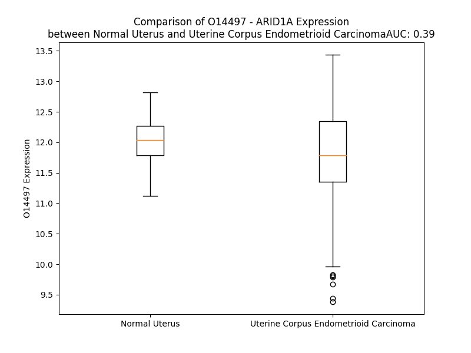

# Detailed Data for O14497

## Introduction to the Detailed Summary

### How to Interpret the Results

- **Summary & Metrics**: This section provides a quick reference to essential protein attributes, including expression changes, family classification, and biomarker applications. Regulation status (upregulated/downregulated) indicates the protein's behavior in a disease context. Some information comes from the original excel file with the proteins selected from literature, while others are derived from the analyses.
- **Expression Comparison**: A visual representation comparing protein expression between normal and disease states. It highlights significant changes in expression levels that might indicate diagnostic or therapeutic relevance. This is data coming from transcriptomics experiments and could not translate similarly to protein levels.
- **Isoform Alignment**: An interactive view of isoform alignments, revealing structural and functional differences between variants of the protein.
- **Interactors & Homologs**: Tables listing known interaction partners and homologous proteins, the more interactors and homologs, the more complex the protein is to design an antibody for.
- **Biological Assemblies**: Information about the structural arrangement of the protein in different assemblies, providing insights into its functional state but also the complexity of the protein to develop antibodies.
- **Combined Per-Residue Information**: A detailed table summarizing residue-level data. This includes predictions for epitope regions, aggregation tendencies, and modifications that might impact the protein's function. Each row corresponds to a residue in the protein, providing insights into specific sites that may be important for research or drug development.
## Summary & Metrics

- **UniProt Accession**: O14497
- **Gene Name**: ARID1A
- **Protein Name**: AT-rich interactive domain-containing protein 1A
- **Swiss Prot**: ARI1A_HUMAN
- **Family**: transcription regulator
- **Biomarker Application**:  
- **Number of Isoforms**: 3
- **Regulation**: -1
- **(transcriptomics) AUC**: 0.48
- **(transcriptomics) Fold Change**: 1.00
- **(transcriptomics) Regulation**: Downregulated
- **Discotope Epitope Count**: 771
- **Max n_uniprots (Homo)**: 1
- **Max n_uniprots (Hetero)**: 10

## Expression Comparison

## Isoform Alignment

<pre style='font-size:14px; font-family:monospace;'>O14497-1 MAAQVAPAAASSLGNPPPPPPSELKKAEQQQREEAGGEAAAAAAAERGEMKAAAGQESEGPAVGPPQPLGKELQDGAESNGGGGGGGAGSGGGPGAEPDLKNSNGNAGPRPALNNNLTEPPGGGGGGSSDGVGAPPHSAAAALPPPAYGFGQPYGRSPSAVAAAAAAVFHQQHGGQQSPGLAALQSGGGGGLEPYAGPQQNSHDHGFPNHQYNSYYPNRSAYPPPAPAYALSSPRGGTPGSGAAAAAGSKPPPSSSASASSSSSSFAQQRFGAMGGGGPSAAGGGTPQPTATPTLNQLLTSPSSARGYQGYPGGDYSGGPQDGGAGKGPADMASQCWGAAAAAAAAAAASGGAQQRSHHAPMSPGSSGGGGQPLARTPQPSSPMDQMGKMRPQPYGGTNPYSQQQGPPSGPQQGHGYPGQPYGSQTPQRYPMTMQGRAQSAMGGLSYTQQIPPYGQQGPSGYGQQGQTPYYNQQSPHPQQQQPPYSQQPPSQTPHAQPSYQQQPQSQPPQLQSSQPPYSQQPSQPPHQQSPAPYPSQQSTTQQHPQSQPPYSQPQAQSPYQQQQPQQPAPSTLSQQAAYPQPQSQQSQQTAYSQQRFPPPQELSQDSFGSQASSAPSMTSSKGGQEDMNLSLQSRPSSLPDLSGSIDDLPMGTEGALSPGVSTSGISSSQGEQSNPAQSPFSPHTSPHLPGIRGPSPSPVGSPASVAQSRSGPLSPAAVPGNQMPPRPPSGQSDSIMHPSMNQSSIAQDRGYMQRNPQMPQYSSPQPGSALSPRQPSGGQIHTGMGSYQQNSMGSYGPQGGQYGPQGGYPRQPNYNALPNANYPSAGMAGGINPMGAGGQMHGQPGIPPYGTLPPGRMSHASMGNRPYGPNMANMPPQVGSGMCPPPGGMNRKTQETAVAMHVAANSIQNRPPGYPNMNQGGMMGTGPPYGQGINSMAGMINPQGPPYSMGGTMANNSAGMAASPEMMGLGDVKLTPATKMNNKADGTPKTESKSKKSSSSTTTNEKITKLYELGGEPERKMWVDRYLAFTEEKAMGMTNLPAVGRKPLDLYRLYVSVKEIGGLTQVNKNKKWRELATNLNVGTSSSAASSLKKQYIQCLYAFECKIERGEDPPPDIFAAADSKKSQPKIQPPSPAGSGSMQGPQTPQSTSSSMAEGGDLKPPTPASTPHSQIPPLPGMSRSNSVGIQDAFNDGSDSTFQKRNSMTPNPGYQPSMNTSDMMGRMSYEPNKDPYGSMRKAPGSDPFMSSGQGPNGGMGDPYSRAAGPGLGNVAMGPRQHYPYGGPYDRVRTEPGIGPEGNMSTGAPQPNLMPSNPDSGMYSPSRYPPQQQQQQQQRHDSYGNQFSTQGTPSGSPFPSQQTTMYQQQQQNYKRPMDGTYGPPAKRHEGEMYSVPYSTGQGQPQQQQLPPAQPQPASQQQAAQPSPQQDVYNQYGNAYPATATAATERRPAGGPQNQFPFQFGRDRVSAPPGTNAQQNMPPQMMGGPIQASAEVAQQGTMWQGRNDMTYNYANRQSTGSAPQGPAYHGVNRTDEMLHTDQRANHEGSWPSHGTRQPPYGPSAPVPPMTRPPPSNYQPPPSMQNHIPQVSSPAPLPRPMENRTSPSKSPFLHSGMKMQKAGPPVPASHIAPAPVQPPMIRRDITFPPGSVEATQPVLKQRRRLTMKDIGTPEAWRVMMSLKSGLLAESTWALDTINILLYDDNSIMTFNLSQLPGLLELLVEYFRRCLIEIFGILKEYEVGDPGQRTLLDPGRFSKVSSPAPMEGGEEEEELLGPKLEEEEEEEVVENDEEIAFSGKDKPASENSEEKLISKFDKLPVKIVQKNDPFVVDCSDKLGRVQEFDSGLLHWRIGGGDTTEHIQTHFESKTELLPSRPHAPCPPAPRKHVTTAEGTPGTTDQEGPPPDGPPEKRITATMDDMLSTRSSTLTEDGAKSSEAIKESSKFPFGISPAQSHRNIKILEDEPHSKDETPLCTLLDWQDSLAKRCVCVSNTIRSLSFVPGNDFEMSKHPGLLLILGKLILLHHKHPERKQAPLTYEKEEEQDQGVSCNKVEWWWDCLEMLRENTLVTLANISGQLDLSPYPESICLPVLDGLLHWAVCPSAEAQDPFSTLGPNAVLSPQRLVLETLSKLSIQDNNVDLILATPPFSRLEKLYSTMVRFLSDRKNPVCREMAVVLLANLAQGDSLAARAIAVQKGSIGNLLGFLEDSLAATQFQQSQASLLHMQNPPFEPTSVDMMRRAARALLALAKVDENHSEFTLYESRLLDISVSPLMNSLVSQVICDVLFLIGQS
O14497-2 MAAQVAPAAASSLGNPPPPPPSELKKAEQQQREEAGGEAAAAAAAERGEMKAAAGQESEGPAVGPPQPLGKELQDGAESNGGGGGGGAGSGGGPGAEPDLKNSNGNAGPRPALNNNLTEPPGGGGGGSSDGVGAPPHSAAAALPPPAYGFGQPYGRSPSAVAAAAAAVFHQQHGGQQSPGLAALQSGGGGGLEPYAGPQQNSHDHGFPNHQYNSYYPNRSAYPPPAPAYALSSPRGGTPGSGAAAAAGSKPPPSSSASASSSSSSFAQQRFGAMGGGGPSAAGGGTPQPTATPTLNQLLTSPSSARGYQGYPGGDYSGGPQDGGAGKGPADMASQCWGAAAAAAAAAAASGGAQQRSHHAPMSPGSSGGGGQPLARTPQPSSPMDQMGKMRPQPYGGTNPYSQQQGPPSGPQQGHGYPGQPYGSQTPQRYPMTMQGRAQSAMGGLSYTQQIPPYGQQGPSGYGQQGQTPYYNQQSPHPQQQQPPYSQQPPSQTPHAQPSYQQQPQSQPPQLQSSQPPYSQQPSQPPHQQSPAPYPSQQSTTQQHPQSQPPYSQPQAQSPYQQQQPQQPAPSTLSQQAAYPQPQSQQSQQTAYSQQRFPPPQELSQDSFGSQASSAPSMTSSKGGQEDMNLSLQSRPSSLPDLSGSIDDLPMGTEGALSPGVSTSGISSSQGEQSNPAQSPFSPHTSPHLPGIRGPSPSPVGSPASVAQSRSGPLSPAAVPGNQMPPRPPSGQSDSIMHPSMNQSSIAQDRGYMQRNPQMPQYSSPQPGSALSPRQPSGGQIHTGMGSYQQNSMGSYGPQGGQYGPQGGYPRQPNYNALPNANYPSAGMAGGINPMGAGGQMHGQPGIPPYGTLPPGRMSHASMGNRPYGPNMANMPPQVGSGMCPPPGGMNRKTQETAVAMHVAANSIQNRPPGYPNMNQGGMMGTGPPYGQGINSMAGMINPQGPPYSMGGTMANNSAGMAASPEMMGLGDVKLTPATKMNNKADGTPKTESKSKKSSSSTTTNEKITKLYELGGEPERKMWVDRYLAFTEEKAMGMTNLPAVGRKPLDLYRLYVSVKEIGGLTQVNKNKKWRELATNLNVGTSSSAASSLKKQYIQCLYAFECKIERGEDPPPDIFAAADSKKSQPKIQPPSPAGSGSMQGPQTPQSTSSSMAEGGDLKPPTPASTPHSQIPPLPGMSRSNSVGIQDAFNDGSDSTFQKRNSMTPNPGYQPSMNTSDMMGRMSYEPNKDPYGSMRKAPGSDPFMSSGQGPNGGMGDPYSRAAGPGLGNVAMGPRQHYPYGGPYDRVRTEPGIGPEGNMSTGAPQPNLMPSNPDSGMYSPSRYPPQQQQQQQQRHDSYGNQFSTQGTPSGSPFPSQQTTMYQQQQ-------------------------------------------------------------------------------------------------------------------------------------------------------------------------------------------------------------------------QVSSPAPLPRPMENRTSPSKSPFLHSGMKMQKAGPPVPASHIAPAPVQPPMIRRDITFPPGSVEATQPVLKQRRRLTMKDIGTPEAWRVMMSLKSGLLAESTWALDTINILLYDDNSIMTFNLSQLPGLLELLVEYFRRCLIEIFGILKEYEVGDPGQRTLLDPGRFSKVSSPAPMEGGEEEEELLGPKLEEEEEEEVVENDEEIAFSGKDKPASENSEEKLISKFDKLPVKIVQKNDPFVVDCSDKLGRVQEFDSGLLHWRIGGGDTTEHIQTHFESKTELLPSRPHAPCPPAPRKHVTTAEGTPGTTDQEGPPPDGPPEKRITATMDDMLSTRSSTLTEDGAKSSEAIKESSKFPFGISPAQSHRNIKILEDEPHSKDETPLCTLLDWQDSLAKRCVCVSNTIRSLSFVPGNDFEMSKHPGLLLILGKLILLHHKHPERKQAPLTYEKEEEQDQGVSCNKVEWWWDCLEMLRENTLVTLANISGQLDLSPYPESICLPVLDGLLHWAVCPSAEAQDPFSTLGPNAVLSPQRLVLETLSKLSIQDNNVDLILATPPFSRLEKLYSTMVRFLSDRKNPVCREMAVVLLANLAQGDSLAARAIAVQKGSIGNLLGFLEDSLAATQFQQSQASLLHMQNPPFEPTSVDMMRRAARALLALAKVDENHSEFTLYESRLLDISVSPLMNSLVSQVICDVLFLIGQS
O14497-3 -----------------------------------------------------------------------------------------------------------------------------------------------------------------------------------------------------------------------------------------------------------------------------------------------------------------------------------------------------------------------------------------------MDQMGKMRPQPYGGTNPYSQQQGPPSGPQQGHGYPGQPYGSQTPQRYPMTMQGRAQSAMGGLSYTQQIPPYGQQGPSGYGQQGQTPYYNQQSPHPQQQQPPYSQQPPSQTPHAQPSYQQQPQSQPPQLQSSQPPYSQQPSQPPHQQSPAPYPSQQSTTQQHPQSQPPYSQPQAQSPYQQQQPQQPAPSTLSQQAAYPQPQSQQSQQTAYSQQRFPPPQELSQDSFGSQASSAPSMTSSKGGQEDMNLSLQSRPSSLPDLSGSIDDLPMGTEGALSPGVSTSGISSSQGEQSNPAQSPFSPHTSPHLPGIRGPSPSPVGSPASVAQSRSGPLSPAAVPGNQMPPRPPSGQSDSIMHPSMNQSSIAQDRGYMQRNPQMPQYSSPQPGSALSPRQPSGGQIHTGMGSYQQNSMGSYGPQGGQYGPQGGYPRQPNYNALPNANYPSAGMAGGINPMGAGGQMHGQPGIPPYGTLPPGRMSHASMGNRPYGPNMANMPPQVGSGMCPPPGGMNRKTQETAVAMHVAANSIQNRPPGYPNMNQGGMMGTGPPYGQGINSMAGMINPQGPPYSMGGTMANNSAGMAASPEMMGLGDVKLTPATKMNNKADGTPKTESKSKKSSSSTTTNEKITKLYELGGEPERKMWVDRYLAFTEEKAMGMTNLPAVGRKPLDLYRLYVSVKEIGGLTQVNKNKKWRELATNLNVGTSSSAASSLKKQYIQCLYAFECKIERGEDPPPDIFAAADSKKSQPKIQPPSPAGSGSMQGPQTPQSTSSSMAEGGDLKPPTPASTPHSQIPPLPGMSRSNSVGIQDAFNDGSDSTFQKRNSMTPNPGYQPSMNTSDMMGRMSYEPNKDPYGSMRKAPGSDPFMSSGQGPNGGMGDPYSRAAGPGLGNVAMGPRQHYPYGGPYDRVRTEPGIGPEGNMSTGAPQPNLMPSNPDSGMYSPSRYPPQQQQQQQQRHDSYGNQFSTQGTPSGSPFPSQQTTMYQQQQQNYKRPMDGTYGPPAKRHEGEMYSVPYSTGQGQPQQQQLPPAQPQPASQQQAAQPSPQQDVYNQYGNAYPATATAATERRPAGGPQNQFPFQFGRDRVSAPPGTNAQQNMPPQMMGGPIQASAEVAQQGTMWQGRNDMTYNYANRQSTGSAPQGPAYHGVNRTDEMLHTDQRANHEGSWPSHGTRQPPYGPSAPVPPMTRPPPSNYQPPPSMQNHIPQVSSPAPLPRPMENRTSPSKSPFLHSGMKMQKAGPPVPASHIAPAPVQPPMIRRDITFPPGSVEATQPVLKQRRRLTMKDIGTPEAWRVMMSLKSGLLAESTWALDTINILLYDDNSIMTFNLSQLPGLLELLVEYFRRCLIEIFGILKEYEVGDPGQRTLLDPGRFSKVSSPAPMEGGEEEEELLGPKLEEEEEEEVVENDEEIAFSGKDKPASENSEEKLISKFDKLPVKIVQKNDPFVVDCSDKLGRVQEFDSGLLHWRIGGGDTTEHIQTHFESKTELLPSRPHAPCPPAPRKHVTTAEGTPGTTDQEGPPPDGPPEKRITATMDDMLSTRSSTLTEDGAKSSEAIKESSKFPFGISPAQSHRNIKILEDEPHSKDETPLCTLLDWQDSLAKRCVCVSNTIRSLSFVPGNDFEMSKHPGLLLILGKLILLHHKHPERKQAPLTYEKEEEQDQGVSCNKVEWWWDCLEMLRENTLVTLANISGQLDLSPYPESICLPVLDGLLHWAVCPSAEAQDPFSTLGPNAVLSPQRLVLETLSKLSIQDNNVDLILATPPFSRLEKLYSTMVRFLSDRKNPVCREMAVVLLANLAQGDSLAARAIAVQKGSIGNLLGFLEDSLAATQFQQSQASLLHMQNPPFEPTSVDMMRRAARALLALAKVDENHSEFTLYESRLLDISVSPLMNSLVSQVICDVLFLIGQS
</pre>

## Interactors

| preferredName_A   | preferredName_B   |   score |
|:------------------|:------------------|--------:|
| ARID1A            | SMARCC1           |   0.999 |
| ARID1A            | ARID1B            |   0.999 |
| ARID1A            | DPF2              |   0.999 |
| ARID1A            | ACTL6A            |   0.999 |
| ARID1A            | SMARCD1           |   0.999 |
| ARID1A            | SMARCD3           |   0.999 |
| ARID1A            | SMARCA4           |   0.999 |
| ARID1A            | SMARCE1           |   0.999 |
| ARID1A            | SMARCB1           |   0.999 |
| ARID1A            | SMARCC2           |   0.999 |
| ARID1A            | SMARCA2           |   0.999 |
| ARID1A            | PBRM1             |   0.999 |
| ARID1A            | ARID2             |   0.998 |
| ARID1A            | DPF1              |   0.998 |
| ARID1A            | SMARCD2           |   0.997 |
| ARID1A            | BRD9              |   0.996 |
| ARID1A            | BCL7A             |   0.996 |
| ARID1A            | DPF3              |   0.995 |
| ARID1A            | ACTB              |   0.995 |
| ARID1A            | BCL7C             |   0.995 |
| ARID1A            | SS18              |   0.993 |
| ARID1A            | BCL7B             |   0.992 |
| ARID1A            | PHF10             |   0.991 |
| ARID1A            | BICRA             |   0.98  |
| ARID1A            | ACTL6B            |   0.978 |
| ARID1A            | BCL11A            |   0.975 |
| ARID1A            | MSH2              |   0.974 |
| ARID1A            | BRD7              |   0.972 |
| ARID1A            | TP53              |   0.961 |
| ARID1A            | H4C6              |   0.954 |
| ARID1A            | BICRAL            |   0.952 |
| ARID1A            | BCL11B            |   0.944 |
| ARID1A            | PPP2R1A           |   0.914 |
| ARID1A            | PPARG             |   0.914 |
| ARID1A            | PIK3CA            |   0.913 |

## Homologs

| uniprot_id   | gene_id   |
|:-------------|:----------|
| A0A1B0GWJ2   | ARID1B    |

## Biological Assemblies

|   Unnamed: 0 |   assembly |   n_uniprots | composition   | crystal_id   |
|-------------:|-----------:|-------------:|:--------------|:-------------|
|            0 |          1 |           10 | Hetero        | 6ltj         |
|            0 |          1 |            8 | Hetero        | 6lth         |
|            0 |          1 |            1 | Homo          | 1ryu         |

## Combined Per-Residue Information

|   res | aa   |   epitope_score | epitope   |   relative_surface_accessibility |   modeling_confidence |   Aggregation | modification                |
|------:|:-----|----------------:|:----------|---------------------------------:|----------------------:|--------------:|:----------------------------|
|     1 | M    |         0.08241 | True      |                          1.30348 |                 31.65 |         0     | N/A                         |
|     2 | A    |         0.04623 | False     |                          0.76179 |                 29.26 |         0     | N-acetylalanine             |
|     3 | A    |         0.13237 | True      |                          0.85863 |                 29.93 |         0     | N/A                         |
|     4 | Q    |         0.07978 | True      |                          0.88857 |                 27.92 |         0     | N/A                         |
|     5 | V    |         0.10734 | True      |                          1.0142  |                 30.63 |         0     | N/A                         |
|     6 | A    |         0.08315 | True      |                          0.69534 |                 34.76 |         0     | N/A                         |
|     7 | P    |         0.12178 | True      |                          0.87478 |                 38.49 |         0     | N/A                         |
|     8 | A    |         0.12113 | True      |                          0.97276 |                 27.92 |         0     | N/A                         |
|     9 | A    |         0.1038  | True      |                          0.90656 |                 30.44 |         0     | N/A                         |
|    10 | A    |         0.08788 | True      |                          0.93075 |                 31.7  |         0     | N/A                         |
|    11 | S    |         0.13766 | True      |                          0.89124 |                 29.87 |         0     | N/A                         |
|    12 | S    |         0.09126 | True      |                          0.82303 |                 32.8  |         0     | N/A                         |
|    13 | L    |         0.10572 | True      |                          1.10609 |                 32.57 |         0     | N/A                         |
|    14 | G    |         0.07861 | True      |                          0.79093 |                 29.59 |         0     | N/A                         |
|    15 | N    |         0.12103 | True      |                          0.9539  |                 30.59 |         0     | N/A                         |
|    16 | P    |         0.07947 | True      |                          0.86115 |                 34.86 |         0     | N/A                         |
|    17 | P    |         0.11084 | True      |                          0.88284 |                 34.67 |         0     | N/A                         |
|    18 | P    |         0.11018 | True      |                          0.87517 |                 35.04 |         0     | N/A                         |
|    19 | P    |         0.11134 | True      |                          0.90436 |                 34.59 |         0     | N/A                         |
|    20 | P    |         0.12412 | True      |                          0.85621 |                 34.71 |         0     | N/A                         |
|    21 | P    |         0.14862 | True      |                          0.97579 |                 37.97 |         0     | N/A                         |
|    22 | S    |         0.12568 | True      |                          0.86691 |                 34.76 |         0     | N/A                         |
|    23 | E    |         0.14988 | True      |                          0.76859 |                 29.81 |         0     | N/A                         |
|    24 | L    |         0.1914  | True      |                          1.04967 |                 32.1  |         0     | N/A                         |
|    25 | K    |         0.0777  | True      |                          0.75979 |                 33.19 |         0     | N/A                         |
|    26 | K    |         0.14243 | True      |                          0.94836 |                 32.84 |         0     | N/A                         |
|    27 | A    |         0.07587 | False     |                          0.72497 |                 34.61 |         0     | N/A                         |
|    28 | E    |         0.12735 | True      |                          0.76037 |                 30.06 |         0     | N/A                         |
|    29 | Q    |         0.153   | True      |                          0.676   |                 31.32 |         0     | N/A                         |
|    30 | Q    |         0.17172 | True      |                          0.68538 |                 31.01 |         0     | N/A                         |
|    31 | Q    |         0.16365 | True      |                          0.70336 |                 31.7  |         0     | N/A                         |
|    32 | R    |         0.20762 | True      |                          0.75694 |                 32.33 |         0     | N/A                         |
|    33 | E    |         0.13026 | True      |                          0.61326 |                 30.27 |         0     | N/A                         |
|    34 | E    |         0.17821 | True      |                          0.85986 |                 30.81 |         0     | N/A                         |
|    35 | A    |         0.11056 | True      |                          0.92784 |                 33.24 |         0     | N/A                         |
|    36 | G    |         0.1459  | True      |                          1.01065 |                 30.4  |         0     | N/A                         |
|    37 | G    |         0.11335 | True      |                          0.95863 |                 30.26 |         0     | N/A                         |
|    38 | E    |         0.13948 | True      |                          0.90918 |                 27.05 |         0     | N/A                         |
|    39 | A    |         0.09698 | True      |                          0.88468 |                 31.45 |         0     | N/A                         |
|    40 | A    |         0.12264 | True      |                          0.9661  |                 30.94 |         0     | N/A                         |
|    41 | A    |         0.1271  | True      |                          0.88411 |                 31.75 |         0     | N/A                         |
|    42 | A    |         0.09761 | True      |                          0.95999 |                 30.91 |         0     | N/A                         |
|    43 | A    |         0.09048 | True      |                          0.90546 |                 31.79 |         0     | N/A                         |
|    44 | A    |         0.10141 | True      |                          0.93115 |                 31.21 |         0     | N/A                         |
|    45 | A    |         0.11384 | True      |                          0.91863 |                 30.61 |         0     | N/A                         |
|    46 | E    |         0.10376 | True      |                          0.6475  |                 28.86 |         0     | N/A                         |
|    47 | R    |         0.12895 | True      |                          0.76644 |                 27.05 |         0     | N/A                         |
|    48 | G    |         0.12526 | True      |                          0.85287 |                 31.72 |         0     | N/A                         |
|    49 | E    |         0.05893 | False     |                          0.65361 |                 26.8  |         0     | N/A                         |
|    50 | M    |         0.15877 | True      |                          0.92495 |                 39.65 |         0     | N/A                         |
|    51 | K    |         0.11008 | True      |                          0.91748 |                 33.99 |         0     | N/A                         |
|    52 | A    |         0.09125 | True      |                          0.7919  |                 33.44 |         0     | N/A                         |
|    53 | A    |         0.11028 | True      |                          0.83279 |                 31.13 |         0     | N/A                         |
|    54 | A    |         0.10604 | True      |                          1.00108 |                 29.59 |         0     | N/A                         |
|    55 | G    |         0.09023 | True      |                          0.81209 |                 28.44 |         0     | N/A                         |
|    56 | Q    |         0.13935 | True      |                          0.90527 |                 28.96 |         0     | N/A                         |
|    57 | E    |         0.14175 | True      |                          0.97215 |                 30.22 |         0     | N/A                         |
|    58 | S    |         0.14145 | True      |                          0.71901 |                 30.07 |         0     | Phosphoserine               |
|    59 | E    |         0.13366 | True      |                          0.91994 |                 30.74 |         0     | N/A                         |
|    60 | G    |         0.19073 | True      |                          0.79679 |                 37.28 |         0     | N/A                         |
|    61 | P    |         0.12437 | True      |                          0.99615 |                 38.98 |         0     | N/A                         |
|    62 | A    |         0.31798 | True      |                          0.86196 |                 29.25 |         0     | N/A                         |
|    63 | V    |         0.14183 | True      |                          1.01074 |                 35.01 |         0     | N/A                         |
|    64 | G    |         0.12129 | True      |                          0.70176 |                 25.53 |         0     | N/A                         |
|    65 | P    |         0.1263  | True      |                          0.90817 |                 31.89 |         0     | N/A                         |
|    66 | P    |         0.12441 | True      |                          0.74631 |                 35.7  |         0     | N/A                         |
|    67 | Q    |         0.1804  | True      |                          0.93237 |                 42.88 |         0     | N/A                         |
|    68 | P    |         0.12071 | True      |                          0.81247 |                 34.35 |         0     | N/A                         |
|    69 | L    |         0.08481 | True      |                          1.06724 |                 28.95 |         0     | N/A                         |
|    70 | G    |         0.10381 | True      |                          0.73758 |                 35.99 |         0     | N/A                         |
|    71 | K    |         0.11046 | True      |                          0.88146 |                 34.62 |         0     | N/A                         |
|    72 | E    |         0.13496 | True      |                          0.70314 |                 27.69 |         0     | N/A                         |
|    73 | L    |         0.10794 | True      |                          0.87785 |                 25.4  |         0     | N/A                         |
|    74 | Q    |         0.25812 | True      |                          0.56937 |                 26.86 |         0     | N/A                         |
|    75 | D    |         0.2386  | True      |                          0.90667 |                 32.02 |         0     | N/A                         |
|    76 | G    |         0.24135 | True      |                          0.69099 |                 37.49 |         0     | N/A                         |
|    77 | A    |         0.23074 | True      |                          0.87705 |                 47.5  |         0     | N/A                         |
|    78 | E    |         0.0795  | True      |                          0.6554  |                 30.23 |         0     | N/A                         |
|    79 | S    |         0.10748 | True      |                          0.71017 |                 32.92 |         0     | Phosphoserine               |
|    80 | N    |         0.10401 | True      |                          0.97757 |                 36.52 |         0     | N/A                         |
|    81 | G    |         0.13262 | True      |                          0.88239 |                 33.7  |         0     | N/A                         |
|    82 | G    |         0.11398 | True      |                          1.00133 |                 32.68 |         0     | N/A                         |
|    83 | G    |         0.10479 | True      |                          1.01514 |                 28.48 |         0     | N/A                         |
|    84 | G    |         0.09203 | True      |                          0.96003 |                 27.81 |         0     | N/A                         |
|    85 | G    |         0.09678 | True      |                          1.02429 |                 26.8  |         0     | N/A                         |
|    86 | G    |         0.08051 | True      |                          1.00213 |                 27.37 |         0     | N/A                         |
|    87 | G    |         0.09046 | True      |                          0.88083 |                 29.19 |         0     | N/A                         |
|    88 | A    |         0.09127 | True      |                          1.07351 |                 30.47 |         0     | N/A                         |
|    89 | G    |         0.1108  | True      |                          0.85929 |                 27.98 |         0     | N/A                         |
|    90 | S    |         0.1194  | True      |                          0.94895 |                 27.8  |         0     | N/A                         |
|    91 | G    |         0.14351 | True      |                          0.98719 |                 27.29 |         0     | N/A                         |
|    92 | G    |         0.15943 | True      |                          0.97306 |                 30.02 |         0     | N/A                         |
|    93 | G    |         0.10278 | True      |                          0.87336 |                 31.88 |         0     | N/A                         |
|    94 | P    |         0.16772 | True      |                          1.03226 |                 39.88 |         0     | N/A                         |
|    95 | G    |         0.15421 | True      |                          0.81475 |                 30.62 |         0     | N/A                         |
|    96 | A    |         0.10297 | True      |                          0.90661 |                 32.03 |         0     | N/A                         |
|    97 | E    |         0.10824 | True      |                          0.8326  |                 26.12 |         0     | N/A                         |
|    98 | P    |         0.13903 | True      |                          0.92769 |                 44.1  |         0     | N/A                         |
|    99 | D    |         0.0612  | False     |                          0.6806  |                 31.4  |         0     | N/A                         |
|   100 | L    |         0.06989 | False     |                          0.54412 |                 40.13 |         0     | N/A                         |
|   101 | K    |         0.03387 | False     |                          0.49053 |                 33.19 |         0     | N/A                         |
|   102 | N    |         0.05241 | False     |                          0.62104 |                 34.25 |         0     | N/A                         |
|   103 | S    |         0.03074 | False     |                          0.64498 |                 37.9  |         0     | N/A                         |
|   104 | N    |         0.04803 | False     |                          0.91027 |                 31.44 |         0     | N/A                         |
|   105 | G    |         0.05382 | False     |                          0.77034 |                 34.12 |         0     | N/A                         |
|   106 | N    |         0.07045 | False     |                          0.86124 |                 30.86 |         0     | N/A                         |
|   107 | A    |         0.07239 | False     |                          0.90016 |                 32.4  |         0     | N/A                         |
|   108 | G    |         0.05535 | False     |                          0.80701 |                 26.82 |         0     | N/A                         |
|   109 | P    |         0.07776 | True      |                          0.84902 |                 41.16 |         0     | N/A                         |
|   110 | R    |         0.05905 | False     |                          0.61734 |                 33.15 |         0     | N/A                         |
|   111 | P    |         0.04565 | False     |                          0.76307 |                 40.13 |         0     | N/A                         |
|   112 | A    |         0.06871 | False     |                          0.82228 |                 32.34 |         0     | N/A                         |
|   113 | L    |         0.07035 | False     |                          1.08799 |                 31.83 |         0     | N/A                         |
|   114 | N    |         0.07597 | False     |                          0.8786  |                 28.44 |         0     | N/A                         |
|   115 | N    |         0.12073 | True      |                          0.8136  |                 29.64 |         0     | N/A                         |
|   116 | N    |         0.12851 | True      |                          0.86006 |                 29.74 |         0     | N/A                         |
|   117 | L    |         0.12583 | True      |                          1.02677 |                 33.75 |         0     | N/A                         |
|   118 | T    |         0.11558 | True      |                          1.00519 |                 32.21 |         0     | N/A                         |
|   119 | E    |         0.0942  | True      |                          0.83641 |                 29.29 |         0     | N/A                         |
|   120 | P    |         0.11946 | True      |                          0.86034 |                 47.51 |         0     | N/A                         |
|   121 | P    |         0.2254  | True      |                          0.98528 |                 45.14 |         0     | N/A                         |
|   122 | G    |         0.16556 | True      |                          1.00336 |                 31.92 |         0     | N/A                         |
|   123 | G    |         0.11741 | True      |                          1.00922 |                 31.76 |         0     | N/A                         |
|   124 | G    |         0.0989  | True      |                          1.06743 |                 31.76 |         0     | N/A                         |
|   125 | G    |         0.14035 | True      |                          1.02498 |                 30.89 |         0     | N/A                         |
|   126 | G    |         0.17494 | True      |                          0.996   |                 30.56 |         0     | N/A                         |
|   127 | G    |         0.11677 | True      |                          0.95036 |                 30.86 |         0     | N/A                         |
|   128 | S    |         0.18558 | True      |                          0.90213 |                 32.7  |         0     | N/A                         |
|   129 | S    |         0.17026 | True      |                          0.83284 |                 34.33 |         0     | N/A                         |
|   130 | D    |         0.15975 | True      |                          0.9432  |                 34.1  |         0     | N/A                         |
|   131 | G    |         0.14842 | True      |                          0.80691 |                 32.2  |         0     | N/A                         |
|   132 | V    |         0.10362 | True      |                          1.15676 |                 32.13 |         0     | N/A                         |
|   133 | G    |         0.10462 | True      |                          0.85094 |                 28.7  |         0     | N/A                         |
|   134 | A    |         0.06372 | False     |                          0.95534 |                 33.48 |         0     | N/A                         |
|   135 | P    |         0.09782 | True      |                          0.88196 |                 45.11 |         0     | N/A                         |
|   136 | P    |         0.17817 | True      |                          0.79459 |                 39.13 |         0     | N/A                         |
|   137 | H    |         0.10864 | True      |                          0.99857 |                 31.25 |         0     | N/A                         |
|   138 | S    |         0.07869 | True      |                          0.86858 |                 29.31 |         0     | N/A                         |
|   139 | A    |         0.07467 | False     |                          0.85013 |                 27.92 |         0     | N/A                         |
|   140 | A    |         0.06848 | False     |                          0.79761 |                 29.83 |         0     | N/A                         |
|   141 | A    |         0.067   | False     |                          0.77287 |                 30.15 |         0     | N/A                         |
|   142 | A    |         0.05937 | False     |                          0.76754 |                 27.71 |         0     | N/A                         |
|   143 | L    |         0.07707 | True      |                          0.95411 |                 33.42 |         0     | N/A                         |
|   144 | P    |         0.04881 | False     |                          0.48539 |                 30.54 |         0     | N/A                         |
|   145 | P    |         0.04522 | False     |                          0.66143 |                 27.39 |         0     | N/A                         |
|   146 | P    |         0.1546  | True      |                          1.02362 |                 28.81 |         0     | N/A                         |
|   147 | A    |         0.04652 | False     |                          0.75511 |                 24.81 |         0     | N/A                         |
|   148 | Y    |         0.1134  | True      |                          1.03795 |                 32.08 |         0     | N/A                         |
|   149 | G    |         0.05631 | False     |                          0.86472 |                 24.37 |         0     | N/A                         |
|   150 | F    |         0.0907  | True      |                          0.97124 |                 27.26 |         0     | N/A                         |
|   151 | G    |         0.09325 | True      |                          0.90518 |                 25.75 |         0     | N/A                         |
|   152 | Q    |         0.13654 | True      |                          0.72016 |                 29.96 |         0     | N/A                         |
|   153 | P    |         0.12051 | True      |                          0.7198  |                 38.2  |         0     | N/A                         |
|   154 | Y    |         0.15158 | True      |                          1.00958 |                 27.46 |         0     | N/A                         |
|   155 | G    |         0.09261 | True      |                          0.82351 |                 23.94 |         0     | N/A                         |
|   156 | R    |         0.17133 | True      |                          0.96345 |                 28.22 |         0     | N/A                         |
|   157 | S    |         0.12212 | True      |                          0.91169 |                 23.6  |         0     | N/A                         |
|   158 | P    |         0.09793 | True      |                          0.93113 |                 31.32 |         0     | N/A                         |
|   159 | S    |         0.1175  | True      |                          0.83015 |                 27    |         2.074 | N/A                         |
|   160 | A    |         0.08828 | True      |                          0.92515 |                 28.05 |        19.531 | N/A                         |
|   161 | V    |         0.12434 | True      |                          1.04022 |                 28.14 |        39.969 | N/A                         |
|   162 | A    |         0.1223  | True      |                          0.839   |                 31.19 |        41.656 | N/A                         |
|   163 | A    |         0.14739 | True      |                          0.91268 |                 28.99 |        43.683 | N/A                         |
|   164 | A    |         0.14654 | True      |                          1.00022 |                 25.03 |        46.081 | N/A                         |
|   165 | A    |         0.07817 | True      |                          0.97444 |                 31.41 |        48.525 | N/A                         |
|   166 | A    |         0.06738 | False     |                          0.83482 |                 34.57 |        48.196 | N/A                         |
|   167 | A    |         0.07376 | False     |                          0.76209 |                 30.58 |        47.918 | N/A                         |
|   168 | V    |         0.11652 | True      |                          0.95757 |                 32.04 |        47.683 | N/A                         |
|   169 | F    |         0.15144 | True      |                          0.73243 |                 34.55 |        44.302 | N/A                         |
|   170 | H    |         0.10604 | True      |                          0.44842 |                 35.26 |         0.25  | N/A                         |
|   171 | Q    |         0.08366 | True      |                          0.61716 |                 33.54 |         0     | N/A                         |
|   172 | Q    |         0.17915 | True      |                          0.63283 |                 34.09 |         0     | N/A                         |
|   173 | H    |         0.15038 | True      |                          0.81292 |                 35.33 |         0     | N/A                         |
|   174 | G    |         0.11654 | True      |                          0.78953 |                 30.41 |         0     | N/A                         |
|   175 | G    |         0.11829 | True      |                          0.83158 |                 33.82 |         0     | N/A                         |
|   176 | Q    |         0.17314 | True      |                          0.88002 |                 34.36 |         0     | N/A                         |
|   177 | Q    |         0.14042 | True      |                          0.87725 |                 32.83 |         0     | N/A                         |
|   178 | S    |         0.10388 | True      |                          0.81788 |                 30.53 |         0     | N/A                         |
|   179 | P    |         0.08397 | True      |                          1.02854 |                 44.66 |         0     | N/A                         |
|   180 | G    |         0.1273  | True      |                          0.79844 |                 33.05 |         0     | N/A                         |
|   181 | L    |         0.15513 | True      |                          1.10196 |                 35.57 |         0     | N/A                         |
|   182 | A    |         0.13237 | True      |                          0.83565 |                 34.3  |         0     | N/A                         |
|   183 | A    |         0.1272  | True      |                          0.9177  |                 32.99 |         0     | N/A                         |
|   184 | L    |         0.10856 | True      |                          1.03244 |                 35.41 |         0     | N/A                         |
|   185 | Q    |         0.09803 | True      |                          0.91427 |                 31.11 |         0     | N/A                         |
|   186 | S    |         0.12631 | True      |                          0.83559 |                 31.33 |         0     | N/A                         |
|   187 | G    |         0.15186 | True      |                          0.97431 |                 29.95 |         0     | N/A                         |
|   188 | G    |         0.15746 | True      |                          1.01998 |                 29.44 |         0     | N/A                         |
|   189 | G    |         0.0912  | True      |                          1.04156 |                 27.91 |         0     | N/A                         |
|   190 | G    |         0.12728 | True      |                          0.99961 |                 27.78 |         0     | N/A                         |
|   191 | G    |         0.13507 | True      |                          0.8977  |                 31.32 |         0     | N/A                         |
|   192 | L    |         0.10815 | True      |                          1.04266 |                 31.32 |         0     | N/A                         |
|   193 | E    |         0.0922  | True      |                          0.84993 |                 29.58 |         0     | N/A                         |
|   194 | P    |         0.07013 | False     |                          0.76602 |                 44.56 |         0     | N/A                         |
|   195 | Y    |         0.09783 | True      |                          1.03827 |                 31.17 |         0     | N/A                         |
|   196 | A    |         0.07028 | False     |                          0.9638  |                 32.21 |         0     | N/A                         |
|   197 | G    |         0.12708 | True      |                          0.87432 |                 30.9  |         0     | N/A                         |
|   198 | P    |         0.11746 | True      |                          0.96161 |                 36.51 |         0     | N/A                         |
|   199 | Q    |         0.11605 | True      |                          0.94418 |                 31.5  |         0     | N/A                         |
|   200 | Q    |         0.14809 | True      |                          0.80945 |                 29.17 |         0     | N/A                         |
|   201 | N    |         0.09929 | True      |                          0.8656  |                 26.67 |         0     | N/A                         |
|   202 | S    |         0.10145 | True      |                          0.71788 |                 28.2  |         0     | N/A                         |
|   203 | H    |         0.03591 | False     |                          0.61917 |                 26.58 |         0     | N/A                         |
|   204 | D    |         0.10512 | True      |                          0.82034 |                 26.75 |         0     | N/A                         |
|   205 | H    |         0.06592 | False     |                          0.50797 |                 26.15 |         0     | N/A                         |
|   206 | G    |         0.13872 | True      |                          0.75338 |                 25.24 |         0     | N/A                         |
|   207 | F    |         0.15218 | True      |                          0.9609  |                 26.84 |         0     | N/A                         |
|   208 | P    |         0.05576 | False     |                          0.87339 |                 27.5  |         0     | N/A                         |
|   209 | N    |         0.0825  | True      |                          0.83804 |                 28.44 |         0     | N/A                         |
|   210 | H    |         0.0735  | False     |                          0.93956 |                 26.01 |         0     | N/A                         |
|   211 | Q    |         0.0936  | True      |                          0.76192 |                 25.42 |         0     | N/A                         |
|   212 | Y    |         0.0978  | True      |                          0.93665 |                 27.22 |         0     | N/A                         |
|   213 | N    |         0.07124 | False     |                          0.9327  |                 24.42 |         0     | N/A                         |
|   214 | S    |         0.05531 | False     |                          0.74081 |                 23.83 |         0     | N/A                         |
|   215 | Y    |         0.06004 | False     |                          0.87584 |                 26.42 |         0     | N/A                         |
|   216 | Y    |         0.04772 | False     |                          0.84958 |                 26.36 |         0     | N/A                         |
|   217 | P    |         0.06919 | False     |                          0.86934 |                 28.02 |         0     | N/A                         |
|   218 | N    |         0.10072 | True      |                          0.8546  |                 26.35 |         0     | N/A                         |
|   219 | R    |         0.13006 | True      |                          0.7634  |                 29.78 |         0     | N/A                         |
|   220 | S    |         0.08208 | True      |                          1.02376 |                 25.59 |         0     | N/A                         |
|   221 | A    |         0.04364 | False     |                          0.33336 |                 28.57 |         0     | N/A                         |
|   222 | Y    |         0.11031 | True      |                          0.59266 |                 26.06 |         0     | N/A                         |
|   223 | P    |         0.08585 | True      |                          0.82498 |                 26.56 |         0     | N/A                         |
|   224 | P    |         0.04326 | False     |                          0.77273 |                 25.29 |         0     | N/A                         |
|   225 | P    |         0.07306 | False     |                          0.98746 |                 23.92 |         0     | N/A                         |
|   226 | A    |         0.03692 | False     |                          0.84391 |                 24.64 |         0     | N/A                         |
|   227 | P    |         0.10432 | True      |                          0.99759 |                 28.87 |         0     | N/A                         |
|   228 | A    |         0.07455 | False     |                          0.67765 |                 23.59 |         0     | N/A                         |
|   229 | Y    |         0.08635 | True      |                          0.96218 |                 26.78 |         0     | N/A                         |
|   230 | A    |         0.05492 | False     |                          0.76412 |                 27.27 |         0     | N/A                         |
|   231 | L    |         0.07524 | False     |                          0.84963 |                 28.17 |         0     | N/A                         |
|   232 | S    |         0.04604 | False     |                          0.76418 |                 27.2  |         0     | N/A                         |
|   233 | S    |         0.03918 | False     |                          0.39564 |                 35.35 |         0     | Phosphoserine               |
|   234 | P    |         0.05124 | False     |                          0.76754 |                 40.06 |         0     | N/A                         |
|   235 | R    |         0.03852 | False     |                          0.56181 |                 29.84 |         0     | N/A                         |
|   236 | G    |         0.04723 | False     |                          0.58024 |                 41.35 |         0     | N/A                         |
|   237 | G    |         0.07826 | True      |                          0.99691 |                 33.11 |         0     | N/A                         |
|   238 | T    |         0.04183 | False     |                          0.91357 |                 35.16 |         0     | N/A                         |
|   239 | P    |         0.06706 | False     |                          0.97415 |                 47.2  |         0     | N/A                         |
|   240 | G    |         0.11143 | True      |                          0.85274 |                 35.07 |         0     | N/A                         |
|   241 | S    |         0.09921 | True      |                          0.93987 |                 41.54 |         0     | N/A                         |
|   242 | G    |         0.09549 | True      |                          0.95217 |                 31.91 |         0     | N/A                         |
|   243 | A    |         0.06285 | False     |                          0.99959 |                 36.58 |         0     | N/A                         |
|   244 | A    |         0.06515 | False     |                          0.93137 |                 37.09 |         0     | N/A                         |
|   245 | A    |         0.05376 | False     |                          0.91285 |                 37.76 |         0     | N/A                         |
|   246 | A    |         0.07206 | False     |                          0.98132 |                 39.06 |         0     | N/A                         |
|   247 | A    |         0.062   | False     |                          0.97984 |                 37.62 |         0     | N/A                         |
|   248 | G    |         0.07566 | False     |                          0.75802 |                 35.83 |         0     | N/A                         |
|   249 | S    |         0.08974 | True      |                          0.95639 |                 33.23 |         0     | N/A                         |
|   250 | K    |         0.06721 | False     |                          0.90815 |                 29.45 |         0     | N/A                         |
|   251 | P    |         0.07404 | False     |                          0.78155 |                 42.39 |         0     | N/A                         |
|   252 | P    |         0.10821 | True      |                          0.84034 |                 45.02 |         0     | N/A                         |
|   253 | P    |         0.13031 | True      |                          0.79816 |                 47.76 |         0     | N/A                         |
|   254 | S    |         0.09039 | True      |                          0.79422 |                 31.55 |         0     | N/A                         |
|   255 | S    |         0.08809 | True      |                          0.74578 |                 30.92 |         0     | N/A                         |
|   256 | S    |         0.13616 | True      |                          0.84646 |                 30.02 |         0     | N/A                         |
|   257 | A    |         0.06263 | False     |                          0.64073 |                 29.76 |         0     | N/A                         |
|   258 | S    |         0.09115 | True      |                          0.59934 |                 28.81 |         0     | N/A                         |
|   259 | A    |         0.07409 | False     |                          0.63177 |                 28.67 |         0     | N/A                         |
|   260 | S    |         0.10151 | True      |                          0.80395 |                 26.66 |         0     | N/A                         |
|   261 | S    |         0.11283 | True      |                          0.75863 |                 26.56 |         0     | N/A                         |
|   262 | S    |         0.07673 | False     |                          0.79672 |                 24.06 |         0     | N/A                         |
|   263 | S    |         0.07176 | False     |                          0.87893 |                 27.46 |         0     | N/A                         |
|   264 | S    |         0.04628 | False     |                          0.89639 |                 24    |         0     | N/A                         |
|   265 | S    |         0.0831  | True      |                          0.75912 |                 26.37 |         0     | N/A                         |
|   266 | F    |         0.06006 | False     |                          0.76185 |                 24.1  |         0     | N/A                         |
|   267 | A    |         0.08318 | True      |                          0.73618 |                 28.04 |         0     | N/A                         |
|   268 | Q    |         0.02199 | False     |                          0.15864 |                 26.22 |         0     | N/A                         |
|   269 | Q    |         0.04972 | False     |                          0.19618 |                 29.47 |         0     | N/A                         |
|   270 | R    |         0.09359 | True      |                          0.57281 |                 27.22 |         0     | N/A                         |
|   271 | F    |         0.10395 | True      |                          0.81481 |                 32.68 |         0     | N/A                         |
|   272 | G    |         0.10213 | True      |                          0.60782 |                 29.58 |         0     | N/A                         |
|   273 | A    |         0.0717  | False     |                          0.94305 |                 33.28 |         0     | N/A                         |
|   274 | M    |         0.08261 | True      |                          1.09018 |                 27.33 |         0     | N/A                         |
|   275 | G    |         0.11578 | True      |                          0.91549 |                 29.25 |         0     | N/A                         |
|   276 | G    |         0.09812 | True      |                          1.01148 |                 29.81 |         0     | N/A                         |
|   277 | G    |         0.14524 | True      |                          1.01978 |                 28.56 |         0     | N/A                         |
|   278 | G    |         0.10099 | True      |                          0.89611 |                 30.31 |         0     | N/A                         |
|   279 | P    |         0.10611 | True      |                          0.97602 |                 40.8  |         0     | N/A                         |
|   280 | S    |         0.087   | True      |                          0.77395 |                 27.84 |         0     | N/A                         |
|   281 | A    |         0.09128 | True      |                          0.90501 |                 30.98 |         0     | N/A                         |
|   282 | A    |         0.06478 | False     |                          0.86577 |                 32.61 |         0     | N/A                         |
|   283 | G    |         0.05502 | False     |                          0.44562 |                 26.95 |         0     | N/A                         |
|   284 | G    |         0.04922 | False     |                          0.606   |                 30.67 |         0     | N/A                         |
|   285 | G    |         0.05325 | False     |                          0.82061 |                 26.66 |         0     | N/A                         |
|   286 | T    |         0.04866 | False     |                          0.8078  |                 30.79 |         0     | Phosphothreonine            |
|   287 | P    |         0.09498 | True      |                          0.72158 |                 29.15 |         0     | N/A                         |
|   288 | Q    |         0.06017 | False     |                          0.74554 |                 28.88 |         0     | N/A                         |
|   289 | P    |         0.03935 | False     |                          0.72648 |                 27.01 |         0     | N/A                         |
|   290 | T    |         0.07224 | False     |                          0.58729 |                 27.28 |         0     | N/A                         |
|   291 | A    |         0.04196 | False     |                          0.73799 |                 26.41 |         0     | N/A                         |
|   292 | T    |         0.04934 | False     |                          0.61248 |                 31.04 |         0     | N/A                         |
|   293 | P    |         0.04396 | False     |                          0.45691 |                 31.16 |         0     | N/A                         |
|   294 | T    |         0.06128 | False     |                          0.61677 |                 33.57 |         0     | N/A                         |
|   295 | L    |         0.01555 | False     |                          0.26172 |                 36.23 |         0     | N/A                         |
|   296 | N    |         0.04137 | False     |                          0.37457 |                 35.2  |         0     | N/A                         |
|   297 | Q    |         0.03881 | False     |                          0.58242 |                 33.14 |         0     | N/A                         |
|   298 | L    |         0.03469 | False     |                          0.56338 |                 34.37 |         0     | N/A                         |
|   299 | L    |         0.02772 | False     |                          0.18974 |                 31.07 |         0     | N/A                         |
|   300 | T    |         0.0695  | False     |                          0.51869 |                 30.6  |         0     | N/A                         |
|   301 | S    |         0.06911 | False     |                          0.56549 |                 24.06 |         0     | Phosphoserine               |
|   302 | P    |         0.04675 | False     |                          0.46319 |                 28.43 |         0     | N/A                         |
|   303 | S    |         0.05228 | False     |                          0.83141 |                 24.91 |         0     | N/A                         |
|   304 | S    |         0.03563 | False     |                          0.61239 |                 23.75 |         0     | N/A                         |
|   305 | A    |         0.06048 | False     |                          0.9124  |                 25.99 |         0     | N/A                         |
|   306 | R    |         0.08065 | True      |                          0.84134 |                 28.39 |         0     | N/A                         |
|   307 | G    |         0.04579 | False     |                          0.8468  |                 27.77 |         0     | N/A                         |
|   308 | Y    |         0.07932 | True      |                          0.94997 |                 26.57 |         0     | N/A                         |
|   309 | Q    |         0.09083 | True      |                          0.6846  |                 27.2  |         0     | N/A                         |
|   310 | G    |         0.07089 | False     |                          0.52504 |                 24.9  |         0     | N/A                         |
|   311 | Y    |         0.0799  | True      |                          1.00627 |                 31.84 |         0     | N/A                         |
|   312 | P    |         0.0804  | True      |                          0.80192 |                 27.77 |         0     | N/A                         |
|   313 | G    |         0.1251  | True      |                          0.94179 |                 27.98 |         0     | N/A                         |
|   314 | G    |         0.0979  | True      |                          0.82894 |                 28.03 |         0     | N/A                         |
|   315 | D    |         0.087   | True      |                          0.8343  |                 25.33 |         0     | N/A                         |
|   316 | Y    |         0.09644 | True      |                          0.96204 |                 29.3  |         0     | N/A                         |
|   317 | S    |         0.07156 | False     |                          0.8275  |                 26.58 |         0     | N/A                         |
|   318 | G    |         0.07179 | False     |                          0.94574 |                 31.13 |         0     | N/A                         |
|   319 | G    |         0.09703 | True      |                          0.87303 |                 34.18 |         0     | N/A                         |
|   320 | P    |         0.1181  | True      |                          0.83388 |                 40.61 |         0     | N/A                         |
|   321 | Q    |         0.10119 | True      |                          0.79819 |                 32.18 |         0     | N/A                         |
|   322 | D    |         0.1089  | True      |                          0.78712 |                 34.57 |         0     | N/A                         |
|   323 | G    |         0.08968 | True      |                          0.88237 |                 34.1  |         0     | N/A                         |
|   324 | G    |         0.10155 | True      |                          0.88539 |                 31.86 |         0     | N/A                         |
|   325 | A    |         0.07886 | True      |                          1.10976 |                 35.28 |         0     | N/A                         |
|   326 | G    |         0.08373 | True      |                          0.8771  |                 34.86 |         0     | N/A                         |
|   327 | K    |         0.10673 | True      |                          1.041   |                 33.02 |         0     | N/A                         |
|   328 | G    |         0.09608 | True      |                          0.83613 |                 32.03 |         0     | N/A                         |
|   329 | P    |         0.08139 | True      |                          0.74464 |                 39.42 |         0     | N/A                         |
|   330 | A    |         0.06061 | False     |                          0.76724 |                 30.65 |         0     | N/A                         |
|   331 | D    |         0.09442 | True      |                          0.88461 |                 28.03 |         0     | N/A                         |
|   332 | M    |         0.13504 | True      |                          0.90596 |                 26.62 |         0     | N/A                         |
|   333 | A    |         0.10536 | True      |                          0.80387 |                 25.71 |         0     | N/A                         |
|   334 | S    |         0.09446 | True      |                          0.74029 |                 26.51 |         0     | N/A                         |
|   335 | Q    |         0.06906 | False     |                          0.85752 |                 24.98 |         0     | N/A                         |
|   336 | C    |         0.06416 | False     |                          0.71909 |                 22.17 |         0     | N/A                         |
|   337 | W    |         0.06533 | False     |                          1.11509 |                 27.26 |         0     | N/A                         |
|   338 | G    |         0.0631  | False     |                          0.78676 |                 27.01 |         0     | N/A                         |
|   339 | A    |         0.12376 | True      |                          0.97802 |                 28.07 |         0     | N/A                         |
|   340 | A    |         0.0501  | False     |                          0.99766 |                 28.27 |         0     | N/A                         |
|   341 | A    |         0.07821 | True      |                          0.86165 |                 31.12 |         0     | N/A                         |
|   342 | A    |         0.05147 | False     |                          0.96085 |                 31.04 |         0     | N/A                         |
|   343 | A    |         0.07333 | False     |                          0.85709 |                 31.55 |         0     | N/A                         |
|   344 | A    |         0.05873 | False     |                          0.96724 |                 32.87 |         0     | N/A                         |
|   345 | A    |         0.07099 | False     |                          0.87696 |                 34.2  |         0     | N/A                         |
|   346 | A    |         0.06542 | False     |                          0.8983  |                 35.91 |         0     | N/A                         |
|   347 | A    |         0.04192 | False     |                          0.86863 |                 37.85 |         0     | N/A                         |
|   348 | A    |         0.05593 | False     |                          0.88426 |                 36.91 |         0     | N/A                         |
|   349 | A    |         0.06909 | False     |                          0.95275 |                 35.43 |         0     | N/A                         |
|   350 | S    |         0.05804 | False     |                          0.86243 |                 31.61 |         0     | N/A                         |
|   351 | G    |         0.098   | True      |                          1.00056 |                 32.84 |         0     | N/A                         |
|   352 | G    |         0.11722 | True      |                          0.87976 |                 31.96 |         0     | N/A                         |
|   353 | A    |         0.06898 | False     |                          0.9135  |                 34.22 |         0     | N/A                         |
|   354 | Q    |         0.10777 | True      |                          0.75971 |                 32.46 |         0     | N/A                         |
|   355 | Q    |         0.09114 | True      |                          0.70948 |                 32.24 |         0     | N/A                         |
|   356 | R    |         0.10316 | True      |                          0.87704 |                 30.71 |         0     | N/A                         |
|   357 | S    |         0.07698 | True      |                          0.67474 |                 29.2  |         0     | N/A                         |
|   358 | H    |         0.07943 | True      |                          0.93542 |                 29.27 |         0     | N/A                         |
|   359 | H    |         0.09473 | True      |                          0.98498 |                 25.77 |         0     | N/A                         |
|   360 | A    |         0.0843  | True      |                          0.90505 |                 24.21 |         0     | N/A                         |
|   361 | P    |         0.09723 | True      |                          0.86494 |                 34.1  |         0     | N/A                         |
|   362 | M    |         0.06741 | False     |                          0.87922 |                 25.71 |         0     | N/A                         |
|   363 | S    |         0.06436 | False     |                          0.77766 |                 29.86 |         0     | Phosphoserine               |
|   364 | P    |         0.08105 | True      |                          0.95035 |                 31.2  |         0     | N/A                         |
|   365 | G    |         0.09134 | True      |                          0.75362 |                 26.67 |         0     | N/A                         |
|   366 | S    |         0.07212 | False     |                          0.81519 |                 27.74 |         0     | N/A                         |
|   367 | S    |         0.10034 | True      |                          0.80121 |                 26.33 |         0     | N/A                         |
|   368 | G    |         0.09505 | True      |                          1.01585 |                 27.08 |         0     | N/A                         |
|   369 | G    |         0.07494 | False     |                          1.00277 |                 34.46 |         0     | N/A                         |
|   370 | G    |         0.0611  | False     |                          1.08818 |                 26.49 |         0     | N/A                         |
|   371 | G    |         0.10742 | True      |                          0.75021 |                 26.97 |         0     | N/A                         |
|   372 | Q    |         0.10458 | True      |                          0.77731 |                 33.5  |         0     | N/A                         |
|   373 | P    |         0.11373 | True      |                          0.80676 |                 34.12 |         0     | N/A                         |
|   374 | L    |         0.0579  | False     |                          0.93018 |                 37.55 |         0     | N/A                         |
|   375 | A    |         0.06029 | False     |                          0.68347 |                 25.5  |         0     | N/A                         |
|   376 | R    |         0.11274 | True      |                          0.89447 |                 27.65 |         0     | N/A                         |
|   377 | T    |         0.09105 | True      |                          0.90437 |                 29.83 |         0     | N/A                         |
|   378 | P    |         0.07159 | False     |                          0.90308 |                 33.27 |         0     | N/A                         |
|   379 | Q    |         0.19629 | True      |                          0.82824 |                 33.39 |         0     | N/A                         |
|   380 | P    |         0.11553 | True      |                          0.88786 |                 32.71 |         0     | N/A                         |
|   381 | S    |         0.05582 | False     |                          0.78298 |                 30.89 |         0     | N/A                         |
|   382 | S    |         0.05281 | False     |                          0.7979  |                 36.92 |         0     | Phosphoserine               |
|   383 | P    |         0.11286 | True      |                          0.94642 |                 47.22 |         0     | N/A                         |
|   384 | M    |         0.10964 | True      |                          0.94523 |                 28.06 |         0     | N/A                         |
|   385 | D    |         0.06918 | False     |                          0.69571 |                 26.14 |         0     | N/A                         |
|   386 | Q    |         0.08338 | True      |                          0.75131 |                 28.69 |         0     | N/A                         |
|   387 | M    |         0.1048  | True      |                          0.87426 |                 31.26 |         0     | N/A                         |
|   388 | G    |         0.06392 | False     |                          0.74671 |                 36.4  |         0     | N/A                         |
|   389 | K    |         0.10195 | True      |                          0.80907 |                 37.9  |         0     | N/A                         |
|   390 | M    |         0.06136 | False     |                          0.90286 |                 37.08 |         0     | N/A                         |
|   391 | R    |         0.10515 | True      |                          0.84018 |                 25.91 |         0     | N/A                         |
|   392 | P    |         0.06366 | False     |                          0.74204 |                 37.86 |         0     | N/A                         |
|   393 | Q    |         0.06647 | False     |                          0.7389  |                 27.64 |         0     | N/A                         |
|   394 | P    |         0.0983  | True      |                          0.86343 |                 33.08 |         0     | N/A                         |
|   395 | Y    |         0.10094 | True      |                          1.00443 |                 25.7  |         0     | N/A                         |
|   396 | G    |         0.04826 | False     |                          0.87301 |                 32.91 |         0     | N/A                         |
|   397 | G    |         0.09146 | True      |                          0.82985 |                 28.28 |         0     | N/A                         |
|   398 | T    |         0.07622 | False     |                          0.89454 |                 31.52 |         0     | N/A                         |
|   399 | N    |         0.10069 | True      |                          0.96375 |                 41.55 |         0     | N/A                         |
|   400 | P    |         0.10575 | True      |                          0.74678 |                 36.41 |         0     | N/A                         |
|   401 | Y    |         0.09804 | True      |                          0.89822 |                 27.11 |         0     | N/A                         |
|   402 | S    |         0.07442 | False     |                          0.68544 |                 34.5  |         0     | N/A                         |
|   403 | Q    |         0.06786 | False     |                          0.67147 |                 33.07 |         0     | N/A                         |
|   404 | Q    |         0.10831 | True      |                          0.72205 |                 27.82 |         0     | N/A                         |
|   405 | Q    |         0.08919 | True      |                          0.92204 |                 35.84 |         0     | N/A                         |
|   406 | G    |         0.09579 | True      |                          0.86734 |                 33.54 |         0     | N/A                         |
|   407 | P    |         0.10112 | True      |                          0.98286 |                 41.12 |         0     | N/A                         |
|   408 | P    |         0.10584 | True      |                          0.96516 |                 44.45 |         0     | N/A                         |
|   409 | S    |         0.07597 | False     |                          0.92617 |                 39.11 |         0     | N/A                         |
|   410 | G    |         0.12838 | True      |                          0.80183 |                 32.39 |         0     | N/A                         |
|   411 | P    |         0.08051 | True      |                          0.91259 |                 39.42 |         0     | N/A                         |
|   412 | Q    |         0.09622 | True      |                          0.81005 |                 28.84 |         0     | N/A                         |
|   413 | Q    |         0.06344 | False     |                          0.84043 |                 32.11 |         0     | N/A                         |
|   414 | G    |         0.09599 | True      |                          0.79307 |                 27.69 |         0     | N/A                         |
|   415 | H    |         0.13547 | True      |                          1.08782 |                 28.74 |         0     | N/A                         |
|   416 | G    |         0.08397 | True      |                          0.92932 |                 28.26 |         0     | N/A                         |
|   417 | Y    |         0.08829 | True      |                          0.56127 |                 26.03 |         0     | N/A                         |
|   418 | P    |         0.07499 | False     |                          0.67991 |                 39.14 |         0     | N/A                         |
|   419 | G    |         0.03955 | False     |                          0.44534 |                 34.84 |         0     | N/A                         |
|   420 | Q    |         0.04256 | False     |                          0.58148 |                 28.24 |         0     | N/A                         |
|   421 | P    |         0.07628 | False     |                          0.39243 |                 39.76 |         0     | N/A                         |
|   422 | Y    |         0.06759 | False     |                          0.78212 |                 27.83 |         0     | N/A                         |
|   423 | G    |         0.06676 | False     |                          0.97246 |                 31.85 |         0     | N/A                         |
|   424 | S    |         0.08704 | True      |                          0.90037 |                 30.34 |         0     | N/A                         |
|   425 | Q    |         0.11066 | True      |                          0.89904 |                 29.58 |         0     | N/A                         |
|   426 | T    |         0.06157 | False     |                          0.9242  |                 32.29 |         0     | N/A                         |
|   427 | P    |         0.08762 | True      |                          0.80746 |                 42.53 |         0     | N/A                         |
|   428 | Q    |         0.05018 | False     |                          0.73713 |                 28.74 |         0     | N/A                         |
|   429 | R    |         0.10774 | True      |                          0.69683 |                 25.99 |         0     | Asymmetric dimethylarginine |
|   430 | Y    |         0.07629 | False     |                          0.79249 |                 28.04 |         0     | N/A                         |
|   431 | P    |         0.06975 | False     |                          0.82123 |                 34.05 |         0     | N/A                         |
|   432 | M    |         0.0726  | False     |                          0.99231 |                 27.39 |         0     | N/A                         |
|   433 | T    |         0.09981 | True      |                          0.81715 |                 31.93 |         0     | N/A                         |
|   434 | M    |         0.08678 | True      |                          0.80628 |                 35.77 |         0     | N/A                         |
|   435 | Q    |         0.05949 | False     |                          0.84815 |                 37.89 |         0     | N/A                         |
|   436 | G    |         0.08807 | True      |                          0.8871  |                 35.22 |         0     | N/A                         |
|   437 | R    |         0.09267 | True      |                          0.95706 |                 28.78 |         0     | N/A                         |
|   438 | A    |         0.03715 | False     |                          0.65985 |                 35.08 |         0     | N/A                         |
|   439 | Q    |         0.03089 | False     |                          0.64593 |                 32.5  |         0     | N/A                         |
|   440 | S    |         0.03917 | False     |                          0.36658 |                 32.01 |         0     | N/A                         |
|   441 | A    |         0.04613 | False     |                          0.64422 |                 34.32 |         0     | N/A                         |
|   442 | M    |         0.06801 | False     |                          1.04259 |                 31.18 |         0     | N/A                         |
|   443 | G    |         0.08142 | True      |                          0.89858 |                 31.21 |         0     | N/A                         |
|   444 | G    |         0.07784 | True      |                          0.99769 |                 33.02 |         0     | N/A                         |
|   445 | L    |         0.09454 | True      |                          1.08408 |                 34.94 |         0     | N/A                         |
|   446 | S    |         0.05319 | False     |                          0.74282 |                 28.61 |         0     | N/A                         |
|   447 | Y    |         0.07583 | False     |                          0.8158  |                 29.88 |         0     | N/A                         |
|   448 | T    |         0.02431 | False     |                          0.42617 |                 30.75 |         0     | N/A                         |
|   449 | Q    |         0.04268 | False     |                          0.50199 |                 33.05 |         0     | N/A                         |
|   450 | Q    |         0.05943 | False     |                          0.55093 |                 31.54 |         0     | N/A                         |
|   451 | I    |         0.10593 | True      |                          1.01551 |                 35.95 |         0     | N/A                         |
|   452 | P    |         0.10478 | True      |                          0.80256 |                 37.46 |         0     | N/A                         |
|   453 | P    |         0.09249 | True      |                          0.8766  |                 44.21 |         0     | N/A                         |
|   454 | Y    |         0.08492 | True      |                          1.05056 |                 26.75 |         0     | N/A                         |
|   455 | G    |         0.06597 | False     |                          0.73008 |                 33.77 |         0     | N/A                         |
|   456 | Q    |         0.08599 | True      |                          0.7622  |                 32.45 |         0     | N/A                         |
|   457 | Q    |         0.09933 | True      |                          0.80386 |                 26.41 |         0     | N/A                         |
|   458 | G    |         0.07666 | False     |                          0.90124 |                 30.26 |         0     | N/A                         |
|   459 | P    |         0.09299 | True      |                          1.02463 |                 38.16 |         0     | N/A                         |
|   460 | S    |         0.07603 | False     |                          0.90184 |                 34.01 |         0     | N/A                         |
|   461 | G    |         0.11115 | True      |                          0.82524 |                 34.19 |         0     | N/A                         |
|   462 | Y    |         0.09279 | True      |                          1.0712  |                 29.31 |         0     | N/A                         |
|   463 | G    |         0.06879 | False     |                          0.95871 |                 34.48 |         0     | N/A                         |
|   464 | Q    |         0.08101 | True      |                          0.77626 |                 33.67 |         0     | N/A                         |
|   465 | Q    |         0.06969 | False     |                          0.80252 |                 31.76 |         0     | N/A                         |
|   466 | G    |         0.08544 | True      |                          0.85326 |                 34.02 |         0     | N/A                         |
|   467 | Q    |         0.07469 | False     |                          0.8668  |                 32.43 |         0     | N/A                         |
|   468 | T    |         0.06307 | False     |                          0.88395 |                 28.62 |         0     | N/A                         |
|   469 | P    |         0.07379 | False     |                          0.83214 |                 42.3  |         0     | N/A                         |
|   470 | Y    |         0.07758 | True      |                          0.88932 |                 25.86 |         0     | N/A                         |
|   471 | Y    |         0.09472 | True      |                          0.82348 |                 28.81 |         0     | N/A                         |
|   472 | N    |         0.06762 | False     |                          0.70814 |                 24.7  |         0     | N/A                         |
|   473 | Q    |         0.05597 | False     |                          0.6589  |                 25.48 |         0     | N/A                         |
|   474 | Q    |         0.07829 | True      |                          0.7168  |                 25.31 |         0     | N/A                         |
|   475 | S    |         0.06448 | False     |                          0.80275 |                 30.73 |         0     | N/A                         |
|   476 | P    |         0.06076 | False     |                          0.88445 |                 35.04 |         0     | N/A                         |
|   477 | H    |         0.08705 | True      |                          0.95434 |                 38.05 |         0     | N/A                         |
|   478 | P    |         0.10196 | True      |                          0.7954  |                 32.87 |         0     | N/A                         |
|   479 | Q    |         0.05679 | False     |                          0.78386 |                 27.48 |         0     | N/A                         |
|   480 | Q    |         0.06817 | False     |                          0.65125 |                 33.09 |         0     | N/A                         |
|   481 | Q    |         0.06223 | False     |                          0.75548 |                 36.26 |         0     | N/A                         |
|   482 | Q    |         0.07131 | False     |                          0.88703 |                 28.41 |         0     | N/A                         |
|   483 | P    |         0.06683 | False     |                          0.86396 |                 40.13 |         0     | N/A                         |
|   484 | P    |         0.0555  | False     |                          0.82121 |                 33.8  |         0     | N/A                         |
|   485 | Y    |         0.07869 | True      |                          0.96716 |                 26.34 |         0     | N/A                         |
|   486 | S    |         0.07813 | True      |                          0.64138 |                 29.56 |         0     | N/A                         |
|   487 | Q    |         0.10526 | True      |                          0.76459 |                 33.3  |         0     | N/A                         |
|   488 | Q    |         0.09787 | True      |                          0.78432 |                 31.88 |         0     | N/A                         |
|   489 | P    |         0.08441 | True      |                          0.89648 |                 40.93 |         0     | N/A                         |
|   490 | P    |         0.12351 | True      |                          0.80748 |                 40.06 |         0     | N/A                         |
|   491 | S    |         0.09023 | True      |                          0.72278 |                 33.28 |         0     | N/A                         |
|   492 | Q    |         0.09884 | True      |                          0.84653 |                 36.54 |         0     | N/A                         |
|   493 | T    |         0.12362 | True      |                          0.84842 |                 30.5  |         0     | N/A                         |
|   494 | P    |         0.09953 | True      |                          0.80663 |                 35.42 |         0     | N/A                         |
|   495 | H    |         0.05327 | False     |                          0.98667 |                 31.7  |         0     | N/A                         |
|   496 | A    |         0.05929 | False     |                          0.88475 |                 35.5  |         0     | N/A                         |
|   497 | Q    |         0.08002 | True      |                          0.88187 |                 33.59 |         0     | N/A                         |
|   498 | P    |         0.07333 | False     |                          0.96398 |                 37.97 |         0     | N/A                         |
|   499 | S    |         0.08495 | True      |                          0.76053 |                 29.99 |         0     | N/A                         |
|   500 | Y    |         0.07062 | False     |                          0.99613 |                 34.97 |         0     | N/A                         |
|   501 | Q    |         0.08433 | True      |                          0.7633  |                 33.3  |         0     | N/A                         |
|   502 | Q    |         0.08829 | True      |                          0.78581 |                 34.67 |         0     | N/A                         |
|   503 | Q    |         0.08682 | True      |                          0.8398  |                 38.68 |         0     | N/A                         |
|   504 | P    |         0.07401 | False     |                          0.87387 |                 43.98 |         0     | N/A                         |
|   505 | Q    |         0.06196 | False     |                          0.8476  |                 36.92 |         0     | N/A                         |
|   506 | S    |         0.05666 | False     |                          0.68594 |                 37.25 |         0     | N/A                         |
|   507 | Q    |         0.07526 | False     |                          0.89833 |                 35.79 |         0     | N/A                         |
|   508 | P    |         0.06837 | False     |                          0.90428 |                 42.35 |         0     | N/A                         |
|   509 | P    |         0.05269 | False     |                          0.86201 |                 41.75 |         0     | N/A                         |
|   510 | Q    |         0.07603 | False     |                          0.82108 |                 34.84 |         0     | N/A                         |
|   511 | L    |         0.08371 | True      |                          0.9075  |                 34.89 |         0     | N/A                         |
|   512 | Q    |         0.07039 | False     |                          0.80626 |                 32.42 |         0     | N/A                         |
|   513 | S    |         0.07597 | False     |                          0.76552 |                 32.01 |         0     | N/A                         |
|   514 | S    |         0.08117 | True      |                          0.79401 |                 34.5  |         0     | N/A                         |
|   515 | Q    |         0.08858 | True      |                          0.89922 |                 30.13 |         0     | N/A                         |
|   516 | P    |         0.08655 | True      |                          0.79048 |                 31.21 |         0     | N/A                         |
|   517 | P    |         0.09487 | True      |                          0.77913 |                 33.27 |         0     | N/A                         |
|   518 | Y    |         0.07968 | True      |                          0.90801 |                 33.24 |         0     | N/A                         |
|   519 | S    |         0.07579 | False     |                          0.75175 |                 32.6  |         0     | N/A                         |
|   520 | Q    |         0.09172 | True      |                          0.79939 |                 37.32 |         0     | N/A                         |
|   521 | Q    |         0.06919 | False     |                          0.79835 |                 32.95 |         0     | N/A                         |
|   522 | P    |         0.07863 | True      |                          0.84356 |                 40.75 |         0     | N/A                         |
|   523 | S    |         0.06321 | False     |                          0.89424 |                 36.71 |         0     | N/A                         |
|   524 | Q    |         0.09278 | True      |                          0.91584 |                 35.52 |         0     | N/A                         |
|   525 | P    |         0.063   | False     |                          0.91625 |                 41.33 |         0     | N/A                         |
|   526 | P    |         0.08787 | True      |                          0.99415 |                 38.99 |         0     | N/A                         |
|   527 | H    |         0.11885 | True      |                          0.99367 |                 33.19 |         0     | N/A                         |
|   528 | Q    |         0.06491 | False     |                          0.85674 |                 32.53 |         0     | N/A                         |
|   529 | Q    |         0.07525 | False     |                          0.88421 |                 36.39 |         0     | N/A                         |
|   530 | S    |         0.08378 | True      |                          0.81397 |                 28.54 |         0     | N/A                         |
|   531 | P    |         0.06993 | False     |                          0.93064 |                 40.19 |         0     | N/A                         |
|   532 | A    |         0.07231 | False     |                          0.85139 |                 31.47 |         0     | N/A                         |
|   533 | P    |         0.06586 | False     |                          0.82172 |                 41.79 |         0     | N/A                         |
|   534 | Y    |         0.08259 | True      |                          0.94418 |                 33.5  |         0     | N/A                         |
|   535 | P    |         0.09161 | True      |                          0.8108  |                 45.7  |         0     | N/A                         |
|   536 | S    |         0.05539 | False     |                          0.83217 |                 35.58 |         0     | N/A                         |
|   537 | Q    |         0.10153 | True      |                          0.75964 |                 36.75 |         0     | N/A                         |
|   538 | Q    |         0.06909 | False     |                          0.82227 |                 35.94 |         0     | N/A                         |
|   539 | S    |         0.05031 | False     |                          0.62801 |                 35.48 |         0     | N/A                         |
|   540 | T    |         0.07588 | False     |                          0.9103  |                 35.39 |         0     | N/A                         |
|   541 | T    |         0.0698  | False     |                          0.827   |                 36.16 |         0     | N/A                         |
|   542 | Q    |         0.09545 | True      |                          0.70615 |                 35.55 |         0     | N/A                         |
|   543 | Q    |         0.06092 | False     |                          0.73983 |                 34.05 |         0     | N/A                         |
|   544 | H    |         0.06821 | False     |                          0.95696 |                 32.27 |         0     | N/A                         |
|   545 | P    |         0.08202 | True      |                          0.82158 |                 41.41 |         0     | N/A                         |
|   546 | Q    |         0.06534 | False     |                          0.9271  |                 30.83 |         0     | N/A                         |
|   547 | S    |         0.06841 | False     |                          0.76575 |                 31.82 |         0     | N/A                         |
|   548 | Q    |         0.07553 | False     |                          0.8743  |                 29.89 |         0     | N/A                         |
|   549 | P    |         0.09305 | True      |                          0.81428 |                 36.34 |         0     | N/A                         |
|   550 | P    |         0.06292 | False     |                          0.97746 |                 34.38 |         0     | N/A                         |
|   551 | Y    |         0.10337 | True      |                          0.97001 |                 33.53 |         0     | N/A                         |
|   552 | S    |         0.06398 | False     |                          0.78096 |                 35.78 |         0     | N/A                         |
|   553 | Q    |         0.07466 | False     |                          0.85527 |                 34.21 |         0     | N/A                         |
|   554 | P    |         0.07658 | False     |                          0.77325 |                 39.24 |         0     | N/A                         |
|   555 | Q    |         0.06605 | False     |                          0.88958 |                 33.74 |         0     | N/A                         |
|   556 | A    |         0.07001 | False     |                          0.90861 |                 29.75 |         0     | N/A                         |
|   557 | Q    |         0.07192 | False     |                          0.93192 |                 35.23 |         0     | N/A                         |
|   558 | S    |         0.061   | False     |                          0.77214 |                 28.29 |         0     | N/A                         |
|   559 | P    |         0.09832 | True      |                          0.73228 |                 36.38 |         0     | N/A                         |
|   560 | Y    |         0.08769 | True      |                          0.88931 |                 32.97 |         0     | N/A                         |
|   561 | Q    |         0.08161 | True      |                          0.6606  |                 31.66 |         0     | N/A                         |
|   562 | Q    |         0.062   | False     |                          0.706   |                 32.94 |         0     | N/A                         |
|   563 | Q    |         0.06982 | False     |                          0.80776 |                 33.81 |         0     | N/A                         |
|   564 | Q    |         0.04984 | False     |                          0.8229  |                 32.41 |         0     | N/A                         |
|   565 | P    |         0.07036 | False     |                          0.85037 |                 38.3  |         0     | N/A                         |
|   566 | Q    |         0.07416 | False     |                          0.89165 |                 32.34 |         0     | N/A                         |
|   567 | Q    |         0.08139 | True      |                          0.862   |                 33.26 |         0     | N/A                         |
|   568 | P    |         0.07435 | False     |                          0.97782 |                 36.81 |         0     | N/A                         |
|   569 | A    |         0.06946 | False     |                          0.74924 |                 31.62 |         0     | N/A                         |
|   570 | P    |         0.0947  | True      |                          0.92753 |                 36.44 |         0     | N/A                         |
|   571 | S    |         0.04834 | False     |                          0.6469  |                 30.76 |         0     | N/A                         |
|   572 | T    |         0.05783 | False     |                          0.90559 |                 29.09 |         0     | N/A                         |
|   573 | L    |         0.06157 | False     |                          1.01725 |                 29.79 |         0     | N/A                         |
|   574 | S    |         0.06851 | False     |                          0.60201 |                 29.43 |         0     | N/A                         |
|   575 | Q    |         0.08143 | True      |                          0.74352 |                 32.86 |         0     | N/A                         |
|   576 | Q    |         0.08212 | True      |                          0.77032 |                 30.81 |         0     | N/A                         |
|   577 | A    |         0.07816 | True      |                          0.97408 |                 29.27 |         0     | N/A                         |
|   578 | A    |         0.07149 | False     |                          0.93379 |                 31.92 |         0     | N/A                         |
|   579 | Y    |         0.06495 | False     |                          0.95839 |                 27.33 |         0     | N/A                         |
|   580 | P    |         0.09571 | True      |                          0.86376 |                 43.4  |         0     | N/A                         |
|   581 | Q    |         0.07409 | False     |                          0.84761 |                 33.68 |         0     | N/A                         |
|   582 | P    |         0.12119 | True      |                          0.80111 |                 43.77 |         0     | N/A                         |
|   583 | Q    |         0.08175 | True      |                          0.77664 |                 34.94 |         0     | N/A                         |
|   584 | S    |         0.06784 | False     |                          0.69501 |                 34.14 |         0     | N/A                         |
|   585 | Q    |         0.06377 | False     |                          0.79265 |                 33.99 |         0     | N/A                         |
|   586 | Q    |         0.09373 | True      |                          0.77358 |                 32.53 |         0     | N/A                         |
|   587 | S    |         0.04213 | False     |                          0.55485 |                 31.12 |         0     | N/A                         |
|   588 | Q    |         0.06597 | False     |                          0.7523  |                 32.58 |         0     | N/A                         |
|   589 | Q    |         0.0915  | True      |                          0.74631 |                 28.25 |         0     | N/A                         |
|   590 | T    |         0.07672 | False     |                          0.92266 |                 26.87 |         0     | N/A                         |
|   591 | A    |         0.08733 | True      |                          0.8292  |                 25.66 |         0     | N/A                         |
|   592 | Y    |         0.08855 | True      |                          0.94344 |                 22.69 |         0     | N/A                         |
|   593 | S    |         0.07321 | False     |                          0.73866 |                 23.89 |         0     | N/A                         |
|   594 | Q    |         0.08977 | True      |                          0.78949 |                 25.81 |         0     | N/A                         |
|   595 | Q    |         0.08803 | True      |                          0.73504 |                 26.05 |         0     | N/A                         |
|   596 | R    |         0.10926 | True      |                          0.78932 |                 25.61 |         0     | N/A                         |
|   597 | F    |         0.0853  | True      |                          0.89864 |                 28.2  |         0     | N/A                         |
|   598 | P    |         0.08262 | True      |                          0.82251 |                 39.5  |         0     | N/A                         |
|   599 | P    |         0.06917 | False     |                          0.78197 |                 40.38 |         0     | N/A                         |
|   600 | P    |         0.09418 | True      |                          0.65994 |                 38.73 |         0     | N/A                         |
|   601 | Q    |         0.08406 | True      |                          0.82194 |                 31.55 |         0     | N/A                         |
|   602 | E    |         0.0548  | False     |                          0.78024 |                 27.25 |         0     | N/A                         |
|   603 | L    |         0.11715 | True      |                          0.96783 |                 30.89 |         0     | N/A                         |
|   604 | S    |         0.0696  | False     |                          0.79214 |                 25.73 |         0     | Phosphoserine               |
|   605 | Q    |         0.09212 | True      |                          0.92597 |                 32.01 |         0     | N/A                         |
|   606 | D    |         0.08127 | True      |                          0.86792 |                 24.2  |         0     | N/A                         |
|   607 | S    |         0.09506 | True      |                          0.87375 |                 25.73 |         0     | N/A                         |
|   608 | F    |         0.08378 | True      |                          1.13613 |                 28.42 |         0     | N/A                         |
|   609 | G    |         0.09647 | True      |                          0.85046 |                 30.71 |         0     | N/A                         |
|   610 | S    |         0.07849 | True      |                          0.80277 |                 30.48 |         0     | N/A                         |
|   611 | Q    |         0.08643 | True      |                          0.90248 |                 28.75 |         0     | N/A                         |
|   612 | A    |         0.03938 | False     |                          0.78554 |                 29.68 |         0     | N/A                         |
|   613 | S    |         0.04211 | False     |                          0.85902 |                 27.99 |         0     | N/A                         |
|   614 | S    |         0.04267 | False     |                          0.77466 |                 28    |         0     | N/A                         |
|   615 | A    |         0.04633 | False     |                          0.89294 |                 37.66 |         0     | N/A                         |
|   616 | P    |         0.05538 | False     |                          0.98081 |                 33.42 |         0     | N/A                         |
|   617 | S    |         0.0618  | False     |                          0.73972 |                 27.75 |         0     | N/A                         |
|   618 | M    |         0.07857 | True      |                          0.93341 |                 28.85 |         0     | N/A                         |
|   619 | T    |         0.06597 | False     |                          0.8502  |                 30.79 |         0     | N/A                         |
|   620 | S    |         0.0712  | False     |                          0.78227 |                 27.96 |         0     | N/A                         |
|   621 | S    |         0.06009 | False     |                          0.86398 |                 30.62 |         0     | N/A                         |
|   622 | K    |         0.07036 | False     |                          1.00901 |                 29.31 |         0     | N/A                         |
|   623 | G    |         0.05714 | False     |                          0.92548 |                 28.8  |         0     | N/A                         |
|   624 | G    |         0.08609 | True      |                          0.79599 |                 32.14 |         0     | N/A                         |
|   625 | Q    |         0.06745 | False     |                          0.86056 |                 25.79 |         0     | N/A                         |
|   626 | E    |         0.08647 | True      |                          0.75652 |                 29.72 |         0     | N/A                         |
|   627 | D    |         0.07526 | False     |                          0.85505 |                 28.59 |         0     | N/A                         |
|   628 | M    |         0.07985 | True      |                          0.90881 |                 31.52 |         0     | N/A                         |
|   629 | N    |         0.06443 | False     |                          0.76997 |                 28.74 |         0     | N/A                         |
|   630 | L    |         0.0759  | False     |                          0.98769 |                 25.83 |         0     | N/A                         |
|   631 | S    |         0.07515 | False     |                          0.67625 |                 30.6  |         0     | N/A                         |
|   632 | L    |         0.06972 | False     |                          0.99599 |                 30.15 |         0     | N/A                         |
|   633 | Q    |         0.07122 | False     |                          0.79911 |                 25.51 |         0     | N/A                         |
|   634 | S    |         0.06576 | False     |                          0.86343 |                 26.64 |         0     | N/A                         |
|   635 | R    |         0.07143 | False     |                          0.94031 |                 27.02 |         0     | N/A                         |
|   636 | P    |         0.08654 | True      |                          0.76822 |                 35.71 |         0     | N/A                         |
|   637 | S    |         0.06559 | False     |                          0.81842 |                 24.23 |         0     | N/A                         |
|   638 | S    |         0.09729 | True      |                          0.81965 |                 27.09 |         0     | N/A                         |
|   639 | L    |         0.07733 | True      |                          0.98487 |                 33.75 |         0     | N/A                         |
|   640 | P    |         0.10475 | True      |                          0.94183 |                 32.16 |         0     | N/A                         |
|   641 | D    |         0.07805 | True      |                          0.78226 |                 27.6  |         0     | N/A                         |
|   642 | L    |         0.08639 | True      |                          1.035   |                 37.78 |         0     | N/A                         |
|   643 | S    |         0.06708 | False     |                          0.85273 |                 28.78 |         0     | N/A                         |
|   644 | G    |         0.07093 | False     |                          0.93525 |                 28.85 |         0     | N/A                         |
|   645 | S    |         0.05635 | False     |                          0.94928 |                 29.67 |         0     | N/A                         |
|   646 | I    |         0.07747 | True      |                          0.91726 |                 34.61 |         0     | N/A                         |
|   647 | D    |         0.06422 | False     |                          0.69409 |                 33.7  |         0     | N/A                         |
|   648 | D    |         0.06985 | False     |                          0.92727 |                 30.96 |         0     | N/A                         |
|   649 | L    |         0.05379 | False     |                          0.84512 |                 35.45 |         0     | N/A                         |
|   650 | P    |         0.08362 | True      |                          0.78303 |                 45.64 |         0     | N/A                         |
|   651 | M    |         0.07945 | True      |                          0.76367 |                 30.28 |         0     | N/A                         |
|   652 | G    |         0.07823 | True      |                          0.7442  |                 30.5  |         0     | N/A                         |
|   653 | T    |         0.06739 | False     |                          0.85327 |                 30.9  |         0     | N/A                         |
|   654 | E    |         0.09284 | True      |                          0.85055 |                 28.08 |         0     | N/A                         |
|   655 | G    |         0.1103  | True      |                          0.84701 |                 31.26 |         0     | N/A                         |
|   656 | A    |         0.08348 | True      |                          0.96772 |                 30.61 |         0     | N/A                         |
|   657 | L    |         0.10388 | True      |                          1.11902 |                 31.09 |         0     | N/A                         |
|   658 | S    |         0.07626 | False     |                          0.80624 |                 30.04 |         0     | N/A                         |
|   659 | P    |         0.07471 | False     |                          0.98893 |                 30.33 |         0     | N/A                         |
|   660 | G    |         0.03715 | False     |                          0.51535 |                 33.5  |         0     | N/A                         |
|   661 | V    |         0.03445 | False     |                          0.65779 |                 38.92 |         0     | N/A                         |
|   662 | S    |         0.02709 | False     |                          0.32206 |                 32.22 |         0     | N/A                         |
|   663 | T    |         0.05136 | False     |                          0.77419 |                 31.79 |         0     | N/A                         |
|   664 | S    |         0.05174 | False     |                          0.66019 |                 32.13 |         0     | N/A                         |
|   665 | G    |         0.06189 | False     |                          0.75366 |                 31.02 |         0     | N/A                         |
|   666 | I    |         0.07647 | False     |                          0.95079 |                 28.53 |         0     | N/A                         |
|   667 | S    |         0.03543 | False     |                          0.57795 |                 26.64 |         0     | N/A                         |
|   668 | S    |         0.04644 | False     |                          0.44492 |                 31.03 |         0     | N/A                         |
|   669 | S    |         0.04837 | False     |                          0.45759 |                 26.79 |         0     | N/A                         |
|   670 | Q    |         0.0401  | False     |                          0.4654  |                 31.22 |         0     | N/A                         |
|   671 | G    |         0.03384 | False     |                          0.56238 |                 31.56 |         0     | N/A                         |
|   672 | E    |         0.04514 | False     |                          0.63168 |                 25.73 |         0     | N/A                         |
|   673 | Q    |         0.06991 | False     |                          0.60922 |                 27.67 |         0     | N/A                         |
|   674 | S    |         0.06279 | False     |                          0.77156 |                 25.97 |         0     | N/A                         |
|   675 | N    |         0.05161 | False     |                          0.9087  |                 34.34 |         0     | N/A                         |
|   676 | P    |         0.08331 | True      |                          0.93862 |                 30.53 |         0     | N/A                         |
|   677 | A    |         0.06268 | False     |                          0.7784  |                 27.06 |         0     | N/A                         |
|   678 | Q    |         0.09531 | True      |                          0.92326 |                 28.02 |         0     | N/A                         |
|   679 | S    |         0.06335 | False     |                          0.75071 |                 28.59 |         0     | N/A                         |
|   680 | P    |         0.09585 | True      |                          0.70825 |                 38.71 |         0     | N/A                         |
|   681 | F    |         0.0641  | False     |                          0.9763  |                 26.52 |         0     | N/A                         |
|   682 | S    |         0.08509 | True      |                          0.79487 |                 28.22 |         0     | N/A                         |
|   683 | P    |         0.08082 | True      |                          0.80423 |                 37.3  |         0     | N/A                         |
|   684 | H    |         0.10647 | True      |                          0.90592 |                 28.1  |         0     | N/A                         |
|   685 | T    |         0.0572  | False     |                          0.78965 |                 27.08 |         0     | N/A                         |
|   686 | S    |         0.04674 | False     |                          0.79551 |                 27.61 |         0     | N/A                         |
|   687 | P    |         0.10034 | True      |                          0.77421 |                 42.13 |         0     | N/A                         |
|   688 | H    |         0.0723  | False     |                          0.93264 |                 32.42 |         0     | N/A                         |
|   689 | L    |         0.05666 | False     |                          1.01195 |                 36.56 |         0     | N/A                         |
|   690 | P    |         0.09804 | True      |                          0.95182 |                 38.58 |         0     | N/A                         |
|   691 | G    |         0.06617 | False     |                          0.8012  |                 31.93 |         0     | N/A                         |
|   692 | I    |         0.08788 | True      |                          0.96057 |                 38.07 |         0     | N/A                         |
|   693 | R    |         0.0953  | True      |                          0.95149 |                 33.31 |         0     | N/A                         |
|   694 | G    |         0.06141 | False     |                          0.7308  |                 31.77 |         0     | N/A                         |
|   695 | P    |         0.08955 | True      |                          0.9273  |                 41.36 |         0     | N/A                         |
|   696 | S    |         0.05992 | False     |                          0.7921  |                 29.63 |         0     | Phosphoserine               |
|   697 | P    |         0.09312 | True      |                          0.86748 |                 41.85 |         0     | N/A                         |
|   698 | S    |         0.05664 | False     |                          0.83374 |                 29.91 |         0     | Phosphoserine               |
|   699 | P    |         0.10511 | True      |                          0.86852 |                 42.18 |         0     | N/A                         |
|   700 | V    |         0.05186 | False     |                          1.1038  |                 30.67 |         0     | N/A                         |
|   701 | G    |         0.06165 | False     |                          0.83174 |                 32.66 |         0     | N/A                         |
|   702 | S    |         0.05579 | False     |                          0.86567 |                 30.74 |         0     | Phosphoserine               |
|   703 | P    |         0.08147 | True      |                          0.90195 |                 41.5  |         0     | N/A                         |
|   704 | A    |         0.04913 | False     |                          0.87651 |                 31.29 |         0     | N/A                         |
|   705 | S    |         0.07831 | True      |                          0.76027 |                 31.51 |         0     | N/A                         |
|   706 | V    |         0.05665 | False     |                          1.05768 |                 30.26 |         0     | N/A                         |
|   707 | A    |         0.07982 | True      |                          0.78925 |                 31.15 |         0     | N/A                         |
|   708 | Q    |         0.1078  | True      |                          0.89118 |                 33.07 |         0     | N/A                         |
|   709 | S    |         0.05237 | False     |                          0.79049 |                 27.54 |         0     | N/A                         |
|   710 | R    |         0.09703 | True      |                          1.0028  |                 32.56 |         0     | N/A                         |
|   711 | S    |         0.06599 | False     |                          0.83366 |                 30.13 |         0     | N/A                         |
|   712 | G    |         0.06516 | False     |                          0.89477 |                 28.93 |         0     | N/A                         |
|   713 | P    |         0.09593 | True      |                          0.90574 |                 41.29 |         0     | N/A                         |
|   714 | L    |         0.07176 | False     |                          1.11521 |                 26.71 |         0     | N/A                         |
|   715 | S    |         0.05636 | False     |                          0.78439 |                 33.22 |         0     | N/A                         |
|   716 | P    |         0.0995  | True      |                          0.90427 |                 39.29 |         0     | N/A                         |
|   717 | A    |         0.05924 | False     |                          0.94697 |                 29.99 |         0     | N/A                         |
|   718 | A    |         0.0514  | False     |                          0.87158 |                 31.52 |         0     | N/A                         |
|   719 | V    |         0.05558 | False     |                          1.0013  |                 37.28 |         0     | N/A                         |
|   720 | P    |         0.08691 | True      |                          0.97739 |                 38.39 |         0     | N/A                         |
|   721 | G    |         0.07867 | True      |                          0.90035 |                 31.5  |         0     | N/A                         |
|   722 | N    |         0.10109 | True      |                          0.90607 |                 35.79 |         0     | N/A                         |
|   723 | Q    |         0.06816 | False     |                          0.7657  |                 34.42 |         0     | N/A                         |
|   724 | M    |         0.09795 | True      |                          0.90316 |                 36.07 |         0     | N/A                         |
|   725 | P    |         0.06041 | False     |                          0.86073 |                 44.06 |         0     | N/A                         |
|   726 | P    |         0.08396 | True      |                          0.89979 |                 47.74 |         0     | N/A                         |
|   727 | R    |         0.08001 | True      |                          0.93568 |                 31.7  |         0     | N/A                         |
|   728 | P    |         0.09594 | True      |                          0.85232 |                 42.11 |         0     | N/A                         |
|   729 | P    |         0.09482 | True      |                          0.9344  |                 33.47 |         0     | N/A                         |
|   730 | S    |         0.05267 | False     |                          0.86546 |                 29.87 |         0     | Phosphoserine               |
|   731 | G    |         0.07109 | False     |                          0.77724 |                 27.08 |         0     | N/A                         |
|   732 | Q    |         0.07055 | False     |                          0.95321 |                 24.86 |         0     | N/A                         |
|   733 | S    |         0.0835  | True      |                          0.69705 |                 24.48 |         0     | N/A                         |
|   734 | D    |         0.05721 | False     |                          0.75288 |                 23.73 |         0     | N/A                         |
|   735 | S    |         0.05353 | False     |                          0.68657 |                 24.11 |         0     | N/A                         |
|   736 | I    |         0.05539 | False     |                          0.83664 |                 39.6  |         0     | N/A                         |
|   737 | M    |         0.07209 | False     |                          0.9827  |                 25.91 |         0     | N/A                         |
|   738 | H    |         0.06074 | False     |                          0.86147 |                 34.47 |         0     | N/A                         |
|   739 | P    |         0.07279 | False     |                          0.94483 |                 38.44 |         0     | N/A                         |
|   740 | S    |         0.06039 | False     |                          0.77822 |                 23.29 |         0     | N/A                         |
|   741 | M    |         0.09346 | True      |                          0.95352 |                 28.64 |         0     | N/A                         |
|   742 | N    |         0.07589 | False     |                          0.87583 |                 30.15 |         0     | N/A                         |
|   743 | Q    |         0.0648  | False     |                          0.77704 |                 29.94 |         0     | N/A                         |
|   744 | S    |         0.05764 | False     |                          0.74311 |                 25.31 |         0     | N/A                         |
|   745 | S    |         0.05502 | False     |                          0.77284 |                 26.9  |         0     | N/A                         |
|   746 | I    |         0.08112 | True      |                          0.96355 |                 30.11 |         0     | N/A                         |
|   747 | A    |         0.04147 | False     |                          0.76897 |                 31.09 |         0     | N/A                         |
|   748 | Q    |         0.05826 | False     |                          0.88299 |                 24.8  |         0     | N/A                         |
|   749 | D    |         0.05875 | False     |                          0.7202  |                 29.77 |         0     | N/A                         |
|   750 | R    |         0.09545 | True      |                          0.80759 |                 27.69 |         0     | N/A                         |
|   751 | G    |         0.05841 | False     |                          0.79053 |                 30.48 |         0     | N/A                         |
|   752 | Y    |         0.08887 | True      |                          0.98529 |                 31.03 |         0     | N/A                         |
|   753 | M    |         0.08431 | True      |                          0.99839 |                 33.69 |         0     | N/A                         |
|   754 | Q    |         0.08082 | True      |                          0.85477 |                 30.77 |         0     | N/A                         |
|   755 | R    |         0.10501 | True      |                          0.93471 |                 30.58 |         0     | N/A                         |
|   756 | N    |         0.05333 | False     |                          0.96424 |                 27.57 |         0     | N/A                         |
|   757 | P    |         0.0956  | True      |                          0.80422 |                 48.48 |         0     | N/A                         |
|   758 | Q    |         0.07516 | False     |                          0.78304 |                 28.15 |         0     | N/A                         |
|   759 | M    |         0.08541 | True      |                          0.89723 |                 31.13 |         0     | N/A                         |
|   760 | P    |         0.09474 | True      |                          0.80018 |                 40.94 |         0     | N/A                         |
|   761 | Q    |         0.06452 | False     |                          0.77768 |                 29    |         0     | N/A                         |
|   762 | Y    |         0.08374 | True      |                          0.89306 |                 29.55 |         0     | N/A                         |
|   763 | S    |         0.05521 | False     |                          0.70242 |                 24.52 |         0     | N/A                         |
|   764 | S    |         0.06891 | False     |                          0.82112 |                 26.47 |         0     | Phosphoserine               |
|   765 | P    |         0.07955 | True      |                          0.96859 |                 38.11 |         0     | N/A                         |
|   766 | Q    |         0.06451 | False     |                          0.84105 |                 35.24 |         0     | N/A                         |
|   767 | P    |         0.10906 | True      |                          0.94562 |                 31.49 |         0     | N/A                         |
|   768 | G    |         0.07087 | False     |                          0.90465 |                 30.19 |         0     | N/A                         |
|   769 | S    |         0.05865 | False     |                          0.91568 |                 30.85 |         0     | N/A                         |
|   770 | A    |         0.10623 | True      |                          0.79915 |                 28.14 |         0     | N/A                         |
|   771 | L    |         0.07354 | False     |                          1.01511 |                 27.54 |         0     | N/A                         |
|   772 | S    |         0.08396 | True      |                          0.77215 |                 29.87 |         0     | Phosphoserine               |
|   773 | P    |         0.1026  | True      |                          0.86553 |                 39.49 |         0     | N/A                         |
|   774 | R    |         0.08295 | True      |                          0.80193 |                 25.71 |         0     | N/A                         |
|   775 | Q    |         0.07255 | False     |                          0.83024 |                 31.23 |         0     | N/A                         |
|   776 | P    |         0.10501 | True      |                          0.83942 |                 32.54 |         0     | N/A                         |
|   777 | S    |         0.05535 | False     |                          0.88659 |                 28.69 |         0     | N/A                         |
|   778 | G    |         0.06586 | False     |                          0.99606 |                 32.79 |         0     | N/A                         |
|   779 | G    |         0.04025 | False     |                          0.61965 |                 32.6  |         0     | N/A                         |
|   780 | Q    |         0.06513 | False     |                          0.63083 |                 33.31 |         0     | N/A                         |
|   781 | I    |         0.06072 | False     |                          0.85152 |                 32    |         0     | N/A                         |
|   782 | H    |         0.07231 | False     |                          0.81606 |                 30.61 |         0     | N/A                         |
|   783 | T    |         0.09121 | True      |                          0.87569 |                 31.75 |         0     | N/A                         |
|   784 | G    |         0.05361 | False     |                          0.74207 |                 39.19 |         0     | N/A                         |
|   785 | M    |         0.12601 | True      |                          0.86686 |                 32.52 |         0     | N/A                         |
|   786 | G    |         0.05825 | False     |                          0.76199 |                 32.62 |         0     | N/A                         |
|   787 | S    |         0.06679 | False     |                          0.78176 |                 37.51 |         0     | N/A                         |
|   788 | Y    |         0.06339 | False     |                          0.77081 |                 36.61 |         0     | N/A                         |
|   789 | Q    |         0.10949 | True      |                          0.89059 |                 47.03 |         0     | N/A                         |
|   790 | Q    |         0.06774 | False     |                          0.58493 |                 40.26 |         0     | N/A                         |
|   791 | N    |         0.04295 | False     |                          0.48243 |                 38.28 |         0     | N/A                         |
|   792 | S    |         0.10089 | True      |                          0.80036 |                 31.35 |         0     | N/A                         |
|   793 | M    |         0.11525 | True      |                          1.00357 |                 27.21 |         0     | N/A                         |
|   794 | G    |         0.06071 | False     |                          0.57815 |                 29.67 |         0     | N/A                         |
|   795 | S    |         0.07502 | False     |                          0.59187 |                 28.33 |         0     | N/A                         |
|   796 | Y    |         0.07529 | False     |                          0.97509 |                 31.95 |         0     | N/A                         |
|   797 | G    |         0.07745 | True      |                          0.40092 |                 46.05 |         0     | N/A                         |
|   798 | P    |         0.08565 | True      |                          0.89556 |                 49.44 |         0     | N/A                         |
|   799 | Q    |         0.08201 | True      |                          0.72434 |                 30.1  |         0     | N/A                         |
|   800 | G    |         0.05109 | False     |                          0.98083 |                 32.54 |         0     | N/A                         |
|   801 | G    |         0.05519 | False     |                          0.93909 |                 30.45 |         0     | N/A                         |
|   802 | Q    |         0.07527 | False     |                          0.84723 |                 32.91 |         0     | N/A                         |
|   803 | Y    |         0.05859 | False     |                          0.68009 |                 28.09 |         0     | N/A                         |
|   804 | G    |         0.05043 | False     |                          0.80733 |                 28.44 |         0     | N/A                         |
|   805 | P    |         0.06543 | False     |                          0.71529 |                 39.73 |         0     | N/A                         |
|   806 | Q    |         0.07757 | True      |                          0.92612 |                 27.95 |         0     | N/A                         |
|   807 | G    |         0.08294 | True      |                          0.93859 |                 28.36 |         0     | N/A                         |
|   808 | G    |         0.04994 | False     |                          0.95886 |                 27.35 |         0     | N/A                         |
|   809 | Y    |         0.11608 | True      |                          0.99227 |                 31.08 |         0     | N/A                         |
|   810 | P    |         0.07546 | False     |                          0.86182 |                 30.15 |         0     | N/A                         |
|   811 | R    |         0.07993 | True      |                          0.91275 |                 30.88 |         0     | N/A                         |
|   812 | Q    |         0.06277 | False     |                          0.81472 |                 41.57 |         0     | N/A                         |
|   813 | P    |         0.11576 | True      |                          0.72302 |                 32.22 |         0     | N/A                         |
|   814 | N    |         0.04549 | False     |                          0.49889 |                 27.54 |         0     | N/A                         |
|   815 | Y    |         0.0862  | True      |                          0.64282 |                 28.59 |         0     | N/A                         |
|   816 | N    |         0.1102  | True      |                          0.8054  |                 31.99 |         0     | N/A                         |
|   817 | A    |         0.09111 | True      |                          0.93622 |                 31.48 |         0     | N/A                         |
|   818 | L    |         0.04388 | False     |                          0.56468 |                 31.58 |         0     | N/A                         |
|   819 | P    |         0.07733 | True      |                          0.81283 |                 32.35 |         0     | N/A                         |
|   820 | N    |         0.03815 | False     |                          0.77476 |                 26.45 |         0     | N/A                         |
|   821 | A    |         0.0508  | False     |                          0.80463 |                 27.84 |         0     | N/A                         |
|   822 | N    |         0.11548 | True      |                          0.75159 |                 24.35 |         0     | N/A                         |
|   823 | Y    |         0.09665 | True      |                          0.87088 |                 27.87 |         0     | N/A                         |
|   824 | P    |         0.11537 | True      |                          0.84339 |                 34.25 |         0     | N/A                         |
|   825 | S    |         0.05629 | False     |                          0.88398 |                 26.9  |         0     | N/A                         |
|   826 | A    |         0.05239 | False     |                          1.03781 |                 31.92 |         0     | N/A                         |
|   827 | G    |         0.086   | True      |                          0.85056 |                 27.54 |         0     | N/A                         |
|   828 | M    |         0.06406 | False     |                          1.07897 |                 25.85 |         0     | N/A                         |
|   829 | A    |         0.05507 | False     |                          1.01245 |                 31.28 |         0     | N/A                         |
|   830 | G    |         0.07517 | False     |                          0.92248 |                 26.99 |         0     | N/A                         |
|   831 | G    |         0.05266 | False     |                          0.78564 |                 31.07 |         0     | N/A                         |
|   832 | I    |         0.07348 | False     |                          0.92735 |                 28.51 |         0     | N/A                         |
|   833 | N    |         0.06175 | False     |                          0.7925  |                 30.26 |         0     | N/A                         |
|   834 | P    |         0.06315 | False     |                          0.98247 |                 36.98 |         0     | N/A                         |
|   835 | M    |         0.08089 | True      |                          1.0158  |                 31.43 |         0     | N/A                         |
|   836 | G    |         0.08246 | True      |                          0.77186 |                 35.06 |         0     | N/A                         |
|   837 | A    |         0.05328 | False     |                          1.07999 |                 30.12 |         0     | N/A                         |
|   838 | G    |         0.0569  | False     |                          1.01724 |                 35.16 |         0     | N/A                         |
|   839 | G    |         0.11017 | True      |                          0.84038 |                 30.43 |         0     | N/A                         |
|   840 | Q    |         0.06932 | False     |                          0.82104 |                 35.37 |         0     | N/A                         |
|   841 | M    |         0.09855 | True      |                          0.81129 |                 32.65 |         0     | N/A                         |
|   842 | H    |         0.07995 | True      |                          1.01398 |                 35.5  |         0     | N/A                         |
|   843 | G    |         0.08298 | True      |                          0.76485 |                 35.12 |         0     | N/A                         |
|   844 | Q    |         0.07058 | False     |                          0.87732 |                 37.01 |         0     | N/A                         |
|   845 | P    |         0.09838 | True      |                          0.90542 |                 40.27 |         0     | N/A                         |
|   846 | G    |         0.06583 | False     |                          0.7274  |                 32.13 |         0     | N/A                         |
|   847 | I    |         0.06103 | False     |                          1.0036  |                 35.13 |         0     | N/A                         |
|   848 | P    |         0.08073 | True      |                          0.82797 |                 37.1  |         0     | N/A                         |
|   849 | P    |         0.05781 | False     |                          0.83235 |                 41.79 |         0     | N/A                         |
|   850 | Y    |         0.07765 | True      |                          0.98263 |                 29.44 |         0     | N/A                         |
|   851 | G    |         0.10513 | True      |                          0.76318 |                 30.04 |         0     | N/A                         |
|   852 | T    |         0.05425 | False     |                          0.84092 |                 33.49 |         0     | N/A                         |
|   853 | L    |         0.06425 | False     |                          0.88505 |                 33.27 |         0     | N/A                         |
|   854 | P    |         0.02592 | False     |                          0.35583 |                 37.26 |         0     | N/A                         |
|   855 | P    |         0.06662 | False     |                          0.76882 |                 39.39 |         0     | N/A                         |
|   856 | G    |         0.05534 | False     |                          0.78364 |                 31.14 |         0     | N/A                         |
|   857 | R    |         0.08096 | True      |                          0.85854 |                 29.46 |         0     | N/A                         |
|   858 | M    |         0.05966 | False     |                          0.79536 |                 28.17 |         0     | N/A                         |
|   859 | S    |         0.06471 | False     |                          0.76929 |                 27.16 |         0     | N/A                         |
|   860 | H    |         0.07416 | False     |                          1.05575 |                 32.54 |         0     | N/A                         |
|   861 | A    |         0.06951 | False     |                          0.79026 |                 29.11 |         0     | N/A                         |
|   862 | S    |         0.05526 | False     |                          0.75915 |                 29.29 |         0     | N/A                         |
|   863 | M    |         0.07249 | False     |                          1.05553 |                 27.71 |         0     | N/A                         |
|   864 | G    |         0.06763 | False     |                          0.96761 |                 32.61 |         0     | N/A                         |
|   865 | N    |         0.0835  | True      |                          1.00593 |                 29.97 |         0     | N/A                         |
|   866 | R    |         0.1116  | True      |                          0.53732 |                 29.93 |         0     | N/A                         |
|   867 | P    |         0.17002 | True      |                          0.86893 |                 39.99 |         0     | N/A                         |
|   868 | Y    |         0.1216  | True      |                          0.88771 |                 33.52 |         0     | N/A                         |
|   869 | G    |         0.05759 | False     |                          0.41824 |                 36.04 |         0     | N/A                         |
|   870 | P    |         0.08579 | True      |                          0.93773 |                 41.98 |         0     | N/A                         |
|   871 | N    |         0.06998 | False     |                          0.72189 |                 30.83 |         0     | N/A                         |
|   872 | M    |         0.10923 | True      |                          0.90287 |                 30.94 |         0     | N/A                         |
|   873 | A    |         0.04452 | False     |                          0.81139 |                 32.98 |         0     | N/A                         |
|   874 | N    |         0.08899 | True      |                          0.87875 |                 31.4  |         0     | N/A                         |
|   875 | M    |         0.06116 | False     |                          0.90918 |                 32.21 |         0     | N/A                         |
|   876 | P    |         0.07458 | False     |                          0.86093 |                 47.97 |         0     | N/A                         |
|   877 | P    |         0.10119 | True      |                          0.86332 |                 44.34 |         0     | N/A                         |
|   878 | Q    |         0.08503 | True      |                          0.79969 |                 26.23 |         0     | N/A                         |
|   879 | V    |         0.05    | False     |                          1.01242 |                 26.18 |         0     | N/A                         |
|   880 | G    |         0.05608 | False     |                          0.96807 |                 30.2  |         0     | N/A                         |
|   881 | S    |         0.06614 | False     |                          0.97052 |                 28.69 |         0     | N/A                         |
|   882 | G    |         0.05468 | False     |                          0.75615 |                 26.68 |         0     | N/A                         |
|   883 | M    |         0.07452 | False     |                          1.04544 |                 27.69 |         0     | N/A                         |
|   884 | C    |         0.06699 | False     |                          0.68372 |                 29.37 |         0     | N/A                         |
|   885 | P    |         0.0475  | False     |                          0.59607 |                 43.55 |         0     | N/A                         |
|   886 | P    |         0.08392 | True      |                          0.81031 |                 40.6  |         0     | N/A                         |
|   887 | P    |         0.07901 | True      |                          0.88231 |                 39.73 |         0     | N/A                         |
|   888 | G    |         0.06086 | False     |                          0.97592 |                 30.5  |         0     | N/A                         |
|   889 | G    |         0.06941 | False     |                          0.83468 |                 30.24 |         0     | N/A                         |
|   890 | M    |         0.07215 | False     |                          0.96063 |                 30.4  |         0     | N/A                         |
|   891 | N    |         0.05815 | False     |                          0.66589 |                 27.17 |         0     | N/A                         |
|   892 | R    |         0.06544 | False     |                          0.83865 |                 28.28 |         0     | N/A                         |
|   893 | K    |         0.07492 | False     |                          0.8867  |                 25.01 |         0     | N/A                         |
|   894 | T    |         0.07964 | True      |                          0.93532 |                 29.32 |         0     | N/A                         |
|   895 | Q    |         0.0449  | False     |                          0.6514  |                 28.93 |         0     | N/A                         |
|   896 | E    |         0.10011 | True      |                          0.71936 |                 27.41 |         0     | N/A                         |
|   897 | T    |         0.12641 | True      |                          0.71498 |                 30.68 |         0     | N/A                         |
|   898 | A    |         0.06555 | False     |                          0.82983 |                 29.96 |         0     | N/A                         |
|   899 | V    |         0.07036 | False     |                          1.01062 |                 28.97 |         0     | N/A                         |
|   900 | A    |         0.07157 | False     |                          0.86918 |                 34.49 |         0     | N/A                         |
|   901 | M    |         0.06266 | False     |                          0.90917 |                 30.85 |         0     | N/A                         |
|   902 | H    |         0.07657 | False     |                          0.89902 |                 27.58 |         0     | N/A                         |
|   903 | V    |         0.05655 | False     |                          0.90055 |                 28.33 |         0     | N/A                         |
|   904 | A    |         0.05436 | False     |                          0.89615 |                 28.43 |         0     | N/A                         |
|   905 | A    |         0.05846 | False     |                          1.02906 |                 29.41 |         0     | N/A                         |
|   906 | N    |         0.05133 | False     |                          0.92745 |                 26.86 |         0     | N/A                         |
|   907 | S    |         0.0485  | False     |                          0.68215 |                 27.96 |         0     | N/A                         |
|   908 | I    |         0.068   | False     |                          0.86402 |                 29.97 |         0     | N/A                         |
|   909 | Q    |         0.08534 | True      |                          0.82699 |                 30.51 |         0     | N/A                         |
|   910 | N    |         0.08225 | True      |                          0.85202 |                 27.52 |         0     | N/A                         |
|   911 | R    |         0.11984 | True      |                          0.92806 |                 28.74 |         0     | N/A                         |
|   912 | P    |         0.13449 | True      |                          0.89436 |                 33.37 |         0     | N/A                         |
|   913 | P    |         0.10639 | True      |                          0.9453  |                 35.61 |         0     | N/A                         |
|   914 | G    |         0.04995 | False     |                          0.95434 |                 25.84 |         0     | N/A                         |
|   915 | Y    |         0.08268 | True      |                          0.98957 |                 25.73 |         0     | N/A                         |
|   916 | P    |         0.08034 | True      |                          0.83665 |                 36.07 |         0     | N/A                         |
|   917 | N    |         0.05516 | False     |                          0.79297 |                 25.72 |         0     | N/A                         |
|   918 | M    |         0.10065 | True      |                          0.95493 |                 27.53 |         0     | N/A                         |
|   919 | N    |         0.06929 | False     |                          0.83697 |                 27    |         0     | N/A                         |
|   920 | Q    |         0.08716 | True      |                          0.87233 |                 27.87 |         0     | N/A                         |
|   921 | G    |         0.05946 | False     |                          0.9976  |                 33.57 |         0     | N/A                         |
|   922 | G    |         0.07928 | True      |                          0.96683 |                 32.96 |         0     | N/A                         |
|   923 | M    |         0.09464 | True      |                          0.91032 |                 33.15 |         0     | N/A                         |
|   924 | M    |         0.06466 | False     |                          0.9624  |                 33.69 |         0     | N/A                         |
|   925 | G    |         0.07522 | False     |                          0.77058 |                 31.03 |         0     | N/A                         |
|   926 | T    |         0.07281 | False     |                          1.05581 |                 29.46 |         0     | N/A                         |
|   927 | G    |         0.09255 | True      |                          0.86692 |                 30.97 |         0     | N/A                         |
|   928 | P    |         0.05133 | False     |                          0.95777 |                 45.97 |         0     | N/A                         |
|   929 | P    |         0.07085 | False     |                          0.86703 |                 38.81 |         0     | N/A                         |
|   930 | Y    |         0.08083 | True      |                          1.04931 |                 31.72 |         0     | N/A                         |
|   931 | G    |         0.06184 | False     |                          0.91969 |                 32.59 |         0     | N/A                         |
|   932 | Q    |         0.06473 | False     |                          0.97918 |                 28.51 |         0     | N/A                         |
|   933 | G    |         0.05507 | False     |                          0.75063 |                 30.84 |         0     | N/A                         |
|   934 | I    |         0.05742 | False     |                          0.93195 |                 31.72 |         0     | N/A                         |
|   935 | N    |         0.06317 | False     |                          0.84809 |                 27.57 |         0     | N/A                         |
|   936 | S    |         0.05817 | False     |                          0.73723 |                 28.07 |         0     | N/A                         |
|   937 | M    |         0.07166 | False     |                          0.99638 |                 30.76 |         0     | N/A                         |
|   938 | A    |         0.06175 | False     |                          0.96871 |                 33.08 |         0     | N/A                         |
|   939 | G    |         0.07963 | True      |                          0.78059 |                 32.44 |         0     | N/A                         |
|   940 | M    |         0.0567  | False     |                          1.03126 |                 31.96 |         0     | N/A                         |
|   941 | I    |         0.06157 | False     |                          0.94948 |                 35.96 |         0     | N/A                         |
|   942 | N    |         0.05059 | False     |                          0.73441 |                 32.69 |         0     | N/A                         |
|   943 | P    |         0.07765 | True      |                          0.77205 |                 39.82 |         0     | N/A                         |
|   944 | Q    |         0.05626 | False     |                          0.80997 |                 25.26 |         0     | N/A                         |
|   945 | G    |         0.08832 | True      |                          0.88869 |                 27.37 |         0     | N/A                         |
|   946 | P    |         0.04445 | False     |                          0.90328 |                 44.69 |         0     | N/A                         |
|   947 | P    |         0.06727 | False     |                          0.69732 |                 37.75 |         0     | N/A                         |
|   948 | Y    |         0.06813 | False     |                          0.91928 |                 28.35 |         0     | N/A                         |
|   949 | S    |         0.05601 | False     |                          0.78806 |                 31.95 |         0     | N/A                         |
|   950 | M    |         0.06983 | False     |                          1.05242 |                 29.72 |         0     | N/A                         |
|   951 | G    |         0.09195 | True      |                          0.89173 |                 25.95 |         0     | N/A                         |
|   952 | G    |         0.06232 | False     |                          0.86605 |                 28.27 |         0     | N/A                         |
|   953 | T    |         0.05477 | False     |                          0.86751 |                 25.36 |         0     | N/A                         |
|   954 | M    |         0.07889 | True      |                          0.9745  |                 29.27 |         0     | N/A                         |
|   955 | A    |         0.08547 | True      |                          0.89036 |                 32.32 |         0     | N/A                         |
|   956 | N    |         0.07894 | True      |                          0.79489 |                 30.01 |         0     | N/A                         |
|   957 | N    |         0.08622 | True      |                          0.83229 |                 34.02 |         0     | N/A                         |
|   958 | S    |         0.05541 | False     |                          0.8976  |                 29.4  |         0     | N/A                         |
|   959 | A    |         0.06757 | False     |                          1.02904 |                 30.34 |         0     | N/A                         |
|   960 | G    |         0.06913 | False     |                          0.82868 |                 28.13 |         0     | N/A                         |
|   961 | M    |         0.09048 | True      |                          0.97988 |                 29.25 |         0     | N/A                         |
|   962 | A    |         0.05135 | False     |                          0.86047 |                 25.4  |         0     | N/A                         |
|   963 | A    |         0.04053 | False     |                          0.99429 |                 26.58 |         0     | N/A                         |
|   964 | S    |         0.07725 | True      |                          0.83646 |                 26.75 |         0     | N/A                         |
|   965 | P    |         0.04807 | False     |                          0.73719 |                 34.36 |         0     | N/A                         |
|   966 | E    |         0.05319 | False     |                          0.67759 |                 27.36 |         0     | N/A                         |
|   967 | M    |         0.07606 | False     |                          0.86114 |                 28.98 |         0     | N/A                         |
|   968 | M    |         0.08227 | True      |                          0.9823  |                 29.6  |         0     | N/A                         |
|   969 | G    |         0.03741 | False     |                          0.82167 |                 29.41 |         0     | N/A                         |
|   970 | L    |         0.06968 | False     |                          1.18122 |                 32.56 |         0     | N/A                         |
|   971 | G    |         0.0771  | True      |                          0.74196 |                 35.66 |         0     | N/A                         |
|   972 | D    |         0.05505 | False     |                          0.74158 |                 33.9  |         0     | N/A                         |
|   973 | V    |         0.04298 | False     |                          0.74625 |                 30.31 |         0     | N/A                         |
|   974 | K    |         0.12056 | True      |                          0.83386 |                 32.89 |         0     | N/A                         |
|   975 | L    |         0.0509  | False     |                          0.97397 |                 33.17 |         0     | N/A                         |
|   976 | T    |         0.05951 | False     |                          0.83007 |                 32.04 |         0     | N/A                         |
|   977 | P    |         0.05745 | False     |                          0.78147 |                 41    |         0     | N/A                         |
|   978 | A    |         0.0402  | False     |                          0.83831 |                 30.81 |         0     | N/A                         |
|   979 | T    |         0.03963 | False     |                          0.46729 |                 32.09 |         0     | N/A                         |
|   980 | K    |         0.05229 | False     |                          0.69796 |                 31.7  |         0     | N/A                         |
|   981 | M    |         0.08745 | True      |                          0.53597 |                 30.24 |         0     | N/A                         |
|   982 | N    |         0.05643 | False     |                          0.79883 |                 28.26 |         0     | N/A                         |
|   983 | N    |         0.06933 | False     |                          0.80751 |                 30.52 |         0     | N/A                         |
|   984 | K    |         0.08806 | True      |                          0.92359 |                 29.59 |         0     | N/A                         |
|   985 | A    |         0.04989 | False     |                          0.94283 |                 32.02 |         0     | N/A                         |
|   986 | D    |         0.05948 | False     |                          0.92367 |                 27.08 |         0     | N/A                         |
|   987 | G    |         0.08733 | True      |                          0.90624 |                 29.92 |         0     | N/A                         |
|   988 | T    |         0.04227 | False     |                          0.94938 |                 33.79 |         0     | N/A                         |
|   989 | P    |         0.07269 | False     |                          0.75918 |                 31.65 |         0     | N/A                         |
|   990 | K    |         0.06738 | False     |                          0.89609 |                 24.28 |         0     | N/A                         |
|   991 | T    |         0.07292 | False     |                          0.85191 |                 29.49 |         0     | N/A                         |
|   992 | E    |         0.0507  | False     |                          0.81395 |                 27.35 |         0     | N/A                         |
|   993 | S    |         0.05762 | False     |                          0.70319 |                 26.8  |         0     | N/A                         |
|   994 | K    |         0.09838 | True      |                          0.93016 |                 28.56 |         0     | N/A                         |
|   995 | S    |         0.04861 | False     |                          0.80892 |                 25.63 |         0     | N/A                         |
|   996 | K    |         0.07997 | True      |                          1.00427 |                 28.77 |         0     | N/A                         |
|   997 | K    |         0.08033 | True      |                          0.97512 |                 24.7  |         0     | N/A                         |
|   998 | S    |         0.06273 | False     |                          0.8398  |                 26.08 |         0     | N/A                         |
|   999 | S    |         0.05643 | False     |                          0.86827 |                 25.79 |         0     | N/A                         |
|  1000 | S    |         0.04292 | False     |                          0.79537 |                 29.25 |         0     | N/A                         |
|  1001 | S    |         0.04918 | False     |                          0.81653 |                 36.29 |         0     | N/A                         |
|  1002 | T    |         0.04004 | False     |                          0.51587 |                 55.16 |         0     | N/A                         |
|  1003 | T    |         0.06394 | False     |                          0.54873 |                 60.89 |         0     | N/A                         |
|  1004 | T    |         0.07328 | False     |                          0.15759 |                 72.01 |         0     | N/A                         |
|  1005 | N    |         0.11334 | True      |                          0.97217 |                 69.97 |         0     | N/A                         |
|  1006 | E    |         0.04169 | False     |                          0.26246 |                 77.52 |         0     | N/A                         |
|  1007 | K    |         0.05864 | False     |                          0.72399 |                 81.01 |         0     | N/A                         |
|  1008 | I    |         0.01197 | False     |                          0.104   |                 85.44 |         0.276 | N/A                         |
|  1009 | T    |         0.06898 | False     |                          0.51795 |                 83.93 |         0.276 | N/A                         |
|  1010 | K    |         0.08216 | True      |                          0.39649 |                 85.55 |         0.276 | N/A                         |
|  1011 | L    |         0.00448 | False     |                          0       |                 85.12 |         0.276 | N/A                         |
|  1012 | Y    |         0.08052 | True      |                          0.37861 |                 86.25 |         0.276 | N/A                         |
|  1013 | E    |         0.1406  | True      |                          0.67858 |                 83.42 |         0.276 | N/A                         |
|  1014 | L    |         0.05272 | False     |                          0.35384 |                 79.37 |         0.276 | N/A                         |
|  1015 | G    |         0.03547 | False     |                          0.38228 |                 79.84 |         0     | N/A                         |
|  1016 | G    |         0.0982  | True      |                          1.0367  |                 81.31 |         0     | N/A                         |
|  1017 | E    |         0.05626 | False     |                          0.31903 |                 84.36 |         0     | N/A                         |
|  1018 | P    |         0.061   | False     |                          0.88542 |                 78.26 |         0     | N/A                         |
|  1019 | E    |         0.05183 | False     |                          0.53401 |                 84.69 |         0     | N/A                         |
|  1020 | R    |         0.01425 | False     |                          0.0169  |                 91.78 |         0     | N/A                         |
|  1021 | K    |         0.04543 | False     |                          0.67932 |                 85.68 |         0     | N/A                         |
|  1022 | M    |         0.04634 | False     |                          0.53695 |                 87.05 |         3.599 | N/A                         |
|  1023 | W    |         0.02207 | False     |                          0.05073 |                 92.93 |         5.53  | N/A                         |
|  1024 | V    |         0.00325 | False     |                          0       |                 91.74 |         5.53  | N/A                         |
|  1025 | D    |         0.03835 | False     |                          0.32547 |                 89.08 |         5.53  | N/A                         |
|  1026 | R    |         0.02452 | False     |                          0.39632 |                 90.95 |         5.53  | N/A                         |
|  1027 | Y    |         0.00518 | False     |                          0       |                 91.37 |         7.844 | N/A                         |
|  1028 | L    |         0.03776 | False     |                          0.22956 |                 89.63 |         7.844 | N/A                         |
|  1029 | A    |         0.02037 | False     |                          0.42518 |                 87.73 |         7.844 | N/A                         |
|  1030 | F    |         0.01921 | False     |                          0.03996 |                 89.19 |         7.844 | N/A                         |
|  1031 | T    |         0.01431 | False     |                          0.07148 |                 86.59 |         5.597 | N/A                         |
|  1032 | E    |         0.04474 | False     |                          0.75515 |                 84.91 |         0     | N/A                         |
|  1033 | E    |         0.03869 | False     |                          0.46075 |                 82.14 |         0     | N/A                         |
|  1034 | K    |         0.03548 | False     |                          0.3767  |                 75.26 |         0     | N/A                         |
|  1035 | A    |         0.06031 | False     |                          0.85462 |                 70.33 |         0     | N/A                         |
|  1036 | M    |         0.04073 | False     |                          0.2928  |                 70.9  |         0     | N/A                         |
|  1037 | G    |         0.09671 | True      |                          0.89363 |                 64.95 |         0     | N/A                         |
|  1038 | M    |         0.03114 | False     |                          0.19274 |                 69.02 |         0     | N/A                         |
|  1039 | T    |         0.05463 | False     |                          0.6871  |                 76.35 |         0     | N/A                         |
|  1040 | N    |         0.04775 | False     |                          0.27052 |                 82.56 |         0     | N/A                         |
|  1041 | L    |         0.00607 | False     |                          0       |                 83.55 |         0     | N/A                         |
|  1042 | P    |         0.00935 | False     |                          0.0169  |                 83.9  |         0     | N/A                         |
|  1043 | A    |         0.06046 | False     |                          0.1535  |                 83.47 |         0     | N/A                         |
|  1044 | V    |         0.00545 | False     |                          0.01999 |                 82.03 |         0     | N/A                         |
|  1045 | G    |         0.05104 | False     |                          0.8266  |                 73.63 |         0     | N/A                         |
|  1046 | R    |         0.09352 | True      |                          0.94431 |                 72.71 |         0     | N/A                         |
|  1047 | K    |         0.04263 | False     |                          0.42638 |                 81.16 |         0     | N/A                         |
|  1048 | P    |         0.06432 | False     |                          0.28439 |                 83.22 |         0     | N/A                         |
|  1049 | L    |         0.0037  | False     |                          0.01401 |                 88.85 |         0.984 | N/A                         |
|  1050 | D    |         0.01113 | False     |                          0.12951 |                 91.73 |         1.477 | N/A                         |
|  1051 | L    |         0.00106 | False     |                          0       |                 92.05 |         1.477 | N/A                         |
|  1052 | Y    |         0.02383 | False     |                          0.08696 |                 93.59 |         1.477 | N/A                         |
|  1053 | R    |         0.06195 | False     |                          0.4889  |                 92.71 |         1.477 | N/A                         |
|  1054 | L    |         0.00192 | False     |                          0       |                 93.48 |        16.681 | N/A                         |
|  1055 | Y    |         0.01483 | False     |                          0.04517 |                 94.11 |        16.681 | N/A                         |
|  1056 | V    |         0.03418 | False     |                          0.34084 |                 93.03 |        16.681 | N/A                         |
|  1057 | S    |         0.03537 | False     |                          0.19088 |                 92.66 |        16.385 | N/A                         |
|  1058 | V    |         0.00101 | False     |                          0       |                 93.45 |        16.385 | N/A                         |
|  1059 | K    |         0.03668 | False     |                          0.50452 |                 90.18 |         0.151 | N/A                         |
|  1060 | E    |         0.06086 | False     |                          0.70065 |                 90.85 |         0.151 | N/A                         |
|  1061 | I    |         0.03367 | False     |                          0.26667 |                 87.42 |         0.151 | N/A                         |
|  1062 | G    |         0.03099 | False     |                          0.58825 |                 86.68 |         0     | N/A                         |
|  1063 | G    |         0.01524 | False     |                          0.10579 |                 90.55 |         0     | N/A                         |
|  1064 | L    |         0.02706 | False     |                          0.10105 |                 91.13 |         0     | N/A                         |
|  1065 | T    |         0.03612 | False     |                          0.75224 |                 89.27 |         0     | N/A                         |
|  1066 | Q    |         0.03258 | False     |                          0.34627 |                 90.46 |         0     | N/A                         |
|  1067 | V    |         0.00268 | False     |                          0       |                 92.09 |         0     | N/A                         |
|  1068 | N    |         0.05278 | False     |                          0.30268 |                 92.33 |         0     | N/A                         |
|  1069 | K    |         0.05307 | False     |                          0.7251  |                 90.45 |         0     | N/A                         |
|  1070 | N    |         0.03867 | False     |                          0.44531 |                 89.62 |         0     | N/A                         |
|  1071 | K    |         0.05274 | False     |                          0.84714 |                 92.19 |         0     | N/A                         |
|  1072 | K    |         0.05675 | False     |                          0.34275 |                 93.29 |         0     | N/A                         |
|  1073 | W    |         0.02443 | False     |                          0.08685 |                 93.48 |         0     | N/A                         |
|  1074 | R    |         0.09577 | True      |                          0.54639 |                 91.25 |         0     | N/A                         |
|  1075 | E    |         0.04273 | False     |                          0.43834 |                 89.74 |         0     | N/A                         |
|  1076 | L    |         0.00662 | False     |                          0.01319 |                 91.66 |         0     | N/A                         |
|  1077 | A    |         0.0024  | False     |                          0       |                 90.07 |         0     | N/A                         |
|  1078 | T    |         0.08207 | True      |                          0.42567 |                 86.44 |         0     | N/A                         |
|  1079 | N    |         0.04877 | False     |                          0.66075 |                 86.13 |         0     | N/A                         |
|  1080 | L    |         0.01838 | False     |                          0.14849 |                 85.94 |         0     | N/A                         |
|  1081 | N    |         0.03782 | False     |                          0.73783 |                 85.12 |         0     | N/A                         |
|  1082 | V    |         0.02282 | False     |                          0.11096 |                 81.23 |         0     | N/A                         |
|  1083 | G    |         0.02824 | False     |                          0.34145 |                 80.62 |         0     | N/A                         |
|  1084 | T    |         0.09949 | True      |                          0.67298 |                 80.71 |         0     | N/A                         |
|  1085 | S    |         0.03775 | False     |                          0.40544 |                 81.35 |         0     | N/A                         |
|  1086 | S    |         0.04443 | False     |                          0.49816 |                 81.07 |         0     | N/A                         |
|  1087 | S    |         0.04741 | False     |                          0.60898 |                 82.8  |         0     | N/A                         |
|  1088 | A    |         0.01272 | False     |                          0.09605 |                 86.51 |         0     | N/A                         |
|  1089 | A    |         0.00901 | False     |                          0.07472 |                 89.81 |         0     | N/A                         |
|  1090 | S    |         0.01845 | False     |                          0.5023  |                 89.72 |         0     | N/A                         |
|  1091 | S    |         0.02772 | False     |                          0.35768 |                 91.38 |         0     | N/A                         |
|  1092 | L    |         0.0012  | False     |                          0       |                 92.91 |         0     | N/A                         |
|  1093 | K    |         0.03338 | False     |                          0.35278 |                 94    |         0     | N/A                         |
|  1094 | K    |         0.04243 | False     |                          0.74056 |                 92.82 |         0     | N/A                         |
|  1095 | Q    |         0.02931 | False     |                          0.04942 |                 90.43 |         0.138 | N/A                         |
|  1096 | Y    |         0.00414 | False     |                          0       |                 94.24 |         8.53  | N/A                         |
|  1097 | I    |         0.06769 | False     |                          0.41543 |                 92.95 |         8.83  | N/A                         |
|  1098 | Q    |         0.03391 | False     |                          0.61742 |                 88.26 |         8.83  | N/A                         |
|  1099 | C    |         0.00813 | False     |                          0.01703 |                 90.23 |         9.542 | N/A                         |
|  1100 | L    |         0.00205 | False     |                          0       |                 92.58 |         9.689 | N/A                         |
|  1101 | Y    |         0.04486 | False     |                          0.33815 |                 92.86 |         9.689 | N/A                         |
|  1102 | A    |         0.00838 | False     |                          0.24289 |                 85.72 |         9.689 | N/A                         |
|  1103 | F    |         0.00877 | False     |                          0.01274 |                 91.49 |         9.011 | N/A                         |
|  1104 | E    |         0.03092 | False     |                          0.10019 |                 90.58 |         0.146 | N/A                         |
|  1105 | C    |         0.01683 | False     |                          0.07281 |                 84.7  |         0.146 | N/A                         |
|  1106 | K    |         0.01984 | False     |                          0.12942 |                 81.56 |         0.146 | N/A                         |
|  1107 | I    |         0.04182 | False     |                          0.33429 |                 77.46 |         0.146 | N/A                         |
|  1108 | E    |         0.04915 | False     |                          0.39542 |                 67.99 |         0     | N/A                         |
|  1109 | R    |         0.09445 | True      |                          0.54769 |                 47.55 |         0     | N/A                         |
|  1110 | G    |         0.03281 | False     |                          0.31126 |                 53.4  |         0     | N/A                         |
|  1111 | E    |         0.06918 | False     |                          0.58491 |                 38.55 |         0     | N/A                         |
|  1112 | D    |         0.05562 | False     |                          0.5665  |                 34.2  |         0     | N/A                         |
|  1113 | P    |         0.02471 | False     |                          0.22333 |                 38.16 |         0     | N/A                         |
|  1114 | P    |         0.06161 | False     |                          0.81545 |                 35.71 |         0     | N/A                         |
|  1115 | P    |         0.07022 | False     |                          0.87967 |                 35.44 |         0     | N/A                         |
|  1116 | D    |         0.05611 | False     |                          0.70039 |                 36.65 |         0     | N/A                         |
|  1117 | I    |         0.09638 | True      |                          0.94582 |                 35.35 |         0.648 | N/A                         |
|  1118 | F    |         0.07521 | False     |                          0.98652 |                 32.81 |         0.648 | N/A                         |
|  1119 | A    |         0.05813 | False     |                          0.8134  |                 29.98 |         0.648 | N/A                         |
|  1120 | A    |         0.05984 | False     |                          1.00147 |                 30.88 |         0.648 | N/A                         |
|  1121 | A    |         0.06759 | False     |                          0.95562 |                 25.69 |         0.648 | N/A                         |
|  1122 | D    |         0.04843 | False     |                          0.63896 |                 27.07 |         0     | N/A                         |
|  1123 | S    |         0.07495 | False     |                          0.85793 |                 33.64 |         0     | N/A                         |
|  1124 | K    |         0.06481 | False     |                          0.74953 |                 32.17 |         0     | N/A                         |
|  1125 | K    |         0.0725  | False     |                          0.98183 |                 32.97 |         0     | N/A                         |
|  1126 | S    |         0.05893 | False     |                          0.89693 |                 30.77 |         0     | N/A                         |
|  1127 | Q    |         0.06829 | False     |                          0.83552 |                 24.96 |         0     | N/A                         |
|  1128 | P    |         0.10794 | True      |                          0.72474 |                 31.4  |         0     | N/A                         |
|  1129 | K    |         0.07329 | False     |                          0.90547 |                 24.7  |         0     | N/A                         |
|  1130 | I    |         0.07416 | False     |                          0.95902 |                 30.36 |         0     | N/A                         |
|  1131 | Q    |         0.06359 | False     |                          0.8059  |                 26.03 |         0     | N/A                         |
|  1132 | P    |         0.05208 | False     |                          0.86628 |                 41.12 |         0     | N/A                         |
|  1133 | P    |         0.07547 | False     |                          0.99533 |                 27.69 |         0     | N/A                         |
|  1134 | S    |         0.05566 | False     |                          0.82667 |                 26.17 |         0     | N/A                         |
|  1135 | P    |         0.0745  | False     |                          0.98683 |                 30.38 |         0     | N/A                         |
|  1136 | A    |         0.06699 | False     |                          1.07079 |                 29.34 |         0     | N/A                         |
|  1137 | G    |         0.07545 | False     |                          0.92084 |                 27.05 |         0     | N/A                         |
|  1138 | S    |         0.05845 | False     |                          0.95094 |                 27.23 |         0     | N/A                         |
|  1139 | G    |         0.05842 | False     |                          0.92107 |                 28.4  |         0     | N/A                         |
|  1140 | S    |         0.05215 | False     |                          0.81679 |                 31.28 |         0     | N/A                         |
|  1141 | M    |         0.06935 | False     |                          0.83171 |                 32    |         0     | N/A                         |
|  1142 | Q    |         0.07996 | True      |                          0.81677 |                 33.65 |         0     | N/A                         |
|  1143 | G    |         0.06586 | False     |                          0.81565 |                 33.84 |         0     | N/A                         |
|  1144 | P    |         0.1283  | True      |                          0.94565 |                 37.45 |         0     | N/A                         |
|  1145 | Q    |         0.08163 | True      |                          0.81702 |                 29.01 |         0     | N/A                         |
|  1146 | T    |         0.04637 | False     |                          0.88642 |                 29.47 |         0     | N/A                         |
|  1147 | P    |         0.09709 | True      |                          0.87121 |                 35.4  |         0     | N/A                         |
|  1148 | Q    |         0.09085 | True      |                          0.82203 |                 27.45 |         0     | N/A                         |
|  1149 | S    |         0.07201 | False     |                          0.7327  |                 28.58 |         0     | N/A                         |
|  1150 | T    |         0.06749 | False     |                          0.94447 |                 27.29 |         0     | N/A                         |
|  1151 | S    |         0.06113 | False     |                          0.79269 |                 25.82 |         0     | N/A                         |
|  1152 | S    |         0.05473 | False     |                          0.78382 |                 27.6  |         0     | N/A                         |
|  1153 | S    |         0.08828 | True      |                          0.75756 |                 30.14 |         0     | N/A                         |
|  1154 | M    |         0.08205 | True      |                          1.02814 |                 29.23 |         0     | N/A                         |
|  1155 | A    |         0.07418 | False     |                          0.79397 |                 30.73 |         0     | N/A                         |
|  1156 | E    |         0.07141 | False     |                          0.91438 |                 27.27 |         0     | N/A                         |
|  1157 | G    |         0.09602 | True      |                          0.91251 |                 28.9  |         0     | N/A                         |
|  1158 | G    |         0.06367 | False     |                          0.96016 |                 28.14 |         0     | N/A                         |
|  1159 | D    |         0.06808 | False     |                          0.87112 |                 28.73 |         0     | N/A                         |
|  1160 | L    |         0.09643 | True      |                          1.05822 |                 34.85 |         0     | N/A                         |
|  1161 | K    |         0.06119 | False     |                          0.9091  |                 26.31 |         0     | N/A                         |
|  1162 | P    |         0.06724 | False     |                          0.88395 |                 28.57 |         0     | N/A                         |
|  1163 | P    |         0.05724 | False     |                          0.9056  |                 34.58 |         0     | N/A                         |
|  1164 | T    |         0.05507 | False     |                          0.86547 |                 31.45 |         0     | N/A                         |
|  1165 | P    |         0.03582 | False     |                          0.81736 |                 34.65 |         0     | N/A                         |
|  1166 | A    |         0.0391  | False     |                          0.92859 |                 30.2  |         0     | N/A                         |
|  1167 | S    |         0.0575  | False     |                          0.84378 |                 29.29 |         0     | N/A                         |
|  1168 | T    |         0.0428  | False     |                          0.91568 |                 45.96 |         0     | N/A                         |
|  1169 | P    |         0.06664 | False     |                          0.80084 |                 32.35 |         0     | N/A                         |
|  1170 | H    |         0.04955 | False     |                          0.68996 |                 30.95 |         0     | N/A                         |
|  1171 | S    |         0.06706 | False     |                          0.77888 |                 32.73 |         0     | N/A                         |
|  1172 | Q    |         0.04557 | False     |                          0.64551 |                 28.91 |         0     | N/A                         |
|  1173 | I    |         0.05213 | False     |                          0.77962 |                 31.47 |         0     | N/A                         |
|  1174 | P    |         0.07658 | False     |                          0.85711 |                 38.07 |         0     | N/A                         |
|  1175 | P    |         0.06896 | False     |                          0.72173 |                 37.83 |         0     | N/A                         |
|  1176 | L    |         0.03882 | False     |                          0.4797  |                 25.88 |         0     | N/A                         |
|  1177 | P    |         0.03634 | False     |                          0.29654 |                 29.22 |         0     | N/A                         |
|  1178 | G    |         0.05242 | False     |                          0.61683 |                 29.46 |         0     | N/A                         |
|  1179 | M    |         0.08274 | True      |                          0.9501  |                 25.38 |         0     | N/A                         |
|  1180 | S    |         0.05665 | False     |                          0.67516 |                 22.64 |         0     | N/A                         |
|  1181 | R    |         0.07848 | True      |                          0.90932 |                 23.76 |         0     | N/A                         |
|  1182 | S    |         0.05551 | False     |                          0.88112 |                 24.97 |         0     | N/A                         |
|  1183 | N    |         0.06868 | False     |                          0.94189 |                 24.76 |         0     | N/A                         |
|  1184 | S    |         0.05589 | False     |                          0.79883 |                 29.35 |         0     | Phosphoserine               |
|  1185 | V    |         0.0622  | False     |                          1.07757 |                 26.12 |         0     | N/A                         |
|  1186 | G    |         0.0748  | False     |                          0.73886 |                 30.82 |         0     | N/A                         |
|  1187 | I    |         0.06801 | False     |                          1.00538 |                 29.86 |         0     | N/A                         |
|  1188 | Q    |         0.04675 | False     |                          0.46632 |                 25.85 |         0     | N/A                         |
|  1189 | D    |         0.06572 | False     |                          0.67959 |                 28.39 |         0     | N/A                         |
|  1190 | A    |         0.09478 | True      |                          0.89286 |                 31.91 |         0     | N/A                         |
|  1191 | F    |         0.08548 | True      |                          0.91777 |                 27.17 |         0     | N/A                         |
|  1192 | N    |         0.11335 | True      |                          0.93682 |                 32.15 |         0     | N/A                         |
|  1193 | D    |         0.07926 | True      |                          0.84955 |                 28.6  |         0     | N/A                         |
|  1194 | G    |         0.07482 | False     |                          0.80842 |                 30.51 |         0     | N/A                         |
|  1195 | S    |         0.05274 | False     |                          0.8092  |                 23.76 |         0     | N/A                         |
|  1196 | D    |         0.06885 | False     |                          0.81828 |                 25.63 |         0     | N/A                         |
|  1197 | S    |         0.09658 | True      |                          0.76336 |                 24.26 |         0     | N/A                         |
|  1198 | T    |         0.04602 | False     |                          0.91492 |                 28.38 |         0     | N/A                         |
|  1199 | F    |         0.06306 | False     |                          0.99373 |                 35.39 |         0     | N/A                         |
|  1200 | Q    |         0.11708 | True      |                          0.87386 |                 25.28 |         0     | N/A                         |
|  1201 | K    |         0.07689 | False     |                          0.86819 |                 24.89 |         0     | N/A                         |
|  1202 | R    |         0.11031 | True      |                          0.94193 |                 25.63 |         0     | N/A                         |
|  1203 | N    |         0.07371 | False     |                          0.88691 |                 26.44 |         0     | N/A                         |
|  1204 | S    |         0.06527 | False     |                          0.75215 |                 27.93 |         0     | N/A                         |
|  1205 | M    |         0.07873 | True      |                          0.9362  |                 31.19 |         0     | N/A                         |
|  1206 | T    |         0.04618 | False     |                          0.78845 |                 34.04 |         0     | N/A                         |
|  1207 | P    |         0.06558 | False     |                          0.97754 |                 29.08 |         0     | N/A                         |
|  1208 | N    |         0.08421 | True      |                          0.94064 |                 27.84 |         0     | N/A                         |
|  1209 | P    |         0.0664  | False     |                          0.92563 |                 31.74 |         0     | N/A                         |
|  1210 | G    |         0.09955 | True      |                          0.74278 |                 29.48 |         0     | N/A                         |
|  1211 | Y    |         0.09144 | True      |                          0.96574 |                 30.55 |         0     | N/A                         |
|  1212 | Q    |         0.10383 | True      |                          0.76912 |                 27.25 |         0     | N/A                         |
|  1213 | P    |         0.05095 | False     |                          0.82609 |                 32.52 |         0     | N/A                         |
|  1214 | S    |         0.07816 | True      |                          0.77825 |                 26.95 |         0     | N/A                         |
|  1215 | M    |         0.0678  | False     |                          0.92576 |                 28.5  |         0     | N/A                         |
|  1216 | N    |         0.09117 | True      |                          0.82145 |                 28.33 |         0     | N/A                         |
|  1217 | T    |         0.06574 | False     |                          0.83873 |                 32.44 |         0     | N/A                         |
|  1218 | S    |         0.04449 | False     |                          0.7726  |                 26.48 |         0     | N/A                         |
|  1219 | D    |         0.0717  | False     |                          0.80974 |                 28.64 |         0     | N/A                         |
|  1220 | M    |         0.07195 | False     |                          0.66256 |                 30.81 |         0     | N/A                         |
|  1221 | M    |         0.11545 | True      |                          0.82497 |                 33.3  |         0     | N/A                         |
|  1222 | G    |         0.10187 | True      |                          0.85669 |                 31.84 |         0     | N/A                         |
|  1223 | R    |         0.08634 | True      |                          0.95288 |                 32.68 |         0     | N/A                         |
|  1224 | M    |         0.06768 | False     |                          0.88028 |                 30.82 |         0     | N/A                         |
|  1225 | S    |         0.05835 | False     |                          0.49789 |                 28.45 |         0     | N/A                         |
|  1226 | Y    |         0.0607  | False     |                          0.82164 |                 25.54 |         0     | N/A                         |
|  1227 | E    |         0.05294 | False     |                          0.38757 |                 29.5  |         0     | N/A                         |
|  1228 | P    |         0.03051 | False     |                          0.41646 |                 39.28 |         0     | N/A                         |
|  1229 | N    |         0.06917 | False     |                          0.49579 |                 30.9  |         0     | N/A                         |
|  1230 | K    |         0.05547 | False     |                          0.69485 |                 33.33 |         0     | N/A                         |
|  1231 | D    |         0.04612 | False     |                          0.29496 |                 33.88 |         0     | N/A                         |
|  1232 | P    |         0.05172 | False     |                          0.90817 |                 34.2  |         0     | N/A                         |
|  1233 | Y    |         0.07197 | False     |                          1.02716 |                 29.33 |         0     | N/A                         |
|  1234 | G    |         0.10978 | True      |                          0.7845  |                 30.62 |         0     | N/A                         |
|  1235 | S    |         0.04147 | False     |                          0.75856 |                 32.15 |         0     | Phosphoserine               |
|  1236 | M    |         0.0624  | False     |                          1.09274 |                 31.47 |         0     | N/A                         |
|  1237 | R    |         0.08538 | True      |                          0.8452  |                 29.27 |         0     | N/A                         |
|  1238 | K    |         0.04853 | False     |                          0.91431 |                 30.26 |         0     | N/A                         |
|  1239 | A    |         0.03561 | False     |                          0.86775 |                 27.94 |         0     | N/A                         |
|  1240 | P    |         0.08364 | True      |                          0.9726  |                 37.64 |         0     | N/A                         |
|  1241 | G    |         0.05103 | False     |                          0.8659  |                 26.82 |         0     | N/A                         |
|  1242 | S    |         0.0846  | True      |                          0.81236 |                 30.87 |         0     | N/A                         |
|  1243 | D    |         0.09614 | True      |                          0.7779  |                 31.22 |         0     | N/A                         |
|  1244 | P    |         0.10365 | True      |                          0.81849 |                 42.89 |         0     | N/A                         |
|  1245 | F    |         0.06885 | False     |                          0.84598 |                 28.33 |         0     | N/A                         |
|  1246 | M    |         0.06539 | False     |                          0.82367 |                 28.07 |         0     | N/A                         |
|  1247 | S    |         0.07455 | False     |                          0.76617 |                 27.69 |         0     | N/A                         |
|  1248 | S    |         0.04752 | False     |                          0.90935 |                 30.05 |         0     | N/A                         |
|  1249 | G    |         0.12767 | True      |                          0.84497 |                 26.11 |         0     | N/A                         |
|  1250 | Q    |         0.05285 | False     |                          0.87505 |                 31.29 |         0     | N/A                         |
|  1251 | G    |         0.04413 | False     |                          0.81078 |                 41.75 |         0     | N/A                         |
|  1252 | P    |         0.06951 | False     |                          0.82104 |                 34.69 |         0     | N/A                         |
|  1253 | N    |         0.06325 | False     |                          0.9359  |                 27.21 |         0     | N/A                         |
|  1254 | G    |         0.06068 | False     |                          0.99512 |                 29.05 |         0     | N/A                         |
|  1255 | G    |         0.0834  | True      |                          0.82773 |                 32.56 |         0     | N/A                         |
|  1256 | M    |         0.09259 | True      |                          1.07093 |                 28.74 |         0     | N/A                         |
|  1257 | G    |         0.08976 | True      |                          0.98896 |                 35.84 |         0     | N/A                         |
|  1258 | D    |         0.07789 | True      |                          0.87678 |                 31.48 |         0     | N/A                         |
|  1259 | P    |         0.10996 | True      |                          0.72209 |                 38.75 |         0     | N/A                         |
|  1260 | Y    |         0.0734  | False     |                          0.89217 |                 29.5  |         0     | N/A                         |
|  1261 | S    |         0.05623 | False     |                          0.81604 |                 28.21 |         0     | N/A                         |
|  1262 | R    |         0.09771 | True      |                          0.99402 |                 28.32 |         0     | N/A                         |
|  1263 | A    |         0.04994 | False     |                          0.90535 |                 30.77 |         0     | N/A                         |
|  1264 | A    |         0.09286 | True      |                          1.00925 |                 31.12 |         0     | N/A                         |
|  1265 | G    |         0.04925 | False     |                          0.88061 |                 28.53 |         0     | N/A                         |
|  1266 | P    |         0.06604 | False     |                          1.01193 |                 34.25 |         0     | N/A                         |
|  1267 | G    |         0.06178 | False     |                          0.86743 |                 29.67 |         0     | N/A                         |
|  1268 | L    |         0.10976 | True      |                          1.1286  |                 30.47 |         0     | N/A                         |
|  1269 | G    |         0.05684 | False     |                          0.83275 |                 28.84 |         0     | N/A                         |
|  1270 | N    |         0.06264 | False     |                          0.9616  |                 34.62 |         0     | N/A                         |
|  1271 | V    |         0.06024 | False     |                          0.9691  |                 33.79 |         0     | N/A                         |
|  1272 | A    |         0.08126 | True      |                          0.89949 |                 33.27 |         0     | N/A                         |
|  1273 | M    |         0.07171 | False     |                          1.06505 |                 32.76 |         0     | N/A                         |
|  1274 | G    |         0.07303 | False     |                          0.87066 |                 34.11 |         0     | N/A                         |
|  1275 | P    |         0.0786  | True      |                          0.90544 |                 40.48 |         0     | N/A                         |
|  1276 | R    |         0.06554 | False     |                          0.83522 |                 27.15 |         0     | Omega-N-methylarginine      |
|  1277 | Q    |         0.05907 | False     |                          0.6218  |                 32.4  |         0     | N/A                         |
|  1278 | H    |         0.06243 | False     |                          0.93466 |                 32.98 |         0     | N/A                         |
|  1279 | Y    |         0.05902 | False     |                          0.75112 |                 22.67 |         0     | N/A                         |
|  1280 | P    |         0.05241 | False     |                          0.67347 |                 40.08 |         0     | N/A                         |
|  1281 | Y    |         0.05882 | False     |                          0.94545 |                 27.82 |         0     | N/A                         |
|  1282 | G    |         0.06391 | False     |                          0.90049 |                 34.23 |         0     | N/A                         |
|  1283 | G    |         0.11251 | True      |                          0.91698 |                 28.02 |         0     | N/A                         |
|  1284 | P    |         0.15868 | True      |                          0.87788 |                 34.42 |         0     | N/A                         |
|  1285 | Y    |         0.07345 | False     |                          0.85505 |                 28.27 |         0     | N/A                         |
|  1286 | D    |         0.05358 | False     |                          0.67193 |                 28.97 |         0     | N/A                         |
|  1287 | R    |         0.05865 | False     |                          0.85853 |                 30.74 |         0     | N/A                         |
|  1288 | V    |         0.0569  | False     |                          0.98048 |                 27.97 |         0     | N/A                         |
|  1289 | R    |         0.09633 | True      |                          0.85747 |                 27.17 |         0     | N/A                         |
|  1290 | T    |         0.06854 | False     |                          0.80622 |                 31.75 |         0     | N/A                         |
|  1291 | E    |         0.06738 | False     |                          0.75407 |                 25.79 |         0     | N/A                         |
|  1292 | P    |         0.10033 | True      |                          0.50916 |                 34.6  |         0     | N/A                         |
|  1293 | G    |         0.04933 | False     |                          0.57332 |                 34.92 |         0     | N/A                         |
|  1294 | I    |         0.07358 | False     |                          1.04193 |                 35.93 |         0     | N/A                         |
|  1295 | G    |         0.05497 | False     |                          0.71607 |                 39.24 |         0     | N/A                         |
|  1296 | P    |         0.05405 | False     |                          0.60419 |                 51.06 |         0     | N/A                         |
|  1297 | E    |         0.04935 | False     |                          0.59067 |                 32.98 |         0     | N/A                         |
|  1298 | G    |         0.06854 | False     |                          0.8118  |                 34.09 |         0     | N/A                         |
|  1299 | N    |         0.0546  | False     |                          0.89628 |                 32.31 |         0     | N/A                         |
|  1300 | M    |         0.08174 | True      |                          0.98607 |                 29    |         0     | N/A                         |
|  1301 | S    |         0.06405 | False     |                          0.73695 |                 29.75 |         0     | N/A                         |
|  1302 | T    |         0.05702 | False     |                          0.97591 |                 32.52 |         0     | N/A                         |
|  1303 | G    |         0.08637 | True      |                          0.97235 |                 30.72 |         0     | N/A                         |
|  1304 | A    |         0.04579 | False     |                          0.96138 |                 35.59 |         0     | N/A                         |
|  1305 | P    |         0.10241 | True      |                          0.85549 |                 43.16 |         0     | N/A                         |
|  1306 | Q    |         0.07103 | False     |                          0.84275 |                 26.96 |         0     | N/A                         |
|  1307 | P    |         0.08472 | True      |                          0.89831 |                 39.59 |         0     | N/A                         |
|  1308 | N    |         0.06464 | False     |                          0.87233 |                 28.37 |         0     | N/A                         |
|  1309 | L    |         0.06729 | False     |                          0.81537 |                 30.77 |         0     | N/A                         |
|  1310 | M    |         0.07127 | False     |                          0.88546 |                 27.48 |         0     | N/A                         |
|  1311 | P    |         0.15038 | True      |                          0.8587  |                 39.19 |         0     | N/A                         |
|  1312 | S    |         0.07594 | False     |                          0.84258 |                 26.21 |         0     | N/A                         |
|  1313 | N    |         0.06468 | False     |                          0.90711 |                 25.81 |         0     | N/A                         |
|  1314 | P    |         0.11026 | True      |                          0.89603 |                 37.29 |         0     | N/A                         |
|  1315 | D    |         0.06278 | False     |                          0.82815 |                 25.49 |         0     | N/A                         |
|  1316 | S    |         0.06249 | False     |                          0.84038 |                 30.75 |         0     | N/A                         |
|  1317 | G    |         0.08662 | True      |                          0.85867 |                 28.83 |         0     | N/A                         |
|  1318 | M    |         0.07754 | True      |                          0.90486 |                 28    |         0     | N/A                         |
|  1319 | Y    |         0.09143 | True      |                          0.95178 |                 25.78 |         0     | N/A                         |
|  1320 | S    |         0.05186 | False     |                          0.71868 |                 33.93 |         0     | N/A                         |
|  1321 | P    |         0.11074 | True      |                          0.87302 |                 37.49 |         0     | N/A                         |
|  1322 | S    |         0.06019 | False     |                          0.5854  |                 30.88 |         0     | N/A                         |
|  1323 | R    |         0.07295 | False     |                          0.70983 |                 34.14 |         0     | N/A                         |
|  1324 | Y    |         0.12929 | True      |                          0.7637  |                 27.96 |         0     | N/A                         |
|  1325 | P    |         0.0685  | False     |                          0.86783 |                 43.94 |         0     | N/A                         |
|  1326 | P    |         0.11925 | True      |                          0.87864 |                 43.12 |         0     | N/A                         |
|  1327 | Q    |         0.07543 | False     |                          0.76347 |                 31.76 |         0     | N/A                         |
|  1328 | Q    |         0.08729 | True      |                          0.745   |                 34.12 |         0     | N/A                         |
|  1329 | Q    |         0.12638 | True      |                          0.71736 |                 34.86 |         0     | N/A                         |
|  1330 | Q    |         0.04988 | False     |                          0.70586 |                 36.73 |         0     | N/A                         |
|  1331 | Q    |         0.12343 | True      |                          0.71242 |                 37.07 |         0     | N/A                         |
|  1332 | Q    |         0.08298 | True      |                          0.90762 |                 39.81 |         0     | N/A                         |
|  1333 | Q    |         0.05923 | False     |                          0.76029 |                 39.57 |         0     | N/A                         |
|  1334 | Q    |         0.07663 | False     |                          0.76104 |                 34.58 |         0     | N/A                         |
|  1335 | R    |         0.12256 | True      |                          0.73235 |                 27.49 |         0     | N/A                         |
|  1336 | H    |         0.08036 | True      |                          0.81995 |                 31.33 |         0     | N/A                         |
|  1337 | D    |         0.10848 | True      |                          0.78781 |                 30.41 |         0     | N/A                         |
|  1338 | S    |         0.05553 | False     |                          0.72619 |                 26.98 |         0     | N/A                         |
|  1339 | Y    |         0.15051 | True      |                          0.82072 |                 27.09 |         0     | N/A                         |
|  1340 | G    |         0.06893 | False     |                          0.91484 |                 24.68 |         0     | N/A                         |
|  1341 | N    |         0.05496 | False     |                          0.8219  |                 28.59 |         0     | N/A                         |
|  1342 | Q    |         0.05345 | False     |                          0.62955 |                 25.67 |         0     | N/A                         |
|  1343 | F    |         0.07189 | False     |                          0.94972 |                 22.07 |         0     | N/A                         |
|  1344 | S    |         0.08458 | True      |                          0.70697 |                 26.02 |         0     | N/A                         |
|  1345 | T    |         0.06841 | False     |                          0.83138 |                 29.99 |         0     | N/A                         |
|  1346 | Q    |         0.07416 | False     |                          0.88724 |                 32.33 |         0     | N/A                         |
|  1347 | G    |         0.05331 | False     |                          0.80776 |                 37.57 |         0     | N/A                         |
|  1348 | T    |         0.06814 | False     |                          1.0219  |                 37.88 |         0     | N/A                         |
|  1349 | P    |         0.07549 | False     |                          0.85553 |                 28.22 |         0     | N/A                         |
|  1350 | S    |         0.05252 | False     |                          0.87387 |                 30.44 |         0     | N/A                         |
|  1351 | G    |         0.08288 | True      |                          0.77025 |                 34.56 |         0     | N/A                         |
|  1352 | S    |         0.04866 | False     |                          0.80557 |                 32.81 |         0     | N/A                         |
|  1353 | P    |         0.07758 | True      |                          0.79463 |                 38.74 |         0     | N/A                         |
|  1354 | F    |         0.22734 | True      |                          1.0204  |                 37.91 |         0     | N/A                         |
|  1355 | P    |         0.11424 | True      |                          0.8448  |                 36.13 |         0     | N/A                         |
|  1356 | S    |         0.05025 | False     |                          0.63685 |                 30.03 |         0     | N/A                         |
|  1357 | Q    |         0.05421 | False     |                          0.79957 |                 28.49 |         0     | N/A                         |
|  1358 | Q    |         0.0921  | True      |                          0.71682 |                 26    |         0     | N/A                         |
|  1359 | T    |         0.03619 | False     |                          0.71338 |                 28.32 |         0     | N/A                         |
|  1360 | T    |         0.09886 | True      |                          0.80829 |                 30.2  |         0     | N/A                         |
|  1361 | M    |         0.15193 | True      |                          0.76831 |                 32.15 |         0     | N/A                         |
|  1362 | Y    |         0.12672 | True      |                          0.75654 |                 36.73 |         0     | N/A                         |
|  1363 | Q    |         0.107   | True      |                          0.60182 |                 37.62 |         0     | N/A                         |
|  1364 | Q    |         0.10587 | True      |                          0.6457  |                 36.19 |         0     | N/A                         |
|  1365 | Q    |         0.07324 | False     |                          0.71217 |                 39.32 |         0     | N/A                         |
|  1366 | Q    |         0.10786 | True      |                          0.65142 |                 34.2  |         0     | N/A                         |
|  1367 | Q    |         0.06657 | False     |                          0.74555 |                 32.87 |         0     | N/A                         |
|  1368 | N    |         0.06857 | False     |                          0.80832 |                 30.14 |         0     | N/A                         |
|  1369 | Y    |         0.07101 | False     |                          0.81363 |                 29.21 |         0     | N/A                         |
|  1370 | K    |         0.06665 | False     |                          0.68035 |                 30.81 |         0     | N/A                         |
|  1371 | R    |         0.04338 | False     |                          0.5721  |                 35.89 |         0     | N/A                         |
|  1372 | P    |         0.0696  | False     |                          0.60976 |                 37.91 |         0     | N/A                         |
|  1373 | M    |         0.03515 | False     |                          0.55371 |                 30.36 |         0     | N/A                         |
|  1374 | D    |         0.037   | False     |                          0.48373 |                 31.32 |         0     | N/A                         |
|  1375 | G    |         0.03697 | False     |                          0.39133 |                 36.29 |         0     | N/A                         |
|  1376 | T    |         0.04852 | False     |                          0.59559 |                 32.98 |         0     | N/A                         |
|  1377 | Y    |         0.07848 | True      |                          1.00807 |                 26.47 |         0     | N/A                         |
|  1378 | G    |         0.05539 | False     |                          0.86035 |                 27.19 |         0     | N/A                         |
|  1379 | P    |         0.10724 | True      |                          0.94764 |                 47.85 |         0     | N/A                         |
|  1380 | P    |         0.11507 | True      |                          0.9523  |                 38.19 |         0     | N/A                         |
|  1381 | A    |         0.07544 | False     |                          1.00126 |                 26.85 |         0     | N/A                         |
|  1382 | K    |         0.07355 | False     |                          0.93304 |                 26.95 |         0     | N/A                         |
|  1383 | R    |         0.07396 | False     |                          0.86682 |                 24.94 |         0     | N/A                         |
|  1384 | H    |         0.0559  | False     |                          0.95155 |                 28.28 |         0     | N/A                         |
|  1385 | E    |         0.06537 | False     |                          0.8491  |                 23.34 |         0     | N/A                         |
|  1386 | G    |         0.06309 | False     |                          0.82483 |                 31.78 |         0     | N/A                         |
|  1387 | E    |         0.07874 | True      |                          0.92891 |                 29.45 |         0     | N/A                         |
|  1388 | M    |         0.10938 | True      |                          0.96704 |                 28.04 |         0     | N/A                         |
|  1389 | Y    |         0.06572 | False     |                          0.94613 |                 26.61 |         0     | N/A                         |
|  1390 | S    |         0.06116 | False     |                          0.81175 |                 24.76 |         0     | N/A                         |
|  1391 | V    |         0.05541 | False     |                          0.9261  |                 35.21 |         0     | N/A                         |
|  1392 | P    |         0.06515 | False     |                          0.74344 |                 31.08 |         0     | N/A                         |
|  1393 | Y    |         0.07586 | False     |                          0.90481 |                 25.6  |         0     | N/A                         |
|  1394 | S    |         0.06632 | False     |                          0.504   |                 24.52 |         0     | N/A                         |
|  1395 | T    |         0.06168 | False     |                          0.81851 |                 31.96 |         0     | N/A                         |
|  1396 | G    |         0.07611 | False     |                          0.7217  |                 34.87 |         0     | N/A                         |
|  1397 | Q    |         0.07673 | False     |                          0.97388 |                 29.95 |         0     | N/A                         |
|  1398 | G    |         0.05041 | False     |                          0.82388 |                 38.46 |         0     | N/A                         |
|  1399 | Q    |         0.06476 | False     |                          0.83291 |                 33.35 |         0     | N/A                         |
|  1400 | P    |         0.09125 | True      |                          0.90347 |                 37.89 |         0     | N/A                         |
|  1401 | Q    |         0.05295 | False     |                          0.68418 |                 26.96 |         0     | N/A                         |
|  1402 | Q    |         0.05795 | False     |                          0.68586 |                 29.81 |         0     | N/A                         |
|  1403 | Q    |         0.10562 | True      |                          0.67021 |                 32.07 |         0     | N/A                         |
|  1404 | Q    |         0.06526 | False     |                          0.70101 |                 34.67 |         0     | N/A                         |
|  1405 | L    |         0.10603 | True      |                          1.01898 |                 27.08 |         0     | N/A                         |
|  1406 | P    |         0.08497 | True      |                          0.80538 |                 43.41 |         0     | N/A                         |
|  1407 | P    |         0.07172 | False     |                          0.94538 |                 37.78 |         0     | N/A                         |
|  1408 | A    |         0.0944  | True      |                          0.85468 |                 32.45 |         0     | N/A                         |
|  1409 | Q    |         0.06465 | False     |                          0.75411 |                 31.86 |         0     | N/A                         |
|  1410 | P    |         0.1067  | True      |                          1.01307 |                 49.55 |         0     | N/A                         |
|  1411 | Q    |         0.06607 | False     |                          0.7198  |                 30.57 |         0     | N/A                         |
|  1412 | P    |         0.14059 | True      |                          0.8899  |                 46.03 |         0     | N/A                         |
|  1413 | A    |         0.07875 | True      |                          0.82554 |                 33.89 |         0     | N/A                         |
|  1414 | S    |         0.08682 | True      |                          0.76554 |                 35.41 |         0     | N/A                         |
|  1415 | Q    |         0.12233 | True      |                          0.71379 |                 36.22 |         0     | N/A                         |
|  1416 | Q    |         0.076   | False     |                          0.7626  |                 37.13 |         0     | N/A                         |
|  1417 | Q    |         0.0815  | True      |                          0.88488 |                 34.03 |         0     | N/A                         |
|  1418 | A    |         0.05971 | False     |                          0.96413 |                 36.3  |         0     | N/A                         |
|  1419 | A    |         0.06527 | False     |                          0.83882 |                 36.54 |         0     | N/A                         |
|  1420 | Q    |         0.07627 | False     |                          0.83906 |                 31.39 |         0     | N/A                         |
|  1421 | P    |         0.09687 | True      |                          0.75751 |                 38.39 |         0     | N/A                         |
|  1422 | S    |         0.06137 | False     |                          0.82818 |                 26.78 |         0     | N/A                         |
|  1423 | P    |         0.12395 | True      |                          0.88406 |                 38.23 |         0     | N/A                         |
|  1424 | Q    |         0.07854 | True      |                          0.81181 |                 27.73 |         0     | N/A                         |
|  1425 | Q    |         0.09    | True      |                          0.82166 |                 26.71 |         0     | N/A                         |
|  1426 | D    |         0.10591 | True      |                          0.78776 |                 26.99 |         0     | N/A                         |
|  1427 | V    |         0.06781 | False     |                          0.92326 |                 27.93 |         0     | N/A                         |
|  1428 | Y    |         0.07305 | False     |                          0.86539 |                 30.07 |         0     | N/A                         |
|  1429 | N    |         0.04552 | False     |                          0.68203 |                 25.91 |         0     | N/A                         |
|  1430 | Q    |         0.07801 | True      |                          0.66157 |                 27.52 |         0     | N/A                         |
|  1431 | Y    |         0.07843 | True      |                          0.92612 |                 29.12 |         0     | N/A                         |
|  1432 | G    |         0.09511 | True      |                          0.93443 |                 34.43 |         0     | N/A                         |
|  1433 | N    |         0.07569 | False     |                          1.03718 |                 25.79 |         0     | N/A                         |
|  1434 | A    |         0.07153 | False     |                          0.81964 |                 36.14 |         0     | N/A                         |
|  1435 | Y    |         0.06076 | False     |                          0.95767 |                 29.33 |         0     | N/A                         |
|  1436 | P    |         0.07814 | True      |                          0.96203 |                 29.71 |         0     | N/A                         |
|  1437 | A    |         0.06071 | False     |                          0.98011 |                 30.64 |         0     | N/A                         |
|  1438 | T    |         0.05844 | False     |                          0.97466 |                 27.1  |         0     | N/A                         |
|  1439 | A    |         0.06226 | False     |                          0.82659 |                 30.34 |         0     | N/A                         |
|  1440 | T    |         0.04088 | False     |                          0.76639 |                 34.74 |         0     | N/A                         |
|  1441 | A    |         0.06587 | False     |                          0.90764 |                 26.97 |         0     | N/A                         |
|  1442 | A    |         0.09288 | True      |                          0.90851 |                 24.31 |         0     | N/A                         |
|  1443 | T    |         0.08531 | True      |                          0.79078 |                 25.6  |         0     | N/A                         |
|  1444 | E    |         0.10281 | True      |                          0.81448 |                 25.85 |         0     | N/A                         |
|  1445 | R    |         0.08178 | True      |                          0.93733 |                 28.81 |         0     | N/A                         |
|  1446 | R    |         0.19033 | True      |                          0.86987 |                 26.82 |         0     | N/A                         |
|  1447 | P    |         0.1604  | True      |                          0.96216 |                 27.85 |         0     | N/A                         |
|  1448 | A    |         0.09339 | True      |                          0.73349 |                 29.7  |         0     | N/A                         |
|  1449 | G    |         0.04844 | False     |                          0.97618 |                 29.58 |         0     | N/A                         |
|  1450 | G    |         0.05793 | False     |                          0.86896 |                 31.61 |         0     | N/A                         |
|  1451 | P    |         0.09552 | True      |                          0.68022 |                 35.12 |         0     | N/A                         |
|  1452 | Q    |         0.03926 | False     |                          0.18167 |                 28.96 |         0     | N/A                         |
|  1453 | N    |         0.03909 | False     |                          0.35766 |                 26.39 |         0     | N/A                         |
|  1454 | Q    |         0.10878 | True      |                          0.73039 |                 29.24 |         0     | N/A                         |
|  1455 | F    |         0.05999 | False     |                          0.91594 |                 24.44 |         0     | N/A                         |
|  1456 | P    |         0.11274 | True      |                          0.80573 |                 34.19 |         0     | N/A                         |
|  1457 | F    |         0.05558 | False     |                          0.92069 |                 27.32 |         0     | N/A                         |
|  1458 | Q    |         0.08668 | True      |                          0.76146 |                 32.14 |         0     | N/A                         |
|  1459 | F    |         0.06186 | False     |                          0.81379 |                 27.82 |         0     | N/A                         |
|  1460 | G    |         0.05503 | False     |                          0.76992 |                 33.18 |         0     | N/A                         |
|  1461 | R    |         0.06533 | False     |                          0.8032  |                 25.81 |         0     | N/A                         |
|  1462 | D    |         0.06729 | False     |                          0.49107 |                 28.52 |         0     | N/A                         |
|  1463 | R    |         0.06145 | False     |                          0.82627 |                 26.06 |         0     | N/A                         |
|  1464 | V    |         0.08001 | True      |                          0.95964 |                 27.08 |         0     | N/A                         |
|  1465 | S    |         0.12218 | True      |                          0.77847 |                 28.02 |         0     | N/A                         |
|  1466 | A    |         0.04468 | False     |                          0.90414 |                 34.07 |         0     | N/A                         |
|  1467 | P    |         0.06462 | False     |                          0.88293 |                 47.91 |         0     | N/A                         |
|  1468 | P    |         0.08509 | True      |                          0.95055 |                 50.2  |         0     | N/A                         |
|  1469 | G    |         0.08406 | True      |                          0.8298  |                 34.21 |         0     | N/A                         |
|  1470 | T    |         0.07524 | False     |                          0.93735 |                 34.78 |         0     | N/A                         |
|  1471 | N    |         0.05603 | False     |                          0.88364 |                 32.3  |         0     | N/A                         |
|  1472 | A    |         0.06056 | False     |                          0.9056  |                 32.82 |         0     | N/A                         |
|  1473 | Q    |         0.06613 | False     |                          0.84603 |                 29.69 |         0     | N/A                         |
|  1474 | Q    |         0.05878 | False     |                          0.79705 |                 30.31 |         0     | N/A                         |
|  1475 | N    |         0.07401 | False     |                          0.77527 |                 31.64 |         0     | N/A                         |
|  1476 | M    |         0.04472 | False     |                          0.83613 |                 31.61 |         0     | N/A                         |
|  1477 | P    |         0.07239 | False     |                          0.85474 |                 52.51 |         0     | N/A                         |
|  1478 | P    |         0.07045 | False     |                          0.80088 |                 32.38 |         0     | N/A                         |
|  1479 | Q    |         0.06109 | False     |                          0.63274 |                 29.04 |         0     | N/A                         |
|  1480 | M    |         0.04547 | False     |                          0.88367 |                 39.8  |         0     | N/A                         |
|  1481 | M    |         0.07853 | True      |                          0.83982 |                 30.4  |         0     | N/A                         |
|  1482 | G    |         0.0866  | True      |                          0.87807 |                 35.77 |         0     | N/A                         |
|  1483 | G    |         0.07707 | True      |                          0.54518 |                 33.65 |         0     | N/A                         |
|  1484 | P    |         0.11785 | True      |                          0.91151 |                 38.5  |         0     | N/A                         |
|  1485 | I    |         0.08001 | True      |                          0.86335 |                 34.49 |         0     | N/A                         |
|  1486 | Q    |         0.1039  | True      |                          0.82601 |                 30.59 |         0     | N/A                         |
|  1487 | A    |         0.04704 | False     |                          0.88944 |                 30.07 |         0     | N/A                         |
|  1488 | S    |         0.08422 | True      |                          0.9301  |                 29.5  |         0     | N/A                         |
|  1489 | A    |         0.06534 | False     |                          0.91036 |                 30.16 |         0     | N/A                         |
|  1490 | E    |         0.08666 | True      |                          0.92002 |                 26.17 |         0     | N/A                         |
|  1491 | V    |         0.08037 | True      |                          0.94845 |                 24.69 |         0     | N/A                         |
|  1492 | A    |         0.0645  | False     |                          0.82404 |                 26.25 |         0     | N/A                         |
|  1493 | Q    |         0.0614  | False     |                          0.84814 |                 26.76 |         0     | N/A                         |
|  1494 | Q    |         0.07078 | False     |                          0.92359 |                 24.01 |         0     | N/A                         |
|  1495 | G    |         0.07368 | False     |                          0.8956  |                 26.85 |         0     | N/A                         |
|  1496 | T    |         0.06735 | False     |                          0.84728 |                 31.66 |         0     | N/A                         |
|  1497 | M    |         0.07063 | False     |                          0.9668  |                 24.64 |         0     | N/A                         |
|  1498 | W    |         0.07273 | False     |                          0.92345 |                 27.22 |         0     | N/A                         |
|  1499 | Q    |         0.06239 | False     |                          0.79892 |                 25.45 |         0     | N/A                         |
|  1500 | G    |         0.04746 | False     |                          0.81988 |                 28.96 |         0     | N/A                         |
|  1501 | R    |         0.071   | False     |                          0.8408  |                 25.4  |         0     | N/A                         |
|  1502 | N    |         0.04119 | False     |                          0.59911 |                 31.67 |         0     | N/A                         |
|  1503 | D    |         0.10309 | True      |                          0.62341 |                 32.82 |         0     | N/A                         |
|  1504 | M    |         0.05586 | False     |                          0.88491 |                 30.46 |         0     | N/A                         |
|  1505 | T    |         0.09391 | True      |                          0.93078 |                 27.28 |         0     | N/A                         |
|  1506 | Y    |         0.07337 | False     |                          0.8581  |                 27.35 |         0     | N/A                         |
|  1507 | N    |         0.104   | True      |                          0.87476 |                 26.33 |         0     | N/A                         |
|  1508 | Y    |         0.06671 | False     |                          0.96288 |                 24.84 |         0     | N/A                         |
|  1509 | A    |         0.07204 | False     |                          0.85299 |                 27.82 |         0     | N/A                         |
|  1510 | N    |         0.09115 | True      |                          0.89391 |                 27.59 |         0     | N/A                         |
|  1511 | R    |         0.07613 | False     |                          0.88146 |                 28.65 |         0     | N/A                         |
|  1512 | Q    |         0.08683 | True      |                          0.89689 |                 31.21 |         0     | N/A                         |
|  1513 | S    |         0.04213 | False     |                          0.6099  |                 26.34 |         0     | N/A                         |
|  1514 | T    |         0.07081 | False     |                          0.37657 |                 29.96 |         0     | N/A                         |
|  1515 | G    |         0.04668 | False     |                          0.56665 |                 29.69 |         0     | N/A                         |
|  1516 | S    |         0.0481  | False     |                          0.73127 |                 31.63 |         0     | N/A                         |
|  1517 | A    |         0.04796 | False     |                          0.94872 |                 34.36 |         0     | N/A                         |
|  1518 | P    |         0.06679 | False     |                          0.92766 |                 41.19 |         0     | N/A                         |
|  1519 | Q    |         0.08035 | True      |                          0.89188 |                 29.38 |         0     | N/A                         |
|  1520 | G    |         0.04629 | False     |                          0.77401 |                 30.85 |         0     | N/A                         |
|  1521 | P    |         0.10545 | True      |                          1.01249 |                 36.58 |         0     | N/A                         |
|  1522 | A    |         0.08493 | True      |                          0.76399 |                 28.59 |         0     | N/A                         |
|  1523 | Y    |         0.06166 | False     |                          0.86859 |                 26.51 |         0     | N/A                         |
|  1524 | H    |         0.04737 | False     |                          0.84344 |                 29.85 |         0     | N/A                         |
|  1525 | G    |         0.02147 | False     |                          0.3241  |                 32.7  |         0     | N/A                         |
|  1526 | V    |         0.02657 | False     |                          0.59328 |                 31.76 |         0     | N/A                         |
|  1527 | N    |         0.04195 | False     |                          0.5121  |                 31.1  |         0     | N/A                         |
|  1528 | R    |         0.08251 | True      |                          0.57958 |                 30.68 |         0     | N/A                         |
|  1529 | T    |         0.04788 | False     |                          0.78685 |                 25.86 |         0     | N/A                         |
|  1530 | D    |         0.08103 | True      |                          0.76332 |                 27.68 |         0     | N/A                         |
|  1531 | E    |         0.04386 | False     |                          0.84414 |                 26.16 |         0     | N/A                         |
|  1532 | M    |         0.12811 | True      |                          0.91412 |                 28.59 |         0     | N/A                         |
|  1533 | L    |         0.03915 | False     |                          0.74761 |                 29.61 |         0     | N/A                         |
|  1534 | H    |         0.04815 | False     |                          0.58677 |                 26.26 |         0     | N/A                         |
|  1535 | T    |         0.06709 | False     |                          0.83418 |                 27.22 |         0     | N/A                         |
|  1536 | D    |         0.04582 | False     |                          0.56883 |                 30.61 |         0     | N/A                         |
|  1537 | Q    |         0.05962 | False     |                          0.62211 |                 28.03 |         0     | N/A                         |
|  1538 | R    |         0.05766 | False     |                          0.70979 |                 25.98 |         0     | N/A                         |
|  1539 | A    |         0.04274 | False     |                          1.01093 |                 26.71 |         0     | N/A                         |
|  1540 | N    |         0.04243 | False     |                          0.41105 |                 29.78 |         0     | N/A                         |
|  1541 | H    |         0.04348 | False     |                          0.57274 |                 29.13 |         0     | N/A                         |
|  1542 | E    |         0.04894 | False     |                          0.50963 |                 26.79 |         0     | N/A                         |
|  1543 | G    |         0.04244 | False     |                          0.43497 |                 29.75 |         0     | N/A                         |
|  1544 | S    |         0.05467 | False     |                          0.75485 |                 26.82 |         0     | N/A                         |
|  1545 | W    |         0.09123 | True      |                          1.04085 |                 38.62 |         0     | N/A                         |
|  1546 | P    |         0.07278 | False     |                          0.93584 |                 34.16 |         0     | N/A                         |
|  1547 | S    |         0.0488  | False     |                          0.68626 |                 27.36 |         0     | N/A                         |
|  1548 | H    |         0.05672 | False     |                          0.89556 |                 26.48 |         0     | N/A                         |
|  1549 | G    |         0.04413 | False     |                          0.95055 |                 27.73 |         0     | N/A                         |
|  1550 | T    |         0.06093 | False     |                          0.91528 |                 26.59 |         0     | N/A                         |
|  1551 | R    |         0.07315 | False     |                          0.88753 |                 25.16 |         0     | N/A                         |
|  1552 | Q    |         0.07682 | False     |                          0.79298 |                 28.28 |         0     | N/A                         |
|  1553 | P    |         0.06321 | False     |                          0.68054 |                 44.14 |         0     | N/A                         |
|  1554 | P    |         0.068   | False     |                          0.97185 |                 29.26 |         0     | N/A                         |
|  1555 | Y    |         0.0635  | False     |                          0.92886 |                 29.03 |         0     | N/A                         |
|  1556 | G    |         0.07321 | False     |                          0.78706 |                 32    |         0     | N/A                         |
|  1557 | P    |         0.0683  | False     |                          1.01697 |                 32.44 |         0     | N/A                         |
|  1558 | S    |         0.0637  | False     |                          0.74928 |                 29.18 |         0     | N/A                         |
|  1559 | A    |         0.04722 | False     |                          0.72295 |                 40.32 |         0     | N/A                         |
|  1560 | P    |         0.08163 | True      |                          0.96539 |                 39.64 |         0     | N/A                         |
|  1561 | V    |         0.0415  | False     |                          0.82781 |                 31.73 |         0     | N/A                         |
|  1562 | P    |         0.10159 | True      |                          0.8641  |                 47.18 |         0     | N/A                         |
|  1563 | P    |         0.12628 | True      |                          0.99145 |                 36.52 |         0     | N/A                         |
|  1564 | M    |         0.08312 | True      |                          0.95056 |                 30.74 |         0     | N/A                         |
|  1565 | T    |         0.06532 | False     |                          1.00018 |                 31.72 |         0     | N/A                         |
|  1566 | R    |         0.07734 | True      |                          0.80394 |                 33.37 |         0     | N/A                         |
|  1567 | P    |         0.07591 | False     |                          0.82706 |                 34.52 |         0     | N/A                         |
|  1568 | P    |         0.08955 | True      |                          0.66794 |                 48.4  |         0     | N/A                         |
|  1569 | P    |         0.07382 | False     |                          0.82142 |                 20.9  |         0     | N/A                         |
|  1570 | S    |         0.09393 | True      |                          0.88002 |                 34.83 |         0     | N/A                         |
|  1571 | N    |         0.10368 | True      |                          0.59249 |                 27.72 |         0     | N/A                         |
|  1572 | Y    |         0.13357 | True      |                          0.92213 |                 31.34 |         0     | N/A                         |
|  1573 | Q    |         0.05629 | False     |                          0.68834 |                 27.17 |         0     | N/A                         |
|  1574 | P    |         0.06793 | False     |                          0.66518 |                 37.63 |         0     | N/A                         |
|  1575 | P    |         0.08201 | True      |                          0.84797 |                 42.39 |         0     | N/A                         |
|  1576 | P    |         0.07347 | False     |                          0.865   |                 43.12 |         0     | N/A                         |
|  1577 | S    |         0.06052 | False     |                          0.76265 |                 35.77 |         0     | N/A                         |
|  1578 | M    |         0.06064 | False     |                          0.93703 |                 31.9  |         0     | N/A                         |
|  1579 | Q    |         0.11562 | True      |                          0.75745 |                 28.83 |         0     | N/A                         |
|  1580 | N    |         0.06457 | False     |                          0.64791 |                 28.93 |         0     | N/A                         |
|  1581 | H    |         0.07928 | True      |                          0.81057 |                 33.8  |         0     | N/A                         |
|  1582 | I    |         0.0933  | True      |                          0.93169 |                 30.49 |         0     | N/A                         |
|  1583 | P    |         0.1098  | True      |                          0.79124 |                 35.65 |         0     | N/A                         |
|  1584 | Q    |         0.09056 | True      |                          0.80115 |                 32.62 |         0     | N/A                         |
|  1585 | V    |         0.07892 | True      |                          0.94892 |                 30.48 |         0     | N/A                         |
|  1586 | S    |         0.06579 | False     |                          0.76311 |                 30.81 |         0     | N/A                         |
|  1587 | S    |         0.09612 | True      |                          0.71453 |                 26.83 |         0     | N/A                         |
|  1588 | P    |         0.09751 | True      |                          1.02791 |                 26.51 |         0     | N/A                         |
|  1589 | A    |         0.06168 | False     |                          0.78465 |                 31.65 |         0     | N/A                         |
|  1590 | P    |         0.08251 | True      |                          0.89026 |                 31.95 |         0     | N/A                         |
|  1591 | L    |         0.06269 | False     |                          1.06223 |                 28.33 |         0     | N/A                         |
|  1592 | P    |         0.05998 | False     |                          0.67099 |                 39.38 |         0     | N/A                         |
|  1593 | R    |         0.05629 | False     |                          0.68541 |                 31.04 |         0     | N/A                         |
|  1594 | P    |         0.091   | True      |                          0.79678 |                 38.03 |         0     | N/A                         |
|  1595 | M    |         0.10464 | True      |                          0.86387 |                 29.16 |         0     | N/A                         |
|  1596 | E    |         0.08141 | True      |                          0.73679 |                 28.3  |         0     | N/A                         |
|  1597 | N    |         0.06836 | False     |                          0.69906 |                 28.92 |         0     | N/A                         |
|  1598 | R    |         0.08502 | True      |                          0.89328 |                 25.33 |         0     | N/A                         |
|  1599 | T    |         0.05573 | False     |                          0.69413 |                 28.44 |         0     | N/A                         |
|  1600 | S    |         0.06206 | False     |                          0.79221 |                 28.57 |         0     | N/A                         |
|  1601 | P    |         0.09915 | True      |                          0.89134 |                 36.69 |         0     | N/A                         |
|  1602 | S    |         0.06981 | False     |                          0.86135 |                 26.17 |         0     | N/A                         |
|  1603 | K    |         0.09964 | True      |                          1.00811 |                 25.1  |         0     | N/A                         |
|  1604 | S    |         0.05742 | False     |                          0.85214 |                 25.53 |         0     | Phosphoserine               |
|  1605 | P    |         0.09137 | True      |                          0.88751 |                 33.2  |         0     | N/A                         |
|  1606 | F    |         0.07526 | False     |                          1.09256 |                 30.01 |         0     | N/A                         |
|  1607 | L    |         0.10702 | True      |                          0.9462  |                 29.81 |         0     | N/A                         |
|  1608 | H    |         0.07471 | False     |                          0.85906 |                 28.7  |         0     | N/A                         |
|  1609 | S    |         0.04732 | False     |                          0.80274 |                 25.05 |         0     | N/A                         |
|  1610 | G    |         0.08368 | True      |                          0.90448 |                 25.7  |         0     | N/A                         |
|  1611 | M    |         0.06341 | False     |                          1.08084 |                 28.14 |         0     | N/A                         |
|  1612 | K    |         0.07861 | True      |                          0.8717  |                 25.58 |         0     | N6-acetyllysine             |
|  1613 | M    |         0.0885  | True      |                          1.04901 |                 26.83 |         0     | N/A                         |
|  1614 | Q    |         0.08614 | True      |                          0.76053 |                 32.1  |         0     | N/A                         |
|  1615 | K    |         0.08941 | True      |                          0.86348 |                 31.52 |         0     | N/A                         |
|  1616 | A    |         0.07476 | False     |                          0.95692 |                 30.97 |         0     | N/A                         |
|  1617 | G    |         0.04607 | False     |                          0.7654  |                 29.97 |         0     | N/A                         |
|  1618 | P    |         0.06508 | False     |                          0.94137 |                 39.92 |         0     | N/A                         |
|  1619 | P    |         0.10591 | True      |                          0.85685 |                 47.19 |         0     | N/A                         |
|  1620 | V    |         0.10313 | True      |                          0.93203 |                 36.87 |         0     | N/A                         |
|  1621 | P    |         0.05933 | False     |                          0.96342 |                 38.96 |         0     | N/A                         |
|  1622 | A    |         0.06487 | False     |                          0.97506 |                 32.08 |         0     | N/A                         |
|  1623 | S    |         0.05967 | False     |                          0.74575 |                 32.27 |         0     | N/A                         |
|  1624 | H    |         0.06363 | False     |                          0.92975 |                 30.06 |         0     | N/A                         |
|  1625 | I    |         0.07753 | True      |                          1.06827 |                 31.46 |         0     | N/A                         |
|  1626 | A    |         0.0524  | False     |                          0.85725 |                 33.77 |         0     | N/A                         |
|  1627 | P    |         0.11147 | True      |                          0.99762 |                 36.25 |         0     | N/A                         |
|  1628 | A    |         0.07579 | False     |                          0.88089 |                 32.02 |         0     | N/A                         |
|  1629 | P    |         0.07136 | False     |                          0.97604 |                 37.06 |         0     | N/A                         |
|  1630 | V    |         0.0621  | False     |                          1.06665 |                 37.19 |         0     | N/A                         |
|  1631 | Q    |         0.07555 | False     |                          0.85476 |                 35.28 |         0     | N/A                         |
|  1632 | P    |         0.11151 | True      |                          0.87581 |                 37.12 |         0     | N/A                         |
|  1633 | P    |         0.08697 | True      |                          0.982   |                 41.74 |         0     | N/A                         |
|  1634 | M    |         0.07872 | True      |                          0.93332 |                 33.5  |         0     | N/A                         |
|  1635 | I    |         0.0634  | False     |                          0.93751 |                 43.36 |         0     | N/A                         |
|  1636 | R    |         0.09124 | True      |                          0.91329 |                 45.46 |         0     | N/A                         |
|  1637 | R    |         0.08887 | True      |                          0.82551 |                 52.8  |         0     | N/A                         |
|  1638 | D    |         0.05959 | False     |                          0.81308 |                 52.99 |         0     | N/A                         |
|  1639 | I    |         0.11803 | True      |                          0.979   |                 70.96 |         0     | N/A                         |
|  1640 | T    |         0.0681  | False     |                          0.78475 |                 79.38 |         0     | N/A                         |
|  1641 | F    |         0.04581 | False     |                          0.52165 |                 87.39 |         0     | N/A                         |
|  1642 | P    |         0.04555 | False     |                          0.6     |                 90.02 |         0     | N/A                         |
|  1643 | P    |         0.05815 | False     |                          0.34053 |                 86.87 |         0     | N/A                         |
|  1644 | G    |         0.07605 | False     |                          0.82939 |                 91.04 |         0     | N/A                         |
|  1645 | S    |         0.04241 | False     |                          0.2864  |                 92.07 |         0     | N/A                         |
|  1646 | V    |         0.04102 | False     |                          0.85769 |                 91.81 |         0     | N/A                         |
|  1647 | E    |         0.07952 | True      |                          0.58742 |                 91.72 |         0     | N/A                         |
|  1648 | A    |         0.03255 | False     |                          0.26154 |                 93    |         0     | N/A                         |
|  1649 | T    |         0.05188 | False     |                          0.4326  |                 93.83 |         0     | N/A                         |
|  1650 | Q    |         0.06142 | False     |                          0.4978  |                 91.68 |         0     | N/A                         |
|  1651 | P    |         0.03698 | False     |                          0.66807 |                 91.18 |         0     | N/A                         |
|  1652 | V    |         0.0587  | False     |                          0.96174 |                 93.57 |         0     | N/A                         |
|  1653 | L    |         0.16278 | True      |                          0.95449 |                 92.03 |         0     | N/A                         |
|  1654 | K    |         0.05487 | False     |                          0.79325 |                 93.47 |         0     | N/A                         |
|  1655 | Q    |         0.05774 | False     |                          0.84524 |                 90.76 |         0     | N/A                         |
|  1656 | R    |         0.05944 | False     |                          0.73505 |                 92.87 |         0     | N/A                         |
|  1657 | R    |         0.06574 | False     |                          0.63205 |                 94.6  |         0     | N/A                         |
|  1658 | R    |         0.033   | False     |                          0.51209 |                 94.9  |         0     | N/A                         |
|  1659 | L    |         0.06588 | False     |                          0.43738 |                 96.25 |         0     | N/A                         |
|  1660 | T    |         0.04086 | False     |                          0.25794 |                 96.06 |         0     | N/A                         |
|  1661 | M    |         0.07256 | False     |                          0.28151 |                 95.26 |         0     | N/A                         |
|  1662 | K    |         0.07752 | True      |                          0.83369 |                 94.13 |         0     | N/A                         |
|  1663 | D    |         0.08479 | True      |                          0.39214 |                 93.63 |         0     | N/A                         |
|  1664 | I    |         0.06076 | False     |                          0.3761  |                 93.12 |         0     | N/A                         |
|  1665 | G    |         0.03854 | False     |                          0.37482 |                 93.02 |         0     | N/A                         |
|  1666 | T    |         0.07785 | True      |                          0.69427 |                 93.06 |         0     | N/A                         |
|  1667 | P    |         0.05043 | False     |                          0.31385 |                 93    |         0     | N/A                         |
|  1668 | E    |         0.05578 | False     |                          0.57487 |                 92.69 |         0     | N/A                         |
|  1669 | A    |         0.02577 | False     |                          0.41091 |                 93.04 |         0     | N/A                         |
|  1670 | W    |         0.06544 | False     |                          0.65119 |                 93.35 |         0     | N/A                         |
|  1671 | R    |         0.05642 | False     |                          0.37088 |                 96.71 |         0     | N/A                         |
|  1672 | V    |         0.01556 | False     |                          0.05808 |                 97.51 |         0     | N/A                         |
|  1673 | M    |         0.04956 | False     |                          0.16579 |                 97.34 |         0     | N/A                         |
|  1674 | M    |         0.05863 | False     |                          0.50066 |                 97.76 |         0     | N/A                         |
|  1675 | S    |         0.00463 | False     |                          0.0052  |                 98.35 |         0     | N/A                         |
|  1676 | L    |         0.00133 | False     |                          0       |                 98.06 |         0     | N/A                         |
|  1677 | K    |         0.04445 | False     |                          0.62294 |                 97.83 |         0     | N/A                         |
|  1678 | S    |         0.06269 | False     |                          0.33394 |                 97.68 |         0     | N/A                         |
|  1679 | G    |         0.00315 | False     |                          0       |                 96.33 |         0     | N/A                         |
|  1680 | L    |         0.03906 | False     |                          0.56056 |                 98.06 |         0     | N/A                         |
|  1681 | L    |         0.02075 | False     |                          0.17667 |                 98    |         0     | N/A                         |
|  1682 | A    |         0.03138 | False     |                          0.77627 |                 97.91 |         0     | N/A                         |
|  1683 | E    |         0.02103 | False     |                          0.25506 |                 98.19 |         0     | N/A                         |
|  1684 | S    |         0.0013  | False     |                          0       |                 98.4  |         0     | N/A                         |
|  1685 | T    |         0.02069 | False     |                          0.32866 |                 98.47 |         0     | N/A                         |
|  1686 | W    |         0.04514 | False     |                          0.42748 |                 98    |         0     | N/A                         |
|  1687 | A    |         0.0014  | False     |                          0       |                 98.32 |         0     | N/A                         |
|  1688 | L    |         0.00504 | False     |                          0.02061 |                 98.39 |         0     | N/A                         |
|  1689 | D    |         0.03216 | False     |                          0.43623 |                 97.78 |         0     | N/A                         |
|  1690 | T    |         0.01389 | False     |                          0.01888 |                 97.7  |         1.723 | N/A                         |
|  1691 | I    |         0.00662 | False     |                          0.0032  |                 97.86 |         4.084 | N/A                         |
|  1692 | N    |         0.01625 | False     |                          0.17334 |                 97.13 |         4.414 | N/A                         |
|  1693 | I    |         0.04251 | False     |                          0.17164 |                 97.49 |         4.414 | N/A                         |
|  1694 | L    |         0.01041 | False     |                          0.02555 |                 97.16 |         4.414 | N/A                         |
|  1695 | L    |         0.00769 | False     |                          0.02359 |                 96.1  |         4.096 | N/A                         |
|  1696 | Y    |         0.02247 | False     |                          0.45933 |                 95.06 |         2.428 | N/A                         |
|  1697 | D    |         0.03218 | False     |                          0.14268 |                 95.52 |         0     | N/A                         |
|  1698 | D    |         0.04228 | False     |                          0.6557  |                 92.71 |         0     | N/A                         |
|  1699 | N    |         0.03157 | False     |                          0.5026  |                 92.94 |         0     | N/A                         |
|  1700 | S    |         0.00755 | False     |                          0.01144 |                 94.66 |         0.241 | N/A                         |
|  1701 | I    |         0.01805 | False     |                          0.14719 |                 94.49 |         1.714 | N/A                         |
|  1702 | M    |         0.06175 | False     |                          0.65734 |                 94.25 |         1.714 | N/A                         |
|  1703 | T    |         0.05132 | False     |                          0.62455 |                 93.07 |         1.714 | N/A                         |
|  1704 | F    |         0.02281 | False     |                          0.10765 |                 95.72 |         1.714 | N/A                         |
|  1705 | N    |         0.02915 | False     |                          0.21366 |                 95.7  |         1.473 | N/A                         |
|  1706 | L    |         0.01152 | False     |                          0.06434 |                 97.11 |         1.266 | N/A                         |
|  1707 | S    |         0.05219 | False     |                          0.5901  |                 95.43 |         0.137 | N/A                         |
|  1708 | Q    |         0.07311 | False     |                          0.68795 |                 94.44 |         0     | N/A                         |
|  1709 | L    |         0.04725 | False     |                          0.11738 |                 95.63 |         0     | N/A                         |
|  1710 | P    |         0.07093 | False     |                          0.78204 |                 95.25 |         0     | N/A                         |
|  1711 | G    |         0.03869 | False     |                          0.52495 |                 95.06 |         0     | N/A                         |
|  1712 | L    |         0.00675 | False     |                          0.02308 |                 98    |         0     | N/A                         |
|  1713 | L    |         0.00934 | False     |                          0.07055 |                 98.09 |         0     | N/A                         |
|  1714 | E    |         0.02393 | False     |                          0.20261 |                 97.46 |         0     | N/A                         |
|  1715 | L    |         0.03617 | False     |                          0.07502 |                 98.02 |         5.074 | N/A                         |
|  1716 | L    |         0.001   | False     |                          0       |                 98.51 |         5.973 | N/A                         |
|  1717 | V    |         0.00165 | False     |                          0       |                 98.32 |         6.195 | N/A                         |
|  1718 | E    |         0.01832 | False     |                          0.08196 |                 97.63 |         6.195 | N/A                         |
|  1719 | Y    |         0.00209 | False     |                          0.0017  |                 98.54 |         6.195 | N/A                         |
|  1720 | F    |         0.00369 | False     |                          0.01019 |                 98.6  |         6.195 | N/A                         |
|  1721 | R    |         0.01085 | False     |                          0.01512 |                 97.91 |         6.195 | N/A                         |
|  1722 | R    |         0.03897 | False     |                          0.17326 |                 97.88 |         4.881 | N/A                         |
|  1723 | C    |         0.00164 | False     |                          0       |                 98.18 |         5.532 | N/A                         |
|  1724 | L    |         0.00134 | False     |                          0       |                 98.15 |        13.881 | N/A                         |
|  1725 | I    |         0.02512 | False     |                          0.11255 |                 96.7  |        14.088 | N/A                         |
|  1726 | E    |         0.02502 | False     |                          0.19369 |                 95.87 |        14.088 | N/A                         |
|  1727 | I    |         0.03701 | False     |                          0.07712 |                 95.9  |        37.18  | N/A                         |
|  1728 | F    |         0.01684 | False     |                          0.12796 |                 95.96 |        37.18  | N/A                         |
|  1729 | G    |         0.05175 | False     |                          0.65704 |                 93.48 |        37.015 | N/A                         |
|  1730 | I    |         0.05523 | False     |                          0.21679 |                 93.93 |        37.015 | N/A                         |
|  1731 | L    |         0.00357 | False     |                          0.00778 |                 94.71 |        35.584 | N/A                         |
|  1732 | K    |         0.04817 | False     |                          0.52813 |                 92.98 |         9.207 | N/A                         |
|  1733 | E    |         0.03989 | False     |                          0.28992 |                 91.51 |         0     | N/A                         |
|  1734 | Y    |         0.01189 | False     |                          0.02879 |                 93.93 |         0     | N/A                         |
|  1735 | E    |         0.01682 | False     |                          0.06341 |                 93.66 |         0     | N/A                         |
|  1736 | V    |         0.03404 | False     |                          0.1034  |                 89.25 |         0     | N/A                         |
|  1737 | G    |         0.0192  | False     |                          0.29477 |                 82.64 |         0     | N/A                         |
|  1738 | D    |         0.02064 | False     |                          0.15369 |                 86.99 |         0     | N/A                         |
|  1739 | P    |         0.03655 | False     |                          0.48742 |                 79.3  |         0     | N/A                         |
|  1740 | G    |         0.02627 | False     |                          0.26197 |                 81.57 |         0     | N/A                         |
|  1741 | Q    |         0.00833 | False     |                          0.00606 |                 83.95 |         0     | N/A                         |
|  1742 | R    |         0.03899 | False     |                          0.35371 |                 67.7  |         0     | N/A                         |
|  1743 | T    |         0.04971 | False     |                          0.41659 |                 73.49 |         0     | N/A                         |
|  1744 | L    |         0.03157 | False     |                          0.31829 |                 76.85 |         0     | N/A                         |
|  1745 | L    |         0.04791 | False     |                          0.27413 |                 73.22 |         0     | N/A                         |
|  1746 | D    |         0.04276 | False     |                          0.30986 |                 66.32 |         0     | N/A                         |
|  1747 | P    |         0.05415 | False     |                          0.75529 |                 59.3  |         0     | N/A                         |
|  1748 | G    |         0.05762 | False     |                          0.55569 |                 37.1  |         0     | N/A                         |
|  1749 | R    |         0.07255 | False     |                          0.66664 |                 45.74 |         0     | N/A                         |
|  1750 | F    |         0.05335 | False     |                          0.36077 |                 43.13 |         0     | N/A                         |
|  1751 | S    |         0.06278 | False     |                          0.78947 |                 35.18 |         0     | Phosphoserine               |
|  1752 | K    |         0.0814  | True      |                          0.91482 |                 33.17 |         0     | N/A                         |
|  1753 | V    |         0.04836 | False     |                          0.54856 |                 31.96 |         0     | N/A                         |
|  1754 | S    |         0.066   | False     |                          0.7453  |                 28.38 |         0     | Phosphoserine               |
|  1755 | S    |         0.03921 | False     |                          0.75205 |                 24.88 |         0     | N/A                         |
|  1756 | P    |         0.05352 | False     |                          0.74295 |                 33.74 |         0     | N/A                         |
|  1757 | A    |         0.05607 | False     |                          0.88576 |                 32.3  |         0     | N/A                         |
|  1758 | P    |         0.07822 | True      |                          0.93705 |                 33.8  |         0     | N/A                         |
|  1759 | M    |         0.07552 | False     |                          1.02325 |                 32.18 |         0     | N/A                         |
|  1760 | E    |         0.07611 | False     |                          0.86139 |                 28.74 |         0     | N/A                         |
|  1761 | G    |         0.07528 | False     |                          0.89118 |                 27.77 |         0     | N/A                         |
|  1762 | G    |         0.07097 | False     |                          0.97722 |                 31.14 |         0     | N/A                         |
|  1763 | E    |         0.07907 | True      |                          0.81717 |                 29.55 |         0     | N/A                         |
|  1764 | E    |         0.07002 | False     |                          0.86789 |                 32.79 |         0     | N/A                         |
|  1765 | E    |         0.14741 | True      |                          0.84432 |                 28.51 |         0     | N/A                         |
|  1766 | E    |         0.06925 | False     |                          0.85805 |                 32.63 |         0     | N/A                         |
|  1767 | E    |         0.08001 | True      |                          0.70807 |                 31.91 |         0     | N/A                         |
|  1768 | L    |         0.07039 | False     |                          0.9809  |                 31.81 |         0     | N/A                         |
|  1769 | L    |         0.07158 | False     |                          1.05452 |                 25.56 |         0     | N/A                         |
|  1770 | G    |         0.0489  | False     |                          0.90233 |                 22.98 |         0     | N/A                         |
|  1771 | P    |         0.11316 | True      |                          0.92121 |                 33.99 |         0     | N/A                         |
|  1772 | K    |         0.09458 | True      |                          0.8492  |                 23.64 |         0     | N/A                         |
|  1773 | L    |         0.05918 | False     |                          0.78641 |                 24.38 |         0     | N/A                         |
|  1774 | E    |         0.04191 | False     |                          0.49924 |                 24.9  |         0     | N/A                         |
|  1775 | E    |         0.03607 | False     |                          0.25698 |                 25.52 |         0     | N/A                         |
|  1776 | E    |         0.05383 | False     |                          0.54896 |                 26.28 |         0     | N/A                         |
|  1777 | E    |         0.06739 | False     |                          0.71836 |                 27.39 |         0     | N/A                         |
|  1778 | E    |         0.05386 | False     |                          0.7903  |                 28.87 |         0     | N/A                         |
|  1779 | E    |         0.08672 | True      |                          0.77641 |                 31.43 |         0     | N/A                         |
|  1780 | E    |         0.06564 | False     |                          0.78674 |                 31.41 |         0     | N/A                         |
|  1781 | V    |         0.05194 | False     |                          0.77716 |                 31.38 |         0     | N/A                         |
|  1782 | V    |         0.0788  | True      |                          0.89064 |                 29.85 |         0     | N/A                         |
|  1783 | E    |         0.09256 | True      |                          0.84123 |                 29.66 |         0     | N/A                         |
|  1784 | N    |         0.07577 | False     |                          0.95979 |                 26.59 |         0     | N/A                         |
|  1785 | D    |         0.06346 | False     |                          0.92228 |                 28.26 |         0     | N/A                         |
|  1786 | E    |         0.06397 | False     |                          0.92119 |                 33.39 |         0     | N/A                         |
|  1787 | E    |         0.07538 | False     |                          0.82594 |                 27.7  |         0     | N/A                         |
|  1788 | I    |         0.10513 | True      |                          0.99879 |                 28.02 |         0     | N/A                         |
|  1789 | A    |         0.09341 | True      |                          0.8433  |                 29.22 |         0     | N/A                         |
|  1790 | F    |         0.08137 | True      |                          1.03504 |                 25.89 |         0     | N/A                         |
|  1791 | S    |         0.05486 | False     |                          0.88762 |                 25.63 |         0     | N/A                         |
|  1792 | G    |         0.06041 | False     |                          0.93195 |                 29.89 |         0     | N/A                         |
|  1793 | K    |         0.06058 | False     |                          0.91317 |                 30.6  |         0     | N/A                         |
|  1794 | D    |         0.06856 | False     |                          0.74166 |                 28.92 |         0     | N/A                         |
|  1795 | K    |         0.0544  | False     |                          0.96047 |                 32.15 |         0     | N/A                         |
|  1796 | P    |         0.11322 | True      |                          0.80332 |                 41.94 |         0     | N/A                         |
|  1797 | A    |         0.06015 | False     |                          0.93454 |                 31.34 |         0     | N/A                         |
|  1798 | S    |         0.09827 | True      |                          0.84952 |                 34.85 |         0     | N/A                         |
|  1799 | E    |         0.05822 | False     |                          0.79408 |                 31.09 |         0     | N/A                         |
|  1800 | N    |         0.02454 | False     |                          0.37295 |                 31.6  |         0     | N/A                         |
|  1801 | S    |         0.0482  | False     |                          0.48813 |                 36.68 |         0     | N/A                         |
|  1802 | E    |         0.0495  | False     |                          0.56488 |                 43.27 |         0     | N/A                         |
|  1803 | E    |         0.09423 | True      |                          0.55805 |                 49.78 |         0     | N/A                         |
|  1804 | K    |         0.0793  | True      |                          0.95524 |                 57.05 |         0     | N/A                         |
|  1805 | L    |         0.04608 | False     |                          0.56905 |                 57.84 |         0     | N/A                         |
|  1806 | I    |         0.04231 | False     |                          0.59251 |                 60.35 |         0     | N/A                         |
|  1807 | S    |         0.04333 | False     |                          0.54309 |                 63.46 |         0     | N/A                         |
|  1808 | K    |         0.12131 | True      |                          0.91781 |                 74.76 |         0     | N/A                         |
|  1809 | F    |         0.07484 | False     |                          0.83481 |                 72.79 |         0     | N/A                         |
|  1810 | D    |         0.06067 | False     |                          0.57874 |                 65.66 |         0     | N/A                         |
|  1811 | K    |         0.06942 | False     |                          0.89209 |                 75.96 |         0     | N/A                         |
|  1812 | L    |         0.08194 | True      |                          0.85613 |                 74.53 |         0     | N/A                         |
|  1813 | P    |         0.06977 | False     |                          0.79871 |                 66.61 |         0     | N/A                         |
|  1814 | V    |         0.06967 | False     |                          0.54323 |                 69.84 |         0     | N/A                         |
|  1815 | K    |         0.07849 | True      |                          0.86501 |                 75.6  |         0     | N/A                         |
|  1816 | I    |         0.05034 | False     |                          0.60064 |                 72.12 |         0     | N/A                         |
|  1817 | V    |         0.0247  | False     |                          0.45682 |                 76.45 |         0     | N/A                         |
|  1818 | Q    |         0.12914 | True      |                          0.91534 |                 68.2  |         0     | N/A                         |
|  1819 | K    |         0.06775 | False     |                          0.57447 |                 66.22 |         0     | N/A                         |
|  1820 | N    |         0.12806 | True      |                          0.90386 |                 71.14 |         0     | N/A                         |
|  1821 | D    |         0.04023 | False     |                          0.3936  |                 75.08 |         0     | N/A                         |
|  1822 | P    |         0.06313 | False     |                          0.72835 |                 74.41 |         0     | N/A                         |
|  1823 | F    |         0.06184 | False     |                          0.95586 |                 74.04 |         0     | N/A                         |
|  1824 | V    |         0.03832 | False     |                          0.82378 |                 81.3  |         0     | N/A                         |
|  1825 | V    |         0.04128 | False     |                          0.69609 |                 81.35 |         0     | N/A                         |
|  1826 | D    |         0.05184 | False     |                          0.76908 |                 81.45 |         0     | N/A                         |
|  1827 | C    |         0.04053 | False     |                          0.33434 |                 81.02 |         0     | N/A                         |
|  1828 | S    |         0.03553 | False     |                          0.29873 |                 81.37 |         0     | N/A                         |
|  1829 | D    |         0.0789  | True      |                          0.78913 |                 79.73 |         0     | N/A                         |
|  1830 | K    |         0.05081 | False     |                          0.75023 |                 80.87 |         0     | N/A                         |
|  1831 | L    |         0.05542 | False     |                          0.52332 |                 80.86 |         0     | N/A                         |
|  1832 | G    |         0.01789 | False     |                          0.11679 |                 80.78 |         0     | N/A                         |
|  1833 | R    |         0.06032 | False     |                          0.54695 |                 80.11 |         0     | N/A                         |
|  1834 | V    |         0.06217 | False     |                          0.40049 |                 78.3  |         0     | N/A                         |
|  1835 | Q    |         0.16265 | True      |                          0.58743 |                 79.1  |         0     | N/A                         |
|  1836 | E    |         0.05952 | False     |                          0.58386 |                 81.19 |         0     | N/A                         |
|  1837 | F    |         0.02952 | False     |                          0.5606  |                 85.39 |         0     | N/A                         |
|  1838 | D    |         0.10746 | True      |                          0.61682 |                 84.5  |         0     | N/A                         |
|  1839 | S    |         0.01977 | False     |                          0.44087 |                 86.79 |         0     | N/A                         |
|  1840 | G    |         0.04787 | False     |                          0.42036 |                 88.42 |         0     | N/A                         |
|  1841 | L    |         0.05816 | False     |                          0.83507 |                 91.25 |         0     | N/A                         |
|  1842 | L    |         0.04139 | False     |                          0.69462 |                 88.74 |         0     | N/A                         |
|  1843 | H    |         0.00753 | False     |                          0.00809 |                 91.06 |         0     | N/A                         |
|  1844 | W    |         0.03921 | False     |                          0.37469 |                 93.35 |         0     | N/A                         |
|  1845 | R    |         0.04125 | False     |                          0.51087 |                 93.25 |         0     | N/A                         |
|  1846 | I    |         0.03031 | False     |                          0.12559 |                 92.35 |         0     | N/A                         |
|  1847 | G    |         0.00508 | False     |                          0.02463 |                 92.17 |         0     | N/A                         |
|  1848 | G    |         0.00898 | False     |                          0.0119  |                 90.34 |         0     | N/A                         |
|  1849 | G    |         0.00199 | False     |                          0       |                 92.43 |         0     | N/A                         |
|  1850 | D    |         0.06188 | False     |                          0.39947 |                 92.09 |         0     | N/A                         |
|  1851 | T    |         0.02618 | False     |                          0.46331 |                 93.72 |         0     | N/A                         |
|  1852 | T    |         0.00656 | False     |                          0.00381 |                 96.21 |         0     | N/A                         |
|  1853 | E    |         0.06851 | False     |                          0.52912 |                 93.1  |         0     | N/A                         |
|  1854 | H    |         0.06397 | False     |                          0.42077 |                 96.23 |         0     | N/A                         |
|  1855 | I    |         0.01281 | False     |                          0.03497 |                 98.18 |         0     | N/A                         |
|  1856 | Q    |         0.0499  | False     |                          0.41974 |                 97.2  |         0     | N/A                         |
|  1857 | T    |         0.02086 | False     |                          0.01963 |                 96.43 |         0     | N/A                         |
|  1858 | H    |         0.04528 | False     |                          0.19423 |                 95.98 |         0     | N/A                         |
|  1859 | F    |         0.08898 | True      |                          0.82833 |                 95.02 |         0     | N/A                         |
|  1860 | E    |         0.0393  | False     |                          0.24902 |                 94.66 |         0     | N/A                         |
|  1861 | S    |         0.04317 | False     |                          0.62126 |                 84.56 |         0     | N/A                         |
|  1862 | K    |         0.12411 | True      |                          0.49404 |                 79.4  |         0     | N/A                         |
|  1863 | T    |         0.03242 | False     |                          0.47468 |                 55.9  |         0     | N/A                         |
|  1864 | E    |         0.05213 | False     |                          0.48254 |                 44.47 |         0     | N/A                         |
|  1865 | L    |         0.07956 | True      |                          1.00515 |                 32.83 |         0     | N/A                         |
|  1866 | L    |         0.0481  | False     |                          0.58419 |                 33.4  |         0     | N/A                         |
|  1867 | P    |         0.07375 | False     |                          0.59562 |                 33.65 |         0     | N/A                         |
|  1868 | S    |         0.04086 | False     |                          0.80269 |                 29.25 |         0     | N/A                         |
|  1869 | R    |         0.05752 | False     |                          0.55351 |                 32.65 |         0     | N/A                         |
|  1870 | P    |         0.06834 | False     |                          0.9811  |                 32.92 |         0     | N/A                         |
|  1871 | H    |         0.0723  | False     |                          0.88817 |                 30.61 |         0     | N/A                         |
|  1872 | A    |         0.06733 | False     |                          0.79308 |                 32.7  |         0     | N/A                         |
|  1873 | P    |         0.05291 | False     |                          0.7209  |                 34.14 |         0     | N/A                         |
|  1874 | C    |         0.03648 | False     |                          0.40886 |                 30.91 |         0     | N/A                         |
|  1875 | P    |         0.06236 | False     |                          0.59556 |                 39.34 |         0     | N/A                         |
|  1876 | P    |         0.05624 | False     |                          0.53845 |                 39.28 |         0     | N/A                         |
|  1877 | A    |         0.06013 | False     |                          0.60606 |                 34.92 |         0     | N/A                         |
|  1878 | P    |         0.0733  | False     |                          0.87482 |                 43.91 |         0     | N/A                         |
|  1879 | R    |         0.09353 | True      |                          0.65741 |                 29.84 |         0     | N/A                         |
|  1880 | K    |         0.0681  | False     |                          0.62714 |                 26.31 |         0     | N/A                         |
|  1881 | H    |         0.06695 | False     |                          0.78008 |                 27.56 |         0     | N/A                         |
|  1882 | V    |         0.04601 | False     |                          0.86744 |                 31.37 |         0     | N/A                         |
|  1883 | T    |         0.08904 | True      |                          0.6557  |                 29.36 |         0     | N/A                         |
|  1884 | T    |         0.06135 | False     |                          0.79191 |                 29.8  |         0     | N/A                         |
|  1885 | A    |         0.09688 | True      |                          0.86689 |                 31.19 |         0     | N/A                         |
|  1886 | E    |         0.06862 | False     |                          0.76626 |                 27.8  |         0     | N/A                         |
|  1887 | G    |         0.04327 | False     |                          0.77679 |                 29.85 |         0     | N/A                         |
|  1888 | T    |         0.05426 | False     |                          0.79749 |                 30.49 |         0     | Phosphothreonine            |
|  1889 | P    |         0.08287 | True      |                          0.88842 |                 35.22 |         0     | N/A                         |
|  1890 | G    |         0.06776 | False     |                          0.79443 |                 28.55 |         0     | N/A                         |
|  1891 | T    |         0.04729 | False     |                          0.82916 |                 29.46 |         0     | N/A                         |
|  1892 | T    |         0.07298 | False     |                          0.83816 |                 27.85 |         0     | N/A                         |
|  1893 | D    |         0.07645 | False     |                          0.67698 |                 29.4  |         0     | N/A                         |
|  1894 | Q    |         0.07601 | False     |                          0.84141 |                 26.52 |         0     | N/A                         |
|  1895 | E    |         0.0652  | False     |                          0.96628 |                 28.52 |         0     | N/A                         |
|  1896 | G    |         0.05698 | False     |                          0.72225 |                 29.35 |         0     | N/A                         |
|  1897 | P    |         0.04883 | False     |                          0.94262 |                 30.82 |         0     | N/A                         |
|  1898 | P    |         0.05367 | False     |                          0.72599 |                 32.06 |         0     | N/A                         |
|  1899 | P    |         0.02834 | False     |                          0.4353  |                 31.75 |         0     | N/A                         |
|  1900 | D    |         0.04853 | False     |                          0.79264 |                 33.9  |         0     | N/A                         |
|  1901 | G    |         0.0494  | False     |                          0.51152 |                 28.12 |         0     | N/A                         |
|  1902 | P    |         0.05558 | False     |                          0.85128 |                 31.05 |         0     | N/A                         |
|  1903 | P    |         0.04945 | False     |                          0.77707 |                 34.66 |         0     | N/A                         |
|  1904 | E    |         0.05182 | False     |                          0.77454 |                 29.1  |         0     | N/A                         |
|  1905 | K    |         0.11313 | True      |                          0.96945 |                 38    |         0     | N6-acetyllysine             |
|  1906 | R    |         0.06762 | False     |                          0.59625 |                 36.62 |         0     | N/A                         |
|  1907 | I    |         0.04938 | False     |                          0.47604 |                 49.39 |         1.668 | N/A                         |
|  1908 | T    |         0.06636 | False     |                          0.4815  |                 53.42 |         1.668 | N/A                         |
|  1909 | A    |         0.03134 | False     |                          0.08673 |                 55.62 |         1.668 | N/A                         |
|  1910 | T    |         0.0255  | False     |                          0.10092 |                 60.27 |         1.668 | N/A                         |
|  1911 | M    |         0.05077 | False     |                          0.47524 |                 55.28 |         1.668 | N/A                         |
|  1912 | D    |         0.03977 | False     |                          0.394   |                 55.8  |         0     | N/A                         |
|  1913 | D    |         0.02127 | False     |                          0.20037 |                 58.55 |         0     | N/A                         |
|  1914 | M    |         0.07291 | False     |                          0.47522 |                 47.52 |         0     | N/A                         |
|  1915 | L    |         0.0641  | False     |                          0.63059 |                 46.05 |         0     | N/A                         |
|  1916 | S    |         0.0389  | False     |                          0.51313 |                 41.92 |         0     | N/A                         |
|  1917 | T    |         0.06132 | False     |                          0.66005 |                 36.76 |         0     | N/A                         |
|  1918 | R    |         0.08032 | True      |                          0.74665 |                 32.29 |         0     | N/A                         |
|  1919 | S    |         0.06067 | False     |                          0.6183  |                 29.89 |         0     | N/A                         |
|  1920 | S    |         0.06917 | False     |                          0.72926 |                 30.38 |         0     | N/A                         |
|  1921 | T    |         0.1093  | True      |                          0.7804  |                 29.27 |         0     | N/A                         |
|  1922 | L    |         0.06651 | False     |                          0.97664 |                 26.3  |         0     | N/A                         |
|  1923 | T    |         0.06033 | False     |                          0.9544  |                 26.77 |         0     | N/A                         |
|  1924 | E    |         0.06606 | False     |                          0.92412 |                 29.17 |         0     | N/A                         |
|  1925 | D    |         0.06844 | False     |                          0.85805 |                 31.46 |         0     | N/A                         |
|  1926 | G    |         0.08122 | True      |                          1.0337  |                 24.74 |         0     | N/A                         |
|  1927 | A    |         0.07017 | False     |                          0.8544  |                 31.21 |         0     | N/A                         |
|  1928 | K    |         0.05369 | False     |                          0.97761 |                 31.14 |         0     | N/A                         |
|  1929 | S    |         0.04042 | False     |                          0.7755  |                 24.68 |         0     | Phosphoserine               |
|  1930 | S    |         0.05845 | False     |                          0.77084 |                 25.51 |         0     | N/A                         |
|  1931 | E    |         0.05655 | False     |                          0.88488 |                 25.44 |         0     | N/A                         |
|  1932 | A    |         0.04899 | False     |                          1.00907 |                 29.1  |         0     | N/A                         |
|  1933 | I    |         0.07339 | False     |                          0.98278 |                 28.95 |         0     | N/A                         |
|  1934 | K    |         0.06282 | False     |                          0.90796 |                 29.33 |         0     | N/A                         |
|  1935 | E    |         0.04025 | False     |                          0.65713 |                 27.06 |         0     | N/A                         |
|  1936 | S    |         0.03273 | False     |                          0.89556 |                 25.59 |         0     | N/A                         |
|  1937 | S    |         0.04716 | False     |                          0.74251 |                 29.67 |         0     | N/A                         |
|  1938 | K    |         0.03964 | False     |                          0.87551 |                 25.74 |         0     | N/A                         |
|  1939 | F    |         0.05651 | False     |                          0.77516 |                 26.21 |         0     | N/A                         |
|  1940 | P    |         0.10037 | True      |                          0.89642 |                 27.92 |         0     | N/A                         |
|  1941 | F    |         0.07638 | False     |                          0.79488 |                 28.7  |         0     | N/A                         |
|  1942 | G    |         0.08747 | True      |                          0.81683 |                 24.09 |         0     | N/A                         |
|  1943 | I    |         0.0793  | True      |                          0.77874 |                 36.19 |         0     | N/A                         |
|  1944 | S    |         0.03827 | False     |                          0.60278 |                 24.25 |         0     | Phosphoserine               |
|  1945 | P    |         0.09549 | True      |                          0.86174 |                 33.97 |         0     | N/A                         |
|  1946 | A    |         0.06172 | False     |                          0.82105 |                 28.88 |         0     | N/A                         |
|  1947 | Q    |         0.05424 | False     |                          0.83863 |                 30.73 |         0     | N/A                         |
|  1948 | S    |         0.05489 | False     |                          0.37241 |                 38.24 |         0     | N/A                         |
|  1949 | H    |         0.13538 | True      |                          0.77777 |                 41.06 |         0     | N/A                         |
|  1950 | R    |         0.06894 | False     |                          0.9428  |                 42.63 |         0     | N/A                         |
|  1951 | N    |         0.05547 | False     |                          0.61509 |                 48.39 |         0     | N/A                         |
|  1952 | I    |         0.05827 | False     |                          0.35214 |                 57.65 |         0     | N/A                         |
|  1953 | K    |         0.05328 | False     |                          0.39044 |                 65.98 |         0     | N/A                         |
|  1954 | I    |         0.02412 | False     |                          0.25798 |                 77.32 |         0     | N/A                         |
|  1955 | L    |         0.03029 | False     |                          0.17702 |                 87.08 |         0     | N/A                         |
|  1956 | E    |         0.0364  | False     |                          0.23838 |                 89.12 |         0     | N/A                         |
|  1957 | D    |         0.01929 | False     |                          0.16079 |                 90.16 |         0     | N/A                         |
|  1958 | E    |         0.04239 | False     |                          0.40989 |                 92.34 |         0     | N/A                         |
|  1959 | P    |         0.02227 | False     |                          0.08277 |                 92.4  |         0     | N/A                         |
|  1960 | H    |         0.09632 | True      |                          0.5125  |                 89.04 |         0     | N/A                         |
|  1961 | S    |         0.05835 | False     |                          0.57003 |                 86.56 |         0     | N/A                         |
|  1962 | K    |         0.02804 | False     |                          0.35468 |                 86.88 |         0     | N/A                         |
|  1963 | D    |         0.04414 | False     |                          0.3976  |                 81.38 |         0     | N/A                         |
|  1964 | E    |         0.09697 | True      |                          0.40552 |                 75.13 |         0     | N/A                         |
|  1965 | T    |         0.04546 | False     |                          0.38753 |                 82.04 |         0     | N/A                         |
|  1966 | P    |         0.07443 | False     |                          0.72347 |                 81.04 |         0     | N/A                         |
|  1967 | L    |         0.08132 | True      |                          0.75104 |                 84    |         0.419 | N/A                         |
|  1968 | C    |         0.06645 | False     |                          0.89664 |                 82.68 |         0.419 | N/A                         |
|  1969 | T    |         0.06083 | False     |                          0.57323 |                 85.63 |         0.419 | N/A                         |
|  1970 | L    |         0.03297 | False     |                          0.44479 |                 88.05 |         0.419 | N/A                         |
|  1971 | L    |         0.03505 | False     |                          0.4655  |                 91.9  |         0.419 | N/A                         |
|  1972 | D    |         0.02064 | False     |                          0.56975 |                 91.17 |         0     | N/A                         |
|  1973 | W    |         0.04693 | False     |                          0.17199 |                 94.64 |         0     | N/A                         |
|  1974 | Q    |         0.03661 | False     |                          0.06193 |                 95.06 |         0     | N/A                         |
|  1975 | D    |         0.03137 | False     |                          0.28007 |                 94.7  |         0     | N/A                         |
|  1976 | S    |         0.04727 | False     |                          0.24238 |                 96.35 |         0     | N/A                         |
|  1977 | L    |         0.00266 | False     |                          0       |                 97.33 |         0     | N/A                         |
|  1978 | A    |         0.01276 | False     |                          0.12606 |                 97.35 |         0     | N/A                         |
|  1979 | K    |         0.03642 | False     |                          0.62414 |                 98.03 |         0     | N/A                         |
|  1980 | R    |         0.03087 | False     |                          0.12079 |                 98.32 |         0     | N/A                         |
|  1981 | C    |         0.00123 | False     |                          0       |                 98.49 |         0     | N/A                         |
|  1982 | V    |         0.02028 | False     |                          0.1628  |                 98.54 |         0     | N/A                         |
|  1983 | C    |         0.01235 | False     |                          0.24996 |                 98.57 |         0     | N/A                         |
|  1984 | V    |         0.00154 | False     |                          0       |                 98.69 |         0     | N/A                         |
|  1985 | S    |         0.00605 | False     |                          0.02586 |                 98.67 |         0     | N/A                         |
|  1986 | N    |         0.02709 | False     |                          0.38272 |                 98.04 |         0     | N/A                         |
|  1987 | T    |         0.00365 | False     |                          0       |                 98.47 |         0     | N/A                         |
|  1988 | I    |         0.00435 | False     |                          0.0088  |                 98.71 |         0     | N/A                         |
|  1989 | R    |         0.02908 | False     |                          0.17161 |                 98.33 |         0     | N/A                         |
|  1990 | S    |         0.01284 | False     |                          0.17938 |                 98.11 |         0     | N/A                         |
|  1991 | L    |         0.00114 | False     |                          0       |                 98.34 |         0     | N/A                         |
|  1992 | S    |         0.01624 | False     |                          0.0492  |                 98.18 |         0     | N/A                         |
|  1993 | F    |         0.02773 | False     |                          0.37919 |                 97.78 |         0     | N/A                         |
|  1994 | V    |         0.01964 | False     |                          0.02909 |                 97.04 |         0     | N/A                         |
|  1995 | P    |         0.05456 | False     |                          0.70622 |                 96.06 |         0     | N/A                         |
|  1996 | G    |         0.03198 | False     |                          0.43925 |                 92.65 |         0     | N/A                         |
|  1997 | N    |         0.00509 | False     |                          0.00064 |                 98.03 |         0     | N/A                         |
|  1998 | D    |         0.03807 | False     |                          0.21347 |                 97.64 |         0     | N/A                         |
|  1999 | F    |         0.04599 | False     |                          0.41713 |                 97.84 |         0     | N/A                         |
|  2000 | E    |         0.05053 | False     |                          0.24725 |                 97.71 |         0     | N/A                         |
|  2001 | M    |         0.00546 | False     |                          0       |                 98.52 |         0     | N/A                         |
|  2002 | S    |         0.00632 | False     |                          0.04577 |                 97.71 |         0     | N/A                         |
|  2003 | K    |         0.0331  | False     |                          0.46491 |                 97.37 |         0     | N/A                         |
|  2004 | H    |         0.01665 | False     |                          0.12541 |                 97.9  |         0     | N/A                         |
|  2005 | P    |         0.02154 | False     |                          0.22466 |                 97.67 |         0     | N/A                         |
|  2006 | G    |         0.00745 | False     |                          0.06174 |                 97.27 |         7.351 | N/A                         |
|  2007 | L    |         0.00118 | False     |                          0       |                 98.52 |        70.068 | N/A                         |
|  2008 | L    |         0.00187 | False     |                          0       |                 98.44 |        71.017 | N/A                         |
|  2009 | L    |         0.01758 | False     |                          0.01914 |                 97.61 |        71.017 | N/A                         |
|  2010 | I    |         0.00456 | False     |                          0.012   |                 98.4  |        71.017 | N/A                         |
|  2011 | L    |         0.00488 | False     |                          0.01154 |                 98.57 |        68.702 | N/A                         |
|  2012 | G    |         0.01097 | False     |                          0.04171 |                 97.56 |         6.542 | N/A                         |
|  2013 | K    |         0.0349  | False     |                          0.3219  |                 97.53 |         0     | N/A                         |
|  2014 | L    |         0.00192 | False     |                          0       |                 98.18 |         0     | N/A                         |
|  2015 | I    |         0.00156 | False     |                          0       |                 97.6  |         0     | N/A                         |
|  2016 | L    |         0.02888 | False     |                          0.3115  |                 96.86 |         0     | N/A                         |
|  2017 | L    |         0.04263 | False     |                          0.11117 |                 96.46 |         0     | N/A                         |
|  2018 | H    |         0.05413 | False     |                          0.38124 |                 93.74 |         0     | N/A                         |
|  2019 | H    |         0.02991 | False     |                          0.0552  |                 94.96 |         0     | N/A                         |
|  2020 | K    |         0.07135 | False     |                          0.70456 |                 91.23 |         0     | N/A                         |
|  2021 | H    |         0.00975 | False     |                          0.02853 |                 92.47 |         0     | N/A                         |
|  2022 | P    |         0.05872 | False     |                          0.31115 |                 89.37 |         0     | N/A                         |
|  2023 | E    |         0.06765 | False     |                          0.47421 |                 87.13 |         0     | N/A                         |
|  2024 | R    |         0.11118 | True      |                          0.50221 |                 81.27 |         0     | N/A                         |
|  2025 | K    |         0.06002 | False     |                          0.87489 |                 79.54 |         0     | N/A                         |
|  2026 | Q    |         0.07351 | False     |                          0.88929 |                 54.81 |         0     | N/A                         |
|  2027 | A    |         0.04874 | False     |                          0.8152  |                 53.94 |         0     | N/A                         |
|  2028 | P    |         0.0492  | False     |                          0.65601 |                 40.76 |         0     | N/A                         |
|  2029 | L    |         0.1078  | True      |                          1.12759 |                 40.9  |         0     | N/A                         |
|  2030 | T    |         0.03907 | False     |                          0.71191 |                 41.72 |         0     | N/A                         |
|  2031 | Y    |         0.12789 | True      |                          1.06438 |                 34.82 |         0     | N/A                         |
|  2032 | E    |         0.0701  | False     |                          0.81599 |                 35.9  |         0     | N/A                         |
|  2033 | K    |         0.04259 | False     |                          0.79408 |                 36.15 |         0     | N/A                         |
|  2034 | E    |         0.06306 | False     |                          0.67366 |                 39.25 |         0     | N/A                         |
|  2035 | E    |         0.07085 | False     |                          0.72615 |                 39.35 |         0     | N/A                         |
|  2036 | E    |         0.12523 | True      |                          0.82834 |                 37.28 |         0     | N/A                         |
|  2037 | Q    |         0.05093 | False     |                          0.76519 |                 38.01 |         0     | N/A                         |
|  2038 | D    |         0.05053 | False     |                          0.64705 |                 37.74 |         0     | N/A                         |
|  2039 | Q    |         0.11842 | True      |                          0.9108  |                 35.48 |         0     | N/A                         |
|  2040 | G    |         0.0591  | False     |                          0.47907 |                 35.06 |         0     | N/A                         |
|  2041 | V    |         0.06121 | False     |                          0.87042 |                 37.98 |         0     | N/A                         |
|  2042 | S    |         0.07666 | False     |                          0.60257 |                 35.91 |         0     | N/A                         |
|  2043 | C    |         0.07685 | False     |                          0.51181 |                 37.98 |         0     | N/A                         |
|  2044 | N    |         0.05356 | False     |                          0.65902 |                 41.47 |         0     | N/A                         |
|  2045 | K    |         0.07425 | False     |                          0.62662 |                 53.36 |         0     | N/A                         |
|  2046 | V    |         0.1074  | True      |                          0.73491 |                 57.96 |         0     | N/A                         |
|  2047 | E    |         0.06176 | False     |                          0.47039 |                 73.97 |         0     | N/A                         |
|  2048 | W    |         0.05248 | False     |                          0.21961 |                 89.28 |         0     | N/A                         |
|  2049 | W    |         0.02073 | False     |                          0.05589 |                 93.74 |         0     | N/A                         |
|  2050 | W    |         0.04084 | False     |                          0.12367 |                 94.06 |         0     | N/A                         |
|  2051 | D    |         0.02993 | False     |                          0.56039 |                 92.12 |         0     | N/A                         |
|  2052 | C    |         0.01583 | False     |                          0.07172 |                 95.76 |         0     | N/A                         |
|  2053 | L    |         0.00372 | False     |                          0.00495 |                 96.45 |         0     | N/A                         |
|  2054 | E    |         0.03903 | False     |                          0.31098 |                 95.12 |         0     | N/A                         |
|  2055 | M    |         0.02696 | False     |                          0.42081 |                 96.34 |         0     | N/A                         |
|  2056 | L    |         0.0014  | False     |                          0       |                 98.19 |         0     | N/A                         |
|  2057 | R    |         0.0122  | False     |                          0.0684  |                 97.56 |         0     | N/A                         |
|  2058 | E    |         0.02053 | False     |                          0.04372 |                 97.73 |         0     | N/A                         |
|  2059 | N    |         0.00543 | False     |                          0.03339 |                 98.2  |         1.487 | N/A                         |
|  2060 | T    |         0.00842 | False     |                          0.01333 |                 98.62 |         6.226 | N/A                         |
|  2061 | L    |         0.00178 | False     |                          0.00143 |                 98.55 |        19.085 | N/A                         |
|  2062 | V    |         0.00707 | False     |                          0.05712 |                 98.53 |        19.749 | N/A                         |
|  2063 | T    |         0.0038  | False     |                          0.00869 |                 98.75 |        19.749 | N/A                         |
|  2064 | L    |         0.00152 | False     |                          0.00082 |                 98.68 |        19.634 | N/A                         |
|  2065 | A    |         0.00354 | False     |                          0.03041 |                 98.38 |        16.86  | N/A                         |
|  2066 | N    |         0.00833 | False     |                          0.19531 |                 98.15 |         6.04  | N/A                         |
|  2067 | I    |         0.00325 | False     |                          0       |                 98.31 |         5.71  | N/A                         |
|  2068 | S    |         0.00219 | False     |                          0       |                 97.91 |         0.447 | N/A                         |
|  2069 | G    |         0.02511 | False     |                          0.43569 |                 95.04 |         0     | N/A                         |
|  2070 | Q    |         0.03115 | False     |                          0.31433 |                 97.11 |         0     | N/A                         |
|  2071 | L    |         0.00196 | False     |                          0.00082 |                 97.95 |         0     | N/A                         |
|  2072 | D    |         0.01729 | False     |                          0.25153 |                 97.09 |         0     | N/A                         |
|  2073 | L    |         0.00182 | False     |                          0.00122 |                 97.35 |         0     | N/A                         |
|  2074 | S    |         0.02845 | False     |                          0.4892  |                 95.84 |         0     | N/A                         |
|  2075 | P    |         0.06428 | False     |                          0.64258 |                 95.59 |         0     | N/A                         |
|  2076 | Y    |         0.02168 | False     |                          0.11387 |                 96.94 |         0     | N/A                         |
|  2077 | P    |         0.04356 | False     |                          0.31471 |                 95.14 |         0     | N/A                         |
|  2078 | E    |         0.03281 | False     |                          0.64324 |                 93.37 |         0     | N/A                         |
|  2079 | S    |         0.03356 | False     |                          0.36085 |                 92.66 |         0     | N/A                         |
|  2080 | I    |         0.00542 | False     |                          0.0032  |                 96.72 |         0     | N/A                         |
|  2081 | C    |         0.02155 | False     |                          0.07951 |                 96.84 |         0     | N/A                         |
|  2082 | L    |         0.03574 | False     |                          0.37426 |                 96.21 |         0     | N/A                         |
|  2083 | P    |         0.01592 | False     |                          0.28642 |                 96.84 |         0     | N/A                         |
|  2084 | V    |         0.00074 | False     |                          0       |                 98.11 |         0     | N/A                         |
|  2085 | L    |         0.00798 | False     |                          0.01896 |                 98.2  |         0     | N/A                         |
|  2086 | D    |         0.0166  | False     |                          0.23348 |                 96.83 |         0     | N/A                         |
|  2087 | G    |         0.00155 | False     |                          0       |                 96.96 |         0     | N/A                         |
|  2088 | L    |         0.00104 | False     |                          0       |                 98.3  |         0.186 | N/A                         |
|  2089 | L    |         0.00309 | False     |                          0.00803 |                 97.83 |         0.186 | N/A                         |
|  2090 | H    |         0.01474 | False     |                          0.18884 |                 96.57 |         0.186 | N/A                         |
|  2091 | W    |         0.0042  | False     |                          0.00829 |                 97.54 |         0.186 | N/A                         |
|  2092 | A    |         0.00465 | False     |                          0.01403 |                 97.12 |         0.186 | N/A                         |
|  2093 | V    |         0.01625 | False     |                          0.11947 |                 96.17 |         0.186 | N/A                         |
|  2094 | C    |         0.00352 | False     |                          0.01193 |                 95.27 |         0     | N/A                         |
|  2095 | P    |         0.0304  | False     |                          0.26837 |                 92.49 |         0     | N/A                         |
|  2096 | S    |         0.0029  | False     |                          0       |                 93.93 |         0     | N/A                         |
|  2097 | A    |         0.02579 | False     |                          0.35383 |                 93.17 |         0     | N/A                         |
|  2098 | E    |         0.022   | False     |                          0.32601 |                 93.76 |         0     | N/A                         |
|  2099 | A    |         0.00123 | False     |                          0       |                 94.1  |         0     | N/A                         |
|  2100 | Q    |         0.03254 | False     |                          0.38866 |                 93.32 |         0     | N/A                         |
|  2101 | D    |         0.04326 | False     |                          0.52532 |                 94    |         0     | N/A                         |
|  2102 | P    |         0.02783 | False     |                          0.42906 |                 95.26 |         0     | N/A                         |
|  2103 | F    |         0.00868 | False     |                          0.12681 |                 94.25 |         0     | N/A                         |
|  2104 | S    |         0.0622  | False     |                          0.76035 |                 91.67 |         0     | N/A                         |
|  2105 | T    |         0.03865 | False     |                          0.4671  |                 91.23 |         0     | N/A                         |
|  2106 | L    |         0.01645 | False     |                          0.39261 |                 91.03 |         0     | N/A                         |
|  2107 | G    |         0.03929 | False     |                          0.55537 |                 88.35 |         0     | N/A                         |
|  2108 | P    |         0.04866 | False     |                          1.03141 |                 86.13 |         0     | N/A                         |
|  2109 | N    |         0.07231 | False     |                          0.91927 |                 89.48 |         0     | N/A                         |
|  2110 | A    |         0.01697 | False     |                          0.31729 |                 92.1  |         0     | N/A                         |
|  2111 | V    |         0.02902 | False     |                          0.67396 |                 92.17 |         0     | N/A                         |
|  2112 | L    |         0.01455 | False     |                          0.33799 |                 94.3  |         0     | N/A                         |
|  2113 | S    |         0.00986 | False     |                          0.03233 |                 96    |         0     | N/A                         |
|  2114 | P    |         0.00849 | False     |                          0.03181 |                 97.44 |         0     | N/A                         |
|  2115 | Q    |         0.01857 | False     |                          0.04647 |                 97.51 |         0     | N/A                         |
|  2116 | R    |         0.02226 | False     |                          0.23603 |                 97.01 |         0     | N/A                         |
|  2117 | L    |         0.00751 | False     |                          0.04191 |                 97.98 |         0.43  | N/A                         |
|  2118 | V    |         0.0032  | False     |                          0       |                 98.21 |         0.43  | N/A                         |
|  2119 | L    |         0.00213 | False     |                          0.00577 |                 97.83 |         0.43  | N/A                         |
|  2120 | E    |         0.00551 | False     |                          0.08564 |                 97.74 |         0.43  | N/A                         |
|  2121 | T    |         0.00257 | False     |                          0.00335 |                 98.55 |         0.43  | N/A                         |
|  2122 | L    |         0.00139 | False     |                          0.00165 |                 98.5  |         0.43  | N/A                         |
|  2123 | S    |         0.00584 | False     |                          0.01973 |                 97.85 |         0.43  | N/A                         |
|  2124 | K    |         0.00492 | False     |                          0.12107 |                 98.05 |         0.43  | N/A                         |
|  2125 | L    |         0.00115 | False     |                          0.00082 |                 98.27 |         0.43  | N/A                         |
|  2126 | S    |         0.00843 | False     |                          0.02306 |                 97.6  |         0.43  | N/A                         |
|  2127 | I    |         0.01913 | False     |                          0.62575 |                 95.99 |         0.43  | N/A                         |
|  2128 | Q    |         0.02032 | False     |                          0.22408 |                 94.49 |         0     | N/A                         |
|  2129 | D    |         0.03086 | False     |                          0.72615 |                 93.79 |         0     | N/A                         |
|  2130 | N    |         0.05257 | False     |                          0.45722 |                 94.29 |         0     | N/A                         |
|  2131 | N    |         0.0025  | False     |                          0       |                 97.21 |         0     | N/A                         |
|  2132 | V    |         0.00479 | False     |                          0.02761 |                 97.27 |         0     | N/A                         |
|  2133 | D    |         0.0356  | False     |                          0.56306 |                 95.23 |         0     | N/A                         |
|  2134 | L    |         0.01695 | False     |                          0.31967 |                 96.7  |         0     | N/A                         |
|  2135 | I    |         0.00202 | False     |                          0.0008  |                 97.5  |         0     | N/A                         |
|  2136 | L    |         0.01926 | False     |                          0.17848 |                 96.31 |         0     | N/A                         |
|  2137 | A    |         0.03782 | False     |                          0.70436 |                 94.93 |         0     | N/A                         |
|  2138 | T    |         0.0161  | False     |                          0.04342 |                 92.92 |         0     | N/A                         |
|  2139 | P    |         0.06239 | False     |                          0.66262 |                 88.04 |         0     | N/A                         |
|  2140 | P    |         0.06468 | False     |                          0.37252 |                 88.86 |         0     | N/A                         |
|  2141 | F    |         0.04353 | False     |                          0.35702 |                 91.39 |         0     | N/A                         |
|  2142 | S    |         0.02989 | False     |                          0.34881 |                 91.55 |         0     | N/A                         |
|  2143 | R    |         0.01532 | False     |                          0.16951 |                 94.26 |         0     | N/A                         |
|  2144 | L    |         0.00351 | False     |                          0.0033  |                 95.82 |         0     | N/A                         |
|  2145 | E    |         0.04282 | False     |                          0.38562 |                 95.16 |         0     | N/A                         |
|  2146 | K    |         0.0147  | False     |                          0.19243 |                 95.3  |         0     | N/A                         |
|  2147 | L    |         0.00141 | False     |                          0.00247 |                 96.97 |         1.075 | N/A                         |
|  2148 | Y    |         0.00121 | False     |                          0       |                 97.41 |         1.075 | N/A                         |
|  2149 | S    |         0.03274 | False     |                          0.40619 |                 96.55 |         1.075 | N/A                         |
|  2150 | T    |         0.01495 | False     |                          0.10598 |                 96.13 |         1.075 | N/A                         |
|  2151 | M    |         0.00523 | False     |                          0.01007 |                 97.1  |         1.075 | N/A                         |
|  2152 | V    |         0.01181 | False     |                          0.06424 |                 96.55 |         1.075 | N/A                         |
|  2153 | R    |         0.04712 | False     |                          0.47121 |                 95.78 |         0     | N/A                         |
|  2154 | F    |         0.01791 | False     |                          0.08547 |                 95.71 |         0     | N/A                         |
|  2155 | L    |         0.00226 | False     |                          0.00326 |                 95.35 |         0     | N/A                         |
|  2156 | S    |         0.02797 | False     |                          0.51093 |                 94.2  |         0     | N/A                         |
|  2157 | D    |         0.02363 | False     |                          0.24023 |                 90.15 |         0     | N/A                         |
|  2158 | R    |         0.06484 | False     |                          0.5662  |                 89.49 |         0     | N/A                         |
|  2159 | K    |         0.05529 | False     |                          0.89036 |                 91.12 |         0     | N/A                         |
|  2160 | N    |         0.01793 | False     |                          0.24522 |                 90.9  |         0     | N/A                         |
|  2161 | P    |         0.01861 | False     |                          0.39548 |                 91.29 |         0     | N/A                         |
|  2162 | V    |         0.01361 | False     |                          0.2534  |                 92.77 |         0.039 | N/A                         |
|  2163 | C    |         0.00457 | False     |                          0.01323 |                 94.68 |         0.039 | N/A                         |
|  2164 | R    |         0.01385 | False     |                          0.08449 |                 95.23 |         0.054 | N/A                         |
|  2165 | E    |         0.00904 | False     |                          0.14244 |                 95.49 |         0.054 | N/A                         |
|  2166 | M    |         0.00484 | False     |                          0.02063 |                 96.45 |        73.018 | N/A                         |
|  2167 | A    |         0.00076 | False     |                          0       |                 97.17 |        80.932 | N/A                         |
|  2168 | V    |         0.00117 | False     |                          0       |                 97.14 |        94.953 | N/A                         |
|  2169 | V    |         0.00774 | False     |                          0.06569 |                 97.28 |        95.311 | N/A                         |
|  2170 | L    |         0.00092 | False     |                          0.00165 |                 97.57 |        95.339 | N/A                         |
|  2171 | L    |         0.0019  | False     |                          0.00473 |                 97.59 |        89.759 | N/A                         |
|  2172 | A    |         0.00177 | False     |                          0       |                 97.17 |        55.69  | N/A                         |
|  2173 | N    |         0.01082 | False     |                          0.10401 |                 97.51 |        17.113 | N/A                         |
|  2174 | L    |         0.00181 | False     |                          0.0033  |                 97.4  |        15.579 | N/A                         |
|  2175 | A    |         0.00985 | False     |                          0.04625 |                 96.86 |         7.193 | N/A                         |
|  2176 | Q    |         0.02002 | False     |                          0.48358 |                 96.33 |         0.105 | N/A                         |
|  2177 | G    |         0.02596 | False     |                          0.52051 |                 92.68 |         0.006 | N/A                         |
|  2178 | D    |         0.02912 | False     |                          0.29397 |                 94.77 |         0     | N/A                         |
|  2179 | S    |         0.05291 | False     |                          0.58712 |                 95.6  |         0     | N/A                         |
|  2180 | L    |         0.03447 | False     |                          0.44762 |                 95.1  |         0     | N/A                         |
|  2181 | A    |         0.00231 | False     |                          0.00492 |                 95.72 |         0     | N/A                         |
|  2182 | A    |         0.00223 | False     |                          0.0102  |                 97.19 |         0     | N/A                         |
|  2183 | R    |         0.0531  | False     |                          0.40424 |                 97.2  |         0     | N/A                         |
|  2184 | A    |         0.009   | False     |                          0.0942  |                 96.25 |         0     | N/A                         |
|  2185 | I    |         0.00473 | False     |                          0.0072  |                 97.31 |         0     | N/A                         |
|  2186 | A    |         0.0046  | False     |                          0.04464 |                 96.34 |         0     | N/A                         |
|  2187 | V    |         0.05462 | False     |                          0.68667 |                 95.49 |         0     | N/A                         |
|  2188 | Q    |         0.02405 | False     |                          0.14874 |                 95.21 |         0     | N/A                         |
|  2189 | K    |         0.0464  | False     |                          0.93597 |                 92.79 |         0     | N/A                         |
|  2190 | G    |         0.02554 | False     |                          0.33824 |                 92.29 |         0     | N/A                         |
|  2191 | S    |         0.00309 | False     |                          0.014   |                 95.94 |         0     | N/A                         |
|  2192 | I    |         0.00729 | False     |                          0.01875 |                 96.89 |         0     | N/A                         |
|  2193 | G    |         0.0163  | False     |                          0.14378 |                 96.09 |         0     | N/A                         |
|  2194 | N    |         0.02929 | False     |                          0.2322  |                 96.66 |         0     | N/A                         |
|  2195 | L    |         0.00236 | False     |                          0.00412 |                 97.13 |         1.41  | N/A                         |
|  2196 | L    |         0.00203 | False     |                          0       |                 96.6  |         1.41  | N/A                         |
|  2197 | G    |         0.01289 | False     |                          0.1014  |                 94.95 |         1.41  | N/A                         |
|  2198 | F    |         0.01149 | False     |                          0.02726 |                 96.11 |         1.41  | N/A                         |
|  2199 | L    |         0.00104 | False     |                          0       |                 95.45 |         1.41  | N/A                         |
|  2200 | E    |         0.0232  | False     |                          0.30585 |                 94.96 |         0     | N/A                         |
|  2201 | D    |         0.01327 | False     |                          0.07236 |                 93.41 |         0     | N/A                         |
|  2202 | S    |         0.01045 | False     |                          0.04498 |                 91    |         0     | N/A                         |
|  2203 | L    |         0.02099 | False     |                          0.1591  |                 91.25 |         0     | N/A                         |
|  2204 | A    |         0.01431 | False     |                          0.40771 |                 91.56 |         0     | N/A                         |
|  2205 | A    |         0.00752 | False     |                          0.04519 |                 87.57 |         0     | N/A                         |
|  2206 | T    |         0.01206 | False     |                          0.25311 |                 84.21 |         0     | N/A                         |
|  2207 | Q    |         0.08601 | True      |                          0.398   |                 84.6  |         0     | N/A                         |
|  2208 | F    |         0.01696 | False     |                          0.2848  |                 82.93 |         0     | N/A                         |
|  2209 | Q    |         0.04429 | False     |                          0.4734  |                 79.04 |         0     | N/A                         |
|  2210 | Q    |         0.04757 | False     |                          0.49728 |                 74.47 |         0     | N/A                         |
|  2211 | S    |         0.04476 | False     |                          0.48132 |                 70.81 |         0     | N/A                         |
|  2212 | Q    |         0.02307 | False     |                          0.25314 |                 57.96 |         0     | N/A                         |
|  2213 | A    |         0.06355 | False     |                          0.85165 |                 54.61 |         0     | N/A                         |
|  2214 | S    |         0.04888 | False     |                          0.76415 |                 53.81 |         0     | N/A                         |
|  2215 | L    |         0.04172 | False     |                          0.69038 |                 48.83 |         0     | N/A                         |
|  2216 | L    |         0.05817 | False     |                          0.94171 |                 37.98 |         0     | N/A                         |
|  2217 | H    |         0.02451 | False     |                          0.36949 |                 42.62 |         0     | N/A                         |
|  2218 | M    |         0.04961 | False     |                          0.45098 |                 35.48 |         0     | N/A                         |
|  2219 | Q    |         0.08546 | True      |                          0.37796 |                 44.94 |         0     | N/A                         |
|  2220 | N    |         0.06411 | False     |                          0.83165 |                 50.01 |         0     | N/A                         |
|  2221 | P    |         0.0268  | False     |                          0.4215  |                 52.69 |         0     | N/A                         |
|  2222 | P    |         0.06542 | False     |                          0.45874 |                 61.51 |         0     | N/A                         |
|  2223 | F    |         0.03608 | False     |                          0.35902 |                 61.64 |         0     | N/A                         |
|  2224 | E    |         0.04477 | False     |                          0.54602 |                 68.4  |         0     | N/A                         |
|  2225 | P    |         0.07759 | True      |                          0.49579 |                 69.25 |         0     | N/A                         |
|  2226 | T    |         0.01614 | False     |                          0.21471 |                 81.71 |         0     | N/A                         |
|  2227 | S    |         0.02401 | False     |                          0.17512 |                 87.93 |         0     | N/A                         |
|  2228 | V    |         0.02874 | False     |                          0.458   |                 90.87 |         0     | N/A                         |
|  2229 | D    |         0.01285 | False     |                          0.07573 |                 92    |         0     | N/A                         |
|  2230 | M    |         0.00707 | False     |                          0.03578 |                 94.17 |         0     | N/A                         |
|  2231 | M    |         0.01336 | False     |                          0.05657 |                 95.14 |         0     | N/A                         |
|  2232 | R    |         0.01804 | False     |                          0.21127 |                 95.45 |         0     | N/A                         |
|  2233 | R    |         0.0091  | False     |                          0.16419 |                 95.68 |         0     | N/A                         |
|  2234 | A    |         0.00069 | False     |                          0       |                 97.17 |         0     | N/A                         |
|  2235 | A    |         0.00078 | False     |                          0       |                 97.16 |         0     | N/A                         |
|  2236 | R    |         0.04124 | False     |                          0.35545 |                 97.02 |         0     | N/A                         |
|  2237 | A    |         0.00151 | False     |                          0.0102  |                 97.38 |         1.683 | N/A                         |
|  2238 | L    |         0.00166 | False     |                          0       |                 98.08 |         2.77  | N/A                         |
|  2239 | L    |         0.01857 | False     |                          0.18466 |                 97.57 |         2.77  | N/A                         |
|  2240 | A    |         0.00954 | False     |                          0.07681 |                 97.19 |         2.77  | N/A                         |
|  2241 | L    |         0.00186 | False     |                          0.00247 |                 98.01 |         2.77  | N/A                         |
|  2242 | A    |         0.00272 | False     |                          0.00283 |                 97.06 |         1.993 | N/A                         |
|  2243 | K    |         0.03788 | False     |                          0.6594  |                 97    |         0.548 | N/A                         |
|  2244 | V    |         0.03063 | False     |                          0.13424 |                 96.77 |         0.548 | N/A                         |
|  2245 | D    |         0.03019 | False     |                          0.64188 |                 93.79 |         0.548 | N/A                         |
|  2246 | E    |         0.03447 | False     |                          0.46055 |                 93.86 |         0     | N/A                         |
|  2247 | N    |         0.00797 | False     |                          0.01528 |                 94.71 |         0     | N/A                         |
|  2248 | H    |         0.03678 | False     |                          0.10662 |                 95.57 |         0     | N/A                         |
|  2249 | S    |         0.03969 | False     |                          0.59658 |                 93.34 |         0     | N/A                         |
|  2250 | E    |         0.02693 | False     |                          0.30395 |                 93.73 |         0     | N/A                         |
|  2251 | F    |         0.00147 | False     |                          0       |                 96.08 |         0     | N/A                         |
|  2252 | T    |         0.04769 | False     |                          0.61716 |                 92.22 |         0     | N/A                         |
|  2253 | L    |         0.04659 | False     |                          0.93481 |                 90.67 |         0     | N/A                         |
|  2254 | Y    |         0.05479 | False     |                          0.23667 |                 95.63 |         0     | N/A                         |
|  2255 | E    |         0.04663 | False     |                          0.46484 |                 93.67 |         0     | N/A                         |
|  2256 | S    |         0.04674 | False     |                          0.64067 |                 93.8  |         0     | N/A                         |
|  2257 | R    |         0.0299  | False     |                          0.27127 |                 97.12 |         0     | N/A                         |
|  2258 | L    |         0.00112 | False     |                          0       |                 96.1  |         0     | N/A                         |
|  2259 | L    |         0.04167 | False     |                          0.6026  |                 94.71 |         0     | N/A                         |
|  2260 | D    |         0.02372 | False     |                          0.62066 |                 94.49 |         0     | N/A                         |
|  2261 | I    |         0.01018 | False     |                          0.04457 |                 94.06 |         0     | N/A                         |
|  2262 | S    |         0.02906 | False     |                          0.11802 |                 92.78 |         0     | N/A                         |
|  2263 | V    |         0.0457  | False     |                          0.71664 |                 92.2  |         0     | N/A                         |
|  2264 | S    |         0.01661 | False     |                          0.14333 |                 92.16 |         0     | N/A                         |
|  2265 | P    |         0.06256 | False     |                          0.92476 |                 88.32 |         0     | N/A                         |
|  2266 | L    |         0.02963 | False     |                          0.29646 |                 85.42 |         0     | N/A                         |
|  2267 | M    |         0.01099 | False     |                          0.08719 |                 87.44 |         0     | N/A                         |
|  2268 | N    |         0.03052 | False     |                          0.33504 |                 90.61 |         0     | N/A                         |
|  2269 | S    |         0.03186 | False     |                          0.66637 |                 91.55 |         0     | N/A                         |
|  2270 | L    |         0.02199 | False     |                          0.59181 |                 91.22 |         1.045 | N/A                         |
|  2271 | V    |         0.0034  | False     |                          0       |                 94.64 |         1.196 | N/A                         |
|  2272 | S    |         0.02726 | False     |                          0.17001 |                 94.04 |         1.196 | N/A                         |
|  2273 | Q    |         0.03782 | False     |                          0.55519 |                 95.21 |         1.196 | N/A                         |
|  2274 | V    |         0.01048 | False     |                          0.10949 |                 96.66 |         1.196 | N/A                         |
|  2275 | I    |         0.00201 | False     |                          0       |                 97    |         0.99  | N/A                         |
|  2276 | C    |         0.06058 | False     |                          0.4445  |                 96.24 |         0.016 | N/A                         |
|  2277 | D    |         0.02418 | False     |                          0.35574 |                 96.71 |         0     | N/A                         |
|  2278 | V    |         0.00235 | False     |                          0       |                 96.8  |        90.705 | N/A                         |
|  2279 | L    |         0.02474 | False     |                          0.19697 |                 95.68 |        90.995 | N/A                         |
|  2280 | F    |         0.03934 | False     |                          0.69717 |                 95.54 |        91.008 | N/A                         |
|  2281 | L    |         0.01389 | False     |                          0.21516 |                 95.8  |        91.008 | N/A                         |
|  2282 | I    |         0.0171  | False     |                          0.09662 |                 93.62 |        91.008 | N/A                         |
|  2283 | G    |         0.06708 | False     |                          0.78598 |                 90.49 |         3.468 | N/A                         |
|  2284 | Q    |         0.04685 | False     |                          0.508   |                 91.81 |         0.324 | N/A                         |
|  2285 | S    |         0.05581 | False     |                          0.88698 |                 83.36 |         0     | N/A                         |

