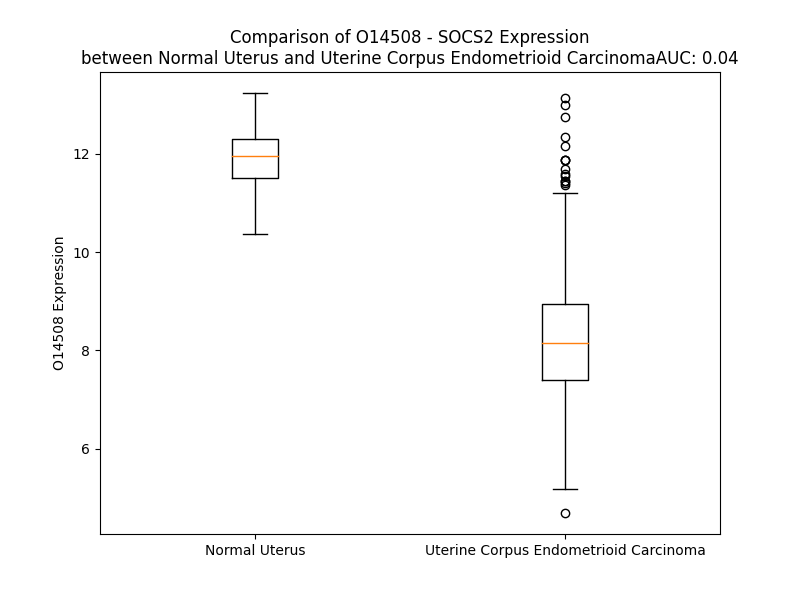

# Detailed Data for O14508

## Introduction to the Detailed Summary

### How to Interpret the Results

- **Summary & Metrics**: This section provides a quick reference to essential protein attributes, including expression changes, family classification, and biomarker applications. Regulation status (upregulated/downregulated) indicates the protein's behavior in a disease context. Some information comes from the original excel file with the proteins selected from literature, while others are derived from the analyses.
- **Expression Comparison**: A visual representation comparing protein expression between normal and disease states. It highlights significant changes in expression levels that might indicate diagnostic or therapeutic relevance. This is data coming from transcriptomics experiments and could not translate similarly to protein levels.
- **Isoform Alignment**: An interactive view of isoform alignments, revealing structural and functional differences between variants of the protein.
- **Interactors & Homologs**: Tables listing known interaction partners and homologous proteins, the more interactors and homologs, the more complex the protein is to design an antibody for.
- **Biological Assemblies**: Information about the structural arrangement of the protein in different assemblies, providing insights into its functional state but also the complexity of the protein to develop antibodies.
- **Combined Per-Residue Information**: A detailed table summarizing residue-level data. This includes predictions for epitope regions, aggregation tendencies, and modifications that might impact the protein's function. Each row corresponds to a residue in the protein, providing insights into specific sites that may be important for research or drug development.
## Summary & Metrics

- **UniProt Accession**: O14508
- **Gene Name**: SOCS2 
- **Protein Name**: suppressor of cytokine signaling 2 
- **Swiss Prot**: SOCS2_HUMAN
- **Family**: other
- **Biomarker Application**:  
- **Number of Isoforms**: 0
- **Regulation**: -1
- **(transcriptomics) AUC**: 0.0
- **(transcriptomics) Fold Change**: 1.45
- **(transcriptomics) Regulation**: Downregulated
- **Discotope Epitope Count**: 44
- **Max n_uniprots (Homo)**: N/A
- **Max n_uniprots (Hetero)**: 4

## Expression Comparison

## Interactors

| preferredName_A   | preferredName_B   |   score |
|:------------------|:------------------|--------:|
| SOCS2             | ELOC              |   0.999 |
| SOCS2             | ELOB              |   0.998 |
| SOCS2             | CUL5              |   0.998 |
| SOCS2             | GHR               |   0.993 |
| SOCS2             | JAK2              |   0.974 |
| SOCS2             | SOCS1             |   0.967 |
| SOCS2             | SOCS3             |   0.962 |
| SOCS2             | IRS1              |   0.96  |
| SOCS2             | EPOR              |   0.943 |
| SOCS2             | IRS2              |   0.928 |
| SOCS2             | IRS4              |   0.924 |
| SOCS2             | INSR              |   0.918 |
| SOCS2             | RNF7              |   0.909 |
| SOCS2             | STAT3             |   0.903 |

## Homologs

| uniprot_id   | gene_id       |
|:-------------|:--------------|
| Q9NSE2       | CISH          |
| O14544       | SOCS6         |
| O14543       | SOCS3         |
| O75159       | SOCS5         |
| O15524       | SOCS1         |
| Q5H9R6       | DKFZp686J1568 |
| O14512       | SOCS7         |

## Biological Assemblies

|   Unnamed: 0 |   assembly |   n_uniprots | composition   | crystal_id   |
|-------------:|-----------:|-------------:|:--------------|:-------------|
|            0 |          1 |            3 | Hetero        | 7zln         |
|            0 |          1 |            3 | Hetero        | 7zls         |
|            1 |          2 |            3 | Hetero        | 7zls         |
|            2 |          3 |            3 | Hetero        | 7zls         |
|            3 |          4 |            3 | Hetero        | 7zls         |
|            0 |          1 |            3 | Hetero        | 6i5n         |
|            1 |          2 |            3 | Hetero        | 6i5n         |
|            0 |          1 |            3 | Hetero        | 2c9w         |
|            0 |          1 |            3 | Hetero        | 7m6t         |
|            0 |          1 |            3 | Hetero        | 7zlp         |
|            0 |          1 |            3 | Hetero        | 5bo4         |
|            1 |          2 |            3 | Hetero        | 5bo4         |
|            2 |          3 |            3 | Hetero        | 5bo4         |
|            3 |          4 |            3 | Hetero        | 5bo4         |
|            4 |          5 |            3 | Hetero        | 5bo4         |
|            5 |          6 |            3 | Hetero        | 5bo4         |
|            0 |          1 |            3 | Hetero        | 7zlr         |
|            0 |          1 |            3 | Hetero        | 7zlm         |
|            1 |          2 |            3 | Hetero        | 7zlm         |
|            2 |          3 |            3 | Hetero        | 7zlm         |
|            3 |          4 |            3 | Hetero        | 7zlm         |
|            0 |          1 |            3 | Hetero        | 6i5j         |
|            1 |          2 |            3 | Hetero        | 6i5j         |
|            0 |          1 |            3 | Hetero        | 7zlo         |
|            0 |          1 |            4 | Hetero        | 4jgh         |
|            1 |          2 |            4 | Hetero        | 4jgh         |
|            0 |          1 |            3 | Hetero        | 6i4x         |

## Combined Per-Residue Information

|   res | aa   |   epitope_score | epitope   |   relative_surface_accessibility |   modeling_confidence |   Aggregation | modification          |
|------:|:-----|----------------:|:----------|---------------------------------:|----------------------:|--------------:|:----------------------|
|     1 | M    |         0.20597 | False     |                          1.31738 |                 35.05 |         0     | N/A                   |
|     2 | T    |         0.19454 | False     |                          0.75495 |                 36.34 |         0     | N/A                   |
|     3 | L    |         0.2315  | False     |                          0.84746 |                 36.82 |         0     | N/A                   |
|     4 | R    |         0.25146 | False     |                          0.86393 |                 41.77 |         0     | N/A                   |
|     5 | C    |         0.27217 | False     |                          0.966   |                 41.43 |         0     | N/A                   |
|     6 | L    |         0.28865 | False     |                          1.03601 |                 39.5  |         0     | N/A                   |
|     7 | E    |         0.2984  | False     |                          0.82286 |                 40.15 |         0     | N/A                   |
|     8 | P    |         0.31266 | False     |                          0.98801 |                 36.32 |         0     | N/A                   |
|     9 | S    |         0.22281 | False     |                          0.90911 |                 50.5  |         0     | N/A                   |
|    10 | G    |         0.34444 | True      |                          0.8973  |                 37.74 |         0     | N/A                   |
|    11 | N    |         0.31532 | False     |                          1.01796 |                 51.12 |         0     | N/A                   |
|    12 | G    |         0.34201 | True      |                          0.93891 |                 41.74 |         0     | N/A                   |
|    13 | G    |         0.33005 | True      |                          0.95163 |                 42.3  |         0     | N/A                   |
|    14 | E    |         0.21245 | False     |                          0.94399 |                 46.32 |         0     | N/A                   |
|    15 | G    |         0.25648 | False     |                          0.86194 |                 38.22 |         0     | N/A                   |
|    16 | T    |         0.27974 | False     |                          0.97973 |                 45.89 |         0     | N/A                   |
|    17 | R    |         0.32714 | True      |                          0.89183 |                 42.86 |         0     | N/A                   |
|    18 | S    |         0.25783 | False     |                          0.74121 |                 38.82 |         0     | N/A                   |
|    19 | Q    |         0.3364  | True      |                          0.90553 |                 43.02 |         0     | N/A                   |
|    20 | W    |         0.27528 | False     |                          1.09856 |                 37    |         0     | N/A                   |
|    21 | G    |         0.28113 | False     |                          0.8599  |                 32.35 |         0     | N/A                   |
|    22 | T    |         0.28199 | False     |                          0.95671 |                 40.68 |         0     | N/A                   |
|    23 | A    |         0.19401 | False     |                          0.98149 |                 44.8  |         0     | N/A                   |
|    24 | G    |         0.25841 | False     |                          0.85047 |                 37.16 |         0     | N/A                   |
|    25 | S    |         0.1521  | False     |                          0.76379 |                 46.47 |         0     | N/A                   |
|    26 | A    |         0.232   | False     |                          0.93018 |                 56.18 |         0     | N/A                   |
|    27 | E    |         0.26368 | False     |                          0.84292 |                 61.32 |         0     | N/A                   |
|    28 | E    |         0.26495 | False     |                          0.79809 |                 64.63 |         0     | N/A                   |
|    29 | P    |         0.2809  | False     |                          0.64049 |                 72.44 |         0     | N/A                   |
|    30 | S    |         0.25259 | False     |                          0.45986 |                 84.92 |         0     | Phosphoserine         |
|    31 | P    |         0.30402 | False     |                          0.7191  |                 87.58 |         0     | N/A                   |
|    32 | Q    |         0.27808 | False     |                          0.44376 |                 87.26 |         0     | N/A                   |
|    33 | A    |         0.18587 | False     |                          0.30643 |                 89.22 |         0     | N/A                   |
|    34 | A    |         0.26297 | False     |                          0.47443 |                 91.18 |         0     | N/A                   |
|    35 | R    |         0.28103 | False     |                          0.36038 |                 90.95 |         0     | N/A                   |
|    36 | L    |         0.15733 | False     |                          0.16075 |                 93.73 |         0     | N/A                   |
|    37 | A    |         0.15914 | False     |                          0.52882 |                 93.26 |         0     | N/A                   |
|    38 | K    |         0.2301  | False     |                          0.54375 |                 92.92 |         0     | N/A                   |
|    39 | A    |         0.0166  | False     |                          0.00984 |                 94.7  |         0     | N/A                   |
|    40 | L    |         0.25981 | False     |                          0.44468 |                 94.59 |         0     | N/A                   |
|    41 | R    |         0.37489 | True      |                          0.59131 |                 94.17 |         0     | N/A                   |
|    42 | E    |         0.11777 | False     |                          0.08591 |                 94.87 |         0     | N/A                   |
|    43 | L    |         0.00493 | False     |                          0.00082 |                 96.71 |         0     | N/A                   |
|    44 | G    |         0.28689 | False     |                          0.61161 |                 95.37 |         0     | N/A                   |
|    45 | Q    |         0.31632 | False     |                          0.28633 |                 93.91 |         0     | N/A                   |
|    46 | T    |         0.01436 | False     |                          0.00371 |                 96.53 |         0.41  | N/A                   |
|    47 | G    |         0.25617 | False     |                          0.30421 |                 96.46 |         0.41  | N/A                   |
|    48 | W    |         0.00954 | False     |                          0       |                 97.64 |         0.652 | N/A                   |
|    49 | Y    |         0.35013 | True      |                          0.2917  |                 98.29 |         0.652 | N/A                   |
|    50 | W    |         0.364   | True      |                          0.2463  |                 98.23 |         0.652 | N/A                   |
|    51 | G    |         0.13661 | False     |                          0.19937 |                 97.16 |         0.243 | N/A                   |
|    52 | S    |         0.38877 | True      |                          0.76824 |                 96.71 |         0.243 | Phosphoserine; by PKC |
|    53 | M    |         0.20796 | False     |                          0.11007 |                 97.71 |         0.243 | N/A                   |
|    54 | T    |         0.33566 | True      |                          0.51915 |                 97.77 |         0.243 | N/A                   |
|    55 | V    |         0.32478 | True      |                          0.34631 |                 97.74 |         0.243 | N/A                   |
|    56 | N    |         0.36875 | True      |                          0.68133 |                 97.9  |         0     | N/A                   |
|    57 | E    |         0.41914 | True      |                          0.45397 |                 98.14 |         0     | N/A                   |
|    58 | A    |         0.01361 | False     |                          0.00638 |                 98.31 |         0     | N/A                   |
|    59 | K    |         0.28658 | False     |                          0.43856 |                 97.67 |         0     | N/A                   |
|    60 | E    |         0.32747 | True      |                          0.60171 |                 97.88 |         0     | N/A                   |
|    61 | K    |         0.32203 | False     |                          0.54838 |                 97.57 |         0     | N/A                   |
|    62 | L    |         0.00683 | False     |                          0       |                 97.85 |         0     | N/A                   |
|    63 | K    |         0.34191 | True      |                          0.54637 |                 96.08 |         0     | N/A                   |
|    64 | E    |         0.35607 | True      |                          0.77784 |                 94.63 |         0     | N/A                   |
|    65 | A    |         0.11579 | False     |                          0.15016 |                 96.99 |         0     | N/A                   |
|    66 | P    |         0.1799  | False     |                          0.57642 |                 96.66 |         0     | N/A                   |
|    67 | E    |         0.17122 | False     |                          0.43682 |                 94.75 |         0     | N/A                   |
|    68 | G    |         0.00715 | False     |                          0       |                 94.06 |         2.354 | N/A                   |
|    69 | T    |         0.02166 | False     |                          0.01428 |                 97.41 |         2.354 | N/A                   |
|    70 | F    |         0.0053  | False     |                          0       |                 97.89 |         2.354 | N/A                   |
|    71 | L    |         0.00585 | False     |                          0       |                 98.46 |         2.354 | N/A                   |
|    72 | I    |         0.00335 | False     |                          0       |                 98.24 |         2.354 | N/A                   |
|    73 | R    |         0.09828 | False     |                          0.02107 |                 98.21 |         0     | N/A                   |
|    74 | D    |         0.27315 | False     |                          0.2608  |                 97.62 |         0     | N/A                   |
|    75 | S    |         0.33267 | True      |                          0.16465 |                 96.58 |         0     | N/A                   |
|    76 | S    |         0.40905 | True      |                          0.78715 |                 94.49 |         0     | N/A                   |
|    77 | H    |         0.45076 | True      |                          0.35478 |                 93.12 |         0     | N/A                   |
|    78 | S    |         0.41732 | True      |                          0.79599 |                 91.98 |         0     | N/A                   |
|    79 | D    |         0.41863 | True      |                          0.57145 |                 91.17 |         0     | N/A                   |
|    80 | Y    |         0.24731 | False     |                          0.12876 |                 93.36 |        55.992 | N/A                   |
|    81 | L    |         0.37892 | True      |                          0.46951 |                 93.53 |        70.963 | N/A                   |
|    82 | L    |         0.04621 | False     |                          0.02143 |                 97.25 |        71.314 | N/A                   |
|    83 | T    |         0.05449 | False     |                          0.02102 |                 96.44 |        71.314 | N/A                   |
|    84 | I    |         0.00924 | False     |                          0       |                 96.34 |        71.314 | N/A                   |
|    85 | S    |         0.04173 | False     |                          0.01456 |                 96.7  |        66.954 | N/A                   |
|    86 | V    |         0.04772 | False     |                          0.03047 |                 95.98 |        61.738 | N/A                   |
|    87 | K    |         0.17871 | False     |                          0.18241 |                 95.38 |         0     | N/A                   |
|    88 | T    |         0.2523  | False     |                          0.19031 |                 92.08 |         0     | N/A                   |
|    89 | S    |         0.30014 | False     |                          0.76909 |                 90.17 |         0     | N/A                   |
|    90 | A    |         0.33033 | True      |                          1.01035 |                 90.24 |         0     | N/A                   |
|    91 | G    |         0.2722  | False     |                          0.18161 |                 92.99 |         0     | N/A                   |
|    92 | P    |         0.21674 | False     |                          0.26734 |                 94.77 |         0     | N/A                   |
|    93 | T    |         0.50032 | True      |                          0.38561 |                 93.04 |         0     | N/A                   |
|    94 | N    |         0.26973 | False     |                          0.27748 |                 93.61 |         0     | N/A                   |
|    95 | L    |         0.15411 | False     |                          0.05441 |                 92.22 |         0     | N/A                   |
|    96 | R    |         0.23274 | False     |                          0.3207  |                 93.42 |         0     | N/A                   |
|    97 | I    |         0.01536 | False     |                          0.00637 |                 93.8  |         0     | N/A                   |
|    98 | E    |         0.15531 | False     |                          0.07621 |                 92.71 |         0     | N/A                   |
|    99 | Y    |         0.27288 | False     |                          0.2106  |                 92.64 |         0     | N/A                   |
|   100 | Q    |         0.28971 | False     |                          0.46403 |                 89.83 |         0     | N/A                   |
|   101 | D    |         0.32707 | True      |                          0.75373 |                 89.24 |         0     | N/A                   |
|   102 | G    |         0.01701 | False     |                          0.00933 |                 90.54 |         0     | N/A                   |
|   103 | K    |         0.27521 | False     |                          0.34326 |                 93.15 |         0     | N/A                   |
|   104 | F    |         0.01031 | False     |                          0.00701 |                 94.01 |         0     | N/A                   |
|   105 | R    |         0.27604 | False     |                          0.17074 |                 91.48 |         0     | N/A                   |
|   106 | L    |         0.02495 | False     |                          0.00884 |                 89.53 |         0     | N/A                   |
|   107 | D    |         0.11615 | False     |                          0.02522 |                 82.81 |         0     | N/A                   |
|   108 | S    |         0.3179  | False     |                          0.20593 |                 68.07 |         5.538 | N/A                   |
|   109 | I    |         0.40787 | True      |                          0.85281 |                 57.95 |         5.538 | N/A                   |
|   110 | I    |         0.30986 | False     |                          0.48704 |                 57.15 |         5.538 | N/A                   |
|   111 | C    |         0.14942 | False     |                          0.15195 |                 58.38 |         5.538 | N/A                   |
|   112 | V    |         0.25084 | False     |                          0.72387 |                 55.32 |         5.538 | N/A                   |
|   113 | K    |         0.34953 | True      |                          0.7587  |                 51.72 |         0     | N/A                   |
|   114 | S    |         0.34324 | True      |                          0.77771 |                 41.93 |         0     | N/A                   |
|   115 | K    |         0.31765 | False     |                          0.86535 |                 60.83 |         0     | N/A                   |
|   116 | L    |         0.34624 | True      |                          0.18247 |                 72.54 |         0     | N/A                   |
|   117 | K    |         0.36193 | True      |                          0.51558 |                 85.06 |         0     | N/A                   |
|   118 | Q    |         0.42431 | True      |                          0.51635 |                 91.01 |         0     | N/A                   |
|   119 | F    |         0.14343 | False     |                          0.05581 |                 94.17 |         0     | N/A                   |
|   120 | D    |         0.28212 | False     |                          0.41446 |                 93.29 |         0     | N/A                   |
|   121 | S    |         0.11966 | False     |                          0.07072 |                 94.19 |         0     | N/A                   |
|   122 | V    |         0.00341 | False     |                          0       |                 95.65 |         0.818 | N/A                   |
|   123 | V    |         0.00278 | False     |                          0       |                 97.12 |         0.818 | N/A                   |
|   124 | H    |         0.23963 | False     |                          0.45407 |                 95.72 |         0.818 | N/A                   |
|   125 | L    |         0.00338 | False     |                          0       |                 94.3  |         0.818 | N/A                   |
|   126 | I    |         0.00504 | False     |                          0       |                 94.94 |         0.818 | N/A                   |
|   127 | D    |         0.18528 | False     |                          0.10965 |                 94.57 |         0.338 | N/A                   |
|   128 | Y    |         0.33311 | True      |                          0.22803 |                 92.02 |         1.258 | N/A                   |
|   129 | Y    |         0.0956  | False     |                          0.11809 |                 90    |         1.258 | N/A                   |
|   130 | V    |         0.01606 | False     |                          0.01047 |                 92.04 |         1.258 | N/A                   |
|   131 | Q    |         0.18268 | False     |                          0.28046 |                 89.05 |         1.258 | N/A                   |
|   132 | M    |         0.14209 | False     |                          0.41454 |                 85.77 |         1.258 | N/A                   |
|   133 | C    |         0.17558 | False     |                          0.29298 |                 83.71 |         0.338 | N/A                   |
|   134 | K    |         0.2032  | False     |                          0.53489 |                 82.11 |         0.338 | N/A                   |
|   135 | D    |         0.21698 | False     |                          0.42344 |                 72.33 |         0     | N/A                   |
|   136 | K    |         0.25316 | False     |                          0.95609 |                 58.97 |         0     | N/A                   |
|   137 | R    |         0.274   | False     |                          0.92014 |                 55.51 |         0     | N/A                   |
|   138 | T    |         0.13048 | False     |                          0.54622 |                 52.75 |         0     | N/A                   |
|   139 | G    |         0.16964 | False     |                          0.40446 |                 46.2  |         0     | N/A                   |
|   140 | P    |         0.20711 | False     |                          1.00295 |                 46.33 |         0     | N/A                   |
|   141 | E    |         0.26209 | False     |                          0.75705 |                 41.71 |         0     | N/A                   |
|   142 | A    |         0.21333 | False     |                          0.73651 |                 40.53 |         0     | N/A                   |
|   143 | P    |         0.32214 | False     |                          0.50314 |                 43.07 |         0     | N/A                   |
|   144 | R    |         0.35519 | True      |                          0.94568 |                 39.53 |         0     | N/A                   |
|   145 | N    |         0.29158 | False     |                          0.83823 |                 40.11 |         0     | N/A                   |
|   146 | G    |         0.22429 | False     |                          0.97781 |                 42.55 |         0     | N/A                   |
|   147 | T    |         0.23199 | False     |                          0.34206 |                 48.19 |         0.674 | N/A                   |
|   148 | V    |         0.1825  | False     |                          0.66842 |                 50.68 |         1.537 | N/A                   |
|   149 | H    |         0.1813  | False     |                          0.58454 |                 61.96 |         1.537 | N/A                   |
|   150 | L    |         0.14657 | False     |                          0.17564 |                 79.6  |         1.537 | N/A                   |
|   151 | Y    |         0.11705 | False     |                          0.47387 |                 86.79 |         1.537 | N/A                   |
|   152 | L    |         0.00373 | False     |                          0.00122 |                 92.05 |         1.376 | N/A                   |
|   153 | T    |         0.17442 | False     |                          0.32649 |                 92.83 |         0.513 | N/A                   |
|   154 | K    |         0.15755 | False     |                          0.4546  |                 94.89 |         0     | N/A                   |
|   155 | P    |         0.06161 | False     |                          0.1333  |                 97.86 |         0     | N/A                   |
|   156 | L    |         0.25762 | False     |                          0.26627 |                 98.19 |         0     | N/A                   |
|   157 | Y    |         0.20644 | False     |                          0.28712 |                 97.68 |         0     | N/A                   |
|   158 | T    |         0.32467 | True      |                          0.438   |                 96.91 |         0     | N/A                   |
|   159 | S    |         0.3251  | True      |                          0.61897 |                 95.76 |         0     | N/A                   |
|   160 | A    |         0.22133 | False     |                          0.92954 |                 95.76 |         0     | N/A                   |
|   161 | P    |         0.29265 | False     |                          0.25639 |                 95.08 |         0     | N/A                   |
|   162 | S    |         0.42851 | True      |                          0.51574 |                 96.77 |         0     | N/A                   |
|   163 | L    |         0.376   | True      |                          0.83246 |                 97.88 |         0     | N/A                   |
|   164 | Q    |         0.44842 | True      |                          0.45805 |                 97.41 |         0     | N/A                   |
|   165 | H    |         0.17068 | False     |                          0.06938 |                 97.11 |         0     | N/A                   |
|   166 | L    |         0.26516 | False     |                          0.45854 |                 97.19 |         0     | N/A                   |
|   167 | C    |         0.16392 | False     |                          0.4701  |                 97.88 |         0     | N/A                   |
|   168 | R    |         0.09485 | False     |                          0.02497 |                 97.72 |         0     | N/A                   |
|   169 | L    |         0.06215 | False     |                          0.05441 |                 97.04 |         0     | N/A                   |
|   170 | T    |         0.1203  | False     |                          0.56426 |                 97.51 |         0     | N/A                   |
|   171 | I    |         0.12477 | False     |                          0.28239 |                 97.94 |         0     | N/A                   |
|   172 | N    |         0.08419 | False     |                          0.06844 |                 96.62 |         0     | N/A                   |
|   173 | K    |         0.2402  | False     |                          0.5515  |                 95.48 |         0     | N/A                   |
|   174 | C    |         0.16051 | False     |                          0.79106 |                 96.34 |         0     | N/A                   |
|   175 | T    |         0.41247 | True      |                          0.28481 |                 96.17 |         0     | N/A                   |
|   176 | G    |         0.24718 | False     |                          0.86926 |                 94.55 |         0     | N/A                   |
|   177 | A    |         0.23516 | False     |                          0.64846 |                 96.51 |         0     | N/A                   |
|   178 | I    |         0.11518 | False     |                          0.02047 |                 96.25 |         0     | N/A                   |
|   179 | W    |         0.34463 | True      |                          0.65218 |                 95.72 |         0     | N/A                   |
|   180 | G    |         0.34199 | True      |                          0.83221 |                 96.31 |         0     | N/A                   |
|   181 | L    |         0.19116 | False     |                          0.2403  |                 97.42 |         0     | N/A                   |
|   182 | P    |         0.41324 | True      |                          0.9779  |                 97.86 |         0     | N/A                   |
|   183 | L    |         0.2112  | False     |                          0.3426  |                 97.63 |         0     | N/A                   |
|   184 | P    |         0.35579 | True      |                          0.65624 |                 98.27 |         0     | N/A                   |
|   185 | T    |         0.31229 | False     |                          0.57245 |                 97.85 |         0     | N/A                   |
|   186 | R    |         0.43528 | True      |                          0.849   |                 97.93 |         0     | N/A                   |
|   187 | L    |         0.23395 | False     |                          0.43752 |                 97.77 |         0     | N/A                   |
|   188 | K    |         0.28337 | False     |                          0.12792 |                 98.1  |         0     | N/A                   |
|   189 | D    |         0.31955 | False     |                          0.38388 |                 97.39 |         0     | N/A                   |
|   190 | Y    |         0.21557 | False     |                          0.19873 |                 97    |         0     | N/A                   |
|   191 | L    |         0.05608 | False     |                          0.02638 |                 96.85 |         0     | N/A                   |
|   192 | E    |         0.29404 | False     |                          0.29753 |                 95.02 |         0     | N/A                   |
|   193 | E    |         0.31061 | False     |                          0.52077 |                 93.39 |         0     | N/A                   |
|   194 | Y    |         0.01368 | False     |                          0.00365 |                 94.04 |         0     | N/A                   |
|   195 | K    |         0.21189 | False     |                          0.56555 |                 94.88 |         0     | N/A                   |
|   196 | F    |         0.10555 | False     |                          0.13195 |                 95.77 |         0     | N/A                   |
|   197 | Q    |         0.1523  | False     |                          0.2238  |                 95.14 |         0     | N/A                   |
|   198 | V    |         0.07722 | False     |                          0.06188 |                 92.69 |         0     | N/A                   |

