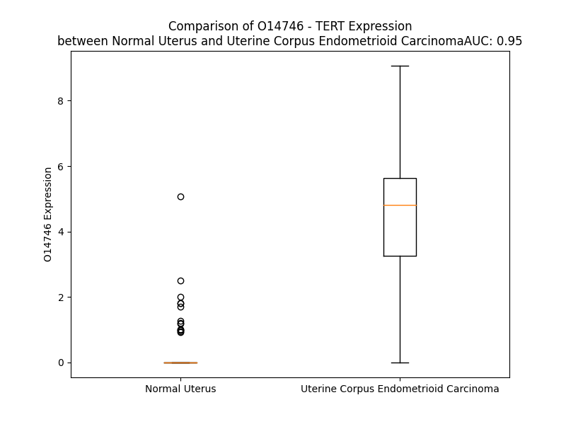

# Detailed Data for O14746

## Introduction to the Detailed Summary

### How to Interpret the Results

- **Summary & Metrics**: This section provides a quick reference to essential protein attributes, including expression changes, family classification, and biomarker applications. Regulation status (upregulated/downregulated) indicates the protein's behavior in a disease context. Some information comes from the original excel file with the proteins selected from literature, while others are derived from the analyses.
- **Expression Comparison**: A visual representation comparing protein expression between normal and disease states. It highlights significant changes in expression levels that might indicate diagnostic or therapeutic relevance. This is data coming from transcriptomics experiments and could not translate similarly to protein levels.
- **Isoform Alignment**: An interactive view of isoform alignments, revealing structural and functional differences between variants of the protein.
- **Interactors & Homologs**: Tables listing known interaction partners and homologous proteins, the more interactors and homologs, the more complex the protein is to design an antibody for.
- **Biological Assemblies**: Information about the structural arrangement of the protein in different assemblies, providing insights into its functional state but also the complexity of the protein to develop antibodies.
- **Combined Per-Residue Information**: A detailed table summarizing residue-level data. This includes predictions for epitope regions, aggregation tendencies, and modifications that might impact the protein's function. Each row corresponds to a residue in the protein, providing insights into specific sites that may be important for research or drug development.
## Summary & Metrics

- **UniProt Accession**: O14746
- **Gene Name**: TERT
- **Protein Name**: Telomerase reverse transcriptase
- **Swiss Prot**: TERT_HUMAN
- **Family**: enzyme
- **Biomarker Application**: diagnosis,disease progression,prognosis
- **Number of Isoforms**: 4
- **Regulation**: 1
- **(transcriptomics) AUC**: 0.95
- **(transcriptomics) Fold Change**: 14.87
- **(transcriptomics) Regulation**: Upregulated
- **Discotope Epitope Count**: 274
- **Max n_uniprots (Homo)**: 1
- **Max n_uniprots (Hetero)**: 6

## Expression Comparison

## Isoform Alignment

<pre style='font-size:14px; font-family:monospace;'>O14746-1 MPRAPRCRAVRSLLRSHYREVLPLATFVRRLGPQGWRLVQRGDPAAFRALVAQCLVCVPWDARPPPAAPSFRQVSCLKELVARVLQRLCERGAKNVLAFGFALLDGARGGPPEAFTTSVRSYLPNTVTDALRGSGAWGLLLRRVGDDVLVHLLARCALFVLVAPSCAYQVCGPPLYQLGAATQARPPPHASGPRRRLGCERAWNHSVREAGVPLGLPAPGARRRGGSASRSLPLPKRPRRGAAPEPERTPVGQGSWAHPGRTRGPSDRGFCVVSPARPAEEATSLEGALSGTRHSHPSVGRQHHAGPPSTSRPPRPWDTPCPPVYAETKHFLYSSGDKEQLRPSFLLSSLRPSLTGARRLVETIFLGSRPWMPGTPRRLPRLPQRYWQMRPLFLELLGNHAQCPYGVLLKTHCPLRAAVTPAAGVCAREKPQGSVAAPEEEDTDPRRLVQLLRQHSSPWQVYGFVRACLRRLVPPGLWGSRHNERRFLRNTKKFISLGKHAKLSLQELTWKMSVRDCAWLRRSPGVGCVPAAEHRLREEILAKFLHWLMSVYVVELLRSFFYVTETTFQKNRLFFYRKSVWSKLQSIGIRQHLKRVQLRELSEAEVRQHREARPALLTSRLRFIPKPDGLRPIVNMDYVVGARTFRREKRAERLTSRVKALFSVLNYERARRPGLLGASVLGLDDIHRAWRTFVLRVRAQDPPPELYFVKVDVTGAYDTIPQDRLTEVIASIIKPQNTYCVRRYAVVQKAAHGHVRKAFKSHVSTLTDLQPYMRQ-FVAHLQETSPLRDAVV--IEQSSSLNEASSGLFDVFLRFMCHHAVRIRGKSYVQCQGIPQGSILSTLLCSLCYGDMENKLFAGIRRDGLLLRLVDDFLLVTPHLTHAKTFLRTLVRGVPEYGCVVNLRKTVVNFPVEDEALGGTAFVQMPAHGLFPWCGLLLDTRTLEVQSDYSSYARTSIRASLTFNRGFKAGRNMRRKLFGVLRLKCHSLFLDLQVNSLQTVCTNIYKILLLQAYRFHACVLQLPFHQQVWKNPTFFLRVISDTASLCYSILKAKNAGMSLGAKGAAGPLPSEAVQWLCHQAFLLKLTRHRVTYVPLLGSLRTAQTQLSRKLPGTTLTALEAAANPALPSDFKTILD
O14746-2 MPRAPRCRAVRSLLRSHYREVLPLATFVRRLGPQGWRLVQRGDPAAFRALVAQCLVCVPWDARPPPAAPSFRQVSCLKELVARVLQRLCERGAKNVLAFGFALLDGARGGPPEAFTTSVRSYLPNTVTDALRGSGAWGLLLRRVGDDVLVHLLARCALFVLVAPSCAYQVCGPPLYQLGAATQARPPPHASGPRRRLGCERAWNHSVREAGVPLGLPAPGARRRGGSASRSLPLPKRPRRGAAPEPERTPVGQGSWAHPGRTRGPSDRGFCVVSPARPAEEATSLEGALSGTRHSHPSVGRQHHAGPPSTSRPPRPWDTPCPPVYAETKHFLYSSGDKEQLRPSFLLSSLRPSLTGARRLVETIFLGSRPWMPGTPRRLPRLPQRYWQMRPLFLELLGNHAQCPYGVLLKTHCPLRAAVTPAAGVCAREKPQGSVAAPEEEDTDPRRLVQLLRQHSSPWQVYGFVRACLRRLVPPGLWGSRHNERRFLRNTKKFISLGKHAKLSLQELTWKMSVRDCAWLRRSPGVGCVPAAEHRLREEILAKFLHWLMSVYVVELLRSFFYVTETTFQKNRLFFYRKSVWSKLQSIGIRQHLKRVQLRELSEAEVRQHREARPALLTSRLRFIPKPDGLRPIVNMDYVVGARTFRREKRAERLTSRVKALFSVLNYERARRPGLLGASVLGLDDIHRAWRTFVLRVRAQDPPPELYFVKVDVTGAYDTIPQDRLTEVIASIIKPQNTYCVRRYAVVQKAAHGHVRKAFKSHVLRPVPGDPAGLHPLHAALQPVLRRHGEQAVCGDSAGRAAPAFGG----------------------------------------------------------------------------------------------------------------------------------------------------------------------------------------------------------------------------------------------------------------------------------------------------------------------------------------
O14746-3 MPRAPRCRAVRSLLRSHYREVLPLATFVRRLGPQGWRLVQRGDPAAFRALVAQCLVCVPWDARPPPAAPSFRQVSCLKELVARVLQRLCERGAKNVLAFGFALLDGARGGPPEAFTTSVRSYLPNTVTDALRGSGAWGLLLRRVGDDVLVHLLARCALFVLVAPSCAYQVCGPPLYQLGAATQARPPPHASGPRRRLGCERAWNHSVREAGVPLGLPAPGARRRGGSASRSLPLPKRPRRGAAPEPERTPVGQGSWAHPGRTRGPSDRGFCVVSPARPAEEATSLEGALSGTRHSHPSVGRQHHAGPPSTSRPPRPWDTPCPPVYAETKHFLYSSGDKEQLRPSFLLSSLRPSLTGARRLVETIFLGSRPWMPGTPRRLPRLPQRYWQMRPLFLELLGNHAQCPYGVLLKTHCPLRAAVTPAAGVCAREKPQGSVAAPEEEDTDPRRLVQLLRQHSSPWQVYGFVRACLRRLVPPGLWGSRHNERRFLRNTKKFISLGKHAKLSLQELTWKMSVRDCAWLRRSPGVGCVPAAEHRLREEILAKFLHWLMSVYVVELLRSFFYVTETTFQKNRLFFYRKSVWSKLQSIGIRQHLKRVQLRELSEAEVRQHREARPALLTSRLRFIPKPDGLRPIVNMDYVVGARTFRREKRAERLTSRVKALFSVLNYERARRPGLLGASVLGLDDIHRAWRTFVLRVRAQDPPPELYFVKVDVTGAYDTIPQDRLTEVIASIIKPQNTYCVRRYAVVQKAAHGHVRKAFKSHVSTLTDLQPYMRQ-FVAHLQETSPLRDAVV--IEQSSSLNEASSGLFDVFLRFMCHHAVRIRGKSYVQCQGIPQGSILSTLLCSLCYGDMENKLFAGIRRDGLLLRLVDDFLLVTPHLTHAKTFL---------------------------------------------------------------SYARTSIRASLTFNRGFKAGRNMRRKLFGVLRLKCHSLFLDLQVNSLQTVCTNIYKILLLQAYRFHACVLQLPFHQQVWKNPTFFLRVISDTASLCYSILKAKNAGMSLGAKGAAGPLPSEAVQWLCHQAFLLKLTRHRVTYVPLLGSLRTAQTQLSRKLPGTTLTALEAAANPALPSDFKTILD
O14746-4 MPRAPRCRAVRSLLRSHYREVLPLATFVRRLGPQGWRLVQRGDPAAFRALVAQCLVCVPWDARPPPAAPSFRQVSCLKELVARVLQRLCERGAKNVLAFGFALLDGARGGPPEAFTTSVRSYLPNTVTDALRGSGAWGLLLRRVGDDVLVHLLARCALFVLVAPSCAYQVCGPPLYQLGAATQARPPPHASGPRRRLGCERAWNHSVREAGVPLGLPAPGARRRGGSASRSLPLPKRPRRGAAPEPERTPVGQGSWAHPGRTRGPSDRGFCVVSPARPAEEATSLEGALSGTRHSHPSVGRQHHAGPPSTSRPPRPWDTPCPPVYAETKHFLYSSGDKEQLRPSFLLSSLRPSLTGARRLVETIFLGSRPWMPGTPRRLPRLPQRYWQMRPLFLELLGNHAQCPYGVLLKTHCPLRAAVTPAAGVCAREKPQGSVAAPEEEDTDPRRLVQLLRQHSSPWQVYGFVRACLRRLVPPGLWGSRHNERRFLRNTKKFISLGKHAKLSLQELTWKMSVRDCAWLRRSPGVGCVPAAEHRLREEILAKFLHWLMSVYVVELLRSFFYVTETTFQKNRLFFYRKSVWSKLQSIGIRQHLKRVQLRELSEAEVRQHREARPALLTSRLRFIPKPDGLRPIVNMDYVVGARTFRREKRAERLTSRVKALFSVLNYERARRPGLLGASVLGLDDIHRAWRTFVLRVRAQDPPPELYFVK------------DRLTEVIASIIKPQNTYCVRRYAVVQKAAHGHVRKAFKSHVLRPVPGDPAGLHPLHAALQPVLRRHGEQAVCGDSAGRAAPAFGG----------------------------------------------------------------------------------------------------------------------------------------------------------------------------------------------------------------------------------------------------------------------------------------------------------------------------------------
</pre>

## Interactors

| preferredName_A   | preferredName_B   |   score |
|:------------------|:------------------|--------:|
| TERT              | NHP2              |   0.999 |
| TERT              | NOP10             |   0.999 |
| TERT              | WRAP53            |   0.999 |
| TERT              | TEP1              |   0.999 |
| TERT              | DKC1              |   0.999 |
| TERT              | HSP90AA1          |   0.998 |
| TERT              | SULT1E1           |   0.996 |
| TERT              | CTNNB1            |   0.995 |
| TERT              | RUVBL2            |   0.992 |
| TERT              | POT1              |   0.99  |
| TERT              | SMARCA4           |   0.99  |
| TERT              | PTGES3            |   0.989 |
| TERT              | HSP90AB1          |   0.987 |
| TERT              | SMG6              |   0.984 |
| TERT              | ACD               |   0.982 |
| TERT              | RUVBL1            |   0.979 |
| TERT              | TERF1             |   0.973 |
| TERT              | GAR1              |   0.971 |
| TERT              | TINF2             |   0.966 |
| TERT              | XRCC6             |   0.964 |
| TERT              | TCF7L1            |   0.957 |
| TERT              | XRCC5             |   0.948 |
| TERT              | NVL               |   0.944 |
| TERT              | SMG5              |   0.928 |
| TERT              | GNL3L             |   0.926 |
| TERT              | CLPTM1L           |   0.926 |
| TERT              | MYC               |   0.92  |
| TERT              | TCF7L2            |   0.919 |
| TERT              | RTEL1             |   0.918 |
| TERT              | TCF7              |   0.915 |
| TERT              | NAT10             |   0.913 |
| TERT              | KPNA1             |   0.913 |
| TERT              | PIF1              |   0.907 |
| TERT              | AKT1              |   0.903 |
| TERT              | TP53              |   0.902 |

## Homologs

| uniprot_id   | gene_id   |
|--------------|-----------|

## Biological Assemblies

|   Unnamed: 0 |   assembly |   n_uniprots | composition   | crystal_id   |
|-------------:|-----------:|-------------:|:--------------|:-------------|
|            0 |          1 |            2 | Hetero        | 5meq         |
|            0 |          1 |            2 | Hetero        | 7tre         |
|            0 |          1 |            3 | Hetero        | 7v99         |
|            0 |          1 |            3 | Hetero        | 7bg9         |
|            0 |          1 |            2 | Hetero        | 5mer         |
|            1 |          2 |            2 | Hetero        | 5mer         |
|            0 |          1 |            4 | Hetero        | 7qxa         |
|            0 |          1 |            5 | Hetero        | 7qxs         |
|            0 |          1 |            4 | Hetero        | 5men         |
|            0 |          1 |            2 | Hetero        | 4b18         |
|            0 |          1 |            2 | Hetero        | 5mep         |
|            1 |          2 |            2 | Hetero        | 5mep         |
|            0 |          1 |            5 | Hetero        | 7qxb         |
|            0 |          1 |            3 | Hetero        | 7trf         |
|            0 |          1 |            1 | Homo          | 5ugw         |
|            0 |          1 |            5 | Hetero        | 4mnq         |
|            0 |          1 |            3 | Hetero        | 2bck         |
|            1 |          2 |            3 | Hetero        | 2bck         |
|            2 |          3 |            6 | Hetero        | 2bck         |
|            0 |          1 |            2 | Hetero        | 5meo         |
|            0 |          1 |            1 | Homo          | 7trd         |

## Combined Per-Residue Information

|   res | aa   |   epitope_score | epitope   |   relative_surface_accessibility |   modeling_confidence |   Aggregation | modification                             |
|------:|:-----|----------------:|:----------|---------------------------------:|----------------------:|--------------:|:-----------------------------------------|
|     1 | M    |         0.0447  | False     |                          0.70282 |                 59.04 |         0     | N/A                                      |
|     2 | P    |         0.08688 | False     |                          0.45922 |                 62.97 |         0     | N/A                                      |
|     3 | R    |         0.21476 | True      |                          0.96868 |                 71.94 |         0     | N/A                                      |
|     4 | A    |         0.06028 | False     |                          0.37521 |                 77.14 |         0     | N/A                                      |
|     5 | P    |         0.02521 | False     |                          0.15482 |                 81.6  |         0     | N/A                                      |
|     6 | R    |         0.08426 | False     |                          0.74155 |                 85.96 |         0     | N/A                                      |
|     7 | C    |         0.02063 | False     |                          0.03437 |                 91.19 |         0     | N/A                                      |
|     8 | R    |         0.14157 | True      |                          0.72212 |                 91.92 |         0     | N/A                                      |
|     9 | A    |         0.02723 | False     |                          0.26438 |                 90.98 |         0     | N/A                                      |
|    10 | V    |         0.00082 | False     |                          0       |                 94.22 |         0     | N/A                                      |
|    11 | R    |         0.04028 | False     |                          0.18282 |                 94.35 |         0     | N/A                                      |
|    12 | S    |         0.03546 | False     |                          0.36925 |                 91.8  |         0     | N/A                                      |
|    13 | L    |         0.00609 | False     |                          0.0033  |                 92.37 |         0     | N/A                                      |
|    14 | L    |         0.00167 | False     |                          0       |                 94.33 |         0     | N/A                                      |
|    15 | R    |         0.11925 | True      |                          0.61787 |                 92.78 |         0     | N/A                                      |
|    16 | S    |         0.07758 | False     |                          0.50566 |                 88.69 |         0     | N/A                                      |
|    17 | H    |         0.04456 | False     |                          0.11798 |                 89.1  |         0     | N/A                                      |
|    18 | Y    |         0.01113 | False     |                          0.02294 |                 93.15 |         0     | N/A                                      |
|    19 | R    |         0.04497 | False     |                          0.43273 |                 93.43 |         0     | N/A                                      |
|    20 | E    |         0.06833 | False     |                          0.24751 |                 94.33 |         0     | N/A                                      |
|    21 | V    |         0.01448 | False     |                          0.11513 |                 95.83 |         0     | N/A                                      |
|    22 | L    |         0.08195 | False     |                          0.16734 |                 95.13 |         0     | N/A                                      |
|    23 | P    |         0.04836 | False     |                          0.39067 |                 95.1  |         0     | N/A                                      |
|    24 | L    |         0.0013  | False     |                          0.00082 |                 95.08 |         3.133 | N/A                                      |
|    25 | A    |         0.04095 | False     |                          0.2934  |                 92.99 |         3.133 | N/A                                      |
|    26 | T    |         0.05421 | False     |                          0.29032 |                 92.8  |         3.133 | N/A                                      |
|    27 | F    |         0.02025 | False     |                          0.08114 |                 92.79 |         3.133 | N/A                                      |
|    28 | V    |         0.00438 | False     |                          0.00476 |                 91.5  |         3.133 | N/A                                      |
|    29 | R    |         0.16339 | True      |                          0.58824 |                 90.13 |         0     | N/A                                      |
|    30 | R    |         0.2562  | True      |                          0.60033 |                 89.15 |         0     | N/A                                      |
|    31 | L    |         0.07022 | False     |                          0.20314 |                 87.14 |         0     | N/A                                      |
|    32 | G    |         0.10834 | True      |                          0.17934 |                 81.99 |         0     | N/A                                      |
|    33 | P    |         0.1799  | True      |                          0.64329 |                 73.7  |         0     | N/A                                      |
|    34 | Q    |         0.13964 | True      |                          0.94232 |                 72.11 |         0     | N/A                                      |
|    35 | G    |         0.1098  | True      |                          0.86986 |                 73.06 |         0     | N/A                                      |
|    36 | W    |         0.13128 | True      |                          0.2751  |                 77.24 |         0     | N/A                                      |
|    37 | R    |         0.24825 | True      |                          0.75531 |                 82.44 |         0     | N/A                                      |
|    38 | L    |         0.01809 | False     |                          0.05095 |                 90.35 |         0     | N/A                                      |
|    39 | V    |         0.03991 | False     |                          0.19257 |                 91.5  |         0     | N/A                                      |
|    40 | Q    |         0.14282 | True      |                          0.45846 |                 90.82 |         0     | N/A                                      |
|    41 | R    |         0.18401 | True      |                          1.00417 |                 86.71 |         0     | N/A                                      |
|    42 | G    |         0.18382 | True      |                          0.80712 |                 91.3  |         0     | N/A                                      |
|    43 | D    |         0.0915  | False     |                          0.05274 |                 94.18 |         0     | N/A                                      |
|    44 | P    |         0.14192 | True      |                          0.58452 |                 95.38 |         0     | N/A                                      |
|    45 | A    |         0.11155 | True      |                          0.64551 |                 93.07 |         0     | N/A                                      |
|    46 | A    |         0.04515 | False     |                          0.62154 |                 92.05 |         0     | N/A                                      |
|    47 | F    |         0.00475 | False     |                          0.00324 |                 95.28 |         0     | N/A                                      |
|    48 | R    |         0.04426 | False     |                          0.32294 |                 94.57 |         0     | N/A                                      |
|    49 | A    |         0.02528 | False     |                          0.11989 |                 92.99 |         0.568 | N/A                                      |
|    50 | L    |         0.01802 | False     |                          0.0961  |                 94.63 |         1.241 | N/A                                      |
|    51 | V    |         0.00831 | False     |                          0.01432 |                 94.85 |         1.512 | N/A                                      |
|    52 | A    |         0.01486 | False     |                          0.14113 |                 93.59 |         1.512 | N/A                                      |
|    53 | Q    |         0.02242 | False     |                          0.11387 |                 95.61 |         1.512 | N/A                                      |
|    54 | C    |         0.00224 | False     |                          0       |                 96.89 |         1.512 | N/A                                      |
|    55 | L    |         0.00978 | False     |                          0.0033  |                 97.7  |         1.512 | N/A                                      |
|    56 | V    |         0.00239 | False     |                          0.0007  |                 97.59 |         1.512 | N/A                                      |
|    57 | C    |         0.0017  | False     |                          0       |                 97.24 |         0     | N/A                                      |
|    58 | V    |         0.00838 | False     |                          0.06379 |                 94.82 |         0     | N/A                                      |
|    59 | P    |         0.01895 | False     |                          0.09444 |                 90.78 |         0     | N/A                                      |
|    60 | W    |         0.14669 | True      |                          0.74367 |                 85.92 |         0     | N/A                                      |
|    61 | D    |         0.13581 | True      |                          0.81031 |                 83.95 |         0     | N/A                                      |
|    62 | A    |         0.03686 | False     |                          0.14733 |                 84    |         0     | N/A                                      |
|    63 | R    |         0.11208 | True      |                          0.66777 |                 84.94 |         0     | N/A                                      |
|    64 | P    |         0.16023 | True      |                          0.78881 |                 84.93 |         0     | N/A                                      |
|    65 | P    |         0.06896 | False     |                          0.34354 |                 83.87 |         0     | N/A                                      |
|    66 | P    |         0.07304 | False     |                          0.41477 |                 81.5  |         0     | N/A                                      |
|    67 | A    |         0.15901 | True      |                          1.10726 |                 79.87 |         0     | N/A                                      |
|    68 | A    |         0.19838 | True      |                          0.89533 |                 84.1  |         0     | N/A                                      |
|    69 | P    |         0.03483 | False     |                          0.11885 |                 85.73 |         0     | N/A                                      |
|    70 | S    |         0.13008 | True      |                          0.41026 |                 88.87 |         0     | N/A                                      |
|    71 | F    |         0.08873 | False     |                          0.27992 |                 90.36 |         0     | N/A                                      |
|    72 | R    |         0.17845 | True      |                          0.74453 |                 91.11 |         0     | N/A                                      |
|    73 | Q    |         0.10242 | True      |                          0.34227 |                 93.24 |         0     | N/A                                      |
|    74 | V    |         0.13511 | True      |                          0.82384 |                 92.76 |         0     | N/A                                      |
|    75 | S    |         0.0647  | False     |                          0.03923 |                 92.32 |         0     | N/A                                      |
|    76 | C    |         0.11306 | True      |                          0.38343 |                 94.51 |         0     | N/A                                      |
|    77 | L    |         0.02083 | False     |                          0.10746 |                 95.68 |         0     | N/A                                      |
|    78 | K    |         0.08264 | False     |                          0.55427 |                 94.46 |         0     | N/A                                      |
|    79 | E    |         0.05352 | False     |                          0.27865 |                 94.84 |         0     | N/A                                      |
|    80 | L    |         0.00295 | False     |                          0       |                 96.18 |         0     | N/A                                      |
|    81 | V    |         0.00296 | False     |                          0       |                 95.78 |         0     | N/A                                      |
|    82 | A    |         0.00462 | False     |                          0.0051  |                 94.42 |         0     | N/A                                      |
|    83 | R    |         0.09384 | False     |                          0.38552 |                 94.79 |         0     | N/A                                      |
|    84 | V    |         0.004   | False     |                          0.0019  |                 95.33 |         0     | N/A                                      |
|    85 | L    |         0.00223 | False     |                          0       |                 94.09 |         0     | N/A                                      |
|    86 | Q    |         0.0836  | False     |                          0.15824 |                 93.78 |         0     | N/A                                      |
|    87 | R    |         0.12755 | True      |                          0.40912 |                 93.38 |         0     | N/A                                      |
|    88 | L    |         0.02082 | False     |                          0.03983 |                 92.93 |         0     | N/A                                      |
|    89 | C    |         0.04607 | False     |                          0.12996 |                 90.73 |         0     | N/A                                      |
|    90 | E    |         0.18703 | True      |                          0.4878  |                 91.08 |         0     | N/A                                      |
|    91 | R    |         0.10939 | True      |                          0.5456  |                 88.62 |         0     | N/A                                      |
|    92 | G    |         0.15026 | True      |                          0.77555 |                 82.86 |         0     | N/A                                      |
|    93 | A    |         0.0371  | False     |                          0.39387 |                 81.26 |         0     | N/A                                      |
|    94 | K    |         0.12049 | True      |                          0.70413 |                 86.61 |         0     | N/A                                      |
|    95 | N    |         0.02396 | False     |                          0.03922 |                 93.54 |         3.604 | N/A                                      |
|    96 | V    |         0.00327 | False     |                          0.00973 |                 94.54 |        95.782 | N/A                                      |
|    97 | L    |         0.00094 | False     |                          0       |                 94.4  |        96.997 | N/A                                      |
|    98 | A    |         0.0244  | False     |                          0.11247 |                 93.04 |        97.202 | N/A                                      |
|    99 | F    |         0.03914 | False     |                          0.18808 |                 91.19 |        97.427 | N/A                                      |
|   100 | G    |         0.02188 | False     |                          0.0799  |                 87.16 |        97.428 | N/A                                      |
|   101 | F    |         0.02073 | False     |                          0.06587 |                 89.84 |        97.395 | N/A                                      |
|   102 | A    |         0.13987 | True      |                          0.30993 |                 86.11 |        96.873 | N/A                                      |
|   103 | L    |         0.12368 | True      |                          0.42577 |                 87.99 |        96.417 | N/A                                      |
|   104 | L    |         0.21603 | True      |                          0.36983 |                 83.05 |        81.492 | N/A                                      |
|   105 | D    |         0.1873  | True      |                          0.72258 |                 68.44 |         0     | N/A                                      |
|   106 | G    |         0.2439  | True      |                          0.74631 |                 65.55 |         0     | N/A                                      |
|   107 | A    |         0.22819 | True      |                          1.08346 |                 54.76 |         0     | N/A                                      |
|   108 | R    |         0.40258 | True      |                          0.89307 |                 53.79 |         0     | N/A                                      |
|   109 | G    |         0.13496 | True      |                          0.32818 |                 56.03 |         0     | N/A                                      |
|   110 | G    |         0.30316 | True      |                          0.55977 |                 67.89 |         0     | N/A                                      |
|   111 | P    |         0.27172 | True      |                          0.89967 |                 79.06 |         0     | N/A                                      |
|   112 | P    |         0.15372 | True      |                          0.47267 |                 83.5  |         0     | N/A                                      |
|   113 | E    |         0.07435 | False     |                          0.16811 |                 84.23 |         0     | N/A                                      |
|   114 | A    |         0.2087  | True      |                          0.65261 |                 85.69 |         0.876 | N/A                                      |
|   115 | F    |         0.21039 | True      |                          0.60588 |                 88.41 |         1.913 | N/A                                      |
|   116 | T    |         0.11412 | True      |                          0.09213 |                 88    |         1.913 | N/A                                      |
|   117 | T    |         0.15639 | True      |                          0.79083 |                 84.64 |         1.913 | N/A                                      |
|   118 | S    |         0.1313  | True      |                          0.25396 |                 85.5  |         1.913 | N/A                                      |
|   119 | V    |         0.00792 | False     |                          0.00095 |                 87.39 |         1.913 | N/A                                      |
|   120 | R    |         0.21585 | True      |                          0.30476 |                 87.69 |         0     | N/A                                      |
|   121 | S    |         0.10903 | True      |                          0.3877  |                 86.07 |         0     | N/A                                      |
|   122 | Y    |         0.22331 | True      |                          0.50596 |                 83.06 |         0     | N/A                                      |
|   123 | L    |         0.11647 | True      |                          0.35837 |                 81.27 |         0     | N/A                                      |
|   124 | P    |         0.06708 | False     |                          0.37961 |                 83.72 |         0     | N/A                                      |
|   125 | N    |         0.01465 | False     |                          0.04161 |                 89.7  |         0     | N/A                                      |
|   126 | T    |         0.02735 | False     |                          0.12389 |                 90.51 |         0     | N/A                                      |
|   127 | V    |         0.01603 | False     |                          0.04239 |                 92.78 |         0     | N/A                                      |
|   128 | T    |         0.0034  | False     |                          0       |                 92.87 |         0     | N/A                                      |
|   129 | D    |         0.08221 | False     |                          0.37011 |                 90.16 |         0     | N/A                                      |
|   130 | A    |         0.03897 | False     |                          0.32028 |                 90.48 |         0     | N/A                                      |
|   131 | L    |         0.01184 | False     |                          0.01673 |                 93.54 |         0     | N/A                                      |
|   132 | R    |         0.10983 | True      |                          0.15637 |                 92.24 |         0     | N/A                                      |
|   133 | G    |         0.11214 | True      |                          0.78503 |                 90.22 |         0     | N/A                                      |
|   134 | S    |         0.08083 | False     |                          0.22728 |                 93.82 |         0     | N/A                                      |
|   135 | G    |         0.1449  | True      |                          0.75533 |                 94.51 |         0     | N/A                                      |
|   136 | A    |         0.02415 | False     |                          0.13731 |                 95.02 |         0.599 | N/A                                      |
|   137 | W    |         0.01489 | False     |                          0.07701 |                 95.86 |         1.08  | N/A                                      |
|   138 | G    |         0.03921 | False     |                          0.22689 |                 96.14 |         1.08  | N/A                                      |
|   139 | L    |         0.04339 | False     |                          0.21118 |                 95.96 |         1.08  | N/A                                      |
|   140 | L    |         0.00166 | False     |                          0       |                 95.89 |         1.08  | N/A                                      |
|   141 | L    |         0.00369 | False     |                          0.00165 |                 96.18 |         0.88  | N/A                                      |
|   142 | R    |         0.16227 | True      |                          0.71904 |                 94.57 |         0     | N/A                                      |
|   143 | R    |         0.15303 | True      |                          0.23369 |                 93.01 |         0     | N/A                                      |
|   144 | V    |         0.00347 | False     |                          0       |                 93.27 |         0     | N/A                                      |
|   145 | G    |         0.00456 | False     |                          0       |                 94.14 |         0     | N/A                                      |
|   146 | D    |         0.03847 | False     |                          0.08069 |                 95.14 |         0     | N/A                                      |
|   147 | D    |         0.08049 | False     |                          0.34756 |                 93.76 |         9.354 | N/A                                      |
|   148 | V    |         0.00464 | False     |                          0.00381 |                 93.72 |        12.076 | N/A                                      |
|   149 | L    |         0.0017  | False     |                          0       |                 95.51 |        12.699 | N/A                                      |
|   150 | V    |         0.02546 | False     |                          0.17899 |                 95.42 |        12.699 | N/A                                      |
|   151 | H    |         0.04727 | False     |                          0.08151 |                 94.63 |        12.699 | N/A                                      |
|   152 | L    |         0.00135 | False     |                          0       |                 95.67 |        12.699 | N/A                                      |
|   153 | L    |         0.00151 | False     |                          0       |                 96.02 |        12.657 | N/A                                      |
|   154 | A    |         0.02471 | False     |                          0.17552 |                 93.66 |        10.571 | N/A                                      |
|   155 | R    |         0.06028 | False     |                          0.31901 |                 92.87 |         9.354 | N/A                                      |
|   156 | C    |         0.00556 | False     |                          0.00853 |                 95.52 |        13.584 | N/A                                      |
|   157 | A    |         0.00114 | False     |                          0       |                 96.81 |        38.361 | N/A                                      |
|   158 | L    |         0.00255 | False     |                          0.00082 |                 97.89 |        97.568 | N/A                                      |
|   159 | F    |         0.00272 | False     |                          0       |                 97.82 |        97.713 | N/A                                      |
|   160 | V    |         0.01479 | False     |                          0.04284 |                 97.01 |        97.708 | N/A                                      |
|   161 | L    |         0.00305 | False     |                          0.00183 |                 97.59 |        97.518 | N/A                                      |
|   162 | V    |         0.01787 | False     |                          0.05522 |                 95.85 |        94.567 | N/A                                      |
|   163 | A    |         0.15795 | True      |                          0.58131 |                 92.18 |         1.362 | N/A                                      |
|   164 | P    |         0.11428 | True      |                          0.66716 |                 92.76 |         0.753 | N/A                                      |
|   165 | S    |         0.03029 | False     |                          0.11024 |                 94.65 |         0     | N/A                                      |
|   166 | C    |         0.00234 | False     |                          0       |                 97.05 |         0     | N/A                                      |
|   167 | A    |         0.00078 | False     |                          0       |                 97.52 |         0     | N/A                                      |
|   168 | Y    |         0.03303 | False     |                          0.12787 |                 97.77 |         0     | N/A                                      |
|   169 | Q    |         0.00289 | False     |                          0       |                 97.72 |         0     | N/A                                      |
|   170 | V    |         0.00971 | False     |                          0.03427 |                 97.05 |         0     | N/A                                      |
|   171 | C    |         0.00211 | False     |                          0       |                 96.21 |         0     | N/A                                      |
|   172 | G    |         0.00288 | False     |                          0.00805 |                 94.56 |         0     | N/A                                      |
|   173 | P    |         0.02969 | False     |                          0.37775 |                 93.24 |         0     | N/A                                      |
|   174 | P    |         0.00245 | False     |                          0.00099 |                 93.72 |         0     | N/A                                      |
|   175 | L    |         0.0089  | False     |                          0.01975 |                 94.51 |         0     | N/A                                      |
|   176 | Y    |         0.03167 | False     |                          0.12732 |                 91.23 |         0     | N/A                                      |
|   177 | Q    |         0.07613 | False     |                          0.44738 |                 86.32 |         0     | N/A                                      |
|   178 | L    |         0.03234 | False     |                          0.32193 |                 77.3  |         0     | N/A                                      |
|   179 | G    |         0.05839 | False     |                          0.66313 |                 57.78 |         0     | N/A                                      |
|   180 | A    |         0.0452  | False     |                          0.78979 |                 44.64 |         0     | N/A                                      |
|   181 | A    |         0.07637 | False     |                          0.69731 |                 35.82 |         0     | N/A                                      |
|   182 | T    |         0.09715 | False     |                          0.93188 |                 32.43 |         0     | N/A                                      |
|   183 | Q    |         0.12742 | True      |                          0.67331 |                 28.33 |         0     | N/A                                      |
|   184 | A    |         0.09281 | False     |                          0.88803 |                 25.1  |         0     | N/A                                      |
|   185 | R    |         0.13645 | True      |                          0.90084 |                 26.8  |         0     | N/A                                      |
|   186 | P    |         0.09191 | False     |                          0.74165 |                 24.21 |         0     | N/A                                      |
|   187 | P    |         0.09134 | False     |                          0.6948  |                 24.42 |         0     | N/A                                      |
|   188 | P    |         0.08447 | False     |                          0.96992 |                 26.37 |         0     | N/A                                      |
|   189 | H    |         0.11129 | True      |                          0.84073 |                 26.6  |         0     | N/A                                      |
|   190 | A    |         0.11795 | True      |                          0.95502 |                 25.79 |         0     | N/A                                      |
|   191 | S    |         0.19532 | True      |                          0.87257 |                 25.67 |         0     | N/A                                      |
|   192 | G    |         0.08787 | False     |                          0.65711 |                 25.53 |         0     | N/A                                      |
|   193 | P    |         0.12679 | True      |                          1.00645 |                 29.01 |         0     | N/A                                      |
|   194 | R    |         0.15811 | True      |                          0.96579 |                 23.97 |         0     | N/A                                      |
|   195 | R    |         0.18749 | True      |                          0.96683 |                 26.45 |         0     | N/A                                      |
|   196 | R    |         0.21647 | True      |                          0.91398 |                 22.13 |         0     | N/A                                      |
|   197 | L    |         0.22802 | True      |                          1.12928 |                 28.95 |         0     | N/A                                      |
|   198 | G    |         0.11632 | True      |                          0.82042 |                 26.69 |         0     | N/A                                      |
|   199 | C    |         0.0883  | False     |                          0.82656 |                 23.04 |         0     | N/A                                      |
|   200 | E    |         0.12757 | True      |                          0.84183 |                 26.25 |         0     | N/A                                      |
|   201 | R    |         0.12332 | True      |                          0.91369 |                 23.92 |         0     | N/A                                      |
|   202 | A    |         0.10549 | True      |                          0.91615 |                 26.53 |         0     | N/A                                      |
|   203 | W    |         0.09218 | False     |                          1.02968 |                 21.03 |         0     | N/A                                      |
|   204 | N    |         0.10736 | True      |                          0.70274 |                 25.33 |         0     | N/A                                      |
|   205 | H    |         0.16251 | True      |                          0.87112 |                 25.75 |         0     | N/A                                      |
|   206 | S    |         0.14449 | True      |                          0.828   |                 29.01 |         0     | N/A                                      |
|   207 | V    |         0.11742 | True      |                          0.85439 |                 27.35 |         0     | N/A                                      |
|   208 | R    |         0.25236 | True      |                          0.82746 |                 28.98 |         0     | N/A                                      |
|   209 | E    |         0.13072 | True      |                          0.74907 |                 29.6  |         0     | N/A                                      |
|   210 | A    |         0.18433 | True      |                          0.97925 |                 29.46 |         0     | N/A                                      |
|   211 | G    |         0.21311 | True      |                          0.93713 |                 29.69 |         0     | N/A                                      |
|   212 | V    |         0.0896  | False     |                          1.07053 |                 30.32 |         0     | N/A                                      |
|   213 | P    |         0.08788 | False     |                          0.77702 |                 35.78 |         0     | N/A                                      |
|   214 | L    |         0.21196 | True      |                          1.13978 |                 29.33 |         0     | N/A                                      |
|   215 | G    |         0.21104 | True      |                          0.93201 |                 30.13 |         0     | N/A                                      |
|   216 | L    |         0.12565 | True      |                          1.0446  |                 26.36 |         0     | N/A                                      |
|   217 | P    |         0.12175 | True      |                          0.90348 |                 32.37 |         0     | N/A                                      |
|   218 | A    |         0.05869 | False     |                          0.82412 |                 31.85 |         0     | N/A                                      |
|   219 | P    |         0.12367 | True      |                          0.97431 |                 35.28 |         0     | N/A                                      |
|   220 | G    |         0.18139 | True      |                          0.93705 |                 30.18 |         0     | N/A                                      |
|   221 | A    |         0.11544 | True      |                          0.87022 |                 34.4  |         0     | N/A                                      |
|   222 | R    |         0.18236 | True      |                          0.88026 |                 32.79 |         0     | N/A                                      |
|   223 | R    |         0.16069 | True      |                          0.88451 |                 32.28 |         0     | N/A                                      |
|   224 | R    |         0.15828 | True      |                          0.94716 |                 29.18 |         0     | N/A                                      |
|   225 | G    |         0.14506 | True      |                          0.99011 |                 29.18 |         0     | N/A                                      |
|   226 | G    |         0.17093 | True      |                          0.86205 |                 25.04 |         0     | N/A                                      |
|   227 | S    |         0.15956 | True      |                          0.91672 |                 26.5  |         0     | Phosphoserine; by PKB/AKT1               |
|   228 | A    |         0.13242 | True      |                          0.93135 |                 29.03 |         0     | N/A                                      |
|   229 | S    |         0.15079 | True      |                          0.77843 |                 26.72 |         0     | N/A                                      |
|   230 | R    |         0.1736  | True      |                          0.89183 |                 27.18 |         0     | N/A                                      |
|   231 | S    |         0.12943 | True      |                          0.80813 |                 27.15 |         0     | N/A                                      |
|   232 | L    |         0.08894 | False     |                          1.03685 |                 22.34 |         0     | N/A                                      |
|   233 | P    |         0.14116 | True      |                          0.74128 |                 34.36 |         0     | N/A                                      |
|   234 | L    |         0.19297 | True      |                          0.99962 |                 22.73 |         0     | N/A                                      |
|   235 | P    |         0.089   | False     |                          0.82289 |                 29.18 |         0     | N/A                                      |
|   236 | K    |         0.06781 | False     |                          1.02986 |                 25.93 |         0     | N/A                                      |
|   237 | R    |         0.16651 | True      |                          0.95468 |                 23.4  |         0     | N/A                                      |
|   238 | P    |         0.10182 | True      |                          0.86892 |                 32.1  |         0     | N/A                                      |
|   239 | R    |         0.10561 | True      |                          0.92904 |                 26.49 |         0     | N/A                                      |
|   240 | R    |         0.17378 | True      |                          0.82288 |                 23.36 |         0     | N/A                                      |
|   241 | G    |         0.12793 | True      |                          0.95191 |                 26.48 |         0     | N/A                                      |
|   242 | A    |         0.1608  | True      |                          0.83165 |                 24.01 |         0     | N/A                                      |
|   243 | A    |         0.08923 | False     |                          0.93677 |                 23.26 |         0     | N/A                                      |
|   244 | P    |         0.20557 | True      |                          0.90781 |                 33.07 |         0     | N/A                                      |
|   245 | E    |         0.08232 | False     |                          0.87617 |                 28.95 |         0     | N/A                                      |
|   246 | P    |         0.1702  | True      |                          0.93792 |                 29.55 |         0     | N/A                                      |
|   247 | E    |         0.07907 | False     |                          0.85367 |                 26.89 |         0     | N/A                                      |
|   248 | R    |         0.12505 | True      |                          0.96167 |                 28.72 |         0     | N/A                                      |
|   249 | T    |         0.06656 | False     |                          0.8877  |                 28.79 |         0     | N/A                                      |
|   250 | P    |         0.11174 | True      |                          0.85982 |                 40.69 |         0     | N/A                                      |
|   251 | V    |         0.13756 | True      |                          1.12811 |                 28.99 |         0     | N/A                                      |
|   252 | G    |         0.21148 | True      |                          0.85728 |                 32.49 |         0     | N/A                                      |
|   253 | Q    |         0.15833 | True      |                          0.94522 |                 31.9  |         0     | N/A                                      |
|   254 | G    |         0.14563 | True      |                          0.92628 |                 29.53 |         0     | N/A                                      |
|   255 | S    |         0.16426 | True      |                          0.76469 |                 30.05 |         0     | N/A                                      |
|   256 | W    |         0.15882 | True      |                          1.08818 |                 28.89 |         0     | N/A                                      |
|   257 | A    |         0.08875 | False     |                          0.93809 |                 29.19 |         0     | N/A                                      |
|   258 | H    |         0.11699 | True      |                          0.97419 |                 26.74 |         0     | N/A                                      |
|   259 | P    |         0.11665 | True      |                          0.95162 |                 36.82 |         0     | N/A                                      |
|   260 | G    |         0.12349 | True      |                          0.86851 |                 28.82 |         0     | N/A                                      |
|   261 | R    |         0.12396 | True      |                          0.99106 |                 30.49 |         0     | N/A                                      |
|   262 | T    |         0.08112 | False     |                          0.93352 |                 23.91 |         0     | N/A                                      |
|   263 | R    |         0.19449 | True      |                          0.98653 |                 30.12 |         0     | N/A                                      |
|   264 | G    |         0.14516 | True      |                          0.73469 |                 26.44 |         0     | N/A                                      |
|   265 | P    |         0.07576 | False     |                          1.06499 |                 29.25 |         0     | N/A                                      |
|   266 | S    |         0.0962  | False     |                          0.84269 |                 24.65 |         0     | N/A                                      |
|   267 | D    |         0.13443 | True      |                          0.86375 |                 22.84 |         0     | N/A                                      |
|   268 | R    |         0.30876 | True      |                          0.96492 |                 25.53 |         0     | N/A                                      |
|   269 | G    |         0.16055 | True      |                          0.72636 |                 21.17 |         4.7   | N/A                                      |
|   270 | F    |         0.13071 | True      |                          0.8499  |                 21.95 |         4.7   | N/A                                      |
|   271 | C    |         0.08507 | False     |                          0.9428  |                 25.77 |         4.7   | N/A                                      |
|   272 | V    |         0.10497 | True      |                          0.88906 |                 20.75 |         4.7   | N/A                                      |
|   273 | V    |         0.09791 | True      |                          0.94886 |                 26.55 |         4.7   | N/A                                      |
|   274 | S    |         0.19424 | True      |                          0.69007 |                 20.86 |         0     | N/A                                      |
|   275 | P    |         0.20312 | True      |                          0.96806 |                 27.3  |         0     | N/A                                      |
|   276 | A    |         0.16469 | True      |                          0.96681 |                 24.74 |         0     | N/A                                      |
|   277 | R    |         0.07473 | False     |                          0.918   |                 22.03 |         0     | N/A                                      |
|   278 | P    |         0.11768 | True      |                          0.9334  |                 35.2  |         0     | N/A                                      |
|   279 | A    |         0.0858  | False     |                          0.82273 |                 25.75 |         0     | N/A                                      |
|   280 | E    |         0.10677 | True      |                          0.84893 |                 25.79 |         0     | N/A                                      |
|   281 | E    |         0.1504  | True      |                          0.81173 |                 25.61 |         0     | N/A                                      |
|   282 | A    |         0.06251 | False     |                          0.83064 |                 25.1  |         0     | N/A                                      |
|   283 | T    |         0.139   | True      |                          0.87556 |                 26.23 |         0     | N/A                                      |
|   284 | S    |         0.07674 | False     |                          0.72346 |                 24.04 |         0     | N/A                                      |
|   285 | L    |         0.08447 | False     |                          0.9479  |                 27.27 |         0     | N/A                                      |
|   286 | E    |         0.14437 | True      |                          0.89481 |                 22.47 |         0     | N/A                                      |
|   287 | G    |         0.20745 | True      |                          1.00053 |                 26.22 |         0     | N/A                                      |
|   288 | A    |         0.03692 | False     |                          0.94105 |                 22.76 |         0     | N/A                                      |
|   289 | L    |         0.16145 | True      |                          1.14753 |                 27.03 |         0     | N/A                                      |
|   290 | S    |         0.08074 | False     |                          0.90531 |                 23.05 |         0     | N/A                                      |
|   291 | G    |         0.15578 | True      |                          0.93261 |                 27.02 |         0     | N/A                                      |
|   292 | T    |         0.11509 | True      |                          0.84852 |                 23.01 |         0     | N/A                                      |
|   293 | R    |         0.14723 | True      |                          0.8428  |                 22.17 |         0     | N/A                                      |
|   294 | H    |         0.12126 | True      |                          0.95297 |                 27.31 |         0     | N/A                                      |
|   295 | S    |         0.11423 | True      |                          0.68419 |                 23.06 |         0     | N/A                                      |
|   296 | H    |         0.09756 | False     |                          0.953   |                 21.84 |         0     | N/A                                      |
|   297 | P    |         0.11242 | True      |                          0.94479 |                 31.85 |         0     | N/A                                      |
|   298 | S    |         0.0853  | False     |                          0.82941 |                 24.17 |         0     | N/A                                      |
|   299 | V    |         0.10175 | True      |                          1.08482 |                 26.75 |         0     | N/A                                      |
|   300 | G    |         0.24647 | True      |                          0.84161 |                 23.13 |         0     | N/A                                      |
|   301 | R    |         0.14619 | True      |                          0.89139 |                 28.54 |         0     | N/A                                      |
|   302 | Q    |         0.14924 | True      |                          0.72936 |                 25.53 |         0     | N/A                                      |
|   303 | H    |         0.14158 | True      |                          0.90924 |                 23.48 |         0     | N/A                                      |
|   304 | H    |         0.14474 | True      |                          1.0573  |                 27.96 |         0     | N/A                                      |
|   305 | A    |         0.09225 | False     |                          1.03105 |                 23.72 |         0     | N/A                                      |
|   306 | G    |         0.13627 | True      |                          0.77382 |                 27.49 |         0     | N/A                                      |
|   307 | P    |         0.16102 | True      |                          0.94528 |                 27.87 |         0     | N/A                                      |
|   308 | P    |         0.10875 | True      |                          0.92919 |                 27.93 |         0     | N/A                                      |
|   309 | S    |         0.0911  | False     |                          0.7858  |                 27.6  |         0     | N/A                                      |
|   310 | T    |         0.18648 | True      |                          1.00169 |                 23.88 |         0     | N/A                                      |
|   311 | S    |         0.19659 | True      |                          0.75548 |                 26.07 |         0     | N/A                                      |
|   312 | R    |         0.21338 | True      |                          0.79739 |                 23.2  |         0     | N/A                                      |
|   313 | P    |         0.13199 | True      |                          0.80205 |                 24.77 |         0     | N/A                                      |
|   314 | P    |         0.1067  | True      |                          0.90898 |                 24.97 |         0     | N/A                                      |
|   315 | R    |         0.10415 | True      |                          0.68237 |                 21.99 |         0     | N/A                                      |
|   316 | P    |         0.14097 | True      |                          0.88454 |                 24.35 |         0     | N/A                                      |
|   317 | W    |         0.21239 | True      |                          0.82839 |                 23.86 |         0     | N/A                                      |
|   318 | D    |         0.19862 | True      |                          0.9148  |                 24.09 |         0     | N/A                                      |
|   319 | T    |         0.14982 | True      |                          0.79895 |                 23.56 |         0     | N/A                                      |
|   320 | P    |         0.14595 | True      |                          0.81996 |                 25.89 |         0     | N/A                                      |
|   321 | C    |         0.09438 | False     |                          0.74661 |                 30.67 |         0     | N/A                                      |
|   322 | P    |         0.05626 | False     |                          0.82111 |                 34.55 |         0     | N/A                                      |
|   323 | P    |         0.14069 | True      |                          0.72706 |                 53.19 |         0     | N/A                                      |
|   324 | V    |         0.05638 | False     |                          0.45106 |                 73.99 |         0     | N/A                                      |
|   325 | Y    |         0.05799 | False     |                          0.18053 |                 80.8  |         0     | N/A                                      |
|   326 | A    |         0.00726 | False     |                          0.02499 |                 84.89 |         0     | N/A                                      |
|   327 | E    |         0.05216 | False     |                          0.10521 |                 89.6  |         0     | N/A                                      |
|   328 | T    |         0.00233 | False     |                          0       |                 91.48 |         0     | N/A                                      |
|   329 | K    |         0.10349 | True      |                          0.46964 |                 90.41 |         0     | N/A                                      |
|   330 | H    |         0.05543 | False     |                          0.46366 |                 90.8  |         0     | N/A                                      |
|   331 | F    |         0.0027  | False     |                          0       |                 92.95 |         0.503 | N/A                                      |
|   332 | L    |         0.04035 | False     |                          0.07592 |                 92.22 |         0.503 | N/A                                      |
|   333 | Y    |         0.04407 | False     |                          0.25062 |                 91.02 |         0.503 | N/A                                      |
|   334 | S    |         0.01756 | False     |                          0.03396 |                 87.56 |         0.503 | N/A                                      |
|   335 | S    |         0.0457  | False     |                          0.43814 |                 79.16 |         0.503 | N/A                                      |
|   336 | G    |         0.06154 | False     |                          0.62098 |                 80.19 |         0     | N/A                                      |
|   337 | D    |         0.12515 | True      |                          0.54944 |                 79.34 |         0     | N/A                                      |
|   338 | K    |         0.05298 | False     |                          0.70127 |                 85.88 |         0     | N/A                                      |
|   339 | E    |         0.03326 | False     |                          0.21157 |                 93.32 |         0     | N/A                                      |
|   340 | Q    |         0.05379 | False     |                          0.4825  |                 93.47 |         0     | N/A                                      |
|   341 | L    |         0.01738 | False     |                          0.11573 |                 92.39 |         0     | N/A                                      |
|   342 | R    |         0.09013 | False     |                          0.33775 |                 89.32 |         0     | N/A                                      |
|   343 | P    |         0.12143 | True      |                          0.79318 |                 88.43 |         0     | N/A                                      |
|   344 | S    |         0.12053 | True      |                          0.79025 |                 87.81 |         0     | N/A                                      |
|   345 | F    |         0.03977 | False     |                          0.07464 |                 91.27 |         0.678 | N/A                                      |
|   346 | L    |         0.0588  | False     |                          0.20377 |                 90.98 |         0.678 | N/A                                      |
|   347 | L    |         0.00333 | False     |                          0.01097 |                 93.11 |         0.678 | N/A                                      |
|   348 | S    |         0.04538 | False     |                          0.33582 |                 92.51 |         0.678 | N/A                                      |
|   349 | S    |         0.07085 | False     |                          0.52309 |                 92.48 |         0.678 | N/A                                      |
|   350 | L    |         0.02514 | False     |                          0.13557 |                 92.2  |         0.678 | N/A                                      |
|   351 | R    |         0.08601 | False     |                          0.83069 |                 90.64 |         0     | N/A                                      |
|   352 | P    |         0.0798  | False     |                          0.52501 |                 93.65 |         0     | N/A                                      |
|   353 | S    |         0.06375 | False     |                          0.35935 |                 94.19 |         0     | N/A                                      |
|   354 | L    |         0.10484 | True      |                          0.54593 |                 91.73 |         0     | N/A                                      |
|   355 | T    |         0.06274 | False     |                          0.58217 |                 91.42 |         0     | N/A                                      |
|   356 | G    |         0.01555 | False     |                          0.06166 |                 92.75 |         0     | N/A                                      |
|   357 | A    |         0.00213 | False     |                          0       |                 94.18 |         0     | N/A                                      |
|   358 | R    |         0.05386 | False     |                          0.14778 |                 93.08 |         0     | N/A                                      |
|   359 | R    |         0.05306 | False     |                          0.40527 |                 90.14 |         0.454 | N/A                                      |
|   360 | L    |         0.00074 | False     |                          0       |                 93.68 |         0.454 | N/A                                      |
|   361 | V    |         0.00189 | False     |                          0       |                 93.75 |         0.454 | N/A                                      |
|   362 | E    |         0.02482 | False     |                          0.11449 |                 91.47 |         0.454 | N/A                                      |
|   363 | T    |         0.0437  | False     |                          0.2949  |                 90.11 |         7.164 | N/A                                      |
|   364 | I    |         0.06725 | False     |                          0.10922 |                 91.25 |         8.409 | N/A                                      |
|   365 | F    |         0.02241 | False     |                          0.04963 |                 91.45 |         8.409 | N/A                                      |
|   366 | L    |         0.11349 | True      |                          0.52593 |                 86.44 |         8.409 | N/A                                      |
|   367 | G    |         0.10255 | True      |                          0.74186 |                 68.94 |         7.955 | N/A                                      |
|   368 | S    |         0.12001 | True      |                          0.42128 |                 57.25 |         1.985 | N/A                                      |
|   369 | R    |         0.08895 | False     |                          0.88057 |                 45    |         0     | N/A                                      |
|   370 | P    |         0.08227 | False     |                          0.83451 |                 42.82 |         0     | N/A                                      |
|   371 | W    |         0.14986 | True      |                          0.64161 |                 39.91 |         0     | N/A                                      |
|   372 | M    |         0.10402 | True      |                          0.84823 |                 36.11 |         0     | N/A                                      |
|   373 | P    |         0.15597 | True      |                          0.85415 |                 34.91 |         0     | N/A                                      |
|   374 | G    |         0.17995 | True      |                          0.82171 |                 44.65 |         0     | N/A                                      |
|   375 | T    |         0.11028 | True      |                          0.63848 |                 36.87 |         0     | N/A                                      |
|   376 | P    |         0.18697 | True      |                          0.99378 |                 36.14 |         0     | N/A                                      |
|   377 | R    |         0.18294 | True      |                          0.88305 |                 44.21 |         0     | N/A                                      |
|   378 | R    |         0.20511 | True      |                          0.99005 |                 46.63 |         0     | N/A                                      |
|   379 | L    |         0.17071 | True      |                          0.76298 |                 55.96 |         0     | N/A                                      |
|   380 | P    |         0.21249 | True      |                          0.79089 |                 65.06 |         0     | N/A                                      |
|   381 | R    |         0.18294 | True      |                          0.93634 |                 72.97 |         0     | N/A                                      |
|   382 | L    |         0.03434 | False     |                          0.08726 |                 81.77 |         0     | N/A                                      |
|   383 | P    |         0.14744 | True      |                          0.56066 |                 87.2  |         0     | N/A                                      |
|   384 | Q    |         0.09459 | False     |                          0.5717  |                 87.73 |         0     | N/A                                      |
|   385 | R    |         0.09467 | False     |                          0.08814 |                 90.85 |         0     | N/A                                      |
|   386 | Y    |         0.08509 | False     |                          0.10992 |                 91.84 |         0     | N/A                                      |
|   387 | W    |         0.07287 | False     |                          0.49962 |                 89.29 |         0     | N/A                                      |
|   388 | Q    |         0.05938 | False     |                          0.42412 |                 91.12 |         0     | N/A                                      |
|   389 | M    |         0.00441 | False     |                          0.00144 |                 94.09 |         0     | N/A                                      |
|   390 | R    |         0.09209 | False     |                          0.15313 |                 94.05 |         0     | N/A                                      |
|   391 | P    |         0.11639 | True      |                          0.5958  |                 95.57 |         0     | N/A                                      |
|   392 | L    |         0.03499 | False     |                          0.23989 |                 96.38 |         0     | N/A                                      |
|   393 | F    |         0.00408 | False     |                          0       |                 96.68 |         0     | N/A                                      |
|   394 | L    |         0.05125 | False     |                          0.33175 |                 97.65 |         0     | N/A                                      |
|   395 | E    |         0.05098 | False     |                          0.38971 |                 97.57 |         0     | N/A                                      |
|   396 | L    |         0.00238 | False     |                          0       |                 97.86 |         0     | N/A                                      |
|   397 | L    |         0.00806 | False     |                          0.01305 |                 97.43 |         0     | N/A                                      |
|   398 | G    |         0.09321 | False     |                          0.23879 |                 97.13 |         0     | N/A                                      |
|   399 | N    |         0.03605 | False     |                          0.23612 |                 97.66 |         0     | N/A                                      |
|   400 | H    |         0.01952 | False     |                          0.11465 |                 96.62 |         0     | N/A                                      |
|   401 | A    |         0.05537 | False     |                          0.66178 |                 94.98 |         0     | N/A                                      |
|   402 | Q    |         0.12988 | True      |                          0.75462 |                 95.91 |         0     | N/A                                      |
|   403 | C    |         0.01795 | False     |                          0.08889 |                 95.82 |         0     | N/A                                      |
|   404 | P    |         0.11317 | True      |                          0.33301 |                 96.13 |         0     | N/A                                      |
|   405 | Y    |         0.0228  | False     |                          0.11843 |                 96.82 |         2.684 | N/A                                      |
|   406 | G    |         0.03049 | False     |                          0.47128 |                 94.67 |         2.684 | N/A                                      |
|   407 | V    |         0.14479 | True      |                          0.66075 |                 96.59 |         2.684 | N/A                                      |
|   408 | L    |         0.03848 | False     |                          0.08244 |                 97.51 |         2.684 | N/A                                      |
|   409 | L    |         0.00362 | False     |                          0.01154 |                 96.69 |         2.684 | N/A                                      |
|   410 | K    |         0.1341  | True      |                          0.70478 |                 95.67 |         0     | N/A                                      |
|   411 | T    |         0.12332 | True      |                          0.654   |                 96.75 |         0     | N/A                                      |
|   412 | H    |         0.06031 | False     |                          0.27195 |                 96.99 |         0     | N/A                                      |
|   413 | C    |         0.00563 | False     |                          0.00174 |                 96.37 |         0     | N/A                                      |
|   414 | P    |         0.101   | True      |                          0.57527 |                 94.46 |         0     | N/A                                      |
|   415 | L    |         0.06564 | False     |                          0.51839 |                 88.54 |         0     | N/A                                      |
|   416 | R    |         0.18599 | True      |                          0.72801 |                 78.1  |         0     | N/A                                      |
|   417 | A    |         0.11152 | True      |                          0.84736 |                 60.85 |         0     | N/A                                      |
|   418 | A    |         0.09554 | False     |                          0.48647 |                 53.74 |         0     | N/A                                      |
|   419 | V    |         0.10132 | True      |                          0.88771 |                 43.82 |         0     | N/A                                      |
|   420 | T    |         0.08202 | False     |                          0.79796 |                 35.48 |         0     | N/A                                      |
|   421 | P    |         0.10002 | True      |                          0.86199 |                 35.9  |         0     | N/A                                      |
|   422 | A    |         0.09083 | False     |                          1.00107 |                 30.48 |         0     | N/A                                      |
|   423 | A    |         0.06567 | False     |                          0.98057 |                 35.44 |         0     | N/A                                      |
|   424 | G    |         0.10971 | True      |                          0.80168 |                 30.86 |         0     | N/A                                      |
|   425 | V    |         0.10808 | True      |                          1.00079 |                 30.38 |         0     | N/A                                      |
|   426 | C    |         0.12349 | True      |                          0.86831 |                 32.14 |         0     | N/A                                      |
|   427 | A    |         0.06451 | False     |                          1.08337 |                 28.96 |         0     | N/A                                      |
|   428 | R    |         0.14847 | True      |                          0.9216  |                 34.04 |         0     | N/A                                      |
|   429 | E    |         0.17572 | True      |                          0.89156 |                 31.07 |         0     | N/A                                      |
|   430 | K    |         0.09998 | True      |                          0.94662 |                 34.87 |         0     | N/A                                      |
|   431 | P    |         0.15292 | True      |                          0.94326 |                 31.85 |         0     | N/A                                      |
|   432 | Q    |         0.11096 | True      |                          0.969   |                 30.49 |         0     | N/A                                      |
|   433 | G    |         0.13318 | True      |                          0.90792 |                 30.02 |         0     | N/A                                      |
|   434 | S    |         0.17937 | True      |                          0.78607 |                 31.01 |         0     | N/A                                      |
|   435 | V    |         0.13362 | True      |                          1.16069 |                 33    |         0     | N/A                                      |
|   436 | A    |         0.17656 | True      |                          0.81921 |                 29.1  |         0     | N/A                                      |
|   437 | A    |         0.07047 | False     |                          0.68246 |                 30.06 |         0     | N/A                                      |
|   438 | P    |         0.0949  | False     |                          0.94922 |                 39.44 |         0     | N/A                                      |
|   439 | E    |         0.13107 | True      |                          0.68312 |                 41.89 |         0     | N/A                                      |
|   440 | E    |         0.14411 | True      |                          0.77956 |                 40.1  |         0     | N/A                                      |
|   441 | E    |         0.14066 | True      |                          0.84412 |                 43.85 |         0     | N/A                                      |
|   442 | D    |         0.08484 | False     |                          0.29306 |                 50.68 |         0     | N/A                                      |
|   443 | T    |         0.13622 | True      |                          0.7158  |                 54.85 |         0     | N/A                                      |
|   444 | D    |         0.10699 | True      |                          0.36824 |                 69.98 |         0     | N/A                                      |
|   445 | P    |         0.09094 | False     |                          0.6936  |                 77.14 |         0     | N/A                                      |
|   446 | R    |         0.12886 | True      |                          0.80029 |                 83.24 |         0     | N/A                                      |
|   447 | R    |         0.09369 | False     |                          0.3357  |                 87.46 |         0     | N/A                                      |
|   448 | L    |         0.01739 | False     |                          0.03604 |                 89.83 |         0.192 | N/A                                      |
|   449 | V    |         0.03869 | False     |                          0.2542  |                 90.54 |         0.192 | N/A                                      |
|   450 | Q    |         0.0638  | False     |                          0.26168 |                 91.83 |         0.192 | N/A                                      |
|   451 | L    |         0.02408 | False     |                          0.04039 |                 93.35 |         0.192 | N/A                                      |
|   452 | L    |         0.01689 | False     |                          0.0785  |                 92.49 |         0.192 | N/A                                      |
|   453 | R    |         0.08704 | False     |                          0.68381 |                 91.88 |         0     | N/A                                      |
|   454 | Q    |         0.04693 | False     |                          0.15745 |                 93.15 |         0     | N/A                                      |
|   455 | H    |         0.04    | False     |                          0.3814  |                 93.9  |         0     | N/A                                      |
|   456 | S    |         0.01298 | False     |                          0.07966 |                 95.8  |         0     | N/A                                      |
|   457 | S    |         0.03216 | False     |                          0.31187 |                 95.09 |         0     | Phosphoserine; by DYRK2                  |
|   458 | P    |         0.01001 | False     |                          0.27428 |                 95.09 |         0     | N/A                                      |
|   459 | W    |         0.04355 | False     |                          0.72779 |                 96.63 |         3.729 | N/A                                      |
|   460 | Q    |         0.02924 | False     |                          0.28512 |                 97.48 |         4.117 | N/A                                      |
|   461 | V    |         0.00104 | False     |                          0       |                 98.11 |        14.025 | N/A                                      |
|   462 | Y    |         0.02324 | False     |                          0.11246 |                 98.43 |        14.025 | N/A                                      |
|   463 | G    |         0.01318 | False     |                          0.05871 |                 98.21 |        14.025 | N/A                                      |
|   464 | F    |         0.00182 | False     |                          0       |                 98.41 |        14.025 | N/A                                      |
|   465 | V    |         0.00081 | False     |                          0       |                 98.37 |        13.733 | N/A                                      |
|   466 | R    |         0.06014 | False     |                          0.33054 |                 98.45 |         0     | N/A                                      |
|   467 | A    |         0.01763 | False     |                          0.16802 |                 98.25 |         0     | N/A                                      |
|   468 | C    |         0.00206 | False     |                          0       |                 98.18 |         0     | N/A                                      |
|   469 | L    |         0.00253 | False     |                          0.00482 |                 98.14 |         0     | N/A                                      |
|   470 | R    |         0.07972 | False     |                          0.55426 |                 97.68 |         0     | N/A                                      |
|   471 | R    |         0.04981 | False     |                          0.52688 |                 97.2  |         0     | N/A                                      |
|   472 | L    |         0.00228 | False     |                          0       |                 97.44 |         0     | N/A                                      |
|   473 | V    |         0.02231 | False     |                          0.02774 |                 97.76 |         0     | N/A                                      |
|   474 | P    |         0.00789 | False     |                          0.00696 |                 97.08 |         0     | N/A                                      |
|   475 | P    |         0.07996 | False     |                          0.80927 |                 96.61 |         0     | N/A                                      |
|   476 | G    |         0.0379  | False     |                          0.40706 |                 95.33 |         0     | N/A                                      |
|   477 | L    |         0.00344 | False     |                          0.00427 |                 96.95 |         0     | N/A                                      |
|   478 | W    |         0.02258 | False     |                          0.06131 |                 97.17 |         0     | N/A                                      |
|   479 | G    |         0.04701 | False     |                          0.36217 |                 95.62 |         0     | N/A                                      |
|   480 | S    |         0.061   | False     |                          0.24379 |                 96.65 |         0     | N/A                                      |
|   481 | R    |         0.13965 | True      |                          0.75201 |                 97.41 |         0     | N/A                                      |
|   482 | H    |         0.04943 | False     |                          0.43759 |                 97.83 |         0     | N/A                                      |
|   483 | N    |         0.00749 | False     |                          0.01021 |                 97.79 |         0     | N/A                                      |
|   484 | E    |         0.01915 | False     |                          0.12781 |                 98.08 |         0     | N/A                                      |
|   485 | R    |         0.11966 | True      |                          0.63182 |                 97.67 |         0     | N/A                                      |
|   486 | R    |         0.05204 | False     |                          0.18449 |                 96.61 |         0     | N/A                                      |
|   487 | F    |         0.00212 | False     |                          0       |                 97.83 |         0     | N/A                                      |
|   488 | L    |         0.04306 | False     |                          0.04452 |                 98.03 |         0     | N/A                                      |
|   489 | R    |         0.10655 | True      |                          0.64628 |                 96.3  |         0     | N/A                                      |
|   490 | N    |         0.0264  | False     |                          0.10142 |                 95.67 |         0     | N/A                                      |
|   491 | T    |         0.00108 | False     |                          0       |                 97.59 |         0     | N/A                                      |
|   492 | K    |         0.03006 | False     |                          0.4698  |                 96.75 |         0     | N/A                                      |
|   493 | K    |         0.02429 | False     |                          0.26409 |                 93.35 |         0     | N/A                                      |
|   494 | F    |         0.00155 | False     |                          0       |                 94.78 |         0     | N/A                                      |
|   495 | I    |         0.00756 | False     |                          0.00849 |                 95.82 |         0     | N/A                                      |
|   496 | S    |         0.02165 | False     |                          0.39719 |                 92.36 |         0     | N/A                                      |
|   497 | L    |         0.00931 | False     |                          0.02612 |                 90.94 |         0     | N/A                                      |
|   498 | G    |         0.02067 | False     |                          0.21107 |                 89.62 |         0     | N/A                                      |
|   499 | K    |         0.10013 | True      |                          0.23356 |                 89.1  |         0     | N/A                                      |
|   500 | H    |         0.1331  | True      |                          0.54647 |                 84.68 |         0     | N/A                                      |
|   501 | A    |         0.01178 | False     |                          0.03571 |                 89.03 |         0     | N/A                                      |
|   502 | K    |         0.06857 | False     |                          0.33069 |                 89.49 |         0     | N/A                                      |
|   503 | L    |         0.00795 | False     |                          0.01452 |                 90.62 |         0     | N/A                                      |
|   504 | S    |         0.02061 | False     |                          0.06107 |                 89.03 |         0     | N/A                                      |
|   505 | L    |         0.02514 | False     |                          0.28477 |                 89.89 |         0     | N/A                                      |
|   506 | Q    |         0.07164 | False     |                          0.50834 |                 89.08 |         0     | N/A                                      |
|   507 | E    |         0.01167 | False     |                          0.03878 |                 90.25 |         0     | N/A                                      |
|   508 | L    |         0.00318 | False     |                          0.01771 |                 91.88 |         0     | N/A                                      |
|   509 | T    |         0.03776 | False     |                          0.17382 |                 92.69 |         0     | N/A                                      |
|   510 | W    |         0.19986 | True      |                          0.44268 |                 91.17 |         0     | N/A                                      |
|   511 | K    |         0.11361 | True      |                          0.57573 |                 93.53 |         0     | N/A                                      |
|   512 | M    |         0.0246  | False     |                          0.09762 |                 95.51 |         0     | N/A                                      |
|   513 | S    |         0.03537 | False     |                          0.25499 |                 95.94 |         0     | N/A                                      |
|   514 | V    |         0.03788 | False     |                          0.10444 |                 94.34 |         0     | N/A                                      |
|   515 | R    |         0.11314 | True      |                          0.75018 |                 91.32 |         0     | N/A                                      |
|   516 | D    |         0.04379 | False     |                          0.3036  |                 93.55 |         0     | N/A                                      |
|   517 | C    |         0.00702 | False     |                          0.0076  |                 94.31 |         0     | N/A                                      |
|   518 | A    |         0.02426 | False     |                          0.55762 |                 91.94 |         0     | N/A                                      |
|   519 | W    |         0.03156 | False     |                          0.09317 |                 93.42 |         0     | N/A                                      |
|   520 | L    |         0.00325 | False     |                          0.00082 |                 92.88 |         0     | N/A                                      |
|   521 | R    |         0.12924 | True      |                          0.3386  |                 89.08 |         0     | N/A                                      |
|   522 | R    |         0.08251 | False     |                          0.61188 |                 82.53 |         0     | N/A                                      |
|   523 | S    |         0.09141 | False     |                          0.52737 |                 75.36 |         0     | N/A                                      |
|   524 | P    |         0.10992 | True      |                          0.97513 |                 67.27 |         0     | N/A                                      |
|   525 | G    |         0.22394 | True      |                          0.64503 |                 64.7  |         0     | N/A                                      |
|   526 | V    |         0.20925 | True      |                          1.00901 |                 59.92 |         0     | N/A                                      |
|   527 | G    |         0.15484 | True      |                          0.70795 |                 69.31 |         0     | N/A                                      |
|   528 | C    |         0.09548 | False     |                          0.98824 |                 79.74 |         0     | N/A                                      |
|   529 | V    |         0.02826 | False     |                          0.43355 |                 84.29 |         0     | N/A                                      |
|   530 | P    |         0.04452 | False     |                          0.65808 |                 89.51 |         0     | N/A                                      |
|   531 | A    |         0.08571 | False     |                          0.65473 |                 91.73 |         0     | N/A                                      |
|   532 | A    |         0.06735 | False     |                          0.72597 |                 91.25 |         0     | N/A                                      |
|   533 | E    |         0.03709 | False     |                          0.17892 |                 91.52 |         0     | N/A                                      |
|   534 | H    |         0.07753 | False     |                          0.43744 |                 92.14 |         0     | N/A                                      |
|   535 | R    |         0.10987 | True      |                          0.69471 |                 93.47 |         0     | N/A                                      |
|   536 | L    |         0.0543  | False     |                          0.44363 |                 92.67 |         0     | N/A                                      |
|   537 | R    |         0.04904 | False     |                          0.13211 |                 93.99 |         0.001 | N/A                                      |
|   538 | E    |         0.02296 | False     |                          0.39172 |                 94.43 |         0.001 | N/A                                      |
|   539 | E    |         0.03112 | False     |                          0.439   |                 93.8  |         0.212 | N/A                                      |
|   540 | I    |         0.00942 | False     |                          0.0048  |                 94.71 |         6.83  | N/A                                      |
|   541 | L    |         0.00713 | False     |                          0.0305  |                 95.85 |         8.484 | N/A                                      |
|   542 | A    |         0.0088  | False     |                          0.08418 |                 94.7  |         8.528 | N/A                                      |
|   543 | K    |         0.03758 | False     |                          0.34126 |                 94.33 |         8.579 | N/A                                      |
|   544 | F    |         0.00139 | False     |                          0.00191 |                 95.81 |        13.239 | N/A                                      |
|   545 | L    |         0.00469 | False     |                          0.01484 |                 96.25 |        13.796 | N/A                                      |
|   546 | H    |         0.01395 | False     |                          0.21215 |                 94.77 |        14.291 | N/A                                      |
|   547 | W    |         0.03043 | False     |                          0.06788 |                 95.05 |        89.051 | N/A                                      |
|   548 | L    |         0.00126 | False     |                          0       |                 96.83 |        93.182 | N/A                                      |
|   549 | M    |         0.00181 | False     |                          0       |                 96.61 |        93.814 | N/A                                      |
|   550 | S    |         0.01959 | False     |                          0.18091 |                 93.25 |        94.366 | N/A                                      |
|   551 | V    |         0.05556 | False     |                          0.41283 |                 93.48 |        98.695 | N/A                                      |
|   552 | Y    |         0.00204 | False     |                          0       |                 96.32 |        99.059 | N/A                                      |
|   553 | V    |         0.00077 | False     |                          0       |                 97.72 |        99.141 | N/A                                      |
|   554 | V    |         0.00988 | False     |                          0.07045 |                 95.98 |        98.658 | N/A                                      |
|   555 | E    |         0.01559 | False     |                          0.09698 |                 95.53 |        92.861 | N/A                                      |
|   556 | L    |         0.00134 | False     |                          0       |                 97.01 |        92.832 | N/A                                      |
|   557 | L    |         0.00078 | False     |                          0       |                 97.3  |        91.542 | N/A                                      |
|   558 | R    |         0.03484 | False     |                          0.22487 |                 95.66 |        84.504 | N/A                                      |
|   559 | S    |         0.01075 | False     |                          0.0369  |                 95.66 |        84.639 | N/A                                      |
|   560 | F    |         0.00343 | False     |                          0.00573 |                 96.75 |        85.336 | N/A                                      |
|   561 | F    |         0.00269 | False     |                          0       |                 97.17 |        85.209 | N/A                                      |
|   562 | Y    |         0.01332 | False     |                          0.06323 |                 96.32 |        83.652 | N/A                                      |
|   563 | V    |         0.00117 | False     |                          0       |                 96.77 |        75.463 | N/A                                      |
|   564 | T    |         0.00413 | False     |                          0       |                 94.81 |        28.452 | N/A                                      |
|   565 | E    |         0.06445 | False     |                          0.0499  |                 92.44 |         0.01  | N/A                                      |
|   566 | T    |         0.01553 | False     |                          0.01987 |                 88.52 |         0.01  | N/A                                      |
|   567 | T    |         0.07271 | False     |                          0.56496 |                 75.51 |         0.01  | N/A                                      |
|   568 | F    |         0.05386 | False     |                          0.37382 |                 80.09 |         0.01  | N/A                                      |
|   569 | Q    |         0.03226 | False     |                          0.15021 |                 84.57 |         0     | N/A                                      |
|   570 | K    |         0.05942 | False     |                          0.27935 |                 86.83 |         0     | N/A                                      |
|   571 | N    |         0.03708 | False     |                          0.24718 |                 90.69 |         0     | N/A                                      |
|   572 | R    |         0.03423 | False     |                          0.41906 |                 91.81 |         0     | N/A                                      |
|   573 | L    |         0.00677 | False     |                          0.04242 |                 94.31 |         0     | N/A                                      |
|   574 | F    |         0.01148 | False     |                          0.0663  |                 94.95 |         0     | N/A                                      |
|   575 | F    |         0.00166 | False     |                          0.00255 |                 96.65 |         0     | N/A                                      |
|   576 | Y    |         0.00472 | False     |                          0.01389 |                 96.31 |         0     | N/A                                      |
|   577 | R    |         0.08306 | False     |                          0.08356 |                 96.03 |         0     | N/A                                      |
|   578 | K    |         0.01004 | False     |                          0.01821 |                 94.86 |         0     | N/A                                      |
|   579 | S    |         0.03053 | False     |                          0.30075 |                 93.56 |         0     | N/A                                      |
|   580 | V    |         0.01398 | False     |                          0.0302  |                 94.31 |         0     | N/A                                      |
|   581 | W    |         0.0121  | False     |                          0.04259 |                 94.24 |         0     | N/A                                      |
|   582 | S    |         0.01532 | False     |                          0.23319 |                 92.22 |         0     | N/A                                      |
|   583 | K    |         0.053   | False     |                          0.57237 |                 92.94 |         0     | N/A                                      |
|   584 | L    |         0.00209 | False     |                          0       |                 92.93 |         0     | N/A                                      |
|   585 | Q    |         0.02295 | False     |                          0.27733 |                 91.34 |         0     | N/A                                      |
|   586 | S    |         0.03127 | False     |                          0.19266 |                 91.11 |         0     | N/A                                      |
|   587 | I    |         0.02508 | False     |                          0.04059 |                 91.8  |         0     | N/A                                      |
|   588 | G    |         0.00947 | False     |                          0.01756 |                 90.95 |         0     | N/A                                      |
|   589 | I    |         0.03534 | False     |                          0.08678 |                 89.86 |         0     | N/A                                      |
|   590 | R    |         0.07156 | False     |                          0.40334 |                 89.48 |         0     | N/A                                      |
|   591 | Q    |         0.05667 | False     |                          0.42321 |                 88.88 |         0     | N/A                                      |
|   592 | H    |         0.01164 | False     |                          0.05907 |                 87.94 |         0     | N/A                                      |
|   593 | L    |         0.03125 | False     |                          0.32222 |                 89.13 |         0     | N/A                                      |
|   594 | K    |         0.08411 | False     |                          0.90238 |                 88.29 |         0     | N/A                                      |
|   595 | R    |         0.04792 | False     |                          0.39159 |                 86.6  |         0     | N/A                                      |
|   596 | V    |         0.00596 | False     |                          0       |                 87.87 |         0     | N/A                                      |
|   597 | Q    |         0.06978 | False     |                          0.53787 |                 88.88 |         0     | N/A                                      |
|   598 | L    |         0.02331 | False     |                          0.10117 |                 87.78 |         0     | N/A                                      |
|   599 | R    |         0.10198 | True      |                          0.50763 |                 89.95 |         0     | N/A                                      |
|   600 | E    |         0.05245 | False     |                          0.37573 |                 90.49 |         0     | N/A                                      |
|   601 | L    |         0.03135 | False     |                          0.06345 |                 88.05 |         0     | N/A                                      |
|   602 | S    |         0.07797 | False     |                          0.43151 |                 89.47 |         0     | N/A                                      |
|   603 | E    |         0.12912 | True      |                          0.7148  |                 84.38 |         0     | N/A                                      |
|   604 | A    |         0.04857 | False     |                          0.60952 |                 86.17 |         0     | N/A                                      |
|   605 | E    |         0.07351 | False     |                          0.20115 |                 85.12 |         0     | N/A                                      |
|   606 | V    |         0.01571 | False     |                          0.11996 |                 78.16 |         0     | N/A                                      |
|   607 | R    |         0.11485 | True      |                          0.56411 |                 78.93 |         0     | N/A                                      |
|   608 | Q    |         0.08032 | False     |                          0.61946 |                 79.07 |         0     | N/A                                      |
|   609 | H    |         0.0327  | False     |                          0.19444 |                 72.62 |         0     | N/A                                      |
|   610 | R    |         0.07557 | False     |                          0.53773 |                 66.84 |         0     | N/A                                      |
|   611 | E    |         0.11745 | True      |                          0.66011 |                 69.85 |         0     | N/A                                      |
|   612 | A    |         0.10009 | True      |                          0.46392 |                 66.25 |         0     | N/A                                      |
|   613 | R    |         0.12114 | True      |                          0.83837 |                 61.26 |         0     | N/A                                      |
|   614 | P    |         0.17878 | True      |                          0.41496 |                 57.24 |         0     | N/A                                      |
|   615 | A    |         0.09059 | False     |                          0.353   |                 59.85 |         0     | N/A                                      |
|   616 | L    |         0.06909 | False     |                          0.18166 |                 64.08 |         0     | N/A                                      |
|   617 | L    |         0.01198 | False     |                          0.08658 |                 67.31 |         0     | N/A                                      |
|   618 | T    |         0.04633 | False     |                          0.21047 |                 72.5  |         0     | N/A                                      |
|   619 | S    |         0.00435 | False     |                          0.00297 |                 78.29 |         0     | N/A                                      |
|   620 | R    |         0.04545 | False     |                          0.35094 |                 81    |         0     | N/A                                      |
|   621 | L    |         0.01959 | False     |                          0.1071  |                 86.59 |         0     | N/A                                      |
|   622 | R    |         0.03307 | False     |                          0.19026 |                 89.05 |         0     | N/A                                      |
|   623 | F    |         0.00829 | False     |                          0.02961 |                 91.53 |         0     | N/A                                      |
|   624 | I    |         0.02273 | False     |                          0.0992  |                 91.69 |         0     | N/A                                      |
|   625 | P    |         0.01085 | False     |                          0.01591 |                 92.62 |         0     | N/A                                      |
|   626 | K    |         0.04866 | False     |                          0.42353 |                 88.8  |         0     | N/A                                      |
|   627 | P    |         0.0763  | False     |                          0.65026 |                 84.65 |         0     | N/A                                      |
|   628 | D    |         0.08584 | False     |                          0.62635 |                 85.17 |         0     | N/A                                      |
|   629 | G    |         0.0359  | False     |                          0.13037 |                 88.88 |         0     | N/A                                      |
|   630 | L    |         0.01778 | False     |                          0.13471 |                 90.43 |         0     | N/A                                      |
|   631 | R    |         0.12327 | True      |                          0.34384 |                 89.97 |         0     | N/A                                      |
|   632 | P    |         0.01404 | False     |                          0.09444 |                 90.32 |         0     | N/A                                      |
|   633 | I    |         0.04476 | False     |                          0.29338 |                 87.86 |         0     | N/A                                      |
|   634 | V    |         0.00807 | False     |                          0.03953 |                 82.47 |         0     | N/A                                      |
|   635 | N    |         0.07296 | False     |                          0.47604 |                 73.36 |         0     | N/A                                      |
|   636 | M    |         0.02396 | False     |                          0.15486 |                 64.35 |         0     | N/A                                      |
|   637 | D    |         0.10245 | True      |                          0.75091 |                 53.49 |         0     | N/A                                      |
|   638 | Y    |         0.0732  | False     |                          0.45174 |                 46.23 |         5.617 | N/A                                      |
|   639 | V    |         0.03059 | False     |                          0.29502 |                 44.47 |         5.617 | N/A                                      |
|   640 | V    |         0.06351 | False     |                          0.34816 |                 39.53 |         5.617 | N/A                                      |
|   641 | G    |         0.10545 | True      |                          0.4566  |                 37.18 |         5.617 | N/A                                      |
|   642 | A    |         0.05905 | False     |                          0.34645 |                 37.28 |         5.617 | N/A                                      |
|   643 | R    |         0.3634  | True      |                          0.98526 |                 32.98 |         0     | N/A                                      |
|   644 | T    |         0.17722 | True      |                          0.5596  |                 38.23 |         0     | N/A                                      |
|   645 | F    |         0.11454 | True      |                          0.77234 |                 39.59 |         0     | N/A                                      |
|   646 | R    |         0.14239 | True      |                          0.79879 |                 42.21 |         0     | N/A                                      |
|   647 | R    |         0.0668  | False     |                          0.54366 |                 39.48 |         0     | N/A                                      |
|   648 | E    |         0.06237 | False     |                          0.42634 |                 41.84 |         0     | N/A                                      |
|   649 | K    |         0.07266 | False     |                          0.49084 |                 45.85 |         0     | N/A                                      |
|   650 | R    |         0.07833 | False     |                          0.58752 |                 48.95 |         0     | N/A                                      |
|   651 | A    |         0.03607 | False     |                          0.2089  |                 48.73 |         0     | N/A                                      |
|   652 | E    |         0.04987 | False     |                          0.55035 |                 57.42 |         0     | N/A                                      |
|   653 | R    |         0.08655 | False     |                          0.66661 |                 64.76 |         0     | N/A                                      |
|   654 | L    |         0.02867 | False     |                          0.07726 |                 67.35 |         0     | N/A                                      |
|   655 | T    |         0.02352 | False     |                          0.20209 |                 72.66 |         0     | N/A                                      |
|   656 | S    |         0.02728 | False     |                          0.3076  |                 76.76 |         0     | N/A                                      |
|   657 | R    |         0.03716 | False     |                          0.29466 |                 84.01 |         0     | N/A                                      |
|   658 | V    |         0.00571 | False     |                          0.07521 |                 85.27 |         0     | N/A                                      |
|   659 | K    |         0.02936 | False     |                          0.45581 |                 86.45 |         0     | N/A                                      |
|   660 | A    |         0.00179 | False     |                          0.00765 |                 89.21 |        12.799 | N/A                                      |
|   661 | L    |         0.00129 | False     |                          0       |                 92.4  |        26.444 | N/A                                      |
|   662 | F    |         0.01658 | False     |                          0.27963 |                 93.46 |        27.928 | N/A                                      |
|   663 | S    |         0.00835 | False     |                          0.11283 |                 93.91 |        28.049 | N/A                                      |
|   664 | V    |         0.0017  | False     |                          0       |                 94.81 |        28.049 | N/A                                      |
|   665 | L    |         0.00158 | False     |                          0.00305 |                 95.21 |        26.781 | N/A                                      |
|   666 | N    |         0.01862 | False     |                          0.23357 |                 94.33 |        11.411 | N/A                                      |
|   667 | Y    |         0.03242 | False     |                          0.14562 |                 94.18 |         7.073 | N/A                                      |
|   668 | E    |         0.01054 | False     |                          0.01325 |                 94.76 |         0     | N/A                                      |
|   669 | R    |         0.05013 | False     |                          0.18489 |                 92.5  |         0     | N/A                                      |
|   670 | A    |         0.0485  | False     |                          0.703   |                 91.04 |         0     | N/A                                      |
|   671 | R    |         0.0703  | False     |                          0.48209 |                 91.55 |         0     | N/A                                      |
|   672 | R    |         0.05874 | False     |                          0.3086  |                 94.15 |         0     | N/A                                      |
|   673 | P    |         0.04346 | False     |                          0.57188 |                 90.2  |         0     | N/A                                      |
|   674 | G    |         0.04876 | False     |                          0.56706 |                 91.25 |         0     | N/A                                      |
|   675 | L    |         0.02999 | False     |                          0.23368 |                 93.96 |         1.269 | N/A                                      |
|   676 | L    |         0.02237 | False     |                          0.10799 |                 92.22 |         1.465 | N/A                                      |
|   677 | G    |         0.01347 | False     |                          0.24745 |                 91.96 |         1.465 | N/A                                      |
|   678 | A    |         0.01862 | False     |                          0.09797 |                 93    |         1.465 | N/A                                      |
|   679 | S    |         0.01358 | False     |                          0.10228 |                 94.66 |         1.465 | N/A                                      |
|   680 | V    |         0.01077 | False     |                          0.0623  |                 93.64 |         1.465 | N/A                                      |
|   681 | L    |         0.05083 | False     |                          0.48445 |                 86.98 |         1.269 | N/A                                      |
|   682 | G    |         0.05227 | False     |                          0.32005 |                 89.51 |         0     | N/A                                      |
|   683 | L    |         0.04759 | False     |                          0.39999 |                 91.74 |         0     | N/A                                      |
|   684 | D    |         0.04729 | False     |                          0.55998 |                 93.4  |         0     | N/A                                      |
|   685 | D    |         0.03676 | False     |                          0.26907 |                 93.17 |         0     | N/A                                      |
|   686 | I    |         0.00825 | False     |                          0.012   |                 96.44 |         0     | N/A                                      |
|   687 | H    |         0.0206  | False     |                          0.12763 |                 96.58 |         0     | N/A                                      |
|   688 | R    |         0.06926 | False     |                          0.673   |                 95.77 |         0     | N/A                                      |
|   689 | A    |         0.02384 | False     |                          0.28423 |                 95.32 |         0     | N/A                                      |
|   690 | W    |         0.00704 | False     |                          0.00593 |                 96.98 |         0     | N/A                                      |
|   691 | R    |         0.03268 | False     |                          0.2776  |                 96.82 |         0     | N/A                                      |
|   692 | T    |         0.05688 | False     |                          0.56916 |                 95.67 |         0     | N/A                                      |
|   693 | F    |         0.00505 | False     |                          0.00765 |                 95.79 |         0     | N/A                                      |
|   694 | V    |         0.00164 | False     |                          0       |                 95.96 |         0     | N/A                                      |
|   695 | L    |         0.03219 | False     |                          0.48423 |                 95.11 |         0     | N/A                                      |
|   696 | R    |         0.04121 | False     |                          0.42741 |                 94.27 |         0     | N/A                                      |
|   697 | V    |         0.01472 | False     |                          0.05808 |                 93.8  |         0     | N/A                                      |
|   698 | R    |         0.06    | False     |                          0.41608 |                 92.48 |         0     | N/A                                      |
|   699 | A    |         0.05033 | False     |                          0.82049 |                 92.75 |         0     | N/A                                      |
|   700 | Q    |         0.05636 | False     |                          0.4187  |                 91.37 |         0     | N/A                                      |
|   701 | D    |         0.13188 | True      |                          0.87787 |                 88.05 |         0     | N/A                                      |
|   702 | P    |         0.2845  | True      |                          0.83991 |                 88.9  |         0     | N/A                                      |
|   703 | P    |         0.06893 | False     |                          0.59684 |                 88.53 |         0     | N/A                                      |
|   704 | P    |         0.07208 | False     |                          0.31527 |                 91.87 |         0     | N/A                                      |
|   705 | E    |         0.0352  | False     |                          0.51333 |                 92.85 |         1.439 | N/A                                      |
|   706 | L    |         0.01687 | False     |                          0.06413 |                 96.06 |        19.6   | N/A                                      |
|   707 | Y    |         0.02709 | False     |                          0.15365 |                 96.27 |        22.896 | Phosphotyrosine; by SRC-type Tyr-kinases |
|   708 | F    |         0.00185 | False     |                          0       |                 97.59 |        25.352 | N/A                                      |
|   709 | V    |         0.00152 | False     |                          0       |                 96.68 |        25.472 | N/A                                      |
|   710 | K    |         0.03572 | False     |                          0.12996 |                 96.88 |        25.472 | N/A                                      |
|   711 | V    |         0.00129 | False     |                          0       |                 95.47 |        25.359 | N/A                                      |
|   712 | D    |         0.02854 | False     |                          0.1262  |                 93.82 |        24.033 | N/A                                      |
|   713 | V    |         0.02669 | False     |                          0.02161 |                 93.28 |        22.897 | N/A                                      |
|   714 | T    |         0.0506  | False     |                          0.36076 |                 90.27 |         9.413 | N/A                                      |
|   715 | G    |         0.03646 | False     |                          0.25675 |                 88.67 |         1.466 | N/A                                      |
|   716 | A    |         0.00602 | False     |                          0.01295 |                 92.04 |         0.836 | N/A                                      |
|   717 | Y    |         0.01994 | False     |                          0.13376 |                 93.05 |         0.671 | N/A                                      |
|   718 | D    |         0.00235 | False     |                          0.00308 |                 90.92 |         0     | N/A                                      |
|   719 | T    |         0.01142 | False     |                          0.16657 |                 92.7  |         0     | N/A                                      |
|   720 | I    |         0.00238 | False     |                          0.00219 |                 94.43 |         0     | N/A                                      |
|   721 | P    |         0.02195 | False     |                          0.27238 |                 94.17 |         0     | N/A                                      |
|   722 | Q    |         0.02513 | False     |                          0.08781 |                 92.85 |         0     | N/A                                      |
|   723 | D    |         0.05476 | False     |                          0.67702 |                 93.86 |         0     | N/A                                      |
|   724 | R    |         0.03614 | False     |                          0.1597  |                 95.02 |         0.165 | N/A                                      |
|   725 | L    |         0.00124 | False     |                          0       |                 95.39 |         0.165 | N/A                                      |
|   726 | T    |         0.02385 | False     |                          0.20615 |                 94.9  |         0.165 | N/A                                      |
|   727 | E    |         0.0477  | False     |                          0.48367 |                 95.17 |         0.165 | N/A                                      |
|   728 | V    |         0.01708 | False     |                          0.07127 |                 95.98 |        69.842 | N/A                                      |
|   729 | I    |         0.00166 | False     |                          0       |                 95.45 |        75.268 | N/A                                      |
|   730 | A    |         0.02899 | False     |                          0.40785 |                 93.9  |        75.268 | N/A                                      |
|   731 | S    |         0.04716 | False     |                          0.57122 |                 92.98 |        75.268 | N/A                                      |
|   732 | I    |         0.00864 | False     |                          0.0128  |                 94.02 |        75.268 | N/A                                      |
|   733 | I    |         0.00895 | False     |                          0.03075 |                 89.89 |        69.423 | N/A                                      |
|   734 | K    |         0.05214 | False     |                          0.54562 |                 81.92 |         0     | N/A                                      |
|   735 | P    |         0.08654 | False     |                          0.81661 |                 77.96 |         0     | N/A                                      |
|   736 | Q    |         0.10891 | True      |                          0.86785 |                 80.36 |         0     | N/A                                      |
|   737 | N    |         0.02411 | False     |                          0.20929 |                 85.74 |         0     | N/A                                      |
|   738 | T    |         0.02946 | False     |                          0.28878 |                 91.18 |         0     | N/A                                      |
|   739 | Y    |         0.00148 | False     |                          0       |                 94.24 |         0     | N/A                                      |
|   740 | C    |         0.0049  | False     |                          0.0239  |                 93    |         0     | N/A                                      |
|   741 | V    |         0.00079 | False     |                          0.00095 |                 92.26 |         0     | N/A                                      |
|   742 | R    |         0.01125 | False     |                          0.02758 |                 92.67 |         0     | N/A                                      |
|   743 | R    |         0.0461  | False     |                          0.21723 |                 92.54 |         0     | N/A                                      |
|   744 | Y    |         0.02153 | False     |                          0.03312 |                 94.7  |         0     | N/A                                      |
|   745 | A    |         0.00709 | False     |                          0       |                 96.35 |         0     | N/A                                      |
|   746 | V    |         0.00659 | False     |                          0.04392 |                 96.38 |         0     | N/A                                      |
|   747 | V    |         0.00108 | False     |                          0       |                 95.53 |         0     | N/A                                      |
|   748 | Q    |         0.02109 | False     |                          0.23293 |                 92.06 |         0     | N/A                                      |
|   749 | K    |         0.0404  | False     |                          0.34821 |                 84.46 |         0     | N/A                                      |
|   750 | A    |         0.04735 | False     |                          0.30821 |                 72.12 |         0     | N/A                                      |
|   751 | A    |         0.13686 | True      |                          1.12472 |                 65.95 |         0     | N/A                                      |
|   752 | H    |         0.05502 | False     |                          0.56783 |                 60.53 |         0     | N/A                                      |
|   753 | G    |         0.03502 | False     |                          0.50178 |                 66.05 |         0     | N/A                                      |
|   754 | H    |         0.06666 | False     |                          0.39457 |                 71.06 |         0     | N/A                                      |
|   755 | V    |         0.02568 | False     |                          0.38471 |                 81.72 |         0     | N/A                                      |
|   756 | R    |         0.06224 | False     |                          0.65454 |                 84.58 |         0     | N/A                                      |
|   757 | K    |         0.04699 | False     |                          0.55738 |                 90.28 |         0     | N/A                                      |
|   758 | A    |         0.02889 | False     |                          0.30847 |                 91.29 |         0     | N/A                                      |
|   759 | F    |         0.08342 | False     |                          0.61852 |                 91.64 |         0     | N/A                                      |
|   760 | K    |         0.10941 | True      |                          0.43766 |                 92.36 |         0     | N/A                                      |
|   761 | S    |         0.03017 | False     |                          0.37249 |                 92.2  |         0     | N/A                                      |
|   762 | H    |         0.01699 | False     |                          0.23648 |                 93.99 |         0     | N/A                                      |
|   763 | V    |         0.00805 | False     |                          0.06623 |                 94.32 |         0     | N/A                                      |
|   764 | S    |         0.00519 | False     |                          0.00969 |                 93.41 |         0     | N/A                                      |
|   765 | T    |         0.02733 | False     |                          0.14709 |                 91.9  |         0     | N/A                                      |
|   766 | L    |         0.1098  | True      |                          0.63916 |                 86.97 |         0     | N/A                                      |
|   767 | T    |         0.10636 | True      |                          0.96878 |                 87.37 |         0     | N/A                                      |
|   768 | D    |         0.04795 | False     |                          0.36191 |                 89.9  |         0     | N/A                                      |
|   769 | L    |         0.02079 | False     |                          0.23222 |                 89.98 |         0     | N/A                                      |
|   770 | Q    |         0.03065 | False     |                          0.24819 |                 92.81 |         0     | N/A                                      |
|   771 | P    |         0.04689 | False     |                          0.44042 |                 86.47 |         0     | N/A                                      |
|   772 | Y    |         0.03908 | False     |                          0.54933 |                 90.93 |         0     | N/A                                      |
|   773 | M    |         0.00585 | False     |                          0.02293 |                 93.9  |         0     | N/A                                      |
|   774 | R    |         0.03474 | False     |                          0.44491 |                 93.8  |         0     | N/A                                      |
|   775 | Q    |         0.03107 | False     |                          0.41088 |                 94.52 |         0     | N/A                                      |
|   776 | F    |         0.00104 | False     |                          0.00064 |                 95.84 |         0.818 | N/A                                      |
|   777 | V    |         0.00186 | False     |                          0       |                 96.74 |         0.818 | N/A                                      |
|   778 | A    |         0.02584 | False     |                          0.42239 |                 95.98 |         0.818 | N/A                                      |
|   779 | H    |         0.01994 | False     |                          0.29962 |                 95.42 |         0.818 | N/A                                      |
|   780 | L    |         0.01613 | False     |                          0.06842 |                 95.44 |         0.818 | N/A                                      |
|   781 | Q    |         0.01136 | False     |                          0.02533 |                 95.57 |         0     | N/A                                      |
|   782 | E    |         0.08601 | False     |                          0.7666  |                 94.32 |         0     | N/A                                      |
|   783 | T    |         0.09983 | True      |                          0.6349  |                 90.98 |         0     | N/A                                      |
|   784 | S    |         0.04388 | False     |                          0.23062 |                 89.73 |         0     | N/A                                      |
|   785 | P    |         0.0787  | False     |                          0.9934  |                 88.06 |         0     | N/A                                      |
|   786 | L    |         0.01478 | False     |                          0.05442 |                 92.51 |         0     | N/A                                      |
|   787 | R    |         0.10099 | True      |                          0.44542 |                 92.36 |         0     | N/A                                      |
|   788 | D    |         0.01766 | False     |                          0.37779 |                 94.29 |         0     | N/A                                      |
|   789 | A    |         0.00134 | False     |                          0       |                 95.83 |         0     | N/A                                      |
|   790 | V    |         0.00094 | False     |                          0       |                 97.53 |         0     | N/A                                      |
|   791 | V    |         0.00069 | False     |                          0       |                 97.71 |         0     | N/A                                      |
|   792 | I    |         0.0011  | False     |                          0       |                 96.71 |         0     | N/A                                      |
|   793 | E    |         0.00902 | False     |                          0.0288  |                 94.21 |         0     | N/A                                      |
|   794 | Q    |         0.03458 | False     |                          0.24117 |                 90.64 |         0     | N/A                                      |
|   795 | S    |         0.02803 | False     |                          0.12418 |                 86.87 |         0     | N/A                                      |
|   796 | S    |         0.01154 | False     |                          0.00949 |                 84.43 |         0     | N/A                                      |
|   797 | S    |         0.02297 | False     |                          0.13128 |                 85.95 |         0     | N/A                                      |
|   798 | L    |         0.06047 | False     |                          0.36841 |                 82.21 |         0     | N/A                                      |
|   799 | N    |         0.07481 | False     |                          0.77566 |                 84.65 |         0     | N/A                                      |
|   800 | E    |         0.02081 | False     |                          0.13095 |                 86.15 |         0     | N/A                                      |
|   801 | A    |         0.04101 | False     |                          0.43624 |                 89.35 |         0     | N/A                                      |
|   802 | S    |         0.00248 | False     |                          0.00828 |                 90.75 |         0     | N/A                                      |
|   803 | S    |         0.04162 | False     |                          0.55775 |                 90.18 |         0.277 | N/A                                      |
|   804 | G    |         0.03246 | False     |                          0.23913 |                 88.85 |         2.852 | N/A                                      |
|   805 | L    |         0.00177 | False     |                          0       |                 90.22 |        32.134 | N/A                                      |
|   806 | F    |         0.03501 | False     |                          0.22041 |                 91.95 |        37.497 | N/A                                      |
|   807 | D    |         0.0266  | False     |                          0.35597 |                 88.85 |        37.869 | N/A                                      |
|   808 | V    |         0.00335 | False     |                          0.00352 |                 87.91 |        37.869 | N/A                                      |
|   809 | F    |         0.00174 | False     |                          0       |                 91.27 |        37.869 | N/A                                      |
|   810 | L    |         0.05102 | False     |                          0.35365 |                 90.08 |        37.869 | N/A                                      |
|   811 | R    |         0.05532 | False     |                          0.28808 |                 84.23 |        37.869 | N/A                                      |
|   812 | F    |         0.00284 | False     |                          0       |                 85.53 |        36.572 | N/A                                      |
|   813 | M    |         0.00284 | False     |                          0.00125 |                 86.16 |        21.502 | N/A                                      |
|   814 | C    |         0.06876 | False     |                          0.38481 |                 81.38 |         4.312 | N/A                                      |
|   815 | H    |         0.09446 | False     |                          0.41155 |                 76.42 |         0.737 | N/A                                      |
|   816 | H    |         0.00274 | False     |                          0       |                 78.75 |         0     | N/A                                      |
|   817 | A    |         0.00638 | False     |                          0.00128 |                 81.56 |         0     | N/A                                      |
|   818 | V    |         0.00239 | False     |                          0.00286 |                 84.59 |         0     | N/A                                      |
|   819 | R    |         0.1033  | True      |                          0.35213 |                 84.34 |         0     | N/A                                      |
|   820 | I    |         0.01623 | False     |                          0.05356 |                 83.49 |         0     | N/A                                      |
|   821 | R    |         0.12471 | True      |                          0.6142  |                 79.93 |         0     | N/A                                      |
|   822 | G    |         0.06694 | False     |                          0.53043 |                 79.36 |         0     | N/A                                      |
|   823 | K    |         0.079   | False     |                          0.56131 |                 85.06 |         0     | N/A                                      |
|   824 | S    |         0.03838 | False     |                          0.10323 |                 87.89 |         0     | N/A                                      |
|   825 | Y    |         0.05191 | False     |                          0.10573 |                 89.05 |         0     | N/A                                      |
|   826 | V    |         0.02199 | False     |                          0.06855 |                 88.52 |         0     | N/A                                      |
|   827 | Q    |         0.02099 | False     |                          0.02034 |                 88.8  |         0     | N/A                                      |
|   828 | C    |         0.08206 | False     |                          0.41806 |                 89.05 |         0     | N/A                                      |
|   829 | Q    |         0.03355 | False     |                          0.24058 |                 90.83 |         0     | N/A                                      |
|   830 | G    |         0.00128 | False     |                          0.00161 |                 91.93 |         0     | N/A                                      |
|   831 | I    |         0.00228 | False     |                          0       |                 91.57 |         0     | N/A                                      |
|   832 | P    |         0.00282 | False     |                          0.00497 |                 87.98 |         0     | N/A                                      |
|   833 | Q    |         0.03425 | False     |                          0.08403 |                 87.89 |         0     | N/A                                      |
|   834 | G    |         0.07793 | False     |                          0.59038 |                 82.06 |         0     | N/A                                      |
|   835 | S    |         0.0167  | False     |                          0.09698 |                 84.59 |         1.117 | N/A                                      |
|   836 | I    |         0.03311 | False     |                          0.48407 |                 86.19 |        11.424 | N/A                                      |
|   837 | L    |         0.00182 | False     |                          0       |                 91.32 |        12.142 | N/A                                      |
|   838 | S    |         0.01422 | False     |                          0.01456 |                 91.87 |        12.142 | N/A                                      |
|   839 | T    |         0.0296  | False     |                          0.40879 |                 92.74 |        12.248 | N/A                                      |
|   840 | L    |         0.00884 | False     |                          0.03569 |                 94.28 |        12.426 | N/A                                      |
|   841 | L    |         0.00121 | False     |                          0       |                 95.34 |        11.095 | N/A                                      |
|   842 | C    |         0.00078 | False     |                          0       |                 95.56 |         3.238 | N/A                                      |
|   843 | S    |         0.00127 | False     |                          0.00316 |                 95.62 |         1.583 | N/A                                      |
|   844 | L    |         0.00325 | False     |                          0.00921 |                 96.18 |         1.426 | N/A                                      |
|   845 | C    |         0.00134 | False     |                          0       |                 96.4  |         0.367 | N/A                                      |
|   846 | Y    |         0.00169 | False     |                          0       |                 96.3  |         0.204 | N/A                                      |
|   847 | G    |         0.00157 | False     |                          0       |                 95.72 |         0     | N/A                                      |
|   848 | D    |         0.02681 | False     |                          0.20855 |                 96.34 |         0     | N/A                                      |
|   849 | M    |         0.00256 | False     |                          0       |                 96.13 |         0     | N/A                                      |
|   850 | E    |         0.00596 | False     |                          0       |                 95.06 |         0     | N/A                                      |
|   851 | N    |         0.04264 | False     |                          0.36623 |                 93.08 |         0     | N/A                                      |
|   852 | K    |         0.06912 | False     |                          0.58398 |                 93.5  |         0     | N/A                                      |
|   853 | L    |         0.10061 | True      |                          0.48886 |                 92.95 |         0.16  | N/A                                      |
|   854 | F    |         0.01012 | False     |                          0.0194  |                 91.53 |         0.16  | N/A                                      |
|   855 | A    |         0.03311 | False     |                          0.64    |                 81.23 |         0.16  | N/A                                      |
|   856 | G    |         0.06498 | False     |                          0.5724  |                 78.6  |         0.16  | N/A                                      |
|   857 | I    |         0.03776 | False     |                          0.09365 |                 80.82 |         0.16  | N/A                                      |
|   858 | R    |         0.06066 | False     |                          0.31399 |                 75.11 |         0     | N/A                                      |
|   859 | R    |         0.10137 | True      |                          0.79303 |                 79.03 |         0     | N/A                                      |
|   860 | D    |         0.06944 | False     |                          0.45159 |                 82.88 |         0.216 | N/A                                      |
|   861 | G    |         0.02328 | False     |                          0.0446  |                 92.16 |         0.216 | N/A                                      |
|   862 | L    |         0.0146  | False     |                          0.13312 |                 95.56 |         0.216 | N/A                                      |
|   863 | L    |         0.00884 | False     |                          0.05003 |                 96.42 |         0.216 | N/A                                      |
|   864 | L    |         0.00551 | False     |                          0.02555 |                 96.61 |         0.216 | N/A                                      |
|   865 | R    |         0.00894 | False     |                          0       |                 96.33 |         0.216 | N/A                                      |
|   866 | L    |         0.05143 | False     |                          0.30544 |                 94.01 |         0.216 | N/A                                      |
|   867 | V    |         0.03008 | False     |                          0.14852 |                 90.37 |         0.216 | N/A                                      |
|   868 | D    |         0.03771 | False     |                          0.33888 |                 91.98 |         0     | N/A                                      |
|   869 | D    |         0.03092 | False     |                          0.20892 |                 94.58 |         0     | N/A                                      |
|   870 | F    |         0.00127 | False     |                          0       |                 96.75 |         0.142 | N/A                                      |
|   871 | L    |         0.00148 | False     |                          0.00082 |                 97.51 |         0.142 | N/A                                      |
|   872 | L    |         0.00163 | False     |                          0       |                 97.63 |         0.142 | N/A                                      |
|   873 | V    |         0.00118 | False     |                          0.00095 |                 97.31 |         0.142 | N/A                                      |
|   874 | T    |         0.00931 | False     |                          0.00072 |                 95.78 |         0.142 | N/A                                      |
|   875 | P    |         0.03405 | False     |                          0.25484 |                 94.47 |         0     | N/A                                      |
|   876 | H    |         0.06563 | False     |                          0.37712 |                 93.4  |         0     | N/A                                      |
|   877 | L    |         0.04244 | False     |                          0.35652 |                 92.94 |         0     | N/A                                      |
|   878 | T    |         0.06086 | False     |                          0.69477 |                 91.92 |         0     | N/A                                      |
|   879 | H    |         0.04667 | False     |                          0.35773 |                 93.5  |         0     | N/A                                      |
|   880 | A    |         0.00071 | False     |                          0       |                 93.89 |         0     | N/A                                      |
|   881 | K    |         0.01572 | False     |                          0.23049 |                 91.99 |         0     | N/A                                      |
|   882 | T    |         0.0348  | False     |                          0.48908 |                 91.76 |         0     | N/A                                      |
|   883 | F    |         0.0021  | False     |                          0       |                 94.07 |         0     | N/A                                      |
|   884 | L    |         0.00187 | False     |                          0.00577 |                 92.81 |         0     | N/A                                      |
|   885 | R    |         0.07541 | False     |                          0.42555 |                 91.22 |         0     | N/A                                      |
|   886 | T    |         0.02444 | False     |                          0.28458 |                 93.2  |         0     | N/A                                      |
|   887 | L    |         0.00098 | False     |                          0       |                 93.34 |         0     | N/A                                      |
|   888 | V    |         0.0181  | False     |                          0.26444 |                 90.8  |         0     | N/A                                      |
|   889 | R    |         0.15663 | True      |                          0.88606 |                 90.84 |         0     | N/A                                      |
|   890 | G    |         0.04162 | False     |                          0.18362 |                 92.54 |         0     | N/A                                      |
|   891 | V    |         0.01736 | False     |                          0.11031 |                 95.52 |         0     | N/A                                      |
|   892 | P    |         0.09186 | False     |                          0.82726 |                 93.69 |         0     | N/A                                      |
|   893 | E    |         0.05648 | False     |                          0.46883 |                 94.81 |         0     | N/A                                      |
|   894 | Y    |         0.01393 | False     |                          0.0113  |                 96.18 |         0.184 | N/A                                      |
|   895 | G    |         0.01678 | False     |                          0.08208 |                 93.99 |         0.184 | N/A                                      |
|   896 | C    |         0.00112 | False     |                          0.00074 |                 95.35 |         0.184 | N/A                                      |
|   897 | V    |         0.02146 | False     |                          0.55315 |                 92.8  |         0.184 | N/A                                      |
|   898 | V    |         0.016   | False     |                          0.11614 |                 92.14 |         0.184 | N/A                                      |
|   899 | N    |         0.03273 | False     |                          0.25947 |                 89.81 |         0     | N/A                                      |
|   900 | L    |         0.01993 | False     |                          0.3253  |                 88.39 |         0     | N/A                                      |
|   901 | R    |         0.08548 | False     |                          0.8195  |                 86.84 |         0     | N/A                                      |
|   902 | K    |         0.0669  | False     |                          0.46375 |                 89.81 |         0     | N/A                                      |
|   903 | T    |         0.0017  | False     |                          0       |                 92.97 |         0     | N/A                                      |
|   904 | V    |         0.01356 | False     |                          0.05808 |                 94.92 |         0     | N/A                                      |
|   905 | V    |         0.00153 | False     |                          0.00095 |                 95.4  |         0     | N/A                                      |
|   906 | N    |         0.01239 | False     |                          0.04055 |                 95.63 |         0     | N/A                                      |
|   907 | F    |         0.01496 | False     |                          0.02265 |                 93.03 |         0     | N/A                                      |
|   908 | P    |         0.05921 | False     |                          0.56723 |                 87.63 |         0     | N/A                                      |
|   909 | V    |         0.02098 | False     |                          0.24519 |                 81.12 |         0     | N/A                                      |
|   910 | E    |         0.17464 | True      |                          0.73355 |                 71.75 |         0     | N/A                                      |
|   911 | D    |         0.10633 | True      |                          0.21305 |                 63.84 |         0     | N/A                                      |
|   912 | E    |         0.09183 | False     |                          0.83833 |                 59.69 |         0     | N/A                                      |
|   913 | A    |         0.08214 | False     |                          0.92437 |                 55.88 |         0     | N/A                                      |
|   914 | L    |         0.02171 | False     |                          0.10148 |                 62.14 |         0     | N/A                                      |
|   915 | G    |         0.13683 | True      |                          0.67121 |                 52.39 |         0     | N/A                                      |
|   916 | G    |         0.09283 | False     |                          1.02479 |                 54.31 |         0.394 | N/A                                      |
|   917 | T    |         0.09518 | False     |                          0.36592 |                 59.52 |         0.564 | N/A                                      |
|   918 | A    |         0.08257 | False     |                          0.70497 |                 70.46 |         0.564 | N/A                                      |
|   919 | F    |         0.04043 | False     |                          0.18105 |                 77.94 |         0.564 | N/A                                      |
|   920 | V    |         0.0351  | False     |                          0.50269 |                 86.99 |         0.564 | N/A                                      |
|   921 | Q    |         0.03498 | False     |                          0.52578 |                 90.17 |         0.171 | N/A                                      |
|   922 | M    |         0.02991 | False     |                          0.20609 |                 91.08 |         0     | N/A                                      |
|   923 | P    |         0.12878 | True      |                          0.72569 |                 92.23 |         0     | N/A                                      |
|   924 | A    |         0.04762 | False     |                          0.40616 |                 90.34 |         0     | N/A                                      |
|   925 | H    |         0.08511 | False     |                          0.5865  |                 93.08 |         0     | N/A                                      |
|   926 | G    |         0.04907 | False     |                          0.2957  |                 93.46 |         0     | N/A                                      |
|   927 | L    |         0.07041 | False     |                          0.44663 |                 95.05 |         0     | N/A                                      |
|   928 | F    |         0.00118 | False     |                          0       |                 96.88 |         0     | N/A                                      |
|   929 | P    |         0.03942 | False     |                          0.33977 |                 95.55 |         0     | N/A                                      |
|   930 | W    |         0.01535 | False     |                          0.01353 |                 95.49 |         1.294 | N/A                                      |
|   931 | C    |         0.06437 | False     |                          0.27702 |                 91.81 |         1.294 | N/A                                      |
|   932 | G    |         0.05101 | False     |                          0.47667 |                 91.61 |         1.294 | N/A                                      |
|   933 | L    |         0.01586 | False     |                          0.02201 |                 96.25 |         1.294 | N/A                                      |
|   934 | L    |         0.0242  | False     |                          0.20032 |                 97.03 |         1.294 | N/A                                      |
|   935 | L    |         0.00921 | False     |                          0.01237 |                 97.59 |         1.093 | N/A                                      |
|   936 | D    |         0.01761 | False     |                          0.19822 |                 96.89 |         0     | N/A                                      |
|   937 | T    |         0.00729 | False     |                          0.03734 |                 96.18 |         0     | N/A                                      |
|   938 | R    |         0.08041 | False     |                          0.72669 |                 93.16 |         0     | N/A                                      |
|   939 | T    |         0.05295 | False     |                          0.42245 |                 94.93 |         0     | N/A                                      |
|   940 | L    |         0.00496 | False     |                          0.01649 |                 97.13 |         0     | N/A                                      |
|   941 | E    |         0.02404 | False     |                          0.1119  |                 97.64 |         0     | N/A                                      |
|   942 | V    |         0.0017  | False     |                          0       |                 98.11 |         0     | N/A                                      |
|   943 | Q    |         0.03298 | False     |                          0.13279 |                 96.62 |         0     | N/A                                      |
|   944 | S    |         0.00655 | False     |                          0.01171 |                 94.81 |         0     | N/A                                      |
|   945 | D    |         0.01688 | False     |                          0.19533 |                 93.29 |         0     | N/A                                      |
|   946 | Y    |         0.00438 | False     |                          0.00489 |                 92.43 |         0     | N/A                                      |
|   947 | S    |         0.06353 | False     |                          0.48056 |                 89.28 |         0     | N/A                                      |
|   948 | S    |         0.05957 | False     |                          0.47973 |                 86.6  |         0     | N/A                                      |
|   949 | Y    |         0.01763 | False     |                          0.08959 |                 89.46 |         0     | N/A                                      |
|   950 | A    |         0.04558 | False     |                          0.41402 |                 88.76 |         0     | N/A                                      |
|   951 | R    |         0.09937 | True      |                          0.80516 |                 88.75 |         0     | N/A                                      |
|   952 | T    |         0.01207 | False     |                          0.03604 |                 88.4  |         0     | N/A                                      |
|   953 | S    |         0.04802 | False     |                          0.22258 |                 90.45 |         0     | N/A                                      |
|   954 | I    |         0.0027  | False     |                          0       |                 91.12 |         0     | N/A                                      |
|   955 | R    |         0.0321  | False     |                          0.35638 |                 89.55 |         0     | N/A                                      |
|   956 | A    |         0.02623 | False     |                          0.12106 |                 87.95 |         0     | N/A                                      |
|   957 | S    |         0.04559 | False     |                          0.14886 |                 87.73 |         0     | N/A                                      |
|   958 | L    |         0.01618 | False     |                          0.03459 |                 86.71 |         0     | N/A                                      |
|   959 | T    |         0.03156 | False     |                          0.25412 |                 83.39 |         0     | N/A                                      |
|   960 | F    |         0.03387 | False     |                          0.08163 |                 85.43 |         0     | N/A                                      |
|   961 | N    |         0.05307 | False     |                          0.38303 |                 80.03 |         0     | N/A                                      |
|   962 | R    |         0.01641 | False     |                          0.05372 |                 80.78 |         0     | N/A                                      |
|   963 | G    |         0.01566 | False     |                          0.03361 |                 74.92 |         0     | N/A                                      |
|   964 | F    |         0.09801 | True      |                          0.74492 |                 72.32 |         0     | N/A                                      |
|   965 | K    |         0.06494 | False     |                          0.53931 |                 84.17 |         0     | N/A                                      |
|   966 | A    |         0.00669 | False     |                          0.04216 |                 87.53 |         0     | N/A                                      |
|   967 | G    |         0.027   | False     |                          0.16563 |                 90.45 |         0     | N/A                                      |
|   968 | R    |         0.08611 | False     |                          0.53346 |                 89.22 |         0     | N/A                                      |
|   969 | N    |         0.00994 | False     |                          0.13973 |                 89.28 |         0     | N/A                                      |
|   970 | M    |         0.00131 | False     |                          0       |                 93.11 |         0     | N/A                                      |
|   971 | R    |         0.06537 | False     |                          0.35106 |                 93.26 |         0     | N/A                                      |
|   972 | R    |         0.05218 | False     |                          0.30995 |                 90.01 |         0     | N/A                                      |
|   973 | K    |         0.01868 | False     |                          0.33418 |                 91.81 |         0     | N/A                                      |
|   974 | L    |         0.00367 | False     |                          0.01072 |                 95.18 |         1.137 | N/A                                      |
|   975 | F    |         0.01929 | False     |                          0.14495 |                 95.13 |         1.137 | N/A                                      |
|   976 | G    |         0.02688 | False     |                          0.40273 |                 92.12 |         1.137 | N/A                                      |
|   977 | V    |         0.02541 | False     |                          0.1275  |                 93.19 |         1.137 | N/A                                      |
|   978 | L    |         0.003   | False     |                          0.00577 |                 95.76 |         1.137 | N/A                                      |
|   979 | R    |         0.05801 | False     |                          0.568   |                 94.62 |         0     | N/A                                      |
|   980 | L    |         0.10511 | True      |                          0.82705 |                 91.76 |         0     | N/A                                      |
|   981 | K    |         0.0255  | False     |                          0.2168  |                 93.96 |         0     | N/A                                      |
|   982 | C    |         0.01072 | False     |                          0.01925 |                 95.47 |         0.327 | N/A                                      |
|   983 | H    |         0.02579 | False     |                          0.10551 |                 95.88 |         0.327 | N/A                                      |
|   984 | S    |         0.01153 | False     |                          0.05364 |                 95.79 |         0.327 | N/A                                      |
|   985 | L    |         0.00201 | False     |                          0.00247 |                 96.27 |         0.327 | N/A                                      |
|   986 | F    |         0.00726 | False     |                          0.0279  |                 97.43 |         0.327 | N/A                                      |
|   987 | L    |         0.00076 | False     |                          0       |                 96.82 |         0.327 | N/A                                      |
|   988 | D    |         0.01108 | False     |                          0.01764 |                 95.5  |         0     | N/A                                      |
|   989 | L    |         0.02056 | False     |                          0.23283 |                 95.55 |         0     | N/A                                      |
|   990 | Q    |         0.03943 | False     |                          0.34499 |                 93.86 |         0     | N/A                                      |
|   991 | V    |         0.00224 | False     |                          0       |                 95.47 |         0     | N/A                                      |
|   992 | N    |         0.01188 | False     |                          0.00508 |                 97.27 |         0     | N/A                                      |
|   993 | S    |         0.04611 | False     |                          0.41119 |                 95.45 |         0     | N/A                                      |
|   994 | L    |         0.03484 | False     |                          0.37078 |                 94.7  |         0     | N/A                                      |
|   995 | Q    |         0.03901 | False     |                          0.3527  |                 95.23 |         0     | N/A                                      |
|   996 | T    |         0.01658 | False     |                          0.08903 |                 96.38 |         0     | N/A                                      |
|   997 | V    |         0.00129 | False     |                          0       |                 96.94 |         0     | N/A                                      |
|   998 | C    |         0.00915 | False     |                          0.01497 |                 96.48 |         0     | N/A                                      |
|   999 | T    |         0.01557 | False     |                          0.19295 |                 96.39 |         0     | N/A                                      |
|  1000 | N    |         0.00578 | False     |                          0.01385 |                 97.07 |         0     | N/A                                      |
|  1001 | I    |         0.00094 | False     |                          0       |                 97.32 |         0     | N/A                                      |
|  1002 | Y    |         0.00645 | False     |                          0.00987 |                 97.6  |         0     | N/A                                      |
|  1003 | K    |         0.01048 | False     |                          0.12427 |                 96.89 |         0     | N/A                                      |
|  1004 | I    |         0.00511 | False     |                          0.02379 |                 97.31 |         3.275 | N/A                                      |
|  1005 | L    |         0.00098 | False     |                          0       |                 97.76 |         3.404 | N/A                                      |
|  1006 | L    |         0.00122 | False     |                          0       |                 97.08 |         3.404 | N/A                                      |
|  1007 | L    |         0.0028  | False     |                          0.00412 |                 95.71 |         3.404 | N/A                                      |
|  1008 | Q    |         0.00511 | False     |                          0.01009 |                 96.82 |         3.404 | N/A                                      |
|  1009 | A    |         0.00064 | False     |                          0       |                 97.38 |         2.003 | N/A                                      |
|  1010 | Y    |         0.0089  | False     |                          0.02952 |                 96.33 |         1.57  | N/A                                      |
|  1011 | R    |         0.01307 | False     |                          0.0679  |                 95.69 |         0     | N/A                                      |
|  1012 | F    |         0.00472 | False     |                          0.00603 |                 96.54 |         0.609 | N/A                                      |
|  1013 | H    |         0.01197 | False     |                          0.00818 |                 95.38 |         0.609 | N/A                                      |
|  1014 | A    |         0.00424 | False     |                          0.01148 |                 93.26 |         0.609 | N/A                                      |
|  1015 | C    |         0.00072 | False     |                          0       |                 93.1  |         0.609 | N/A                                      |
|  1016 | V    |         0.01605 | False     |                          0.06934 |                 93.6  |         0.609 | N/A                                      |
|  1017 | L    |         0.03674 | False     |                          0.54607 |                 89.89 |         0.609 | N/A                                      |
|  1018 | Q    |         0.01419 | False     |                          0.03909 |                 88.62 |         0     | N/A                                      |
|  1019 | L    |         0.01934 | False     |                          0.14717 |                 90.55 |         0     | N/A                                      |
|  1020 | P    |         0.01173 | False     |                          0.02684 |                 87.72 |         0     | N/A                                      |
|  1021 | F    |         0.05342 | False     |                          0.23171 |                 87.3  |         0     | N/A                                      |
|  1022 | H    |         0.09737 | False     |                          0.49581 |                 83.51 |         0     | N/A                                      |
|  1023 | Q    |         0.08135 | False     |                          0.40915 |                 86.34 |         0     | N/A                                      |
|  1024 | Q    |         0.08629 | False     |                          0.48873 |                 86.05 |         0     | N/A                                      |
|  1025 | V    |         0.0029  | False     |                          0.0094  |                 91.91 |         0     | N/A                                      |
|  1026 | W    |         0.10204 | True      |                          0.67633 |                 90.3  |         0     | N/A                                      |
|  1027 | K    |         0.09562 | False     |                          0.52224 |                 91.64 |         0     | N/A                                      |
|  1028 | N    |         0.08496 | False     |                          0.47028 |                 93.5  |         0     | N/A                                      |
|  1029 | P    |         0.03549 | False     |                          0.29723 |                 95.09 |         0     | N/A                                      |
|  1030 | T    |         0.04665 | False     |                          0.67656 |                 95.97 |         0.53  | N/A                                      |
|  1031 | F    |         0.04517 | False     |                          0.30146 |                 95.63 |         1.752 | N/A                                      |
|  1032 | F    |         0.00883 | False     |                          0.02866 |                 96.7  |         1.752 | N/A                                      |
|  1033 | L    |         0.02847 | False     |                          0.27335 |                 96.92 |         1.752 | N/A                                      |
|  1034 | R    |         0.05218 | False     |                          0.68076 |                 96.89 |         1.752 | N/A                                      |
|  1035 | V    |         0.00502 | False     |                          0.00857 |                 96.6  |         1.752 | N/A                                      |
|  1036 | I    |         0.00529 | False     |                          0.00779 |                 97.81 |         1.752 | N/A                                      |
|  1037 | S    |         0.03893 | False     |                          0.43406 |                 96.5  |         1.752 | N/A                                      |
|  1038 | D    |         0.03825 | False     |                          0.19822 |                 96.69 |         1.752 | N/A                                      |
|  1039 | T    |         0.0024  | False     |                          0.01303 |                 97.76 |         1.374 | N/A                                      |
|  1040 | A    |         0.00269 | False     |                          0.00342 |                 96.8  |         1.44  | N/A                                      |
|  1041 | S    |         0.02973 | False     |                          0.47305 |                 95.51 |         1.238 | N/A                                      |
|  1042 | L    |         0.01957 | False     |                          0.10988 |                 95.56 |         1.821 | N/A                                      |
|  1043 | C    |         0.00055 | False     |                          0.00094 |                 96.41 |         1.695 | N/A                                      |
|  1044 | Y    |         0.02052 | False     |                          0.16987 |                 95.33 |         1.695 | N/A                                      |
|  1045 | S    |         0.03084 | False     |                          0.45902 |                 93.73 |         1.695 | N/A                                      |
|  1046 | I    |         0.02199 | False     |                          0.11999 |                 94.2  |         1.695 | N/A                                      |
|  1047 | L    |         0.00128 | False     |                          0       |                 94.91 |         1.695 | N/A                                      |
|  1048 | K    |         0.04895 | False     |                          0.57248 |                 92.99 |         0     | N/A                                      |
|  1049 | A    |         0.06923 | False     |                          0.71708 |                 91.64 |         0     | N/A                                      |
|  1050 | K    |         0.05567 | False     |                          0.38912 |                 92.38 |         0     | N/A                                      |
|  1051 | N    |         0.08803 | False     |                          0.04268 |                 93.76 |         0     | N/A                                      |
|  1052 | A    |         0.07775 | False     |                          0.83599 |                 88.38 |         0     | N/A                                      |
|  1053 | G    |         0.07473 | False     |                          1.07313 |                 85.08 |         0     | N/A                                      |
|  1054 | M    |         0.04787 | False     |                          0.40978 |                 86.06 |         0     | N/A                                      |
|  1055 | S    |         0.08751 | False     |                          0.73665 |                 83.04 |         0     | N/A                                      |
|  1056 | L    |         0.01306 | False     |                          0.03065 |                 81.37 |         0     | N/A                                      |
|  1057 | G    |         0.0291  | False     |                          0.26796 |                 75.7  |         0     | N/A                                      |
|  1058 | A    |         0.08505 | False     |                          0.64465 |                 64.3  |         0     | N/A                                      |
|  1059 | K    |         0.13983 | True      |                          0.75131 |                 63.46 |         0     | N/A                                      |
|  1060 | G    |         0.06949 | False     |                          0.78508 |                 64.73 |         0     | N/A                                      |
|  1061 | A    |         0.0112  | False     |                          0.02618 |                 72.64 |         0     | N/A                                      |
|  1062 | A    |         0.05617 | False     |                          0.47023 |                 65.63 |         0     | N/A                                      |
|  1063 | G    |         0.04144 | False     |                          0.4231  |                 79.54 |         0     | N/A                                      |
|  1064 | P    |         0.11222 | True      |                          0.46167 |                 80.56 |         0     | N/A                                      |
|  1065 | L    |         0.00435 | False     |                          0.00082 |                 90.2  |         0     | N/A                                      |
|  1066 | P    |         0.00303 | False     |                          0.00497 |                 91.78 |         0     | N/A                                      |
|  1067 | S    |         0.01798 | False     |                          0.24687 |                 93.56 |         0     | N/A                                      |
|  1068 | E    |         0.06713 | False     |                          0.19311 |                 94.88 |         0     | N/A                                      |
|  1069 | A    |         0.00122 | False     |                          0       |                 94.98 |         3.519 | N/A                                      |
|  1070 | V    |         0.00114 | False     |                          0.00095 |                 95.79 |         7.485 | N/A                                      |
|  1071 | Q    |         0.00968 | False     |                          0.25886 |                 96.36 |         7.485 | N/A                                      |
|  1072 | W    |         0.01161 | False     |                          0.02479 |                 96.69 |         8.588 | N/A                                      |
|  1073 | L    |         0.00122 | False     |                          0       |                 97.26 |         8.588 | N/A                                      |
|  1074 | C    |         0.00114 | False     |                          0.00094 |                 97.91 |         8.422 | N/A                                      |
|  1075 | H    |         0.01979 | False     |                          0.09177 |                 97.31 |         8.076 | N/A                                      |
|  1076 | Q    |         0.02004 | False     |                          0.27195 |                 97.13 |         8.332 | N/A                                      |
|  1077 | A    |         0.00066 | False     |                          0       |                 97.67 |         8.332 | N/A                                      |
|  1078 | F    |         0.00222 | False     |                          0.00573 |                 97.96 |         8.332 | N/A                                      |
|  1079 | L    |         0.0244  | False     |                          0.08782 |                 97.49 |         8.332 | N/A                                      |
|  1080 | L    |         0.05076 | False     |                          0.24716 |                 96.25 |         7.082 | N/A                                      |
|  1081 | K    |         0.01213 | False     |                          0.03681 |                 95.71 |         0     | N/A                                      |
|  1082 | L    |         0.00179 | False     |                          0       |                 96.7  |         0     | N/A                                      |
|  1083 | T    |         0.04827 | False     |                          0.29661 |                 95.99 |         0     | N/A                                      |
|  1084 | R    |         0.12092 | True      |                          0.55345 |                 93.67 |         0     | N/A                                      |
|  1085 | H    |         0.05218 | False     |                          0.35616 |                 94.12 |         0     | N/A                                      |
|  1086 | R    |         0.13394 | True      |                          0.58373 |                 91.67 |         0     | N/A                                      |
|  1087 | V    |         0.08091 | False     |                          1.0664  |                 91.24 |         0     | N/A                                      |
|  1088 | T    |         0.03424 | False     |                          0.33303 |                 92.46 |         0     | N/A                                      |
|  1089 | Y    |         0.00168 | False     |                          0       |                 96.38 |         0     | N/A                                      |
|  1090 | V    |         0.13913 | True      |                          0.70031 |                 94.73 |         0     | N/A                                      |
|  1091 | P    |         0.10626 | True      |                          0.35264 |                 94.27 |         0     | N/A                                      |
|  1092 | L    |         0.00222 | False     |                          0       |                 96.41 |         0     | N/A                                      |
|  1093 | L    |         0.02289 | False     |                          0.05441 |                 96.4  |         0     | N/A                                      |
|  1094 | G    |         0.05652 | False     |                          0.51347 |                 94.37 |         0     | N/A                                      |
|  1095 | S    |         0.06652 | False     |                          0.42342 |                 95.59 |         0     | N/A                                      |
|  1096 | L    |         0.00643 | False     |                          0.02061 |                 96.86 |         0     | N/A                                      |
|  1097 | R    |         0.07431 | False     |                          0.48219 |                 96.86 |         0     | N/A                                      |
|  1098 | T    |         0.04902 | False     |                          0.53945 |                 96.33 |         0     | N/A                                      |
|  1099 | A    |         0.01575 | False     |                          0.27857 |                 94.96 |         0     | N/A                                      |
|  1100 | Q    |         0.02951 | False     |                          0.12645 |                 94.98 |         0     | N/A                                      |
|  1101 | T    |         0.07165 | False     |                          0.49251 |                 95.58 |         0     | N/A                                      |
|  1102 | Q    |         0.05989 | False     |                          0.49012 |                 95.05 |         0     | N/A                                      |
|  1103 | L    |         0.0202  | False     |                          0.0915  |                 93.68 |         0     | N/A                                      |
|  1104 | S    |         0.04153 | False     |                          0.27492 |                 93.53 |         0     | N/A                                      |
|  1105 | R    |         0.12339 | True      |                          0.81906 |                 92.63 |         0     | N/A                                      |
|  1106 | K    |         0.04208 | False     |                          0.63773 |                 91.34 |         0     | N/A                                      |
|  1107 | L    |         0.01266 | False     |                          0.0725  |                 90.84 |         0     | N/A                                      |
|  1108 | P    |         0.04543 | False     |                          0.42973 |                 90.25 |         0     | N/A                                      |
|  1109 | G    |         0.06821 | False     |                          0.61644 |                 89.48 |         0     | N/A                                      |
|  1110 | T    |         0.06702 | False     |                          0.81321 |                 89.07 |         0     | N/A                                      |
|  1111 | T    |         0.01001 | False     |                          0.12038 |                 90.27 |         0.152 | N/A                                      |
|  1112 | L    |         0.04114 | False     |                          0.20032 |                 92.31 |         0.152 | N/A                                      |
|  1113 | T    |         0.06569 | False     |                          0.63673 |                 92.83 |         0.152 | N/A                                      |
|  1114 | A    |         0.02277 | False     |                          0.30793 |                 92.09 |         0.152 | N/A                                      |
|  1115 | L    |         0.00505 | False     |                          0.00742 |                 94.29 |         0.152 | N/A                                      |
|  1116 | E    |         0.05232 | False     |                          0.43692 |                 95.06 |         0     | N/A                                      |
|  1117 | A    |         0.03244 | False     |                          0.50987 |                 94.48 |         0     | N/A                                      |
|  1118 | A    |         0.00912 | False     |                          0.04198 |                 92.87 |         0     | N/A                                      |
|  1119 | A    |         0.00517 | False     |                          0.05626 |                 93.07 |         0     | N/A                                      |
|  1120 | N    |         0.15311 | True      |                          0.7519  |                 91.92 |         0     | N/A                                      |
|  1121 | P    |         0.2186  | True      |                          0.63413 |                 91.26 |         0     | N/A                                      |
|  1122 | A    |         0.02733 | False     |                          0.47765 |                 85.91 |         0     | N/A                                      |
|  1123 | L    |         0.0238  | False     |                          0.15798 |                 91.06 |         0     | N/A                                      |
|  1124 | P    |         0.01234 | False     |                          0.08748 |                 89.44 |         0     | N/A                                      |
|  1125 | S    |         0.06845 | False     |                          0.64387 |                 88.29 |         0     | N/A                                      |
|  1126 | D    |         0.04118 | False     |                          0.19528 |                 88    |         0     | N/A                                      |
|  1127 | F    |         0.00548 | False     |                          0.0071  |                 92.83 |         0     | N/A                                      |
|  1128 | K    |         0.10134 | True      |                          0.68601 |                 90.95 |         0     | N/A                                      |
|  1129 | T    |         0.02329 | False     |                          0.43514 |                 91.18 |         0     | N/A                                      |
|  1130 | I    |         0.02711 | False     |                          0.08278 |                 91.84 |         0     | N/A                                      |
|  1131 | L    |         0.06745 | False     |                          0.60095 |                 90.34 |         0     | N/A                                      |
|  1132 | D    |         0.03237 | False     |                          0.35921 |                 86.2  |         0     | N/A                                      |

