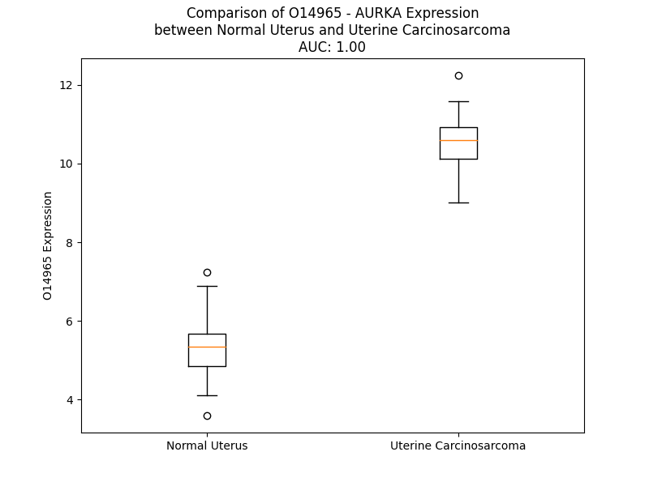

# Detailed Data for O14965

## Introduction to the Detailed Summary

### How to Interpret the Results

- **Summary & Metrics**: This section provides a quick reference to essential protein attributes, including expression changes, family classification, and biomarker applications. Regulation status (upregulated/downregulated) indicates the protein's behavior in a disease context. Some information comes from the original excel file with the proteins selected from literature, while others are derived from the analyses.
- **Expression Comparison**: A visual representation comparing protein expression between normal and disease states. It highlights significant changes in expression levels that might indicate diagnostic or therapeutic relevance. This is data coming from transcriptomics experiments and could not translate similarly to protein levels.
- **Isoform Alignment**: An interactive view of isoform alignments, revealing structural and functional differences between variants of the protein.
- **Interactors & Homologs**: Tables listing known interaction partners and homologous proteins, the more interactors and homologs, the more complex the protein is to design an antibody for.
- **Biological Assemblies**: Information about the structural arrangement of the protein in different assemblies, providing insights into its functional state but also the complexity of the protein to develop antibodies.
- **Combined Per-Residue Information**: A detailed table summarizing residue-level data. This includes predictions for epitope regions, aggregation tendencies, and modifications that might impact the protein's function. Each row corresponds to a residue in the protein, providing insights into specific sites that may be important for research or drug development.
## Summary & Metrics

- **UniProt Accession**: O14965
- **Gene Name**: AURKA
- **Protein Name**: Aurora kinase A
- **Swiss Prot**: AURKA_HUMAN
- **Family**: kinase
- **Biomarker Application**: diagnosis,efficacy,prognosis
- **Number of Isoforms**: 0
- **Regulation**: 1
- **(transcriptomics) AUC**: 1.0
- **(transcriptomics) Fold Change**: 1.98
- **(transcriptomics) Regulation**: Upregulated
- **Discotope Epitope Count**: 47
- **Max n_uniprots (Homo)**: 4
- **Max n_uniprots (Hetero)**: 4

## Expression Comparison

## Interactors

| preferredName_A   | preferredName_B   |   score |
|:------------------|:------------------|--------:|
| AURKA             | TPX2              |   0.999 |
| AURKA             | TACC3             |   0.998 |
| AURKA             | MYCN              |   0.998 |
| AURKA             | TP53              |   0.998 |
| AURKA             | PLK1              |   0.997 |
| AURKA             | CDC20             |   0.995 |
| AURKA             | INCENP            |   0.994 |
| AURKA             | BIRC5             |   0.993 |
| AURKA             | NEDD9             |   0.99  |
| AURKA             | CCNB2             |   0.988 |
| AURKA             | UBE2C             |   0.986 |
| AURKA             | CCNB1             |   0.979 |
| AURKA             | BORA              |   0.976 |
| AURKA             | KIF2C             |   0.975 |
| AURKA             | CKAP5             |   0.974 |
| AURKA             | KIF11             |   0.972 |
| AURKA             | BUB1              |   0.971 |
| AURKA             | HMMR              |   0.97  |
| AURKA             | PTTG1             |   0.967 |
| AURKA             | DLGAP5            |   0.966 |
| AURKA             | TOP2A             |   0.963 |
| AURKA             | GADD45A           |   0.961 |
| AURKA             | CENPA             |   0.959 |
| AURKA             | CPEB1             |   0.955 |
| AURKA             | CDCA8             |   0.952 |
| AURKA             | NCAPG             |   0.952 |
| AURKA             | CDK1              |   0.951 |
| AURKA             | CCNA2             |   0.949 |
| AURKA             | FN1               |   0.945 |
| AURKA             | HDAC6             |   0.944 |
| AURKA             | BRCA1             |   0.942 |
| AURKA             | CEP192            |   0.94  |
| AURKA             | KIF20A            |   0.936 |
| AURKA             | CEP55             |   0.936 |
| AURKA             | NDC80             |   0.933 |
| AURKA             | ASPM              |   0.93  |
| AURKA             | MAD2L1            |   0.929 |
| AURKA             | KIF23             |   0.924 |
| AURKA             | BUB1B             |   0.924 |
| AURKA             | AURKB             |   0.922 |
| AURKA             | CPEB4             |   0.919 |
| AURKA             | PHLDA1            |   0.918 |
| AURKA             | CPEB2             |   0.918 |
| AURKA             | MYC               |   0.914 |
| AURKA             | MELK              |   0.913 |
| AURKA             | CPEB3             |   0.913 |
| AURKA             | PRC1              |   0.91  |
| AURKA             | FZR1              |   0.908 |
| AURKA             | CENPF             |   0.902 |

## Homologs

| uniprot_id   | gene_id   |
|:-------------|:----------|
| M0QYK8       | AURKC     |
| J3KRJ2       | AURKB     |

## Biological Assemblies

|   Unnamed: 0 |   assembly |   n_uniprots | composition   | crystal_id   |
|-------------:|-----------:|-------------:|:--------------|:-------------|
|            0 |          1 |            1 | Homo          | 3w18         |
|            1 |          2 |            1 | Homo          | 3w18         |
|            0 |          1 |            1 | Homo          | 6c2r         |
|            0 |          1 |            2 | Hetero        | 7ztl         |
|            0 |          1 |            1 | Homo          | 5ort         |
|            0 |          1 |            2 | Homo          | 6vpm         |
|            0 |          1 |            1 | Homo          | 2wqe         |
|            0 |          1 |            1 | Homo          | 2xne         |
|            0 |          1 |            1 | Homo          | 5obj         |
|            0 |          1 |            1 | Homo          | 7fic         |
|            0 |          1 |            1 | Homo          | 3uol         |
|            1 |          2 |            1 | Homo          | 3uol         |
|            2 |          3 |            2 | Homo          | 3uol         |
|            0 |          1 |            1 | Homo          | 5aaf         |
|            0 |          1 |            1 | Homo          | 2wtv         |
|            1 |          2 |            1 | Homo          | 2wtv         |
|            2 |          3 |            1 | Homo          | 2wtv         |
|            3 |          4 |            1 | Homo          | 2wtv         |
|            0 |          1 |            1 | Homo          | 6vpg         |
|            0 |          1 |            1 | Homo          | 6r4a         |
|            0 |          1 |            2 | Hetero        | 5odt         |
|            0 |          1 |            1 | Homo          | 5ors         |
|            0 |          1 |            1 | Homo          | 3h0y         |
|            1 |          2 |            1 | Homo          | 3h0y         |
|            0 |          1 |            1 | Homo          | 3uo5         |
|            0 |          1 |            1 | Homo          | 6cpf         |
|            0 |          1 |            2 | Homo          | 6vpj         |
|            0 |          1 |            1 | Homo          | 5dr2         |
|            0 |          1 |            1 | Homo          | 5os1         |
|            0 |          1 |            1 | Homo          | 2j50         |
|            1 |          2 |            1 | Homo          | 2j50         |
|            0 |          1 |            1 | Homo          | 2x6e         |
|            0 |          1 |            1 | Homo          | 5orr         |
|            0 |          1 |            1 | Homo          | 5osd         |
|            0 |          1 |            1 | Homo          | 3o50         |
|            1 |          2 |            1 | Homo          | 3o50         |
|            0 |          1 |            1 | Homo          | 7ayi         |
|            0 |          1 |            1 | Homo          | 4zts         |
|            0 |          1 |            2 | Hetero        | 3ha6         |
|            1 |          2 |            2 | Hetero        | 3ha6         |
|            0 |          1 |            1 | Homo          | 3h0z         |
|            1 |          2 |            1 | Homo          | 3h0z         |
|            2 |          3 |            1 | Homo          | 3h0z         |
|            0 |          1 |            1 | Homo          | 6r4d         |
|            0 |          1 |            1 | Homo          | 5dt4         |
|            0 |          1 |            1 | Homo          | 2bmc         |
|            1 |          2 |            1 | Homo          | 2bmc         |
|            2 |          3 |            1 | Homo          | 2bmc         |
|            3 |          4 |            1 | Homo          | 2bmc         |
|            4 |          5 |            1 | Homo          | 2bmc         |
|            5 |          6 |            1 | Homo          | 2bmc         |
|            0 |          1 |            1 | Homo          | 3r22         |
|            0 |          1 |            1 | Homo          | 3lau         |
|            0 |          1 |            1 | Homo          | 4ztq         |
|            0 |          1 |            2 | Hetero        | 5l8j         |
|            0 |          1 |            1 | Homo          | 5dr6         |
|            0 |          1 |            1 | Homo          | 1ol7         |
|            0 |          1 |            1 | Homo          | 4uyn         |
|            0 |          1 |            1 | Homo          | 5aad         |
|            0 |          1 |            2 | Homo          | 8ssp         |
|            0 |          1 |            1 | Homo          | 4o0u         |
|            0 |          1 |            1 | Homo          | 5os4         |
|            0 |          1 |            1 | Homo          | 2c6d         |
|            0 |          1 |            2 | Hetero        | 5l8l         |
|            0 |          1 |            1 | Homo          | 4dhf         |
|            1 |          2 |            1 | Homo          | 4dhf         |
|            0 |          1 |            1 | Homo          | 6r4b         |
|            0 |          1 |            1 | Homo          | 5orz         |
|            0 |          1 |            1 | Homo          | 3w2c         |
|            1 |          2 |            1 | Homo          | 3w2c         |
|            2 |          3 |            1 | Homo          | 3w2c         |
|            3 |          4 |            1 | Homo          | 3w2c         |
|            0 |          1 |            1 | Homo          | 3o51         |
|            0 |          1 |            1 | Homo          | 8c1k         |
|            0 |          1 |            1 | Homo          | 2w1g         |
|            0 |          1 |            1 | Homo          | 5drd         |
|            0 |          1 |            1 | Homo          | 3w10         |
|            0 |          1 |            1 | Homo          | 4ded         |
|            0 |          1 |            1 | Homo          | 3uo4         |
|            0 |          1 |            1 | Homo          | 5oro         |
|            0 |          1 |            1 | Homo          | 5orp         |
|            0 |          1 |            1 | Homo          | 8c1m         |
|            0 |          1 |            1 | Homo          | 8jf4         |
|            0 |          1 |            1 | Homo          | 3uoj         |
|            1 |          2 |            1 | Homo          | 3uoj         |
|            2 |          3 |            2 | Homo          | 3uoj         |
|            0 |          1 |            1 | Homo          | 3up7         |
|            0 |          1 |            1 | Homo          | 6i2u         |
|            0 |          1 |            1 | Homo          | 1mq4         |
|            0 |          1 |            1 | Homo          | 6vph         |
|            0 |          1 |            4 | Homo          | 6c83         |
|            0 |          1 |            1 | Homo          | 8c1i         |
|            0 |          1 |            1 | Homo          | 5os0         |
|            0 |          1 |            1 | Homo          | 3up2         |
|            0 |          1 |            2 | Hetero        | 5l8k         |
|            0 |          1 |            2 | Hetero        | 5lxm         |
|            0 |          1 |            1 | Homo          | 5orw         |
|            0 |          1 |            1 | Homo          | 5orn         |
|            0 |          1 |            1 | Homo          | 3nrm         |
|            0 |          1 |            1 | Homo          | 4ceg         |
|            0 |          1 |            1 | Homo          | 4jbo         |
|            0 |          1 |            1 | Homo          | 4zs0         |
|            0 |          1 |            4 | Homo          | 6cpg         |
|            0 |          1 |            1 | Homo          | 6z4y         |
|            0 |          1 |            1 | Homo          | 5os5         |
|            0 |          1 |            4 | Hetero        | 4c3p         |
|            0 |          1 |            1 | Homo          | 3p9j         |
|            0 |          1 |            1 | Homo          | 4uzh         |
|            0 |          1 |            1 | Homo          | 5one         |
|            0 |          1 |            1 | Homo          | 6hjk         |
|            0 |          1 |            1 | Homo          | 5dn3         |
|            0 |          1 |            1 | Homo          | 5os2         |
|            0 |          1 |            1 | Homo          | 8jmx         |
|            0 |          1 |            1 | Homo          | 2x81         |
|            0 |          1 |            1 | Homo          | 5osf         |
|            0 |          1 |            1 | Homo          | 5os6         |
|            0 |          1 |            1 | Homo          | 3qbn         |
|            0 |          1 |            1 | Homo          | 4o0w         |
|            0 |          1 |            2 | Homo          | 8sso         |
|            1 |          2 |            2 | Homo          | 8sso         |
|            0 |          1 |            1 | Homo          | 5ose         |
|            0 |          1 |            1 | Homo          | 2c6e         |
|            1 |          2 |            1 | Homo          | 2c6e         |
|            0 |          1 |            1 | Homo          | 4byj         |
|            0 |          1 |            1 | Homo          | 6hjj         |
|            0 |          1 |            1 | Homo          | 3unz         |
|            1 |          2 |            1 | Homo          | 3unz         |
|            2 |          3 |            2 | Homo          | 3unz         |
|            0 |          1 |            1 | Homo          | 5ew9         |
|            0 |          1 |            1 | Homo          | 3m11         |
|            0 |          1 |            1 | Homo          | 8of5         |
|            0 |          1 |            1 | Homo          | 2w1e         |
|            0 |          1 |            1 | Homo          | 4byi         |
|            0 |          1 |            1 | Homo          | 6xka         |
|            0 |          1 |            1 | Homo          | 8c1g         |
|            0 |          1 |            2 | Hetero        | 3e5a         |
|            0 |          1 |            1 | Homo          | 5dt3         |
|            0 |          1 |            1 | Homo          | 3k5u         |
|            0 |          1 |            2 | Homo          | 6vpl         |
|            0 |          1 |            1 | Homo          | 4j8m         |
|            0 |          1 |            4 | Homo          | 4j8n         |
|            1 |          2 |            1 | Homo          | 4j8n         |
|            2 |          3 |            1 | Homo          | 4j8n         |
|            3 |          4 |            1 | Homo          | 4j8n         |
|            4 |          5 |            1 | Homo          | 4j8n         |
|            0 |          1 |            1 | Homo          | 3uok         |
|            1 |          2 |            1 | Homo          | 3uok         |
|            2 |          3 |            2 | Homo          | 3uok         |
|            0 |          1 |            1 | Homo          | 6cpe         |
|            0 |          1 |            3 | Homo          | 8guw         |
|            0 |          1 |            1 | Homo          | 3uo6         |
|            1 |          2 |            1 | Homo          | 3uo6         |
|            2 |          3 |            2 | Homo          | 3uo6         |
|            0 |          1 |            1 | Homo          | 6c2t         |
|            0 |          1 |            1 | Homo          | 4jaj         |
|            0 |          1 |            1 | Homo          | 3r21         |
|            0 |          1 |            1 | Homo          | 2x6d         |
|            0 |          1 |            1 | Homo          | 2dwb         |
|            0 |          1 |            1 | Homo          | 2wtw         |
|            0 |          1 |            1 | Homo          | 6r49         |
|            0 |          1 |            1 | Homo          | 1muo         |
|            0 |          1 |            1 | Homo          | 4uzd         |
|            1 |          2 |            1 | Homo          | 4uzd         |
|            0 |          1 |            2 | Homo          | 5g15         |
|            0 |          1 |            1 | Homo          | 3fdn         |
|            0 |          1 |            1 | Homo          | 4dee         |
|            0 |          1 |            1 | Homo          | 2w1f         |
|            0 |          1 |            1 | Homo          | 4jai         |
|            0 |          1 |            1 | Homo          | 1ol6         |
|            0 |          1 |            1 | Homo          | 5dos         |
|            0 |          1 |            1 | Homo          | 3h10         |
|            1 |          2 |            1 | Homo          | 3h10         |
|            2 |          3 |            1 | Homo          | 3h10         |
|            0 |          1 |            1 | Homo          | 3uod         |
|            0 |          1 |            2 | Hetero        | 1ol5         |
|            0 |          1 |            1 | Homo          | 4bn1         |
|            0 |          1 |            1 | Homo          | 2w1c         |
|            0 |          1 |            1 | Homo          | 5orx         |
|            0 |          1 |            1 | Homo          | 3myg         |
|            0 |          1 |            1 | Homo          | 7ayh         |
|            0 |          1 |            1 | Homo          | 5orv         |
|            0 |          1 |            1 | Homo          | 4b0g         |
|            0 |          1 |            1 | Homo          | 8c1f         |
|            0 |          1 |            1 | Homo          | 8c1d         |
|            0 |          1 |            1 | Homo          | 5dt0         |
|            0 |          1 |            1 | Homo          | 5os3         |
|            0 |          1 |            1 | Homo          | 5obr         |
|            0 |          1 |            1 | Homo          | 5aag         |
|            0 |          1 |            1 | Homo          | 3efw         |
|            1 |          2 |            1 | Homo          | 3efw         |
|            0 |          1 |            1 | Homo          | 5zan         |
|            0 |          1 |            1 | Homo          | 5dpv         |
|            0 |          1 |            1 | Homo          | 2np8         |
|            0 |          1 |            1 | Homo          | 4jbq         |
|            0 |          1 |            1 | Homo          | 4o0s         |
|            0 |          1 |            1 | Homo          | 2w1d         |
|            0 |          1 |            1 | Homo          | 8c14         |
|            0 |          1 |            1 | Homo          | 5ory         |
|            0 |          1 |            1 | Homo          | 3w16         |
|            0 |          1 |            1 | Homo          | 6vpi         |
|            0 |          1 |            2 | Hetero        | 5g1x         |
|            0 |          1 |            1 | Homo          | 5orl         |
|            0 |          1 |            1 | Homo          | 5aae         |
|            0 |          1 |            1 | Homo          | 6gra         |
|            0 |          1 |            1 | Homo          | 4deb         |
|            0 |          1 |            1 | Homo          | 8c1e         |
|            0 |          1 |            1 | Homo          | 4prj         |
|            0 |          1 |            1 | Homo          | 5dnr         |
|            0 |          1 |            1 | Homo          | 2xru         |
|            0 |          1 |            1 | Homo          | 5dr9         |
|            0 |          1 |            1 | Homo          | 7o2v         |
|            0 |          1 |            1 | Homo          | 8jg8         |
|            0 |          1 |            1 | Homo          | 4c3r         |
|            0 |          1 |            1 | Homo          | 3coh         |
|            1 |          2 |            1 | Homo          | 3coh         |
|            0 |          1 |            1 | Homo          | 6r4c         |
|            0 |          1 |            1 | Homo          | 8c15         |
|            0 |          1 |            1 | Homo          | 3uoh         |
|            1 |          2 |            1 | Homo          | 3uoh         |
|            2 |          3 |            2 | Homo          | 3uoh         |
|            0 |          1 |            1 | Homo          | 4ztr         |
|            0 |          1 |            1 | Homo          | 4jbp         |
|            0 |          1 |            1 | Homo          | 2xng         |
|            0 |          1 |            1 | Homo          | 8c1h         |
|            0 |          1 |            1 | Homo          | 3vap         |
|            0 |          1 |            1 | Homo          | 4dea         |
|            0 |          1 |            1 | Homo          | 2j4z         |
|            1 |          2 |            1 | Homo          | 2j4z         |

## Combined Per-Residue Information

|   res | aa   |   epitope_score | epitope   |   relative_surface_accessibility |   modeling_confidence |   Aggregation | modification                  |
|------:|:-----|----------------:|:----------|---------------------------------:|----------------------:|--------------:|:------------------------------|
|     1 | M    |         0.08391 | False     |                          1.29611 |                 38.63 |         0     | N/A                           |
|     2 | D    |         0.11133 | False     |                          0.81443 |                 36.69 |         0     | N/A                           |
|     3 | R    |         0.16984 | False     |                          0.91585 |                 33.99 |         0     | N/A                           |
|     4 | S    |         0.14295 | False     |                          0.89009 |                 39.14 |         0     | N/A                           |
|     5 | K    |         0.1183  | False     |                          0.9662  |                 36.2  |         0     | N/A                           |
|     6 | E    |         0.10395 | False     |                          0.94277 |                 43.35 |         0     | N/A                           |
|     7 | N    |         0.14779 | False     |                          0.86115 |                 31.65 |         0     | N/A                           |
|     8 | C    |         0.1077  | False     |                          1.03305 |                 36.71 |         0     | N/A                           |
|     9 | I    |         0.1471  | False     |                          0.99042 |                 32.61 |         0     | N/A                           |
|    10 | S    |         0.11639 | False     |                          0.87342 |                 41.13 |         0     | N/A                           |
|    11 | G    |         0.105   | False     |                          0.6769  |                 37.9  |         0     | N/A                           |
|    12 | P    |         0.07663 | False     |                          1.01056 |                 32.45 |         0     | N/A                           |
|    13 | V    |         0.07973 | False     |                          1.00778 |                 38.83 |         0     | N/A                           |
|    14 | K    |         0.09281 | False     |                          0.94663 |                 33.36 |         0     | N/A                           |
|    15 | A    |         0.11235 | False     |                          0.97256 |                 30.79 |         0     | N/A                           |
|    16 | T    |         0.12494 | False     |                          0.92039 |                 36.18 |         0     | N/A                           |
|    17 | A    |         0.11455 | False     |                          0.81123 |                 30.04 |         0     | N/A                           |
|    18 | P    |         0.12791 | False     |                          0.94729 |                 35.68 |         0     | N/A                           |
|    19 | V    |         0.14258 | False     |                          1.03245 |                 40.77 |         0     | N/A                           |
|    20 | G    |         0.16094 | False     |                          0.86349 |                 32.78 |         0     | N/A                           |
|    21 | G    |         0.19226 | True      |                          0.53299 |                 37.82 |         0     | N/A                           |
|    22 | P    |         0.10166 | False     |                          0.34141 |                 41.56 |         0     | N/A                           |
|    23 | K    |         0.18968 | True      |                          0.91358 |                 45.22 |         0     | N/A                           |
|    24 | R    |         0.10172 | False     |                          0.19683 |                 55.09 |         0     | N/A                           |
|    25 | V    |         0.12484 | False     |                          0.36411 |                 41.05 |         0.149 | N/A                           |
|    26 | L    |         0.14808 | False     |                          0.85423 |                 38.7  |         0.149 | N/A                           |
|    27 | V    |         0.0863  | False     |                          0.21392 |                 39.34 |         0.149 | N/A                           |
|    28 | T    |         0.16968 | False     |                          0.77995 |                 29.47 |         0.149 | N/A                           |
|    29 | Q    |         0.17092 | False     |                          0.65479 |                 31.64 |         0.149 | N/A                           |
|    30 | Q    |         0.21184 | True      |                          0.89656 |                 31.91 |         0     | N/A                           |
|    31 | F    |         0.1897  | True      |                          0.57575 |                 32.77 |         0     | N/A                           |
|    32 | P    |         0.19621 | True      |                          0.9148  |                 27.77 |         0     | N/A                           |
|    33 | C    |         0.10675 | False     |                          0.66267 |                 30.37 |         0     | N/A                           |
|    34 | Q    |         0.16561 | False     |                          0.89514 |                 32.31 |         0     | N/A                           |
|    35 | N    |         0.13337 | False     |                          0.88549 |                 30.62 |         0     | N/A                           |
|    36 | P    |         0.16541 | False     |                          0.92526 |                 35.5  |         0     | N/A                           |
|    37 | L    |         0.10521 | False     |                          0.9863  |                 33.23 |         0     | N/A                           |
|    38 | P    |         0.09535 | False     |                          0.93029 |                 32.33 |         0     | N/A                           |
|    39 | V    |         0.11893 | False     |                          1.0337  |                 36.73 |         0     | N/A                           |
|    40 | N    |         0.18566 | True      |                          0.88232 |                 30.49 |         0     | N/A                           |
|    41 | S    |         0.11356 | False     |                          0.87308 |                 37.39 |         0     | Phosphoserine                 |
|    42 | G    |         0.12367 | False     |                          0.91151 |                 33.29 |         0     | N/A                           |
|    43 | Q    |         0.09401 | False     |                          0.93322 |                 31.86 |         0     | N/A                           |
|    44 | A    |         0.14856 | False     |                          1.02656 |                 32.97 |         0     | N/A                           |
|    45 | Q    |         0.11941 | False     |                          0.88099 |                 33.76 |         0     | N/A                           |
|    46 | R    |         0.14143 | False     |                          0.8172  |                 29.73 |         0     | N/A                           |
|    47 | V    |         0.08004 | False     |                          1.10146 |                 31.76 |         0     | N/A                           |
|    48 | L    |         0.13783 | False     |                          0.7934  |                 30.13 |         0     | N/A                           |
|    49 | C    |         0.16559 | False     |                          0.90501 |                 33.43 |         0     | N/A                           |
|    50 | P    |         0.18431 | True      |                          0.80796 |                 35.92 |         0     | N/A                           |
|    51 | S    |         0.09773 | False     |                          0.75733 |                 33.91 |         0     | Phosphoserine                 |
|    52 | N    |         0.12504 | False     |                          1.01314 |                 36.11 |         0     | N/A                           |
|    53 | S    |         0.13207 | False     |                          0.75753 |                 33.97 |         0     | N/A                           |
|    54 | S    |         0.21524 | True      |                          0.75586 |                 37.14 |         0     | N/A                           |
|    55 | Q    |         0.15413 | False     |                          0.92789 |                 37.54 |         0     | N/A                           |
|    56 | R    |         0.17088 | False     |                          0.89322 |                 32.81 |         0     | N/A                           |
|    57 | V    |         0.08556 | False     |                          1.03904 |                 36.97 |         0     | N/A                           |
|    58 | P    |         0.09099 | False     |                          0.75009 |                 36.42 |         0     | N/A                           |
|    59 | L    |         0.12645 | False     |                          0.99743 |                 39.36 |         0     | N/A                           |
|    60 | Q    |         0.08719 | False     |                          0.85534 |                 37.41 |         0     | N/A                           |
|    61 | A    |         0.07974 | False     |                          0.87849 |                 33.87 |         0     | N/A                           |
|    62 | Q    |         0.12001 | False     |                          0.97349 |                 40.61 |         0     | N/A                           |
|    63 | K    |         0.17497 | True      |                          0.87502 |                 38.29 |         0     | N/A                           |
|    64 | L    |         0.14393 | False     |                          0.89287 |                 33.29 |         0     | N/A                           |
|    65 | V    |         0.11002 | False     |                          0.96435 |                 37.23 |         0     | N/A                           |
|    66 | S    |         0.09529 | False     |                          0.74224 |                 32.79 |         0     | N/A                           |
|    67 | S    |         0.13951 | False     |                          0.86098 |                 39.75 |         0     | N/A                           |
|    68 | H    |         0.10098 | False     |                          0.91489 |                 41.29 |         0     | N/A                           |
|    69 | K    |         0.15386 | False     |                          0.96007 |                 42.69 |         0     | N/A                           |
|    70 | P    |         0.11303 | False     |                          0.83931 |                 42.07 |         0     | N/A                           |
|    71 | V    |         0.13041 | False     |                          0.85553 |                 38.16 |         0     | N/A                           |
|    72 | Q    |         0.14477 | False     |                          0.79104 |                 40.66 |         0     | N/A                           |
|    73 | N    |         0.14157 | False     |                          0.77904 |                 38.79 |         0     | N/A                           |
|    74 | Q    |         0.15282 | False     |                          0.77691 |                 37.53 |         0     | N/A                           |
|    75 | K    |         0.13525 | False     |                          1.04629 |                 39.03 |         0     | N/A                           |
|    76 | Q    |         0.16694 | False     |                          0.87764 |                 34.73 |         0     | N/A                           |
|    77 | K    |         0.19891 | True      |                          0.92129 |                 38.47 |         0     | N/A                           |
|    78 | Q    |         0.14861 | False     |                          0.79356 |                 37.23 |         0     | N/A                           |
|    79 | L    |         0.10603 | False     |                          0.97866 |                 34.43 |         0     | N/A                           |
|    80 | Q    |         0.14503 | False     |                          0.96531 |                 37.04 |         0     | N/A                           |
|    81 | A    |         0.11943 | False     |                          0.90268 |                 31.56 |         0     | N/A                           |
|    82 | T    |         0.19636 | True      |                          0.91403 |                 36.77 |         0     | N/A                           |
|    83 | S    |         0.14072 | False     |                          0.78435 |                 36.17 |         0     | N/A                           |
|    84 | V    |         0.12897 | False     |                          0.92834 |                 40.61 |         0     | N/A                           |
|    85 | P    |         0.15012 | False     |                          0.85807 |                 38.9  |         0     | N/A                           |
|    86 | H    |         0.12264 | False     |                          0.96956 |                 38.24 |         0     | N/A                           |
|    87 | P    |         0.1336  | False     |                          0.8815  |                 43.64 |         0     | N/A                           |
|    88 | V    |         0.18395 | True      |                          0.93435 |                 36.27 |         0     | N/A                           |
|    89 | S    |         0.15075 | False     |                          0.73175 |                 37.84 |         0     | N/A                           |
|    90 | R    |         0.22426 | True      |                          0.92318 |                 37.81 |         0     | N/A                           |
|    91 | P    |         0.17097 | False     |                          0.78372 |                 38.19 |         0     | N/A                           |
|    92 | L    |         0.14757 | False     |                          0.94075 |                 35.38 |         0     | N/A                           |
|    93 | N    |         0.15248 | False     |                          0.99364 |                 36.99 |         0     | N/A                           |
|    94 | N    |         0.12313 | False     |                          0.81716 |                 36.27 |         0     | N/A                           |
|    95 | T    |         0.14996 | False     |                          0.96019 |                 38.86 |         0     | N/A                           |
|    96 | Q    |         0.15113 | False     |                          0.82168 |                 39.93 |         0     | N/A                           |
|    97 | K    |         0.13019 | False     |                          0.99439 |                 42.75 |         0     | N/A                           |
|    98 | S    |         0.09984 | False     |                          0.7742  |                 38.64 |         0     | N/A                           |
|    99 | K    |         0.15012 | False     |                          1.01207 |                 38.39 |         0     | N/A                           |
|   100 | Q    |         0.17184 | False     |                          0.84186 |                 46.49 |         0     | N/A                           |
|   101 | P    |         0.16311 | False     |                          0.90867 |                 41.57 |         0     | N/A                           |
|   102 | L    |         0.23036 | True      |                          1.03527 |                 41.56 |         0     | N/A                           |
|   103 | P    |         0.14013 | False     |                          0.90112 |                 54.77 |         0     | N/A                           |
|   104 | S    |         0.12281 | False     |                          0.83111 |                 48.98 |         0     | N/A                           |
|   105 | A    |         0.14163 | False     |                          0.86905 |                 50.63 |         0     | N/A                           |
|   106 | P    |         0.14272 | False     |                          0.85665 |                 56.98 |         0     | N/A                           |
|   107 | E    |         0.09564 | False     |                          0.90763 |                 52.44 |         0     | N/A                           |
|   108 | N    |         0.13754 | False     |                          0.75912 |                 50.04 |         0     | N/A                           |
|   109 | N    |         0.15217 | False     |                          0.58426 |                 58.63 |         0     | N/A                           |
|   110 | P    |         0.13782 | False     |                          0.68744 |                 56.18 |         0     | N/A                           |
|   111 | E    |         0.09944 | False     |                          0.72793 |                 59.4  |         0     | N/A                           |
|   112 | E    |         0.09095 | False     |                          0.65732 |                 58.14 |         0     | N/A                           |
|   113 | E    |         0.04765 | False     |                          0.37712 |                 51.97 |         0     | N/A                           |
|   114 | L    |         0.09375 | False     |                          0.684   |                 57.06 |         0     | N/A                           |
|   115 | A    |         0.06735 | False     |                          0.50082 |                 58.24 |         0     | N/A                           |
|   116 | S    |         0.06582 | False     |                          0.46489 |                 56.35 |         0     | N/A                           |
|   117 | K    |         0.08801 | False     |                          0.58956 |                 53.06 |         0     | N/A                           |
|   118 | Q    |         0.06693 | False     |                          0.607   |                 54.22 |         0     | N/A                           |
|   119 | K    |         0.10089 | False     |                          0.78109 |                 51.11 |         0     | N/A                           |
|   120 | N    |         0.08845 | False     |                          0.68656 |                 46.34 |         0     | N/A                           |
|   121 | E    |         0.07329 | False     |                          0.56747 |                 47.6  |         0     | N/A                           |
|   122 | E    |         0.11608 | False     |                          0.79738 |                 45.03 |         0     | N/A                           |
|   123 | S    |         0.09364 | False     |                          0.62758 |                 45.58 |         0     | N/A                           |
|   124 | K    |         0.11239 | False     |                          0.70584 |                 47.59 |         0     | N/A                           |
|   125 | K    |         0.11409 | False     |                          0.97246 |                 60.45 |         0     | N/A                           |
|   126 | R    |         0.16081 | False     |                          0.64255 |                 70.93 |         0     | N/A                           |
|   127 | Q    |         0.10047 | False     |                          0.69626 |                 88.19 |         0     | N/A                           |
|   128 | W    |         0.08716 | False     |                          0.44008 |                 95.1  |         0     | N/A                           |
|   129 | A    |         0.08738 | False     |                          0.38007 |                 96.75 |         0     | N/A                           |
|   130 | L    |         0.07623 | False     |                          0.33684 |                 96.95 |         0     | N/A                           |
|   131 | E    |         0.24481 | True      |                          0.63586 |                 97.05 |         0     | N/A                           |
|   132 | D    |         0.05116 | False     |                          0.08554 |                 97.65 |         0     | N/A                           |
|   133 | F    |         0.02443 | False     |                          0.04453 |                 98.33 |         0     | N/A                           |
|   134 | E    |         0.09329 | False     |                          0.30795 |                 98.39 |         0     | N/A                           |
|   135 | I    |         0.08147 | False     |                          0.47964 |                 98.1  |         0     | N/A                           |
|   136 | G    |         0.07486 | False     |                          0.46126 |                 98    |         0     | N/A                           |
|   137 | R    |         0.20911 | True      |                          0.55803 |                 97.59 |         0     | N/A                           |
|   138 | P    |         0.13433 | False     |                          0.66644 |                 97.09 |         0     | N/A                           |
|   139 | L    |         0.03613 | False     |                          0.24417 |                 95.36 |         0     | N/A                           |
|   140 | G    |         0.09701 | False     |                          0.37162 |                 89.95 |         0     | N/A                           |
|   141 | K    |         0.17497 | True      |                          0.90269 |                 87.69 |         0     | N/A                           |
|   142 | G    |         0.10287 | False     |                          0.45985 |                 82.49 |         0     | N/A                           |
|   143 | K    |         0.11995 | False     |                          0.78201 |                 80.82 |         0     | N/A                           |
|   144 | F    |         0.07003 | False     |                          0.18253 |                 87.31 |         0.479 | N/A                           |
|   145 | G    |         0.04172 | False     |                          0.13059 |                 90.1  |         0.479 | N/A                           |
|   146 | N    |         0.10632 | False     |                          0.28701 |                 94.61 |         1.678 | N/A                           |
|   147 | V    |         0.01769 | False     |                          0.2285  |                 96.41 |         1.678 | N/A                           |
|   148 | Y    |         0.085   | False     |                          0.25901 |                 98.31 |         1.678 | N/A                           |
|   149 | L    |         0.04647 | False     |                          0.23577 |                 98.47 |         1.678 | N/A                           |
|   150 | A    |         0.01381 | False     |                          0.01557 |                 98.65 |         1.678 | N/A                           |
|   151 | R    |         0.1602  | False     |                          0.39702 |                 98.61 |         0     | N/A                           |
|   152 | E    |         0.0778  | False     |                          0.07139 |                 98.27 |         0     | N/A                           |
|   153 | K    |         0.39957 | True      |                          0.41354 |                 97.91 |         0     | N/A                           |
|   154 | Q    |         0.15882 | False     |                          0.64724 |                 96.51 |         0     | N/A                           |
|   155 | S    |         0.15933 | False     |                          0.60515 |                 97.14 |         0     | N/A                           |
|   156 | K    |         0.19779 | True      |                          0.53774 |                 97.98 |         0     | N/A                           |
|   157 | F    |         0.25604 | True      |                          0.534   |                 98    |        21.856 | N/A                           |
|   158 | I    |         0.03574 | False     |                          0.43023 |                 98.53 |        21.856 | N/A                           |
|   159 | L    |         0.03141 | False     |                          0.0272  |                 98.6  |        21.856 | N/A                           |
|   160 | A    |         0.01095 | False     |                          0.05994 |                 98.47 |        21.856 | N/A                           |
|   161 | L    |         0.00491 | False     |                          0.00412 |                 98.04 |        21.856 | N/A                           |
|   162 | K    |         0.0201  | False     |                          0.16148 |                 96.57 |         0     | N/A                           |
|   163 | V    |         0.04367 | False     |                          0.09711 |                 97.04 |         0     | N/A                           |
|   164 | L    |         0.03441 | False     |                          0.05935 |                 95.72 |         0     | N/A                           |
|   165 | F    |         0.11604 | False     |                          0.40649 |                 95.7  |         0     | N/A                           |
|   166 | K    |         0.16665 | False     |                          0.24225 |                 95.86 |         0     | N/A                           |
|   167 | A    |         0.18484 | True      |                          0.69614 |                 95.36 |         0     | N/A                           |
|   168 | Q    |         0.2087  | True      |                          0.41186 |                 92.6  |         0     | N/A                           |
|   169 | L    |         0.04433 | False     |                          0.04452 |                 91.67 |         0     | N/A                           |
|   170 | E    |         0.35342 | True      |                          0.53754 |                 93.04 |         0     | N/A                           |
|   171 | K    |         0.29336 | True      |                          0.93153 |                 92.16 |         0     | N/A                           |
|   172 | A    |         0.18643 | True      |                          0.48121 |                 88.94 |         0     | N/A                           |
|   173 | G    |         0.25634 | True      |                          0.51248 |                 89.53 |         0     | N/A                           |
|   174 | V    |         0.06067 | False     |                          0.11541 |                 86.62 |         0     | N/A                           |
|   175 | E    |         0.12924 | False     |                          0.36533 |                 89.59 |         0     | N/A                           |
|   176 | H    |         0.1504  | False     |                          0.49353 |                 85.72 |         0     | N/A                           |
|   177 | Q    |         0.11834 | False     |                          0.13844 |                 85.13 |         0     | N/A                           |
|   178 | L    |         0.04294 | False     |                          0.11766 |                 90.44 |         0     | N/A                           |
|   179 | R    |         0.27599 | True      |                          0.68827 |                 90.13 |         0     | N/A                           |
|   180 | R    |         0.10755 | False     |                          0.24658 |                 84.63 |         0     | N/A                           |
|   181 | E    |         0.02461 | False     |                          0.04954 |                 89.2  |         0     | N/A                           |
|   182 | V    |         0.06075 | False     |                          0.13995 |                 92.03 |         0     | N/A                           |
|   183 | E    |         0.09735 | False     |                          0.52081 |                 90.78 |         0     | N/A                           |
|   184 | I    |         0.02877 | False     |                          0.01176 |                 90.07 |         0     | N/A                           |
|   185 | Q    |         0.00692 | False     |                          0.00915 |                 93.12 |         0     | N/A                           |
|   186 | S    |         0.09445 | False     |                          0.23342 |                 92.52 |         0     | N/A                           |
|   187 | H    |         0.12725 | False     |                          0.65279 |                 93.21 |         0     | N/A                           |
|   188 | L    |         0.0277  | False     |                          0.02986 |                 95.24 |         0     | N/A                           |
|   189 | R    |         0.21319 | True      |                          0.49104 |                 96.69 |         0     | N/A                           |
|   190 | H    |         0.04976 | False     |                          0.12655 |                 97.77 |         0     | N/A                           |
|   191 | P    |         0.08122 | False     |                          0.67982 |                 97.76 |         0     | N/A                           |
|   192 | N    |         0.05578 | False     |                          0.07323 |                 98.4  |         0     | N/A                           |
|   193 | I    |         0.02329 | False     |                          0.03398 |                 98.2  |         0     | N/A                           |
|   194 | L    |         0.00655 | False     |                          0.0352  |                 98.02 |         0     | N/A                           |
|   195 | R    |         0.03213 | False     |                          0.26192 |                 97.66 |         0     | N/A                           |
|   196 | L    |         0.01984 | False     |                          0.01566 |                 97.18 |        10.896 | N/A                           |
|   197 | Y    |         0.05228 | False     |                          0.47064 |                 95.97 |        10.922 | N/A                           |
|   198 | G    |         0.04273 | False     |                          0.17704 |                 95.48 |        10.922 | N/A                           |
|   199 | Y    |         0.14316 | False     |                          0.53077 |                 96.65 |        10.929 | N/A                           |
|   200 | F    |         0.04435 | False     |                          0.03279 |                 97.1  |        10.929 | N/A                           |
|   201 | H    |         0.11782 | False     |                          0.55884 |                 96.94 |         0.746 | N/A                           |
|   202 | D    |         0.11467 | False     |                          0.28375 |                 96.56 |         0.198 | N/A                           |
|   203 | A    |         0.25407 | True      |                          0.94104 |                 96.6  |         0.227 | N/A                           |
|   204 | T    |         0.11919 | False     |                          0.56787 |                 96.76 |         0.254 | N/A                           |
|   205 | R    |         0.19413 | True      |                          0.30131 |                 97.22 |         0.38  | N/A                           |
|   206 | V    |         0.04386 | False     |                          0.13139 |                 96.74 |        95.682 | N/A                           |
|   207 | Y    |         0.02571 | False     |                          0.01177 |                 97.45 |        95.682 | N/A                           |
|   208 | L    |         0.00311 | False     |                          0       |                 96.88 |        95.682 | N/A                           |
|   209 | I    |         0.01612 | False     |                          0.0312  |                 97.72 |        95.682 | N/A                           |
|   210 | L    |         0.04177 | False     |                          0.08079 |                 97.88 |        95.656 | N/A                           |
|   211 | E    |         0.03561 | False     |                          0.16193 |                 98.15 |         0.182 | N/A                           |
|   212 | Y    |         0.07897 | False     |                          0.23235 |                 98.28 |         0.141 | N/A                           |
|   213 | A    |         0.03309 | False     |                          0.10219 |                 98.24 |         0     | N/A                           |
|   214 | P    |         0.15115 | False     |                          0.41787 |                 97.53 |         0     | N/A                           |
|   215 | L    |         0.11999 | False     |                          0.61618 |                 97.77 |         1.914 | N/A                           |
|   216 | G    |         0.06603 | False     |                          0.2559  |                 96.37 |         1.914 | N/A                           |
|   217 | T    |         0.14569 | False     |                          0.20035 |                 96.39 |         1.914 | N/A                           |
|   218 | V    |         0.00388 | False     |                          0       |                 97.78 |         1.914 | N/A                           |
|   219 | Y    |         0.06048 | False     |                          0.20602 |                 94.67 |         1.914 | N/A                           |
|   220 | R    |         0.2366  | True      |                          0.59534 |                 94.63 |         0     | N/A                           |
|   221 | E    |         0.07608 | False     |                          0.18709 |                 97.23 |         0     | N/A                           |
|   222 | L    |         0.02929 | False     |                          0.05064 |                 97    |         0     | N/A                           |
|   223 | Q    |         0.12498 | False     |                          0.445   |                 94.41 |         0     | N/A                           |
|   224 | K    |         0.139   | False     |                          0.78853 |                 96.85 |         0     | N/A                           |
|   225 | L    |         0.14703 | False     |                          0.46295 |                 97.1  |         0     | N/A                           |
|   226 | S    |         0.1903  | True      |                          0.59887 |                 96.66 |         0     | N/A                           |
|   227 | K    |         0.14884 | False     |                          0.5018  |                 97.43 |         0     | N/A                           |
|   228 | F    |         0.02047 | False     |                          0.03717 |                 98.52 |         0     | N/A                           |
|   229 | D    |         0.14111 | False     |                          0.57888 |                 98.54 |         0     | N/A                           |
|   230 | E    |         0.05563 | False     |                          0.24635 |                 98.69 |         0     | N/A                           |
|   231 | Q    |         0.15629 | False     |                          0.54241 |                 98.59 |         0     | N/A                           |
|   232 | R    |         0.07903 | False     |                          0.34488 |                 98.41 |         0     | N/A                           |
|   233 | T    |         0.00156 | False     |                          0       |                 98.74 |         2.888 | N/A                           |
|   234 | A    |         0.00322 | False     |                          0       |                 98.74 |         4.696 | N/A                           |
|   235 | T    |         0.03666 | False     |                          0.08885 |                 98.6  |         4.696 | N/A                           |
|   236 | Y    |         0.02835 | False     |                          0.04745 |                 98.69 |         4.696 | N/A                           |
|   237 | I    |         0.00288 | False     |                          0       |                 98.66 |         4.696 | N/A                           |
|   238 | T    |         0.01057 | False     |                          0.01619 |                 98.66 |         2.884 | N/A                           |
|   239 | E    |         0.01139 | False     |                          0.01653 |                 98.47 |         0     | N/A                           |
|   240 | L    |         0.00181 | False     |                          0.00165 |                 98.37 |         0     | N/A                           |
|   241 | A    |         0.00229 | False     |                          0       |                 98.49 |         0     | N/A                           |
|   242 | N    |         0.0336  | False     |                          0.06121 |                 98.06 |         0     | N/A                           |
|   243 | A    |         0.00194 | False     |                          0       |                 98.06 |         0     | N/A                           |
|   244 | L    |         0.00229 | False     |                          0       |                 97.8  |         0     | N/A                           |
|   245 | S    |         0.06648 | False     |                          0.32984 |                 97.48 |         0     | N/A                           |
|   246 | Y    |         0.10884 | False     |                          0.19593 |                 97.45 |         0     | N/A                           |
|   247 | C    |         0.00542 | False     |                          0       |                 96.48 |         0     | N/A                           |
|   248 | H    |         0.05426 | False     |                          0.15613 |                 95.62 |         0     | N/A                           |
|   249 | S    |         0.10535 | False     |                          0.67491 |                 95.83 |         0     | N/A                           |
|   250 | K    |         0.17565 | True      |                          0.44445 |                 94.28 |         0     | N/A                           |
|   251 | R    |         0.24031 | True      |                          0.65076 |                 92.81 |         0     | N/A                           |
|   252 | V    |         0.0121  | False     |                          0.01428 |                 92.79 |         0     | N/A                           |
|   253 | I    |         0.01863 | False     |                          0.0448  |                 93.06 |         0     | N/A                           |
|   254 | H    |         0.00378 | False     |                          0.00054 |                 92.86 |         0     | N/A                           |
|   255 | R    |         0.03188 | False     |                          0.07547 |                 92.06 |         0     | N/A                           |
|   256 | D    |         0.04282 | False     |                          0.05794 |                 90.35 |         0     | N/A                           |
|   257 | I    |         0.00712 | False     |                          0.00542 |                 95    |         0     | N/A                           |
|   258 | K    |         0.04946 | False     |                          0.14445 |                 93.37 |         0     | N/A                           |
|   259 | P    |         0.00703 | False     |                          0       |                 94.74 |         0     | N/A                           |
|   260 | E    |         0.05911 | False     |                          0.29542 |                 91.6  |         0     | N/A                           |
|   261 | N    |         0.05865 | False     |                          0.07278 |                 94.81 |         0     | N/A                           |
|   262 | L    |         0.00265 | False     |                          0       |                 97.74 |         0     | N/A                           |
|   263 | L    |         0.02711 | False     |                          0.20526 |                 98.25 |         0     | N/A                           |
|   264 | L    |         0.02919 | False     |                          0.03215 |                 98.52 |         0     | N/A                           |
|   265 | G    |         0.01248 | False     |                          0.01931 |                 98.07 |         0     | N/A                           |
|   266 | S    |         0.14129 | False     |                          0.73371 |                 97.33 |         0     | N/A                           |
|   267 | A    |         0.11642 | False     |                          0.86013 |                 97.29 |         0     | N/A                           |
|   268 | G    |         0.10932 | False     |                          0.30909 |                 96.9  |         0     | N/A                           |
|   269 | E    |         0.03634 | False     |                          0.15107 |                 98.18 |         0     | N/A                           |
|   270 | L    |         0.00407 | False     |                          0       |                 98.47 |         0     | N/A                           |
|   271 | K    |         0.02335 | False     |                          0.08608 |                 98.63 |         0     | N/A                           |
|   272 | I    |         0.00331 | False     |                          0       |                 97.99 |         0     | N/A                           |
|   273 | A    |         0.01539 | False     |                          0.08035 |                 93.84 |         0     | N/A                           |
|   274 | D    |         0.07225 | False     |                          0.31559 |                 84.58 |         0     | N/A                           |
|   275 | F    |         0.00493 | False     |                          0.00051 |                 85.05 |         0.153 | N/A                           |
|   276 | G    |         0.07584 | False     |                          0.14068 |                 72.63 |         0.153 | N/A                           |
|   277 | W    |         0.07325 | False     |                          0.27005 |                 74.17 |         0.153 | N/A                           |
|   278 | S    |         0.01222 | False     |                          0.00231 |                 66.63 |         0.153 | N/A                           |
|   279 | V    |         0.04742 | False     |                          0.0933  |                 69.01 |         0.153 | N/A                           |
|   280 | H    |         0.09715 | False     |                          0.41828 |                 61.17 |         0     | N/A                           |
|   281 | A    |         0.15226 | False     |                          0.29635 |                 56.76 |         0     | N/A                           |
|   282 | P    |         0.36616 | True      |                          0.9931  |                 49.68 |         0     | N/A                           |
|   283 | S    |         0.13459 | False     |                          0.61832 |                 44.68 |         0     | N/A                           |
|   284 | S    |         0.14951 | False     |                          0.66731 |                 38.17 |         0     | N/A                           |
|   285 | R    |         0.26174 | True      |                          0.66369 |                 35.14 |         0     | N/A                           |
|   286 | R    |         0.14279 | False     |                          0.24878 |                 42.21 |         0     | N/A                           |
|   287 | T    |         0.18976 | True      |                          0.63141 |                 34.09 |         0     | Phosphothreonine              |
|   288 | T    |         0.14662 | False     |                          0.46455 |                 37.53 |         0     | Phosphothreonine              |
|   289 | L    |         0.16721 | False     |                          0.22325 |                 39.25 |         0     | N/A                           |
|   290 | C    |         0.08662 | False     |                          0.19343 |                 38.64 |         0     | N/A                           |
|   291 | G    |         0.0772  | False     |                          0.22092 |                 48.95 |         0     | N/A                           |
|   292 | T    |         0.08851 | False     |                          0.0563  |                 64.13 |         0     | N/A                           |
|   293 | L    |         0.0512  | False     |                          0.01237 |                 84.03 |         0     | N/A                           |
|   294 | D    |         0.02407 | False     |                          0.04408 |                 88.98 |         0     | N/A                           |
|   295 | Y    |         0.05584 | False     |                          0.03951 |                 94.38 |         0     | N/A                           |
|   296 | L    |         0.01937 | False     |                          0.0272  |                 92.37 |         0     | N/A                           |
|   297 | P    |         0.02838 | False     |                          0.01093 |                 95.47 |         0     | N/A                           |
|   298 | P    |         0.00508 | False     |                          0       |                 96.21 |         0     | N/A                           |
|   299 | E    |         0.02822 | False     |                          0.01233 |                 94.46 |         0     | N/A                           |
|   300 | M    |         0.04623 | False     |                          0.07196 |                 91.17 |         0     | N/A                           |
|   301 | I    |         0.06586 | False     |                          0.06386 |                 89.85 |         0     | N/A                           |
|   302 | E    |         0.13025 | False     |                          0.2997  |                 90.62 |         0     | N/A                           |
|   303 | G    |         0.11123 | False     |                          0.50251 |                 86.34 |         0     | N/A                           |
|   304 | R    |         0.20692 | True      |                          0.3995  |                 90.33 |         0     | N/A                           |
|   305 | M    |         0.16214 | False     |                          0.60253 |                 87.55 |         0     | N/A                           |
|   306 | H    |         0.08269 | False     |                          0.14329 |                 88.09 |         0     | N/A                           |
|   307 | D    |         0.05788 | False     |                          0.40138 |                 91.84 |         0     | N/A                           |
|   308 | E    |         0.05312 | False     |                          0.32776 |                 94.39 |         0     | N/A                           |
|   309 | K    |         0.04836 | False     |                          0.15183 |                 96.67 |         0     | N/A                           |
|   310 | V    |         0.00428 | False     |                          0.01017 |                 95.16 |         0     | N/A                           |
|   311 | D    |         0.00371 | False     |                          0.00184 |                 96.75 |         0     | N/A                           |
|   312 | L    |         0.01245 | False     |                          0.01896 |                 98.32 |         4.745 | N/A                           |
|   313 | W    |         0.00409 | False     |                          0       |                 98.36 |         5.445 | N/A                           |
|   314 | S    |         0.03235 | False     |                          0.03953 |                 97.26 |         5.656 | N/A                           |
|   315 | L    |         0.00146 | False     |                          0       |                 98.2  |         6.238 | N/A                           |
|   316 | G    |         0.00198 | False     |                          0       |                 98.71 |         6.238 | N/A                           |
|   317 | V    |         0.00956 | False     |                          0       |                 98.54 |         6.238 | N/A                           |
|   318 | L    |         0.00242 | False     |                          0       |                 98.3  |         5.917 | N/A                           |
|   319 | C    |         0.00114 | False     |                          0       |                 98.81 |         3.653 | N/A                           |
|   320 | Y    |         0.01823 | False     |                          0.04501 |                 98.83 |         2.918 | N/A                           |
|   321 | E    |         0.00481 | False     |                          0.00155 |                 98.51 |         0     | N/A                           |
|   322 | F    |         0.00271 | False     |                          0.00064 |                 98.71 |         0     | N/A                           |
|   323 | L    |         0.02522 | False     |                          0.07154 |                 98.73 |         0     | N/A                           |
|   324 | V    |         0.04145 | False     |                          0.15693 |                 98.47 |         0     | N/A                           |
|   325 | G    |         0.05707 | False     |                          0.19832 |                 96.86 |         0     | N/A                           |
|   326 | K    |         0.08856 | False     |                          0.50247 |                 95.17 |         0     | N/A                           |
|   327 | P    |         0.01836 | False     |                          0.02784 |                 96.68 |         0     | N/A                           |
|   328 | P    |         0.03202 | False     |                          0.08161 |                 97.91 |         0     | N/A                           |
|   329 | F    |         0.00232 | False     |                          0       |                 97.31 |         0     | N/A                           |
|   330 | E    |         0.0564  | False     |                          0.24374 |                 92.69 |         0     | N/A                           |
|   331 | A    |         0.11336 | False     |                          0.16487 |                 91.98 |         0     | N/A                           |
|   332 | N    |         0.30046 | True      |                          0.98438 |                 88.77 |         0     | N/A                           |
|   333 | T    |         0.33804 | True      |                          0.4826  |                 89.36 |         0     | N/A                           |
|   334 | Y    |         0.10784 | False     |                          0.20408 |                 86.26 |         0     | N/A                           |
|   335 | Q    |         0.23607 | True      |                          0.59365 |                 90.69 |         0     | N/A                           |
|   336 | E    |         0.1206  | False     |                          0.31887 |                 93.9  |         0     | N/A                           |
|   337 | T    |         0.02168 | False     |                          0.02704 |                 92.79 |         0     | N/A                           |
|   338 | Y    |         0.07758 | False     |                          0.31403 |                 93.2  |         0     | N/A                           |
|   339 | K    |         0.1745  | True      |                          0.49552 |                 96.13 |         0     | N/A                           |
|   340 | R    |         0.11566 | False     |                          0.30666 |                 97.56 |         0     | N/A                           |
|   341 | I    |         0.00625 | False     |                          0       |                 96.9  |         0     | N/A                           |
|   342 | S    |         0.09572 | False     |                          0.23647 |                 95.92 |         0     | Phosphoserine; by PKA and PAK |
|   343 | R    |         0.16816 | False     |                          0.68833 |                 97.33 |         0     | N/A                           |
|   344 | V    |         0.06181 | False     |                          0.22155 |                 97.69 |         0     | N/A                           |
|   345 | E    |         0.19936 | True      |                          0.46829 |                 97.95 |         0     | N/A                           |
|   346 | F    |         0.13887 | False     |                          0.21566 |                 98.33 |         0     | N/A                           |
|   347 | T    |         0.17807 | True      |                          0.79969 |                 98.26 |         0     | N/A                           |
|   348 | F    |         0.13201 | False     |                          0.19436 |                 98.6  |         0     | N/A                           |
|   349 | P    |         0.15107 | False     |                          0.31315 |                 98.3  |         0     | N/A                           |
|   350 | D    |         0.18033 | True      |                          0.88176 |                 98.02 |         0     | N/A                           |
|   351 | F    |         0.20355 | True      |                          0.56989 |                 98.24 |         0     | N/A                           |
|   352 | V    |         0.06186 | False     |                          0.04868 |                 98.61 |         0     | N/A                           |
|   353 | T    |         0.11543 | False     |                          0.40722 |                 98.63 |         0     | N/A                           |
|   354 | E    |         0.14649 | False     |                          0.7801  |                 98.58 |         0     | N/A                           |
|   355 | G    |         0.05053 | False     |                          0.29629 |                 98.58 |         0     | N/A                           |
|   356 | A    |         0.00224 | False     |                          0       |                 98.79 |         0     | N/A                           |
|   357 | R    |         0.11955 | False     |                          0.29423 |                 98.79 |         0     | N/A                           |
|   358 | D    |         0.1659  | False     |                          0.33033 |                 98.83 |         0     | N/A                           |
|   359 | L    |         0.00613 | False     |                          0.00659 |                 98.84 |         0     | N/A                           |
|   360 | I    |         0.00794 | False     |                          0.0016  |                 98.87 |         0     | N/A                           |
|   361 | S    |         0.1068  | False     |                          0.31877 |                 98.71 |         0     | N/A                           |
|   362 | R    |         0.13045 | False     |                          0.49134 |                 98.7  |         0     | N/A                           |
|   363 | L    |         0.01541 | False     |                          0       |                 98.74 |         0     | N/A                           |
|   364 | L    |         0.00982 | False     |                          0.02681 |                 98.76 |         0     | N/A                           |
|   365 | K    |         0.06289 | False     |                          0.39971 |                 98.6  |         0     | N/A                           |
|   366 | H    |         0.13155 | False     |                          0.39806 |                 98.08 |         0     | N/A                           |
|   367 | N    |         0.1323  | False     |                          0.40082 |                 97.39 |         0     | N/A                           |
|   368 | P    |         0.06033 | False     |                          0.19384 |                 97.49 |         0     | N/A                           |
|   369 | S    |         0.15614 | False     |                          0.68581 |                 97.16 |         0     | N/A                           |
|   370 | Q    |         0.11802 | False     |                          0.5854  |                 98.22 |         0     | N/A                           |
|   371 | R    |         0.07086 | False     |                          0.01859 |                 98.53 |         0     | N/A                           |
|   372 | P    |         0.10032 | False     |                          0.13406 |                 98.09 |         0     | N/A                           |
|   373 | M    |         0.13553 | False     |                          0.46947 |                 97.73 |         0     | N/A                           |
|   374 | L    |         0.02145 | False     |                          0.08449 |                 97.83 |         0     | N/A                           |
|   375 | R    |         0.12486 | False     |                          0.54292 |                 97.09 |         0     | N/A                           |
|   376 | E    |         0.12618 | False     |                          0.40196 |                 98.19 |         0     | N/A                           |
|   377 | V    |         0.00487 | False     |                          0.00571 |                 98.49 |         0     | N/A                           |
|   378 | L    |         0.01565 | False     |                          0.0367  |                 98.11 |         0     | N/A                           |
|   379 | E    |         0.13034 | False     |                          0.54595 |                 98.08 |         0     | N/A                           |
|   380 | H    |         0.05292 | False     |                          0.06978 |                 98.51 |         0     | N/A                           |
|   381 | P    |         0.07974 | False     |                          0.74263 |                 98.33 |         0     | N/A                           |
|   382 | W    |         0.02998 | False     |                          0.06087 |                 98.71 |         0     | N/A                           |
|   383 | I    |         0.02043 | False     |                          0.0144  |                 98.68 |         0     | N/A                           |
|   384 | T    |         0.06701 | False     |                          0.58208 |                 97.96 |         0     | N/A                           |
|   385 | A    |         0.15886 | False     |                          0.81606 |                 98.25 |         0     | N/A                           |
|   386 | N    |         0.11357 | False     |                          0.22543 |                 98.5  |         0     | N/A                           |
|   387 | S    |         0.05123 | False     |                          0.1956  |                 97.92 |         0     | N/A                           |
|   388 | S    |         0.19933 | True      |                          0.56828 |                 96.35 |         0     | N/A                           |
|   389 | K    |         0.08723 | False     |                          0.36202 |                 93.19 |         0     | N/A                           |
|   390 | P    |         0.1334  | False     |                          0.68554 |                 85.2  |         0     | N/A                           |
|   391 | S    |         0.05217 | False     |                          0.09632 |                 77.03 |         0     | N/A                           |
|   392 | N    |         0.15846 | False     |                          0.4855  |                 71.32 |         0     | N/A                           |
|   393 | C    |         0.17116 | False     |                          0.47522 |                 51.96 |         0     | N/A                           |
|   394 | Q    |         0.13228 | False     |                          0.62656 |                 43.66 |         0     | N/A                           |
|   395 | N    |         0.13503 | False     |                          0.65638 |                 44.88 |         0     | N/A                           |
|   396 | K    |         0.13032 | False     |                          0.84333 |                 40.92 |         0     | N/A                           |
|   397 | E    |         0.15203 | False     |                          0.71202 |                 40.09 |         0     | N/A                           |
|   398 | S    |         0.09345 | False     |                          0.56931 |                 37.67 |         0     | N/A                           |
|   399 | A    |         0.08629 | False     |                          0.69583 |                 45.19 |         0     | N/A                           |
|   400 | S    |         0.08268 | False     |                          0.58754 |                 47.87 |         0     | N/A                           |
|   401 | K    |         0.13122 | False     |                          0.88623 |                 49.32 |         0     | N/A                           |
|   402 | Q    |         0.08251 | False     |                          0.8683  |                 43.16 |         0     | N/A                           |
|   403 | S    |         0.06938 | False     |                          1.14635 |                 52.44 |         0     | N/A                           |

