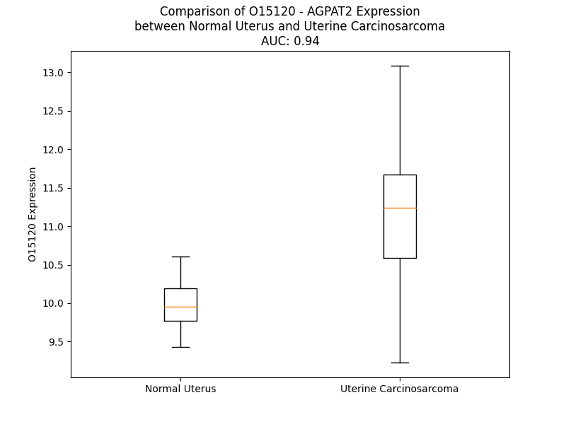

# Detailed Data for O15120

## Introduction to the Detailed Summary

### How to Interpret the Results

- **Summary & Metrics**: This section provides a quick reference to essential protein attributes, including expression changes, family classification, and biomarker applications. Regulation status (upregulated/downregulated) indicates the protein's behavior in a disease context. Some information comes from the original excel file with the proteins selected from literature, while others are derived from the analyses.
- **Expression Comparison**: A visual representation comparing protein expression between normal and disease states. It highlights significant changes in expression levels that might indicate diagnostic or therapeutic relevance. This is data coming from transcriptomics experiments and could not translate similarly to protein levels.
- **Isoform Alignment**: An interactive view of isoform alignments, revealing structural and functional differences between variants of the protein.
- **Interactors & Homologs**: Tables listing known interaction partners and homologous proteins, the more interactors and homologs, the more complex the protein is to design an antibody for.
- **Biological Assemblies**: Information about the structural arrangement of the protein in different assemblies, providing insights into its functional state but also the complexity of the protein to develop antibodies.
- **Combined Per-Residue Information**: A detailed table summarizing residue-level data. This includes predictions for epitope regions, aggregation tendencies, and modifications that might impact the protein's function. Each row corresponds to a residue in the protein, providing insights into specific sites that may be important for research or drug development.
## Summary & Metrics

- **UniProt Accession**: O15120
- **Gene Name**: AGPAT2
- **Protein Name**: 1-acylglycerol-3-phosphate O-acyltransferase 2
- **Swiss Prot**: PLCB_HUMAN
- **Family**: enzyme
- **Biomarker Application**: prognosis
- **Number of Isoforms**: 2
- **Regulation**: 1
- **(transcriptomics) AUC**: 0.94
- **(transcriptomics) Fold Change**: 1.13
- **(transcriptomics) Regulation**: Upregulated
- **Discotope Epitope Count**: 37
- **Max n_uniprots (Homo)**: N/A
- **Max n_uniprots (Hetero)**: N/A

## Expression Comparison

## Isoform Alignment

<pre style='font-size:14px; font-family:monospace;'>O15120-1 MELWPCLAAALLLLLLLVQLSRAAEFYAKVALYCALCFTVSAVASLVCLLRHGGRTVENMSIIGWFVRSFKYFYGLRFEVRDPRRLQEARPCVIVSNHQSILDMMGLMEVLPERCVQIAKRELLFLGPVGLIMYLGGVFFINRQRSSTAMTVMADLGERMVRENLKVWIYPEGTRNDNGDLLPFKKGAFYLAVQAQVPIVPVVYSSFSSFYNTKKKFFTSGTVTVQVLEAIPTSGLTAADVPALVDTCHRAMRTTFLHISKTPQENGATAGSGVQPAQ
O15120-2 MELWPCLAAALLLLLLLVQLSRAAEFYAKVALYCALCFTVSAVASLVCLLRHGGRTVENMSIIGWFVRSFKYFYGLRFEVRDPRRLQEARPCVIVSNHQSILDMMGLMEVLPERCVQIAKRELLFLGPVGLIMYLGGVFFINRQRSSTAMTVMADLGERMVREN--------------------------------VPIVPVVYSSFSSFYNTKKKFFTSGTVTVQVLEAIPTSGLTAADVPALVDTCHRAMRTTFLHISKTPQENGATAGSGVQPAQ
</pre>

## Interactors

| preferredName_A   | preferredName_B   |   score |
|:------------------|:------------------|--------:|
| AGPAT2            | BSCL2             |   0.988 |
| AGPAT2            | MBOAT2            |   0.979 |
| AGPAT2            | AGPAT3            |   0.97  |
| AGPAT2            | PLPP2             |   0.967 |
| AGPAT2            | CDS2              |   0.966 |
| AGPAT2            | PLPP3             |   0.965 |
| AGPAT2            | AGPAT4            |   0.965 |
| AGPAT2            | CDS1              |   0.963 |
| AGPAT2            | AGPAT5            |   0.962 |
| AGPAT2            | LCLAT1            |   0.943 |
| AGPAT2            | PLPP4             |   0.942 |
| AGPAT2            | PLPP5             |   0.936 |
| AGPAT2            | MBOAT1            |   0.931 |
| AGPAT2            | LPIN1             |   0.928 |
| AGPAT2            | GPAM              |   0.926 |
| AGPAT2            | AGK               |   0.918 |
| AGPAT2            | PIGA              |   0.912 |
| AGPAT2            | GPAT3             |   0.911 |
| AGPAT2            | AGPAT1            |   0.911 |
| AGPAT2            | GNPAT             |   0.905 |
| AGPAT2            | GPD1              |   0.904 |
| AGPAT2            | GPAT4             |   0.902 |

## Homologs

| uniprot_id   | gene_id   |
|:-------------|:----------|
| Q99943       | AGPAT1    |

## Combined Per-Residue Information

|   res | aa   |   epitope_score | epitope   |   relative_surface_accessibility |   modeling_confidence |   Aggregation | modification   |
|------:|:-----|----------------:|:----------|---------------------------------:|----------------------:|--------------:|:---------------|
|     1 | M    |         0.13142 | False     |                          1.17317 |                 64.78 |         0     | N/A            |
|     2 | E    |         0.17163 | False     |                          0.67403 |                 72.38 |         0     | N/A            |
|     3 | L    |         0.14194 | False     |                          0.78462 |                 81.44 |         0     | N/A            |
|     4 | W    |         0.24424 | False     |                          0.71981 |                 86.27 |         0     | N/A            |
|     5 | P    |         0.19448 | False     |                          0.4571  |                 90.6  |         0.111 | N/A            |
|     6 | C    |         0.07984 | False     |                          0.62369 |                 86.94 |         9.156 | N/A            |
|     7 | L    |         0.11882 | False     |                          0.70162 |                 89.28 |        52.833 | N/A            |
|     8 | A    |         0.08823 | False     |                          0.33846 |                 90.29 |        60.831 | N/A            |
|     9 | A    |         0.07567 | False     |                          0.54878 |                 89.71 |        70.843 | N/A            |
|    10 | A    |         0.10832 | False     |                          0.55616 |                 88.68 |        82.684 | N/A            |
|    11 | L    |         0.16232 | False     |                          0.65137 |                 88.99 |        96.683 | N/A            |
|    12 | L    |         0.1444  | False     |                          0.68006 |                 88.67 |        99.24  | N/A            |
|    13 | L    |         0.10278 | False     |                          0.66774 |                 84.26 |        99.702 | N/A            |
|    14 | L    |         0.11026 | False     |                          0.65478 |                 81.93 |        99.775 | N/A            |
|    15 | L    |         0.10813 | False     |                          0.62752 |                 82.84 |        99.742 | N/A            |
|    16 | L    |         0.1553  | False     |                          0.63617 |                 80.79 |        99.521 | N/A            |
|    17 | L    |         0.16095 | False     |                          0.57952 |                 77.36 |        98.278 | N/A            |
|    18 | V    |         0.13411 | False     |                          0.2217  |                 77.49 |        91.459 | N/A            |
|    19 | Q    |         0.25432 | True      |                          0.65593 |                 76.91 |        11.126 | N/A            |
|    20 | L    |         0.17098 | False     |                          0.86952 |                 80.71 |         7.979 | N/A            |
|    21 | S    |         0.26784 | True      |                          0.34831 |                 88.21 |         0.894 | N/A            |
|    22 | R    |         0.23189 | False     |                          0.65254 |                 87.38 |         0.015 | N/A            |
|    23 | A    |         0.19975 | False     |                          0.3823  |                 91.57 |         0.062 | N/A            |
|    24 | A    |         0.09714 | False     |                          0.32275 |                 91.55 |         0.298 | N/A            |
|    25 | E    |         0.09043 | False     |                          0.23518 |                 91.62 |         1.207 | N/A            |
|    26 | F    |         0.06579 | False     |                          0.03881 |                 94.83 |         1.247 | N/A            |
|    27 | Y    |         0.29565 | True      |                          0.53449 |                 94.86 |         1.242 | N/A            |
|    28 | A    |         0.10965 | False     |                          0.40363 |                 93.57 |         1.236 | N/A            |
|    29 | K    |         0.17978 | False     |                          0.26594 |                 95.04 |         1.233 | N/A            |
|    30 | V    |         0.19518 | False     |                          0.22278 |                 96.12 |        38.484 | N/A            |
|    31 | A    |         0.23699 | False     |                          0.56841 |                 95.87 |        42.046 | N/A            |
|    32 | L    |         0.1975  | False     |                          0.51701 |                 95.85 |        54.552 | N/A            |
|    33 | Y    |         0.07667 | False     |                          0.04229 |                 97.03 |        59.184 | N/A            |
|    34 | C    |         0.26215 | True      |                          0.51552 |                 96.6  |        60.489 | N/A            |
|    35 | A    |         0.1546  | False     |                          0.49859 |                 96.66 |        68.004 | N/A            |
|    36 | L    |         0.1608  | False     |                          0.18431 |                 96.53 |        77.019 | N/A            |
|    37 | C    |         0.21546 | False     |                          0.20734 |                 96.89 |        78.237 | N/A            |
|    38 | F    |         0.24105 | False     |                          0.55919 |                 97.24 |        86.484 | N/A            |
|    39 | T    |         0.18778 | False     |                          0.56227 |                 96.87 |        86.514 | N/A            |
|    40 | V    |         0.09814 | False     |                          0.17899 |                 96.65 |        87.138 | N/A            |
|    41 | S    |         0.08835 | False     |                          0.07399 |                 97.37 |        82.296 | N/A            |
|    42 | A    |         0.17113 | False     |                          0.43039 |                 97.53 |        82.385 | N/A            |
|    43 | V    |         0.14313 | False     |                          0.50814 |                 97.66 |        82.715 | N/A            |
|    44 | A    |         0.00903 | False     |                          0.00255 |                 97.14 |        77.313 | N/A            |
|    45 | S    |         0.04721 | False     |                          0.026   |                 97.14 |        72.763 | N/A            |
|    46 | L    |         0.24303 | False     |                          0.63488 |                 97.65 |        72.632 | N/A            |
|    47 | V    |         0.13905 | False     |                          0.37652 |                 97.87 |        69.262 | N/A            |
|    48 | C    |         0.00601 | False     |                          0       |                 97.83 |        29.361 | N/A            |
|    49 | L    |         0.19954 | False     |                          0.47161 |                 97.51 |        26.282 | N/A            |
|    50 | L    |         0.28949 | True      |                          0.86678 |                 97.81 |        20.283 | N/A            |
|    51 | R    |         0.22781 | False     |                          0.67352 |                 97.36 |         0     | N/A            |
|    52 | H    |         0.16452 | False     |                          0.36672 |                 97.46 |         0     | N/A            |
|    53 | G    |         0.23549 | False     |                          0.77313 |                 95.87 |         0     | N/A            |
|    54 | G    |         0.13127 | False     |                          0.23255 |                 95.43 |         0     | N/A            |
|    55 | R    |         0.38725 | True      |                          0.33309 |                 96.57 |         0     | N/A            |
|    56 | T    |         0.16521 | False     |                          0.28066 |                 96.18 |         0     | N/A            |
|    57 | V    |         0.0317  | False     |                          0.11048 |                 96.17 |         0     | N/A            |
|    58 | E    |         0.09929 | False     |                          0.35936 |                 95.85 |         0     | N/A            |
|    59 | N    |         0.00701 | False     |                          0       |                 97.56 |         1.392 | N/A            |
|    60 | M    |         0.03056 | False     |                          0.05797 |                 96.76 |        37.15  | N/A            |
|    61 | S    |         0.06192 | False     |                          0.60852 |                 95.7  |        41.429 | N/A            |
|    62 | I    |         0.09455 | False     |                          0.08788 |                 96.54 |        75.333 | N/A            |
|    63 | I    |         0.08158 | False     |                          0.0648  |                 96.99 |        78.193 | N/A            |
|    64 | G    |         0.0467  | False     |                          0.03219 |                 96.64 |        78.193 | N/A            |
|    65 | W    |         0.21676 | False     |                          0.78537 |                 96.34 |        78.193 | N/A            |
|    66 | F    |         0.12927 | False     |                          0.19813 |                 96.64 |        78.089 | N/A            |
|    67 | V    |         0.04882 | False     |                          0.10924 |                 96.02 |        72.195 | N/A            |
|    68 | R    |         0.15224 | False     |                          0.39497 |                 95.9  |         0     | N/A            |
|    69 | S    |         0.19802 | False     |                          0.34697 |                 95.44 |         0     | N/A            |
|    70 | F    |         0.03    | False     |                          0.01083 |                 96.8  |         0     | N/A            |
|    71 | K    |         0.15297 | False     |                          0.13681 |                 95.76 |         0     | N/A            |
|    72 | Y    |         0.23903 | False     |                          0.73795 |                 95.93 |         1.049 | N/A            |
|    73 | F    |         0.28412 | True      |                          0.65807 |                 94.94 |         1.192 | N/A            |
|    74 | Y    |         0.16039 | False     |                          0.04789 |                 96    |         1.192 | N/A            |
|    75 | G    |         0.1294  | False     |                          0.40243 |                 96.47 |         1.192 | N/A            |
|    76 | L    |         0.06863 | False     |                          0.03445 |                 97.34 |         1.192 | N/A            |
|    77 | R    |         0.21309 | False     |                          0.7132  |                 97.25 |         0.622 | N/A            |
|    78 | F    |         0.0638  | False     |                          0.13377 |                 97.25 |         0.622 | N/A            |
|    79 | E    |         0.14189 | False     |                          0.47967 |                 97.39 |         0.622 | N/A            |
|    80 | V    |         0.07892 | False     |                          0.32422 |                 97.51 |         0.622 | N/A            |
|    81 | R    |         0.20476 | False     |                          0.41166 |                 97.63 |         0     | N/A            |
|    82 | D    |         0.06447 | False     |                          0.32505 |                 96.28 |         0     | N/A            |
|    83 | P    |         0.1657  | False     |                          0.43229 |                 95.06 |         0     | N/A            |
|    84 | R    |         0.31259 | True      |                          0.74575 |                 94.29 |         0     | N/A            |
|    85 | R    |         0.10783 | False     |                          0.26914 |                 93.56 |         0     | N/A            |
|    86 | L    |         0.03117 | False     |                          0.03545 |                 93.75 |         0     | N/A            |
|    87 | Q    |         0.14963 | False     |                          0.66974 |                 90.93 |         0     | N/A            |
|    88 | E    |         0.18648 | False     |                          0.39425 |                 89.08 |         0     | N/A            |
|    89 | A    |         0.16993 | False     |                          0.8926  |                 89.33 |         0     | N/A            |
|    90 | R    |         0.20288 | False     |                          0.38174 |                 94.38 |         0     | N/A            |
|    91 | P    |         0.10939 | False     |                          0.204   |                 96.91 |         0     | N/A            |
|    92 | C    |         0.02189 | False     |                          0.03013 |                 97.91 |         0.804 | N/A            |
|    93 | V    |         0.00221 | False     |                          0       |                 98.23 |         1.217 | N/A            |
|    94 | I    |         0.00172 | False     |                          0       |                 98.53 |         1.217 | N/A            |
|    95 | V    |         0.00182 | False     |                          0       |                 98.63 |         1.217 | N/A            |
|    96 | S    |         0.00515 | False     |                          0       |                 98.53 |         1.217 | N/A            |
|    97 | N    |         0.00817 | False     |                          0.00363 |                 98.34 |         0.413 | N/A            |
|    98 | H    |         0.20657 | False     |                          0.16389 |                 97.21 |         0     | N/A            |
|    99 | Q    |         0.06415 | False     |                          0.07329 |                 96.82 |         0     | N/A            |
|   100 | S    |         0.08032 | False     |                          0.05842 |                 96.25 |         0     | N/A            |
|   101 | I    |         0.17396 | False     |                          0.2623  |                 94.86 |         0     | N/A            |
|   102 | L    |         0.02243 | False     |                          0.01889 |                 96.46 |         0     | N/A            |
|   103 | D    |         0.0543  | False     |                          0.02816 |                 97.17 |         0     | N/A            |
|   104 | M    |         0.15088 | False     |                          0.34533 |                 95.38 |         0     | N/A            |
|   105 | M    |         0.02836 | False     |                          0.01054 |                 96.19 |         0     | N/A            |
|   106 | G    |         0.00502 | False     |                          0.00161 |                 96.53 |         0     | N/A            |
|   107 | L    |         0.03829 | False     |                          0.02968 |                 97.23 |         0     | N/A            |
|   108 | M    |         0.02137 | False     |                          0.01491 |                 96.48 |         0     | N/A            |
|   109 | E    |         0.08508 | False     |                          0.20554 |                 95.64 |         0     | N/A            |
|   110 | V    |         0.08455 | False     |                          0.09861 |                 96.35 |         0     | N/A            |
|   111 | L    |         0.06416 | False     |                          0.12384 |                 96.7  |         0     | N/A            |
|   112 | P    |         0.04762 | False     |                          0.10366 |                 96.17 |         0     | N/A            |
|   113 | E    |         0.10572 | False     |                          0.77695 |                 94.71 |         0     | N/A            |
|   114 | R    |         0.10915 | False     |                          0.38716 |                 95.29 |         0     | N/A            |
|   115 | C    |         0.00308 | False     |                          0.00258 |                 97.03 |         0     | N/A            |
|   116 | V    |         0.01461 | False     |                          0.01904 |                 95.93 |         0     | N/A            |
|   117 | Q    |         0.11363 | False     |                          0.07606 |                 96.09 |         0     | N/A            |
|   118 | I    |         0.05901 | False     |                          0.08341 |                 93.78 |         0     | N/A            |
|   119 | A    |         0.07508 | False     |                          0.06377 |                 92.42 |         0     | N/A            |
|   120 | K    |         0.30684 | True      |                          0.36837 |                 91.97 |         0     | N/A            |
|   121 | R    |         0.32922 | True      |                          0.50569 |                 92.85 |         0     | N/A            |
|   122 | E    |         0.33504 | True      |                          0.4247  |                 93.6  |         0     | N/A            |
|   123 | L    |         0.26371 | True      |                          0.4196  |                 93.66 |         0.003 | N/A            |
|   124 | L    |         0.20603 | False     |                          0.36946 |                 95.33 |         0.003 | N/A            |
|   125 | F    |         0.37837 | True      |                          0.7304  |                 96.23 |         0.003 | N/A            |
|   126 | L    |         0.3691  | True      |                          0.5928  |                 95.32 |         0.003 | N/A            |
|   127 | G    |         0.19571 | False     |                          0.50973 |                 96.34 |         0.003 | N/A            |
|   128 | P    |         0.1322  | False     |                          0.20479 |                 97.18 |         0.539 | N/A            |
|   129 | V    |         0.24024 | False     |                          0.18756 |                 97.17 |        44.646 | N/A            |
|   130 | G    |         0.00531 | False     |                          0       |                 97.32 |        48.39  | N/A            |
|   131 | L    |         0.11678 | False     |                          0.47342 |                 97.74 |        89.893 | N/A            |
|   132 | I    |         0.10144 | False     |                          0.0632  |                 97.43 |        97.393 | N/A            |
|   133 | M    |         0.12715 | False     |                          0.10256 |                 97.49 |        98.077 | N/A            |
|   134 | Y    |         0.19122 | False     |                          0.43221 |                 97.8  |        98.647 | N/A            |
|   135 | L    |         0.08137 | False     |                          0.03215 |                 98    |        98.708 | N/A            |
|   136 | G    |         0.00666 | False     |                          0       |                 97.23 |        97.562 | N/A            |
|   137 | G    |         0.03758 | False     |                          0.06515 |                 95.58 |        97.731 | N/A            |
|   138 | V    |         0.03472 | False     |                          0.01523 |                 95.53 |        97.842 | N/A            |
|   139 | F    |         0.08448 | False     |                          0.0757  |                 93.89 |        97.721 | N/A            |
|   140 | F    |         0.0675  | False     |                          0.1823  |                 92.45 |        96.205 | N/A            |
|   141 | I    |         0.10057 | False     |                          0.0928  |                 90.29 |        77.607 | N/A            |
|   142 | N    |         0.19073 | False     |                          0.18764 |                 87.67 |         3.026 | N/A            |
|   143 | R    |         0.41454 | True      |                          0.42264 |                 81.57 |         0     | N/A            |
|   144 | Q    |         0.39841 | True      |                          0.78981 |                 81.59 |         0     | N/A            |
|   145 | R    |         0.30529 | True      |                          0.63685 |                 83.05 |         0     | N/A            |
|   146 | S    |         0.25705 | True      |                          0.65484 |                 78.22 |         0     | N/A            |
|   147 | S    |         0.24786 | False     |                          0.60965 |                 79.34 |         0     | N/A            |
|   148 | T    |         0.18555 | False     |                          0.42514 |                 79.94 |         0.245 | N/A            |
|   149 | A    |         0.13206 | False     |                          0.1703  |                 79.87 |         0.555 | N/A            |
|   150 | M    |         0.40758 | True      |                          0.75467 |                 81.63 |         0.723 | N/A            |
|   151 | T    |         0.2077  | False     |                          0.67761 |                 85.13 |         0.723 | N/A            |
|   152 | V    |         0.11094 | False     |                          0.26277 |                 85.41 |         0.723 | N/A            |
|   153 | M    |         0.16099 | False     |                          0.14348 |                 88.03 |         0.478 | N/A            |
|   154 | A    |         0.17263 | False     |                          0.30341 |                 87.99 |         0.31  | N/A            |
|   155 | D    |         0.13868 | False     |                          0.43946 |                 90.99 |         0     | N/A            |
|   156 | L    |         0.00519 | False     |                          0       |                 93.39 |         0     | N/A            |
|   157 | G    |         0.07258 | False     |                          0.04313 |                 94.66 |         0     | N/A            |
|   158 | E    |         0.17434 | False     |                          0.59329 |                 94.01 |         0     | N/A            |
|   159 | R    |         0.19024 | False     |                          0.26079 |                 94.44 |         0     | N/A            |
|   160 | M    |         0.01175 | False     |                          0       |                 95.58 |         0     | N/A            |
|   161 | V    |         0.15341 | False     |                          0.60921 |                 94.75 |         0     | N/A            |
|   162 | R    |         0.28503 | True      |                          0.66369 |                 95.65 |         0     | N/A            |
|   163 | E    |         0.20461 | False     |                          0.28009 |                 94.44 |         0     | N/A            |
|   164 | N    |         0.11392 | False     |                          0.38828 |                 95.38 |         0     | N/A            |
|   165 | L    |         0.02679 | False     |                          0.01896 |                 96.21 |         0     | N/A            |
|   166 | K    |         0.03216 | False     |                          0.07532 |                 97.66 |         0     | N/A            |
|   167 | V    |         0.00214 | False     |                          0       |                 97.34 |         3.133 | N/A            |
|   168 | W    |         0.02231 | False     |                          0.00407 |                 97.97 |         3.133 | N/A            |
|   169 | I    |         0.06991 | False     |                          0.0904  |                 97.23 |         3.133 | N/A            |
|   170 | Y    |         0.18368 | False     |                          0.15857 |                 97.11 |         3.133 | N/A            |
|   171 | P    |         0.02925 | False     |                          0.02235 |                 97.17 |         3.133 | N/A            |
|   172 | E    |         0.04284 | False     |                          0.03301 |                 96.21 |         0     | N/A            |
|   173 | G    |         0.18725 | False     |                          0.16343 |                 91.45 |         0     | N/A            |
|   174 | T    |         0.31729 | True      |                          0.50749 |                 93.04 |         0     | N/A            |
|   175 | R    |         0.42984 | True      |                          0.50937 |                 95.36 |         0     | N/A            |
|   176 | N    |         0.17253 | False     |                          0.10534 |                 94.99 |         0     | N/A            |
|   177 | D    |         0.37716 | True      |                          0.40076 |                 91.96 |         0     | N/A            |
|   178 | N    |         0.25864 | True      |                          0.59856 |                 91.97 |         0     | N/A            |
|   179 | G    |         0.16258 | False     |                          0.46462 |                 91.96 |         0     | N/A            |
|   180 | D    |         0.17716 | False     |                          0.23837 |                 95.93 |         0     | N/A            |
|   181 | L    |         0.07633 | False     |                          0.09058 |                 97.19 |         0     | N/A            |
|   182 | L    |         0.33318 | True      |                          0.28605 |                 97.77 |         0     | N/A            |
|   183 | P    |         0.23251 | False     |                          0.82189 |                 97.59 |         0     | N/A            |
|   184 | F    |         0.13882 | False     |                          0.08986 |                 98.04 |         0     | N/A            |
|   185 | K    |         0.24244 | False     |                          0.59366 |                 94.7  |         0     | N/A            |
|   186 | K    |         0.20724 | False     |                          0.48076 |                 94.26 |         0     | N/A            |
|   187 | G    |         0.19421 | False     |                          0.37838 |                 92.84 |         0.517 | N/A            |
|   188 | A    |         0.01608 | False     |                          0.02337 |                 95.57 |        17.04  | N/A            |
|   189 | F    |         0.0059  | False     |                          0       |                 97.65 |        66.595 | N/A            |
|   190 | Y    |         0.24689 | False     |                          0.42387 |                 95.85 |        66.867 | N/A            |
|   191 | L    |         0.01519 | False     |                          0.01638 |                 96.35 |        66.867 | N/A            |
|   192 | A    |         0.00252 | False     |                          0       |                 97.75 |        66.82  | N/A            |
|   193 | V    |         0.08238 | False     |                          0.06056 |                 97.46 |        65.607 | N/A            |
|   194 | Q    |         0.10355 | False     |                          0.60323 |                 95.4  |         4.701 | N/A            |
|   195 | A    |         0.03683 | False     |                          0.1475  |                 96.32 |         2.186 | N/A            |
|   196 | Q    |         0.134   | False     |                          0.42338 |                 96.5  |         0.06  | N/A            |
|   197 | V    |         0.04787 | False     |                          0.03808 |                 97.21 |         0     | N/A            |
|   198 | P    |         0.0817  | False     |                          0.11106 |                 97.88 |         0     | N/A            |
|   199 | I    |         0.0027  | False     |                          0       |                 98.63 |         0     | N/A            |
|   200 | V    |         0.02455 | False     |                          0.02856 |                 98.44 |         0     | N/A            |
|   201 | P    |         0.0048  | False     |                          0.00696 |                 98.76 |         0     | N/A            |
|   202 | V    |         0.0021  | False     |                          0       |                 98.69 |         9.931 | N/A            |
|   203 | V    |         0.0033  | False     |                          0       |                 98.59 |        10.612 | N/A            |
|   204 | Y    |         0.00706 | False     |                          0.01361 |                 98.23 |        10.612 | N/A            |
|   205 | S    |         0.01174 | False     |                          0.02708 |                 97.74 |        10.612 | N/A            |
|   206 | S    |         0.063   | False     |                          0.14349 |                 97.04 |        10.612 | N/A            |
|   207 | F    |         0.07441 | False     |                          0.04108 |                 96.1  |        10.644 | N/A            |
|   208 | S    |         0.22834 | False     |                          0.44567 |                 94.15 |         5.348 | N/A            |
|   209 | S    |         0.12955 | False     |                          0.59863 |                 92.6  |         4.743 | N/A            |
|   210 | F    |         0.07514 | False     |                          0.01343 |                 95.14 |         4.743 | N/A            |
|   211 | Y    |         0.17233 | False     |                          0.07261 |                 96.17 |         3.833 | N/A            |
|   212 | N    |         0.18631 | False     |                          0.13386 |                 95.08 |         0     | N/A            |
|   213 | T    |         0.39327 | True      |                          0.34945 |                 93.19 |         0     | N/A            |
|   214 | K    |         0.34494 | True      |                          0.79341 |                 92.91 |         0     | N/A            |
|   215 | K    |         0.3963  | True      |                          0.72579 |                 93    |         0     | N/A            |
|   216 | K    |         0.28369 | True      |                          0.3107  |                 94.3  |         0     | N/A            |
|   217 | F    |         0.23662 | False     |                          0.15078 |                 93.24 |         7.688 | N/A            |
|   218 | F    |         0.07885 | False     |                          0.02525 |                 95.89 |         9.328 | N/A            |
|   219 | T    |         0.25699 | True      |                          0.44297 |                 95.31 |         9.328 | N/A            |
|   220 | S    |         0.12106 | False     |                          0.57706 |                 96.37 |         9.328 | N/A            |
|   221 | G    |         0.07474 | False     |                          0.20734 |                 96.17 |         9.758 | N/A            |
|   222 | T    |         0.05779 | False     |                          0.13935 |                 96.55 |        12.46  | N/A            |
|   223 | V    |         0.00801 | False     |                          0.00762 |                 97.24 |        17.001 | N/A            |
|   224 | T    |         0.03206 | False     |                          0.07787 |                 97.96 |        17.327 | N/A            |
|   225 | V    |         0.00525 | False     |                          0       |                 98.27 |        17.327 | N/A            |
|   226 | Q    |         0.13168 | False     |                          0.11216 |                 98.25 |        16.771 | N/A            |
|   227 | V    |         0.0058  | False     |                          0       |                 98.48 |        16.771 | N/A            |
|   228 | L    |         0.16756 | False     |                          0.17559 |                 98.28 |        14.258 | N/A            |
|   229 | E    |         0.15131 | False     |                          0.58532 |                 97.39 |         0     | N/A            |
|   230 | A    |         0.10491 | False     |                          0.29281 |                 97.87 |         0     | N/A            |
|   231 | I    |         0.15236 | False     |                          0.15839 |                 98.21 |         0     | N/A            |
|   232 | P    |         0.15391 | False     |                          0.71189 |                 97.86 |         0     | N/A            |
|   233 | T    |         0.01235 | False     |                          0.01121 |                 98.24 |         0     | N/A            |
|   234 | S    |         0.19704 | False     |                          0.70467 |                 97.05 |         0     | N/A            |
|   235 | G    |         0.20166 | False     |                          0.80997 |                 97.73 |         0     | N/A            |
|   236 | L    |         0.18505 | False     |                          0.33139 |                 98.24 |         0     | N/A            |
|   237 | T    |         0.27317 | True      |                          0.52994 |                 98    |         0     | N/A            |
|   238 | A    |         0.24022 | False     |                          0.59681 |                 96.3  |         0     | N/A            |
|   239 | A    |         0.23934 | False     |                          0.83106 |                 98    |         0     | N/A            |
|   240 | D    |         0.21685 | False     |                          0.31726 |                 98.43 |         0     | N/A            |
|   241 | V    |         0.0078  | False     |                          0       |                 98.3  |         0     | N/A            |
|   242 | P    |         0.2958  | True      |                          0.45023 |                 98.36 |         0     | N/A            |
|   243 | A    |         0.24612 | False     |                          0.62277 |                 98.35 |         0     | N/A            |
|   244 | L    |         0.09903 | False     |                          0.06337 |                 98.58 |         0     | N/A            |
|   245 | V    |         0.15497 | False     |                          0.09616 |                 98.67 |         0     | N/A            |
|   246 | D    |         0.22265 | False     |                          0.50725 |                 98.44 |         0     | N/A            |
|   247 | T    |         0.15647 | False     |                          0.51432 |                 98.48 |         0     | N/A            |
|   248 | C    |         0.00339 | False     |                          0       |                 98.77 |         0     | N/A            |
|   249 | H    |         0.12855 | False     |                          0.22136 |                 98.76 |         0     | N/A            |
|   250 | R    |         0.3724  | True      |                          0.6728  |                 98.6  |         0     | N/A            |
|   251 | A    |         0.13424 | False     |                          0.38681 |                 98.64 |         0     | N/A            |
|   252 | M    |         0.00881 | False     |                          0       |                 98.71 |         0     | N/A            |
|   253 | R    |         0.2464  | False     |                          0.37885 |                 98.26 |         0     | N/A            |
|   254 | T    |         0.22383 | False     |                          0.62788 |                 98.2  |         0     | N/A            |
|   255 | T    |         0.06158 | False     |                          0.13576 |                 98.23 |         0     | N/A            |
|   256 | F    |         0.02843 | False     |                          0.02166 |                 98.08 |         0     | N/A            |
|   257 | L    |         0.19898 | False     |                          0.31369 |                 96.84 |         0     | N/A            |
|   258 | H    |         0.29094 | True      |                          0.66014 |                 97    |         0     | N/A            |
|   259 | I    |         0.16745 | False     |                          0.05471 |                 96.77 |         0     | N/A            |
|   260 | S    |         0.29644 | True      |                          0.30391 |                 95.04 |         0     | N/A            |
|   261 | K    |         0.22095 | False     |                          0.77442 |                 81.95 |         0     | N/A            |
|   262 | T    |         0.146   | False     |                          0.52851 |                 60.51 |         0     | N/A            |
|   263 | P    |         0.24692 | False     |                          0.83671 |                 47.93 |         0     | N/A            |
|   264 | Q    |         0.15331 | False     |                          0.36815 |                 46.73 |         0     | N/A            |
|   265 | E    |         0.19423 | False     |                          0.89919 |                 32.53 |         0     | N/A            |
|   266 | N    |         0.18922 | False     |                          0.82822 |                 33.5  |         0     | N/A            |
|   267 | G    |         0.26678 | True      |                          0.90338 |                 30.46 |         0     | N/A            |
|   268 | A    |         0.19293 | False     |                          0.8751  |                 30.66 |         0     | N/A            |
|   269 | T    |         0.1733  | False     |                          0.89465 |                 31.94 |         0     | N/A            |
|   270 | A    |         0.14324 | False     |                          0.9088  |                 30.52 |         0     | N/A            |
|   271 | G    |         0.24896 | False     |                          0.90942 |                 31.23 |         0     | N/A            |
|   272 | S    |         0.26275 | True      |                          0.77088 |                 32.05 |         0     | N/A            |
|   273 | G    |         0.21921 | False     |                          0.87735 |                 30.62 |         0     | N/A            |
|   274 | V    |         0.17248 | False     |                          0.97513 |                 31.91 |         0     | N/A            |
|   275 | Q    |         0.1727  | False     |                          0.84988 |                 30.75 |         0     | N/A            |
|   276 | P    |         0.16683 | False     |                          0.85206 |                 37.04 |         0     | N/A            |
|   277 | A    |         0.21873 | False     |                          0.87176 |                 42.85 |         0     | N/A            |
|   278 | Q    |         0.20864 | False     |                          1.23732 |                 44.01 |         0     | N/A            |

