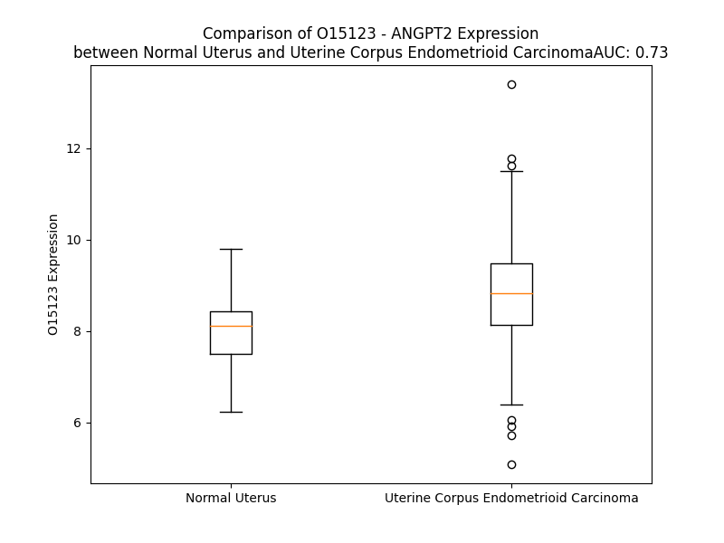

# Detailed Data for O15123

## Introduction to the Detailed Summary

### How to Interpret the Results

- **Summary & Metrics**: This section provides a quick reference to essential protein attributes, including expression changes, family classification, and biomarker applications. Regulation status (upregulated/downregulated) indicates the protein's behavior in a disease context. Some information comes from the original excel file with the proteins selected from literature, while others are derived from the analyses.
- **Expression Comparison**: A visual representation comparing protein expression between normal and disease states. It highlights significant changes in expression levels that might indicate diagnostic or therapeutic relevance. This is data coming from transcriptomics experiments and could not translate similarly to protein levels.
- **Isoform Alignment**: An interactive view of isoform alignments, revealing structural and functional differences between variants of the protein.
- **Interactors & Homologs**: Tables listing known interaction partners and homologous proteins, the more interactors and homologs, the more complex the protein is to design an antibody for.
- **Biological Assemblies**: Information about the structural arrangement of the protein in different assemblies, providing insights into its functional state but also the complexity of the protein to develop antibodies.
- **Combined Per-Residue Information**: A detailed table summarizing residue-level data. This includes predictions for epitope regions, aggregation tendencies, and modifications that might impact the protein's function. Each row corresponds to a residue in the protein, providing insights into specific sites that may be important for research or drug development.
## Summary & Metrics

- **UniProt Accession**: O15123
- **Gene Name**: ANGPT2
- **Protein Name**: Angiopoietin-2
- **Swiss Prot**: ANGP2_HUMAN
- **Family**: growth factor
- **Biomarker Application**: diagnosis,efficacy,prognosis,unspecified application
- **Number of Isoforms**: 3
- **Regulation**: -1
- **(transcriptomics) AUC**: 0.73
- **(transcriptomics) Fold Change**: 1.10
- **(transcriptomics) Regulation**: Upregulated
- **Discotope Epitope Count**: 81
- **Max n_uniprots (Homo)**: 1
- **Max n_uniprots (Hetero)**: 2

## Expression Comparison

## Isoform Alignment

<pre style='font-size:14px; font-family:monospace;'>O15123-1 MWQIVFFTLSCDLVLAAAYNNFRKSMDSIGKKQYQVQHGSCSYTFLLPEMDNCRSSSSPYVSNAVQRDAPLEYDDSVQRLQVLENIMENNTQWLMKLENYIQDNMKKEMVEIQQNAVQNQTAVMIEIGTNLLNQTAEQTRKLTDVEAQVLNQTTRLELQLLEHSLSTNKLEKQILDQTSEINKLQDKNSFLEKKVLAMEDKHIIQLQSIKEEKDQLQVLVSKQNSIIEELEKKIVTATVNNSVLQKQQHDLMETVNNLLTMMSTSNSAKDPTVAKEEQISFRDCAEVFKSGHTTNGIYTLTFPNSTEEIKAYCDMEAGGGGWTIIQRREDGSVDFQRTWKEYKVGFGNPSGEYWLGNEFVSQLTNQQRYVLKIHLKDWEGNEAYSLYEHFYLSSEELNYRIHLKGLTGTAGKISSISQPGNDFSTKDGDNDKCICKCSQMLTGGWWFDACGPSNLNGMYYPQRQNTNKFNGIKWYYWKGSGYSLKATTMMIRPADF
O15123-2 MWQIVFFTLSCDLVLAAAYNNFRKSMDSIGKKQYQVQHGSCSYTFLLPEMDNCRSSSSPYVSNAVQRDAPLEYDDSVQRLQVLENIMENNTQWLMKV----------------------------------------------------LNQTTRLELQLLEHSLSTNKLEKQILDQTSEINKLQDKNSFLEKKVLAMEDKHIIQLQSIKEEKDQLQVLVSKQNSIIEELEKKIVTATVNNSVLQKQQHDLMETVNNLLTMMSTSNSAKDPTVAKEEQISFRDCAEVFKSGHTTNGIYTLTFPNSTEEIKAYCDMEAGGGGWTIIQRREDGSVDFQRTWKEYKVGFGNPSGEYWLGNEFVSQLTNQQRYVLKIHLKDWEGNEAYSLYEHFYLSSEELNYRIHLKGLTGTAGKISSISQPGNDFSTKDGDNDKCICKCSQMLTGGWWFDACGPSNLNGMYYPQRQNTNKFNGIKWYYWKGSGYSLKATTMMIRPADF
O15123-3 MWQIVFFTLSCDLVLAAAYNNFRKSMDSIGKKQYQVQHGSCSYTFLLPEMDNCRSSSSPYVSNAVQRDAPLEYDDSVQRLQVLENIMENNTQWLMKLENYIQDNMKKEMVEIQQNAVQNQTAVMIEIGTNLLNQTAEQTRKLTDVEAQVLNQTTRLELQLLEHSLSTNKLEKQILDQTSEINKLQDKNSFLEKKVLAMEDKHIIQLQSIKEEKDQLQVLVSKQNSIIEELEKKIVTATVNNSVLQKQQHDLMETVNNLLTMMSTSN-SKDPTVAKEEQISFRDCAEVFKSGHTTNGIYTLTFPNSTEEIKAYCDMEAGGGGWTIIQRREDGSVDFQRTWKEYKVGFGNPSGEYWLGNEFVSQLTNQQRYVLKIHLKDWEGNEAYSLYEHFYLSSEELNYRIHLKGLTGTAGKISSISQPGNDFSTKDGDNDKCICKCSQMLTGGWWFDACGPSNLNGMYYPQRQNTNKFNGIKWYYWKGSGYSLKATTMMIRPADF
</pre>

## Interactors

| preferredName_A   | preferredName_B   |   score |
|:------------------|:------------------|--------:|
| ANGPT2            | TEK               |   0.999 |
| ANGPT2            | TIE1              |   0.994 |
| ANGPT2            | NTRK1             |   0.993 |
| ANGPT2            | KDR               |   0.986 |
| ANGPT2            | FLT1              |   0.983 |
| ANGPT2            | FLT4              |   0.98  |
| ANGPT2            | ANGPT4            |   0.924 |
| ANGPT2            | ANGPT1            |   0.92  |
| ANGPT2            | IGHV3-43D         |   0.905 |
| ANGPT2            | VWF               |   0.903 |

## Homologs

| uniprot_id   | gene_id   |
|:-------------|:----------|
| Q6UXM4       | FCN3      |
| P02671       | FGA       |
| Q9UKU9       | ANGPTL2   |
| Q9Y5C1       | ANGPTL3   |
| A0A0A0MSK1   | ANGPTL1   |
| Q92752       | TNR       |
| A0A3B3ISX9   | TNXB      |
| P02751       | FN1       |
| O00602       | FCN1      |
| Q15485       | FCN2      |
| Q8NI99       | ANGPTL6   |
| D6REL8       | FGB       |
| E9PKF7       | ANGPTL5   |
| A0A994J7R0   | TNC       |
| O43827       | ANGPTL7   |
| P55083       | MFAP4     |
| Q08830       | FGL1      |
| Q9UQP3       | TNN       |
| X6RDH7       | FIBCD1    |
| C9JPQ9       | FGG       |
| M0R369       | ANGPTL4   |
| Q9Y264       | ANGPT4    |
| Q5VTL7       | FNDC7     |
| A4D1B8       | FGL2      |
| B4DTQ9       | ANGPT1    |

## Biological Assemblies

|   Unnamed: 0 |   assembly |   n_uniprots | composition   | crystal_id   |
|-------------:|-----------:|-------------:|:--------------|:-------------|
|            0 |          1 |            1 | Homo          | 4jzc         |
|            1 |          2 |            1 | Homo          | 4jzc         |
|            0 |          1 |            2 | Hetero        | 2gy7         |
|            0 |          1 |            1 | Homo          | 1z3s         |
|            1 |          2 |            1 | Homo          | 1z3s         |
|            0 |          1 |            1 | Homo          | 1z3u         |
|            1 |          2 |            1 | Homo          | 1z3u         |
|            2 |          3 |            1 | Homo          | 1z3u         |
|            3 |          4 |            1 | Homo          | 1z3u         |
|            0 |          1 |            1 | Homo          | 4zfg         |

## Combined Per-Residue Information

|   res | aa   |   epitope_score | epitope   |   relative_surface_accessibility |   modeling_confidence |   Aggregation | modification   | glycosylation                   |
|------:|:-----|----------------:|:----------|---------------------------------:|----------------------:|--------------:|:---------------|:--------------------------------|
|     1 | M    |         0.0725  | False     |                          1.25627 |                 41.1  |         0.018 | N/A            | N/A                             |
|     2 | W    |         0.08504 | False     |                          1.11511 |                 37.09 |        26.474 | N/A            | N/A                             |
|     3 | Q    |         0.10676 | False     |                          0.89789 |                 36.3  |        28.696 | N/A            | N/A                             |
|     4 | I    |         0.07714 | False     |                          0.87965 |                 41    |        93.547 | N/A            | N/A                             |
|     5 | V    |         0.08555 | False     |                          0.84123 |                 44.88 |        98.547 | N/A            | N/A                             |
|     6 | F    |         0.08065 | False     |                          0.91441 |                 37.37 |        98.569 | N/A            | N/A                             |
|     7 | F    |         0.11321 | False     |                          0.92389 |                 39.92 |        98.291 | N/A            | N/A                             |
|     8 | T    |         0.10319 | False     |                          0.90544 |                 36.38 |        94.553 | N/A            | N/A                             |
|     9 | L    |         0.09957 | False     |                          1.03594 |                 34.94 |        82.114 | N/A            | N/A                             |
|    10 | S    |         0.07635 | False     |                          0.79687 |                 31.68 |        11.496 | N/A            | N/A                             |
|    11 | C    |         0.06383 | False     |                          0.86913 |                 34.15 |         4.483 | N/A            | N/A                             |
|    12 | D    |         0.09075 | False     |                          0.87907 |                 34.47 |         0.015 | N/A            | N/A                             |
|    13 | L    |         0.08455 | False     |                          0.93418 |                 35.79 |         5.955 | N/A            | N/A                             |
|    14 | V    |         0.0843  | False     |                          0.98298 |                 36.82 |         8.938 | N/A            | N/A                             |
|    15 | L    |         0.08804 | False     |                          0.9693  |                 39.18 |         9.456 | N/A            | N/A                             |
|    16 | A    |         0.05499 | False     |                          0.92752 |                 33.19 |         9.451 | N/A            | N/A                             |
|    17 | A    |         0.05335 | False     |                          0.96502 |                 40.36 |         9.447 | N/A            | N/A                             |
|    18 | A    |         0.05912 | False     |                          0.87824 |                 30.77 |         8.277 | N/A            | N/A                             |
|    19 | Y    |         0.11021 | False     |                          0.94467 |                 37.11 |         6.643 | N/A            | N/A                             |
|    20 | N    |         0.11639 | False     |                          0.89156 |                 36.43 |         0.499 | N/A            | N/A                             |
|    21 | N    |         0.06499 | False     |                          0.88785 |                 30.9  |         0.366 | N/A            | N/A                             |
|    22 | F    |         0.10392 | False     |                          0.8736  |                 34.12 |         0.328 | N/A            | N/A                             |
|    23 | R    |         0.09387 | False     |                          0.81757 |                 32.5  |         0     | N/A            | N/A                             |
|    24 | K    |         0.08369 | False     |                          0.98975 |                 33.38 |         0     | N/A            | N/A                             |
|    25 | S    |         0.06963 | False     |                          0.79052 |                 29.29 |         0     | N/A            | N/A                             |
|    26 | M    |         0.08254 | False     |                          0.90028 |                 33.54 |         0     | N/A            | N/A                             |
|    27 | D    |         0.07758 | False     |                          0.70782 |                 34.23 |         0     | N/A            | N/A                             |
|    28 | S    |         0.09927 | False     |                          0.71148 |                 30.94 |         0     | N/A            | N/A                             |
|    29 | I    |         0.12142 | False     |                          0.98758 |                 36.23 |         0     | N/A            | N/A                             |
|    30 | G    |         0.0645  | False     |                          0.79326 |                 29.47 |         0     | N/A            | N/A                             |
|    31 | K    |         0.0776  | False     |                          1.00886 |                 34.3  |         0     | N/A            | N/A                             |
|    32 | K    |         0.05864 | False     |                          0.931   |                 32.42 |         0     | N/A            | N/A                             |
|    33 | Q    |         0.13037 | False     |                          0.82455 |                 32.56 |         0     | N/A            | N/A                             |
|    34 | Y    |         0.10203 | False     |                          0.83596 |                 32.45 |         0     | N/A            | N/A                             |
|    35 | Q    |         0.06391 | False     |                          0.92039 |                 27.34 |         0     | N/A            | N/A                             |
|    36 | V    |         0.06561 | False     |                          0.90805 |                 37.13 |         0     | N/A            | N/A                             |
|    37 | Q    |         0.12986 | False     |                          0.88075 |                 37.67 |         0     | N/A            | N/A                             |
|    38 | H    |         0.14943 | True      |                          1.06816 |                 39.21 |         0     | N/A            | N/A                             |
|    39 | G    |         0.07983 | False     |                          0.79485 |                 44.49 |         0     | N/A            | N/A                             |
|    40 | S    |         0.15152 | True      |                          0.97668 |                 41    |         0     | N/A            | N/A                             |
|    41 | C    |         0.05342 | False     |                          0.86194 |                 42.05 |         0.205 | N/A            | N/A                             |
|    42 | S    |         0.09185 | False     |                          0.86795 |                 45.44 |         1.177 | N/A            | N/A                             |
|    43 | Y    |         0.09204 | False     |                          0.8786  |                 52.8  |         1.177 | N/A            | N/A                             |
|    44 | T    |         0.10504 | False     |                          0.87598 |                 44.33 |         1.177 | N/A            | N/A                             |
|    45 | F    |         0.11221 | False     |                          0.92344 |                 48.69 |         1.177 | N/A            | N/A                             |
|    46 | L    |         0.11723 | False     |                          1.02931 |                 42.99 |         1.177 | N/A            | N/A                             |
|    47 | L    |         0.08477 | False     |                          1.01182 |                 41.07 |         0     | N/A            | N/A                             |
|    48 | P    |         0.07987 | False     |                          0.92967 |                 45.29 |         0     | N/A            | N/A                             |
|    49 | E    |         0.13111 | False     |                          0.88586 |                 39.49 |         0     | N/A            | N/A                             |
|    50 | M    |         0.12833 | False     |                          1.0196  |                 38.2  |         0     | N/A            | N/A                             |
|    51 | D    |         0.08773 | False     |                          0.82578 |                 39.54 |         0     | N/A            | N/A                             |
|    52 | N    |         0.10006 | False     |                          0.83184 |                 35.11 |         0     | N/A            | N/A                             |
|    53 | C    |         0.07039 | False     |                          0.79575 |                 31.48 |         0     | N/A            | N/A                             |
|    54 | R    |         0.09229 | False     |                          0.91032 |                 36.04 |         0     | N/A            | N/A                             |
|    55 | S    |         0.04574 | False     |                          0.88848 |                 36.87 |         0     | N/A            | N/A                             |
|    56 | S    |         0.0653  | False     |                          0.80104 |                 37.13 |         0     | N/A            | N/A                             |
|    57 | S    |         0.07651 | False     |                          0.76792 |                 35.55 |         0     | N/A            | N/A                             |
|    58 | S    |         0.05494 | False     |                          0.77695 |                 33.88 |         0     | N/A            | N/A                             |
|    59 | P    |         0.10166 | False     |                          0.70421 |                 40.17 |         0     | N/A            | N/A                             |
|    60 | Y    |         0.0712  | False     |                          0.89709 |                 36.7  |         0     | N/A            | N/A                             |
|    61 | V    |         0.08302 | False     |                          0.89301 |                 39.38 |         0     | N/A            | N/A                             |
|    62 | S    |         0.09012 | False     |                          0.63799 |                 35.22 |         0     | N/A            | N/A                             |
|    63 | N    |         0.16153 | True      |                          0.92557 |                 33.11 |         0     | N/A            | N/A                             |
|    64 | A    |         0.07077 | False     |                          0.84543 |                 38.95 |         0     | N/A            | N/A                             |
|    65 | V    |         0.08171 | False     |                          0.97536 |                 36.24 |         0     | N/A            | N/A                             |
|    66 | Q    |         0.07349 | False     |                          0.79644 |                 33.76 |         0     | N/A            | N/A                             |
|    67 | R    |         0.1299  | False     |                          0.88332 |                 40.51 |         0     | N/A            | N/A                             |
|    68 | D    |         0.13046 | False     |                          0.84984 |                 35.92 |         0     | N/A            | N/A                             |
|    69 | A    |         0.09699 | False     |                          0.90034 |                 41.02 |         0     | N/A            | N/A                             |
|    70 | P    |         0.09347 | False     |                          0.80952 |                 43.12 |         0     | N/A            | N/A                             |
|    71 | L    |         0.09742 | False     |                          0.99522 |                 42.24 |         0     | N/A            | N/A                             |
|    72 | E    |         0.09218 | False     |                          0.84189 |                 41.8  |         0     | N/A            | N/A                             |
|    73 | Y    |         0.13204 | True      |                          0.88114 |                 50.94 |         0     | N/A            | N/A                             |
|    74 | D    |         0.09871 | False     |                          0.74983 |                 57.01 |         0     | N/A            | N/A                             |
|    75 | D    |         0.05234 | False     |                          0.57601 |                 55.98 |         0     | N/A            | N/A                             |
|    76 | S    |         0.03977 | False     |                          0.48226 |                 58.87 |         0     | N/A            | N/A                             |
|    77 | V    |         0.05156 | False     |                          0.53552 |                 65.26 |         0     | N/A            | N/A                             |
|    78 | Q    |         0.05509 | False     |                          0.6063  |                 67.32 |         0     | N/A            | N/A                             |
|    79 | R    |         0.06407 | False     |                          0.70834 |                 69.32 |         0     | N/A            | N/A                             |
|    80 | L    |         0.10347 | False     |                          0.73875 |                 71.37 |         0     | N/A            | N/A                             |
|    81 | Q    |         0.07749 | False     |                          0.5773  |                 74.71 |         0     | N/A            | N/A                             |
|    82 | V    |         0.06419 | False     |                          0.62717 |                 77.7  |         0     | N/A            | N/A                             |
|    83 | L    |         0.05865 | False     |                          0.63779 |                 75.61 |         0     | N/A            | N/A                             |
|    84 | E    |         0.08158 | False     |                          0.55349 |                 79.86 |         0     | N/A            | N/A                             |
|    85 | N    |         0.07161 | False     |                          0.66184 |                 81.84 |         0     | N/A            | N/A                             |
|    86 | I    |         0.05803 | False     |                          0.53198 |                 82.15 |         0     | N/A            | N/A                             |
|    87 | M    |         0.08798 | False     |                          0.67716 |                 79.94 |         0     | N/A            | N/A                             |
|    88 | E    |         0.08161 | False     |                          0.51871 |                 81.85 |         0     | N/A            | N/A                             |
|    89 | N    |         0.05985 | False     |                          0.6414  |                 84.48 |         0     | N/A            | N-linked (GlcNAc...) asparagine |
|    90 | N    |         0.05541 | False     |                          0.50828 |                 85.31 |         0     | N/A            | N/A                             |
|    91 | T    |         0.05318 | False     |                          0.43552 |                 85.23 |         0     | N/A            | N/A                             |
|    92 | Q    |         0.07456 | False     |                          0.55718 |                 84.65 |         0     | N/A            | N/A                             |
|    93 | W    |         0.05342 | False     |                          0.66958 |                 87.18 |         0     | N/A            | N/A                             |
|    94 | L    |         0.08634 | False     |                          0.63814 |                 86.52 |         0     | N/A            | N/A                             |
|    95 | M    |         0.0738  | False     |                          0.67926 |                 85.92 |         0     | N/A            | N/A                             |
|    96 | K    |         0.05738 | False     |                          0.73378 |                 88.59 |         0     | N/A            | N/A                             |
|    97 | L    |         0.04778 | False     |                          0.42973 |                 87.25 |         0     | N/A            | N/A                             |
|    98 | E    |         0.07944 | False     |                          0.52445 |                 87.24 |         0     | N/A            | N/A                             |
|    99 | N    |         0.06174 | False     |                          0.58154 |                 88.25 |         0     | N/A            | N/A                             |
|   100 | Y    |         0.05505 | False     |                          0.65811 |                 88.62 |         0     | N/A            | N/A                             |
|   101 | I    |         0.03685 | False     |                          0.49438 |                 85.84 |         0     | N/A            | N/A                             |
|   102 | Q    |         0.05058 | False     |                          0.54241 |                 86.84 |         0     | N/A            | N/A                             |
|   103 | D    |         0.04209 | False     |                          0.55392 |                 86.46 |         0     | N/A            | N/A                             |
|   104 | N    |         0.01663 | False     |                          0.3861  |                 85.71 |         0     | N/A            | N/A                             |
|   105 | M    |         0.05449 | False     |                          0.67165 |                 85.4  |         0     | N/A            | N/A                             |
|   106 | K    |         0.05701 | False     |                          0.68951 |                 87.2  |         0     | N/A            | N/A                             |
|   107 | K    |         0.06139 | False     |                          0.71856 |                 86.26 |         0     | N/A            | N/A                             |
|   108 | E    |         0.04613 | False     |                          0.56187 |                 86.56 |         0     | N/A            | N/A                             |
|   109 | M    |         0.0718  | False     |                          0.69684 |                 83.52 |         0     | N/A            | N/A                             |
|   110 | V    |         0.04913 | False     |                          0.63851 |                 88.73 |         0     | N/A            | N/A                             |
|   111 | E    |         0.04432 | False     |                          0.51012 |                 86.67 |         0     | N/A            | N/A                             |
|   112 | I    |         0.0417  | False     |                          0.7127  |                 85.46 |         0     | N/A            | N/A                             |
|   113 | Q    |         0.05346 | False     |                          0.5637  |                 84.65 |         0     | N/A            | N/A                             |
|   114 | Q    |         0.05497 | False     |                          0.46896 |                 87.77 |         0     | N/A            | N/A                             |
|   115 | N    |         0.03691 | False     |                          0.52367 |                 90.15 |         0     | N/A            | N/A                             |
|   116 | A    |         0.03884 | False     |                          0.45246 |                 88.61 |         0     | N/A            | N/A                             |
|   117 | V    |         0.03819 | False     |                          0.54885 |                 90.72 |         0     | N/A            | N/A                             |
|   118 | Q    |         0.06135 | False     |                          0.50175 |                 88.79 |         0     | N/A            | N/A                             |
|   119 | N    |         0.0567  | False     |                          0.6309  |                 90.7  |         0     | N/A            | N-linked (GlcNAc...) asparagine |
|   120 | Q    |         0.0849  | False     |                          0.63823 |                 90.33 |         0     | N/A            | N/A                             |
|   121 | T    |         0.04116 | False     |                          0.46004 |                 91.79 |         1.675 | N/A            | N/A                             |
|   122 | A    |         0.04348 | False     |                          0.54156 |                 92.34 |         1.675 | N/A            | N/A                             |
|   123 | V    |         0.05118 | False     |                          0.53085 |                 92.65 |         1.675 | N/A            | N/A                             |
|   124 | M    |         0.05751 | False     |                          0.74372 |                 91.71 |         1.675 | N/A            | N/A                             |
|   125 | I    |         0.06386 | False     |                          0.63715 |                 93.13 |         1.675 | N/A            | N/A                             |
|   126 | E    |         0.04885 | False     |                          0.54914 |                 92.75 |         0     | N/A            | N/A                             |
|   127 | I    |         0.04894 | False     |                          0.65611 |                 93.7  |         0     | N/A            | N/A                             |
|   128 | G    |         0.03783 | False     |                          0.33399 |                 93.88 |         0     | N/A            | N/A                             |
|   129 | T    |         0.06784 | False     |                          0.52094 |                 93.39 |         0     | N/A            | N/A                             |
|   130 | N    |         0.04227 | False     |                          0.53555 |                 94.54 |         0     | N/A            | N/A                             |
|   131 | L    |         0.07333 | False     |                          0.68823 |                 95.09 |         0     | N/A            | N/A                             |
|   132 | L    |         0.06368 | False     |                          0.77677 |                 94.64 |         0     | N/A            | N/A                             |
|   133 | N    |         0.06512 | False     |                          0.6785  |                 94.2  |         0     | N/A            | N-linked (GlcNAc...) asparagine |
|   134 | Q    |         0.04073 | False     |                          0.58985 |                 94.96 |         0     | N/A            | N/A                             |
|   135 | T    |         0.03264 | False     |                          0.49551 |                 95.1  |         0     | N/A            | N/A                             |
|   136 | A    |         0.05185 | False     |                          0.46913 |                 94.83 |         0     | N/A            | N/A                             |
|   137 | E    |         0.05228 | False     |                          0.4592  |                 94.35 |         0     | N/A            | N/A                             |
|   138 | Q    |         0.04717 | False     |                          0.64936 |                 95.56 |         0     | N/A            | N/A                             |
|   139 | T    |         0.06853 | False     |                          0.52452 |                 95.31 |         0     | N/A            | N/A                             |
|   140 | R    |         0.10071 | False     |                          0.72117 |                 95.29 |         0     | N/A            | N/A                             |
|   141 | K    |         0.05597 | False     |                          0.5932  |                 96.09 |         0     | N/A            | N/A                             |
|   142 | L    |         0.06387 | False     |                          0.65549 |                 96.22 |         0     | N/A            | N/A                             |
|   143 | T    |         0.06667 | False     |                          0.48845 |                 95.79 |         0     | N/A            | N/A                             |
|   144 | D    |         0.04911 | False     |                          0.63368 |                 95.73 |         0     | N/A            | N/A                             |
|   145 | V    |         0.02883 | False     |                          0.58362 |                 97.13 |         0     | N/A            | N/A                             |
|   146 | E    |         0.0481  | False     |                          0.51685 |                 95.9  |         0     | N/A            | N/A                             |
|   147 | A    |         0.0673  | False     |                          0.57614 |                 95.71 |         0     | N/A            | N/A                             |
|   148 | Q    |         0.05505 | False     |                          0.54972 |                 96.06 |         0     | N/A            | N/A                             |
|   149 | V    |         0.03811 | False     |                          0.59074 |                 97.25 |         0     | N/A            | N/A                             |
|   150 | L    |         0.07771 | False     |                          0.73403 |                 96.4  |         0     | N/A            | N/A                             |
|   151 | N    |         0.05892 | False     |                          0.65521 |                 95.78 |         0     | N/A            | N-linked (GlcNAc...) asparagine |
|   152 | Q    |         0.04355 | False     |                          0.5221  |                 96.1  |         0     | N/A            | N/A                             |
|   153 | T    |         0.05619 | False     |                          0.43585 |                 96.58 |         0     | N/A            | N/A                             |
|   154 | T    |         0.05561 | False     |                          0.42653 |                 96.76 |         0     | N/A            | N/A                             |
|   155 | R    |         0.08614 | False     |                          0.64361 |                 96.25 |         0     | N/A            | N/A                             |
|   156 | L    |         0.05649 | False     |                          0.71226 |                 97.01 |         0     | N/A            | N/A                             |
|   157 | E    |         0.05836 | False     |                          0.50444 |                 96.15 |         0     | N/A            | N/A                             |
|   158 | L    |         0.07656 | False     |                          0.7462  |                 96.17 |         0     | N/A            | N/A                             |
|   159 | Q    |         0.03594 | False     |                          0.39081 |                 96.1  |         0     | N/A            | N/A                             |
|   160 | L    |         0.07155 | False     |                          0.78964 |                 96.76 |         0     | N/A            | N/A                             |
|   161 | L    |         0.08503 | False     |                          0.73483 |                 96.73 |         0     | N/A            | N/A                             |
|   162 | E    |         0.07404 | False     |                          0.61829 |                 94.78 |         0     | N/A            | N/A                             |
|   163 | H    |         0.074   | False     |                          0.67653 |                 96.22 |         0     | N/A            | N/A                             |
|   164 | S    |         0.06793 | False     |                          0.4235  |                 96.5  |         0     | N/A            | N/A                             |
|   165 | L    |         0.14681 | True      |                          0.80975 |                 95.37 |         0     | N/A            | N/A                             |
|   166 | S    |         0.05618 | False     |                          0.40849 |                 95.85 |         0     | N/A            | N/A                             |
|   167 | T    |         0.05545 | False     |                          0.53218 |                 95.95 |         0     | N/A            | N/A                             |
|   168 | N    |         0.0945  | False     |                          0.54707 |                 94.98 |         0     | N/A            | N/A                             |
|   169 | K    |         0.09218 | False     |                          0.6539  |                 95.02 |         0     | N/A            | N/A                             |
|   170 | L    |         0.04837 | False     |                          0.63762 |                 96.06 |         0     | N/A            | N/A                             |
|   171 | E    |         0.08104 | False     |                          0.53362 |                 95.55 |         0     | N/A            | N/A                             |
|   172 | K    |         0.07186 | False     |                          0.68055 |                 95.51 |         0     | N/A            | N/A                             |
|   173 | Q    |         0.04417 | False     |                          0.46238 |                 95.03 |         0     | N/A            | N/A                             |
|   174 | I    |         0.07118 | False     |                          0.61736 |                 96.62 |         0     | N/A            | N/A                             |
|   175 | L    |         0.08738 | False     |                          0.78478 |                 95.33 |         0     | N/A            | N/A                             |
|   176 | D    |         0.0948  | False     |                          0.46607 |                 94.38 |         0     | N/A            | N/A                             |
|   177 | Q    |         0.05468 | False     |                          0.59131 |                 95.36 |         0     | N/A            | N/A                             |
|   178 | T    |         0.06598 | False     |                          0.46347 |                 95.46 |         0     | N/A            | N/A                             |
|   179 | S    |         0.09786 | False     |                          0.38182 |                 94.52 |         0     | N/A            | N/A                             |
|   180 | E    |         0.08212 | False     |                          0.46146 |                 94.89 |         0     | N/A            | N/A                             |
|   181 | I    |         0.09467 | False     |                          0.63131 |                 95.23 |         0     | N/A            | N/A                             |
|   182 | N    |         0.08434 | False     |                          0.51014 |                 94.13 |         0     | N/A            | N/A                             |
|   183 | K    |         0.09491 | False     |                          0.51877 |                 94.81 |         0     | N/A            | N/A                             |
|   184 | L    |         0.04786 | False     |                          0.6814  |                 95.37 |         0     | N/A            | N/A                             |
|   185 | Q    |         0.11314 | False     |                          0.61768 |                 94.81 |         0     | N/A            | N/A                             |
|   186 | D    |         0.10493 | False     |                          0.63558 |                 94.14 |         0     | N/A            | N/A                             |
|   187 | K    |         0.07027 | False     |                          0.64442 |                 95.21 |         0     | N/A            | N/A                             |
|   188 | N    |         0.08683 | False     |                          0.56315 |                 94.68 |         0     | N/A            | N/A                             |
|   189 | S    |         0.04573 | False     |                          0.38066 |                 95.17 |         0     | N/A            | N/A                             |
|   190 | F    |         0.10409 | False     |                          0.68016 |                 94.81 |         0     | N/A            | N/A                             |
|   191 | L    |         0.03814 | False     |                          0.58612 |                 95.34 |         0     | N/A            | N/A                             |
|   192 | E    |         0.06575 | False     |                          0.55254 |                 95.29 |         0     | N/A            | N/A                             |
|   193 | K    |         0.11031 | False     |                          0.6958  |                 95.84 |         0     | N/A            | N/A                             |
|   194 | K    |         0.08447 | False     |                          0.56155 |                 95.57 |         0     | N/A            | N/A                             |
|   195 | V    |         0.05286 | False     |                          0.56077 |                 95.56 |         0     | N/A            | N/A                             |
|   196 | L    |         0.09503 | False     |                          0.67264 |                 95.08 |         0     | N/A            | N/A                             |
|   197 | A    |         0.06437 | False     |                          0.58883 |                 95.33 |         0     | N/A            | N/A                             |
|   198 | M    |         0.05291 | False     |                          0.49621 |                 93.92 |         0     | N/A            | N/A                             |
|   199 | E    |         0.10494 | False     |                          0.46429 |                 94.71 |         0     | N/A            | N/A                             |
|   200 | D    |         0.13487 | True      |                          0.53822 |                 94.97 |         0     | N/A            | N/A                             |
|   201 | K    |         0.11319 | False     |                          0.60102 |                 94.88 |         0     | N/A            | N/A                             |
|   202 | H    |         0.08027 | False     |                          0.51195 |                 93.94 |         0     | N/A            | N/A                             |
|   203 | I    |         0.10176 | False     |                          0.64467 |                 95.21 |         0     | N/A            | N/A                             |
|   204 | I    |         0.11988 | False     |                          0.72626 |                 94.71 |         0     | N/A            | N/A                             |
|   205 | Q    |         0.04939 | False     |                          0.42427 |                 93.79 |         0     | N/A            | N/A                             |
|   206 | L    |         0.10755 | False     |                          0.75419 |                 94.99 |         0     | N/A            | N/A                             |
|   207 | Q    |         0.15214 | True      |                          0.56355 |                 94.77 |         0     | N/A            | N/A                             |
|   208 | S    |         0.06754 | False     |                          0.42694 |                 94.66 |         0     | N/A            | N/A                             |
|   209 | I    |         0.08073 | False     |                          0.66654 |                 94.68 |         0     | N/A            | N/A                             |
|   210 | K    |         0.07881 | False     |                          0.64455 |                 95.64 |         0     | N/A            | N/A                             |
|   211 | E    |         0.1118  | False     |                          0.53406 |                 94.98 |         0     | N/A            | N/A                             |
|   212 | E    |         0.0876  | False     |                          0.52714 |                 94.79 |         0     | N/A            | N/A                             |
|   213 | K    |         0.11746 | False     |                          0.5058  |                 94.88 |         0     | N/A            | N/A                             |
|   214 | D    |         0.10794 | False     |                          0.41756 |                 95.23 |         0     | N/A            | N/A                             |
|   215 | Q    |         0.16459 | True      |                          0.60934 |                 94.89 |         0.3   | N/A            | N/A                             |
|   216 | L    |         0.11339 | False     |                          0.65371 |                 94.78 |        23.906 | N/A            | N/A                             |
|   217 | Q    |         0.11554 | False     |                          0.56627 |                 94.51 |        23.906 | N/A            | N/A                             |
|   218 | V    |         0.10886 | False     |                          0.73598 |                 95    |        23.906 | N/A            | N/A                             |
|   219 | L    |         0.11307 | False     |                          0.63124 |                 94.59 |        23.906 | N/A            | N/A                             |
|   220 | V    |         0.09986 | False     |                          0.57206 |                 94.2  |        23.906 | N/A            | N/A                             |
|   221 | S    |         0.07641 | False     |                          0.50291 |                 93.4  |         2.605 | N/A            | N/A                             |
|   222 | K    |         0.13809 | True      |                          0.65653 |                 94.56 |         0     | N/A            | N/A                             |
|   223 | Q    |         0.07975 | False     |                          0.55891 |                 94.07 |         0     | N/A            | N/A                             |
|   224 | N    |         0.12109 | False     |                          0.5117  |                 93.41 |         0     | N/A            | N/A                             |
|   225 | S    |         0.07589 | False     |                          0.53133 |                 93.14 |         0     | N/A            | N/A                             |
|   226 | I    |         0.10533 | False     |                          0.49678 |                 94.45 |         0     | N/A            | N/A                             |
|   227 | I    |         0.12726 | False     |                          0.54078 |                 92.49 |         0     | N/A            | N/A                             |
|   228 | E    |         0.13901 | True      |                          0.59732 |                 92.67 |         0     | N/A            | N/A                             |
|   229 | E    |         0.10462 | False     |                          0.47588 |                 92.72 |         0     | N/A            | N/A                             |
|   230 | L    |         0.07797 | False     |                          0.55891 |                 91.58 |         0     | N/A            | N/A                             |
|   231 | E    |         0.08108 | False     |                          0.52103 |                 91.12 |         0     | N/A            | N/A                             |
|   232 | K    |         0.12411 | False     |                          0.77454 |                 90.63 |         0     | N/A            | N/A                             |
|   233 | K    |         0.109   | False     |                          0.58849 |                 91.02 |         0     | N/A            | N/A                             |
|   234 | I    |         0.09647 | False     |                          0.66573 |                 89.06 |         3.942 | N/A            | N/A                             |
|   235 | V    |         0.07422 | False     |                          0.66811 |                 88.08 |         4.825 | N/A            | N/A                             |
|   236 | T    |         0.07438 | False     |                          0.57707 |                 84.44 |         4.825 | N/A            | N/A                             |
|   237 | A    |         0.06864 | False     |                          0.49805 |                 83.63 |         4.825 | N/A            | N/A                             |
|   238 | T    |         0.04109 | False     |                          0.56437 |                 83.74 |         4.825 | N/A            | N/A                             |
|   239 | V    |         0.07287 | False     |                          0.61123 |                 80.76 |         4.526 | N/A            | N/A                             |
|   240 | N    |         0.09332 | False     |                          0.59813 |                 79.84 |         0.136 | N/A            | N-linked (GlcNAc...) asparagine |
|   241 | N    |         0.08957 | False     |                          0.53719 |                 78.14 |         0     | N/A            | N/A                             |
|   242 | S    |         0.06967 | False     |                          0.4346  |                 78.01 |         0     | N/A            | N/A                             |
|   243 | V    |         0.11085 | False     |                          0.59028 |                 77.67 |         0     | N/A            | N/A                             |
|   244 | L    |         0.08411 | False     |                          0.67321 |                 77.04 |         0     | N/A            | N/A                             |
|   245 | Q    |         0.07383 | False     |                          0.62357 |                 76.28 |         0     | N/A            | N/A                             |
|   246 | K    |         0.0514  | False     |                          0.68374 |                 80.52 |         0     | N/A            | N/A                             |
|   247 | Q    |         0.05866 | False     |                          0.56854 |                 80.59 |         0     | N/A            | N/A                             |
|   248 | Q    |         0.04969 | False     |                          0.53864 |                 79.05 |         0     | N/A            | N/A                             |
|   249 | H    |         0.05414 | False     |                          0.65069 |                 79.86 |         0     | N/A            | N/A                             |
|   250 | D    |         0.04504 | False     |                          0.46175 |                 80.16 |         0     | N/A            | N/A                             |
|   251 | L    |         0.04947 | False     |                          0.71379 |                 80.98 |         0     | N/A            | N/A                             |
|   252 | M    |         0.04326 | False     |                          0.5985  |                 77.54 |         0     | N/A            | N/A                             |
|   253 | E    |         0.05941 | False     |                          0.46091 |                 76.38 |         0     | N/A            | N/A                             |
|   254 | T    |         0.03265 | False     |                          0.55304 |                 78.48 |         0     | N/A            | N/A                             |
|   255 | V    |         0.05107 | False     |                          0.51221 |                 76.03 |         0     | N/A            | N/A                             |
|   256 | N    |         0.04268 | False     |                          0.45108 |                 68.49 |         0     | N/A            | N/A                             |
|   257 | N    |         0.05169 | False     |                          0.54885 |                 69.21 |         0     | N/A            | N/A                             |
|   258 | L    |         0.08028 | False     |                          0.72527 |                 64.94 |         1.592 | N/A            | N/A                             |
|   259 | L    |         0.05519 | False     |                          0.6059  |                 59.58 |         1.592 | N/A            | N/A                             |
|   260 | T    |         0.06597 | False     |                          0.69202 |                 55.49 |         1.592 | N/A            | N/A                             |
|   261 | M    |         0.14842 | True      |                          0.93471 |                 53.9  |         1.592 | N/A            | N/A                             |
|   262 | M    |         0.13778 | True      |                          0.85586 |                 49.46 |         1.592 | N/A            | N/A                             |
|   263 | S    |         0.14749 | True      |                          0.5559  |                 48.35 |         0.175 | N/A            | N/A                             |
|   264 | T    |         0.21734 | True      |                          0.92214 |                 34.33 |         0     | N/A            | N/A                             |
|   265 | S    |         0.11727 | False     |                          0.71674 |                 40.4  |         0     | N/A            | N/A                             |
|   266 | N    |         0.1323  | True      |                          0.9055  |                 39.33 |         0     | N/A            | N/A                             |
|   267 | S    |         0.1354  | True      |                          0.93593 |                 37.31 |         0     | N/A            | N/A                             |
|   268 | A    |         0.07551 | False     |                          0.89516 |                 33.18 |         0     | N/A            | N/A                             |
|   269 | K    |         0.10356 | False     |                          1.0247  |                 37.78 |         0     | N/A            | N/A                             |
|   270 | D    |         0.19191 | True      |                          0.84841 |                 34.51 |         0     | N/A            | N/A                             |
|   271 | P    |         0.15097 | True      |                          0.89975 |                 44.88 |         0     | N/A            | N/A                             |
|   272 | T    |         0.1767  | True      |                          0.99316 |                 38.92 |         0     | N/A            | N/A                             |
|   273 | V    |         0.1633  | True      |                          1.07516 |                 39.66 |         0     | N/A            | N/A                             |
|   274 | A    |         0.11762 | False     |                          0.8991  |                 41.4  |         0     | N/A            | N/A                             |
|   275 | K    |         0.12044 | False     |                          1.00628 |                 35.1  |         0     | N/A            | N/A                             |
|   276 | E    |         0.10646 | False     |                          0.91423 |                 43.95 |         0     | N/A            | N/A                             |
|   277 | E    |         0.13879 | True      |                          0.85655 |                 47.52 |         0     | N/A            | N/A                             |
|   278 | Q    |         0.16189 | True      |                          0.82932 |                 57.59 |         0     | N/A            | N/A                             |
|   279 | I    |         0.1713  | True      |                          0.75364 |                 79.31 |         0     | N/A            | N/A                             |
|   280 | S    |         0.09375 | False     |                          0.5845  |                 87    |         0     | N/A            | N/A                             |
|   281 | F    |         0.03804 | False     |                          0.13608 |                 94.56 |         0     | N/A            | N/A                             |
|   282 | R    |         0.07733 | False     |                          0.41732 |                 94.32 |         0     | N/A            | N/A                             |
|   283 | D    |         0.00728 | False     |                          0.00415 |                 96.51 |         0     | N/A            | N/A                             |
|   284 | C    |         0.00142 | False     |                          0       |                 97.61 |         0     | N/A            | N/A                             |
|   285 | A    |         0.01552 | False     |                          0.03189 |                 97.41 |         0     | N/A            | N/A                             |
|   286 | E    |         0.05115 | False     |                          0.29199 |                 96.27 |         0     | N/A            | N/A                             |
|   287 | V    |         0.00406 | False     |                          0       |                 96.53 |         0     | N/A            | N/A                             |
|   288 | F    |         0.05472 | False     |                          0.26794 |                 96.92 |         0     | N/A            | N/A                             |
|   289 | K    |         0.16219 | True      |                          0.64313 |                 95.53 |         0     | N/A            | N/A                             |
|   290 | S    |         0.1779  | True      |                          0.43354 |                 94.79 |         0     | N/A            | N/A                             |
|   291 | G    |         0.18198 | True      |                          0.67176 |                 94.86 |         0     | N/A            | N/A                             |
|   292 | H    |         0.16253 | True      |                          0.46342 |                 94.88 |         0     | N/A            | N/A                             |
|   293 | T    |         0.21286 | True      |                          0.54131 |                 95.7  |         0     | N/A            | N/A                             |
|   294 | T    |         0.13707 | True      |                          0.67454 |                 96.91 |         0     | N/A            | N/A                             |
|   295 | N    |         0.10867 | False     |                          0.30445 |                 97.76 |         0     | N/A            | N/A                             |
|   296 | G    |         0.04577 | False     |                          0.2221  |                 96.94 |         1.015 | N/A            | N/A                             |
|   297 | I    |         0.14321 | True      |                          0.44612 |                 97.77 |         5.835 | N/A            | N/A                             |
|   298 | Y    |         0.12713 | False     |                          0.17461 |                 97.17 |         5.835 | N/A            | N/A                             |
|   299 | T    |         0.0687  | False     |                          0.39435 |                 96.6  |         5.835 | N/A            | N/A                             |
|   300 | L    |         0.00388 | False     |                          0       |                 96.38 |         5.835 | N/A            | N/A                             |
|   301 | T    |         0.05232 | False     |                          0.16819 |                 95.57 |         5.199 | N/A            | N/A                             |
|   302 | F    |         0.05108 | False     |                          0.10725 |                 94.74 |         0.615 | N/A            | N/A                             |
|   303 | P    |         0.04139 | False     |                          0.14911 |                 90.67 |         0.262 | N/A            | N/A                             |
|   304 | N    |         0.18976 | True      |                          0.95669 |                 88.29 |         0     | N/A            | N-linked (GlcNAc...) asparagine |
|   305 | S    |         0.18171 | True      |                          0.40223 |                 88.98 |         0     | N/A            | N/A                             |
|   306 | T    |         0.20483 | True      |                          0.94776 |                 89.12 |         0     | N/A            | N/A                             |
|   307 | E    |         0.15942 | True      |                          0.54386 |                 93.57 |         0     | N/A            | N/A                             |
|   308 | E    |         0.15693 | True      |                          0.51201 |                 94.57 |         0     | N/A            | N/A                             |
|   309 | I    |         0.07521 | False     |                          0.14639 |                 96.44 |         0     | N/A            | N/A                             |
|   310 | K    |         0.15276 | True      |                          0.65138 |                 97.2  |         0     | N/A            | N/A                             |
|   311 | A    |         0.00139 | False     |                          0       |                 97.97 |         0     | N/A            | N/A                             |
|   312 | Y    |         0.03503 | False     |                          0.21242 |                 98.25 |         0     | N/A            | N/A                             |
|   313 | C    |         0.00521 | False     |                          0       |                 98.21 |         0     | N/A            | N/A                             |
|   314 | D    |         0.04005 | False     |                          0.13022 |                 97.89 |         0     | N/A            | N/A                             |
|   315 | M    |         0.02587 | False     |                          0.0404  |                 97.33 |         0     | N/A            | N/A                             |
|   316 | E    |         0.06834 | False     |                          0.65758 |                 94.18 |         0     | N/A            | N/A                             |
|   317 | A    |         0.09047 | False     |                          0.36186 |                 89.82 |         0     | N/A            | N/A                             |
|   318 | G    |         0.19832 | True      |                          0.64777 |                 87.92 |         0     | N/A            | N/A                             |
|   319 | G    |         0.06579 | False     |                          0.60682 |                 92.7  |         0     | N/A            | N/A                             |
|   320 | G    |         0.00619 | False     |                          0       |                 95.78 |         0     | N/A            | N/A                             |
|   321 | G    |         0.00271 | False     |                          0.00357 |                 97.33 |         0.602 | N/A            | N/A                             |
|   322 | W    |         0.02156 | False     |                          0.03372 |                 98.45 |         0.602 | N/A            | N/A                             |
|   323 | T    |         0.00183 | False     |                          0.00507 |                 98.45 |         0.602 | N/A            | N/A                             |
|   324 | I    |         0.01244 | False     |                          0.0312  |                 98.55 |         0.602 | N/A            | N/A                             |
|   325 | I    |         0.01253 | False     |                          0.01496 |                 98.65 |         0.602 | N/A            | N/A                             |
|   326 | Q    |         0.00456 | False     |                          0       |                 98.71 |         0     | N/A            | N/A                             |
|   327 | R    |         0.05588 | False     |                          0.10723 |                 98.63 |         0     | N/A            | N/A                             |
|   328 | R    |         0.0457  | False     |                          0.01747 |                 98.51 |         0     | N/A            | N/A                             |
|   329 | E    |         0.05889 | False     |                          0.36966 |                 97.45 |         0     | N/A            | N/A                             |
|   330 | D    |         0.08276 | False     |                          0.5146  |                 97    |         0     | N/A            | N/A                             |
|   331 | G    |         0.09647 | False     |                          0.37998 |                 96.78 |         0     | N/A            | N/A                             |
|   332 | S    |         0.11967 | False     |                          0.63247 |                 97.41 |         0     | N/A            | N/A                             |
|   333 | V    |         0.11583 | False     |                          0.19611 |                 97.84 |         0     | N/A            | N/A                             |
|   334 | D    |         0.13664 | True      |                          0.4382  |                 97.71 |         0     | N/A            | N/A                             |
|   335 | F    |         0.02636 | False     |                          0.03181 |                 98.39 |         0     | N/A            | N/A                             |
|   336 | Q    |         0.10124 | False     |                          0.3462  |                 97.44 |         0     | N/A            | N/A                             |
|   337 | R    |         0.15411 | True      |                          0.25052 |                 98.22 |         0     | N/A            | N/A                             |
|   338 | T    |         0.10589 | False     |                          0.28076 |                 98.55 |         0     | N/A            | N/A                             |
|   339 | W    |         0.03835 | False     |                          0.20412 |                 98.57 |         0     | N/A            | N/A                             |
|   340 | K    |         0.16819 | True      |                          0.74348 |                 98.57 |         0     | N/A            | N/A                             |
|   341 | E    |         0.12062 | False     |                          0.28338 |                 98.64 |         0     | N/A            | N/A                             |
|   342 | Y    |         0.00569 | False     |                          0.00061 |                 98.74 |         0     | N/A            | N/A                             |
|   343 | K    |         0.09858 | False     |                          0.26877 |                 98.51 |         0     | N/A            | N/A                             |
|   344 | V    |         0.12799 | False     |                          0.64601 |                 98.04 |         0     | N/A            | N/A                             |
|   345 | G    |         0.05071 | False     |                          0.21388 |                 98.24 |         0     | N/A            | N/A                             |
|   346 | F    |         0.10265 | False     |                          0.11927 |                 98.65 |         0     | N/A            | N/A                             |
|   347 | G    |         0.09933 | False     |                          0.50955 |                 97.72 |         0     | N/A            | N/A                             |
|   348 | N    |         0.15064 | True      |                          0.52197 |                 97.12 |         0     | N/A            | N/A                             |
|   349 | P    |         0.03301 | False     |                          0.17396 |                 97.08 |         0     | N/A            | N/A                             |
|   350 | S    |         0.22621 | True      |                          0.55308 |                 96.5  |         0     | N/A            | N/A                             |
|   351 | G    |         0.05668 | False     |                          0.20395 |                 96.96 |         0     | N/A            | N/A                             |
|   352 | E    |         0.01512 | False     |                          0.00718 |                 98.6  |         0     | N/A            | N/A                             |
|   353 | Y    |         0.02233 | False     |                          0.01939 |                 98.71 |         0     | N/A            | N/A                             |
|   354 | W    |         0.06773 | False     |                          0.02223 |                 98.77 |         0     | N/A            | N/A                             |
|   355 | L    |         0.01054 | False     |                          0.02685 |                 98.44 |         0     | N/A            | N/A                             |
|   356 | G    |         0.00494 | False     |                          0.00898 |                 98.33 |         0     | N/A            | N/A                             |
|   357 | N    |         0.017   | False     |                          0.00506 |                 98.63 |         0     | N/A            | N/A                             |
|   358 | E    |         0.08329 | False     |                          0.22543 |                 98.11 |         0     | N/A            | N/A                             |
|   359 | F    |         0.0059  | False     |                          0.00525 |                 97.83 |         0     | N/A            | N/A                             |
|   360 | V    |         0.00749 | False     |                          0.01619 |                 98.32 |         0     | N/A            | N/A                             |
|   361 | S    |         0.02517 | False     |                          0.03466 |                 98.25 |         0     | N/A            | N/A                             |
|   362 | Q    |         0.0646  | False     |                          0.29663 |                 97.11 |         0     | N/A            | N/A                             |
|   363 | L    |         0.00344 | False     |                          0.00165 |                 96.42 |         0     | N/A            | N/A                             |
|   364 | T    |         0.02616 | False     |                          0.02745 |                 97.73 |         0     | N/A            | N/A                             |
|   365 | N    |         0.1008  | False     |                          0.53844 |                 96.82 |         0     | N/A            | N/A                             |
|   366 | Q    |         0.18868 | True      |                          0.48902 |                 93.17 |         0     | N/A            | N/A                             |
|   367 | Q    |         0.10657 | False     |                          0.25759 |                 94.5  |         0     | N/A            | N/A                             |
|   368 | R    |         0.07791 | False     |                          0.49539 |                 97.57 |         0     | N/A            | N/A                             |
|   369 | Y    |         0.00405 | False     |                          0.00103 |                 98.48 |         0     | N/A            | N/A                             |
|   370 | V    |         0.01896 | False     |                          0.10663 |                 98.31 |         0     | N/A            | N/A                             |
|   371 | L    |         0.00333 | False     |                          0       |                 98.53 |         0     | N/A            | N/A                             |
|   372 | K    |         0.02535 | False     |                          0.17665 |                 98.32 |         0     | N/A            | N/A                             |
|   373 | I    |         0.00271 | False     |                          0       |                 98.62 |         0     | N/A            | N/A                             |
|   374 | H    |         0.03501 | False     |                          0.23655 |                 98.33 |         0     | N/A            | N/A                             |
|   375 | L    |         0.00527 | False     |                          0       |                 98.61 |         0     | N/A            | N/A                             |
|   376 | K    |         0.06259 | False     |                          0.38152 |                 98.49 |         0     | N/A            | N/A                             |
|   377 | D    |         0.01963 | False     |                          0.01109 |                 98.02 |         0     | N/A            | N/A                             |
|   378 | W    |         0.1639  | True      |                          0.17402 |                 97.59 |         0     | N/A            | N/A                             |
|   379 | E    |         0.14423 | True      |                          0.56168 |                 96.64 |         0     | N/A            | N/A                             |
|   380 | G    |         0.11552 | False     |                          0.76573 |                 95.97 |         0     | N/A            | N/A                             |
|   381 | N    |         0.14751 | True      |                          0.50062 |                 98.09 |         0     | N/A            | N/A                             |
|   382 | E    |         0.13079 | False     |                          0.49402 |                 98.04 |         0     | N/A            | N/A                             |
|   383 | A    |         0.03508 | False     |                          0.04464 |                 98.15 |         0     | N/A            | N/A                             |
|   384 | Y    |         0.06908 | False     |                          0.35928 |                 98.12 |         0     | N/A            | N/A                             |
|   385 | S    |         0.01517 | False     |                          0.00553 |                 98.19 |         0     | N/A            | N/A                             |
|   386 | L    |         0.02849 | False     |                          0.23906 |                 98.17 |         0     | N/A            | N/A                             |
|   387 | Y    |         0.00746 | False     |                          0       |                 98.32 |         0     | N/A            | N/A                             |
|   388 | E    |         0.06016 | False     |                          0.35278 |                 97.91 |         0     | N/A            | N/A                             |
|   389 | H    |         0.09999 | False     |                          0.27434 |                 98.16 |         0     | N/A            | N/A                             |
|   390 | F    |         0.00747 | False     |                          0       |                 98.42 |         0     | N/A            | N/A                             |
|   391 | Y    |         0.1393  | True      |                          0.28359 |                 98.47 |         0     | N/A            | N/A                             |
|   392 | L    |         0.0158  | False     |                          0.00824 |                 98.68 |         0     | N/A            | N/A                             |
|   393 | S    |         0.06439 | False     |                          0.08209 |                 98.41 |         0     | N/A            | N/A                             |
|   394 | S    |         0.08373 | False     |                          0.3831  |                 98.09 |         0     | N/A            | N/A                             |
|   395 | E    |         0.11022 | False     |                          0.2863  |                 98.2  |         0     | N/A            | N/A                             |
|   396 | E    |         0.19725 | True      |                          0.75814 |                 97.96 |         0     | N/A            | N/A                             |
|   397 | L    |         0.18231 | True      |                          0.5449  |                 98.03 |         0     | N/A            | N/A                             |
|   398 | N    |         0.08849 | False     |                          0.27344 |                 98.25 |         0     | N/A            | N/A                             |
|   399 | Y    |         0.007   | False     |                          0.0023  |                 98.62 |         0     | N/A            | N/A                             |
|   400 | R    |         0.13885 | True      |                          0.31803 |                 98.49 |         0     | N/A            | N/A                             |
|   401 | I    |         0.01469 | False     |                          0.00059 |                 98.6  |         0     | N/A            | N/A                             |
|   402 | H    |         0.09266 | False     |                          0.29368 |                 98.44 |         0     | N/A            | N/A                             |
|   403 | L    |         0.04116 | False     |                          0.10464 |                 98.01 |         0     | N/A            | N/A                             |
|   404 | K    |         0.18918 | True      |                          0.72566 |                 97.36 |         0     | N/A            | N/A                             |
|   405 | G    |         0.1061  | False     |                          0.4914  |                 96.37 |         0     | N/A            | N/A                             |
|   406 | L    |         0.09631 | False     |                          0.26732 |                 97.78 |         0     | N/A            | N/A                             |
|   407 | T    |         0.08819 | False     |                          0.49203 |                 97.39 |         0     | N/A            | N/A                             |
|   408 | G    |         0.06954 | False     |                          0.3932  |                 96.04 |         0     | N/A            | N/A                             |
|   409 | T    |         0.09545 | False     |                          0.64937 |                 97.31 |         0     | N/A            | N/A                             |
|   410 | A    |         0.00909 | False     |                          0.00566 |                 97.1  |         0     | N/A            | N/A                             |
|   411 | G    |         0.07335 | False     |                          0.15883 |                 93.24 |         0     | N/A            | N/A                             |
|   412 | K    |         0.14502 | True      |                          1.01552 |                 94.75 |         0     | N/A            | N/A                             |
|   413 | I    |         0.21146 | True      |                          0.62955 |                 95.97 |         0     | N/A            | N/A                             |
|   414 | S    |         0.04402 | False     |                          0.10231 |                 96.26 |         0     | N/A            | N/A                             |
|   415 | S    |         0.00704 | False     |                          0.00089 |                 96.92 |         0     | N/A            | N/A                             |
|   416 | I    |         0.02513 | False     |                          0.00838 |                 97.4  |         0     | N/A            | N/A                             |
|   417 | S    |         0.07311 | False     |                          0.12602 |                 95.13 |         0     | N/A            | N/A                             |
|   418 | Q    |         0.09299 | False     |                          0.50103 |                 92.12 |         0     | N/A            | N/A                             |
|   419 | P    |         0.33671 | True      |                          0.83065 |                 93.42 |         0     | N/A            | N/A                             |
|   420 | G    |         0.04981 | False     |                          0.21116 |                 93.99 |         0     | N/A            | N/A                             |
|   421 | N    |         0.06058 | False     |                          0.0229  |                 97.65 |         0     | N/A            | N/A                             |
|   422 | D    |         0.0911  | False     |                          0.12802 |                 98.46 |         0     | N/A            | N/A                             |
|   423 | F    |         0.00545 | False     |                          0       |                 98.68 |         0     | N/A            | N/A                             |
|   424 | S    |         0.01047 | False     |                          0.00208 |                 98.46 |         0     | N/A            | N/A                             |
|   425 | T    |         0.02562 | False     |                          0.02182 |                 98.45 |         0     | N/A            | N/A                             |
|   426 | K    |         0.07544 | False     |                          0.40205 |                 97.01 |         0     | N/A            | N/A                             |
|   427 | D    |         0.15185 | True      |                          0.54947 |                 97.74 |         0     | N/A            | N/A                             |
|   428 | G    |         0.12814 | False     |                          0.17545 |                 96.29 |         0     | N/A            | N/A                             |
|   429 | D    |         0.11534 | False     |                          0.44976 |                 97.67 |         0     | N/A            | N/A                             |
|   430 | N    |         0.11877 | False     |                          0.28989 |                 97.56 |         0     | N/A            | N/A                             |
|   431 | D    |         0.06141 | False     |                          0.13006 |                 96.5  |         0     | N/A            | N/A                             |
|   432 | K    |         0.25835 | True      |                          0.64781 |                 95.21 |         0     | N/A            | N/A                             |
|   433 | C    |         0.1876  | True      |                          0.27648 |                 94.77 |         0     | N/A            | N/A                             |
|   434 | I    |         0.21752 | True      |                          1.13251 |                 95.44 |         0     | N/A            | N/A                             |
|   435 | C    |         0.22695 | True      |                          0.29824 |                 94.07 |         0     | N/A            | N/A                             |
|   436 | K    |         0.14579 | True      |                          0.48235 |                 95.62 |         0     | N/A            | N/A                             |
|   437 | C    |         0.00478 | False     |                          0.00086 |                 97.34 |         0     | N/A            | N/A                             |
|   438 | S    |         0.02108 | False     |                          0.04136 |                 97.3  |         0     | N/A            | N/A                             |
|   439 | Q    |         0.17194 | True      |                          0.5013  |                 95.71 |         0     | N/A            | N/A                             |
|   440 | M    |         0.33168 | True      |                          0.47376 |                 95.38 |         0.145 | N/A            | N/A                             |
|   441 | L    |         0.16628 | True      |                          0.04616 |                 95.2  |         0.145 | N/A            | N/A                             |
|   442 | T    |         0.04557 | False     |                          0.07049 |                 95.89 |         0.145 | N/A            | N/A                             |
|   443 | G    |         0.01413 | False     |                          0.02811 |                 97.31 |         0.145 | N/A            | N/A                             |
|   444 | G    |         0.00466 | False     |                          0       |                 98.36 |         0.145 | N/A            | N/A                             |
|   445 | W    |         0.01876 | False     |                          0.00698 |                 98.57 |         0.145 | N/A            | N/A                             |
|   446 | W    |         0.03126 | False     |                          0.01998 |                 98.49 |         0.145 | N/A            | N/A                             |
|   447 | F    |         0.00555 | False     |                          0       |                 98.07 |         0.145 | N/A            | N/A                             |
|   448 | D    |         0.14181 | True      |                          0.24225 |                 96.44 |         0     | N/A            | N/A                             |
|   449 | A    |         0.22909 | True      |                          0.66363 |                 95.29 |         0     | N/A            | N/A                             |
|   450 | C    |         0.05886 | False     |                          0.10394 |                 93.32 |         0     | N/A            | N/A                             |
|   451 | G    |         0.13135 | False     |                          0.30171 |                 93.84 |         0     | N/A            | N/A                             |
|   452 | P    |         0.21673 | True      |                          0.21828 |                 96.64 |         0     | N/A            | N/A                             |
|   453 | S    |         0.01702 | False     |                          0.0189  |                 97.99 |         0     | N/A            | N/A                             |
|   454 | N    |         0.00733 | False     |                          0.00172 |                 98.28 |         0     | N/A            | N/A                             |
|   455 | L    |         0.00666 | False     |                          0       |                 98.63 |         0     | N/A            | N/A                             |
|   456 | N    |         0.00509 | False     |                          0.00255 |                 98.6  |         0     | N/A            | N/A                             |
|   457 | G    |         0.00959 | False     |                          0.01629 |                 97.89 |         0     | N/A            | N/A                             |
|   458 | M    |         0.12871 | False     |                          0.40297 |                 97.78 |         0     | N/A            | N/A                             |
|   459 | Y    |         0.05547 | False     |                          0.1694  |                 98.33 |         0     | N/A            | N/A                             |
|   460 | Y    |         0.15728 | True      |                          0.19783 |                 98.03 |         0     | N/A            | N/A                             |
|   461 | P    |         0.18503 | True      |                          0.47119 |                 96.59 |         0     | N/A            | N/A                             |
|   462 | Q    |         0.18899 | True      |                          0.54668 |                 93.14 |         0     | N/A            | N/A                             |
|   463 | R    |         0.27415 | True      |                          0.89527 |                 91.62 |         0     | N/A            | N/A                             |
|   464 | Q    |         0.27374 | True      |                          0.50596 |                 94.63 |         0     | N/A            | N/A                             |
|   465 | N    |         0.14571 | True      |                          0.04325 |                 93.89 |         0     | N/A            | N/A                             |
|   466 | T    |         0.25157 | True      |                          0.52144 |                 94.84 |         0     | N/A            | N/A                             |
|   467 | N    |         0.31361 | True      |                          0.87612 |                 94.83 |         0     | N/A            | N/A                             |
|   468 | K    |         0.18469 | True      |                          0.26443 |                 94.4  |         0     | N/A            | N/A                             |
|   469 | F    |         0.24695 | True      |                          0.61703 |                 94.33 |         0     | N/A            | N/A                             |
|   470 | N    |         0.09758 | False     |                          0.14259 |                 96.55 |         0     | N/A            | N/A                             |
|   471 | G    |         0.00655 | False     |                          0.00119 |                 97.23 |         0     | N/A            | N/A                             |
|   472 | I    |         0.00215 | False     |                          0       |                 98.36 |         0     | N/A            | N/A                             |
|   473 | K    |         0.10938 | False     |                          0.059   |                 97.53 |         0     | N/A            | N/A                             |
|   474 | W    |         0.00726 | False     |                          0.00323 |                 98.17 |         0     | N/A            | N/A                             |
|   475 | Y    |         0.31655 | True      |                          0.47461 |                 97.36 |         0     | N/A            | N/A                             |
|   476 | Y    |         0.11246 | False     |                          0.35681 |                 97.32 |         0     | N/A            | N/A                             |
|   477 | W    |         0.1264  | False     |                          0.24392 |                 97.77 |         0     | N/A            | N/A                             |
|   478 | K    |         0.22709 | True      |                          0.28507 |                 96.66 |         0     | N/A            | N/A                             |
|   479 | G    |         0.08831 | False     |                          0.30035 |                 94.65 |         0     | N/A            | N/A                             |
|   480 | S    |         0.20498 | True      |                          0.4352  |                 90.12 |         0     | N/A            | N/A                             |
|   481 | G    |         0.13307 | True      |                          0.30845 |                 92.69 |         0     | N/A            | N/A                             |
|   482 | Y    |         0.14782 | True      |                          0.09907 |                 97.27 |         0     | N/A            | N/A                             |
|   483 | S    |         0.00433 | False     |                          0       |                 98.18 |         0     | N/A            | N/A                             |
|   484 | L    |         0.00188 | False     |                          0.00082 |                 98.51 |         0     | N/A            | N/A                             |
|   485 | K    |         0.0438  | False     |                          0.43445 |                 98.36 |         0     | N/A            | N/A                             |
|   486 | A    |         0.02407 | False     |                          0.16762 |                 98.48 |         0     | N/A            | N/A                             |
|   487 | T    |         0.00434 | False     |                          0.00571 |                 98.63 |         0     | N/A            | N/A                             |
|   488 | T    |         0.01906 | False     |                          0.1624  |                 98.59 |         0     | N/A            | N/A                             |
|   489 | M    |         0.00231 | False     |                          0       |                 98.74 |         0     | N/A            | N/A                             |
|   490 | M    |         0.0187  | False     |                          0.04387 |                 98.5  |         0     | N/A            | N/A                             |
|   491 | I    |         0.00237 | False     |                          0.0008  |                 98.56 |         0     | N/A            | N/A                             |
|   492 | R    |         0.04918 | False     |                          0.15796 |                 98.03 |         0     | N/A            | N/A                             |
|   493 | P    |         0.01368 | False     |                          0.07291 |                 97.83 |         0     | N/A            | N/A                             |
|   494 | A    |         0.04526 | False     |                          0.46846 |                 97.08 |         0     | N/A            | N/A                             |
|   495 | D    |         0.12969 | False     |                          0.70628 |                 95.53 |         0     | N/A            | N/A                             |
|   496 | F    |         0.07304 | False     |                          0.37068 |                 93.19 |         0     | N/A            | N/A                             |

