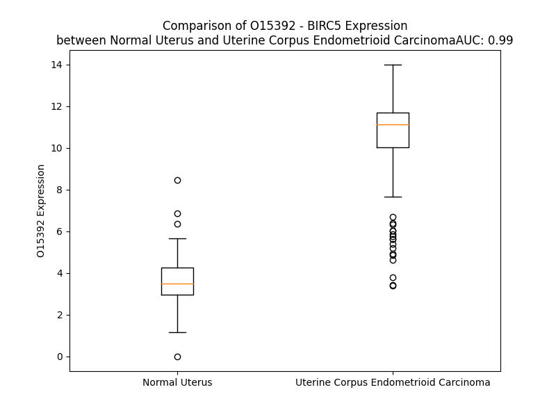

# Detailed Data for O15392

## Introduction to the Detailed Summary

### How to Interpret the Results

- **Summary & Metrics**: This section provides a quick reference to essential protein attributes, including expression changes, family classification, and biomarker applications. Regulation status (upregulated/downregulated) indicates the protein's behavior in a disease context. Some information comes from the original excel file with the proteins selected from literature, while others are derived from the analyses.
- **Expression Comparison**: A visual representation comparing protein expression between normal and disease states. It highlights significant changes in expression levels that might indicate diagnostic or therapeutic relevance. This is data coming from transcriptomics experiments and could not translate similarly to protein levels.
- **Isoform Alignment**: An interactive view of isoform alignments, revealing structural and functional differences between variants of the protein.
- **Interactors & Homologs**: Tables listing known interaction partners and homologous proteins, the more interactors and homologs, the more complex the protein is to design an antibody for.
- **Biological Assemblies**: Information about the structural arrangement of the protein in different assemblies, providing insights into its functional state but also the complexity of the protein to develop antibodies.
- **Combined Per-Residue Information**: A detailed table summarizing residue-level data. This includes predictions for epitope regions, aggregation tendencies, and modifications that might impact the protein's function. Each row corresponds to a residue in the protein, providing insights into specific sites that may be important for research or drug development.
## Summary & Metrics

- **UniProt Accession**: O15392
- **Gene Name**: BIRC5
- **Protein Name**: survivin / Baculoviral IAP repeat-containing protein 5 
- **Swiss Prot**: BIRC5_HUMAN
- **Family**: other
- **Biomarker Application**: diagnosis,disease progression,efficacy,prognosis,response to therapy
- **Number of Isoforms**: 7
- **Regulation**: 1
- **(transcriptomics) AUC**: 0.99
- **(transcriptomics) Fold Change**: 2.92
- **(transcriptomics) Regulation**: Upregulated
- **Discotope Epitope Count**: 31
- **Max n_uniprots (Homo)**: 2
- **Max n_uniprots (Hetero)**: 4

## Expression Comparison

## Isoform Alignment

<pre style='font-size:14px; font-family:monospace;'>O15392-1 MGAPTLPPAWQPFLKDHRISTFKNWPFLEGCACTPERMAEAGFIHCPTENEPDLAQCFFCFKELEGWEPDDDPIEEH-----------------------KKHSSGCAFLSVKKQFEELTLGEFLKLDRERAKNKIAKETNNKK-KEFEETAKKVRRAIEQLAAMD
O15392-2 MGAPTLPPAWQPFLKDHRISTFKNWPFLEGCACTPERMAEAGFIHCPTENEPDLAQCFFCFKELEGWEPDDDPIGPGTVAYACNTSTLGGRGGRITREEHKKHSSGCAFLSVKKQFEELTLGEFLKLDRERAKNKIAKETNNKK-KEFEETAKKVRRAIEQLAAMD
O15392-3 MGAPTLPPAWQPFLKDHRISTFKNWPFLEGCACTPERMAEAGFIHCPTENEPDLAQCFFCFKELEGWEPDDDPMQRKP---------------TIRRKNLRKLRRKCAVPS----------SSWLPWIEASGRSCLVPEWLHHFQGLFPGATS---LPVGPLAMS-
O15392-4 MGAPTLPPAWQPFLKDHRISTFKNWPFLEGCACTPERMAEAGFIHCPTENEPDLAQCFFCFKELEGWEPDDDPIE-----------------------EHKKHSSGCAFLSVKKQFEELTLGEFLKLDRERAKNKIERALLAE-----------------------
O15392-5 MGAPTLPPAWQPFLKDHRISTFKNWPFLEGCACTPERMAEAGFIHCPTENEPDLAQCFFCFKELEGWEPDDDPIE-----------------------EHKKHSSGCAFLSVKKQFEELTLGEFLKLVRETLPPPRSFIR--------------------------
O15392-6 MGAPTLPPAWQPFLKDHRISTFKNWPFLEGCACTPERMAEAGFIHCPTENEPDLAQCFFCFKELEGWEPDDDPMRELC----------------------------------------------------------------------------------------
O15392-7 MGAPTLPPAWQPFLKDHRISTFKNWPFLEGCACTPERMAEAGFIHCPTENEPDLAQCFFCFKELEGWEPDDDPM--------------------------------------------------------------------------------------------
</pre>

## Interactors

| preferredName_A   | preferredName_B   |   score |
|:------------------|:------------------|--------:|
| BIRC5             | AURKB             |   0.999 |
| BIRC5             | INCENP            |   0.999 |
| BIRC5             | CDCA8             |   0.999 |
| BIRC5             | CDK1              |   0.997 |
| BIRC5             | CDC20             |   0.995 |
| BIRC5             | AURKA             |   0.993 |
| BIRC5             | CCNB1             |   0.993 |
| BIRC5             | CCNB2             |   0.993 |
| BIRC5             | UBE2C             |   0.992 |
| BIRC5             | BUB1B             |   0.987 |
| BIRC5             | MAD2L1            |   0.981 |
| BIRC5             | PLK1              |   0.98  |
| BIRC5             | BUB1              |   0.979 |
| BIRC5             | PBK               |   0.978 |
| BIRC5             | TOP2A             |   0.976 |
| BIRC5             | KIF20A            |   0.973 |
| BIRC5             | KIF2C             |   0.972 |
| BIRC5             | AURKC             |   0.972 |
| BIRC5             | DLGAP5            |   0.967 |
| BIRC5             | MELK              |   0.965 |
| BIRC5             | CENPE             |   0.963 |
| BIRC5             | CENPF             |   0.96  |
| BIRC5             | XIAP              |   0.96  |
| BIRC5             | CDCA3             |   0.96  |
| BIRC5             | FOXM1             |   0.958 |
| BIRC5             | KIF11             |   0.957 |
| BIRC5             | CCNA2             |   0.956 |
| BIRC5             | CENPA             |   0.955 |
| BIRC5             | NUSAP1            |   0.953 |
| BIRC5             | TPX2              |   0.952 |
| BIRC5             | NUF2              |   0.949 |
| BIRC5             | CDCA5             |   0.942 |
| BIRC5             | PRC1              |   0.94  |
| BIRC5             | NEK2              |   0.94  |
| BIRC5             | MKI67             |   0.939 |
| BIRC5             | TTK               |   0.936 |
| BIRC5             | PCLAF             |   0.93  |
| BIRC5             | TP53              |   0.93  |
| BIRC5             | PTTG1             |   0.926 |
| BIRC5             | KIF4A             |   0.925 |
| BIRC5             | SPC24             |   0.924 |
| BIRC5             | TK1               |   0.92  |
| BIRC5             | DIABLO            |   0.919 |
| BIRC5             | ESPL1             |   0.917 |
| BIRC5             | SPAG5             |   0.917 |
| BIRC5             | ZWINT             |   0.917 |
| BIRC5             | CASP3             |   0.916 |
| BIRC5             | CEP55             |   0.913 |
| BIRC5             | HJURP             |   0.912 |
| BIRC5             | CASP9             |   0.911 |

## Homologs

| uniprot_id   | gene_id   |
|:-------------|:----------|
| B1AKU2       | XIAP      |
| Q96CA5       | BIRC7     |
| A0A8V8TR92   | BIRC6     |
| A0A669KBC7   | BIRC3     |
| H0YDY3       | BIRC2     |
| A0A0G2JNC7   | NAIP      |
| Q9NPP4       | NLRC4     |

## Biological Assemblies

|   Unnamed: 0 |   assembly |   n_uniprots | composition   | crystal_id   |
|-------------:|-----------:|-------------:|:--------------|:-------------|
|            0 |          1 |            2 | Homo          | 6sho         |
|            0 |          1 |            4 | Hetero        | 7lbk         |
|            0 |          1 |            1 | Homo          | 4a0n         |
|            0 |          1 |            2 | Homo          | 3ueg         |
|            0 |          1 |            4 | Hetero        | 7lbo         |
|            0 |          1 |            4 | Hetero        | 7lbp         |
|            0 |          1 |            4 | Hetero        | 6yih         |
|            0 |          1 |            2 | Hetero        | 2rax         |
|            1 |          2 |            2 | Hetero        | 2rax         |
|            2 |          3 |            2 | Hetero        | 2rax         |
|            0 |          1 |            4 | Hetero        | 3uih         |
|            0 |          1 |            1 | Homo          | 4a0j         |
|            1 |          2 |            1 | Homo          | 4a0j         |
|            0 |          1 |            2 | Homo          | 1xox         |
|            0 |          1 |            2 | Hetero        | 7lbq         |
|            0 |          1 |            3 | Hetero        | 2qfa         |
|            0 |          1 |            3 | Hetero        | 6yie         |
|            1 |          2 |            3 | Hetero        | 6yie         |
|            0 |          1 |            3 | Hetero        | 6yif         |
|            0 |          1 |            2 | Homo          | 3ueh         |
|            0 |          1 |            1 | Homo          | 3uec         |
|            0 |          1 |            2 | Hetero        | 2raw         |
|            0 |          1 |            4 | Hetero        | 3uij         |
|            0 |          1 |            2 | Homo          | 1e31         |
|            0 |          1 |            2 | Homo          | 1f3h         |
|            0 |          1 |            2 | Homo          | 3uii         |
|            0 |          1 |            4 | Hetero        | 4a0i         |
|            0 |          1 |            2 | Homo          | 3ued         |
|            0 |          1 |            2 | Homo          | 3uee         |
|            0 |          1 |            2 | Homo          | 3uik         |
|            0 |          1 |            2 | Homo          | 3uef         |
|            0 |          1 |            2 | Homo          | 3uig         |
|            0 |          1 |            2 | Homo          | 3uei         |

## Combined Per-Residue Information

|   res | aa   |   epitope_score | epitope   |   relative_surface_accessibility |   modeling_confidence |   Aggregation | modification                        |
|------:|:-----|----------------:|:----------|---------------------------------:|----------------------:|--------------:|:------------------------------------|
|     1 | M    |         0.28455 | False     |                          1.31695 |                 40.47 |         0     | N/A                                 |
|     2 | G    |         0.39953 | True      |                          0.9029  |                 58.59 |         0     | N/A                                 |
|     3 | A    |         0.26163 | False     |                          0.79856 |                 58.06 |         0     | N/A                                 |
|     4 | P    |         0.29704 | False     |                          1.00147 |                 65.56 |         0     | N/A                                 |
|     5 | T    |         0.36444 | False     |                          0.82841 |                 78.69 |         0     | N/A                                 |
|     6 | L    |         0.36873 | False     |                          0.28275 |                 86.64 |         0     | N/A                                 |
|     7 | P    |         0.34716 | False     |                          0.49093 |                 91.35 |         0     | N/A                                 |
|     8 | P    |         0.24307 | False     |                          0.78923 |                 91.17 |         0     | N/A                                 |
|     9 | A    |         0.26111 | False     |                          0.58363 |                 90.54 |         0     | N/A                                 |
|    10 | W    |         0.40665 | True      |                          0.36456 |                 94.61 |         0     | N/A                                 |
|    11 | Q    |         0.21891 | False     |                          0.24281 |                 95.33 |         0     | N/A                                 |
|    12 | P    |         0.15142 | False     |                          0.11332 |                 95.74 |         0     | N/A                                 |
|    13 | F    |         0.16369 | False     |                          0.06764 |                 95.12 |         0     | N/A                                 |
|    14 | L    |         0.33262 | False     |                          0.30748 |                 94.45 |         0     | N/A                                 |
|    15 | K    |         0.28179 | False     |                          0.27918 |                 95.29 |         0     | N/A                                 |
|    16 | D    |         0.37345 | False     |                          0.67846 |                 95.3  |         0     | N/A                                 |
|    17 | H    |         0.3851  | False     |                          0.32602 |                 95.93 |         0     | N/A                                 |
|    18 | R    |         0.08485 | False     |                          0.02295 |                 97.66 |         0     | N/A                                 |
|    19 | I    |         0.33332 | False     |                          0.27863 |                 98.3  |         0     | N/A                                 |
|    20 | S    |         0.28294 | False     |                          0.51057 |                 97.51 |         0     | Phosphoserine; by AURKC             |
|    21 | T    |         0.23501 | False     |                          0.22047 |                 98.25 |         0     | N/A                                 |
|    22 | F    |         0.17153 | False     |                          0.07379 |                 98.13 |         0     | N/A                                 |
|    23 | K    |         0.52494 | True      |                          0.7444  |                 94.5  |         0     | N6-acetyllysine                     |
|    24 | N    |         0.51195 | True      |                          0.96662 |                 94.19 |         0     | N/A                                 |
|    25 | W    |         0.18723 | False     |                          0.03129 |                 96.78 |         0     | N/A                                 |
|    26 | P    |         0.49912 | True      |                          0.64555 |                 94.42 |         0     | N/A                                 |
|    27 | F    |         0.54181 | True      |                          0.17644 |                 96.42 |         0     | N/A                                 |
|    28 | L    |         0.45312 | True      |                          0.63466 |                 94.58 |         0     | N/A                                 |
|    29 | E    |         0.4964  | True      |                          0.9157  |                 93.53 |         0     | N/A                                 |
|    30 | G    |         0.50789 | True      |                          0.97086 |                 93.53 |         0     | N/A                                 |
|    31 | C    |         0.27233 | False     |                          0.22361 |                 96.73 |         0     | N/A                                 |
|    32 | A    |         0.29862 | False     |                          0.20139 |                 97.31 |         0     | N/A                                 |
|    33 | C    |         0.01325 | False     |                          0       |                 97.17 |         0     | N/A                                 |
|    34 | T    |         0.35353 | False     |                          0.14488 |                 98.2  |         0     | Phosphothreonine; by CDK1 and CDK15 |
|    35 | P    |         0.1047  | False     |                          0.09742 |                 98.48 |         0     | N/A                                 |
|    36 | E    |         0.34642 | False     |                          0.45303 |                 97.76 |         0     | N/A                                 |
|    37 | R    |         0.4678  | True      |                          0.34785 |                 98.1  |         0     | N/A                                 |
|    38 | M    |         0.00947 | False     |                          0       |                 98.6  |         0     | N/A                                 |
|    39 | A    |         0.00401 | False     |                          0       |                 97.77 |         0     | N/A                                 |
|    40 | E    |         0.34551 | False     |                          0.43618 |                 96.3  |         0     | N/A                                 |
|    41 | A    |         0.02513 | False     |                          0.0153  |                 97.2  |         0     | N/A                                 |
|    42 | G    |         0.01083 | False     |                          0       |                 97.71 |         0     | N/A                                 |
|    43 | F    |         0.00371 | False     |                          0       |                 98.72 |         0     | N/A                                 |
|    44 | I    |         0.17676 | False     |                          0.16479 |                 98.59 |         0     | N/A                                 |
|    45 | H    |         0.17809 | False     |                          0.07985 |                 98.55 |         0     | N/A                                 |
|    46 | C    |         0.26296 | False     |                          0.30119 |                 96.71 |         0     | N/A                                 |
|    47 | P    |         0.31455 | False     |                          0.5407  |                 97.08 |         0     | N/A                                 |
|    48 | T    |         0.42791 | True      |                          0.44286 |                 95.74 |         0     | Phosphothreonine; by CK2; in vitro  |
|    49 | E    |         0.41859 | True      |                          0.93675 |                 94.86 |         0     | N/A                                 |
|    50 | N    |         0.51977 | True      |                          0.88309 |                 95.69 |         0     | N/A                                 |
|    51 | E    |         0.3053  | False     |                          0.29409 |                 95.9  |         0     | N/A                                 |
|    52 | P    |         0.28679 | False     |                          0.68374 |                 95.79 |         0     | N/A                                 |
|    53 | D    |         0.16023 | False     |                          0.15564 |                 96.78 |         0     | N/A                                 |
|    54 | L    |         0.12681 | False     |                          0.10634 |                 98.24 |         0.909 | N/A                                 |
|    55 | A    |         0.00897 | False     |                          0       |                 98.45 |         1.045 | N/A                                 |
|    56 | Q    |         0.21918 | False     |                          0.13321 |                 98.51 |         1.484 | N/A                                 |
|    57 | C    |         0.01216 | False     |                          0       |                 98.7  |        12.747 | N/A                                 |
|    58 | F    |         0.05398 | False     |                          0.01368 |                 97.9  |        12.747 | N/A                                 |
|    59 | F    |         0.01814 | False     |                          0.00191 |                 98.19 |        12.747 | N/A                                 |
|    60 | C    |         0.11698 | False     |                          0.15083 |                 98.21 |        12.747 | N/A                                 |
|    61 | F    |         0.08618 | False     |                          0.13063 |                 97.98 |        12.581 | N/A                                 |
|    62 | K    |         0.25081 | False     |                          0.3514  |                 98.13 |         0     | N/A                                 |
|    63 | E    |         0.35622 | False     |                          0.35866 |                 98.09 |         0     | N/A                                 |
|    64 | L    |         0.27472 | False     |                          0.11376 |                 98.57 |         0     | N/A                                 |
|    65 | E    |         0.32418 | False     |                          0.49757 |                 97.19 |         0     | N/A                                 |
|    66 | G    |         0.24134 | False     |                          0.69185 |                 97.13 |         0     | N/A                                 |
|    67 | W    |         0.17113 | False     |                          0.07231 |                 98.17 |         0     | N/A                                 |
|    68 | E    |         0.41309 | True      |                          0.57726 |                 97.91 |         0     | N/A                                 |
|    69 | P    |         0.29634 | False     |                          0.44037 |                 97.11 |         0     | N/A                                 |
|    70 | D    |         0.45051 | True      |                          0.76941 |                 97.87 |         0     | N/A                                 |
|    71 | D    |         0.31672 | False     |                          0.21814 |                 98.46 |         0     | N/A                                 |
|    72 | D    |         0.31479 | False     |                          0.24132 |                 98.22 |         0     | N/A                                 |
|    73 | P    |         0.00999 | False     |                          0.00298 |                 98.39 |         0     | N/A                                 |
|    74 | I    |         0.29144 | False     |                          0.36478 |                 97.91 |         0     | N/A                                 |
|    75 | E    |         0.47989 | True      |                          0.58321 |                 98.27 |         0     | N/A                                 |
|    76 | E    |         0.23875 | False     |                          0.17175 |                 98.61 |         0     | N/A                                 |
|    77 | H    |         0.00713 | False     |                          0       |                 98.32 |         0     | N/A                                 |
|    78 | K    |         0.28626 | False     |                          0.51463 |                 98.01 |         0     | N/A                                 |
|    79 | K    |         0.44871 | True      |                          0.72448 |                 98.16 |         0     | N/A                                 |
|    80 | H    |         0.41283 | True      |                          0.43486 |                 97.79 |         0     | N/A                                 |
|    81 | S    |         0.24033 | False     |                          0.19966 |                 96.89 |         0     | N/A                                 |
|    82 | S    |         0.36648 | False     |                          0.74169 |                 94.06 |         0     | N/A                                 |
|    83 | G    |         0.36418 | False     |                          0.89122 |                 93.89 |         0     | N/A                                 |
|    84 | C    |         0.08952 | False     |                          0.03321 |                 97.45 |         0.14  | N/A                                 |
|    85 | A    |         0.40084 | True      |                          0.42728 |                 94.62 |         0.967 | N/A                                 |
|    86 | F    |         0.21369 | False     |                          0.1723  |                 95.82 |         0.967 | N/A                                 |
|    87 | L    |         0.31587 | False     |                          0.26923 |                 94.6  |         0.967 | N/A                                 |
|    88 | S    |         0.35026 | False     |                          0.69164 |                 92.6  |         0.967 | N/A                                 |
|    89 | V    |         0.43154 | True      |                          0.32338 |                 91.7  |         0.967 | N/A                                 |
|    90 | K    |         0.57204 | True      |                          0.99882 |                 87.52 |         0     | N6-acetyllysine                     |
|    91 | K    |         0.44739 | True      |                          0.43911 |                 90.13 |         0     | N/A                                 |
|    92 | Q    |         0.4791  | True      |                          0.47499 |                 87.69 |         0     | N/A                                 |
|    93 | F    |         0.39135 | False     |                          0.21649 |                 88.46 |         0     | N/A                                 |
|    94 | E    |         0.41872 | True      |                          0.65762 |                 87.75 |         0     | N/A                                 |
|    95 | E    |         0.5817  | True      |                          0.55823 |                 92.34 |         0     | N/A                                 |
|    96 | L    |         0.34672 | False     |                          0.19036 |                 91.93 |         0     | N/A                                 |
|    97 | T    |         0.43048 | True      |                          0.57901 |                 94.8  |         0     | N/A                                 |
|    98 | L    |         0.50173 | True      |                          0.78867 |                 93.69 |         0     | N/A                                 |
|    99 | G    |         0.30604 | False     |                          0.48434 |                 95.89 |         0     | N/A                                 |
|   100 | E    |         0.48242 | True      |                          0.28922 |                 94.86 |         0.124 | N/A                                 |
|   101 | F    |         0.19637 | False     |                          0.07133 |                 94.69 |         0.124 | N/A                                 |
|   102 | L    |         0.40072 | True      |                          0.55119 |                 95.62 |         0.124 | N/A                                 |
|   103 | K    |         0.45146 | True      |                          0.70653 |                 95.57 |         0.124 | N/A                                 |
|   104 | L    |         0.23074 | False     |                          0.14838 |                 95.54 |         0.124 | N/A                                 |
|   105 | D    |         0.34454 | False     |                          0.19422 |                 96.29 |         0     | N/A                                 |
|   106 | R    |         0.44424 | True      |                          0.6434  |                 97.68 |         0     | N/A                                 |
|   107 | E    |         0.25418 | False     |                          0.3105  |                 97.18 |         0     | N/A                                 |
|   108 | R    |         0.24436 | False     |                          0.14543 |                 97.49 |         0     | N/A                                 |
|   109 | A    |         0.20559 | False     |                          0.47037 |                 97.92 |         0     | N/A                                 |
|   110 | K    |         0.30771 | False     |                          0.52655 |                 98.16 |         0     | N6-acetyllysine                     |
|   111 | N    |         0.16205 | False     |                          0.25729 |                 97.83 |         0     | N/A                                 |
|   112 | K    |         0.31872 | False     |                          0.52226 |                 97.51 |         0     | N6-acetyllysine                     |
|   113 | I    |         0.26038 | False     |                          0.66637 |                 98.45 |         0     | N/A                                 |
|   114 | A    |         0.2759  | False     |                          0.57891 |                 97.28 |         0     | N/A                                 |
|   115 | K    |         0.24025 | False     |                          0.2576  |                 96.87 |         0     | N6-acetyllysine                     |
|   116 | E    |         0.30778 | False     |                          0.42643 |                 97.99 |         0     | N/A                                 |
|   117 | T    |         0.23602 | False     |                          0.5891  |                 98.33 |         0     | Phosphothreonine; by AURKB          |
|   118 | N    |         0.17511 | False     |                          0.44881 |                 96.76 |         0     | N/A                                 |
|   119 | N    |         0.23905 | False     |                          0.39694 |                 97.42 |         0     | N/A                                 |
|   120 | K    |         0.23907 | False     |                          0.70656 |                 98.24 |         0     | N/A                                 |
|   121 | K    |         0.17036 | False     |                          0.60612 |                 98.25 |         0     | N6-acetyllysine                     |
|   122 | K    |         0.2499  | False     |                          0.56068 |                 98    |         0     | N/A                                 |
|   123 | E    |         0.22902 | False     |                          0.58703 |                 98.11 |         0     | N/A                                 |
|   124 | F    |         0.16943 | False     |                          0.75088 |                 98.33 |         0     | N/A                                 |
|   125 | E    |         0.10862 | False     |                          0.37336 |                 98.4  |         0     | N/A                                 |
|   126 | E    |         0.22146 | False     |                          0.43109 |                 98.22 |         0     | N/A                                 |
|   127 | T    |         0.08024 | False     |                          0.54263 |                 98.3  |         0     | N/A                                 |
|   128 | A    |         0.08767 | False     |                          0.42802 |                 98.43 |         0     | N/A                                 |
|   129 | K    |         0.20617 | False     |                          0.61208 |                 98.07 |         0     | N6-acetyllysine                     |
|   130 | K    |         0.18749 | False     |                          0.7306  |                 97.99 |         0     | N/A                                 |
|   131 | V    |         0.12639 | False     |                          0.58063 |                 98.03 |         0     | N/A                                 |
|   132 | R    |         0.173   | False     |                          0.66395 |                 97.92 |         0     | N/A                                 |
|   133 | R    |         0.19441 | False     |                          0.65153 |                 97.36 |         0     | N/A                                 |
|   134 | A    |         0.19362 | False     |                          0.45133 |                 96.74 |         0     | N/A                                 |
|   135 | I    |         0.11266 | False     |                          0.62933 |                 96.97 |         0     | N/A                                 |
|   136 | E    |         0.15066 | False     |                          0.47282 |                 96.63 |         0     | N/A                                 |
|   137 | Q    |         0.22002 | False     |                          0.51005 |                 96.17 |         0     | N/A                                 |
|   138 | L    |         0.17667 | False     |                          0.72631 |                 94.65 |         0     | N/A                                 |
|   139 | A    |         0.12317 | False     |                          0.65646 |                 92.6  |         0     | N/A                                 |
|   140 | A    |         0.15842 | False     |                          0.80777 |                 90.9  |         0     | N/A                                 |
|   141 | M    |         0.19383 | False     |                          0.86273 |                 86.22 |         0     | N/A                                 |
|   142 | D    |         0.12742 | False     |                          1.11601 |                 70.87 |         0     | N/A                                 |

