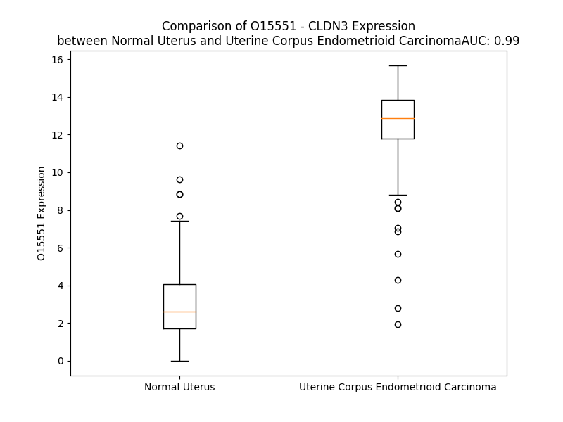

# Detailed Data for O15551

## Introduction to the Detailed Summary

### How to Interpret the Results

- **Summary & Metrics**: This section provides a quick reference to essential protein attributes, including expression changes, family classification, and biomarker applications. Regulation status (upregulated/downregulated) indicates the protein's behavior in a disease context. Some information comes from the original excel file with the proteins selected from literature, while others are derived from the analyses.
- **Expression Comparison**: A visual representation comparing protein expression between normal and disease states. It highlights significant changes in expression levels that might indicate diagnostic or therapeutic relevance. This is data coming from transcriptomics experiments and could not translate similarly to protein levels.
- **Isoform Alignment**: An interactive view of isoform alignments, revealing structural and functional differences between variants of the protein.
- **Interactors & Homologs**: Tables listing known interaction partners and homologous proteins, the more interactors and homologs, the more complex the protein is to design an antibody for.
- **Biological Assemblies**: Information about the structural arrangement of the protein in different assemblies, providing insights into its functional state but also the complexity of the protein to develop antibodies.
- **Combined Per-Residue Information**: A detailed table summarizing residue-level data. This includes predictions for epitope regions, aggregation tendencies, and modifications that might impact the protein's function. Each row corresponds to a residue in the protein, providing insights into specific sites that may be important for research or drug development.
## Summary & Metrics

- **UniProt Accession**: O15551
- **Gene Name**: CLDN3
- **Protein Name**: claudin-3
- **Swiss Prot**: CLD3_HUMAN
- **Family**: transmembrane receptor
- **Biomarker Application**: diagnosis,unspecified application
- **Number of Isoforms**: 0
- **Regulation**: 1
- **(transcriptomics) AUC**: 0.99
- **(transcriptomics) Fold Change**: 3.86
- **(transcriptomics) Regulation**: Upregulated
- **Discotope Epitope Count**: 60
- **Max n_uniprots (Homo)**: N/A
- **Max n_uniprots (Hetero)**: N/A

## Expression Comparison

## Interactors

| preferredName_A   | preferredName_B   |   score |
|:------------------|:------------------|--------:|
| CLDN3             | OCLN              |   0.998 |
| CLDN3             | TJP1              |   0.994 |
| CLDN3             | TJP3              |   0.988 |
| CLDN3             | CLDN12            |   0.988 |
| CLDN3             | CLDN5             |   0.958 |
| CLDN3             | MARVELD2          |   0.908 |

## Homologs

| uniprot_id   | gene_id   |
|:-------------|:----------|
| Q8N6F1       | CLDN19    |
| O95832       | CLDN1     |
| O75508       | CLDN11    |
| Q8N7P3       | CLDN22    |
| A6NM45       | CLDN24    |
| P56748       | CLDN8     |
| C9JDP6       | CLDN25    |
| K7EL87       | CLDN7     |
| H7C241       | CLDN34    |
| P56750       | CLDN17    |
| Q96B33       | CLDN23    |
| D3DX19       | CLDN5     |
| P57739       | CLDN2     |
| P56880       | CLDN20    |
| Q9Y5I7       | CLDN16    |
| P56747       | CLDN6     |
| O95500       | CLDN14    |
| O95484       | CLDN9     |
| P56856       | CLDN18    |
| Q96FX9       | CLDN15    |
| Q75L80       | CLDN4     |
| Q5W075       | CLDN10    |

## Combined Per-Residue Information

|   res | aa   |   epitope_score | epitope   |   relative_surface_accessibility |   modeling_confidence |   Aggregation | modification    |
|------:|:-----|----------------:|:----------|---------------------------------:|----------------------:|--------------:|:----------------|
|     1 | M    |         0.11158 | False     |                          0.33505 |                 62.45 |         0     | N/A             |
|     2 | S    |         0.19265 | False     |                          0.49448 |                 79.5  |         0     | N/A             |
|     3 | M    |         0.26203 | False     |                          0.65607 |                 81.73 |         0     | N/A             |
|     4 | G    |         0.20851 | False     |                          0.51715 |                 85.86 |         0     | N/A             |
|     5 | L    |         0.12659 | False     |                          0.33319 |                 87.52 |         0     | N/A             |
|     6 | E    |         0.07322 | False     |                          0.05286 |                 88.67 |         0     | N/A             |
|     7 | I    |         0.22886 | False     |                          0.66163 |                 90.58 |         3.261 | N/A             |
|     8 | T    |         0.0856  | False     |                          0.48383 |                 92.77 |         3.57  | N/A             |
|     9 | G    |         0.00523 | False     |                          0       |                 94.26 |         5.03  | N/A             |
|    10 | T    |         0.1282  | False     |                          0.23417 |                 93.19 |        21.421 | N/A             |
|    11 | A    |         0.07414 | False     |                          0.45634 |                 95.22 |        48.815 | N/A             |
|    12 | L    |         0.06615 | False     |                          0.24318 |                 96.54 |        80.23  | N/A             |
|    13 | A    |         0.00325 | False     |                          0       |                 96.21 |        85.967 | N/A             |
|    14 | V    |         0.06913 | False     |                          0.30276 |                 96.12 |        92.672 | N/A             |
|    15 | L    |         0.0409  | False     |                          0.61121 |                 97.67 |        93.078 | N/A             |
|    16 | G    |         0.00292 | False     |                          0       |                 97.83 |        91.683 | N/A             |
|    17 | W    |         0.08779 | False     |                          0.2289  |                 97.32 |        92.536 | N/A             |
|    18 | L    |         0.11307 | False     |                          0.51974 |                 97.45 |        91.69  | N/A             |
|    19 | G    |         0.0736  | False     |                          0.16373 |                 96.75 |        85.902 | N/A             |
|    20 | T    |         0.01005 | False     |                          0.00621 |                 96.77 |        85.401 | N/A             |
|    21 | I    |         0.10501 | False     |                          0.36976 |                 96.61 |        85.112 | N/A             |
|    22 | V    |         0.0792  | False     |                          0.49793 |                 96.21 |        81.907 | N/A             |
|    23 | C    |         0.00591 | False     |                          0.00294 |                 94.77 |        46.741 | N/A             |
|    24 | C    |         0.16764 | False     |                          0.10097 |                 94.25 |        13.252 | N/A             |
|    25 | A    |         0.18322 | False     |                          0.62007 |                 93.52 |         6.189 | N/A             |
|    26 | L    |         0.1817  | False     |                          0.25634 |                 91.64 |         0.423 | N/A             |
|    27 | P    |         0.17799 | False     |                          0.20975 |                 89.2  |         0.216 | N/A             |
|    28 | M    |         0.29374 | False     |                          0.28217 |                 91.67 |         0     | N/A             |
|    29 | W    |         0.02056 | False     |                          0.00055 |                 93.5  |         0     | N/A             |
|    30 | R    |         0.28335 | False     |                          0.08015 |                 89.9  |         0     | N/A             |
|    31 | V    |         0.27321 | False     |                          0.22183 |                 89.78 |         3.903 | N/A             |
|    32 | S    |         0.18776 | False     |                          0.07298 |                 84.64 |         3.903 | N/A             |
|    33 | A    |         0.23919 | False     |                          0.08518 |                 76.09 |         4.428 | N/A             |
|    34 | F    |         0.52459 | True      |                          0.48574 |                 70.11 |         5.049 | N/A             |
|    35 | I    |         0.57748 | True      |                          0.42996 |                 59.96 |         5.049 | N/A             |
|    36 | G    |         0.56488 | True      |                          0.4602  |                 56.42 |         1.627 | N/A             |
|    37 | S    |         0.41223 | True      |                          0.88004 |                 56.95 |         1.321 | N/A             |
|    38 | N    |         0.37734 | True      |                          0.78063 |                 54.79 |         1.321 | N/A             |
|    39 | I    |         0.45677 | True      |                          0.68474 |                 59.6  |         1.321 | N/A             |
|    40 | I    |         0.47282 | True      |                          0.91958 |                 56.71 |         1.321 | N/A             |
|    41 | T    |         0.38736 | True      |                          0.80282 |                 55.91 |         0.427 | N/A             |
|    42 | S    |         0.50267 | True      |                          0.19984 |                 64.96 |         0     | N/A             |
|    43 | Q    |         0.37871 | True      |                          0.44012 |                 73.69 |         0     | N/A             |
|    44 | N    |         0.41345 | True      |                          0.29469 |                 81.82 |         0     | N/A             |
|    45 | I    |         0.35826 | True      |                          0.27679 |                 87.16 |         0     | N/A             |
|    46 | W    |         0.27464 | False     |                          0.30213 |                 89.91 |         0     | N/A             |
|    47 | E    |         0.23425 | False     |                          0.17205 |                 90.47 |         0     | N/A             |
|    48 | G    |         0.01023 | False     |                          0.00161 |                 92.59 |         0.232 | N/A             |
|    49 | L    |         0.03044 | False     |                          0.00425 |                 90.58 |         3.03  | N/A             |
|    50 | W    |         0.21691 | False     |                          0.44811 |                 91.36 |         4.326 | N/A             |
|    51 | M    |         0.38073 | True      |                          0.34236 |                 91.21 |         4.326 | N/A             |
|    52 | N    |         0.18771 | False     |                          0.23907 |                 90.07 |         4.326 | N/A             |
|    53 | C    |         0.03198 | False     |                          0.00468 |                 91.97 |         4.326 | N/A             |
|    54 | V    |         0.29305 | False     |                          0.23723 |                 88.85 |         4.326 | N/A             |
|    55 | V    |         0.44896 | True      |                          0.24886 |                 86.26 |         4.107 | N/A             |
|    56 | Q    |         0.3165  | True      |                          0.33009 |                 82.42 |         0     | N/A             |
|    57 | S    |         0.46356 | True      |                          0.63275 |                 76.87 |         0     | N/A             |
|    58 | T    |         0.35423 | True      |                          0.7674  |                 81.15 |         0     | N/A             |
|    59 | G    |         0.37003 | True      |                          0.77323 |                 78.54 |         0     | N/A             |
|    60 | Q    |         0.37605 | True      |                          0.5512  |                 85.11 |         0     | N/A             |
|    61 | M    |         0.53247 | True      |                          0.5496  |                 87.57 |         0     | N/A             |
|    62 | Q    |         0.42471 | True      |                          0.63183 |                 90.23 |         0     | N/A             |
|    63 | C    |         0.31878 | True      |                          0.49608 |                 92.43 |         0     | N/A             |
|    64 | K    |         0.41325 | True      |                          0.5867  |                 91.13 |         0     | N/A             |
|    65 | V    |         0.39156 | True      |                          0.69706 |                 90.41 |         0     | N/A             |
|    66 | Y    |         0.34053 | True      |                          0.21419 |                 86.23 |         0     | N/A             |
|    67 | D    |         0.28424 | False     |                          0.72302 |                 78.6  |         0     | N/A             |
|    68 | S    |         0.30178 | True      |                          0.46744 |                 76.08 |         0     | N/A             |
|    69 | L    |         0.26454 | False     |                          0.65518 |                 68.93 |         0     | N/A             |
|    70 | L    |         0.34894 | True      |                          1.02054 |                 69.85 |         0     | N/A             |
|    71 | A    |         0.38758 | True      |                          0.84568 |                 71.15 |         0     | N/A             |
|    72 | L    |         0.26263 | False     |                          0.1057  |                 74.83 |         0     | N/A             |
|    73 | P    |         0.45981 | True      |                          0.46864 |                 77.28 |         0     | N/A             |
|    74 | Q    |         0.34096 | True      |                          0.69436 |                 83.17 |         0     | N/A             |
|    75 | D    |         0.24924 | False     |                          0.14772 |                 84.24 |         0     | N/A             |
|    76 | L    |         0.04033 | False     |                          0.00742 |                 85.28 |         0     | N/A             |
|    77 | Q    |         0.28853 | False     |                          0.38553 |                 87.93 |         0     | N/A             |
|    78 | A    |         0.1384  | False     |                          0.2613  |                 88.69 |         0     | N/A             |
|    79 | A    |         0.00825 | False     |                          0.0011  |                 92.29 |         0     | N/A             |
|    80 | R    |         0.16835 | False     |                          0.06536 |                 91.2  |         0     | N/A             |
|    81 | A    |         0.1436  | False     |                          0.5557  |                 92.49 |         5.422 | N/A             |
|    82 | L    |         0.13544 | False     |                          0.32067 |                 94.6  |        64.577 | N/A             |
|    83 | I    |         0.01397 | False     |                          0.0032  |                 96.07 |        96.584 | N/A             |
|    84 | V    |         0.12122 | False     |                          0.37226 |                 95.93 |        99.684 | N/A             |
|    85 | V    |         0.05058 | False     |                          0.52931 |                 96.69 |        99.948 | N/A             |
|    86 | A    |         0.00719 | False     |                          0.00342 |                 97.25 |        99.97  | N/A             |
|    87 | I    |         0.15696 | False     |                          0.16799 |                 97    |        99.997 | N/A             |
|    88 | L    |         0.13276 | False     |                          0.71047 |                 97.42 |        99.999 | N/A             |
|    89 | L    |         0.0729  | False     |                          0.26227 |                 97.12 |        99.998 | N/A             |
|    90 | A    |         0.00873 | False     |                          0       |                 97.12 |        99.989 | N/A             |
|    91 | A    |         0.08371 | False     |                          0.27089 |                 97.05 |        99.982 | N/A             |
|    92 | F    |         0.07434 | False     |                          0.58487 |                 96.51 |        99.977 | N/A             |
|    93 | G    |         0.0039  | False     |                          0       |                 96.38 |        99.903 | N/A             |
|    94 | L    |         0.10415 | False     |                          0.18795 |                 95.17 |        99.896 | N/A             |
|    95 | L    |         0.14166 | False     |                          0.68029 |                 94    |        99.86  | N/A             |
|    96 | V    |         0.06144 | False     |                          0.18171 |                 92.88 |        99.663 | N/A             |
|    97 | A    |         0.02534 | False     |                          0.02178 |                 91.66 |        97.337 | N/A             |
|    98 | L    |         0.11964 | False     |                          0.61486 |                 90.14 |        95.37  | N/A             |
|    99 | V    |         0.17465 | False     |                          0.43496 |                 88.69 |        84.63  | N/A             |
|   100 | G    |         0.01171 | False     |                          0       |                 84.28 |         2.806 | N/A             |
|   101 | A    |         0.11565 | False     |                          0.26146 |                 82.99 |         0.189 | N/A             |
|   102 | Q    |         0.18552 | False     |                          0.2902  |                 72.89 |         0.001 | N/A             |
|   103 | C    |         0.28638 | False     |                          0.90943 |                 72.35 |         0     | N/A             |
|   104 | T    |         0.26331 | False     |                          0.26716 |                 77.23 |         0     | N/A             |
|   105 | N    |         0.47349 | True      |                          0.78524 |                 75.09 |         0     | N/A             |
|   106 | C    |         0.3366  | True      |                          0.71269 |                 77.42 |         0     | N/A             |
|   107 | V    |         0.31107 | True      |                          0.22349 |                 78.4  |         0     | N/A             |
|   108 | Q    |         0.37527 | True      |                          0.78279 |                 77.08 |         0     | N/A             |
|   109 | D    |         0.46493 | True      |                          0.57687 |                 81.47 |         0     | N/A             |
|   110 | D    |         0.23583 | False     |                          0.54761 |                 81.52 |         0     | N/A             |
|   111 | T    |         0.22214 | False     |                          0.48007 |                 83.91 |         0     | N/A             |
|   112 | A    |         0.1874  | False     |                          0.30194 |                 86.24 |         0     | N/A             |
|   113 | K    |         0.18681 | False     |                          0.08903 |                 86.26 |         0     | N/A             |
|   114 | A    |         0.00875 | False     |                          0       |                 86.95 |         0     | N/A             |
|   115 | K    |         0.1905  | False     |                          0.67975 |                 89.3  |         0     | N/A             |
|   116 | I    |         0.16942 | False     |                          0.23599 |                 91.62 |        61.496 | N/A             |
|   117 | T    |         0.04642 | False     |                          0.02475 |                 91.73 |        67.322 | N/A             |
|   118 | I    |         0.18916 | False     |                          0.31919 |                 91.9  |        94.09  | N/A             |
|   119 | V    |         0.04492 | False     |                          0.55601 |                 93.67 |        96.539 | N/A             |
|   120 | A    |         0.00262 | False     |                          0.00128 |                 94.82 |        96.748 | N/A             |
|   121 | G    |         0.0074  | False     |                          0       |                 95.5  |        96.993 | N/A             |
|   122 | V    |         0.05383 | False     |                          0.48365 |                 96.41 |        99.722 | N/A             |
|   123 | L    |         0.04441 | False     |                          0.14179 |                 97.17 |        99.952 | N/A             |
|   124 | F    |         0.00651 | False     |                          0.00318 |                 97.31 |        99.991 | N/A             |
|   125 | L    |         0.0609  | False     |                          0.28852 |                 97.52 |        99.967 | N/A             |
|   126 | L    |         0.07106 | False     |                          0.4773  |                 97.42 |        99.816 | N/A             |
|   127 | A    |         0.00221 | False     |                          0       |                 97.71 |        98.964 | N/A             |
|   128 | A    |         0.00302 | False     |                          0       |                 97.97 |        98.243 | N/A             |
|   129 | L    |         0.08748 | False     |                          0.52911 |                 97.42 |        97.633 | N/A             |
|   130 | L    |         0.09225 | False     |                          0.27946 |                 96.3  |        94.299 | N/A             |
|   131 | T    |         0.00278 | False     |                          0.0019  |                 96.96 |        76.095 | N/A             |
|   132 | L    |         0.07949 | False     |                          0.352   |                 97.03 |        65.263 | N/A             |
|   133 | V    |         0.09289 | False     |                          0.5818  |                 95.92 |         6.108 | N/A             |
|   134 | P    |         0.01755 | False     |                          0.00942 |                 94.91 |         1.32  | N/A             |
|   135 | V    |         0.00502 | False     |                          0       |                 95.88 |         0     | N/A             |
|   136 | S    |         0.13927 | False     |                          0.32643 |                 95.99 |         0     | N/A             |
|   137 | W    |         0.21545 | False     |                          0.42278 |                 95.18 |         0.191 | N/A             |
|   138 | S    |         0.02074 | False     |                          0.00682 |                 92.75 |         0.191 | N/A             |
|   139 | A    |         0.1146  | False     |                          0.03189 |                 94.08 |         0.566 | N/A             |
|   140 | N    |         0.15672 | False     |                          0.3926  |                 94.4  |         0.566 | N/A             |
|   141 | T    |         0.2305  | False     |                          0.14471 |                 91.76 |         0.566 | N/A             |
|   142 | I    |         0.11694 | False     |                          0.03008 |                 90.41 |         0.72  | N/A             |
|   143 | I    |         0.28778 | False     |                          0.43918 |                 91.88 |         0.72  | N/A             |
|   144 | R    |         0.49628 | True      |                          0.66821 |                 91.04 |         0.154 | N/A             |
|   145 | D    |         0.37813 | True      |                          0.37545 |                 88.49 |         0.154 | N/A             |
|   146 | F    |         0.39666 | True      |                          0.29702 |                 86.84 |         0.154 | N/A             |
|   147 | Y    |         0.43851 | True      |                          0.76157 |                 86.76 |         0.154 | N/A             |
|   148 | N    |         0.40804 | True      |                          0.34981 |                 87.25 |         0     | N/A             |
|   149 | P    |         0.47932 | True      |                          0.94511 |                 84.84 |         0     | N/A             |
|   150 | V    |         0.59362 | True      |                          0.89057 |                 88.44 |         0     | N/A             |
|   151 | V    |         0.33431 | True      |                          0.21525 |                 80.97 |         0     | N/A             |
|   152 | P    |         0.44139 | True      |                          0.55952 |                 77.06 |         0     | N/A             |
|   153 | E    |         0.53867 | True      |                          0.4848  |                 73.88 |         0     | N/A             |
|   154 | A    |         0.48483 | True      |                          0.92096 |                 71.02 |         0     | N/A             |
|   155 | Q    |         0.56085 | True      |                          0.60667 |                 76    |         0     | N/A             |
|   156 | K    |         0.34209 | True      |                          0.14943 |                 83.66 |         0     | N/A             |
|   157 | R    |         0.3344  | True      |                          0.15986 |                 84.87 |         0     | N/A             |
|   158 | E    |         0.37564 | True      |                          0.43564 |                 89.73 |         0     | N/A             |
|   159 | M    |         0.33319 | True      |                          0.30231 |                 90.55 |         0.902 | N/A             |
|   160 | G    |         0.04657 | False     |                          0.01449 |                 92.33 |         0.902 | N/A             |
|   161 | A    |         0.29112 | False     |                          0.45337 |                 93.62 |         4.379 | N/A             |
|   162 | G    |         0.00849 | False     |                          0       |                 94.15 |         8.063 | N/A             |
|   163 | L    |         0.01176 | False     |                          0       |                 94.72 |        52.281 | N/A             |
|   164 | Y    |         0.12563 | False     |                          0.54336 |                 96.65 |        59.815 | N/A             |
|   165 | V    |         0.08656 | False     |                          0.31412 |                 96.38 |        60.733 | N/A             |
|   166 | G    |         0.01137 | False     |                          0.00805 |                 97.12 |        60.26  | N/A             |
|   167 | W    |         0.1518  | False     |                          0.34789 |                 97.95 |        60.969 | N/A             |
|   168 | A    |         0.0774  | False     |                          0.50551 |                 97.76 |        56.508 | N/A             |
|   169 | A    |         0.01342 | False     |                          0.01221 |                 97.63 |        52.113 | N/A             |
|   170 | A    |         0.00603 | False     |                          0.0051  |                 97.77 |        48.367 | N/A             |
|   171 | A    |         0.08841 | False     |                          0.45738 |                 97.84 |        45.241 | N/A             |
|   172 | L    |         0.08466 | False     |                          0.34705 |                 97.65 |        42.528 | N/A             |
|   173 | Q    |         0.0041  | False     |                          0.00293 |                 96.91 |        27.187 | N/A             |
|   174 | L    |         0.07968 | False     |                          0.3541  |                 97.19 |        26.833 | N/A             |
|   175 | L    |         0.08012 | False     |                          0.63371 |                 96.6  |        23.573 | N/A             |
|   176 | G    |         0.004   | False     |                          0       |                 96.35 |         5.375 | N/A             |
|   177 | G    |         0.00517 | False     |                          0       |                 95.98 |         3.851 | N/A             |
|   178 | A    |         0.07036 | False     |                          0.37625 |                 95.23 |         3.749 | N/A             |
|   179 | L    |         0.0836  | False     |                          0.31067 |                 93.76 |         3.663 | N/A             |
|   180 | L    |         0.00697 | False     |                          0.00577 |                 91.95 |         3.148 | N/A             |
|   181 | C    |         0.12167 | False     |                          0.27164 |                 91.03 |         0.282 | N/A             |
|   182 | C    |         0.13559 | False     |                          0.60656 |                 86.37 |         0     | N/A             |
|   183 | S    |         0.05415 | False     |                          0.02288 |                 74.7  |         0     | N/A             |
|   184 | C    |         0.16668 | False     |                          0.67533 |                 66.74 |         0     | N/A             |
|   185 | P    |         0.24989 | False     |                          0.42655 |                 63.9  |         0     | N/A             |
|   186 | P    |         0.17372 | False     |                          0.52302 |                 54.96 |         0     | N/A             |
|   187 | R    |         0.2044  | False     |                          0.90201 |                 53.34 |         0     | N/A             |
|   188 | E    |         0.21077 | False     |                          0.70888 |                 52.05 |         0     | N/A             |
|   189 | K    |         0.1913  | False     |                          0.81415 |                 44.5  |         0     | N/A             |
|   190 | K    |         0.25151 | False     |                          0.90792 |                 42.96 |         0     | N/A             |
|   191 | Y    |         0.2097  | False     |                          0.7734  |                 45.52 |         0     | N/A             |
|   192 | T    |         0.18457 | False     |                          0.83674 |                 44.02 |         0     | N/A             |
|   193 | A    |         0.15705 | False     |                          0.79186 |                 48.3  |         0     | N/A             |
|   194 | T    |         0.21316 | False     |                          0.78119 |                 48.81 |         0     | N/A             |
|   195 | K    |         0.22444 | False     |                          0.88466 |                 48.75 |         0     | N/A             |
|   196 | V    |         0.17659 | False     |                          0.99858 |                 50.67 |         0     | N/A             |
|   197 | V    |         0.2028  | False     |                          0.82361 |                 50.32 |         0     | N/A             |
|   198 | Y    |         0.28239 | False     |                          0.87149 |                 50.82 |         0     | Phosphotyrosine |
|   199 | S    |         0.2781  | False     |                          0.74904 |                 55.58 |         0     | Phosphoserine   |
|   200 | A    |         0.27728 | False     |                          0.74431 |                 53.62 |         0     | N/A             |
|   201 | P    |         0.29797 | True      |                          0.85324 |                 47.85 |         0     | N/A             |
|   202 | R    |         0.28788 | False     |                          0.91492 |                 50.74 |         0     | N/A             |
|   203 | S    |         0.26744 | False     |                          0.86091 |                 50.39 |         0     | N/A             |
|   204 | T    |         0.28392 | False     |                          0.92446 |                 40.49 |         0     | N/A             |
|   205 | G    |         0.40149 | True      |                          0.5837  |                 37.29 |         0     | N/A             |
|   206 | P    |         0.38749 | True      |                          1.08341 |                 42.87 |         0     | N/A             |
|   207 | G    |         0.33252 | True      |                          0.83985 |                 44.94 |         0     | N/A             |
|   208 | A    |         0.2003  | False     |                          1.05793 |                 40.65 |         0     | N/A             |
|   209 | S    |         0.25798 | False     |                          0.72016 |                 37.4  |         0     | Phosphoserine   |
|   210 | L    |         0.24288 | False     |                          1.13101 |                 38.27 |         0     | N/A             |
|   211 | G    |         0.3112  | True      |                          0.89193 |                 41.11 |         0     | N/A             |
|   212 | T    |         0.227   | False     |                          0.91498 |                 41.75 |         0     | N/A             |
|   213 | G    |         0.27376 | False     |                          0.88897 |                 47.39 |         0     | N/A             |
|   214 | Y    |         0.32935 | True      |                          0.94945 |                 48.9  |         0     | N/A             |
|   215 | D    |         0.33032 | True      |                          0.61977 |                 46.94 |         0     | N/A             |
|   216 | R    |         0.31429 | True      |                          0.84706 |                 57.72 |         0     | N/A             |
|   217 | K    |         0.30589 | True      |                          0.828   |                 53.23 |         0     | N/A             |
|   218 | D    |         0.29357 | False     |                          0.71588 |                 54.88 |         0     | N/A             |
|   219 | Y    |         0.22411 | False     |                          0.84948 |                 59.49 |         0     | N/A             |
|   220 | V    |         0.1928  | False     |                          1.41172 |                 58.71 |         0     | N/A             |

