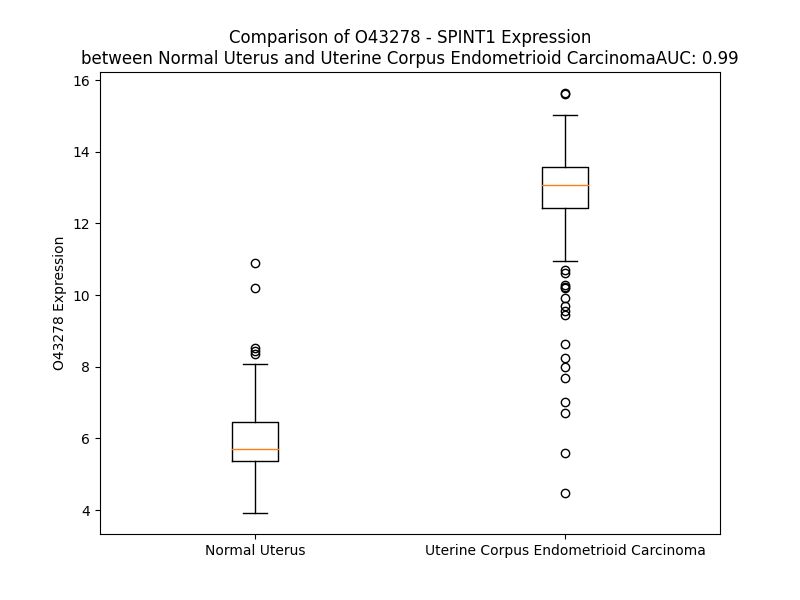

# Detailed Data for O43278

## Introduction to the Detailed Summary

### How to Interpret the Results

- **Summary & Metrics**: This section provides a quick reference to essential protein attributes, including expression changes, family classification, and biomarker applications. Regulation status (upregulated/downregulated) indicates the protein's behavior in a disease context. Some information comes from the original excel file with the proteins selected from literature, while others are derived from the analyses.
- **Expression Comparison**: A visual representation comparing protein expression between normal and disease states. It highlights significant changes in expression levels that might indicate diagnostic or therapeutic relevance. This is data coming from transcriptomics experiments and could not translate similarly to protein levels.
- **Isoform Alignment**: An interactive view of isoform alignments, revealing structural and functional differences between variants of the protein.
- **Interactors & Homologs**: Tables listing known interaction partners and homologous proteins, the more interactors and homologs, the more complex the protein is to design an antibody for.
- **Biological Assemblies**: Information about the structural arrangement of the protein in different assemblies, providing insights into its functional state but also the complexity of the protein to develop antibodies.
- **Combined Per-Residue Information**: A detailed table summarizing residue-level data. This includes predictions for epitope regions, aggregation tendencies, and modifications that might impact the protein's function. Each row corresponds to a residue in the protein, providing insights into specific sites that may be important for research or drug development.
## Summary & Metrics

- **UniProt Accession**: O43278
- **Gene Name**: HAI-1 / SPINT1
- **Protein Name**: Kunitz-type protease inhibitor 1
- **Swiss Prot**: SPIT1_HUMAN
- **Family**: nan
- **Biomarker Application**: nan
- **Number of Isoforms**: 2
- **Regulation**: -1
- **(transcriptomics) AUC**: 0.99
- **(transcriptomics) Fold Change**: 2.12
- **(transcriptomics) Regulation**: Upregulated
- **Discotope Epitope Count**: 148
- **Max n_uniprots (Homo)**: 1
- **Max n_uniprots (Hetero)**: 2

## Expression Comparison

## Isoform Alignment

<pre style='font-size:14px; font-family:monospace;'>O43278-1 MAPARTMARARLAPAGIPAVALWLLCTLGLQGTQAGPPPAPPGLPAGADCLNSFTAGVPGFVLDTNASVSNGATFLESPTVRRGWDCVRACCTTQNCNLALVELQPDRGEDAIAACFLINCLYEQNFVCKFAPREGFINYLTREVYRSYRQLRTQGFGGSGIPKAWAGIDLKVQPQEPLVLKDVENTDWRLLRGDTDVRVERKDPNQVELWGLKEGTYLFQLTVTSSDHPEDTANVTVTVLSTKQTEDYCLASNKVGRCRGSFPRWYYDPTEQICKSFVYGGCLGNKNNYLREEECILACRGVQGGPLRGSSGAQATFPQGPSMERRHPVCSGTCQPTQFRCSNGCCIDSFLECDDTPNCPDASDEAACEKYTSGFDELQRIHFPSDKGHCVDLPDTGLCKESIPRWYYNPFSEHCARFTYGGCYGNKNNFEEEQQCLESCRGISKKDVFGLRREIPIPSTGSVEMAVAVFLVICIVVVVAILGYCFFKNQRKDFHGHHHHPPPTPASSTVSTTEDTEHLVYNHTTRPL
O43278-2 MAPARTMARARLAPAGIPAVALWLLCTLGLQGTQAGPPPAPPGLPAGADCLNSFTAGVPGFVLDTNASVSNGATFLESPTVRRGWDCVRACCTTQNCNLALVELQPDRGEDAIAACFLINCLYEQNFVCKFAPREGFINYLTREVYRSYRQLRTQGFGGSGIPKAWAGIDLKVQPQEPLVLKDVENTDWRLLRGDTDVRVERKDPNQVELWGLKEGTYLFQLTVTSSDHPEDTANVTVTVLSTKQTEDYCLASNKVGRCRGSFPRWYYDPTEQICKSFVYGGCLGNKNNYLREEECILACRGVQ----------------GPSMERRHPVCSGTCQPTQFRCSNGCCIDSFLECDDTPNCPDASDEAACEKYTSGFDELQRIHFPSDKGHCVDLPDTGLCKESIPRWYYNPFSEHCARFTYGGCYGNKNNFEEEQQCLESCRGISKKDVFGLRREIPIPSTGSVEMAVAVFLVICIVVVVAILGYCFFKNQRKDFHGHHHHPPPTPASSTVSTTEDTEHLVYNHTTRPL
</pre>

## Interactors

| preferredName_A   | preferredName_B   |   score |
|:------------------|:------------------|--------:|
| SPINT1            | HGFAC             |   0.999 |
| SPINT1            | ST14              |   0.998 |
| SPINT1            | HGF               |   0.944 |

## Homologs

| uniprot_id   | gene_id   |
|:-------------|:----------|
| Q96NZ8       | WFIKKN1   |
| Q8TEU8       | WFIKKN2   |
| Q8IUA0       | WFDC8     |
| K7EKC8       | SPINT2    |
| S4R471       | AMBP      |
| Q86VZ4       | LRP11     |
| Q6UDR6       | SPINT4    |
| C9JT76       | TFPI      |
| A0A3B3IS67   | TFPI2     |
| A0A384NYB9   | SPINLW1   |
| A0A0K0K1K0   | HEL-S-295 |
| Q5VV43       | KIAA0319  |
| A0A8V8TKZ6   | KIAA0319L |

## Biological Assemblies

|   Unnamed: 0 |   assembly |   n_uniprots | composition   | crystal_id   |
|-------------:|-----------:|-------------:|:--------------|:-------------|
|            0 |          1 |            2 | Hetero        | 4isn         |
|            0 |          1 |            2 | Hetero        | 4isl         |
|            0 |          1 |            1 | Homo          | 5h7v         |
|            0 |          1 |            1 | Homo          | 2msx         |
|            0 |          1 |            2 | Hetero        | 1yc0         |
|            0 |          1 |            2 | Hetero        | 4iso         |
|            0 |          1 |            1 | Homo          | 5ezd         |
|            1 |          2 |            1 | Homo          | 5ezd         |

## Combined Per-Residue Information

|   res | aa   |   epitope_score | epitope   |   relative_surface_accessibility |   modeling_confidence |   Aggregation | modification   | glycosylation                   |
|------:|:-----|----------------:|:----------|---------------------------------:|----------------------:|--------------:|:---------------|:--------------------------------|
|     1 | M    |         0.18267 | True      |                          1.3529  |                 37.8  |         0     | N/A            | N/A                             |
|     2 | A    |         0.13415 | False     |                          0.89506 |                 39.26 |         0     | N/A            | N/A                             |
|     3 | P    |         0.15338 | True      |                          0.94415 |                 53.44 |         0     | N/A            | N/A                             |
|     4 | A    |         0.13397 | False     |                          0.77766 |                 38.47 |         0     | N/A            | N/A                             |
|     5 | R    |         0.22774 | True      |                          0.98591 |                 39.29 |         0     | N/A            | N/A                             |
|     6 | T    |         0.08721 | False     |                          0.91506 |                 34.06 |         0     | N/A            | N/A                             |
|     7 | M    |         0.15313 | True      |                          1.08255 |                 40.84 |         0     | N/A            | N/A                             |
|     8 | A    |         0.11303 | False     |                          0.96983 |                 34.52 |         0     | N/A            | N/A                             |
|     9 | R    |         0.18842 | True      |                          0.99714 |                 36.05 |         0     | N/A            | N/A                             |
|    10 | A    |         0.151   | True      |                          0.97497 |                 38.36 |         0     | N/A            | N/A                             |
|    11 | R    |         0.12435 | False     |                          0.95073 |                 29.62 |         0     | N/A            | N/A                             |
|    12 | L    |         0.18295 | True      |                          1.1348  |                 37.85 |         0     | N/A            | N/A                             |
|    13 | A    |         0.10635 | False     |                          0.86433 |                 35.04 |         0     | N/A            | N/A                             |
|    14 | P    |         0.1578  | True      |                          0.95436 |                 38.78 |         0     | N/A            | N/A                             |
|    15 | A    |         0.15199 | True      |                          0.97852 |                 39.31 |         0     | N/A            | N/A                             |
|    16 | G    |         0.14664 | True      |                          0.90519 |                 31.78 |         0     | N/A            | N/A                             |
|    17 | I    |         0.17288 | True      |                          0.99814 |                 40.6  |         0     | N/A            | N/A                             |
|    18 | P    |         0.16928 | True      |                          0.87409 |                 37.37 |         0.501 | N/A            | N/A                             |
|    19 | A    |         0.12755 | False     |                          1.00241 |                 29.8  |        41.396 | N/A            | N/A                             |
|    20 | V    |         0.12777 | False     |                          0.9865  |                 32.04 |        89.538 | N/A            | N/A                             |
|    21 | A    |         0.2114  | True      |                          0.96768 |                 31.44 |        93.529 | N/A            | N/A                             |
|    22 | L    |         0.23862 | True      |                          1.02771 |                 28.21 |        97.62  | N/A            | N/A                             |
|    23 | W    |         0.15122 | True      |                          1.07707 |                 28.2  |        98.258 | N/A            | N/A                             |
|    24 | L    |         0.14731 | True      |                          1.04562 |                 28.13 |        98.093 | N/A            | N/A                             |
|    25 | L    |         0.14003 | False     |                          1.0635  |                 28.92 |        95.961 | N/A            | N/A                             |
|    26 | C    |         0.12794 | False     |                          0.90436 |                 27.15 |        83.791 | N/A            | N/A                             |
|    27 | T    |         0.13273 | False     |                          0.91011 |                 33.07 |        71.573 | N/A            | N/A                             |
|    28 | L    |         0.13916 | False     |                          1.08111 |                 35.11 |        64.239 | N/A            | N/A                             |
|    29 | G    |         0.14266 | False     |                          0.90834 |                 28.19 |        24.171 | N/A            | N/A                             |
|    30 | L    |         0.19319 | True      |                          0.92367 |                 35.99 |        20.566 | N/A            | N/A                             |
|    31 | Q    |         0.14494 | True      |                          0.79277 |                 34.48 |         0.876 | N/A            | N/A                             |
|    32 | G    |         0.18597 | True      |                          1.06312 |                 29.8  |         0.105 | N/A            | N/A                             |
|    33 | T    |         0.156   | True      |                          0.89314 |                 32.04 |         0.037 | N/A            | N/A                             |
|    34 | Q    |         0.202   | True      |                          0.94679 |                 33.49 |         0     | N/A            | N/A                             |
|    35 | A    |         0.21025 | True      |                          0.9701  |                 34.38 |         0     | N/A            | N/A                             |
|    36 | G    |         0.24956 | True      |                          0.60801 |                 33.36 |         0     | N/A            | N/A                             |
|    37 | P    |         0.17738 | True      |                          0.93498 |                 34.96 |         0     | N/A            | N/A                             |
|    38 | P    |         0.1952  | True      |                          0.86558 |                 36.22 |         0     | N/A            | N/A                             |
|    39 | P    |         0.2463  | True      |                          0.93084 |                 32.39 |         0     | N/A            | N/A                             |
|    40 | A    |         0.13287 | False     |                          0.84692 |                 28.14 |         0     | N/A            | N/A                             |
|    41 | P    |         0.17492 | True      |                          0.79146 |                 35.59 |         0     | N/A            | N/A                             |
|    42 | P    |         0.17723 | True      |                          0.92795 |                 36.69 |         0     | N/A            | N/A                             |
|    43 | G    |         0.16086 | True      |                          0.91201 |                 33.3  |         0     | N/A            | N/A                             |
|    44 | L    |         0.18943 | True      |                          0.57188 |                 32.87 |         0     | N/A            | N/A                             |
|    45 | P    |         0.1314  | False     |                          0.7768  |                 40.65 |         0     | N/A            | N/A                             |
|    46 | A    |         0.13227 | False     |                          0.83727 |                 46.67 |         0     | N/A            | N/A                             |
|    47 | G    |         0.11988 | False     |                          0.42281 |                 55.32 |         0     | N/A            | N/A                             |
|    48 | A    |         0.07537 | False     |                          0.24697 |                 66.95 |         0     | N/A            | N/A                             |
|    49 | D    |         0.05861 | False     |                          0.49628 |                 83.7  |         0     | N/A            | N/A                             |
|    50 | C    |         0.03421 | False     |                          0.27919 |                 88.61 |         0     | N/A            | N/A                             |
|    51 | L    |         0.08296 | False     |                          0.23545 |                 89.22 |         0     | N/A            | N/A                             |
|    52 | N    |         0.10099 | False     |                          0.53088 |                 90.97 |         0     | N/A            | N/A                             |
|    53 | S    |         0.05715 | False     |                          0.33917 |                 92.89 |         0     | N/A            | N/A                             |
|    54 | F    |         0.01792 | False     |                          0.01706 |                 94.34 |         0     | N/A            | N/A                             |
|    55 | T    |         0.04012 | False     |                          0.10062 |                 92.93 |         0     | N/A            | N/A                             |
|    56 | A    |         0.04344 | False     |                          0.8492  |                 89.4  |         0     | N/A            | N/A                             |
|    57 | G    |         0.03217 | False     |                          0.16697 |                 88.81 |         0     | N/A            | N/A                             |
|    58 | V    |         0.03019 | False     |                          0.09902 |                 90.66 |         0     | N/A            | N/A                             |
|    59 | P    |         0.06315 | False     |                          0.47582 |                 91.51 |         0     | N/A            | N/A                             |
|    60 | G    |         0.01095 | False     |                          0.03709 |                 88.5  |         0     | N/A            | N/A                             |
|    61 | F    |         0.01302 | False     |                          0.00382 |                 91.49 |         0     | N/A            | N/A                             |
|    62 | V    |         0.00124 | False     |                          0       |                 92.85 |         0     | N/A            | N/A                             |
|    63 | L    |         0.00492 | False     |                          0.00495 |                 92.7  |         0     | N/A            | N/A                             |
|    64 | D    |         0.02843 | False     |                          0.22245 |                 92.27 |         0     | N/A            | N/A                             |
|    65 | T    |         0.00977 | False     |                          0.01891 |                 92.38 |         0     | N/A            | N/A                             |
|    66 | N    |         0.06469 | False     |                          0.47776 |                 91.17 |         0     | N/A            | N-linked (GlcNAc...) asparagine |
|    67 | A    |         0.03176 | False     |                          0.32654 |                 90.16 |         0     | N/A            | N/A                             |
|    68 | S    |         0.00934 | False     |                          0       |                 93.18 |         0     | N/A            | N/A                             |
|    69 | V    |         0.0163  | False     |                          0.01428 |                 94.72 |         0     | N/A            | N/A                             |
|    70 | S    |         0.07894 | False     |                          0.36705 |                 92.76 |         0     | N/A            | N/A                             |
|    71 | N    |         0.02662 | False     |                          0.27561 |                 89.67 |         0     | N/A            | N/A                             |
|    72 | G    |         0.02387 | False     |                          0.03212 |                 93.22 |         0     | N/A            | N/A                             |
|    73 | A    |         0.00117 | False     |                          0       |                 95.42 |         0     | N/A            | N/A                             |
|    74 | T    |         0.01779 | False     |                          0.23844 |                 93.97 |         0     | N/A            | N/A                             |
|    75 | F    |         0.01112 | False     |                          0.00919 |                 95.5  |         0     | N/A            | N/A                             |
|    76 | L    |         0.0486  | False     |                          0.18496 |                 93.01 |         0     | N/A            | N/A                             |
|    77 | E    |         0.06382 | False     |                          0.20463 |                 92.28 |         0     | N/A            | N/A                             |
|    78 | S    |         0.02909 | False     |                          0.11935 |                 93.98 |         0     | N/A            | N/A                             |
|    79 | P    |         0.05437 | False     |                          0.09136 |                 93.46 |         0     | N/A            | N/A                             |
|    80 | T    |         0.0875  | False     |                          0.95774 |                 92.41 |         0     | N/A            | N/A                             |
|    81 | V    |         0.08608 | False     |                          0.29141 |                 93.72 |         0     | N/A            | N/A                             |
|    82 | R    |         0.13596 | False     |                          0.83618 |                 91.77 |         0     | N/A            | N/A                             |
|    83 | R    |         0.23156 | True      |                          0.58916 |                 91.88 |         0     | N/A            | N/A                             |
|    84 | G    |         0.03007 | False     |                          0.0338  |                 91.33 |         0     | N/A            | N/A                             |
|    85 | W    |         0.09145 | False     |                          0.44904 |                 91.64 |         0     | N/A            | N/A                             |
|    86 | D    |         0.06091 | False     |                          0.24016 |                 94.36 |         0     | N/A            | N/A                             |
|    87 | C    |         0.00136 | False     |                          0       |                 95.86 |         0     | N/A            | N/A                             |
|    88 | V    |         0.00459 | False     |                          0       |                 95.84 |         0     | N/A            | N/A                             |
|    89 | R    |         0.10131 | False     |                          0.45552 |                 95.18 |         0     | N/A            | N/A                             |
|    90 | A    |         0.04528 | False     |                          0.19064 |                 95.08 |         0     | N/A            | N/A                             |
|    91 | C    |         0.00978 | False     |                          0.02295 |                 96.23 |         0     | N/A            | N/A                             |
|    92 | C    |         0.03968 | False     |                          0.26458 |                 94.63 |         0     | N/A            | N/A                             |
|    93 | T    |         0.07871 | False     |                          0.84468 |                 91.81 |         0     | N/A            | N/A                             |
|    94 | T    |         0.0398  | False     |                          0.25393 |                 90.5  |         0     | N/A            | N/A                             |
|    95 | Q    |         0.10308 | False     |                          0.41488 |                 88.22 |         0     | N/A            | N/A                             |
|    96 | N    |         0.09887 | False     |                          0.56007 |                 90.32 |         0     | N/A            | N/A                             |
|    97 | C    |         0.02619 | False     |                          0.11362 |                 95.55 |         0     | N/A            | N/A                             |
|    98 | N    |         0.02676 | False     |                          0.07037 |                 95.62 |         0.244 | N/A            | N/A                             |
|    99 | L    |         0.00183 | False     |                          0       |                 97.05 |         0.244 | N/A            | N/A                             |
|   100 | A    |         0.00141 | False     |                          0       |                 97.45 |         0.244 | N/A            | N/A                             |
|   101 | L    |         0.00166 | False     |                          0       |                 96.79 |         0.244 | N/A            | N/A                             |
|   102 | V    |         0.00299 | False     |                          0.0019  |                 95.49 |         0.244 | N/A            | N/A                             |
|   103 | E    |         0.03709 | False     |                          0.25915 |                 94.36 |         0     | N/A            | N/A                             |
|   104 | L    |         0.0519  | False     |                          0.31186 |                 92.38 |         0     | N/A            | N/A                             |
|   105 | Q    |         0.18528 | True      |                          0.26969 |                 89.02 |         0     | N/A            | N/A                             |
|   106 | P    |         0.25473 | True      |                          0.88311 |                 77.63 |         0     | N/A            | N/A                             |
|   107 | D    |         0.3157  | True      |                          0.85091 |                 78    |         0     | N/A            | N/A                             |
|   108 | R    |         0.47232 | True      |                          0.73945 |                 74    |         0     | N/A            | N/A                             |
|   109 | G    |         0.33895 | True      |                          0.55729 |                 70.63 |         0     | N/A            | N/A                             |
|   110 | E    |         0.27477 | True      |                          0.91973 |                 70.49 |         0     | N/A            | N/A                             |
|   111 | D    |         0.13588 | False     |                          0.50366 |                 80.58 |         0     | N/A            | N/A                             |
|   112 | A    |         0.06091 | False     |                          0.16638 |                 90.65 |         5.589 | N/A            | N/A                             |
|   113 | I    |         0.06699 | False     |                          0.07064 |                 93    |        24.082 | N/A            | N/A                             |
|   114 | A    |         0.08643 | False     |                          0.54629 |                 92.78 |        28.552 | N/A            | N/A                             |
|   115 | A    |         0.01999 | False     |                          0.11224 |                 94.13 |        33.417 | N/A            | N/A                             |
|   116 | C    |         0.01252 | False     |                          0.0086  |                 95.99 |        34.001 | N/A            | N/A                             |
|   117 | F    |         0.01667 | False     |                          0.01401 |                 96.59 |        36.003 | N/A            | N/A                             |
|   118 | L    |         0.00242 | False     |                          0       |                 96.7  |        35.764 | N/A            | N/A                             |
|   119 | I    |         0.0058  | False     |                          0.0064  |                 96.95 |        33.465 | N/A            | N/A                             |
|   120 | N    |         0.02313 | False     |                          0.15668 |                 95.49 |         5.698 | N/A            | N/A                             |
|   121 | C    |         0.00343 | False     |                          0.001   |                 95.5  |         4.412 | N/A            | N/A                             |
|   122 | L    |         0.05842 | False     |                          0.34272 |                 91.87 |         4.088 | N/A            | N/A                             |
|   123 | Y    |         0.0462  | False     |                          0.13577 |                 90.45 |         3.355 | N/A            | N/A                             |
|   124 | E    |         0.04846 | False     |                          0.17884 |                 85.59 |         0     | N/A            | N/A                             |
|   125 | Q    |         0.06981 | False     |                          0.53715 |                 80.81 |         0     | N/A            | N/A                             |
|   126 | N    |         0.04479 | False     |                          0.28981 |                 82.31 |         0     | N/A            | N/A                             |
|   127 | F    |         0.02396 | False     |                          0.14718 |                 87.67 |         0     | N/A            | N/A                             |
|   128 | V    |         0.01855 | False     |                          0.13424 |                 90.16 |         0     | N/A            | N/A                             |
|   129 | C    |         0.00941 | False     |                          0.0148  |                 92.35 |         0     | N/A            | N/A                             |
|   130 | K    |         0.02928 | False     |                          0.2209  |                 90.11 |         0     | N/A            | N/A                             |
|   131 | F    |         0.00887 | False     |                          0.05158 |                 90.3  |         0     | N/A            | N/A                             |
|   132 | A    |         0.01954 | False     |                          0.03699 |                 88.66 |         0     | N/A            | N/A                             |
|   133 | P    |         0.04068 | False     |                          0.23586 |                 88.71 |         0     | N/A            | N/A                             |
|   134 | R    |         0.12979 | False     |                          0.25028 |                 89.2  |         0     | N/A            | N/A                             |
|   135 | E    |         0.06315 | False     |                          0.57621 |                 89.33 |         0     | N/A            | N/A                             |
|   136 | G    |         0.04203 | False     |                          0.3697  |                 91.02 |         2.529 | N/A            | N/A                             |
|   137 | F    |         0.00829 | False     |                          0.01357 |                 93.31 |        18.553 | N/A            | N/A                             |
|   138 | I    |         0.03798 | False     |                          0.17839 |                 93.97 |        19.182 | N/A            | N/A                             |
|   139 | N    |         0.00243 | False     |                          0       |                 95.7  |        19.182 | N/A            | N/A                             |
|   140 | Y    |         0.02963 | False     |                          0.05602 |                 95.63 |        19.182 | N/A            | N/A                             |
|   141 | L    |         0.00279 | False     |                          0.00165 |                 95.17 |        18.969 | N/A            | N/A                             |
|   142 | T    |         0.04875 | False     |                          0.18155 |                 94.57 |         5.595 | N/A            | N/A                             |
|   143 | R    |         0.19852 | True      |                          0.44774 |                 92.21 |         0.251 | N/A            | N/A                             |
|   144 | E    |         0.1079  | False     |                          0.71196 |                 88.78 |         0.251 | N/A            | N/A                             |
|   145 | V    |         0.02882 | False     |                          0.08283 |                 88.38 |         0.251 | N/A            | N/A                             |
|   146 | Y    |         0.02941 | False     |                          0.12181 |                 89.49 |         0.251 | N/A            | N/A                             |
|   147 | R    |         0.10464 | False     |                          0.67619 |                 85.78 |         0     | N/A            | N/A                             |
|   148 | S    |         0.03865 | False     |                          0.51162 |                 79.69 |         0     | N/A            | N/A                             |
|   149 | Y    |         0.02587 | False     |                          0.04859 |                 82.18 |         0     | N/A            | N/A                             |
|   150 | R    |         0.1618  | True      |                          0.39965 |                 81.43 |         0     | N/A            | N/A                             |
|   151 | Q    |         0.10527 | False     |                          0.54448 |                 76.93 |         0     | N/A            | N/A                             |
|   152 | L    |         0.07792 | False     |                          0.59978 |                 73.79 |         0     | N/A            | N/A                             |
|   153 | R    |         0.03472 | False     |                          0.04559 |                 75.76 |         0     | N/A            | N/A                             |
|   154 | T    |         0.16031 | True      |                          0.56629 |                 68.9  |         0     | N/A            | N/A                             |
|   155 | Q    |         0.12342 | False     |                          0.59369 |                 68.47 |         0     | N/A            | N/A                             |
|   156 | G    |         0.03856 | False     |                          0.28824 |                 61.72 |         0     | N/A            | N/A                             |
|   157 | F    |         0.06112 | False     |                          0.09629 |                 61.89 |         0     | N/A            | N/A                             |
|   158 | G    |         0.26955 | True      |                          0.80375 |                 51.67 |         0     | N/A            | N/A                             |
|   159 | G    |         0.18155 | True      |                          0.7547  |                 43.81 |         0     | N/A            | N/A                             |
|   160 | S    |         0.09087 | False     |                          0.444   |                 39.45 |         0     | N/A            | N/A                             |
|   161 | G    |         0.14377 | True      |                          0.79215 |                 44.23 |         0     | N/A            | N/A                             |
|   162 | I    |         0.06854 | False     |                          0.33283 |                 41.42 |         0     | N/A            | N/A                             |
|   163 | P    |         0.10529 | False     |                          0.53144 |                 43.26 |         0     | N/A            | N/A                             |
|   164 | K    |         0.13547 | False     |                          0.30098 |                 49.83 |         0     | N/A            | N/A                             |
|   165 | A    |         0.06505 | False     |                          0.19824 |                 48.3  |         0.494 | N/A            | N/A                             |
|   166 | W    |         0.04166 | False     |                          0.21251 |                 49.55 |         0.494 | N/A            | N/A                             |
|   167 | A    |         0.03586 | False     |                          0.30877 |                 54.5  |         0.494 | N/A            | N/A                             |
|   168 | G    |         0.03649 | False     |                          0.36851 |                 61.83 |         0.494 | N/A            | N/A                             |
|   169 | I    |         0.06784 | False     |                          0.16639 |                 68.99 |         0.494 | N/A            | N/A                             |
|   170 | D    |         0.04375 | False     |                          0.13166 |                 82.37 |         0     | N/A            | N/A                             |
|   171 | L    |         0.02148 | False     |                          0.05111 |                 87.37 |         0     | N/A            | N/A                             |
|   172 | K    |         0.02415 | False     |                          0.13591 |                 92.16 |         0     | N/A            | N/A                             |
|   173 | V    |         0.00251 | False     |                          0.00666 |                 93.31 |         0     | N/A            | N/A                             |
|   174 | Q    |         0.01653 | False     |                          0.11454 |                 91.55 |         0     | N/A            | N/A                             |
|   175 | P    |         0.12422 | False     |                          0.60021 |                 86.91 |         0     | N/A            | N/A                             |
|   176 | Q    |         0.12252 | False     |                          0.42287 |                 84.15 |         0     | N/A            | N/A                             |
|   177 | E    |         0.17492 | True      |                          0.56388 |                 85    |         0     | N/A            | N/A                             |
|   178 | P    |         0.15546 | True      |                          0.22786 |                 87.78 |         0     | N/A            | N/A                             |
|   179 | L    |         0.01412 | False     |                          0.01484 |                 87.73 |         0     | N/A            | N/A                             |
|   180 | V    |         0.07762 | False     |                          0.37439 |                 86.16 |         0     | N/A            | N/A                             |
|   181 | L    |         0.01082 | False     |                          0.00742 |                 81.27 |         0     | N/A            | N/A                             |
|   182 | K    |         0.23916 | True      |                          0.62019 |                 72.97 |         0     | N/A            | N/A                             |
|   183 | D    |         0.16324 | True      |                          0.45834 |                 66.17 |         0     | N/A            | N/A                             |
|   184 | V    |         0.0245  | False     |                          0.01904 |                 67.77 |         0     | N/A            | N/A                             |
|   185 | E    |         0.17813 | True      |                          0.44094 |                 67.53 |         0     | N/A            | N/A                             |
|   186 | N    |         0.09815 | False     |                          0.56001 |                 68.34 |         0     | N/A            | N/A                             |
|   187 | T    |         0.03825 | False     |                          0.09047 |                 73.21 |         0     | N/A            | N/A                             |
|   188 | D    |         0.10171 | False     |                          0.52967 |                 80.07 |         0     | N/A            | N/A                             |
|   189 | W    |         0.04509 | False     |                          0.10062 |                 84.86 |         0     | N/A            | N/A                             |
|   190 | R    |         0.11945 | False     |                          0.64706 |                 88.42 |         0     | N/A            | N/A                             |
|   191 | L    |         0.09864 | False     |                          0.31074 |                 91.48 |         0     | N/A            | N/A                             |
|   192 | L    |         0.16888 | True      |                          0.50121 |                 91.73 |         0     | N/A            | N/A                             |
|   193 | R    |         0.20652 | True      |                          0.713   |                 92.84 |         0     | N/A            | N/A                             |
|   194 | G    |         0.12356 | False     |                          0.36358 |                 89.05 |         0     | N/A            | N/A                             |
|   195 | D    |         0.24637 | True      |                          0.70804 |                 84.19 |         0     | N/A            | N/A                             |
|   196 | T    |         0.10504 | False     |                          0.23577 |                 89.13 |         0     | N/A            | N/A                             |
|   197 | D    |         0.14499 | True      |                          0.82572 |                 88.65 |         0     | N/A            | N/A                             |
|   198 | V    |         0.07196 | False     |                          0.11422 |                 91.74 |         0     | N/A            | N/A                             |
|   199 | R    |         0.28193 | True      |                          0.75914 |                 91.25 |         0     | N/A            | N/A                             |
|   200 | V    |         0.09678 | False     |                          0.39774 |                 89.42 |         0     | N/A            | N/A                             |
|   201 | E    |         0.18307 | True      |                          0.48171 |                 88    |         0     | N/A            | N/A                             |
|   202 | R    |         0.20647 | True      |                          0.37261 |                 83.37 |         0     | N/A            | N/A                             |
|   203 | K    |         0.42721 | True      |                          0.67017 |                 78.35 |         0     | N/A            | N/A                             |
|   204 | D    |         0.21529 | True      |                          0.37662 |                 77.03 |         0     | N/A            | N/A                             |
|   205 | P    |         0.19943 | True      |                          0.65399 |                 72.79 |         0     | N/A            | N/A                             |
|   206 | N    |         0.19927 | True      |                          0.36285 |                 74.53 |         0     | N/A            | N/A                             |
|   207 | Q    |         0.10768 | False     |                          0.1523  |                 81.23 |         0     | N/A            | N/A                             |
|   208 | V    |         0.00901 | False     |                          0.00571 |                 85.66 |         0     | N/A            | N/A                             |
|   209 | E    |         0.07324 | False     |                          0.03613 |                 89.5  |         0     | N/A            | N/A                             |
|   210 | L    |         0.00707 | False     |                          0.00122 |                 90.49 |         0     | N/A            | N/A                             |
|   211 | W    |         0.21311 | True      |                          0.38798 |                 93.33 |         0     | N/A            | N/A                             |
|   212 | G    |         0.04312 | False     |                          0.31829 |                 91.43 |         0     | N/A            | N/A                             |
|   213 | L    |         0.04445 | False     |                          0.10478 |                 91.17 |         0     | N/A            | N/A                             |
|   214 | K    |         0.12022 | False     |                          0.62118 |                 91.75 |         0     | N/A            | N/A                             |
|   215 | E    |         0.09996 | False     |                          0.56383 |                 92.94 |         0     | N/A            | N/A                             |
|   216 | G    |         0.0547  | False     |                          0.24181 |                 92.4  |         4.588 | N/A            | N/A                             |
|   217 | T    |         0.05758 | False     |                          0.45925 |                 92.76 |         9.582 | N/A            | N/A                             |
|   218 | Y    |         0.00606 | False     |                          0       |                 93.77 |        32.862 | N/A            | N/A                             |
|   219 | L    |         0.0728  | False     |                          0.26933 |                 91.65 |        39.091 | N/A            | N/A                             |
|   220 | F    |         0.00552 | False     |                          0       |                 88.79 |        40.158 | N/A            | N/A                             |
|   221 | Q    |         0.11331 | False     |                          0.21829 |                 86.45 |        38.917 | N/A            | N/A                             |
|   222 | L    |         0.0293  | False     |                          0.04821 |                 81.33 |        38.917 | N/A            | N/A                             |
|   223 | T    |         0.09847 | False     |                          0.30223 |                 78.66 |        36.438 | N/A            | N/A                             |
|   224 | V    |         0.09958 | False     |                          0.18387 |                 71.12 |        34.651 | N/A            | N/A                             |
|   225 | T    |         0.16122 | True      |                          0.49296 |                 62.89 |        13.2   | N/A            | N/A                             |
|   226 | S    |         0.19666 | True      |                          0.37728 |                 58.4  |         0.438 | N/A            | N/A                             |
|   227 | S    |         0.34541 | True      |                          0.87286 |                 47.76 |         0     | N/A            | N/A                             |
|   228 | D    |         0.28969 | True      |                          0.66333 |                 52.04 |         0     | N/A            | N/A                             |
|   229 | H    |         0.19813 | True      |                          0.59083 |                 51.92 |         0     | N/A            | N/A                             |
|   230 | P    |         0.25076 | True      |                          0.72209 |                 50.18 |         0     | N/A            | N/A                             |
|   231 | E    |         0.23308 | True      |                          0.79743 |                 58.65 |         0     | N/A            | N/A                             |
|   232 | D    |         0.07197 | False     |                          0.16089 |                 63.39 |         0     | N/A            | N/A                             |
|   233 | T    |         0.24909 | True      |                          0.45805 |                 73.05 |         0.332 | N/A            | N/A                             |
|   234 | A    |         0.06361 | False     |                          0.18167 |                 73.77 |         1.971 | N/A            | N/A                             |
|   235 | N    |         0.1108  | False     |                          0.47763 |                 82.08 |         4.477 | N/A            | N-linked (GlcNAc...) asparagine |
|   236 | V    |         0.01266 | False     |                          0.00476 |                 82.28 |        68.855 | N/A            | N/A                             |
|   237 | T    |         0.03949 | False     |                          0.10145 |                 89.13 |        73.527 | N/A            | N/A                             |
|   238 | V    |         0.00291 | False     |                          0       |                 90.52 |        74.056 | N/A            | N/A                             |
|   239 | T    |         0.02274 | False     |                          0.10774 |                 93.41 |        74.056 | N/A            | N/A                             |
|   240 | V    |         0.00873 | False     |                          0.02012 |                 93.9  |        74.056 | N/A            | N/A                             |
|   241 | L    |         0.0073  | False     |                          0.01161 |                 93.83 |        64.185 | N/A            | N/A                             |
|   242 | S    |         0.04215 | False     |                          0.12976 |                 93.15 |         5.8   | N/A            | N/A                             |
|   243 | T    |         0.0801  | False     |                          0.64197 |                 89.2  |         2.163 | N/A            | N/A                             |
|   244 | K    |         0.09243 | False     |                          0.67617 |                 87.71 |         0     | N/A            | N/A                             |
|   245 | Q    |         0.05726 | False     |                          0.33265 |                 91.22 |         0     | N/A            | N/A                             |
|   246 | T    |         0.02095 | False     |                          0.06916 |                 92.16 |         0     | N/A            | N/A                             |
|   247 | E    |         0.03809 | False     |                          0.21255 |                 89.59 |         0     | N/A            | N/A                             |
|   248 | D    |         0.08672 | False     |                          0.25176 |                 90.15 |         0     | N/A            | N/A                             |
|   249 | Y    |         0.0413  | False     |                          0.13633 |                 93.58 |         0     | N/A            | N/A                             |
|   250 | C    |         0.00543 | False     |                          0       |                 94.92 |         0     | N/A            | N/A                             |
|   251 | L    |         0.03601 | False     |                          0.18611 |                 91.41 |         0     | N/A            | N/A                             |
|   252 | A    |         0.01079 | False     |                          0.01443 |                 88.7  |         0     | N/A            | N/A                             |
|   253 | S    |         0.07616 | False     |                          0.61057 |                 89.88 |         0     | N/A            | N/A                             |
|   254 | N    |         0.06223 | False     |                          0.3058  |                 92.16 |         0     | N/A            | N/A                             |
|   255 | K    |         0.04044 | False     |                          0.11287 |                 93.09 |         0     | N/A            | N/A                             |
|   256 | V    |         0.09591 | False     |                          0.54423 |                 93.02 |         0     | N/A            | N/A                             |
|   257 | G    |         0.04149 | False     |                          0.23942 |                 91.31 |         0     | N/A            | N/A                             |
|   258 | R    |         0.11905 | False     |                          0.28137 |                 90.6  |         0     | N/A            | N/A                             |
|   259 | C    |         0.0199  | False     |                          0.04293 |                 93.5  |         0     | N/A            | N/A                             |
|   260 | R    |         0.15605 | True      |                          0.73746 |                 91.31 |         0     | N/A            | N/A                             |
|   261 | G    |         0.04674 | False     |                          0.16907 |                 91.38 |         0     | N/A            | N/A                             |
|   262 | S    |         0.12233 | False     |                          0.66485 |                 95    |         0     | N/A            | N/A                             |
|   263 | F    |         0.02328 | False     |                          0.04846 |                 95.79 |         0     | N/A            | N/A                             |
|   264 | P    |         0.10855 | False     |                          0.70521 |                 95.87 |         0     | N/A            | N/A                             |
|   265 | R    |         0.02315 | False     |                          0.02944 |                 96.49 |         0     | N/A            | N/A                             |
|   266 | W    |         0.07554 | False     |                          0.28361 |                 96.99 |         0     | N/A            | N/A                             |
|   267 | Y    |         0.04355 | False     |                          0.14646 |                 97.28 |         0     | N/A            | N/A                             |
|   268 | Y    |         0.02689 | False     |                          0.01777 |                 97.13 |         0     | N/A            | N/A                             |
|   269 | D    |         0.04045 | False     |                          0.11372 |                 94.64 |         0     | N/A            | N/A                             |
|   270 | P    |         0.02631 | False     |                          0.15836 |                 91.96 |         0     | N/A            | N/A                             |
|   271 | T    |         0.06497 | False     |                          0.78475 |                 89.99 |         0     | N/A            | N/A                             |
|   272 | E    |         0.11951 | False     |                          0.57983 |                 90.85 |         0     | N/A            | N/A                             |
|   273 | Q    |         0.08317 | False     |                          0.4309  |                 92.82 |         0     | N/A            | N/A                             |
|   274 | I    |         0.14433 | True      |                          0.53998 |                 94.82 |         0     | N/A            | N/A                             |
|   275 | C    |         0.02013 | False     |                          0.06709 |                 96.86 |         0     | N/A            | N/A                             |
|   276 | K    |         0.08097 | False     |                          0.28253 |                 97.53 |         0     | N/A            | N/A                             |
|   277 | S    |         0.15672 | True      |                          0.58208 |                 97.4  |         0.167 | N/A            | N/A                             |
|   278 | F    |         0.05378 | False     |                          0.12344 |                 97.43 |         0.167 | N/A            | N/A                             |
|   279 | V    |         0.09469 | False     |                          0.57337 |                 97.37 |         0.167 | N/A            | N/A                             |
|   280 | Y    |         0.01698 | False     |                          0.01244 |                 95.99 |         0.167 | N/A            | N/A                             |
|   281 | G    |         0.0137  | False     |                          0.01127 |                 94.23 |         0.167 | N/A            | N/A                             |
|   282 | G    |         0.00271 | False     |                          0       |                 92.9  |         0     | N/A            | N/A                             |
|   283 | C    |         0.00267 | False     |                          0       |                 93.27 |         0     | N/A            | N/A                             |
|   284 | L    |         0.05619 | False     |                          0.18631 |                 89.29 |         0     | N/A            | N/A                             |
|   285 | G    |         0.07004 | False     |                          0.36347 |                 90.63 |         0     | N/A            | N/A                             |
|   286 | N    |         0.03999 | False     |                          0.12756 |                 90.57 |         0     | N/A            | N/A                             |
|   287 | K    |         0.06118 | False     |                          0.40495 |                 92.56 |         0     | N/A            | N/A                             |
|   288 | N    |         0.00582 | False     |                          0       |                 95.15 |         0     | N/A            | N/A                             |
|   289 | N    |         0.02173 | False     |                          0.10736 |                 95.44 |         0     | N/A            | N/A                             |
|   290 | Y    |         0.00867 | False     |                          0.02544 |                 95.2  |         0     | N/A            | N/A                             |
|   291 | L    |         0.04148 | False     |                          0.22753 |                 92.17 |         0     | N/A            | N/A                             |
|   292 | R    |         0.07769 | False     |                          0.16268 |                 88.93 |         0     | N/A            | N/A                             |
|   293 | E    |         0.06321 | False     |                          0.31784 |                 91.03 |         0     | N/A            | N/A                             |
|   294 | E    |         0.11181 | False     |                          0.3532  |                 85.89 |         0     | N/A            | N/A                             |
|   295 | E    |         0.04098 | False     |                          0.1505  |                 89.51 |         0     | N/A            | N/A                             |
|   296 | C    |         0.00193 | False     |                          0       |                 94.36 |         0     | N/A            | N/A                             |
|   297 | I    |         0.05681 | False     |                          0.37977 |                 91.51 |         0     | N/A            | N/A                             |
|   298 | L    |         0.02872 | False     |                          0.24387 |                 88.82 |         0     | N/A            | N/A                             |
|   299 | A    |         0.00101 | False     |                          0.00128 |                 93.52 |         0     | N/A            | N/A                             |
|   300 | C    |         0.00579 | False     |                          0       |                 95.21 |         0     | N/A            | N/A                             |
|   301 | R    |         0.1364  | False     |                          0.73241 |                 88.83 |         0     | N/A            | N/A                             |
|   302 | G    |         0.08498 | False     |                          0.70705 |                 85.79 |         0     | N/A            | N/A                             |
|   303 | V    |         0.02065 | False     |                          0.10092 |                 89.38 |         0     | N/A            | N/A                             |
|   304 | Q    |         0.08248 | False     |                          0.48789 |                 84.9  |         0     | N/A            | N/A                             |
|   305 | G    |         0.05856 | False     |                          0.38068 |                 63.2  |         0     | N/A            | N/A                             |
|   306 | G    |         0.06146 | False     |                          0.3611  |                 57.14 |         0     | N/A            | N/A                             |
|   307 | P    |         0.07276 | False     |                          0.783   |                 38.89 |         0     | N/A            | N/A                             |
|   308 | L    |         0.15979 | True      |                          0.83053 |                 35.71 |         0     | N/A            | N/A                             |
|   309 | R    |         0.21361 | True      |                          0.95723 |                 35.36 |         0     | N/A            | N/A                             |
|   310 | G    |         0.22287 | True      |                          0.90623 |                 32.31 |         0     | N/A            | N/A                             |
|   311 | S    |         0.19805 | True      |                          0.8522  |                 39.02 |         0     | N/A            | N/A                             |
|   312 | S    |         0.18455 | True      |                          0.99125 |                 35.48 |         0     | N/A            | N/A                             |
|   313 | G    |         0.2227  | True      |                          0.78848 |                 32.95 |         0     | N/A            | N/A                             |
|   314 | A    |         0.18995 | True      |                          1.13083 |                 35.05 |         0     | N/A            | N/A                             |
|   315 | Q    |         0.23081 | True      |                          0.82493 |                 30.05 |         0     | N/A            | N/A                             |
|   316 | A    |         0.10534 | False     |                          0.63196 |                 35.99 |         0     | N/A            | N/A                             |
|   317 | T    |         0.14875 | True      |                          0.92004 |                 26.11 |         0     | N/A            | N/A                             |
|   318 | F    |         0.13579 | False     |                          0.68163 |                 39.23 |         0     | N/A            | N/A                             |
|   319 | P    |         0.1471  | True      |                          0.84924 |                 33.69 |         0     | N/A            | N/A                             |
|   320 | Q    |         0.09682 | False     |                          0.78213 |                 32.08 |         0     | N/A            | N/A                             |
|   321 | G    |         0.08371 | False     |                          0.18425 |                 34.75 |         0     | N/A            | N/A                             |
|   322 | P    |         0.05378 | False     |                          0.37141 |                 38.34 |         0     | N/A            | N/A                             |
|   323 | S    |         0.11978 | False     |                          0.78036 |                 40.69 |         0     | N/A            | N/A                             |
|   324 | M    |         0.09619 | False     |                          0.3447  |                 47.59 |         0     | N/A            | N/A                             |
|   325 | E    |         0.16325 | True      |                          0.74154 |                 48.28 |         0     | N/A            | N/A                             |
|   326 | R    |         0.17303 | True      |                          0.51875 |                 55.64 |         0     | N/A            | N/A                             |
|   327 | R    |         0.14571 | True      |                          0.51228 |                 63.55 |         0     | N/A            | N/A                             |
|   328 | H    |         0.16713 | True      |                          0.85062 |                 72.92 |         0     | N/A            | N/A                             |
|   329 | P    |         0.10438 | False     |                          0.29883 |                 81.96 |         0     | N/A            | N/A                             |
|   330 | V    |         0.09755 | False     |                          0.57791 |                 87.01 |         0     | N/A            | N/A                             |
|   331 | C    |         0.09419 | False     |                          0.63191 |                 88.76 |         0     | N/A            | N/A                             |
|   332 | S    |         0.19795 | True      |                          0.52797 |                 82.94 |         0     | N/A            | N/A                             |
|   333 | G    |         0.20679 | True      |                          0.61143 |                 77.2  |         0     | N/A            | N/A                             |
|   334 | T    |         0.28785 | True      |                          0.77804 |                 86.55 |         0     | N/A            | N/A                             |
|   335 | C    |         0.05184 | False     |                          0.26858 |                 86.08 |         0     | N/A            | N/A                             |
|   336 | Q    |         0.14034 | False     |                          0.55549 |                 84.47 |         0     | N/A            | N/A                             |
|   337 | P    |         0.18379 | True      |                          0.71949 |                 77.27 |         0     | N/A            | N/A                             |
|   338 | T    |         0.08252 | False     |                          0.46171 |                 74.76 |         0     | N/A            | N/A                             |
|   339 | Q    |         0.09731 | False     |                          0.23157 |                 86.9  |         0     | N/A            | N/A                             |
|   340 | F    |         0.04602 | False     |                          0.20115 |                 88.49 |         0     | N/A            | N/A                             |
|   341 | R    |         0.11451 | False     |                          0.64852 |                 91.55 |         0     | N/A            | N/A                             |
|   342 | C    |         0.03256 | False     |                          0.01332 |                 91.89 |         0     | N/A            | N/A                             |
|   343 | S    |         0.199   | True      |                          0.78278 |                 91.9  |         0     | N/A            | N/A                             |
|   344 | N    |         0.07239 | False     |                          0.48615 |                 89.43 |         0     | N/A            | N/A                             |
|   345 | G    |         0.06227 | False     |                          0.15785 |                 89.94 |         0     | N/A            | N/A                             |
|   346 | C    |         0.0731  | False     |                          0.06174 |                 93.53 |         0     | N/A            | N/A                             |
|   347 | C    |         0.02988 | False     |                          0.01663 |                 92.71 |         0     | N/A            | N/A                             |
|   348 | I    |         0.03978 | False     |                          0.0152  |                 90.93 |         0     | N/A            | N/A                             |
|   349 | D    |         0.07515 | False     |                          0.15901 |                 86.39 |         0     | N/A            | N/A                             |
|   350 | S    |         0.1044  | False     |                          0.36428 |                 85.45 |         0     | N/A            | N/A                             |
|   351 | F    |         0.07074 | False     |                          0.22052 |                 83.52 |         0     | N/A            | N/A                             |
|   352 | L    |         0.02772 | False     |                          0.0338  |                 89.07 |         0     | N/A            | N/A                             |
|   353 | E    |         0.03648 | False     |                          0.0861  |                 91.26 |         0     | N/A            | N/A                             |
|   354 | C    |         0.02142 | False     |                          0.04574 |                 92.39 |         0     | N/A            | N/A                             |
|   355 | D    |         0.0701  | False     |                          0.30361 |                 89.36 |         0     | N/A            | N/A                             |
|   356 | D    |         0.0917  | False     |                          0.68995 |                 89.89 |         0     | N/A            | N/A                             |
|   357 | T    |         0.06327 | False     |                          0.19653 |                 90.63 |         0     | N/A            | N/A                             |
|   358 | P    |         0.15728 | True      |                          0.64045 |                 92.78 |         0     | N/A            | N/A                             |
|   359 | N    |         0.05336 | False     |                          0.12192 |                 92.08 |         0     | N/A            | N/A                             |
|   360 | C    |         0.03801 | False     |                          0.03056 |                 92.45 |         0     | N/A            | N/A                             |
|   361 | P    |         0.13074 | False     |                          0.65356 |                 91.06 |         0     | N/A            | N/A                             |
|   362 | D    |         0.08807 | False     |                          0.37314 |                 92.81 |         0     | N/A            | N/A                             |
|   363 | A    |         0.06113 | False     |                          0.3767  |                 93.56 |         0     | N/A            | N/A                             |
|   364 | S    |         0.07746 | False     |                          0.12245 |                 94.41 |         0     | N/A            | N/A                             |
|   365 | D    |         0.01475 | False     |                          0.00858 |                 93.29 |         0     | N/A            | N/A                             |
|   366 | E    |         0.12076 | False     |                          0.19343 |                 93.58 |         0     | N/A            | N/A                             |
|   367 | A    |         0.16534 | True      |                          0.81829 |                 92.41 |         0     | N/A            | N/A                             |
|   368 | A    |         0.07786 | False     |                          0.46601 |                 87.34 |         0     | N/A            | N/A                             |
|   369 | C    |         0.03167 | False     |                          0.06823 |                 90.39 |         0     | N/A            | N/A                             |
|   370 | E    |         0.21832 | True      |                          0.70249 |                 88.73 |         0     | N/A            | N/A                             |
|   371 | K    |         0.07393 | False     |                          0.38307 |                 87.79 |         0     | N/A            | N/A                             |
|   372 | Y    |         0.04454 | False     |                          0.12713 |                 88.04 |         0     | N/A            | N/A                             |
|   373 | T    |         0.04828 | False     |                          0.13619 |                 89.49 |         0     | N/A            | N/A                             |
|   374 | S    |         0.09403 | False     |                          0.51892 |                 90.74 |         0     | N/A            | N/A                             |
|   375 | G    |         0.02717 | False     |                          0.02231 |                 91.05 |         0     | N/A            | N/A                             |
|   376 | F    |         0.00212 | False     |                          0.00064 |                 92.32 |         0     | N/A            | N/A                             |
|   377 | D    |         0.0641  | False     |                          0.13435 |                 92.48 |         0     | N/A            | N/A                             |
|   378 | E    |         0.09014 | False     |                          0.40851 |                 92.71 |         0     | N/A            | N/A                             |
|   379 | L    |         0.00964 | False     |                          0.01147 |                 90.21 |         0     | N/A            | N/A                             |
|   380 | Q    |         0.06822 | False     |                          0.28472 |                 89.88 |         0     | N/A            | N/A                             |
|   381 | R    |         0.11847 | False     |                          0.63719 |                 90.04 |         0     | N/A            | N/A                             |
|   382 | I    |         0.06167 | False     |                          0.10239 |                 87.41 |         0     | N/A            | N/A                             |
|   383 | H    |         0.20653 | True      |                          0.83284 |                 80.55 |         0     | N/A            | N/A                             |
|   384 | F    |         0.07963 | False     |                          0.37035 |                 80.55 |         0     | N/A            | N/A                             |
|   385 | P    |         0.27492 | True      |                          0.76657 |                 72.45 |         0     | N/A            | N/A                             |
|   386 | S    |         0.12521 | False     |                          0.30102 |                 72.22 |         0     | N/A            | N/A                             |
|   387 | D    |         0.2688  | True      |                          0.76702 |                 78.15 |         0     | N/A            | N/A                             |
|   388 | K    |         0.14636 | True      |                          0.24449 |                 87.86 |         0     | N/A            | N/A                             |
|   389 | G    |         0.06251 | False     |                          0.27434 |                 85.55 |         0     | N/A            | N/A                             |
|   390 | H    |         0.08163 | False     |                          0.25376 |                 89.13 |         0     | N/A            | N/A                             |
|   391 | C    |         0.00324 | False     |                          0       |                 93.01 |         0     | N/A            | N/A                             |
|   392 | V    |         0.01929 | False     |                          0.05236 |                 90.03 |         0     | N/A            | N/A                             |
|   393 | D    |         0.01455 | False     |                          0.05862 |                 87.79 |         0     | N/A            | N/A                             |
|   394 | L    |         0.02917 | False     |                          0.12677 |                 86.3  |         0     | N/A            | N/A                             |
|   395 | P    |         0.02454 | False     |                          0.10278 |                 86.83 |         0     | N/A            | N/A                             |
|   396 | D    |         0.04237 | False     |                          0.26175 |                 84.69 |         0     | N/A            | N/A                             |
|   397 | T    |         0.07421 | False     |                          0.2503  |                 83.03 |         0     | N/A            | N/A                             |
|   398 | G    |         0.04211 | False     |                          0.06739 |                 78.73 |         0     | N/A            | N/A                             |
|   399 | L    |         0.12813 | False     |                          0.2971  |                 73.18 |         0     | N/A            | N/A                             |
|   400 | C    |         0.14267 | False     |                          0.42955 |                 81.13 |         0     | N/A            | N/A                             |
|   401 | K    |         0.20326 | True      |                          0.54442 |                 76.09 |         0     | N/A            | N/A                             |
|   402 | E    |         0.13121 | False     |                          0.57343 |                 83.43 |         0     | N/A            | N/A                             |
|   403 | S    |         0.12819 | False     |                          0.71596 |                 87.27 |         0     | N/A            | N/A                             |
|   404 | I    |         0.18288 | True      |                          0.30559 |                 91.74 |         0     | N/A            | N/A                             |
|   405 | P    |         0.12793 | False     |                          0.57219 |                 92.73 |         0     | N/A            | N/A                             |
|   406 | R    |         0.11595 | False     |                          0.19858 |                 94.56 |         0     | N/A            | N/A                             |
|   407 | W    |         0.0629  | False     |                          0.18011 |                 94.61 |         0     | N/A            | N/A                             |
|   408 | Y    |         0.04251 | False     |                          0.06655 |                 93.99 |         0     | N/A            | N/A                             |
|   409 | Y    |         0.04933 | False     |                          0.02443 |                 94.2  |         0     | N/A            | N/A                             |
|   410 | N    |         0.0258  | False     |                          0.09899 |                 91.79 |         0     | N/A            | N/A                             |
|   411 | P    |         0.0125  | False     |                          0.00514 |                 90.81 |         0     | N/A            | N/A                             |
|   412 | F    |         0.07393 | False     |                          0.34753 |                 88.74 |         0     | N/A            | N/A                             |
|   413 | S    |         0.10313 | False     |                          0.44484 |                 91.06 |         0     | N/A            | N/A                             |
|   414 | E    |         0.10825 | False     |                          0.51771 |                 93.9  |         0     | N/A            | N/A                             |
|   415 | H    |         0.19374 | True      |                          0.65747 |                 93.98 |         0     | N/A            | N/A                             |
|   416 | C    |         0.04532 | False     |                          0.10064 |                 94.78 |         0     | N/A            | N/A                             |
|   417 | A    |         0.08309 | False     |                          0.33543 |                 92.69 |         0     | N/A            | N/A                             |
|   418 | R    |         0.20001 | True      |                          0.61184 |                 91.59 |         0     | N/A            | N/A                             |
|   419 | F    |         0.10823 | False     |                          0.1389  |                 88.64 |         0     | N/A            | N/A                             |
|   420 | T    |         0.10367 | False     |                          0.52916 |                 86.98 |         0     | N/A            | N/A                             |
|   421 | Y    |         0.1079  | False     |                          0.09354 |                 87.44 |         0     | N/A            | N/A                             |
|   422 | G    |         0.04237 | False     |                          0.07174 |                 82.89 |         0     | N/A            | N/A                             |
|   423 | G    |         0.24115 | True      |                          0.37771 |                 86.43 |         0     | N/A            | N/A                             |
|   424 | C    |         0.13284 | False     |                          0.2443  |                 86.43 |         0     | N/A            | N/A                             |
|   425 | Y    |         0.1953  | True      |                          0.43876 |                 83.43 |         0     | N/A            | N/A                             |
|   426 | G    |         0.16817 | True      |                          0.30609 |                 83.61 |         0     | N/A            | N/A                             |
|   427 | N    |         0.07046 | False     |                          0.25879 |                 87.75 |         0     | N/A            | N/A                             |
|   428 | K    |         0.14641 | True      |                          0.78878 |                 91.5  |         0     | N/A            | N/A                             |
|   429 | N    |         0.0151  | False     |                          0.00446 |                 93.21 |         0     | N/A            | N/A                             |
|   430 | N    |         0.08552 | False     |                          0.24044 |                 94.28 |         0     | N/A            | N/A                             |
|   431 | F    |         0.07407 | False     |                          0.09158 |                 96.81 |         0     | N/A            | N/A                             |
|   432 | E    |         0.23311 | True      |                          0.58974 |                 96.18 |         0     | N/A            | N/A                             |
|   433 | E    |         0.15907 | True      |                          0.5651  |                 97.06 |         0     | N/A            | N/A                             |
|   434 | E    |         0.0784  | False     |                          0.39554 |                 96.92 |         0     | N/A            | N/A                             |
|   435 | Q    |         0.1281  | False     |                          0.53533 |                 97    |         0     | N/A            | N/A                             |
|   436 | Q    |         0.19011 | True      |                          0.44993 |                 97.04 |         0     | N/A            | N/A                             |
|   437 | C    |         0.00277 | False     |                          0       |                 97.14 |         0     | N/A            | N/A                             |
|   438 | L    |         0.10291 | False     |                          0.35073 |                 96.35 |         0     | N/A            | N/A                             |
|   439 | E    |         0.21765 | True      |                          0.56703 |                 95.83 |         0     | N/A            | N/A                             |
|   440 | S    |         0.15855 | True      |                          0.30474 |                 95.26 |         0     | N/A            | N/A                             |
|   441 | C    |         0.00524 | False     |                          0       |                 96.03 |         0     | N/A            | N/A                             |
|   442 | R    |         0.31158 | True      |                          0.78155 |                 92.64 |         0     | N/A            | N/A                             |
|   443 | G    |         0.12066 | False     |                          0.65906 |                 90.85 |         0     | N/A            | N/A                             |
|   444 | I    |         0.05873 | False     |                          0.09314 |                 92.64 |         0     | N/A            | N/A                             |
|   445 | S    |         0.03946 | False     |                          0.12691 |                 91.23 |         0     | N/A            | N/A                             |
|   446 | K    |         0.09192 | False     |                          0.48356 |                 88.67 |         0     | N/A            | N/A                             |
|   447 | K    |         0.14496 | True      |                          0.54986 |                 87.11 |         0     | N/A            | N/A                             |
|   448 | D    |         0.04407 | False     |                          0.09614 |                 88.96 |         0     | N/A            | N/A                             |
|   449 | V    |         0.00512 | False     |                          0       |                 87.78 |         0     | N/A            | N/A                             |
|   450 | F    |         0.03807 | False     |                          0.01568 |                 86.83 |         0     | N/A            | N/A                             |
|   451 | G    |         0.02689 | False     |                          0.04094 |                 78.15 |         0     | N/A            | N/A                             |
|   452 | L    |         0.11212 | False     |                          0.20917 |                 73.61 |         0     | N/A            | N/A                             |
|   453 | R    |         0.18305 | True      |                          0.42544 |                 63.94 |         0     | N/A            | N/A                             |
|   454 | R    |         0.21462 | True      |                          0.90595 |                 48.65 |         0     | N/A            | N/A                             |
|   455 | E    |         0.13133 | False     |                          0.66047 |                 41.12 |         0     | N/A            | N/A                             |
|   456 | I    |         0.13708 | False     |                          0.91145 |                 35.99 |         0     | N/A            | N/A                             |
|   457 | P    |         0.13008 | False     |                          0.79444 |                 30.47 |         0     | N/A            | N/A                             |
|   458 | I    |         0.10651 | False     |                          0.84696 |                 37.23 |         0     | N/A            | N/A                             |
|   459 | P    |         0.15812 | True      |                          0.79886 |                 32.97 |         0     | N/A            | N/A                             |
|   460 | S    |         0.16844 | True      |                          0.82805 |                 37.09 |         0     | N/A            | N/A                             |
|   461 | T    |         0.09343 | False     |                          0.3113  |                 42.06 |         0     | N/A            | N/A                             |
|   462 | G    |         0.15628 | True      |                          0.53891 |                 47.38 |         0     | N/A            | N/A                             |
|   463 | S    |         0.11799 | False     |                          0.74884 |                 63.71 |         0     | N/A            | N/A                             |
|   464 | V    |         0.13514 | False     |                          0.81432 |                 60.97 |         0     | N/A            | N/A                             |
|   465 | E    |         0.10703 | False     |                          0.55642 |                 60.44 |         0     | N/A            | N/A                             |
|   466 | M    |         0.08865 | False     |                          0.55048 |                 64.94 |        15.338 | N/A            | N/A                             |
|   467 | A    |         0.09198 | False     |                          0.53923 |                 73.33 |        29.701 | N/A            | N/A                             |
|   468 | V    |         0.11483 | False     |                          0.57562 |                 80.46 |        86.367 | N/A            | N/A                             |
|   469 | A    |         0.07755 | False     |                          0.45552 |                 79.1  |        91.365 | N/A            | N/A                             |
|   470 | V    |         0.05352 | False     |                          0.54826 |                 84.5  |        98.247 | N/A            | N/A                             |
|   471 | F    |         0.07467 | False     |                          0.71005 |                 89.45 |        99.843 | N/A            | N/A                             |
|   472 | L    |         0.05116 | False     |                          0.63371 |                 91.34 |        99.973 | N/A            | N/A                             |
|   473 | V    |         0.03771 | False     |                          0.6436  |                 92.61 |        99.997 | N/A            | N/A                             |
|   474 | I    |         0.06082 | False     |                          0.56158 |                 94.01 |        99.999 | N/A            | N/A                             |
|   475 | C    |         0.05111 | False     |                          0.39565 |                 94.02 |        99.999 | N/A            | N/A                             |
|   476 | I    |         0.0443  | False     |                          0.64786 |                 94.79 |       100     | N/A            | N/A                             |
|   477 | V    |         0.04277 | False     |                          0.66016 |                 94.46 |       100     | N/A            | N/A                             |
|   478 | V    |         0.04599 | False     |                          0.5284  |                 95.24 |        99.999 | N/A            | N/A                             |
|   479 | V    |         0.03542 | False     |                          0.57505 |                 94.93 |        99.99  | N/A            | N/A                             |
|   480 | V    |         0.03322 | False     |                          0.67312 |                 94.94 |        99.877 | N/A            | N/A                             |
|   481 | A    |         0.04184 | False     |                          0.58823 |                 93.77 |        98.557 | N/A            | N/A                             |
|   482 | I    |         0.05544 | False     |                          0.58306 |                 93.48 |        97.441 | N/A            | N/A                             |
|   483 | L    |         0.05348 | False     |                          0.69136 |                 93.05 |        85.241 | N/A            | N/A                             |
|   484 | G    |         0.04425 | False     |                          0.38233 |                 91.78 |        19.287 | N/A            | N/A                             |
|   485 | Y    |         0.05427 | False     |                          0.61487 |                 89.98 |        14.822 | N/A            | N/A                             |
|   486 | C    |         0.04436 | False     |                          0.45152 |                 86.62 |         2.592 | N/A            | N/A                             |
|   487 | F    |         0.08861 | False     |                          0.69023 |                 83.72 |         2.172 | N/A            | N/A                             |
|   488 | F    |         0.09161 | False     |                          0.76673 |                 75.86 |         1.111 | N/A            | N/A                             |
|   489 | K    |         0.12168 | False     |                          0.52021 |                 74.74 |         0     | N/A            | N/A                             |
|   490 | N    |         0.2081  | True      |                          0.59752 |                 64.31 |         0     | N/A            | N/A                             |
|   491 | Q    |         0.13157 | False     |                          0.49702 |                 64.04 |         0     | N/A            | N/A                             |
|   492 | R    |         0.1676  | True      |                          0.84648 |                 57.11 |         0     | N/A            | N/A                             |
|   493 | K    |         0.16875 | True      |                          0.71024 |                 51.71 |         0     | N/A            | N/A                             |
|   494 | D    |         0.22327 | True      |                          0.7641  |                 49.02 |         0     | N/A            | N/A                             |
|   495 | F    |         0.27057 | True      |                          0.92051 |                 47.98 |         0     | N/A            | N/A                             |
|   496 | H    |         0.22131 | True      |                          0.95625 |                 41.63 |         0     | N/A            | N/A                             |
|   497 | G    |         0.22765 | True      |                          0.72131 |                 38.17 |         0     | N/A            | N/A                             |
|   498 | H    |         0.28169 | True      |                          0.97995 |                 42.91 |         0     | N/A            | N/A                             |
|   499 | H    |         0.2178  | True      |                          1.01837 |                 34.73 |         0     | N/A            | N/A                             |
|   500 | H    |         0.21213 | True      |                          0.96472 |                 43.35 |         0     | N/A            | N/A                             |
|   501 | H    |         0.24868 | True      |                          1.00289 |                 39.58 |         0     | N/A            | N/A                             |
|   502 | P    |         0.18131 | True      |                          0.84726 |                 45.8  |         0     | N/A            | N/A                             |
|   503 | P    |         0.21051 | True      |                          0.9091  |                 48.08 |         0     | N/A            | N/A                             |
|   504 | P    |         0.15063 | True      |                          0.86816 |                 47.3  |         0     | N/A            | N/A                             |
|   505 | T    |         0.15509 | True      |                          0.88326 |                 38.45 |         0     | N/A            | N/A                             |
|   506 | P    |         0.23826 | True      |                          0.91421 |                 44.28 |         0     | N/A            | N/A                             |
|   507 | A    |         0.30074 | True      |                          0.8842  |                 39.35 |         0     | N/A            | N/A                             |
|   508 | S    |         0.14642 | True      |                          0.80675 |                 38.98 |         0     | N/A            | N/A                             |
|   509 | S    |         0.18131 | True      |                          0.74924 |                 40.1  |         0     | N/A            | N/A                             |
|   510 | T    |         0.3007  | True      |                          0.8946  |                 41.03 |         0     | N/A            | N/A                             |
|   511 | V    |         0.08107 | False     |                          0.9686  |                 41.34 |         0     | N/A            | N/A                             |
|   512 | S    |         0.1306  | False     |                          0.73823 |                 40.09 |         0     | N/A            | N/A                             |
|   513 | T    |         0.20686 | True      |                          0.79767 |                 44.02 |         0     | N/A            | N/A                             |
|   514 | T    |         0.05831 | False     |                          0.75126 |                 47.71 |         0     | N/A            | N/A                             |
|   515 | E    |         0.15115 | True      |                          0.82324 |                 46.67 |         0     | N/A            | N/A                             |
|   516 | D    |         0.16147 | True      |                          0.78673 |                 41.98 |         0     | N/A            | N/A                             |
|   517 | T    |         0.13245 | False     |                          1.00646 |                 46.96 |         0     | N/A            | N/A                             |
|   518 | E    |         0.1586  | True      |                          0.74614 |                 40.96 |         0     | N/A            | N/A                             |
|   519 | H    |         0.20471 | True      |                          0.99691 |                 46.92 |         0     | N/A            | N/A                             |
|   520 | L    |         0.16892 | True      |                          0.81533 |                 39.01 |         0     | N/A            | N/A                             |
|   521 | V    |         0.13561 | False     |                          1.06905 |                 44.36 |         0     | N/A            | N/A                             |
|   522 | Y    |         0.24864 | True      |                          0.91401 |                 41.05 |         0     | N/A            | N/A                             |
|   523 | N    |         0.137   | False     |                          0.71784 |                 41.93 |         0     | N/A            | N-linked (GlcNAc...) asparagine |
|   524 | H    |         0.24688 | True      |                          0.81416 |                 47.52 |         0     | N/A            | N/A                             |
|   525 | T    |         0.13855 | False     |                          0.81543 |                 42.1  |         0     | N/A            | N/A                             |
|   526 | T    |         0.19891 | True      |                          1.04455 |                 47.54 |         0     | N/A            | N/A                             |
|   527 | R    |         0.30419 | True      |                          0.92009 |                 42.88 |         0     | N/A            | N/A                             |
|   528 | P    |         0.18247 | True      |                          0.8016  |                 49.95 |         0     | N/A            | N/A                             |
|   529 | L    |         0.14256 | False     |                          1.49392 |                 43.84 |         0     | N/A            | N/A                             |

