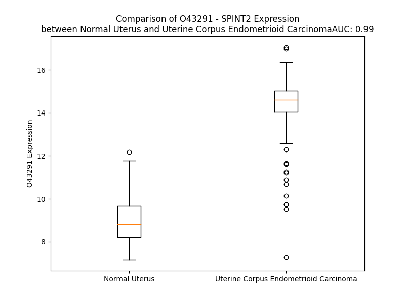

# Detailed Data for O43291

## Introduction to the Detailed Summary

### How to Interpret the Results

- **Summary & Metrics**: This section provides a quick reference to essential protein attributes, including expression changes, family classification, and biomarker applications. Regulation status (upregulated/downregulated) indicates the protein's behavior in a disease context. Some information comes from the original excel file with the proteins selected from literature, while others are derived from the analyses.
- **Expression Comparison**: A visual representation comparing protein expression between normal and disease states. It highlights significant changes in expression levels that might indicate diagnostic or therapeutic relevance. This is data coming from transcriptomics experiments and could not translate similarly to protein levels.
- **Isoform Alignment**: An interactive view of isoform alignments, revealing structural and functional differences between variants of the protein.
- **Interactors & Homologs**: Tables listing known interaction partners and homologous proteins, the more interactors and homologs, the more complex the protein is to design an antibody for.
- **Biological Assemblies**: Information about the structural arrangement of the protein in different assemblies, providing insights into its functional state but also the complexity of the protein to develop antibodies.
- **Combined Per-Residue Information**: A detailed table summarizing residue-level data. This includes predictions for epitope regions, aggregation tendencies, and modifications that might impact the protein's function. Each row corresponds to a residue in the protein, providing insights into specific sites that may be important for research or drug development.
## Summary & Metrics

- **UniProt Accession**: O43291
- **Gene Name**: SPINT2
- **Protein Name**: serine peptidase inhibitor, Kunitz type, 2 /HAI-2
- **Swiss Prot**: SPIT2_HUMAN
- **Family**: other
- **Biomarker Application**: diagnosis
- **Number of Isoforms**: 2
- **Regulation**: -1
- **(transcriptomics) AUC**: 0.99
- **(transcriptomics) Fold Change**: 1.61
- **(transcriptomics) Regulation**: Upregulated
- **Discotope Epitope Count**: 37
- **Max n_uniprots (Homo)**: N/A
- **Max n_uniprots (Hetero)**: 2

## Expression Comparison

## Isoform Alignment

<pre style='font-size:14px; font-family:monospace;'>O43291-1 MAQLCGLRRSRAFLALLGSLLLSGVLAADRERSIHDFCLVSKVVGRCRASMPRWWYNVTDGSCQLFVYGGCDGNSNNYLTKEECLKKCATVTENATGDLATSRNAADSSVPSAPRRQDSEDHSSDMFNYEEYCTANAVTGPCRASFPRWYFDVERNSCNNFIYGGCRGNKNSYRSEEACMLRCFRQQENPPLPLGSKVVVLAGLFVMVLILFLGASMVYLIRVARRNQERALRTVWSSGDDKEQLVKNTYVL
O43291-2 MAQLCGLRRSRAFLALLGSLLLSGVLAADRERSIH---------------------------------------------------------ENATGDLATSRNAADSSVPSAPRRQDSEDHSSDMFNYEEYCTANAVTGPCRASFPRWYFDVERNSCNNFIYGGCRGNKNSYRSEEACMLRCFRQQENPPLPLGSKVVVLAGLFVMVLILFLGASMVYLIRVARRNQERALRTVWSSGDDKEQLVKNTYVL
</pre>

## Interactors

| preferredName_A   | preferredName_B   |   score |
|:------------------|:------------------|--------:|
| SPINT2            | HGFAC             |   0.954 |

## Homologs

| uniprot_id   | gene_id   |
|:-------------|:----------|
| H3BTQ8       | SPINT1    |
| Q96NZ8       | WFIKKN1   |
| Q8TEU8       | WFIKKN2   |
| Q8IUA0       | WFDC8     |
| S4R471       | AMBP      |
| Q86VZ4       | LRP11     |
| Q6UDR6       | SPINT4    |
| C9JT76       | TFPI      |
| A0A3B3IS67   | TFPI2     |
| A0A384NYB9   | SPINLW1   |
| A0A0K0K1K0   | HEL-S-295 |
| Q5VV43       | KIAA0319  |
| A0A8V8TKZ6   | KIAA0319L |

## Biological Assemblies

|   Unnamed: 0 |   assembly |   n_uniprots | composition   | crystal_id   |
|-------------:|-----------:|-------------:|:--------------|:-------------|
|            0 |          1 |            2 | Hetero        | 4u32         |

## Combined Per-Residue Information

|   res | aa   |   epitope_score | epitope   |   relative_surface_accessibility |   modeling_confidence |   Aggregation | modification   | glycosylation                   |
|------:|:-----|----------------:|:----------|---------------------------------:|----------------------:|--------------:|:---------------|:--------------------------------|
|     1 | M    |         0.13011 | False     |                          1.34298 |                 38.35 |         0     | N/A            | N/A                             |
|     2 | A    |         0.20819 | False     |                          0.90423 |                 50.79 |         0     | N/A            | N/A                             |
|     3 | Q    |         0.19593 | False     |                          0.88701 |                 50.05 |         0     | N/A            | N/A                             |
|     4 | L    |         0.20201 | False     |                          0.95769 |                 51    |         0     | N/A            | N/A                             |
|     5 | C    |         0.15166 | False     |                          0.72037 |                 57.1  |         0     | N/A            | N/A                             |
|     6 | G    |         0.13483 | False     |                          0.58427 |                 52.35 |         0     | N/A            | N/A                             |
|     7 | L    |         0.20097 | False     |                          0.67726 |                 52.85 |         0     | N/A            | N/A                             |
|     8 | R    |         0.17968 | False     |                          0.82503 |                 55.02 |         0     | N/A            | N/A                             |
|     9 | R    |         0.14775 | False     |                          0.71553 |                 57.73 |         0     | N/A            | N/A                             |
|    10 | S    |         0.10538 | False     |                          0.40513 |                 62.62 |         0     | N/A            | N/A                             |
|    11 | R    |         0.22538 | False     |                          0.68615 |                 70.8  |         0     | N/A            | N/A                             |
|    12 | A    |         0.11166 | False     |                          0.51413 |                 74.12 |        38.646 | N/A            | N/A                             |
|    13 | F    |         0.13088 | False     |                          0.71269 |                 78.24 |        83.814 | N/A            | N/A                             |
|    14 | L    |         0.12526 | False     |                          0.71678 |                 79.67 |        88.275 | N/A            | N/A                             |
|    15 | A    |         0.1116  | False     |                          0.63069 |                 78.96 |        89.072 | N/A            | N/A                             |
|    16 | L    |         0.09026 | False     |                          0.7642  |                 80.4  |        90.015 | N/A            | N/A                             |
|    17 | L    |         0.12242 | False     |                          0.58897 |                 77.85 |        89.716 | N/A            | N/A                             |
|    18 | G    |         0.10847 | False     |                          0.39673 |                 77.93 |        84.361 | N/A            | N/A                             |
|    19 | S    |         0.1281  | False     |                          0.4743  |                 77.48 |        84.071 | N/A            | N/A                             |
|    20 | L    |         0.10513 | False     |                          0.78855 |                 75.05 |        85.973 | N/A            | N/A                             |
|    21 | L    |         0.1476  | False     |                          0.74914 |                 71.74 |        85.975 | N/A            | N/A                             |
|    22 | L    |         0.09594 | False     |                          0.8006  |                 66.33 |        83.989 | N/A            | N/A                             |
|    23 | S    |         0.07269 | False     |                          0.55229 |                 67.07 |        72.788 | N/A            | N/A                             |
|    24 | G    |         0.12629 | False     |                          0.47184 |                 60.21 |        71.449 | N/A            | N/A                             |
|    25 | V    |         0.1107  | False     |                          0.62865 |                 62.66 |        71.329 | N/A            | N/A                             |
|    26 | L    |         0.13404 | False     |                          0.78533 |                 58.57 |        69.727 | N/A            | N/A                             |
|    27 | A    |         0.06258 | False     |                          0.65658 |                 56.83 |        60.926 | N/A            | N/A                             |
|    28 | A    |         0.07682 | False     |                          0.62115 |                 57.9  |        17.204 | N/A            | N/A                             |
|    29 | D    |         0.11578 | False     |                          0.50271 |                 58.28 |         0     | N/A            | N/A                             |
|    30 | R    |         0.17769 | False     |                          0.7325  |                 57.11 |         0     | N/A            | N/A                             |
|    31 | E    |         0.12357 | False     |                          0.50696 |                 58.94 |         0     | N/A            | N/A                             |
|    32 | R    |         0.13889 | False     |                          0.27619 |                 63.43 |         0     | N/A            | N/A                             |
|    33 | S    |         0.10311 | False     |                          0.35688 |                 70.04 |         0     | N/A            | N/A                             |
|    34 | I    |         0.11004 | False     |                          0.29738 |                 68.93 |         0     | N/A            | N/A                             |
|    35 | H    |         0.10373 | False     |                          0.18708 |                 77.53 |         0     | N/A            | N/A                             |
|    36 | D    |         0.10564 | False     |                          0.52687 |                 86.62 |         0     | N/A            | N/A                             |
|    37 | F    |         0.13223 | False     |                          0.43172 |                 90.45 |         2.873 | N/A            | N/A                             |
|    38 | C    |         0.01665 | False     |                          0.00518 |                 93.53 |         2.873 | N/A            | N/A                             |
|    39 | L    |         0.1481  | False     |                          0.41645 |                 90.89 |         2.873 | N/A            | N/A                             |
|    40 | V    |         0.12573 | False     |                          0.48558 |                 91.37 |         2.873 | N/A            | N/A                             |
|    41 | S    |         0.07275 | False     |                          0.5508  |                 93.22 |         2.873 | N/A            | N/A                             |
|    42 | K    |         0.16304 | False     |                          0.44747 |                 94.56 |         0     | N/A            | N/A                             |
|    43 | V    |         0.24402 | False     |                          0.37392 |                 95.78 |         0     | N/A            | N/A                             |
|    44 | V    |         0.21564 | False     |                          0.55756 |                 95.59 |         0     | N/A            | N/A                             |
|    45 | G    |         0.25887 | True      |                          0.32164 |                 95.19 |         0     | N/A            | N/A                             |
|    46 | R    |         0.53603 | True      |                          0.82074 |                 91.64 |         0     | N/A            | N/A                             |
|    47 | C    |         0.25757 | True      |                          0.41248 |                 96.9  |         0     | N/A            | N/A                             |
|    48 | R    |         0.54175 | True      |                          0.96783 |                 94.77 |         0     | N/A            | N/A                             |
|    49 | A    |         0.31612 | True      |                          0.3988  |                 95.29 |         0     | N/A            | N/A                             |
|    50 | S    |         0.29892 | True      |                          0.7031  |                 96.94 |         0     | N/A            | N/A                             |
|    51 | M    |         0.36699 | True      |                          0.42729 |                 97.48 |         0     | N/A            | N/A                             |
|    52 | P    |         0.18771 | False     |                          0.63506 |                 97.65 |         0     | N/A            | N/A                             |
|    53 | R    |         0.26444 | True      |                          0.21679 |                 98.13 |         0     | N/A            | N/A                             |
|    54 | W    |         0.14134 | False     |                          0.24893 |                 98.28 |        13.378 | N/A            | N/A                             |
|    55 | W    |         0.06867 | False     |                          0.09692 |                 97.46 |        14.585 | N/A            | N/A                             |
|    56 | Y    |         0.04797 | False     |                          0.00963 |                 96.17 |        14.585 | N/A            | N/A                             |
|    57 | N    |         0.09651 | False     |                          0.14639 |                 93.36 |        14.585 | N/A            | N-linked (GlcNAc...) asparagine |
|    58 | V    |         0.08914 | False     |                          0.19335 |                 88.37 |        14.585 | N/A            | N/A                             |
|    59 | T    |         0.09858 | False     |                          0.73147 |                 83.02 |         6.197 | N/A            | N/A                             |
|    60 | D    |         0.17079 | False     |                          0.53233 |                 85.93 |         0     | N/A            | N/A                             |
|    61 | G    |         0.07721 | False     |                          0.45597 |                 88.84 |         0     | N/A            | N/A                             |
|    62 | S    |         0.1394  | False     |                          0.29195 |                 92.43 |         0     | N/A            | N/A                             |
|    63 | C    |         0.13879 | False     |                          0.06696 |                 96.14 |         1.364 | N/A            | N/A                             |
|    64 | Q    |         0.13628 | False     |                          0.31545 |                 95.64 |         6.798 | N/A            | N/A                             |
|    65 | L    |         0.208   | False     |                          0.64312 |                 96.96 |        17.858 | N/A            | N/A                             |
|    66 | F    |         0.16354 | False     |                          0.07137 |                 97.31 |        17.858 | N/A            | N/A                             |
|    67 | V    |         0.16867 | False     |                          0.54236 |                 96.5  |        17.858 | N/A            | N/A                             |
|    68 | Y    |         0.36008 | True      |                          0.10259 |                 98.11 |        17.551 | N/A            | N/A                             |
|    69 | G    |         0.03595 | False     |                          0.00966 |                 95.95 |        11.479 | N/A            | N/A                             |
|    70 | G    |         0.26724 | True      |                          0.36929 |                 95.91 |         0.347 | N/A            | N/A                             |
|    71 | C    |         0.24271 | False     |                          0.27137 |                 97.29 |         0     | N/A            | N/A                             |
|    72 | D    |         0.29757 | True      |                          0.46267 |                 94.89 |         0     | N/A            | N/A                             |
|    73 | G    |         0.39155 | True      |                          0.41476 |                 93.25 |         0     | N/A            | N/A                             |
|    74 | N    |         0.20622 | False     |                          0.25862 |                 95.72 |         0     | N/A            | N/A                             |
|    75 | S    |         0.15598 | False     |                          0.412   |                 94.36 |         0     | N/A            | N/A                             |
|    76 | N    |         0.02738 | False     |                          0.00148 |                 96.36 |         0     | N/A            | N/A                             |
|    77 | N    |         0.19669 | False     |                          0.14854 |                 97.21 |         0     | N/A            | N/A                             |
|    78 | Y    |         0.06074 | False     |                          0.04239 |                 97.01 |         0     | N/A            | N/A                             |
|    79 | L    |         0.36757 | True      |                          0.75649 |                 96.42 |         0     | N/A            | N/A                             |
|    80 | T    |         0.21359 | False     |                          0.42217 |                 97.21 |         0     | N/A            | N/A                             |
|    81 | K    |         0.13119 | False     |                          0.43211 |                 96.58 |         0     | N/A            | N/A                             |
|    82 | E    |         0.20898 | False     |                          0.61251 |                 94.79 |         0     | N/A            | N/A                             |
|    83 | E    |         0.21215 | False     |                          0.3077  |                 95.09 |         0     | N/A            | N/A                             |
|    84 | C    |         0.00343 | False     |                          0       |                 96.36 |         0     | N/A            | N/A                             |
|    85 | L    |         0.15288 | False     |                          0.40366 |                 94.23 |         0     | N/A            | N/A                             |
|    86 | K    |         0.22993 | False     |                          0.91269 |                 93.44 |         0     | N/A            | N/A                             |
|    87 | K    |         0.22761 | False     |                          0.41936 |                 92.3  |         0     | N/A            | N/A                             |
|    88 | C    |         0.00828 | False     |                          0       |                 94.36 |         0     | N/A            | N/A                             |
|    89 | A    |         0.21388 | False     |                          0.55432 |                 88.82 |         0     | N/A            | N/A                             |
|    90 | T    |         0.16126 | False     |                          0.71931 |                 85.97 |         0     | N/A            | N/A                             |
|    91 | V    |         0.01017 | False     |                          0.00095 |                 81.42 |         0     | N/A            | N/A                             |
|    92 | T    |         0.15273 | False     |                          0.47725 |                 75.66 |         0     | N/A            | N/A                             |
|    93 | E    |         0.21561 | False     |                          0.54398 |                 64.12 |         0     | N/A            | N/A                             |
|    94 | N    |         0.26258 | True      |                          0.91058 |                 58.21 |         0     | N/A            | N-linked (GlcNAc...) asparagine |
|    95 | A    |         0.16812 | False     |                          0.54981 |                 54.25 |         0     | N/A            | N/A                             |
|    96 | T    |         0.20116 | False     |                          0.27241 |                 54.36 |         0     | N/A            | N/A                             |
|    97 | G    |         0.28963 | True      |                          0.84709 |                 49.58 |         0     | N/A            | N/A                             |
|    98 | D    |         0.25904 | True      |                          0.90667 |                 49.22 |         0     | N/A            | N/A                             |
|    99 | L    |         0.23121 | False     |                          0.50617 |                 51.7  |         0     | N/A            | N/A                             |
|   100 | A    |         0.22096 | False     |                          0.90104 |                 45.41 |         0     | N/A            | N/A                             |
|   101 | T    |         0.22129 | False     |                          0.9296  |                 43.71 |         0     | N/A            | N/A                             |
|   102 | S    |         0.12467 | False     |                          0.42489 |                 42.54 |         0     | N/A            | N/A                             |
|   103 | R    |         0.15992 | False     |                          0.89718 |                 41.91 |         0     | N/A            | N/A                             |
|   104 | N    |         0.18256 | False     |                          0.96957 |                 41.83 |         0     | N/A            | N/A                             |
|   105 | A    |         0.28788 | True      |                          0.97004 |                 37.27 |         0     | N/A            | N/A                             |
|   106 | A    |         0.15516 | False     |                          1.00163 |                 36.66 |         0     | N/A            | N/A                             |
|   107 | D    |         0.16296 | False     |                          0.83164 |                 39.12 |         0     | N/A            | N/A                             |
|   108 | S    |         0.2581  | True      |                          0.73532 |                 44.58 |         0     | N/A            | N/A                             |
|   109 | S    |         0.14601 | False     |                          0.79809 |                 41.25 |         0     | N/A            | N/A                             |
|   110 | V    |         0.20363 | False     |                          1.00092 |                 43.59 |         0     | N/A            | N/A                             |
|   111 | P    |         0.12882 | False     |                          0.90666 |                 48.44 |         0     | N/A            | N/A                             |
|   112 | S    |         0.23721 | False     |                          0.85357 |                 42.5  |         0     | N/A            | N/A                             |
|   113 | A    |         0.21503 | False     |                          0.96639 |                 39.75 |         0     | N/A            | N/A                             |
|   114 | P    |         0.16542 | False     |                          0.94651 |                 47.18 |         0     | N/A            | N/A                             |
|   115 | R    |         0.34747 | True      |                          0.94987 |                 43.25 |         0     | N/A            | N/A                             |
|   116 | R    |         0.2566  | True      |                          0.92121 |                 47.37 |         0     | N/A            | N/A                             |
|   117 | Q    |         0.18159 | False     |                          0.87132 |                 38.43 |         0     | N/A            | N/A                             |
|   118 | D    |         0.2083  | False     |                          0.92138 |                 49.66 |         0     | N/A            | N/A                             |
|   119 | S    |         0.24167 | False     |                          0.81203 |                 53.5  |         0     | N/A            | N/A                             |
|   120 | E    |         0.3258  | True      |                          0.87648 |                 50.76 |         0     | N/A            | N/A                             |
|   121 | D    |         0.27798 | True      |                          0.75869 |                 46.26 |         0     | N/A            | N/A                             |
|   122 | H    |         0.29824 | True      |                          1.06205 |                 50.75 |         0     | N/A            | N/A                             |
|   123 | S    |         0.24693 | False     |                          0.62474 |                 56.2  |         0     | N/A            | N/A                             |
|   124 | S    |         0.35227 | True      |                          0.81824 |                 58.29 |         0     | N/A            | N/A                             |
|   125 | D    |         0.24192 | False     |                          0.92567 |                 71.46 |         0     | N/A            | N/A                             |
|   126 | M    |         0.24729 | False     |                          0.89955 |                 79.85 |         0     | N/A            | N/A                             |
|   127 | F    |         0.20986 | False     |                          0.24505 |                 84.45 |         0     | N/A            | N/A                             |
|   128 | N    |         0.13673 | False     |                          0.43761 |                 89.66 |         0     | N/A            | N/A                             |
|   129 | Y    |         0.09757 | False     |                          0.18066 |                 90.45 |         0     | N/A            | N/A                             |
|   130 | E    |         0.18225 | False     |                          0.58741 |                 91.11 |         0     | N/A            | N/A                             |
|   131 | E    |         0.33944 | True      |                          0.33093 |                 93.87 |         0     | N/A            | N/A                             |
|   132 | Y    |         0.19269 | False     |                          0.27837 |                 95.55 |         0     | N/A            | N/A                             |
|   133 | C    |         0.01    | False     |                          0       |                 96.01 |         0     | N/A            | N/A                             |
|   134 | T    |         0.14475 | False     |                          0.39471 |                 94.41 |         0     | N/A            | N/A                             |
|   135 | A    |         0.22588 | False     |                          0.28564 |                 93.68 |         0     | N/A            | N/A                             |
|   136 | N    |         0.16782 | False     |                          0.78705 |                 95.04 |         0     | N/A            | N/A                             |
|   137 | A    |         0.12353 | False     |                          0.3662  |                 96.35 |         0     | N/A            | N/A                             |
|   138 | V    |         0.2327  | False     |                          0.38505 |                 97.53 |         0     | N/A            | N/A                             |
|   139 | T    |         0.19905 | False     |                          0.47642 |                 97.4  |         0     | N/A            | N/A                             |
|   140 | G    |         0.24923 | False     |                          0.32104 |                 96.78 |         0     | N/A            | N/A                             |
|   141 | P    |         0.39114 | True      |                          0.66439 |                 95.75 |         0     | N/A            | N/A                             |
|   142 | C    |         0.24263 | False     |                          0.39913 |                 97.92 |         0     | N/A            | N/A                             |
|   143 | R    |         0.51264 | True      |                          0.98109 |                 96.22 |         0     | N/A            | N/A                             |
|   144 | A    |         0.33455 | True      |                          0.41935 |                 96.65 |         0     | N/A            | N/A                             |
|   145 | S    |         0.31376 | True      |                          0.62916 |                 97.45 |         0     | N/A            | N/A                             |
|   146 | F    |         0.29912 | True      |                          0.49723 |                 97.96 |         0     | N/A            | N/A                             |
|   147 | P    |         0.21409 | False     |                          0.73192 |                 97.82 |         0     | N/A            | N/A                             |
|   148 | R    |         0.17416 | False     |                          0.18405 |                 98.16 |         0.389 | N/A            | N/A                             |
|   149 | W    |         0.14966 | False     |                          0.28619 |                 98.47 |         0.389 | N/A            | N/A                             |
|   150 | Y    |         0.08225 | False     |                          0.20615 |                 97.88 |         0.389 | N/A            | N/A                             |
|   151 | F    |         0.05231 | False     |                          0.01623 |                 96.91 |         0.389 | N/A            | N/A                             |
|   152 | D    |         0.08959 | False     |                          0.08388 |                 94.53 |         0.389 | N/A            | N/A                             |
|   153 | V    |         0.07315 | False     |                          0.37205 |                 91.28 |         0.389 | N/A            | N/A                             |
|   154 | E    |         0.14424 | False     |                          0.8456  |                 89.54 |         0     | N/A            | N/A                             |
|   155 | R    |         0.32443 | True      |                          0.64425 |                 91.71 |         0     | N/A            | N/A                             |
|   156 | N    |         0.11452 | False     |                          0.34267 |                 90.65 |         0     | N/A            | N/A                             |
|   157 | S    |         0.11186 | False     |                          0.26399 |                 93.22 |         0     | N/A            | N/A                             |
|   158 | C    |         0.0992  | False     |                          0.0561  |                 96.6  |         0     | N/A            | N/A                             |
|   159 | N    |         0.14375 | False     |                          0.2634  |                 97.01 |         0     | N/A            | N/A                             |
|   160 | N    |         0.21459 | False     |                          0.68759 |                 97.22 |         0     | N/A            | N/A                             |
|   161 | F    |         0.23255 | False     |                          0.10681 |                 97.76 |         0     | N/A            | N/A                             |
|   162 | I    |         0.18043 | False     |                          0.48449 |                 97.97 |         0     | N/A            | N/A                             |
|   163 | Y    |         0.44158 | True      |                          0.1455  |                 98.26 |         0     | N/A            | N/A                             |
|   164 | G    |         0.01481 | False     |                          0.00441 |                 97.08 |         0     | N/A            | N/A                             |
|   165 | G    |         0.31564 | True      |                          0.38275 |                 95.77 |         0     | N/A            | N/A                             |
|   166 | C    |         0.26256 | True      |                          0.25213 |                 97.29 |         0     | N/A            | N/A                             |
|   167 | R    |         0.38849 | True      |                          0.79878 |                 95.7  |         0     | N/A            | N/A                             |
|   168 | G    |         0.41973 | True      |                          0.39204 |                 95.39 |         0     | N/A            | N/A                             |
|   169 | N    |         0.22823 | False     |                          0.28744 |                 96.5  |         0     | N/A            | N/A                             |
|   170 | K    |         0.22412 | False     |                          0.45474 |                 96.33 |         0     | N/A            | N/A                             |
|   171 | N    |         0.02137 | False     |                          0       |                 97.6  |         0     | N/A            | N/A                             |
|   172 | S    |         0.1715  | False     |                          0.16613 |                 97.5  |         0     | N/A            | N/A                             |
|   173 | Y    |         0.13441 | False     |                          0.11627 |                 97.65 |         0     | N/A            | N/A                             |
|   174 | R    |         0.32829 | True      |                          0.80281 |                 95.93 |         0     | N/A            | N/A                             |
|   175 | S    |         0.13109 | False     |                          0.2274  |                 94.35 |         0     | N/A            | N/A                             |
|   176 | E    |         0.17498 | False     |                          0.41711 |                 94.71 |         0     | N/A            | N/A                             |
|   177 | E    |         0.13355 | False     |                          0.59125 |                 89.54 |         0     | N/A            | N/A                             |
|   178 | A    |         0.08522 | False     |                          0.3834  |                 92.2  |         0     | N/A            | N/A                             |
|   179 | C    |         0.00345 | False     |                          0       |                 96.24 |         0     | N/A            | N/A                             |
|   180 | M    |         0.08478 | False     |                          0.29694 |                 93.19 |         0     | N/A            | N/A                             |
|   181 | L    |         0.16052 | False     |                          0.80125 |                 90.67 |         0     | N/A            | N/A                             |
|   182 | R    |         0.18972 | False     |                          0.45897 |                 91.39 |         0     | N/A            | N/A                             |
|   183 | C    |         0.01061 | False     |                          0       |                 94.32 |         0     | N/A            | N/A                             |
|   184 | F    |         0.14307 | False     |                          0.34041 |                 88.36 |         0     | N/A            | N/A                             |
|   185 | R    |         0.23634 | False     |                          0.67163 |                 73.56 |         0     | N/A            | N/A                             |
|   186 | Q    |         0.18511 | False     |                          0.389   |                 65.78 |         0     | N/A            | N/A                             |
|   187 | Q    |         0.1414  | False     |                          0.34776 |                 57.08 |         0     | N/A            | N/A                             |
|   188 | E    |         0.21029 | False     |                          0.62773 |                 56.93 |         0     | N/A            | N/A                             |
|   189 | N    |         0.14368 | False     |                          0.68669 |                 50.43 |         0     | N/A            | N/A                             |
|   190 | P    |         0.14386 | False     |                          0.59554 |                 51.24 |         0     | N/A            | N/A                             |
|   191 | P    |         0.1646  | False     |                          0.86337 |                 53.51 |         0     | N/A            | N/A                             |
|   192 | L    |         0.10269 | False     |                          0.88109 |                 50.72 |         0     | N/A            | N/A                             |
|   193 | P    |         0.10546 | False     |                          0.66806 |                 54.74 |         0     | N/A            | N/A                             |
|   194 | L    |         0.19575 | False     |                          0.87064 |                 52.44 |         0     | N/A            | N/A                             |
|   195 | G    |         0.11733 | False     |                          0.49038 |                 61.02 |         0     | N/A            | N/A                             |
|   196 | S    |         0.15344 | False     |                          0.58273 |                 71.69 |         0     | N/A            | N/A                             |
|   197 | K    |         0.16678 | False     |                          0.7806  |                 79.76 |         0     | N/A            | N/A                             |
|   198 | V    |         0.07014 | False     |                          0.58689 |                 82.72 |        86.805 | N/A            | N/A                             |
|   199 | V    |         0.08565 | False     |                          0.57186 |                 83.95 |        94.23  | N/A            | N/A                             |
|   200 | V    |         0.10526 | False     |                          0.58805 |                 87.99 |        95.967 | N/A            | N/A                             |
|   201 | L    |         0.15518 | False     |                          0.71584 |                 90.56 |        96.128 | N/A            | N/A                             |
|   202 | A    |         0.0768  | False     |                          0.51399 |                 88.83 |        96.166 | N/A            | N/A                             |
|   203 | G    |         0.09232 | False     |                          0.39968 |                 91.49 |        96.231 | N/A            | N/A                             |
|   204 | L    |         0.08918 | False     |                          0.61979 |                 94.42 |        99.371 | N/A            | N/A                             |
|   205 | F    |         0.10443 | False     |                          0.66744 |                 95.13 |        99.945 | N/A            | N/A                             |
|   206 | V    |         0.11998 | False     |                          0.56172 |                 96.35 |        99.992 | N/A            | N/A                             |
|   207 | M    |         0.13708 | False     |                          0.58628 |                 96.02 |        99.996 | N/A            | N/A                             |
|   208 | V    |         0.07706 | False     |                          0.48841 |                 96.57 |        99.999 | N/A            | N/A                             |
|   209 | L    |         0.10386 | False     |                          0.48472 |                 97.01 |        99.996 | N/A            | N/A                             |
|   210 | I    |         0.13164 | False     |                          0.60175 |                 97.11 |        99.979 | N/A            | N/A                             |
|   211 | L    |         0.11363 | False     |                          0.72868 |                 96.39 |        99.786 | N/A            | N/A                             |
|   212 | F    |         0.08854 | False     |                          0.71191 |                 96.62 |        98.732 | N/A            | N/A                             |
|   213 | L    |         0.12699 | False     |                          0.72834 |                 97.18 |        85.807 | N/A            | N/A                             |
|   214 | G    |         0.126   | False     |                          0.41759 |                 96.46 |        15.215 | N/A            | N/A                             |
|   215 | A    |         0.09723 | False     |                          0.5899  |                 96.35 |         8.86  | N/A            | N/A                             |
|   216 | S    |         0.06854 | False     |                          0.38432 |                 96.93 |         3.485 | N/A            | N/A                             |
|   217 | M    |         0.11495 | False     |                          0.60641 |                 97.15 |         3.418 | N/A            | N/A                             |
|   218 | V    |         0.06094 | False     |                          0.4827  |                 96.67 |         3.4   | N/A            | N/A                             |
|   219 | Y    |         0.15422 | False     |                          0.63798 |                 96.8  |         3.343 | N/A            | N/A                             |
|   220 | L    |         0.10007 | False     |                          0.63315 |                 96.53 |         3.191 | N/A            | N/A                             |
|   221 | I    |         0.0948  | False     |                          0.49886 |                 96.13 |         2.906 | N/A            | N/A                             |
|   222 | R    |         0.09638 | False     |                          0.66128 |                 94.51 |         0     | N/A            | N/A                             |
|   223 | V    |         0.06335 | False     |                          0.48844 |                 94.37 |         0     | N/A            | N/A                             |
|   224 | A    |         0.07833 | False     |                          0.5021  |                 93.1  |         0     | N/A            | N/A                             |
|   225 | R    |         0.10468 | False     |                          0.63907 |                 92.95 |         0     | N/A            | N/A                             |
|   226 | R    |         0.13035 | False     |                          0.60172 |                 90.4  |         0     | N/A            | N/A                             |
|   227 | N    |         0.09797 | False     |                          0.58887 |                 89.08 |         0     | N/A            | N/A                             |
|   228 | Q    |         0.09226 | False     |                          0.63483 |                 89.96 |         0     | N/A            | N/A                             |
|   229 | E    |         0.06783 | False     |                          0.49463 |                 86.2  |         0     | N/A            | N/A                             |
|   230 | R    |         0.11338 | False     |                          0.53274 |                 86.86 |         0     | N/A            | N/A                             |
|   231 | A    |         0.07281 | False     |                          0.50394 |                 82.33 |         0     | N/A            | N/A                             |
|   232 | L    |         0.08578 | False     |                          0.68823 |                 79.97 |         0     | N/A            | N/A                             |
|   233 | R    |         0.1473  | False     |                          0.67633 |                 78.07 |         0     | N/A            | N/A                             |
|   234 | T    |         0.13459 | False     |                          0.65222 |                 76.26 |         0     | N/A            | N/A                             |
|   235 | V    |         0.08613 | False     |                          0.7278  |                 76.51 |         0     | N/A            | N/A                             |
|   236 | W    |         0.07609 | False     |                          0.74869 |                 63.13 |         0     | N/A            | N/A                             |
|   237 | S    |         0.07475 | False     |                          0.47327 |                 66.84 |         0     | N/A            | N/A                             |
|   238 | S    |         0.07991 | False     |                          0.46672 |                 62.87 |         0     | N/A            | N/A                             |
|   239 | G    |         0.13211 | False     |                          0.41652 |                 59.99 |         0     | N/A            | N/A                             |
|   240 | D    |         0.08141 | False     |                          0.50489 |                 59.25 |         0     | N/A            | N/A                             |
|   241 | D    |         0.07174 | False     |                          0.54172 |                 61.31 |         0     | N/A            | N/A                             |
|   242 | K    |         0.10371 | False     |                          0.70758 |                 64.33 |         0     | N/A            | N/A                             |
|   243 | E    |         0.11312 | False     |                          0.49383 |                 58.99 |         0     | N/A            | N/A                             |
|   244 | Q    |         0.12692 | False     |                          0.66654 |                 57.31 |         0     | N/A            | N/A                             |
|   245 | L    |         0.12278 | False     |                          0.78489 |                 57.22 |         0     | N/A            | N/A                             |
|   246 | V    |         0.06962 | False     |                          0.58838 |                 63.04 |         0     | N/A            | N/A                             |
|   247 | K    |         0.07706 | False     |                          0.62332 |                 65.21 |         0     | N/A            | N/A                             |
|   248 | N    |         0.19402 | False     |                          0.78519 |                 59.87 |         0     | N/A            | N/A                             |
|   249 | T    |         0.13599 | False     |                          0.74612 |                 63.76 |         0     | N/A            | N/A                             |
|   250 | Y    |         0.17788 | False     |                          0.76946 |                 62.1  |         0     | N/A            | N/A                             |
|   251 | V    |         0.094   | False     |                          0.88452 |                 56.03 |         0     | N/A            | N/A                             |
|   252 | L    |         0.0933  | False     |                          1.4376  |                 50.83 |         0     | N/A            | N/A                             |

