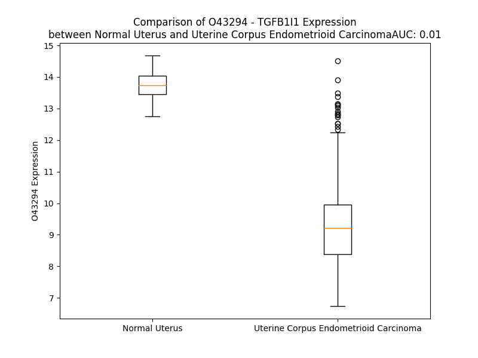

# Detailed Data for O43294

## Introduction to the Detailed Summary

### How to Interpret the Results

- **Summary & Metrics**: This section provides a quick reference to essential protein attributes, including expression changes, family classification, and biomarker applications. Regulation status (upregulated/downregulated) indicates the protein's behavior in a disease context. Some information comes from the original excel file with the proteins selected from literature, while others are derived from the analyses.
- **Expression Comparison**: A visual representation comparing protein expression between normal and disease states. It highlights significant changes in expression levels that might indicate diagnostic or therapeutic relevance. This is data coming from transcriptomics experiments and could not translate similarly to protein levels.
- **Isoform Alignment**: An interactive view of isoform alignments, revealing structural and functional differences between variants of the protein.
- **Interactors & Homologs**: Tables listing known interaction partners and homologous proteins, the more interactors and homologs, the more complex the protein is to design an antibody for.
- **Biological Assemblies**: Information about the structural arrangement of the protein in different assemblies, providing insights into its functional state but also the complexity of the protein to develop antibodies.
- **Combined Per-Residue Information**: A detailed table summarizing residue-level data. This includes predictions for epitope regions, aggregation tendencies, and modifications that might impact the protein's function. Each row corresponds to a residue in the protein, providing insights into specific sites that may be important for research or drug development.
## Summary & Metrics

- **UniProt Accession**: O43294
- **Gene Name**: TGFB1I1
- **Protein Name**: Transforming growth factor beta-1-induced transcript 1 protein
- **Swiss Prot**: TGFI1_HUMAN
- **Family**: nan
- **Biomarker Application**: nan
- **Number of Isoforms**: 2
- **Regulation**: 1
- **(transcriptomics) AUC**: 0.01
- **(transcriptomics) Fold Change**: 1.46
- **(transcriptomics) Regulation**: Downregulated
- **Discotope Epitope Count**: 58
- **Max n_uniprots (Homo)**: N/A
- **Max n_uniprots (Hetero)**: N/A

## Expression Comparison

## Isoform Alignment

<pre style='font-size:14px; font-family:monospace;'>O43294-1 MEDLDALLSDLETTTSHMPRSGAPKERPAEPLTPPPSYGHQPQTGSGESSGASGDKDHLYSTVCKPRSPKPAAPAAPPFSSSSGVLGTGLCELDRLLQELNATQFNITDEIMSQFPSSKVASGEQKEDQSEDKKRPSLPSSPSPGLPKASATSATLELDRLMASLSDFRVQNHLPASGPTQPPVVSSTNEGSPSPPEPTGKGSLDTMLGLLQSDLSRRGVPTQAKGLCGSCNKPIAGQVVTALGRAWHPEHFVCGGCSTALGGSSFFEKDGAPFCPECYFERFSPRCGFCNQPIRHKMVTALGTHWHPEHFCCVSCGEPFGDEGFHEREGRPYCRRDFLQLFAPRCQGCQGPILDNYISALSALWHPDCFVCRECFAPFSGGSFFEHEGRPLCENHFHARRGSLCATCGLPVTGRCVSALGRRFHPDHFTCTFCLRPLTKGSFQERAGKPYCQPCFLKLFG
O43294-2 -----------------MPRSGAPKERPAEPLTPPPSYGHQPQTGSGESSGASGDKDHLYSTVCKPRSPKPAAPAAPPFSSSSGVLGTGLCELDRLLQELNATQFNITDEIMSQFPSSKVASGEQKEDQSEDKKRPSLPSSPSPGLPKASATSATLELDRLMASLSDFRVQNHLPASGPTQPPVVSSTNEGSPSPPEPTGKGSLDTMLGLLQSDLSRRGVPTQAKGLCGSCNKPIAGQVVTALGRAWHPEHFVCGGCSTALGGSSFFEKDGAPFCPECYFERFSPRCGFCNQPIRHKMVTALGTHWHPEHFCCVSCGEPFGDEGFHEREGRPYCRRDFLQLFAPRCQGCQGPILDNYISALSALWHPDCFVCRECFAPFSGGSFFEHEGRPLCENHFHARRGSLCATCGLPVTGRCVSALGRRFHPDHFTCTFCLRPLTKGSFQERAGKPYCQPCFLKLFG
</pre>

## Interactors

| preferredName_A   | preferredName_B   |   score |
|:------------------|:------------------|--------:|
| TGFB1I1           | PTK2B             |   0.987 |
| TGFB1I1           | VCL               |   0.959 |
| TGFB1I1           | AR                |   0.942 |
| TGFB1I1           | PTK2              |   0.917 |
| TGFB1I1           | TRAF4             |   0.911 |
| TGFB1I1           | NCF1              |   0.905 |

## Homologs

| uniprot_id   | gene_id   |
|:-------------|:----------|
| A0A1B0GU60   | PXN       |
| B7Z5P7       | LPXN      |

## Combined Per-Residue Information

|   res | aa   |   epitope_score | epitope   |   relative_surface_accessibility |   modeling_confidence |   Aggregation | modification                     |
|------:|:-----|----------------:|:----------|---------------------------------:|----------------------:|--------------:|:---------------------------------|
|     1 | M    |         0.07712 | False     |                          1.22258 |                 49.52 |         0     | N-acetylmethionine               |
|     2 | E    |         0.12583 | False     |                          0.80971 |                 55.8  |         0     | N/A                              |
|     3 | D    |         0.09203 | False     |                          0.82788 |                 60.73 |         0     | N/A                              |
|     4 | L    |         0.11653 | False     |                          0.93838 |                 57.27 |         0     | N/A                              |
|     5 | D    |         0.13364 | False     |                          0.72165 |                 55.36 |         0     | N/A                              |
|     6 | A    |         0.14636 | True      |                          0.74084 |                 55.76 |         0     | N/A                              |
|     7 | L    |         0.15127 | True      |                          0.91798 |                 51.4  |         0     | N/A                              |
|     8 | L    |         0.12792 | False     |                          0.81724 |                 53.17 |         0     | N/A                              |
|     9 | S    |         0.12278 | False     |                          0.65313 |                 53.13 |         0     | N/A                              |
|    10 | D    |         0.16819 | True      |                          0.82111 |                 51.53 |         0     | N/A                              |
|    11 | L    |         0.15336 | True      |                          0.99754 |                 49.71 |         0     | N/A                              |
|    12 | E    |         0.08112 | False     |                          0.78769 |                 46.14 |         0     | N/A                              |
|    13 | T    |         0.07578 | False     |                          0.77417 |                 40.97 |         0     | N/A                              |
|    14 | T    |         0.05993 | False     |                          1.02666 |                 38.4  |         0     | N/A                              |
|    15 | T    |         0.07397 | False     |                          0.77568 |                 36.55 |         0     | N/A                              |
|    16 | S    |         0.08846 | False     |                          0.80258 |                 40.27 |         0     | N/A                              |
|    17 | H    |         0.09758 | False     |                          0.93867 |                 39.89 |         0     | N/A                              |
|    18 | M    |         0.12549 | False     |                          0.98494 |                 36.99 |         0     | N/A                              |
|    19 | P    |         0.06852 | False     |                          0.82565 |                 36.2  |         0     | N/A                              |
|    20 | R    |         0.11204 | False     |                          0.92786 |                 35.35 |         0     | N/A                              |
|    21 | S    |         0.07354 | False     |                          0.91266 |                 36.99 |         0     | N/A                              |
|    22 | G    |         0.11826 | False     |                          0.93204 |                 36.06 |         0     | N/A                              |
|    23 | A    |         0.06825 | False     |                          0.90463 |                 40    |         0     | N/A                              |
|    24 | P    |         0.0697  | False     |                          0.89409 |                 46.41 |         0     | N/A                              |
|    25 | K    |         0.09836 | False     |                          0.98329 |                 39.4  |         0     | N/A                              |
|    26 | E    |         0.10842 | False     |                          0.84774 |                 32.6  |         0     | N/A                              |
|    27 | R    |         0.10623 | False     |                          0.91847 |                 39.79 |         0     | N/A                              |
|    28 | P    |         0.09614 | False     |                          0.89835 |                 37.77 |         0     | N/A                              |
|    29 | A    |         0.08727 | False     |                          0.93594 |                 35.87 |         0     | N/A                              |
|    30 | E    |         0.08078 | False     |                          0.80702 |                 38.66 |         0     | N/A                              |
|    31 | P    |         0.09914 | False     |                          0.90535 |                 33.87 |         0     | N/A                              |
|    32 | L    |         0.11639 | False     |                          1.06481 |                 35.85 |         0     | N/A                              |
|    33 | T    |         0.13928 | False     |                          0.82264 |                 35.55 |         0     | Phosphothreonine                 |
|    34 | P    |         0.07942 | False     |                          0.85694 |                 37.2  |         0     | N/A                              |
|    35 | P    |         0.08726 | False     |                          0.87177 |                 39.77 |         0     | N/A                              |
|    36 | P    |         0.09683 | False     |                          0.85301 |                 31.42 |         0     | N/A                              |
|    37 | S    |         0.08419 | False     |                          0.86962 |                 33.1  |         0     | N/A                              |
|    38 | Y    |         0.11398 | False     |                          0.97207 |                 33.53 |         0     | Phosphotyrosine                  |
|    39 | G    |         0.08858 | False     |                          0.84332 |                 30.92 |         0     | N/A                              |
|    40 | H    |         0.12421 | False     |                          0.99432 |                 35.37 |         0     | N/A                              |
|    41 | Q    |         0.12736 | False     |                          0.80741 |                 24.63 |         0     | N/A                              |
|    42 | P    |         0.11999 | False     |                          0.91343 |                 31.09 |         0     | N/A                              |
|    43 | Q    |         0.12111 | False     |                          0.80929 |                 31.82 |         0     | N/A                              |
|    44 | T    |         0.07003 | False     |                          0.97474 |                 27.71 |         0     | N/A                              |
|    45 | G    |         0.12514 | False     |                          0.97352 |                 31.31 |         0     | N/A                              |
|    46 | S    |         0.13764 | False     |                          0.96064 |                 28.91 |         0     | N/A                              |
|    47 | G    |         0.10386 | False     |                          0.9485  |                 31.35 |         0     | N/A                              |
|    48 | E    |         0.09716 | False     |                          0.87945 |                 27.52 |         0     | N/A                              |
|    49 | S    |         0.09098 | False     |                          0.7916  |                 30.98 |         0     | N/A                              |
|    50 | S    |         0.07808 | False     |                          0.8338  |                 30.73 |         0     | N/A                              |
|    51 | G    |         0.11301 | False     |                          0.9232  |                 26.47 |         0     | N/A                              |
|    52 | A    |         0.0964  | False     |                          0.9788  |                 28.47 |         0     | N/A                              |
|    53 | S    |         0.11993 | False     |                          0.9404  |                 29.01 |         0     | N/A                              |
|    54 | G    |         0.14963 | True      |                          0.89338 |                 29.64 |         0     | N/A                              |
|    55 | D    |         0.10497 | False     |                          0.82007 |                 30.62 |         0     | N/A                              |
|    56 | K    |         0.11509 | False     |                          0.83599 |                 33.8  |         0     | N/A                              |
|    57 | D    |         0.11732 | False     |                          0.80144 |                 36.19 |         0     | N/A                              |
|    58 | H    |         0.08803 | False     |                          0.57006 |                 48.11 |         0     | N/A                              |
|    59 | L    |         0.09779 | False     |                          0.80926 |                 48.88 |         3.148 | N/A                              |
|    60 | Y    |         0.08152 | False     |                          0.66426 |                 44.09 |         3.148 | Phosphotyrosine; by FAK2 and FYN |
|    61 | S    |         0.04437 | False     |                          0.31236 |                 56.61 |         3.148 | N/A                              |
|    62 | T    |         0.07761 | False     |                          0.65633 |                 55.96 |         3.148 | N/A                              |
|    63 | V    |         0.04783 | False     |                          0.27416 |                 53.14 |         3.148 | N/A                              |
|    64 | C    |         0.10932 | False     |                          0.64761 |                 56.13 |         0.455 | N/A                              |
|    65 | K    |         0.17304 | True      |                          0.78986 |                 55.51 |         0     | N/A                              |
|    66 | P    |         0.14392 | True      |                          0.60475 |                 52.89 |         0     | N/A                              |
|    67 | R    |         0.20576 | True      |                          0.69299 |                 51.14 |         0     | N/A                              |
|    68 | S    |         0.11341 | False     |                          0.61048 |                 51.4  |         0     | Phosphoserine                    |
|    69 | P    |         0.10468 | False     |                          0.4364  |                 48.07 |         0     | N/A                              |
|    70 | K    |         0.08601 | False     |                          0.92696 |                 43.27 |         0     | N/A                              |
|    71 | P    |         0.13185 | False     |                          0.88397 |                 40.26 |         0     | N/A                              |
|    72 | A    |         0.13754 | False     |                          0.97221 |                 41.56 |         0     | N/A                              |
|    73 | A    |         0.10699 | False     |                          0.83326 |                 41.62 |         0     | N/A                              |
|    74 | P    |         0.12862 | False     |                          0.95405 |                 41.89 |         0     | N/A                              |
|    75 | A    |         0.19109 | True      |                          0.98866 |                 37.65 |         0     | N/A                              |
|    76 | A    |         0.11254 | False     |                          0.81433 |                 41.24 |         0     | N/A                              |
|    77 | P    |         0.11162 | False     |                          0.7446  |                 42.95 |         0     | N/A                              |
|    78 | P    |         0.16031 | True      |                          1.01923 |                 36.83 |         0     | N/A                              |
|    79 | F    |         0.15266 | True      |                          0.9284  |                 38.9  |         0     | N/A                              |
|    80 | S    |         0.12848 | False     |                          0.80309 |                 39.56 |         0     | N/A                              |
|    81 | S    |         0.09341 | False     |                          0.82168 |                 34.36 |         0     | N/A                              |
|    82 | S    |         0.10075 | False     |                          0.93127 |                 40.71 |         0     | N/A                              |
|    83 | S    |         0.11848 | False     |                          0.93243 |                 37.69 |         0     | N/A                              |
|    84 | G    |         0.12527 | False     |                          0.76854 |                 37.14 |         0     | N/A                              |
|    85 | V    |         0.09502 | False     |                          0.98473 |                 43.08 |         0     | N/A                              |
|    86 | L    |         0.09258 | False     |                          0.96308 |                 47.18 |         0     | N/A                              |
|    87 | G    |         0.08289 | False     |                          0.8338  |                 39.09 |         0     | N/A                              |
|    88 | T    |         0.06634 | False     |                          0.79416 |                 57.14 |         0     | N/A                              |
|    89 | G    |         0.06792 | False     |                          0.5602  |                 54.77 |         0     | N/A                              |
|    90 | L    |         0.07625 | False     |                          0.83032 |                 56.53 |         0     | N/A                              |
|    91 | C    |         0.05673 | False     |                          0.67873 |                 62.14 |         0     | N/A                              |
|    92 | E    |         0.03646 | False     |                          0.60449 |                 73.04 |         0     | N/A                              |
|    93 | L    |         0.03906 | False     |                          0.62558 |                 75.88 |         0     | N/A                              |
|    94 | D    |         0.05583 | False     |                          0.57855 |                 72.75 |         0     | N/A                              |
|    95 | R    |         0.04867 | False     |                          0.59262 |                 81.09 |         0     | N/A                              |
|    96 | L    |         0.04446 | False     |                          0.56199 |                 79.27 |         0     | N/A                              |
|    97 | L    |         0.05953 | False     |                          0.60077 |                 77.71 |         0     | N/A                              |
|    98 | Q    |         0.08379 | False     |                          0.65653 |                 76.33 |         0     | N/A                              |
|    99 | E    |         0.03658 | False     |                          0.39862 |                 78.97 |         0     | N/A                              |
|   100 | L    |         0.06721 | False     |                          0.78545 |                 73.24 |         0     | N/A                              |
|   101 | N    |         0.0462  | False     |                          0.52974 |                 66.57 |         0     | N/A                              |
|   102 | A    |         0.03095 | False     |                          0.57074 |                 70.65 |         0     | N/A                              |
|   103 | T    |         0.02022 | False     |                          0.53628 |                 68.19 |         0     | N/A                              |
|   104 | Q    |         0.03739 | False     |                          0.61214 |                 52.34 |         0     | N/A                              |
|   105 | F    |         0.03946 | False     |                          0.65284 |                 51.05 |         0     | N/A                              |
|   106 | N    |         0.03805 | False     |                          0.69033 |                 55.53 |         0     | N/A                              |
|   107 | I    |         0.03838 | False     |                          0.62077 |                 56.8  |         0     | N/A                              |
|   108 | T    |         0.02882 | False     |                          0.51825 |                 54.57 |         0     | N/A                              |
|   109 | D    |         0.02589 | False     |                          0.67224 |                 47.73 |         0     | N/A                              |
|   110 | E    |         0.02507 | False     |                          0.57537 |                 57.27 |         0     | N/A                              |
|   111 | I    |         0.03479 | False     |                          0.6021  |                 59.29 |         0     | N/A                              |
|   112 | M    |         0.06116 | False     |                          0.86295 |                 56.86 |         0     | N/A                              |
|   113 | S    |         0.06878 | False     |                          0.67352 |                 59.64 |         0     | N/A                              |
|   114 | Q    |         0.08745 | False     |                          0.61367 |                 55.07 |         0     | N/A                              |
|   115 | F    |         0.0666  | False     |                          0.85669 |                 48.08 |         0     | N/A                              |
|   116 | P    |         0.08488 | False     |                          0.95944 |                 36.82 |         0     | N/A                              |
|   117 | S    |         0.1068  | False     |                          0.91874 |                 41.17 |         0     | N/A                              |
|   118 | S    |         0.11817 | False     |                          0.80187 |                 40.98 |         0     | N/A                              |
|   119 | K    |         0.11683 | False     |                          0.98936 |                 35.37 |         0     | N/A                              |
|   120 | V    |         0.08077 | False     |                          1.08365 |                 39.38 |         0     | N/A                              |
|   121 | A    |         0.11027 | False     |                          0.91535 |                 34.85 |         0     | N/A                              |
|   122 | S    |         0.09811 | False     |                          0.935   |                 38.78 |         0     | N/A                              |
|   123 | G    |         0.11267 | False     |                          0.94216 |                 37.88 |         0     | N/A                              |
|   124 | E    |         0.07246 | False     |                          0.89977 |                 33.52 |         0     | N/A                              |
|   125 | Q    |         0.09703 | False     |                          0.89355 |                 40.92 |         0     | N/A                              |
|   126 | K    |         0.08041 | False     |                          0.81378 |                 39    |         0     | N/A                              |
|   127 | E    |         0.07164 | False     |                          0.71967 |                 39.72 |         0     | N/A                              |
|   128 | D    |         0.10845 | False     |                          0.63934 |                 39.57 |         0     | N/A                              |
|   129 | Q    |         0.09648 | False     |                          0.80968 |                 43.42 |         0     | N/A                              |
|   130 | S    |         0.08481 | False     |                          0.68471 |                 43.16 |         0     | N/A                              |
|   131 | E    |         0.099   | False     |                          0.83526 |                 42.41 |         0     | N/A                              |
|   132 | D    |         0.11042 | False     |                          0.65627 |                 45.07 |         0     | N/A                              |
|   133 | K    |         0.09466 | False     |                          0.88664 |                 47.1  |         0     | N/A                              |
|   134 | K    |         0.11557 | False     |                          0.98794 |                 43.59 |         0     | N/A                              |
|   135 | R    |         0.11549 | False     |                          0.87082 |                 41.66 |         0     | N/A                              |
|   136 | P    |         0.10247 | False     |                          0.67416 |                 45.87 |         0     | N/A                              |
|   137 | S    |         0.10473 | False     |                          0.88225 |                 40.11 |         0     | Phosphoserine                    |
|   138 | L    |         0.11148 | False     |                          1.0215  |                 41.59 |         0     | N/A                              |
|   139 | P    |         0.11037 | False     |                          0.81242 |                 41.86 |         0     | N/A                              |
|   140 | S    |         0.10985 | False     |                          0.77665 |                 35.26 |         0     | Phosphoserine                    |
|   141 | S    |         0.11182 | False     |                          0.86329 |                 43.07 |         0     | Phosphoserine                    |
|   142 | P    |         0.10204 | False     |                          0.9498  |                 38.74 |         0     | N/A                              |
|   143 | S    |         0.09209 | False     |                          0.80873 |                 31.46 |         0     | Phosphoserine                    |
|   144 | P    |         0.12361 | False     |                          0.99024 |                 40.8  |         0     | N/A                              |
|   145 | G    |         0.12591 | False     |                          0.91213 |                 38.67 |         0     | N/A                              |
|   146 | L    |         0.10779 | False     |                          1.03741 |                 39.96 |         0     | N/A                              |
|   147 | P    |         0.08993 | False     |                          0.97691 |                 40.98 |         0     | N/A                              |
|   148 | K    |         0.09705 | False     |                          0.9199  |                 37.77 |         0     | N/A                              |
|   149 | A    |         0.07029 | False     |                          0.859   |                 39.28 |         0     | N/A                              |
|   150 | S    |         0.12596 | False     |                          0.88897 |                 43.7  |         0     | N/A                              |
|   151 | A    |         0.10661 | False     |                          0.64674 |                 46.07 |         0     | N/A                              |
|   152 | T    |         0.14916 | True      |                          0.69789 |                 64.44 |         0     | N/A                              |
|   153 | S    |         0.10445 | False     |                          0.62207 |                 71.13 |         0     | N/A                              |
|   154 | A    |         0.06195 | False     |                          0.6706  |                 69.73 |         0     | N/A                              |
|   155 | T    |         0.04003 | False     |                          0.48338 |                 76.65 |         0     | N/A                              |
|   156 | L    |         0.07376 | False     |                          0.61264 |                 77.03 |         0     | N/A                              |
|   157 | E    |         0.0499  | False     |                          0.52776 |                 79.25 |         0     | N/A                              |
|   158 | L    |         0.03827 | False     |                          0.67433 |                 81.95 |         0     | N/A                              |
|   159 | D    |         0.0496  | False     |                          0.58816 |                 80.41 |         0     | N/A                              |
|   160 | R    |         0.06334 | False     |                          0.68815 |                 80.87 |         0     | N/A                              |
|   161 | L    |         0.03548 | False     |                          0.67658 |                 79.91 |         0.209 | N/A                              |
|   162 | M    |         0.03497 | False     |                          0.62762 |                 78.03 |         0.209 | N/A                              |
|   163 | A    |         0.03497 | False     |                          0.54708 |                 80.63 |         0.209 | N/A                              |
|   164 | S    |         0.04304 | False     |                          0.56358 |                 77.35 |         0.209 | Phosphoserine                    |
|   165 | L    |         0.06495 | False     |                          0.80038 |                 65.78 |         0.209 | N/A                              |
|   166 | S    |         0.07034 | False     |                          0.70625 |                 69.21 |         0     | N/A                              |
|   167 | D    |         0.09356 | False     |                          0.79703 |                 63.49 |         0     | N/A                              |
|   168 | F    |         0.0874  | False     |                          0.81787 |                 50.4  |         0     | N/A                              |
|   169 | R    |         0.11929 | False     |                          0.90852 |                 51.78 |         0     | N/A                              |
|   170 | V    |         0.06322 | False     |                          0.72941 |                 51.16 |         0     | N/A                              |
|   171 | Q    |         0.06224 | False     |                          0.74394 |                 43.27 |         0     | N/A                              |
|   172 | N    |         0.07556 | False     |                          0.79569 |                 38.61 |         0     | N/A                              |
|   173 | H    |         0.07359 | False     |                          0.79665 |                 38.93 |         0     | N/A                              |
|   174 | L    |         0.10821 | False     |                          0.96116 |                 37.05 |         0     | N/A                              |
|   175 | P    |         0.10639 | False     |                          0.95315 |                 37.82 |         0     | N/A                              |
|   176 | A    |         0.11589 | False     |                          0.96525 |                 31.96 |         0     | N/A                              |
|   177 | S    |         0.07791 | False     |                          0.8693  |                 39.21 |         0     | N/A                              |
|   178 | G    |         0.12519 | False     |                          0.81047 |                 34.87 |         0     | N/A                              |
|   179 | P    |         0.098   | False     |                          1.01255 |                 36.31 |         0     | N/A                              |
|   180 | T    |         0.09099 | False     |                          0.97008 |                 34.08 |         0     | N/A                              |
|   181 | Q    |         0.12023 | False     |                          0.83909 |                 34.85 |         0     | N/A                              |
|   182 | P    |         0.09625 | False     |                          0.9334  |                 41.67 |         0     | N/A                              |
|   183 | P    |         0.09821 | False     |                          0.86584 |                 37.14 |         0     | N/A                              |
|   184 | V    |         0.08054 | False     |                          0.963   |                 34.43 |         0     | N/A                              |
|   185 | V    |         0.07583 | False     |                          1.08114 |                 40.11 |         0     | N/A                              |
|   186 | S    |         0.08446 | False     |                          0.77687 |                 33.7  |         0     | Phosphoserine                    |
|   187 | S    |         0.12805 | False     |                          0.78959 |                 39.77 |         0     | N/A                              |
|   188 | T    |         0.09506 | False     |                          0.92354 |                 31.23 |         0     | Phosphothreonine                 |
|   189 | N    |         0.09692 | False     |                          0.90517 |                 35.89 |         0     | N/A                              |
|   190 | E    |         0.12861 | False     |                          0.89707 |                 30.73 |         0     | N/A                              |
|   191 | G    |         0.13735 | False     |                          0.92091 |                 36.86 |         0     | N/A                              |
|   192 | S    |         0.08387 | False     |                          0.83628 |                 38.24 |         0     | Phosphoserine                    |
|   193 | P    |         0.10306 | False     |                          0.98358 |                 40.93 |         0     | N/A                              |
|   194 | S    |         0.09435 | False     |                          0.7871  |                 42.36 |         0     | Phosphoserine                    |
|   195 | P    |         0.11114 | False     |                          0.86614 |                 50.97 |         0     | N/A                              |
|   196 | P    |         0.08551 | False     |                          0.93207 |                 45.99 |         0     | N/A                              |
|   197 | E    |         0.12227 | False     |                          0.82764 |                 37.35 |         0     | N/A                              |
|   198 | P    |         0.16041 | True      |                          0.76807 |                 43.31 |         0     | N/A                              |
|   199 | T    |         0.11258 | False     |                          0.97646 |                 36.92 |         0     | N/A                              |
|   200 | G    |         0.12316 | False     |                          0.97624 |                 41.5  |         0     | N/A                              |
|   201 | K    |         0.11634 | False     |                          0.90641 |                 45.16 |         0     | N/A                              |
|   202 | G    |         0.11852 | False     |                          0.71108 |                 51.48 |         0     | N/A                              |
|   203 | S    |         0.05201 | False     |                          0.64945 |                 63.06 |         0     | N/A                              |
|   204 | L    |         0.07006 | False     |                          0.8106  |                 69.04 |         0     | N/A                              |
|   205 | D    |         0.09065 | False     |                          0.63657 |                 72.16 |         0     | N/A                              |
|   206 | T    |         0.07986 | False     |                          0.60071 |                 74.08 |         0.218 | N/A                              |
|   207 | M    |         0.09289 | False     |                          0.59083 |                 71.73 |         0.585 | N/A                              |
|   208 | L    |         0.12543 | False     |                          0.68304 |                 76.17 |         0.585 | N/A                              |
|   209 | G    |         0.0737  | False     |                          0.47481 |                 72.97 |         0.585 | N/A                              |
|   210 | L    |         0.06025 | False     |                          0.70671 |                 76.98 |         0.585 | N/A                              |
|   211 | L    |         0.06364 | False     |                          0.67748 |                 66.87 |         0.585 | N/A                              |
|   212 | Q    |         0.08798 | False     |                          0.70714 |                 70.91 |         0     | N/A                              |
|   213 | S    |         0.05313 | False     |                          0.46881 |                 71.32 |         0     | N/A                              |
|   214 | D    |         0.0515  | False     |                          0.46449 |                 71.15 |         0     | N/A                              |
|   215 | L    |         0.03958 | False     |                          0.45517 |                 67.36 |         0     | N/A                              |
|   216 | S    |         0.06047 | False     |                          0.64267 |                 66.99 |         0     | N/A                              |
|   217 | R    |         0.10685 | False     |                          0.88808 |                 67.61 |         0     | N/A                              |
|   218 | R    |         0.08242 | False     |                          0.75866 |                 61.93 |         0     | N/A                              |
|   219 | G    |         0.12903 | False     |                          0.73193 |                 55.14 |         0     | N/A                              |
|   220 | V    |         0.05349 | False     |                          0.59554 |                 56.39 |         0     | N/A                              |
|   221 | P    |         0.0905  | False     |                          0.83033 |                 54.6  |         0     | N/A                              |
|   222 | T    |         0.07011 | False     |                          0.54822 |                 57.02 |         0     | N/A                              |
|   223 | Q    |         0.14072 | False     |                          0.76734 |                 62.24 |         0     | N/A                              |
|   224 | A    |         0.16227 | True      |                          0.53708 |                 68.04 |         0     | N/A                              |
|   225 | K    |         0.16836 | True      |                          0.56097 |                 77.43 |         0     | N/A                              |
|   226 | G    |         0.07692 | False     |                          0.41042 |                 85.98 |         0     | N/A                              |
|   227 | L    |         0.18443 | True      |                          0.69225 |                 92.29 |         0     | N/A                              |
|   228 | C    |         0.0227  | False     |                          0.00232 |                 92.54 |         0     | N/A                              |
|   229 | G    |         0.06677 | False     |                          0.22932 |                 89.21 |         0     | N/A                              |
|   230 | S    |         0.09446 | False     |                          0.50834 |                 91.06 |         0     | N/A                              |
|   231 | C    |         0.07272 | False     |                          0.29163 |                 93.89 |         0     | N/A                              |
|   232 | N    |         0.21903 | True      |                          0.70302 |                 92.43 |         0     | N/A                              |
|   233 | K    |         0.24232 | True      |                          0.64719 |                 91.85 |         0     | N/A                              |
|   234 | P    |         0.11772 | False     |                          0.60358 |                 91.28 |         0     | N/A                              |
|   235 | I    |         0.01649 | False     |                          0       |                 88.28 |         0     | N/A                              |
|   236 | A    |         0.09603 | False     |                          0.74239 |                 85.26 |         0     | N/A                              |
|   237 | G    |         0.09312 | False     |                          0.61088 |                 85.23 |         0     | N/A                              |
|   238 | Q    |         0.21063 | True      |                          0.72701 |                 86.85 |         0.464 | N/A                              |
|   239 | V    |         0.08229 | False     |                          0.31758 |                 89.25 |         9.065 | N/A                              |
|   240 | V    |         0.07566 | False     |                          0.15138 |                 90.51 |         9.065 | N/A                              |
|   241 | T    |         0.25984 | True      |                          0.77599 |                 89.88 |         9.065 | N/A                              |
|   242 | A    |         0.04701 | False     |                          0.10076 |                 88.13 |         9.065 | N/A                              |
|   243 | L    |         0.08784 | False     |                          0.245   |                 87.63 |         8.909 | N/A                              |
|   244 | G    |         0.28752 | True      |                          1.03103 |                 86.31 |         0.71  | N/A                              |
|   245 | R    |         0.20164 | True      |                          0.57499 |                 90.05 |         0     | N/A                              |
|   246 | A    |         0.05713 | False     |                          0.15425 |                 91.75 |         0     | N/A                              |
|   247 | W    |         0.02768 | False     |                          0.10669 |                 92.84 |         0     | N/A                              |
|   248 | H    |         0.08358 | False     |                          0.14675 |                 91.77 |         0     | N/A                              |
|   249 | P    |         0.08786 | False     |                          0.29547 |                 90.64 |         0     | N/A                              |
|   250 | E    |         0.11537 | False     |                          0.57629 |                 91.24 |         0     | N/A                              |
|   251 | H    |         0.03605 | False     |                          0.30851 |                 92.31 |         0     | N/A                              |
|   252 | F    |         0.02503 | False     |                          0.00451 |                 94.08 |         0     | N/A                              |
|   253 | V    |         0.07976 | False     |                          0.34736 |                 94.53 |         0     | N/A                              |
|   254 | C    |         0.05362 | False     |                          0.00592 |                 95.09 |         0     | N/A                              |
|   255 | G    |         0.10786 | False     |                          0.57415 |                 92.68 |         0     | N/A                              |
|   256 | G    |         0.07891 | False     |                          0.29603 |                 92.13 |         0     | N/A                              |
|   257 | C    |         0.08462 | False     |                          0.46568 |                 94.64 |         0     | N/A                              |
|   258 | S    |         0.14007 | False     |                          0.64205 |                 93.08 |         0     | N/A                              |
|   259 | T    |         0.07578 | False     |                          0.57381 |                 93.23 |         0     | N/A                              |
|   260 | A    |         0.14657 | True      |                          0.56413 |                 92.36 |         0     | N/A                              |
|   261 | L    |         0.02521 | False     |                          0.03107 |                 92.56 |         0     | N/A                              |
|   262 | G    |         0.12547 | False     |                          0.51178 |                 76.54 |         0     | N/A                              |
|   263 | G    |         0.24189 | True      |                          1.02501 |                 78.46 |         0     | N/A                              |
|   264 | S    |         0.17423 | True      |                          0.45991 |                 83.81 |         0     | N/A                              |
|   265 | S    |         0.26908 | True      |                          0.63044 |                 90.04 |         0     | N/A                              |
|   266 | F    |         0.17276 | True      |                          0.3677  |                 93.08 |         0     | N/A                              |
|   267 | F    |         0.13501 | False     |                          0.38964 |                 92.56 |         0     | N/A                              |
|   268 | E    |         0.07535 | False     |                          0.52632 |                 93.12 |         0     | N/A                              |
|   269 | K    |         0.21922 | True      |                          0.39107 |                 91.81 |         0     | N/A                              |
|   270 | D    |         0.27332 | True      |                          0.82729 |                 90.18 |         0     | N/A                              |
|   271 | G    |         0.10956 | False     |                          0.59725 |                 88.07 |         0     | N/A                              |
|   272 | A    |         0.07108 | False     |                          0.31758 |                 90.91 |         0     | N/A                              |
|   273 | P    |         0.04569 | False     |                          0.07853 |                 93.31 |         0     | N/A                              |
|   274 | F    |         0.03374 | False     |                          0.08153 |                 95.06 |         0     | N/A                              |
|   275 | C    |         0.05364 | False     |                          0.14839 |                 94.46 |         0     | N/A                              |
|   276 | P    |         0.08822 | False     |                          0.31612 |                 92.27 |         0     | N/A                              |
|   277 | E    |         0.12417 | False     |                          0.49084 |                 93.5  |         0     | N/A                              |
|   278 | C    |         0.0481  | False     |                          0.15546 |                 94.67 |         0     | N/A                              |
|   279 | Y    |         0.09742 | False     |                          0.23497 |                 93.98 |         0     | N/A                              |
|   280 | F    |         0.06773 | False     |                          0.2688  |                 92.05 |         0     | N/A                              |
|   281 | E    |         0.10882 | False     |                          0.3761  |                 93.08 |         0     | N/A                              |
|   282 | R    |         0.24448 | True      |                          0.55791 |                 92.07 |         0     | N/A                              |
|   283 | F    |         0.18147 | True      |                          0.36095 |                 92.48 |         0     | N/A                              |
|   284 | S    |         0.10759 | False     |                          0.13039 |                 92.75 |         0     | N/A                              |
|   285 | P    |         0.12773 | False     |                          0.33544 |                 94.77 |         0     | N/A                              |
|   286 | R    |         0.13894 | False     |                          0.45444 |                 95.32 |         0     | N/A                              |
|   287 | C    |         0.02405 | False     |                          0.00232 |                 95.77 |         0     | N/A                              |
|   288 | G    |         0.05665 | False     |                          0.44577 |                 91.95 |         0     | N/A                              |
|   289 | F    |         0.12033 | False     |                          0.72306 |                 92.5  |         0     | N/A                              |
|   290 | C    |         0.06445 | False     |                          0.30605 |                 94.69 |         0     | N/A                              |
|   291 | N    |         0.12782 | False     |                          0.62523 |                 94.29 |         0     | N/A                              |
|   292 | Q    |         0.12195 | False     |                          0.52327 |                 95.01 |         0     | N/A                              |
|   293 | P    |         0.01794 | False     |                          0.09254 |                 95.49 |         0     | N/A                              |
|   294 | I    |         0.03934 | False     |                          0.05235 |                 94.94 |         0     | N/A                              |
|   295 | R    |         0.12363 | False     |                          0.4393  |                 90.15 |         0     | N/A                              |
|   296 | H    |         0.22782 | True      |                          0.91112 |                 86.15 |         0     | N/A                              |
|   297 | K    |         0.35964 | True      |                          0.83135 |                 91.78 |         0     | N/A                              |
|   298 | M    |         0.18785 | True      |                          0.50454 |                 93.65 |         0.752 | N/A                              |
|   299 | V    |         0.13069 | False     |                          0.33799 |                 94.27 |         0.752 | N/A                              |
|   300 | T    |         0.22869 | True      |                          0.63021 |                 94.79 |         0.752 | N/A                              |
|   301 | A    |         0.05311 | False     |                          0.13264 |                 93.16 |         0.752 | N/A                              |
|   302 | L    |         0.05645 | False     |                          0.2795  |                 93.08 |         0.752 | N/A                              |
|   303 | G    |         0.15513 | True      |                          1.05642 |                 91.8  |         0     | N/A                              |
|   304 | T    |         0.06702 | False     |                          0.29145 |                 93.93 |         0     | N/A                              |
|   305 | H    |         0.11907 | False     |                          0.30565 |                 96.19 |         0     | N/A                              |
|   306 | W    |         0.02758 | False     |                          0.10061 |                 96.11 |         0     | N/A                              |
|   307 | H    |         0.07948 | False     |                          0.15971 |                 95.71 |         0     | N/A                              |
|   308 | P    |         0.14079 | False     |                          0.46096 |                 93.75 |         0     | N/A                              |
|   309 | E    |         0.10806 | False     |                          0.63521 |                 93.87 |         0     | N/A                              |
|   310 | H    |         0.03897 | False     |                          0.24096 |                 94.88 |         0     | N/A                              |
|   311 | F    |         0.04367 | False     |                          0.09735 |                 95.47 |         0     | N/A                              |
|   312 | C    |         0.06056 | False     |                          0.21092 |                 95.82 |         0     | N/A                              |
|   313 | C    |         0.0326  | False     |                          0.00444 |                 96.71 |         0     | N/A                              |
|   314 | V    |         0.12944 | False     |                          0.51794 |                 95.01 |         0     | N/A                              |
|   315 | S    |         0.06265 | False     |                          0.49039 |                 94.88 |         0     | N/A                              |
|   316 | C    |         0.07965 | False     |                          0.36847 |                 96.19 |         0     | N/A                              |
|   317 | G    |         0.0776  | False     |                          0.53036 |                 94.5  |         0     | N/A                              |
|   318 | E    |         0.07327 | False     |                          0.51085 |                 95.35 |         0     | N/A                              |
|   319 | P    |         0.14361 | True      |                          0.72183 |                 94.43 |         0     | N/A                              |
|   320 | F    |         0.04395 | False     |                          0.19818 |                 95.17 |         0     | N/A                              |
|   321 | G    |         0.17498 | True      |                          0.68198 |                 90.43 |         0     | N/A                              |
|   322 | D    |         0.3517  | True      |                          1.01844 |                 91.14 |         0     | N/A                              |
|   323 | E    |         0.17068 | True      |                          0.62963 |                 88.93 |         0     | N/A                              |
|   324 | G    |         0.22233 | True      |                          0.35628 |                 92.45 |         0     | N/A                              |
|   325 | F    |         0.11842 | False     |                          0.38277 |                 95.2  |         0     | N/A                              |
|   326 | H    |         0.09103 | False     |                          0.35294 |                 95.18 |         0     | N/A                              |
|   327 | E    |         0.08748 | False     |                          0.49203 |                 95.04 |         0     | N/A                              |
|   328 | R    |         0.12817 | False     |                          0.47344 |                 93.96 |         0     | N/A                              |
|   329 | E    |         0.10289 | False     |                          0.77636 |                 92.77 |         0     | N/A                              |
|   330 | G    |         0.04965 | False     |                          0.49325 |                 90.53 |         0     | N/A                              |
|   331 | R    |         0.07355 | False     |                          0.46868 |                 92.96 |         0     | N/A                              |
|   332 | P    |         0.02064 | False     |                          0.02485 |                 95.56 |         0     | N/A                              |
|   333 | Y    |         0.02199 | False     |                          0.0468  |                 96.74 |         0     | N/A                              |
|   334 | C    |         0.06066 | False     |                          0.14963 |                 96.05 |         0     | N/A                              |
|   335 | R    |         0.09159 | False     |                          0.51181 |                 93.71 |         0     | N/A                              |
|   336 | R    |         0.12895 | False     |                          0.66508 |                 93.98 |         0     | N/A                              |
|   337 | D    |         0.04031 | False     |                          0.09809 |                 95.55 |         0     | N/A                              |
|   338 | F    |         0.0484  | False     |                          0.21848 |                 95.66 |        23.072 | N/A                              |
|   339 | L    |         0.05939 | False     |                          0.28852 |                 93.38 |        23.072 | N/A                              |
|   340 | Q    |         0.14316 | False     |                          0.46843 |                 92.97 |        23.072 | N/A                              |
|   341 | L    |         0.20436 | True      |                          0.54509 |                 93.25 |        23.072 | N/A                              |
|   342 | F    |         0.10884 | False     |                          0.3852  |                 93.89 |        23.072 | N/A                              |
|   343 | A    |         0.07152 | False     |                          0.13943 |                 93.57 |         0     | N/A                              |
|   344 | P    |         0.10043 | False     |                          0.46906 |                 94.55 |         0     | N/A                              |
|   345 | R    |         0.1601  | True      |                          0.46933 |                 95.18 |         0     | N/A                              |
|   346 | C    |         0.02743 | False     |                          0       |                 95.77 |         0     | N/A                              |
|   347 | Q    |         0.07248 | False     |                          0.48074 |                 93.81 |         0     | N/A                              |
|   348 | G    |         0.06526 | False     |                          0.34579 |                 92.27 |         0     | N/A                              |
|   349 | C    |         0.10364 | False     |                          0.51622 |                 94.13 |         0     | N/A                              |
|   350 | Q    |         0.08108 | False     |                          0.52244 |                 94.04 |         0     | N/A                              |
|   351 | G    |         0.06349 | False     |                          0.23913 |                 93.79 |         0     | N/A                              |
|   352 | P    |         0.04948 | False     |                          0.19877 |                 95.4  |         0     | N/A                              |
|   353 | I    |         0.0182  | False     |                          0.01899 |                 94.7  |         0     | N/A                              |
|   354 | L    |         0.12654 | False     |                          0.53596 |                 90.92 |         0     | N/A                              |
|   355 | D    |         0.14496 | True      |                          0.63813 |                 87.65 |         0     | N/A                              |
|   356 | N    |         0.08876 | False     |                          0.46801 |                 91.25 |         0     | N/A                              |
|   357 | Y    |         0.05157 | False     |                          0.18641 |                 94.07 |         2.961 | N/A                              |
|   358 | I    |         0.05947 | False     |                          0.12319 |                 92.94 |         3.994 | N/A                              |
|   359 | S    |         0.09026 | False     |                          0.44494 |                 93.14 |         3.994 | N/A                              |
|   360 | A    |         0.02284 | False     |                          0.10678 |                 91.21 |         4.766 | N/A                              |
|   361 | L    |         0.04816 | False     |                          0.20135 |                 90.21 |         5.502 | N/A                              |
|   362 | S    |         0.1164  | False     |                          1.00916 |                 89.29 |         5.044 | N/A                              |
|   363 | A    |         0.03878 | False     |                          0.20297 |                 93.51 |         5.044 | N/A                              |
|   364 | L    |         0.06597 | False     |                          0.32153 |                 95.47 |         5.044 | N/A                              |
|   365 | W    |         0.01902 | False     |                          0.02819 |                 95.25 |         4.439 | N/A                              |
|   366 | H    |         0.07522 | False     |                          0.22612 |                 95.39 |         0     | N/A                              |
|   367 | P    |         0.06738 | False     |                          0.44229 |                 92.95 |         0     | N/A                              |
|   368 | D    |         0.10902 | False     |                          0.79026 |                 93.36 |         0     | N/A                              |
|   369 | C    |         0.07581 | False     |                          0.19013 |                 94.51 |         0     | N/A                              |
|   370 | F    |         0.05021 | False     |                          0.0357  |                 94.16 |         0     | N/A                              |
|   371 | V    |         0.0352  | False     |                          0.11996 |                 94.17 |         0     | N/A                              |
|   372 | C    |         0.02316 | False     |                          0       |                 94.67 |         0     | N/A                              |
|   373 | R    |         0.0924  | False     |                          0.26039 |                 91.89 |         0     | N/A                              |
|   374 | E    |         0.05415 | False     |                          0.31923 |                 92.23 |         0     | N/A                              |
|   375 | C    |         0.08081 | False     |                          0.41938 |                 93.87 |         0     | N/A                              |
|   376 | F    |         0.09963 | False     |                          0.71182 |                 93.54 |         0     | N/A                              |
|   377 | A    |         0.05107 | False     |                          0.40902 |                 92.92 |         0     | N/A                              |
|   378 | P    |         0.11242 | False     |                          0.78303 |                 92.1  |         0     | N/A                              |
|   379 | F    |         0.04486 | False     |                          0.12009 |                 91.38 |         0     | N/A                              |
|   380 | S    |         0.1102  | False     |                          0.76952 |                 81.09 |         0     | N/A                              |
|   381 | G    |         0.09916 | False     |                          1.05127 |                 75.99 |         0     | N/A                              |
|   382 | G    |         0.04862 | False     |                          0.28105 |                 76.92 |         0     | N/A                              |
|   383 | S    |         0.04563 | False     |                          0.29153 |                 85.85 |         0     | N/A                              |
|   384 | F    |         0.03025 | False     |                          0.02025 |                 92.44 |         0     | N/A                              |
|   385 | F    |         0.03831 | False     |                          0.10775 |                 91.2  |         0     | N/A                              |
|   386 | E    |         0.05648 | False     |                          0.3919  |                 91.38 |         0     | N/A                              |
|   387 | H    |         0.11524 | False     |                          0.27841 |                 88.26 |         0     | N/A                              |
|   388 | E    |         0.13787 | False     |                          0.70729 |                 86.06 |         0     | N/A                              |
|   389 | G    |         0.05816 | False     |                          0.47338 |                 84.47 |         0     | N/A                              |
|   390 | R    |         0.1238  | False     |                          0.57359 |                 88.9  |         0     | N/A                              |
|   391 | P    |         0.00421 | False     |                          0.00099 |                 93.39 |         0     | N/A                              |
|   392 | L    |         0.01873 | False     |                          0.01896 |                 93.15 |         0     | N/A                              |
|   393 | C    |         0.08521 | False     |                          0.2229  |                 92.92 |         0     | N/A                              |
|   394 | E    |         0.05959 | False     |                          0.45232 |                 89.8  |         0     | N/A                              |
|   395 | N    |         0.0489  | False     |                          0.45697 |                 90.67 |         0     | N/A                              |
|   396 | H    |         0.06075 | False     |                          0.26307 |                 92.82 |         0     | N/A                              |
|   397 | F    |         0.03063 | False     |                          0.07134 |                 92.62 |         0     | N/A                              |
|   398 | H    |         0.02687 | False     |                          0.06523 |                 91.13 |         0     | N/A                              |
|   399 | A    |         0.11808 | False     |                          0.41949 |                 90.43 |         0     | N/A                              |
|   400 | R    |         0.12452 | False     |                          0.51443 |                 87.51 |         0     | N/A                              |
|   401 | R    |         0.1211  | False     |                          0.51691 |                 86.24 |         0     | N/A                              |
|   402 | G    |         0.11306 | False     |                          0.59024 |                 85.5  |         0     | N/A                              |
|   403 | S    |         0.04733 | False     |                          0.07126 |                 89.31 |         0     | Phosphoserine                    |
|   404 | L    |         0.05648 | False     |                          0.28802 |                 92.89 |         0     | N/A                              |
|   405 | C    |         0.05624 | False     |                          0.0111  |                 93.89 |         0     | N/A                              |
|   406 | A    |         0.05819 | False     |                          0.44954 |                 90.64 |         0     | N/A                              |
|   407 | T    |         0.07675 | False     |                          0.62236 |                 90.14 |         0     | Phosphothreonine                 |
|   408 | C    |         0.08449 | False     |                          0.37102 |                 92.99 |         0     | N/A                              |
|   409 | G    |         0.05434 | False     |                          0.47138 |                 90.77 |         0     | N/A                              |
|   410 | L    |         0.14726 | True      |                          0.62074 |                 90.48 |         0     | N/A                              |
|   411 | P    |         0.0485  | False     |                          0.13096 |                 90.53 |         0     | N/A                              |
|   412 | V    |         0.03055 | False     |                          0.05208 |                 89.62 |         0     | N/A                              |
|   413 | T    |         0.05935 | False     |                          0.7401  |                 84.49 |         0     | N/A                              |
|   414 | G    |         0.1134  | False     |                          0.82955 |                 86.28 |         0     | N/A                              |
|   415 | R    |         0.25728 | True      |                          0.82953 |                 88.58 |         0     | N/A                              |
|   416 | C    |         0.06326 | False     |                          0.35347 |                 90.91 |         0     | N/A                              |
|   417 | V    |         0.09197 | False     |                          0.19898 |                 91.64 |         0     | N/A                              |
|   418 | S    |         0.11544 | False     |                          0.672   |                 90.93 |         0     | N/A                              |
|   419 | A    |         0.03839 | False     |                          0.09549 |                 89.41 |         0     | N/A                              |
|   420 | L    |         0.08868 | False     |                          0.26996 |                 88.14 |         0     | N/A                              |
|   421 | G    |         0.19045 | True      |                          1.07943 |                 86.74 |         0     | N/A                              |
|   422 | R    |         0.21602 | True      |                          0.61315 |                 90.28 |         0     | N/A                              |
|   423 | R    |         0.08258 | False     |                          0.30584 |                 91.74 |         0     | N/A                              |
|   424 | F    |         0.01899 | False     |                          0.08408 |                 92.9  |         0     | N/A                              |
|   425 | H    |         0.10209 | False     |                          0.20641 |                 93.45 |         0     | N/A                              |
|   426 | P    |         0.07577 | False     |                          0.2614  |                 91.48 |         0     | N/A                              |
|   427 | D    |         0.0643  | False     |                          0.67337 |                 91.83 |         0     | N/A                              |
|   428 | H    |         0.06752 | False     |                          0.3367  |                 93.72 |         1.176 | N/A                              |
|   429 | F    |         0.04327 | False     |                          0.0149  |                 94.5  |         3.357 | N/A                              |
|   430 | T    |         0.0666  | False     |                          0.22995 |                 94.76 |         3.357 | N/A                              |
|   431 | C    |         0.03482 | False     |                          0       |                 94.49 |         3.357 | N/A                              |
|   432 | T    |         0.12224 | False     |                          0.42989 |                 93.95 |         3.357 | N/A                              |
|   433 | F    |         0.13311 | False     |                          0.64026 |                 93.57 |         3.357 | N/A                              |
|   434 | C    |         0.07157 | False     |                          0.33347 |                 94.76 |         3.093 | N/A                              |
|   435 | L    |         0.12858 | False     |                          0.77952 |                 92.99 |         2.614 | N/A                              |
|   436 | R    |         0.18492 | True      |                          0.67513 |                 92.21 |         0     | N/A                              |
|   437 | P    |         0.11074 | False     |                          0.56745 |                 91.94 |         0     | N/A                              |
|   438 | L    |         0.04926 | False     |                          0.08369 |                 92.06 |         0     | N/A                              |
|   439 | T    |         0.11    | False     |                          0.42938 |                 86.2  |         0     | N/A                              |
|   440 | K    |         0.22249 | True      |                          0.99906 |                 78.92 |         0     | N/A                              |
|   441 | G    |         0.15466 | True      |                          0.65817 |                 77.96 |         0     | N/A                              |
|   442 | S    |         0.27527 | True      |                          0.61989 |                 86.54 |         0     | N/A                              |
|   443 | F    |         0.20526 | True      |                          0.3549  |                 92.16 |         0     | N/A                              |
|   444 | Q    |         0.21783 | True      |                          0.3473  |                 92.24 |         0     | N/A                              |
|   445 | E    |         0.09823 | False     |                          0.48842 |                 91.99 |         0     | N/A                              |
|   446 | R    |         0.27289 | True      |                          0.46558 |                 91.54 |         0     | N/A                              |
|   447 | A    |         0.15471 | True      |                          0.92748 |                 89.66 |         0     | N/A                              |
|   448 | G    |         0.09956 | False     |                          0.58252 |                 87.85 |         0     | N/A                              |
|   449 | K    |         0.13803 | False     |                          0.52769 |                 91.3  |         0     | N/A                              |
|   450 | P    |         0.02954 | False     |                          0.13221 |                 93.36 |         0     | N/A                              |
|   451 | Y    |         0.07028 | False     |                          0.09279 |                 94.64 |         0     | N/A                              |
|   452 | C    |         0.07268 | False     |                          0.11078 |                 94.72 |         0     | N/A                              |
|   453 | Q    |         0.09116 | False     |                          0.3939  |                 92.94 |         0     | N/A                              |
|   454 | P    |         0.09068 | False     |                          0.59117 |                 93.14 |         0     | N/A                              |
|   455 | C    |         0.04535 | False     |                          0.0501  |                 94.94 |         0     | N/A                              |
|   456 | F    |         0.14134 | False     |                          0.23127 |                 94.73 |         0     | N/A                              |
|   457 | L    |         0.10712 | False     |                          0.63826 |                 93.76 |         0     | N/A                              |
|   458 | K    |         0.14013 | False     |                          0.83109 |                 93.7  |         0     | N/A                              |
|   459 | L    |         0.17848 | True      |                          0.46873 |                 92.17 |         0     | N/A                              |
|   460 | F    |         0.22981 | True      |                          0.36581 |                 92.96 |         0     | N/A                              |
|   461 | G    |         0.12594 | False     |                          1.18965 |                 83    |         0     | N/A                              |

