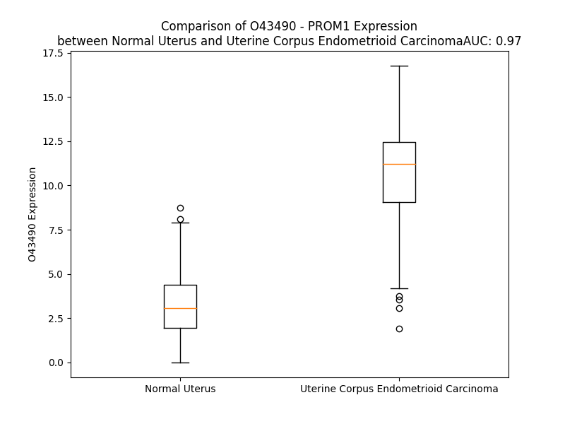

# Detailed Data for O43490

## Introduction to the Detailed Summary

### How to Interpret the Results

- **Summary & Metrics**: This section provides a quick reference to essential protein attributes, including expression changes, family classification, and biomarker applications. Regulation status (upregulated/downregulated) indicates the protein's behavior in a disease context. Some information comes from the original excel file with the proteins selected from literature, while others are derived from the analyses.
- **Expression Comparison**: A visual representation comparing protein expression between normal and disease states. It highlights significant changes in expression levels that might indicate diagnostic or therapeutic relevance. This is data coming from transcriptomics experiments and could not translate similarly to protein levels.
- **Isoform Alignment**: An interactive view of isoform alignments, revealing structural and functional differences between variants of the protein.
- **Interactors & Homologs**: Tables listing known interaction partners and homologous proteins, the more interactors and homologs, the more complex the protein is to design an antibody for.
- **Biological Assemblies**: Information about the structural arrangement of the protein in different assemblies, providing insights into its functional state but also the complexity of the protein to develop antibodies.
- **Combined Per-Residue Information**: A detailed table summarizing residue-level data. This includes predictions for epitope regions, aggregation tendencies, and modifications that might impact the protein's function. Each row corresponds to a residue in the protein, providing insights into specific sites that may be important for research or drug development.
## Summary & Metrics

- **UniProt Accession**: O43490
- **Gene Name**: PROM1/ CD133
- **Protein Name**: Prominin-1
- **Swiss Prot**: PROM1_HUMAN
- **Family**: other
- **Biomarker Application**: diagnosis,disease progression,efficacy,prognosis,response to therapy
- **Number of Isoforms**: 7
- **Regulation**: 1
- **(transcriptomics) AUC**: 0.97
- **(transcriptomics) Fold Change**: 3.05
- **(transcriptomics) Regulation**: Upregulated
- **Discotope Epitope Count**: 197
- **Max n_uniprots (Homo)**: N/A
- **Max n_uniprots (Hetero)**: N/A

## Expression Comparison

## Isoform Alignment

<pre style='font-size:14px; font-family:monospace;'>O43490-1 MALVLGSLLLLGLCGNSFSGGQPSSTDAPKAWNYELPATNYETQDSHKAGPIGILFELVHIFLYVVQPRDFPEDTLRKFLQKAYESKIDYDKPETVILGLKIVYYEAGIILCCVLGLLFIILMPLVGYFFCMCRCCNKCGGEMHQRQKENGPFLRKCFAISLLVICIIISIGIFYGFVANHQVRTRIKRSRKLADSNFKDLRTLLNETPEQIKYILAQYNTTKDKAFTDLNSINSVLGGGILDRLRPNIIPVLDEIKSMATAIKETKEALENMNSTLKSLHQQSTQLSSSLTSVKTSLRSSLNDPLCLVHPSSETCNSIRLSLSQLNSNPELRQLPPVDAELDNVNNVLRTDLDGLVQQGYQSLNDIPDRVQRQTTTVVAGIKRVLNSIGSDIDNVTQRLPIQDILSAFSVYVNNTESYIHRNLPTLEEYDSYWWLGGLVICSLLTLIVIFYYLGLLCGVCGYDRHATPTTRGCVSNTGGVFLMVGVGLSFLFCWILMIIVVLTFVFGANVEKLICEPYTSKELFRVLDTPYLLNEDWEYYLSGKLFNKSKMKLTFEQVYSDCKKNRGTYGTLHLQNSFNISEHLNINEHTGSISSELESLKVNLNIFLLGAAGRKNLQDFAACGIDRMNYDSYLAQTGKSPAGVNLLSFAYDLEAKANSLPPGNLRNSLKRDAQTIKTIHQQRVLPIEQSLSTLYQSVKILQRTGNGLLERVTRILASLDFAQNFITNNTSSVIIEETKKYGRTIIGYFEHYLQWIEFSISEKVASCKPVATALDTAVDVFLCSYIIDPLNLFWFGIGKATVFLLPALIFAVKLAKYYRRMDSEDVYDDVETIPMKNMENGNNGYHKDHVYGIHNPVMTSPSQH
O43490-2 MALVLGSLLLLGLCGNSFSGGQPSSTDAPKAWNYELPATNYETQDSHKAGPIGILFELVHIFLYVVQPRDFPEDTLRKFLQKAYESKIDYDK---------IVYYEAGIILCCVLGLLFIILMPLVGYFFCMCRCCNKCGGEMHQRQKENGPFLRKCFAISLLVICIIISIGIFYGFVANHQVRTRIKRSRKLADSNFKDLRTLLNETPEQIKYILAQYNTTKDKAFTDLNSINSVLGGGILDRLRPNIIPVLDEIKSMATAIKETKEALENMNSTLKSLHQQSTQLSSSLTSVKTSLRSSLNDPLCLVHPSSETCNSIRLSLSQLNSNPELRQLPPVDAELDNVNNVLRTDLDGLVQQGYQSLNDIPDRVQRQTTTVVAGIKRVLNSIGSDIDNVTQRLPIQDILSAFSVYVNNTESYIHRNLPTLEEYDSYWWLGGLVICSLLTLIVIFYYLGLLCGVCGYDRHATPTTRGCVSNTGGVFLMVGVGLSFLFCWILMIIVVLTFVFGANVEKLICEPYTSKELFRVLDTPYLLNEDWEYYLSGKLFNKSKMKLTFEQVYSDCKKNRGTYGTLHLQNSFNISEHLNINEHTGSISSELESLKVNLNIFLLGAAGRKNLQDFAACGIDRMNYDSYLAQTGKSPAGVNLLSFAYDLEAKANSLPPGNLRNSLKRDAQTIKTIHQQRVLPIEQSLSTLYQSVKILQRTGNGLLERVTRILASLDFAQNFITNNTSSVIIEETKKYGRTIIGYFEHYLQWIEFSISEKVASCKPVATALDTAVDVFLCSYIIDPLNLFWFGIGKATVFLLPALIFAVKLAKYYRRMDSEDVYDDVETIPMKNMENGNNGYHKDHVYGIHNPVMTSPSQH
O43490-3 MALVLGSLLLLGLCGNSFSGGQPSSTDAPKAWNYELPATNYETQDSHKAGPIGILFELVHIFLYVVQPRDFPEDTLRKFLQKAYESKIDYDK---------IVYYEAGIILCCVLGLLFIILMPLVGYFFCMCRCCNKCGGEMHQRQKENGPFLRKCFAISLLVICIIISIGIFYGFVANHQVRTRIKRSRKLADSNFKDLRTLLNETPEQIKYILAQYNTTKDKAFTDLNSINSVLGGGILDRLRPNIIPVLDEIKSMATAIKETKEALENMNSTLKSLHQQSTQLSSSLTSVKTSLRSSLNDPLCLVHPSSETCNSIRLSLSQLNSNPELRQLPPVDAELDNVNNVLRTDLDGLVQQGYQSLNDIPDRVQRQTTTVVAGIKRVLNSIGSDIDNVTQRLPIQDILSAFSVYVNNTESYIHRNLPTLEEYDSYWWLGGLVICSLLTLIVIFYYLGLLCGVCGYDRHATPTTRGCVSNTGGVFLMVGVGLSFLFCWILMIIVVLTFVFGANVEKLICEPYTSKELFRVLDTPYLLNEDWEYYLSGKLFNKSKMKLTFEQVYSDCKKNRGTYGTLHLQNSFNISEHLNINEHTGSISSELESLKVNLNIFLLGAAGRKNLQDFAACGIDRMNYDSYLAQTGKSPAGVNLLSFAYDLEAKANSLPPGNLRNSLKRDAQTIKTIHQQRVLPIEQSLSTLYQSVKILQRTGNGLLERVTRILASLDFAQNFITNNTSSVIIEETKKYGRTIIGYFEHYLQWIEFSISEKVASCKPVATALDTAVDVFLCSYIIDPLNLFWFGIGKATVFLLPALIFAVKLAKYYRRMDSEDVYDDSSWVTSVQC--------------------------
O43490-4 MALVLGSLLLLGLCGNSFSGGQPSSTDAPKAWNYELPATNYETQDSHKAGPIGILFELVHIFLYVVQPRDFPEDTLRKFLQKAYESKIDYDK---------IVYYEAGIILCCVLGLLFIILMPLVGYFFCMCRCCNKCGGEMHQRQKENGPFLRKCFAISLLVICIIISIGIFYGFVANHQVRTRIKRSRKLADSNFKDLRTLLNETPEQIKYILAQYNTTKDKAFTDLNSINSVLGGGILDRLRPNIIPVLDEIKSMATAIKETKEALENMNSTLKSLHQQSTQLSSSLTSVKTSLRSSLNDPLCLVHPSSETCNSIRLSLSQLNSNPELRQLPPVDAELDNVNNVLRTDLDGLVQQGYQSLNDIPDRVQRQTTTVVAGIKRVLNSIGSDIDNVTQRLPIQDILSAFSVYVNNTESYIHRNLPTLEEYDSYWWLGGLVICSLLTLIVIFYYLGLLCGVCGYDRHATPTTRGCVSNTGGVFLMVGVGLSFLFCWILMIIVVLTFVFGANVEKLICEPYTSKELFRVLDTPYLLNEDWEYYLSGKLFNKSKMKLTFEQVYSDCKKNRGTYGTLHLQNSFNISEHLNINEHTGSISSELESLKVNLNIFLLGAAGRKNLQDFAACGIDRMNYDSYLAQTGKSPAGVNLLSFAYDLEAKANSLPPGNLRNSLKRDAQTIKTIHQQRVLPIEQSLSTLYQSVKILQRTGNGLLERVTRILASLDFAQNFITNNTSSVIIEETKKYGRTIIGYFEHYLQWIEFSISEKVASCKPVATALDTAVDVFLCSYIIDPLNLFWFGIGKATVFLLPALIFAVKLAKYYRRMDSEDVYDDVETIPMKNPSQH-----------------------
O43490-5 MALVLGSLLLLGLCGNSFSGGQPSSTDAPKAWNYELPATNYETQDSHKAGPIGILFELVHIFLYVVQPRDFPEDTLRKFLQKAYESKIDYDK---------IVYYEAGIILCCVLGLLFIILMPLVGYFFCMCRCCNKCGGEMHQRQKENGPFLRKCFAISLLVICIIISIGIFYGFVANHQVRTRIKRSRKLADSNFKDLRTLLNETPEQIKYILAQYNTTKDKAFTDLNSINSVLGGGILDRLRPNIIPVLDEIKSMATAIKETKEALENMNSTLKSLHQQSTQLSSSLTSVKTSLRSSLNDPLCLVHPSSETCNSIRLSLSQLNSNPELRQLPPVDAELDNVNNVLRTDLDGLVQQGYQSLNDIPDRVQRQTTTVVAGIKRVLNSIGSDIDNVTQRLPIQDILSAFSVYVNNTESYIHRNLPTLEEYDSYWWLGGLVICSLLTLIVIFYYLGLLCGVCGYDRHATPTTRGCVSNTGGVFLMVGVGLSFLFCWILMIIVVLTFVFGANVEKLICEPYTSKELFRVLDTPYLLNEDWEYYLSGKLFNKSKMKLTFEQVYSDCKKNRGTYGTLHLQNSFNISEHLNINEHTGSISSELESLKVNLNIFLLGAAGRKNLQDFAACGIDRMNYDSYLAQTGKSPAGVNLLSFAYDLEAKANSLPPGNLRNSLKRDAQTIKTIHQQRVLPIEQSLSTLYQSVKILQRTGNGLLERVTRILASLDFAQNFITNNTSSVIIEETKKYGRTIIGYFEHYLQWIEFSISEKVASCKPVATALDTAVDVFLCSYIIDPLNLFWFGIGKATVFLLPALIFAVKLAKYYRRMDSEDVYDDPSQH-------------------------------
O43490-6 MALVLGSLLLLGLCGNSFSGGQPSSTDAPKAWNYELPATNYETQDSHKAGPIGILFELVHIFLYVVQPRDFPEDTLRKFLQKAYESKIDYDKPETVILGLKIVYYEAGIILCCVLGLLFIILMPLVGYFFCMCRCCNKCGGEMHQRQKENGPFLRKCFAISLLVICIIISIGIFYGFVANHQVRTRIKRSRKLADSNFKDLRTLLNETPEQIKYILAQYNTTKDKAFTDLNSINSVLGGGILDRLRPNIIPVLDEIKSMATAIKETKEALENMNSTLKSLHQQSTQLSSSLTSVKTSLRSSLNDPLCLVHPSSETCNSIRLSLSQLNSNPELRQLPPVDAELDNVNNVLRTDLDGLVQQGYQSLNDIPDRVQRQTTTVVAGIKRVLNSIGSDIDNVTQRLPIQDILSAFSVYVNNTESYIHRNLPTLEEYDSYWWLGGLVICSLLTLIVIFYYLGLLCGVCGYDRHATPTTRGCVSNTGGVFLMVGVGLSFLFCWILMIIVVLTFVFGANVEKLICEPYTSKELFRVLDTPYLLNEDWEYYLSGKLFNKSKMKLTFEQVYSDCKKNRGTYGTLHLQNSFNISEHLNINEHTGSISSELESLKVNLNIFLLGAAGRKNLQDFAACGIDRMNYDSYLAQTGKSPAGVNLLSFAYDLEAKANSLPPGNLRNSLKRDAQTIKTIHQQRVLPIEQSLSTLYQSVKILQRTGNGLLERVTRILASLDFAQNFITNNTSSVIIEETKKYGRTIIGYFEHYLQWIEFSISEKVASCKPVATALDTAVDVFLCSYIIDPLNLFWFGIGKATVFLLPALIFAVKLAKYYRRMDSEDVYDDPSQH-------------------------------
O43490-7 MALVLGSLLLLGLCGNSFSGGQPSSTDAPKAWNYELPATNYETQDSHKAGPIGILFELVHIFLYVVQPRDFPEDTLRKFLQKAYESKIDYDKPETVILGLKIVYYEAGIILCCVLGLLFIILMPLVGYFFCMCRCCNKCGGEMHQRQKENGPFLRKCFAISLLVICIIISIGIFYGFVANHQVRTRIKRSRKLADSNFKDLRTLLNETPEQIKYILAQYNTTKDKAFTDLNSINSVLGGGILDRLRPNIIPVLDEIKSMATAIKETKEALENMNSTLKSLHQQSTQLSSSLTSVKTSLRSSLNDPLCLVHPSSETCNSIRLSLSQLNSNPELRQLPPVDAELDNVNNVLRTDLDGLVQQGYQSLNDIPDRVQRQTTTVVAGIKRVLNSIGSDIDNVTQRLPIQDILSAFSVYVNNTESYIHRNLPTLEEYDSYWWLGGLVICSLLTLIVIFYYLGLLCGVCGYDRHATPTTRGCVSNTGGVFLMVGVGLSFLFCWILMIIVVLTFVFGANVEKLICEPYTSKELFRVLDTPYLLNEDWEYYLSGKLFNKSKMKLTFEQVYSDCKKNRGTYGTLHLQNSFNISEHLNINEHTGSISSELESLKVNLNIFLLGAAGRKNLQDFAACGIDRMNYDSYLAQTGKSPAGVNLLSFAYDLEAKANSLPPGNLRNSLKRDAQTIKTIHQQRVLPIEQSLSTLYQSVKILQRTGNGLLERVTRILASLDFAQNFITNNTSSVIIEETKKYGRTIIGYFEHYLQWIEFSISEKVASCKPVATALDTAVDVFLCSYIIDPLNLFWFGIGKATVFLLPALIFAVKLAKYYRRMDSEDVYDDVETIPMKNPSQH-----------------------
</pre>

## Interactors

| preferredName_A   | preferredName_B   |   score |
|:------------------|:------------------|--------:|
| PROM1             | CD34              |   0.928 |
| PROM1             | CDHR1             |   0.917 |

## Homologs

| uniprot_id   | gene_id   |
|:-------------|:----------|
| Q8N271       | PROM2     |

## Combined Per-Residue Information

|   res | aa   |   epitope_score | epitope   |   relative_surface_accessibility |   modeling_confidence |   Aggregation | modification    | glycosylation                   |
|------:|:-----|----------------:|:----------|---------------------------------:|----------------------:|--------------:|:----------------|:--------------------------------|
|     1 | M    |         0.042   | False     |                          0.58767 |                 29.57 |         0     | N/A             | N/A                             |
|     2 | A    |         0.02706 | False     |                          0.46425 |                 29.22 |        50.343 | N/A             | N/A                             |
|     3 | L    |         0.09839 | False     |                          0.9402  |                 32.24 |        73.809 | N/A             | N/A                             |
|     4 | V    |         0.03136 | False     |                          0.5979  |                 33.36 |        82.051 | N/A             | N/A                             |
|     5 | L    |         0.0086  | False     |                          0.06018 |                 33.68 |        82.733 | N/A             | N/A                             |
|     6 | G    |         0.01976 | False     |                          0.10461 |                 35.51 |        82.833 | N/A             | N/A                             |
|     7 | S    |         0.02814 | False     |                          0.4134  |                 37.87 |        83.853 | N/A             | N/A                             |
|     8 | L    |         0.01577 | False     |                          0.24465 |                 34.3  |        87.789 | N/A             | N/A                             |
|     9 | L    |         0.0028  | False     |                          0       |                 38.23 |        88.159 | N/A             | N/A                             |
|    10 | L    |         0.00692 | False     |                          0.10652 |                 37.24 |        86.798 | N/A             | N/A                             |
|    11 | L    |         0.01289 | False     |                          0.12817 |                 37.12 |        79.188 | N/A             | N/A                             |
|    12 | G    |         0.01199 | False     |                          0.02309 |                 36.23 |        36.804 | N/A             | N/A                             |
|    13 | L    |         0.00444 | False     |                          0.00265 |                 34.56 |        31.995 | N/A             | N/A                             |
|    14 | C    |         0.00372 | False     |                          0.05677 |                 33.96 |         5.192 | N/A             | N/A                             |
|    15 | G    |         0.01012 | False     |                          0       |                 33.49 |         0.409 | N/A             | N/A                             |
|    16 | N    |         0.01097 | False     |                          0.0037  |                 33.96 |         0     | N/A             | N/A                             |
|    17 | S    |         0.01751 | False     |                          0.10901 |                 28.94 |         0     | N/A             | N/A                             |
|    18 | F    |         0.07109 | False     |                          0.76466 |                 27.53 |         0     | N/A             | N/A                             |
|    19 | S    |         0.0763  | False     |                          0.76932 |                 27.07 |         0     | N/A             | N/A                             |
|    20 | G    |         0.09009 | False     |                          0.91122 |                 24.3  |         0     | N/A             | N/A                             |
|    21 | G    |         0.16393 | True      |                          0.83712 |                 23.73 |         0     | N/A             | N/A                             |
|    22 | Q    |         0.12743 | True      |                          0.83963 |                 25.93 |         0     | N/A             | N/A                             |
|    23 | P    |         0.12291 | True      |                          0.88718 |                 27.39 |         0     | N/A             | N/A                             |
|    24 | S    |         0.10786 | True      |                          0.86861 |                 25.2  |         0     | N/A             | N/A                             |
|    25 | S    |         0.05052 | False     |                          0.47091 |                 32.14 |         0     | N/A             | N/A                             |
|    26 | T    |         0.15286 | True      |                          0.88767 |                 32.84 |         0     | N/A             | N/A                             |
|    27 | D    |         0.08916 | False     |                          0.87937 |                 39.15 |         0     | N/A             | N/A                             |
|    28 | A    |         0.03403 | False     |                          0.60091 |                 40.12 |         0     | N/A             | N/A                             |
|    29 | P    |         0.05531 | False     |                          0.36319 |                 45.5  |         0     | N/A             | N/A                             |
|    30 | K    |         0.09674 | False     |                          0.94577 |                 45.04 |         0     | N/A             | N/A                             |
|    31 | A    |         0.0781  | False     |                          0.81045 |                 46.5  |         0     | N/A             | N/A                             |
|    32 | W    |         0.04495 | False     |                          0.57635 |                 55.2  |         0     | N/A             | N/A                             |
|    33 | N    |         0.09563 | False     |                          0.85425 |                 61.1  |         0     | N/A             | N/A                             |
|    34 | Y    |         0.06601 | False     |                          0.15308 |                 77.2  |         0     | N/A             | N/A                             |
|    35 | E    |         0.09012 | False     |                          0.71531 |                 81.77 |         0     | N/A             | N/A                             |
|    36 | L    |         0.04011 | False     |                          0.16076 |                 82.88 |         0     | N/A             | N/A                             |
|    37 | P    |         0.15627 | True      |                          0.49764 |                 80.76 |         0     | N/A             | N/A                             |
|    38 | A    |         0.14653 | True      |                          0.90551 |                 79.78 |         0     | N/A             | N/A                             |
|    39 | T    |         0.07198 | False     |                          0.26693 |                 82.33 |         0     | N/A             | N/A                             |
|    40 | N    |         0.11127 | True      |                          0.84473 |                 84.14 |         0     | N/A             | N/A                             |
|    41 | Y    |         0.04241 | False     |                          0.27024 |                 89.58 |         0     | N/A             | N/A                             |
|    42 | E    |         0.11284 | True      |                          0.54838 |                 88.05 |         0     | N/A             | N/A                             |
|    43 | T    |         0.02159 | False     |                          0.10105 |                 88.91 |         0     | N/A             | N/A                             |
|    44 | Q    |         0.10253 | True      |                          0.74975 |                 76.68 |         0     | N/A             | N/A                             |
|    45 | D    |         0.08277 | False     |                          0.45264 |                 64.8  |         0     | N/A             | N/A                             |
|    46 | S    |         0.09707 | False     |                          0.54594 |                 62.64 |         0     | N/A             | N/A                             |
|    47 | H    |         0.06473 | False     |                          0.3067  |                 66.09 |         0     | N/A             | N/A                             |
|    48 | K    |         0.12709 | True      |                          0.85281 |                 64.48 |         0     | N/A             | N/A                             |
|    49 | A    |         0.08406 | False     |                          0.33085 |                 67.51 |         0     | N/A             | N/A                             |
|    50 | G    |         0.10943 | True      |                          0.50743 |                 77.21 |         0     | N/A             | N/A                             |
|    51 | P    |         0.1258  | True      |                          0.94863 |                 78.84 |         0.002 | N/A             | N/A                             |
|    52 | I    |         0.04532 | False     |                          0.13933 |                 85.04 |         0.208 | N/A             | N/A                             |
|    53 | G    |         0.0705  | False     |                          0.23272 |                 85.3  |         0.213 | N/A             | N/A                             |
|    54 | I    |         0.14893 | True      |                          0.68391 |                 89.45 |         0.274 | N/A             | N/A                             |
|    55 | L    |         0.0488  | False     |                          0.1772  |                 92.55 |         0.279 | N/A             | N/A                             |
|    56 | F    |         0.02818 | False     |                          0.03054 |                 92.7  |         0.28  | N/A             | N/A                             |
|    57 | E    |         0.09268 | False     |                          0.51884 |                 92.04 |         0.133 | N/A             | N/A                             |
|    58 | L    |         0.06021 | False     |                          0.46461 |                 92.73 |        30.616 | N/A             | N/A                             |
|    59 | V    |         0.00717 | False     |                          0.01428 |                 95.44 |        36.201 | N/A             | N/A                             |
|    60 | H    |         0.05034 | False     |                          0.24835 |                 93.6  |        37.495 | N/A             | N/A                             |
|    61 | I    |         0.10846 | True      |                          0.56596 |                 94.54 |        94.869 | N/A             | N/A                             |
|    62 | F    |         0.04864 | False     |                          0.34858 |                 94.52 |        99.709 | N/A             | N/A                             |
|    63 | L    |         0.00379 | False     |                          0.00577 |                 94.78 |        99.705 | N/A             | N/A                             |
|    64 | Y    |         0.09306 | False     |                          0.49902 |                 93.7  |        99.679 | N/A             | N/A                             |
|    65 | V    |         0.09219 | False     |                          0.81345 |                 92.94 |        99.432 | N/A             | N/A                             |
|    66 | V    |         0.02323 | False     |                          0.10692 |                 92.78 |        92.035 | N/A             | N/A                             |
|    67 | Q    |         0.00805 | False     |                          0.01037 |                 93.45 |         0.144 | N/A             | N/A                             |
|    68 | P    |         0.09892 | False     |                          0.71004 |                 91.29 |         0.072 | N/A             | N/A                             |
|    69 | R    |         0.12873 | True      |                          0.30797 |                 89.41 |         0     | N/A             | N/A                             |
|    70 | D    |         0.1049  | True      |                          0.79479 |                 88.36 |         0     | N/A             | N/A                             |
|    71 | F    |         0.04003 | False     |                          0.12006 |                 89.99 |         0     | N/A             | N/A                             |
|    72 | P    |         0.07997 | False     |                          0.19834 |                 90.52 |         0     | N/A             | N/A                             |
|    73 | E    |         0.05413 | False     |                          0.22326 |                 86.59 |         0     | N/A             | N/A                             |
|    74 | D    |         0.0977  | False     |                          0.50926 |                 86.24 |         0     | N/A             | N/A                             |
|    75 | T    |         0.07341 | False     |                          0.12332 |                 85.66 |         0     | N/A             | N/A                             |
|    76 | L    |         0.01269 | False     |                          0.228   |                 84.34 |         0     | N/A             | N/A                             |
|    77 | R    |         0.0971  | False     |                          0.21284 |                 84.72 |         0     | N/A             | N/A                             |
|    78 | K    |         0.16295 | True      |                          0.54049 |                 82.77 |         0     | N/A             | N/A                             |
|    79 | F    |         0.06867 | False     |                          0.44448 |                 81.78 |         0     | N/A             | N/A                             |
|    80 | L    |         0.03203 | False     |                          0.21928 |                 80.03 |         0     | N/A             | N/A                             |
|    81 | Q    |         0.13    | True      |                          0.38984 |                 76.81 |         0     | N/A             | N/A                             |
|    82 | K    |         0.16622 | True      |                          0.14349 |                 74.88 |         0     | N/A             | N/A                             |
|    83 | A    |         0.04844 | False     |                          0.51081 |                 71.62 |         0     | N/A             | N/A                             |
|    84 | Y    |         0.15189 | True      |                          0.61297 |                 65.4  |         0     | N/A             | N/A                             |
|    85 | E    |         0.10309 | True      |                          0.45176 |                 66.33 |         0     | N/A             | N/A                             |
|    86 | S    |         0.14425 | True      |                          0.95448 |                 57.01 |         0     | N/A             | N/A                             |
|    87 | K    |         0.22091 | True      |                          0.87348 |                 58.02 |         0     | N/A             | N/A                             |
|    88 | I    |         0.1019  | True      |                          0.38097 |                 62.59 |         0     | N/A             | N/A                             |
|    89 | D    |         0.15487 | True      |                          0.36845 |                 68.1  |         0     | N/A             | N/A                             |
|    90 | Y    |         0.21327 | True      |                          0.73548 |                 67.62 |         0     | N/A             | N/A                             |
|    91 | D    |         0.19578 | True      |                          0.84512 |                 71.59 |         0     | N/A             | N/A                             |
|    92 | K    |         0.17602 | True      |                          0.44224 |                 74.47 |         0     | N/A             | N/A                             |
|    93 | P    |         0.17297 | True      |                          0.7003  |                 79.65 |         0.007 | N/A             | N/A                             |
|    94 | E    |         0.20739 | True      |                          0.55473 |                 78.13 |         1.034 | N/A             | N/A                             |
|    95 | T    |         0.0768  | False     |                          0.11006 |                 78.02 |         1.965 | N/A             | N/A                             |
|    96 | V    |         0.10968 | True      |                          0.55699 |                 82.32 |         3.301 | N/A             | N/A                             |
|    97 | I    |         0.18875 | True      |                          0.56975 |                 84.65 |         3.324 | N/A             | N/A                             |
|    98 | L    |         0.09335 | False     |                          0.09468 |                 84.79 |         3.329 | N/A             | N/A                             |
|    99 | G    |         0.03637 | False     |                          0.35204 |                 82.86 |         3.33  | N/A             | N/A                             |
|   100 | L    |         0.16487 | True      |                          0.68766 |                 88.45 |         3.205 | N/A             | N/A                             |
|   101 | K    |         0.19051 | True      |                          0.49787 |                 88.6  |         1.206 | N/A             | N/A                             |
|   102 | I    |         0.02174 | False     |                          0.37998 |                 87.85 |         1.206 | N/A             | N/A                             |
|   103 | V    |         0.06164 | False     |                          0.59314 |                 89.1  |         1.204 | N/A             | N/A                             |
|   104 | Y    |         0.13185 | True      |                          0.67822 |                 90.64 |         1.167 | N/A             | N/A                             |
|   105 | Y    |         0.088   | False     |                          0.07    |                 90.35 |         0.345 | N/A             | N/A                             |
|   106 | E    |         0.02559 | False     |                          0.10787 |                 91.81 |         0.173 | N/A             | N/A                             |
|   107 | A    |         0.09776 | False     |                          0.40247 |                 92.42 |         2.402 | N/A             | N/A                             |
|   108 | G    |         0.05346 | False     |                          0.25364 |                 92.95 |         5.105 | N/A             | N/A                             |
|   109 | I    |         0.01674 | False     |                          0.02857 |                 93.82 |        87.27  | N/A             | N/A                             |
|   110 | I    |         0.04496 | False     |                          0.42078 |                 94.36 |        94.788 | N/A             | N/A                             |
|   111 | L    |         0.0679  | False     |                          0.64288 |                 94.99 |        95.461 | N/A             | N/A                             |
|   112 | C    |         0.01262 | False     |                          0.27616 |                 94.61 |        95.507 | N/A             | N/A                             |
|   113 | C    |         0.0334  | False     |                          0.14604 |                 95    |        96.089 | N/A             | N/A                             |
|   114 | V    |         0.04165 | False     |                          0.50315 |                 96.66 |        98.928 | N/A             | N/A                             |
|   115 | L    |         0.08067 | False     |                          0.63621 |                 95.53 |        99.181 | N/A             | N/A                             |
|   116 | G    |         0.02426 | False     |                          0.03958 |                 95.5  |        99.219 | N/A             | N/A                             |
|   117 | L    |         0.07209 | False     |                          0.55809 |                 96.15 |        99.78  | N/A             | N/A                             |
|   118 | L    |         0.04678 | False     |                          0.52653 |                 96.12 |        99.862 | N/A             | N/A                             |
|   119 | F    |         0.02053 | False     |                          0.1167  |                 94.58 |        99.85  | N/A             | N/A                             |
|   120 | I    |         0.04745 | False     |                          0.12747 |                 95.9  |        99.725 | N/A             | N/A                             |
|   121 | I    |         0.0646  | False     |                          0.59114 |                 94.64 |        98.359 | N/A             | N/A                             |
|   122 | L    |         0.07288 | False     |                          0.57032 |                 93.23 |        83.345 | N/A             | N/A                             |
|   123 | M    |         0.02034 | False     |                          0.03468 |                 92.03 |         1.286 | N/A             | N/A                             |
|   124 | P    |         0.09435 | False     |                          0.37345 |                 92.05 |         0.642 | N/A             | N/A                             |
|   125 | L    |         0.05567 | False     |                          0.52924 |                 92.16 |         0.583 | N/A             | N/A                             |
|   126 | V    |         0.01994 | False     |                          0.55382 |                 91.04 |         0.782 | N/A             | N/A                             |
|   127 | G    |         0.02474 | False     |                          0.10203 |                 90.48 |         0.985 | N/A             | N/A                             |
|   128 | Y    |         0.05156 | False     |                          0.55174 |                 90.56 |         1.904 | N/A             | N/A                             |
|   129 | F    |         0.10581 | True      |                          0.64329 |                 89.95 |         1.949 | N/A             | N/A                             |
|   130 | F    |         0.04482 | False     |                          0.19332 |                 87.49 |         1.915 | N/A             | N/A                             |
|   131 | C    |         0.06465 | False     |                          0.50574 |                 86.2  |         1.346 | N/A             | N/A                             |
|   132 | M    |         0.12154 | True      |                          0.51083 |                 87.72 |         1.102 | N/A             | N/A                             |
|   133 | C    |         0.02964 | False     |                          0.31814 |                 85.25 |         0.207 | N/A             | N/A                             |
|   134 | R    |         0.07784 | False     |                          0.18775 |                 81.8  |         0     | N/A             | N/A                             |
|   135 | C    |         0.08218 | False     |                          0.7093  |                 80.84 |         0     | N/A             | N/A                             |
|   136 | C    |         0.11749 | True      |                          0.65024 |                 81.2  |         0     | N/A             | N/A                             |
|   137 | N    |         0.10506 | True      |                          0.60699 |                 73.92 |         0     | N/A             | N/A                             |
|   138 | K    |         0.17287 | True      |                          0.69316 |                 73.51 |         0     | N/A             | N/A                             |
|   139 | C    |         0.07558 | False     |                          0.49578 |                 70.69 |         0     | N/A             | N/A                             |
|   140 | G    |         0.04104 | False     |                          0.22032 |                 68.44 |         0     | N/A             | N/A                             |
|   141 | G    |         0.02541 | False     |                          0.13681 |                 68.92 |         0     | N/A             | N/A                             |
|   142 | E    |         0.15808 | True      |                          0.56991 |                 74.61 |         0     | N/A             | N/A                             |
|   143 | M    |         0.04055 | False     |                          0.238   |                 77.67 |         0     | N/A             | N/A                             |
|   144 | H    |         0.20386 | True      |                          0.36198 |                 78.16 |         0     | N/A             | N/A                             |
|   145 | Q    |         0.07284 | False     |                          0.13662 |                 76.44 |         0     | N/A             | N/A                             |
|   146 | R    |         0.17372 | True      |                          0.51379 |                 70.97 |         0     | N/A             | N/A                             |
|   147 | Q    |         0.07473 | False     |                          0.38838 |                 68.11 |         0     | N/A             | N/A                             |
|   148 | K    |         0.13178 | True      |                          0.6781  |                 70.93 |         0     | N/A             | N/A                             |
|   149 | E    |         0.14307 | True      |                          0.90035 |                 71.84 |         0     | N/A             | N/A                             |
|   150 | N    |         0.12218 | True      |                          0.6156  |                 75.31 |         0     | N/A             | N/A                             |
|   151 | G    |         0.06826 | False     |                          0.08784 |                 78.87 |         0     | N/A             | N/A                             |
|   152 | P    |         0.06445 | False     |                          0.55483 |                 82.55 |         0     | N/A             | N/A                             |
|   153 | F    |         0.08437 | False     |                          0.6808  |                 87.3  |         0     | N/A             | N/A                             |
|   154 | L    |         0.03706 | False     |                          0.36024 |                 87.82 |         0     | N/A             | N/A                             |
|   155 | R    |         0.03091 | False     |                          0.09045 |                 89.76 |         0     | N/A             | N/A                             |
|   156 | K    |         0.1096  | True      |                          0.52784 |                 90.47 |         0     | N/A             | N/A                             |
|   157 | C    |         0.05377 | False     |                          0.31787 |                 93.59 |         0.286 | N/A             | N/A                             |
|   158 | F    |         0.01916 | False     |                          0.16179 |                 93.47 |        17.397 | N/A             | N/A                             |
|   159 | A    |         0.01268 | False     |                          0.08755 |                 94.09 |        20.635 | N/A             | N/A                             |
|   160 | I    |         0.05612 | False     |                          0.64237 |                 95.64 |        27.893 | N/A             | N/A                             |
|   161 | S    |         0.01491 | False     |                          0.2885  |                 97.02 |        31.933 | N/A             | N/A                             |
|   162 | L    |         0.00107 | False     |                          0       |                 96.92 |        87.501 | N/A             | N/A                             |
|   163 | L    |         0.08329 | False     |                          0.47483 |                 97.12 |        97.843 | N/A             | N/A                             |
|   164 | V    |         0.0444  | False     |                          0.52885 |                 97.76 |        99.746 | N/A             | N/A                             |
|   165 | I    |         0.04988 | False     |                          0.092   |                 97.7  |        99.907 | N/A             | N/A                             |
|   166 | C    |         0.00302 | False     |                          0       |                 97.89 |        99.92  | N/A             | N/A                             |
|   167 | I    |         0.10249 | True      |                          0.50158 |                 97.8  |        99.99  | N/A             | N/A                             |
|   168 | I    |         0.05533 | False     |                          0.31359 |                 96.9  |        99.993 | N/A             | N/A                             |
|   169 | I    |         0.00399 | False     |                          0       |                 97.35 |        99.959 | N/A             | N/A                             |
|   170 | S    |         0.06275 | False     |                          0.28507 |                 97.97 |        99.581 | N/A             | N/A                             |
|   171 | I    |         0.05061 | False     |                          0.44787 |                 96.2  |        99.534 | N/A             | N/A                             |
|   172 | G    |         0.00247 | False     |                          0       |                 95.9  |        99.021 | N/A             | N/A                             |
|   173 | I    |         0.01956 | False     |                          0.0592  |                 97.66 |        98.975 | N/A             | N/A                             |
|   174 | F    |         0.08169 | False     |                          0.59065 |                 96.17 |        98.465 | N/A             | N/A                             |
|   175 | Y    |         0.02561 | False     |                          0.11109 |                 95.92 |        92.22  | N/A             | N/A                             |
|   176 | G    |         0.00131 | False     |                          0       |                 95.62 |        71.857 | N/A             | N/A                             |
|   177 | F    |         0.05609 | False     |                          0.38758 |                 95.41 |        71.147 | N/A             | N/A                             |
|   178 | V    |         0.02589 | False     |                          0.19112 |                 94.75 |        64.903 | N/A             | N/A                             |
|   179 | A    |         0.00228 | False     |                          0.00235 |                 94.15 |        28.3   | N/A             | N/A                             |
|   180 | N    |         0.02219 | False     |                          0.04655 |                 92.41 |         0.208 | N/A             | N/A                             |
|   181 | H    |         0.13194 | True      |                          0.61401 |                 92.45 |         0.009 | N/A             | N/A                             |
|   182 | Q    |         0.05378 | False     |                          0.15749 |                 91.38 |         0     | N/A             | N/A                             |
|   183 | V    |         0.01268 | False     |                          0.03523 |                 89.43 |         0     | N/A             | N/A                             |
|   184 | R    |         0.06806 | False     |                          0.29837 |                 88.4  |         0     | N/A             | N/A                             |
|   185 | T    |         0.06462 | False     |                          0.31777 |                 89.07 |         0     | N/A             | N/A                             |
|   186 | R    |         0.03492 | False     |                          0.0446  |                 88.82 |         0     | N/A             | N/A                             |
|   187 | I    |         0.01428 | False     |                          0.03739 |                 87.56 |         0     | N/A             | N/A                             |
|   188 | K    |         0.05325 | False     |                          0.64762 |                 86.16 |         0     | N/A             | N/A                             |
|   189 | R    |         0.12798 | True      |                          0.54888 |                 87.76 |         0     | N/A             | N/A                             |
|   190 | S    |         0.00901 | False     |                          0.03898 |                 88.87 |         0     | N/A             | N/A                             |
|   191 | R    |         0.06435 | False     |                          0.39517 |                 89.19 |         0     | N/A             | N/A                             |
|   192 | K    |         0.09696 | False     |                          0.77646 |                 90.04 |         0     | N/A             | N/A                             |
|   193 | L    |         0.01838 | False     |                          0.1975  |                 90.04 |         0     | N/A             | N/A                             |
|   194 | A    |         0.01073 | False     |                          0.13429 |                 91.18 |         0     | N/A             | N/A                             |
|   195 | D    |         0.08778 | False     |                          0.35207 |                 93.41 |         0     | N/A             | N/A                             |
|   196 | S    |         0.05683 | False     |                          0.11708 |                 93.94 |         0     | N/A             | N/A                             |
|   197 | N    |         0.02297 | False     |                          0.05204 |                 93.51 |         0     | N/A             | N/A                             |
|   198 | F    |         0.01715 | False     |                          0.06679 |                 95.07 |         0     | N/A             | N/A                             |
|   199 | K    |         0.09314 | False     |                          0.56951 |                 95.24 |         0     | N/A             | N/A                             |
|   200 | D    |         0.05923 | False     |                          0.02701 |                 95.14 |         0     | N/A             | N/A                             |
|   201 | L    |         0.01054 | False     |                          0.05029 |                 94.41 |         0     | N/A             | N/A                             |
|   202 | R    |         0.17156 | True      |                          0.37908 |                 93.84 |         0     | N/A             | N/A                             |
|   203 | T    |         0.07281 | False     |                          0.22164 |                 93.79 |         0     | N/A             | N/A                             |
|   204 | L    |         0.01013 | False     |                          0.03831 |                 91.93 |         0     | N/A             | N/A                             |
|   205 | L    |         0.05041 | False     |                          0.15419 |                 91.69 |         0     | N/A             | N/A                             |
|   206 | N    |         0.14547 | True      |                          0.6544  |                 91.23 |         0     | N/A             | N/A                             |
|   207 | E    |         0.07912 | False     |                          0.38274 |                 90.45 |         0     | N/A             | N/A                             |
|   208 | T    |         0.01483 | False     |                          0.01038 |                 90.42 |         0     | N/A             | N/A                             |
|   209 | P    |         0.05747 | False     |                          0.34235 |                 89.38 |         0     | N/A             | N/A                             |
|   210 | E    |         0.13612 | True      |                          0.44191 |                 90.08 |         0     | N/A             | N/A                             |
|   211 | Q    |         0.05151 | False     |                          0.08398 |                 90.68 |         0     | N/A             | N/A                             |
|   212 | I    |         0.01652 | False     |                          0.056   |                 90.26 |         0     | N/A             | N/A                             |
|   213 | K    |         0.13764 | True      |                          0.57354 |                 90.75 |         0     | N/A             | N/A                             |
|   214 | Y    |         0.11333 | True      |                          0.3114  |                 91.84 |         0.661 | N/A             | N/A                             |
|   215 | I    |         0.00658 | False     |                          0.0024  |                 90.73 |         0.813 | N/A             | N/A                             |
|   216 | L    |         0.04304 | False     |                          0.23245 |                 90.78 |         0.813 | N/A             | N/A                             |
|   217 | A    |         0.06494 | False     |                          0.50369 |                 90.81 |         0.813 | N/A             | N/A                             |
|   218 | Q    |         0.06029 | False     |                          0.1637  |                 91.14 |         0.813 | N/A             | N/A                             |
|   219 | Y    |         0.03222 | False     |                          0.05366 |                 91.08 |         0.661 | N/A             | N/A                             |
|   220 | N    |         0.12582 | True      |                          0.44614 |                 90.94 |         0     | N/A             | N-linked (GlcNAc...) asparagine |
|   221 | T    |         0.0514  | False     |                          0.34645 |                 89.54 |         0     | N/A             | N/A                             |
|   222 | T    |         0.0153  | False     |                          0.02856 |                 90.69 |         0     | N/A             | N/A                             |
|   223 | K    |         0.02834 | False     |                          0.19441 |                 92.16 |         0     | N/A             | N/A                             |
|   224 | D    |         0.08988 | False     |                          0.48718 |                 92.67 |         0     | N/A             | N/A                             |
|   225 | K    |         0.04374 | False     |                          0.33783 |                 90.97 |         0     | N6-acetyllysine | N/A                             |
|   226 | A    |         0.00334 | False     |                          0       |                 92.27 |         0     | N/A             | N/A                             |
|   227 | F    |         0.02801 | False     |                          0.21418 |                 95    |         0     | N/A             | N/A                             |
|   228 | T    |         0.10083 | True      |                          0.51759 |                 94.55 |         0     | N/A             | N/A                             |
|   229 | D    |         0.03174 | False     |                          0.0863  |                 93.6  |         0     | N/A             | N/A                             |
|   230 | L    |         0.00288 | False     |                          0.00061 |                 94.11 |         0     | N/A             | N/A                             |
|   231 | N    |         0.12818 | True      |                          0.54525 |                 94.64 |         0     | N/A             | N/A                             |
|   232 | S    |         0.04183 | False     |                          0.28601 |                 93.96 |         0     | N/A             | N/A                             |
|   233 | I    |         0.01193 | False     |                          0.016   |                 94.34 |         0.208 | N/A             | N/A                             |
|   234 | N    |         0.04436 | False     |                          0.30361 |                 93.75 |         0.208 | N/A             | N/A                             |
|   235 | S    |         0.17317 | True      |                          0.56103 |                 93.41 |         0.208 | N/A             | N/A                             |
|   236 | V    |         0.08629 | False     |                          0.4647  |                 93.04 |         0.678 | N/A             | N/A                             |
|   237 | L    |         0.00683 | False     |                          0.00907 |                 94.44 |         0.678 | N/A             | N/A                             |
|   238 | G    |         0.00268 | False     |                          0       |                 94.66 |         0.47  | N/A             | N/A                             |
|   239 | G    |         0.03972 | False     |                          0.15993 |                 94.84 |         0.47  | N/A             | N/A                             |
|   240 | G    |         0.02311 | False     |                          0.21131 |                 95.02 |         0.47  | N/A             | N/A                             |
|   241 | I    |         0.00372 | False     |                          0       |                 95.29 |         0.47  | N/A             | N/A                             |
|   242 | L    |         0.02234 | False     |                          0.05193 |                 94.47 |         0.47  | N/A             | N/A                             |
|   243 | D    |         0.19669 | True      |                          0.50488 |                 95.45 |         0     | N/A             | N/A                             |
|   244 | R    |         0.10104 | True      |                          0.40929 |                 93.84 |         0     | N/A             | N/A                             |
|   245 | L    |         0.00154 | False     |                          0       |                 94.19 |         0     | N/A             | N/A                             |
|   246 | R    |         0.15045 | True      |                          0.3766  |                 94.03 |         0     | N/A             | N/A                             |
|   247 | P    |         0.19602 | True      |                          0.66264 |                 94.29 |         0     | N/A             | N/A                             |
|   248 | N    |         0.10599 | True      |                          0.2913  |                 91.2  |         0     | N/A             | N/A                             |
|   249 | I    |         0.00639 | False     |                          0       |                 94.2  |         0     | N/A             | N/A                             |
|   250 | I    |         0.11845 | True      |                          0.29839 |                 95.43 |         0     | N/A             | N/A                             |
|   251 | P    |         0.16403 | True      |                          0.53521 |                 96.04 |         0     | N/A             | N/A                             |
|   252 | V    |         0.02573 | False     |                          0.08569 |                 95.02 |         0     | N/A             | N/A                             |
|   253 | L    |         0.00342 | False     |                          0       |                 96.15 |         0     | N/A             | N/A                             |
|   254 | D    |         0.13921 | True      |                          0.39741 |                 97.08 |         0     | N/A             | N/A                             |
|   255 | E    |         0.04771 | False     |                          0.25673 |                 95.05 |         0     | N/A             | N/A                             |
|   256 | I    |         0.0042  | False     |                          0       |                 95.72 |         0     | N/A             | N/A                             |
|   257 | K    |         0.07228 | False     |                          0.43551 |                 96.32 |         0     | N6-acetyllysine | N/A                             |
|   258 | S    |         0.08179 | False     |                          0.39797 |                 95.14 |         0     | N/A             | N/A                             |
|   259 | M    |         0.0033  | False     |                          0.00269 |                 94.58 |         0.325 | N/A             | N/A                             |
|   260 | A    |         0.01449 | False     |                          0.03272 |                 95.08 |         0.325 | N/A             | N/A                             |
|   261 | T    |         0.07151 | False     |                          0.46918 |                 95.25 |         0.325 | N/A             | N/A                             |
|   262 | A    |         0.02685 | False     |                          0.09019 |                 94.94 |         0.325 | N/A             | N/A                             |
|   263 | I    |         0.0123  | False     |                          0.016   |                 95.41 |         0.325 | N/A             | N/A                             |
|   264 | K    |         0.08192 | False     |                          0.44342 |                 95.6  |         0     | N6-acetyllysine | N/A                             |
|   265 | E    |         0.07382 | False     |                          0.43396 |                 94.83 |         0     | N/A             | N/A                             |
|   266 | T    |         0.00171 | False     |                          0       |                 96.02 |         0     | N/A             | N/A                             |
|   267 | K    |         0.09834 | False     |                          0.29633 |                 95.83 |         0     | N/A             | N/A                             |
|   268 | E    |         0.1163  | True      |                          0.54318 |                 96.2  |         0     | N/A             | N/A                             |
|   269 | A    |         0.01248 | False     |                          0.0319  |                 96.67 |         0     | N/A             | N/A                             |
|   270 | L    |         0.00249 | False     |                          0       |                 96.74 |         0     | N/A             | N/A                             |
|   271 | E    |         0.08187 | False     |                          0.37883 |                 96.38 |         0     | N/A             | N/A                             |
|   272 | N    |         0.06663 | False     |                          0.48965 |                 95.3  |         0     | N/A             | N/A                             |
|   273 | M    |         0.00287 | False     |                          0       |                 95.07 |         0     | N/A             | N/A                             |
|   274 | N    |         0.03456 | False     |                          0.07396 |                 95.03 |         0     | N/A             | N-linked (GlcNAc...) asparagine |
|   275 | S    |         0.08616 | False     |                          0.52926 |                 94.98 |         0     | N/A             | N/A                             |
|   276 | T    |         0.04054 | False     |                          0.07647 |                 94.84 |         0     | N/A             | N/A                             |
|   277 | L    |         0.0155  | False     |                          0.08115 |                 94.39 |         0     | N/A             | N/A                             |
|   278 | K    |         0.09587 | False     |                          0.56578 |                 92.61 |         0     | N/A             | N/A                             |
|   279 | S    |         0.07624 | False     |                          0.2932  |                 92.07 |         0     | N/A             | N/A                             |
|   280 | L    |         0.00333 | False     |                          0.00165 |                 92.71 |         0     | N/A             | N/A                             |
|   281 | H    |         0.07522 | False     |                          0.51165 |                 91.41 |         0     | N/A             | N/A                             |
|   282 | Q    |         0.0845  | False     |                          0.56544 |                 91.88 |         0     | N/A             | N/A                             |
|   283 | Q    |         0.05368 | False     |                          0.18206 |                 92.3  |         0     | N/A             | N/A                             |
|   284 | S    |         0.0033  | False     |                          0.00158 |                 92.26 |         0     | N/A             | N/A                             |
|   285 | T    |         0.05874 | False     |                          0.45663 |                 91.71 |         0     | N/A             | N/A                             |
|   286 | Q    |         0.07369 | False     |                          0.31773 |                 92.27 |         0     | N/A             | N/A                             |
|   287 | L    |         0.00206 | False     |                          0.00165 |                 94.43 |         0     | N/A             | N/A                             |
|   288 | S    |         0.04036 | False     |                          0.23532 |                 93.35 |         0     | N/A             | N/A                             |
|   289 | S    |         0.14905 | True      |                          0.51554 |                 93.5  |         0     | N/A             | N/A                             |
|   290 | S    |         0.04609 | False     |                          0.18718 |                 94.24 |         0     | N/A             | N/A                             |
|   291 | L    |         0.00844 | False     |                          0.00907 |                 94.5  |         0     | N/A             | N/A                             |
|   292 | T    |         0.0862  | False     |                          0.55507 |                 93.81 |         0     | N/A             | N/A                             |
|   293 | S    |         0.08695 | False     |                          0.55999 |                 94.56 |         0     | N/A             | N/A                             |
|   294 | V    |         0.01899 | False     |                          0.0408  |                 94.55 |         0     | N/A             | N/A                             |
|   295 | K    |         0.02889 | False     |                          0.30707 |                 93.74 |         0     | N/A             | N/A                             |
|   296 | T    |         0.08266 | False     |                          0.56712 |                 93.53 |         0     | N/A             | N/A                             |
|   297 | S    |         0.09863 | False     |                          0.35738 |                 95.11 |         0     | N/A             | N/A                             |
|   298 | L    |         0.00448 | False     |                          0       |                 95.21 |         0     | N/A             | N/A                             |
|   299 | R    |         0.10687 | True      |                          0.65796 |                 93.9  |         0     | N/A             | N/A                             |
|   300 | S    |         0.14323 | True      |                          0.54153 |                 93.51 |         0     | N/A             | N/A                             |
|   301 | S    |         0.0498  | False     |                          0.13683 |                 93.03 |         0     | N/A             | N/A                             |
|   302 | L    |         0.03007 | False     |                          0.10599 |                 93.36 |         0     | N/A             | N/A                             |
|   303 | N    |         0.14367 | True      |                          0.75614 |                 90.58 |         0     | N/A             | N/A                             |
|   304 | D    |         0.10252 | True      |                          0.20367 |                 90.69 |         0     | N/A             | N/A                             |
|   305 | P    |         0.1474  | True      |                          0.75115 |                 88.44 |         0     | N/A             | N/A                             |
|   306 | L    |         0.1502  | True      |                          0.39523 |                 88.78 |         0     | N/A             | N/A                             |
|   307 | C    |         0.04654 | False     |                          0.11408 |                 89.88 |         0     | N/A             | N/A                             |
|   308 | L    |         0.29589 | True      |                          0.9596  |                 87.9  |         0     | N/A             | N/A                             |
|   309 | V    |         0.18205 | True      |                          0.63217 |                 87.93 |         0     | N/A             | N/A                             |
|   310 | H    |         0.49372 | True      |                          0.7059  |                 84.76 |         0     | N/A             | N/A                             |
|   311 | P    |         0.25433 | True      |                          0.74917 |                 82.91 |         0     | N/A             | N/A                             |
|   312 | S    |         0.16567 | True      |                          0.06121 |                 87.83 |         0     | N/A             | N/A                             |
|   313 | S    |         0.10263 | True      |                          0.14199 |                 89.08 |         0     | N/A             | N/A                             |
|   314 | E    |         0.33221 | True      |                          0.5391  |                 90.07 |         0     | N/A             | N/A                             |
|   315 | T    |         0.09745 | False     |                          0.17689 |                 91.29 |         0     | N/A             | N/A                             |
|   316 | C    |         0.04273 | False     |                          0.04207 |                 93.14 |         0     | N/A             | N/A                             |
|   317 | N    |         0.12651 | True      |                          0.34889 |                 91.81 |         0     | N/A             | N/A                             |
|   318 | S    |         0.12411 | True      |                          0.33674 |                 92.36 |         0     | N/A             | N/A                             |
|   319 | I    |         0.01309 | False     |                          0.0096  |                 93.52 |         0     | N/A             | N/A                             |
|   320 | R    |         0.10357 | True      |                          0.60658 |                 93.53 |         0     | N/A             | N/A                             |
|   321 | L    |         0.14625 | True      |                          0.84496 |                 91.65 |         0     | N/A             | N/A                             |
|   322 | S    |         0.09583 | False     |                          0.13759 |                 92.39 |         0     | N/A             | N/A                             |
|   323 | L    |         0.02859 | False     |                          0.04781 |                 91.08 |         0     | N/A             | N/A                             |
|   324 | S    |         0.09248 | False     |                          0.57336 |                 88.27 |         0     | N/A             | N/A                             |
|   325 | Q    |         0.16778 | True      |                          0.46507 |                 88.95 |         0     | N/A             | N/A                             |
|   326 | L    |         0.00747 | False     |                          0.0114  |                 89.78 |         0     | N/A             | N/A                             |
|   327 | N    |         0.07725 | False     |                          0.44339 |                 89.27 |         0     | N/A             | N/A                             |
|   328 | S    |         0.02512 | False     |                          0.08358 |                 87.81 |         0     | N/A             | N/A                             |
|   329 | N    |         0.03203 | False     |                          0.1039  |                 85.98 |         0     | N/A             | N/A                             |
|   330 | P    |         0.09189 | False     |                          0.53101 |                 83.22 |         0     | N/A             | N/A                             |
|   331 | E    |         0.08433 | False     |                          0.34683 |                 86.88 |         0     | N/A             | N/A                             |
|   332 | L    |         0.0159  | False     |                          0.01545 |                 85.96 |         0     | N/A             | N/A                             |
|   333 | R    |         0.09871 | False     |                          0.2594  |                 84.42 |         0     | N/A             | N/A                             |
|   334 | Q    |         0.21558 | True      |                          0.69778 |                 86.63 |         0     | N/A             | N/A                             |
|   335 | L    |         0.04711 | False     |                          0.14116 |                 89.24 |         0     | N/A             | N/A                             |
|   336 | P    |         0.10321 | True      |                          0.45727 |                 89.75 |         0     | N/A             | N/A                             |
|   337 | P    |         0.09513 | False     |                          0.70324 |                 90.77 |         0     | N/A             | N/A                             |
|   338 | V    |         0.00715 | False     |                          0.00381 |                 92.9  |         0     | N/A             | N/A                             |
|   339 | D    |         0.08666 | False     |                          0.34102 |                 92.86 |         0     | N/A             | N/A                             |
|   340 | A    |         0.10279 | True      |                          0.63766 |                 92.22 |         0     | N/A             | N/A                             |
|   341 | E    |         0.05503 | False     |                          0.18991 |                 93.57 |         0     | N/A             | N/A                             |
|   342 | L    |         0.03015 | False     |                          0.12695 |                 94.41 |         0     | N/A             | N/A                             |
|   343 | D    |         0.1197  | True      |                          0.52581 |                 94.55 |         0     | N/A             | N/A                             |
|   344 | N    |         0.06101 | False     |                          0.38415 |                 94.31 |         0     | N/A             | N/A                             |
|   345 | V    |         0.00339 | False     |                          0       |                 95.24 |         0.195 | N/A             | N/A                             |
|   346 | N    |         0.0892  | False     |                          0.3164  |                 95.14 |         0.195 | N/A             | N/A                             |
|   347 | N    |         0.09425 | False     |                          0.45468 |                 93.51 |         0.195 | N/A             | N/A                             |
|   348 | V    |         0.04222 | False     |                          0.04301 |                 94.35 |         0.195 | N/A             | N/A                             |
|   349 | L    |         0.06754 | False     |                          0.34793 |                 93.95 |         0.195 | N/A             | N/A                             |
|   350 | R    |         0.38753 | True      |                          0.79128 |                 93.51 |         0     | N/A             | N/A                             |
|   351 | T    |         0.14993 | True      |                          0.30656 |                 93.64 |         0     | N/A             | N/A                             |
|   352 | D    |         0.0922  | False     |                          0.55892 |                 93.25 |         0     | N/A             | N/A                             |
|   353 | L    |         0.00771 | False     |                          0.03489 |                 94.92 |         0     | N/A             | N/A                             |
|   354 | D    |         0.06692 | False     |                          0.22953 |                 93.62 |         0     | N/A             | N/A                             |
|   355 | G    |         0.09577 | False     |                          0.27369 |                 93.87 |         0     | N/A             | N/A                             |
|   356 | L    |         0.07122 | False     |                          0.20397 |                 93.85 |         0     | N/A             | N/A                             |
|   357 | V    |         0.00921 | False     |                          0       |                 94.03 |         0     | N/A             | N/A                             |
|   358 | Q    |         0.13486 | True      |                          0.31518 |                 93.64 |         0     | N/A             | N/A                             |
|   359 | Q    |         0.10744 | True      |                          0.44565 |                 92    |         0     | N/A             | N/A                             |
|   360 | G    |         0.00307 | False     |                          0       |                 92.43 |         0     | N/A             | N/A                             |
|   361 | Y    |         0.09987 | True      |                          0.14054 |                 94.93 |         0     | N/A             | N/A                             |
|   362 | Q    |         0.17179 | True      |                          0.54967 |                 93.23 |         0     | N/A             | N/A                             |
|   363 | S    |         0.06924 | False     |                          0.12181 |                 91.75 |         0     | N/A             | N/A                             |
|   364 | L    |         0.00394 | False     |                          0.00082 |                 93.24 |         0     | N/A             | N/A                             |
|   365 | N    |         0.17658 | True      |                          0.51643 |                 92.96 |         0     | N/A             | N/A                             |
|   366 | D    |         0.10389 | True      |                          0.32516 |                 93.6  |         0     | N/A             | N/A                             |
|   367 | I    |         0.00515 | False     |                          0.0024  |                 94.65 |         0     | N/A             | N/A                             |
|   368 | P    |         0.05695 | False     |                          0.17794 |                 95.73 |         0     | N/A             | N/A                             |
|   369 | D    |         0.16804 | True      |                          0.47283 |                 93.99 |         0     | N/A             | N/A                             |
|   370 | R    |         0.13391 | True      |                          0.33614 |                 93.27 |         0     | N/A             | N/A                             |
|   371 | V    |         0.00221 | False     |                          0       |                 94.62 |         0     | N/A             | N/A                             |
|   372 | Q    |         0.09526 | False     |                          0.29572 |                 94.16 |         0     | N/A             | N/A                             |
|   373 | R    |         0.16747 | True      |                          0.64401 |                 92.78 |         0     | N/A             | N/A                             |
|   374 | Q    |         0.05188 | False     |                          0.38778 |                 93.28 |         0     | N/A             | N/A                             |
|   375 | T    |         0.00501 | False     |                          0.00145 |                 92.95 |         1.158 | N/A             | N/A                             |
|   376 | T    |         0.1151  | True      |                          0.58381 |                 92.03 |         3.921 | N/A             | N/A                             |
|   377 | T    |         0.11641 | True      |                          0.73593 |                 91.29 |         4.597 | N/A             | N/A                             |
|   378 | V    |         0.0253  | False     |                          0.10949 |                 90.1  |         5.506 | N/A             | N/A                             |
|   379 | V    |         0.03073 | False     |                          0.09521 |                 92.41 |         5.506 | N/A             | N/A                             |
|   380 | A    |         0.09532 | False     |                          0.44238 |                 92.14 |         4.878 | N/A             | N/A                             |
|   381 | G    |         0.00625 | False     |                          0       |                 89.97 |         1.905 | N/A             | N/A                             |
|   382 | I    |         0.00715 | False     |                          0.0032  |                 91    |         1.77  | N/A             | N/A                             |
|   383 | K    |         0.04292 | False     |                          0.23308 |                 92.65 |         0     | N/A             | N/A                             |
|   384 | R    |         0.20737 | True      |                          0.60176 |                 89.62 |         0     | N/A             | N/A                             |
|   385 | V    |         0.04576 | False     |                          0.19409 |                 86.97 |         0     | N/A             | N/A                             |
|   386 | L    |         0.00572 | False     |                          0       |                 88.6  |         0     | N/A             | N/A                             |
|   387 | N    |         0.1012  | True      |                          0.55274 |                 88.01 |         0     | N/A             | N/A                             |
|   388 | S    |         0.11868 | True      |                          0.39742 |                 85.67 |         0     | N/A             | N/A                             |
|   389 | I    |         0.01164 | False     |                          0.0128  |                 85.47 |         0     | N/A             | N/A                             |
|   390 | G    |         0.03244 | False     |                          0.17922 |                 86.42 |         0     | N/A             | N/A                             |
|   391 | S    |         0.1106  | True      |                          0.56797 |                 86.02 |         0     | N/A             | N/A                             |
|   392 | D    |         0.07364 | False     |                          0.35137 |                 86.32 |         0     | N/A             | N/A                             |
|   393 | I    |         0.004   | False     |                          0.0016  |                 87.21 |         0     | N/A             | N/A                             |
|   394 | D    |         0.08328 | False     |                          0.29836 |                 88.63 |         0     | N/A             | N/A                             |
|   395 | N    |         0.1027  | True      |                          0.40916 |                 88.28 |         0     | N/A             | N-linked (GlcNAc...) asparagine |
|   396 | V    |         0.07076 | False     |                          0.07902 |                 87.1  |         0     | N/A             | N/A                             |
|   397 | T    |         0.01146 | False     |                          0.02039 |                 86.2  |         0     | N/A             | N/A                             |
|   398 | Q    |         0.16889 | True      |                          0.64853 |                 85.45 |         0     | N/A             | N/A                             |
|   399 | R    |         0.23963 | True      |                          0.55633 |                 85.68 |         0     | N/A             | N/A                             |
|   400 | L    |         0.02413 | False     |                          0.0311  |                 86.17 |         0     | N/A             | N/A                             |
|   401 | P    |         0.08604 | False     |                          0.19384 |                 83.3  |         0     | N/A             | N/A                             |
|   402 | I    |         0.00938 | False     |                          0.0008  |                 82.89 |         0     | N/A             | N/A                             |
|   403 | Q    |         0.06134 | False     |                          0.45345 |                 81.83 |         0     | N/A             | N/A                             |
|   404 | D    |         0.17202 | True      |                          0.62349 |                 84.47 |         0     | N/A             | N/A                             |
|   405 | I    |         0.02396 | False     |                          0.12393 |                 81.58 |        36.891 | N/A             | N/A                             |
|   406 | L    |         0.01567 | False     |                          0.06335 |                 85.88 |        40.212 | N/A             | N/A                             |
|   407 | S    |         0.10842 | True      |                          0.53734 |                 86.02 |        41.839 | N/A             | N/A                             |
|   408 | A    |         0.07456 | False     |                          0.48366 |                 84.8  |        54.963 | N/A             | N/A                             |
|   409 | F    |         0.01409 | False     |                          0.02319 |                 83.63 |        69.313 | N/A             | N/A                             |
|   410 | S    |         0.08587 | False     |                          0.26213 |                 89.58 |        68.818 | N/A             | N/A                             |
|   411 | V    |         0.16005 | True      |                          0.63288 |                 88.06 |        68.752 | N/A             | N/A                             |
|   412 | Y    |         0.04616 | False     |                          0.42786 |                 83.99 |        67.902 | N/A             | N/A                             |
|   413 | V    |         0.0108  | False     |                          0.00857 |                 88.97 |        63.856 | N/A             | N/A                             |
|   414 | N    |         0.14451 | True      |                          0.45827 |                 91.04 |         2.435 | N/A             | N-linked (GlcNAc...) asparagine |
|   415 | N    |         0.17083 | True      |                          0.59081 |                 88.63 |         0     | N/A             | N/A                             |
|   416 | T    |         0.02258 | False     |                          0.15038 |                 86.48 |         0     | N/A             | N/A                             |
|   417 | E    |         0.03836 | False     |                          0.13236 |                 91.39 |         0     | N/A             | N/A                             |
|   418 | S    |         0.13506 | True      |                          0.55186 |                 91.45 |         0     | N/A             | N/A                             |
|   419 | Y    |         0.18561 | True      |                          0.60916 |                 88.14 |         0     | N/A             | N/A                             |
|   420 | I    |         0.02419 | False     |                          0.27738 |                 87.97 |         0     | N/A             | N/A                             |
|   421 | H    |         0.09227 | False     |                          0.41616 |                 88.16 |         0     | N/A             | N/A                             |
|   422 | R    |         0.34984 | True      |                          0.74727 |                 88.95 |         0     | N/A             | N/A                             |
|   423 | N    |         0.11254 | True      |                          0.37356 |                 85.13 |         0     | N/A             | N/A                             |
|   424 | L    |         0.03034 | False     |                          0.08103 |                 85.54 |         0     | N/A             | N/A                             |
|   425 | P    |         0.1362  | True      |                          0.47666 |                 85.47 |         0     | N/A             | N/A                             |
|   426 | T    |         0.10888 | True      |                          0.61912 |                 85.02 |         0     | N/A             | N/A                             |
|   427 | L    |         0.02871 | False     |                          0.35633 |                 81.35 |         0     | N/A             | N/A                             |
|   428 | E    |         0.02808 | False     |                          0.26877 |                 81.41 |         0     | N/A             | N/A                             |
|   429 | E    |         0.08835 | False     |                          0.51439 |                 84.92 |         0     | N/A             | N/A                             |
|   430 | Y    |         0.07231 | False     |                          0.67829 |                 83.23 |         0     | N/A             | N/A                             |
|   431 | D    |         0.01933 | False     |                          0.03771 |                 86.15 |         0     | N/A             | N/A                             |
|   432 | S    |         0.11239 | True      |                          0.40399 |                 86.64 |         0.009 | N/A             | N/A                             |
|   433 | Y    |         0.14822 | True      |                          0.63509 |                 87.85 |         0.764 | N/A             | N/A                             |
|   434 | W    |         0.0253  | False     |                          0.26578 |                 86.78 |         7.963 | N/A             | N/A                             |
|   435 | W    |         0.05385 | False     |                          0.33458 |                 90.35 |         9.564 | N/A             | N/A                             |
|   436 | L    |         0.11334 | True      |                          0.5787  |                 92.02 |         9.877 | N/A             | N/A                             |
|   437 | G    |         0.0367  | False     |                          0.36678 |                 92.24 |        10.16  | N/A             | N/A                             |
|   438 | G    |         0.00866 | False     |                          0.02142 |                 93.16 |        13.538 | N/A             | N/A                             |
|   439 | L    |         0.07763 | False     |                          0.35695 |                 94.58 |        63.816 | N/A             | N/A                             |
|   440 | V    |         0.14649 | True      |                          0.57402 |                 95.49 |        85.775 | N/A             | N/A                             |
|   441 | I    |         0.04125 | False     |                          0.12879 |                 95.32 |        87.869 | N/A             | N/A                             |
|   442 | C    |         0.00356 | False     |                          0       |                 96.8  |        88.062 | N/A             | N/A                             |
|   443 | S    |         0.11277 | True      |                          0.36528 |                 96.1  |        89.077 | N/A             | N/A                             |
|   444 | L    |         0.05678 | False     |                          0.23212 |                 95.84 |        97.426 | N/A             | N/A                             |
|   445 | L    |         0.00163 | False     |                          0       |                 96.57 |        99.074 | N/A             | N/A                             |
|   446 | T    |         0.07642 | False     |                          0.29659 |                 97.35 |        99.38  | N/A             | N/A                             |
|   447 | L    |         0.09288 | False     |                          0.50251 |                 96.86 |        99.896 | N/A             | N/A                             |
|   448 | I    |         0.00492 | False     |                          0.0056  |                 96.43 |        99.989 | N/A             | N/A                             |
|   449 | V    |         0.00675 | False     |                          0.03237 |                 97.12 |        99.987 | N/A             | N/A                             |
|   450 | I    |         0.08456 | False     |                          0.45678 |                 97.79 |        99.859 | N/A             | N/A                             |
|   451 | F    |         0.05506 | False     |                          0.20956 |                 98.1  |        98.55  | N/A             | N/A                             |
|   452 | Y    |         0.00147 | False     |                          0       |                 97.93 |        90.986 | N/A             | N/A                             |
|   453 | Y    |         0.06178 | False     |                          0.33377 |                 98.01 |        87.662 | N/A             | N/A                             |
|   454 | L    |         0.05874 | False     |                          0.39805 |                 97.49 |        80.392 | N/A             | N/A                             |
|   455 | G    |         0.00184 | False     |                          0       |                 96.69 |        41.938 | N/A             | N/A                             |
|   456 | L    |         0.0212  | False     |                          0.07103 |                 96.42 |        38.498 | N/A             | N/A                             |
|   457 | L    |         0.08291 | False     |                          0.6576  |                 94.94 |        22.203 | N/A             | N/A                             |
|   458 | C    |         0.04767 | False     |                          0.17658 |                 95    |         2.845 | N/A             | N/A                             |
|   459 | G    |         0.00311 | False     |                          0       |                 92.18 |         1.453 | N/A             | N/A                             |
|   460 | V    |         0.05505 | False     |                          0.52522 |                 90.92 |         1.355 | N/A             | N/A                             |
|   461 | C    |         0.11124 | True      |                          0.72226 |                 90.45 |         0.231 | N/A             | N/A                             |
|   462 | G    |         0.03872 | False     |                          0.20564 |                 88.31 |         0.017 | N/A             | N/A                             |
|   463 | Y    |         0.14431 | True      |                          0.22282 |                 86.67 |         0.015 | N/A             | N/A                             |
|   464 | D    |         0.07541 | False     |                          0.4425  |                 86.26 |         0     | N/A             | N/A                             |
|   465 | R    |         0.17554 | True      |                          0.78545 |                 80.42 |         0     | N/A             | N/A                             |
|   466 | H    |         0.18599 | True      |                          0.92225 |                 81.01 |         0     | N/A             | N/A                             |
|   467 | A    |         0.15148 | True      |                          0.2412  |                 82.07 |         0     | N/A             | N/A                             |
|   468 | T    |         0.13215 | True      |                          0.34699 |                 81.65 |         0     | N/A             | N/A                             |
|   469 | P    |         0.02125 | False     |                          0.04473 |                 83.23 |         0     | N/A             | N/A                             |
|   470 | T    |         0.04402 | False     |                          0.28227 |                 84.72 |         0     | N/A             | N/A                             |
|   471 | T    |         0.14107 | True      |                          0.60574 |                 85.5  |         0     | N/A             | N/A                             |
|   472 | R    |         0.06816 | False     |                          0.05053 |                 85.2  |         0     | N/A             | N/A                             |
|   473 | G    |         0.07202 | False     |                          0.39393 |                 87.73 |         0     | N/A             | N/A                             |
|   474 | C    |         0.10293 | True      |                          0.71494 |                 88.88 |         0     | N/A             | N/A                             |
|   475 | V    |         0.05326 | False     |                          0.59369 |                 92.57 |         0     | N/A             | N/A                             |
|   476 | S    |         0.00424 | False     |                          0.00911 |                 91.33 |         0     | N/A             | N/A                             |
|   477 | N    |         0.06747 | False     |                          0.28012 |                 91.91 |         0     | N/A             | N/A                             |
|   478 | T    |         0.04313 | False     |                          0.32649 |                 93.51 |         0     | N/A             | N/A                             |
|   479 | G    |         0.00206 | False     |                          0       |                 93.97 |         0     | N/A             | N/A                             |
|   480 | G    |         0.00114 | False     |                          0       |                 92.17 |         0     | N/A             | N/A                             |
|   481 | V    |         0.06784 | False     |                          0.43009 |                 92.88 |         0.001 | N/A             | N/A                             |
|   482 | F    |         0.02671 | False     |                          0.26753 |                 97.07 |         0.002 | N/A             | N/A                             |
|   483 | L    |         0.00121 | False     |                          0       |                 96.25 |         0.002 | N/A             | N/A                             |
|   484 | M    |         0.02345 | False     |                          0.13762 |                 92.95 |         0.003 | N/A             | N/A                             |
|   485 | V    |         0.04492 | False     |                          0.3992  |                 94.84 |         0.013 | N/A             | N/A                             |
|   486 | G    |         0.00195 | False     |                          0       |                 95.33 |         0.017 | N/A             | N/A                             |
|   487 | V    |         0.00369 | False     |                          0.01142 |                 94.34 |         0.099 | N/A             | N/A                             |
|   488 | G    |         0.0795  | False     |                          0.46008 |                 92.39 |         0.134 | N/A             | N/A                             |
|   489 | L    |         0.03169 | False     |                          0.22941 |                 94.81 |         4.197 | N/A             | N/A                             |
|   490 | S    |         0.00195 | False     |                          0       |                 94.86 |        13.19  | N/A             | N/A                             |
|   491 | F    |         0.03107 | False     |                          0.11105 |                 93.27 |        91.68  | N/A             | N/A                             |
|   492 | L    |         0.13042 | True      |                          0.62985 |                 92.32 |        98.495 | N/A             | N/A                             |
|   493 | F    |         0.07518 | False     |                          0.2715  |                 93.92 |        99.744 | N/A             | N/A                             |
|   494 | C    |         0.00212 | False     |                          0       |                 93.54 |        99.854 | N/A             | N/A                             |
|   495 | W    |         0.07128 | False     |                          0.37492 |                 94.56 |        99.968 | N/A             | N/A                             |
|   496 | I    |         0.09295 | False     |                          0.41758 |                 94.95 |        99.996 | N/A             | N/A                             |
|   497 | L    |         0.0092  | False     |                          0.03215 |                 95.63 |        99.999 | N/A             | N/A                             |
|   498 | M    |         0.01821 | False     |                          0.08807 |                 96.37 |        99.999 | N/A             | N/A                             |
|   499 | I    |         0.08482 | False     |                          0.35678 |                 96.4  |        99.999 | N/A             | N/A                             |
|   500 | I    |         0.07841 | False     |                          0.30079 |                 95.11 |        99.998 | N/A             | N/A                             |
|   501 | V    |         0.01199 | False     |                          0.05236 |                 96.99 |        99.998 | N/A             | N/A                             |
|   502 | V    |         0.02792 | False     |                          0.11615 |                 97.62 |        99.993 | N/A             | N/A                             |
|   503 | L    |         0.09513 | False     |                          0.72404 |                 95.58 |        99.953 | N/A             | N/A                             |
|   504 | T    |         0.01078 | False     |                          0.19613 |                 94.64 |        99.779 | N/A             | N/A                             |
|   505 | F    |         0.01821 | False     |                          0.04914 |                 96.92 |        99.679 | N/A             | N/A                             |
|   506 | V    |         0.03126 | False     |                          0.41225 |                 95.68 |        98.774 | N/A             | N/A                             |
|   507 | F    |         0.06054 | False     |                          0.57915 |                 94.29 |        88.464 | N/A             | N/A                             |
|   508 | G    |         0.00142 | False     |                          0       |                 93.91 |         7.102 | N/A             | N/A                             |
|   509 | A    |         0.00135 | False     |                          0       |                 93.49 |         0.522 | N/A             | N/A                             |
|   510 | N    |         0.02216 | False     |                          0.2286  |                 92.01 |         0.019 | N/A             | N/A                             |
|   511 | V    |         0.0098  | False     |                          0.11031 |                 92.82 |         0.018 | N/A             | N/A                             |
|   512 | E    |         0.01928 | False     |                          0.03988 |                 93.32 |         0     | N/A             | N/A                             |
|   513 | K    |         0.03455 | False     |                          0.03187 |                 91    |         0     | N/A             | N/A                             |
|   514 | L    |         0.01974 | False     |                          0.29265 |                 90.3  |         0     | N/A             | N/A                             |
|   515 | I    |         0.02609 | False     |                          0.13279 |                 91.05 |         0     | N/A             | N/A                             |
|   516 | C    |         0.02133 | False     |                          0.06331 |                 92.75 |         0     | N/A             | N/A                             |
|   517 | E    |         0.02966 | False     |                          0.24725 |                 92.12 |         0     | N/A             | N/A                             |
|   518 | P    |         0.01729 | False     |                          0.00568 |                 91.9  |         0     | N/A             | N/A                             |
|   519 | Y    |         0.00968 | False     |                          0.0139  |                 91.33 |         0     | N/A             | N/A                             |
|   520 | T    |         0.05942 | False     |                          0.68944 |                 89.78 |         0     | N/A             | N/A                             |
|   521 | S    |         0.06262 | False     |                          0.40307 |                 90.81 |         0     | N/A             | N/A                             |
|   522 | K    |         0.02585 | False     |                          0.24193 |                 92.98 |         0     | N/A             | N/A                             |
|   523 | E    |         0.06143 | False     |                          0.24178 |                 92.47 |         0.575 | N/A             | N/A                             |
|   524 | L    |         0.00899 | False     |                          0.08079 |                 88.65 |         0.95  | N/A             | N/A                             |
|   525 | F    |         0.00136 | False     |                          0       |                 91.29 |         0.95  | N/A             | N/A                             |
|   526 | R    |         0.08756 | False     |                          0.38735 |                 90.98 |         0.95  | N/A             | N/A                             |
|   527 | V    |         0.00472 | False     |                          0.00381 |                 88.02 |         0.95  | N/A             | N/A                             |
|   528 | L    |         0.01259 | False     |                          0.06692 |                 87.07 |         0.95  | N/A             | N/A                             |
|   529 | D    |         0.05726 | False     |                          0.1447  |                 90.59 |         0.375 | N/A             | N/A                             |
|   530 | T    |         0.03261 | False     |                          0.08834 |                 88.34 |         0     | N/A             | N/A                             |
|   531 | P    |         0.05286 | False     |                          0.44997 |                 88.59 |         0     | N/A             | N/A                             |
|   532 | Y    |         0.12006 | True      |                          0.49216 |                 85.62 |         0     | N/A             | N/A                             |
|   533 | L    |         0.03146 | False     |                          0.0487  |                 83.48 |         0     | N/A             | N/A                             |
|   534 | L    |         0.02253 | False     |                          0.19501 |                 82.4  |         0     | N/A             | N/A                             |
|   535 | N    |         0.07968 | False     |                          0.3028  |                 83.29 |         0     | N/A             | N/A                             |
|   536 | E    |         0.09624 | False     |                          0.79142 |                 83.17 |         0     | N/A             | N/A                             |
|   537 | D    |         0.16219 | True      |                          0.69572 |                 85.37 |         0     | N/A             | N/A                             |
|   538 | W    |         0.08942 | False     |                          0.23794 |                 86.68 |         0.135 | N/A             | N/A                             |
|   539 | E    |         0.08958 | False     |                          0.21651 |                 89.46 |         0.135 | N/A             | N/A                             |
|   540 | Y    |         0.05173 | False     |                          0.13865 |                 87.43 |         0.135 | N/A             | N/A                             |
|   541 | Y    |         0.0665  | False     |                          0.1762  |                 86.9  |         0.135 | N/A             | N/A                             |
|   542 | L    |         0.00262 | False     |                          0.00247 |                 85.3  |         0.135 | N/A             | N/A                             |
|   543 | S    |         0.00453 | False     |                          0       |                 84.32 |         0.135 | N/A             | N/A                             |
|   544 | G    |         0.01315 | False     |                          0.02379 |                 84.54 |         0.135 | N/A             | N/A                             |
|   545 | K    |         0.05293 | False     |                          0.39225 |                 82.86 |         0.135 | N/A             | N/A                             |
|   546 | L    |         0.04767 | False     |                          0.34655 |                 75.42 |         0.135 | N/A             | N/A                             |
|   547 | F    |         0.0355  | False     |                          0.23061 |                 79.25 |         0.135 | N/A             | N/A                             |
|   548 | N    |         0.09009 | False     |                          0.83341 |                 80.73 |         0     | N/A             | N-linked (GlcNAc...) asparagine |
|   549 | K    |         0.08105 | False     |                          0.41904 |                 81.06 |         0     | N/A             | N/A                             |
|   550 | S    |         0.05164 | False     |                          0.25449 |                 75.66 |         0     | N/A             | N/A                             |
|   551 | K    |         0.10097 | True      |                          0.80723 |                 82.99 |         0     | N/A             | N/A                             |
|   552 | M    |         0.07216 | False     |                          0.14772 |                 85.26 |         0     | N/A             | N/A                             |
|   553 | K    |         0.13382 | True      |                          0.6773  |                 88.27 |         0     | N/A             | N/A                             |
|   554 | L    |         0.00635 | False     |                          0.01097 |                 88.18 |         0     | N/A             | N/A                             |
|   555 | T    |         0.0369  | False     |                          0.14969 |                 91.76 |         0     | N/A             | N/A                             |
|   556 | F    |         0.00222 | False     |                          0.01019 |                 90.51 |         0     | N/A             | N/A                             |
|   557 | E    |         0.03119 | False     |                          0.22892 |                 93.09 |         0     | N/A             | N/A                             |
|   558 | Q    |         0.02996 | False     |                          0.2132  |                 93.1  |         0     | N/A             | N/A                             |
|   559 | V    |         0.00151 | False     |                          0       |                 91.52 |         0     | N/A             | N/A                             |
|   560 | Y    |         0.00462 | False     |                          0.0304  |                 92.22 |         0     | N/A             | N/A                             |
|   561 | S    |         0.02558 | False     |                          0.1493  |                 94.28 |         0     | N/A             | N/A                             |
|   562 | D    |         0.02931 | False     |                          0.10186 |                 93.83 |         0     | N/A             | N/A                             |
|   563 | C    |         0.00201 | False     |                          0.00688 |                 92.43 |         0     | N/A             | N/A                             |
|   564 | K    |         0.02457 | False     |                          0.4779  |                 90.96 |         0     | N/A             | N/A                             |
|   565 | K    |         0.0943  | False     |                          0.71682 |                 92.35 |         0     | N/A             | N/A                             |
|   566 | N    |         0.03479 | False     |                          0.41165 |                 90.59 |         0     | N/A             | N/A                             |
|   567 | R    |         0.05285 | False     |                          0.14165 |                 92.73 |         0     | N/A             | N/A                             |
|   568 | G    |         0.00319 | False     |                          0       |                 89.04 |         0     | N/A             | N/A                             |
|   569 | T    |         0.00307 | False     |                          0.01013 |                 88.47 |         0     | N/A             | N/A                             |
|   570 | Y    |         0.01938 | False     |                          0.03556 |                 89.67 |         0     | N/A             | N/A                             |
|   571 | G    |         0.00735 | False     |                          0.03541 |                 87.54 |         0     | N/A             | N/A                             |
|   572 | T    |         0.00102 | False     |                          0       |                 88.31 |         0     | N/A             | N/A                             |
|   573 | L    |         0.00345 | False     |                          0       |                 85.35 |         0     | N/A             | N/A                             |
|   574 | H    |         0.01187 | False     |                          0.0909  |                 87.42 |         0     | N/A             | N/A                             |
|   575 | L    |         0.00322 | False     |                          0.00659 |                 87.02 |         0     | N/A             | N/A                             |
|   576 | Q    |         0.03328 | False     |                          0.28406 |                 86.55 |         0     | N/A             | N/A                             |
|   577 | N    |         0.0689  | False     |                          0.48112 |                 83.18 |         0     | N/A             | N/A                             |
|   578 | S    |         0.06153 | False     |                          0.56831 |                 80.38 |         0     | N/A             | N/A                             |
|   579 | F    |         0.07802 | False     |                          0.14495 |                 85.16 |         0     | N/A             | N/A                             |
|   580 | N    |         0.07675 | False     |                          0.26402 |                 88.37 |         0     | N/A             | N-linked (GlcNAc...) asparagine |
|   581 | I    |         0.01089 | False     |                          0.0064  |                 86.36 |         0     | N/A             | N/A                             |
|   582 | S    |         0.03857 | False     |                          0.41141 |                 86.88 |         0     | N/A             | N/A                             |
|   583 | E    |         0.10459 | True      |                          0.58535 |                 86.04 |         0     | N/A             | N/A                             |
|   584 | H    |         0.05493 | False     |                          0.33402 |                 85.32 |         0     | N/A             | N/A                             |
|   585 | L    |         0.01596 | False     |                          0.06101 |                 84.84 |         0     | N/A             | N/A                             |
|   586 | N    |         0.07271 | False     |                          0.43581 |                 83.62 |         0     | N/A             | N/A                             |
|   587 | I    |         0.04173 | False     |                          0.24825 |                 76.2  |         0     | N/A             | N/A                             |
|   588 | N    |         0.20138 | True      |                          0.6975  |                 77.75 |         0     | N/A             | N/A                             |
|   589 | E    |         0.07481 | False     |                          0.64048 |                 76.5  |         0     | N/A             | N/A                             |
|   590 | H    |         0.0646  | False     |                          0.11535 |                 73.92 |         0     | N/A             | N/A                             |
|   591 | T    |         0.01724 | False     |                          0.03475 |                 76.17 |         0     | N/A             | N/A                             |
|   592 | G    |         0.06466 | False     |                          0.36358 |                 79.13 |         0     | N/A             | N/A                             |
|   593 | S    |         0.1349  | True      |                          0.44666 |                 79.98 |         0     | N/A             | N/A                             |
|   594 | I    |         0.00306 | False     |                          0       |                 84.78 |         0     | N/A             | N/A                             |
|   595 | S    |         0.05875 | False     |                          0.32083 |                 85.73 |         0     | N/A             | N/A                             |
|   596 | S    |         0.11627 | True      |                          0.52213 |                 85.37 |         0     | N/A             | N/A                             |
|   597 | E    |         0.02508 | False     |                          0.21899 |                 85.67 |         0     | N/A             | N/A                             |
|   598 | L    |         0.01683 | False     |                          0.07918 |                 85.41 |         0     | N/A             | N/A                             |
|   599 | E    |         0.08582 | False     |                          0.75273 |                 84.79 |         0     | N/A             | N/A                             |
|   600 | S    |         0.06085 | False     |                          0.46738 |                 83.84 |         0     | N/A             | N/A                             |
|   601 | L    |         0.0302  | False     |                          0.11352 |                 84.8  |         0     | N/A             | N/A                             |
|   602 | K    |         0.18001 | True      |                          0.87071 |                 83.95 |         0     | N/A             | N/A                             |
|   603 | V    |         0.01154 | False     |                          0.10975 |                 87.43 |         4.978 | N/A             | N/A                             |
|   604 | N    |         0.14271 | True      |                          0.69682 |                 86.92 |         5.334 | N/A             | N/A                             |
|   605 | L    |         0.03228 | False     |                          0.09394 |                 88.26 |        34.482 | N/A             | N/A                             |
|   606 | N    |         0.08244 | False     |                          0.75969 |                 84.26 |        39.106 | N/A             | N/A                             |
|   607 | I    |         0.02104 | False     |                          0.03774 |                 86.42 |        58.11  | N/A             | N/A                             |
|   608 | F    |         0.06539 | False     |                          0.44835 |                 84.42 |        59.02  | N/A             | N/A                             |
|   609 | L    |         0.00296 | False     |                          0.00071 |                 89.8  |        58.901 | N/A             | N/A                             |
|   610 | L    |         0.03317 | False     |                          0.04975 |                 91.57 |        54.3   | N/A             | N/A                             |
|   611 | G    |         0.04277 | False     |                          0.21705 |                 89.29 |        25.342 | N/A             | N/A                             |
|   612 | A    |         0.06256 | False     |                          0.79225 |                 91.69 |        13.777 | N/A             | N/A                             |
|   613 | A    |         0.05308 | False     |                          0.58081 |                 92.94 |         3.306 | N/A             | N/A                             |
|   614 | G    |         0.00371 | False     |                          0       |                 93.71 |         0.077 | N/A             | N/A                             |
|   615 | R    |         0.0554  | False     |                          0.24767 |                 95.04 |         0     | N/A             | N/A                             |
|   616 | K    |         0.12393 | True      |                          0.59027 |                 94.92 |         0     | N/A             | N/A                             |
|   617 | N    |         0.01722 | False     |                          0.03127 |                 95.89 |         0     | N/A             | N/A                             |
|   618 | L    |         0.001   | False     |                          0       |                 96.39 |         0     | N/A             | N/A                             |
|   619 | Q    |         0.06824 | False     |                          0.49507 |                 95.59 |         0     | N/A             | N/A                             |
|   620 | D    |         0.03525 | False     |                          0.31365 |                 95.06 |         0     | N/A             | N/A                             |
|   621 | F    |         0.00177 | False     |                          0.00051 |                 95.64 |         0     | N/A             | N/A                             |
|   622 | A    |         0.01089 | False     |                          0.06187 |                 93.79 |         0     | N/A             | N/A                             |
|   623 | A    |         0.1404  | True      |                          0.68482 |                 91.85 |         0     | N/A             | N/A                             |
|   624 | C    |         0.02672 | False     |                          0.02063 |                 91.98 |         0     | N/A             | N/A                             |
|   625 | G    |         0.05742 | False     |                          0.21352 |                 90.31 |         0     | N/A             | N/A                             |
|   626 | I    |         0.01011 | False     |                          0.0032  |                 91.95 |         0     | N/A             | N/A                             |
|   627 | D    |         0.04336 | False     |                          0.33322 |                 88.82 |         0     | N/A             | N/A                             |
|   628 | R    |         0.16604 | True      |                          0.76836 |                 88.59 |         0     | N/A             | N/A                             |
|   629 | M    |         0.04273 | False     |                          0.10777 |                 91.1  |         0     | N/A             | N/A                             |
|   630 | N    |         0.10822 | True      |                          0.60153 |                 90.91 |         0     | N/A             | N/A                             |
|   631 | Y    |         0.02724 | False     |                          0.07834 |                 92.72 |         0     | N/A             | N/A                             |
|   632 | D    |         0.13307 | True      |                          0.62014 |                 90.76 |         0     | N/A             | N/A                             |
|   633 | S    |         0.06089 | False     |                          0.28886 |                 89.18 |         0     | N/A             | N/A                             |
|   634 | Y    |         0.0178  | False     |                          0.02963 |                 92.08 |         0     | N/A             | N/A                             |
|   635 | L    |         0.04568 | False     |                          0.20221 |                 92.28 |         0     | N/A             | N/A                             |
|   636 | A    |         0.05727 | False     |                          0.5297  |                 90.48 |         0     | N/A             | N/A                             |
|   637 | Q    |         0.05032 | False     |                          0.07107 |                 88.3  |         0     | N/A             | N/A                             |
|   638 | T    |         0.06107 | False     |                          0.18188 |                 87.91 |         0     | N/A             | N/A                             |
|   639 | G    |         0.12707 | True      |                          0.90032 |                 83.51 |         0     | N/A             | N/A                             |
|   640 | K    |         0.05944 | False     |                          0.44883 |                 87.15 |         0     | N/A             | N/A                             |
|   641 | S    |         0.06772 | False     |                          0.49135 |                 86.17 |         0     | N/A             | N/A                             |
|   642 | P    |         0.00494 | False     |                          0.00795 |                 88.32 |         0     | N/A             | N/A                             |
|   643 | A    |         0.01862 | False     |                          0.0572  |                 87.85 |         0     | N/A             | N/A                             |
|   644 | G    |         0.13799 | True      |                          0.75532 |                 83.18 |         0     | N/A             | N/A                             |
|   645 | V    |         0.16751 | True      |                          0.2287  |                 87.77 |         2.698 | N/A             | N/A                             |
|   646 | N    |         0.07279 | False     |                          0.55928 |                 91.48 |         2.698 | N/A             | N/A                             |
|   647 | L    |         0.00889 | False     |                          0.01781 |                 93.41 |         6.006 | N/A             | N/A                             |
|   648 | L    |         0.06683 | False     |                          0.3487  |                 94.76 |         6.476 | N/A             | N/A                             |
|   649 | S    |         0.18905 | True      |                          0.475   |                 93.52 |         6.476 | N/A             | N/A                             |
|   650 | F    |         0.0211  | False     |                          0.05162 |                 94.94 |         6.476 | N/A             | N/A                             |
|   651 | A    |         0.00215 | False     |                          0       |                 95.69 |         5.288 | N/A             | N/A                             |
|   652 | Y    |         0.12621 | True      |                          0.58787 |                 96.72 |         4.198 | N/A             | N/A                             |
|   653 | D    |         0.05686 | False     |                          0.35907 |                 95.31 |         0     | N/A             | N/A                             |
|   654 | L    |         0.00625 | False     |                          0.01566 |                 95.89 |         0     | N/A             | N/A                             |
|   655 | E    |         0.028   | False     |                          0.23825 |                 95.77 |         0     | N/A             | N/A                             |
|   656 | A    |         0.0898  | False     |                          0.58189 |                 95.11 |         0     | N/A             | N/A                             |
|   657 | K    |         0.04839 | False     |                          0.22966 |                 93.7  |         0     | N/A             | N/A                             |
|   658 | A    |         0.00194 | False     |                          0       |                 93.14 |         0     | N/A             | N/A                             |
|   659 | N    |         0.06502 | False     |                          0.39176 |                 93.36 |         0     | N/A             | N/A                             |
|   660 | S    |         0.14316 | True      |                          0.63105 |                 90.92 |         0     | N/A             | N/A                             |
|   661 | L    |         0.01114 | False     |                          0.03308 |                 91.19 |         0     | N/A             | N/A                             |
|   662 | P    |         0.21543 | True      |                          0.46431 |                 88.22 |         0     | N/A             | N/A                             |
|   663 | P    |         0.15533 | True      |                          0.89336 |                 86.46 |         0     | N/A             | N/A                             |
|   664 | G    |         0.07971 | False     |                          0.32172 |                 89.24 |         0     | N/A             | N/A                             |
|   665 | N    |         0.12247 | True      |                          0.7904  |                 89.45 |         0     | N/A             | N/A                             |
|   666 | L    |         0.03123 | False     |                          0.03098 |                 91.98 |         0     | N/A             | N/A                             |
|   667 | R    |         0.0383  | False     |                          0.23405 |                 92.24 |         0     | N/A             | N/A                             |
|   668 | N    |         0.23486 | True      |                          0.5488  |                 92.76 |         0     | N/A             | N/A                             |
|   669 | S    |         0.06625 | False     |                          0.19788 |                 93.85 |         0     | N/A             | N/A                             |
|   670 | L    |         0.00137 | False     |                          0       |                 95.42 |         0     | N/A             | N/A                             |
|   671 | K    |         0.06435 | False     |                          0.33729 |                 95.96 |         0     | N/A             | N/A                             |
|   672 | R    |         0.13449 | True      |                          0.60855 |                 95.23 |         0     | N/A             | N/A                             |
|   673 | D    |         0.01409 | False     |                          0.05097 |                 96.11 |         0     | N/A             | N/A                             |
|   674 | A    |         0.00368 | False     |                          0.00638 |                 95.74 |         0     | N/A             | N/A                             |
|   675 | Q    |         0.09941 | True      |                          0.52473 |                 96.5  |         0     | N/A             | N/A                             |
|   676 | T    |         0.06326 | False     |                          0.38915 |                 96.41 |         0     | N/A             | N/A                             |
|   677 | I    |         0.00133 | False     |                          0       |                 96.08 |         0     | N/A             | N/A                             |
|   678 | K    |         0.08159 | False     |                          0.16625 |                 96.78 |         0     | N/A             | N/A                             |
|   679 | T    |         0.056   | False     |                          0.36248 |                 95.58 |         0     | N/A             | N/A                             |
|   680 | I    |         0.03159 | False     |                          0.0768  |                 95.45 |         0     | N/A             | N/A                             |
|   681 | H    |         0.03343 | False     |                          0.13286 |                 94.98 |         0     | N/A             | N/A                             |
|   682 | Q    |         0.09632 | False     |                          0.58053 |                 94.01 |         0     | N/A             | N/A                             |
|   683 | Q    |         0.10426 | True      |                          0.56888 |                 94.03 |         0     | N/A             | N/A                             |
|   684 | R    |         0.09326 | False     |                          0.32063 |                 92.29 |         0     | N/A             | N/A                             |
|   685 | V    |         0.01664 | False     |                          0.02951 |                 92.72 |         0     | N/A             | N/A                             |
|   686 | L    |         0.10351 | True      |                          0.46447 |                 92.2  |         0     | N/A             | N/A                             |
|   687 | P    |         0.08614 | False     |                          0.34169 |                 93.04 |         0     | N/A             | N/A                             |
|   688 | I    |         0.00528 | False     |                          0       |                 94.16 |         0     | N/A             | N/A                             |
|   689 | E    |         0.03388 | False     |                          0.371   |                 92.22 |         0     | N/A             | N/A                             |
|   690 | Q    |         0.05507 | False     |                          0.65176 |                 91.78 |         0     | N/A             | N/A                             |
|   691 | S    |         0.02211 | False     |                          0.11737 |                 94.29 |         0     | N/A             | N/A                             |
|   692 | L    |         0.00974 | False     |                          0.03697 |                 93.89 |         0.458 | N/A             | N/A                             |
|   693 | S    |         0.03003 | False     |                          0.50428 |                 93.35 |         0.458 | N/A             | N/A                             |
|   694 | T    |         0.02815 | False     |                          0.42871 |                 94.53 |         0.458 | N/A             | N/A                             |
|   695 | L    |         0.00214 | False     |                          0       |                 95.4  |         0.458 | N/A             | N/A                             |
|   696 | Y    |         0.03205 | False     |                          0.41327 |                 95.57 |         0.458 | N/A             | N/A                             |
|   697 | Q    |         0.04546 | False     |                          0.52074 |                 95.4  |         0     | N/A             | N/A                             |
|   698 | S    |         0.00752 | False     |                          0.04056 |                 96.25 |         0     | N/A             | N/A                             |
|   699 | V    |         0.0021  | False     |                          0       |                 95.49 |         0     | N/A             | N/A                             |
|   700 | K    |         0.06268 | False     |                          0.37436 |                 95.26 |         0     | N/A             | N/A                             |
|   701 | I    |         0.02799 | False     |                          0.46585 |                 94.63 |         0     | N/A             | N/A                             |
|   702 | L    |         0.00119 | False     |                          0       |                 95.69 |         0     | N/A             | N/A                             |
|   703 | Q    |         0.06669 | False     |                          0.1919  |                 94.47 |         0     | N/A             | N/A                             |
|   704 | R    |         0.11524 | True      |                          0.82831 |                 93.24 |         0     | N/A             | N/A                             |
|   705 | T    |         0.02278 | False     |                          0.15336 |                 92.94 |         0     | N/A             | N/A                             |
|   706 | G    |         0.01247 | False     |                          0.03354 |                 91.34 |         0     | N/A             | N/A                             |
|   707 | N    |         0.07073 | False     |                          0.6876  |                 90.72 |         0     | N/A             | N/A                             |
|   708 | G    |         0.0631  | False     |                          0.49281 |                 89.36 |         0     | N/A             | N/A                             |
|   709 | L    |         0.00963 | False     |                          0.02227 |                 94.08 |         0     | N/A             | N/A                             |
|   710 | L    |         0.04519 | False     |                          0.64642 |                 93.4  |         0     | N/A             | N/A                             |
|   711 | E    |         0.10143 | True      |                          0.68791 |                 92.92 |         0     | N/A             | N/A                             |
|   712 | R    |         0.05049 | False     |                          0.37941 |                 94.18 |         0     | N/A             | N/A                             |
|   713 | V    |         0.00721 | False     |                          0.01809 |                 95.82 |         0.442 | N/A             | N/A                             |
|   714 | T    |         0.03803 | False     |                          0.55805 |                 95.73 |         0.442 | N/A             | N/A                             |
|   715 | R    |         0.0764  | False     |                          0.52347 |                 95.98 |         0.442 | N/A             | N/A                             |
|   716 | I    |         0.00378 | False     |                          0       |                 95.91 |         5.823 | N/A             | N/A                             |
|   717 | L    |         0.03617 | False     |                          0.14344 |                 96.01 |         5.823 | N/A             | N/A                             |
|   718 | A    |         0.05145 | False     |                          0.57246 |                 96.07 |         5.823 | N/A             | N/A                             |
|   719 | S    |         0.02379 | False     |                          0.26737 |                 95.29 |         5.823 | N/A             | N/A                             |
|   720 | L    |         0.00282 | False     |                          0.00165 |                 94.86 |         5.823 | N/A             | N/A                             |
|   721 | D    |         0.0469  | False     |                          0.3728  |                 93.63 |         0.442 | N/A             | N/A                             |
|   722 | F    |         0.0578  | False     |                          0.65266 |                 93.76 |         0.442 | N/A             | N/A                             |
|   723 | A    |         0.00102 | False     |                          0       |                 93.96 |         0.202 | N/A             | N/A                             |
|   724 | Q    |         0.04285 | False     |                          0.27551 |                 90.71 |         0     | N/A             | N/A                             |
|   725 | N    |         0.06333 | False     |                          0.54978 |                 91.31 |         0     | N/A             | N/A                             |
|   726 | F    |         0.11458 | True      |                          0.19827 |                 91.57 |         0     | N/A             | N/A                             |
|   727 | I    |         0.02365 | False     |                          0.06062 |                 91.41 |         0     | N/A             | N/A                             |
|   728 | T    |         0.06612 | False     |                          0.69285 |                 88.99 |         0     | N/A             | N/A                             |
|   729 | N    |         0.1062  | True      |                          0.70116 |                 89.71 |         0     | N/A             | N-linked (GlcNAc...) asparagine |
|   730 | N    |         0.07405 | False     |                          0.36521 |                 90.83 |         0     | N/A             | N-linked (GlcNAc...) asparagine |
|   731 | T    |         0.01816 | False     |                          0.07902 |                 90.14 |         0     | N/A             | N/A                             |
|   732 | S    |         0.02679 | False     |                          0.55249 |                 90.03 |         0.178 | N/A             | N/A                             |
|   733 | S    |         0.07341 | False     |                          0.38468 |                 91.16 |         0.178 | N/A             | N/A                             |
|   734 | V    |         0.04814 | False     |                          0.08079 |                 92.09 |         0.178 | N/A             | N/A                             |
|   735 | I    |         0.03177 | False     |                          0.0784  |                 91.94 |         0.178 | N/A             | N/A                             |
|   736 | I    |         0.04909 | False     |                          0.55897 |                 91.15 |         0.178 | N/A             | N/A                             |
|   737 | E    |         0.05661 | False     |                          0.4346  |                 92.27 |         0     | N/A             | N/A                             |
|   738 | E    |         0.01826 | False     |                          0.05006 |                 92.98 |         0     | N/A             | N/A                             |
|   739 | T    |         0.00486 | False     |                          0.08926 |                 91.9  |         0     | N/A             | N/A                             |
|   740 | K    |         0.0378  | False     |                          0.61317 |                 91.18 |         0     | N/A             | N/A                             |
|   741 | K    |         0.06758 | False     |                          0.60387 |                 91.83 |         0     | N/A             | N/A                             |
|   742 | Y    |         0.0177  | False     |                          0.03415 |                 92.33 |         0     | N/A             | N/A                             |
|   743 | G    |         0.02228 | False     |                          0.03702 |                 90.79 |         0     | N/A             | N/A                             |
|   744 | R    |         0.06341 | False     |                          0.73863 |                 90.81 |         0     | N/A             | N/A                             |
|   745 | T    |         0.02213 | False     |                          0.30613 |                 91.16 |        21.776 | N/A             | N/A                             |
|   746 | I    |         0.00228 | False     |                          0.0016  |                 90.8  |        55.62  | N/A             | N/A                             |
|   747 | I    |         0.0164  | False     |                          0.19039 |                 90.23 |        55.62  | N/A             | N/A                             |
|   748 | G    |         0.02573 | False     |                          0.16597 |                 89.83 |        55.62  | N/A             | N/A                             |
|   749 | Y    |         0.01107 | False     |                          0.11039 |                 89.91 |        55.62  | N/A             | N/A                             |
|   750 | F    |         0.00157 | False     |                          0.0027  |                 87.72 |        53.977 | N/A             | N/A                             |
|   751 | E    |         0.02378 | False     |                          0.2965  |                 88.31 |         0     | N/A             | N/A                             |
|   752 | H    |         0.02006 | False     |                          0.348   |                 88.77 |         0     | N/A             | N/A                             |
|   753 | Y    |         0.005   | False     |                          0.00113 |                 90.82 |         0.74  | N/A             | N/A                             |
|   754 | L    |         0.00559 | False     |                          0.03402 |                 89.91 |         0.74  | N/A             | N/A                             |
|   755 | Q    |         0.03581 | False     |                          0.37433 |                 89.98 |         0.74  | N/A             | N/A                             |
|   756 | W    |         0.03233 | False     |                          0.11497 |                 91.77 |         0.74  | N/A             | N/A                             |
|   757 | I    |         0.00229 | False     |                          0.0024  |                 91.85 |         0.74  | N/A             | N/A                             |
|   758 | E    |         0.02308 | False     |                          0.30441 |                 90.98 |         0     | N/A             | N/A                             |
|   759 | F    |         0.08022 | False     |                          0.47378 |                 91.92 |         0     | N/A             | N/A                             |
|   760 | S    |         0.00721 | False     |                          0.01107 |                 92.03 |         0     | N/A             | N/A                             |
|   761 | I    |         0.00126 | False     |                          0.0024  |                 91.34 |         0     | N/A             | N/A                             |
|   762 | S    |         0.00914 | False     |                          0.14495 |                 89.81 |         0     | N/A             | N/A                             |
|   763 | E    |         0.05559 | False     |                          0.22147 |                 91.08 |         0     | N/A             | N/A                             |
|   764 | K    |         0.08196 | False     |                          0.45986 |                 91.45 |         0     | N/A             | N/A                             |
|   765 | V    |         0.00185 | False     |                          0.00095 |                 90.55 |         0     | N/A             | N/A                             |
|   766 | A    |         0.00425 | False     |                          0.0102  |                 89.35 |         0     | N/A             | N/A                             |
|   767 | S    |         0.02574 | False     |                          0.06986 |                 90.64 |         0     | N/A             | N/A                             |
|   768 | C    |         0.00333 | False     |                          0.00601 |                 89.39 |         0     | N/A             | N/A                             |
|   769 | K    |         0.02913 | False     |                          0.26761 |                 92.33 |         0     | N/A             | N/A                             |
|   770 | P    |         0.00836 | False     |                          0.01785 |                 93.02 |         0     | N/A             | N/A                             |
|   771 | V    |         0.00751 | False     |                          0.00927 |                 89.69 |         4.467 | N/A             | N/A                             |
|   772 | A    |         0.00403 | False     |                          0.02041 |                 92.05 |         4.467 | N/A             | N/A                             |
|   773 | T    |         0.01657 | False     |                          0.07276 |                 93.22 |         4.467 | N/A             | N/A                             |
|   774 | A    |         0.00358 | False     |                          0.18003 |                 91.63 |         4.467 | N/A             | N/A                             |
|   775 | L    |         0.00354 | False     |                          0.01944 |                 90.26 |         4.467 | N/A             | N/A                             |
|   776 | D    |         0.01595 | False     |                          0.07933 |                 92.64 |         0     | N/A             | N/A                             |
|   777 | T    |         0.01051 | False     |                          0.09428 |                 91.39 |         0     | N/A             | N/A                             |
|   778 | A    |         0.00637 | False     |                          0.21444 |                 90.46 |         0     | N/A             | N/A                             |
|   779 | V    |         0.00708 | False     |                          0.02856 |                 90.76 |         0     | N/A             | N/A                             |
|   780 | D    |         0.03275 | False     |                          0.32231 |                 90.92 |         0     | N/A             | N/A                             |
|   781 | V    |         0.01817 | False     |                          0.08854 |                 91.34 |        39.628 | N/A             | N/A                             |
|   782 | F    |         0.02607 | False     |                          0.24327 |                 90.58 |        42.904 | N/A             | N/A                             |
|   783 | L    |         0.01508 | False     |                          0.20032 |                 91.15 |        43.574 | N/A             | N/A                             |
|   784 | C    |         0.02135 | False     |                          0.0697  |                 92.68 |        43.697 | N/A             | N/A                             |
|   785 | S    |         0.01178 | False     |                          0.1202  |                 91.67 |        43.697 | N/A             | N/A                             |
|   786 | Y    |         0.02935 | False     |                          0.05772 |                 90.66 |        43.456 | N/A             | N/A                             |
|   787 | I    |         0.01874 | False     |                          0.18639 |                 91.65 |        42.626 | N/A             | N/A                             |
|   788 | I    |         0.003   | False     |                          0.0016  |                 94.35 |        39.086 | N/A             | N/A                             |
|   789 | D    |         0.01546 | False     |                          0.10201 |                 94.58 |         0     | N/A             | N/A                             |
|   790 | P    |         0.00333 | False     |                          0.00147 |                 94.67 |         0.396 | N/A             | N/A                             |
|   791 | L    |         0.00658 | False     |                          0.07831 |                 94.96 |        39.446 | N/A             | N/A                             |
|   792 | N    |         0.00356 | False     |                          0.01452 |                 96.92 |        42.615 | N/A             | N/A                             |
|   793 | L    |         0.00189 | False     |                          0       |                 97.03 |        68.972 | N/A             | N/A                             |
|   794 | F    |         0.00682 | False     |                          0.03695 |                 96.52 |        72.896 | N/A             | N/A                             |
|   795 | W    |         0.02779 | False     |                          0.04533 |                 96.53 |        72.896 | N/A             | N/A                             |
|   796 | F    |         0.01962 | False     |                          0.1935  |                 97.31 |        72.547 | N/A             | N/A                             |
|   797 | G    |         0.00354 | False     |                          0       |                 96.82 |        66.086 | N/A             | N/A                             |
|   798 | I    |         0.00365 | False     |                          0       |                 96.46 |        60.576 | N/A             | N/A                             |
|   799 | G    |         0.01659 | False     |                          0.08335 |                 96.23 |         4.888 | N/A             | N/A                             |
|   800 | K    |         0.01809 | False     |                          0.23916 |                 94.58 |         0     | N/A             | N/A                             |
|   801 | A    |         0.00075 | False     |                          0       |                 96.57 |         6.867 | N/A             | N/A                             |
|   802 | T    |         0.00163 | False     |                          0       |                 95.78 |         7.113 | N/A             | N/A                             |
|   803 | V    |         0.01727 | False     |                          0.55121 |                 94.84 |         7.557 | N/A             | N/A                             |
|   804 | F    |         0.0446  | False     |                          0.35107 |                 96.11 |         7.557 | N/A             | N/A                             |
|   805 | L    |         0.00118 | False     |                          0       |                 94.14 |         7.557 | N/A             | N/A                             |
|   806 | L    |         0.06795 | False     |                          0.44268 |                 91.84 |         0.886 | N/A             | N/A                             |
|   807 | P    |         0.07962 | False     |                          0.28431 |                 94.59 |         1.157 | N/A             | N/A                             |
|   808 | A    |         0.00066 | False     |                          0       |                 96.1  |        36.361 | N/A             | N/A                             |
|   809 | L    |         0.01324 | False     |                          0.07914 |                 93.9  |        75.501 | N/A             | N/A                             |
|   810 | I    |         0.0397  | False     |                          0.44255 |                 92.72 |        75.501 | N/A             | N/A                             |
|   811 | F    |         0.02122 | False     |                          0.25033 |                 95.01 |        75.501 | N/A             | N/A                             |
|   812 | A    |         0.00071 | False     |                          0       |                 95.02 |        75.392 | N/A             | N/A                             |
|   813 | V    |         0.00832 | False     |                          0.14438 |                 91.37 |        72.552 | N/A             | N/A                             |
|   814 | K    |         0.02367 | False     |                          0.47284 |                 90.23 |         0     | N/A             | N/A                             |
|   815 | L    |         0.00192 | False     |                          0       |                 91.55 |         0     | N/A             | N/A                             |
|   816 | A    |         0.00423 | False     |                          0.01275 |                 90.96 |         0     | N/A             | N/A                             |
|   817 | K    |         0.05335 | False     |                          0.40413 |                 86.62 |         0     | N/A             | N/A                             |
|   818 | Y    |         0.03848 | False     |                          0.13768 |                 87.6  |         0     | N/A             | N/A                             |
|   819 | Y    |         0.00291 | False     |                          0       |                 89.33 |         0     | N/A             | N/A                             |
|   820 | R    |         0.04407 | False     |                          0.18493 |                 88.65 |         0     | N/A             | N/A                             |
|   821 | R    |         0.08302 | False     |                          0.45259 |                 86.25 |         0     | N/A             | N/A                             |
|   822 | M    |         0.01961 | False     |                          0.05592 |                 84.7  |         0     | N/A             | N/A                             |
|   823 | D    |         0.09612 | False     |                          0.7346  |                 83.94 |         0     | N/A             | N/A                             |
|   824 | S    |         0.12025 | True      |                          0.41145 |                 80.97 |         0     | N/A             | N/A                             |
|   825 | E    |         0.05658 | False     |                          0.19764 |                 77.65 |         0     | N/A             | N/A                             |
|   826 | D    |         0.22701 | True      |                          0.32325 |                 72.76 |         0     | N/A             | N/A                             |
|   827 | V    |         0.07229 | False     |                          0.76135 |                 61.22 |         0     | N/A             | N/A                             |
|   828 | Y    |         0.0513  | False     |                          0.62214 |                 53.37 |         0     | N/A             | N/A                             |
|   829 | D    |         0.05831 | False     |                          0.68501 |                 48.11 |         0     | N/A             | N/A                             |
|   830 | D    |         0.05625 | False     |                          0.77962 |                 44.74 |         0     | N/A             | N/A                             |
|   831 | V    |         0.09873 | False     |                          0.83195 |                 44.12 |         0     | N/A             | N/A                             |
|   832 | E    |         0.09305 | False     |                          0.7369  |                 41.78 |         0     | N/A             | N/A                             |
|   833 | T    |         0.13353 | True      |                          0.89469 |                 41.53 |         0     | N/A             | N/A                             |
|   834 | I    |         0.13546 | True      |                          0.88347 |                 40.85 |         0     | N/A             | N/A                             |
|   835 | P    |         0.09464 | False     |                          0.81666 |                 41.67 |         0     | N/A             | N/A                             |
|   836 | M    |         0.0927  | False     |                          0.93283 |                 40.27 |         0     | N/A             | N/A                             |
|   837 | K    |         0.20258 | True      |                          0.90263 |                 37.57 |         0     | N/A             | N/A                             |
|   838 | N    |         0.10842 | True      |                          0.95096 |                 39.67 |         0     | N/A             | N/A                             |
|   839 | M    |         0.16675 | True      |                          0.90821 |                 36.97 |         0     | N/A             | N/A                             |
|   840 | E    |         0.13576 | True      |                          0.87287 |                 38.98 |         0     | N/A             | N/A                             |
|   841 | N    |         0.10696 | True      |                          0.97469 |                 41.46 |         0     | N/A             | N/A                             |
|   842 | G    |         0.09764 | False     |                          0.87701 |                 35.04 |         0     | N/A             | N/A                             |
|   843 | N    |         0.12253 | True      |                          0.97254 |                 33.52 |         0     | N/A             | N/A                             |
|   844 | N    |         0.14431 | True      |                          0.97075 |                 40.27 |         0     | N/A             | N/A                             |
|   845 | G    |         0.14135 | True      |                          0.76931 |                 34.84 |         0     | N/A             | N/A                             |
|   846 | Y    |         0.11009 | True      |                          0.99387 |                 31.98 |         0     | N/A             | N/A                             |
|   847 | H    |         0.10848 | True      |                          0.98294 |                 34.09 |         0     | N/A             | N/A                             |
|   848 | K    |         0.15245 | True      |                          0.88292 |                 34.13 |         0     | N/A             | N/A                             |
|   849 | D    |         0.13236 | True      |                          0.92165 |                 36.87 |         0     | N/A             | N/A                             |
|   850 | H    |         0.16529 | True      |                          0.82863 |                 35.32 |         0.135 | N/A             | N/A                             |
|   851 | V    |         0.09786 | False     |                          0.9977  |                 33.73 |         0.135 | N/A             | N/A                             |
|   852 | Y    |         0.10008 | True      |                          0.94489 |                 39.37 |         0.135 | N/A             | N/A                             |
|   853 | G    |         0.10007 | True      |                          0.77609 |                 38.63 |         0.135 | N/A             | N/A                             |
|   854 | I    |         0.14995 | True      |                          1.04379 |                 37.67 |         0.135 | N/A             | N/A                             |
|   855 | H    |         0.08814 | False     |                          0.93217 |                 37.23 |         0     | N/A             | N/A                             |
|   856 | N    |         0.10074 | True      |                          0.86383 |                 35.07 |         0     | N/A             | N/A                             |
|   857 | P    |         0.13239 | True      |                          0.88664 |                 38.74 |         0     | N/A             | N/A                             |
|   858 | V    |         0.13488 | True      |                          0.9038  |                 37.29 |         0     | N/A             | N/A                             |
|   859 | M    |         0.12035 | True      |                          1.03842 |                 40.3  |         0     | N/A             | N/A                             |
|   860 | T    |         0.13278 | True      |                          0.89904 |                 37.69 |         0     | N/A             | N/A                             |
|   861 | S    |         0.09123 | False     |                          0.84868 |                 33.69 |         0     | N/A             | N/A                             |
|   862 | P    |         0.11398 | True      |                          0.89161 |                 43.45 |         0     | N/A             | N/A                             |
|   863 | S    |         0.10196 | True      |                          0.81086 |                 38.2  |         0     | Phosphoserine   | N/A                             |
|   864 | Q    |         0.0927  | False     |                          0.86655 |                 33.29 |         0     | N/A             | N/A                             |
|   865 | H    |         0.04321 | False     |                          1.37105 |                 34.37 |         0     | N/A             | N/A                             |

