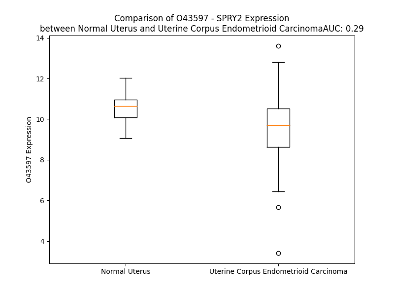

# Detailed Data for O43597

## Introduction to the Detailed Summary

### How to Interpret the Results

- **Summary & Metrics**: This section provides a quick reference to essential protein attributes, including expression changes, family classification, and biomarker applications. Regulation status (upregulated/downregulated) indicates the protein's behavior in a disease context. Some information comes from the original excel file with the proteins selected from literature, while others are derived from the analyses.
- **Expression Comparison**: A visual representation comparing protein expression between normal and disease states. It highlights significant changes in expression levels that might indicate diagnostic or therapeutic relevance. This is data coming from transcriptomics experiments and could not translate similarly to protein levels.
- **Isoform Alignment**: An interactive view of isoform alignments, revealing structural and functional differences between variants of the protein.
- **Interactors & Homologs**: Tables listing known interaction partners and homologous proteins, the more interactors and homologs, the more complex the protein is to design an antibody for.
- **Biological Assemblies**: Information about the structural arrangement of the protein in different assemblies, providing insights into its functional state but also the complexity of the protein to develop antibodies.
- **Combined Per-Residue Information**: A detailed table summarizing residue-level data. This includes predictions for epitope regions, aggregation tendencies, and modifications that might impact the protein's function. Each row corresponds to a residue in the protein, providing insights into specific sites that may be important for research or drug development.
## Summary & Metrics

- **UniProt Accession**: O43597
- **Gene Name**: SPRY2
- **Protein Name**: Protein sprouty homolog 2
- **Swiss Prot**: SPY2_HUMAN
- **Family**: other
- **Biomarker Application**:  
- **Number of Isoforms**: 0
- **Regulation**: -1
- **(transcriptomics) AUC**: 0.51
- **(transcriptomics) Fold Change**: 1.01
- **(transcriptomics) Regulation**: Downregulated
- **Discotope Epitope Count**: 32
- **Max n_uniprots (Homo)**: 1
- **Max n_uniprots (Hetero)**: 2

## Expression Comparison

## Interactors

| preferredName_A   | preferredName_B   |   score |
|:------------------|:------------------|--------:|
| SPRY2             | CBL               |   0.999 |
| SPRY2             | GRB2              |   0.987 |
| SPRY2             | BRAF              |   0.97  |

## Homologs

| uniprot_id   | gene_id   |
|:-------------|:----------|
| O43610       | SPRY3     |
| D6RB56       | SPRY4     |
| O43609       | SPRY1     |

## Biological Assemblies

|   Unnamed: 0 |   assembly |   n_uniprots | composition   | crystal_id   |
|-------------:|-----------:|-------------:|:--------------|:-------------|
|            0 |          1 |            2 | Hetero        | 3ob1         |
|            0 |          1 |            1 | Homo          | 5hl0         |
|            0 |          1 |            2 | Hetero        | 5hkz         |
|            0 |          1 |            1 | Homo          | 3bum         |
|            1 |          2 |            1 | Homo          | 3bum         |
|            2 |          3 |            2 | Hetero        | 3bum         |
|            0 |          1 |            2 | Hetero        | 5hky         |

## Combined Per-Residue Information

|   res | aa   |   epitope_score | epitope   |   relative_surface_accessibility |   modeling_confidence |   Aggregation | modification   |
|------:|:-----|----------------:|:----------|---------------------------------:|----------------------:|--------------:|:---------------|
|     1 | M    |         0.11822 | False     |                          1.35017 |                 56.62 |         0     | N/A            |
|     2 | E    |         0.14986 | False     |                          0.88273 |                 45.35 |         0     | N/A            |
|     3 | A    |         0.08615 | False     |                          0.939   |                 46.2  |         0     | N/A            |
|     4 | R    |         0.14033 | False     |                          0.88159 |                 47.35 |         0     | N/A            |
|     5 | A    |         0.08452 | False     |                          0.83854 |                 42.58 |         0     | N/A            |
|     6 | Q    |         0.11197 | False     |                          0.88478 |                 60.13 |         0     | N/A            |
|     7 | S    |         0.08249 | False     |                          0.91914 |                 42.95 |         0     | N/A            |
|     8 | G    |         0.12146 | False     |                          0.8682  |                 45.14 |         0     | N/A            |
|     9 | N    |         0.15937 | False     |                          1.06077 |                 41.43 |         0     | N/A            |
|    10 | G    |         0.09568 | False     |                          0.78388 |                 44.69 |         0     | N/A            |
|    11 | S    |         0.09953 | False     |                          0.89802 |                 49.65 |         0     | N/A            |
|    12 | Q    |         0.09111 | False     |                          0.8428  |                 41.75 |         0     | N/A            |
|    13 | P    |         0.08356 | False     |                          0.78607 |                 49.27 |         0     | N/A            |
|    14 | L    |         0.08623 | False     |                          0.90529 |                 43.47 |         0     | N/A            |
|    15 | L    |         0.10424 | False     |                          0.85856 |                 45.42 |         0     | N/A            |
|    16 | Q    |         0.09522 | False     |                          0.81387 |                 41.78 |         0     | N/A            |
|    17 | T    |         0.12828 | False     |                          0.88341 |                 37.51 |         0     | N/A            |
|    18 | P    |         0.11018 | False     |                          0.81678 |                 45.54 |         0     | N/A            |
|    19 | R    |         0.12979 | False     |                          0.90587 |                 42.54 |         0     | N/A            |
|    20 | D    |         0.10482 | False     |                          0.84619 |                 42.28 |         0     | N/A            |
|    21 | G    |         0.10451 | False     |                          0.91992 |                 41.45 |         0     | N/A            |
|    22 | G    |         0.10143 | False     |                          0.95419 |                 39.65 |         0     | N/A            |
|    23 | R    |         0.20025 | False     |                          0.9024  |                 40.31 |         0     | N/A            |
|    24 | Q    |         0.10728 | False     |                          0.80326 |                 43.76 |         0     | N/A            |
|    25 | R    |         0.20792 | False     |                          0.89832 |                 43.15 |         0     | N/A            |
|    26 | G    |         0.15882 | False     |                          0.7985  |                 42.99 |         0     | N/A            |
|    27 | E    |         0.16737 | False     |                          0.74648 |                 42.35 |         0     | N/A            |
|    28 | P    |         0.14659 | False     |                          0.73049 |                 50.45 |         0     | N/A            |
|    29 | D    |         0.21869 | True      |                          0.49129 |                 46.06 |         0     | N/A            |
|    30 | P    |         0.16403 | False     |                          0.80698 |                 52.22 |         0     | N/A            |
|    31 | R    |         0.201   | False     |                          0.82868 |                 53.02 |         0     | N/A            |
|    32 | D    |         0.13293 | False     |                          0.62686 |                 46.9  |         0     | N/A            |
|    33 | A    |         0.16589 | False     |                          0.76359 |                 44.08 |         0     | N/A            |
|    34 | L    |         0.17957 | False     |                          1.04099 |                 44.96 |         0     | N/A            |
|    35 | T    |         0.16512 | False     |                          0.80051 |                 45.55 |         0     | N/A            |
|    36 | Q    |         0.14556 | False     |                          0.75354 |                 40.02 |         0     | N/A            |
|    37 | Q    |         0.12357 | False     |                          0.89631 |                 41.62 |         0     | N/A            |
|    38 | V    |         0.13134 | False     |                          0.93465 |                 52.7  |         0     | N/A            |
|    39 | H    |         0.16358 | False     |                          0.74998 |                 58.11 |         0     | N/A            |
|    40 | V    |         0.2341  | True      |                          0.87983 |                 63.23 |         0     | N/A            |
|    41 | L    |         0.1784  | False     |                          0.35088 |                 74.18 |         0     | N/A            |
|    42 | S    |         0.13055 | False     |                          0.50572 |                 77.26 |         0     | N/A            |
|    43 | L    |         0.12394 | False     |                          0.72542 |                 72.29 |         0     | N/A            |
|    44 | D    |         0.12558 | False     |                          0.62874 |                 77.61 |         0     | N/A            |
|    45 | Q    |         0.12636 | False     |                          0.39645 |                 76.75 |         0     | N/A            |
|    46 | I    |         0.17438 | False     |                          0.35118 |                 70.88 |         0     | N/A            |
|    47 | R    |         0.20798 | False     |                          0.63278 |                 73.62 |         0     | N/A            |
|    48 | A    |         0.12892 | False     |                          0.7423  |                 70.24 |         0     | N/A            |
|    49 | I    |         0.14797 | False     |                          0.66513 |                 66.05 |         0     | N/A            |
|    50 | R    |         0.20038 | False     |                          0.63249 |                 59.7  |         0     | N/A            |
|    51 | N    |         0.23226 | True      |                          0.80925 |                 56.3  |         0     | N/A            |
|    52 | T    |         0.13681 | False     |                          0.80647 |                 51.5  |         0     | N/A            |
|    53 | N    |         0.17665 | False     |                          0.4337  |                 55.88 |         0     | N/A            |
|    54 | E    |         0.23706 | True      |                          0.86342 |                 59.4  |         0     | N/A            |
|    55 | Y    |         0.21616 | True      |                          0.95522 |                 58.77 |         0     | N/A            |
|    56 | T    |         0.1596  | False     |                          0.74848 |                 66.58 |         0     | N/A            |
|    57 | E    |         0.20222 | False     |                          0.84326 |                 52.63 |         0     | N/A            |
|    58 | G    |         0.2131  | True      |                          0.55987 |                 57.44 |         0     | N/A            |
|    59 | P    |         0.13855 | False     |                          0.91006 |                 49.61 |         0     | N/A            |
|    60 | T    |         0.16186 | False     |                          0.87034 |                 51.45 |         0     | N/A            |
|    61 | V    |         0.17072 | False     |                          0.9033  |                 49.28 |         0     | N/A            |
|    62 | V    |         0.12303 | False     |                          0.69927 |                 46.5  |         0     | N/A            |
|    63 | P    |         0.16754 | False     |                          0.82725 |                 46.29 |         0     | N/A            |
|    64 | R    |         0.2211  | True      |                          0.83191 |                 41.54 |         0     | N/A            |
|    65 | P    |         0.18462 | False     |                          0.92216 |                 45.29 |         0     | N/A            |
|    66 | G    |         0.12097 | False     |                          0.89749 |                 38.21 |         0     | N/A            |
|    67 | L    |         0.20085 | False     |                          0.95999 |                 43.73 |         0     | N/A            |
|    68 | K    |         0.16271 | False     |                          0.93407 |                 44.08 |         0     | N/A            |
|    69 | P    |         0.12887 | False     |                          0.93824 |                 40.4  |         0     | N/A            |
|    70 | A    |         0.14081 | False     |                          0.9265  |                 45.29 |         0     | N/A            |
|    71 | P    |         0.1434  | False     |                          0.95073 |                 49.45 |         0     | N/A            |
|    72 | R    |         0.21436 | True      |                          0.94858 |                 41.95 |         0     | N/A            |
|    73 | P    |         0.14299 | False     |                          0.88995 |                 41.66 |         0     | N/A            |
|    74 | S    |         0.14863 | False     |                          0.76807 |                 39.42 |         0     | N/A            |
|    75 | T    |         0.19019 | False     |                          0.86385 |                 41.56 |         0     | N/A            |
|    76 | Q    |         0.10564 | False     |                          0.84403 |                 44.26 |         0     | N/A            |
|    77 | H    |         0.11275 | False     |                          0.94522 |                 40.33 |         0     | N/A            |
|    78 | K    |         0.09526 | False     |                          0.89512 |                 39.17 |         0     | N/A            |
|    79 | H    |         0.11707 | False     |                          0.88298 |                 43.6  |         0     | N/A            |
|    80 | E    |         0.07815 | False     |                          0.69146 |                 39.67 |         0     | N/A            |
|    81 | R    |         0.17124 | False     |                          0.83652 |                 38.12 |         0     | N/A            |
|    82 | L    |         0.1668  | False     |                          0.78957 |                 40.49 |         0     | N/A            |
|    83 | H    |         0.09355 | False     |                          0.89996 |                 42.26 |         0     | N/A            |
|    84 | G    |         0.12164 | False     |                          0.81304 |                 33.63 |         0     | N/A            |
|    85 | L    |         0.09128 | False     |                          1.09166 |                 42.63 |         0     | N/A            |
|    86 | P    |         0.0685  | False     |                          0.83143 |                 39.4  |         0     | N/A            |
|    87 | E    |         0.12442 | False     |                          0.89932 |                 39.63 |         0     | N/A            |
|    88 | H    |         0.11706 | False     |                          0.80805 |                 41.24 |         0     | N/A            |
|    89 | R    |         0.11054 | False     |                          0.82204 |                 41.86 |         0     | N/A            |
|    90 | Q    |         0.08162 | False     |                          0.823   |                 40.83 |         0     | N/A            |
|    91 | P    |         0.10765 | False     |                          0.80959 |                 52.19 |         0     | N/A            |
|    92 | P    |         0.10431 | False     |                          0.98237 |                 44.27 |         0     | N/A            |
|    93 | R    |         0.11617 | False     |                          0.90469 |                 37.07 |         0     | N/A            |
|    94 | L    |         0.08257 | False     |                          1.04923 |                 49.25 |         0     | N/A            |
|    95 | Q    |         0.1036  | False     |                          0.79866 |                 44.24 |         0     | N/A            |
|    96 | H    |         0.13347 | False     |                          0.91902 |                 35.36 |         0     | N/A            |
|    97 | S    |         0.0791  | False     |                          0.8911  |                 42.23 |         0     | N/A            |
|    98 | Q    |         0.09806 | False     |                          0.77352 |                 37.86 |         0     | N/A            |
|    99 | V    |         0.12745 | False     |                          0.99135 |                 45.08 |         0     | N/A            |
|   100 | H    |         0.08703 | False     |                          0.94378 |                 42.03 |         0     | N/A            |
|   101 | S    |         0.07114 | False     |                          0.85723 |                 36.81 |         0     | N/A            |
|   102 | S    |         0.06941 | False     |                          0.91362 |                 45.95 |         0     | N/A            |
|   103 | A    |         0.06458 | False     |                          0.92027 |                 37.67 |         0     | N/A            |
|   104 | R    |         0.16837 | False     |                          0.93572 |                 43.32 |         0     | N/A            |
|   105 | A    |         0.1173  | False     |                          0.8831  |                 47.94 |         0     | N/A            |
|   106 | P    |         0.08341 | False     |                          0.89828 |                 47.37 |         0     | N/A            |
|   107 | L    |         0.09811 | False     |                          1.05977 |                 45.09 |         0     | N/A            |
|   108 | S    |         0.09017 | False     |                          0.7727  |                 39.73 |         0     | N/A            |
|   109 | R    |         0.11388 | False     |                          0.93373 |                 45.05 |         0     | N/A            |
|   110 | S    |         0.07054 | False     |                          0.8239  |                 39.95 |         0     | N/A            |
|   111 | I    |         0.09466 | False     |                          0.95223 |                 51.16 |         0     | N/A            |
|   112 | S    |         0.09059 | False     |                          0.76326 |                 39.02 |         0     | N/A            |
|   113 | T    |         0.0922  | False     |                          0.93277 |                 48.27 |         0     | N/A            |
|   114 | V    |         0.0941  | False     |                          0.93061 |                 48.57 |         0     | N/A            |
|   115 | S    |         0.07374 | False     |                          0.81982 |                 37.46 |         0     | N/A            |
|   116 | S    |         0.053   | False     |                          0.9136  |                 45.05 |         0     | N/A            |
|   117 | G    |         0.14161 | False     |                          0.8801  |                 37.28 |         0     | N/A            |
|   118 | S    |         0.08289 | False     |                          0.85499 |                 45.61 |         0     | N/A            |
|   119 | R    |         0.17343 | False     |                          0.96025 |                 43.37 |         0     | N/A            |
|   120 | S    |         0.09289 | False     |                          0.91533 |                 45.88 |         0     | N/A            |
|   121 | S    |         0.07115 | False     |                          0.87698 |                 40.1  |         0     | N/A            |
|   122 | T    |         0.09124 | False     |                          0.88902 |                 43.83 |         0     | N/A            |
|   123 | R    |         0.13302 | False     |                          0.90418 |                 48.52 |         0     | N/A            |
|   124 | T    |         0.11422 | False     |                          0.93576 |                 45.92 |         0     | N/A            |
|   125 | S    |         0.12247 | False     |                          0.67615 |                 45.29 |         0     | N/A            |
|   126 | T    |         0.10716 | False     |                          0.90951 |                 45.54 |         0     | N/A            |
|   127 | S    |         0.08716 | False     |                          0.91663 |                 45.33 |         0     | N/A            |
|   128 | S    |         0.0829  | False     |                          0.83842 |                 41.19 |         0     | N/A            |
|   129 | S    |         0.08057 | False     |                          0.8104  |                 44.67 |         0     | N/A            |
|   130 | S    |         0.10708 | False     |                          0.80449 |                 43.23 |         0     | N/A            |
|   131 | S    |         0.0697  | False     |                          0.6315  |                 48.73 |         0     | N/A            |
|   132 | E    |         0.12611 | False     |                          0.78814 |                 42.3  |         0     | N/A            |
|   133 | Q    |         0.10064 | False     |                          0.823   |                 44.57 |         0     | N/A            |
|   134 | R    |         0.11189 | False     |                          0.94775 |                 42.8  |         0     | N/A            |
|   135 | L    |         0.0696  | False     |                          1.02898 |                 41.2  |         0     | N/A            |
|   136 | L    |         0.09001 | False     |                          1.10609 |                 45.55 |         0     | N/A            |
|   137 | G    |         0.14546 | False     |                          0.89951 |                 39    |         0     | N/A            |
|   138 | S    |         0.07755 | False     |                          0.75719 |                 39.79 |         0     | N/A            |
|   139 | S    |         0.07345 | False     |                          0.85936 |                 39.12 |         0     | N/A            |
|   140 | F    |         0.13331 | False     |                          0.93822 |                 45.31 |         0     | N/A            |
|   141 | S    |         0.11404 | False     |                          0.75084 |                 41.97 |         0     | N/A            |
|   142 | S    |         0.11085 | False     |                          0.90987 |                 42.08 |         0     | N/A            |
|   143 | G    |         0.10218 | False     |                          0.81682 |                 37.69 |         0     | N/A            |
|   144 | P    |         0.10305 | False     |                          1.00565 |                 40.48 |         0     | N/A            |
|   145 | V    |         0.0628  | False     |                          0.95916 |                 46.34 |         0     | N/A            |
|   146 | A    |         0.06936 | False     |                          0.8785  |                 50.79 |         0     | N/A            |
|   147 | D    |         0.06582 | False     |                          0.9285  |                 48    |         0     | N/A            |
|   148 | G    |         0.06494 | False     |                          0.73705 |                 52.56 |         0     | N/A            |
|   149 | I    |         0.10595 | False     |                          0.92085 |                 54.59 |         0     | N/A            |
|   150 | I    |         0.10406 | False     |                          0.96757 |                 55.63 |         0     | N/A            |
|   151 | R    |         0.21325 | True      |                          0.87981 |                 60.47 |         0     | N/A            |
|   152 | V    |         0.08818 | False     |                          0.8293  |                 67.24 |         0     | N/A            |
|   153 | Q    |         0.12743 | False     |                          0.83653 |                 57.31 |         0     | N/A            |
|   154 | P    |         0.12338 | False     |                          0.92095 |                 64.46 |         0     | N/A            |
|   155 | K    |         0.13229 | False     |                          0.91566 |                 49.65 |         0     | N/A            |
|   156 | S    |         0.09581 | False     |                          0.6741  |                 53.68 |         0     | N/A            |
|   157 | E    |         0.12218 | False     |                          0.82529 |                 43.73 |         0     | N/A            |
|   158 | L    |         0.18513 | False     |                          0.95547 |                 48.01 |         0     | N/A            |
|   159 | K    |         0.11015 | False     |                          0.87501 |                 42.48 |         0     | N/A            |
|   160 | P    |         0.17419 | False     |                          0.96542 |                 44.23 |         0     | N/A            |
|   161 | G    |         0.15839 | False     |                          0.81328 |                 39.25 |         0     | N/A            |
|   162 | E    |         0.15639 | False     |                          0.85231 |                 40.99 |         0     | N/A            |
|   163 | L    |         0.22066 | True      |                          1.07475 |                 45.53 |         0     | N/A            |
|   164 | K    |         0.19339 | False     |                          0.90705 |                 39.17 |         0     | N/A            |
|   165 | P    |         0.16776 | False     |                          0.84609 |                 43.38 |         0     | N/A            |
|   166 | L    |         0.22781 | True      |                          0.81736 |                 43.34 |         0     | N/A            |
|   167 | S    |         0.1701  | False     |                          0.53482 |                 40.65 |         0     | N/A            |
|   168 | K    |         0.13662 | False     |                          0.92805 |                 49.45 |         0     | N/A            |
|   169 | E    |         0.14471 | False     |                          0.66469 |                 51.95 |         0     | N/A            |
|   170 | D    |         0.12826 | False     |                          0.47571 |                 52.14 |         0     | N/A            |
|   171 | L    |         0.1347  | False     |                          0.74218 |                 54.27 |         0     | N/A            |
|   172 | G    |         0.17873 | False     |                          0.5018  |                 59.99 |         0     | N/A            |
|   173 | L    |         0.12761 | False     |                          0.50293 |                 66.33 |         0     | N/A            |
|   174 | H    |         0.1242  | False     |                          0.45219 |                 79.36 |         0     | N/A            |
|   175 | A    |         0.1077  | False     |                          0.17674 |                 78.65 |         0     | N/A            |
|   176 | Y    |         0.11815 | False     |                          0.53354 |                 81.66 |         0     | N/A            |
|   177 | R    |         0.20289 | False     |                          0.4604  |                 86.45 |         0     | N/A            |
|   178 | C    |         0.02214 | False     |                          0.00888 |                 88.45 |         0     | N/A            |
|   179 | E    |         0.10779 | False     |                          0.57283 |                 87.33 |         0     | N/A            |
|   180 | D    |         0.17534 | False     |                          0.647   |                 86.18 |         0     | N/A            |
|   181 | C    |         0.1339  | False     |                          0.3822  |                 88.49 |         0     | N/A            |
|   182 | G    |         0.11714 | False     |                          0.50665 |                 84.23 |         0     | N/A            |
|   183 | K    |         0.12457 | False     |                          0.46745 |                 88.44 |         0     | N/A            |
|   184 | C    |         0.09757 | False     |                          0.14341 |                 89.98 |         0     | N/A            |
|   185 | K    |         0.18225 | False     |                          0.27492 |                 87.23 |         0     | N/A            |
|   186 | C    |         0.05793 | False     |                          0.0721  |                 86.79 |         0     | N/A            |
|   187 | K    |         0.16545 | False     |                          0.93245 |                 84.67 |         0     | N/A            |
|   188 | E    |         0.22568 | True      |                          0.46387 |                 85.62 |         0     | N/A            |
|   189 | C    |         0.07912 | False     |                          0.05137 |                 86.2  |         0     | N/A            |
|   190 | T    |         0.16659 | False     |                          0.32278 |                 86.42 |         0     | N/A            |
|   191 | Y    |         0.21801 | True      |                          0.61514 |                 84.68 |         0     | N/A            |
|   192 | P    |         0.16186 | False     |                          0.53014 |                 84.42 |         0     | N/A            |
|   193 | R    |         0.18765 | False     |                          0.24471 |                 86.74 |         0     | N/A            |
|   194 | P    |         0.14869 | False     |                          0.61806 |                 85.04 |         0     | N/A            |
|   195 | L    |         0.06782 | False     |                          0.25702 |                 87.23 |         0     | N/A            |
|   196 | P    |         0.13447 | False     |                          0.72087 |                 87.59 |         0     | N/A            |
|   197 | S    |         0.17863 | False     |                          0.49452 |                 89.31 |         0     | N/A            |
|   198 | D    |         0.18324 | False     |                          0.59238 |                 87.91 |         0     | N/A            |
|   199 | W    |         0.2583  | True      |                          0.62527 |                 89.15 |         0     | N/A            |
|   200 | I    |         0.18777 | False     |                          0.49118 |                 88    |         0     | N/A            |
|   201 | C    |         0.1629  | False     |                          0.57808 |                 86.7  |         0     | N/A            |
|   202 | D    |         0.12567 | False     |                          0.88318 |                 84.2  |         0     | N/A            |
|   203 | K    |         0.2244  | True      |                          0.57996 |                 83.68 |         0     | N/A            |
|   204 | Q    |         0.2422  | True      |                          0.74505 |                 83.88 |         0     | N/A            |
|   205 | C    |         0.21134 | True      |                          0.43788 |                 84.25 |         0     | N/A            |
|   206 | L    |         0.22568 | True      |                          0.41057 |                 88.57 |         0     | N/A            |
|   207 | C    |         0.15753 | False     |                          0.3768  |                 88.36 |         0     | N/A            |
|   208 | S    |         0.08701 | False     |                          0.1293  |                 90.86 |         0     | N/A            |
|   209 | A    |         0.05657 | False     |                          0.37764 |                 91.43 |         0     | N/A            |
|   210 | Q    |         0.12186 | False     |                          0.33309 |                 90.56 |         0     | N/A            |
|   211 | N    |         0.09097 | False     |                          0.26629 |                 89.86 |         0     | N/A            |
|   212 | V    |         0.08643 | False     |                          0.65256 |                 91.54 |         0     | N/A            |
|   213 | I    |         0.12917 | False     |                          0.13999 |                 92.85 |         0     | N/A            |
|   214 | D    |         0.05298 | False     |                          0.06756 |                 91.21 |         0     | N/A            |
|   215 | Y    |         0.26781 | True      |                          0.70562 |                 91.14 |         0     | N/A            |
|   216 | G    |         0.08505 | False     |                          0.6777  |                 91.42 |         0     | N/A            |
|   217 | T    |         0.03183 | False     |                          0.05522 |                 92.93 |         0     | N/A            |
|   218 | C    |         0.0763  | False     |                          0.19068 |                 92.44 |         0     | N/A            |
|   219 | V    |         0.01045 | False     |                          0.0238  |                 91.57 |         0     | N/A            |
|   220 | C    |         0.06491 | False     |                          0.3316  |                 90.38 |         0     | N/A            |
|   221 | C    |         0.06088 | False     |                          0.42522 |                 90.82 |         0     | N/A            |
|   222 | V    |         0.01986 | False     |                          0.02571 |                 89.97 |         0     | N/A            |
|   223 | K    |         0.11248 | False     |                          0.32944 |                 89.18 |         0     | N/A            |
|   224 | G    |         0.13192 | False     |                          0.34351 |                 88.78 |         0     | N/A            |
|   225 | L    |         0.0626  | False     |                          0.39112 |                 87.21 |         0.54  | N/A            |
|   226 | F    |         0.03607 | False     |                          0.07745 |                 86.62 |         0.54  | N/A            |
|   227 | Y    |         0.20792 | False     |                          0.70754 |                 84.51 |         0.54  | N/A            |
|   228 | H    |         0.15883 | False     |                          0.82756 |                 84.89 |         0.54  | N/A            |
|   229 | C    |         0.08786 | False     |                          0.65633 |                 76.89 |         0.54  | N/A            |
|   230 | S    |         0.11661 | False     |                          0.31005 |                 72.4  |         0.259 | N/A            |
|   231 | N    |         0.21926 | True      |                          0.82373 |                 63.65 |         0     | N/A            |
|   232 | D    |         0.23442 | True      |                          0.91402 |                 63.81 |         0     | N/A            |
|   233 | D    |         0.24578 | True      |                          0.74248 |                 58.77 |         0     | N/A            |
|   234 | E    |         0.19363 | False     |                          0.76813 |                 56.81 |         0     | N/A            |
|   235 | D    |         0.08627 | False     |                          0.23132 |                 60.63 |         0     | N/A            |
|   236 | N    |         0.11528 | False     |                          0.60625 |                 67.12 |         0     | N/A            |
|   237 | C    |         0.05311 | False     |                          0.06893 |                 65.23 |         0     | N/A            |
|   238 | A    |         0.12929 | False     |                          0.20368 |                 72.92 |         0     | N/A            |
|   239 | D    |         0.21657 | True      |                          0.50433 |                 74.68 |         0     | N/A            |
|   240 | N    |         0.28295 | True      |                          0.5429  |                 74.83 |         0     | N/A            |
|   241 | P    |         0.03997 | False     |                          0.05044 |                 72.47 |         0     | N/A            |
|   242 | C    |         0.04692 | False     |                          0.29956 |                 72.75 |         0     | N/A            |
|   243 | S    |         0.1166  | False     |                          0.30247 |                 73.5  |         0     | N/A            |
|   244 | C    |         0.21684 | True      |                          0.64599 |                 70.96 |         0     | N/A            |
|   245 | S    |         0.26312 | True      |                          0.84498 |                 67.4  |         0     | N/A            |
|   246 | Q    |         0.15328 | False     |                          0.25146 |                 67.57 |         0     | N/A            |
|   247 | S    |         0.22357 | True      |                          0.79398 |                 67.71 |         0     | N/A            |
|   248 | H    |         0.16097 | False     |                          0.5574  |                 71.76 |         0     | N/A            |
|   249 | C    |         0.19221 | False     |                          0.22654 |                 76.87 |         0     | N/A            |
|   250 | C    |         0.17674 | False     |                          0.81103 |                 81.34 |         0     | N/A            |
|   251 | T    |         0.15284 | False     |                          0.63486 |                 83.97 |         0     | N/A            |
|   252 | R    |         0.05111 | False     |                          0.04253 |                 84.72 |         0     | N/A            |
|   253 | W    |         0.17275 | False     |                          0.47916 |                 87.99 |         0     | N/A            |
|   254 | S    |         0.18522 | False     |                          0.50459 |                 87.55 |         0     | N/A            |
|   255 | A    |         0.0545  | False     |                          0.29243 |                 87.82 |         0.556 | N/A            |
|   256 | M    |         0.07131 | False     |                          0.11776 |                 88.13 |         1.214 | N/A            |
|   257 | G    |         0.14667 | False     |                          0.41109 |                 89.34 |         1.791 | N/A            |
|   258 | V    |         0.14315 | False     |                          0.58078 |                 91.18 |         8.649 | N/A            |
|   259 | M    |         0.09118 | False     |                          0.22396 |                 88.61 |         8.649 | N/A            |
|   260 | S    |         0.05664 | False     |                          0.13083 |                 90.71 |         8.649 | N/A            |
|   261 | L    |         0.18713 | False     |                          0.81476 |                 90.31 |         8.649 | N/A            |
|   262 | F    |         0.20008 | False     |                          0.7716  |                 90.42 |         8.649 | N/A            |
|   263 | L    |         0.12137 | False     |                          0.23494 |                 90.1  |         0.452 | N/A            |
|   264 | P    |         0.14827 | False     |                          0.71077 |                 89.27 |         0.231 | N/A            |
|   265 | C    |         0.05733 | False     |                          0.22537 |                 92    |         0.831 | N/A            |
|   266 | L    |         0.05578 | False     |                          0.11856 |                 90.72 |         0.978 | N/A            |
|   267 | W    |         0.18367 | False     |                          0.74288 |                 90.14 |         0.978 | N/A            |
|   268 | C    |         0.10238 | False     |                          0.53021 |                 92.48 |         0.978 | N/A            |
|   269 | Y    |         0.0789  | False     |                          0.07791 |                 92.43 |         0.978 | N/A            |
|   270 | L    |         0.09758 | False     |                          0.76617 |                 90.85 |         0.147 | N/A            |
|   271 | P    |         0.15639 | False     |                          0.58003 |                 94    |         0     | N/A            |
|   272 | A    |         0.04359 | False     |                          0.24247 |                 93.27 |         0     | N/A            |
|   273 | K    |         0.10267 | False     |                          0.327   |                 92.37 |         0     | N/A            |
|   274 | G    |         0.09776 | False     |                          0.48418 |                 93.37 |         0     | N/A            |
|   275 | C    |         0.1033  | False     |                          0.55054 |                 94.36 |         0     | N/A            |
|   276 | L    |         0.06741 | False     |                          0.11047 |                 93.06 |         0     | N/A            |
|   277 | K    |         0.06142 | False     |                          0.62569 |                 92.93 |         0     | N/A            |
|   278 | L    |         0.09689 | False     |                          0.74264 |                 94.74 |         0     | N/A            |
|   279 | C    |         0.03451 | False     |                          0.51375 |                 92.47 |         0     | N/A            |
|   280 | Q    |         0.07867 | False     |                          0.3067  |                 92.71 |         0     | N/A            |
|   281 | G    |         0.13582 | False     |                          0.36319 |                 91.78 |         0     | N/A            |
|   282 | C    |         0.07769 | False     |                          0.50547 |                 92.56 |         0     | N/A            |
|   283 | Y    |         0.0999  | False     |                          0.33749 |                 92.25 |         0     | N/A            |
|   284 | D    |         0.07906 | False     |                          0.10354 |                 91.42 |         0     | N/A            |
|   285 | R    |         0.17699 | False     |                          0.56756 |                 88.7  |         0     | N/A            |
|   286 | V    |         0.18695 | False     |                          0.94976 |                 89.35 |         0     | N/A            |
|   287 | N    |         0.12274 | False     |                          0.46752 |                 87.7  |         0     | N/A            |
|   288 | R    |         0.1379  | False     |                          0.16177 |                 87.22 |         0     | N/A            |
|   289 | P    |         0.23347 | True      |                          0.56634 |                 84.52 |         0     | N/A            |
|   290 | G    |         0.00945 | False     |                          0.00161 |                 87.29 |         0     | N/A            |
|   291 | C    |         0.02614 | False     |                          0.03677 |                 88.93 |         0     | N/A            |
|   292 | R    |         0.18474 | False     |                          0.45686 |                 85.45 |         0     | N/A            |
|   293 | C    |         0.09987 | False     |                          0.36053 |                 86.53 |         0     | N/A            |
|   294 | K    |         0.28869 | True      |                          0.99393 |                 83.44 |         0     | N/A            |
|   295 | N    |         0.28289 | True      |                          0.89033 |                 80.47 |         0     | N/A            |
|   296 | S    |         0.14838 | False     |                          0.11422 |                 77.8  |         0     | N/A            |
|   297 | N    |         0.18626 | False     |                          0.68747 |                 79.05 |         0     | N/A            |
|   298 | T    |         0.19776 | False     |                          0.49542 |                 82.05 |         0     | N/A            |
|   299 | V    |         0.20111 | False     |                          0.49222 |                 79.88 |         0     | N/A            |
|   300 | C    |         0.19813 | False     |                          0.60531 |                 76.5  |         0     | N/A            |
|   301 | C    |         0.14872 | False     |                          0.36957 |                 71.46 |         0     | N/A            |
|   302 | K    |         0.26866 | True      |                          0.89539 |                 64.94 |         0     | N/A            |
|   303 | V    |         0.16824 | False     |                          0.67328 |                 61.15 |         0     | N/A            |
|   304 | P    |         0.17516 | False     |                          0.82919 |                 54.23 |         0     | N/A            |
|   305 | T    |         0.22427 | True      |                          0.8549  |                 53.9  |         0     | N/A            |
|   306 | V    |         0.16589 | False     |                          0.86623 |                 54.19 |         0     | N/A            |
|   307 | P    |         0.16707 | False     |                          0.75861 |                 56.32 |         0     | N/A            |
|   308 | P    |         0.15226 | False     |                          0.87838 |                 56.02 |         0     | N/A            |
|   309 | R    |         0.19647 | False     |                          0.8755  |                 53.64 |         0     | N/A            |
|   310 | N    |         0.16496 | False     |                          0.89818 |                 53.44 |         0     | N/A            |
|   311 | F    |         0.14533 | False     |                          1.01689 |                 56.99 |         0     | N/A            |
|   312 | E    |         0.1556  | False     |                          0.8597  |                 48.71 |         0     | N/A            |
|   313 | K    |         0.15475 | False     |                          0.88819 |                 54.47 |         0     | N/A            |
|   314 | P    |         0.10915 | False     |                          0.84391 |                 60.06 |         0     | N/A            |
|   315 | T    |         0.07861 | False     |                          1.35028 |                 50.78 |         0     | N/A            |

