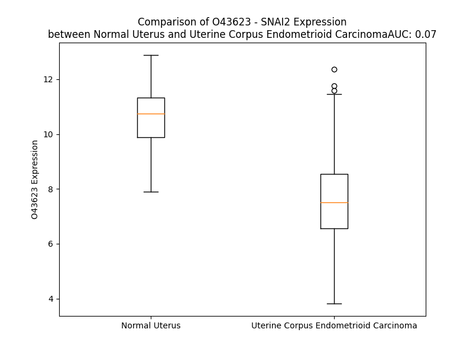

# Detailed Data for O43623

## Introduction to the Detailed Summary

### How to Interpret the Results

- **Summary & Metrics**: This section provides a quick reference to essential protein attributes, including expression changes, family classification, and biomarker applications. Regulation status (upregulated/downregulated) indicates the protein's behavior in a disease context. Some information comes from the original excel file with the proteins selected from literature, while others are derived from the analyses.
- **Expression Comparison**: A visual representation comparing protein expression between normal and disease states. It highlights significant changes in expression levels that might indicate diagnostic or therapeutic relevance. This is data coming from transcriptomics experiments and could not translate similarly to protein levels.
- **Isoform Alignment**: An interactive view of isoform alignments, revealing structural and functional differences between variants of the protein.
- **Interactors & Homologs**: Tables listing known interaction partners and homologous proteins, the more interactors and homologs, the more complex the protein is to design an antibody for.
- **Biological Assemblies**: Information about the structural arrangement of the protein in different assemblies, providing insights into its functional state but also the complexity of the protein to develop antibodies.
- **Combined Per-Residue Information**: A detailed table summarizing residue-level data. This includes predictions for epitope regions, aggregation tendencies, and modifications that might impact the protein's function. Each row corresponds to a residue in the protein, providing insights into specific sites that may be important for research or drug development.
## Summary & Metrics

- **UniProt Accession**: O43623
- **Gene Name**: SNAI2
- **Protein Name**: Zinc finger protein SNAI2
- **Swiss Prot**: SNAI2_HUMAN
- **Family**: nan
- **Biomarker Application**: nan
- **Number of Isoforms**: 0
- **Regulation**: 1
- **(transcriptomics) AUC**: 0.07
- **(transcriptomics) Fold Change**: 1.39
- **(transcriptomics) Regulation**: Downregulated
- **Discotope Epitope Count**: 11
- **Max n_uniprots (Homo)**: N/A
- **Max n_uniprots (Hetero)**: N/A

## Expression Comparison

## Interactors

| preferredName_A   | preferredName_B   |   score |
|:------------------|:------------------|--------:|
| SNAI2             | KDM1A             |   0.974 |
| SNAI2             | TWIST1            |   0.952 |
| SNAI2             | CDH1              |   0.929 |
| SNAI2             | HDAC1             |   0.924 |
| SNAI2             | TP53              |   0.915 |
| SNAI2             | SOX9              |   0.91  |

## Homologs

| uniprot_id   | gene_id   |
|:-------------|:----------|
| B2RXF5       | ZBTB42    |
| Q5T0B9       | ZNF362    |
| Q5T4E8       | PRDM1     |
| Q9HBE1       | PATZ1     |
| Q9HC78       | ZBTB20    |
| G3V3W2       | ZNF410    |
| H3BTK0       | ZNF276    |
| Q14872       | MTF1      |
| E9PPB0       | ZNF143    |
| Q8WUU4       | ZNF296    |
| Q9Y2X9       | ZNF281    |
| Q96CK0       | ZNF653    |
| C9JMM8       | PRDM14    |
| Q14119       | VEZF1     |
| G3V3N0       | ZBTB1     |
| I3L411       | MAZ       |
| G5E9X2       | ZNF148    |
| E7EX64       | ZNF76     |
| Q14526       | HIC1      |
| D6REC5       | ZNF451    |
| B3KQ07       | ZNF575    |
| O95863       | SNAI1     |
| A0A0S2Z4J5   | ZBTB16    |
| F5H105       | ZNF384    |
| M0QZ57       | ZBTB45    |
| Q99592       | ZBTB18    |
| Q9Y2Y4       | ZBTB32    |
| Q96JB3       | HIC2      |
| Q9BWW7       | SCRT1     |
| Q9NQ03       | SCRT2     |
| Q96JP5       | ZFP91     |
| A0A1B0GXF8   | ZBTB7C    |
| E9PIB4       | PRDM10    |
| E9PLQ7       | ZNF692    |
| Q9NQX0       | PRDM6     |
| Q3KNW1       | SNAI3     |

## Combined Per-Residue Information

|   res | aa   |   epitope_score | epitope   |   relative_surface_accessibility |   modeling_confidence |   Aggregation | modification   |
|------:|:-----|----------------:|:----------|---------------------------------:|----------------------:|--------------:|:---------------|
|     1 | M    |         0.11016 | False     |                          1.2933  |                 32.96 |         0     | N/A            |
|     2 | P    |         0.15789 | False     |                          0.95443 |                 38.08 |         0     | N/A            |
|     3 | R    |         0.13956 | False     |                          0.937   |                 33.47 |         0     | N/A            |
|     4 | S    |         0.14112 | False     |                          0.86894 |                 37.01 |         0     | N/A            |
|     5 | F    |         0.1361  | False     |                          0.94911 |                 34.36 |         0     | N/A            |
|     6 | L    |         0.10586 | False     |                          1.07355 |                 34.1  |         0     | N/A            |
|     7 | V    |         0.12043 | False     |                          0.82811 |                 35.29 |         0     | N/A            |
|     8 | K    |         0.09937 | False     |                          0.887   |                 33.46 |         0     | N/A            |
|     9 | K    |         0.10824 | False     |                          0.91959 |                 37.34 |         0     | N/A            |
|    10 | H    |         0.12595 | False     |                          0.98609 |                 28.82 |         0     | N/A            |
|    11 | F    |         0.1421  | False     |                          1.02877 |                 32.21 |         0     | N/A            |
|    12 | N    |         0.1324  | False     |                          0.81929 |                 28.68 |         0     | N/A            |
|    13 | A    |         0.09088 | False     |                          0.88971 |                 31.18 |         0     | N/A            |
|    14 | S    |         0.14387 | False     |                          0.78818 |                 32.56 |         0     | N/A            |
|    15 | K    |         0.13887 | False     |                          0.99174 |                 35.5  |         0     | N/A            |
|    16 | K    |         0.1087  | False     |                          0.98852 |                 33.69 |         0     | N/A            |
|    17 | P    |         0.09348 | False     |                          0.83109 |                 31.26 |         0     | N/A            |
|    18 | N    |         0.11111 | False     |                          0.88268 |                 26.57 |         0     | N/A            |
|    19 | Y    |         0.21101 | False     |                          0.97305 |                 29.69 |         0     | N/A            |
|    20 | S    |         0.20783 | False     |                          0.69853 |                 31.58 |         0     | N/A            |
|    21 | E    |         0.15806 | False     |                          0.80551 |                 30.57 |         0     | N/A            |
|    22 | L    |         0.14978 | False     |                          1.06764 |                 34.45 |         0     | N/A            |
|    23 | D    |         0.13895 | False     |                          0.83943 |                 31.68 |         0     | N/A            |
|    24 | T    |         0.18701 | False     |                          0.91738 |                 36.23 |         0     | N/A            |
|    25 | H    |         0.20108 | False     |                          0.96125 |                 39.94 |         0.14  | N/A            |
|    26 | T    |         0.09678 | False     |                          0.81588 |                 36.82 |         0.14  | N/A            |
|    27 | V    |         0.10021 | False     |                          0.92494 |                 42.13 |         0.14  | N/A            |
|    28 | I    |         0.10289 | False     |                          0.82998 |                 37.18 |         0.14  | N/A            |
|    29 | I    |         0.1404  | False     |                          0.88211 |                 37.31 |         0.14  | N/A            |
|    30 | S    |         0.11895 | False     |                          0.50771 |                 29.29 |         0     | N/A            |
|    31 | P    |         0.16206 | False     |                          0.96879 |                 44.6  |         0     | N/A            |
|    32 | Y    |         0.17583 | False     |                          0.81469 |                 30.57 |         0     | N/A            |
|    33 | L    |         0.12069 | False     |                          0.74633 |                 30.06 |         0     | N/A            |
|    34 | Y    |         0.19891 | False     |                          0.75822 |                 35.74 |         0     | N/A            |
|    35 | E    |         0.12801 | False     |                          0.7157  |                 35.14 |         0     | N/A            |
|    36 | S    |         0.12776 | False     |                          0.7826  |                 36.78 |         0     | N/A            |
|    37 | Y    |         0.1764  | False     |                          0.71778 |                 35.76 |         0     | N/A            |
|    38 | S    |         0.16653 | False     |                          0.80335 |                 33.3  |         0     | N/A            |
|    39 | M    |         0.12274 | False     |                          0.72439 |                 32.27 |         0     | N/A            |
|    40 | P    |         0.11999 | False     |                          0.83797 |                 32.45 |         0     | N/A            |
|    41 | V    |         0.13759 | False     |                          0.94926 |                 39.56 |         0     | N/A            |
|    42 | I    |         0.14314 | False     |                          0.87256 |                 33.72 |         0     | N/A            |
|    43 | P    |         0.13281 | False     |                          0.83239 |                 27.09 |         0     | N/A            |
|    44 | Q    |         0.11761 | False     |                          0.82269 |                 30.87 |         0     | N/A            |
|    45 | P    |         0.13602 | False     |                          0.82456 |                 31.25 |         0     | N/A            |
|    46 | E    |         0.15675 | False     |                          0.88634 |                 30.24 |         0     | N/A            |
|    47 | I    |         0.16572 | False     |                          0.96555 |                 39.56 |         0     | N/A            |
|    48 | L    |         0.1404  | False     |                          0.99286 |                 33.86 |         0     | N/A            |
|    49 | S    |         0.13244 | False     |                          0.89857 |                 30.47 |         0     | N/A            |
|    50 | S    |         0.14495 | False     |                          0.86096 |                 35.19 |         0     | N/A            |
|    51 | G    |         0.17165 | False     |                          0.7429  |                 32.04 |         0     | N/A            |
|    52 | A    |         0.10111 | False     |                          0.9076  |                 30.69 |         0     | N/A            |
|    53 | Y    |         0.16961 | False     |                          1.00753 |                 38.47 |         0     | N/A            |
|    54 | S    |         0.09784 | False     |                          0.70769 |                 29.57 |         0     | N/A            |
|    55 | P    |         0.08893 | False     |                          0.87158 |                 35.94 |         0.299 | N/A            |
|    56 | I    |         0.1066  | False     |                          1.01847 |                 40.83 |        19.635 | N/A            |
|    57 | T    |         0.09473 | False     |                          0.74849 |                 29.59 |        20.561 | N/A            |
|    58 | V    |         0.09366 | False     |                          0.82033 |                 28.03 |        21.274 | N/A            |
|    59 | W    |         0.07369 | False     |                          0.98535 |                 30.16 |        21.274 | N/A            |
|    60 | T    |         0.09459 | False     |                          0.9594  |                 29.86 |        21.087 | N/A            |
|    61 | T    |         0.12302 | False     |                          0.8907  |                 41.42 |        11.76  | N/A            |
|    62 | A    |         0.106   | False     |                          0.96114 |                 29.68 |         5.774 | N/A            |
|    63 | A    |         0.11962 | False     |                          0.78396 |                 32.74 |         0     | N/A            |
|    64 | P    |         0.11939 | False     |                          0.96866 |                 35.75 |         0     | N/A            |
|    65 | F    |         0.14363 | False     |                          0.99679 |                 34.83 |         0     | N/A            |
|    66 | H    |         0.12206 | False     |                          0.9556  |                 30.17 |         0     | N/A            |
|    67 | A    |         0.16161 | False     |                          0.89028 |                 31.68 |         0     | N/A            |
|    68 | Q    |         0.17858 | False     |                          0.84551 |                 30.98 |         0     | N/A            |
|    69 | L    |         0.11737 | False     |                          1.00475 |                 31.73 |         0     | N/A            |
|    70 | P    |         0.15221 | False     |                          0.95676 |                 33.12 |         0     | N/A            |
|    71 | N    |         0.18717 | False     |                          0.95728 |                 33.02 |         0     | N/A            |
|    72 | G    |         0.12927 | False     |                          0.84442 |                 28.94 |         0     | N/A            |
|    73 | L    |         0.20759 | False     |                          1.1284  |                 28.69 |         0     | N/A            |
|    74 | S    |         0.13833 | False     |                          0.77238 |                 25.56 |         0     | N/A            |
|    75 | P    |         0.20788 | False     |                          0.99082 |                 38.44 |         0     | N/A            |
|    76 | L    |         0.1471  | False     |                          1.04749 |                 32.66 |         0     | N/A            |
|    77 | S    |         0.1291  | False     |                          0.79234 |                 24.31 |         0     | N/A            |
|    78 | G    |         0.15065 | False     |                          0.49821 |                 26.99 |         0     | N/A            |
|    79 | Y    |         0.11958 | False     |                          0.93966 |                 27.7  |         0     | N/A            |
|    80 | S    |         0.07479 | False     |                          0.326   |                 26.86 |         0     | N/A            |
|    81 | S    |         0.11346 | False     |                          0.74688 |                 28.32 |         0     | N/A            |
|    82 | S    |         0.05165 | False     |                          0.5018  |                 29.26 |         0     | N/A            |
|    83 | L    |         0.1219  | False     |                          0.88282 |                 29.53 |         0     | N/A            |
|    84 | G    |         0.09039 | False     |                          0.49093 |                 25.15 |         0     | N/A            |
|    85 | R    |         0.17167 | False     |                          0.85733 |                 29.17 |         0     | N/A            |
|    86 | V    |         0.12297 | False     |                          1.02537 |                 28.08 |         0     | N/A            |
|    87 | S    |         0.12722 | False     |                          0.76921 |                 25.93 |         0     | N/A            |
|    88 | P    |         0.10633 | False     |                          0.88656 |                 30.69 |         0     | N/A            |
|    89 | P    |         0.08342 | False     |                          0.90281 |                 26.53 |         0     | N/A            |
|    90 | P    |         0.12168 | False     |                          0.90669 |                 27.89 |         0     | N/A            |
|    91 | P    |         0.08801 | False     |                          0.96662 |                 35.09 |         0     | N/A            |
|    92 | S    |         0.11542 | False     |                          0.88828 |                 29.71 |         0     | N/A            |
|    93 | D    |         0.10839 | False     |                          0.83793 |                 26.2  |         0     | N/A            |
|    94 | T    |         0.10059 | False     |                          1.04262 |                 31.26 |         0     | N/A            |
|    95 | S    |         0.06586 | False     |                          0.80916 |                 26.78 |         0     | N/A            |
|    96 | S    |         0.10496 | False     |                          0.74506 |                 34.07 |         0     | N/A            |
|    97 | K    |         0.14272 | False     |                          0.89344 |                 26.34 |         0     | N/A            |
|    98 | D    |         0.14473 | False     |                          0.60218 |                 25.05 |         0     | N/A            |
|    99 | H    |         0.1245  | False     |                          0.9238  |                 30.66 |         0     | N/A            |
|   100 | S    |         0.11949 | False     |                          0.78862 |                 26.33 |         0     | N/A            |
|   101 | G    |         0.13059 | False     |                          0.96729 |                 23.46 |         0     | N/A            |
|   102 | S    |         0.10343 | False     |                          0.90015 |                 31.74 |         0     | N/A            |
|   103 | E    |         0.10599 | False     |                          0.9307  |                 26.49 |         0     | N/A            |
|   104 | S    |         0.12584 | False     |                          0.76993 |                 32.54 |         0     | N/A            |
|   105 | P    |         0.09096 | False     |                          0.91289 |                 34.37 |         0     | N/A            |
|   106 | I    |         0.13723 | False     |                          0.74338 |                 35.76 |         0     | N/A            |
|   107 | S    |         0.10339 | False     |                          0.56915 |                 38.08 |         0     | N/A            |
|   108 | D    |         0.13642 | False     |                          0.77558 |                 42.38 |         0     | N/A            |
|   109 | E    |         0.10283 | False     |                          0.62132 |                 49.7  |         0     | N/A            |
|   110 | E    |         0.08554 | False     |                          0.393   |                 43.46 |         0     | N/A            |
|   111 | E    |         0.121   | False     |                          0.70472 |                 47.58 |         0     | N/A            |
|   112 | R    |         0.11706 | False     |                          0.70685 |                 54.73 |         0     | N/A            |
|   113 | L    |         0.09842 | False     |                          0.62699 |                 48.17 |         0     | N/A            |
|   114 | Q    |         0.13019 | False     |                          0.66907 |                 45.46 |         0     | N/A            |
|   115 | S    |         0.09862 | False     |                          0.55426 |                 52.2  |         0     | N/A            |
|   116 | K    |         0.15801 | False     |                          0.65115 |                 49.21 |         0     | N/A            |
|   117 | L    |         0.22908 | True      |                          0.97746 |                 47.23 |         0     | N/A            |
|   118 | S    |         0.21661 | False     |                          0.66985 |                 40.74 |         0     | N/A            |
|   119 | D    |         0.21394 | False     |                          0.57633 |                 40.69 |         0     | N/A            |
|   120 | P    |         0.16347 | False     |                          0.94206 |                 53.7  |         0     | N/A            |
|   121 | H    |         0.24821 | True      |                          0.96885 |                 54.08 |         0     | N/A            |
|   122 | A    |         0.22704 | False     |                          0.67715 |                 44.41 |         0     | N/A            |
|   123 | I    |         0.19548 | False     |                          0.96119 |                 52.24 |         0     | N/A            |
|   124 | E    |         0.18453 | False     |                          0.72248 |                 52.28 |         0     | N/A            |
|   125 | A    |         0.11044 | False     |                          0.65896 |                 60.57 |         0     | N/A            |
|   126 | E    |         0.15213 | False     |                          0.82669 |                 73    |         0     | N/A            |
|   127 | K    |         0.13926 | False     |                          0.62528 |                 83.43 |         0     | N/A            |
|   128 | F    |         0.19535 | False     |                          0.41287 |                 85.87 |         0     | N/A            |
|   129 | Q    |         0.10032 | False     |                          0.49316 |                 86.5  |         0     | N/A            |
|   130 | C    |         0.03109 | False     |                          0       |                 84.24 |         0     | N/A            |
|   131 | N    |         0.125   | False     |                          0.74275 |                 84.34 |         0     | N/A            |
|   132 | L    |         0.1978  | False     |                          0.70434 |                 81.5  |         0     | N/A            |
|   133 | C    |         0.15265 | False     |                          0.36795 |                 86.12 |         0     | N/A            |
|   134 | N    |         0.14184 | False     |                          0.63678 |                 83.79 |         0     | N/A            |
|   135 | K    |         0.12987 | False     |                          0.5597  |                 87.57 |         0     | N/A            |
|   136 | T    |         0.12826 | False     |                          0.53771 |                 87.1  |         0     | N/A            |
|   137 | Y    |         0.14335 | False     |                          0.22752 |                 86.18 |         0     | N/A            |
|   138 | S    |         0.15576 | False     |                          0.76151 |                 87.61 |         0     | N/A            |
|   139 | T    |         0.13379 | False     |                          0.52921 |                 86.21 |         0     | N/A            |
|   140 | F    |         0.15071 | False     |                          0.68707 |                 87.38 |         0     | N/A            |
|   141 | S    |         0.10998 | False     |                          0.52697 |                 88.19 |         0     | N/A            |
|   142 | G    |         0.10979 | False     |                          0.2586  |                 86.95 |         0     | N/A            |
|   143 | L    |         0.05354 | False     |                          0.07089 |                 86.13 |         0     | N/A            |
|   144 | A    |         0.05281 | False     |                          0.38455 |                 84.83 |         0     | N/A            |
|   145 | K    |         0.0837  | False     |                          0.70583 |                 82.2  |         0     | N/A            |
|   146 | H    |         0.02402 | False     |                          0.05607 |                 81.74 |         0     | N/A            |
|   147 | K    |         0.08507 | False     |                          0.44311 |                 81.72 |         0     | N/A            |
|   148 | Q    |         0.07073 | False     |                          0.6214  |                 76.65 |         0     | N/A            |
|   149 | L    |         0.18491 | False     |                          0.5776  |                 73    |         0     | N/A            |
|   150 | H    |         0.15622 | False     |                          0.40665 |                 78.72 |         0     | N/A            |
|   151 | C    |         0.21532 | False     |                          0.71991 |                 69.67 |         0     | N/A            |
|   152 | D    |         0.15153 | False     |                          0.60247 |                 60.65 |         0     | N/A            |
|   153 | A    |         0.14414 | False     |                          1.13634 |                 59.88 |         0     | N/A            |
|   154 | Q    |         0.11329 | False     |                          0.814   |                 57.64 |         0     | N/A            |
|   155 | S    |         0.05144 | False     |                          0.40414 |                 53.43 |         0     | N/A            |
|   156 | R    |         0.08556 | False     |                          0.47236 |                 64.39 |         0     | N/A            |
|   157 | K    |         0.04995 | False     |                          0.65129 |                 68.71 |         0     | N/A            |
|   158 | S    |         0.04196 | False     |                          0.29576 |                 79.86 |         0     | N/A            |
|   159 | F    |         0.11707 | False     |                          0.27141 |                 85.9  |         0     | N/A            |
|   160 | S    |         0.03752 | False     |                          0.54491 |                 88.83 |         0     | N/A            |
|   161 | C    |         0.12061 | False     |                          0.0884  |                 90.34 |         0     | N/A            |
|   162 | K    |         0.11891 | False     |                          0.77639 |                 91.03 |         0     | N/A            |
|   163 | Y    |         0.14605 | False     |                          0.50277 |                 91.42 |         0     | N/A            |
|   164 | C    |         0.06621 | False     |                          0.24712 |                 93.87 |         0     | N/A            |
|   165 | D    |         0.04008 | False     |                          0.68659 |                 90.32 |         0     | N/A            |
|   166 | K    |         0.05903 | False     |                          0.32246 |                 90.56 |         0     | N/A            |
|   167 | E    |         0.05785 | False     |                          0.23105 |                 89.18 |         0     | N/A            |
|   168 | Y    |         0.13216 | False     |                          0.20287 |                 87.47 |         1.065 | N/A            |
|   169 | V    |         0.07715 | False     |                          0.65661 |                 86.37 |         1.596 | N/A            |
|   170 | S    |         0.10828 | False     |                          0.39418 |                 84.9  |         1.596 | N/A            |
|   171 | L    |         0.09745 | False     |                          0.60994 |                 88.4  |         1.596 | N/A            |
|   172 | G    |         0.08649 | False     |                          0.51622 |                 90.8  |         1.596 | N/A            |
|   173 | A    |         0.08507 | False     |                          0.40102 |                 90.94 |         1.2   | N/A            |
|   174 | L    |         0.07086 | False     |                          0.0981  |                 92.19 |         1.2   | N/A            |
|   175 | K    |         0.13257 | False     |                          0.62688 |                 93.21 |         0     | N/A            |
|   176 | M    |         0.13872 | False     |                          0.51196 |                 92.23 |         0     | N/A            |
|   177 | H    |         0.05787 | False     |                          0.09365 |                 93.22 |         0     | N/A            |
|   178 | I    |         0.09197 | False     |                          0.27519 |                 93.54 |         0     | N/A            |
|   179 | R    |         0.10623 | False     |                          0.24653 |                 95.21 |         0     | N/A            |
|   180 | T    |         0.11839 | False     |                          0.5081  |                 93.31 |         0     | N/A            |
|   181 | H    |         0.13098 | False     |                          0.38406 |                 93.96 |         0     | N/A            |
|   182 | T    |         0.14299 | False     |                          0.51449 |                 92.83 |         0     | N/A            |
|   183 | L    |         0.21376 | False     |                          0.40107 |                 95.12 |         0     | N/A            |
|   184 | P    |         0.19482 | False     |                          0.50379 |                 91.99 |         0     | N/A            |
|   185 | C    |         0.1196  | False     |                          0.14556 |                 95.51 |         0     | N/A            |
|   186 | V    |         0.08299 | False     |                          0.55257 |                 95.4  |         0     | N/A            |
|   187 | C    |         0.05914 | False     |                          0.01006 |                 94.52 |         0     | N/A            |
|   188 | K    |         0.1511  | False     |                          1.02139 |                 94.46 |         0     | N/A            |
|   189 | I    |         0.24389 | True      |                          0.6666  |                 92.76 |         0     | N/A            |
|   190 | C    |         0.15874 | False     |                          0.41343 |                 94.56 |         0     | N/A            |
|   191 | G    |         0.1582  | False     |                          0.61721 |                 93.49 |         0     | N/A            |
|   192 | K    |         0.19319 | False     |                          0.60956 |                 95.36 |         0     | N/A            |
|   193 | A    |         0.10439 | False     |                          0.39347 |                 94.88 |         0     | N/A            |
|   194 | F    |         0.12331 | False     |                          0.20344 |                 94.79 |         0     | N/A            |
|   195 | S    |         0.04871 | False     |                          0.12309 |                 94.53 |         0     | N/A            |
|   196 | R    |         0.10933 | False     |                          0.4645  |                 92.5  |         0     | N/A            |
|   197 | P    |         0.09743 | False     |                          0.62676 |                 92.31 |         0     | N/A            |
|   198 | W    |         0.18419 | False     |                          0.62877 |                 90.02 |         0     | N/A            |
|   199 | L    |         0.15137 | False     |                          0.40609 |                 91.56 |         0     | N/A            |
|   200 | L    |         0.11087 | False     |                          0.16322 |                 92.34 |         0     | N/A            |
|   201 | Q    |         0.18092 | False     |                          0.47806 |                 91.64 |         0     | N/A            |
|   202 | G    |         0.10626 | False     |                          0.2122  |                 90.81 |         0     | N/A            |
|   203 | H    |         0.05533 | False     |                          0.1339  |                 91.11 |         0     | N/A            |
|   204 | I    |         0.13355 | False     |                          0.30479 |                 92.36 |         0     | N/A            |
|   205 | R    |         0.16142 | False     |                          0.2092  |                 92.36 |         0     | N/A            |
|   206 | T    |         0.22842 | True      |                          0.67284 |                 91.31 |         0     | N/A            |
|   207 | H    |         0.16232 | False     |                          0.39946 |                 92.03 |         0     | N/A            |
|   208 | T    |         0.20476 | False     |                          0.56369 |                 91.49 |         0     | N/A            |
|   209 | G    |         0.15865 | False     |                          0.56555 |                 90.86 |         0     | N/A            |
|   210 | E    |         0.19047 | False     |                          0.52668 |                 92.09 |         0     | N/A            |
|   211 | K    |         0.30047 | True      |                          0.60248 |                 91.42 |         0     | N/A            |
|   212 | P    |         0.24479 | True      |                          0.57611 |                 89.51 |         0     | N/A            |
|   213 | F    |         0.22894 | True      |                          0.29076 |                 92.17 |         0     | N/A            |
|   214 | S    |         0.13629 | False     |                          0.56542 |                 94.23 |         0     | N/A            |
|   215 | C    |         0.11344 | False     |                          0.06366 |                 92.32 |         0     | N/A            |
|   216 | P    |         0.19509 | False     |                          0.77324 |                 91.46 |         0     | N/A            |
|   217 | H    |         0.17754 | False     |                          0.68587 |                 90.58 |         0     | N/A            |
|   218 | C    |         0.15959 | False     |                          0.30878 |                 91.92 |         0     | N/A            |
|   219 | N    |         0.17602 | False     |                          1.05285 |                 90.22 |         0     | N/A            |
|   220 | R    |         0.35551 | True      |                          0.64189 |                 92.67 |         0     | N/A            |
|   221 | A    |         0.12068 | False     |                          0.29378 |                 91.98 |         0     | N/A            |
|   222 | F    |         0.16618 | False     |                          0.20001 |                 89.12 |         0     | N/A            |
|   223 | A    |         0.08036 | False     |                          0.26027 |                 89.15 |         0     | N/A            |
|   224 | D    |         0.1133  | False     |                          0.28554 |                 88.02 |         0     | N/A            |
|   225 | R    |         0.20946 | False     |                          0.71172 |                 90.93 |         0     | N/A            |
|   226 | S    |         0.10319 | False     |                          0.55805 |                 88.12 |         0     | N/A            |
|   227 | N    |         0.17492 | False     |                          0.5532  |                 88.76 |         0     | N/A            |
|   228 | L    |         0.07806 | False     |                          0.14591 |                 90.24 |         0     | N/A            |
|   229 | R    |         0.22964 | True      |                          0.72212 |                 90.48 |         0     | N/A            |
|   230 | A    |         0.09931 | False     |                          0.30811 |                 87.77 |         0     | N/A            |
|   231 | H    |         0.06613 | False     |                          0.07184 |                 88.79 |         0     | N/A            |
|   232 | L    |         0.17986 | False     |                          0.34175 |                 88.75 |         0     | N/A            |
|   233 | Q    |         0.11158 | False     |                          0.31768 |                 87.52 |         0     | N/A            |
|   234 | T    |         0.17998 | False     |                          0.55112 |                 85.48 |         0     | N/A            |
|   235 | H    |         0.14427 | False     |                          0.39458 |                 86.42 |         0     | N/A            |
|   236 | S    |         0.08815 | False     |                          0.30777 |                 81.13 |         0     | N/A            |
|   237 | D    |         0.18468 | False     |                          0.83352 |                 74.77 |         0     | N/A            |
|   238 | V    |         0.09392 | False     |                          0.58163 |                 78.65 |         0     | N/A            |
|   239 | K    |         0.32671 | True      |                          0.60982 |                 79.4  |         0     | N/A            |
|   240 | K    |         0.18801 | False     |                          0.71711 |                 81.93 |         0     | N/A            |
|   241 | Y    |         0.23025 | True      |                          0.36425 |                 86.79 |         0     | N/A            |
|   242 | Q    |         0.10118 | False     |                          0.54284 |                 88.63 |         0     | N/A            |
|   243 | C    |         0.0587  | False     |                          0.0261  |                 88.53 |         0     | N/A            |
|   244 | K    |         0.1344  | False     |                          0.96991 |                 86.98 |         0     | N/A            |
|   245 | N    |         0.11912 | False     |                          0.65464 |                 86.28 |         0     | N/A            |
|   246 | C    |         0.11065 | False     |                          0.19333 |                 87.79 |         0     | N/A            |
|   247 | S    |         0.08372 | False     |                          0.78825 |                 85.69 |         0     | N/A            |
|   248 | K    |         0.16057 | False     |                          0.47333 |                 87.62 |         0     | N/A            |
|   249 | T    |         0.11068 | False     |                          0.37122 |                 88.11 |         0     | N/A            |
|   250 | F    |         0.14462 | False     |                          0.18125 |                 86.35 |         0     | N/A            |
|   251 | S    |         0.08177 | False     |                          0.17085 |                 86.81 |         0     | N/A            |
|   252 | R    |         0.1337  | False     |                          0.27668 |                 84.82 |         0     | N/A            |
|   253 | M    |         0.10995 | False     |                          0.60337 |                 88.18 |         0     | N/A            |
|   254 | S    |         0.14926 | False     |                          0.52168 |                 88.17 |         0     | N/A            |
|   255 | L    |         0.13998 | False     |                          0.44698 |                 87.75 |         0     | N/A            |
|   256 | L    |         0.07523 | False     |                          0.11706 |                 88.71 |         0     | N/A            |
|   257 | H    |         0.13969 | False     |                          0.58212 |                 90.13 |         0     | N/A            |
|   258 | K    |         0.15888 | False     |                          0.66573 |                 88.57 |         0     | N/A            |
|   259 | H    |         0.0775  | False     |                          0.10688 |                 87.83 |         0     | N/A            |
|   260 | E    |         0.1351  | False     |                          0.39176 |                 88.11 |         0     | N/A            |
|   261 | E    |         0.16656 | False     |                          0.79967 |                 88.2  |         0     | N/A            |
|   262 | S    |         0.08859 | False     |                          0.72485 |                 86.67 |         0     | N/A            |
|   263 | G    |         0.09801 | False     |                          0.50465 |                 81.35 |         0     | N/A            |
|   264 | C    |         0.05792 | False     |                          0.19143 |                 76.34 |         0     | N/A            |
|   265 | C    |         0.0723  | False     |                          0.55843 |                 66.9  |         0     | N/A            |
|   266 | V    |         0.10006 | False     |                          0.78726 |                 63.67 |         0     | N/A            |
|   267 | A    |         0.11761 | False     |                          0.79319 |                 48.47 |         0     | N/A            |
|   268 | H    |         0.08373 | False     |                          1.29447 |                 43.63 |         0     | N/A            |

