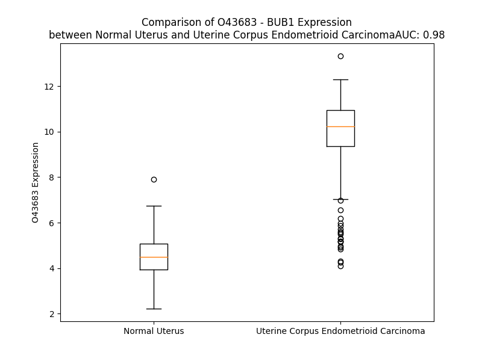

# Detailed Data for O43683

## Introduction to the Detailed Summary

### How to Interpret the Results

- **Summary & Metrics**: This section provides a quick reference to essential protein attributes, including expression changes, family classification, and biomarker applications. Regulation status (upregulated/downregulated) indicates the protein's behavior in a disease context. Some information comes from the original excel file with the proteins selected from literature, while others are derived from the analyses.
- **Expression Comparison**: A visual representation comparing protein expression between normal and disease states. It highlights significant changes in expression levels that might indicate diagnostic or therapeutic relevance. This is data coming from transcriptomics experiments and could not translate similarly to protein levels.
- **Isoform Alignment**: An interactive view of isoform alignments, revealing structural and functional differences between variants of the protein.
- **Interactors & Homologs**: Tables listing known interaction partners and homologous proteins, the more interactors and homologs, the more complex the protein is to design an antibody for.
- **Biological Assemblies**: Information about the structural arrangement of the protein in different assemblies, providing insights into its functional state but also the complexity of the protein to develop antibodies.
- **Combined Per-Residue Information**: A detailed table summarizing residue-level data. This includes predictions for epitope regions, aggregation tendencies, and modifications that might impact the protein's function. Each row corresponds to a residue in the protein, providing insights into specific sites that may be important for research or drug development.
## Summary & Metrics

- **UniProt Accession**: O43683
- **Gene Name**: BUB1
- **Protein Name**: BUB1 mitotic checkpoint serine/threonine kinase
- **Swiss Prot**: BUB1_HUMAN
- **Family**: kinase
- **Biomarker Application**: diagnosis
- **Number of Isoforms**: 3
- **Regulation**: 2
- **(transcriptomics) AUC**: 1.0
- **(transcriptomics) Fold Change**: 2.36
- **(transcriptomics) Regulation**: Upregulated
- **Discotope Epitope Count**: 328
- **Max n_uniprots (Homo)**: 1
- **Max n_uniprots (Hetero)**: 4

## Expression Comparison

## Isoform Alignment

<pre style='font-size:14px; font-family:monospace;'>O43683-1 MDTPENVLQMLEAHMQSYKGNDPLGEWERYIQWVEENFPENKEYLITLLEHLMKEFLDKKKYHNDPRFISYCLKFAEYNSDLHQFFEFLYNHGIGTLSSPLYIAWAGHLEAQGELQHASAVLQRGIQNQAEPREFLQQQYRLFQTRLTETHLPAQARTSEPLHNVQVLNQMITSKSNPGNNMACISKNQGSELSGVISSACDKESNMERRVITISKSEYSVHSSLASKVDVEQVVMYCKEKLIRGESEFSFEELRAQKYNQRRKHEQWVNEDRHYMKRKEANAFEEQLLKQKMDELHKKLHQVVETSHEDLPASQERSEVNPARMGPSVGSQQELRAPCLPVTYQQTPVNMEKNPREAPPVVPPLANAISAALVSPATSQSIAPPVPLKAQTVTDSMFAVASKDAGCVNKSTHEFKPQSGAEIKEGCETHKVANTSSFHTTPNTSLGMVQATPSKVQPSPTVHTKEALGFIMNMFQAPTLPDISDDKDEWQSLDQNEDAFEAQFQKNVRSSGAWGVNKIISSLSSAFHVFEDGNKENYGLPQPKNKPTGARTFGERSVSRLPSKPKEEVPHAEEFLDDSTVWGIRCNKTLAPSPKSPGDFTSAAQLASTPFHKLPVESVHILEDKENVVAKQCTQATLDSCEENMVVPSRDGKFSPIQEKSPKQALSSHMYSASLLRLSQPAAGGVLTCEAELGVEACRLTDTDAAIAEDPPDAIAGLQAEWMQMSSLGTVDAPNFIVGNPWDDKLIFKLLSGLSKPVSSYPNTFEWQCKLPAIKPKTEFQLGSKLVYVHHLLGEGAFAQVYEATQGDLNDAKNKQKFVLKVQKPANPWEFYIGTQLMERLKPSMQHMFMKFYSAHLFQNGSVLVGELYSYGTLLNAINLYKNTPEKVMPQGLVISFAMRMLYMIEQVHDCEIIHGDIKPDNFILGNGFLEQDDEDDLSAGLALIDLGQSIDMKLFPKGTIFTAKCETSGFQCVEMLSNKPWNYQIDYFGVAATVYCMLFGTYMKVKNEGGECKPEGLFRRLPHLDMWNEFFHVMLNIPDCHHLPSLDLLRQKLKKVFQQHYTNKIRALRNRLIVLLLECKRSRK
O43683-2 MDTPENVLQMLEAHMQSYKGNDPLGEWERYIQWVEENFPENKEYLITLLEHLMKEFLDKKKYHNDPRFISYCLKFAEYNSDLHQFFEFLYNHGIGTLSSPLYIAWAGHLEAQGELQHASAVLQRGIQNQAEPREFLQQQYRLFQTRLTETHLPAQARTSEPLHNVQVLNQMITSKSNPGNNMACISKNQGSELSGVISSACDKESNMERRVITISKSEYSVHSSLASKVDVEQVVMYCKEKLIRGESEFSFEELRAQKYNQRRKHEQWVNEDRHYMKRKEANAFEEQLLKQKMDELHKKLHQVVETSHEDLPASQERSEVNPARMGPSVGSQQELRAPCLPVTYQQTPVNMEKNPREAPPVVPPLANAISAALVSPATSQSIAPPVPLKAQTVTDSMFAVASKDAGCVNKSTHEFKPQSGAEIKEGCETHKVANTSSFHTTPNTSLGMVQATPSKVQPSPTVHTKEALGFIMNMFQAPTLPDISDDKDEWQSLDQNEDAFEAQFQKNVRSSGAWGVNKIISSLSSAFHVFEDGNKENYGLPQPKNKPTGARTFGERSVSRLPSKPKEEVPHAEEFLDDSTVWGIRCNKTLAPSPKSPGDFTSAAQLASTPFHKLPVESVHILEDKENVVAKQCTQATLDSCEENMVVPSRDGKFSPIQEKSPKQALSSHMYSASLLRLSQPAAGGVLTCEAELGVEACRLTDTDAAIAEDPPDAIAGLQAEWMQMSSLGTVDAPNFIVGNPWDDKLIFKLLSGLSKPVSSYPNTFEWQCKLPAIKPKTEFQLGSKLVYVHHLLGEGAFAQVYEATQGDLNDAKNKQKFVLKVQKPANPWEFYIGTQLMERLKPSMQHMFMKFYSAHLFQNGSVLVGELYSYGTLL---------------------------------------------------------DDEDDLSAGLALIDLGQSIDMKLFPKGTIFTAKCETSGFQCVEMLSNKPWNYQIDYFGVAATVYCMLFGTYMKVKNEGGECKPEGLFRRLPHLDMWNEFFHVMLNIPDCHHLPSLDLLRQKLKKVFQQHYTNKIRALRNRLIVLLLECKRSRK
O43683-3 --------------------MDTPENVLQYIQWVEENFPENKEYLITLLEHLMKEFLDKKKYHNDPRFISYCLKFAEYNSDLHQFFEFLYNHGIGTLSSPLYIAWAGHLEAQGELQHASAVLQRGIQNQAEPREFLQQQYRLFQTRLTETHLPAQARTSEPLHNVQVLNQMITSKSNPGNNMACISKNQGSELSGVISSACDKESNMERRVITISKSEYSVHSSLASKVDVEQVVMYCKEKLIRGESEFSFEELRAQKYNQRRKHEQWVNEDRHYMKRKEANAFEEQLLKQKMDELHKKLHQVVETSHEDLPASQERSEVNPARMGPSVGSQQELRAPCLPVTYQQTPVNMEKNPREAPPVVPPLANAISAALVSPATSQSIAPPVPLKAQTVTDSMFAVASKDAGCVNKSTHEFKPQSGAEIKEGCETHKVANTSSFHTTPNTSLGMVQATPSKVQPSPTVHTKEALGFIMNMFQAPTLPDISDDKDEWQSLDQNEDAFEAQFQKNVRSSGAWGVNKIISSLSSAFHVFEDGNKENYGLPQPKNKPTGARTFGERSVSRLPSKPKEEVPHAEEFLDDSTVWGIRCNKTLAPSPKSPGDFTSAAQLASTPFHKLPVESVHILEDKENVVAKQCTQATLDSCEENMVVPSRDGKFSPIQEKSPKQALSSHMYSASLLRLSQPAAGGVLTCEAELGVEACRLTDTDAAIAEDPPDAIAGLQAEWMQMSSLGTVDAPNFIVGNPWDDKLIFKLLSGLSKPVSSYPNTFEWQCKLPAIKPKTEFQLGSKLVYVHHLLGEGAFAQVYEATQGDLNDAKNKQKFVLKVQKPANPWEFYIGTQLMERLKPSMQHMFMKFYSAHLFQNGSVLVGELYSYGTLLNAINLYKNTPEKVMPQGLVISFAMRMLYMIEQVHDCEIIHGDIKPDNFILGNGFLEQDDEDDLSAGLALIDLGQSIDMKLFPKGTIFTAKCETSGFQCVEMLSNKPWNYQIDYFGVAATVYCMLFGTYMKVKNEGGECKPEGLFRRLPHLDMWNEFFHVMLNIPDCHHLPSLDLLRQKLKKVFQQHYTNKIRALRNRLIVLLLECKRSRK
</pre>

## Interactors

| preferredName_A   | preferredName_B   |   score |
|:------------------|:------------------|--------:|
| BUB1              | BUB1B             |   0.999 |
| BUB1              | TTK               |   0.999 |
| BUB1              | CDC20             |   0.999 |
| BUB1              | KNL1              |   0.999 |
| BUB1              | BUB3              |   0.999 |
| BUB1              | MAD2L1            |   0.999 |
| BUB1              | NDC80             |   0.998 |
| BUB1              | MAD1L1            |   0.998 |
| BUB1              | CCNB2             |   0.998 |
| BUB1              | CDK1              |   0.998 |
| BUB1              | AURKB             |   0.997 |
| BUB1              | PLK1              |   0.996 |
| BUB1              | NUF2              |   0.994 |
| BUB1              | KIF2C             |   0.994 |
| BUB1              | CCNB1             |   0.992 |
| BUB1              | CENPE             |   0.991 |
| BUB1              | ZWINT             |   0.991 |
| BUB1              | ESPL1             |   0.99  |
| BUB1              | CENPF             |   0.987 |
| BUB1              | DLGAP5            |   0.986 |
| BUB1              | KIF11             |   0.985 |
| BUB1              | MELK              |   0.984 |
| BUB1              | SGO1              |   0.982 |
| BUB1              | TOP2A             |   0.982 |
| BUB1              | CCNA2             |   0.981 |
| BUB1              | BIRC5             |   0.979 |
| BUB1              | NCAPG             |   0.976 |
| BUB1              | ASPM              |   0.976 |
| BUB1              | AURKA             |   0.971 |
| BUB1              | CDCA8             |   0.971 |
| BUB1              | CENPA             |   0.969 |
| BUB1              | MAD2L2            |   0.968 |
| BUB1              | SPC25             |   0.967 |
| BUB1              | MKI67             |   0.963 |
| BUB1              | KIF20A            |   0.959 |
| BUB1              | KIF23             |   0.958 |
| BUB1              | TPX2              |   0.958 |
| BUB1              | PTTG1             |   0.955 |
| BUB1              | UBE2C             |   0.954 |
| BUB1              | KIF4A             |   0.952 |
| BUB1              | ECT2              |   0.947 |
| BUB1              | CHEK1             |   0.946 |
| BUB1              | DSN1              |   0.944 |
| BUB1              | RAE1              |   0.939 |
| BUB1              | HASPIN            |   0.938 |
| BUB1              | NUSAP1            |   0.937 |
| BUB1              | PBK               |   0.935 |
| BUB1              | CDC23             |   0.934 |
| BUB1              | SPAG5             |   0.934 |
| BUB1              | CDCA5             |   0.933 |

## Homologs

| uniprot_id   | gene_id   |
|:-------------|:----------|
| H0YN44       | BUB1B     |

## Biological Assemblies

|   Unnamed: 0 |   assembly |   n_uniprots | composition   | crystal_id   |
|-------------:|-----------:|-------------:|:--------------|:-------------|
|            0 |          1 |            4 | Hetero        | 7b1j         |
|            0 |          1 |            1 | Homo          | 4qpm         |
|            1 |          2 |            1 | Homo          | 4qpm         |
|            0 |          1 |            1 | Homo          | 5dmz         |
|            1 |          2 |            1 | Homo          | 5dmz         |
|            0 |          1 |            4 | Hetero        | 7b1f         |
|            0 |          1 |            4 | Hetero        | 7b1h         |
|            1 |          2 |            4 | Hetero        | 7b1h         |
|            0 |          1 |            1 | Homo          | 4r8q         |
|            0 |          1 |            2 | Hetero        | 4a1g         |
|            1 |          2 |            2 | Hetero        | 4a1g         |
|            2 |          3 |            2 | Hetero        | 4a1g         |
|            3 |          4 |            2 | Hetero        | 4a1g         |
|            0 |          1 |            1 | Homo          | 6f7b         |
|            0 |          1 |            1 | Homo          | 2lah         |

## Combined Per-Residue Information

|   res | aa   |   epitope_score | epitope   |   relative_surface_accessibility |   modeling_confidence |   Aggregation | modification              |
|------:|:-----|----------------:|:----------|---------------------------------:|----------------------:|--------------:|:--------------------------|
|     1 | M    |         0.07128 | False     |                          1.11685 |                 41.91 |         0     | N/A                       |
|     2 | D    |         0.14406 | True      |                          0.81539 |                 56.84 |         0     | N/A                       |
|     3 | T    |         0.06752 | False     |                          0.45693 |                 62.45 |         0     | N/A                       |
|     4 | P    |         0.07308 | False     |                          0.40713 |                 58.89 |         0     | N/A                       |
|     5 | E    |         0.16156 | True      |                          0.6286  |                 63.73 |         0     | N/A                       |
|     6 | N    |         0.06981 | False     |                          0.53154 |                 67.16 |         0     | N/A                       |
|     7 | V    |         0.04357 | False     |                          0.1171  |                 68.29 |         0.133 | N/A                       |
|     8 | L    |         0.0929  | False     |                          0.17229 |                 71.28 |         0.133 | N/A                       |
|     9 | Q    |         0.11612 | True      |                          0.55549 |                 73.09 |         0.133 | N/A                       |
|    10 | M    |         0.18814 | True      |                          0.74379 |                 75.45 |         0.133 | N/A                       |
|    11 | L    |         0.05472 | False     |                          0.02709 |                 78.14 |         0.133 | N/A                       |
|    12 | E    |         0.15268 | True      |                          0.40827 |                 77.64 |         0     | N/A                       |
|    13 | A    |         0.13357 | True      |                          0.57185 |                 78.67 |         0     | N/A                       |
|    14 | H    |         0.10081 | True      |                          0.47236 |                 80.07 |         0     | N/A                       |
|    15 | M    |         0.05856 | False     |                          0.22378 |                 80.26 |         0     | N/A                       |
|    16 | Q    |         0.18727 | True      |                          0.79657 |                 76.52 |         0     | N/A                       |
|    17 | S    |         0.10866 | True      |                          0.59835 |                 76.78 |         0     | N/A                       |
|    18 | Y    |         0.11929 | True      |                          0.29036 |                 82.31 |         0     | N/A                       |
|    19 | K    |         0.16253 | True      |                          0.97727 |                 74.94 |         0     | N/A                       |
|    20 | G    |         0.15972 | True      |                          0.44069 |                 78.81 |         0     | N/A                       |
|    21 | N    |         0.1703  | True      |                          0.8993  |                 81.9  |         0     | N/A                       |
|    22 | D    |         0.09901 | True      |                          0.29018 |                 86.76 |         0     | N/A                       |
|    23 | P    |         0.05283 | False     |                          0.27039 |                 86.46 |         0     | N/A                       |
|    24 | L    |         0.00318 | False     |                          0       |                 88.58 |         0     | N/A                       |
|    25 | G    |         0.0649  | False     |                          0.08873 |                 87.17 |         0     | N/A                       |
|    26 | E    |         0.0191  | False     |                          0.09425 |                 86.44 |         0     | N/A                       |
|    27 | W    |         0.05761 | False     |                          0.06633 |                 88.29 |         0     | N/A                       |
|    28 | E    |         0.08044 | False     |                          0.2109  |                 87.28 |         0     | N/A                       |
|    29 | R    |         0.17992 | True      |                          0.57158 |                 85.5  |         0     | N/A                       |
|    30 | Y    |         0.0822  | False     |                          0.13172 |                 84.94 |         3.32  | N/A                       |
|    31 | I    |         0.00571 | False     |                          0.0008  |                 86.07 |         3.32  | N/A                       |
|    32 | Q    |         0.15135 | True      |                          0.45339 |                 85.52 |         3.32  | N/A                       |
|    33 | W    |         0.1321  | True      |                          0.46371 |                 84.56 |         3.32  | N/A                       |
|    34 | V    |         0.01042 | False     |                          0.01142 |                 81.92 |         3.32  | N/A                       |
|    35 | E    |         0.05416 | False     |                          0.33449 |                 83.36 |         0     | N/A                       |
|    36 | E    |         0.14957 | True      |                          0.71409 |                 83.8  |         0     | N/A                       |
|    37 | N    |         0.08341 | False     |                          0.46944 |                 79.13 |         0     | N/A                       |
|    38 | F    |         0.10013 | True      |                          0.38191 |                 79.33 |         0     | N/A                       |
|    39 | P    |         0.16836 | True      |                          0.70836 |                 75.83 |         0     | N/A                       |
|    40 | E    |         0.15854 | True      |                          0.87118 |                 75.42 |         0     | N/A                       |
|    41 | N    |         0.09037 | False     |                          0.37819 |                 74.73 |         0     | N/A                       |
|    42 | K    |         0.10773 | True      |                          0.64456 |                 78.2  |         0     | N/A                       |
|    43 | E    |         0.06583 | False     |                          0.61691 |                 78.03 |         0     | N/A                       |
|    44 | Y    |         0.04421 | False     |                          0.05667 |                 79.06 |        65.628 | N/A                       |
|    45 | L    |         0.02588 | False     |                          0.11706 |                 83.6  |        67.784 | N/A                       |
|    46 | I    |         0.02403 | False     |                          0.17599 |                 84.7  |        67.784 | N/A                       |
|    47 | T    |         0.03838 | False     |                          0.31296 |                 83.26 |        67.784 | N/A                       |
|    48 | L    |         0.00301 | False     |                          0       |                 84.89 |        67.784 | N/A                       |
|    49 | L    |         0.0111  | False     |                          0.0033  |                 87.29 |        57.593 | N/A                       |
|    50 | E    |         0.03332 | False     |                          0.05951 |                 84.94 |         0     | N/A                       |
|    51 | H    |         0.07486 | False     |                          0.29061 |                 84.96 |         0     | N/A                       |
|    52 | L    |         0.00537 | False     |                          0.00082 |                 88.86 |         0     | N/A                       |
|    53 | M    |         0.00855 | False     |                          0.00288 |                 86.09 |         0     | N/A                       |
|    54 | K    |         0.0597  | False     |                          0.39631 |                 85.5  |         0     | N/A                       |
|    55 | E    |         0.09272 | False     |                          0.43612 |                 85.57 |         0     | N/A                       |
|    56 | F    |         0.00675 | False     |                          0.00764 |                 88.69 |         0     | N/A                       |
|    57 | L    |         0.02889 | False     |                          0.06453 |                 84.39 |         0     | N/A                       |
|    58 | D    |         0.07173 | False     |                          0.7385  |                 81.72 |         0     | N/A                       |
|    59 | K    |         0.07577 | False     |                          0.39505 |                 86.79 |         0     | N/A                       |
|    60 | K    |         0.08777 | False     |                          0.82183 |                 86.44 |         0     | N/A                       |
|    61 | K    |         0.18111 | True      |                          0.71327 |                 88.61 |         0     | N/A                       |
|    62 | Y    |         0.05141 | False     |                          0.04189 |                 89.68 |         0     | N/A                       |
|    63 | H    |         0.06685 | False     |                          0.12159 |                 90.19 |         0     | N/A                       |
|    64 | N    |         0.12594 | True      |                          0.3743  |                 90.32 |         0     | N/A                       |
|    65 | D    |         0.05706 | False     |                          0.1534  |                 91.75 |         0     | N/A                       |
|    66 | P    |         0.1066  | True      |                          0.79258 |                 90.75 |         0     | N/A                       |
|    67 | R    |         0.0541  | False     |                          0.26909 |                 91.78 |         0     | N/A                       |
|    68 | F    |         0.00194 | False     |                          0       |                 92.61 |         0.494 | N/A                       |
|    69 | I    |         0.01508 | False     |                          0.0136  |                 92    |         0.494 | N/A                       |
|    70 | S    |         0.0866  | False     |                          0.48962 |                 91.82 |         0.494 | N/A                       |
|    71 | Y    |         0.03289 | False     |                          0.08857 |                 91.41 |         0.494 | N/A                       |
|    72 | C    |         0.00174 | False     |                          0       |                 91    |         0.494 | N/A                       |
|    73 | L    |         0.03846 | False     |                          0.22688 |                 91.24 |         0.494 | N/A                       |
|    74 | K    |         0.02575 | False     |                          0.26176 |                 89.85 |         0     | N/A                       |
|    75 | F    |         0.01521 | False     |                          0.04013 |                 89.24 |         0     | N/A                       |
|    76 | A    |         0.00737 | False     |                          0.03909 |                 87.5  |         0     | N/A                       |
|    77 | E    |         0.11521 | True      |                          0.71613 |                 85.36 |         0     | N/A                       |
|    78 | Y    |         0.0514  | False     |                          0.28954 |                 82.59 |         0     | N/A                       |
|    79 | N    |         0.03073 | False     |                          0.1024  |                 74.92 |         0     | N/A                       |
|    80 | S    |         0.06495 | False     |                          0.6453  |                 74.49 |         0     | N/A                       |
|    81 | D    |         0.03922 | False     |                          0.31617 |                 78.4  |         0     | N/A                       |
|    82 | L    |         0.02008 | False     |                          0.25369 |                 85.76 |         0     | N/A                       |
|    83 | H    |         0.03811 | False     |                          0.32316 |                 84.28 |         0     | N/A                       |
|    84 | Q    |         0.06733 | False     |                          0.41379 |                 85.07 |         0     | N/A                       |
|    85 | F    |         0.00668 | False     |                          0.02102 |                 88.88 |         0     | N/A                       |
|    86 | F    |         0.01264 | False     |                          0.01388 |                 91.61 |         0     | N/A                       |
|    87 | E    |         0.14952 | True      |                          0.39163 |                 87.91 |         0     | N/A                       |
|    88 | F    |         0.03676 | False     |                          0.10062 |                 89.26 |         0     | N/A                       |
|    89 | L    |         0.00133 | False     |                          0.00165 |                 90.21 |         0     | N/A                       |
|    90 | Y    |         0.02048 | False     |                          0.22148 |                 89.96 |         0     | N/A                       |
|    91 | N    |         0.11725 | True      |                          0.69677 |                 87.77 |         0     | N/A                       |
|    92 | H    |         0.08161 | False     |                          0.52494 |                 86.07 |         0     | N/A                       |
|    93 | G    |         0.0356  | False     |                          0.31357 |                 88.88 |         0     | N/A                       |
|    94 | I    |         0.00613 | False     |                          0.0008  |                 90.8  |         0     | N/A                       |
|    95 | G    |         0.00439 | False     |                          0       |                 90.1  |         0     | N/A                       |
|    96 | T    |         0.03339 | False     |                          0.21557 |                 91.67 |         0     | N/A                       |
|    97 | L    |         0.10611 | True      |                          0.57831 |                 92.71 |         0     | N/A                       |
|    98 | S    |         0.03693 | False     |                          0.11504 |                 92.95 |         0     | N/A                       |
|    99 | S    |         0.00324 | False     |                          0       |                 94.19 |         0     | N/A                       |
|   100 | P    |         0.04988 | False     |                          0.40416 |                 93.44 |         0.761 | N/A                       |
|   101 | L    |         0.00333 | False     |                          0.00247 |                 93.52 |        61.66  | N/A                       |
|   102 | Y    |         0.00662 | False     |                          0.00057 |                 94.37 |        67.005 | N/A                       |
|   103 | I    |         0.037   | False     |                          0.2201  |                 93.96 |        67.065 | N/A                       |
|   104 | A    |         0.02175 | False     |                          0.36518 |                 93.69 |        67.065 | N/A                       |
|   105 | W    |         0.03448 | False     |                          0.0984  |                 93.86 |        67.021 | N/A                       |
|   106 | A    |         0.00775 | False     |                          0.03451 |                 93.79 |        34.963 | N/A                       |
|   107 | G    |         0.08322 | False     |                          0.42117 |                 91.94 |         2.955 | N/A                       |
|   108 | H    |         0.05865 | False     |                          0.20661 |                 91.57 |         0.045 | N/A                       |
|   109 | L    |         0.02691 | False     |                          0.01649 |                 90.75 |         0.045 | N/A                       |
|   110 | E    |         0.04489 | False     |                          0.22837 |                 91.18 |         0     | N/A                       |
|   111 | A    |         0.04618 | False     |                          0.85367 |                 87.75 |         0     | N/A                       |
|   112 | Q    |         0.11022 | True      |                          0.59737 |                 85.57 |         0     | N/A                       |
|   113 | G    |         0.08525 | False     |                          0.62341 |                 86.37 |         0     | N/A                       |
|   114 | E    |         0.02859 | False     |                          0.39294 |                 87.18 |         0     | N/A                       |
|   115 | L    |         0.03876 | False     |                          0.36463 |                 89.71 |         0     | N/A                       |
|   116 | Q    |         0.11989 | True      |                          0.74389 |                 87.55 |         0     | N/A                       |
|   117 | H    |         0.09105 | False     |                          0.56819 |                 89.57 |         0     | N/A                       |
|   118 | A    |         0.00177 | False     |                          0       |                 91.93 |         0     | N/A                       |
|   119 | S    |         0.06666 | False     |                          0.18723 |                 92.55 |         0     | N/A                       |
|   120 | A    |         0.07841 | False     |                          0.49848 |                 92.6  |         0     | N/A                       |
|   121 | V    |         0.04697 | False     |                          0.08365 |                 93.41 |         0     | N/A                       |
|   122 | L    |         0.05559 | False     |                          0.03462 |                 93.7  |         0     | N/A                       |
|   123 | Q    |         0.15773 | True      |                          0.48809 |                 93.04 |         0     | N/A                       |
|   124 | R    |         0.1033  | True      |                          0.45233 |                 92.73 |         0     | N/A                       |
|   125 | G    |         0.00169 | False     |                          0       |                 91.89 |         0     | N/A                       |
|   126 | I    |         0.048   | False     |                          0.28858 |                 91.87 |         0     | N/A                       |
|   127 | Q    |         0.10337 | True      |                          0.62287 |                 91.94 |         0     | N/A                       |
|   128 | N    |         0.03767 | False     |                          0.26681 |                 89.8  |         0     | N/A                       |
|   129 | Q    |         0.16878 | True      |                          0.63484 |                 90.21 |         0     | N/A                       |
|   130 | A    |         0.00404 | False     |                          0.00204 |                 90.87 |         0     | N/A                       |
|   131 | E    |         0.21046 | True      |                          0.51674 |                 90.07 |         0     | N/A                       |
|   132 | P    |         0.25869 | True      |                          0.54972 |                 93.68 |         0     | N/A                       |
|   133 | R    |         0.12893 | True      |                          0.41299 |                 88.16 |         0     | N/A                       |
|   134 | E    |         0.13345 | True      |                          0.64565 |                 89    |         0     | N/A                       |
|   135 | F    |         0.12444 | True      |                          0.47047 |                 91.96 |         0     | N/A                       |
|   136 | L    |         0.00328 | False     |                          0.00165 |                 92.88 |         0     | N/A                       |
|   137 | Q    |         0.1277  | True      |                          0.28318 |                 92.42 |         0     | N/A                       |
|   138 | Q    |         0.10276 | True      |                          0.46504 |                 91.87 |         0     | N/A                       |
|   139 | Q    |         0.06644 | False     |                          0.21699 |                 91.78 |         0     | N/A                       |
|   140 | Y    |         0.04478 | False     |                          0.14741 |                 93.92 |         0     | N/A                       |
|   141 | R    |         0.143   | True      |                          0.55838 |                 92.04 |         0     | N/A                       |
|   142 | L    |         0.13758 | True      |                          0.50206 |                 91.15 |         0     | N/A                       |
|   143 | F    |         0.01022 | False     |                          0.00916 |                 92.32 |         0     | N/A                       |
|   144 | Q    |         0.08769 | False     |                          0.3997  |                 90.49 |         0     | N/A                       |
|   145 | T    |         0.09041 | False     |                          0.48407 |                 86.64 |         0     | N/A                       |
|   146 | R    |         0.09903 | True      |                          0.4156  |                 87.31 |         0     | N/A                       |
|   147 | L    |         0.04044 | False     |                          0.26577 |                 84.39 |         0     | N/A                       |
|   148 | T    |         0.10751 | True      |                          0.66874 |                 78.55 |         0     | N/A                       |
|   149 | E    |         0.05922 | False     |                          0.4603  |                 73.14 |         0     | N/A                       |
|   150 | T    |         0.12287 | True      |                          0.68688 |                 60.75 |         0     | N/A                       |
|   151 | H    |         0.18104 | True      |                          0.69783 |                 52.95 |         0     | N/A                       |
|   152 | L    |         0.07342 | False     |                          0.67401 |                 39.16 |         0     | N/A                       |
|   153 | P    |         0.13061 | True      |                          0.75921 |                 36.34 |         0     | N/A                       |
|   154 | A    |         0.13136 | True      |                          0.96317 |                 37.28 |         0     | N/A                       |
|   155 | Q    |         0.17958 | True      |                          0.9038  |                 40.81 |         0     | N/A                       |
|   156 | A    |         0.11646 | True      |                          0.78143 |                 36.54 |         0     | N/A                       |
|   157 | R    |         0.19964 | True      |                          0.66442 |                 31.33 |         0     | N/A                       |
|   158 | T    |         0.21294 | True      |                          0.94447 |                 31.48 |         0     | N/A                       |
|   159 | S    |         0.09896 | True      |                          0.74146 |                 32.02 |         0     | N/A                       |
|   160 | E    |         0.14338 | True      |                          0.87781 |                 30.96 |         0     | N/A                       |
|   161 | P    |         0.14601 | True      |                          0.84095 |                 31.38 |         0     | N/A                       |
|   162 | L    |         0.15142 | True      |                          0.9444  |                 28.89 |         0     | N/A                       |
|   163 | H    |         0.14591 | True      |                          0.97405 |                 35.42 |         0     | N/A                       |
|   164 | N    |         0.12484 | True      |                          0.84431 |                 28.59 |         0     | N/A                       |
|   165 | V    |         0.13457 | True      |                          0.90222 |                 30.1  |         0     | N/A                       |
|   166 | Q    |         0.09976 | True      |                          0.8037  |                 36.68 |         0     | N/A                       |
|   167 | V    |         0.21003 | True      |                          0.94972 |                 32.63 |         0     | N/A                       |
|   168 | L    |         0.16338 | True      |                          0.92062 |                 29.12 |         0     | N/A                       |
|   169 | N    |         0.12136 | True      |                          0.66526 |                 33.7  |         0     | N/A                       |
|   170 | Q    |         0.09789 | True      |                          0.7814  |                 35.96 |         0     | N/A                       |
|   171 | M    |         0.18881 | True      |                          0.98397 |                 28.02 |         0     | N/A                       |
|   172 | I    |         0.13227 | True      |                          0.9269  |                 36.62 |         0     | N/A                       |
|   173 | T    |         0.08492 | False     |                          0.85841 |                 31.49 |         0     | N/A                       |
|   174 | S    |         0.0984  | True      |                          0.68744 |                 32.25 |         0     | N/A                       |
|   175 | K    |         0.19744 | True      |                          0.93584 |                 31.76 |         0     | N/A                       |
|   176 | S    |         0.10344 | True      |                          0.8039  |                 35.92 |         0     | N/A                       |
|   177 | N    |         0.21794 | True      |                          0.92734 |                 33.15 |         0     | N/A                       |
|   178 | P    |         0.12037 | True      |                          0.92429 |                 42.86 |         0     | N/A                       |
|   179 | G    |         0.14379 | True      |                          0.76126 |                 33.52 |         0     | N/A                       |
|   180 | N    |         0.12949 | True      |                          0.89633 |                 37.45 |         0     | N/A                       |
|   181 | N    |         0.11296 | True      |                          0.69112 |                 37.46 |         0     | N/A                       |
|   182 | M    |         0.13771 | True      |                          0.93975 |                 33.72 |         0     | N/A                       |
|   183 | A    |         0.10113 | True      |                          0.80635 |                 35.96 |         0     | N/A                       |
|   184 | C    |         0.14018 | True      |                          0.85212 |                 29.97 |         0     | N/A                       |
|   185 | I    |         0.15523 | True      |                          0.90772 |                 34.61 |         0     | N/A                       |
|   186 | S    |         0.10771 | True      |                          0.64317 |                 34.32 |         0     | N/A                       |
|   187 | K    |         0.09253 | False     |                          0.8554  |                 36.17 |         0     | N/A                       |
|   188 | N    |         0.12877 | True      |                          0.76594 |                 34.24 |         0     | N/A                       |
|   189 | Q    |         0.1345  | True      |                          0.85977 |                 35.18 |         0     | N/A                       |
|   190 | G    |         0.1207  | True      |                          0.82916 |                 32.93 |         0     | N/A                       |
|   191 | S    |         0.1383  | True      |                          0.79308 |                 34.16 |         0     | N/A                       |
|   192 | E    |         0.13799 | True      |                          0.74596 |                 34.1  |         0     | N/A                       |
|   193 | L    |         0.10536 | True      |                          0.98873 |                 36.73 |         0.179 | N/A                       |
|   194 | S    |         0.09816 | True      |                          0.81831 |                 33.99 |         0.179 | N/A                       |
|   195 | G    |         0.13433 | True      |                          0.81264 |                 35.03 |         0.179 | N/A                       |
|   196 | V    |         0.11659 | True      |                          0.98729 |                 35.87 |         0.179 | N/A                       |
|   197 | I    |         0.14938 | True      |                          0.88504 |                 36.68 |         0.179 | N/A                       |
|   198 | S    |         0.07256 | False     |                          0.78389 |                 32.67 |         0     | N/A                       |
|   199 | S    |         0.08939 | False     |                          0.82387 |                 35.48 |         0     | N/A                       |
|   200 | A    |         0.09616 | True      |                          0.81263 |                 36.33 |         0     | N/A                       |
|   201 | C    |         0.07746 | False     |                          0.80566 |                 33.59 |         0     | N/A                       |
|   202 | D    |         0.11752 | True      |                          0.73452 |                 35.16 |         0     | N/A                       |
|   203 | K    |         0.15661 | True      |                          0.92405 |                 38.49 |         0     | N/A                       |
|   204 | E    |         0.10613 | True      |                          0.93277 |                 33.95 |         0     | N/A                       |
|   205 | S    |         0.13082 | True      |                          0.83287 |                 40.64 |         0     | N/A                       |
|   206 | N    |         0.18076 | True      |                          0.99582 |                 32.48 |         0     | N/A                       |
|   207 | M    |         0.12916 | True      |                          1.02445 |                 36.05 |         0     | N/A                       |
|   208 | E    |         0.11624 | True      |                          0.6872  |                 36.34 |         0     | N/A                       |
|   209 | R    |         0.12139 | True      |                          0.96711 |                 35.43 |         0     | N/A                       |
|   210 | R    |         0.13824 | True      |                          0.7681  |                 40.31 |         0     | N/A                       |
|   211 | V    |         0.07398 | False     |                          0.97239 |                 39.11 |         0.313 | N/A                       |
|   212 | I    |         0.11709 | True      |                          0.80497 |                 42.93 |         0.313 | N/A                       |
|   213 | T    |         0.08971 | False     |                          0.76694 |                 38.09 |         0.313 | N/A                       |
|   214 | I    |         0.09779 | True      |                          0.74621 |                 41.44 |         0.313 | N/A                       |
|   215 | S    |         0.06741 | False     |                          0.8875  |                 39.43 |         0.313 | N/A                       |
|   216 | K    |         0.0668  | False     |                          0.87699 |                 40.2  |         0     | N/A                       |
|   217 | S    |         0.06861 | False     |                          0.85608 |                 42.07 |         0     | N/A                       |
|   218 | E    |         0.1116  | True      |                          0.86733 |                 36.86 |         0     | N/A                       |
|   219 | Y    |         0.17584 | True      |                          0.98497 |                 35.26 |         0     | N/A                       |
|   220 | S    |         0.15603 | True      |                          0.71954 |                 35.85 |         0     | N/A                       |
|   221 | V    |         0.09237 | False     |                          0.8346  |                 34.32 |         0     | N/A                       |
|   222 | H    |         0.14308 | True      |                          0.9622  |                 37.24 |         0     | N/A                       |
|   223 | S    |         0.19082 | True      |                          0.8958  |                 31.43 |         0     | N/A                       |
|   224 | S    |         0.11617 | True      |                          0.7884  |                 37.48 |         0     | N/A                       |
|   225 | L    |         0.17965 | True      |                          1.14465 |                 36.95 |         0     | N/A                       |
|   226 | A    |         0.10638 | True      |                          0.90788 |                 37.46 |         0     | N/A                       |
|   227 | S    |         0.09061 | False     |                          0.83971 |                 40.74 |         0     | N/A                       |
|   228 | K    |         0.14463 | True      |                          0.97018 |                 37.4  |         0     | N/A                       |
|   229 | V    |         0.07119 | False     |                          0.91154 |                 45.83 |         0     | N/A                       |
|   230 | D    |         0.12333 | True      |                          0.90831 |                 40.98 |         0     | N/A                       |
|   231 | V    |         0.08155 | False     |                          0.7708  |                 46.81 |         0     | N/A                       |
|   232 | E    |         0.15619 | True      |                          0.838   |                 43.23 |         0     | N/A                       |
|   233 | Q    |         0.13093 | True      |                          0.81996 |                 53.52 |         3.291 | N/A                       |
|   234 | V    |         0.10894 | True      |                          0.8841  |                 51.97 |         9.306 | N/A                       |
|   235 | V    |         0.05663 | False     |                          0.85835 |                 55.41 |         9.306 | N/A                       |
|   236 | M    |         0.13142 | True      |                          0.68813 |                 58.67 |         9.306 | N/A                       |
|   237 | Y    |         0.07911 | False     |                          0.5072  |                 57.79 |         9.306 | N/A                       |
|   238 | C    |         0.16753 | True      |                          0.46081 |                 59.6  |         6.25  | N/A                       |
|   239 | K    |         0.14784 | True      |                          0.65401 |                 65.36 |         0     | N/A                       |
|   240 | E    |         0.19103 | True      |                          0.73775 |                 66.97 |         0     | N/A                       |
|   241 | K    |         0.12331 | True      |                          0.72355 |                 64.21 |         0     | N/A                       |
|   242 | L    |         0.06561 | False     |                          0.2277  |                 63.49 |         0     | N/A                       |
|   243 | I    |         0.12459 | True      |                          0.35842 |                 66.83 |         0     | N/A                       |
|   244 | R    |         0.09666 | True      |                          0.51717 |                 58.57 |         0     | N/A                       |
|   245 | G    |         0.15719 | True      |                          0.74621 |                 66.8  |         0     | N/A                       |
|   246 | E    |         0.21129 | True      |                          0.82524 |                 61.16 |         0     | N/A                       |
|   247 | S    |         0.11665 | True      |                          0.46099 |                 58.5  |         0     | N/A                       |
|   248 | E    |         0.17186 | True      |                          0.67459 |                 70.44 |         0     | N/A                       |
|   249 | F    |         0.07977 | False     |                          0.28837 |                 68.02 |         0     | N/A                       |
|   250 | S    |         0.08732 | False     |                          0.3951  |                 76.41 |         0     | N/A                       |
|   251 | F    |         0.10121 | True      |                          0.53283 |                 68.1  |         0     | N/A                       |
|   252 | E    |         0.0885  | False     |                          0.5285  |                 73.11 |         0     | N/A                       |
|   253 | E    |         0.1136  | True      |                          0.4792  |                 76.8  |         0     | N/A                       |
|   254 | L    |         0.03844 | False     |                          0.22111 |                 74.61 |         0     | N/A                       |
|   255 | R    |         0.06599 | False     |                          0.6392  |                 74.17 |         0     | N/A                       |
|   256 | A    |         0.05866 | False     |                          0.46208 |                 78.51 |         0     | N/A                       |
|   257 | Q    |         0.10197 | True      |                          0.32891 |                 76.06 |         0     | N/A                       |
|   258 | K    |         0.08085 | False     |                          0.61733 |                 77.74 |         0     | N/A                       |
|   259 | Y    |         0.07203 | False     |                          0.62477 |                 81.47 |         0     | N/A                       |
|   260 | N    |         0.07396 | False     |                          0.53915 |                 81.17 |         0     | N/A                       |
|   261 | Q    |         0.03599 | False     |                          0.5408  |                 81.23 |         0     | N/A                       |
|   262 | R    |         0.05493 | False     |                          0.50849 |                 81.65 |         0     | N/A                       |
|   263 | R    |         0.12602 | True      |                          0.61241 |                 81.38 |         0     | N/A                       |
|   264 | K    |         0.06996 | False     |                          0.78989 |                 80.04 |         0     | N/A                       |
|   265 | H    |         0.0483  | False     |                          0.51851 |                 81.38 |         0     | N/A                       |
|   266 | E    |         0.06194 | False     |                          0.44912 |                 81.25 |         0     | N/A                       |
|   267 | Q    |         0.06036 | False     |                          0.5246  |                 80.1  |         0     | N/A                       |
|   268 | W    |         0.05839 | False     |                          0.61277 |                 82.94 |         0     | N/A                       |
|   269 | V    |         0.03195 | False     |                          0.37615 |                 79.64 |         0     | N/A                       |
|   270 | N    |         0.05861 | False     |                          0.46493 |                 81.71 |         0     | N/A                       |
|   271 | E    |         0.06034 | False     |                          0.50949 |                 80.26 |         0     | N/A                       |
|   272 | D    |         0.04791 | False     |                          0.36947 |                 81.61 |         0     | N/A                       |
|   273 | R    |         0.02858 | False     |                          0.34816 |                 81.14 |         0     | N/A                       |
|   274 | H    |         0.06355 | False     |                          0.69623 |                 82.5  |         0     | N/A                       |
|   275 | Y    |         0.05507 | False     |                          0.50715 |                 83.33 |         0     | N/A                       |
|   276 | M    |         0.0355  | False     |                          0.41187 |                 78.33 |         0     | N/A                       |
|   277 | K    |         0.04295 | False     |                          0.62625 |                 85.94 |         0     | N/A                       |
|   278 | R    |         0.063   | False     |                          0.65793 |                 83.45 |         0     | N/A                       |
|   279 | K    |         0.05493 | False     |                          0.54198 |                 80.8  |         0     | N/A                       |
|   280 | E    |         0.02898 | False     |                          0.31471 |                 82.13 |         0     | N/A                       |
|   281 | A    |         0.03709 | False     |                          0.57394 |                 85.88 |         0     | N/A                       |
|   282 | N    |         0.05344 | False     |                          0.57777 |                 84.96 |         0     | N/A                       |
|   283 | A    |         0.02221 | False     |                          0.34685 |                 83.29 |         0     | N/A                       |
|   284 | F    |         0.05849 | False     |                          0.7387  |                 85.42 |         0     | N/A                       |
|   285 | E    |         0.03966 | False     |                          0.54763 |                 82.64 |         0     | N/A                       |
|   286 | E    |         0.04461 | False     |                          0.62758 |                 83.66 |         0     | N/A                       |
|   287 | Q    |         0.05343 | False     |                          0.52187 |                 85.63 |         0     | N/A                       |
|   288 | L    |         0.07097 | False     |                          0.48932 |                 87.98 |         0     | N/A                       |
|   289 | L    |         0.0831  | False     |                          0.67036 |                 86.71 |         0     | N/A                       |
|   290 | K    |         0.09035 | False     |                          0.6862  |                 85.99 |         0     | N/A                       |
|   291 | Q    |         0.07193 | False     |                          0.62361 |                 88.72 |         0     | N/A                       |
|   292 | K    |         0.12197 | True      |                          0.55718 |                 87.49 |         0     | N/A                       |
|   293 | M    |         0.07429 | False     |                          0.5778  |                 85.66 |         0     | N/A                       |
|   294 | D    |         0.05905 | False     |                          0.47771 |                 86.9  |         0     | N/A                       |
|   295 | E    |         0.0808  | False     |                          0.45988 |                 86.78 |         0     | N/A                       |
|   296 | L    |         0.06072 | False     |                          0.70049 |                 85.4  |         0     | N/A                       |
|   297 | H    |         0.05962 | False     |                          0.5147  |                 85.47 |         0     | N/A                       |
|   298 | K    |         0.07667 | False     |                          0.77969 |                 83.96 |         0     | N/A                       |
|   299 | K    |         0.1144  | True      |                          0.53472 |                 85.27 |         0     | N/A                       |
|   300 | L    |         0.07288 | False     |                          0.69753 |                 82.14 |         0     | N/A                       |
|   301 | H    |         0.06439 | False     |                          0.66015 |                 78.27 |         0     | N/A                       |
|   302 | Q    |         0.06322 | False     |                          0.58418 |                 77.21 |         0     | N/A                       |
|   303 | V    |         0.06609 | False     |                          0.68901 |                 75.86 |         0     | N/A                       |
|   304 | V    |         0.03651 | False     |                          0.59124 |                 71.07 |         0     | N/A                       |
|   305 | E    |         0.03596 | False     |                          0.55023 |                 58.27 |         0     | N/A                       |
|   306 | T    |         0.07845 | False     |                          0.72567 |                 55.78 |         0     | N/A                       |
|   307 | S    |         0.14576 | True      |                          0.65329 |                 51.26 |         0     | Phosphoserine             |
|   308 | H    |         0.13093 | True      |                          0.85371 |                 45.09 |         0     | N/A                       |
|   309 | E    |         0.15935 | True      |                          0.85692 |                 38.4  |         0     | N/A                       |
|   310 | D    |         0.1639  | True      |                          0.8483  |                 34.85 |         0     | N/A                       |
|   311 | L    |         0.20538 | True      |                          1.05184 |                 36.22 |         0     | N/A                       |
|   312 | P    |         0.08017 | False     |                          0.90783 |                 37.04 |         0     | N/A                       |
|   313 | A    |         0.09739 | True      |                          1.04055 |                 31.37 |         0     | N/A                       |
|   314 | S    |         0.09232 | False     |                          0.88049 |                 34.34 |         0     | Phosphoserine             |
|   315 | Q    |         0.13494 | True      |                          0.80892 |                 33.44 |         0     | N/A                       |
|   316 | E    |         0.10204 | True      |                          0.76621 |                 32.08 |         0     | N/A                       |
|   317 | R    |         0.23472 | True      |                          0.99752 |                 36.77 |         0     | N/A                       |
|   318 | S    |         0.10617 | True      |                          0.69785 |                 33.68 |         0     | N/A                       |
|   319 | E    |         0.22359 | True      |                          0.8448  |                 35.35 |         0     | N/A                       |
|   320 | V    |         0.11115 | True      |                          0.89008 |                 37.79 |         0     | N/A                       |
|   321 | N    |         0.14976 | True      |                          0.90344 |                 38.08 |         0     | N/A                       |
|   322 | P    |         0.10765 | True      |                          0.92191 |                 49.21 |         0     | N/A                       |
|   323 | A    |         0.12944 | True      |                          0.94377 |                 33.44 |         0     | N/A                       |
|   324 | R    |         0.3132  | True      |                          0.85822 |                 32.12 |         0     | N/A                       |
|   325 | M    |         0.14878 | True      |                          0.91288 |                 33.24 |         0     | N/A                       |
|   326 | G    |         0.13149 | True      |                          0.79396 |                 40.14 |         0     | N/A                       |
|   327 | P    |         0.15121 | True      |                          0.97616 |                 45.42 |         0     | N/A                       |
|   328 | S    |         0.05935 | False     |                          0.67274 |                 33.71 |         0     | N/A                       |
|   329 | V    |         0.07019 | False     |                          1.04228 |                 32.95 |         0     | N/A                       |
|   330 | G    |         0.08852 | False     |                          0.80259 |                 30.91 |         0     | N/A                       |
|   331 | S    |         0.14664 | True      |                          0.8231  |                 32.49 |         0     | Phosphoserine             |
|   332 | Q    |         0.13242 | True      |                          0.85575 |                 39.1  |         0     | N/A                       |
|   333 | Q    |         0.12656 | True      |                          0.72932 |                 29.84 |         0     | N/A                       |
|   334 | E    |         0.1621  | True      |                          0.69476 |                 28.95 |         0     | N/A                       |
|   335 | L    |         0.1259  | True      |                          0.82573 |                 29.86 |         0     | N/A                       |
|   336 | R    |         0.10654 | True      |                          0.87182 |                 29.73 |         0     | N/A                       |
|   337 | A    |         0.06503 | False     |                          0.82253 |                 37.58 |         0     | N/A                       |
|   338 | P    |         0.07249 | False     |                          0.82726 |                 39.67 |         0     | N/A                       |
|   339 | C    |         0.06988 | False     |                          0.82649 |                 34.63 |         0     | N/A                       |
|   340 | L    |         0.09414 | False     |                          1.05861 |                 34.37 |         0     | N/A                       |
|   341 | P    |         0.10625 | True      |                          0.83315 |                 41.6  |         0     | N/A                       |
|   342 | V    |         0.08272 | False     |                          0.80539 |                 31.77 |         0     | N/A                       |
|   343 | T    |         0.07822 | False     |                          0.69225 |                 29.52 |         0     | N/A                       |
|   344 | Y    |         0.1285  | True      |                          0.93287 |                 36.14 |         0     | N/A                       |
|   345 | Q    |         0.12798 | True      |                          0.71419 |                 31.21 |         0     | N/A                       |
|   346 | Q    |         0.08918 | False     |                          0.77388 |                 29.79 |         0     | N/A                       |
|   347 | T    |         0.1444  | True      |                          0.881   |                 29.6  |         0     | N/A                       |
|   348 | P    |         0.13023 | True      |                          0.80316 |                 36.95 |         0     | N/A                       |
|   349 | V    |         0.0992  | True      |                          0.88991 |                 29.28 |         0     | N/A                       |
|   350 | N    |         0.08727 | False     |                          0.78417 |                 29.14 |         0     | N/A                       |
|   351 | M    |         0.09839 | True      |                          0.80514 |                 31.22 |         0     | N/A                       |
|   352 | E    |         0.09817 | True      |                          0.64654 |                 31.08 |         0     | N/A                       |
|   353 | K    |         0.15683 | True      |                          0.78289 |                 36.2  |         0     | N/A                       |
|   354 | N    |         0.07734 | False     |                          0.8567  |                 33.92 |         0     | N/A                       |
|   355 | P    |         0.09782 | True      |                          0.71987 |                 40.23 |         0     | N/A                       |
|   356 | R    |         0.13552 | True      |                          0.84736 |                 33.15 |         0     | N/A                       |
|   357 | E    |         0.1202  | True      |                          0.80378 |                 38.31 |         0     | N/A                       |
|   358 | A    |         0.0629  | False     |                          0.87699 |                 30.86 |         0     | N/A                       |
|   359 | P    |         0.11514 | True      |                          0.81077 |                 50.04 |         0     | N/A                       |
|   360 | P    |         0.12565 | True      |                          0.80963 |                 41.37 |         0     | N/A                       |
|   361 | V    |         0.10587 | True      |                          0.85447 |                 36.68 |         0     | N/A                       |
|   362 | V    |         0.08947 | False     |                          1.00148 |                 38.46 |         0     | N/A                       |
|   363 | P    |         0.09052 | False     |                          0.76765 |                 36.09 |         0     | N/A                       |
|   364 | P    |         0.12785 | True      |                          0.9538  |                 40.38 |         0     | N/A                       |
|   365 | L    |         0.13926 | True      |                          1.13652 |                 34.84 |         0.545 | N/A                       |
|   366 | A    |         0.15119 | True      |                          0.76267 |                 30.55 |         0.545 | N/A                       |
|   367 | N    |         0.1146  | True      |                          0.96282 |                 31.63 |         0.545 | N/A                       |
|   368 | A    |         0.09434 | False     |                          0.90217 |                 29.94 |         3.831 | N/A                       |
|   369 | I    |         0.13907 | True      |                          1.03312 |                 31.43 |         7.726 | N/A                       |
|   370 | S    |         0.07668 | False     |                          0.8738  |                 29.09 |         8.054 | N/A                       |
|   371 | A    |         0.09453 | False     |                          0.97647 |                 33.55 |         8.054 | N/A                       |
|   372 | A    |         0.08252 | False     |                          0.9565  |                 34.17 |         8.054 | N/A                       |
|   373 | L    |         0.07618 | False     |                          1.02511 |                 32.92 |         8.054 | N/A                       |
|   374 | V    |         0.10761 | True      |                          1.01803 |                 35.67 |         7.492 | N/A                       |
|   375 | S    |         0.09946 | True      |                          0.74874 |                 34.86 |         0     | Phosphoserine             |
|   376 | P    |         0.09808 | True      |                          0.96801 |                 41.02 |         0     | N/A                       |
|   377 | A    |         0.13224 | True      |                          0.93865 |                 32.7  |         0     | N/A                       |
|   378 | T    |         0.10455 | True      |                          0.99134 |                 38.19 |         0     | N/A                       |
|   379 | S    |         0.12638 | True      |                          0.75933 |                 31.11 |         0     | N/A                       |
|   380 | Q    |         0.13336 | True      |                          0.97125 |                 39.86 |         0     | N/A                       |
|   381 | S    |         0.08269 | False     |                          0.79794 |                 30.37 |         0     | N/A                       |
|   382 | I    |         0.14095 | True      |                          1.06313 |                 37.6  |         0     | N/A                       |
|   383 | A    |         0.06362 | False     |                          0.7855  |                 35.08 |         0     | N/A                       |
|   384 | P    |         0.10523 | True      |                          0.84712 |                 40.52 |         0     | N/A                       |
|   385 | P    |         0.09195 | False     |                          0.91908 |                 44.32 |         0     | N/A                       |
|   386 | V    |         0.0729  | False     |                          0.81395 |                 36.97 |         0     | N/A                       |
|   387 | P    |         0.06789 | False     |                          0.95125 |                 31.86 |         0     | N/A                       |
|   388 | L    |         0.09212 | False     |                          1.03164 |                 33.1  |         0     | N/A                       |
|   389 | K    |         0.09906 | True      |                          1.02751 |                 30.71 |         0     | N/A                       |
|   390 | A    |         0.15936 | True      |                          0.82452 |                 30.1  |         0     | N/A                       |
|   391 | Q    |         0.08939 | False     |                          0.81796 |                 28.32 |         0     | N/A                       |
|   392 | T    |         0.06835 | False     |                          0.96371 |                 25.87 |         0     | N/A                       |
|   393 | V    |         0.05275 | False     |                          0.76787 |                 29.46 |         0     | N/A                       |
|   394 | T    |         0.08026 | False     |                          0.88208 |                 27.91 |         0     | N/A                       |
|   395 | D    |         0.07793 | False     |                          0.7285  |                 32.6  |         0     | N/A                       |
|   396 | S    |         0.07143 | False     |                          0.8151  |                 30.23 |         2.282 | N/A                       |
|   397 | M    |         0.08012 | False     |                          0.87128 |                 33.01 |        18.873 | N/A                       |
|   398 | F    |         0.10059 | True      |                          1.03939 |                 30.44 |        20.571 | N/A                       |
|   399 | A    |         0.10913 | True      |                          0.98011 |                 29.5  |        20.571 | N/A                       |
|   400 | V    |         0.11453 | True      |                          0.93564 |                 35.49 |        20.571 | N/A                       |
|   401 | A    |         0.10707 | True      |                          0.84303 |                 31.96 |        20.259 | N/A                       |
|   402 | S    |         0.08292 | False     |                          0.92329 |                 38.04 |         2.407 | N/A                       |
|   403 | K    |         0.06445 | False     |                          0.90391 |                 34.88 |         0     | N/A                       |
|   404 | D    |         0.08305 | False     |                          0.81165 |                 36.98 |         0     | N/A                       |
|   405 | A    |         0.06118 | False     |                          1.03954 |                 38    |         0     | N/A                       |
|   406 | G    |         0.09229 | False     |                          0.80916 |                 33.77 |         0     | N/A                       |
|   407 | C    |         0.08032 | False     |                          0.96556 |                 31.21 |         0     | N/A                       |
|   408 | V    |         0.0992  | True      |                          0.84508 |                 34.59 |         0     | N/A                       |
|   409 | N    |         0.0946  | False     |                          0.76245 |                 33.45 |         0     | N/A                       |
|   410 | K    |         0.11005 | True      |                          0.97027 |                 31.55 |         0     | N/A                       |
|   411 | S    |         0.08302 | False     |                          0.88499 |                 33.68 |         0     | N/A                       |
|   412 | T    |         0.07534 | False     |                          0.87058 |                 29.53 |         0     | N/A                       |
|   413 | H    |         0.1001  | True      |                          0.93621 |                 34.07 |         0     | N/A                       |
|   414 | E    |         0.09566 | True      |                          0.80677 |                 26.64 |         0     | N/A                       |
|   415 | F    |         0.09755 | True      |                          1.01946 |                 33.96 |         0     | N/A                       |
|   416 | K    |         0.07087 | False     |                          0.84264 |                 30.93 |         0     | N/A                       |
|   417 | P    |         0.09568 | True      |                          0.94681 |                 35.21 |         0     | N/A                       |
|   418 | Q    |         0.09159 | False     |                          0.81821 |                 34.97 |         0     | N/A                       |
|   419 | S    |         0.0795  | False     |                          0.90421 |                 28.44 |         0     | N/A                       |
|   420 | G    |         0.08871 | False     |                          1.0253  |                 32.32 |         0     | N/A                       |
|   421 | A    |         0.05725 | False     |                          0.9053  |                 31.47 |         0     | N/A                       |
|   422 | E    |         0.08685 | False     |                          0.75767 |                 31.69 |         0     | N/A                       |
|   423 | I    |         0.12611 | True      |                          0.83031 |                 37.25 |         0     | N/A                       |
|   424 | K    |         0.11442 | True      |                          0.77616 |                 36.48 |         0     | N/A                       |
|   425 | E    |         0.07577 | False     |                          0.71571 |                 33.29 |         0     | N/A                       |
|   426 | G    |         0.09954 | True      |                          0.85448 |                 34.02 |         0     | N/A                       |
|   427 | C    |         0.08786 | False     |                          0.84638 |                 32.37 |         0     | N/A                       |
|   428 | E    |         0.08709 | False     |                          0.80631 |                 32.15 |         0     | N/A                       |
|   429 | T    |         0.08939 | False     |                          0.69165 |                 34.6  |         0     | N/A                       |
|   430 | H    |         0.07528 | False     |                          0.84453 |                 35.97 |         0     | N/A                       |
|   431 | K    |         0.10346 | True      |                          0.90166 |                 33.47 |         0     | N/A                       |
|   432 | V    |         0.08059 | False     |                          0.98981 |                 28.16 |         0     | N/A                       |
|   433 | A    |         0.07853 | False     |                          0.88616 |                 28.14 |         0     | N/A                       |
|   434 | N    |         0.12578 | True      |                          0.98228 |                 31.31 |         0     | N/A                       |
|   435 | T    |         0.1062  | True      |                          0.86331 |                 28.05 |         0     | N/A                       |
|   436 | S    |         0.06973 | False     |                          0.83402 |                 28.41 |         0     | N/A                       |
|   437 | S    |         0.08629 | False     |                          0.5845  |                 27.6  |         0     | N/A                       |
|   438 | F    |         0.08285 | False     |                          0.96566 |                 30.42 |         0     | N/A                       |
|   439 | H    |         0.1067  | True      |                          0.90718 |                 31.09 |         0     | N/A                       |
|   440 | T    |         0.07172 | False     |                          0.85027 |                 31.02 |         0     | N/A                       |
|   441 | T    |         0.1114  | True      |                          0.75229 |                 28.37 |         0     | N/A                       |
|   442 | P    |         0.10616 | True      |                          0.98135 |                 40.04 |         0     | N/A                       |
|   443 | N    |         0.09076 | False     |                          0.8799  |                 31.01 |         0     | N/A                       |
|   444 | T    |         0.08964 | False     |                          0.82268 |                 31.83 |         0     | N/A                       |
|   445 | S    |         0.09488 | False     |                          0.81553 |                 37.53 |         0     | N/A                       |
|   446 | L    |         0.09577 | True      |                          1.02642 |                 35.24 |         0     | N/A                       |
|   447 | G    |         0.107   | True      |                          0.77519 |                 33.87 |         0     | N/A                       |
|   448 | M    |         0.11945 | True      |                          1.01455 |                 34.81 |         0     | N/A                       |
|   449 | V    |         0.08079 | False     |                          0.8417  |                 33.34 |         0     | N/A                       |
|   450 | Q    |         0.07725 | False     |                          0.814   |                 34.45 |         0     | N/A                       |
|   451 | A    |         0.09566 | True      |                          0.75687 |                 30.67 |         0     | N/A                       |
|   452 | T    |         0.08963 | False     |                          0.91686 |                 31.32 |         0     | N/A                       |
|   453 | P    |         0.15957 | True      |                          0.83785 |                 36.27 |         0     | N/A                       |
|   454 | S    |         0.08969 | False     |                          0.74899 |                 29.54 |         0     | N/A                       |
|   455 | K    |         0.09256 | False     |                          0.94846 |                 33.78 |         0     | N/A                       |
|   456 | V    |         0.07154 | False     |                          1.02181 |                 35.71 |         0     | N/A                       |
|   457 | Q    |         0.06382 | False     |                          0.83728 |                 40.97 |         0     | N/A                       |
|   458 | P    |         0.08219 | False     |                          0.86018 |                 41.22 |         0     | N/A                       |
|   459 | S    |         0.12347 | True      |                          0.70942 |                 34.72 |         0     | N/A                       |
|   460 | P    |         0.06203 | False     |                          0.89703 |                 37.17 |         0     | N/A                       |
|   461 | T    |         0.08076 | False     |                          0.65788 |                 42.04 |         0     | N/A                       |
|   462 | V    |         0.07852 | False     |                          0.75373 |                 46.14 |         0     | N/A                       |
|   463 | H    |         0.08816 | False     |                          0.94421 |                 44.21 |         0     | N/A                       |
|   464 | T    |         0.04903 | False     |                          0.50303 |                 52.78 |         0     | N/A                       |
|   465 | K    |         0.14598 | True      |                          0.94279 |                 48.39 |         0     | N/A                       |
|   466 | E    |         0.13952 | True      |                          0.75846 |                 51.02 |         0     | N/A                       |
|   467 | A    |         0.04702 | False     |                          0.32381 |                 52.89 |        20.077 | N/A                       |
|   468 | L    |         0.09876 | True      |                          0.67398 |                 52.51 |        22.022 | N/A                       |
|   469 | G    |         0.06678 | False     |                          0.30661 |                 61.48 |        22.365 | N/A                       |
|   470 | F    |         0.09956 | True      |                          0.79664 |                 57.11 |        26.641 | N/A                       |
|   471 | I    |         0.08386 | False     |                          0.53034 |                 58.33 |        26.952 | N/A                       |
|   472 | M    |         0.0609  | False     |                          0.5911  |                 57.17 |        19.983 | N/A                       |
|   473 | N    |         0.10665 | True      |                          0.67531 |                 60.76 |        10.772 | N/A                       |
|   474 | M    |         0.11728 | True      |                          0.70548 |                 53.59 |        10.462 | N/A                       |
|   475 | F    |         0.22982 | True      |                          0.86253 |                 46.02 |         9.797 | N/A                       |
|   476 | Q    |         0.12568 | True      |                          0.5544  |                 38.22 |         0.319 | N/A                       |
|   477 | A    |         0.09352 | False     |                          0.90782 |                 40    |         0     | N/A                       |
|   478 | P    |         0.14015 | True      |                          0.94055 |                 39.43 |         0     | N/A                       |
|   479 | T    |         0.14458 | True      |                          0.90911 |                 32.86 |         0     | N/A                       |
|   480 | L    |         0.08028 | False     |                          1.00317 |                 37.31 |         0     | N/A                       |
|   481 | P    |         0.11964 | True      |                          0.7684  |                 36.8  |         0     | N/A                       |
|   482 | D    |         0.09943 | True      |                          0.93855 |                 29.71 |         0     | N/A                       |
|   483 | I    |         0.12998 | True      |                          0.92828 |                 35.9  |         0     | N/A                       |
|   484 | S    |         0.17166 | True      |                          0.76842 |                 32.28 |         0     | N/A                       |
|   485 | D    |         0.12816 | True      |                          0.89772 |                 31.7  |         0     | N/A                       |
|   486 | D    |         0.12635 | True      |                          0.90283 |                 36.13 |         0     | N/A                       |
|   487 | K    |         0.11922 | True      |                          0.85798 |                 31.17 |         0     | N/A                       |
|   488 | D    |         0.14245 | True      |                          0.76741 |                 30.33 |         0     | N/A                       |
|   489 | E    |         0.12415 | True      |                          0.83842 |                 29.4  |         0     | N/A                       |
|   490 | W    |         0.1001  | True      |                          1.10702 |                 32.11 |         0     | N/A                       |
|   491 | Q    |         0.10384 | True      |                          0.83885 |                 26.58 |         0     | N/A                       |
|   492 | S    |         0.07007 | False     |                          0.80014 |                 31.24 |         0     | N/A                       |
|   493 | L    |         0.13019 | True      |                          0.9862  |                 28.81 |         0     | N/A                       |
|   494 | D    |         0.09812 | True      |                          0.8306  |                 34.57 |         0     | N/A                       |
|   495 | Q    |         0.10704 | True      |                          0.83363 |                 37.44 |         0     | N/A                       |
|   496 | N    |         0.12706 | True      |                          0.66106 |                 39.6  |         0     | N/A                       |
|   497 | E    |         0.08046 | False     |                          0.82371 |                 38.12 |         0     | N/A                       |
|   498 | D    |         0.19768 | True      |                          0.77686 |                 42.64 |         0     | N/A                       |
|   499 | A    |         0.0991  | True      |                          0.68546 |                 42.29 |         0     | N/A                       |
|   500 | F    |         0.10817 | True      |                          0.73449 |                 33.21 |         0     | N/A                       |
|   501 | E    |         0.13093 | True      |                          0.58192 |                 42.32 |         0     | N/A                       |
|   502 | A    |         0.11576 | True      |                          0.60402 |                 41.95 |         0     | N/A                       |
|   503 | Q    |         0.08177 | False     |                          0.73416 |                 34.92 |         0     | N/A                       |
|   504 | F    |         0.09043 | False     |                          0.79334 |                 34.3  |         0     | N/A                       |
|   505 | Q    |         0.17525 | True      |                          0.67043 |                 34.87 |         0     | N/A                       |
|   506 | K    |         0.12604 | True      |                          0.91639 |                 33.74 |         0     | N/A                       |
|   507 | N    |         0.1399  | True      |                          0.90653 |                 28.2  |         0     | N/A                       |
|   508 | V    |         0.09478 | False     |                          0.91558 |                 28.42 |         0     | N/A                       |
|   509 | R    |         0.1403  | True      |                          0.91628 |                 25.18 |         0     | N/A                       |
|   510 | S    |         0.11019 | True      |                          0.87025 |                 26.38 |         0     | N/A                       |
|   511 | S    |         0.10385 | True      |                          0.90395 |                 25.53 |         0     | N/A                       |
|   512 | G    |         0.0881  | False     |                          0.91857 |                 27.53 |         0     | N/A                       |
|   513 | A    |         0.09144 | False     |                          0.8531  |                 34.84 |         0     | N/A                       |
|   514 | W    |         0.09245 | False     |                          0.69264 |                 32.99 |         0     | N/A                       |
|   515 | G    |         0.05789 | False     |                          0.2498  |                 40.74 |         0     | N/A                       |
|   516 | V    |         0.03444 | False     |                          0.04096 |                 45.31 |         0     | N/A                       |
|   517 | N    |         0.14043 | True      |                          0.52674 |                 46.63 |         0     | N/A                       |
|   518 | K    |         0.07335 | False     |                          0.535   |                 54.34 |         0     | N/A                       |
|   519 | I    |         0.01822 | False     |                          0.0376  |                 51.01 |         0.232 | N/A                       |
|   520 | I    |         0.05877 | False     |                          0.27839 |                 50.92 |         0.232 | N/A                       |
|   521 | S    |         0.05458 | False     |                          0.49298 |                 48.5  |         0.232 | N/A                       |
|   522 | S    |         0.05283 | False     |                          0.49842 |                 45.89 |         0.232 | N/A                       |
|   523 | L    |         0.04832 | False     |                          0.41103 |                 39.41 |         0.232 | N/A                       |
|   524 | S    |         0.13851 | True      |                          0.56252 |                 42.38 |         0     | N/A                       |
|   525 | S    |         0.12508 | True      |                          0.69925 |                 36.26 |         0     | Phosphoserine             |
|   526 | A    |         0.05128 | False     |                          0.46676 |                 29.89 |         0     | N/A                       |
|   527 | F    |         0.10414 | True      |                          0.55483 |                 34.57 |         0     | N/A                       |
|   528 | H    |         0.09572 | True      |                          0.74313 |                 29.81 |         0     | N/A                       |
|   529 | V    |         0.0724  | False     |                          0.72887 |                 35.62 |         0     | N/A                       |
|   530 | F    |         0.09063 | False     |                          0.90659 |                 32.98 |         0     | N/A                       |
|   531 | E    |         0.09638 | True      |                          0.84807 |                 29.35 |         0     | N/A                       |
|   532 | D    |         0.0853  | False     |                          0.46529 |                 30.06 |         0     | N/A                       |
|   533 | G    |         0.13751 | True      |                          0.73323 |                 29.29 |         0     | N/A                       |
|   534 | N    |         0.14234 | True      |                          0.81791 |                 28.92 |         0     | N/A                       |
|   535 | K    |         0.1714  | True      |                          0.9078  |                 30.77 |         0     | N/A                       |
|   536 | E    |         0.09291 | False     |                          0.86563 |                 29.25 |         0     | N/A                       |
|   537 | N    |         0.07263 | False     |                          0.90096 |                 29.87 |         0     | N/A                       |
|   538 | Y    |         0.12877 | True      |                          1.01867 |                 27.95 |         0     | N/A                       |
|   539 | G    |         0.10278 | True      |                          0.86792 |                 28.94 |         0     | N/A                       |
|   540 | L    |         0.09991 | True      |                          1.02061 |                 28.83 |         0     | N/A                       |
|   541 | P    |         0.09422 | False     |                          0.95459 |                 25.79 |         0     | N/A                       |
|   542 | Q    |         0.07341 | False     |                          0.85881 |                 29.52 |         0     | N/A                       |
|   543 | P    |         0.10322 | True      |                          0.88408 |                 31.83 |         0     | N/A                       |
|   544 | K    |         0.06986 | False     |                          0.97246 |                 25.35 |         0     | N/A                       |
|   545 | N    |         0.101   | True      |                          1.01168 |                 35.17 |         0     | N/A                       |
|   546 | K    |         0.07075 | False     |                          0.9716  |                 32.15 |         0     | N/A                       |
|   547 | P    |         0.10021 | True      |                          0.8872  |                 34.54 |         0     | N/A                       |
|   548 | T    |         0.10522 | True      |                          1.00551 |                 34.58 |         0     | N/A                       |
|   549 | G    |         0.04988 | False     |                          0.7716  |                 32.18 |         0     | N/A                       |
|   550 | A    |         0.06818 | False     |                          0.95782 |                 35.22 |         0     | N/A                       |
|   551 | R    |         0.10675 | True      |                          0.90331 |                 34.9  |         0     | N/A                       |
|   552 | T    |         0.04659 | False     |                          0.73645 |                 36.42 |         0     | N/A                       |
|   553 | F    |         0.06833 | False     |                          1.0294  |                 33.17 |         0     | N/A                       |
|   554 | G    |         0.08375 | False     |                          0.75498 |                 35.93 |         0     | N/A                       |
|   555 | E    |         0.05226 | False     |                          0.79437 |                 36.68 |         0     | N/A                       |
|   556 | R    |         0.1172  | True      |                          0.80647 |                 31.75 |         0     | N/A                       |
|   557 | S    |         0.04075 | False     |                          0.75776 |                 31.7  |         0     | N/A                       |
|   558 | V    |         0.1028  | True      |                          0.95806 |                 32.94 |         0     | N/A                       |
|   559 | S    |         0.05819 | False     |                          0.78718 |                 34.69 |         0     | N/A                       |
|   560 | R    |         0.1061  | True      |                          0.84053 |                 34.21 |         0     | N/A                       |
|   561 | L    |         0.05176 | False     |                          0.93215 |                 35.13 |         0     | N/A                       |
|   562 | P    |         0.07787 | False     |                          0.81752 |                 38.14 |         0     | N/A                       |
|   563 | S    |         0.07431 | False     |                          0.75361 |                 35.28 |         0     | Phosphoserine             |
|   564 | K    |         0.07745 | False     |                          0.9572  |                 34.13 |         0     | N/A                       |
|   565 | P    |         0.091   | False     |                          0.79149 |                 38.4  |         0     | N/A                       |
|   566 | K    |         0.07462 | False     |                          0.79964 |                 33.77 |         0     | N/A                       |
|   567 | E    |         0.05636 | False     |                          0.68784 |                 32.88 |         0     | N/A                       |
|   568 | E    |         0.08235 | False     |                          0.79477 |                 31.4  |         0     | N/A                       |
|   569 | V    |         0.04262 | False     |                          0.89651 |                 37.36 |         0     | N/A                       |
|   570 | P    |         0.09246 | False     |                          0.79987 |                 35.13 |         0     | N/A                       |
|   571 | H    |         0.08337 | False     |                          1.06071 |                 32.12 |         0     | N/A                       |
|   572 | A    |         0.0772  | False     |                          0.871   |                 29.49 |         0     | N/A                       |
|   573 | E    |         0.0586  | False     |                          0.84927 |                 33.38 |         0     | N/A                       |
|   574 | E    |         0.10132 | True      |                          0.73704 |                 31.22 |         0     | N/A                       |
|   575 | F    |         0.05806 | False     |                          0.85461 |                 31.35 |         0     | N/A                       |
|   576 | L    |         0.06046 | False     |                          1.10627 |                 33.72 |         0     | N/A                       |
|   577 | D    |         0.06719 | False     |                          0.67403 |                 31.54 |         0     | N/A                       |
|   578 | D    |         0.1004  | True      |                          0.91385 |                 36.22 |         0     | N/A                       |
|   579 | S    |         0.05961 | False     |                          0.68482 |                 33.7  |         0.195 | N/A                       |
|   580 | T    |         0.05444 | False     |                          0.86039 |                 37.4  |         4.491 | N/A                       |
|   581 | V    |         0.09755 | True      |                          0.77743 |                 35.03 |         4.491 | N/A                       |
|   582 | W    |         0.0729  | False     |                          1.04989 |                 37.64 |         4.491 | N/A                       |
|   583 | G    |         0.11117 | True      |                          0.85151 |                 34.78 |         4.491 | N/A                       |
|   584 | I    |         0.0711  | False     |                          1.0289  |                 31.16 |         4.491 | N/A                       |
|   585 | R    |         0.10619 | True      |                          0.91191 |                 31.85 |         0     | N/A                       |
|   586 | C    |         0.04665 | False     |                          0.88978 |                 35.18 |         0     | N/A                       |
|   587 | N    |         0.07775 | False     |                          0.91335 |                 31.08 |         0     | N/A                       |
|   588 | K    |         0.08829 | False     |                          0.98458 |                 35.78 |         0     | N/A                       |
|   589 | T    |         0.07782 | False     |                          0.94092 |                 35.15 |         0     | N/A                       |
|   590 | L    |         0.08261 | False     |                          1.0189  |                 35.89 |         0     | N/A                       |
|   591 | A    |         0.06289 | False     |                          0.86384 |                 36.17 |         0     | N/A                       |
|   592 | P    |         0.14233 | True      |                          0.98313 |                 37.53 |         0     | N/A                       |
|   593 | S    |         0.06315 | False     |                          0.7881  |                 38.14 |         0     | Phosphoserine             |
|   594 | P    |         0.11728 | True      |                          0.85468 |                 42.74 |         0     | N/A                       |
|   595 | K    |         0.12222 | True      |                          1.01215 |                 34.8  |         0     | N/A                       |
|   596 | S    |         0.06247 | False     |                          0.44263 |                 40.06 |         0     | Phosphoserine             |
|   597 | P    |         0.07157 | False     |                          0.92769 |                 45.82 |         0     | N/A                       |
|   598 | G    |         0.09323 | False     |                          0.5342  |                 47.74 |         0     | N/A                       |
|   599 | D    |         0.06662 | False     |                          0.50156 |                 46.65 |         0     | N/A                       |
|   600 | F    |         0.10209 | True      |                          0.79358 |                 44.93 |         0     | N/A                       |
|   601 | T    |         0.06418 | False     |                          0.62626 |                 50.65 |         0     | N/A                       |
|   602 | S    |         0.07722 | False     |                          0.54591 |                 49.62 |         0     | N/A                       |
|   603 | A    |         0.03174 | False     |                          0.53383 |                 50.52 |         0     | N/A                       |
|   604 | A    |         0.03527 | False     |                          0.40129 |                 53.42 |         0     | N/A                       |
|   605 | Q    |         0.09925 | True      |                          0.69611 |                 51.77 |         0     | N/A                       |
|   606 | L    |         0.08896 | False     |                          0.95074 |                 49.39 |         0     | N/A                       |
|   607 | A    |         0.07378 | False     |                          0.85389 |                 49.49 |         0     | N/A                       |
|   608 | S    |         0.10141 | True      |                          0.67286 |                 40.39 |         0     | N/A                       |
|   609 | T    |         0.06908 | False     |                          0.68076 |                 43.88 |         0     | Phosphothreonine; by CDK1 |
|   610 | P    |         0.1691  | True      |                          0.72925 |                 35.19 |         0     | N/A                       |
|   611 | F    |         0.07856 | False     |                          0.91759 |                 34.07 |         0     | N/A                       |
|   612 | H    |         0.09926 | True      |                          0.96635 |                 43.48 |         0     | N/A                       |
|   613 | K    |         0.08161 | False     |                          0.98215 |                 34.05 |         0     | N/A                       |
|   614 | L    |         0.0802  | False     |                          0.93173 |                 38.23 |         0     | N/A                       |
|   615 | P    |         0.08671 | False     |                          0.94476 |                 35.83 |         0     | N/A                       |
|   616 | V    |         0.0926  | False     |                          1.00745 |                 31.42 |         0     | N/A                       |
|   617 | E    |         0.12745 | True      |                          0.85807 |                 34.61 |         0     | N/A                       |
|   618 | S    |         0.06086 | False     |                          0.84612 |                 35.83 |         0     | N/A                       |
|   619 | V    |         0.07153 | False     |                          0.83388 |                 28.71 |         0     | N/A                       |
|   620 | H    |         0.0787  | False     |                          1.03976 |                 34.74 |         0     | N/A                       |
|   621 | I    |         0.06574 | False     |                          0.79232 |                 29.99 |         0     | N/A                       |
|   622 | L    |         0.09789 | True      |                          0.90695 |                 33.39 |         0     | N/A                       |
|   623 | E    |         0.06981 | False     |                          0.76132 |                 33.84 |         0     | N/A                       |
|   624 | D    |         0.11141 | True      |                          0.72728 |                 34.58 |         0     | N/A                       |
|   625 | K    |         0.06296 | False     |                          0.79338 |                 37.11 |         0     | N/A                       |
|   626 | E    |         0.06153 | False     |                          0.74825 |                 31.13 |         0     | N/A                       |
|   627 | N    |         0.07889 | False     |                          0.94656 |                 34.46 |         0     | N/A                       |
|   628 | V    |         0.05541 | False     |                          0.91923 |                 31.76 |         0     | N/A                       |
|   629 | V    |         0.06761 | False     |                          0.92945 |                 29.79 |         0     | N/A                       |
|   630 | A    |         0.06707 | False     |                          0.82856 |                 31.45 |         0     | N/A                       |
|   631 | K    |         0.11611 | True      |                          0.92567 |                 30.08 |         0     | N/A                       |
|   632 | Q    |         0.04212 | False     |                          0.86116 |                 32.37 |         0     | N/A                       |
|   633 | C    |         0.06525 | False     |                          0.81329 |                 25.49 |         0     | N/A                       |
|   634 | T    |         0.05581 | False     |                          0.83109 |                 25.86 |         0     | N/A                       |
|   635 | Q    |         0.09626 | True      |                          0.78347 |                 26.78 |         0     | N/A                       |
|   636 | A    |         0.06275 | False     |                          0.80404 |                 27    |         0     | N/A                       |
|   637 | T    |         0.10214 | True      |                          0.76792 |                 26.23 |         0     | N/A                       |
|   638 | L    |         0.06732 | False     |                          0.92724 |                 27.13 |         0     | N/A                       |
|   639 | D    |         0.04379 | False     |                          0.67398 |                 28.01 |         0     | N/A                       |
|   640 | S    |         0.05823 | False     |                          0.71049 |                 26.75 |         0     | N/A                       |
|   641 | C    |         0.06148 | False     |                          0.82292 |                 30.65 |         0     | N/A                       |
|   642 | E    |         0.08969 | False     |                          0.79984 |                 28.1  |         0     | N/A                       |
|   643 | E    |         0.04477 | False     |                          0.72943 |                 26.39 |         0     | N/A                       |
|   644 | N    |         0.08939 | False     |                          0.84887 |                 32.38 |         0     | N/A                       |
|   645 | M    |         0.08888 | False     |                          0.92597 |                 24.81 |         0     | N/A                       |
|   646 | V    |         0.08712 | False     |                          0.92546 |                 29.31 |         0     | N/A                       |
|   647 | V    |         0.05205 | False     |                          1.032   |                 30.08 |         0     | N/A                       |
|   648 | P    |         0.07109 | False     |                          0.84431 |                 32.79 |         0     | N/A                       |
|   649 | S    |         0.09654 | True      |                          0.74765 |                 27.61 |         0     | N/A                       |
|   650 | R    |         0.15045 | True      |                          0.94124 |                 31.29 |         0     | N/A                       |
|   651 | D    |         0.08377 | False     |                          0.89057 |                 27.44 |         0     | N/A                       |
|   652 | G    |         0.11955 | True      |                          0.95011 |                 29.95 |         0     | N/A                       |
|   653 | K    |         0.11269 | True      |                          0.9134  |                 28.68 |         0     | N/A                       |
|   654 | F    |         0.10659 | True      |                          1.00742 |                 33.52 |         0     | N/A                       |
|   655 | S    |         0.06835 | False     |                          0.81677 |                 28.93 |         0     | Phosphoserine             |
|   656 | P    |         0.08171 | False     |                          0.90622 |                 38.48 |         0     | N/A                       |
|   657 | I    |         0.08444 | False     |                          1.0838  |                 34.3  |         0     | N/A                       |
|   658 | Q    |         0.09184 | False     |                          0.64189 |                 30.66 |         0     | N/A                       |
|   659 | E    |         0.08558 | False     |                          0.90199 |                 37.37 |         0     | N/A                       |
|   660 | K    |         0.08178 | False     |                          0.76687 |                 37.09 |         0     | N/A                       |
|   661 | S    |         0.0671  | False     |                          0.74885 |                 37.7  |         0     | Phosphoserine             |
|   662 | P    |         0.08047 | False     |                          0.96189 |                 37.14 |         0     | N/A                       |
|   663 | K    |         0.0513  | False     |                          0.92014 |                 32.07 |         0     | N/A                       |
|   664 | Q    |         0.06524 | False     |                          0.89744 |                 33.17 |         0     | N/A                       |
|   665 | A    |         0.06799 | False     |                          0.77709 |                 26.51 |         0     | N/A                       |
|   666 | L    |         0.09599 | True      |                          1.0733  |                 30.1  |         0     | N/A                       |
|   667 | S    |         0.07896 | False     |                          0.69026 |                 25.53 |         0     | N/A                       |
|   668 | S    |         0.0809  | False     |                          0.71728 |                 27.43 |         0     | Phosphoserine             |
|   669 | H    |         0.10322 | True      |                          0.86402 |                 30.53 |         0     | N/A                       |
|   670 | M    |         0.09914 | True      |                          0.70068 |                 28.82 |         0     | N/A                       |
|   671 | Y    |         0.07185 | False     |                          0.8716  |                 32.98 |         0     | N/A                       |
|   672 | S    |         0.09249 | False     |                          0.72421 |                 29.15 |         0     | Phosphoserine             |
|   673 | A    |         0.05947 | False     |                          0.91851 |                 29.51 |         0     | N/A                       |
|   674 | S    |         0.10077 | True      |                          0.68402 |                 31.63 |         0     | N/A                       |
|   675 | L    |         0.0584  | False     |                          0.96157 |                 35.44 |         0     | N/A                       |
|   676 | L    |         0.13123 | True      |                          0.8819  |                 31.82 |         0     | N/A                       |
|   677 | R    |         0.08208 | False     |                          0.85539 |                 32.51 |         0     | N/A                       |
|   678 | L    |         0.10073 | True      |                          0.92994 |                 31.26 |         0     | N/A                       |
|   679 | S    |         0.06568 | False     |                          0.73257 |                 33.96 |         0     | N/A                       |
|   680 | Q    |         0.08667 | False     |                          0.82154 |                 32.76 |         0     | N/A                       |
|   681 | P    |         0.09905 | True      |                          0.82936 |                 40.98 |         0     | N/A                       |
|   682 | A    |         0.06828 | False     |                          0.92718 |                 34.84 |         0     | N/A                       |
|   683 | A    |         0.10789 | True      |                          0.98134 |                 34.4  |         0     | N/A                       |
|   684 | G    |         0.06481 | False     |                          1.01569 |                 33.18 |         0     | N/A                       |
|   685 | G    |         0.14172 | True      |                          0.86368 |                 31.57 |         0     | N/A                       |
|   686 | V    |         0.07814 | False     |                          0.99953 |                 32.6  |         0     | N/A                       |
|   687 | L    |         0.0893  | False     |                          0.97349 |                 31.54 |         0     | N/A                       |
|   688 | T    |         0.06528 | False     |                          0.9551  |                 27.55 |         0     | N/A                       |
|   689 | C    |         0.03958 | False     |                          0.80129 |                 34.41 |         0     | N/A                       |
|   690 | E    |         0.0924  | False     |                          0.83533 |                 28.12 |         0     | N/A                       |
|   691 | A    |         0.07834 | False     |                          0.99583 |                 31.35 |         0     | N/A                       |
|   692 | E    |         0.08577 | False     |                          0.88375 |                 31.9  |         0     | N/A                       |
|   693 | L    |         0.07179 | False     |                          1.15928 |                 32.59 |         0     | N/A                       |
|   694 | G    |         0.09105 | False     |                          0.95483 |                 30.76 |         0     | N/A                       |
|   695 | V    |         0.07395 | False     |                          0.99749 |                 34.13 |         0     | N/A                       |
|   696 | E    |         0.10164 | True      |                          0.8629  |                 31.22 |         0     | N/A                       |
|   697 | A    |         0.05311 | False     |                          0.91824 |                 33.95 |         0     | N/A                       |
|   698 | C    |         0.0406  | False     |                          0.98849 |                 32.25 |         0     | N/A                       |
|   699 | R    |         0.09381 | False     |                          0.92041 |                 31.42 |         0     | N/A                       |
|   700 | L    |         0.11226 | True      |                          1.111   |                 34.59 |         0     | N/A                       |
|   701 | T    |         0.08618 | False     |                          0.88326 |                 33.41 |         0     | N/A                       |
|   702 | D    |         0.08494 | False     |                          0.84982 |                 31.83 |         0     | N/A                       |
|   703 | T    |         0.07602 | False     |                          0.96629 |                 34.21 |         0     | N/A                       |
|   704 | D    |         0.07747 | False     |                          0.82956 |                 34.62 |         0     | N/A                       |
|   705 | A    |         0.0581  | False     |                          0.91997 |                 34.56 |         0     | N/A                       |
|   706 | A    |         0.08034 | False     |                          0.79116 |                 34.39 |         0     | N/A                       |
|   707 | I    |         0.09159 | False     |                          1.02065 |                 36.11 |         0     | N/A                       |
|   708 | A    |         0.0623  | False     |                          0.80221 |                 36.26 |         0     | N/A                       |
|   709 | E    |         0.06428 | False     |                          0.88299 |                 38.15 |         0     | N/A                       |
|   710 | D    |         0.06989 | False     |                          0.84228 |                 36.09 |         0     | N/A                       |
|   711 | P    |         0.09691 | True      |                          0.82227 |                 40.36 |         0     | N/A                       |
|   712 | P    |         0.08518 | False     |                          0.85596 |                 38.7  |         0     | N/A                       |
|   713 | D    |         0.07532 | False     |                          0.8837  |                 36.62 |         0     | N/A                       |
|   714 | A    |         0.10493 | True      |                          0.96571 |                 32.88 |         0     | N/A                       |
|   715 | I    |         0.0615  | False     |                          0.99157 |                 38.69 |         0     | N/A                       |
|   716 | A    |         0.07462 | False     |                          0.83905 |                 38.15 |         0     | N/A                       |
|   717 | G    |         0.06382 | False     |                          0.63066 |                 35.53 |         0     | N/A                       |
|   718 | L    |         0.06106 | False     |                          0.95087 |                 38.56 |         0     | N/A                       |
|   719 | Q    |         0.03902 | False     |                          0.66608 |                 37.17 |         0     | N/A                       |
|   720 | A    |         0.04812 | False     |                          0.5904  |                 35.97 |         0     | N/A                       |
|   721 | E    |         0.11431 | True      |                          0.76766 |                 37.2  |         0     | N/A                       |
|   722 | W    |         0.10667 | True      |                          0.89012 |                 47.13 |         0     | N/A                       |
|   723 | M    |         0.0546  | False     |                          0.77726 |                 36.71 |         0     | N/A                       |
|   724 | Q    |         0.14457 | True      |                          0.80091 |                 36.92 |         0     | N/A                       |
|   725 | M    |         0.06589 | False     |                          0.96867 |                 36.86 |         0     | N/A                       |
|   726 | S    |         0.14181 | True      |                          0.77853 |                 33.62 |         0     | N/A                       |
|   727 | S    |         0.10957 | True      |                          0.74041 |                 37.51 |         0     | N/A                       |
|   728 | L    |         0.10628 | True      |                          1.08314 |                 35.27 |         0     | N/A                       |
|   729 | G    |         0.1095  | True      |                          0.73917 |                 31.86 |         0     | N/A                       |
|   730 | T    |         0.09793 | True      |                          1.07678 |                 33.31 |         0     | N/A                       |
|   731 | V    |         0.0459  | False     |                          0.9409  |                 41.27 |         0     | N/A                       |
|   732 | D    |         0.07046 | False     |                          0.83718 |                 51.99 |         0     | N/A                       |
|   733 | A    |         0.05582 | False     |                          0.56387 |                 56.82 |         0     | N/A                       |
|   734 | P    |         0.06674 | False     |                          0.87747 |                 75.78 |         0     | N/A                       |
|   735 | N    |         0.05472 | False     |                          0.4844  |                 80.08 |         0.346 | N/A                       |
|   736 | F    |         0.06245 | False     |                          0.49499 |                 90.47 |         0.346 | N/A                       |
|   737 | I    |         0.03204 | False     |                          0.66817 |                 92.79 |         0.346 | N/A                       |
|   738 | V    |         0.01185 | False     |                          0.11044 |                 92.42 |         0.346 | N/A                       |
|   739 | G    |         0.05308 | False     |                          0.52619 |                 91.35 |         0.346 | N/A                       |
|   740 | N    |         0.05479 | False     |                          0.37513 |                 92.65 |         0     | N/A                       |
|   741 | P    |         0.00625 | False     |                          0.03013 |                 93.5  |         0     | N/A                       |
|   742 | W    |         0.02264 | False     |                          0.19381 |                 91.9  |         0     | N/A                       |
|   743 | D    |         0.04617 | False     |                          0.32425 |                 91.88 |         0     | N/A                       |
|   744 | D    |         0.06138 | False     |                          0.73827 |                 90.7  |         0.193 | N/A                       |
|   745 | K    |         0.05901 | False     |                          0.78543 |                 94.66 |         0.193 | N/A                       |
|   746 | L    |         0.02715 | False     |                          0.20234 |                 94.67 |         0.193 | N/A                       |
|   747 | I    |         0.01489 | False     |                          0.17679 |                 94.76 |         0.193 | N/A                       |
|   748 | F    |         0.04502 | False     |                          0.741   |                 94.43 |         0.193 | N/A                       |
|   749 | K    |         0.03042 | False     |                          0.68612 |                 95.82 |         0     | N/A                       |
|   750 | L    |         0.01725 | False     |                          0.15441 |                 96.25 |         0     | N/A                       |
|   751 | L    |         0.01889 | False     |                          0.15324 |                 95.7  |         0     | N/A                       |
|   752 | S    |         0.04749 | False     |                          0.59245 |                 94.56 |         0     | N/A                       |
|   753 | G    |         0.05109 | False     |                          0.77986 |                 93.87 |         0     | N/A                       |
|   754 | L    |         0.02094 | False     |                          0.15671 |                 95.01 |         0     | N/A                       |
|   755 | S    |         0.03771 | False     |                          0.92526 |                 93.27 |         0     | N/A                       |
|   756 | K    |         0.05676 | False     |                          0.67711 |                 92.62 |         0     | N/A                       |
|   757 | P    |         0.04777 | False     |                          0.46821 |                 93.66 |         0     | N/A                       |
|   758 | V    |         0.0091  | False     |                          0.06887 |                 94.11 |         0     | N/A                       |
|   759 | S    |         0.03097 | False     |                          0.44143 |                 91.86 |         0     | N/A                       |
|   760 | S    |         0.08532 | False     |                          0.5622  |                 93.76 |         0     | N/A                       |
|   761 | Y    |         0.03071 | False     |                          0.11816 |                 95.25 |         0     | N/A                       |
|   762 | P    |         0.08868 | False     |                          0.94926 |                 94.03 |         0     | N/A                       |
|   763 | N    |         0.03119 | False     |                          0.45807 |                 93.68 |         0     | N/A                       |
|   764 | T    |         0.01527 | False     |                          0.09923 |                 96    |         0     | N/A                       |
|   765 | F    |         0.04442 | False     |                          0.43178 |                 95.77 |         0     | N/A                       |
|   766 | E    |         0.03538 | False     |                          0.51498 |                 94.52 |         0     | N/A                       |
|   767 | W    |         0.0435  | False     |                          0.32598 |                 94.15 |         0     | N/A                       |
|   768 | Q    |         0.07882 | False     |                          0.76397 |                 92.07 |         0     | N/A                       |
|   769 | C    |         0.03571 | False     |                          0.47606 |                 92.75 |         0     | N/A                       |
|   770 | K    |         0.10516 | True      |                          0.72944 |                 94.47 |         0     | N/A                       |
|   771 | L    |         0.0121  | False     |                          0.12126 |                 93.64 |         0     | N/A                       |
|   772 | P    |         0.03005 | False     |                          0.29248 |                 94.1  |         0     | N/A                       |
|   773 | A    |         0.08315 | False     |                          0.82843 |                 92.26 |         0     | N/A                       |
|   774 | I    |         0.01803 | False     |                          0.10436 |                 93.96 |         0     | N/A                       |
|   775 | K    |         0.04588 | False     |                          0.61798 |                 92.01 |         0     | N/A                       |
|   776 | P    |         0.06103 | False     |                          0.47107 |                 93.03 |         0     | N/A                       |
|   777 | K    |         0.04485 | False     |                          0.66307 |                 91.56 |         0     | N/A                       |
|   778 | T    |         0.03137 | False     |                          0.364   |                 93.37 |         0     | N/A                       |
|   779 | E    |         0.03921 | False     |                          0.37656 |                 92.86 |         0     | N/A                       |
|   780 | F    |         0.04503 | False     |                          0.07686 |                 93.28 |         0     | N/A                       |
|   781 | Q    |         0.0548  | False     |                          0.61455 |                 91.59 |         0     | N/A                       |
|   782 | L    |         0.01441 | False     |                          0.04165 |                 90.58 |         0     | N/A                       |
|   783 | G    |         0.02205 | False     |                          0.17476 |                 81.82 |         0     | N/A                       |
|   784 | S    |         0.06535 | False     |                          0.89465 |                 81.94 |         0     | N/A                       |
|   785 | K    |         0.04269 | False     |                          0.49477 |                 87.88 |         0     | N/A                       |
|   786 | L    |         0.05103 | False     |                          0.58979 |                 89.96 |         3.199 | N/A                       |
|   787 | V    |         0.00413 | False     |                          0.00952 |                 93.25 |         3.542 | N/A                       |
|   788 | Y    |         0.04224 | False     |                          0.2237  |                 93.61 |         3.542 | N/A                       |
|   789 | V    |         0.00131 | False     |                          0       |                 94.89 |         3.542 | N/A                       |
|   790 | H    |         0.06672 | False     |                          0.28637 |                 91.86 |         3.542 | N/A                       |
|   791 | H    |         0.03956 | False     |                          0.28964 |                 89.42 |         2.388 | N/A                       |
|   792 | L    |         0.03632 | False     |                          0.25943 |                 91.17 |         2.388 | N/A                       |
|   793 | L    |         0.01645 | False     |                          0.28306 |                 88.33 |         2.388 | N/A                       |
|   794 | G    |         0.03527 | False     |                          0.22671 |                 83.9  |         0.169 | N/A                       |
|   795 | E    |         0.02907 | False     |                          0.28126 |                 83.64 |         0     | N/A                       |
|   796 | G    |         0.05507 | False     |                          0.34446 |                 74.88 |         0     | N/A                       |
|   797 | A    |         0.10653 | True      |                          0.8976  |                 73.3  |         0     | N/A                       |
|   798 | F    |         0.07148 | False     |                          0.75773 |                 77.42 |         0.372 | N/A                       |
|   799 | A    |         0.02432 | False     |                          0.14937 |                 89.29 |         0.372 | N/A                       |
|   800 | Q    |         0.03008 | False     |                          0.28889 |                 93.29 |         0.372 | N/A                       |
|   801 | V    |         0.01691 | False     |                          0.26372 |                 93.93 |         0.372 | N/A                       |
|   802 | Y    |         0.01466 | False     |                          0.04398 |                 94.69 |         0.372 | N/A                       |
|   803 | E    |         0.0155  | False     |                          0.09508 |                 94.32 |         0     | N/A                       |
|   804 | A    |         0.00115 | False     |                          0       |                 94.39 |         0     | N/A                       |
|   805 | T    |         0.03175 | False     |                          0.07307 |                 92.84 |         0     | N/A                       |
|   806 | Q    |         0.12198 | True      |                          0.3712  |                 82.61 |         0     | N/A                       |
|   807 | G    |         0.0513  | False     |                          0.47376 |                 63.18 |         0     | N/A                       |
|   808 | D    |         0.08982 | False     |                          0.56697 |                 53.12 |         0     | N/A                       |
|   809 | L    |         0.112   | True      |                          0.70854 |                 52.98 |         0     | N/A                       |
|   810 | N    |         0.10301 | True      |                          0.86971 |                 48.81 |         0     | N/A                       |
|   811 | D    |         0.05779 | False     |                          0.52222 |                 50.82 |         0     | N/A                       |
|   812 | A    |         0.09435 | False     |                          0.83255 |                 51.33 |         0     | N/A                       |
|   813 | K    |         0.15978 | True      |                          0.96954 |                 49.13 |         0     | N/A                       |
|   814 | N    |         0.08484 | False     |                          0.82908 |                 53.22 |         0     | N/A                       |
|   815 | K    |         0.04142 | False     |                          0.35742 |                 66.16 |         0     | N/A                       |
|   816 | Q    |         0.04319 | False     |                          0.59986 |                 82.16 |         0     | N/A                       |
|   817 | K    |         0.03623 | False     |                          0.45351 |                 90.46 |         0     | N/A                       |
|   818 | F    |         0.03799 | False     |                          0.08036 |                 93.24 |         0     | N/A                       |
|   819 | V    |         0.00846 | False     |                          0.06284 |                 95.01 |         0     | N/A                       |
|   820 | L    |         0.00248 | False     |                          0       |                 95.98 |         0     | N/A                       |
|   821 | K    |         0.01453 | False     |                          0.06983 |                 96.12 |         0     | N/A                       |
|   822 | V    |         0.01058 | False     |                          0.04537 |                 96.13 |         0     | N/A                       |
|   823 | Q    |         0.00912 | False     |                          0.03292 |                 94.42 |         0     | N/A                       |
|   824 | K    |         0.05865 | False     |                          0.55579 |                 92.18 |         0     | N/A                       |
|   825 | P    |         0.23601 | True      |                          0.78266 |                 92.79 |         0     | N/A                       |
|   826 | A    |         0.01597 | False     |                          0.35625 |                 92.79 |         0     | N/A                       |
|   827 | N    |         0.02251 | False     |                          0.22376 |                 92.47 |         0     | N/A                       |
|   828 | P    |         0.02452 | False     |                          0.25846 |                 94.95 |         0     | N/A                       |
|   829 | W    |         0.01853 | False     |                          0.0448  |                 95.59 |         0     | N/A                       |
|   830 | E    |         0.0041  | False     |                          0.00515 |                 95.34 |         0     | N/A                       |
|   831 | F    |         0.00826 | False     |                          0.05355 |                 96.5  |         0.922 | N/A                       |
|   832 | Y    |         0.02385 | False     |                          0.02664 |                 97.5  |         0.922 | N/A                       |
|   833 | I    |         0.00201 | False     |                          0       |                 97.09 |         0.922 | N/A                       |
|   834 | G    |         0.00499 | False     |                          0.04085 |                 96.03 |         0.922 | N/A                       |
|   835 | T    |         0.02899 | False     |                          0.25176 |                 96.31 |         0.922 | N/A                       |
|   836 | Q    |         0.02979 | False     |                          0.14764 |                 96.73 |         0.369 | N/A                       |
|   837 | L    |         0.00216 | False     |                          0.0033  |                 96.92 |         0.369 | N/A                       |
|   838 | M    |         0.02945 | False     |                          0.19279 |                 95.42 |         0.369 | N/A                       |
|   839 | E    |         0.05364 | False     |                          0.61019 |                 95.6  |         0     | N/A                       |
|   840 | R    |         0.07623 | False     |                          0.22573 |                 97.22 |         0     | N/A                       |
|   841 | L    |         0.00905 | False     |                          0.06166 |                 95.35 |         0     | N/A                       |
|   842 | K    |         0.05375 | False     |                          0.54733 |                 93.8  |         0     | N/A                       |
|   843 | P    |         0.06966 | False     |                          0.83233 |                 92.9  |         0     | N/A                       |
|   844 | S    |         0.05182 | False     |                          0.54967 |                 89.19 |         0     | N/A                       |
|   845 | M    |         0.02607 | False     |                          0.13232 |                 90.53 |         0     | N/A                       |
|   846 | Q    |         0.04146 | False     |                          0.22968 |                 91.54 |         0     | N/A                       |
|   847 | H    |         0.02564 | False     |                          0.42098 |                 88.26 |         0     | N/A                       |
|   848 | M    |         0.00306 | False     |                          0       |                 90.86 |         0     | N/A                       |
|   849 | F    |         0.00566 | False     |                          0.01353 |                 93.37 |         0     | N/A                       |
|   850 | M    |         0.0114  | False     |                          0.11239 |                 89.71 |         0     | N/A                       |
|   851 | K    |         0.03412 | False     |                          0.33872 |                 90.58 |         0     | N/A                       |
|   852 | F    |         0.02282 | False     |                          0.17892 |                 93.16 |         0.135 | N/A                       |
|   853 | Y    |         0.03477 | False     |                          0.4075  |                 93.19 |         0.135 | N/A                       |
|   854 | S    |         0.01872 | False     |                          0.11254 |                 95.06 |         0.135 | N/A                       |
|   855 | A    |         0.00104 | False     |                          0       |                 96.64 |         0.135 | N/A                       |
|   856 | H    |         0.04078 | False     |                          0.06945 |                 96.78 |         0.135 | N/A                       |
|   857 | L    |         0.01664 | False     |                          0.1436  |                 95.94 |         0.135 | N/A                       |
|   858 | F    |         0.02131 | False     |                          0.06819 |                 95.86 |         0.135 | N/A                       |
|   859 | Q    |         0.0937  | False     |                          0.57889 |                 92.96 |         0     | N/A                       |
|   860 | N    |         0.10303 | True      |                          0.42438 |                 93.51 |         0     | N/A                       |
|   861 | G    |         0.00145 | False     |                          0       |                 95.06 |         0.193 | N/A                       |
|   862 | S    |         0.00229 | False     |                          0       |                 96.29 |         0.384 | N/A                       |
|   863 | V    |         0.00136 | False     |                          0       |                 97.06 |         0.384 | N/A                       |
|   864 | L    |         0.00129 | False     |                          0.00061 |                 96.4  |         0.384 | N/A                       |
|   865 | V    |         0.01141 | False     |                          0.08759 |                 95.59 |         0.384 | N/A                       |
|   866 | G    |         0.00383 | False     |                          0       |                 94.1  |         0.191 | N/A                       |
|   867 | E    |         0.03164 | False     |                          0.2838  |                 91.55 |         0     | N/A                       |
|   868 | L    |         0.01638 | False     |                          0.17244 |                 90.33 |         0.938 | N/A                       |
|   869 | Y    |         0.0265  | False     |                          0.10858 |                 87.23 |         0.938 | N/A                       |
|   870 | S    |         0.03338 | False     |                          0.20791 |                 84.84 |         0.938 | N/A                       |
|   871 | Y    |         0.04446 | False     |                          0.11817 |                 86.88 |         1.252 | N/A                       |
|   872 | G    |         0.01767 | False     |                          0.17828 |                 89.31 |         1.252 | N/A                       |
|   873 | T    |         0.02618 | False     |                          0.2531  |                 93.25 |         1.62  | N/A                       |
|   874 | L    |         0.00066 | False     |                          0       |                 95.49 |         2.41  | N/A                       |
|   875 | L    |         0.01407 | False     |                          0.23906 |                 94.58 |         2.41  | N/A                       |
|   876 | N    |         0.01112 | False     |                          0.16187 |                 92.7  |         1.829 | N/A                       |
|   877 | A    |         0.00127 | False     |                          0       |                 94.99 |         1.973 | N/A                       |
|   878 | I    |         0.00617 | False     |                          0.00835 |                 95.86 |         1.973 | N/A                       |
|   879 | N    |         0.03866 | False     |                          0.38273 |                 94.67 |         0.981 | N/A                       |
|   880 | L    |         0.02033 | False     |                          0.2128  |                 94.58 |         0.981 | N/A                       |
|   881 | Y    |         0.00182 | False     |                          0.00046 |                 95.6  |         0.83  | N/A                       |
|   882 | K    |         0.05347 | False     |                          0.46961 |                 93.34 |         0     | N/A                       |
|   883 | N    |         0.06779 | False     |                          0.77538 |                 91.11 |         0     | N/A                       |
|   884 | T    |         0.02652 | False     |                          0.07994 |                 93.93 |         0     | N/A                       |
|   885 | P    |         0.11867 | True      |                          0.70882 |                 94.45 |         0     | N/A                       |
|   886 | E    |         0.03864 | False     |                          0.35318 |                 92.99 |         0     | N/A                       |
|   887 | K    |         0.11309 | True      |                          0.67184 |                 94.19 |         0     | N/A                       |
|   888 | V    |         0.04962 | False     |                          0.38807 |                 95.19 |         0     | N/A                       |
|   889 | M    |         0.00622 | False     |                          0.01125 |                 96.34 |         0     | N/A                       |
|   890 | P    |         0.02567 | False     |                          0.19881 |                 96.12 |         0     | N/A                       |
|   891 | Q    |         0.02851 | False     |                          0.1234  |                 95.43 |         0.152 | N/A                       |
|   892 | G    |         0.00201 | False     |                          0.00138 |                 94.25 |         4.592 | N/A                       |
|   893 | L    |         0.00368 | False     |                          0.00659 |                 94.77 |        51.993 | N/A                       |
|   894 | V    |         0.00084 | False     |                          0       |                 96.83 |        55.875 | N/A                       |
|   895 | I    |         0.00338 | False     |                          0       |                 96.22 |        56.068 | N/A                       |
|   896 | S    |         0.01387 | False     |                          0.12486 |                 93.97 |        56.008 | N/A                       |
|   897 | F    |         0.00606 | False     |                          0.04268 |                 95.96 |        55.87  | N/A                       |
|   898 | A    |         0.00057 | False     |                          0       |                 97.09 |        27.415 | N/A                       |
|   899 | M    |         0.0212  | False     |                          0.02445 |                 95.95 |        17.185 | N/A                       |
|   900 | R    |         0.01404 | False     |                          0.03272 |                 94.08 |         7.143 | N/A                       |
|   901 | M    |         0.00089 | False     |                          0       |                 96.9  |        29.635 | N/A                       |
|   902 | L    |         0.00159 | False     |                          0       |                 97.58 |        29.635 | N/A                       |
|   903 | Y    |         0.01248 | False     |                          0.1983  |                 95.89 |        29.635 | N/A                       |
|   904 | M    |         0.00283 | False     |                          0       |                 96.37 |        29.635 | N/A                       |
|   905 | I    |         0.00317 | False     |                          0.0032  |                 97.29 |        29.635 | N/A                       |
|   906 | E    |         0.02362 | False     |                          0.17095 |                 97.32 |         7.143 | N/A                       |
|   907 | Q    |         0.01815 | False     |                          0.05311 |                 96.61 |         1.166 | N/A                       |
|   908 | V    |         0.0045  | False     |                          0.01333 |                 97.28 |         0.986 | N/A                       |
|   909 | H    |         0.03376 | False     |                          0.14128 |                 97.96 |         0     | N/A                       |
|   910 | D    |         0.03944 | False     |                          0.56564 |                 97.23 |         0     | N/A                       |
|   911 | C    |         0.02159 | False     |                          0.04202 |                 97.76 |         0     | N/A                       |
|   912 | E    |         0.02314 | False     |                          0.27108 |                 98.21 |         0     | N/A                       |
|   913 | I    |         0.00178 | False     |                          0.0032  |                 97.99 |         0     | N/A                       |
|   914 | I    |         0.00196 | False     |                          0       |                 97.59 |         0     | N/A                       |
|   915 | H    |         0.00403 | False     |                          0.00488 |                 95.94 |         0     | N/A                       |
|   916 | G    |         0.00814 | False     |                          0.14326 |                 93.08 |         0     | N/A                       |
|   917 | D    |         0.02943 | False     |                          0.17642 |                 92.57 |         0     | N/A                       |
|   918 | I    |         0.01299 | False     |                          0.03971 |                 95.06 |         0     | N/A                       |
|   919 | K    |         0.02168 | False     |                          0.17679 |                 93.1  |         0     | N/A                       |
|   920 | P    |         0.00694 | False     |                          0.01889 |                 94    |         0     | N/A                       |
|   921 | D    |         0.0287  | False     |                          0.26265 |                 91.08 |         0     | N/A                       |
|   922 | N    |         0.01523 | False     |                          0.07012 |                 93.64 |         0     | N/A                       |
|   923 | F    |         0.00163 | False     |                          0       |                 95.34 |         0.125 | N/A                       |
|   924 | I    |         0.01367 | False     |                          0.15039 |                 93.55 |         0.125 | N/A                       |
|   925 | L    |         0.00247 | False     |                          0.00165 |                 91.21 |         0.125 | N/A                       |
|   926 | G    |         0.01268 | False     |                          0.06438 |                 83.47 |         0.125 | N/A                       |
|   927 | N    |         0.05198 | False     |                          0.4805  |                 82.19 |         0.125 | N/A                       |
|   928 | G    |         0.02091 | False     |                          0.30378 |                 81.27 |         0.125 | N/A                       |
|   929 | F    |         0.00695 | False     |                          0.0397  |                 83.13 |         0.125 | N/A                       |
|   930 | L    |         0.03453 | False     |                          0.35872 |                 78.27 |         0.125 | N/A                       |
|   931 | E    |         0.13469 | True      |                          0.64277 |                 76.56 |         0     | N/A                       |
|   932 | Q    |         0.03768 | False     |                          0.12169 |                 69.92 |         0     | N/A                       |
|   933 | D    |         0.0603  | False     |                          0.66809 |                 66.82 |         0     | N/A                       |
|   934 | D    |         0.07444 | False     |                          0.60476 |                 68.76 |         0     | N/A                       |
|   935 | E    |         0.03053 | False     |                          0.27371 |                 62.51 |         0     | N/A                       |
|   936 | D    |         0.06992 | False     |                          0.57974 |                 62.43 |         0     | N/A                       |
|   937 | D    |         0.03293 | False     |                          0.31941 |                 63.43 |         0     | N/A                       |
|   938 | L    |         0.0294  | False     |                          0.2278  |                 63.48 |         0     | N/A                       |
|   939 | S    |         0.03175 | False     |                          0.21289 |                 59.13 |         0     | N/A                       |
|   940 | A    |         0.03223 | False     |                          0.271   |                 74.28 |         0.467 | N/A                       |
|   941 | G    |         0.00832 | False     |                          0.13893 |                 81.06 |         1.02  | N/A                       |
|   942 | L    |         0.00727 | False     |                          0.01928 |                 92.02 |         1.02  | N/A                       |
|   943 | A    |         0.00655 | False     |                          0.0102  |                 93.74 |         1.02  | N/A                       |
|   944 | L    |         0.01027 | False     |                          0.0124  |                 95.05 |         1.02  | N/A                       |
|   945 | I    |         0.0144  | False     |                          0.18719 |                 92.99 |         1.02  | N/A                       |
|   946 | D    |         0.03122 | False     |                          0.27192 |                 90.67 |         0     | N/A                       |
|   947 | L    |         0.00883 | False     |                          0.0643  |                 92.34 |         0     | N/A                       |
|   948 | G    |         0.02062 | False     |                          0.15213 |                 89.1  |         0     | N/A                       |
|   949 | Q    |         0.05496 | False     |                          0.38455 |                 90.9  |         0     | N/A                       |
|   950 | S    |         0.00176 | False     |                          0.00538 |                 95.41 |         0     | N/A                       |
|   951 | I    |         0.00855 | False     |                          0.0152  |                 96.66 |         0     | N/A                       |
|   952 | D    |         0.002   | False     |                          0.00126 |                 97.99 |         0     | N/A                       |
|   953 | M    |         0.01145 | False     |                          0.07967 |                 97.58 |         0     | N/A                       |
|   954 | K    |         0.0724  | False     |                          0.48289 |                 96.98 |         0     | N/A                       |
|   955 | L    |         0.02645 | False     |                          0.31276 |                 96.32 |         0     | N/A                       |
|   956 | F    |         0.01348 | False     |                          0.08657 |                 96.14 |         0     | N/A                       |
|   957 | P    |         0.08233 | False     |                          0.4098  |                 95.35 |         0     | N/A                       |
|   958 | K    |         0.04007 | False     |                          0.63729 |                 93.51 |         0     | N/A                       |
|   959 | G    |         0.01409 | False     |                          0.33993 |                 92.17 |         0     | N/A                       |
|   960 | T    |         0.00847 | False     |                          0.00865 |                 96.49 |         0.389 | N/A                       |
|   961 | I    |         0.03928 | False     |                          0.0688  |                 96.74 |         0.389 | N/A                       |
|   962 | F    |         0.00149 | False     |                          0       |                 96.11 |         0.389 | N/A                       |
|   963 | T    |         0.0835  | False     |                          0.46235 |                 93.91 |         0.389 | N/A                       |
|   964 | A    |         0.0201  | False     |                          0.18187 |                 90.96 |         0.389 | N/A                       |
|   965 | K    |         0.05597 | False     |                          0.45513 |                 84.58 |         0     | N/A                       |
|   966 | C    |         0.02158 | False     |                          0.21513 |                 73.78 |         0     | N/A                       |
|   967 | E    |         0.08616 | False     |                          0.91614 |                 57.36 |         0     | N/A                       |
|   968 | T    |         0.0649  | False     |                          0.43736 |                 56.33 |         0     | N/A                       |
|   969 | S    |         0.09002 | False     |                          0.49254 |                 51.96 |         0     | N/A                       |
|   970 | G    |         0.07154 | False     |                          0.49865 |                 52.86 |         0     | N/A                       |
|   971 | F    |         0.07679 | False     |                          0.3329  |                 68.13 |         0     | N/A                       |
|   972 | Q    |         0.0208  | False     |                          0.14276 |                 83.42 |         0     | N/A                       |
|   973 | C    |         0.00346 | False     |                          0       |                 92.1  |         0     | N/A                       |
|   974 | V    |         0.01593 | False     |                          0.19873 |                 92.87 |         0     | N/A                       |
|   975 | E    |         0.02039 | False     |                          0.05705 |                 94.19 |         0     | N/A                       |
|   976 | M    |         0.00892 | False     |                          0.01079 |                 92.73 |         0     | N/A                       |
|   977 | L    |         0.03616 | False     |                          0.50716 |                 89.37 |         0     | N/A                       |
|   978 | S    |         0.07487 | False     |                          0.44151 |                 90.17 |         0     | N/A                       |
|   979 | N    |         0.05932 | False     |                          0.73338 |                 91.53 |         0     | N/A                       |
|   980 | K    |         0.08457 | False     |                          0.46386 |                 93.25 |         0     | N/A                       |
|   981 | P    |         0.05397 | False     |                          0.41862 |                 95.3  |         0     | N/A                       |
|   982 | W    |         0.00304 | False     |                          0.00111 |                 96.14 |         0     | N/A                       |
|   983 | N    |         0.01098 | False     |                          0.06657 |                 96.55 |         0     | N/A                       |
|   984 | Y    |         0.01166 | False     |                          0.14376 |                 97.67 |         0     | N/A                       |
|   985 | Q    |         0.01472 | False     |                          0.01479 |                 97.21 |         0     | N/A                       |
|   986 | I    |         0.00887 | False     |                          0.06135 |                 95.94 |         0     | N/A                       |
|   987 | D    |         0.00677 | False     |                          0.00267 |                 97.37 |         0     | N/A                       |
|   988 | Y    |         0.00787 | False     |                          0.03823 |                 97.93 |        56.212 | N/A                       |
|   989 | F    |         0.01157 | False     |                          0.05184 |                 96.03 |        72.495 | N/A                       |
|   990 | G    |         0.0073  | False     |                          0.06438 |                 95.72 |        73.758 | N/A                       |
|   991 | V    |         0.00221 | False     |                          0.00381 |                 97.54 |        87.885 | N/A                       |
|   992 | A    |         0.00112 | False     |                          0       |                 96.98 |        89.071 | N/A                       |
|   993 | A    |         0.00727 | False     |                          0.11381 |                 95.37 |        90.369 | N/A                       |
|   994 | T    |         0.0009  | False     |                          0       |                 96.48 |        91.894 | N/A                       |
|   995 | V    |         0.00151 | False     |                          0       |                 97.28 |        94.49  | N/A                       |
|   996 | Y    |         0.02528 | False     |                          0.06853 |                 96.36 |        94.204 | N/A                       |
|   997 | C    |         0.00642 | False     |                          0.01964 |                 95.46 |        92.447 | N/A                       |
|   998 | M    |         0.00147 | False     |                          0.00106 |                 96.81 |        92.117 | N/A                       |
|   999 | L    |         0.01132 | False     |                          0.02559 |                 95.79 |        91.7   | N/A                       |
|  1000 | F    |         0.04267 | False     |                          0.25539 |                 94.32 |        89.066 | N/A                       |
|  1001 | G    |         0.0134  | False     |                          0.05752 |                 93.05 |        56.622 | N/A                       |
|  1002 | T    |         0.0512  | False     |                          0.55961 |                 92.3  |        53.731 | N/A                       |
|  1003 | Y    |         0.07959 | False     |                          0.54515 |                 91.78 |        52     | N/A                       |
|  1004 | M    |         0.02121 | False     |                          0.05748 |                 93.12 |        27.709 | N/A                       |
|  1005 | K    |         0.0435  | False     |                          0.70118 |                 91.15 |         0     | N/A                       |
|  1006 | V    |         0.02091 | False     |                          0.27529 |                 91.04 |         0     | N/A                       |
|  1007 | K    |         0.0485  | False     |                          0.35104 |                 90.12 |         0     | N/A                       |
|  1008 | N    |         0.06868 | False     |                          0.73541 |                 87.81 |         0     | N/A                       |
|  1009 | E    |         0.03249 | False     |                          0.40903 |                 85.79 |         0     | N/A                       |
|  1010 | G    |         0.06534 | False     |                          1.09251 |                 80.76 |         0     | N/A                       |
|  1011 | G    |         0.04966 | False     |                          0.79342 |                 81.06 |         0     | N/A                       |
|  1012 | E    |         0.05848 | False     |                          0.32628 |                 89.04 |         0     | N/A                       |
|  1013 | C    |         0.01904 | False     |                          0.10552 |                 89.42 |         0     | N/A                       |
|  1014 | K    |         0.03662 | False     |                          0.32819 |                 92.09 |         0     | N/A                       |
|  1015 | P    |         0.01472 | False     |                          0.09154 |                 91.98 |         0     | N/A                       |
|  1016 | E    |         0.08971 | False     |                          0.37341 |                 87.6  |         0     | N/A                       |
|  1017 | G    |         0.03741 | False     |                          0.50318 |                 76.7  |         0     | N/A                       |
|  1018 | L    |         0.09098 | False     |                          0.92804 |                 68.74 |         0     | N/A                       |
|  1019 | F    |         0.03217 | False     |                          0.14376 |                 75.04 |         0     | N/A                       |
|  1020 | R    |         0.26889 | True      |                          0.85543 |                 73.47 |         0     | N/A                       |
|  1021 | R    |         0.06285 | False     |                          0.93227 |                 83.2  |         0     | N/A                       |
|  1022 | L    |         0.01889 | False     |                          0.14747 |                 88.02 |         0     | N/A                       |
|  1023 | P    |         0.07697 | False     |                          0.49292 |                 91.31 |         0     | N/A                       |
|  1024 | H    |         0.03885 | False     |                          0.23875 |                 94.06 |         0     | N/A                       |
|  1025 | L    |         0.04531 | False     |                          0.34144 |                 93.35 |         0     | N/A                       |
|  1026 | D    |         0.07128 | False     |                          0.72071 |                 93.82 |         0     | N/A                       |
|  1027 | M    |         0.03247 | False     |                          0.11233 |                 96.22 |         0     | N/A                       |
|  1028 | W    |         0.00215 | False     |                          0       |                 96.55 |         0     | N/A                       |
|  1029 | N    |         0.04528 | False     |                          0.4454  |                 93.69 |         0     | N/A                       |
|  1030 | E    |         0.03083 | False     |                          0.39065 |                 96.11 |         0     | N/A                       |
|  1031 | F    |         0.00632 | False     |                          0.02045 |                 97.59 |         2.155 | N/A                       |
|  1032 | F    |         0.00285 | False     |                          0.01753 |                 96.44 |         2.303 | N/A                       |
|  1033 | H    |         0.0509  | False     |                          0.40492 |                 96.17 |         2.303 | N/A                       |
|  1034 | V    |         0.02576 | False     |                          0.27602 |                 97.24 |         2.303 | N/A                       |
|  1035 | M    |         0.00984 | False     |                          0.0156  |                 97.05 |         2.303 | N/A                       |
|  1036 | L    |         0.0033  | False     |                          0.01437 |                 95.99 |         1.968 | N/A                       |
|  1037 | N    |         0.09419 | False     |                          0.27031 |                 96.28 |         0     | N/A                       |
|  1038 | I    |         0.02394 | False     |                          0.06105 |                 96.71 |         0     | N/A                       |
|  1039 | P    |         0.0466  | False     |                          0.6165  |                 94.67 |         0     | N/A                       |
|  1040 | D    |         0.04398 | False     |                          0.33802 |                 93.37 |         0     | N/A                       |
|  1041 | C    |         0.01755 | False     |                          0.13066 |                 93.92 |         0     | N/A                       |
|  1042 | H    |         0.04271 | False     |                          0.68487 |                 92.86 |         0     | N/A                       |
|  1043 | H    |         0.08584 | False     |                          0.65242 |                 94.99 |         0     | N/A                       |
|  1044 | L    |         0.03105 | False     |                          0.35738 |                 96.46 |         0     | N/A                       |
|  1045 | P    |         0.02374 | False     |                          0.17173 |                 97.02 |         0     | N/A                       |
|  1046 | S    |         0.06771 | False     |                          0.48017 |                 97.37 |         0     | N/A                       |
|  1047 | L    |         0.01224 | False     |                          0.05786 |                 97.51 |         0     | N/A                       |
|  1048 | D    |         0.0526  | False     |                          0.30661 |                 96.84 |         0     | N/A                       |
|  1049 | L    |         0.04835 | False     |                          0.5601  |                 97.25 |         0     | N/A                       |
|  1050 | L    |         0.01156 | False     |                          0.03294 |                 97.32 |         0     | N/A                       |
|  1051 | R    |         0.01403 | False     |                          0.12887 |                 96.72 |         0     | N/A                       |
|  1052 | Q    |         0.06838 | False     |                          0.53371 |                 96.43 |         0     | N/A                       |
|  1053 | K    |         0.02067 | False     |                          0.30891 |                 96.73 |         0     | N/A                       |
|  1054 | L    |         0.00673 | False     |                          0.01154 |                 96.75 |         0     | N/A                       |
|  1055 | K    |         0.02902 | False     |                          0.31353 |                 95.29 |         0     | N/A                       |
|  1056 | K    |         0.05847 | False     |                          0.72853 |                 96.06 |         0     | N/A                       |
|  1057 | V    |         0.02628 | False     |                          0.159   |                 95.99 |         0     | N/A                       |
|  1058 | F    |         0.01386 | False     |                          0.05796 |                 94.9  |         0     | N/A                       |
|  1059 | Q    |         0.11492 | True      |                          0.51361 |                 93.66 |         0     | N/A                       |
|  1060 | Q    |         0.0666  | False     |                          0.64301 |                 94.83 |         0     | N/A                       |
|  1061 | H    |         0.05803 | False     |                          0.32882 |                 94.66 |         0     | N/A                       |
|  1062 | Y    |         0.04328 | False     |                          0.13072 |                 93.32 |         0     | N/A                       |
|  1063 | T    |         0.05504 | False     |                          0.34397 |                 89.69 |         0     | N/A                       |
|  1064 | N    |         0.04426 | False     |                          0.84488 |                 88.76 |         0     | N/A                       |
|  1065 | K    |         0.04972 | False     |                          0.50367 |                 91.22 |         0     | N/A                       |
|  1066 | I    |         0.00662 | False     |                          0.0008  |                 91.12 |         0     | N/A                       |
|  1067 | R    |         0.05404 | False     |                          0.50791 |                 89.41 |         0     | N/A                       |
|  1068 | A    |         0.04767 | False     |                          0.65251 |                 91.5  |         0     | N/A                       |
|  1069 | L    |         0.0253  | False     |                          0.22422 |                 93    |         0     | N/A                       |
|  1070 | R    |         0.0139  | False     |                          0.04687 |                 91.6  |         0     | N/A                       |
|  1071 | N    |         0.03749 | False     |                          0.50547 |                 91.32 |         0     | N/A                       |
|  1072 | R    |         0.04262 | False     |                          0.35518 |                 93.34 |         0.004 | N/A                       |
|  1073 | L    |         0.00078 | False     |                          0       |                 93.51 |        86.358 | N/A                       |
|  1074 | I    |         0.02263 | False     |                          0.15279 |                 91.65 |        99.573 | N/A                       |
|  1075 | V    |         0.03289 | False     |                          0.60837 |                 92.45 |        99.573 | N/A                       |
|  1076 | L    |         0.02339 | False     |                          0.11269 |                 92.71 |        99.573 | N/A                       |
|  1077 | L    |         0.00208 | False     |                          0.00509 |                 91.74 |        99.573 | N/A                       |
|  1078 | L    |         0.0948  | False     |                          0.39383 |                 90.2  |        85.372 | N/A                       |
|  1079 | E    |         0.04637 | False     |                          0.33333 |                 89.02 |         0.005 | N/A                       |
|  1080 | C    |         0.0142  | False     |                          0.16599 |                 85.58 |         0.002 | N/A                       |
|  1081 | K    |         0.03387 | False     |                          0.22001 |                 84.09 |         0.002 | N/A                       |
|  1082 | R    |         0.04272 | False     |                          0.68472 |                 81.53 |         0     | N/A                       |
|  1083 | S    |         0.06684 | False     |                          0.5477  |                 71.81 |         0     | N/A                       |
|  1084 | R    |         0.05174 | False     |                          0.37291 |                 63.72 |         0     | N/A                       |
|  1085 | K    |         0.05336 | False     |                          0.86444 |                 52.7  |         0     | N/A                       |

