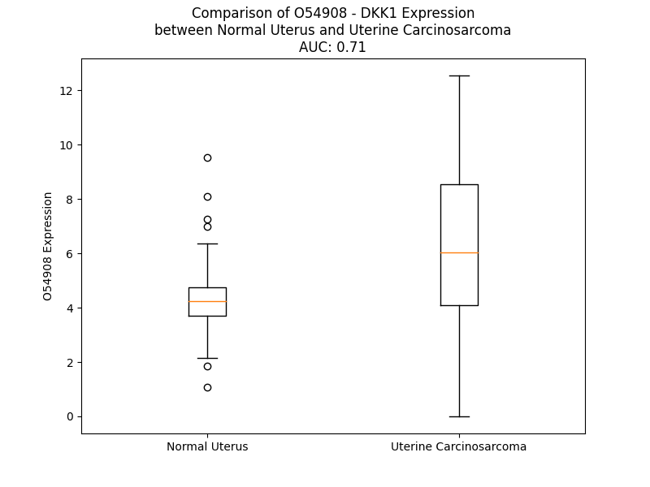

# Detailed Data for O54908

## Introduction to the Detailed Summary

### How to Interpret the Results

- **Summary & Metrics**: This section provides a quick reference to essential protein attributes, including expression changes, family classification, and biomarker applications. Regulation status (upregulated/downregulated) indicates the protein's behavior in a disease context. Some information comes from the original excel file with the proteins selected from literature, while others are derived from the analyses.
- **Expression Comparison**: A visual representation comparing protein expression between normal and disease states. It highlights significant changes in expression levels that might indicate diagnostic or therapeutic relevance. This is data coming from transcriptomics experiments and could not translate similarly to protein levels.
- **Isoform Alignment**: An interactive view of isoform alignments, revealing structural and functional differences between variants of the protein.
- **Interactors & Homologs**: Tables listing known interaction partners and homologous proteins, the more interactors and homologs, the more complex the protein is to design an antibody for.
- **Biological Assemblies**: Information about the structural arrangement of the protein in different assemblies, providing insights into its functional state but also the complexity of the protein to develop antibodies.
- **Combined Per-Residue Information**: A detailed table summarizing residue-level data. This includes predictions for epitope regions, aggregation tendencies, and modifications that might impact the protein's function. Each row corresponds to a residue in the protein, providing insights into specific sites that may be important for research or drug development.
## Summary & Metrics

- **UniProt Accession**: O54908
- **Gene Name**: DKK1
- **Protein Name**: Dickkopf-related protein 1
- **Swiss Prot**: DKK1_MOUSE
- **Family**: nan
- **Biomarker Application**: nan
- **Number of Isoforms**: 0
- **Regulation**: 2
- **(transcriptomics) AUC**: 0.71
- **(transcriptomics) Fold Change**: 1.42
- **(transcriptomics) Regulation**: Upregulated
- **Discotope Epitope Count**: 34
- **Max n_uniprots (Homo)**: N/A
- **Max n_uniprots (Hetero)**: N/A

## Expression Comparison

## Combined Per-Residue Information

|   res | aa   |   epitope_score | epitope   |   relative_surface_accessibility |   modeling_confidence |   Aggregation | modification   | glycosylation                   |
|------:|:-----|----------------:|:----------|---------------------------------:|----------------------:|--------------:|:---------------|:--------------------------------|
|     1 | M    |         0.09268 | False     |                          1.2428  |                 53.45 |         0     | N/A            | N/A                             |
|     2 | M    |         0.17606 | False     |                          0.93367 |                 54.49 |         5.147 | N/A            | N/A                             |
|     3 | V    |         0.09035 | False     |                          0.93284 |                 55.73 |         6.323 | N/A            | N/A                             |
|     4 | V    |         0.08953 | False     |                          0.87476 |                 55.88 |         6.341 | N/A            | N/A                             |
|     5 | C    |         0.11938 | False     |                          0.71547 |                 56.67 |         6.341 | N/A            | N/A                             |
|     6 | A    |         0.08234 | False     |                          0.57945 |                 57.88 |         6.35  | N/A            | N/A                             |
|     7 | A    |         0.09828 | False     |                          0.62886 |                 57.79 |         4.617 | N/A            | N/A                             |
|     8 | A    |         0.06534 | False     |                          0.50584 |                 57.96 |         2.642 | N/A            | N/A                             |
|     9 | A    |         0.0779  | False     |                          0.50378 |                 61.74 |         0.972 | N/A            | N/A                             |
|    10 | V    |         0.1008  | False     |                          0.72349 |                 66.31 |         0.455 | N/A            | N/A                             |
|    11 | R    |         0.16591 | False     |                          0.76652 |                 65.34 |         0.026 | N/A            | N/A                             |
|    12 | F    |         0.12354 | False     |                          0.70648 |                 61.99 |        83.27  | N/A            | N/A                             |
|    13 | L    |         0.12863 | False     |                          0.73824 |                 64.24 |        89.301 | N/A            | N/A                             |
|    14 | A    |         0.09636 | False     |                          0.50021 |                 65.31 |        91.709 | N/A            | N/A                             |
|    15 | V    |         0.09291 | False     |                          0.6655  |                 64.42 |        94.243 | N/A            | N/A                             |
|    16 | F    |         0.10112 | False     |                          0.71724 |                 62.23 |        94.425 | N/A            | N/A                             |
|    17 | T    |         0.09815 | False     |                          0.52066 |                 62.39 |        84.911 | N/A            | N/A                             |
|    18 | M    |         0.12489 | False     |                          0.70981 |                 60.22 |        78.786 | N/A            | N/A                             |
|    19 | M    |         0.11158 | False     |                          0.72742 |                 59.6  |        71.526 | N/A            | N/A                             |
|    20 | A    |         0.06911 | False     |                          0.55911 |                 60.38 |        62.884 | N/A            | N/A                             |
|    21 | L    |         0.122   | False     |                          0.74032 |                 58.94 |        54.524 | N/A            | N/A                             |
|    22 | C    |         0.09677 | False     |                          0.845   |                 57.43 |         8.862 | N/A            | N/A                             |
|    23 | S    |         0.15267 | False     |                          0.64348 |                 58.51 |         1.031 | N/A            | N/A                             |
|    24 | L    |         0.1541  | False     |                          0.79656 |                 57.46 |         0.063 | N/A            | N/A                             |
|    25 | P    |         0.0926  | False     |                          0.81521 |                 54.63 |         0.032 | N/A            | N/A                             |
|    26 | L    |         0.14622 | False     |                          1.06633 |                 52.53 |         0.151 | N/A            | N/A                             |
|    27 | L    |         0.1452  | False     |                          1.10103 |                 47.69 |         0.151 | N/A            | N/A                             |
|    28 | G    |         0.16996 | False     |                          0.69475 |                 47.61 |         0.151 | N/A            | N/A                             |
|    29 | A    |         0.22244 | False     |                          1.04603 |                 47.29 |         0.151 | N/A            | N/A                             |
|    30 | S    |         0.18162 | False     |                          0.8737  |                 48.44 |         0.151 | N/A            | N/A                             |
|    31 | A    |         0.14958 | False     |                          0.92274 |                 49.39 |         0.695 | N/A            | N/A                             |
|    32 | T    |         0.14359 | False     |                          0.86117 |                 42.7  |         1.337 | N/A            | N/A                             |
|    33 | L    |         0.15257 | False     |                          1.03625 |                 52.23 |         2.419 | N/A            | N/A                             |
|    34 | N    |         0.10189 | False     |                          0.85102 |                 48.97 |         2.618 | N/A            | N/A                             |
|    35 | S    |         0.10683 | False     |                          0.85062 |                 47.39 |         2.816 | N/A            | N/A                             |
|    36 | V    |         0.09669 | False     |                          0.74399 |                 49.99 |         3.015 | N/A            | N/A                             |
|    37 | L    |         0.0945  | False     |                          1.05723 |                 51.06 |         3.015 | N/A            | N/A                             |
|    38 | I    |         0.15332 | False     |                          0.80674 |                 54.34 |         3.015 | N/A            | N/A                             |
|    39 | N    |         0.11207 | False     |                          0.8394  |                 43.2  |         0.397 | N/A            | N/A                             |
|    40 | S    |         0.12202 | False     |                          0.68539 |                 55.74 |         0.199 | N/A            | N/A                             |
|    41 | N    |         0.16248 | False     |                          0.85364 |                 53.54 |         0     | N/A            | N/A                             |
|    42 | A    |         0.10539 | False     |                          0.88751 |                 51.09 |         0     | N/A            | N/A                             |
|    43 | I    |         0.11461 | False     |                          0.87636 |                 54.83 |         0     | N/A            | N/A                             |
|    44 | K    |         0.11914 | False     |                          0.84657 |                 58.63 |         0     | N/A            | N/A                             |
|    45 | N    |         0.15705 | False     |                          0.8896  |                 51.84 |         0     | N/A            | N/A                             |
|    46 | L    |         0.14309 | False     |                          0.91305 |                 49.35 |         0     | N/A            | N/A                             |
|    47 | P    |         0.12669 | False     |                          0.82973 |                 63.48 |         0     | N/A            | N/A                             |
|    48 | P    |         0.08798 | False     |                          0.80106 |                 61.05 |         0     | N/A            | N/A                             |
|    49 | P    |         0.11145 | False     |                          0.98812 |                 61.36 |         0     | N/A            | N/A                             |
|    50 | L    |         0.16575 | False     |                          1.02362 |                 48.88 |         0     | N/A            | N/A                             |
|    51 | G    |         0.10048 | False     |                          0.96326 |                 41.67 |         0     | N/A            | N/A                             |
|    52 | G    |         0.1847  | False     |                          0.88775 |                 38.08 |         0     | N/A            | N/A                             |
|    53 | A    |         0.13634 | False     |                          1.06131 |                 42.37 |         0     | N/A            | N/A                             |
|    54 | G    |         0.22072 | False     |                          0.98711 |                 43.37 |         0     | N/A            | N/A                             |
|    55 | G    |         0.15916 | False     |                          1.02918 |                 38.83 |         0     | N/A            | N/A                             |
|    56 | Q    |         0.10426 | False     |                          0.88556 |                 43.88 |         0     | N/A            | N/A                             |
|    57 | P    |         0.1165  | False     |                          0.88757 |                 48.4  |         0     | N/A            | N/A                             |
|    58 | G    |         0.25842 | True      |                          0.8814  |                 45.12 |         0     | N/A            | N/A                             |
|    59 | S    |         0.14192 | False     |                          0.99275 |                 46.73 |         0     | N/A            | N/A                             |
|    60 | A    |         0.08585 | False     |                          0.86089 |                 45.69 |         0     | N/A            | N/A                             |
|    61 | V    |         0.14321 | False     |                          1.02813 |                 50.87 |         0     | N/A            | N/A                             |
|    62 | S    |         0.13141 | False     |                          0.84863 |                 48.75 |         0     | N/A            | O-linked (GalNAc...) serine     |
|    63 | V    |         0.12731 | False     |                          1.02512 |                 46.67 |         0     | N/A            | N/A                             |
|    64 | A    |         0.15247 | False     |                          0.90895 |                 46.78 |         0     | N/A            | N/A                             |
|    65 | P    |         0.12688 | False     |                          0.95121 |                 43.71 |         0     | N/A            | N/A                             |
|    66 | G    |         0.11429 | False     |                          0.84637 |                 42.14 |         0     | N/A            | N/A                             |
|    67 | V    |         0.11332 | False     |                          1.05767 |                 44.63 |         0     | N/A            | N/A                             |
|    68 | L    |         0.11355 | False     |                          1.04009 |                 39.33 |         0     | N/A            | N/A                             |
|    69 | Y    |         0.17757 | False     |                          0.99021 |                 40.66 |         0     | N/A            | N/A                             |
|    70 | E    |         0.17058 | False     |                          0.84296 |                 41.33 |         0     | N/A            | N/A                             |
|    71 | G    |         0.19441 | False     |                          0.86603 |                 45.6  |         0     | N/A            | N/A                             |
|    72 | G    |         0.16374 | False     |                          0.95065 |                 36.34 |         0     | N/A            | N/A                             |
|    73 | N    |         0.24498 | True      |                          0.9078  |                 44.18 |         0     | N/A            | N/A                             |
|    74 | K    |         0.18299 | False     |                          0.98924 |                 40.18 |         0     | N/A            | N/A                             |
|    75 | Y    |         0.23768 | False     |                          0.92202 |                 50.84 |         0     | N/A            | N/A                             |
|    76 | Q    |         0.14994 | False     |                          0.93969 |                 40.23 |         0     | N/A            | N/A                             |
|    77 | T    |         0.17086 | False     |                          0.94555 |                 41.52 |         0     | N/A            | N/A                             |
|    78 | L    |         0.14478 | False     |                          0.94229 |                 48.9  |         0     | N/A            | N/A                             |
|    79 | D    |         0.13159 | False     |                          0.65867 |                 46.58 |         0     | N/A            | N/A                             |
|    80 | N    |         0.18083 | False     |                          0.9686  |                 43.57 |         0     | N/A            | N/A                             |
|    81 | Y    |         0.17611 | False     |                          0.76256 |                 54.23 |         0     | N/A            | N/A                             |
|    82 | Q    |         0.13476 | False     |                          0.74966 |                 57.46 |         0     | N/A            | N/A                             |
|    83 | P    |         0.20184 | False     |                          0.59187 |                 64.9  |         0     | N/A            | N/A                             |
|    84 | Y    |         0.20077 | False     |                          0.64942 |                 69.46 |         0     | N/A            | N/A                             |
|    85 | P    |         0.14806 | False     |                          0.55371 |                 87.11 |         0     | N/A            | N/A                             |
|    86 | C    |         0.06452 | False     |                          0.08484 |                 90.17 |         0     | N/A            | N/A                             |
|    87 | A    |         0.14424 | False     |                          0.76584 |                 87.5  |         0     | N/A            | N/A                             |
|    88 | E    |         0.19381 | False     |                          0.50646 |                 88.42 |         0     | N/A            | N/A                             |
|    89 | D    |         0.12076 | False     |                          0.17265 |                 89.74 |         0     | N/A            | N/A                             |
|    90 | E    |         0.24758 | True      |                          0.7894  |                 89.48 |         0     | N/A            | N/A                             |
|    91 | E    |         0.18186 | False     |                          0.42191 |                 89.98 |         0     | N/A            | N/A                             |
|    92 | C    |         0.09311 | False     |                          0.10566 |                 90.66 |         0     | N/A            | N/A                             |
|    93 | G    |         0.09761 | False     |                          0.47985 |                 89.35 |         0     | N/A            | N/A                             |
|    94 | S    |         0.11232 | False     |                          0.76946 |                 88.15 |         0     | N/A            | N/A                             |
|    95 | D    |         0.11835 | False     |                          0.51509 |                 90.63 |         0     | N/A            | N/A                             |
|    96 | E    |         0.08201 | False     |                          0.28233 |                 94.18 |         0     | N/A            | N/A                             |
|    97 | Y    |         0.03629 | False     |                          0.03626 |                 93.04 |         0     | N/A            | N/A                             |
|    98 | C    |         0.02822 | False     |                          0.01395 |                 93.42 |         0     | N/A            | N/A                             |
|    99 | S    |         0.13144 | False     |                          0.26039 |                 90.1  |         0     | N/A            | N/A                             |
|   100 | S    |         0.18781 | False     |                          0.3283  |                 78.05 |         0     | N/A            | N/A                             |
|   101 | P    |         0.20862 | False     |                          0.51442 |                 66.56 |         0     | N/A            | N/A                             |
|   102 | S    |         0.25008 | True      |                          0.55714 |                 63.67 |         0     | N/A            | N/A                             |
|   103 | R    |         0.36533 | True      |                          0.99405 |                 57.57 |         0     | N/A            | N/A                             |
|   104 | G    |         0.31552 | True      |                          0.96614 |                 50.47 |         0     | N/A            | N/A                             |
|   105 | A    |         0.21892 | False     |                          0.64025 |                 50.28 |         0     | N/A            | N/A                             |
|   106 | A    |         0.29814 | True      |                          0.96214 |                 48.11 |         0     | N/A            | N/A                             |
|   107 | G    |         0.32018 | True      |                          0.81874 |                 47.52 |         0     | N/A            | N/A                             |
|   108 | V    |         0.17699 | False     |                          0.96256 |                 49.18 |         0     | N/A            | N/A                             |
|   109 | G    |         0.19711 | False     |                          0.96819 |                 55.02 |         0     | N/A            | N/A                             |
|   110 | G    |         0.2289  | False     |                          0.66488 |                 61.8  |         0     | N/A            | N/A                             |
|   111 | V    |         0.19024 | False     |                          0.75307 |                 73.82 |         0.295 | N/A            | N/A                             |
|   112 | Q    |         0.22544 | False     |                          0.26671 |                 85.98 |         0.295 | N/A            | N/A                             |
|   113 | I    |         0.12141 | False     |                          0.32467 |                 89.81 |         0.295 | N/A            | N/A                             |
|   114 | C    |         0.09394 | False     |                          0.17512 |                 93.23 |         0.295 | N/A            | N/A                             |
|   115 | L    |         0.13641 | False     |                          0.413   |                 92.39 |         0.295 | N/A            | N/A                             |
|   116 | A    |         0.09549 | False     |                          0.73057 |                 93.98 |         0     | N/A            | N/A                             |
|   117 | C    |         0.08187 | False     |                          0.16197 |                 95.59 |         0     | N/A            | N/A                             |
|   118 | R    |         0.15487 | False     |                          0.28567 |                 95.15 |         0     | N/A            | N/A                             |
|   119 | K    |         0.23942 | False     |                          0.75121 |                 94.16 |         0     | N/A            | N/A                             |
|   120 | R    |         0.24327 | True      |                          0.59048 |                 93.75 |         0     | N/A            | N/A                             |
|   121 | R    |         0.23166 | False     |                          0.8523  |                 93.07 |         0     | N/A            | N/A                             |
|   122 | K    |         0.1159  | False     |                          0.59094 |                 96.06 |         0     | N/A            | N/A                             |
|   123 | R    |         0.28833 | True      |                          0.75982 |                 95.01 |         0     | N/A            | N/A                             |
|   124 | C    |         0.05205 | False     |                          0.03775 |                 94.9  |         0     | N/A            | N/A                             |
|   125 | M    |         0.16312 | False     |                          0.59894 |                 93.51 |         0     | N/A            | N/A                             |
|   126 | R    |         0.23889 | False     |                          0.37897 |                 92.95 |         0     | N/A            | N/A                             |
|   127 | H    |         0.17693 | False     |                          0.63148 |                 93.8  |         0     | N/A            | N/A                             |
|   128 | A    |         0.08446 | False     |                          0.38538 |                 93.15 |         0     | N/A            | N/A                             |
|   129 | M    |         0.04172 | False     |                          0.02867 |                 94.63 |         0     | N/A            | N/A                             |
|   130 | C    |         0.09579 | False     |                          0.06292 |                 95.96 |         0     | N/A            | N/A                             |
|   131 | C    |         0.10166 | False     |                          0.15166 |                 96.17 |         0     | N/A            | N/A                             |
|   132 | P    |         0.12676 | False     |                          0.65021 |                 93.71 |         0     | N/A            | N/A                             |
|   133 | G    |         0.11128 | False     |                          0.58779 |                 92.18 |         0     | N/A            | N/A                             |
|   134 | N    |         0.17313 | False     |                          0.13547 |                 95.24 |         0     | N/A            | N/A                             |
|   135 | Y    |         0.13556 | False     |                          0.2895  |                 95.48 |         0     | N/A            | N/A                             |
|   136 | C    |         0.08487 | False     |                          0.14927 |                 95.79 |         0     | N/A            | N/A                             |
|   137 | K    |         0.20409 | False     |                          0.50821 |                 95.6  |         0     | N/A            | N/A                             |
|   138 | N    |         0.34109 | True      |                          0.92558 |                 95.61 |         0     | N/A            | N/A                             |
|   139 | G    |         0.22421 | False     |                          0.2584  |                 95.19 |         0     | N/A            | N/A                             |
|   140 | I    |         0.2104  | False     |                          0.42638 |                 96.1  |         0     | N/A            | N/A                             |
|   141 | C    |         0.02343 | False     |                          0.0037  |                 97.12 |         0     | N/A            | N/A                             |
|   142 | M    |         0.27598 | True      |                          0.40919 |                 95.63 |         0     | N/A            | N/A                             |
|   143 | P    |         0.14281 | False     |                          0.46804 |                 93.76 |         0     | N/A            | N/A                             |
|   144 | S    |         0.14289 | False     |                          0.30744 |                 87.02 |         0     | N/A            | N/A                             |
|   145 | D    |         0.15735 | False     |                          0.60486 |                 76.13 |         0     | N/A            | N/A                             |
|   146 | H    |         0.23578 | False     |                          0.88931 |                 59.35 |         0     | N/A            | N/A                             |
|   147 | S    |         0.22866 | False     |                          0.67987 |                 45.86 |         0     | N/A            | N/A                             |
|   148 | H    |         0.17696 | False     |                          0.83563 |                 46.4  |         0     | N/A            | N/A                             |
|   149 | F    |         0.19123 | False     |                          0.97798 |                 40.89 |         0     | N/A            | N/A                             |
|   150 | P    |         0.17619 | False     |                          0.91277 |                 46.25 |         0     | N/A            | N/A                             |
|   151 | R    |         0.22834 | False     |                          0.97833 |                 39.52 |         0     | N/A            | N/A                             |
|   152 | G    |         0.22334 | False     |                          0.76411 |                 41.01 |         0     | N/A            | N/A                             |
|   153 | E    |         0.20634 | False     |                          0.84708 |                 41.68 |         0     | N/A            | N/A                             |
|   154 | I    |         0.10825 | False     |                          0.95642 |                 52.81 |         0     | N/A            | N/A                             |
|   155 | E    |         0.18618 | False     |                          0.77    |                 48.66 |         0     | N/A            | N/A                             |
|   156 | E    |         0.16936 | False     |                          0.80583 |                 44.46 |         0     | N/A            | N/A                             |
|   157 | S    |         0.1596  | False     |                          0.86324 |                 47.78 |         0     | N/A            | N/A                             |
|   158 | I    |         0.1869  | False     |                          1.0148  |                 42.53 |         0     | N/A            | N/A                             |
|   159 | I    |         0.17081 | False     |                          0.97193 |                 53.34 |         0     | N/A            | N/A                             |
|   160 | E    |         0.14482 | False     |                          0.74838 |                 44.08 |         0     | N/A            | N/A                             |
|   161 | N    |         0.27331 | True      |                          0.94388 |                 45.78 |         0     | N/A            | N/A                             |
|   162 | L    |         0.23745 | False     |                          1.13803 |                 38.97 |         0     | N/A            | N/A                             |
|   163 | G    |         0.31748 | True      |                          0.81527 |                 39.71 |         0     | N/A            | N/A                             |
|   164 | N    |         0.23959 | False     |                          0.9412  |                 42.13 |         0     | N/A            | N/A                             |
|   165 | D    |         0.16528 | False     |                          0.62863 |                 39.14 |         0     | N/A            | N/A                             |
|   166 | H    |         0.24068 | False     |                          0.8761  |                 48.76 |         0     | N/A            | N/A                             |
|   167 | N    |         0.14858 | False     |                          0.8966  |                 41.62 |         0     | N/A            | N/A                             |
|   168 | A    |         0.23176 | False     |                          0.90594 |                 35.14 |         0     | N/A            | N/A                             |
|   169 | A    |         0.26229 | True      |                          0.91683 |                 34.58 |         0     | N/A            | N/A                             |
|   170 | A    |         0.18549 | False     |                          1.05712 |                 36.17 |         0     | N/A            | N/A                             |
|   171 | G    |         0.26954 | True      |                          0.8958  |                 34.16 |         0     | N/A            | N/A                             |
|   172 | D    |         0.23386 | False     |                          0.98074 |                 39.79 |         0     | N/A            | N/A                             |
|   173 | G    |         0.21171 | False     |                          0.66761 |                 38.63 |         0     | N/A            | N/A                             |
|   174 | Y    |         0.15734 | False     |                          0.86811 |                 37.82 |         0     | N/A            | N/A                             |
|   175 | P    |         0.12065 | False     |                          0.97025 |                 47.72 |         0     | N/A            | N/A                             |
|   176 | R    |         0.24653 | True      |                          0.89606 |                 45.36 |         0     | N/A            | N/A                             |
|   177 | R    |         0.10108 | False     |                          0.86046 |                 49.56 |         0     | N/A            | N/A                             |
|   178 | T    |         0.15236 | False     |                          0.81717 |                 47.22 |         0     | N/A            | N/A                             |
|   179 | T    |         0.07864 | False     |                          0.80882 |                 50.64 |         0     | N/A            | N/A                             |
|   180 | L    |         0.23648 | False     |                          0.92406 |                 52.28 |         0     | N/A            | N/A                             |
|   181 | T    |         0.15661 | False     |                          0.47775 |                 47.08 |         0     | N/A            | N/A                             |
|   182 | S    |         0.15512 | False     |                          0.69565 |                 48.87 |         0     | N/A            | N/A                             |
|   183 | K    |         0.17628 | False     |                          0.83238 |                 43.63 |         0     | N/A            | N/A                             |
|   184 | I    |         0.20707 | False     |                          0.6446  |                 52.63 |         0     | N/A            | N/A                             |
|   185 | Y    |         0.23598 | False     |                          0.81699 |                 53.16 |         0     | N/A            | N/A                             |
|   186 | H    |         0.16319 | False     |                          0.88479 |                 55.51 |         0     | N/A            | N/A                             |
|   187 | T    |         0.14082 | False     |                          0.82269 |                 80.01 |         0     | N/A            | N/A                             |
|   188 | K    |         0.17357 | False     |                          0.51678 |                 90.95 |         0     | N/A            | N/A                             |
|   189 | G    |         0.0973  | False     |                          0.19338 |                 92.44 |         0     | N/A            | N/A                             |
|   190 | Q    |         0.14623 | False     |                          0.58824 |                 95.88 |         0     | N/A            | N/A                             |
|   191 | E    |         0.20548 | False     |                          0.61794 |                 96.24 |         0     | N/A            | N/A                             |
|   192 | G    |         0.10708 | False     |                          0.50266 |                 94.86 |         0     | N/A            | N/A                             |
|   193 | S    |         0.09248 | False     |                          0.3082  |                 96.12 |         0     | N/A            | N/A                             |
|   194 | V    |         0.20168 | False     |                          0.84325 |                 95.34 |         0     | N/A            | N/A                             |
|   195 | C    |         0.03184 | False     |                          0.03044 |                 96.09 |         0     | N/A            | N/A                             |
|   196 | L    |         0.16232 | False     |                          0.8131  |                 94.44 |         0     | N/A            | N/A                             |
|   197 | R    |         0.29734 | True      |                          0.66382 |                 94.77 |         0     | N/A            | N/A                             |
|   198 | S    |         0.28673 | True      |                          0.4137  |                 94.97 |         0     | N/A            | N/A                             |
|   199 | S    |         0.22924 | False     |                          0.54493 |                 94.88 |         0     | N/A            | N/A                             |
|   200 | D    |         0.16002 | False     |                          0.32865 |                 95.54 |         0     | N/A            | N/A                             |
|   201 | C    |         0.05319 | False     |                          0.02591 |                 96.73 |         0     | N/A            | N/A                             |
|   202 | A    |         0.08835 | False     |                          0.19386 |                 96.05 |         0     | N/A            | N/A                             |
|   203 | A    |         0.13343 | False     |                          1.01046 |                 94.85 |         0     | N/A            | N/A                             |
|   204 | G    |         0.13298 | False     |                          0.62679 |                 95.44 |         0     | N/A            | N/A                             |
|   205 | L    |         0.21153 | False     |                          0.15534 |                 97.26 |         0     | N/A            | N/A                             |
|   206 | C    |         0.05755 | False     |                          0.0471  |                 97.04 |         0     | N/A            | N/A                             |
|   207 | C    |         0.06217 | False     |                          0.15027 |                 96.79 |         0     | N/A            | N/A                             |
|   208 | A    |         0.0218  | False     |                          0.00893 |                 95.63 |         0     | N/A            | N/A                             |
|   209 | R    |         0.16733 | False     |                          0.2401  |                 93.89 |         0     | N/A            | N/A                             |
|   210 | H    |         0.19124 | False     |                          0.33133 |                 93.86 |         0     | N/A            | N/A                             |
|   211 | F    |         0.33675 | True      |                          0.51133 |                 90.12 |         0     | N/A            | N/A                             |
|   212 | W    |         0.42403 | True      |                          1.0366  |                 89.55 |         0     | N/A            | N/A                             |
|   213 | S    |         0.17465 | False     |                          0.41978 |                 92.62 |         0     | N/A            | N/A                             |
|   214 | K    |         0.18288 | False     |                          0.49383 |                 95.35 |         0     | N/A            | N/A                             |
|   215 | I    |         0.16279 | False     |                          0.16159 |                 95.91 |         0     | N/A            | N/A                             |
|   216 | C    |         0.0169  | False     |                          0.00355 |                 97.56 |         0     | N/A            | N/A                             |
|   217 | K    |         0.14461 | False     |                          0.17578 |                 97.24 |         0     | N/A            | N/A                             |
|   218 | P    |         0.17126 | False     |                          0.47089 |                 97.05 |         0     | N/A            | N/A                             |
|   219 | V    |         0.07493 | False     |                          0.15871 |                 97.08 |         0     | N/A            | N/A                             |
|   220 | L    |         0.06792 | False     |                          0.11646 |                 96.26 |         0     | N/A            | N/A                             |
|   221 | K    |         0.11002 | False     |                          0.74385 |                 96.38 |         0     | N/A            | N/A                             |
|   222 | E    |         0.18726 | False     |                          0.45456 |                 95    |         0     | N/A            | N/A                             |
|   223 | G    |         0.10363 | False     |                          0.6304  |                 92.31 |         0     | N/A            | N/A                             |
|   224 | Q    |         0.16205 | False     |                          0.42657 |                 94.6  |         0     | N/A            | N/A                             |
|   225 | V    |         0.14719 | False     |                          0.3534  |                 93.96 |         0     | N/A            | N/A                             |
|   226 | C    |         0.07977 | False     |                          0.05997 |                 93.74 |         0     | N/A            | N/A                             |
|   227 | T    |         0.15141 | False     |                          0.41999 |                 89.31 |         0     | N/A            | N/A                             |
|   228 | K    |         0.21256 | False     |                          0.59619 |                 85.17 |         0     | N/A            | N/A                             |
|   229 | H    |         0.20002 | False     |                          0.39286 |                 79.77 |         0     | N/A            | N/A                             |
|   230 | K    |         0.35335 | True      |                          0.77829 |                 75.75 |         0     | N/A            | N/A                             |
|   231 | R    |         0.33097 | True      |                          0.81249 |                 73.41 |         0     | N/A            | N/A                             |
|   232 | K    |         0.28848 | True      |                          1.09834 |                 69.85 |         0     | N/A            | N/A                             |
|   233 | G    |         0.35419 | True      |                          0.67551 |                 71.01 |         0     | N/A            | N/A                             |
|   234 | S    |         0.31029 | True      |                          0.33216 |                 72.37 |         0     | N/A            | N/A                             |
|   235 | H    |         0.2261  | False     |                          0.52773 |                 72.13 |         0     | N/A            | N/A                             |
|   236 | G    |         0.35186 | True      |                          0.70309 |                 74.95 |         0     | N/A            | N/A                             |
|   237 | L    |         0.34977 | True      |                          0.927   |                 77.96 |         0     | N/A            | N/A                             |
|   238 | E    |         0.28005 | True      |                          0.19432 |                 80.81 |         0     | N/A            | N/A                             |
|   239 | I    |         0.33442 | True      |                          0.40262 |                 85.12 |         0     | N/A            | N/A                             |
|   240 | F    |         0.29196 | True      |                          0.47561 |                 88.75 |         0     | N/A            | N/A                             |
|   241 | Q    |         0.16309 | False     |                          0.23812 |                 92.11 |         0     | N/A            | N/A                             |
|   242 | R    |         0.29188 | True      |                          0.46702 |                 93.96 |         0     | N/A            | N/A                             |
|   243 | C    |         0.08724 | False     |                          0.06217 |                 95.7  |         0     | N/A            | N/A                             |
|   244 | Y    |         0.18306 | False     |                          0.59679 |                 94.68 |         0     | N/A            | N/A                             |
|   245 | C    |         0.09933 | False     |                          0.1263  |                 96.49 |         0     | N/A            | N/A                             |
|   246 | G    |         0.08494 | False     |                          0.18085 |                 95.46 |         0     | N/A            | N/A                             |
|   247 | E    |         0.1829  | False     |                          0.94412 |                 95.23 |         0     | N/A            | N/A                             |
|   248 | G    |         0.09889 | False     |                          0.53812 |                 95.41 |         0     | N/A            | N/A                             |
|   249 | L    |         0.08943 | False     |                          0.16877 |                 96.11 |         0     | N/A            | N/A                             |
|   250 | A    |         0.07771 | False     |                          0.23723 |                 94.8  |         0     | N/A            | N/A                             |
|   251 | C    |         0.03287 | False     |                          0.24138 |                 94.23 |         0     | N/A            | N/A                             |
|   252 | R    |         0.15093 | False     |                          0.41482 |                 93.02 |         0     | N/A            | N/A                             |
|   253 | I    |         0.15272 | False     |                          0.52338 |                 91.21 |         0     | N/A            | N/A                             |
|   254 | Q    |         0.17531 | False     |                          0.30868 |                 84.85 |         0     | N/A            | N/A                             |
|   255 | K    |         0.23691 | False     |                          0.76389 |                 74.42 |         0     | N/A            | N/A                             |
|   256 | D    |         0.16519 | False     |                          0.46058 |                 65.95 |         0     | N/A            | N/A                             |
|   257 | H    |         0.29343 | True      |                          0.75469 |                 57.07 |         0     | N/A            | N/A                             |
|   258 | H    |         0.18966 | False     |                          0.81338 |                 57.37 |         0     | N/A            | N/A                             |
|   259 | Q    |         0.23062 | False     |                          0.95092 |                 51.17 |         0     | N/A            | N/A                             |
|   260 | A    |         0.19003 | False     |                          0.55346 |                 47.07 |         0     | N/A            | N/A                             |
|   261 | S    |         0.21169 | False     |                          1.0205  |                 55    |         0     | N/A            | N/A                             |
|   262 | N    |         0.2557  | True      |                          0.9786  |                 57.31 |         0     | N/A            | N-linked (GlcNAc...) asparagine |
|   263 | S    |         0.23691 | False     |                          0.5568  |                 50.79 |         0     | N/A            | N/A                             |
|   264 | S    |         0.15783 | False     |                          0.14323 |                 58.74 |         0     | N/A            | N/A                             |
|   265 | R    |         0.15247 | False     |                          0.77115 |                 77.25 |         0     | N/A            | N/A                             |
|   266 | L    |         0.18262 | False     |                          0.61155 |                 88.25 |         0     | N/A            | N/A                             |
|   267 | H    |         0.15319 | False     |                          0.17201 |                 92.06 |         0     | N/A            | N/A                             |
|   268 | T    |         0.06775 | False     |                          0.04339 |                 94.43 |         0     | N/A            | N/A                             |
|   269 | C    |         0.00573 | False     |                          0.00074 |                 95.67 |         0     | N/A            | N/A                             |
|   270 | Q    |         0.11188 | False     |                          0.2754  |                 94.61 |         0     | N/A            | N/A                             |
|   271 | R    |         0.16571 | False     |                          0.6711  |                 94.61 |         0     | N/A            | N/A                             |
|   272 | H    |         0.09067 | False     |                          0.85771 |                 89.41 |         0     | N/A            | N/A                             |

