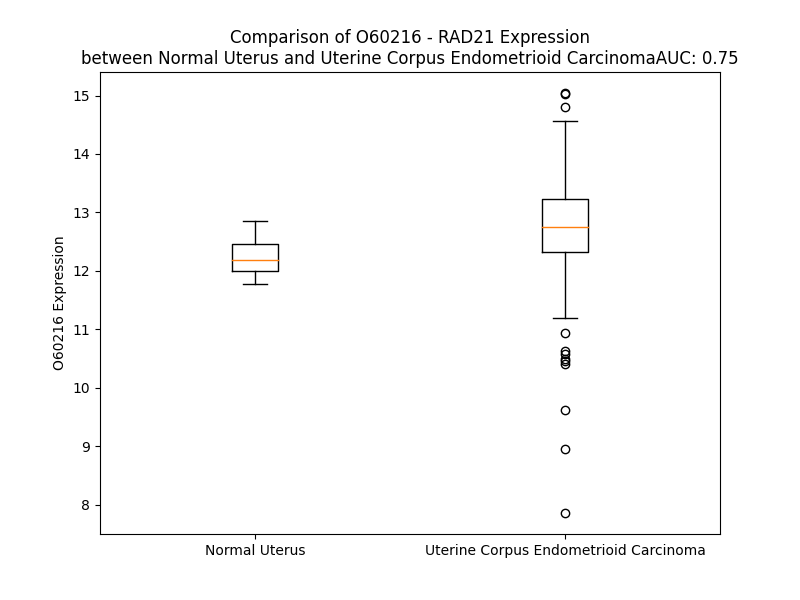

# Detailed Data for O60216

## Introduction to the Detailed Summary

### How to Interpret the Results

- **Summary & Metrics**: This section provides a quick reference to essential protein attributes, including expression changes, family classification, and biomarker applications. Regulation status (upregulated/downregulated) indicates the protein's behavior in a disease context. Some information comes from the original excel file with the proteins selected from literature, while others are derived from the analyses.
- **Expression Comparison**: A visual representation comparing protein expression between normal and disease states. It highlights significant changes in expression levels that might indicate diagnostic or therapeutic relevance. This is data coming from transcriptomics experiments and could not translate similarly to protein levels.
- **Isoform Alignment**: An interactive view of isoform alignments, revealing structural and functional differences between variants of the protein.
- **Interactors & Homologs**: Tables listing known interaction partners and homologous proteins, the more interactors and homologs, the more complex the protein is to design an antibody for.
- **Biological Assemblies**: Information about the structural arrangement of the protein in different assemblies, providing insights into its functional state but also the complexity of the protein to develop antibodies.
- **Combined Per-Residue Information**: A detailed table summarizing residue-level data. This includes predictions for epitope regions, aggregation tendencies, and modifications that might impact the protein's function. Each row corresponds to a residue in the protein, providing insights into specific sites that may be important for research or drug development.
## Summary & Metrics

- **UniProt Accession**: O60216
- **Gene Name**: RAD21
- **Protein Name**: Double-strand-break repair protein rad21 homolog
- **Swiss Prot**: RAD21_HUMAN
- **Family**: other
- **Biomarker Application**:  
- **Number of Isoforms**: 0
- **Regulation**: 1
- **(transcriptomics) AUC**: 0.9
- **(transcriptomics) Fold Change**: 1.08
- **(transcriptomics) Regulation**: Upregulated
- **Discotope Epitope Count**: 98
- **Max n_uniprots (Homo)**: N/A
- **Max n_uniprots (Hetero)**: 6

## Expression Comparison

## Interactors

| preferredName_A   | preferredName_B   |   score |
|:------------------|:------------------|--------:|
| RAD21             | STAG1             |   0.999 |
| RAD21             | STAG3             |   0.999 |
| RAD21             | WAPL              |   0.999 |
| RAD21             | CTCF              |   0.999 |
| RAD21             | SMC1B             |   0.999 |
| RAD21             | SMC1A             |   0.999 |
| RAD21             | SMC3              |   0.999 |
| RAD21             | NIPBL             |   0.999 |
| RAD21             | STAG2             |   0.999 |
| RAD21             | PDS5A             |   0.999 |
| RAD21             | PDS5B             |   0.998 |
| RAD21             | ESPL1             |   0.997 |
| RAD21             | SGO2              |   0.988 |
| RAD21             | CDCA5             |   0.988 |
| RAD21             | SGO1              |   0.973 |
| RAD21             | REC8              |   0.965 |
| RAD21             | ESCO2             |   0.963 |
| RAD21             | SMC4              |   0.962 |
| RAD21             | ESCO1             |   0.959 |
| RAD21             | SMC5              |   0.952 |
| RAD21             | SMC6              |   0.93  |
| RAD21             | SMARCA5           |   0.906 |
| RAD21             | YY1               |   0.902 |
| RAD21             | MAU2              |   0.902 |

## Homologs

| uniprot_id   | gene_id   |
|:-------------|:----------|
| A0A804HJ87   | RAD21L1   |
| O95072       | REC8      |

## Biological Assemblies

|   Unnamed: 0 |   assembly |   n_uniprots | composition   | crystal_id   |
|-------------:|-----------:|-------------:|:--------------|:-------------|
|            0 |          1 |            3 | Hetero        | 6qnx         |
|            0 |          1 |            2 | Hetero        | 4pk7         |
|            0 |          1 |            2 | Hetero        | 4pjw         |
|            0 |          1 |            5 | Hetero        | 6wg3         |
|            0 |          1 |            4 | Hetero        | 6wge         |
|            0 |          1 |            2 | Hetero        | 6rrk         |
|            1 |          2 |            2 | Hetero        | 6rrk         |
|            0 |          1 |            6 | Hetero        | 7w1m         |
|            0 |          1 |            3 | Hetero        | 7zjs         |
|            1 |          2 |            3 | Hetero        | 7zjs         |
|            0 |          1 |            2 | Hetero        | 4pju         |
|            0 |          1 |            2 | Hetero        | 6rrc         |
|            1 |          2 |            2 | Hetero        | 6rrc         |

## Combined Per-Residue Information

|   res | aa   |   epitope_score | epitope   |   relative_surface_accessibility |   modeling_confidence |   Aggregation | modification     |
|------:|:-----|----------------:|:----------|---------------------------------:|----------------------:|--------------:|:-----------------|
|     1 | M    |         0.08654 | False     |                          1.17352 |                 49.2  |         0     | N/A              |
|     2 | F    |         0.13806 | True      |                          0.98484 |                 52.47 |        20.183 | N/A              |
|     3 | Y    |         0.16017 | True      |                          0.46729 |                 59.43 |        20.799 | N/A              |
|     4 | A    |         0.03626 | False     |                          0.3777  |                 60.88 |        20.799 | N/A              |
|     5 | H    |         0.09156 | False     |                          0.84171 |                 61.95 |        20.799 | N/A              |
|     6 | F    |         0.09836 | False     |                          0.31906 |                 61.19 |        20.799 | N/A              |
|     7 | V    |         0.03096 | False     |                          0.03539 |                 62.74 |        20.257 | N/A              |
|     8 | L    |         0.13027 | True      |                          0.62314 |                 64.02 |        13.684 | N/A              |
|     9 | S    |         0.0454  | False     |                          0.31133 |                 67.14 |         0.575 | N/A              |
|    10 | K    |         0.10928 | False     |                          0.96995 |                 64.31 |         0     | N/A              |
|    11 | R    |         0.15026 | True      |                          0.9495  |                 68.24 |         0     | N/A              |
|    12 | G    |         0.04563 | False     |                          0.18369 |                 70.35 |         0     | N/A              |
|    13 | P    |         0.06108 | False     |                          0.62187 |                 74.24 |         0     | N/A              |
|    14 | L    |         0.00408 | False     |                          0       |                 84.04 |         0     | N/A              |
|    15 | A    |         0.00854 | False     |                          0.12733 |                 86.79 |         0     | N/A              |
|    16 | K    |         0.01193 | False     |                          0.23806 |                 86.98 |         0     | N/A              |
|    17 | I    |         0.00177 | False     |                          0       |                 89.91 |         4.478 | N/A              |
|    18 | W    |         0.04018 | False     |                          0.20484 |                 89.61 |         4.478 | N/A              |
|    19 | L    |         0.01265 | False     |                          0.26745 |                 89.16 |         4.478 | N/A              |
|    20 | A    |         0.00122 | False     |                          0       |                 90.37 |         4.478 | N/A              |
|    21 | A    |         0.02644 | False     |                          0.08673 |                 91.27 |         4.478 | N/A              |
|    22 | H    |         0.13693 | True      |                          0.46328 |                 90.85 |         0.545 | N/A              |
|    23 | W    |         0.11514 | True      |                          0.70318 |                 89.32 |         0.328 | N/A              |
|    24 | D    |         0.05763 | False     |                          0.25433 |                 83.52 |         0     | N/A              |
|    25 | K    |         0.06878 | False     |                          1.04563 |                 84.99 |         0     | N/A              |
|    26 | K    |         0.06929 | False     |                          0.67301 |                 84.18 |         0     | N/A              |
|    27 | L    |         0.02661 | False     |                          0.06601 |                 85.35 |         0     | N/A              |
|    28 | T    |         0.04108 | False     |                          0.34643 |                 89.71 |         0     | N/A              |
|    29 | K    |         0.07911 | False     |                          0.49289 |                 89.77 |         0     | N/A              |
|    30 | A    |         0.04986 | False     |                          0.627   |                 89.69 |         0     | N/A              |
|    31 | H    |         0.02509 | False     |                          0.33403 |                 87.14 |         0     | N/A              |
|    32 | V    |         0.00354 | False     |                          0       |                 91    |         0     | N/A              |
|    33 | F    |         0.1202  | True      |                          0.55232 |                 89.25 |         0     | N/A              |
|    34 | E    |         0.04204 | False     |                          0.65196 |                 88.19 |         0     | N/A              |
|    35 | C    |         0.0136  | False     |                          0.03677 |                 87.46 |         0     | N/A              |
|    36 | N    |         0.05736 | False     |                          0.56981 |                 90.82 |         0     | N/A              |
|    37 | L    |         0.04289 | False     |                          0.17242 |                 91.16 |         0     | N/A              |
|    38 | E    |         0.0753  | False     |                          0.70256 |                 90.73 |         0     | N/A              |
|    39 | S    |         0.03213 | False     |                          0.46856 |                 87.88 |         0     | N/A              |
|    40 | S    |         0.00845 | False     |                          0.02792 |                 88.04 |         0     | N/A              |
|    41 | V    |         0.06806 | False     |                          0.39987 |                 90.84 |         0     | N/A              |
|    42 | E    |         0.06588 | False     |                          0.50085 |                 89.25 |         0     | N/A              |
|    43 | S    |         0.02126 | False     |                          0.21957 |                 85.52 |         0     | N/A              |
|    44 | I    |         0.06508 | False     |                          0.19026 |                 87.77 |         0     | N/A              |
|    45 | I    |         0.20186 | True      |                          0.74571 |                 89.36 |         0     | N/A              |
|    46 | S    |         0.12261 | True      |                          0.52067 |                 84.07 |         0     | Phosphoserine    |
|    47 | P    |         0.08485 | False     |                          0.31738 |                 81.22 |         0     | N/A              |
|    48 | K    |         0.0815  | False     |                          0.93034 |                 77.05 |         0     | N/A              |
|    49 | V    |         0.07278 | False     |                          0.61014 |                 77.23 |         0     | N/A              |
|    50 | K    |         0.13878 | True      |                          0.89984 |                 79.38 |         0     | N/A              |
|    51 | M    |         0.04092 | False     |                          0.20891 |                 80    |         0     | N/A              |
|    52 | A    |         0.03632 | False     |                          0.3208  |                 86.68 |         0     | N/A              |
|    53 | L    |         0.11262 | True      |                          0.97947 |                 89.35 |         0     | N/A              |
|    54 | R    |         0.1619  | True      |                          0.83061 |                 91.44 |         0     | N/A              |
|    55 | T    |         0.03354 | False     |                          0.15664 |                 87.8  |         0     | N/A              |
|    56 | S    |         0.04935 | False     |                          0.20976 |                 88.91 |         0     | N/A              |
|    57 | G    |         0.06032 | False     |                          0.46793 |                 92.32 |         0     | N/A              |
|    58 | H    |         0.07902 | False     |                          0.42871 |                 92.87 |         0.227 | N/A              |
|    59 | L    |         0.00337 | False     |                          0       |                 90.84 |        29.952 | N/A              |
|    60 | L    |         0.09868 | False     |                          0.68174 |                 93.29 |        34.973 | N/A              |
|    61 | L    |         0.09376 | False     |                          0.47943 |                 94.26 |        34.973 | N/A              |
|    62 | G    |         0.00298 | False     |                          0       |                 93.15 |        34.973 | N/A              |
|    63 | V    |         0.03011 | False     |                          0.10758 |                 93.82 |        34.973 | N/A              |
|    64 | V    |         0.08078 | False     |                          0.57695 |                 94.51 |        32.645 | N/A              |
|    65 | R    |         0.07183 | False     |                          0.31652 |                 93.37 |         0     | N/A              |
|    66 | I    |         0.00325 | False     |                          0       |                 93.56 |         0     | N/A              |
|    67 | Y    |         0.15536 | True      |                          0.6223  |                 94.99 |         0     | N/A              |
|    68 | H    |         0.08483 | False     |                          0.65734 |                 94.48 |         0     | N/A              |
|    69 | R    |         0.03227 | False     |                          0.22546 |                 93.72 |         0     | N/A              |
|    70 | K    |         0.09476 | False     |                          0.28728 |                 94.77 |         0     | N/A              |
|    71 | A    |         0.08311 | False     |                          0.42676 |                 96.22 |         0     | N/A              |
|    72 | K    |         0.04528 | False     |                          0.66519 |                 95.75 |         0     | N/A              |
|    73 | Y    |         0.04894 | False     |                          0.21645 |                 95.88 |         0     | N/A              |
|    74 | L    |         0.11043 | True      |                          0.70978 |                 95.96 |         0     | N/A              |
|    75 | L    |         0.07705 | False     |                          0.69435 |                 96.51 |         0     | N/A              |
|    76 | A    |         0.03926 | False     |                          0.5084  |                 96.44 |         0     | N/A              |
|    77 | D    |         0.09167 | False     |                          0.35811 |                 95.88 |         0     | N/A              |
|    78 | C    |         0.04732 | False     |                          0.50903 |                 96.6  |         0     | N/A              |
|    79 | N    |         0.02771 | False     |                          0.47964 |                 96.17 |         0     | N/A              |
|    80 | E    |         0.02298 | False     |                          0.45384 |                 94.83 |         0     | N/A              |
|    81 | A    |         0.06926 | False     |                          0.5341  |                 94.57 |         0     | N/A              |
|    82 | F    |         0.05268 | False     |                          0.57857 |                 91.85 |         0     | N/A              |
|    83 | I    |         0.02945 | False     |                          0.56398 |                 90.32 |         0     | N/A              |
|    84 | K    |         0.04156 | False     |                          0.62287 |                 91.46 |         0     | N/A              |
|    85 | I    |         0.08867 | False     |                          0.54426 |                 89.64 |         0     | N/A              |
|    86 | K    |         0.0414  | False     |                          0.57393 |                 86.04 |         0     | N/A              |
|    87 | M    |         0.04864 | False     |                          0.49694 |                 81.6  |         0     | N/A              |
|    88 | A    |         0.07274 | False     |                          0.70952 |                 75.78 |         0     | N/A              |
|    89 | F    |         0.11282 | True      |                          0.79495 |                 69.38 |         0     | N/A              |
|    90 | R    |         0.09019 | False     |                          0.54753 |                 64.75 |         0     | N/A              |
|    91 | P    |         0.11813 | True      |                          0.78956 |                 58.44 |         0     | N/A              |
|    92 | G    |         0.09445 | False     |                          0.6479  |                 62.19 |         0     | N/A              |
|    93 | V    |         0.0939  | False     |                          0.73032 |                 55.43 |         0     | N/A              |
|    94 | V    |         0.09454 | False     |                          0.58531 |                 55.84 |         0     | N/A              |
|    95 | D    |         0.13048 | True      |                          0.92807 |                 57.94 |         0     | N/A              |
|    96 | L    |         0.08019 | False     |                          0.54472 |                 56.04 |         0     | N/A              |
|    97 | P    |         0.10287 | False     |                          0.63978 |                 58.6  |         0     | N/A              |
|    98 | E    |         0.14965 | True      |                          0.70881 |                 60.89 |         0     | N/A              |
|    99 | E    |         0.14991 | True      |                          0.87384 |                 57.36 |         0     | N/A              |
|   100 | N    |         0.13112 | True      |                          0.52023 |                 57.1  |         0     | N/A              |
|   101 | R    |         0.14108 | True      |                          0.4102  |                 60.6  |         0     | N/A              |
|   102 | E    |         0.16619 | True      |                          0.79204 |                 65.28 |         0     | N/A              |
|   103 | A    |         0.09754 | False     |                          0.57717 |                 64.43 |         0.141 | N/A              |
|   104 | A    |         0.06514 | False     |                          0.64853 |                 67.37 |         0.141 | N/A              |
|   105 | Y    |         0.0912  | False     |                          0.74372 |                 67.42 |         0.141 | N/A              |
|   106 | N    |         0.12805 | True      |                          0.74373 |                 69.54 |         0.141 | N/A              |
|   107 | A    |         0.07894 | False     |                          0.79683 |                 67.36 |         0.141 | N/A              |
|   108 | I    |         0.15385 | True      |                          0.76435 |                 64.33 |         0.141 | N/A              |
|   109 | T    |         0.0712  | False     |                          0.37504 |                 67.71 |         0     | N/A              |
|   110 | L    |         0.09225 | False     |                          1.00399 |                 65.1  |         0     | N/A              |
|   111 | P    |         0.10303 | False     |                          0.68959 |                 65.27 |         0     | N/A              |
|   112 | E    |         0.0865  | False     |                          0.78669 |                 65.87 |         0     | N/A              |
|   113 | E    |         0.09889 | False     |                          0.6832  |                 61.13 |         0     | N/A              |
|   114 | F    |         0.11976 | True      |                          0.90118 |                 56.32 |         0     | N/A              |
|   115 | H    |         0.09775 | False     |                          0.82126 |                 56.99 |         0     | N/A              |
|   116 | D    |         0.11956 | True      |                          0.7816  |                 51.67 |         0     | N/A              |
|   117 | F    |         0.16899 | True      |                          1.07132 |                 56.22 |         0     | N/A              |
|   118 | D    |         0.18368 | True      |                          0.83312 |                 58.69 |         0     | N/A              |
|   119 | Q    |         0.09657 | False     |                          0.7997  |                 62.3  |         0     | N/A              |
|   120 | P    |         0.14469 | True      |                          0.91388 |                 63.19 |         0     | N/A              |
|   121 | L    |         0.1721  | True      |                          0.98489 |                 58.64 |         0     | N/A              |
|   122 | P    |         0.08319 | False     |                          0.68678 |                 61.65 |         0     | N/A              |
|   123 | D    |         0.16664 | True      |                          0.73364 |                 56.04 |         0     | N/A              |
|   124 | L    |         0.11957 | True      |                          0.99158 |                 59.27 |         0     | N/A              |
|   125 | D    |         0.13564 | True      |                          0.90377 |                 58.85 |         0     | N/A              |
|   126 | D    |         0.09993 | False     |                          0.82554 |                 57.41 |         0     | N/A              |
|   127 | I    |         0.08015 | False     |                          0.45453 |                 54.02 |         0     | N/A              |
|   128 | D    |         0.1035  | False     |                          0.51995 |                 57.09 |         0     | N/A              |
|   129 | V    |         0.12186 | True      |                          0.66173 |                 58.56 |         0     | N/A              |
|   130 | A    |         0.09604 | False     |                          0.72874 |                 59.59 |         0     | N/A              |
|   131 | Q    |         0.10285 | False     |                          0.60948 |                 59.85 |         0     | N/A              |
|   132 | Q    |         0.09203 | False     |                          0.66745 |                 56.02 |         0     | N/A              |
|   133 | F    |         0.13614 | True      |                          0.78531 |                 56.55 |         0     | N/A              |
|   134 | S    |         0.0834  | False     |                          0.54945 |                 61.97 |         0     | N/A              |
|   135 | L    |         0.14127 | True      |                          0.92509 |                 61.51 |         0     | N/A              |
|   136 | N    |         0.10615 | False     |                          0.89121 |                 63.61 |         0     | N/A              |
|   137 | Q    |         0.11644 | True      |                          0.75673 |                 60.71 |         0     | N/A              |
|   138 | S    |         0.06531 | False     |                          0.51514 |                 65.07 |         0     | N/A              |
|   139 | R    |         0.13142 | True      |                          0.68623 |                 71.24 |         0     | N/A              |
|   140 | V    |         0.07404 | False     |                          0.74612 |                 68.36 |         0     | N/A              |
|   141 | E    |         0.12316 | True      |                          0.5181  |                 65.12 |         0     | N/A              |
|   142 | E    |         0.08784 | False     |                          0.59771 |                 64.97 |         0     | N/A              |
|   143 | I    |         0.07186 | False     |                          0.70938 |                 67.43 |         0     | N/A              |
|   144 | T    |         0.06285 | False     |                          0.60013 |                 62.85 |         0     | N/A              |
|   145 | M    |         0.09907 | False     |                          0.98536 |                 59.87 |         0     | N/A              |
|   146 | R    |         0.11035 | True      |                          0.65636 |                 58.34 |         0     | N/A              |
|   147 | E    |         0.09723 | False     |                          0.78721 |                 55.65 |         0     | N/A              |
|   148 | E    |         0.07536 | False     |                          0.78314 |                 47.3  |         0     | N/A              |
|   149 | V    |         0.07765 | False     |                          1.00439 |                 42.73 |         0     | N/A              |
|   150 | G    |         0.08242 | False     |                          0.66216 |                 37.06 |         0     | N/A              |
|   151 | N    |         0.07333 | False     |                          1.00107 |                 33.61 |         0     | N/A              |
|   152 | I    |         0.09059 | False     |                          0.95599 |                 43.37 |         0     | N/A              |
|   153 | S    |         0.08496 | False     |                          0.85166 |                 37.11 |         0     | Phosphoserine    |
|   154 | I    |         0.09808 | False     |                          0.8991  |                 38.09 |         0     | N/A              |
|   155 | L    |         0.08364 | False     |                          0.91035 |                 36.91 |         0     | N/A              |
|   156 | Q    |         0.06166 | False     |                          0.7932  |                 35.13 |         0     | N/A              |
|   157 | E    |         0.11952 | True      |                          0.9275  |                 40.51 |         0     | N/A              |
|   158 | N    |         0.10426 | False     |                          0.98446 |                 35.02 |         0     | N/A              |
|   159 | D    |         0.09166 | False     |                          0.91819 |                 42.62 |         0     | N/A              |
|   160 | F    |         0.07602 | False     |                          1.10295 |                 34.73 |         0     | N/A              |
|   161 | G    |         0.06477 | False     |                          0.73138 |                 41.75 |         0     | N/A              |
|   162 | D    |         0.08323 | False     |                          0.77655 |                 37.95 |         0     | N/A              |
|   163 | F    |         0.11134 | True      |                          1.09191 |                 42.34 |         0     | N/A              |
|   164 | G    |         0.09427 | False     |                          0.76036 |                 41.48 |         0     | N/A              |
|   165 | M    |         0.08471 | False     |                          1.03078 |                 38.35 |         0     | N/A              |
|   166 | D    |         0.0648  | False     |                          0.64579 |                 40.01 |         0     | N/A              |
|   167 | D    |         0.09576 | False     |                          0.97567 |                 41.95 |         0     | N/A              |
|   168 | R    |         0.08978 | False     |                          0.72685 |                 47.54 |         0     | N/A              |
|   169 | E    |         0.09123 | False     |                          0.79268 |                 34.48 |         0     | N/A              |
|   170 | I    |         0.0648  | False     |                          1.07967 |                 42.69 |         0     | N/A              |
|   171 | M    |         0.06507 | False     |                          0.93553 |                 39.85 |         0     | N/A              |
|   172 | R    |         0.09785 | False     |                          0.85332 |                 37.63 |         0     | N/A              |
|   173 | E    |         0.08604 | False     |                          0.85455 |                 37.84 |         0     | N/A              |
|   174 | G    |         0.06386 | False     |                          0.77261 |                 33.24 |         0     | N/A              |
|   175 | S    |         0.05873 | False     |                          0.92721 |                 33.37 |         0     | Phosphoserine    |
|   176 | A    |         0.06174 | False     |                          0.77381 |                 34.66 |         0     | N/A              |
|   177 | F    |         0.0596  | False     |                          0.88842 |                 37.47 |         0     | N/A              |
|   178 | E    |         0.07107 | False     |                          0.72682 |                 37.11 |         0     | N/A              |
|   179 | D    |         0.07284 | False     |                          0.86008 |                 38.81 |         0     | N/A              |
|   180 | D    |         0.05335 | False     |                          0.85723 |                 37.31 |         0     | N/A              |
|   181 | D    |         0.05393 | False     |                          0.78102 |                 34.49 |         0     | N/A              |
|   182 | M    |         0.10983 | False     |                          0.86313 |                 39.04 |         0     | N/A              |
|   183 | L    |         0.06543 | False     |                          0.83821 |                 41.29 |         0     | N/A              |
|   184 | V    |         0.09684 | False     |                          0.88398 |                 32.59 |         0     | N/A              |
|   185 | S    |         0.06859 | False     |                          0.76472 |                 29.91 |         0     | N/A              |
|   186 | T    |         0.07389 | False     |                          0.94069 |                 38.77 |         0     | N/A              |
|   187 | T    |         0.06642 | False     |                          0.75334 |                 32.57 |         0     | N/A              |
|   188 | T    |         0.06891 | False     |                          0.88383 |                 35.6  |         0     | N/A              |
|   189 | S    |         0.05744 | False     |                          0.90417 |                 38.62 |         0     | N/A              |
|   190 | N    |         0.09661 | False     |                          0.89758 |                 34.67 |         0     | N/A              |
|   191 | L    |         0.09782 | False     |                          1.01618 |                 40.74 |         0     | N/A              |
|   192 | L    |         0.09125 | False     |                          0.93572 |                 33.97 |         0     | N/A              |
|   193 | L    |         0.10083 | False     |                          0.84508 |                 39.87 |         0     | N/A              |
|   194 | E    |         0.08293 | False     |                          0.77058 |                 39.21 |         0     | N/A              |
|   195 | S    |         0.05423 | False     |                          0.71833 |                 32.24 |         0     | N/A              |
|   196 | E    |         0.0739  | False     |                          0.92395 |                 36.74 |         0     | N/A              |
|   197 | Q    |         0.11596 | True      |                          0.86261 |                 33.21 |         0     | N/A              |
|   198 | S    |         0.081   | False     |                          0.76644 |                 35.75 |         0     | N/A              |
|   199 | T    |         0.12167 | True      |                          0.93033 |                 32.85 |         0     | N/A              |
|   200 | S    |         0.0682  | False     |                          0.68706 |                 37.34 |         0     | N/A              |
|   201 | N    |         0.10332 | False     |                          0.85239 |                 33.49 |         0     | N/A              |
|   202 | L    |         0.08805 | False     |                          0.91238 |                 39.98 |         0     | N/A              |
|   203 | N    |         0.09321 | False     |                          0.7338  |                 35.13 |         0     | N/A              |
|   204 | E    |         0.09277 | False     |                          0.63407 |                 39.21 |         0     | N/A              |
|   205 | K    |         0.09571 | False     |                          0.88359 |                 40.85 |         0     | N/A              |
|   206 | I    |         0.07352 | False     |                          0.89673 |                 35.43 |         0     | N/A              |
|   207 | N    |         0.08656 | False     |                          1.03133 |                 37.16 |         0     | N/A              |
|   208 | H    |         0.0933  | False     |                          0.76143 |                 31.37 |         0     | N/A              |
|   209 | L    |         0.08871 | False     |                          0.9251  |                 37.5  |         0     | N/A              |
|   210 | E    |         0.07316 | False     |                          0.712   |                 35.2  |         0     | N/A              |
|   211 | Y    |         0.08674 | False     |                          0.91827 |                 43.3  |         0     | N/A              |
|   212 | E    |         0.09522 | False     |                          0.80764 |                 38.17 |         0     | N/A              |
|   213 | D    |         0.07996 | False     |                          0.77431 |                 36.8  |         0     | N/A              |
|   214 | Q    |         0.08667 | False     |                          0.81576 |                 39.6  |         0     | N/A              |
|   215 | Y    |         0.07491 | False     |                          1.07497 |                 46.2  |         0     | N/A              |
|   216 | K    |         0.09417 | False     |                          0.91838 |                 41.38 |         0     | N/A              |
|   217 | D    |         0.14466 | True      |                          0.77433 |                 38.39 |         0     | N/A              |
|   218 | D    |         0.11744 | True      |                          0.87916 |                 42.14 |         0     | N/A              |
|   219 | N    |         0.13953 | True      |                          0.86297 |                 40.29 |         0     | N/A              |
|   220 | F    |         0.08309 | False     |                          0.98352 |                 37.99 |         0     | N/A              |
|   221 | G    |         0.08387 | False     |                          0.65228 |                 42    |         0     | N/A              |
|   222 | E    |         0.1104  | True      |                          0.92483 |                 41.46 |         0     | N/A              |
|   223 | G    |         0.0662  | False     |                          0.8189  |                 37.98 |         0     | N/A              |
|   224 | N    |         0.08931 | False     |                          0.86431 |                 35.59 |         0     | N/A              |
|   225 | D    |         0.05833 | False     |                          0.85752 |                 42.92 |         0     | N/A              |
|   226 | G    |         0.15011 | True      |                          0.84805 |                 34.51 |         0     | N/A              |
|   227 | G    |         0.08104 | False     |                          0.81622 |                 34.36 |         0     | N/A              |
|   228 | I    |         0.10611 | False     |                          0.96996 |                 38.01 |         0     | N/A              |
|   229 | L    |         0.10465 | False     |                          0.9     |                 40.09 |         0     | N/A              |
|   230 | D    |         0.0853  | False     |                          0.73231 |                 39.29 |         0     | N/A              |
|   231 | D    |         0.09716 | False     |                          0.67281 |                 35.27 |         0     | N/A              |
|   232 | K    |         0.08794 | False     |                          0.79193 |                 35.98 |         0     | N/A              |
|   233 | L    |         0.07607 | False     |                          0.97312 |                 35.51 |         0     | N/A              |
|   234 | I    |         0.06228 | False     |                          0.96658 |                 42.39 |         0     | N/A              |
|   235 | S    |         0.07347 | False     |                          0.59709 |                 34.14 |         0     | N/A              |
|   236 | N    |         0.06799 | False     |                          0.90305 |                 36.93 |         0     | N/A              |
|   237 | N    |         0.09193 | False     |                          0.84401 |                 35.71 |         0     | N/A              |
|   238 | D    |         0.07266 | False     |                          0.8246  |                 40.12 |         0     | N/A              |
|   239 | G    |         0.1156  | True      |                          0.94533 |                 33.2  |         0     | N/A              |
|   240 | G    |         0.06273 | False     |                          0.88573 |                 33.65 |         0     | N/A              |
|   241 | I    |         0.11098 | True      |                          1.02739 |                 41.62 |         0     | N/A              |
|   242 | F    |         0.05409 | False     |                          1.04774 |                 39.47 |         0     | N/A              |
|   243 | D    |         0.05955 | False     |                          0.80042 |                 37.42 |         0     | N/A              |
|   244 | D    |         0.07952 | False     |                          0.82415 |                 42.3  |         0     | N/A              |
|   245 | P    |         0.06407 | False     |                          0.82537 |                 44.09 |         0     | N/A              |
|   246 | P    |         0.05932 | False     |                          0.92705 |                 41.65 |         0     | N/A              |
|   247 | A    |         0.04955 | False     |                          0.84787 |                 37.63 |         0     | N/A              |
|   248 | L    |         0.03456 | False     |                          1.04254 |                 38.98 |         0     | N/A              |
|   249 | S    |         0.07888 | False     |                          0.68046 |                 35.12 |         0     | Phosphoserine    |
|   250 | E    |         0.10047 | False     |                          0.89431 |                 39.9  |         0     | N/A              |
|   251 | A    |         0.07266 | False     |                          0.97553 |                 35.19 |         0     | N/A              |
|   252 | G    |         0.09819 | False     |                          0.81302 |                 34.22 |         0     | N/A              |
|   253 | V    |         0.03667 | False     |                          0.98667 |                 37.46 |         0     | N/A              |
|   254 | M    |         0.05639 | False     |                          0.88254 |                 34.79 |         0     | N/A              |
|   255 | L    |         0.07681 | False     |                          0.85992 |                 36.44 |         0     | N/A              |
|   256 | P    |         0.06747 | False     |                          0.72264 |                 36.85 |         0     | N/A              |
|   257 | E    |         0.09223 | False     |                          0.7182  |                 30.7  |         0     | N/A              |
|   258 | Q    |         0.07991 | False     |                          0.76226 |                 34.02 |         0     | N/A              |
|   259 | P    |         0.09475 | False     |                          0.81037 |                 37.2  |         0     | N/A              |
|   260 | A    |         0.05085 | False     |                          0.89946 |                 32.07 |         0     | N/A              |
|   261 | H    |         0.05022 | False     |                          0.91085 |                 38.28 |         0     | N/A              |
|   262 | D    |         0.06375 | False     |                          0.76876 |                 34.47 |         0     | N/A              |
|   263 | D    |         0.0883  | False     |                          0.69876 |                 42.88 |         0     | N/A              |
|   264 | M    |         0.10798 | False     |                          0.81749 |                 43.15 |         0     | N/A              |
|   265 | D    |         0.06363 | False     |                          0.71253 |                 46.61 |         0     | N/A              |
|   266 | E    |         0.08004 | False     |                          0.89111 |                 46.25 |         0     | N/A              |
|   267 | D    |         0.08108 | False     |                          0.84581 |                 43.14 |         0     | N/A              |
|   268 | D    |         0.05978 | False     |                          0.79241 |                 43.61 |         0     | N/A              |
|   269 | N    |         0.07054 | False     |                          0.76275 |                 41.68 |         0     | N/A              |
|   270 | V    |         0.05621 | False     |                          0.98186 |                 42.98 |         0     | N/A              |
|   271 | S    |         0.09425 | False     |                          0.67268 |                 41    |         0     | N/A              |
|   272 | M    |         0.07839 | False     |                          1.0136  |                 43.09 |         0     | N/A              |
|   273 | G    |         0.09037 | False     |                          0.91056 |                 39.09 |         0     | N/A              |
|   274 | G    |         0.04943 | False     |                          0.90279 |                 39.27 |         0     | N/A              |
|   275 | P    |         0.0851  | False     |                          0.91792 |                 50.95 |         0     | N/A              |
|   276 | D    |         0.08082 | False     |                          0.74979 |                 40.04 |         0     | N/A              |
|   277 | S    |         0.11501 | True      |                          0.78692 |                 45.53 |         0     | N/A              |
|   278 | P    |         0.08661 | False     |                          0.91511 |                 54.18 |         0     | N/A              |
|   279 | D    |         0.05809 | False     |                          0.81762 |                 39.67 |         0     | N/A              |
|   280 | S    |         0.08725 | False     |                          0.62956 |                 43.1  |         0     | N/A              |
|   281 | V    |         0.06451 | False     |                          0.92547 |                 43.27 |         0     | N/A              |
|   282 | D    |         0.07505 | False     |                          0.79334 |                 41.92 |         0     | N/A              |
|   283 | P    |         0.10351 | False     |                          0.81065 |                 41.31 |         0     | N/A              |
|   284 | V    |         0.04673 | False     |                          0.90904 |                 38.53 |         0     | N/A              |
|   285 | E    |         0.07551 | False     |                          0.83723 |                 39.42 |         0     | N/A              |
|   286 | P    |         0.05952 | False     |                          0.78547 |                 36.31 |         0     | N/A              |
|   287 | M    |         0.06106 | False     |                          0.91528 |                 35.28 |         0     | N/A              |
|   288 | P    |         0.05406 | False     |                          0.92346 |                 36.08 |         0     | N/A              |
|   289 | T    |         0.0854  | False     |                          0.74762 |                 29.62 |         0     | N/A              |
|   290 | M    |         0.07642 | False     |                          0.91882 |                 33.47 |         0     | N/A              |
|   291 | T    |         0.07307 | False     |                          0.75794 |                 31.91 |         0     | N/A              |
|   292 | D    |         0.06759 | False     |                          0.78092 |                 29.84 |         0     | N/A              |
|   293 | Q    |         0.06094 | False     |                          0.91451 |                 38.48 |         0     | N/A              |
|   294 | T    |         0.07135 | False     |                          0.93964 |                 29.55 |         0     | N/A              |
|   295 | T    |         0.08692 | False     |                          0.93578 |                 40.06 |         0     | N/A              |
|   296 | L    |         0.10717 | False     |                          1.01865 |                 39.96 |         0     | N/A              |
|   297 | V    |         0.08365 | False     |                          0.96433 |                 44.73 |         0     | N/A              |
|   298 | P    |         0.11405 | True      |                          0.76504 |                 43.08 |         0     | N/A              |
|   299 | N    |         0.09094 | False     |                          0.84694 |                 40.8  |         0     | N/A              |
|   300 | E    |         0.13993 | True      |                          0.7994  |                 40.86 |         0     | N/A              |
|   301 | E    |         0.12724 | True      |                          0.81746 |                 51.34 |         0     | N/A              |
|   302 | E    |         0.11932 | True      |                          0.82716 |                 48.92 |         0     | N/A              |
|   303 | A    |         0.09866 | False     |                          0.8709  |                 43.19 |         0     | N/A              |
|   304 | F    |         0.13903 | True      |                          1.03264 |                 44.87 |         0     | N/A              |
|   305 | A    |         0.07107 | False     |                          0.84211 |                 45.76 |         0     | N/A              |
|   306 | L    |         0.08279 | False     |                          1.02706 |                 46.33 |         0     | N/A              |
|   307 | E    |         0.10631 | False     |                          0.79202 |                 48.82 |         0     | N/A              |
|   308 | P    |         0.07778 | False     |                          0.9609  |                 50.9  |         0     | N/A              |
|   309 | I    |         0.0684  | False     |                          0.95983 |                 54.25 |         0     | N/A              |
|   310 | D    |         0.09726 | False     |                          0.79733 |                 40.36 |         0     | N/A              |
|   311 | I    |         0.11573 | True      |                          1.0384  |                 46.18 |         0     | N/A              |
|   312 | T    |         0.11516 | True      |                          0.83305 |                 41.86 |         0     | N/A              |
|   313 | V    |         0.07217 | False     |                          0.92305 |                 44.99 |         0     | N/A              |
|   314 | K    |         0.11571 | True      |                          1.03915 |                 39.02 |         0     | N/A              |
|   315 | E    |         0.05555 | False     |                          0.63428 |                 47.84 |         0     | N/A              |
|   316 | T    |         0.18041 | True      |                          1.05588 |                 44.62 |         0     | N/A              |
|   317 | K    |         0.08666 | False     |                          0.80605 |                 51.09 |         0     | N/A              |
|   318 | A    |         0.07127 | False     |                          0.99094 |                 54.23 |         0     | N/A              |
|   319 | K    |         0.14697 | True      |                          0.98977 |                 55.61 |         0     | N/A              |
|   320 | R    |         0.17913 | True      |                          0.93114 |                 64.83 |         0     | N/A              |
|   321 | K    |         0.1228  | True      |                          0.88786 |                 67.7  |         0     | N/A              |
|   322 | R    |         0.17042 | True      |                          0.79289 |                 78.74 |         0     | N/A              |
|   323 | K    |         0.09574 | False     |                          1.00366 |                 85.46 |         0     | N/A              |
|   324 | L    |         0.05937 | False     |                          0.75128 |                 87.77 |         0     | N/A              |
|   325 | I    |         0.07461 | False     |                          0.94781 |                 86.8  |         0     | N/A              |
|   326 | V    |         0.04485 | False     |                          0.69147 |                 89.22 |         0     | N/A              |
|   327 | D    |         0.04205 | False     |                          0.63787 |                 92.7  |         0     | N/A              |
|   328 | S    |         0.09856 | False     |                          0.88485 |                 92.08 |         0     | N/A              |
|   329 | V    |         0.07009 | False     |                          0.80002 |                 93.4  |         0     | N/A              |
|   330 | K    |         0.08624 | False     |                          0.92789 |                 93.13 |         0     | N/A              |
|   331 | E    |         0.08666 | False     |                          0.75232 |                 93.98 |         0     | N/A              |
|   332 | L    |         0.04095 | False     |                          0.92955 |                 92.68 |         0     | N/A              |
|   333 | D    |         0.10424 | False     |                          0.4558  |                 95.13 |         0     | N/A              |
|   334 | S    |         0.12348 | True      |                          0.55289 |                 95.37 |         0     | N/A              |
|   335 | K    |         0.0695  | False     |                          0.79007 |                 95.18 |         0     | N/A              |
|   336 | T    |         0.05848 | False     |                          0.46811 |                 93.73 |         0     | N/A              |
|   337 | I    |         0.02987 | False     |                          0.45977 |                 94.7  |         0     | N/A              |
|   338 | R    |         0.08119 | False     |                          0.59999 |                 96.65 |         0     | N/A              |
|   339 | A    |         0.06057 | False     |                          0.54884 |                 95.33 |         0     | N/A              |
|   340 | Q    |         0.06702 | False     |                          0.50506 |                 95.47 |         0     | N/A              |
|   341 | L    |         0.07744 | False     |                          0.86427 |                 95.24 |         0     | N/A              |
|   342 | S    |         0.0828  | False     |                          0.73183 |                 95.8  |         0     | N/A              |
|   343 | D    |         0.08266 | False     |                          0.53747 |                 95.58 |         0     | N/A              |
|   344 | Y    |         0.05994 | False     |                          0.60693 |                 95.98 |         0     | N/A              |
|   345 | S    |         0.1042  | False     |                          0.61892 |                 95.1  |         0     | N/A              |
|   346 | D    |         0.087   | False     |                          0.71429 |                 93.84 |         0     | N/A              |
|   347 | I    |         0.05924 | False     |                          0.87021 |                 93.99 |         2.059 | N/A              |
|   348 | V    |         0.04147 | False     |                          0.64152 |                 94.95 |         2.059 | N/A              |
|   349 | T    |         0.06115 | False     |                          0.86037 |                 94.45 |         2.059 | N/A              |
|   350 | T    |         0.07634 | False     |                          0.87676 |                 94.85 |         2.059 | N/A              |
|   351 | L    |         0.09131 | False     |                          0.90872 |                 94.65 |         2.059 | N/A              |
|   352 | D    |         0.09191 | False     |                          0.8465  |                 94.24 |         0     | N/A              |
|   353 | L    |         0.13748 | True      |                          0.78804 |                 93.82 |         0     | N/A              |
|   354 | A    |         0.12927 | True      |                          0.80227 |                 93.69 |         0     | N/A              |
|   355 | P    |         0.09913 | False     |                          0.34815 |                 95.75 |         0     | N/A              |
|   356 | P    |         0.11149 | True      |                          0.78041 |                 95.82 |         0     | N/A              |
|   357 | T    |         0.10622 | False     |                          0.48962 |                 96.87 |         0     | N/A              |
|   358 | K    |         0.0855  | False     |                          0.89975 |                 96.69 |         0     | N/A              |
|   359 | K    |         0.06472 | False     |                          0.62252 |                 96.19 |         0     | N/A              |
|   360 | L    |         0.03866 | False     |                          0.47275 |                 96.7  |         0     | N/A              |
|   361 | M    |         0.04243 | False     |                          0.67383 |                 96.52 |         0     | N/A              |
|   362 | M    |         0.03053 | False     |                          0.60484 |                 94.79 |         0     | N/A              |
|   363 | W    |         0.05855 | False     |                          0.68398 |                 95.47 |         0     | N/A              |
|   364 | K    |         0.06609 | False     |                          0.75382 |                 95.43 |         0     | N/A              |
|   365 | E    |         0.04393 | False     |                          0.64138 |                 93.68 |         0     | N/A              |
|   366 | T    |         0.06051 | False     |                          0.41123 |                 93.14 |         0     | N/A              |
|   367 | G    |         0.0466  | False     |                          0.2823  |                 92.42 |         0     | N/A              |
|   368 | G    |         0.03937 | False     |                          0.576   |                 93.05 |         0     | N/A              |
|   369 | V    |         0.05367 | False     |                          0.74242 |                 93.93 |         0     | N/A              |
|   370 | E    |         0.04676 | False     |                          0.74813 |                 91.1  |         0     | N/A              |
|   371 | K    |         0.03359 | False     |                          0.49898 |                 93.39 |         0     | N/A              |
|   372 | L    |         0.04546 | False     |                          0.74432 |                 94.64 |         0     | N/A              |
|   373 | F    |         0.06788 | False     |                          0.83086 |                 92.85 |         0     | N/A              |
|   374 | S    |         0.02682 | False     |                          0.33747 |                 92.02 |         0     | N/A              |
|   375 | L    |         0.03944 | False     |                          0.36974 |                 93.32 |         0     | N/A              |
|   376 | P    |         0.04129 | False     |                          0.19257 |                 94.49 |         0     | N/A              |
|   377 | A    |         0.05222 | False     |                          1.09071 |                 94.76 |         0     | N/A              |
|   378 | Q    |         0.06865 | False     |                          0.69519 |                 94.04 |         0     | N/A              |
|   379 | P    |         0.14549 | True      |                          0.65104 |                 93.47 |         0     | N/A              |
|   380 | L    |         0.10988 | False     |                          0.36811 |                 94.74 |         0     | N/A              |
|   381 | W    |         0.07166 | False     |                          1.08809 |                 95.03 |         0     | N/A              |
|   382 | N    |         0.08198 | False     |                          0.49456 |                 95.6  |         0     | N/A              |
|   383 | N    |         0.12391 | True      |                          0.75846 |                 94.9  |         0     | N/A              |
|   384 | R    |         0.10053 | False     |                          0.8048  |                 95.27 |         0     | N/A              |
|   385 | L    |         0.0688  | False     |                          0.55382 |                 94.71 |         0     | N/A              |
|   386 | L    |         0.0292  | False     |                          0.26132 |                 94.2  |         0     | N/A              |
|   387 | K    |         0.11148 | True      |                          0.74179 |                 93.52 |         0     | N/A              |
|   388 | L    |         0.06866 | False     |                          0.64198 |                 93.15 |         0     | N/A              |
|   389 | F    |         0.0661  | False     |                          0.36434 |                 93.22 |         0     | N/A              |
|   390 | T    |         0.07251 | False     |                          0.405   |                 91.72 |         0     | N/A              |
|   391 | R    |         0.12147 | True      |                          0.747   |                 91.33 |         0     | N/A              |
|   392 | C    |         0.08117 | False     |                          0.70364 |                 89.49 |         0     | N/A              |
|   393 | L    |         0.076   | False     |                          0.45628 |                 87.6  |         0     | N/A              |
|   394 | T    |         0.05983 | False     |                          0.73885 |                 85.48 |         0     | Phosphothreonine |
|   395 | P    |         0.08911 | False     |                          0.78739 |                 79.87 |         0     | N/A              |
|   396 | L    |         0.13207 | True      |                          1.06051 |                 67.04 |         0     | N/A              |
|   397 | V    |         0.06887 | False     |                          0.41431 |                 57.62 |         0     | N/A              |
|   398 | P    |         0.15284 | True      |                          0.51095 |                 59.86 |         0     | N/A              |
|   399 | E    |         0.17888 | True      |                          0.63135 |                 58.12 |         0     | N/A              |
|   400 | D    |         0.19216 | True      |                          0.69804 |                 57.76 |         0     | N/A              |
|   401 | L    |         0.09261 | False     |                          0.4742  |                 54.18 |         0     | N/A              |
|   402 | R    |         0.11212 | True      |                          0.70173 |                 55.2  |         0     | N/A              |
|   403 | K    |         0.07953 | False     |                          0.79643 |                 53.37 |         0     | N/A              |
|   404 | R    |         0.08248 | False     |                          0.63469 |                 52.93 |         0     | N/A              |
|   405 | R    |         0.12303 | True      |                          0.7485  |                 52.69 |         0     | N/A              |
|   406 | K    |         0.09143 | False     |                          1.01815 |                 52.18 |         0     | N/A              |
|   407 | G    |         0.05178 | False     |                          0.59102 |                 42.1  |         0     | N/A              |
|   408 | G    |         0.08749 | False     |                          1.08641 |                 45.33 |         0     | N/A              |
|   409 | E    |         0.06328 | False     |                          0.60849 |                 45.91 |         0     | N/A              |
|   410 | A    |         0.08515 | False     |                          0.81483 |                 51.8  |         0     | N/A              |
|   411 | D    |         0.09748 | False     |                          0.78537 |                 55.19 |         0     | N/A              |
|   412 | N    |         0.09205 | False     |                          0.61321 |                 56.71 |         0     | N/A              |
|   413 | L    |         0.05308 | False     |                          0.65892 |                 56.13 |         0     | N/A              |
|   414 | D    |         0.14611 | True      |                          0.69976 |                 61.51 |         0     | N/A              |
|   415 | E    |         0.12152 | True      |                          0.68149 |                 63.54 |         0     | N/A              |
|   416 | F    |         0.07528 | False     |                          0.41374 |                 53.49 |         0     | N/A              |
|   417 | L    |         0.10376 | False     |                          0.63592 |                 62.5  |         0     | N/A              |
|   418 | K    |         0.09701 | False     |                          0.7336  |                 67.5  |         0     | N/A              |
|   419 | E    |         0.09818 | False     |                          0.7024  |                 57.34 |         0     | N/A              |
|   420 | F    |         0.11087 | True      |                          0.73747 |                 54.91 |         0     | N/A              |
|   421 | E    |         0.10798 | False     |                          0.73478 |                 50.09 |         0     | N/A              |
|   422 | N    |         0.07564 | False     |                          0.76086 |                 39.8  |         0     | N/A              |
|   423 | P    |         0.09725 | False     |                          0.79683 |                 40.54 |         0     | N/A              |
|   424 | E    |         0.0966  | False     |                          0.85482 |                 39.36 |         0     | N/A              |
|   425 | V    |         0.05721 | False     |                          0.92345 |                 39.06 |         0     | N/A              |
|   426 | P    |         0.07498 | False     |                          0.91101 |                 34.26 |         0     | N/A              |
|   427 | R    |         0.07545 | False     |                          0.92874 |                 37.44 |         0     | N/A              |
|   428 | E    |         0.06007 | False     |                          0.82466 |                 32.18 |         0     | N/A              |
|   429 | D    |         0.07001 | False     |                          0.92771 |                 33.82 |         0     | N/A              |
|   430 | Q    |         0.06492 | False     |                          0.70299 |                 35.51 |         0     | N/A              |
|   431 | Q    |         0.06075 | False     |                          0.71387 |                 32.2  |         0     | N/A              |
|   432 | Q    |         0.07515 | False     |                          0.82824 |                 36.29 |         0     | N/A              |
|   433 | Q    |         0.09357 | False     |                          0.8552  |                 33.92 |         0     | N/A              |
|   434 | H    |         0.07318 | False     |                          1.02675 |                 33.12 |         0     | N/A              |
|   435 | Q    |         0.10154 | False     |                          0.83584 |                 36.88 |         0     | N/A              |
|   436 | Q    |         0.05699 | False     |                          0.86448 |                 35.21 |         0     | N/A              |
|   437 | R    |         0.10609 | False     |                          0.95823 |                 35.25 |         0     | N/A              |
|   438 | D    |         0.07085 | False     |                          0.80781 |                 31.24 |         0     | N/A              |
|   439 | V    |         0.08876 | False     |                          0.90197 |                 37.34 |         0     | N/A              |
|   440 | I    |         0.09379 | False     |                          0.83196 |                 37.05 |         0     | N/A              |
|   441 | D    |         0.07888 | False     |                          0.78782 |                 34.77 |         0     | N/A              |
|   442 | E    |         0.11208 | True      |                          0.81219 |                 41.24 |         0     | N/A              |
|   443 | P    |         0.10818 | False     |                          0.79151 |                 37.3  |         0     | N/A              |
|   444 | I    |         0.07821 | False     |                          1.07221 |                 40.25 |         0     | N/A              |
|   445 | I    |         0.12586 | True      |                          0.87008 |                 44.2  |         0     | N/A              |
|   446 | E    |         0.09931 | False     |                          0.82985 |                 39.92 |         0     | N/A              |
|   447 | E    |         0.09819 | False     |                          0.86154 |                 39.96 |         0     | N/A              |
|   448 | P    |         0.08028 | False     |                          0.84421 |                 36.97 |         0     | N/A              |
|   449 | S    |         0.07252 | False     |                          0.88317 |                 41.27 |         0     | N/A              |
|   450 | R    |         0.09461 | False     |                          0.91862 |                 33.32 |         0     | N/A              |
|   451 | L    |         0.06983 | False     |                          1.04857 |                 37.64 |         0     | N/A              |
|   452 | Q    |         0.08416 | False     |                          0.81553 |                 34.27 |         0     | N/A              |
|   453 | E    |         0.07443 | False     |                          0.87252 |                 33.44 |         0     | N/A              |
|   454 | S    |         0.08885 | False     |                          0.84342 |                 38.31 |         0     | Phosphoserine    |
|   455 | V    |         0.08014 | False     |                          0.80559 |                 37.39 |         0     | N/A              |
|   456 | M    |         0.04754 | False     |                          0.91035 |                 36.75 |         0     | N/A              |
|   457 | E    |         0.07193 | False     |                          0.93063 |                 37.33 |         0     | N/A              |
|   458 | A    |         0.05624 | False     |                          0.9303  |                 31.81 |         0     | N/A              |
|   459 | S    |         0.07681 | False     |                          0.9269  |                 41.9  |         0     | N/A              |
|   460 | R    |         0.11136 | True      |                          0.91032 |                 38.48 |         0     | N/A              |
|   461 | T    |         0.06183 | False     |                          1.00244 |                 42.08 |         0     | N/A              |
|   462 | N    |         0.07959 | False     |                          0.86687 |                 38.05 |         0     | N/A              |
|   463 | I    |         0.06588 | False     |                          0.99731 |                 44.88 |         0     | N/A              |
|   464 | D    |         0.06365 | False     |                          0.86424 |                 40.07 |         0     | N/A              |
|   465 | E    |         0.0792  | False     |                          0.81346 |                 37.91 |         0     | N/A              |
|   466 | S    |         0.06754 | False     |                          0.80471 |                 41.8  |         0     | N/A              |
|   467 | A    |         0.07775 | False     |                          1.02561 |                 45.94 |         0     | N/A              |
|   468 | M    |         0.07577 | False     |                          0.89714 |                 44.47 |         0     | N/A              |
|   469 | P    |         0.09445 | False     |                          0.90893 |                 62.07 |         0     | N/A              |
|   470 | P    |         0.05782 | False     |                          0.77335 |                 56.06 |         0     | N/A              |
|   471 | P    |         0.06893 | False     |                          0.8984  |                 55.48 |         0     | N/A              |
|   472 | P    |         0.05809 | False     |                          0.9458  |                 57.88 |         0     | N/A              |
|   473 | P    |         0.04575 | False     |                          0.924   |                 41.03 |         0     | N/A              |
|   474 | Q    |         0.07048 | False     |                          0.93515 |                 48.33 |         0     | N/A              |
|   475 | G    |         0.08079 | False     |                          0.79911 |                 37.81 |         0     | N/A              |
|   476 | V    |         0.05514 | False     |                          1.08787 |                 42.16 |         0     | N/A              |
|   477 | K    |         0.05272 | False     |                          0.81097 |                 38.68 |         0     | N/A              |
|   478 | R    |         0.06319 | False     |                          0.8641  |                 34.32 |         0     | N/A              |
|   479 | K    |         0.07641 | False     |                          1.04504 |                 35.66 |         0     | N/A              |
|   480 | A    |         0.05926 | False     |                          1.02342 |                 31.39 |         0     | N/A              |
|   481 | G    |         0.06492 | False     |                          0.8505  |                 35.29 |         0     | N/A              |
|   482 | Q    |         0.06981 | False     |                          0.78913 |                 40.4  |         0     | N/A              |
|   483 | I    |         0.06847 | False     |                          0.83024 |                 38.69 |         0     | N/A              |
|   484 | D    |         0.06892 | False     |                          0.80758 |                 40.32 |         0     | N/A              |
|   485 | P    |         0.05937 | False     |                          0.84371 |                 38.63 |         0     | N/A              |
|   486 | E    |         0.09084 | False     |                          0.84912 |                 42.35 |         0     | N/A              |
|   487 | P    |         0.07549 | False     |                          0.8923  |                 40.34 |         0     | N/A              |
|   488 | V    |         0.05545 | False     |                          0.97304 |                 36.69 |         0     | N/A              |
|   489 | M    |         0.12879 | True      |                          0.96003 |                 38.79 |         0     | N/A              |
|   490 | P    |         0.08238 | False     |                          0.72015 |                 43.12 |         0     | N/A              |
|   491 | P    |         0.09565 | False     |                          0.96735 |                 34.78 |         0     | N/A              |
|   492 | Q    |         0.1127  | True      |                          0.82459 |                 37.73 |         0     | N/A              |
|   493 | Q    |         0.06997 | False     |                          0.84697 |                 34.14 |         0     | N/A              |
|   494 | V    |         0.08298 | False     |                          0.99748 |                 34.45 |         0     | N/A              |
|   495 | E    |         0.07689 | False     |                          0.79953 |                 34.88 |         0     | N/A              |
|   496 | Q    |         0.08762 | False     |                          0.87409 |                 31.75 |         0     | N/A              |
|   497 | M    |         0.1243  | True      |                          0.93997 |                 34.08 |         0     | N/A              |
|   498 | E    |         0.10067 | False     |                          0.8321  |                 33.68 |         0     | N/A              |
|   499 | I    |         0.09279 | False     |                          0.92696 |                 41.18 |         0     | N/A              |
|   500 | P    |         0.1114  | True      |                          0.7727  |                 47.9  |         0     | N/A              |
|   501 | P    |         0.0701  | False     |                          0.92501 |                 41.39 |         0     | N/A              |
|   502 | V    |         0.06151 | False     |                          0.93459 |                 39.54 |         0     | N/A              |
|   503 | E    |         0.06749 | False     |                          0.84761 |                 38.65 |         0     | N/A              |
|   504 | L    |         0.09955 | False     |                          0.93107 |                 45.76 |         0     | N/A              |
|   505 | P    |         0.11014 | True      |                          0.82348 |                 51.57 |         0     | N/A              |
|   506 | P    |         0.12413 | True      |                          0.93967 |                 45.41 |         0     | N/A              |
|   507 | E    |         0.09009 | False     |                          0.90655 |                 35.9  |         0     | N/A              |
|   508 | E    |         0.10716 | False     |                          0.83971 |                 40.1  |         0     | N/A              |
|   509 | P    |         0.13756 | True      |                          0.82838 |                 40.69 |         0     | N/A              |
|   510 | P    |         0.07237 | False     |                          0.93011 |                 35.06 |         0     | N/A              |
|   511 | N    |         0.09008 | False     |                          0.90198 |                 31.91 |         0     | N/A              |
|   512 | I    |         0.1407  | True      |                          1.00614 |                 29.18 |         0     | N/A              |
|   513 | C    |         0.06656 | False     |                          0.88766 |                 28.16 |         0     | N/A              |
|   514 | Q    |         0.08695 | False     |                          0.86452 |                 32.31 |         0     | N/A              |
|   515 | L    |         0.08936 | False     |                          1.04294 |                 30.21 |         0     | N/A              |
|   516 | I    |         0.05348 | False     |                          1.04377 |                 29.83 |         0     | N/A              |
|   517 | P    |         0.03835 | False     |                          0.8713  |                 33.56 |         0     | N/A              |
|   518 | E    |         0.06274 | False     |                          0.85243 |                 35.44 |         0     | N/A              |
|   519 | L    |         0.05846 | False     |                          1.03059 |                 32.52 |         0     | N/A              |
|   520 | E    |         0.0779  | False     |                          0.82642 |                 34.33 |         0     | N/A              |
|   521 | L    |         0.08616 | False     |                          1.11697 |                 38.14 |         0     | N/A              |
|   522 | L    |         0.07404 | False     |                          1.00971 |                 37.27 |         0     | N/A              |
|   523 | P    |         0.05758 | False     |                          0.77206 |                 34.93 |         0     | N/A              |
|   524 | E    |         0.04388 | False     |                          0.94903 |                 37.98 |         0     | N/A              |
|   525 | K    |         0.07421 | False     |                          0.94465 |                 32.1  |         0     | N/A              |
|   526 | E    |         0.09124 | False     |                          0.85081 |                 36.47 |         0     | N/A              |
|   527 | K    |         0.07243 | False     |                          0.92918 |                 40.65 |         0     | N/A              |
|   528 | E    |         0.05529 | False     |                          0.77907 |                 38.31 |         0     | N/A              |
|   529 | K    |         0.05669 | False     |                          0.83425 |                 37.83 |         0     | N/A              |
|   530 | E    |         0.0396  | False     |                          0.7119  |                 40.25 |         0     | N/A              |
|   531 | K    |         0.03891 | False     |                          0.79378 |                 40.4  |         0     | N/A              |
|   532 | E    |         0.05781 | False     |                          0.64924 |                 40.06 |         0     | N/A              |
|   533 | K    |         0.03689 | False     |                          0.67897 |                 42.9  |         0     | N/A              |
|   534 | E    |         0.12436 | True      |                          0.65658 |                 39.84 |         0     | N/A              |
|   535 | D    |         0.06792 | False     |                          0.69033 |                 39.76 |         0     | N/A              |
|   536 | D    |         0.05678 | False     |                          0.6177  |                 43.86 |         0     | N/A              |
|   537 | E    |         0.06966 | False     |                          0.61394 |                 42.64 |         0     | N/A              |
|   538 | E    |         0.07468 | False     |                          0.76952 |                 43.67 |         0     | N/A              |
|   539 | E    |         0.081   | False     |                          0.77772 |                 43.82 |         0     | N/A              |
|   540 | E    |         0.08861 | False     |                          0.65358 |                 42.31 |         0     | N/A              |
|   541 | D    |         0.08308 | False     |                          0.77588 |                 42.43 |         0     | N/A              |
|   542 | E    |         0.09595 | False     |                          0.83117 |                 45.72 |         0     | N/A              |
|   543 | D    |         0.0696  | False     |                          0.73327 |                 42.27 |         0     | N/A              |
|   544 | A    |         0.21065 | True      |                          0.86331 |                 44.79 |         0     | N/A              |
|   545 | S    |         0.05128 | False     |                          0.78285 |                 51.99 |         0     | Phosphoserine    |
|   546 | G    |         0.09456 | False     |                          0.56196 |                 45.86 |         0     | N/A              |
|   547 | G    |         0.08226 | False     |                          0.34247 |                 43.52 |         0     | N/A              |
|   548 | D    |         0.08272 | False     |                          0.739   |                 53.22 |         0     | N/A              |
|   549 | Q    |         0.05417 | False     |                          0.69398 |                 52.55 |         0     | N/A              |
|   550 | D    |         0.06512 | False     |                          0.47965 |                 55.71 |         0     | N/A              |
|   551 | Q    |         0.05356 | False     |                          0.46334 |                 54.11 |         0     | N/A              |
|   552 | E    |         0.05066 | False     |                          0.58509 |                 56.59 |         0     | N/A              |
|   553 | E    |         0.05234 | False     |                          0.62305 |                 62.98 |         0     | N/A              |
|   554 | R    |         0.09302 | False     |                          0.66033 |                 68.83 |         0     | N/A              |
|   555 | R    |         0.12931 | True      |                          0.65788 |                 63.8  |         0     | N/A              |
|   556 | W    |         0.03301 | False     |                          0.21303 |                 62.55 |         0     | N/A              |
|   557 | N    |         0.03102 | False     |                          0.44363 |                 77.59 |         0     | N/A              |
|   558 | K    |         0.03806 | False     |                          0.76334 |                 80.53 |         0     | N/A              |
|   559 | R    |         0.0328  | False     |                          0.50466 |                 80.41 |         0     | N/A              |
|   560 | T    |         0.0072  | False     |                          0.00666 |                 84.91 |         0     | N/A              |
|   561 | Q    |         0.02648 | False     |                          0.42301 |                 84.85 |         0     | N/A              |
|   562 | Q    |         0.02258 | False     |                          0.66495 |                 86.09 |         0     | N/A              |
|   563 | M    |         0.00914 | False     |                          0.17367 |                 86.75 |         0     | N/A              |
|   564 | L    |         0.00374 | False     |                          0.00412 |                 87.66 |         0     | N/A              |
|   565 | H    |         0.04881 | False     |                          0.49834 |                 87.37 |         0     | N/A              |
|   566 | G    |         0.03126 | False     |                          0.30758 |                 86.68 |         0     | N/A              |
|   567 | L    |         0.00584 | False     |                          0.02615 |                 86.72 |         0     | N/A              |
|   568 | Q    |         0.03711 | False     |                          0.19778 |                 87.36 |         0     | N/A              |
|   569 | R    |         0.04932 | False     |                          0.6269  |                 86.52 |         0     | N/A              |
|   570 | A    |         0.0272  | False     |                          0.376   |                 84.68 |         0     | N/A              |
|   571 | L    |         0.02026 | False     |                          0.19551 |                 85.41 |         0     | N/A              |
|   572 | A    |         0.02182 | False     |                          0.84185 |                 84.44 |         0     | N/A              |
|   573 | K    |         0.04018 | False     |                          0.87716 |                 84.52 |         0     | N/A              |
|   574 | T    |         0.04081 | False     |                          0.756   |                 81.91 |         0     | N/A              |
|   575 | G    |         0.07349 | False     |                          0.84154 |                 79.19 |         0     | N/A              |
|   576 | A    |         0.03254 | False     |                          0.39429 |                 78.59 |         0     | N/A              |
|   577 | E    |         0.04403 | False     |                          0.75202 |                 82.45 |         0     | N/A              |
|   578 | S    |         0.03788 | False     |                          0.33142 |                 87.99 |         0     | N/A              |
|   579 | I    |         0.01663 | False     |                          0.15919 |                 90.06 |         0     | N/A              |
|   580 | S    |         0.04347 | False     |                          0.26427 |                 92.03 |         0     | N/A              |
|   581 | L    |         0.01088 | False     |                          0.11788 |                 91.71 |         0     | N/A              |
|   582 | L    |         0.04857 | False     |                          0.65759 |                 91.58 |         0     | N/A              |
|   583 | E    |         0.04248 | False     |                          0.52204 |                 89.12 |         0     | N/A              |
|   584 | L    |         0.01652 | False     |                          0.30717 |                 88.1  |         0     | N/A              |
|   585 | C    |         0.01881 | False     |                          0.19492 |                 91.08 |         0     | N/A              |
|   586 | R    |         0.10507 | False     |                          0.68767 |                 90.82 |         0     | N/A              |
|   587 | N    |         0.05828 | False     |                          0.94434 |                 90.53 |         0     | N/A              |
|   588 | T    |         0.02729 | False     |                          0.27152 |                 91.6  |         0     | N/A              |
|   589 | N    |         0.08615 | False     |                          0.54381 |                 94.12 |         0     | N/A              |
|   590 | R    |         0.066   | False     |                          0.88638 |                 93.79 |         0     | N/A              |
|   591 | K    |         0.07959 | False     |                          0.86739 |                 91.05 |         0     | N/A              |
|   592 | Q    |         0.02839 | False     |                          0.4667  |                 90.51 |         0     | N/A              |
|   593 | A    |         0.01966 | False     |                          0.25537 |                 92.89 |         0     | N/A              |
|   594 | A    |         0.02729 | False     |                          0.57144 |                 92.51 |         0     | N/A              |
|   595 | A    |         0.00885 | False     |                          0.24284 |                 89.45 |         0     | N/A              |
|   596 | K    |         0.01699 | False     |                          0.20416 |                 90.72 |         0     | N/A              |
|   597 | F    |         0.03756 | False     |                          0.44036 |                 93.09 |        49.819 | N/A              |
|   598 | Y    |         0.05181 | False     |                          0.49668 |                 91.58 |        53.589 | N/A              |
|   599 | S    |         0.00309 | False     |                          0.00237 |                 90.53 |        55.645 | N/A              |
|   600 | F    |         0.00428 | False     |                          0.00819 |                 91.83 |        55.645 | N/A              |
|   601 | L    |         0.02892 | False     |                          0.49802 |                 92.52 |        55.645 | N/A              |
|   602 | V    |         0.01011 | False     |                          0.12853 |                 89.98 |        52.052 | N/A              |
|   603 | L    |         0.00259 | False     |                          0.00165 |                 90.99 |        35.352 | N/A              |
|   604 | K    |         0.02715 | False     |                          0.37962 |                 92.78 |         0     | N/A              |
|   605 | K    |         0.04804 | False     |                          0.86479 |                 90.24 |         0     | N/A              |
|   606 | Q    |         0.03832 | False     |                          0.24281 |                 87.79 |         0     | N/A              |
|   607 | Q    |         0.03654 | False     |                          0.51758 |                 88.74 |         0     | N/A              |
|   608 | A    |         0.00256 | False     |                          0       |                 89.82 |         0     | N/A              |
|   609 | I    |         0.0143  | False     |                          0.0168  |                 91.81 |         0     | N/A              |
|   610 | E    |         0.02233 | False     |                          0.35374 |                 93.56 |         0     | N/A              |
|   611 | L    |         0.02495 | False     |                          0.25997 |                 94.04 |         0     | N/A              |
|   612 | T    |         0.04077 | False     |                          0.61495 |                 94.4  |         0     | N/A              |
|   613 | Q    |         0.10259 | False     |                          0.46258 |                 95.18 |         0     | N/A              |
|   614 | E    |         0.11489 | True      |                          0.85385 |                 92.52 |         0     | N/A              |
|   615 | E    |         0.05272 | False     |                          0.56543 |                 93.3  |         0     | N/A              |
|   616 | P    |         0.07698 | False     |                          0.80591 |                 92.81 |         0     | N/A              |
|   617 | Y    |         0.10276 | False     |                          0.99816 |                 89.86 |         0     | N/A              |
|   618 | S    |         0.04739 | False     |                          0.32369 |                 93.14 |         0     | N/A              |
|   619 | D    |         0.04248 | False     |                          0.25178 |                 94.25 |         0     | N/A              |
|   620 | I    |         0.02508 | False     |                          0.13108 |                 94.96 |         0     | N/A              |
|   621 | I    |         0.029   | False     |                          0.39275 |                 93.92 |         0     | N/A              |
|   622 | A    |         0.01049 | False     |                          0.04402 |                 92.48 |         0     | N/A              |
|   623 | T    |         0.03502 | False     |                          0.3503  |                 92.38 |         0     | Phosphothreonine |
|   624 | P    |         0.0362  | False     |                          0.42433 |                 92.07 |         0     | N/A              |
|   625 | G    |         0.01357 | False     |                          0.12718 |                 90.04 |         0     | N/A              |
|   626 | P    |         0.08119 | False     |                          0.75985 |                 88.55 |         0     | N/A              |
|   627 | R    |         0.03784 | False     |                          0.42265 |                 85.81 |         0     | N/A              |
|   628 | F    |         0.01912 | False     |                          0.03132 |                 85.36 |         0     | N/A              |
|   629 | H    |         0.06229 | False     |                          0.84569 |                 80.46 |         0     | N/A              |
|   630 | I    |         0.12823 | True      |                          0.766   |                 71.52 |         0     | N/A              |
|   631 | I    |         0.05315 | False     |                          0.32131 |                 58.87 |         0     | N/A              |

