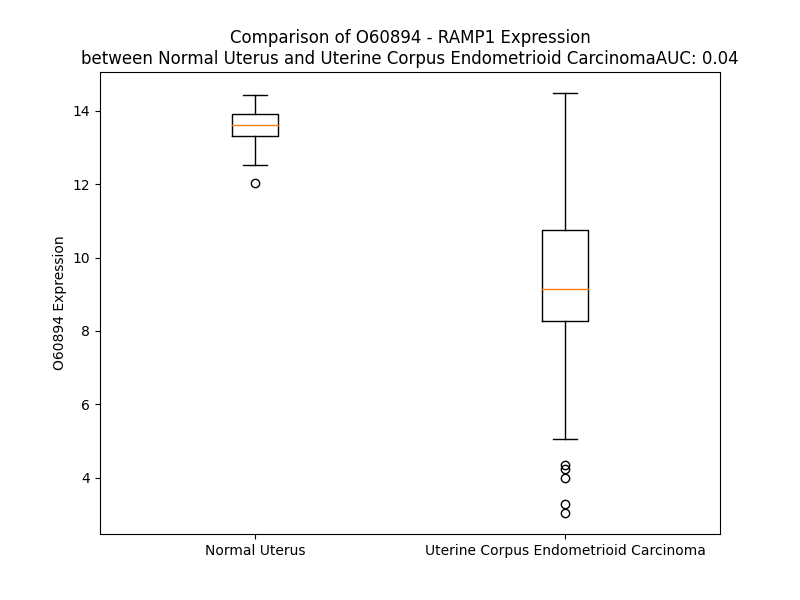

# Detailed Data for O60894

## Introduction to the Detailed Summary

### How to Interpret the Results

- **Summary & Metrics**: This section provides a quick reference to essential protein attributes, including expression changes, family classification, and biomarker applications. Regulation status (upregulated/downregulated) indicates the protein's behavior in a disease context. Some information comes from the original excel file with the proteins selected from literature, while others are derived from the analyses.
- **Expression Comparison**: A visual representation comparing protein expression between normal and disease states. It highlights significant changes in expression levels that might indicate diagnostic or therapeutic relevance. This is data coming from transcriptomics experiments and could not translate similarly to protein levels.
- **Isoform Alignment**: An interactive view of isoform alignments, revealing structural and functional differences between variants of the protein.
- **Interactors & Homologs**: Tables listing known interaction partners and homologous proteins, the more interactors and homologs, the more complex the protein is to design an antibody for.
- **Biological Assemblies**: Information about the structural arrangement of the protein in different assemblies, providing insights into its functional state but also the complexity of the protein to develop antibodies.
- **Combined Per-Residue Information**: A detailed table summarizing residue-level data. This includes predictions for epitope regions, aggregation tendencies, and modifications that might impact the protein's function. Each row corresponds to a residue in the protein, providing insights into specific sites that may be important for research or drug development.
## Summary & Metrics

- **UniProt Accession**: O60894
- **Gene Name**: RAMP1
- **Protein Name**: Receptor activity-modifying protein 1
- **Swiss Prot**: RAMP1_HUMAN
- **Family**: nan
- **Biomarker Application**: nan
- **Number of Isoforms**: 0
- **Regulation**: 1
- **(transcriptomics) AUC**: 0.0
- **(transcriptomics) Fold Change**: 1.54
- **(transcriptomics) Regulation**: Downregulated
- **Discotope Epitope Count**: 29
- **Max n_uniprots (Homo)**: 3
- **Max n_uniprots (Hetero)**: 7

## Expression Comparison

## Interactors

| preferredName_A   | preferredName_B   |   score |
|:------------------|:------------------|--------:|
| RAMP1             | CALCR             |   0.999 |
| RAMP1             | CALCRL            |   0.999 |
| RAMP1             | CALCB             |   0.999 |
| RAMP1             | ADM               |   0.998 |
| RAMP1             | IAPP              |   0.998 |
| RAMP1             | CALCA             |   0.998 |
| RAMP1             | CRCP              |   0.981 |
| RAMP1             | GNAS              |   0.98  |
| RAMP1             | RAMP3             |   0.964 |
| RAMP1             | RAMP2             |   0.963 |
| RAMP1             | ADM2              |   0.951 |
| RAMP1             | GRM1              |   0.909 |

## Homologs

| uniprot_id   | gene_id   |
|:-------------|:----------|
| J3KR56       | RAMP3     |
| O60895       | RAMP2     |

## Biological Assemblies

|   Unnamed: 0 |   assembly |   n_uniprots | composition   | crystal_id   |
|-------------:|-----------:|-------------:|:--------------|:-------------|
|            0 |          1 |            3 | Hetero        | 5v6y         |
|            1 |          2 |            3 | Hetero        | 5v6y         |
|            2 |          3 |            3 | Hetero        | 5v6y         |
|            3 |          4 |            3 | Hetero        | 5v6y         |
|            0 |          1 |            4 | Hetero        | 6umg         |
|            1 |          2 |            4 | Hetero        | 6umg         |
|            0 |          1 |            2 | Homo          | 6zis         |
|            0 |          1 |            3 | Homo          | 4rwg         |
|            1 |          2 |            3 | Homo          | 4rwg         |
|            2 |          3 |            3 | Homo          | 4rwg         |
|            0 |          1 |            7 | Hetero        | 6e3y         |
|            0 |          1 |            2 | Homo          | 8ax5         |
|            0 |          1 |            7 | Hetero        | 7tyf         |
|            0 |          1 |            2 | Hetero        | 7knt         |
|            0 |          1 |            2 | Hetero        | 3n7p         |
|            1 |          2 |            2 | Hetero        | 3n7p         |
|            2 |          3 |            2 | Hetero        | 3n7p         |
|            3 |          4 |            2 | Hetero        | 3n7p         |
|            0 |          1 |            7 | Hetero        | 9auc         |
|            0 |          1 |            2 | Homo          | 8ax6         |
|            0 |          1 |            3 | Homo          | 6d1u         |
|            1 |          2 |            3 | Homo          | 6d1u         |
|            2 |          3 |            3 | Homo          | 6d1u         |
|            0 |          1 |            2 | Homo          | 7p0i         |
|            0 |          1 |            1 | Homo          | 2yx8         |
|            1 |          2 |            1 | Homo          | 2yx8         |
|            0 |          1 |            2 | Homo          | 8ax7         |
|            0 |          1 |            2 | Hetero        | 3n7s         |
|            1 |          2 |            2 | Hetero        | 3n7s         |
|            0 |          1 |            2 | Homo          | 7p0f         |
|            0 |          1 |            3 | Hetero        | 7knu         |
|            0 |          1 |            2 | Homo          | 6zho         |
|            0 |          1 |            2 | Hetero        | 3n7r         |
|            1 |          2 |            2 | Hetero        | 3n7r         |
|            0 |          1 |            7 | Hetero        | 7tyw         |

## Combined Per-Residue Information

|   res | aa   |   epitope_score | epitope   |   relative_surface_accessibility |   modeling_confidence |   Aggregation | modification   |
|------:|:-----|----------------:|:----------|---------------------------------:|----------------------:|--------------:|:---------------|
|     1 | M    |         0.17178 | False     |                          1.24744 |                 48.84 |         0     | N/A            |
|     2 | A    |         0.29386 | False     |                          0.82497 |                 51.81 |         0     | N/A            |
|     3 | R    |         0.38845 | True      |                          0.90356 |                 50.48 |         0     | N/A            |
|     4 | A    |         0.25783 | False     |                          0.75569 |                 54.5  |         0     | N/A            |
|     5 | L    |         0.29308 | False     |                          0.85336 |                 54.97 |         0     | N/A            |
|     6 | C    |         0.28433 | False     |                          0.88514 |                 54.93 |         0     | N/A            |
|     7 | R    |         0.29221 | False     |                          0.88019 |                 55.83 |         0     | N/A            |
|     8 | L    |         0.2103  | False     |                          0.46255 |                 57.1  |         0     | N/A            |
|     9 | P    |         0.28873 | False     |                          0.69287 |                 70.39 |         0     | N/A            |
|    10 | R    |         0.22829 | False     |                          0.79911 |                 71.76 |         0     | N/A            |
|    11 | R    |         0.30829 | False     |                          0.80853 |                 71.77 |         0     | N/A            |
|    12 | G    |         0.18871 | False     |                          0.18764 |                 77.91 |         1.933 | N/A            |
|    13 | L    |         0.26337 | False     |                          0.60837 |                 83.1  |        56.358 | N/A            |
|    14 | W    |         0.20945 | False     |                          0.74235 |                 83.82 |        67.928 | N/A            |
|    15 | L    |         0.17963 | False     |                          0.76654 |                 85.13 |        67.928 | N/A            |
|    16 | L    |         0.13551 | False     |                          0.55354 |                 83.45 |        67.928 | N/A            |
|    17 | L    |         0.16708 | False     |                          0.55797 |                 83.03 |        67.768 | N/A            |
|    18 | A    |         0.12797 | False     |                          0.51284 |                 79.88 |        40.263 | N/A            |
|    19 | H    |         0.20059 | False     |                          0.63383 |                 74.09 |         5.711 | N/A            |
|    20 | H    |         0.17973 | False     |                          0.6868  |                 69.16 |         5.463 | N/A            |
|    21 | L    |         0.14639 | False     |                          0.64194 |                 70.03 |         7.961 | N/A            |
|    22 | F    |         0.19971 | False     |                          0.76444 |                 64.57 |         8.187 | N/A            |
|    23 | M    |         0.22    | False     |                          0.63863 |                 63.77 |         8.064 | N/A            |
|    24 | T    |         0.30484 | False     |                          0.71179 |                 62.46 |         7.924 | N/A            |
|    25 | T    |         0.26579 | False     |                          0.61751 |                 63.47 |         7.868 | N/A            |
|    26 | A    |         0.20616 | False     |                          0.54933 |                 66.92 |         6.585 | N/A            |
|    27 | C    |         0.20197 | False     |                          0.19889 |                 80.47 |         5.274 | N/A            |
|    28 | Q    |         0.23596 | False     |                          0.5617  |                 80.08 |         0.184 | N/A            |
|    29 | E    |         0.30287 | False     |                          0.45635 |                 72.19 |         0     | N/A            |
|    30 | A    |         0.17933 | False     |                          0.70055 |                 75.88 |         0     | N/A            |
|    31 | N    |         0.3901  | True      |                          0.49246 |                 85.14 |         0     | N/A            |
|    32 | Y    |         0.01738 | False     |                          0.00226 |                 91.57 |         1.223 | N/A            |
|    33 | G    |         0.03177 | False     |                          0.01567 |                 93.4  |         1.223 | N/A            |
|    34 | A    |         0.16929 | False     |                          0.40625 |                 94.43 |         1.223 | N/A            |
|    35 | L    |         0.32739 | False     |                          0.34258 |                 94.3  |         1.223 | N/A            |
|    36 | L    |         0.00481 | False     |                          0       |                 97.09 |         1.223 | N/A            |
|    37 | R    |         0.33615 | False     |                          0.51961 |                 97.16 |         0     | N/A            |
|    38 | E    |         0.38686 | True      |                          0.62822 |                 96.05 |         0     | N/A            |
|    39 | L    |         0.5849  | True      |                          0.55035 |                 95.92 |         0.27  | N/A            |
|    40 | C    |         0.08135 | False     |                          0.0243  |                 98.28 |         0.27  | N/A            |
|    41 | L    |         0.24587 | False     |                          0.19702 |                 98.52 |         0.27  | N/A            |
|    42 | T    |         0.11694 | False     |                          0.50558 |                 98.08 |         0.27  | N/A            |
|    43 | Q    |         0.18443 | False     |                          0.51757 |                 98.1  |         0.27  | N/A            |
|    44 | F    |         0.05998 | False     |                          0.01383 |                 98.68 |         0.27  | N/A            |
|    45 | Q    |         0.54575 | True      |                          0.43613 |                 98.45 |         0     | N/A            |
|    46 | V    |         0.21713 | False     |                          0.60981 |                 98.35 |         0     | N/A            |
|    47 | D    |         0.2983  | False     |                          0.19619 |                 98.41 |         0     | N/A            |
|    48 | M    |         0.00942 | False     |                          0       |                 98.34 |         0     | N/A            |
|    49 | E    |         0.37541 | True      |                          0.72894 |                 97.8  |         0     | N/A            |
|    50 | A    |         0.30778 | False     |                          0.84929 |                 98.1  |         0     | N/A            |
|    51 | V    |         0.41156 | True      |                          0.20474 |                 97.58 |         0     | N/A            |
|    52 | G    |         0.28419 | False     |                          0.27522 |                 97.17 |         0     | N/A            |
|    53 | E    |         0.28164 | False     |                          0.67334 |                 97.32 |         0     | N/A            |
|    54 | T    |         0.40717 | True      |                          0.95656 |                 97.47 |         0     | N/A            |
|    55 | L    |         0.44335 | True      |                          0.43773 |                 98.06 |         0     | N/A            |
|    56 | W    |         0.34726 | False     |                          0.20221 |                 98.02 |         0     | N/A            |
|    57 | C    |         0.28477 | False     |                          0.39644 |                 97.73 |         0     | N/A            |
|    58 | D    |         0.33832 | False     |                          0.38797 |                 97.41 |         0     | N/A            |
|    59 | W    |         0.35083 | False     |                          0.38192 |                 96.51 |         0     | N/A            |
|    60 | G    |         0.32797 | False     |                          0.72244 |                 96.62 |         0     | N/A            |
|    61 | R    |         0.4197  | True      |                          0.60109 |                 97.65 |         0     | N/A            |
|    62 | T    |         0.02825 | False     |                          0.00507 |                 97.91 |         0     | N/A            |
|    63 | I    |         0.3182  | False     |                          0.46798 |                 97.64 |         0     | N/A            |
|    64 | R    |         0.24956 | False     |                          0.67285 |                 98.26 |         0     | N/A            |
|    65 | S    |         0.04091 | False     |                          0.01801 |                 98.52 |         0     | N/A            |
|    66 | Y    |         0.32729 | False     |                          0.19483 |                 98.54 |         0     | N/A            |
|    67 | R    |         0.3946  | True      |                          0.66116 |                 98.45 |         0     | N/A            |
|    68 | E    |         0.27558 | False     |                          0.46414 |                 98.49 |         0     | N/A            |
|    69 | L    |         0.04907 | False     |                          0.02616 |                 98.71 |         0     | N/A            |
|    70 | A    |         0.33424 | False     |                          0.20286 |                 98.5  |         0     | N/A            |
|    71 | D    |         0.27364 | False     |                          0.40812 |                 98.6  |         0     | N/A            |
|    72 | C    |         0.23256 | False     |                          0.25346 |                 98.44 |         0     | N/A            |
|    73 | T    |         0.01318 | False     |                          0       |                 97.8  |         0     | N/A            |
|    74 | W    |         0.434   | True      |                          0.51782 |                 97.71 |         0     | N/A            |
|    75 | H    |         0.36258 | False     |                          0.56609 |                 96.9  |         0     | N/A            |
|    76 | M    |         0.20374 | False     |                          0.14834 |                 94.55 |         0     | N/A            |
|    77 | A    |         0.01618 | False     |                          0.00638 |                 93.83 |         0     | N/A            |
|    78 | E    |         0.45646 | True      |                          0.58198 |                 93.14 |         0     | N/A            |
|    79 | K    |         0.44702 | True      |                          0.79573 |                 91.67 |         0     | N/A            |
|    80 | L    |         0.3506  | False     |                          0.26448 |                 90.74 |         0     | N/A            |
|    81 | G    |         0.3778  | True      |                          0.68339 |                 89.92 |         0     | N/A            |
|    82 | C    |         0.17889 | False     |                          0.0997  |                 91    |         0     | N/A            |
|    83 | F    |         0.41456 | True      |                          0.86956 |                 91.62 |         0     | N/A            |
|    84 | W    |         0.59101 | True      |                          0.38217 |                 95.13 |         0     | N/A            |
|    85 | P    |         0.53088 | True      |                          0.65034 |                 95.95 |         0     | N/A            |
|    86 | N    |         0.27248 | False     |                          0.23109 |                 92.17 |         0     | N/A            |
|    87 | A    |         0.26089 | False     |                          0.4592  |                 93.51 |         0     | N/A            |
|    88 | E    |         0.20756 | False     |                          0.13404 |                 94.17 |         0     | N/A            |
|    89 | V    |         0.13435 | False     |                          0.03237 |                 95.87 |         0.076 | N/A            |
|    90 | D    |         0.30496 | False     |                          0.4998  |                 97.07 |         0.076 | N/A            |
|    91 | R    |         0.45813 | True      |                          0.5337  |                 97.01 |         0.076 | N/A            |
|    92 | F    |         0.24347 | False     |                          0.07293 |                 97.69 |        93.109 | N/A            |
|    93 | F    |         0.1677  | False     |                          0.12088 |                 98.57 |        93.109 | N/A            |
|    94 | L    |         0.37155 | True      |                          0.79639 |                 98.45 |        93.109 | N/A            |
|    95 | A    |         0.43752 | True      |                          0.64241 |                 98.33 |        93.109 | N/A            |
|    96 | V    |         0.10082 | False     |                          0.02462 |                 98.59 |        93.109 | N/A            |
|    97 | H    |         0.51874 | True      |                          0.40142 |                 98.55 |         0.274 | N/A            |
|    98 | G    |         0.26159 | False     |                          0.31802 |                 98.3  |         0.023 | N/A            |
|    99 | R    |         0.60589 | True      |                          0.71983 |                 98.13 |         0     | N/A            |
|   100 | Y    |         0.31605 | False     |                          0.0907  |                 98.36 |         0     | N/A            |
|   101 | F    |         0.30243 | False     |                          0.11291 |                 98.09 |         0     | N/A            |
|   102 | R    |         0.45767 | True      |                          0.80565 |                 97.52 |         0     | N/A            |
|   103 | S    |         0.32955 | False     |                          0.80612 |                 96.11 |         0     | N/A            |
|   104 | C    |         0.20863 | False     |                          0.10088 |                 97.45 |         0     | N/A            |
|   105 | P    |         0.31066 | False     |                          0.59498 |                 95.76 |         0     | N/A            |
|   106 | I    |         0.5747  | True      |                          1.05603 |                 95.11 |         0     | N/A            |
|   107 | S    |         0.35015 | False     |                          0.53962 |                 92.65 |         0     | N/A            |
|   108 | G    |         0.43487 | True      |                          0.85088 |                 88.34 |         0     | N/A            |
|   109 | R    |         0.32564 | False     |                          0.4078  |                 91.13 |         0     | N/A            |
|   110 | A    |         0.28546 | False     |                          0.59681 |                 93.06 |         0     | N/A            |
|   111 | V    |         0.29626 | False     |                          1.11256 |                 94.37 |         0     | N/A            |
|   112 | R    |         0.50679 | True      |                          0.73281 |                 93.58 |         0     | N/A            |
|   113 | D    |         0.42523 | True      |                          0.77543 |                 94.85 |         0     | N/A            |
|   114 | P    |         0.34479 | False     |                          0.43695 |                 94.04 |         0     | N/A            |
|   115 | P    |         0.40204 | True      |                          0.66873 |                 95.2  |         0     | N/A            |
|   116 | G    |         0.34352 | False     |                          0.30263 |                 96.23 |         0     | N/A            |
|   117 | S    |         0.31012 | False     |                          0.66527 |                 97.56 |         0     | N/A            |
|   118 | I    |         0.27224 | False     |                          0.53434 |                 97.11 |         0     | N/A            |
|   119 | L    |         0.28684 | False     |                          0.35859 |                 98.04 |         0     | N/A            |
|   120 | Y    |         0.30917 | False     |                          0.64426 |                 98.4  |         0     | N/A            |
|   121 | P    |         0.18996 | False     |                          0.47244 |                 98.55 |         0     | N/A            |
|   122 | F    |         0.25601 | False     |                          0.7418  |                 98.14 |         0.009 | N/A            |
|   123 | I    |         0.22369 | False     |                          0.50012 |                 98.41 |         0.01  | N/A            |
|   124 | V    |         0.14467 | False     |                          0.57219 |                 98.54 |         0.01  | N/A            |
|   125 | V    |         0.11156 | False     |                          0.60552 |                 98.62 |         0.01  | N/A            |
|   126 | P    |         0.1594  | False     |                          0.50311 |                 98.64 |         0.956 | N/A            |
|   127 | I    |         0.09025 | False     |                          0.56695 |                 98.74 |        78.035 | N/A            |
|   128 | T    |         0.14489 | False     |                          0.41467 |                 98.67 |        85.085 | N/A            |
|   129 | V    |         0.06569 | False     |                          0.5303  |                 98.7  |        96.926 | N/A            |
|   130 | T    |         0.10309 | False     |                          0.57885 |                 98.65 |        97.932 | N/A            |
|   131 | L    |         0.12947 | False     |                          0.72913 |                 98.7  |        99.619 | N/A            |
|   132 | L    |         0.12348 | False     |                          0.75435 |                 98.61 |        99.928 | N/A            |
|   133 | V    |         0.06122 | False     |                          0.57777 |                 98.54 |        99.981 | N/A            |
|   134 | T    |         0.10833 | False     |                          0.57722 |                 98.3  |        99.937 | N/A            |
|   135 | A    |         0.10343 | False     |                          0.56258 |                 97.9  |        99.915 | N/A            |
|   136 | L    |         0.13205 | False     |                          0.69341 |                 98.08 |        99.89  | N/A            |
|   137 | V    |         0.08267 | False     |                          0.58097 |                 97.2  |        99.754 | N/A            |
|   138 | V    |         0.12565 | False     |                          0.51577 |                 96.3  |        98.151 | N/A            |
|   139 | W    |         0.18723 | False     |                          0.62129 |                 95.47 |        79.266 | N/A            |
|   140 | Q    |         0.12985 | False     |                          0.44172 |                 94.8  |         1.17  | N/A            |
|   141 | S    |         0.10485 | False     |                          0.42889 |                 93.09 |         0.051 | N/A            |
|   142 | K    |         0.18699 | False     |                          0.70534 |                 91.12 |         0     | N/A            |
|   143 | R    |         0.21464 | False     |                          0.51065 |                 88.05 |         0     | N/A            |
|   144 | T    |         0.11564 | False     |                          0.59772 |                 82.29 |         0     | N/A            |
|   145 | E    |         0.1596  | False     |                          0.6964  |                 74.07 |         0     | N/A            |
|   146 | G    |         0.19154 | False     |                          0.78865 |                 60.43 |         0     | N/A            |
|   147 | I    |         0.1399  | False     |                          0.81539 |                 58.26 |         0     | N/A            |
|   148 | V    |         0.07861 | False     |                          1.34133 |                 45.31 |         0     | N/A            |

