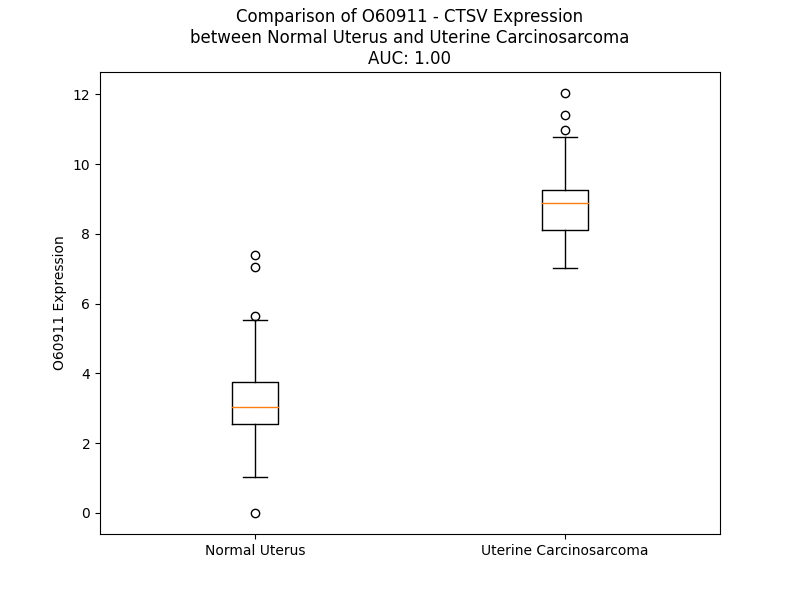

# Detailed Data for O60911

## Introduction to the Detailed Summary

### How to Interpret the Results

- **Summary & Metrics**: This section provides a quick reference to essential protein attributes, including expression changes, family classification, and biomarker applications. Regulation status (upregulated/downregulated) indicates the protein's behavior in a disease context. Some information comes from the original excel file with the proteins selected from literature, while others are derived from the analyses.
- **Expression Comparison**: A visual representation comparing protein expression between normal and disease states. It highlights significant changes in expression levels that might indicate diagnostic or therapeutic relevance. This is data coming from transcriptomics experiments and could not translate similarly to protein levels.
- **Isoform Alignment**: An interactive view of isoform alignments, revealing structural and functional differences between variants of the protein.
- **Interactors & Homologs**: Tables listing known interaction partners and homologous proteins, the more interactors and homologs, the more complex the protein is to design an antibody for.
- **Biological Assemblies**: Information about the structural arrangement of the protein in different assemblies, providing insights into its functional state but also the complexity of the protein to develop antibodies.
- **Combined Per-Residue Information**: A detailed table summarizing residue-level data. This includes predictions for epitope regions, aggregation tendencies, and modifications that might impact the protein's function. Each row corresponds to a residue in the protein, providing insights into specific sites that may be important for research or drug development.
## Summary & Metrics

- **UniProt Accession**: O60911
- **Gene Name**: CTSL2
- **Protein Name**: Cathepsin L2
- **Swiss Prot**: CATL2_HUMAN
- **Family**: transcription regulator
- **Biomarker Application**: diagnosis
- **Number of Isoforms**: 0
- **Regulation**: 1
- **(transcriptomics) AUC**: 1.0
- **(transcriptomics) Fold Change**: 2.75
- **(transcriptomics) Regulation**: Upregulated
- **Discotope Epitope Count**: 66
- **Max n_uniprots (Homo)**: 2.0
- **Max n_uniprots (Hetero)**: 2.0

## Expression Comparison

## Interactors

| preferredName_A   | preferredName_B   |   score |
|:------------------|:------------------|--------:|
| CTSV              | CSTA              |   0.96  |
| CTSV              | BCL2              |   0.926 |
| CTSV              | BID               |   0.905 |
| CTSV              | BCL2L1            |   0.902 |

## Homologs

| uniprot_id   | gene_id   |
|:-------------|:----------|
| A0A7I2V5M3   | CTSL      |
| A0A7P0T9U1   | CTSZ      |
| A0A7I2YQ73   | CTSF      |
| E9PI30       | CTSW      |
| A0A7P0T898   | CTSO      |
| Q9UJW2       | TINAG     |
| A0A7I2V2V5   | CTSC      |
| A0A7P0TAQ0   | CTSS      |
| A0A7I2V440   | CTSB      |
| Q5QP40       | CTSK      |
| A0A7I2V2E4   | CTSH      |
| F6SDV2       | TINAGL1   |

## Biological Assemblies

|   Unnamed: 0 | crystal_id   |   assembly |   n_uniprots | composition   |
|-------------:|:-------------|-----------:|-------------:|:--------------|
|            0 | 7qgw         |          1 |            2 | Homo          |
|            0 | 3h6s         |          1 |            2 | Hetero        |
|            1 | 3h6s         |          2 |            2 | Hetero        |
|            2 | 3h6s         |          3 |            2 | Hetero        |
|            3 | 3h6s         |          4 |            2 | Hetero        |
|            0 | 7pk4         |          1 |            2 | Hetero        |
|            0 | 3kfq         |          1 |            2 | Hetero        |
|            1 | 3kfq         |          2 |            2 | Hetero        |
|            0 | 1fh0         |          1 |            1 | Homo          |
|            1 | 1fh0         |          2 |            1 | Homo          |

## Combined Per-Residue Information

|   res | aa   |   epitope_score | epitope   |   relative_surface_accessibility |   modeling_confidence |   Aggregation | modification   | glycosylation                   |
|------:|:-----|----------------:|:----------|---------------------------------:|----------------------:|--------------:|:---------------|:--------------------------------|
|     1 | M    |         0.13899 | False     |                          1.29431 |                 41.85 |         0     | N/A            | N/A                             |
|     2 | N    |         0.19086 | False     |                          0.97594 |                 45.3  |         1.95  | N/A            | N/A                             |
|     3 | L    |         0.15169 | False     |                          0.98294 |                 44.07 |        21.698 | N/A            | N/A                             |
|     4 | S    |         0.15059 | False     |                          0.72663 |                 49.55 |        28.578 | N/A            | N/A                             |
|     5 | L    |         0.17367 | False     |                          0.8482  |                 51.3  |        82.923 | N/A            | N/A                             |
|     6 | V    |         0.10059 | False     |                          0.95651 |                 50.54 |        92.697 | N/A            | N/A                             |
|     7 | L    |         0.13893 | False     |                          0.94313 |                 51.09 |        93.345 | N/A            | N/A                             |
|     8 | A    |         0.14533 | False     |                          0.72121 |                 52.55 |        92.95  | N/A            | N/A                             |
|     9 | A    |         0.1265  | False     |                          0.82749 |                 54.56 |        92.464 | N/A            | N/A                             |
|    10 | F    |         0.12779 | False     |                          0.93776 |                 51.77 |        91.12  | N/A            | N/A                             |
|    11 | C    |         0.11656 | False     |                          0.88193 |                 50.07 |        71.446 | N/A            | N/A                             |
|    12 | L    |         0.12199 | False     |                          0.93303 |                 51.5  |        67.475 | N/A            | N/A                             |
|    13 | G    |         0.12181 | False     |                          0.86019 |                 52.72 |        45.755 | N/A            | N/A                             |
|    14 | I    |         0.14998 | False     |                          0.96785 |                 54.68 |        43.804 | N/A            | N/A                             |
|    15 | A    |         0.16052 | False     |                          0.88331 |                 55.94 |        22.345 | N/A            | N/A                             |
|    16 | S    |         0.13101 | False     |                          0.68185 |                 56.18 |         4.198 | N/A            | N/A                             |
|    17 | A    |         0.20026 | False     |                          0.9402  |                 61.52 |         1.961 | N/A            | N/A                             |
|    18 | V    |         0.13038 | False     |                          0.73728 |                 63.24 |         0.069 | N/A            | N/A                             |
|    19 | P    |         0.13486 | False     |                          0.56312 |                 67.12 |         0.024 | N/A            | N/A                             |
|    20 | K    |         0.15824 | False     |                          1.0199  |                 83.27 |         0     | N/A            | N/A                             |
|    21 | F    |         0.12073 | False     |                          0.28209 |                 90.47 |         0     | N/A            | N/A                             |
|    22 | D    |         0.12613 | False     |                          0.30488 |                 91.28 |         0     | N/A            | N/A                             |
|    23 | Q    |         0.19337 | False     |                          0.75835 |                 92.95 |         0     | N/A            | N/A                             |
|    24 | N    |         0.17941 | False     |                          0.83016 |                 94.43 |         0     | N/A            | N/A                             |
|    25 | L    |         0.09809 | False     |                          0.08244 |                 95.83 |         0     | N/A            | N/A                             |
|    26 | D    |         0.25731 | True      |                          0.2765  |                 96.35 |         0     | N/A            | N/A                             |
|    27 | T    |         0.15522 | False     |                          0.6218  |                 96.94 |         0     | N/A            | N/A                             |
|    28 | K    |         0.20412 | False     |                          0.45607 |                 97.09 |         0     | N/A            | N/A                             |
|    29 | W    |         0.02294 | False     |                          0.0069  |                 97.58 |         0     | N/A            | N/A                             |
|    30 | Y    |         0.34921 | True      |                          0.56422 |                 96.9  |         0     | N/A            | N/A                             |
|    31 | Q    |         0.3247  | True      |                          0.55678 |                 97.61 |         0     | N/A            | N/A                             |
|    32 | W    |         0.06856 | False     |                          0.07571 |                 97.97 |         0     | N/A            | N/A                             |
|    33 | K    |         0.14061 | False     |                          0.14515 |                 97.67 |         0     | N/A            | N/A                             |
|    34 | A    |         0.27309 | True      |                          0.7265  |                 97.05 |         0     | N/A            | N/A                             |
|    35 | T    |         0.23823 | True      |                          0.71326 |                 96.91 |         0     | N/A            | N/A                             |
|    36 | H    |         0.09555 | False     |                          0.21706 |                 95.14 |         0     | N/A            | N/A                             |
|    37 | R    |         0.37682 | True      |                          0.86671 |                 94.87 |         0     | N/A            | N/A                             |
|    38 | R    |         0.28456 | True      |                          0.26043 |                 93.64 |         0     | N/A            | N/A                             |
|    39 | L    |         0.41724 | True      |                          1.05647 |                 92.3  |         0     | N/A            | N/A                             |
|    40 | Y    |         0.21898 | False     |                          0.18196 |                 94.31 |         0     | N/A            | N/A                             |
|    41 | G    |         0.33566 | True      |                          0.55595 |                 92.11 |         0     | N/A            | N/A                             |
|    42 | A    |         0.19704 | False     |                          0.96384 |                 87.43 |         0     | N/A            | N/A                             |
|    43 | N    |         0.35244 | True      |                          1.0179  |                 89.72 |         0     | N/A            | N/A                             |
|    44 | E    |         0.29874 | True      |                          0.34658 |                 94.07 |         0     | N/A            | N/A                             |
|    45 | E    |         0.22845 | True      |                          0.27126 |                 94.97 |         0     | N/A            | N/A                             |
|    46 | G    |         0.07554 | False     |                          0.3379  |                 94.26 |         0     | N/A            | N/A                             |
|    47 | W    |         0.29858 | True      |                          0.63803 |                 95.31 |         0     | N/A            | N/A                             |
|    48 | R    |         0.20475 | False     |                          0.16798 |                 97.23 |         0     | N/A            | N/A                             |
|    49 | R    |         0.07739 | False     |                          0.08847 |                 97.2  |         0     | N/A            | N/A                             |
|    50 | A    |         0.06358 | False     |                          0.27648 |                 96.74 |         0     | N/A            | N/A                             |
|    51 | V    |         0.0427  | False     |                          0.05604 |                 97.84 |         0     | N/A            | N/A                             |
|    52 | W    |         0.00967 | False     |                          0.01382 |                 98.35 |         0     | N/A            | N/A                             |
|    53 | E    |         0.06925 | False     |                          0.05884 |                 98.01 |         0     | N/A            | N/A                             |
|    54 | K    |         0.18789 | False     |                          0.75807 |                 97.67 |         0     | N/A            | N/A                             |
|    55 | N    |         0.06742 | False     |                          0.07852 |                 98.4  |         0     | N/A            | N/A                             |
|    56 | M    |         0.07625 | False     |                          0.10102 |                 98.13 |         0     | N/A            | N/A                             |
|    57 | K    |         0.14957 | False     |                          0.56648 |                 97.85 |         0     | N/A            | N/A                             |
|    58 | M    |         0.15552 | False     |                          0.3115  |                 98.28 |         0     | N/A            | N/A                             |
|    59 | I    |         0.06895 | False     |                          0.0496  |                 98.66 |         0     | N/A            | N/A                             |
|    60 | E    |         0.14761 | False     |                          0.44371 |                 98.2  |         0     | N/A            | N/A                             |
|    61 | L    |         0.36588 | True      |                          0.74092 |                 98.43 |         0     | N/A            | N/A                             |
|    62 | H    |         0.1203  | False     |                          0.09119 |                 98.61 |         0     | N/A            | N/A                             |
|    63 | N    |         0.25098 | True      |                          0.28931 |                 98.62 |         0     | N/A            | N/A                             |
|    64 | G    |         0.17783 | False     |                          0.37621 |                 98.58 |         0     | N/A            | N/A                             |
|    65 | E    |         0.25728 | True      |                          0.26117 |                 98.36 |         0     | N/A            | N/A                             |
|    66 | Y    |         0.21119 | False     |                          0.41069 |                 97.58 |         0     | N/A            | N/A                             |
|    67 | S    |         0.31476 | True      |                          0.71747 |                 97.29 |         0     | N/A            | N/A                             |
|    68 | Q    |         0.28683 | True      |                          0.60266 |                 97.26 |         0     | N/A            | N/A                             |
|    69 | G    |         0.18591 | False     |                          0.80034 |                 94.37 |         0     | N/A            | N/A                             |
|    70 | K    |         0.44931 | True      |                          0.64523 |                 95.48 |         0     | N/A            | N/A                             |
|    71 | H    |         0.2451  | True      |                          0.32553 |                 95.7  |         0     | N/A            | N/A                             |
|    72 | G    |         0.16739 | False     |                          0.52736 |                 95.12 |         0     | N/A            | N/A                             |
|    73 | F    |         0.05311 | False     |                          0.01911 |                 97.91 |         0.445 | N/A            | N/A                             |
|    74 | T    |         0.09368 | False     |                          0.19568 |                 98.65 |         0.445 | N/A            | N/A                             |
|    75 | M    |         0.04931 | False     |                          0.03748 |                 98.73 |         0.445 | N/A            | N/A                             |
|    76 | A    |         0.06878 | False     |                          0.28974 |                 98.49 |         0.445 | N/A            | N/A                             |
|    77 | M    |         0.0506  | False     |                          0.22391 |                 98.3  |         0.445 | N/A            | N/A                             |
|    78 | N    |         0.04653 | False     |                          0.09043 |                 97.52 |         0     | N/A            | N/A                             |
|    79 | A    |         0.10248 | False     |                          0.3329  |                 95.92 |         0     | N/A            | N/A                             |
|    80 | F    |         0.06234 | False     |                          0.11465 |                 96.57 |         0     | N/A            | N/A                             |
|    81 | G    |         0.00458 | False     |                          0       |                 97.56 |         0     | N/A            | N/A                             |
|    82 | D    |         0.03441 | False     |                          0.04477 |                 96.87 |         0     | N/A            | N/A                             |
|    83 | M    |         0.14929 | False     |                          0.13141 |                 96.79 |         0     | N/A            | N/A                             |
|    84 | T    |         0.16133 | False     |                          0.25996 |                 96.85 |         0     | N/A            | N/A                             |
|    85 | N    |         0.17832 | False     |                          0.25621 |                 95.57 |         0     | N/A            | N/A                             |
|    86 | E    |         0.26576 | True      |                          0.51597 |                 95.33 |         0     | N/A            | N/A                             |
|    87 | E    |         0.27609 | True      |                          0.24958 |                 94.33 |         0     | N/A            | N/A                             |
|    88 | F    |         0.02812 | False     |                          0.01019 |                 93.61 |         0     | N/A            | N/A                             |
|    89 | R    |         0.22829 | True      |                          0.47962 |                 92.49 |         0     | N/A            | N/A                             |
|    90 | Q    |         0.25776 | True      |                          0.67696 |                 88.47 |         0     | N/A            | N/A                             |
|    91 | M    |         0.22148 | False     |                          0.21359 |                 85.42 |         0     | N/A            | N/A                             |
|    92 | M    |         0.07294 | False     |                          0.03254 |                 85.84 |         0     | N/A            | N/A                             |
|    93 | G    |         0.21477 | False     |                          0.41141 |                 81.47 |         0     | N/A            | N/A                             |
|    94 | C    |         0.01938 | False     |                          0.01574 |                 83.48 |         0     | N/A            | N/A                             |
|    95 | F    |         0.06558 | False     |                          0.08651 |                 81.2  |         0     | N/A            | N/A                             |
|    96 | R    |         0.27915 | True      |                          0.3931  |                 79.17 |         0     | N/A            | N/A                             |
|    97 | N    |         0.20852 | False     |                          0.65379 |                 71.04 |         0     | N/A            | N/A                             |
|    98 | Q    |         0.14203 | False     |                          0.39999 |                 63.79 |         0     | N/A            | N/A                             |
|    99 | K    |         0.32235 | True      |                          1.00737 |                 62.61 |         0     | N/A            | N/A                             |
|   100 | F    |         0.15392 | False     |                          0.35545 |                 65.45 |         0     | N/A            | N/A                             |
|   101 | R    |         0.18245 | False     |                          0.73298 |                 63.38 |         0     | N/A            | N/A                             |
|   102 | K    |         0.22632 | True      |                          1.02099 |                 71.3  |         0     | N/A            | N/A                             |
|   103 | G    |         0.06771 | False     |                          0.21582 |                 80.18 |         0     | N/A            | N/A                             |
|   104 | K    |         0.17234 | False     |                          0.70714 |                 91.65 |         0     | N/A            | N/A                             |
|   105 | V    |         0.10344 | False     |                          0.76771 |                 92.22 |         0     | N/A            | N/A                             |
|   106 | F    |         0.12021 | False     |                          0.11717 |                 92.53 |         0     | N/A            | N/A                             |
|   107 | R    |         0.17274 | False     |                          0.88294 |                 90.71 |         0     | N/A            | N/A                             |
|   108 | E    |         0.10751 | False     |                          0.33692 |                 86.6  |         0     | N/A            | N/A                             |
|   109 | P    |         0.115   | False     |                          0.31037 |                 83.94 |         0     | N/A            | N/A                             |
|   110 | L    |         0.29512 | True      |                          0.93036 |                 78.29 |         0     | N/A            | N/A                             |
|   111 | F    |         0.30356 | True      |                          1.00355 |                 78.76 |         0     | N/A            | N/A                             |
|   112 | L    |         0.18035 | False     |                          0.50467 |                 80.02 |         0     | N/A            | N/A                             |
|   113 | D    |         0.21631 | False     |                          0.89801 |                 89.12 |         0     | N/A            | N/A                             |
|   114 | L    |         0.15067 | False     |                          0.22963 |                 92    |         0     | N/A            | N/A                             |
|   115 | P    |         0.15322 | False     |                          0.48851 |                 95.24 |         0     | N/A            | N/A                             |
|   116 | K    |         0.23329 | True      |                          0.78848 |                 94.68 |         0     | N/A            | N/A                             |
|   117 | S    |         0.0991  | False     |                          0.5246  |                 97.32 |         0     | N/A            | N/A                             |
|   118 | V    |         0.05798 | False     |                          0.07326 |                 98.36 |         0     | N/A            | N/A                             |
|   119 | D    |         0.1042  | False     |                          0.15607 |                 98.64 |         0     | N/A            | N/A                             |
|   120 | W    |         0.04538 | False     |                          0.07739 |                 98.77 |         0     | N/A            | N/A                             |
|   121 | R    |         0.22525 | False     |                          0.3741  |                 98.5  |         0     | N/A            | N/A                             |
|   122 | K    |         0.16913 | False     |                          0.85986 |                 98.15 |         0     | N/A            | N/A                             |
|   123 | K    |         0.20503 | False     |                          0.5806  |                 97.73 |         0     | N/A            | N/A                             |
|   124 | G    |         0.09757 | False     |                          0.35771 |                 97.76 |         0     | N/A            | N/A                             |
|   125 | Y    |         0.1214  | False     |                          0.14884 |                 98.56 |         0     | N/A            | N/A                             |
|   126 | V    |         0.0213  | False     |                          0.12779 |                 98.79 |         0     | N/A            | N/A                             |
|   127 | T    |         0.02987 | False     |                          0.03821 |                 98.63 |         0     | N/A            | N/A                             |
|   128 | P    |         0.14554 | False     |                          0.81392 |                 98.53 |         0     | N/A            | N/A                             |
|   129 | V    |         0.08514 | False     |                          0.16366 |                 98.78 |         0     | N/A            | N/A                             |
|   130 | K    |         0.09534 | False     |                          0.20775 |                 98.38 |         0     | N/A            | N/A                             |
|   131 | N    |         0.23434 | True      |                          0.43561 |                 97.68 |         0     | N/A            | N/A                             |
|   132 | Q    |         0.01625 | False     |                          0.00137 |                 96.84 |         0     | N/A            | N/A                             |
|   133 | K    |         0.21615 | False     |                          0.56921 |                 93.95 |         0     | N/A            | N/A                             |
|   134 | Q    |         0.26366 | True      |                          0.68    |                 91.36 |         0     | N/A            | N/A                             |
|   135 | C    |         0.04073 | False     |                          0.02003 |                 94.54 |         0     | N/A            | N/A                             |
|   136 | G    |         0.0509  | False     |                          0.05685 |                 94.73 |         0     | N/A            | N/A                             |
|   137 | S    |         0.00517 | False     |                          0       |                 97.03 |         0.27  | N/A            | N/A                             |
|   138 | C    |         0.00753 | False     |                          0       |                 97.5  |         0.951 | N/A            | N/A                             |
|   139 | W    |         0.00463 | False     |                          0       |                 97.59 |         1.361 | N/A            | N/A                             |
|   140 | A    |         0.00154 | False     |                          0       |                 98.49 |         1.361 | N/A            | N/A                             |
|   141 | F    |         0.04158 | False     |                          0.09328 |                 98.69 |         1.361 | N/A            | N/A                             |
|   142 | S    |         0.0049  | False     |                          0.01368 |                 98.64 |         1.091 | N/A            | N/A                             |
|   143 | A    |         0.00506 | False     |                          0.01578 |                 98.6  |         0.801 | N/A            | N/A                             |
|   144 | T    |         0.01425 | False     |                          0.0077  |                 98.85 |         0.299 | N/A            | N/A                             |
|   145 | G    |         0.01251 | False     |                          0.05017 |                 98.84 |         0     | N/A            | N/A                             |
|   146 | A    |         0.00093 | False     |                          0       |                 98.86 |         0     | N/A            | N/A                             |
|   147 | L    |         0.00313 | False     |                          0.01484 |                 98.85 |         0     | N/A            | N/A                             |
|   148 | E    |         0.00956 | False     |                          0.02544 |                 98.87 |         0     | N/A            | N/A                             |
|   149 | G    |         0.00131 | False     |                          0       |                 98.69 |         0     | N/A            | N/A                             |
|   150 | Q    |         0.01679 | False     |                          0.04795 |                 98.55 |         0     | N/A            | N/A                             |
|   151 | M    |         0.03161 | False     |                          0.12297 |                 98.6  |         0     | N/A            | N/A                             |
|   152 | F    |         0.12313 | False     |                          0.2071  |                 98.52 |         0     | N/A            | N/A                             |
|   153 | R    |         0.17114 | False     |                          0.52131 |                 97.6  |         0     | N/A            | N/A                             |
|   154 | K    |         0.10723 | False     |                          0.53133 |                 97.43 |         0     | N/A            | N/A                             |
|   155 | T    |         0.18903 | False     |                          0.46767 |                 97.68 |         0     | N/A            | N/A                             |
|   156 | G    |         0.23909 | True      |                          0.64058 |                 97.55 |         0     | N/A            | N/A                             |
|   157 | K    |         0.21489 | False     |                          0.73392 |                 97.95 |         0     | N/A            | N/A                             |
|   158 | L    |         0.11547 | False     |                          0.40078 |                 98.56 |         0.907 | N/A            | N/A                             |
|   159 | V    |         0.16305 | False     |                          0.41148 |                 98.52 |         0.907 | N/A            | N/A                             |
|   160 | S    |         0.04907 | False     |                          0.24977 |                 98.74 |         0.907 | N/A            | N/A                             |
|   161 | L    |         0.00784 | False     |                          0.00907 |                 98.86 |         0.907 | N/A            | N/A                             |
|   162 | S    |         0.0073  | False     |                          0       |                 98.8  |         0.907 | N/A            | N/A                             |
|   163 | E    |         0.01328 | False     |                          0.01442 |                 98.83 |         0     | N/A            | N/A                             |
|   164 | Q    |         0.00631 | False     |                          0.00137 |                 98.83 |         0     | N/A            | N/A                             |
|   165 | N    |         0.00495 | False     |                          0       |                 98.84 |         0     | N/A            | N/A                             |
|   166 | L    |         0.01344 | False     |                          0.01154 |                 98.81 |         0     | N/A            | N/A                             |
|   167 | V    |         0.0067  | False     |                          0.00211 |                 98.54 |         0     | N/A            | N/A                             |
|   168 | D    |         0.12364 | False     |                          0.04414 |                 98.69 |         0     | N/A            | N/A                             |
|   169 | C    |         0.06002 | False     |                          0.07594 |                 98.67 |         0     | N/A            | N/A                             |
|   170 | S    |         0.00491 | False     |                          0.00079 |                 97.79 |         0     | N/A            | N/A                             |
|   171 | R    |         0.19583 | False     |                          0.43359 |                 96.34 |         0     | N/A            | N/A                             |
|   172 | P    |         0.22621 | True      |                          0.86212 |                 95.86 |         0     | N/A            | N/A                             |
|   173 | Q    |         0.16067 | False     |                          0.14993 |                 94.65 |         0     | N/A            | N/A                             |
|   174 | G    |         0.15596 | False     |                          0.33013 |                 94.05 |         0     | N/A            | N/A                             |
|   175 | N    |         0.07353 | False     |                          0.02359 |                 96.05 |         0     | N/A            | N/A                             |
|   176 | Q    |         0.26629 | True      |                          0.31782 |                 96    |         0     | N/A            | N/A                             |
|   177 | G    |         0.00701 | False     |                          0       |                 95.91 |         0     | N/A            | N/A                             |
|   178 | C    |         0.11029 | False     |                          0.21659 |                 95.56 |         0     | N/A            | N/A                             |
|   179 | N    |         0.17264 | False     |                          0.5594  |                 94.28 |         0     | N/A            | N/A                             |
|   180 | G    |         0.00807 | False     |                          0       |                 95    |         0     | N/A            | N/A                             |
|   181 | G    |         0.01562 | False     |                          0.00644 |                 95.79 |         0     | N/A            | N/A                             |
|   182 | F    |         0.05013 | False     |                          0.04214 |                 95.57 |         0     | N/A            | N/A                             |
|   183 | M    |         0.00258 | False     |                          0.00216 |                 96.85 |         0     | N/A            | N/A                             |
|   184 | A    |         0.00852 | False     |                          0.00988 |                 95.78 |         0     | N/A            | N/A                             |
|   185 | R    |         0.04508 | False     |                          0.07905 |                 95.46 |         0     | N/A            | N/A                             |
|   186 | A    |         0.0024  | False     |                          0.00255 |                 97.37 |         1.001 | N/A            | N/A                             |
|   187 | F    |         0.00492 | False     |                          0.00764 |                 97.76 |         1.001 | N/A            | N/A                             |
|   188 | Q    |         0.04279 | False     |                          0.1438  |                 96.32 |         1.001 | N/A            | N/A                             |
|   189 | Y    |         0.02451 | False     |                          0.03448 |                 97.81 |         1.001 | N/A            | N/A                             |
|   190 | V    |         0.00614 | False     |                          0.01093 |                 98.52 |         1.001 | N/A            | N/A                             |
|   191 | K    |         0.12128 | False     |                          0.50666 |                 97.45 |         0     | N/A            | N/A                             |
|   192 | E    |         0.12064 | False     |                          0.50836 |                 97.34 |         0     | N/A            | N/A                             |
|   193 | N    |         0.10039 | False     |                          0.32138 |                 97.91 |         0     | N/A            | N/A                             |
|   194 | G    |         0.10292 | False     |                          0.68343 |                 97.89 |         0     | N/A            | N/A                             |
|   195 | G    |         0.0049  | False     |                          0.00161 |                 98.3  |         0     | N/A            | N/A                             |
|   196 | L    |         0.00313 | False     |                          0.00165 |                 98.84 |         0     | N/A            | N/A                             |
|   197 | D    |         0.01563 | False     |                          0.00757 |                 98.77 |         0     | N/A            | N/A                             |
|   198 | S    |         0.05342 | False     |                          0.08438 |                 98.73 |         0     | N/A            | N/A                             |
|   199 | E    |         0.08678 | False     |                          0.20107 |                 98.7  |         0     | N/A            | N/A                             |
|   200 | E    |         0.34197 | True      |                          0.84313 |                 98.46 |         0     | N/A            | N/A                             |
|   201 | S    |         0.17012 | False     |                          0.3621  |                 98.49 |         0     | N/A            | N/A                             |
|   202 | Y    |         0.11466 | False     |                          0.05683 |                 98.59 |         0     | N/A            | N/A                             |
|   203 | P    |         0.24844 | True      |                          0.5582  |                 98.53 |         0     | N/A            | N/A                             |
|   204 | Y    |         0.13163 | False     |                          0.11825 |                 98.67 |         0     | N/A            | N/A                             |
|   205 | V    |         0.18911 | False     |                          0.48444 |                 98.19 |         0     | N/A            | N/A                             |
|   206 | A    |         0.17196 | False     |                          0.08673 |                 96.89 |         0     | N/A            | N/A                             |
|   207 | V    |         0.28886 | True      |                          0.58648 |                 97.61 |         0     | N/A            | N/A                             |
|   208 | D    |         0.33482 | True      |                          0.3568  |                 97.85 |         0     | N/A            | N/A                             |
|   209 | E    |         0.43325 | True      |                          0.32279 |                 98.14 |         0     | N/A            | N/A                             |
|   210 | I    |         0.28758 | True      |                          0.88228 |                 97.93 |         0     | N/A            | N/A                             |
|   211 | C    |         0.24705 | True      |                          0.43776 |                 98.49 |         0     | N/A            | N/A                             |
|   212 | K    |         0.34312 | True      |                          0.52319 |                 97.96 |         0     | N/A            | N/A                             |
|   213 | Y    |         0.24153 | True      |                          0.17832 |                 98.53 |         0     | N/A            | N/A                             |
|   214 | R    |         0.4357  | True      |                          0.56231 |                 98.19 |         0     | N/A            | N/A                             |
|   215 | P    |         0.25818 | True      |                          0.69964 |                 97.83 |         0     | N/A            | N/A                             |
|   216 | E    |         0.27532 | True      |                          0.70544 |                 98.18 |         0     | N/A            | N/A                             |
|   217 | N    |         0.19921 | False     |                          0.29826 |                 98.39 |         0     | N/A            | N/A                             |
|   218 | S    |         0.15029 | False     |                          0.30419 |                 98.37 |         0     | N/A            | N/A                             |
|   219 | V    |         0.12624 | False     |                          0.39221 |                 98.33 |         0     | N/A            | N/A                             |
|   220 | A    |         0.01116 | False     |                          0.04179 |                 98.33 |         0     | N/A            | N/A                             |
|   221 | N    |         0.14144 | False     |                          0.42519 |                 96.7  |         0     | N/A            | N-linked (GlcNAc...) asparagine |
|   222 | D    |         0.02773 | False     |                          0.06232 |                 96.89 |         0     | N/A            | N/A                             |
|   223 | T    |         0.12424 | False     |                          0.59686 |                 96.42 |         1.165 | N/A            | N/A                             |
|   224 | G    |         0.03528 | False     |                          0.14163 |                 95.5  |         3.124 | N/A            | N/A                             |
|   225 | F    |         0.03425 | False     |                          0.07401 |                 96.6  |         3.625 | N/A            | N/A                             |
|   226 | T    |         0.05404 | False     |                          0.05154 |                 97    |         3.625 | N/A            | N/A                             |
|   227 | V    |         0.07005 | False     |                          0.183   |                 95.87 |         3.625 | N/A            | N/A                             |
|   228 | V    |         0.00512 | False     |                          0.00301 |                 95.85 |         3.625 | N/A            | N/A                             |
|   229 | A    |         0.08088 | False     |                          0.30283 |                 94.52 |         0.501 | N/A            | N/A                             |
|   230 | P    |         0.18082 | False     |                          0.66235 |                 94.55 |         0.157 | N/A            | N/A                             |
|   231 | G    |         0.16957 | False     |                          0.35866 |                 95.68 |         0     | N/A            | N/A                             |
|   232 | K    |         0.15067 | False     |                          0.61271 |                 96.65 |         0     | N/A            | N/A                             |
|   233 | E    |         0.05953 | False     |                          0.09346 |                 97.41 |         0     | N/A            | N/A                             |
|   234 | K    |         0.12189 | False     |                          0.68604 |                 95.6  |         0     | N/A            | N/A                             |
|   235 | A    |         0.00713 | False     |                          0.01094 |                 96.67 |         0     | N/A            | N/A                             |
|   236 | L    |         0.00138 | False     |                          0       |                 98.04 |         0     | N/A            | N/A                             |
|   237 | M    |         0.08741 | False     |                          0.20805 |                 97.51 |         0     | N/A            | N/A                             |
|   238 | K    |         0.05927 | False     |                          0.08453 |                 97.59 |         0     | N/A            | N/A                             |
|   239 | A    |         0.00215 | False     |                          0       |                 97.94 |         1.333 | N/A            | N/A                             |
|   240 | V    |         0.00205 | False     |                          0       |                 98.46 |         1.333 | N/A            | N/A                             |
|   241 | A    |         0.06336 | False     |                          0.15877 |                 97.68 |         1.333 | N/A            | N/A                             |
|   242 | T    |         0.12745 | False     |                          0.32464 |                 96.41 |         1.333 | N/A            | N/A                             |
|   243 | V    |         0.06133 | False     |                          0.09036 |                 97.09 |         1.333 | N/A            | N/A                             |
|   244 | G    |         0.00411 | False     |                          0       |                 98.08 |         0     | N/A            | N/A                             |
|   245 | P    |         0.00169 | False     |                          0       |                 98.78 |         0     | N/A            | N/A                             |
|   246 | I    |         0.00234 | False     |                          0       |                 98.85 |         0.347 | N/A            | N/A                             |
|   247 | S    |         0.00198 | False     |                          0       |                 98.69 |         0.347 | N/A            | N/A                             |
|   248 | V    |         0.00254 | False     |                          0       |                 98.44 |         0.347 | N/A            | N/A                             |
|   249 | A    |         0.00216 | False     |                          0       |                 97.67 |         0.347 | N/A            | N/A                             |
|   250 | M    |         0.01029 | False     |                          0       |                 97.59 |         0.347 | N/A            | N/A                             |
|   251 | D    |         0.05299 | False     |                          0.07128 |                 97.45 |         0     | N/A            | N/A                             |
|   252 | A    |         0.0747  | False     |                          0.0313  |                 97.28 |         0     | N/A            | N/A                             |
|   253 | G    |         0.12246 | False     |                          0.10824 |                 95.99 |         0     | N/A            | N/A                             |
|   254 | H    |         0.21781 | False     |                          0.23551 |                 97.78 |         0     | N/A            | N/A                             |
|   255 | S    |         0.11703 | False     |                          0.21347 |                 97.88 |         0     | N/A            | N/A                             |
|   256 | S    |         0.08028 | False     |                          0.11335 |                 98.37 |         0     | N/A            | N/A                             |
|   257 | F    |         0.00932 | False     |                          0       |                 98.41 |         0     | N/A            | N/A                             |
|   258 | Q    |         0.02293 | False     |                          0.00505 |                 97.83 |         0     | N/A            | N/A                             |
|   259 | F    |         0.00311 | False     |                          0.00064 |                 98.65 |         0     | N/A            | N/A                             |
|   260 | Y    |         0.04155 | False     |                          0.0146  |                 98.76 |         0     | N/A            | N/A                             |
|   261 | K    |         0.11382 | False     |                          0.38816 |                 98.8  |         0     | N/A            | N/A                             |
|   262 | S    |         0.24542 | True      |                          0.35714 |                 98.39 |         0.85  | N/A            | N/A                             |
|   263 | G    |         0.03377 | False     |                          0.26507 |                 97.63 |         0.85  | N/A            | N/A                             |
|   264 | I    |         0.14853 | False     |                          0.08669 |                 97.94 |         0.85  | N/A            | N/A                             |
|   265 | Y    |         0.00494 | False     |                          0       |                 98.47 |         0.85  | N/A            | N/A                             |
|   266 | F    |         0.26645 | True      |                          0.42502 |                 97.66 |         0.85  | N/A            | N/A                             |
|   267 | E    |         0.37929 | True      |                          0.12728 |                 97.67 |         0     | N/A            | N/A                             |
|   268 | P    |         0.35376 | True      |                          0.79104 |                 96.86 |         0     | N/A            | N/A                             |
|   269 | D    |         0.3151  | True      |                          0.69608 |                 97.52 |         0     | N/A            | N/A                             |
|   270 | C    |         0.16341 | False     |                          0.13546 |                 97.63 |         0     | N/A            | N/A                             |
|   271 | S    |         0.23291 | True      |                          0.21488 |                 96.95 |         0     | N/A            | N/A                             |
|   272 | S    |         0.24928 | True      |                          0.2968  |                 96.64 |         0     | N/A            | N/A                             |
|   273 | K    |         0.38484 | True      |                          0.84073 |                 94.12 |         0     | N/A            | N/A                             |
|   274 | N    |         0.28531 | True      |                          0.72706 |                 94.31 |         0     | N/A            | N/A                             |
|   275 | L    |         0.05906 | False     |                          0.10448 |                 95.85 |         0     | N/A            | N/A                             |
|   276 | D    |         0.17064 | False     |                          0.21515 |                 95.49 |         0     | N/A            | N/A                             |
|   277 | H    |         0.0391  | False     |                          0.00882 |                 97.56 |         0.03  | N/A            | N/A                             |
|   278 | G    |         0.0212  | False     |                          0.01666 |                 97.8  |         7.761 | N/A            | N/A                             |
|   279 | V    |         0.0471  | False     |                          0.01904 |                 98.63 |        72.576 | N/A            | N/A                             |
|   280 | L    |         0.01759 | False     |                          0.0245  |                 98.89 |        77.22  | N/A            | N/A                             |
|   281 | V    |         0.00224 | False     |                          0       |                 98.93 |        77.459 | N/A            | N/A                             |
|   282 | V    |         0.00242 | False     |                          0       |                 98.87 |        77.459 | N/A            | N/A                             |
|   283 | G    |         0.00198 | False     |                          0       |                 98.79 |        72.392 | N/A            | N/A                             |
|   284 | Y    |         0.04435 | False     |                          0.03297 |                 98.67 |        61.78  | N/A            | N/A                             |
|   285 | G    |         0.03393 | False     |                          0.04414 |                 97.81 |        23.013 | N/A            | N/A                             |
|   286 | F    |         0.15283 | False     |                          0.33048 |                 97.07 |        21.294 | N/A            | N/A                             |
|   287 | E    |         0.20468 | False     |                          0.37877 |                 93.18 |         0     | N/A            | N/A                             |
|   288 | G    |         0.32916 | True      |                          0.88208 |                 88.78 |         0     | N/A            | N/A                             |
|   289 | A    |         0.24678 | True      |                          0.76983 |                 81.02 |         0     | N/A            | N/A                             |
|   290 | N    |         0.34007 | True      |                          0.57276 |                 79.33 |         0     | N/A            | N/A                             |
|   291 | S    |         0.27892 | True      |                          0.4191  |                 82.26 |         0     | N/A            | N/A                             |
|   292 | N    |         0.28142 | True      |                          0.55003 |                 76.77 |         0     | N/A            | N-linked (GlcNAc...) asparagine |
|   293 | N    |         0.35656 | True      |                          0.7487  |                 84.77 |         0     | N/A            | N/A                             |
|   294 | S    |         0.12131 | False     |                          0.09672 |                 92.68 |         0     | N/A            | N/A                             |
|   295 | K    |         0.10648 | False     |                          0.21708 |                 97.43 |         0     | N/A            | N/A                             |
|   296 | Y    |         0.14639 | False     |                          0.15088 |                 98.43 |         0     | N/A            | N/A                             |
|   297 | W    |         0.0103  | False     |                          0       |                 98.82 |         0     | N/A            | N/A                             |
|   298 | L    |         0.06848 | False     |                          0.061   |                 98.85 |         0     | N/A            | N/A                             |
|   299 | V    |         0.0054  | False     |                          0       |                 98.93 |         0     | N/A            | N/A                             |
|   300 | K    |         0.06777 | False     |                          0.09793 |                 98.87 |         0     | N/A            | N/A                             |
|   301 | N    |         0.05793 | False     |                          0.02697 |                 98.48 |         0     | N/A            | N/A                             |
|   302 | S    |         0.03671 | False     |                          0.04124 |                 98.06 |         0     | N/A            | N/A                             |
|   303 | W    |         0.14233 | False     |                          0.05276 |                 97.41 |         0     | N/A            | N/A                             |
|   304 | G    |         0.04656 | False     |                          0.03982 |                 97.76 |         0     | N/A            | N/A                             |
|   305 | P    |         0.24804 | True      |                          0.51682 |                 97.8  |         0     | N/A            | N/A                             |
|   306 | E    |         0.26137 | True      |                          0.70914 |                 96.95 |         0     | N/A            | N/A                             |
|   307 | W    |         0.06025 | False     |                          0.02017 |                 98.22 |         0     | N/A            | N/A                             |
|   308 | G    |         0.0177  | False     |                          0.00968 |                 98.59 |         0     | N/A            | N/A                             |
|   309 | S    |         0.14931 | False     |                          0.42339 |                 98.24 |         0     | N/A            | N/A                             |
|   310 | N    |         0.13233 | False     |                          0.71388 |                 98.3  |         0     | N/A            | N/A                             |
|   311 | G    |         0.00317 | False     |                          0.00161 |                 98.62 |         0     | N/A            | N/A                             |
|   312 | Y    |         0.09106 | False     |                          0.10191 |                 98.86 |         0     | N/A            | N/A                             |
|   313 | V    |         0.01659 | False     |                          0.00571 |                 98.82 |         0     | N/A            | N/A                             |
|   314 | K    |         0.1432  | False     |                          0.28903 |                 98.71 |         0     | N/A            | N/A                             |
|   315 | I    |         0.00662 | False     |                          0       |                 98.59 |         0     | N/A            | N/A                             |
|   316 | A    |         0.0352  | False     |                          0.04719 |                 97.72 |         0     | N/A            | N/A                             |
|   317 | K    |         0.03509 | False     |                          0.05256 |                 97.57 |         0     | N/A            | N/A                             |
|   318 | D    |         0.12858 | False     |                          0.33917 |                 95.67 |         0     | N/A            | N/A                             |
|   319 | K    |         0.29241 | True      |                          0.32007 |                 95.31 |         0     | N/A            | N/A                             |
|   320 | N    |         0.24138 | True      |                          0.93201 |                 95.66 |         0     | N/A            | N/A                             |
|   321 | N    |         0.06679 | False     |                          0.09974 |                 97.68 |         0     | N/A            | N/A                             |
|   322 | H    |         0.06494 | False     |                          0.06323 |                 98.16 |         0     | N/A            | N/A                             |
|   323 | C    |         0.00562 | False     |                          0.00086 |                 98.13 |         0     | N/A            | N/A                             |
|   324 | G    |         0.00337 | False     |                          0       |                 98.09 |         0     | N/A            | N/A                             |
|   325 | I    |         0.00536 | False     |                          0       |                 98.43 |         0.222 | N/A            | N/A                             |
|   326 | A    |         0.00142 | False     |                          0       |                 97.96 |         0.222 | N/A            | N/A                             |
|   327 | T    |         0.095   | False     |                          0.23822 |                 96.8  |         0.222 | N/A            | N/A                             |
|   328 | A    |         0.0379  | False     |                          0.12675 |                 95.71 |         0.222 | N/A            | N/A                             |
|   329 | A    |         0.00424 | False     |                          0.00828 |                 97.37 |         0.222 | N/A            | N/A                             |
|   330 | S    |         0.00883 | False     |                          0.02475 |                 97.19 |         0     | N/A            | N/A                             |
|   331 | Y    |         0.0367  | False     |                          0.09411 |                 98.11 |         0     | N/A            | N/A                             |
|   332 | P    |         0.00294 | False     |                          0.00367 |                 97.72 |         0     | N/A            | N/A                             |
|   333 | N    |         0.03168 | False     |                          0.17967 |                 97.15 |         0     | N/A            | N/A                             |
|   334 | V    |         0.01369 | False     |                          0.3653  |                 94.17 |         0     | N/A            | N/A                             |

