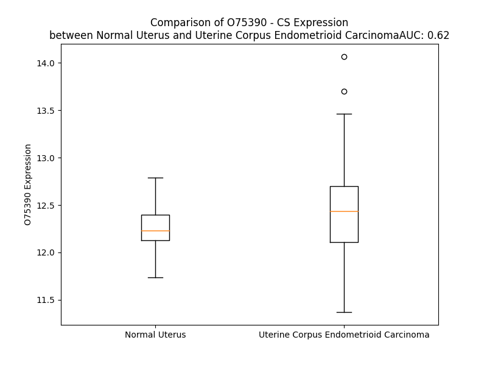

# Detailed Data for O75390

## Introduction to the Detailed Summary

### How to Interpret the Results

- **Summary & Metrics**: This section provides a quick reference to essential protein attributes, including expression changes, family classification, and biomarker applications. Regulation status (upregulated/downregulated) indicates the protein's behavior in a disease context. Some information comes from the original excel file with the proteins selected from literature, while others are derived from the analyses.
- **Expression Comparison**: A visual representation comparing protein expression between normal and disease states. It highlights significant changes in expression levels that might indicate diagnostic or therapeutic relevance. This is data coming from transcriptomics experiments and could not translate similarly to protein levels.
- **Isoform Alignment**: An interactive view of isoform alignments, revealing structural and functional differences between variants of the protein.
- **Interactors & Homologs**: Tables listing known interaction partners and homologous proteins, the more interactors and homologs, the more complex the protein is to design an antibody for.
- **Biological Assemblies**: Information about the structural arrangement of the protein in different assemblies, providing insights into its functional state but also the complexity of the protein to develop antibodies.
- **Combined Per-Residue Information**: A detailed table summarizing residue-level data. This includes predictions for epitope regions, aggregation tendencies, and modifications that might impact the protein's function. Each row corresponds to a residue in the protein, providing insights into specific sites that may be important for research or drug development.
## Summary & Metrics

- **UniProt Accession**: O75390
- **Gene Name**: CS
- **Protein Name**: Citrate synthase, mitochondrial
- **Swiss Prot**: CISY_HUMAN
- **Family**: enzyme
- **Biomarker Application**:  
- **Number of Isoforms**: 0
- **Regulation**: 2
- **(transcriptomics) AUC**: 0.74
- **(transcriptomics) Fold Change**: 1.03
- **(transcriptomics) Regulation**: Upregulated
- **Discotope Epitope Count**: 87
- **Max n_uniprots (Homo)**: 2
- **Max n_uniprots (Hetero)**: N/A

## Expression Comparison

## Interactors

| preferredName_A   | preferredName_B   |   score |
|:------------------|:------------------|--------:|
| CS                | ACO1              |   0.999 |
| CS                | ACO2              |   0.999 |
| CS                | MDH2              |   0.999 |
| CS                | ACLY              |   0.998 |
| CS                | DLAT              |   0.996 |
| CS                | SDHB              |   0.996 |
| CS                | IDH2              |   0.994 |
| CS                | IDH1              |   0.993 |
| CS                | FH                |   0.993 |
| CS                | PC                |   0.987 |
| CS                | ACSS1             |   0.984 |
| CS                | SDHA              |   0.984 |
| CS                | ACSS2             |   0.983 |
| CS                | ACAT1             |   0.977 |
| CS                | ME2               |   0.975 |
| CS                | IREB2             |   0.974 |
| CS                | ME1               |   0.972 |
| CS                | ME3               |   0.968 |
| CS                | ACAT2             |   0.966 |
| CS                | SLC25A1           |   0.964 |
| CS                | LDHC              |   0.962 |
| CS                | SUCLA2            |   0.96  |
| CS                | PCK2              |   0.958 |
| CS                | PCK1              |   0.955 |
| CS                | GOT2              |   0.952 |
| CS                | DLST              |   0.951 |
| CS                | HADHB             |   0.951 |
| CS                | LDHA              |   0.949 |
| CS                | GLUD1             |   0.948 |
| CS                | SUCLG2            |   0.948 |
| CS                | ACAA2             |   0.946 |
| CS                | ACAA1             |   0.942 |
| CS                | OGDH              |   0.941 |
| CS                | PDHB              |   0.941 |
| CS                | LDHAL6B           |   0.94  |
| CS                | ATP5F1A           |   0.94  |
| CS                | LDHAL6A           |   0.94  |
| CS                | GLUD2             |   0.932 |
| CS                | L2HGDH            |   0.931 |
| CS                | ALDH5A1           |   0.93  |
| CS                | SUCLG1            |   0.929 |
| CS                | IDH3A             |   0.925 |
| CS                | ACACA             |   0.92  |
| CS                | ATP5F1B           |   0.917 |
| CS                | HMGCL             |   0.916 |
| CS                | DLD               |   0.911 |
| CS                | FASN              |   0.911 |
| CS                | PDHX              |   0.909 |
| CS                | GOT1              |   0.908 |
| CS                | ACACB             |   0.901 |

## Homologs

| uniprot_id   | gene_id   |
|--------------|-----------|

## Biological Assemblies

|   Unnamed: 0 |   assembly |   n_uniprots | composition   | crystal_id   |
|-------------:|-----------:|-------------:|:--------------|:-------------|
|            0 |          1 |            2 | Homo          | 5uzr         |
|            0 |          1 |            1 | Homo          | 5uzq         |
|            0 |          1 |            2 | Homo          | 5uzp         |

## Combined Per-Residue Information

|   res | aa   |   epitope_score | epitope   |   relative_surface_accessibility |   modeling_confidence |   Aggregation | modification                 |
|------:|:-----|----------------:|:----------|---------------------------------:|----------------------:|--------------:|:-----------------------------|
|     1 | M    |         0.1213  | False     |                          1.34168 |                 37.17 |         0     | N/A                          |
|     2 | A    |         0.1914  | True      |                          0.847   |                 35.39 |         1.453 | N/A                          |
|     3 | L    |         0.14912 | False     |                          0.96592 |                 33.14 |         1.587 | N/A                          |
|     4 | L    |         0.22512 | True      |                          0.85209 |                 35.08 |         1.587 | N/A                          |
|     5 | T    |         0.13164 | False     |                          0.86211 |                 38.82 |         1.587 | N/A                          |
|     6 | A    |         0.15476 | False     |                          0.86027 |                 36.5  |         1.587 | N/A                          |
|     7 | A    |         0.13547 | False     |                          1.00439 |                 33.43 |         0.662 | N/A                          |
|     8 | A    |         0.11193 | False     |                          0.91587 |                 34.88 |         0.242 | N/A                          |
|     9 | R    |         0.13532 | False     |                          0.9674  |                 34.99 |         0     | N/A                          |
|    10 | L    |         0.10397 | False     |                          1.07861 |                 33.81 |         0     | N/A                          |
|    11 | L    |         0.13994 | False     |                          1.09679 |                 36.68 |         0     | N/A                          |
|    12 | G    |         0.24188 | True      |                          0.7712  |                 34.13 |         0     | N/A                          |
|    13 | T    |         0.22425 | True      |                          0.85817 |                 36.87 |         0     | N/A                          |
|    14 | K    |         0.27828 | True      |                          0.9051  |                 34.82 |         0     | N/A                          |
|    15 | N    |         0.24222 | True      |                          0.96086 |                 32.62 |         0     | N/A                          |
|    16 | A    |         0.13016 | False     |                          1.04954 |                 32.31 |         0.145 | N/A                          |
|    17 | S    |         0.12588 | False     |                          0.84276 |                 33.82 |         0.88  | N/A                          |
|    18 | C    |         0.10652 | False     |                          0.95845 |                 32.74 |         3.032 | N/A                          |
|    19 | L    |         0.12798 | False     |                          1.07422 |                 33.74 |         8.877 | N/A                          |
|    20 | V    |         0.09303 | False     |                          0.90821 |                 33.68 |         8.877 | N/A                          |
|    21 | L    |         0.09207 | False     |                          0.85703 |                 39.93 |         8.877 | N/A                          |
|    22 | A    |         0.05345 | False     |                          0.64375 |                 38.17 |         8.264 | N/A                          |
|    23 | A    |         0.06746 | False     |                          0.61385 |                 40.39 |         6.951 | N/A                          |
|    24 | R    |         0.0917  | False     |                          0.77968 |                 45.13 |         0     | N/A                          |
|    25 | H    |         0.07554 | False     |                          0.92389 |                 43.37 |         0     | N/A                          |
|    26 | A    |         0.06857 | False     |                          0.58056 |                 43.36 |         0     | N/A                          |
|    27 | S    |         0.08381 | False     |                          0.9304  |                 41.65 |         0     | N/A                          |
|    28 | A    |         0.06837 | False     |                          0.38916 |                 54.62 |         0     | N/A                          |
|    29 | S    |         0.13733 | False     |                          0.96815 |                 66.37 |         0     | N/A                          |
|    30 | S    |         0.09815 | False     |                          0.30209 |                 87.44 |         0     | N/A                          |
|    31 | T    |         0.14162 | False     |                          0.34925 |                 95.99 |         0     | N/A                          |
|    32 | N    |         0.08635 | False     |                          0.31244 |                 97.55 |         0     | N/A                          |
|    33 | L    |         0.0043  | False     |                          0       |                 98.31 |         0     | N/A                          |
|    34 | K    |         0.09097 | False     |                          0.24404 |                 98.27 |         0     | N/A                          |
|    35 | D    |         0.12243 | False     |                          0.45332 |                 97.73 |         0     | N/A                          |
|    36 | I    |         0.05467 | False     |                          0.10617 |                 97.82 |         0     | N/A                          |
|    37 | L    |         0.00381 | False     |                          0       |                 97.71 |         0     | N/A                          |
|    38 | A    |         0.14581 | False     |                          0.41738 |                 98.11 |         0     | N/A                          |
|    39 | D    |         0.18875 | True      |                          0.58818 |                 97.52 |         0     | N/A                          |
|    40 | L    |         0.07671 | False     |                          0.18659 |                 98.1  |         0     | N/A                          |
|    41 | I    |         0.05013 | False     |                          0.0408  |                 98.53 |         0     | N/A                          |
|    42 | P    |         0.19155 | True      |                          0.55653 |                 98.27 |         0     | N/A                          |
|    43 | K    |         0.20066 | True      |                          0.67863 |                 98.31 |         0     | N/A                          |
|    44 | E    |         0.03414 | False     |                          0.19917 |                 98.44 |         0     | N/A                          |
|    45 | Q    |         0.10083 | False     |                          0.36933 |                 98.5  |         0     | N/A                          |
|    46 | A    |         0.1102  | False     |                          0.52987 |                 98.47 |         0     | N/A                          |
|    47 | R    |         0.24029 | True      |                          0.54337 |                 98.43 |         0     | N/A                          |
|    48 | I    |         0.03881 | False     |                          0.20399 |                 98.31 |         0     | N/A                          |
|    49 | K    |         0.14981 | False     |                          0.65404 |                 98.28 |         0     | N/A                          |
|    50 | T    |         0.23437 | True      |                          0.47873 |                 98.58 |         0     | N/A                          |
|    51 | F    |         0.11349 | False     |                          0.61109 |                 98.62 |         0     | N/A                          |
|    52 | R    |         0.08599 | False     |                          0.68049 |                 98.24 |         0     | N/A                          |
|    53 | Q    |         0.21267 | True      |                          0.66896 |                 98.31 |         0     | N/A                          |
|    54 | Q    |         0.2654  | True      |                          0.65324 |                 98.36 |         0     | N/A                          |
|    55 | H    |         0.17033 | True      |                          0.47448 |                 98.49 |         0     | N/A                          |
|    56 | G    |         0.08098 | False     |                          0.69137 |                 97.72 |         0     | N/A                          |
|    57 | K    |         0.13317 | False     |                          0.99169 |                 98.06 |         0     | N6-succinyllysine            |
|    58 | T    |         0.16111 | True      |                          0.57438 |                 98.65 |         3.654 | N/A                          |
|    59 | V    |         0.07018 | False     |                          0.77732 |                 98.45 |         9.802 | N/A                          |
|    60 | V    |         0.09759 | False     |                          0.71873 |                 98.22 |         9.802 | N/A                          |
|    61 | G    |         0.14207 | False     |                          0.60814 |                 97.83 |         9.802 | N/A                          |
|    62 | Q    |         0.08156 | False     |                          0.66591 |                 97.8  |         9.802 | N/A                          |
|    63 | I    |         0.12186 | False     |                          0.71274 |                 98.03 |         9.802 | N/A                          |
|    64 | T    |         0.10131 | False     |                          0.43961 |                 97.9  |         9.802 | N/A                          |
|    65 | V    |         0.13946 | False     |                          0.44984 |                 97.97 |         9.035 | N/A                          |
|    66 | D    |         0.15114 | False     |                          0.71966 |                 98.36 |         0     | N/A                          |
|    67 | M    |         0.06104 | False     |                          0.25529 |                 98.27 |         0     | N/A                          |
|    68 | M    |         0.0942  | False     |                          0.36027 |                 98.26 |         0     | N/A                          |
|    69 | Y    |         0.25145 | True      |                          0.5974  |                 98.4  |         0     | N/A                          |
|    70 | G    |         0.14015 | False     |                          0.40735 |                 97.74 |         0     | N/A                          |
|    71 | G    |         0.20525 | True      |                          0.77645 |                 97.82 |         0     | N/A                          |
|    72 | M    |         0.08254 | False     |                          0.47356 |                 98.32 |         0     | N/A                          |
|    73 | R    |         0.27521 | True      |                          0.77469 |                 96.59 |         0     | N/A                          |
|    74 | G    |         0.15595 | False     |                          0.83463 |                 95.75 |         0     | N/A                          |
|    75 | M    |         0.08558 | False     |                          0.292   |                 98.1  |         0     | N/A                          |
|    76 | K    |         0.14212 | False     |                          0.8186  |                 98.28 |         0     | N6-acetyllysine; alternate   |
|    76 | K    |         0.14212 | False     |                          0.8186  |                 98.28 |         0     | N6-succinyllysine; alternate |
|    77 | G    |         0.09708 | False     |                          0.68412 |                 98.23 |         0     | N/A                          |
|    78 | L    |         0.0663  | False     |                          0.40499 |                 98.74 |         0     | N/A                          |
|    79 | V    |         0.04233 | False     |                          0.59714 |                 98.79 |         0     | N/A                          |
|    80 | Y    |         0.02755 | False     |                          0.10878 |                 98.83 |         0     | N/A                          |
|    81 | E    |         0.04867 | False     |                          0.21668 |                 98.73 |         0     | N/A                          |
|    82 | T    |         0.00208 | False     |                          0       |                 98.78 |         0     | N/A                          |
|    83 | S    |         0.0189  | False     |                          0.01546 |                 98.78 |         0     | N/A                          |
|    84 | V    |         0.10248 | False     |                          0.63545 |                 98.51 |         0     | N/A                          |
|    85 | L    |         0.1413  | False     |                          0.2229  |                 97.61 |         0     | N/A                          |
|    86 | D    |         0.09333 | False     |                          0.19827 |                 96.36 |         0     | N/A                          |
|    87 | P    |         0.16502 | True      |                          0.39664 |                 93.29 |         0     | N/A                          |
|    88 | D    |         0.20271 | True      |                          0.402   |                 93.95 |         0     | N/A                          |
|    89 | E    |         0.13405 | False     |                          0.36092 |                 94.65 |         0     | N/A                          |
|    90 | G    |         0.01292 | False     |                          0.00644 |                 96.61 |         0     | N/A                          |
|    91 | I    |         0.01964 | False     |                          0.00938 |                 98.17 |         0     | N/A                          |
|    92 | R    |         0.06818 | False     |                          0.23621 |                 98.73 |         0     | N/A                          |
|    93 | F    |         0.00249 | False     |                          0       |                 98.8  |         0     | N/A                          |
|    94 | R    |         0.01304 | False     |                          0.23577 |                 98.58 |         0     | N/A                          |
|    95 | G    |         0.07854 | False     |                          0.52603 |                 98.42 |         0     | N/A                          |
|    96 | F    |         0.02923 | False     |                          0.1441  |                 98.69 |         0     | N/A                          |
|    97 | S    |         0.06254 | False     |                          0.07814 |                 98.53 |         0     | N/A                          |
|    98 | I    |         0.01823 | False     |                          0.0112  |                 98.48 |         0     | N/A                          |
|    99 | P    |         0.10755 | False     |                          0.57633 |                 98.32 |         0     | N/A                          |
|   100 | E    |         0.10007 | False     |                          0.28955 |                 98.59 |         0     | N/A                          |
|   101 | C    |         0.00659 | False     |                          0.00801 |                 98.71 |         0     | N/A                          |
|   102 | Q    |         0.06357 | False     |                          0.19436 |                 98.4  |         0     | N/A                          |
|   103 | K    |         0.22458 | True      |                          0.81801 |                 98.41 |         0     | N6-succinyllysine            |
|   104 | L    |         0.06678 | False     |                          0.50105 |                 98.47 |         0     | N/A                          |
|   105 | L    |         0.00848 | False     |                          0.01166 |                 98.72 |         0     | N/A                          |
|   106 | P    |         0.01404 | False     |                          0.0605  |                 98.62 |         0     | N/A                          |
|   107 | K    |         0.09763 | False     |                          0.31489 |                 98.73 |         0     | N/A                          |
|   108 | A    |         0.04027 | False     |                          0.14845 |                 98.37 |         0     | N/A                          |
|   109 | K    |         0.20379 | True      |                          1.04315 |                 97.07 |         0     | N/A                          |
|   110 | G    |         0.15676 | False     |                          0.88697 |                 96.66 |         0     | N/A                          |
|   111 | G    |         0.06215 | False     |                          0.15683 |                 97.74 |         0     | N/A                          |
|   112 | E    |         0.08959 | False     |                          0.54267 |                 98.15 |         0     | N/A                          |
|   113 | E    |         0.03471 | False     |                          0.09498 |                 98.76 |         0     | N/A                          |
|   114 | P    |         0.00274 | False     |                          0.00298 |                 98.78 |         0     | N/A                          |
|   115 | L    |         0.00989 | False     |                          0.061   |                 98.89 |         0     | N/A                          |
|   116 | P    |         0.00131 | False     |                          0       |                 98.89 |         0     | N/A                          |
|   117 | E    |         0.00252 | False     |                          0       |                 98.9  |         0     | N/A                          |
|   118 | G    |         0.00202 | False     |                          0       |                 98.82 |         5.64  | N/A                          |
|   119 | L    |         0.00111 | False     |                          0       |                 98.9  |        67.767 | N/A                          |
|   120 | F    |         0.00188 | False     |                          0       |                 98.93 |        97.407 | N/A                          |
|   121 | W    |         0.00876 | False     |                          0.01744 |                 98.84 |        98.358 | N/A                          |
|   122 | L    |         0.00141 | False     |                          0       |                 98.82 |        98.377 | N/A                          |
|   123 | L    |         0.00067 | False     |                          0       |                 98.87 |        98.327 | N/A                          |
|   124 | V    |         0.00213 | False     |                          0       |                 98.78 |        95.008 | N/A                          |
|   125 | T    |         0.04309 | False     |                          0.06524 |                 98.63 |        37.977 | N/A                          |
|   126 | G    |         0.03583 | False     |                          0.30691 |                 98.44 |         3.173 | N/A                          |
|   127 | H    |         0.02011 | False     |                          0.14142 |                 97.89 |         0.021 | N/A                          |
|   128 | I    |         0.03513 | False     |                          0.31342 |                 98.46 |         0     | N/A                          |
|   129 | P    |         0.01698 | False     |                          0.04209 |                 98.31 |         0     | N/A                          |
|   130 | T    |         0.0674  | False     |                          0.50324 |                 98.19 |         0     | N/A                          |
|   131 | E    |         0.03505 | False     |                          0.51549 |                 97.62 |         0     | N/A                          |
|   132 | E    |         0.07112 | False     |                          0.58378 |                 97.85 |         0     | N/A                          |
|   133 | Q    |         0.02509 | False     |                          0.05977 |                 98.29 |         0     | N/A                          |
|   134 | V    |         0.00915 | False     |                          0.0238  |                 98.64 |         0.242 | N/A                          |
|   135 | S    |         0.04    | False     |                          0.39634 |                 98.24 |         0.242 | N/A                          |
|   136 | W    |         0.07878 | False     |                          0.25699 |                 98.39 |         0.242 | N/A                          |
|   137 | L    |         0.00355 | False     |                          0       |                 98.66 |         0.242 | N/A                          |
|   138 | S    |         0.03887 | False     |                          0.09919 |                 98.75 |         0.242 | N/A                          |
|   139 | K    |         0.10692 | False     |                          0.48727 |                 98.56 |         0     | N/A                          |
|   140 | E    |         0.04258 | False     |                          0.12152 |                 98.72 |         0     | N/A                          |
|   141 | W    |         0.01041 | False     |                          0.01042 |                 98.86 |         0     | N/A                          |
|   142 | A    |         0.01765 | False     |                          0.15144 |                 98.7  |         0     | N/A                          |
|   143 | K    |         0.11138 | False     |                          0.71066 |                 98.42 |         0     | N/A                          |
|   144 | R    |         0.06373 | False     |                          0.2229  |                 98.68 |         0     | N/A                          |
|   145 | A    |         0.01589 | False     |                          0.0573  |                 98.41 |         0     | N/A                          |
|   146 | A    |         0.10962 | False     |                          0.73611 |                 97.93 |         0     | N/A                          |
|   147 | L    |         0.0358  | False     |                          0.20576 |                 98.54 |         0     | N/A                          |
|   148 | P    |         0.12317 | False     |                          0.20238 |                 98.47 |         0     | N/A                          |
|   149 | S    |         0.12452 | False     |                          0.69524 |                 98.35 |         0     | N/A                          |
|   150 | H    |         0.10463 | False     |                          0.44747 |                 98.66 |         0     | N/A                          |
|   151 | V    |         0.00396 | False     |                          0       |                 98.79 |        12.703 | N/A                          |
|   152 | V    |         0.11342 | False     |                          0.35607 |                 98.64 |        12.703 | N/A                          |
|   153 | T    |         0.17903 | True      |                          0.53772 |                 98.7  |        12.703 | N/A                          |
|   154 | M    |         0.09888 | False     |                          0.28577 |                 98.83 |        12.703 | N/A                          |
|   155 | L    |         0.01235 | False     |                          0.0057  |                 98.81 |        12.703 | N/A                          |
|   156 | D    |         0.17271 | True      |                          0.4615  |                 98.67 |         0     | N/A                          |
|   157 | N    |         0.27747 | True      |                          0.7054  |                 98.7  |         0     | N/A                          |
|   158 | F    |         0.07514 | False     |                          0.21624 |                 98.74 |         0     | N/A                          |
|   159 | P    |         0.18391 | True      |                          0.56762 |                 98.51 |         0     | N/A                          |
|   160 | T    |         0.2586  | True      |                          0.75906 |                 98.39 |         0     | N/A                          |
|   161 | N    |         0.27106 | True      |                          0.86651 |                 98.43 |         0     | N/A                          |
|   162 | L    |         0.19616 | True      |                          0.34294 |                 98.79 |         0     | N/A                          |
|   163 | H    |         0.09418 | False     |                          0.37868 |                 98.75 |         0     | N/A                          |
|   164 | P    |         0.01577 | False     |                          0.03479 |                 98.85 |         0     | N/A                          |
|   165 | M    |         0.01079 | False     |                          0.00804 |                 98.86 |         0     | N/A                          |
|   166 | S    |         0.05765 | False     |                          0.37367 |                 98.9  |         0     | N/A                          |
|   167 | Q    |         0.01213 | False     |                          0.00671 |                 98.89 |         0     | N/A                          |
|   168 | L    |         0.00164 | False     |                          0       |                 98.93 |         1.625 | N/A                          |
|   169 | S    |         0.0164  | False     |                          0.05584 |                 98.9  |         1.793 | N/A                          |
|   170 | A    |         0.05602 | False     |                          0.35076 |                 98.89 |         3.4   | N/A                          |
|   171 | A    |         0.00165 | False     |                          0       |                 98.9  |         5.004 | N/A                          |
|   172 | V    |         0.00315 | False     |                          0       |                 98.88 |         5.004 | N/A                          |
|   173 | T    |         0.08712 | False     |                          0.4361  |                 98.92 |         4.666 | N/A                          |
|   174 | A    |         0.05162 | False     |                          0.25072 |                 98.86 |         4.465 | N/A                          |
|   175 | L    |         0.00387 | False     |                          0.00247 |                 98.86 |         4.044 | N/A                          |
|   176 | N    |         0.06699 | False     |                          0.28889 |                 98.74 |         0     | N/A                          |
|   177 | S    |         0.11744 | False     |                          0.56003 |                 98.71 |         0     | N/A                          |
|   178 | E    |         0.09902 | False     |                          0.34831 |                 98.78 |         0     | N/A                          |
|   179 | S    |         0.03236 | False     |                          0.04777 |                 98.83 |         0     | N/A                          |
|   180 | N    |         0.05588 | False     |                          0.24439 |                 98.61 |         0     | N/A                          |
|   181 | F    |         0.00874 | False     |                          0.00573 |                 98.79 |         0     | N/A                          |
|   182 | A    |         0.10601 | False     |                          0.38401 |                 98.67 |         0     | N/A                          |
|   183 | R    |         0.30498 | True      |                          0.60366 |                 98.66 |         0     | N/A                          |
|   184 | A    |         0.1086  | False     |                          0.13647 |                 98.41 |         0     | N/A                          |
|   185 | Y    |         0.21957 | True      |                          0.44458 |                 98.33 |         0     | N/A                          |
|   186 | A    |         0.1831  | True      |                          0.85738 |                 98.11 |         0     | N/A                          |
|   187 | Q    |         0.24542 | True      |                          0.71136 |                 97.85 |         0     | N/A                          |
|   188 | G    |         0.26705 | True      |                          0.7682  |                 97.21 |         0     | N/A                          |
|   189 | I    |         0.28373 | True      |                          0.27345 |                 97.43 |         0     | N/A                          |
|   190 | S    |         0.12675 | False     |                          0.49655 |                 97.22 |         0     | N/A                          |
|   191 | R    |         0.137   | False     |                          0.58644 |                 96.55 |         0     | N/A                          |
|   192 | T    |         0.1652  | True      |                          0.70091 |                 96.79 |         1.594 | N/A                          |
|   193 | K    |         0.1574  | True      |                          0.51078 |                 97.68 |         4.274 | N6-succinyllysine            |
|   194 | Y    |         0.09086 | False     |                          0.12282 |                 98.68 |         4.274 | N/A                          |
|   195 | W    |         0.05992 | False     |                          0.06697 |                 98.7  |         4.274 | N/A                          |
|   196 | E    |         0.1199  | False     |                          0.21761 |                 98.74 |         4.274 | N/A                          |
|   197 | L    |         0.09417 | False     |                          0.2605  |                 98.6  |         4.274 | N/A                          |
|   198 | I    |         0.00234 | False     |                          0.0016  |                 98.85 |         4.274 | N/A                          |
|   199 | Y    |         0.01988 | False     |                          0.01573 |                 98.85 |         3.099 | N/A                          |
|   200 | E    |         0.03996 | False     |                          0.17604 |                 98.84 |         0     | N/A                          |
|   201 | D    |         0.01144 | False     |                          0       |                 98.88 |         0     | N/A                          |
|   202 | S    |         0.00257 | False     |                          0       |                 98.9  |         0     | N/A                          |
|   203 | M    |         0.00246 | False     |                          0.00072 |                 98.91 |         0     | N/A                          |
|   204 | D    |         0.02037 | False     |                          0.12032 |                 98.89 |         0     | N/A                          |
|   205 | L    |         0.00106 | False     |                          0       |                 98.9  |         0     | N/A                          |
|   206 | I    |         0.00254 | False     |                          0       |                 98.93 |         0     | N/A                          |
|   207 | A    |         0.00469 | False     |                          0.02168 |                 98.89 |         0     | N/A                          |
|   208 | K    |         0.02254 | False     |                          0.06499 |                 98.88 |         0     | N/A                          |
|   209 | L    |         0.00205 | False     |                          0.00165 |                 98.88 |         0     | N/A                          |
|   210 | P    |         0.00721 | False     |                          0.01292 |                 98.8  |         0     | N/A                          |
|   211 | C    |         0.02248 | False     |                          0.04162 |                 98.81 |         0     | N/A                          |
|   212 | V    |         0.00147 | False     |                          0.00095 |                 98.9  |         0     | N/A                          |
|   213 | A    |         0.00154 | False     |                          0       |                 98.9  |         0     | N/A                          |
|   214 | A    |         0.00241 | False     |                          0       |                 98.89 |         0     | N/A                          |
|   215 | K    |         0.03859 | False     |                          0.13052 |                 98.83 |         0     | N/A                          |
|   216 | I    |         0.00493 | False     |                          0       |                 98.89 |         0     | N/A                          |
|   217 | Y    |         0.00426 | False     |                          0       |                 98.87 |         0     | N/A                          |
|   218 | R    |         0.08997 | False     |                          0.14907 |                 98.7  |         0     | N/A                          |
|   219 | N    |         0.10897 | False     |                          0.18668 |                 98.73 |         0     | N/A                          |
|   220 | L    |         0.11381 | False     |                          0.1894  |                 98.69 |         0     | N/A                          |
|   221 | Y    |         0.1906  | True      |                          0.27745 |                 98.52 |         0     | N/A                          |
|   222 | R    |         0.18968 | True      |                          0.33476 |                 98.4  |         0     | N/A                          |
|   223 | E    |         0.39349 | True      |                          0.93907 |                 97.71 |         0     | N/A                          |
|   224 | G    |         0.20028 | True      |                          0.51753 |                 96.45 |         0     | N/A                          |
|   225 | S    |         0.16637 | True      |                          0.37691 |                 96.63 |         0     | N/A                          |
|   226 | G    |         0.26275 | True      |                          0.75339 |                 95.16 |         0     | N/A                          |
|   227 | I    |         0.18151 | True      |                          0.21147 |                 97.38 |         0     | N/A                          |
|   228 | G    |         0.17898 | True      |                          0.77911 |                 94.51 |         0     | N/A                          |
|   229 | A    |         0.18618 | True      |                          0.89205 |                 95.43 |         0     | N/A                          |
|   230 | I    |         0.14422 | False     |                          0.32182 |                 97.53 |         0     | N/A                          |
|   231 | D    |         0.10683 | False     |                          0.35886 |                 97.33 |         0     | N/A                          |
|   232 | S    |         0.13015 | False     |                          0.47886 |                 96.86 |         0     | N/A                          |
|   233 | N    |         0.17489 | True      |                          0.80626 |                 96.95 |         0     | N/A                          |
|   234 | L    |         0.1478  | False     |                          0.24055 |                 98.27 |         0     | N/A                          |
|   235 | D    |         0.02715 | False     |                          0.09198 |                 98.8  |         0     | N/A                          |
|   236 | W    |         0.01704 | False     |                          0.0464  |                 98.84 |         0     | N/A                          |
|   237 | S    |         0.00103 | False     |                          0       |                 98.85 |         0     | N/A                          |
|   238 | H    |         0.05804 | False     |                          0.2822  |                 98.8  |         0     | N/A                          |
|   239 | N    |         0.0189  | False     |                          0.0478  |                 98.79 |         0     | N/A                          |
|   240 | F    |         0.00152 | False     |                          0       |                 98.88 |         0     | N/A                          |
|   241 | T    |         0.00447 | False     |                          0       |                 98.81 |         0     | N/A                          |
|   242 | N    |         0.08408 | False     |                          0.38004 |                 98.52 |         0     | N/A                          |
|   243 | M    |         0.01094 | False     |                          0.01467 |                 98.76 |         0     | N/A                          |
|   244 | L    |         0.00627 | False     |                          0.00717 |                 98.72 |         0     | N/A                          |
|   245 | G    |         0.09708 | False     |                          0.4838  |                 98.43 |         0     | N/A                          |
|   246 | Y    |         0.06763 | False     |                          0.10366 |                 98.55 |         0     | N/A                          |
|   247 | T    |         0.21798 | True      |                          0.9422  |                 97.56 |         0     | N/A                          |
|   248 | D    |         0.14737 | False     |                          0.43313 |                 98.16 |         0     | N/A                          |
|   249 | H    |         0.08738 | False     |                          0.48426 |                 97.96 |         0     | N/A                          |
|   250 | Q    |         0.09361 | False     |                          0.27436 |                 98.5  |         0     | N/A                          |
|   251 | F    |         0.01006 | False     |                          0.01147 |                 98.76 |         0.565 | N/A                          |
|   252 | T    |         0.01069 | False     |                          0.03467 |                 98.85 |         0.565 | N/A                          |
|   253 | E    |         0.01816 | False     |                          0.03371 |                 98.85 |         0.565 | N/A                          |
|   254 | L    |         0.0057  | False     |                          0.00989 |                 98.84 |         0.565 | N/A                          |
|   255 | T    |         0.00622 | False     |                          0.06677 |                 98.87 |         0.565 | N/A                          |
|   256 | R    |         0.00776 | False     |                          0.02529 |                 98.89 |         0.565 | N/A                          |
|   257 | L    |         0.00189 | False     |                          0.00165 |                 98.87 |        14.604 | N/A                          |
|   258 | Y    |         0.00852 | False     |                          0.03787 |                 98.88 |        14.933 | N/A                          |
|   259 | L    |         0.00076 | False     |                          0.00247 |                 98.9  |        14.933 | N/A                          |
|   260 | T    |         0.00458 | False     |                          0.01333 |                 98.93 |        14.933 | N/A                          |
|   261 | I    |         0.00526 | False     |                          0.0024  |                 98.78 |        14.933 | N/A                          |
|   262 | H    |         0.00538 | False     |                          0.01932 |                 98.85 |         2.345 | N/A                          |
|   263 | S    |         0.00156 | False     |                          0       |                 98.8  |         0.221 | N/A                          |
|   264 | D    |         0.00501 | False     |                          0       |                 98.81 |         0     | N/A                          |
|   265 | H    |         0.05432 | False     |                          0.23962 |                 98.53 |         0     | N/A                          |
|   266 | E    |         0.12955 | False     |                          0.30182 |                 98.59 |         0     | N/A                          |
|   267 | G    |         0.01926 | False     |                          0.02257 |                 98.53 |         0     | N/A                          |
|   268 | G    |         0.14338 | False     |                          0.70867 |                 98.15 |         0     | N/A                          |
|   269 | N    |         0.05484 | False     |                          0.19994 |                 98.3  |         0     | N/A                          |
|   270 | V    |         0.05314 | False     |                          0.56703 |                 98.66 |         0     | N/A                          |
|   271 | S    |         0.00154 | False     |                          0       |                 98.67 |         0     | N/A                          |
|   272 | A    |         0.00418 | False     |                          0.00754 |                 98.86 |         0     | N/A                          |
|   273 | H    |         0.0296  | False     |                          0.27265 |                 98.88 |         0     | N/A                          |
|   274 | T    |         0.01893 | False     |                          0.20614 |                 98.91 |         0     | N/A                          |
|   275 | S    |         0.00344 | False     |                          0.01306 |                 98.89 |         0     | N/A                          |
|   276 | H    |         0.01493 | False     |                          0.10309 |                 98.87 |         0     | N/A                          |
|   277 | L    |         0.08852 | False     |                          0.4516  |                 98.84 |         0     | N/A                          |
|   278 | V    |         0.02594 | False     |                          0.28277 |                 98.88 |         0     | N/A                          |
|   279 | G    |         0.00304 | False     |                          0.00119 |                 98.87 |         0     | N/A                          |
|   280 | S    |         0.03144 | False     |                          0.03287 |                 98.75 |         0     | N/A                          |
|   281 | A    |         0.11069 | False     |                          0.60275 |                 98.7  |         0     | N/A                          |
|   282 | L    |         0.06629 | False     |                          0.3283  |                 98.64 |         0     | N/A                          |
|   283 | S    |         0.08597 | False     |                          0.22889 |                 98.82 |         0     | N/A                          |
|   284 | D    |         0.01232 | False     |                          0.02256 |                 98.86 |         0     | N/A                          |
|   285 | P    |         0.00114 | False     |                          0       |                 98.89 |         0     | N/A                          |
|   286 | Y    |         0.00115 | False     |                          0       |                 98.94 |         1.705 | N/A                          |
|   287 | L    |         0.0471  | False     |                          0.35705 |                 98.92 |         2.657 | N/A                          |
|   288 | S    |         0.00098 | False     |                          0       |                 98.9  |         2.657 | N/A                          |
|   289 | F    |         0.00098 | False     |                          0       |                 98.94 |         3.144 | N/A                          |
|   290 | A    |         0.00932 | False     |                          0.03444 |                 98.93 |         3.144 | N/A                          |
|   291 | A    |         0.02039 | False     |                          0.24156 |                 98.9  |         2.637 | N/A                          |
|   292 | A    |         0.0042  | False     |                          0.00255 |                 98.9  |         1.872 | N/A                          |
|   293 | M    |         0.00349 | False     |                          0.00106 |                 98.87 |         1.225 | N/A                          |
|   294 | N    |         0.09615 | False     |                          0.6091  |                 98.85 |         0     | N/A                          |
|   295 | G    |         0.05735 | False     |                          0.20114 |                 98.59 |         0     | N/A                          |
|   296 | L    |         0.00215 | False     |                          0       |                 98.67 |         0     | N/A                          |
|   297 | A    |         0.0617  | False     |                          0.3802  |                 98.45 |         0     | N/A                          |
|   298 | G    |         0.18717 | True      |                          0.29408 |                 98.08 |         0     | N/A                          |
|   299 | P    |         0.20911 | True      |                          0.66873 |                 97.38 |         0     | N/A                          |
|   300 | L    |         0.21666 | True      |                          1.15039 |                 95.61 |         0     | N/A                          |
|   301 | H    |         0.07377 | False     |                          0.21352 |                 97.34 |         0     | N/A                          |
|   302 | G    |         0.03066 | False     |                          0.05773 |                 95.22 |         0     | N/A                          |
|   303 | L    |         0.07055 | False     |                          0.30489 |                 96.63 |         0     | N/A                          |
|   304 | A    |         0.03956 | False     |                          0.35946 |                 96.44 |         0     | N/A                          |
|   305 | N    |         0.03101 | False     |                          0.06092 |                 96.12 |         0     | N/A                          |
|   306 | Q    |         0.04503 | False     |                          0.07683 |                 97.58 |         0     | N/A                          |
|   307 | E    |         0.10558 | False     |                          0.49743 |                 97.38 |         0     | N/A                          |
|   308 | V    |         0.01179 | False     |                          0.0438  |                 97.99 |        86.591 | N/A                          |
|   309 | L    |         0.00737 | False     |                          0.01401 |                 97.93 |        91.099 | N/A                          |
|   310 | V    |         0.12355 | False     |                          0.57518 |                 97.94 |        91.218 | N/A                          |
|   311 | W    |         0.04196 | False     |                          0.18656 |                 98.24 |        91.218 | N/A                          |
|   312 | L    |         0.01013 | False     |                          0.02226 |                 98.4  |        91.218 | N/A                          |
|   313 | T    |         0.11867 | False     |                          0.50877 |                 97.57 |        57.7   | N/A                          |
|   314 | Q    |         0.11837 | False     |                          0.42463 |                 97.56 |        36.064 | N/A                          |
|   315 | L    |         0.01005 | False     |                          0.00306 |                 97.94 |        35.184 | N/A                          |
|   316 | Q    |         0.08457 | False     |                          0.13302 |                 97.72 |         0.551 | N/A                          |
|   317 | K    |         0.14374 | False     |                          0.82792 |                 97.72 |         0.037 | N/A                          |
|   318 | E    |         0.17406 | True      |                          0.47813 |                 97.42 |         0.037 | N/A                          |
|   319 | V    |         0.08479 | False     |                          0.0948  |                 97.07 |         0.037 | N/A                          |
|   320 | G    |         0.11068 | False     |                          0.38846 |                 96.54 |         0     | N/A                          |
|   321 | K    |         0.1747  | True      |                          0.69411 |                 95.05 |         0     | N6-acetyllysine; alternate   |
|   321 | K    |         0.1747  | True      |                          0.69411 |                 95.05 |         0     | N6-succinyllysine; alternate |
|   322 | D    |         0.16598 | True      |                          0.89562 |                 94.96 |         0     | N/A                          |
|   323 | V    |         0.08123 | False     |                          0.10184 |                 97.22 |         0     | N/A                          |
|   324 | S    |         0.15875 | True      |                          0.49007 |                 97.92 |         0     | N/A                          |
|   325 | D    |         0.14791 | False     |                          0.34747 |                 98.35 |         0     | N/A                          |
|   326 | E    |         0.15135 | False     |                          0.67664 |                 98.08 |         0     | N/A                          |
|   327 | K    |         0.17448 | True      |                          0.51695 |                 97.65 |         0     | N6-acetyllysine; alternate   |
|   327 | K    |         0.17448 | True      |                          0.51695 |                 97.65 |         0     | N6-succinyllysine; alternate |
|   328 | L    |         0.00337 | False     |                          0       |                 98.35 |         0.138 | N/A                          |
|   329 | R    |         0.08501 | False     |                          0.33381 |                 98.31 |         0.138 | N/A                          |
|   330 | D    |         0.16035 | True      |                          0.46968 |                 97.95 |         0.138 | N/A                          |
|   331 | Y    |         0.08339 | False     |                          0.20855 |                 98.01 |         7.592 | N/A                          |
|   332 | I    |         0.00531 | False     |                          0       |                 98.16 |         7.592 | N/A                          |
|   333 | W    |         0.16092 | True      |                          0.27774 |                 98.18 |         7.592 | N/A                          |
|   334 | N    |         0.20251 | True      |                          0.62641 |                 97.3  |         7.453 | N/A                          |
|   335 | T    |         0.03141 | False     |                          0.02305 |                 96.4  |         7.453 | N/A                          |
|   336 | L    |         0.06613 | False     |                          0.06986 |                 96.26 |         6.335 | N/A                          |
|   337 | N    |         0.23631 | True      |                          0.69805 |                 96.56 |         0.238 | N/A                          |
|   338 | S    |         0.21102 | True      |                          0.48601 |                 96.23 |         0     | N/A                          |
|   339 | G    |         0.24196 | True      |                          0.82314 |                 94.11 |         0     | N/A                          |
|   340 | R    |         0.30619 | True      |                          0.58153 |                 94.94 |         0     | N/A                          |
|   341 | V    |         0.24481 | True      |                          0.79001 |                 94.78 |         0     | N/A                          |
|   342 | V    |         0.01973 | False     |                          0.02943 |                 96.9  |         0     | N/A                          |
|   343 | P    |         0.0605  | False     |                          0.21546 |                 96.05 |         0     | N/A                          |
|   344 | G    |         0.02042 | False     |                          0.18666 |                 95.58 |         0     | N/A                          |
|   345 | Y    |         0.06186 | False     |                          0.11835 |                 96.56 |         0     | N/A                          |
|   346 | G    |         0.16841 | True      |                          0.4302  |                 88.67 |         0     | N/A                          |
|   347 | H    |         0.08773 | False     |                          0.23461 |                 78.54 |         0     | N/A                          |
|   348 | A    |         0.28031 | True      |                          0.79642 |                 78.42 |         0     | N/A                          |
|   349 | V    |         0.24178 | True      |                          0.57677 |                 81.15 |         0     | N/A                          |
|   350 | L    |         0.10728 | False     |                          0.06433 |                 83.12 |         0     | N/A                          |
|   351 | R    |         0.36452 | True      |                          0.59771 |                 89.9  |         0     | N/A                          |
|   352 | K    |         0.14402 | False     |                          0.39071 |                 93.4  |         0     | N/A                          |
|   353 | T    |         0.03524 | False     |                          0.12204 |                 97.27 |         0     | N/A                          |
|   354 | D    |         0.02942 | False     |                          0.03511 |                 97.78 |         0     | N/A                          |
|   355 | P    |         0.03682 | False     |                          0.08134 |                 98.01 |         0     | N/A                          |
|   356 | R    |         0.05816 | False     |                          0.09085 |                 98.63 |         0     | N/A                          |
|   357 | Y    |         0.00665 | False     |                          0.00283 |                 98.62 |         0     | N/A                          |
|   358 | T    |         0.08943 | False     |                          0.362   |                 98.64 |         0     | N/A                          |
|   359 | C    |         0.01352 | False     |                          0.01984 |                 98.52 |         0     | N/A                          |
|   360 | Q    |         0.00554 | False     |                          0.00612 |                 98.88 |         0     | N/A                          |
|   361 | R    |         0.0633  | False     |                          0.20409 |                 98.76 |         0     | N/A                          |
|   362 | E    |         0.07581 | False     |                          0.47847 |                 98.75 |         0     | N/A                          |
|   363 | F    |         0.01884 | False     |                          0.02149 |                 98.79 |         0     | N/A                          |
|   364 | A    |         0.00331 | False     |                          0       |                 98.75 |         0     | N/A                          |
|   365 | L    |         0.13965 | False     |                          0.55206 |                 98.58 |         0     | N/A                          |
|   366 | K    |         0.21835 | True      |                          0.53599 |                 98.49 |         0     | N/A                          |
|   367 | H    |         0.09591 | False     |                          0.23419 |                 98.49 |         0     | N/A                          |
|   368 | L    |         0.07538 | False     |                          0.02061 |                 98.32 |         0     | N/A                          |
|   369 | P    |         0.11337 | False     |                          0.41306 |                 98.22 |         0     | N/A                          |
|   370 | N    |         0.20061 | True      |                          0.73781 |                 97.88 |         0     | N/A                          |
|   371 | D    |         0.04628 | False     |                          0.15414 |                 98.2  |         0     | N/A                          |
|   372 | P    |         0.12865 | False     |                          0.37001 |                 97.94 |         0     | N/A                          |
|   373 | M    |         0.0207  | False     |                          0.06981 |                 97.98 |         0     | N/A                          |
|   374 | F    |         0.01065 | False     |                          0.02166 |                 98.43 |         0     | N/A                          |
|   375 | K    |         0.06681 | False     |                          0.50206 |                 98.45 |         0     | N6-acetyllysine; alternate   |
|   375 | K    |         0.06681 | False     |                          0.50206 |                 98.45 |         0     | N6-succinyllysine; alternate |
|   376 | L    |         0.01325 | False     |                          0.04606 |                 98.56 |         0.323 | N/A                          |
|   377 | V    |         0.00649 | False     |                          0.02095 |                 98.58 |         0.323 | N/A                          |
|   378 | A    |         0.03468 | False     |                          0.19949 |                 98.37 |         0.323 | N/A                          |
|   379 | Q    |         0.0372  | False     |                          0.16363 |                 98.27 |         0.323 | N/A                          |
|   380 | L    |         0.00659 | False     |                          0.02226 |                 98.5  |         0.323 | N/A                          |
|   381 | Y    |         0.08055 | False     |                          0.28619 |                 98.34 |         0.323 | N/A                          |
|   382 | K    |         0.18674 | True      |                          0.64445 |                 98.04 |         0     | N6-acetyllysine              |
|   383 | I    |         0.07442 | False     |                          0.0664  |                 98.17 |         0     | N/A                          |
|   384 | V    |         0.00199 | False     |                          0       |                 98.08 |         0     | N/A                          |
|   385 | P    |         0.03329 | False     |                          0.03181 |                 97.13 |         0     | N/A                          |
|   386 | N    |         0.18867 | True      |                          0.4892  |                 96.99 |         0     | N/A                          |
|   387 | V    |         0.01105 | False     |                          0       |                 97.51 |         0     | N/A                          |
|   388 | L    |         0.06704 | False     |                          0.05853 |                 97    |         0     | N/A                          |
|   389 | L    |         0.28265 | True      |                          0.61129 |                 95.57 |         0     | N/A                          |
|   390 | E    |         0.31561 | True      |                          0.51282 |                 96.88 |         0     | N/A                          |
|   391 | Q    |         0.1867  | True      |                          0.19782 |                 95.09 |         0     | N/A                          |
|   392 | G    |         0.34359 | True      |                          0.77571 |                 93.51 |         0     | N/A                          |
|   393 | K    |         0.38145 | True      |                          0.81097 |                 92.27 |         0     | N6-succinyllysine; alternate |
|   393 | K    |         0.38145 | True      |                          0.81097 |                 92.27 |         0     | N6-acetyllysine; alternate   |
|   394 | A    |         0.15067 | False     |                          0.27699 |                 91.02 |         0     | N/A                          |
|   395 | K    |         0.30955 | True      |                          0.83683 |                 91.08 |         0     | N6,N6,N6-trimethyllysine     |
|   396 | N    |         0.07368 | False     |                          0.06291 |                 93.9  |         0     | N/A                          |
|   397 | P    |         0.03788 | False     |                          0.04275 |                 96.22 |         0     | N/A                          |
|   398 | W    |         0.08389 | False     |                          0.31739 |                 97.34 |         0     | N/A                          |
|   399 | P    |         0.00485 | False     |                          0       |                 97.76 |         0     | N/A                          |
|   400 | N    |         0.01607 | False     |                          0.16712 |                 96.96 |         0     | N/A                          |
|   401 | V    |         0.00986 | False     |                          0.02571 |                 98.05 |         0     | N/A                          |
|   402 | D    |         0.02399 | False     |                          0.16196 |                 97.83 |         0     | N/A                          |
|   403 | A    |         0.00551 | False     |                          0.03721 |                 98.21 |         0     | N/A                          |
|   404 | H    |         0.01076 | False     |                          0.00588 |                 98.68 |         0     | N/A                          |
|   405 | S    |         0.00381 | False     |                          0.00466 |                 98.25 |         0.19  | N/A                          |
|   406 | G    |         0.00438 | False     |                          0.01496 |                 98.38 |         1.084 | N/A                          |
|   407 | V    |         0.0134  | False     |                          0.01648 |                 98.53 |        13.34  | N/A                          |
|   408 | L    |         0.00215 | False     |                          0.00247 |                 98.8  |        14.069 | N/A                          |
|   409 | L    |         0.00739 | False     |                          0.0305  |                 98.78 |        14.069 | N/A                          |
|   410 | Q    |         0.07029 | False     |                          0.2947  |                 98.47 |        13.879 | N/A                          |
|   411 | Y    |         0.1582  | True      |                          0.45397 |                 98.61 |        13.879 | N/A                          |
|   412 | Y    |         0.04431 | False     |                          0.12558 |                 98.66 |        11.192 | N/A                          |
|   413 | G    |         0.10139 | False     |                          0.3924  |                 98.45 |         1.217 | N/A                          |
|   414 | M    |         0.00438 | False     |                          0       |                 98.64 |         0.449 | N/A                          |
|   415 | T    |         0.14716 | False     |                          0.52866 |                 98.52 |         0.129 | N/A                          |
|   416 | E    |         0.08339 | False     |                          0.16616 |                 98.54 |         0     | N/A                          |
|   417 | M    |         0.07757 | False     |                          0.35402 |                 98.35 |         5.862 | N/A                          |
|   418 | N    |         0.07492 | False     |                          0.55747 |                 98.28 |        11     | N/A                          |
|   419 | Y    |         0.00375 | False     |                          0       |                 98.82 |        68.735 | N/A                          |
|   420 | Y    |         0.00617 | False     |                          0.00786 |                 98.77 |        84.764 | N/A                          |
|   421 | T    |         0.00586 | False     |                          0.01392 |                 98.73 |        86.431 | N/A                          |
|   422 | V    |         0.00272 | False     |                          0       |                 98.9  |        88.73  | N/A                          |
|   423 | L    |         0.01018 | False     |                          0.04287 |                 98.87 |        88.751 | N/A                          |
|   424 | F    |         0.02552 | False     |                          0.13646 |                 98.8  |        85.731 | N/A                          |
|   425 | G    |         0.00122 | False     |                          0       |                 98.83 |        38.276 | N/A                          |
|   426 | V    |         0.00119 | False     |                          0       |                 98.92 |        33.734 | N/A                          |
|   427 | S    |         0.0013  | False     |                          0       |                 98.93 |         3.726 | N/A                          |
|   428 | R    |         0.00574 | False     |                          0.02021 |                 98.87 |         0     | N/A                          |
|   429 | A    |         0.0014  | False     |                          0       |                 98.92 |         2.516 | N/A                          |
|   430 | L    |         0.00125 | False     |                          0       |                 98.94 |         5.829 | N/A                          |
|   431 | G    |         0.00088 | False     |                          0       |                 98.91 |         7.218 | N/A                          |
|   432 | V    |         0.00565 | False     |                          0.02119 |                 98.92 |        23.179 | N/A                          |
|   433 | L    |         0.00169 | False     |                          0       |                 98.94 |        24.4   | N/A                          |
|   434 | A    |         0.00128 | False     |                          0       |                 98.95 |        24.181 | N/A                          |
|   435 | Q    |         0.0098  | False     |                          0.01229 |                 98.91 |        23.436 | N/A                          |
|   436 | L    |         0.00525 | False     |                          0.01566 |                 98.9  |        23.436 | N/A                          |
|   437 | I    |         0.00376 | False     |                          0.0008  |                 98.9  |        22.813 | N/A                          |
|   438 | W    |         0.03089 | False     |                          0.04699 |                 98.88 |        14.369 | N/A                          |
|   439 | S    |         0.00708 | False     |                          0.00886 |                 98.83 |         1.49  | N/A                          |
|   440 | R    |         0.02325 | False     |                          0.03533 |                 98.74 |         0     | N/A                          |
|   441 | A    |         0.02305 | False     |                          0.04692 |                 98.71 |         0     | N/A                          |
|   442 | L    |         0.05216 | False     |                          0.17172 |                 98.59 |         0     | N/A                          |
|   443 | G    |         0.1052  | False     |                          0.29609 |                 98.28 |         0     | N/A                          |
|   444 | F    |         0.0594  | False     |                          0.17472 |                 98.61 |         0     | N/A                          |
|   445 | P    |         0.12732 | False     |                          0.74889 |                 98.48 |         0     | N/A                          |
|   446 | L    |         0.16353 | True      |                          0.57432 |                 98.69 |         0     | N/A                          |
|   447 | E    |         0.11843 | False     |                          0.23567 |                 98.68 |         0     | N/A                          |
|   448 | R    |         0.34729 | True      |                          0.80807 |                 98.31 |         0     | N/A                          |
|   449 | P    |         0.14765 | False     |                          0.63675 |                 98.17 |         0     | N/A                          |
|   450 | K    |         0.17928 | True      |                          0.88234 |                 98.17 |         0     | N6-succinyllysine            |
|   451 | S    |         0.16386 | True      |                          0.74311 |                 98.36 |         0     | N/A                          |
|   452 | M    |         0.15007 | False     |                          0.40324 |                 98.37 |         0     | N/A                          |
|   453 | S    |         0.23129 | True      |                          0.56717 |                 98.49 |         0     | N/A                          |
|   454 | T    |         0.25439 | True      |                          0.4758  |                 98.66 |         0     | N/A                          |
|   455 | E    |         0.16793 | True      |                          0.53688 |                 98.22 |         0     | N/A                          |
|   456 | G    |         0.14282 | False     |                          0.28248 |                 98.12 |         0     | N/A                          |
|   457 | L    |         0.06616 | False     |                          0.07792 |                 97.89 |         0.24  | N/A                          |
|   458 | M    |         0.2367  | True      |                          0.63421 |                 98.01 |         0.24  | N/A                          |
|   459 | K    |         0.1291  | False     |                          0.62548 |                 97.67 |         0.24  | N6-acetyllysine; alternate   |
|   459 | K    |         0.1291  | False     |                          0.62548 |                 97.67 |         0.24  | N6-succinyllysine; alternate |
|   460 | F    |         0.12838 | False     |                          0.47314 |                 96.43 |         0.24  | N/A                          |
|   461 | V    |         0.07753 | False     |                          0.46556 |                 96.94 |         0.24  | N/A                          |
|   462 | D    |         0.10204 | False     |                          0.58887 |                 96.35 |         0.24  | N/A                          |
|   463 | S    |         0.10388 | False     |                          0.6241  |                 95.48 |         0     | N/A                          |
|   464 | K    |         0.13566 | False     |                          0.71538 |                 89.99 |         0     | N/A                          |
|   465 | S    |         0.11716 | False     |                          0.73963 |                 78.84 |         0     | N/A                          |
|   466 | G    |         0.12214 | False     |                          1.36879 |                 63.7  |         0     | N/A                          |

