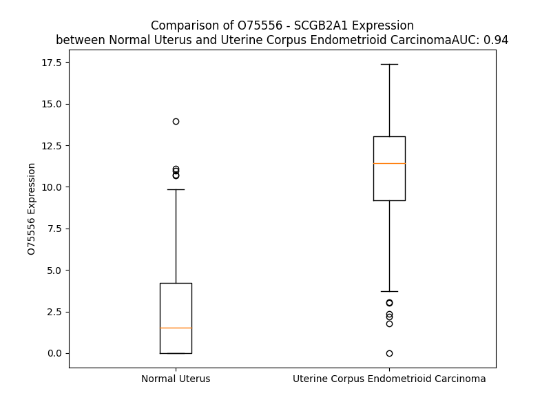

# Detailed Data for O75556

## Introduction to the Detailed Summary

### How to Interpret the Results

- **Summary & Metrics**: This section provides a quick reference to essential protein attributes, including expression changes, family classification, and biomarker applications. Regulation status (upregulated/downregulated) indicates the protein's behavior in a disease context. Some information comes from the original excel file with the proteins selected from literature, while others are derived from the analyses.
- **Expression Comparison**: A visual representation comparing protein expression between normal and disease states. It highlights significant changes in expression levels that might indicate diagnostic or therapeutic relevance. This is data coming from transcriptomics experiments and could not translate similarly to protein levels.
- **Isoform Alignment**: An interactive view of isoform alignments, revealing structural and functional differences between variants of the protein.
- **Interactors & Homologs**: Tables listing known interaction partners and homologous proteins, the more interactors and homologs, the more complex the protein is to design an antibody for.
- **Biological Assemblies**: Information about the structural arrangement of the protein in different assemblies, providing insights into its functional state but also the complexity of the protein to develop antibodies.
- **Combined Per-Residue Information**: A detailed table summarizing residue-level data. This includes predictions for epitope regions, aggregation tendencies, and modifications that might impact the protein's function. Each row corresponds to a residue in the protein, providing insights into specific sites that may be important for research or drug development.
## Summary & Metrics

- **UniProt Accession**: O75556
- **Gene Name**: SCGB2A1 /MGB2
- **Protein Name**: Mammaglobin-B
- **Swiss Prot**: SG2A1_HUMAN
- **Family**: other
- **Biomarker Application**: diagnosis
- **Number of Isoforms**: 0
- **Regulation**: 1
- **(transcriptomics) AUC**: 0.94
- **(transcriptomics) Fold Change**: 4.01
- **(transcriptomics) Regulation**: Upregulated
- **Discotope Epitope Count**: 20
- **Max n_uniprots (Homo)**: N/A
- **Max n_uniprots (Hetero)**: N/A

## Expression Comparison

## Interactors

| preferredName_A   | preferredName_B   |   score |
|:------------------|:------------------|--------:|
| SCGB2A1           | SCGB1D2           |   0.93  |
| SCGB2A1           | SCGB1D1           |   0.927 |

## Homologs

| uniprot_id   | gene_id   |
|:-------------|:----------|
| Q6NX70       | SCGB2A2   |

## Combined Per-Residue Information

|   res | aa   |   epitope_score | epitope   |   relative_surface_accessibility |   modeling_confidence |   Aggregation | modification   | glycosylation                   |
|------:|:-----|----------------:|:----------|---------------------------------:|----------------------:|--------------:|:---------------|:--------------------------------|
|     1 | M    |         0.1974  | False     |                          1.07788 |                 69.35 |         0     | N/A            | N/A                             |
|     2 | K    |         0.26114 | False     |                          0.86793 |                 83.72 |         0.03  | N/A            | N/A                             |
|     3 | L    |         0.26051 | False     |                          0.84641 |                 87.32 |        66.43  | N/A            | N/A                             |
|     4 | L    |         0.18267 | False     |                          0.69763 |                 86.8  |        91.573 | N/A            | N/A                             |
|     5 | M    |         0.26442 | False     |                          0.65715 |                 85.86 |        95.791 | N/A            | N/A                             |
|     6 | V    |         0.17306 | False     |                          0.66065 |                 84.82 |        99.459 | N/A            | N/A                             |
|     7 | L    |         0.18546 | False     |                          0.67201 |                 85.09 |        99.769 | N/A            | N/A                             |
|     8 | M    |         0.12528 | False     |                          0.70013 |                 83.81 |        99.803 | N/A            | N/A                             |
|     9 | L    |         0.20025 | False     |                          0.65482 |                 81.09 |        99.816 | N/A            | N/A                             |
|    10 | A    |         0.15027 | False     |                          0.40493 |                 79.01 |        99.604 | N/A            | N/A                             |
|    11 | A    |         0.14199 | False     |                          0.39665 |                 76.5  |        99.399 | N/A            | N/A                             |
|    12 | L    |         0.22285 | False     |                          0.68116 |                 67.48 |        99.225 | N/A            | N/A                             |
|    13 | L    |         0.22931 | False     |                          0.7903  |                 66.2  |        98.264 | N/A            | N/A                             |
|    14 | L    |         0.19057 | False     |                          0.74565 |                 62.86 |        93.004 | N/A            | N/A                             |
|    15 | H    |         0.12229 | False     |                          0.73581 |                 58.26 |        61.085 | N/A            | N/A                             |
|    16 | C    |         0.25437 | False     |                          0.72292 |                 56.95 |        60.846 | N/A            | N/A                             |
|    17 | Y    |         0.29621 | False     |                          0.64528 |                 59.82 |        59.57  | N/A            | N/A                             |
|    18 | A    |         0.18266 | False     |                          0.75358 |                 53.03 |        27.324 | N/A            | N/A                             |
|    19 | D    |         0.37932 | False     |                          0.66018 |                 52.45 |         0.03  | N/A            | N/A                             |
|    20 | S    |         0.19816 | False     |                          0.29505 |                 54.88 |         0     | N/A            | N/A                             |
|    21 | G    |         0.27684 | False     |                          0.69227 |                 62.17 |         0     | N/A            | N/A                             |
|    22 | C    |         0.2983  | False     |                          0.26177 |                 74.06 |         0     | N/A            | N/A                             |
|    23 | K    |         0.32759 | False     |                          0.56964 |                 80.32 |         0     | N/A            | N/A                             |
|    24 | L    |         0.45458 | False     |                          0.51371 |                 84.04 |         0     | N/A            | N/A                             |
|    25 | L    |         0.41279 | False     |                          0.48037 |                 87.06 |         0     | N/A            | N/A                             |
|    26 | E    |         0.43439 | False     |                          0.31151 |                 88.26 |         0     | N/A            | N/A                             |
|    27 | D    |         0.401   | False     |                          0.33003 |                 90.51 |         0     | N/A            | N/A                             |
|    28 | M    |         0.38819 | False     |                          0.21828 |                 93.17 |         0     | N/A            | N/A                             |
|    29 | V    |         0.17059 | False     |                          0.11602 |                 95.25 |         0     | N/A            | N/A                             |
|    30 | E    |         0.4602  | False     |                          0.58593 |                 95.85 |         0     | N/A            | N/A                             |
|    31 | K    |         0.29043 | False     |                          0.27077 |                 96.72 |         0     | N/A            | N/A                             |
|    32 | T    |         0.10731 | False     |                          0.06448 |                 97.77 |         0     | N/A            | N/A                             |
|    33 | I    |         0.29765 | False     |                          0.22767 |                 98.02 |         0     | N/A            | N/A                             |
|    34 | N    |         0.36015 | False     |                          0.34944 |                 97.96 |         0     | N/A            | N/A                             |
|    35 | S    |         0.41334 | False     |                          0.56763 |                 96.85 |         0     | N/A            | N/A                             |
|    36 | D    |         0.61019 | True      |                          0.78964 |                 97.64 |         0     | N/A            | N/A                             |
|    37 | I    |         0.29195 | False     |                          0.10851 |                 97.97 |         0     | N/A            | N/A                             |
|    38 | S    |         0.39816 | False     |                          0.41177 |                 98.16 |         0     | N/A            | N/A                             |
|    39 | I    |         0.42119 | False     |                          0.27762 |                 98.43 |         0     | N/A            | N/A                             |
|    40 | P    |         0.59104 | True      |                          0.73279 |                 98.18 |         0     | N/A            | N/A                             |
|    41 | E    |         0.54504 | True      |                          0.38443 |                 98.21 |         0     | N/A            | N/A                             |
|    42 | Y    |         0.04246 | False     |                          0.00926 |                 98.11 |         0     | N/A            | N/A                             |
|    43 | K    |         0.44288 | False     |                          0.28787 |                 97.9  |         0     | N/A            | N/A                             |
|    44 | E    |         0.64678 | True      |                          0.61105 |                 97.25 |         0     | N/A            | N/A                             |
|    45 | L    |         0.39509 | False     |                          0.44534 |                 95.57 |         0     | N/A            | N/A                             |
|    46 | L    |         0.10941 | False     |                          0.01237 |                 94.74 |         0     | N/A            | N/A                             |
|    47 | Q    |         0.51482 | True      |                          0.61004 |                 95.93 |         0     | N/A            | N/A                             |
|    48 | E    |         0.57592 | True      |                          0.64703 |                 93.99 |         0     | N/A            | N/A                             |
|    49 | F    |         0.46349 | False     |                          0.4328  |                 93.03 |         0     | N/A            | N/A                             |
|    50 | I    |         0.47279 | True      |                          0.20792 |                 96.16 |         0     | N/A            | N/A                             |
|    51 | D    |         0.66767 | True      |                          0.82674 |                 96.73 |         0     | N/A            | N/A                             |
|    52 | S    |         0.39091 | False     |                          0.40036 |                 97.81 |         0     | N/A            | N/A                             |
|    53 | D    |         0.4203  | False     |                          0.80865 |                 98.04 |         0     | N/A            | N/A                             |
|    54 | A    |         0.38334 | False     |                          0.70048 |                 98.26 |         0     | N/A            | N/A                             |
|    55 | A    |         0.40437 | False     |                          0.24545 |                 98.04 |         0     | N/A            | N/A                             |
|    56 | A    |         0.42246 | False     |                          0.23085 |                 98.21 |         0     | N/A            | N/A                             |
|    57 | E    |         0.49586 | True      |                          0.48322 |                 98.38 |         0     | N/A            | N/A                             |
|    58 | A    |         0.39017 | False     |                          0.5469  |                 98.13 |         0     | N/A            | N/A                             |
|    59 | M    |         0.29086 | False     |                          0.1912  |                 97.59 |         0     | N/A            | N/A                             |
|    60 | G    |         0.19465 | False     |                          0.06295 |                 98.3  |         0     | N/A            | N/A                             |
|    61 | K    |         0.58123 | True      |                          0.62431 |                 98.44 |         0     | N/A            | N/A                             |
|    62 | F    |         0.49166 | True      |                          0.49696 |                 97.86 |         0     | N/A            | N/A                             |
|    63 | K    |         0.0255  | False     |                          0.00113 |                 98.32 |         0     | N/A            | N/A                             |
|    64 | Q    |         0.52233 | True      |                          0.3669  |                 98.56 |         0     | N/A            | N/A                             |
|    65 | C    |         0.44531 | False     |                          0.53095 |                 98.11 |         0     | N/A            | N/A                             |
|    66 | F    |         0.31339 | False     |                          0.12709 |                 98.25 |         0     | N/A            | N/A                             |
|    67 | L    |         0.39625 | False     |                          0.3749  |                 98.34 |         0     | N/A            | N/A                             |
|    68 | N    |         0.43446 | False     |                          0.69201 |                 98.34 |         0     | N/A            | N-linked (GlcNAc...) asparagine |
|    69 | Q    |         0.28782 | False     |                          0.39709 |                 98.38 |         0     | N/A            | N/A                             |
|    70 | S    |         0.47089 | True      |                          0.46477 |                 98.07 |         0     | N/A            | N/A                             |
|    71 | H    |         0.33964 | False     |                          0.79308 |                 97.89 |         0     | N/A            | N/A                             |
|    72 | R    |         0.56687 | True      |                          0.74209 |                 98.28 |         0     | N/A            | N/A                             |
|    73 | T    |         0.51747 | True      |                          0.41237 |                 98.32 |         0     | N/A            | N/A                             |
|    74 | L    |         0.22585 | False     |                          0.10044 |                 98.31 |         0     | N/A            | N/A                             |
|    75 | K    |         0.53008 | True      |                          0.68199 |                 97.68 |         0     | N/A            | N/A                             |
|    76 | N    |         0.52884 | True      |                          0.53018 |                 98.34 |         0     | N/A            | N/A                             |
|    77 | F    |         0.3186  | False     |                          0.28838 |                 97.89 |         0.812 | N/A            | N/A                             |
|    78 | G    |         0.18126 | False     |                          0.06692 |                 95.91 |         0.812 | N/A            | N/A                             |
|    79 | L    |         0.50053 | True      |                          0.70909 |                 95.89 |         0.812 | N/A            | N/A                             |
|    80 | M    |         0.53551 | True      |                          0.51048 |                 96.17 |         0.812 | N/A            | N/A                             |
|    81 | M    |         0.21088 | False     |                          0.158   |                 93.44 |         0.812 | N/A            | N/A                             |
|    82 | H    |         0.58489 | True      |                          0.54448 |                 89.16 |         0.635 | N/A            | N/A                             |
|    83 | T    |         0.33094 | False     |                          0.61676 |                 90.1  |         0.635 | N/A            | N/A                             |
|    84 | V    |         0.37215 | False     |                          0.47794 |                 87.84 |         0.635 | N/A            | N/A                             |
|    85 | Y    |         0.18468 | False     |                          0.05315 |                 82.38 |         0.635 | N/A            | N/A                             |
|    86 | D    |         0.46488 | False     |                          0.69029 |                 81.32 |         0     | N/A            | N/A                             |
|    87 | S    |         0.28356 | False     |                          0.23395 |                 82.74 |         0     | N/A            | N/A                             |
|    88 | I    |         0.30267 | False     |                          0.6377  |                 79.62 |         0.304 | N/A            | N/A                             |
|    89 | W    |         0.30099 | False     |                          0.83197 |                 78.72 |         0.304 | N/A            | N/A                             |
|    90 | C    |         0.17064 | False     |                          0.27825 |                 74.57 |         0.304 | N/A            | N/A                             |
|    91 | N    |         0.30946 | False     |                          0.54144 |                 66.94 |         0.304 | N/A            | N/A                             |
|    92 | M    |         0.24581 | False     |                          0.56689 |                 55.01 |         0.304 | N/A            | N/A                             |
|    93 | K    |         0.24562 | False     |                          0.9062  |                 51.66 |         0     | N/A            | N/A                             |
|    94 | S    |         0.20626 | False     |                          0.42263 |                 51.83 |         0     | N/A            | N/A                             |
|    95 | N    |         0.16831 | False     |                          1.03185 |                 44.37 |         0     | N/A            | N/A                             |

