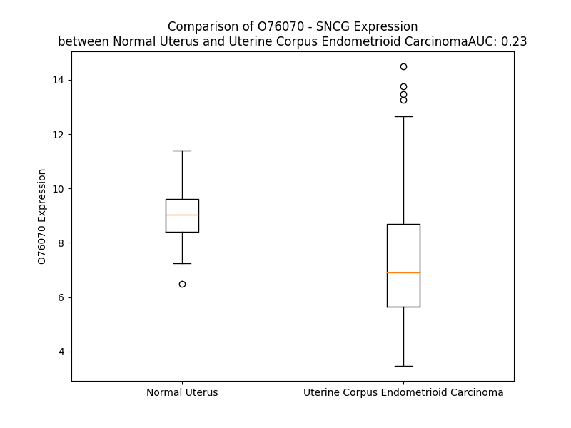

# Detailed Data for O76070

## Introduction to the Detailed Summary

### How to Interpret the Results

- **Summary & Metrics**: This section provides a quick reference to essential protein attributes, including expression changes, family classification, and biomarker applications. Regulation status (upregulated/downregulated) indicates the protein's behavior in a disease context. Some information comes from the original excel file with the proteins selected from literature, while others are derived from the analyses.
- **Expression Comparison**: A visual representation comparing protein expression between normal and disease states. It highlights significant changes in expression levels that might indicate diagnostic or therapeutic relevance. This is data coming from transcriptomics experiments and could not translate similarly to protein levels.
- **Isoform Alignment**: An interactive view of isoform alignments, revealing structural and functional differences between variants of the protein.
- **Interactors & Homologs**: Tables listing known interaction partners and homologous proteins, the more interactors and homologs, the more complex the protein is to design an antibody for.
- **Biological Assemblies**: Information about the structural arrangement of the protein in different assemblies, providing insights into its functional state but also the complexity of the protein to develop antibodies.
- **Combined Per-Residue Information**: A detailed table summarizing residue-level data. This includes predictions for epitope regions, aggregation tendencies, and modifications that might impact the protein's function. Each row corresponds to a residue in the protein, providing insights into specific sites that may be important for research or drug development.
## Summary & Metrics

- **UniProt Accession**: O76070
- **Gene Name**: SNCG
- **Protein Name**: Gamma-synuclein
- **Swiss Prot**: SYUG_HUMAN
- **Family**: other
- **Biomarker Application**: unspecified application
- **Number of Isoforms**: 0
- **Regulation**: 2
- **(transcriptomics) AUC**: 0.23
- **(transcriptomics) Fold Change**: 1.23
- **(transcriptomics) Regulation**: Downregulated
- **Discotope Epitope Count**: 16
- **Max n_uniprots (Homo)**: N/A
- **Max n_uniprots (Hetero)**: N/A

## Expression Comparison

## Interactors

| preferredName_A   | preferredName_B   | score   |
|-------------------|-------------------|---------|

## Homologs

| uniprot_id   | gene_id   |
|:-------------|:----------|
| D6RA31       | SNCA      |
| Q16143       | SNCB      |

## Combined Per-Residue Information

|   res | aa   |   epitope_score | epitope   |   relative_surface_accessibility |   modeling_confidence |   Aggregation | modification                           |
|------:|:-----|----------------:|:----------|---------------------------------:|----------------------:|--------------:|:---------------------------------------|
|     1 | M    |         0.24566 | False     |                          0.98448 |                 76    |         0     | N/A                                    |
|     2 | D    |         0.33285 | False     |                          0.65252 |                 83.49 |         0     | N/A                                    |
|     3 | V    |         0.2244  | False     |                          0.9042  |                 82.87 |         0     | N/A                                    |
|     4 | F    |         0.2592  | False     |                          0.86774 |                 82.84 |         0     | N/A                                    |
|     5 | K    |         0.16627 | False     |                          0.6468  |                 84.76 |         0     | N/A                                    |
|     6 | K    |         0.18378 | False     |                          0.70928 |                 82.48 |         0     | N/A                                    |
|     7 | G    |         0.20043 | False     |                          0.45167 |                 85.69 |         0     | N/A                                    |
|     8 | F    |         0.15323 | False     |                          0.73243 |                 87.45 |         0     | N/A                                    |
|     9 | S    |         0.13262 | False     |                          0.43536 |                 87.42 |         0     | N/A                                    |
|    10 | I    |         0.13357 | False     |                          0.65135 |                 84.81 |         0     | N/A                                    |
|    11 | A    |         0.15611 | False     |                          0.5565  |                 85.33 |         0     | N/A                                    |
|    12 | K    |         0.1925  | False     |                          0.62243 |                 87.42 |         0     | N/A                                    |
|    13 | E    |         0.1444  | False     |                          0.64325 |                 84.9  |         0     | N/A                                    |
|    14 | G    |         0.18714 | False     |                          0.53145 |                 87.16 |         4.73  | N/A                                    |
|    15 | V    |         0.13383 | False     |                          0.68278 |                 88.48 |        11.817 | N/A                                    |
|    16 | V    |         0.15594 | False     |                          0.59711 |                 89.22 |        11.817 | N/A                                    |
|    17 | G    |         0.22857 | False     |                          0.35249 |                 87.96 |        11.817 | N/A                                    |
|    18 | A    |         0.11445 | False     |                          0.54664 |                 86.44 |        11.817 | N/A                                    |
|    19 | V    |         0.22616 | False     |                          0.67195 |                 89.78 |        11.817 | N/A                                    |
|    20 | E    |         0.12352 | False     |                          0.50803 |                 87.7  |         0     | N/A                                    |
|    21 | K    |         0.20273 | False     |                          0.76914 |                 90.51 |         0     | N/A                                    |
|    22 | T    |         0.1497  | False     |                          0.59703 |                 89.47 |         0     | N/A                                    |
|    23 | K    |         0.22479 | False     |                          0.72746 |                 89.55 |         0     | N/A                                    |
|    24 | Q    |         0.22054 | False     |                          0.54525 |                 89.36 |         0     | N/A                                    |
|    25 | G    |         0.17188 | False     |                          0.4415  |                 87.91 |         0     | N/A                                    |
|    26 | V    |         0.12415 | False     |                          0.69546 |                 90.63 |         0     | N/A                                    |
|    27 | T    |         0.09767 | False     |                          0.49449 |                 89.61 |         0     | N/A                                    |
|    28 | E    |         0.13618 | False     |                          0.52408 |                 87.34 |         0     | N/A                                    |
|    29 | A    |         0.12501 | False     |                          0.54605 |                 88.43 |         0     | N/A                                    |
|    30 | A    |         0.13486 | False     |                          0.57104 |                 89.41 |         0     | N/A                                    |
|    31 | E    |         0.15632 | False     |                          0.54775 |                 91.02 |         0     | N/A                                    |
|    32 | K    |         0.15657 | False     |                          0.73326 |                 92.55 |         0     | N/A                                    |
|    33 | T    |         0.15313 | False     |                          0.6135  |                 89.51 |         0     | N/A                                    |
|    34 | K    |         0.20584 | False     |                          0.70882 |                 90.78 |         0     | N/A                                    |
|    35 | E    |         0.10074 | False     |                          0.63807 |                 87.88 |         0     | N/A                                    |
|    36 | G    |         0.12107 | False     |                          0.38897 |                 90.83 |         7.209 | N/A                                    |
|    37 | V    |         0.0994  | False     |                          0.72751 |                 90.71 |        19.782 | N/A                                    |
|    38 | M    |         0.12371 | False     |                          0.69332 |                 91.71 |        19.782 | N/A                                    |
|    39 | Y    |         0.12486 | False     |                          0.60122 |                 90.07 |        19.782 | N/A                                    |
|    40 | V    |         0.12019 | False     |                          0.65478 |                 87.58 |        19.782 | N/A                                    |
|    41 | G    |         0.18924 | False     |                          0.34993 |                 88.3  |        12.984 | N/A                                    |
|    42 | A    |         0.10073 | False     |                          0.58815 |                 86.23 |         5.949 | N/A                                    |
|    43 | K    |         0.10316 | False     |                          0.4865  |                 86.05 |         0     | N/A                                    |
|    44 | T    |         0.09353 | False     |                          0.47459 |                 83.4  |         0     | N/A                                    |
|    45 | K    |         0.13535 | False     |                          0.74148 |                 83.07 |         0     | N/A                                    |
|    46 | E    |         0.09869 | False     |                          0.52323 |                 80.2  |         0     | N/A                                    |
|    47 | N    |         0.12692 | False     |                          0.48944 |                 83.58 |         0     | N/A                                    |
|    48 | V    |         0.10621 | False     |                          0.54934 |                 84.38 |         0.547 | N/A                                    |
|    49 | V    |         0.06114 | False     |                          0.68831 |                 83.21 |         0.547 | N/A                                    |
|    50 | Q    |         0.09988 | False     |                          0.52449 |                 83.59 |         0.547 | N/A                                    |
|    51 | S    |         0.08922 | False     |                          0.43236 |                 82.97 |         0.733 | N/A                                    |
|    52 | V    |         0.09846 | False     |                          0.68122 |                 83.43 |         2.231 | N/A                                    |
|    53 | T    |         0.10379 | False     |                          0.48702 |                 83.69 |         2.049 | N/A                                    |
|    54 | S    |         0.11434 | False     |                          0.32354 |                 83.12 |         2.049 | N/A                                    |
|    55 | V    |         0.11881 | False     |                          0.66881 |                 82.06 |         2.049 | N/A                                    |
|    56 | A    |         0.13083 | False     |                          0.56166 |                 80.82 |         2.049 | N/A                                    |
|    57 | E    |         0.11731 | False     |                          0.52028 |                 85.53 |         0     | N/A                                    |
|    58 | K    |         0.10969 | False     |                          0.6111  |                 88.02 |         0     | N/A                                    |
|    59 | T    |         0.07511 | False     |                          0.55934 |                 88.94 |         0     | N/A                                    |
|    60 | K    |         0.10386 | False     |                          0.70477 |                 88.59 |         0     | N/A                                    |
|    61 | E    |         0.12159 | False     |                          0.61883 |                 86.97 |         0     | N/A                                    |
|    62 | Q    |         0.16757 | False     |                          0.618   |                 86.15 |         0     | N/A                                    |
|    63 | A    |         0.11586 | False     |                          0.55596 |                 89.35 |         0     | N/A                                    |
|    64 | N    |         0.14934 | False     |                          0.52051 |                 91.87 |         0     | N/A                                    |
|    65 | A    |         0.14967 | False     |                          0.58556 |                 91.22 |         0     | N/A                                    |
|    66 | V    |         0.13653 | False     |                          0.66931 |                 90.72 |         0     | N/A                                    |
|    67 | S    |         0.07806 | False     |                          0.43435 |                 92.13 |         0     | Phosphoserine                          |
|    68 | E    |         0.12293 | False     |                          0.64315 |                 92.59 |         0     | N/A                                    |
|    69 | A    |         0.12811 | False     |                          0.5512  |                 91.78 |         1.956 | N/A                                    |
|    70 | V    |         0.12344 | False     |                          0.57301 |                 94.42 |         4.266 | N/A                                    |
|    71 | V    |         0.11839 | False     |                          0.728   |                 94.25 |         4.266 | N/A                                    |
|    72 | S    |         0.17256 | False     |                          0.47667 |                 92.83 |         4.266 | Phosphoserine                          |
|    73 | S    |         0.19334 | False     |                          0.43613 |                 91.93 |         4.266 | N/A                                    |
|    74 | V    |         0.10307 | False     |                          0.65995 |                 94.76 |         4.266 | N/A                                    |
|    75 | N    |         0.18986 | False     |                          0.61396 |                 94.53 |         3.2   | N/A                                    |
|    76 | T    |         0.15308 | False     |                          0.45592 |                 92.65 |         3.2   | N/A                                    |
|    77 | V    |         0.14017 | False     |                          0.68831 |                 92.15 |         3.2   | N/A                                    |
|    78 | A    |         0.11051 | False     |                          0.51004 |                 91.12 |         2.909 | N/A                                    |
|    79 | T    |         0.13464 | False     |                          0.47728 |                 93.16 |         1.082 | N/A                                    |
|    80 | K    |         0.26866 | False     |                          0.6271  |                 93.11 |         0     | N/A                                    |
|    81 | T    |         0.25136 | False     |                          0.5783  |                 90.17 |         0     | N/A                                    |
|    82 | V    |         0.08948 | False     |                          0.5998  |                 89.19 |         0     | N/A                                    |
|    83 | E    |         0.17698 | False     |                          0.52435 |                 87.3  |         0     | N/A                                    |
|    84 | E    |         0.17466 | False     |                          0.57319 |                 87.23 |         0     | N/A                                    |
|    85 | A    |         0.13726 | False     |                          0.53507 |                 83.3  |         0     | N/A                                    |
|    86 | E    |         0.21615 | False     |                          0.48979 |                 84.49 |         0     | N/A                                    |
|    87 | N    |         0.25048 | False     |                          0.56033 |                 85.77 |         0.23  | N/A                                    |
|    88 | I    |         0.26805 | False     |                          0.60157 |                 83.22 |         7.694 | N/A                                    |
|    89 | A    |         0.20454 | False     |                          0.2396  |                 77.11 |         7.694 | N/A                                    |
|    90 | V    |         0.23237 | False     |                          0.28786 |                 79.76 |         7.694 | N/A                                    |
|    91 | T    |         0.35216 | False     |                          0.72606 |                 79.72 |         7.694 | N/A                                    |
|    92 | S    |         0.33527 | False     |                          0.57071 |                 79.83 |         7.694 | N/A                                    |
|    93 | G    |         0.31112 | False     |                          0.60579 |                 73.9  |         7.517 | N/A                                    |
|    94 | V    |         0.3276  | False     |                          0.87291 |                 72.77 |         7.517 | N/A                                    |
|    95 | V    |         0.25049 | False     |                          0.31795 |                 68.53 |         6.13  | N/A                                    |
|    96 | R    |         0.38882 | True      |                          0.68687 |                 68.37 |         0     | N/A                                    |
|    97 | K    |         0.41652 | True      |                          0.82531 |                 62.96 |         0     | N/A                                    |
|    98 | E    |         0.28244 | False     |                          0.57555 |                 62.78 |         0     | N/A                                    |
|    99 | D    |         0.44075 | True      |                          0.60148 |                 61.78 |         0     | N/A                                    |
|   100 | L    |         0.36651 | False     |                          0.54331 |                 59.01 |         0     | N/A                                    |
|   101 | R    |         0.33215 | False     |                          0.64464 |                 50.69 |         0     | N/A                                    |
|   102 | P    |         0.3568  | False     |                          0.88797 |                 55.77 |         0     | N/A                                    |
|   103 | S    |         0.29461 | False     |                          0.74127 |                 53.08 |         0     | N/A                                    |
|   104 | A    |         0.25115 | False     |                          0.70083 |                 46.54 |         0     | N/A                                    |
|   105 | P    |         0.37412 | True      |                          0.87021 |                 47.64 |         0     | N/A                                    |
|   106 | Q    |         0.35509 | False     |                          0.83327 |                 45.58 |         0     | N/A                                    |
|   107 | Q    |         0.3468  | False     |                          0.83522 |                 45.39 |         0     | N/A                                    |
|   108 | E    |         0.41014 | True      |                          0.87959 |                 43.62 |         0     | N/A                                    |
|   109 | G    |         0.36303 | False     |                          0.6961  |                 44.92 |         0     | N/A                                    |
|   110 | E    |         0.40088 | True      |                          0.82469 |                 47.04 |         0     | N/A                                    |
|   111 | A    |         0.2852  | False     |                          0.82282 |                 46.57 |         0     | N/A                                    |
|   112 | S    |         0.34515 | False     |                          0.78407 |                 45.87 |         0     | N/A                                    |
|   113 | K    |         0.40641 | True      |                          0.90382 |                 47.58 |         0     | N/A                                    |
|   114 | E    |         0.42665 | True      |                          0.76856 |                 45.62 |         0     | N/A                                    |
|   115 | K    |         0.48149 | True      |                          0.93165 |                 44.56 |         0     | N/A                                    |
|   116 | E    |         0.47405 | True      |                          0.80391 |                 48.29 |         0     | N/A                                    |
|   117 | E    |         0.39221 | True      |                          0.79689 |                 46.96 |         0     | N/A                                    |
|   118 | V    |         0.37064 | True      |                          0.91457 |                 49.39 |         0     | N/A                                    |
|   119 | A    |         0.29012 | False     |                          0.75949 |                 49.57 |         0     | N/A                                    |
|   120 | E    |         0.39601 | True      |                          0.77993 |                 51.39 |         0     | N/A                                    |
|   121 | E    |         0.42562 | True      |                          0.82874 |                 49.2  |         0     | N/A                                    |
|   122 | A    |         0.40708 | True      |                          0.88378 |                 51.6  |         0     | N/A                                    |
|   123 | Q    |         0.44055 | True      |                          0.88795 |                 54.1  |         0     | N/A                                    |
|   124 | S    |         0.27645 | False     |                          0.78091 |                 48.39 |         0     | Phosphoserine; by BARK1, CaMK2 and CK2 |
|   125 | G    |         0.35496 | False     |                          1.01445 |                 46.08 |         0     | N/A                                    |
|   126 | G    |         0.18122 | False     |                          0.99105 |                 54    |         0     | N/A                                    |
|   127 | D    |         0.23045 | False     |                          1.33357 |                 51.14 |         0     | N/A                                    |

