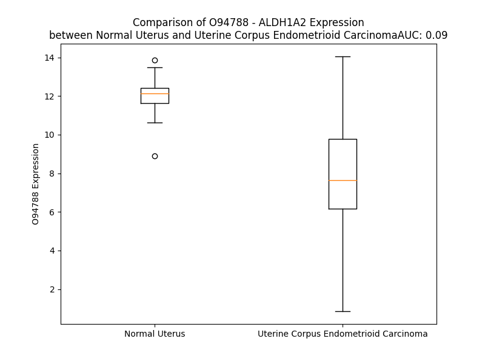

# Detailed Data for O94788

## Introduction to the Detailed Summary

### How to Interpret the Results

- **Summary & Metrics**: This section provides a quick reference to essential protein attributes, including expression changes, family classification, and biomarker applications. Regulation status (upregulated/downregulated) indicates the protein's behavior in a disease context. Some information comes from the original excel file with the proteins selected from literature, while others are derived from the analyses.
- **Expression Comparison**: A visual representation comparing protein expression between normal and disease states. It highlights significant changes in expression levels that might indicate diagnostic or therapeutic relevance. This is data coming from transcriptomics experiments and could not translate similarly to protein levels.
- **Isoform Alignment**: An interactive view of isoform alignments, revealing structural and functional differences between variants of the protein.
- **Interactors & Homologs**: Tables listing known interaction partners and homologous proteins, the more interactors and homologs, the more complex the protein is to design an antibody for.
- **Biological Assemblies**: Information about the structural arrangement of the protein in different assemblies, providing insights into its functional state but also the complexity of the protein to develop antibodies.
- **Combined Per-Residue Information**: A detailed table summarizing residue-level data. This includes predictions for epitope regions, aggregation tendencies, and modifications that might impact the protein's function. Each row corresponds to a residue in the protein, providing insights into specific sites that may be important for research or drug development.
## Summary & Metrics

- **UniProt Accession**: O94788
- **Gene Name**: ALDH1A2
- **Protein Name**: aldehyde dehydrogenase 1 family, member A2
- **Swiss Prot**: AL1A2_HUMAN
- **Family**: enzyme
- **Biomarker Application**:  
- **Number of Isoforms**: 4
- **Regulation**: 2
- **(transcriptomics) AUC**: 0.09
- **(transcriptomics) Fold Change**: 1.51
- **(transcriptomics) Regulation**: Downregulated
- **Discotope Epitope Count**: 88
- **Max n_uniprots (Homo)**: 4
- **Max n_uniprots (Hetero)**: N/A

## Expression Comparison

## Isoform Alignment

<pre style='font-size:14px; font-family:monospace;'>O94788-1 MTSSKIEMPGEVKADPAALMASLHLLPSPTPNLEIKYTKIFINNEWQNSESGRVFPVYNPATGEQVCEVQEADKADIDKAVQAARLAFSLGSVWRRMDASERGRLLDKLADLVERDRAVLATMESLNGGKPFLQAFYVDLQGVIKTFRYYAGWADKIHGMTIPVDGDYFTFTRHEPIGVCGQIIPWNFPLLMFAWKIAPALCCGNTVVIKPAEQTPLSALYMGALIKEAGFPPGVINILPGYGPTAGAAIASHIGIDKIAFTGSTEVGKLIQEAAGRSNLKRVTLELGGKSPNIIFADADLDYAVEQAHQGVFFNQGQCCTAGSRIFVEESIYEEFVRRSVERAKRRVVGSPFDPTTEQGPQIDKKQYNKILELIQSGVAEGAKLECGGKGLGRKGFFIEPTVFSNVTDDMRIAKEEIFGPVQEILRFKTMDEVIERANNSDFGLVAAVFTNDINKALTVSSAMQAGTVWINCYNALNAQSPFGGFKMSGNGREMGEFGLREYSEVKTVTVKIPQKNS
O94788-2 MTSSKIEMPGEVKADPAALMASLHLLPSPTPNLEIKYTKIFINNEWQNSESGRVFPVYNPATGEQVCEVQEADKADIDKAVQAARLAFSLGSVWRRMDASERGRLLDKLADLVERDRAVLATMESLNGGKPFLQAFYVDLQGVIKTFRYYAGWADKIHGMTIPVDGDYFTFTRHEPIGVCGQIIPWNFPLLMFAWKIAPALCCGNTVVIKPAEQTPLSALYMGALIKE--------------------------------------VGKLIQEAAGRSNLKRVTLELGGKSPNIIFADADLDYAVEQAHQGVFFNQGQCCTAGSRIFVEESIYEEFVRRSVERAKRRVVGSPFDPTTEQGPQIDKKQYNKILELIQSGVAEGAKLECGGKGLGRKGFFIEPTVFSNVTDDMRIAKEEIFGPVQEILRFKTMDEVIERANNSDFGLVAAVFTNDINKALTVSSAMQAGTVWINCYNALNAQSPFGGFKMSGNGREMGEFGLREYSEVKTVTVKIPQKNS
O94788-3 ---------------------MKNQCETVWLKSPIKLKLIFINNEWQNSESGRVFPVYNPATGEQVCEVQEADKADIDKAVQAARLAFSLGSVWRRMDASERGRLLDKLADLVERDRAVLATMESLNGGKPFLQAFYVDLQGVIKTFRYYAGWADKIHGMTIPVDGDYFTFTRHEPIGVCGQIIPWNFPLLMFAWKIAPALCCGNTVVIKPAEQTPLSALYMGALIKEAGFPPGVINILPGYGPTAGAAIASHIGIDKIAFTGSTEVGKLIQEAAGRSNLKRVTLELGGKSPNIIFADADLDYAVEQAHQGVFFNQGQCCTAGSRIFVEESIYEEFVRRSVERAKRRVVGSPFDPTTEQGPQIDKKQYNKILELIQSGVAEGAKLECGGKGLGRKGFFIEPTVFSNVTDDMRIAKEEIFGPVQEILRFKTMDEVIERANNSDFGLVAAVFTNDINKALTVSSAMQAGTVWINCYNALNAQSPFGGFKMSGNGREMGEFGLREYSEVKTVTVKIPQKNS
O94788-4 ------------------------------------------------------------------------------------------------MDASERGRLLDKLADLVERDRAVLATMESLNGGKPFLQAFYVDLQGVIKTFRYYAGWADKIHGMTIPVDGDYFTFTRHEPIGVCGQIIPWNFPLLMFAWKIAPALCCGNTVVIKPAEQTPLSALYMGALIKEAGFPPGVINILPGYGPTAGAAIASHIGIDKIAFTGSTEVGKLIQEAAGRSNLKRVTLELGGKSPNIIFADADLDYAVEQAHQGVFFNQGQCCTAGSRIFVEESIYEEFVRRSVERAKRRVVGSPFDPTTEQGPQIDKKQYNKILELIQSGVAEGAKLECGGKGLGRKGFFIEPTVFSNVTDDMRIAKEEIFGPVQEILRFKTMDEVIERANNSDFGLVAAVFTNDINKALTVSSAMQAGTVWINCYNALNAQSPFGGFKMSGNGREMGEFGLREYSEVKTVTVKIPQKNS
</pre>

## Interactors

| preferredName_A   | preferredName_B   |   score |
|:------------------|:------------------|--------:|
| ALDH1A2           | CYP26A1           |   0.991 |
| ALDH1A2           | CYP26B1           |   0.988 |
| ALDH1A2           | CYP26C1           |   0.983 |
| ALDH1A2           | RDH10             |   0.977 |
| ALDH1A2           | RDH12             |   0.964 |
| ALDH1A2           | DHRS3             |   0.956 |
| ALDH1A2           | BCO1              |   0.95  |
| ALDH1A2           | RDH11             |   0.949 |
| ALDH1A2           | RDH5              |   0.944 |
| ALDH1A2           | RDH8              |   0.942 |
| ALDH1A2           | SDR16C5           |   0.942 |
| ALDH1A2           | AOX1              |   0.938 |
| ALDH1A2           | RDH16             |   0.937 |
| ALDH1A2           | DHRS4             |   0.932 |
| ALDH1A2           | DHRS9             |   0.93  |
| ALDH1A2           | CYP1A1            |   0.925 |
| ALDH1A2           | CYP3A7            |   0.923 |
| ALDH1A2           | CYP2S1            |   0.923 |
| ALDH1A2           | CYP3A4            |   0.923 |
| ALDH1A2           | CYP3A5            |   0.922 |
| ALDH1A2           | CYP4A22           |   0.921 |
| ALDH1A2           | CYP1A2            |   0.92  |
| ALDH1A2           | CYP4A11           |   0.919 |
| ALDH1A2           | ENSP00000480571   |   0.918 |
| ALDH1A2           | CYP2C8            |   0.917 |
| ALDH1A2           | CYP2B6            |   0.916 |
| ALDH1A2           | ALDH1A1           |   0.915 |
| ALDH1A2           | CYP2C9            |   0.914 |
| ALDH1A2           | CYP2C18           |   0.914 |
| ALDH1A2           | CYP2A6            |   0.914 |
| ALDH1A2           | HSD17B6           |   0.908 |
| ALDH1A2           | ALDH1A3           |   0.903 |

## Homologs

| uniprot_id   | gene_id   |
|:-------------|:----------|
| A0A0J9YWF7   | ALDH7A1   |
| A0A5F9ZI23   | ALDH5A1   |
| K7EN73       | ALDH3A2   |
| C9JY00       | ALDH1L1   |
| A0A087X192   | ALDH3B1   |
| G3V4Z4       | ALDH6A1   |
| I3L4E5       | ALDH3A1   |
| nan          | nan       |
| V9HW83       | HEL-S-53e |
| P30837       | ALDH1B1   |
| Q3SY69       | ALDH1L2   |
| Q9H2A2       | ALDH8A1   |
| P05091       | ALDH2     |
| H0YNQ3       | ALDH1A3   |
| P30038       | ALDH4A1   |
| E9PKY9       | ALDH3B2   |
| Q8IZ83       | ALDH16A1  |

## Biological Assemblies

|   Unnamed: 0 |   assembly |   n_uniprots | composition   | crystal_id   |
|-------------:|-----------:|-------------:|:--------------|:-------------|
|            0 |          1 |            4 | Homo          | 6b5i         |
|            0 |          1 |            4 | Homo          | 4x2q         |
|            0 |          1 |            4 | Homo          | 6b5g         |
|            0 |          1 |            4 | Homo          | 6b5h         |
|            0 |          1 |            4 | Homo          | 6alj         |

## Combined Per-Residue Information

|   res | aa   |   epitope_score | epitope   |   relative_surface_accessibility |   modeling_confidence |   Aggregation | modification    |
|------:|:-----|----------------:|:----------|---------------------------------:|----------------------:|--------------:|:----------------|
|     1 | M    |         0.11074 | False     |                          1.34269 |                 34.56 |         0     | N/A             |
|     2 | T    |         0.13575 | False     |                          0.98932 |                 34.34 |         0     | N/A             |
|     3 | S    |         0.137   | False     |                          0.85359 |                 30.02 |         0     | N/A             |
|     4 | S    |         0.12338 | False     |                          0.79601 |                 33.31 |         0     | N/A             |
|     5 | K    |         0.14105 | True      |                          0.93158 |                 32.45 |         0     | N/A             |
|     6 | I    |         0.13034 | False     |                          0.9786  |                 29.76 |         0     | N/A             |
|     7 | E    |         0.16243 | True      |                          0.81673 |                 28.03 |         0     | N/A             |
|     8 | M    |         0.15386 | True      |                          0.89691 |                 25.9  |         0     | N/A             |
|     9 | P    |         0.1526  | True      |                          0.88279 |                 32.16 |         0     | N/A             |
|    10 | G    |         0.13804 | False     |                          0.74602 |                 28.36 |         0     | N/A             |
|    11 | E    |         0.18006 | True      |                          0.85838 |                 27.88 |         0     | N/A             |
|    12 | V    |         0.13488 | False     |                          0.9212  |                 32.42 |         0     | N/A             |
|    13 | K    |         0.20276 | True      |                          0.91545 |                 33.04 |         0     | N/A             |
|    14 | A    |         0.12096 | False     |                          0.60044 |                 47.07 |         0     | N/A             |
|    15 | D    |         0.14775 | True      |                          0.48919 |                 53.68 |         0     | N/A             |
|    16 | P    |         0.16693 | True      |                          0.74242 |                 53.15 |         0     | N/A             |
|    17 | A    |         0.08989 | False     |                          0.64266 |                 52.02 |         0     | N/A             |
|    18 | A    |         0.13149 | False     |                          0.54709 |                 52.92 |         0.182 | N/A             |
|    19 | L    |         0.15963 | True      |                          0.63441 |                 50.37 |         0.398 | N/A             |
|    20 | M    |         0.16279 | True      |                          0.65539 |                 51.39 |         0.398 | N/A             |
|    21 | A    |         0.08919 | False     |                          0.6077  |                 52.77 |         0.398 | N/A             |
|    22 | S    |         0.10352 | False     |                          0.40161 |                 56.87 |         0.398 | N/A             |
|    23 | L    |         0.15644 | True      |                          0.38343 |                 58.14 |         0.398 | N/A             |
|    24 | H    |         0.23851 | True      |                          0.87728 |                 61.4  |         0     | N/A             |
|    25 | L    |         0.25176 | True      |                          0.94948 |                 77.25 |         0     | N/A             |
|    26 | L    |         0.17741 | True      |                          0.35101 |                 84.89 |         0     | N/A             |
|    27 | P    |         0.09512 | False     |                          0.22349 |                 92.01 |         0     | N/A             |
|    28 | S    |         0.15398 | True      |                          0.61995 |                 93.62 |         0     | N/A             |
|    29 | P    |         0.07134 | False     |                          0.30968 |                 96.46 |         0     | N/A             |
|    30 | T    |         0.11096 | False     |                          0.26104 |                 95.95 |         0     | N/A             |
|    31 | P    |         0.24561 | True      |                          0.82202 |                 90.38 |         0     | N/A             |
|    32 | N    |         0.15934 | True      |                          0.96976 |                 91.09 |         0     | N/A             |
|    33 | L    |         0.13814 | False     |                          0.20986 |                 96.09 |         0     | N/A             |
|    34 | E    |         0.1782  | True      |                          0.59952 |                 95.67 |         0     | N/A             |
|    35 | I    |         0.13577 | False     |                          0.20872 |                 98.1  |         0     | N/A             |
|    36 | K    |         0.1627  | True      |                          0.64022 |                 97.42 |         0     | N/A             |
|    37 | Y    |         0.13883 | False     |                          0.25564 |                 98.63 |         0     | N/A             |
|    38 | T    |         0.0901  | False     |                          0.24533 |                 98.72 |         0     | N/A             |
|    39 | K    |         0.12942 | False     |                          0.38366 |                 98.86 |         0     | N/A             |
|    40 | I    |         0.01033 | False     |                          0.0072  |                 98.84 |         0.384 | N/A             |
|    41 | F    |         0.0045  | False     |                          0       |                 98.94 |         0.384 | N/A             |
|    42 | I    |         0.04625 | False     |                          0.0304  |                 98.92 |         0.384 | N/A             |
|    43 | N    |         0.05625 | False     |                          0.34568 |                 98.79 |         0.384 | N/A             |
|    44 | N    |         0.04454 | False     |                          0.08473 |                 98.86 |         0.384 | N/A             |
|    45 | E    |         0.09613 | False     |                          0.5205  |                 98.86 |         0     | N/A             |
|    46 | W    |         0.08969 | False     |                          0.31902 |                 98.8  |         0     | N/A             |
|    47 | Q    |         0.08744 | False     |                          0.2781  |                 98.51 |         0     | N/A             |
|    48 | N    |         0.12462 | False     |                          0.51108 |                 98.62 |         0     | N/A             |
|    49 | S    |         0.033   | False     |                          0.04535 |                 98.35 |         0     | N/A             |
|    50 | E    |         0.14853 | True      |                          0.48669 |                 98.47 |         0     | N/A             |
|    51 | S    |         0.2454  | True      |                          0.40384 |                 97.81 |         0     | N/A             |
|    52 | G    |         0.14729 | True      |                          0.61651 |                 98.12 |         0     | N/A             |
|    53 | R    |         0.27633 | True      |                          0.44097 |                 98.6  |         0     | N/A             |
|    54 | V    |         0.14019 | False     |                          0.41501 |                 98.81 |         0     | N/A             |
|    55 | F    |         0.10193 | False     |                          0.01666 |                 98.78 |         0     | N/A             |
|    56 | P    |         0.11252 | False     |                          0.35264 |                 98.67 |         0     | N/A             |
|    57 | V    |         0.01038 | False     |                          0.00952 |                 98.71 |         0     | N/A             |
|    58 | Y    |         0.12156 | False     |                          0.47525 |                 98.59 |         0     | N/A             |
|    59 | N    |         0.0568  | False     |                          0.10244 |                 98.31 |         0     | N/A             |
|    60 | P    |         0.01106 | False     |                          0.00895 |                 98.56 |         0     | N/A             |
|    61 | A    |         0.08205 | False     |                          0.14479 |                 98.15 |         0     | N/A             |
|    62 | T    |         0.12143 | False     |                          0.35357 |                 96.85 |         0     | N/A             |
|    63 | G    |         0.19174 | True      |                          0.42854 |                 94.93 |         0     | N/A             |
|    64 | E    |         0.16822 | True      |                          0.47383 |                 96.61 |         0     | N/A             |
|    65 | Q    |         0.29428 | True      |                          0.45844 |                 97.99 |         0     | N/A             |
|    66 | V    |         0.17016 | True      |                          0.30399 |                 97.84 |         0     | N/A             |
|    67 | C    |         0.15215 | True      |                          0.18527 |                 98.56 |         0     | N/A             |
|    68 | E    |         0.15651 | True      |                          0.48035 |                 98.74 |         0     | N/A             |
|    69 | V    |         0.00617 | False     |                          0.00286 |                 98.85 |         0     | N/A             |
|    70 | Q    |         0.06377 | False     |                          0.10725 |                 98.83 |         0     | N/A             |
|    71 | E    |         0.04533 | False     |                          0.10177 |                 98.84 |         0     | N/A             |
|    72 | A    |         0.00168 | False     |                          0.00094 |                 98.82 |         0     | N/A             |
|    73 | D    |         0.07315 | False     |                          0.22464 |                 98.64 |         0     | N/A             |
|    74 | K    |         0.10331 | False     |                          0.63691 |                 98.78 |         0     | N/A             |
|    75 | A    |         0.07486 | False     |                          0.47518 |                 98.71 |         0     | N/A             |
|    76 | D    |         0.00678 | False     |                          0.00189 |                 98.89 |         0     | N/A             |
|    77 | I    |         0.00373 | False     |                          0       |                 98.9  |         0     | N/A             |
|    78 | D    |         0.08247 | False     |                          0.27604 |                 98.89 |         0     | N/A             |
|    79 | K    |         0.11876 | False     |                          0.41236 |                 98.85 |         0     | N/A             |
|    80 | A    |         0.0033  | False     |                          0       |                 98.94 |         0     | N/A             |
|    81 | V    |         0.01368 | False     |                          0.04094 |                 98.95 |         0     | N/A             |
|    82 | Q    |         0.10417 | False     |                          0.61941 |                 98.88 |         0     | N/A             |
|    83 | A    |         0.04956 | False     |                          0.05906 |                 98.93 |         0     | N/A             |
|    84 | A    |         0.00139 | False     |                          0       |                 98.94 |         0     | N/A             |
|    85 | R    |         0.13825 | False     |                          0.35502 |                 98.87 |         0     | N/A             |
|    86 | L    |         0.12861 | False     |                          0.77539 |                 98.79 |         0.791 | N/A             |
|    87 | A    |         0.02324 | False     |                          0.09603 |                 98.88 |         0.791 | N/A             |
|    88 | F    |         0.06672 | False     |                          0.10584 |                 98.89 |         0.791 | N/A             |
|    89 | S    |         0.08717 | False     |                          0.34984 |                 98.64 |         0.791 | N/A             |
|    90 | L    |         0.17718 | True      |                          0.99545 |                 98.35 |         0.791 | N/A             |
|    91 | G    |         0.15091 | True      |                          0.52997 |                 98.19 |         0     | N/A             |
|    92 | S    |         0.04149 | False     |                          0.18275 |                 98.77 |         0     | N/A             |
|    93 | V    |         0.11375 | False     |                          0.74445 |                 98.65 |         0     | N/A             |
|    94 | W    |         0.02507 | False     |                          0.01477 |                 98.82 |         0     | N/A             |
|    95 | R    |         0.12429 | False     |                          0.27968 |                 98.66 |         0     | N/A             |
|    96 | R    |         0.23738 | True      |                          0.76005 |                 98.71 |         0     | N/A             |
|    97 | M    |         0.10555 | False     |                          0.19193 |                 98.72 |         0     | N/A             |
|    98 | D    |         0.12528 | False     |                          0.62226 |                 98.84 |         0     | N/A             |
|    99 | A    |         0.06577 | False     |                          0.35306 |                 98.81 |         0     | N/A             |
|   100 | S    |         0.08775 | False     |                          0.48939 |                 98.84 |         0     | N/A             |
|   101 | E    |         0.11657 | False     |                          0.2799  |                 98.87 |         0     | N/A             |
|   102 | R    |         0.08094 | False     |                          0.12143 |                 98.87 |         0     | N/A             |
|   103 | G    |         0.03113 | False     |                          0.06302 |                 98.87 |         0     | N/A             |
|   104 | R    |         0.18799 | True      |                          0.52333 |                 98.9  |         0     | N/A             |
|   105 | L    |         0.04014 | False     |                          0.02473 |                 98.94 |         0     | N/A             |
|   106 | L    |         0.00278 | False     |                          0.00082 |                 98.94 |         0     | N/A             |
|   107 | D    |         0.05513 | False     |                          0.37767 |                 98.86 |         0     | N/A             |
|   108 | K    |         0.14981 | True      |                          0.39776 |                 98.92 |         0     | N/A             |
|   109 | L    |         0.00254 | False     |                          0       |                 98.94 |         0     | N/A             |
|   110 | A    |         0.00244 | False     |                          0       |                 98.92 |         0     | N/A             |
|   111 | D    |         0.1097  | False     |                          0.37765 |                 98.93 |         0     | N/A             |
|   112 | L    |         0.09353 | False     |                          0.04369 |                 98.93 |         0     | N/A             |
|   113 | V    |         0.002   | False     |                          0.00095 |                 98.89 |         0     | N/A             |
|   114 | E    |         0.12033 | False     |                          0.38465 |                 98.73 |         0     | N/A             |
|   115 | R    |         0.26063 | True      |                          0.54383 |                 98.59 |         0     | N/A             |
|   116 | D    |         0.04407 | False     |                          0.10447 |                 98.5  |         0     | N/A             |
|   117 | R    |         0.15166 | True      |                          0.12589 |                 98.56 |         0     | N/A             |
|   118 | A    |         0.05207 | False     |                          0.3331  |                 98.04 |         3.266 | N/A             |
|   119 | V    |         0.04736 | False     |                          0.25611 |                 98.55 |         8.86  | N/A             |
|   120 | L    |         0.00188 | False     |                          0       |                 98.82 |         8.86  | N/A             |
|   121 | A    |         0.00135 | False     |                          0       |                 98.77 |         8.86  | N/A             |
|   122 | T    |         0.04241 | False     |                          0.03808 |                 98.74 |         8.86  | N/A             |
|   123 | M    |         0.0189  | False     |                          0.01793 |                 98.66 |         7.318 | N/A             |
|   124 | E    |         0.00311 | False     |                          0.00265 |                 98.72 |         0     | N/A             |
|   125 | S    |         0.01366 | False     |                          0.00384 |                 98.73 |         0     | N/A             |
|   126 | L    |         0.04309 | False     |                          0.20114 |                 98.49 |         0     | N/A             |
|   127 | N    |         0.02952 | False     |                          0.01131 |                 98.39 |         0     | N/A             |
|   128 | G    |         0.04863 | False     |                          0.05962 |                 98.45 |         0     | N/A             |
|   129 | G    |         0.00397 | False     |                          0       |                 98.46 |         0     | N/A             |
|   130 | K    |         0.03584 | False     |                          0.01253 |                 98.47 |         0     | N/A             |
|   131 | P    |         0.01889 | False     |                          0.02286 |                 98.57 |         0.8   | N/A             |
|   132 | F    |         0.02444 | False     |                          0.02941 |                 98.64 |        66.461 | N/A             |
|   133 | L    |         0.12109 | False     |                          0.24854 |                 97.93 |        67.179 | N/A             |
|   134 | Q    |         0.09571 | False     |                          0.16992 |                 98.18 |        67.3   | N/A             |
|   135 | A    |         0.00273 | False     |                          0       |                 98.7  |        67.391 | N/A             |
|   136 | F    |         0.04936 | False     |                          0.15224 |                 98.61 |        67.499 | N/A             |
|   137 | Y    |         0.20274 | True      |                          0.47695 |                 98.13 |        67.293 | N/A             |
|   138 | V    |         0.1644  | True      |                          0.48875 |                 98.2  |        62.046 | N/A             |
|   139 | D    |         0.01557 | False     |                          0.00736 |                 98.67 |         0.286 | N/A             |
|   140 | L    |         0.00595 | False     |                          0       |                 98.82 |         0.431 | N/A             |
|   141 | Q    |         0.0847  | False     |                          0.30628 |                 98.48 |         0.431 | N/A             |
|   142 | G    |         0.03969 | False     |                          0.23374 |                 98.69 |         0.431 | N/A             |
|   143 | V    |         0.00588 | False     |                          0.00476 |                 98.91 |         0.431 | N/A             |
|   144 | I    |         0.04076 | False     |                          0.0224  |                 98.92 |         0.431 | N/A             |
|   145 | K    |         0.08332 | False     |                          0.56928 |                 98.87 |         0.286 | N/A             |
|   146 | T    |         0.01298 | False     |                          0.01398 |                 98.92 |         0.286 | N/A             |
|   147 | F    |         0.00384 | False     |                          0.00064 |                 98.91 |         0.286 | N/A             |
|   148 | R    |         0.16974 | True      |                          0.37336 |                 98.88 |         0     | N/A             |
|   149 | Y    |         0.08033 | False     |                          0.17864 |                 98.91 |         3.567 | N/A             |
|   150 | Y    |         0.00456 | False     |                          0.00226 |                 98.92 |         3.567 | N/A             |
|   151 | A    |         0.03455 | False     |                          0.11706 |                 98.91 |         3.567 | N/A             |
|   152 | G    |         0.10868 | False     |                          0.45163 |                 98.82 |         3.567 | N/A             |
|   153 | W    |         0.09011 | False     |                          0.24451 |                 98.89 |         3.567 | N/A             |
|   154 | A    |         0.01695 | False     |                          0.02174 |                 98.86 |         0.841 | N/A             |
|   155 | D    |         0.11491 | False     |                          0.42674 |                 98.75 |         0     | N/A             |
|   156 | K    |         0.16224 | True      |                          0.50157 |                 98.87 |         0     | N/A             |
|   157 | I    |         0.07754 | False     |                          0.24975 |                 98.56 |         0     | N/A             |
|   158 | H    |         0.13977 | False     |                          0.71788 |                 98.62 |         0     | N/A             |
|   159 | G    |         0.06966 | False     |                          0.38017 |                 98.1  |         0     | N/A             |
|   160 | M    |         0.12561 | False     |                          0.68364 |                 98.48 |         0     | N/A             |
|   161 | T    |         0.15542 | True      |                          0.73635 |                 98.73 |         0     | N/A             |
|   162 | I    |         0.15918 | True      |                          0.39471 |                 98.67 |         0     | N/A             |
|   163 | P    |         0.13672 | False     |                          0.91681 |                 98.16 |         0     | N/A             |
|   164 | V    |         0.11251 | False     |                          0.28404 |                 98.2  |         0     | N/A             |
|   165 | D    |         0.23604 | True      |                          0.81494 |                 98.59 |         0     | N/A             |
|   166 | G    |         0.10836 | False     |                          0.52455 |                 98.06 |         0     | N/A             |
|   167 | D    |         0.08904 | False     |                          0.29764 |                 98.65 |         0     | N/A             |
|   168 | Y    |         0.11576 | False     |                          0.38637 |                 98.72 |        23.776 | Phosphotyrosine |
|   169 | F    |         0.10924 | False     |                          0.46819 |                 98.71 |        23.776 | N/A             |
|   170 | T    |         0.01295 | False     |                          0.02286 |                 98.78 |        23.776 | N/A             |
|   171 | F    |         0.07282 | False     |                          0.28044 |                 98.83 |        23.776 | N/A             |
|   172 | T    |         0.02917 | False     |                          0.11423 |                 98.87 |        23.776 | N/A             |
|   173 | R    |         0.1545  | True      |                          0.47218 |                 98.74 |         0     | N/A             |
|   174 | H    |         0.05684 | False     |                          0.33528 |                 98.65 |         0     | N/A             |
|   175 | E    |         0.03623 | False     |                          0.15485 |                 98.74 |         0     | N/A             |
|   176 | P    |         0.02049 | False     |                          0.18265 |                 98.85 |         0     | N/A             |
|   177 | I    |         0.0576  | False     |                          0.12525 |                 98.85 |         0     | N/A             |
|   178 | G    |         0.00214 | False     |                          0       |                 98.87 |         0     | N/A             |
|   179 | V    |         0.00134 | False     |                          0       |                 98.96 |         0     | N/A             |
|   180 | C    |         0.00325 | False     |                          0       |                 98.98 |         0     | N/A             |
|   181 | G    |         0.00278 | False     |                          0       |                 98.95 |         0     | N/A             |
|   182 | Q    |         0.00361 | False     |                          0       |                 98.95 |         0     | N/A             |
|   183 | I    |         0.03056 | False     |                          0.0704  |                 98.95 |         0     | N/A             |
|   184 | I    |         0.03061 | False     |                          0.02545 |                 98.91 |         0     | N/A             |
|   185 | P    |         0.02914 | False     |                          0.1364  |                 98.82 |         0     | N/A             |
|   186 | W    |         0.09118 | False     |                          0.13966 |                 98.81 |         0     | N/A             |
|   187 | N    |         0.0384  | False     |                          0.06086 |                 98.67 |         0     | N/A             |
|   188 | F    |         0.0314  | False     |                          0.09491 |                 98.79 |         0     | N/A             |
|   189 | P    |         0.00288 | False     |                          0.00398 |                 98.88 |         0.497 | N/A             |
|   190 | L    |         0.00632 | False     |                          0.00552 |                 98.77 |        28.675 | N/A             |
|   191 | L    |         0.01869 | False     |                          0.11459 |                 98.78 |        32.83  | N/A             |
|   192 | M    |         0.01495 | False     |                          0.06772 |                 98.81 |        32.83  | N/A             |
|   193 | F    |         0.00359 | False     |                          0.00446 |                 98.87 |        32.83  | N/A             |
|   194 | A    |         0.00276 | False     |                          0       |                 98.9  |        32.612 | N/A             |
|   195 | W    |         0.0162  | False     |                          0.04659 |                 98.77 |        27.122 | N/A             |
|   196 | K    |         0.00203 | False     |                          0.00179 |                 98.83 |         0     | N/A             |
|   197 | I    |         0.00422 | False     |                          0       |                 98.83 |         0     | N/A             |
|   198 | A    |         0.00151 | False     |                          0       |                 98.9  |         0     | N/A             |
|   199 | P    |         0.00322 | False     |                          0.00596 |                 98.89 |         0     | N/A             |
|   200 | A    |         0.00086 | False     |                          0       |                 98.94 |         0     | N/A             |
|   201 | L    |         0.002   | False     |                          0.00082 |                 98.95 |         0     | N/A             |
|   202 | C    |         0.00111 | False     |                          0       |                 98.58 |         0     | N/A             |
|   203 | C    |         0.01617 | False     |                          0.06044 |                 98.88 |         0     | N/A             |
|   204 | G    |         0.01112 | False     |                          0.0494  |                 98.85 |         0     | N/A             |
|   205 | N    |         0.00395 | False     |                          0       |                 98.97 |         0.921 | N/A             |
|   206 | T    |         0.00183 | False     |                          0       |                 98.98 |         0.921 | N/A             |
|   207 | V    |         0.00288 | False     |                          0       |                 98.97 |         0.921 | N/A             |
|   208 | V    |         0.00237 | False     |                          0       |                 98.97 |         0.921 | N/A             |
|   209 | I    |         0.00773 | False     |                          0       |                 98.94 |         0.921 | N/A             |
|   210 | K    |         0.01976 | False     |                          0.01926 |                 98.89 |         0     | N/A             |
|   211 | P    |         0.00554 | False     |                          0.00372 |                 98.94 |         0     | N/A             |
|   212 | A    |         0.02989 | False     |                          0.0543  |                 98.77 |         0     | N/A             |
|   213 | E    |         0.06132 | False     |                          0.21746 |                 98.76 |         0     | N/A             |
|   214 | Q    |         0.05696 | False     |                          0.23094 |                 98.79 |         0     | N/A             |
|   215 | T    |         0.00688 | False     |                          0.00476 |                 98.84 |         0     | N/A             |
|   216 | P    |         0.00399 | False     |                          0       |                 98.86 |         0     | N/A             |
|   217 | L    |         0.01236 | False     |                          0.00896 |                 98.89 |         7.294 | N/A             |
|   218 | S    |         0.00476 | False     |                          0.00657 |                 98.79 |         8.548 | N/A             |
|   219 | A    |         0.00134 | False     |                          0       |                 98.85 |        18.013 | N/A             |
|   220 | L    |         0.00457 | False     |                          0       |                 98.91 |        29.206 | N/A             |
|   221 | Y    |         0.02694 | False     |                          0.12814 |                 98.87 |        31.233 | N/A             |
|   222 | M    |         0.00382 | False     |                          0.00288 |                 98.82 |        31.371 | N/A             |
|   223 | G    |         0.00515 | False     |                          0       |                 98.85 |        30.764 | N/A             |
|   224 | A    |         0.06878 | False     |                          0.16868 |                 98.81 |        30.764 | N/A             |
|   225 | L    |         0.02854 | False     |                          0.02143 |                 98.91 |        30.764 | N/A             |
|   226 | I    |         0.00663 | False     |                          0       |                 98.91 |        30.514 | N/A             |
|   227 | K    |         0.10105 | False     |                          0.50799 |                 98.85 |         0     | N/A             |
|   228 | E    |         0.16389 | True      |                          0.47972 |                 98.85 |         0     | N/A             |
|   229 | A    |         0.03994 | False     |                          0.07293 |                 98.85 |         0     | N/A             |
|   230 | G    |         0.22645 | True      |                          0.53351 |                 98.79 |         0     | N/A             |
|   231 | F    |         0.02297 | False     |                          0.0159  |                 98.91 |         0     | N/A             |
|   232 | P    |         0.0417  | False     |                          0.11307 |                 98.88 |         0     | N/A             |
|   233 | P    |         0.1172  | False     |                          0.58491 |                 98.89 |         0     | N/A             |
|   234 | G    |         0.00209 | False     |                          0       |                 98.8  |         0.3   | N/A             |
|   235 | V    |         0.00592 | False     |                          0       |                 98.94 |         0.554 | N/A             |
|   236 | I    |         0.0039  | False     |                          0.00286 |                 98.93 |         0.554 | N/A             |
|   237 | N    |         0.00806 | False     |                          0       |                 98.96 |         0.554 | N/A             |
|   238 | I    |         0.00424 | False     |                          0       |                 98.95 |         0.554 | N/A             |
|   239 | L    |         0.00387 | False     |                          0       |                 98.89 |         0.254 | N/A             |
|   240 | P    |         0.00595 | False     |                          0       |                 98.86 |         0.129 | N/A             |
|   241 | G    |         0.00339 | False     |                          0       |                 98.44 |         0     | N/A             |
|   242 | Y    |         0.0887  | False     |                          0.36201 |                 98.78 |         0     | N/A             |
|   243 | G    |         0.10426 | False     |                          0.34821 |                 98.52 |         0     | N/A             |
|   244 | P    |         0.26512 | True      |                          0.87036 |                 98.42 |         0     | N/A             |
|   245 | T    |         0.11281 | False     |                          0.31584 |                 98.68 |         0     | N/A             |
|   246 | A    |         0.00155 | False     |                          0       |                 98.81 |         0     | N/A             |
|   247 | G    |         0.02425 | False     |                          0.02821 |                 98.79 |         0     | N/A             |
|   248 | A    |         0.05573 | False     |                          0.42054 |                 98.76 |         0     | N/A             |
|   249 | A    |         0.03272 | False     |                          0.08127 |                 98.89 |         0     | N/A             |
|   250 | I    |         0.00463 | False     |                          0       |                 98.93 |         0     | N/A             |
|   251 | A    |         0.01004 | False     |                          0.0102  |                 98.85 |         0     | N/A             |
|   252 | S    |         0.08538 | False     |                          0.40788 |                 98.83 |         0     | N/A             |
|   253 | H    |         0.03834 | False     |                          0.17298 |                 98.89 |         0     | N/A             |
|   254 | I    |         0.19071 | True      |                          0.839   |                 98.77 |         0     | N/A             |
|   255 | G    |         0.06626 | False     |                          0.20923 |                 98.76 |         0     | N/A             |
|   256 | I    |         0.01035 | False     |                          0       |                 98.95 |         0     | N/A             |
|   257 | D    |         0.04855 | False     |                          0.22654 |                 98.93 |         0     | N/A             |
|   258 | K    |         0.00417 | False     |                          0.00349 |                 98.93 |         0     | N/A             |
|   259 | I    |         0.00242 | False     |                          0       |                 98.93 |         1.017 | N/A             |
|   260 | A    |         0.00729 | False     |                          0.0051  |                 98.95 |         1.017 | N/A             |
|   261 | F    |         0.04494 | False     |                          0.05411 |                 98.93 |         1.017 | N/A             |
|   262 | T    |         0.06336 | False     |                          0.08339 |                 98.89 |         1.017 | N/A             |
|   263 | G    |         0.08699 | False     |                          0.2485  |                 98.4  |         1.017 | N/A             |
|   264 | S    |         0.15666 | True      |                          0.39532 |                 98.2  |         0     | N/A             |
|   265 | T    |         0.05369 | False     |                          0.12508 |                 98.37 |         0     | N/A             |
|   266 | E    |         0.24968 | True      |                          0.68375 |                 98.19 |         0     | N/A             |
|   267 | V    |         0.10571 | False     |                          0.41225 |                 98.7  |         0     | N/A             |
|   268 | G    |         0.00391 | False     |                          0       |                 98.81 |         0     | N/A             |
|   269 | K    |         0.15931 | True      |                          0.5795  |                 98.82 |         0     | N/A             |
|   270 | L    |         0.24425 | True      |                          0.64137 |                 98.83 |         0     | N/A             |
|   271 | I    |         0.03383 | False     |                          0.0528  |                 98.86 |         0     | N/A             |
|   272 | Q    |         0.07482 | False     |                          0.45396 |                 98.77 |         0     | N/A             |
|   273 | E    |         0.20519 | True      |                          0.39322 |                 98.84 |         0     | N/A             |
|   274 | A    |         0.04197 | False     |                          0.24232 |                 98.82 |         0     | N/A             |
|   275 | A    |         0.01545 | False     |                          0.01255 |                 98.83 |         0     | N/A             |
|   276 | G    |         0.1261  | False     |                          0.48583 |                 98.76 |         0     | N/A             |
|   277 | R    |         0.24531 | True      |                          0.77453 |                 98.69 |         0     | N/A             |
|   278 | S    |         0.07606 | False     |                          0.31434 |                 98.69 |         0     | N/A             |
|   279 | N    |         0.09297 | False     |                          0.34067 |                 98.74 |         0     | N/A             |
|   280 | L    |         0.24304 | True      |                          0.81823 |                 98.75 |         0     | N/A             |
|   281 | K    |         0.03514 | False     |                          0.04229 |                 98.82 |         0     | N/A             |
|   282 | R    |         0.0543  | False     |                          0.48902 |                 98.85 |         0     | N/A             |
|   283 | V    |         0.03567 | False     |                          0.26334 |                 98.91 |         0     | N/A             |
|   284 | T    |         0.03106 | False     |                          0.05314 |                 98.91 |         0     | N/A             |
|   285 | L    |         0.01634 | False     |                          0.02428 |                 98.9  |         0     | N/A             |
|   286 | E    |         0.04685 | False     |                          0.04418 |                 98.85 |         0     | N/A             |
|   287 | L    |         0.03584 | False     |                          0.0534  |                 98.65 |         0     | N/A             |
|   288 | G    |         0.06045 | False     |                          0.03863 |                 94.9  |         0     | N/A             |
|   289 | G    |         0.03846 | False     |                          0.04521 |                 96.62 |         0     | N/A             |
|   290 | K    |         0.01289 | False     |                          0.01353 |                 98.32 |         0     | N/A             |
|   291 | S    |         0.01263 | False     |                          0.01743 |                 98.73 |         0     | N/A             |
|   292 | P    |         0.01566 | False     |                          0.07754 |                 98.75 |         0     | N/A             |
|   293 | N    |         0.00396 | False     |                          0.00074 |                 98.81 |         1.035 | N/A             |
|   294 | I    |         0.0028  | False     |                          0       |                 98.92 |         1.035 | N/A             |
|   295 | I    |         0.00465 | False     |                          0       |                 98.92 |         1.035 | N/A             |
|   296 | F    |         0.0131  | False     |                          0.01847 |                 98.91 |         1.035 | N/A             |
|   297 | A    |         0.06454 | False     |                          0.34327 |                 98.8  |         1.035 | N/A             |
|   298 | D    |         0.07117 | False     |                          0.31317 |                 98.72 |         0     | N/A             |
|   299 | A    |         0.04356 | False     |                          0.12017 |                 98.72 |         0     | N/A             |
|   300 | D    |         0.13116 | False     |                          0.50646 |                 98.62 |         0     | N/A             |
|   301 | L    |         0.07268 | False     |                          0.19389 |                 98.59 |         0     | N/A             |
|   302 | D    |         0.11545 | False     |                          0.57403 |                 98.5  |         0     | N/A             |
|   303 | Y    |         0.10594 | False     |                          0.42758 |                 98.67 |         0     | N/A             |
|   304 | A    |         0.0013  | False     |                          0       |                 98.77 |         0     | N/A             |
|   305 | V    |         0.02602 | False     |                          0.0659  |                 98.83 |         0     | N/A             |
|   306 | E    |         0.0745  | False     |                          0.31305 |                 98.64 |         0     | N/A             |
|   307 | Q    |         0.03008 | False     |                          0.16804 |                 98.7  |         0     | N/A             |
|   308 | A    |         0.00217 | False     |                          0       |                 98.69 |         0     | N/A             |
|   309 | H    |         0.00769 | False     |                          0.00273 |                 98.73 |         0     | N/A             |
|   310 | Q    |         0.09448 | False     |                          0.27054 |                 97.71 |         0.344 | N/A             |
|   311 | G    |         0.00784 | False     |                          0.01428 |                 98.1  |         0.688 | N/A             |
|   312 | V    |         0.00577 | False     |                          0.01184 |                 98.64 |         0.856 | N/A             |
|   313 | F    |         0.00225 | False     |                          0       |                 98.71 |         0.856 | N/A             |
|   314 | F    |         0.0657  | False     |                          0.17248 |                 98.38 |         0.856 | N/A             |
|   315 | N    |         0.01674 | False     |                          0.01516 |                 98.35 |         0.511 | N/A             |
|   316 | Q    |         0.00538 | False     |                          0       |                 98.57 |         0.168 | N/A             |
|   317 | G    |         0.00674 | False     |                          0.01274 |                 98.5  |         0     | N/A             |
|   318 | Q    |         0.01288 | False     |                          0.01056 |                 98.77 |         0     | N/A             |
|   319 | C    |         0.03243 | False     |                          0.02982 |                 97.98 |         0     | N/A             |
|   320 | C    |         0.032   | False     |                          0.20512 |                 96.91 |         0     | N/A             |
|   321 | T    |         0.01606 | False     |                          0.05135 |                 98.38 |         0     | N/A             |
|   322 | A    |         0.01372 | False     |                          0.13442 |                 98.16 |         0     | N/A             |
|   323 | G    |         0.00285 | False     |                          0       |                 97.8  |         0     | N/A             |
|   324 | S    |         0.01693 | False     |                          0.08354 |                 92.95 |         0     | N/A             |
|   325 | R    |         0.03322 | False     |                          0.04178 |                 98.75 |         0     | N/A             |
|   326 | I    |         0.00434 | False     |                          0       |                 98.93 |         0     | N/A             |
|   327 | F    |         0.00329 | False     |                          0       |                 98.95 |         0     | N/A             |
|   328 | V    |         0.00176 | False     |                          0       |                 98.96 |         0     | N/A             |
|   329 | E    |         0.02263 | False     |                          0.17771 |                 98.86 |         0     | N/A             |
|   330 | E    |         0.1344  | False     |                          0.35127 |                 98.61 |         0     | N/A             |
|   331 | S    |         0.1379  | False     |                          0.69798 |                 98.68 |         0     | N/A             |
|   332 | I    |         0.11501 | False     |                          0.16879 |                 98.81 |         0     | N/A             |
|   333 | Y    |         0.03124 | False     |                          0.01451 |                 98.91 |         0     | N/A             |
|   334 | E    |         0.1089  | False     |                          0.59757 |                 98.79 |         0     | N/A             |
|   335 | E    |         0.1012  | False     |                          0.29538 |                 98.83 |         0     | N/A             |
|   336 | F    |         0.00234 | False     |                          0       |                 98.92 |         0     | N/A             |
|   337 | V    |         0.01611 | False     |                          0.07141 |                 98.91 |         0     | N/A             |
|   338 | R    |         0.1656  | True      |                          0.44308 |                 98.87 |         0     | N/A             |
|   339 | R    |         0.09015 | False     |                          0.26386 |                 98.85 |         0     | N/A             |
|   340 | S    |         0.00391 | False     |                          0.00755 |                 98.86 |         0     | N/A             |
|   341 | V    |         0.02414 | False     |                          0.11139 |                 98.86 |         0     | N/A             |
|   342 | E    |         0.10103 | False     |                          0.38691 |                 98.76 |         0     | N/A             |
|   343 | R    |         0.0637  | False     |                          0.14662 |                 98.65 |         0     | N/A             |
|   344 | A    |         0.00551 | False     |                          0.00566 |                 98.76 |         0     | N/A             |
|   345 | K    |         0.18374 | True      |                          0.68358 |                 98.63 |         0     | N/A             |
|   346 | R    |         0.13469 | False     |                          0.6561  |                 98.16 |         0     | N/A             |
|   347 | R    |         0.06299 | False     |                          0.0439  |                 98.56 |         0     | N/A             |
|   348 | V    |         0.07187 | False     |                          0.46651 |                 98.42 |         0     | N/A             |
|   349 | V    |         0.04326 | False     |                          0.17356 |                 98.63 |         0     | N/A             |
|   350 | G    |         0.03632 | False     |                          0.12715 |                 97.81 |         0     | N/A             |
|   351 | S    |         0.09729 | False     |                          0.44441 |                 96.88 |         0     | Phosphoserine   |
|   352 | P    |         0.01991 | False     |                          0.0121  |                 97.92 |         0     | N/A             |
|   353 | F    |         0.07866 | False     |                          0.33387 |                 97.38 |         0     | N/A             |
|   354 | D    |         0.14703 | True      |                          0.38059 |                 96.35 |         0     | N/A             |
|   355 | P    |         0.12874 | False     |                          0.4801  |                 95.98 |         0     | N/A             |
|   356 | T    |         0.15583 | True      |                          0.60764 |                 96.73 |         0     | N/A             |
|   357 | T    |         0.06508 | False     |                          0.07687 |                 97.68 |         0     | N/A             |
|   358 | E    |         0.05505 | False     |                          0.22374 |                 98.33 |         0     | N/A             |
|   359 | Q    |         0.0118  | False     |                          0       |                 98.73 |         0     | N/A             |
|   360 | G    |         0.00332 | False     |                          0       |                 98.53 |         0     | N/A             |
|   361 | P    |         0.00773 | False     |                          0       |                 98.67 |         0     | N/A             |
|   362 | Q    |         0.00658 | False     |                          0       |                 98.8  |         0     | N/A             |
|   363 | I    |         0.07718 | False     |                          0.04936 |                 98.74 |         0     | N/A             |
|   364 | D    |         0.10941 | False     |                          0.18917 |                 98.28 |         0     | N/A             |
|   365 | K    |         0.1873  | True      |                          0.66509 |                 97.12 |         0     | N/A             |
|   366 | K    |         0.30779 | True      |                          0.81575 |                 97.84 |         0     | N/A             |
|   367 | Q    |         0.05214 | False     |                          0.14513 |                 98.56 |         0     | N/A             |
|   368 | Y    |         0.07388 | False     |                          0.18805 |                 98.39 |         0     | N/A             |
|   369 | N    |         0.18196 | True      |                          0.48172 |                 98.28 |         0     | N/A             |
|   370 | K    |         0.1455  | True      |                          0.4057  |                 98.64 |         0.545 | N/A             |
|   371 | I    |         0.00525 | False     |                          0       |                 98.79 |         0.545 | N/A             |
|   372 | L    |         0.07065 | False     |                          0.25486 |                 98.66 |         0.545 | N/A             |
|   373 | E    |         0.20903 | True      |                          0.41557 |                 98.72 |         0.545 | N/A             |
|   374 | L    |         0.00578 | False     |                          0.00165 |                 98.77 |         0.545 | N/A             |
|   375 | I    |         0.03515 | False     |                          0.0032  |                 98.83 |         0.545 | N/A             |
|   376 | Q    |         0.16816 | True      |                          0.54871 |                 98.66 |         0     | N/A             |
|   377 | S    |         0.10365 | False     |                          0.07876 |                 98.79 |         0     | N/A             |
|   378 | G    |         0.00323 | False     |                          0       |                 98.77 |         0     | N/A             |
|   379 | V    |         0.14672 | True      |                          0.50431 |                 98.55 |         0     | N/A             |
|   380 | A    |         0.22149 | True      |                          0.84609 |                 98.62 |         0     | N/A             |
|   381 | E    |         0.1406  | False     |                          0.37353 |                 98.72 |         0     | N/A             |
|   382 | G    |         0.13309 | False     |                          0.66853 |                 98.37 |         0     | N/A             |
|   383 | A    |         0.04234 | False     |                          0.07259 |                 98.69 |         0     | N/A             |
|   384 | K    |         0.12798 | False     |                          0.52788 |                 98.82 |         0     | N/A             |
|   385 | L    |         0.10054 | False     |                          0.4369  |                 98.86 |         0     | N/A             |
|   386 | E    |         0.08235 | False     |                          0.20123 |                 98.81 |         0     | N/A             |
|   387 | C    |         0.09866 | False     |                          0.10188 |                 98.75 |         0     | N/A             |
|   388 | G    |         0.02488 | False     |                          0.3364  |                 98.58 |         0     | N/A             |
|   389 | G    |         0.04129 | False     |                          0.10311 |                 98.03 |         0     | N/A             |
|   390 | K    |         0.19693 | True      |                          0.60479 |                 97.75 |         0     | N/A             |
|   391 | G    |         0.10888 | False     |                          0.19207 |                 97.31 |         0     | N/A             |
|   392 | L    |         0.20261 | True      |                          0.36129 |                 95.22 |         0     | N/A             |
|   393 | G    |         0.26947 | True      |                          0.96478 |                 86.31 |         0     | N/A             |
|   394 | R    |         0.391   | True      |                          0.48509 |                 90.15 |         0     | N/A             |
|   395 | K    |         0.25102 | True      |                          0.72855 |                 93.4  |         0     | N/A             |
|   396 | G    |         0.06164 | False     |                          0.209   |                 96.66 |         0     | N/A             |
|   397 | F    |         0.07726 | False     |                          0.20643 |                 98.29 |         0     | N/A             |
|   398 | F    |         0.03783 | False     |                          0.04846 |                 98.64 |         0     | N/A             |
|   399 | I    |         0.00728 | False     |                          0       |                 98.76 |         0     | N/A             |
|   400 | E    |         0.07098 | False     |                          0.18046 |                 98.66 |         0     | N/A             |
|   401 | P    |         0.02044 | False     |                          0.10511 |                 98.8  |         0     | N/A             |
|   402 | T    |         0.00612 | False     |                          0       |                 98.92 |         0     | N/A             |
|   403 | V    |         0.00816 | False     |                          0       |                 98.94 |         0.187 | N/A             |
|   404 | F    |         0.00217 | False     |                          0       |                 98.94 |         0.187 | N/A             |
|   405 | S    |         0.01127 | False     |                          0.01731 |                 98.88 |         0.187 | N/A             |
|   406 | N    |         0.06795 | False     |                          0.48983 |                 98.5  |         0.187 | N/A             |
|   407 | V    |         0.01263 | False     |                          0.03941 |                 98.89 |         0.187 | N/A             |
|   408 | T    |         0.15923 | True      |                          0.46169 |                 98.75 |         0     | N/A             |
|   409 | D    |         0.07642 | False     |                          0.3191  |                 98.66 |         0     | N/A             |
|   410 | D    |         0.1984  | True      |                          0.64774 |                 98.21 |         0     | N/A             |
|   411 | M    |         0.03846 | False     |                          0.06975 |                 98.73 |         0     | N/A             |
|   412 | R    |         0.10109 | False     |                          0.29483 |                 98.67 |         0     | N/A             |
|   413 | I    |         0.00705 | False     |                          0       |                 98.78 |         0     | N/A             |
|   414 | A    |         0.01869 | False     |                          0.02956 |                 98.62 |         0     | N/A             |
|   415 | K    |         0.1746  | True      |                          0.52452 |                 98.55 |         0     | N/A             |
|   416 | E    |         0.14284 | True      |                          0.32693 |                 98.28 |         0     | N/A             |
|   417 | E    |         0.07189 | False     |                          0.19702 |                 98.14 |         0     | N/A             |
|   418 | I    |         0.03274 | False     |                          0.03066 |                 98.54 |         0     | N/A             |
|   419 | F    |         0.06916 | False     |                          0.14767 |                 98.4  |         0     | N/A             |
|   420 | G    |         0.02334 | False     |                          0.04778 |                 98.71 |         0     | N/A             |
|   421 | P    |         0.00553 | False     |                          0       |                 98.7  |         0     | N/A             |
|   422 | V    |         0.02047 | False     |                          0.01196 |                 98.88 |         0     | N/A             |
|   423 | Q    |         0.00625 | False     |                          0.00168 |                 98.83 |         0     | N/A             |
|   424 | E    |         0.00666 | False     |                          0       |                 98.86 |         0     | N/A             |
|   425 | I    |         0.00459 | False     |                          0       |                 98.93 |         0     | N/A             |
|   426 | L    |         0.00285 | False     |                          0       |                 98.88 |         0     | N/A             |
|   427 | R    |         0.0627  | False     |                          0.34172 |                 98.78 |         0     | N/A             |
|   428 | F    |         0.02218 | False     |                          0.01064 |                 98.84 |         0     | N/A             |
|   429 | K    |         0.08986 | False     |                          0.62608 |                 98.61 |         0     | N/A             |
|   430 | T    |         0.08271 | False     |                          0.53741 |                 98.55 |         0     | N/A             |
|   431 | M    |         0.08145 | False     |                          0.32132 |                 98.46 |         0     | N/A             |
|   432 | D    |         0.17275 | True      |                          0.66325 |                 98.49 |         0     | N/A             |
|   433 | E    |         0.16466 | True      |                          0.27437 |                 98.55 |         0     | N/A             |
|   434 | V    |         0.00716 | False     |                          0       |                 98.76 |         0     | N/A             |
|   435 | I    |         0.09162 | False     |                          0.16159 |                 98.8  |         0     | N/A             |
|   436 | E    |         0.1725  | True      |                          0.66458 |                 98.71 |         0     | N/A             |
|   437 | R    |         0.06369 | False     |                          0.18287 |                 98.77 |         0     | N/A             |
|   438 | A    |         0.0225  | False     |                          0.04242 |                 98.73 |         0     | N/A             |
|   439 | N    |         0.14184 | True      |                          0.17821 |                 98.8  |         0     | N/A             |
|   440 | N    |         0.20181 | True      |                          0.74108 |                 98.61 |         0     | N/A             |
|   441 | S    |         0.07381 | False     |                          0.2037  |                 97.98 |         0     | N/A             |
|   442 | D    |         0.26107 | True      |                          0.59655 |                 97.36 |         0     | N/A             |
|   443 | F    |         0.05276 | False     |                          0.2092  |                 98.61 |        22.624 | N/A             |
|   444 | G    |         0.01427 | False     |                          0.07864 |                 98.58 |        24.437 | N/A             |
|   445 | L    |         0.01114 | False     |                          0.00885 |                 98.65 |        79.931 | N/A             |
|   446 | V    |         0.00664 | False     |                          0.00141 |                 98.78 |        89.469 | N/A             |
|   447 | A    |         0.00576 | False     |                          0.00255 |                 98.79 |        89.613 | N/A             |
|   448 | A    |         0.01956 | False     |                          0.0078  |                 98.83 |        89.473 | N/A             |
|   449 | V    |         0.00425 | False     |                          0.0019  |                 98.79 |        89.354 | N/A             |
|   450 | F    |         0.02014 | False     |                          0.01147 |                 98.89 |        84.383 | N/A             |
|   451 | T    |         0.05236 | False     |                          0.0206  |                 98.86 |        15.672 | N/A             |
|   452 | N    |         0.12697 | False     |                          0.7187  |                 98.59 |         0.592 | N/A             |
|   453 | D    |         0.09107 | False     |                          0.32411 |                 98.7  |         0.022 | N/A             |
|   454 | I    |         0.21389 | True      |                          0.73749 |                 98.6  |         0.022 | N/A             |
|   455 | N    |         0.16617 | True      |                          0.66116 |                 98.57 |         0.022 | N/A             |
|   456 | K    |         0.10218 | False     |                          0.25708 |                 98.64 |         0.022 | N/A             |
|   457 | A    |         0.02268 | False     |                          0.09311 |                 98.68 |         0.022 | N/A             |
|   458 | L    |         0.10529 | False     |                          0.64387 |                 98.56 |         0.022 | N/A             |
|   459 | T    |         0.1668  | True      |                          0.43957 |                 98.64 |         0.022 | N/A             |
|   460 | V    |         0.00647 | False     |                          0.0019  |                 98.56 |         0.022 | N/A             |
|   461 | S    |         0.04805 | False     |                          0.19999 |                 98.3  |         0     | N/A             |
|   462 | S    |         0.10651 | False     |                          0.76803 |                 98.63 |         0     | N/A             |
|   463 | A    |         0.08858 | False     |                          0.34188 |                 98.63 |         0     | N/A             |
|   464 | M    |         0.02597 | False     |                          0.06683 |                 98.59 |         0     | N/A             |
|   465 | Q    |         0.06501 | False     |                          0.43279 |                 98.79 |         0     | N/A             |
|   466 | A    |         0.02162 | False     |                          0.09827 |                 98.7  |         1.511 | N/A             |
|   467 | G    |         0.02619 | False     |                          0.2415  |                 98.57 |         3.155 | N/A             |
|   468 | T    |         0.05871 | False     |                          0.20794 |                 98.82 |         6.782 | N/A             |
|   469 | V    |         0.0388  | False     |                          0.28077 |                 98.81 |        12.074 | N/A             |
|   470 | W    |         0.04203 | False     |                          0.06203 |                 98.79 |        12.366 | N/A             |
|   471 | I    |         0.06142 | False     |                          0.3945  |                 98.76 |        12.244 | N/A             |
|   472 | N    |         0.06586 | False     |                          0.38175 |                 98.51 |         9.55  | N/A             |
|   473 | C    |         0.06775 | False     |                          0.24745 |                 98.59 |         8.925 | N/A             |
|   474 | Y    |         0.024   | False     |                          0.07136 |                 98.44 |         7.337 | N/A             |
|   475 | N    |         0.05037 | False     |                          0.24377 |                 97.2  |         1.23  | N/A             |
|   476 | A    |         0.07812 | False     |                          0.48532 |                 97.53 |         1.096 | N/A             |
|   477 | L    |         0.15347 | True      |                          0.43112 |                 96.66 |         0.983 | N/A             |
|   478 | N    |         0.19658 | True      |                          0.3885  |                 96.82 |         0     | N/A             |
|   479 | A    |         0.03512 | False     |                          0.05329 |                 98.43 |         0     | N/A             |
|   480 | Q    |         0.14162 | True      |                          0.55167 |                 98.68 |         0     | N/A             |
|   481 | S    |         0.12941 | False     |                          0.38513 |                 98.67 |         0     | N/A             |
|   482 | P    |         0.04223 | False     |                          0.37486 |                 98.66 |         0     | N/A             |
|   483 | F    |         0.02635 | False     |                          0.02396 |                 98.85 |         0     | N/A             |
|   484 | G    |         0.00618 | False     |                          0.00138 |                 98.54 |         0     | N/A             |
|   485 | G    |         0.03696 | False     |                          0.03688 |                 98.45 |         0     | N/A             |
|   486 | F    |         0.11073 | False     |                          0.42998 |                 98.6  |         0     | N/A             |
|   487 | K    |         0.04868 | False     |                          0.41249 |                 98.43 |         0     | N/A             |
|   488 | M    |         0.10122 | False     |                          0.37663 |                 98.67 |         0     | N/A             |
|   489 | S    |         0.00939 | False     |                          0       |                 98.81 |         0     | N/A             |
|   490 | G    |         0.02938 | False     |                          0.07318 |                 98.68 |         0     | N/A             |
|   491 | N    |         0.05191 | False     |                          0.45573 |                 98.72 |         0     | N/A             |
|   492 | G    |         0.04346 | False     |                          0.32217 |                 98.46 |         0     | N/A             |
|   493 | R    |         0.07802 | False     |                          0.22626 |                 98.69 |         0     | N/A             |
|   494 | E    |         0.0301  | False     |                          0.04202 |                 98.72 |         0     | N/A             |
|   495 | M    |         0.02562 | False     |                          0.03062 |                 98.14 |         0     | N/A             |
|   496 | G    |         0.00356 | False     |                          0       |                 98.51 |         0     | N/A             |
|   497 | E    |         0.12788 | False     |                          0.45648 |                 98.64 |         0     | N/A             |
|   498 | F    |         0.1273  | False     |                          0.47956 |                 98.24 |         0     | N/A             |
|   499 | G    |         0.00771 | False     |                          0.01127 |                 98.45 |         0     | N/A             |
|   500 | L    |         0.03942 | False     |                          0.05441 |                 98.68 |         0     | N/A             |
|   501 | R    |         0.12515 | False     |                          0.60027 |                 97.64 |         0     | N/A             |
|   502 | E    |         0.08415 | False     |                          0.25813 |                 98.58 |         0     | N/A             |
|   503 | Y    |         0.00884 | False     |                          0.02148 |                 98.91 |         0     | N/A             |
|   504 | S    |         0.04043 | False     |                          0.13601 |                 98.49 |         0     | N/A             |
|   505 | E    |         0.04363 | False     |                          0.3292  |                 98.7  |         0     | N/A             |
|   506 | V    |         0.04766 | False     |                          0.59394 |                 98.68 |         0     | N/A             |
|   507 | K    |         0.06716 | False     |                          0.4779  |                 98.81 |         0     | N/A             |
|   508 | T    |         0.05638 | False     |                          0.58636 |                 98.85 |         0     | N/A             |
|   509 | V    |         0.05133 | False     |                          0.30181 |                 98.86 |         0     | N/A             |
|   510 | T    |         0.07203 | False     |                          0.533   |                 98.69 |         0     | N/A             |
|   511 | V    |         0.07239 | False     |                          0.47699 |                 98.72 |         0     | N/A             |
|   512 | K    |         0.106   | False     |                          0.62664 |                 98.59 |         0     | N/A             |
|   513 | I    |         0.12263 | False     |                          0.2583  |                 98.4  |         0     | N/A             |
|   514 | P    |         0.13809 | False     |                          1.02085 |                 98    |         0     | N/A             |
|   515 | Q    |         0.12937 | False     |                          0.64906 |                 98.18 |         0     | N/A             |
|   516 | K    |         0.06028 | False     |                          0.37965 |                 97.82 |         0     | N/A             |
|   517 | N    |         0.10649 | False     |                          0.74999 |                 96.52 |         0     | N/A             |
|   518 | S    |         0.1135  | False     |                          1.3552  |                 94.53 |         0     | N/A             |

