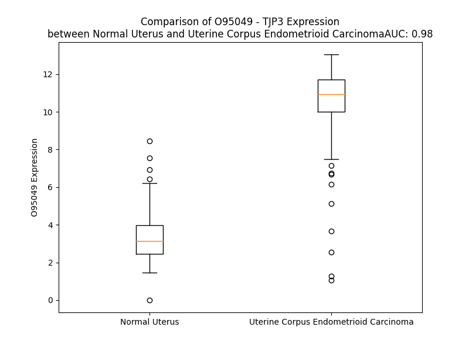

# Detailed Data for O95049

## Introduction to the Detailed Summary

### How to Interpret the Results

- **Summary & Metrics**: This section provides a quick reference to essential protein attributes, including expression changes, family classification, and biomarker applications. Regulation status (upregulated/downregulated) indicates the protein's behavior in a disease context. Some information comes from the original excel file with the proteins selected from literature, while others are derived from the analyses.
- **Expression Comparison**: A visual representation comparing protein expression between normal and disease states. It highlights significant changes in expression levels that might indicate diagnostic or therapeutic relevance. This is data coming from transcriptomics experiments and could not translate similarly to protein levels.
- **Isoform Alignment**: An interactive view of isoform alignments, revealing structural and functional differences between variants of the protein.
- **Interactors & Homologs**: Tables listing known interaction partners and homologous proteins, the more interactors and homologs, the more complex the protein is to design an antibody for.
- **Biological Assemblies**: Information about the structural arrangement of the protein in different assemblies, providing insights into its functional state but also the complexity of the protein to develop antibodies.
- **Combined Per-Residue Information**: A detailed table summarizing residue-level data. This includes predictions for epitope regions, aggregation tendencies, and modifications that might impact the protein's function. Each row corresponds to a residue in the protein, providing insights into specific sites that may be important for research or drug development.
## Summary & Metrics

- **UniProt Accession**: O95049
- **Gene Name**: TJP3 
- **Protein Name**: tight junction protein 3 (zona occludens 3) 
- **Swiss Prot**: ZO3_HUMAN
- **Family**: other
- **Biomarker Application**:  
- **Number of Isoforms**: 4
- **Regulation**: 1
- **(transcriptomics) AUC**: 0.98
- **(transcriptomics) Fold Change**: 3.07
- **(transcriptomics) Regulation**: Upregulated
- **Discotope Epitope Count**: 253
- **Max n_uniprots (Homo)**: 1
- **Max n_uniprots (Hetero)**: N/A

## Expression Comparison

## Isoform Alignment

<pre style='font-size:14px; font-family:monospace;'>O95049-1 -------------------MEELTIWEQHTATLSKDPRRGFGIAISGGRDRPGGSMVVSDVVPGGPAEGRLQTGDHIVMVNGVSMENATSAFAIQILKTCTKMANITVKRPRRIHLPATKASPSSPGRQDSDEDDGPQRVEEVDQGRGYDGDSSSGSGRSWDERSRRPRPGRRGRAGSHGRRSPGGGSEANGLALVSGFKRLPRQDVQMKPVKSVLVKRRDSEEFGVKLGSQIFIKHITDSGLAARHRGLQEGDLILQINGVSSQNLSLNDTRRLIEKSEGKLSLLVLRDRGQFLVNIPPAVSDSDSSPLEDISDLASELSQAPPSHIPPPPRHAQRSPEASQTDSPVESPRLRRESSVDSRTISEPDEQRSELPRESSYDIYRVPSSQSMEDRGYSPDTRVVRFLKGKSIGLRLAGGNDVGIFVSGVQAGSPADGQGIQEGDQILQVNDVPFQNLTREEAVQFLLGLPPGEEMELVTQRKQDIFWKMVQSRVGDSFYIRTHFELEPSPPSGLGFTRGDVFHVLDTLHPGPGQSHARGGHWLAVRMGRDLREQERGIIPNQSRAEQLASLEAAQRAVGVGPGSSAGSNARAEFWRLRGLRRGAKKTTQRSREDLSALTRQGRYPPYERVVLREASFKRPVVILGPVADIAMQKLTAEMPDQFEIAETVSRTDSPSKIIKLDTVRVIAEKDKHALLDVTPSAIERLNYVQYYPIVVFFIPESRPALKALRQWLAPASRRSTRRLYAQAQKLRKHSSHLFTATIPLNGTSDTWYQELKAIIREQQTRPIWTAEDQLDGSLEDNLDLPHHGLADSSADLSCDSRVNSDYETDGEGGAYTDGEGYTDGEGGPYTDVDDEPPAPALARSSEPVQADESQSPRDRGRISAHQGAQVDSRHPQGQWRQDSMRTYEREALKKKFMRVHDAESSDEDGYDWGPATDL
O95049-3 MNLCGLMPIFPAPLDQVADMEELTIWEQHTATLSKDPRRGFGIAISGGRDRPGGSMVVSDVVPGGPAEGRLQTGDHIVMVNGVSMENATSAFAIQILKTCTKMANITVKRPRRIHLPATKASPSSPGRQDSDEDDGPQRVEEVDQGRGYDGDSSSGSGRSWDERSRRPRPGRRGRAGSHGRRSPGGGSEANGLALVSGFKRLPRQDVQMKPVKSVLVKRRDSEEFGVKLGSQIFIKHITDSGLAARHRGLQEGDLILQINGVSSQNLSLNDTRRLIEKSEGKLSLLVLRDRGQFLVNIPPAVSDSDSSPLEDISDLASELSQAPPSHIPPPPRHAQRSPEASQTDSPVESPRLRRESSVDSRTISEPDEQRSELPRESSYDIYRVPSSQSMEDRGYSPDTRVVRFLKGKSIGLRLAGGNDVGIFVSGVQAGSPADGQGIQEGDQILQVNDVPFQNLTREEAVQFLLGLPPGEEMELVTQRKQDIFWKMVQSRVGDSFYIRTHFELEPSPPSGLGFTRGDVFHVLDTLHPGPGQSHARGGHWLAVRMGRDLREQERGIIPNQSRAEQLASLEAAQRAVGVGPGSSAGSNARAEFWRLRGLRRGAKKTTQRSREDLSALTRQGRYPPYERVVLREASFKRPVVILGPVADIAMQKLTAEMPDQFEIAETVSRTDSPSKIIKLDTVRVIAEKDKHALLDVTPSAIERLNYVQYYPIVVFFIPESRPALKALRQWLAPASRRSTRRLYAQAQKLRKHSSHLFTATIPLNGTSDTWYQELKAIIREQQTRPIWTAEDQLDGSLEDNLDLPHHGLADSSADLSCDSRVNSDYETDGEGGAYTDGEGYTDGEGGPYTDVDDEPPAPALARSSEPVQADESQSPRDRGRISAHQGAQVDSRHPQGQWRQDSMRTYEREALKKKFMRVHDAESSDEDGYDWGPATDL
O95049-4 ----------MAVRFQVADMEELTIWEQHTATLSKDPRRGFGIAISGGRDRPGGSMVVSDVVPGGPAEGRLQTGDHIVMVNGVSMENATSAFAIQILKTCTKMANITVKRPRRIHLPATKASPSSPGRQDSDEDDGPQRVEEVDQGRGYDGDSSSGSGRSWDERSRRPRPGRRGRAGSHGRRSPGGGSEANGLALVSGFKRLPRQDVQMKPVKSVLVKRRDSEEFGVKLGSQIFIKHITDSGLAARHRGLQEGDLILQINGVSSQNLSLNDTRRLIEKSEGKLSLLVLRDRGQFLVNIPPAVSDSDSSPLEDISDLASELSQAPPSHIPPPPRHAQRSPEASQTDSPVESPRLRRESSVDSRTISEPDEQRSELPRESSYDIYRVPSSQSMEDRGYSPDTRVVRFLKGKSIGLRLAGGNDVGIFVSGVQAGSPADGQGIQEGDQILQVNDVPFQNLTREEAVQFLLGLPPGEEMELVTQRKQDIFWKMVQSRVGDSFYIRTHFELEPSPPSGLGFTRGDVFHVLDTLHPGPGQSHARGGHWLAVRMGRDLREQERGIIPNQSRAEQLASLEAAQRAVGVGPGSSAGSNARAEFWRLRGLRRGAKKTTQRSREDLSALTRQGRYPPYERVVLREASFKRPVVILGPVADIAMQKLTAEMPDQFEIAETVSRTDSPSKIIKLDTVRVIAEKDKHALLDVTPSAIERLNYVQYYPIVVFFIPESRPALKALRQWLAPASRRSTRRLYAQAQKLRKHSSHLFTATIPLNGTSDTWYQELKAIIREQQTRPIWTAEDQLDGSLEDNLDLPHHGLADSSADLSCDSRVNSDYETDGEGGAYTDGEGYTDGEGGPYTDVDDEPPAPALARSSEPVQADESQSPRDRGRISAHQGAQVDSRHPQGQWRQDSMRTYEREALKKKFMRVHDAESSDEDGYDWGPATDL
O95049-5 -------------------------------------------------------MVVSDVVPGGPAEGRLQTGDHIVMVNGVSMENATSAFAIQILKTCTKMANITVKRPRRIHLPATKASPSSPGRQDSDEDDGPQRVEEVDQGRGYDGDSSSGSGRSWDERSRRPRPGRRGRAGSHGRRSPGGGSEANGLALVSGFKRLPRQDVQMKPVKSVLVKRRDSEEFGVKLGSQIFIKHITDSGLAARHRGLQEGDLILQINGVSSQNLSLNDTRRLIEKSEGKLSLLVLRDRGQFLVNIPPAVSDSDSSPLEDISDLASELSQAPPSHIPPPPRHAQRSPEASQTDSPVESPRLRRESSVDSRTISEPDEQRSELPRESSYDIYRVPSSQSMEDRGYSPDTRVVRFLKGKSIGLRLAGGNDVGIFVSGVQAGSPADGQGIQEGDQILQVNDVPFQNLTREEAVQFLLGLPPGEEMELVTQRKQDIFWKMVQSRVGDSFYIRTHFELEPSPPSGLGFTRGDVFHVLDTLHPGPGQSHARGGHWLAVRMGRDLREQERGIIPNQSRAEQLASLEAAQRAVGVGPGSSAGSNARAEFWRLRGLRRGAKKTTQRSREDLSALTRQGRYPPYERVVLREASFKRPVVILGPVADIAMQKLTAEMPDQFEIAETVSRTDSPSKIIKLDTVRVIAEKDKHALLDVTPSAIERLNYVQYYPIVVFFIPESRPALKALRQWLAPASRRSTRRLYAQAQKLRKHSSHLFTATIPLNGTSDTWYQELKAIIREQQTRPIWTAEDQLDGSLEDNLDLPHHGLADSSADLSCDSRVNSDYETDGEGGAYTDGEGYTDGEGGPYTDVDDEPPAPALARSSEPVQADESQSPRDRGRISAHQGAQVDSRHPQGQWRQDSMRTYEREALKKKFMRVHDAESSDEDGYDWGPATDL
</pre>

## Interactors

| preferredName_A   | preferredName_B   |   score |
|:------------------|:------------------|--------:|
| TJP3              | OCLN              |   0.998 |
| TJP3              | CGN               |   0.997 |
| TJP3              | CLDN1             |   0.996 |
| TJP3              | PATJ              |   0.996 |
| TJP3              | MARVELD2          |   0.995 |
| TJP3              | CLDN7             |   0.99  |
| TJP3              | TJP1              |   0.988 |
| TJP3              | CLDN3             |   0.988 |
| TJP3              | TJP2              |   0.988 |
| TJP3              | CLDN8             |   0.97  |
| TJP3              | CLDN2             |   0.957 |
| TJP3              | CLDN5             |   0.945 |
| TJP3              | AFDN              |   0.941 |
| TJP3              | CLDN4             |   0.932 |
| TJP3              | F11R              |   0.922 |

## Homologs

| uniprot_id   | gene_id   |
|:-------------|:----------|
| A0A3B3ISF1   | TJP2      |
| H0YKB1       | TJP1      |
| A0A0A0MSL1   | DLG5      |

## Biological Assemblies

|   Unnamed: 0 |   assembly |   n_uniprots | composition   | crystal_id   |
|-------------:|-----------:|-------------:|:--------------|:-------------|
|            0 |          1 |            1 | Homo          | 3kfv         |

## Combined Per-Residue Information

|   res | aa   |   epitope_score | epitope   |   relative_surface_accessibility |   modeling_confidence |   Aggregation | modification     |
|------:|:-----|----------------:|:----------|---------------------------------:|----------------------:|--------------:|:-----------------|
|     1 | M    |         0.05198 | False     |                          0.87286 |                 51.66 |         0     | N/A              |
|     2 | E    |         0.0399  | False     |                          0.66698 |                 64    |         0     | N/A              |
|     3 | E    |         0.07603 | False     |                          0.52922 |                 66.06 |         0     | N/A              |
|     4 | L    |         0.06278 | False     |                          0.57457 |                 67.35 |         0     | N/A              |
|     5 | T    |         0.06998 | False     |                          0.50171 |                 76.69 |         0     | N/A              |
|     6 | I    |         0.07087 | False     |                          0.35838 |                 73.32 |         0     | N/A              |
|     7 | W    |         0.1179  | True      |                          0.56167 |                 81.81 |         0     | N/A              |
|     8 | E    |         0.03377 | False     |                          0.25189 |                 84.59 |         0     | N/A              |
|     9 | Q    |         0.05165 | False     |                          0.57228 |                 87.59 |         0     | N/A              |
|    10 | H    |         0.04484 | False     |                          0.39993 |                 85.85 |         0     | N/A              |
|    11 | T    |         0.03317 | False     |                          0.59381 |                 90.24 |         0     | N/A              |
|    12 | A    |         0.01267 | False     |                          0.11096 |                 88.61 |         0     | N/A              |
|    13 | T    |         0.04515 | False     |                          0.53719 |                 90.63 |         0     | N/A              |
|    14 | L    |         0.00573 | False     |                          0.00707 |                 90.8  |         0     | N/A              |
|    15 | S    |         0.03128 | False     |                          0.51753 |                 87.85 |         0     | N/A              |
|    16 | K    |         0.07149 | False     |                          0.35797 |                 86.5  |         0     | N/A              |
|    17 | D    |         0.06254 | False     |                          0.30396 |                 83.25 |         0     | N/A              |
|    18 | P    |         0.08181 | False     |                          1.01945 |                 80.02 |         0     | N/A              |
|    19 | R    |         0.2269  | True      |                          0.93268 |                 80.52 |         0     | N/A              |
|    20 | R    |         0.1868  | True      |                          0.48733 |                 82.58 |         0     | N/A              |
|    21 | G    |         0.05146 | False     |                          0.27578 |                 87.55 |         0     | N/A              |
|    22 | F    |         0.03528 | False     |                          0.07234 |                 90.72 |         2.837 | N/A              |
|    23 | G    |         0.01677 | False     |                          0.02718 |                 89.35 |         2.837 | N/A              |
|    24 | I    |         0.03975 | False     |                          0.17169 |                 92.6  |         2.837 | N/A              |
|    25 | A    |         0.10478 | True      |                          0.41579 |                 89.58 |         2.837 | N/A              |
|    26 | I    |         0.04985 | False     |                          0.17136 |                 89.14 |         2.837 | N/A              |
|    27 | S    |         0.14297 | True      |                          0.19093 |                 84.73 |         0.312 | N/A              |
|    28 | G    |         0.04725 | False     |                          0.13765 |                 83.89 |         0     | N/A              |
|    29 | G    |         0.02466 | False     |                          0.00161 |                 77.45 |         0     | N/A              |
|    30 | R    |         0.18157 | True      |                          0.58697 |                 76    |         0     | N/A              |
|    31 | D    |         0.2245  | True      |                          0.63697 |                 70.27 |         0     | N/A              |
|    32 | R    |         0.10984 | True      |                          0.56943 |                 69.43 |         0     | N/A              |
|    33 | P    |         0.12165 | True      |                          1.03992 |                 58.86 |         0     | N/A              |
|    34 | G    |         0.10035 | True      |                          0.89095 |                 63.14 |         0     | N/A              |
|    35 | G    |         0.07374 | False     |                          0.34311 |                 69.25 |         0     | N/A              |
|    36 | S    |         0.07631 | False     |                          0.29715 |                 80.67 |         0     | N/A              |
|    37 | M    |         0.00957 | False     |                          0.00556 |                 87.57 |         0     | N/A              |
|    38 | V    |         0.03525 | False     |                          0.21517 |                 90.43 |         0     | N/A              |
|    39 | V    |         0.00692 | False     |                          0.00422 |                 91.75 |         0     | N/A              |
|    40 | S    |         0.13268 | True      |                          0.37266 |                 89.94 |         0     | N/A              |
|    41 | D    |         0.15224 | True      |                          0.47827 |                 90.67 |         0     | N/A              |
|    42 | V    |         0.01922 | False     |                          0.15877 |                 92.51 |         0     | N/A              |
|    43 | V    |         0.11153 | True      |                          0.3894  |                 89.51 |         0     | N/A              |
|    44 | P    |         0.10228 | True      |                          0.76824 |                 85.39 |         0     | N/A              |
|    45 | G    |         0.10913 | True      |                          0.66689 |                 84.61 |         0     | N/A              |
|    46 | G    |         0.05339 | False     |                          0.10073 |                 88.14 |         0     | N/A              |
|    47 | P    |         0.03224 | False     |                          0.22925 |                 89.45 |         0     | N/A              |
|    48 | A    |         0.00258 | False     |                          0       |                 91.52 |         0     | N/A              |
|    49 | E    |         0.06095 | False     |                          0.4768  |                 89.43 |         0     | N/A              |
|    50 | G    |         0.06273 | False     |                          0.95489 |                 86.13 |         0     | N/A              |
|    51 | R    |         0.05222 | False     |                          0.43797 |                 89.29 |         0     | N/A              |
|    52 | L    |         0.00571 | False     |                          0.02298 |                 92.06 |         0     | N/A              |
|    53 | Q    |         0.03868 | False     |                          0.46679 |                 91.2  |         0     | N/A              |
|    54 | T    |         0.05564 | False     |                          0.63353 |                 90.05 |         0     | N/A              |
|    55 | G    |         0.03333 | False     |                          0.38943 |                 88.09 |         0     | N/A              |
|    56 | D    |         0.01886 | False     |                          0.0092  |                 92.28 |         0     | N/A              |
|    57 | H    |         0.06872 | False     |                          0.26799 |                 90.68 |         0.27  | N/A              |
|    58 | I    |         0.01731 | False     |                          0.03061 |                 91.69 |         4.101 | N/A              |
|    59 | V    |         0.03104 | False     |                          0.11044 |                 91.48 |         4.438 | N/A              |
|    60 | M    |         0.0748  | False     |                          0.34366 |                 92.14 |         4.438 | N/A              |
|    61 | V    |         0.00496 | False     |                          0.00286 |                 90.51 |         4.438 | N/A              |
|    62 | N    |         0.10137 | True      |                          0.44897 |                 86.36 |         4.168 | N/A              |
|    63 | G    |         0.05755 | False     |                          0.65012 |                 81.74 |         2.383 | N/A              |
|    64 | V    |         0.07086 | False     |                          0.38273 |                 85.84 |         2.223 | N/A              |
|    65 | S    |         0.07841 | False     |                          0.47647 |                 86.03 |         0     | N/A              |
|    66 | M    |         0.0052  | False     |                          0.00159 |                 85.89 |         0     | N/A              |
|    67 | E    |         0.07749 | False     |                          0.53721 |                 79.2  |         0     | N/A              |
|    68 | N    |         0.05733 | False     |                          0.53895 |                 74.28 |         0     | N/A              |
|    69 | A    |         0.02007 | False     |                          0.09129 |                 81.35 |         2.544 | N/A              |
|    70 | T    |         0.10969 | True      |                          0.33876 |                 85.93 |         3.249 | N/A              |
|    71 | S    |         0.04937 | False     |                          0.27417 |                 81.72 |         4.434 | N/A              |
|    72 | A    |         0.08288 | False     |                          0.65813 |                 85.25 |         9.852 | N/A              |
|    73 | F    |         0.11368 | True      |                          0.44498 |                 87.56 |        16.021 | N/A              |
|    74 | A    |         0.00821 | False     |                          0.0051  |                 86    |        16.447 | N/A              |
|    75 | I    |         0.09794 | True      |                          0.40037 |                 86.38 |        16.447 | N/A              |
|    76 | Q    |         0.09423 | True      |                          0.57426 |                 85.86 |        15.309 | N/A              |
|    77 | I    |         0.04694 | False     |                          0.18997 |                 89.15 |        15.107 | N/A              |
|    78 | L    |         0.02489 | False     |                          0.06648 |                 85.36 |        12.969 | N/A              |
|    79 | K    |         0.12279 | True      |                          0.72304 |                 83.73 |         0     | N/A              |
|    80 | T    |         0.09051 | False     |                          0.69532 |                 84.98 |         0     | N/A              |
|    81 | C    |         0.02885 | False     |                          0.07586 |                 82.85 |         0     | N/A              |
|    82 | T    |         0.12212 | True      |                          0.78325 |                 76.84 |         0     | N/A              |
|    83 | K    |         0.07559 | False     |                          0.82582 |                 81.82 |         0     | N/A              |
|    84 | M    |         0.05661 | False     |                          0.70915 |                 85.19 |         0     | N/A              |
|    85 | A    |         0.00298 | False     |                          0.0045  |                 89.38 |         0     | N/A              |
|    86 | N    |         0.04552 | False     |                          0.37023 |                 90.3  |         0     | N/A              |
|    87 | I    |         0.0015  | False     |                          0       |                 93.39 |         0     | N/A              |
|    88 | T    |         0.02551 | False     |                          0.07638 |                 93.28 |         0     | N/A              |
|    89 | V    |         0.00827 | False     |                          0.00095 |                 94.17 |         0     | N/A              |
|    90 | K    |         0.05073 | False     |                          0.33405 |                 91.91 |         0     | N/A              |
|    91 | R    |         0.14759 | True      |                          0.21665 |                 88.66 |         0     | N/A              |
|    92 | P    |         0.07032 | False     |                          0.44904 |                 82.09 |         0     | N/A              |
|    93 | R    |         0.07541 | False     |                          0.52856 |                 75.41 |         0     | N/A              |
|    94 | R    |         0.17707 | True      |                          0.62142 |                 76.17 |         0     | N/A              |
|    95 | I    |         0.10477 | True      |                          0.38078 |                 59.58 |         0     | N/A              |
|    96 | H    |         0.0725  | False     |                          0.61458 |                 62.56 |         0     | N/A              |
|    97 | L    |         0.10653 | True      |                          0.48598 |                 48.88 |         0     | N/A              |
|    98 | P    |         0.08674 | False     |                          0.8739  |                 39.12 |         0     | N/A              |
|    99 | A    |         0.09867 | True      |                          0.63364 |                 45.18 |         0     | N/A              |
|   100 | T    |         0.07004 | False     |                          0.94931 |                 42.89 |         0     | N/A              |
|   101 | K    |         0.11146 | True      |                          0.99003 |                 37.48 |         0     | N/A              |
|   102 | A    |         0.12501 | True      |                          0.97116 |                 36.63 |         0     | N/A              |
|   103 | S    |         0.09603 | True      |                          0.77634 |                 30.94 |         0     | N/A              |
|   104 | P    |         0.09018 | False     |                          0.95102 |                 37.02 |         0     | N/A              |
|   105 | S    |         0.0949  | True      |                          0.84607 |                 31.2  |         0     | N/A              |
|   106 | S    |         0.11811 | True      |                          0.80849 |                 30.1  |         0     | N/A              |
|   107 | P    |         0.07493 | False     |                          0.90895 |                 35.17 |         0     | N/A              |
|   108 | G    |         0.11222 | True      |                          0.94329 |                 29.27 |         0     | N/A              |
|   109 | R    |         0.11693 | True      |                          0.96515 |                 33.89 |         0     | N/A              |
|   110 | Q    |         0.11236 | True      |                          0.81043 |                 29.72 |         0     | N/A              |
|   111 | D    |         0.07464 | False     |                          0.86408 |                 31.37 |         0     | N/A              |
|   112 | S    |         0.05908 | False     |                          0.754   |                 34.45 |         0     | Phosphoserine    |
|   113 | D    |         0.05982 | False     |                          0.94786 |                 30.11 |         0     | N/A              |
|   114 | E    |         0.11479 | True      |                          0.88941 |                 39.6  |         0     | N/A              |
|   115 | D    |         0.12032 | True      |                          0.85437 |                 33.76 |         0     | N/A              |
|   116 | D    |         0.15959 | True      |                          0.83028 |                 30.57 |         0     | N/A              |
|   117 | G    |         0.15915 | True      |                          0.85023 |                 30.4  |         0     | N/A              |
|   118 | P    |         0.14486 | True      |                          0.82123 |                 30.48 |         0     | N/A              |
|   119 | Q    |         0.11838 | True      |                          0.79433 |                 29.73 |         0     | N/A              |
|   120 | R    |         0.15965 | True      |                          0.90817 |                 31.85 |         0     | N/A              |
|   121 | V    |         0.09505 | True      |                          0.9939  |                 27.44 |         0     | N/A              |
|   122 | E    |         0.16614 | True      |                          0.86506 |                 35.92 |         0     | N/A              |
|   123 | E    |         0.14258 | True      |                          0.79864 |                 27.95 |         0     | N/A              |
|   124 | V    |         0.1394  | True      |                          0.89982 |                 29.57 |         0     | N/A              |
|   125 | D    |         0.08898 | False     |                          0.74274 |                 36.11 |         0     | N/A              |
|   126 | Q    |         0.11311 | True      |                          0.77916 |                 34.82 |         0     | N/A              |
|   127 | G    |         0.08785 | False     |                          0.97594 |                 29.26 |         0     | N/A              |
|   128 | R    |         0.09253 | False     |                          0.97873 |                 39.18 |         0     | N/A              |
|   129 | G    |         0.09623 | True      |                          0.8893  |                 25.38 |         0     | N/A              |
|   130 | Y    |         0.13926 | True      |                          0.93241 |                 33.26 |         0     | N/A              |
|   131 | D    |         0.11094 | True      |                          0.63387 |                 41.52 |         0     | N/A              |
|   132 | G    |         0.08387 | False     |                          0.85795 |                 26.37 |         0     | N/A              |
|   133 | D    |         0.12476 | True      |                          0.90954 |                 33.08 |         0     | N/A              |
|   134 | S    |         0.06296 | False     |                          0.7303  |                 27.29 |         0     | N/A              |
|   135 | S    |         0.11163 | True      |                          0.87789 |                 34    |         0     | N/A              |
|   136 | S    |         0.07106 | False     |                          0.92721 |                 26.79 |         0     | Phosphoserine    |
|   137 | G    |         0.0867  | False     |                          0.97562 |                 32.42 |         0     | N/A              |
|   138 | S    |         0.09402 | True      |                          0.91152 |                 24.45 |         0     | N/A              |
|   139 | G    |         0.15577 | True      |                          0.76915 |                 26.36 |         0     | N/A              |
|   140 | R    |         0.11693 | True      |                          0.90315 |                 34.44 |         0     | N/A              |
|   141 | S    |         0.07369 | False     |                          0.82419 |                 28.12 |         0     | N/A              |
|   142 | W    |         0.11098 | True      |                          1.00538 |                 33.37 |         0     | N/A              |
|   143 | D    |         0.10423 | True      |                          0.75594 |                 29.13 |         0     | N/A              |
|   144 | E    |         0.12825 | True      |                          0.82733 |                 25.94 |         0     | N/A              |
|   145 | R    |         0.10964 | True      |                          0.93972 |                 31.78 |         0     | N/A              |
|   146 | S    |         0.08345 | False     |                          0.86989 |                 31.41 |         0     | N/A              |
|   147 | R    |         0.07845 | False     |                          0.94347 |                 38.28 |         0     | N/A              |
|   148 | R    |         0.16268 | True      |                          0.92096 |                 32.14 |         0     | N/A              |
|   149 | P    |         0.05989 | False     |                          0.9228  |                 33.63 |         0     | N/A              |
|   150 | R    |         0.07873 | False     |                          0.97158 |                 33.5  |         0     | N/A              |
|   151 | P    |         0.10192 | True      |                          0.96728 |                 31.1  |         0     | N/A              |
|   152 | G    |         0.10588 | True      |                          0.93183 |                 30.7  |         0     | N/A              |
|   153 | R    |         0.08831 | False     |                          1.00187 |                 34.32 |         0     | N/A              |
|   154 | R    |         0.07319 | False     |                          0.98599 |                 27.29 |         0     | N/A              |
|   155 | G    |         0.07657 | False     |                          0.86753 |                 33.84 |         0     | N/A              |
|   156 | R    |         0.11441 | True      |                          0.99769 |                 28.24 |         0     | N/A              |
|   157 | A    |         0.05571 | False     |                          1.03642 |                 34.44 |         0     | N/A              |
|   158 | G    |         0.13745 | True      |                          0.81823 |                 27.03 |         0     | N/A              |
|   159 | S    |         0.06747 | False     |                          0.84442 |                 33.17 |         0     | N/A              |
|   160 | H    |         0.08783 | False     |                          1.06897 |                 28.11 |         0     | N/A              |
|   161 | G    |         0.10315 | True      |                          0.90882 |                 30.91 |         0     | N/A              |
|   162 | R    |         0.10808 | True      |                          0.96354 |                 30.02 |         0     | N/A              |
|   163 | R    |         0.10529 | True      |                          0.94895 |                 23.88 |         0     | N/A              |
|   164 | S    |         0.09523 | True      |                          0.79777 |                 30.17 |         0     | Phosphoserine    |
|   165 | P    |         0.11167 | True      |                          0.96593 |                 28.47 |         0     | N/A              |
|   166 | G    |         0.13371 | True      |                          0.9467  |                 25.61 |         0     | N/A              |
|   167 | G    |         0.07653 | False     |                          0.97367 |                 26.87 |         0     | N/A              |
|   168 | G    |         0.09486 | True      |                          1.04309 |                 22.57 |         0     | N/A              |
|   169 | S    |         0.07495 | False     |                          0.89039 |                 30.35 |         0     | Phosphoserine    |
|   170 | E    |         0.08804 | False     |                          0.85291 |                 26.6  |         0     | N/A              |
|   171 | A    |         0.08182 | False     |                          0.89172 |                 27.52 |         0     | N/A              |
|   172 | N    |         0.09022 | False     |                          0.97965 |                 31.2  |         0     | N/A              |
|   173 | G    |         0.05993 | False     |                          0.85344 |                 25.29 |         1.834 | N/A              |
|   174 | L    |         0.07924 | False     |                          1.09713 |                 28.24 |         4.412 | N/A              |
|   175 | A    |         0.13335 | True      |                          0.77772 |                 27.24 |         4.412 | N/A              |
|   176 | L    |         0.08456 | False     |                          1.03548 |                 27.77 |         4.412 | N/A              |
|   177 | V    |         0.09341 | False     |                          1.06926 |                 31.84 |         4.412 | N/A              |
|   178 | S    |         0.09993 | True      |                          0.84108 |                 27.28 |         2.781 | N/A              |
|   179 | G    |         0.12373 | True      |                          0.80954 |                 27.71 |         0.331 | N/A              |
|   180 | F    |         0.08864 | False     |                          1.00159 |                 28.35 |         0.331 | N/A              |
|   181 | K    |         0.0797  | False     |                          1.00888 |                 32.15 |         0     | N/A              |
|   182 | R    |         0.11178 | True      |                          0.91066 |                 29.38 |         0     | N/A              |
|   183 | L    |         0.06688 | False     |                          0.96968 |                 31.85 |         0     | N/A              |
|   184 | P    |         0.08243 | False     |                          0.83529 |                 34.43 |         0     | N/A              |
|   185 | R    |         0.10321 | True      |                          0.98217 |                 35.81 |         0     | N/A              |
|   186 | Q    |         0.0706  | False     |                          0.7183  |                 38.09 |         0     | N/A              |
|   187 | D    |         0.12079 | True      |                          0.87807 |                 39.96 |         0     | N/A              |
|   188 | V    |         0.05532 | False     |                          0.43276 |                 41.24 |         0     | N/A              |
|   189 | Q    |         0.09541 | True      |                          0.50233 |                 41.49 |         0     | N/A              |
|   190 | M    |         0.07222 | False     |                          0.34394 |                 58.42 |         0     | N/A              |
|   191 | K    |         0.06155 | False     |                          0.82372 |                 71.61 |         0     | N/A              |
|   192 | P    |         0.05331 | False     |                          0.43009 |                 83.29 |         0     | N/A              |
|   193 | V    |         0.04621 | False     |                          0.36083 |                 84.39 |         0     | N/A              |
|   194 | K    |         0.05542 | False     |                          0.70518 |                 88.25 |         0     | N/A              |
|   195 | S    |         0.00721 | False     |                          0.0057  |                 88.89 |         0     | N/A              |
|   196 | V    |         0.04379 | False     |                          0.38681 |                 90.12 |         0     | N/A              |
|   197 | L    |         0.02255 | False     |                          0.0305  |                 89.04 |         0     | N/A              |
|   198 | V    |         0.07344 | False     |                          0.58108 |                 86.24 |         0     | N/A              |
|   199 | K    |         0.09935 | True      |                          0.27682 |                 84.77 |         0     | N/A              |
|   200 | R    |         0.23583 | True      |                          0.81961 |                 81.73 |         0     | N/A              |
|   201 | R    |         0.18243 | True      |                          0.62398 |                 80.49 |         0     | N/A              |
|   202 | D    |         0.15012 | True      |                          0.91014 |                 76.25 |         0     | N/A              |
|   203 | S    |         0.12649 | True      |                          0.79089 |                 77.89 |         0     | Phosphoserine    |
|   204 | E    |         0.0913  | False     |                          0.16346 |                 81.98 |         0     | N/A              |
|   205 | E    |         0.10746 | True      |                          0.62374 |                 84.95 |         0     | N/A              |
|   206 | F    |         0.02903 | False     |                          0.0656  |                 87.22 |         0     | N/A              |
|   207 | G    |         0.02869 | False     |                          0.12932 |                 85.9  |         0     | N/A              |
|   208 | V    |         0.01887 | False     |                          0.14267 |                 87.28 |         0     | N/A              |
|   209 | K    |         0.13299 | True      |                          0.60954 |                 84.67 |         0     | N/A              |
|   210 | L    |         0.0579  | False     |                          0.11521 |                 84.07 |         0     | N/A              |
|   211 | G    |         0.03371 | False     |                          0.04346 |                 76.47 |         0     | N/A              |
|   212 | S    |         0.06618 | False     |                          0.38369 |                 68.11 |         0.169 | N/A              |
|   213 | Q    |         0.08334 | False     |                          0.6364  |                 63.33 |         0.169 | N/A              |
|   214 | I    |         0.04671 | False     |                          0.15519 |                 78.76 |         0.169 | N/A              |
|   215 | F    |         0.05005 | False     |                          0.14587 |                 85.74 |         0.169 | N/A              |
|   216 | I    |         0.00586 | False     |                          0       |                 86.73 |         0.169 | N/A              |
|   217 | K    |         0.1079  | True      |                          0.61622 |                 82.47 |         0     | N/A              |
|   218 | H    |         0.07153 | False     |                          0.38069 |                 85.79 |         0     | N/A              |
|   219 | I    |         0.04124 | False     |                          0.12466 |                 87.84 |         0     | N/A              |
|   220 | T    |         0.05854 | False     |                          0.31016 |                 85.02 |         0     | N/A              |
|   221 | D    |         0.13109 | True      |                          0.79763 |                 82.69 |         0     | N/A              |
|   222 | S    |         0.10928 | True      |                          0.72183 |                 82.24 |         0     | N/A              |
|   223 | G    |         0.03255 | False     |                          0.01321 |                 85.32 |         0     | N/A              |
|   224 | L    |         0.06069 | False     |                          0.19411 |                 85.03 |         0     | N/A              |
|   225 | A    |         0.0043  | False     |                          0.00943 |                 88.16 |         0     | N/A              |
|   226 | A    |         0.07646 | False     |                          0.45699 |                 86.15 |         0     | N/A              |
|   227 | R    |         0.13348 | True      |                          0.79268 |                 81.88 |         0     | N/A              |
|   228 | H    |         0.07284 | False     |                          0.288   |                 78.9  |         0     | N/A              |
|   229 | R    |         0.147   | True      |                          0.93736 |                 75.4  |         0     | N/A              |
|   230 | G    |         0.0654  | False     |                          0.18515 |                 80.75 |         0     | N/A              |
|   231 | L    |         0.01988 | False     |                          0.04448 |                 88.32 |         0     | N/A              |
|   232 | Q    |         0.05848 | False     |                          0.43893 |                 85.68 |         0     | N/A              |
|   233 | E    |         0.04728 | False     |                          0.34363 |                 83.98 |         0     | N/A              |
|   234 | G    |         0.00712 | False     |                          0.08085 |                 80.29 |         0     | N/A              |
|   235 | D    |         0.01134 | False     |                          0.00245 |                 86.47 |         0     | N/A              |
|   236 | L    |         0.01975 | False     |                          0.2506  |                 86.81 |         3.078 | N/A              |
|   237 | I    |         0.00653 | False     |                          0.00118 |                 87.51 |         3.078 | N/A              |
|   238 | L    |         0.02676 | False     |                          0.33892 |                 86.67 |         3.078 | N/A              |
|   239 | Q    |         0.08445 | False     |                          0.33341 |                 90.96 |         3.078 | N/A              |
|   240 | I    |         0.01326 | False     |                          0       |                 89.69 |         3.078 | N/A              |
|   241 | N    |         0.06629 | False     |                          0.41457 |                 87.95 |         0.12  | N/A              |
|   242 | G    |         0.08435 | False     |                          0.68137 |                 83.74 |         0.12  | N/A              |
|   243 | V    |         0.11394 | True      |                          0.46271 |                 84.42 |         0.12  | N/A              |
|   244 | S    |         0.07714 | False     |                          0.45854 |                 84.83 |         0     | N/A              |
|   245 | S    |         0.0242  | False     |                          0.07055 |                 81.09 |         0     | N/A              |
|   246 | Q    |         0.17311 | True      |                          0.78591 |                 72.85 |         0     | N/A              |
|   247 | N    |         0.17124 | True      |                          0.90898 |                 64.97 |         0     | N/A              |
|   248 | L    |         0.07556 | False     |                          0.2017  |                 80.21 |         0     | N/A              |
|   249 | S    |         0.12798 | True      |                          0.43375 |                 80.4  |         0     | N/A              |
|   250 | L    |         0.05669 | False     |                          0.29414 |                 80.66 |         0     | N/A              |
|   251 | N    |         0.08047 | False     |                          0.50528 |                 81.27 |         0     | N/A              |
|   252 | D    |         0.13429 | True      |                          0.35277 |                 84.39 |         0     | N/A              |
|   253 | T    |         0.00409 | False     |                          0       |                 83.11 |         0     | N/A              |
|   254 | R    |         0.16865 | True      |                          0.51039 |                 82.2  |         0     | N/A              |
|   255 | R    |         0.17885 | True      |                          0.60285 |                 83.79 |         0     | N/A              |
|   256 | L    |         0.0555  | False     |                          0.21662 |                 85.75 |         0     | N/A              |
|   257 | I    |         0.03492 | False     |                          0.12097 |                 85.7  |         0     | N/A              |
|   258 | E    |         0.13207 | True      |                          0.71257 |                 84.11 |         0     | N/A              |
|   259 | K    |         0.11953 | True      |                          0.8256  |                 83.27 |         0     | N/A              |
|   260 | S    |         0.04814 | False     |                          0.05964 |                 81.63 |         0     | N/A              |
|   261 | E    |         0.08688 | False     |                          0.88821 |                 76.38 |         0     | N/A              |
|   262 | G    |         0.09523 | True      |                          0.30122 |                 78.42 |         0     | N/A              |
|   263 | K    |         0.15094 | True      |                          0.59283 |                 86.52 |         0     | N/A              |
|   264 | L    |         0.00213 | False     |                          0       |                 91.35 |        42.07  | N/A              |
|   265 | S    |         0.04839 | False     |                          0.14556 |                 89.41 |        49.596 | N/A              |
|   266 | L    |         0.00241 | False     |                          0.00082 |                 92.38 |        49.596 | N/A              |
|   267 | L    |         0.04153 | False     |                          0.27617 |                 90.49 |        49.596 | N/A              |
|   268 | V    |         0.00493 | False     |                          0       |                 90.13 |        49.596 | N/A              |
|   269 | L    |         0.02126 | False     |                          0.18828 |                 85.25 |        48.587 | N/A              |
|   270 | R    |         0.11896 | True      |                          0.2575  |                 79.54 |         0     | N/A              |
|   271 | D    |         0.07771 | False     |                          0.059   |                 67.68 |         0     | N/A              |
|   272 | R    |         0.14623 | True      |                          0.79843 |                 62.81 |         0     | N/A              |
|   273 | G    |         0.08499 | False     |                          0.69135 |                 61.43 |         0.484 | N/A              |
|   274 | Q    |         0.1098  | True      |                          0.35236 |                 57.28 |         0.484 | N/A              |
|   275 | F    |         0.17183 | True      |                          0.9261  |                 51.58 |         0.633 | N/A              |
|   276 | L    |         0.07139 | False     |                          0.52484 |                 52.43 |         0.633 | N/A              |
|   277 | V    |         0.04685 | False     |                          0.0764  |                 54.38 |         0.633 | N/A              |
|   278 | N    |         0.10585 | True      |                          0.75762 |                 50.12 |         0.148 | N/A              |
|   279 | I    |         0.04393 | False     |                          0.24967 |                 46.34 |         0.148 | N/A              |
|   280 | P    |         0.0812  | False     |                          0.78134 |                 47.28 |         0     | N/A              |
|   281 | P    |         0.10882 | True      |                          0.92362 |                 44.91 |         0     | N/A              |
|   282 | A    |         0.12482 | True      |                          0.78601 |                 40.72 |         0     | N/A              |
|   283 | V    |         0.0684  | False     |                          0.75466 |                 35.75 |         0     | N/A              |
|   284 | S    |         0.1653  | True      |                          0.74826 |                 32.88 |         0     | N/A              |
|   285 | D    |         0.14686 | True      |                          0.76788 |                 30.58 |         0     | N/A              |
|   286 | S    |         0.18937 | True      |                          0.78711 |                 30.9  |         0     | N/A              |
|   287 | D    |         0.13512 | True      |                          0.92234 |                 31.88 |         0     | N/A              |
|   288 | S    |         0.06699 | False     |                          0.89586 |                 29.91 |         0     | N/A              |
|   289 | S    |         0.10653 | True      |                          0.74851 |                 33.05 |         0     | N/A              |
|   290 | P    |         0.13623 | True      |                          0.94467 |                 38.36 |         0     | N/A              |
|   291 | L    |         0.12479 | True      |                          1.05808 |                 35.42 |         0     | N/A              |
|   292 | E    |         0.15312 | True      |                          0.79324 |                 38.26 |         0     | N/A              |
|   293 | D    |         0.09445 | True      |                          0.79691 |                 34.38 |         0     | N/A              |
|   294 | I    |         0.13969 | True      |                          0.87004 |                 31.92 |         0     | N/A              |
|   295 | S    |         0.12449 | True      |                          0.70712 |                 31.68 |         0     | N/A              |
|   296 | D    |         0.08991 | False     |                          0.82876 |                 35.94 |         0     | N/A              |
|   297 | L    |         0.16905 | True      |                          1.04884 |                 29.67 |         0     | N/A              |
|   298 | A    |         0.14108 | True      |                          0.85477 |                 31.47 |         0     | N/A              |
|   299 | S    |         0.08935 | False     |                          0.88804 |                 27.3  |         0     | N/A              |
|   300 | E    |         0.11968 | True      |                          0.9058  |                 34.54 |         0     | N/A              |
|   301 | L    |         0.14916 | True      |                          1.02844 |                 33.3  |         0     | N/A              |
|   302 | S    |         0.154   | True      |                          0.83914 |                 25.66 |         0     | N/A              |
|   303 | Q    |         0.18675 | True      |                          0.92575 |                 34.96 |         0     | N/A              |
|   304 | A    |         0.11012 | True      |                          0.89177 |                 27    |         0     | N/A              |
|   305 | P    |         0.08998 | False     |                          0.88653 |                 38.28 |         0     | N/A              |
|   306 | P    |         0.09393 | True      |                          0.77599 |                 41.87 |         0     | N/A              |
|   307 | S    |         0.08717 | False     |                          0.95513 |                 33.83 |         0     | N/A              |
|   308 | H    |         0.12682 | True      |                          0.86176 |                 29.78 |         0     | N/A              |
|   309 | I    |         0.12537 | True      |                          0.90987 |                 35.12 |         0     | N/A              |
|   310 | P    |         0.11196 | True      |                          0.89336 |                 30.64 |         0     | N/A              |
|   311 | P    |         0.10977 | True      |                          0.89481 |                 40.68 |         0     | N/A              |
|   312 | P    |         0.08985 | False     |                          0.88866 |                 34.21 |         0     | N/A              |
|   313 | P    |         0.09655 | True      |                          0.80686 |                 41.75 |         0     | N/A              |
|   314 | R    |         0.122   | True      |                          0.83887 |                 33.57 |         0     | N/A              |
|   315 | H    |         0.07185 | False     |                          0.86179 |                 36.72 |         0     | N/A              |
|   316 | A    |         0.18352 | True      |                          0.86848 |                 27.51 |         0     | N/A              |
|   317 | Q    |         0.10468 | True      |                          0.87581 |                 34.01 |         0     | N/A              |
|   318 | R    |         0.15432 | True      |                          0.94777 |                 24.9  |         0     | N/A              |
|   319 | S    |         0.12363 | True      |                          0.75921 |                 28.77 |         0     | Phosphoserine    |
|   320 | P    |         0.09912 | True      |                          0.90325 |                 30.35 |         0     | N/A              |
|   321 | E    |         0.12937 | True      |                          0.89394 |                 27.41 |         0     | N/A              |
|   322 | A    |         0.16532 | True      |                          0.88398 |                 25.05 |         0     | N/A              |
|   323 | S    |         0.09033 | False     |                          0.80263 |                 29.42 |         0     | N/A              |
|   324 | Q    |         0.09434 | True      |                          0.88984 |                 25.22 |         0     | N/A              |
|   325 | T    |         0.0945  | True      |                          1.03952 |                 34.39 |         0     | Phosphothreonine |
|   326 | D    |         0.11709 | True      |                          0.83816 |                 24.62 |         0     | N/A              |
|   327 | S    |         0.10495 | True      |                          0.84164 |                 30.04 |         0     | Phosphoserine    |
|   328 | P    |         0.08526 | False     |                          0.81593 |                 30.48 |         0     | N/A              |
|   329 | V    |         0.13168 | True      |                          0.97613 |                 30.88 |         0     | N/A              |
|   330 | E    |         0.13428 | True      |                          0.80459 |                 27.86 |         0     | N/A              |
|   331 | S    |         0.08889 | False     |                          0.72634 |                 26.96 |         0     | N/A              |
|   332 | P    |         0.15528 | True      |                          0.75226 |                 36.35 |         0     | N/A              |
|   333 | R    |         0.16627 | True      |                          0.83439 |                 28.76 |         0     | N/A              |
|   334 | L    |         0.10795 | True      |                          0.93487 |                 27.07 |         0     | N/A              |
|   335 | R    |         0.15397 | True      |                          0.99388 |                 33.16 |         0     | N/A              |
|   336 | R    |         0.12445 | True      |                          0.89989 |                 25.91 |         0     | N/A              |
|   337 | E    |         0.11627 | True      |                          0.91111 |                 33.21 |         0     | N/A              |
|   338 | S    |         0.11565 | True      |                          0.91413 |                 29.79 |         0     | N/A              |
|   339 | S    |         0.09959 | True      |                          0.84689 |                 27.05 |         0     | N/A              |
|   340 | V    |         0.14107 | True      |                          1.12633 |                 35.91 |         0     | N/A              |
|   341 | D    |         0.11561 | True      |                          0.78576 |                 27.53 |         0     | N/A              |
|   342 | S    |         0.11988 | True      |                          0.76104 |                 26.66 |         0     | N/A              |
|   343 | R    |         0.118   | True      |                          0.9814  |                 29.8  |         0     | N/A              |
|   344 | T    |         0.14779 | True      |                          0.86846 |                 23.59 |         0     | N/A              |
|   345 | I    |         0.14688 | True      |                          1.02017 |                 31.43 |         0     | N/A              |
|   346 | S    |         0.13488 | True      |                          0.74451 |                 31.45 |         0     | N/A              |
|   347 | E    |         0.12013 | True      |                          0.84952 |                 29.52 |         0     | N/A              |
|   348 | P    |         0.09957 | True      |                          0.90612 |                 36.8  |         0     | N/A              |
|   349 | D    |         0.17425 | True      |                          0.81452 |                 23.63 |         0     | N/A              |
|   350 | E    |         0.10637 | True      |                          0.72608 |                 32.52 |         0     | N/A              |
|   351 | Q    |         0.14712 | True      |                          0.81266 |                 25.14 |         0     | N/A              |
|   352 | R    |         0.18287 | True      |                          0.9809  |                 31.31 |         0     | N/A              |
|   353 | S    |         0.12664 | True      |                          0.7739  |                 26.67 |         0     | N/A              |
|   354 | E    |         0.17894 | True      |                          0.85015 |                 32.65 |         0     | N/A              |
|   355 | L    |         0.13927 | True      |                          1.03628 |                 26.58 |         0     | N/A              |
|   356 | P    |         0.10183 | True      |                          0.86103 |                 31.24 |         0     | N/A              |
|   357 | R    |         0.15778 | True      |                          0.97193 |                 32.91 |         0     | N/A              |
|   358 | E    |         0.10755 | True      |                          0.90633 |                 28.59 |         0     | N/A              |
|   359 | S    |         0.12795 | True      |                          0.86319 |                 28.15 |         0     | N/A              |
|   360 | S    |         0.09409 | True      |                          0.6489  |                 25.6  |         0     | N/A              |
|   361 | Y    |         0.10544 | True      |                          0.81105 |                 29.06 |         0     | N/A              |
|   362 | D    |         0.09981 | True      |                          0.93351 |                 25.18 |         0     | N/A              |
|   363 | I    |         0.12693 | True      |                          0.77692 |                 29.12 |         0     | N/A              |
|   364 | Y    |         0.15098 | True      |                          0.95459 |                 33.01 |         0     | N/A              |
|   365 | R    |         0.20833 | True      |                          0.96745 |                 26.55 |         0     | N/A              |
|   366 | V    |         0.0921  | False     |                          0.8626  |                 29.89 |         0     | N/A              |
|   367 | P    |         0.09265 | False     |                          0.86982 |                 25.8  |         0     | N/A              |
|   368 | S    |         0.08927 | False     |                          0.87254 |                 26.31 |         0     | N/A              |
|   369 | S    |         0.13773 | True      |                          0.77687 |                 27.28 |         0     | N/A              |
|   370 | Q    |         0.13831 | True      |                          0.83679 |                 26.34 |         0     | N/A              |
|   371 | S    |         0.12507 | True      |                          0.59105 |                 25.41 |         0     | Phosphoserine    |
|   372 | M    |         0.11348 | True      |                          1.02704 |                 28.9  |         0     | N/A              |
|   373 | E    |         0.0812  | False     |                          0.63874 |                 28.49 |         0     | N/A              |
|   374 | D    |         0.09794 | True      |                          0.7968  |                 30.35 |         0     | N/A              |
|   375 | R    |         0.08288 | False     |                          0.83263 |                 34.72 |         0     | N/A              |
|   376 | G    |         0.11033 | True      |                          0.82875 |                 28.25 |         0     | N/A              |
|   377 | Y    |         0.08368 | False     |                          0.77739 |                 32.75 |         0     | N/A              |
|   378 | S    |         0.03204 | False     |                          0.34481 |                 49.78 |         0     | N/A              |
|   379 | P    |         0.06389 | False     |                          0.8367  |                 51.31 |         0     | N/A              |
|   380 | D    |         0.02912 | False     |                          0.26612 |                 71.65 |         0     | N/A              |
|   381 | T    |         0.05552 | False     |                          0.44952 |                 86.21 |         0     | N/A              |
|   382 | R    |         0.06138 | False     |                          0.23368 |                 87.96 |         0     | N/A              |
|   383 | V    |         0.05095 | False     |                          0.58887 |                 91.46 |         0     | N/A              |
|   384 | V    |         0.03924 | False     |                          0.05712 |                 91.47 |         0     | N/A              |
|   385 | R    |         0.10072 | True      |                          0.55194 |                 91.77 |         0     | N/A              |
|   386 | F    |         0.02355 | False     |                          0.07274 |                 91.39 |         0     | N/A              |
|   387 | L    |         0.06442 | False     |                          0.68077 |                 90.15 |         0     | N/A              |
|   388 | K    |         0.04563 | False     |                          0.06473 |                 85.8  |         0     | N/A              |
|   389 | G    |         0.05875 | False     |                          0.30783 |                 84.88 |         0     | N/A              |
|   390 | K    |         0.08146 | False     |                          1.04769 |                 82.62 |         0     | N/A              |
|   391 | S    |         0.04994 | False     |                          0.31249 |                 83.48 |         0     | N/A              |
|   392 | I    |         0.01408 | False     |                          0.01497 |                 87.91 |         0     | N/A              |
|   393 | G    |         0.00554 | False     |                          0.02263 |                 89.16 |         0     | N/A              |
|   394 | L    |         0.00193 | False     |                          0.00221 |                 92.04 |         0     | N/A              |
|   395 | R    |         0.06973 | False     |                          0.36681 |                 90.53 |         0     | N/A              |
|   396 | L    |         0.00342 | False     |                          0       |                 92.89 |         0     | N/A              |
|   397 | A    |         0.03762 | False     |                          0.08673 |                 91.62 |         0     | N/A              |
|   398 | G    |         0.00387 | False     |                          0       |                 91.61 |         0     | N/A              |
|   399 | G    |         0.00084 | False     |                          0.00119 |                 93.07 |         0     | N/A              |
|   400 | N    |         0.03432 | False     |                          0.1745  |                 94.72 |         0     | N/A              |
|   401 | D    |         0.08836 | False     |                          0.55889 |                 94.43 |         0     | N/A              |
|   402 | V    |         0.06588 | False     |                          0.27027 |                 91    |        29.886 | N/A              |
|   403 | G    |         0.00829 | False     |                          0.00483 |                 93.65 |        30.395 | N/A              |
|   404 | I    |         0.00135 | False     |                          0       |                 95.97 |        39.638 | N/A              |
|   405 | F    |         0.0025  | False     |                          0.00255 |                 95.57 |        40.37  | N/A              |
|   406 | V    |         0.00229 | False     |                          0       |                 95.14 |        40.37  | N/A              |
|   407 | S    |         0.02103 | False     |                          0.13041 |                 91.12 |        16.942 | N/A              |
|   408 | G    |         0.02136 | False     |                          0.18187 |                 92.23 |        13.789 | N/A              |
|   409 | V    |         0.02924 | False     |                          0.30673 |                 92.46 |        12.85  | N/A              |
|   410 | Q    |         0.13355 | True      |                          0.52468 |                 92.36 |         0.798 | N/A              |
|   411 | A    |         0.11259 | True      |                          0.86669 |                 90.86 |         0.365 | N/A              |
|   412 | G    |         0.16678 | True      |                          0.9276  |                 87.1  |         0     | N/A              |
|   413 | S    |         0.03163 | False     |                          0.10969 |                 89.77 |         0     | N/A              |
|   414 | P    |         0.04637 | False     |                          0.32818 |                 88.36 |         0     | N/A              |
|   415 | A    |         0.0019  | False     |                          0       |                 89.28 |         0     | N/A              |
|   416 | D    |         0.0892  | False     |                          0.39282 |                 89.87 |         0     | N/A              |
|   417 | G    |         0.12895 | True      |                          0.86364 |                 84.45 |         0     | N/A              |
|   418 | Q    |         0.08911 | False     |                          0.34983 |                 88.35 |         0     | N/A              |
|   419 | G    |         0.08712 | False     |                          0.47624 |                 85.92 |         0     | N/A              |
|   420 | I    |         0.00915 | False     |                          0.0343  |                 91.28 |         0     | N/A              |
|   421 | Q    |         0.06956 | False     |                          0.46305 |                 91.3  |         0     | N/A              |
|   422 | E    |         0.02095 | False     |                          0.37465 |                 91.25 |         0     | N/A              |
|   423 | G    |         0.00437 | False     |                          0       |                 90.85 |         0     | N/A              |
|   424 | D    |         0.00524 | False     |                          0       |                 93.74 |         0     | N/A              |
|   425 | Q    |         0.01135 | False     |                          0.05301 |                 94.9  |         0     | N/A              |
|   426 | I    |         0.00509 | False     |                          0.00355 |                 95.53 |         0     | N/A              |
|   427 | L    |         0.02438 | False     |                          0.3     |                 94.72 |         0     | N/A              |
|   428 | Q    |         0.0932  | False     |                          0.2895  |                 95.34 |         0     | N/A              |
|   429 | V    |         0.00244 | False     |                          0       |                 94.08 |         0     | N/A              |
|   430 | N    |         0.07503 | False     |                          0.33306 |                 90.83 |         0     | N/A              |
|   431 | D    |         0.0898  | False     |                          0.73584 |                 88.91 |         0     | N/A              |
|   432 | V    |         0.06415 | False     |                          0.38083 |                 94.07 |         0     | N/A              |
|   433 | P    |         0.1039  | True      |                          0.6245  |                 95    |         0     | N/A              |
|   434 | F    |         0.00383 | False     |                          0.00464 |                 95.72 |         0     | N/A              |
|   435 | Q    |         0.07572 | False     |                          0.50718 |                 89.55 |         0     | N/A              |
|   436 | N    |         0.1465  | True      |                          0.65122 |                 90.49 |         0     | N/A              |
|   437 | L    |         0.04091 | False     |                          0.25852 |                 95.49 |         0     | N/A              |
|   438 | T    |         0.04171 | False     |                          0.05736 |                 95.42 |         0     | N/A              |
|   439 | R    |         0.00639 | False     |                          0.05245 |                 93.12 |         0     | N/A              |
|   440 | E    |         0.01457 | False     |                          0.07755 |                 92.21 |         0     | N/A              |
|   441 | E    |         0.07029 | False     |                          0.43179 |                 93.44 |         0     | N/A              |
|   442 | A    |         0.00105 | False     |                          0       |                 94.05 |         1.326 | N/A              |
|   443 | V    |         0.01869 | False     |                          0.11044 |                 91.16 |         5.269 | N/A              |
|   444 | Q    |         0.0769  | False     |                          0.52397 |                 90.18 |         5.269 | N/A              |
|   445 | F    |         0.0937  | False     |                          0.29832 |                 92.84 |         5.269 | N/A              |
|   446 | L    |         0.00192 | False     |                          0       |                 91.37 |         5.269 | N/A              |
|   447 | L    |         0.06216 | False     |                          0.64621 |                 88.98 |         5.064 | N/A              |
|   448 | G    |         0.12497 | True      |                          0.76669 |                 88.45 |         0.32  | N/A              |
|   449 | L    |         0.02912 | False     |                          0.15758 |                 89.52 |         0     | N/A              |
|   450 | P    |         0.08905 | False     |                          0.48675 |                 88.86 |         0     | N/A              |
|   451 | P    |         0.23113 | True      |                          0.75869 |                 88.58 |         0     | N/A              |
|   452 | G    |         0.04037 | False     |                          0.6524  |                 86.59 |         0     | N/A              |
|   453 | E    |         0.10403 | True      |                          0.50339 |                 88.99 |         0     | N/A              |
|   454 | E    |         0.10684 | True      |                          0.52809 |                 88.62 |         0     | N/A              |
|   455 | M    |         0.01299 | False     |                          0.01222 |                 89.18 |         0     | N/A              |
|   456 | E    |         0.04886 | False     |                          0.2495  |                 93.01 |         0     | N/A              |
|   457 | L    |         0.00255 | False     |                          0       |                 93.65 |         0     | N/A              |
|   458 | V    |         0.02002 | False     |                          0.16661 |                 94.6  |         0     | N/A              |
|   459 | T    |         0.00615 | False     |                          0.00168 |                 94.16 |         0     | N/A              |
|   460 | Q    |         0.03636 | False     |                          0.1221  |                 93.02 |         0     | N/A              |
|   461 | R    |         0.11393 | True      |                          0.33538 |                 90.46 |         0     | N/A              |
|   462 | K    |         0.04111 | False     |                          0.2652  |                 90.72 |         0     | N/A              |
|   463 | Q    |         0.06106 | False     |                          0.26677 |                 89.7  |         0     | N/A              |
|   464 | D    |         0.08101 | False     |                          0.48005 |                 88.77 |         0.285 | N/A              |
|   465 | I    |         0.06872 | False     |                          0.40875 |                 88.15 |         0.285 | N/A              |
|   466 | F    |         0.00855 | False     |                          0.0121  |                 90.27 |         0.285 | N/A              |
|   467 | W    |         0.115   | True      |                          0.4855  |                 90.27 |         0.285 | N/A              |
|   468 | K    |         0.09882 | True      |                          0.61619 |                 86.29 |         0.285 | N/A              |
|   469 | M    |         0.02704 | False     |                          0.06699 |                 88.27 |         0.285 | N/A              |
|   470 | V    |         0.02879 | False     |                          0.26029 |                 83.91 |         0.285 | N/A              |
|   471 | Q    |         0.09684 | True      |                          0.71739 |                 84.86 |         0     | N/A              |
|   472 | S    |         0.05929 | False     |                          0.52643 |                 83.24 |         0     | N/A              |
|   473 | R    |         0.08791 | False     |                          0.77072 |                 81.24 |         0     | N/A              |
|   474 | V    |         0.09829 | True      |                          0.43586 |                 82.74 |         0     | N/A              |
|   475 | G    |         0.00476 | False     |                          0.00875 |                 87    |         0     | N/A              |
|   476 | D    |         0.01469 | False     |                          0.01533 |                 95.68 |         0     | N/A              |
|   477 | S    |         0.03381 | False     |                          0.28187 |                 95.42 |         0     | N/A              |
|   478 | F    |         0.03437 | False     |                          0.06068 |                 96.88 |         0     | N/A              |
|   479 | Y    |         0.02364 | False     |                          0.27868 |                 98.02 |         0     | N/A              |
|   480 | I    |         0.01274 | False     |                          0.024   |                 97.55 |         0     | N/A              |
|   481 | R    |         0.00781 | False     |                          0.01738 |                 95.63 |         0     | N/A              |
|   482 | T    |         0.00173 | False     |                          0       |                 96.11 |         0     | N/A              |
|   483 | H    |         0.0047  | False     |                          0.01469 |                 94    |         0     | N/A              |
|   484 | F    |         0.02482 | False     |                          0.02269 |                 93.13 |         0     | N/A              |
|   485 | E    |         0.04097 | False     |                          0.18019 |                 91.48 |         0     | N/A              |
|   486 | L    |         0.05107 | False     |                          0.23383 |                 90.44 |         0     | N/A              |
|   487 | E    |         0.07623 | False     |                          0.61877 |                 88.13 |         0     | N/A              |
|   488 | P    |         0.08143 | False     |                          0.60462 |                 87.08 |         0     | N/A              |
|   489 | S    |         0.10602 | True      |                          0.57564 |                 80.83 |         0     | N/A              |
|   490 | P    |         0.42732 | True      |                          0.79089 |                 76.45 |         0     | N/A              |
|   491 | P    |         0.30341 | True      |                          1.00016 |                 76.53 |         0     | N/A              |
|   492 | S    |         0.06226 | False     |                          0.27144 |                 82.72 |         0     | N/A              |
|   493 | G    |         0.04611 | False     |                          0.16368 |                 87.1  |         0     | N/A              |
|   494 | L    |         0.02965 | False     |                          0.10416 |                 91.93 |         0     | N/A              |
|   495 | G    |         0.03326 | False     |                          0.17563 |                 89.77 |         0     | N/A              |
|   496 | F    |         0.01573 | False     |                          0.02979 |                 94.54 |         0     | N/A              |
|   497 | T    |         0.08301 | False     |                          0.50312 |                 90.75 |         0     | N/A              |
|   498 | R    |         0.04476 | False     |                          0.10866 |                 90.8  |         0     | N/A              |
|   499 | G    |         0.01647 | False     |                          0.36648 |                 89.92 |         0     | N/A              |
|   500 | D    |         0.03307 | False     |                          0.22157 |                 93.46 |         0     | N/A              |
|   501 | V    |         0.01111 | False     |                          0.08015 |                 95.83 |         0.594 | N/A              |
|   502 | F    |         0.0016  | False     |                          0       |                 98.14 |         0.594 | N/A              |
|   503 | H    |         0.01627 | False     |                          0.10093 |                 97.86 |         0.594 | N/A              |
|   504 | V    |         0.00076 | False     |                          0       |                 97.09 |         0.594 | N/A              |
|   505 | L    |         0.04589 | False     |                          0.16763 |                 93.73 |         0.594 | N/A              |
|   506 | D    |         0.01422 | False     |                          0.08861 |                 92.57 |         0     | N/A              |
|   507 | T    |         0.00594 | False     |                          0.00737 |                 93.58 |         0     | N/A              |
|   508 | L    |         0.0182  | False     |                          0.11743 |                 88.44 |         0     | N/A              |
|   509 | H    |         0.05718 | False     |                          0.25224 |                 84.22 |         0     | N/A              |
|   510 | P    |         0.06401 | False     |                          0.49829 |                 76.23 |         0     | N/A              |
|   511 | G    |         0.04817 | False     |                          0.28972 |                 63.76 |         0     | N/A              |
|   512 | P    |         0.13484 | True      |                          0.66713 |                 60.77 |         0     | N/A              |
|   513 | G    |         0.14858 | True      |                          0.69237 |                 56.18 |         0     | N/A              |
|   514 | Q    |         0.09892 | True      |                          0.91997 |                 48.52 |         0     | N/A              |
|   515 | S    |         0.10004 | True      |                          0.63092 |                 47.19 |         0     | N/A              |
|   516 | H    |         0.12577 | True      |                          0.82007 |                 46.29 |         0     | N/A              |
|   517 | A    |         0.1067  | True      |                          0.68298 |                 48.2  |         0     | N/A              |
|   518 | R    |         0.11028 | True      |                          0.72742 |                 57.08 |         0     | N/A              |
|   519 | G    |         0.08146 | False     |                          0.4641  |                 63    |         0     | N/A              |
|   520 | G    |         0.02102 | False     |                          0.14143 |                 76    |         0     | N/A              |
|   521 | H    |         0.04449 | False     |                          0.2033  |                 88.29 |         0     | N/A              |
|   522 | W    |         0.01427 | False     |                          0.06136 |                 94.46 |         0     | N/A              |
|   523 | L    |         0.03441 | False     |                          0.23906 |                 93.43 |         0     | N/A              |
|   524 | A    |         0.00156 | False     |                          0       |                 95.68 |         0     | N/A              |
|   525 | V    |         0.00224 | False     |                          0.00095 |                 95.89 |         0     | N/A              |
|   526 | R    |         0.02624 | False     |                          0.13129 |                 96.53 |         0     | N/A              |
|   527 | M    |         0.03893 | False     |                          0.11744 |                 94.95 |         0     | N/A              |
|   528 | G    |         0.0345  | False     |                          0.06202 |                 88.34 |         0     | N/A              |
|   529 | R    |         0.04927 | False     |                          0.69936 |                 80.58 |         0     | N/A              |
|   530 | D    |         0.06999 | False     |                          0.53434 |                 83.7  |         0     | N/A              |
|   531 | L    |         0.04003 | False     |                          0.36014 |                 86.75 |         0     | N/A              |
|   532 | R    |         0.09248 | False     |                          0.69317 |                 90.64 |         0     | N/A              |
|   533 | E    |         0.03936 | False     |                          0.45251 |                 92.35 |         0     | N/A              |
|   534 | Q    |         0.11945 | True      |                          0.52886 |                 91.41 |         0     | N/A              |
|   535 | E    |         0.04686 | False     |                          0.43051 |                 91.37 |         0     | N/A              |
|   536 | R    |         0.13375 | True      |                          0.55267 |                 91.91 |         0     | N/A              |
|   537 | G    |         0.01238 | False     |                          0.05955 |                 91.52 |         0     | N/A              |
|   538 | I    |         0.01941 | False     |                          0.08935 |                 92.01 |         0     | N/A              |
|   539 | I    |         0.00452 | False     |                          0.00307 |                 94.45 |         0     | N/A              |
|   540 | P    |         0.01214 | False     |                          0.0666  |                 92.86 |         0     | N/A              |
|   541 | N    |         0.01824 | False     |                          0.04937 |                 92.86 |         0     | N/A              |
|   542 | Q    |         0.03232 | False     |                          0.29539 |                 92.48 |         0     | N/A              |
|   543 | S    |         0.04826 | False     |                          0.41454 |                 90.22 |         0     | N/A              |
|   544 | R    |         0.07393 | False     |                          0.41336 |                 89.79 |         0     | N/A              |
|   545 | A    |         0.00118 | False     |                          0       |                 93.37 |         0     | N/A              |
|   546 | E    |         0.04238 | False     |                          0.40266 |                 91.73 |         0     | N/A              |
|   547 | Q    |         0.07803 | False     |                          0.62981 |                 88.6  |         0     | N/A              |
|   548 | L    |         0.0453  | False     |                          0.33462 |                 86.44 |         0     | N/A              |
|   549 | A    |         0.02019 | False     |                          0.20831 |                 89.5  |         0     | N/A              |
|   550 | S    |         0.01943 | False     |                          0.55034 |                 87.04 |         0     | N/A              |
|   551 | L    |         0.06007 | False     |                          0.56422 |                 81.02 |         0     | N/A              |
|   552 | E    |         0.02784 | False     |                          0.14352 |                 81.12 |         0     | N/A              |
|   553 | A    |         0.02624 | False     |                          0.52992 |                 78.71 |         0     | N/A              |
|   554 | A    |         0.05825 | False     |                          0.5116  |                 77.6  |         0     | N/A              |
|   555 | Q    |         0.03912 | False     |                          0.53002 |                 70.77 |         0     | N/A              |
|   556 | R    |         0.05002 | False     |                          0.3491  |                 69.37 |         0     | N/A              |
|   557 | A    |         0.05141 | False     |                          0.63898 |                 68.82 |         0     | N/A              |
|   558 | V    |         0.04064 | False     |                          0.72256 |                 60.16 |         0     | N/A              |
|   559 | G    |         0.06242 | False     |                          0.48757 |                 54.13 |         0     | N/A              |
|   560 | V    |         0.06589 | False     |                          0.87887 |                 50.41 |         0     | N/A              |
|   561 | G    |         0.10223 | True      |                          0.37172 |                 40.8  |         0     | N/A              |
|   562 | P    |         0.13321 | True      |                          1.14137 |                 44.45 |         0     | N/A              |
|   563 | G    |         0.14704 | True      |                          0.91544 |                 42.38 |         0     | N/A              |
|   564 | S    |         0.05839 | False     |                          0.39579 |                 42.3  |         0     | N/A              |
|   565 | S    |         0.09387 | True      |                          0.63231 |                 42.57 |         0     | N/A              |
|   566 | A    |         0.06257 | False     |                          0.67713 |                 44.36 |         0     | N/A              |
|   567 | G    |         0.0774  | False     |                          0.55599 |                 41.4  |         0     | N/A              |
|   568 | S    |         0.09392 | True      |                          0.63894 |                 47.61 |         0     | N/A              |
|   569 | N    |         0.05002 | False     |                          0.47745 |                 46.61 |         0     | N/A              |
|   570 | A    |         0.05052 | False     |                          0.52263 |                 48.66 |         0     | N/A              |
|   571 | R    |         0.08608 | False     |                          0.55312 |                 46.86 |         0     | N/A              |
|   572 | A    |         0.0402  | False     |                          0.44397 |                 49.74 |         0     | N/A              |
|   573 | E    |         0.04382 | False     |                          0.32365 |                 51.68 |         0     | N/A              |
|   574 | F    |         0.05982 | False     |                          0.53108 |                 44.06 |         0     | N/A              |
|   575 | W    |         0.09814 | True      |                          0.57155 |                 46.22 |         0     | N/A              |
|   576 | R    |         0.08859 | False     |                          0.55313 |                 54.37 |         0     | N/A              |
|   577 | L    |         0.106   | True      |                          0.52797 |                 48.48 |         0     | N/A              |
|   578 | R    |         0.10562 | True      |                          0.50501 |                 48.94 |         0     | N/A              |
|   579 | G    |         0.08042 | False     |                          0.8102  |                 50.3  |         0     | N/A              |
|   580 | L    |         0.0717  | False     |                          0.47204 |                 47.59 |         0     | N/A              |
|   581 | R    |         0.12685 | True      |                          0.82224 |                 44.32 |         0     | N/A              |
|   582 | R    |         0.19148 | True      |                          0.80694 |                 43.03 |         0     | N/A              |
|   583 | G    |         0.04429 | False     |                          0.52695 |                 42.93 |         0     | N/A              |
|   584 | A    |         0.09532 | True      |                          0.56414 |                 45.8  |         0     | N/A              |
|   585 | K    |         0.05251 | False     |                          0.50723 |                 51.46 |         0     | N/A              |
|   586 | K    |         0.12985 | True      |                          0.75408 |                 55.94 |         0     | N/A              |
|   587 | T    |         0.02941 | False     |                          0.3074  |                 55.83 |         0     | N/A              |
|   588 | T    |         0.06553 | False     |                          0.60222 |                 62.42 |         0     | N/A              |
|   589 | Q    |         0.08684 | False     |                          0.32031 |                 65.09 |         0     | N/A              |
|   590 | R    |         0.08835 | False     |                          0.62608 |                 69.19 |         0     | N/A              |
|   591 | S    |         0.02381 | False     |                          0.06337 |                 73.82 |         0     | Phosphoserine    |
|   592 | R    |         0.0634  | False     |                          0.35659 |                 80.59 |         0     | N/A              |
|   593 | E    |         0.06569 | False     |                          0.36927 |                 80.69 |         0     | N/A              |
|   594 | D    |         0.02269 | False     |                          0.32983 |                 79.92 |         0     | N/A              |
|   595 | L    |         0.0108  | False     |                          0.13932 |                 84.29 |         0     | N/A              |
|   596 | S    |         0.00678 | False     |                          0.03428 |                 83.65 |         0     | N/A              |
|   597 | A    |         0.02813 | False     |                          0.33594 |                 83.92 |         0     | N/A              |
|   598 | L    |         0.01299 | False     |                          0.04611 |                 81.97 |         0     | N/A              |
|   599 | T    |         0.02546 | False     |                          0.12224 |                 84.76 |         0     | N/A              |
|   600 | R    |         0.0825  | False     |                          0.56829 |                 81.07 |         0     | N/A              |
|   601 | Q    |         0.04277 | False     |                          0.2738  |                 79.63 |         0     | N/A              |
|   602 | G    |         0.01953 | False     |                          0.30442 |                 81.14 |         0     | N/A              |
|   603 | R    |         0.14266 | True      |                          0.87478 |                 85.66 |         0     | N/A              |
|   604 | Y    |         0.01572 | False     |                          0.11539 |                 89.81 |         0     | N/A              |
|   605 | P    |         0.05108 | False     |                          0.46324 |                 93.24 |         0     | N/A              |
|   606 | P    |         0.01201 | False     |                          0.13293 |                 94.17 |         0     | N/A              |
|   607 | Y    |         0.0123  | False     |                          0.04748 |                 96.54 |         0.372 | N/A              |
|   608 | E    |         0.01666 | False     |                          0.08763 |                 95.24 |         0.372 | N/A              |
|   609 | R    |         0.05541 | False     |                          0.3276  |                 95.22 |         0.372 | N/A              |
|   610 | V    |         0.00473 | False     |                          0.00352 |                 94.97 |         0.372 | N/A              |
|   611 | V    |         0.02448 | False     |                          0.28562 |                 94.11 |         0.372 | N/A              |
|   612 | L    |         0.04627 | False     |                          0.44476 |                 91.48 |         0.372 | N/A              |
|   613 | R    |         0.04517 | False     |                          0.34931 |                 87.98 |         0     | N/A              |
|   614 | E    |         0.06289 | False     |                          0.68364 |                 85.97 |         0     | N/A              |
|   615 | A    |         0.01766 | False     |                          0.17402 |                 87.45 |         0     | N/A              |
|   616 | S    |         0.04315 | False     |                          0.63087 |                 86.8  |         0     | N/A              |
|   617 | F    |         0.02844 | False     |                          0.12156 |                 92.07 |         0     | N/A              |
|   618 | K    |         0.04464 | False     |                          0.2157  |                 94.46 |         0     | N/A              |
|   619 | R    |         0.02317 | False     |                          0.06743 |                 95.87 |         0     | N/A              |
|   620 | P    |         0.00141 | False     |                          0.00497 |                 97.46 |         0.878 | N/A              |
|   621 | V    |         0.00087 | False     |                          0       |                 98.1  |         0.878 | N/A              |
|   622 | V    |         0.00051 | False     |                          0       |                 97.79 |         0.878 | N/A              |
|   623 | I    |         0.00126 | False     |                          0       |                 97.43 |         0.878 | N/A              |
|   624 | L    |         0.00974 | False     |                          0.03133 |                 95.07 |         0.878 | N/A              |
|   625 | G    |         0.00942 | False     |                          0.18401 |                 92.65 |         0     | N/A              |
|   626 | P    |         0.00473 | False     |                          0.00534 |                 92.29 |         0     | N/A              |
|   627 | V    |         0.00281 | False     |                          0       |                 93.26 |         0     | N/A              |
|   628 | A    |         0.00484 | False     |                          0.03517 |                 93.9  |         0     | N/A              |
|   629 | D    |         0.03563 | False     |                          0.11953 |                 92.76 |         0     | N/A              |
|   630 | I    |         0.0381  | False     |                          0.05819 |                 94.27 |         0     | N/A              |
|   631 | A    |         0.00247 | False     |                          0       |                 95.67 |         0     | N/A              |
|   632 | M    |         0.01391 | False     |                          0.09881 |                 95.88 |         0     | N/A              |
|   633 | Q    |         0.05397 | False     |                          0.60026 |                 95.26 |         0     | N/A              |
|   634 | K    |         0.06642 | False     |                          0.29706 |                 95.4  |         0     | N/A              |
|   635 | L    |         0.00267 | False     |                          0       |                 97.57 |         0     | N/A              |
|   636 | T    |         0.02479 | False     |                          0.27825 |                 96.26 |         0     | N/A              |
|   637 | A    |         0.06181 | False     |                          0.82133 |                 96.19 |         0     | N/A              |
|   638 | E    |         0.18228 | True      |                          0.48267 |                 96.31 |         0     | N/A              |
|   639 | M    |         0.05121 | False     |                          0.1125  |                 96.45 |         0     | N/A              |
|   640 | P    |         0.08547 | False     |                          0.56507 |                 95.33 |         0     | N/A              |
|   641 | D    |         0.15251 | True      |                          0.57019 |                 95.22 |         0     | N/A              |
|   642 | Q    |         0.06518 | False     |                          0.30666 |                 95.59 |         0     | N/A              |
|   643 | F    |         0.01098 | False     |                          0.03781 |                 98    |         0     | N/A              |
|   644 | E    |         0.03147 | False     |                          0.22198 |                 97.06 |         0     | N/A              |
|   645 | I    |         0.03667 | False     |                          0.43258 |                 96.14 |         0     | N/A              |
|   646 | A    |         0.00543 | False     |                          0.02357 |                 93.83 |         0     | N/A              |
|   647 | E    |         0.06911 | False     |                          0.67115 |                 90.32 |         0     | N/A              |
|   648 | T    |         0.04958 | False     |                          0.43946 |                 87.46 |         0     | N/A              |
|   649 | V    |         0.05454 | False     |                          0.42923 |                 86.2  |         0     | N/A              |
|   650 | S    |         0.11154 | True      |                          0.63452 |                 78.27 |         0     | N/A              |
|   651 | R    |         0.17203 | True      |                          0.51514 |                 68.6  |         0     | N/A              |
|   652 | T    |         0.09513 | True      |                          0.94828 |                 65.74 |         0     | N/A              |
|   653 | D    |         0.14966 | True      |                          0.85071 |                 64.69 |         0     | N/A              |
|   654 | S    |         0.04602 | False     |                          0.18342 |                 63.22 |         0     | N/A              |
|   655 | P    |         0.17819 | True      |                          0.85105 |                 68.25 |         0     | N/A              |
|   656 | S    |         0.07433 | False     |                          0.13219 |                 71.87 |         0     | N/A              |
|   657 | K    |         0.05243 | False     |                          0.58404 |                 84.77 |         0     | N/A              |
|   658 | I    |         0.03489 | False     |                          0.1048  |                 87.16 |         0     | N/A              |
|   659 | I    |         0.00932 | False     |                          0.0216  |                 89.17 |         0     | N/A              |
|   660 | K    |         0.04442 | False     |                          0.48061 |                 89.44 |         0     | N/A              |
|   661 | L    |         0.00324 | False     |                          0.04936 |                 86.9  |         0.587 | N/A              |
|   662 | D    |         0.02494 | False     |                          0.5397  |                 88.49 |         0.587 | N/A              |
|   663 | T    |         0.02338 | False     |                          0.22791 |                 93.11 |         0.587 | N/A              |
|   664 | V    |         0.00075 | False     |                          0       |                 93.34 |         0.587 | N/A              |
|   665 | R    |         0.03495 | False     |                          0.08704 |                 91.34 |         0.587 | N/A              |
|   666 | V    |         0.02904 | False     |                          0.4315  |                 95.49 |         0.587 | N/A              |
|   667 | I    |         0.01385 | False     |                          0.0192  |                 96.05 |         0.587 | N/A              |
|   668 | A    |         0.01138 | False     |                          0.05087 |                 93.54 |         0.138 | N/A              |
|   669 | E    |         0.03786 | False     |                          0.54093 |                 94.43 |         0     | N/A              |
|   670 | K    |         0.14939 | True      |                          0.52293 |                 95.62 |         0     | N/A              |
|   671 | D    |         0.05936 | False     |                          0.4831  |                 95.68 |         0     | N/A              |
|   672 | K    |         0.04779 | False     |                          0.19702 |                 97.55 |         0     | N/A              |
|   673 | H    |         0.02203 | False     |                          0.05448 |                 97.99 |         0     | N/A              |
|   674 | A    |         0.00207 | False     |                          0.01112 |                 97.96 |         0     | N/A              |
|   675 | L    |         0.0017  | False     |                          0.00548 |                 98.23 |         0     | N/A              |
|   676 | L    |         0.00103 | False     |                          0.00247 |                 96.69 |         0     | N/A              |
|   677 | D    |         0.05957 | False     |                          0.30696 |                 93.14 |         0     | N/A              |
|   678 | V    |         0.01677 | False     |                          0.0383  |                 92.32 |         0     | N/A              |
|   679 | T    |         0.03562 | False     |                          0.0732  |                 89.85 |         0     | N/A              |
|   680 | P    |         0.01356 | False     |                          0.09941 |                 89.16 |         0     | N/A              |
|   681 | S    |         0.01803 | False     |                          0.1654  |                 86.4  |         0     | N/A              |
|   682 | A    |         0.00135 | False     |                          0       |                 90.51 |         0     | N/A              |
|   683 | I    |         0.00127 | False     |                          0.0008  |                 92.07 |         0     | N/A              |
|   684 | E    |         0.02158 | False     |                          0.23507 |                 89.86 |         0     | N/A              |
|   685 | R    |         0.01963 | False     |                          0.09653 |                 88.9  |         0     | N/A              |
|   686 | L    |         0.00096 | False     |                          0       |                 91.4  |         0.066 | N/A              |
|   687 | N    |         0.02178 | False     |                          0.28497 |                 89.69 |         0.066 | N/A              |
|   688 | Y    |         0.01097 | False     |                          0.0314  |                 87.95 |         0.066 | N/A              |
|   689 | V    |         0.00517 | False     |                          0.01999 |                 87.6  |         0.066 | N/A              |
|   690 | Q    |         0.02033 | False     |                          0.11542 |                 88.67 |         0.066 | N/A              |
|   691 | Y    |         0.00287 | False     |                          0.00113 |                 89.89 |         0.066 | N/A              |
|   692 | Y    |         0.02606 | False     |                          0.1452  |                 91.65 |         0     | N/A              |
|   693 | P    |         0.00805 | False     |                          0.03307 |                 95.53 |         1.278 | N/A              |
|   694 | I    |         0.00211 | False     |                          0       |                 96.84 |        98.912 | N/A              |
|   695 | V    |         0.00156 | False     |                          0.01428 |                 96.96 |        99.342 | N/A              |
|   696 | V    |         0.00079 | False     |                          0       |                 98    |        99.358 | N/A              |
|   697 | F    |         0.00338 | False     |                          0.00382 |                 97.19 |        99.358 | N/A              |
|   698 | F    |         0.00077 | False     |                          0       |                 96.12 |        99.266 | N/A              |
|   699 | I    |         0.02503 | False     |                          0.22152 |                 94.59 |         5.146 | N/A              |
|   700 | P    |         0.01561 | False     |                          0.10576 |                 91.88 |         2.323 | N/A              |
|   701 | E    |         0.06164 | False     |                          0.60876 |                 89.07 |         0     | N/A              |
|   702 | S    |         0.04141 | False     |                          0.30328 |                 91.79 |         0     | N/A              |
|   703 | R    |         0.06041 | False     |                          0.45944 |                 92.76 |         0     | N/A              |
|   704 | P    |         0.07561 | False     |                          0.74488 |                 92.51 |         0     | N/A              |
|   705 | A    |         0.03384 | False     |                          0.30729 |                 91.26 |         0     | N/A              |
|   706 | L    |         0.00548 | False     |                          0.02474 |                 91.8  |         0     | N/A              |
|   707 | K    |         0.05379 | False     |                          0.68404 |                 91.74 |         0     | N/A              |
|   708 | A    |         0.03224 | False     |                          0.50885 |                 92.34 |         0     | N/A              |
|   709 | L    |         0.00453 | False     |                          0.02143 |                 91.6  |         0     | N/A              |
|   710 | R    |         0.04064 | False     |                          0.03863 |                 91.41 |         0     | N/A              |
|   711 | Q    |         0.04025 | False     |                          0.57441 |                 91.37 |         0     | N/A              |
|   712 | W    |         0.09794 | True      |                          0.58738 |                 90.65 |         0     | N/A              |
|   713 | L    |         0.02924 | False     |                          0.20259 |                 90.25 |         0     | N/A              |
|   714 | A    |         0.03006 | False     |                          0.23562 |                 88.64 |         0     | N/A              |
|   715 | P    |         0.05944 | False     |                          0.67708 |                 87.71 |         0     | N/A              |
|   716 | A    |         0.07121 | False     |                          0.91904 |                 88.6  |         0     | N/A              |
|   717 | S    |         0.02223 | False     |                          0.33351 |                 88.46 |         0     | N/A              |
|   718 | R    |         0.06834 | False     |                          0.97433 |                 87.8  |         0     | N/A              |
|   719 | R    |         0.04056 | False     |                          0.4909  |                 87.57 |         0     | N/A              |
|   720 | S    |         0.0354  | False     |                          0.39049 |                 92.02 |         0     | N/A              |
|   721 | T    |         0.03565 | False     |                          0.17319 |                 90.69 |         0     | N/A              |
|   722 | R    |         0.08105 | False     |                          0.55571 |                 92.72 |         0     | N/A              |
|   723 | R    |         0.08957 | False     |                          0.76383 |                 92.23 |         0     | N/A              |
|   724 | L    |         0.01379 | False     |                          0.12849 |                 93.06 |         0     | N/A              |
|   725 | Y    |         0.02856 | False     |                          0.20069 |                 93.31 |         0     | N/A              |
|   726 | A    |         0.02622 | False     |                          0.52052 |                 92.78 |         0     | N/A              |
|   727 | Q    |         0.02364 | False     |                          0.31721 |                 91.21 |         0     | N/A              |
|   728 | A    |         0.0029  | False     |                          0.00871 |                 92.86 |         0     | N/A              |
|   729 | Q    |         0.05313 | False     |                          0.48888 |                 92.18 |         0     | N/A              |
|   730 | K    |         0.02857 | False     |                          0.22356 |                 89.38 |         0     | N/A              |
|   731 | L    |         0.00668 | False     |                          0.04864 |                 91.06 |         0     | N/A              |
|   732 | R    |         0.03274 | False     |                          0.55467 |                 89.74 |         0     | N/A              |
|   733 | K    |         0.05151 | False     |                          0.91046 |                 88.52 |         0     | N/A              |
|   734 | H    |         0.09566 | True      |                          0.3577  |                 84.99 |         0     | N/A              |
|   735 | S    |         0.01434 | False     |                          0.02688 |                 88.87 |         0     | N/A              |
|   736 | S    |         0.02768 | False     |                          0.4659  |                 87.32 |         0     | N/A              |
|   737 | H    |         0.07262 | False     |                          0.53226 |                 86.9  |         0     | N/A              |
|   738 | L    |         0.01275 | False     |                          0.04391 |                 90.01 |         1.149 | N/A              |
|   739 | F    |         0.01276 | False     |                          0.1466  |                 94.15 |         1.149 | N/A              |
|   740 | T    |         0.02178 | False     |                          0.3646  |                 93.31 |         1.149 | N/A              |
|   741 | A    |         0.00969 | False     |                          0.19004 |                 95.29 |         1.149 | N/A              |
|   742 | T    |         0.04041 | False     |                          0.44505 |                 95.91 |         1.149 | N/A              |
|   743 | I    |         0.00507 | False     |                          0       |                 96.63 |         0     | N/A              |
|   744 | P    |         0.06046 | False     |                          0.45399 |                 94.72 |         0     | N/A              |
|   745 | L    |         0.01043 | False     |                          0.03503 |                 91.83 |         0     | N/A              |
|   746 | N    |         0.03693 | False     |                          0.58226 |                 85.36 |         0     | N/A              |
|   747 | G    |         0.07341 | False     |                          0.5387  |                 82.17 |         0     | N/A              |
|   748 | T    |         0.07726 | False     |                          0.49323 |                 83.03 |         0     | N/A              |
|   749 | S    |         0.04293 | False     |                          0.34432 |                 85.72 |         0     | N/A              |
|   750 | D    |         0.09868 | True      |                          0.31044 |                 86.42 |         0     | N/A              |
|   751 | T    |         0.04766 | False     |                          0.64041 |                 91.4  |         0     | N/A              |
|   752 | W    |         0.01344 | False     |                          0.01986 |                 93.98 |         0     | N/A              |
|   753 | Y    |         0.01919 | False     |                          0.01639 |                 95.04 |         0     | N/A              |
|   754 | Q    |         0.04855 | False     |                          0.48782 |                 95.17 |         0     | N/A              |
|   755 | E    |         0.01987 | False     |                          0.3633  |                 96.24 |         0.24  | N/A              |
|   756 | L    |         0.00114 | False     |                          0       |                 97.16 |         0.24  | N/A              |
|   757 | K    |         0.01394 | False     |                          0.10952 |                 96.99 |         0.24  | N/A              |
|   758 | A    |         0.03564 | False     |                          0.53162 |                 96.45 |         0.24  | N/A              |
|   759 | I    |         0.01755 | False     |                          0.12377 |                 97.29 |         0.24  | N/A              |
|   760 | I    |         0.00604 | False     |                          0.0136  |                 97.18 |         0.24  | N/A              |
|   761 | R    |         0.07018 | False     |                          0.59628 |                 94.51 |         0     | N/A              |
|   762 | E    |         0.04428 | False     |                          0.51487 |                 94.2  |         0     | N/A              |
|   763 | Q    |         0.01436 | False     |                          0.06306 |                 93.84 |         0     | N/A              |
|   764 | Q    |         0.03115 | False     |                          0.1743  |                 94.06 |         0     | N/A              |
|   765 | T    |         0.04668 | False     |                          0.5472  |                 90.07 |         0     | N/A              |
|   766 | R    |         0.03763 | False     |                          0.47872 |                 90.56 |         0     | N/A              |
|   767 | P    |         0.06988 | False     |                          0.39431 |                 91.17 |         0     | N/A              |
|   768 | I    |         0.03033 | False     |                          0.0664  |                 90.42 |         0     | N/A              |
|   769 | W    |         0.03438 | False     |                          0.08666 |                 91.53 |         0     | N/A              |
|   770 | T    |         0.01247 | False     |                          0.10282 |                 89.39 |         0     | N/A              |
|   771 | A    |         0.022   | False     |                          0.34503 |                 88.99 |         0     | N/A              |
|   772 | E    |         0.03756 | False     |                          0.40042 |                 86.56 |         0     | N/A              |
|   773 | D    |         0.0497  | False     |                          0.38998 |                 66.7  |         0     | N/A              |
|   774 | Q    |         0.06776 | False     |                          0.82835 |                 47.01 |         0     | N/A              |
|   775 | L    |         0.14656 | True      |                          1.09316 |                 40.81 |         0     | N/A              |
|   776 | D    |         0.14032 | True      |                          0.88043 |                 36.12 |         0     | N/A              |
|   777 | G    |         0.06959 | False     |                          0.70746 |                 27.87 |         0     | N/A              |
|   778 | S    |         0.02953 | False     |                          0.74739 |                 28.04 |         0     | N/A              |
|   779 | L    |         0.12313 | True      |                          1.19257 |                 31.32 |         0     | N/A              |
|   780 | E    |         0.08924 | False     |                          0.79633 |                 32.61 |         0     | N/A              |
|   781 | D    |         0.0734  | False     |                          0.74949 |                 32.2  |         0     | N/A              |
|   782 | N    |         0.05803 | False     |                          0.82738 |                 29.68 |         0     | N/A              |
|   783 | L    |         0.03698 | False     |                          0.36262 |                 42.19 |         0     | N/A              |
|   784 | D    |         0.06382 | False     |                          0.58569 |                 38.27 |         0     | N/A              |
|   785 | L    |         0.02006 | False     |                          0.21292 |                 47.35 |         0     | N/A              |
|   786 | P    |         0.01602 | False     |                          0.13321 |                 46.93 |         0     | N/A              |
|   787 | H    |         0.08788 | False     |                          0.68995 |                 45.62 |         0     | N/A              |
|   788 | H    |         0.07934 | False     |                          0.82762 |                 41.23 |         0     | N/A              |
|   789 | G    |         0.0695  | False     |                          0.77865 |                 37.95 |         0     | N/A              |
|   790 | L    |         0.00788 | False     |                          0.0593  |                 47.13 |         0     | N/A              |
|   791 | A    |         0.06865 | False     |                          0.83452 |                 39.27 |         0     | N/A              |
|   792 | D    |         0.07202 | False     |                          0.76623 |                 40.2  |         0     | N/A              |
|   793 | S    |         0.04332 | False     |                          0.88086 |                 44.69 |         0     | N/A              |
|   794 | S    |         0.05622 | False     |                          0.45105 |                 48.61 |         0     | N/A              |
|   795 | A    |         0.02825 | False     |                          0.16955 |                 58.68 |         0     | N/A              |
|   796 | D    |         0.05338 | False     |                          0.32331 |                 76.37 |         0     | N/A              |
|   797 | L    |         0.0057  | False     |                          0.01237 |                 79.1  |         0     | N/A              |
|   798 | S    |         0.01516 | False     |                          0.18818 |                 84.17 |         0     | N/A              |
|   799 | C    |         0.04465 | False     |                          0.21965 |                 75.87 |         0     | N/A              |
|   800 | D    |         0.05513 | False     |                          0.13142 |                 62.87 |         0     | N/A              |
|   801 | S    |         0.02741 | False     |                          0.32506 |                 58.53 |         0     | N/A              |
|   802 | R    |         0.18865 | True      |                          0.63326 |                 55.32 |         0     | N/A              |
|   803 | V    |         0.05342 | False     |                          0.53572 |                 50.71 |         0     | N/A              |
|   804 | N    |         0.02272 | False     |                          0.09976 |                 48.49 |         0     | N/A              |
|   805 | S    |         0.09257 | False     |                          0.51029 |                 45.4  |         0     | N/A              |
|   806 | D    |         0.08338 | False     |                          0.78613 |                 38.12 |         0     | N/A              |
|   807 | Y    |         0.07122 | False     |                          0.42763 |                 42.56 |         0     | N/A              |
|   808 | E    |         0.09083 | False     |                          0.84001 |                 35.8  |         0     | N/A              |
|   809 | T    |         0.11413 | True      |                          0.94458 |                 33.57 |         0     | N/A              |
|   810 | D    |         0.06861 | False     |                          0.93153 |                 33.98 |         0     | N/A              |
|   811 | G    |         0.06785 | False     |                          0.95044 |                 32.78 |         0     | N/A              |
|   812 | E    |         0.05811 | False     |                          0.90796 |                 33.2  |         0     | N/A              |
|   813 | G    |         0.07462 | False     |                          1.08118 |                 27.79 |         0     | N/A              |
|   814 | G    |         0.06557 | False     |                          0.49056 |                 27.69 |         0     | N/A              |
|   815 | A    |         0.05429 | False     |                          0.95647 |                 30.34 |         0     | N/A              |
|   816 | Y    |         0.05667 | False     |                          0.83117 |                 38.97 |         0     | N/A              |
|   817 | T    |         0.04677 | False     |                          0.85788 |                 37.12 |         0     | N/A              |
|   818 | D    |         0.06372 | False     |                          0.84743 |                 33.52 |         0     | N/A              |
|   819 | G    |         0.1115  | True      |                          0.84677 |                 31.63 |         0     | N/A              |
|   820 | E    |         0.06082 | False     |                          0.81026 |                 33.7  |         0     | N/A              |
|   821 | G    |         0.06674 | False     |                          0.82423 |                 31.23 |         0     | N/A              |
|   822 | Y    |         0.07549 | False     |                          0.93556 |                 29.51 |         0     | N/A              |
|   823 | T    |         0.0487  | False     |                          0.90225 |                 35.2  |         0     | N/A              |
|   824 | D    |         0.07765 | False     |                          0.99902 |                 29.47 |         0     | N/A              |
|   825 | G    |         0.08746 | False     |                          0.80949 |                 32.31 |         0     | N/A              |
|   826 | E    |         0.06833 | False     |                          0.91366 |                 32.8  |         0     | N/A              |
|   827 | G    |         0.08744 | False     |                          1.00933 |                 25.51 |         0     | N/A              |
|   828 | G    |         0.04614 | False     |                          0.81822 |                 26.75 |         0     | N/A              |
|   829 | P    |         0.04836 | False     |                          0.8939  |                 28.02 |         0     | N/A              |
|   830 | Y    |         0.07699 | False     |                          0.90746 |                 29.12 |         0     | N/A              |
|   831 | T    |         0.03786 | False     |                          0.75775 |                 31.94 |         0     | N/A              |
|   832 | D    |         0.07072 | False     |                          0.94072 |                 25.97 |         0     | N/A              |
|   833 | V    |         0.06358 | False     |                          0.90569 |                 38.36 |         0     | N/A              |
|   834 | D    |         0.0653  | False     |                          0.82127 |                 33.95 |         0     | N/A              |
|   835 | D    |         0.06689 | False     |                          0.93689 |                 30.94 |         0     | N/A              |
|   836 | E    |         0.05199 | False     |                          0.8569  |                 30.99 |         0     | N/A              |
|   837 | P    |         0.06284 | False     |                          0.83525 |                 37.12 |         0     | N/A              |
|   838 | P    |         0.04206 | False     |                          0.96328 |                 34.45 |         0     | N/A              |
|   839 | A    |         0.05236 | False     |                          0.91839 |                 30.05 |         0     | N/A              |
|   840 | P    |         0.07831 | False     |                          0.93203 |                 31.12 |         0     | N/A              |
|   841 | A    |         0.05202 | False     |                          1.00212 |                 27.92 |         0     | N/A              |
|   842 | L    |         0.05079 | False     |                          1.01566 |                 31.24 |         0     | N/A              |
|   843 | A    |         0.06264 | False     |                          0.92341 |                 25.5  |         0     | N/A              |
|   844 | R    |         0.09206 | False     |                          0.85771 |                 29.39 |         0     | N/A              |
|   845 | S    |         0.03766 | False     |                          0.82253 |                 29.51 |         0     | N/A              |
|   846 | S    |         0.06122 | False     |                          0.88654 |                 30.91 |         0     | N/A              |
|   847 | E    |         0.05122 | False     |                          0.84039 |                 28.43 |         0     | N/A              |
|   848 | P    |         0.08042 | False     |                          0.88094 |                 32.33 |         0     | N/A              |
|   849 | V    |         0.05129 | False     |                          1.05673 |                 32.62 |         0     | N/A              |
|   850 | Q    |         0.07122 | False     |                          0.86203 |                 31.24 |         0     | N/A              |
|   851 | A    |         0.06246 | False     |                          0.96728 |                 27.73 |         0     | N/A              |
|   852 | D    |         0.05525 | False     |                          0.90901 |                 29.67 |         0     | N/A              |
|   853 | E    |         0.07592 | False     |                          0.84776 |                 25.44 |         0     | N/A              |
|   854 | S    |         0.07174 | False     |                          0.86657 |                 32.77 |         0     | N/A              |
|   855 | Q    |         0.04338 | False     |                          0.87076 |                 29.12 |         0     | N/A              |
|   856 | S    |         0.03793 | False     |                          0.8553  |                 24.98 |         0     | Phosphoserine    |
|   857 | P    |         0.0524  | False     |                          0.85725 |                 31.93 |         0     | N/A              |
|   858 | R    |         0.05288 | False     |                          0.87558 |                 29.94 |         0     | N/A              |
|   859 | D    |         0.06786 | False     |                          0.86859 |                 27.13 |         0     | N/A              |
|   860 | R    |         0.07738 | False     |                          0.99282 |                 33.36 |         0     | N/A              |
|   861 | G    |         0.07117 | False     |                          0.87629 |                 25.63 |         0     | N/A              |
|   862 | R    |         0.0407  | False     |                          0.88965 |                 28.75 |         0     | N/A              |
|   863 | I    |         0.03186 | False     |                          0.84978 |                 30.42 |         0     | N/A              |
|   864 | S    |         0.03375 | False     |                          0.72858 |                 28.14 |         0     | N/A              |
|   865 | A    |         0.04623 | False     |                          1.02587 |                 31.94 |         0     | N/A              |
|   866 | H    |         0.0869  | False     |                          0.94535 |                 33.18 |         0     | N/A              |
|   867 | Q    |         0.07254 | False     |                          0.92055 |                 26.79 |         0     | N/A              |
|   868 | G    |         0.05544 | False     |                          0.93395 |                 30.09 |         0     | N/A              |
|   869 | A    |         0.09038 | False     |                          0.99679 |                 30.47 |         0     | N/A              |
|   870 | Q    |         0.04344 | False     |                          0.83127 |                 28.49 |         0     | N/A              |
|   871 | V    |         0.04844 | False     |                          0.99752 |                 32.32 |         0     | N/A              |
|   872 | D    |         0.07185 | False     |                          0.73705 |                 31.56 |         0     | N/A              |
|   873 | S    |         0.04741 | False     |                          0.75871 |                 28.8  |         0     | N/A              |
|   874 | R    |         0.07916 | False     |                          0.92956 |                 30.8  |         0     | N/A              |
|   875 | H    |         0.05116 | False     |                          0.95287 |                 29.54 |         0     | N/A              |
|   876 | P    |         0.05573 | False     |                          0.95457 |                 33.03 |         0     | N/A              |
|   877 | Q    |         0.13013 | True      |                          0.9191  |                 30.61 |         0     | N/A              |
|   878 | G    |         0.038   | False     |                          0.68885 |                 33.73 |         0     | N/A              |
|   879 | Q    |         0.04578 | False     |                          0.81176 |                 32.56 |         0     | N/A              |
|   880 | W    |         0.05656 | False     |                          1.04429 |                 32.92 |         0     | N/A              |
|   881 | R    |         0.09183 | False     |                          0.77293 |                 37.41 |         0     | N/A              |
|   882 | Q    |         0.12372 | True      |                          0.79272 |                 40.48 |         0     | N/A              |
|   883 | D    |         0.14377 | True      |                          0.5892  |                 43.87 |         0     | N/A              |
|   884 | S    |         0.05946 | False     |                          0.66697 |                 47.56 |         0     | N/A              |
|   885 | M    |         0.09158 | False     |                          0.7775  |                 42.15 |         0     | N/A              |
|   886 | R    |         0.05957 | False     |                          0.73283 |                 49.47 |         0     | N/A              |
|   887 | T    |         0.02838 | False     |                          0.61091 |                 53.58 |         0     | N/A              |
|   888 | Y    |         0.03518 | False     |                          0.74884 |                 49.38 |         0     | N/A              |
|   889 | E    |         0.0627  | False     |                          0.56417 |                 45.92 |         0     | N/A              |
|   890 | R    |         0.07123 | False     |                          0.78197 |                 51.11 |         0     | N/A              |
|   891 | E    |         0.07179 | False     |                          0.59862 |                 55.21 |         0     | N/A              |
|   892 | A    |         0.02002 | False     |                          0.42557 |                 50.96 |         0     | N/A              |
|   893 | L    |         0.0422  | False     |                          0.6517  |                 45.11 |         0     | N/A              |
|   894 | K    |         0.03384 | False     |                          0.75812 |                 46.77 |         0     | N/A              |
|   895 | K    |         0.09871 | True      |                          0.79365 |                 53.55 |         0     | N/A              |
|   896 | K    |         0.11778 | True      |                          0.79523 |                 43.73 |         0     | N/A              |
|   897 | F    |         0.18302 | True      |                          0.84477 |                 40.09 |         0     | N/A              |
|   898 | M    |         0.12002 | True      |                          0.79321 |                 41    |         0     | N/A              |
|   899 | R    |         0.0977  | True      |                          0.89003 |                 35.06 |         0     | N/A              |
|   900 | V    |         0.06534 | False     |                          0.91577 |                 36.23 |         0     | N/A              |
|   901 | H    |         0.03961 | False     |                          0.90198 |                 29.71 |         0     | N/A              |
|   902 | D    |         0.03786 | False     |                          0.90848 |                 33.34 |         0     | N/A              |
|   903 | A    |         0.09445 | True      |                          0.96281 |                 34.54 |         0     | N/A              |
|   904 | E    |         0.05899 | False     |                          0.97242 |                 30.13 |         0     | N/A              |
|   905 | S    |         0.04001 | False     |                          0.74354 |                 30.58 |         0     | Phosphoserine    |
|   906 | S    |         0.03026 | False     |                          0.74291 |                 29.07 |         0     | Phosphoserine    |
|   907 | D    |         0.0395  | False     |                          0.80672 |                 34.92 |         0     | N/A              |
|   908 | E    |         0.03986 | False     |                          0.94016 |                 28.49 |         0     | N/A              |
|   909 | D    |         0.0789  | False     |                          0.81828 |                 34.75 |         0     | N/A              |
|   910 | G    |         0.07289 | False     |                          0.88543 |                 29.18 |         0     | N/A              |
|   911 | Y    |         0.07788 | False     |                          1.0163  |                 27.22 |         0     | N/A              |
|   912 | D    |         0.06508 | False     |                          0.83108 |                 33.55 |         0     | N/A              |
|   913 | W    |         0.07858 | False     |                          0.88116 |                 32.72 |         0     | N/A              |
|   914 | G    |         0.03956 | False     |                          0.46293 |                 36.3  |         0     | N/A              |
|   915 | P    |         0.03813 | False     |                          0.42221 |                 43.25 |         0     | N/A              |
|   916 | A    |         0.0379  | False     |                          0.26419 |                 37.93 |         0     | N/A              |
|   917 | T    |         0.02645 | False     |                          0.24563 |                 46.75 |         0     | N/A              |
|   918 | D    |         0.03989 | False     |                          0.47614 |                 40.47 |         0     | N/A              |
|   919 | L    |         0.01892 | False     |                          0.09101 |                 39.49 |         0     | N/A              |

