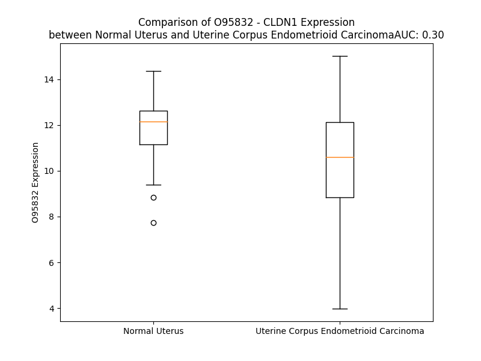

# Detailed Data for O95832

## Introduction to the Detailed Summary

### How to Interpret the Results

- **Summary & Metrics**: This section provides a quick reference to essential protein attributes, including expression changes, family classification, and biomarker applications. Regulation status (upregulated/downregulated) indicates the protein's behavior in a disease context. Some information comes from the original excel file with the proteins selected from literature, while others are derived from the analyses.
- **Expression Comparison**: A visual representation comparing protein expression between normal and disease states. It highlights significant changes in expression levels that might indicate diagnostic or therapeutic relevance. This is data coming from transcriptomics experiments and could not translate similarly to protein levels.
- **Isoform Alignment**: An interactive view of isoform alignments, revealing structural and functional differences between variants of the protein.
- **Interactors & Homologs**: Tables listing known interaction partners and homologous proteins, the more interactors and homologs, the more complex the protein is to design an antibody for.
- **Biological Assemblies**: Information about the structural arrangement of the protein in different assemblies, providing insights into its functional state but also the complexity of the protein to develop antibodies.
- **Combined Per-Residue Information**: A detailed table summarizing residue-level data. This includes predictions for epitope regions, aggregation tendencies, and modifications that might impact the protein's function. Each row corresponds to a residue in the protein, providing insights into specific sites that may be important for research or drug development.
## Summary & Metrics

- **UniProt Accession**: O95832
- **Gene Name**: CLDN1
- **Protein Name**: claudin-1
- **Swiss Prot**: CLD1_HUMAN
- **Family**: other
- **Biomarker Application**: prognosis
- **Number of Isoforms**: 0
- **Regulation**: 2
- **(transcriptomics) AUC**: 0.14
- **(transcriptomics) Fold Change**: 1.23
- **(transcriptomics) Regulation**: Downregulated
- **Discotope Epitope Count**: 66
- **Max n_uniprots (Homo)**: N/A
- **Max n_uniprots (Hetero)**: N/A

## Expression Comparison

## Interactors

| preferredName_A   | preferredName_B   |   score |
|:------------------|:------------------|--------:|
| CLDN1             | TJP1              |   0.999 |
| CLDN1             | OCLN              |   0.999 |
| CLDN1             | TJP2              |   0.999 |
| CLDN1             | CD81              |   0.998 |
| CLDN1             | TJP3              |   0.996 |
| CLDN1             | F11R              |   0.991 |
| CLDN1             | PATJ              |   0.964 |
| CLDN1             | CLDN12            |   0.952 |
| CLDN1             | CLDN4             |   0.944 |
| CLDN1             | SCARB1            |   0.934 |

## Homologs

| uniprot_id   | gene_id   |
|:-------------|:----------|
| Q8N6F1       | CLDN19    |
| O75508       | CLDN11    |
| Q8N7P3       | CLDN22    |
| A6NM45       | CLDN24    |
| P56748       | CLDN8     |
| C9JDP6       | CLDN25    |
| K7EL87       | CLDN7     |
| H7C241       | CLDN34    |
| P56750       | CLDN17    |
| Q96B33       | CLDN23    |
| D3DX19       | CLDN5     |
| P57739       | CLDN2     |
| P56880       | CLDN20    |
| Q9Y5I7       | CLDN16    |
| P56747       | CLDN6     |
| O95500       | CLDN14    |
| O95484       | CLDN9     |
| P56856       | CLDN18    |
| Q96FX9       | CLDN15    |
| Q75L80       | CLDN4     |
| O15551       | CLDN3     |
| Q5W075       | CLDN10    |

## Combined Per-Residue Information

|   res | aa   |   epitope_score | epitope   |   relative_surface_accessibility |   modeling_confidence |   Aggregation | modification   |
|------:|:-----|----------------:|:----------|---------------------------------:|----------------------:|--------------:|:---------------|
|     1 | M    |         0.23345 | False     |                          1.20084 |                 43.11 |         0     | N/A            |
|     2 | A    |         0.27685 | False     |                          0.83484 |                 49.24 |         0.003 | N/A            |
|     3 | N    |         0.17779 | False     |                          0.37093 |                 75.11 |         0.005 | N/A            |
|     4 | A    |         0.15805 | False     |                          0.40427 |                 81.64 |         0.102 | N/A            |
|     5 | G    |         0.18153 | False     |                          0.5403  |                 86.28 |         0.277 | N/A            |
|     6 | L    |         0.12713 | False     |                          0.38395 |                 88.67 |        10.102 | N/A            |
|     7 | Q    |         0.02923 | False     |                          0.01389 |                 89.66 |        12.08  | N/A            |
|     8 | L    |         0.26493 | False     |                          0.5641  |                 91.24 |        65.308 | N/A            |
|     9 | L    |         0.07727 | False     |                          0.55091 |                 93.22 |        75.475 | N/A            |
|    10 | G    |         0.00403 | False     |                          0       |                 94.1  |        77.339 | N/A            |
|    11 | F    |         0.1288  | False     |                          0.1293  |                 94.68 |        98.078 | N/A            |
|    12 | I    |         0.07184 | False     |                          0.46318 |                 95.93 |        99.764 | N/A            |
|    13 | L    |         0.0508  | False     |                          0.23824 |                 96.95 |        99.912 | N/A            |
|    14 | A    |         0.00201 | False     |                          0       |                 96.64 |        99.916 | N/A            |
|    15 | F    |         0.08251 | False     |                          0.3886  |                 96.66 |        99.928 | N/A            |
|    16 | L    |         0.03766 | False     |                          0.55099 |                 97.66 |        99.611 | N/A            |
|    17 | G    |         0.00296 | False     |                          0       |                 97.45 |        97.844 | N/A            |
|    18 | W    |         0.10871 | False     |                          0.18076 |                 97.58 |        97.69  | N/A            |
|    19 | I    |         0.10824 | False     |                          0.40958 |                 97.64 |        97.033 | N/A            |
|    20 | G    |         0.06933 | False     |                          0.21682 |                 97.01 |        89.832 | N/A            |
|    21 | A    |         0.00296 | False     |                          0       |                 97.08 |        89.184 | N/A            |
|    22 | I    |         0.12596 | False     |                          0.37974 |                 97.33 |        88.636 | N/A            |
|    23 | V    |         0.08165 | False     |                          0.4796  |                 96.99 |        82.7   | N/A            |
|    24 | S    |         0.00357 | False     |                          0       |                 95.97 |        13.531 | N/A            |
|    25 | T    |         0.08301 | False     |                          0.07091 |                 95.31 |         5.928 | N/A            |
|    26 | A    |         0.19193 | False     |                          0.63243 |                 94.71 |         1.51  | N/A            |
|    27 | L    |         0.19369 | False     |                          0.33389 |                 93.96 |         0.075 | N/A            |
|    28 | P    |         0.1995  | False     |                          0.24653 |                 92.24 |         0.037 | N/A            |
|    29 | Q    |         0.35427 | True      |                          0.23423 |                 92.77 |         0     | N/A            |
|    30 | W    |         0.01743 | False     |                          0.00238 |                 94.53 |         0     | N/A            |
|    31 | R    |         0.46784 | True      |                          0.18841 |                 91.59 |         0     | N/A            |
|    32 | I    |         0.2867  | False     |                          0.27359 |                 90.96 |         2.281 | N/A            |
|    33 | Y    |         0.36917 | True      |                          0.11861 |                 85.32 |         2.281 | N/A            |
|    34 | S    |         0.41824 | True      |                          0.62499 |                 76.17 |         2.281 | N/A            |
|    35 | Y    |         0.38194 | True      |                          0.29723 |                 68.41 |         2.281 | N/A            |
|    36 | A    |         0.32356 | True      |                          0.89593 |                 59    |         2.281 | N/A            |
|    37 | G    |         0.39726 | True      |                          0.28524 |                 57.74 |         0.185 | N/A            |
|    38 | D    |         0.4315  | True      |                          0.96751 |                 54.89 |         0     | N/A            |
|    39 | N    |         0.50977 | True      |                          0.93351 |                 53.93 |         0     | N/A            |
|    40 | I    |         0.3864  | True      |                          0.64295 |                 54.35 |         0     | N/A            |
|    41 | V    |         0.34786 | True      |                          1.11007 |                 61.45 |         0     | N/A            |
|    42 | T    |         0.30397 | True      |                          0.38676 |                 62.89 |         0     | N/A            |
|    43 | A    |         0.2748  | False     |                          0.58916 |                 69.99 |         0     | N/A            |
|    44 | Q    |         0.29377 | False     |                          0.22375 |                 79.69 |         0     | N/A            |
|    45 | A    |         0.31938 | True      |                          0.22307 |                 84.66 |         0     | N/A            |
|    46 | M    |         0.3307  | True      |                          0.26873 |                 87.53 |         0     | N/A            |
|    47 | Y    |         0.24241 | False     |                          0.26833 |                 90.69 |         0     | N/A            |
|    48 | E    |         0.2356  | False     |                          0.15219 |                 91.22 |         0     | N/A            |
|    49 | G    |         0.00988 | False     |                          0.00357 |                 92.79 |         0     | N/A            |
|    50 | L    |         0.01818 | False     |                          0.00471 |                 92.08 |         0.713 | N/A            |
|    51 | W    |         0.20862 | False     |                          0.44337 |                 92.4  |         1.072 | N/A            |
|    52 | M    |         0.33851 | True      |                          0.31203 |                 91.64 |         1.072 | N/A            |
|    53 | S    |         0.23132 | False     |                          0.27301 |                 91.17 |         1.072 | N/A            |
|    54 | C    |         0.15231 | False     |                          0.03808 |                 91.82 |         1.072 | N/A            |
|    55 | V    |         0.33159 | True      |                          0.18132 |                 89.25 |         1.072 | N/A            |
|    56 | S    |         0.44677 | True      |                          0.21416 |                 88.07 |         0     | N/A            |
|    57 | Q    |         0.21892 | False     |                          0.27384 |                 84.54 |         0     | N/A            |
|    58 | S    |         0.33947 | True      |                          0.65597 |                 80.32 |         0     | N/A            |
|    59 | T    |         0.34375 | True      |                          0.73277 |                 80.91 |         0     | N/A            |
|    60 | G    |         0.30137 | False     |                          0.78076 |                 80.77 |         0     | N/A            |
|    61 | Q    |         0.40892 | True      |                          0.51672 |                 85.83 |         0     | N/A            |
|    62 | I    |         0.55246 | True      |                          0.68798 |                 88.31 |         0     | N/A            |
|    63 | Q    |         0.43283 | True      |                          0.49599 |                 90.6  |         0     | N/A            |
|    64 | C    |         0.31372 | True      |                          0.53827 |                 92.15 |         0     | N/A            |
|    65 | K    |         0.4169  | True      |                          0.62306 |                 91.65 |         0     | N/A            |
|    66 | V    |         0.40068 | True      |                          0.68248 |                 91.39 |         0     | N/A            |
|    67 | F    |         0.35453 | True      |                          0.25052 |                 87.18 |         0     | N/A            |
|    68 | D    |         0.31429 | True      |                          0.71549 |                 76.34 |         0     | N/A            |
|    69 | S    |         0.31    | True      |                          0.46539 |                 76.1  |         0     | N/A            |
|    70 | L    |         0.34465 | True      |                          0.72129 |                 71.51 |         0     | N/A            |
|    71 | L    |         0.37862 | True      |                          1.08193 |                 67.42 |         0     | N/A            |
|    72 | N    |         0.46085 | True      |                          0.87673 |                 77.33 |         0     | N/A            |
|    73 | L    |         0.43895 | True      |                          0.18595 |                 78.29 |         0     | N/A            |
|    74 | S    |         0.49201 | True      |                          0.52212 |                 84.81 |         0     | N/A            |
|    75 | S    |         0.31906 | True      |                          0.7204  |                 87.64 |         0     | N/A            |
|    76 | T    |         0.3438  | True      |                          0.18165 |                 90    |         0     | N/A            |
|    77 | L    |         0.1211  | False     |                          0.03215 |                 90.63 |         0     | N/A            |
|    78 | Q    |         0.37384 | True      |                          0.50377 |                 91.77 |         0     | N/A            |
|    79 | A    |         0.16084 | False     |                          0.48689 |                 92.5  |         0     | N/A            |
|    80 | T    |         0.04336 | False     |                          0.01657 |                 94.36 |         0     | N/A            |
|    81 | R    |         0.25627 | False     |                          0.06349 |                 94.34 |         0     | N/A            |
|    82 | A    |         0.13943 | False     |                          0.52874 |                 94.53 |        10.7   | N/A            |
|    83 | L    |         0.10343 | False     |                          0.36766 |                 95.97 |        54.037 | N/A            |
|    84 | M    |         0.00758 | False     |                          0       |                 96.51 |        76.25  | N/A            |
|    85 | V    |         0.13187 | False     |                          0.38464 |                 96.38 |        96.304 | N/A            |
|    86 | V    |         0.04232 | False     |                          0.50816 |                 96.69 |        98.008 | N/A            |
|    87 | G    |         0.00413 | False     |                          0.00119 |                 96.72 |        98.153 | N/A            |
|    88 | I    |         0.17292 | False     |                          0.17359 |                 97.26 |        99.761 | N/A            |
|    89 | L    |         0.09887 | False     |                          0.63697 |                 97.66 |        99.908 | N/A            |
|    90 | L    |         0.06848 | False     |                          0.29924 |                 97.21 |        99.935 | N/A            |
|    91 | G    |         0.00542 | False     |                          0.00161 |                 96.88 |        99.939 | N/A            |
|    92 | V    |         0.07107 | False     |                          0.35417 |                 96.9  |        99.993 | N/A            |
|    93 | I    |         0.06504 | False     |                          0.52718 |                 96.69 |        99.997 | N/A            |
|    94 | A    |         0.00275 | False     |                          0       |                 95.9  |        99.986 | N/A            |
|    95 | I    |         0.07168 | False     |                          0.15519 |                 95.78 |        99.977 | N/A            |
|    96 | F    |         0.09399 | False     |                          0.70337 |                 94.43 |        99.874 | N/A            |
|    97 | V    |         0.06095 | False     |                          0.23897 |                 93.23 |        98.613 | N/A            |
|    98 | A    |         0.00286 | False     |                          0.00094 |                 92.04 |        83.763 | N/A            |
|    99 | T    |         0.0949  | False     |                          0.20159 |                 91.13 |        71.205 | N/A            |
|   100 | V    |         0.1658  | False     |                          0.37593 |                 89.26 |        63.733 | N/A            |
|   101 | G    |         0.01093 | False     |                          0.00119 |                 85.23 |         1.726 | N/A            |
|   102 | M    |         0.12377 | False     |                          0.07513 |                 84.74 |         0.695 | N/A            |
|   103 | K    |         0.19792 | False     |                          0.47173 |                 75.78 |         0     | N/A            |
|   104 | C    |         0.35192 | True      |                          0.74213 |                 76.32 |         0     | N/A            |
|   105 | M    |         0.33447 | True      |                          0.39795 |                 79.86 |         0     | N/A            |
|   106 | K    |         0.49745 | True      |                          0.89539 |                 76.35 |         0     | N/A            |
|   107 | C    |         0.26961 | False     |                          0.48832 |                 69.66 |         0     | N/A            |
|   108 | L    |         0.31951 | True      |                          0.37073 |                 73.74 |         0     | N/A            |
|   109 | E    |         0.52534 | True      |                          0.66669 |                 74.11 |         0     | N/A            |
|   110 | D    |         0.55504 | True      |                          0.91653 |                 74.93 |         0     | N/A            |
|   111 | D    |         0.38353 | True      |                          0.39927 |                 81    |         0     | N/A            |
|   112 | E    |         0.2576  | False     |                          0.64794 |                 81.32 |         0     | N/A            |
|   113 | V    |         0.25436 | False     |                          0.6363  |                 82.78 |         0     | N/A            |
|   114 | Q    |         0.23008 | False     |                          0.41891 |                 84.7  |         0     | N/A            |
|   115 | K    |         0.14096 | False     |                          0.09744 |                 85.81 |         0     | N/A            |
|   116 | M    |         0.15076 | False     |                          0.12342 |                 84.13 |         0     | N/A            |
|   117 | R    |         0.25161 | False     |                          0.62241 |                 87.84 |         0     | N/A            |
|   118 | M    |         0.15147 | False     |                          0.37676 |                 90.14 |         0.873 | N/A            |
|   119 | A    |         0.0053  | False     |                          0.00383 |                 90.68 |         2.22  | N/A            |
|   120 | V    |         0.12393 | False     |                          0.26277 |                 91.36 |         7.696 | N/A            |
|   121 | I    |         0.05086 | False     |                          0.50478 |                 93.43 |         8.241 | N/A            |
|   122 | G    |         0.00416 | False     |                          0       |                 94.15 |         8.321 | N/A            |
|   123 | G    |         0.00477 | False     |                          0       |                 95.08 |        11.684 | N/A            |
|   124 | A    |         0.0505  | False     |                          0.39078 |                 96    |        49.946 | N/A            |
|   125 | I    |         0.04584 | False     |                          0.17359 |                 97.13 |        95.224 | N/A            |
|   126 | F    |         0.00234 | False     |                          0.00064 |                 97.36 |        99.366 | N/A            |
|   127 | L    |         0.06469 | False     |                          0.30501 |                 97.63 |        99.703 | N/A            |
|   128 | L    |         0.05335 | False     |                          0.6369  |                 97.39 |        99.762 | N/A            |
|   129 | A    |         0.0076  | False     |                          0.00893 |                 97.44 |        99.748 | N/A            |
|   130 | G    |         0.00442 | False     |                          0       |                 97.51 |        99.731 | N/A            |
|   131 | L    |         0.06163 | False     |                          0.52733 |                 97.69 |        99.877 | N/A            |
|   132 | A    |         0.0729  | False     |                          0.14779 |                 97.03 |        99.887 | N/A            |
|   133 | I    |         0.0071  | False     |                          0.0032  |                 97.33 |        99.903 | N/A            |
|   134 | L    |         0.08054 | False     |                          0.38168 |                 97.68 |        99.765 | N/A            |
|   135 | V    |         0.05606 | False     |                          0.52194 |                 97    |        99     | N/A            |
|   136 | A    |         0.00564 | False     |                          0.00128 |                 95.96 |        89.981 | N/A            |
|   137 | T    |         0.00631 | False     |                          0       |                 96.2  |        83.017 | N/A            |
|   138 | A    |         0.11047 | False     |                          0.41953 |                 96.22 |        79.219 | N/A            |
|   139 | W    |         0.35512 | True      |                          0.68104 |                 95.71 |        76.976 | N/A            |
|   140 | Y    |         0.16647 | False     |                          0.05044 |                 94.8  |        68.034 | N/A            |
|   141 | G    |         0.0718  | False     |                          0.01779 |                 94.88 |         2.133 | N/A            |
|   142 | N    |         0.2585  | False     |                          0.49219 |                 94.98 |         0.046 | N/A            |
|   143 | R    |         0.55418 | True      |                          0.39334 |                 93.1  |         0     | N/A            |
|   144 | I    |         0.29519 | False     |                          0.03728 |                 92.28 |         0     | N/A            |
|   145 | V    |         0.22001 | False     |                          0.38654 |                 93.39 |         0     | N/A            |
|   146 | Q    |         0.41808 | True      |                          0.4413  |                 92.3  |         0     | N/A            |
|   147 | E    |         0.38456 | True      |                          0.2868  |                 89.74 |         0     | N/A            |
|   148 | F    |         0.3585  | True      |                          0.35209 |                 88.99 |         0     | N/A            |
|   149 | Y    |         0.46405 | True      |                          0.75266 |                 90.31 |         0     | N/A            |
|   150 | D    |         0.4897  | True      |                          0.35275 |                 90.62 |         0     | N/A            |
|   151 | P    |         0.42649 | True      |                          0.9127  |                 89.01 |         0     | N/A            |
|   152 | M    |         0.59346 | True      |                          0.88809 |                 88.91 |         0     | N/A            |
|   153 | T    |         0.28159 | False     |                          0.19214 |                 83.1  |         0     | N/A            |
|   154 | P    |         0.49514 | True      |                          0.6372  |                 81.55 |         0     | N/A            |
|   155 | V    |         0.47463 | True      |                          0.78564 |                 77.4  |         0     | N/A            |
|   156 | N    |         0.62373 | True      |                          0.43898 |                 75.5  |         0     | N/A            |
|   157 | A    |         0.52658 | True      |                          0.17856 |                 78.47 |         0     | N/A            |
|   158 | R    |         0.53017 | True      |                          0.27948 |                 83.43 |         0     | N/A            |
|   159 | Y    |         0.26963 | False     |                          0.15234 |                 87.55 |         0     | N/A            |
|   160 | E    |         0.30811 | True      |                          0.51682 |                 90.5  |         0     | N/A            |
|   161 | F    |         0.34178 | True      |                          0.35368 |                 93.2  |         0     | N/A            |
|   162 | G    |         0.00922 | False     |                          0       |                 92.99 |         0     | N/A            |
|   163 | Q    |         0.43913 | True      |                          0.59226 |                 94.06 |         0.225 | N/A            |
|   164 | A    |         0.00699 | False     |                          0       |                 95.34 |         9.996 | N/A            |
|   165 | L    |         0.00934 | False     |                          0       |                 95.22 |        22.593 | N/A            |
|   166 | F    |         0.10794 | False     |                          0.54236 |                 96.04 |        24.502 | N/A            |
|   167 | T    |         0.06316 | False     |                          0.33798 |                 96.2  |        24.604 | N/A            |
|   168 | G    |         0.0033  | False     |                          0       |                 97.21 |        24.775 | N/A            |
|   169 | W    |         0.179   | False     |                          0.32949 |                 97.68 |        27.402 | N/A            |
|   170 | A    |         0.06294 | False     |                          0.4876  |                 97.64 |        26.32  | N/A            |
|   171 | A    |         0.02248 | False     |                          0.01295 |                 97.4  |        25.343 | N/A            |
|   172 | A    |         0.00269 | False     |                          0       |                 97.64 |        24.648 | N/A            |
|   173 | S    |         0.0727  | False     |                          0.39152 |                 97.81 |        24.113 | N/A            |
|   174 | L    |         0.06313 | False     |                          0.32892 |                 97.73 |        24.486 | N/A            |
|   175 | C    |         0.01158 | False     |                          0.01029 |                 97.32 |        24.042 | N/A            |
|   176 | L    |         0.08019 | False     |                          0.23175 |                 97.77 |        23.836 | N/A            |
|   177 | L    |         0.06813 | False     |                          0.63866 |                 96.87 |        20.957 | N/A            |
|   178 | G    |         0.00231 | False     |                          0       |                 95.62 |         4.195 | N/A            |
|   179 | G    |         0.00331 | False     |                          0       |                 95.58 |         2.654 | N/A            |
|   180 | A    |         0.07922 | False     |                          0.36349 |                 95.32 |         2.654 | N/A            |
|   181 | L    |         0.06223 | False     |                          0.27286 |                 93.36 |         2.654 | N/A            |
|   182 | L    |         0.00315 | False     |                          0       |                 91.56 |         2.217 | N/A            |
|   183 | C    |         0.09988 | False     |                          0.218   |                 91.25 |         0     | N/A            |
|   184 | C    |         0.13361 | False     |                          0.68182 |                 87.06 |         0     | N/A            |
|   185 | S    |         0.08237 | False     |                          0.01533 |                 74.05 |         0     | N/A            |
|   186 | C    |         0.11734 | False     |                          0.44918 |                 65.17 |         0     | N/A            |
|   187 | P    |         0.24004 | False     |                          0.59252 |                 58.84 |         0     | N/A            |
|   188 | R    |         0.21392 | False     |                          0.9046  |                 54.53 |         0     | N/A            |
|   189 | K    |         0.19835 | False     |                          0.94852 |                 50.79 |         0     | N/A            |
|   190 | T    |         0.19453 | False     |                          0.83125 |                 42.12 |         0     | N/A            |
|   191 | T    |         0.22543 | False     |                          0.84367 |                 40.16 |         0     | N/A            |
|   192 | S    |         0.19088 | False     |                          0.70422 |                 41.24 |         0     | N/A            |
|   193 | Y    |         0.26188 | False     |                          0.86676 |                 43.85 |         0     | N/A            |
|   194 | P    |         0.29769 | False     |                          0.87574 |                 48.48 |         0     | N/A            |
|   195 | T    |         0.23318 | False     |                          0.85856 |                 57.71 |         0     | N/A            |
|   196 | P    |         0.33417 | True      |                          0.89813 |                 56.94 |         0     | N/A            |
|   197 | R    |         0.32879 | True      |                          0.88928 |                 60.88 |         0     | N/A            |
|   198 | P    |         0.39232 | True      |                          0.91499 |                 67.75 |         0     | N/A            |
|   199 | Y    |         0.35354 | True      |                          0.91945 |                 68.85 |         0     | N/A            |
|   200 | P    |         0.43061 | True      |                          0.90301 |                 70.52 |         0     | N/A            |
|   201 | K    |         0.29471 | False     |                          0.94242 |                 71.53 |         0     | N/A            |
|   202 | P    |         0.33624 | True      |                          0.94516 |                 73.1  |         0     | N/A            |
|   203 | A    |         0.26038 | False     |                          0.84735 |                 71.39 |         0     | N/A            |
|   204 | P    |         0.28444 | False     |                          0.95799 |                 68.01 |         0     | N/A            |
|   205 | S    |         0.26392 | False     |                          0.83437 |                 66.54 |         0     | N/A            |
|   206 | S    |         0.2582  | False     |                          0.85718 |                 65.18 |         0     | N/A            |
|   207 | G    |         0.29266 | False     |                          0.76009 |                 60.57 |         0     | N/A            |
|   208 | K    |         0.238   | False     |                          0.88246 |                 53.69 |         0     | N/A            |
|   209 | D    |         0.23286 | False     |                          0.83558 |                 58.06 |         0     | N/A            |
|   210 | Y    |         0.24144 | False     |                          0.83034 |                 55.89 |         0     | N/A            |
|   211 | V    |         0.14578 | False     |                          1.54122 |                 56.02 |         0     | N/A            |

