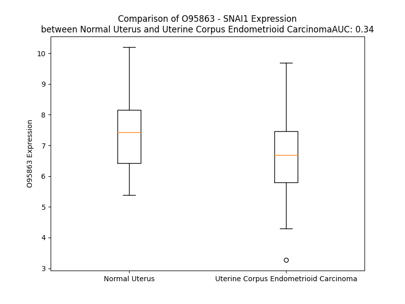

# Detailed Data for O95863

## Introduction to the Detailed Summary

### How to Interpret the Results

- **Summary & Metrics**: This section provides a quick reference to essential protein attributes, including expression changes, family classification, and biomarker applications. Regulation status (upregulated/downregulated) indicates the protein's behavior in a disease context. Some information comes from the original excel file with the proteins selected from literature, while others are derived from the analyses.
- **Expression Comparison**: A visual representation comparing protein expression between normal and disease states. It highlights significant changes in expression levels that might indicate diagnostic or therapeutic relevance. This is data coming from transcriptomics experiments and could not translate similarly to protein levels.
- **Isoform Alignment**: An interactive view of isoform alignments, revealing structural and functional differences between variants of the protein.
- **Interactors & Homologs**: Tables listing known interaction partners and homologous proteins, the more interactors and homologs, the more complex the protein is to design an antibody for.
- **Biological Assemblies**: Information about the structural arrangement of the protein in different assemblies, providing insights into its functional state but also the complexity of the protein to develop antibodies.
- **Combined Per-Residue Information**: A detailed table summarizing residue-level data. This includes predictions for epitope regions, aggregation tendencies, and modifications that might impact the protein's function. Each row corresponds to a residue in the protein, providing insights into specific sites that may be important for research or drug development.
## Summary & Metrics

- **UniProt Accession**: O95863
- **Gene Name**: SNAI1
- **Protein Name**: Zinc finger protein SNAI1
- **Swiss Prot**: SNAI1_HUMAN
- **Family**: nan
- **Biomarker Application**: nan
- **Number of Isoforms**: 0
- **Regulation**: 1
- **(transcriptomics) AUC**: 0.34
- **(transcriptomics) Fold Change**: 1.10
- **(transcriptomics) Regulation**: Downregulated
- **Discotope Epitope Count**: 12
- **Max n_uniprots (Homo)**: N/A
- **Max n_uniprots (Hetero)**: 3

## Expression Comparison

## Interactors

| preferredName_A   | preferredName_B   |   score |
|:------------------|:------------------|--------:|
| SNAI1             | HDAC1             |   0.999 |
| SNAI1             | KDM1A             |   0.998 |
| SNAI1             | HDAC2             |   0.998 |
| SNAI1             | EZH2              |   0.998 |
| SNAI1             | DNMT1             |   0.995 |
| SNAI1             | SMAD3             |   0.994 |
| SNAI1             | TP53              |   0.992 |
| SNAI1             | EHMT2             |   0.99  |
| SNAI1             | RCOR1             |   0.987 |
| SNAI1             | GSK3B             |   0.978 |
| SNAI1             | LOXL2             |   0.973 |
| SNAI1             | CDH1              |   0.965 |
| SNAI1             | BTRC              |   0.964 |
| SNAI1             | SMAD4             |   0.96  |
| SNAI1             | SUZ12             |   0.959 |
| SNAI1             | CTNNB1            |   0.934 |
| SNAI1             | CDH2              |   0.932 |
| SNAI1             | KPNB1             |   0.93  |
| SNAI1             | FBXL14            |   0.921 |
| SNAI1             | TWIST1            |   0.901 |

## Homologs

| uniprot_id   | gene_id   |
|:-------------|:----------|
| B2RXF5       | ZBTB42    |
| Q5T0B9       | ZNF362    |
| Q5T4E8       | PRDM1     |
| Q9HBE1       | PATZ1     |
| Q9HC78       | ZBTB20    |
| G3V3W2       | ZNF410    |
| H3BTK0       | ZNF276    |
| Q14872       | MTF1      |
| E9PPB0       | ZNF143    |
| Q8WUU4       | ZNF296    |
| Q9Y2X9       | ZNF281    |
| Q96CK0       | ZNF653    |
| C9JMM8       | PRDM14    |
| Q14119       | VEZF1     |
| G3V3N0       | ZBTB1     |
| I3L411       | MAZ       |
| G5E9X2       | ZNF148    |
| E7EX64       | ZNF76     |
| Q14526       | HIC1      |
| D6REC5       | ZNF451    |
| B3KQ07       | ZNF575    |
| A0A0S2Z4J5   | ZBTB16    |
| F5H105       | ZNF384    |
| Q3KNW1       | SNAI3     |
| O43623       | SNAI2     |
| M0QZ57       | ZBTB45    |
| Q99592       | ZBTB18    |
| Q9Y2Y4       | ZBTB32    |
| Q96JB3       | HIC2      |
| Q9BWW7       | SCRT1     |
| Q9NQ03       | SCRT2     |
| Q96JP5       | ZFP91     |
| A0A1B0GXF8   | ZBTB7C    |
| E9PIB4       | PRDM10    |
| E9PLQ7       | ZNF692    |
| Q9NQX0       | PRDM6     |

## Biological Assemblies

|   Unnamed: 0 |   assembly |   n_uniprots | composition   | crystal_id   |
|-------------:|-----------:|-------------:|:--------------|:-------------|
|            0 |          1 |            3 | Hetero        | 8fdv         |
|            0 |          1 |            2 | Hetero        | 3zmt         |
|            0 |          1 |            3 | Hetero        | 2y48         |
|            0 |          1 |            3 | Hetero        | 8f59         |
|            0 |          1 |            2 | Hetero        | 4qli         |
|            0 |          1 |            2 | Hetero        | 3w5k         |
|            0 |          1 |            3 | Hetero        | 8box         |

## Combined Per-Residue Information

|   res | aa   |   epitope_score | epitope   |   relative_surface_accessibility |   modeling_confidence |   Aggregation | modification               | glycosylation            |
|------:|:-----|----------------:|:----------|---------------------------------:|----------------------:|--------------:|:---------------------------|:-------------------------|
|     1 | M    |         0.11201 | False     |                          1.28395 |                 48.41 |         0     | N/A                        | N/A                      |
|     2 | P    |         0.10137 | False     |                          0.96614 |                 39.53 |         0     | N/A                        | N/A                      |
|     3 | R    |         0.13288 | False     |                          0.87352 |                 40.05 |         0     | N/A                        | N/A                      |
|     4 | S    |         0.10958 | False     |                          0.83411 |                 37.88 |         0     | N/A                        | N/A                      |
|     5 | F    |         0.14551 | False     |                          0.93975 |                 42.05 |         0     | N/A                        | N/A                      |
|     6 | L    |         0.14296 | False     |                          1.01192 |                 41.57 |         0     | N/A                        | N/A                      |
|     7 | V    |         0.14693 | False     |                          0.96486 |                 45.01 |         0     | N/A                        | N/A                      |
|     8 | R    |         0.20333 | False     |                          0.90645 |                 38.4  |         0     | N/A                        | N/A                      |
|     9 | K    |         0.11676 | False     |                          0.90754 |                 42.73 |         0     | N/A                        | N/A                      |
|    10 | P    |         0.13958 | False     |                          0.94788 |                 44.22 |         0     | N/A                        | N/A                      |
|    11 | S    |         0.13576 | False     |                          0.79073 |                 42.5  |         0     | Phosphoserine; by PKA      | N/A                      |
|    12 | D    |         0.1629  | False     |                          0.6174  |                 45.93 |         0     | N/A                        | N/A                      |
|    13 | P    |         0.1469  | False     |                          1.09583 |                 50.63 |         0     | N/A                        | N/A                      |
|    14 | N    |         0.17376 | False     |                          0.79181 |                 36.08 |         0     | N/A                        | N/A                      |
|    15 | R    |         0.2295  | False     |                          0.86796 |                 39.98 |         0     | N/A                        | N/A                      |
|    16 | K    |         0.11206 | False     |                          0.87098 |                 40.63 |         0     | N/A                        | N/A                      |
|    17 | P    |         0.16108 | False     |                          0.93288 |                 37.75 |         0     | N/A                        | N/A                      |
|    18 | N    |         0.10106 | False     |                          0.67818 |                 29.39 |         0     | N/A                        | N/A                      |
|    19 | Y    |         0.19752 | False     |                          0.862   |                 34.01 |         0     | N/A                        | N/A                      |
|    20 | S    |         0.22592 | False     |                          0.66027 |                 40.12 |         0     | N/A                        | N/A                      |
|    21 | E    |         0.21581 | False     |                          0.78246 |                 37.71 |         0     | N/A                        | N/A                      |
|    22 | L    |         0.24815 | True      |                          1.01245 |                 37.85 |         0     | N/A                        | N/A                      |
|    23 | Q    |         0.22149 | False     |                          0.84208 |                 36.61 |         0     | N/A                        | N/A                      |
|    24 | D    |         0.21677 | False     |                          0.88527 |                 31.29 |         0     | N/A                        | N/A                      |
|    25 | S    |         0.16541 | False     |                          0.87775 |                 35.97 |         0     | N/A                        | N/A                      |
|    26 | N    |         0.10007 | False     |                          0.86163 |                 33.68 |         0     | N/A                        | N/A                      |
|    27 | P    |         0.12422 | False     |                          0.84408 |                 33.07 |         0     | N/A                        | N/A                      |
|    28 | E    |         0.07812 | False     |                          0.75557 |                 29.44 |         0     | N/A                        | N/A                      |
|    29 | F    |         0.18904 | False     |                          1.06727 |                 31.98 |         0     | N/A                        | N/A                      |
|    30 | T    |         0.14003 | False     |                          0.71988 |                 30.93 |         0     | N/A                        | N/A                      |
|    31 | F    |         0.18256 | False     |                          0.92086 |                 27.89 |         0     | N/A                        | N/A                      |
|    32 | Q    |         0.17329 | False     |                          0.80565 |                 30.1  |         0     | N/A                        | N/A                      |
|    33 | Q    |         0.1389  | False     |                          0.62481 |                 32.5  |         0     | N/A                        | N/A                      |
|    34 | P    |         0.1234  | False     |                          0.87415 |                 39.79 |         0     | N/A                        | N/A                      |
|    35 | Y    |         0.10872 | False     |                          0.84384 |                 31.65 |         0     | N/A                        | N/A                      |
|    36 | D    |         0.10853 | False     |                          0.62609 |                 36.89 |         0     | N/A                        | N/A                      |
|    37 | Q    |         0.13488 | False     |                          0.79761 |                 36.41 |         0     | N/A                        | N/A                      |
|    38 | A    |         0.17447 | False     |                          0.67362 |                 37.22 |         0     | N/A                        | N/A                      |
|    39 | H    |         0.14529 | False     |                          0.84649 |                 40.31 |         0     | N/A                        | N/A                      |
|    40 | L    |         0.16058 | False     |                          1.12102 |                 39.89 |         0     | N/A                        | N/A                      |
|    41 | L    |         0.18942 | False     |                          1.0534  |                 38.7  |         0     | N/A                        | N/A                      |
|    42 | A    |         0.15172 | False     |                          0.90031 |                 34.21 |         0     | N/A                        | N/A                      |
|    43 | A    |         0.1055  | False     |                          0.92998 |                 38.35 |         0     | N/A                        | N/A                      |
|    44 | I    |         0.22035 | False     |                          0.98162 |                 45.15 |         0     | N/A                        | N/A                      |
|    45 | P    |         0.14649 | False     |                          0.79216 |                 56.57 |         0     | N/A                        | N/A                      |
|    46 | P    |         0.13465 | False     |                          0.82565 |                 57.32 |         0     | N/A                        | N/A                      |
|    47 | P    |         0.14366 | False     |                          0.86986 |                 58.33 |         0     | N/A                        | N/A                      |
|    48 | E    |         0.12595 | False     |                          0.83682 |                 48.36 |         0     | N/A                        | N/A                      |
|    49 | I    |         0.15287 | False     |                          0.96927 |                 46.38 |         0     | N/A                        | N/A                      |
|    50 | L    |         0.13561 | False     |                          1.00067 |                 43.6  |         0     | N/A                        | N/A                      |
|    51 | N    |         0.14021 | False     |                          0.70119 |                 47.68 |         0     | N/A                        | N/A                      |
|    52 | P    |         0.16989 | False     |                          0.92622 |                 39.41 |         0     | N/A                        | N/A                      |
|    53 | T    |         0.16474 | False     |                          0.77174 |                 37.23 |         0     | N/A                        | N/A                      |
|    54 | A    |         0.18876 | False     |                          0.9259  |                 44.92 |         0     | N/A                        | N/A                      |
|    55 | S    |         0.12573 | False     |                          0.77899 |                 45.75 |         0     | N/A                        | N/A                      |
|    56 | L    |         0.15314 | False     |                          1.01733 |                 47.7  |         0     | N/A                        | N/A                      |
|    57 | P    |         0.14279 | False     |                          0.74841 |                 44.87 |         0     | N/A                        | N/A                      |
|    58 | M    |         0.14499 | False     |                          0.87422 |                 39.04 |         0     | N/A                        | N/A                      |
|    59 | L    |         0.13349 | False     |                          0.89205 |                 48.34 |         0     | N/A                        | N/A                      |
|    60 | I    |         0.13232 | False     |                          1.04581 |                 53.67 |         0     | N/A                        | N/A                      |
|    61 | W    |         0.12138 | False     |                          0.9761  |                 36.74 |         0     | N/A                        | N/A                      |
|    62 | D    |         0.13623 | False     |                          0.71725 |                 41.1  |         0     | N/A                        | N/A                      |
|    63 | S    |         0.1785  | False     |                          0.77887 |                 49.12 |         0     | N/A                        | N/A                      |
|    64 | V    |         0.18181 | False     |                          0.92413 |                 50.76 |         0     | N/A                        | N/A                      |
|    65 | L    |         0.17672 | False     |                          1.00078 |                 51.54 |         0     | N/A                        | N/A                      |
|    66 | A    |         0.13661 | False     |                          0.89839 |                 48.77 |         0     | N/A                        | N/A                      |
|    67 | P    |         0.13989 | False     |                          0.84114 |                 44.41 |         0     | N/A                        | N/A                      |
|    68 | Q    |         0.12293 | False     |                          0.7653  |                 46.97 |         0     | N/A                        | N/A                      |
|    69 | A    |         0.19852 | False     |                          1.02378 |                 46.58 |         0     | N/A                        | N/A                      |
|    70 | Q    |         0.12794 | False     |                          0.75842 |                 54.62 |         0     | N/A                        | N/A                      |
|    71 | P    |         0.10042 | False     |                          0.90894 |                 50.24 |         0     | N/A                        | N/A                      |
|    72 | I    |         0.15336 | False     |                          0.90837 |                 55.69 |         0.493 | N/A                        | N/A                      |
|    73 | A    |         0.16763 | False     |                          0.89978 |                 45.26 |         0.493 | N/A                        | N/A                      |
|    74 | W    |         0.29437 | True      |                          1.06034 |                 38.86 |         0.493 | N/A                        | N/A                      |
|    75 | A    |         0.21785 | False     |                          0.83131 |                 42.06 |         0.493 | N/A                        | N/A                      |
|    76 | S    |         0.17598 | False     |                          0.84384 |                 46.76 |         0.493 | N/A                        | N/A                      |
|    77 | L    |         0.14253 | False     |                          1.15416 |                 44.82 |         0.493 | N/A                        | N/A                      |
|    78 | R    |         0.14328 | False     |                          0.94351 |                 38.06 |         0     | N/A                        | N/A                      |
|    79 | L    |         0.12397 | False     |                          1.04486 |                 45.17 |         0     | N/A                        | N/A                      |
|    80 | Q    |         0.10657 | False     |                          0.8538  |                 44.17 |         0     | N/A                        | N/A                      |
|    81 | E    |         0.08861 | False     |                          0.85927 |                 37.52 |         0     | N/A                        | N/A                      |
|    82 | S    |         0.12002 | False     |                          0.86451 |                 41.47 |         0     | Phosphoserine              | N/A                      |
|    83 | P    |         0.15361 | False     |                          0.8626  |                 42.06 |         0     | N/A                        | N/A                      |
|    84 | R    |         0.20933 | False     |                          0.90865 |                 44.32 |         0     | N/A                        | N/A                      |
|    85 | V    |         0.08513 | False     |                          0.93364 |                 46.33 |         0     | N/A                        | N/A                      |
|    86 | A    |         0.11142 | False     |                          0.87149 |                 41.04 |         0     | N/A                        | N/A                      |
|    87 | E    |         0.15106 | False     |                          0.7947  |                 39.24 |         0     | N/A                        | N/A                      |
|    88 | L    |         0.12088 | False     |                          0.84849 |                 40.9  |         0     | N/A                        | N/A                      |
|    89 | T    |         0.1094  | False     |                          0.78681 |                 36.8  |         0     | N/A                        | N/A                      |
|    90 | S    |         0.20407 | False     |                          0.7045  |                 38.24 |         0     | N/A                        | N/A                      |
|    91 | L    |         0.13761 | False     |                          0.98515 |                 40.83 |         0     | N/A                        | N/A                      |
|    92 | S    |         0.14566 | False     |                          0.68793 |                 43.52 |         0     | Phosphoserine; by CK2      | N/A                      |
|    93 | D    |         0.13183 | False     |                          0.72749 |                 46.25 |         0     | N/A                        | N/A                      |
|    94 | E    |         0.10497 | False     |                          0.84572 |                 50.51 |         0     | N/A                        | N/A                      |
|    95 | D    |         0.18533 | False     |                          0.82949 |                 43.11 |         0     | N/A                        | N/A                      |
|    96 | S    |         0.11487 | False     |                          0.81096 |                 43.37 |         0     | Phosphoserine              | N/A                      |
|    97 | G    |         0.19425 | False     |                          0.89958 |                 44.34 |         0     | N/A                        | N/A                      |
|    98 | K    |         0.16559 | False     |                          1.04275 |                 44.69 |         0     | N/A                        | N/A                      |
|    99 | G    |         0.25316 | True      |                          0.92973 |                 39.68 |         0     | N/A                        | N/A                      |
|   100 | S    |         0.19506 | False     |                          0.82909 |                 53.42 |         0     | Phosphoserine              | N/A                      |
|   101 | Q    |         0.18129 | False     |                          0.85907 |                 53.17 |         0     | N/A                        | N/A                      |
|   102 | P    |         0.11652 | False     |                          0.83618 |                 59.05 |         0     | N/A                        | N/A                      |
|   103 | P    |         0.15916 | False     |                          0.94434 |                 62.93 |         0     | N/A                        | N/A                      |
|   104 | S    |         0.1518  | False     |                          0.78918 |                 55.83 |         0     | Phosphoserine              | N/A                      |
|   105 | P    |         0.14234 | False     |                          0.87203 |                 67.19 |         0     | N/A                        | N/A                      |
|   106 | P    |         0.20967 | False     |                          0.93094 |                 67.99 |         0     | N/A                        | N/A                      |
|   107 | S    |         0.16796 | False     |                          0.81927 |                 55.09 |         0     | Phosphoserine              | N/A                      |
|   108 | P    |         0.18248 | False     |                          0.94356 |                 64.67 |         0     | N/A                        | N/A                      |
|   109 | A    |         0.11788 | False     |                          0.85267 |                 62.17 |         0     | N/A                        | N/A                      |
|   110 | P    |         0.15712 | False     |                          0.99571 |                 57.02 |         0     | N/A                        | N/A                      |
|   111 | S    |         0.12288 | False     |                          0.62387 |                 52.61 |         0     | Phosphoserine              | N/A                      |
|   112 | S    |         0.11323 | False     |                          0.8847  |                 51.37 |         0     | N/A                        | O-linked (GlcNAc) serine |
|   113 | F    |         0.19977 | False     |                          0.90615 |                 54.03 |         0     | N/A                        | N/A                      |
|   114 | S    |         0.10887 | False     |                          0.83384 |                 56.95 |         0     | N/A                        | N/A                      |
|   115 | S    |         0.13186 | False     |                          0.86284 |                 53.84 |         0     | Phosphoserine              | N/A                      |
|   116 | T    |         0.15117 | False     |                          0.77418 |                 54.3  |         0     | N/A                        | N/A                      |
|   117 | S    |         0.08496 | False     |                          0.4207  |                 49.04 |         0     | N/A                        | N/A                      |
|   118 | V    |         0.08199 | False     |                          0.7769  |                 55.66 |         0     | N/A                        | N/A                      |
|   119 | S    |         0.10634 | False     |                          0.58162 |                 59.46 |         0     | Phosphoserine              | N/A                      |
|   120 | S    |         0.0861  | False     |                          0.51233 |                 56.85 |         0     | N/A                        | N/A                      |
|   121 | L    |         0.07966 | False     |                          0.69017 |                 55.25 |         0     | N/A                        | N/A                      |
|   122 | E    |         0.08004 | False     |                          0.53898 |                 53.56 |         0     | N/A                        | N/A                      |
|   123 | A    |         0.11042 | False     |                          0.61865 |                 57.55 |         0     | N/A                        | N/A                      |
|   124 | E    |         0.10588 | False     |                          0.68249 |                 57.05 |         0     | N/A                        | N/A                      |
|   125 | A    |         0.0445  | False     |                          0.60497 |                 59.6  |         0     | N/A                        | N/A                      |
|   126 | Y    |         0.12709 | False     |                          0.67959 |                 58.43 |         0     | N/A                        | N/A                      |
|   127 | A    |         0.13406 | False     |                          0.81723 |                 61.62 |         0     | N/A                        | N/A                      |
|   128 | A    |         0.10913 | False     |                          0.6581  |                 65.32 |         0     | N/A                        | N/A                      |
|   129 | F    |         0.15295 | False     |                          0.65727 |                 58.61 |         0     | N/A                        | N/A                      |
|   130 | P    |         0.10641 | False     |                          1.04484 |                 61.51 |         0     | N/A                        | N/A                      |
|   131 | G    |         0.17055 | False     |                          0.83717 |                 58.3  |         0     | N/A                        | N/A                      |
|   132 | L    |         0.13359 | False     |                          0.55529 |                 51.31 |         0     | N/A                        | N/A                      |
|   133 | G    |         0.12845 | False     |                          0.74394 |                 53.49 |         0     | N/A                        | N/A                      |
|   134 | Q    |         0.11456 | False     |                          0.71681 |                 53.62 |         0     | N/A                        | N/A                      |
|   135 | V    |         0.05321 | False     |                          0.61309 |                 54.59 |         0     | N/A                        | N/A                      |
|   136 | P    |         0.08906 | False     |                          0.42509 |                 55.13 |         0     | N/A                        | N/A                      |
|   137 | K    |         0.05717 | False     |                          0.74373 |                 59.18 |         0     | N/A                        | N/A                      |
|   138 | Q    |         0.05043 | False     |                          0.59516 |                 55.75 |         0     | N/A                        | N/A                      |
|   139 | L    |         0.06754 | False     |                          0.75469 |                 60.18 |         0     | N/A                        | N/A                      |
|   140 | A    |         0.05451 | False     |                          0.47194 |                 60.87 |         0     | N/A                        | N/A                      |
|   141 | Q    |         0.11242 | False     |                          0.59428 |                 60.51 |         0     | N/A                        | N/A                      |
|   142 | L    |         0.07016 | False     |                          0.61874 |                 60.56 |         0     | N/A                        | N/A                      |
|   143 | S    |         0.06489 | False     |                          0.44723 |                 61.25 |         0     | N/A                        | N/A                      |
|   144 | E    |         0.08863 | False     |                          0.52532 |                 58.95 |         0     | N/A                        | N/A                      |
|   145 | A    |         0.0594  | False     |                          0.51132 |                 58.61 |         0     | N/A                        | N/A                      |
|   146 | K    |         0.0595  | False     |                          0.72878 |                 56.97 |         0     | N/A                        | N/A                      |
|   147 | D    |         0.05727 | False     |                          0.49471 |                 58.6  |         0     | N/A                        | N/A                      |
|   148 | L    |         0.11138 | False     |                          0.89643 |                 58.88 |         0     | N/A                        | N/A                      |
|   149 | Q    |         0.07667 | False     |                          0.82136 |                 56.73 |         0     | N/A                        | N/A                      |
|   150 | A    |         0.09934 | False     |                          0.70958 |                 55.16 |         0     | N/A                        | N/A                      |
|   151 | R    |         0.14658 | False     |                          0.75797 |                 56.25 |         0     | N/A                        | N/A                      |
|   152 | K    |         0.09856 | False     |                          0.74604 |                 61.07 |         0     | N/A                        | N/A                      |
|   153 | A    |         0.11701 | False     |                          0.44069 |                 69.22 |         0     | N/A                        | N/A                      |
|   154 | F    |         0.21044 | False     |                          0.27488 |                 70.17 |         0     | N/A                        | N/A                      |
|   155 | N    |         0.07368 | False     |                          0.5635  |                 77.91 |         0     | N/A                        | N/A                      |
|   156 | C    |         0.04212 | False     |                          0       |                 75.7  |         0     | N/A                        | N/A                      |
|   157 | K    |         0.12848 | False     |                          0.89895 |                 72    |         0     | N/A                        | N/A                      |
|   158 | Y    |         0.25608 | True      |                          0.63565 |                 68.12 |         0     | N/A                        | N/A                      |
|   159 | C    |         0.11929 | False     |                          0.31979 |                 74.1  |         0     | N/A                        | N/A                      |
|   160 | N    |         0.17768 | False     |                          0.77222 |                 70.88 |         0     | N/A                        | N/A                      |
|   161 | K    |         0.16515 | False     |                          0.49573 |                 76.02 |         0     | N/A                        | N/A                      |
|   162 | E    |         0.22223 | False     |                          0.69277 |                 77.12 |         0     | N/A                        | N/A                      |
|   163 | Y    |         0.143   | False     |                          0.20153 |                 77.08 |         0.491 | N/A                        | N/A                      |
|   164 | L    |         0.16854 | False     |                          0.94938 |                 71.56 |         0.736 | N/A                        | N/A                      |
|   165 | S    |         0.14964 | False     |                          0.42982 |                 75.28 |         0.736 | N/A                        | N/A                      |
|   166 | L    |         0.15587 | False     |                          0.50724 |                 78.54 |         0.736 | N/A                        | N/A                      |
|   167 | G    |         0.10831 | False     |                          0.46874 |                 79.85 |         0.736 | N/A                        | N/A                      |
|   168 | A    |         0.0964  | False     |                          0.40612 |                 77.5  |         0.553 | N/A                        | N/A                      |
|   169 | L    |         0.09715 | False     |                          0.1014  |                 79.45 |         0.553 | N/A                        | N/A                      |
|   170 | K    |         0.14341 | False     |                          0.60353 |                 75.66 |         0     | N/A                        | N/A                      |
|   171 | M    |         0.11489 | False     |                          0.67242 |                 73.41 |         0     | N/A                        | N/A                      |
|   172 | H    |         0.0546  | False     |                          0.11761 |                 76.49 |         0     | N/A                        | N/A                      |
|   173 | I    |         0.16548 | False     |                          0.32239 |                 72.75 |         0     | N/A                        | N/A                      |
|   174 | R    |         0.16535 | False     |                          0.62896 |                 67.35 |         0     | N/A                        | N/A                      |
|   175 | S    |         0.10065 | False     |                          0.36901 |                 64.12 |         0     | N/A                        | N/A                      |
|   176 | H    |         0.13559 | False     |                          0.38026 |                 64.34 |         0     | N/A                        | N/A                      |
|   177 | T    |         0.13397 | False     |                          0.54896 |                 61.85 |         0     | N/A                        | N/A                      |
|   178 | L    |         0.10415 | False     |                          0.26977 |                 58.85 |         0     | N/A                        | N/A                      |
|   179 | P    |         0.11786 | False     |                          0.89429 |                 59.38 |         0     | N/A                        | N/A                      |
|   180 | C    |         0.08084 | False     |                          0.07764 |                 57.57 |         0     | N/A                        | N/A                      |
|   181 | V    |         0.10092 | False     |                          0.54413 |                 55.74 |         0     | N/A                        | N/A                      |
|   182 | C    |         0.1112  | False     |                          0.00956 |                 60.98 |         0     | N/A                        | N/A                      |
|   183 | G    |         0.14916 | False     |                          1.04854 |                 58.26 |         0     | N/A                        | N/A                      |
|   184 | T    |         0.16152 | False     |                          0.71686 |                 56.77 |         0     | N/A                        | N/A                      |
|   185 | C    |         0.12963 | False     |                          0.38752 |                 62.2  |         0     | N/A                        | N/A                      |
|   186 | G    |         0.12963 | False     |                          0.65476 |                 62.53 |         0     | N/A                        | N/A                      |
|   187 | K    |         0.20662 | False     |                          0.59195 |                 64.96 |         0     | N/A                        | N/A                      |
|   188 | A    |         0.13957 | False     |                          0.76239 |                 63.42 |         0     | N/A                        | N/A                      |
|   189 | F    |         0.19662 | False     |                          0.24328 |                 63.67 |         0     | N/A                        | N/A                      |
|   190 | S    |         0.11146 | False     |                          0.48786 |                 62.08 |         0     | N/A                        | N/A                      |
|   191 | R    |         0.19729 | False     |                          0.48258 |                 61.42 |         0     | N/A                        | N/A                      |
|   192 | P    |         0.14495 | False     |                          0.64204 |                 64.05 |         0     | N/A                        | N/A                      |
|   193 | W    |         0.14126 | False     |                          0.56276 |                 65.47 |         0     | N/A                        | N/A                      |
|   194 | L    |         0.12345 | False     |                          0.39888 |                 64.67 |         0     | N/A                        | N/A                      |
|   195 | L    |         0.11819 | False     |                          0.19372 |                 66.86 |         0     | N/A                        | N/A                      |
|   196 | Q    |         0.13219 | False     |                          0.54438 |                 65.2  |         0     | N/A                        | N/A                      |
|   197 | G    |         0.13275 | False     |                          0.1874  |                 66.15 |         0     | N/A                        | N/A                      |
|   198 | H    |         0.05528 | False     |                          0.14341 |                 70.24 |         0     | N/A                        | N/A                      |
|   199 | V    |         0.11368 | False     |                          0.42558 |                 64.01 |         0     | N/A                        | N/A                      |
|   200 | R    |         0.16915 | False     |                          0.28967 |                 63.65 |         0     | N/A                        | N/A                      |
|   201 | T    |         0.17614 | False     |                          0.62283 |                 64.62 |         0     | N/A                        | N/A                      |
|   202 | H    |         0.11124 | False     |                          0.42366 |                 63.63 |         0     | N/A                        | N/A                      |
|   203 | T    |         0.16164 | False     |                          0.60371 |                 59.31 |         0     | Phosphothreonine; by LATS2 | N/A                      |
|   204 | G    |         0.16651 | False     |                          0.40638 |                 59.41 |         0     | N/A                        | N/A                      |
|   205 | E    |         0.18782 | False     |                          0.56985 |                 52.38 |         0     | N/A                        | N/A                      |
|   206 | K    |         0.30509 | True      |                          0.57548 |                 61.73 |         0     | N/A                        | N/A                      |
|   207 | P    |         0.23972 | True      |                          0.60855 |                 67.15 |         0     | N/A                        | N/A                      |
|   208 | F    |         0.30594 | True      |                          0.28233 |                 61.6  |         0     | N/A                        | N/A                      |
|   209 | S    |         0.14936 | False     |                          0.55701 |                 66.86 |         0     | N/A                        | N/A                      |
|   210 | C    |         0.15503 | False     |                          0.06366 |                 70.78 |         0     | N/A                        | N/A                      |
|   211 | P    |         0.20987 | False     |                          0.78741 |                 66.85 |         0     | N/A                        | N/A                      |
|   212 | H    |         0.28325 | True      |                          0.70881 |                 65.19 |         0     | N/A                        | N/A                      |
|   213 | C    |         0.21597 | False     |                          0.27027 |                 70.85 |         0     | N/A                        | N/A                      |
|   214 | S    |         0.1223  | False     |                          0.97743 |                 66.51 |         0     | N/A                        | N/A                      |
|   215 | R    |         0.40456 | True      |                          0.65378 |                 65.41 |         0     | N/A                        | N/A                      |
|   216 | A    |         0.13137 | False     |                          0.28414 |                 69.27 |         0     | N/A                        | N/A                      |
|   217 | F    |         0.15164 | False     |                          0.21491 |                 64.46 |         0     | N/A                        | N/A                      |
|   218 | A    |         0.11679 | False     |                          0.16191 |                 64.6  |         0     | N/A                        | N/A                      |
|   219 | D    |         0.1349  | False     |                          0.24084 |                 67.09 |         0     | N/A                        | N/A                      |
|   220 | R    |         0.25826 | True      |                          0.65862 |                 73.76 |         0     | N/A                        | N/A                      |
|   221 | S    |         0.14003 | False     |                          0.5183  |                 72.57 |         0     | N/A                        | N/A                      |
|   222 | N    |         0.19175 | False     |                          0.52109 |                 71.32 |         0     | N/A                        | N/A                      |
|   223 | L    |         0.15612 | False     |                          0.15168 |                 76.41 |         0     | N/A                        | N/A                      |
|   224 | R    |         0.19579 | False     |                          0.65597 |                 74.4  |         0     | N/A                        | N/A                      |
|   225 | A    |         0.1304  | False     |                          0.27459 |                 72.36 |         0     | N/A                        | N/A                      |
|   226 | H    |         0.08848 | False     |                          0.06708 |                 77.29 |         0     | N/A                        | N/A                      |
|   227 | L    |         0.2248  | False     |                          0.37018 |                 72.15 |         0     | N/A                        | N/A                      |
|   228 | Q    |         0.11869 | False     |                          0.42803 |                 68.57 |         0     | N/A                        | N/A                      |
|   229 | T    |         0.19311 | False     |                          0.44491 |                 67.92 |         0     | N/A                        | N/A                      |
|   230 | H    |         0.18143 | False     |                          0.39193 |                 67.69 |         0     | N/A                        | N/A                      |
|   231 | S    |         0.13876 | False     |                          0.49183 |                 63.08 |         0     | N/A                        | N/A                      |
|   232 | D    |         0.14211 | False     |                          0.70816 |                 57.81 |         0     | N/A                        | N/A                      |
|   233 | V    |         0.1309  | False     |                          0.55525 |                 57.27 |         0     | N/A                        | N/A                      |
|   234 | K    |         0.22263 | False     |                          0.54347 |                 57.82 |         0     | N/A                        | N/A                      |
|   235 | K    |         0.23053 | False     |                          0.77072 |                 65.4  |         0     | N/A                        | N/A                      |
|   236 | Y    |         0.24952 | True      |                          0.36805 |                 64.85 |         0     | N/A                        | N/A                      |
|   237 | Q    |         0.13678 | False     |                          0.45833 |                 68.96 |         0     | N/A                        | N/A                      |
|   238 | C    |         0.07965 | False     |                          0.01009 |                 70.5  |         0     | N/A                        | N/A                      |
|   239 | Q    |         0.19503 | False     |                          0.87949 |                 70.7  |         0     | N/A                        | N/A                      |
|   240 | A    |         0.15284 | False     |                          0.4452  |                 70.58 |         0     | N/A                        | N/A                      |
|   241 | C    |         0.11131 | False     |                          0.29496 |                 72.44 |         0     | N/A                        | N/A                      |
|   242 | A    |         0.17204 | False     |                          0.61473 |                 70.51 |         0     | N/A                        | N/A                      |
|   243 | R    |         0.2751  | True      |                          0.60547 |                 70.94 |         0     | N/A                        | N/A                      |
|   244 | T    |         0.16223 | False     |                          0.43847 |                 71.34 |         0     | N/A                        | N/A                      |
|   245 | F    |         0.15616 | False     |                          0.19217 |                 69.41 |         0     | N/A                        | N/A                      |
|   246 | S    |         0.12069 | False     |                          0.16764 |                 70.56 |         0     | Phosphoserine; by PAK1     | N/A                      |
|   247 | R    |         0.16854 | False     |                          0.32659 |                 69.36 |         0     | N/A                        | N/A                      |
|   248 | M    |         0.15027 | False     |                          0.67833 |                 76.37 |         0     | N/A                        | N/A                      |
|   249 | S    |         0.14862 | False     |                          0.51295 |                 78.03 |         0     | N/A                        | N/A                      |
|   250 | L    |         0.14494 | False     |                          0.50203 |                 75.29 |         0     | N/A                        | N/A                      |
|   251 | L    |         0.15248 | False     |                          0.13519 |                 79.86 |         0     | N/A                        | N/A                      |
|   252 | H    |         0.18754 | False     |                          0.61708 |                 76.69 |         0     | N/A                        | N/A                      |
|   253 | K    |         0.17724 | False     |                          0.67124 |                 75.43 |         0     | N/A                        | N/A                      |
|   254 | H    |         0.06223 | False     |                          0.11927 |                 78.34 |         0     | N/A                        | N/A                      |
|   255 | Q    |         0.19813 | False     |                          0.47697 |                 74.34 |         0     | N/A                        | N/A                      |
|   256 | E    |         0.1648  | False     |                          0.68773 |                 74.51 |         0     | N/A                        | N/A                      |
|   257 | S    |         0.14096 | False     |                          0.70612 |                 69.8  |         0     | N/A                        | N/A                      |
|   258 | G    |         0.13266 | False     |                          0.58134 |                 62.07 |         0     | N/A                        | N/A                      |
|   259 | C    |         0.08306 | False     |                          0.09209 |                 61.67 |         0     | N/A                        | N/A                      |
|   260 | S    |         0.10844 | False     |                          1.00337 |                 63.47 |         0     | N/A                        | N/A                      |
|   261 | G    |         0.15099 | False     |                          0.56493 |                 58.73 |         0     | N/A                        | N/A                      |
|   262 | C    |         0.0898  | False     |                          0.36813 |                 49.56 |         0     | N/A                        | N/A                      |
|   263 | P    |         0.10045 | False     |                          0.95709 |                 49.85 |         0     | N/A                        | N/A                      |
|   264 | R    |         0.1313  | False     |                          1.21181 |                 43.27 |         0     | N/A                        | N/A                      |

