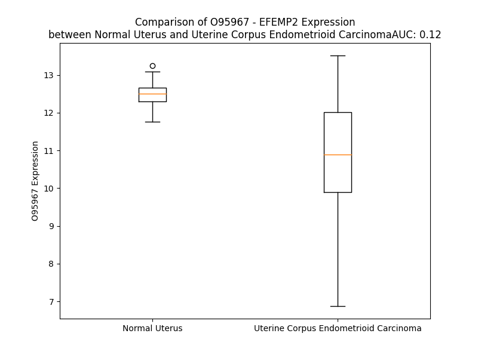

# Detailed Data for O95967

## Introduction to the Detailed Summary

### How to Interpret the Results

- **Summary & Metrics**: This section provides a quick reference to essential protein attributes, including expression changes, family classification, and biomarker applications. Regulation status (upregulated/downregulated) indicates the protein's behavior in a disease context. Some information comes from the original excel file with the proteins selected from literature, while others are derived from the analyses.
- **Expression Comparison**: A visual representation comparing protein expression between normal and disease states. It highlights significant changes in expression levels that might indicate diagnostic or therapeutic relevance. This is data coming from transcriptomics experiments and could not translate similarly to protein levels.
- **Isoform Alignment**: An interactive view of isoform alignments, revealing structural and functional differences between variants of the protein.
- **Interactors & Homologs**: Tables listing known interaction partners and homologous proteins, the more interactors and homologs, the more complex the protein is to design an antibody for.
- **Biological Assemblies**: Information about the structural arrangement of the protein in different assemblies, providing insights into its functional state but also the complexity of the protein to develop antibodies.
- **Combined Per-Residue Information**: A detailed table summarizing residue-level data. This includes predictions for epitope regions, aggregation tendencies, and modifications that might impact the protein's function. Each row corresponds to a residue in the protein, providing insights into specific sites that may be important for research or drug development.
## Summary & Metrics

- **UniProt Accession**: O95967
- **Gene Name**: EFEMP2 
- **Protein Name**: EGF-containing fibulin-like extracellular matrix protein 2 
- **Swiss Prot**: FBLN4_HUMAN
- **Family**: other
- **Biomarker Application**:  
- **Number of Isoforms**: 0
- **Regulation**: -1
- **(transcriptomics) AUC**: 0.28
- **(transcriptomics) Fold Change**: 1.05
- **(transcriptomics) Regulation**: Downregulated
- **Discotope Epitope Count**: 87
- **Max n_uniprots (Homo)**: 1
- **Max n_uniprots (Hetero)**: N/A

## Expression Comparison

## Interactors

| preferredName_A   | preferredName_B   |   score |
|:------------------|:------------------|--------:|
| EFEMP2            | ELN               |   0.987 |
| EFEMP2            | LOX               |   0.951 |
| EFEMP2            | ATP6V0A2          |   0.906 |

## Homologs

| uniprot_id   | gene_id   |
|:-------------|:----------|
| C9JQS6       | FBLN2     |
| Q8N2E2       | VWDE      |
| G3V4U0       | FBLN5     |
| C9JUM4       | EFEMP1    |
| P23142       | FBLN1     |
| F8WDD3       | EYS       |

## Biological Assemblies

|   Unnamed: 0 |   assembly |   n_uniprots | composition   | crystal_id   |
|-------------:|-----------:|-------------:|:--------------|:-------------|
|            0 |          1 |            1 | Homo          | 2kl7         |

## Combined Per-Residue Information

|   res | aa   |   epitope_score | epitope   |   relative_surface_accessibility |   modeling_confidence |   Aggregation | modification   | glycosylation                   |
|------:|:-----|----------------:|:----------|---------------------------------:|----------------------:|--------------:|:---------------|:--------------------------------|
|     1 | M    |         0.10604 | False     |                          1.2562  |                 38.55 |         0     | N/A            | N/A                             |
|     2 | L    |         0.14391 | False     |                          1.04127 |                 41.57 |         0     | N/A            | N/A                             |
|     3 | P    |         0.14035 | False     |                          0.89924 |                 47.2  |         0     | N/A            | N/A                             |
|     4 | C    |         0.13132 | False     |                          0.95468 |                 38.61 |         0     | N/A            | N/A                             |
|     5 | A    |         0.12478 | False     |                          0.78764 |                 41.29 |         0     | N/A            | N/A                             |
|     6 | S    |         0.13637 | False     |                          0.75776 |                 42.5  |         0     | N/A            | N/A                             |
|     7 | C    |         0.0984  | False     |                          0.90435 |                 38.09 |         0     | N/A            | N/A                             |
|     8 | L    |         0.13346 | False     |                          1.02659 |                 36.08 |         0     | N/A            | N/A                             |
|     9 | P    |         0.17628 | True      |                          0.9148  |                 46.53 |         0.009 | N/A            | N/A                             |
|    10 | G    |         0.17633 | True      |                          0.85831 |                 39.57 |         0.829 | N/A            | N/A                             |
|    11 | S    |         0.10152 | False     |                          0.77445 |                 39.63 |         9.939 | N/A            | N/A                             |
|    12 | L    |         0.14351 | False     |                          0.90303 |                 38.99 |        83.37  | N/A            | N/A                             |
|    13 | L    |         0.1296  | False     |                          0.86537 |                 37.98 |        96.818 | N/A            | N/A                             |
|    14 | L    |         0.17802 | True      |                          0.82185 |                 37.08 |        99.28  | N/A            | N/A                             |
|    15 | W    |         0.12051 | False     |                          1.0048  |                 37.46 |        99.731 | N/A            | N/A                             |
|    16 | A    |         0.12997 | False     |                          0.73069 |                 38.47 |        99.839 | N/A            | N/A                             |
|    17 | L    |         0.10204 | False     |                          0.9774  |                 37.59 |        99.962 | N/A            | N/A                             |
|    18 | L    |         0.18254 | True      |                          0.88953 |                 36.73 |        99.966 | N/A            | N/A                             |
|    19 | L    |         0.10403 | False     |                          0.81628 |                 33.66 |        99.883 | N/A            | N/A                             |
|    20 | L    |         0.12995 | False     |                          1.00158 |                 37.95 |        99.424 | N/A            | N/A                             |
|    21 | L    |         0.11725 | False     |                          0.89732 |                 34.22 |        96.915 | N/A            | N/A                             |
|    22 | L    |         0.1154  | False     |                          1.1163  |                 38.74 |        83.199 | N/A            | N/A                             |
|    23 | G    |         0.05607 | False     |                          0.9232  |                 32.47 |         8.286 | N/A            | N/A                             |
|    24 | S    |         0.07069 | False     |                          0.90849 |                 40.62 |         1.544 | N/A            | N/A                             |
|    25 | A    |         0.11613 | False     |                          0.94726 |                 35.85 |         0.708 | N/A            | N/A                             |
|    26 | S    |         0.10821 | False     |                          0.75526 |                 36.43 |         0.001 | N/A            | N/A                             |
|    27 | P    |         0.10771 | False     |                          0.95198 |                 35.98 |         0     | N/A            | N/A                             |
|    28 | Q    |         0.1058  | False     |                          0.86801 |                 34.35 |         0     | N/A            | N/A                             |
|    29 | D    |         0.12313 | False     |                          0.84607 |                 35.23 |         0     | N/A            | N/A                             |
|    30 | S    |         0.12318 | False     |                          0.77835 |                 32.87 |         0     | N/A            | N/A                             |
|    31 | E    |         0.14721 | False     |                          0.854   |                 39.95 |         0     | N/A            | N/A                             |
|    32 | E    |         0.13927 | False     |                          0.81997 |                 38.51 |         0     | N/A            | N/A                             |
|    33 | P    |         0.13928 | False     |                          0.92112 |                 39.87 |         0     | N/A            | N/A                             |
|    34 | D    |         0.12545 | False     |                          0.79415 |                 37.83 |         0     | N/A            | N/A                             |
|    35 | S    |         0.14564 | False     |                          0.70261 |                 38.63 |         0     | N/A            | N/A                             |
|    36 | Y    |         0.21299 | True      |                          0.86067 |                 46.78 |         0     | N/A            | N/A                             |
|    37 | T    |         0.12759 | False     |                          0.60742 |                 55.92 |         0     | N/A            | N/A                             |
|    38 | E    |         0.13181 | False     |                          0.76893 |                 65.59 |         0     | N/A            | N/A                             |
|    39 | C    |         0.16329 | True      |                          0.19856 |                 70.94 |         0     | N/A            | N/A                             |
|    40 | T    |         0.09264 | False     |                          0.71921 |                 74.65 |         0     | N/A            | N/A                             |
|    41 | D    |         0.17268 | True      |                          0.88475 |                 74.28 |         0     | N/A            | N/A                             |
|    42 | G    |         0.03023 | False     |                          0.2537  |                 75.32 |         0     | N/A            | N/A                             |
|    43 | Y    |         0.05516 | False     |                          0.32007 |                 82.18 |         0     | N/A            | N/A                             |
|    44 | E    |         0.06874 | False     |                          0.60836 |                 82.94 |         0     | N/A            | N/A                             |
|    45 | W    |         0.07087 | False     |                          0.3671  |                 82.52 |         0     | N/A            | N/A                             |
|    46 | D    |         0.08073 | False     |                          0.10925 |                 80.44 |         0     | N/A            | N/A                             |
|    47 | P    |         0.18355 | True      |                          0.67513 |                 74.58 |         0     | N/A            | N/A                             |
|    48 | D    |         0.18165 | True      |                          0.84472 |                 77.03 |         0     | N/A            | N/A                             |
|    49 | S    |         0.08121 | False     |                          0.32722 |                 77.86 |         0     | N/A            | N/A                             |
|    50 | Q    |         0.15773 | True      |                          0.57717 |                 77.69 |         0     | N/A            | N/A                             |
|    51 | H    |         0.1251  | False     |                          0.68824 |                 74.24 |         0     | N/A            | N/A                             |
|    52 | C    |         0.16763 | True      |                          0.42386 |                 78.19 |         0     | N/A            | N/A                             |
|    53 | R    |         0.12505 | False     |                          0.55381 |                 82.62 |         0     | N/A            | N/A                             |
|    54 | D    |         0.08735 | False     |                          0.24714 |                 81.99 |         0     | N/A            | N/A                             |
|    55 | V    |         0.06941 | False     |                          0.24183 |                 84.43 |         0     | N/A            | N/A                             |
|    56 | N    |         0.02938 | False     |                          0.32672 |                 85.3  |         0     | N/A            | N/A                             |
|    57 | E    |         0.07168 | False     |                          0.08135 |                 86.18 |         0     | N/A            | N/A                             |
|    58 | C    |         0.05512 | False     |                          0.2805  |                 86.04 |         0     | N/A            | N/A                             |
|    59 | L    |         0.09179 | False     |                          0.90115 |                 87.17 |         0     | N/A            | N/A                             |
|    60 | T    |         0.13125 | False     |                          0.61108 |                 83.69 |         0     | N/A            | N/A                             |
|    61 | I    |         0.10839 | False     |                          0.42893 |                 81.37 |         0     | N/A            | N/A                             |
|    62 | P    |         0.12084 | False     |                          0.89722 |                 78.86 |         0     | N/A            | N/A                             |
|    63 | E    |         0.10728 | False     |                          0.82439 |                 80.82 |         0     | N/A            | N/A                             |
|    64 | A    |         0.05157 | False     |                          0.14623 |                 78.15 |         0     | N/A            | N/A                             |
|    65 | C    |         0.05414 | False     |                          0.11856 |                 80.98 |         0     | N/A            | N/A                             |
|    66 | K    |         0.14343 | False     |                          0.91425 |                 76.34 |         0     | N/A            | N/A                             |
|    67 | G    |         0.14367 | False     |                          0.87297 |                 75.39 |         0     | N/A            | N/A                             |
|    68 | E    |         0.09595 | False     |                          0.70467 |                 72.34 |         0     | N/A            | N/A                             |
|    69 | M    |         0.04416 | False     |                          0.3663  |                 74.99 |         0     | N/A            | N/A                             |
|    70 | K    |         0.02933 | False     |                          0.44051 |                 81.12 |         0     | N/A            | N/A                             |
|    71 | C    |         0.03867 | False     |                          0.24273 |                 83.15 |         0     | N/A            | N/A                             |
|    72 | I    |         0.04968 | False     |                          0.42478 |                 83.61 |         0     | N/A            | N/A                             |
|    73 | N    |         0.09029 | False     |                          0.36394 |                 80.56 |         0     | N/A            | N/A                             |
|    74 | H    |         0.04243 | False     |                          0.30443 |                 80.41 |         0     | N/A            | N/A                             |
|    75 | Y    |         0.1034  | False     |                          0.72385 |                 79.92 |         0     | N/A            | N/A                             |
|    76 | G    |         0.07967 | False     |                          0.38961 |                 71.2  |         0     | N/A            | N/A                             |
|    77 | G    |         0.12614 | False     |                          0.22371 |                 79.23 |         0     | N/A            | N/A                             |
|    78 | Y    |         0.07722 | False     |                          0.35483 |                 84.01 |         0     | N/A            | N/A                             |
|    79 | L    |         0.0729  | False     |                          0.35777 |                 78.62 |         0     | N/A            | N/A                             |
|    80 | C    |         0.08805 | False     |                          0.32119 |                 80.19 |         0     | N/A            | N/A                             |
|    81 | L    |         0.06114 | False     |                          0.36436 |                 67.65 |         0     | N/A            | N/A                             |
|    82 | P    |         0.09364 | False     |                          0.42698 |                 63.9  |         0     | N/A            | N/A                             |
|    83 | R    |         0.11908 | False     |                          0.60044 |                 59.2  |         0     | N/A            | N/A                             |
|    84 | S    |         0.10734 | False     |                          0.76946 |                 54.68 |         1.851 | N/A            | N/A                             |
|    85 | A    |         0.07151 | False     |                          0.38347 |                 45.4  |         2.43  | N/A            | N/A                             |
|    86 | A    |         0.08597 | False     |                          1.00319 |                 42.5  |         2.43  | N/A            | N/A                             |
|    87 | V    |         0.09092 | False     |                          0.89106 |                 44.77 |         2.43  | N/A            | N/A                             |
|    88 | I    |         0.12485 | False     |                          0.72687 |                 35.05 |         2.43  | N/A            | N/A                             |
|    89 | N    |         0.12337 | False     |                          0.73062 |                 35.46 |         0.579 | N/A            | N/A                             |
|    90 | D    |         0.16309 | True      |                          0.79483 |                 35.73 |         0     | N/A            | N/A                             |
|    91 | L    |         0.14685 | False     |                          1.01861 |                 33.09 |         0     | N/A            | N/A                             |
|    92 | H    |         0.22087 | True      |                          1.04423 |                 37.59 |         0     | N/A            | N/A                             |
|    93 | G    |         0.27748 | True      |                          0.81317 |                 37.3  |         0     | N/A            | N/A                             |
|    94 | E    |         0.19288 | True      |                          0.93006 |                 31.52 |         0     | N/A            | N/A                             |
|    95 | G    |         0.20859 | True      |                          0.73546 |                 47.96 |         0     | N/A            | N/A                             |
|    96 | P    |         0.12819 | False     |                          0.9387  |                 47.27 |         0     | N/A            | N/A                             |
|    97 | P    |         0.13691 | False     |                          0.85543 |                 47.8  |         0     | N/A            | N/A                             |
|    98 | P    |         0.16179 | True      |                          0.76864 |                 51.93 |         0     | N/A            | N/A                             |
|    99 | P    |         0.18421 | True      |                          1.00393 |                 53.88 |         0     | N/A            | N/A                             |
|   100 | V    |         0.22778 | True      |                          0.90314 |                 44.39 |         0     | N/A            | N/A                             |
|   101 | P    |         0.15166 | False     |                          0.77491 |                 58.01 |         0     | N/A            | N/A                             |
|   102 | P    |         0.1522  | False     |                          0.95881 |                 51.85 |         0     | N/A            | N/A                             |
|   103 | A    |         0.25642 | True      |                          0.93973 |                 45    |         0     | N/A            | N/A                             |
|   104 | Q    |         0.30199 | True      |                          0.80649 |                 41.82 |         0     | N/A            | N/A                             |
|   105 | H    |         0.25381 | True      |                          0.87127 |                 51.88 |         0     | N/A            | N/A                             |
|   106 | P    |         0.18536 | True      |                          0.95048 |                 55.85 |         0     | N/A            | N/A                             |
|   107 | N    |         0.20427 | True      |                          0.7005  |                 58.83 |         0     | N/A            | N/A                             |
|   108 | P    |         0.21395 | True      |                          0.7602  |                 76.91 |         0     | N/A            | N/A                             |
|   109 | C    |         0.10553 | False     |                          0.10211 |                 81.38 |         0     | N/A            | N/A                             |
|   110 | P    |         0.08582 | False     |                          0.56315 |                 82.61 |         0     | N/A            | N/A                             |
|   111 | P    |         0.07225 | False     |                          0.9559  |                 83.88 |         0     | N/A            | N/A                             |
|   112 | G    |         0.02303 | False     |                          0.29419 |                 84.62 |         0     | N/A            | N/A                             |
|   113 | Y    |         0.08289 | False     |                          0.28296 |                 88.8  |         0     | N/A            | N/A                             |
|   114 | E    |         0.0837  | False     |                          0.35887 |                 85.52 |         0     | N/A            | N/A                             |
|   115 | P    |         0.08605 | False     |                          0.39159 |                 82.15 |         0     | N/A            | N/A                             |
|   116 | D    |         0.14282 | False     |                          0.31198 |                 82.94 |         0     | N/A            | N/A                             |
|   117 | D    |         0.24482 | True      |                          0.98694 |                 81.48 |         0     | N/A            | N/A                             |
|   118 | Q    |         0.21953 | True      |                          0.78757 |                 80.42 |         0     | N/A            | N/A                             |
|   119 | D    |         0.15678 | True      |                          0.76185 |                 77.5  |         0     | N/A            | N/A                             |
|   120 | S    |         0.07652 | False     |                          0.42797 |                 84.19 |         0     | N/A            | N/A                             |
|   121 | C    |         0.14806 | False     |                          0.37682 |                 86.6  |         0     | N/A            | N/A                             |
|   122 | V    |         0.09532 | False     |                          0.44557 |                 89.88 |         0     | N/A            | N/A                             |
|   123 | D    |         0.18184 | True      |                          0.27068 |                 91.27 |         0     | N/A            | N/A                             |
|   124 | V    |         0.06497 | False     |                          0.14091 |                 90.07 |         0     | N/A            | N/A                             |
|   125 | D    |         0.04063 | False     |                          0.31805 |                 91.38 |         0     | N/A            | N/A                             |
|   126 | E    |         0.04804 | False     |                          0.09039 |                 93.37 |         0     | N/A            | N/A                             |
|   127 | C    |         0.03488 | False     |                          0.26601 |                 92.65 |         0     | N/A            | N/A                             |
|   128 | A    |         0.11013 | False     |                          0.77866 |                 91.72 |         0     | N/A            | N/A                             |
|   129 | Q    |         0.11634 | False     |                          0.4292  |                 90.45 |         0     | N/A            | N/A                             |
|   130 | A    |         0.13315 | False     |                          0.75085 |                 86.75 |         0     | N/A            | N/A                             |
|   131 | L    |         0.17263 | True      |                          0.6839  |                 89.29 |         0     | N/A            | N/A                             |
|   132 | H    |         0.0985  | False     |                          0.33064 |                 88.66 |         0     | N/A            | N/A                             |
|   133 | D    |         0.16937 | True      |                          0.78429 |                 89.4  |         0     | N/A            | N/A                             |
|   134 | C    |         0.05668 | False     |                          0.13951 |                 88.51 |         0     | N/A            | N/A                             |
|   135 | R    |         0.11492 | False     |                          0.54086 |                 88.65 |         0     | N/A            | N/A                             |
|   136 | P    |         0.10979 | False     |                          1.0652  |                 86.57 |         0     | N/A            | N/A                             |
|   137 | S    |         0.04955 | False     |                          0.27238 |                 87.98 |         0     | N/A            | N/A                             |
|   138 | Q    |         0.03199 | False     |                          0.13294 |                 91.05 |         0     | N/A            | N/A                             |
|   139 | D    |         0.03212 | False     |                          0.40965 |                 90.47 |         0     | N/A            | N/A                             |
|   140 | C    |         0.03992 | False     |                          0.23032 |                 93    |         0     | N/A            | N/A                             |
|   141 | H    |         0.07494 | False     |                          0.48265 |                 93.06 |         0     | N/A            | N/A                             |
|   142 | N    |         0.04631 | False     |                          0.33851 |                 92.56 |         0     | N/A            | N/A                             |
|   143 | L    |         0.08375 | False     |                          0.46823 |                 91.58 |         0     | N/A            | N/A                             |
|   144 | P    |         0.1769  | True      |                          0.83827 |                 90.65 |         0     | N/A            | N/A                             |
|   145 | G    |         0.07086 | False     |                          0.29124 |                 88.45 |         0     | N/A            | N/A                             |
|   146 | S    |         0.11913 | False     |                          0.42015 |                 92.06 |         0     | N/A            | N/A                             |
|   147 | Y    |         0.0651  | False     |                          0.31407 |                 91.92 |         0     | N/A            | N/A                             |
|   148 | Q    |         0.08054 | False     |                          0.47399 |                 91.85 |         0     | N/A            | N/A                             |
|   149 | C    |         0.04837 | False     |                          0.25056 |                 91.62 |         0     | N/A            | N/A                             |
|   150 | T    |         0.04682 | False     |                          0.3073  |                 92.04 |         0     | N/A            | N/A                             |
|   151 | C    |         0.09643 | False     |                          0.20828 |                 91.69 |         0     | N/A            | N/A                             |
|   152 | P    |         0.04686 | False     |                          0.30985 |                 89.1  |         0     | N/A            | N/A                             |
|   153 | D    |         0.12239 | False     |                          0.87578 |                 88.38 |         0     | N/A            | N/A                             |
|   154 | G    |         0.04795 | False     |                          0.25184 |                 88.1  |         0     | N/A            | N/A                             |
|   155 | Y    |         0.09625 | False     |                          0.28776 |                 90.93 |         0     | N/A            | N/A                             |
|   156 | R    |         0.06233 | False     |                          0.49909 |                 90.02 |         0     | N/A            | N/A                             |
|   157 | K    |         0.07317 | False     |                          0.65399 |                 88.41 |         0     | N/A            | N/A                             |
|   158 | I    |         0.11199 | False     |                          0.49598 |                 85.91 |         0     | N/A            | N/A                             |
|   159 | G    |         0.17486 | True      |                          0.65126 |                 84.62 |         0     | N/A            | N/A                             |
|   160 | P    |         0.14287 | False     |                          0.63738 |                 82.76 |         0     | N/A            | N/A                             |
|   161 | E    |         0.1063  | False     |                          0.42481 |                 86.27 |         0     | N/A            | N/A                             |
|   162 | C    |         0.11729 | False     |                          0.11234 |                 90.35 |         0     | N/A            | N/A                             |
|   163 | V    |         0.05641 | False     |                          0.44557 |                 91.04 |         0     | N/A            | N/A                             |
|   164 | D    |         0.15054 | False     |                          0.21724 |                 91.96 |         0     | N/A            | N/A                             |
|   165 | I    |         0.08431 | False     |                          0.30239 |                 91    |         0     | N/A            | N/A                             |
|   166 | D    |         0.04347 | False     |                          0.27872 |                 90.75 |         0     | N/A            | N/A                             |
|   167 | E    |         0.06242 | False     |                          0.10372 |                 88.81 |         0     | N/A            | N/A                             |
|   168 | C    |         0.04912 | False     |                          0.2535  |                 90.34 |         0     | N/A            | N/A                             |
|   169 | R    |         0.23986 | True      |                          0.73736 |                 90.08 |         0     | N/A            | N/A                             |
|   170 | Y    |         0.12145 | False     |                          0.48525 |                 86.68 |         0     | N/A            | N/A                             |
|   171 | R    |         0.21399 | True      |                          0.86312 |                 84.67 |         0     | N/A            | N/A                             |
|   172 | Y    |         0.13832 | False     |                          0.2902  |                 84.86 |         0     | N/A            | N/A                             |
|   173 | C    |         0.07623 | False     |                          0.09091 |                 89.04 |         0     | N/A            | N/A                             |
|   174 | Q    |         0.10252 | False     |                          0.46084 |                 89.63 |         0     | N/A            | N/A                             |
|   175 | H    |         0.07884 | False     |                          0.28766 |                 90.17 |         0     | N/A            | N/A                             |
|   176 | R    |         0.13412 | False     |                          0.60071 |                 92.39 |         0     | N/A            | N/A                             |
|   177 | C    |         0.02258 | False     |                          0.24174 |                 93.63 |         0     | N/A            | N/A                             |
|   178 | V    |         0.06876 | False     |                          0.26753 |                 93.94 |         0     | N/A            | N/A                             |
|   179 | N    |         0.07348 | False     |                          0.36243 |                 93.09 |         0     | N/A            | N/A                             |
|   180 | L    |         0.09659 | False     |                          0.37578 |                 93.23 |         0     | N/A            | N/A                             |
|   181 | P    |         0.14887 | False     |                          0.83096 |                 91.8  |         0     | N/A            | N/A                             |
|   182 | G    |         0.0847  | False     |                          0.27185 |                 88.67 |         0     | N/A            | N/A                             |
|   183 | S    |         0.1332  | False     |                          0.37625 |                 92.11 |         0     | N/A            | N/A                             |
|   184 | F    |         0.11785 | False     |                          0.23924 |                 92.45 |         0     | N/A            | N/A                             |
|   185 | R    |         0.1424  | False     |                          0.50827 |                 92.96 |         0     | N/A            | N/A                             |
|   186 | C    |         0.04632 | False     |                          0.06294 |                 93.94 |         0     | N/A            | N/A                             |
|   187 | Q    |         0.09636 | False     |                          0.29647 |                 93.35 |         0     | N/A            | N/A                             |
|   188 | C    |         0.07497 | False     |                          0.23876 |                 92.85 |         0     | N/A            | N/A                             |
|   189 | E    |         0.10279 | False     |                          0.45711 |                 92.41 |         0     | N/A            | N/A                             |
|   190 | P    |         0.23559 | True      |                          0.88329 |                 86.77 |         0     | N/A            | N/A                             |
|   191 | G    |         0.04591 | False     |                          0.25969 |                 87.23 |         0     | N/A            | N/A                             |
|   192 | F    |         0.0514  | False     |                          0.15995 |                 92.56 |         0     | N/A            | N/A                             |
|   193 | Q    |         0.06568 | False     |                          0.45525 |                 92.32 |         0     | N/A            | N/A                             |
|   194 | L    |         0.07401 | False     |                          0.42721 |                 92.87 |         0     | N/A            | N/A                             |
|   195 | G    |         0.06257 | False     |                          0.07029 |                 90.5  |         0     | N/A            | N/A                             |
|   196 | P    |         0.2089  | True      |                          1.08027 |                 89.66 |         0     | N/A            | N/A                             |
|   197 | N    |         0.10904 | False     |                          0.46185 |                 88.6  |         0     | N/A            | N/A                             |
|   198 | N    |         0.19592 | True      |                          0.63888 |                 88.19 |         0     | N/A            | N-linked (GlcNAc...) asparagine |
|   199 | R    |         0.09531 | False     |                          0.33335 |                 88.76 |         0     | N/A            | N/A                             |
|   200 | S    |         0.05772 | False     |                          0.3208  |                 90.64 |         0     | N/A            | N/A                             |
|   201 | C    |         0.07243 | False     |                          0.04999 |                 91.16 |         0     | N/A            | N/A                             |
|   202 | V    |         0.07292 | False     |                          0.52554 |                 91.83 |         0     | N/A            | N/A                             |
|   203 | D    |         0.09893 | False     |                          0.20855 |                 91.87 |         0     | N/A            | N/A                             |
|   204 | V    |         0.06506 | False     |                          0.12472 |                 89.03 |         0     | N/A            | N/A                             |
|   205 | N    |         0.03957 | False     |                          0.32511 |                 90.74 |         0     | N/A            | N/A                             |
|   206 | E    |         0.05423 | False     |                          0.15335 |                 88.62 |         0     | N/A            | N/A                             |
|   207 | C    |         0.03716 | False     |                          0.21697 |                 90.2  |         0     | N/A            | N/A                             |
|   208 | D    |         0.14222 | False     |                          0.72646 |                 89.13 |         0     | N/A            | N/A                             |
|   209 | M    |         0.21432 | True      |                          0.67648 |                 81.92 |         0     | N/A            | N/A                             |
|   210 | G    |         0.19661 | True      |                          0.74905 |                 75.75 |         0     | N/A            | N/A                             |
|   211 | A    |         0.1857  | True      |                          0.67987 |                 70.13 |         0     | N/A            | N/A                             |
|   212 | P    |         0.13956 | False     |                          0.33971 |                 81.2  |         0     | N/A            | N/A                             |
|   213 | C    |         0.06591 | False     |                          0.07044 |                 89.98 |         0     | N/A            | N/A                             |
|   214 | E    |         0.16228 | True      |                          0.56279 |                 92.6  |         0     | N/A            | N/A                             |
|   215 | Q    |         0.07973 | False     |                          0.24724 |                 92.49 |         0     | N/A            | N/A                             |
|   216 | R    |         0.09559 | False     |                          0.47463 |                 93.56 |         0     | N/A            | N/A                             |
|   217 | C    |         0.04454 | False     |                          0.25426 |                 93.6  |         0     | N/A            | N/A                             |
|   218 | F    |         0.09034 | False     |                          0.38189 |                 91.59 |         0     | N/A            | N/A                             |
|   219 | N    |         0.06057 | False     |                          0.36235 |                 88.89 |         0     | N/A            | N/A                             |
|   220 | S    |         0.128   | False     |                          0.39401 |                 87.52 |         0     | N/A            | N/A                             |
|   221 | Y    |         0.13158 | False     |                          0.71581 |                 87.77 |         0.312 | N/A            | N/A                             |
|   222 | G    |         0.1399  | False     |                          0.28741 |                 85.35 |         0.312 | N/A            | N/A                             |
|   223 | T    |         0.2042  | True      |                          0.53906 |                 88.1  |         0.312 | N/A            | N/A                             |
|   224 | F    |         0.1361  | False     |                          0.2567  |                 88.36 |         0.312 | N/A            | N/A                             |
|   225 | L    |         0.16205 | True      |                          0.6092  |                 89.53 |         0.312 | N/A            | N/A                             |
|   226 | C    |         0.03952 | False     |                          0.02478 |                 92.71 |         0     | N/A            | N/A                             |
|   227 | R    |         0.24117 | True      |                          0.56644 |                 93.02 |         0     | N/A            | N/A                             |
|   228 | C    |         0.08072 | False     |                          0.18397 |                 94.9  |         0     | N/A            | N/A                             |
|   229 | H    |         0.18596 | True      |                          0.50654 |                 95.57 |         0     | N/A            | N/A                             |
|   230 | Q    |         0.17541 | True      |                          0.8905  |                 94.36 |         0     | N/A            | N/A                             |
|   231 | G    |         0.02682 | False     |                          0.15926 |                 93.68 |         0     | N/A            | N/A                             |
|   232 | Y    |         0.07333 | False     |                          0.24811 |                 96.05 |         0     | N/A            | N/A                             |
|   233 | E    |         0.0808  | False     |                          0.41535 |                 93.59 |         0     | N/A            | N/A                             |
|   234 | L    |         0.08172 | False     |                          0.44224 |                 93.52 |         0     | N/A            | N/A                             |
|   235 | H    |         0.10983 | False     |                          0.50968 |                 92.06 |         0     | N/A            | N/A                             |
|   236 | R    |         0.23091 | True      |                          0.96008 |                 89.45 |         0     | N/A            | N/A                             |
|   237 | D    |         0.07164 | False     |                          0.43457 |                 89.02 |         0     | N/A            | N/A                             |
|   238 | G    |         0.11101 | False     |                          0.31523 |                 88.32 |         0     | N/A            | N/A                             |
|   239 | F    |         0.1512  | False     |                          0.46282 |                 90.5  |         0     | N/A            | N/A                             |
|   240 | S    |         0.09937 | False     |                          0.33949 |                 92.87 |         0     | N/A            | N/A                             |
|   241 | C    |         0.06996 | False     |                          0.07932 |                 94.91 |         0     | N/A            | N/A                             |
|   242 | S    |         0.08454 | False     |                          0.35782 |                 94.31 |         0     | N/A            | N/A                             |
|   243 | D    |         0.12475 | False     |                          0.27073 |                 95.9  |         0     | N/A            | N/A                             |
|   244 | I    |         0.14029 | False     |                          0.27759 |                 94.44 |         0     | N/A            | N/A                             |
|   245 | D    |         0.0691  | False     |                          0.36681 |                 95.12 |         0     | N/A            | N/A                             |
|   246 | E    |         0.07803 | False     |                          0.15223 |                 94.65 |         0     | N/A            | N/A                             |
|   247 | C    |         0.04734 | False     |                          0.25149 |                 94.99 |         0     | N/A            | N/A                             |
|   248 | S    |         0.19495 | True      |                          0.65405 |                 94.39 |         0     | N/A            | N/A                             |
|   249 | Y    |         0.36134 | True      |                          0.70081 |                 88.81 |         0     | N/A            | N/A                             |
|   250 | S    |         0.20454 | True      |                          0.29737 |                 89.81 |         0     | N/A            | N/A                             |
|   251 | S    |         0.19221 | True      |                          0.7362  |                 87.92 |         0     | N/A            | N/A                             |
|   252 | Y    |         0.30199 | True      |                          0.91426 |                 90.72 |         0     | N/A            | N/A                             |
|   253 | L    |         0.0976  | False     |                          0.27382 |                 92.14 |         0     | N/A            | N/A                             |
|   254 | C    |         0.06072 | False     |                          0.08834 |                 94.55 |         0     | N/A            | N/A                             |
|   255 | Q    |         0.07849 | False     |                          0.34125 |                 94.26 |         0     | N/A            | N/A                             |
|   256 | Y    |         0.09004 | False     |                          0.45333 |                 94.29 |         0     | N/A            | N/A                             |
|   257 | R    |         0.1401  | False     |                          0.57872 |                 94.9  |         0     | N/A            | N/A                             |
|   258 | C    |         0.02396 | False     |                          0.26272 |                 96.51 |         0     | N/A            | N/A                             |
|   259 | I    |         0.09976 | False     |                          0.36078 |                 96.22 |         0     | N/A            | N/A                             |
|   260 | N    |         0.08352 | False     |                          0.32544 |                 95.89 |         0     | N/A            | N/A                             |
|   261 | E    |         0.14939 | False     |                          0.25689 |                 95.7  |         0     | N/A            | N/A                             |
|   262 | P    |         0.21635 | True      |                          0.81091 |                 95.4  |         0     | N/A            | N/A                             |
|   263 | G    |         0.15118 | False     |                          0.25942 |                 93.22 |         0     | N/A            | N/A                             |
|   264 | R    |         0.31675 | True      |                          0.57588 |                 95.07 |         0     | N/A            | N/A                             |
|   265 | F    |         0.16566 | True      |                          0.22889 |                 95.28 |         0     | N/A            | N/A                             |
|   266 | S    |         0.06481 | False     |                          0.14039 |                 95.25 |         0     | N/A            | N/A                             |
|   267 | C    |         0.07407 | False     |                          0.09982 |                 97.01 |         0     | N/A            | N/A                             |
|   268 | H    |         0.1385  | False     |                          0.44514 |                 96.27 |         0     | N/A            | N/A                             |
|   269 | C    |         0.06358 | False     |                          0.20953 |                 96.66 |         0     | N/A            | N/A                             |
|   270 | P    |         0.05065 | False     |                          0.0717  |                 96.04 |         0     | N/A            | N/A                             |
|   271 | Q    |         0.16437 | True      |                          0.89558 |                 94.11 |         0     | N/A            | N/A                             |
|   272 | G    |         0.01787 | False     |                          0.14797 |                 94.29 |         0     | N/A            | N/A                             |
|   273 | Y    |         0.02757 | False     |                          0.06836 |                 96.44 |         0     | N/A            | N/A                             |
|   274 | Q    |         0.0966  | False     |                          0.43159 |                 95.05 |         0     | N/A            | N/A                             |
|   275 | L    |         0.09837 | False     |                          0.51775 |                 96.82 |         0     | N/A            | N/A                             |
|   276 | L    |         0.10838 | False     |                          0.41122 |                 95.61 |         0     | N/A            | N/A                             |
|   277 | A    |         0.16336 | True      |                          1.06592 |                 93.89 |         0     | N/A            | N/A                             |
|   278 | T    |         0.10698 | False     |                          0.67248 |                 94.27 |         0     | N/A            | N/A                             |
|   279 | R    |         0.15733 | True      |                          0.43346 |                 94.19 |         0     | N/A            | N/A                             |
|   280 | L    |         0.07439 | False     |                          0.52511 |                 95.26 |         0     | N/A            | N/A                             |
|   281 | C    |         0.07725 | False     |                          0.07668 |                 96.36 |         0     | N/A            | N/A                             |
|   282 | Q    |         0.09237 | False     |                          0.43586 |                 95.19 |         0     | N/A            | N/A                             |
|   283 | D    |         0.08559 | False     |                          0.1731  |                 95.58 |         0     | N/A            | N/A                             |
|   284 | I    |         0.09151 | False     |                          0.33599 |                 96.1  |         0     | N/A            | N/A                             |
|   285 | D    |         0.03347 | False     |                          0.32051 |                 96.51 |         0     | N/A            | N/A                             |
|   286 | E    |         0.04996 | False     |                          0.09787 |                 96.7  |         0     | N/A            | N/A                             |
|   287 | C    |         0.03424 | False     |                          0.27614 |                 96.19 |         0     | N/A            | N/A                             |
|   288 | E    |         0.15352 | False     |                          0.78754 |                 96.39 |         0     | N/A            | N/A                             |
|   289 | S    |         0.18204 | True      |                          0.57948 |                 94.57 |         0     | N/A            | N/A                             |
|   290 | G    |         0.13458 | False     |                          0.62397 |                 93.05 |         0     | N/A            | N/A                             |
|   291 | A    |         0.18064 | True      |                          0.59558 |                 94.46 |         0     | N/A            | N/A                             |
|   292 | H    |         0.1001  | False     |                          0.33918 |                 94.93 |         0     | N/A            | N/A                             |
|   293 | Q    |         0.1953  | True      |                          0.82449 |                 95.74 |         0     | N/A            | N/A                             |
|   294 | C    |         0.04835 | False     |                          0.1827  |                 95.29 |         0     | N/A            | N/A                             |
|   295 | S    |         0.12317 | False     |                          0.46518 |                 94.77 |         0     | N/A            | N/A                             |
|   296 | E    |         0.16564 | True      |                          0.9643  |                 89.85 |         0     | N/A            | N/A                             |
|   297 | A    |         0.06919 | False     |                          0.61024 |                 90.53 |         0     | N/A            | N/A                             |
|   298 | Q    |         0.08961 | False     |                          0.28823 |                 93.48 |         0     | N/A            | N/A                             |
|   299 | T    |         0.0499  | False     |                          0.48823 |                 92.87 |         0     | N/A            | N/A                             |
|   300 | C    |         0.04005 | False     |                          0.19601 |                 95.29 |         0     | N/A            | N/A                             |
|   301 | V    |         0.02277 | False     |                          0.13139 |                 95.04 |         0     | N/A            | N/A                             |
|   302 | N    |         0.04144 | False     |                          0.26544 |                 95.67 |         0     | N/A            | N/A                             |
|   303 | F    |         0.05117 | False     |                          0.21804 |                 94.71 |         0     | N/A            | N/A                             |
|   304 | H    |         0.05743 | False     |                          0.27064 |                 93.39 |         0     | N/A            | N/A                             |
|   305 | G    |         0.10701 | False     |                          0.36054 |                 91.05 |         0     | N/A            | N/A                             |
|   306 | G    |         0.04519 | False     |                          0.11427 |                 93.4  |         0     | N/A            | N/A                             |
|   307 | Y    |         0.1017  | False     |                          0.28651 |                 95.29 |         0     | N/A            | N/A                             |
|   308 | R    |         0.13493 | False     |                          0.37382 |                 94.25 |         0     | N/A            | N/A                             |
|   309 | C    |         0.08286 | False     |                          0.27238 |                 94.97 |         0     | N/A            | N/A                             |
|   310 | V    |         0.06618 | False     |                          0.17042 |                 92.39 |         0     | N/A            | N/A                             |
|   311 | D    |         0.09196 | False     |                          0.4714  |                 90.16 |         0     | N/A            | N/A                             |
|   312 | T    |         0.0985  | False     |                          0.43239 |                 82.76 |         0     | N/A            | N/A                             |
|   313 | N    |         0.09578 | False     |                          0.6769  |                 78.28 |         0     | N/A            | N/A                             |
|   314 | R    |         0.07743 | False     |                          0.17156 |                 81.3  |         0     | N/A            | N/A                             |
|   315 | C    |         0.05881 | False     |                          0.16723 |                 90.55 |         0     | N/A            | N/A                             |
|   316 | V    |         0.17267 | True      |                          0.83123 |                 89.69 |         0     | N/A            | N/A                             |
|   317 | E    |         0.30332 | True      |                          0.8351  |                 90.56 |         0     | N/A            | N/A                             |
|   318 | P    |         0.13908 | False     |                          0.16033 |                 92.83 |         0     | N/A            | N/A                             |
|   319 | Y    |         0.11111 | False     |                          0.11902 |                 94.06 |         0     | N/A            | N/A                             |
|   320 | I    |         0.08029 | False     |                          0.61277 |                 93.27 |         0     | N/A            | N/A                             |
|   321 | Q    |         0.06464 | False     |                          0.31777 |                 91.15 |         0     | N/A            | N/A                             |
|   322 | V    |         0.14136 | False     |                          0.55383 |                 92.02 |         0     | N/A            | N/A                             |
|   323 | S    |         0.1933  | True      |                          0.46537 |                 90.25 |         0     | N/A            | N/A                             |
|   324 | E    |         0.1015  | False     |                          0.76729 |                 85.86 |         0     | N/A            | N/A                             |
|   325 | N    |         0.05183 | False     |                          0.35023 |                 89.79 |         0     | N/A            | N/A                             |
|   326 | R    |         0.06339 | False     |                          0.44129 |                 93.29 |         0     | N/A            | N/A                             |
|   327 | C    |         0.01603 | False     |                          0.02258 |                 95.05 |         0     | N/A            | N/A                             |
|   328 | L    |         0.07155 | False     |                          0.41218 |                 94.9  |         0     | N/A            | N/A                             |
|   329 | C    |         0.05681 | False     |                          0.06127 |                 94.87 |         0     | N/A            | N/A                             |
|   330 | P    |         0.09842 | False     |                          0.22068 |                 93.1  |         0     | N/A            | N/A                             |
|   331 | A    |         0.15294 | False     |                          1.06385 |                 88.36 |         0     | N/A            | N/A                             |
|   332 | S    |         0.24533 | True      |                          0.81754 |                 91.3  |         0     | N/A            | N/A                             |
|   333 | N    |         0.13181 | False     |                          0.2769  |                 92.22 |         0     | N/A            | N/A                             |
|   334 | P    |         0.17025 | True      |                          0.85801 |                 92.26 |         0     | N/A            | N/A                             |
|   335 | L    |         0.28977 | True      |                          0.75966 |                 92.78 |         0     | N/A            | N/A                             |
|   336 | C    |         0.03445 | False     |                          0.08372 |                 92.64 |         0     | N/A            | N/A                             |
|   337 | R    |         0.19681 | True      |                          0.84886 |                 87.24 |         0     | N/A            | N/A                             |
|   338 | E    |         0.15774 | True      |                          0.76314 |                 86.77 |         0     | N/A            | N/A                             |
|   339 | Q    |         0.08875 | False     |                          0.40059 |                 92.29 |         0     | N/A            | N/A                             |
|   340 | P    |         0.02086 | False     |                          0.01477 |                 93.92 |         0     | N/A            | N/A                             |
|   341 | S    |         0.12257 | False     |                          0.35107 |                 92.95 |         0     | N/A            | N/A                             |
|   342 | S    |         0.02063 | False     |                          0.05393 |                 93.83 |         0     | N/A            | N/A                             |
|   343 | I    |         0.02668 | False     |                          0.084   |                 94.45 |         0     | N/A            | N/A                             |
|   344 | V    |         0.0286  | False     |                          0.30752 |                 94.08 |         0     | N/A            | N/A                             |
|   345 | H    |         0.02268 | False     |                          0.08976 |                 93.83 |         0     | N/A            | N/A                             |
|   346 | R    |         0.13101 | False     |                          0.52294 |                 94.41 |         0     | N/A            | N/A                             |
|   347 | Y    |         0.03827 | False     |                          0.2356  |                 94.53 |         2.195 | N/A            | N/A                             |
|   348 | M    |         0.08789 | False     |                          0.18724 |                 94.69 |         2.195 | N/A            | N/A                             |
|   349 | T    |         0.04271 | False     |                          0.28697 |                 95.27 |         2.195 | N/A            | N/A                             |
|   350 | I    |         0.01013 | False     |                          0.0232  |                 94.93 |         2.195 | N/A            | N/A                             |
|   351 | T    |         0.0392  | False     |                          0.13807 |                 94.37 |         2.195 | N/A            | N/A                             |
|   352 | S    |         0.03559 | False     |                          0.02271 |                 94.23 |         0     | N/A            | N/A                             |
|   353 | E    |         0.10549 | False     |                          0.54551 |                 91.1  |         0     | N/A            | N/A                             |
|   354 | R    |         0.08287 | False     |                          0.39504 |                 90.78 |         0     | N/A            | N/A                             |
|   355 | S    |         0.15227 | False     |                          0.72468 |                 92.93 |         0     | N/A            | N/A                             |
|   356 | V    |         0.10271 | False     |                          0.37192 |                 92.55 |         0     | N/A            | N/A                             |
|   357 | P    |         0.27088 | True      |                          0.78598 |                 94.34 |         0     | N/A            | N/A                             |
|   358 | A    |         0.03797 | False     |                          0.10969 |                 95.33 |         0     | N/A            | N/A                             |
|   359 | D    |         0.13265 | False     |                          0.42335 |                 95.49 |         0     | N/A            | N/A                             |
|   360 | V    |         0.02337 | False     |                          0.14447 |                 94.74 |         0     | N/A            | N/A                             |
|   361 | F    |         0.12377 | False     |                          0.24422 |                 96.04 |         0     | N/A            | N/A                             |
|   362 | Q    |         0.07328 | False     |                          0.42139 |                 95.69 |         0     | N/A            | N/A                             |
|   363 | I    |         0.01476 | False     |                          0.0792  |                 93.67 |         0     | N/A            | N/A                             |
|   364 | Q    |         0.08699 | False     |                          0.60109 |                 91.44 |         0     | N/A            | N/A                             |
|   365 | A    |         0.05839 | False     |                          0.14402 |                 87.08 |         0     | N/A            | N/A                             |
|   366 | T    |         0.13705 | False     |                          0.99212 |                 78.5  |         0     | N/A            | N/A                             |
|   367 | S    |         0.14352 | False     |                          0.36902 |                 72.32 |         0     | N/A            | N/A                             |
|   368 | V    |         0.10013 | False     |                          0.6819  |                 72.36 |         0     | N/A            | N/A                             |
|   369 | Y    |         0.30255 | True      |                          0.53315 |                 74.98 |         0     | N/A            | N/A                             |
|   370 | P    |         0.20773 | True      |                          0.93678 |                 77.18 |         0     | N/A            | N/A                             |
|   371 | G    |         0.24979 | True      |                          0.72296 |                 80.11 |         0     | N/A            | N/A                             |
|   372 | A    |         0.11193 | False     |                          0.09149 |                 85.02 |         0     | N/A            | N/A                             |
|   373 | Y    |         0.10405 | False     |                          0.55938 |                 89.31 |         0     | N/A            | N/A                             |
|   374 | N    |         0.01443 | False     |                          0.01301 |                 91.51 |         0     | N/A            | N/A                             |
|   375 | A    |         0.03041 | False     |                          0.29335 |                 92.6  |         0     | N/A            | N/A                             |
|   376 | F    |         0.03494 | False     |                          0.09465 |                 95.24 |         0     | N/A            | N/A                             |
|   377 | Q    |         0.06547 | False     |                          0.45165 |                 95.32 |         0     | N/A            | N/A                             |
|   378 | I    |         0.04697 | False     |                          0.24334 |                 97.08 |         0     | N/A            | N/A                             |
|   379 | R    |         0.16929 | True      |                          0.42448 |                 95.61 |         0     | N/A            | N/A                             |
|   380 | A    |         0.09106 | False     |                          0.47828 |                 96.54 |         0     | N/A            | N/A                             |
|   381 | G    |         0.04238 | False     |                          0.47244 |                 95.64 |         0     | N/A            | N/A                             |
|   382 | N    |         0.07884 | False     |                          0.22794 |                 95.59 |         0     | N/A            | N/A                             |
|   383 | S    |         0.12749 | False     |                          0.91844 |                 93.04 |         0     | N/A            | N/A                             |
|   384 | Q    |         0.17764 | True      |                          0.51367 |                 92.64 |         0     | N/A            | N/A                             |
|   385 | G    |         0.11829 | False     |                          0.39317 |                 94.02 |         0     | N/A            | N/A                             |
|   386 | D    |         0.0737  | False     |                          0.08403 |                 95.31 |         0     | N/A            | N/A                             |
|   387 | F    |         0.01518 | False     |                          0.02397 |                 97    |         0     | N/A            | N/A                             |
|   388 | Y    |         0.09772 | False     |                          0.4057  |                 97.24 |         0     | N/A            | N/A                             |
|   389 | I    |         0.06978 | False     |                          0.20404 |                 96.81 |         0     | N/A            | N/A                             |
|   390 | R    |         0.17548 | True      |                          0.44899 |                 96.48 |         0     | N/A            | N/A                             |
|   391 | Q    |         0.06419 | False     |                          0.37533 |                 93.78 |         0     | N/A            | N/A                             |
|   392 | I    |         0.15655 | True      |                          0.50474 |                 94.34 |         0     | N/A            | N/A                             |
|   393 | N    |         0.10121 | False     |                          0.46031 |                 91.88 |         0     | N/A            | N/A                             |
|   394 | N    |         0.05881 | False     |                          0.34645 |                 90.7  |         0.648 | N/A            | N-linked (GlcNAc...) asparagine |
|   395 | V    |         0.04094 | False     |                          0.35649 |                 91.15 |        17.587 | N/A            | N/A                             |
|   396 | S    |         0.04911 | False     |                          0.05592 |                 94.09 |        19.001 | N/A            | N/A                             |
|   397 | A    |         0.00266 | False     |                          0       |                 96.02 |        27.959 | N/A            | N/A                             |
|   398 | M    |         0.06018 | False     |                          0.15874 |                 96.97 |        32.814 | N/A            | N/A                             |
|   399 | L    |         0.00445 | False     |                          0       |                 97.36 |        32.814 | N/A            | N/A                             |
|   400 | V    |         0.02889 | False     |                          0.01619 |                 97.39 |        32.512 | N/A            | N/A                             |
|   401 | L    |         0.00286 | False     |                          0       |                 96.71 |        28.513 | N/A            | N/A                             |
|   402 | A    |         0.04769 | False     |                          0.36206 |                 95.6  |        15.694 | N/A            | N/A                             |
|   403 | R    |         0.10337 | False     |                          0.58077 |                 92.97 |         0     | N/A            | N/A                             |
|   404 | P    |         0.14944 | False     |                          0.5949  |                 93.46 |         0     | N/A            | N/A                             |
|   405 | V    |         0.02989 | False     |                          0.04284 |                 93.76 |         0     | N/A            | N/A                             |
|   406 | T    |         0.06548 | False     |                          0.64245 |                 93.81 |         0     | N/A            | N/A                             |
|   407 | G    |         0.07595 | False     |                          0.16058 |                 91.39 |         0     | N/A            | N/A                             |
|   408 | P    |         0.1626  | True      |                          0.8562  |                 93.31 |         0     | N/A            | N/A                             |
|   409 | R    |         0.10123 | False     |                          0.45453 |                 92.96 |         0     | N/A            | N/A                             |
|   410 | E    |         0.09066 | False     |                          0.32824 |                 94.3  |         0     | N/A            | N/A                             |
|   411 | Y    |         0.03904 | False     |                          0.07547 |                 95.75 |         0     | N/A            | N/A                             |
|   412 | V    |         0.05325 | False     |                          0.47373 |                 96.28 |         0     | N/A            | N/A                             |
|   413 | L    |         0.00209 | False     |                          0       |                 97.51 |         0     | N/A            | N/A                             |
|   414 | D    |         0.03818 | False     |                          0.07277 |                 97    |         0     | N/A            | N/A                             |
|   415 | L    |         0.01034 | False     |                          0.01566 |                 96.97 |         0     | N/A            | N/A                             |
|   416 | E    |         0.07457 | False     |                          0.08545 |                 95.52 |         0     | N/A            | N/A                             |
|   417 | M    |         0.02371 | False     |                          0.14137 |                 94.14 |         0     | N/A            | N/A                             |
|   418 | V    |         0.03369 | False     |                          0.0457  |                 92.49 |         0     | N/A            | N/A                             |
|   419 | T    |         0.0461  | False     |                          0.07424 |                 90.63 |         0     | N/A            | N/A                             |
|   420 | M    |         0.07333 | False     |                          0.42519 |                 89.76 |         0     | N/A            | N/A                             |
|   421 | N    |         0.09237 | False     |                          0.06526 |                 87.05 |         0     | N/A            | N/A                             |
|   422 | S    |         0.25743 | True      |                          0.81991 |                 82.47 |         0     | N/A            | N/A                             |
|   423 | L    |         0.31296 | True      |                          1.00042 |                 83.73 |         0     | N/A            | N/A                             |
|   424 | M    |         0.37072 | True      |                          0.77007 |                 81.3  |         0     | N/A            | N/A                             |
|   425 | S    |         0.25214 | True      |                          0.84118 |                 82.21 |         0     | N/A            | N/A                             |
|   426 | Y    |         0.38701 | True      |                          0.47222 |                 82.29 |         0     | N/A            | N/A                             |
|   427 | R    |         0.19702 | True      |                          0.72746 |                 87.04 |         0     | N/A            | N/A                             |
|   428 | A    |         0.09896 | False     |                          0.19657 |                 88.57 |         0     | N/A            | N/A                             |
|   429 | S    |         0.05587 | False     |                          0.17492 |                 92.29 |         0     | N/A            | N/A                             |
|   430 | S    |         0.06087 | False     |                          0.23502 |                 93.39 |         0.087 | N/A            | N/A                             |
|   431 | V    |         0.01951 | False     |                          0.02187 |                 95.27 |         0.788 | N/A            | N/A                             |
|   432 | L    |         0.02381 | False     |                          0.14817 |                 95.33 |         0.848 | N/A            | N/A                             |
|   433 | R    |         0.06453 | False     |                          0.30689 |                 95.74 |         0.848 | N/A            | N/A                             |
|   434 | L    |         0.00444 | False     |                          0       |                 96.6  |        75.12  | N/A            | N/A                             |
|   435 | T    |         0.01484 | False     |                          0.06877 |                 95.92 |        86.468 | N/A            | N/A                             |
|   436 | V    |         0.00182 | False     |                          0       |                 95.78 |        89.72  | N/A            | N/A                             |
|   437 | F    |         0.02959 | False     |                          0.06777 |                 95.9  |        89.93  | N/A            | N/A                             |
|   438 | V    |         0.00763 | False     |                          0.03479 |                 95.02 |        89.93  | N/A            | N/A                             |
|   439 | G    |         0.01464 | False     |                          0.03058 |                 94.06 |        77.617 | N/A            | N/A                             |
|   440 | A    |         0.0992  | False     |                          0.42895 |                 94.01 |        76.28  | N/A            | N/A                             |
|   441 | Y    |         0.10466 | False     |                          0.26289 |                 93.87 |        74.366 | N/A            | N/A                             |
|   442 | T    |         0.15755 | True      |                          0.59979 |                 91.93 |        44.983 | N/A            | N/A                             |
|   443 | F    |         0.07427 | False     |                          0.26023 |                 88.87 |         0.848 | N/A            | N/A                             |

