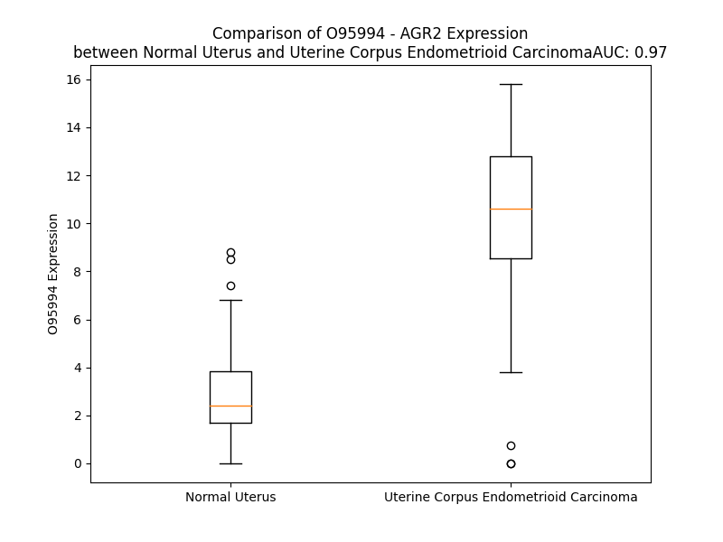

# Detailed Data for O95994

## Introduction to the Detailed Summary

### How to Interpret the Results

- **Summary & Metrics**: This section provides a quick reference to essential protein attributes, including expression changes, family classification, and biomarker applications. Regulation status (upregulated/downregulated) indicates the protein's behavior in a disease context. Some information comes from the original excel file with the proteins selected from literature, while others are derived from the analyses.
- **Expression Comparison**: A visual representation comparing protein expression between normal and disease states. It highlights significant changes in expression levels that might indicate diagnostic or therapeutic relevance. This is data coming from transcriptomics experiments and could not translate similarly to protein levels.
- **Isoform Alignment**: An interactive view of isoform alignments, revealing structural and functional differences between variants of the protein.
- **Interactors & Homologs**: Tables listing known interaction partners and homologous proteins, the more interactors and homologs, the more complex the protein is to design an antibody for.
- **Biological Assemblies**: Information about the structural arrangement of the protein in different assemblies, providing insights into its functional state but also the complexity of the protein to develop antibodies.
- **Combined Per-Residue Information**: A detailed table summarizing residue-level data. This includes predictions for epitope regions, aggregation tendencies, and modifications that might impact the protein's function. Each row corresponds to a residue in the protein, providing insights into specific sites that may be important for research or drug development.
## Summary & Metrics

- **UniProt Accession**: O95994
- **Gene Name**: AGR2
- **Protein Name**: anterior gradient 2 homolog (Xenopus laevis)
- **Swiss Prot**: AGR2_HUMAN
- **Family**: other
- **Biomarker Application**: diagnosis
- **Number of Isoforms**: 0
- **Regulation**: 1
- **(transcriptomics) AUC**: 0.91
- **(transcriptomics) Fold Change**: 2.83
- **(transcriptomics) Regulation**: Upregulated
- **Discotope Epitope Count**: 38
- **Max n_uniprots (Homo)**: 2
- **Max n_uniprots (Hetero)**: N/A

## Expression Comparison

## Interactors

| preferredName_A   | preferredName_B   |   score |
|:------------------|:------------------|--------:|
| AGR2              | LYPD3             |   0.984 |

## Homologs

| uniprot_id   | gene_id   |
|:-------------|:----------|
| B5MC62       | AGR3      |
| O95881       | TXNDC12   |

## Biological Assemblies

|   Unnamed: 0 |   assembly |   n_uniprots | composition   | crystal_id   |
|-------------:|-----------:|-------------:|:--------------|:-------------|
|            0 |          1 |            1 | Homo          | 2lnt         |
|            0 |          1 |            2 | Homo          | 2lns         |

## Combined Per-Residue Information

|   res | aa   |   epitope_score | epitope   |   relative_surface_accessibility |   modeling_confidence |   Aggregation | modification   |
|------:|:-----|----------------:|:----------|---------------------------------:|----------------------:|--------------:|:---------------|
|     1 | M    |         0.2275  | False     |                          1.25748 |                 47.57 |         0     | N/A            |
|     2 | E    |         0.33365 | False     |                          0.91845 |                 63.42 |         0     | N/A            |
|     3 | K    |         0.29161 | False     |                          0.9184  |                 61.67 |         0     | N/A            |
|     4 | I    |         0.27189 | False     |                          0.74862 |                 70.83 |         0     | N/A            |
|     5 | P    |         0.34371 | False     |                          0.65609 |                 65.99 |         0.17  | N/A            |
|     6 | V    |         0.17176 | False     |                          0.80876 |                 76.4  |        37.802 | N/A            |
|     7 | S    |         0.21182 | False     |                          0.5509  |                 76.61 |        40.997 | N/A            |
|     8 | A    |         0.1616  | False     |                          0.34704 |                 73.47 |        66.728 | N/A            |
|     9 | F    |         0.23528 | False     |                          0.67186 |                 74.52 |        97.046 | N/A            |
|    10 | L    |         0.19687 | False     |                          0.7171  |                 78.48 |        99.426 | N/A            |
|    11 | L    |         0.22109 | False     |                          0.74625 |                 77.24 |        99.844 | N/A            |
|    12 | L    |         0.25395 | False     |                          0.75017 |                 75.07 |        99.884 | N/A            |
|    13 | V    |         0.11677 | False     |                          0.43319 |                 76.11 |        99.687 | N/A            |
|    14 | A    |         0.133   | False     |                          0.5083  |                 72.31 |        96.116 | N/A            |
|    15 | L    |         0.16523 | False     |                          0.71707 |                 73.72 |        93.019 | N/A            |
|    16 | S    |         0.15771 | False     |                          0.49514 |                 67.21 |        76.184 | N/A            |
|    17 | Y    |         0.22403 | False     |                          0.68702 |                 61    |        74.092 | N/A            |
|    18 | T    |         0.14913 | False     |                          0.6462  |                 66.83 |        66.875 | N/A            |
|    19 | L    |         0.19122 | False     |                          0.8893  |                 60.93 |        62.578 | N/A            |
|    20 | A    |         0.13005 | False     |                          0.70541 |                 57.59 |        53.995 | N/A            |
|    21 | R    |         0.26024 | False     |                          0.83812 |                 50.86 |         0.027 | N/A            |
|    22 | D    |         0.24676 | False     |                          0.80632 |                 45.14 |         0.027 | N/A            |
|    23 | T    |         0.19214 | False     |                          0.80474 |                 43.72 |         0.016 | N/A            |
|    24 | T    |         0.19473 | False     |                          0.9683  |                 40.09 |         0.01  | N/A            |
|    25 | V    |         0.16923 | False     |                          0.93149 |                 40.39 |         0.009 | N/A            |
|    26 | K    |         0.19966 | False     |                          0.90229 |                 38.01 |         0     | N/A            |
|    27 | P    |         0.25152 | False     |                          0.94606 |                 39.74 |         0     | N/A            |
|    28 | G    |         0.22975 | False     |                          0.89328 |                 38.98 |         0     | N/A            |
|    29 | A    |         0.1625  | False     |                          0.92013 |                 40.55 |         0     | N/A            |
|    30 | K    |         0.21387 | False     |                          0.9439  |                 40.22 |         0     | N/A            |
|    31 | K    |         0.25919 | False     |                          0.915   |                 40.72 |         0     | N/A            |
|    32 | D    |         0.14794 | False     |                          0.74531 |                 46.62 |         0     | N/A            |
|    33 | T    |         0.22691 | False     |                          0.91128 |                 49.75 |         0     | N/A            |
|    34 | K    |         0.24553 | False     |                          0.90358 |                 50.16 |         0     | N/A            |
|    35 | D    |         0.23834 | False     |                          0.52002 |                 54.23 |         0     | N/A            |
|    36 | S    |         0.20535 | False     |                          0.88593 |                 60.24 |         0     | N/A            |
|    37 | R    |         0.21251 | False     |                          0.65124 |                 61.6  |         0     | N/A            |
|    38 | P    |         0.16678 | False     |                          0.6872  |                 64.1  |         0     | N/A            |
|    39 | K    |         0.22587 | False     |                          1.00266 |                 59.68 |         0     | N/A            |
|    40 | L    |         0.19212 | False     |                          0.26161 |                 59.3  |         0     | N/A            |
|    41 | P    |         0.35486 | True      |                          0.56604 |                 64.45 |         0     | N/A            |
|    42 | Q    |         0.32883 | False     |                          0.60608 |                 63.71 |         0     | N/A            |
|    43 | T    |         0.32707 | False     |                          0.78745 |                 84.37 |         0     | N/A            |
|    44 | L    |         0.17891 | False     |                          0.12448 |                 93.55 |         0     | N/A            |
|    45 | S    |         0.03606 | False     |                          0.00965 |                 95.12 |         0     | N/A            |
|    46 | R    |         0.36194 | True      |                          0.31328 |                 94.9  |         0     | N/A            |
|    47 | G    |         0.40719 | True      |                          0.37853 |                 95.61 |         0     | N/A            |
|    48 | W    |         0.00762 | False     |                          0.00055 |                 97.29 |         0     | N/A            |
|    49 | G    |         0.10154 | False     |                          0.0561  |                 96.18 |         0     | N/A            |
|    50 | D    |         0.21319 | False     |                          0.37969 |                 94.92 |         0     | N/A            |
|    51 | Q    |         0.2388  | False     |                          0.63696 |                 93.7  |         0.131 | N/A            |
|    52 | L    |         0.11444 | False     |                          0.05753 |                 95.77 |         0.26  | N/A            |
|    53 | I    |         0.1957  | False     |                          0.62903 |                 95.63 |         0.26  | N/A            |
|    54 | W    |         0.06881 | False     |                          0.05013 |                 97.28 |         0.26  | N/A            |
|    55 | T    |         0.05335 | False     |                          0.04425 |                 96.42 |         0.26  | N/A            |
|    56 | Q    |         0.29763 | False     |                          0.57433 |                 95.02 |         0.129 | N/A            |
|    57 | T    |         0.3836  | True      |                          0.41874 |                 95.44 |         0     | N/A            |
|    58 | Y    |         0.17945 | False     |                          0.14661 |                 96.1  |         0     | N/A            |
|    59 | E    |         0.34797 | False     |                          0.62327 |                 96.46 |         0     | N/A            |
|    60 | E    |         0.25402 | False     |                          0.29257 |                 97.39 |         0     | N/A            |
|    61 | A    |         0.00427 | False     |                          0       |                 98.08 |         0     | N/A            |
|    62 | L    |         0.13307 | False     |                          0.22527 |                 98    |         0     | N/A            |
|    63 | Y    |         0.36303 | True      |                          0.67656 |                 98.32 |         0     | N/A            |
|    64 | K    |         0.24014 | False     |                          0.35804 |                 98.43 |         0     | N/A            |
|    65 | S    |         0.01253 | False     |                          0       |                 98.37 |         0     | N/A            |
|    66 | K    |         0.32406 | False     |                          0.64631 |                 97.59 |         0     | N/A            |
|    67 | T    |         0.35489 | True      |                          0.60159 |                 97.78 |         0     | N/A            |
|    68 | S    |         0.33951 | False     |                          0.43818 |                 97.23 |         0     | N/A            |
|    69 | N    |         0.23316 | False     |                          0.59649 |                 96.99 |         0     | N/A            |
|    70 | K    |         0.24547 | False     |                          0.41383 |                 98.17 |         0     | N/A            |
|    71 | P    |         0.03    | False     |                          0.04573 |                 98.51 |         0.215 | N/A            |
|    72 | L    |         0.00291 | False     |                          0       |                 98.7  |         0.345 | N/A            |
|    73 | M    |         0.00408 | False     |                          0       |                 98.75 |         0.345 | N/A            |
|    74 | I    |         0.00584 | False     |                          0       |                 98.53 |         0.345 | N/A            |
|    75 | I    |         0.0109  | False     |                          0       |                 98.45 |         0.345 | N/A            |
|    76 | H    |         0.05292 | False     |                          0.01779 |                 98.33 |         0.13  | N/A            |
|    77 | H    |         0.10441 | False     |                          0.01227 |                 98.19 |         0     | N/A            |
|    78 | L    |         0.64793 | True      |                          0.49683 |                 97.1  |         0     | N/A            |
|    79 | D    |         0.58812 | True      |                          0.34765 |                 92.7  |         0     | N/A            |
|    80 | E    |         0.56104 | True      |                          0.86362 |                 93.26 |         0     | N/A            |
|    81 | C    |         0.37115 | True      |                          0.11976 |                 96.95 |         0     | N/A            |
|    82 | P    |         0.61348 | True      |                          0.79845 |                 97.92 |         0     | N/A            |
|    83 | H    |         0.54155 | True      |                          0.64373 |                 97.72 |         0     | N/A            |
|    84 | S    |         0.09274 | False     |                          0.00903 |                 98.22 |         0     | N/A            |
|    85 | Q    |         0.46274 | True      |                          0.35831 |                 98.34 |         0     | N/A            |
|    86 | A    |         0.34145 | False     |                          0.39556 |                 98.38 |         0     | N/A            |
|    87 | L    |         0.02166 | False     |                          0.00577 |                 98.41 |         0     | N/A            |
|    88 | K    |         0.27839 | False     |                          0.1558  |                 98.27 |         0     | N/A            |
|    89 | K    |         0.59642 | True      |                          0.61355 |                 98.16 |         0     | N/A            |
|    90 | V    |         0.30945 | False     |                          0.2672  |                 98.22 |         0     | N/A            |
|    91 | F    |         0.01062 | False     |                          0.00137 |                 98.47 |         0     | N/A            |
|    92 | A    |         0.11225 | False     |                          0.38009 |                 97.89 |         0     | N/A            |
|    93 | E    |         0.3944  | True      |                          0.59156 |                 97.89 |         0     | N/A            |
|    94 | N    |         0.17248 | False     |                          0.24029 |                 98.33 |         0     | N/A            |
|    95 | K    |         0.25954 | False     |                          0.86881 |                 97.93 |         0     | N/A            |
|    96 | E    |         0.27341 | False     |                          0.57699 |                 98.13 |         0     | N/A            |
|    97 | I    |         0.02923 | False     |                          0.004   |                 98.46 |         0.111 | N/A            |
|    98 | Q    |         0.10726 | False     |                          0.15991 |                 98.23 |         0.111 | N/A            |
|    99 | K    |         0.26699 | False     |                          0.74987 |                 98.14 |         0.17  | N/A            |
|   100 | L    |         0.14819 | False     |                          0.15898 |                 98.09 |         0.17  | N/A            |
|   101 | A    |         0.00335 | False     |                          0       |                 98.39 |         0.17  | N/A            |
|   102 | E    |         0.18092 | False     |                          0.60364 |                 97.47 |         0.17  | N/A            |
|   103 | Q    |         0.22814 | False     |                          0.46965 |                 98.19 |         3.313 | N/A            |
|   104 | F    |         0.08424 | False     |                          0.05529 |                 98.69 |        68.307 | N/A            |
|   105 | V    |         0.07506 | False     |                          0.08854 |                 98.54 |        82.762 | N/A            |
|   106 | L    |         0.04425 | False     |                          0.01378 |                 98.51 |        83.932 | N/A            |
|   107 | L    |         0.00426 | False     |                          0.00082 |                 98.13 |        84.098 | N/A            |
|   108 | N    |         0.18288 | False     |                          0.05237 |                 97.67 |        83.479 | N/A            |
|   109 | L    |         0.24475 | False     |                          0.14236 |                 97.38 |        82.862 | N/A            |
|   110 | V    |         0.28411 | False     |                          0.18139 |                 96.12 |        78.805 | N/A            |
|   111 | Y    |         0.62399 | True      |                          0.81873 |                 93.28 |        61.146 | N/A            |
|   112 | E    |         0.5126  | True      |                          0.36175 |                 93.53 |         0     | N/A            |
|   113 | T    |         0.33967 | False     |                          0.23105 |                 91.42 |         0     | N/A            |
|   114 | T    |         0.46517 | True      |                          1.01046 |                 92.06 |         0     | N/A            |
|   115 | D    |         0.3616  | True      |                          0.22618 |                 93.57 |         0     | N/A            |
|   116 | K    |         0.47427 | True      |                          0.85211 |                 93.83 |         0     | N/A            |
|   117 | H    |         0.37923 | True      |                          0.71563 |                 94.73 |         0     | N/A            |
|   118 | L    |         0.01191 | False     |                          0       |                 94.88 |         0     | N/A            |
|   119 | S    |         0.41763 | True      |                          0.17238 |                 95.21 |         0     | N/A            |
|   120 | P    |         0.54611 | True      |                          0.60221 |                 94.39 |         0     | N/A            |
|   121 | D    |         0.60033 | True      |                          0.25552 |                 94.82 |         0     | N/A            |
|   122 | G    |         0.55631 | True      |                          0.37715 |                 95.17 |         0     | N/A            |
|   123 | Q    |         0.67594 | True      |                          0.62573 |                 95.68 |         0     | N/A            |
|   124 | Y    |         0.47238 | True      |                          0.18182 |                 96.73 |         0     | N/A            |
|   125 | V    |         0.50429 | True      |                          0.27557 |                 97.62 |         0     | N/A            |
|   126 | P    |         0.24999 | False     |                          0.05614 |                 98.12 |         0     | N/A            |
|   127 | R    |         0.01701 | False     |                          0.00257 |                 97.8  |         0     | N/A            |
|   128 | I    |         0.01645 | False     |                          0.00296 |                 98.53 |         0     | N/A            |
|   129 | M    |         0.00761 | False     |                          0.00072 |                 98.17 |         0     | N/A            |
|   130 | F    |         0.027   | False     |                          0.01582 |                 98.53 |         0     | N/A            |
|   131 | V    |         0.04396 | False     |                          0.01413 |                 98.34 |         0     | N/A            |
|   132 | D    |         0.08518 | False     |                          0.02867 |                 97.99 |         0     | N/A            |
|   133 | P    |         0.05151 | False     |                          0.08543 |                 97.68 |         0     | N/A            |
|   134 | S    |         0.20374 | False     |                          0.48255 |                 96.27 |         0     | N/A            |
|   135 | L    |         0.17699 | False     |                          0.50832 |                 95.74 |         0     | N/A            |
|   136 | T    |         0.19469 | False     |                          0.45759 |                 95.88 |         0     | N/A            |
|   137 | V    |         0.16852 | False     |                          0.22951 |                 97.15 |         0     | N/A            |
|   138 | R    |         0.20673 | False     |                          0.0801  |                 97.36 |         0     | N/A            |
|   139 | A    |         0.18276 | False     |                          0.64241 |                 95.83 |         0     | N/A            |
|   140 | D    |         0.29733 | False     |                          0.61915 |                 96.32 |         0     | N/A            |
|   141 | I    |         0.08155 | False     |                          0.01426 |                 97.95 |         0     | N/A            |
|   142 | T    |         0.37844 | True      |                          0.31006 |                 97.46 |         0     | N/A            |
|   143 | G    |         0.15429 | False     |                          0.15167 |                 96.07 |         0     | N/A            |
|   144 | R    |         0.35183 | False     |                          0.63886 |                 95.24 |         0     | N/A            |
|   145 | Y    |         0.56372 | True      |                          0.19037 |                 95.73 |         0     | N/A            |
|   146 | S    |         0.44585 | True      |                          0.83466 |                 92.77 |         0     | N/A            |
|   147 | N    |         0.73199 | True      |                          0.69294 |                 94.72 |         0     | N/A            |
|   148 | R    |         0.69746 | True      |                          0.33827 |                 96.77 |         0     | N/A            |
|   149 | L    |         0.38214 | True      |                          0.38497 |                 97.54 |         0     | N/A            |
|   150 | Y    |         0.05954 | False     |                          0.02577 |                 97.96 |         0     | N/A            |
|   151 | A    |         0.29523 | False     |                          0.06055 |                 98.11 |         0     | N/A            |
|   152 | Y    |         0.04378 | False     |                          0.0137  |                 98.48 |         0     | N/A            |
|   153 | E    |         0.50908 | True      |                          0.34471 |                 97.76 |         0     | N/A            |
|   154 | P    |         0.3886  | True      |                          0.38661 |                 98.19 |         0     | N/A            |
|   155 | A    |         0.43003 | True      |                          0.83757 |                 97.84 |         0     | N/A            |
|   156 | D    |         0.07356 | False     |                          0.02932 |                 98    |         0     | N/A            |
|   157 | T    |         0.25189 | False     |                          0.18581 |                 97.69 |         0.628 | N/A            |
|   158 | A    |         0.25321 | False     |                          0.69794 |                 98.03 |         0.628 | N/A            |
|   159 | L    |         0.21078 | False     |                          0.3426  |                 98.38 |         0.628 | N/A            |
|   160 | L    |         0.01483 | False     |                          0.00659 |                 98.61 |         0.628 | N/A            |
|   161 | L    |         0.16572 | False     |                          0.1014  |                 98.37 |         0.628 | N/A            |
|   162 | D    |         0.39513 | True      |                          0.40353 |                 98.43 |         0     | N/A            |
|   163 | N    |         0.02288 | False     |                          0.00509 |                 98.69 |         0     | N/A            |
|   164 | M    |         0.00685 | False     |                          0       |                 98.7  |         0     | N/A            |
|   165 | K    |         0.30106 | False     |                          0.49916 |                 98.4  |         0     | N/A            |
|   166 | K    |         0.33067 | False     |                          0.49039 |                 98.14 |         0     | N/A            |
|   167 | A    |         0.02103 | False     |                          0.01481 |                 98.18 |         0     | N/A            |
|   168 | L    |         0.21203 | False     |                          0.2975  |                 97.65 |         0     | N/A            |
|   169 | K    |         0.31341 | False     |                          0.75101 |                 96.71 |         0     | N/A            |
|   170 | L    |         0.22268 | False     |                          0.38061 |                 94.45 |         0     | N/A            |
|   171 | L    |         0.21016 | False     |                          0.44602 |                 90.27 |         0     | N/A            |
|   172 | K    |         0.17462 | False     |                          0.88285 |                 83.86 |         0     | N/A            |
|   173 | T    |         0.17517 | False     |                          0.7916  |                 71.57 |         0     | N/A            |
|   174 | E    |         0.20447 | False     |                          0.80053 |                 67.54 |         0     | N/A            |
|   175 | L    |         0.10775 | False     |                          1.41603 |                 52.48 |         0     | N/A            |

