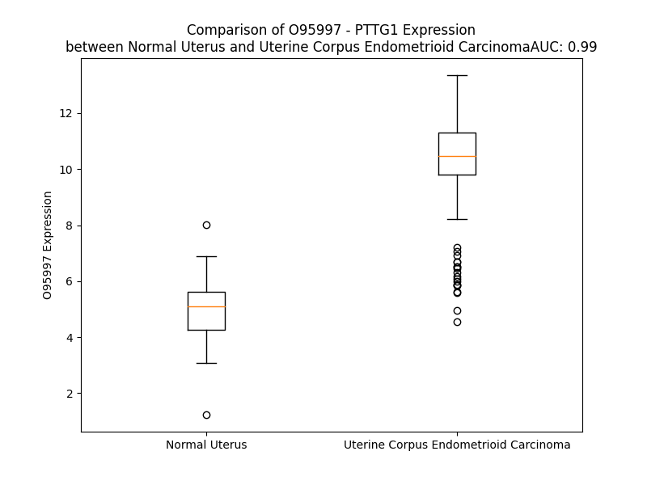

# Detailed Data for O95997

## Introduction to the Detailed Summary

### How to Interpret the Results

- **Summary & Metrics**: This section provides a quick reference to essential protein attributes, including expression changes, family classification, and biomarker applications. Regulation status (upregulated/downregulated) indicates the protein's behavior in a disease context. Some information comes from the original excel file with the proteins selected from literature, while others are derived from the analyses.
- **Expression Comparison**: A visual representation comparing protein expression between normal and disease states. It highlights significant changes in expression levels that might indicate diagnostic or therapeutic relevance. This is data coming from transcriptomics experiments and could not translate similarly to protein levels.
- **Isoform Alignment**: An interactive view of isoform alignments, revealing structural and functional differences between variants of the protein.
- **Interactors & Homologs**: Tables listing known interaction partners and homologous proteins, the more interactors and homologs, the more complex the protein is to design an antibody for.
- **Biological Assemblies**: Information about the structural arrangement of the protein in different assemblies, providing insights into its functional state but also the complexity of the protein to develop antibodies.
- **Combined Per-Residue Information**: A detailed table summarizing residue-level data. This includes predictions for epitope regions, aggregation tendencies, and modifications that might impact the protein's function. Each row corresponds to a residue in the protein, providing insights into specific sites that may be important for research or drug development.
## Summary & Metrics

- **UniProt Accession**: O95997
- **Gene Name**: PTTG1
- **Protein Name**: Securin/Human pituitary tumor-transforming gene 1
- **Swiss Prot**: PTTG1_HUMAN
- **Family**: transcription regulator
- **Biomarker Application**: prognosis
- **Number of Isoforms**: 0
- **Regulation**: 1
- **(transcriptomics) AUC**: 1.0
- **(transcriptomics) Fold Change**: 2.27
- **(transcriptomics) Regulation**: Upregulated
- **Discotope Epitope Count**: 18
- **Max n_uniprots (Homo)**: N/A
- **Max n_uniprots (Hetero)**: N/A

## Expression Comparison

## Interactors

| preferredName_A   | preferredName_B   |   score |
|:------------------|:------------------|--------:|
| PTTG1             | ESPL1             |   0.999 |
| PTTG1             | CDC20             |   0.999 |
| PTTG1             | FZR1              |   0.99  |
| PTTG1             | CDK1              |   0.985 |
| PTTG1             | CCNB1             |   0.984 |
| PTTG1             | UBE2C             |   0.98  |
| PTTG1             | BUB1B             |   0.978 |
| PTTG1             | CDC27             |   0.976 |
| PTTG1             | CCNB2             |   0.97  |
| PTTG1             | AURKA             |   0.967 |
| PTTG1             | PLK1              |   0.956 |
| PTTG1             | BUB1              |   0.955 |
| PTTG1             | AURKB             |   0.949 |
| PTTG1             | TOP2A             |   0.942 |
| PTTG1             | CCNA2             |   0.934 |
| PTTG1             | BIRC5             |   0.926 |
| PTTG1             | TPX2              |   0.921 |
| PTTG1             | ANAPC11           |   0.92  |
| PTTG1             | DLGAP5            |   0.913 |
| PTTG1             | ANAPC10           |   0.911 |
| PTTG1             | NUSAP1            |   0.906 |
| PTTG1             | PTTG2             |   0.903 |

## Combined Per-Residue Information

|   res | aa   |   epitope_score | epitope   |   relative_surface_accessibility |   modeling_confidence |   Aggregation | modification           |
|------:|:-----|----------------:|:----------|---------------------------------:|----------------------:|--------------:|:-----------------------|
|     1 | M    |         0.16076 | False     |                          1.34367 |                 59.15 |         0     | N/A                    |
|     2 | A    |         0.13395 | False     |                          0.96169 |                 63.53 |        56.347 | N-acetylalanine        |
|     3 | T    |         0.14835 | False     |                          0.88968 |                 70.57 |        80.358 | N/A                    |
|     4 | L    |         0.19578 | False     |                          0.88337 |                 79.35 |        80.358 | N/A                    |
|     5 | I    |         0.23532 | False     |                          0.92617 |                 77.36 |        80.358 | N/A                    |
|     6 | Y    |         0.19872 | False     |                          0.85973 |                 79.21 |        80.358 | N/A                    |
|     7 | V    |         0.17711 | False     |                          0.94987 |                 77.31 |        75.29  | N/A                    |
|     8 | D    |         0.21607 | False     |                          0.72778 |                 77.87 |         0.141 | N/A                    |
|     9 | K    |         0.2254  | False     |                          0.96652 |                 67.15 |         0.141 | N/A                    |
|    10 | E    |         0.21267 | False     |                          0.74832 |                 66.72 |         0     | N/A                    |
|    11 | N    |         0.16522 | False     |                          1.0073  |                 57.95 |         0     | N/A                    |
|    12 | G    |         0.15503 | False     |                          0.85892 |                 53.69 |         0     | N/A                    |
|    13 | E    |         0.15199 | False     |                          0.91235 |                 55.3  |         0     | N/A                    |
|    14 | P    |         0.16418 | False     |                          0.90165 |                 48.54 |         0     | N/A                    |
|    15 | G    |         0.14164 | False     |                          0.93134 |                 44.51 |         0     | N/A                    |
|    16 | T    |         0.14758 | False     |                          1.04164 |                 46.88 |         0     | N/A                    |
|    17 | R    |         0.22747 | False     |                          0.89321 |                 47.8  |         0     | N/A                    |
|    18 | V    |         0.14219 | False     |                          0.85385 |                 46.65 |         0     | N/A                    |
|    19 | V    |         0.11563 | False     |                          0.97402 |                 43.2  |         0     | N/A                    |
|    20 | A    |         0.09882 | False     |                          0.75934 |                 42.95 |         0     | N/A                    |
|    21 | K    |         0.1768  | False     |                          0.9698  |                 52.65 |         0     | N/A                    |
|    22 | D    |         0.1643  | False     |                          0.93641 |                 47.42 |         0     | N/A                    |
|    23 | G    |         0.17794 | False     |                          0.6946  |                 42.87 |         0     | N/A                    |
|    24 | L    |         0.15771 | False     |                          1.12658 |                 51.12 |         0     | N/A                    |
|    25 | K    |         0.19439 | False     |                          0.96889 |                 44.47 |         0     | N/A                    |
|    26 | L    |         0.15352 | False     |                          1.12309 |                 53.5  |         0     | N/A                    |
|    27 | G    |         0.2291  | False     |                          0.87168 |                 41.61 |         0     | N/A                    |
|    28 | S    |         0.20683 | False     |                          0.95067 |                 48.28 |         0     | N/A                    |
|    29 | G    |         0.1922  | False     |                          0.77537 |                 47.36 |         0     | N/A                    |
|    30 | P    |         0.23231 | False     |                          1.03852 |                 41.28 |         0     | N/A                    |
|    31 | S    |         0.17035 | False     |                          0.73373 |                 49.27 |         0     | N/A                    |
|    32 | I    |         0.21721 | False     |                          1.02277 |                 39.05 |         0     | N/A                    |
|    33 | K    |         0.24339 | False     |                          0.92825 |                 54.74 |         0     | N/A                    |
|    34 | A    |         0.12272 | False     |                          0.91027 |                 45.33 |         0     | N/A                    |
|    35 | L    |         0.17789 | False     |                          1.11076 |                 56.94 |         0     | N/A                    |
|    36 | D    |         0.25285 | False     |                          0.86493 |                 44.82 |         0     | N/A                    |
|    37 | G    |         0.271   | False     |                          0.85846 |                 55.7  |         0     | N/A                    |
|    38 | R    |         0.22914 | False     |                          0.9539  |                 50.74 |         0     | N/A                    |
|    39 | S    |         0.18713 | False     |                          0.77357 |                 58.21 |         0     | N/A                    |
|    40 | Q    |         0.2021  | False     |                          0.87173 |                 47.52 |         0     | N/A                    |
|    41 | V    |         0.23847 | False     |                          0.94783 |                 51.16 |         0     | N/A                    |
|    42 | S    |         0.17603 | False     |                          0.73037 |                 50.49 |         0     | N/A                    |
|    43 | T    |         0.21945 | False     |                          0.8143  |                 58.35 |         0     | N/A                    |
|    44 | P    |         0.19452 | False     |                          0.80494 |                 54.45 |         0     | N/A                    |
|    45 | R    |         0.23265 | False     |                          0.99441 |                 52.73 |         0     | N/A                    |
|    46 | F    |         0.26643 | False     |                          0.98139 |                 57.2  |         0     | N/A                    |
|    47 | G    |         0.18156 | False     |                          0.81728 |                 51.71 |         0     | N/A                    |
|    48 | K    |         0.2413  | False     |                          0.98305 |                 62.8  |         0     | N/A                    |
|    49 | T    |         0.21591 | False     |                          1.00426 |                 51.27 |         0     | N/A                    |
|    50 | F    |         0.22062 | False     |                          0.92139 |                 62.04 |         0     | N/A                    |
|    51 | D    |         0.33011 | True      |                          0.8631  |                 58.4  |         0     | N/A                    |
|    52 | A    |         0.21007 | False     |                          0.5425  |                 63.46 |         0     | N/A                    |
|    53 | P    |         0.212   | False     |                          0.85974 |                 72.13 |         0     | N/A                    |
|    54 | P    |         0.18711 | False     |                          0.98    |                 58.38 |         0     | N/A                    |
|    55 | A    |         0.14903 | False     |                          0.85816 |                 52.1  |         0     | N/A                    |
|    56 | L    |         0.24315 | False     |                          1.02726 |                 61.89 |         0     | N/A                    |
|    57 | P    |         0.15746 | False     |                          0.84928 |                 54.02 |         0     | N/A                    |
|    58 | K    |         0.21764 | False     |                          1.02772 |                 53.27 |         0     | N/A                    |
|    59 | A    |         0.1591  | False     |                          0.9371  |                 55.83 |         0     | N/A                    |
|    60 | T    |         0.18035 | False     |                          0.86449 |                 53.71 |         0     | N/A                    |
|    61 | R    |         0.22305 | False     |                          0.82573 |                 66.27 |         0     | N/A                    |
|    62 | K    |         0.24184 | False     |                          0.925   |                 73.86 |         0     | N/A                    |
|    63 | A    |         0.17252 | False     |                          0.96121 |                 73.85 |         0     | N/A                    |
|    64 | L    |         0.19557 | False     |                          1.14242 |                 67.36 |         0     | N/A                    |
|    65 | G    |         0.21102 | False     |                          0.77858 |                 69.48 |         0     | N/A                    |
|    66 | T    |         0.2187  | False     |                          0.83392 |                 64.25 |         0     | N/A                    |
|    67 | V    |         0.22934 | False     |                          0.98687 |                 60.22 |         0     | N/A                    |
|    68 | N    |         0.20563 | False     |                          0.82478 |                 65.7  |         0     | N/A                    |
|    69 | R    |         0.2178  | False     |                          0.91331 |                 64.97 |         0     | N/A                    |
|    70 | A    |         0.18107 | False     |                          1.03126 |                 46.24 |         0     | N/A                    |
|    71 | T    |         0.22853 | False     |                          0.75588 |                 56.41 |         0     | N/A                    |
|    72 | E    |         0.23908 | False     |                          0.7496  |                 53.1  |         0     | N/A                    |
|    73 | K    |         0.34875 | True      |                          0.94053 |                 46.67 |         0     | N/A                    |
|    74 | S    |         0.23334 | False     |                          0.78917 |                 49.47 |         0     | N/A                    |
|    75 | V    |         0.19364 | False     |                          1.02662 |                 44.15 |         0     | N/A                    |
|    76 | K    |         0.23664 | False     |                          0.9497  |                 47.99 |         0     | N/A                    |
|    77 | T    |         0.24369 | False     |                          0.96465 |                 51.13 |         0     | N/A                    |
|    78 | K    |         0.20624 | False     |                          0.99936 |                 41.82 |         0     | N/A                    |
|    79 | G    |         0.32796 | True      |                          0.82021 |                 44.09 |         0     | N/A                    |
|    80 | P    |         0.20975 | False     |                          1.01245 |                 44.54 |         0     | N/A                    |
|    81 | L    |         0.20804 | False     |                          1.11361 |                 52.03 |         0     | N/A                    |
|    82 | K    |         0.1635  | False     |                          0.96647 |                 47.44 |         0     | N/A                    |
|    83 | Q    |         0.20589 | False     |                          0.94258 |                 51.24 |         0     | N/A                    |
|    84 | K    |         0.1991  | False     |                          0.96982 |                 46    |         0     | N/A                    |
|    85 | Q    |         0.17395 | False     |                          0.89488 |                 53.25 |         0     | N/A                    |
|    86 | P    |         0.16147 | False     |                          0.82483 |                 60.11 |         0     | N/A                    |
|    87 | S    |         0.13049 | False     |                          0.85655 |                 46.67 |         0     | N/A                    |
|    88 | F    |         0.1952  | False     |                          1.02    |                 49.67 |         0     | N/A                    |
|    89 | S    |         0.17809 | False     |                          0.87124 |                 51.06 |         0     | N/A                    |
|    90 | A    |         0.17912 | False     |                          1.01691 |                 51.4  |         0     | N/A                    |
|    91 | K    |         0.1594  | False     |                          1.02833 |                 59.08 |         0     | N/A                    |
|    92 | K    |         0.17162 | False     |                          0.97157 |                 50.91 |         0     | N/A                    |
|    93 | M    |         0.22113 | False     |                          0.97961 |                 56.23 |         0     | N/A                    |
|    94 | T    |         0.14723 | False     |                          0.82728 |                 54.42 |         0     | N/A                    |
|    95 | E    |         0.18432 | False     |                          0.78601 |                 48.47 |         0     | N/A                    |
|    96 | K    |         0.21121 | False     |                          0.96385 |                 60.53 |         0     | N/A                    |
|    97 | T    |         0.18979 | False     |                          0.77455 |                 46.58 |         0     | N/A                    |
|    98 | V    |         0.23221 | False     |                          0.81516 |                 45.05 |         0     | N/A                    |
|    99 | K    |         0.24159 | False     |                          0.9308  |                 50.49 |         0     | N/A                    |
|   100 | A    |         0.16892 | False     |                          0.91621 |                 51.73 |         0     | N/A                    |
|   101 | K    |         0.17217 | False     |                          1.07185 |                 46.64 |         0     | N/A                    |
|   102 | S    |         0.2048  | False     |                          0.71856 |                 54.9  |         0     | N/A                    |
|   103 | S    |         0.2019  | False     |                          0.84727 |                 58.79 |         0     | N/A                    |
|   104 | V    |         0.17564 | False     |                          0.89947 |                 58.68 |         0     | N/A                    |
|   105 | P    |         0.26792 | False     |                          0.86627 |                 65.12 |         0     | N/A                    |
|   106 | A    |         0.24927 | False     |                          0.91219 |                 62.77 |         0     | N/A                    |
|   107 | S    |         0.22696 | False     |                          0.7047  |                 64.62 |         0     | N/A                    |
|   108 | D    |         0.30632 | True      |                          0.77582 |                 64.61 |         0     | N/A                    |
|   109 | D    |         0.38917 | True      |                          0.88089 |                 64.84 |         0     | N/A                    |
|   110 | A    |         0.24812 | False     |                          0.85923 |                 68.95 |         0     | N/A                    |
|   111 | Y    |         0.33081 | True      |                          0.76101 |                 71.67 |         0     | N/A                    |
|   112 | P    |         0.30556 | True      |                          0.84933 |                 80.21 |         0     | N/A                    |
|   113 | E    |         0.24732 | False     |                          0.76891 |                 81.38 |         0     | N/A                    |
|   114 | I    |         0.24131 | False     |                          0.73088 |                 79.13 |         0     | N/A                    |
|   115 | E    |         0.2466  | False     |                          0.67527 |                 84.87 |         0     | N/A                    |
|   116 | K    |         0.25791 | False     |                          0.68776 |                 85.11 |         0     | N/A                    |
|   117 | F    |         0.30787 | True      |                          0.85892 |                 85.99 |         0     | N/A                    |
|   118 | F    |         0.21279 | False     |                          0.84766 |                 87    |         0     | N/A                    |
|   119 | P    |         0.22743 | False     |                          1.02713 |                 90.72 |         0     | N/A                    |
|   120 | F    |         0.31722 | True      |                          0.76556 |                 90.3  |         0     | N/A                    |
|   121 | N    |         0.29694 | True      |                          0.42585 |                 90.37 |         0     | N/A                    |
|   122 | P    |         0.28384 | False     |                          0.69851 |                 90.53 |         0     | N/A                    |
|   123 | L    |         0.27553 | False     |                          0.73284 |                 89.16 |         0     | N/A                    |
|   124 | D    |         0.27927 | False     |                          0.63809 |                 88.14 |         0     | N/A                    |
|   125 | F    |         0.22146 | False     |                          0.81122 |                 87.43 |         0     | N/A                    |
|   126 | E    |         0.32361 | True      |                          0.53481 |                 84.7  |         0     | N/A                    |
|   127 | S    |         0.31965 | True      |                          0.64902 |                 82.85 |         0     | N/A                    |
|   128 | F    |         0.29227 | False     |                          0.89581 |                 81.62 |         0     | N/A                    |
|   129 | D    |         0.27747 | False     |                          0.77191 |                 83.08 |         0     | N/A                    |
|   130 | L    |         0.27485 | False     |                          0.38768 |                 80.86 |         0     | N/A                    |
|   131 | P    |         0.19845 | False     |                          0.52658 |                 82.85 |         0     | N/A                    |
|   132 | E    |         0.16193 | False     |                          0.74016 |                 82.23 |         0     | N/A                    |
|   133 | E    |         0.13988 | False     |                          0.62487 |                 82.38 |         0     | N/A                    |
|   134 | H    |         0.16212 | False     |                          0.34991 |                 84.76 |         0     | N/A                    |
|   135 | Q    |         0.2079  | False     |                          0.39549 |                 86.25 |         0     | N/A                    |
|   136 | I    |         0.12897 | False     |                          0.69159 |                 83.66 |         0     | N/A                    |
|   137 | A    |         0.14573 | False     |                          0.77547 |                 84.87 |         0     | N/A                    |
|   138 | H    |         0.37443 | True      |                          1.00885 |                 84.16 |         0     | N/A                    |
|   139 | L    |         0.20009 | False     |                          0.70742 |                 87.01 |         0     | N/A                    |
|   140 | P    |         0.18928 | False     |                          0.60817 |                 86.93 |         0     | N/A                    |
|   141 | L    |         0.09937 | False     |                          0.18089 |                 87.02 |         0     | N/A                    |
|   142 | S    |         0.19406 | False     |                          0.64146 |                 84.31 |         0     | N/A                    |
|   143 | G    |         0.11297 | False     |                          0.96859 |                 85.42 |         0     | N/A                    |
|   144 | V    |         0.08025 | False     |                          0.57528 |                 84.15 |         0     | N/A                    |
|   145 | P    |         0.10385 | False     |                          0.92611 |                 83.89 |         0     | N/A                    |
|   146 | L    |         0.07989 | False     |                          0.44782 |                 79.1  |         0     | N/A                    |
|   147 | M    |         0.07863 | False     |                          0.70029 |                 77.47 |         0     | N/A                    |
|   148 | I    |         0.07035 | False     |                          0.9999  |                 76    |         0     | N/A                    |
|   149 | L    |         0.09856 | False     |                          0.34699 |                 70.75 |         0     | N/A                    |
|   150 | D    |         0.15844 | False     |                          0.41341 |                 75.71 |         0     | N/A                    |
|   151 | E    |         0.20233 | False     |                          0.75354 |                 67.67 |         0     | N/A                    |
|   152 | E    |         0.33102 | True      |                          0.68348 |                 64.51 |         0     | N/A                    |
|   153 | R    |         0.28465 | False     |                          0.5658  |                 64.01 |         0     | N/A                    |
|   154 | E    |         0.12431 | False     |                          0.29384 |                 65.78 |         0     | N/A                    |
|   155 | L    |         0.1587  | False     |                          0.41877 |                 69.27 |         0.141 | N/A                    |
|   156 | E    |         0.21128 | False     |                          0.57311 |                 70.97 |         0.141 | N/A                    |
|   157 | K    |         0.1378  | False     |                          0.51187 |                 70.06 |         0.141 | N/A                    |
|   158 | L    |         0.14202 | False     |                          0.47271 |                 66.89 |         0.141 | N/A                    |
|   159 | F    |         0.27343 | False     |                          0.87607 |                 68.76 |         0.141 | N/A                    |
|   160 | Q    |         0.22474 | False     |                          0.74695 |                 72.53 |         0     | N/A                    |
|   161 | L    |         0.22375 | False     |                          0.76321 |                 70.07 |         0     | N/A                    |
|   162 | G    |         0.19194 | False     |                          0.57029 |                 74.13 |         0     | N/A                    |
|   163 | P    |         0.2992  | True      |                          0.94719 |                 75.6  |         0     | N/A                    |
|   164 | P    |         0.2093  | False     |                          0.93936 |                 70.67 |         0     | N/A                    |
|   165 | S    |         0.14254 | False     |                          0.66934 |                 71.96 |         0     | Phosphoserine; by CDK1 |
|   166 | P    |         0.33775 | True      |                          0.94861 |                 80.55 |         0     | N/A                    |
|   167 | V    |         0.17293 | False     |                          0.89547 |                 74.92 |         0     | N/A                    |
|   168 | K    |         0.25884 | False     |                          0.97018 |                 77.28 |         0     | N/A                    |
|   169 | M    |         0.27245 | False     |                          0.81058 |                 73.79 |         0     | N/A                    |
|   170 | P    |         0.25605 | False     |                          0.82024 |                 72.22 |         0     | N/A                    |
|   171 | S    |         0.22361 | False     |                          0.54164 |                 67.91 |         0     | N/A                    |
|   172 | P    |         0.31735 | True      |                          0.30518 |                 66    |         0     | N/A                    |
|   173 | P    |         0.23286 | False     |                          0.90673 |                 68.04 |         0     | N/A                    |
|   174 | W    |         0.30208 | True      |                          0.89687 |                 68.88 |         0     | N/A                    |
|   175 | E    |         0.28326 | False     |                          0.47654 |                 61.29 |         0     | N/A                    |
|   176 | S    |         0.22997 | False     |                          0.44843 |                 57.12 |         0     | N/A                    |
|   177 | N    |         0.20644 | False     |                          0.93526 |                 55.16 |         0     | N/A                    |
|   178 | L    |         0.23484 | False     |                          1.02248 |                 55.48 |         0     | N/A                    |
|   179 | L    |         0.23381 | False     |                          1.00858 |                 57.21 |         0     | N/A                    |
|   180 | Q    |         0.17879 | False     |                          0.77327 |                 61.06 |         0     | N/A                    |
|   181 | S    |         0.20826 | False     |                          0.57775 |                 56.78 |         0     | N/A                    |
|   182 | P    |         0.21485 | False     |                          0.58352 |                 59.43 |         0     | N/A                    |
|   183 | S    |         0.23146 | False     |                          0.54727 |                 61.66 |         0     | N/A                    |
|   184 | S    |         0.18441 | False     |                          0.49408 |                 61.99 |         0     | N/A                    |
|   185 | I    |         0.19128 | False     |                          0.64975 |                 62.08 |         0.554 | N/A                    |
|   186 | L    |         0.14543 | False     |                          0.55305 |                 62.16 |         0.554 | N/A                    |
|   187 | S    |         0.17937 | False     |                          0.76613 |                 61.98 |         0.554 | N/A                    |
|   188 | T    |         0.17325 | False     |                          0.83716 |                 64.81 |         0.554 | N/A                    |
|   189 | L    |         0.13332 | False     |                          0.58332 |                 67.85 |         0.554 | N/A                    |
|   190 | D    |         0.16367 | False     |                          0.95578 |                 68.95 |         0     | N/A                    |
|   191 | V    |         0.23208 | False     |                          0.70867 |                 76.27 |         0     | N/A                    |
|   192 | E    |         0.26228 | False     |                          0.9002  |                 77.02 |         0     | N/A                    |
|   193 | L    |         0.26128 | False     |                          0.77462 |                 75.97 |         0     | N/A                    |
|   194 | P    |         0.18523 | False     |                          0.78215 |                 78.83 |         0     | N/A                    |
|   195 | P    |         0.2195  | False     |                          0.95445 |                 75.68 |         0     | N/A                    |
|   196 | V    |         0.25865 | False     |                          0.93636 |                 71.08 |         0     | N/A                    |
|   197 | C    |         0.19485 | False     |                          0.78968 |                 63.3  |         0     | N/A                    |
|   198 | C    |         0.21759 | False     |                          0.7272  |                 64.34 |         0     | N/A                    |
|   199 | D    |         0.19538 | False     |                          0.73513 |                 60.5  |         0     | N/A                    |
|   200 | I    |         0.24858 | False     |                          0.91877 |                 60.34 |         0     | N/A                    |
|   201 | D    |         0.18877 | False     |                          0.84757 |                 57.34 |         0     | N/A                    |
|   202 | I    |         0.13122 | False     |                          1.3662  |                 45.82 |         0     | N/A                    |

