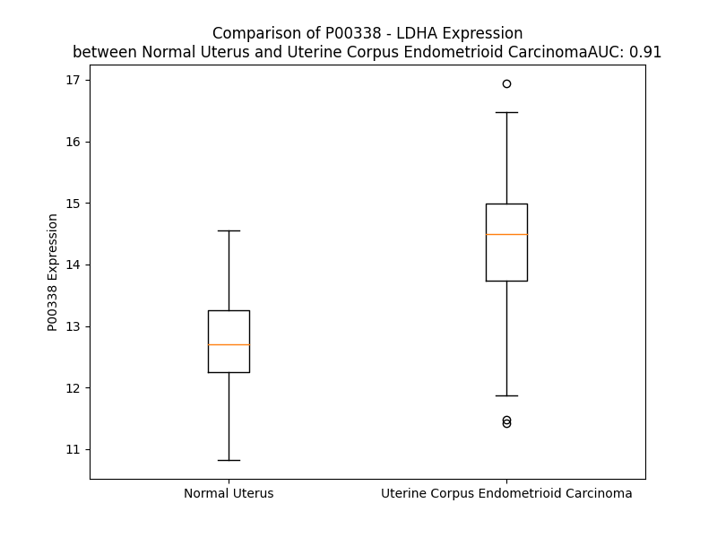

# Detailed Data for P00338

## Introduction to the Detailed Summary

### How to Interpret the Results

- **Summary & Metrics**: This section provides a quick reference to essential protein attributes, including expression changes, family classification, and biomarker applications. Regulation status (upregulated/downregulated) indicates the protein's behavior in a disease context. Some information comes from the original excel file with the proteins selected from literature, while others are derived from the analyses.
- **Expression Comparison**: A visual representation comparing protein expression between normal and disease states. It highlights significant changes in expression levels that might indicate diagnostic or therapeutic relevance. This is data coming from transcriptomics experiments and could not translate similarly to protein levels.
- **Isoform Alignment**: An interactive view of isoform alignments, revealing structural and functional differences between variants of the protein.
- **Interactors & Homologs**: Tables listing known interaction partners and homologous proteins, the more interactors and homologs, the more complex the protein is to design an antibody for.
- **Biological Assemblies**: Information about the structural arrangement of the protein in different assemblies, providing insights into its functional state but also the complexity of the protein to develop antibodies.
- **Combined Per-Residue Information**: A detailed table summarizing residue-level data. This includes predictions for epitope regions, aggregation tendencies, and modifications that might impact the protein's function. Each row corresponds to a residue in the protein, providing insights into specific sites that may be important for research or drug development.
## Summary & Metrics

- **UniProt Accession**: P00338
- **Gene Name**: LDHA
- **Protein Name**: lactate dehydrogenase A
- **Swiss Prot**: LDHA_HUMAN
- **Family**: enzyme
- **Biomarker Application**: diagnosis,disease progression,efficacy,prognosis,unspecified application
- **Number of Isoforms**: 5
- **Regulation**: 1
- **(transcriptomics) AUC**: 0.95
- **(transcriptomics) Fold Change**: 1.14
- **(transcriptomics) Regulation**: Upregulated
- **Discotope Epitope Count**: 55
- **Max n_uniprots (Homo)**: 4.0
- **Max n_uniprots (Hetero)**: N/A

## Expression Comparison

## Isoform Alignment

<pre style='font-size:14px; font-family:monospace;'>P00338-1 -----------------------------MATLKDQLIYNLLKEEQTPQNKITVVGVGAVGMACAISILMKDLADELALVDVIEDKLKGEMMDLQHGSLFLRTPKIVSGKDYNVTANSKLVIITAGARQQEGESRLNLVQRNVNIFKFIIPNVVKYSPNCKLLIVSNPVDILTYVAWKISGFPKNRVIGSGCNLDSARFRYLMGERLGVHPLSCHGWVLGEHGDSSVPVWSGMNVAGVSLKTLHPDLGTDKDKEQWKEVHKQVVESAYEVI---------KLKGYTSWAIGLSVADLAESIMKNLRRVHPVSTMIKGLYGIKDDVFLSVPCILGQNGISDLVKVTLTSEEEARLKKSADTLWGIQKELQF
P00338-2 -----------------------------MATLKDQLIYNLLKEEQTPQNKITVVGVGAVGMACAISILMKDLADELALVDVIEDKLKGEMMDLQHGSLFLRTPKIVSGKDYNVTANSKLVIITAGARQQEGESRLNLVQRNVNIFKFIIPNVVKYSPNCKLLIVSNPVDILTYVAWKISGFPKNRVIGSGCNLDSARFRYLMGERLGVHPLSCHGWVLGEHGDSSVPVWSGMNVAGVSLKTLHPDLGTDKDKEQWKECRYTLGDPKGAAILKSSDVISFHCLGYNRILGG--------------------GCACCPFYLICD-----------------------------------------------
P00338-3 MGEPSGGYTYTQTSIFLFHAKIPFGSKSNMATLKDQLIYNLLKEEQTPQNKITVVGVGAVGMACAISILMKDLADELALVDVIEDKLKGEMMDLQHGSLFLRTPKIVSGKDYNVTANSKLVIITAGARQQEGESRLNLVQRNVNIFKFIIPNVVKYSPNCKLLIVSNPVDILTYVAWKISGFPKNRVIGSGCNLDSARFRYLMGERLGVHPLSCHGWVLGEHGDSSVPVWSGMNVAGVSLKTLHPDLGTDKDKEQWKEVHKQVVESAYEVI---------KLKGYTSWAIGLSVADLAESIMKNLRRVHPVSTMIKGLYGIKDDVFLSVPCILGQNGISDLVKVTLTSEEEARLKKSADTLWGIQKELQF
P00338-4 -----------------------------MATLKDQLIYNLLKEEQTPQNKITVVGVGAVGMACAISILMKDLADELALVDVIEDKLKGEMMDLQHGSLFLRTPKIVSGK----------------------------------------------------------VDILTYVAWKISGFPKNRVIGSGCNLDSARFRYLMGERLGVHPLSCHGWVLGEHGDSSVPVWSGMNVAGVSLKTLHPDLGTDKDKEQWKEVHKQVVESAYEVI---------KLKGYTSWAIGLSVADLAESIMKNLRRVHPVSTMIKGLYGIKDDVFLSVPCILGQNGISDLVKVTLTSEEEARLKKSADTLWGIQKELQF
P00338-5 -----------------------------MATLKDQLIYNLLKEEQTPQNKITVVGVGAVGMACAISILMKDLADELALVDVIEDKLKGEMMDLQHGSLFLRTPKIVSGKDYNVTANSKLVIITAGARQQEGESRLNLVQRNVNIFKFIIPNVVKYSPNCKLLIVSNPVDILTYVAWKISGFPKNRVIGSGCNLDSARFRYLMGERLGVHPLSCHGWVLGEHGDSSVPVWSGMNVAGVSLKTLHPDLGTDKDKEQWKEVHKQVVERVFTE----------------------------------------------------------------------------------------------------
</pre>

## Interactors

| preferredName_A   | preferredName_B   |   score |
|:------------------|:------------------|--------:|
| LDHA              | PKM               |   0.997 |
| LDHA              | PKLR              |   0.986 |
| LDHA              | LDHC              |   0.985 |
| LDHA              | ME2               |   0.982 |
| LDHA              | PC                |   0.978 |
| LDHA              | GPI               |   0.976 |
| LDHA              | ALDOA             |   0.973 |
| LDHA              | GOT1              |   0.972 |
| LDHA              | GOT2              |   0.972 |
| LDHA              | GOT1L1            |   0.969 |
| LDHA              | GAPDH             |   0.967 |
| LDHA              | H6PD              |   0.966 |
| LDHA              | G6PD              |   0.963 |
| LDHA              | PDHB              |   0.961 |
| LDHA              | ME1               |   0.958 |
| LDHA              | ME3               |   0.949 |
| LDHA              | CS                |   0.949 |
| LDHA              | LDHD              |   0.946 |
| LDHA              | PDHA2             |   0.939 |
| LDHA              | ALDOC             |   0.93  |
| LDHA              | BCKDHB            |   0.928 |
| LDHA              | TKT               |   0.925 |
| LDHA              | ENO1              |   0.924 |
| LDHA              | PGK1              |   0.923 |
| LDHA              | TALDO1            |   0.923 |
| LDHA              | BCKDHA            |   0.923 |
| LDHA              | MPST              |   0.919 |
| LDHA              | TPI1              |   0.913 |
| LDHA              | TST               |   0.913 |
| LDHA              | TSG101            |   0.913 |
| LDHA              | HIF1A             |   0.912 |
| LDHA              | TKTL1             |   0.911 |
| LDHA              | TKTL2             |   0.91  |
| LDHA              | ALDOB             |   0.906 |
| LDHA              | BCAT1             |   0.903 |

## Homologs

| uniprot_id   | gene_id   |
|:-------------|:----------|
| F5GXY2       | LDHA      |
| Q6ZMR3       | LDHAL6A   |
| C9J7H8       | LDHB      |
| F5H5G7       | LDHC      |
| G3XAL0       | MDH2      |
| Q9BYZ2       | LDHAL6B   |

## Biological Assemblies

|   Unnamed: 0 |   assembly |   n_uniprots | composition   | crystal_id   |
|-------------:|-----------:|-------------:|:--------------|:-------------|
|            0 |          1 |            4 | Homo          | 4okn         |
|            1 |          2 |            4 | Homo          | 4okn         |
|            0 |          1 |            4 | Homo          | 4qo7         |
|            0 |          1 |            4 | Homo          | 4qsm         |
|            1 |          2 |            4 | Homo          | 4qsm         |
|            0 |          1 |            4 | Homo          | 6bb3         |
|            0 |          1 |            2 | Homo          | 5w8l         |
|            1 |          2 |            2 | Homo          | 5w8l         |
|            0 |          1 |            4 | Homo          | 5ixy         |
|            0 |          1 |            4 | Homo          | 1i10         |
|            1 |          2 |            4 | Homo          | 1i10         |
|            0 |          1 |            4 | Homo          | 4r69         |
|            0 |          1 |            4 | Homo          | 6q0d         |
|            1 |          2 |            2 | Homo          | 6q0d         |
|            0 |          1 |            4 | Homo          | 5zjd         |
|            1 |          2 |            4 | Homo          | 5zjd         |
|            0 |          1 |            4 | Homo          | 6mva         |
|            0 |          1 |            4 | Homo          | 4m49         |
|            0 |          1 |            4 | Homo          | 5ixs         |
|            0 |          1 |            4 | Homo          | 4ajp         |
|            0 |          1 |            4 | Homo          | 6bb1         |
|            1 |          2 |            4 | Homo          | 6bb1         |
|            0 |          1 |            4 | Homo          | 6bax         |
|            0 |          1 |            4 | Homo          | 4ojn         |
|            1 |          2 |            4 | Homo          | 4ojn         |
|            0 |          1 |            4 | Homo          | 4jnk         |
|            0 |          1 |            4 | Homo          | 6bag         |
|            0 |          1 |            4 | Homo          | 5w8k         |
|            0 |          1 |            4 | Homo          | 4rls         |
|            0 |          1 |            2 | Homo          | 4l4r         |
|            0 |          1 |            4 | Homo          | 5w8j         |
|            0 |          1 |            4 | Homo          | 6bb0         |
|            0 |          1 |            4 | Homo          | 6mv8         |
|            0 |          1 |            2 | Homo          | 6q13         |
|            1 |          2 |            2 | Homo          | 6q13         |
|            0 |          1 |            2 | Homo          | 8fw6         |
|            0 |          1 |            4 | Homo          | 5zje         |
|            1 |          2 |            4 | Homo          | 5zje         |
|            2 |          3 |            4 | Homo          | 5zje         |
|            0 |          1 |            4 | Homo          | 6bad         |
|            0 |          1 |            4 | Homo          | 6sbu         |
|            1 |          2 |            4 | Homo          | 6sbu         |
|            0 |          1 |            4 | Homo          | 4qt0         |
|            1 |          2 |            4 | Homo          | 4qt0         |
|            0 |          1 |            4 | Homo          | 6baz         |
|            0 |          1 |            4 | Homo          | 4qo8         |
|            0 |          1 |            4 | Homo          | 7m2n         |
|            0 |          1 |            4 | Homo          | 5w8h         |
|            0 |          1 |            4 | Homo          | 4r68         |
|            0 |          1 |            4 | Homo          | 4zvv         |
|            0 |          1 |            2 | Homo          | 4l4s         |
|            0 |          1 |            4 | Homo          | 6sbv         |
|            1 |          2 |            4 | Homo          | 6sbv         |
|            0 |          1 |            4 | Homo          | 5w8i         |
|            0 |          1 |            4 | Homo          | 5zjf         |
|            1 |          2 |            4 | Homo          | 5zjf         |
|            2 |          3 |            4 | Homo          | 5zjf         |
|            0 |          1 |            4 | Homo          | 6bb2         |
|            1 |          2 |            4 | Homo          | 6bb2         |

## Combined Per-Residue Information

|   res | aa   |   epitope_score | epitope   |   relative_surface_accessibility |   modeling_confidence |   Aggregation | modification                 |
|------:|:-----|----------------:|:----------|---------------------------------:|----------------------:|--------------:|:-----------------------------|
|     1 | M    |         0.12557 | False     |                          1.30117 |                 74.85 |         0     | N/A                          |
|     2 | A    |         0.12318 | False     |                          0.6291  |                 82.65 |         0     | N-acetylalanine              |
|     3 | T    |         0.17999 | False     |                          0.56086 |                 92.36 |         0     | N/A                          |
|     4 | L    |         0.11254 | False     |                          0.8664  |                 95.6  |         0     | N/A                          |
|     5 | K    |         0.19238 | False     |                          0.63525 |                 93    |         0     | N6-acetyllysine; alternate   |
|     5 | K    |         0.19238 | False     |                          0.63525 |                 93    |         0     | N6-succinyllysine; alternate |
|     6 | D    |         0.16688 | False     |                          0.53582 |                 90.57 |         0     | N/A                          |
|     7 | Q    |         0.16646 | False     |                          0.68997 |                 94.77 |         3.197 | N/A                          |
|     8 | L    |         0.19407 | False     |                          0.8515  |                 95.98 |        19.608 | N/A                          |
|     9 | I    |         0.10386 | False     |                          0.50449 |                 93.85 |        25.094 | N/A                          |
|    10 | Y    |         0.16885 | False     |                          0.8559  |                 91.63 |        25.094 | Phosphotyrosine              |
|    11 | N    |         0.25093 | True      |                          0.61733 |                 88.74 |        25.094 | N/A                          |
|    12 | L    |         0.24858 | True      |                          1.00639 |                 91.47 |        25.094 | N/A                          |
|    13 | L    |         0.14199 | False     |                          0.83632 |                 89.72 |        19.608 | N/A                          |
|    14 | K    |         0.18422 | False     |                          0.91583 |                 83.5  |         0     | N6-acetyllysine              |
|    15 | E    |         0.20227 | False     |                          0.60057 |                 74.1  |         0     | N/A                          |
|    16 | E    |         0.12977 | False     |                          0.8225  |                 77.82 |         0     | N/A                          |
|    17 | Q    |         0.20463 | False     |                          0.67086 |                 76.78 |         0     | N/A                          |
|    18 | T    |         0.08892 | False     |                          0.55823 |                 90.11 |         0     | Phosphothreonine             |
|    19 | P    |         0.06254 | False     |                          0.17594 |                 95.64 |         0     | N/A                          |
|    20 | Q    |         0.1158  | False     |                          0.58349 |                 96.89 |         0     | N/A                          |
|    21 | N    |         0.08407 | False     |                          0.42859 |                 98.2  |         0     | N/A                          |
|    22 | K    |         0.04236 | False     |                          0.04192 |                 98.76 |         0     | N/A                          |
|    23 | I    |         0.0024  | False     |                          0       |                 98.91 |        27.689 | N/A                          |
|    24 | T    |         0.00127 | False     |                          0       |                 98.95 |        32.417 | N/A                          |
|    25 | V    |         0.00215 | False     |                          0.00095 |                 98.92 |        50.26  | N/A                          |
|    26 | V    |         0.01121 | False     |                          0.01619 |                 98.82 |        51.6   | N/A                          |
|    27 | G    |         0.07594 | False     |                          0.0591  |                 98.32 |        51.676 | N/A                          |
|    28 | V    |         0.00658 | False     |                          0.00246 |                 98.54 |        51.887 | N/A                          |
|    29 | G    |         0.15434 | False     |                          0.35433 |                 97.38 |        41.98  | N/A                          |
|    30 | A    |         0.13807 | False     |                          0.34817 |                 97.79 |        41.697 | N/A                          |
|    31 | V    |         0.09375 | False     |                          0.2685  |                 98.25 |        41.883 | N/A                          |
|    32 | G    |         0.00768 | False     |                          0.0068  |                 98.66 |        29.625 | N/A                          |
|    33 | M    |         0.16177 | False     |                          0.15378 |                 98.8  |        29.732 | N/A                          |
|    34 | A    |         0.01198 | False     |                          0.01496 |                 98.84 |        29.584 | N/A                          |
|    35 | C    |         0.00183 | False     |                          0       |                 98.87 |        29.932 | N/A                          |
|    36 | A    |         0.00278 | False     |                          0       |                 98.89 |        36.384 | N/A                          |
|    37 | I    |         0.19884 | False     |                          0.34398 |                 98.85 |        43.191 | N/A                          |
|    38 | S    |         0.0349  | False     |                          0.08253 |                 98.82 |        41.53  | N/A                          |
|    39 | I    |         0.00297 | False     |                          0.0016  |                 98.84 |        41.337 | N/A                          |
|    40 | L    |         0.00611 | False     |                          0.00143 |                 98.83 |        38.683 | N/A                          |
|    41 | M    |         0.16524 | False     |                          0.75431 |                 98.68 |        32.526 | N/A                          |
|    42 | K    |         0.08472 | False     |                          0.36339 |                 98.59 |         0     | N/A                          |
|    43 | D    |         0.12511 | False     |                          0.49375 |                 98.57 |         0     | N/A                          |
|    44 | L    |         0.04135 | False     |                          0.04884 |                 98.67 |         0     | N/A                          |
|    45 | A    |         0.04597 | False     |                          0.05203 |                 98.65 |         0     | N/A                          |
|    46 | D    |         0.09561 | False     |                          0.26718 |                 98.4  |         0     | N/A                          |
|    47 | E    |         0.05044 | False     |                          0.04011 |                 98.73 |         0     | N/A                          |
|    48 | L    |         0.00416 | False     |                          0       |                 98.85 |         0     | N/A                          |
|    49 | A    |         0.00184 | False     |                          0       |                 98.87 |         0     | N/A                          |
|    50 | L    |         0.00415 | False     |                          0.00165 |                 98.9  |         0     | N/A                          |
|    51 | V    |         0.01979 | False     |                          0.01999 |                 98.78 |         0     | N/A                          |
|    52 | D    |         0.093   | False     |                          0.13866 |                 98.38 |         0     | N/A                          |
|    53 | V    |         0.17251 | False     |                          0.74555 |                 96.87 |         0     | N/A                          |
|    54 | I    |         0.22284 | False     |                          0.59677 |                 96.74 |         0     | N/A                          |
|    55 | E    |         0.20712 | False     |                          0.51868 |                 96.84 |         0     | N/A                          |
|    56 | D    |         0.18288 | False     |                          0.78099 |                 98.22 |         0     | N/A                          |
|    57 | K    |         0.20868 | False     |                          0.40143 |                 98.45 |         0     | N6-acetyllysine; alternate   |
|    58 | L    |         0.01465 | False     |                          0.0305  |                 98.69 |         0     | N/A                          |
|    59 | K    |         0.19261 | False     |                          0.61139 |                 98.56 |         0     | N/A                          |
|    60 | G    |         0.23916 | True      |                          0.45333 |                 98.71 |         0     | N/A                          |
|    61 | E    |         0.12388 | False     |                          0.22441 |                 98.81 |         0     | N/A                          |
|    62 | M    |         0.09836 | False     |                          0.16969 |                 98.76 |         0     | N/A                          |
|    63 | M    |         0.26921 | True      |                          0.42442 |                 98.78 |         0     | N/A                          |
|    64 | D    |         0.22722 | True      |                          0.63849 |                 98.83 |         0     | N/A                          |
|    65 | L    |         0.08167 | False     |                          0.09932 |                 98.74 |         0     | N/A                          |
|    66 | Q    |         0.14737 | False     |                          0.32806 |                 98.8  |         0     | N/A                          |
|    67 | H    |         0.21907 | False     |                          0.74483 |                 98.67 |         0     | N/A                          |
|    68 | G    |         0.10784 | False     |                          0.24658 |                 98.52 |         0     | N/A                          |
|    69 | S    |         0.17807 | False     |                          0.37875 |                 98.37 |         0     | N/A                          |
|    70 | L    |         0.25947 | True      |                          0.89274 |                 98.5  |         0     | N/A                          |
|    71 | F    |         0.27841 | True      |                          0.8348  |                 98.57 |         0     | N/A                          |
|    72 | L    |         0.12518 | False     |                          0.14599 |                 98.29 |         0     | N/A                          |
|    73 | R    |         0.2363  | True      |                          0.73893 |                 98.28 |         0     | N/A                          |
|    74 | T    |         0.03845 | False     |                          0.01805 |                 98.55 |         0     | N/A                          |
|    75 | P    |         0.16442 | False     |                          0.83771 |                 97.64 |         0     | N/A                          |
|    76 | K    |         0.1402  | False     |                          0.39211 |                 98.3  |         0     | N/A                          |
|    77 | I    |         0.05125 | False     |                          0.0455  |                 98.7  |         0     | N/A                          |
|    78 | V    |         0.12349 | False     |                          0.23802 |                 98.64 |         0     | N/A                          |
|    79 | S    |         0.17059 | False     |                          0.20906 |                 98.59 |         0     | N/A                          |
|    80 | G    |         0.09638 | False     |                          0.21245 |                 97.84 |         0     | N/A                          |
|    81 | K    |         0.19345 | False     |                          0.52971 |                 97.52 |         0     | N6-acetyllysine              |
|    82 | D    |         0.18483 | False     |                          0.46951 |                 97.47 |         0     | N/A                          |
|    83 | Y    |         0.05679 | False     |                          0.05559 |                 98.17 |         0.134 | N/A                          |
|    84 | N    |         0.12008 | False     |                          0.50862 |                 97.53 |         0.134 | N/A                          |
|    85 | V    |         0.05731 | False     |                          0.19389 |                 98.12 |         0.134 | N/A                          |
|    86 | T    |         0.00333 | False     |                          0       |                 98.51 |         0.134 | N/A                          |
|    87 | A    |         0.08499 | False     |                          0.30044 |                 98.39 |         0.134 | N/A                          |
|    88 | N    |         0.09497 | False     |                          0.49866 |                 98.03 |         0     | N/A                          |
|    89 | S    |         0.02005 | False     |                          0.01537 |                 98.78 |         0     | N/A                          |
|    90 | K    |         0.08472 | False     |                          0.36257 |                 98.78 |         0     | N/A                          |
|    91 | L    |         0.002   | False     |                          0       |                 98.91 |        62.84  | N/A                          |
|    92 | V    |         0.00123 | False     |                          0       |                 98.93 |        68.287 | N/A                          |
|    93 | I    |         0.00115 | False     |                          0       |                 98.93 |        68.287 | N/A                          |
|    94 | I    |         0.00286 | False     |                          0       |                 98.85 |        68.287 | N/A                          |
|    95 | T    |         0.10329 | False     |                          0.15068 |                 98.57 |        68.287 | N/A                          |
|    96 | A    |         0.10891 | False     |                          0.20534 |                 96.91 |        35.159 | N/A                          |
|    97 | G    |         0.15053 | False     |                          0.44834 |                 91.52 |         2.013 | N/A                          |
|    98 | A    |         0.12629 | False     |                          0.22204 |                 89.23 |         0.922 | N/A                          |
|    99 | R    |         0.63613 | True      |                          0.75622 |                 83.15 |         0     | N/A                          |
|   100 | Q    |         0.50741 | True      |                          0.56804 |                 78.69 |         0     | N/A                          |
|   101 | Q    |         0.21241 | False     |                          0.56728 |                 82.15 |         0     | N/A                          |
|   102 | E    |         0.46407 | True      |                          0.96741 |                 79.14 |         0     | N/A                          |
|   103 | G    |         0.33299 | True      |                          1.01015 |                 80.26 |         0     | N/A                          |
|   104 | E    |         0.20841 | False     |                          0.13143 |                 85.68 |         0     | N/A                          |
|   105 | S    |         0.24805 | True      |                          0.42476 |                 80.22 |         0     | N/A                          |
|   106 | R    |         0.41281 | True      |                          0.36997 |                 78.86 |         0     | N/A                          |
|   107 | L    |         0.21138 | False     |                          0.41868 |                 84.49 |         0     | N/A                          |
|   108 | N    |         0.19927 | False     |                          0.53041 |                 87.7  |         0     | N/A                          |
|   109 | L    |         0.16917 | False     |                          0.13272 |                 89.58 |         0     | N/A                          |
|   110 | V    |         0.0108  | False     |                          0       |                 91.56 |         0     | N/A                          |
|   111 | Q    |         0.08765 | False     |                          0.21353 |                 92.81 |         0     | N/A                          |
|   112 | R    |         0.30697 | True      |                          0.32635 |                 94.02 |         0     | N/A                          |
|   113 | N    |         0.01446 | False     |                          0.0037  |                 95.38 |         0     | N/A                          |
|   114 | V    |         0.00308 | False     |                          0       |                 94.79 |         0     | N/A                          |
|   115 | N    |         0.19089 | False     |                          0.50775 |                 94.42 |         0     | N/A                          |
|   116 | I    |         0.14031 | False     |                          0.35715 |                 95.96 |         0     | N/A                          |
|   117 | F    |         0.00409 | False     |                          0       |                 97.87 |         0     | N/A                          |
|   118 | K    |         0.15105 | False     |                          0.37611 |                 96.43 |         0     | N6-acetyllysine; alternate   |
|   118 | K    |         0.15105 | False     |                          0.37611 |                 96.43 |         0     | N6-succinyllysine; alternate |
|   119 | F    |         0.23307 | True      |                          0.62316 |                 96.6  |         0     | N/A                          |
|   120 | I    |         0.0556  | False     |                          0.052   |                 98.23 |         0     | N/A                          |
|   121 | I    |         0.00391 | False     |                          0       |                 98.52 |         0     | N/A                          |
|   122 | P    |         0.10525 | False     |                          0.4318  |                 98.51 |         0     | N/A                          |
|   123 | N    |         0.0895  | False     |                          0.23955 |                 98.53 |         0     | N/A                          |
|   124 | V    |         0.002   | False     |                          0       |                 98.61 |         0     | N/A                          |
|   125 | V    |         0.08863 | False     |                          0.20743 |                 98.38 |         0     | N/A                          |
|   126 | K    |         0.19318 | False     |                          0.69577 |                 98.58 |         0     | N6-acetyllysine              |
|   127 | Y    |         0.08762 | False     |                          0.24868 |                 98.58 |         0     | N/A                          |
|   128 | S    |         0.01275 | False     |                          0.00728 |                 98.61 |         0     | N/A                          |
|   129 | P    |         0.17648 | False     |                          0.55802 |                 98.14 |         0     | N/A                          |
|   130 | N    |         0.14142 | False     |                          0.69451 |                 97.75 |         0     | N/A                          |
|   131 | C    |         0.00423 | False     |                          0       |                 98.74 |         0     | N/A                          |
|   132 | K    |         0.04294 | False     |                          0.09411 |                 98.84 |         0     | N/A                          |
|   133 | L    |         0.00161 | False     |                          0       |                 98.91 |        10.348 | N/A                          |
|   134 | L    |         0.00138 | False     |                          0       |                 98.92 |        10.348 | N/A                          |
|   135 | I    |         0.00251 | False     |                          0       |                 98.82 |        10.348 | N/A                          |
|   136 | V    |         0.04352 | False     |                          0.07315 |                 98.58 |        10.348 | N/A                          |
|   137 | S    |         0.03998 | False     |                          0.05616 |                 97.07 |        10.348 | N/A                          |
|   138 | N    |         0.19173 | False     |                          0.49386 |                 93.87 |         0     | N/A                          |
|   139 | P    |         0.0757  | False     |                          0.11219 |                 94.23 |         0.082 | N/A                          |
|   140 | V    |         0.00537 | False     |                          0.00599 |                 97.28 |         6.826 | N/A                          |
|   141 | D    |         0.01152 | False     |                          0.01175 |                 97.83 |         7.399 | N/A                          |
|   142 | I    |         0.01389 | False     |                          0.0048  |                 96.88 |        88.379 | N/A                          |
|   143 | L    |         0.00157 | False     |                          0       |                 97.36 |        95.671 | N/A                          |
|   144 | T    |         0.00166 | False     |                          0       |                 98.6  |        95.832 | N/A                          |
|   145 | Y    |         0.03484 | False     |                          0.09862 |                 98.18 |        95.832 | N/A                          |
|   146 | V    |         0.00187 | False     |                          0       |                 97.69 |        95.832 | N/A                          |
|   147 | A    |         0.00084 | False     |                          0       |                 98.49 |        94.553 | N/A                          |
|   148 | W    |         0.0703  | False     |                          0.19444 |                 98.47 |        85.732 | N/A                          |
|   149 | K    |         0.05071 | False     |                          0.42813 |                 97.54 |         7.399 | N/A                          |
|   150 | I    |         0.07405 | False     |                          0.25241 |                 97.78 |         6.847 | N/A                          |
|   151 | S    |         0.062   | False     |                          0.08443 |                 98.13 |         0.815 | N/A                          |
|   152 | G    |         0.15197 | False     |                          0.81602 |                 97.76 |         0.067 | N/A                          |
|   153 | F    |         0.05331 | False     |                          0.07644 |                 98.56 |         0     | N/A                          |
|   154 | P    |         0.15853 | False     |                          0.529   |                 98.18 |         0     | N/A                          |
|   155 | K    |         0.10426 | False     |                          0.54561 |                 97.41 |         0     | N/A                          |
|   156 | N    |         0.15951 | False     |                          0.29249 |                 98.43 |         0     | N/A                          |
|   157 | R    |         0.08168 | False     |                          0.16095 |                 98.73 |         0     | N/A                          |
|   158 | V    |         0.00233 | False     |                          0       |                 98.83 |         0     | N/A                          |
|   159 | I    |         0.00253 | False     |                          0       |                 98.91 |         0     | N/A                          |
|   160 | G    |         0.00126 | False     |                          0       |                 98.86 |         0     | N/A                          |
|   161 | S    |         0.01212 | False     |                          0.03019 |                 98.74 |         0     | N/A                          |
|   162 | G    |         0.00918 | False     |                          0.02022 |                 98.14 |         0     | N/A                          |
|   163 | C    |         0.00246 | False     |                          0       |                 98.61 |         0     | N/A                          |
|   164 | N    |         0.02984 | False     |                          0.08804 |                 98.78 |         0     | N/A                          |
|   165 | L    |         0.11475 | False     |                          0.07549 |                 98.48 |         0     | N/A                          |
|   166 | D    |         0.03709 | False     |                          0.04193 |                 98.23 |         0     | N/A                          |
|   167 | S    |         0.0352  | False     |                          0.04784 |                 98.67 |         0     | N/A                          |
|   168 | A    |         0.08369 | False     |                          0.47444 |                 98.68 |         0     | N/A                          |
|   169 | R    |         0.15708 | False     |                          0.13407 |                 98.41 |         0     | N/A                          |
|   170 | F    |         0.00442 | False     |                          0.00064 |                 98.43 |         0     | N/A                          |
|   171 | R    |         0.12114 | False     |                          0.25655 |                 98.66 |         0     | N/A                          |
|   172 | Y    |         0.28675 | True      |                          0.50852 |                 98.68 |         0     | N/A                          |
|   173 | L    |         0.1496  | False     |                          0.19842 |                 98.27 |         0     | N/A                          |
|   174 | M    |         0.00801 | False     |                          0       |                 97.83 |         0     | N/A                          |
|   175 | G    |         0.05632 | False     |                          0.05344 |                 98.39 |         0     | N/A                          |
|   176 | E    |         0.26559 | True      |                          0.60331 |                 98.09 |         0     | N/A                          |
|   177 | R    |         0.25517 | True      |                          0.39622 |                 97.56 |         0     | N/A                          |
|   178 | L    |         0.2504  | True      |                          0.40046 |                 97.5  |         0     | N/A                          |
|   179 | G    |         0.2152  | False     |                          0.88709 |                 98.11 |         0     | N/A                          |
|   180 | V    |         0.3203  | True      |                          0.3575  |                 98.13 |         0     | N/A                          |
|   181 | H    |         0.29025 | True      |                          0.6453  |                 98.66 |         0     | N/A                          |
|   182 | P    |         0.08555 | False     |                          0.28473 |                 98.39 |         0     | N/A                          |
|   183 | L    |         0.21868 | False     |                          0.80765 |                 98.43 |         0     | N/A                          |
|   184 | S    |         0.25398 | True      |                          0.40422 |                 98.6  |         0     | N/A                          |
|   185 | C    |         0.00451 | False     |                          0       |                 98.42 |         0     | N/A                          |
|   186 | H    |         0.09096 | False     |                          0.38725 |                 98.7  |         0     | N/A                          |
|   187 | G    |         0.02793 | False     |                          0.03466 |                 98.27 |         0     | N/A                          |
|   188 | W    |         0.13354 | False     |                          0.33536 |                 98.63 |         0     | N/A                          |
|   189 | V    |         0.00536 | False     |                          0       |                 98.58 |         0     | N/A                          |
|   190 | L    |         0.00419 | False     |                          0.00247 |                 98.53 |         0     | N/A                          |
|   191 | G    |         0.00576 | False     |                          0       |                 97.99 |         0     | N/A                          |
|   192 | E    |         0.02149 | False     |                          0.00866 |                 97.26 |         0     | N/A                          |
|   193 | H    |         0.09862 | False     |                          0.21916 |                 96.06 |         0     | N/A                          |
|   194 | G    |         0.20852 | False     |                          0.30687 |                 91.6  |         0     | N/A                          |
|   195 | D    |         0.28895 | True      |                          0.60208 |                 91.38 |         0     | N/A                          |
|   196 | S    |         0.18238 | False     |                          0.20341 |                 94.46 |         0     | N/A                          |
|   197 | S    |         0.07855 | False     |                          0.07356 |                 97.15 |         0     | N/A                          |
|   198 | V    |         0.02578 | False     |                          0.01047 |                 98.18 |         0     | N/A                          |
|   199 | P    |         0.02898 | False     |                          0.0459  |                 98.01 |         0     | N/A                          |
|   200 | V    |         0.01284 | False     |                          0.01213 |                 98.38 |         0     | N/A                          |
|   201 | W    |         0.06506 | False     |                          0.10739 |                 98.19 |         0     | N/A                          |
|   202 | S    |         0.1377  | False     |                          0.29287 |                 97.5  |         0     | N/A                          |
|   203 | G    |         0.13318 | False     |                          0.32692 |                 97.24 |         0     | N/A                          |
|   204 | M    |         0.00534 | False     |                          0.00053 |                 97.96 |         0     | N/A                          |
|   205 | N    |         0.15024 | False     |                          0.20948 |                 98.66 |         0     | N/A                          |
|   206 | V    |         0.3839  | True      |                          0.25027 |                 98.59 |         0.162 | N/A                          |
|   207 | A    |         0.28245 | True      |                          0.88337 |                 97.99 |         0.162 | N/A                          |
|   208 | G    |         0.23082 | True      |                          0.77801 |                 97.74 |         0.162 | N/A                          |
|   209 | V    |         0.3206  | True      |                          0.57095 |                 98.3  |         0.162 | N/A                          |
|   210 | S    |         0.203   | False     |                          0.24193 |                 98.18 |         0.162 | N/A                          |
|   211 | L    |         0.22923 | True      |                          0.13745 |                 97.55 |         0.162 | N/A                          |
|   212 | K    |         0.17111 | False     |                          0.27246 |                 96.37 |         0     | N/A                          |
|   213 | T    |         0.37628 | True      |                          0.76712 |                 96.8  |         0     | N/A                          |
|   214 | L    |         0.53028 | True      |                          0.77709 |                 97.28 |         0     | N/A                          |
|   215 | H    |         0.42019 | True      |                          0.26329 |                 96.48 |         0     | N/A                          |
|   216 | P    |         0.25841 | True      |                          0.72313 |                 96.34 |         0     | N/A                          |
|   217 | D    |         0.1417  | False     |                          0.35111 |                 96.66 |         0     | N/A                          |
|   218 | L    |         0.06574 | False     |                          0.01333 |                 96.71 |         0     | N/A                          |
|   219 | G    |         0.08314 | False     |                          0.1725  |                 93.83 |         0     | N/A                          |
|   220 | T    |         0.30899 | True      |                          0.36464 |                 95.17 |         0     | N/A                          |
|   221 | D    |         0.2333  | True      |                          0.72039 |                 94.23 |         0     | N/A                          |
|   222 | K    |         0.35462 | True      |                          0.79285 |                 94.95 |         0     | N/A                          |
|   223 | D    |         0.01924 | False     |                          0.00262 |                 95.41 |         0     | N/A                          |
|   224 | K    |         0.30599 | True      |                          0.94173 |                 94.58 |         0     | N6-acetyllysine              |
|   225 | E    |         0.33238 | True      |                          0.58408 |                 95.69 |         0     | N/A                          |
|   226 | Q    |         0.25277 | True      |                          0.35791 |                 95.68 |         0     | N/A                          |
|   227 | W    |         0.04566 | False     |                          0.0383  |                 96.71 |         0     | N/A                          |
|   228 | K    |         0.10547 | False     |                          0.30022 |                 94.82 |         0     | N/A                          |
|   229 | E    |         0.21387 | False     |                          0.2892  |                 95.2  |         0     | N/A                          |
|   230 | V    |         0.00786 | False     |                          0       |                 96.74 |         0     | N/A                          |
|   231 | H    |         0.058   | False     |                          0.14943 |                 96.14 |         0     | N/A                          |
|   232 | K    |         0.27903 | True      |                          0.48444 |                 95.3  |         0     | N6-acetyllysine              |
|   233 | Q    |         0.1236  | False     |                          0.43693 |                 94.93 |         0     | N/A                          |
|   234 | V    |         0.01584 | False     |                          0.00662 |                 95.23 |         0     | N/A                          |
|   235 | V    |         0.12444 | False     |                          0.20424 |                 91.13 |         0     | N/A                          |
|   236 | E    |         0.21488 | False     |                          0.39748 |                 92.05 |         0     | N/A                          |
|   237 | S    |         0.26466 | True      |                          0.20445 |                 88.98 |         0     | N/A                          |
|   238 | A    |         0.20461 | False     |                          0.26529 |                 84.56 |         0.969 | N/A                          |
|   239 | Y    |         0.5365  | True      |                          0.58716 |                 89.91 |         1.099 | Phosphotyrosine              |
|   240 | E    |         0.237   | True      |                          0.39441 |                 93.29 |         1.099 | N/A                          |
|   241 | V    |         0.17744 | False     |                          0.42367 |                 93.03 |         1.099 | N/A                          |
|   242 | I    |         0.36675 | True      |                          0.48468 |                 91.38 |         1.099 | N/A                          |
|   243 | K    |         0.41045 | True      |                          0.78198 |                 93.5  |         1.099 | N6-acetyllysine              |
|   244 | L    |         0.34609 | True      |                          0.83591 |                 95.82 |         0.948 | N/A                          |
|   245 | K    |         0.23424 | True      |                          0.3948  |                 95.37 |         0     | N/A                          |
|   246 | G    |         0.36175 | True      |                          0.59832 |                 92.89 |         0.343 | N/A                          |
|   247 | Y    |         0.3748  | True      |                          0.40087 |                 92.51 |         4.806 | N/A                          |
|   248 | T    |         0.25034 | True      |                          0.25052 |                 93.47 |         4.964 | N/A                          |
|   249 | S    |         0.05578 | False     |                          0.04254 |                 97.77 |         5.089 | N/A                          |
|   250 | W    |         0.287   | True      |                          0.71057 |                 98.61 |         7.257 | N/A                          |
|   251 | A    |         0.08639 | False     |                          0.48183 |                 98.4  |         7.5   | N/A                          |
|   252 | I    |         0.08363 | False     |                          0.09772 |                 98.36 |         7.788 | N/A                          |
|   253 | G    |         0.00527 | False     |                          0       |                 98.74 |         7.213 | N/A                          |
|   254 | L    |         0.09784 | False     |                          0.69889 |                 98.85 |         7.213 | N/A                          |
|   255 | S    |         0.03117 | False     |                          0.07098 |                 98.85 |         5.858 | N/A                          |
|   256 | V    |         0.00159 | False     |                          0       |                 98.9  |         5.73  | N/A                          |
|   257 | A    |         0.00435 | False     |                          0.00383 |                 98.9  |         2.625 | N/A                          |
|   258 | D    |         0.07582 | False     |                          0.2661  |                 98.9  |         0     | N/A                          |
|   259 | L    |         0.00246 | False     |                          0       |                 98.92 |         0     | N/A                          |
|   260 | A    |         0.00208 | False     |                          0       |                 98.88 |         0     | N/A                          |
|   261 | E    |         0.06743 | False     |                          0.14126 |                 98.88 |         0     | N/A                          |
|   262 | S    |         0.00549 | False     |                          0       |                 98.83 |         0     | N/A                          |
|   263 | I    |         0.01157 | False     |                          0.00574 |                 98.81 |         0     | N/A                          |
|   264 | M    |         0.06116 | False     |                          0.18069 |                 98.72 |         0     | N/A                          |
|   265 | K    |         0.13252 | False     |                          0.5178  |                 98.72 |         0     | N/A                          |
|   266 | N    |         0.12374 | False     |                          0.39754 |                 98.71 |         0     | N/A                          |
|   267 | L    |         0.21607 | False     |                          0.4752  |                 98.68 |         0     | N/A                          |
|   268 | R    |         0.1702  | False     |                          0.48876 |                 98.58 |         0     | N/A                          |
|   269 | R    |         0.2221  | False     |                          0.35335 |                 98.77 |         0     | N/A                          |
|   270 | V    |         0.12218 | False     |                          0.43074 |                 98.82 |         0     | N/A                          |
|   271 | H    |         0.03688 | False     |                          0.0448  |                 98.89 |         0     | N/A                          |
|   272 | P    |         0.03439 | False     |                          0.04374 |                 98.72 |         0     | N/A                          |
|   273 | V    |         0.00217 | False     |                          0       |                 98.88 |         0.224 | N/A                          |
|   274 | S    |         0.00223 | False     |                          0       |                 98.79 |         0.224 | N/A                          |
|   275 | T    |         0.02258 | False     |                          0.03185 |                 98.63 |         0.224 | N/A                          |
|   276 | M    |         0.04492 | False     |                          0.11422 |                 97.73 |         0.224 | N/A                          |
|   277 | I    |         0.01013 | False     |                          0.0032  |                 95.75 |         0.224 | N/A                          |
|   278 | K    |         0.17362 | False     |                          0.53975 |                 96.11 |         0     | N/A                          |
|   279 | G    |         0.18721 | False     |                          0.77551 |                 94.56 |         0     | N/A                          |
|   280 | L    |         0.2194  | False     |                          0.20691 |                 94.12 |         0     | N/A                          |
|   281 | Y    |         0.07624 | False     |                          0.15344 |                 95.32 |         0     | N/A                          |
|   282 | G    |         0.17103 | False     |                          0.74996 |                 93.99 |         0     | N/A                          |
|   283 | I    |         0.12045 | False     |                          0.0961  |                 95.58 |         0     | N/A                          |
|   284 | K    |         0.14459 | False     |                          0.82758 |                 95.13 |         0     | N/A                          |
|   285 | D    |         0.24056 | True      |                          0.32982 |                 95.73 |         0     | N/A                          |
|   286 | D    |         0.09116 | False     |                          0.18712 |                 96.16 |         0     | N/A                          |
|   287 | V    |         0.02349 | False     |                          0.01142 |                 97.12 |         0     | N/A                          |
|   288 | F    |         0.01042 | False     |                          0.00718 |                 98.48 |         0     | N/A                          |
|   289 | L    |         0.00613 | False     |                          0       |                 98.26 |         0     | N/A                          |
|   290 | S    |         0.00421 | False     |                          0       |                 98.77 |         0     | N/A                          |
|   291 | V    |         0.00381 | False     |                          0.00381 |                 98.52 |         0     | N/A                          |
|   292 | P    |         0.01665 | False     |                          0.02585 |                 98.65 |         0     | N/A                          |
|   293 | C    |         0.003   | False     |                          0       |                 98.79 |         0     | N/A                          |
|   294 | I    |         0.09008 | False     |                          0.22719 |                 98.76 |         0     | N/A                          |
|   295 | L    |         0.00286 | False     |                          0       |                 98.73 |         0     | N/A                          |
|   296 | G    |         0.018   | False     |                          0.02575 |                 98.52 |         0     | N/A                          |
|   297 | Q    |         0.16624 | False     |                          0.49921 |                 98.19 |         0     | N/A                          |
|   298 | N    |         0.14643 | False     |                          0.59772 |                 98.27 |         0     | N/A                          |
|   299 | G    |         0.0058  | False     |                          0.00357 |                 98.61 |         0     | N/A                          |
|   300 | I    |         0.09239 | False     |                          0.05475 |                 98.73 |         0.191 | N/A                          |
|   301 | S    |         0.17191 | False     |                          0.41721 |                 98.18 |         0.191 | N/A                          |
|   302 | D    |         0.32405 | True      |                          0.35807 |                 98.34 |         0.332 | N/A                          |
|   303 | L    |         0.16898 | False     |                          0.37872 |                 97.8  |         0.332 | N/A                          |
|   304 | V    |         0.20513 | False     |                          0.41312 |                 97.98 |         0.332 | N/A                          |
|   305 | K    |         0.20979 | False     |                          0.78581 |                 96.65 |         0.332 | N/A                          |
|   306 | V    |         0.15155 | False     |                          0.24172 |                 97.03 |         0.429 | N/A                          |
|   307 | T    |         0.27357 | True      |                          0.91227 |                 97.1  |         0.429 | N/A                          |
|   308 | L    |         0.12894 | False     |                          0.14294 |                 97.4  |         0.429 | N/A                          |
|   309 | T    |         0.1583  | False     |                          0.35815 |                 97.09 |         0.096 | Phosphothreonine             |
|   310 | S    |         0.18317 | False     |                          0.79164 |                 96.85 |         0.096 | Phosphoserine                |
|   311 | E    |         0.16491 | False     |                          0.51514 |                 95.9  |         0     | N/A                          |
|   312 | E    |         0.02447 | False     |                          0.023   |                 97.64 |         0     | N/A                          |
|   313 | E    |         0.09778 | False     |                          0.25902 |                 97.7  |         0     | N/A                          |
|   314 | A    |         0.09939 | False     |                          0.52706 |                 97.79 |         0     | N/A                          |
|   315 | R    |         0.21076 | False     |                          0.51595 |                 97.37 |         0     | N/A                          |
|   316 | L    |         0.00751 | False     |                          0.0033  |                 97.74 |         0     | N/A                          |
|   317 | K    |         0.12722 | False     |                          0.38056 |                 97.34 |         0     | N/A                          |
|   318 | K    |         0.29671 | True      |                          0.69865 |                 96.94 |         0     | N6-acetyllysine; alternate   |
|   318 | K    |         0.29671 | True      |                          0.69865 |                 96.94 |         0     | N6-succinyllysine; alternate |
|   319 | S    |         0.01117 | False     |                          0.00089 |                 95.99 |         0     | N/A                          |
|   320 | A    |         0.01395 | False     |                          0.02598 |                 97.2  |         0     | N/A                          |
|   321 | D    |         0.19022 | False     |                          0.59899 |                 96.01 |         0     | N/A                          |
|   322 | T    |         0.22606 | False     |                          0.37363 |                 93.46 |         2.11  | Phosphothreonine             |
|   323 | L    |         0.01883 | False     |                          0.00659 |                 95.23 |         2.11  | N/A                          |
|   324 | W    |         0.153   | False     |                          0.36443 |                 95.53 |         2.11  | N/A                          |
|   325 | G    |         0.1952  | False     |                          0.37382 |                 93.83 |         2.11  | N/A                          |
|   326 | I    |         0.20311 | False     |                          0.15679 |                 91.8  |         2.11  | N/A                          |
|   327 | Q    |         0.03596 | False     |                          0.03518 |                 93.53 |         0     | N/A                          |
|   328 | K    |         0.12662 | False     |                          0.59015 |                 93.16 |         0     | N/A                          |
|   329 | E    |         0.15055 | False     |                          0.50153 |                 91.75 |         0     | N/A                          |
|   330 | L    |         0.06554 | False     |                          0.10724 |                 89.84 |         0     | N/A                          |
|   331 | Q    |         0.17582 | False     |                          0.67047 |                 85.38 |         0     | N/A                          |
|   332 | F    |         0.06782 | False     |                          0.56709 |                 77.52 |         0     | N/A                          |

