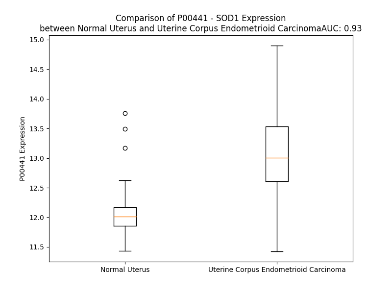

# Detailed Data for P00441

## Introduction to the Detailed Summary

### How to Interpret the Results

- **Summary & Metrics**: This section provides a quick reference to essential protein attributes, including expression changes, family classification, and biomarker applications. Regulation status (upregulated/downregulated) indicates the protein's behavior in a disease context. Some information comes from the original excel file with the proteins selected from literature, while others are derived from the analyses.
- **Expression Comparison**: A visual representation comparing protein expression between normal and disease states. It highlights significant changes in expression levels that might indicate diagnostic or therapeutic relevance. This is data coming from transcriptomics experiments and could not translate similarly to protein levels.
- **Isoform Alignment**: An interactive view of isoform alignments, revealing structural and functional differences between variants of the protein.
- **Interactors & Homologs**: Tables listing known interaction partners and homologous proteins, the more interactors and homologs, the more complex the protein is to design an antibody for.
- **Biological Assemblies**: Information about the structural arrangement of the protein in different assemblies, providing insights into its functional state but also the complexity of the protein to develop antibodies.
- **Combined Per-Residue Information**: A detailed table summarizing residue-level data. This includes predictions for epitope regions, aggregation tendencies, and modifications that might impact the protein's function. Each row corresponds to a residue in the protein, providing insights into specific sites that may be important for research or drug development.
## Summary & Metrics

- **UniProt Accession**: P00441
- **Gene Name**: SOD1
- **Protein Name**: superoxide dismutase 1, soluble
- **Swiss Prot**: SODC_HUMAN
- **Family**: enzyme
- **Biomarker Application**: unspecified application
- **Number of Isoforms**: 0
- **Regulation**: 2
- **(transcriptomics) AUC**: 0.89
- **(transcriptomics) Fold Change**: 1.06
- **(transcriptomics) Regulation**: Upregulated
- **Discotope Epitope Count**: 32
- **Max n_uniprots (Homo)**: 10.0
- **Max n_uniprots (Hetero)**: 4.0

## Expression Comparison

## Interactors

| preferredName_A   | preferredName_B   |   score |
|:------------------|:------------------|--------:|
| SOD1              | CCS               |   0.999 |
| SOD1              | BCL2              |   0.998 |
| SOD1              | PARK7             |   0.997 |
| SOD1              | VDAC1             |   0.996 |
| SOD1              | SOD2              |   0.994 |
| SOD1              | FUS               |   0.992 |
| SOD1              | TARDBP            |   0.989 |
| SOD1              | NEFL              |   0.976 |
| SOD1              | HSPA5             |   0.975 |
| SOD1              | DERL1             |   0.964 |
| SOD1              | HSPA4             |   0.963 |
| SOD1              | PPARGC1A          |   0.958 |
| SOD1              | PPP3CA            |   0.95  |
| SOD1              | OPTN              |   0.937 |
| SOD1              | ATOX1             |   0.932 |
| SOD1              | ENSP00000478249   |   0.927 |
| SOD1              | TOMM40            |   0.923 |
| SOD1              | CAT               |   0.92  |
| SOD1              | PPP3R1            |   0.916 |
| SOD1              | PRDX5             |   0.912 |
| SOD1              | SQSTM1            |   0.91  |
| SOD1              | PPP3CB            |   0.909 |
| SOD1              | SOD2-2            |   0.908 |
| SOD1              | PPP3R2            |   0.904 |
| SOD1              | PPP3CC            |   0.902 |

## Homologs

| uniprot_id   | gene_id   |
|:-------------|:----------|
| E9PK03       | CCS       |
| P08294       | SOD3      |

## Biological Assemblies

|   Unnamed: 0 |   assembly |   n_uniprots | composition   | crystal_id   |
|-------------:|-----------:|-------------:|:--------------|:-------------|
|            0 |          1 |            2 | Homo          | 2wz6         |
|            0 |          1 |            1 | Homo          | 2xjk         |
|            0 |          1 |            2 | Homo          | 8q6m         |
|            0 |          1 |            1 | Homo          | 5j07         |
|            1 |          2 |            1 | Homo          | 5j07         |
|            0 |          1 |            1 | Homo          | 1kmg         |
|            0 |          1 |            1 | Homo          | 5j0c         |
|            1 |          2 |            1 | Homo          | 5j0c         |
|            0 |          1 |            2 | Homo          | 1uxl         |
|            1 |          2 |            2 | Homo          | 1uxl         |
|            2 |          3 |            2 | Homo          | 1uxl         |
|            3 |          4 |            2 | Homo          | 1uxl         |
|            4 |          5 |            2 | Homo          | 1uxl         |
|            0 |          1 |            2 | Homo          | 6sph         |
|            1 |          2 |            2 | Homo          | 6sph         |
|            2 |          3 |            2 | Homo          | 6sph         |
|            0 |          1 |            2 | Homo          | 1n19         |
|            0 |          1 |            2 | Homo          | 3h2q         |
|            1 |          2 |            2 | Homo          | 3h2q         |
|            0 |          1 |            1 | Homo          | 3hff         |
|            1 |          2 |            1 | Homo          | 3hff         |
|            0 |          1 |            2 | Homo          | 3qqd         |
|            0 |          1 |            2 | Homo          | 1p1v         |
|            1 |          2 |            1 | Homo          | 1p1v         |
|            0 |          1 |           10 | Homo          | 5wor         |
|            0 |          1 |            2 | Homo          | 1spd         |
|            0 |          1 |            1 | Homo          | 2lu5         |
|            0 |          1 |            1 | Homo          | 1dsw         |
|            0 |          1 |            2 | Homo          | 4mcn         |
|            0 |          1 |            2 | Homo          | 5yul         |
|            1 |          2 |            2 | Homo          | 5yul         |
|            2 |          3 |            2 | Homo          | 5yul         |
|            3 |          4 |            2 | Homo          | 5yul         |
|            4 |          5 |            2 | Homo          | 5yul         |
|            0 |          1 |            1 | Homo          | 1mfm         |
|            0 |          1 |            2 | Homo          | 7t8h         |
|            0 |          1 |            2 | Homo          | 2wko         |
|            0 |          1 |            2 | Homo          | 3gqf         |
|            1 |          2 |            2 | Homo          | 3gqf         |
|            2 |          3 |            2 | Homo          | 3gqf         |
|            0 |          1 |            2 | Homo          | 7xx3         |
|            1 |          2 |            2 | Homo          | 7xx3         |
|            2 |          3 |            2 | Homo          | 7xx3         |
|            3 |          4 |            2 | Homo          | 7xx3         |
|            4 |          5 |            2 | Homo          | 7xx3         |
|            0 |          1 |            2 | Homo          | 3gzq         |
|            0 |          1 |            2 | Homo          | 6foi         |
|            1 |          2 |            2 | Homo          | 6foi         |
|            2 |          3 |            2 | Homo          | 6foi         |
|            3 |          4 |            2 | Homo          | 6foi         |
|            4 |          5 |            2 | Homo          | 6foi         |
|            5 |          6 |            2 | Homo          | 6foi         |
|            0 |          1 |            1 | Homo          | 1rk7         |
|            0 |          1 |            2 | Homo          | 5yto         |
|            1 |          2 |            2 | Homo          | 5yto         |
|            2 |          3 |            2 | Homo          | 5yto         |
|            3 |          4 |            2 | Homo          | 5yto         |
|            4 |          5 |            2 | Homo          | 5yto         |
|            0 |          1 |            1 | Homo          | 4nio         |
|            0 |          1 |            2 | Homo          | 6spa         |
|            1 |          2 |            2 | Homo          | 6spa         |
|            2 |          3 |            2 | Homo          | 6spa         |
|            0 |          1 |            1 | Homo          | 6dtk         |
|            1 |          2 |            1 | Homo          | 6dtk         |
|            2 |          3 |            1 | Homo          | 6dtk         |
|            3 |          4 |            1 | Homo          | 6dtk         |
|            4 |          5 |            1 | Homo          | 6dtk         |
|            0 |          1 |            2 | Homo          | 3kh4         |
|            1 |          2 |            2 | Homo          | 3kh4         |
|            2 |          3 |            2 | Homo          | 3kh4         |
|            0 |          1 |            2 | Homo          | 2zkw         |
|            0 |          1 |            2 | Homo          | 1hl4         |
|            1 |          2 |            2 | Homo          | 1hl4         |
|            0 |          1 |            2 | Homo          | 3ecu         |
|            1 |          2 |            2 | Homo          | 3ecu         |
|            0 |          1 |            2 | Homo          | 4oh2         |
|            1 |          2 |            2 | Homo          | 4oh2         |
|            2 |          3 |            2 | Homo          | 4oh2         |
|            3 |          4 |            2 | Homo          | 4oh2         |
|            4 |          5 |            2 | Homo          | 4oh2         |
|            0 |          1 |            2 | Homo          | 5o40         |
|            0 |          1 |            2 | Homo          | 2vr8         |
|            0 |          1 |            2 | Homo          | 1ptz         |
|            0 |          1 |            2 | Homo          | 7fb9         |
|            1 |          2 |            2 | Homo          | 7fb9         |
|            2 |          3 |            2 | Homo          | 7fb9         |
|            3 |          4 |            2 | Homo          | 7fb9         |
|            4 |          5 |            2 | Homo          | 7fb9         |
|            5 |          6 |            2 | Homo          | 7fb9         |
|            6 |          7 |            1 | Homo          | 7fb9         |
|            7 |          8 |            1 | Homo          | 7fb9         |
|            0 |          1 |            2 | Homo          | 7t8f         |
|            0 |          1 |            1 | Homo          | 6flh         |
|            0 |          1 |            1 | Homo          | 4bcz         |
|            1 |          2 |            1 | Homo          | 4bcz         |
|            0 |          1 |            2 | Homo          | 4a7g         |
|            0 |          1 |            2 | Homo          | 4mcm         |
|            1 |          2 |            2 | Homo          | 4mcm         |
|            2 |          3 |            2 | Homo          | 4mcm         |
|            3 |          4 |            2 | Homo          | 4mcm         |
|            4 |          5 |            2 | Homo          | 4mcm         |
|            5 |          6 |            2 | Homo          | 4mcm         |
|            0 |          1 |            2 | Homo          | 3cqq         |
|            0 |          1 |            1 | Homo          | 5j0f         |
|            1 |          2 |            1 | Homo          | 5j0f         |
|            0 |          1 |            2 | Homo          | 1azv         |
|            0 |          1 |            8 | Homo          | 5iiw         |
|            0 |          1 |            2 | Homo          | 8gsq         |
|            1 |          2 |            2 | Homo          | 8gsq         |
|            2 |          3 |            2 | Hetero        | 8gsq         |
|            3 |          4 |            2 | Homo          | 8gsq         |
|            4 |          5 |            2 | Homo          | 8gsq         |
|            0 |          1 |            1 | Hetero        | 7cjv         |
|            0 |          1 |            2 | Homo          | 4a7t         |
|            0 |          1 |            1 | Homo          | 2xjl         |
|            0 |          1 |            2 | Homo          | 1uxm         |
|            1 |          2 |            2 | Homo          | 1uxm         |
|            2 |          3 |            2 | Homo          | 1uxm         |
|            3 |          4 |            2 | Homo          | 1uxm         |
|            4 |          5 |            2 | Homo          | 1uxm         |
|            5 |          6 |            2 | Homo          | 1uxm         |
|            0 |          1 |            2 | Homo          | 2wyt         |
|            0 |          1 |            2 | Homo          | 1sos         |
|            1 |          2 |            2 | Homo          | 1sos         |
|            2 |          3 |            2 | Homo          | 1sos         |
|            3 |          4 |            2 | Homo          | 1sos         |
|            4 |          5 |            2 | Homo          | 1sos         |
|            0 |          1 |            2 | Homo          | 2vr7         |
|            0 |          1 |            2 | Homo          | 5k02         |
|            1 |          2 |            2 | Homo          | 5k02         |
|            2 |          3 |            2 | Homo          | 5k02         |
|            3 |          4 |            2 | Homo          | 5k02         |
|            4 |          5 |            2 | Homo          | 5k02         |
|            5 |          6 |            2 | Homo          | 5k02         |
|            6 |          7 |            2 | Homo          | 5k02         |
|            7 |          8 |            2 | Homo          | 5k02         |
|            8 |          9 |            2 | Homo          | 5k02         |
|            9 |         10 |            2 | Homo          | 5k02         |
|           10 |         11 |            2 | Homo          | 5k02         |
|           11 |         12 |            2 | Homo          | 5k02         |
|            0 |          1 |            2 | Homo          | 4b3e         |
|            1 |          2 |            2 | Homo          | 4b3e         |
|            2 |          3 |            2 | Homo          | 4b3e         |
|            3 |          4 |            2 | Homo          | 4b3e         |
|            4 |          5 |            2 | Homo          | 4b3e         |
|            0 |          1 |            1 | Homo          | 4bd4         |
|            1 |          2 |            1 | Homo          | 4bd4         |
|            2 |          3 |            1 | Homo          | 4bd4         |
|            3 |          4 |            1 | Homo          | 4bd4         |
|            4 |          5 |            1 | Homo          | 4bd4         |
|            5 |          6 |            1 | Homo          | 4bd4         |
|            6 |          7 |            1 | Homo          | 4bd4         |
|            7 |          8 |            1 | Homo          | 4bd4         |
|            8 |          9 |            1 | Homo          | 4bd4         |
|            0 |          1 |            2 | Homo          | 2gbu         |
|            1 |          2 |            2 | Homo          | 2gbu         |
|            0 |          1 |            1 | Homo          | 7fb6         |
|            1 |          2 |            1 | Homo          | 7fb6         |
|            0 |          1 |            2 | Homo          | 6spj         |
|            1 |          2 |            2 | Homo          | 6spj         |
|            2 |          3 |            2 | Homo          | 6spj         |
|            0 |          1 |            2 | Homo          | 2gbv         |
|            1 |          2 |            2 | Homo          | 2gbv         |
|            2 |          3 |            2 | Homo          | 2gbv         |
|            3 |          4 |            2 | Homo          | 2gbv         |
|            4 |          5 |            2 | Homo          | 2gbv         |
|            0 |          1 |            1 | Homo          | 4xcr         |
|            1 |          2 |            1 | Homo          | 4xcr         |
|            0 |          1 |            2 | Homo          | 2v0a         |
|            0 |          1 |            2 | Homo          | 6ffk         |
|            1 |          2 |            2 | Homo          | 6ffk         |
|            0 |          1 |            2 | Homo          | 6a9o         |
|            1 |          2 |            2 | Homo          | 6a9o         |
|            2 |          3 |            2 | Homo          | 6a9o         |
|            3 |          4 |            2 | Homo          | 6a9o         |
|            4 |          5 |            2 | Homo          | 6a9o         |
|            0 |          1 |            2 | Homo          | 1l3n         |
|            0 |          1 |            2 | Hetero        | 5u9m         |
|            1 |          2 |            2 | Hetero        | 5u9m         |
|            0 |          1 |            1 | Homo          | 1ba9         |
|            0 |          1 |            2 | Homo          | 2c9u         |
|            0 |          1 |            2 | Homo          | 3kh3         |
|            1 |          2 |            2 | Homo          | 3kh3         |
|            2 |          3 |            2 | Homo          | 3kh3         |
|            3 |          4 |            2 | Homo          | 3kh3         |
|            4 |          5 |            2 | Homo          | 3kh3         |
|            5 |          6 |            2 | Homo          | 3kh3         |
|            0 |          1 |            2 | Homo          | 2wz0         |
|            0 |          1 |            3 | Homo          | 7vzf         |
|            0 |          1 |            2 | Hetero        | 6fol         |
|            1 |          2 |            2 | Hetero        | 6fol         |
|            2 |          3 |            2 | Hetero        | 6fol         |
|            3 |          4 |            2 | Hetero        | 6fol         |
|            0 |          1 |            2 | Homo          | 1ozu         |
|            0 |          1 |            2 | Homo          | 5wmj         |
|            0 |          1 |            2 | Homo          | 3cqp         |
|            1 |          2 |            2 | Homo          | 3cqp         |
|            0 |          1 |            2 | Homo          | 3gzo         |
|            1 |          2 |            2 | Homo          | 3gzo         |
|            2 |          3 |            2 | Homo          | 3gzo         |
|            3 |          4 |            2 | Homo          | 3gzo         |
|            4 |          5 |            2 | Homo          | 3gzo         |
|            0 |          1 |            2 | Homo          | 3re0         |
|            1 |          2 |            2 | Homo          | 3re0         |
|            0 |          1 |            2 | Homo          | 2c9s         |
|            0 |          1 |            2 | Homo          | 5ytu         |
|            1 |          2 |            2 | Homo          | 5ytu         |
|            2 |          3 |            2 | Homo          | 5ytu         |
|            3 |          4 |            2 | Homo          | 5ytu         |
|            4 |          5 |            2 | Homo          | 5ytu         |
|            0 |          1 |            2 | Homo          | 3gtv         |
|            1 |          2 |            2 | Homo          | 3gtv         |
|            2 |          3 |            2 | Homo          | 3gtv         |
|            3 |          4 |            2 | Homo          | 3gtv         |
|            4 |          5 |            2 | Homo          | 3gtv         |
|            5 |          6 |            2 | Homo          | 3gtv         |
|            0 |          1 |            4 | Hetero        | 6fon         |
|            0 |          1 |            2 | Homo          | 2zkx         |
|            1 |          2 |            2 | Homo          | 2zkx         |
|            0 |          1 |            2 | Homo          | 1oez         |
|            1 |          2 |            2 | Homo          | 1oez         |
|            0 |          1 |            2 | Homo          | 2nnx         |
|            1 |          2 |            2 | Homo          | 2nnx         |
|            0 |          1 |            2 | Homo          | 1hl5         |
|            1 |          2 |            2 | Homo          | 1hl5         |
|            2 |          3 |            2 | Homo          | 1hl5         |
|            3 |          4 |            2 | Homo          | 1hl5         |
|            4 |          5 |            2 | Homo          | 1hl5         |
|            5 |          6 |            2 | Homo          | 1hl5         |
|            6 |          7 |            2 | Homo          | 1hl5         |
|            7 |          8 |            2 | Homo          | 1hl5         |
|            8 |          9 |            2 | Homo          | 1hl5         |
|            0 |          1 |            2 | Homo          | 2r27         |
|            0 |          1 |            2 | Homo          | 2wyz         |
|            0 |          1 |            2 | Homo          | 2gbt         |
|            1 |          2 |            2 | Homo          | 2gbt         |
|            0 |          1 |            2 | Homo          | 7t8e         |
|            0 |          1 |            2 | Homo          | 6b79         |
|            0 |          1 |            2 | Homo          | 5o3y         |
|            0 |          1 |            2 | Homo          | 3ltv         |
|            1 |          2 |            2 | Homo          | 3ltv         |
|            2 |          3 |            2 | Homo          | 3ltv         |
|            0 |          1 |            1 | Homo          | 4nin         |
|            0 |          1 |            1 | Homo          | 4nip         |
|            0 |          1 |            2 | Homo          | 3t5w         |
|            1 |          2 |            2 | Homo          | 3t5w         |
|            2 |          3 |            2 | Homo          | 3t5w         |
|            3 |          4 |            2 | Homo          | 3t5w         |
|            4 |          5 |            2 | Homo          | 3t5w         |
|            5 |          6 |            2 | Homo          | 3t5w         |
|            0 |          1 |            8 | Homo          | 5dli         |
|            0 |          1 |            2 | Homo          | 7t8g         |
|            0 |          1 |            2 | Homo          | 8ccx         |
|            0 |          1 |            2 | Homo          | 3gzp         |
|            1 |          2 |            2 | Homo          | 3gzp         |
|            0 |          1 |            2 | Homo          | 4a7v         |
|            0 |          1 |            1 | Homo          | 5j0g         |
|            1 |          2 |            1 | Homo          | 5j0g         |
|            0 |          1 |            2 | Homo          | 1n18         |
|            1 |          2 |            2 | Homo          | 1n18         |
|            2 |          3 |            2 | Homo          | 1n18         |
|            3 |          4 |            2 | Homo          | 1n18         |
|            4 |          5 |            2 | Homo          | 1n18         |
|            0 |          1 |            2 | Hetero        | 6fp6         |
|            1 |          2 |            2 | Hetero        | 6fp6         |
|            2 |          3 |            2 | Hetero        | 6fp6         |
|            3 |          4 |            2 | Hetero        | 6fp6         |
|            4 |          5 |            2 | Hetero        | 6fp6         |
|            5 |          6 |            2 | Hetero        | 6fp6         |
|            6 |          7 |            2 | Hetero        | 6fp6         |
|            7 |          8 |            2 | Hetero        | 6fp6         |
|            8 |          9 |            2 | Hetero        | 6fp6         |
|            9 |         10 |            2 | Hetero        | 6fp6         |
|           10 |         11 |            2 | Hetero        | 6fp6         |
|           11 |         12 |            2 | Hetero        | 6fp6         |
|            0 |          1 |            1 | Homo          | 2mp3         |
|            0 |          1 |            2 | Homo          | 2c9v         |
|            0 |          1 |            2 | Homo          | 4a7q         |
|            0 |          1 |            2 | Homo          | 1ozt         |
|            1 |          2 |            2 | Homo          | 1ozt         |
|            2 |          3 |            2 | Homo          | 1ozt         |
|            3 |          4 |            2 | Homo          | 1ozt         |
|            0 |          1 |            2 | Homo          | 3ecv         |
|            1 |          2 |            2 | Homo          | 3ecv         |
|            0 |          1 |            2 | Homo          | 4a7u         |
|            0 |          1 |            2 | Homo          | 4a7s         |
|            0 |          1 |            2 | Homo          | 3h2p         |
|            0 |          1 |            2 | Homo          | 3k91         |
|            0 |          1 |            1 | Hetero        | 7cjw         |
|            0 |          1 |            1 | Homo          | 2nam         |
|            0 |          1 |            2 | Homo          | 1pu0         |
|            1 |          2 |            2 | Homo          | 1pu0         |
|            2 |          3 |            2 | Homo          | 1pu0         |
|            3 |          4 |            2 | Homo          | 1pu0         |
|            4 |          5 |            2 | Homo          | 1pu0         |
|            0 |          1 |            2 | Homo          | 6spk         |
|            1 |          2 |            2 | Homo          | 6spk         |
|            2 |          3 |            2 | Homo          | 6spk         |
|            0 |          1 |            2 | Homo          | 7nxx         |
|            0 |          1 |            2 | Homo          | 2zky         |
|            1 |          2 |            2 | Homo          | 2zky         |
|            2 |          3 |            2 | Homo          | 2zky         |
|            3 |          4 |            2 | Homo          | 2zky         |
|            4 |          5 |            2 | Homo          | 2zky         |
|            0 |          1 |            1 | Homo          | 4bcy         |
|            0 |          1 |            2 | Homo          | 2vr6         |
|            0 |          1 |            2 | Homo          | 6spi         |
|            1 |          2 |            2 | Homo          | 6spi         |
|            2 |          3 |            2 | Homo          | 6spi         |
|            3 |          4 |            2 | Homo          | 6spi         |
|            4 |          5 |            2 | Homo          | 6spi         |
|            5 |          6 |            2 | Homo          | 6spi         |
|            0 |          1 |            2 | Homo          | 4ff9         |
|            0 |          1 |            2 | Homo          | 2wz5         |
|            0 |          1 |            2 | Homo          | 2af2         |
|            0 |          1 |            2 | Homo          | 1fun         |
|            1 |          2 |            2 | Homo          | 1fun         |
|            2 |          3 |            2 | Homo          | 1fun         |
|            3 |          4 |            2 | Homo          | 1fun         |
|            4 |          5 |            2 | Homo          | 1fun         |
|            0 |          1 |            2 | Homo          | 3ecw         |
|            1 |          2 |            2 | Homo          | 3ecw         |

## Combined Per-Residue Information

|   res | aa   |   epitope_score | epitope   |   relative_surface_accessibility |   modeling_confidence |   Aggregation | modification                 |
|------:|:-----|----------------:|:----------|---------------------------------:|----------------------:|--------------:|:-----------------------------|
|     1 | M    |         0.18759 | False     |                          1.24744 |                 73.75 |         0     | N/A                          |
|     2 | A    |         0.23008 | False     |                          0.41502 |                 88.73 |         0     | N-acetylalanine              |
|     3 | T    |         0.10357 | False     |                          0.38076 |                 96.25 |         0     | N/A                          |
|     4 | K    |         0.20387 | False     |                          0.38161 |                 98.44 |         0     | N6-succinyllysine            |
|     5 | A    |         0.02481 | False     |                          0.01697 |                 98.72 |         1.013 | N/A                          |
|     6 | V    |         0.14641 | False     |                          0.33923 |                 98.86 |         1.013 | N/A                          |
|     7 | C    |         0.01062 | False     |                          0.00401 |                 98.92 |         1.013 | N/A                          |
|     8 | V    |         0.24714 | False     |                          0.55286 |                 98.85 |         1.013 | N/A                          |
|     9 | L    |         0.00584 | False     |                          0.00183 |                 98.88 |         1.013 | N/A                          |
|    10 | K    |         0.33783 | False     |                          0.6706  |                 98.71 |         0     | N6-succinyllysine            |
|    11 | G    |         0.25862 | False     |                          0.38038 |                 97.09 |         0     | N/A                          |
|    12 | D    |         0.40538 | True      |                          1.02585 |                 95.56 |         0     | N/A                          |
|    13 | G    |         0.37262 | False     |                          0.54646 |                 96.48 |         0     | N/A                          |
|    14 | P    |         0.28743 | False     |                          0.72856 |                 97.71 |         0     | N/A                          |
|    15 | V    |         0.12252 | False     |                          0.05928 |                 98.71 |         0.305 | N/A                          |
|    16 | Q    |         0.25902 | False     |                          0.39958 |                 98.82 |         0.305 | N/A                          |
|    17 | G    |         0.12348 | False     |                          0.11325 |                 98.8  |         0.305 | N/A                          |
|    18 | I    |         0.26214 | False     |                          0.57116 |                 98.88 |         0.305 | N/A                          |
|    19 | I    |         0.00926 | False     |                          0       |                 98.91 |         0.305 | N/A                          |
|    20 | N    |         0.15092 | False     |                          0.26471 |                 98.87 |         0     | N/A                          |
|    21 | F    |         0.01129 | False     |                          0.00558 |                 98.83 |         0     | N/A                          |
|    22 | E    |         0.12113 | False     |                          0.22718 |                 98.56 |         0     | N/A                          |
|    23 | Q    |         0.11889 | False     |                          0.02222 |                 98.23 |         0     | N/A                          |
|    24 | K    |         0.3347  | False     |                          0.7222  |                 97.03 |         0     | N/A                          |
|    25 | E    |         0.29751 | False     |                          0.61795 |                 94.43 |         0     | N/A                          |
|    26 | S    |         0.25462 | False     |                          0.58557 |                 87.53 |         0     | N/A                          |
|    27 | N    |         0.39915 | True      |                          0.93894 |                 87.13 |         0     | N/A                          |
|    28 | G    |         0.26065 | False     |                          0.11112 |                 95.2  |         0     | N/A                          |
|    29 | P    |         0.40358 | True      |                          0.42323 |                 97.98 |         0     | N/A                          |
|    30 | V    |         0.00758 | False     |                          0       |                 98.69 |         0     | N/A                          |
|    31 | K    |         0.42924 | True      |                          0.48706 |                 98.72 |         0     | N/A                          |
|    32 | V    |         0.01568 | False     |                          0.00493 |                 98.89 |         0     | N/A                          |
|    33 | W    |         0.31704 | False     |                          0.43226 |                 98.9  |         0     | N/A                          |
|    34 | G    |         0.2083  | False     |                          0.23678 |                 98.79 |         0     | N/A                          |
|    35 | S    |         0.21989 | False     |                          0.35982 |                 98.84 |         0     | N/A                          |
|    36 | I    |         0.00856 | False     |                          0       |                 98.87 |         0     | N/A                          |
|    37 | K    |         0.31669 | False     |                          0.52005 |                 98.73 |         0     | N/A                          |
|    38 | G    |         0.1597  | False     |                          0.37565 |                 98.53 |         0     | N/A                          |
|    39 | L    |         0.1335  | False     |                          0.07636 |                 98.7  |         0     | N/A                          |
|    40 | T    |         0.32691 | False     |                          0.6844  |                 98.5  |         0     | N/A                          |
|    41 | E    |         0.34825 | False     |                          0.57225 |                 98.69 |         0     | N/A                          |
|    42 | G    |         0.15748 | False     |                          0.30258 |                 98.63 |         0     | N/A                          |
|    43 | L    |         0.41484 | True      |                          0.55775 |                 98.76 |         0     | N/A                          |
|    44 | H    |         0.08692 | False     |                          0.01318 |                 98.85 |         0     | N/A                          |
|    45 | G    |         0.00873 | False     |                          0       |                 98.8  |         0     | N/A                          |
|    46 | F    |         0.00717 | False     |                          0       |                 98.92 |         0     | N/A                          |
|    47 | H    |         0.027   | False     |                          0       |                 98.89 |         0     | N/A                          |
|    48 | V    |         0.00767 | False     |                          0       |                 98.93 |         0     | N/A                          |
|    49 | H    |         0.05857 | False     |                          0.01637 |                 98.83 |         0     | N/A                          |
|    50 | E    |         0.24569 | False     |                          0.30106 |                 98.8  |         0     | N/A                          |
|    51 | F    |         0.19708 | False     |                          0.4851  |                 98.72 |         0     | N/A                          |
|    52 | G    |         0.17449 | False     |                          0.41166 |                 98.62 |         0     | N/A                          |
|    53 | D    |         0.28223 | False     |                          0.33325 |                 98.58 |         0     | N/A                          |
|    54 | N    |         0.20911 | False     |                          0.374   |                 96.97 |         0     | N/A                          |
|    55 | T    |         0.54358 | True      |                          0.88681 |                 97.51 |         0     | N/A                          |
|    56 | A    |         0.46147 | True      |                          0.65948 |                 97.4  |         0     | N/A                          |
|    57 | G    |         0.25498 | False     |                          0.43976 |                 97.17 |         0     | N/A                          |
|    58 | C    |         0.08046 | False     |                          0.11774 |                 97.97 |         0     | N/A                          |
|    59 | T    |         0.43264 | True      |                          0.66851 |                 97.49 |         0     | N/A                          |
|    60 | S    |         0.30086 | False     |                          0.19473 |                 98.3  |         0     | N/A                          |
|    61 | A    |         0.00749 | False     |                          0       |                 98.57 |         0     | N/A                          |
|    62 | G    |         0.24895 | False     |                          0.19085 |                 98.35 |         0     | N/A                          |
|    63 | P    |         0.38676 | True      |                          0.58836 |                 98.43 |         0     | N/A                          |
|    64 | H    |         0.31746 | False     |                          0.03937 |                 98.77 |         0     | N/A                          |
|    65 | F    |         0.07473 | False     |                          0.02675 |                 98.82 |         0     | N/A                          |
|    66 | N    |         0.48706 | True      |                          0.28128 |                 98.69 |         0     | N/A                          |
|    67 | P    |         0.50425 | True      |                          0.43234 |                 98.49 |         0     | N/A                          |
|    68 | L    |         0.54266 | True      |                          0.53111 |                 98.22 |         0     | N/A                          |
|    69 | S    |         0.43112 | True      |                          0.78475 |                 98.04 |         0     | N/A                          |
|    70 | R    |         0.45121 | True      |                          0.36437 |                 98.21 |         0     | N/A                          |
|    71 | K    |         0.65641 | True      |                          0.61211 |                 98.32 |         0     | N/A                          |
|    72 | H    |         0.22095 | False     |                          0.02824 |                 98.7  |         0     | N/A                          |
|    73 | G    |         0.05924 | False     |                          0.01127 |                 98.52 |         0     | N/A                          |
|    74 | G    |         0.33435 | False     |                          0.04667 |                 98.56 |         0     | N/A                          |
|    75 | P    |         0.3345  | False     |                          0.33998 |                 98.44 |         0     | N/A                          |
|    76 | K    |         0.46507 | True      |                          0.98971 |                 98.25 |         0     | N/A                          |
|    77 | D    |         0.56921 | True      |                          0.27589 |                 98.26 |         0     | N/A                          |
|    78 | E    |         0.51869 | True      |                          0.78399 |                 97.86 |         0     | N/A                          |
|    79 | E    |         0.49981 | True      |                          0.43847 |                 98.25 |         0     | N/A                          |
|    80 | R    |         0.10939 | False     |                          0.02587 |                 98.73 |         0     | N/A                          |
|    81 | H    |         0.19419 | False     |                          0.07263 |                 98.82 |         0     | N/A                          |
|    82 | V    |         0.04625 | False     |                          0.0102  |                 98.71 |         0     | N/A                          |
|    83 | G    |         0.00543 | False     |                          0       |                 98.8  |         0     | N/A                          |
|    84 | D    |         0.0223  | False     |                          0       |                 98.87 |         0     | N/A                          |
|    85 | L    |         0.06697 | False     |                          0.01645 |                 98.88 |         0     | N/A                          |
|    86 | G    |         0.03557 | False     |                          0.00644 |                 98.72 |         0     | N/A                          |
|    87 | N    |         0.30003 | False     |                          0.22662 |                 98.83 |         0     | N/A                          |
|    88 | V    |         0.08767 | False     |                          0.0457  |                 98.79 |         0     | N/A                          |
|    89 | T    |         0.26681 | False     |                          0.60457 |                 98.81 |         0     | N/A                          |
|    90 | A    |         0.03605 | False     |                          0.02074 |                 98.8  |         0     | N/A                          |
|    91 | D    |         0.17595 | False     |                          0.42782 |                 98.7  |         0     | N/A                          |
|    92 | K    |         0.43106 | True      |                          0.84196 |                 98.39 |         0     | N6-succinyllysine            |
|    93 | D    |         0.24389 | False     |                          0.77245 |                 98.33 |         0     | N/A                          |
|    94 | G    |         0.0948  | False     |                          0.07612 |                 98.53 |         0     | N/A                          |
|    95 | V    |         0.24913 | False     |                          0.30719 |                 98.82 |         0     | N/A                          |
|    96 | A    |         0.00927 | False     |                          0.00128 |                 98.82 |         0     | N/A                          |
|    97 | D    |         0.26593 | False     |                          0.72688 |                 98.81 |         0     | N/A                          |
|    98 | V    |         0.13418 | False     |                          0.05524 |                 98.82 |         0     | N/A                          |
|    99 | S    |         0.20917 | False     |                          0.7986  |                 98.59 |         0     | Phosphoserine                |
|   100 | I    |         0.30359 | False     |                          0.21408 |                 98.68 |         0     | N/A                          |
|   101 | E    |         0.3192  | False     |                          0.56206 |                 98.58 |         0     | N/A                          |
|   102 | D    |         0.0739  | False     |                          0.02771 |                 98.74 |         0     | N/A                          |
|   103 | S    |         0.31765 | False     |                          0.75339 |                 97.79 |         0     | Phosphoserine                |
|   104 | V    |         0.26101 | False     |                          0.31961 |                 98.4  |         0     | N/A                          |
|   105 | I    |         0.06672 | False     |                          0.01715 |                 98.57 |         0     | N/A                          |
|   106 | S    |         0.11582 | False     |                          0.101   |                 98.44 |         0     | Phosphoserine                |
|   107 | L    |         0.06452 | False     |                          0.03473 |                 98.42 |         0     | N/A                          |
|   108 | S    |         0.29805 | False     |                          0.34838 |                 96.89 |         0     | Phosphoserine                |
|   109 | G    |         0.31424 | False     |                          0.75533 |                 96.5  |         0     | N/A                          |
|   110 | D    |         0.44371 | True      |                          0.79186 |                 97.04 |         0     | N/A                          |
|   111 | H    |         0.26285 | False     |                          0.27365 |                 98.16 |         0     | N/A                          |
|   112 | C    |         0.19279 | False     |                          0.20575 |                 98.1  |         0     | N/A                          |
|   113 | I    |         0.0061  | False     |                          0       |                 98.8  |         0     | N/A                          |
|   114 | I    |         0.13106 | False     |                          0.25815 |                 98.56 |         0     | N/A                          |
|   115 | G    |         0.12894 | False     |                          0.47875 |                 98.63 |         0     | N/A                          |
|   116 | R    |         0.24324 | False     |                          0.22053 |                 98.84 |         0     | N/A                          |
|   117 | T    |         0.00632 | False     |                          0       |                 98.89 |         0.205 | N/A                          |
|   118 | L    |         0.00465 | False     |                          0       |                 98.94 |         0.205 | N/A                          |
|   119 | V    |         0.02476 | False     |                          0       |                 98.87 |         0.205 | N/A                          |
|   120 | V    |         0.00748 | False     |                          0       |                 98.9  |         0.205 | N/A                          |
|   121 | H    |         0.18398 | False     |                          0.04296 |                 98.63 |         0.205 | N/A                          |
|   122 | E    |         0.35387 | False     |                          0.39438 |                 98.23 |         0     | N/A                          |
|   123 | K    |         0.32356 | False     |                          0.54296 |                 98.27 |         0     | N6-acetyllysine; alternate   |
|   123 | K    |         0.32356 | False     |                          0.54296 |                 98.27 |         0     | N6-succinyllysine; alternate |
|   124 | A    |         0.34336 | False     |                          0.41655 |                 98.7  |         0     | N/A                          |
|   125 | D    |         0.11065 | False     |                          0.03127 |                 98.65 |         0     | N/A                          |
|   126 | D    |         0.18899 | False     |                          0.24225 |                 98.4  |         0     | N/A                          |
|   127 | L    |         0.30912 | False     |                          0.3553  |                 98.33 |         0     | N/A                          |
|   128 | G    |         0.32482 | False     |                          0.18937 |                 97.94 |         0     | N/A                          |
|   129 | K    |         0.69925 | True      |                          0.70982 |                 98.08 |         0     | N/A                          |
|   130 | G    |         0.4185  | True      |                          0.54165 |                 96.52 |         0     | N/A                          |
|   131 | G    |         0.61562 | True      |                          0.9861  |                 96.03 |         0     | N/A                          |
|   132 | N    |         0.38441 | True      |                          0.48537 |                 96.38 |         0     | N/A                          |
|   133 | E    |         0.53153 | True      |                          0.63953 |                 96.17 |         0     | N/A                          |
|   134 | E    |         0.50317 | True      |                          0.39143 |                 96.2  |         0     | N/A                          |
|   135 | S    |         0.03611 | False     |                          0.00208 |                 97.05 |         0     | N/A                          |
|   136 | T    |         0.43246 | True      |                          0.32002 |                 95.3  |         0     | N/A                          |
|   137 | K    |         0.38663 | True      |                          0.50329 |                 96.32 |         0     | N6-acetyllysine; alternate   |
|   137 | K    |         0.38663 | True      |                          0.50329 |                 96.32 |         0     | N6-succinyllysine; alternate |
|   138 | T    |         0.40491 | True      |                          0.34763 |                 95.76 |         0     | N/A                          |
|   139 | G    |         0.01539 | False     |                          0       |                 97.58 |         0     | N/A                          |
|   140 | N    |         0.51535 | True      |                          0.30902 |                 97.08 |         0     | N/A                          |
|   141 | A    |         0.03001 | False     |                          0.0062  |                 96.83 |         0     | N/A                          |
|   142 | G    |         0.29548 | False     |                          0.49426 |                 96.22 |         0     | N/A                          |
|   143 | S    |         0.36855 | False     |                          0.46917 |                 97.15 |         0     | N/A                          |
|   144 | R    |         0.39501 | True      |                          0.29593 |                 98.37 |         0     | N/A                          |
|   145 | L    |         0.13683 | False     |                          0.28437 |                 98.4  |         5.048 | N/A                          |
|   146 | A    |         0.00537 | False     |                          0       |                 98.72 |         5.943 | N/A                          |
|   147 | C    |         0.07471 | False     |                          0.0424  |                 98.8  |         5.943 | N/A                          |
|   148 | G    |         0.05693 | False     |                          0.05955 |                 98.72 |         6.62  | N/A                          |
|   149 | V    |         0.08709 | False     |                          0.4514  |                 98.79 |        11.75  | N/A                          |
|   150 | I    |         0.0163  | False     |                          0.00296 |                 98.92 |        11.75  | N/A                          |
|   151 | G    |         0.1412  | False     |                          0.34902 |                 98.59 |        11.54  | N/A                          |
|   152 | I    |         0.11371 | False     |                          0.82277 |                 98.02 |        11.54  | N/A                          |
|   153 | A    |         0.09767 | False     |                          0.31066 |                 97.76 |         9.496 | N/A                          |
|   154 | Q    |         0.09351 | False     |                          1.07622 |                 91.03 |         0     | N/A                          |

