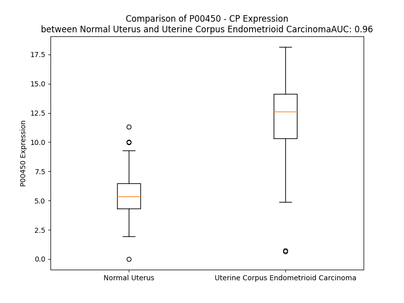

# Detailed Data for P00450

## Introduction to the Detailed Summary

### How to Interpret the Results

- **Summary & Metrics**: This section provides a quick reference to essential protein attributes, including expression changes, family classification, and biomarker applications. Regulation status (upregulated/downregulated) indicates the protein's behavior in a disease context. Some information comes from the original excel file with the proteins selected from literature, while others are derived from the analyses.
- **Expression Comparison**: A visual representation comparing protein expression between normal and disease states. It highlights significant changes in expression levels that might indicate diagnostic or therapeutic relevance. This is data coming from transcriptomics experiments and could not translate similarly to protein levels.
- **Isoform Alignment**: An interactive view of isoform alignments, revealing structural and functional differences between variants of the protein.
- **Interactors & Homologs**: Tables listing known interaction partners and homologous proteins, the more interactors and homologs, the more complex the protein is to design an antibody for.
- **Biological Assemblies**: Information about the structural arrangement of the protein in different assemblies, providing insights into its functional state but also the complexity of the protein to develop antibodies.
- **Combined Per-Residue Information**: A detailed table summarizing residue-level data. This includes predictions for epitope regions, aggregation tendencies, and modifications that might impact the protein's function. Each row corresponds to a residue in the protein, providing insights into specific sites that may be important for research or drug development.
## Summary & Metrics

- **UniProt Accession**: P00450
- **Gene Name**: CP
- **Protein Name**: ceruloplasmin (ferroxidase)
- **Swiss Prot**: CERU_HUMAN
- **Family**: enzyme
- **Biomarker Application**: disease progression,efficacy
- **Number of Isoforms**: 0
- **Regulation**: -1
- **(transcriptomics) AUC**: 0.81
- **(transcriptomics) Fold Change**: 1.62
- **(transcriptomics) Regulation**: Upregulated
- **Discotope Epitope Count**: 198
- **Max n_uniprots (Homo)**: 1.0
- **Max n_uniprots (Hetero)**: 3.0

## Expression Comparison

## Interactors

| preferredName_A   | preferredName_B   |   score |
|:------------------|:------------------|--------:|
| CP                | SLC40A1           |   0.982 |
| CP                | ATP7B             |   0.979 |
| CP                | LTF               |   0.971 |
| CP                | MPO               |   0.965 |
| CP                | HP                |   0.947 |
| CP                | FXN               |   0.945 |
| CP                | SERPINA1          |   0.944 |
| CP                | HMOX1             |   0.942 |
| CP                | ATP7A             |   0.939 |
| CP                | ALB               |   0.936 |
| CP                | FECH              |   0.934 |
| CP                | ORM1              |   0.923 |
| CP                | HMOX2             |   0.917 |
| CP                | ORM2              |   0.908 |
| CP                | HEPH              |   0.904 |

## Homologs

| uniprot_id   | gene_id   |
|:-------------|:----------|
| A0A804HKY0   | CNTNAP5   |
| A0A0A0MRJ7   | F5        |
| O60462       | NRP2      |
| Q9GZP0       | PDGFD     |
| Q9Y6L7       | TLL2      |
| A0A0C4DGK4   | NRXN3     |
| Q96PD2       | DCBLD2    |
| E9PDN6       | CNTNAP4   |
| Q16820       | MEP1B     |
| Q6HA08       | ASTL      |
| A0A1B0GUQ1   | NRXN1     |
| A0A0U1RQG2   | MFRP      |
| A0A0A0MRL2   | CUZD1     |
| Q6MZM0       | HEPHL1    |
| Q15113       | PCOLCE    |
| A0A3B3ITE8   | PCOLCE2   |
| E7ES21       | HEPH      |
| O43854       | EDIL3     |
| O60494       | CUBN      |
| E9PEP6       | NRP1      |
| Q8NC67       | NETO2     |
| Q5VXM1       | CDCP2     |
| A0A090N7T7   | CNTNAP2   |
| K7EMM9       | CNTNAP1   |
| Q08431       | MFGE8     |
| Q3MIM8       | BMP1      |
| B7ZL91       | MEP1A     |
| A0A2P0CT92   | CNTNAP3B  |
| A0A1B0GTE1   | CNTNAP3C  |
| B1AM99       | CNTNAP3   |
| H7C2R8       | NRXN2     |
| A0A2R8Y707   | F8        |
| Q8TDF5       | NETO1     |
| D6RCE0       | TLL1      |
| Q9NRA1       | PDGFC     |

## Biological Assemblies

|   Unnamed: 0 | crystal_id   |   assembly |   n_uniprots | composition   |
|-------------:|:-------------|-----------:|-------------:|:--------------|
|            0 | 4enz         |          1 |            1 | Homo          |
|            0 | 4ejx         |          1 |            3 | Hetero        |
|            0 | 1kcw         |          1 |            1 | Homo          |

## Combined Per-Residue Information

|   res | aa   |   epitope_score | epitope   |   relative_surface_accessibility |   modeling_confidence |   Aggregation | modification             | glycosylation                             |
|------:|:-----|----------------:|:----------|---------------------------------:|----------------------:|--------------:|:-------------------------|:------------------------------------------|
|     1 | M    |         0.15692 | True      |                          1.13824 |                 43.2  |         0     | N/A                      | N/A                                       |
|     2 | K    |         0.17487 | True      |                          0.90139 |                 42.31 |         0     | N/A                      | N/A                                       |
|     3 | I    |         0.12016 | True      |                          0.94941 |                 49.07 |        77.646 | N/A                      | N/A                                       |
|     4 | L    |         0.10985 | True      |                          0.85345 |                 46.15 |        92.251 | N/A                      | N/A                                       |
|     5 | I    |         0.10387 | True      |                          0.69684 |                 46.95 |        98.327 | N/A                      | N/A                                       |
|     6 | L    |         0.10573 | True      |                          0.79864 |                 43.01 |        98.882 | N/A                      | N/A                                       |
|     7 | G    |         0.11257 | True      |                          0.54081 |                 40.51 |        98.983 | N/A                      | N/A                                       |
|     8 | I    |         0.1157  | True      |                          0.63357 |                 40.09 |        99.954 | N/A                      | N/A                                       |
|     9 | F    |         0.16339 | True      |                          0.76437 |                 37.01 |        99.959 | N/A                      | N/A                                       |
|    10 | L    |         0.1744  | True      |                          0.89271 |                 37.88 |        99.79  | N/A                      | N/A                                       |
|    11 | F    |         0.16184 | True      |                          0.88675 |                 34.45 |        98.86  | N/A                      | N/A                                       |
|    12 | L    |         0.18252 | True      |                          0.82471 |                 32.46 |        85.833 | N/A                      | N/A                                       |
|    13 | C    |         0.16724 | True      |                          0.76997 |                 33.17 |        13.926 | N/A                      | N/A                                       |
|    14 | S    |         0.1165  | True      |                          0.64082 |                 32.25 |         1.547 | N/A                      | N/A                                       |
|    15 | T    |         0.10891 | True      |                          0.81841 |                 31.34 |         0.011 | N/A                      | N/A                                       |
|    16 | P    |         0.10781 | True      |                          0.79025 |                 38.15 |         0.005 | N/A                      | N/A                                       |
|    17 | A    |         0.09357 | False     |                          0.63003 |                 42.85 |         0     | N/A                      | N/A                                       |
|    18 | W    |         0.14093 | True      |                          0.9925  |                 51.03 |         0     | N/A                      | N/A                                       |
|    19 | A    |         0.11968 | True      |                          0.53825 |                 65.46 |         0     | N/A                      | N/A                                       |
|    20 | K    |         0.04972 | False     |                          0.59955 |                 86.4  |         0     | N/A                      | N/A                                       |
|    21 | E    |         0.15718 | True      |                          0.54047 |                 95.14 |         0     | N/A                      | N/A                                       |
|    22 | K    |         0.05031 | False     |                          0.10139 |                 96.09 |         0     | N/A                      | N/A                                       |
|    23 | H    |         0.19256 | True      |                          0.49697 |                 97.51 |         1.471 | N/A                      | N/A                                       |
|    24 | Y    |         0.03585 | False     |                          0.0912  |                 98.27 |        67.816 | N/A                      | N/A                                       |
|    25 | Y    |         0.04891 | False     |                          0.1851  |                 98.56 |        71.128 | N/A                      | N/A                                       |
|    26 | I    |         0.00321 | False     |                          0       |                 98.64 |        71.128 | N/A                      | N/A                                       |
|    27 | G    |         0.00346 | False     |                          0       |                 98.26 |        71.128 | N/A                      | N/A                                       |
|    28 | I    |         0.00516 | False     |                          0       |                 98.75 |        71.128 | N/A                      | N/A                                       |
|    29 | I    |         0.0838  | False     |                          0.23919 |                 97.9  |        65.442 | N/A                      | N/A                                       |
|    30 | E    |         0.10589 | True      |                          0.25962 |                 98.51 |         0     | N/A                      | N/A                                       |
|    31 | T    |         0.113   | True      |                          0.33444 |                 97.27 |         0     | N/A                      | N/A                                       |
|    32 | T    |         0.1309  | True      |                          0.49412 |                 98.04 |         0     | N/A                      | N/A                                       |
|    33 | W    |         0.08774 | False     |                          0.13671 |                 97.97 |         0     | N/A                      | N/A                                       |
|    34 | D    |         0.08343 | False     |                          0.20042 |                 97.37 |         0     | N/A                      | N/A                                       |
|    35 | Y    |         0.00317 | False     |                          0       |                 97.53 |         0     | N/A                      | N/A                                       |
|    36 | A    |         0.02266 | False     |                          0.0925  |                 94.43 |         0     | N/A                      | N/A                                       |
|    37 | S    |         0.08935 | False     |                          0.41483 |                 86.58 |         0     | N/A                      | N/A                                       |
|    38 | D    |         0.09232 | False     |                          0.42526 |                 76.64 |         0     | N/A                      | N/A                                       |
|    39 | H    |         0.19811 | True      |                          0.81968 |                 68.59 |         0     | N/A                      | N/A                                       |
|    40 | G    |         0.13461 | True      |                          0.49946 |                 70.61 |         0     | N/A                      | N/A                                       |
|    41 | E    |         0.15333 | True      |                          0.5254  |                 78.63 |         0     | N/A                      | N/A                                       |
|    42 | K    |         0.04797 | False     |                          0.19254 |                 87.21 |         0     | N/A                      | N/A                                       |
|    43 | K    |         0.07735 | False     |                          0.33136 |                 90.73 |         0     | N/A                      | N/A                                       |
|    44 | L    |         0.02128 | False     |                          0.06526 |                 93.65 |         0     | N/A                      | N/A                                       |
|    45 | I    |         0.02137 | False     |                          0.0352  |                 95.44 |         0     | N/A                      | N/A                                       |
|    46 | S    |         0.10704 | True      |                          0.17033 |                 94.26 |         0     | N/A                      | N/A                                       |
|    47 | V    |         0.04116 | False     |                          0.10687 |                 92.39 |         0     | N/A                      | N/A                                       |
|    48 | D    |         0.15264 | True      |                          0.4727  |                 89    |         0     | N/A                      | N/A                                       |
|    49 | T    |         0.14641 | True      |                          0.68795 |                 87.31 |         0     | N/A                      | N/A                                       |
|    50 | E    |         0.19023 | True      |                          0.66867 |                 90.03 |         0     | N/A                      | N/A                                       |
|    51 | H    |         0.11958 | True      |                          0.33276 |                 90    |         0     | N/A                      | N/A                                       |
|    52 | S    |         0.05892 | False     |                          0.16901 |                 92.39 |         0     | N/A                      | N/A                                       |
|    53 | N    |         0.14963 | True      |                          0.391   |                 93.63 |         0     | N/A                      | N/A                                       |
|    54 | I    |         0.23023 | True      |                          0.49408 |                 94.66 |         0     | N/A                      | N/A                                       |
|    55 | Y    |         0.12876 | True      |                          0.08764 |                 96.66 |         0     | N/A                      | N/A                                       |
|    56 | L    |         0.04964 | False     |                          0.2176  |                 95.36 |         0     | N/A                      | N/A                                       |
|    57 | Q    |         0.1001  | False     |                          0.52367 |                 92.73 |         0     | N/A                      | N/A                                       |
|    58 | N    |         0.09252 | False     |                          0.49992 |                 94.06 |         0     | N/A                      | N/A                                       |
|    59 | G    |         0.05734 | False     |                          0.18161 |                 92.79 |         0     | N/A                      | N/A                                       |
|    60 | P    |         0.18358 | True      |                          0.44833 |                 93.39 |         0     | N/A                      | N/A                                       |
|    61 | D    |         0.17414 | True      |                          0.31701 |                 93.28 |         0     | N/A                      | N/A                                       |
|    62 | R    |         0.09969 | False     |                          0.21032 |                 96.22 |         0     | N/A                      | N/A                                       |
|    63 | I    |         0.08952 | False     |                          0.01152 |                 97.6  |         0     | N/A                      | N/A                                       |
|    64 | G    |         0.02856 | False     |                          0.04075 |                 96.71 |         0     | N/A                      | N/A                                       |
|    65 | R    |         0.07636 | False     |                          0.27059 |                 96.53 |         0     | N/A                      | N/A                                       |
|    66 | L    |         0.09958 | False     |                          0.34023 |                 97.82 |         0     | N/A                      | N/A                                       |
|    67 | Y    |         0.00627 | False     |                          0.00139 |                 98.61 |         0     | N/A                      | N/A                                       |
|    68 | K    |         0.10837 | True      |                          0.25262 |                 98.68 |         0     | N/A                      | N/A                                       |
|    69 | K    |         0.00208 | False     |                          0       |                 98.66 |         0     | N/A                      | N/A                                       |
|    70 | A    |         0.00338 | False     |                          0       |                 98.67 |         3.691 | N/A                      | N/A                                       |
|    71 | L    |         0.02502 | False     |                          0.05853 |                 98.56 |         6.361 | N/A                      | N/A                                       |
|    72 | Y    |         0.00244 | False     |                          0       |                 98.67 |         6.361 | N/A                      | N/A                                       |
|    73 | L    |         0.04229 | False     |                          0.21598 |                 97.75 |         6.361 | N/A                      | N/A                                       |
|    74 | Q    |         0.0317  | False     |                          0.15051 |                 98.16 |         6.361 | N/A                      | N/A                                       |
|    75 | Y    |         0.06908 | False     |                          0.06783 |                 98.31 |         6.361 | N/A                      | N/A                                       |
|    76 | T    |         0.11885 | True      |                          0.4716  |                 96.91 |         3.49  | N/A                      | N/A                                       |
|    77 | D    |         0.05358 | False     |                          0.331   |                 95.5  |         0     | N/A                      | N/A                                       |
|    78 | E    |         0.1429  | True      |                          0.62725 |                 94.19 |         0     | N/A                      | N/A                                       |
|    79 | T    |         0.09904 | False     |                          0.53174 |                 95.74 |         0     | N/A                      | N/A                                       |
|    80 | F    |         0.10124 | True      |                          0.08558 |                 95.55 |         0     | N/A                      | N/A                                       |
|    81 | R    |         0.0989  | False     |                          0.82935 |                 95.25 |         0     | N/A                      | N/A                                       |
|    82 | T    |         0.08354 | False     |                          0.56654 |                 97.03 |         0     | N/A                      | N/A                                       |
|    83 | T    |         0.1535  | True      |                          0.51457 |                 96.28 |         0     | N/A                      | N/A                                       |
|    84 | I    |         0.10407 | True      |                          0.43497 |                 96.64 |         0     | N/A                      | N/A                                       |
|    85 | E    |         0.13146 | True      |                          0.85152 |                 94.02 |         0     | N/A                      | N/A                                       |
|    86 | K    |         0.05764 | False     |                          0.20491 |                 94.54 |         0     | N/A                      | N/A                                       |
|    87 | P    |         0.04707 | False     |                          0.43403 |                 95.94 |         2.565 | N/A                      | N/A                                       |
|    88 | V    |         0.12558 | True      |                          0.65089 |                 95.83 |        30.55  | N/A                      | N/A                                       |
|    89 | W    |         0.05332 | False     |                          0.1211  |                 96.81 |        36.05  | N/A                      | N/A                                       |
|    90 | L    |         0.00969 | False     |                          0.0033  |                 97.48 |        36.05  | N/A                      | N/A                                       |
|    91 | G    |         0.01751 | False     |                          0.09775 |                 96.88 |        36.05  | N/A                      | N/A                                       |
|    92 | F    |         0.01113 | False     |                          0.00573 |                 96.43 |        36.05  | N/A                      | N/A                                       |
|    93 | L    |         0.00207 | False     |                          0       |                 98.56 |        31.32  | N/A                      | N/A                                       |
|    94 | G    |         0.00175 | False     |                          0.00277 |                 98.5  |         0     | N/A                      | N/A                                       |
|    95 | P    |         0.01292 | False     |                          0.03082 |                 98.16 |         0     | N/A                      | N/A                                       |
|    96 | I    |         0.03529 | False     |                          0.25978 |                 98.13 |         0     | N/A                      | N/A                                       |
|    97 | I    |         0.00218 | False     |                          0       |                 97.95 |         0     | N/A                      | N/A                                       |
|    98 | K    |         0.01598 | False     |                          0.06067 |                 97.19 |         0     | N/A                      | N/A                                       |
|    99 | A    |         0.00128 | False     |                          0       |                 96.83 |         0     | N/A                      | N/A                                       |
|   100 | E    |         0.01971 | False     |                          0.1293  |                 96.67 |         0     | N/A                      | N/A                                       |
|   101 | T    |         0.04894 | False     |                          0.18002 |                 96.31 |         0     | N/A                      | N/A                                       |
|   102 | G    |         0.02479 | False     |                          0.44312 |                 95.33 |         0     | N/A                      | N/A                                       |
|   103 | D    |         0.03705 | False     |                          0.06455 |                 96.79 |         0     | N/A                      | N/A                                       |
|   104 | K    |         0.05688 | False     |                          0.36331 |                 97.71 |         0     | N/A                      | N/A                                       |
|   105 | V    |         0.00334 | False     |                          0       |                 98.08 |         3.123 | N/A                      | N/A                                       |
|   106 | Y    |         0.07293 | False     |                          0.20212 |                 98.44 |         3.123 | N/A                      | N/A                                       |
|   107 | V    |         0.00307 | False     |                          0       |                 98.6  |         3.123 | N/A                      | N/A                                       |
|   108 | H    |         0.08894 | False     |                          0.14916 |                 98.54 |         3.123 | N/A                      | N/A                                       |
|   109 | L    |         0.00514 | False     |                          0       |                 98.64 |         3.123 | N/A                      | N/A                                       |
|   110 | K    |         0.07043 | False     |                          0.26136 |                 98.42 |         0     | N/A                      | N/A                                       |
|   111 | N    |         0.01093 | False     |                          0       |                 98.56 |         0     | N/A                      | N/A                                       |
|   112 | L    |         0.06665 | False     |                          0.49105 |                 98.04 |         0     | N/A                      | N/A                                       |
|   113 | A    |         0.03021 | False     |                          0.06593 |                 98.11 |         0     | N/A                      | N/A                                       |
|   114 | S    |         0.1174  | True      |                          0.61932 |                 97.51 |         0     | N/A                      | N/A                                       |
|   115 | R    |         0.13709 | True      |                          0.14512 |                 97.4  |         0     | N/A                      | N/A                                       |
|   116 | P    |         0.02919 | False     |                          0.16203 |                 98.05 |         0     | N/A                      | N/A                                       |
|   117 | Y    |         0.00203 | False     |                          0       |                 98.58 |         0     | N/A                      | N/A                                       |
|   118 | T    |         0.00247 | False     |                          0       |                 98.66 |         0     | N/A                      | N/A                                       |
|   119 | F    |         0.00623 | False     |                          0.0047  |                 98.72 |         0     | N/A                      | N/A                                       |
|   120 | H    |         0.00525 | False     |                          0.00131 |                 98.68 |         0     | N/A                      | N/A                                       |
|   121 | S    |         0.00993 | False     |                          0.01303 |                 98.18 |         0     | N/A                      | N/A                                       |
|   122 | H    |         0.00872 | False     |                          0.00514 |                 98.01 |         0     | N/A                      | N/A                                       |
|   123 | G    |         0.00896 | False     |                          0.04865 |                 94.16 |         1.033 | N/A                      | N/A                                       |
|   124 | I    |         0.01596 | False     |                          0.00927 |                 96.58 |         1.033 | N/A                      | N/A                                       |
|   125 | T    |         0.02918 | False     |                          0.07092 |                 97.42 |         1.033 | N/A                      | N/A                                       |
|   126 | Y    |         0.02393 | False     |                          0.01712 |                 97.1  |         1.033 | N/A                      | N/A                                       |
|   127 | Y    |         0.08913 | False     |                          0.41489 |                 96.11 |         1.033 | N/A                      | N/A                                       |
|   128 | K    |         0.02791 | False     |                          0.04779 |                 96.64 |         0     | N/A                      | N/A                                       |
|   129 | E    |         0.05488 | False     |                          0.23841 |                 96.68 |         0     | N/A                      | N/A                                       |
|   130 | H    |         0.02748 | False     |                          0.15247 |                 97.87 |         0     | N/A                      | N/A                                       |
|   131 | E    |         0.00642 | False     |                          0.00206 |                 98.28 |         0     | N/A                      | N/A                                       |
|   132 | G    |         0.00128 | False     |                          0       |                 97.92 |         0     | N/A                      | N/A                                       |
|   133 | A    |         0.00658 | False     |                          0       |                 98.22 |         0     | N/A                      | N/A                                       |
|   134 | I    |         0.02902 | False     |                          0.06341 |                 97.01 |         0     | N/A                      | N/A                                       |
|   135 | Y    |         0.01544 | False     |                          0.012   |                 97.64 |         0     | N/A                      | N/A                                       |
|   136 | P    |         0.04247 | False     |                          0.1003  |                 97.08 |         0     | N/A                      | N/A                                       |
|   137 | D    |         0.03737 | False     |                          0.02118 |                 96.57 |         0     | N/A                      | N/A                                       |
|   138 | N    |         0.17698 | True      |                          0.8427  |                 94.49 |         0     | N/A                      | N-linked (GlcNAc...) (complex) asparagine |
|   139 | T    |         0.06149 | False     |                          0.09459 |                 94.75 |         0     | N/A                      | N/A                                       |
|   140 | T    |         0.15234 | True      |                          0.632   |                 92.26 |         0     | N/A                      | N/A                                       |
|   141 | D    |         0.15587 | True      |                          0.79396 |                 90.13 |         0     | N/A                      | N/A                                       |
|   142 | F    |         0.09057 | False     |                          0.71284 |                 89.37 |         0     | N/A                      | N/A                                       |
|   143 | Q    |         0.0596  | False     |                          0.23601 |                 91.01 |         0     | N/A                      | N/A                                       |
|   144 | R    |         0.09421 | False     |                          0.2358  |                 93.57 |         0     | N/A                      | N/A                                       |
|   145 | A    |         0.03501 | False     |                          0.45488 |                 94.37 |         0     | N/A                      | N/A                                       |
|   146 | D    |         0.00591 | False     |                          0       |                 97.17 |         0     | N/A                      | N/A                                       |
|   147 | D    |         0.02473 | False     |                          0.01069 |                 96.73 |         0     | N/A                      | N/A                                       |
|   148 | K    |         0.07311 | False     |                          0.12602 |                 96.2  |         0     | N/A                      | N/A                                       |
|   149 | V    |         0.00609 | False     |                          0.01428 |                 97.83 |         0     | N/A                      | N/A                                       |
|   150 | Y    |         0.06555 | False     |                          0.4368  |                 97.51 |         0     | N/A                      | N/A                                       |
|   151 | P    |         0.0635  | False     |                          0.45062 |                 98.31 |         0     | N/A                      | N/A                                       |
|   152 | G    |         0.06825 | False     |                          0.61159 |                 96.86 |         0     | N/A                      | N/A                                       |
|   153 | E    |         0.08994 | False     |                          0.44041 |                 97.3  |         0     | N/A                      | N/A                                       |
|   154 | Q    |         0.12169 | True      |                          0.44265 |                 96.91 |         0.179 | N/A                      | N/A                                       |
|   155 | Y    |         0.08802 | False     |                          0.18504 |                 97.92 |         7.321 | N/A                      | N/A                                       |
|   156 | T    |         0.06368 | False     |                          0.33884 |                 98.25 |        12.381 | N/A                      | N/A                                       |
|   157 | Y    |         0.0039  | False     |                          0.00057 |                 98.53 |        14.709 | N/A                      | N/A                                       |
|   158 | M    |         0.04177 | False     |                          0.22813 |                 98.19 |        14.831 | N/A                      | N/A                                       |
|   159 | L    |         0.0044  | False     |                          0.0033  |                 98.14 |        14.831 | N/A                      | N/A                                       |
|   160 | L    |         0.04223 | False     |                          0.17888 |                 97.56 |        13.992 | N/A                      | N/A                                       |
|   161 | A    |         0.01609 | False     |                          0.02512 |                 95.85 |         5.557 | N/A                      | N/A                                       |
|   162 | T    |         0.05876 | False     |                          0.28231 |                 95.01 |         1.093 | N/A                      | N/A                                       |
|   163 | E    |         0.07893 | False     |                          0.7336  |                 91.07 |         0     | N/A                      | N/A                                       |
|   164 | E    |         0.07953 | False     |                          0.28231 |                 88.36 |         0     | N/A                      | N/A                                       |
|   165 | Q    |         0.01416 | False     |                          0.03085 |                 91.37 |         0     | N/A                      | N/A                                       |
|   166 | S    |         0.01638 | False     |                          0.11831 |                 91.83 |         0     | N/A                      | N/A                                       |
|   167 | P    |         0.01128 | False     |                          0.06834 |                 95.78 |         0     | N/A                      | N/A                                       |
|   168 | G    |         0.03319 | False     |                          0.09335 |                 94.03 |         0     | N/A                      | N/A                                       |
|   169 | E    |         0.13909 | True      |                          0.81142 |                 93.3  |         0     | N/A                      | N/A                                       |
|   170 | G    |         0.0602  | False     |                          0.32384 |                 93.04 |         0     | N/A                      | N/A                                       |
|   171 | D    |         0.03679 | False     |                          0.07739 |                 95.11 |         0     | N/A                      | N/A                                       |
|   172 | G    |         0.04985 | False     |                          0.30248 |                 93.13 |         0     | N/A                      | N/A                                       |
|   173 | N    |         0.07954 | False     |                          0.4332  |                 95.98 |         0     | N/A                      | N/A                                       |
|   174 | C    |         0.00187 | False     |                          0       |                 97.33 |         0     | N/A                      | N/A                                       |
|   175 | V    |         0.00853 | False     |                          0.03237 |                 97.58 |         0     | N/A                      | N/A                                       |
|   176 | T    |         0.00721 | False     |                          0.01208 |                 98.39 |         0     | N/A                      | N/A                                       |
|   177 | R    |         0.00857 | False     |                          0.02529 |                 98.37 |         0     | N/A                      | N/A                                       |
|   178 | I    |         0.00204 | False     |                          0       |                 98.71 |         0     | N/A                      | N/A                                       |
|   179 | Y    |         0.01668 | False     |                          0       |                 98.82 |         0     | N/A                      | N/A                                       |
|   180 | H    |         0.0147  | False     |                          0.0053  |                 98.84 |         0     | N/A                      | N/A                                       |
|   181 | S    |         0.00415 | False     |                          0       |                 98.77 |         0     | N/A                      | N/A                                       |
|   182 | H    |         0.05141 | False     |                          0.07456 |                 98.3  |         0     | N/A                      | N/A                                       |
|   183 | I    |         0.01627 | False     |                          0.01273 |                 97.48 |         0     | N/A                      | N/A                                       |
|   184 | D    |         0.0602  | False     |                          0.0418  |                 97.49 |         0     | N/A                      | N/A                                       |
|   185 | A    |         0.04158 | False     |                          0.03503 |                 97.42 |         0     | N/A                      | N/A                                       |
|   186 | P    |         0.02043 | False     |                          0.07352 |                 97.7  |         0     | N/A                      | N/A                                       |
|   187 | K    |         0.0622  | False     |                          0.19235 |                 98.15 |         0     | N/A                      | N/A                                       |
|   188 | D    |         0.00421 | False     |                          0       |                 98.65 |         0     | N/A                      | N/A                                       |
|   189 | I    |         0.04863 | False     |                          0.10382 |                 98.6  |         1.038 | N/A                      | N/A                                       |
|   190 | A    |         0.02785 | False     |                          0.1055  |                 98.32 |         1.038 | N/A                      | N/A                                       |
|   191 | S    |         0.00491 | False     |                          0       |                 98.59 |         1.038 | N/A                      | N/A                                       |
|   192 | G    |         0.00222 | False     |                          0.00119 |                 98.24 |         1.038 | N/A                      | N/A                                       |
|   193 | L    |         0.00115 | False     |                          0       |                 98.77 |         1.038 | N/A                      | N/A                                       |
|   194 | I    |         0.00579 | False     |                          0.00459 |                 98.78 |         1.038 | N/A                      | N/A                                       |
|   195 | G    |         0.00107 | False     |                          0       |                 98.57 |         0     | N/A                      | N/A                                       |
|   196 | P    |         0.00123 | False     |                          0       |                 98.55 |         0     | N/A                      | N/A                                       |
|   197 | L    |         0.00187 | False     |                          0       |                 98.49 |         0     | N/A                      | N/A                                       |
|   198 | I    |         0.00279 | False     |                          0.0016  |                 98.23 |         0     | N/A                      | N/A                                       |
|   199 | I    |         0.00883 | False     |                          0.0048  |                 97.62 |         0     | N/A                      | N/A                                       |
|   200 | C    |         0.00183 | False     |                          0       |                 97.51 |         0     | N/A                      | N/A                                       |
|   201 | K    |         0.05886 | False     |                          0.24234 |                 96.48 |         0     | N/A                      | N/A                                       |
|   202 | K    |         0.09191 | False     |                          0.54048 |                 94.9  |         0     | N/A                      | N/A                                       |
|   203 | D    |         0.0931  | False     |                          0.58947 |                 93.4  |         0     | N/A                      | N/A                                       |
|   204 | S    |         0.03173 | False     |                          0.09266 |                 95.15 |         0     | N/A                      | N/A                                       |
|   205 | L    |         0.05879 | False     |                          0.13674 |                 94.45 |         0     | N/A                      | N/A                                       |
|   206 | D    |         0.09529 | False     |                          0.52918 |                 91.09 |         0     | N/A                      | N/A                                       |
|   207 | K    |         0.20886 | True      |                          0.94655 |                 88.51 |         0     | N/A                      | N/A                                       |
|   208 | E    |         0.11562 | True      |                          0.37375 |                 91.2  |         0     | N/A                      | N/A                                       |
|   209 | K    |         0.03205 | False     |                          0.3795  |                 94.36 |         0     | N/A                      | N/A                                       |
|   210 | E    |         0.03993 | False     |                          0.05221 |                 95.95 |         0     | N/A                      | N/A                                       |
|   211 | K    |         0.2139  | True      |                          0.43384 |                 94.65 |         0     | N/A                      | N/A                                       |
|   212 | H    |         0.21512 | True      |                          0.76685 |                 92.73 |         0     | N/A                      | N/A                                       |
|   213 | I    |         0.04092 | False     |                          0.10654 |                 96.78 |         0     | N/A                      | N/A                                       |
|   214 | D    |         0.05764 | False     |                          0.23422 |                 96.11 |         0     | N/A                      | N/A                                       |
|   215 | R    |         0.11125 | True      |                          0.42341 |                 96.83 |         0.01  | N/A                      | N/A                                       |
|   216 | E    |         0.02333 | False     |                          0.16703 |                 97.84 |         0.01  | N/A                      | N/A                                       |
|   217 | F    |         0.0111  | False     |                          0.02171 |                 98.4  |        98.389 | N/A                      | N/A                                       |
|   218 | V    |         0.00728 | False     |                          0.01403 |                 98.6  |        99.191 | N/A                      | N/A                                       |
|   219 | V    |         0.00106 | False     |                          0       |                 98    |        99.37  | N/A                      | N/A                                       |
|   220 | M    |         0.00873 | False     |                          0.01151 |                 98.57 |        99.382 | N/A                      | N/A                                       |
|   221 | F    |         0.00264 | False     |                          0       |                 98.62 |        99.382 | N/A                      | N/A                                       |
|   222 | S    |         0.03636 | False     |                          0.03163 |                 98.38 |        74.547 | N/A                      | N/A                                       |
|   223 | V    |         0.0394  | False     |                          0.03502 |                 98.48 |        71.433 | N/A                      | N/A                                       |
|   224 | V    |         0.00836 | False     |                          0.05141 |                 98.55 |        57.97  | N/A                      | N/A                                       |
|   225 | D    |         0.0527  | False     |                          0.12276 |                 98.32 |         0     | N/A                      | N/A                                       |
|   226 | E    |         0.00331 | False     |                          0       |                 98.44 |         0     | N/A                      | N/A                                       |
|   227 | N    |         0.10091 | True      |                          0.19918 |                 97.82 |         0     | N/A                      | N/A                                       |
|   228 | F    |         0.12544 | True      |                          0.2813  |                 96.75 |         0.752 | N/A                      | N/A                                       |
|   229 | S    |         0.02117 | False     |                          0.02844 |                 98.11 |         0.752 | N/A                      | N/A                                       |
|   230 | W    |         0.09739 | False     |                          0.30475 |                 97.92 |         0.752 | N/A                      | N/A                                       |
|   231 | Y    |         0.03512 | False     |                          0.02383 |                 98.44 |         0.752 | N/A                      | N/A                                       |
|   232 | L    |         0.10361 | True      |                          0.12507 |                 98.21 |         0.752 | N/A                      | N/A                                       |
|   233 | E    |         0.22863 | True      |                          0.52315 |                 97.28 |         0     | N/A                      | N/A                                       |
|   234 | D    |         0.12592 | True      |                          0.37311 |                 97.67 |         0     | N/A                      | N/A                                       |
|   235 | N    |         0.01337 | False     |                          0.00191 |                 98.41 |         0     | N/A                      | N/A                                       |
|   236 | I    |         0.1581  | True      |                          0.0648  |                 97.97 |         0     | N/A                      | N/A                                       |
|   237 | K    |         0.21408 | True      |                          0.80172 |                 96.71 |         0     | N/A                      | N/A                                       |
|   238 | T    |         0.24257 | True      |                          0.66457 |                 97    |         0     | N/A                      | N/A                                       |
|   239 | Y    |         0.10087 | False     |                          0.18192 |                 97.29 |         0     | N/A                      | N/A                                       |
|   240 | C    |         0.05567 | False     |                          0.04674 |                 96.56 |         0     | N/A                      | N/A                                       |
|   241 | S    |         0.17655 | True      |                          0.66262 |                 94.76 |         0     | N/A                      | N/A                                       |
|   242 | E    |         0.23283 | True      |                          0.36912 |                 95.48 |         0     | N/A                      | N/A                                       |
|   243 | P    |         0.10426 | True      |                          0.39026 |                 93.11 |         0     | N/A                      | N/A                                       |
|   244 | E    |         0.37355 | True      |                          0.89736 |                 92.89 |         0     | N/A                      | N/A                                       |
|   245 | K    |         0.34898 | True      |                          0.68971 |                 90.8  |         0     | N/A                      | N/A                                       |
|   246 | V    |         0.09538 | False     |                          0.16969 |                 94.57 |         0     | N/A                      | N/A                                       |
|   247 | D    |         0.22357 | True      |                          0.5082  |                 95.31 |         0     | N/A                      | N/A                                       |
|   248 | K    |         0.24296 | True      |                          0.46305 |                 95.3  |         0     | N/A                      | N/A                                       |
|   249 | D    |         0.27011 | True      |                          0.73744 |                 92.2  |         0     | N/A                      | N/A                                       |
|   250 | N    |         0.24254 | True      |                          0.38154 |                 94.55 |         0     | N/A                      | N/A                                       |
|   251 | E    |         0.18198 | True      |                          0.70819 |                 93.17 |         0     | N/A                      | N/A                                       |
|   252 | D    |         0.20966 | True      |                          0.57963 |                 93.25 |         0     | N/A                      | N/A                                       |
|   253 | F    |         0.04275 | False     |                          0.01691 |                 96.99 |         0     | N/A                      | N/A                                       |
|   254 | Q    |         0.08709 | False     |                          0.25727 |                 97.18 |         0     | N/A                      | N/A                                       |
|   255 | E    |         0.15037 | True      |                          0.21973 |                 96.58 |         0     | N/A                      | N/A                                       |
|   256 | S    |         0.04152 | False     |                          0.02493 |                 97.53 |         0     | N/A                      | N/A                                       |
|   257 | N    |         0.00638 | False     |                          0.00064 |                 98.31 |         0     | N/A                      | N/A                                       |
|   258 | R    |         0.09931 | False     |                          0.24199 |                 98.33 |         0     | N/A                      | N/A                                       |
|   259 | M    |         0.00705 | False     |                          0.00288 |                 98.26 |         0     | N/A                      | N/A                                       |
|   260 | Y    |         0.04348 | False     |                          0.07168 |                 98.34 |         0     | N/A                      | N/A                                       |
|   261 | S    |         0.00454 | False     |                          0       |                 97.93 |         0     | N/A                      | N/A                                       |
|   262 | V    |         0.00273 | False     |                          0       |                 98.16 |         0     | N/A                      | N/A                                       |
|   263 | N    |         0.00476 | False     |                          0.0037  |                 98.03 |         0     | N/A                      | N/A                                       |
|   264 | G    |         0.00118 | False     |                          0       |                 97.45 |         0     | N/A                      | N/A                                       |
|   265 | Y    |         0.01718 | False     |                          0.09589 |                 97.85 |         0     | N/A                      | N/A                                       |
|   266 | T    |         0.01183 | False     |                          0.00476 |                 96.43 |         0     | N/A                      | N/A                                       |
|   267 | F    |         0.03334 | False     |                          0.07291 |                 95.93 |         0     | N/A                      | N/A                                       |
|   268 | G    |         0.01563 | False     |                          0.03807 |                 94.47 |         0     | N/A                      | N/A                                       |
|   269 | S    |         0.02673 | False     |                          0.04812 |                 95    |         0     | N/A                      | N/A                                       |
|   270 | L    |         0.01665 | False     |                          0.04713 |                 95.78 |         0     | N/A                      | N/A                                       |
|   271 | P    |         0.08655 | False     |                          0.38868 |                 94.62 |         0     | N/A                      | N/A                                       |
|   272 | G    |         0.09206 | False     |                          0.47175 |                 93.99 |         0     | N/A                      | N/A                                       |
|   273 | L    |         0.01566 | False     |                          0.0344  |                 96.39 |         0     | N/A                      | N/A                                       |
|   274 | S    |         0.06652 | False     |                          0.2888  |                 96.94 |         0     | N/A                      | N/A                                       |
|   275 | M    |         0.00947 | False     |                          0.01144 |                 97.38 |         0     | N/A                      | N/A                                       |
|   276 | C    |         0.06394 | False     |                          0.16837 |                 96.92 |         0     | N/A                      | N/A                                       |
|   277 | A    |         0.03245 | False     |                          0.12555 |                 94.15 |         0     | N/A                      | N/A                                       |
|   278 | E    |         0.06677 | False     |                          0.18472 |                 94.38 |         0     | N/A                      | N/A                                       |
|   279 | D    |         0.03642 | False     |                          0.02981 |                 96.55 |         0     | N/A                      | N/A                                       |
|   280 | R    |         0.06045 | False     |                          0.36288 |                 96.92 |         0     | N/A                      | N/A                                       |
|   281 | V    |         0.00252 | False     |                          0       |                 97.99 |         0     | N/A                      | N/A                                       |
|   282 | K    |         0.03441 | False     |                          0.05786 |                 97.99 |         0     | N/A                      | N/A                                       |
|   283 | W    |         0.00303 | False     |                          0       |                 98.32 |        10.034 | N/A                      | N/A                                       |
|   284 | Y    |         0.00209 | False     |                          0.00735 |                 98.57 |        10.778 | N/A                      | N/A                                       |
|   285 | L    |         0.00118 | False     |                          0       |                 98.53 |        10.778 | N/A                      | N/A                                       |
|   286 | F    |         0.00135 | False     |                          0       |                 98.68 |        10.778 | N/A                      | N/A                                       |
|   287 | G    |         0.00138 | False     |                          0       |                 98.31 |        10.778 | N/A                      | N/A                                       |
|   288 | M    |         0.01809 | False     |                          0.01703 |                 98.17 |         7.327 | N/A                      | N/A                                       |
|   289 | G    |         0.04265 | False     |                          0.1692  |                 95.74 |         2.946 | N/A                      | N/A                                       |
|   290 | N    |         0.06137 | False     |                          0.12945 |                 97.25 |         0     | N/A                      | N/A                                       |
|   291 | E    |         0.0916  | False     |                          0.19419 |                 95.9  |         0     | N/A                      | N/A                                       |
|   292 | V    |         0.06627 | False     |                          0.35036 |                 96.37 |         0     | N/A                      | N/A                                       |
|   293 | D    |         0.00434 | False     |                          0.00252 |                 98.04 |         0     | N/A                      | N/A                                       |
|   294 | V    |         0.00683 | False     |                          0.00095 |                 98.13 |         0.21  | N/A                      | N/A                                       |
|   295 | H    |         0.0031  | False     |                          0.00054 |                 98.33 |         0.21  | N/A                      | N/A                                       |
|   296 | A    |         0.00212 | False     |                          0.00128 |                 97.89 |         0.21  | N/A                      | N/A                                       |
|   297 | A    |         0.003   | False     |                          0.00283 |                 98.03 |         0.21  | N/A                      | N/A                                       |
|   298 | F    |         0.02374 | False     |                          0.04905 |                 97.38 |         0.21  | N/A                      | N/A                                       |
|   299 | F    |         0.00411 | False     |                          0.00788 |                 96.81 |         0.21  | N/A                      | N/A                                       |
|   300 | H    |         0.01138 | False     |                          0.01369 |                 94.78 |         0     | N/A                      | N/A                                       |
|   301 | G    |         0.021   | False     |                          0.1527  |                 91.34 |         0     | N/A                      | N/A                                       |
|   302 | Q    |         0.02391 | False     |                          0.10382 |                 94.78 |         0     | N/A                      | N/A                                       |
|   303 | A    |         0.02184 | False     |                          0.18664 |                 94.54 |         0     | N/A                      | N/A                                       |
|   304 | L    |         0.00788 | False     |                          0.01649 |                 96.3  |         0     | N/A                      | N/A                                       |
|   305 | T    |         0.06577 | False     |                          0.17655 |                 96.84 |         0     | N/A                      | N/A                                       |
|   306 | N    |         0.0405  | False     |                          0.06453 |                 94.82 |         0     | N/A                      | N/A                                       |
|   307 | K    |         0.09037 | False     |                          0.29561 |                 92.31 |         0     | N/A                      | N/A                                       |
|   308 | N    |         0.14392 | True      |                          0.69385 |                 92.08 |         0     | N/A                      | N/A                                       |
|   309 | Y    |         0.03824 | False     |                          0.05157 |                 95.15 |         0     | N/A                      | N/A                                       |
|   310 | R    |         0.05579 | False     |                          0.09655 |                 96.24 |         0     | N/A                      | N/A                                       |
|   311 | I    |         0.04974 | False     |                          0.11874 |                 94.73 |         0     | N/A                      | N/A                                       |
|   312 | D    |         0.02956 | False     |                          0.16144 |                 92.02 |         0     | N/A                      | N/A                                       |
|   313 | T    |         0.02957 | False     |                          0.13105 |                 94.5  |         0     | N/A                      | N/A                                       |
|   314 | I    |         0.00811 | False     |                          0.0248  |                 97.29 |         0     | N/A                      | N/A                                       |
|   315 | N    |         0.03274 | False     |                          0.19078 |                 97.75 |         0     | N/A                      | N/A                                       |
|   316 | L    |         0.0021  | False     |                          0       |                 98.4  |         0     | N/A                      | N/A                                       |
|   317 | F    |         0.01268 | False     |                          0.02489 |                 98.49 |         0     | N/A                      | N/A                                       |
|   318 | P    |         0.0037  | False     |                          0       |                 98.42 |         0     | N/A                      | N/A                                       |
|   319 | A    |         0.00135 | False     |                          0       |                 97.76 |         0     | N/A                      | N/A                                       |
|   320 | T    |         0.02337 | False     |                          0.05141 |                 98.49 |         0     | N/A                      | N/A                                       |
|   321 | L    |         0.01773 | False     |                          0.16247 |                 98.09 |         0     | N/A                      | N/A                                       |
|   322 | F    |         0.01301 | False     |                          0.20735 |                 97.19 |         0     | N/A                      | N/A                                       |
|   323 | D    |         0.01326 | False     |                          0.09058 |                 96.49 |         0     | N/A                      | N/A                                       |
|   324 | A    |         0.00222 | False     |                          0.00255 |                 96.95 |         0.707 | N/A                      | N/A                                       |
|   325 | Y    |         0.0372  | False     |                          0.34423 |                 97.37 |         0.707 | N/A                      | N/A                                       |
|   326 | M    |         0.00537 | False     |                          0.0036  |                 96.44 |         0.707 | N/A                      | N/A                                       |
|   327 | V    |         0.03639 | False     |                          0.34907 |                 95.82 |         0.707 | N/A                      | N/A                                       |
|   328 | A    |         0.00177 | False     |                          0       |                 95.21 |         0.707 | N/A                      | N/A                                       |
|   329 | Q    |         0.02977 | False     |                          0.2072  |                 91.24 |         0     | N/A                      | N/A                                       |
|   330 | N    |         0.04955 | False     |                          0.22428 |                 89.99 |         0     | N/A                      | N/A                                       |
|   331 | P    |         0.07106 | False     |                          0.47842 |                 92.35 |         0     | N/A                      | N/A                                       |
|   332 | G    |         0.03138 | False     |                          0.275   |                 91.45 |         0     | N/A                      | N/A                                       |
|   333 | E    |         0.08158 | False     |                          0.35372 |                 92.74 |         0     | N/A                      | N/A                                       |
|   334 | W    |         0.00565 | False     |                          0.00276 |                 95.17 |         0     | N/A                      | N/A                                       |
|   335 | M    |         0.0035  | False     |                          0       |                 95.76 |         0     | N/A                      | N/A                                       |
|   336 | L    |         0.00159 | False     |                          0       |                 97.61 |         0     | N/A                      | N/A                                       |
|   337 | S    |         0.00449 | False     |                          0       |                 97.29 |         0     | N/A                      | N/A                                       |
|   338 | C    |         0.00503 | False     |                          0       |                 98.28 |         0     | N/A                      | N/A                                       |
|   339 | Q    |         0.02486 | False     |                          0.07256 |                 97.43 |         0     | N/A                      | N/A                                       |
|   340 | N    |         0.00732 | False     |                          0       |                 98.17 |         0     | N/A                      | N/A                                       |
|   341 | L    |         0.03524 | False     |                          0.04026 |                 97.68 |         0     | N/A                      | N/A                                       |
|   342 | N    |         0.10373 | True      |                          0.25932 |                 96.53 |         0     | N/A                      | N/A                                       |
|   343 | H    |         0.01121 | False     |                          0.00462 |                 98.19 |         0     | N/A                      | N/A                                       |
|   344 | L    |         0.00519 | False     |                          0.00824 |                 97.2  |         0     | N/A                      | N/A                                       |
|   345 | K    |         0.18156 | True      |                          0.26329 |                 95.5  |         0     | N/A                      | N/A                                       |
|   346 | A    |         0.03238 | False     |                          0.04325 |                 96.92 |         0.158 | N/A                      | N/A                                       |
|   347 | G    |         0.00227 | False     |                          0       |                 95.81 |         0.345 | N/A                      | N/A                                       |
|   348 | L    |         0.00319 | False     |                          0       |                 97.94 |         2.276 | N/A                      | N/A                                       |
|   349 | Q    |         0.00675 | False     |                          0       |                 97.6  |         2.276 | N/A                      | N/A                                       |
|   350 | A    |         0.00121 | False     |                          0       |                 96.84 |         3.583 | N/A                      | N/A                                       |
|   351 | F    |         0.01724 | False     |                          0.10937 |                 96.39 |         3.583 | N/A                      | N/A                                       |
|   352 | F    |         0.01767 | False     |                          0.01619 |                 96.7  |         3.583 | N/A                      | N/A                                       |
|   353 | Q    |         0.02426 | False     |                          0.38373 |                 95.75 |         1.93  | N/A                      | N/A                                       |
|   354 | V    |         0.01048 | False     |                          0.02041 |                 95.98 |         1.93  | N/A                      | N/A                                       |
|   355 | Q    |         0.07559 | False     |                          0.39647 |                 95.44 |         0     | N/A                      | N/A                                       |
|   356 | E    |         0.12404 | True      |                          0.70304 |                 92.51 |         0     | N/A                      | N/A                                       |
|   357 | C    |         0.06533 | False     |                          0.37232 |                 92.82 |         0     | N/A                      | N/A                                       |
|   358 | N    |         0.14061 | True      |                          0.91965 |                 83.43 |         0     | N/A                      | N-linked (GlcNAc...) (complex) asparagine |
|   359 | K    |         0.09301 | False     |                          0.42797 |                 84.36 |         0     | N/A                      | N/A                                       |
|   360 | S    |         0.13873 | True      |                          0.85501 |                 76.23 |         0     | N/A                      | N/A                                       |
|   361 | S    |         0.06138 | False     |                          0.39709 |                 68.57 |         0     | N/A                      | N/A                                       |
|   362 | S    |         0.1009  | True      |                          0.78588 |                 60.72 |         0     | N/A                      | N/A                                       |
|   363 | K    |         0.13535 | True      |                          0.78919 |                 53.16 |         0     | N/A                      | N/A                                       |
|   364 | D    |         0.13123 | True      |                          0.71541 |                 54.37 |         0     | N/A                      | N/A                                       |
|   365 | N    |         0.15818 | True      |                          0.82732 |                 48.21 |         0     | N/A                      | N/A                                       |
|   366 | I    |         0.09641 | False     |                          0.50186 |                 53.38 |         0     | N/A                      | N/A                                       |
|   367 | R    |         0.10528 | True      |                          0.93784 |                 54.35 |         0     | N/A                      | N/A                                       |
|   368 | G    |         0.0615  | False     |                          0.22766 |                 59.99 |         0     | N/A                      | N/A                                       |
|   369 | K    |         0.15791 | True      |                          0.78011 |                 71.42 |         0     | N/A                      | N/A                                       |
|   370 | H    |         0.07264 | False     |                          0.59024 |                 88.08 |         0     | N/A                      | N/A                                       |
|   371 | V    |         0.14001 | True      |                          0.52763 |                 94.21 |         0     | N/A                      | N/A                                       |
|   372 | R    |         0.11837 | True      |                          0.19907 |                 95.47 |         0     | N/A                      | N/A                                       |
|   373 | H    |         0.12613 | True      |                          0.43114 |                 97.5  |         1.212 | N/A                      | N/A                                       |
|   374 | Y    |         0.02721 | False     |                          0.06249 |                 98.33 |         7.851 | N/A                      | N/A                                       |
|   375 | Y    |         0.02815 | False     |                          0.21606 |                 98.68 |         7.851 | N/A                      | N/A                                       |
|   376 | I    |         0.00499 | False     |                          0       |                 98.77 |         7.851 | N/A                      | N/A                                       |
|   377 | A    |         0.00435 | False     |                          0       |                 98.64 |         7.851 | N/A                      | N/A                                       |
|   378 | A    |         0.00325 | False     |                          0       |                 98.65 |         6.925 | N/A                      | N/A                                       |
|   379 | E    |         0.06371 | False     |                          0.04067 |                 97.36 |         0     | N/A                      | N/A                                       |
|   380 | E    |         0.11108 | True      |                          0.34673 |                 98.08 |         0     | N/A                      | N/A                                       |
|   381 | I    |         0.08891 | False     |                          0.22668 |                 97.62 |         1.158 | N/A                      | N/A                                       |
|   382 | I    |         0.13282 | True      |                          0.59646 |                 98.47 |         1.158 | N/A                      | N/A                                       |
|   383 | W    |         0.05317 | False     |                          0.11396 |                 98.62 |         1.158 | N/A                      | N/A                                       |
|   384 | N    |         0.06789 | False     |                          0.36779 |                 98.42 |         1.158 | N/A                      | N/A                                       |
|   385 | Y    |         0.00427 | False     |                          0       |                 98.73 |         1.158 | N/A                      | N/A                                       |
|   386 | A    |         0.0156  | False     |                          0.02734 |                 98.31 |         0     | N/A                      | N/A                                       |
|   387 | P    |         0.09414 | False     |                          0.6125  |                 97.81 |         0     | N/A                      | N/A                                       |
|   388 | S    |         0.19952 | True      |                          0.4562  |                 97.3  |         0     | N/A                      | N/A                                       |
|   389 | G    |         0.05733 | False     |                          0.38732 |                 96.85 |         0     | N/A                      | N/A                                       |
|   390 | I    |         0.1578  | True      |                          0.38958 |                 97.6  |         0     | N/A                      | N/A                                       |
|   391 | D    |         0.05049 | False     |                          0.04825 |                 97.35 |         0     | N/A                      | N/A                                       |
|   392 | I    |         0.10358 | True      |                          0.3107  |                 96.55 |         0     | N/A                      | N/A                                       |
|   393 | F    |         0.08314 | False     |                          0.24825 |                 94.57 |         0     | N/A                      | N/A                                       |
|   394 | T    |         0.18419 | True      |                          0.55764 |                 93.57 |         0     | N/A                      | N/A                                       |
|   395 | K    |         0.11521 | True      |                          0.68139 |                 94.57 |         0     | N/A                      | N/A                                       |
|   396 | E    |         0.23968 | True      |                          0.50539 |                 95    |         0     | N/A                      | N/A                                       |
|   397 | N    |         0.22297 | True      |                          0.52891 |                 97.11 |         0     | N/A                      | N-linked (GlcNAc...) (complex) asparagine |
|   398 | L    |         0.02248 | False     |                          0.01154 |                 97.42 |         0     | N/A                      | N/A                                       |
|   399 | T    |         0.07311 | False     |                          0.47189 |                 96.73 |         0     | N/A                      | N/A                                       |
|   400 | A    |         0.11551 | True      |                          0.28059 |                 95.37 |         0     | N/A                      | N/A                                       |
|   401 | P    |         0.31129 | True      |                          1.0073  |                 92.76 |         0     | N/A                      | N/A                                       |
|   402 | G    |         0.18524 | True      |                          1.02606 |                 89.49 |         0     | N/A                      | N/A                                       |
|   403 | S    |         0.17181 | True      |                          0.20805 |                 93.98 |         0     | N/A                      | N/A                                       |
|   404 | D    |         0.1597  | True      |                          0.53375 |                 93.41 |         0     | N/A                      | N/A                                       |
|   405 | S    |         0.04698 | False     |                          0.07272 |                 97.1  |         1.489 | N/A                      | N/A                                       |
|   406 | A    |         0.08742 | False     |                          0.12204 |                 96.94 |         1.489 | N/A                      | N/A                                       |
|   407 | V    |         0.25321 | True      |                          0.51284 |                 96.85 |         1.489 | N/A                      | N/A                                       |
|   408 | F    |         0.0675  | False     |                          0.07064 |                 98.01 |         1.489 | N/A                      | N/A                                       |
|   409 | F    |         0.03461 | False     |                          0.08055 |                 98.2  |         1.489 | N/A                      | N/A                                       |
|   410 | E    |         0.18892 | True      |                          0.51074 |                 96.23 |         0     | N/A                      | N/A                                       |
|   411 | Q    |         0.09464 | False     |                          0.54099 |                 96.29 |         0     | N/A                      | N/A                                       |
|   412 | G    |         0.10438 | True      |                          0.27683 |                 93.31 |         0     | N/A                      | N/A                                       |
|   413 | T    |         0.28248 | True      |                          0.56354 |                 93.83 |         0     | N/A                      | N/A                                       |
|   414 | T    |         0.15624 | True      |                          0.26985 |                 95.98 |         0     | N/A                      | N/A                                       |
|   415 | R    |         0.18471 | True      |                          0.19439 |                 97.09 |         0     | N/A                      | N/A                                       |
|   416 | I    |         0.05995 | False     |                          0.00847 |                 98.12 |         0     | N/A                      | N/A                                       |
|   417 | G    |         0.01978 | False     |                          0.02763 |                 97.65 |         0     | N/A                      | N/A                                       |
|   418 | G    |         0.05356 | False     |                          0.14016 |                 97.58 |         0     | N/A                      | N/A                                       |
|   419 | S    |         0.0717  | False     |                          0.22339 |                 98.58 |         0     | N/A                      | N/A                                       |
|   420 | Y    |         0.00487 | False     |                          0.00149 |                 98.75 |         0     | N/A                      | N/A                                       |
|   421 | K    |         0.07451 | False     |                          0.19545 |                 98.63 |         0     | N/A                      | N/A                                       |
|   422 | K    |         0.00457 | False     |                          0       |                 98.66 |         0     | N/A                      | N/A                                       |
|   423 | L    |         0.00831 | False     |                          0       |                 98.51 |         0     | N/A                      | N/A                                       |
|   424 | V    |         0.00434 | False     |                          0       |                 98.54 |         0     | N/A                      | N/A                                       |
|   425 | Y    |         0.00279 | False     |                          0       |                 98.74 |         0     | N/A                      | N/A                                       |
|   426 | R    |         0.10534 | True      |                          0.12864 |                 98.38 |         0     | N/A                      | N/A                                       |
|   427 | E    |         0.02568 | False     |                          0.1376  |                 98.2  |         0     | N/A                      | N/A                                       |
|   428 | Y    |         0.03511 | False     |                          0.03454 |                 98.34 |         0     | N/A                      | N/A                                       |
|   429 | T    |         0.07836 | False     |                          0.51997 |                 97.07 |         0     | N/A                      | N/A                                       |
|   430 | D    |         0.07659 | False     |                          0.37669 |                 96.48 |         0     | N/A                      | N/A                                       |
|   431 | A    |         0.08402 | False     |                          0.61173 |                 95.56 |         0     | N/A                      | N/A                                       |
|   432 | S    |         0.11189 | True      |                          0.58005 |                 96.42 |         0     | N/A                      | N/A                                       |
|   433 | F    |         0.05306 | False     |                          0.07358 |                 96.61 |         0     | N/A                      | N/A                                       |
|   434 | T    |         0.15435 | True      |                          0.71109 |                 96    |         0     | N/A                      | N/A                                       |
|   435 | N    |         0.09179 | False     |                          0.58677 |                 96.81 |         0     | N/A                      | N/A                                       |
|   436 | R    |         0.16047 | True      |                          0.51716 |                 95.98 |         0     | N/A                      | N/A                                       |
|   437 | K    |         0.15609 | True      |                          0.49611 |                 94.97 |         0     | N/A                      | N/A                                       |
|   438 | E    |         0.19683 | True      |                          0.82115 |                 93.31 |         0     | N/A                      | N/A                                       |
|   439 | R    |         0.10739 | True      |                          0.33984 |                 94.28 |         0     | N/A                      | N/A                                       |
|   440 | G    |         0.05231 | False     |                          0.32507 |                 91.92 |         0     | N/A                      | N/A                                       |
|   441 | P    |         0.10804 | True      |                          0.89625 |                 91.74 |         0     | N/A                      | N/A                                       |
|   442 | E    |         0.06455 | False     |                          0.36639 |                 90.78 |         0     | N/A                      | N/A                                       |
|   443 | E    |         0.04381 | False     |                          0.32182 |                 95.71 |         0     | N/A                      | N/A                                       |
|   444 | E    |         0.10234 | True      |                          0.46337 |                 96.38 |         0     | N/A                      | N/A                                       |
|   445 | H    |         0.02548 | False     |                          0.01228 |                 97.96 |         0     | N/A                      | N/A                                       |
|   446 | L    |         0.01296 | False     |                          0.01814 |                 98.4  |         0     | N/A                      | N/A                                       |
|   447 | G    |         0.01474 | False     |                          0.05934 |                 97.61 |         0     | N/A                      | N/A                                       |
|   448 | I    |         0.00357 | False     |                          0       |                 98.15 |         0     | N/A                      | N/A                                       |
|   449 | L    |         0.00248 | False     |                          0       |                 98.67 |         0     | N/A                      | N/A                                       |
|   450 | G    |         0.00224 | False     |                          0       |                 98.51 |         0     | N/A                      | N/A                                       |
|   451 | P    |         0.02536 | False     |                          0.07058 |                 98.22 |         0     | N/A                      | N/A                                       |
|   452 | V    |         0.02379 | False     |                          0.16308 |                 98.21 |         0     | N/A                      | N/A                                       |
|   453 | I    |         0.00308 | False     |                          0.0008  |                 98.45 |         0     | N/A                      | N/A                                       |
|   454 | W    |         0.02852 | False     |                          0.16598 |                 97.57 |         0     | N/A                      | N/A                                       |
|   455 | A    |         0.00151 | False     |                          0       |                 96.96 |         0     | N/A                      | N/A                                       |
|   456 | E    |         0.02686 | False     |                          0.09265 |                 96.14 |         0     | N/A                      | N/A                                       |
|   457 | V    |         0.01798 | False     |                          0.15804 |                 95.26 |         0     | N/A                      | N/A                                       |
|   458 | G    |         0.01161 | False     |                          0.12574 |                 92.82 |         0     | N/A                      | N/A                                       |
|   459 | D    |         0.01393 | False     |                          0.0374  |                 95.07 |         0     | N/A                      | N/A                                       |
|   460 | T    |         0.05667 | False     |                          0.07245 |                 95.79 |         0     | N/A                      | N/A                                       |
|   461 | I    |         0.0056  | False     |                          0.00059 |                 97.43 |         0     | N/A                      | N/A                                       |
|   462 | R    |         0.11695 | True      |                          0.35715 |                 98.06 |         0     | N/A                      | N/A                                       |
|   463 | V    |         0.00373 | False     |                          0       |                 98.57 |         0     | N/A                      | N/A                                       |
|   464 | T    |         0.07501 | False     |                          0.07625 |                 98.66 |         0     | N/A                      | N/A                                       |
|   465 | F    |         0.00501 | False     |                          0       |                 98.73 |         0     | N/A                      | N/A                                       |
|   466 | H    |         0.04902 | False     |                          0.19024 |                 98.54 |         0     | N/A                      | N/A                                       |
|   467 | N    |         0.01603 | False     |                          0       |                 98.33 |         0     | N/A                      | N/A                                       |
|   468 | K    |         0.06196 | False     |                          0.40512 |                 97.92 |         0     | N/A                      | N/A                                       |
|   469 | G    |         0.06055 | False     |                          0.06181 |                 95.74 |         0     | N/A                      | N/A                                       |
|   470 | A    |         0.12908 | True      |                          0.65845 |                 95.38 |         0     | N/A                      | N/A                                       |
|   471 | Y    |         0.12561 | True      |                          0.33649 |                 96.97 |         0     | N/A                      | N/A                                       |
|   472 | P    |         0.09655 | False     |                          0.29183 |                 97.04 |         0     | N/A                      | N/A                                       |
|   473 | L    |         0.00381 | False     |                          0       |                 98.33 |         0     | N/A                      | N/A                                       |
|   474 | S    |         0.00434 | False     |                          0       |                 98.36 |         0     | N/A                      | N/A                                       |
|   475 | I    |         0.00445 | False     |                          0       |                 98.5  |         0     | N/A                      | N/A                                       |
|   476 | E    |         0.0054  | False     |                          0.00121 |                 97.46 |         0     | N/A                      | N/A                                       |
|   477 | P    |         0.00929 | False     |                          0.00441 |                 97.28 |         0     | N/A                      | N/A                                       |
|   478 | I    |         0.00803 | False     |                          0.0072  |                 94.4  |         0     | N/A                      | N/A                                       |
|   479 | G    |         0.00914 | False     |                          0.1231  |                 87.06 |         0     | N/A                      | N/A                                       |
|   480 | V    |         0.01722 | False     |                          0.04363 |                 94.44 |         0     | N/A                      | N/A                                       |
|   481 | R    |         0.0461  | False     |                          0.22123 |                 93.72 |         0     | N/A                      | N/A                                       |
|   482 | F    |         0.05298 | False     |                          0.03709 |                 92.04 |         0     | N/A                      | N/A                                       |
|   483 | N    |         0.11174 | True      |                          0.50032 |                 89.19 |         0     | N/A                      | N/A                                       |
|   484 | K    |         0.06119 | False     |                          0.35096 |                 88.11 |         0     | N/A                      | N/A                                       |
|   485 | N    |         0.11198 | True      |                          0.72689 |                 91.1  |         0     | N/A                      | N/A                                       |
|   486 | N    |         0.02906 | False     |                          0.10256 |                 94.99 |         0     | N/A                      | N/A                                       |
|   487 | E    |         0.02679 | False     |                          0.04427 |                 95.47 |         0     | N/A                      | N/A                                       |
|   488 | G    |         0.00231 | False     |                          0       |                 96.01 |         0     | N/A                      | N/A                                       |
|   489 | T    |         0.04705 | False     |                          0.05728 |                 95.53 |         0     | N/A                      | N/A                                       |
|   490 | Y    |         0.07913 | False     |                          0.20119 |                 93.9  |         0     | N/A                      | N/A                                       |
|   491 | Y    |         0.02855 | False     |                          0.08877 |                 93.66 |         0     | N/A                      | N/A                                       |
|   492 | S    |         0.03847 | False     |                          0.18507 |                 90.11 |         0     | N/A                      | N/A                                       |
|   493 | P    |         0.04081 | False     |                          0.19916 |                 82.97 |         0     | N/A                      | N/A                                       |
|   494 | N    |         0.10249 | True      |                          0.8054  |                 78.87 |         0     | N/A                      | N/A                                       |
|   495 | Y    |         0.1268  | True      |                          0.27739 |                 74    |         0     | N/A                      | N/A                                       |
|   496 | N    |         0.14163 | True      |                          0.50476 |                 69.87 |         0     | N/A                      | N/A                                       |
|   497 | P    |         0.21504 | True      |                          0.47054 |                 65.25 |         0     | N/A                      | N/A                                       |
|   498 | Q    |         0.26032 | True      |                          0.83989 |                 59.87 |         0     | N/A                      | N/A                                       |
|   499 | S    |         0.27553 | True      |                          0.52952 |                 61.75 |         0     | N/A                      | N/A                                       |
|   500 | R    |         0.15754 | True      |                          0.84339 |                 56.82 |         0     | N/A                      | N/A                                       |
|   501 | S    |         0.15021 | True      |                          0.3605  |                 61.39 |         0     | N/A                      | N/A                                       |
|   502 | V    |         0.16733 | True      |                          0.94067 |                 70.2  |         0     | N/A                      | N/A                                       |
|   503 | P    |         0.17267 | True      |                          0.32342 |                 79.78 |         0     | N/A                      | N/A                                       |
|   504 | P    |         0.09572 | False     |                          0.42049 |                 86.7  |         0     | N/A                      | N/A                                       |
|   505 | S    |         0.04998 | False     |                          0.56092 |                 90.11 |         0     | N/A                      | N/A                                       |
|   506 | A    |         0.0048  | False     |                          0.00767 |                 95.21 |         0     | N/A                      | N/A                                       |
|   507 | S    |         0.01965 | False     |                          0.02392 |                 95.32 |         0     | N/A                      | N/A                                       |
|   508 | H    |         0.09177 | False     |                          0.35047 |                 95.94 |         0     | N/A                      | N/A                                       |
|   509 | V    |         0.00496 | False     |                          0.01619 |                 97.62 |         0     | N/A                      | N/A                                       |
|   510 | A    |         0.03674 | False     |                          0.25253 |                 96.7  |         0     | N/A                      | N/A                                       |
|   511 | P    |         0.03419 | False     |                          0.36388 |                 96.96 |         0     | N/A                      | N/A                                       |
|   512 | T    |         0.04901 | False     |                          0.78666 |                 95.4  |         0     | N/A                      | N/A                                       |
|   513 | E    |         0.08539 | False     |                          0.45298 |                 96.74 |         0     | N/A                      | N/A                                       |
|   514 | T    |         0.09271 | False     |                          0.52944 |                 97.72 |         0     | N/A                      | N/A                                       |
|   515 | F    |         0.04267 | False     |                          0.21903 |                 98.01 |         0     | N/A                      | N/A                                       |
|   516 | T    |         0.04823 | False     |                          0.43676 |                 98.09 |         0     | N/A                      | N/A                                       |
|   517 | Y    |         0.00611 | False     |                          0.00045 |                 98.21 |         0     | N/A                      | N/A                                       |
|   518 | E    |         0.04284 | False     |                          0.37789 |                 97.01 |         0     | N/A                      | N/A                                       |
|   519 | W    |         0.0038  | False     |                          0.0011  |                 95.86 |         0     | N/A                      | N/A                                       |
|   520 | T    |         0.03507 | False     |                          0.36477 |                 94.65 |         0     | N/A                      | N/A                                       |
|   521 | V    |         0.00381 | False     |                          0.0081  |                 94.67 |         0     | N/A                      | N/A                                       |
|   522 | P    |         0.049   | False     |                          0.19499 |                 92.37 |         0     | N/A                      | N/A                                       |
|   523 | K    |         0.06305 | False     |                          0.73926 |                 91.96 |         0     | N/A                      | N/A                                       |
|   524 | E    |         0.1303  | True      |                          0.3841  |                 90.56 |         0     | N/A                      | N/A                                       |
|   525 | V    |         0.04657 | False     |                          0.04856 |                 93    |         0     | N/A                      | N/A                                       |
|   526 | G    |         0.00415 | False     |                          0.00357 |                 93.92 |         0     | N/A                      | N/A                                       |
|   527 | P    |         0.00947 | False     |                          0.09332 |                 97.16 |         0     | N/A                      | N/A                                       |
|   528 | T    |         0.05182 | False     |                          0.21196 |                 96.4  |         0     | N/A                      | N/A                                       |
|   529 | N    |         0.0689  | False     |                          0.97733 |                 94.22 |         0     | N/A                      | N/A                                       |
|   530 | A    |         0.04944 | False     |                          0.48808 |                 93.75 |         0     | N/A                      | N/A                                       |
|   531 | D    |         0.04887 | False     |                          0.0374  |                 96.44 |         0     | N/A                      | N/A                                       |
|   532 | P    |         0.0293  | False     |                          0.19328 |                 95.96 |         0     | N/A                      | N/A                                       |
|   533 | V    |         0.05661 | False     |                          0.37322 |                 97.44 |         0     | N/A                      | N/A                                       |
|   534 | C    |         0.00556 | False     |                          0.00344 |                 97.94 |         0     | N/A                      | N/A                                       |
|   535 | L    |         0.01965 | False     |                          0.11871 |                 98.04 |         0     | N/A                      | N/A                                       |
|   536 | A    |         0.00922 | False     |                          0.04756 |                 97.7  |         0     | N/A                      | N/A                                       |
|   537 | K    |         0.00701 | False     |                          0.00464 |                 97.35 |         0     | N/A                      | N/A                                       |
|   538 | M    |         0.00574 | False     |                          0.00834 |                 97.91 |         2.796 | N/A                      | N/A                                       |
|   539 | Y    |         0.01517 | False     |                          0       |                 98.5  |         5.06  | N/A                      | N/A                                       |
|   540 | Y    |         0.04652 | False     |                          0.03355 |                 98.52 |         5.06  | N/A                      | N/A                                       |
|   541 | S    |         0.0053  | False     |                          0       |                 98.48 |         5.06  | N/A                      | N/A                                       |
|   542 | A    |         0.01031 | False     |                          0.01614 |                 96.4  |         5.06  | N/A                      | N/A                                       |
|   543 | V    |         0.02336 | False     |                          0.32516 |                 96.85 |         4.841 | N/A                      | N/A                                       |
|   544 | D    |         0.04859 | False     |                          0.2077  |                 96.71 |         0     | N/A                      | N/A                                       |
|   545 | P    |         0.02233 | False     |                          0.05269 |                 97.21 |         0     | N/A                      | N/A                                       |
|   546 | T    |         0.02131 | False     |                          0.04849 |                 96.67 |         0     | N/A                      | N/A                                       |
|   547 | K    |         0.06667 | False     |                          0.33755 |                 98.09 |         0     | N/A                      | N/A                                       |
|   548 | D    |         0.00903 | False     |                          0.00674 |                 98.45 |         0     | N/A                      | N/A                                       |
|   549 | I    |         0.02177 | False     |                          0.0408  |                 98.28 |        43.911 | N/A                      | N/A                                       |
|   550 | F    |         0.01165 | False     |                          0.02484 |                 98.35 |        44.407 | N/A                      | N/A                                       |
|   551 | T    |         0.00383 | False     |                          0       |                 98.64 |        44.407 | N/A                      | N/A                                       |
|   552 | G    |         0.00151 | False     |                          0.00119 |                 98.29 |        44.407 | N/A                      | N/A                                       |
|   553 | L    |         0.0016  | False     |                          0       |                 98.72 |        44.407 | N/A                      | N/A                                       |
|   554 | I    |         0.00464 | False     |                          0       |                 98.65 |        40.725 | N/A                      | N/A                                       |
|   555 | G    |         0.00218 | False     |                          0       |                 98.48 |         0     | N/A                      | N/A                                       |
|   556 | P    |         0.00092 | False     |                          0.00298 |                 98.48 |         0     | N/A                      | N/A                                       |
|   557 | M    |         0.0016  | False     |                          0.00213 |                 98.16 |         0     | N/A                      | N/A                                       |
|   558 | K    |         0.01385 | False     |                          0.0153  |                 97.82 |         0     | N/A                      | N/A                                       |
|   559 | I    |         0.00124 | False     |                          0       |                 97.9  |         0     | N/A                      | N/A                                       |
|   560 | C    |         0.00211 | False     |                          0       |                 97.85 |         0     | N/A                      | N/A                                       |
|   561 | K    |         0.09955 | False     |                          0.28628 |                 96.66 |         0     | N/A                      | N/A                                       |
|   562 | K    |         0.07855 | False     |                          0.68185 |                 94.57 |         0     | N/A                      | N/A                                       |
|   563 | G    |         0.05341 | False     |                          0.50773 |                 94.19 |         0     | N/A                      | N/A                                       |
|   564 | S    |         0.0267  | False     |                          0.12895 |                 96.55 |         0     | N/A                      | N/A                                       |
|   565 | L    |         0.02439 | False     |                          0.08886 |                 96.45 |         0     | N/A                      | N/A                                       |
|   566 | H    |         0.07291 | False     |                          0.4967  |                 94.7  |         0     | N/A                      | N/A                                       |
|   567 | A    |         0.08686 | False     |                          0.9597  |                 90.65 |         0     | N/A                      | N/A                                       |
|   568 | N    |         0.09388 | False     |                          0.65206 |                 90.04 |         0     | N/A                      | N/A                                       |
|   569 | G    |         0.01217 | False     |                          0.03916 |                 93.25 |         0     | N/A                      | N/A                                       |
|   570 | R    |         0.06186 | False     |                          0.27392 |                 95.25 |         0     | N/A                      | N/A                                       |
|   571 | Q    |         0.04198 | False     |                          0.02986 |                 97.08 |         0     | N/A                      | N/A                                       |
|   572 | K    |         0.13551 | True      |                          0.41938 |                 96.03 |         0     | N/A                      | N/A                                       |
|   573 | D    |         0.16377 | True      |                          0.84256 |                 94.31 |         0     | N/A                      | N/A                                       |
|   574 | V    |         0.03218 | False     |                          0.0997  |                 96.81 |         0     | N/A                      | N/A                                       |
|   575 | D    |         0.06042 | False     |                          0.39741 |                 96.18 |         0     | N/A                      | N/A                                       |
|   576 | K    |         0.0496  | False     |                          0.25296 |                 96.68 |         0     | N/A                      | N/A                                       |
|   577 | E    |         0.03074 | False     |                          0.10807 |                 98.17 |         0     | N/A                      | N/A                                       |
|   578 | F    |         0.00619 | False     |                          0.02102 |                 98.62 |         2.393 | N/A                      | N/A                                       |
|   579 | Y    |         0.01157 | False     |                          0.05346 |                 98.67 |         2.393 | N/A                      | N/A                                       |
|   580 | L    |         0.00158 | False     |                          0.00153 |                 98.69 |         2.393 | N/A                      | N/A                                       |
|   581 | F    |         0.00493 | False     |                          0       |                 98.68 |         2.393 | N/A                      | N/A                                       |
|   582 | P    |         0.00196 | False     |                          0       |                 98.64 |         2.393 | N/A                      | N/A                                       |
|   583 | T    |         0.00413 | False     |                          0.00286 |                 98.58 |         0     | N/A                      | N/A                                       |
|   584 | V    |         0.04724 | False     |                          0.0599  |                 98.39 |         0     | N/A                      | N/A                                       |
|   585 | F    |         0.0013  | False     |                          0.00191 |                 98.43 |         0     | N/A                      | N/A                                       |
|   586 | D    |         0.07034 | False     |                          0.13275 |                 98.23 |         0     | N/A                      | N/A                                       |
|   587 | E    |         0.00194 | False     |                          0       |                 98.47 |         0     | N/A                      | N/A                                       |
|   588 | N    |         0.08476 | False     |                          0.19432 |                 98.03 |         0     | N/A                      | N-linked (GlcNAc...) asparagine           |
|   589 | E    |         0.05231 | False     |                          0.18017 |                 97.23 |         0     | N/A                      | N/A                                       |
|   590 | S    |         0.02056 | False     |                          0.05688 |                 98.2  |         0     | N/A                      | N/A                                       |
|   591 | L    |         0.07853 | False     |                          0.21854 |                 97.96 |         0     | N/A                      | N/A                                       |
|   592 | L    |         0.01929 | False     |                          0.01237 |                 98.22 |         0     | N/A                      | N/A                                       |
|   593 | L    |         0.0456  | False     |                          0.0921  |                 98.24 |         0     | N/A                      | N/A                                       |
|   594 | E    |         0.08132 | False     |                          0.39437 |                 97.62 |         0     | N/A                      | N/A                                       |
|   595 | D    |         0.05591 | False     |                          0.25617 |                 97.67 |         0     | N/A                      | N/A                                       |
|   596 | N    |         0.00723 | False     |                          0       |                 98.46 |         0     | N/A                      | N/A                                       |
|   597 | I    |         0.06478 | False     |                          0.0496  |                 98.31 |         0     | N/A                      | N/A                                       |
|   598 | R    |         0.10743 | True      |                          0.56581 |                 97.23 |         0     | N/A                      | N/A                                       |
|   599 | M    |         0.17585 | True      |                          0.56827 |                 97.15 |         0     | N/A                      | N/A                                       |
|   600 | F    |         0.0572  | False     |                          0.1487  |                 97.78 |         0     | N/A                      | N/A                                       |
|   601 | T    |         0.05773 | False     |                          0.07751 |                 97.52 |         0     | N/A                      | N/A                                       |
|   602 | T    |         0.11027 | True      |                          0.77351 |                 96.4  |         0     | N/A                      | N/A                                       |
|   603 | A    |         0.1279  | True      |                          0.14412 |                 95.84 |         0     | N/A                      | N/A                                       |
|   604 | P    |         0.0548  | False     |                          0.39627 |                 94.94 |         0     | N/A                      | N/A                                       |
|   605 | D    |         0.209   | True      |                          0.80963 |                 95.16 |         0     | N/A                      | N/A                                       |
|   606 | Q    |         0.18495 | True      |                          0.60356 |                 95.72 |         0     | N/A                      | N/A                                       |
|   607 | V    |         0.04478 | False     |                          0.16504 |                 96.36 |         0     | N/A                      | N/A                                       |
|   608 | D    |         0.08392 | False     |                          0.51891 |                 96.8  |         0     | N/A                      | N/A                                       |
|   609 | K    |         0.13789 | True      |                          0.39074 |                 96.54 |         0     | N/A                      | N/A                                       |
|   610 | E    |         0.12185 | True      |                          0.71991 |                 93.7  |         0     | N/A                      | N/A                                       |
|   611 | D    |         0.08799 | False     |                          0.33422 |                 95.26 |         0     | N/A                      | N/A                                       |
|   612 | E    |         0.10841 | True      |                          0.68474 |                 93.46 |         0     | N/A                      | N/A                                       |
|   613 | D    |         0.11852 | True      |                          0.60295 |                 94.01 |         0     | N/A                      | N/A                                       |
|   614 | F    |         0.02488 | False     |                          0.00662 |                 97.62 |         0     | N/A                      | N/A                                       |
|   615 | Q    |         0.11509 | True      |                          0.29951 |                 97.39 |         0     | N/A                      | N/A                                       |
|   616 | E    |         0.06668 | False     |                          0.28219 |                 96.65 |         0     | N/A                      | N/A                                       |
|   617 | S    |         0.03488 | False     |                          0.0265  |                 97.77 |         0     | N/A                      | N/A                                       |
|   618 | N    |         0.00353 | False     |                          0.00064 |                 98.42 |         0     | N/A                      | N/A                                       |
|   619 | K    |         0.03576 | False     |                          0.34703 |                 98.22 |         0     | N/A                      | N/A                                       |
|   620 | M    |         0.00459 | False     |                          0       |                 98.58 |         0     | N/A                      | N/A                                       |
|   621 | H    |         0.0405  | False     |                          0.04944 |                 98.58 |         0     | N/A                      | N/A                                       |
|   622 | S    |         0.00205 | False     |                          0       |                 98.44 |         0     | N/A                      | N/A                                       |
|   623 | M    |         0.00206 | False     |                          0       |                 98.68 |         0     | N/A                      | N/A                                       |
|   624 | N    |         0.00405 | False     |                          0       |                 98.62 |         0     | N/A                      | N/A                                       |
|   625 | G    |         0.00109 | False     |                          0       |                 98.29 |         0     | N/A                      | N/A                                       |
|   626 | F    |         0.00904 | False     |                          0.07389 |                 98.8  |         0     | N/A                      | N/A                                       |
|   627 | M    |         0.00834 | False     |                          0       |                 98.71 |         0     | N/A                      | N/A                                       |
|   628 | Y    |         0.00846 | False     |                          0.02204 |                 98.33 |         0     | N/A                      | N/A                                       |
|   629 | G    |         0.01206 | False     |                          0.04997 |                 98.02 |         0     | N/A                      | N/A                                       |
|   630 | N    |         0.0346  | False     |                          0.09521 |                 98.27 |         0     | N/A                      | N/A                                       |
|   631 | Q    |         0.01715 | False     |                          0.05768 |                 97.78 |         0     | N/A                      | N/A                                       |
|   632 | P    |         0.08437 | False     |                          0.33401 |                 96.93 |         0     | N/A                      | N/A                                       |
|   633 | G    |         0.01809 | False     |                          0.24113 |                 95.93 |         0     | N/A                      | N/A                                       |
|   634 | L    |         0.01074 | False     |                          0.03331 |                 97.85 |         0.004 | N/A                      | N/A                                       |
|   635 | T    |         0.06517 | False     |                          0.45247 |                 97.21 |         0.004 | N/A                      | N/A                                       |
|   636 | M    |         0.00702 | False     |                          0.0109  |                 96.84 |         0.006 | N/A                      | N/A                                       |
|   637 | C    |         0.03613 | False     |                          0.22293 |                 95.97 |         0.007 | N/A                      | N/A                                       |
|   638 | K    |         0.10086 | False     |                          0.23537 |                 93.39 |         0.009 | N/A                      | N/A                                       |
|   639 | G    |         0.0493  | False     |                          0.53962 |                 91.59 |         0.009 | N/A                      | N/A                                       |
|   640 | D    |         0.05654 | False     |                          0.13189 |                 95.43 |         0.009 | N/A                      | N/A                                       |
|   641 | S    |         0.02906 | False     |                          0.17047 |                 97.15 |         9.237 | N/A                      | N/A                                       |
|   642 | V    |         0.0068  | False     |                          0.01113 |                 98.2  |        82.802 | N/A                      | N/A                                       |
|   643 | V    |         0.0031  | False     |                          0.00095 |                 98.57 |        98.836 | N/A                      | N/A                                       |
|   644 | W    |         0.00151 | False     |                          0.00055 |                 98.7  |        99.093 | N/A                      | N/A                                       |
|   645 | Y    |         0.00158 | False     |                          0.00235 |                 98.63 |        99.106 | N/A                      | N/A                                       |
|   646 | L    |         0.001   | False     |                          0       |                 98.65 |        99.003 | N/A                      | N/A                                       |
|   647 | F    |         0.00137 | False     |                          0.00255 |                 98.31 |        93.87  | N/A                      | N/A                                       |
|   648 | S    |         0.00125 | False     |                          0       |                 98.31 |        17.924 | N/A                      | N/A                                       |
|   649 | A    |         0.01295 | False     |                          0.04974 |                 97.52 |         8.368 | N/A                      | N/A                                       |
|   650 | G    |         0.00451 | False     |                          0.00138 |                 96.7  |         0.275 | N/A                      | N/A                                       |
|   651 | N    |         0.06037 | False     |                          0.14141 |                 95.88 |         0.009 | N/A                      | N/A                                       |
|   652 | E    |         0.07798 | False     |                          0.2296  |                 93.1  |         0     | N/A                      | N/A                                       |
|   653 | A    |         0.03462 | False     |                          0.24707 |                 94.26 |         0     | N/A                      | N/A                                       |
|   654 | D    |         0.00689 | False     |                          0.00504 |                 97.27 |         0     | N/A                      | N/A                                       |
|   655 | V    |         0.00351 | False     |                          0.00095 |                 97.66 |         0.208 | N/A                      | N/A                                       |
|   656 | H    |         0.01046 | False     |                          0.00225 |                 98.44 |         0.208 | N/A                      | N/A                                       |
|   657 | G    |         0.00198 | False     |                          0.00138 |                 98.38 |         0.477 | N/A                      | N/A                                       |
|   658 | I    |         0.00218 | False     |                          0       |                 98.7  |         1.538 | N/A                      | N/A                                       |
|   659 | Y    |         0.00994 | False     |                          0.01681 |                 98.68 |         1.538 | N/A                      | N/A                                       |
|   660 | F    |         0.00081 | False     |                          0.00051 |                 98.44 |         1.538 | N/A                      | N/A                                       |
|   661 | S    |         0.03688 | False     |                          0.13408 |                 96.68 |         1.33  | N/A                      | N/A                                       |
|   662 | G    |         0.01341 | False     |                          0.12435 |                 94.36 |         1.061 | N/A                      | N/A                                       |
|   663 | N    |         0.01434 | False     |                          0.01765 |                 96.7  |         0.792 | N/A                      | N/A                                       |
|   664 | T    |         0.00938 | False     |                          0.03658 |                 98.2  |         0.792 | N/A                      | N/A                                       |
|   665 | Y    |         0.01744 | False     |                          0.02083 |                 97.96 |         0.792 | N/A                      | N/A                                       |
|   666 | L    |         0.04524 | False     |                          0.2209  |                 97.74 |         0.792 | N/A                      | N/A                                       |
|   667 | W    |         0.05044 | False     |                          0.34781 |                 94.65 |         0.792 | N/A                      | N/A                                       |
|   668 | R    |         0.1121  | True      |                          0.25295 |                 92.07 |         0     | N/A                      | N/A                                       |
|   669 | G    |         0.02317 | False     |                          0.20876 |                 91.85 |         0     | N/A                      | N/A                                       |
|   670 | E    |         0.04344 | False     |                          0.04206 |                 95.02 |         0     | N/A                      | N/A                                       |
|   671 | R    |         0.07045 | False     |                          0.095   |                 97.81 |         0     | N/A                      | N/A                                       |
|   672 | R    |         0.06468 | False     |                          0.12576 |                 97.96 |         0     | N/A                      | N/A                                       |
|   673 | D    |         0.01007 | False     |                          0.01063 |                 98.03 |         0     | N/A                      | N/A                                       |
|   674 | T    |         0.01625 | False     |                          0.04422 |                 98.6  |         0     | N/A                      | N/A                                       |
|   675 | A    |         0.00618 | False     |                          0.02168 |                 98.33 |         0     | N/A                      | N/A                                       |
|   676 | N    |         0.03719 | False     |                          0.20936 |                 98.22 |         0     | N/A                      | N/A                                       |
|   677 | L    |         0.00394 | False     |                          0       |                 98.11 |         0     | N/A                      | N/A                                       |
|   678 | F    |         0.02065 | False     |                          0.06316 |                 97.83 |         0     | N/A                      | N/A                                       |
|   679 | P    |         0.00164 | False     |                          0       |                 97.08 |         0     | N/A                      | N/A                                       |
|   680 | Q    |         0.01054 | False     |                          0.04791 |                 94.45 |         0     | N/A                      | N/A                                       |
|   681 | T    |         0.02271 | False     |                          0.09616 |                 94.3  |         0     | N/A                      | N/A                                       |
|   682 | S    |         0.01012 | False     |                          0.2454  |                 96.66 |         0     | N/A                      | N/A                                       |
|   683 | L    |         0.03774 | False     |                          0.15498 |                 97.46 |         0     | N/A                      | N/A                                       |
|   684 | T    |         0.00879 | False     |                          0.05219 |                 98.26 |         0     | N/A                      | N/A                                       |
|   685 | L    |         0.00359 | False     |                          0.0033  |                 98.22 |         0     | N/A                      | N/A                                       |
|   686 | H    |         0.02205 | False     |                          0.22129 |                 97.94 |         0     | N/A                      | N/A                                       |
|   687 | M    |         0.00358 | False     |                          0.0023  |                 98.14 |         0     | N/A                      | N/A                                       |
|   688 | W    |         0.05047 | False     |                          0.53769 |                 96.6  |         0     | N/A                      | N/A                                       |
|   689 | P    |         0.0044  | False     |                          0.00294 |                 95.24 |         0     | N/A                      | N/A                                       |
|   690 | D    |         0.03187 | False     |                          0.20356 |                 92.24 |         0     | N/A                      | N/A                                       |
|   691 | T    |         0.02594 | False     |                          0.09094 |                 91.16 |         0     | N/A                      | N/A                                       |
|   692 | E    |         0.09237 | False     |                          0.49001 |                 93.1  |         0     | N/A                      | N/A                                       |
|   693 | G    |         0.02221 | False     |                          0.23608 |                 94.78 |         0     | N/A                      | N/A                                       |
|   694 | T    |         0.10178 | True      |                          0.44979 |                 96.51 |         0     | N/A                      | N/A                                       |
|   695 | F    |         0.01597 | False     |                          0.02421 |                 97.08 |         0     | N/A                      | N/A                                       |
|   696 | N    |         0.05436 | False     |                          0.17739 |                 97.37 |         0     | N/A                      | N/A                                       |
|   697 | V    |         0.00361 | False     |                          0       |                 98.37 |         0     | N/A                      | N/A                                       |
|   698 | E    |         0.02126 | False     |                          0.01048 |                 98.24 |         0     | N/A                      | N/A                                       |
|   699 | C    |         0.00351 | False     |                          0.00148 |                 98.7  |         0     | N/A                      | N/A                                       |
|   700 | L    |         0.01511 | False     |                          0.09172 |                 98.34 |         0     | N/A                      | N/A                                       |
|   701 | T    |         0.00295 | False     |                          0       |                 98.39 |         0     | N/A                      | N/A                                       |
|   702 | T    |         0.0408  | False     |                          0.04205 |                 96.93 |         0     | N/A                      | N/A                                       |
|   703 | D    |         0.24162 | True      |                          0.40085 |                 96.29 |         0     | N/A                      | N/A                                       |
|   704 | H    |         0.00333 | False     |                          0       |                 98.48 |         0     | N/A                      | N/A                                       |
|   705 | Y    |         0.03127 | False     |                          0.19326 |                 98.13 |         0     | N/A                      | N/A                                       |
|   706 | T    |         0.07996 | False     |                          0.32788 |                 96.74 |         0     | N/A                      | N/A                                       |
|   707 | G    |         0.01783 | False     |                          0.01818 |                 97.34 |         0     | N/A                      | N/A                                       |
|   708 | G    |         0.00211 | False     |                          0       |                 97.87 |         0     | N/A                      | N/A                                       |
|   709 | M    |         0.00202 | False     |                          0       |                 98.67 |         0     | N/A                      | N/A                                       |
|   710 | K    |         0.03661 | False     |                          0.07308 |                 98.31 |         0     | N/A                      | N/A                                       |
|   711 | Q    |         0.00476 | False     |                          0       |                 98.45 |         0     | N/A                      | N/A                                       |
|   712 | K    |         0.03858 | False     |                          0.26522 |                 97.66 |         0     | N/A                      | N/A                                       |
|   713 | Y    |         0.00601 | False     |                          0.00122 |                 97.96 |         0     | N/A                      | N/A                                       |
|   714 | T    |         0.02372 | False     |                          0.26634 |                 97.59 |         0     | N/A                      | N/A                                       |
|   715 | V    |         0.00468 | False     |                          0.00774 |                 96.61 |         0     | N/A                      | N/A                                       |
|   716 | N    |         0.0771  | False     |                          0.37422 |                 95.01 |         0     | N/A                      | N/A                                       |
|   717 | Q    |         0.08516 | False     |                          0.39838 |                 90.49 |         0     | N/A                      | N/A                                       |
|   718 | C    |         0.07537 | False     |                          0.53494 |                 90.04 |         0     | N/A                      | N/A                                       |
|   719 | R    |         0.0616  | False     |                          0.77311 |                 82.7  |         0     | N/A                      | N/A                                       |
|   720 | R    |         0.19182 | True      |                          1.0165  |                 65.96 |         0     | N/A                      | N/A                                       |
|   721 | Q    |         0.11372 | True      |                          0.53454 |                 60.94 |         0     | N/A                      | N/A                                       |
|   722 | S    |         0.11605 | True      |                          0.80831 |                 54.98 |         0     | Phosphoserine; by FAM20C | N/A                                       |
|   723 | E    |         0.10112 | True      |                          0.87684 |                 56.16 |         0     | N/A                      | N/A                                       |
|   724 | D    |         0.07733 | False     |                          0.59979 |                 55.63 |         0     | N/A                      | N/A                                       |
|   725 | S    |         0.12257 | True      |                          0.73058 |                 54.72 |         0     | N/A                      | N/A                                       |
|   726 | T    |         0.06571 | False     |                          0.44807 |                 64.21 |         0.744 | N/A                      | N/A                                       |
|   727 | F    |         0.15767 | True      |                          0.86564 |                 67.4  |         0.811 | N/A                      | N/A                                       |
|   728 | Y    |         0.14679 | True      |                          0.30218 |                 78.53 |         0.811 | N/A                      | N/A                                       |
|   729 | L    |         0.12313 | True      |                          0.80818 |                 76.52 |         0.811 | N/A                      | N/A                                       |
|   730 | G    |         0.02775 | False     |                          0.25824 |                 85.24 |         0.811 | N/A                      | N/A                                       |
|   731 | E    |         0.04816 | False     |                          0.54019 |                 92.96 |         0.067 | N/A                      | N/A                                       |
|   732 | R    |         0.03662 | False     |                          0.3547  |                 95.59 |         0.067 | N/A                      | N/A                                       |
|   733 | T    |         0.05727 | False     |                          0.4003  |                 97.55 |        15.145 | N/A                      | N/A                                       |
|   734 | Y    |         0.03059 | False     |                          0.14164 |                 98.22 |        70.333 | N/A                      | N/A                                       |
|   735 | Y    |         0.02949 | False     |                          0.24455 |                 98.51 |        72.311 | N/A                      | N/A                                       |
|   736 | I    |         0.00208 | False     |                          0       |                 98.62 |        72.311 | N/A                      | N/A                                       |
|   737 | A    |         0.00191 | False     |                          0       |                 98.57 |        72.311 | N/A                      | N/A                                       |
|   738 | A    |         0.00125 | False     |                          0       |                 98.74 |        69.27  | N/A                      | N/A                                       |
|   739 | V    |         0.02061 | False     |                          0.14662 |                 98.39 |        64.005 | N/A                      | N/A                                       |
|   740 | E    |         0.03967 | False     |                          0.25727 |                 98.61 |         0     | N/A                      | N/A                                       |
|   741 | V    |         0.07339 | False     |                          0.32713 |                 98.16 |         0     | N/A                      | N/A                                       |
|   742 | E    |         0.08732 | False     |                          0.54699 |                 98.58 |         0     | N/A                      | N/A                                       |
|   743 | W    |         0.05086 | False     |                          0.08424 |                 98.68 |         0     | N/A                      | N/A                                       |
|   744 | D    |         0.05403 | False     |                          0.14349 |                 98.61 |         0     | N/A                      | N/A                                       |
|   745 | Y    |         0.00101 | False     |                          0       |                 98.67 |         0     | N/A                      | N/A                                       |
|   746 | S    |         0.02714 | False     |                          0.04382 |                 98.2  |         0     | N/A                      | N/A                                       |
|   747 | P    |         0.0686  | False     |                          0.53504 |                 97.65 |         0     | N/A                      | N/A                                       |
|   748 | Q    |         0.05518 | False     |                          0.58321 |                 96.25 |         0     | N/A                      | N/A                                       |
|   749 | R    |         0.06676 | False     |                          0.2756  |                 96.11 |         0     | N/A                      | N/A                                       |
|   750 | E    |         0.0748  | False     |                          0.68065 |                 95.8  |         0     | N/A                      | N/A                                       |
|   751 | W    |         0.0329  | False     |                          0.15432 |                 96.89 |         0     | N/A                      | N/A                                       |
|   752 | E    |         0.01299 | False     |                          0.01132 |                 96.84 |         0     | N/A                      | N/A                                       |
|   753 | K    |         0.09847 | False     |                          0.644   |                 96.15 |         0     | N/A                      | N/A                                       |
|   754 | E    |         0.06814 | False     |                          0.37082 |                 96.19 |         0     | N/A                      | N/A                                       |
|   755 | L    |         0.0363  | False     |                          0.07172 |                 96.28 |         0     | N/A                      | N/A                                       |
|   756 | H    |         0.07048 | False     |                          0.18966 |                 95.23 |         0     | N/A                      | N/A                                       |
|   757 | H    |         0.10872 | True      |                          0.75987 |                 95.59 |         0     | N/A                      | N/A                                       |
|   758 | L    |         0.03846 | False     |                          0.15251 |                 94.16 |         0     | N/A                      | N/A                                       |
|   759 | Q    |         0.04994 | False     |                          0.12397 |                 94.39 |         0     | N/A                      | N/A                                       |
|   760 | E    |         0.03545 | False     |                          0.57998 |                 94.2  |         0     | N/A                      | N/A                                       |
|   761 | Q    |         0.05207 | False     |                          0.2061  |                 89.97 |         0     | N/A                      | N/A                                       |
|   762 | N    |         0.11015 | True      |                          1.0311  |                 88.33 |         0     | N/A                      | N-linked (GlcNAc...) (complex) asparagine |
|   763 | V    |         0.16456 | True      |                          0.62253 |                 86.41 |         0.542 | N/A                      | N/A                                       |
|   764 | S    |         0.07334 | False     |                          0.7577  |                 88.77 |         0.542 | N/A                      | N/A                                       |
|   765 | N    |         0.01605 | False     |                          0.06235 |                 92.42 |         0.542 | N/A                      | N/A                                       |
|   766 | A    |         0.12105 | True      |                          0.52181 |                 91.32 |         0.542 | N/A                      | N/A                                       |
|   767 | F    |         0.05974 | False     |                          0.11865 |                 95.21 |         0.542 | N/A                      | N/A                                       |
|   768 | L    |         0.02664 | False     |                          0.06115 |                 96.16 |         0.542 | N/A                      | N/A                                       |
|   769 | D    |         0.05779 | False     |                          0.30706 |                 94.43 |         0     | N/A                      | N/A                                       |
|   770 | K    |         0.06695 | False     |                          0.41288 |                 91.64 |         0     | N/A                      | N/A                                       |
|   771 | G    |         0.1087  | True      |                          0.6802  |                 85.78 |         0     | N/A                      | N/A                                       |
|   772 | E    |         0.1226  | True      |                          0.46601 |                 85.11 |         0     | N/A                      | N/A                                       |
|   773 | F    |         0.11296 | True      |                          0.24587 |                 91.12 |         0.847 | N/A                      | N/A                                       |
|   774 | Y    |         0.04771 | False     |                          0.18137 |                 95.64 |         0.847 | N/A                      | N/A                                       |
|   775 | I    |         0.02451 | False     |                          0.01616 |                 96.92 |         0.847 | N/A                      | N/A                                       |
|   776 | G    |         0.01372 | False     |                          0.02026 |                 97.01 |         0.847 | N/A                      | N/A                                       |
|   777 | S    |         0.02636 | False     |                          0.15919 |                 97.88 |         0.847 | N/A                      | N/A                                       |
|   778 | K    |         0.08323 | False     |                          0.40306 |                 98.46 |         0     | N/A                      | N/A                                       |
|   779 | Y    |         0.0046  | False     |                          0.00046 |                 98.75 |         0     | N/A                      | N/A                                       |
|   780 | K    |         0.06193 | False     |                          0.27194 |                 98.73 |         0     | N/A                      | N/A                                       |
|   781 | K    |         0.0029  | False     |                          0       |                 98.77 |         0     | N/A                      | N/A                                       |
|   782 | V    |         0.00245 | False     |                          0       |                 98.79 |         0     | N/A                      | N/A                                       |
|   783 | V    |         0.00264 | False     |                          0       |                 98.72 |         0     | N/A                      | N/A                                       |
|   784 | Y    |         0.00236 | False     |                          0.00052 |                 98.74 |         0     | N/A                      | N/A                                       |
|   785 | R    |         0.05398 | False     |                          0.19682 |                 98.27 |         0     | N/A                      | N/A                                       |
|   786 | Q    |         0.0275  | False     |                          0.26633 |                 97.92 |         0     | N/A                      | N/A                                       |
|   787 | Y    |         0.03626 | False     |                          0.09209 |                 98.21 |         0     | N/A                      | N/A                                       |
|   788 | T    |         0.11795 | True      |                          0.52071 |                 96.97 |         0     | N/A                      | N/A                                       |
|   789 | D    |         0.06279 | False     |                          0.35722 |                 96.1  |         0     | N/A                      | N/A                                       |
|   790 | S    |         0.07045 | False     |                          0.53584 |                 94.98 |         0     | N/A                      | N/A                                       |
|   791 | T    |         0.08633 | False     |                          0.52666 |                 96.17 |         0     | N/A                      | N/A                                       |
|   792 | F    |         0.02569 | False     |                          0.05259 |                 96.77 |         0     | N/A                      | N/A                                       |
|   793 | R    |         0.11189 | True      |                          0.8073  |                 96.15 |         0     | N/A                      | N/A                                       |
|   794 | V    |         0.07347 | False     |                          0.62497 |                 97.21 |         0     | N/A                      | N/A                                       |
|   795 | P    |         0.09246 | False     |                          0.58046 |                 96.32 |         0     | N/A                      | N/A                                       |
|   796 | V    |         0.07771 | False     |                          0.41536 |                 96.17 |         0     | N/A                      | N/A                                       |
|   797 | E    |         0.09705 | False     |                          0.82257 |                 93.6  |         0     | N/A                      | N/A                                       |
|   798 | R    |         0.06942 | False     |                          0.30414 |                 92.71 |         0     | N/A                      | N/A                                       |
|   799 | K    |         0.06788 | False     |                          0.57111 |                 91.6  |         0     | N/A                      | N/A                                       |
|   800 | A    |         0.04259 | False     |                          0.80406 |                 89.94 |         0     | N/A                      | N/A                                       |
|   801 | E    |         0.04469 | False     |                          0.34823 |                 89.81 |         0     | N/A                      | N/A                                       |
|   802 | E    |         0.04243 | False     |                          0.26601 |                 94.77 |         0     | N/A                      | N/A                                       |
|   803 | E    |         0.0553  | False     |                          0.48628 |                 96.33 |         0     | N/A                      | N/A                                       |
|   804 | H    |         0.02634 | False     |                          0.01364 |                 97.98 |         0     | N/A                      | N/A                                       |
|   805 | L    |         0.00956 | False     |                          0.01484 |                 98.39 |         0     | N/A                      | N/A                                       |
|   806 | G    |         0.01781 | False     |                          0.07082 |                 97.44 |         0     | N/A                      | N/A                                       |
|   807 | I    |         0.00132 | False     |                          0       |                 98.46 |         0     | N/A                      | N/A                                       |
|   808 | L    |         0.00177 | False     |                          0       |                 98.76 |         0     | N/A                      | N/A                                       |
|   809 | G    |         0.00126 | False     |                          0.00138 |                 98.5  |         0     | N/A                      | N/A                                       |
|   810 | P    |         0.0204  | False     |                          0.09444 |                 97.91 |         0     | N/A                      | N/A                                       |
|   811 | Q    |         0.01442 | False     |                          0.13702 |                 97.17 |         0     | N/A                      | N/A                                       |
|   812 | L    |         0.00115 | False     |                          0.00082 |                 97.4  |         0     | N/A                      | N/A                                       |
|   813 | H    |         0.02782 | False     |                          0.31285 |                 96.56 |         0     | N/A                      | N/A                                       |
|   814 | A    |         0.0042  | False     |                          0.01412 |                 95.72 |         0     | N/A                      | N/A                                       |
|   815 | D    |         0.03691 | False     |                          0.20779 |                 94.41 |         0     | N/A                      | N/A                                       |
|   816 | V    |         0.03257 | False     |                          0.19025 |                 94.29 |         0     | N/A                      | N/A                                       |
|   817 | G    |         0.01823 | False     |                          0.14646 |                 93.04 |         0     | N/A                      | N/A                                       |
|   818 | D    |         0.02969 | False     |                          0.04628 |                 94.34 |         0     | N/A                      | N/A                                       |
|   819 | K    |         0.08346 | False     |                          0.24903 |                 95.61 |         0     | N/A                      | N/A                                       |
|   820 | V    |         0.00166 | False     |                          0       |                 96.91 |         0     | N/A                      | N/A                                       |
|   821 | K    |         0.05976 | False     |                          0.3011  |                 97.67 |         0     | N/A                      | N/A                                       |
|   822 | I    |         0.00111 | False     |                          0       |                 98.09 |         0     | N/A                      | N/A                                       |
|   823 | I    |         0.04026 | False     |                          0.20159 |                 98.46 |         0     | N/A                      | N/A                                       |
|   824 | F    |         0.00291 | False     |                          0       |                 98.67 |         0     | N/A                      | N/A                                       |
|   825 | K    |         0.03653 | False     |                          0.23101 |                 98.57 |         0     | N/A                      | N/A                                       |
|   826 | N    |         0.00809 | False     |                          0       |                 98.64 |         0     | N/A                      | N/A                                       |
|   827 | M    |         0.05405 | False     |                          0.45536 |                 98.43 |         0     | N/A                      | N/A                                       |
|   828 | A    |         0.01593 | False     |                          0.06206 |                 98.09 |         0     | N/A                      | N/A                                       |
|   829 | T    |         0.10201 | True      |                          0.69419 |                 97.18 |         0     | N/A                      | N/A                                       |
|   830 | R    |         0.11371 | True      |                          0.29736 |                 97.48 |         0     | N/A                      | N/A                                       |
|   831 | P    |         0.16322 | True      |                          0.37749 |                 98.48 |         0     | N/A                      | N/A                                       |
|   832 | Y    |         0.00229 | False     |                          0       |                 98.64 |         0     | N/A                      | N/A                                       |
|   833 | S    |         0.00481 | False     |                          0.00208 |                 98.32 |         0     | N/A                      | N/A                                       |
|   834 | I    |         0.00217 | False     |                          0.00059 |                 98.4  |         0     | N/A                      | N/A                                       |
|   835 | H    |         0.03931 | False     |                          0.07601 |                 98.14 |         0     | N/A                      | N/A                                       |
|   836 | A    |         0.00486 | False     |                          0.01131 |                 98.24 |         0     | N/A                      | N/A                                       |
|   837 | H    |         0.0023  | False     |                          0       |                 98.37 |         0     | N/A                      | N/A                                       |
|   838 | G    |         0.00856 | False     |                          0.04882 |                 96.8  |         0     | N/A                      | N/A                                       |
|   839 | V    |         0.01423 | False     |                          0.01912 |                 96.67 |         0     | N/A                      | N/A                                       |
|   840 | Q    |         0.02438 | False     |                          0.08603 |                 95.8  |         0     | N/A                      | N/A                                       |
|   841 | T    |         0.03915 | False     |                          0.18012 |                 93.94 |         0     | N/A                      | N/A                                       |
|   842 | E    |         0.07621 | False     |                          0.6548  |                 86.9  |         0     | N/A                      | N/A                                       |
|   843 | S    |         0.06645 | False     |                          0.44072 |                 85.1  |         0     | N/A                      | N/A                                       |
|   844 | S    |         0.04924 | False     |                          0.3427  |                 89.27 |         0     | N/A                      | N/A                                       |
|   845 | T    |         0.10026 | False     |                          0.74129 |                 90.08 |         0     | N/A                      | N/A                                       |
|   846 | V    |         0.02328 | False     |                          0.23496 |                 93.91 |         0     | N/A                      | N/A                                       |
|   847 | T    |         0.04555 | False     |                          0.58247 |                 94.36 |         0     | N/A                      | N/A                                       |
|   848 | P    |         0.05334 | False     |                          0.44538 |                 97.33 |         0     | N/A                      | N/A                                       |
|   849 | T    |         0.00224 | False     |                          0       |                 98.39 |         0     | N/A                      | N/A                                       |
|   850 | L    |         0.08409 | False     |                          0.61497 |                 98.46 |         0     | N/A                      | N/A                                       |
|   851 | P    |         0.03871 | False     |                          0.45346 |                 98.4  |         0     | N/A                      | N/A                                       |
|   852 | G    |         0.04376 | False     |                          0.65705 |                 96.78 |         0     | N/A                      | N/A                                       |
|   853 | E    |         0.08984 | False     |                          0.34599 |                 97.69 |         0     | N/A                      | N/A                                       |
|   854 | T    |         0.04364 | False     |                          0.42221 |                 97.99 |        30.504 | N/A                      | N/A                                       |
|   855 | L    |         0.03425 | False     |                          0.30171 |                 97.33 |        76.58  | N/A                      | N/A                                       |
|   856 | T    |         0.05849 | False     |                          0.52484 |                 97.62 |        76.58  | N/A                      | N/A                                       |
|   857 | Y    |         0.05014 | False     |                          0.1004  |                 97.32 |        76.58  | N/A                      | N/A                                       |
|   858 | V    |         0.0375  | False     |                          0.30413 |                 96.37 |        76.58  | N/A                      | N/A                                       |
|   859 | W    |         0.00515 | False     |                          0.0052  |                 97.12 |        73.486 | N/A                      | N/A                                       |
|   860 | K    |         0.02517 | False     |                          0.18387 |                 95.81 |         0     | N/A                      | N/A                                       |
|   861 | I    |         0.00175 | False     |                          0       |                 95.89 |         0     | N/A                      | N/A                                       |
|   862 | P    |         0.04211 | False     |                          0.09145 |                 94.4  |         0     | N/A                      | N/A                                       |
|   863 | E    |         0.02925 | False     |                          0.69379 |                 93.65 |         0     | N/A                      | N/A                                       |
|   864 | R    |         0.02894 | False     |                          0.11161 |                 95.16 |         0     | N/A                      | N/A                                       |
|   865 | S    |         0.00175 | False     |                          0       |                 96.56 |         0     | N/A                      | N/A                                       |
|   866 | G    |         0.00394 | False     |                          0.00161 |                 95.46 |         0     | N/A                      | N/A                                       |
|   867 | A    |         0.01458 | False     |                          0.09333 |                 95.29 |         0     | N/A                      | N/A                                       |
|   868 | G    |         0.0234  | False     |                          0.05704 |                 93.9  |         0     | N/A                      | N/A                                       |
|   869 | T    |         0.09158 | False     |                          0.76594 |                 91.85 |         0     | N/A                      | N/A                                       |
|   870 | E    |         0.04743 | False     |                          0.27479 |                 92.33 |         0     | N/A                      | N/A                                       |
|   871 | D    |         0.01678 | False     |                          0.01969 |                 93.74 |         0     | N/A                      | N/A                                       |
|   872 | S    |         0.01872 | False     |                          0.061   |                 91.37 |         0     | N/A                      | N/A                                       |
|   873 | A    |         0.05446 | False     |                          0.54052 |                 91.48 |         0     | N/A                      | N/A                                       |
|   874 | C    |         0.03466 | False     |                          0.15437 |                 94.73 |         0     | N/A                      | N/A                                       |
|   875 | I    |         0.0112  | False     |                          0.0344  |                 97.17 |         0     | N/A                      | N/A                                       |
|   876 | P    |         0.00504 | False     |                          0.01867 |                 98.22 |         0.125 | N/A                      | N/A                                       |
|   877 | W    |         0.00217 | False     |                          0.00442 |                 98.53 |         5.278 | N/A                      | N/A                                       |
|   878 | A    |         0.00159 | False     |                          0       |                 98.54 |         5.464 | N/A                      | N/A                                       |
|   879 | Y    |         0.01996 | False     |                          0       |                 98.72 |         5.685 | N/A                      | N/A                                       |
|   880 | Y    |         0.03788 | False     |                          0.01907 |                 98.6  |         5.685 | N/A                      | N/A                                       |
|   881 | S    |         0.01025 | False     |                          0.00575 |                 98.5  |         5.56  | N/A                      | N/A                                       |
|   882 | T    |         0.06463 | False     |                          0.26339 |                 96.99 |         4.193 | N/A                      | N/A                                       |
|   883 | V    |         0.047   | False     |                          0.44885 |                 96.71 |         3.897 | N/A                      | N/A                                       |
|   884 | D    |         0.05575 | False     |                          0.24463 |                 96.66 |         0     | N/A                      | N/A                                       |
|   885 | Q    |         0.02104 | False     |                          0.13826 |                 95.81 |         0     | N/A                      | N/A                                       |
|   886 | V    |         0.05179 | False     |                          0.10378 |                 97.52 |         0     | N/A                      | N/A                                       |
|   887 | K    |         0.08162 | False     |                          0.23309 |                 98.11 |         0     | N/A                      | N/A                                       |
|   888 | D    |         0.01586 | False     |                          0.0049  |                 98.59 |         0     | N/A                      | N/A                                       |
|   889 | L    |         0.00994 | False     |                          0.02921 |                 98.55 |         2.268 | N/A                      | N/A                                       |
|   890 | Y    |         0.00925 | False     |                          0.0108  |                 98.69 |         2.268 | N/A                      | N/A                                       |
|   891 | S    |         0.00335 | False     |                          0       |                 98.69 |         2.268 | N/A                      | N/A                                       |
|   892 | G    |         0.00159 | False     |                          0       |                 98.53 |         2.268 | N/A                      | N/A                                       |
|   893 | L    |         0.00129 | False     |                          0       |                 98.85 |         2.268 | N/A                      | N/A                                       |
|   894 | I    |         0.00478 | False     |                          0.00139 |                 98.77 |         2.078 | N/A                      | N/A                                       |
|   895 | G    |         0.00122 | False     |                          0       |                 98.56 |         0     | N/A                      | N/A                                       |
|   896 | P    |         0.00167 | False     |                          0       |                 98.61 |         0     | N/A                      | N/A                                       |
|   897 | L    |         0.00089 | False     |                          0       |                 98.58 |         0     | N/A                      | N/A                                       |
|   898 | I    |         0.00173 | False     |                          0       |                 98.19 |         0     | N/A                      | N/A                                       |
|   899 | V    |         0.0014  | False     |                          0       |                 97.38 |         0     | N/A                      | N/A                                       |
|   900 | C    |         0.0157  | False     |                          0.15236 |                 94.78 |         0     | N/A                      | N/A                                       |
|   901 | R    |         0.09173 | False     |                          0.2795  |                 91.05 |         0     | N/A                      | N/A                                       |
|   902 | R    |         0.04067 | False     |                          0.40197 |                 81.87 |         0     | N/A                      | N/A                                       |
|   903 | P    |         0.05507 | False     |                          0.68285 |                 73.45 |         0     | N/A                      | N/A                                       |
|   904 | Y    |         0.1186  | True      |                          0.98512 |                 63.06 |         0     | N/A                      | N/A                                       |
|   905 | L    |         0.12047 | True      |                          0.88532 |                 56.7  |         0     | N/A                      | N/A                                       |
|   906 | K    |         0.0959  | False     |                          0.95883 |                 55.45 |         0     | N/A                      | N/A                                       |
|   907 | V    |         0.07238 | False     |                          0.72414 |                 55.61 |         0     | N/A                      | N/A                                       |
|   908 | F    |         0.15322 | True      |                          1.02092 |                 46.73 |         0     | N/A                      | N/A                                       |
|   909 | N    |         0.11355 | True      |                          0.89336 |                 51.46 |         0     | N/A                      | N/A                                       |
|   910 | P    |         0.08533 | False     |                          0.74178 |                 59.01 |         0     | N/A                      | N/A                                       |
|   911 | R    |         0.11425 | True      |                          0.77632 |                 61.64 |         0     | N/A                      | N/A                                       |
|   912 | R    |         0.11341 | True      |                          0.76772 |                 71.41 |         0.01  | N/A                      | N/A                                       |
|   913 | K    |         0.07071 | False     |                          0.36209 |                 86.04 |        54.418 | N/A                      | N/A                                       |
|   914 | L    |         0.02263 | False     |                          0.30878 |                 93.62 |        54.418 | N/A                      | N/A                                       |
|   915 | E    |         0.10682 | True      |                          0.2437  |                 96.22 |        54.418 | N/A                      | N/A                                       |
|   916 | F    |         0.0021  | False     |                          0.0051  |                 98.22 |        87.476 | N/A                      | N/A                                       |
|   917 | A    |         0.00131 | False     |                          0       |                 98.39 |        90.152 | N/A                      | N/A                                       |
|   918 | L    |         0.00101 | False     |                          0       |                 98.79 |        98.454 | N/A                      | N/A                                       |
|   919 | L    |         0.00193 | False     |                          0.00122 |                 98.77 |        99.698 | N/A                      | N/A                                       |
|   920 | F    |         0.00148 | False     |                          0       |                 98.73 |        99.698 | N/A                      | N/A                                       |
|   921 | L    |         0.00321 | False     |                          0       |                 98.69 |        99.452 | N/A                      | N/A                                       |
|   922 | V    |         0.0291  | False     |                          0.0137  |                 98.65 |        98.003 | N/A                      | N/A                                       |
|   923 | F    |         0.00098 | False     |                          0.00127 |                 98.69 |        89.695 | N/A                      | N/A                                       |
|   924 | D    |         0.09592 | False     |                          0.1501  |                 98.49 |         0.01  | N/A                      | N/A                                       |
|   925 | E    |         0.00267 | False     |                          0.0007  |                 98.56 |         0     | N/A                      | N/A                                       |
|   926 | N    |         0.08662 | False     |                          0.17552 |                 97.99 |         0     | N/A                      | N-linked (GlcNAc...) asparagine           |
|   927 | E    |         0.10143 | True      |                          0.30949 |                 97.72 |         0     | N/A                      | N/A                                       |
|   928 | S    |         0.01358 | False     |                          0.04074 |                 98.32 |         0     | N/A                      | N/A                                       |
|   929 | W    |         0.09606 | False     |                          0.37167 |                 98.32 |         0     | N/A                      | N/A                                       |
|   930 | Y    |         0.02184 | False     |                          0.02326 |                 98.44 |         0     | N/A                      | N/A                                       |
|   931 | L    |         0.04682 | False     |                          0.09045 |                 98.24 |         0     | N/A                      | N/A                                       |
|   932 | D    |         0.1357  | True      |                          0.56414 |                 98.02 |         0     | N/A                      | N/A                                       |
|   933 | D    |         0.0698  | False     |                          0.38242 |                 97.89 |         0     | N/A                      | N/A                                       |
|   934 | N    |         0.00558 | False     |                          0.00127 |                 98.31 |         0     | N/A                      | N/A                                       |
|   935 | I    |         0.12954 | True      |                          0.0848  |                 97.67 |         0     | N/A                      | N/A                                       |
|   936 | K    |         0.12067 | True      |                          0.79225 |                 97.24 |         0     | N/A                      | N/A                                       |
|   937 | T    |         0.1215  | True      |                          0.65191 |                 97.01 |         0     | N/A                      | N/A                                       |
|   938 | Y    |         0.05311 | False     |                          0.15444 |                 96.97 |         0     | N/A                      | N/A                                       |
|   939 | S    |         0.04983 | False     |                          0.07072 |                 95.2  |         0     | N/A                      | N/A                                       |
|   940 | D    |         0.07776 | False     |                          0.56953 |                 94.62 |         0     | N/A                      | N/A                                       |
|   941 | H    |         0.0649  | False     |                          0.37501 |                 94.99 |         0     | N/A                      | N/A                                       |
|   942 | P    |         0.05761 | False     |                          0.34476 |                 94.26 |         0     | N/A                      | N/A                                       |
|   943 | E    |         0.13835 | True      |                          0.70592 |                 94.63 |         0     | N/A                      | N/A                                       |
|   944 | K    |         0.13332 | True      |                          0.50141 |                 94.5  |         0     | N/A                      | N/A                                       |
|   945 | V    |         0.04049 | False     |                          0.1883  |                 95.57 |         0     | N/A                      | N/A                                       |
|   946 | N    |         0.066   | False     |                          0.50115 |                 95.56 |         0     | N/A                      | N/A                                       |
|   947 | K    |         0.14164 | True      |                          0.43576 |                 95.91 |         0     | N/A                      | N/A                                       |
|   948 | D    |         0.11941 | True      |                          0.74482 |                 93.3  |         0     | N/A                      | N/A                                       |
|   949 | D    |         0.05344 | False     |                          0.28819 |                 93.92 |         0     | N/A                      | N/A                                       |
|   950 | E    |         0.11064 | True      |                          0.68852 |                 92.41 |         0     | N/A                      | N/A                                       |
|   951 | E    |         0.10275 | True      |                          0.59792 |                 92.56 |         0     | N/A                      | N/A                                       |
|   952 | F    |         0.01058 | False     |                          0.00191 |                 96.35 |         0     | N/A                      | N/A                                       |
|   953 | I    |         0.08685 | False     |                          0.31359 |                 96.4  |         0     | N/A                      | N/A                                       |
|   954 | E    |         0.05914 | False     |                          0.31837 |                 95    |         0     | N/A                      | N/A                                       |
|   955 | S    |         0.02342 | False     |                          0.0205  |                 96.44 |         0     | N/A                      | N/A                                       |
|   956 | N    |         0.00217 | False     |                          0.00064 |                 98.19 |         0     | N/A                      | N/A                                       |
|   957 | K    |         0.03337 | False     |                          0.24919 |                 98.12 |         0     | N/A                      | N/A                                       |
|   958 | M    |         0.00517 | False     |                          0       |                 98.5  |         0     | N/A                      | N/A                                       |
|   959 | H    |         0.04336 | False     |                          0.02715 |                 98.44 |         0     | N/A                      | N/A                                       |
|   960 | A    |         0.00172 | False     |                          0.00094 |                 98.6  |         0     | N/A                      | N/A                                       |
|   961 | I    |         0.00258 | False     |                          0.0008  |                 98.79 |         0     | N/A                      | N/A                                       |
|   962 | N    |         0.0041  | False     |                          0       |                 98.71 |         0     | N/A                      | N/A                                       |
|   963 | G    |         0.0011  | False     |                          0       |                 98.45 |         0     | N/A                      | N/A                                       |
|   964 | R    |         0.04532 | False     |                          0.16872 |                 98.7  |         0     | N/A                      | N/A                                       |
|   965 | M    |         0.00868 | False     |                          0.00204 |                 98.38 |         0     | N/A                      | N/A                                       |
|   966 | F    |         0.02074 | False     |                          0.01388 |                 97.62 |         0     | N/A                      | N/A                                       |
|   967 | G    |         0.01406 | False     |                          0.04408 |                 97.2  |         0     | N/A                      | N/A                                       |
|   968 | N    |         0.05083 | False     |                          0.13855 |                 98.34 |         0     | N/A                      | N/A                                       |
|   969 | L    |         0.01102 | False     |                          0.02357 |                 98.24 |         0     | N/A                      | N/A                                       |
|   970 | Q    |         0.09949 | False     |                          0.50358 |                 95.92 |         0     | N/A                      | N/A                                       |
|   971 | G    |         0.02344 | False     |                          0.21614 |                 95.78 |         0     | N/A                      | N/A                                       |
|   972 | L    |         0.01302 | False     |                          0.02867 |                 97.94 |         0     | N/A                      | N/A                                       |
|   973 | T    |         0.06091 | False     |                          0.43834 |                 97.04 |         0     | N/A                      | N/A                                       |
|   974 | M    |         0.00303 | False     |                          0.00144 |                 96.24 |         0     | N/A                      | N/A                                       |
|   975 | H    |         0.05383 | False     |                          0.38391 |                 96.08 |         0     | N/A                      | N/A                                       |
|   976 | V    |         0.03357 | False     |                          0.24112 |                 95.75 |         0     | N/A                      | N/A                                       |
|   977 | G    |         0.03017 | False     |                          0.396   |                 91.94 |         0     | N/A                      | N/A                                       |
|   978 | D    |         0.0327  | False     |                          0.21196 |                 94.43 |         0     | N/A                      | N/A                                       |
|   979 | E    |         0.06486 | False     |                          0.24638 |                 94.1  |         0     | N/A                      | N/A                                       |
|   980 | V    |         0.0049  | False     |                          0.0117  |                 96.39 |         1.296 | N/A                      | N/A                                       |
|   981 | N    |         0.02172 | False     |                          0.06458 |                 97.01 |         1.456 | N/A                      | N/A                                       |
|   982 | W    |         0.00151 | False     |                          0       |                 98.42 |         3.644 | N/A                      | N/A                                       |
|   983 | Y    |         0.00196 | False     |                          0       |                 98.42 |         3.776 | N/A                      | N/A                                       |
|   984 | L    |         0.00244 | False     |                          0.00308 |                 98.54 |         3.776 | N/A                      | N/A                                       |
|   985 | M    |         0.00152 | False     |                          0.00072 |                 98.54 |         3.169 | N/A                      | N/A                                       |
|   986 | G    |         0.00112 | False     |                          0       |                 97.79 |         2.32  | N/A                      | N/A                                       |
|   987 | M    |         0.01401 | False     |                          0.02733 |                 98.01 |         1.297 | N/A                      | N/A                                       |
|   988 | G    |         0.00279 | False     |                          0       |                 97.16 |         0     | N/A                      | N/A                                       |
|   989 | N    |         0.03706 | False     |                          0.14606 |                 97.41 |         0     | N/A                      | N/A                                       |
|   990 | E    |         0.09433 | False     |                          0.19691 |                 95.51 |         0     | N/A                      | N/A                                       |
|   991 | I    |         0.04463 | False     |                          0.26799 |                 96.02 |         0     | N/A                      | N/A                                       |
|   992 | D    |         0.00797 | False     |                          0.00378 |                 97.93 |         0     | N/A                      | N/A                                       |
|   993 | L    |         0.01301 | False     |                          0.01237 |                 97.18 |         0     | N/A                      | N/A                                       |
|   994 | H    |         0.00209 | False     |                          0.00181 |                 98.49 |         0     | N/A                      | N/A                                       |
|   995 | T    |         0.0032  | False     |                          0.00381 |                 98.46 |         0     | N/A                      | N/A                                       |
|   996 | V    |         0.00258 | False     |                          0       |                 98.71 |         0     | N/A                      | N/A                                       |
|   997 | H    |         0.00831 | False     |                          0.01091 |                 98.68 |         0     | N/A                      | N/A                                       |
|   998 | F    |         0.00498 | False     |                          0.00761 |                 98.62 |         0     | N/A                      | N/A                                       |
|   999 | H    |         0.00765 | False     |                          0.00137 |                 98.34 |         0     | N/A                      | N/A                                       |
|  1000 | G    |         0.01185 | False     |                          0.03992 |                 95.35 |         0     | N/A                      | N/A                                       |
|  1001 | H    |         0.03525 | False     |                          0.04854 |                 97.55 |         0     | N/A                      | N/A                                       |
|  1002 | S    |         0.01233 | False     |                          0.08658 |                 97.15 |         0     | N/A                      | N/A                                       |
|  1003 | F    |         0.00559 | False     |                          0.0048  |                 97.22 |         0     | N/A                      | N/A                                       |
|  1004 | Q    |         0.04786 | False     |                          0.22938 |                 96.26 |         0     | N/A                      | N/A                                       |
|  1005 | Y    |         0.03708 | False     |                          0.11929 |                 94.02 |         0     | N/A                      | N/A                                       |
|  1006 | K    |         0.08792 | False     |                          0.07889 |                 89.58 |         0     | N/A                      | N/A                                       |
|  1007 | H    |         0.08192 | False     |                          0.37897 |                 80.27 |         0     | N/A                      | N/A                                       |
|  1008 | R    |         0.18026 | True      |                          0.81286 |                 79.96 |         0     | N/A                      | N/A                                       |
|  1009 | G    |         0.02497 | False     |                          0.08567 |                 81.24 |         0     | N/A                      | N/A                                       |
|  1010 | V    |         0.1282  | True      |                          0.26563 |                 92.23 |         0     | N/A                      | N/A                                       |
|  1011 | Y    |         0.01934 | False     |                          0.07334 |                 95.04 |         0     | N/A                      | N/A                                       |
|  1012 | S    |         0.0185  | False     |                          0.05951 |                 96.27 |         0     | N/A                      | N/A                                       |
|  1013 | S    |         0.01443 | False     |                          0.09211 |                 97.51 |         0     | N/A                      | N/A                                       |
|  1014 | D    |         0.01096 | False     |                          0.01503 |                 97.77 |         0     | N/A                      | N/A                                       |
|  1015 | V    |         0.01182 | False     |                          0.06147 |                 98.46 |         0     | N/A                      | N/A                                       |
|  1016 | F    |         0.02205 | False     |                          0.15405 |                 98.36 |         0     | N/A                      | N/A                                       |
|  1017 | D    |         0.01696 | False     |                          0.22661 |                 98.22 |         0     | N/A                      | N/A                                       |
|  1018 | I    |         0.00243 | False     |                          0.0016  |                 97.13 |         0     | N/A                      | N/A                                       |
|  1019 | F    |         0.01889 | False     |                          0.05806 |                 98.34 |         0     | N/A                      | N/A                                       |
|  1020 | P    |         0.00145 | False     |                          0.00099 |                 98.45 |         0     | N/A                      | N/A                                       |
|  1021 | G    |         0.00442 | False     |                          0.0226  |                 96.99 |         0     | N/A                      | N/A                                       |
|  1022 | T    |         0.02138 | False     |                          0.12137 |                 98.11 |         0     | N/A                      | N/A                                       |
|  1023 | Y    |         0.00717 | False     |                          0.01228 |                 97.31 |         0     | N/A                      | N/A                                       |
|  1024 | Q    |         0.0171  | False     |                          0.0588  |                 96.94 |         0     | N/A                      | N/A                                       |
|  1025 | T    |         0.00747 | False     |                          0.04239 |                 97.81 |         0     | N/A                      | N/A                                       |
|  1026 | L    |         0.00183 | False     |                          0       |                 97.46 |         0     | N/A                      | N/A                                       |
|  1027 | E    |         0.03363 | False     |                          0.12183 |                 96.47 |         0     | N/A                      | N/A                                       |
|  1028 | M    |         0.00345 | False     |                          0.0049  |                 96.26 |         0     | N/A                      | N/A                                       |
|  1029 | F    |         0.0312  | False     |                          0.31893 |                 94.81 |         0     | N/A                      | N/A                                       |
|  1030 | P    |         0.00292 | False     |                          0       |                 95.35 |         0     | N/A                      | N/A                                       |
|  1031 | R    |         0.05009 | False     |                          0.47337 |                 93.52 |         0     | N/A                      | N/A                                       |
|  1032 | T    |         0.02499 | False     |                          0.05054 |                 94.7  |         0     | N/A                      | N/A                                       |
|  1033 | P    |         0.04923 | False     |                          0.35092 |                 96.72 |         0     | N/A                      | N/A                                       |
|  1034 | G    |         0.03046 | False     |                          0.21794 |                 96.69 |         6.639 | N/A                      | N/A                                       |
|  1035 | I    |         0.04949 | False     |                          0.25407 |                 98.1  |        17.977 | N/A                      | N/A                                       |
|  1036 | W    |         0.00531 | False     |                          0.00055 |                 98.41 |        18.914 | N/A                      | N/A                                       |
|  1037 | L    |         0.01197 | False     |                          0.02968 |                 98.51 |        18.914 | N/A                      | N/A                                       |
|  1038 | L    |         0.00232 | False     |                          0       |                 98.69 |        18.914 | N/A                      | N/A                                       |
|  1039 | H    |         0.01492 | False     |                          0.00975 |                 98.37 |        13.195 | N/A                      | N/A                                       |
|  1040 | C    |         0.00609 | False     |                          0       |                 98.53 |        12.724 | N/A                      | N/A                                       |
|  1041 | H    |         0.01004 | False     |                          0.02657 |                 98.06 |         0.636 | N/A                      | N/A                                       |
|  1042 | V    |         0.00279 | False     |                          0       |                 98.41 |         0.636 | N/A                      | N/A                                       |
|  1043 | T    |         0.01263 | False     |                          0.08526 |                 97.48 |         0.272 | N/A                      | N/A                                       |
|  1044 | D    |         0.13909 | True      |                          0.28971 |                 96.04 |         0     | N/A                      | N/A                                       |
|  1045 | H    |         0.00248 | False     |                          0       |                 98.29 |         0     | N/A                      | N/A                                       |
|  1046 | I    |         0.0245  | False     |                          0.12786 |                 96.15 |         0     | N/A                      | N/A                                       |
|  1047 | H    |         0.08773 | False     |                          0.37875 |                 95.72 |         0     | N/A                      | N/A                                       |
|  1048 | A    |         0.01976 | False     |                          0.02351 |                 97.08 |         0     | N/A                      | N/A                                       |
|  1049 | G    |         0.00279 | False     |                          0       |                 97.05 |         0     | N/A                      | N/A                                       |
|  1050 | M    |         0.00203 | False     |                          0       |                 98.46 |         0     | N/A                      | N/A                                       |
|  1051 | E    |         0.01449 | False     |                          0.03578 |                 97.8  |         0     | N/A                      | N/A                                       |
|  1052 | T    |         0.006   | False     |                          0.00168 |                 98.48 |         1.192 | N/A                      | N/A                                       |
|  1053 | T    |         0.02737 | False     |                          0.15746 |                 98.6  |         2.893 | N/A                      | N/A                                       |
|  1054 | Y    |         0.01619 | False     |                          0.00365 |                 98.49 |         2.893 | N/A                      | N/A                                       |
|  1055 | T    |         0.01586 | False     |                          0.22218 |                 98.22 |         2.893 | N/A                      | N/A                                       |
|  1056 | V    |         0.00796 | False     |                          0.01689 |                 97.88 |         2.893 | N/A                      | N/A                                       |
|  1057 | L    |         0.06448 | False     |                          0.47565 |                 96.9  |         2.705 | N/A                      | N/A                                       |
|  1058 | Q    |         0.09584 | False     |                          0.53404 |                 94.1  |         0     | N/A                      | N/A                                       |
|  1059 | N    |         0.06252 | False     |                          0.3976  |                 83.08 |         0     | N/A                      | N/A                                       |
|  1060 | E    |         0.11485 | True      |                          0.78862 |                 66.21 |         0     | N/A                      | N/A                                       |
|  1061 | D    |         0.24323 | True      |                          0.78148 |                 54.56 |         0     | N/A                      | N/A                                       |
|  1062 | T    |         0.17286 | True      |                          0.70011 |                 45.85 |         0     | N/A                      | N/A                                       |
|  1063 | K    |         0.1681  | True      |                          0.88715 |                 38.47 |         0     | N/A                      | N/A                                       |
|  1064 | S    |         0.14685 | True      |                          0.78745 |                 33.67 |         0     | N/A                      | N/A                                       |
|  1065 | G    |         0.0825  | False     |                          1.56261 |                 30.34 |         0     | N/A                      | N/A                                       |

