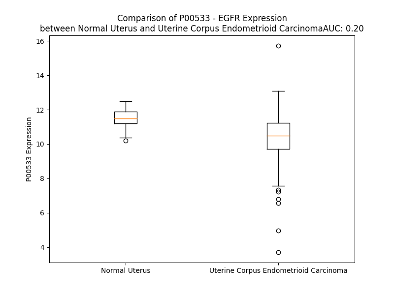

# Detailed Data for P00533

## Introduction to the Detailed Summary

### How to Interpret the Results

- **Summary & Metrics**: This section provides a quick reference to essential protein attributes, including expression changes, family classification, and biomarker applications. Regulation status (upregulated/downregulated) indicates the protein's behavior in a disease context. Some information comes from the original excel file with the proteins selected from literature, while others are derived from the analyses.
- **Expression Comparison**: A visual representation comparing protein expression between normal and disease states. It highlights significant changes in expression levels that might indicate diagnostic or therapeutic relevance. This is data coming from transcriptomics experiments and could not translate similarly to protein levels.
- **Isoform Alignment**: An interactive view of isoform alignments, revealing structural and functional differences between variants of the protein.
- **Interactors & Homologs**: Tables listing known interaction partners and homologous proteins, the more interactors and homologs, the more complex the protein is to design an antibody for.
- **Biological Assemblies**: Information about the structural arrangement of the protein in different assemblies, providing insights into its functional state but also the complexity of the protein to develop antibodies.
- **Combined Per-Residue Information**: A detailed table summarizing residue-level data. This includes predictions for epitope regions, aggregation tendencies, and modifications that might impact the protein's function. Each row corresponds to a residue in the protein, providing insights into specific sites that may be important for research or drug development.
## Summary & Metrics

- **UniProt Accession**: P00533
- **Gene Name**: EGFR
- **Protein Name**: Epidermal growth factor receptor
- **Swiss Prot**: EGFR_HUMAN
- **Family**: kinase
- **Biomarker Application**: diagnosis,disease progression,efficacy,prognosis,response to therapy,safety,unspecified application
- **Number of Isoforms**: 4
- **Regulation**: 2
- **(transcriptomics) AUC**: 0.2
- **(transcriptomics) Fold Change**: 1.11
- **(transcriptomics) Regulation**: Downregulated
- **Discotope Epitope Count**: 269
- **Max n_uniprots (Homo)**: 4
- **Max n_uniprots (Hetero)**: 4

## Expression Comparison

## Isoform Alignment

<pre style='font-size:14px; font-family:monospace;'>P00533-1 MRPSGTAGAALLALLAALCPASRALEEKKVCQGTSNKLTQLGTFEDHFLSLQRMFNNCEVVLGNLEITYVQRNYDLSFLKTIQEVAGYVLIALNTVERIPLENLQIIRGNMYYENSYALAVLSNYDANKTGLKELPMRNLQEILHGAVRFSNNPALCNVESIQWRDIVSSDFLSNMSMDFQNHLGSCQKCDPSCPNGSCWGAGEENCQKLTKIICAQQCSGRCRGKSPSDCCHNQCAAGCTGPRESDCLVCRKFRDEATCKDTCPPLMLYNPTTYQMDVNPEGKYSFGATCVKKCPRNYVVTDHGSCVRACGADSYEMEEDGVRKCKKCEGPCRKVCNGIGIGEFKDSLSINATNIKHFKNCTSISGDLHILPVAFRGDSFTHTPPLDPQELDILKTVKEITGFLLIQAWPENRTDLHAFENLEIIRGRTKQHGQFSLAVVSLNITSLGLRSLKEISDGDVIISGNKNLCYANTINWKKLFGTSGQKTKIISNRGENSCKATGQVCHALCSPEGCWGPEPRDCVSCRNVSRGRECVDKCNLLEGEPREFVENSECIQCHPECLPQAMNITCTGRGPDNCIQCAHYIDGPHCVKTCPAGVMGENNTLVWKYADAGHVCHLCHPNCTYGCTGPGLEGCPTNGPKIPSI-----------------ATGMVGALLLLLVVALGIGLFMRRRHIVRKRTLRRLLQERELVEPLTPSGEAPNQALLRILKETEFKKIKVLGSGAFGTVYKGLWIPEGEKVKIPVAIKELREATSPKANKEILDEAYVMASVDNPHVCRLLGICLTSTVQLITQLMPFGCLLDYVREHKDNIGSQYLLNWCVQIAKGMNYLEDRRLVHRDLAARNVLVKTPQHVKITDFGLAKLLGAEEKEYHAEGGKVPIKWMALESILHRIYTHQSDVWSYGVTVWELMTFGSKPYDGIPASEISSILEKGERLPQPPICTIDVYMIMVKCWMIDADSRPKFRELIIEFSKMARDPQRYLVIQGDERMHLPSPTDSNFYRALMDEEDMDDVVDADEYLIPQQGFFSSPSTSRTPLLSSLSATSNNSTVACIDRNGLQSCPIKEDSFLQRYSSDPTGALTEDSIDDTFLPVPEYINQSVPKRPAGSVQNPVYHNQPLNPAPSRDPHYQDPHSTAVGNPEYLNTVQPTCVNSTFDSPAHWAQKGSHQISLDNPDYQQDFFPKEAKPNGIFKGSTAENAEYLRVAPQSSEFIGA
P00533-2 MRPSGTAGAALLALLAALCPASRALEEKKVCQGTSNKLTQLGTFEDHFLSLQRMFNNCEVVLGNLEITYVQRNYDLSFLKTIQEVAGYVLIALNTVERIPLENLQIIRGNMYYENSYALAVLSNYDANKTGLKELPMRNLQEILHGAVRFSNNPALCNVESIQWRDIVSSDFLSNMSMDFQNHLGSCQKCDPSCPNGSCWGAGEENCQKLTKIICAQQCSGRCRGKSPSDCCHNQCAAGCTGPRESDCLVCRKFRDEATCKDTCPPLMLYNPTTYQMDVNPEGKYSFGATCVKKCPRNYVVTDHGSCVRACGADSYEMEEDGVRKCKKCEGPCRKVCNGIGIGEFKDSLSINATNIKHFKNCTSISGDLHILPVAFRGDSFTHTPPLDPQELDILKTVKEITGLS------------------------------------------------------------------------------------------------------------------------------------------------------------------------------------------------------------------------------------------------------------------------------------------------------------------------------------------------------------------------------------------------------------------------------------------------------------------------------------------------------------------------------------------------------------------------------------------------------------------------------------------------------------------------------------------------------------------------------------------------------------------------------------------------------------------------------------------------------
P00533-3 MRPSGTAGAALLALLAALCPASRALEEKKVCQGTSNKLTQLGTFEDHFLSLQRMFNNCEVVLGNLEITYVQRNYDLSFLKTIQEVAGYVLIALNTVERIPLENLQIIRGNMYYENSYALAVLSNYDANKTGLKELPMRNLQEILHGAVRFSNNPALCNVESIQWRDIVSSDFLSNMSMDFQNHLGSCQKCDPSCPNGSCWGAGEENCQKLTKIICAQQCSGRCRGKSPSDCCHNQCAAGCTGPRESDCLVCRKFRDEATCKDTCPPLMLYNPTTYQMDVNPEGKYSFGATCVKKCPRNYVVTDHGSCVRACGADSYEMEEDGVRKCKKCEGPCRKVCNGIGIGEFKDSLSINATNIKHFKNCTSISGDLHILPVAFRGDSFTHTPPLDPQELDILKTVKEITGFLLIQAWPENRTDLHAFENLEIIRGRTKQHGQFSLAVVSLNITSLGLRSLKEISDGDVIISGNKNLCYANTINWKKLFGTSGQKTKIISNRGENSCKATGQVCHALCSPEGCWGPEPRDCVSCRNVSRGRECVDKCNLLEGEPREFVENSECIQCHPECLPQAMNITCTGRGPDNCIQCAHYIDGPHCVKTCPAGVMGENNTLVWKYADAGHVCHLCHPNCTYGPGNESLKAMLFCLFKLSSCNQSNDGSVSHQSGSPAAQESCLGWIPSLLPSEFQLG--------------------------------------------------------WGGCSHLHAWPSASVIITASSCH----------------------------------------------------------------------------------------------------------------------------------------------------------------------------------------------------------------------------------------------------------------------------------------------------------------------------------------------------------------------------------------------------------------------------------------------------------------------------------
P00533-4 MRPSGTAGAALLALLAALCPASRALEEKKVCQGTSNKLTQLGTFEDHFLSLQRMFNNCEVVLGNLEITYVQRNYDLSFLKTIQEVAGYVLIALNTVERIPLENLQIIRGNMYYENSYALAVLSNYDANKTGLKELPMRNLQEILHGAVRFSNNPALCNVESIQWRDIVSSDFLSNMSMDFQNHLGSCQKCDPSCPNGSCWGAGEENCQKLTKIICAQQCSGRCRGKSPSDCCHNQCAAGCTGPRESDCLVCRKFRDEATCKDTCPPLMLYNPTTYQMDVNPEGKYSFGATCVKKCPRNYVVTDHGSCVRACGADSYEMEEDGVRKCKKCEGPCRKVCNGIGIGEFKDSLSINATNIKHFKNCTSISGDLHILPVAFRGDSFTHTPPLDPQELDILKTVKEITGFLLIQAWPENRTDLHAFENLEIIRGRTKQHGQFSLAVVSLNITSLGLRSLKEISDGDVIISGNKNLCYANTINWKKLFGTSGQKTKIISNRGENSCKATGQVCHALCSPEGCWGPEPRDCVSCRNVSRGRECVDKCNLLEGEPREFVENSECIQCHPECLPQAMNITCTGRGPDNCIQCAHYIDGPHCVKTCPAGVMGENNTLVWKYADAGHVCHLCHPNCTYGS-----------------------------------------------------------------------------------------------------------------------------------------------------------------------------------------------------------------------------------------------------------------------------------------------------------------------------------------------------------------------------------------------------------------------------------------------------------------------------------------------------------------------------------------------------------------------------------------------------------------------
</pre>

## Interactors

| preferredName_A   | preferredName_B   |   score |
|:------------------|:------------------|--------:|
| EGFR              | PTPN11            |   0.999 |
| EGFR              | HBEGF             |   0.999 |
| EGFR              | NRG1              |   0.999 |
| EGFR              | TGFA              |   0.999 |
| EGFR              | ERBB2             |   0.999 |
| EGFR              | DCN               |   0.999 |
| EGFR              | SHC1              |   0.999 |
| EGFR              | SOS1              |   0.999 |
| EGFR              | PIK3CA            |   0.999 |
| EGFR              | ERBB3             |   0.999 |
| EGFR              | GRB2              |   0.999 |
| EGFR              | EPGN              |   0.999 |
| EGFR              | CAV1              |   0.999 |
| EGFR              | MUC1              |   0.999 |
| EGFR              | BTC               |   0.999 |
| EGFR              | HSP90AA1          |   0.999 |
| EGFR              | GAB1              |   0.999 |
| EGFR              | SRC               |   0.999 |
| EGFR              | EREG              |   0.999 |
| EGFR              | AREG              |   0.999 |
| EGFR              | CBL               |   0.999 |
| EGFR              | PTK2              |   0.999 |
| EGFR              | CDH1              |   0.999 |
| EGFR              | EGF               |   0.999 |
| EGFR              | PIK3R1            |   0.998 |
| EGFR              | CTNNB1            |   0.998 |
| EGFR              | CD44              |   0.998 |
| EGFR              | SOS2              |   0.998 |
| EGFR              | STAT5A            |   0.998 |
| EGFR              | PDGFRB            |   0.998 |
| EGFR              | HSP90AB1          |   0.998 |
| EGFR              | STAT3             |   0.998 |
| EGFR              | STAT5B            |   0.997 |
| EGFR              | CRK               |   0.997 |
| EGFR              | PLCG1             |   0.997 |
| EGFR              | CBLC              |   0.997 |
| EGFR              | KRAS              |   0.997 |
| EGFR              | PTPN1             |   0.997 |
| EGFR              | ERBB4             |   0.996 |
| EGFR              | ERRFI1            |   0.996 |
| EGFR              | MET               |   0.996 |
| EGFR              | NRG2              |   0.996 |
| EGFR              | CBLB              |   0.995 |
| EGFR              | CTNND1            |   0.994 |
| EGFR              | EPS15             |   0.994 |
| EGFR              | HRAS              |   0.994 |
| EGFR              | USP8              |   0.994 |
| EGFR              | CRKL              |   0.993 |
| EGFR              | PIK3R2            |   0.993 |
| EGFR              | PLCG2             |   0.993 |

## Homologs

| uniprot_id   | gene_id   |
|:-------------|:----------|
| E7EVR7       | FGFR2     |
| P29317       | EPHA2     |
| P09619       | PDGFRB    |
| E7ER61       | FLT3      |
| F8W9L4       | FGFR3     |
| X5D7M5       | NTRK3     |
| P35968       | KDR       |
| Q8IWU2       | LMTK2     |
| L7RSL3       | FLT1      |
| Q04912       | MST1R     |
| J3QLV2       | ERBB2     |
| Q96L35       | EPHB4     |
| J3KQG3       | EPHA10    |
| F8VP57       | EPHA5     |
| Q6NVW1       | EPHB2     |
| C9J5X1       | IGF1R     |
| P21709       | EPHA1     |
| P29376       | LTK       |
| E7EQ23       | DDR1      |
| O15146       | MUSK      |
| A0A6Q8PHG5   | NTRK1     |
| P54764       | EPHA4     |
| B5A954       | TEK       |
| P35590       | TIE1      |
| E9PQ40       | FGFR1     |
| H7C3L9       | MERTK     |
| E9PEK4       | CSF1R     |
| H0YNK6       | TYRO3     |
| P34925       | RYK       |
| B5A927       | FLT4      |
| Q16832       | DDR2      |
| D6RJD4       | FGFR4     |
| Q01973       | ROR1      |
| Q01974       | ROR2      |
| P54762       | EPHB1     |
| Q5VWE5       | NTRK2     |
| P30530       | AXL       |
| A0A7P0T9L5   | EPHA7     |
| P08922       | ROS1      |
| E9PDR1       | ERBB4     |
| A0A087WZL3   | ALK       |
| O75812       | ERBB3     |
| A0A087WTE3   | EPHB6     |
| P54753       | EPHB3     |
| H0Y8K5       | EPHA6     |
| P06213       | INSR      |
| P14616       | INSRR     |
| C9JXA2       | EPHA3     |
| E6Y365       | MET       |
| P29322       | EPHA8     |
| P16234       | PDGFRA    |
| A0A8J8Z860   | KIT       |
| A0A087WWB1   | RET       |

## Biological Assemblies

|   Unnamed: 0 |   assembly |   n_uniprots | composition   | crystal_id   |
|-------------:|-----------:|-------------:|:--------------|:-------------|
|            0 |          1 |            2 | Homo          | 7jxp         |
|            1 |          2 |            2 | Homo          | 7jxp         |
|            2 |          3 |            2 | Homo          | 7jxp         |
|            0 |          1 |            1 | Homo          | 5ugc         |
|            0 |          1 |            1 | Homo          | 7zym         |
|            0 |          1 |            2 | Homo          | 6wak         |
|            1 |          2 |            2 | Homo          | 6wak         |
|            0 |          1 |            1 | Homo          | 2ity         |
|            0 |          1 |            1 | Homo          | 5hg7         |
|            0 |          1 |            1 | Homo          | 3p0y         |
|            0 |          1 |            1 | Homo          | 5czh         |
|            0 |          1 |            2 | Hetero        | 2rfd         |
|            1 |          2 |            2 | Hetero        | 2rfd         |
|            0 |          1 |            2 | Hetero        | 3op0         |
|            1 |          2 |            2 | Hetero        | 3op0         |
|            2 |          3 |            4 | Hetero        | 3op0         |
|            0 |          1 |            2 | Homo          | 5lv6         |
|            0 |          1 |            1 | Homo          | 4uv7         |
|            0 |          1 |            2 | Homo          | 2m0b         |
|            0 |          1 |            1 | Homo          | 8a2d         |
|            0 |          1 |            4 | Hetero        | 7sz1         |
|            0 |          1 |            1 | Homo          | 8ukx         |
|            0 |          1 |            1 | Homo          | 8f1h         |
|            0 |          1 |            3 | Hetero        | 8hgp         |
|            0 |          1 |            2 | Homo          | 6wa2         |
|            1 |          2 |            2 | Homo          | 6wa2         |
|            0 |          1 |            1 | Homo          | 7vra         |
|            0 |          1 |            1 | Homo          | 8hv4         |
|            0 |          1 |            1 | Homo          | 4hjo         |
|            0 |          1 |            1 | Homo          | 6wxn         |
|            1 |          2 |            1 | Homo          | 6wxn         |
|            2 |          3 |            1 | Homo          | 6wxn         |
|            3 |          4 |            1 | Homo          | 6wxn         |
|            0 |          1 |            1 | Homo          | 4kro         |
|            0 |          1 |            1 | Homo          | 5c8n         |
|            0 |          1 |            1 | Homo          | 2n5s         |
|            0 |          1 |            1 | Homo          | 5j9z         |
|            0 |          1 |            1 | Homo          | 1yy9         |
|            0 |          1 |            2 | Hetero        | 2rfe         |
|            1 |          2 |            2 | Hetero        | 2rfe         |
|            2 |          3 |            1 | Homo          | 2rfe         |
|            3 |          4 |            1 | Homo          | 2rfe         |
|            0 |          1 |            2 | Homo          | 3gt8         |
|            1 |          2 |            2 | Homo          | 3gt8         |
|            0 |          1 |            1 | Homo          | 6s89         |
|            0 |          1 |            1 | Homo          | 5em5         |
|            0 |          1 |            1 | Homo          | 3c09         |
|            1 |          2 |            1 | Homo          | 3c09         |
|            0 |          1 |            1 | Homo          | 6d8e         |
|            0 |          1 |            1 | Homo          | 8a2a         |
|            0 |          1 |            1 | Homo          | 2itp         |
|            0 |          1 |            1 | Homo          | 8po2         |
|            1 |          2 |            1 | Homo          | 8po2         |
|            2 |          3 |            1 | Homo          | 8po2         |
|            0 |          1 |            2 | Homo          | 8fv3         |
|            1 |          2 |            2 | Homo          | 8fv3         |
|            0 |          1 |            2 | Homo          | 6p1l         |
|            1 |          2 |            2 | Homo          | 6p1l         |
|            0 |          1 |            1 | Homo          | 5em7         |
|            0 |          1 |            2 | Hetero        | 4r3r         |
|            0 |          1 |            1 | Homo          | 5uga         |
|            0 |          1 |            1 | Homo          | 6z4b         |
|            1 |          2 |            1 | Homo          | 6z4b         |
|            0 |          1 |            1 | Homo          | 5xdl         |
|            0 |          1 |            1 | Homo          | 8hv7         |
|            0 |          1 |            1 | Homo          | 8pnz         |
|            0 |          1 |            1 | Homo          | 2itq         |
|            0 |          1 |            1 | Homo          | 6jwl         |
|            0 |          1 |            1 | Homo          | 5cav         |
|            0 |          1 |            1 | Homo          | 7zyn         |
|            0 |          1 |            4 | Hetero        | 1ivo         |
|            0 |          1 |            1 | Homo          | 5cno         |
|            1 |          2 |            1 | Homo          | 5cno         |
|            2 |          3 |            1 | Homo          | 5cno         |
|            0 |          1 |            1 | Homo          | 3w2p         |
|            0 |          1 |            1 | Homo          | 5edq         |
|            0 |          1 |            1 | Homo          | 5y25         |
|            0 |          1 |            4 | Homo          | 5gty         |
|            1 |          2 |            4 | Homo          | 5gty         |
|            0 |          1 |            1 | Homo          | 1nql         |
|            0 |          1 |            1 | Homo          | 5ug8         |
|            0 |          1 |            1 | Homo          | 4rj8         |
|            0 |          1 |            2 | Hetero        | 5wb8         |
|            1 |          2 |            2 | Hetero        | 5wb8         |
|            0 |          1 |            1 | Homo          | 6tfv         |
|            1 |          2 |            1 | Homo          | 6tfv         |
|            0 |          1 |            1 | Homo          | 7k1i         |
|            0 |          1 |            2 | Homo          | 8eme         |
|            0 |          1 |            1 | Homo          | 7a2a         |
|            1 |          2 |            1 | Homo          | 7a2a         |
|            0 |          1 |            1 | Homo          | 3w2o         |
|            0 |          1 |            1 | Homo          | 6jrx         |
|            0 |          1 |            1 | Homo          | 6b3s         |
|            1 |          2 |            1 | Homo          | 6b3s         |
|            2 |          3 |            1 | Homo          | 6b3s         |
|            3 |          4 |            1 | Homo          | 6b3s         |
|            0 |          1 |            1 | Homo          | 8a27         |
|            0 |          1 |            1 | Homo          | 4rj5         |
|            0 |          1 |            2 | Hetero        | 4riy         |
|            1 |          2 |            2 | Hetero        | 4riy         |
|            0 |          1 |            4 | Hetero        | 7syd         |
|            0 |          1 |            1 | Homo          | 5uwd         |
|            0 |          1 |            2 | Homo          | 7jxk         |
|            1 |          2 |            2 | Homo          | 7jxk         |
|            2 |          3 |            2 | Homo          | 7jxk         |
|            0 |          1 |            4 | Hetero        | 7lfr         |
|            1 |          2 |            2 | Hetero        | 7lfr         |
|            2 |          3 |            2 | Hetero        | 7lfr         |
|            0 |          1 |            1 | Homo          | 5c8k         |
|            0 |          1 |            1 | Homo          | 7ukv         |
|            0 |          1 |            1 | Homo          | 5zwj         |
|            0 |          1 |            1 | Homo          | 7zyq         |
|            1 |          2 |            1 | Homo          | 7zyq         |
|            0 |          1 |            2 | Homo          | 7jxi         |
|            1 |          2 |            2 | Homo          | 7jxi         |
|            0 |          1 |            1 | Homo          | 4krl         |
|            0 |          1 |            1 | Homo          | 5hcz         |
|            0 |          1 |            1 | Homo          | 5x26         |
|            0 |          1 |            1 | Homo          | 7aem         |
|            0 |          1 |            1 | Homo          | 6jx4         |
|            0 |          1 |            1 | Homo          | 2itn         |
|            0 |          1 |            1 | Homo          | 8gb4         |
|            1 |          2 |            1 | Homo          | 8gb4         |
|            2 |          3 |            1 | Homo          | 8gb4         |
|            3 |          4 |            1 | Homo          | 8gb4         |
|            0 |          1 |            4 | Hetero        | 1mox         |
|            0 |          1 |            2 | Hetero        | 4i21         |
|            1 |          2 |            2 | Hetero        | 4i21         |
|            0 |          1 |            1 | Homo          | 6vh4         |
|            0 |          1 |            1 | Homo          | 2j5e         |
|            0 |          1 |            1 | Homo          | 5hic         |
|            0 |          1 |            1 | Homo          | 5j9y         |
|            0 |          1 |            1 | Homo          | 2jiv         |
|            1 |          2 |            1 | Homo          | 2jiv         |
|            0 |          1 |            2 | Homo          | 6v5p         |
|            1 |          2 |            2 | Homo          | 6v5p         |
|            0 |          1 |            1 | Homo          | 7b85         |
|            0 |          1 |            1 | Homo          | 5em6         |
|            0 |          1 |            1 | Homo          | 8hy7         |
|            0 |          1 |            1 | Homo          | 7lg8         |
|            1 |          2 |            1 | Homo          | 7lg8         |
|            2 |          3 |            1 | Homo          | 7lg8         |
|            3 |          4 |            1 | Homo          | 7lg8         |
|            0 |          1 |            1 | Homo          | 1m17         |
|            0 |          1 |            1 | Homo          | 2jiu         |
|            1 |          2 |            1 | Homo          | 2jiu         |
|            0 |          1 |            1 | Homo          | 3vjo         |
|            0 |          1 |            2 | Hetero        | 4riw         |
|            1 |          2 |            2 | Hetero        | 4riw         |
|            0 |          1 |            1 | Homo          | 5sx4         |
|            1 |          2 |            1 | Homo          | 5sx4         |
|            0 |          1 |            1 | Homo          | 8g63         |
|            0 |          1 |            1 | Homo          | 8po0         |
|            0 |          1 |            1 | Homo          | 8ukw         |
|            1 |          2 |            1 | Homo          | 8ukw         |
|            0 |          1 |            1 | Homo          | 4i20         |
|            0 |          1 |            2 | Homo          | 2m20         |
|            0 |          1 |            1 | Homo          | 4wrg         |
|            0 |          1 |            1 | Homo          | 7a6k         |
|            1 |          2 |            1 | Homo          | 7a6k         |
|            2 |          3 |            1 | Homo          | 7a6k         |
|            3 |          4 |            1 | Homo          | 7a6k         |
|            0 |          1 |            1 | Homo          | 4krp         |
|            0 |          1 |            2 | Homo          | 6v6k         |
|            1 |          2 |            2 | Homo          | 6v6k         |
|            2 |          3 |            2 | Homo          | 6v6k         |
|            3 |          4 |            2 | Homo          | 6v6k         |
|            0 |          1 |            2 | Homo          | 5xgn         |
|            0 |          1 |            1 | Homo          | 5hcy         |
|            0 |          1 |            1 | Homo          | 5yu9         |
|            1 |          2 |            1 | Homo          | 5yu9         |
|            2 |          3 |            1 | Homo          | 5yu9         |
|            3 |          4 |            1 | Homo          | 5yu9         |
|            0 |          1 |            1 | Homo          | 5czi         |
|            0 |          1 |            4 | Hetero        | 7sz5         |
|            0 |          1 |            1 | Homo          | 2itu         |
|            0 |          1 |            2 | Hetero        | 3buo         |
|            1 |          2 |            2 | Hetero        | 3buo         |
|            0 |          1 |            1 | Homo          | 6xl4         |
|            1 |          2 |            1 | Homo          | 6xl4         |
|            2 |          3 |            1 | Homo          | 6xl4         |
|            3 |          4 |            1 | Homo          | 6xl4         |
|            0 |          1 |            1 | Homo          | 5edp         |
|            0 |          1 |            1 | Homo          | 2itx         |
|            0 |          1 |            1 | Homo          | 4g5j         |
|            1 |          2 |            1 | Homo          | 4g5j         |
|            0 |          1 |            2 | Homo          | 6p8q         |
|            1 |          2 |            2 | Homo          | 6p8q         |
|            0 |          1 |            1 | Homo          | 4rj4         |
|            0 |          1 |            1 | Homo          | 8f1x         |
|            0 |          1 |            1 | Homo          | 5gnk         |
|            0 |          1 |            1 | Homo          | 6s9c         |
|            0 |          1 |            1 | Homo          | 8d76         |
|            1 |          2 |            1 | Homo          | 8d76         |
|            0 |          1 |            2 | Hetero        | 3vrr         |
|            0 |          1 |            0 | Hetero        | 3g5v         |
|            0 |          1 |            1 | Homo          | 3w2q         |
|            0 |          1 |            1 | Homo          | 5caq         |
|            0 |          1 |            1 | Homo          | 5hg8         |
|            0 |          1 |            1 | Homo          | 3w2r         |
|            0 |          1 |            2 | Hetero        | 4uip         |
|            0 |          1 |            1 | Homo          | 6lub         |
|            0 |          1 |            1 | Homo          | 6z4d         |
|            1 |          2 |            1 | Homo          | 6z4d         |
|            0 |          1 |            1 | Homo          | 6vhn         |
|            0 |          1 |            1 | Homo          | 7u99         |
|            0 |          1 |            1 | Homo          | 1z9i         |
|            0 |          1 |            1 | Homo          | 2itw         |
|            0 |          1 |            1 | Homo          | 5sx5         |
|            1 |          2 |            1 | Homo          | 5sx5         |
|            0 |          1 |            1 | Homo          | 7er2         |
|            0 |          1 |            1 | Homo          | 8hv3         |
|            0 |          1 |            1 | Homo          | 5edr         |
|            0 |          1 |            1 | Homo          | 6tfy         |
|            1 |          2 |            1 | Homo          | 6tfy         |
|            0 |          1 |            2 | Homo          | 7ukw         |
|            1 |          2 |            2 | Homo          | 7ukw         |
|            0 |          1 |            1 | Homo          | 6jxt         |
|            0 |          1 |            1 | Homo          | 8po1         |
|            0 |          1 |            1 | Homo          | 5u8l         |
|            0 |          1 |            2 | Homo          | 7k1h         |
|            1 |          2 |            2 | Homo          | 7k1h         |
|            2 |          3 |            2 | Homo          | 7k1h         |
|            0 |          1 |            1 | Homo          | 3w33         |
|            0 |          1 |            1 | Homo          | 2ito         |
|            0 |          1 |            1 | Homo          | 5hib         |
|            0 |          1 |            1 | Homo          | 8sc7         |
|            0 |          1 |            1 | Homo          | 5x27         |
|            0 |          1 |            2 | Homo          | 6v66         |
|            1 |          2 |            2 | Homo          | 6v66         |
|            0 |          1 |            2 | Homo          | 7jxq         |
|            1 |          2 |            2 | Homo          | 7jxq         |
|            0 |          1 |            1 | Homo          | 4li5         |
|            1 |          2 |            1 | Homo          | 4li5         |
|            0 |          1 |            1 | Homo          | 6lud         |
|            0 |          1 |            4 | Hetero        | 5wb7         |
|            1 |          2 |            4 | Hetero        | 5wb7         |
|            0 |          1 |            2 | Homo          | 5x2a         |
|            1 |          2 |            2 | Homo          | 5x2a         |
|            0 |          1 |            1 | Homo          | 1xkk         |
|            0 |          1 |            1 | Homo          | 4jrv         |
|            0 |          1 |            1 | Homo          | 3lzb         |
|            1 |          2 |            1 | Homo          | 3lzb         |
|            2 |          3 |            1 | Homo          | 3lzb         |
|            3 |          4 |            1 | Homo          | 3lzb         |
|            4 |          5 |            1 | Homo          | 3lzb         |
|            5 |          6 |            1 | Homo          | 3lzb         |
|            6 |          7 |            1 | Homo          | 3lzb         |
|            7 |          8 |            1 | Homo          | 3lzb         |
|            0 |          1 |            1 | Homo          | 8po3         |
|            0 |          1 |            3 | Hetero        | 6aru         |
|            0 |          1 |            1 | Homo          | 4lrm         |
|            1 |          2 |            1 | Homo          | 4lrm         |
|            2 |          3 |            1 | Homo          | 4lrm         |
|            3 |          4 |            1 | Homo          | 4lrm         |
|            4 |          5 |            1 | Homo          | 4lrm         |
|            0 |          1 |            1 | Homo          | 5x28         |
|            0 |          1 |            1 | Homo          | 2itt         |
|            0 |          1 |            2 | Hetero        | 4r3p         |
|            0 |          1 |            1 | Homo          | 4i22         |
|            1 |          2 |            1 | Homo          | 4i22         |
|            0 |          1 |            1 | Homo          | 3qwq         |
|            0 |          1 |            1 | Homo          | 5gtz         |
|            0 |          1 |            1 | Homo          | 7zyp         |
|            0 |          1 |            1 | Homo          | 8po4         |
|            1 |          2 |            1 | Homo          | 8po4         |
|            0 |          1 |            1 | Homo          | 4tks         |
|            0 |          1 |            1 | Homo          | 5cnn         |
|            1 |          2 |            1 | Homo          | 5cnn         |
|            0 |          1 |            1 | Homo          | 5hcx         |
|            0 |          1 |            1 | Homo          | 4jq8         |
|            0 |          1 |            2 | Homo          | 7jxl         |
|            1 |          2 |            2 | Homo          | 7jxl         |
|            0 |          1 |            1 | Homo          | 3vjn         |
|            0 |          1 |            2 | Homo          | 7jxw         |
|            1 |          2 |            2 | Homo          | 7jxw         |
|            0 |          1 |            1 | Homo          | 6s8a         |
|            0 |          1 |            1 | Homo          | 1m14         |
|            0 |          1 |            1 | Homo          | 2gs2         |
|            0 |          1 |            2 | Homo          | 7t4j         |
|            0 |          1 |            2 | Hetero        | 4rix         |
|            1 |          2 |            2 | Hetero        | 4rix         |
|            0 |          1 |            1 | Homo          | 4wd5         |
|            1 |          2 |            1 | Homo          | 4wd5         |
|            2 |          3 |            2 | Homo          | 4wd5         |
|            0 |          1 |            1 | Homo          | 8hv6         |
|            0 |          1 |            1 | Homo          | 4krm         |
|            1 |          2 |            1 | Homo          | 4krm         |
|            2 |          3 |            1 | Homo          | 4krm         |
|            3 |          4 |            1 | Homo          | 4krm         |
|            4 |          5 |            1 | Homo          | 4krm         |
|            5 |          6 |            1 | Homo          | 4krm         |
|            0 |          1 |            1 | Homo          | 5can         |
|            0 |          1 |            1 | Homo          | 8d73         |
|            1 |          2 |            1 | Homo          | 8d73         |
|            0 |          1 |            1 | Homo          | 5cas         |
|            0 |          1 |            1 | Homo          | 3ug2         |
|            0 |          1 |            1 | Homo          | 6jz0         |
|            0 |          1 |            2 | Homo          | 8fv4         |
|            1 |          2 |            2 | Homo          | 8fv4         |
|            0 |          1 |            2 | Hetero        | 4zjv         |
|            1 |          2 |            2 | Hetero        | 4zjv         |
|            0 |          1 |            1 | Homo          | 5x2k         |
|            0 |          1 |            1 | Homo          | 5cap         |
|            0 |          1 |            4 | Hetero        | 3njp         |
|            1 |          2 |            2 | Hetero        | 3njp         |
|            2 |          3 |            2 | Hetero        | 3njp         |
|            0 |          1 |            1 | Homo          | 6tg1         |
|            1 |          2 |            1 | Homo          | 6tg1         |
|            0 |          1 |            1 | Homo          | 7tvd         |
|            0 |          1 |            1 | Homo          | 5ug9         |
|            0 |          1 |            1 | Homo          | 8hv5         |
|            0 |          1 |            1 | Homo          | 7oxb         |
|            0 |          1 |            1 | Homo          | 8hv8         |
|            0 |          1 |            2 | Homo          | 6duk         |
|            1 |          2 |            2 | Homo          | 6duk         |
|            2 |          3 |            2 | Homo          | 6duk         |
|            0 |          1 |            1 | Homo          | 3w2s         |
|            0 |          1 |            1 | Homo          | 5x2c         |
|            1 |          2 |            1 | Homo          | 5x2c         |
|            0 |          1 |            1 | Homo          | 6vhp         |
|            0 |          1 |            1 | Homo          | 7u9a         |
|            0 |          1 |            1 | Homo          | 2j6m         |
|            0 |          1 |            1 | Homo          | 5feq         |
|            0 |          1 |            1 | Homo          | 6s9d         |
|            0 |          1 |            1 | Homo          | 8wd4         |
|            0 |          1 |            1 | Homo          | 2gs6         |
|            0 |          1 |            1 | Homo          | 3ika         |
|            1 |          2 |            1 | Homo          | 3ika         |
|            2 |          3 |            2 | Homo          | 3ika         |
|            0 |          1 |            2 | Hetero        | 2rf9         |
|            1 |          2 |            2 | Hetero        | 2rf9         |
|            0 |          1 |            2 | Homo          | 6v6o         |
|            1 |          2 |            2 | Homo          | 6v6o         |
|            2 |          3 |            2 | Homo          | 6v6o         |
|            3 |          4 |            2 | Homo          | 6v6o         |
|            0 |          1 |            1 | Homo          | 7lgs         |
|            1 |          2 |            1 | Homo          | 7lgs         |
|            2 |          3 |            1 | Homo          | 7lgs         |
|            3 |          4 |            1 | Homo          | 7lgs         |
|            0 |          1 |            4 | Hetero        | 7sz0         |
|            0 |          1 |            1 | Homo          | 5xgm         |
|            0 |          1 |            1 | Homo          | 4i24         |
|            1 |          2 |            1 | Homo          | 4i24         |
|            2 |          3 |            2 | Homo          | 4i24         |
|            0 |          1 |            2 | Homo          | 6p1d         |
|            1 |          2 |            2 | Homo          | 6p1d         |
|            0 |          1 |            1 | Homo          | 3gop         |
|            1 |          2 |            1 | Homo          | 3gop         |
|            0 |          1 |            2 | Hetero        | 3pfv         |
|            1 |          2 |            2 | Hetero        | 3pfv         |
|            0 |          1 |            1 | Homo          | 8hv1         |
|            0 |          1 |            1 | Homo          | 6tg0         |
|            1 |          2 |            1 | Homo          | 6tg0         |
|            0 |          1 |            1 | Homo          | 5jeb         |
|            0 |          1 |            1 | Homo          | 7ltx         |
|            1 |          2 |            1 | Homo          | 7ltx         |
|            2 |          3 |            1 | Homo          | 7ltx         |
|            3 |          4 |            1 | Homo          | 7ltx         |
|            0 |          1 |            2 | Hetero        | 7lfs         |
|            1 |          2 |            2 | Hetero        | 7lfs         |
|            2 |          3 |            2 | Hetero        | 7lfs         |
|            3 |          4 |            2 | Hetero        | 7lfs         |
|            0 |          1 |            1 | Homo          | 6jx0         |
|            0 |          1 |            1 | Homo          | 4r5s         |
|            0 |          1 |            1 | Homo          | 5cal         |
|            0 |          1 |            1 | Homo          | 5fee         |
|            0 |          1 |            1 | Homo          | 4jr3         |
|            0 |          1 |            1 | Homo          | 4rj6         |
|            0 |          1 |            1 | Homo          | 6s9b         |
|            0 |          1 |            1 | Homo          | 4i23         |
|            0 |          1 |            4 | Hetero        | 8hgs         |
|            0 |          1 |            1 | Homo          | 7a6j         |
|            1 |          2 |            1 | Homo          | 7a6j         |
|            0 |          1 |            1 | Homo          | 7t4i         |
|            0 |          1 |            1 | Homo          | 7u98         |
|            1 |          2 |            1 | Homo          | 7u98         |
|            2 |          3 |            1 | Homo          | 7u98         |
|            3 |          4 |            1 | Homo          | 7u98         |
|            0 |          1 |            1 | Homo          | 4jq7         |
|            0 |          1 |            1 | Homo          | 8f1z         |
|            0 |          1 |            1 | Homo          | 5hg5         |
|            0 |          1 |            1 | Homo          | 4g5p         |
|            1 |          2 |            1 | Homo          | 4g5p         |
|            2 |          3 |            2 | Homo          | 4g5p         |
|            0 |          1 |            1 | Homo          | 5xwd         |
|            0 |          1 |            1 | Homo          | 3b2v         |
|            0 |          1 |            1 | Homo          | 2rgp         |
|            0 |          1 |            1 | Homo          | 6tfw         |
|            1 |          2 |            1 | Homo          | 6tfw         |
|            0 |          1 |            1 | Homo          | 4rj7         |
|            0 |          1 |            1 | Homo          | 5xdk         |
|            0 |          1 |            1 | Homo          | 6tfz         |
|            1 |          2 |            1 | Homo          | 6tfz         |
|            0 |          1 |            3 | Hetero        | 8hgo         |
|            0 |          1 |            1 | Homo          | 5c8m         |
|            0 |          1 |            1 | Homo          | 4zau         |
|            0 |          1 |            1 | Homo          | 5y9t         |
|            0 |          1 |            2 | Homo          | 6v5n         |
|            1 |          2 |            2 | Homo          | 6v5n         |
|            0 |          1 |            1 | Homo          | 5ugb         |
|            0 |          1 |            2 | Homo          | 5d41         |
|            0 |          1 |            2 | Hetero        | 7len         |
|            1 |          2 |            2 | Hetero        | 7len         |
|            0 |          1 |            1 | Homo          | 3w32         |
|            0 |          1 |            1 | Homo          | 8hva         |
|            0 |          1 |            2 | Hetero        | 3ob2         |
|            0 |          1 |            1 | Homo          | 5fed         |
|            0 |          1 |            1 | Homo          | 8hv9         |
|            0 |          1 |            1 | Homo          | 8f1y         |
|            0 |          1 |            1 | Homo          | 2jit         |
|            1 |          2 |            1 | Homo          | 2jit         |
|            0 |          1 |            1 | Homo          | 7kxz         |
|            0 |          1 |            2 | Hetero        | 7om4         |
|            0 |          1 |            1 | Homo          | 5em8         |
|            0 |          1 |            4 | Hetero        | 7sye         |
|            0 |          1 |            1 | Homo          | 3ug1         |
|            0 |          1 |            1 | Homo          | 7a6i         |
|            0 |          1 |            1 | Homo          | 8ukv         |
|            1 |          2 |            1 | Homo          | 8ukv         |
|            0 |          1 |            1 | Homo          | 4wkq         |
|            0 |          1 |            1 | Homo          | 6tfu         |
|            1 |          2 |            1 | Homo          | 6tfu         |
|            0 |          1 |            2 | Homo          | 5x2f         |
|            1 |          2 |            2 | Homo          | 5x2f         |
|            0 |          1 |            4 | Hetero        | 7sz7         |
|            0 |          1 |            1 | Homo          | 3bel         |
|            0 |          1 |            1 | Homo          | 2j5f         |
|            0 |          1 |            2 | Homo          | 8h7x         |
|            0 |          1 |            1 | Homo          | 2eb2         |
|            0 |          1 |            1 | Homo          | 5hg9         |
|            0 |          1 |            1 | Homo          | 3b2u         |
|            1 |          2 |            1 | Homo          | 3b2u         |
|            2 |          3 |            1 | Homo          | 3b2u         |
|            3 |          4 |            1 | Homo          | 3b2u         |
|            4 |          5 |            1 | Homo          | 3b2u         |
|            5 |          6 |            1 | Homo          | 3b2u         |
|            6 |          7 |            1 | Homo          | 3b2u         |
|            7 |          8 |            1 | Homo          | 3b2u         |
|            0 |          1 |            1 | Homo          | 4i1z         |
|            0 |          1 |            1 | Homo          | 8tjl         |
|            0 |          1 |            1 | Homo          | 5cao         |
|            0 |          1 |            0 | Hetero        | 3g5y         |
|            0 |          1 |            1 | Homo          | 7vre         |
|            0 |          1 |            2 | Homo          | 7jxm         |
|            1 |          2 |            2 | Homo          | 7jxm         |
|            0 |          1 |            1 | Homo          | 5cau         |
|            0 |          1 |            1 | Homo          | 8hv2         |
|            0 |          1 |            2 | Homo          | 4zse         |
|            1 |          2 |            2 | Homo          | 4zse         |
|            0 |          1 |            2 | Hetero        | 3vrp         |
|            0 |          1 |            1 | Homo          | 5zto         |
|            0 |          1 |            1 | Homo          | 3poz         |
|            0 |          1 |            2 | Homo          | 4ll0         |
|            1 |          2 |            1 | Homo          | 4ll0         |
|            2 |          3 |            1 | Homo          | 4ll0         |
|            0 |          1 |            1 | Homo          | 2eb3         |
|            0 |          1 |            1 | Homo          | 2itv         |
|            0 |          1 |            1 | Homo          | 8dsw         |
|            0 |          1 |            1 | Homo          | 4lqm         |
|            0 |          1 |            1 | Homo          | 5gmp         |
|            0 |          1 |            2 | Hetero        | 2ks1         |
|            0 |          1 |            1 | Homo          | 6jrk         |
|            0 |          1 |            1 | Homo          | 8a2b         |
|            0 |          1 |            1 | Homo          | 7aei         |
|            0 |          1 |            1 | Homo          | 7si1         |
|            0 |          1 |            1 | Homo          | 7ky0         |
|            1 |          2 |            1 | Homo          | 7ky0         |
|            2 |          3 |            1 | Homo          | 7ky0         |
|            3 |          4 |            1 | Homo          | 7ky0         |
|            0 |          1 |            2 | Homo          | 2gs7         |
|            0 |          1 |            1 | Homo          | 8f1w         |
|            1 |          2 |            1 | Homo          | 8f1w         |
|            2 |          3 |            1 | Homo          | 8f1w         |
|            3 |          4 |            1 | Homo          | 8f1w         |
|            0 |          1 |            1 | Homo          | 2itz         |
|            0 |          1 |            1 | Homo          | 6jrj         |

## Combined Per-Residue Information

|   res | aa   |   epitope_score | epitope   |   relative_surface_accessibility |   modeling_confidence |   Aggregation | modification                           | glycosylation                                                |
|------:|:-----|----------------:|:----------|---------------------------------:|----------------------:|--------------:|:---------------------------------------|:-------------------------------------------------------------|
|     1 | M    |         0.17468 | True      |                          1.3191  |                 37.16 |         0     | N/A                                    | N/A                                                          |
|     2 | R    |         0.18132 | True      |                          0.96974 |                 36.95 |         0     | N/A                                    | N/A                                                          |
|     3 | P    |         0.08856 | False     |                          0.98483 |                 49.63 |         0     | N/A                                    | N/A                                                          |
|     4 | S    |         0.11916 | True      |                          0.88472 |                 42.38 |         0     | N/A                                    | N/A                                                          |
|     5 | G    |         0.13382 | True      |                          0.81933 |                 41.4  |         0.057 | N/A                                    | N/A                                                          |
|     6 | T    |         0.14967 | True      |                          0.86379 |                 50.46 |         0.93  | N/A                                    | N/A                                                          |
|     7 | A    |         0.12888 | True      |                          0.81216 |                 48.69 |         2.396 | N/A                                    | N/A                                                          |
|     8 | G    |         0.15539 | True      |                          0.52798 |                 48.59 |         4.132 | N/A                                    | N/A                                                          |
|     9 | A    |         0.14311 | True      |                          0.70357 |                 51.93 |        23.546 | N/A                                    | N/A                                                          |
|    10 | A    |         0.07617 | False     |                          0.5429  |                 55.27 |        46.407 | N/A                                    | N/A                                                          |
|    11 | L    |         0.14275 | True      |                          0.72497 |                 53.11 |        72.664 | N/A                                    | N/A                                                          |
|    12 | L    |         0.11891 | True      |                          0.78607 |                 55.07 |        76.684 | N/A                                    | N/A                                                          |
|    13 | A    |         0.07346 | False     |                          0.59029 |                 56.43 |        77.298 | N/A                                    | N/A                                                          |
|    14 | L    |         0.09091 | False     |                          0.65678 |                 55.75 |        77.81  | N/A                                    | N/A                                                          |
|    15 | L    |         0.05141 | False     |                          0.62845 |                 53.2  |        76.468 | N/A                                    | N/A                                                          |
|    16 | A    |         0.08366 | False     |                          0.69736 |                 51.75 |        64.846 | N/A                                    | N/A                                                          |
|    17 | A    |         0.05443 | False     |                          0.79855 |                 51.93 |        54.368 | N/A                                    | N/A                                                          |
|    18 | L    |         0.06785 | False     |                          0.81287 |                 48.43 |        46.066 | N/A                                    | N/A                                                          |
|    19 | C    |         0.04967 | False     |                          0.6395  |                 36.04 |         0.086 | N/A                                    | N/A                                                          |
|    20 | P    |         0.05161 | False     |                          0.92359 |                 36.73 |         0.029 | N/A                                    | N/A                                                          |
|    21 | A    |         0.07621 | False     |                          0.85683 |                 33.42 |         0     | N/A                                    | N/A                                                          |
|    22 | S    |         0.03457 | False     |                          0.62757 |                 32.53 |         0     | N/A                                    | N/A                                                          |
|    23 | R    |         0.04472 | False     |                          0.91692 |                 30.85 |         0     | N/A                                    | N/A                                                          |
|    24 | A    |         0.04336 | False     |                          0.82368 |                 32.01 |         0     | N/A                                    | N/A                                                          |
|    25 | L    |         0.05076 | False     |                          0.60906 |                 47.47 |         0     | N/A                                    | N/A                                                          |
|    26 | E    |         0.05366 | False     |                          0.71714 |                 51.61 |         0     | N/A                                    | N/A                                                          |
|    27 | E    |         0.04789 | False     |                          0.59728 |                 70.82 |         0     | N/A                                    | N/A                                                          |
|    28 | K    |         0.01786 | False     |                          0.21705 |                 82.58 |         0     | N/A                                    | N/A                                                          |
|    29 | K    |         0.03705 | False     |                          0.37525 |                 86.66 |         0     | N/A                                    | N/A                                                          |
|    30 | V    |         0.03249 | False     |                          0.41394 |                 84.86 |         0     | N/A                                    | N/A                                                          |
|    31 | C    |         0.01824 | False     |                          0.12001 |                 85.82 |         0     | N/A                                    | N/A                                                          |
|    32 | Q    |         0.05659 | False     |                          0.46859 |                 76.07 |         0     | N/A                                    | N/A                                                          |
|    33 | G    |         0.03685 | False     |                          0.09039 |                 82.53 |         0     | N/A                                    | N/A                                                          |
|    34 | T    |         0.03147 | False     |                          0.20289 |                 80.82 |         0     | N/A                                    | N/A                                                          |
|    35 | S    |         0.05013 | False     |                          0.43443 |                 84.37 |         0     | N/A                                    | N/A                                                          |
|    36 | N    |         0.09266 | False     |                          0.28746 |                 79.1  |         0     | N/A                                    | N/A                                                          |
|    37 | K    |         0.13707 | True      |                          0.52406 |                 87.86 |         0     | N/A                                    | N/A                                                          |
|    38 | L    |         0.12929 | True      |                          0.4852  |                 88.82 |         0     | N/A                                    | N/A                                                          |
|    39 | T    |         0.18233 | True      |                          0.54698 |                 74.74 |         0     | N/A                                    | N/A                                                          |
|    40 | Q    |         0.16283 | True      |                          0.35189 |                 79.92 |         0     | N/A                                    | N/A                                                          |
|    41 | L    |         0.16896 | True      |                          0.43288 |                 67.59 |         0     | N/A                                    | N/A                                                          |
|    42 | G    |         0.09625 | False     |                          0.68282 |                 78.5  |         0     | N/A                                    | N/A                                                          |
|    43 | T    |         0.1076  | True      |                          0.57917 |                 84.3  |         0     | N/A                                    | N/A                                                          |
|    44 | F    |         0.09973 | True      |                          0.4513  |                 89.25 |         0     | N/A                                    | N/A                                                          |
|    45 | E    |         0.15517 | True      |                          0.53911 |                 88.95 |         0     | N/A                                    | N/A                                                          |
|    46 | D    |         0.07923 | False     |                          0.42421 |                 82.69 |         0     | N/A                                    | N/A                                                          |
|    47 | H    |         0.05109 | False     |                          0.06912 |                 83.88 |         0     | N/A                                    | N/A                                                          |
|    48 | F    |         0.04434 | False     |                          0.08442 |                 93.14 |         0.267 | N/A                                    | N/A                                                          |
|    49 | L    |         0.06873 | False     |                          0.42762 |                 88.64 |         0.267 | N/A                                    | N/A                                                          |
|    50 | S    |         0.05099 | False     |                          0.27607 |                 83.99 |         0.267 | N/A                                    | N/A                                                          |
|    51 | L    |         0.0351  | False     |                          0.06385 |                 89.87 |         0.267 | N/A                                    | N/A                                                          |
|    52 | Q    |         0.05387 | False     |                          0.32186 |                 92.46 |         0.267 | N/A                                    | N/A                                                          |
|    53 | R    |         0.0839  | False     |                          0.53896 |                 86.55 |         0     | N/A                                    | N/A                                                          |
|    54 | M    |         0.03252 | False     |                          0.23026 |                 88.51 |         0     | N/A                                    | N/A                                                          |
|    55 | F    |         0.0028  | False     |                          0       |                 94.33 |         0     | N/A                                    | N/A                                                          |
|    56 | N    |         0.10348 | True      |                          0.47988 |                 91.77 |         0     | N/A                                    | N-linked (GlcNAc...) (complex) asparagine; atypical; partial |
|    57 | N    |         0.06589 | False     |                          0.51396 |                 92.2  |         0     | N/A                                    | N/A                                                          |
|    58 | C    |         0.00688 | False     |                          0.01102 |                 92.48 |         0     | N/A                                    | N/A                                                          |
|    59 | E    |         0.02052 | False     |                          0.22576 |                 96.18 |         0     | N/A                                    | N/A                                                          |
|    60 | V    |         0.01213 | False     |                          0.17423 |                 92.18 |         0     | N/A                                    | N/A                                                          |
|    61 | V    |         0.00118 | False     |                          0       |                 91.12 |         0     | N/A                                    | N/A                                                          |
|    62 | L    |         0.0236  | False     |                          0.24477 |                 84.45 |         0     | N/A                                    | N/A                                                          |
|    63 | G    |         0.01625 | False     |                          0.16899 |                 84.52 |         0     | N/A                                    | N/A                                                          |
|    64 | N    |         0.00575 | False     |                          0.00592 |                 92.55 |         0     | N/A                                    | N/A                                                          |
|    65 | L    |         0.00194 | False     |                          0       |                 97.73 |         0     | N/A                                    | N/A                                                          |
|    66 | E    |         0.02567 | False     |                          0.03444 |                 97.41 |         0     | N/A                                    | N/A                                                          |
|    67 | I    |         0.00329 | False     |                          0       |                 97.84 |         1.714 | N/A                                    | N/A                                                          |
|    68 | T    |         0.01149 | False     |                          0.0029  |                 96.35 |         1.714 | N/A                                    | N/A                                                          |
|    69 | Y    |         0.03753 | False     |                          0.17806 |                 95.6  |         1.714 | N/A                                    | N/A                                                          |
|    70 | V    |         0.01622 | False     |                          0.01238 |                 96.78 |         1.714 | N/A                                    | N/A                                                          |
|    71 | Q    |         0.09068 | False     |                          0.22625 |                 95.31 |         1.714 | N/A                                    | N/A                                                          |
|    72 | R    |         0.27258 | True      |                          0.48958 |                 93.61 |         0     | N/A                                    | N/A                                                          |
|    73 | N    |         0.24368 | True      |                          0.98763 |                 90.86 |         0     | N/A                                    | N-linked (GlcNAc...) asparagine; atypical                    |
|    74 | Y    |         0.1498  | True      |                          0.29265 |                 94.36 |         0.178 | N/A                                    | N/A                                                          |
|    75 | D    |         0.14881 | True      |                          0.54581 |                 95.42 |         0.178 | N/A                                    | N/A                                                          |
|    76 | L    |         0.01767 | False     |                          0.02289 |                 97.33 |         0.536 | N/A                                    | N/A                                                          |
|    77 | S    |         0.06875 | False     |                          0.41554 |                 96.27 |         0.602 | N/A                                    | N/A                                                          |
|    78 | F    |         0.08907 | False     |                          0.09833 |                 95.88 |         2.113 | N/A                                    | N/A                                                          |
|    79 | L    |         0.00149 | False     |                          0       |                 97.99 |         2.293 | N/A                                    | N/A                                                          |
|    80 | K    |         0.04233 | False     |                          0.39551 |                 97.13 |         2.32  | N/A                                    | N/A                                                          |
|    81 | T    |         0.04031 | False     |                          0.33318 |                 97.04 |         2.32  | N/A                                    | N/A                                                          |
|    82 | I    |         0.00365 | False     |                          0       |                 97.94 |         2.32  | N/A                                    | N/A                                                          |
|    83 | Q    |         0.01137 | False     |                          0.17182 |                 97.35 |         2.142 | N/A                                    | N/A                                                          |
|    84 | E    |         0.01037 | False     |                          0.08456 |                 96.9  |         2.142 | N/A                                    | N/A                                                          |
|    85 | V    |         0.00107 | False     |                          0       |                 97.13 |        21.61  | N/A                                    | N/A                                                          |
|    86 | A    |         0.01912 | False     |                          0.15707 |                 92.52 |        23.261 | N/A                                    | N/A                                                          |
|    87 | G    |         0.01179 | False     |                          0.01818 |                 91.77 |        28.55  | N/A                                    | N/A                                                          |
|    88 | Y    |         0.0278  | False     |                          0.02271 |                 97.54 |        81.517 | N/A                                    | N/A                                                          |
|    89 | V    |         0.00213 | False     |                          0       |                 98.56 |        95.465 | N/A                                    | N/A                                                          |
|    90 | L    |         0.00876 | False     |                          0       |                 98.34 |        95.958 | N/A                                    | N/A                                                          |
|    91 | I    |         0.00319 | False     |                          0       |                 98.48 |        95.835 | N/A                                    | N/A                                                          |
|    92 | A    |         0.02048 | False     |                          0.0051  |                 97.65 |        92.949 | N/A                                    | N/A                                                          |
|    93 | L    |         0.10981 | True      |                          0.39902 |                 96.64 |        85.591 | N/A                                    | N/A                                                          |
|    94 | N    |         0.00794 | False     |                          0       |                 97.48 |        37.625 | N/A                                    | N/A                                                          |
|    95 | T    |         0.04423 | False     |                          0.1142  |                 96.56 |        35.746 | N/A                                    | N/A                                                          |
|    96 | V    |         0.06139 | False     |                          0.05998 |                 96.76 |        35.337 | N/A                                    | N/A                                                          |
|    97 | E    |         0.04827 | False     |                          0.48009 |                 94.88 |         0.006 | N/A                                    | N/A                                                          |
|    98 | R    |         0.12994 | True      |                          0.40642 |                 96.78 |         0.006 | N/A                                    | N/A                                                          |
|    99 | I    |         0.00637 | False     |                          0       |                 98.18 |         0     | N/A                                    | N/A                                                          |
|   100 | P    |         0.06348 | False     |                          0.06163 |                 97.54 |         0     | N/A                                    | N/A                                                          |
|   101 | L    |         0.00201 | False     |                          0       |                 98.14 |         0     | N/A                                    | N/A                                                          |
|   102 | E    |         0.02085 | False     |                          0.04007 |                 97.38 |         0     | N/A                                    | N/A                                                          |
|   103 | N    |         0.02617 | False     |                          0.39444 |                 97.58 |         0.169 | N/A                                    | N/A                                                          |
|   104 | L    |         0.00121 | False     |                          0       |                 98.17 |         0.169 | N/A                                    | N/A                                                          |
|   105 | Q    |         0.02518 | False     |                          0.18104 |                 97.54 |         0.169 | N/A                                    | N/A                                                          |
|   106 | I    |         0.00195 | False     |                          0       |                 97.56 |         0.169 | N/A                                    | N/A                                                          |
|   107 | I    |         0.00218 | False     |                          0       |                 98.18 |         0.169 | N/A                                    | N/A                                                          |
|   108 | R    |         0.03052 | False     |                          0.07264 |                 96.12 |         0     | N/A                                    | N/A                                                          |
|   109 | G    |         0.00488 | False     |                          0.00952 |                 94.4  |         0     | N/A                                    | N/A                                                          |
|   110 | N    |         0.04199 | False     |                          0.28952 |                 86.91 |         0     | N/A                                    | N/A                                                          |
|   111 | M    |         0.03442 | False     |                          0.38422 |                 84.4  |         0     | N/A                                    | N/A                                                          |
|   112 | Y    |         0.03213 | False     |                          0.36945 |                 92.87 |         0     | N/A                                    | N/A                                                          |
|   113 | Y    |         0.09414 | False     |                          0.06387 |                 91.46 |         0     | N/A                                    | N/A                                                          |
|   114 | E    |         0.17876 | True      |                          0.44514 |                 89.19 |         0     | N/A                                    | N/A                                                          |
|   115 | N    |         0.27988 | True      |                          0.87729 |                 86.87 |         0     | N/A                                    | N/A                                                          |
|   116 | S    |         0.13308 | True      |                          0.29911 |                 93.04 |         1.627 | N/A                                    | N/A                                                          |
|   117 | Y    |         0.08699 | False     |                          0.14851 |                 96.36 |        37.648 | N/A                                    | N/A                                                          |
|   118 | A    |         0.00092 | False     |                          0       |                 97.54 |        46.583 | N/A                                    | N/A                                                          |
|   119 | L    |         0.00327 | False     |                          0       |                 98.33 |        47.741 | N/A                                    | N/A                                                          |
|   120 | A    |         0.01787 | False     |                          0.0011  |                 98    |        47.741 | N/A                                    | N/A                                                          |
|   121 | V    |         0.00351 | False     |                          0       |                 97.83 |        47.741 | N/A                                    | N/A                                                          |
|   122 | L    |         0.29156 | True      |                          0.0948  |                 96.55 |        42.463 | N/A                                    | N/A                                                          |
|   123 | S    |         0.3826  | True      |                          0.23854 |                 95.33 |         5.819 | N/A                                    | N/A                                                          |
|   124 | N    |         0.00823 | False     |                          0       |                 95.86 |         0.162 | N/A                                    | N/A                                                          |
|   125 | Y    |         0.17402 | True      |                          0.38911 |                 93.22 |         0.162 | N/A                                    | N/A                                                          |
|   126 | D    |         0.07425 | False     |                          0.16742 |                 90.29 |         0     | N/A                                    | N/A                                                          |
|   127 | A    |         0.22682 | True      |                          1.03715 |                 89.65 |         0     | N/A                                    | N/A                                                          |
|   128 | N    |         0.18086 | True      |                          0.73664 |                 88.73 |         0     | N/A                                    | N-linked (GlcNAc...) asparagine                              |
|   129 | K    |         0.20102 | True      |                          0.47595 |                 88.27 |         0     | N/A                                    | N/A                                                          |
|   130 | T    |         0.13944 | True      |                          0.33898 |                 90.13 |         0     | N/A                                    | N/A                                                          |
|   131 | G    |         0.02717 | False     |                          0.09171 |                 92.96 |         0     | N/A                                    | N/A                                                          |
|   132 | L    |         0.00192 | False     |                          0.00061 |                 95.44 |         0     | N/A                                    | N/A                                                          |
|   133 | K    |         0.07105 | False     |                          0.23334 |                 93.63 |         0     | N/A                                    | N/A                                                          |
|   134 | E    |         0.04095 | False     |                          0.27641 |                 94.9  |         0     | N/A                                    | N/A                                                          |
|   135 | L    |         0.00401 | False     |                          0       |                 97.12 |         0     | N/A                                    | N/A                                                          |
|   136 | P    |         0.01345 | False     |                          0.01988 |                 97.03 |         0     | N/A                                    | N/A                                                          |
|   137 | M    |         0.0014  | False     |                          0       |                 98.02 |         0     | N/A                                    | N/A                                                          |
|   138 | R    |         0.0815  | False     |                          0.21978 |                 96.84 |         0     | N/A                                    | N/A                                                          |
|   139 | N    |         0.0119  | False     |                          0.15935 |                 97.68 |         0     | N/A                                    | N/A                                                          |
|   140 | L    |         0.00565 | False     |                          0.0135  |                 98.07 |         0     | N/A                                    | N/A                                                          |
|   141 | Q    |         0.02471 | False     |                          0.04181 |                 97.13 |         0     | N/A                                    | N/A                                                          |
|   142 | E    |         0.01903 | False     |                          0.07229 |                 97.47 |         0     | N/A                                    | N/A                                                          |
|   143 | I    |         0.00439 | False     |                          0       |                 97.68 |         0     | N/A                                    | N/A                                                          |
|   144 | L    |         0.02979 | False     |                          0.19075 |                 94.41 |         0     | N/A                                    | N/A                                                          |
|   145 | H    |         0.05038 | False     |                          0.40654 |                 95.21 |         0     | N/A                                    | N/A                                                          |
|   146 | G    |         0.00334 | False     |                          0.00322 |                 94.07 |         0     | N/A                                    | N/A                                                          |
|   147 | A    |         0.00204 | False     |                          0       |                 96.36 |         0     | N/A                                    | N/A                                                          |
|   148 | V    |         0.0044  | False     |                          0       |                 97.34 |         0     | N/A                                    | N/A                                                          |
|   149 | R    |         0.20353 | True      |                          0.23032 |                 97.04 |         0     | N/A                                    | N/A                                                          |
|   150 | F    |         0.00461 | False     |                          0.00457 |                 96.45 |         0     | N/A                                    | N/A                                                          |
|   151 | S    |         0.25814 | True      |                          0.15117 |                 94.42 |         0     | N/A                                    | N/A                                                          |
|   152 | N    |         0.16924 | True      |                          0.4098  |                 92.18 |         0     | N/A                                    | N/A                                                          |
|   153 | N    |         0.09547 | False     |                          0.04216 |                 92.77 |         0     | N/A                                    | N/A                                                          |
|   154 | P    |         0.14053 | True      |                          0.07131 |                 91.55 |         0     | N/A                                    | N/A                                                          |
|   155 | A    |         0.0188  | False     |                          0.01148 |                 92.38 |         0     | N/A                                    | N/A                                                          |
|   156 | L    |         0.00868 | False     |                          0.03785 |                 94.21 |         0     | N/A                                    | N/A                                                          |
|   157 | C    |         0.02736 | False     |                          0.04667 |                 93.41 |         0     | N/A                                    | N/A                                                          |
|   158 | N    |         0.04189 | False     |                          0.08033 |                 93.94 |         0     | N/A                                    | N/A                                                          |
|   159 | V    |         0.00199 | False     |                          0.0007  |                 94.35 |         0     | N/A                                    | N/A                                                          |
|   160 | E    |         0.03781 | False     |                          0.4414  |                 91.89 |         0     | N/A                                    | N/A                                                          |
|   161 | S    |         0.0779  | False     |                          0.2755  |                 94.26 |         0     | N/A                                    | N/A                                                          |
|   162 | I    |         0.0221  | False     |                          0.068   |                 96.87 |         0     | N/A                                    | N/A                                                          |
|   163 | Q    |         0.07685 | False     |                          0.26152 |                 96.6  |         0     | N/A                                    | N/A                                                          |
|   164 | W    |         0.01274 | False     |                          0.05902 |                 95.76 |         0     | N/A                                    | N/A                                                          |
|   165 | R    |         0.07798 | False     |                          0.71132 |                 95.57 |         0     | N/A                                    | N/A                                                          |
|   166 | D    |         0.00626 | False     |                          0.00063 |                 96.6  |         0     | N/A                                    | N/A                                                          |
|   167 | I    |         0.003   | False     |                          0.0016  |                 97.14 |         0     | N/A                                    | N/A                                                          |
|   168 | V    |         0.00623 | False     |                          0.00493 |                 95.61 |         0     | N/A                                    | N/A                                                          |
|   169 | S    |         0.03427 | False     |                          0.19619 |                 90.51 |         0     | N/A                                    | N/A                                                          |
|   170 | S    |         0.08452 | False     |                          0.60717 |                 89.46 |         0     | N/A                                    | N/A                                                          |
|   171 | D    |         0.05465 | False     |                          0.66409 |                 89.59 |         0     | N/A                                    | N/A                                                          |
|   172 | F    |         0.04586 | False     |                          0.23122 |                 92.17 |         0     | N/A                                    | N/A                                                          |
|   173 | L    |         0.05608 | False     |                          0.32297 |                 90.22 |         0     | N/A                                    | N/A                                                          |
|   174 | S    |         0.08966 | False     |                          0.7784  |                 89.11 |         0     | N/A                                    | N/A                                                          |
|   175 | N    |         0.11648 | True      |                          0.52785 |                 88.79 |         0     | N/A                                    | N-linked (GlcNAc...) asparagine                              |
|   176 | M    |         0.0875  | False     |                          0.27619 |                 90.13 |         0     | N/A                                    | N/A                                                          |
|   177 | S    |         0.2345  | True      |                          0.38218 |                 87.35 |         0     | N/A                                    | N/A                                                          |
|   178 | M    |         0.13921 | True      |                          0.36887 |                 86.05 |         0     | N/A                                    | N/A                                                          |
|   179 | D    |         0.21884 | True      |                          0.34864 |                 84.35 |         0     | N/A                                    | N/A                                                          |
|   180 | F    |         0.08275 | False     |                          0.33041 |                 80.88 |         0     | N/A                                    | N/A                                                          |
|   181 | Q    |         0.15271 | True      |                          0.4398  |                 70.48 |         0     | N/A                                    | N/A                                                          |
|   182 | N    |         0.10836 | True      |                          0.50367 |                 65.24 |         0     | N/A                                    | N/A                                                          |
|   183 | H    |         0.24846 | True      |                          0.57494 |                 60.2  |         0     | N/A                                    | N/A                                                          |
|   184 | L    |         0.09662 | True      |                          0.36168 |                 61.21 |         0     | N/A                                    | N/A                                                          |
|   185 | G    |         0.19002 | True      |                          1.12683 |                 63.04 |         0     | N/A                                    | N/A                                                          |
|   186 | S    |         0.06171 | False     |                          0.53053 |                 76.22 |         0     | N/A                                    | N/A                                                          |
|   187 | C    |         0.10586 | True      |                          0.28477 |                 87.66 |         0     | N/A                                    | N/A                                                          |
|   188 | Q    |         0.11987 | True      |                          0.62601 |                 90.5  |         0     | N/A                                    | N/A                                                          |
|   189 | K    |         0.16186 | True      |                          0.93227 |                 92.11 |         0     | N/A                                    | N/A                                                          |
|   190 | C    |         0.09747 | True      |                          0.19775 |                 94.17 |         0     | N/A                                    | N/A                                                          |
|   191 | D    |         0.07903 | False     |                          0.28802 |                 96.23 |         0     | N/A                                    | N/A                                                          |
|   192 | P    |         0.13278 | True      |                          1.00831 |                 95.37 |         0     | N/A                                    | N/A                                                          |
|   193 | S    |         0.10959 | True      |                          0.52671 |                 95.84 |         0     | N/A                                    | N/A                                                          |
|   194 | C    |         0.06826 | False     |                          0.057   |                 95.96 |         0     | N/A                                    | N/A                                                          |
|   195 | P    |         0.08959 | False     |                          0.36582 |                 94.07 |         0     | N/A                                    | N/A                                                          |
|   196 | N    |         0.13753 | True      |                          0.78164 |                 94.45 |         0     | N/A                                    | N-linked (GlcNAc...) asparagine                              |
|   197 | G    |         0.0679  | False     |                          0.44307 |                 94.6  |         0     | N/A                                    | N/A                                                          |
|   198 | S    |         0.01369 | False     |                          0.01739 |                 96.77 |         0     | N/A                                    | N/A                                                          |
|   199 | C    |         0.00296 | False     |                          0       |                 97.37 |         0     | N/A                                    | N/A                                                          |
|   200 | W    |         0.00353 | False     |                          0.00776 |                 97.04 |         0     | N/A                                    | N/A                                                          |
|   201 | G    |         0.01467 | False     |                          0.09496 |                 93.96 |         0     | N/A                                    | N/A                                                          |
|   202 | A    |         0.06218 | False     |                          0.39685 |                 93.03 |         0     | N/A                                    | N/A                                                          |
|   203 | G    |         0.09163 | False     |                          0.34205 |                 93.21 |         0     | N/A                                    | N/A                                                          |
|   204 | E    |         0.17831 | True      |                          0.63852 |                 95.72 |         0     | N/A                                    | N/A                                                          |
|   205 | E    |         0.12753 | True      |                          0.53066 |                 95.75 |         0     | N/A                                    | N/A                                                          |
|   206 | N    |         0.02685 | False     |                          0.06797 |                 96.66 |         0     | N/A                                    | N/A                                                          |
|   207 | C    |         0.07403 | False     |                          0.11148 |                 97.61 |         0     | N/A                                    | N/A                                                          |
|   208 | Q    |         0.02633 | False     |                          0.01863 |                 97.78 |         0     | N/A                                    | N/A                                                          |
|   209 | K    |         0.03526 | False     |                          0.45931 |                 96.69 |         0     | N/A                                    | N/A                                                          |
|   210 | L    |         0.0305  | False     |                          0.11344 |                 97.03 |         0     | N/A                                    | N/A                                                          |
|   211 | T    |         0.02973 | False     |                          0.08854 |                 96.54 |         0     | N/A                                    | N/A                                                          |
|   212 | K    |         0.04737 | False     |                          0.32841 |                 95.61 |         0     | N/A                                    | N/A                                                          |
|   213 | I    |         0.04841 | False     |                          0.48016 |                 94.96 |         0     | N/A                                    | N/A                                                          |
|   214 | I    |         0.09718 | True      |                          0.28455 |                 95.3  |         0     | N/A                                    | N/A                                                          |
|   215 | C    |         0.06823 | False     |                          0.2121  |                 95.5  |         0     | N/A                                    | N/A                                                          |
|   216 | A    |         0.04669 | False     |                          0.18682 |                 94.99 |         0     | N/A                                    | N/A                                                          |
|   217 | Q    |         0.19925 | True      |                          0.97888 |                 91.75 |         0     | N/A                                    | N/A                                                          |
|   218 | Q    |         0.1247  | True      |                          0.74156 |                 90.67 |         0     | N/A                                    | N/A                                                          |
|   219 | C    |         0.06062 | False     |                          0.15197 |                 92.96 |         0     | N/A                                    | N/A                                                          |
|   220 | S    |         0.0641  | False     |                          0.66445 |                 90.09 |         0     | N/A                                    | N/A                                                          |
|   221 | G    |         0.03474 | False     |                          0.46162 |                 91.86 |         0     | N/A                                    | N/A                                                          |
|   222 | R    |         0.03052 | False     |                          0.03901 |                 95.87 |         0     | N/A                                    | N/A                                                          |
|   223 | C    |         0.00383 | False     |                          0.00222 |                 97.31 |         0     | N/A                                    | N/A                                                          |
|   224 | R    |         0.17826 | True      |                          0.44327 |                 95.53 |         0     | N/A                                    | N/A                                                          |
|   225 | G    |         0.02686 | False     |                          0.17221 |                 93.68 |         0     | N/A                                    | N/A                                                          |
|   226 | K    |         0.15168 | True      |                          0.76527 |                 94.72 |         0     | N/A                                    | N/A                                                          |
|   227 | S    |         0.15262 | True      |                          0.36643 |                 93.92 |         0     | N/A                                    | N/A                                                          |
|   228 | P    |         0.1857  | True      |                          0.56485 |                 92.22 |         0     | N/A                                    | N/A                                                          |
|   229 | S    |         0.15986 | True      |                          0.59616 |                 93.22 |         0     | Phosphoserine                          | N/A                                                          |
|   230 | D    |         0.08364 | False     |                          0.17881 |                 95.06 |         0     | N/A                                    | N/A                                                          |
|   231 | C    |         0.08301 | False     |                          0.16634 |                 96.1  |         0     | N/A                                    | N/A                                                          |
|   232 | C    |         0.05408 | False     |                          0.08712 |                 96.77 |         0     | N/A                                    | N/A                                                          |
|   233 | H    |         0.04161 | False     |                          0.34605 |                 96.31 |         0     | N/A                                    | N/A                                                          |
|   234 | N    |         0.08012 | False     |                          0.46379 |                 94.98 |         0     | N/A                                    | N/A                                                          |
|   235 | Q    |         0.06046 | False     |                          0.08969 |                 95.87 |         0     | N/A                                    | N/A                                                          |
|   236 | C    |         0.0354  | False     |                          0.04886 |                 96.41 |         0     | N/A                                    | N/A                                                          |
|   237 | A    |         0.00523 | False     |                          0.00383 |                 93.9  |         0     | N/A                                    | N/A                                                          |
|   238 | A    |         0.0023  | False     |                          0       |                 94.33 |         0     | N/A                                    | N/A                                                          |
|   239 | G    |         0.00475 | False     |                          0.00322 |                 95.57 |         0     | N/A                                    | N/A                                                          |
|   240 | C    |         0.02103 | False     |                          0.08991 |                 96.69 |         0     | N/A                                    | N/A                                                          |
|   241 | T    |         0.08941 | False     |                          0.68062 |                 95.92 |         0     | N/A                                    | N/A                                                          |
|   242 | G    |         0.0276  | False     |                          0.09496 |                 93.78 |         0     | N/A                                    | N/A                                                          |
|   243 | P    |         0.12271 | True      |                          0.61988 |                 94.03 |         0     | N/A                                    | N/A                                                          |
|   244 | R    |         0.29936 | True      |                          0.67916 |                 94.4  |         0     | N/A                                    | N/A                                                          |
|   245 | E    |         0.08985 | False     |                          0.31044 |                 93.09 |         0     | N/A                                    | N/A                                                          |
|   246 | S    |         0.09819 | True      |                          0.46092 |                 94.67 |         0     | N/A                                    | N/A                                                          |
|   247 | D    |         0.06901 | False     |                          0.17704 |                 95.73 |         0     | N/A                                    | N/A                                                          |
|   248 | C    |         0.02907 | False     |                          0.15509 |                 95.84 |         0     | N/A                                    | N/A                                                          |
|   249 | L    |         0.02964 | False     |                          0.42813 |                 94.48 |         0     | N/A                                    | N/A                                                          |
|   250 | V    |         0.00979 | False     |                          0.04094 |                 93.76 |         0     | N/A                                    | N/A                                                          |
|   251 | C    |         0.03589 | False     |                          0.05428 |                 95.59 |         0     | N/A                                    | N/A                                                          |
|   252 | R    |         0.02924 | False     |                          0.3316  |                 94.74 |         0     | N/A                                    | N/A                                                          |
|   253 | K    |         0.05496 | False     |                          0.32931 |                 92.4  |         0     | N/A                                    | N/A                                                          |
|   254 | F    |         0.00905 | False     |                          0.06752 |                 93.19 |         0     | N/A                                    | N/A                                                          |
|   255 | R    |         0.02571 | False     |                          0.23155 |                 93.73 |         0     | N/A                                    | N/A                                                          |
|   256 | D    |         0.01963 | False     |                          0.05841 |                 93.45 |         0     | N/A                                    | N/A                                                          |
|   257 | E    |         0.10221 | True      |                          0.56064 |                 90.06 |         0     | N/A                                    | N/A                                                          |
|   258 | A    |         0.07597 | False     |                          0.50967 |                 90.66 |         0     | N/A                                    | N/A                                                          |
|   259 | T    |         0.08791 | False     |                          0.246   |                 94.15 |         0     | N/A                                    | N/A                                                          |
|   260 | C    |         0.06148 | False     |                          0.0429  |                 95.12 |         0     | N/A                                    | N/A                                                          |
|   261 | K    |         0.09065 | False     |                          0.31396 |                 92.87 |         0     | N/A                                    | N/A                                                          |
|   262 | D    |         0.08798 | False     |                          0.41574 |                 90.82 |         0     | N/A                                    | N/A                                                          |
|   263 | T    |         0.14153 | True      |                          0.47913 |                 89.9  |         0     | N/A                                    | N/A                                                          |
|   264 | C    |         0.05934 | False     |                          0.12183 |                 91.68 |         0     | N/A                                    | N/A                                                          |
|   265 | P    |         0.06391 | False     |                          0.18221 |                 91.56 |         0     | N/A                                    | N/A                                                          |
|   266 | P    |         0.05734 | False     |                          0.37178 |                 90.24 |         0     | N/A                                    | N/A                                                          |
|   267 | L    |         0.04307 | False     |                          0.30763 |                 90.21 |         0     | N/A                                    | N/A                                                          |
|   268 | M    |         0.06637 | False     |                          0.39899 |                 88.68 |         0     | N/A                                    | N/A                                                          |
|   269 | L    |         0.03728 | False     |                          0.10552 |                 90.93 |         0     | N/A                                    | N/A                                                          |
|   270 | Y    |         0.03171 | False     |                          0.05087 |                 89.93 |         0     | N/A                                    | N/A                                                          |
|   271 | N    |         0.07032 | False     |                          0.11023 |                 91.65 |         0     | N/A                                    | N/A                                                          |
|   272 | P    |         0.09424 | False     |                          0.25985 |                 87.9  |         0     | N/A                                    | N/A                                                          |
|   273 | T    |         0.10108 | True      |                          0.80783 |                 88.58 |         0     | N/A                                    | N/A                                                          |
|   274 | T    |         0.09629 | False     |                          0.45977 |                 90.45 |         0     | N/A                                    | N/A                                                          |
|   275 | Y    |         0.07295 | False     |                          0.3076  |                 88.76 |         0     | N/A                                    | N/A                                                          |
|   276 | Q    |         0.11063 | True      |                          0.49864 |                 89.68 |         0     | N/A                                    | N/A                                                          |
|   277 | M    |         0.07102 | False     |                          0.49902 |                 87.29 |         0     | N/A                                    | N/A                                                          |
|   278 | D    |         0.08565 | False     |                          0.3607  |                 90.29 |         0     | N/A                                    | N/A                                                          |
|   279 | V    |         0.10587 | True      |                          0.80516 |                 89.44 |         0     | N/A                                    | N/A                                                          |
|   280 | N    |         0.02815 | False     |                          0.10575 |                 89.98 |         0     | N/A                                    | N/A                                                          |
|   281 | P    |         0.07992 | False     |                          0.91573 |                 88.64 |         0     | N/A                                    | N/A                                                          |
|   282 | E    |         0.05118 | False     |                          0.56423 |                 90.33 |         0     | N/A                                    | N/A                                                          |
|   283 | G    |         0.02595 | False     |                          0.14078 |                 90.49 |         0     | N/A                                    | N/A                                                          |
|   284 | K    |         0.05515 | False     |                          0.09139 |                 93.78 |         0     | N/A                                    | N/A                                                          |
|   285 | Y    |         0.04019 | False     |                          0.19039 |                 92.15 |         0     | N/A                                    | N/A                                                          |
|   286 | S    |         0.01765 | False     |                          0.09595 |                 92.18 |         0     | N/A                                    | N/A                                                          |
|   287 | F    |         0.03169 | False     |                          0.11756 |                 88.06 |         0     | N/A                                    | N/A                                                          |
|   288 | G    |         0.02882 | False     |                          0.19052 |                 85.16 |         0     | N/A                                    | N/A                                                          |
|   289 | A    |         0.0167  | False     |                          0.19253 |                 89.12 |         0     | N/A                                    | N/A                                                          |
|   290 | T    |         0.02439 | False     |                          0.24522 |                 91.38 |         0     | N/A                                    | N/A                                                          |
|   291 | C    |         0.0441  | False     |                          0.0718  |                 93.67 |         0     | N/A                                    | N/A                                                          |
|   292 | V    |         0.04138 | False     |                          0.21707 |                 91.22 |         0     | N/A                                    | N/A                                                          |
|   293 | K    |         0.09013 | False     |                          0.62914 |                 91.42 |         0     | N/A                                    | N/A                                                          |
|   294 | K    |         0.13551 | True      |                          0.81527 |                 89.41 |         0     | N/A                                    | N/A                                                          |
|   295 | C    |         0.05527 | False     |                          0.20651 |                 86.17 |         0     | N/A                                    | N/A                                                          |
|   296 | P    |         0.0442  | False     |                          0.36939 |                 79.35 |         0     | N/A                                    | N/A                                                          |
|   297 | R    |         0.09085 | False     |                          0.67453 |                 74.29 |         0     | N/A                                    | N/A                                                          |
|   298 | N    |         0.06782 | False     |                          0.57841 |                 70.72 |         1.831 | N/A                                    | N/A                                                          |
|   299 | Y    |         0.11474 | True      |                          0.15146 |                 81.76 |         1.831 | N/A                                    | N/A                                                          |
|   300 | V    |         0.00538 | False     |                          0.00381 |                 82.03 |         1.831 | N/A                                    | N/A                                                          |
|   301 | V    |         0.0141  | False     |                          0.11872 |                 90.39 |         1.831 | N/A                                    | N/A                                                          |
|   302 | T    |         0.03397 | False     |                          0.166   |                 87.45 |         1.831 | N/A                                    | N/A                                                          |
|   303 | D    |         0.07939 | False     |                          0.64824 |                 81.52 |         0     | N/A                                    | N/A                                                          |
|   304 | H    |         0.0918  | False     |                          0.72312 |                 79.57 |         0     | N/A                                    | N/A                                                          |
|   305 | G    |         0.01295 | False     |                          0.04808 |                 86.17 |         0     | N/A                                    | N/A                                                          |
|   306 | S    |         0.01513 | False     |                          0.05326 |                 88.4  |         0     | N/A                                    | N/A                                                          |
|   307 | C    |         0.04413 | False     |                          0.06366 |                 88.07 |         0     | N/A                                    | N/A                                                          |
|   308 | V    |         0.02783 | False     |                          0.08093 |                 81.37 |         0     | N/A                                    | N/A                                                          |
|   309 | R    |         0.05631 | False     |                          0.3972  |                 72.8  |         0     | N/A                                    | N/A                                                          |
|   310 | A    |         0.07143 | False     |                          0.49392 |                 72.61 |         0     | N/A                                    | N/A                                                          |
|   311 | C    |         0.05607 | False     |                          0.15055 |                 81.5  |         0     | N/A                                    | N/A                                                          |
|   312 | G    |         0.17727 | True      |                          0.36678 |                 73.91 |         0     | N/A                                    | N/A                                                          |
|   313 | A    |         0.11386 | True      |                          0.78895 |                 74.32 |         0     | N/A                                    | N/A                                                          |
|   314 | D    |         0.07817 | False     |                          0.46544 |                 82.71 |         0     | N/A                                    | N/A                                                          |
|   315 | S    |         0.06116 | False     |                          0.14164 |                 83.86 |         0     | N/A                                    | N/A                                                          |
|   316 | Y    |         0.04826 | False     |                          0.39393 |                 83.08 |         0     | N/A                                    | N/A                                                          |
|   317 | E    |         0.0498  | False     |                          0.43174 |                 84.76 |         0     | N/A                                    | N/A                                                          |
|   318 | M    |         0.06307 | False     |                          0.45699 |                 85.84 |         0     | N/A                                    | N/A                                                          |
|   319 | E    |         0.14013 | True      |                          0.60583 |                 82.55 |         0     | N/A                                    | N/A                                                          |
|   320 | E    |         0.12474 | True      |                          0.45521 |                 79    |         0     | N/A                                    | N/A                                                          |
|   321 | D    |         0.26483 | True      |                          0.83535 |                 78.81 |         0     | N/A                                    | N/A                                                          |
|   322 | G    |         0.09029 | False     |                          0.77052 |                 75.32 |         0     | N/A                                    | N/A                                                          |
|   323 | V    |         0.06109 | False     |                          0.34846 |                 80.78 |         0     | N/A                                    | N/A                                                          |
|   324 | R    |         0.0441  | False     |                          0.3003  |                 83.47 |         0     | N/A                                    | N/A                                                          |
|   325 | K    |         0.04779 | False     |                          0.30114 |                 89.9  |         0     | N/A                                    | N/A                                                          |
|   326 | C    |         0.04038 | False     |                          0.06612 |                 88.22 |         0     | N/A                                    | N/A                                                          |
|   327 | K    |         0.05371 | False     |                          0.49035 |                 88.03 |         0     | N/A                                    | N/A                                                          |
|   328 | K    |         0.06967 | False     |                          0.50916 |                 87.4  |         0     | N/A                                    | N/A                                                          |
|   329 | C    |         0.02261 | False     |                          0.17932 |                 83.78 |         0     | N/A                                    | N/A                                                          |
|   330 | E    |         0.06341 | False     |                          0.80596 |                 82.58 |         0     | N/A                                    | N/A                                                          |
|   331 | G    |         0.0516  | False     |                          0.5955  |                 80.69 |         0     | N/A                                    | N/A                                                          |
|   332 | P    |         0.0584  | False     |                          0.52308 |                 80.67 |         0     | N/A                                    | N/A                                                          |
|   333 | C    |         0.05181 | False     |                          0.25727 |                 78.91 |         0     | N/A                                    | N/A                                                          |
|   334 | R    |         0.11779 | True      |                          0.76952 |                 86.79 |         0     | N/A                                    | N/A                                                          |
|   335 | K    |         0.04622 | False     |                          0.40264 |                 88.9  |         0     | N/A                                    | N/A                                                          |
|   336 | V    |         0.05264 | False     |                          0.6116  |                 87.85 |         0     | N/A                                    | N/A                                                          |
|   337 | C    |         0.01881 | False     |                          0.12523 |                 93.82 |         0     | N/A                                    | N/A                                                          |
|   338 | N    |         0.06307 | False     |                          0.30821 |                 93.26 |         0     | N/A                                    | N/A                                                          |
|   339 | G    |         0.00147 | False     |                          0       |                 92.21 |         0     | N/A                                    | N/A                                                          |
|   340 | I    |         0.01196 | False     |                          0.0095  |                 93.79 |         0     | N/A                                    | N/A                                                          |
|   341 | G    |         0.07684 | False     |                          0.47138 |                 82.86 |         0     | N/A                                    | N/A                                                          |
|   342 | I    |         0.08248 | False     |                          0.42478 |                 81.99 |         0     | N/A                                    | N/A                                                          |
|   343 | G    |         0.07169 | False     |                          0.61371 |                 84.03 |         0     | N/A                                    | N/A                                                          |
|   344 | E    |         0.12797 | True      |                          0.56324 |                 84.71 |         0     | N/A                                    | N/A                                                          |
|   345 | F    |         0.01865 | False     |                          0.03949 |                 91.04 |         0     | N/A                                    | N/A                                                          |
|   346 | K    |         0.22808 | True      |                          0.71446 |                 86.45 |         0     | N/A                                    | N/A                                                          |
|   347 | D    |         0.17617 | True      |                          0.78895 |                 87.11 |         0     | N/A                                    | N/A                                                          |
|   348 | S    |         0.10168 | True      |                          0.23704 |                 89.5  |         0     | N/A                                    | N/A                                                          |
|   349 | L    |         0.17441 | True      |                          0.81957 |                 90.13 |         0     | N/A                                    | N/A                                                          |
|   350 | S    |         0.04124 | False     |                          0.01755 |                 95.78 |         0     | N/A                                    | N/A                                                          |
|   351 | I    |         0.00129 | False     |                          0       |                 96.5  |         0     | N/A                                    | N/A                                                          |
|   352 | N    |         0.03518 | False     |                          0.14112 |                 96.03 |         0     | N/A                                    | N-linked (GlcNAc...) asparagine                              |
|   353 | A    |         0.01784 | False     |                          0.10793 |                 96.12 |         0     | N/A                                    | N/A                                                          |
|   354 | T    |         0.0911  | False     |                          0.5939  |                 94.4  |         0     | N/A                                    | N/A                                                          |
|   355 | N    |         0.03723 | False     |                          0.05511 |                 95.68 |         0     | N/A                                    | N/A                                                          |
|   356 | I    |         0.00592 | False     |                          0       |                 96.76 |         0     | N/A                                    | N/A                                                          |
|   357 | K    |         0.09113 | False     |                          0.5805  |                 94.15 |         0     | N/A                                    | N/A                                                          |
|   358 | H    |         0.10994 | True      |                          0.53163 |                 94.11 |         0     | N/A                                    | N/A                                                          |
|   359 | F    |         0.00268 | False     |                          0.0026  |                 95.41 |         0     | N/A                                    | N/A                                                          |
|   360 | K    |         0.08157 | False     |                          0.57409 |                 92.4  |         0     | N/A                                    | N/A                                                          |
|   361 | N    |         0.04953 | False     |                          0.50558 |                 91.04 |         0     | N/A                                    | N-linked (GlcNAc...) asparagine                              |
|   362 | C    |         0.00167 | False     |                          0       |                 94.36 |         0     | N/A                                    | N/A                                                          |
|   363 | T    |         0.01091 | False     |                          0.06592 |                 94.01 |         0     | N/A                                    | N/A                                                          |
|   364 | S    |         0.02498 | False     |                          0.04265 |                 94.23 |         0     | N/A                                    | N/A                                                          |
|   365 | I    |         0.0026  | False     |                          0       |                 96.76 |         0     | N/A                                    | N/A                                                          |
|   366 | S    |         0.03371 | False     |                          0.34712 |                 92.82 |         0     | N/A                                    | N/A                                                          |
|   367 | G    |         0.00668 | False     |                          0.03611 |                 91.09 |         0     | N/A                                    | N/A                                                          |
|   368 | D    |         0.02857 | False     |                          0.08576 |                 94.97 |         0     | N/A                                    | N/A                                                          |
|   369 | L    |         0.00208 | False     |                          0       |                 97.56 |         0     | N/A                                    | N/A                                                          |
|   370 | H    |         0.17289 | True      |                          0.17864 |                 96.44 |         0     | N/A                                    | N/A                                                          |
|   371 | I    |         0.00303 | False     |                          0       |                 97.35 |         0     | N/A                                    | N/A                                                          |
|   372 | L    |         0.15313 | True      |                          0.20197 |                 95.61 |         0     | N/A                                    | N/A                                                          |
|   373 | P    |         0.10449 | True      |                          0.41172 |                 95.69 |         0     | N/A                                    | N/A                                                          |
|   374 | V    |         0.07886 | False     |                          0.32609 |                 93.57 |         0     | N/A                                    | N/A                                                          |
|   375 | A    |         0.00554 | False     |                          0.0102  |                 94.89 |         0     | N/A                                    | N/A                                                          |
|   376 | F    |         0.0281  | False     |                          0.23834 |                 96.47 |         0     | N/A                                    | N/A                                                          |
|   377 | R    |         0.26279 | True      |                          0.73377 |                 94.68 |         0     | N/A                                    | N/A                                                          |
|   378 | G    |         0.05059 | False     |                          0.17843 |                 92.49 |         0     | N/A                                    | N/A                                                          |
|   379 | D    |         0.12965 | True      |                          0.24521 |                 93.44 |         0     | N/A                                    | N/A                                                          |
|   380 | S    |         0.14546 | True      |                          0.83651 |                 91.29 |         0     | N/A                                    | N/A                                                          |
|   381 | F    |         0.19254 | True      |                          0.91582 |                 90.16 |         0     | N/A                                    | N/A                                                          |
|   382 | T    |         0.17868 | True      |                          0.61439 |                 88.91 |         0     | N/A                                    | N/A                                                          |
|   383 | H    |         0.2016  | True      |                          0.89192 |                 93.11 |         0     | N/A                                    | N/A                                                          |
|   384 | T    |         0.09113 | False     |                          0.09823 |                 93.46 |         0     | N/A                                    | N/A                                                          |
|   385 | P    |         0.13378 | True      |                          0.55129 |                 96.42 |         0     | N/A                                    | N/A                                                          |
|   386 | P    |         0.13365 | True      |                          0.60267 |                 96.76 |         0     | N/A                                    | N/A                                                          |
|   387 | L    |         0.01646 | False     |                          0.02872 |                 96.87 |         0     | N/A                                    | N/A                                                          |
|   388 | D    |         0.10238 | True      |                          0.39462 |                 96.55 |         0     | N/A                                    | N/A                                                          |
|   389 | P    |         0.05283 | False     |                          0.34196 |                 95.04 |         0     | N/A                                    | N/A                                                          |
|   390 | Q    |         0.08906 | False     |                          0.66883 |                 94.85 |         0     | N/A                                    | N/A                                                          |
|   391 | E    |         0.04467 | False     |                          0.18978 |                 96.45 |         0     | N/A                                    | N/A                                                          |
|   392 | L    |         0.00209 | False     |                          0       |                 97.09 |         0.274 | N/A                                    | N/A                                                          |
|   393 | D    |         0.04534 | False     |                          0.30062 |                 96.08 |         0.274 | N/A                                    | N/A                                                          |
|   394 | I    |         0.0266  | False     |                          0.17047 |                 96.38 |         0.274 | N/A                                    | N/A                                                          |
|   395 | L    |         0.00134 | False     |                          0.00061 |                 97.64 |         0.274 | N/A                                    | N/A                                                          |
|   396 | K    |         0.03019 | False     |                          0.30946 |                 96.49 |         0.274 | N/A                                    | N/A                                                          |
|   397 | T    |         0.03299 | False     |                          0.21335 |                 95.11 |         0.421 | N/A                                    | N/A                                                          |
|   398 | V    |         0.00288 | False     |                          0.00282 |                 97.05 |         0.692 | N/A                                    | N/A                                                          |
|   399 | K    |         0.03044 | False     |                          0.40548 |                 96.11 |         0.555 | N/A                                    | N/A                                                          |
|   400 | E    |         0.06009 | False     |                          0.14763 |                 96.22 |         0.555 | N/A                                    | N/A                                                          |
|   401 | I    |         0.00357 | False     |                          0       |                 97.23 |        75.536 | N/A                                    | N/A                                                          |
|   402 | T    |         0.04645 | False     |                          0.16389 |                 91.39 |        76.449 | N/A                                    | N/A                                                          |
|   403 | G    |         0.00593 | False     |                          0.00644 |                 91.73 |        80.317 | N/A                                    | N/A                                                          |
|   404 | F    |         0.06623 | False     |                          0.06125 |                 95.13 |        83.212 | N/A                                    | N/A                                                          |
|   405 | L    |         0.00187 | False     |                          0.00183 |                 97.94 |        83.32  | N/A                                    | N/A                                                          |
|   406 | L    |         0.20357 | True      |                          0.05606 |                 97.31 |        82.256 | N/A                                    | N/A                                                          |
|   407 | I    |         0.00423 | False     |                          0       |                 97.81 |        76.35  | N/A                                    | N/A                                                          |
|   408 | Q    |         0.32629 | True      |                          0.37853 |                 95.52 |         7.928 | N/A                                    | N/A                                                          |
|   409 | A    |         0.04149 | False     |                          0.14157 |                 95.85 |         3.701 | N/A                                    | N/A                                                          |
|   410 | W    |         0.0297  | False     |                          0.06983 |                 97.42 |         0.022 | N/A                                    | N/A                                                          |
|   411 | P    |         0.02964 | False     |                          0.08765 |                 95.97 |         0     | N/A                                    | N/A                                                          |
|   412 | E    |         0.21467 | True      |                          0.65511 |                 92.39 |         0     | N/A                                    | N/A                                                          |
|   413 | N    |         0.17931 | True      |                          0.76887 |                 92.66 |         0     | N/A                                    | N-linked (GlcNAc...) asparagine                              |
|   414 | R    |         0.12825 | True      |                          0.23952 |                 93.7  |         0     | N/A                                    | N/A                                                          |
|   415 | T    |         0.22483 | True      |                          0.61175 |                 95    |         0     | N/A                                    | N/A                                                          |
|   416 | D    |         0.13326 | True      |                          0.1606  |                 95.84 |         0     | N/A                                    | N/A                                                          |
|   417 | L    |         0.0025  | False     |                          0       |                 97.52 |         0     | N/A                                    | N/A                                                          |
|   418 | H    |         0.05199 | False     |                          0.07322 |                 95.55 |         0     | N/A                                    | N/A                                                          |
|   419 | A    |         0.00135 | False     |                          0.00094 |                 97.07 |         0     | N/A                                    | N/A                                                          |
|   420 | F    |         0.00154 | False     |                          0.00137 |                 97.94 |         0     | N/A                                    | N/A                                                          |
|   421 | E    |         0.02791 | False     |                          0.13509 |                 96.22 |         0     | N/A                                    | N/A                                                          |
|   422 | N    |         0.01663 | False     |                          0.28068 |                 95.86 |         0     | N/A                                    | N/A                                                          |
|   423 | L    |         0.00173 | False     |                          0       |                 97.76 |         0     | N/A                                    | N/A                                                          |
|   424 | E    |         0.02294 | False     |                          0.17992 |                 96.49 |         0     | N/A                                    | N/A                                                          |
|   425 | I    |         0.07819 | False     |                          0.23119 |                 96.54 |         0     | N/A                                    | N/A                                                          |
|   426 | I    |         0.00295 | False     |                          0       |                 97.36 |         0     | N/A                                    | N/A                                                          |
|   427 | R    |         0.06705 | False     |                          0.30222 |                 90.5  |         0     | N/A                                    | N/A                                                          |
|   428 | G    |         0.00485 | False     |                          0       |                 88.36 |         0     | N/A                                    | N/A                                                          |
|   429 | R    |         0.13594 | True      |                          0.74526 |                 82.18 |         0     | N/A                                    | N/A                                                          |
|   430 | T    |         0.10684 | True      |                          0.45651 |                 79.8  |         0     | N/A                                    | N/A                                                          |
|   431 | K    |         0.03335 | False     |                          0.23194 |                 83.48 |         0     | N/A                                    | N/A                                                          |
|   432 | Q    |         0.26643 | True      |                          0.1878  |                 72.48 |         0     | N/A                                    | N/A                                                          |
|   433 | H    |         0.38497 | True      |                          0.89111 |                 74.96 |         0     | N/A                                    | N/A                                                          |
|   434 | G    |         0.15027 | True      |                          0.73091 |                 68.89 |         0.093 | N/A                                    | N/A                                                          |
|   435 | Q    |         0.23312 | True      |                          0.43944 |                 82.47 |         1.609 | N/A                                    | N/A                                                          |
|   436 | F    |         0.14833 | True      |                          0.13757 |                 86.57 |        46.213 | N/A                                    | N/A                                                          |
|   437 | S    |         0.00253 | False     |                          0.00088 |                 93.94 |        49.665 | N/A                                    | N/A                                                          |
|   438 | L    |         0.00157 | False     |                          0.00082 |                 97.7  |        66.443 | N/A                                    | N/A                                                          |
|   439 | A    |         0.21234 | True      |                          0.03681 |                 96.22 |        69.246 | N/A                                    | N/A                                                          |
|   440 | V    |         0.00568 | False     |                          0       |                 97.58 |        70.861 | N/A                                    | N/A                                                          |
|   441 | V    |         0.48293 | True      |                          0.28608 |                 95.08 |        69.372 | N/A                                    | N/A                                                          |
|   442 | S    |         0.22198 | True      |                          0.62843 |                 94.09 |        49.627 | N/A                                    | N/A                                                          |
|   443 | L    |         0.01415 | False     |                          0.03321 |                 96.67 |        45.754 | N/A                                    | N/A                                                          |
|   444 | N    |         0.04558 | False     |                          0.25664 |                 96.09 |        23.138 | N/A                                    | N-linked (GlcNAc...) asparagine                              |
|   445 | I    |         0.00911 | False     |                          0.0032  |                 97.27 |        22.209 | N/A                                    | N/A                                                          |
|   446 | T    |         0.1137  | True      |                          0.29654 |                 96.7  |        11.821 | N/A                                    | N/A                                                          |
|   447 | S    |         0.0594  | False     |                          0.07453 |                 97.42 |         5.679 | N/A                                    | N/A                                                          |
|   448 | L    |         0.00568 | False     |                          0.0033  |                 97.47 |         4.962 | N/A                                    | N/A                                                          |
|   449 | G    |         0.00913 | False     |                          0.02897 |                 96.04 |         0.811 | N/A                                    | N/A                                                          |
|   450 | L    |         0.00113 | False     |                          0       |                 97.28 |         0.7   | N/A                                    | N/A                                                          |
|   451 | R    |         0.06384 | False     |                          0.19694 |                 94.69 |         0     | N/A                                    | N/A                                                          |
|   452 | S    |         0.00716 | False     |                          0.23752 |                 95.56 |         0     | N/A                                    | N/A                                                          |
|   453 | L    |         0.00825 | False     |                          0.04387 |                 97.31 |         0     | N/A                                    | N/A                                                          |
|   454 | K    |         0.03933 | False     |                          0.65539 |                 94.2  |         0     | N/A                                    | N/A                                                          |
|   455 | E    |         0.06178 | False     |                          0.28074 |                 96.39 |         0     | N/A                                    | N/A                                                          |
|   456 | I    |         0.00292 | False     |                          0       |                 96.33 |         0     | N/A                                    | N/A                                                          |
|   457 | S    |         0.07158 | False     |                          0.17734 |                 91.74 |         0     | N/A                                    | N/A                                                          |
|   458 | D    |         0.02529 | False     |                          0.28917 |                 90.04 |         0     | N/A                                    | N/A                                                          |
|   459 | G    |         0.01407 | False     |                          0.05311 |                 83.89 |         0     | N/A                                    | N/A                                                          |
|   460 | D    |         0.06386 | False     |                          0.09912 |                 93.4  |         0     | N/A                                    | N/A                                                          |
|   461 | V    |         0.00282 | False     |                          0.0007  |                 96.66 |         2.554 | N/A                                    | N/A                                                          |
|   462 | I    |         0.3482  | True      |                          0.16319 |                 95.34 |         2.554 | N/A                                    | N/A                                                          |
|   463 | I    |         0.00477 | False     |                          0       |                 96.82 |         2.554 | N/A                                    | N/A                                                          |
|   464 | S    |         0.39046 | True      |                          0.15544 |                 95.22 |         2.554 | N/A                                    | N/A                                                          |
|   465 | G    |         0.21933 | True      |                          0.36319 |                 93.38 |         2.554 | N/A                                    | N/A                                                          |
|   466 | N    |         0.02125 | False     |                          0       |                 96.34 |         0     | N/A                                    | N/A                                                          |
|   467 | K    |         0.21056 | True      |                          0.62053 |                 94.08 |         0     | N/A                                    | N/A                                                          |
|   468 | N    |         0.03538 | False     |                          0.29984 |                 96.2  |         0     | N/A                                    | N/A                                                          |
|   469 | L    |         0.00805 | False     |                          0.01362 |                 97.19 |         0     | N/A                                    | N/A                                                          |
|   470 | C    |         0.02151 | False     |                          0.08294 |                 96.59 |         0     | N/A                                    | N/A                                                          |
|   471 | Y    |         0.024   | False     |                          0.03376 |                 96.92 |         0     | N/A                                    | N/A                                                          |
|   472 | A    |         0.02579 | False     |                          0.02405 |                 95.35 |         0     | N/A                                    | N/A                                                          |
|   473 | N    |         0.09338 | False     |                          0.56657 |                 93.54 |         0     | N/A                                    | N/A                                                          |
|   474 | T    |         0.08059 | False     |                          0.36349 |                 95.29 |         0     | N/A                                    | N/A                                                          |
|   475 | I    |         0.03127 | False     |                          0.05594 |                 96.1  |         0     | N/A                                    | N/A                                                          |
|   476 | N    |         0.07956 | False     |                          0.3601  |                 95.28 |         0     | N/A                                    | N/A                                                          |
|   477 | W    |         0.02739 | False     |                          0.06442 |                 95.55 |         0     | N/A                                    | N/A                                                          |
|   478 | K    |         0.08444 | False     |                          0.85611 |                 93.59 |         0     | N/A                                    | N/A                                                          |
|   479 | K    |         0.15405 | True      |                          0.65306 |                 93.44 |         0     | N/A                                    | N/A                                                          |
|   480 | L    |         0.01838 | False     |                          0.06111 |                 94.47 |         0     | N/A                                    | N/A                                                          |
|   481 | F    |         0.0282  | False     |                          0.18082 |                 96.02 |         0     | N/A                                    | N/A                                                          |
|   482 | G    |         0.07329 | False     |                          0.69577 |                 83.87 |         0     | N/A                                    | N/A                                                          |
|   483 | T    |         0.07389 | False     |                          0.45375 |                 79.75 |         0     | N/A                                    | N/A                                                          |
|   484 | S    |         0.10164 | True      |                          0.93366 |                 78.72 |         0     | N/A                                    | N/A                                                          |
|   485 | G    |         0.11177 | True      |                          0.66856 |                 82.05 |         0     | N/A                                    | N/A                                                          |
|   486 | Q    |         0.0416  | False     |                          0.11607 |                 91.97 |         0     | N/A                                    | N/A                                                          |
|   487 | K    |         0.13349 | True      |                          0.68206 |                 90.92 |         0     | N/A                                    | N/A                                                          |
|   488 | T    |         0.15452 | True      |                          0.43489 |                 94.69 |         0     | N/A                                    | N/A                                                          |
|   489 | K    |         0.35744 | True      |                          0.49856 |                 91.69 |         0     | N/A                                    | N/A                                                          |
|   490 | I    |         0.14265 | True      |                          0.2357  |                 94.82 |         0     | N/A                                    | N/A                                                          |
|   491 | I    |         0.44703 | True      |                          0.51278 |                 92.4  |         0     | N/A                                    | N/A                                                          |
|   492 | S    |         0.28573 | True      |                          0.67253 |                 92.67 |         0     | N/A                                    | N/A                                                          |
|   493 | N    |         0.18471 | True      |                          0.20006 |                 94.38 |         0     | N/A                                    | N/A                                                          |
|   494 | R    |         0.11967 | True      |                          0.27071 |                 93.52 |         0     | N/A                                    | N/A                                                          |
|   495 | G    |         0.15944 | True      |                          0.53845 |                 87.7  |         0     | N/A                                    | N/A                                                          |
|   496 | E    |         0.07341 | False     |                          0.4068  |                 89.55 |         0     | N/A                                    | N/A                                                          |
|   497 | N    |         0.14184 | True      |                          0.78033 |                 91.17 |         0     | N/A                                    | N/A                                                          |
|   498 | S    |         0.14181 | True      |                          0.38313 |                 94.43 |         0     | N/A                                    | N/A                                                          |
|   499 | C    |         0.03543 | False     |                          0.02297 |                 94.83 |         0     | N/A                                    | N/A                                                          |
|   500 | K    |         0.10577 | True      |                          0.58447 |                 93.64 |         0     | N/A                                    | N/A                                                          |
|   501 | A    |         0.17708 | True      |                          0.83824 |                 93.7  |         0     | N/A                                    | N/A                                                          |
|   502 | T    |         0.27942 | True      |                          0.54823 |                 93.24 |         0     | N/A                                    | N/A                                                          |
|   503 | G    |         0.09002 | False     |                          0.65242 |                 93.13 |         0     | N/A                                    | N/A                                                          |
|   504 | Q    |         0.04767 | False     |                          0.26986 |                 94.68 |         0     | N/A                                    | N/A                                                          |
|   505 | V    |         0.04087 | False     |                          0.47558 |                 95.44 |         0.137 | N/A                                    | N/A                                                          |
|   506 | C    |         0.04431 | False     |                          0.25775 |                 96.54 |         0.137 | N/A                                    | N/A                                                          |
|   507 | H    |         0.0388  | False     |                          0.36149 |                 97.11 |         0.137 | N/A                                    | N/A                                                          |
|   508 | A    |         0.09795 | True      |                          0.77179 |                 96.6  |         0.137 | N/A                                    | N/A                                                          |
|   509 | L    |         0.0451  | False     |                          0.22401 |                 97.39 |         0.137 | N/A                                    | N/A                                                          |
|   510 | C    |         0.02749 | False     |                          0.0934  |                 96.79 |         0     | N/A                                    | N/A                                                          |
|   511 | S    |         0.05469 | False     |                          0.13572 |                 95.55 |         0     | N/A                                    | N/A                                                          |
|   512 | P    |         0.0817  | False     |                          1.02044 |                 94.99 |         0     | N/A                                    | N/A                                                          |
|   513 | E    |         0.03566 | False     |                          0.18538 |                 94.26 |         0     | N/A                                    | N/A                                                          |
|   514 | G    |         0.01185 | False     |                          0.05633 |                 95.13 |         0     | N/A                                    | N/A                                                          |
|   515 | C    |         0.0047  | False     |                          0.00074 |                 97.12 |         0     | N/A                                    | N/A                                                          |
|   516 | W    |         0.0045  | False     |                          0.00882 |                 97.25 |         0     | N/A                                    | N/A                                                          |
|   517 | G    |         0.00278 | False     |                          0       |                 96.46 |         0     | N/A                                    | N/A                                                          |
|   518 | P    |         0.16226 | True      |                          0.46376 |                 95.63 |         0     | N/A                                    | N/A                                                          |
|   519 | E    |         0.22175 | True      |                          0.3703  |                 96.18 |         0     | N/A                                    | N/A                                                          |
|   520 | P    |         0.05798 | False     |                          0.18287 |                 96.55 |         0     | N/A                                    | N/A                                                          |
|   521 | R    |         0.13317 | True      |                          0.30018 |                 95.86 |         0     | N/A                                    | N/A                                                          |
|   522 | D    |         0.02539 | False     |                          0.06196 |                 96.55 |         0     | N/A                                    | N/A                                                          |
|   523 | C    |         0.04158 | False     |                          0.09809 |                 96.35 |         0     | N/A                                    | N/A                                                          |
|   524 | V    |         0.01705 | False     |                          0.36399 |                 94.75 |         0     | N/A                                    | N/A                                                          |
|   525 | S    |         0.05942 | False     |                          0.3774  |                 94.1  |         0     | N/A                                    | N/A                                                          |
|   526 | C    |         0.02757 | False     |                          0.28572 |                 95.33 |         0     | N/A                                    | N/A                                                          |
|   527 | R    |         0.05968 | False     |                          0.70104 |                 94    |         0     | N/A                                    | N/A                                                          |
|   528 | N    |         0.04153 | False     |                          0.51094 |                 92.91 |         0     | N/A                                    | N-linked (GlcNAc...) asparagine                              |
|   529 | V    |         0.01262 | False     |                          0.14542 |                 95.3  |         0     | N/A                                    | N/A                                                          |
|   530 | S    |         0.0212  | False     |                          0.12128 |                 95.65 |         0     | N/A                                    | N/A                                                          |
|   531 | R    |         0.05298 | False     |                          0.3402  |                 94.34 |         0     | N/A                                    | N/A                                                          |
|   532 | G    |         0.09487 | False     |                          0.68015 |                 90.57 |         0     | N/A                                    | N/A                                                          |
|   533 | R    |         0.06263 | False     |                          0.68745 |                 90.24 |         0     | N/A                                    | N/A                                                          |
|   534 | E    |         0.14582 | True      |                          0.27171 |                 95.1  |         0     | N/A                                    | N/A                                                          |
|   535 | C    |         0.03123 | False     |                          0.04216 |                 96.84 |         0     | N/A                                    | N/A                                                          |
|   536 | V    |         0.02617 | False     |                          0.13751 |                 96.49 |         0     | N/A                                    | N/A                                                          |
|   537 | D    |         0.07567 | False     |                          0.52546 |                 94.31 |         0     | N/A                                    | N/A                                                          |
|   538 | K    |         0.10123 | True      |                          0.54695 |                 94.61 |         0     | N/A                                    | N/A                                                          |
|   539 | C    |         0.03818 | False     |                          0.06851 |                 95.18 |         0     | N/A                                    | N/A                                                          |
|   540 | N    |         0.01885 | False     |                          0.14365 |                 95.68 |         0     | N/A                                    | N/A                                                          |
|   541 | L    |         0.02025 | False     |                          0.3407  |                 94.8  |         0     | N/A                                    | N/A                                                          |
|   542 | L    |         0.06749 | False     |                          0.50858 |                 93.79 |         0     | N/A                                    | N/A                                                          |
|   543 | E    |         0.08007 | False     |                          0.52014 |                 91.16 |         0     | N/A                                    | N/A                                                          |
|   544 | G    |         0.05334 | False     |                          0.45792 |                 88.94 |         0     | N/A                                    | N/A                                                          |
|   545 | E    |         0.09974 | True      |                          0.6227  |                 88.76 |         0     | N/A                                    | N/A                                                          |
|   546 | P    |         0.13049 | True      |                          0.48256 |                 93.91 |         0     | N/A                                    | N/A                                                          |
|   547 | R    |         0.0784  | False     |                          0.08596 |                 95.87 |         0     | N/A                                    | N/A                                                          |
|   548 | E    |         0.01139 | False     |                          0.00309 |                 96.9  |         0     | N/A                                    | N/A                                                          |
|   549 | F    |         0.04767 | False     |                          0.07871 |                 96.37 |         0     | N/A                                    | N/A                                                          |
|   550 | V    |         0.02753 | False     |                          0.50963 |                 95.61 |         0     | N/A                                    | N/A                                                          |
|   551 | E    |         0.04677 | False     |                          0.3209  |                 93.43 |         0     | N/A                                    | N/A                                                          |
|   552 | N    |         0.21074 | True      |                          0.91985 |                 91.76 |         0     | N/A                                    | N/A                                                          |
|   553 | S    |         0.05394 | False     |                          0.44994 |                 92.93 |         0     | N/A                                    | N/A                                                          |
|   554 | E    |         0.05747 | False     |                          0.39159 |                 94.64 |         0     | N/A                                    | N/A                                                          |
|   555 | C    |         0.04493 | False     |                          0.05108 |                 96.32 |         0     | N/A                                    | N/A                                                          |
|   556 | I    |         0.03926 | False     |                          0.18239 |                 95.75 |         0     | N/A                                    | N/A                                                          |
|   557 | Q    |         0.08831 | False     |                          0.5249  |                 96.1  |         0     | N/A                                    | N/A                                                          |
|   558 | C    |         0.0319  | False     |                          0.10372 |                 96.01 |         0     | N/A                                    | N/A                                                          |
|   559 | H    |         0.02699 | False     |                          0.31832 |                 96.22 |         0     | N/A                                    | N/A                                                          |
|   560 | P    |         0.03887 | False     |                          0.84216 |                 96.33 |         0     | N/A                                    | N/A                                                          |
|   561 | E    |         0.03459 | False     |                          0.08996 |                 96.81 |         0     | N/A                                    | N/A                                                          |
|   562 | C    |         0.02345 | False     |                          0.05182 |                 96.72 |         0     | N/A                                    | N/A                                                          |
|   563 | L    |         0.0342  | False     |                          0.41465 |                 95.89 |         0     | N/A                                    | N/A                                                          |
|   564 | P    |         0.04056 | False     |                          0.4546  |                 95.24 |         0     | N/A                                    | N/A                                                          |
|   565 | Q    |         0.02915 | False     |                          0.15086 |                 94.16 |         0     | N/A                                    | N/A                                                          |
|   566 | A    |         0.06898 | False     |                          0.90323 |                 90.48 |         0     | N/A                                    | N/A                                                          |
|   567 | M    |         0.12504 | True      |                          0.92926 |                 87.87 |         0     | N/A                                    | N/A                                                          |
|   568 | N    |         0.08545 | False     |                          0.47622 |                 93.44 |         0     | N/A                                    | N-linked (GlcNAc...) asparagine; partial                     |
|   569 | I    |         0.08324 | False     |                          0.39358 |                 95.08 |         0     | N/A                                    | N/A                                                          |
|   570 | T    |         0.00426 | False     |                          0.00095 |                 96.21 |         0     | N/A                                    | N/A                                                          |
|   571 | C    |         0.00616 | False     |                          0.01703 |                 96.62 |         0     | N/A                                    | N/A                                                          |
|   572 | T    |         0.08355 | False     |                          0.59505 |                 95.52 |         0     | N/A                                    | N/A                                                          |
|   573 | G    |         0.01806 | False     |                          0.10944 |                 94.24 |         0     | N/A                                    | N/A                                                          |
|   574 | R    |         0.16459 | True      |                          0.57154 |                 94.33 |         0     | N/A                                    | N/A                                                          |
|   575 | G    |         0.04116 | False     |                          0.29629 |                 92.29 |         0     | N/A                                    | N/A                                                          |
|   576 | P    |         0.03068 | False     |                          0.24921 |                 95.12 |         0     | N/A                                    | N/A                                                          |
|   577 | D    |         0.08082 | False     |                          0.46914 |                 94.62 |         0     | N/A                                    | N/A                                                          |
|   578 | N    |         0.03082 | False     |                          0.33217 |                 96.21 |         0     | N/A                                    | N/A                                                          |
|   579 | C    |         0.03311 | False     |                          0.15409 |                 96.43 |         0     | N/A                                    | N/A                                                          |
|   580 | I    |         0.05163 | False     |                          0.47975 |                 96.29 |         0     | N/A                                    | N/A                                                          |
|   581 | Q    |         0.05758 | False     |                          0.46254 |                 95.14 |         0     | N/A                                    | N/A                                                          |
|   582 | C    |         0.02554 | False     |                          0.14796 |                 96.54 |         0     | N/A                                    | N/A                                                          |
|   583 | A    |         0.01953 | False     |                          0.35553 |                 95.71 |         0     | N/A                                    | N/A                                                          |
|   584 | H    |         0.05264 | False     |                          0.44222 |                 96.3  |         0     | N/A                                    | N/A                                                          |
|   585 | Y    |         0.03813 | False     |                          0.28586 |                 96.77 |         0     | N/A                                    | N/A                                                          |
|   586 | I    |         0.06197 | False     |                          0.35918 |                 96.28 |         0     | N/A                                    | N/A                                                          |
|   587 | D    |         0.02618 | False     |                          0.01766 |                 94.62 |         0     | N/A                                    | N/A                                                          |
|   588 | G    |         0.06553 | False     |                          0.38742 |                 92.22 |         0     | N/A                                    | N/A                                                          |
|   589 | P    |         0.09249 | False     |                          0.52588 |                 92.72 |         0     | N/A                                    | N/A                                                          |
|   590 | H    |         0.03407 | False     |                          0.15041 |                 94.93 |         0     | N/A                                    | N/A                                                          |
|   591 | C    |         0.03689 | False     |                          0.03601 |                 96.84 |         0     | N/A                                    | N/A                                                          |
|   592 | V    |         0.03007 | False     |                          0.22836 |                 95.27 |         0     | N/A                                    | N/A                                                          |
|   593 | K    |         0.14453 | True      |                          0.67629 |                 96.14 |         0     | N/A                                    | N/A                                                          |
|   594 | T    |         0.06309 | False     |                          0.68481 |                 95.09 |         0     | N/A                                    | N/A                                                          |
|   595 | C    |         0.02713 | False     |                          0.11823 |                 94.64 |         0     | N/A                                    | N/A                                                          |
|   596 | P    |         0.03061 | False     |                          0.12327 |                 91.96 |         0     | N/A                                    | N/A                                                          |
|   597 | A    |         0.04874 | False     |                          0.60985 |                 90.45 |         0     | N/A                                    | N/A                                                          |
|   598 | G    |         0.02609 | False     |                          0.33946 |                 85.95 |         0     | N/A                                    | N/A                                                          |
|   599 | V    |         0.07738 | False     |                          0.36369 |                 86.66 |         0     | N/A                                    | N/A                                                          |
|   600 | M    |         0.05221 | False     |                          0.27241 |                 84.12 |         0     | N/A                                    | N/A                                                          |
|   601 | G    |         0.00664 | False     |                          0       |                 85.31 |         0     | N/A                                    | N/A                                                          |
|   602 | E    |         0.0846  | False     |                          0.427   |                 84.69 |         0     | N/A                                    | N/A                                                          |
|   603 | N    |         0.21022 | True      |                          0.90015 |                 80.74 |         0     | N/A                                    | N-linked (GlcNAc...) asparagine; partial                     |
|   604 | N    |         0.11085 | True      |                          0.68262 |                 75.46 |         1.031 | N/A                                    | N/A                                                          |
|   605 | T    |         0.04465 | False     |                          0.54844 |                 82.84 |         1.031 | N/A                                    | N/A                                                          |
|   606 | L    |         0.06592 | False     |                          0.52183 |                 86.71 |         1.333 | N/A                                    | N/A                                                          |
|   607 | V    |         0.01864 | False     |                          0.05332 |                 90.5  |         1.333 | N/A                                    | N/A                                                          |
|   608 | W    |         0.0321  | False     |                          0.26124 |                 92.41 |         1.333 | N/A                                    | N/A                                                          |
|   609 | K    |         0.03789 | False     |                          0.06229 |                 94.19 |         0.302 | N/A                                    | N/A                                                          |
|   610 | Y    |         0.03728 | False     |                          0.13512 |                 93.95 |         0.302 | N/A                                    | N/A                                                          |
|   611 | A    |         0.04252 | False     |                          0.36894 |                 95.26 |         0.302 | N/A                                    | N/A                                                          |
|   612 | D    |         0.07125 | False     |                          0.33321 |                 93.26 |         0.302 | N/A                                    | N/A                                                          |
|   613 | A    |         0.10614 | True      |                          1.07191 |                 92.58 |         0.138 | N/A                                    | N/A                                                          |
|   614 | G    |         0.06946 | False     |                          0.57686 |                 92.7  |         0     | N/A                                    | N/A                                                          |
|   615 | H    |         0.06086 | False     |                          0.52446 |                 94.51 |         0     | N/A                                    | N/A                                                          |
|   616 | V    |         0.06542 | False     |                          0.35988 |                 96.26 |         0     | N/A                                    | N/A                                                          |
|   617 | C    |         0.02696 | False     |                          0.02295 |                 95.83 |         0     | N/A                                    | N/A                                                          |
|   618 | H    |         0.13177 | True      |                          0.39102 |                 94.8  |         0     | N/A                                    | N/A                                                          |
|   619 | L    |         0.06406 | False     |                          0.55    |                 92.9  |         0     | N/A                                    | N/A                                                          |
|   620 | C    |         0.03149 | False     |                          0.09592 |                 92.47 |         0     | N/A                                    | N/A                                                          |
|   621 | H    |         0.04748 | False     |                          0.34704 |                 90.39 |         0     | N/A                                    | N/A                                                          |
|   622 | P    |         0.08255 | False     |                          0.89222 |                 86.75 |         0     | N/A                                    | N/A                                                          |
|   623 | N    |         0.06624 | False     |                          0.68838 |                 88    |         0     | N/A                                    | N-linked (GlcNAc...) (high mannose) asparagine               |
|   624 | C    |         0.02919 | False     |                          0.07514 |                 86.36 |         0     | N/A                                    | N/A                                                          |
|   625 | T    |         0.09014 | False     |                          0.54236 |                 83.46 |         0     | N/A                                    | N/A                                                          |
|   626 | Y    |         0.08357 | False     |                          0.89361 |                 84.04 |         0     | N/A                                    | N/A                                                          |
|   627 | G    |         0.03219 | False     |                          0.13143 |                 88.01 |         0     | N/A                                    | N/A                                                          |
|   628 | C    |         0.01396 | False     |                          0.14253 |                 90.89 |         0     | N/A                                    | N/A                                                          |
|   629 | T    |         0.08194 | False     |                          0.87667 |                 90.47 |         0     | N/A                                    | N/A                                                          |
|   630 | G    |         0.01795 | False     |                          0.10622 |                 88.89 |         0     | N/A                                    | N/A                                                          |
|   631 | P    |         0.10041 | True      |                          0.66142 |                 90.39 |         0     | N/A                                    | N/A                                                          |
|   632 | G    |         0.07371 | False     |                          0.37909 |                 87.59 |         0     | N/A                                    | N/A                                                          |
|   633 | L    |         0.09728 | True      |                          0.58912 |                 85.88 |         0     | N/A                                    | N/A                                                          |
|   634 | E    |         0.13156 | True      |                          0.91015 |                 83    |         0     | N/A                                    | N/A                                                          |
|   635 | G    |         0.0287  | False     |                          0.13457 |                 81.03 |         0     | N/A                                    | N/A                                                          |
|   636 | C    |         0.03121 | False     |                          0.11312 |                 80.49 |         0     | N/A                                    | N/A                                                          |
|   637 | P    |         0.0853  | False     |                          0.86697 |                 69.43 |         0     | N/A                                    | N/A                                                          |
|   638 | T    |         0.1634  | True      |                          0.84274 |                 55.76 |         0     | N/A                                    | N/A                                                          |
|   639 | N    |         0.18628 | True      |                          0.9596  |                 47.76 |         0     | N/A                                    | N/A                                                          |
|   640 | G    |         0.12916 | True      |                          0.71438 |                 42.58 |         0     | N/A                                    | N/A                                                          |
|   641 | P    |         0.12591 | True      |                          0.98733 |                 39.27 |         0     | N/A                                    | N/A                                                          |
|   642 | K    |         0.16645 | True      |                          0.98704 |                 33.21 |         0     | N/A                                    | N/A                                                          |
|   643 | I    |         0.10991 | True      |                          0.9404  |                 37.03 |         0     | N/A                                    | N/A                                                          |
|   644 | P    |         0.18075 | True      |                          0.82694 |                 35.57 |         0     | N/A                                    | N/A                                                          |
|   645 | S    |         0.09968 | True      |                          0.88032 |                 36.65 |         0.351 | N/A                                    | N/A                                                          |
|   646 | I    |         0.13076 | True      |                          0.91784 |                 40.48 |         3.358 | N/A                                    | N/A                                                          |
|   647 | A    |         0.09292 | False     |                          0.84903 |                 43.96 |         3.812 | N/A                                    | N/A                                                          |
|   648 | T    |         0.10398 | True      |                          0.90747 |                 46.99 |         4.369 | N/A                                    | N/A                                                          |
|   649 | G    |         0.12322 | True      |                          0.71931 |                 45.67 |         5.479 | N/A                                    | N/A                                                          |
|   650 | M    |         0.22621 | True      |                          1.03211 |                 54.27 |        26.529 | N/A                                    | N/A                                                          |
|   651 | V    |         0.0856  | False     |                          0.71888 |                 55.86 |        48.163 | N/A                                    | N/A                                                          |
|   652 | G    |         0.1734  | True      |                          0.56343 |                 57.83 |        50.001 | N/A                                    | N/A                                                          |
|   653 | A    |         0.03833 | False     |                          0.80797 |                 58.76 |        70.43  | N/A                                    | N/A                                                          |
|   654 | L    |         0.10447 | True      |                          0.80667 |                 63.2  |        94.592 | N/A                                    | N/A                                                          |
|   655 | L    |         0.14513 | True      |                          0.54383 |                 66.51 |        99.016 | N/A                                    | N/A                                                          |
|   656 | L    |         0.08584 | False     |                          0.7252  |                 69.76 |        99.824 | N/A                                    | N/A                                                          |
|   657 | L    |         0.14546 | True      |                          0.77899 |                 72.77 |        99.966 | N/A                                    | N/A                                                          |
|   658 | L    |         0.0379  | False     |                          0.63511 |                 73.5  |        99.987 | N/A                                    | N/A                                                          |
|   659 | V    |         0.11173 | True      |                          0.59761 |                 75.22 |        99.963 | N/A                                    | N/A                                                          |
|   660 | V    |         0.05428 | False     |                          0.53502 |                 78.46 |        99.616 | N/A                                    | N/A                                                          |
|   661 | A    |         0.07616 | False     |                          0.5745  |                 77.18 |        95.503 | N/A                                    | N/A                                                          |
|   662 | L    |         0.05062 | False     |                          0.58883 |                 77.39 |        92.022 | N/A                                    | N/A                                                          |
|   663 | G    |         0.05738 | False     |                          0.42229 |                 80.59 |        73.011 | N/A                                    | N/A                                                          |
|   664 | I    |         0.09043 | False     |                          0.62592 |                 80.94 |        71.323 | N/A                                    | N/A                                                          |
|   665 | G    |         0.04188 | False     |                          0.42982 |                 79.67 |        54.829 | N/A                                    | N/A                                                          |
|   666 | L    |         0.07245 | False     |                          0.54218 |                 78.1  |        53.361 | N/A                                    | N/A                                                          |
|   667 | F    |         0.06547 | False     |                          0.64505 |                 77.25 |        45.45  | N/A                                    | N/A                                                          |
|   668 | M    |         0.07276 | False     |                          0.69239 |                 77.47 |        10.806 | N/A                                    | N/A                                                          |
|   669 | R    |         0.06464 | False     |                          0.44063 |                 76.16 |         0     | N/A                                    | N/A                                                          |
|   670 | R    |         0.13759 | True      |                          0.71887 |                 73.18 |         0     | N/A                                    | N/A                                                          |
|   671 | R    |         0.11769 | True      |                          0.68839 |                 72.62 |         0     | N/A                                    | N/A                                                          |
|   672 | H    |         0.04988 | False     |                          0.62565 |                 70.68 |         0     | N/A                                    | N/A                                                          |
|   673 | I    |         0.05024 | False     |                          0.40638 |                 65.66 |         0     | N/A                                    | N/A                                                          |
|   674 | V    |         0.08229 | False     |                          0.62336 |                 66.7  |         0     | N/A                                    | N/A                                                          |
|   675 | R    |         0.12405 | True      |                          0.70586 |                 61.28 |         0     | N/A                                    | N/A                                                          |
|   676 | K    |         0.05365 | False     |                          0.47383 |                 60.52 |         0     | N/A                                    | N/A                                                          |
|   677 | R    |         0.10298 | True      |                          0.63883 |                 58.55 |         0     | N/A                                    | N/A                                                          |
|   678 | T    |         0.03373 | False     |                          0.43059 |                 57.89 |         0     | Phosphothreonine; by PKC and PKD/PRKD1 | N/A                                                          |
|   679 | L    |         0.05214 | False     |                          0.48991 |                 54.48 |         0     | N/A                                    | N/A                                                          |
|   680 | R    |         0.06153 | False     |                          0.44436 |                 51.46 |         0     | N/A                                    | N/A                                                          |
|   681 | R    |         0.05938 | False     |                          0.67779 |                 50.54 |         0     | N/A                                    | N/A                                                          |
|   682 | L    |         0.04257 | False     |                          0.22982 |                 46.73 |         0     | N/A                                    | N/A                                                          |
|   683 | L    |         0.05499 | False     |                          0.26192 |                 46.34 |         0     | N/A                                    | N/A                                                          |
|   684 | Q    |         0.06375 | False     |                          0.60908 |                 44.86 |         0     | N/A                                    | N/A                                                          |
|   685 | E    |         0.05636 | False     |                          0.34225 |                 46.66 |         0     | N/A                                    | N/A                                                          |
|   686 | R    |         0.05501 | False     |                          0.33854 |                 37.97 |         0     | N/A                                    | N/A                                                          |
|   687 | E    |         0.07986 | False     |                          0.59466 |                 36.37 |         0     | N/A                                    | N/A                                                          |
|   688 | L    |         0.07129 | False     |                          0.6559  |                 32.88 |         0     | N/A                                    | N/A                                                          |
|   689 | V    |         0.03434 | False     |                          0.72677 |                 31.93 |         0     | N/A                                    | N/A                                                          |
|   690 | E    |         0.05227 | False     |                          0.42562 |                 31.09 |         0     | N/A                                    | N/A                                                          |
|   691 | P    |         0.06377 | False     |                          0.65929 |                 28.52 |         0     | N/A                                    | N/A                                                          |
|   692 | L    |         0.0926  | False     |                          0.97101 |                 28.58 |         0     | N/A                                    | N/A                                                          |
|   693 | T    |         0.0837  | False     |                          0.66735 |                 30.87 |         0     | Phosphothreonine; by PKD/PRKD1         | N/A                                                          |
|   694 | P    |         0.13276 | True      |                          0.95631 |                 35.24 |         0     | N/A                                    | N/A                                                          |
|   695 | S    |         0.12431 | True      |                          0.91486 |                 31.47 |         0     | Phosphoserine                          | N/A                                                          |
|   696 | G    |         0.17021 | True      |                          0.86743 |                 32.15 |         0     | N/A                                    | N/A                                                          |
|   697 | E    |         0.10022 | True      |                          0.69429 |                 38.12 |         0     | N/A                                    | N/A                                                          |
|   698 | A    |         0.06282 | False     |                          0.81777 |                 38.76 |         0     | N/A                                    | N/A                                                          |
|   699 | P    |         0.02487 | False     |                          0.42277 |                 35.45 |         0     | N/A                                    | N/A                                                          |
|   700 | N    |         0.05674 | False     |                          0.61764 |                 35.67 |         0     | N/A                                    | N/A                                                          |
|   701 | Q    |         0.14742 | True      |                          0.78156 |                 39.61 |         0     | N/A                                    | N/A                                                          |
|   702 | A    |         0.07195 | False     |                          0.87597 |                 41.35 |         0     | N/A                                    | N/A                                                          |
|   703 | L    |         0.02105 | False     |                          0.24551 |                 55.04 |         0     | N/A                                    | N/A                                                          |
|   704 | L    |         0.03775 | False     |                          0.20138 |                 63.33 |         0     | N/A                                    | N/A                                                          |
|   705 | R    |         0.04388 | False     |                          0.35618 |                 73.34 |         0     | N/A                                    | N/A                                                          |
|   706 | I    |         0.05712 | False     |                          0.73283 |                 78.98 |         0     | N/A                                    | N/A                                                          |
|   707 | L    |         0.01556 | False     |                          0.09906 |                 80.04 |         0     | N/A                                    | N/A                                                          |
|   708 | K    |         0.05321 | False     |                          0.54558 |                 80.87 |         0     | N/A                                    | N/A                                                          |
|   709 | E    |         0.08183 | False     |                          0.53276 |                 80.39 |         0     | N/A                                    | N/A                                                          |
|   710 | T    |         0.06152 | False     |                          0.89302 |                 82.05 |         0     | N/A                                    | N/A                                                          |
|   711 | E    |         0.0315  | False     |                          0.09134 |                 81.97 |         0     | N/A                                    | N/A                                                          |
|   712 | F    |         0.01412 | False     |                          0.16144 |                 81.25 |         0     | N/A                                    | N/A                                                          |
|   713 | K    |         0.05743 | False     |                          0.49015 |                 84.56 |         0     | N/A                                    | N/A                                                          |
|   714 | K    |         0.06727 | False     |                          0.37074 |                 87.24 |         0     | N/A                                    | N/A                                                          |
|   715 | I    |         0.05296 | False     |                          0.36207 |                 84.44 |         0     | N/A                                    | N/A                                                          |
|   716 | K    |         0.07402 | False     |                          0.52947 |                 85.68 |         0     | N/A                                    | N/A                                                          |
|   717 | V    |         0.05125 | False     |                          0.42271 |                 85.45 |         0     | N/A                                    | N/A                                                          |
|   718 | L    |         0.02212 | False     |                          0.16158 |                 79.14 |         0     | N/A                                    | N/A                                                          |
|   719 | G    |         0.03006 | False     |                          0.11165 |                 73.46 |         0     | N/A                                    | N/A                                                          |
|   720 | S    |         0.05749 | False     |                          0.4225  |                 72.56 |         0     | N/A                                    | N/A                                                          |
|   721 | G    |         0.04003 | False     |                          0.27331 |                 64.75 |         0     | N/A                                    | N/A                                                          |
|   722 | A    |         0.12657 | True      |                          0.63704 |                 58.57 |         0.638 | N/A                                    | N/A                                                          |
|   723 | F    |         0.12853 | True      |                          0.66479 |                 63.13 |         1.226 | N/A                                    | N/A                                                          |
|   724 | G    |         0.03939 | False     |                          0.05078 |                 72.86 |         1.226 | N/A                                    | N/A                                                          |
|   725 | T    |         0.02744 | False     |                          0.13366 |                 82.58 |         1.226 | N/A                                    | N/A                                                          |
|   726 | V    |         0.01591 | False     |                          0.16376 |                 86.01 |         1.226 | N/A                                    | N/A                                                          |
|   727 | Y    |         0.03975 | False     |                          0.21597 |                 89.21 |         1.079 | N/A                                    | N/A                                                          |
|   728 | K    |         0.0481  | False     |                          0.0361  |                 85.71 |         0     | N/A                                    | N/A                                                          |
|   729 | G    |         0.00502 | False     |                          0.00595 |                 87.58 |         0     | N/A                                    | N/A                                                          |
|   730 | L    |         0.01671 | False     |                          0.01154 |                 86.72 |         0     | N/A                                    | N/A                                                          |
|   731 | W    |         0.0257  | False     |                          0.03925 |                 85.55 |         0     | N/A                                    | N/A                                                          |
|   732 | I    |         0.07395 | False     |                          0.37425 |                 84.45 |         0     | N/A                                    | N/A                                                          |
|   733 | P    |         0.03272 | False     |                          0.08584 |                 76.89 |         0     | N/A                                    | N/A                                                          |
|   734 | E    |         0.09287 | False     |                          0.60936 |                 70.46 |         0     | N/A                                    | N/A                                                          |
|   735 | G    |         0.10541 | True      |                          1.01726 |                 68.39 |         0     | N/A                                    | N/A                                                          |
|   736 | E    |         0.07067 | False     |                          0.22647 |                 70.32 |         0     | N/A                                    | N/A                                                          |
|   737 | K    |         0.07129 | False     |                          0.93493 |                 68.47 |         0     | N/A                                    | N/A                                                          |
|   738 | V    |         0.04267 | False     |                          0.18565 |                 71.62 |         0     | N/A                                    | N/A                                                          |
|   739 | K    |         0.02635 | False     |                          0.20657 |                 76.15 |         0     | N/A                                    | N/A                                                          |
|   740 | I    |         0.0042  | False     |                          0.0016  |                 81.55 |         0     | N/A                                    | N/A                                                          |
|   741 | P    |         0.02837 | False     |                          0.13022 |                 86.13 |         0     | N/A                                    | N/A                                                          |
|   742 | V    |         0.00195 | False     |                          0       |                 89.99 |         0.258 | N/A                                    | N/A                                                          |
|   743 | A    |         0.00768 | False     |                          0.0427  |                 89.38 |         0.258 | N/A                                    | N/A                                                          |
|   744 | I    |         0.00497 | False     |                          0.0032  |                 88.89 |         0.258 | N/A                                    | N/A                                                          |
|   745 | K    |         0.03348 | False     |                          0.20399 |                 86.41 |         0.258 | N6-(2-hydroxyisobutyryl)lysine         | N/A                                                          |
|   746 | E    |         0.03942 | False     |                          0.14363 |                 85.32 |         0.258 | N/A                                    | N/A                                                          |
|   747 | L    |         0.04072 | False     |                          0.12122 |                 77.83 |         0.258 | N/A                                    | N/A                                                          |
|   748 | R    |         0.12362 | True      |                          0.58852 |                 64.6  |         0     | N/A                                    | N/A                                                          |
|   749 | E    |         0.0964  | True      |                          0.7257  |                 59.12 |         0     | N/A                                    | N/A                                                          |
|   750 | A    |         0.02676 | False     |                          0.24395 |                 50.14 |         0     | N/A                                    | N/A                                                          |
|   751 | T    |         0.16128 | True      |                          0.98211 |                 48.31 |         0     | N/A                                    | N/A                                                          |
|   752 | S    |         0.10416 | True      |                          0.36383 |                 47.22 |         0     | N/A                                    | N/A                                                          |
|   753 | P    |         0.11265 | True      |                          0.88459 |                 49.95 |         0     | N/A                                    | N/A                                                          |
|   754 | K    |         0.05927 | False     |                          0.68291 |                 48.15 |         0     | N/A                                    | N/A                                                          |
|   755 | A    |         0.05648 | False     |                          0.2786  |                 55.8  |         0     | N/A                                    | N/A                                                          |
|   756 | N    |         0.07952 | False     |                          0.33202 |                 63.08 |         0     | N/A                                    | N/A                                                          |
|   757 | K    |         0.08065 | False     |                          0.65402 |                 63.14 |         0     | N/A                                    | N/A                                                          |
|   758 | E    |         0.05232 | False     |                          0.46726 |                 64.64 |         0     | N/A                                    | N/A                                                          |
|   759 | I    |         0.03042 | False     |                          0.13177 |                 66.86 |         0     | N/A                                    | N/A                                                          |
|   760 | L    |         0.0477  | False     |                          0.43063 |                 69.64 |         0     | N/A                                    | N/A                                                          |
|   761 | D    |         0.04355 | False     |                          0.45132 |                 64.51 |         0     | N/A                                    | N/A                                                          |
|   762 | E    |         0.0617  | False     |                          0.22463 |                 67.9  |         0     | N/A                                    | N/A                                                          |
|   763 | A    |         0.00484 | False     |                          0       |                 74.56 |         0.416 | N/A                                    | N/A                                                          |
|   764 | Y    |         0.03599 | False     |                          0.09997 |                 73.34 |         0.884 | N/A                                    | N/A                                                          |
|   765 | V    |         0.02594 | False     |                          0.10949 |                 72.63 |         1.256 | N/A                                    | N/A                                                          |
|   766 | M    |         0.02072 | False     |                          0.0385  |                 76.76 |         1.256 | N/A                                    | N/A                                                          |
|   767 | A    |         0.00475 | False     |                          0.00604 |                 79.46 |         1.256 | N/A                                    | N/A                                                          |
|   768 | S    |         0.0177  | False     |                          0.12855 |                 74.88 |         0.984 | N/A                                    | N/A                                                          |
|   769 | V    |         0.00527 | False     |                          0.01142 |                 78.74 |         0.984 | N/A                                    | N/A                                                          |
|   770 | D    |         0.0548  | False     |                          0.59362 |                 81.68 |         0     | N/A                                    | N/A                                                          |
|   771 | N    |         0.01884 | False     |                          0.20793 |                 87.99 |         0     | N/A                                    | N/A                                                          |
|   772 | P    |         0.03099 | False     |                          0.60825 |                 90.65 |         0     | N/A                                    | N/A                                                          |
|   773 | H    |         0.05597 | False     |                          0.11463 |                 94.32 |         0     | N/A                                    | N/A                                                          |
|   774 | V    |         0.0041  | False     |                          0.01337 |                 91.19 |         0     | N/A                                    | N/A                                                          |
|   775 | C    |         0.0051  | False     |                          0.00955 |                 88.69 |         0     | N/A                                    | N/A                                                          |
|   776 | R    |         0.01554 | False     |                          0.19839 |                 86.07 |         0     | N/A                                    | N/A                                                          |
|   777 | L    |         0.00881 | False     |                          0.02864 |                 85.46 |         3.26  | N/A                                    | N/A                                                          |
|   778 | L    |         0.01256 | False     |                          0.07551 |                 85.41 |         3.531 | N/A                                    | N/A                                                          |
|   779 | G    |         0.00509 | False     |                          0.00322 |                 83.42 |         3.531 | N/A                                    | N/A                                                          |
|   780 | I    |         0.00694 | False     |                          0.0008  |                 84.78 |         5.171 | N/A                                    | N/A                                                          |
|   781 | C    |         0.01443 | False     |                          0.0141  |                 83.05 |         5.171 | N/A                                    | N/A                                                          |
|   782 | L    |         0.11639 | True      |                          0.49365 |                 77.87 |         5.74  | N/A                                    | N/A                                                          |
|   783 | T    |         0.07347 | False     |                          0.35497 |                 73.52 |         4.825 | N/A                                    | N/A                                                          |
|   784 | S    |         0.08524 | False     |                          0.88089 |                 70.11 |         4.364 | N/A                                    | N/A                                                          |
|   785 | T    |         0.04821 | False     |                          0.26891 |                 73.39 |         6.005 | N/A                                    | N/A                                                          |
|   786 | V    |         0.03248 | False     |                          0.08854 |                 79.8  |         7.166 | N/A                                    | N/A                                                          |
|   787 | Q    |         0.0165  | False     |                          0.02814 |                 85.17 |         6.273 | N/A                                    | N/A                                                          |
|   788 | L    |         0.01311 | False     |                          0.01853 |                 85.78 |         6.714 | N/A                                    | N/A                                                          |
|   789 | I    |         0.00259 | False     |                          0       |                 87.72 |         6.714 | N/A                                    | N/A                                                          |
|   790 | T    |         0.02383 | False     |                          0.13957 |                 88.26 |         3.53  | N/A                                    | N/A                                                          |
|   791 | Q    |         0.01738 | False     |                          0.02978 |                 86.59 |         0.765 | N/A                                    | N/A                                                          |
|   792 | L    |         0.02568 | False     |                          0.09774 |                 85.5  |         0.765 | N/A                                    | N/A                                                          |
|   793 | M    |         0.00554 | False     |                          0.00341 |                 86.65 |         0     | N/A                                    | N/A                                                          |
|   794 | P    |         0.05481 | False     |                          0.16912 |                 77.02 |         0     | N/A                                    | N/A                                                          |
|   795 | F    |         0.03061 | False     |                          0.15173 |                 83.44 |         0.142 | N/A                                    | N/A                                                          |
|   796 | G    |         0.00966 | False     |                          0.01931 |                 85.12 |         0.142 | N/A                                    | N/A                                                          |
|   797 | C    |         0.02272 | False     |                          0.01964 |                 89.35 |         0.142 | N/A                                    | N/A                                                          |
|   798 | L    |         0.00103 | False     |                          0       |                 94.03 |         0.142 | N/A                                    | N/A                                                          |
|   799 | L    |         0.01148 | False     |                          0.0915  |                 93.33 |         0.142 | N/A                                    | N/A                                                          |
|   800 | D    |         0.03386 | False     |                          0.27027 |                 88.9  |         0     | N/A                                    | N/A                                                          |
|   801 | Y    |         0.01431 | False     |                          0.02902 |                 91.14 |         0     | N/A                                    | N/A                                                          |
|   802 | V    |         0.00311 | False     |                          0       |                 92.57 |         0     | N/A                                    | N/A                                                          |
|   803 | R    |         0.04684 | False     |                          0.42441 |                 91.67 |         0     | N/A                                    | N/A                                                          |
|   804 | E    |         0.0699  | False     |                          0.54932 |                 88.37 |         0     | N/A                                    | N/A                                                          |
|   805 | H    |         0.04136 | False     |                          0.27576 |                 87.12 |         0     | N/A                                    | N/A                                                          |
|   806 | K    |         0.05794 | False     |                          0.50234 |                 87.55 |         0     | N/A                                    | N/A                                                          |
|   807 | D    |         0.11108 | True      |                          0.70147 |                 84.56 |         0     | N/A                                    | N/A                                                          |
|   808 | N    |         0.06625 | False     |                          0.45323 |                 84.38 |         0     | N/A                                    | N/A                                                          |
|   809 | I    |         0.00628 | False     |                          0.00059 |                 87.7  |         0     | N/A                                    | N/A                                                          |
|   810 | G    |         0.01477 | False     |                          0.04185 |                 88.21 |         0     | N/A                                    | N/A                                                          |
|   811 | S    |         0.00672 | False     |                          0.00791 |                 91.86 |         0     | N/A                                    | N/A                                                          |
|   812 | Q    |         0.031   | False     |                          0.37212 |                 90.45 |         0.332 | N/A                                    | N/A                                                          |
|   813 | Y    |         0.03967 | False     |                          0.17325 |                 92.27 |        13.921 | N/A                                    | N/A                                                          |
|   814 | L    |         0.00154 | False     |                          0       |                 94.88 |        17.328 | N/A                                    | N/A                                                          |
|   815 | L    |         0.00278 | False     |                          0       |                 95.3  |        17.782 | N/A                                    | N/A                                                          |
|   816 | N    |         0.01719 | False     |                          0.33929 |                 94.96 |        17.782 | N/A                                    | N/A                                                          |
|   817 | W    |         0.00298 | False     |                          0.0026  |                 97.2  |        18.401 | N/A                                    | N/A                                                          |
|   818 | C    |         0.00097 | False     |                          0       |                 97.73 |        16.782 | N/A                                    | N/A                                                          |
|   819 | V    |         0.01185 | False     |                          0.08473 |                 97.65 |        15.852 | N/A                                    | N/A                                                          |
|   820 | Q    |         0.02279 | False     |                          0.0895  |                 97.47 |         4.118 | N/A                                    | N/A                                                          |
|   821 | I    |         0.00157 | False     |                          0.0032  |                 97.94 |         3.787 | N/A                                    | N/A                                                          |
|   822 | A    |         0.00103 | False     |                          0       |                 97.96 |         1.733 | N/A                                    | N/A                                                          |
|   823 | K    |         0.02508 | False     |                          0.42084 |                 97.75 |         0     | N/A                                    | N/A                                                          |
|   824 | G    |         0.00142 | False     |                          0       |                 95.4  |         0     | N/A                                    | N/A                                                          |
|   825 | M    |         0.00542 | False     |                          0.007   |                 96.72 |         0     | N/A                                    | N/A                                                          |
|   826 | N    |         0.02721 | False     |                          0.1493  |                 96.75 |         0     | N/A                                    | N/A                                                          |
|   827 | Y    |         0.0846  | False     |                          0.17549 |                 94.2  |         0     | N/A                                    | N/A                                                          |
|   828 | L    |         0.00256 | False     |                          0.00247 |                 90.61 |         0     | N/A                                    | N/A                                                          |
|   829 | E    |         0.02647 | False     |                          0.17971 |                 91.19 |         0     | N/A                                    | N/A                                                          |
|   830 | D    |         0.05585 | False     |                          0.65598 |                 89.24 |         0     | N/A                                    | N/A                                                          |
|   831 | R    |         0.08385 | False     |                          0.37935 |                 81.97 |         0     | N/A                                    | N/A                                                          |
|   832 | R    |         0.05366 | False     |                          0.48246 |                 84.1  |         0     | N/A                                    | N/A                                                          |
|   833 | L    |         0.02692 | False     |                          0.05502 |                 82.77 |         0     | N/A                                    | N/A                                                          |
|   834 | V    |         0.00359 | False     |                          0       |                 86.89 |         0     | N/A                                    | N/A                                                          |
|   835 | H    |         0.00431 | False     |                          0.00073 |                 89.55 |         0     | N/A                                    | N/A                                                          |
|   836 | R    |         0.03032 | False     |                          0.1096  |                 87.97 |         0     | N/A                                    | N/A                                                          |
|   837 | D    |         0.0207  | False     |                          0.14587 |                 88.3  |         0     | N/A                                    | N/A                                                          |
|   838 | L    |         0.00184 | False     |                          0.00071 |                 94.38 |         0     | N/A                                    | N/A                                                          |
|   839 | A    |         0.00335 | False     |                          0       |                 93.99 |         0     | N/A                                    | N/A                                                          |
|   840 | A    |         0.00111 | False     |                          0       |                 94.61 |         0     | N/A                                    | N/A                                                          |
|   841 | R    |         0.04317 | False     |                          0.10839 |                 91.26 |         0     | N/A                                    | N/A                                                          |
|   842 | N    |         0.00987 | False     |                          0.03298 |                 91.97 |         0     | N/A                                    | N/A                                                          |
|   843 | V    |         0.00249 | False     |                          0.00095 |                 94.4  |         0     | N/A                                    | N/A                                                          |
|   844 | L    |         0.01722 | False     |                          0.08491 |                 92.37 |         0     | N/A                                    | N/A                                                          |
|   845 | V    |         0.00499 | False     |                          0       |                 91.21 |         0     | N/A                                    | N/A                                                          |
|   846 | K    |         0.01795 | False     |                          0.21826 |                 86.04 |         0     | N/A                                    | N/A                                                          |
|   847 | T    |         0.03352 | False     |                          0.29988 |                 86.46 |         0     | N/A                                    | N/A                                                          |
|   848 | P    |         0.00596 | False     |                          0.02883 |                 85.98 |         0     | N/A                                    | N/A                                                          |
|   849 | Q    |         0.06085 | False     |                          0.48054 |                 87.53 |         0     | N/A                                    | N/A                                                          |
|   850 | H    |         0.04602 | False     |                          0.26507 |                 89.63 |         0     | N/A                                    | N/A                                                          |
|   851 | V    |         0.00809 | False     |                          0.00762 |                 95.02 |         0     | N/A                                    | N/A                                                          |
|   852 | K    |         0.01437 | False     |                          0.06427 |                 94.24 |         0     | N/A                                    | N/A                                                          |
|   853 | I    |         0.00489 | False     |                          0.0056  |                 93.76 |         0     | N/A                                    | N/A                                                          |
|   854 | T    |         0.02121 | False     |                          0.06236 |                 88.33 |         0     | N/A                                    | N/A                                                          |
|   855 | D    |         0.05916 | False     |                          0.27606 |                 78.12 |         0     | N/A                                    | N/A                                                          |
|   856 | F    |         0.02061 | False     |                          0.00069 |                 67.64 |         0     | N/A                                    | N/A                                                          |
|   857 | G    |         0.02713 | False     |                          0.09538 |                 52.42 |         0     | N/A                                    | N/A                                                          |
|   858 | L    |         0.07152 | False     |                          0.56382 |                 52.43 |         0     | N/A                                    | N/A                                                          |
|   859 | A    |         0.01305 | False     |                          0.09238 |                 52.44 |         0     | N/A                                    | N/A                                                          |
|   860 | K    |         0.04556 | False     |                          0.51586 |                 53.81 |         0     | N/A                                    | N/A                                                          |
|   861 | L    |         0.0467  | False     |                          0.42703 |                 45.94 |         0     | N/A                                    | N/A                                                          |
|   862 | L    |         0.01946 | False     |                          0.08426 |                 41.19 |         0     | N/A                                    | N/A                                                          |
|   863 | G    |         0.0423  | False     |                          0.27174 |                 33.27 |         0     | N/A                                    | N/A                                                          |
|   864 | A    |         0.03939 | False     |                          0.7148  |                 38.77 |         0     | N/A                                    | N/A                                                          |
|   865 | E    |         0.13705 | True      |                          0.87135 |                 40.02 |         0     | N/A                                    | N/A                                                          |
|   866 | E    |         0.15344 | True      |                          0.54345 |                 46.7  |         0     | N/A                                    | N/A                                                          |
|   867 | K    |         0.10371 | True      |                          0.84343 |                 52.88 |         0     | N/A                                    | N/A                                                          |
|   868 | E    |         0.08706 | False     |                          0.4035  |                 53.91 |         0     | N/A                                    | N/A                                                          |
|   869 | Y    |         0.05497 | False     |                          0.23349 |                 42.46 |         0     | Phosphotyrosine                        | N/A                                                          |
|   870 | H    |         0.08523 | False     |                          0.63131 |                 54.59 |         0     | N/A                                    | N/A                                                          |
|   871 | A    |         0.04796 | False     |                          0.27662 |                 53.82 |         0     | N/A                                    | N/A                                                          |
|   872 | E    |         0.19103 | True      |                          0.8962  |                 46.64 |         0     | N/A                                    | N/A                                                          |
|   873 | G    |         0.19833 | True      |                          0.72516 |                 42.4  |         0     | N/A                                    | N/A                                                          |
|   874 | G    |         0.15154 | True      |                          0.72193 |                 50.14 |         0     | N/A                                    | N/A                                                          |
|   875 | K    |         0.10524 | True      |                          0.91351 |                 59.87 |         0     | N/A                                    | N/A                                                          |
|   876 | V    |         0.03523 | False     |                          0.33018 |                 72.08 |         0     | N/A                                    | N/A                                                          |
|   877 | P    |         0.03953 | False     |                          0.20335 |                 85.79 |         0     | N/A                                    | N/A                                                          |
|   878 | I    |         0.04095 | False     |                          0.281   |                 88.57 |         0     | N/A                                    | N/A                                                          |
|   879 | K    |         0.04421 | False     |                          0.20223 |                 92.55 |         0     | N/A                                    | N/A                                                          |
|   880 | W    |         0.03355 | False     |                          0.11864 |                 94.24 |         0     | N/A                                    | N/A                                                          |
|   881 | M    |         0.01487 | False     |                          0.02905 |                 92.69 |         0     | N/A                                    | N/A                                                          |
|   882 | A    |         0.00305 | False     |                          0.00438 |                 94.63 |         0     | N/A                                    | N/A                                                          |
|   883 | L    |         0.02887 | False     |                          0.07749 |                 93.52 |         0     | N/A                                    | N/A                                                          |
|   884 | E    |         0.02192 | False     |                          0.14119 |                 92.22 |         0     | N/A                                    | N/A                                                          |
|   885 | S    |         0.00369 | False     |                          0.01015 |                 90.91 |         0     | N/A                                    | N/A                                                          |
|   886 | I    |         0.03878 | False     |                          0.17276 |                 89.45 |         0     | N/A                                    | N/A                                                          |
|   887 | L    |         0.07863 | False     |                          0.50186 |                 87.44 |         0     | N/A                                    | N/A                                                          |
|   888 | H    |         0.11722 | True      |                          0.59452 |                 85.77 |         0     | N/A                                    | N/A                                                          |
|   889 | R    |         0.08557 | False     |                          0.34727 |                 83.33 |         0     | N/A                                    | N/A                                                          |
|   890 | I    |         0.04523 | False     |                          0.17359 |                 84.26 |         0     | N/A                                    | N/A                                                          |
|   891 | Y    |         0.01556 | False     |                          0.04641 |                 86.52 |         0     | N/A                                    | N/A                                                          |
|   892 | T    |         0.02161 | False     |                          0.14167 |                 91.36 |         0     | N/A                                    | N/A                                                          |
|   893 | H    |         0.01732 | False     |                          0.17053 |                 92.84 |         0     | N/A                                    | N/A                                                          |
|   894 | Q    |         0.02336 | False     |                          0.12256 |                 95.5  |         0     | N/A                                    | N/A                                                          |
|   895 | S    |         0.00683 | False     |                          0.03293 |                 94.16 |         0     | N/A                                    | N/A                                                          |
|   896 | D    |         0.00354 | False     |                          0.00308 |                 95.6  |         0     | N/A                                    | N/A                                                          |
|   897 | V    |         0.00437 | False     |                          0.00381 |                 97.94 |        12.477 | N/A                                    | N/A                                                          |
|   898 | W    |         0.00348 | False     |                          0.00614 |                 97.62 |        13.423 | N/A                                    | N/A                                                          |
|   899 | S    |         0.00726 | False     |                          0.03949 |                 96.89 |        13.927 | N/A                                    | N/A                                                          |
|   900 | Y    |         0.00357 | False     |                          0.00396 |                 98.18 |        18.459 | N/A                                    | N/A                                                          |
|   901 | G    |         0.00273 | False     |                          0.00805 |                 97.85 |        19.009 | N/A                                    | N/A                                                          |
|   902 | V    |         0.0011  | False     |                          0       |                 97.86 |        19.009 | N/A                                    | N/A                                                          |
|   903 | T    |         0.00109 | False     |                          0.00095 |                 97.57 |        18.159 | N/A                                    | N/A                                                          |
|   904 | V    |         0.00239 | False     |                          0.00666 |                 97.96 |        17.653 | N/A                                    | N/A                                                          |
|   905 | W    |         0.02314 | False     |                          0.07454 |                 97.97 |        14.83  | N/A                                    | N/A                                                          |
|   906 | E    |         0.00523 | False     |                          0.00618 |                 97.51 |         0     | N/A                                    | N/A                                                          |
|   907 | L    |         0.00117 | False     |                          0       |                 96.58 |         0.574 | N/A                                    | N/A                                                          |
|   908 | M    |         0.00336 | False     |                          0.00638 |                 95.37 |         0.574 | N/A                                    | N/A                                                          |
|   909 | T    |         0.04713 | False     |                          0.15867 |                 95.03 |         0.574 | N/A                                    | N/A                                                          |
|   910 | F    |         0.04226 | False     |                          0.129   |                 93.85 |         0.574 | N/A                                    | N/A                                                          |
|   911 | G    |         0.02169 | False     |                          0.05284 |                 91.97 |         0.574 | N/A                                    | N/A                                                          |
|   912 | S    |         0.03228 | False     |                          0.39798 |                 93.59 |         0     | N/A                                    | N/A                                                          |
|   913 | K    |         0.05358 | False     |                          0.54108 |                 91.03 |         0     | N/A                                    | N/A                                                          |
|   914 | P    |         0.00447 | False     |                          0.01936 |                 93.41 |         0     | N/A                                    | N/A                                                          |
|   915 | Y    |         0.0158  | False     |                          0.07565 |                 92.48 |         0     | N/A                                    | N/A                                                          |
|   916 | D    |         0.07568 | False     |                          0.59613 |                 89.27 |         0     | N/A                                    | N/A                                                          |
|   917 | G    |         0.07828 | False     |                          0.90191 |                 85.85 |         0     | N/A                                    | N/A                                                          |
|   918 | I    |         0.0479  | False     |                          0.33319 |                 87.29 |         0     | N/A                                    | N/A                                                          |
|   919 | P    |         0.07799 | False     |                          0.49974 |                 81.8  |         0     | N/A                                    | N/A                                                          |
|   920 | A    |         0.06171 | False     |                          0.41349 |                 78.88 |         0     | N/A                                    | N/A                                                          |
|   921 | S    |         0.08016 | False     |                          0.73341 |                 82.29 |         0     | N/A                                    | N/A                                                          |
|   922 | E    |         0.06998 | False     |                          0.44869 |                 88.17 |         0     | N/A                                    | N/A                                                          |
|   923 | I    |         0.00442 | False     |                          0.004   |                 89.92 |         0.623 | N/A                                    | N/A                                                          |
|   924 | S    |         0.07118 | False     |                          0.15523 |                 89.06 |         0.623 | N/A                                    | N/A                                                          |
|   925 | S    |         0.10267 | True      |                          0.40489 |                 89.01 |         0.623 | N/A                                    | N/A                                                          |
|   926 | I    |         0.04101 | False     |                          0.0992  |                 91.54 |         0.623 | N/A                                    | N/A                                                          |
|   927 | L    |         0.00359 | False     |                          0.00577 |                 92.96 |         0.623 | N/A                                    | N/A                                                          |
|   928 | E    |         0.06695 | False     |                          0.48835 |                 90.51 |         0     | N/A                                    | N/A                                                          |
|   929 | K    |         0.05663 | False     |                          0.71276 |                 90.93 |         0     | N/A                                    | N/A                                                          |
|   930 | G    |         0.0336  | False     |                          0.51064 |                 89.24 |         0     | N/A                                    | N/A                                                          |
|   931 | E    |         0.06948 | False     |                          0.44193 |                 91.34 |         0     | N/A                                    | N/A                                                          |
|   932 | R    |         0.07326 | False     |                          0.19461 |                 94.22 |         0     | N/A                                    | N/A                                                          |
|   933 | L    |         0.01552 | False     |                          0.01484 |                 95.92 |         0     | N/A                                    | N/A                                                          |
|   934 | P    |         0.08354 | False     |                          0.65855 |                 95.1  |         0     | N/A                                    | N/A                                                          |
|   935 | Q    |         0.04646 | False     |                          0.37177 |                 96.61 |         0     | N/A                                    | N/A                                                          |
|   936 | P    |         0.00744 | False     |                          0.01215 |                 95.67 |         0     | N/A                                    | N/A                                                          |
|   937 | P    |         0.05975 | False     |                          0.97654 |                 92    |         0.136 | N/A                                    | N/A                                                          |
|   938 | I    |         0.02596 | False     |                          0.13789 |                 93.54 |        11.767 | N/A                                    | N/A                                                          |
|   939 | C    |         0.02575 | False     |                          0.06777 |                 94.73 |        12.831 | N/A                                    | N/A                                                          |
|   940 | T    |         0.05262 | False     |                          0.2304  |                 94.79 |        17.883 | N/A                                    | N/A                                                          |
|   941 | I    |         0.06004 | False     |                          0.55029 |                 93.64 |        26.374 | N/A                                    | N/A                                                          |
|   942 | D    |         0.06649 | False     |                          0.40666 |                 94.3  |        27.211 | N/A                                    | N/A                                                          |
|   943 | V    |         0.00137 | False     |                          0       |                 95.29 |        89.593 | N/A                                    | N/A                                                          |
|   944 | Y    |         0.04544 | False     |                          0.17456 |                 97.25 |        94.452 | N/A                                    | N/A                                                          |
|   945 | M    |         0.06596 | False     |                          0.53106 |                 96.21 |        94.48  | N/A                                    | N/A                                                          |
|   946 | I    |         0.02825 | False     |                          0.0856  |                 96.54 |        94.504 | N/A                                    | N/A                                                          |
|   947 | M    |         0.00457 | False     |                          0.00791 |                 97.25 |        94.504 | N/A                                    | N/A                                                          |
|   948 | V    |         0.02398 | False     |                          0.33008 |                 96.43 |        89.309 | N/A                                    | N/A                                                          |
|   949 | K    |         0.04186 | False     |                          0.56464 |                 96.97 |        27.707 | N/A                                    | N/A                                                          |
|   950 | C    |         0.00193 | False     |                          0.00374 |                 97.79 |        26.612 | N/A                                    | N/A                                                          |
|   951 | W    |         0.01117 | False     |                          0.01171 |                 97.16 |        26.382 | N/A                                    | N/A                                                          |
|   952 | M    |         0.04234 | False     |                          0.43013 |                 95.26 |        22.041 | N/A                                    | N/A                                                          |
|   953 | I    |         0.06163 | False     |                          0.57084 |                 91.46 |        20.234 | N/A                                    | N/A                                                          |
|   954 | D    |         0.08645 | False     |                          0.45751 |                 92.11 |         0.496 | N/A                                    | N/A                                                          |
|   955 | A    |         0.02779 | False     |                          0.28393 |                 92.49 |         0.227 | N/A                                    | N/A                                                          |
|   956 | D    |         0.11606 | True      |                          0.82187 |                 91.69 |         0     | N/A                                    | N/A                                                          |
|   957 | S    |         0.03564 | False     |                          0.44131 |                 95.08 |         0     | N/A                                    | N/A                                                          |
|   958 | R    |         0.03184 | False     |                          0.02273 |                 97.14 |         0     | N/A                                    | N/A                                                          |
|   959 | P    |         0.06329 | False     |                          0.13193 |                 97.04 |         0     | N/A                                    | N/A                                                          |
|   960 | K    |         0.04193 | False     |                          0.52708 |                 96.08 |         0     | N/A                                    | N/A                                                          |
|   961 | F    |         0.00302 | False     |                          0.00382 |                 97.72 |         1.074 | N/A                                    | N/A                                                          |
|   962 | R    |         0.08435 | False     |                          0.71366 |                 96.36 |         1.074 | N/A                                    | N/A                                                          |
|   963 | E    |         0.07598 | False     |                          0.44882 |                 97.08 |         1.074 | N/A                                    | N/A                                                          |
|   964 | L    |         0.00463 | False     |                          0.01566 |                 97.78 |         2.758 | N/A                                    | N/A                                                          |
|   965 | I    |         0.02328 | False     |                          0.19279 |                 97.56 |         2.758 | N/A                                    | N/A                                                          |
|   966 | I    |         0.0702  | False     |                          0.61479 |                 96.47 |         2.758 | N/A                                    | N/A                                                          |
|   967 | E    |         0.06744 | False     |                          0.29476 |                 96.05 |         1.684 | N/A                                    | N/A                                                          |
|   968 | F    |         0.00199 | False     |                          0.00446 |                 96.44 |         1.684 | N/A                                    | N/A                                                          |
|   969 | S    |         0.02633 | False     |                          0.24089 |                 95.46 |         1.684 | N/A                                    | N/A                                                          |
|   970 | K    |         0.06823 | False     |                          0.49359 |                 94.57 |         1.684 | N/A                                    | N/A                                                          |
|   971 | M    |         0.015   | False     |                          0.02733 |                 94.97 |         1.267 | N/A                                    | N/A                                                          |
|   972 | A    |         0.03248 | False     |                          0.15605 |                 91.32 |         1.093 | N/A                                    | N/A                                                          |
|   973 | R    |         0.05289 | False     |                          0.80536 |                 90.9  |         0     | N/A                                    | N/A                                                          |
|   974 | D    |         0.05029 | False     |                          0.38814 |                 90.87 |         0     | N/A                                    | N/A                                                          |
|   975 | P    |         0.01561 | False     |                          0.14215 |                 90.17 |         0     | N/A                                    | N/A                                                          |
|   976 | Q    |         0.04078 | False     |                          0.47661 |                 88    |         0     | N/A                                    | N/A                                                          |
|   977 | R    |         0.10448 | True      |                          0.64238 |                 91.52 |         0     | N/A                                    | N/A                                                          |
|   978 | Y    |         0.0346  | False     |                          0.09098 |                 93.89 |        14.204 | N/A                                    | N/A                                                          |
|   979 | L    |         0.00522 | False     |                          0.0067  |                 93.01 |        14.335 | N/A                                    | N/A                                                          |
|   980 | V    |         0.07675 | False     |                          0.71546 |                 90.4  |        14.335 | N/A                                    | N/A                                                          |
|   981 | I    |         0.02395 | False     |                          0.14395 |                 87    |        14.335 | N/A                                    | N/A                                                          |
|   982 | Q    |         0.07552 | False     |                          0.86488 |                 77.62 |        14.335 | N/A                                    | N/A                                                          |
|   983 | G    |         0.05147 | False     |                          0.52666 |                 74.31 |         0.584 | N/A                                    | N/A                                                          |
|   984 | D    |         0.05988 | False     |                          0.12612 |                 79.42 |         0     | N/A                                    | N/A                                                          |
|   985 | E    |         0.12883 | True      |                          0.72631 |                 64.2  |         0     | N/A                                    | N/A                                                          |
|   986 | R    |         0.1419  | True      |                          0.86844 |                 59.76 |         0     | N/A                                    | N/A                                                          |
|   987 | M    |         0.04449 | False     |                          0.18557 |                 63.67 |         0     | N/A                                    | N/A                                                          |
|   988 | H    |         0.08882 | False     |                          0.77066 |                 58.13 |         0     | N/A                                    | N/A                                                          |
|   989 | L    |         0.02172 | False     |                          0.06968 |                 59.15 |         0     | N/A                                    | N/A                                                          |
|   990 | P    |         0.11625 | True      |                          0.59212 |                 49.96 |         0     | N/A                                    | N/A                                                          |
|   991 | S    |         0.05994 | False     |                          0.46402 |                 41.92 |         0     | Phosphoserine                          | N/A                                                          |
|   992 | P    |         0.04769 | False     |                          0.38257 |                 48.79 |         0     | N/A                                    | N/A                                                          |
|   993 | T    |         0.08346 | False     |                          0.70476 |                 45.56 |         0     | N/A                                    | N/A                                                          |
|   994 | D    |         0.14749 | True      |                          0.50433 |                 42.86 |         0     | N/A                                    | N/A                                                          |
|   995 | S    |         0.06127 | False     |                          0.25362 |                 49.1  |         0     | Phosphoserine                          | N/A                                                          |
|   996 | N    |         0.07262 | False     |                          0.72207 |                 43.79 |         0     | N/A                                    | N/A                                                          |
|   997 | F    |         0.05481 | False     |                          0.29441 |                 43.72 |         0     | N/A                                    | N/A                                                          |
|   998 | Y    |         0.04208 | False     |                          0.33172 |                 50.89 |         0     | Phosphotyrosine; by autocatalysis      | N/A                                                          |
|   999 | R    |         0.07606 | False     |                          0.4256  |                 50.07 |         0     | N/A                                    | N/A                                                          |
|  1000 | A    |         0.06968 | False     |                          0.63587 |                 52.41 |         0     | N/A                                    | N/A                                                          |
|  1001 | L    |         0.03766 | False     |                          0.13971 |                 51.48 |         0     | N/A                                    | N/A                                                          |
|  1002 | M    |         0.05457 | False     |                          0.39933 |                 51.27 |         0     | N/A                                    | N/A                                                          |
|  1003 | D    |         0.14647 | True      |                          0.66971 |                 49.52 |         0     | N/A                                    | N/A                                                          |
|  1004 | E    |         0.05122 | False     |                          0.3801  |                 53.74 |         0     | N/A                                    | N/A                                                          |
|  1005 | E    |         0.10803 | True      |                          0.98311 |                 50.44 |         0     | N/A                                    | N/A                                                          |
|  1006 | D    |         0.10214 | True      |                          0.3616  |                 51.72 |         0     | N/A                                    | N/A                                                          |
|  1007 | M    |         0.07521 | False     |                          0.12154 |                 52.16 |         0     | N/A                                    | N/A                                                          |
|  1008 | D    |         0.1397  | True      |                          0.80574 |                 45.01 |         0     | N/A                                    | N/A                                                          |
|  1009 | D    |         0.08873 | False     |                          0.69337 |                 54.44 |         0     | N/A                                    | N/A                                                          |
|  1010 | V    |         0.03028 | False     |                          0.29176 |                 59.74 |         0     | N/A                                    | N/A                                                          |
|  1011 | V    |         0.04814 | False     |                          0.32085 |                 59.07 |         0     | N/A                                    | N/A                                                          |
|  1012 | D    |         0.05536 | False     |                          0.27838 |                 66.43 |         0     | N/A                                    | N/A                                                          |
|  1013 | A    |         0.01059 | False     |                          0.00765 |                 64.3  |         0     | N/A                                    | N/A                                                          |
|  1014 | D    |         0.03501 | False     |                          0.20839 |                 63.85 |         0     | N/A                                    | N/A                                                          |
|  1015 | E    |         0.06791 | False     |                          0.4656  |                 63.96 |         0     | N/A                                    | N/A                                                          |
|  1016 | Y    |         0.04696 | False     |                          0.14127 |                 58.6  |         0     | Phosphotyrosine; by autocatalysis      | N/A                                                          |
|  1017 | L    |         0.02765 | False     |                          0.09743 |                 57.37 |         0     | N/A                                    | N/A                                                          |
|  1018 | I    |         0.03842 | False     |                          0.60312 |                 49.12 |         0     | N/A                                    | N/A                                                          |
|  1019 | P    |         0.04959 | False     |                          0.40684 |                 35.35 |         0     | N/A                                    | N/A                                                          |
|  1020 | Q    |         0.05542 | False     |                          0.38831 |                 35.02 |         0     | N/A                                    | N/A                                                          |
|  1021 | Q    |         0.15158 | True      |                          0.89973 |                 33.77 |         0     | N/A                                    | N/A                                                          |
|  1022 | G    |         0.14575 | True      |                          0.69955 |                 32.52 |         0     | N/A                                    | N/A                                                          |
|  1023 | F    |         0.18299 | True      |                          0.82219 |                 30.62 |         0     | N/A                                    | N/A                                                          |
|  1024 | F    |         0.09668 | True      |                          0.49896 |                 30.18 |         0     | N/A                                    | N/A                                                          |
|  1025 | S    |         0.06145 | False     |                          0.77777 |                 28.83 |         0     | N/A                                    | N/A                                                          |
|  1026 | S    |         0.0651  | False     |                          0.65458 |                 30.06 |         0     | Phosphoserine                          | N/A                                                          |
|  1027 | P    |         0.13313 | True      |                          1.05291 |                 28.05 |         0     | N/A                                    | N/A                                                          |
|  1028 | S    |         0.1535  | True      |                          0.74164 |                 31.65 |         0     | N/A                                    | N/A                                                          |
|  1029 | T    |         0.07533 | False     |                          0.99075 |                 32.58 |         0     | N/A                                    | N/A                                                          |
|  1030 | S    |         0.07379 | False     |                          0.84013 |                 26.23 |         0     | N/A                                    | N/A                                                          |
|  1031 | R    |         0.08586 | False     |                          0.97435 |                 31.34 |         0     | N/A                                    | N/A                                                          |
|  1032 | T    |         0.09818 | True      |                          0.84113 |                 27.14 |         0     | N/A                                    | N/A                                                          |
|  1033 | P    |         0.06492 | False     |                          0.97891 |                 32.73 |         0     | N/A                                    | N/A                                                          |
|  1034 | L    |         0.08932 | False     |                          0.96227 |                 28.08 |         0.158 | N/A                                    | N/A                                                          |
|  1035 | L    |         0.07648 | False     |                          1.04582 |                 30.6  |         0.158 | N/A                                    | N/A                                                          |
|  1036 | S    |         0.06975 | False     |                          0.76517 |                 27.81 |         0.158 | N/A                                    | N/A                                                          |
|  1037 | S    |         0.04873 | False     |                          0.91196 |                 30.64 |         0.158 | N/A                                    | N/A                                                          |
|  1038 | L    |         0.04314 | False     |                          1.0475  |                 30.84 |         0.158 | N/A                                    | N/A                                                          |
|  1039 | S    |         0.0538  | False     |                          0.79007 |                 27.24 |         0     | Phosphoserine                          | N/A                                                          |
|  1040 | A    |         0.05766 | False     |                          1.04186 |                 33.25 |         0     | N/A                                    | N/A                                                          |
|  1041 | T    |         0.06955 | False     |                          0.92908 |                 29.12 |         0     | Phosphothreonine                       | N/A                                                          |
|  1042 | S    |         0.08355 | False     |                          0.81667 |                 32.41 |         0     | Phosphoserine                          | N/A                                                          |
|  1043 | N    |         0.07045 | False     |                          0.86138 |                 33.08 |         0     | N/A                                    | N/A                                                          |
|  1044 | N    |         0.06336 | False     |                          0.90476 |                 32.59 |         0     | N/A                                    | N/A                                                          |
|  1045 | S    |         0.06144 | False     |                          0.75371 |                 31.53 |         0.243 | N/A                                    | N/A                                                          |
|  1046 | T    |         0.04602 | False     |                          0.91832 |                 27.5  |         2.2   | N/A                                    | N/A                                                          |
|  1047 | V    |         0.04396 | False     |                          1.07001 |                 31.73 |         2.2   | N/A                                    | N/A                                                          |
|  1048 | A    |         0.05948 | False     |                          0.86346 |                 27.58 |         2.2   | N/A                                    | N/A                                                          |
|  1049 | C    |         0.04743 | False     |                          0.88672 |                 29.21 |         2.2   | N/A                                    | N/A                                                          |
|  1050 | I    |         0.08325 | False     |                          0.97237 |                 29.85 |         2.2   | N/A                                    | N/A                                                          |
|  1051 | D    |         0.07706 | False     |                          0.68101 |                 29.44 |         0     | N/A                                    | N/A                                                          |
|  1052 | R    |         0.09233 | False     |                          0.82542 |                 31.98 |         0     | N/A                                    | N/A                                                          |
|  1053 | N    |         0.07054 | False     |                          0.98653 |                 29.86 |         0     | N/A                                    | N/A                                                          |
|  1054 | G    |         0.16051 | True      |                          0.75312 |                 27.49 |         0     | N/A                                    | N/A                                                          |
|  1055 | L    |         0.06906 | False     |                          1.04743 |                 30.27 |         0     | N/A                                    | N/A                                                          |
|  1056 | Q    |         0.11506 | True      |                          0.76583 |                 27.55 |         0     | N/A                                    | N/A                                                          |
|  1057 | S    |         0.0438  | False     |                          0.76585 |                 24.74 |         0     | N/A                                    | N/A                                                          |
|  1058 | C    |         0.07707 | False     |                          0.92095 |                 26.03 |         0     | N/A                                    | N/A                                                          |
|  1059 | P    |         0.08871 | False     |                          0.90841 |                 26.54 |         0     | N/A                                    | N/A                                                          |
|  1060 | I    |         0.1111  | True      |                          0.96849 |                 26.62 |         0     | N/A                                    | N/A                                                          |
|  1061 | K    |         0.05416 | False     |                          0.95343 |                 25.96 |         0     | N/A                                    | N/A                                                          |
|  1062 | E    |         0.05299 | False     |                          0.88261 |                 23.91 |         0     | N/A                                    | N/A                                                          |
|  1063 | D    |         0.06324 | False     |                          0.82931 |                 25.15 |         0     | N/A                                    | N/A                                                          |
|  1064 | S    |         0.04155 | False     |                          0.82942 |                 27.42 |         0     | Phosphoserine                          | N/A                                                          |
|  1065 | F    |         0.12703 | True      |                          0.88264 |                 28.82 |         0     | N/A                                    | N/A                                                          |
|  1066 | L    |         0.09629 | False     |                          0.75189 |                 29.13 |         0     | N/A                                    | N/A                                                          |
|  1067 | Q    |         0.10545 | True      |                          0.69892 |                 33.77 |         0     | N/A                                    | N/A                                                          |
|  1068 | R    |         0.08314 | False     |                          0.22414 |                 42.4  |         0     | N/A                                    | N/A                                                          |
|  1069 | Y    |         0.04338 | False     |                          0.09834 |                 32.02 |         0     | Phosphotyrosine                        | N/A                                                          |
|  1070 | S    |         0.12318 | True      |                          0.41157 |                 36.64 |         0     | Phosphoserine                          | N/A                                                          |
|  1071 | S    |         0.04202 | False     |                          0.41299 |                 28.18 |         0     | Phosphoserine                          | N/A                                                          |
|  1072 | D    |         0.18759 | True      |                          0.47826 |                 32.83 |         0     | N/A                                    | N/A                                                          |
|  1073 | P    |         0.05242 | False     |                          0.5703  |                 31.88 |         0     | N/A                                    | N/A                                                          |
|  1074 | T    |         0.09849 | True      |                          0.75567 |                 34.21 |         0     | N/A                                    | N/A                                                          |
|  1075 | G    |         0.10187 | True      |                          0.89652 |                 28.23 |         0     | N/A                                    | N/A                                                          |
|  1076 | A    |         0.10898 | True      |                          0.84204 |                 25.58 |         0     | N/A                                    | N/A                                                          |
|  1077 | L    |         0.10913 | True      |                          1.03952 |                 26.35 |         0     | N/A                                    | N/A                                                          |
|  1078 | T    |         0.09712 | True      |                          1.00105 |                 25.95 |         0     | N/A                                    | N/A                                                          |
|  1079 | E    |         0.0956  | False     |                          0.86007 |                 28.5  |         0     | N/A                                    | N/A                                                          |
|  1080 | D    |         0.18062 | True      |                          0.82036 |                 30.37 |         0     | N/A                                    | N/A                                                          |
|  1081 | S    |         0.04133 | False     |                          0.72586 |                 29.12 |         0     | Phosphoserine                          | N/A                                                          |
|  1082 | I    |         0.13115 | True      |                          0.89006 |                 31.15 |         0     | N/A                                    | N/A                                                          |
|  1083 | D    |         0.05846 | False     |                          0.84184 |                 31.44 |         0     | N/A                                    | N/A                                                          |
|  1084 | D    |         0.10221 | True      |                          0.79106 |                 31.43 |         0     | N/A                                    | N/A                                                          |
|  1085 | T    |         0.13524 | True      |                          0.61608 |                 29.5  |         0     | N/A                                    | N/A                                                          |
|  1086 | F    |         0.12559 | True      |                          0.90439 |                 30.14 |         0     | N/A                                    | N/A                                                          |
|  1087 | L    |         0.06424 | False     |                          0.9317  |                 31.39 |         0     | N/A                                    | N/A                                                          |
|  1088 | P    |         0.08726 | False     |                          0.73265 |                 34.75 |         0     | N/A                                    | N/A                                                          |
|  1089 | V    |         0.05029 | False     |                          0.9459  |                 30.87 |         0     | N/A                                    | N/A                                                          |
|  1090 | P    |         0.08266 | False     |                          0.70675 |                 37.44 |         0     | N/A                                    | N/A                                                          |
|  1091 | E    |         0.06321 | False     |                          0.62656 |                 30.45 |         0     | N/A                                    | N/A                                                          |
|  1092 | Y    |         0.10164 | True      |                          0.89669 |                 32.39 |         0     | Phosphotyrosine; by autocatalysis      | N/A                                                          |
|  1093 | I    |         0.07072 | False     |                          0.73268 |                 31.41 |         0     | N/A                                    | N/A                                                          |
|  1094 | N    |         0.07689 | False     |                          0.77652 |                 31.34 |         0     | N/A                                    | N/A                                                          |
|  1095 | Q    |         0.08657 | False     |                          0.7445  |                 30.79 |         0     | N/A                                    | N/A                                                          |
|  1096 | S    |         0.07077 | False     |                          0.73562 |                 30.15 |         0     | N/A                                    | N/A                                                          |
|  1097 | V    |         0.07602 | False     |                          0.95897 |                 31.02 |         0     | N/A                                    | N/A                                                          |
|  1098 | P    |         0.078   | False     |                          0.76896 |                 34.52 |         0     | N/A                                    | N/A                                                          |
|  1099 | K    |         0.07073 | False     |                          0.89921 |                 26.82 |         0     | N/A                                    | N/A                                                          |
|  1100 | R    |         0.17152 | True      |                          0.92814 |                 27.96 |         0     | N/A                                    | N/A                                                          |
|  1101 | P    |         0.10891 | True      |                          0.91328 |                 38.52 |         0     | N/A                                    | N/A                                                          |
|  1102 | A    |         0.06224 | False     |                          1.05517 |                 26.47 |         0     | N/A                                    | N/A                                                          |
|  1103 | G    |         0.12401 | True      |                          0.98696 |                 29.86 |         0     | N/A                                    | N/A                                                          |
|  1104 | S    |         0.06652 | False     |                          0.83438 |                 25.87 |         0     | N/A                                    | N/A                                                          |
|  1105 | V    |         0.04256 | False     |                          1.05109 |                 30.43 |         0     | N/A                                    | N/A                                                          |
|  1106 | Q    |         0.07337 | False     |                          0.86863 |                 27.41 |         0     | N/A                                    | N/A                                                          |
|  1107 | N    |         0.08415 | False     |                          0.91442 |                 28.32 |         0     | N/A                                    | N/A                                                          |
|  1108 | P    |         0.10783 | True      |                          0.76794 |                 33.09 |         0     | N/A                                    | N/A                                                          |
|  1109 | V    |         0.04881 | False     |                          0.75521 |                 28.74 |         0     | N/A                                    | N/A                                                          |
|  1110 | Y    |         0.05355 | False     |                          1.04033 |                 32.15 |         0     | Phosphotyrosine; by autocatalysis      | N/A                                                          |
|  1111 | H    |         0.09508 | False     |                          0.77303 |                 29.94 |         0     | N/A                                    | N/A                                                          |
|  1112 | N    |         0.09478 | False     |                          0.9669  |                 33.98 |         0     | N/A                                    | N/A                                                          |
|  1113 | Q    |         0.10911 | True      |                          0.8006  |                 27.94 |         0     | N/A                                    | N/A                                                          |
|  1114 | P    |         0.07842 | False     |                          0.83366 |                 30.05 |         0     | N/A                                    | N/A                                                          |
|  1115 | L    |         0.05533 | False     |                          1.05814 |                 34.64 |         0     | N/A                                    | N/A                                                          |
|  1116 | N    |         0.08376 | False     |                          0.78924 |                 32.3  |         0     | N/A                                    | N/A                                                          |
|  1117 | P    |         0.10282 | True      |                          0.8585  |                 37.36 |         0     | N/A                                    | N/A                                                          |
|  1118 | A    |         0.10243 | True      |                          0.87855 |                 33.6  |         0     | N/A                                    | N/A                                                          |
|  1119 | P    |         0.11196 | True      |                          0.93656 |                 36.82 |         0     | N/A                                    | N/A                                                          |
|  1120 | S    |         0.06655 | False     |                          0.8039  |                 33.23 |         0     | N/A                                    | N/A                                                          |
|  1121 | R    |         0.1892  | True      |                          0.86803 |                 35.27 |         0     | N/A                                    | N/A                                                          |
|  1122 | D    |         0.06227 | False     |                          0.80503 |                 32.74 |         0     | N/A                                    | N/A                                                          |
|  1123 | P    |         0.06119 | False     |                          0.80615 |                 36.01 |         0     | N/A                                    | N/A                                                          |
|  1124 | H    |         0.05646 | False     |                          0.99841 |                 37.01 |         0     | N/A                                    | N/A                                                          |
|  1125 | Y    |         0.07683 | False     |                          0.92809 |                 28.88 |         0     | N/A                                    | N/A                                                          |
|  1126 | Q    |         0.0766  | False     |                          0.90576 |                 33.25 |         0     | N/A                                    | N/A                                                          |
|  1127 | D    |         0.08347 | False     |                          0.79365 |                 31.23 |         0     | N/A                                    | N/A                                                          |
|  1128 | P    |         0.12195 | True      |                          0.65535 |                 36.78 |         0     | N/A                                    | N/A                                                          |
|  1129 | H    |         0.07933 | False     |                          0.92982 |                 29.99 |         0     | N/A                                    | N/A                                                          |
|  1130 | S    |         0.09135 | False     |                          0.74669 |                 28.86 |         0     | N/A                                    | N/A                                                          |
|  1131 | T    |         0.06074 | False     |                          0.90704 |                 28.3  |         0     | N/A                                    | N/A                                                          |
|  1132 | A    |         0.05599 | False     |                          0.93579 |                 28.99 |         0     | N/A                                    | N/A                                                          |
|  1133 | V    |         0.04481 | False     |                          1.11415 |                 29.7  |         0     | N/A                                    | N/A                                                          |
|  1134 | G    |         0.08231 | False     |                          0.89126 |                 32.46 |         0     | N/A                                    | N/A                                                          |
|  1135 | N    |         0.11915 | True      |                          0.94455 |                 33.05 |         0     | N/A                                    | N/A                                                          |
|  1136 | P    |         0.09427 | False     |                          0.81876 |                 37.68 |         0     | N/A                                    | N/A                                                          |
|  1137 | E    |         0.07088 | False     |                          0.78831 |                 30.69 |         0     | N/A                                    | N/A                                                          |
|  1138 | Y    |         0.07901 | False     |                          0.97484 |                 32.56 |         0     | N/A                                    | N/A                                                          |
|  1139 | L    |         0.0467  | False     |                          0.91457 |                 31.73 |         0     | N/A                                    | N/A                                                          |
|  1140 | N    |         0.06182 | False     |                          0.81498 |                 31.33 |         0     | N/A                                    | N/A                                                          |
|  1141 | T    |         0.06642 | False     |                          0.90112 |                 28.91 |         0     | N/A                                    | N/A                                                          |
|  1142 | V    |         0.11019 | True      |                          0.98534 |                 32.93 |         0     | N/A                                    | N/A                                                          |
|  1143 | Q    |         0.09017 | False     |                          0.7354  |                 31.21 |         0     | N/A                                    | N/A                                                          |
|  1144 | P    |         0.06587 | False     |                          0.93182 |                 35.98 |         0     | N/A                                    | N/A                                                          |
|  1145 | T    |         0.05427 | False     |                          0.73348 |                 29.97 |         0     | N/A                                    | N/A                                                          |
|  1146 | C    |         0.0675  | False     |                          0.89362 |                 26.64 |         0     | N/A                                    | N/A                                                          |
|  1147 | V    |         0.08515 | False     |                          1.01496 |                 32.73 |         0     | N/A                                    | N/A                                                          |
|  1148 | N    |         0.06786 | False     |                          0.88496 |                 25.68 |         0     | N/A                                    | N/A                                                          |
|  1149 | S    |         0.04249 | False     |                          0.91961 |                 29.91 |         0     | N/A                                    | N/A                                                          |
|  1150 | T    |         0.04967 | False     |                          0.82986 |                 25.46 |         0     | N/A                                    | N/A                                                          |
|  1151 | F    |         0.06042 | False     |                          1.07783 |                 30.53 |         0     | N/A                                    | N/A                                                          |
|  1152 | D    |         0.07507 | False     |                          0.75273 |                 31.18 |         0     | N/A                                    | N/A                                                          |
|  1153 | S    |         0.07577 | False     |                          0.75256 |                 27.41 |         0     | N/A                                    | N/A                                                          |
|  1154 | P    |         0.11802 | True      |                          0.88089 |                 32.65 |         0     | N/A                                    | N/A                                                          |
|  1155 | A    |         0.08066 | False     |                          0.75612 |                 26.75 |         0     | N/A                                    | N/A                                                          |
|  1156 | H    |         0.09853 | True      |                          0.93732 |                 26.82 |         0     | N/A                                    | N/A                                                          |
|  1157 | W    |         0.10151 | True      |                          1.1047  |                 28.94 |         0     | N/A                                    | N/A                                                          |
|  1158 | A    |         0.07259 | False     |                          0.94392 |                 24.74 |         0     | N/A                                    | N/A                                                          |
|  1159 | Q    |         0.06069 | False     |                          0.76744 |                 27.32 |         0     | N/A                                    | N/A                                                          |
|  1160 | K    |         0.05832 | False     |                          0.92295 |                 28.36 |         0     | N/A                                    | N/A                                                          |
|  1161 | G    |         0.09403 | False     |                          0.7318  |                 27.25 |         0     | N/A                                    | N/A                                                          |
|  1162 | S    |         0.07854 | False     |                          0.92389 |                 24.23 |         0     | N/A                                    | N/A                                                          |
|  1163 | H    |         0.06425 | False     |                          0.8473  |                 30.08 |         0     | N/A                                    | N/A                                                          |
|  1164 | Q    |         0.09672 | True      |                          0.94644 |                 25.81 |         0     | N/A                                    | N/A                                                          |
|  1165 | I    |         0.10081 | True      |                          0.83676 |                 27.91 |         0     | N/A                                    | N/A                                                          |
|  1166 | S    |         0.05653 | False     |                          0.54618 |                 28.22 |         0     | Phosphoserine                          | N/A                                                          |
|  1167 | L    |         0.09109 | False     |                          0.973   |                 27.11 |         0     | N/A                                    | N/A                                                          |
|  1168 | D    |         0.08079 | False     |                          0.26728 |                 32.96 |         0     | N/A                                    | N/A                                                          |
|  1169 | N    |         0.06718 | False     |                          0.50797 |                 33.1  |         0     | N/A                                    | N/A                                                          |
|  1170 | P    |         0.11675 | True      |                          0.60008 |                 29.66 |         0     | N/A                                    | N/A                                                          |
|  1171 | D    |         0.07146 | False     |                          0.34883 |                 34.81 |         0     | N/A                                    | N/A                                                          |
|  1172 | Y    |         0.0483  | False     |                          0.23497 |                 38.51 |         0     | Phosphotyrosine; by autocatalysis      | N/A                                                          |
|  1173 | Q    |         0.12372 | True      |                          0.5317  |                 32.79 |         0     | N/A                                    | N/A                                                          |
|  1174 | Q    |         0.12819 | True      |                          0.86511 |                 30.74 |         0     | N/A                                    | N/A                                                          |
|  1175 | D    |         0.05732 | False     |                          0.62285 |                 29.11 |         0     | N/A                                    | N/A                                                          |
|  1176 | F    |         0.06011 | False     |                          0.6251  |                 27.73 |         0     | N/A                                    | N/A                                                          |
|  1177 | F    |         0.0703  | False     |                          0.92683 |                 25.01 |         0     | N/A                                    | N/A                                                          |
|  1178 | P    |         0.07762 | False     |                          0.88687 |                 27.35 |         0     | N/A                                    | N/A                                                          |
|  1179 | K    |         0.10095 | True      |                          0.99514 |                 25.43 |         0     | N/A                                    | N/A                                                          |
|  1180 | E    |         0.10326 | True      |                          0.83695 |                 28.77 |         0     | N/A                                    | N/A                                                          |
|  1181 | A    |         0.0672  | False     |                          0.90886 |                 30.19 |         0     | N/A                                    | N/A                                                          |
|  1182 | K    |         0.07476 | False     |                          0.96991 |                 23.06 |         0     | N/A                                    | N/A                                                          |
|  1183 | P    |         0.09687 | True      |                          0.83694 |                 32.01 |         0     | N/A                                    | N/A                                                          |
|  1184 | N    |         0.13798 | True      |                          0.98136 |                 30.81 |         0     | N/A                                    | N/A                                                          |
|  1185 | G    |         0.09663 | True      |                          0.90634 |                 29.18 |         0     | N/A                                    | N/A                                                          |
|  1186 | I    |         0.1851  | True      |                          0.98775 |                 27.38 |         0     | N/A                                    | N/A                                                          |
|  1187 | F    |         0.11718 | True      |                          1.05394 |                 26.61 |         0     | N/A                                    | N/A                                                          |
|  1188 | K    |         0.09151 | False     |                          0.95899 |                 26.15 |         0     | N/A                                    | N/A                                                          |
|  1189 | G    |         0.12319 | True      |                          0.84876 |                 27.23 |         0     | N/A                                    | N/A                                                          |
|  1190 | S    |         0.0611  | False     |                          0.92801 |                 27.83 |         0     | N/A                                    | N/A                                                          |
|  1191 | T    |         0.08996 | False     |                          0.79001 |                 26.83 |         0     | N/A                                    | N/A                                                          |
|  1192 | A    |         0.08198 | False     |                          1.06    |                 30.47 |         0     | N/A                                    | N/A                                                          |
|  1193 | E    |         0.08587 | False     |                          0.68615 |                 28.85 |         0     | N/A                                    | N/A                                                          |
|  1194 | N    |         0.0749  | False     |                          1.01525 |                 30.53 |         0     | N/A                                    | N/A                                                          |
|  1195 | A    |         0.07869 | False     |                          0.87439 |                 30.13 |         0     | N/A                                    | N/A                                                          |
|  1196 | E    |         0.07146 | False     |                          0.75944 |                 32.99 |         0     | N/A                                    | N/A                                                          |
|  1197 | Y    |         0.17663 | True      |                          0.91688 |                 28.71 |         0     | Phosphotyrosine; by autocatalysis      | N/A                                                          |
|  1198 | L    |         0.09254 | False     |                          1.03016 |                 29.25 |         0     | N/A                                    | N/A                                                          |
|  1199 | R    |         0.07404 | False     |                          0.94809 |                 32.7  |         0     | Omega-N-methylarginine                 | N/A                                                          |
|  1200 | V    |         0.08144 | False     |                          0.9315  |                 34.73 |         0     | N/A                                    | N/A                                                          |
|  1201 | A    |         0.04463 | False     |                          0.8664  |                 34.83 |         0     | N/A                                    | N/A                                                          |
|  1202 | P    |         0.07627 | False     |                          0.95843 |                 33.68 |         0     | N/A                                    | N/A                                                          |
|  1203 | Q    |         0.09587 | False     |                          0.96631 |                 36.36 |         0     | N/A                                    | N/A                                                          |
|  1204 | S    |         0.11118 | True      |                          0.85153 |                 34.51 |         0     | N/A                                    | N/A                                                          |
|  1205 | S    |         0.12407 | True      |                          0.75558 |                 38.11 |         0     | N/A                                    | N/A                                                          |
|  1206 | E    |         0.05302 | False     |                          0.77072 |                 37.43 |         0     | N/A                                    | N/A                                                          |
|  1207 | F    |         0.07687 | False     |                          0.8743  |                 39.04 |         0     | N/A                                    | N/A                                                          |
|  1208 | I    |         0.06087 | False     |                          0.96454 |                 44.54 |         0     | N/A                                    | N/A                                                          |
|  1209 | G    |         0.10527 | True      |                          0.8424  |                 42.39 |         0     | N/A                                    | N/A                                                          |
|  1210 | A    |         0.06585 | False     |                          1.64897 |                 43.33 |         0     | N/A                                    | N/A                                                          |

