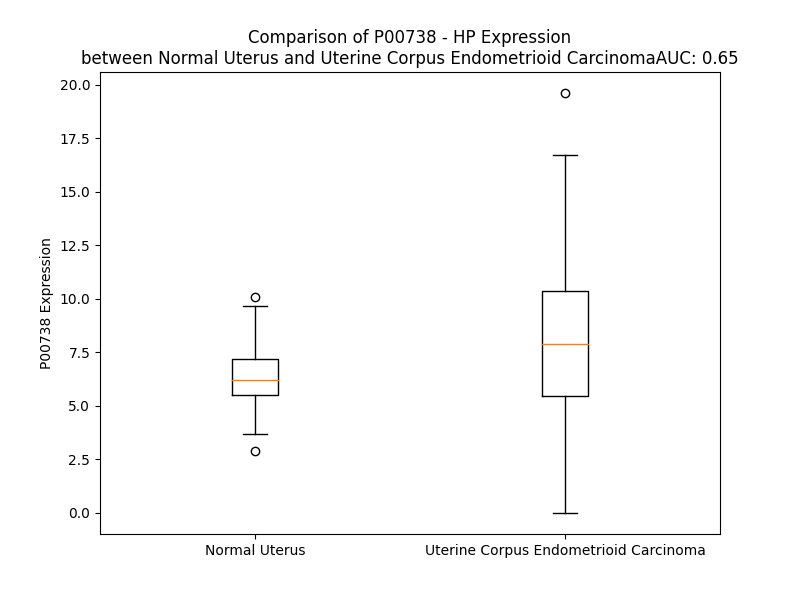

# Detailed Data for P00738

## Introduction to the Detailed Summary

### How to Interpret the Results

- **Summary & Metrics**: This section provides a quick reference to essential protein attributes, including expression changes, family classification, and biomarker applications. Regulation status (upregulated/downregulated) indicates the protein's behavior in a disease context. Some information comes from the original excel file with the proteins selected from literature, while others are derived from the analyses.
- **Expression Comparison**: A visual representation comparing protein expression between normal and disease states. It highlights significant changes in expression levels that might indicate diagnostic or therapeutic relevance. This is data coming from transcriptomics experiments and could not translate similarly to protein levels.
- **Isoform Alignment**: An interactive view of isoform alignments, revealing structural and functional differences between variants of the protein.
- **Interactors & Homologs**: Tables listing known interaction partners and homologous proteins, the more interactors and homologs, the more complex the protein is to design an antibody for.
- **Biological Assemblies**: Information about the structural arrangement of the protein in different assemblies, providing insights into its functional state but also the complexity of the protein to develop antibodies.
- **Combined Per-Residue Information**: A detailed table summarizing residue-level data. This includes predictions for epitope regions, aggregation tendencies, and modifications that might impact the protein's function. Each row corresponds to a residue in the protein, providing insights into specific sites that may be important for research or drug development.
## Summary & Metrics

- **UniProt Accession**: P00738
- **Gene Name**: HP
- **Protein Name**: haptoglobin
- **Swiss Prot**: nan
- **Family**: peptidase
- **Biomarker Application**: diagnosis,disease progression,efficacy,unspecified application
- **Number of Isoforms**: 2
- **Regulation**: -1
- **(transcriptomics) AUC**: 0.65
- **(transcriptomics) Fold Change**: 1.26
- **(transcriptomics) Regulation**: Upregulated
- **Discotope Epitope Count**: 85
- **Max n_uniprots (Homo)**: N/A
- **Max n_uniprots (Hetero)**: 10.0

## Expression Comparison

## Isoform Alignment

<pre style='font-size:14px; font-family:monospace;'>P00738-1 MSALGAVIALLLWGQLFAVDSGNDVTDIADDGCPKPPEIAHGYVEHSVRYQCKNYYKLRTEGDGVYTLNDKKQWINKAVGDKLPECEADDGCPKPPEIAHGYVEHSVRYQCKNYYKLRTEGDGVYTLNNEKQWINKAVGDKLPECEAVCGKPKNPANPVQRILGGHLDAKGSFPWQAKMVSHHNLTTGATLINEQWLLTTAKNLFLNHSENATAKDIAPTLTLYVGKKQLVEIEKVVLHPNYSQVDIGLIKLKQKVSVNERVMPICLPSKDYAEVGRVGYVSGWGRNANFKFTDHLKYVMLPVADQDQCIRHYEGSTVPEKKTPKSPVGVQPILNEHTFCAGMSKYQEDTCYGDAGSAFAVHDLEEDTWYATGILSFDKSCAVAEYGVYVKVTSIQDWVQKTIAEN
P00738-2 MSALGAVIALLLWGQLFAVDSGNDVTDIADDGCPKPPEIAHGYVEHSVRYQCK-----------------------------------------------------------NYYKLRTEGDGVYTLNNEKQWINKAVGDKLPECEAVCGKPKNPANPVQRILGGHLDAKGSFPWQAKMVSHHNLTTGATLINEQWLLTTAKNLFLNHSENATAKDIAPTLTLYVGKKQLVEIEKVVLHPNYSQVDIGLIKLKQKVSVNERVMPICLPSKDYAEVGRVGYVSGWGRNANFKFTDHLKYVMLPVADQDQCIRHYEGSTVPEKKTPKSPVGVQPILNEHTFCAGMSKYQEDTCYGDAGSAFAVHDLEEDTWYATGILSFDKSCAVAEYGVYVKVTSIQDWVQKTIAEN
</pre>

## Interactors

| preferredName_A   | preferredName_B   |   score |
|:------------------|:------------------|--------:|
| HP                | CD163             |   0.999 |
| HP                | APOA1             |   0.998 |
| HP                | A2M               |   0.997 |
| HP                | HBA2              |   0.997 |
| HP                | ALB               |   0.995 |
| HP                | HBA1              |   0.995 |
| HP                | HBB               |   0.995 |
| HP                | HPX               |   0.994 |
| HP                | ORM1              |   0.973 |
| HP                | MB                |   0.972 |
| HP                | HPR               |   0.964 |
| HP                | SERPINA1          |   0.961 |
| HP                | ORM2              |   0.952 |
| HP                | CP                |   0.947 |
| HP                | GPT               |   0.918 |
| HP                | GC                |   0.906 |
| HP                | CRP               |   0.902 |

## Homologs

| uniprot_id   | gene_id   |
|:-------------|:----------|
| A0A0J9YWS8   | DLC1      |
| H3BUW7       | STARD13   |
| Q92502       | STARD8    |
| P00740       | F9        |
| F5H6S5       | C1RL      |
| Q5JVE7       | F10       |
| A0A1B0GVH4   | PRSS51    |
| Q6UWB4       | PRSS55    |
| P08709       | F7        |
| P03952       | KLKB1     |
| F5H3N3       | C1R       |
| Q04756       | HGFAC     |
| A0A8Q3WL37   | F12       |
| K7ERG9       | CFD       |
| P03951       | F11       |
| B5MCV4       | C1S       |
| G3XAM2       | CFI       |
| M0R132       | KLK10     |
| P00739       | HPR       |

## Biological Assemblies

|   Unnamed: 0 | crystal_id   |   assembly |   n_uniprots | composition   |
|-------------:|:-------------|-----------:|-------------:|:--------------|
|            0 | 4x0l         |          1 |            3 | Hetero        |
|            0 | 4wjg         |          1 |           10 | Hetero        |
|            1 | 4wjg         |          2 |           10 | Hetero        |
|            2 | 4wjg         |          3 |           10 | Hetero        |
|            0 | 5hu6         |          1 |            4 | Hetero        |

## Combined Per-Residue Information

|   res | aa   |   epitope_score | epitope   |   relative_surface_accessibility |   modeling_confidence |   Aggregation | modification   | glycosylation                             |
|------:|:-----|----------------:|:----------|---------------------------------:|----------------------:|--------------:|:---------------|:------------------------------------------|
|     1 | M    |         0.10053 | False     |                          1.28878 |                 42.08 |         0     | N/A            | N/A                                       |
|     2 | S    |         0.19577 | True      |                          0.87375 |                 35.96 |         6.146 | N/A            | N/A                                       |
|     3 | A    |         0.14636 | False     |                          0.93916 |                 40.47 |        25.767 | N/A            | N/A                                       |
|     4 | L    |         0.21305 | True      |                          1.15133 |                 38.42 |        38.429 | N/A            | N/A                                       |
|     5 | G    |         0.20956 | True      |                          0.91    |                 43.31 |        40.746 | N/A            | N/A                                       |
|     6 | A    |         0.13174 | False     |                          0.91858 |                 43.08 |        66.476 | N/A            | N/A                                       |
|     7 | V    |         0.1543  | False     |                          1.02959 |                 44.01 |        96.807 | N/A            | N/A                                       |
|     8 | I    |         0.17281 | False     |                          0.91366 |                 39.42 |        99.339 | N/A            | N/A                                       |
|     9 | A    |         0.16638 | False     |                          0.92698 |                 43.05 |        99.535 | N/A            | N/A                                       |
|    10 | L    |         0.16078 | False     |                          0.85944 |                 40.47 |        99.661 | N/A            | N/A                                       |
|    11 | L    |         0.17632 | False     |                          0.76655 |                 38.58 |        99.535 | N/A            | N/A                                       |
|    12 | L    |         0.19296 | True      |                          1.10058 |                 40.48 |        98.198 | N/A            | N/A                                       |
|    13 | W    |         0.20466 | True      |                          1.00594 |                 40.02 |        90.633 | N/A            | N/A                                       |
|    14 | G    |         0.16489 | False     |                          0.98551 |                 43.24 |        59.273 | N/A            | N/A                                       |
|    15 | Q    |         0.12067 | False     |                          0.78801 |                 40.65 |        56.442 | N/A            | N/A                                       |
|    16 | L    |         0.17023 | False     |                          1.03289 |                 41.14 |        56.331 | N/A            | N/A                                       |
|    17 | F    |         0.15474 | False     |                          0.92474 |                 41.79 |        55.725 | N/A            | N/A                                       |
|    18 | A    |         0.14254 | False     |                          0.8063  |                 38.9  |        48.291 | N/A            | N/A                                       |
|    19 | V    |         0.18417 | False     |                          0.96936 |                 36.39 |        44.51  | N/A            | N/A                                       |
|    20 | D    |         0.13261 | False     |                          0.85326 |                 34.41 |         0     | N/A            | N/A                                       |
|    21 | S    |         0.15127 | False     |                          0.79913 |                 42.45 |         0     | N/A            | N/A                                       |
|    22 | G    |         0.17347 | False     |                          0.86455 |                 34.99 |         0     | N/A            | N/A                                       |
|    23 | N    |         0.1691  | False     |                          0.85831 |                 40.3  |         0     | N/A            | N/A                                       |
|    24 | D    |         0.1623  | False     |                          0.94245 |                 38.33 |         0     | N/A            | N/A                                       |
|    25 | V    |         0.17959 | False     |                          0.76378 |                 45.91 |         0     | N/A            | N/A                                       |
|    26 | T    |         0.20916 | True      |                          0.87009 |                 35.93 |         0     | N/A            | N/A                                       |
|    27 | D    |         0.13983 | False     |                          0.7821  |                 35.69 |         0     | N/A            | N/A                                       |
|    28 | I    |         0.19778 | True      |                          0.9941  |                 41.39 |         0     | N/A            | N/A                                       |
|    29 | A    |         0.15439 | False     |                          0.88215 |                 38.46 |         0     | N/A            | N/A                                       |
|    30 | D    |         0.18209 | False     |                          0.85687 |                 48.11 |         0     | N/A            | N/A                                       |
|    31 | D    |         0.20966 | True      |                          0.72586 |                 54.22 |         0     | N/A            | N/A                                       |
|    32 | G    |         0.15616 | False     |                          0.56853 |                 67.55 |         0     | N/A            | N/A                                       |
|    33 | C    |         0.17311 | False     |                          0.75478 |                 72.18 |         0     | N/A            | N/A                                       |
|    34 | P    |         0.10269 | False     |                          0.36573 |                 83.83 |         0     | N/A            | N/A                                       |
|    35 | K    |         0.15447 | False     |                          0.79929 |                 86.39 |         0     | N/A            | N/A                                       |
|    36 | P    |         0.07795 | False     |                          0.11575 |                 87.8  |         0     | N/A            | N/A                                       |
|    37 | P    |         0.07489 | False     |                          0.40359 |                 90.49 |         0     | N/A            | N/A                                       |
|    38 | E    |         0.1814  | False     |                          0.78006 |                 90.16 |         0     | N/A            | N/A                                       |
|    39 | I    |         0.06769 | False     |                          0.13322 |                 89.83 |         0     | N/A            | N/A                                       |
|    40 | A    |         0.08296 | False     |                          0.7476  |                 89.05 |         0     | N/A            | N/A                                       |
|    41 | H    |         0.10944 | False     |                          0.46179 |                 87.41 |         0     | N/A            | N/A                                       |
|    42 | G    |         0.04318 | False     |                          0.12373 |                 87.95 |         0     | N/A            | N/A                                       |
|    43 | Y    |         0.20018 | True      |                          0.47184 |                 89.15 |         0     | N/A            | N/A                                       |
|    44 | V    |         0.05589 | False     |                          0.31215 |                 88.63 |         0     | N/A            | N/A                                       |
|    45 | E    |         0.2289  | True      |                          0.28262 |                 86.35 |         0     | N/A            | N/A                                       |
|    46 | H    |         0.27603 | True      |                          0.80952 |                 85.02 |         0     | N/A            | N/A                                       |
|    47 | S    |         0.1728  | False     |                          0.53655 |                 82.29 |         0     | N/A            | N/A                                       |
|    48 | V    |         0.16182 | False     |                          0.42367 |                 87.11 |         0     | N/A            | N/A                                       |
|    49 | R    |         0.31309 | True      |                          0.37921 |                 89.8  |         0     | N/A            | N/A                                       |
|    50 | Y    |         0.01393 | False     |                          0.0071  |                 90.45 |         0     | N/A            | N/A                                       |
|    51 | Q    |         0.13041 | False     |                          0.27698 |                 87.18 |         0     | N/A            | N/A                                       |
|    52 | C    |         0.07056 | False     |                          0.16446 |                 86.07 |         0     | N/A            | N/A                                       |
|    53 | K    |         0.1516  | False     |                          0.57419 |                 82.58 |         0     | N/A            | N/A                                       |
|    54 | N    |         0.23589 | True      |                          0.78018 |                 70.51 |         0     | N/A            | N/A                                       |
|    55 | Y    |         0.11057 | False     |                          0.44543 |                 67.81 |         0     | N/A            | N/A                                       |
|    56 | Y    |         0.17227 | False     |                          0.31952 |                 78.74 |         0     | N/A            | N/A                                       |
|    57 | K    |         0.06561 | False     |                          0.39822 |                 82.51 |         0     | N/A            | N/A                                       |
|    58 | L    |         0.04963 | False     |                          0.36239 |                 85.37 |         0     | N/A            | N/A                                       |
|    59 | R    |         0.21334 | True      |                          0.60589 |                 81.72 |         0     | N/A            | N/A                                       |
|    60 | T    |         0.1742  | False     |                          0.14969 |                 71.09 |         0     | N/A            | N/A                                       |
|    61 | E    |         0.19698 | True      |                          0.75824 |                 69.74 |         0     | N/A            | N/A                                       |
|    62 | G    |         0.16082 | False     |                          0.46395 |                 71.12 |         0     | N/A            | N/A                                       |
|    63 | D    |         0.22756 | True      |                          0.54846 |                 81.68 |         0     | N/A            | N/A                                       |
|    64 | G    |         0.04987 | False     |                          0.04785 |                 85.27 |         0     | N/A            | N/A                                       |
|    65 | V    |         0.12919 | False     |                          0.25996 |                 89.91 |         0.305 | N/A            | N/A                                       |
|    66 | Y    |         0.03689 | False     |                          0.00746 |                 90.09 |         0.305 | N/A            | N/A                                       |
|    67 | T    |         0.19698 | True      |                          0.51917 |                 89.91 |         0.305 | N/A            | N/A                                       |
|    68 | L    |         0.18926 | True      |                          0.33327 |                 88.63 |         0.305 | N/A            | N/A                                       |
|    69 | N    |         0.1099  | False     |                          0.29485 |                 86.94 |         0.305 | N/A            | N/A                                       |
|    70 | D    |         0.28141 | True      |                          0.97165 |                 85.29 |         0     | N/A            | N/A                                       |
|    71 | K    |         0.16055 | False     |                          0.80839 |                 85.94 |         0     | N/A            | N/A                                       |
|    72 | K    |         0.15123 | False     |                          0.5316  |                 84.82 |         0     | N/A            | N/A                                       |
|    73 | Q    |         0.09893 | False     |                          0.44918 |                 87.12 |         0     | N/A            | N/A                                       |
|    74 | W    |         0.13332 | False     |                          0.12931 |                 87.76 |         0     | N/A            | N/A                                       |
|    75 | I    |         0.17789 | False     |                          0.31992 |                 90.26 |         0     | N/A            | N/A                                       |
|    76 | N    |         0.05393 | False     |                          0.01905 |                 89.94 |         0     | N/A            | N/A                                       |
|    77 | K    |         0.24587 | True      |                          0.99917 |                 87.5  |         0     | N/A            | N/A                                       |
|    78 | A    |         0.22536 | True      |                          0.67199 |                 87.07 |         0     | N/A            | N/A                                       |
|    79 | V    |         0.25197 | True      |                          0.2867  |                 87.27 |         0     | N/A            | N/A                                       |
|    80 | G    |         0.13014 | False     |                          0.35786 |                 88.74 |         0     | N/A            | N/A                                       |
|    81 | D    |         0.30584 | True      |                          0.61709 |                 87.52 |         0     | N/A            | N/A                                       |
|    82 | K    |         0.16549 | False     |                          0.56038 |                 88.5  |         0     | N/A            | N/A                                       |
|    83 | L    |         0.10906 | False     |                          0.36297 |                 88.34 |         0     | N/A            | N/A                                       |
|    84 | P    |         0.04491 | False     |                          0.03052 |                 88.56 |         0     | N/A            | N/A                                       |
|    85 | E    |         0.10836 | False     |                          0.35571 |                 88.78 |         0     | N/A            | N/A                                       |
|    86 | C    |         0.07148 | False     |                          0.11948 |                 86.39 |         0     | N/A            | N/A                                       |
|    87 | E    |         0.10977 | False     |                          0.333   |                 84.39 |         0     | N/A            | N/A                                       |
|    88 | A    |         0.12377 | False     |                          0.60701 |                 75.61 |         0     | N/A            | N/A                                       |
|    89 | D    |         0.2005  | True      |                          0.22998 |                 71.71 |         0     | N/A            | N/A                                       |
|    90 | D    |         0.23666 | True      |                          0.82784 |                 67.53 |         0     | N/A            | N/A                                       |
|    91 | G    |         0.30362 | True      |                          0.50004 |                 68.54 |         0     | N/A            | N/A                                       |
|    92 | C    |         0.16849 | False     |                          0.2898  |                 70.24 |         0     | N/A            | N/A                                       |
|    93 | P    |         0.09073 | False     |                          0.39109 |                 82.37 |         0     | N/A            | N/A                                       |
|    94 | K    |         0.17338 | False     |                          0.89339 |                 84.67 |         0     | N/A            | N/A                                       |
|    95 | P    |         0.07973 | False     |                          0.19493 |                 88.2  |         0     | N/A            | N/A                                       |
|    96 | P    |         0.08085 | False     |                          0.39862 |                 91.65 |         0     | N/A            | N/A                                       |
|    97 | E    |         0.15638 | False     |                          0.88597 |                 91.92 |         0     | N/A            | N/A                                       |
|    98 | I    |         0.09901 | False     |                          0.1277  |                 93.35 |         0     | N/A            | N/A                                       |
|    99 | A    |         0.09429 | False     |                          0.74303 |                 92.78 |         0     | N/A            | N/A                                       |
|   100 | H    |         0.04726 | False     |                          0.30023 |                 93.31 |         0     | N/A            | N/A                                       |
|   101 | G    |         0.0637  | False     |                          0.11421 |                 92.93 |         0     | N/A            | N/A                                       |
|   102 | Y    |         0.20071 | True      |                          0.46357 |                 92.25 |         0     | N/A            | N/A                                       |
|   103 | V    |         0.0724  | False     |                          0.31794 |                 90.55 |         0     | N/A            | N/A                                       |
|   104 | E    |         0.24553 | True      |                          0.29134 |                 87.03 |         0     | N/A            | N/A                                       |
|   105 | H    |         0.26822 | True      |                          0.83251 |                 83.5  |         0     | N/A            | N/A                                       |
|   106 | S    |         0.1582  | False     |                          0.56171 |                 80.77 |         0     | N/A            | N/A                                       |
|   107 | V    |         0.11428 | False     |                          0.24944 |                 86.26 |         0     | N/A            | N/A                                       |
|   108 | R    |         0.308   | True      |                          0.36561 |                 91.71 |         0     | N/A            | N/A                                       |
|   109 | Y    |         0.03409 | False     |                          0.0242  |                 94.04 |         0     | N/A            | N/A                                       |
|   110 | Q    |         0.12788 | False     |                          0.27394 |                 93.09 |         0     | N/A            | N/A                                       |
|   111 | C    |         0.06652 | False     |                          0.17343 |                 94.78 |         0     | N/A            | N/A                                       |
|   112 | K    |         0.09275 | False     |                          0.53541 |                 94.27 |         0     | N/A            | N/A                                       |
|   113 | N    |         0.22843 | True      |                          0.81867 |                 92.61 |         0     | N/A            | N/A                                       |
|   114 | Y    |         0.0765  | False     |                          0.30344 |                 94.66 |         0     | N/A            | N/A                                       |
|   115 | Y    |         0.0626  | False     |                          0.1043  |                 95.78 |         0     | N/A            | N/A                                       |
|   116 | K    |         0.06252 | False     |                          0.50146 |                 94.04 |         0     | N/A            | N/A                                       |
|   117 | L    |         0.07043 | False     |                          0.34759 |                 93.46 |         0     | N/A            | N/A                                       |
|   118 | R    |         0.16711 | False     |                          0.62612 |                 91.72 |         0     | N/A            | N/A                                       |
|   119 | T    |         0.08915 | False     |                          0.12006 |                 88.73 |         0     | N/A            | N/A                                       |
|   120 | E    |         0.31069 | True      |                          0.70757 |                 87.7  |         0     | N/A            | N/A                                       |
|   121 | G    |         0.21232 | True      |                          0.52076 |                 86.32 |         0     | N/A            | N/A                                       |
|   122 | D    |         0.30229 | True      |                          0.53727 |                 88.43 |         0     | N/A            | N/A                                       |
|   123 | G    |         0.03049 | False     |                          0.02484 |                 90.73 |         0.262 | N/A            | N/A                                       |
|   124 | V    |         0.09495 | False     |                          0.24311 |                 93.25 |         0.262 | N/A            | N/A                                       |
|   125 | Y    |         0.03856 | False     |                          0.00812 |                 92.57 |         0.262 | N/A            | N/A                                       |
|   126 | T    |         0.1275  | False     |                          0.47139 |                 90.67 |         0.262 | N/A            | N/A                                       |
|   127 | L    |         0.14388 | False     |                          0.24394 |                 88.09 |         0.262 | N/A            | N/A                                       |
|   128 | N    |         0.12404 | False     |                          0.33694 |                 87.2  |         0     | N/A            | N/A                                       |
|   129 | N    |         0.27438 | True      |                          1.03497 |                 83.64 |         0     | N/A            | N/A                                       |
|   130 | E    |         0.22001 | True      |                          0.69034 |                 85.65 |         0     | N/A            | N/A                                       |
|   131 | K    |         0.2053  | True      |                          0.53485 |                 83.65 |         0     | N/A            | N/A                                       |
|   132 | Q    |         0.13775 | False     |                          0.43063 |                 88.34 |         0     | N/A            | N/A                                       |
|   133 | W    |         0.12257 | False     |                          0.09726 |                 90.12 |         0     | N/A            | N/A                                       |
|   134 | I    |         0.16426 | False     |                          0.28507 |                 92.89 |         0     | N/A            | N/A                                       |
|   135 | N    |         0.04571 | False     |                          0.02118 |                 93.77 |         0     | N/A            | N/A                                       |
|   136 | K    |         0.31982 | True      |                          1.00587 |                 92.85 |         0     | N/A            | N/A                                       |
|   137 | A    |         0.25479 | True      |                          0.60877 |                 93.14 |         0     | N/A            | N/A                                       |
|   138 | V    |         0.22695 | True      |                          0.26228 |                 93.03 |         0     | N/A            | N/A                                       |
|   139 | G    |         0.17961 | False     |                          0.35441 |                 92.93 |         0     | N/A            | N/A                                       |
|   140 | D    |         0.28413 | True      |                          0.6031  |                 91.56 |         0     | N/A            | N/A                                       |
|   141 | K    |         0.12941 | False     |                          0.54252 |                 93.02 |         0     | N/A            | N/A                                       |
|   142 | L    |         0.08112 | False     |                          0.38327 |                 92.71 |         0     | N/A            | N/A                                       |
|   143 | P    |         0.04286 | False     |                          0.03341 |                 94.01 |         0     | N/A            | N/A                                       |
|   144 | E    |         0.06317 | False     |                          0.34801 |                 94.08 |         0     | N/A            | N/A                                       |
|   145 | C    |         0.07508 | False     |                          0.10824 |                 94.71 |         0     | N/A            | N/A                                       |
|   146 | E    |         0.04667 | False     |                          0.28837 |                 94.7  |         0     | N/A            | N/A                                       |
|   147 | A    |         0.02407 | False     |                          0.14983 |                 96.78 |         0     | N/A            | N/A                                       |
|   148 | V    |         0.03165 | False     |                          0.22088 |                 97.05 |         0     | N/A            | N/A                                       |
|   149 | C    |         0.03602 | False     |                          0.25445 |                 97.76 |         0     | N/A            | N/A                                       |
|   150 | G    |         0.0022  | False     |                          0       |                 97.73 |         0     | N/A            | N/A                                       |
|   151 | K    |         0.09306 | False     |                          0.36496 |                 96.57 |         0     | N/A            | N/A                                       |
|   152 | P    |         0.03322 | False     |                          0.10278 |                 95.35 |         0     | N/A            | N/A                                       |
|   153 | K    |         0.19484 | True      |                          0.59697 |                 92.97 |         0     | N/A            | N/A                                       |
|   154 | N    |         0.05767 | False     |                          0.29276 |                 90.97 |         0     | N/A            | N/A                                       |
|   155 | P    |         0.08544 | False     |                          0.50923 |                 89.5  |         0     | N/A            | N/A                                       |
|   156 | A    |         0.0509  | False     |                          0.10969 |                 85.49 |         0     | N/A            | N/A                                       |
|   157 | N    |         0.11716 | False     |                          0.51618 |                 72.11 |         0     | N/A            | N/A                                       |
|   158 | P    |         0.14369 | False     |                          0.65049 |                 64.25 |         0     | N/A            | N/A                                       |
|   159 | V    |         0.23612 | True      |                          0.84408 |                 58.73 |         0     | N/A            | N/A                                       |
|   160 | Q    |         0.16356 | False     |                          0.56932 |                 48.61 |         0     | N/A            | N/A                                       |
|   161 | R    |         0.26451 | True      |                          0.81228 |                 41.01 |         0     | N/A            | N/A                                       |
|   162 | I    |         0.23295 | True      |                          0.53947 |                 46.79 |         0     | N/A            | N/A                                       |
|   163 | L    |         0.23459 | True      |                          0.99778 |                 47.71 |         0     | N/A            | N/A                                       |
|   164 | G    |         0.16078 | False     |                          0.56447 |                 57.64 |         0     | N/A            | N/A                                       |
|   165 | G    |         0.07028 | False     |                          0.01847 |                 66.27 |         0     | N/A            | N/A                                       |
|   166 | H    |         0.04486 | False     |                          0.05488 |                 76.75 |         0     | N/A            | N/A                                       |
|   167 | L    |         0.12984 | False     |                          0.47991 |                 82.12 |         0     | N/A            | N/A                                       |
|   168 | D    |         0.06679 | False     |                          0.08916 |                 80.57 |         0     | N/A            | N/A                                       |
|   169 | A    |         0.13665 | False     |                          0.66381 |                 72.5  |         0     | N/A            | N/A                                       |
|   170 | K    |         0.09223 | False     |                          0.5235  |                 83.42 |         0     | N/A            | N/A                                       |
|   171 | G    |         0.01896 | False     |                          0.103   |                 89.09 |         0     | N/A            | N/A                                       |
|   172 | S    |         0.03366 | False     |                          0.05891 |                 94.28 |         0     | N/A            | N/A                                       |
|   173 | F    |         0.016   | False     |                          0.03219 |                 96.29 |         0     | N/A            | N/A                                       |
|   174 | P    |         0.00921 | False     |                          0.03739 |                 96.92 |         0     | N/A            | N/A                                       |
|   175 | W    |         0.01047 | False     |                          0.01177 |                 98.17 |         0     | N/A            | N/A                                       |
|   176 | Q    |         0.0188  | False     |                          0.03124 |                 97.39 |         0     | N/A            | N/A                                       |
|   177 | A    |         0.00201 | False     |                          0       |                 97.19 |         0     | N/A            | N/A                                       |
|   178 | K    |         0.05939 | False     |                          0.25288 |                 95.53 |         0     | N/A            | N/A                                       |
|   179 | M    |         0.00976 | False     |                          0.00072 |                 95.09 |         0     | N/A            | N/A                                       |
|   180 | V    |         0.1186  | False     |                          0.13991 |                 92.74 |         0     | N/A            | N/A                                       |
|   181 | S    |         0.04439 | False     |                          0.04556 |                 88.42 |         0     | N/A            | N/A                                       |
|   182 | H    |         0.26565 | True      |                          0.6719  |                 79.22 |         0     | N/A            | N/A                                       |
|   183 | H    |         0.41479 | True      |                          0.56707 |                 80.37 |         0     | N/A            | N/A                                       |
|   184 | N    |         0.25769 | True      |                          0.7647  |                 85.64 |         0     | N/A            | N-linked (GlcNAc...) (complex) asparagine |
|   185 | L    |         0.241   | True      |                          0.4163  |                 88.39 |         0.15  | N/A            | N/A                                       |
|   186 | T    |         0.06105 | False     |                          0.07149 |                 91.28 |         0.15  | N/A            | N/A                                       |
|   187 | T    |         0.06667 | False     |                          0.05766 |                 93.94 |         0.15  | N/A            | N/A                                       |
|   188 | G    |         0.0202  | False     |                          0.00966 |                 95.54 |         0.15  | N/A            | N/A                                       |
|   189 | A    |         0.00429 | False     |                          0       |                 97.87 |         0.15  | N/A            | N/A                                       |
|   190 | T    |         0.00247 | False     |                          0.00072 |                 98.63 |         0.15  | N/A            | N/A                                       |
|   191 | L    |         0.00225 | False     |                          0.00577 |                 98.67 |         0.15  | N/A            | N/A                                       |
|   192 | I    |         0.0418  | False     |                          0.07593 |                 98.3  |         0.15  | N/A            | N/A                                       |
|   193 | N    |         0.03401 | False     |                          0.267   |                 96.79 |         0     | N/A            | N/A                                       |
|   194 | E    |         0.01211 | False     |                          0.055   |                 96.72 |         0     | N/A            | N/A                                       |
|   195 | Q    |         0.0711  | False     |                          0.19598 |                 97.62 |         0.473 | N/A            | N/A                                       |
|   196 | W    |         0.0176  | False     |                          0.03451 |                 98.56 |        12.551 | N/A            | N/A                                       |
|   197 | L    |         0.00354 | False     |                          0       |                 98.7  |        12.731 | N/A            | N/A                                       |
|   198 | L    |         0.00222 | False     |                          0       |                 98.51 |        12.731 | N/A            | N/A                                       |
|   199 | T    |         0.00664 | False     |                          0       |                 98.04 |        12.731 | N/A            | N/A                                       |
|   200 | T    |         0.00863 | False     |                          0.0029  |                 96.55 |        12.731 | N/A            | N/A                                       |
|   201 | A    |         0.01161 | False     |                          0.01403 |                 94.9  |         5.93  | N/A            | N/A                                       |
|   202 | K    |         0.1435  | False     |                          0.46045 |                 92.17 |         0     | N/A            | N/A                                       |
|   203 | N    |         0.04964 | False     |                          0.04901 |                 93.03 |         0     | N/A            | N/A                                       |
|   204 | L    |         0.00697 | False     |                          0.00305 |                 92.43 |         0     | N/A            | N/A                                       |
|   205 | F    |         0.10004 | False     |                          0.1855  |                 84.81 |         0     | N/A            | N/A                                       |
|   206 | L    |         0.18328 | False     |                          0.30627 |                 79.44 |         0     | N/A            | N/A                                       |
|   207 | N    |         0.31742 | True      |                          0.58563 |                 71.73 |         0     | N/A            | N-linked (GlcNAc...) asparagine           |
|   208 | H    |         0.15079 | False     |                          0.24886 |                 81.41 |         0     | N/A            | N/A                                       |
|   209 | S    |         0.42119 | True      |                          0.58123 |                 78.6  |         0     | N/A            | N/A                                       |
|   210 | E    |         0.3417  | True      |                          0.87788 |                 74.7  |         0     | N/A            | N/A                                       |
|   211 | N    |         0.31087 | True      |                          0.86765 |                 81.35 |         0     | N/A            | N-linked (GlcNAc...) asparagine           |
|   212 | A    |         0.13111 | False     |                          0.16209 |                 83.56 |         0     | N/A            | N/A                                       |
|   213 | T    |         0.248   | True      |                          0.52254 |                 84.2  |         0     | N/A            | N/A                                       |
|   214 | A    |         0.10637 | False     |                          0.30564 |                 82.15 |         0     | N/A            | N/A                                       |
|   215 | K    |         0.20652 | True      |                          0.87181 |                 85.78 |         0     | N/A            | N/A                                       |
|   216 | D    |         0.18463 | False     |                          0.45133 |                 88.46 |         0     | N/A            | N/A                                       |
|   217 | I    |         0.01765 | False     |                          0       |                 90.8  |         0     | N/A            | N/A                                       |
|   218 | A    |         0.0353  | False     |                          0.08163 |                 91.58 |         0     | N/A            | N/A                                       |
|   219 | P    |         0.25417 | True      |                          0.81745 |                 91.72 |         0     | N/A            | N/A                                       |
|   220 | T    |         0.10814 | False     |                          0.27051 |                 91.06 |         9.524 | N/A            | N/A                                       |
|   221 | L    |         0.05108 | False     |                          0.10341 |                 93.8  |        22.598 | N/A            | N/A                                       |
|   222 | T    |         0.14465 | False     |                          0.34123 |                 95.16 |        22.598 | N/A            | N/A                                       |
|   223 | L    |         0.00865 | False     |                          0       |                 96.61 |        22.598 | N/A            | N/A                                       |
|   224 | Y    |         0.12525 | False     |                          0.29752 |                 96.53 |        22.598 | N/A            | N/A                                       |
|   225 | V    |         0.01112 | False     |                          0.0221  |                 95.91 |        20.845 | N/A            | N/A                                       |
|   226 | G    |         0.05245 | False     |                          0.34613 |                 91.64 |         0.663 | N/A            | N/A                                       |
|   227 | K    |         0.1663  | False     |                          0.75969 |                 85.75 |         0     | N/A            | N/A                                       |
|   228 | K    |         0.21867 | True      |                          0.73135 |                 87.2  |         0     | N/A            | N/A                                       |
|   229 | Q    |         0.13014 | False     |                          0.42667 |                 93.82 |         0     | N/A            | N/A                                       |
|   230 | L    |         0.21227 | True      |                          0.67894 |                 96.65 |         0     | N/A            | N/A                                       |
|   231 | V    |         0.03376 | False     |                          0.12356 |                 97.23 |         0     | N/A            | N/A                                       |
|   232 | E    |         0.09894 | False     |                          0.512   |                 96.65 |         0     | N/A            | N/A                                       |
|   233 | I    |         0.1198  | False     |                          0.16938 |                 96.68 |         0.471 | N/A            | N/A                                       |
|   234 | E    |         0.08392 | False     |                          0.39515 |                 95.72 |         0.471 | N/A            | N/A                                       |
|   235 | K    |         0.13939 | False     |                          0.30401 |                 94.96 |         0.471 | N/A            | N/A                                       |
|   236 | V    |         0.01532 | False     |                          0.0183  |                 95.51 |         0.471 | N/A            | N/A                                       |
|   237 | V    |         0.05398 | False     |                          0.24468 |                 95.48 |         0.471 | N/A            | N/A                                       |
|   238 | L    |         0.09492 | False     |                          0.2215  |                 94.11 |         0.471 | N/A            | N/A                                       |
|   239 | H    |         0.13427 | False     |                          0.14413 |                 95.54 |         0     | N/A            | N/A                                       |
|   240 | P    |         0.1756  | False     |                          0.84724 |                 93.72 |         0     | N/A            | N/A                                       |
|   241 | N    |         0.19038 | True      |                          0.36144 |                 93.93 |         0     | N/A            | N-linked (GlcNAc...) (complex) asparagine |
|   242 | Y    |         0.29037 | True      |                          0.41636 |                 92.25 |         0     | N/A            | N/A                                       |
|   243 | S    |         0.20681 | True      |                          0.61376 |                 92.05 |         0     | N/A            | N/A                                       |
|   244 | Q    |         0.23003 | True      |                          0.4702  |                 94.8  |         0     | N/A            | N/A                                       |
|   245 | V    |         0.04277 | False     |                          0.02475 |                 96.66 |         0.128 | N/A            | N/A                                       |
|   246 | D    |         0.02138 | False     |                          0.01407 |                 96.87 |         0.128 | N/A            | N/A                                       |
|   247 | I    |         0.00366 | False     |                          0       |                 97.72 |         0.128 | N/A            | N/A                                       |
|   248 | G    |         0.00389 | False     |                          0       |                 96.86 |         0.128 | N/A            | N/A                                       |
|   249 | L    |         0.0051  | False     |                          0       |                 97.89 |         0.128 | N/A            | N/A                                       |
|   250 | I    |         0.00699 | False     |                          0       |                 97.98 |         0.128 | N/A            | N/A                                       |
|   251 | K    |         0.03768 | False     |                          0.09797 |                 97.97 |         0.128 | N/A            | N/A                                       |
|   252 | L    |         0.00854 | False     |                          0.00247 |                 98.11 |         0.128 | N/A            | N/A                                       |
|   253 | K    |         0.15662 | False     |                          0.57628 |                 97.02 |         0     | N/A            | N/A                                       |
|   254 | Q    |         0.11269 | False     |                          0.6521  |                 96.75 |         0     | N/A            | N/A                                       |
|   255 | K    |         0.0883  | False     |                          0.57881 |                 96.44 |         0     | N/A            | N/A                                       |
|   256 | V    |         0.03577 | False     |                          0.0376  |                 96.44 |         0     | N/A            | N/A                                       |
|   257 | S    |         0.10144 | False     |                          0.60642 |                 94.37 |         0     | N/A            | N/A                                       |
|   258 | V    |         0.02393 | False     |                          0.08432 |                 95.86 |         0     | N/A            | N/A                                       |
|   259 | N    |         0.0845  | False     |                          0.33274 |                 94.09 |         0     | N/A            | N/A                                       |
|   260 | E    |         0.14042 | False     |                          0.33169 |                 93.98 |         0     | N/A            | N/A                                       |
|   261 | R    |         0.09005 | False     |                          0.2749  |                 93.73 |         0     | N/A            | N/A                                       |
|   262 | V    |         0.03774 | False     |                          0.0238  |                 96.69 |         0     | N/A            | N/A                                       |
|   263 | M    |         0.02045 | False     |                          0.0187  |                 97.35 |         0     | N/A            | N/A                                       |
|   264 | P    |         0.00412 | False     |                          0.01292 |                 98.45 |         0     | N/A            | N/A                                       |
|   265 | I    |         0.01523 | False     |                          0.00177 |                 98.59 |         0     | N/A            | N/A                                       |
|   266 | C    |         0.02002 | False     |                          0.07527 |                 98.32 |         0     | N/A            | N/A                                       |
|   267 | L    |         0.04723 | False     |                          0.27217 |                 97.77 |         0     | N/A            | N/A                                       |
|   268 | P    |         0.00842 | False     |                          0.00099 |                 96.47 |         0     | N/A            | N/A                                       |
|   269 | S    |         0.10847 | False     |                          0.80571 |                 92.01 |         0     | N/A            | N/A                                       |
|   270 | K    |         0.13545 | False     |                          0.447   |                 93.97 |         0     | N/A            | N/A                                       |
|   271 | D    |         0.12557 | False     |                          0.37861 |                 94.16 |         0     | N/A            | N/A                                       |
|   272 | Y    |         0.05609 | False     |                          0.08198 |                 95.58 |         0     | N/A            | N/A                                       |
|   273 | A    |         0.02648 | False     |                          0.15311 |                 96.33 |         0     | N/A            | N/A                                       |
|   274 | E    |         0.1248  | False     |                          0.6216  |                 96.4  |         0     | N/A            | N/A                                       |
|   275 | V    |         0.14137 | False     |                          0.73131 |                 97.54 |         0     | N/A            | N/A                                       |
|   276 | G    |         0.04709 | False     |                          0.54002 |                 96.08 |         0     | N/A            | N/A                                       |
|   277 | R    |         0.10829 | False     |                          0.36241 |                 95.69 |         0     | N/A            | N/A                                       |
|   278 | V    |         0.05625 | False     |                          0.51214 |                 94.62 |         0     | N/A            | N/A                                       |
|   279 | G    |         0.00346 | False     |                          0       |                 95.51 |         0     | N/A            | N/A                                       |
|   280 | Y    |         0.02852 | False     |                          0.10583 |                 95.11 |         0     | N/A            | N/A                                       |
|   281 | V    |         0.01248 | False     |                          0.0224  |                 95.31 |         0     | N/A            | N/A                                       |
|   282 | S    |         0.0095  | False     |                          0.01717 |                 94.1  |         0     | N/A            | N/A                                       |
|   283 | G    |         0.04997 | False     |                          0.09753 |                 92.69 |         0     | N/A            | N/A                                       |
|   284 | W    |         0.0606  | False     |                          0.12037 |                 89.66 |         0     | N/A            | N/A                                       |
|   285 | G    |         0.04007 | False     |                          0.11585 |                 80.81 |         0     | N/A            | N/A                                       |
|   286 | R    |         0.28928 | True      |                          0.3612  |                 79.5  |         0     | N/A            | N/A                                       |
|   287 | N    |         0.10727 | False     |                          0.33983 |                 70.06 |         0     | N/A            | N/A                                       |
|   288 | A    |         0.24724 | True      |                          0.96519 |                 66.14 |         0     | N/A            | N/A                                       |
|   289 | N    |         0.3549  | True      |                          0.71786 |                 66.01 |         0     | N/A            | N/A                                       |
|   290 | F    |         0.44756 | True      |                          0.81054 |                 69.97 |         0     | N/A            | N/A                                       |
|   291 | K    |         0.36161 | True      |                          0.70465 |                 73.45 |         0     | N/A            | N/A                                       |
|   292 | F    |         0.28084 | True      |                          0.37186 |                 71.37 |         0     | N/A            | N/A                                       |
|   293 | T    |         0.09712 | False     |                          0.13327 |                 75.74 |         0     | N/A            | N/A                                       |
|   294 | D    |         0.26671 | True      |                          0.67031 |                 79.43 |         0     | N/A            | N/A                                       |
|   295 | H    |         0.10737 | False     |                          0.61955 |                 85.05 |         0     | N/A            | N/A                                       |
|   296 | L    |         0.04055 | False     |                          0.15151 |                 89.69 |         0     | N/A            | N/A                                       |
|   297 | K    |         0.14265 | False     |                          0.27011 |                 90.04 |         0     | N/A            | N/A                                       |
|   298 | Y    |         0.05559 | False     |                          0.06219 |                 91.64 |         0     | N/A            | N/A                                       |
|   299 | V    |         0.0284  | False     |                          0.09425 |                 91.22 |         0     | N/A            | N/A                                       |
|   300 | M    |         0.0387  | False     |                          0.16882 |                 92.4  |         0     | N/A            | N/A                                       |
|   301 | L    |         0.00347 | False     |                          0       |                 94.08 |         0     | N/A            | N/A                                       |
|   302 | P    |         0.05101 | False     |                          0.29623 |                 96.25 |         0     | N/A            | N/A                                       |
|   303 | V    |         0.02013 | False     |                          0.03399 |                 97.99 |         0     | N/A            | N/A                                       |
|   304 | A    |         0.02274 | False     |                          0.12011 |                 97.83 |         0     | N/A            | N/A                                       |
|   305 | D    |         0.08228 | False     |                          0.29638 |                 97.85 |         0     | N/A            | N/A                                       |
|   306 | Q    |         0.05262 | False     |                          0.27446 |                 97.06 |         0     | N/A            | N/A                                       |
|   307 | D    |         0.1279  | False     |                          0.38521 |                 97.2  |         0     | N/A            | N/A                                       |
|   308 | Q    |         0.17851 | False     |                          0.47938 |                 97.1  |         0     | N/A            | N/A                                       |
|   309 | C    |         0.00385 | False     |                          0       |                 97.32 |         0     | N/A            | N/A                                       |
|   310 | I    |         0.08091 | False     |                          0.13279 |                 97.19 |         0     | N/A            | N/A                                       |
|   311 | R    |         0.26387 | True      |                          0.39461 |                 96.75 |         0     | N/A            | N/A                                       |
|   312 | H    |         0.11649 | False     |                          0.20394 |                 95.8  |         0     | N/A            | N/A                                       |
|   313 | Y    |         0.01017 | False     |                          0       |                 96.83 |         0     | N/A            | N/A                                       |
|   314 | E    |         0.12072 | False     |                          0.15262 |                 96.38 |         0     | N/A            | N/A                                       |
|   315 | G    |         0.15053 | False     |                          0.41716 |                 94.64 |         0     | N/A            | N/A                                       |
|   316 | S    |         0.13179 | False     |                          0.13309 |                 95.49 |         0     | N/A            | N/A                                       |
|   317 | T    |         0.19065 | True      |                          0.33853 |                 95.43 |         0     | N/A            | N/A                                       |
|   318 | V    |         0.25719 | True      |                          0.46842 |                 95.66 |         0     | N/A            | N/A                                       |
|   319 | P    |         0.28029 | True      |                          0.71567 |                 92.84 |         0     | N/A            | N/A                                       |
|   320 | E    |         0.4002  | True      |                          0.78547 |                 95.73 |         0     | N/A            | N/A                                       |
|   321 | K    |         0.33449 | True      |                          0.67755 |                 95.82 |         0     | N/A            | N/A                                       |
|   322 | K    |         0.17788 | False     |                          0.35289 |                 95.27 |         0     | N/A            | N/A                                       |
|   323 | T    |         0.13248 | False     |                          0.55623 |                 93.8  |         0     | N/A            | N/A                                       |
|   324 | P    |         0.28597 | True      |                          0.85642 |                 93.35 |         0     | N/A            | N/A                                       |
|   325 | K    |         0.2568  | True      |                          0.63796 |                 93.52 |         0     | N/A            | N/A                                       |
|   326 | S    |         0.14488 | False     |                          0.12961 |                 92.27 |         0     | N/A            | N/A                                       |
|   327 | P    |         0.23102 | True      |                          0.51126 |                 91.16 |         0     | N/A            | N/A                                       |
|   328 | V    |         0.23272 | True      |                          0.22823 |                 90.04 |         0     | N/A            | N/A                                       |
|   329 | G    |         0.3366  | True      |                          0.87591 |                 90.21 |         0     | N/A            | N/A                                       |
|   330 | V    |         0.35794 | True      |                          0.51031 |                 92.35 |         0     | N/A            | N/A                                       |
|   331 | Q    |         0.15402 | False     |                          0.37138 |                 93.67 |         0     | N/A            | N/A                                       |
|   332 | P    |         0.05233 | False     |                          0.07815 |                 95.78 |         0     | N/A            | N/A                                       |
|   333 | I    |         0.09716 | False     |                          0.22624 |                 96.05 |         0     | N/A            | N/A                                       |
|   334 | L    |         0.06973 | False     |                          0.11257 |                 96.69 |         0     | N/A            | N/A                                       |
|   335 | N    |         0.05495 | False     |                          0.22718 |                 95.68 |         0     | N/A            | N/A                                       |
|   336 | E    |         0.111   | False     |                          0.67654 |                 95.52 |         0     | N/A            | N/A                                       |
|   337 | H    |         0.10718 | False     |                          0.24315 |                 97.37 |         0     | N/A            | N/A                                       |
|   338 | T    |         0.08198 | False     |                          0.05891 |                 98.09 |         0     | N/A            | N/A                                       |
|   339 | F    |         0.026   | False     |                          0.04323 |                 98.32 |         0     | N/A            | N/A                                       |
|   340 | C    |         0.00319 | False     |                          0.00086 |                 98.14 |         0     | N/A            | N/A                                       |
|   341 | A    |         0.00379 | False     |                          0.00094 |                 97.34 |         0     | N/A            | N/A                                       |
|   342 | G    |         0.05638 | False     |                          0.09631 |                 94.84 |         0     | N/A            | N/A                                       |
|   343 | M    |         0.0974  | False     |                          0.33508 |                 90.6  |         0     | N/A            | N/A                                       |
|   344 | S    |         0.11007 | False     |                          0.07239 |                 87.04 |         0     | N/A            | N/A                                       |
|   345 | K    |         0.15953 | False     |                          0.82183 |                 83.24 |         0     | N/A            | N/A                                       |
|   346 | Y    |         0.15347 | False     |                          0.42264 |                 81.79 |         0     | N/A            | N/A                                       |
|   347 | Q    |         0.12497 | False     |                          0.70786 |                 84.1  |         0     | N/A            | N/A                                       |
|   348 | E    |         0.05083 | False     |                          0.08751 |                 85.4  |         0     | N/A            | N/A                                       |
|   349 | D    |         0.05737 | False     |                          0.14118 |                 87.3  |         0     | N/A            | N/A                                       |
|   350 | T    |         0.02366 | False     |                          0.01428 |                 90.01 |         0     | N/A            | N/A                                       |
|   351 | C    |         0.09843 | False     |                          0.15027 |                 89.1  |         0     | N/A            | N/A                                       |
|   352 | Y    |         0.22411 | True      |                          0.37413 |                 88.12 |         0     | N/A            | N/A                                       |
|   353 | G    |         0.04145 | False     |                          0.09443 |                 89.3  |         0     | N/A            | N/A                                       |
|   354 | D    |         0.06948 | False     |                          0.08456 |                 93.33 |         0     | N/A            | N/A                                       |
|   355 | A    |         0.04933 | False     |                          0.06377 |                 96.11 |         0     | N/A            | N/A                                       |
|   356 | G    |         0.0046  | False     |                          0       |                 97.68 |         0     | N/A            | N/A                                       |
|   357 | S    |         0.00861 | False     |                          0       |                 97.74 |         0.287 | N/A            | N/A                                       |
|   358 | A    |         0.00455 | False     |                          0.02317 |                 98.42 |         0.287 | N/A            | N/A                                       |
|   359 | F    |         0.00104 | False     |                          0       |                 98.22 |         0.287 | N/A            | N/A                                       |
|   360 | A    |         0.00363 | False     |                          0.0051  |                 98.19 |         0.287 | N/A            | N/A                                       |
|   361 | V    |         0.00489 | False     |                          0.00381 |                 96.92 |         0.287 | N/A            | N/A                                       |
|   362 | H    |         0.04357 | False     |                          0.23418 |                 95.57 |         0     | N/A            | N/A                                       |
|   363 | D    |         0.03118 | False     |                          0.04237 |                 95.13 |         0     | N/A            | N/A                                       |
|   364 | L    |         0.262   | True      |                          0.85709 |                 92.53 |         0     | N/A            | N/A                                       |
|   365 | E    |         0.14291 | False     |                          0.83982 |                 94.26 |         0     | N/A            | N/A                                       |
|   366 | E    |         0.12227 | False     |                          0.43396 |                 94.53 |         0     | N/A            | N/A                                       |
|   367 | D    |         0.09126 | False     |                          0.50493 |                 94.65 |         0     | N/A            | N/A                                       |
|   368 | T    |         0.04868 | False     |                          0.08136 |                 96.58 |         1.761 | N/A            | N/A                                       |
|   369 | W    |         0.02671 | False     |                          0.04228 |                 97.96 |        10.144 | N/A            | N/A                                       |
|   370 | Y    |         0.03622 | False     |                          0.1078  |                 98.37 |        12.642 | N/A            | N/A                                       |
|   371 | A    |         0.00106 | False     |                          0       |                 98.57 |        13.367 | N/A            | N/A                                       |
|   372 | T    |         0.00312 | False     |                          0.00998 |                 98.25 |        14.055 | N/A            | N/A                                       |
|   373 | G    |         0.00305 | False     |                          0       |                 98.55 |        15.222 | N/A            | N/A                                       |
|   374 | I    |         0.00529 | False     |                          0       |                 98.56 |        15.222 | N/A            | N/A                                       |
|   375 | L    |         0.00337 | False     |                          0       |                 98.04 |        14.929 | N/A            | N/A                                       |
|   376 | S    |         0.04007 | False     |                          0.08409 |                 97.22 |        12.344 | N/A            | N/A                                       |
|   377 | F    |         0.05989 | False     |                          0.04376 |                 95.33 |        12.344 | N/A            | N/A                                       |
|   378 | D    |         0.0411  | False     |                          0.03615 |                 92.43 |         0     | N/A            | N/A                                       |
|   379 | K    |         0.13614 | False     |                          0.27374 |                 87.72 |         0     | N/A            | N/A                                       |
|   380 | S    |         0.01502 | False     |                          0       |                 80.18 |         0.105 | N/A            | N/A                                       |
|   381 | C    |         0.08161 | False     |                          0.23667 |                 83.82 |         0.903 | N/A            | N/A                                       |
|   382 | A    |         0.14033 | False     |                          0.5632  |                 82.64 |         3.935 | N/A            | N/A                                       |
|   383 | V    |         0.22613 | True      |                          0.72023 |                 85.02 |         7.521 | N/A            | N/A                                       |
|   384 | A    |         0.06482 | False     |                          0.01934 |                 88.46 |         7.781 | N/A            | N/A                                       |
|   385 | E    |         0.1526  | False     |                          0.40682 |                 91.71 |         8.089 | N/A            | N/A                                       |
|   386 | Y    |         0.0811  | False     |                          0.11267 |                 95.8  |        28.347 | N/A            | N/A                                       |
|   387 | G    |         0.00476 | False     |                          0.00138 |                 96.36 |        28.671 | N/A            | N/A                                       |
|   388 | V    |         0.00813 | False     |                          0.00476 |                 97.78 |        29.281 | N/A            | N/A                                       |
|   389 | Y    |         0.0063  | False     |                          0       |                 98.46 |        29.281 | N/A            | N/A                                       |
|   390 | V    |         0.00626 | False     |                          0.00666 |                 98.47 |        29.281 | N/A            | N/A                                       |
|   391 | K    |         0.0218  | False     |                          0.20746 |                 98.04 |        11.478 | N/A            | N/A                                       |
|   392 | V    |         0.00178 | False     |                          0       |                 98.28 |        11.203 | N/A            | N/A                                       |
|   393 | T    |         0.0696  | False     |                          0.25515 |                 97.46 |         7.395 | N/A            | N/A                                       |
|   394 | S    |         0.06268 | False     |                          0.34918 |                 96.53 |         5.263 | N/A            | N/A                                       |
|   395 | I    |         0.02796 | False     |                          0.02    |                 96.72 |         5.025 | N/A            | N/A                                       |
|   396 | Q    |         0.08164 | False     |                          0.14628 |                 95.67 |         3.389 | N/A            | N/A                                       |
|   397 | D    |         0.1636  | False     |                          0.74741 |                 96.03 |         3.389 | N/A            | N/A                                       |
|   398 | W    |         0.07109 | False     |                          0.14662 |                 97.6  |         3.389 | N/A            | N/A                                       |
|   399 | V    |         0.00583 | False     |                          0.00095 |                 97.86 |         3.276 | N/A            | N/A                                       |
|   400 | Q    |         0.08923 | False     |                          0.55802 |                 96.78 |         0.093 | N/A            | N/A                                       |
|   401 | K    |         0.14951 | False     |                          0.62722 |                 97.72 |         0     | N/A            | N/A                                       |
|   402 | T    |         0.04068 | False     |                          0.05912 |                 97.41 |         0     | N/A            | N/A                                       |
|   403 | I    |         0.07422 | False     |                          0.2923  |                 96.82 |         0     | N/A            | N/A                                       |
|   404 | A    |         0.13291 | False     |                          0.85148 |                 95.99 |         0     | N/A            | N/A                                       |
|   405 | E    |         0.10867 | False     |                          0.61261 |                 95.47 |         0     | N/A            | N/A                                       |
|   406 | N    |         0.04615 | False     |                          0.44578 |                 91.31 |         0     | N/A            | N/A                                       |

