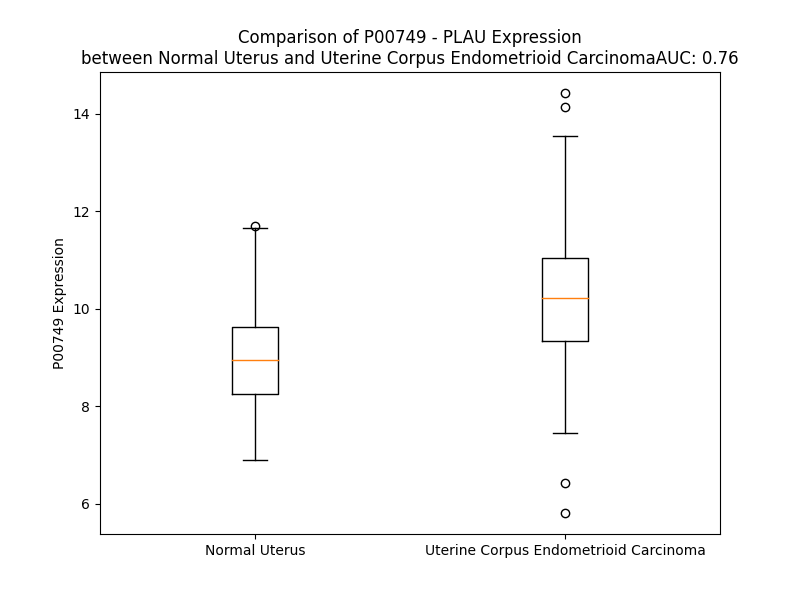

# Detailed Data for P00749

## Introduction to the Detailed Summary

### How to Interpret the Results

- **Summary & Metrics**: This section provides a quick reference to essential protein attributes, including expression changes, family classification, and biomarker applications. Regulation status (upregulated/downregulated) indicates the protein's behavior in a disease context. Some information comes from the original excel file with the proteins selected from literature, while others are derived from the analyses.
- **Expression Comparison**: A visual representation comparing protein expression between normal and disease states. It highlights significant changes in expression levels that might indicate diagnostic or therapeutic relevance. This is data coming from transcriptomics experiments and could not translate similarly to protein levels.
- **Isoform Alignment**: An interactive view of isoform alignments, revealing structural and functional differences between variants of the protein.
- **Interactors & Homologs**: Tables listing known interaction partners and homologous proteins, the more interactors and homologs, the more complex the protein is to design an antibody for.
- **Biological Assemblies**: Information about the structural arrangement of the protein in different assemblies, providing insights into its functional state but also the complexity of the protein to develop antibodies.
- **Combined Per-Residue Information**: A detailed table summarizing residue-level data. This includes predictions for epitope regions, aggregation tendencies, and modifications that might impact the protein's function. Each row corresponds to a residue in the protein, providing insights into specific sites that may be important for research or drug development.
## Summary & Metrics

- **UniProt Accession**: P00749
- **Gene Name**: PLAU
- **Protein Name**: Urokinase-type plasminogen activator / uPA
- **Swiss Prot**: UROK_HUMAN
- **Family**: peptidase
- **Biomarker Application**: disease progression,efficacy,prognosis,response to therapy
- **Number of Isoforms**: 2
- **Regulation**: 1
- **(transcriptomics) AUC**: 0.76
- **(transcriptomics) Fold Change**: 1.13
- **(transcriptomics) Regulation**: Upregulated
- **Discotope Epitope Count**: 87
- **Max n_uniprots (Homo)**: 4
- **Max n_uniprots (Hetero)**: 4

## Expression Comparison

## Isoform Alignment

<pre style='font-size:14px; font-family:monospace;'>P00749-1 MRALLARLLLCVLVVSDSKGSNELHQVPSNCDCLNGGTCVSNKYFSNIHWCNCPKKFGGQHCEIDKSKTCYEGNGHFYRGKASTDTMGRPCLPWNSATVLQQTYHAHRSDALQLGLGKHNYCRNPDNRRRPWCYVQVGLKLLVQECMVHDCADGKKPSSPPEELKFQCGQKTLRPRFKIIGGEFTTIENQPWFAAIYRRHRGGSVTYVCGGSLISPCWVISATHCFIDYPKKEDYIVYLGRSRLNSNTQGEMKFEVENLILHKDYSADTLAHHNDIALLKIRSKEGRCAQPSRTIQTICLPSMYNDPQFGTSCEITGFGKENSTDYLYPEQLKMTVVKLISHRECQQPHYYGSEVTTKMLCAADPQWKTDSCQGDSGGPLVCSLQGRMTLTGIVSWGRGCALKDKPGVYTRVSHFLPWIRSHTKEENGLAL
P00749-2 -----------------MVFHLRTRYEQANCDCLNGGTCVSNKYFSNIHWCNCPKKFGGQHCEIDKSKTCYEGNGHFYRGKASTDTMGRPCLPWNSATVLQQTYHAHRSDALQLGLGKHNYCRNPDNRRRPWCYVQVGLKLLVQECMVHDCADGKKPSSPPEELKFQCGQKTLRPRFKIIGGEFTTIENQPWFAAIYRRHRGGSVTYVCGGSLISPCWVISATHCFIDYPKKEDYIVYLGRSRLNSNTQGEMKFEVENLILHKDYSADTLAHHNDIALLKIRSKEGRCAQPSRTIQTICLPSMYNDPQFGTSCEITGFGKENSTDYLYPEQLKMTVVKLISHRECQQPHYYGSEVTTKMLCAADPQWKTDSCQGDSGGPLVCSLQGRMTLTGIVSWGRGCALKDKPGVYTRVSHFLPWIRSHTKEENGLAL
</pre>

## Interactors

| preferredName_A   | preferredName_B   |   score |
|:------------------|:------------------|--------:|
| PLAU              | SERPINE1          |   0.999 |
| PLAU              | PLAUR             |   0.999 |
| PLAU              | VTN               |   0.998 |
| PLAU              | PLG               |   0.989 |
| PLAU              | SERPINB2          |   0.986 |
| PLAU              | SERPINE2          |   0.946 |

## Homologs

| uniprot_id   | gene_id   |
|:-------------|:----------|
| E7EQ64       | PRSS1     |
| A0A7P0MP65   | PRSS3     |
| A0A0J9YYC8   | PRSS2     |

## Biological Assemblies

|   Unnamed: 0 |   assembly |   n_uniprots | composition   | crystal_id   |
|-------------:|-----------:|-------------:|:--------------|:-------------|
|            0 |          1 |            1 | Homo          | 1u6q         |
|            0 |          1 |            1 | Homo          | 7dzd         |
|            0 |          1 |            1 | Homo          | 7vm6         |
|            0 |          1 |            2 | Homo          | 1c5x         |
|            0 |          1 |            1 | Homo          | 7vm7         |
|            0 |          1 |            1 | Homo          | 5xg4         |
|            0 |          1 |            1 | Homo          | 3mhw         |
|            0 |          1 |            2 | Homo          | 1gjd         |
|            0 |          1 |            2 | Hetero        | 2i9b         |
|            1 |          2 |            2 | Hetero        | 2i9b         |
|            2 |          3 |            2 | Hetero        | 2i9b         |
|            3 |          4 |            2 | Hetero        | 2i9b         |
|            0 |          1 |            2 | Homo          | 1o5c         |
|            0 |          1 |            1 | Homo          | 4x1n         |
|            0 |          1 |            1 | Homo          | 1owj         |
|            0 |          1 |            1 | Homo          | 4os7         |
|            0 |          1 |            2 | Hetero        | 3pb1         |
|            0 |          1 |            1 | Homo          | 5za8         |
|            0 |          1 |            1 | Homo          | 2viw         |
|            0 |          1 |            1 | Homo          | 5zc5         |
|            0 |          1 |            1 | Homo          | 4os5         |
|            0 |          1 |            1 | Homo          | 3mwi         |
|            0 |          1 |            1 | Homo          | 4os1         |
|            0 |          1 |            2 | Homo          | 1gi9         |
|            0 |          1 |            1 | Homo          | 1owh         |
|            0 |          1 |            1 | Homo          | 5wxo         |
|            0 |          1 |            1 | Homo          | 4fuj         |
|            0 |          1 |            1 | Homo          | 4fuh         |
|            0 |          1 |            1 | Homo          | 5za9         |
|            0 |          1 |            1 | Homo          | 6jyq         |
|            0 |          1 |            2 | Homo          | 1gjc         |
|            0 |          1 |            1 | Homo          | 1w0z         |
|            0 |          1 |            2 | Homo          | 1gj8         |
|            0 |          1 |            1 | Homo          | 4gly         |
|            0 |          1 |            1 | Homo          | 5zaj         |
|            0 |          1 |            1 | Homo          | 7zrr         |
|            0 |          1 |            1 | Homo          | 2viq         |
|            0 |          1 |            1 | Homo          | 1sqa         |
|            0 |          1 |            1 | Homo          | 4mnx         |
|            0 |          1 |            2 | Homo          | 1gjb         |
|            0 |          1 |            1 | Homo          | 7vm5         |
|            0 |          1 |            1 | Homo          | 3oy6         |
|            0 |          1 |            1 | Homo          | 6xvd         |
|            0 |          1 |            2 | Homo          | 5hgg         |
|            0 |          1 |            1 | Homo          | 4x1p         |
|            0 |          1 |            1 | Homo          | 1vja         |
|            0 |          1 |            0 | Hetero        | 1f5k         |
|            0 |          1 |            1 | Homo          | 6l05         |
|            0 |          1 |            1 | Homo          | 4jk5         |
|            0 |          1 |            1 | Homo          | 2o8u         |
|            0 |          1 |            1 | Homo          | 4fub         |
|            0 |          1 |            1 | Homo          | 1w11         |
|            0 |          1 |            1 | Homo          | 1sqt         |
|            0 |          1 |            1 | Homo          | 1urk         |
|            0 |          1 |            1 | Homo          | 2nwn         |
|            0 |          1 |            1 | Homo          | 1w10         |
|            0 |          1 |            1 | Homo          | 7zrt         |
|            0 |          1 |            1 | Homo          | 1f5l         |
|            0 |          1 |            1 | Homo          | 4fui         |
|            0 |          1 |            1 | Homo          | 4fu8         |
|            0 |          1 |            1 | Homo          | 3m61         |
|            0 |          1 |            2 | Homo          | 1o3p         |
|            0 |          1 |            1 | Homo          | 1ejn         |
|            0 |          1 |            1 | Homo          | 5wxq         |
|            0 |          1 |            1 | Homo          | 2viv         |
|            0 |          1 |            2 | Homo          | 1gi8         |
|            0 |          1 |            1 | Homo          | 1sc8         |
|            0 |          1 |            1 | Homo          | 5wxs         |
|            0 |          1 |            1 | Homo          | 4fuf         |
|            0 |          1 |            1 | Homo          | 5zae         |
|            0 |          1 |            2 | Homo          | 1gja         |
|            0 |          1 |            1 | Homo          | 4zhm         |
|            0 |          1 |            1 | Homo          | 1owe         |
|            0 |          1 |            2 | Homo          | 1c5w         |
|            0 |          1 |            1 | Homo          | 5wxt         |
|            0 |          1 |            1 | Homo          | 6ag2         |
|            0 |          1 |            2 | Hetero        | 3u73         |
|            0 |          1 |            1 | Homo          | 2o8w         |
|            0 |          1 |            3 | Hetero        | 3bt2         |
|            1 |          2 |            2 | Hetero        | 3bt2         |
|            2 |          3 |            1 | Homo          | 3bt2         |
|            0 |          1 |            1 | Homo          | 5wxr         |
|            0 |          1 |            1 | Homo          | 1owd         |
|            0 |          1 |            2 | Homo          | 1c5y         |
|            0 |          1 |            1 | Homo          | 4h42         |
|            0 |          1 |            1 | Homo          | 6jyp         |
|            0 |          1 |            4 | Hetero        | 2fd6         |
|            1 |          2 |            4 | Hetero        | 2fd6         |
|            0 |          1 |            1 | Homo          | 1w12         |
|            0 |          1 |            1 | Homo          | 4zkn         |
|            0 |          1 |            1 | Homo          | 6l04         |
|            0 |          1 |            2 | Homo          | 1c5z         |
|            0 |          1 |            1 | Homo          | 1owi         |
|            0 |          1 |            1 | Homo          | 1owk         |
|            0 |          1 |            1 | Homo          | 5zag         |
|            0 |          1 |            1 | Homo          | 3kgp         |
|            0 |          1 |            1 | Homo          | 4mnw         |
|            0 |          1 |            1 | Homo          | 4fuc         |
|            0 |          1 |            1 | Homo          | 4zhl         |
|            0 |          1 |            1 | Homo          | 6ag3         |
|            0 |          1 |            2 | Homo          | 1o5b         |
|            0 |          1 |            1 | Homo          | 2vnt         |
|            1 |          2 |            1 | Homo          | 2vnt         |
|            2 |          3 |            1 | Homo          | 2vnt         |
|            3 |          4 |            1 | Homo          | 2vnt         |
|            4 |          5 |            1 | Homo          | 2vnt         |
|            5 |          6 |            1 | Homo          | 2vnt         |
|            0 |          1 |            1 | Homo          | 3oy5         |
|            0 |          1 |            1 | Homo          | 4fug         |
|            0 |          1 |            1 | Homo          | 4mny         |
|            1 |          2 |            1 | Homo          | 4mny         |
|            0 |          1 |            1 | Homo          | 4os2         |
|            0 |          1 |            1 | Homo          | 4os6         |
|            0 |          1 |            1 | Homo          | 4xsk         |
|            0 |          1 |            1 | Homo          | 6nmb         |
|            1 |          2 |            1 | Homo          | 6nmb         |
|            2 |          3 |            1 | Homo          | 6nmb         |
|            3 |          4 |            1 | Homo          | 6nmb         |
|            0 |          1 |            1 | Homo          | 4fud         |
|            0 |          1 |            1 | Homo          | 3qn7         |
|            0 |          1 |            1 | Homo          | 4jk6         |
|            0 |          1 |            1 | Homo          | 4x1s         |
|            0 |          1 |            2 | Homo          | 1gi7         |
|            0 |          1 |            1 | Homo          | 5wxf         |
|            0 |          1 |            1 | Homo          | 1fv9         |
|            0 |          1 |            1 | Homo          | 5yc7         |
|            0 |          1 |            1 | Homo          | 5zah         |
|            0 |          1 |            1 | Homo          | 6ag9         |
|            0 |          1 |            1 | Homo          | 2vio         |
|            0 |          1 |            1 | Homo          | 6ag7         |
|            0 |          1 |            1 | Homo          | 2vip         |
|            0 |          1 |            1 | Homo          | 1w14         |
|            0 |          1 |            1 | Homo          | 5yc6         |
|            0 |          1 |            2 | Homo          | 3ig6         |
|            1 |          2 |            2 | Homo          | 3ig6         |
|            2 |          3 |            4 | Homo          | 3ig6         |
|            3 |          4 |            4 | Homo          | 3ig6         |
|            0 |          1 |            1 | Homo          | 4fu7         |
|            0 |          1 |            1 | Homo          | 4dva         |
|            0 |          1 |            1 | Homo          | 4x1r         |
|            0 |          1 |            1 | Homo          | 2i9a         |
|            1 |          2 |            1 | Homo          | 2i9a         |
|            2 |          3 |            1 | Homo          | 2i9a         |
|            3 |          4 |            1 | Homo          | 2i9a         |
|            0 |          1 |            1 | Homo          | 1w13         |
|            0 |          1 |            1 | Homo          | 4dw2         |
|            0 |          1 |            1 | Homo          | 2vin         |
|            0 |          1 |            3 | Hetero        | 3bt1         |
|            0 |          1 |            1 | Homo          | 7vm4         |
|            0 |          1 |            1 | Homo          | 2o8t         |
|            0 |          1 |            1 | Homo          | 1kdu         |
|            0 |          1 |            1 | Homo          | 3ox7         |
|            0 |          1 |            1 | Homo          | 5zaf         |
|            0 |          1 |            2 | Homo          | 1gj7         |
|            0 |          1 |            1 | Homo          | 1sqo         |
|            0 |          1 |            1 | Homo          | 4x0w         |
|            0 |          1 |            1 | Homo          | 4zkr         |
|            0 |          1 |            1 | Homo          | 5z1c         |
|            0 |          1 |            1 | Homo          | 4x1q         |
|            0 |          1 |            1 | Homo          | 1f92         |
|            0 |          1 |            1 | Homo          | 5wxp         |
|            0 |          1 |            1 | Homo          | 5za7         |
|            0 |          1 |            3 | Hetero        | 4k24         |
|            0 |          1 |            1 | Homo          | 4zko         |
|            0 |          1 |            1 | Homo          | 3kid         |
|            0 |          1 |            1 | Homo          | 2r2w         |
|            0 |          1 |            1 | Homo          | 4fue         |
|            0 |          1 |            1 | Homo          | 4os4         |
|            0 |          1 |            2 | Homo          | 1gj9         |
|            0 |          1 |            2 | Homo          | 1lmw         |
|            1 |          2 |            2 | Homo          | 1lmw         |
|            0 |          1 |            1 | Homo          | 4mnv         |
|            0 |          1 |            1 | Homo          | 3khv         |
|            0 |          1 |            2 | Homo          | 1o5a         |
|            0 |          1 |            1 | Homo          | 4zks         |
|            0 |          1 |            1 | Homo          | 4fu9         |
|            0 |          1 |            1 | Homo          | 1vj9         |

## Combined Per-Residue Information

|   res | aa   |   epitope_score | epitope   |   relative_surface_accessibility |   modeling_confidence |   Aggregation | modification   | glycosylation                   |
|------:|:-----|----------------:|:----------|---------------------------------:|----------------------:|--------------:|:---------------|:--------------------------------|
|     1 | M    |         0.13569 | False     |                          1.29568 |                 41.94 |         0     | N/A            | N/A                             |
|     2 | R    |         0.19026 | True      |                          0.95152 |                 39.21 |         0     | N/A            | N/A                             |
|     3 | A    |         0.18441 | True      |                          0.90514 |                 36.61 |         0.004 | N/A            | N/A                             |
|     4 | L    |         0.14978 | False     |                          1.14504 |                 47.7  |         0.014 | N/A            | N/A                             |
|     5 | L    |         0.16336 | False     |                          1.08191 |                 38.67 |         0.018 | N/A            | N/A                             |
|     6 | A    |         0.17827 | True      |                          0.87194 |                 42.8  |         0.018 | N/A            | N/A                             |
|     7 | R    |         0.29146 | True      |                          0.91541 |                 41.43 |         0.019 | N/A            | N/A                             |
|     8 | L    |         0.1824  | True      |                          0.97213 |                 38.85 |        83.925 | N/A            | N/A                             |
|     9 | L    |         0.13725 | False     |                          1.04801 |                 41.79 |        99.288 | N/A            | N/A                             |
|    10 | L    |         0.16082 | False     |                          0.81996 |                 40.78 |        99.738 | N/A            | N/A                             |
|    11 | C    |         0.13611 | False     |                          0.90825 |                 37.1  |        99.806 | N/A            | N/A                             |
|    12 | V    |         0.1524  | False     |                          0.82493 |                 36.89 |        99.842 | N/A            | N/A                             |
|    13 | L    |         0.12652 | False     |                          0.9899  |                 38.5  |        99.828 | N/A            | N/A                             |
|    14 | V    |         0.15897 | False     |                          0.84119 |                 38.5  |        99.744 | N/A            | N/A                             |
|    15 | V    |         0.08366 | False     |                          1.05261 |                 31.05 |        98.672 | N/A            | N/A                             |
|    16 | S    |         0.11422 | False     |                          0.82214 |                 36.03 |        10.934 | N/A            | N/A                             |
|    17 | D    |         0.16278 | False     |                          0.79015 |                 32    |         0.014 | N/A            | N/A                             |
|    18 | S    |         0.13731 | False     |                          0.84707 |                 37.66 |         0.002 | N/A            | N/A                             |
|    19 | K    |         0.18749 | True      |                          0.9993  |                 32.97 |         0     | N/A            | N/A                             |
|    20 | G    |         0.26211 | True      |                          0.80207 |                 33.2  |         0     | N/A            | N/A                             |
|    21 | S    |         0.14977 | False     |                          0.84514 |                 33.64 |         0     | N/A            | N/A                             |
|    22 | N    |         0.13244 | False     |                          1.01088 |                 28.43 |         0     | N/A            | N/A                             |
|    23 | E    |         0.11912 | False     |                          0.71532 |                 32.86 |         0     | N/A            | N/A                             |
|    24 | L    |         0.16278 | False     |                          1.05624 |                 28.58 |         0     | N/A            | N/A                             |
|    25 | H    |         0.12025 | False     |                          0.86159 |                 32.68 |         0     | N/A            | N/A                             |
|    26 | Q    |         0.16156 | False     |                          0.82016 |                 29.07 |         0     | N/A            | N/A                             |
|    27 | V    |         0.16081 | False     |                          0.93126 |                 35.82 |         0     | N/A            | N/A                             |
|    28 | P    |         0.13953 | False     |                          0.83762 |                 41.48 |         0     | N/A            | N/A                             |
|    29 | S    |         0.13802 | False     |                          0.78329 |                 52.1  |         0     | N/A            | N/A                             |
|    30 | N    |         0.11576 | False     |                          0.66832 |                 67.03 |         0     | N/A            | N/A                             |
|    31 | C    |         0.05293 | False     |                          0.14259 |                 75.9  |         0     | N/A            | N/A                             |
|    32 | D    |         0.18491 | True      |                          0.50414 |                 87.45 |         0     | N/A            | N/A                             |
|    33 | C    |         0.05721 | False     |                          0.21984 |                 91.01 |         0     | N/A            | N/A                             |
|    34 | L    |         0.09321 | False     |                          0.40806 |                 91.74 |         0     | N/A            | N/A                             |
|    35 | N    |         0.05469 | False     |                          0.44158 |                 92.07 |         0     | N/A            | N/A                             |
|    36 | G    |         0.1407  | False     |                          0.80047 |                 90.96 |         0     | N/A            | N/A                             |
|    37 | G    |         0.06098 | False     |                          0.18559 |                 90.66 |         0     | N/A            | N/A                             |
|    38 | T    |         0.10456 | False     |                          0.58906 |                 92.01 |         0     | N/A            | O-linked (Fuc) threonine        |
|    39 | C    |         0.05724 | False     |                          0.33011 |                 90.7  |         0     | N/A            | N/A                             |
|    40 | V    |         0.12358 | False     |                          0.36655 |                 85.59 |         0     | N/A            | N/A                             |
|    41 | S    |         0.08542 | False     |                          0.43427 |                 81.53 |         0     | N/A            | N/A                             |
|    42 | N    |         0.22097 | True      |                          0.28432 |                 76.67 |         0     | N/A            | N/A                             |
|    43 | K    |         0.26978 | True      |                          0.90121 |                 73.12 |         0     | N/A            | N/A                             |
|    44 | Y    |         0.3042  | True      |                          0.79546 |                 66.49 |         0     | N/A            | N/A                             |
|    45 | F    |         0.33812 | True      |                          0.61012 |                 70.54 |         0     | N/A            | N/A                             |
|    46 | S    |         0.2099  | True      |                          0.70221 |                 69.57 |         0     | N/A            | N/A                             |
|    47 | N    |         0.23209 | True      |                          0.78422 |                 74.05 |         0     | N/A            | N/A                             |
|    48 | I    |         0.21788 | True      |                          0.49198 |                 71.86 |         0     | N/A            | N/A                             |
|    49 | H    |         0.12381 | False     |                          0.49809 |                 80.86 |         0     | N/A            | N/A                             |
|    50 | W    |         0.222   | True      |                          0.51031 |                 83.67 |         0     | N/A            | N/A                             |
|    51 | C    |         0.04119 | False     |                          0.10119 |                 87.25 |         0     | N/A            | N/A                             |
|    52 | N    |         0.16191 | False     |                          0.57012 |                 89.44 |         0     | N/A            | N/A                             |
|    53 | C    |         0.08145 | False     |                          0.26108 |                 90.18 |         0     | N/A            | N/A                             |
|    54 | P    |         0.07468 | False     |                          0.38945 |                 92.91 |         0     | N/A            | N/A                             |
|    55 | K    |         0.22055 | True      |                          0.96402 |                 89.63 |         0     | N/A            | N/A                             |
|    56 | K    |         0.18158 | True      |                          0.66999 |                 90.31 |         0     | N/A            | N/A                             |
|    57 | F    |         0.08808 | False     |                          0.22103 |                 92.34 |         0     | N/A            | N/A                             |
|    58 | G    |         0.19427 | True      |                          0.09496 |                 89.65 |         0     | N/A            | N/A                             |
|    59 | G    |         0.10953 | False     |                          0.4466  |                 85.62 |         0     | N/A            | N/A                             |
|    60 | Q    |         0.17027 | False     |                          0.53687 |                 86.73 |         0     | N/A            | N/A                             |
|    61 | H    |         0.08068 | False     |                          0.24059 |                 90.41 |         0     | N/A            | N/A                             |
|    62 | C    |         0.01077 | False     |                          0       |                 91.89 |         0     | N/A            | N/A                             |
|    63 | E    |         0.11578 | False     |                          0.05771 |                 91.98 |         0     | N/A            | N/A                             |
|    64 | I    |         0.05262 | False     |                          0.0888  |                 92.81 |         0     | N/A            | N/A                             |
|    65 | D    |         0.06348 | False     |                          0.1246  |                 93.76 |         0     | N/A            | N/A                             |
|    66 | K    |         0.24735 | True      |                          0.49281 |                 89.68 |         0     | N/A            | N/A                             |
|    67 | S    |         0.1381  | False     |                          0.54145 |                 89.65 |         0     | N/A            | N/A                             |
|    68 | K    |         0.08922 | False     |                          0.39878 |                 90.46 |         0     | N/A            | N/A                             |
|    69 | T    |         0.08787 | False     |                          0.69857 |                 88.59 |         0     | N/A            | N/A                             |
|    70 | C    |         0.03173 | False     |                          0.17301 |                 92.01 |         0     | N/A            | N/A                             |
|    71 | Y    |         0.07163 | False     |                          0.05556 |                 92.92 |         0     | N/A            | N/A                             |
|    72 | E    |         0.14571 | False     |                          0.57046 |                 91.52 |         0     | N/A            | N/A                             |
|    73 | G    |         0.14622 | False     |                          0.72274 |                 90.31 |         0     | N/A            | N/A                             |
|    74 | N    |         0.09144 | False     |                          0.26796 |                 90.6  |         0     | N/A            | N/A                             |
|    75 | G    |         0.01445 | False     |                          0.00644 |                 91.62 |         0     | N/A            | N/A                             |
|    76 | H    |         0.12716 | False     |                          0.31538 |                 92.82 |         0     | N/A            | N/A                             |
|    77 | F    |         0.11482 | False     |                          0.8623  |                 93.39 |         0     | N/A            | N/A                             |
|    78 | Y    |         0.05494 | False     |                          0.0385  |                 95.36 |         0     | N/A            | N/A                             |
|    79 | R    |         0.11327 | False     |                          0.16601 |                 95.79 |         0     | N/A            | N/A                             |
|    80 | G    |         0.00291 | False     |                          0       |                 94.72 |         0     | N/A            | N/A                             |
|    81 | K    |         0.0893  | False     |                          0.4476  |                 95.38 |         0     | N/A            | N/A                             |
|    82 | A    |         0.04479 | False     |                          0.24074 |                 93.51 |         0     | N/A            | N/A                             |
|    83 | S    |         0.03131 | False     |                          0.24644 |                 95.03 |         0     | N/A            | N/A                             |
|    84 | T    |         0.06198 | False     |                          0.16286 |                 87.62 |         0     | N/A            | N/A                             |
|    85 | D    |         0.0091  | False     |                          0.00146 |                 87.25 |         0     | N/A            | N/A                             |
|    86 | T    |         0.12948 | False     |                          0.5518  |                 82.7  |         0     | N/A            | N/A                             |
|    87 | M    |         0.11115 | False     |                          0.56661 |                 77.61 |         0     | N/A            | N/A                             |
|    88 | G    |         0.03985 | False     |                          0.12729 |                 79.46 |         0     | N/A            | N/A                             |
|    89 | R    |         0.05626 | False     |                          0.10236 |                 82.93 |         0     | N/A            | N/A                             |
|    90 | P    |         0.07641 | False     |                          0.59165 |                 88.62 |         0     | N/A            | N/A                             |
|    91 | C    |         0.02744 | False     |                          0.03934 |                 93.05 |         0     | N/A            | N/A                             |
|    92 | L    |         0.06907 | False     |                          0.20394 |                 95.52 |         0     | N/A            | N/A                             |
|    93 | P    |         0.09509 | False     |                          0.40459 |                 95.56 |         0     | N/A            | N/A                             |
|    94 | W    |         0.00791 | False     |                          0.00477 |                 96.26 |         0     | N/A            | N/A                             |
|    95 | N    |         0.1103  | False     |                          0.33267 |                 93.05 |         0     | N/A            | N/A                             |
|    96 | S    |         0.11147 | False     |                          0.20175 |                 93.78 |         0.243 | N/A            | N/A                             |
|    97 | A    |         0.25647 | True      |                          0.74278 |                 93    |         0.243 | N/A            | N/A                             |
|    98 | T    |         0.10593 | False     |                          0.34475 |                 90.76 |         0.243 | N/A            | N/A                             |
|    99 | V    |         0.00699 | False     |                          0       |                 93.63 |         0.243 | N/A            | N/A                             |
|   100 | L    |         0.21283 | True      |                          0.36982 |                 92.92 |         0.243 | N/A            | N/A                             |
|   101 | Q    |         0.2514  | True      |                          0.77306 |                 91.4  |         0     | N/A            | N/A                             |
|   102 | Q    |         0.19066 | True      |                          0.27733 |                 94.08 |         0     | N/A            | N/A                             |
|   103 | T    |         0.1536  | False     |                          0.668   |                 93.86 |         0     | N/A            | N/A                             |
|   104 | Y    |         0.11638 | False     |                          0.19408 |                 95.53 |         0     | N/A            | N/A                             |
|   105 | H    |         0.14056 | False     |                          0.18118 |                 95.86 |         0     | N/A            | N/A                             |
|   106 | A    |         0.1407  | False     |                          0.18894 |                 93.9  |         0     | N/A            | N/A                             |
|   107 | H    |         0.45164 | True      |                          0.68897 |                 92.78 |         0     | N/A            | N/A                             |
|   108 | R    |         0.35115 | True      |                          0.31225 |                 94.05 |         0     | N/A            | N/A                             |
|   109 | S    |         0.24373 | True      |                          0.9899  |                 92.66 |         0     | N/A            | N/A                             |
|   110 | D    |         0.16113 | False     |                          0.25834 |                 93.68 |         0     | N/A            | N/A                             |
|   111 | A    |         0.044   | False     |                          0.05484 |                 93.59 |         0     | N/A            | N/A                             |
|   112 | L    |         0.09928 | False     |                          0.26591 |                 92    |         0     | N/A            | N/A                             |
|   113 | Q    |         0.20301 | True      |                          0.74455 |                 91.97 |         0     | N/A            | N/A                             |
|   114 | L    |         0.10995 | False     |                          0.16638 |                 94.44 |         0     | N/A            | N/A                             |
|   115 | G    |         0.00575 | False     |                          0.00296 |                 93.94 |         0     | N/A            | N/A                             |
|   116 | L    |         0.05672 | False     |                          0.03473 |                 95.28 |         0     | N/A            | N/A                             |
|   117 | G    |         0.06198 | False     |                          0.16577 |                 90.25 |         0     | N/A            | N/A                             |
|   118 | K    |         0.15372 | False     |                          0.78735 |                 89.36 |         0     | N/A            | N/A                             |
|   119 | H    |         0.08621 | False     |                          0.10963 |                 91.84 |         0     | N/A            | N/A                             |
|   120 | N    |         0.086   | False     |                          0.24876 |                 95.4  |         0     | N/A            | N/A                             |
|   121 | Y    |         0.06428 | False     |                          0.21811 |                 97    |         0     | N/A            | N/A                             |
|   122 | C    |         0.00165 | False     |                          0       |                 97.01 |         0     | N/A            | N/A                             |
|   123 | R    |         0.01541 | False     |                          0       |                 97.49 |         0     | N/A            | N/A                             |
|   124 | N    |         0.03128 | False     |                          0.00713 |                 96.23 |         0     | N/A            | N/A                             |
|   125 | P    |         0.07115 | False     |                          0.08982 |                 96.05 |         0     | N/A            | N/A                             |
|   126 | D    |         0.11706 | False     |                          0.27595 |                 92.73 |         0     | N/A            | N/A                             |
|   127 | N    |         0.18298 | True      |                          0.62705 |                 90.05 |         0     | N/A            | N/A                             |
|   128 | R    |         0.24458 | True      |                          0.45742 |                 90.35 |         0     | N/A            | N/A                             |
|   129 | R    |         0.25287 | True      |                          0.8622  |                 86.75 |         0     | N/A            | N/A                             |
|   130 | R    |         0.1026  | False     |                          0.29645 |                 90.38 |         0     | N/A            | N/A                             |
|   131 | P    |         0.00393 | False     |                          0.00298 |                 95.9  |         0     | N/A            | N/A                             |
|   132 | W    |         0.03163 | False     |                          0.00795 |                 96.1  |         1.922 | N/A            | N/A                             |
|   133 | C    |         0.00211 | False     |                          0.002   |                 97.07 |         2.145 | N/A            | N/A                             |
|   134 | Y    |         0.04479 | False     |                          0.03711 |                 96.38 |         2.381 | N/A            | N/A                             |
|   135 | V    |         0.01408 | False     |                          0.01809 |                 90.92 |         2.381 | N/A            | N/A                             |
|   136 | Q    |         0.15638 | False     |                          0.39502 |                 89.22 |         2.381 | N/A            | N/A                             |
|   137 | V    |         0.05606 | False     |                          0.17461 |                 79.26 |         2.252 | N/A            | N/A                             |
|   138 | G    |         0.11085 | False     |                          0.46144 |                 79.56 |         0.51  | N/A            | N/A                             |
|   139 | L    |         0.33542 | True      |                          1.08364 |                 81.48 |         0.51  | N/A            | N/A                             |
|   140 | K    |         0.18282 | True      |                          0.71172 |                 84.73 |         0     | N/A            | N/A                             |
|   141 | P    |         0.21205 | True      |                          0.16351 |                 90.25 |         0     | N/A            | N/A                             |
|   142 | L    |         0.13936 | False     |                          0.45587 |                 91.75 |         0     | N/A            | N/A                             |
|   143 | V    |         0.12325 | False     |                          0.35003 |                 93.88 |         0     | N/A            | N/A                             |
|   144 | Q    |         0.06527 | False     |                          0.24606 |                 93.12 |         0     | N/A            | N/A                             |
|   145 | E    |         0.08212 | False     |                          0.42251 |                 92.16 |         0     | N/A            | N/A                             |
|   146 | C    |         0.0039  | False     |                          0.00296 |                 93.76 |         0     | N/A            | N/A                             |
|   147 | M    |         0.07109 | False     |                          0.58775 |                 89.61 |         0     | N/A            | N/A                             |
|   148 | V    |         0.02693 | False     |                          0.03411 |                 89.33 |         0     | N/A            | N/A                             |
|   149 | H    |         0.04282 | False     |                          0.29396 |                 87.91 |         0     | N/A            | N/A                             |
|   150 | D    |         0.07978 | False     |                          0.18596 |                 89.09 |         0     | N/A            | N/A                             |
|   151 | C    |         0.07097 | False     |                          0.34567 |                 89.81 |         0     | N/A            | N/A                             |
|   152 | A    |         0.22482 | True      |                          0.87344 |                 84.89 |         0     | N/A            | N/A                             |
|   153 | D    |         0.19341 | True      |                          0.63251 |                 73.22 |         0     | N/A            | N/A                             |
|   154 | G    |         0.20187 | True      |                          0.82266 |                 54.97 |         0     | N/A            | N/A                             |
|   155 | K    |         0.15886 | False     |                          0.7206  |                 48.18 |         0     | N/A            | N/A                             |
|   156 | K    |         0.11652 | False     |                          0.85884 |                 44.02 |         0     | N/A            | N/A                             |
|   157 | P    |         0.15204 | False     |                          0.71078 |                 41.06 |         0     | N/A            | N/A                             |
|   158 | S    |         0.14931 | False     |                          0.70921 |                 37.85 |         0     | Phosphoserine  | N/A                             |
|   159 | S    |         0.13312 | False     |                          0.5033  |                 36.26 |         0     | N/A            | N/A                             |
|   160 | P    |         0.18066 | True      |                          0.81534 |                 42.98 |         0     | N/A            | N/A                             |
|   161 | P    |         0.14101 | False     |                          0.88189 |                 47.01 |         0     | N/A            | N/A                             |
|   162 | E    |         0.17221 | False     |                          0.77693 |                 50.53 |         0     | N/A            | N/A                             |
|   163 | E    |         0.14368 | False     |                          0.72132 |                 56.23 |         0     | N/A            | N/A                             |
|   164 | L    |         0.1098  | False     |                          0.55872 |                 71.35 |         0     | N/A            | N/A                             |
|   165 | K    |         0.13836 | False     |                          0.71422 |                 82.89 |         0     | N/A            | N/A                             |
|   166 | F    |         0.07681 | False     |                          0.25211 |                 89.3  |         0     | N/A            | N/A                             |
|   167 | Q    |         0.0766  | False     |                          0.46658 |                 87.94 |         0     | N/A            | N/A                             |
|   168 | C    |         0.02095 | False     |                          0.11048 |                 92.87 |         0     | N/A            | N/A                             |
|   169 | G    |         0.01153 | False     |                          0.04283 |                 91.17 |         0     | N/A            | N/A                             |
|   170 | Q    |         0.08049 | False     |                          0.37776 |                 85.39 |         0     | N/A            | N/A                             |
|   171 | K    |         0.06308 | False     |                          0.14    |                 75.28 |         0     | N/A            | N/A                             |
|   172 | T    |         0.11303 | False     |                          0.43143 |                 63.22 |         0     | N/A            | N/A                             |
|   173 | L    |         0.07226 | False     |                          0.23659 |                 56.08 |         0     | N/A            | N/A                             |
|   174 | R    |         0.19307 | True      |                          0.88995 |                 51.16 |         0     | N/A            | N/A                             |
|   175 | P    |         0.133   | False     |                          0.46035 |                 45.82 |         0     | N/A            | N/A                             |
|   176 | R    |         0.18885 | True      |                          0.61443 |                 40.12 |         0     | N/A            | N/A                             |
|   177 | F    |         0.20081 | True      |                          0.70802 |                 41.14 |         0.237 | N/A            | N/A                             |
|   178 | K    |         0.10458 | False     |                          0.54573 |                 41.13 |         0.237 | N/A            | N/A                             |
|   179 | I    |         0.07744 | False     |                          0.23051 |                 45.14 |         0.237 | N/A            | N/A                             |
|   180 | I    |         0.13775 | False     |                          0.73623 |                 38.84 |         0.237 | N/A            | N/A                             |
|   181 | G    |         0.16514 | False     |                          0.47761 |                 43.65 |         0.237 | N/A            | N/A                             |
|   182 | G    |         0.12229 | False     |                          0.28558 |                 54.1  |         0.237 | N/A            | N/A                             |
|   183 | E    |         0.1676  | False     |                          0.52254 |                 65.3  |         0.237 | N/A            | N/A                             |
|   184 | F    |         0.20871 | True      |                          0.64219 |                 68.1  |         0.237 | N/A            | N/A                             |
|   185 | T    |         0.01712 | False     |                          0.01619 |                 70.94 |         0.237 | N/A            | N/A                             |
|   186 | T    |         0.0953  | False     |                          0.4307  |                 78.17 |         0.237 | N/A            | N/A                             |
|   187 | I    |         0.00853 | False     |                          0.0016  |                 85.2  |         0.237 | N/A            | N/A                             |
|   188 | E    |         0.05352 | False     |                          0.24241 |                 83.34 |         0     | N/A            | N/A                             |
|   189 | N    |         0.03448 | False     |                          0.17222 |                 84.89 |         0     | N/A            | N/A                             |
|   190 | Q    |         0.00316 | False     |                          0       |                 90.96 |         0     | N/A            | N/A                             |
|   191 | P    |         0.00327 | False     |                          0.00173 |                 92.72 |         0.216 | N/A            | N/A                             |
|   192 | W    |         0.00384 | False     |                          0       |                 96.22 |        24.577 | N/A            | N/A                             |
|   193 | F    |         0.00968 | False     |                          0.00801 |                 95.88 |        26.572 | N/A            | N/A                             |
|   194 | A    |         0.00114 | False     |                          0       |                 97.03 |        26.572 | N/A            | N/A                             |
|   195 | A    |         0.00396 | False     |                          0.00365 |                 95.53 |        26.572 | N/A            | N/A                             |
|   196 | I    |         0.00499 | False     |                          0       |                 96.2  |        26.572 | N/A            | N/A                             |
|   197 | Y    |         0.02973 | False     |                          0.03165 |                 94.54 |        19.848 | N/A            | N/A                             |
|   198 | R    |         0.18189 | True      |                          0.20748 |                 94.63 |         0     | N/A            | N/A                             |
|   199 | R    |         0.18714 | True      |                          0.29703 |                 94.15 |         0     | N/A            | N/A                             |
|   200 | H    |         0.20086 | True      |                          0.35929 |                 91.58 |         0     | N/A            | N/A                             |
|   201 | R    |         0.18364 | True      |                          1.01771 |                 83.74 |         0     | N/A            | N/A                             |
|   202 | G    |         0.26187 | True      |                          0.99652 |                 82.22 |         0     | N/A            | N/A                             |
|   203 | G    |         0.20919 | True      |                          0.81207 |                 85.71 |         0     | N/A            | N/A                             |
|   204 | S    |         0.38887 | True      |                          0.52321 |                 90.52 |         2.287 | N/A            | N/A                             |
|   205 | V    |         0.20365 | True      |                          0.42226 |                 91.11 |         5.977 | N/A            | N/A                             |
|   206 | T    |         0.16294 | False     |                          0.41549 |                 90.56 |         5.977 | N/A            | N/A                             |
|   207 | Y    |         0.06225 | False     |                          0.0663  |                 90.94 |         5.977 | N/A            | N/A                             |
|   208 | V    |         0.079   | False     |                          0.2434  |                 91.09 |         5.977 | N/A            | N/A                             |
|   209 | C    |         0.06826 | False     |                          0.02439 |                 94.09 |         4.088 | N/A            | N/A                             |
|   210 | G    |         0.00414 | False     |                          0       |                 95.03 |         0.48  | N/A            | N/A                             |
|   211 | G    |         0.00268 | False     |                          0       |                 97.49 |         0.191 | N/A            | N/A                             |
|   212 | S    |         0.004   | False     |                          0.00395 |                 98.2  |         0.191 | N/A            | N/A                             |
|   213 | L    |         0.00141 | False     |                          0       |                 98.04 |         0.191 | N/A            | N/A                             |
|   214 | I    |         0.00421 | False     |                          0       |                 97.36 |         0.191 | N/A            | N/A                             |
|   215 | S    |         0.01311 | False     |                          0.03149 |                 95.62 |         0     | N/A            | N/A                             |
|   216 | P    |         0.04263 | False     |                          0.34494 |                 95.56 |         0.252 | N/A            | N/A                             |
|   217 | C    |         0.07641 | False     |                          0.22074 |                 97.02 |        13.779 | N/A            | N/A                             |
|   218 | W    |         0.03188 | False     |                          0.08399 |                 98.23 |        29.378 | N/A            | N/A                             |
|   219 | V    |         0.00292 | False     |                          0       |                 98.48 |        30.367 | N/A            | N/A                             |
|   220 | I    |         0.0038  | False     |                          0       |                 98.43 |        30.367 | N/A            | N/A                             |
|   221 | S    |         0.00804 | False     |                          0       |                 98.13 |        30.115 | N/A            | N/A                             |
|   222 | A    |         0.00274 | False     |                          0       |                 97.42 |        27.564 | N/A            | N/A                             |
|   223 | T    |         0.00986 | False     |                          0.00476 |                 97.3  |        23.147 | N/A            | N/A                             |
|   224 | H    |         0.08904 | False     |                          0.23199 |                 94    |        20.405 | N/A            | N/A                             |
|   225 | C    |         0.04206 | False     |                          0.08921 |                 94.97 |        20.18  | N/A            | N/A                             |
|   226 | F    |         0.01223 | False     |                          0.00338 |                 96.18 |        19.818 | N/A            | N/A                             |
|   227 | I    |         0.33864 | True      |                          0.49728 |                 92.68 |        18.198 | N/A            | N/A                             |
|   228 | D    |         0.31932 | True      |                          0.7135  |                 92.11 |         0     | N/A            | N/A                             |
|   229 | Y    |         0.14783 | False     |                          0.47108 |                 94.13 |         0     | N/A            | N/A                             |
|   230 | P    |         0.2333  | True      |                          0.61224 |                 94.5  |         0     | N/A            | N/A                             |
|   231 | K    |         0.21938 | True      |                          0.66847 |                 96.28 |         0     | N/A            | N/A                             |
|   232 | K    |         0.09871 | False     |                          0.38441 |                 95.95 |         0     | N/A            | N/A                             |
|   233 | E    |         0.15052 | False     |                          0.5427  |                 95.44 |         0     | N/A            | N/A                             |
|   234 | D    |         0.11387 | False     |                          0.22862 |                 95.56 |         0     | N/A            | N/A                             |
|   235 | Y    |         0.02054 | False     |                          0.00655 |                 97.46 |        80.041 | N/A            | N/A                             |
|   236 | I    |         0.05557 | False     |                          0.0168  |                 96.54 |        85.292 | N/A            | N/A                             |
|   237 | V    |         0.00333 | False     |                          0       |                 97.44 |        85.292 | N/A            | N/A                             |
|   238 | Y    |         0.06467 | False     |                          0.11355 |                 96.32 |        85.292 | N/A            | N/A                             |
|   239 | L    |         0.00389 | False     |                          0       |                 96.01 |        85.292 | N/A            | N/A                             |
|   240 | G    |         0.00204 | False     |                          0       |                 92.1  |        11.859 | N/A            | N/A                             |
|   241 | R    |         0.0978  | False     |                          0.06769 |                 91.54 |         0     | N/A            | N/A                             |
|   242 | S    |         0.07299 | False     |                          0.09693 |                 86.34 |         0     | N/A            | N/A                             |
|   243 | R    |         0.17018 | False     |                          0.52732 |                 86.13 |         0     | N/A            | N/A                             |
|   244 | L    |         0.04973 | False     |                          0.06932 |                 82.46 |         0     | N/A            | N/A                             |
|   245 | N    |         0.20581 | True      |                          0.77024 |                 78.77 |         0     | N/A            | N/A                             |
|   246 | S    |         0.16341 | False     |                          0.27638 |                 75.4  |         0     | N/A            | N/A                             |
|   247 | N    |         0.22094 | True      |                          0.83206 |                 77.64 |         0     | N/A            | N/A                             |
|   248 | T    |         0.08998 | False     |                          0.18137 |                 79.53 |         0     | N/A            | N/A                             |
|   249 | Q    |         0.26277 | True      |                          0.88495 |                 76.09 |         0     | N/A            | N/A                             |
|   250 | G    |         0.08972 | False     |                          0.55623 |                 80.65 |         0     | N/A            | N/A                             |
|   251 | E    |         0.10761 | False     |                          0.19606 |                 90.59 |         0     | N/A            | N/A                             |
|   252 | M    |         0.06835 | False     |                          0.28494 |                 94.14 |         0     | N/A            | N/A                             |
|   253 | K    |         0.11989 | False     |                          0.43305 |                 95.66 |         0     | N/A            | N/A                             |
|   254 | F    |         0.0123  | False     |                          0.00343 |                 97.91 |         0     | N/A            | N/A                             |
|   255 | E    |         0.09152 | False     |                          0.27264 |                 97.59 |         0     | N/A            | N/A                             |
|   256 | V    |         0.05404 | False     |                          0.06598 |                 97.82 |         0     | N/A            | N/A                             |
|   257 | E    |         0.12541 | False     |                          0.33456 |                 96.72 |         0     | N/A            | N/A                             |
|   258 | N    |         0.17133 | False     |                          0.3938  |                 97.03 |         0     | N/A            | N/A                             |
|   259 | L    |         0.08335 | False     |                          0.14825 |                 97.95 |         0     | N/A            | N/A                             |
|   260 | I    |         0.07886 | False     |                          0.16079 |                 97.82 |         0     | N/A            | N/A                             |
|   261 | L    |         0.09142 | False     |                          0.29579 |                 97.84 |         0     | N/A            | N/A                             |
|   262 | H    |         0.09318 | False     |                          0.0934  |                 97.34 |         0     | N/A            | N/A                             |
|   263 | K    |         0.26561 | True      |                          0.87818 |                 95.83 |         0     | N/A            | N/A                             |
|   264 | D    |         0.15457 | False     |                          0.48145 |                 95.72 |         0     | N/A            | N/A                             |
|   265 | Y    |         0.14672 | False     |                          0.15895 |                 96.41 |         0     | N/A            | N/A                             |
|   266 | S    |         0.13877 | False     |                          0.2671  |                 94.25 |         0     | N/A            | N/A                             |
|   267 | A    |         0.28938 | True      |                          0.46771 |                 90.4  |         0     | N/A            | N/A                             |
|   268 | D    |         0.37119 | True      |                          0.84358 |                 80.35 |         0     | N/A            | N/A                             |
|   269 | T    |         0.34461 | True      |                          0.48451 |                 80.71 |         0     | N/A            | N/A                             |
|   270 | L    |         0.41215 | True      |                          0.58879 |                 78.58 |         0     | N/A            | N/A                             |
|   271 | A    |         0.00931 | False     |                          0       |                 87.5  |         0     | N/A            | N/A                             |
|   272 | H    |         0.15493 | False     |                          0.23782 |                 91.76 |         0     | N/A            | N/A                             |
|   273 | H    |         0.06396 | False     |                          0.23526 |                 94.6  |         0     | N/A            | N/A                             |
|   274 | N    |         0.01914 | False     |                          0.13179 |                 96.36 |         0     | N/A            | N/A                             |
|   275 | D    |         0.026   | False     |                          0.00285 |                 97.05 |         0     | N/A            | N/A                             |
|   276 | I    |         0.00652 | False     |                          0       |                 98.2  |         0     | N/A            | N/A                             |
|   277 | A    |         0.00219 | False     |                          0       |                 98.4  |         0     | N/A            | N/A                             |
|   278 | L    |         0.00402 | False     |                          0       |                 98.44 |         0     | N/A            | N/A                             |
|   279 | L    |         0.00308 | False     |                          0       |                 98.48 |         0     | N/A            | N/A                             |
|   280 | K    |         0.0622  | False     |                          0.23493 |                 98.04 |         0     | N/A            | N/A                             |
|   281 | I    |         0.00833 | False     |                          0       |                 98.08 |         0     | N/A            | N/A                             |
|   282 | R    |         0.17983 | True      |                          0.32308 |                 97.22 |         0     | N/A            | N/A                             |
|   283 | S    |         0.11628 | False     |                          0.11758 |                 96.24 |         0     | N/A            | N/A                             |
|   284 | K    |         0.21405 | True      |                          0.83711 |                 92.4  |         0     | N/A            | N/A                             |
|   285 | E    |         0.199   | True      |                          0.66518 |                 93.75 |         0     | N/A            | N/A                             |
|   286 | G    |         0.10097 | False     |                          0.43525 |                 93.73 |         0     | N/A            | N/A                             |
|   287 | R    |         0.13469 | False     |                          0.65975 |                 95.04 |         0     | N/A            | N/A                             |
|   288 | C    |         0.04544 | False     |                          0.15411 |                 95.91 |         0     | N/A            | N/A                             |
|   289 | A    |         0.00563 | False     |                          0.01226 |                 95.53 |         0     | N/A            | N/A                             |
|   290 | Q    |         0.08033 | False     |                          0.48036 |                 92.27 |         0     | N/A            | N/A                             |
|   291 | P    |         0.04383 | False     |                          0.19536 |                 90.8  |         0     | N/A            | N/A                             |
|   292 | S    |         0.03614 | False     |                          0.24543 |                 87.66 |         0     | N/A            | N/A                             |
|   293 | R    |         0.07659 | False     |                          0.36327 |                 82.3  |         0     | N/A            | N/A                             |
|   294 | T    |         0.03449 | False     |                          0.10012 |                 88.38 |         0     | N/A            | N/A                             |
|   295 | I    |         0.00948 | False     |                          0.004   |                 93.11 |         0     | N/A            | N/A                             |
|   296 | Q    |         0.02096 | False     |                          0.04233 |                 94.05 |         0     | N/A            | N/A                             |
|   297 | T    |         0.01702 | False     |                          0.03604 |                 96.23 |         0     | N/A            | N/A                             |
|   298 | I    |         0.00306 | False     |                          0       |                 96.92 |         0     | N/A            | N/A                             |
|   299 | C    |         0.02344 | False     |                          0.05883 |                 95.66 |         0     | N/A            | N/A                             |
|   300 | L    |         0.024   | False     |                          0.10929 |                 94.44 |         0     | N/A            | N/A                             |
|   301 | P    |         0.01475 | False     |                          0.04834 |                 90.92 |         0     | N/A            | N/A                             |
|   302 | S    |         0.07713 | False     |                          0.516   |                 85.48 |         0     | N/A            | N/A                             |
|   303 | M    |         0.20491 | True      |                          0.46995 |                 78.78 |         0     | N/A            | N/A                             |
|   304 | Y    |         0.14113 | False     |                          0.65043 |                 74.93 |         0     | N/A            | N/A                             |
|   305 | N    |         0.13326 | False     |                          0.4454  |                 78.46 |         0     | N/A            | N/A                             |
|   306 | D    |         0.07966 | False     |                          0.20451 |                 81.41 |         0     | N/A            | N/A                             |
|   307 | P    |         0.03059 | False     |                          0.05774 |                 85.43 |         0     | N/A            | N/A                             |
|   308 | Q    |         0.11042 | False     |                          0.77873 |                 87.44 |         0     | N/A            | N/A                             |
|   309 | F    |         0.13748 | False     |                          0.5544  |                 90.02 |         0     | N/A            | N/A                             |
|   310 | G    |         0.05707 | False     |                          0.4727  |                 87.87 |         0     | N/A            | N/A                             |
|   311 | T    |         0.07495 | False     |                          0.26843 |                 89.31 |         0     | N/A            | N/A                             |
|   312 | S    |         0.09106 | False     |                          0.23562 |                 89.42 |         0     | N/A            | N/A                             |
|   313 | C    |         0.00892 | False     |                          0.00401 |                 90.85 |         0     | N/A            | N/A                             |
|   314 | E    |         0.018   | False     |                          0.1099  |                 89    |         0     | N/A            | N/A                             |
|   315 | I    |         0.01973 | False     |                          0.02296 |                 90.32 |         0     | N/A            | N/A                             |
|   316 | T    |         0.00669 | False     |                          0.00644 |                 89.51 |         0     | N/A            | N/A                             |
|   317 | G    |         0.02465 | False     |                          0.03421 |                 89.88 |         0     | N/A            | N/A                             |
|   318 | F    |         0.00686 | False     |                          0       |                 84.51 |         0     | N/A            | N/A                             |
|   319 | G    |         0.04693 | False     |                          0.09592 |                 71.13 |         0     | N/A            | N/A                             |
|   320 | K    |         0.13233 | False     |                          0.15919 |                 63.66 |         0     | N/A            | N/A                             |
|   321 | E    |         0.18031 | True      |                          0.62621 |                 57.85 |         0     | N/A            | N/A                             |
|   322 | N    |         0.2573  | True      |                          0.51461 |                 55.03 |         0     | N/A            | N-linked (GlcNAc...) asparagine |
|   323 | S    |         0.21764 | True      |                          0.43769 |                 54.98 |         0     | Phosphoserine  | N/A                             |
|   324 | T    |         0.37672 | True      |                          0.87002 |                 53.85 |         0     | N/A            | N/A                             |
|   325 | D    |         0.25998 | True      |                          0.27097 |                 55.95 |         0     | N/A            | N/A                             |
|   326 | Y    |         0.37396 | True      |                          0.90676 |                 54.42 |         0     | N/A            | N/A                             |
|   327 | L    |         0.33177 | True      |                          0.81802 |                 60.35 |         0     | N/A            | N/A                             |
|   328 | Y    |         0.1179  | False     |                          0.32761 |                 65.95 |         0     | N/A            | N/A                             |
|   329 | P    |         0.06392 | False     |                          0.15211 |                 67.69 |         0     | N/A            | N/A                             |
|   330 | E    |         0.15399 | False     |                          0.52738 |                 78.86 |         0     | N/A            | N/A                             |
|   331 | Q    |         0.09382 | False     |                          0.29995 |                 81.92 |         0     | N/A            | N/A                             |
|   332 | L    |         0.00597 | False     |                          0       |                 85.5  |         0     | N/A            | N/A                             |
|   333 | K    |         0.09047 | False     |                          0.14922 |                 83.45 |         0     | N/A            | N/A                             |
|   334 | M    |         0.01644 | False     |                          0.04227 |                 83.29 |         0     | N/A            | N/A                             |
|   335 | T    |         0.04249 | False     |                          0.08149 |                 80.63 |         0     | N/A            | N/A                             |
|   336 | V    |         0.02478 | False     |                          0.07521 |                 83.69 |         0     | N/A            | N/A                             |
|   337 | V    |         0.0045  | False     |                          0       |                 87.27 |         0     | N/A            | N/A                             |
|   338 | K    |         0.0635  | False     |                          0.43422 |                 89.65 |         0     | N/A            | N/A                             |
|   339 | L    |         0.01887 | False     |                          0.03014 |                 91.73 |         0     | N/A            | N/A                             |
|   340 | I    |         0.13652 | False     |                          0.13241 |                 91.63 |         0     | N/A            | N/A                             |
|   341 | S    |         0.07621 | False     |                          0.21079 |                 92.53 |         0     | N/A            | N/A                             |
|   342 | H    |         0.10342 | False     |                          0.19414 |                 90.69 |         0     | N/A            | N/A                             |
|   343 | R    |         0.25205 | True      |                          0.79929 |                 91.36 |         0     | N/A            | N/A                             |
|   344 | E    |         0.26871 | True      |                          0.38746 |                 91.49 |         0     | N/A            | N/A                             |
|   345 | C    |         0.00613 | False     |                          0       |                 90.49 |         0     | N/A            | N/A                             |
|   346 | Q    |         0.15185 | False     |                          0.33512 |                 92.81 |         0     | N/A            | N/A                             |
|   347 | Q    |         0.32849 | True      |                          0.34355 |                 92.29 |         0     | N/A            | N/A                             |
|   348 | P    |         0.24315 | True      |                          0.88068 |                 88.61 |         0     | N/A            | N/A                             |
|   349 | H    |         0.50566 | True      |                          0.57236 |                 86.21 |         0     | N/A            | N/A                             |
|   350 | Y    |         0.11871 | False     |                          0.07786 |                 85.68 |         0     | N/A            | N/A                             |
|   351 | Y    |         0.07509 | False     |                          0.03674 |                 88.73 |         0     | N/A            | N/A                             |
|   352 | G    |         0.18393 | True      |                          0.19644 |                 90.22 |         0     | N/A            | N/A                             |
|   353 | S    |         0.22022 | True      |                          0.80493 |                 89.7  |         0     | N/A            | N/A                             |
|   354 | E    |         0.17318 | False     |                          0.24534 |                 89.67 |         0     | N/A            | N/A                             |
|   355 | V    |         0.00581 | False     |                          0.00236 |                 91.09 |         0     | N/A            | N/A                             |
|   356 | T    |         0.08136 | False     |                          0.30703 |                 93.37 |         0     | N/A            | N/A                             |
|   357 | T    |         0.12292 | False     |                          0.5676  |                 92.09 |         0     | N/A            | N/A                             |
|   358 | K    |         0.09786 | False     |                          0.45087 |                 94.53 |         0     | N/A            | N/A                             |
|   359 | M    |         0.02676 | False     |                          0.03433 |                 95.02 |         0.146 | N/A            | N/A                             |
|   360 | L    |         0.00777 | False     |                          0.0272  |                 93.28 |         0.146 | N/A            | N/A                             |
|   361 | C    |         0.01557 | False     |                          0.01582 |                 92.49 |         0.146 | N/A            | N/A                             |
|   362 | A    |         0.00307 | False     |                          0       |                 91.13 |         0.146 | N/A            | N/A                             |
|   363 | A    |         0.04378 | False     |                          0.06738 |                 86.59 |         0.146 | N/A            | N/A                             |
|   364 | D    |         0.06081 | False     |                          0.02381 |                 78.78 |         0     | N/A            | N/A                             |
|   365 | P    |         0.15202 | False     |                          0.59563 |                 71.7  |         0     | N/A            | N/A                             |
|   366 | Q    |         0.16063 | False     |                          0.5409  |                 66.97 |         0     | N/A            | N/A                             |
|   367 | W    |         0.09109 | False     |                          0.25045 |                 68.82 |         0     | N/A            | N/A                             |
|   368 | K    |         0.22195 | True      |                          0.72622 |                 58.45 |         0     | N/A            | N/A                             |
|   369 | T    |         0.08865 | False     |                          0.1834  |                 56.55 |         0     | N/A            | N/A                             |
|   370 | D    |         0.08732 | False     |                          0.14012 |                 56.69 |         0     | N/A            | N/A                             |
|   371 | S    |         0.09127 | False     |                          0.11034 |                 55.06 |         0     | N/A            | N/A                             |
|   372 | C    |         0.08404 | False     |                          0.06679 |                 60.83 |         0     | N/A            | N/A                             |
|   373 | Q    |         0.18744 | True      |                          0.50562 |                 52.93 |         0     | N/A            | N/A                             |
|   374 | G    |         0.05608 | False     |                          0.05782 |                 56.66 |         0     | N/A            | N/A                             |
|   375 | D    |         0.04898 | False     |                          0.08604 |                 76.75 |         0     | N/A            | N/A                             |
|   376 | S    |         0.09245 | False     |                          0.15355 |                 90.11 |         0     | N/A            | N/A                             |
|   377 | G    |         0.00342 | False     |                          0       |                 94.86 |         0     | N/A            | N/A                             |
|   378 | G    |         0.00451 | False     |                          0       |                 94.91 |         0     | N/A            | N/A                             |
|   379 | P    |         0.00154 | False     |                          0       |                 96.05 |         0     | N/A            | N/A                             |
|   380 | L    |         0.00151 | False     |                          0       |                 95.02 |         0.526 | N/A            | N/A                             |
|   381 | V    |         0.00198 | False     |                          0.00141 |                 94.98 |         0.526 | N/A            | N/A                             |
|   382 | C    |         0.0037  | False     |                          0.003   |                 93.49 |         0.526 | N/A            | N/A                             |
|   383 | S    |         0.04757 | False     |                          0.46532 |                 90.45 |         0.526 | N/A            | N/A                             |
|   384 | L    |         0.03342 | False     |                          0.21656 |                 86.61 |         0.526 | N/A            | N/A                             |
|   385 | Q    |         0.1045  | False     |                          0.92182 |                 81.87 |         0     | N/A            | N/A                             |
|   386 | G    |         0.11242 | False     |                          0.88004 |                 81.12 |         0     | N/A            | N/A                             |
|   387 | R    |         0.08732 | False     |                          0.2974  |                 88.08 |         0     | N/A            | N/A                             |
|   388 | M    |         0.0286  | False     |                          0.13396 |                 92.47 |         0.555 | N/A            | N/A                             |
|   389 | T    |         0.01264 | False     |                          0.03566 |                 95.46 |         1.043 | N/A            | N/A                             |
|   390 | L    |         0.00192 | False     |                          0       |                 96.98 |         3.985 | N/A            | N/A                             |
|   391 | T    |         0.0038  | False     |                          0.00356 |                 96.1  |         3.985 | N/A            | N/A                             |
|   392 | G    |         0.00304 | False     |                          0       |                 96.54 |         4.114 | N/A            | N/A                             |
|   393 | I    |         0.00347 | False     |                          0.0024  |                 97.07 |         4.243 | N/A            | N/A                             |
|   394 | V    |         0.02571 | False     |                          0.05427 |                 94.77 |         4.243 | N/A            | N/A                             |
|   395 | S    |         0.07462 | False     |                          0.06407 |                 93    |         0.953 | N/A            | N/A                             |
|   396 | W    |         0.15317 | False     |                          0.10653 |                 87.31 |         0.676 | N/A            | N/A                             |
|   397 | G    |         0.21427 | True      |                          0.39611 |                 80.36 |         0.129 | N/A            | N/A                             |
|   398 | R    |         0.42791 | True      |                          0.37891 |                 75    |         0     | N/A            | N/A                             |
|   399 | G    |         0.16676 | False     |                          0.45796 |                 63.9  |         0     | N/A            | N/A                             |
|   400 | C    |         0.07159 | False     |                          0.22421 |                 63.79 |         0     | N/A            | N/A                             |
|   401 | A    |         0.09564 | False     |                          0.28465 |                 60.33 |         0     | N/A            | N/A                             |
|   402 | L    |         0.32496 | True      |                          0.58364 |                 69.72 |         0     | N/A            | N/A                             |
|   403 | K    |         0.26745 | True      |                          0.72379 |                 75.55 |         0     | N/A            | N/A                             |
|   404 | D    |         0.10913 | False     |                          0.30039 |                 79.43 |         0     | N/A            | N/A                             |
|   405 | K    |         0.14379 | False     |                          0.19397 |                 84.34 |         0     | N/A            | N/A                             |
|   406 | P    |         0.01617 | False     |                          0.00382 |                 88.5  |         0     | N/A            | N/A                             |
|   407 | G    |         0.03756 | False     |                          0.02092 |                 89.23 |         0     | N/A            | N/A                             |
|   408 | V    |         0.01004 | False     |                          0.00963 |                 92.68 |         0     | N/A            | N/A                             |
|   409 | Y    |         0.01302 | False     |                          0.00159 |                 94.88 |         0     | N/A            | N/A                             |
|   410 | T    |         0.01136 | False     |                          0.03198 |                 96.76 |         0     | N/A            | N/A                             |
|   411 | R    |         0.03212 | False     |                          0.10162 |                 96.12 |         0     | N/A            | N/A                             |
|   412 | V    |         0.00209 | False     |                          0       |                 96.79 |         0     | N/A            | N/A                             |
|   413 | S    |         0.00284 | False     |                          0.00077 |                 94.44 |         0     | N/A            | N/A                             |
|   414 | H    |         0.08067 | False     |                          0.28853 |                 94.46 |         0     | N/A            | N/A                             |
|   415 | F    |         0.03895 | False     |                          0.03406 |                 95.89 |         0     | N/A            | N/A                             |
|   416 | L    |         0.01303 | False     |                          0.00659 |                 93.76 |         0     | N/A            | N/A                             |
|   417 | P    |         0.12085 | False     |                          0.49062 |                 92.11 |         0     | N/A            | N/A                             |
|   418 | W    |         0.08194 | False     |                          0.14704 |                 95.55 |         0     | N/A            | N/A                             |
|   419 | I    |         0.01012 | False     |                          0.0048  |                 95.65 |         0     | N/A            | N/A                             |
|   420 | R    |         0.07754 | False     |                          0.46855 |                 93.48 |         0     | N/A            | N/A                             |
|   421 | S    |         0.14578 | False     |                          0.58224 |                 94    |         0     | N/A            | N/A                             |
|   422 | H    |         0.13339 | False     |                          0.35741 |                 94.34 |         0     | N/A            | N/A                             |
|   423 | T    |         0.06567 | False     |                          0.0843  |                 92.01 |         0     | N/A            | N/A                             |
|   424 | K    |         0.1812  | True      |                          0.85713 |                 75.02 |         0     | N/A            | N/A                             |
|   425 | E    |         0.07046 | False     |                          0.26143 |                 62.17 |         0     | N/A            | N/A                             |
|   426 | E    |         0.13483 | False     |                          0.80826 |                 38.39 |         0     | N/A            | N/A                             |
|   427 | N    |         0.13218 | False     |                          1.00282 |                 37.06 |         0     | N/A            | N/A                             |
|   428 | G    |         0.14349 | False     |                          0.77251 |                 39.49 |         0     | N/A            | N/A                             |
|   429 | L    |         0.07564 | False     |                          0.24736 |                 43.7  |         0     | N/A            | N/A                             |
|   430 | A    |         0.06966 | False     |                          0.8328  |                 32.54 |         0     | N/A            | N/A                             |
|   431 | L    |         0.09628 | False     |                          1.16701 |                 32.07 |         0     | N/A            | N/A                             |

