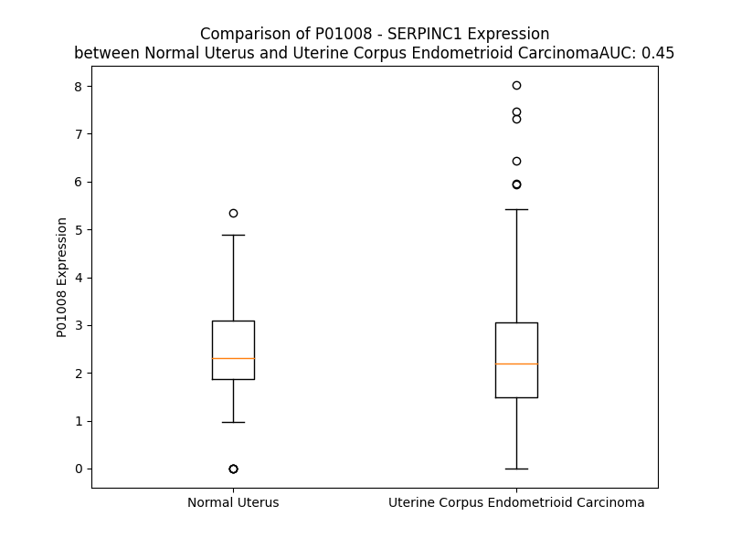

# Detailed Data for P01008

## Introduction to the Detailed Summary

### How to Interpret the Results

- **Summary & Metrics**: This section provides a quick reference to essential protein attributes, including expression changes, family classification, and biomarker applications. Regulation status (upregulated/downregulated) indicates the protein's behavior in a disease context. Some information comes from the original excel file with the proteins selected from literature, while others are derived from the analyses.
- **Expression Comparison**: A visual representation comparing protein expression between normal and disease states. It highlights significant changes in expression levels that might indicate diagnostic or therapeutic relevance. This is data coming from transcriptomics experiments and could not translate similarly to protein levels.
- **Isoform Alignment**: An interactive view of isoform alignments, revealing structural and functional differences between variants of the protein.
- **Interactors & Homologs**: Tables listing known interaction partners and homologous proteins, the more interactors and homologs, the more complex the protein is to design an antibody for.
- **Biological Assemblies**: Information about the structural arrangement of the protein in different assemblies, providing insights into its functional state but also the complexity of the protein to develop antibodies.
- **Combined Per-Residue Information**: A detailed table summarizing residue-level data. This includes predictions for epitope regions, aggregation tendencies, and modifications that might impact the protein's function. Each row corresponds to a residue in the protein, providing insights into specific sites that may be important for research or drug development.
## Summary & Metrics

- **UniProt Accession**: P01008
- **Gene Name**: SERPINC 1
- **Protein Name**: antithrombin III
- **Swiss Prot**: ANT3_HUMAN
- **Family**: enzyme
- **Biomarker Application**: diagnosis,unspecified application
- **Number of Isoforms**: 0
- **Regulation**: 1
- **(transcriptomics) AUC**: 0.45
- **(transcriptomics) Fold Change**: 1.04
- **(transcriptomics) Regulation**: Downregulated
- **Discotope Epitope Count**: 110
- **Max n_uniprots (Homo)**: 2.0
- **Max n_uniprots (Hetero)**: 5.0

## Expression Comparison

## Interactors

| preferredName_A   | preferredName_B   |   score |
|:------------------|:------------------|--------:|
| SERPINC1          | F2                |   0.999 |
| SERPINC1          | F9                |   0.999 |
| SERPINC1          | F10               |   0.998 |
| SERPINC1          | PLG               |   0.992 |
| SERPINC1          | FGA               |   0.98  |
| SERPINC1          | F12               |   0.969 |
| SERPINC1          | F11               |   0.969 |
| SERPINC1          | F3                |   0.958 |
| SERPINC1          | FGB               |   0.954 |
| SERPINC1          | VTN               |   0.949 |
| SERPINC1          | APOH              |   0.944 |
| SERPINC1          | TFPI              |   0.939 |
| SERPINC1          | AMBP              |   0.936 |
| SERPINC1          | ALB               |   0.933 |
| SERPINC1          | A2M               |   0.927 |
| SERPINC1          | PROC              |   0.924 |
| SERPINC1          | FGG               |   0.921 |
| SERPINC1          | PLAT              |   0.914 |
| SERPINC1          | THBD              |   0.912 |
| SERPINC1          | F7                |   0.909 |
| SERPINC1          | F8                |   0.906 |

## Homologs

| uniprot_id   | gene_id   |
|:-------------|:----------|
| P48595       | SERPINB10 |
| E9PMI5       | SERPINH1  |
| A0A024R6N5   | SERPINA1  |
| P20848       | SERPINA2  |
| V9HWH1       | HEL57     |
| A0A1B0GX82   | SERPINB7  |
| Q86U17       | SERPINA11 |
| G3V4B4       | SERPINA5  |
| A8MV23       | SERPINE3  |
| E9PDK7       | SERPINB2  |
| P29508       | SERPINB3  |
| P48594       | SERPINB4  |
| Q96P63       | SERPINB12 |
| Q99574       | SERPINI1  |
| P05121       | SERPINE1  |
| G3V2W1       | SERPINA10 |
| C9J7N5       | SERPINI2  |
| P05546       | SERPIND1  |
| H7BZS9       | SERPINB13 |
| C9JZJ9       | SERPING1  |
| F5GWT8       | SERPINB11 |
| G3V4V7       | SERPINA6  |
| A0A6Q8JH89   | SERPINA9  |
| P05543       | SERPINA7  |
| C9JPV4       | SERPINF2  |
| G3V595       | SERPINA3  |
| P36952       | SERPINB5  |
| P50453       | SERPINB9  |
| A0A2R8Y6N4   | SERPINB6  |
| P0C7T4       | HMSD      |
| Q8IW75       | SERPINA12 |
| C9K031       | SERPINE2  |
| A0A7P0T9S6   | AGT       |
| P50452       | SERPINB8  |
| P29622       | SERPINA4  |
| I3L107       | SERPINF1  |

## Biological Assemblies

|   Unnamed: 0 |   assembly |   n_uniprots | composition   | crystal_id   |
|-------------:|-----------:|-------------:|:--------------|:-------------|
|            0 |          1 |            1 | Homo          | 1e04         |
|            1 |          2 |            1 | Homo          | 1e04         |
|            0 |          1 |            2 | Homo          | 1ath         |
|            0 |          1 |            1 | Homo          | 1oyh         |
|            1 |          2 |            1 | Homo          | 1oyh         |
|            0 |          1 |            2 | Homo          | 1ant         |
|            0 |          1 |            3 | Hetero        | 1sr5         |
|            0 |          1 |            1 | Homo          | 1t1f         |
|            1 |          2 |            1 | Homo          | 1t1f         |
|            2 |          3 |            1 | Homo          | 1t1f         |
|            0 |          1 |            2 | Homo          | 1lk6         |
|            0 |          1 |            1 | Homo          | 1nq9         |
|            1 |          2 |            1 | Homo          | 1nq9         |
|            0 |          1 |            3 | Hetero        | 1tb6         |
|            0 |          1 |            2 | Homo          | 2b4x         |
|            0 |          1 |            1 | Homo          | 1dzg         |
|            1 |          2 |            1 | Homo          | 1dzg         |
|            0 |          1 |            5 | Hetero        | 2b5t         |
|            1 |          2 |            5 | Hetero        | 2b5t         |
|            0 |          1 |            2 | Homo          | 3evj         |
|            0 |          1 |            1 | Homo          | 4eb1         |
|            1 |          2 |            1 | Homo          | 4eb1         |
|            0 |          1 |            1 | Homo          | 1e03         |
|            1 |          2 |            1 | Homo          | 1e03         |
|            0 |          1 |            1 | Homo          | 2hij         |
|            1 |          2 |            1 | Homo          | 2hij         |
|            0 |          1 |            2 | Homo          | 1r1l         |
|            0 |          1 |            1 | Homo          | 1e05         |
|            1 |          2 |            1 | Homo          | 1e05         |
|            0 |          1 |            3 | Hetero        | 2gd4         |
|            1 |          2 |            3 | Hetero        | 2gd4         |
|            0 |          1 |            1 | Homo          | 2ant         |
|            1 |          2 |            1 | Homo          | 2ant         |
|            0 |          1 |            2 | Homo          | 2beh         |
|            0 |          1 |            2 | Homo          | 1jvq         |
|            0 |          1 |            1 | Homo          | 1br8         |
|            1 |          2 |            1 | Homo          | 1br8         |
|            2 |          3 |            2 | Homo          | 1br8         |
|            0 |          1 |            2 | Homo          | 2znh         |
|            0 |          1 |            1 | Homo          | 1dzh         |
|            1 |          2 |            1 | Homo          | 1dzh         |
|            0 |          1 |            3 | Hetero        | 3kcg         |

## Combined Per-Residue Information

|   res | aa   |   epitope_score | epitope   |   relative_surface_accessibility |   modeling_confidence |   Aggregation | modification                | glycosylation                             |
|------:|:-----|----------------:|:----------|---------------------------------:|----------------------:|--------------:|:----------------------------|:------------------------------------------|
|     1 | M    |         0.1123  | False     |                          1.23163 |                 44.75 |         0     | N/A                         | N/A                                       |
|     2 | Y    |         0.22139 | True      |                          0.97362 |                 40.76 |         0.155 | N/A                         | N/A                                       |
|     3 | S    |         0.13677 | False     |                          0.81686 |                 41.51 |         0.155 | N/A                         | N/A                                       |
|     4 | N    |         0.15435 | False     |                          0.86659 |                 36.38 |         0.339 | N/A                         | N/A                                       |
|     5 | V    |         0.11833 | False     |                          0.98629 |                 47.33 |         8.062 | N/A                         | N/A                                       |
|     6 | I    |         0.1896  | True      |                          0.95129 |                 38.46 |         8.302 | N/A                         | N/A                                       |
|     7 | G    |         0.21106 | True      |                          0.81426 |                 43.17 |         8.147 | N/A                         | N/A                                       |
|     8 | T    |         0.15569 | False     |                          0.97771 |                 40.9  |         8.147 | N/A                         | N/A                                       |
|     9 | V    |         0.10596 | False     |                          0.96739 |                 34.05 |         8.147 | N/A                         | N/A                                       |
|    10 | T    |         0.18207 | True      |                          0.98805 |                 40.74 |         3.194 | N/A                         | N/A                                       |
|    11 | S    |         0.13237 | False     |                          0.90961 |                 34.24 |         0.128 | N/A                         | N/A                                       |
|    12 | G    |         0.25693 | True      |                          0.87561 |                 40.47 |         0     | N/A                         | N/A                                       |
|    13 | K    |         0.17733 | True      |                          0.97236 |                 37.35 |         0     | N/A                         | N/A                                       |
|    14 | R    |         0.1197  | False     |                          0.90065 |                 30.68 |         0     | N/A                         | N/A                                       |
|    15 | K    |         0.10115 | False     |                          0.89327 |                 38.3  |         0.156 | N/A                         | N/A                                       |
|    16 | V    |         0.09095 | False     |                          0.79675 |                 33.64 |        83.34  | N/A                         | N/A                                       |
|    17 | Y    |         0.115   | False     |                          0.87475 |                 39.74 |        99.225 | N/A                         | N/A                                       |
|    18 | L    |         0.18584 | True      |                          0.84045 |                 30.81 |        99.74  | N/A                         | N/A                                       |
|    19 | L    |         0.18908 | True      |                          1.01316 |                 34.15 |        99.834 | N/A                         | N/A                                       |
|    20 | S    |         0.1402  | False     |                          0.73057 |                 33.58 |        99.85  | N/A                         | N/A                                       |
|    21 | L    |         0.21504 | True      |                          0.91824 |                 29.68 |        99.941 | N/A                         | N/A                                       |
|    22 | L    |         0.19892 | True      |                          0.91172 |                 33.57 |        99.954 | N/A                         | N/A                                       |
|    23 | L    |         0.30189 | True      |                          0.88395 |                 28.45 |        99.935 | N/A                         | N/A                                       |
|    24 | I    |         0.19524 | True      |                          1.02461 |                 35.38 |        99.818 | N/A                         | N/A                                       |
|    25 | G    |         0.19002 | True      |                          0.73495 |                 30.23 |        98.531 | N/A                         | N/A                                       |
|    26 | F    |         0.21373 | True      |                          0.99441 |                 27.86 |        98.411 | N/A                         | N/A                                       |
|    27 | W    |         0.2385  | True      |                          0.96621 |                 30.63 |        89.333 | N/A                         | N/A                                       |
|    28 | D    |         0.17131 | True      |                          0.76768 |                 25.39 |         0.156 | N/A                         | N/A                                       |
|    29 | C    |         0.18881 | True      |                          0.98404 |                 29.7  |         0.14  | N/A                         | N/A                                       |
|    30 | V    |         0.19315 | True      |                          0.91491 |                 27.94 |         0.134 | N/A                         | N/A                                       |
|    31 | T    |         0.29673 | True      |                          0.852   |                 27.41 |         0.055 | N/A                         | N/A                                       |
|    32 | C    |         0.19295 | True      |                          0.94916 |                 29.62 |         0.008 | N/A                         | N/A                                       |
|    33 | H    |         0.13959 | False     |                          1.10602 |                 28.35 |         0     | N/A                         | N/A                                       |
|    34 | G    |         0.13564 | False     |                          0.84198 |                 40.3  |         0     | N/A                         | N/A                                       |
|    35 | S    |         0.10025 | False     |                          0.71601 |                 56.11 |         0     | N/A                         | N/A                                       |
|    36 | P    |         0.11649 | False     |                          1.02022 |                 75.36 |         0     | N/A                         | N/A                                       |
|    37 | V    |         0.12731 | False     |                          0.48011 |                 79.29 |         0     | N/A                         | N/A                                       |
|    38 | D    |         0.13257 | False     |                          0.44098 |                 87.49 |         0     | N/A                         | N/A                                       |
|    39 | I    |         0.05744 | False     |                          0.13452 |                 88.02 |         0     | N/A                         | N/A                                       |
|    40 | C    |         0.0653  | False     |                          0.45423 |                 86.64 |         0     | N/A                         | N/A                                       |
|    41 | T    |         0.20586 | True      |                          0.75911 |                 87.14 |         0     | N/A                         | N/A                                       |
|    42 | A    |         0.04475 | False     |                          0.11076 |                 88.4  |         0     | N/A                         | N/A                                       |
|    43 | K    |         0.22088 | True      |                          0.70042 |                 84.41 |         0     | N/A                         | N/A                                       |
|    44 | P    |         0.09992 | False     |                          0.30931 |                 80.05 |         0     | N/A                         | N/A                                       |
|    45 | R    |         0.22264 | True      |                          0.92848 |                 81.56 |         0     | N/A                         | N/A                                       |
|    46 | D    |         0.15584 | False     |                          0.52876 |                 82.07 |         0     | N/A                         | N/A                                       |
|    47 | I    |         0.13565 | False     |                          0.08059 |                 78.13 |         0     | N/A                         | N/A                                       |
|    48 | P    |         0.17465 | True      |                          0.85837 |                 75.49 |         0     | N/A                         | N/A                                       |
|    49 | M    |         0.07237 | False     |                          0.01914 |                 80.29 |         0     | N/A                         | N/A                                       |
|    50 | N    |         0.21979 | True      |                          0.69712 |                 80.55 |         0     | N/A                         | N/A                                       |
|    51 | P    |         0.02835 | False     |                          0.10084 |                 82.86 |         0     | N/A                         | N/A                                       |
|    52 | M    |         0.22855 | True      |                          0.60983 |                 87.05 |         0     | N/A                         | N/A                                       |
|    53 | C    |         0.1265  | False     |                          0.25614 |                 91.28 |         0     | N/A                         | N/A                                       |
|    54 | I    |         0.15446 | False     |                          0.55865 |                 89.85 |         0     | N/A                         | N/A                                       |
|    55 | Y    |         0.20669 | True      |                          0.11288 |                 89.57 |         0     | N/A                         | N/A                                       |
|    56 | R    |         0.20603 | True      |                          0.40612 |                 87.91 |         0     | N/A                         | N/A                                       |
|    57 | S    |         0.10499 | False     |                          0.23868 |                 82.57 |         0     | N/A                         | N/A                                       |
|    58 | P    |         0.26814 | True      |                          0.89498 |                 77.79 |         0     | N/A                         | N/A                                       |
|    59 | E    |         0.2498  | True      |                          0.81024 |                 68.54 |         0     | N/A                         | N/A                                       |
|    60 | K    |         0.17483 | True      |                          0.36478 |                 57.52 |         0     | N/A                         | N/A                                       |
|    61 | K    |         0.31872 | True      |                          1.01452 |                 39.99 |         0     | N/A                         | N/A                                       |
|    62 | A    |         0.23319 | True      |                          0.83811 |                 35.28 |         0     | N/A                         | N/A                                       |
|    63 | T    |         0.13129 | False     |                          0.63825 |                 32.54 |         0     | Phosphothreonine; by FAM20C | N/A                                       |
|    64 | E    |         0.18159 | True      |                          0.87275 |                 35.82 |         0     | N/A                         | N/A                                       |
|    65 | D    |         0.23123 | True      |                          0.86242 |                 34.79 |         0     | N/A                         | N/A                                       |
|    66 | E    |         0.1732  | True      |                          0.8211  |                 31.72 |         0     | N/A                         | N/A                                       |
|    67 | G    |         0.22241 | True      |                          0.81232 |                 38.1  |         0     | N/A                         | N/A                                       |
|    68 | S    |         0.15406 | False     |                          0.69691 |                 39.63 |         0     | Phosphoserine; by FAM20C    | N/A                                       |
|    69 | E    |         0.15933 | False     |                          0.95993 |                 46.8  |         0     | N/A                         | N/A                                       |
|    70 | Q    |         0.10024 | False     |                          0.3269  |                 57.77 |         0     | N/A                         | N/A                                       |
|    71 | K    |         0.18738 | True      |                          0.94284 |                 66.6  |         0     | N/A                         | N/A                                       |
|    72 | I    |         0.13294 | False     |                          0.46931 |                 75.84 |         0     | N/A                         | N/A                                       |
|    73 | P    |         0.08337 | False     |                          0.21295 |                 76.52 |         0     | N/A                         | N/A                                       |
|    74 | E    |         0.21795 | True      |                          0.86185 |                 72.33 |         0     | N/A                         | N/A                                       |
|    75 | A    |         0.2136  | True      |                          1.02299 |                 76.21 |         0     | N/A                         | N/A                                       |
|    76 | T    |         0.03798 | False     |                          0.16232 |                 79.62 |         0     | N/A                         | N/A                                       |
|    77 | N    |         0.24441 | True      |                          0.51755 |                 84.22 |         0     | N/A                         | N/A                                       |
|    78 | R    |         0.14698 | False     |                          0.55146 |                 87.12 |         0     | N/A                         | N/A                                       |
|    79 | R    |         0.13013 | False     |                          0.24333 |                 87.56 |         0     | N/A                         | N/A                                       |
|    80 | V    |         0.02651 | False     |                          0.05903 |                 87.19 |         0     | N/A                         | N/A                                       |
|    81 | W    |         0.08915 | False     |                          0.13491 |                 87.63 |         0     | N/A                         | N/A                                       |
|    82 | E    |         0.04872 | False     |                          0.16983 |                 89.65 |         0     | N/A                         | N/A                                       |
|    83 | L    |         0.00242 | False     |                          0       |                 90.87 |         0     | N/A                         | N/A                                       |
|    84 | S    |         0.00405 | False     |                          0.00562 |                 90.48 |         0     | N/A                         | N/A                                       |
|    85 | K    |         0.02432 | False     |                          0.26024 |                 89.7  |         0     | N/A                         | N/A                                       |
|    86 | A    |         0.00155 | False     |                          0       |                 92.47 |         0     | N/A                         | N/A                                       |
|    87 | N    |         0.00191 | False     |                          0       |                 93.61 |         0     | N/A                         | N/A                                       |
|    88 | S    |         0.01946 | False     |                          0.10433 |                 91.71 |         0     | N/A                         | N/A                                       |
|    89 | R    |         0.10751 | False     |                          0.36857 |                 93.18 |         0     | N/A                         | N/A                                       |
|    90 | F    |         0.00249 | False     |                          0       |                 95.82 |         4.621 | N/A                         | N/A                                       |
|    91 | A    |         0.00218 | False     |                          0       |                 96.02 |         4.904 | N/A                         | N/A                                       |
|    92 | T    |         0.02513 | False     |                          0.06722 |                 93.13 |         4.904 | N/A                         | N/A                                       |
|    93 | T    |         0.07012 | False     |                          0.31758 |                 94.32 |         4.904 | N/A                         | N/A                                       |
|    94 | F    |         0.00352 | False     |                          0       |                 96.68 |         4.904 | N/A                         | N/A                                       |
|    95 | Y    |         0.00628 | False     |                          0.02369 |                 96.68 |         3.872 | N/A                         | N/A                                       |
|    96 | Q    |         0.09874 | False     |                          0.30669 |                 94.24 |         0.135 | N/A                         | N/A                                       |
|    97 | H    |         0.14297 | False     |                          0.32179 |                 95.54 |         0     | N/A                         | N/A                                       |
|    98 | L    |         0.01009 | False     |                          0.00412 |                 96.72 |         0     | N/A                         | N/A                                       |
|    99 | A    |         0.02591 | False     |                          0.10251 |                 95.81 |         0     | N/A                         | N/A                                       |
|   100 | D    |         0.1872  | True      |                          0.67908 |                 94.24 |         0     | N/A                         | N/A                                       |
|   101 | S    |         0.12658 | False     |                          0.47506 |                 94.66 |         0     | N/A                         | N/A                                       |
|   102 | K    |         0.04233 | False     |                          0.23024 |                 94.91 |         0     | N/A                         | N/A                                       |
|   103 | N    |         0.16038 | False     |                          0.55603 |                 94.55 |         0     | N/A                         | N/A                                       |
|   104 | D    |         0.0544  | False     |                          0.457   |                 93.31 |         0     | N/A                         | N/A                                       |
|   105 | N    |         0.106   | False     |                          0.34749 |                 93.73 |         0     | N/A                         | N/A                                       |
|   106 | D    |         0.08191 | False     |                          0.4167  |                 95.25 |         0     | N/A                         | N/A                                       |
|   107 | N    |         0.01241 | False     |                          0.13854 |                 95.75 |         0     | N/A                         | N/A                                       |
|   108 | I    |         0.00138 | False     |                          0       |                 96.78 |         0     | N/A                         | N/A                                       |
|   109 | F    |         0.0011  | False     |                          0       |                 95.69 |         0     | N/A                         | N/A                                       |
|   110 | L    |         0.00078 | False     |                          0       |                 96.26 |         0     | N/A                         | N/A                                       |
|   111 | S    |         0.00311 | False     |                          0.00237 |                 95.56 |         0     | N/A                         | N/A                                       |
|   112 | P    |         0.00107 | False     |                          0       |                 95.44 |         0     | N/A                         | N/A                                       |
|   113 | L    |         0.00706 | False     |                          0.04864 |                 92.51 |         0.655 | N/A                         | N/A                                       |
|   114 | S    |         0.00536 | False     |                          0.04718 |                 91.5  |         0.655 | N/A                         | N/A                                       |
|   115 | I    |         0.00079 | False     |                          0       |                 94.54 |         1.806 | N/A                         | N/A                                       |
|   116 | S    |         0.00102 | False     |                          0       |                 94.52 |         1.806 | N/A                         | N/A                                       |
|   117 | T    |         0.00977 | False     |                          0.04025 |                 90.84 |         1.942 | N/A                         | N/A                                       |
|   118 | A    |         0.00335 | False     |                          0.01257 |                 91.22 |         2.079 | N/A                         | N/A                                       |
|   119 | F    |         0.00539 | False     |                          0.00127 |                 94.13 |         2.079 | N/A                         | N/A                                       |
|   120 | A    |         0.00148 | False     |                          0       |                 91.98 |         1.199 | N/A                         | N/A                                       |
|   121 | M    |         0.00894 | False     |                          0.01017 |                 89.82 |         0.457 | N/A                         | N/A                                       |
|   122 | T    |         0.00149 | False     |                          0       |                 91.44 |         0.136 | N/A                         | N/A                                       |
|   123 | K    |         0.00699 | False     |                          0.0086  |                 93.91 |         0     | N/A                         | N/A                                       |
|   124 | L    |         0.02032 | False     |                          0.04484 |                 91.63 |         0     | N/A                         | N/A                                       |
|   125 | G    |         0.00453 | False     |                          0.00271 |                 91.59 |         0     | N/A                         | N/A                                       |
|   126 | A    |         0.00392 | False     |                          0.0066  |                 94.1  |         0     | N/A                         | N/A                                       |
|   127 | C    |         0.03638 | False     |                          0.03306 |                 93.79 |         0     | N/A                         | N/A                                       |
|   128 | N    |         0.124   | False     |                          0.70179 |                 94    |         0     | N/A                         | N-linked (GlcNAc...) asparagine           |
|   129 | D    |         0.1966  | True      |                          0.53405 |                 96.13 |         0     | N/A                         | N/A                                       |
|   130 | T    |         0.00669 | False     |                          0.004   |                 96.12 |         0     | N/A                         | N/A                                       |
|   131 | L    |         0.01651 | False     |                          0.02555 |                 95.57 |         0     | N/A                         | N/A                                       |
|   132 | Q    |         0.12424 | False     |                          0.38776 |                 96.11 |         0     | N/A                         | N/A                                       |
|   133 | Q    |         0.07738 | False     |                          0.16292 |                 97.55 |         0     | N/A                         | N/A                                       |
|   134 | L    |         0.00322 | False     |                          0       |                 96.7  |         0.636 | N/A                         | N/A                                       |
|   135 | M    |         0.00966 | False     |                          0.00503 |                 95.47 |         0.636 | N/A                         | N/A                                       |
|   136 | E    |         0.09169 | False     |                          0.36179 |                 95.98 |         0.636 | N/A                         | N/A                                       |
|   137 | V    |         0.02581 | False     |                          0.03903 |                 97.32 |         0.938 | N/A                         | N/A                                       |
|   138 | F    |         0.00215 | False     |                          0       |                 96.67 |         0.938 | N/A                         | N/A                                       |
|   139 | K    |         0.03939 | False     |                          0.25762 |                 95.39 |         0.938 | N/A                         | N/A                                       |
|   140 | F    |         0.00176 | False     |                          0.00304 |                 94.06 |         0.938 | N/A                         | N/A                                       |
|   141 | D    |         0.03721 | False     |                          0.23276 |                 92.11 |         0.302 | N/A                         | N/A                                       |
|   142 | T    |         0.05018 | False     |                          0.39559 |                 88.78 |         0.302 | N/A                         | N/A                                       |
|   143 | I    |         0.02092 | False     |                          0.0273  |                 89.35 |         0.302 | N/A                         | N/A                                       |
|   144 | S    |         0.08431 | False     |                          0.35255 |                 85.83 |         0.145 | N/A                         | N/A                                       |
|   145 | E    |         0.07753 | False     |                          0.45553 |                 82.26 |         0     | N/A                         | N/A                                       |
|   146 | K    |         0.11428 | False     |                          0.64327 |                 77    |         0     | N/A                         | N/A                                       |
|   147 | T    |         0.01165 | False     |                          0       |                 77.11 |         0     | N/A                         | N/A                                       |
|   148 | S    |         0.02317 | False     |                          0.04035 |                 81.08 |         0     | N/A                         | N/A                                       |
|   149 | D    |         0.0787  | False     |                          0.18177 |                 81.21 |         0     | N/A                         | N/A                                       |
|   150 | Q    |         0.03943 | False     |                          0.14794 |                 84.56 |         1.259 | N/A                         | N/A                                       |
|   151 | I    |         0.005   | False     |                          0       |                 89.14 |        33.42  | N/A                         | N/A                                       |
|   152 | H    |         0.00872 | False     |                          0.0064  |                 89.64 |        33.6   | N/A                         | N/A                                       |
|   153 | F    |         0.02298 | False     |                          0.03494 |                 89.44 |        33.6   | N/A                         | N/A                                       |
|   154 | F    |         0.02361 | False     |                          0.01529 |                 88.88 |        33.6   | N/A                         | N/A                                       |
|   155 | F    |         0.003   | False     |                          0       |                 89.59 |        33.6   | N/A                         | N/A                                       |
|   156 | A    |         0.00728 | False     |                          0.01719 |                 89.41 |        15.492 | N/A                         | N/A                                       |
|   157 | K    |         0.06645 | False     |                          0.19223 |                 88.74 |         0     | N/A                         | N/A                                       |
|   158 | L    |         0.0051  | False     |                          0       |                 87.12 |         0     | N/A                         | N/A                                       |
|   159 | N    |         0.02899 | False     |                          0.14779 |                 87.26 |         0     | N/A                         | N/A                                       |
|   160 | C    |         0.03227 | False     |                          0.17155 |                 88.54 |         0     | N/A                         | N/A                                       |
|   161 | R    |         0.10959 | False     |                          0.17887 |                 87.29 |         0     | N/A                         | N/A                                       |
|   162 | L    |         0.02087 | False     |                          0.02473 |                 83.08 |         0     | N/A                         | N/A                                       |
|   163 | Y    |         0.04606 | False     |                          0.31237 |                 83.82 |         0     | N/A                         | N/A                                       |
|   164 | R    |         0.17654 | True      |                          0.62304 |                 85.78 |         0     | N/A                         | N/A                                       |
|   165 | K    |         0.09149 | False     |                          0.14057 |                 82.97 |         0     | N/A                         | N/A                                       |
|   166 | A    |         0.01044 | False     |                          0.00765 |                 81.12 |         0     | N/A                         | N/A                                       |
|   167 | N    |         0.13922 | False     |                          0.6179  |                 80.56 |         0     | N/A                         | N-linked (GlcNAc...) asparagine           |
|   168 | K    |         0.14116 | False     |                          0.75458 |                 81.74 |         0     | N/A                         | N/A                                       |
|   169 | S    |         0.04604 | False     |                          0.01872 |                 78.47 |         0     | N/A                         | N/A                                       |
|   170 | S    |         0.02552 | False     |                          0.0762  |                 83.38 |         0     | N/A                         | N/A                                       |
|   171 | K    |         0.0916  | False     |                          0.416   |                 84.87 |         0     | N/A                         | N/A                                       |
|   172 | L    |         0.02441 | False     |                          0.10455 |                 86.16 |         0     | N/A                         | N/A                                       |
|   173 | V    |         0.06685 | False     |                          0.18946 |                 84.59 |         0     | N/A                         | N/A                                       |
|   174 | S    |         0.01186 | False     |                          0.22161 |                 84.22 |         0     | N/A                         | N/A                                       |
|   175 | A    |         0.01304 | False     |                          0.03954 |                 83.45 |         0     | N/A                         | N/A                                       |
|   176 | N    |         0.01527 | False     |                          0.1557  |                 86.25 |         0     | N/A                         | N/A                                       |
|   177 | R    |         0.03321 | False     |                          0.15101 |                 91.29 |         0     | N/A                         | N/A                                       |
|   178 | L    |         0.00518 | False     |                          0.02086 |                 93.64 |         0     | N/A                         | N/A                                       |
|   179 | F    |         0.01065 | False     |                          0.01656 |                 95.38 |         0     | N/A                         | N/A                                       |
|   180 | G    |         0.00276 | False     |                          0       |                 94.72 |         0     | N/A                         | N/A                                       |
|   181 | D    |         0.02134 | False     |                          0.00786 |                 94.62 |         0     | N/A                         | N/A                                       |
|   182 | K    |         0.26834 | True      |                          0.58234 |                 93.89 |         0     | N/A                         | N/A                                       |
|   183 | S    |         0.22287 | True      |                          0.4004  |                 91.27 |         0     | N/A                         | N/A                                       |
|   184 | L    |         0.14273 | False     |                          0.08075 |                 91.04 |         0     | N/A                         | N/A                                       |
|   185 | T    |         0.23047 | True      |                          0.50394 |                 92.2  |         0     | N/A                         | N/A                                       |
|   186 | F    |         0.07625 | False     |                          0.06582 |                 92.92 |         0     | N/A                         | N/A                                       |
|   187 | N    |         0.16033 | False     |                          0.21851 |                 92.8  |         0     | N/A                         | N-linked (GlcNAc...) (complex) asparagine |
|   188 | E    |         0.21477 | True      |                          0.61304 |                 92.12 |         0     | N/A                         | N/A                                       |
|   189 | T    |         0.08895 | False     |                          0.61286 |                 91.1  |         0     | N/A                         | N/A                                       |
|   190 | Y    |         0.02224 | False     |                          0.02616 |                 91.79 |         0     | N/A                         | N/A                                       |
|   191 | Q    |         0.0935  | False     |                          0.0642  |                 92.04 |         0     | N/A                         | N/A                                       |
|   192 | D    |         0.16315 | False     |                          0.46544 |                 92.1  |         0     | N/A                         | N/A                                       |
|   193 | I    |         0.03932 | False     |                          0.07828 |                 90.38 |         0     | N/A                         | N/A                                       |
|   194 | S    |         0.01367 | False     |                          0.02051 |                 90.76 |         0     | N/A                         | N/A                                       |
|   195 | E    |         0.21387 | True      |                          0.46837 |                 91.05 |         0     | N/A                         | N/A                                       |
|   196 | L    |         0.14367 | False     |                          0.30136 |                 89.22 |         2.843 | N/A                         | N/A                                       |
|   197 | V    |         0.04881 | False     |                          0.07108 |                 87.23 |         2.843 | N/A                         | N/A                                       |
|   198 | Y    |         0.07475 | False     |                          0.13652 |                 85.5  |         2.843 | N/A                         | N/A                                       |
|   199 | G    |         0.11635 | False     |                          0.77751 |                 84.78 |         2.843 | N/A                         | N/A                                       |
|   200 | A    |         0.06283 | False     |                          0.13142 |                 84.52 |         2.843 | N/A                         | N/A                                       |
|   201 | K    |         0.2291  | True      |                          0.31788 |                 90.04 |         0     | N/A                         | N/A                                       |
|   202 | L    |         0.01905 | False     |                          0.02624 |                 92.66 |         0     | N/A                         | N/A                                       |
|   203 | Q    |         0.05311 | False     |                          0.30078 |                 94.6  |         0     | N/A                         | N/A                                       |
|   204 | P    |         0.08595 | False     |                          0.42426 |                 95.71 |         0     | N/A                         | N/A                                       |
|   205 | L    |         0.06028 | False     |                          0.17311 |                 96.63 |         0     | N/A                         | N/A                                       |
|   206 | D    |         0.08047 | False     |                          0.12021 |                 96.32 |         0     | N/A                         | N/A                                       |
|   207 | F    |         0.00538 | False     |                          0       |                 95.89 |         0     | N/A                         | N/A                                       |
|   208 | K    |         0.20417 | True      |                          0.49374 |                 93.81 |         0     | N/A                         | N/A                                       |
|   209 | E    |         0.37645 | True      |                          0.7306  |                 95.88 |         0     | N/A                         | N/A                                       |
|   210 | N    |         0.17187 | True      |                          0.33841 |                 96.26 |         0     | N/A                         | N/A                                       |
|   211 | A    |         0.06221 | False     |                          0.10557 |                 96.3  |         0     | N/A                         | N/A                                       |
|   212 | E    |         0.12792 | False     |                          0.44046 |                 96.48 |         0     | N/A                         | N/A                                       |
|   213 | Q    |         0.12711 | False     |                          0.63707 |                 96.93 |         0     | N/A                         | N/A                                       |
|   214 | S    |         0.02197 | False     |                          0.04092 |                 97.22 |         0     | N/A                         | N/A                                       |
|   215 | R    |         0.13066 | False     |                          0.1639  |                 97.06 |         0     | N/A                         | N/A                                       |
|   216 | A    |         0.13283 | False     |                          0.50286 |                 96.88 |         0     | N/A                         | N/A                                       |
|   217 | A    |         0.11314 | False     |                          0.42311 |                 96.81 |         0     | N/A                         | N/A                                       |
|   218 | I    |         0.00844 | False     |                          0.0008  |                 95.84 |         0     | N/A                         | N/A                                       |
|   219 | N    |         0.11678 | False     |                          0.09143 |                 95.78 |         0     | N/A                         | N/A                                       |
|   220 | K    |         0.18404 | True      |                          0.77483 |                 95.75 |         0     | N/A                         | N/A                                       |
|   221 | W    |         0.0789  | False     |                          0.20793 |                 93.6  |         0     | N/A                         | N/A                                       |
|   222 | V    |         0.00404 | False     |                          0       |                 92.5  |         0     | N/A                         | N/A                                       |
|   223 | S    |         0.09515 | False     |                          0.19933 |                 93.38 |         0     | N/A                         | N/A                                       |
|   224 | N    |         0.25101 | True      |                          0.74826 |                 92.82 |         0     | N/A                         | N-linked (GlcNAc...) asparagine           |
|   225 | K    |         0.10791 | False     |                          0.55526 |                 88    |         0     | N/A                         | N/A                                       |
|   226 | T    |         0.02    | False     |                          0       |                 85.85 |         0     | N/A                         | N/A                                       |
|   227 | E    |         0.27581 | True      |                          0.55184 |                 88.1  |         0     | N/A                         | N/A                                       |
|   228 | G    |         0.24813 | True      |                          0.54868 |                 89.17 |         0     | N/A                         | N/A                                       |
|   229 | R    |         0.15518 | False     |                          0.26865 |                 86.95 |         0     | N/A                         | N/A                                       |
|   230 | I    |         0.02558 | False     |                          0.0048  |                 87.24 |         0     | N/A                         | N/A                                       |
|   231 | T    |         0.15753 | False     |                          0.48822 |                 90.68 |         0     | N/A                         | N/A                                       |
|   232 | D    |         0.16663 | False     |                          0.49472 |                 91.6  |         0     | N/A                         | N/A                                       |
|   233 | V    |         0.04874 | False     |                          0.05912 |                 92.18 |         0     | N/A                         | N/A                                       |
|   234 | I    |         0.00346 | False     |                          0       |                 93.91 |         0     | N/A                         | N/A                                       |
|   235 | P    |         0.14146 | False     |                          0.51692 |                 93.66 |         0     | N/A                         | N/A                                       |
|   236 | S    |         0.29613 | True      |                          0.57318 |                 93.83 |         0     | N/A                         | N/A                                       |
|   237 | E    |         0.31207 | True      |                          0.78835 |                 92.06 |         0     | N/A                         | N/A                                       |
|   238 | A    |         0.16353 | False     |                          0.33034 |                 92.83 |         0.01  | N/A                         | N/A                                       |
|   239 | I    |         0.06793 | False     |                          0.03064 |                 93.19 |         0.06  | N/A                         | N/A                                       |
|   240 | N    |         0.12176 | False     |                          0.42483 |                 94.07 |         0.067 | N/A                         | N/A                                       |
|   241 | E    |         0.34962 | True      |                          0.55599 |                 94.1  |         0.26  | N/A                         | N/A                                       |
|   242 | L    |         0.22431 | True      |                          0.85229 |                 93.47 |        80.62  | N/A                         | N/A                                       |
|   243 | T    |         0.02763 | False     |                          0.0446  |                 93.98 |        95.333 | N/A                         | N/A                                       |
|   244 | V    |         0.05979 | False     |                          0.159   |                 93.41 |        99.61  | N/A                         | N/A                                       |
|   245 | L    |         0.00167 | False     |                          0       |                 94.49 |        99.907 | N/A                         | N/A                                       |
|   246 | V    |         0.00242 | False     |                          0.00095 |                 95.24 |        99.961 | N/A                         | N/A                                       |
|   247 | L    |         0.00582 | False     |                          0.01276 |                 94.07 |        99.951 | N/A                         | N/A                                       |
|   248 | V    |         0.00369 | False     |                          0.00456 |                 93.23 |        99.859 | N/A                         | N/A                                       |
|   249 | N    |         0.00968 | False     |                          0.00861 |                 90.32 |        97.988 | N/A                         | N/A                                       |
|   250 | T    |         0.00473 | False     |                          0       |                 90.16 |        97.913 | N/A                         | N/A                                       |
|   251 | I    |         0.02442 | False     |                          0.0392  |                 90.1  |        97.868 | N/A                         | N/A                                       |
|   252 | Y    |         0.01434 | False     |                          0.02664 |                 89.42 |        97.379 | N/A                         | N/A                                       |
|   253 | F    |         0.00511 | False     |                          0.01019 |                 90.1  |        90.056 | N/A                         | N/A                                       |
|   254 | K    |         0.06237 | False     |                          0.24247 |                 89.47 |         0.26  | N/A                         | N/A                                       |
|   255 | G    |         0.0163  | False     |                          0.06556 |                 87.41 |         0.171 | N/A                         | N/A                                       |
|   256 | L    |         0.14238 | False     |                          0.42207 |                 91.75 |         0.162 | N/A                         | N/A                                       |
|   257 | W    |         0.01231 | False     |                          0.02511 |                 94.16 |         0.111 | N/A                         | N/A                                       |
|   258 | K    |         0.06478 | False     |                          0.45917 |                 93.53 |         0     | N/A                         | N/A                                       |
|   259 | S    |         0.07866 | False     |                          0.17307 |                 93.53 |         0     | N/A                         | N/A                                       |
|   260 | K    |         0.101   | False     |                          0.32744 |                 93.26 |         0     | N/A                         | N/A                                       |
|   261 | F    |         0.00739 | False     |                          0.00889 |                 95.1  |         0     | N/A                         | N/A                                       |
|   262 | S    |         0.09503 | False     |                          0.29672 |                 94.12 |         0     | N/A                         | N/A                                       |
|   263 | P    |         0.2884  | True      |                          0.59036 |                 94.3  |         0     | N/A                         | N/A                                       |
|   264 | E    |         0.2312  | True      |                          0.75606 |                 95.26 |         0     | N/A                         | N/A                                       |
|   265 | N    |         0.12575 | False     |                          0.43392 |                 95.59 |         0     | N/A                         | N/A                                       |
|   266 | T    |         0.08392 | False     |                          0.24763 |                 96.91 |         0     | N/A                         | N/A                                       |
|   267 | R    |         0.3211  | True      |                          0.57807 |                 96.98 |         0     | N/A                         | N/A                                       |
|   268 | K    |         0.2241  | True      |                          0.6672  |                 97.48 |         0     | N/A                         | N/A                                       |
|   269 | E    |         0.09969 | False     |                          0.12487 |                 97.47 |         0     | N/A                         | N/A                                       |
|   270 | L    |         0.18807 | True      |                          0.56599 |                 97.66 |         0     | N/A                         | N/A                                       |
|   271 | F    |         0.00534 | False     |                          0       |                 97.9  |         0     | N/A                         | N/A                                       |
|   272 | Y    |         0.17067 | True      |                          0.51884 |                 96.93 |         0     | N/A                         | N/A                                       |
|   273 | K    |         0.13228 | False     |                          0.17776 |                 94.91 |         0     | N/A                         | N/A                                       |
|   274 | A    |         0.09742 | False     |                          0.5584  |                 89.81 |         0     | N/A                         | N/A                                       |
|   275 | D    |         0.36632 | True      |                          0.44228 |                 91.4  |         0     | N/A                         | N/A                                       |
|   276 | G    |         0.17918 | True      |                          0.84216 |                 90.79 |         0     | N/A                         | N/A                                       |
|   277 | E    |         0.32009 | True      |                          0.56013 |                 94.61 |         0     | N/A                         | N/A                                       |
|   278 | S    |         0.26219 | True      |                          0.42539 |                 95.65 |         0     | N/A                         | N/A                                       |
|   279 | C    |         0.05492 | False     |                          0.17325 |                 96.06 |         0     | N/A                         | N/A                                       |
|   280 | S    |         0.21894 | True      |                          0.5138  |                 96.63 |         0     | N/A                         | N/A                                       |
|   281 | A    |         0.01664 | False     |                          0.02678 |                 96.94 |         0     | N/A                         | N/A                                       |
|   282 | S    |         0.07195 | False     |                          0.20721 |                 97.13 |         0     | N/A                         | N/A                                       |
|   283 | M    |         0.01549 | False     |                          0.00519 |                 98.13 |         0     | N/A                         | N/A                                       |
|   284 | M    |         0.0067  | False     |                          0       |                 97.84 |         0     | N/A                         | N/A                                       |
|   285 | Y    |         0.17188 | True      |                          0.25157 |                 97    |         0     | N/A                         | N/A                                       |
|   286 | Q    |         0.0445  | False     |                          0.06986 |                 95.09 |         0     | N/A                         | N/A                                       |
|   287 | E    |         0.20602 | True      |                          0.55782 |                 94.72 |         0     | N/A                         | N/A                                       |
|   288 | G    |         0.03448 | False     |                          0.14002 |                 92.17 |         0     | N/A                         | N/A                                       |
|   289 | K    |         0.139   | False     |                          0.55663 |                 94.76 |         0     | N/A                         | N/A                                       |
|   290 | F    |         0.01658 | False     |                          0.04822 |                 96.53 |         0     | N/A                         | N/A                                       |
|   291 | R    |         0.06846 | False     |                          0.29474 |                 97.47 |         0     | N/A                         | N/A                                       |
|   292 | Y    |         0.03449 | False     |                          0.05278 |                 98.19 |         0     | N/A                         | N/A                                       |
|   293 | R    |         0.1479  | False     |                          0.28045 |                 97.22 |         0     | N/A                         | N/A                                       |
|   294 | R    |         0.16892 | True      |                          0.53088 |                 96.23 |         0     | N/A                         | N/A                                       |
|   295 | V    |         0.05839 | False     |                          0.09798 |                 93.73 |         0     | N/A                         | N/A                                       |
|   296 | A    |         0.24516 | True      |                          0.69184 |                 88.29 |         0     | N/A                         | N/A                                       |
|   297 | E    |         0.12211 | False     |                          0.40766 |                 87.65 |         0     | N/A                         | N/A                                       |
|   298 | G    |         0.05738 | False     |                          0.22136 |                 91.05 |         0     | N/A                         | N/A                                       |
|   299 | T    |         0.00677 | False     |                          0.00579 |                 96.03 |         0     | N/A                         | N/A                                       |
|   300 | Q    |         0.0203  | False     |                          0.04968 |                 97.78 |         0     | N/A                         | N/A                                       |
|   301 | V    |         0.0018  | False     |                          0       |                 98.12 |         0     | N/A                         | N/A                                       |
|   302 | L    |         0.00213 | False     |                          0       |                 98.35 |         0     | N/A                         | N/A                                       |
|   303 | E    |         0.0137  | False     |                          0.04162 |                 98.09 |         0     | N/A                         | N/A                                       |
|   304 | L    |         0.0071  | False     |                          0.01566 |                 96.78 |         0     | N/A                         | N/A                                       |
|   305 | P    |         0.04637 | False     |                          0.20188 |                 95.57 |         0     | N/A                         | N/A                                       |
|   306 | F    |         0.01267 | False     |                          0.01707 |                 93.69 |         0     | N/A                         | N/A                                       |
|   307 | K    |         0.14262 | False     |                          0.49395 |                 90.34 |         0     | N/A                         | N/A                                       |
|   308 | G    |         0.13461 | False     |                          0.65893 |                 86.82 |         0     | N/A                         | N/A                                       |
|   309 | D    |         0.10852 | False     |                          0.42525 |                 89.28 |         0     | N/A                         | N/A                                       |
|   310 | D    |         0.07722 | False     |                          0.26746 |                 89.93 |         0     | N/A                         | N/A                                       |
|   311 | I    |         0.0037  | False     |                          0       |                 92.65 |        37.602 | N/A                         | N/A                                       |
|   312 | T    |         0.0129  | False     |                          0.03047 |                 95.2  |        46.514 | N/A                         | N/A                                       |
|   313 | M    |         0.00443 | False     |                          0.00072 |                 96.9  |        47.248 | N/A                         | N/A                                       |
|   314 | V    |         0.00303 | False     |                          0.00476 |                 97.72 |        47.577 | N/A                         | N/A                                       |
|   315 | L    |         0.00192 | False     |                          0       |                 98.2  |        47.577 | N/A                         | N/A                                       |
|   316 | I    |         0.00214 | False     |                          0       |                 97.92 |        45.508 | N/A                         | N/A                                       |
|   317 | L    |         0.00205 | False     |                          0.00082 |                 98.1  |        17.22  | N/A                         | N/A                                       |
|   318 | P    |         0.02158 | False     |                          0.02585 |                 96.93 |         8.947 | N/A                         | N/A                                       |
|   319 | K    |         0.10626 | False     |                          0.3487  |                 94.94 |         0     | N/A                         | N/A                                       |
|   320 | P    |         0.19459 | True      |                          0.74781 |                 92.66 |         0     | N/A                         | N/A                                       |
|   321 | E    |         0.18212 | True      |                          0.72079 |                 89.36 |         0     | N/A                         | N/A                                       |
|   322 | K    |         0.12295 | False     |                          0.09855 |                 91.25 |         0     | N/A                         | N/A                                       |
|   323 | S    |         0.14385 | False     |                          0.54391 |                 92.58 |         0     | N/A                         | N/A                                       |
|   324 | L    |         0.03531 | False     |                          0.09748 |                 94.96 |         0     | N/A                         | N/A                                       |
|   325 | A    |         0.06484 | False     |                          0.27496 |                 93.2  |         0     | N/A                         | N/A                                       |
|   326 | K    |         0.13005 | False     |                          0.44401 |                 92.53 |         0     | N/A                         | N/A                                       |
|   327 | V    |         0.01169 | False     |                          0.00476 |                 94.26 |         0     | N/A                         | N/A                                       |
|   328 | E    |         0.01727 | False     |                          0.04792 |                 94.39 |         0     | N/A                         | N/A                                       |
|   329 | K    |         0.14277 | False     |                          0.71436 |                 91.18 |         0     | N/A                         | N/A                                       |
|   330 | E    |         0.08013 | False     |                          0.39761 |                 89.09 |         0     | N/A                         | N/A                                       |
|   331 | L    |         0.02569 | False     |                          0.03784 |                 89.09 |         0     | N/A                         | N/A                                       |
|   332 | T    |         0.07393 | False     |                          0.37059 |                 88.73 |         0     | N/A                         | N/A                                       |
|   333 | P    |         0.05469 | False     |                          0.2197  |                 86.67 |         0     | N/A                         | N/A                                       |
|   334 | E    |         0.11296 | False     |                          0.57585 |                 89.19 |         0     | N/A                         | N/A                                       |
|   335 | V    |         0.05036 | False     |                          0.2912  |                 91.83 |         0     | N/A                         | N/A                                       |
|   336 | L    |         0.01399 | False     |                          0.04864 |                 91.4  |         0     | N/A                         | N/A                                       |
|   337 | Q    |         0.04351 | False     |                          0.18023 |                 90.03 |         0     | N/A                         | N/A                                       |
|   338 | E    |         0.07945 | False     |                          0.51411 |                 92.97 |         0     | N/A                         | N/A                                       |
|   339 | W    |         0.05548 | False     |                          0.11146 |                 94.17 |         0     | N/A                         | N/A                                       |
|   340 | L    |         0.02057 | False     |                          0.06907 |                 93.18 |         0     | N/A                         | N/A                                       |
|   341 | D    |         0.14692 | False     |                          0.60452 |                 92.84 |         0     | N/A                         | N/A                                       |
|   342 | E    |         0.05977 | False     |                          0.36337 |                 94.84 |         0     | N/A                         | N/A                                       |
|   343 | L    |         0.03898 | False     |                          0.06215 |                 96.1  |         0     | N/A                         | N/A                                       |
|   344 | E    |         0.21853 | True      |                          0.5662  |                 96.2  |         0     | N/A                         | N/A                                       |
|   345 | E    |         0.22912 | True      |                          0.51471 |                 95.81 |         0     | N/A                         | N/A                                       |
|   346 | M    |         0.20541 | True      |                          0.35461 |                 94.15 |         7.769 | N/A                         | N/A                                       |
|   347 | M    |         0.15145 | False     |                          0.58993 |                 94.11 |         7.907 | N/A                         | N/A                                       |
|   348 | L    |         0.02512 | False     |                          0.01708 |                 94.62 |         7.907 | N/A                         | N/A                                       |
|   349 | V    |         0.04446 | False     |                          0.01428 |                 96.23 |         7.907 | N/A                         | N/A                                       |
|   350 | V    |         0.00437 | False     |                          0       |                 98.06 |         7.907 | N/A                         | N/A                                       |
|   351 | H    |         0.06282 | False     |                          0.09013 |                 98.22 |         0.138 | N/A                         | N/A                                       |
|   352 | M    |         0.00264 | False     |                          0       |                 97.82 |         0     | N/A                         | N/A                                       |
|   353 | P    |         0.00293 | False     |                          0       |                 97.06 |         0     | N/A                         | N/A                                       |
|   354 | R    |         0.09834 | False     |                          0.38345 |                 95.26 |         0     | N/A                         | N/A                                       |
|   355 | F    |         0.0172  | False     |                          0.04208 |                 94.18 |         0     | N/A                         | N/A                                       |
|   356 | R    |         0.10005 | False     |                          0.4865  |                 92.97 |         0     | N/A                         | N/A                                       |
|   357 | I    |         0.02715 | False     |                          0.0104  |                 91.85 |         0     | N/A                         | N/A                                       |
|   358 | E    |         0.05069 | False     |                          0.45751 |                 91.61 |         0     | N/A                         | N/A                                       |
|   359 | D    |         0.06709 | False     |                          0.0699  |                 92.89 |         0     | N/A                         | N/A                                       |
|   360 | G    |         0.09868 | False     |                          0.48237 |                 93.28 |         0     | N/A                         | N/A                                       |
|   361 | F    |         0.06676 | False     |                          0.13257 |                 94.15 |         0     | N/A                         | N/A                                       |
|   362 | S    |         0.03286 | False     |                          0.30225 |                 95.51 |         0     | N/A                         | N/A                                       |
|   363 | L    |         0.0059  | False     |                          0.00989 |                 96.39 |         0     | N/A                         | N/A                                       |
|   364 | K    |         0.04601 | False     |                          0.29127 |                 96.32 |         0     | N/A                         | N/A                                       |
|   365 | E    |         0.10408 | False     |                          0.58862 |                 96.12 |         0     | N/A                         | N/A                                       |
|   366 | Q    |         0.04519 | False     |                          0.06437 |                 96.67 |         0     | N/A                         | N/A                                       |
|   367 | L    |         0.00526 | False     |                          0       |                 97.83 |         0     | N/A                         | N/A                                       |
|   368 | Q    |         0.13361 | False     |                          0.31794 |                 97.69 |         0     | N/A                         | N/A                                       |
|   369 | D    |         0.25492 | True      |                          0.62045 |                 96.89 |         0     | N/A                         | N/A                                       |
|   370 | M    |         0.11124 | False     |                          0.15974 |                 97.15 |         0     | N/A                         | N/A                                       |
|   371 | G    |         0.14757 | False     |                          0.39227 |                 97.16 |         0     | N/A                         | N/A                                       |
|   372 | L    |         0.00421 | False     |                          0       |                 97.61 |         0     | N/A                         | N/A                                       |
|   373 | V    |         0.13942 | False     |                          0.44648 |                 97.48 |         0     | N/A                         | N/A                                       |
|   374 | D    |         0.07272 | False     |                          0.07674 |                 97.16 |         0     | N/A                         | N/A                                       |
|   375 | L    |         0.00334 | False     |                          0       |                 96.53 |         0     | N/A                         | N/A                                       |
|   376 | F    |         0.02101 | False     |                          0.03659 |                 96.48 |         0     | N/A                         | N/A                                       |
|   377 | S    |         0.15116 | False     |                          0.1866  |                 95.36 |         0     | N/A                         | N/A                                       |
|   378 | P    |         0.14936 | False     |                          0.56465 |                 92.93 |         0     | N/A                         | N/A                                       |
|   379 | E    |         0.27582 | True      |                          0.8296  |                 92.86 |         0     | N/A                         | N/A                                       |
|   380 | K    |         0.2718  | True      |                          0.55879 |                 94.86 |         0     | N/A                         | N/A                                       |
|   381 | S    |         0.00705 | False     |                          0.00642 |                 95.41 |         0     | N/A                         | N/A                                       |
|   382 | K    |         0.17412 | True      |                          0.3211  |                 94.29 |         0     | N/A                         | N/A                                       |
|   383 | L    |         0.01235 | False     |                          0.01974 |                 93.92 |         0     | N/A                         | N/A                                       |
|   384 | P    |         0.2662  | True      |                          0.18895 |                 92.56 |         0     | N/A                         | N/A                                       |
|   385 | G    |         0.03369 | False     |                          0.07201 |                 91.86 |         0     | N/A                         | N/A                                       |
|   386 | I    |         0.00378 | False     |                          0       |                 92.37 |         0     | N/A                         | N/A                                       |
|   387 | V    |         0.06021 | False     |                          0.01337 |                 89.33 |         0     | N/A                         | N/A                                       |
|   388 | A    |         0.15594 | False     |                          0.23972 |                 81.15 |         0     | N/A                         | N/A                                       |
|   389 | E    |         0.37682 | True      |                          0.77897 |                 71.77 |         0     | N/A                         | N/A                                       |
|   390 | G    |         0.28635 | True      |                          0.67854 |                 61.5  |         0     | N/A                         | N/A                                       |
|   391 | R    |         0.31605 | True      |                          0.33195 |                 70.98 |         0     | N/A                         | N/A                                       |
|   392 | D    |         0.23039 | True      |                          0.47072 |                 68.6  |         0     | N/A                         | N/A                                       |
|   393 | D    |         0.30575 | True      |                          0.46243 |                 77.09 |         0     | N/A                         | N/A                                       |
|   394 | L    |         0.02951 | False     |                          0.0104  |                 91.76 |         0     | N/A                         | N/A                                       |
|   395 | Y    |         0.07182 | False     |                          0.1434  |                 94.63 |         0     | N/A                         | N/A                                       |
|   396 | V    |         0.00228 | False     |                          0       |                 95.28 |         0     | N/A                         | N/A                                       |
|   397 | S    |         0.0342  | False     |                          0.13597 |                 95.25 |         0     | N/A                         | N/A                                       |
|   398 | D    |         0.02543 | False     |                          0.15369 |                 94.88 |         0     | N/A                         | N/A                                       |
|   399 | A    |         0.00265 | False     |                          0.00383 |                 95.72 |         0     | N/A                         | N/A                                       |
|   400 | F    |         0.03155 | False     |                          0.04236 |                 96.17 |         0     | N/A                         | N/A                                       |
|   401 | H    |         0.00387 | False     |                          0.00326 |                 95.78 |         0     | N/A                         | N/A                                       |
|   402 | K    |         0.0463  | False     |                          0.10088 |                 94.26 |         0     | N/A                         | N/A                                       |
|   403 | A    |         0.00242 | False     |                          0       |                 92.83 |         0     | N/A                         | N/A                                       |
|   404 | F    |         0.04581 | False     |                          0.11152 |                 91.89 |         0     | N/A                         | N/A                                       |
|   405 | L    |         0.00382 | False     |                          0.00247 |                 92.17 |         0     | N/A                         | N/A                                       |
|   406 | E    |         0.0482  | False     |                          0.17838 |                 92.08 |         0     | N/A                         | N/A                                       |
|   407 | V    |         0.01017 | False     |                          0.04624 |                 93.23 |         0     | N/A                         | N/A                                       |
|   408 | N    |         0.04118 | False     |                          0.06827 |                 93.01 |         0     | N/A                         | N/A                                       |
|   409 | E    |         0.1248  | False     |                          0.06558 |                 93.96 |         0     | N/A                         | N/A                                       |
|   410 | E    |         0.20092 | True      |                          0.49226 |                 91.12 |         0     | N/A                         | N/A                                       |
|   411 | G    |         0.08169 | False     |                          0.26291 |                 80.01 |         0     | N/A                         | N/A                                       |
|   412 | S    |         0.154   | False     |                          0.29302 |                 45.92 |         0     | N/A                         | N/A                                       |
|   413 | E    |         0.1942  | True      |                          0.67055 |                 44.99 |         0     | N/A                         | N/A                                       |
|   414 | A    |         0.06778 | False     |                          0.51005 |                 45.15 |         4.456 | N/A                         | N/A                                       |
|   415 | A    |         0.17038 | True      |                          0.95245 |                 34.58 |         9.796 | N/A                         | N/A                                       |
|   416 | A    |         0.22777 | True      |                          0.85948 |                 27.35 |        12.899 | N/A                         | N/A                                       |
|   417 | S    |         0.1686  | True      |                          0.75423 |                 36.83 |        16.57  | N/A                         | N/A                                       |
|   418 | T    |         0.22151 | True      |                          0.9897  |                 27.63 |        44.27  | N/A                         | N/A                                       |
|   419 | A    |         0.14997 | False     |                          0.58127 |                 33.95 |        55.995 | N/A                         | N/A                                       |
|   420 | V    |         0.18971 | True      |                          1.13693 |                 30.02 |        57.148 | N/A                         | N/A                                       |
|   421 | V    |         0.18514 | True      |                          0.78205 |                 50.31 |        57.148 | N/A                         | N/A                                       |
|   422 | I    |         0.31354 | True      |                          1.03077 |                 42.98 |        56.652 | N/A                         | N/A                                       |
|   423 | A    |         0.26302 | True      |                          0.80295 |                 60.37 |        29.938 | N/A                         | N/A                                       |
|   424 | G    |         0.26592 | True      |                          0.74492 |                 61.04 |         3.529 | N/A                         | N/A                                       |
|   425 | R    |         0.31294 | True      |                          1.02005 |                 63.43 |         0     | N/A                         | N/A                                       |
|   426 | S    |         0.22108 | True      |                          0.70837 |                 56.95 |         0     | N/A                         | N/A                                       |
|   427 | L    |         0.36706 | True      |                          0.84258 |                 63.86 |         0     | N/A                         | N/A                                       |
|   428 | N    |         0.21826 | True      |                          0.53779 |                 69.85 |         0     | N/A                         | N/A                                       |
|   429 | P    |         0.31247 | True      |                          0.91292 |                 71.37 |         0     | N/A                         | N/A                                       |
|   430 | N    |         0.22981 | True      |                          0.81206 |                 76.89 |         0     | N/A                         | N/A                                       |
|   431 | R    |         0.2173  | True      |                          0.40551 |                 85.52 |         0     | N/A                         | N/A                                       |
|   432 | V    |         0.07607 | False     |                          0.27775 |                 93.65 |         0     | N/A                         | N/A                                       |
|   433 | T    |         0.09396 | False     |                          0.37012 |                 96.07 |         0     | N/A                         | N/A                                       |
|   434 | F    |         0.00428 | False     |                          0       |                 97.98 |         0     | N/A                         | N/A                                       |
|   435 | K    |         0.0811  | False     |                          0.32798 |                 97.85 |         0     | N/A                         | N/A                                       |
|   436 | A    |         0.00104 | False     |                          0       |                 98.16 |         0     | N/A                         | N/A                                       |
|   437 | N    |         0.02966 | False     |                          0.11223 |                 97.6  |         0     | N/A                         | N/A                                       |
|   438 | R    |         0.05811 | False     |                          0.16223 |                 97.38 |         0     | N/A                         | N/A                                       |
|   439 | P    |         0.01842 | False     |                          0.10477 |                 97.6  |         1.209 | N/A                         | N/A                                       |
|   440 | F    |         0.00511 | False     |                          0       |                 97.92 |        98.568 | N/A                         | N/A                                       |
|   441 | L    |         0.00576 | False     |                          0.00165 |                 97.59 |        98.575 | N/A                         | N/A                                       |
|   442 | V    |         0.00146 | False     |                          0.0019  |                 97.26 |        98.575 | N/A                         | N/A                                       |
|   443 | F    |         0.00692 | False     |                          0.02554 |                 96.76 |        98.575 | N/A                         | N/A                                       |
|   444 | I    |         0.00579 | False     |                          0.0016  |                 94.65 |        98.56  | N/A                         | N/A                                       |
|   445 | R    |         0.03034 | False     |                          0.04545 |                 93.72 |         0.037 | N/A                         | N/A                                       |
|   446 | E    |         0.01149 | False     |                          0       |                 91.74 |         0.037 | N/A                         | N/A                                       |
|   447 | V    |         0.06894 | False     |                          0.33422 |                 91.19 |         0.002 | N/A                         | N/A                                       |
|   448 | P    |         0.08172 | False     |                          0.30682 |                 88.55 |         0.299 | N/A                         | N/A                                       |
|   449 | L    |         0.03122 | False     |                          0.00801 |                 86.35 |        12.507 | N/A                         | N/A                                       |
|   450 | N    |         0.03146 | False     |                          0.31688 |                 88.96 |        14.571 | N/A                         | N/A                                       |
|   451 | T    |         0.00396 | False     |                          0       |                 90.31 |        31.547 | N/A                         | N/A                                       |
|   452 | I    |         0.00845 | False     |                          0.0488  |                 93.14 |        33.903 | N/A                         | N/A                                       |
|   453 | I    |         0.01445 | False     |                          0.0304  |                 93.11 |        33.903 | N/A                         | N/A                                       |
|   454 | F    |         0.00202 | False     |                          0.00265 |                 95.01 |        33.254 | N/A                         | N/A                                       |
|   455 | M    |         0.00918 | False     |                          0.00503 |                 95.98 |        23.844 | N/A                         | N/A                                       |
|   456 | G    |         0.00799 | False     |                          0.00633 |                 96.5  |         4.056 | N/A                         | N/A                                       |
|   457 | R    |         0.0173  | False     |                          0.01115 |                 97.22 |         0     | N/A                         | N/A                                       |
|   458 | V    |         0.00245 | False     |                          0       |                 97.01 |         0     | N/A                         | N/A                                       |
|   459 | A    |         0.00532 | False     |                          0.0066  |                 96.38 |         0     | N/A                         | N/A                                       |
|   460 | N    |         0.06212 | False     |                          0.22199 |                 94.55 |         0     | N/A                         | N/A                                       |
|   461 | P    |         0.02337 | False     |                          0.05217 |                 94.08 |         0     | N/A                         | N/A                                       |
|   462 | C    |         0.07542 | False     |                          0.3118  |                 91.92 |         0     | N/A                         | N/A                                       |
|   463 | V    |         0.1911  | True      |                          0.49188 |                 78.8  |         0     | N/A                         | N/A                                       |
|   464 | K    |         0.14092 | False     |                          1.11085 |                 55.89 |         0     | N/A                         | N/A                                       |

