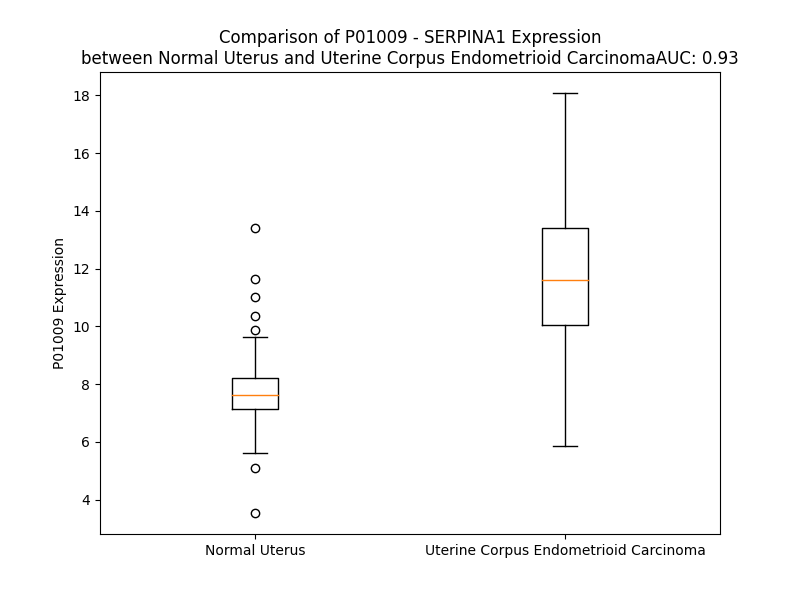

# Detailed Data for P01009

## Introduction to the Detailed Summary

### How to Interpret the Results

- **Summary & Metrics**: This section provides a quick reference to essential protein attributes, including expression changes, family classification, and biomarker applications. Regulation status (upregulated/downregulated) indicates the protein's behavior in a disease context. Some information comes from the original excel file with the proteins selected from literature, while others are derived from the analyses.
- **Expression Comparison**: A visual representation comparing protein expression between normal and disease states. It highlights significant changes in expression levels that might indicate diagnostic or therapeutic relevance. This is data coming from transcriptomics experiments and could not translate similarly to protein levels.
- **Isoform Alignment**: An interactive view of isoform alignments, revealing structural and functional differences between variants of the protein.
- **Interactors & Homologs**: Tables listing known interaction partners and homologous proteins, the more interactors and homologs, the more complex the protein is to design an antibody for.
- **Biological Assemblies**: Information about the structural arrangement of the protein in different assemblies, providing insights into its functional state but also the complexity of the protein to develop antibodies.
- **Combined Per-Residue Information**: A detailed table summarizing residue-level data. This includes predictions for epitope regions, aggregation tendencies, and modifications that might impact the protein's function. Each row corresponds to a residue in the protein, providing insights into specific sites that may be important for research or drug development.
## Summary & Metrics

- **UniProt Accession**: P01009
- **Gene Name**: SERPINA1
- **Protein Name**: serpin peptidase inhibitor, clade A (alpha-1 antiproteinase, antitrypsin), member 1
- **Swiss Prot**: A1AT_HUMAN
- **Family**: other
- **Biomarker Application**: diagnosis,disease progression,safety,unspecified application
- **Number of Isoforms**: 3
- **Regulation**: 2
- **(transcriptomics) AUC**: 0.93
- **(transcriptomics) Fold Change**: 1.51
- **(transcriptomics) Regulation**: Upregulated
- **Discotope Epitope Count**: 87
- **Max n_uniprots (Homo)**: 2.0
- **Max n_uniprots (Hetero)**: 3.0

## Expression Comparison

## Isoform Alignment

<pre style='font-size:14px; font-family:monospace;'>P01009-1 MPSSVSWGILLLAGLCCLVPVSLAEDPQGDAAQKTDTSHHDQDHPTFNKITPNLAEFAFSLYRQLAHQSNSTNIFFSPVSIATAFAMLSLGTKADTHDEILEGLNFNLTEIPEAQIHEGFQELLRTLNQPDSQLQLTTGNGLFLSEGLKLVDKFLEDVKKLYHSEAFTVNFGDTEEAKKQINDYVEKGTQGKIVDLVKELDRDTVFALVNYIFFKGKWERPFEVKDTEEEDFHVDQVTTVKVPMMKRLGMFNIQHCKKLSSWVLLMKYLGNATAIFFLPDEGKLQHLENELTHDIITKFLENEDRRSASLHLPKLSITGTYDLKSVLGQLGITKVFSNGADLSGVTEEAPLKLSKAVHKAVLTIDEKGTEAAGAMFLEAIPMSIPPEVKFNKPFVFLMIEQNTKSPLFMGKVVNPTQK
P01009-2 MPSSVSWGILLLAGLCCLVPVSLAEDPQGDAAQKTDTSHHDQDHPTFNKITPNLAEFAFSLYRQLAHQSNSTNIFFSPVSIATAFAMLSLGTKADTHDEILEGLNFNLTEIPEAQIHEGFQELLRTLNQPDSQLQLTTGNGLFLSEGLKLVDKFLEDVKKLYHSEAFTVNFGDTEEAKKQINDYVEKGTQGKIVDLVKELDRDTVFALVNYIFFKGKWERPFEVKDTEEEDFHVDQVTTVKVPMMKRLGMFNIQHCKKLSSWVLLMKYLGNATAIFFLPDEGKLQHLENELTHDIITKFLENEDRRSASLHLPKLSITGTYDLKSVLGQLGITKVFSNGADLSGVTEEAPLKLSKVRSP-----------------------------------------------------------
P01009-3 MPSSVSWGILLLAGLCCLVPVSLAEDPQGDAAQKTDTSHHDQDHPTFNKITPNLAEFAFSLYRQLAHQSNSTNIFFSPVSIATAFAMLSLGTKADTHDEILEGLNFNLTEIPEAQIHEGFQELLRTLNQPDSQLQLTTGNGLFLSEGLKLVDKFLEDVKKLYHSEAFTVNFGDTEEAKKQINDYVEKGTQGKIVDLVKELDRDTVFALVNYIFFKGKWERPFEVKDTEEEDFHVDQVTTVKVPMMKRLGMFNIQHCKKLSSWVLLMKYLGNATAIFFLPDEGKLQHLENELTHDIITKFLENEDRR----------------------------------------------------------------------------------------------------------------
</pre>

## Interactors

| preferredName_A   | preferredName_B   |   score |
|:------------------|:------------------|--------:|
| SERPINA1          | ELANE             |   0.999 |
| SERPINA1          | ALB               |   0.998 |
| SERPINA1          | A2M               |   0.98  |
| SERPINA1          | ORM1              |   0.979 |
| SERPINA1          | PRSS2             |   0.978 |
| SERPINA1          | ORM2              |   0.972 |
| SERPINA1          | AHSG              |   0.971 |
| SERPINA1          | CELA1             |   0.971 |
| SERPINA1          | TTR               |   0.961 |
| SERPINA1          | HP                |   0.961 |
| SERPINA1          | CTRB2             |   0.958 |
| SERPINA1          | CTRB1             |   0.957 |
| SERPINA1          | CP                |   0.944 |
| SERPINA1          | KNG1              |   0.943 |
| SERPINA1          | PROC              |   0.934 |
| SERPINA1          | AFP               |   0.927 |
| SERPINA1          | APOA1             |   0.927 |
| SERPINA1          | OS9               |   0.92  |
| SERPINA1          | KLK3              |   0.917 |

## Homologs

| uniprot_id   | gene_id   |
|:-------------|:----------|
| A0A024R6N5   | SERPINA1  |
| P48595       | SERPINB10 |
| E9PMI5       | SERPINH1  |
| V9HWH1       | HEL57     |
| A0A1B0GX82   | SERPINB7  |
| Q86U17       | SERPINA11 |
| G3V4B4       | SERPINA5  |
| A8MV23       | SERPINE3  |
| E9PDK7       | SERPINB2  |
| P29508       | SERPINB3  |
| P48594       | SERPINB4  |
| Q96P63       | SERPINB12 |
| Q99574       | SERPINI1  |
| P05121       | SERPINE1  |
| G3V2W1       | SERPINA10 |
| C9J7N5       | SERPINI2  |
| P05546       | SERPIND1  |
| H7BZS9       | SERPINB13 |
| C9JZJ9       | SERPING1  |
| P01008       | SERPINC1  |
| F5GWT8       | SERPINB11 |
| G3V4V7       | SERPINA6  |
| A0A6Q8JH89   | SERPINA9  |
| P05543       | SERPINA7  |
| C9JPV4       | SERPINF2  |
| G3V595       | SERPINA3  |
| P36952       | SERPINB5  |
| P50453       | SERPINB9  |
| A0A2R8Y6N4   | SERPINB6  |
| P0C7T4       | HMSD      |
| Q8IW75       | SERPINA12 |
| C9K031       | SERPINE2  |
| A0A7P0T9S6   | AGT       |
| P50452       | SERPINB8  |
| P29622       | SERPINA4  |
| I3L107       | SERPINF1  |
| P20848       | SERPINA2  |

## Biological Assemblies

|   Unnamed: 0 |   assembly |   n_uniprots | composition   | crystal_id   |
|-------------:|-----------:|-------------:|:--------------|:-------------|
|            0 |          1 |            1 | Homo          | 5nbv         |
|            0 |          1 |            1 | Homo          | 3dru         |
|            1 |          2 |            1 | Homo          | 3dru         |
|            2 |          3 |            1 | Homo          | 3dru         |
|            0 |          1 |            1 | Homo          | 1kct         |
|            0 |          1 |            2 | Homo          | 8api         |
|            0 |          1 |            1 | Homo          | 3cwl         |
|            0 |          1 |            1 | Homo          | 2qug         |
|            0 |          1 |            1 | Homo          | 1iz2         |
|            0 |          1 |            2 | Homo          | 3ndd         |
|            0 |          1 |            2 | Homo          | 3ndf         |
|            0 |          1 |            1 | Homo          | 3cwm         |
|            0 |          1 |            1 | Homo          | 1oo8         |
|            0 |          1 |            1 | Homo          | 3ne4         |
|            0 |          1 |            1 | Homo          | 5nbu         |
|            0 |          1 |            1 | Homo          | 5io1         |
|            1 |          2 |            1 | Homo          | 5io1         |
|            0 |          1 |            2 | Homo          | 9api         |
|            0 |          1 |            1 | Homo          | 6i4v         |
|            0 |          1 |            1 | Homo          | 3drm         |
|            0 |          1 |            3 | Hetero        | 2d26         |
|            0 |          1 |            1 | Homo          | 4pyw         |
|            0 |          1 |            1 | Homo          | 8pi2         |
|            0 |          1 |            1 | Homo          | 1qlp         |
|            0 |          1 |            1 | Homo          | 3t1p         |
|            0 |          1 |            1 | Homo          | 6iay         |
|            0 |          1 |            1 | Homo          | 7npk         |
|            0 |          1 |            1 | Homo          | 6i7u         |
|            0 |          1 |            1 | Homo          | 1hp7         |
|            1 |          2 |            1 | Homo          | 1hp7         |
|            2 |          3 |            1 | Homo          | 1hp7         |
|            0 |          1 |            1 | Homo          | 6hx4         |
|            1 |          2 |            1 | Homo          | 6hx4         |
|            0 |          1 |            1 | Homo          | 7npl         |
|            0 |          1 |            2 | Homo          | 1d5s         |
|            0 |          1 |            1 | Homo          | 1psi         |
|            0 |          1 |            2 | Homo          | 7api         |
|            0 |          1 |            1 | Homo          | 1atu         |
|            0 |          1 |            1 | Homo          | 8p4j         |
|            0 |          1 |            1 | Homo          | 8p4u         |
|            0 |          1 |            2 | Homo          | 1qmb         |
|            0 |          1 |            2 | Hetero        | 1oph         |
|            1 |          2 |            2 | Hetero        | 1oph         |
|            0 |          1 |            3 | Hetero        | 1ezx         |
|            0 |          1 |            1 | Homo          | 6rod         |

## Combined Per-Residue Information

|   res | aa   |   epitope_score | epitope   |   relative_surface_accessibility |   modeling_confidence |   Aggregation | modification             | glycosylation                             |
|------:|:-----|----------------:|:----------|---------------------------------:|----------------------:|--------------:|:-------------------------|:------------------------------------------|
|     1 | M    |         0.16668 | False     |                          1.30759 |                 35.54 |         0     | N/A                      | N/A                                       |
|     2 | P    |         0.27885 | True      |                          0.93494 |                 50.05 |         0     | N/A                      | N/A                                       |
|     3 | S    |         0.29216 | True      |                          0.81872 |                 40.21 |         0.214 | N/A                      | N/A                                       |
|     4 | S    |         0.24356 | True      |                          0.88008 |                 44.26 |         3.905 | N/A                      | N/A                                       |
|     5 | V    |         0.1133  | False     |                          1.00604 |                 42.95 |        33.711 | N/A                      | N/A                                       |
|     6 | S    |         0.10813 | False     |                          0.84186 |                 42.43 |        36.221 | N/A                      | N/A                                       |
|     7 | W    |         0.08488 | False     |                          1.03096 |                 37.51 |        56.404 | N/A                      | N/A                                       |
|     8 | G    |         0.1007  | False     |                          0.95419 |                 44.59 |        60.012 | N/A                      | N/A                                       |
|     9 | I    |         0.12496 | False     |                          0.83127 |                 41.31 |        83.955 | N/A                      | N/A                                       |
|    10 | L    |         0.15621 | False     |                          1.1045  |                 41.8  |        84.809 | N/A                      | N/A                                       |
|    11 | L    |         0.13936 | False     |                          0.93545 |                 39.12 |        84.592 | N/A                      | N/A                                       |
|    12 | L    |         0.17874 | False     |                          1.0766  |                 44.69 |        81.514 | N/A                      | N/A                                       |
|    13 | A    |         0.12582 | False     |                          0.8841  |                 39.72 |        63.177 | N/A                      | N/A                                       |
|    14 | G    |         0.15408 | False     |                          0.92296 |                 47.38 |        33.853 | N/A                      | N/A                                       |
|    15 | L    |         0.21281 | True      |                          1.00351 |                 44.52 |        31.301 | N/A                      | N/A                                       |
|    16 | C    |         0.11128 | False     |                          0.80809 |                 40.11 |        18.226 | N/A                      | N/A                                       |
|    17 | C    |         0.12955 | False     |                          0.92285 |                 46.83 |        10.971 | N/A                      | N/A                                       |
|    18 | L    |         0.14586 | False     |                          1.00703 |                 43.39 |         9.452 | N/A                      | N/A                                       |
|    19 | V    |         0.07669 | False     |                          0.90816 |                 46.01 |         1.108 | N/A                      | N/A                                       |
|    20 | P    |         0.14288 | False     |                          0.90616 |                 42.91 |         0.458 | N/A                      | N/A                                       |
|    21 | V    |         0.09698 | False     |                          0.99758 |                 41.16 |         0     | N/A                      | N/A                                       |
|    22 | S    |         0.15282 | False     |                          0.83439 |                 39.42 |         0     | N/A                      | N/A                                       |
|    23 | L    |         0.16206 | False     |                          1.04082 |                 38.98 |         0     | N/A                      | N/A                                       |
|    24 | A    |         0.22858 | True      |                          0.82927 |                 40.58 |         0     | N/A                      | N/A                                       |
|    25 | E    |         0.20822 | True      |                          0.93623 |                 37.74 |         0     | N/A                      | N/A                                       |
|    26 | D    |         0.11353 | False     |                          0.81706 |                 35.57 |         0     | N/A                      | N/A                                       |
|    27 | P    |         0.17812 | False     |                          0.75599 |                 45.84 |         0     | N/A                      | N/A                                       |
|    28 | Q    |         0.35693 | True      |                          0.92169 |                 38.72 |         0     | N/A                      | N/A                                       |
|    29 | G    |         0.31851 | True      |                          0.96652 |                 38.15 |         0     | N/A                      | N/A                                       |
|    30 | D    |         0.2199  | True      |                          0.92082 |                 39.82 |         0     | N/A                      | N/A                                       |
|    31 | A    |         0.22951 | True      |                          0.90936 |                 40.42 |         0     | N/A                      | N/A                                       |
|    32 | A    |         0.26564 | True      |                          0.86097 |                 39.33 |         0     | N/A                      | N/A                                       |
|    33 | Q    |         0.14462 | False     |                          0.87425 |                 37.25 |         0     | N/A                      | N/A                                       |
|    34 | K    |         0.14291 | False     |                          1.01222 |                 39.13 |         0     | N/A                      | N/A                                       |
|    35 | T    |         0.14543 | False     |                          0.88604 |                 34.7  |         0     | N/A                      | N/A                                       |
|    36 | D    |         0.13252 | False     |                          0.91389 |                 35.4  |         0     | N/A                      | N/A                                       |
|    37 | T    |         0.14418 | False     |                          0.94276 |                 32.36 |         0     | N/A                      | N/A                                       |
|    38 | S    |         0.11136 | False     |                          0.80356 |                 37.43 |         0     | Phosphoserine; by FAM20C | N/A                                       |
|    39 | H    |         0.17179 | False     |                          0.98818 |                 35.82 |         0     | N/A                      | N/A                                       |
|    40 | H    |         0.15188 | False     |                          0.97448 |                 33.69 |         0     | N/A                      | N/A                                       |
|    41 | D    |         0.14036 | False     |                          0.79845 |                 37.46 |         0     | N/A                      | N/A                                       |
|    42 | Q    |         0.11808 | False     |                          0.7516  |                 37.43 |         0     | N/A                      | N/A                                       |
|    43 | D    |         0.14877 | False     |                          0.90145 |                 49.4  |         0     | N/A                      | N/A                                       |
|    44 | H    |         0.14162 | False     |                          0.71197 |                 58.3  |         0     | N/A                      | N/A                                       |
|    45 | P    |         0.18772 | True      |                          0.41029 |                 69.16 |         0     | N/A                      | N/A                                       |
|    46 | T    |         0.06786 | False     |                          0.08443 |                 73    |         0     | N/A                      | N/A                                       |
|    47 | F    |         0.04398 | False     |                          0.08413 |                 75.59 |         0     | N/A                      | N/A                                       |
|    48 | N    |         0.13434 | False     |                          0.43083 |                 81.02 |         0     | N/A                      | N/A                                       |
|    49 | K    |         0.10772 | False     |                          0.41156 |                 87.96 |         0     | N/A                      | N/A                                       |
|    50 | I    |         0.01099 | False     |                          0       |                 94.71 |         0     | N/A                      | N/A                                       |
|    51 | T    |         0.02377 | False     |                          0.03999 |                 94.09 |         0     | N/A                      | N/A                                       |
|    52 | P    |         0.0667  | False     |                          0.39616 |                 94.71 |         0     | N/A                      | N/A                                       |
|    53 | N    |         0.05767 | False     |                          0.18336 |                 96.73 |         0     | N/A                      | N/A                                       |
|    54 | L    |         0.0014  | False     |                          0       |                 97.33 |         0     | N/A                      | N/A                                       |
|    55 | A    |         0.01673 | False     |                          0.06122 |                 96.98 |         0     | N/A                      | N/A                                       |
|    56 | E    |         0.04311 | False     |                          0.32947 |                 96.96 |         0     | N/A                      | N/A                                       |
|    57 | F    |         0.00225 | False     |                          0       |                 98.29 |        38.144 | N/A                      | N/A                                       |
|    58 | A    |         0.00221 | False     |                          0.00255 |                 98.43 |        40.555 | N/A                      | N/A                                       |
|    59 | F    |         0.01614 | False     |                          0.01848 |                 97.89 |        40.555 | N/A                      | N/A                                       |
|    60 | S    |         0.06418 | False     |                          0.27616 |                 97.16 |        40.555 | N/A                      | N/A                                       |
|    61 | L    |         0.01003 | False     |                          0.01154 |                 98.13 |        40.555 | N/A                      | N/A                                       |
|    62 | Y    |         0.00818 | False     |                          0.00791 |                 98.36 |        31.967 | N/A                      | N/A                                       |
|    63 | R    |         0.15858 | False     |                          0.30232 |                 96.61 |         0     | N/A                      | N/A                                       |
|    64 | Q    |         0.13863 | False     |                          0.2056  |                 96.41 |         0     | N/A                      | N/A                                       |
|    65 | L    |         0.03385 | False     |                          0.05613 |                 97.25 |         0     | N/A                      | N/A                                       |
|    66 | A    |         0.0307  | False     |                          0.05781 |                 95.93 |         0     | N/A                      | N/A                                       |
|    67 | H    |         0.18187 | False     |                          0.74954 |                 93.75 |         0     | N/A                      | N/A                                       |
|    68 | Q    |         0.17431 | False     |                          0.51382 |                 91.94 |         0     | N/A                      | N/A                                       |
|    69 | S    |         0.09957 | False     |                          0.27852 |                 90.01 |         0     | N/A                      | N/A                                       |
|    70 | N    |         0.14197 | False     |                          0.62307 |                 89.56 |         0     | N/A                      | N-linked (GlcNAc...) (complex) asparagine |
|    71 | S    |         0.19563 | True      |                          0.6545  |                 91.79 |         0.286 | N/A                      | N/A                                       |
|    72 | T    |         0.12539 | False     |                          0.42212 |                 95.29 |         2.596 | N/A                      | N/A                                       |
|    73 | N    |         0.02197 | False     |                          0.10066 |                 97.32 |         2.596 | N/A                      | N/A                                       |
|    74 | I    |         0.01205 | False     |                          0.0344  |                 98.03 |         2.596 | N/A                      | N/A                                       |
|    75 | F    |         0.00159 | False     |                          0       |                 98    |         2.596 | N/A                      | N/A                                       |
|    76 | F    |         0.0045  | False     |                          0.00069 |                 98.42 |         2.596 | N/A                      | N/A                                       |
|    77 | S    |         0.00281 | False     |                          0       |                 98.17 |         0     | N/A                      | N/A                                       |
|    78 | P    |         0.00133 | False     |                          0       |                 98.11 |         0.237 | N/A                      | N/A                                       |
|    79 | V    |         0.00575 | False     |                          0.02951 |                 96.43 |        28.228 | N/A                      | N/A                                       |
|    80 | S    |         0.00507 | False     |                          0.0427  |                 96.44 |        30.538 | N/A                      | N/A                                       |
|    81 | I    |         0.00474 | False     |                          0.0104  |                 98.36 |        49.438 | N/A                      | N/A                                       |
|    82 | A    |         0.00104 | False     |                          0       |                 98.19 |        51.002 | N/A                      | N/A                                       |
|    83 | T    |         0.01002 | False     |                          0.03172 |                 97.12 |        52.714 | N/A                      | N/A                                       |
|    84 | A    |         0.00085 | False     |                          0       |                 97.78 |        55.111 | N/A                      | N/A                                       |
|    85 | F    |         0.00152 | False     |                          0       |                 98.51 |        56.304 | N/A                      | N/A                                       |
|    86 | A    |         0.00142 | False     |                          0       |                 98.08 |        52.476 | N/A                      | N/A                                       |
|    87 | M    |         0.00182 | False     |                          0       |                 97.92 |        49.044 | N/A                      | N/A                                       |
|    88 | L    |         0.00195 | False     |                          0       |                 98.35 |        44.979 | N/A                      | N/A                                       |
|    89 | S    |         0.00914 | False     |                          0.00384 |                 98.26 |        21.2   | N/A                      | N/A                                       |
|    90 | L    |         0.12284 | False     |                          0.3004  |                 97.84 |        18.055 | N/A                      | N/A                                       |
|    91 | G    |         0.00537 | False     |                          0       |                 98.11 |         0.694 | N/A                      | N/A                                       |
|    92 | T    |         0.03938 | False     |                          0.05208 |                 98.53 |         0.259 | N/A                      | N/A                                       |
|    93 | K    |         0.2183  | True      |                          0.51462 |                 98.15 |         0     | N/A                      | N/A                                       |
|    94 | A    |         0.19928 | True      |                          0.62494 |                 97.71 |         0     | N/A                      | N/A                                       |
|    95 | D    |         0.27848 | True      |                          0.49461 |                 98.15 |         0     | N/A                      | N/A                                       |
|    96 | T    |         0.0462  | False     |                          0.02936 |                 98.61 |         0     | N/A                      | N/A                                       |
|    97 | H    |         0.08236 | False     |                          0.10679 |                 98.61 |         0     | N/A                      | N/A                                       |
|    98 | D    |         0.1809  | False     |                          0.33688 |                 98.44 |         0     | N/A                      | N/A                                       |
|    99 | E    |         0.08488 | False     |                          0.2052  |                 98.38 |         0     | N/A                      | N/A                                       |
|   100 | I    |         0.0062  | False     |                          0.0016  |                 98.68 |         0     | N/A                      | N/A                                       |
|   101 | L    |         0.0051  | False     |                          0       |                 98.53 |         0     | N/A                      | N/A                                       |
|   102 | E    |         0.12965 | False     |                          0.54116 |                 98.23 |         0     | N/A                      | N/A                                       |
|   103 | G    |         0.0353  | False     |                          0.08723 |                 98.08 |         0     | N/A                      | N/A                                       |
|   104 | L    |         0.00268 | False     |                          0       |                 98.21 |         0     | N/A                      | N/A                                       |
|   105 | N    |         0.0578  | False     |                          0.35335 |                 97.98 |         0     | N/A                      | N/A                                       |
|   106 | F    |         0.02182 | False     |                          0.01281 |                 97.63 |         0     | N/A                      | N/A                                       |
|   107 | N    |         0.09934 | False     |                          0.39397 |                 96.37 |         0     | N/A                      | N-linked (GlcNAc...) (complex) asparagine |
|   108 | L    |         0.20673 | True      |                          0.32347 |                 95.78 |         0     | N/A                      | N/A                                       |
|   109 | T    |         0.27952 | True      |                          0.90581 |                 95.73 |         0     | N/A                      | N/A                                       |
|   110 | E    |         0.22962 | True      |                          0.72841 |                 94.68 |         0     | N/A                      | N/A                                       |
|   111 | I    |         0.14258 | False     |                          0.11245 |                 94.19 |         0     | N/A                      | N/A                                       |
|   112 | P    |         0.24087 | True      |                          0.57898 |                 94.97 |         0     | N/A                      | N/A                                       |
|   113 | E    |         0.20496 | True      |                          0.41826 |                 94.65 |         0     | N/A                      | N/A                                       |
|   114 | A    |         0.17106 | False     |                          0.73016 |                 94.14 |         0     | N/A                      | N/A                                       |
|   115 | Q    |         0.07531 | False     |                          0.28121 |                 94.87 |         0     | N/A                      | N/A                                       |
|   116 | I    |         0.00376 | False     |                          0       |                 96.48 |         0     | N/A                      | N/A                                       |
|   117 | H    |         0.07724 | False     |                          0.0679  |                 96    |         0     | N/A                      | N/A                                       |
|   118 | E    |         0.17204 | False     |                          0.46103 |                 94.43 |         0     | N/A                      | N/A                                       |
|   119 | G    |         0.00598 | False     |                          0       |                 95.28 |         0     | N/A                      | N/A                                       |
|   120 | F    |         0.00318 | False     |                          0.00051 |                 95.08 |         0     | N/A                      | N/A                                       |
|   121 | Q    |         0.1037  | False     |                          0.26799 |                 92.56 |         0     | N/A                      | N/A                                       |
|   122 | E    |         0.07958 | False     |                          0.15915 |                 90.53 |         0     | N/A                      | N/A                                       |
|   123 | L    |         0.00281 | False     |                          0.00247 |                 90.99 |         0     | N/A                      | N/A                                       |
|   124 | L    |         0.04135 | False     |                          0.06252 |                 89.74 |         0     | N/A                      | N/A                                       |
|   125 | R    |         0.1528  | False     |                          0.57489 |                 87.01 |         0     | N/A                      | N/A                                       |
|   126 | T    |         0.03676 | False     |                          0.06304 |                 85.43 |         0     | N/A                      | N/A                                       |
|   127 | L    |         0.03439 | False     |                          0.11083 |                 85.1  |         0     | N/A                      | N/A                                       |
|   128 | N    |         0.1034  | False     |                          0.47581 |                 82.01 |         0     | N/A                      | N/A                                       |
|   129 | Q    |         0.15443 | False     |                          0.44148 |                 80.34 |         0     | N/A                      | N/A                                       |
|   130 | P    |         0.2411  | True      |                          1.00887 |                 70.73 |         0     | N/A                      | N/A                                       |
|   131 | D    |         0.33168 | True      |                          0.84773 |                 73.08 |         0     | N/A                      | N/A                                       |
|   132 | S    |         0.096   | False     |                          0.30755 |                 76.22 |         0     | N/A                      | N/A                                       |
|   133 | Q    |         0.22144 | True      |                          0.52841 |                 79.83 |         0     | N/A                      | N/A                                       |
|   134 | L    |         0.03823 | False     |                          0.07901 |                 80.86 |         0     | N/A                      | N/A                                       |
|   135 | Q    |         0.1943  | True      |                          0.41487 |                 82.74 |         0     | N/A                      | N/A                                       |
|   136 | L    |         0.03933 | False     |                          0.17758 |                 88.12 |         0     | N/A                      | N/A                                       |
|   137 | T    |         0.05759 | False     |                          0.303   |                 87.69 |         0     | N/A                      | N/A                                       |
|   138 | T    |         0.01838 | False     |                          0.30243 |                 91.45 |         0     | N/A                      | N/A                                       |
|   139 | G    |         0.03255 | False     |                          0.14807 |                 91.97 |         0     | N/A                      | N/A                                       |
|   140 | N    |         0.01708 | False     |                          0.06277 |                 94.6  |         0     | N/A                      | N/A                                       |
|   141 | G    |         0.0038  | False     |                          0       |                 96.76 |         0     | N/A                      | N/A                                       |
|   142 | L    |         0.00164 | False     |                          0       |                 98.41 |         0.56  | N/A                      | N/A                                       |
|   143 | F    |         0.01199 | False     |                          0.02102 |                 98.54 |         0.56  | N/A                      | N/A                                       |
|   144 | L    |         0.00415 | False     |                          0.00165 |                 98.29 |         0.56  | N/A                      | N/A                                       |
|   145 | S    |         0.07142 | False     |                          0.1848  |                 97.6  |         0.56  | N/A                      | N/A                                       |
|   146 | E    |         0.24161 | True      |                          0.5452  |                 96.16 |         0.56  | N/A                      | N/A                                       |
|   147 | G    |         0.23265 | True      |                          0.8748  |                 94.85 |         0.56  | N/A                      | N/A                                       |
|   148 | L    |         0.10023 | False     |                          0.17372 |                 96.19 |         0.56  | N/A                      | N/A                                       |
|   149 | K    |         0.19546 | True      |                          0.63745 |                 97.36 |         0.56  | N/A                      | N/A                                       |
|   150 | L    |         0.1019  | False     |                          0.20626 |                 97.75 |         1.157 | N/A                      | N/A                                       |
|   151 | V    |         0.19641 | True      |                          0.24754 |                 98.05 |         1.157 | N/A                      | N/A                                       |
|   152 | D    |         0.23441 | True      |                          0.72476 |                 97.6  |         0.597 | N/A                      | N/A                                       |
|   153 | K    |         0.2093  | True      |                          0.60019 |                 97.7  |         0.597 | N/A                      | N/A                                       |
|   154 | F    |         0.01613 | False     |                          0.02089 |                 97.65 |         0.597 | N/A                      | N/A                                       |
|   155 | L    |         0.10981 | False     |                          0.33026 |                 97.15 |         0.395 | N/A                      | N/A                                       |
|   156 | E    |         0.16726 | False     |                          0.38246 |                 97.5  |         0     | N/A                      | N/A                                       |
|   157 | D    |         0.09269 | False     |                          0.07382 |                 96.54 |         0     | N/A                      | N/A                                       |
|   158 | V    |         0.00343 | False     |                          0.00571 |                 96.15 |         0     | N/A                      | N/A                                       |
|   159 | K    |         0.17125 | False     |                          0.73333 |                 95.26 |         0     | N/A                      | N/A                                       |
|   160 | K    |         0.29825 | True      |                          0.65296 |                 93.55 |         0     | N/A                      | N/A                                       |
|   161 | L    |         0.1294  | False     |                          0.33135 |                 92.85 |         0     | N/A                      | N/A                                       |
|   162 | Y    |         0.01952 | False     |                          0.0072  |                 94.66 |         0     | N/A                      | N/A                                       |
|   163 | H    |         0.11599 | False     |                          0.64636 |                 91.63 |         0     | N/A                      | N/A                                       |
|   164 | S    |         0.02385 | False     |                          0.05942 |                 93.59 |         0     | N/A                      | N/A                                       |
|   165 | E    |         0.07702 | False     |                          0.4368  |                 94.41 |         0     | N/A                      | N/A                                       |
|   166 | A    |         0.03764 | False     |                          0.35772 |                 97.2  |         0.265 | N/A                      | N/A                                       |
|   167 | F    |         0.10133 | False     |                          0.33512 |                 97.76 |         0.578 | N/A                      | N/A                                       |
|   168 | T    |         0.09189 | False     |                          0.57336 |                 97.56 |         0.578 | N/A                      | N/A                                       |
|   169 | V    |         0.03226 | False     |                          0.0476  |                 97.69 |         0.578 | N/A                      | N/A                                       |
|   170 | N    |         0.1916  | True      |                          0.4751  |                 97.52 |         0.578 | N/A                      | N/A                                       |
|   171 | F    |         0.06086 | False     |                          0.05435 |                 97.46 |         0.578 | N/A                      | N/A                                       |
|   172 | G    |         0.21897 | True      |                          0.90392 |                 95.68 |         0     | N/A                      | N/A                                       |
|   173 | D    |         0.13532 | False     |                          0.43737 |                 96.7  |         0     | N/A                      | N/A                                       |
|   174 | T    |         0.07682 | False     |                          0.2433  |                 96.96 |         0     | N/A                      | N/A                                       |
|   175 | E    |         0.11228 | False     |                          0.56184 |                 97.21 |         0     | N/A                      | N/A                                       |
|   176 | E    |         0.07577 | False     |                          0.36196 |                 97.73 |         0     | N/A                      | N/A                                       |
|   177 | A    |         0.00388 | False     |                          0.00329 |                 97.97 |         0     | N/A                      | N/A                                       |
|   178 | K    |         0.0716  | False     |                          0.20023 |                 98.04 |         0     | N/A                      | N/A                                       |
|   179 | K    |         0.16694 | False     |                          0.51576 |                 97.96 |         0     | N/A                      | N/A                                       |
|   180 | Q    |         0.07695 | False     |                          0.34765 |                 97.97 |         0     | N/A                      | N/A                                       |
|   181 | I    |         0.00429 | False     |                          0       |                 97.99 |         0     | N/A                      | N/A                                       |
|   182 | N    |         0.1098  | False     |                          0.0955  |                 98.14 |         0     | N/A                      | N/A                                       |
|   183 | D    |         0.09274 | False     |                          0.38448 |                 97.94 |         0     | N/A                      | N/A                                       |
|   184 | Y    |         0.06327 | False     |                          0.11995 |                 97.35 |         0     | N/A                      | N/A                                       |
|   185 | V    |         0.00649 | False     |                          0.00286 |                 96.72 |         0     | N/A                      | N/A                                       |
|   186 | E    |         0.0953  | False     |                          0.38244 |                 96.99 |         0     | N/A                      | N/A                                       |
|   187 | K    |         0.17383 | False     |                          0.82868 |                 95.78 |         0     | N/A                      | N/A                                       |
|   188 | G    |         0.05036 | False     |                          0.22737 |                 91.08 |         0     | N/A                      | N/A                                       |
|   189 | T    |         0.02826 | False     |                          0.00613 |                 91.48 |         0     | N/A                      | N/A                                       |
|   190 | Q    |         0.29036 | True      |                          0.66201 |                 92.33 |         0     | N/A                      | N/A                                       |
|   191 | G    |         0.24914 | True      |                          0.48404 |                 93.13 |         0.195 | N/A                      | N/A                                       |
|   192 | K    |         0.18723 | True      |                          0.61692 |                 91.34 |         2.366 | N/A                      | N/A                                       |
|   193 | I    |         0.02886 | False     |                          0.00776 |                 92.9  |         4.532 | N/A                      | N/A                                       |
|   194 | V    |         0.14931 | False     |                          0.54168 |                 94.85 |         4.73  | N/A                      | N/A                                       |
|   195 | D    |         0.17334 | False     |                          0.48795 |                 94.16 |         4.73  | N/A                      | N/A                                       |
|   196 | L    |         0.04481 | False     |                          0.05348 |                 95.8  |         4.73  | N/A                      | N/A                                       |
|   197 | V    |         0.05088 | False     |                          0.02558 |                 95.97 |         4.73  | N/A                      | N/A                                       |
|   198 | K    |         0.25292 | True      |                          0.68053 |                 94.31 |         2.364 | N/A                      | N/A                                       |
|   199 | E    |         0.26419 | True      |                          0.72071 |                 94.58 |         0     | N/A                      | N/A                                       |
|   200 | L    |         0.07556 | False     |                          0.13137 |                 96.1  |         0     | N/A                      | N/A                                       |
|   201 | D    |         0.2228  | True      |                          0.56986 |                 95.24 |         0     | N/A                      | N/A                                       |
|   202 | R    |         0.44641 | True      |                          0.92585 |                 95.1  |         0.025 | N/A                      | N/A                                       |
|   203 | D    |         0.31528 | True      |                          0.49894 |                 95.08 |         0.054 | N/A                      | N/A                                       |
|   204 | T    |         0.01585 | False     |                          0.02873 |                 97.38 |        18.113 | N/A                      | N/A                                       |
|   205 | V    |         0.11542 | False     |                          0.3437  |                 97.35 |        98.85  | N/A                      | N/A                                       |
|   206 | F    |         0.00549 | False     |                          0       |                 98.37 |        99.784 | N/A                      | N/A                                       |
|   207 | A    |         0.00398 | False     |                          0.00638 |                 98.42 |        99.861 | N/A                      | N/A                                       |
|   208 | L    |         0.00247 | False     |                          0.00122 |                 98.48 |        99.95  | N/A                      | N/A                                       |
|   209 | V    |         0.00418 | False     |                          0.00666 |                 97.94 |        99.949 | N/A                      | N/A                                       |
|   210 | N    |         0.00463 | False     |                          0.0037  |                 96.77 |        99.704 | N/A                      | N/A                                       |
|   211 | Y    |         0.03978 | False     |                          0.04676 |                 96.11 |        99.694 | N/A                      | N/A                                       |
|   212 | I    |         0.01578 | False     |                          0.0224  |                 94.56 |        99.66  | N/A                      | N/A                                       |
|   213 | F    |         0.03457 | False     |                          0.14395 |                 90.97 |        99.28  | N/A                      | N/A                                       |
|   214 | F    |         0.00789 | False     |                          0       |                 90.13 |        91.796 | N/A                      | N/A                                       |
|   215 | K    |         0.104   | False     |                          0.26345 |                 86.25 |         0.029 | N/A                      | N/A                                       |
|   216 | G    |         0.04516 | False     |                          0.0564  |                 84.02 |         0.002 | N/A                      | N/A                                       |
|   217 | K    |         0.16936 | False     |                          0.20058 |                 90.28 |         0     | N/A                      | N/A                                       |
|   218 | W    |         0.03869 | False     |                          0.02515 |                 92.22 |         0     | N/A                      | N/A                                       |
|   219 | E    |         0.05822 | False     |                          0.25507 |                 90.94 |         0     | N/A                      | N/A                                       |
|   220 | R    |         0.13368 | False     |                          0.24477 |                 91.73 |         0     | N/A                      | N/A                                       |
|   221 | P    |         0.145   | False     |                          0.32022 |                 93.15 |         0     | N/A                      | N/A                                       |
|   222 | F    |         0.01015 | False     |                          0.00717 |                 94.07 |         0     | N/A                      | N/A                                       |
|   223 | E    |         0.13812 | False     |                          0.4469  |                 92.19 |         0     | N/A                      | N/A                                       |
|   224 | V    |         0.20744 | True      |                          0.59701 |                 94.08 |         0     | N/A                      | N/A                                       |
|   225 | K    |         0.2969  | True      |                          0.73975 |                 95.08 |         0     | N/A                      | N/A                                       |
|   226 | D    |         0.07595 | False     |                          0.26033 |                 96.29 |         0     | N/A                      | N/A                                       |
|   227 | T    |         0.08461 | False     |                          0.21766 |                 97.9  |         0     | N/A                      | N/A                                       |
|   228 | E    |         0.17646 | False     |                          0.49828 |                 98.01 |         0     | N/A                      | N/A                                       |
|   229 | E    |         0.28512 | True      |                          0.53891 |                 98.18 |         0     | N/A                      | N/A                                       |
|   230 | E    |         0.11458 | False     |                          0.1704  |                 98.37 |         0     | N/A                      | N/A                                       |
|   231 | D    |         0.17724 | False     |                          0.33841 |                 98.28 |         0     | N/A                      | N/A                                       |
|   232 | F    |         0.0063  | False     |                          0       |                 98.5  |         0     | N/A                      | N/A                                       |
|   233 | H    |         0.19999 | True      |                          0.41632 |                 98.11 |         0     | N/A                      | N/A                                       |
|   234 | V    |         0.10506 | False     |                          0.22581 |                 96.4  |         0     | N/A                      | N/A                                       |
|   235 | D    |         0.23045 | True      |                          0.4258  |                 93.66 |         0     | N/A                      | N/A                                       |
|   236 | Q    |         0.26353 | True      |                          0.80994 |                 91.63 |         0.33  | N/A                      | N/A                                       |
|   237 | V    |         0.33215 | True      |                          0.99462 |                 95    |         0.33  | N/A                      | N/A                                       |
|   238 | T    |         0.2484  | True      |                          0.3989  |                 96.29 |         0.33  | N/A                      | N/A                                       |
|   239 | T    |         0.34127 | True      |                          0.49702 |                 97.17 |         0.33  | N/A                      | N/A                                       |
|   240 | V    |         0.15403 | False     |                          0.25325 |                 97.58 |         0.33  | N/A                      | N/A                                       |
|   241 | K    |         0.30864 | True      |                          0.57366 |                 98.01 |         0     | N/A                      | N/A                                       |
|   242 | V    |         0.01711 | False     |                          0.00476 |                 98.06 |         0     | N/A                      | N/A                                       |
|   243 | P    |         0.10176 | False     |                          0.37079 |                 97.96 |         0     | N/A                      | N/A                                       |
|   244 | M    |         0.00832 | False     |                          0       |                 98.5  |         0     | N/A                      | N/A                                       |
|   245 | M    |         0.01232 | False     |                          0       |                 98.18 |         0     | N/A                      | N/A                                       |
|   246 | K    |         0.05947 | False     |                          0.246   |                 97.31 |         0     | N/A                      | N/A                                       |
|   247 | R    |         0.10877 | False     |                          0.15986 |                 95.16 |         0     | N/A                      | N/A                                       |
|   248 | L    |         0.24657 | True      |                          0.51803 |                 95.34 |         0     | N/A                      | N/A                                       |
|   249 | G    |         0.00436 | False     |                          0       |                 94.58 |         0     | N/A                      | N/A                                       |
|   250 | M    |         0.17408 | False     |                          0.17725 |                 95.95 |         0     | N/A                      | N/A                                       |
|   251 | F    |         0.01578 | False     |                          0.02582 |                 97.14 |         0     | N/A                      | N/A                                       |
|   252 | N    |         0.03294 | False     |                          0.11365 |                 97.67 |         0     | N/A                      | N/A                                       |
|   253 | I    |         0.07325 | False     |                          0.02256 |                 98.11 |         0     | N/A                      | N/A                                       |
|   254 | Q    |         0.06164 | False     |                          0.17007 |                 97.54 |         0     | N/A                      | N/A                                       |
|   255 | H    |         0.14508 | False     |                          0.41167 |                 97.76 |         0     | N/A                      | N/A                                       |
|   256 | C    |         0.07698 | False     |                          0.15437 |                 97.62 |         0     | S-cysteinyl cysteine     | N/A                                       |
|   257 | K    |         0.22829 | True      |                          0.9078  |                 97.52 |         0     | N/A                      | N/A                                       |
|   258 | K    |         0.14508 | False     |                          0.56845 |                 97.54 |         0     | N/A                      | N/A                                       |
|   259 | L    |         0.0043  | False     |                          0       |                 98.07 |         0.64  | N/A                      | N/A                                       |
|   260 | S    |         0.07579 | False     |                          0.14318 |                 98.36 |         0.901 | N/A                      | N/A                                       |
|   261 | S    |         0.0028  | False     |                          0       |                 98.66 |         6.655 | N/A                      | N/A                                       |
|   262 | W    |         0.13933 | False     |                          0.29277 |                 98.65 |        31.524 | N/A                      | N/A                                       |
|   263 | V    |         0.00156 | False     |                          0       |                 98.7  |        31.524 | N/A                      | N/A                                       |
|   264 | L    |         0.00345 | False     |                          0.00082 |                 98.58 |        31.524 | N/A                      | N/A                                       |
|   265 | L    |         0.03926 | False     |                          0.0827  |                 98.29 |        31.403 | N/A                      | N/A                                       |
|   266 | M    |         0.02792 | False     |                          0.05897 |                 96.24 |        28.369 | N/A                      | N/A                                       |
|   267 | K    |         0.0728  | False     |                          0.4217  |                 94.8  |         0     | N/A                      | N/A                                       |
|   268 | Y    |         0.01547 | False     |                          0.02569 |                 92.63 |         0.518 | N/A                      | N/A                                       |
|   269 | L    |         0.20244 | True      |                          0.373   |                 89.14 |         0.664 | N/A                      | N/A                                       |
|   270 | G    |         0.09598 | False     |                          0.45075 |                 86.43 |         0.736 | N/A                      | N/A                                       |
|   271 | N    |         0.05404 | False     |                          0.14825 |                 87.85 |         1.611 | N/A                      | N-linked (GlcNAc...) (complex) asparagine |
|   272 | A    |         0.00241 | False     |                          0       |                 93.07 |        24.512 | N/A                      | N/A                                       |
|   273 | T    |         0.0107  | False     |                          0.03645 |                 95.63 |        49.693 | N/A                      | N/A                                       |
|   274 | A    |         0.00452 | False     |                          0.0051  |                 97.3  |        50.478 | N/A                      | N/A                                       |
|   275 | I    |         0.00184 | False     |                          0       |                 98.4  |        50.735 | N/A                      | N/A                                       |
|   276 | F    |         0.00221 | False     |                          0.00191 |                 98.71 |        50.735 | N/A                      | N/A                                       |
|   277 | F    |         0.00176 | False     |                          0.00446 |                 98.8  |        48.97  | N/A                      | N/A                                       |
|   278 | L    |         0.01899 | False     |                          0.05975 |                 98.73 |         2.007 | N/A                      | N/A                                       |
|   279 | P    |         0.01805 | False     |                          0.04246 |                 98.46 |         0.708 | N/A                      | N/A                                       |
|   280 | D    |         0.17424 | False     |                          0.29908 |                 98.23 |         0     | N/A                      | N/A                                       |
|   281 | E    |         0.22579 | True      |                          0.70719 |                 95.88 |         0     | N/A                      | N/A                                       |
|   282 | G    |         0.17718 | False     |                          0.95139 |                 95.21 |         0     | N/A                      | N/A                                       |
|   283 | K    |         0.16052 | False     |                          0.39024 |                 97.8  |         0     | N/A                      | N/A                                       |
|   284 | L    |         0.04787 | False     |                          0.26863 |                 96.81 |         0     | N/A                      | N/A                                       |
|   285 | Q    |         0.17742 | False     |                          0.41993 |                 96.19 |         0     | N/A                      | N/A                                       |
|   286 | H    |         0.10396 | False     |                          0.34464 |                 97.83 |         0     | N/A                      | N/A                                       |
|   287 | L    |         0.0022  | False     |                          0       |                 97.95 |         0     | N/A                      | N/A                                       |
|   288 | E    |         0.04339 | False     |                          0.02994 |                 96.95 |         0     | N/A                      | N/A                                       |
|   289 | N    |         0.17573 | False     |                          0.53975 |                 96.34 |         0     | N/A                      | N/A                                       |
|   290 | E    |         0.13751 | False     |                          0.28994 |                 97.19 |         0     | N/A                      | N/A                                       |
|   291 | L    |         0.01975 | False     |                          0.01624 |                 96.42 |         0     | N/A                      | N/A                                       |
|   292 | T    |         0.11386 | False     |                          0.36321 |                 95.91 |         0     | N/A                      | N/A                                       |
|   293 | H    |         0.10609 | False     |                          0.21321 |                 94.76 |         0     | N/A                      | N/A                                       |
|   294 | D    |         0.15235 | False     |                          0.55392 |                 95.39 |         0.202 | N/A                      | N/A                                       |
|   295 | I    |         0.03683 | False     |                          0.0976  |                 96.06 |         0.202 | N/A                      | N/A                                       |
|   296 | I    |         0.03005 | False     |                          0.032   |                 96.28 |         0.202 | N/A                      | N/A                                       |
|   297 | T    |         0.14983 | False     |                          0.34531 |                 94.81 |         0.202 | N/A                      | N/A                                       |
|   298 | K    |         0.1876  | True      |                          0.65095 |                 96.11 |         0.202 | N/A                      | N/A                                       |
|   299 | F    |         0.06022 | False     |                          0.06624 |                 96.93 |         0.202 | N/A                      | N/A                                       |
|   300 | L    |         0.05528 | False     |                          0.25768 |                 95.03 |         0.202 | N/A                      | N/A                                       |
|   301 | E    |         0.22065 | True      |                          0.63874 |                 94.96 |         0     | N/A                      | N/A                                       |
|   302 | N    |         0.06995 | False     |                          0.23368 |                 94.35 |         0     | N/A                      | N/A                                       |
|   303 | E    |         0.19263 | True      |                          0.71263 |                 92.84 |         0     | N/A                      | N/A                                       |
|   304 | D    |         0.15687 | False     |                          0.54908 |                 93.61 |         0     | N/A                      | N/A                                       |
|   305 | R    |         0.19018 | True      |                          0.3623  |                 95.1  |         0     | N/A                      | N/A                                       |
|   306 | R    |         0.18974 | True      |                          0.52443 |                 94.65 |         0     | N/A                      | N/A                                       |
|   307 | S    |         0.06812 | False     |                          0.09644 |                 96.02 |         0     | N/A                      | N/A                                       |
|   308 | A    |         0.00426 | False     |                          0       |                 97.27 |         0     | N/A                      | N/A                                       |
|   309 | S    |         0.07572 | False     |                          0.21649 |                 97.51 |         0     | N/A                      | N/A                                       |
|   310 | L    |         0.00233 | False     |                          0       |                 98.43 |         0     | N/A                      | N/A                                       |
|   311 | H    |         0.06391 | False     |                          0.07605 |                 98.61 |         0     | N/A                      | N/A                                       |
|   312 | L    |         0.00176 | False     |                          0       |                 98.31 |         0     | N/A                      | N/A                                       |
|   313 | P    |         0.00289 | False     |                          0       |                 97.56 |         0     | N/A                      | N/A                                       |
|   314 | K    |         0.09753 | False     |                          0.36415 |                 95.6  |         0     | N/A                      | N/A                                       |
|   315 | L    |         0.01745 | False     |                          0.04361 |                 91.31 |         0.13  | N/A                      | N/A                                       |
|   316 | S    |         0.07717 | False     |                          0.39833 |                 92.59 |         0.13  | N/A                      | N/A                                       |
|   317 | I    |         0.02691 | False     |                          0.0248  |                 94.41 |         0.13  | N/A                      | N/A                                       |
|   318 | T    |         0.08049 | False     |                          0.34623 |                 95.73 |         0.13  | N/A                      | N/A                                       |
|   319 | G    |         0.05064 | False     |                          0.08369 |                 96.26 |         0.13  | N/A                      | N/A                                       |
|   320 | T    |         0.03984 | False     |                          0.50036 |                 97.28 |         0.13  | N/A                      | N/A                                       |
|   321 | Y    |         0.05985 | False     |                          0.15285 |                 97.6  |         0.13  | N/A                      | N/A                                       |
|   322 | D    |         0.04867 | False     |                          0.30855 |                 97.27 |         0     | N/A                      | N/A                                       |
|   323 | L    |         0.00695 | False     |                          0.0033  |                 98.09 |         0     | N/A                      | N/A                                       |
|   324 | K    |         0.06673 | False     |                          0.40875 |                 97.52 |         0     | N/A                      | N/A                                       |
|   325 | S    |         0.16798 | False     |                          0.51331 |                 96.55 |         0     | N/A                      | N/A                                       |
|   326 | V    |         0.04392 | False     |                          0.05808 |                 96.75 |         0     | N/A                      | N/A                                       |
|   327 | L    |         0.00591 | False     |                          0       |                 98.13 |         0     | N/A                      | N/A                                       |
|   328 | G    |         0.06141 | False     |                          0.23914 |                 97.64 |         0     | N/A                      | N/A                                       |
|   329 | Q    |         0.18436 | True      |                          0.59899 |                 97    |         0     | N/A                      | N/A                                       |
|   330 | L    |         0.13658 | False     |                          0.23238 |                 97.36 |         0     | N/A                      | N/A                                       |
|   331 | G    |         0.13735 | False     |                          0.4594  |                 97.64 |         0     | N/A                      | N/A                                       |
|   332 | I    |         0.01121 | False     |                          0.0024  |                 98.53 |         0     | N/A                      | N/A                                       |
|   333 | T    |         0.20759 | True      |                          0.45995 |                 98.53 |         0     | N/A                      | N/A                                       |
|   334 | K    |         0.11177 | False     |                          0.3382  |                 98.53 |         0     | N/A                      | N/A                                       |
|   335 | V    |         0.01282 | False     |                          0.00845 |                 98.57 |         0     | N/A                      | N/A                                       |
|   336 | F    |         0.01903 | False     |                          0.0684  |                 98.49 |         0     | N/A                      | N/A                                       |
|   337 | S    |         0.20656 | True      |                          0.34915 |                 97.76 |         0     | N/A                      | N/A                                       |
|   338 | N    |         0.35019 | True      |                          0.84805 |                 97.05 |         0     | N/A                      | N/A                                       |
|   339 | G    |         0.40023 | True      |                          0.75985 |                 96.67 |         0     | N/A                      | N/A                                       |
|   340 | A    |         0.07289 | False     |                          0.14815 |                 98.22 |         0     | N/A                      | N/A                                       |
|   341 | D    |         0.15574 | False     |                          0.29846 |                 98.39 |         0     | N/A                      | N/A                                       |
|   342 | L    |         0.04266 | False     |                          0.02745 |                 98.49 |         0     | N/A                      | N/A                                       |
|   343 | S    |         0.20096 | True      |                          0.30799 |                 98.15 |         0     | N/A                      | N/A                                       |
|   344 | G    |         0.06054 | False     |                          0.12484 |                 97.86 |         0     | N/A                      | N/A                                       |
|   345 | V    |         0.01414 | False     |                          0.00095 |                 98.32 |         0     | N/A                      | N/A                                       |
|   346 | T    |         0.04598 | False     |                          0.02376 |                 97.97 |         0     | N/A                      | N/A                                       |
|   347 | E    |         0.30727 | True      |                          0.66215 |                 95.91 |         0     | N/A                      | N/A                                       |
|   348 | E    |         0.22583 | True      |                          0.65358 |                 91.4  |         0     | N/A                      | N/A                                       |
|   349 | A    |         0.1569  | False     |                          0.34772 |                 95.08 |         0     | N/A                      | N/A                                       |
|   350 | P    |         0.21904 | True      |                          0.9489  |                 96.12 |         0     | N/A                      | N/A                                       |
|   351 | L    |         0.05653 | False     |                          0.06164 |                 98.18 |         0     | N/A                      | N/A                                       |
|   352 | K    |         0.06262 | False     |                          0.1832  |                 98.2  |         0     | N/A                      | N/A                                       |
|   353 | L    |         0.00376 | False     |                          0       |                 98.51 |         0     | N/A                      | N/A                                       |
|   354 | S    |         0.03716 | False     |                          0.06348 |                 98.01 |         0     | N/A                      | N/A                                       |
|   355 | K    |         0.0259  | False     |                          0.24947 |                 97.86 |         0     | N/A                      | N/A                                       |
|   356 | A    |         0.00143 | False     |                          0       |                 98.44 |         0     | N/A                      | N/A                                       |
|   357 | V    |         0.05313 | False     |                          0.05998 |                 98.34 |         0     | N/A                      | N/A                                       |
|   358 | H    |         0.00343 | False     |                          0       |                 98.38 |         0     | N/A                      | N/A                                       |
|   359 | K    |         0.05057 | False     |                          0.16602 |                 97.95 |         0     | N/A                      | N/A                                       |
|   360 | A    |         0.00375 | False     |                          0       |                 97.04 |        21.638 | N/A                      | N/A                                       |
|   361 | V    |         0.03785 | False     |                          0.09235 |                 95.26 |        21.638 | N/A                      | N/A                                       |
|   362 | L    |         0.00371 | False     |                          0       |                 93.54 |        21.638 | N/A                      | N/A                                       |
|   363 | T    |         0.05129 | False     |                          0.24671 |                 92.41 |        21.638 | N/A                      | N/A                                       |
|   364 | I    |         0.00896 | False     |                          0.01739 |                 93.09 |        21.638 | N/A                      | N/A                                       |
|   365 | D    |         0.09437 | False     |                          0.12797 |                 93.2  |         0     | N/A                      | N/A                                       |
|   366 | E    |         0.08001 | False     |                          0.03526 |                 93.14 |         0     | N/A                      | N/A                                       |
|   367 | K    |         0.16812 | False     |                          0.44577 |                 81.08 |         0     | N/A                      | N/A                                       |
|   368 | G    |         0.03494 | False     |                          0.02644 |                 67.92 |         0     | N/A                      | N/A                                       |
|   369 | T    |         0.30856 | True      |                          0.37539 |                 57.75 |         0     | N/A                      | N/A                                       |
|   370 | E    |         0.38031 | True      |                          0.90098 |                 53.42 |         0     | N/A                      | N/A                                       |
|   371 | A    |         0.30827 | True      |                          0.68692 |                 46.55 |         0     | N/A                      | N/A                                       |
|   372 | A    |         0.34047 | True      |                          1.02785 |                 49.23 |         0     | N/A                      | N/A                                       |
|   373 | G    |         0.28972 | True      |                          0.63555 |                 53.68 |         0.133 | N/A                      | N/A                                       |
|   374 | A    |         0.28864 | True      |                          0.67326 |                 60.37 |         0.133 | N/A                      | N/A                                       |
|   375 | M    |         0.299   | True      |                          1.00896 |                 62.77 |         0.133 | N/A                      | N/A                                       |
|   376 | F    |         0.27705 | True      |                          0.49801 |                 69.88 |         0.133 | N/A                      | N/A                                       |
|   377 | L    |         0.3133  | True      |                          1.11959 |                 75.76 |         0.133 | N/A                      | N/A                                       |
|   378 | E    |         0.16084 | False     |                          0.23111 |                 82.09 |         0     | N/A                      | N/A                                       |
|   379 | A    |         0.23078 | True      |                          0.9163  |                 81.11 |         0     | N/A                      | N/A                                       |
|   380 | I    |         0.20518 | True      |                          0.4305  |                 82.61 |         0     | N/A                      | N/A                                       |
|   381 | P    |         0.20558 | True      |                          0.50002 |                 80.99 |         0     | N/A                      | N/A                                       |
|   382 | M    |         0.37897 | True      |                          1.08784 |                 83.15 |         0     | N/A                      | N/A                                       |
|   383 | S    |         0.21342 | True      |                          0.54634 |                 87.43 |         0     | Phosphoserine            | N/A                                       |
|   384 | I    |         0.21837 | True      |                          1.00658 |                 88.95 |         0     | N/A                      | N/A                                       |
|   385 | P    |         0.11403 | False     |                          0.25277 |                 92.47 |         0     | N/A                      | N/A                                       |
|   386 | P    |         0.23635 | True      |                          0.42888 |                 95.22 |         0     | N/A                      | N/A                                       |
|   387 | E    |         0.13999 | False     |                          0.55517 |                 97.37 |         0     | N/A                      | N/A                                       |
|   388 | V    |         0.02119 | False     |                          0.01428 |                 98.35 |         0     | N/A                      | N/A                                       |
|   389 | K    |         0.11033 | False     |                          0.26449 |                 98.51 |         0     | N/A                      | N/A                                       |
|   390 | F    |         0.00104 | False     |                          0       |                 98.63 |         0     | N/A                      | N/A                                       |
|   391 | N    |         0.05943 | False     |                          0.19073 |                 98.3  |         0     | N/A                      | N/A                                       |
|   392 | K    |         0.06072 | False     |                          0.29583 |                 98.2  |         0     | N/A                      | N/A                                       |
|   393 | P    |         0.02167 | False     |                          0.16415 |                 98.18 |         1.206 | N/A                      | N/A                                       |
|   394 | F    |         0.00427 | False     |                          0       |                 98.55 |        98.594 | N/A                      | N/A                                       |
|   395 | V    |         0.00394 | False     |                          0.00095 |                 98.57 |        99.57  | N/A                      | N/A                                       |
|   396 | F    |         0.00426 | False     |                          0.00318 |                 98.38 |        99.57  | N/A                      | N/A                                       |
|   397 | L    |         0.01232 | False     |                          0.02226 |                 98.1  |        99.57  | N/A                      | N/A                                       |
|   398 | M    |         0.00927 | False     |                          0.00355 |                 96.81 |        99.558 | N/A                      | N/A                                       |
|   399 | I    |         0.0182  | False     |                          0.0192  |                 95.88 |        91.294 | N/A                      | N/A                                       |
|   400 | E    |         0.00914 | False     |                          0       |                 92.84 |         0     | N/A                      | N/A                                       |
|   401 | Q    |         0.0477  | False     |                          0.24833 |                 90.37 |         0     | N/A                      | N/A                                       |
|   402 | N    |         0.15088 | False     |                          0.532   |                 88.84 |         0     | N/A                      | N/A                                       |
|   403 | T    |         0.02303 | False     |                          0.00141 |                 90.29 |         0     | N/A                      | N/A                                       |
|   404 | K    |         0.06767 | False     |                          0.45704 |                 93.43 |         0     | N/A                      | N/A                                       |
|   405 | S    |         0.00235 | False     |                          0.00158 |                 94.45 |         0     | N/A                      | N/A                                       |
|   406 | P    |         0.00691 | False     |                          0.01093 |                 96.57 |         0     | N/A                      | N/A                                       |
|   407 | L    |         0.0035  | False     |                          0.0033  |                 95.77 |         0     | N/A                      | N/A                                       |
|   408 | F    |         0.00311 | False     |                          0       |                 97.73 |         0     | N/A                      | N/A                                       |
|   409 | M    |         0.00811 | False     |                          0.01007 |                 98.37 |         0     | N/A                      | N/A                                       |
|   410 | G    |         0.00473 | False     |                          0       |                 97.59 |         0     | N/A                      | N/A                                       |
|   411 | K    |         0.00715 | False     |                          0.00057 |                 98.21 |         0     | N/A                      | N/A                                       |
|   412 | V    |         0.0074  | False     |                          0.00666 |                 98.03 |         0     | N/A                      | N/A                                       |
|   413 | V    |         0.03715 | False     |                          0.06569 |                 97.45 |         0     | N/A                      | N/A                                       |
|   414 | N    |         0.14453 | False     |                          0.18611 |                 96.06 |         0     | N/A                      | N/A                                       |
|   415 | P    |         0.0359  | False     |                          0.10993 |                 94.77 |         0     | N/A                      | N/A                                       |
|   416 | T    |         0.26039 | True      |                          0.49653 |                 91.8  |         0     | N/A                      | N/A                                       |
|   417 | Q    |         0.0578  | False     |                          0.34552 |                 86.94 |         0     | N/A                      | N/A                                       |
|   418 | K    |         0.16155 | False     |                          0.88517 |                 70.82 |         0     | N/A                      | N/A                                       |

