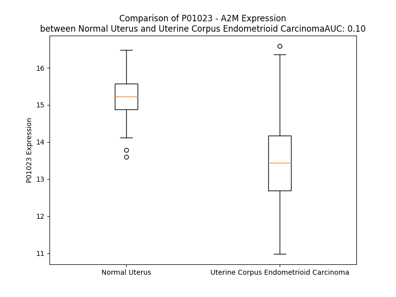

# Detailed Data for P01023

## Introduction to the Detailed Summary

### How to Interpret the Results

- **Summary & Metrics**: This section provides a quick reference to essential protein attributes, including expression changes, family classification, and biomarker applications. Regulation status (upregulated/downregulated) indicates the protein's behavior in a disease context. Some information comes from the original excel file with the proteins selected from literature, while others are derived from the analyses.
- **Expression Comparison**: A visual representation comparing protein expression between normal and disease states. It highlights significant changes in expression levels that might indicate diagnostic or therapeutic relevance. This is data coming from transcriptomics experiments and could not translate similarly to protein levels.
- **Isoform Alignment**: An interactive view of isoform alignments, revealing structural and functional differences between variants of the protein.
- **Interactors & Homologs**: Tables listing known interaction partners and homologous proteins, the more interactors and homologs, the more complex the protein is to design an antibody for.
- **Biological Assemblies**: Information about the structural arrangement of the protein in different assemblies, providing insights into its functional state but also the complexity of the protein to develop antibodies.
- **Combined Per-Residue Information**: A detailed table summarizing residue-level data. This includes predictions for epitope regions, aggregation tendencies, and modifications that might impact the protein's function. Each row corresponds to a residue in the protein, providing insights into specific sites that may be important for research or drug development.
## Summary & Metrics

- **UniProt Accession**: P01023
- **Gene Name**: A2M
- **Protein Name**: alpha-2-macroglobulin/ LRP mRNA
- **Swiss Prot**: A2MG_HUMAN
- **Family**: transporter
- **Biomarker Application**:  
- **Number of Isoforms**: 0
- **Regulation**: -1
- **(transcriptomics) AUC**: 0.1
- **(transcriptomics) Fold Change**: 1.13
- **(transcriptomics) Regulation**: Downregulated
- **Discotope Epitope Count**: 327
- **Max n_uniprots (Homo)**: 4
- **Max n_uniprots (Hetero)**: N/A

## Expression Comparison

## Interactors

| preferredName_A   | preferredName_B   |   score |
|:------------------|:------------------|--------:|
| A2M               | APOA1             |   0.998 |
| A2M               | LRP1              |   0.998 |
| A2M               | HP                |   0.997 |
| A2M               | KLK4              |   0.993 |
| A2M               | IL1B              |   0.984 |
| A2M               | ALB               |   0.98  |
| A2M               | SERPINA1          |   0.98  |
| A2M               | APOE              |   0.975 |
| A2M               | HSPA5             |   0.972 |
| A2M               | SERPINF2          |   0.968 |
| A2M               | KLK3              |   0.967 |
| A2M               | KLKB1             |   0.957 |
| A2M               | MMP2              |   0.953 |
| A2M               | IL6               |   0.95  |
| A2M               | RAB3IL1           |   0.95  |
| A2M               | PROC              |   0.931 |
| A2M               | SERPINA3          |   0.929 |
| A2M               | KNG1              |   0.927 |
| A2M               | SERPINC1          |   0.927 |
| A2M               | TGFB1             |   0.91  |
| A2M               | APP               |   0.905 |
| A2M               | SERPING1          |   0.905 |
| A2M               | TTR               |   0.905 |

## Homologs

| uniprot_id   | gene_id   |
|:-------------|:----------|
| A0A8V8TN26   | C5        |
| P20742       | PZP       |
| A0A8Q3SI45   | C3        |
| Q6YHK3       | CD109     |
| F5GXS0       | C4B       |
| P0C0L4       | C4A       |
| A8K2U0       | A2ML1     |
| Q8IZJ3       | CPAMD8    |

## Biological Assemblies

|   Unnamed: 0 |   assembly |   n_uniprots | composition   | crystal_id   |
|-------------:|-----------:|-------------:|:--------------|:-------------|
|            0 |          1 |            1 | Homo          | 7von         |
|            0 |          1 |            4 | Homo          | 6tav         |
|            0 |          1 |            4 | Homo          | 7o7l         |
|            0 |          1 |            4 | Homo          | 7o7n         |
|            0 |          1 |            4 | Homo          | 7o7p         |
|            0 |          1 |            1 | Homo          | 7voo         |
|            0 |          1 |            4 | Homo          | 7o7s         |
|            0 |          1 |            4 | Homo          | 7o7o         |
|            0 |          1 |            1 | Homo          | 2p9r         |
|            1 |          2 |            1 | Homo          | 2p9r         |
|            0 |          1 |            4 | Homo          | 7o7q         |
|            0 |          1 |            1 | Homo          | 1bv8         |
|            0 |          1 |            4 | Homo          | 7o7m         |
|            0 |          1 |            4 | Homo          | 7o7r         |

## Combined Per-Residue Information

|   res | aa   |   epitope_score | epitope   |   relative_surface_accessibility |   modeling_confidence |   Aggregation | modification   | glycosylation                             |
|------:|:-----|----------------:|:----------|---------------------------------:|----------------------:|--------------:|:---------------|:------------------------------------------|
|     1 | M    |         0.124   | True      |                          1.37904 |                 30.54 |         0     | N/A            | N/A                                       |
|     2 | G    |         0.27365 | True      |                          0.84459 |                 34.28 |         0     | N/A            | N/A                                       |
|     3 | K    |         0.22228 | True      |                          0.89836 |                 25.89 |         0     | N/A            | N/A                                       |
|     4 | N    |         0.19552 | True      |                          0.67554 |                 26.27 |         0     | N/A            | N/A                                       |
|     5 | K    |         0.16144 | True      |                          0.8314  |                 27.95 |         0     | N/A            | N/A                                       |
|     6 | L    |         0.13848 | True      |                          0.92269 |                 34.58 |         0     | N/A            | N/A                                       |
|     7 | L    |         0.16622 | True      |                          1.07586 |                 28.4  |         0     | N/A            | N/A                                       |
|     8 | H    |         0.16802 | True      |                          0.83643 |                 38.22 |         0     | N/A            | N/A                                       |
|     9 | P    |         0.2019  | True      |                          0.99941 |                 40.28 |         0.104 | N/A            | N/A                                       |
|    10 | S    |         0.14866 | True      |                          0.66039 |                 32.99 |         8.582 | N/A            | N/A                                       |
|    11 | L    |         0.22681 | True      |                          0.99875 |                 37.44 |        84.7   | N/A            | N/A                                       |
|    12 | V    |         0.17028 | True      |                          0.8137  |                 40.62 |        98.61  | N/A            | N/A                                       |
|    13 | L    |         0.1956  | True      |                          1.12432 |                 38.6  |        99.778 | N/A            | N/A                                       |
|    14 | L    |         0.15255 | True      |                          0.92268 |                 34.89 |        99.96  | N/A            | N/A                                       |
|    15 | L    |         0.25418 | True      |                          0.95627 |                 31.28 |        99.958 | N/A            | N/A                                       |
|    16 | L    |         0.19187 | True      |                          0.87928 |                 32.95 |        99.765 | N/A            | N/A                                       |
|    17 | V    |         0.1169  | True      |                          0.98286 |                 37.57 |        98.541 | N/A            | N/A                                       |
|    18 | L    |         0.13195 | True      |                          0.94233 |                 35.36 |        83.959 | N/A            | N/A                                       |
|    19 | L    |         0.1557  | True      |                          0.88878 |                 30.16 |         4.177 | N/A            | N/A                                       |
|    20 | P    |         0.10759 | True      |                          0.91335 |                 35.45 |         1.181 | N/A            | N/A                                       |
|    21 | T    |         0.17199 | True      |                          0.79541 |                 31.67 |         0     | N/A            | N/A                                       |
|    22 | D    |         0.24257 | True      |                          0.8804  |                 34.44 |         0     | N/A            | N/A                                       |
|    23 | A    |         0.17802 | True      |                          0.88567 |                 36.05 |         0     | N/A            | N/A                                       |
|    24 | S    |         0.10313 | True      |                          0.77606 |                 41.26 |         0     | N/A            | N/A                                       |
|    25 | V    |         0.16314 | True      |                          0.8145  |                 43.19 |         0     | N/A            | N/A                                       |
|    26 | S    |         0.05768 | False     |                          0.50833 |                 55.7  |         0     | N/A            | N/A                                       |
|    27 | G    |         0.03851 | False     |                          0.09829 |                 62.09 |         0     | N/A            | N/A                                       |
|    28 | K    |         0.1251  | True      |                          0.77731 |                 73.15 |         0     | N/A            | N/A                                       |
|    29 | P    |         0.04336 | False     |                          0.2276  |                 82.71 |         0     | N/A            | N/A                                       |
|    30 | Q    |         0.02334 | False     |                          0.05142 |                 87.04 |         0.218 | N/A            | N/A                                       |
|    31 | Y    |         0.06106 | False     |                          0.03288 |                 87.69 |         2.353 | N/A            | N/A                                       |
|    32 | M    |         0.00703 | False     |                          0.01074 |                 89.73 |         2.615 | N/A            | N/A                                       |
|    33 | V    |         0.00326 | False     |                          0.00286 |                 90.21 |         2.615 | N/A            | N/A                                       |
|    34 | L    |         0.00364 | False     |                          0.0033  |                 92.43 |         2.615 | N/A            | N/A                                       |
|    35 | V    |         0.01036 | False     |                          0.01714 |                 90.82 |         2.397 | N/A            | N/A                                       |
|    36 | P    |         0.00129 | False     |                          0       |                 91.25 |         1.164 | N/A            | N/A                                       |
|    37 | S    |         0.00355 | False     |                          0       |                 89.9  |         0     | N/A            | N/A                                       |
|    38 | L    |         0.01778 | False     |                          0.03642 |                 89.04 |         0     | N/A            | N/A                                       |
|    39 | L    |         0.00156 | False     |                          0       |                 88.27 |         0     | N/A            | N/A                                       |
|    40 | H    |         0.01369 | False     |                          0.07914 |                 86.73 |         0     | N/A            | N/A                                       |
|    41 | T    |         0.01303 | False     |                          0.00072 |                 84.17 |         0     | N/A            | N/A                                       |
|    42 | E    |         0.0868  | False     |                          0.56434 |                 79.99 |         0     | N/A            | N/A                                       |
|    43 | T    |         0.03456 | False     |                          0.25002 |                 78.93 |         0     | N/A            | N/A                                       |
|    44 | T    |         0.09405 | False     |                          0.66781 |                 83.47 |         0     | N/A            | N/A                                       |
|    45 | E    |         0.02434 | False     |                          0.05407 |                 87.15 |         0     | N/A            | N/A                                       |
|    46 | K    |         0.05031 | False     |                          0.34411 |                 90.09 |         0     | N/A            | N/A                                       |
|    47 | G    |         0.00457 | False     |                          0       |                 89.37 |         1.491 | N/A            | N/A                                       |
|    48 | C    |         0.00376 | False     |                          0.00074 |                 91.37 |        19.636 | N/A            | N/A                                       |
|    49 | V    |         0.00614 | False     |                          0.00211 |                 89.55 |        36.222 | N/A            | N/A                                       |
|    50 | L    |         0.00736 | False     |                          0.00799 |                 89.12 |        37.139 | N/A            | N/A                                       |
|    51 | L    |         0.02783 | False     |                          0.0139  |                 86.41 |        37.139 | N/A            | N/A                                       |
|    52 | S    |         0.02565 | False     |                          0.02952 |                 83.97 |        36.485 | N/A            | N/A                                       |
|    53 | Y    |         0.0582  | False     |                          0.1512  |                 80.7  |        36.361 | N/A            | N/A                                       |
|    54 | L    |         0.04723 | False     |                          0.05663 |                 78.24 |        30.273 | N/A            | N/A                                       |
|    55 | N    |         0.1377  | True      |                          0.86963 |                 79.11 |         1.079 | N/A            | N-linked (GlcNAc...) (complex) asparagine |
|    56 | E    |         0.28787 | True      |                          0.18926 |                 80.21 |         0     | N/A            | N/A                                       |
|    57 | T    |         0.09395 | False     |                          0.79853 |                 79.61 |         0.134 | N/A            | N/A                                       |
|    58 | V    |         0.03573 | False     |                          0.03025 |                 83.09 |         0.328 | N/A            | N/A                                       |
|    59 | T    |         0.08129 | False     |                          0.32232 |                 85.73 |         0.328 | N/A            | N/A                                       |
|    60 | V    |         0.00432 | False     |                          0       |                 87.03 |         0.328 | N/A            | N/A                                       |
|    61 | S    |         0.13483 | True      |                          0.23013 |                 89.2  |         0.328 | N/A            | N/A                                       |
|    62 | A    |         0.00924 | False     |                          0.02222 |                 89.19 |         0.194 | N/A            | N/A                                       |
|    63 | S    |         0.15719 | True      |                          0.23469 |                 89.7  |         0     | N/A            | N/A                                       |
|    64 | L    |         0.01297 | False     |                          0.01649 |                 86.94 |         0     | N/A            | N/A                                       |
|    65 | E    |         0.09832 | False     |                          0.20059 |                 85.09 |         0     | N/A            | N/A                                       |
|    66 | S    |         0.11774 | True      |                          0.16946 |                 78.61 |         0     | N/A            | N/A                                       |
|    67 | V    |         0.17475 | True      |                          1.14459 |                 68.41 |         0     | N/A            | N/A                                       |
|    68 | R    |         0.21037 | True      |                          0.73033 |                 67.03 |         0     | N/A            | N/A                                       |
|    69 | G    |         0.14785 | True      |                          0.44882 |                 69.47 |         0     | N/A            | N/A                                       |
|    70 | N    |         0.26561 | True      |                          0.72307 |                 77.77 |         0     | N/A            | N-linked (GlcNAc...) asparagine           |
|    71 | R    |         0.19708 | True      |                          0.51254 |                 77.55 |         0     | N/A            | N/A                                       |
|    72 | S    |         0.1535  | True      |                          0.51906 |                 80.77 |         0     | N/A            | N/A                                       |
|    73 | L    |         0.05144 | False     |                          0.17207 |                 79.16 |         0     | N/A            | N/A                                       |
|    74 | F    |         0.09987 | False     |                          0.1122  |                 80.41 |         0     | N/A            | N/A                                       |
|    75 | T    |         0.28631 | True      |                          0.61645 |                 77.3  |         0     | N/A            | N/A                                       |
|    76 | D    |         0.19737 | True      |                          0.6388  |                 74.97 |         0     | N/A            | N/A                                       |
|    77 | L    |         0.11275 | True      |                          0.20609 |                 76.87 |         0     | N/A            | N/A                                       |
|    78 | E    |         0.11521 | True      |                          0.72981 |                 73.85 |         0     | N/A            | N/A                                       |
|    79 | A    |         0.05605 | False     |                          0.11043 |                 69.82 |         0     | N/A            | N/A                                       |
|    80 | E    |         0.09927 | False     |                          0.67123 |                 69.3  |         0     | N/A            | N/A                                       |
|    81 | N    |         0.07064 | False     |                          0.39609 |                 71.68 |         0     | N/A            | N/A                                       |
|    82 | D    |         0.08191 | False     |                          0.39846 |                 70.36 |         0     | N/A            | N/A                                       |
|    83 | V    |         0.11928 | True      |                          0.52645 |                 73.76 |        17.936 | N/A            | N/A                                       |
|    84 | L    |         0.02757 | False     |                          0.12134 |                 82.61 |        19.368 | N/A            | N/A                                       |
|    85 | H    |         0.07467 | False     |                          0.41153 |                 84.6  |        19.855 | N/A            | N/A                                       |
|    86 | C    |         0.03765 | False     |                          0.28825 |                 88.47 |        20.747 | N/A            | N/A                                       |
|    87 | V    |         0.11804 | True      |                          0.14186 |                 87.73 |        21.017 | N/A            | N/A                                       |
|    88 | A    |         0.10124 | True      |                          0.5743  |                 87.81 |        20.421 | N/A            | N/A                                       |
|    89 | F    |         0.04868 | False     |                          0.06267 |                 87.32 |        19.917 | N/A            | N/A                                       |
|    90 | A    |         0.18318 | True      |                          0.61943 |                 84.09 |        12.946 | N/A            | N/A                                       |
|    91 | V    |         0.02627 | False     |                          0.023   |                 83.76 |         6.168 | N/A            | N/A                                       |
|    92 | P    |         0.09993 | False     |                          0.52536 |                 78.06 |         2.593 | N/A            | N/A                                       |
|    93 | K    |         0.16418 | True      |                          0.59086 |                 78.2  |         0     | N/A            | N/A                                       |
|    94 | S    |         0.09671 | False     |                          0.13191 |                 75.55 |         0     | N/A            | N/A                                       |
|    95 | S    |         0.09247 | False     |                          0.67827 |                 73.17 |         0     | N/A            | N/A                                       |
|    96 | S    |         0.13018 | True      |                          0.33821 |                 72.11 |         0     | N/A            | N/A                                       |
|    97 | N    |         0.09075 | False     |                          0.53294 |                 75.87 |         0     | N/A            | N/A                                       |
|    98 | E    |         0.08155 | False     |                          0.44201 |                 80.89 |         0     | N/A            | N/A                                       |
|    99 | E    |         0.073   | False     |                          0.19035 |                 84.18 |         0.04  | N/A            | N/A                                       |
|   100 | V    |         0.09877 | False     |                          0.46971 |                 84.32 |        60.551 | N/A            | N/A                                       |
|   101 | M    |         0.0289  | False     |                          0.08688 |                 86.8  |        74.405 | N/A            | N/A                                       |
|   102 | F    |         0.08187 | False     |                          0.44524 |                 88.18 |        75.687 | N/A            | N/A                                       |
|   103 | L    |         0.00436 | False     |                          0.00412 |                 88.75 |        75.784 | N/A            | N/A                                       |
|   104 | T    |         0.0717  | False     |                          0.05158 |                 90.21 |        75.784 | N/A            | N/A                                       |
|   105 | V    |         0.00577 | False     |                          0       |                 89.61 |        74.716 | N/A            | N/A                                       |
|   106 | Q    |         0.14624 | True      |                          0.24162 |                 90.42 |        59.219 | N/A            | N/A                                       |
|   107 | V    |         0.03    | False     |                          0.0137  |                 87.16 |        54.588 | N/A            | N/A                                       |
|   108 | K    |         0.12623 | True      |                          0.56069 |                 86.07 |         0.04  | N/A            | N/A                                       |
|   109 | G    |         0.1546  | True      |                          0.19087 |                 84.26 |         0     | N/A            | N/A                                       |
|   110 | P    |         0.2136  | True      |                          0.82662 |                 83.1  |         0     | N/A            | N/A                                       |
|   111 | T    |         0.38118 | True      |                          0.80917 |                 82.22 |         0     | N/A            | N/A                                       |
|   112 | Q    |         0.13519 | True      |                          0.31719 |                 80.59 |         0     | N/A            | N/A                                       |
|   113 | E    |         0.18141 | True      |                          0.59045 |                 86.7  |         0     | N/A            | N/A                                       |
|   114 | F    |         0.05977 | False     |                          0.16778 |                 86.9  |         0     | N/A            | N/A                                       |
|   115 | K    |         0.19332 | True      |                          0.65224 |                 89.34 |         0     | N/A            | N/A                                       |
|   116 | K    |         0.0586  | False     |                          0.34465 |                 88.4  |         0     | N/A            | N/A                                       |
|   117 | R    |         0.2483  | True      |                          0.59284 |                 87.24 |         0     | N/A            | N/A                                       |
|   118 | T    |         0.03744 | False     |                          0.22458 |                 86.69 |         0.165 | N/A            | N/A                                       |
|   119 | T    |         0.02851 | False     |                          0.07489 |                 87.45 |         0.165 | N/A            | N/A                                       |
|   120 | V    |         0.00346 | False     |                          0       |                 87.77 |         0.165 | N/A            | N/A                                       |
|   121 | M    |         0.06653 | False     |                          0.09117 |                 86.87 |         0.165 | N/A            | N/A                                       |
|   122 | V    |         0.00764 | False     |                          0.00571 |                 86.44 |         0.165 | N/A            | N/A                                       |
|   123 | K    |         0.08814 | False     |                          0.22492 |                 84.84 |         0     | N/A            | N/A                                       |
|   124 | N    |         0.03893 | False     |                          0.09204 |                 84.62 |         0     | N/A            | N/A                                       |
|   125 | E    |         0.05265 | False     |                          0.25308 |                 77.79 |         0     | N/A            | N/A                                       |
|   126 | D    |         0.04841 | False     |                          0.31194 |                 82.31 |         0     | N/A            | N/A                                       |
|   127 | S    |         0.02346 | False     |                          0.11809 |                 89.28 |         7.575 | N/A            | N/A                                       |
|   128 | L    |         0.02101 | False     |                          0.05688 |                 91.81 |        19.803 | N/A            | N/A                                       |
|   129 | V    |         0.00881 | False     |                          0.05046 |                 93.15 |        24.721 | N/A            | N/A                                       |
|   130 | F    |         0.04346 | False     |                          0.08404 |                 93.56 |        24.721 | N/A            | N/A                                       |
|   131 | V    |         0.01104 | False     |                          0.05801 |                 93.6  |        24.721 | N/A            | N/A                                       |
|   132 | Q    |         0.02145 | False     |                          0.13195 |                 92.85 |        17.692 | N/A            | N/A                                       |
|   133 | T    |         0.02952 | False     |                          0.08377 |                 92.94 |        15.382 | N/A            | N/A                                       |
|   134 | D    |         0.00843 | False     |                          0.02144 |                 91.67 |         0.199 | N/A            | N/A                                       |
|   135 | K    |         0.03399 | False     |                          0.0562  |                 88.86 |         0.199 | N/A            | N/A                                       |
|   136 | S    |         0.02121 | False     |                          0.11898 |                 87.12 |         0.199 | N/A            | N/A                                       |
|   137 | I    |         0.02863 | False     |                          0.0168  |                 87.36 |         0.199 | N/A            | N/A                                       |
|   138 | Y    |         0.00469 | False     |                          0       |                 90.21 |         0.199 | N/A            | N/A                                       |
|   139 | K    |         0.03425 | False     |                          0.26688 |                 85.91 |         0     | N/A            | N/A                                       |
|   140 | P    |         0.0339  | False     |                          0.22929 |                 82.84 |         0     | N/A            | N/A                                       |
|   141 | G    |         0.04031 | False     |                          0.51657 |                 82.26 |         0     | N/A            | N/A                                       |
|   142 | Q    |         0.03929 | False     |                          0.19572 |                 88.66 |         0     | N/A            | N/A                                       |
|   143 | T    |         0.05905 | False     |                          0.38379 |                 91.14 |         0     | N/A            | N/A                                       |
|   144 | V    |         0.00176 | False     |                          0       |                 92.84 |         0     | N/A            | N/A                                       |
|   145 | K    |         0.08435 | False     |                          0.35843 |                 94.39 |         0     | N/A            | N/A                                       |
|   146 | F    |         0.0033  | False     |                          0       |                 95    |         0     | N/A            | N/A                                       |
|   147 | R    |         0.00419 | False     |                          0       |                 94.49 |         0     | N/A            | N/A                                       |
|   148 | V    |         0.00124 | False     |                          0       |                 95.07 |         0     | N/A            | N/A                                       |
|   149 | V    |         0.00166 | False     |                          0       |                 95.23 |         0     | N/A            | N/A                                       |
|   150 | S    |         0.00105 | False     |                          0       |                 94.72 |         0     | N/A            | N/A                                       |
|   151 | M    |         0.00407 | False     |                          0       |                 93.96 |         0     | N/A            | N/A                                       |
|   152 | D    |         0.02157 | False     |                          0.16308 |                 89.71 |         0     | N/A            | N/A                                       |
|   153 | E    |         0.02014 | False     |                          0.11264 |                 86.36 |         0     | N/A            | N/A                                       |
|   154 | N    |         0.02454 | False     |                          0.58819 |                 86.86 |         0     | N/A            | N/A                                       |
|   155 | F    |         0.01825 | False     |                          0.05277 |                 92.71 |         0     | N/A            | N/A                                       |
|   156 | H    |         0.04575 | False     |                          0.29309 |                 92.62 |         0     | N/A            | N/A                                       |
|   157 | P    |         0.01683 | False     |                          0.06604 |                 94.56 |         0     | N/A            | N/A                                       |
|   158 | L    |         0.04397 | False     |                          0.37013 |                 92.26 |         0     | N/A            | N/A                                       |
|   159 | N    |         0.05935 | False     |                          0.45002 |                 91.1  |         0     | N/A            | N/A                                       |
|   160 | E    |         0.08521 | False     |                          0.21051 |                 88.57 |         0     | N/A            | N/A                                       |
|   161 | L    |         0.12521 | True      |                          0.52307 |                 91.68 |         0     | N/A            | N/A                                       |
|   162 | I    |         0.0042  | False     |                          0       |                 92.92 |         0     | N/A            | N/A                                       |
|   163 | P    |         0.08743 | False     |                          0.31633 |                 93.45 |         0.645 | N/A            | N/A                                       |
|   164 | L    |         0.07533 | False     |                          0.15333 |                 93.83 |         2.698 | N/A            | N/A                                       |
|   165 | V    |         0.0035  | False     |                          0       |                 95.37 |         2.698 | N/A            | N/A                                       |
|   166 | Y    |         0.02937 | False     |                          0.02469 |                 94.57 |         2.698 | N/A            | N/A                                       |
|   167 | I    |         0.00265 | False     |                          0       |                 94.5  |         2.698 | N/A            | N/A                                       |
|   168 | Q    |         0.03301 | False     |                          0.11915 |                 92.92 |         2.053 | N/A            | N/A                                       |
|   169 | D    |         0.01742 | False     |                          0.05184 |                 91.02 |         0     | N/A            | N/A                                       |
|   170 | P    |         0.0544  | False     |                          0.41329 |                 88.62 |         0     | N/A            | N/A                                       |
|   171 | K    |         0.05296 | False     |                          0.36082 |                 83.59 |         0     | N/A            | N/A                                       |
|   172 | G    |         0.08429 | False     |                          0.47335 |                 86.71 |         0     | N/A            | N/A                                       |
|   173 | N    |         0.0344  | False     |                          0.08795 |                 88.53 |         0     | N/A            | N/A                                       |
|   174 | R    |         0.0944  | False     |                          0.31551 |                 89.6  |         0     | N/A            | N/A                                       |
|   175 | I    |         0.0198  | False     |                          0.07235 |                 89.4  |         0     | N/A            | N/A                                       |
|   176 | A    |         0.02472 | False     |                          0.09693 |                 90.4  |         0     | N/A            | N/A                                       |
|   177 | Q    |         0.11485 | True      |                          0.22026 |                 91.95 |         0     | N/A            | N/A                                       |
|   178 | W    |         0.07344 | False     |                          0.26507 |                 93.1  |         0     | N/A            | N/A                                       |
|   179 | Q    |         0.08698 | False     |                          0.576   |                 91.25 |         0     | N/A            | N/A                                       |
|   180 | S    |         0.09846 | False     |                          0.61848 |                 89.7  |         0     | N/A            | N/A                                       |
|   181 | F    |         0.11245 | True      |                          0.09108 |                 89.35 |         0     | N/A            | N/A                                       |
|   182 | Q    |         0.1145  | True      |                          0.52197 |                 90.57 |         0     | N/A            | N/A                                       |
|   183 | L    |         0.01281 | False     |                          0.00792 |                 90.91 |         0     | N/A            | N/A                                       |
|   184 | E    |         0.05817 | False     |                          0.71668 |                 86.78 |         0     | N/A            | N/A                                       |
|   185 | G    |         0.0232  | False     |                          0.25522 |                 87.75 |         0     | N/A            | N/A                                       |
|   186 | G    |         0.00166 | False     |                          0       |                 91.77 |         0     | N/A            | N/A                                       |
|   187 | L    |         0.00858 | False     |                          0.02799 |                 94.73 |         0     | N/A            | N/A                                       |
|   188 | K    |         0.06979 | False     |                          0.34399 |                 93.71 |         0     | N/A            | N/A                                       |
|   189 | Q    |         0.03681 | False     |                          0.28148 |                 93.44 |         0     | N/A            | N/A                                       |
|   190 | F    |         0.0559  | False     |                          0.10325 |                 94.23 |         0     | N/A            | N/A                                       |
|   191 | S    |         0.12322 | True      |                          0.515   |                 92.13 |         0     | N/A            | N/A                                       |
|   192 | F    |         0.05573 | False     |                          0.05159 |                 91.03 |         0     | N/A            | N/A                                       |
|   193 | P    |         0.0547  | False     |                          0.43017 |                 90.07 |         0     | N/A            | N/A                                       |
|   194 | L    |         0.00968 | False     |                          0.04052 |                 88.67 |         0     | N/A            | N/A                                       |
|   195 | S    |         0.01067 | False     |                          0.00624 |                 84.55 |         0     | N/A            | N/A                                       |
|   196 | S    |         0.11607 | True      |                          0.46475 |                 76.28 |         0     | N/A            | N/A                                       |
|   197 | E    |         0.05128 | False     |                          0.27302 |                 75.83 |         0     | N/A            | N/A                                       |
|   198 | P    |         0.04603 | False     |                          0.09371 |                 82.48 |         0     | N/A            | N/A                                       |
|   199 | F    |         0.07527 | False     |                          0.21425 |                 81.24 |         0     | N/A            | N/A                                       |
|   200 | Q    |         0.11959 | True      |                          0.51639 |                 81.14 |         0     | N/A            | N/A                                       |
|   201 | G    |         0.02915 | False     |                          0.30076 |                 87.35 |         0     | N/A            | N/A                                       |
|   202 | S    |         0.10692 | True      |                          0.54836 |                 92.1  |         0     | N/A            | N/A                                       |
|   203 | Y    |         0.0526  | False     |                          0.02278 |                 94.15 |         0     | N/A            | N/A                                       |
|   204 | K    |         0.09054 | False     |                          0.31593 |                 94.46 |         0     | N/A            | N/A                                       |
|   205 | V    |         0.00185 | False     |                          0       |                 95.49 |         0     | N/A            | N/A                                       |
|   206 | V    |         0.00739 | False     |                          0.00095 |                 95.39 |         0     | N/A            | N/A                                       |
|   207 | V    |         0.00264 | False     |                          0       |                 94.79 |         0     | N/A            | N/A                                       |
|   208 | Q    |         0.0803  | False     |                          0.3708  |                 92.67 |         0     | N/A            | N/A                                       |
|   209 | K    |         0.0295  | False     |                          0.08916 |                 88.88 |         0     | N/A            | N/A                                       |
|   210 | K    |         0.06041 | False     |                          0.82282 |                 82.56 |         0     | N/A            | N/A                                       |
|   211 | S    |         0.1216  | True      |                          0.57352 |                 77.37 |         0     | N/A            | N/A                                       |
|   212 | G    |         0.08277 | False     |                          0.64146 |                 78    |         0     | N/A            | N/A                                       |
|   213 | G    |         0.06639 | False     |                          0.30794 |                 82.9  |         0     | N/A            | N/A                                       |
|   214 | R    |         0.13702 | True      |                          0.5016  |                 88.71 |         0     | N/A            | N/A                                       |
|   215 | T    |         0.02549 | False     |                          0.21904 |                 90.75 |         0     | N/A            | N/A                                       |
|   216 | E    |         0.16436 | True      |                          0.41086 |                 93.19 |         0     | N/A            | N/A                                       |
|   217 | H    |         0.02728 | False     |                          0.25014 |                 93.38 |         0     | N/A            | N/A                                       |
|   218 | P    |         0.15405 | True      |                          0.64682 |                 93.81 |         0     | N/A            | N/A                                       |
|   219 | F    |         0.02242 | False     |                          0.01911 |                 92.88 |         0     | N/A            | N/A                                       |
|   220 | T    |         0.04612 | False     |                          0.12101 |                 91.36 |         0     | N/A            | N/A                                       |
|   221 | V    |         0.00217 | False     |                          0       |                 90.04 |         0     | N/A            | N/A                                       |
|   222 | E    |         0.1914  | True      |                          0.31143 |                 83.13 |         0     | N/A            | N/A                                       |
|   223 | E    |         0.16827 | True      |                          0.50571 |                 74.31 |         0     | N/A            | N/A                                       |
|   224 | F    |         0.14864 | True      |                          0.12993 |                 75.24 |         0     | N/A            | N/A                                       |
|   225 | V    |         0.19699 | True      |                          0.96145 |                 68.18 |         0     | N/A            | N/A                                       |
|   226 | L    |         0.08554 | False     |                          0.27771 |                 73.97 |         0     | N/A            | N/A                                       |
|   227 | P    |         0.05046 | False     |                          0.13126 |                 78.94 |         0     | N/A            | N/A                                       |
|   228 | K    |         0.1626  | True      |                          0.49538 |                 77.86 |         0     | N/A            | N/A                                       |
|   229 | F    |         0.0204  | False     |                          0.00862 |                 83.33 |         0     | N/A            | N/A                                       |
|   230 | E    |         0.04332 | False     |                          0.22393 |                 88.85 |         0     | N/A            | N/A                                       |
|   231 | V    |         0.02149 | False     |                          0.13701 |                 90.11 |         0     | N/A            | N/A                                       |
|   232 | Q    |         0.05798 | False     |                          0.43471 |                 90.62 |         0     | N/A            | N/A                                       |
|   233 | V    |         0.02644 | False     |                          0.10169 |                 92.29 |         0     | N/A            | N/A                                       |
|   234 | T    |         0.08485 | False     |                          0.60767 |                 93.6  |         0     | N/A            | N/A                                       |
|   235 | V    |         0.03377 | False     |                          0.08424 |                 93.18 |         0     | N/A            | N/A                                       |
|   236 | P    |         0.03479 | False     |                          0.2998  |                 92    |         0     | N/A            | N/A                                       |
|   237 | K    |         0.09044 | False     |                          0.52722 |                 90.26 |         0     | N/A            | N/A                                       |
|   238 | I    |         0.03895 | False     |                          0.3299  |                 91.25 |        72.615 | N/A            | N/A                                       |
|   239 | I    |         0.00602 | False     |                          0.0048  |                 91.68 |        72.615 | N/A            | N/A                                       |
|   240 | T    |         0.03428 | False     |                          0.11868 |                 90.66 |        72.615 | N/A            | N/A                                       |
|   241 | I    |         0.06872 | False     |                          0.03628 |                 88.97 |        72.615 | N/A            | N/A                                       |
|   242 | L    |         0.11354 | True      |                          0.45152 |                 87.76 |        72.615 | N/A            | N/A                                       |
|   243 | E    |         0.06453 | False     |                          0.20923 |                 88.43 |         0     | N/A            | N/A                                       |
|   244 | E    |         0.11873 | True      |                          0.72416 |                 91.11 |         0     | N/A            | N/A                                       |
|   245 | E    |         0.09997 | False     |                          0.38944 |                 92.58 |         0     | N/A            | N/A                                       |
|   246 | M    |         0.01436 | False     |                          0.0187  |                 90.65 |         0     | N/A            | N/A                                       |
|   247 | N    |         0.10765 | True      |                          0.63805 |                 92.86 |         0     | N/A            | N-linked (GlcNAc...) asparagine           |
|   248 | V    |         0.01393 | False     |                          0.02625 |                 93.03 |         0.804 | N/A            | N/A                                       |
|   249 | S    |         0.07818 | False     |                          0.1743  |                 93.89 |         0.804 | N/A            | N/A                                       |
|   250 | V    |         0.00411 | False     |                          0.0019  |                 94.29 |         1.356 | N/A            | N/A                                       |
|   251 | C    |         0.06982 | False     |                          0.14551 |                 93.44 |         1.356 | N/A            | N/A                                       |
|   252 | G    |         0.00329 | False     |                          0       |                 90.26 |         1.356 | N/A            | N/A                                       |
|   253 | L    |         0.08901 | False     |                          0.29265 |                 89.11 |         1.356 | N/A            | N/A                                       |
|   254 | Y    |         0.04438 | False     |                          0.07008 |                 84.91 |         1.356 | N/A            | N/A                                       |
|   255 | T    |         0.02944 | False     |                          0.1193  |                 81.28 |         0.778 | N/A            | N/A                                       |
|   256 | Y    |         0.06022 | False     |                          0.08855 |                 80.06 |         0.434 | N/A            | N/A                                       |
|   257 | G    |         0.13799 | True      |                          0.46922 |                 79.58 |         0     | N/A            | N/A                                       |
|   258 | K    |         0.06314 | False     |                          0.20931 |                 82.35 |         0     | N/A            | N/A                                       |
|   259 | P    |         0.0155  | False     |                          0.22635 |                 86.33 |         0     | N/A            | N/A                                       |
|   260 | V    |         0.00585 | False     |                          0       |                 84.37 |         0     | N/A            | N/A                                       |
|   261 | P    |         0.04813 | False     |                          0.35361 |                 82.45 |         0     | N/A            | N/A                                       |
|   262 | G    |         0.00606 | False     |                          0.01657 |                 87    |         0     | N/A            | N/A                                       |
|   263 | H    |         0.09361 | False     |                          0.388   |                 90.08 |         0     | N/A            | N/A                                       |
|   264 | V    |         0.0021  | False     |                          0       |                 93.33 |         2.702 | N/A            | N/A                                       |
|   265 | T    |         0.06159 | False     |                          0.39615 |                 93.95 |         2.702 | N/A            | N/A                                       |
|   266 | V    |         0.00264 | False     |                          0.00095 |                 93.96 |         2.702 | N/A            | N/A                                       |
|   267 | S    |         0.04466 | False     |                          0.1452  |                 94.46 |         2.702 | N/A            | N/A                                       |
|   268 | I    |         0.00713 | False     |                          0       |                 94.26 |         2.702 | N/A            | N/A                                       |
|   269 | C    |         0.05055 | False     |                          0.15064 |                 92.08 |         0.157 | N/A            | N/A                                       |
|   270 | R    |         0.02504 | False     |                          0       |                 91.37 |         0     | N/A            | N/A                                       |
|   271 | K    |         0.12051 | True      |                          0.48281 |                 86.97 |         0     | N/A            | N/A                                       |
|   272 | Y    |         0.24691 | True      |                          0.17712 |                 82.33 |         0     | N/A            | N/A                                       |
|   273 | S    |         0.26514 | True      |                          0.48187 |                 75.45 |         0     | N/A            | N/A                                       |
|   274 | D    |         0.19471 | True      |                          0.69307 |                 69.27 |         0     | N/A            | N/A                                       |
|   275 | A    |         0.17365 | True      |                          0.81614 |                 59.82 |         0     | N/A            | N/A                                       |
|   276 | S    |         0.21013 | True      |                          0.36681 |                 59.72 |         0     | N/A            | N/A                                       |
|   277 | D    |         0.26366 | True      |                          0.95631 |                 63.02 |         0     | N/A            | N/A                                       |
|   278 | C    |         0.3183  | True      |                          0.87901 |                 58.7  |         0     | N/A            | N/A                                       |
|   279 | H    |         0.27181 | True      |                          0.48347 |                 57.28 |         0     | N/A            | N/A                                       |
|   280 | G    |         0.24272 | True      |                          0.61106 |                 61.08 |         0     | N/A            | N/A                                       |
|   281 | E    |         0.19026 | True      |                          0.74579 |                 58.76 |         0     | N/A            | N/A                                       |
|   282 | D    |         0.22442 | True      |                          0.73069 |                 55.5  |         0     | N/A            | N/A                                       |
|   283 | S    |         0.18598 | True      |                          0.22356 |                 60.77 |         0     | N/A            | N/A                                       |
|   284 | Q    |         0.33983 | True      |                          0.56989 |                 69.69 |         0     | N/A            | N/A                                       |
|   285 | A    |         0.12654 | True      |                          0.36889 |                 80.77 |         0     | N/A            | N/A                                       |
|   286 | F    |         0.16918 | True      |                          0.30531 |                 85.9  |         0     | N/A            | N/A                                       |
|   287 | C    |         0.07214 | False     |                          0.41738 |                 88.45 |         0     | N/A            | N/A                                       |
|   288 | E    |         0.09819 | False     |                          0.25347 |                 91.5  |         0     | N/A            | N/A                                       |
|   289 | K    |         0.22535 | True      |                          0.73389 |                 91.93 |         0     | N/A            | N/A                                       |
|   290 | F    |         0.13275 | True      |                          0.18453 |                 92.95 |         0     | N/A            | N/A                                       |
|   291 | S    |         0.22243 | True      |                          0.4954  |                 92.53 |         0     | N/A            | N/A                                       |
|   292 | G    |         0.04239 | False     |                          0.16577 |                 90.94 |         0     | N/A            | N/A                                       |
|   293 | Q    |         0.08725 | False     |                          0.5582  |                 90.85 |         0     | N/A            | N/A                                       |
|   294 | L    |         0.0252  | False     |                          0.08348 |                 89.17 |         0     | N/A            | N/A                                       |
|   295 | N    |         0.056   | False     |                          0.40727 |                 88.92 |         0     | N/A            | N/A                                       |
|   296 | S    |         0.07632 | False     |                          0.7459  |                 77.94 |         0     | N/A            | N/A                                       |
|   297 | H    |         0.10758 | True      |                          0.72782 |                 83.96 |         0     | N/A            | N/A                                       |
|   298 | G    |         0.008   | False     |                          0.0092  |                 87.05 |         0     | N/A            | N/A                                       |
|   299 | C    |         0.06639 | False     |                          0.09046 |                 93.24 |         0     | N/A            | N/A                                       |
|   300 | F    |         0.05755 | False     |                          0.15804 |                 94.01 |         0     | N/A            | N/A                                       |
|   301 | Y    |         0.162   | True      |                          0.63578 |                 93.16 |         0     | N/A            | N/A                                       |
|   302 | Q    |         0.10523 | True      |                          0.34682 |                 92.56 |         0     | N/A            | N/A                                       |
|   303 | Q    |         0.19587 | True      |                          0.4928  |                 91.65 |         0     | N/A            | N/A                                       |
|   304 | V    |         0.01605 | False     |                          0.0219  |                 91.98 |         0     | N/A            | N/A                                       |
|   305 | K    |         0.11209 | True      |                          0.66492 |                 92.96 |         0     | N/A            | N/A                                       |
|   306 | T    |         0.01114 | False     |                          0.02541 |                 90.85 |         0     | N/A            | N/A                                       |
|   307 | K    |         0.14403 | True      |                          0.89216 |                 86.98 |         0     | N/A            | N/A                                       |
|   308 | V    |         0.10814 | True      |                          0.49349 |                 87.83 |         0     | N/A            | N/A                                       |
|   309 | F    |         0.0053  | False     |                          0       |                 90.07 |         0     | N/A            | N/A                                       |
|   310 | Q    |         0.15488 | True      |                          0.34718 |                 86.55 |         0     | N/A            | N/A                                       |
|   311 | L    |         0.01941 | False     |                          0.05799 |                 88.33 |         0     | N/A            | N/A                                       |
|   312 | K    |         0.13625 | True      |                          0.38402 |                 85.57 |         0     | N/A            | N/A                                       |
|   313 | R    |         0.1999  | True      |                          0.38479 |                 83.82 |         0     | N/A            | N/A                                       |
|   314 | K    |         0.34998 | True      |                          0.70802 |                 79.59 |         0     | N/A            | N/A                                       |
|   315 | E    |         0.15586 | True      |                          0.29877 |                 80.54 |         0     | N/A            | N/A                                       |
|   316 | Y    |         0.04967 | False     |                          0.03975 |                 85.24 |         0     | N/A            | N/A                                       |
|   317 | E    |         0.09494 | False     |                          0.26726 |                 87.98 |         0     | N/A            | N/A                                       |
|   318 | M    |         0.06605 | False     |                          0.35851 |                 89.68 |         0     | N/A            | N/A                                       |
|   319 | K    |         0.09108 | False     |                          0.34462 |                 91.93 |         0     | N/A            | N/A                                       |
|   320 | L    |         0.00181 | False     |                          0       |                 92.8  |         0     | N/A            | N/A                                       |
|   321 | H    |         0.04258 | False     |                          0.30931 |                 92.98 |         0     | N/A            | N/A                                       |
|   322 | T    |         0.00625 | False     |                          0.0154  |                 93.3  |         0     | N/A            | N/A                                       |
|   323 | E    |         0.0563  | False     |                          0.30801 |                 94.38 |         0     | N/A            | N/A                                       |
|   324 | A    |         0.00341 | False     |                          0       |                 94    |         0     | N/A            | N/A                                       |
|   325 | Q    |         0.09646 | False     |                          0.38155 |                 92.63 |         0     | N/A            | N/A                                       |
|   326 | I    |         0.00315 | False     |                          0       |                 90.63 |         0     | N/A            | N/A                                       |
|   327 | Q    |         0.07672 | False     |                          0.35467 |                 87.02 |         0     | N/A            | N/A                                       |
|   328 | E    |         0.06245 | False     |                          0.06857 |                 81.96 |         0     | N/A            | N/A                                       |
|   329 | E    |         0.07149 | False     |                          0.4754  |                 75.18 |         0     | N/A            | N/A                                       |
|   330 | G    |         0.09122 | False     |                          0.99057 |                 63.07 |         0     | N/A            | N/A                                       |
|   331 | T    |         0.14476 | True      |                          0.38092 |                 66.35 |         0     | N/A            | N/A                                       |
|   332 | V    |         0.16078 | True      |                          0.97627 |                 63.26 |         0     | N/A            | N/A                                       |
|   333 | V    |         0.09448 | False     |                          0.41034 |                 68.95 |         0     | N/A            | N/A                                       |
|   334 | E    |         0.14944 | True      |                          0.51156 |                 81.44 |         0     | N/A            | N/A                                       |
|   335 | L    |         0.10139 | True      |                          0.27451 |                 83.97 |         0     | N/A            | N/A                                       |
|   336 | T    |         0.10147 | True      |                          0.42219 |                 88.31 |         0     | N/A            | N/A                                       |
|   337 | G    |         0.01828 | False     |                          0.07886 |                 89.59 |         0     | N/A            | N/A                                       |
|   338 | R    |         0.13414 | True      |                          0.74287 |                 91.85 |         0     | N/A            | N/A                                       |
|   339 | Q    |         0.03427 | False     |                          0.42724 |                 92.75 |         0     | N/A            | N/A                                       |
|   340 | S    |         0.09778 | False     |                          0.25487 |                 93.26 |         0     | N/A            | N/A                                       |
|   341 | S    |         0.00468 | False     |                          0       |                 93.52 |         0     | N/A            | N/A                                       |
|   342 | E    |         0.07386 | False     |                          0.49673 |                 92.54 |         0     | N/A            | N/A                                       |
|   343 | I    |         0.01146 | False     |                          0.04849 |                 90.9  |         0     | N/A            | N/A                                       |
|   344 | T    |         0.09851 | False     |                          0.19844 |                 90.19 |         0     | N/A            | N/A                                       |
|   345 | R    |         0.1704  | True      |                          0.45924 |                 88.17 |         0     | N/A            | N/A                                       |
|   346 | T    |         0.05139 | False     |                          0.10113 |                 89.7  |         0     | N/A            | N/A                                       |
|   347 | I    |         0.0404  | False     |                          0.17523 |                 89.64 |         0     | N/A            | N/A                                       |
|   348 | T    |         0.04047 | False     |                          0.059   |                 91.2  |         0     | N/A            | N/A                                       |
|   349 | K    |         0.05928 | False     |                          0.45949 |                 92.31 |         0     | N/A            | N/A                                       |
|   350 | L    |         0.01659 | False     |                          0.04807 |                 93.4  |         0     | N/A            | N/A                                       |
|   351 | S    |         0.0334  | False     |                          0.33383 |                 93.03 |         0     | N/A            | N/A                                       |
|   352 | F    |         0.03074 | False     |                          0.20823 |                 90.27 |         0.173 | N/A            | N/A                                       |
|   353 | V    |         0.05386 | False     |                          0.37796 |                 86.22 |         0.173 | N/A            | N/A                                       |
|   354 | K    |         0.07006 | False     |                          0.37851 |                 83.31 |         0.173 | N/A            | N/A                                       |
|   355 | V    |         0.0513  | False     |                          0.24629 |                 87.87 |         0.173 | N/A            | N/A                                       |
|   356 | D    |         0.02088 | False     |                          0.13344 |                 85.6  |         0.173 | N/A            | N/A                                       |
|   357 | S    |         0.06247 | False     |                          0.43384 |                 86.04 |         0     | N/A            | N/A                                       |
|   358 | H    |         0.04878 | False     |                          0.12723 |                 88.59 |         0     | N/A            | N/A                                       |
|   359 | F    |         0.01144 | False     |                          0.01373 |                 90.04 |         0     | N/A            | N/A                                       |
|   360 | R    |         0.03456 | False     |                          0.0305  |                 90.02 |         0     | N/A            | N/A                                       |
|   361 | Q    |         0.05931 | False     |                          0.2632  |                 86.39 |         0     | N/A            | N/A                                       |
|   362 | G    |         0.0285  | False     |                          0.1695  |                 84    |         0     | N/A            | N/A                                       |
|   363 | I    |         0.02394 | False     |                          0.09058 |                 85.61 |         0     | N/A            | N/A                                       |
|   364 | P    |         0.06794 | False     |                          0.40541 |                 88.52 |         0     | N/A            | N/A                                       |
|   365 | F    |         0.0147  | False     |                          0.03269 |                 90.34 |         0.142 | N/A            | N/A                                       |
|   366 | F    |         0.06026 | False     |                          0.53738 |                 88.75 |         0.142 | N/A            | N/A                                       |
|   367 | G    |         0.01171 | False     |                          0.0569  |                 89.69 |         0.142 | N/A            | N/A                                       |
|   368 | Q    |         0.0373  | False     |                          0.08562 |                 91.72 |         0.142 | N/A            | N/A                                       |
|   369 | V    |         0.00571 | False     |                          0.00166 |                 93.45 |         0.142 | N/A            | N/A                                       |
|   370 | R    |         0.05656 | False     |                          0.35038 |                 94.2  |         0     | N/A            | N/A                                       |
|   371 | L    |         0.00475 | False     |                          0.00306 |                 95.39 |         0     | N/A            | N/A                                       |
|   372 | V    |         0.05292 | False     |                          0.12758 |                 93.89 |         0     | N/A            | N/A                                       |
|   373 | D    |         0.0514  | False     |                          0.25192 |                 91.25 |         0     | N/A            | N/A                                       |
|   374 | G    |         0.01581 | False     |                          0.13527 |                 85.35 |         0     | N/A            | N/A                                       |
|   375 | K    |         0.04409 | False     |                          0.4099  |                 86.82 |         0     | N/A            | N/A                                       |
|   376 | G    |         0.09172 | False     |                          0.52597 |                 87.49 |         0     | N/A            | N/A                                       |
|   377 | V    |         0.08407 | False     |                          0.60241 |                 90.23 |         0     | N/A            | N/A                                       |
|   378 | P    |         0.02867 | False     |                          0.28751 |                 92.77 |         0     | N/A            | N/A                                       |
|   379 | I    |         0.08601 | False     |                          0.18719 |                 92.42 |         0     | N/A            | N/A                                       |
|   380 | P    |         0.09646 | False     |                          0.35977 |                 93.52 |         0     | N/A            | N/A                                       |
|   381 | N    |         0.07501 | False     |                          0.67229 |                 92.18 |         0     | N/A            | N/A                                       |
|   382 | K    |         0.05319 | False     |                          0.42069 |                 92.52 |         0     | N/A            | N/A                                       |
|   383 | V    |         0.09656 | False     |                          0.48518 |                 93.35 |         0     | N/A            | N/A                                       |
|   384 | I    |         0.0046  | False     |                          0.004   |                 93.81 |         0     | N/A            | N/A                                       |
|   385 | F    |         0.0571  | False     |                          0.42802 |                 94.28 |         0     | N/A            | N/A                                       |
|   386 | I    |         0.00445 | False     |                          0.00257 |                 94.13 |         0     | N/A            | N/A                                       |
|   387 | R    |         0.08723 | False     |                          0.42474 |                 93.23 |         0     | N/A            | N/A                                       |
|   388 | G    |         0.00905 | False     |                          0       |                 91.28 |         0     | N/A            | N/A                                       |
|   389 | N    |         0.09792 | False     |                          0.65934 |                 88.66 |         0     | N/A            | N/A                                       |
|   390 | E    |         0.09876 | False     |                          0.35324 |                 88.88 |         0     | N/A            | N/A                                       |
|   391 | A    |         0.04682 | False     |                          0.24253 |                 88.08 |         0     | N/A            | N/A                                       |
|   392 | N    |         0.1285  | True      |                          0.77383 |                 89.44 |         0     | N/A            | N/A                                       |
|   393 | Y    |         0.05301 | False     |                          0.23577 |                 91.27 |         0     | N/A            | N/A                                       |
|   394 | Y    |         0.10189 | True      |                          0.60236 |                 92.48 |         0     | N/A            | N/A                                       |
|   395 | S    |         0.15271 | True      |                          0.20983 |                 92.02 |         0     | N/A            | N/A                                       |
|   396 | N    |         0.13059 | True      |                          0.65906 |                 92.7  |         0     | N/A            | N-linked (GlcNAc...) asparagine           |
|   397 | A    |         0.05919 | False     |                          0.24998 |                 91.98 |         0     | N/A            | N/A                                       |
|   398 | T    |         0.0679  | False     |                          0.55406 |                 94.13 |         0     | N/A            | N/A                                       |
|   399 | T    |         0.01151 | False     |                          0.01714 |                 93.62 |         0     | N/A            | N/A                                       |
|   400 | D    |         0.07242 | False     |                          0.40292 |                 92.54 |         0     | N/A            | N/A                                       |
|   401 | E    |         0.08142 | False     |                          0.66867 |                 90.6  |         0     | N/A            | N/A                                       |
|   402 | H    |         0.07559 | False     |                          0.61456 |                 90.93 |         0     | N/A            | N/A                                       |
|   403 | G    |         0.00392 | False     |                          0.00238 |                 91.47 |         0     | N/A            | N/A                                       |
|   404 | L    |         0.05503 | False     |                          0.23509 |                 93.51 |         2.45  | N/A            | N/A                                       |
|   405 | V    |         0.03567 | False     |                          0.04856 |                 93.22 |         2.911 | N/A            | N/A                                       |
|   406 | Q    |         0.09985 | False     |                          0.67948 |                 91.87 |         2.911 | N/A            | N/A                                       |
|   407 | F    |         0.03242 | False     |                          0.06212 |                 92.82 |         2.911 | N/A            | N/A                                       |
|   408 | S    |         0.07147 | False     |                          0.38607 |                 91.6  |         2.911 | N/A            | N/A                                       |
|   409 | I    |         0.0049  | False     |                          0.0024  |                 91.8  |         2.705 | N/A            | N/A                                       |
|   410 | N    |         0.05022 | False     |                          0.64663 |                 90.3  |         0     | N/A            | N-linked (GlcNAc...) asparagine           |
|   411 | T    |         0.00667 | False     |                          0.00164 |                 90.2  |         0     | N/A            | N/A                                       |
|   412 | T    |         0.10206 | True      |                          0.5965  |                 85.51 |         0     | N/A            | N/A                                       |
|   413 | N    |         0.10747 | True      |                          0.80903 |                 84.3  |         0     | N/A            | N/A                                       |
|   414 | V    |         0.01318 | False     |                          0.00497 |                 85.26 |         0     | N/A            | N/A                                       |
|   415 | M    |         0.24623 | True      |                          0.92878 |                 77.98 |         0     | N/A            | N/A                                       |
|   416 | G    |         0.14141 | True      |                          0.39122 |                 80.08 |         0     | N/A            | N/A                                       |
|   417 | T    |         0.14312 | True      |                          0.43643 |                 84.69 |         0     | N/A            | N/A                                       |
|   418 | S    |         0.04069 | False     |                          0.25397 |                 89.93 |         0     | N/A            | N/A                                       |
|   419 | L    |         0.00223 | False     |                          0       |                 90.45 |         0     | N/A            | N/A                                       |
|   420 | T    |         0.03701 | False     |                          0.24005 |                 92.7  |         0     | N/A            | N/A                                       |
|   421 | V    |         0.00174 | False     |                          0       |                 93.44 |         0     | N/A            | N/A                                       |
|   422 | R    |         0.10119 | True      |                          0.55269 |                 93.12 |         0     | N/A            | N/A                                       |
|   423 | V    |         0.00141 | False     |                          0.00082 |                 93.31 |         0     | N/A            | N/A                                       |
|   424 | N    |         0.05038 | False     |                          0.12087 |                 91.81 |         0     | N/A            | N/A                                       |
|   425 | Y    |         0.08642 | False     |                          0.17463 |                 89.18 |         0     | N/A            | N/A                                       |
|   426 | K    |         0.10895 | True      |                          0.52847 |                 82.92 |         0     | N/A            | N/A                                       |
|   427 | D    |         0.15946 | True      |                          0.74676 |                 71.3  |         0     | N/A            | N/A                                       |
|   428 | R    |         0.19442 | True      |                          0.83903 |                 60.89 |         0     | N/A            | N/A                                       |
|   429 | S    |         0.06963 | False     |                          0.38035 |                 58.88 |         0     | N/A            | N/A                                       |
|   430 | P    |         0.16446 | True      |                          0.68266 |                 57.97 |         0     | N/A            | N/A                                       |
|   431 | C    |         0.18661 | True      |                          1.01904 |                 58.48 |         0     | N/A            | N/A                                       |
|   432 | Y    |         0.22327 | True      |                          0.67991 |                 55.59 |         0.192 | N/A            | N/A                                       |
|   433 | G    |         0.20713 | True      |                          0.65051 |                 53.28 |         0.192 | N/A            | N/A                                       |
|   434 | Y    |         0.31968 | True      |                          1.02144 |                 61.16 |         0.192 | N/A            | N/A                                       |
|   435 | Q    |         0.20039 | True      |                          0.59101 |                 68.02 |         0.192 | N/A            | N/A                                       |
|   436 | W    |         0.14448 | True      |                          0.69136 |                 73.77 |         0.192 | N/A            | N/A                                       |
|   437 | V    |         0.15409 | True      |                          0.11239 |                 78    |         0.192 | N/A            | N/A                                       |
|   438 | S    |         0.10712 | True      |                          0.33626 |                 79.11 |         0     | N/A            | N/A                                       |
|   439 | E    |         0.13841 | True      |                          0.34372 |                 84.14 |         0     | N/A            | N/A                                       |
|   440 | E    |         0.11677 | True      |                          0.27893 |                 84.95 |         0     | N/A            | N/A                                       |
|   441 | H    |         0.03501 | False     |                          0.16804 |                 88.52 |         0     | N/A            | N/A                                       |
|   442 | E    |         0.05161 | False     |                          0.28664 |                 89.08 |         0     | N/A            | N/A                                       |
|   443 | E    |         0.10105 | True      |                          0.4044  |                 91.75 |         0     | N/A            | N/A                                       |
|   444 | A    |         0.01473 | False     |                          0.05229 |                 91.6  |         0     | N/A            | N/A                                       |
|   445 | H    |         0.1072  | True      |                          0.73037 |                 93.03 |         0     | N/A            | N/A                                       |
|   446 | H    |         0.03955 | False     |                          0.18868 |                 92.7  |         0.496 | N/A            | N/A                                       |
|   447 | T    |         0.10634 | True      |                          0.32824 |                 91.6  |        24.474 | N/A            | N/A                                       |
|   448 | A    |         0.00385 | False     |                          0       |                 90.62 |        66.185 | N/A            | N/A                                       |
|   449 | Y    |         0.08134 | False     |                          0.30837 |                 90.29 |        66.232 | N/A            | N/A                                       |
|   450 | L    |         0.0262  | False     |                          0.14756 |                 89.36 |        66.232 | N/A            | N/A                                       |
|   451 | V    |         0.01855 | False     |                          0.06242 |                 89.92 |        66.232 | N/A            | N/A                                       |
|   452 | F    |         0.09465 | False     |                          0.33174 |                 88.11 |        64.424 | N/A            | N/A                                       |
|   453 | S    |         0.01325 | False     |                          0.10612 |                 87.18 |         0.047 | N/A            | N/A                                       |
|   454 | P    |         0.17311 | True      |                          0.55004 |                 83.93 |         0     | N/A            | N/A                                       |
|   455 | S    |         0.05595 | False     |                          0.06639 |                 85.58 |         0     | N/A            | N/A                                       |
|   456 | K    |         0.08192 | False     |                          0.67026 |                 85.99 |         0     | N/A            | N/A                                       |
|   457 | S    |         0.01571 | False     |                          0.00079 |                 90.32 |         0     | N/A            | N/A                                       |
|   458 | F    |         0.01152 | False     |                          0.04783 |                 91.18 |         0     | N/A            | N/A                                       |
|   459 | V    |         0.00813 | False     |                          0.00749 |                 91.53 |         0     | N/A            | N/A                                       |
|   460 | H    |         0.01781 | False     |                          0.08316 |                 90.24 |         0     | N/A            | N/A                                       |
|   461 | L    |         0.02124 | False     |                          0.03111 |                 89.97 |         0     | N/A            | N/A                                       |
|   462 | E    |         0.04386 | False     |                          0.36161 |                 83.55 |         0     | N/A            | N/A                                       |
|   463 | P    |         0.03928 | False     |                          0.31668 |                 79.01 |         0     | N/A            | N/A                                       |
|   464 | M    |         0.04096 | False     |                          0.21517 |                 78.38 |         0     | N/A            | N/A                                       |
|   465 | S    |         0.12347 | True      |                          0.44615 |                 72.73 |         0     | N/A            | N/A                                       |
|   466 | H    |         0.08306 | False     |                          0.54863 |                 81.33 |         0     | N/A            | N/A                                       |
|   467 | E    |         0.1596  | True      |                          0.52043 |                 86.64 |         0     | N/A            | N/A                                       |
|   468 | L    |         0.01002 | False     |                          0.01401 |                 89.62 |         0     | N/A            | N/A                                       |
|   469 | P    |         0.05919 | False     |                          0.41751 |                 89.6  |         0     | N/A            | N/A                                       |
|   470 | C    |         0.03949 | False     |                          0.18914 |                 86.87 |         0     | N/A            | N/A                                       |
|   471 | G    |         0.07037 | False     |                          0.87849 |                 85.55 |         0     | N/A            | N/A                                       |
|   472 | H    |         0.07772 | False     |                          0.62981 |                 87.55 |         0     | N/A            | N/A                                       |
|   473 | T    |         0.07194 | False     |                          0.60015 |                 91.12 |         0     | N/A            | N/A                                       |
|   474 | Q    |         0.03628 | False     |                          0.20536 |                 90.09 |         0     | N/A            | N/A                                       |
|   475 | T    |         0.06754 | False     |                          0.44729 |                 91.01 |         0     | N/A            | N/A                                       |
|   476 | V    |         0.00746 | False     |                          0.01523 |                 89.86 |         0     | N/A            | N/A                                       |
|   477 | Q    |         0.0516  | False     |                          0.27423 |                 89.91 |         0     | N/A            | N/A                                       |
|   478 | A    |         0.00227 | False     |                          0       |                 91.04 |         0.205 | N/A            | N/A                                       |
|   479 | H    |         0.0594  | False     |                          0.24445 |                 89.71 |         0.205 | N/A            | N/A                                       |
|   480 | Y    |         0.02582 | False     |                          0.06575 |                 89.1  |         0.205 | N/A            | N/A                                       |
|   481 | I    |         0.06283 | False     |                          0.12239 |                 88.68 |         0.205 | N/A            | N/A                                       |
|   482 | L    |         0.01619 | False     |                          0.03946 |                 86.74 |         0.205 | N/A            | N/A                                       |
|   483 | N    |         0.07299 | False     |                          0.42318 |                 82.53 |         0     | N/A            | N/A                                       |
|   484 | G    |         0.159   | True      |                          0.3959  |                 69.73 |         0     | N/A            | N/A                                       |
|   485 | G    |         0.23962 | True      |                          0.79713 |                 70.09 |         0     | N/A            | N/A                                       |
|   486 | T    |         0.16065 | True      |                          0.1438  |                 66.01 |         0     | N/A            | N/A                                       |
|   487 | L    |         0.02983 | False     |                          0.0338  |                 67.54 |         0     | N/A            | N/A                                       |
|   488 | L    |         0.19733 | True      |                          0.55822 |                 66.36 |         0     | N/A            | N/A                                       |
|   489 | G    |         0.18289 | True      |                          0.8387  |                 68.15 |         0     | N/A            | N/A                                       |
|   490 | L    |         0.09118 | False     |                          0.32809 |                 70.4  |         0     | N/A            | N/A                                       |
|   491 | K    |         0.14372 | True      |                          0.83097 |                 73.94 |         0     | N/A            | N/A                                       |
|   492 | K    |         0.10003 | False     |                          0.56797 |                 82.12 |         0     | N/A            | N/A                                       |
|   493 | L    |         0.01468 | False     |                          0.02143 |                 86.14 |         7.39  | N/A            | N/A                                       |
|   494 | S    |         0.03688 | False     |                          0.1677  |                 88.9  |        11.065 | N/A            | N/A                                       |
|   495 | F    |         0.00155 | False     |                          0.00069 |                 91.71 |        88.141 | N/A            | N/A                                       |
|   496 | Y    |         0.01578 | False     |                          0.02185 |                 93.19 |        90.874 | N/A            | N/A                                       |
|   497 | Y    |         0.02446 | False     |                          0.18453 |                 93.38 |        91.248 | N/A            | N/A                                       |
|   498 | L    |         0.00179 | False     |                          0       |                 93.48 |        91.182 | N/A            | N/A                                       |
|   499 | I    |         0.01011 | False     |                          0.0288  |                 93.19 |        90.641 | N/A            | N/A                                       |
|   500 | M    |         0.02223 | False     |                          0.02673 |                 92.04 |        41.155 | N/A            | N/A                                       |
|   501 | A    |         0.00922 | False     |                          0.06366 |                 90.47 |        19.057 | N/A            | N/A                                       |
|   502 | K    |         0.03195 | False     |                          0.14309 |                 86.27 |         0     | N/A            | N/A                                       |
|   503 | G    |         0.02132 | False     |                          0.04573 |                 82.07 |         0     | N/A            | N/A                                       |
|   504 | G    |         0.04214 | False     |                          0.20626 |                 88.53 |         0     | N/A            | N/A                                       |
|   505 | I    |         0.01316 | False     |                          0.04495 |                 90.83 |         0     | N/A            | N/A                                       |
|   506 | V    |         0.03039 | False     |                          0.2584  |                 88.98 |         0     | N/A            | N/A                                       |
|   507 | R    |         0.09175 | False     |                          0.21022 |                 89.97 |         0     | N/A            | N/A                                       |
|   508 | T    |         0.04683 | False     |                          0.36915 |                 91.27 |         0     | N/A            | N/A                                       |
|   509 | G    |         0.04738 | False     |                          0.2044  |                 89.35 |         0     | N/A            | N/A                                       |
|   510 | T    |         0.03392 | False     |                          0.49407 |                 89.94 |         0     | N/A            | N/A                                       |
|   511 | H    |         0.06707 | False     |                          0.31005 |                 88.68 |         0     | N/A            | N/A                                       |
|   512 | G    |         0.08466 | False     |                          0.44929 |                 86.58 |         0     | N/A            | N/A                                       |
|   513 | L    |         0.04941 | False     |                          0.14096 |                 84.51 |         0     | N/A            | N/A                                       |
|   514 | L    |         0.08599 | False     |                          0.80049 |                 80.15 |         0     | N/A            | N/A                                       |
|   515 | V    |         0.05048 | False     |                          0.12678 |                 72.73 |         0     | N/A            | N/A                                       |
|   516 | K    |         0.16061 | True      |                          0.67938 |                 70.16 |         0     | N/A            | N/A                                       |
|   517 | Q    |         0.1403  | True      |                          0.84709 |                 61.73 |         0     | N/A            | N/A                                       |
|   518 | E    |         0.23524 | True      |                          0.88955 |                 61.45 |         0     | N/A            | N/A                                       |
|   519 | D    |         0.12807 | True      |                          0.39273 |                 66.22 |         0     | N/A            | N/A                                       |
|   520 | M    |         0.11825 | True      |                          0.22047 |                 78.81 |         0     | N/A            | N/A                                       |
|   521 | K    |         0.11092 | True      |                          0.64259 |                 83.44 |         0     | N/A            | N/A                                       |
|   522 | G    |         0.05959 | False     |                          0.29147 |                 86.42 |         0     | N/A            | N/A                                       |
|   523 | H    |         0.10274 | True      |                          0.65762 |                 88.44 |         0     | N/A            | N/A                                       |
|   524 | F    |         0.05302 | False     |                          0.08098 |                 91.55 |         0     | N/A            | N/A                                       |
|   525 | S    |         0.0814  | False     |                          0.39451 |                 91.18 |         0     | N/A            | N/A                                       |
|   526 | I    |         0.02123 | False     |                          0.0376  |                 90.97 |         0     | N/A            | N/A                                       |
|   527 | S    |         0.10682 | True      |                          0.53456 |                 90.63 |         0     | N/A            | N/A                                       |
|   528 | I    |         0.00748 | False     |                          0.0312  |                 88.96 |         0     | N/A            | N/A                                       |
|   529 | P    |         0.06116 | False     |                          0.43143 |                 91.13 |         0     | N/A            | N/A                                       |
|   530 | V    |         0.0127  | False     |                          0.01296 |                 91.18 |         0     | N/A            | N/A                                       |
|   531 | K    |         0.05745 | False     |                          0.61025 |                 90.16 |         0     | N/A            | N/A                                       |
|   532 | S    |         0.03423 | False     |                          0.23424 |                 88.68 |         0     | N/A            | N/A                                       |
|   533 | D    |         0.07671 | False     |                          0.3592  |                 88.28 |         0     | N/A            | N/A                                       |
|   534 | I    |         0.01993 | False     |                          0.004   |                 90.89 |         0     | N/A            | N/A                                       |
|   535 | A    |         0.00592 | False     |                          0       |                 91.43 |         0     | N/A            | N/A                                       |
|   536 | P    |         0.08385 | False     |                          0.11237 |                 92.37 |         0     | N/A            | N/A                                       |
|   537 | V    |         0.03131 | False     |                          0.11975 |                 90.88 |         0     | N/A            | N/A                                       |
|   538 | A    |         0.00822 | False     |                          0.02551 |                 91.7  |         0     | N/A            | N/A                                       |
|   539 | R    |         0.04753 | False     |                          0.1394  |                 92.06 |         0     | N/A            | N/A                                       |
|   540 | L    |         0.00898 | False     |                          0.00412 |                 93.21 |        65.725 | N/A            | N/A                                       |
|   541 | L    |         0.00229 | False     |                          0       |                 94.17 |        76.883 | N/A            | N/A                                       |
|   542 | I    |         0.00328 | False     |                          0.0016  |                 94.65 |        77.281 | N/A            | N/A                                       |
|   543 | Y    |         0.00246 | False     |                          0.00093 |                 94.68 |        77.281 | N/A            | N/A                                       |
|   544 | A    |         0.00378 | False     |                          0       |                 91.65 |        77.281 | N/A            | N/A                                       |
|   545 | V    |         0.01262 | False     |                          0.04232 |                 90.2  |        72.471 | N/A            | N/A                                       |
|   546 | L    |         0.00457 | False     |                          0.00165 |                 88.59 |         5.525 | N/A            | N/A                                       |
|   547 | P    |         0.01435 | False     |                          0.03272 |                 82.81 |         2.819 | N/A            | N/A                                       |
|   548 | T    |         0.10379 | True      |                          0.36269 |                 83.14 |         0     | N/A            | N/A                                       |
|   549 | G    |         0.02563 | False     |                          0.03863 |                 86.21 |         0     | N/A            | N/A                                       |
|   550 | D    |         0.02451 | False     |                          0.02023 |                 89.86 |         0     | N/A            | N/A                                       |
|   551 | V    |         0.00797 | False     |                          0.04363 |                 91.57 |         0     | N/A            | N/A                                       |
|   552 | I    |         0.01559 | False     |                          0.0296  |                 91.79 |         0     | N/A            | N/A                                       |
|   553 | G    |         0.0237  | False     |                          0.07778 |                 92.82 |         0     | N/A            | N/A                                       |
|   554 | D    |         0.01916 | False     |                          0.02859 |                 93.31 |         0     | N/A            | N/A                                       |
|   555 | S    |         0.03717 | False     |                          0.18333 |                 92.17 |         0     | N/A            | N/A                                       |
|   556 | A    |         0.01704 | False     |                          0.1597  |                 90.07 |         0     | N/A            | N/A                                       |
|   557 | K    |         0.0564  | False     |                          0.46024 |                 89.48 |         0     | N/A            | N/A                                       |
|   558 | Y    |         0.01124 | False     |                          0.03923 |                 89.84 |         0     | N/A            | N/A                                       |
|   559 | D    |         0.07081 | False     |                          0.45641 |                 90.6  |         0     | N/A            | N/A                                       |
|   560 | V    |         0.00947 | False     |                          0.0183  |                 91.28 |         0     | N/A            | N/A                                       |
|   561 | E    |         0.12513 | True      |                          0.39879 |                 90.88 |         0     | N/A            | N/A                                       |
|   562 | N    |         0.0851  | False     |                          0.3049  |                 90.12 |         0     | N/A            | N/A                                       |
|   563 | C    |         0.00974 | False     |                          0.08648 |                 88.75 |         0     | N/A            | N/A                                       |
|   564 | L    |         0.0295  | False     |                          0.09751 |                 92.08 |         0     | N/A            | N/A                                       |
|   565 | A    |         0.08535 | False     |                          0.57728 |                 90.79 |         0     | N/A            | N/A                                       |
|   566 | N    |         0.0064  | False     |                          0.01898 |                 93.42 |         0     | N/A            | N/A                                       |
|   567 | K    |         0.08466 | False     |                          0.68991 |                 92.09 |         0     | N/A            | N/A                                       |
|   568 | V    |         0.01387 | False     |                          0.11035 |                 93.9  |         0     | N/A            | N/A                                       |
|   569 | D    |         0.04766 | False     |                          0.43428 |                 93.89 |         0     | N/A            | N/A                                       |
|   570 | L    |         0.0149  | False     |                          0.04513 |                 93.28 |         0     | N/A            | N/A                                       |
|   571 | S    |         0.03871 | False     |                          0.36508 |                 93.45 |         0     | N/A            | N/A                                       |
|   572 | F    |         0.02211 | False     |                          0.0781  |                 91.41 |         0     | N/A            | N/A                                       |
|   573 | S    |         0.06873 | False     |                          0.46504 |                 85.97 |         0     | N/A            | N/A                                       |
|   574 | P    |         0.14317 | True      |                          0.51608 |                 86.71 |         0     | N/A            | N/A                                       |
|   575 | S    |         0.07818 | False     |                          0.55685 |                 83.03 |         0     | N/A            | N/A                                       |
|   576 | Q    |         0.05605 | False     |                          0.46772 |                 83    |         0     | N/A            | N/A                                       |
|   577 | S    |         0.01514 | False     |                          0.1089  |                 82.87 |         0     | N/A            | N/A                                       |
|   578 | L    |         0.05559 | False     |                          0.32034 |                 80.13 |         0     | N/A            | N/A                                       |
|   579 | P    |         0.007   | False     |                          0.00808 |                 83.15 |         0     | N/A            | N/A                                       |
|   580 | A    |         0.04136 | False     |                          0.44259 |                 80.03 |         0     | N/A            | N/A                                       |
|   581 | S    |         0.05972 | False     |                          0.24618 |                 83.54 |         0     | N/A            | N/A                                       |
|   582 | H    |         0.08964 | False     |                          0.77966 |                 84.2  |         0     | N/A            | N/A                                       |
|   583 | A    |         0.00421 | False     |                          0.0076  |                 88.13 |         0     | N/A            | N/A                                       |
|   584 | H    |         0.07038 | False     |                          0.48864 |                 89.43 |         0     | N/A            | N/A                                       |
|   585 | L    |         0.00348 | False     |                          0.00577 |                 92.07 |         0     | N/A            | N/A                                       |
|   586 | R    |         0.08876 | False     |                          0.44959 |                 93.77 |         0     | N/A            | N/A                                       |
|   587 | V    |         0.00329 | False     |                          0       |                 94.27 |         0     | N/A            | N/A                                       |
|   588 | T    |         0.04962 | False     |                          0.2569  |                 95.29 |         0     | N/A            | N/A                                       |
|   589 | A    |         0.01251 | False     |                          0.10011 |                 95.81 |         0     | N/A            | N/A                                       |
|   590 | A    |         0.02964 | False     |                          0.19718 |                 95.38 |         0     | N/A            | N/A                                       |
|   591 | P    |         0.08223 | False     |                          0.57514 |                 93.67 |         0     | N/A            | N/A                                       |
|   592 | Q    |         0.08604 | False     |                          0.69595 |                 91.13 |         0     | N/A            | N/A                                       |
|   593 | S    |         0.00254 | False     |                          0       |                 94.64 |         0     | N/A            | N/A                                       |
|   594 | V    |         0.04041 | False     |                          0.22945 |                 95.19 |         0     | N/A            | N/A                                       |
|   595 | C    |         0.0016  | False     |                          0       |                 95.38 |         0     | N/A            | N/A                                       |
|   596 | A    |         0.01366 | False     |                          0.01131 |                 94.98 |         0     | N/A            | N/A                                       |
|   597 | L    |         0.00471 | False     |                          0.00495 |                 94.55 |         0     | N/A            | N/A                                       |
|   598 | R    |         0.01299 | False     |                          0.09398 |                 92.96 |         0     | N/A            | N/A                                       |
|   599 | A    |         0.00362 | False     |                          0       |                 92.2  |         0     | N/A            | N/A                                       |
|   600 | V    |         0.00389 | False     |                          0       |                 90.74 |         0     | N/A            | N/A                                       |
|   601 | D    |         0.0253  | False     |                          0.02836 |                 88.94 |         0     | N/A            | N/A                                       |
|   602 | Q    |         0.04546 | False     |                          0.15622 |                 85.73 |         0.554 | N/A            | N/A                                       |
|   603 | S    |         0.01417 | False     |                          0.03361 |                 83.97 |         8.095 | N/A            | N/A                                       |
|   604 | V    |         0.01865 | False     |                          0.02566 |                 81.91 |         8.095 | N/A            | N/A                                       |
|   605 | L    |         0.07848 | False     |                          0.12888 |                 79.95 |         8.095 | N/A            | N/A                                       |
|   606 | L    |         0.09745 | False     |                          0.34032 |                 75.53 |         8.095 | N/A            | N/A                                       |
|   607 | M    |         0.11569 | True      |                          0.39081 |                 74.05 |         7.836 | N/A            | N/A                                       |
|   608 | K    |         0.08648 | False     |                          0.37921 |                 70.23 |         0     | N/A            | N/A                                       |
|   609 | P    |         0.22981 | True      |                          0.71087 |                 62.64 |         0     | N/A            | N/A                                       |
|   610 | D    |         0.14813 | True      |                          0.90795 |                 53.43 |         0     | N/A            | N/A                                       |
|   611 | A    |         0.09944 | False     |                          0.46555 |                 57.38 |         0     | N/A            | N/A                                       |
|   612 | E    |         0.07758 | False     |                          0.39671 |                 71.8  |         0     | N/A            | N/A                                       |
|   613 | L    |         0.03737 | False     |                          0.26741 |                 83.67 |         0     | N/A            | N/A                                       |
|   614 | S    |         0.03654 | False     |                          0.33601 |                 87.18 |         0     | N/A            | N/A                                       |
|   615 | A    |         0.01842 | False     |                          0.26794 |                 88.21 |         0     | N/A            | N/A                                       |
|   616 | S    |         0.06297 | False     |                          0.41612 |                 87.51 |         0     | N/A            | N/A                                       |
|   617 | S    |         0.0651  | False     |                          0.34197 |                 86.63 |         0     | N/A            | N/A                                       |
|   618 | V    |         0.00323 | False     |                          0.0019  |                 89.61 |         0     | N/A            | N/A                                       |
|   619 | Y    |         0.01544 | False     |                          0.01925 |                 90.29 |         0     | N/A            | N/A                                       |
|   620 | N    |         0.08491 | False     |                          0.60626 |                 89.19 |         0     | N/A            | N/A                                       |
|   621 | L    |         0.03105 | False     |                          0.36656 |                 87.84 |         0     | N/A            | N/A                                       |
|   622 | L    |         0.01653 | False     |                          0.04968 |                 87.28 |         0     | N/A            | N/A                                       |
|   623 | P    |         0.04437 | False     |                          0.5353  |                 81.37 |         0     | N/A            | N/A                                       |
|   624 | E    |         0.06356 | False     |                          0.28546 |                 81.07 |         0     | N/A            | N/A                                       |
|   625 | K    |         0.08251 | False     |                          0.345   |                 82.62 |         0     | N/A            | N/A                                       |
|   626 | D    |         0.07852 | False     |                          0.22727 |                 82.94 |         0     | N/A            | N/A                                       |
|   627 | L    |         0.04213 | False     |                          0.08655 |                 78.19 |         0     | N/A            | N/A                                       |
|   628 | T    |         0.08073 | False     |                          0.58949 |                 72.83 |         0     | N/A            | N/A                                       |
|   629 | G    |         0.06554 | False     |                          0.21435 |                 76.77 |         0     | N/A            | N/A                                       |
|   630 | F    |         0.02646 | False     |                          0.09979 |                 79.33 |         0     | N/A            | N/A                                       |
|   631 | P    |         0.06439 | False     |                          0.20621 |                 64.07 |         0     | N/A            | N/A                                       |
|   632 | G    |         0.15243 | True      |                          0.67444 |                 62.46 |         0     | N/A            | N/A                                       |
|   633 | P    |         0.20703 | True      |                          0.66356 |                 58.78 |         0     | N/A            | N/A                                       |
|   634 | L    |         0.04502 | False     |                          0.00792 |                 56.25 |         0     | N/A            | N/A                                       |
|   635 | N    |         0.1374  | True      |                          0.6337  |                 53.83 |         0     | N/A            | N/A                                       |
|   636 | D    |         0.10903 | True      |                          0.55682 |                 52.15 |         0     | N/A            | N/A                                       |
|   637 | Q    |         0.12987 | True      |                          0.70869 |                 50.22 |         0     | N/A            | N/A                                       |
|   638 | D    |         0.10442 | True      |                          0.51139 |                 50.45 |         0     | N/A            | N/A                                       |
|   639 | N    |         0.14457 | True      |                          0.53744 |                 50.72 |         0     | N/A            | N/A                                       |
|   640 | E    |         0.1961  | True      |                          0.8259  |                 53.06 |         0     | N/A            | N/A                                       |
|   641 | D    |         0.18303 | True      |                          0.8742  |                 58.42 |         0     | N/A            | N/A                                       |
|   642 | C    |         0.07594 | False     |                          0.307   |                 68.13 |         0     | N/A            | N/A                                       |
|   643 | I    |         0.18439 | True      |                          0.52558 |                 67.28 |         0     | N/A            | N/A                                       |
|   644 | N    |         0.1062  | True      |                          0.60692 |                 62.46 |         0     | N/A            | N/A                                       |
|   645 | R    |         0.11171 | True      |                          0.51234 |                 61.66 |         0     | N/A            | N/A                                       |
|   646 | H    |         0.12056 | True      |                          0.71414 |                 61.5  |         0     | N/A            | N/A                                       |
|   647 | N    |         0.12407 | True      |                          0.48839 |                 65.14 |         0     | N/A            | N/A                                       |
|   648 | V    |         0.10226 | True      |                          0.55887 |                 65.42 |         3.138 | N/A            | N/A                                       |
|   649 | Y    |         0.14028 | True      |                          0.70527 |                 58.09 |         3.307 | N/A            | N/A                                       |
|   650 | I    |         0.23597 | True      |                          0.56032 |                 67.23 |         3.307 | N/A            | N/A                                       |
|   651 | N    |         0.31771 | True      |                          0.93855 |                 69.17 |         3.307 | N/A            | N/A                                       |
|   652 | G    |         0.1703  | True      |                          0.89219 |                 68.96 |         3.307 | N/A            | N/A                                       |
|   653 | I    |         0.18282 | True      |                          0.60157 |                 58.03 |         3.307 | N/A            | N/A                                       |
|   654 | T    |         0.15458 | True      |                          0.41435 |                 62.99 |         2.431 | N/A            | N/A                                       |
|   655 | Y    |         0.20453 | True      |                          0.49114 |                 64.49 |         1.911 | N/A            | N/A                                       |
|   656 | T    |         0.13156 | True      |                          0.51544 |                 66.24 |         0     | N/A            | N/A                                       |
|   657 | P    |         0.14358 | True      |                          0.31885 |                 62.12 |         0     | N/A            | N/A                                       |
|   658 | V    |         0.09919 | False     |                          0.91318 |                 61.95 |         0     | N/A            | N/A                                       |
|   659 | S    |         0.07668 | False     |                          0.32766 |                 59.96 |         0     | N/A            | N/A                                       |
|   660 | S    |         0.09199 | False     |                          0.28648 |                 62.58 |         0     | N/A            | N/A                                       |
|   661 | T    |         0.19354 | True      |                          0.76794 |                 65.91 |         0     | N/A            | N/A                                       |
|   662 | N    |         0.10724 | True      |                          0.47837 |                 75.23 |         0     | N/A            | N/A                                       |
|   663 | E    |         0.06524 | False     |                          0.11694 |                 82.97 |         0     | N/A            | N/A                                       |
|   664 | K    |         0.09009 | False     |                          0.09752 |                 84.29 |         0     | N/A            | N/A                                       |
|   665 | D    |         0.02181 | False     |                          0.0223  |                 88.51 |         0     | N/A            | N/A                                       |
|   666 | M    |         0.0076  | False     |                          0.04165 |                 91.28 |         0.702 | N/A            | N/A                                       |
|   667 | Y    |         0.01636 | False     |                          0.13887 |                 89.41 |         0.702 | N/A            | N/A                                       |
|   668 | S    |         0.03865 | False     |                          0.22305 |                 87.58 |         0.702 | N/A            | N/A                                       |
|   669 | F    |         0.00747 | False     |                          0.01529 |                 90.19 |         0.702 | N/A            | N/A                                       |
|   670 | L    |         0.00329 | False     |                          0       |                 91.02 |         0.702 | N/A            | N/A                                       |
|   671 | E    |         0.03731 | False     |                          0.27552 |                 87.22 |         0     | N/A            | N/A                                       |
|   672 | D    |         0.04087 | False     |                          0.30108 |                 87.44 |         0     | N/A            | N/A                                       |
|   673 | M    |         0.00777 | False     |                          0.00839 |                 89.13 |         0     | N/A            | N/A                                       |
|   674 | G    |         0.00275 | False     |                          0       |                 88.22 |         0     | N/A            | N/A                                       |
|   675 | L    |         0.00204 | False     |                          0.00061 |                 91.25 |         0     | N/A            | N/A                                       |
|   676 | K    |         0.03534 | False     |                          0.06282 |                 89.09 |         0     | N/A            | N/A                                       |
|   677 | A    |         0.04137 | False     |                          0.11283 |                 89.99 |         0     | N/A            | N/A                                       |
|   678 | F    |         0.00398 | False     |                          0.00255 |                 90.07 |         0     | N/A            | N/A                                       |
|   679 | T    |         0.06237 | False     |                          0.06698 |                 89.7  |         0     | N/A            | N/A                                       |
|   680 | N    |         0.0438  | False     |                          0.43402 |                 86.8  |         0     | N/A            | N/A                                       |
|   681 | S    |         0.01049 | False     |                          0.08295 |                 88.14 |         0     | N/A            | N/A                                       |
|   682 | K    |         0.13056 | True      |                          0.58338 |                 86.16 |         0     | N/A            | N/A                                       |
|   683 | I    |         0.04174 | False     |                          0.07513 |                 86.93 |         0     | N/A            | N/A                                       |
|   684 | R    |         0.09092 | False     |                          0.35701 |                 84.62 |         0     | N/A            | N/A                                       |
|   685 | K    |         0.05996 | False     |                          0.11929 |                 81.86 |         0     | N/A            | N/A                                       |
|   686 | P    |         0.13261 | True      |                          0.60407 |                 74.55 |         0     | N/A            | N/A                                       |
|   687 | K    |         0.07101 | False     |                          0.52538 |                 71.24 |         0     | N/A            | N/A                                       |
|   688 | M    |         0.03186 | False     |                          0.13888 |                 70.65 |         0     | N/A            | N/A                                       |
|   689 | C    |         0.04853 | False     |                          0.24869 |                 65.1  |         0     | N/A            | N/A                                       |
|   690 | P    |         0.12597 | True      |                          0.61893 |                 59.57 |         0     | N/A            | N/A                                       |
|   691 | Q    |         0.08369 | False     |                          0.6959  |                 46.34 |         0     | N/A            | N/A                                       |
|   692 | L    |         0.1267  | True      |                          1.15871 |                 34.67 |         0     | N/A            | N/A                                       |
|   693 | Q    |         0.13904 | True      |                          0.73628 |                 32.57 |         0     | N/A            | N/A                                       |
|   694 | Q    |         0.15509 | True      |                          0.93861 |                 25.65 |         0     | N/A            | N/A                                       |
|   695 | Y    |         0.1532  | True      |                          0.96781 |                 27.75 |         0     | N/A            | N/A                                       |
|   696 | E    |         0.1107  | True      |                          0.89676 |                 24.64 |         0     | N/A            | N/A                                       |
|   697 | M    |         0.21602 | True      |                          0.96914 |                 25.09 |         0     | N/A            | N/A                                       |
|   698 | H    |         0.12226 | True      |                          1.02712 |                 26.86 |         0     | N/A            | N/A                                       |
|   699 | G    |         0.14364 | True      |                          0.79514 |                 27.41 |         0     | N/A            | N/A                                       |
|   700 | P    |         0.13463 | True      |                          0.8339  |                 33.16 |         0     | N/A            | N/A                                       |
|   701 | E    |         0.12327 | True      |                          0.85824 |                 23.67 |         0     | N/A            | N/A                                       |
|   702 | G    |         0.11956 | True      |                          0.75038 |                 23.99 |         0     | N/A            | N/A                                       |
|   703 | L    |         0.22106 | True      |                          0.94594 |                 23.3  |         0     | N/A            | N/A                                       |
|   704 | R    |         0.12452 | True      |                          0.86373 |                 23.71 |         0     | N/A            | N/A                                       |
|   705 | V    |         0.12567 | True      |                          0.8238  |                 26.2  |         0     | N/A            | N/A                                       |
|   706 | G    |         0.10631 | True      |                          0.75879 |                 25.76 |         0     | N/A            | N/A                                       |
|   707 | F    |         0.16117 | True      |                          0.80534 |                 25.09 |         0     | N/A            | N/A                                       |
|   708 | Y    |         0.13503 | True      |                          0.854   |                 26.26 |         0     | N/A            | N/A                                       |
|   709 | E    |         0.17064 | True      |                          0.57232 |                 24.52 |         0     | N/A            | N/A                                       |
|   710 | S    |         0.12538 | True      |                          0.54571 |                 24.87 |         0     | N/A            | N/A                                       |
|   711 | D    |         0.09304 | False     |                          0.75488 |                 24.17 |         0     | N/A            | N/A                                       |
|   712 | V    |         0.15897 | True      |                          0.96361 |                 24.1  |         0     | N/A            | N/A                                       |
|   713 | M    |         0.15524 | True      |                          1.0179  |                 22.31 |         0     | N/A            | N/A                                       |
|   714 | G    |         0.10271 | True      |                          0.96732 |                 25.55 |         0     | N/A            | N/A                                       |
|   715 | R    |         0.13129 | True      |                          0.93299 |                 22.31 |         0     | N/A            | N/A                                       |
|   716 | G    |         0.11886 | True      |                          0.92609 |                 24.37 |         0     | N/A            | N/A                                       |
|   717 | H    |         0.15084 | True      |                          0.92536 |                 23.41 |         0     | N/A            | N/A                                       |
|   718 | A    |         0.09226 | False     |                          1.0247  |                 26.8  |         0     | N/A            | N/A                                       |
|   719 | R    |         0.16079 | True      |                          0.91891 |                 23.45 |         0     | N/A            | N/A                                       |
|   720 | L    |         0.17308 | True      |                          1.02839 |                 26.26 |         0     | N/A            | N/A                                       |
|   721 | V    |         0.09514 | False     |                          0.92951 |                 24.26 |         0     | N/A            | N/A                                       |
|   722 | H    |         0.12245 | True      |                          0.90006 |                 24.34 |         0     | N/A            | N/A                                       |
|   723 | V    |         0.0858  | False     |                          0.93809 |                 26.1  |         0     | N/A            | N/A                                       |
|   724 | E    |         0.10762 | True      |                          0.88188 |                 24.08 |         0     | N/A            | N/A                                       |
|   725 | E    |         0.16116 | True      |                          0.74918 |                 30.54 |         0     | N/A            | N/A                                       |
|   726 | P    |         0.14928 | True      |                          0.84493 |                 33.21 |         0     | N/A            | N/A                                       |
|   727 | H    |         0.14607 | True      |                          0.96397 |                 34.66 |         0     | N/A            | N/A                                       |
|   728 | T    |         0.07039 | False     |                          0.85037 |                 37.4  |         0     | N/A            | N/A                                       |
|   729 | E    |         0.08002 | False     |                          0.7706  |                 52.98 |         0     | N/A            | N/A                                       |
|   730 | T    |         0.03145 | False     |                          0.12932 |                 59.49 |         0     | N/A            | N/A                                       |
|   731 | V    |         0.05003 | False     |                          0.47223 |                 62.14 |         0     | N/A            | N/A                                       |
|   732 | R    |         0.05271 | False     |                          0.0986  |                 67.98 |         0     | N/A            | N/A                                       |
|   733 | K    |         0.11469 | True      |                          0.71785 |                 68.49 |         0     | N/A            | N/A                                       |
|   734 | Y    |         0.0893  | False     |                          0.56627 |                 74.97 |         0     | N/A            | N/A                                       |
|   735 | F    |         0.11356 | True      |                          0.60576 |                 78.65 |         0     | N/A            | N/A                                       |
|   736 | P    |         0.07471 | False     |                          0.16984 |                 85.79 |         0     | N/A            | N/A                                       |
|   737 | E    |         0.03828 | False     |                          0.13486 |                 86.67 |         0     | N/A            | N/A                                       |
|   738 | T    |         0.03608 | False     |                          0.15475 |                 89.97 |         0     | N/A            | N/A                                       |
|   739 | W    |         0.05304 | False     |                          0.13468 |                 89.6  |         0     | N/A            | N/A                                       |
|   740 | I    |         0.02137 | False     |                          0.0192  |                 90.92 |         0     | N/A            | N/A                                       |
|   741 | W    |         0.01829 | False     |                          0.09673 |                 93.54 |         0     | N/A            | N/A                                       |
|   742 | D    |         0.07796 | False     |                          0.42692 |                 92.49 |         0     | N/A            | N/A                                       |
|   743 | L    |         0.042   | False     |                          0.45769 |                 93.08 |         9.3   | N/A            | N/A                                       |
|   744 | V    |         0.02587 | False     |                          0.19517 |                 93.1  |         9.599 | N/A            | N/A                                       |
|   745 | V    |         0.05295 | False     |                          0.69628 |                 93.29 |         9.599 | N/A            | N/A                                       |
|   746 | V    |         0.00938 | False     |                          0.01056 |                 92.85 |         9.599 | N/A            | N/A                                       |
|   747 | N    |         0.0658  | False     |                          0.51519 |                 92.18 |         9.599 | N/A            | N/A                                       |
|   748 | S    |         0.10648 | True      |                          0.73648 |                 89.26 |         2.466 | N/A            | N/A                                       |
|   749 | A    |         0.10472 | True      |                          0.77093 |                 91.06 |         1.42  | N/A            | N/A                                       |
|   750 | G    |         0.0228  | False     |                          0.07411 |                 91.17 |         0.535 | N/A            | N/A                                       |
|   751 | V    |         0.05074 | False     |                          0.26484 |                 92.74 |         0.535 | N/A            | N/A                                       |
|   752 | A    |         0.01447 | False     |                          0.11224 |                 92.36 |         0.245 | N/A            | N/A                                       |
|   753 | E    |         0.13233 | True      |                          0.60293 |                 89.65 |         0     | N/A            | N/A                                       |
|   754 | V    |         0.03095 | False     |                          0.19803 |                 88.98 |         0     | N/A            | N/A                                       |
|   755 | G    |         0.10185 | True      |                          0.66134 |                 88.37 |         0     | N/A            | N/A                                       |
|   756 | V    |         0.03419 | False     |                          0.11968 |                 89.32 |         0     | N/A            | N/A                                       |
|   757 | T    |         0.05917 | False     |                          0.48507 |                 88.37 |         0     | N/A            | N/A                                       |
|   758 | V    |         0.00915 | False     |                          0.00774 |                 87.51 |         0     | N/A            | N/A                                       |
|   759 | P    |         0.01684 | False     |                          0.00596 |                 87.78 |         0     | N/A            | N/A                                       |
|   760 | D    |         0.02126 | False     |                          0.04451 |                 80.59 |         0     | N/A            | N/A                                       |
|   761 | T    |         0.02535 | False     |                          0.19879 |                 81.7  |         0     | N/A            | N/A                                       |
|   762 | I    |         0.0449  | False     |                          0.14047 |                 80.73 |         0     | N/A            | N/A                                       |
|   763 | T    |         0.02249 | False     |                          0.0136  |                 86.16 |         0     | N/A            | N/A                                       |
|   764 | E    |         0.05033 | False     |                          0.23425 |                 88.46 |         0     | N/A            | N/A                                       |
|   765 | W    |         0.00384 | False     |                          0       |                 90.66 |         0     | N/A            | N/A                                       |
|   766 | K    |         0.07672 | False     |                          0.19749 |                 90.56 |         0     | N/A            | N/A                                       |
|   767 | A    |         0.00333 | False     |                          0.0096  |                 92.42 |         0.138 | N/A            | N/A                                       |
|   768 | G    |         0.04489 | False     |                          0.2881  |                 92.32 |         0.302 | N/A            | N/A                                       |
|   769 | A    |         0.01072 | False     |                          0.06305 |                 93.96 |         0.302 | N/A            | N/A                                       |
|   770 | F    |         0.00999 | False     |                          0.00755 |                 95.27 |         0.302 | N/A            | N/A                                       |
|   771 | C    |         0.00137 | False     |                          0       |                 96.2  |         0.302 | N/A            | N/A                                       |
|   772 | L    |         0.00929 | False     |                          0.02462 |                 95.78 |         0.302 | N/A            | N/A                                       |
|   773 | S    |         0.01802 | False     |                          0.05134 |                 94.6  |         0     | N/A            | N/A                                       |
|   774 | E    |         0.06003 | False     |                          0.5775  |                 91.12 |         0     | N/A            | N/A                                       |
|   775 | D    |         0.11322 | True      |                          0.8325  |                 89.72 |         0     | N/A            | N/A                                       |
|   776 | A    |         0.04954 | False     |                          0.23442 |                 92.24 |         0     | N/A            | N/A                                       |
|   777 | G    |         0.01341 | False     |                          0.01127 |                 93.64 |         0     | N/A            | N/A                                       |
|   778 | L    |         0.00796 | False     |                          0.00863 |                 95.42 |         0     | N/A            | N/A                                       |
|   779 | G    |         0.00337 | False     |                          0       |                 94.83 |         0     | N/A            | N/A                                       |
|   780 | I    |         0.03642 | False     |                          0.19631 |                 94.25 |         0     | N/A            | N/A                                       |
|   781 | S    |         0.01097 | False     |                          0.10113 |                 92.9  |         0     | N/A            | N/A                                       |
|   782 | S    |         0.0875  | False     |                          0.61962 |                 88.91 |         0     | N/A            | N/A                                       |
|   783 | T    |         0.08095 | False     |                          0.4651  |                 89.12 |         0     | N/A            | N/A                                       |
|   784 | A    |         0.02614 | False     |                          0.09948 |                 91.09 |         0     | N/A            | N/A                                       |
|   785 | S    |         0.05779 | False     |                          0.28216 |                 90.2  |         0     | N/A            | N/A                                       |
|   786 | L    |         0.00176 | False     |                          0       |                 90.79 |         0     | N/A            | N/A                                       |
|   787 | R    |         0.05372 | False     |                          0.27155 |                 86.56 |         0     | N/A            | N/A                                       |
|   788 | A    |         0.00388 | False     |                          0       |                 84.24 |         0     | N/A            | N/A                                       |
|   789 | F    |         0.03606 | False     |                          0.05598 |                 79.74 |         0     | N/A            | N/A                                       |
|   790 | Q    |         0.02391 | False     |                          0.00938 |                 74.09 |         0     | N/A            | N/A                                       |
|   791 | P    |         0.04716 | False     |                          0.28629 |                 75.99 |         0     | N/A            | N/A                                       |
|   792 | F    |         0.01442 | False     |                          0.01363 |                 78.94 |         0     | N/A            | N/A                                       |
|   793 | F    |         0.0246  | False     |                          0.0637  |                 82.37 |         0     | N/A            | N/A                                       |
|   794 | V    |         0.00713 | False     |                          0.00493 |                 84.32 |         0     | N/A            | N/A                                       |
|   795 | E    |         0.03358 | False     |                          0.41356 |                 82.83 |         0     | N/A            | N/A                                       |
|   796 | L    |         0.02785 | False     |                          0.08858 |                 84.21 |         0     | N/A            | N/A                                       |
|   797 | T    |         0.0366  | False     |                          0.46849 |                 81.82 |         0     | N/A            | N/A                                       |
|   798 | M    |         0.01583 | False     |                          0.07639 |                 84.55 |         0     | N/A            | N/A                                       |
|   799 | P    |         0.01056 | False     |                          0.05276 |                 82.18 |         0     | N/A            | N/A                                       |
|   800 | Y    |         0.0757  | False     |                          0.60489 |                 79.03 |         0     | N/A            | N/A                                       |
|   801 | S    |         0.0217  | False     |                          0.08509 |                 87.13 |         0     | N/A            | N/A                                       |
|   802 | V    |         0.00364 | False     |                          0.00651 |                 88.27 |         0     | N/A            | N/A                                       |
|   803 | I    |         0.01667 | False     |                          0.0728  |                 88.17 |         0     | N/A            | N/A                                       |
|   804 | R    |         0.07554 | False     |                          0.15255 |                 87    |         0     | N/A            | N/A                                       |
|   805 | G    |         0.04255 | False     |                          0.38642 |                 82.97 |         0     | N/A            | N/A                                       |
|   806 | E    |         0.0029  | False     |                          0.00213 |                 90.06 |         0     | N/A            | N/A                                       |
|   807 | A    |         0.06288 | False     |                          0.12997 |                 88.52 |         0     | N/A            | N/A                                       |
|   808 | F    |         0.01696 | False     |                          0.01401 |                 89.39 |         0     | N/A            | N/A                                       |
|   809 | T    |         0.03287 | False     |                          0.19282 |                 86.76 |         0     | N/A            | N/A                                       |
|   810 | L    |         0.0029  | False     |                          0       |                 87.61 |         0     | N/A            | N/A                                       |
|   811 | K    |         0.06823 | False     |                          0.39052 |                 87    |         0     | N/A            | N/A                                       |
|   812 | A    |         0.00153 | False     |                          0       |                 88    |         0     | N/A            | N/A                                       |
|   813 | T    |         0.03036 | False     |                          0.22191 |                 85.67 |         0     | N/A            | N/A                                       |
|   814 | V    |         0.00435 | False     |                          0       |                 85.94 |         0     | N/A            | N/A                                       |
|   815 | L    |         0.05077 | False     |                          0.11871 |                 82.28 |         0     | N/A            | N/A                                       |
|   816 | N    |         0.01898 | False     |                          0.00074 |                 82.6  |         0     | N/A            | N/A                                       |
|   817 | Y    |         0.03845 | False     |                          0.11135 |                 76.37 |         0     | N/A            | N/A                                       |
|   818 | L    |         0.04112 | False     |                          0.19    |                 74.76 |         0     | N/A            | N/A                                       |
|   819 | P    |         0.17043 | True      |                          0.87047 |                 71.59 |         0     | N/A            | N/A                                       |
|   820 | K    |         0.13728 | True      |                          0.57572 |                 78.38 |         0     | N/A            | N/A                                       |
|   821 | C    |         0.06087 | False     |                          0.05294 |                 80.31 |         0     | N/A            | N/A                                       |
|   822 | I    |         0.01623 | False     |                          0       |                 84.2  |         0     | N/A            | N/A                                       |
|   823 | R    |         0.04517 | False     |                          0.16456 |                 83.87 |         0     | N/A            | N/A                                       |
|   824 | V    |         0.0046  | False     |                          0.0019  |                 86.32 |         0.626 | N/A            | N/A                                       |
|   825 | S    |         0.03833 | False     |                          0.16737 |                 85.77 |         0.626 | N/A            | N/A                                       |
|   826 | V    |         0.01963 | False     |                          0.1312  |                 87.76 |         0.626 | N/A            | N/A                                       |
|   827 | Q    |         0.06382 | False     |                          0.56276 |                 86.84 |         0.626 | N/A            | N/A                                       |
|   828 | L    |         0.03243 | False     |                          0.15477 |                 88.34 |         0.626 | N/A            | N/A                                       |
|   829 | E    |         0.11591 | True      |                          0.55928 |                 88.74 |         0     | N/A            | N/A                                       |
|   830 | A    |         0.07328 | False     |                          0.94126 |                 86.73 |         0     | N/A            | N/A                                       |
|   831 | S    |         0.05438 | False     |                          0.28625 |                 88.67 |         0     | N/A            | N/A                                       |
|   832 | P    |         0.10411 | True      |                          0.98137 |                 85.72 |         0     | N/A            | N/A                                       |
|   833 | A    |         0.02655 | False     |                          0.17583 |                 86.66 |         0.241 | N/A            | N/A                                       |
|   834 | F    |         0.03713 | False     |                          0.05702 |                 89.83 |         0.241 | N/A            | N/A                                       |
|   835 | L    |         0.09015 | False     |                          0.57536 |                 88.72 |         0.241 | N/A            | N/A                                       |
|   836 | A    |         0.03038 | False     |                          0.35531 |                 87.99 |         0.241 | N/A            | N/A                                       |
|   837 | V    |         0.06474 | False     |                          0.67287 |                 85.05 |         0.241 | N/A            | N/A                                       |
|   838 | P    |         0.0506  | False     |                          0.34045 |                 82.87 |         0     | N/A            | N/A                                       |
|   839 | V    |         0.14529 | True      |                          0.64071 |                 77.06 |         0     | N/A            | N/A                                       |
|   840 | E    |         0.10229 | True      |                          0.46119 |                 73.2  |         0     | N/A            | N/A                                       |
|   841 | K    |         0.1742  | True      |                          1.04965 |                 55.68 |         0     | N/A            | N/A                                       |
|   842 | E    |         0.13089 | True      |                          0.69599 |                 52.28 |         0     | N/A            | N/A                                       |
|   843 | Q    |         0.10621 | True      |                          0.65301 |                 56.16 |         0     | N/A            | N/A                                       |
|   844 | A    |         0.06975 | False     |                          0.50852 |                 63.48 |         0     | N/A            | N/A                                       |
|   845 | P    |         0.11107 | True      |                          0.34681 |                 72.04 |         0     | N/A            | N/A                                       |
|   846 | H    |         0.04349 | False     |                          0.23118 |                 79.39 |         0     | N/A            | N/A                                       |
|   847 | C    |         0.09067 | False     |                          0.45748 |                 82.21 |         0     | N/A            | N/A                                       |
|   848 | I    |         0.02128 | False     |                          0.0312  |                 81.63 |         0     | N/A            | N/A                                       |
|   849 | C    |         0.0778  | False     |                          0.41666 |                 80.61 |         0     | N/A            | N/A                                       |
|   850 | A    |         0.10758 | True      |                          0.44057 |                 75.4  |         0     | N/A            | N/A                                       |
|   851 | N    |         0.07025 | False     |                          0.55386 |                 70.7  |         0     | N/A            | N/A                                       |
|   852 | G    |         0.09584 | False     |                          0.30081 |                 76.34 |         0     | N/A            | N/A                                       |
|   853 | R    |         0.08969 | False     |                          0.3244  |                 83.12 |         0     | N/A            | N/A                                       |
|   854 | Q    |         0.03553 | False     |                          0.25572 |                 82.68 |         0     | N/A            | N/A                                       |
|   855 | T    |         0.04392 | False     |                          0.35311 |                 84.23 |         0.755 | N/A            | N/A                                       |
|   856 | V    |         0.01886 | False     |                          0.1152  |                 86.23 |         4.336 | N/A            | N/A                                       |
|   857 | S    |         0.05239 | False     |                          0.15128 |                 86.46 |         4.336 | N/A            | N/A                                       |
|   858 | W    |         0.04817 | False     |                          0.03922 |                 88.9  |         4.336 | N/A            | N/A                                       |
|   859 | A    |         0.02551 | False     |                          0.28442 |                 88.11 |         4.336 | N/A            | N/A                                       |
|   860 | V    |         0.00277 | False     |                          0       |                 90.3  |         4.336 | N/A            | N/A                                       |
|   861 | T    |         0.02211 | False     |                          0.28514 |                 90.65 |         0     | N/A            | N/A                                       |
|   862 | P    |         0.01158 | False     |                          0.01176 |                 89.42 |         0     | N/A            | N/A                                       |
|   863 | K    |         0.04425 | False     |                          0.49493 |                 85.98 |         0     | N/A            | N/A                                       |
|   864 | S    |         0.04931 | False     |                          0.35885 |                 87.29 |         0     | N/A            | N/A                                       |
|   865 | L    |         0.04845 | False     |                          0.30561 |                 85.05 |         0     | N/A            | N/A                                       |
|   866 | G    |         0.04042 | False     |                          0.34147 |                 84.75 |         0     | N/A            | N/A                                       |
|   867 | N    |         0.13723 | True      |                          0.7374  |                 84.96 |         0     | N/A            | N/A                                       |
|   868 | V    |         0.01543 | False     |                          0.05808 |                 86.09 |         2.36  | N/A            | N/A                                       |
|   869 | N    |         0.09663 | False     |                          0.57099 |                 87.9  |         2.36  | N/A            | N-linked (GlcNAc...) asparagine           |
|   870 | F    |         0.00291 | False     |                          0       |                 87.99 |         2.558 | N/A            | N/A                                       |
|   871 | T    |         0.06285 | False     |                          0.20351 |                 87.73 |         2.558 | N/A            | N/A                                       |
|   872 | V    |         0.00186 | False     |                          0       |                 88.58 |         2.558 | N/A            | N/A                                       |
|   873 | S    |         0.04142 | False     |                          0.13593 |                 87.12 |         0.198 | N/A            | N/A                                       |
|   874 | A    |         0.00224 | False     |                          0       |                 87.29 |         0.198 | N/A            | N/A                                       |
|   875 | E    |         0.04209 | False     |                          0.24181 |                 85.92 |         0     | N/A            | N/A                                       |
|   876 | A    |         0.01037 | False     |                          0.00128 |                 83.24 |         0     | N/A            | N/A                                       |
|   877 | L    |         0.05341 | False     |                          0.3153  |                 81.58 |         0     | N/A            | N/A                                       |
|   878 | E    |         0.08886 | False     |                          0.7791  |                 75    |         0     | N/A            | N/A                                       |
|   879 | S    |         0.05224 | False     |                          0.18336 |                 71.71 |         0     | N/A            | N/A                                       |
|   880 | Q    |         0.16863 | True      |                          0.88469 |                 68.08 |         0     | N/A            | N/A                                       |
|   881 | E    |         0.10955 | True      |                          0.5888  |                 67    |         0     | N/A            | N/A                                       |
|   882 | L    |         0.11931 | True      |                          0.61479 |                 70.06 |         0     | N/A            | N/A                                       |
|   883 | C    |         0.03925 | False     |                          0.06337 |                 69.26 |         0     | N/A            | N/A                                       |
|   884 | G    |         0.08067 | False     |                          0.84416 |                 68.23 |         0     | N/A            | N/A                                       |
|   885 | T    |         0.20317 | True      |                          0.91576 |                 66.69 |         0     | N/A            | N/A                                       |
|   886 | E    |         0.15841 | True      |                          0.44216 |                 67.02 |         0     | N/A            | N/A                                       |
|   887 | V    |         0.07404 | False     |                          0.67451 |                 71.76 |         0     | N/A            | N/A                                       |
|   888 | P    |         0.02868 | False     |                          0.05978 |                 75.14 |         0     | N/A            | N/A                                       |
|   889 | S    |         0.04279 | False     |                          0.21852 |                 72.01 |         0     | N/A            | N/A                                       |
|   890 | V    |         0.04033 | False     |                          0.29904 |                 73.12 |         0     | N/A            | N/A                                       |
|   891 | P    |         0.06276 | False     |                          0.12953 |                 69.61 |         0     | N/A            | N/A                                       |
|   892 | E    |         0.14507 | True      |                          0.7689  |                 62    |         0     | N/A            | N/A                                       |
|   893 | H    |         0.06292 | False     |                          0.59191 |                 61.68 |         0     | N/A            | N/A                                       |
|   894 | G    |         0.02068 | False     |                          0.11111 |                 64.7  |         0     | N/A            | N/A                                       |
|   895 | R    |         0.08497 | False     |                          0.43371 |                 72.73 |         0     | N/A            | N/A                                       |
|   896 | K    |         0.06298 | False     |                          0.38126 |                 80.02 |         0     | N/A            | N/A                                       |
|   897 | D    |         0.00734 | False     |                          0       |                 81.08 |         0     | N/A            | N/A                                       |
|   898 | T    |         0.03863 | False     |                          0.15357 |                 83.16 |         0     | N/A            | N/A                                       |
|   899 | V    |         0.02014 | False     |                          0.15233 |                 81.35 |         0     | N/A            | N/A                                       |
|   900 | I    |         0.06444 | False     |                          0.37185 |                 84.13 |         0     | N/A            | N/A                                       |
|   901 | K    |         0.0465  | False     |                          0.38988 |                 81.32 |         0     | N/A            | N/A                                       |
|   902 | P    |         0.1483  | True      |                          0.59031 |                 87.04 |         0     | N/A            | N/A                                       |
|   903 | L    |         0.00292 | False     |                          0.00165 |                 86.02 |         0     | N/A            | N/A                                       |
|   904 | L    |         0.06491 | False     |                          0.37959 |                 86.28 |         0     | N/A            | N/A                                       |
|   905 | V    |         0.00525 | False     |                          0.01056 |                 88.3  |         0     | N/A            | N/A                                       |
|   906 | E    |         0.02372 | False     |                          0.16308 |                 87.01 |         0     | N/A            | N/A                                       |
|   907 | P    |         0.04715 | False     |                          0.21079 |                 87.23 |         0     | N/A            | N/A                                       |
|   908 | E    |         0.04296 | False     |                          0.19089 |                 85.04 |         0     | N/A            | N/A                                       |
|   909 | G    |         0.02396 | False     |                          0.26554 |                 83.84 |         0     | N/A            | N/A                                       |
|   910 | L    |         0.02312 | False     |                          0.15333 |                 80.79 |         0     | N/A            | N/A                                       |
|   911 | E    |         0.02909 | False     |                          0.43704 |                 84.04 |         0     | N/A            | N/A                                       |
|   912 | K    |         0.0507  | False     |                          0.31627 |                 83.24 |         0     | N/A            | N/A                                       |
|   913 | E    |         0.03434 | False     |                          0.28319 |                 85    |         0     | N/A            | N/A                                       |
|   914 | T    |         0.04573 | False     |                          0.18846 |                 86.4  |         0     | N/A            | N/A                                       |
|   915 | T    |         0.02184 | False     |                          0.14307 |                 88.97 |         0     | N/A            | N/A                                       |
|   916 | F    |         0.03058 | False     |                          0.25343 |                 89.28 |         0     | N/A            | N/A                                       |
|   917 | N    |         0.01138 | False     |                          0.08308 |                 90.45 |         0     | N/A            | N/A                                       |
|   918 | S    |         0.03784 | False     |                          0.0974  |                 87.29 |         0     | N/A            | N/A                                       |
|   919 | L    |         0.0167  | False     |                          0.24336 |                 87.48 |         0     | N/A            | N/A                                       |
|   920 | L    |         0.02306 | False     |                          0.10717 |                 87.17 |         0     | N/A            | N/A                                       |
|   921 | C    |         0.07263 | False     |                          0.43064 |                 82.94 |         0     | N/A            | N/A                                       |
|   922 | P    |         0.02425 | False     |                          0.04781 |                 82.01 |         0     | N/A            | N/A                                       |
|   923 | S    |         0.13188 | True      |                          0.88709 |                 75.64 |         0     | N/A            | N/A                                       |
|   924 | G    |         0.10188 | True      |                          0.65267 |                 73.64 |         0     | N/A            | N/A                                       |
|   925 | G    |         0.23891 | True      |                          0.48616 |                 79.94 |         0     | N/A            | N/A                                       |
|   926 | E    |         0.11205 | True      |                          0.57332 |                 85.49 |         0     | N/A            | N/A                                       |
|   927 | V    |         0.03546 | False     |                          0.39225 |                 87.59 |         0     | N/A            | N/A                                       |
|   928 | S    |         0.11278 | True      |                          0.50625 |                 86.98 |         0     | N/A            | N/A                                       |
|   929 | E    |         0.05116 | False     |                          0.34637 |                 88.01 |         0     | N/A            | N/A                                       |
|   930 | E    |         0.05544 | False     |                          0.63209 |                 88.52 |         0     | N/A            | N/A                                       |
|   931 | L    |         0.02413 | False     |                          0.1087  |                 87.69 |         0     | N/A            | N/A                                       |
|   932 | S    |         0.05864 | False     |                          0.28607 |                 88.13 |         0     | N/A            | N/A                                       |
|   933 | L    |         0.01067 | False     |                          0.01066 |                 88.24 |         0     | N/A            | N/A                                       |
|   934 | K    |         0.07294 | False     |                          0.51208 |                 87.64 |         0     | N/A            | N/A                                       |
|   935 | L    |         0.03581 | False     |                          0.20937 |                 85.5  |         0     | N/A            | N/A                                       |
|   936 | P    |         0.0547  | False     |                          0.10818 |                 84.92 |         0     | N/A            | N/A                                       |
|   937 | P    |         0.11928 | True      |                          0.94968 |                 81.34 |         0     | N/A            | N/A                                       |
|   938 | N    |         0.05123 | False     |                          0.23904 |                 85.27 |         0     | N/A            | N/A                                       |
|   939 | V    |         0.03774 | False     |                          0.28219 |                 88.14 |         0     | N/A            | N/A                                       |
|   940 | V    |         0.03899 | False     |                          0.09036 |                 86.81 |         0     | N/A            | N/A                                       |
|   941 | E    |         0.08335 | False     |                          0.7294  |                 83.8  |         0     | N/A            | N/A                                       |
|   942 | E    |         0.10344 | True      |                          0.71189 |                 84.1  |         0     | N/A            | N/A                                       |
|   943 | S    |         0.03281 | False     |                          0.02198 |                 87.73 |         0     | N/A            | N/A                                       |
|   944 | A    |         0.02325 | False     |                          0.27445 |                 89.72 |         0     | N/A            | N/A                                       |
|   945 | R    |         0.06844 | False     |                          0.46358 |                 91.23 |         0     | N/A            | N/A                                       |
|   946 | A    |         0.01572 | False     |                          0.06495 |                 91.29 |         1.729 | N/A            | N/A                                       |
|   947 | S    |         0.042   | False     |                          0.14967 |                 92.42 |         3.777 | N/A            | N/A                                       |
|   948 | V    |         0.0086  | False     |                          0.00666 |                 92.02 |         3.959 | N/A            | N/A                                       |
|   949 | S    |         0.03    | False     |                          0.07749 |                 92.21 |         3.959 | N/A            | N/A                                       |
|   950 | V    |         0.00339 | False     |                          0       |                 91.26 |         3.959 | N/A            | N/A                                       |
|   951 | L    |         0.0145  | False     |                          0.00495 |                 88.77 |         3.959 | N/A            | N/A                                       |
|   952 | G    |         0.01907 | False     |                          0.09736 |                 86.47 |         0.494 | N/A            | N/A                                       |
|   953 | D    |         0.01103 | False     |                          0.03185 |                 86.49 |         0     | N/A            | N/A                                       |
|   954 | I    |         0.01619 | False     |                          0.09629 |                 84.97 |         0     | N/A            | N/A                                       |
|   955 | L    |         0.00712 | False     |                          0.00824 |                 86.49 |         0     | N/A            | N/A                                       |
|   956 | G    |         0.00636 | False     |                          0.00441 |                 84.74 |         0     | N/A            | N/A                                       |
|   957 | S    |         0.0054  | False     |                          0.00728 |                 84.97 |         0     | N/A            | N/A                                       |
|   958 | A    |         0.00257 | False     |                          0.00714 |                 85.38 |         0     | N/A            | N/A                                       |
|   959 | M    |         0.02884 | False     |                          0.13282 |                 82.68 |         0     | N/A            | N/A                                       |
|   960 | Q    |         0.07014 | False     |                          0.3828  |                 80.85 |         0     | N/A            | N/A                                       |
|   961 | N    |         0.02989 | False     |                          0.23327 |                 80.42 |         0     | N/A            | N/A                                       |
|   962 | T    |         0.03031 | False     |                          0.04742 |                 74.97 |         0     | N/A            | N/A                                       |
|   963 | Q    |         0.04611 | False     |                          0.26844 |                 74.15 |         0     | N/A            | N/A                                       |
|   964 | N    |         0.1152  | True      |                          0.49019 |                 75.84 |         0     | N/A            | N/A                                       |
|   965 | L    |         0.01236 | False     |                          0.00165 |                 73.77 |         0     | N/A            | N/A                                       |
|   966 | L    |         0.03208 | False     |                          0.04043 |                 63.3  |         0     | N/A            | N/A                                       |
|   967 | Q    |         0.06608 | False     |                          0.53675 |                 62.3  |         0     | N/A            | N/A                                       |
|   968 | M    |         0.07808 | False     |                          0.21431 |                 64.24 |         0     | N/A            | N/A                                       |
|   969 | P    |         0.06658 | False     |                          0.20077 |                 61.06 |         0     | N/A            | N/A                                       |
|   970 | Y    |         0.04337 | False     |                          0.18158 |                 60.09 |         0     | N/A            | N/A                                       |
|   971 | G    |         0.02369 | False     |                          0.00277 |                 64.31 |         0     | N/A            | N/A                                       |
|   972 | C    |         0.01209 | False     |                          0.00094 |                 71.92 |         0     | N/A            | N/A                                       |
|   973 | G    |         0.00732 | False     |                          0       |                 70.34 |         0     | N/A            | N/A                                       |
|   974 | E    |         0.02134 | False     |                          0.044   |                 72.63 |         0     | N/A            | N/A                                       |
|   975 | Q    |         0.01045 | False     |                          0.00205 |                 73.54 |         0     | N/A            | N/A                                       |
|   976 | N    |         0.00767 | False     |                          0.00666 |                 82.95 |         0.781 | N/A            | N/A                                       |
|   977 | M    |         0.00369 | False     |                          0       |                 85.73 |         1.481 | N/A            | N/A                                       |
|   978 | V    |         0.0055  | False     |                          0       |                 80.79 |         1.822 | N/A            | N/A                                       |
|   979 | L    |         0.04245 | False     |                          0.11616 |                 81.03 |         1.822 | N/A            | N/A                                       |
|   980 | F    |         0.00221 | False     |                          0       |                 88.88 |         1.822 | N/A            | N/A                                       |
|   981 | A    |         0.00186 | False     |                          0       |                 91.32 |         1.041 | N/A            | N/A                                       |
|   982 | P    |         0.00655 | False     |                          0.00372 |                 90.87 |         0.729 | N/A            | N/A                                       |
|   983 | N    |         0.0064  | False     |                          0.00858 |                 90.64 |         2.037 | N/A            | N/A                                       |
|   984 | I    |         0.00734 | False     |                          0.0032  |                 92.48 |         2.037 | N/A            | N/A                                       |
|   985 | Y    |         0.01559 | False     |                          0.02293 |                 92.15 |         2.037 | N/A            | N/A                                       |
|   986 | V    |         0.00903 | False     |                          0.04951 |                 89.24 |         2.037 | N/A            | N/A                                       |
|   987 | L    |         0.00509 | False     |                          0       |                 91.32 |         2.037 | N/A            | N/A                                       |
|   988 | D    |         0.05839 | False     |                          0.3004  |                 91.68 |         0     | N/A            | N/A                                       |
|   989 | Y    |         0.0083  | False     |                          0.01192 |                 91.79 |         0     | N/A            | N/A                                       |
|   990 | L    |         0.00281 | False     |                          0       |                 90.04 |         0     | N/A            | N/A                                       |
|   991 | N    |         0.09044 | False     |                          0.55649 |                 90.9  |         0     | N/A            | N-linked (GlcNAc...) asparagine           |
|   992 | E    |         0.04711 | False     |                          0.51851 |                 89.46 |         0     | N/A            | N/A                                       |
|   993 | T    |         0.03184 | False     |                          0.06948 |                 88.29 |         0     | N/A            | N/A                                       |
|   994 | Q    |         0.13076 | True      |                          0.75243 |                 86.63 |         0     | N/A            | N/A                                       |
|   995 | Q    |         0.04797 | False     |                          0.19979 |                 85.23 |         0     | N/A            | N/A                                       |
|   996 | L    |         0.0562  | False     |                          0.27889 |                 85.45 |         0     | N/A            | N/A                                       |
|   997 | T    |         0.05493 | False     |                          0.40727 |                 85.57 |         0     | N/A            | N/A                                       |
|   998 | P    |         0.11338 | True      |                          0.83147 |                 86.94 |         0     | N/A            | N/A                                       |
|   999 | E    |         0.06547 | False     |                          0.74349 |                 82.83 |         0     | N/A            | N/A                                       |
|  1000 | I    |         0.04646 | False     |                          0.34025 |                 82.31 |         0     | N/A            | N/A                                       |
|  1001 | K    |         0.05083 | False     |                          0.42765 |                 86.38 |         0     | N/A            | N/A                                       |
|  1002 | S    |         0.06006 | False     |                          0.5799  |                 86.24 |         0     | N/A            | N/A                                       |
|  1003 | K    |         0.0522  | False     |                          0.49222 |                 83.93 |         0     | N/A            | N/A                                       |
|  1004 | A    |         0.00676 | False     |                          0.05376 |                 86.46 |         0.342 | N/A            | N/A                                       |
|  1005 | I    |         0.02988 | False     |                          0.27119 |                 88.61 |         0.342 | N/A            | N/A                                       |
|  1006 | G    |         0.03353 | False     |                          0.33789 |                 85.6  |         0.342 | N/A            | N/A                                       |
|  1007 | Y    |         0.0249  | False     |                          0.26944 |                 84.97 |         0.342 | N/A            | N/A                                       |
|  1008 | L    |         0.00208 | False     |                          0       |                 90.49 |         0.342 | N/A            | N/A                                       |
|  1009 | N    |         0.02484 | False     |                          0.28198 |                 88.71 |         0     | N/A            | N/A                                       |
|  1010 | T    |         0.03979 | False     |                          0.22389 |                 85.38 |         0     | N/A            | N/A                                       |
|  1011 | G    |         0.00881 | False     |                          0.03105 |                 88.41 |         0     | N/A            | N/A                                       |
|  1012 | Y    |         0.00767 | False     |                          0.00678 |                 91.75 |         0     | N/A            | N/A                                       |
|  1013 | Q    |         0.01093 | False     |                          0.04977 |                 89.66 |         0     | N/A            | N/A                                       |
|  1014 | R    |         0.02739 | False     |                          0.14763 |                 86.85 |         0     | N/A            | N/A                                       |
|  1015 | Q    |         0.00192 | False     |                          0       |                 91.23 |         0     | N/A            | N/A                                       |
|  1016 | L    |         0.0057  | False     |                          0.00495 |                 90.02 |         0     | N/A            | N/A                                       |
|  1017 | N    |         0.04235 | False     |                          0.1386  |                 85.64 |         0     | N/A            | N/A                                       |
|  1018 | Y    |         0.00925 | False     |                          0.01599 |                 86.77 |         0     | N/A            | N/A                                       |
|  1019 | K    |         0.03714 | False     |                          0.10538 |                 89.02 |         0     | N/A            | N/A                                       |
|  1020 | H    |         0.034   | False     |                          0.04454 |                 89.14 |         0     | N/A            | N/A                                       |
|  1021 | Y    |         0.13215 | True      |                          0.81865 |                 86.44 |         0     | N/A            | N/A                                       |
|  1022 | D    |         0.10129 | True      |                          0.46169 |                 88.1  |         0     | N/A            | N/A                                       |
|  1023 | G    |         0.00525 | False     |                          0       |                 88.6  |         0     | N/A            | N/A                                       |
|  1024 | S    |         0.00842 | False     |                          0       |                 91.93 |         0     | N/A            | N/A                                       |
|  1025 | Y    |         0.00339 | False     |                          0.00329 |                 90.7  |         0     | N/A            | N/A                                       |
|  1026 | S    |         0.01504 | False     |                          0.07313 |                 86.32 |         0     | N/A            | N/A                                       |
|  1027 | T    |         0.02802 | False     |                          0.08729 |                 79.23 |         0     | N/A            | N/A                                       |
|  1028 | F    |         0.0355  | False     |                          0.14354 |                 78.8  |         0     | N/A            | N/A                                       |
|  1029 | G    |         0.0198  | False     |                          0.01449 |                 79.69 |         0     | N/A            | N/A                                       |
|  1030 | E    |         0.07376 | False     |                          0.26086 |                 74.57 |         0     | N/A            | N/A                                       |
|  1031 | R    |         0.08279 | False     |                          0.30371 |                 66.23 |         0     | N/A            | N/A                                       |
|  1032 | Y    |         0.19737 | True      |                          0.96934 |                 61.12 |         0     | N/A            | N/A                                       |
|  1033 | G    |         0.08427 | False     |                          0.70841 |                 58.15 |         0     | N/A            | N/A                                       |
|  1034 | R    |         0.26655 | True      |                          0.82386 |                 60.36 |         0     | N/A            | N/A                                       |
|  1035 | N    |         0.1315  | True      |                          0.40873 |                 71.07 |         0     | N/A            | N/A                                       |
|  1036 | Q    |         0.09531 | False     |                          0.64303 |                 77.17 |         0     | N/A            | N/A                                       |
|  1037 | G    |         0.02517 | False     |                          0.03318 |                 84.51 |         0.074 | N/A            | N/A                                       |
|  1038 | N    |         0.00611 | False     |                          0.03031 |                 86.56 |         1.081 | N/A            | N/A                                       |
|  1039 | T    |         0.00706 | False     |                          0       |                 88.43 |        27.014 | N/A            | N/A                                       |
|  1040 | W    |         0.01509 | False     |                          0.04825 |                 86.35 |        70.489 | N/A            | N/A                                       |
|  1041 | L    |         0.00762 | False     |                          0.01072 |                 87.32 |        80.65  | N/A            | N/A                                       |
|  1042 | T    |         0.00424 | False     |                          0       |                 92.02 |        82.227 | N/A            | N/A                                       |
|  1043 | A    |         0.00171 | False     |                          0.00255 |                 91.74 |        82.227 | N/A            | N/A                                       |
|  1044 | F    |         0.00363 | False     |                          0.00637 |                 90.43 |        82.154 | N/A            | N/A                                       |
|  1045 | V    |         0.00192 | False     |                          0.00095 |                 92.49 |        79.71  | N/A            | N/A                                       |
|  1046 | L    |         0.00752 | False     |                          0.00989 |                 94.2  |        67.626 | N/A            | N/A                                       |
|  1047 | K    |         0.0458  | False     |                          0.08769 |                 93.32 |         0     | N/A            | N/A                                       |
|  1048 | T    |         0.00226 | False     |                          0       |                 93.17 |         0     | N/A            | N/A                                       |
|  1049 | F    |         0.00501 | False     |                          0.01083 |                 94.55 |         0     | N/A            | N/A                                       |
|  1050 | A    |         0.03444 | False     |                          0.15185 |                 93.88 |         0     | N/A            | N/A                                       |
|  1051 | Q    |         0.02114 | False     |                          0.19611 |                 93.35 |         0     | N/A            | N/A                                       |
|  1052 | A    |         0.00138 | False     |                          0       |                 93.35 |         0     | N/A            | N/A                                       |
|  1053 | R    |         0.07541 | False     |                          0.34451 |                 90.07 |         0     | N/A            | N/A                                       |
|  1054 | A    |         0.07089 | False     |                          0.8144  |                 90.15 |        72.221 | N/A            | N/A                                       |
|  1055 | Y    |         0.04635 | False     |                          0.17663 |                 90.81 |        72.221 | N/A            | N/A                                       |
|  1056 | I    |         0.05212 | False     |                          0.08219 |                 91.39 |        72.221 | N/A            | N/A                                       |
|  1057 | F    |         0.07206 | False     |                          0.28433 |                 90.05 |        72.221 | N/A            | N/A                                       |
|  1058 | I    |         0.01591 | False     |                          0.0518  |                 91.41 |        72.221 | N/A            | N/A                                       |
|  1059 | D    |         0.04338 | False     |                          0.14159 |                 90.38 |         0     | N/A            | N/A                                       |
|  1060 | E    |         0.07532 | False     |                          0.47506 |                 89.96 |         0     | N/A            | N/A                                       |
|  1061 | A    |         0.05063 | False     |                          0.42203 |                 90.67 |         0     | N/A            | N/A                                       |
|  1062 | H    |         0.01626 | False     |                          0.033   |                 91.23 |         0     | N/A            | N/A                                       |
|  1063 | I    |         0.02377 | False     |                          0.0552  |                 91.81 |         9.858 | N/A            | N/A                                       |
|  1064 | T    |         0.05552 | False     |                          0.45541 |                 92.01 |        10.697 | N/A            | N/A                                       |
|  1065 | Q    |         0.04931 | False     |                          0.35382 |                 92.93 |        12.275 | N/A            | N/A                                       |
|  1066 | A    |         0.00177 | False     |                          0.00638 |                 93.82 |        47.888 | N/A            | N/A                                       |
|  1067 | L    |         0.02184 | False     |                          0.21021 |                 93.7  |        49.785 | N/A            | N/A                                       |
|  1068 | I    |         0.11498 | True      |                          0.53598 |                 93.79 |        49.785 | N/A            | N/A                                       |
|  1069 | W    |         0.02006 | False     |                          0.03487 |                 94.09 |        49.44  | N/A            | N/A                                       |
|  1070 | L    |         0.0045  | False     |                          0.00659 |                 92.62 |        47.647 | N/A            | N/A                                       |
|  1071 | S    |         0.03905 | False     |                          0.27674 |                 92.28 |         3.791 | N/A            | N/A                                       |
|  1072 | Q    |         0.13987 | True      |                          0.55214 |                 92    |         0.071 | N/A            | N/A                                       |
|  1073 | R    |         0.08417 | False     |                          0.21996 |                 91.44 |         0     | N/A            | N/A                                       |
|  1074 | Q    |         0.03964 | False     |                          0.18168 |                 93.84 |         0     | N/A            | N/A                                       |
|  1075 | K    |         0.08071 | False     |                          0.42111 |                 92.84 |         0     | N/A            | N/A                                       |
|  1076 | D    |         0.12265 | True      |                          1.00418 |                 89.26 |         0     | N/A            | N/A                                       |
|  1077 | N    |         0.12804 | True      |                          0.46674 |                 90.22 |         0     | N/A            | N/A                                       |
|  1078 | G    |         0.01715 | False     |                          0.02806 |                 91.94 |         0     | N/A            | N/A                                       |
|  1079 | C    |         0.01927 | False     |                          0.06922 |                 92.47 |         0     | N/A            | N/A                                       |
|  1080 | F    |         0.00675 | False     |                          0.00254 |                 90.95 |         0     | N/A            | N/A                                       |
|  1081 | R    |         0.14388 | True      |                          0.42545 |                 86.84 |         0     | N/A            | N/A                                       |
|  1082 | S    |         0.04519 | False     |                          0.52576 |                 83.27 |         0     | N/A            | N/A                                       |
|  1083 | S    |         0.04306 | False     |                          0.09281 |                 79.81 |         0     | N/A            | N/A                                       |
|  1084 | G    |         0.0366  | False     |                          0.37718 |                 71.51 |         0     | N/A            | N/A                                       |
|  1085 | S    |         0.08638 | False     |                          0.56584 |                 65.7  |         0     | N/A            | N/A                                       |
|  1086 | L    |         0.02142 | False     |                          0.10586 |                 61.7  |         0     | N/A            | N/A                                       |
|  1087 | L    |         0.06079 | False     |                          0.06695 |                 55.95 |         0     | N/A            | N/A                                       |
|  1088 | N    |         0.03964 | False     |                          0.06813 |                 59.55 |         0     | N/A            | N/A                                       |
|  1089 | N    |         0.06527 | False     |                          0.2154  |                 51.03 |         0     | N/A            | N/A                                       |
|  1090 | A    |         0.04558 | False     |                          0.20857 |                 48.06 |         0     | N/A            | N/A                                       |
|  1091 | I    |         0.02833 | False     |                          0.028   |                 47.67 |         0     | N/A            | N/A                                       |
|  1092 | K    |         0.06718 | False     |                          0.31158 |                 43.45 |         0     | N/A            | N/A                                       |
|  1093 | G    |         0.13136 | True      |                          0.8514  |                 40.33 |         0     | N/A            | N/A                                       |
|  1094 | G    |         0.02828 | False     |                          0.04628 |                 46.55 |         0     | N/A            | N/A                                       |
|  1095 | V    |         0.02885 | False     |                          0.05568 |                 45.28 |         0     | N/A            | N/A                                       |
|  1096 | E    |         0.15812 | True      |                          0.74131 |                 47.01 |         0     | N/A            | N/A                                       |
|  1097 | D    |         0.06567 | False     |                          0.36575 |                 67.35 |         0     | N/A            | N/A                                       |
|  1098 | E    |         0.06014 | False     |                          0.27973 |                 79.89 |         0     | N/A            | N/A                                       |
|  1099 | V    |         0.03272 | False     |                          0.21136 |                 86.17 |        13.908 | N/A            | N/A                                       |
|  1100 | T    |         0.00266 | False     |                          0       |                 85.94 |        17.14  | N/A            | N/A                                       |
|  1101 | L    |         0.00292 | False     |                          0.00495 |                 86.78 |        31.995 | N/A            | N/A                                       |
|  1102 | S    |         0.00795 | False     |                          0       |                 91.17 |        34.683 | N/A            | N/A                                       |
|  1103 | A    |         0.00187 | False     |                          0       |                 91.57 |        56.204 | N/A            | N/A                                       |
|  1104 | Y    |         0.01293 | False     |                          0.06379 |                 90.54 |        79.665 | N/A            | N/A                                       |
|  1105 | I    |         0.00239 | False     |                          0.0008  |                 91.45 |        85.987 | N/A            | N/A                                       |
|  1106 | T    |         0.00203 | False     |                          0       |                 93.72 |        86.097 | N/A            | N/A                                       |
|  1107 | I    |         0.01225 | False     |                          0.0304  |                 93.73 |        85.853 | N/A            | N/A                                       |
|  1108 | A    |         0.00386 | False     |                          0.0102  |                 92.93 |        81.494 | N/A            | N/A                                       |
|  1109 | L    |         0.00462 | False     |                          0.0033  |                 93.82 |        76.122 | N/A            | N/A                                       |
|  1110 | L    |         0.01311 | False     |                          0.10843 |                 93.28 |        64.414 | N/A            | N/A                                       |
|  1111 | E    |         0.01034 | False     |                          0.10069 |                 91.52 |         0     | N/A            | N/A                                       |
|  1112 | I    |         0.02212 | False     |                          0.09808 |                 88.43 |         0     | N/A            | N/A                                       |
|  1113 | P    |         0.06965 | False     |                          0.91544 |                 75.63 |         0     | N/A            | N/A                                       |
|  1114 | L    |         0.04097 | False     |                          0.23727 |                 84.84 |         0     | N/A            | N/A                                       |
|  1115 | T    |         0.09773 | False     |                          0.62389 |                 87.27 |         0     | N/A            | N/A                                       |
|  1116 | V    |         0.06552 | False     |                          0.4981  |                 87.54 |         0     | N/A            | N/A                                       |
|  1117 | T    |         0.11351 | True      |                          0.71826 |                 88.39 |         0     | N/A            | N/A                                       |
|  1118 | H    |         0.03643 | False     |                          0.29541 |                 92.82 |         0     | N/A            | N/A                                       |
|  1119 | P    |         0.07007 | False     |                          0.56662 |                 92.52 |         0     | N/A            | N/A                                       |
|  1120 | V    |         0.02789 | False     |                          0.12663 |                 93.9  |         0     | N/A            | N/A                                       |
|  1121 | V    |         0.00279 | False     |                          0       |                 94.18 |         0     | N/A            | N/A                                       |
|  1122 | R    |         0.07285 | False     |                          0.55699 |                 94.44 |         0     | N/A            | N/A                                       |
|  1123 | N    |         0.03733 | False     |                          0.35012 |                 95.37 |         0.361 | N/A            | N/A                                       |
|  1124 | A    |         0.0015  | False     |                          0       |                 95.06 |         9.633 | N/A            | N/A                                       |
|  1125 | L    |         0.02637 | False     |                          0.13519 |                 95.03 |         9.633 | N/A            | N/A                                       |
|  1126 | F    |         0.07008 | False     |                          0.68601 |                 94.44 |         9.633 | N/A            | N/A                                       |
|  1127 | C    |         0.0049  | False     |                          0.00174 |                 94.12 |         9.633 | N/A            | N/A                                       |
|  1128 | L    |         0.00319 | False     |                          0       |                 93.55 |         9.633 | N/A            | N/A                                       |
|  1129 | E    |         0.05157 | False     |                          0.25709 |                 92.83 |         0     | N/A            | N/A                                       |
|  1130 | S    |         0.03953 | False     |                          0.37317 |                 90.66 |         0     | N/A            | N/A                                       |
|  1131 | A    |         0.02617 | False     |                          0.16724 |                 88.38 |         0     | N/A            | N/A                                       |
|  1132 | W    |         0.02174 | False     |                          0.04048 |                 89.91 |         0     | N/A            | N/A                                       |
|  1133 | K    |         0.10392 | True      |                          0.596   |                 87.61 |         0     | N/A            | N/A                                       |
|  1134 | T    |         0.10996 | True      |                          0.65494 |                 85.38 |         0     | N/A            | N/A                                       |
|  1135 | A    |         0.04314 | False     |                          0.24635 |                 82.05 |         0     | N/A            | N/A                                       |
|  1136 | Q    |         0.09068 | False     |                          0.50872 |                 79.95 |         0     | N/A            | N/A                                       |
|  1137 | E    |         0.11375 | True      |                          0.80574 |                 77.4  |         0     | N/A            | N/A                                       |
|  1138 | G    |         0.12041 | True      |                          0.48532 |                 65.24 |         0     | N/A            | N/A                                       |
|  1139 | D    |         0.15378 | True      |                          0.92588 |                 57.69 |         0     | N/A            | N/A                                       |
|  1140 | H    |         0.19179 | True      |                          0.9813  |                 55.8  |         0     | N/A            | N/A                                       |
|  1141 | G    |         0.07173 | False     |                          0.52892 |                 62.81 |         0     | N/A            | N/A                                       |
|  1142 | S    |         0.03453 | False     |                          0.16716 |                 70.84 |         0     | N/A            | N/A                                       |
|  1143 | H    |         0.0518  | False     |                          0.37897 |                 79.23 |         0     | N/A            | N/A                                       |
|  1144 | V    |         0.02755 | False     |                          0.06461 |                 85.7  |         0     | N/A            | N/A                                       |
|  1145 | Y    |         0.0134  | False     |                          0.05026 |                 85.22 |         0     | N/A            | N/A                                       |
|  1146 | T    |         0.0047  | False     |                          0.01078 |                 86.83 |         0     | N/A            | N/A                                       |
|  1147 | K    |         0.02906 | False     |                          0.09392 |                 90.33 |         0     | N/A            | N/A                                       |
|  1148 | A    |         0.00142 | False     |                          0.00255 |                 91.83 |        28.394 | N/A            | N/A                                       |
|  1149 | L    |         0.00327 | False     |                          0.0033  |                 91.37 |        61.684 | N/A            | N/A                                       |
|  1150 | L    |         0.00617 | False     |                          0.00742 |                 92.84 |        78.083 | N/A            | N/A                                       |
|  1151 | A    |         0.00113 | False     |                          0       |                 94.63 |        80.806 | N/A            | N/A                                       |
|  1152 | Y    |         0.01456 | False     |                          0.02258 |                 95.2  |        83.746 | N/A            | N/A                                       |
|  1153 | A    |         0.00059 | False     |                          0       |                 94.32 |        83.905 | N/A            | N/A                                       |
|  1154 | F    |         0.00308 | False     |                          0.00255 |                 95.25 |        83.484 | N/A            | N/A                                       |
|  1155 | A    |         0.00114 | False     |                          0       |                 93.76 |        76.3   | N/A            | N/A                                       |
|  1156 | L    |         0.02196 | False     |                          0.23516 |                 92.49 |        69.995 | N/A            | N/A                                       |
|  1157 | A    |         0.01655 | False     |                          0.19558 |                 92.41 |        34.041 | N/A            | N/A                                       |
|  1158 | G    |         0.03815 | False     |                          0.35639 |                 90.34 |         3.373 | N/A            | N/A                                       |
|  1159 | N    |         0.04813 | False     |                          0.2744  |                 92.31 |         0.573 | N/A            | N/A                                       |
|  1160 | Q    |         0.04702 | False     |                          0.19829 |                 88.79 |         0     | N/A            | N/A                                       |
|  1161 | D    |         0.06666 | False     |                          0.71649 |                 92.18 |         0     | N/A            | N/A                                       |
|  1162 | K    |         0.0412  | False     |                          0.15315 |                 91.36 |         0     | N/A            | N/A                                       |
|  1163 | R    |         0.01652 | False     |                          0.05151 |                 92.68 |         0     | N/A            | N/A                                       |
|  1164 | K    |         0.06821 | False     |                          0.63284 |                 91.72 |         0     | N/A            | N/A                                       |
|  1165 | E    |         0.095   | False     |                          0.37461 |                 92.62 |         0     | N/A            | N/A                                       |
|  1166 | V    |         0.00284 | False     |                          0       |                 93.05 |         0     | N/A            | N/A                                       |
|  1167 | L    |         0.02112 | False     |                          0.05706 |                 92.96 |         0     | N/A            | N/A                                       |
|  1168 | K    |         0.06982 | False     |                          0.6864  |                 92.01 |         0     | N/A            | N/A                                       |
|  1169 | S    |         0.02568 | False     |                          0.1914  |                 91.37 |         0     | N/A            | N/A                                       |
|  1170 | L    |         0.00278 | False     |                          0.00165 |                 91.73 |         0     | N/A            | N/A                                       |
|  1171 | N    |         0.08036 | False     |                          0.42919 |                 91.69 |         0     | N/A            | N/A                                       |
|  1172 | E    |         0.07136 | False     |                          0.66876 |                 89.29 |         0     | N/A            | N/A                                       |
|  1173 | E    |         0.06057 | False     |                          0.3836  |                 89.02 |         0     | N/A            | N/A                                       |
|  1174 | A    |         0.03083 | False     |                          0.16027 |                 91.88 |         0     | N/A            | N/A                                       |
|  1175 | V    |         0.04667 | False     |                          0.40177 |                 91.71 |         0     | N/A            | N/A                                       |
|  1176 | K    |         0.07966 | False     |                          0.61053 |                 89.42 |         0     | N/A            | N/A                                       |
|  1177 | K    |         0.13116 | True      |                          0.64469 |                 84.08 |         0     | N/A            | N/A                                       |
|  1178 | D    |         0.21179 | True      |                          0.69406 |                 75.6  |         0     | N/A            | N/A                                       |
|  1179 | N    |         0.06934 | False     |                          0.75969 |                 81.79 |         0     | N/A            | N/A                                       |
|  1180 | S    |         0.03865 | False     |                          0.07485 |                 88.11 |         0     | N/A            | N/A                                       |
|  1181 | V    |         0.03743 | False     |                          0.14662 |                 93.07 |         0     | N/A            | N/A                                       |
|  1182 | H    |         0.0216  | False     |                          0.08294 |                 93.05 |         0     | N/A            | N/A                                       |
|  1183 | W    |         0.03304 | False     |                          0.01948 |                 91.64 |         0     | N/A            | N/A                                       |
|  1184 | E    |         0.05222 | False     |                          0.29018 |                 86.37 |         0     | N/A            | N/A                                       |
|  1185 | R    |         0.064   | False     |                          0.17002 |                 81.07 |         0     | N/A            | N/A                                       |
|  1186 | P    |         0.13996 | True      |                          0.80076 |                 67.2  |         0     | N/A            | N/A                                       |
|  1187 | Q    |         0.12815 | True      |                          0.87719 |                 61.21 |         0     | N/A            | N/A                                       |
|  1188 | K    |         0.07537 | False     |                          0.40995 |                 53.75 |         0     | N/A            | N/A                                       |
|  1189 | P    |         0.0689  | False     |                          0.72004 |                 53.18 |         0     | N/A            | N/A                                       |
|  1190 | K    |         0.11236 | True      |                          0.93591 |                 48.13 |         0     | N/A            | N/A                                       |
|  1191 | A    |         0.04936 | False     |                          0.36259 |                 50.74 |         0     | N/A            | N/A                                       |
|  1192 | P    |         0.1491  | True      |                          0.90318 |                 48.33 |         0     | N/A            | N/A                                       |
|  1193 | V    |         0.07346 | False     |                          0.87456 |                 44.38 |         0     | N/A            | N/A                                       |
|  1194 | G    |         0.09665 | False     |                          0.44423 |                 50.04 |         0     | N/A            | N/A                                       |
|  1195 | H    |         0.1615  | True      |                          0.98295 |                 52.87 |         0     | N/A            | N/A                                       |
|  1196 | F    |         0.07994 | False     |                          0.45321 |                 54.44 |         0     | N/A            | N/A                                       |
|  1197 | Y    |         0.18383 | True      |                          0.18377 |                 67.39 |         0     | N/A            | N/A                                       |
|  1198 | E    |         0.06098 | False     |                          0.77987 |                 61.61 |         0     | N/A            | N/A                                       |
|  1199 | P    |         0.06933 | False     |                          0.548   |                 66.61 |         0     | N/A            | N/A                                       |
|  1200 | Q    |         0.05902 | False     |                          0.40972 |                 75.42 |         0     | N/A            | N/A                                       |
|  1201 | A    |         0.02281 | False     |                          0.18142 |                 78.11 |         0     | N/A            | N/A                                       |
|  1202 | P    |         0.04654 | False     |                          0.29524 |                 78.34 |         0     | N/A            | N/A                                       |
|  1203 | S    |         0.0289  | False     |                          0.06915 |                 81.99 |         0     | N/A            | N/A                                       |
|  1204 | A    |         0.01289 | False     |                          0.05524 |                 81.41 |         0     | N/A            | N/A                                       |
|  1205 | E    |         0.02247 | False     |                          0.01336 |                 86.72 |         0     | N/A            | N/A                                       |
|  1206 | V    |         0.00353 | False     |                          0.01238 |                 89.41 |         0     | N/A            | N/A                                       |
|  1207 | E    |         0.01104 | False     |                          0.02267 |                 89.04 |         0     | N/A            | N/A                                       |
|  1208 | M    |         0.00558 | False     |                          0       |                 89.73 |         2.074 | N/A            | N/A                                       |
|  1209 | T    |         0.00166 | False     |                          0       |                 94.43 |         3.893 | N/A            | N/A                                       |
|  1210 | S    |         0.00198 | False     |                          0       |                 94.97 |        12.208 | N/A            | N/A                                       |
|  1211 | Y    |         0.00617 | False     |                          0.03326 |                 94.78 |        77.495 | N/A            | N/A                                       |
|  1212 | V    |         0.00625 | False     |                          0.00381 |                 95.49 |        95.997 | N/A            | N/A                                       |
|  1213 | L    |         0.00161 | False     |                          0       |                 95.69 |        97.443 | N/A            | N/A                                       |
|  1214 | L    |         0.00715 | False     |                          0.01566 |                 95.42 |        97.564 | N/A            | N/A                                       |
|  1215 | A    |         0.0008  | False     |                          0       |                 95.23 |        97.256 | N/A            | N/A                                       |
|  1216 | Y    |         0.05145 | False     |                          0.12621 |                 94.51 |        95.501 | N/A            | N/A                                       |
|  1217 | L    |         0.01683 | False     |                          0.11489 |                 93.05 |        87.961 | N/A            | N/A                                       |
|  1218 | T    |         0.02845 | False     |                          0.23203 |                 90.61 |        46.106 | N/A            | N/A                                       |
|  1219 | A    |         0.02187 | False     |                          0.06655 |                 84.15 |        21.133 | N/A            | N/A                                       |
|  1220 | Q    |         0.07449 | False     |                          0.49105 |                 80.19 |         0.008 | N/A            | N/A                                       |
|  1221 | P    |         0.17148 | True      |                          1.07929 |                 81.16 |         0.004 | N/A            | N/A                                       |
|  1222 | A    |         0.0886  | False     |                          0.58469 |                 83.57 |         0     | N/A            | N/A                                       |
|  1223 | P    |         0.02665 | False     |                          0.27364 |                 87.16 |         0     | N/A            | N/A                                       |
|  1224 | T    |         0.08783 | False     |                          0.54997 |                 88.22 |         0     | N/A            | N/A                                       |
|  1225 | S    |         0.07719 | False     |                          0.71008 |                 85.83 |         0     | N/A            | N/A                                       |
|  1226 | E    |         0.07315 | False     |                          0.74062 |                 87.1  |         0     | N/A            | N/A                                       |
|  1227 | D    |         0.03746 | False     |                          0.08367 |                 89.24 |         0     | N/A            | N/A                                       |
|  1228 | L    |         0.03799 | False     |                          0.30393 |                 89.22 |         0     | N/A            | N/A                                       |
|  1229 | T    |         0.05603 | False     |                          0.60345 |                 89.13 |         0     | N/A            | N/A                                       |
|  1230 | S    |         0.02758 | False     |                          0.30166 |                 90.51 |         0     | N/A            | N/A                                       |
|  1231 | A    |         0.001   | False     |                          0.00128 |                 92.29 |         0     | N/A            | N/A                                       |
|  1232 | T    |         0.02973 | False     |                          0.31696 |                 90.74 |         0     | N/A            | N/A                                       |
|  1233 | N    |         0.04162 | False     |                          0.26138 |                 92.04 |         0     | N/A            | N/A                                       |
|  1234 | I    |         0.00923 | False     |                          0.0104  |                 94.39 |         0     | N/A            | N/A                                       |
|  1235 | V    |         0.00472 | False     |                          0.00666 |                 92.15 |         0     | N/A            | N/A                                       |
|  1236 | K    |         0.03335 | False     |                          0.36913 |                 89.66 |         0     | N/A            | N/A                                       |
|  1237 | W    |         0.03248 | False     |                          0.09217 |                 92.82 |         0     | N/A            | N/A                                       |
|  1238 | I    |         0.00206 | False     |                          0       |                 93.02 |         0     | N/A            | N/A                                       |
|  1239 | T    |         0.00906 | False     |                          0.01349 |                 90.37 |         0     | N/A            | N/A                                       |
|  1240 | K    |         0.05219 | False     |                          0.5318  |                 89.34 |         0     | N/A            | N/A                                       |
|  1241 | Q    |         0.06054 | False     |                          0.12187 |                 90.14 |         0     | N/A            | N/A                                       |
|  1242 | Q    |         0.00267 | False     |                          0.00291 |                 89.65 |         0     | N/A            | N/A                                       |
|  1243 | N    |         0.01193 | False     |                          0.12652 |                 89.03 |         0     | N/A            | N/A                                       |
|  1244 | A    |         0.02272 | False     |                          0.16304 |                 85.51 |         0     | N/A            | N/A                                       |
|  1245 | Q    |         0.03185 | False     |                          0.12581 |                 86.72 |         0     | N/A            | N/A                                       |
|  1246 | G    |         0.00294 | False     |                          0.00322 |                 86.19 |         0     | N/A            | N/A                                       |
|  1247 | G    |         0.00516 | False     |                          0       |                 88.19 |         0     | N/A            | N/A                                       |
|  1248 | F    |         0.01291 | False     |                          0.03355 |                 88.34 |         0     | N/A            | N/A                                       |
|  1249 | S    |         0.02377 | False     |                          0.14016 |                 79.38 |         0     | N/A            | N/A                                       |
|  1250 | S    |         0.01632 | False     |                          0.01107 |                 78.76 |         0     | N/A            | N/A                                       |
|  1251 | T    |         0.00857 | False     |                          0.00259 |                 80.03 |         0     | N/A            | N/A                                       |
|  1252 | Q    |         0.00897 | False     |                          0.01775 |                 81.8  |         0     | N/A            | N/A                                       |
|  1253 | D    |         0.00434 | False     |                          0.00071 |                 86    |         0     | N/A            | N/A                                       |
|  1254 | T    |         0.00433 | False     |                          0       |                 88.57 |         9.651 | N/A            | N/A                                       |
|  1255 | V    |         0.00487 | False     |                          0.01238 |                 89.63 |        13.257 | N/A            | N/A                                       |
|  1256 | V    |         0.01336 | False     |                          0.06284 |                 91.72 |        13.257 | N/A            | N/A                                       |
|  1257 | A    |         0.00103 | False     |                          0       |                 92.87 |        13.257 | N/A            | N/A                                       |
|  1258 | L    |         0.00828 | False     |                          0.0148  |                 93.23 |        13.257 | N/A            | N/A                                       |
|  1259 | H    |         0.01334 | False     |                          0.0771  |                 94.08 |         5.749 | N/A            | N/A                                       |
|  1260 | A    |         0.00084 | False     |                          0       |                 95.23 |         5.749 | N/A            | N/A                                       |
|  1261 | L    |         0.0007  | False     |                          0       |                 94.27 |         5.749 | N/A            | N/A                                       |
|  1262 | S    |         0.00702 | False     |                          0.05705 |                 93.22 |         0.627 | N/A            | N/A                                       |
|  1263 | K    |         0.01927 | False     |                          0.41415 |                 92.25 |         0     | N/A            | N/A                                       |
|  1264 | Y    |         0.02345 | False     |                          0.10469 |                 92.63 |         0     | N/A            | N/A                                       |
|  1265 | G    |         0.03339 | False     |                          0.08796 |                 89.36 |         0     | N/A            | N/A                                       |
|  1266 | A    |         0.02648 | False     |                          0.25233 |                 88.68 |         0     | N/A            | N/A                                       |
|  1267 | A    |         0.05441 | False     |                          0.49317 |                 87.26 |         0     | N/A            | N/A                                       |
|  1268 | T    |         0.0427  | False     |                          0.37667 |                 85.6  |         0     | N/A            | N/A                                       |
|  1269 | F    |         0.05893 | False     |                          0.27287 |                 83.8  |         0     | N/A            | N/A                                       |
|  1270 | T    |         0.08487 | False     |                          0.61252 |                 76.9  |         0     | N/A            | N/A                                       |
|  1271 | R    |         0.19207 | True      |                          0.73842 |                 69.24 |         0     | N/A            | N/A                                       |
|  1272 | T    |         0.15111 | True      |                          0.89516 |                 63.47 |         0     | N/A            | N/A                                       |
|  1273 | G    |         0.11108 | True      |                          0.37338 |                 62.81 |         0     | N/A            | N/A                                       |
|  1274 | K    |         0.09031 | False     |                          0.63227 |                 71.48 |         0     | N/A            | N/A                                       |
|  1275 | A    |         0.1006  | True      |                          0.53514 |                 80.33 |         0     | N/A            | N/A                                       |
|  1276 | A    |         0.00348 | False     |                          0.01403 |                 86.12 |         0     | N/A            | N/A                                       |
|  1277 | Q    |         0.04875 | False     |                          0.29142 |                 90.16 |         0     | N/A            | N/A                                       |
|  1278 | V    |         0.00298 | False     |                          0       |                 91.8  |         0     | N/A            | N/A                                       |
|  1279 | T    |         0.03438 | False     |                          0.10999 |                 92.2  |         0     | N/A            | N/A                                       |
|  1280 | I    |         0.00196 | False     |                          0.0008  |                 91.72 |         0     | N/A            | N/A                                       |
|  1281 | Q    |         0.0521  | False     |                          0.30802 |                 90.8  |         0     | N/A            | N/A                                       |
|  1282 | S    |         0.03297 | False     |                          0.11649 |                 88.39 |         0     | N/A            | N/A                                       |
|  1283 | S    |         0.1167  | True      |                          0.78692 |                 76.09 |         0     | N/A            | N/A                                       |
|  1284 | G    |         0.07698 | False     |                          0.53616 |                 75.61 |         0     | N/A            | N/A                                       |
|  1285 | T    |         0.11763 | True      |                          1.01371 |                 80.88 |         0     | N/A            | N/A                                       |
|  1286 | F    |         0.08444 | False     |                          0.21419 |                 87.75 |         0     | N/A            | N/A                                       |
|  1287 | S    |         0.05992 | False     |                          0.49329 |                 90.66 |         0     | N/A            | N/A                                       |
|  1288 | S    |         0.04469 | False     |                          0.17542 |                 91.34 |         0     | N/A            | N/A                                       |
|  1289 | K    |         0.12642 | True      |                          0.64298 |                 92.41 |         0     | N/A            | N/A                                       |
|  1290 | F    |         0.02687 | False     |                          0.11303 |                 91.47 |         0     | N/A            | N/A                                       |
|  1291 | Q    |         0.07339 | False     |                          0.45264 |                 89.52 |         0     | N/A            | N/A                                       |
|  1292 | V    |         0.01009 | False     |                          0.06549 |                 88.09 |         0     | N/A            | N/A                                       |
|  1293 | D    |         0.05451 | False     |                          0.32941 |                 86.35 |         0     | N/A            | N/A                                       |
|  1294 | N    |         0.08778 | False     |                          0.46425 |                 78.49 |         0     | N/A            | N/A                                       |
|  1295 | N    |         0.11725 | True      |                          0.95852 |                 80.95 |         0     | N/A            | N/A                                       |
|  1296 | N    |         0.07146 | False     |                          0.19336 |                 84.98 |         0     | N/A            | N/A                                       |
|  1297 | R    |         0.07318 | False     |                          0.21791 |                 80.82 |         0     | N/A            | N/A                                       |
|  1298 | L    |         0.04243 | False     |                          0.20164 |                 82.56 |         0     | N/A            | N/A                                       |
|  1299 | L    |         0.06261 | False     |                          0.64061 |                 83.09 |         0     | N/A            | N/A                                       |
|  1300 | L    |         0.02887 | False     |                          0.29533 |                 85.01 |         0     | N/A            | N/A                                       |
|  1301 | Q    |         0.03158 | False     |                          0.17478 |                 89.77 |         0     | N/A            | N/A                                       |
|  1302 | Q    |         0.10112 | True      |                          0.54813 |                 90.31 |         0     | N/A            | N/A                                       |
|  1303 | V    |         0.07125 | False     |                          0.21231 |                 92.39 |         0     | N/A            | N/A                                       |
|  1304 | S    |         0.10038 | False     |                          0.64839 |                 90.85 |         0     | N/A            | N/A                                       |
|  1305 | L    |         0.01423 | False     |                          0.0642  |                 89.69 |         0     | N/A            | N/A                                       |
|  1306 | P    |         0.09472 | False     |                          0.63939 |                 83.73 |         0     | N/A            | N/A                                       |
|  1307 | E    |         0.05918 | False     |                          0.43976 |                 83.54 |         0     | N/A            | N/A                                       |
|  1308 | L    |         0.05782 | False     |                          0.25378 |                 85.61 |         0     | N/A            | N/A                                       |
|  1309 | P    |         0.18972 | True      |                          0.66658 |                 85.59 |         0     | N/A            | N/A                                       |
|  1310 | G    |         0.03517 | False     |                          0.2107  |                 86.37 |         0     | N/A            | N/A                                       |
|  1311 | E    |         0.07871 | False     |                          0.45924 |                 89.35 |         0     | N/A            | N/A                                       |
|  1312 | Y    |         0.0251  | False     |                          0.00652 |                 91.08 |         0     | N/A            | N/A                                       |
|  1313 | S    |         0.02619 | False     |                          0.13597 |                 90.97 |         0     | N/A            | N/A                                       |
|  1314 | M    |         0.0153  | False     |                          0.04651 |                 90.52 |         0     | N/A            | N/A                                       |
|  1315 | K    |         0.04347 | False     |                          0.33266 |                 91.15 |         0     | N/A            | N/A                                       |
|  1316 | V    |         0.00399 | False     |                          0       |                 91.72 |         0     | N/A            | N/A                                       |
|  1317 | T    |         0.05711 | False     |                          0.34256 |                 89.75 |         0     | N/A            | N/A                                       |
|  1318 | G    |         0.02337 | False     |                          0.31762 |                 85.52 |         0     | N/A            | N/A                                       |
|  1319 | E    |         0.1151  | True      |                          0.39772 |                 78.77 |         0     | N/A            | N/A                                       |
|  1320 | G    |         0.0399  | False     |                          0.2605  |                 79.12 |         0     | N/A            | N/A                                       |
|  1321 | C    |         0.05117 | False     |                          0.48705 |                 83.91 |         0     | N/A            | N/A                                       |
|  1322 | V    |         0.00357 | False     |                          0.0019  |                 88.78 |         0.292 | N/A            | N/A                                       |
|  1323 | Y    |         0.00439 | False     |                          0.00562 |                 89.77 |         0.292 | N/A            | N/A                                       |
|  1324 | L    |         0.00747 | False     |                          0.01624 |                 90.95 |         0.292 | N/A            | N/A                                       |
|  1325 | Q    |         0.01393 | False     |                          0.02722 |                 91.89 |         0.292 | N/A            | N/A                                       |
|  1326 | T    |         0.00803 | False     |                          0.01013 |                 91.66 |         0.292 | N/A            | N/A                                       |
|  1327 | S    |         0.01743 | False     |                          0.11982 |                 91.52 |         0     | N/A            | N/A                                       |
|  1328 | L    |         0.00323 | False     |                          0       |                 91.33 |         0     | N/A            | N/A                                       |
|  1329 | K    |         0.03132 | False     |                          0.21129 |                 90.38 |         0     | N/A            | N/A                                       |
|  1330 | Y    |         0.02968 | False     |                          0.08745 |                 90.33 |         0     | N/A            | N/A                                       |
|  1331 | N    |         0.01241 | False     |                          0.03107 |                 88.45 |         0     | N/A            | N/A                                       |
|  1332 | I    |         0.05607 | False     |                          0.17119 |                 86.92 |         0     | N/A            | N/A                                       |
|  1333 | L    |         0.06536 | False     |                          0.6131  |                 80.92 |         0     | N/A            | N/A                                       |
|  1334 | P    |         0.06938 | False     |                          0.32097 |                 74.15 |         0     | N/A            | N/A                                       |
|  1335 | E    |         0.11132 | True      |                          0.58556 |                 70.16 |         0     | N/A            | N/A                                       |
|  1336 | K    |         0.12951 | True      |                          1.05695 |                 61.39 |         0     | N/A            | N/A                                       |
|  1337 | E    |         0.13325 | True      |                          0.5959  |                 65.23 |         0     | N/A            | N/A                                       |
|  1338 | E    |         0.10182 | True      |                          0.94914 |                 67.15 |         0     | N/A            | N/A                                       |
|  1339 | F    |         0.03774 | False     |                          0.23718 |                 77.5  |         0     | N/A            | N/A                                       |
|  1340 | P    |         0.07563 | False     |                          0.27991 |                 83.02 |         0     | N/A            | N/A                                       |
|  1341 | F    |         0.01156 | False     |                          0.02486 |                 87.68 |         3.755 | N/A            | N/A                                       |
|  1342 | A    |         0.04222 | False     |                          0.43805 |                 89.4  |         3.755 | N/A            | N/A                                       |
|  1343 | L    |         0.01443 | False     |                          0.16384 |                 90.17 |         3.755 | N/A            | N/A                                       |
|  1344 | G    |         0.03212 | False     |                          0.40104 |                 90.32 |         3.755 | N/A            | N/A                                       |
|  1345 | V    |         0.02032 | False     |                          0.16363 |                 91.42 |         3.755 | N/A            | N/A                                       |
|  1346 | Q    |         0.06783 | False     |                          0.51881 |                 91.12 |         0.141 | N/A            | N/A                                       |
|  1347 | T    |         0.02644 | False     |                          0.08915 |                 90.13 |         0     | N/A            | N/A                                       |
|  1348 | L    |         0.0959  | False     |                          0.5159  |                 84.47 |         0     | N/A            | N/A                                       |
|  1349 | P    |         0.15596 | True      |                          0.31301 |                 84.24 |         0     | N/A            | N/A                                       |
|  1350 | Q    |         0.0818  | False     |                          0.59394 |                 77.19 |         0     | N/A            | N/A                                       |
|  1351 | T    |         0.11049 | True      |                          0.5446  |                 76.92 |         0     | N/A            | N/A                                       |
|  1352 | C    |         0.02732 | False     |                          0.3583  |                 77.61 |         0     | N/A            | N/A                                       |
|  1353 | D    |         0.21036 | True      |                          0.76486 |                 74.72 |         0     | N/A            | N/A                                       |
|  1354 | E    |         0.11899 | True      |                          0.51058 |                 73.02 |         0     | N/A            | N/A                                       |
|  1355 | P    |         0.11608 | True      |                          0.86408 |                 70.48 |         0     | N/A            | N/A                                       |
|  1356 | K    |         0.07827 | False     |                          0.73923 |                 73.96 |         0     | N/A            | N/A                                       |
|  1357 | A    |         0.01487 | False     |                          0.01493 |                 75.87 |         0     | N/A            | N/A                                       |
|  1358 | H    |         0.09807 | False     |                          0.48522 |                 74.21 |         0     | N/A            | N/A                                       |
|  1359 | T    |         0.18599 | True      |                          0.51892 |                 79.78 |         0     | N/A            | N/A                                       |
|  1360 | S    |         0.06726 | False     |                          0.19852 |                 86.24 |         0     | N/A            | N/A                                       |
|  1361 | F    |         0.02022 | False     |                          0.02926 |                 90.49 |         0.665 | N/A            | N/A                                       |
|  1362 | Q    |         0.12637 | True      |                          0.33469 |                 90.58 |         0.665 | N/A            | N/A                                       |
|  1363 | I    |         0.00169 | False     |                          0       |                 92.94 |         1.761 | N/A            | N/A                                       |
|  1364 | S    |         0.04751 | False     |                          0.19243 |                 93.18 |         1.761 | N/A            | N/A                                       |
|  1365 | L    |         0.00193 | False     |                          0       |                 93.24 |         1.966 | N/A            | N/A                                       |
|  1366 | S    |         0.0583  | False     |                          0.29527 |                 92.86 |         1.749 | N/A            | N/A                                       |
|  1367 | V    |         0.00189 | False     |                          0       |                 92.95 |         1.749 | N/A            | N/A                                       |
|  1368 | S    |         0.03701 | False     |                          0.0815  |                 92.08 |         0.781 | N/A            | N/A                                       |
|  1369 | Y    |         0.01498 | False     |                          0.02276 |                 90.37 |         0.781 | N/A            | N/A                                       |
|  1370 | T    |         0.13297 | True      |                          0.62194 |                 86.68 |         0.164 | N/A            | N/A                                       |
|  1371 | G    |         0.04713 | False     |                          0.28365 |                 80.86 |         0     | N/A            | N/A                                       |
|  1372 | S    |         0.12936 | True      |                          0.86381 |                 76.58 |         0     | N/A            | N/A                                       |
|  1373 | R    |         0.1447  | True      |                          0.26481 |                 77.3  |         0     | N/A            | N/A                                       |
|  1374 | S    |         0.08401 | False     |                          0.8411  |                 76.96 |         0     | N/A            | N/A                                       |
|  1375 | A    |         0.05111 | False     |                          0.16795 |                 83.42 |         0     | N/A            | N/A                                       |
|  1376 | S    |         0.00621 | False     |                          0.01153 |                 83.39 |         0     | N/A            | N/A                                       |
|  1377 | N    |         0.01583 | False     |                          0.00603 |                 78.55 |         0     | N/A            | N/A                                       |
|  1378 | M    |         0.00863 | False     |                          0.00144 |                 83.4  |         2.573 | N/A            | N/A                                       |
|  1379 | A    |         0.00163 | False     |                          0       |                 87.88 |         4.829 | N/A            | N/A                                       |
|  1380 | I    |         0.00352 | False     |                          0       |                 88.94 |         7.532 | N/A            | N/A                                       |
|  1381 | V    |         0.00232 | False     |                          0       |                 92.11 |         7.707 | N/A            | N/A                                       |
|  1382 | D    |         0.03043 | False     |                          0.18367 |                 91.57 |         7.707 | N/A            | N/A                                       |
|  1383 | V    |         0.0012  | False     |                          0       |                 93.07 |         7.707 | N/A            | N/A                                       |
|  1384 | K    |         0.02591 | False     |                          0.17516 |                 90.77 |         7.707 | N/A            | N/A                                       |
|  1385 | M    |         0.00957 | False     |                          0.04682 |                 90.69 |         7.311 | N/A            | N/A                                       |
|  1386 | V    |         0.01039 | False     |                          0.02114 |                 90.04 |         6.861 | N/A            | N/A                                       |
|  1387 | S    |         0.01884 | False     |                          0.08782 |                 88.01 |         1.383 | N/A            | N/A                                       |
|  1388 | G    |         0.01175 | False     |                          0.13325 |                 84.64 |         0.726 | N/A            | N/A                                       |
|  1389 | F    |         0.02428 | False     |                          0.07027 |                 88.08 |         0.726 | N/A            | N/A                                       |
|  1390 | I    |         0.05364 | False     |                          0.46798 |                 87.26 |         0     | N/A            | N/A                                       |
|  1391 | P    |         0.02377 | False     |                          0.08549 |                 89.32 |         0     | N/A            | N/A                                       |
|  1392 | L    |         0.09271 | False     |                          0.38415 |                 85.12 |         0     | N/A            | N/A                                       |
|  1393 | K    |         0.0682  | False     |                          0.5145  |                 82.22 |         0     | N/A            | N/A                                       |
|  1394 | P    |         0.1017  | True      |                          0.63561 |                 84.25 |         0     | N/A            | N/A                                       |
|  1395 | T    |         0.05348 | False     |                          0.20739 |                 88.11 |         0     | N/A            | N/A                                       |
|  1396 | V    |         0.00355 | False     |                          0.0019  |                 87.06 |         0     | N/A            | N/A                                       |
|  1397 | K    |         0.08805 | False     |                          0.54405 |                 83    |         0     | N/A            | N/A                                       |
|  1398 | M    |         0.07    | False     |                          0.58498 |                 84.26 |         0     | N/A            | N/A                                       |
|  1399 | L    |         0.02482 | False     |                          0.08115 |                 85.03 |         0     | N/A            | N/A                                       |
|  1400 | E    |         0.04448 | False     |                          0.16468 |                 81.93 |         0     | N/A            | N/A                                       |
|  1401 | R    |         0.1638  | True      |                          0.78292 |                 78.55 |         0     | N/A            | N/A                                       |
|  1402 | S    |         0.05568 | False     |                          0.3194  |                 77.05 |         0     | N/A            | N/A                                       |
|  1403 | N    |         0.12301 | True      |                          0.90111 |                 73.27 |         0     | N/A            | N/A                                       |
|  1404 | H    |         0.03839 | False     |                          0.45927 |                 80.44 |         0     | N/A            | N/A                                       |
|  1405 | V    |         0.02562 | False     |                          0.03229 |                 83.47 |         0     | N/A            | N/A                                       |
|  1406 | S    |         0.03529 | False     |                          0.12329 |                 79.97 |         0     | N/A            | N/A                                       |
|  1407 | R    |         0.0375  | False     |                          0.17131 |                 82.67 |         0     | N/A            | N/A                                       |
|  1408 | T    |         0.02368 | False     |                          0.01619 |                 85.61 |         0     | N/A            | N/A                                       |
|  1409 | E    |         0.02164 | False     |                          0.15507 |                 83.08 |         0     | N/A            | N/A                                       |
|  1410 | V    |         0.03688 | False     |                          0.35851 |                 80.6  |         0     | N/A            | N/A                                       |
|  1411 | S    |         0.08487 | False     |                          0.41453 |                 71.06 |         0     | N/A            | N/A                                       |
|  1412 | S    |         0.08895 | False     |                          0.51008 |                 68.47 |         0.01  | N/A            | N/A                                       |
|  1413 | N    |         0.0429  | False     |                          0.14759 |                 80.42 |         0.09  | N/A            | N/A                                       |
|  1414 | H    |         0.04762 | False     |                          0.26707 |                 87.63 |         2.218 | N/A            | N/A                                       |
|  1415 | V    |         0.00261 | False     |                          0       |                 90.01 |        95.167 | N/A            | N/A                                       |
|  1416 | L    |         0.02066 | False     |                          0.11129 |                 89.75 |        95.239 | N/A            | N/A                                       |
|  1417 | I    |         0.00306 | False     |                          0       |                 91.11 |        95.255 | N/A            | N/A                                       |
|  1418 | Y    |         0.00607 | False     |                          0       |                 87.43 |        95.255 | N/A            | N/A                                       |
|  1419 | L    |         0.0034  | False     |                          0.00082 |                 87.6  |        95.204 | N/A            | N/A                                       |
|  1420 | D    |         0.04193 | False     |                          0.31486 |                 80.26 |         0.91  | N/A            | N/A                                       |
|  1421 | K    |         0.07324 | False     |                          0.6022  |                 84    |         0.91  | N/A            | N/A                                       |
|  1422 | V    |         0.00414 | False     |                          0       |                 87.13 |         0.949 | N/A            | N/A                                       |
|  1423 | S    |         0.06506 | False     |                          0.26163 |                 89.1  |         0.238 | N/A            | N/A                                       |
|  1424 | N    |         0.09943 | False     |                          0.75486 |                 86.08 |         0.176 | N/A            | N-linked (GlcNAc...) (complex) asparagine |
|  1425 | Q    |         0.08893 | False     |                          0.65801 |                 87.73 |         0.846 | N/A            | N/A                                       |
|  1426 | T    |         0.13118 | True      |                          0.61013 |                 89.67 |        18.036 | N/A            | N/A                                       |
|  1427 | L    |         0.0224  | False     |                          0.10634 |                 89.17 |        46.831 | N/A            | N/A                                       |
|  1428 | S    |         0.08027 | False     |                          0.6214  |                 90.34 |        51.877 | N/A            | N/A                                       |
|  1429 | L    |         0.00936 | False     |                          0.03769 |                 91.88 |        91.465 | N/A            | N/A                                       |
|  1430 | F    |         0.09727 | False     |                          0.61293 |                 92.49 |        96.358 | N/A            | N/A                                       |
|  1431 | F    |         0.00438 | False     |                          0.00618 |                 93.47 |        96.313 | N/A            | N/A                                       |
|  1432 | T    |         0.04061 | False     |                          0.16386 |                 91.33 |        94.279 | N/A            | N/A                                       |
|  1433 | V    |         0.00943 | False     |                          0.00762 |                 90.48 |        92.934 | N/A            | N/A                                       |
|  1434 | L    |         0.07232 | False     |                          0.39404 |                 87.28 |        64.303 | N/A            | N/A                                       |
|  1435 | Q    |         0.09514 | False     |                          0.2941  |                 84.75 |         2.434 | N/A            | N/A                                       |
|  1436 | D    |         0.10073 | True      |                          0.56364 |                 80.7  |         0     | N/A            | N/A                                       |
|  1437 | V    |         0.01141 | False     |                          0.06093 |                 80.36 |         0     | N/A            | N/A                                       |
|  1438 | P    |         0.04393 | False     |                          0.44778 |                 82.07 |         0     | N/A            | N/A                                       |
|  1439 | V    |         0.01144 | False     |                          0.08396 |                 85.5  |         0     | N/A            | N/A                                       |
|  1440 | R    |         0.10215 | True      |                          0.58125 |                 83.59 |         0     | N/A            | N/A                                       |
|  1441 | D    |         0.06816 | False     |                          0.52845 |                 84.28 |         0     | N/A            | N/A                                       |
|  1442 | L    |         0.01897 | False     |                          0.1057  |                 86.56 |         0     | N/A            | N/A                                       |
|  1443 | K    |         0.02536 | False     |                          0.32858 |                 85.96 |         0     | N/A            | N/A                                       |
|  1444 | P    |         0.06527 | False     |                          0.3806  |                 88.09 |         0.142 | N/A            | N/A                                       |
|  1445 | A    |         0.00258 | False     |                          0.01148 |                 89.18 |        15.212 | N/A            | N/A                                       |
|  1446 | I    |         0.02305 | False     |                          0.12222 |                 88.92 |        18.005 | N/A            | N/A                                       |
|  1447 | V    |         0.00218 | False     |                          0       |                 90.71 |        18.174 | N/A            | N/A                                       |
|  1448 | K    |         0.03749 | False     |                          0.3233  |                 89.73 |        18.174 | N/A            | N/A                                       |
|  1449 | V    |         0.00533 | False     |                          0       |                 90.83 |        18.174 | N/A            | N/A                                       |
|  1450 | Y    |         0.04451 | False     |                          0.06429 |                 87.46 |        18.174 | N/A            | N/A                                       |
|  1451 | D    |         0.00419 | False     |                          0       |                 84.95 |        18.174 | N/A            | N/A                                       |
|  1452 | Y    |         0.00715 | False     |                          0.00345 |                 78.8  |        17.612 | N/A            | N/A                                       |
|  1453 | Y    |         0.0109  | False     |                          0.01977 |                 73.52 |        13.721 | N/A            | N/A                                       |
|  1454 | E    |         0.05506 | False     |                          0.14042 |                 76.58 |         0     | N/A            | N/A                                       |
|  1455 | T    |         0.0831  | False     |                          0.33463 |                 73.44 |         0     | N/A            | N/A                                       |
|  1456 | D    |         0.07219 | False     |                          0.54073 |                 73.13 |         0     | N/A            | N/A                                       |
|  1457 | E    |         0.04273 | False     |                          0.10602 |                 80.77 |         0     | N/A            | N/A                                       |
|  1458 | F    |         0.04846 | False     |                          0.18752 |                 87.16 |         0     | N/A            | N/A                                       |
|  1459 | A    |         0.00685 | False     |                          0.0153  |                 88.89 |         0     | N/A            | N/A                                       |
|  1460 | I    |         0.0231  | False     |                          0.16518 |                 88.5  |         0     | N/A            | N/A                                       |
|  1461 | A    |         0.01179 | False     |                          0.16198 |                 89.17 |         0     | N/A            | N/A                                       |
|  1462 | E    |         0.03627 | False     |                          0.45137 |                 88.58 |         0     | N/A            | N/A                                       |
|  1463 | Y    |         0.06574 | False     |                          0.04119 |                 89.91 |         0     | N/A            | N/A                                       |
|  1464 | N    |         0.09863 | False     |                          0.43784 |                 87.89 |         0     | N/A            | N/A                                       |
|  1465 | A    |         0.02458 | False     |                          0.04094 |                 86.62 |         0     | N/A            | N/A                                       |
|  1466 | P    |         0.01975 | False     |                          0.14981 |                 83.74 |         0     | N/A            | N/A                                       |
|  1467 | C    |         0.04911 | False     |                          0.22262 |                 78.93 |         0     | N/A            | N/A                                       |
|  1468 | S    |         0.09547 | False     |                          0.1685  |                 68.33 |         0     | N/A            | N/A                                       |
|  1469 | K    |         0.11218 | True      |                          0.83615 |                 60.78 |         0     | N/A            | N/A                                       |
|  1470 | D    |         0.15806 | True      |                          0.70043 |                 51.5  |         0     | N/A            | N/A                                       |
|  1471 | L    |         0.15486 | True      |                          1.12705 |                 39.47 |         0     | N/A            | N/A                                       |
|  1472 | G    |         0.1302  | True      |                          0.71124 |                 36.01 |         0     | N/A            | N/A                                       |
|  1473 | N    |         0.17708 | True      |                          0.97294 |                 33.68 |         0     | N/A            | N/A                                       |
|  1474 | A    |         0.14372 | True      |                          1.56102 |                 29.67 |         0     | N/A            | N/A                                       |

