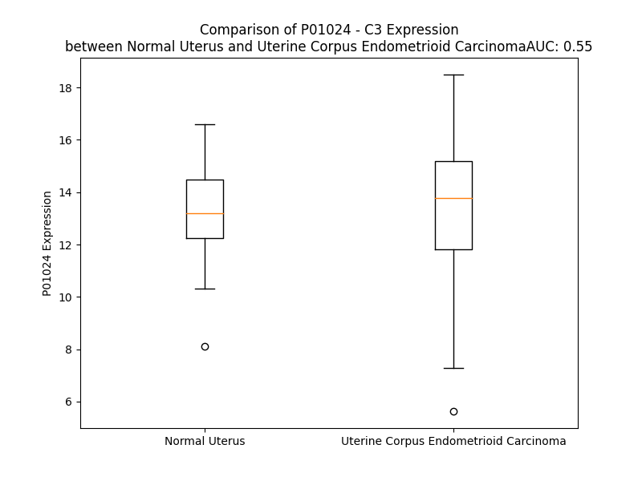

# Detailed Data for P01024

## Introduction to the Detailed Summary

### How to Interpret the Results

- **Summary & Metrics**: This section provides a quick reference to essential protein attributes, including expression changes, family classification, and biomarker applications. Regulation status (upregulated/downregulated) indicates the protein's behavior in a disease context. Some information comes from the original excel file with the proteins selected from literature, while others are derived from the analyses.
- **Expression Comparison**: A visual representation comparing protein expression between normal and disease states. It highlights significant changes in expression levels that might indicate diagnostic or therapeutic relevance. This is data coming from transcriptomics experiments and could not translate similarly to protein levels.
- **Isoform Alignment**: An interactive view of isoform alignments, revealing structural and functional differences between variants of the protein.
- **Interactors & Homologs**: Tables listing known interaction partners and homologous proteins, the more interactors and homologs, the more complex the protein is to design an antibody for.
- **Biological Assemblies**: Information about the structural arrangement of the protein in different assemblies, providing insights into its functional state but also the complexity of the protein to develop antibodies.
- **Combined Per-Residue Information**: A detailed table summarizing residue-level data. This includes predictions for epitope regions, aggregation tendencies, and modifications that might impact the protein's function. Each row corresponds to a residue in the protein, providing insights into specific sites that may be important for research or drug development.
## Summary & Metrics

- **UniProt Accession**: P01024
- **Gene Name**: C3
- **Protein Name**: complement C3
- **Swiss Prot**: CO3_HUMAN
- **Family**: peptidase
- **Biomarker Application**: efficacy
- **Number of Isoforms**: 0
- **Regulation**: 1
- **(transcriptomics) AUC**: 0.21
- **(transcriptomics) Fold Change**: 1.22
- **(transcriptomics) Regulation**: Downregulated
- **Discotope Epitope Count**: 337
- **Max n_uniprots (Homo)**: 3
- **Max n_uniprots (Hetero)**: 10

## Expression Comparison

## Interactors

| preferredName_A   | preferredName_B   |   score |
|:------------------|:------------------|--------:|
| C3                | CFP               |   0.999 |
| C3                | CR1               |   0.999 |
| C3                | CD46              |   0.999 |
| C3                | CFI               |   0.999 |
| C3                | CFHR1             |   0.999 |
| C3                | ITGAM             |   0.999 |
| C3                | CR2               |   0.999 |
| C3                | VSIG4             |   0.999 |
| C3                | CFH               |   0.999 |
| C3                | CD55              |   0.999 |
| C3                | CFB               |   0.999 |
| C3                | C5AR2             |   0.998 |
| C3                | ITGB2             |   0.998 |
| C3                | CFHR4             |   0.998 |
| C3                | C3AR1             |   0.998 |
| C3                | C4A               |   0.998 |
| C3                | C4B               |   0.998 |
| C3                | CFD               |   0.998 |
| C3                | CFHR5             |   0.992 |
| C3                | SELP              |   0.991 |
| C3                | CFHR3             |   0.991 |
| C3                | CRP               |   0.985 |
| C3                | C2                |   0.978 |
| C3                | PLG               |   0.978 |
| C3                | C5AR1             |   0.977 |
| C3                | C5                |   0.974 |
| C3                | ITGAX             |   0.969 |
| C3                | CR1L              |   0.966 |
| C3                | ATG16L1           |   0.961 |
| C3                | ALB               |   0.959 |
| C3                | APOA1             |   0.957 |
| C3                | SERPING1          |   0.954 |
| C3                | CFHR2             |   0.951 |
| C3                | MASP1             |   0.936 |
| C3                | C1R               |   0.935 |
| C3                | MBL2              |   0.934 |
| C3                | THBD              |   0.933 |
| C3                | B4E1Z4_HUMAN      |   0.921 |
| C3                | ENSP00000493607   |   0.911 |
| C3                | MASP2             |   0.91  |
| C3                | C1S               |   0.908 |

## Homologs

| uniprot_id   | gene_id   |
|:-------------|:----------|
| A0A8V8TN26   | C5        |
| P20742       | PZP       |
| Q6YHK3       | CD109     |
| F5H1E8       | A2M       |
| F5GXS0       | C4B       |
| P0C0L4       | C4A       |
| A8K2U0       | A2ML1     |
| Q8IZJ3       | CPAMD8    |

## Biological Assemblies

|   Unnamed: 0 |   assembly |   n_uniprots | composition   | crystal_id   |
|-------------:|-----------:|-------------:|:--------------|:-------------|
|            0 |          1 |            2 | Hetero        | 2wy8         |
|            0 |          1 |            4 | Hetero        | 3nms         |
|            0 |          1 |            3 | Hetero        | 2wii         |
|            1 |          2 |            1 | Homo          | 2wii         |
|            2 |          3 |            1 | Homo          | 2wii         |
|            3 |          4 |            1 | Homo          | 2wii         |
|            0 |          1 |            4 | Hetero        | 6rmu         |
|            0 |          1 |            2 | Hetero        | 2gox         |
|            1 |          2 |            2 | Hetero        | 2gox         |
|            0 |          1 |            3 | Hetero        | 5o35         |
|            0 |          1 |            2 | Hetero        | 3oed         |
|            1 |          2 |            2 | Hetero        | 3oed         |
|            0 |          1 |           10 | Hetero        | 5o32         |
|            0 |          1 |            8 | Hetero        | 6ruv         |
|            0 |          1 |            2 | Hetero        | 7pi6         |
|            1 |          2 |            2 | Hetero        | 7pi6         |
|            0 |          1 |            3 | Hetero        | 3l5n         |
|            0 |          1 |            5 | Hetero        | 7noz         |
|            0 |          1 |            2 | Homo          | 7qiv         |
|            0 |          1 |            2 | Homo          | 3g6j         |
|            1 |          2 |            2 | Homo          | 3g6j         |
|            2 |          3 |            0 | Hetero        | 3g6j         |
|            3 |          4 |            0 | Hetero        | 3g6j         |
|            4 |          5 |            2 | Homo          | 3g6j         |
|            5 |          6 |            2 | Homo          | 3g6j         |
|            0 |          1 |            5 | Hetero        | 8i9l         |
|            0 |          1 |            3 | Homo          | 2qki         |
|            1 |          2 |            3 | Homo          | 2qki         |
|            0 |          1 |            4 | Hetero        | 3l3o         |
|            1 |          2 |            4 | Hetero        | 3l3o         |
|            0 |          1 |            2 | Hetero        | 4ont         |
|            1 |          2 |            2 | Hetero        | 4ont         |
|            2 |          3 |            2 | Hetero        | 4ont         |
|            0 |          1 |            3 | Hetero        | 5foa         |
|            1 |          2 |            3 | Hetero        | 5foa         |
|            0 |          1 |            2 | Homo          | 6rmt         |
|            0 |          1 |            3 | Hetero        | 6s0b         |
|            0 |          1 |            6 | Hetero        | 8eok         |
|            0 |          1 |            2 | Hetero        | 3oxu         |
|            1 |          2 |            2 | Hetero        | 3oxu         |
|            2 |          3 |            2 | Hetero        | 3oxu         |
|            0 |          1 |            1 | Homo          | 7ue9         |
|            0 |          1 |            3 | Hetero        | 2xwj         |
|            1 |          2 |            3 | Hetero        | 2xwj         |
|            2 |          3 |            3 | Hetero        | 2xwj         |
|            3 |          4 |            3 | Hetero        | 2xwj         |
|            0 |          1 |            1 | Homo          | 4i6o         |
|            0 |          1 |            3 | Hetero        | 5fo9         |
|            1 |          2 |            3 | Hetero        | 5fo9         |
|            0 |          1 |            4 | Hetero        | 2ice         |
|            1 |          2 |            4 | Hetero        | 2ice         |
|            0 |          1 |            3 | Hetero        | 1ghq         |
|            0 |          1 |            6 | Hetero        | 8uh2         |
|            0 |          1 |            3 | Hetero        | 5nbq         |
|            1 |          2 |            3 | Hetero        | 5nbq         |
|            2 |          3 |            3 | Hetero        | 5nbq         |
|            0 |          1 |            2 | Homo          | 6ehg         |
|            0 |          1 |            8 | Hetero        | 2win         |
|            1 |          2 |            8 | Hetero        | 2win         |
|            0 |          1 |            6 | Hetero        | 7akk         |
|            0 |          1 |            2 | Hetero        | 3rj3         |
|            1 |          2 |            2 | Hetero        | 3rj3         |
|            2 |          3 |            2 | Hetero        | 3rj3         |
|            0 |          1 |            2 | Homo          | 7tv9         |
|            0 |          1 |            3 | Hetero        | 5fo8         |
|            0 |          1 |            4 | Hetero        | 2xwb         |
|            1 |          2 |            4 | Hetero        | 2xwb         |
|            2 |          3 |            4 | Hetero        | 2xwb         |
|            3 |          4 |            4 | Hetero        | 2xwb         |
|            0 |          1 |            2 | Hetero        | 3d5r         |
|            1 |          2 |            2 | Hetero        | 3d5r         |
|            0 |          1 |            3 | Hetero        | 5fob         |
|            0 |          1 |            3 | Hetero        | 2icf         |
|            0 |          1 |            3 | Hetero        | 7zgk         |
|            0 |          1 |            2 | Homo          | 2i07         |
|            0 |          1 |            2 | Homo          | 2a73         |
|            0 |          1 |            3 | Homo          | 2a74         |
|            1 |          2 |            3 | Homo          | 2a74         |
|            0 |          1 |            1 | Homo          | 1c3d         |
|            0 |          1 |            2 | Hetero        | 4m76         |
|            0 |          1 |            2 | Homo          | 8oq3         |
|            0 |          1 |            4 | Hetero        | 3t4a         |
|            1 |          2 |            4 | Hetero        | 3t4a         |
|            0 |          1 |            2 | Hetero        | 2noj         |
|            1 |          2 |            2 | Hetero        | 2noj         |
|            2 |          3 |            2 | Hetero        | 2noj         |
|            3 |          4 |            2 | Hetero        | 2noj         |
|            0 |          1 |            4 | Hetero        | 8enu         |
|            0 |          1 |            1 | Homo          | 4hw5         |
|            1 |          2 |            1 | Homo          | 4hw5         |
|            2 |          3 |            2 | Homo          | 4hw5         |
|            0 |          1 |            3 | Hetero        | 8ovb         |
|            0 |          1 |           10 | Hetero        | 6rur         |
|            0 |          1 |            2 | Homo          | 7bag         |
|            0 |          1 |            4 | Hetero        | 3ohx         |
|            1 |          2 |            4 | Hetero        | 3ohx         |
|            0 |          1 |            3 | Hetero        | 2xqw         |
|            1 |          2 |            1 | Homo          | 2xqw         |
|            2 |          3 |            1 | Homo          | 2xqw         |
|            3 |          4 |            1 | Homo          | 2xqw         |
|            0 |          1 |            2 | Hetero        | 2wy7         |
|            0 |          1 |            2 | Homo          | 5fo7         |
|            0 |          1 |            5 | Hetero        | 8hk2         |
|            0 |          1 |            2 | Hetero        | 1w2s         |
|            0 |          1 |            8 | Hetero        | 8uin         |
|            0 |          1 |            0 | Hetero        | 6yo6         |
|            0 |          1 |            2 | Hetero        | 3d5s         |
|            1 |          2 |            2 | Hetero        | 3d5s         |
|            0 |          1 |            1 | Homo          | 4hwj         |
|            0 |          1 |            2 | Hetero        | 4zh1         |
|            1 |          2 |            2 | Hetero        | 4zh1         |
|            2 |          3 |            2 | Hetero        | 4zh1         |

## Combined Per-Residue Information

|   res | aa   |   epitope_score | epitope   |   relative_surface_accessibility |   modeling_confidence |   Aggregation | modification             | glycosylation                   |
|------:|:-----|----------------:|:----------|---------------------------------:|----------------------:|--------------:|:-------------------------|:--------------------------------|
|     1 | M    |         0.13067 | True      |                          1.33191 |                 50.24 |         0     | N/A                      | N/A                             |
|     2 | G    |         0.15967 | True      |                          0.81909 |                 49.89 |         0     | N/A                      | N/A                             |
|     3 | P    |         0.1574  | True      |                          0.89607 |                 46.38 |         0     | N/A                      | N/A                             |
|     4 | T    |         0.14488 | True      |                          0.85827 |                 42.33 |         0     | N/A                      | N/A                             |
|     5 | S    |         0.14892 | True      |                          0.89838 |                 37.5  |         0     | N/A                      | N/A                             |
|     6 | G    |         0.20425 | True      |                          0.81041 |                 41.62 |         0     | N/A                      | N/A                             |
|     7 | P    |         0.10939 | True      |                          0.97378 |                 52.32 |         0.113 | N/A                      | N/A                             |
|     8 | S    |         0.19998 | True      |                          0.77628 |                 35.49 |         9.554 | N/A                      | N/A                             |
|     9 | L    |         0.16299 | True      |                          0.92956 |                 36.82 |        84.272 | N/A                      | N/A                             |
|    10 | L    |         0.17701 | True      |                          1.10423 |                 40.49 |        96.549 | N/A                      | N/A                             |
|    11 | L    |         0.19384 | True      |                          0.8326  |                 36.7  |        97.392 | N/A                      | N/A                             |
|    12 | L    |         0.23652 | True      |                          0.94412 |                 35.63 |        97.392 | N/A                      | N/A                             |
|    13 | L    |         0.26942 | True      |                          1.05586 |                 35.68 |        97.218 | N/A                      | N/A                             |
|    14 | L    |         0.21896 | True      |                          1.05413 |                 41.04 |        88.577 | N/A                      | N/A                             |
|    15 | T    |         0.28322 | True      |                          0.81817 |                 36.02 |        33.727 | N/A                      | N/A                             |
|    16 | H    |         0.16749 | True      |                          0.96336 |                 35.97 |         0.261 | N/A                      | N/A                             |
|    17 | L    |         0.19808 | True      |                          1.06872 |                 38.77 |         0.014 | N/A                      | N/A                             |
|    18 | P    |         0.13924 | True      |                          0.88372 |                 37.74 |         0.007 | N/A                      | N/A                             |
|    19 | L    |         0.14692 | True      |                          1.00857 |                 37.43 |         0     | N/A                      | N/A                             |
|    20 | A    |         0.19514 | True      |                          0.99033 |                 36.75 |         0     | N/A                      | N/A                             |
|    21 | L    |         0.13941 | True      |                          0.82629 |                 48.04 |         0     | N/A                      | N/A                             |
|    22 | G    |         0.11094 | True      |                          0.49599 |                 55.37 |         0     | N/A                      | N/A                             |
|    23 | S    |         0.14962 | True      |                          0.6751  |                 68.78 |         0     | N/A                      | N/A                             |
|    24 | P    |         0.04168 | False     |                          0.31651 |                 81.45 |         0     | N/A                      | N/A                             |
|    25 | M    |         0.06519 | False     |                          0.01582 |                 87.81 |         3.534 | N/A                      | N/A                             |
|    26 | Y    |         0.02054 | False     |                          0.10926 |                 92.45 |         3.534 | N/A                      | N/A                             |
|    27 | S    |         0.00578 | False     |                          0.00391 |                 92.61 |         3.534 | N/A                      | N/A                             |
|    28 | I    |         0.00556 | False     |                          0.0048  |                 93.95 |         3.534 | N/A                      | N/A                             |
|    29 | I    |         0.00236 | False     |                          0.0024  |                 94.17 |         3.534 | N/A                      | N/A                             |
|    30 | T    |         0.00334 | False     |                          0.00263 |                 92.63 |         0     | N/A                      | N/A                             |
|    31 | P    |         0.00135 | False     |                          0       |                 92.05 |         0     | N/A                      | N/A                             |
|    32 | N    |         0.01831 | False     |                          0.0677  |                 89.07 |         0     | N/A                      | N/A                             |
|    33 | I    |         0.02124 | False     |                          0.036   |                 89.54 |         0     | N/A                      | N/A                             |
|    34 | L    |         0.00191 | False     |                          0       |                 89.41 |         0     | N/A                      | N/A                             |
|    35 | R    |         0.02084 | False     |                          0.03743 |                 85.66 |         0     | N/A                      | N/A                             |
|    36 | L    |         0.02306 | False     |                          0.04616 |                 81    |         0     | N/A                      | N/A                             |
|    37 | E    |         0.07889 | False     |                          0.37797 |                 78.8  |         0     | N/A                      | N/A                             |
|    38 | S    |         0.01958 | False     |                          0.08916 |                 82.27 |         0     | Phosphoserine; by FAM20C | N/A                             |
|    39 | E    |         0.09567 | False     |                          0.41244 |                 86.05 |         0     | N/A                      | N/A                             |
|    40 | E    |         0.00625 | False     |                          0.00192 |                 88.81 |         0     | N/A                      | N/A                             |
|    41 | T    |         0.03566 | False     |                          0.12859 |                 91.45 |         0     | N/A                      | N/A                             |
|    42 | M    |         0.00209 | False     |                          0       |                 91.87 |         0     | N/A                      | N/A                             |
|    43 | V    |         0.00794 | False     |                          0.00447 |                 93.64 |         0     | N/A                      | N/A                             |
|    44 | L    |         0.00313 | False     |                          0       |                 94.04 |         0     | N/A                      | N/A                             |
|    45 | E    |         0.00586 | False     |                          0.00269 |                 92.61 |         0     | N/A                      | N/A                             |
|    46 | A    |         0.01557 | False     |                          0.0132  |                 90.97 |         0     | N/A                      | N/A                             |
|    47 | H    |         0.02221 | False     |                          0.00871 |                 86.51 |         0     | N/A                      | N/A                             |
|    48 | D    |         0.1884  | True      |                          0.53825 |                 79.93 |         0     | N/A                      | N/A                             |
|    49 | A    |         0.03338 | False     |                          0.1414  |                 83.54 |         0     | N/A                      | N/A                             |
|    50 | Q    |         0.11931 | True      |                          0.73719 |                 78.24 |         0     | N/A                      | N/A                             |
|    51 | G    |         0.08265 | False     |                          0.52446 |                 86.67 |         0     | N/A                      | N/A                             |
|    52 | D    |         0.13445 | True      |                          0.54838 |                 90.35 |         0     | N/A                      | N/A                             |
|    53 | V    |         0.06445 | False     |                          0.09711 |                 90.3  |         0     | N/A                      | N/A                             |
|    54 | P    |         0.12693 | True      |                          0.58355 |                 92.11 |         0     | N/A                      | N/A                             |
|    55 | V    |         0.01579 | False     |                          0.01772 |                 92.91 |        11.93  | N/A                      | N/A                             |
|    56 | T    |         0.11284 | True      |                          0.33392 |                 94.02 |        11.93  | N/A                      | N/A                             |
|    57 | V    |         0.01408 | False     |                          0.00762 |                 93.22 |        11.93  | N/A                      | N/A                             |
|    58 | T    |         0.11468 | True      |                          0.14869 |                 93.37 |        11.93  | N/A                      | N/A                             |
|    59 | V    |         0.00429 | False     |                          0.00286 |                 91.76 |        11.93  | N/A                      | N/A                             |
|    60 | H    |         0.08991 | False     |                          0.18847 |                 90.49 |         0     | N/A                      | N/A                             |
|    61 | D    |         0.04731 | False     |                          0.09394 |                 85.97 |         0     | N/A                      | N/A                             |
|    62 | F    |         0.20881 | True      |                          0.48858 |                 82.67 |         0     | N/A                      | N/A                             |
|    63 | P    |         0.45536 | True      |                          0.84683 |                 77.27 |         0     | N/A                      | N/A                             |
|    64 | G    |         0.12802 | True      |                          0.46811 |                 76.71 |         0     | N/A                      | N/A                             |
|    65 | K    |         0.2163  | True      |                          0.41892 |                 84.37 |         0     | N/A                      | N/A                             |
|    66 | K    |         0.27399 | True      |                          0.90056 |                 83.23 |         0     | N/A                      | N/A                             |
|    67 | L    |         0.18865 | True      |                          0.44739 |                 84.35 |         0     | N/A                      | N/A                             |
|    68 | V    |         0.22613 | True      |                          0.52253 |                 87.39 |         0     | N/A                      | N/A                             |
|    69 | L    |         0.06147 | False     |                          0.1065  |                 87.12 |         0     | N/A                      | N/A                             |
|    70 | S    |         0.02998 | False     |                          0.15005 |                 89.21 |         0     | Phosphoserine; by FAM20C | N/A                             |
|    71 | S    |         0.20968 | True      |                          0.48399 |                 92.45 |         0     | N/A                      | N/A                             |
|    72 | E    |         0.11717 | True      |                          0.37102 |                 92.52 |         0     | N/A                      | N/A                             |
|    73 | K    |         0.22368 | True      |                          0.7938  |                 91.46 |         0     | N/A                      | N/A                             |
|    74 | T    |         0.10249 | True      |                          0.25921 |                 92.13 |         0     | N/A                      | N/A                             |
|    75 | V    |         0.16689 | True      |                          0.54096 |                 91.82 |         0     | N/A                      | N/A                             |
|    76 | L    |         0.00861 | False     |                          0.00165 |                 91.44 |         0     | N/A                      | N/A                             |
|    77 | T    |         0.10725 | True      |                          0.25094 |                 90.69 |         0     | N/A                      | N/A                             |
|    78 | P    |         0.10809 | True      |                          0.5408  |                 84.9  |         0     | N/A                      | N/A                             |
|    79 | A    |         0.13857 | True      |                          0.93407 |                 82.72 |         0     | N/A                      | N/A                             |
|    80 | T    |         0.09109 | False     |                          0.49619 |                 80.98 |         0     | N/A                      | N/A                             |
|    81 | N    |         0.10749 | True      |                          0.5558  |                 82.87 |         0     | N/A                      | N/A                             |
|    82 | H    |         0.06468 | False     |                          0.09941 |                 89.2  |         0     | N/A                      | N/A                             |
|    83 | M    |         0.0258  | False     |                          0.10443 |                 90.15 |         0     | N/A                      | N/A                             |
|    84 | G    |         0.06378 | False     |                          0.17704 |                 88.83 |         0     | N/A                      | N/A                             |
|    85 | N    |         0.07945 | False     |                          0.50923 |                 90.2  |         0     | N/A                      | N-linked (GlcNAc...) asparagine |
|    86 | V    |         0.04777 | False     |                          0.06855 |                 91.18 |         0.443 | N/A                      | N/A                             |
|    87 | T    |         0.11084 | True      |                          0.59491 |                 91.09 |         0.443 | N/A                      | N/A                             |
|    88 | F    |         0.02852 | False     |                          0.0334  |                 90.45 |         0.443 | N/A                      | N/A                             |
|    89 | T    |         0.07747 | False     |                          0.4056  |                 87.7  |         0.443 | N/A                      | N/A                             |
|    90 | I    |         0.00667 | False     |                          0.0008  |                 86.81 |         0.443 | N/A                      | N/A                             |
|    91 | P    |         0.07898 | False     |                          0.31015 |                 81.84 |         0.199 | N/A                      | N/A                             |
|    92 | A    |         0.14338 | True      |                          0.44378 |                 71.69 |         0     | N/A                      | N/A                             |
|    93 | N    |         0.21477 | True      |                          0.39143 |                 68.02 |         0     | N/A                      | N/A                             |
|    94 | R    |         0.12965 | True      |                          0.86774 |                 59.25 |         0     | N/A                      | N/A                             |
|    95 | E    |         0.22272 | True      |                          0.56031 |                 61.47 |         0     | N/A                      | N/A                             |
|    96 | F    |         0.04372 | False     |                          0.08772 |                 63.53 |         0     | N/A                      | N/A                             |
|    97 | K    |         0.09908 | False     |                          0.81996 |                 56.65 |         0     | N/A                      | N/A                             |
|    98 | S    |         0.08077 | False     |                          0.33687 |                 53.73 |         0     | N/A                      | N/A                             |
|    99 | E    |         0.15866 | True      |                          0.55573 |                 54.04 |         0     | N/A                      | N/A                             |
|   100 | K    |         0.21418 | True      |                          1.00687 |                 51.87 |         0     | N/A                      | N/A                             |
|   101 | G    |         0.2706  | True      |                          0.95448 |                 57.24 |         0     | N/A                      | N/A                             |
|   102 | R    |         0.22305 | True      |                          0.67374 |                 63.23 |         0     | N/A                      | N/A                             |
|   103 | N    |         0.10431 | True      |                          0.4841  |                 74.52 |         0     | N/A                      | N/A                             |
|   104 | K    |         0.0864  | False     |                          0.28977 |                 79.59 |         0     | N/A                      | N/A                             |
|   105 | F    |         0.06372 | False     |                          0.22026 |                 87.15 |         6.306 | N/A                      | N/A                             |
|   106 | V    |         0.00292 | False     |                          0       |                 90.17 |         6.746 | N/A                      | N/A                             |
|   107 | T    |         0.05473 | False     |                          0.0168  |                 91.47 |         6.766 | N/A                      | N/A                             |
|   108 | V    |         0.00405 | False     |                          0       |                 91.93 |         6.963 | N/A                      | N/A                             |
|   109 | Q    |         0.14096 | True      |                          0.17561 |                 92.71 |         6.963 | N/A                      | N/A                             |
|   110 | A    |         0.00279 | False     |                          0       |                 93.37 |         6.467 | N/A                      | N/A                             |
|   111 | T    |         0.07755 | False     |                          0.30165 |                 93.36 |         6.149 | N/A                      | N/A                             |
|   112 | F    |         0.01349 | False     |                          0.01623 |                 90.54 |         6.197 | N/A                      | N/A                             |
|   113 | G    |         0.15189 | True      |                          0.5547  |                 83.75 |         2.174 | N/A                      | N/A                             |
|   114 | T    |         0.15575 | True      |                          0.98626 |                 82.82 |         2.148 | N/A                      | N/A                             |
|   115 | Q    |         0.12695 | True      |                          0.35963 |                 88.15 |         2.716 | N/A                      | N/A                             |
|   116 | V    |         0.17619 | True      |                          0.54746 |                 91.13 |        18.525 | N/A                      | N/A                             |
|   117 | V    |         0.02347 | False     |                          0.03523 |                 92.14 |        19.75  | N/A                      | N/A                             |
|   118 | E    |         0.12493 | True      |                          0.37754 |                 92.05 |        19.038 | N/A                      | N/A                             |
|   119 | K    |         0.06031 | False     |                          0.0841  |                 91.93 |        19.038 | N/A                      | N/A                             |
|   120 | V    |         0.09411 | False     |                          0.27391 |                 91.93 |        95.558 | N/A                      | N/A                             |
|   121 | V    |         0.00499 | False     |                          0.00666 |                 90.76 |        96.456 | N/A                      | N/A                             |
|   122 | L    |         0.00587 | False     |                          0.00412 |                 89.95 |        96.444 | N/A                      | N/A                             |
|   123 | V    |         0.01467 | False     |                          0.04504 |                 85.64 |        95.774 | N/A                      | N/A                             |
|   124 | S    |         0.03228 | False     |                          0.0734  |                 82.05 |        88.673 | N/A                      | N/A                             |
|   125 | L    |         0.03961 | False     |                          0.19901 |                 75.13 |        82.213 | N/A                      | N/A                             |
|   126 | Q    |         0.0516  | False     |                          0.11337 |                 75.29 |        46.545 | N/A                      | N/A                             |
|   127 | S    |         0.03338 | False     |                          0.03073 |                 74.6  |        45.23  | N/A                      | N/A                             |
|   128 | G    |         0.00729 | False     |                          0.01129 |                 84.96 |        45.951 | N/A                      | N/A                             |
|   129 | Y    |         0.01243 | False     |                          0.04284 |                 89.45 |        46.677 | N/A                      | N/A                             |
|   130 | L    |         0.00757 | False     |                          0.01606 |                 91.47 |        46.8   | N/A                      | N/A                             |
|   131 | F    |         0.01366 | False     |                          0.05625 |                 93.01 |        46.521 | N/A                      | N/A                             |
|   132 | I    |         0.01056 | False     |                          0.08468 |                 93.15 |        43.003 | N/A                      | N/A                             |
|   133 | Q    |         0.02519 | False     |                          0.06318 |                 93.43 |         3.783 | N/A                      | N/A                             |
|   134 | T    |         0.02521 | False     |                          0.12413 |                 93.2  |         2.988 | N/A                      | N/A                             |
|   135 | D    |         0.0109  | False     |                          0.02309 |                 91.19 |         0.008 | N/A                      | N/A                             |
|   136 | K    |         0.02557 | False     |                          0.04563 |                 90.87 |         0.008 | N/A                      | N/A                             |
|   137 | T    |         0.01384 | False     |                          0.02285 |                 89.51 |         0.008 | N/A                      | N/A                             |
|   138 | I    |         0.04605 | False     |                          0.0408  |                 85.7  |         0.008 | N/A                      | N/A                             |
|   139 | Y    |         0.00492 | False     |                          0       |                 87.02 |         0.008 | N/A                      | N/A                             |
|   140 | T    |         0.0577  | False     |                          0.25462 |                 71.85 |         0     | N/A                      | N/A                             |
|   141 | P    |         0.0545  | False     |                          0.23159 |                 68.53 |         0     | N/A                      | N/A                             |
|   142 | G    |         0.04371 | False     |                          0.61105 |                 70.32 |         0     | N/A                      | N/A                             |
|   143 | S    |         0.06385 | False     |                          0.19743 |                 81.9  |         0.366 | N/A                      | N/A                             |
|   144 | T    |         0.07161 | False     |                          0.38691 |                 88.68 |         0.366 | N/A                      | N/A                             |
|   145 | V    |         0.0022  | False     |                          0.00095 |                 91.91 |         0.366 | N/A                      | N/A                             |
|   146 | L    |         0.04828 | False     |                          0.30254 |                 93.6  |         0.366 | N/A                      | N/A                             |
|   147 | Y    |         0.00418 | False     |                          0       |                 93.62 |         0.366 | N/A                      | N/A                             |
|   148 | R    |         0.01866 | False     |                          0.00375 |                 92.14 |         0     | N/A                      | N/A                             |
|   149 | I    |         0.00242 | False     |                          0       |                 92.4  |         0.317 | N/A                      | N/A                             |
|   150 | F    |         0.00354 | False     |                          0.00318 |                 92.69 |         0.317 | N/A                      | N/A                             |
|   151 | T    |         0.00179 | False     |                          0       |                 91.77 |         0.317 | N/A                      | N/A                             |
|   152 | V    |         0.00287 | False     |                          0       |                 90.51 |         0.317 | N/A                      | N/A                             |
|   153 | N    |         0.02575 | False     |                          0.23597 |                 86.53 |         0.317 | N/A                      | N/A                             |
|   154 | H    |         0.01909 | False     |                          0.08813 |                 81.74 |         0     | N/A                      | N/A                             |
|   155 | K    |         0.06699 | False     |                          0.49642 |                 80.87 |         0     | N/A                      | N/A                             |
|   156 | L    |         0.0181  | False     |                          0.04287 |                 87.22 |         0     | N/A                      | N/A                             |
|   157 | L    |         0.04453 | False     |                          0.24978 |                 88.77 |         0     | N/A                      | N/A                             |
|   158 | P    |         0.03839 | False     |                          0.20069 |                 88.25 |         0     | N/A                      | N/A                             |
|   159 | V    |         0.0332  | False     |                          0.22918 |                 85.47 |         0     | N/A                      | N/A                             |
|   160 | G    |         0.03534 | False     |                          0.40356 |                 80.96 |         0     | N/A                      | N/A                             |
|   161 | R    |         0.05471 | False     |                          0.17503 |                 81.54 |         0     | N/A                      | N/A                             |
|   162 | T    |         0.1161  | True      |                          0.31081 |                 85.92 |         6.31  | N/A                      | N/A                             |
|   163 | V    |         0.00596 | False     |                          0       |                 87.23 |        16.018 | N/A                      | N/A                             |
|   164 | M    |         0.0339  | False     |                          0.18691 |                 87.8  |        16.018 | N/A                      | N/A                             |
|   165 | V    |         0.01041 | False     |                          0.0113  |                 87.3  |        16.018 | N/A                      | N/A                             |
|   166 | N    |         0.05466 | False     |                          0.15176 |                 87.19 |        16.018 | N/A                      | N/A                             |
|   167 | I    |         0.01004 | False     |                          0.0064  |                 85.88 |        15.484 | N/A                      | N/A                             |
|   168 | E    |         0.04113 | False     |                          0.08786 |                 87.29 |         0     | N/A                      | N/A                             |
|   169 | N    |         0.01464 | False     |                          0.02556 |                 81.1  |         0     | N/A                      | N/A                             |
|   170 | P    |         0.05361 | False     |                          0.39749 |                 80.8  |         0     | N/A                      | N/A                             |
|   171 | E    |         0.10991 | True      |                          0.42695 |                 74.24 |         0     | N/A                      | N/A                             |
|   172 | G    |         0.07822 | False     |                          0.5156  |                 75.08 |         0     | N/A                      | N/A                             |
|   173 | I    |         0.05906 | False     |                          0.0768  |                 71.65 |         0     | N/A                      | N/A                             |
|   174 | P    |         0.07417 | False     |                          0.36899 |                 77.19 |         0     | N/A                      | N/A                             |
|   175 | V    |         0.02684 | False     |                          0.10987 |                 73.7  |         0     | N/A                      | N/A                             |
|   176 | K    |         0.03595 | False     |                          0.26293 |                 76.26 |         0     | N/A                      | N/A                             |
|   177 | Q    |         0.08558 | False     |                          0.51915 |                 77.1  |         0     | N/A                      | N/A                             |
|   178 | D    |         0.04701 | False     |                          0.1622  |                 77.99 |         0     | N/A                      | N/A                             |
|   179 | S    |         0.08201 | False     |                          0.54801 |                 83.57 |         0     | N/A                      | N/A                             |
|   180 | L    |         0.09093 | False     |                          0.28605 |                 82.72 |         0     | N/A                      | N/A                             |
|   181 | S    |         0.08308 | False     |                          0.42939 |                 78.52 |         0     | N/A                      | N/A                             |
|   182 | S    |         0.02033 | False     |                          0       |                 74.73 |         0     | N/A                      | N/A                             |
|   183 | Q    |         0.13735 | True      |                          0.62811 |                 70.45 |         0     | N/A                      | N/A                             |
|   184 | N    |         0.15104 | True      |                          0.93078 |                 64.62 |         0     | N/A                      | N/A                             |
|   185 | Q    |         0.08128 | False     |                          0.37313 |                 66.33 |         0     | N/A                      | N/A                             |
|   186 | L    |         0.0891  | False     |                          0.57593 |                 72.42 |         0     | N/A                      | N/A                             |
|   187 | G    |         0.00781 | False     |                          0.00277 |                 78.64 |         0     | N/A                      | N/A                             |
|   188 | V    |         0.01387 | False     |                          0.03543 |                 87.14 |         0     | N/A                      | N/A                             |
|   189 | L    |         0.03287 | False     |                          0.03957 |                 86.8  |         0     | N/A                      | N/A                             |
|   190 | P    |         0.04737 | False     |                          0.44821 |                 87.3  |         0     | N/A                      | N/A                             |
|   191 | L    |         0.06944 | False     |                          0.19724 |                 88.66 |         0     | N/A                      | N/A                             |
|   192 | S    |         0.13107 | True      |                          0.40353 |                 90.25 |         0     | N/A                      | N/A                             |
|   193 | W    |         0.07561 | False     |                          0.11829 |                 88.53 |         0     | N/A                      | N/A                             |
|   194 | D    |         0.10311 | True      |                          0.58381 |                 85.33 |         0     | N/A                      | N/A                             |
|   195 | I    |         0.0176  | False     |                          0.02492 |                 78.29 |         0     | N/A                      | N/A                             |
|   196 | P    |         0.02184 | False     |                          0.0507  |                 68.39 |         0     | N/A                      | N/A                             |
|   197 | E    |         0.12278 | True      |                          0.5647  |                 64.72 |         0     | N/A                      | N/A                             |
|   198 | L    |         0.03826 | False     |                          0.23412 |                 63.64 |         0     | N/A                      | N/A                             |
|   199 | V    |         0.03775 | False     |                          0.08192 |                 69.69 |         0     | N/A                      | N/A                             |
|   200 | N    |         0.06711 | False     |                          0.13297 |                 71.53 |         0     | N/A                      | N/A                             |
|   201 | M    |         0.10955 | True      |                          0.54543 |                 73.48 |         0     | N/A                      | N/A                             |
|   202 | G    |         0.03525 | False     |                          0.298   |                 74.03 |         0     | N/A                      | N/A                             |
|   203 | Q    |         0.10614 | True      |                          0.4201  |                 85.56 |         0     | N/A                      | N/A                             |
|   204 | W    |         0.00861 | False     |                          0.00166 |                 89.2  |         0     | N/A                      | N/A                             |
|   205 | K    |         0.08584 | False     |                          0.32794 |                 91.77 |         0     | N/A                      | N/A                             |
|   206 | I    |         0.0065  | False     |                          0.0008  |                 92.4  |         0     | N/A                      | N/A                             |
|   207 | R    |         0.06049 | False     |                          0.33561 |                 91.04 |         0     | N/A                      | N/A                             |
|   208 | A    |         0.0027  | False     |                          0       |                 91.27 |         0     | N/A                      | N/A                             |
|   209 | Y    |         0.10361 | True      |                          0.18268 |                 89.82 |         0     | N/A                      | N/A                             |
|   210 | Y    |         0.01554 | False     |                          0.017   |                 85.5  |         0     | N/A                      | N/A                             |
|   211 | E    |         0.12759 | True      |                          0.53251 |                 79.99 |         0     | N/A                      | N/A                             |
|   212 | N    |         0.12833 | True      |                          0.53878 |                 72.27 |         0     | N/A                      | N/A                             |
|   213 | S    |         0.02559 | False     |                          0.01851 |                 73.26 |         0     | N/A                      | N/A                             |
|   214 | P    |         0.20718 | True      |                          0.5892  |                 73.34 |         0     | N/A                      | N/A                             |
|   215 | Q    |         0.122   | True      |                          0.54035 |                 71.34 |         0     | N/A                      | N/A                             |
|   216 | Q    |         0.0492  | False     |                          0.22307 |                 76.02 |         0     | N/A                      | N/A                             |
|   217 | V    |         0.17422 | True      |                          0.40667 |                 85.02 |         0     | N/A                      | N/A                             |
|   218 | F    |         0.03795 | False     |                          0.17602 |                 90.14 |         0     | N/A                      | N/A                             |
|   219 | S    |         0.11675 | True      |                          0.50708 |                 91.61 |         0     | N/A                      | N/A                             |
|   220 | T    |         0.06931 | False     |                          0.13994 |                 91.33 |         0     | N/A                      | N/A                             |
|   221 | E    |         0.09594 | False     |                          0.34395 |                 92.16 |         0     | N/A                      | N/A                             |
|   222 | F    |         0.00332 | False     |                          0.00064 |                 91.25 |         0     | N/A                      | N/A                             |
|   223 | E    |         0.07655 | False     |                          0.20488 |                 88.25 |         0     | N/A                      | N/A                             |
|   224 | V    |         0.00492 | False     |                          0.00211 |                 78.78 |         0     | N/A                      | N/A                             |
|   225 | K    |         0.19767 | True      |                          0.49197 |                 69.91 |         0     | N/A                      | N/A                             |
|   226 | E    |         0.15833 | True      |                          0.61911 |                 61.81 |         0     | N/A                      | N/A                             |
|   227 | Y    |         0.1364  | True      |                          0.15413 |                 61.28 |         0     | N/A                      | N/A                             |
|   228 | V    |         0.15004 | True      |                          0.93852 |                 55.68 |         0     | N/A                      | N/A                             |
|   229 | L    |         0.07441 | False     |                          0.34782 |                 64.75 |         0     | N/A                      | N/A                             |
|   230 | P    |         0.04296 | False     |                          0.1171  |                 66.55 |         0     | N/A                      | N/A                             |
|   231 | S    |         0.07562 | False     |                          0.31169 |                 69.99 |         0     | N/A                      | N/A                             |
|   232 | F    |         0.01112 | False     |                          0       |                 78.15 |         0     | N/A                      | N/A                             |
|   233 | E    |         0.01521 | False     |                          0.0422  |                 85.28 |         0     | N/A                      | N/A                             |
|   234 | V    |         0.02084 | False     |                          0.06579 |                 84    |         0     | N/A                      | N/A                             |
|   235 | I    |         0.03791 | False     |                          0.24799 |                 88.48 |         0     | N/A                      | N/A                             |
|   236 | V    |         0.02251 | False     |                          0.0588  |                 87.62 |         0     | N/A                      | N/A                             |
|   237 | E    |         0.06286 | False     |                          0.51188 |                 88.38 |         0     | N/A                      | N/A                             |
|   238 | P    |         0.04638 | False     |                          0.13808 |                 88.8  |         0     | N/A                      | N/A                             |
|   239 | T    |         0.10998 | True      |                          0.60071 |                 84.25 |         0     | N/A                      | N/A                             |
|   240 | E    |         0.10413 | True      |                          0.4718  |                 81.06 |         0.104 | N/A                      | N/A                             |
|   241 | K    |         0.17007 | True      |                          0.49923 |                 81.1  |         0.104 | N/A                      | N/A                             |
|   242 | F    |         0.04001 | False     |                          0.13946 |                 84.84 |        81.269 | N/A                      | N/A                             |
|   243 | Y    |         0.03111 | False     |                          0.01606 |                 85.63 |        81.469 | N/A                      | N/A                             |
|   244 | Y    |         0.06559 | False     |                          0.19675 |                 81.84 |        81.469 | N/A                      | N/A                             |
|   245 | I    |         0.03741 | False     |                          0       |                 80.54 |        81.469 | N/A                      | N/A                             |
|   246 | Y    |         0.19559 | True      |                          0.44296 |                 77.4  |        81.423 | N/A                      | N/A                             |
|   247 | N    |         0.10615 | True      |                          0.32191 |                 75.93 |        18.484 | N/A                      | N/A                             |
|   248 | E    |         0.183   | True      |                          0.73907 |                 74.73 |         0     | N/A                      | N/A                             |
|   249 | K    |         0.13409 | True      |                          0.87347 |                 76.49 |         0     | N/A                      | N/A                             |
|   250 | G    |         0.02814 | False     |                          0.07316 |                 85.16 |         0.36  | N/A                      | N/A                             |
|   251 | L    |         0.01845 | False     |                          0.02308 |                 88.3  |         0.903 | N/A                      | N/A                             |
|   252 | E    |         0.09066 | False     |                          0.39923 |                 91.71 |         1.171 | N/A                      | N/A                             |
|   253 | V    |         0.00198 | False     |                          0       |                 91.29 |         7.281 | N/A                      | N/A                             |
|   254 | T    |         0.0471  | False     |                          0.26594 |                 93.98 |         7.281 | N/A                      | N/A                             |
|   255 | I    |         0.00506 | False     |                          0       |                 91.2  |         7.281 | N/A                      | N/A                             |
|   256 | T    |         0.06136 | False     |                          0.34175 |                 92.61 |         7.281 | N/A                      | N/A                             |
|   257 | A    |         0.00311 | False     |                          0.00094 |                 87.36 |         7.281 | N/A                      | N/A                             |
|   258 | R    |         0.08733 | False     |                          0.33986 |                 88.28 |         1.171 | N/A                      | N/A                             |
|   259 | F    |         0.02774 | False     |                          0.12467 |                 81.83 |         1.171 | N/A                      | N/A                             |
|   260 | L    |         0.04175 | False     |                          0.11398 |                 79.78 |         1.171 | N/A                      | N/A                             |
|   261 | Y    |         0.03827 | False     |                          0.09622 |                 78.91 |         0.654 | N/A                      | N/A                             |
|   262 | G    |         0.09671 | False     |                          0.60199 |                 77.64 |         0     | N/A                      | N/A                             |
|   263 | K    |         0.10955 | True      |                          0.24041 |                 78.91 |         0     | N/A                      | N/A                             |
|   264 | K    |         0.12044 | True      |                          0.56393 |                 85.32 |         0.199 | N/A                      | N/A                             |
|   265 | V    |         0.00572 | False     |                          0       |                 78.99 |         0.199 | N/A                      | N/A                             |
|   266 | E    |         0.04347 | False     |                          0.35679 |                 79.41 |         0.199 | N/A                      | N/A                             |
|   267 | G    |         0.00412 | False     |                          0       |                 76.04 |         1.407 | N/A                      | N/A                             |
|   268 | T    |         0.05874 | False     |                          0.24134 |                 78.09 |        14.775 | N/A                      | N/A                             |
|   269 | A    |         0.00522 | False     |                          0       |                 78.72 |        72.957 | N/A                      | N/A                             |
|   270 | F    |         0.05428 | False     |                          0.40238 |                 80.31 |        94.756 | N/A                      | N/A                             |
|   271 | V    |         0.00353 | False     |                          0       |                 82.24 |        96.189 | N/A                      | N/A                             |
|   272 | I    |         0.1125  | True      |                          0.28879 |                 82.87 |        96.183 | N/A                      | N/A                             |
|   273 | F    |         0.00248 | False     |                          0.00191 |                 87.69 |        95.413 | N/A                      | N/A                             |
|   274 | G    |         0.00355 | False     |                          0       |                 84.52 |        46.207 | N/A                      | N/A                             |
|   275 | I    |         0.00575 | False     |                          0.00296 |                 85.2  |        37.55  | N/A                      | N/A                             |
|   276 | Q    |         0.05273 | False     |                          0.15735 |                 80.35 |         1.415 | N/A                      | N/A                             |
|   277 | D    |         0.01516 | False     |                          0.1442  |                 78.25 |         0     | N/A                      | N/A                             |
|   278 | G    |         0.06442 | False     |                          0.6153  |                 71.83 |         0     | N/A                      | N/A                             |
|   279 | E    |         0.06845 | False     |                          0.46987 |                 63.74 |         0     | N/A                      | N/A                             |
|   280 | Q    |         0.03935 | False     |                          0.34052 |                 62.84 |         0     | N/A                      | N/A                             |
|   281 | R    |         0.07992 | False     |                          0.37682 |                 66.62 |         0     | N/A                      | N/A                             |
|   282 | I    |         0.03447 | False     |                          0.12879 |                 70.78 |         0     | N/A                      | N/A                             |
|   283 | S    |         0.0438  | False     |                          0.20677 |                 68.87 |         0     | N/A                      | N/A                             |
|   284 | L    |         0.03538 | False     |                          0.00989 |                 75.1  |         0     | N/A                      | N/A                             |
|   285 | P    |         0.07065 | False     |                          0.37067 |                 66.24 |         0     | N/A                      | N/A                             |
|   286 | E    |         0.06376 | False     |                          0.5855  |                 71.6  |         0     | N/A                      | N/A                             |
|   287 | S    |         0.03049 | False     |                          0.02595 |                 79.99 |         0     | N/A                      | N/A                             |
|   288 | L    |         0.13249 | True      |                          0.63526 |                 78.42 |         0     | N/A                      | N/A                             |
|   289 | K    |         0.09375 | False     |                          0.4347  |                 77.65 |         0     | N/A                      | N/A                             |
|   290 | R    |         0.2259  | True      |                          0.73219 |                 84.03 |         0     | N/A                      | N/A                             |
|   291 | I    |         0.0917  | False     |                          0.11082 |                 86.57 |         0     | N/A                      | N/A                             |
|   292 | P    |         0.0796  | False     |                          0.56882 |                 86.26 |         0     | N/A                      | N/A                             |
|   293 | I    |         0.00893 | False     |                          0       |                 84.5  |         0     | N/A                      | N/A                             |
|   294 | E    |         0.05374 | False     |                          0.58431 |                 85.15 |         0     | N/A                      | N/A                             |
|   295 | D    |         0.08994 | False     |                          0.37617 |                 84.11 |         0     | N/A                      | N/A                             |
|   296 | G    |         0.01222 | False     |                          0.01739 |                 84.98 |         0     | N/A                      | N/A                             |
|   297 | S    |         0.13744 | True      |                          0.35187 |                 92.82 |         0     | Phosphoserine; by FAM20C | N/A                             |
|   298 | G    |         0.03185 | False     |                          0.12876 |                 90.87 |         0     | N/A                      | N/A                             |
|   299 | E    |         0.13876 | True      |                          0.60475 |                 92.34 |         0     | N/A                      | N/A                             |
|   300 | V    |         0.02317 | False     |                          0.03509 |                 90.36 |         0     | N/A                      | N/A                             |
|   301 | V    |         0.12418 | True      |                          0.35618 |                 90.75 |         0     | N/A                      | N/A                             |
|   302 | L    |         0.02237 | False     |                          0.03416 |                 88.85 |         0     | N/A                      | N/A                             |
|   303 | S    |         0.05026 | False     |                          0.36171 |                 86.31 |         0     | Phosphoserine; by FAM20C | N/A                             |
|   304 | R    |         0.10269 | True      |                          0.22936 |                 84.19 |         0     | N/A                      | N/A                             |
|   305 | K    |         0.10073 | True      |                          0.69235 |                 82.2  |         0     | N/A                      | N/A                             |
|   306 | V    |         0.04423 | False     |                          0.16624 |                 82.19 |         0     | N/A                      | N/A                             |
|   307 | L    |         0.0047  | False     |                          0.00412 |                 81.1  |         0     | N/A                      | N/A                             |
|   308 | L    |         0.04723 | False     |                          0.24663 |                 79.49 |         0     | N/A                      | N/A                             |
|   309 | D    |         0.08873 | False     |                          0.50443 |                 74.69 |         0     | N/A                      | N/A                             |
|   310 | G    |         0.05152 | False     |                          0.40593 |                 64.85 |         0     | N/A                      | N/A                             |
|   311 | V    |         0.0282  | False     |                          0.285   |                 64.97 |         0     | N/A                      | N/A                             |
|   312 | Q    |         0.11959 | True      |                          0.80256 |                 58.01 |         0     | N/A                      | N/A                             |
|   313 | N    |         0.07701 | False     |                          0.85344 |                 53.52 |         0     | N/A                      | N/A                             |
|   314 | P    |         0.10495 | True      |                          0.66863 |                 54.59 |         0     | N/A                      | N/A                             |
|   315 | R    |         0.1108  | True      |                          0.56993 |                 65.95 |         0     | N/A                      | N/A                             |
|   316 | A    |         0.09509 | False     |                          0.12637 |                 69.84 |         0     | N/A                      | N/A                             |
|   317 | E    |         0.12461 | True      |                          0.52181 |                 74.74 |         0     | N/A                      | N/A                             |
|   318 | D    |         0.08408 | False     |                          0.38769 |                 76.13 |         0.043 | N/A                      | N/A                             |
|   319 | L    |         0.02056 | False     |                          0.02638 |                 78.37 |         0.043 | N/A                      | N/A                             |
|   320 | V    |         0.09193 | False     |                          0.39152 |                 79.95 |         0.043 | N/A                      | N/A                             |
|   321 | G    |         0.05081 | False     |                          0.4181  |                 78.32 |         0.043 | N/A                      | N/A                             |
|   322 | K    |         0.04074 | False     |                          0.2321  |                 85.44 |         0.043 | N/A                      | N/A                             |
|   323 | S    |         0.02194 | False     |                          0.14571 |                 88.35 |         5.562 | N/A                      | N/A                             |
|   324 | L    |         0.00255 | False     |                          0       |                 88.9  |        50.356 | N/A                      | N/A                             |
|   325 | Y    |         0.02562 | False     |                          0.07928 |                 88.11 |        72.729 | N/A                      | N/A                             |
|   326 | V    |         0.00164 | False     |                          0.0019  |                 88.07 |        79.134 | N/A                      | N/A                             |
|   327 | S    |         0.10402 | True      |                          0.23305 |                 82.53 |        79.668 | N/A                      | N/A                             |
|   328 | A    |         0.00451 | False     |                          0       |                 81.05 |        83.368 | N/A                      | N/A                             |
|   329 | T    |         0.04354 | False     |                          0.18472 |                 76.08 |        83.312 | N/A                      | N/A                             |
|   330 | V    |         0.00348 | False     |                          0       |                 74.26 |        83.234 | N/A                      | N/A                             |
|   331 | I    |         0.08834 | False     |                          0.28176 |                 69.99 |        82.148 | N/A                      | N/A                             |
|   332 | L    |         0.0497  | False     |                          0.08667 |                 64.65 |        70.217 | N/A                      | N/A                             |
|   333 | H    |         0.12002 | True      |                          0.61721 |                 64.75 |         1.481 | N/A                      | N/A                             |
|   334 | S    |         0.0998  | True      |                          0.47471 |                 52.15 |         0.197 | N/A                      | N/A                             |
|   335 | G    |         0.0349  | False     |                          0.15466 |                 47.37 |         0.061 | N/A                      | N/A                             |
|   336 | S    |         0.05956 | False     |                          0.33683 |                 47.91 |         0     | N/A                      | N/A                             |
|   337 | D    |         0.06846 | False     |                          0.32438 |                 57.82 |         0     | N/A                      | N/A                             |
|   338 | M    |         0.15167 | True      |                          0.58348 |                 63.66 |         0     | N/A                      | N/A                             |
|   339 | V    |         0.04252 | False     |                          0.08569 |                 65.63 |         0     | N/A                      | N/A                             |
|   340 | Q    |         0.16543 | True      |                          0.63448 |                 68.84 |         0     | N/A                      | N/A                             |
|   341 | A    |         0.01933 | False     |                          0.1734  |                 73.19 |         0     | N/A                      | N/A                             |
|   342 | E    |         0.13011 | True      |                          0.39313 |                 77.45 |         0     | N/A                      | N/A                             |
|   343 | R    |         0.06922 | False     |                          0.44485 |                 82.99 |         0     | N/A                      | N/A                             |
|   344 | S    |         0.0752  | False     |                          0.37177 |                 81.57 |         0     | N/A                      | N/A                             |
|   345 | G    |         0.04081 | False     |                          0.45998 |                 79.46 |         0     | N/A                      | N/A                             |
|   346 | I    |         0.01031 | False     |                          0.0224  |                 87.53 |         0     | N/A                      | N/A                             |
|   347 | P    |         0.03133 | False     |                          0.14414 |                 87.84 |         0     | N/A                      | N/A                             |
|   348 | I    |         0.00291 | False     |                          0       |                 86.63 |         0     | N/A                      | N/A                             |
|   349 | V    |         0.02481 | False     |                          0.09711 |                 85.59 |         0     | N/A                      | N/A                             |
|   350 | T    |         0.06814 | False     |                          0.37586 |                 83.77 |         0     | N/A                      | N/A                             |
|   351 | S    |         0.02753 | False     |                          0.11178 |                 84.81 |         0     | N/A                      | N/A                             |
|   352 | P    |         0.03575 | False     |                          0.12547 |                 84.21 |         0     | N/A                      | N/A                             |
|   353 | Y    |         0.03362 | False     |                          0.14648 |                 88.91 |         0     | N/A                      | N/A                             |
|   354 | Q    |         0.0341  | False     |                          0.37492 |                 88.96 |         0     | N/A                      | N/A                             |
|   355 | I    |         0.01628 | False     |                          0.0365  |                 90.66 |         0     | N/A                      | N/A                             |
|   356 | H    |         0.03774 | False     |                          0.34556 |                 89.61 |         0     | N/A                      | N/A                             |
|   357 | F    |         0.02286 | False     |                          0.18266 |                 87.57 |         0     | N/A                      | N/A                             |
|   358 | T    |         0.16823 | True      |                          0.659   |                 81.08 |         0     | N/A                      | N/A                             |
|   359 | K    |         0.05794 | False     |                          0.17809 |                 81.06 |         0     | N/A                      | N/A                             |
|   360 | T    |         0.02147 | False     |                          0.02418 |                 86.87 |         0     | N/A                      | N/A                             |
|   361 | P    |         0.01372 | False     |                          0.12625 |                 88.59 |         0     | N/A                      | N/A                             |
|   362 | K    |         0.1327  | True      |                          0.54195 |                 88.36 |         0     | N/A                      | N/A                             |
|   363 | Y    |         0.04703 | False     |                          0.16248 |                 91.93 |         0     | N/A                      | N/A                             |
|   364 | F    |         0.0178  | False     |                          0.01931 |                 92.17 |         0     | N/A                      | N/A                             |
|   365 | K    |         0.0185  | False     |                          0.03792 |                 92.77 |         0     | N/A                      | N/A                             |
|   366 | P    |         0.02037 | False     |                          0.0344  |                 90.96 |         0     | N/A                      | N/A                             |
|   367 | G    |         0.03054 | False     |                          0.23269 |                 88.45 |         0     | N/A                      | N/A                             |
|   368 | M    |         0.02766 | False     |                          0.04512 |                 90.43 |         0     | N/A                      | N/A                             |
|   369 | P    |         0.0383  | False     |                          0.34044 |                 89.09 |         0     | N/A                      | N/A                             |
|   370 | F    |         0.01086 | False     |                          0.02974 |                 89.85 |         0     | N/A                      | N/A                             |
|   371 | D    |         0.02767 | False     |                          0.06997 |                 87.35 |         0     | N/A                      | N/A                             |
|   372 | L    |         0.00268 | False     |                          0       |                 87.76 |        71.84  | N/A                      | N/A                             |
|   373 | M    |         0.02333 | False     |                          0.1156  |                 87.52 |        76.746 | N/A                      | N/A                             |
|   374 | V    |         0.00325 | False     |                          0       |                 89.9  |        76.746 | N/A                      | N/A                             |
|   375 | F    |         0.04203 | False     |                          0.19873 |                 89.89 |        76.746 | N/A                      | N/A                             |
|   376 | V    |         0.00499 | False     |                          0       |                 90.87 |        76.746 | N/A                      | N/A                             |
|   377 | T    |         0.05674 | False     |                          0.02936 |                 89.74 |        31.688 | N/A                      | N/A                             |
|   378 | N    |         0.06153 | False     |                          0.21409 |                 85.49 |         0     | N/A                      | N/A                             |
|   379 | P    |         0.03464 | False     |                          0.1014  |                 78.78 |         0     | N/A                      | N/A                             |
|   380 | D    |         0.09712 | False     |                          0.43781 |                 69.67 |         0     | N/A                      | N/A                             |
|   381 | G    |         0.06427 | False     |                          0.56604 |                 75.16 |         0     | N/A                      | N/A                             |
|   382 | S    |         0.07936 | False     |                          0.23826 |                 78.95 |         0     | N/A                      | N/A                             |
|   383 | P    |         0.03736 | False     |                          0.45983 |                 84.35 |         0     | N/A                      | N/A                             |
|   384 | A    |         0.0151  | False     |                          0.01275 |                 88.33 |         0     | N/A                      | N/A                             |
|   385 | Y    |         0.16916 | True      |                          0.59599 |                 88.52 |         0     | N/A                      | N/A                             |
|   386 | R    |         0.15736 | True      |                          0.64409 |                 89.04 |         0     | N/A                      | N/A                             |
|   387 | V    |         0.01442 | False     |                          0.01714 |                 90.82 |         0     | N/A                      | N/A                             |
|   388 | P    |         0.06234 | False     |                          0.24454 |                 92.44 |         0     | N/A                      | N/A                             |
|   389 | V    |         0.00493 | False     |                          0.00301 |                 91.98 |         0     | N/A                      | N/A                             |
|   390 | A    |         0.0114  | False     |                          0.00128 |                 92    |         0     | N/A                      | N/A                             |
|   391 | V    |         0.03818 | False     |                          0.06139 |                 90.38 |         0     | N/A                      | N/A                             |
|   392 | Q    |         0.11142 | True      |                          0.58129 |                 83.73 |         0     | N/A                      | N/A                             |
|   393 | G    |         0.11966 | True      |                          0.90298 |                 78.79 |         0     | N/A                      | N/A                             |
|   394 | E    |         0.1833  | True      |                          0.38489 |                 79.35 |         0     | N/A                      | N/A                             |
|   395 | D    |         0.19636 | True      |                          0.46043 |                 65.77 |         0     | N/A                      | N/A                             |
|   396 | T    |         0.15833 | True      |                          0.90546 |                 78.11 |         0     | N/A                      | N/A                             |
|   397 | V    |         0.0377  | False     |                          0.19327 |                 84.07 |         0     | N/A                      | N/A                             |
|   398 | Q    |         0.1     | True      |                          0.59295 |                 88.18 |         0     | N/A                      | N/A                             |
|   399 | S    |         0.03025 | False     |                          0.23508 |                 89.01 |         0     | N/A                      | N/A                             |
|   400 | L    |         0.12313 | True      |                          0.64764 |                 90.74 |         0     | N/A                      | N/A                             |
|   401 | T    |         0.0125  | False     |                          0.02463 |                 88.37 |         0     | N/A                      | N/A                             |
|   402 | Q    |         0.0504  | False     |                          0.44809 |                 85.25 |         0     | N/A                      | N/A                             |
|   403 | G    |         0.11576 | True      |                          0.6438  |                 78.88 |         0     | N/A                      | N/A                             |
|   404 | D    |         0.06701 | False     |                          0.11812 |                 77.15 |         0     | N/A                      | N/A                             |
|   405 | G    |         0.00566 | False     |                          0       |                 84.98 |         0     | N/A                      | N/A                             |
|   406 | V    |         0.01805 | False     |                          0.02082 |                 86.23 |         0     | N/A                      | N/A                             |
|   407 | A    |         0.00446 | False     |                          0.00128 |                 89    |         0     | N/A                      | N/A                             |
|   408 | K    |         0.01806 | False     |                          0.23523 |                 87.57 |         0     | N/A                      | N/A                             |
|   409 | L    |         0.00985 | False     |                          0.02061 |                 88.24 |         0     | N/A                      | N/A                             |
|   410 | S    |         0.04337 | False     |                          0.38191 |                 87.57 |         0     | N/A                      | N/A                             |
|   411 | I    |         0.06642 | False     |                          0.0528  |                 88.38 |         0     | N/A                      | N/A                             |
|   412 | N    |         0.08217 | False     |                          0.79466 |                 87.48 |         0     | N/A                      | N/A                             |
|   413 | T    |         0.03324 | False     |                          0.08789 |                 88.55 |         0     | N/A                      | N/A                             |
|   414 | H    |         0.10663 | True      |                          0.8187  |                 86.12 |         0     | N/A                      | N/A                             |
|   415 | P    |         0.18202 | True      |                          0.74207 |                 84.29 |         0     | N/A                      | N/A                             |
|   416 | S    |         0.06581 | False     |                          0.3178  |                 84.5  |         0     | N/A                      | N/A                             |
|   417 | Q    |         0.12673 | True      |                          0.47311 |                 79.9  |         0     | N/A                      | N/A                             |
|   418 | K    |         0.15027 | True      |                          0.7543  |                 87.33 |         0     | N/A                      | N/A                             |
|   419 | P    |         0.12463 | True      |                          0.52566 |                 89.97 |         0     | N/A                      | N/A                             |
|   420 | L    |         0.0444  | False     |                          0.29924 |                 88.87 |         0.441 | N/A                      | N/A                             |
|   421 | S    |         0.08609 | False     |                          0.55153 |                 91.13 |         0.441 | N/A                      | N/A                             |
|   422 | I    |         0.01322 | False     |                          0.03909 |                 90.36 |         0.441 | N/A                      | N/A                             |
|   423 | T    |         0.04837 | False     |                          0.19768 |                 92.69 |         0.441 | N/A                      | N/A                             |
|   424 | V    |         0.0031  | False     |                          0       |                 92.23 |         0.441 | N/A                      | N/A                             |
|   425 | R    |         0.1583  | True      |                          0.156   |                 91.74 |         0     | N/A                      | N/A                             |
|   426 | T    |         0.00529 | False     |                          0       |                 91.83 |         0     | N/A                      | N/A                             |
|   427 | K    |         0.09098 | False     |                          0.36708 |                 88.64 |         0     | N/A                      | N/A                             |
|   428 | K    |         0.10623 | True      |                          0.25596 |                 86.24 |         0     | N/A                      | N/A                             |
|   429 | Q    |         0.19258 | True      |                          0.93232 |                 80.8  |         0     | N/A                      | N/A                             |
|   430 | E    |         0.19697 | True      |                          0.71544 |                 79.06 |         0     | N/A                      | N/A                             |
|   431 | L    |         0.15884 | True      |                          0.24947 |                 80.94 |         0     | N/A                      | N/A                             |
|   432 | S    |         0.1481  | True      |                          0.47787 |                 82.42 |         0     | N/A                      | N/A                             |
|   433 | E    |         0.16657 | True      |                          0.64737 |                 81.35 |         0     | N/A                      | N/A                             |
|   434 | A    |         0.14806 | True      |                          0.86352 |                 76.18 |         0     | N/A                      | N/A                             |
|   435 | E    |         0.14578 | True      |                          0.15145 |                 80.18 |         0     | N/A                      | N/A                             |
|   436 | Q    |         0.03797 | False     |                          0.08967 |                 87.78 |         0     | N/A                      | N/A                             |
|   437 | A    |         0.01608 | False     |                          0.07525 |                 89.25 |         0     | N/A                      | N/A                             |
|   438 | T    |         0.09272 | False     |                          0.57163 |                 91.58 |         0     | N/A                      | N/A                             |
|   439 | R    |         0.13424 | True      |                          0.57003 |                 91.66 |         0     | N/A                      | N/A                             |
|   440 | T    |         0.2012  | True      |                          0.57564 |                 92.95 |         0     | N/A                      | N/A                             |
|   441 | M    |         0.08087 | False     |                          0.14602 |                 90.33 |         0     | N/A                      | N/A                             |
|   442 | Q    |         0.13696 | True      |                          0.55112 |                 91.32 |         0     | N/A                      | N/A                             |
|   443 | A    |         0.00646 | False     |                          0       |                 89.93 |         0     | N/A                      | N/A                             |
|   444 | L    |         0.09493 | False     |                          0.47318 |                 92.18 |         0     | N/A                      | N/A                             |
|   445 | P    |         0.02729 | False     |                          0.15248 |                 92.33 |         0     | N/A                      | N/A                             |
|   446 | Y    |         0.02081 | False     |                          0.02354 |                 92.56 |         0     | N/A                      | N/A                             |
|   447 | S    |         0.07975 | False     |                          0.41058 |                 90.9  |         0     | N/A                      | N/A                             |
|   448 | T    |         0.04855 | False     |                          0.10728 |                 88.1  |         0     | N/A                      | N/A                             |
|   449 | V    |         0.11564 | True      |                          0.42689 |                 83.21 |         0     | N/A                      | N/A                             |
|   450 | G    |         0.23129 | True      |                          0.91928 |                 77.58 |         0     | N/A                      | N/A                             |
|   451 | N    |         0.18017 | True      |                          0.73503 |                 81.85 |         0     | N/A                      | N/A                             |
|   452 | S    |         0.08796 | False     |                          0.31245 |                 83.31 |         0     | N/A                      | N/A                             |
|   453 | N    |         0.11218 | True      |                          0.4871  |                 86.22 |         0     | N/A                      | N/A                             |
|   454 | N    |         0.02506 | False     |                          0.04263 |                 89.7  |         0     | N/A                      | N/A                             |
|   455 | Y    |         0.00669 | False     |                          0.00626 |                 92.13 |         0.368 | N/A                      | N/A                             |
|   456 | L    |         0.00572 | False     |                          0.01064 |                 93.34 |         0.368 | N/A                      | N/A                             |
|   457 | H    |         0.01518 | False     |                          0.07097 |                 93.06 |         0.368 | N/A                      | N/A                             |
|   458 | L    |         0.01703 | False     |                          0.02133 |                 92.16 |         0.368 | N/A                      | N/A                             |
|   459 | S    |         0.03744 | False     |                          0.11742 |                 88.56 |         0.368 | N/A                      | N/A                             |
|   460 | V    |         0.02689 | False     |                          0.09231 |                 85.91 |         0.368 | N/A                      | N/A                             |
|   461 | L    |         0.13503 | True      |                          0.73887 |                 74.39 |         0.368 | N/A                      | N/A                             |
|   462 | R    |         0.13357 | True      |                          0.54714 |                 70.4  |         0     | N/A                      | N/A                             |
|   463 | T    |         0.04728 | False     |                          0.11089 |                 64.44 |         0     | N/A                      | N/A                             |
|   464 | E    |         0.08715 | False     |                          0.35772 |                 70.04 |         0     | N/A                      | N/A                             |
|   465 | L    |         0.02836 | False     |                          0.03462 |                 82.33 |         0     | N/A                      | N/A                             |
|   466 | R    |         0.14466 | True      |                          0.59056 |                 84.9  |         0     | N/A                      | N/A                             |
|   467 | P    |         0.06335 | False     |                          0.33962 |                 84.56 |         0     | N/A                      | N/A                             |
|   468 | G    |         0.04746 | False     |                          0.84595 |                 85.08 |         0     | N/A                      | N/A                             |
|   469 | E    |         0.06355 | False     |                          0.30118 |                 87.89 |         0     | N/A                      | N/A                             |
|   470 | T    |         0.05914 | False     |                          0.55789 |                 89.82 |         3.675 | N/A                      | N/A                             |
|   471 | L    |         0.01415 | False     |                          0.04287 |                 89.41 |         9.853 | N/A                      | N/A                             |
|   472 | N    |         0.11576 | True      |                          0.45723 |                 91.46 |         9.983 | N/A                      | N/A                             |
|   473 | V    |         0.00263 | False     |                          0.00571 |                 91.93 |        13.315 | N/A                      | N/A                             |
|   474 | N    |         0.0878  | False     |                          0.1968  |                 93.03 |        13.315 | N/A                      | N/A                             |
|   475 | F    |         0.00275 | False     |                          0       |                 93.98 |        13.315 | N/A                      | N/A                             |
|   476 | L    |         0.05604 | False     |                          0.26462 |                 92.32 |        13.315 | N/A                      | N/A                             |
|   477 | L    |         0.03587 | False     |                          0.07502 |                 91.43 |        11.79  | N/A                      | N/A                             |
|   478 | R    |         0.0579  | False     |                          0.35817 |                 88.16 |         0     | N/A                      | N/A                             |
|   479 | M    |         0.09203 | False     |                          0.15177 |                 86.08 |         0     | N/A                      | N/A                             |
|   480 | D    |         0.25322 | True      |                          0.48754 |                 78.2  |         0     | N/A                      | N/A                             |
|   481 | R    |         0.23119 | True      |                          0.78462 |                 76.16 |         0     | N/A                      | N/A                             |
|   482 | A    |         0.29623 | True      |                          0.72078 |                 74.32 |         0     | N/A                      | N/A                             |
|   483 | H    |         0.18849 | True      |                          0.22115 |                 76.95 |         0     | N/A                      | N/A                             |
|   484 | E    |         0.04513 | False     |                          0.10447 |                 77.34 |         0     | N/A                      | N/A                             |
|   485 | A    |         0.17766 | True      |                          0.6637  |                 79.51 |         0     | N/A                      | N/A                             |
|   486 | K    |         0.11687 | True      |                          0.47847 |                 82.83 |         0     | N/A                      | N/A                             |
|   487 | I    |         0.03094 | False     |                          0.01217 |                 86.78 |         0     | N/A                      | N/A                             |
|   488 | R    |         0.14452 | True      |                          0.72253 |                 86.3  |         0     | N/A                      | N/A                             |
|   489 | Y    |         0.0822  | False     |                          0.23395 |                 90.79 |        28.59  | N/A                      | N/A                             |
|   490 | Y    |         0.00194 | False     |                          0.00046 |                 93.6  |        36.613 | N/A                      | N/A                             |
|   491 | T    |         0.00571 | False     |                          0.00489 |                 94.43 |        38.595 | N/A                      | N/A                             |
|   492 | Y    |         0.02473 | False     |                          0.08154 |                 94.53 |        38.718 | N/A                      | N/A                             |
|   493 | L    |         0.00302 | False     |                          0       |                 94.8  |        38.718 | N/A                      | N/A                             |
|   494 | I    |         0.00346 | False     |                          0       |                 93.72 |        36.975 | N/A                      | N/A                             |
|   495 | M    |         0.00483 | False     |                          0.00614 |                 92.08 |        12.642 | N/A                      | N/A                             |
|   496 | N    |         0.02376 | False     |                          0.05979 |                 89.85 |         0.592 | N/A                      | N/A                             |
|   497 | K    |         0.02489 | False     |                          0.18585 |                 85.19 |         0     | N/A                      | N/A                             |
|   498 | G    |         0.00529 | False     |                          0       |                 82.32 |         0     | N/A                      | N/A                             |
|   499 | R    |         0.04171 | False     |                          0.19481 |                 86.57 |         0     | N/A                      | N/A                             |
|   500 | L    |         0.00816 | False     |                          0.04119 |                 90.89 |         0     | N/A                      | N/A                             |
|   501 | L    |         0.07746 | False     |                          0.45804 |                 89.33 |         0     | N/A                      | N/A                             |
|   502 | K    |         0.04863 | False     |                          0.47887 |                 90.12 |         0     | N/A                      | N/A                             |
|   503 | A    |         0.01504 | False     |                          0.14315 |                 91.95 |         0     | N/A                      | N/A                             |
|   504 | G    |         0.03308 | False     |                          0.16577 |                 91.46 |         0     | N/A                      | N/A                             |
|   505 | R    |         0.06123 | False     |                          0.18362 |                 90.59 |         0     | N/A                      | N/A                             |
|   506 | Q    |         0.05729 | False     |                          0.18156 |                 92.24 |         0     | N/A                      | N/A                             |
|   507 | V    |         0.04717 | False     |                          0.65999 |                 90.1  |         0     | N/A                      | N/A                             |
|   508 | R    |         0.03332 | False     |                          0.01574 |                 90.92 |         0     | N/A                      | N/A                             |
|   509 | E    |         0.05474 | False     |                          0.50998 |                 88.28 |         0     | N/A                      | N/A                             |
|   510 | P    |         0.17562 | True      |                          0.61048 |                 84.76 |         0     | N/A                      | N/A                             |
|   511 | G    |         0.06377 | False     |                          0.69969 |                 82.38 |         0     | N/A                      | N/A                             |
|   512 | Q    |         0.10337 | True      |                          0.35304 |                 88.48 |         0     | N/A                      | N/A                             |
|   513 | D    |         0.12939 | True      |                          0.48128 |                 86.03 |         0     | N/A                      | N/A                             |
|   514 | L    |         0.07193 | False     |                          0.56803 |                 90.91 |         0.68  | N/A                      | N/A                             |
|   515 | V    |         0.04367 | False     |                          0.09426 |                 92.85 |         0.68  | N/A                      | N/A                             |
|   516 | V    |         0.10912 | True      |                          0.45103 |                 92.71 |         0.68  | N/A                      | N/A                             |
|   517 | L    |         0.03459 | False     |                          0.08738 |                 93.15 |         0.68  | N/A                      | N/A                             |
|   518 | P    |         0.18947 | True      |                          0.64109 |                 92.31 |         0.68  | N/A                      | N/A                             |
|   519 | L    |         0.03857 | False     |                          0.05193 |                 91.54 |         0     | N/A                      | N/A                             |
|   520 | S    |         0.07532 | False     |                          0.54635 |                 91.93 |         0     | N/A                      | N/A                             |
|   521 | I    |         0.01509 | False     |                          0.01715 |                 90.51 |         0     | N/A                      | N/A                             |
|   522 | T    |         0.06888 | False     |                          0.45837 |                 90.26 |         0     | N/A                      | N/A                             |
|   523 | T    |         0.09364 | False     |                          0.31519 |                 86.86 |         0     | N/A                      | N/A                             |
|   524 | D    |         0.04311 | False     |                          0.42615 |                 86.87 |         0     | N/A                      | N/A                             |
|   525 | F    |         0.02193 | False     |                          0.05478 |                 89.43 |         0     | N/A                      | N/A                             |
|   526 | I    |         0.0109  | False     |                          0       |                 87.52 |         0     | N/A                      | N/A                             |
|   527 | P    |         0.09277 | False     |                          0.07378 |                 86.59 |         0     | N/A                      | N/A                             |
|   528 | S    |         0.03987 | False     |                          0.07624 |                 88.41 |         0     | N/A                      | N/A                             |
|   529 | F    |         0.01447 | False     |                          0.0102  |                 91.02 |         0     | N/A                      | N/A                             |
|   530 | R    |         0.03402 | False     |                          0.08878 |                 91.94 |         0     | N/A                      | N/A                             |
|   531 | L    |         0.00423 | False     |                          0.00495 |                 93.42 |        70.689 | N/A                      | N/A                             |
|   532 | V    |         0.00211 | False     |                          0       |                 94.97 |        83.363 | N/A                      | N/A                             |
|   533 | A    |         0.00161 | False     |                          0       |                 95.74 |        86.272 | N/A                      | N/A                             |
|   534 | Y    |         0.00519 | False     |                          0.00486 |                 94.78 |        89.464 | N/A                      | N/A                             |
|   535 | Y    |         0.01076 | False     |                          0.00792 |                 92.86 |        89.595 | N/A                      | N/A                             |
|   536 | T    |         0.04343 | False     |                          0.13743 |                 90.38 |        88.092 | N/A                      | N/A                             |
|   537 | L    |         0.03127 | False     |                          0.0305  |                 87.86 |        87.023 | N/A                      | N/A                             |
|   538 | I    |         0.12838 | True      |                          0.37156 |                 83.14 |        80.977 | N/A                      | N/A                             |
|   539 | G    |         0.10046 | True      |                          0.18467 |                 72.6  |        12.229 | N/A                      | N/A                             |
|   540 | A    |         0.12555 | True      |                          0.86036 |                 68.81 |         5.972 | N/A                      | N/A                             |
|   541 | S    |         0.22322 | True      |                          0.70072 |                 69.17 |         0.665 | N/A                      | N/A                             |
|   542 | G    |         0.09501 | False     |                          0.65875 |                 72.87 |         0.017 | N/A                      | N/A                             |
|   543 | Q    |         0.15578 | True      |                          0.60357 |                 78.01 |         0     | N/A                      | N/A                             |
|   544 | R    |         0.05951 | False     |                          0.11818 |                 85.12 |         0     | N/A                      | N/A                             |
|   545 | E    |         0.04853 | False     |                          0.04115 |                 88.57 |         0     | N/A                      | N/A                             |
|   546 | V    |         0.01296 | False     |                          0.01126 |                 91.51 |         0     | N/A                      | N/A                             |
|   547 | V    |         0.00755 | False     |                          0.00666 |                 92.37 |         0     | N/A                      | N/A                             |
|   548 | A    |         0.00367 | False     |                          0.00848 |                 94.55 |         0     | N/A                      | N/A                             |
|   549 | D    |         0.00604 | False     |                          0.00252 |                 94.88 |         0     | N/A                      | N/A                             |
|   550 | S    |         0.00924 | False     |                          0.05348 |                 94.03 |         0     | N/A                      | N/A                             |
|   551 | V    |         0.01572 | False     |                          0.17318 |                 90.83 |         0     | N/A                      | N/A                             |
|   552 | W    |         0.03851 | False     |                          0.17933 |                 88.72 |         0     | N/A                      | N/A                             |
|   553 | V    |         0.00574 | False     |                          0.01428 |                 87.74 |         0     | N/A                      | N/A                             |
|   554 | D    |         0.07895 | False     |                          0.20659 |                 84.33 |         0     | N/A                      | N/A                             |
|   555 | V    |         0.00789 | False     |                          0.01347 |                 86.83 |         0     | N/A                      | N/A                             |
|   556 | K    |         0.10153 | True      |                          0.51826 |                 82.87 |         0     | N/A                      | N/A                             |
|   557 | D    |         0.08647 | False     |                          0.39419 |                 80.59 |         0     | N/A                      | N/A                             |
|   558 | S    |         0.04654 | False     |                          0.342   |                 84.74 |         0.142 | N/A                      | N/A                             |
|   559 | C    |         0.03143 | False     |                          0.16621 |                 87.11 |         3.547 | N/A                      | N/A                             |
|   560 | V    |         0.03089 | False     |                          0.24307 |                 85.67 |         6.247 | N/A                      | N/A                             |
|   561 | G    |         0.03083 | False     |                          0.21345 |                 85.46 |         6.459 | N/A                      | N/A                             |
|   562 | S    |         0.06777 | False     |                          0.2701  |                 87.77 |         6.459 | N/A                      | N/A                             |
|   563 | L    |         0.01228 | False     |                          0.06932 |                 92.39 |         6.459 | N/A                      | N/A                             |
|   564 | V    |         0.06657 | False     |                          0.44843 |                 93.08 |         6.459 | N/A                      | N/A                             |
|   565 | V    |         0.01852 | False     |                          0.05954 |                 91.9  |         5.98  | N/A                      | N/A                             |
|   566 | K    |         0.0996  | True      |                          0.4338  |                 90.17 |         0     | N/A                      | N/A                             |
|   567 | S    |         0.04326 | False     |                          0.22068 |                 84.75 |         0     | N/A                      | N/A                             |
|   568 | G    |         0.06062 | False     |                          0.46732 |                 73.81 |         0     | N/A                      | N/A                             |
|   569 | Q    |         0.10793 | True      |                          0.53941 |                 68.73 |         0     | N/A                      | N/A                             |
|   570 | S    |         0.14445 | True      |                          0.73185 |                 58.39 |         0     | N/A                      | N/A                             |
|   571 | E    |         0.15134 | True      |                          0.81866 |                 58.53 |         0     | N/A                      | N/A                             |
|   572 | D    |         0.26397 | True      |                          0.82133 |                 55.66 |         0     | N/A                      | N/A                             |
|   573 | R    |         0.1561  | True      |                          0.86386 |                 61.66 |         0     | N/A                      | N/A                             |
|   574 | Q    |         0.12529 | True      |                          0.59732 |                 73.45 |         0     | N/A                      | N/A                             |
|   575 | P    |         0.04571 | False     |                          0.17098 |                 82.99 |         0     | N/A                      | N/A                             |
|   576 | V    |         0.04891 | False     |                          0.4808  |                 82.15 |         0     | N/A                      | N/A                             |
|   577 | P    |         0.01794 | False     |                          0.12246 |                 83.78 |         0     | N/A                      | N/A                             |
|   578 | G    |         0.04274 | False     |                          0.42975 |                 83.57 |         0     | N/A                      | N/A                             |
|   579 | Q    |         0.11293 | True      |                          0.34298 |                 84.93 |         0     | N/A                      | N/A                             |
|   580 | Q    |         0.09312 | False     |                          0.42405 |                 88.03 |         0     | N/A                      | N/A                             |
|   581 | M    |         0.02219 | False     |                          0.12513 |                 87.01 |         0     | N/A                      | N/A                             |
|   582 | T    |         0.0554  | False     |                          0.16194 |                 90.36 |         0     | N/A                      | N/A                             |
|   583 | L    |         0.00374 | False     |                          0       |                 91.04 |         0     | N/A                      | N/A                             |
|   584 | K    |         0.0527  | False     |                          0.31755 |                 91.79 |         0     | N/A                      | N/A                             |
|   585 | I    |         0.00228 | False     |                          0       |                 92.82 |         0     | N/A                      | N/A                             |
|   586 | E    |         0.0731  | False     |                          0.15464 |                 92.5  |         0     | N/A                      | N/A                             |
|   587 | G    |         0.00209 | False     |                          0       |                 91.81 |         0     | N/A                      | N/A                             |
|   588 | D    |         0.07915 | False     |                          0.12393 |                 91.21 |         0     | N/A                      | N/A                             |
|   589 | H    |         0.1293  | True      |                          0.48003 |                 89.65 |         0     | N/A                      | N/A                             |
|   590 | G    |         0.05809 | False     |                          0.50069 |                 86.86 |         0.006 | N/A                      | N/A                             |
|   591 | A    |         0.00395 | False     |                          0.00128 |                 90.06 |         0.015 | N/A                      | N/A                             |
|   592 | R    |         0.06975 | False     |                          0.23608 |                 90.32 |         0.026 | N/A                      | N/A                             |
|   593 | V    |         0.00225 | False     |                          0       |                 92.26 |        91.799 | N/A                      | N/A                             |
|   594 | V    |         0.01198 | False     |                          0.01325 |                 92.14 |        98.401 | N/A                      | N/A                             |
|   595 | L    |         0.00434 | False     |                          0.00456 |                 93.62 |        98.737 | N/A                      | N/A                             |
|   596 | V    |         0.00735 | False     |                          0.00857 |                 94.43 |        98.799 | N/A                      | N/A                             |
|   597 | A    |         0.00482 | False     |                          0       |                 93.49 |        98.804 | N/A                      | N/A                             |
|   598 | V    |         0.00151 | False     |                          0       |                 91.95 |        84.728 | N/A                      | N/A                             |
|   599 | D    |         0.03564 | False     |                          0.03721 |                 89.4  |        18.999 | N/A                      | N/A                             |
|   600 | K    |         0.03514 | False     |                          0.16657 |                 87.08 |        18.973 | N/A                      | N/A                             |
|   601 | G    |         0.00719 | False     |                          0       |                 81.69 |        21.722 | N/A                      | N/A                             |
|   602 | V    |         0.00248 | False     |                          0       |                 83.09 |        21.777 | N/A                      | N/A                             |
|   603 | F    |         0.03335 | False     |                          0.03558 |                 80.9  |        21.736 | N/A                      | N/A                             |
|   604 | V    |         0.0723  | False     |                          0.24151 |                 70.9  |        21.22  | N/A                      | N/A                             |
|   605 | L    |         0.06643 | False     |                          0.4442  |                 65.75 |        15.145 | N/A                      | N/A                             |
|   606 | N    |         0.06145 | False     |                          0.08963 |                 72.03 |         0.269 | N/A                      | N/A                             |
|   607 | K    |         0.17708 | True      |                          0.59081 |                 72.29 |         0     | N/A                      | N/A                             |
|   608 | K    |         0.19265 | True      |                          0.81703 |                 71.42 |         0     | N/A                      | N/A                             |
|   609 | N    |         0.0788  | False     |                          0.22843 |                 76.77 |         0     | N/A                      | N/A                             |
|   610 | K    |         0.08677 | False     |                          0.20314 |                 82    |         0     | N/A                      | N/A                             |
|   611 | L    |         0.02524 | False     |                          0.18051 |                 87.16 |         0     | N/A                      | N/A                             |
|   612 | T    |         0.0523  | False     |                          0.35193 |                 87.85 |         0     | N/A                      | N/A                             |
|   613 | Q    |         0.04473 | False     |                          0.11602 |                 89.5  |         0     | N/A                      | N/A                             |
|   614 | S    |         0.05201 | False     |                          0.42886 |                 85.19 |         0.215 | N/A                      | N/A                             |
|   615 | K    |         0.09668 | False     |                          0.38469 |                 86.08 |         1.953 | N/A                      | N/A                             |
|   616 | I    |         0.00313 | False     |                          0       |                 89.35 |         1.953 | N/A                      | N/A                             |
|   617 | W    |         0.03926 | False     |                          0.01807 |                 89.57 |         1.953 | N/A                      | N/A                             |
|   618 | D    |         0.10798 | True      |                          0.44092 |                 83.87 |         1.953 | N/A                      | N/A                             |
|   619 | V    |         0.02813 | False     |                          0.36642 |                 85.44 |         1.953 | N/A                      | N/A                             |
|   620 | V    |         0.0037  | False     |                          0.00878 |                 86.23 |         1.953 | N/A                      | N/A                             |
|   621 | E    |         0.07398 | False     |                          0.39463 |                 81.91 |         0     | N/A                      | N/A                             |
|   622 | K    |         0.07758 | False     |                          0.76558 |                 77.86 |         0     | N/A                      | N/A                             |
|   623 | A    |         0.04247 | False     |                          0.17484 |                 74.48 |         0     | N/A                      | N/A                             |
|   624 | D    |         0.05948 | False     |                          0.21294 |                 78.98 |         0     | N/A                      | N/A                             |
|   625 | I    |         0.02001 | False     |                          0.0536  |                 82.84 |         0     | N/A                      | N/A                             |
|   626 | G    |         0.03616 | False     |                          0.15347 |                 82.57 |         0     | N/A                      | N/A                             |
|   627 | C    |         0.1578  | True      |                          0.37725 |                 81.41 |         0     | N/A                      | N/A                             |
|   628 | T    |         0.03927 | False     |                          0.10111 |                 82.28 |         0     | N/A                      | N/A                             |
|   629 | P    |         0.02753 | False     |                          0.17741 |                 80.13 |         0     | N/A                      | N/A                             |
|   630 | G    |         0.01431 | False     |                          0.0338  |                 82.91 |         0     | N/A                      | N/A                             |
|   631 | S    |         0.00312 | False     |                          0.00416 |                 85.66 |         0     | N/A                      | N/A                             |
|   632 | G    |         0.00259 | False     |                          0       |                 88.87 |         0     | N/A                      | N/A                             |
|   633 | K    |         0.10477 | True      |                          0.56534 |                 89.96 |         0     | N/A                      | N/A                             |
|   634 | D    |         0.05215 | False     |                          0.20658 |                 91.52 |         0     | N/A                      | N/A                             |
|   635 | Y    |         0.03335 | False     |                          0.14536 |                 92.39 |         2.572 | N/A                      | N/A                             |
|   636 | A    |         0.02827 | False     |                          0.18084 |                 91.85 |         2.572 | N/A                      | N/A                             |
|   637 | G    |         0.05213 | False     |                          0.17593 |                 90.42 |         2.572 | N/A                      | N/A                             |
|   638 | V    |         0.00132 | False     |                          0       |                 93.14 |         2.572 | N/A                      | N/A                             |
|   639 | F    |         0.0011  | False     |                          0       |                 93.86 |         2.572 | N/A                      | N/A                             |
|   640 | S    |         0.04144 | False     |                          0.29626 |                 91.11 |         0.284 | N/A                      | N/A                             |
|   641 | D    |         0.03479 | False     |                          0.15785 |                 89.9  |         0     | N/A                      | N/A                             |
|   642 | A    |         0.00257 | False     |                          0.02239 |                 90.61 |         0     | N/A                      | N/A                             |
|   643 | G    |         0.00164 | False     |                          0       |                 90.48 |         0     | N/A                      | N/A                             |
|   644 | L    |         0.00195 | False     |                          0.00366 |                 93.01 |         0.181 | N/A                      | N/A                             |
|   645 | T    |         0.01018 | False     |                          0.04158 |                 92.5  |         0.181 | N/A                      | N/A                             |
|   646 | F    |         0.00682 | False     |                          0       |                 92.95 |         0.181 | N/A                      | N/A                             |
|   647 | T    |         0.04187 | False     |                          0.09793 |                 92.69 |         0.181 | N/A                      | N/A                             |
|   648 | S    |         0.02315 | False     |                          0.04382 |                 91.31 |         0.181 | N/A                      | N/A                             |
|   649 | S    |         0.04704 | False     |                          0.37433 |                 89.4  |         0     | N/A                      | N/A                             |
|   650 | S    |         0.07186 | False     |                          0.44239 |                 82.61 |         0     | N/A                      | N/A                             |
|   651 | G    |         0.12047 | True      |                          0.7384  |                 81.96 |         0     | N/A                      | N/A                             |
|   652 | Q    |         0.03896 | False     |                          0.11569 |                 86.46 |         0     | N/A                      | N/A                             |
|   653 | Q    |         0.06572 | False     |                          0.50002 |                 90.52 |         0     | N/A                      | N/A                             |
|   654 | T    |         0.01005 | False     |                          0.0243  |                 90.84 |         0     | N/A                      | N/A                             |
|   655 | A    |         0.14109 | True      |                          0.80596 |                 86.65 |         0     | N/A                      | N/A                             |
|   656 | Q    |         0.08865 | False     |                          0.40638 |                 82.64 |         0     | N/A                      | N/A                             |
|   657 | R    |         0.07784 | False     |                          0.13474 |                 82.87 |         0     | N/A                      | N/A                             |
|   658 | A    |         0.11459 | True      |                          0.65035 |                 77.08 |         0     | N/A                      | N/A                             |
|   659 | E    |         0.11203 | True      |                          0.59291 |                 76.77 |         0     | N/A                      | N/A                             |
|   660 | L    |         0.07279 | False     |                          0.51292 |                 73.6  |         0     | N/A                      | N/A                             |
|   661 | Q    |         0.13571 | True      |                          0.76182 |                 73.2  |         0     | N/A                      | N/A                             |
|   662 | C    |         0.04567 | False     |                          0.27196 |                 72.52 |         0     | N/A                      | N/A                             |
|   663 | P    |         0.11501 | True      |                          1.00148 |                 57.53 |         0     | N/A                      | N/A                             |
|   664 | Q    |         0.12933 | True      |                          0.83908 |                 42.84 |         0     | N/A                      | N/A                             |
|   665 | P    |         0.11678 | True      |                          0.97354 |                 33.5  |         0     | N/A                      | N/A                             |
|   666 | A    |         0.14278 | True      |                          1.04214 |                 28.35 |         0     | N/A                      | N/A                             |
|   667 | A    |         0.06345 | False     |                          1.01895 |                 28.8  |         0     | N/A                      | N/A                             |
|   668 | R    |         0.14995 | True      |                          0.96829 |                 26.92 |         0     | N/A                      | N/A                             |
|   669 | R    |         0.08105 | False     |                          0.65225 |                 27.91 |         0     | N/A                      | N/A                             |
|   670 | R    |         0.09048 | False     |                          0.81124 |                 28.25 |         0     | N/A                      | N/A                             |
|   671 | R    |         0.03095 | False     |                          0.06622 |                 29.19 |         0     | N/A                      | N/A                             |
|   672 | S    |         0.05601 | False     |                          0.55207 |                 33.31 |         0     | Phosphoserine; by FAM20C | N/A                             |
|   673 | V    |         0.03421 | False     |                          0.3166  |                 30.28 |         0     | N/A                      | N/A                             |
|   674 | Q    |         0.04173 | False     |                          0.35401 |                 35.91 |         0     | N/A                      | N/A                             |
|   675 | L    |         0.03513 | False     |                          0.3079  |                 36.53 |         0     | N/A                      | N/A                             |
|   676 | T    |         0.08758 | False     |                          0.42849 |                 40.73 |         0     | N/A                      | N/A                             |
|   677 | E    |         0.06875 | False     |                          0.47463 |                 44.49 |         0     | N/A                      | N/A                             |
|   678 | K    |         0.12572 | True      |                          0.75436 |                 48.52 |         0     | N/A                      | N/A                             |
|   679 | R    |         0.08731 | False     |                          0.39343 |                 55.49 |         0     | N/A                      | N/A                             |
|   680 | M    |         0.05639 | False     |                          0.16148 |                 56.99 |         0     | N/A                      | N/A                             |
|   681 | D    |         0.05804 | False     |                          0.37887 |                 65.7  |         0     | N/A                      | N/A                             |
|   682 | K    |         0.05111 | False     |                          0.15837 |                 77.35 |         0     | N/A                      | N/A                             |
|   683 | V    |         0.03531 | False     |                          0.01904 |                 72.36 |         0     | N/A                      | N/A                             |
|   684 | G    |         0.06746 | False     |                          0.30349 |                 69.51 |         0     | N/A                      | N/A                             |
|   685 | K    |         0.10492 | True      |                          0.77715 |                 80.28 |         0     | N/A                      | N/A                             |
|   686 | Y    |         0.06099 | False     |                          0.22553 |                 81.91 |         0     | N/A                      | N/A                             |
|   687 | P    |         0.1159  | True      |                          0.63735 |                 79.27 |         0     | N/A                      | N/A                             |
|   688 | K    |         0.09742 | False     |                          0.77406 |                 72.04 |         0     | N/A                      | N/A                             |
|   689 | E    |         0.13563 | True      |                          0.82597 |                 75.41 |         0     | N/A                      | N/A                             |
|   690 | L    |         0.05334 | False     |                          0.25802 |                 84.13 |         0     | N/A                      | N/A                             |
|   691 | R    |         0.04218 | False     |                          0.28335 |                 81.16 |         0     | N/A                      | N/A                             |
|   692 | K    |         0.06668 | False     |                          0.44382 |                 80.45 |         0     | N/A                      | N/A                             |
|   693 | C    |         0.00934 | False     |                          0.02151 |                 87.14 |         0     | N/A                      | N/A                             |
|   694 | C    |         0.00362 | False     |                          0       |                 87.1  |         0     | N/A                      | N/A                             |
|   695 | E    |         0.07471 | False     |                          0.31773 |                 81.81 |         0     | N/A                      | N/A                             |
|   696 | D    |         0.00963 | False     |                          0.00144 |                 82.14 |         0     | N/A                      | N/A                             |
|   697 | G    |         0.00432 | False     |                          0.00119 |                 85.53 |         0     | N/A                      | N/A                             |
|   698 | M    |         0.01064 | False     |                          0.00072 |                 83.4  |         0     | N/A                      | N/A                             |
|   699 | R    |         0.16685 | True      |                          0.40059 |                 78.49 |         0     | N/A                      | N/A                             |
|   700 | E    |         0.12789 | True      |                          0.57105 |                 75.98 |         0     | N/A                      | N/A                             |
|   701 | N    |         0.01921 | False     |                          0.10425 |                 81.16 |         0     | N/A                      | N/A                             |
|   702 | P    |         0.02393 | False     |                          0.24078 |                 79.55 |         0     | N/A                      | N/A                             |
|   703 | M    |         0.03566 | False     |                          0.13191 |                 81.05 |         0     | N/A                      | N/A                             |
|   704 | R    |         0.14281 | True      |                          0.73819 |                 80.41 |         0     | N/A                      | N/A                             |
|   705 | F    |         0.05081 | False     |                          0.14913 |                 85.86 |         0     | N/A                      | N/A                             |
|   706 | S    |         0.09017 | False     |                          0.51755 |                 88.26 |         0     | N/A                      | N/A                             |
|   707 | C    |         0.02934 | False     |                          0.09905 |                 88.85 |         0     | N/A                      | N/A                             |
|   708 | Q    |         0.09116 | False     |                          0.66743 |                 88.42 |         0     | N/A                      | N/A                             |
|   709 | R    |         0.06008 | False     |                          0.2691  |                 85.84 |         0     | N/A                      | N/A                             |
|   710 | R    |         0.03143 | False     |                          0.03737 |                 87.7  |         0     | N/A                      | N/A                             |
|   711 | T    |         0.04749 | False     |                          0.12955 |                 87.08 |         0     | N/A                      | N/A                             |
|   712 | R    |         0.14364 | True      |                          0.64948 |                 84.09 |         0     | N/A                      | N/A                             |
|   713 | F    |         0.04995 | False     |                          0.30262 |                 82.35 |         1.269 | N/A                      | N/A                             |
|   714 | I    |         0.02445 | False     |                          0.03377 |                 83.26 |         1.269 | N/A                      | N/A                             |
|   715 | S    |         0.12687 | True      |                          0.81538 |                 73.26 |         1.269 | N/A                      | N/A                             |
|   716 | L    |         0.18177 | True      |                          0.6581  |                 73.45 |         1.269 | N/A                      | N/A                             |
|   717 | G    |         0.12217 | True      |                          0.45024 |                 80.56 |         1.269 | N/A                      | N/A                             |
|   718 | E    |         0.1138  | True      |                          0.5426  |                 86.03 |         0     | N/A                      | N/A                             |
|   719 | A    |         0.06992 | False     |                          0.57105 |                 88.03 |         0     | N/A                      | N/A                             |
|   720 | C    |         0.01271 | False     |                          0.01502 |                 87.53 |         0     | N/A                      | N/A                             |
|   721 | K    |         0.068   | False     |                          0.29083 |                 88.13 |         0     | N/A                      | N/A                             |
|   722 | K    |         0.09297 | False     |                          0.73527 |                 89.58 |         0     | N/A                      | N/A                             |
|   723 | V    |         0.03933 | False     |                          0.07032 |                 90.05 |         0     | N/A                      | N/A                             |
|   724 | F    |         0.00355 | False     |                          0       |                 90.33 |         0     | N/A                      | N/A                             |
|   725 | L    |         0.05353 | False     |                          0.35117 |                 91.43 |         0     | N/A                      | N/A                             |
|   726 | D    |         0.05386 | False     |                          0.32956 |                 91.24 |         0     | N/A                      | N/A                             |
|   727 | C    |         0.00474 | False     |                          0       |                 89.71 |         0     | N/A                      | N/A                             |
|   728 | C    |         0.00775 | False     |                          0.02713 |                 89.62 |         0     | N/A                      | N/A                             |
|   729 | N    |         0.07313 | False     |                          0.49767 |                 89.97 |         0     | N/A                      | N/A                             |
|   730 | Y    |         0.06475 | False     |                          0.36468 |                 86.37 |         0     | N/A                      | N/A                             |
|   731 | I    |         0.06725 | False     |                          0.1056  |                 80.42 |         0     | N/A                      | N/A                             |
|   732 | T    |         0.0656  | False     |                          0.5255  |                 80.23 |         0     | N/A                      | N/A                             |
|   733 | E    |         0.10008 | True      |                          0.39459 |                 81.55 |         0     | N/A                      | N/A                             |
|   734 | L    |         0.11277 | True      |                          0.36723 |                 73.45 |         0     | N/A                      | N/A                             |
|   735 | R    |         0.17402 | True      |                          0.34026 |                 66.63 |         0     | N/A                      | N/A                             |
|   736 | R    |         0.10912 | True      |                          0.71389 |                 68.51 |         0     | N/A                      | N/A                             |
|   737 | Q    |         0.11751 | True      |                          0.57673 |                 66.35 |         0     | N/A                      | N/A                             |
|   738 | H    |         0.19412 | True      |                          0.8003  |                 53.75 |         0     | N/A                      | N/A                             |
|   739 | A    |         0.19736 | True      |                          0.88399 |                 47.97 |         0     | N/A                      | N/A                             |
|   740 | R    |         0.13933 | True      |                          0.90578 |                 40.42 |         0     | N/A                      | N/A                             |
|   741 | A    |         0.16909 | True      |                          0.85848 |                 33.27 |         0     | N/A                      | N/A                             |
|   742 | S    |         0.17106 | True      |                          0.84565 |                 30.25 |         0     | N/A                      | N/A                             |
|   743 | H    |         0.12423 | True      |                          0.65968 |                 32.01 |         0     | N/A                      | N/A                             |
|   744 | L    |         0.07566 | False     |                          0.89088 |                 30.48 |         0     | N/A                      | N/A                             |
|   745 | G    |         0.14547 | True      |                          0.80154 |                 29.66 |         0     | N/A                      | N/A                             |
|   746 | L    |         0.10341 | True      |                          1.16667 |                 30.18 |         0     | N/A                      | N/A                             |
|   747 | A    |         0.07175 | False     |                          0.87793 |                 29.54 |         0     | N/A                      | N/A                             |
|   748 | R    |         0.10644 | True      |                          0.84801 |                 30.78 |         0     | N/A                      | N/A                             |
|   749 | S    |         0.05671 | False     |                          0.63318 |                 33.47 |         0     | N/A                      | N/A                             |
|   750 | N    |         0.1083  | True      |                          0.81245 |                 31.99 |         0     | N/A                      | N/A                             |
|   751 | L    |         0.09609 | False     |                          0.66587 |                 32.32 |         0     | N/A                      | N/A                             |
|   752 | D    |         0.1055  | True      |                          0.73074 |                 32.88 |         0     | N/A                      | N/A                             |
|   753 | E    |         0.04606 | False     |                          0.2547  |                 34.42 |         0     | N/A                      | N/A                             |
|   754 | D    |         0.04428 | False     |                          0.6536  |                 35.08 |         0     | N/A                      | N/A                             |
|   755 | I    |         0.02072 | False     |                          0.30546 |                 35.52 |         0     | N/A                      | N/A                             |
|   756 | I    |         0.06933 | False     |                          0.56033 |                 44.2  |         0     | N/A                      | N/A                             |
|   757 | A    |         0.06047 | False     |                          0.76793 |                 38.24 |         0     | N/A                      | N/A                             |
|   758 | E    |         0.02437 | False     |                          0.08021 |                 44.32 |         0     | N/A                      | N/A                             |
|   759 | E    |         0.17584 | True      |                          0.81237 |                 48.8  |         0     | N/A                      | N/A                             |
|   760 | N    |         0.06986 | False     |                          0.91909 |                 51.49 |         0     | N/A                      | N/A                             |
|   761 | I    |         0.03079 | False     |                          0.096   |                 56.07 |         0     | N/A                      | N/A                             |
|   762 | V    |         0.04896 | False     |                          0.95094 |                 59.19 |         0     | N/A                      | N/A                             |
|   763 | S    |         0.0423  | False     |                          0.1806  |                 63.73 |         0     | N/A                      | N/A                             |
|   764 | R    |         0.08235 | False     |                          0.09562 |                 75.93 |         0     | N/A                      | N/A                             |
|   765 | S    |         0.04464 | False     |                          0.50032 |                 66.45 |         0     | N/A                      | N/A                             |
|   766 | E    |         0.04251 | False     |                          0.4524  |                 67.06 |         0     | N/A                      | N/A                             |
|   767 | F    |         0.10947 | True      |                          0.54181 |                 72.21 |         0     | N/A                      | N/A                             |
|   768 | P    |         0.07803 | False     |                          0.33625 |                 83.24 |         0     | N/A                      | N/A                             |
|   769 | E    |         0.04808 | False     |                          0.25512 |                 84.46 |         0     | N/A                      | N/A                             |
|   770 | S    |         0.02844 | False     |                          0.2174  |                 91.25 |         0     | N/A                      | N/A                             |
|   771 | W    |         0.13993 | True      |                          0.15565 |                 92.81 |         0.132 | N/A                      | N/A                             |
|   772 | L    |         0.04656 | False     |                          0.11019 |                 91.74 |         0.132 | N/A                      | N/A                             |
|   773 | W    |         0.03131 | False     |                          0.23555 |                 91.25 |         0.132 | N/A                      | N/A                             |
|   774 | N    |         0.06491 | False     |                          0.40899 |                 89.32 |         0.132 | N/A                      | N/A                             |
|   775 | V    |         0.02687 | False     |                          0.45984 |                 88.2  |         0.132 | N/A                      | N/A                             |
|   776 | E    |         0.02599 | False     |                          0.1571  |                 89.23 |         0     | N/A                      | N/A                             |
|   777 | D    |         0.04849 | False     |                          0.24135 |                 89.54 |         0     | N/A                      | N/A                             |
|   778 | L    |         0.00304 | False     |                          0.00165 |                 90.32 |         0     | N/A                      | N/A                             |
|   779 | K    |         0.11537 | True      |                          0.74184 |                 86.35 |         0     | N/A                      | N/A                             |
|   780 | E    |         0.1073  | True      |                          0.40032 |                 84.48 |         0     | N/A                      | N/A                             |
|   781 | P    |         0.1029  | True      |                          0.86061 |                 82.43 |         0     | N/A                      | N/A                             |
|   782 | P    |         0.06828 | False     |                          0.47941 |                 82.33 |         0     | N/A                      | N/A                             |
|   783 | K    |         0.09042 | False     |                          0.8565  |                 75.98 |         0     | N/A                      | N/A                             |
|   784 | N    |         0.26496 | True      |                          1.02261 |                 78.75 |         0     | N/A                      | N/A                             |
|   785 | G    |         0.07787 | False     |                          0.51037 |                 77.28 |         0     | N/A                      | N/A                             |
|   786 | I    |         0.16823 | True      |                          0.43675 |                 87.09 |         0     | N/A                      | N/A                             |
|   787 | S    |         0.00533 | False     |                          0       |                 90.73 |         0     | N/A                      | N/A                             |
|   788 | T    |         0.07147 | False     |                          0.27156 |                 89.61 |         0     | N/A                      | N/A                             |
|   789 | K    |         0.03909 | False     |                          0.25232 |                 90.29 |         0     | N/A                      | N/A                             |
|   790 | L    |         0.10739 | True      |                          0.66753 |                 90.56 |        10.106 | N/A                      | N/A                             |
|   791 | M    |         0.03248 | False     |                          0.11329 |                 89.22 |        11.913 | N/A                      | N/A                             |
|   792 | N    |         0.12234 | True      |                          0.59212 |                 90.41 |        11.913 | N/A                      | N/A                             |
|   793 | I    |         0.04558 | False     |                          0.0608  |                 90.44 |        11.913 | N/A                      | N/A                             |
|   794 | F    |         0.09595 | False     |                          0.66268 |                 90.01 |        11.913 | N/A                      | N/A                             |
|   795 | L    |         0.01079 | False     |                          0.02215 |                 89.87 |        11.671 | N/A                      | N/A                             |
|   796 | K    |         0.08767 | False     |                          0.24956 |                 90.04 |         0     | N/A                      | N/A                             |
|   797 | D    |         0.0355  | False     |                          0.12127 |                 82.88 |         0     | N/A                      | N/A                             |
|   798 | S    |         0.03823 | False     |                          0.1184  |                 80.48 |         0     | N/A                      | N/A                             |
|   799 | I    |         0.03103 | False     |                          0.15776 |                 83.11 |         0     | N/A                      | N/A                             |
|   800 | T    |         0.02342 | False     |                          0.03237 |                 86.75 |         0     | N/A                      | N/A                             |
|   801 | T    |         0.02253 | False     |                          0.0277  |                 88.72 |         0     | N/A                      | N/A                             |
|   802 | W    |         0.01017 | False     |                          0       |                 90.95 |         0     | N/A                      | N/A                             |
|   803 | E    |         0.0309  | False     |                          0.07354 |                 91.2  |         0     | N/A                      | N/A                             |
|   804 | I    |         0.00666 | False     |                          0.00414 |                 92.92 |         2.879 | N/A                      | N/A                             |
|   805 | L    |         0.03117 | False     |                          0.12132 |                 93.38 |         2.879 | N/A                      | N/A                             |
|   806 | A    |         0.00904 | False     |                          0.01713 |                 93.98 |         2.879 | N/A                      | N/A                             |
|   807 | V    |         0.00718 | False     |                          0.02363 |                 93.7  |         2.879 | N/A                      | N/A                             |
|   808 | S    |         0.01119 | False     |                          0.02293 |                 92.62 |         2.879 | N/A                      | N/A                             |
|   809 | M    |         0.00957 | False     |                          0.03844 |                 90.73 |         1.278 | N/A                      | N/A                             |
|   810 | S    |         0.02563 | False     |                          0.04381 |                 90.04 |         0.613 | N/A                      | N/A                             |
|   811 | D    |         0.06058 | False     |                          0.52221 |                 85.47 |         0     | N/A                      | N/A                             |
|   812 | K    |         0.12211 | True      |                          0.89441 |                 84.07 |         0     | N/A                      | N/A                             |
|   813 | K    |         0.08265 | False     |                          0.37341 |                 87.07 |         0     | N/A                      | N/A                             |
|   814 | G    |         0.01291 | False     |                          0.0254  |                 88.88 |         0     | N/A                      | N/A                             |
|   815 | I    |         0.01568 | False     |                          0.02503 |                 91.55 |         0     | N/A                      | N/A                             |
|   816 | C    |         0.01162 | False     |                          0.03432 |                 93.38 |         0     | N/A                      | N/A                             |
|   817 | V    |         0.02088 | False     |                          0.15138 |                 93.02 |         0     | N/A                      | N/A                             |
|   818 | A    |         0.02539 | False     |                          0.09075 |                 92.86 |         0     | N/A                      | N/A                             |
|   819 | D    |         0.09686 | False     |                          0.7795  |                 89.95 |         0     | N/A                      | N/A                             |
|   820 | P    |         0.05556 | False     |                          0.46576 |                 89.68 |         0     | N/A                      | N/A                             |
|   821 | F    |         0.06474 | False     |                          0.19007 |                 91.83 |         0     | N/A                      | N/A                             |
|   822 | E    |         0.07468 | False     |                          0.45616 |                 90.4  |         0     | N/A                      | N/A                             |
|   823 | V    |         0.01543 | False     |                          0.03427 |                 89.03 |         0     | N/A                      | N/A                             |
|   824 | T    |         0.06251 | False     |                          0.27645 |                 88.35 |         0     | N/A                      | N/A                             |
|   825 | V    |         0.0037  | False     |                          0       |                 87.34 |         0     | N/A                      | N/A                             |
|   826 | M    |         0.01238 | False     |                          0.03558 |                 83    |         0     | N/A                      | N/A                             |
|   827 | Q    |         0.06274 | False     |                          0.15365 |                 79.83 |         0     | N/A                      | N/A                             |
|   828 | D    |         0.07425 | False     |                          0.31299 |                 80.13 |         0     | N/A                      | N/A                             |
|   829 | F    |         0.00333 | False     |                          0.00187 |                 84.96 |         0     | N/A                      | N/A                             |
|   830 | F    |         0.03554 | False     |                          0.07898 |                 85.83 |         0     | N/A                      | N/A                             |
|   831 | I    |         0.02043 | False     |                          0.01537 |                 82.43 |         0     | N/A                      | N/A                             |
|   832 | D    |         0.02719 | False     |                          0.18358 |                 77.36 |         0     | N/A                      | N/A                             |
|   833 | L    |         0.01132 | False     |                          0.00731 |                 77.73 |         0     | N/A                      | N/A                             |
|   834 | R    |         0.05663 | False     |                          0.42656 |                 67.72 |         0     | N/A                      | N/A                             |
|   835 | L    |         0.03385 | False     |                          0.20919 |                 69.12 |         0     | N/A                      | N/A                             |
|   836 | P    |         0.0196  | False     |                          0.10368 |                 64.79 |         0     | N/A                      | N/A                             |
|   837 | Y    |         0.07124 | False     |                          0.42223 |                 61.85 |         0     | N/A                      | N/A                             |
|   838 | S    |         0.01379 | False     |                          0.06337 |                 70.73 |         0     | N/A                      | N/A                             |
|   839 | V    |         0.00683 | False     |                          0.00271 |                 66.86 |         0     | N/A                      | N/A                             |
|   840 | V    |         0.02028 | False     |                          0.00857 |                 67.65 |         0     | N/A                      | N/A                             |
|   841 | R    |         0.08377 | False     |                          0.06743 |                 73.46 |         0     | N/A                      | N/A                             |
|   842 | N    |         0.03779 | False     |                          0.08931 |                 67.79 |         0     | N/A                      | N/A                             |
|   843 | E    |         0.00985 | False     |                          0.00155 |                 65.81 |         0     | N/A                      | N/A                             |
|   844 | Q    |         0.02937 | False     |                          0.03331 |                 65.96 |         0     | N/A                      | N/A                             |
|   845 | V    |         0.00655 | False     |                          0       |                 65.47 |         0.988 | N/A                      | N/A                             |
|   846 | E    |         0.07987 | False     |                          0.11274 |                 64.02 |         0.988 | N/A                      | N/A                             |
|   847 | I    |         0.02169 | False     |                          0       |                 73.36 |         0.988 | N/A                      | N/A                             |
|   848 | R    |         0.07117 | False     |                          0.23132 |                 67.37 |         0.988 | N/A                      | N/A                             |
|   849 | A    |         0.00315 | False     |                          0.0011  |                 75.94 |         1.19  | N/A                      | N/A                             |
|   850 | V    |         0.04697 | False     |                          0.19422 |                 73.78 |         1.429 | N/A                      | N/A                             |
|   851 | L    |         0.00705 | False     |                          0       |                 79.5  |         1.429 | N/A                      | N/A                             |
|   852 | Y    |         0.03611 | False     |                          0.18541 |                 79.05 |         1.429 | N/A                      | N/A                             |
|   853 | N    |         0.02397 | False     |                          0       |                 82.8  |         0.998 | N/A                      | N/A                             |
|   854 | Y    |         0.04283 | False     |                          0.09101 |                 76.3  |         0.873 | N/A                      | N/A                             |
|   855 | R    |         0.09899 | False     |                          0.2722  |                 78.5  |         0     | N/A                      | N/A                             |
|   856 | Q    |         0.09672 | False     |                          0.69657 |                 69.6  |         0     | N/A                      | N/A                             |
|   857 | N    |         0.15277 | True      |                          0.94563 |                 75.64 |         0     | N/A                      | N/A                             |
|   858 | Q    |         0.13232 | True      |                          0.30801 |                 77.04 |         0     | N/A                      | N/A                             |
|   859 | E    |         0.09972 | True      |                          0.49079 |                 80.63 |         0     | N/A                      | N/A                             |
|   860 | L    |         0.00837 | False     |                          0.00989 |                 81.33 |         0     | N/A                      | N/A                             |
|   861 | K    |         0.02635 | False     |                          0.28794 |                 81.52 |         0     | N/A                      | N/A                             |
|   862 | V    |         0.00464 | False     |                          0       |                 80.18 |         0     | N/A                      | N/A                             |
|   863 | R    |         0.04083 | False     |                          0.08934 |                 81.54 |         0     | N/A                      | N/A                             |
|   864 | V    |         0.00252 | False     |                          0.00095 |                 83.21 |         0     | N/A                      | N/A                             |
|   865 | E    |         0.0577  | False     |                          0.06998 |                 81.87 |         0     | N/A                      | N/A                             |
|   866 | L    |         0.00557 | False     |                          0.00925 |                 84.34 |         0     | N/A                      | N/A                             |
|   867 | L    |         0.0364  | False     |                          0.31623 |                 83.72 |         0     | N/A                      | N/A                             |
|   868 | H    |         0.09762 | False     |                          0.37692 |                 83.35 |         0     | N/A                      | N/A                             |
|   869 | N    |         0.02352 | False     |                          0.17783 |                 83.76 |         0     | N/A                      | N/A                             |
|   870 | P    |         0.1303  | True      |                          0.76265 |                 79.5  |         0     | N/A                      | N/A                             |
|   871 | A    |         0.03032 | False     |                          0.06269 |                 81.35 |         0     | N/A                      | N/A                             |
|   872 | F    |         0.02632 | False     |                          0.0166  |                 80.08 |         0     | N/A                      | N/A                             |
|   873 | C    |         0.01118 | False     |                          0.05376 |                 75.25 |         0     | N/A                      | N/A                             |
|   874 | S    |         0.01849 | False     |                          0.02107 |                 73.27 |         0     | N/A                      | N/A                             |
|   875 | L    |         0.04513 | False     |                          0.46965 |                 66.89 |         0     | N/A                      | N/A                             |
|   876 | A    |         0.01609 | False     |                          0.02362 |                 67.22 |         0     | N/A                      | N/A                             |
|   877 | T    |         0.04216 | False     |                          0.26516 |                 66.84 |         0     | N/A                      | N/A                             |
|   878 | T    |         0.10392 | True      |                          0.78223 |                 61.75 |         0     | N/A                      | N/A                             |
|   879 | K    |         0.11688 | True      |                          0.97774 |                 55.43 |         0     | N/A                      | N/A                             |
|   880 | R    |         0.13384 | True      |                          0.78177 |                 55.96 |         0     | N/A                      | N/A                             |
|   881 | R    |         0.11971 | True      |                          0.54419 |                 63.7  |         0     | N/A                      | N/A                             |
|   882 | H    |         0.03923 | False     |                          0.1643  |                 66.29 |         0     | N/A                      | N/A                             |
|   883 | Q    |         0.06676 | False     |                          0.38298 |                 71.44 |         0     | N/A                      | N/A                             |
|   884 | Q    |         0.04327 | False     |                          0.26155 |                 67.15 |         0     | N/A                      | N/A                             |
|   885 | T    |         0.04221 | False     |                          0.17464 |                 76.18 |         0     | N/A                      | N/A                             |
|   886 | V    |         0.03016 | False     |                          0.11901 |                 73.88 |         0     | N/A                      | N/A                             |
|   887 | T    |         0.02964 | False     |                          0.25476 |                 77.42 |         0     | N/A                      | N/A                             |
|   888 | I    |         0.00384 | False     |                          0       |                 74.95 |         0     | N/A                      | N/A                             |
|   889 | P    |         0.06026 | False     |                          0.47318 |                 73.89 |         0     | N/A                      | N/A                             |
|   890 | P    |         0.09375 | False     |                          0.39824 |                 73.36 |         0     | N/A                      | N/A                             |
|   891 | K    |         0.07698 | False     |                          0.51702 |                 67.26 |         0     | N/A                      | N/A                             |
|   892 | S    |         0.03885 | False     |                          0.26037 |                 64.89 |         0     | N/A                      | N/A                             |
|   893 | S    |         0.07382 | False     |                          0.39401 |                 69.43 |         0     | N/A                      | N/A                             |
|   894 | L    |         0.03578 | False     |                          0.26214 |                 66.73 |         0     | N/A                      | N/A                             |
|   895 | S    |         0.08291 | False     |                          0.39933 |                 65.99 |         0     | N/A                      | N/A                             |
|   896 | V    |         0.01026 | False     |                          0.00571 |                 66.58 |         0     | N/A                      | N/A                             |
|   897 | P    |         0.04374 | False     |                          0.47526 |                 68.81 |         0     | N/A                      | N/A                             |
|   898 | Y    |         0.01415 | False     |                          0.01492 |                 70.64 |         0.605 | N/A                      | N/A                             |
|   899 | V    |         0.04141 | False     |                          0.27335 |                 67.72 |         0.605 | N/A                      | N/A                             |
|   900 | I    |         0.00773 | False     |                          0       |                 75.62 |         0.605 | N/A                      | N/A                             |
|   901 | V    |         0.02691 | False     |                          0.02571 |                 77.22 |         0.605 | N/A                      | N/A                             |
|   902 | P    |         0.00624 | False     |                          0       |                 80.82 |         0.605 | N/A                      | N/A                             |
|   903 | L    |         0.03412 | False     |                          0.30079 |                 76.65 |         0     | N/A                      | N/A                             |
|   904 | K    |         0.09309 | False     |                          0.63795 |                 77.59 |         0     | N/A                      | N/A                             |
|   905 | T    |         0.06136 | False     |                          0.41639 |                 76.3  |         0     | N/A                      | N/A                             |
|   906 | G    |         0.06096 | False     |                          0.44467 |                 75.72 |         0     | N/A                      | N/A                             |
|   907 | L    |         0.09845 | False     |                          0.81209 |                 82.1  |         0     | N/A                      | N/A                             |
|   908 | Q    |         0.03429 | False     |                          0.12913 |                 85.94 |         0     | N/A                      | N/A                             |
|   909 | E    |         0.05912 | False     |                          0.39573 |                 88.81 |         0     | N/A                      | N/A                             |
|   910 | V    |         0.00149 | False     |                          0       |                 86.5  |         0.234 | N/A                      | N/A                             |
|   911 | E    |         0.03215 | False     |                          0.14344 |                 88.98 |         0.234 | N/A                      | N/A                             |
|   912 | V    |         0.00195 | False     |                          0       |                 87.2  |         0.234 | N/A                      | N/A                             |
|   913 | K    |         0.02706 | False     |                          0.16937 |                 85.12 |         0.234 | N/A                      | N/A                             |
|   914 | A    |         0.00696 | False     |                          0.01275 |                 84.66 |         0.234 | N/A                      | N/A                             |
|   915 | A    |         0.01422 | False     |                          0.04775 |                 81.95 |         0.234 | N/A                      | N/A                             |
|   916 | V    |         0.00924 | False     |                          0.00426 |                 80.39 |         0.234 | N/A                      | N/A                             |
|   917 | Y    |         0.03557 | False     |                          0.04781 |                 72.07 |         0.234 | N/A                      | N/A                             |
|   918 | H    |         0.07701 | False     |                          0.7584  |                 67.58 |         0     | N/A                      | N/A                             |
|   919 | H    |         0.10718 | True      |                          0.31258 |                 68.12 |         0     | N/A                      | N/A                             |
|   920 | F    |         0.06178 | False     |                          1.13887 |                 66.79 |         0     | N/A                      | N/A                             |
|   921 | I    |         0.06559 | False     |                          0.21666 |                 71.53 |         0     | N/A                      | N/A                             |
|   922 | S    |         0.03567 | False     |                          0.32977 |                 76.35 |         0     | N/A                      | N/A                             |
|   923 | D    |         0.02886 | False     |                          0.03105 |                 83.66 |         0     | N/A                      | N/A                             |
|   924 | G    |         0.0065  | False     |                          0       |                 84.26 |         0     | N/A                      | N/A                             |
|   925 | V    |         0.01062 | False     |                          0.01809 |                 85.61 |         0     | N/A                      | N/A                             |
|   926 | R    |         0.14473 | True      |                          0.40754 |                 86.25 |         0     | N/A                      | N/A                             |
|   927 | K    |         0.04723 | False     |                          0.32716 |                 81.31 |         0     | N/A                      | N/A                             |
|   928 | S    |         0.08232 | False     |                          0.4952  |                 84    |         0     | N/A                      | N/A                             |
|   929 | L    |         0.00264 | False     |                          0.0033  |                 80.89 |         0     | N/A                      | N/A                             |
|   930 | K    |         0.04294 | False     |                          0.26174 |                 77.14 |         0     | N/A                      | N/A                             |
|   931 | V    |         0.01034 | False     |                          0.0373  |                 79.99 |         0     | N/A                      | N/A                             |
|   932 | V    |         0.02044 | False     |                          0.0676  |                 70.6  |         0     | N/A                      | N/A                             |
|   933 | P    |         0.03917 | False     |                          0.1527  |                 72.11 |         0     | N/A                      | N/A                             |
|   934 | E    |         0.05523 | False     |                          0.07626 |                 68.76 |         0     | N/A                      | N/A                             |
|   935 | G    |         0.06139 | False     |                          0.35168 |                 62.76 |         0     | N/A                      | N/A                             |
|   936 | I    |         0.04913 | False     |                          0.43838 |                 61.51 |         0     | N/A                      | N/A                             |
|   937 | R    |         0.08744 | False     |                          0.53171 |                 66.16 |         0     | N/A                      | N/A                             |
|   938 | M    |         0.06397 | False     |                          0.47032 |                 65.49 |         0     | N/A                      | N/A                             |
|   939 | N    |         0.07709 | False     |                          0.55575 |                 69.1  |         0     | N/A                      | N-linked (GlcNAc...) asparagine |
|   940 | K    |         0.0621  | False     |                          0.32893 |                 73.19 |         0     | N/A                      | N/A                             |
|   941 | T    |         0.03299 | False     |                          0.25534 |                 79.6  |         0     | N/A                      | N/A                             |
|   942 | V    |         0.03172 | False     |                          0.25123 |                 85.08 |         0     | N/A                      | N/A                             |
|   943 | A    |         0.01961 | False     |                          0.11351 |                 86.35 |         0     | N/A                      | N/A                             |
|   944 | V    |         0.01333 | False     |                          0.10208 |                 85.99 |         0     | N/A                      | N/A                             |
|   945 | R    |         0.08107 | False     |                          0.40785 |                 89.34 |         0     | N/A                      | N/A                             |
|   946 | T    |         0.00601 | False     |                          0.00849 |                 90.28 |         0     | N/A                      | N/A                             |
|   947 | L    |         0.00456 | False     |                          0.01484 |                 89.67 |         0     | N/A                      | N/A                             |
|   948 | D    |         0.03421 | False     |                          0.02451 |                 88.68 |         0     | N/A                      | N/A                             |
|   949 | P    |         0.00975 | False     |                          0.01101 |                 89.74 |         0     | N/A                      | N/A                             |
|   950 | E    |         0.11121 | True      |                          0.5428  |                 86.61 |         0     | N/A                      | N/A                             |
|   951 | R    |         0.11561 | True      |                          0.55817 |                 85.06 |         0     | N/A                      | N/A                             |
|   952 | L    |         0.08215 | False     |                          0.47691 |                 86.81 |         0     | N/A                      | N/A                             |
|   953 | G    |         0.02647 | False     |                          0.24668 |                 85.23 |         0     | N/A                      | N/A                             |
|   954 | R    |         0.10413 | True      |                          0.84616 |                 86.4  |         0     | N/A                      | N/A                             |
|   955 | E    |         0.16089 | True      |                          0.96968 |                 83.56 |         0     | N/A                      | N/A                             |
|   956 | G    |         0.04981 | False     |                          0.45011 |                 85.42 |         0     | N/A                      | N/A                             |
|   957 | V    |         0.08723 | False     |                          0.42566 |                 90.78 |         0     | N/A                      | N/A                             |
|   958 | Q    |         0.04822 | False     |                          0.04277 |                 93.41 |         0     | N/A                      | N/A                             |
|   959 | K    |         0.09852 | False     |                          0.58028 |                 92.27 |         0     | N/A                      | N/A                             |
|   960 | E    |         0.03941 | False     |                          0.16314 |                 91.93 |         0     | N/A                      | N/A                             |
|   961 | D    |         0.09786 | False     |                          0.5644  |                 91.65 |         0     | N/A                      | N/A                             |
|   962 | I    |         0.01209 | False     |                          0.04743 |                 91.12 |         0     | N/A                      | N/A                             |
|   963 | P    |         0.06038 | False     |                          0.57807 |                 90.25 |         0     | N/A                      | N/A                             |
|   964 | P    |         0.09597 | False     |                          0.50876 |                 87.36 |         0     | N/A                      | N/A                             |
|   965 | A    |         0.01153 | False     |                          0.0984  |                 83.17 |         0     | N/A                      | N/A                             |
|   966 | D    |         0.09492 | False     |                          0.51235 |                 83.56 |         0     | N/A                      | N/A                             |
|   967 | L    |         0.02563 | False     |                          0.14862 |                 80.36 |         0     | N/A                      | N/A                             |
|   968 | S    |         0.27347 | True      |                          0.70528 |                 77.01 |         0     | Phosphoserine; by FAM20C | N/A                             |
|   969 | D    |         0.0883  | False     |                          0.14685 |                 72.37 |         0     | N/A                      | N/A                             |
|   970 | Q    |         0.05342 | False     |                          0.26312 |                 73.24 |         0     | N/A                      | N/A                             |
|   971 | V    |         0.0241  | False     |                          0.01184 |                 64.85 |         0     | N/A                      | N/A                             |
|   972 | P    |         0.08022 | False     |                          0.33742 |                 64.77 |         0     | N/A                      | N/A                             |
|   973 | D    |         0.08307 | False     |                          0.69714 |                 65.87 |         0     | N/A                      | N/A                             |
|   974 | T    |         0.05173 | False     |                          0.12215 |                 65.9  |         0     | N/A                      | N/A                             |
|   975 | E    |         0.10092 | True      |                          0.6183  |                 72.05 |         0     | N/A                      | N/A                             |
|   976 | S    |         0.02037 | False     |                          0.09636 |                 81.13 |         0     | N/A                      | N/A                             |
|   977 | E    |         0.04068 | False     |                          0.24194 |                 79.15 |         0     | N/A                      | N/A                             |
|   978 | T    |         0.00819 | False     |                          0.06564 |                 84.14 |         0     | N/A                      | N/A                             |
|   979 | R    |         0.10176 | True      |                          0.44877 |                 80.6  |         0     | N/A                      | N/A                             |
|   980 | I    |         0.00849 | False     |                          0.00595 |                 86.78 |         0     | N/A                      | N/A                             |
|   981 | L    |         0.02494 | False     |                          0.20526 |                 84.91 |         0     | N/A                      | N/A                             |
|   982 | L    |         0.0116  | False     |                          0.01072 |                 86.75 |         0     | N/A                      | N/A                             |
|   983 | Q    |         0.00821 | False     |                          0.00412 |                 85.43 |         0     | N/A                      | N/A                             |
|   984 | G    |         0.00818 | False     |                          0.00476 |                 81.39 |         0     | N/A                      | N/A                             |
|   985 | T    |         0.02249 | False     |                          0.04665 |                 84.23 |         0     | N/A                      | N/A                             |
|   986 | P    |         0.00773 | False     |                          0.01889 |                 84.36 |         0     | N/A                      | N/A                             |
|   987 | V    |         0.00427 | False     |                          0.00286 |                 86.17 |         0     | N/A                      | N/A                             |
|   988 | A    |         0.01374 | False     |                          0.06044 |                 80.81 |         0     | N/A                      | N/A                             |
|   989 | Q    |         0.04255 | False     |                          0.15292 |                 78.71 |         0     | N/A                      | N/A                             |
|   990 | M    |         0.01326 | False     |                          0.03361 |                 82.21 |         0     | N/A                      | N/A                             |
|   991 | T    |         0.00511 | False     |                          0.00762 |                 83.41 |         0     | N/A                      | N/A                             |
|   992 | E    |         0.04629 | False     |                          0.17951 |                 78.6  |         0     | N/A                      | N/A                             |
|   993 | D    |         0.09209 | False     |                          0.08486 |                 77.41 |         0     | N/A                      | N/A                             |
|   994 | A    |         0.0023  | False     |                          0       |                 78.91 |         0     | N/A                      | N/A                             |
|   995 | V    |         0.01063 | False     |                          0.04864 |                 77.29 |         0     | N/A                      | N/A                             |
|   996 | D    |         0.03671 | False     |                          0.21673 |                 72.01 |         0     | N/A                      | N/A                             |
|   997 | A    |         0.05499 | False     |                          0.5332  |                 59.01 |         0     | N/A                      | N/A                             |
|   998 | E    |         0.09614 | False     |                          0.71851 |                 63.74 |         0     | N/A                      | N/A                             |
|   999 | R    |         0.06698 | False     |                          0.40953 |                 66.7  |         0     | N/A                      | N/A                             |
|  1000 | L    |         0.0215  | False     |                          0.12412 |                 59.9  |         0     | N/A                      | N/A                             |
|  1001 | K    |         0.06005 | False     |                          0.43672 |                 56.95 |         0     | N/A                      | N/A                             |
|  1002 | H    |         0.1632  | True      |                          0.74989 |                 59.13 |         0     | N/A                      | N/A                             |
|  1003 | L    |         0.05276 | False     |                          0.16291 |                 60.11 |         0     | N/A                      | N/A                             |
|  1004 | I    |         0.02674 | False     |                          0.13064 |                 55.65 |         0     | N/A                      | N/A                             |
|  1005 | V    |         0.06595 | False     |                          0.71997 |                 49.84 |         0     | N/A                      | N/A                             |
|  1006 | T    |         0.05526 | False     |                          0.14885 |                 42.83 |         0     | N/A                      | N/A                             |
|  1007 | P    |         0.04114 | False     |                          0.12856 |                 44.04 |         0     | N/A                      | N/A                             |
|  1008 | S    |         0.05729 | False     |                          0.55754 |                 54.35 |         0     | N/A                      | N/A                             |
|  1009 | G    |         0.03089 | False     |                          0.03666 |                 59.59 |         0     | N/A                      | N/A                             |
|  1010 | C    |         0.02096 | False     |                          0.0048  |                 67.24 |         0     | N/A                      | N/A                             |
|  1011 | G    |         0.0067  | False     |                          0       |                 66.18 |         0     | N/A                      | N/A                             |
|  1012 | E    |         0.0147  | False     |                          0       |                 67.4  |         0     | N/A                      | N/A                             |
|  1013 | Q    |         0.04381 | False     |                          0.03854 |                 65.61 |         0     | N/A                      | N/A                             |
|  1014 | N    |         0.03157 | False     |                          0.10862 |                 73.83 |         0     | N/A                      | N/A                             |
|  1015 | M    |         0.00522 | False     |                          0       |                 78.59 |         0     | N/A                      | N/A                             |
|  1016 | I    |         0.02031 | False     |                          0.0344  |                 69.67 |         0     | N/A                      | N/A                             |
|  1017 | G    |         0.04557 | False     |                          0.30898 |                 70.92 |         0     | N/A                      | N/A                             |
|  1018 | M    |         0.0072  | False     |                          0.01881 |                 82.39 |         0     | N/A                      | N/A                             |
|  1019 | T    |         0.01148 | False     |                          0.06093 |                 86.02 |         0     | N/A                      | N/A                             |
|  1020 | P    |         0.00415 | False     |                          0.00298 |                 85.9  |         0.37  | N/A                      | N/A                             |
|  1021 | T    |         0.00759 | False     |                          0.00762 |                 87.4  |        33.052 | N/A                      | N/A                             |
|  1022 | V    |         0.00395 | False     |                          0.00762 |                 89.42 |        37.26  | N/A                      | N/A                             |
|  1023 | I    |         0.01701 | False     |                          0.09913 |                 89.66 |        37.585 | N/A                      | N/A                             |
|  1024 | A    |         0.00128 | False     |                          0       |                 88.25 |        37.585 | N/A                      | N/A                             |
|  1025 | V    |         0.00576 | False     |                          0       |                 88.94 |        37.585 | N/A                      | N/A                             |
|  1026 | H    |         0.09044 | False     |                          0.22133 |                 89.52 |         7.036 | N/A                      | N/A                             |
|  1027 | Y    |         0.02374 | False     |                          0.03794 |                 88.71 |         6.437 | N/A                      | N/A                             |
|  1028 | L    |         0.00812 | False     |                          0.00082 |                 87.65 |         4.289 | N/A                      | N/A                             |
|  1029 | D    |         0.08173 | False     |                          0.27128 |                 87.46 |         0     | N/A                      | N/A                             |
|  1030 | E    |         0.05544 | False     |                          0.47768 |                 86.16 |         0     | N/A                      | N/A                             |
|  1031 | T    |         0.04631 | False     |                          0.1771  |                 84.45 |         0     | N/A                      | N/A                             |
|  1032 | E    |         0.0948  | False     |                          0.7909  |                 84.31 |         0     | N/A                      | N/A                             |
|  1033 | Q    |         0.02534 | False     |                          0.01885 |                 79.57 |         0     | N/A                      | N/A                             |
|  1034 | W    |         0.05487 | False     |                          0.07609 |                 81.83 |         0     | N/A                      | N/A                             |
|  1035 | E    |         0.21154 | True      |                          0.78082 |                 77.08 |         0     | N/A                      | N/A                             |
|  1036 | K    |         0.12894 | True      |                          0.2882  |                 71.36 |         0     | N/A                      | N/A                             |
|  1037 | F    |         0.05189 | False     |                          0.22699 |                 70.3  |         0     | N/A                      | N/A                             |
|  1038 | G    |         0.06616 | False     |                          0.39182 |                 70.54 |         0     | N/A                      | N/A                             |
|  1039 | L    |         0.14997 | True      |                          0.80056 |                 74.04 |         0     | N/A                      | N/A                             |
|  1040 | E    |         0.11373 | True      |                          0.80684 |                 74.1  |         0     | N/A                      | N/A                             |
|  1041 | K    |         0.06717 | False     |                          0.42408 |                 76.42 |         0     | N/A                      | N/A                             |
|  1042 | R    |         0.05184 | False     |                          0.339   |                 84.9  |         0     | N/A                      | N/A                             |
|  1043 | Q    |         0.0855  | False     |                          0.48412 |                 79.71 |         0     | N/A                      | N/A                             |
|  1044 | G    |         0.05344 | False     |                          0.41958 |                 76.91 |         0     | N/A                      | N/A                             |
|  1045 | A    |         0.00206 | False     |                          0       |                 79.94 |         0     | N/A                      | N/A                             |
|  1046 | L    |         0.03568 | False     |                          0.11541 |                 84.68 |         0     | N/A                      | N/A                             |
|  1047 | E    |         0.12629 | True      |                          0.38558 |                 78.56 |         0     | N/A                      | N/A                             |
|  1048 | L    |         0.03467 | False     |                          0.18472 |                 79.03 |         0     | N/A                      | N/A                             |
|  1049 | I    |         0.00557 | False     |                          0.0016  |                 85.02 |         0     | N/A                      | N/A                             |
|  1050 | K    |         0.03416 | False     |                          0.33604 |                 81.56 |         0     | N/A                      | N/A                             |
|  1051 | K    |         0.05776 | False     |                          0.40583 |                 78.57 |         0     | N/A                      | N/A                             |
|  1052 | G    |         0.02182 | False     |                          0.0775  |                 81.46 |         0     | N/A                      | N/A                             |
|  1053 | Y    |         0.02405 | False     |                          0.02606 |                 86.98 |         0     | N/A                      | N/A                             |
|  1054 | T    |         0.02742 | False     |                          0.04133 |                 82.53 |         0     | N/A                      | N/A                             |
|  1055 | Q    |         0.02327 | False     |                          0.15983 |                 81.52 |         0     | N/A                      | N/A                             |
|  1056 | Q    |         0.00225 | False     |                          0       |                 88    |         0     | N/A                      | N/A                             |
|  1057 | L    |         0.00714 | False     |                          0.00165 |                 87.25 |         0     | N/A                      | N/A                             |
|  1058 | A    |         0.03324 | False     |                          0.1083  |                 81.89 |         0     | N/A                      | N/A                             |
|  1059 | F    |         0.01274 | False     |                          0.03405 |                 86.11 |         0     | N/A                      | N/A                             |
|  1060 | R    |         0.06226 | False     |                          0.17687 |                 88.32 |         0     | N/A                      | N/A                             |
|  1061 | Q    |         0.04182 | False     |                          0.13501 |                 86.2  |         0     | N/A                      | N/A                             |
|  1062 | P    |         0.12219 | True      |                          0.98559 |                 83.96 |         0     | N/A                      | N/A                             |
|  1063 | S    |         0.07081 | False     |                          0.43521 |                 85.78 |         0.112 | N/A                      | N/A                             |
|  1064 | S    |         0.0262  | False     |                          0.11082 |                 88.47 |         1.226 | N/A                      | N/A                             |
|  1065 | A    |         0.00377 | False     |                          0       |                 91.28 |        10.206 | N/A                      | N/A                             |
|  1066 | F    |         0.00233 | False     |                          0.00255 |                 89.73 |        18.824 | N/A                      | N/A                             |
|  1067 | A    |         0.00859 | False     |                          0.00128 |                 85.01 |        18.824 | N/A                      | N/A                             |
|  1068 | A    |         0.02064 | False     |                          0.02225 |                 75.64 |        18.824 | N/A                      | N/A                             |
|  1069 | F    |         0.04777 | False     |                          0.10518 |                 72.56 |        18.824 | N/A                      | N/A                             |
|  1070 | V    |         0.07057 | False     |                          0.67919 |                 69.47 |        16.919 | N/A                      | N/A                             |
|  1071 | K    |         0.09804 | False     |                          0.6539  |                 68.06 |         0     | N/A                      | N/A                             |
|  1072 | R    |         0.09846 | False     |                          0.23711 |                 73.61 |         0     | N/A                      | N/A                             |
|  1073 | A    |         0.06121 | False     |                          0.54374 |                 80.55 |         0     | N/A                      | N/A                             |
|  1074 | P    |         0.03321 | False     |                          0.20755 |                 86.45 |         0     | N/A                      | N/A                             |
|  1075 | S    |         0.01069 | False     |                          0.0208  |                 88.01 |         0.313 | N/A                      | N/A                             |
|  1076 | T    |         0.00258 | False     |                          0.00072 |                 90.69 |         2.847 | N/A                      | N/A                             |
|  1077 | W    |         0.00508 | False     |                          0.00851 |                 88.22 |         7.087 | N/A                      | N/A                             |
|  1078 | L    |         0.00169 | False     |                          0       |                 88.91 |         7.549 | N/A                      | N/A                             |
|  1079 | T    |         0.00424 | False     |                          0       |                 92.39 |        13.912 | N/A                      | N/A                             |
|  1080 | A    |         0.00105 | False     |                          0       |                 92.78 |        25.799 | N/A                      | N/A                             |
|  1081 | Y    |         0.00947 | False     |                          0.02148 |                 90.59 |        39.908 | N/A                      | N/A                             |
|  1082 | V    |         0.00332 | False     |                          0.00476 |                 92.14 |        43.955 | N/A                      | N/A                             |
|  1083 | V    |         0.00328 | False     |                          0.00762 |                 94.12 |        43.3   | N/A                      | N/A                             |
|  1084 | K    |         0.02675 | False     |                          0.06453 |                 92.54 |        37.078 | N/A                      | N/A                             |
|  1085 | V    |         0.01141 | False     |                          0.01142 |                 91.38 |        86.859 | N/A                      | N/A                             |
|  1086 | F    |         0.00267 | False     |                          0.00701 |                 92.88 |        91.354 | N/A                      | N/A                             |
|  1087 | S    |         0.01577 | False     |                          0.05389 |                 92.88 |        91.415 | N/A                      | N/A                             |
|  1088 | L    |         0.03432 | False     |                          0.31952 |                 90.11 |        91.918 | N/A                      | N/A                             |
|  1089 | A    |         0.00253 | False     |                          0       |                 90.91 |        92.008 | N/A                      | N/A                             |
|  1090 | V    |         0.04692 | False     |                          0.34176 |                 88.85 |        92.07  | N/A                      | N/A                             |
|  1091 | N    |         0.09322 | False     |                          0.82448 |                 83.83 |        91.773 | N/A                      | N/A                             |
|  1092 | L    |         0.04022 | False     |                          0.15081 |                 87.43 |        92.463 | N/A                      | N/A                             |
|  1093 | I    |         0.03837 | False     |                          0.06248 |                 85.94 |        92.516 | N/A                      | N/A                             |
|  1094 | A    |         0.04847 | False     |                          0.91404 |                 82.24 |        91.684 | N/A                      | N/A                             |
|  1095 | I    |         0.01819 | False     |                          0.1287  |                 84.41 |        87.19  | N/A                      | N/A                             |
|  1096 | D    |         0.04731 | False     |                          0.28696 |                 83.27 |        37.933 | N/A                      | N/A                             |
|  1097 | S    |         0.03705 | False     |                          0.31507 |                 84.95 |         4.597 | N/A                      | N/A                             |
|  1098 | Q    |         0.07941 | False     |                          0.68764 |                 84.79 |         1.28  | N/A                      | N/A                             |
|  1099 | V    |         0.01157 | False     |                          0.02285 |                 87.03 |         2.098 | N/A                      | N/A                             |
|  1100 | L    |         0.00331 | False     |                          0.00742 |                 91.43 |         2.056 | N/A                      | N/A                             |
|  1101 | C    |         0.03151 | False     |                          0.03027 |                 93.25 |         1.959 | N/A                      | N/A                             |
|  1102 | G    |         0.0304  | False     |                          0.23476 |                 92.16 |         1.958 | N/A                      | N/A                             |
|  1103 | A    |         0.00195 | False     |                          0.00638 |                 93.47 |         2.484 | N/A                      | N/A                             |
|  1104 | V    |         0.00159 | False     |                          0       |                 94.86 |         3.021 | N/A                      | N/A                             |
|  1105 | K    |         0.0728  | False     |                          0.53319 |                 93.41 |         2.966 | N/A                      | N/A                             |
|  1106 | W    |         0.05056 | False     |                          0.11341 |                 94.06 |         2.966 | N/A                      | N/A                             |
|  1107 | L    |         0.00128 | False     |                          0       |                 94.35 |         2.966 | N/A                      | N/A                             |
|  1108 | I    |         0.05015 | False     |                          0.0889  |                 93.76 |         2.96  | N/A                      | N/A                             |
|  1109 | L    |         0.13174 | True      |                          0.67878 |                 92.34 |         2.941 | N/A                      | N/A                             |
|  1110 | E    |         0.13209 | True      |                          0.55312 |                 92.38 |         2.111 | N/A                      | N/A                             |
|  1111 | K    |         0.06149 | False     |                          0.12771 |                 93.45 |         0     | N/A                      | N/A                             |
|  1112 | Q    |         0.05736 | False     |                          0.16284 |                 93.6  |         0     | N/A                      | N/A                             |
|  1113 | K    |         0.10409 | True      |                          0.34535 |                 91.77 |         0     | N/A                      | N/A                             |
|  1114 | P    |         0.14529 | True      |                          0.91803 |                 89.24 |         0     | N/A                      | N/A                             |
|  1115 | D    |         0.10234 | True      |                          0.53163 |                 88.48 |         0     | N/A                      | N/A                             |
|  1116 | G    |         0.00577 | False     |                          0       |                 89.54 |         0     | N/A                      | N/A                             |
|  1117 | V    |         0.0395  | False     |                          0.05332 |                 92.54 |         0     | N/A                      | N/A                             |
|  1118 | F    |         0.00176 | False     |                          0       |                 92.55 |         0     | N/A                      | N/A                             |
|  1119 | Q    |         0.06117 | False     |                          0.39066 |                 89.56 |         0     | N/A                      | N/A                             |
|  1120 | E    |         0.0366  | False     |                          0.13222 |                 83.89 |         0     | N/A                      | N/A                             |
|  1121 | D    |         0.10643 | True      |                          0.52709 |                 76.06 |         0     | N/A                      | N/A                             |
|  1122 | A    |         0.0526  | False     |                          0.11346 |                 73.22 |         0     | N/A                      | N/A                             |
|  1123 | P    |         0.07636 | False     |                          0.35437 |                 67.19 |         0     | N/A                      | N/A                             |
|  1124 | V    |         0.02423 | False     |                          0.01627 |                 59.62 |         0     | N/A                      | N/A                             |
|  1125 | I    |         0.03104 | False     |                          0.0289  |                 54.92 |         0     | N/A                      | N/A                             |
|  1126 | H    |         0.02002 | False     |                          0.00284 |                 50.67 |         0     | N/A                      | N/A                             |
|  1127 | Q    |         0.07629 | False     |                          0.22314 |                 49.47 |         0     | N/A                      | N/A                             |
|  1128 | E    |         0.03202 | False     |                          0.04494 |                 42.52 |         0     | N/A                      | N/A                             |
|  1129 | M    |         0.01984 | False     |                          0.01066 |                 52.49 |         0     | N/A                      | N/A                             |
|  1130 | I    |         0.06135 | False     |                          0.06998 |                 58.52 |         0     | N/A                      | N/A                             |
|  1131 | G    |         0.01658 | False     |                          0.01127 |                 57.62 |         0     | N/A                      | N/A                             |
|  1132 | G    |         0.0146  | False     |                          0.01805 |                 56.19 |         0     | N/A                      | N/A                             |
|  1133 | L    |         0.0334  | False     |                          0.02061 |                 62.02 |         0     | N/A                      | N/A                             |
|  1134 | R    |         0.20447 | True      |                          0.42429 |                 56.53 |         0     | N/A                      | N/A                             |
|  1135 | N    |         0.10977 | True      |                          0.37199 |                 61.23 |         0     | N/A                      | N/A                             |
|  1136 | N    |         0.11805 | True      |                          0.70238 |                 61.93 |         0     | N/A                      | N/A                             |
|  1137 | N    |         0.10812 | True      |                          0.65908 |                 65.08 |         0     | N/A                      | N/A                             |
|  1138 | E    |         0.10569 | True      |                          0.20529 |                 77.78 |         0     | N/A                      | N/A                             |
|  1139 | K    |         0.06724 | False     |                          0.29393 |                 77.6  |         0.011 | N/A                      | N/A                             |
|  1140 | D    |         0.06617 | False     |                          0.38923 |                 83.4  |         0.011 | N/A                      | N/A                             |
|  1141 | M    |         0.02703 | False     |                          0.0802  |                 87.49 |        57.852 | N/A                      | N/A                             |
|  1142 | A    |         0.00552 | False     |                          0.00638 |                 86.66 |        64.641 | N/A                      | N/A                             |
|  1143 | L    |         0.00568 | False     |                          0.02061 |                 88.98 |        86.579 | N/A                      | N/A                             |
|  1144 | T    |         0.003   | False     |                          0       |                 92.64 |        90.552 | N/A                      | N/A                             |
|  1145 | A    |         0.00117 | False     |                          0       |                 92.69 |        96.816 | N/A                      | N/A                             |
|  1146 | F    |         0.00535 | False     |                          0.03503 |                 91.89 |        98.857 | N/A                      | N/A                             |
|  1147 | V    |         0.00111 | False     |                          0       |                 93.63 |        98.908 | N/A                      | N/A                             |
|  1148 | L    |         0.00634 | False     |                          0.00989 |                 94.93 |        97.934 | N/A                      | N/A                             |
|  1149 | I    |         0.00814 | False     |                          0.0192  |                 93.71 |        92.373 | N/A                      | N/A                             |
|  1150 | S    |         0.00218 | False     |                          0.00079 |                 93.58 |        27.07  | N/A                      | N/A                             |
|  1151 | L    |         0.00163 | False     |                          0       |                 95.07 |        18.306 | N/A                      | N/A                             |
|  1152 | Q    |         0.04032 | False     |                          0.25446 |                 93.32 |         0.69  | N/A                      | N/A                             |
|  1153 | E    |         0.05053 | False     |                          0.2715  |                 91.23 |         0     | N/A                      | N/A                             |
|  1154 | A    |         0.00149 | False     |                          0       |                 92.17 |         0     | N/A                      | N/A                             |
|  1155 | K    |         0.04751 | False     |                          0.26974 |                 91.68 |         0     | N/A                      | N/A                             |
|  1156 | D    |         0.18239 | True      |                          0.78006 |                 88.01 |         0     | N/A                      | N/A                             |
|  1157 | I    |         0.04334 | False     |                          0.29896 |                 89.85 |         0     | N/A                      | N/A                             |
|  1158 | C    |         0.00528 | False     |                          0       |                 92.38 |         0     | N/A                      | N/A                             |
|  1159 | E    |         0.08981 | False     |                          0.35533 |                 86.78 |         0     | N/A                      | N/A                             |
|  1160 | E    |         0.086   | False     |                          0.89596 |                 86.14 |         0     | N/A                      | N/A                             |
|  1161 | Q    |         0.08754 | False     |                          0.47075 |                 85.8  |         0     | N/A                      | N/A                             |
|  1162 | V    |         0.03199 | False     |                          0.05617 |                 88.48 |         0     | N/A                      | N/A                             |
|  1163 | N    |         0.10115 | True      |                          0.8651  |                 88.76 |         0     | N/A                      | N/A                             |
|  1164 | S    |         0.06109 | False     |                          0.37372 |                 90.39 |         0     | N/A                      | N/A                             |
|  1165 | L    |         0.00366 | False     |                          0       |                 91.86 |         0     | N/A                      | N/A                             |
|  1166 | P    |         0.08754 | False     |                          0.35533 |                 91.57 |         0     | N/A                      | N/A                             |
|  1167 | G    |         0.07226 | False     |                          0.47649 |                 92.03 |         0     | N/A                      | N/A                             |
|  1168 | S    |         0.00685 | False     |                          0.02573 |                 93.84 |         0     | N/A                      | N/A                             |
|  1169 | I    |         0.01738 | False     |                          0.0696  |                 94.09 |         0     | N/A                      | N/A                             |
|  1170 | T    |         0.0568  | False     |                          0.44552 |                 94.49 |         0     | N/A                      | N/A                             |
|  1171 | K    |         0.06238 | False     |                          0.452   |                 94.19 |         0     | N/A                      | N/A                             |
|  1172 | A    |         0.00132 | False     |                          0       |                 94.58 |         0     | N/A                      | N/A                             |
|  1173 | G    |         0.00315 | False     |                          0       |                 94.15 |         0     | N/A                      | N/A                             |
|  1174 | D    |         0.05015 | False     |                          0.40821 |                 94.24 |         0     | N/A                      | N/A                             |
|  1175 | F    |         0.05942 | False     |                          0.20062 |                 93.87 |         0     | N/A                      | N/A                             |
|  1176 | L    |         0.00196 | False     |                          0       |                 92.38 |         0     | N/A                      | N/A                             |
|  1177 | E    |         0.02885 | False     |                          0.34153 |                 92.78 |         0     | N/A                      | N/A                             |
|  1178 | A    |         0.08008 | False     |                          0.76593 |                 91.99 |         0     | N/A                      | N/A                             |
|  1179 | N    |         0.07672 | False     |                          0.30991 |                 91.52 |         0     | N/A                      | N/A                             |
|  1180 | Y    |         0.00423 | False     |                          0       |                 91.7  |         0     | N/A                      | N/A                             |
|  1181 | M    |         0.06668 | False     |                          0.55384 |                 91.23 |         0     | N/A                      | N/A                             |
|  1182 | N    |         0.14034 | True      |                          0.71905 |                 89.27 |         0     | N/A                      | N/A                             |
|  1183 | L    |         0.02008 | False     |                          0.07416 |                 87.62 |         0     | N/A                      | N/A                             |
|  1184 | Q    |         0.10249 | True      |                          0.82012 |                 84.93 |         0     | N/A                      | N/A                             |
|  1185 | R    |         0.0721  | False     |                          0.09496 |                 84.07 |         0     | N/A                      | N/A                             |
|  1186 | S    |         0.01406 | False     |                          0.08295 |                 88.45 |         1.744 | N/A                      | N/A                             |
|  1187 | Y    |         0.00692 | False     |                          0.01293 |                 86.49 |        16.205 | N/A                      | N/A                             |
|  1188 | T    |         0.00314 | False     |                          0.00072 |                 88.12 |        25.174 | N/A                      | N/A                             |
|  1189 | V    |         0.00615 | False     |                          0.01238 |                 91.81 |        36.781 | N/A                      | N/A                             |
|  1190 | A    |         0.001   | False     |                          0       |                 92.64 |        37.659 | N/A                      | N/A                             |
|  1191 | I    |         0.00481 | False     |                          0       |                 91.55 |        38.68  | N/A                      | N/A                             |
|  1192 | A    |         0.00126 | False     |                          0       |                 92.36 |        35.196 | N/A                      | N/A                             |
|  1193 | G    |         0.00181 | False     |                          0       |                 93.86 |        30.127 | N/A                      | N/A                             |
|  1194 | Y    |         0.02708 | False     |                          0.06023 |                 94.52 |        29.389 | N/A                      | N/A                             |
|  1195 | A    |         0.00153 | False     |                          0.00444 |                 94.08 |        26.678 | N/A                      | N/A                             |
|  1196 | L    |         0.00182 | False     |                          0       |                 95.15 |        24.373 | N/A                      | N/A                             |
|  1197 | A    |         0.00911 | False     |                          0.04054 |                 94.22 |        11.368 | N/A                      | N/A                             |
|  1198 | Q    |         0.01955 | False     |                          0.16502 |                 91.94 |         0.384 | N/A                      | N/A                             |
|  1199 | M    |         0.02214 | False     |                          0.24815 |                 92.03 |         0     | N/A                      | N/A                             |
|  1200 | G    |         0.05786 | False     |                          0.4421  |                 91.35 |         0     | N/A                      | N/A                             |
|  1201 | R    |         0.0603  | False     |                          0.24841 |                 92.91 |         0     | N/A                      | N/A                             |
|  1202 | L    |         0.00478 | False     |                          0.00415 |                 91.89 |         0     | N/A                      | N/A                             |
|  1203 | K    |         0.09906 | False     |                          0.63368 |                 90.88 |         0     | N/A                      | N/A                             |
|  1204 | G    |         0.1715  | True      |                          0.52171 |                 91.06 |         0     | N/A                      | N/A                             |
|  1205 | P    |         0.10467 | True      |                          0.63183 |                 91.98 |         0     | N/A                      | N/A                             |
|  1206 | L    |         0.03494 | False     |                          0.08491 |                 92.58 |         0     | N/A                      | N/A                             |
|  1207 | L    |         0.04957 | False     |                          0.28275 |                 92.31 |         0     | N/A                      | N/A                             |
|  1208 | N    |         0.06998 | False     |                          0.61605 |                 91.89 |         0     | N/A                      | N/A                             |
|  1209 | K    |         0.06419 | False     |                          0.16272 |                 92.79 |         0     | N/A                      | N/A                             |
|  1210 | F    |         0.00393 | False     |                          0       |                 93.25 |         1.217 | N/A                      | N/A                             |
|  1211 | L    |         0.06943 | False     |                          0.30081 |                 92.56 |         1.217 | N/A                      | N/A                             |
|  1212 | T    |         0.12282 | True      |                          0.82602 |                 91.53 |         1.217 | N/A                      | N/A                             |
|  1213 | T    |         0.03233 | False     |                          0.20128 |                 92.38 |         1.217 | N/A                      | N/A                             |
|  1214 | A    |         0.03839 | False     |                          0.15689 |                 91.75 |         1.217 | N/A                      | N/A                             |
|  1215 | K    |         0.06937 | False     |                          0.5086  |                 88.57 |         0     | N/A                      | N/A                             |
|  1216 | D    |         0.21743 | True      |                          0.67693 |                 85.57 |         0     | N/A                      | N/A                             |
|  1217 | K    |         0.07451 | False     |                          0.71141 |                 87.63 |         0     | N/A                      | N/A                             |
|  1218 | N    |         0.08113 | False     |                          0.19317 |                 89.64 |         0     | N/A                      | N/A                             |
|  1219 | R    |         0.0541  | False     |                          0.16983 |                 91.67 |         0     | N/A                      | N/A                             |
|  1220 | W    |         0.00719 | False     |                          0       |                 91.62 |         0     | N/A                      | N/A                             |
|  1221 | E    |         0.0675  | False     |                          0.24827 |                 85.23 |         0     | N/A                      | N/A                             |
|  1222 | D    |         0.05061 | False     |                          0.09184 |                 81.14 |         0     | N/A                      | N/A                             |
|  1223 | P    |         0.20286 | True      |                          0.87026 |                 75.94 |         0     | N/A                      | N/A                             |
|  1224 | G    |         0.1945  | True      |                          1.00436 |                 69.21 |         0     | N/A                      | N/A                             |
|  1225 | K    |         0.11203 | True      |                          0.32117 |                 71.38 |         0     | N/A                      | N/A                             |
|  1226 | Q    |         0.07131 | False     |                          0.51533 |                 72.13 |         0     | N/A                      | N/A                             |
|  1227 | L    |         0.04945 | False     |                          0.15595 |                 71.05 |         0     | N/A                      | N/A                             |
|  1228 | Y    |         0.05537 | False     |                          0.10946 |                 76.33 |         0     | N/A                      | N/A                             |
|  1229 | N    |         0.03128 | False     |                          0.03603 |                 85.48 |         0     | N/A                      | N/A                             |
|  1230 | V    |         0.00944 | False     |                          0.01523 |                 86.18 |         0     | N/A                      | N/A                             |
|  1231 | E    |         0.00978 | False     |                          0.01966 |                 85.52 |         0     | N/A                      | N/A                             |
|  1232 | A    |         0.00126 | False     |                          0.00765 |                 88.17 |         1.135 | N/A                      | N/A                             |
|  1233 | T    |         0.00316 | False     |                          0       |                 92.9  |         2.504 | N/A                      | N/A                             |
|  1234 | S    |         0.00105 | False     |                          0       |                 92.32 |         8.06  | N/A                      | N/A                             |
|  1235 | Y    |         0.00639 | False     |                          0.0181  |                 92.45 |        51.933 | N/A                      | N/A                             |
|  1236 | A    |         0.00096 | False     |                          0       |                 93.91 |        64.414 | N/A                      | N/A                             |
|  1237 | L    |         0.00206 | False     |                          0       |                 94.67 |        77.658 | N/A                      | N/A                             |
|  1238 | L    |         0.0102  | False     |                          0.03405 |                 94.14 |        78.553 | N/A                      | N/A                             |
|  1239 | A    |         0.00084 | False     |                          0       |                 93.61 |        78.572 | N/A                      | N/A                             |
|  1240 | L    |         0.00288 | False     |                          0.00165 |                 93.4  |        77.66  | N/A                      | N/A                             |
|  1241 | L    |         0.01213 | False     |                          0.03126 |                 92.78 |        71.177 | N/A                      | N/A                             |
|  1242 | Q    |         0.04647 | False     |                          0.47659 |                 90.95 |        27.531 | N/A                      | N/A                             |
|  1243 | L    |         0.08062 | False     |                          0.34367 |                 90.34 |        26.565 | N/A                      | N/A                             |
|  1244 | K    |         0.12392 | True      |                          0.74412 |                 89.79 |         0.038 | N/A                      | N/A                             |
|  1245 | D    |         0.06776 | False     |                          0.30246 |                 86.92 |         0.038 | N/A                      | N/A                             |
|  1246 | F    |         0.08072 | False     |                          0.39883 |                 86.22 |         0.038 | N/A                      | N/A                             |
|  1247 | D    |         0.11502 | True      |                          0.867   |                 85.76 |         0     | N/A                      | N/A                             |
|  1248 | F    |         0.07842 | False     |                          0.20608 |                 87.02 |         0     | N/A                      | N/A                             |
|  1249 | V    |         0.00406 | False     |                          0       |                 89.51 |         0     | N/A                      | N/A                             |
|  1250 | P    |         0.03554 | False     |                          0.21373 |                 88.36 |         0     | N/A                      | N/A                             |
|  1251 | P    |         0.04076 | False     |                          0.32735 |                 89.92 |         0     | N/A                      | N/A                             |
|  1252 | V    |         0.00258 | False     |                          0       |                 92.62 |         0     | N/A                      | N/A                             |
|  1253 | V    |         0.00244 | False     |                          0       |                 90.65 |         0     | N/A                      | N/A                             |
|  1254 | R    |         0.05335 | False     |                          0.24399 |                 89.14 |         0     | N/A                      | N/A                             |
|  1255 | W    |         0.05856 | False     |                          0.18232 |                 91.3  |         0     | N/A                      | N/A                             |
|  1256 | L    |         0.00372 | False     |                          0       |                 90.5  |         0     | N/A                      | N/A                             |
|  1257 | N    |         0.00295 | False     |                          0       |                 87.74 |         0     | N/A                      | N/A                             |
|  1258 | E    |         0.04352 | False     |                          0.29991 |                 86.06 |         0     | N/A                      | N/A                             |
|  1259 | Q    |         0.03378 | False     |                          0.0904  |                 85.91 |         0     | N/A                      | N/A                             |
|  1260 | R    |         0.01385 | False     |                          0.00679 |                 75.61 |         0     | N/A                      | N/A                             |
|  1261 | Y    |         0.1416  | True      |                          0.45344 |                 66.42 |         0     | N/A                      | N/A                             |
|  1262 | Y    |         0.0912  | False     |                          0.2263  |                 59.96 |         0     | N/A                      | N/A                             |
|  1263 | G    |         0.06994 | False     |                          0.46935 |                 57.19 |         0     | N/A                      | N/A                             |
|  1264 | G    |         0.01726 | False     |                          0.06614 |                 56.09 |         0     | N/A                      | N/A                             |
|  1265 | G    |         0.0477  | False     |                          0.29459 |                 63.11 |         0     | N/A                      | N/A                             |
|  1266 | Y    |         0.01994 | False     |                          0.01578 |                 71.06 |         0     | N/A                      | N/A                             |
|  1267 | G    |         0.04264 | False     |                          0.21724 |                 60.51 |         0     | N/A                      | N/A                             |
|  1268 | S    |         0.0339  | False     |                          0.06085 |                 63.31 |         0.049 | N/A                      | N/A                             |
|  1269 | T    |         0.02609 | False     |                          0.07247 |                 63.64 |         0.583 | N/A                      | N/A                             |
|  1270 | Q    |         0.0212  | False     |                          0.02091 |                 68.9  |         1.536 | N/A                      | N/A                             |
|  1271 | A    |         0.01132 | False     |                          0.01478 |                 72.88 |        27.396 | N/A                      | N/A                             |
|  1272 | T    |         0.01503 | False     |                          0.04575 |                 76.38 |        56.536 | N/A                      | N/A                             |
|  1273 | F    |         0.01842 | False     |                          0.01919 |                 82.44 |        71.02  | N/A                      | N/A                             |
|  1274 | M    |         0.00978 | False     |                          0.02082 |                 87.09 |        72.047 | N/A                      | N/A                             |
|  1275 | V    |         0.00197 | False     |                          0       |                 88.53 |        72.867 | N/A                      | N/A                             |
|  1276 | F    |         0.00269 | False     |                          0.00191 |                 88.95 |        71.406 | N/A                      | N/A                             |
|  1277 | Q    |         0.01737 | False     |                          0.15854 |                 90.8  |        32.529 | N/A                      | N/A                             |
|  1278 | A    |         0.00141 | False     |                          0       |                 92.45 |        29.701 | N/A                      | N/A                             |
|  1279 | L    |         0.0016  | False     |                          0.00165 |                 91.1  |        27.216 | N/A                      | N/A                             |
|  1280 | A    |         0.01042 | False     |                          0.05794 |                 90.06 |        13.012 | N/A                      | N/A                             |
|  1281 | Q    |         0.02726 | False     |                          0.26202 |                 90.67 |         1.124 | N/A                      | N/A                             |
|  1282 | Y    |         0.02773 | False     |                          0.06763 |                 90.93 |         0.697 | N/A                      | N/A                             |
|  1283 | Q    |         0.01508 | False     |                          0.03232 |                 87.1  |         0.158 | N/A                      | N/A                             |
|  1284 | K    |         0.04595 | False     |                          0.34792 |                 85.79 |         0     | N/A                      | N/A                             |
|  1285 | D    |         0.04579 | False     |                          0.34217 |                 85.25 |         0     | N/A                      | N/A                             |
|  1286 | A    |         0.05286 | False     |                          0.21051 |                 81.88 |         0     | N/A                      | N/A                             |
|  1287 | P    |         0.08814 | False     |                          0.61619 |                 75.27 |         0     | N/A                      | N/A                             |
|  1288 | D    |         0.07502 | False     |                          0.42219 |                 73.5  |         0     | N/A                      | N/A                             |
|  1289 | H    |         0.08979 | False     |                          0.07011 |                 73.45 |         0     | N/A                      | N/A                             |
|  1290 | Q    |         0.11817 | True      |                          0.83962 |                 69.62 |         0     | N/A                      | N/A                             |
|  1291 | E    |         0.08427 | False     |                          0.52813 |                 78.37 |         0     | N/A                      | N/A                             |
|  1292 | L    |         0.02661 | False     |                          0.05133 |                 84.13 |         0     | N/A                      | N/A                             |
|  1293 | N    |         0.04833 | False     |                          0.29177 |                 88.8  |         0     | N/A                      | N/A                             |
|  1294 | L    |         0.00547 | False     |                          0.00659 |                 86.81 |         0     | N/A                      | N/A                             |
|  1295 | D    |         0.04073 | False     |                          0.22977 |                 91.1  |         0     | N/A                      | N/A                             |
|  1296 | V    |         0.00271 | False     |                          0.00286 |                 90.18 |         0     | N/A                      | N/A                             |
|  1297 | S    |         0.0715  | False     |                          0.18538 |                 92.24 |         0     | N/A                      | N/A                             |
|  1298 | L    |         0.00727 | False     |                          0.00577 |                 90.05 |         0     | N/A                      | N/A                             |
|  1299 | Q    |         0.08687 | False     |                          0.45617 |                 90.66 |         0     | N/A                      | N/A                             |
|  1300 | L    |         0.0133  | False     |                          0.00979 |                 86.76 |         0     | N/A                      | N/A                             |
|  1301 | P    |         0.09111 | False     |                          0.71531 |                 86.03 |         0     | N/A                      | N/A                             |
|  1302 | S    |         0.1362  | True      |                          0.45933 |                 81.51 |         0     | N/A                      | N/A                             |
|  1303 | R    |         0.14092 | True      |                          0.35061 |                 82.57 |         0     | N/A                      | N/A                             |
|  1304 | S    |         0.14502 | True      |                          1.01175 |                 77.49 |         0     | N/A                      | N/A                             |
|  1305 | S    |         0.06659 | False     |                          0.59451 |                 82.4  |         0     | N/A                      | N/A                             |
|  1306 | K    |         0.12724 | True      |                          0.67991 |                 84.64 |         0     | N/A                      | N/A                             |
|  1307 | I    |         0.03237 | False     |                          0.15519 |                 86.55 |         0     | N/A                      | N/A                             |
|  1308 | T    |         0.05883 | False     |                          0.57104 |                 86.88 |         0     | N/A                      | N/A                             |
|  1309 | H    |         0.03832 | False     |                          0.17993 |                 86.99 |         0     | N/A                      | N/A                             |
|  1310 | R    |         0.08461 | False     |                          0.49903 |                 85.94 |         0     | N/A                      | N/A                             |
|  1311 | I    |         0.00569 | False     |                          0.0104  |                 84.53 |         0     | N/A                      | N/A                             |
|  1312 | H    |         0.0788  | False     |                          0.32002 |                 83.99 |         0     | N/A                      | N/A                             |
|  1313 | W    |         0.10303 | True      |                          0.26532 |                 79.25 |         0     | N/A                      | N/A                             |
|  1314 | E    |         0.12225 | True      |                          0.79837 |                 75.35 |         0     | N/A                      | N/A                             |
|  1315 | S    |         0.066   | False     |                          0.08265 |                 71.93 |         0     | N/A                      | N/A                             |
|  1316 | A    |         0.10891 | True      |                          0.80169 |                 62.35 |         0     | N/A                      | N/A                             |
|  1317 | S    |         0.0679  | False     |                          0.27341 |                 71.12 |         0     | N/A                      | N/A                             |
|  1318 | L    |         0.03198 | False     |                          0.06163 |                 78.88 |         0     | N/A                      | N/A                             |
|  1319 | L    |         0.04416 | False     |                          0.13495 |                 79.92 |         0     | N/A                      | N/A                             |
|  1320 | R    |         0.0602  | False     |                          0.21376 |                 81.7  |         0     | N/A                      | N/A                             |
|  1321 | S    |         0.13206 | True      |                          0.58288 |                 81.84 |         0     | Phosphoserine; by FAM20C | N/A                             |
|  1322 | E    |         0.04854 | False     |                          0.14154 |                 84.2  |         0     | N/A                      | N/A                             |
|  1323 | E    |         0.07109 | False     |                          0.47023 |                 81.02 |         0     | N/A                      | N/A                             |
|  1324 | T    |         0.06013 | False     |                          0.11404 |                 83.67 |         0     | N/A                      | N/A                             |
|  1325 | K    |         0.15914 | True      |                          0.57363 |                 80.6  |         0     | N/A                      | N/A                             |
|  1326 | E    |         0.07747 | False     |                          0.51758 |                 80.22 |         0     | N/A                      | N/A                             |
|  1327 | N    |         0.04911 | False     |                          0.34256 |                 83.42 |         0     | N/A                      | N/A                             |
|  1328 | E    |         0.08054 | False     |                          0.20039 |                 86.71 |         0     | N/A                      | N/A                             |
|  1329 | G    |         0.07335 | False     |                          0.35175 |                 87.72 |         0     | N/A                      | N/A                             |
|  1330 | F    |         0.04323 | False     |                          0.05958 |                 91.54 |         0.356 | N/A                      | N/A                             |
|  1331 | T    |         0.05803 | False     |                          0.22801 |                 92.48 |         0.356 | N/A                      | N/A                             |
|  1332 | V    |         0.00583 | False     |                          0.00853 |                 92.44 |         0.356 | N/A                      | N/A                             |
|  1333 | T    |         0.04602 | False     |                          0.2972  |                 93.17 |         0.356 | N/A                      | N/A                             |
|  1334 | A    |         0.00424 | False     |                          0.00729 |                 92.96 |         0.356 | N/A                      | N/A                             |
|  1335 | E    |         0.06579 | False     |                          0.43925 |                 92.48 |         0     | N/A                      | N/A                             |
|  1336 | G    |         0.03212 | False     |                          0.40867 |                 89.14 |         0     | N/A                      | N/A                             |
|  1337 | K    |         0.06002 | False     |                          0.40546 |                 87.83 |         0     | N/A                      | N/A                             |
|  1338 | G    |         0.01345 | False     |                          0.21593 |                 83.62 |         0     | N/A                      | N/A                             |
|  1339 | Q    |         0.01893 | False     |                          0.10322 |                 85.83 |         0     | N/A                      | N/A                             |
|  1340 | G    |         0.00223 | False     |                          0       |                 83.94 |         0.888 | N/A                      | N/A                             |
|  1341 | T    |         0.00344 | False     |                          0       |                 87.12 |        10.775 | N/A                      | N/A                             |
|  1342 | L    |         0.0043  | False     |                          0       |                 89.69 |        23.831 | N/A                      | N/A                             |
|  1343 | S    |         0.009   | False     |                          0.03014 |                 85.63 |        25.829 | N/A                      | N/A                             |
|  1344 | V    |         0.00543 | False     |                          0.00857 |                 87.51 |        38.424 | N/A                      | N/A                             |
|  1345 | V    |         0.01945 | False     |                          0.13399 |                 81.25 |        38.424 | N/A                      | N/A                             |
|  1346 | T    |         0.00983 | False     |                          0.00434 |                 82.99 |        36.067 | N/A                      | N/A                             |
|  1347 | M    |         0.06091 | False     |                          0.12745 |                 75.81 |        32.525 | N/A                      | N/A                             |
|  1348 | Y    |         0.03151 | False     |                          0.02639 |                 78.1  |        28.044 | N/A                      | N/A                             |
|  1349 | H    |         0.04709 | False     |                          0.17768 |                 68.8  |         0.092 | N/A                      | N/A                             |
|  1350 | A    |         0.07713 | False     |                          0.04647 |                 66.13 |         0     | N/A                      | N/A                             |
|  1351 | K    |         0.09674 | False     |                          0.38069 |                 66.14 |         0     | N/A                      | N/A                             |
|  1352 | A    |         0.06164 | False     |                          0.51677 |                 55.29 |         0     | N/A                      | N/A                             |
|  1353 | K    |         0.08306 | False     |                          0.49276 |                 54.53 |         0     | N/A                      | N/A                             |
|  1354 | D    |         0.1261  | True      |                          0.88675 |                 46.7  |         0     | N/A                      | N/A                             |
|  1355 | Q    |         0.1412  | True      |                          0.81576 |                 46.97 |         0     | N/A                      | N/A                             |
|  1356 | L    |         0.13678 | True      |                          0.47461 |                 53.86 |         0     | N/A                      | N/A                             |
|  1357 | T    |         0.11798 | True      |                          0.894   |                 55.88 |         0     | N/A                      | N/A                             |
|  1358 | C    |         0.04496 | False     |                          0.28336 |                 68.44 |         0     | N/A                      | N/A                             |
|  1359 | N    |         0.05492 | False     |                          0.41797 |                 73.91 |         0     | N/A                      | N/A                             |
|  1360 | K    |         0.1336  | True      |                          0.39918 |                 83.34 |         0     | N/A                      | N/A                             |
|  1361 | F    |         0.00715 | False     |                          0.00507 |                 83.46 |         0     | N/A                      | N/A                             |
|  1362 | D    |         0.07563 | False     |                          0.28382 |                 89.13 |         0     | N/A                      | N/A                             |
|  1363 | L    |         0.0115  | False     |                          0.06305 |                 85.82 |         0     | N/A                      | N/A                             |
|  1364 | K    |         0.07396 | False     |                          0.67255 |                 89.03 |         0     | N/A                      | N/A                             |
|  1365 | V    |         0.01684 | False     |                          0.14929 |                 85.32 |         0     | N/A                      | N/A                             |
|  1366 | T    |         0.03847 | False     |                          0.31592 |                 88.06 |         0     | N/A                      | N/A                             |
|  1367 | I    |         0.05888 | False     |                          0.14173 |                 85.73 |         0     | N/A                      | N/A                             |
|  1368 | K    |         0.06822 | False     |                          0.49301 |                 86.13 |         0     | N/A                      | N/A                             |
|  1369 | P    |         0.09265 | False     |                          0.74362 |                 83.17 |         0     | N/A                      | N/A                             |
|  1370 | A    |         0.02273 | False     |                          0.15158 |                 80.63 |         0     | N/A                      | N/A                             |
|  1371 | P    |         0.11524 | True      |                          0.49395 |                 76.24 |         0     | N/A                      | N/A                             |
|  1372 | E    |         0.06452 | False     |                          0.75449 |                 65.82 |         0     | N/A                      | N/A                             |
|  1373 | T    |         0.077   | False     |                          0.58452 |                 56.15 |         0     | N/A                      | N/A                             |
|  1374 | E    |         0.06385 | False     |                          0.31921 |                 62.92 |         0     | N/A                      | N/A                             |
|  1375 | K    |         0.11805 | True      |                          0.88991 |                 56.51 |         0     | N/A                      | N/A                             |
|  1376 | R    |         0.06736 | False     |                          0.52091 |                 66    |         0     | N/A                      | N/A                             |
|  1377 | P    |         0.0789  | False     |                          0.37066 |                 60.46 |         0     | N/A                      | N/A                             |
|  1378 | Q    |         0.08364 | False     |                          0.5399  |                 53.35 |         0     | N/A                      | N/A                             |
|  1379 | D    |         0.05245 | False     |                          0.29508 |                 57.58 |         0     | N/A                      | N/A                             |
|  1380 | A    |         0.01588 | False     |                          0.00673 |                 63.46 |         0     | N/A                      | N/A                             |
|  1381 | K    |         0.06848 | False     |                          0.19915 |                 68.93 |         0     | N/A                      | N/A                             |
|  1382 | N    |         0.06423 | False     |                          0.36216 |                 75.26 |         0.272 | N/A                      | N/A                             |
|  1383 | T    |         0.02401 | False     |                          0.04886 |                 81.7  |         0.272 | N/A                      | N/A                             |
|  1384 | M    |         0.03613 | False     |                          0.07887 |                 86.3  |         0.272 | N/A                      | N/A                             |
|  1385 | I    |         0.02564 | False     |                          0.25519 |                 89.05 |         0.272 | N/A                      | N/A                             |
|  1386 | L    |         0.00156 | False     |                          0       |                 90.52 |         0.272 | N/A                      | N/A                             |
|  1387 | E    |         0.03837 | False     |                          0.3132  |                 92.43 |         0     | N/A                      | N/A                             |
|  1388 | I    |         0.00448 | False     |                          0.00376 |                 92.23 |         0     | N/A                      | N/A                             |
|  1389 | C    |         0.04228 | False     |                          0.14626 |                 92.92 |         0     | N/A                      | N/A                             |
|  1390 | T    |         0.00875 | False     |                          0.01619 |                 92.18 |         0     | N/A                      | N/A                             |
|  1391 | R    |         0.0707  | False     |                          0.24448 |                 92.32 |         0     | N/A                      | N/A                             |
|  1392 | Y    |         0.04039 | False     |                          0.10933 |                 88.48 |         0     | N/A                      | N/A                             |
|  1393 | R    |         0.16548 | True      |                          0.53656 |                 86.23 |         0     | N/A                      | N/A                             |
|  1394 | G    |         0.1245  | True      |                          0.15718 |                 77.49 |         0     | N/A                      | N/A                             |
|  1395 | D    |         0.24532 | True      |                          0.8581  |                 76.64 |         0     | N/A                      | N/A                             |
|  1396 | Q    |         0.16146 | True      |                          0.60836 |                 75.04 |         0     | N/A                      | N/A                             |
|  1397 | D    |         0.14545 | True      |                          0.31422 |                 76.71 |         0     | N/A                      | N/A                             |
|  1398 | A    |         0.02283 | False     |                          0.05218 |                 68.99 |         0     | N/A                      | N/A                             |
|  1399 | T    |         0.0691  | False     |                          0.19492 |                 66.96 |         0     | N/A                      | N/A                             |
|  1400 | M    |         0.04083 | False     |                          0.00504 |                 64.26 |         0     | N/A                      | N/A                             |
|  1401 | S    |         0.00894 | False     |                          0       |                 70.3  |         0     | N/A                      | N/A                             |
|  1402 | I    |         0.01981 | False     |                          0       |                 66.59 |         0     | N/A                      | N/A                             |
|  1403 | L    |         0.01828 | False     |                          0.00824 |                 80.09 |         0     | N/A                      | N/A                             |
|  1404 | D    |         0.04174 | False     |                          0.24029 |                 72.89 |         0     | N/A                      | N/A                             |
|  1405 | I    |         0.00369 | False     |                          0       |                 80.19 |         0     | N/A                      | N/A                             |
|  1406 | S    |         0.03253 | False     |                          0.11134 |                 71.46 |         0     | N/A                      | N/A                             |
|  1407 | M    |         0.01249 | False     |                          0.02093 |                 75.93 |         0     | N/A                      | N/A                             |
|  1408 | M    |         0.02226 | False     |                          0.01559 |                 75.37 |         0     | N/A                      | N/A                             |
|  1409 | T    |         0.02093 | False     |                          0.06676 |                 66.17 |         0     | N/A                      | N/A                             |
|  1410 | G    |         0.01034 | False     |                          0.10636 |                 69.37 |         0     | N/A                      | N/A                             |
|  1411 | F    |         0.01965 | False     |                          0.04598 |                 78.73 |         0     | N/A                      | N/A                             |
|  1412 | A    |         0.05003 | False     |                          0.3112  |                 79.86 |         0     | N/A                      | N/A                             |
|  1413 | P    |         0.01281 | False     |                          0.05351 |                 85.31 |         0     | N/A                      | N/A                             |
|  1414 | D    |         0.01433 | False     |                          0.10603 |                 83.11 |         0     | N/A                      | N/A                             |
|  1415 | T    |         0.05535 | False     |                          0.39437 |                 77.93 |         0     | N/A                      | N/A                             |
|  1416 | D    |         0.07766 | False     |                          0.5702  |                 73.26 |         0     | N/A                      | N/A                             |
|  1417 | D    |         0.03492 | False     |                          0.08361 |                 83.44 |         0     | N/A                      | N/A                             |
|  1418 | L    |         0.00417 | False     |                          0       |                 83.63 |         0     | N/A                      | N/A                             |
|  1419 | K    |         0.10461 | True      |                          0.43646 |                 76.91 |         0     | N/A                      | N/A                             |
|  1420 | Q    |         0.03498 | False     |                          0.23715 |                 79.47 |         0     | N/A                      | N/A                             |
|  1421 | L    |         0.00464 | False     |                          0.00824 |                 86.63 |         0     | N/A                      | N/A                             |
|  1422 | A    |         0.07449 | False     |                          0.15405 |                 80.24 |         0     | N/A                      | N/A                             |
|  1423 | N    |         0.08085 | False     |                          0.36594 |                 75.37 |         0     | N/A                      | N/A                             |
|  1424 | G    |         0.0226  | False     |                          0.06048 |                 74.47 |         0     | N/A                      | N/A                             |
|  1425 | V    |         0.0211  | False     |                          0.04049 |                 82.44 |         0     | N/A                      | N/A                             |
|  1426 | D    |         0.01627 | False     |                          0.02904 |                 84.3  |         0     | N/A                      | N/A                             |
|  1427 | R    |         0.09743 | False     |                          0.33419 |                 78.32 |         0     | N/A                      | N/A                             |
|  1428 | Y    |         0.02877 | False     |                          0.10326 |                 85.36 |         0     | N/A                      | N/A                             |
|  1429 | I    |         0.02144 | False     |                          0.01238 |                 83.55 |         0     | N/A                      | N/A                             |
|  1430 | S    |         0.03159 | False     |                          0.20611 |                 71.52 |         0     | N/A                      | N/A                             |
|  1431 | K    |         0.0703  | False     |                          0.26314 |                 69.92 |         0     | N/A                      | N/A                             |
|  1432 | Y    |         0.07954 | False     |                          0.21813 |                 78.36 |         0     | N/A                      | N/A                             |
|  1433 | E    |         0.03736 | False     |                          0.17522 |                 67.57 |         0     | N/A                      | N/A                             |
|  1434 | L    |         0.05362 | False     |                          0.43402 |                 66.98 |         0     | N/A                      | N/A                             |
|  1435 | D    |         0.03504 | False     |                          0.12448 |                 56.44 |         0     | N/A                      | N/A                             |
|  1436 | K    |         0.07393 | False     |                          0.78598 |                 49.56 |         0     | N/A                      | N/A                             |
|  1437 | A    |         0.06769 | False     |                          0.78185 |                 38.66 |         0     | N/A                      | N/A                             |
|  1438 | F    |         0.12713 | True      |                          0.57538 |                 40.94 |         0     | N/A                      | N/A                             |
|  1439 | S    |         0.04183 | False     |                          0.20092 |                 47.96 |         0     | N/A                      | N/A                             |
|  1440 | D    |         0.04026 | False     |                          0.34165 |                 49.87 |         0     | N/A                      | N/A                             |
|  1441 | R    |         0.03601 | False     |                          0.13604 |                 53.79 |         0     | N/A                      | N/A                             |
|  1442 | N    |         0.02666 | False     |                          0.21582 |                 64.07 |         4.58  | N/A                      | N/A                             |
|  1443 | T    |         0.0221  | False     |                          0.0548  |                 65.14 |        27.169 | N/A                      | N/A                             |
|  1444 | L    |         0.00495 | False     |                          0       |                 78.5  |        96.546 | N/A                      | N/A                             |
|  1445 | I    |         0.02298 | False     |                          0.0832  |                 70.92 |        96.653 | N/A                      | N/A                             |
|  1446 | I    |         0.00374 | False     |                          0       |                 79.63 |        96.661 | N/A                      | N/A                             |
|  1447 | Y    |         0.01256 | False     |                          0.00216 |                 73.4  |        96.576 | N/A                      | N/A                             |
|  1448 | L    |         0.00854 | False     |                          0.05111 |                 78.51 |        88.972 | N/A                      | N/A                             |
|  1449 | D    |         0.04303 | False     |                          0.42713 |                 71.01 |         0.855 | N/A                      | N/A                             |
|  1450 | K    |         0.06145 | False     |                          0.5045  |                 79.65 |         0.855 | N/A                      | N/A                             |
|  1451 | V    |         0.00286 | False     |                          0       |                 83.8  |         0.798 | N/A                      | N/A                             |
|  1452 | S    |         0.0399  | False     |                          0.07381 |                 86.19 |         0.084 | N/A                      | N/A                             |
|  1453 | H    |         0.13619 | True      |                          0.3768  |                 88.38 |         0     | N/A                      | N/A                             |
|  1454 | S    |         0.0714  | False     |                          0.61583 |                 85.18 |         0     | N/A                      | N/A                             |
|  1455 | E    |         0.0794  | False     |                          0.4004  |                 86.27 |         0     | N/A                      | N/A                             |
|  1456 | D    |         0.12539 | True      |                          0.45807 |                 88.47 |         0     | N/A                      | N/A                             |
|  1457 | D    |         0.03558 | False     |                          0.16043 |                 88.17 |         0     | N/A                      | N/A                             |
|  1458 | C    |         0.02495 | False     |                          0.17594 |                 91.66 |         0     | N/A                      | N/A                             |
|  1459 | L    |         0.01035 | False     |                          0.05193 |                 91.14 |         0     | N/A                      | N/A                             |
|  1460 | A    |         0.02475 | False     |                          0.0778  |                 91.02 |         0     | N/A                      | N/A                             |
|  1461 | F    |         0.00478 | False     |                          0.00755 |                 90.92 |         0     | N/A                      | N/A                             |
|  1462 | K    |         0.03017 | False     |                          0.12563 |                 88.65 |         0     | N/A                      | N/A                             |
|  1463 | V    |         0.00694 | False     |                          0.00952 |                 87.05 |         0     | N/A                      | N/A                             |
|  1464 | H    |         0.01985 | False     |                          0.04917 |                 82.46 |         0     | N/A                      | N/A                             |
|  1465 | Q    |         0.05306 | False     |                          0.09381 |                 79.4  |         0     | N/A                      | N/A                             |
|  1466 | Y    |         0.06681 | False     |                          0.2931  |                 68.86 |         0     | N/A                      | N/A                             |
|  1467 | F    |         0.01887 | False     |                          0.10765 |                 64.48 |         0     | N/A                      | N/A                             |
|  1468 | N    |         0.08987 | False     |                          0.40367 |                 64.28 |         0     | N/A                      | N/A                             |
|  1469 | V    |         0.01809 | False     |                          0.09415 |                 57.25 |         0     | N/A                      | N/A                             |
|  1470 | E    |         0.05725 | False     |                          0.2874  |                 53.23 |         0     | N/A                      | N/A                             |
|  1471 | L    |         0.07877 | False     |                          0.31418 |                 57.78 |         0     | N/A                      | N/A                             |
|  1472 | I    |         0.03464 | False     |                          0.06348 |                 60.83 |         0     | N/A                      | N/A                             |
|  1473 | Q    |         0.04655 | False     |                          0.25611 |                 62.07 |         0     | N/A                      | N/A                             |
|  1474 | P    |         0.069   | False     |                          0.32493 |                 63.55 |         0     | N/A                      | N/A                             |
|  1475 | G    |         0.00679 | False     |                          0       |                 64.47 |         0     | N/A                      | N/A                             |
|  1476 | A    |         0.0264  | False     |                          0.12261 |                 67.95 |         0     | N/A                      | N/A                             |
|  1477 | V    |         0.00332 | False     |                          0       |                 79.03 |         0     | N/A                      | N/A                             |
|  1478 | K    |         0.07352 | False     |                          0.36565 |                 75.85 |         0     | N/A                      | N/A                             |
|  1479 | V    |         0.00737 | False     |                          0       |                 81.19 |        14.713 | N/A                      | N/A                             |
|  1480 | Y    |         0.07629 | False     |                          0.09224 |                 69.72 |        15.296 | N/A                      | N/A                             |
|  1481 | A    |         0.02606 | False     |                          0.04719 |                 63.74 |        15.296 | N/A                      | N/A                             |
|  1482 | Y    |         0.03249 | False     |                          0.02358 |                 52.74 |        15.296 | N/A                      | N/A                             |
|  1483 | Y    |         0.04766 | False     |                          0.0583  |                 47.76 |        15.296 | N/A                      | N/A                             |
|  1484 | N    |         0.07313 | False     |                          0.22896 |                 57.82 |         7.434 | N/A                      | N/A                             |
|  1485 | L    |         0.0694  | False     |                          0.23394 |                 55.06 |         4.954 | N/A                      | N/A                             |
|  1486 | E    |         0.11206 | True      |                          0.54593 |                 61.5  |         0     | N/A                      | N/A                             |
|  1487 | E    |         0.12388 | True      |                          0.12212 |                 72.33 |         0     | N/A                      | N/A                             |
|  1488 | S    |         0.07915 | False     |                          0.19186 |                 75.25 |         0     | N/A                      | N/A                             |
|  1489 | C    |         0.0089  | False     |                          0.02557 |                 81.82 |         0     | N/A                      | N/A                             |
|  1490 | T    |         0.05807 | False     |                          0.13422 |                 73.33 |         0     | N/A                      | N/A                             |
|  1491 | R    |         0.10178 | True      |                          0.42426 |                 74.92 |         0     | N/A                      | N/A                             |
|  1492 | F    |         0.07665 | False     |                          0.35758 |                 68.72 |         0     | N/A                      | N/A                             |
|  1493 | Y    |         0.05382 | False     |                          0.04491 |                 75.92 |         0     | N/A                      | N/A                             |
|  1494 | H    |         0.07716 | False     |                          0.3726  |                 67.92 |         0     | N/A                      | N/A                             |
|  1495 | P    |         0.03833 | False     |                          0.18631 |                 68.43 |         0     | N/A                      | N/A                             |
|  1496 | E    |         0.08797 | False     |                          0.90618 |                 58.56 |         0     | N/A                      | N/A                             |
|  1497 | K    |         0.11149 | True      |                          0.68294 |                 45.76 |         0     | N/A                      | N/A                             |
|  1498 | E    |         0.07661 | False     |                          0.87301 |                 46.46 |         0     | N/A                      | N/A                             |
|  1499 | D    |         0.16532 | True      |                          0.79472 |                 32.1  |         0     | N/A                      | N/A                             |
|  1500 | G    |         0.07463 | False     |                          0.65655 |                 41.6  |         0     | N/A                      | N/A                             |
|  1501 | K    |         0.08075 | False     |                          0.41775 |                 47.29 |         0     | N/A                      | N/A                             |
|  1502 | L    |         0.05265 | False     |                          0.22178 |                 49.25 |         0     | N/A                      | N/A                             |
|  1503 | N    |         0.07091 | False     |                          0.40183 |                 50.37 |         0     | N/A                      | N/A                             |
|  1504 | K    |         0.0311  | False     |                          0.14378 |                 53.51 |         0     | N/A                      | N/A                             |
|  1505 | L    |         0.04237 | False     |                          0.0712  |                 54.69 |         0     | N/A                      | N/A                             |
|  1506 | C    |         0.04647 | False     |                          0.25128 |                 53.7  |         0     | N/A                      | N/A                             |
|  1507 | R    |         0.10845 | True      |                          0.27831 |                 45.39 |         0     | N/A                      | N/A                             |
|  1508 | D    |         0.11359 | True      |                          0.80721 |                 51.12 |         0     | N/A                      | N/A                             |
|  1509 | E    |         0.09595 | False     |                          0.32297 |                 48.3  |         0     | N/A                      | N/A                             |
|  1510 | L    |         0.06754 | False     |                          0.49956 |                 48.44 |         0     | N/A                      | N/A                             |
|  1511 | C    |         0.03592 | False     |                          0.15531 |                 55.15 |         0     | N/A                      | N/A                             |
|  1512 | R    |         0.10577 | True      |                          0.28929 |                 60.9  |         0     | N/A                      | N/A                             |
|  1513 | C    |         0.06083 | False     |                          0.30322 |                 64.91 |         0     | N/A                      | N/A                             |
|  1514 | A    |         0.01567 | False     |                          0.06566 |                 60.26 |         0     | N/A                      | N/A                             |
|  1515 | E    |         0.04651 | False     |                          0.22354 |                 56.18 |         0     | N/A                      | N/A                             |
|  1516 | E    |         0.07167 | False     |                          0.39067 |                 55.01 |         0     | N/A                      | N/A                             |
|  1517 | N    |         0.20584 | True      |                          0.77677 |                 56.52 |         0     | N/A                      | N/A                             |
|  1518 | C    |         0.07659 | False     |                          0.22369 |                 58.9  |         0     | N/A                      | N/A                             |
|  1519 | F    |         0.06101 | False     |                          0.28486 |                 60.5  |         0     | N/A                      | N/A                             |
|  1520 | I    |         0.08345 | False     |                          0.54497 |                 53.52 |         0     | N/A                      | N/A                             |
|  1521 | Q    |         0.07394 | False     |                          0.2092  |                 54.91 |         0     | N/A                      | N/A                             |
|  1522 | K    |         0.11108 | True      |                          0.66518 |                 50.57 |         0     | N/A                      | N/A                             |
|  1523 | S    |         0.11705 | True      |                          0.93772 |                 51.54 |         0     | N/A                      | N/A                             |
|  1524 | D    |         0.12261 | True      |                          0.77788 |                 49.37 |         0     | N/A                      | N/A                             |
|  1525 | D    |         0.15047 | True      |                          0.55328 |                 53.14 |         0     | N/A                      | N/A                             |
|  1526 | K    |         0.12988 | True      |                          0.98019 |                 60.95 |         0     | N/A                      | N/A                             |
|  1527 | V    |         0.07659 | False     |                          0.15136 |                 71.14 |         0     | N/A                      | N/A                             |
|  1528 | T    |         0.09442 | False     |                          0.47924 |                 78.83 |         0     | N/A                      | N/A                             |
|  1529 | L    |         0.09919 | False     |                          0.35051 |                 81.19 |         0     | N/A                      | N/A                             |
|  1530 | E    |         0.10265 | True      |                          0.6826  |                 81.21 |         0     | N/A                      | N/A                             |
|  1531 | E    |         0.084   | False     |                          0.40928 |                 83.76 |         0     | N/A                      | N/A                             |
|  1532 | R    |         0.01789 | False     |                          0.03559 |                 86.97 |         0     | N/A                      | N/A                             |
|  1533 | L    |         0.03579 | False     |                          0.25009 |                 86.36 |         0     | N/A                      | N/A                             |
|  1534 | D    |         0.08729 | False     |                          0.63678 |                 85.27 |         0     | N/A                      | N/A                             |
|  1535 | K    |         0.07389 | False     |                          0.37195 |                 85.81 |         0     | N/A                      | N/A                             |
|  1536 | A    |         0.00243 | False     |                          0       |                 86.85 |         0     | N/A                      | N/A                             |
|  1537 | C    |         0.0686  | False     |                          0.23182 |                 87.4  |         0     | N/A                      | N/A                             |
|  1538 | E    |         0.06356 | False     |                          0.41572 |                 83.28 |         0     | N/A                      | N/A                             |
|  1539 | P    |         0.10559 | True      |                          1.057   |                 77.87 |         0     | N/A                      | N/A                             |
|  1540 | G    |         0.05131 | False     |                          0.55645 |                 77.33 |         0     | N/A                      | N/A                             |
|  1541 | V    |         0.03102 | False     |                          0.1133  |                 85.76 |         0     | N/A                      | N/A                             |
|  1542 | D    |         0.0431  | False     |                          0.13769 |                 86    |         0     | N/A                      | N/A                             |
|  1543 | Y    |         0.00642 | False     |                          0.00149 |                 89.44 |         0     | N/A                      | N/A                             |
|  1544 | V    |         0.00331 | False     |                          0       |                 91.86 |         0     | N/A                      | N/A                             |
|  1545 | Y    |         0.01008 | False     |                          0.01228 |                 92.29 |         0     | N/A                      | N/A                             |
|  1546 | K    |         0.03223 | False     |                          0.17415 |                 92.66 |         0     | N/A                      | N/A                             |
|  1547 | T    |         0.00245 | False     |                          0       |                 92.87 |         0     | N/A                      | N/A                             |
|  1548 | R    |         0.0775  | False     |                          0.28852 |                 93.99 |         0     | N/A                      | N/A                             |
|  1549 | L    |         0.00305 | False     |                          0       |                 92.35 |         0     | N/A                      | N/A                             |
|  1550 | V    |         0.06883 | False     |                          0.38994 |                 92.33 |         0     | N/A                      | N/A                             |
|  1551 | K    |         0.11574 | True      |                          0.47466 |                 91.56 |         0     | N/A                      | N/A                             |
|  1552 | V    |         0.03584 | False     |                          0.2641  |                 88.25 |         0     | N/A                      | N/A                             |
|  1553 | Q    |         0.06166 | False     |                          0.32441 |                 85.19 |         0     | N/A                      | N/A                             |
|  1554 | L    |         0.06111 | False     |                          0.68614 |                 79.31 |         0     | N/A                      | N/A                             |
|  1555 | S    |         0.09207 | False     |                          0.35269 |                 68.6  |         0     | N/A                      | N/A                             |
|  1556 | N    |         0.12408 | True      |                          0.89707 |                 54.48 |         0     | N/A                      | N/A                             |
|  1557 | D    |         0.04994 | False     |                          0.42744 |                 51.59 |         0     | N/A                      | N/A                             |
|  1558 | F    |         0.05387 | False     |                          0.14587 |                 68.89 |         0     | N/A                      | N/A                             |
|  1559 | D    |         0.01059 | False     |                          0.00189 |                 78.42 |         0     | N/A                      | N/A                             |
|  1560 | E    |         0.03756 | False     |                          0.13616 |                 85.84 |         0     | N/A                      | N/A                             |
|  1561 | Y    |         0.01352 | False     |                          0.03183 |                 89.33 |         1.186 | N/A                      | N/A                             |
|  1562 | I    |         0.06297 | False     |                          0.19999 |                 91.34 |         1.186 | N/A                      | N/A                             |
|  1563 | M    |         0.00218 | False     |                          0       |                 91.71 |         1.186 | N/A                      | N/A                             |
|  1564 | A    |         0.0486  | False     |                          0.04464 |                 92.83 |         1.186 | N/A                      | N/A                             |
|  1565 | I    |         0.00528 | False     |                          0       |                 91.51 |         1.186 | N/A                      | N/A                             |
|  1566 | E    |         0.05173 | False     |                          0.30998 |                 90.67 |         0     | N/A                      | N/A                             |
|  1567 | Q    |         0.09091 | False     |                          0.34325 |                 89.72 |         0     | N/A                      | N/A                             |
|  1568 | T    |         0.04005 | False     |                          0.29936 |                 89.01 |         0     | N/A                      | N/A                             |
|  1569 | I    |         0.03227 | False     |                          0.07424 |                 88.58 |         0     | N/A                      | N/A                             |
|  1570 | K    |         0.02407 | False     |                          0.23466 |                 86.67 |         0     | N/A                      | N/A                             |
|  1571 | S    |         0.09814 | False     |                          0.72557 |                 82.37 |         0     | N/A                      | N/A                             |
|  1572 | G    |         0.06076 | False     |                          0.25539 |                 79.98 |         0     | N/A                      | N/A                             |
|  1573 | S    |         0.19652 | True      |                          0.51996 |                 81.4  |         0     | Phosphoserine; by FAM20C | N/A                             |
|  1574 | D    |         0.03866 | False     |                          0.04742 |                 80.54 |         0     | N/A                      | N/A                             |
|  1575 | E    |         0.11702 | True      |                          0.80498 |                 76.26 |         0     | N/A                      | N/A                             |
|  1576 | V    |         0.03402 | False     |                          0.16231 |                 78.95 |         0     | N/A                      | N/A                             |
|  1577 | Q    |         0.07853 | False     |                          0.69906 |                 81.78 |         0     | N/A                      | N/A                             |
|  1578 | V    |         0.0752  | False     |                          0.71028 |                 83.56 |         0     | N/A                      | N/A                             |
|  1579 | G    |         0.0589  | False     |                          0.59603 |                 84.19 |         0     | N/A                      | N/A                             |
|  1580 | Q    |         0.07862 | False     |                          0.29417 |                 87.62 |         0     | N/A                      | N/A                             |
|  1581 | Q    |         0.08129 | False     |                          0.51558 |                 89.93 |         0     | N/A                      | N/A                             |
|  1582 | R    |         0.04055 | False     |                          0.06894 |                 89.12 |         0     | N/A                      | N/A                             |
|  1583 | T    |         0.0638  | False     |                          0.17256 |                 88.71 |         0     | N/A                      | N/A                             |
|  1584 | F    |         0.00283 | False     |                          0       |                 88.73 |         0     | N/A                      | N/A                             |
|  1585 | I    |         0.01606 | False     |                          0.0176  |                 84.76 |         0     | N/A                      | N/A                             |
|  1586 | S    |         0.00504 | False     |                          0.00312 |                 78.85 |         0     | N/A                      | N/A                             |
|  1587 | P    |         0.0233  | False     |                          0.08623 |                 71.83 |         0     | N/A                      | N/A                             |
|  1588 | I    |         0.10196 | True      |                          0.33379 |                 70.21 |         0     | N/A                      | N/A                             |
|  1589 | K    |         0.10942 | True      |                          0.39021 |                 63.83 |         0     | N/A                      | N/A                             |
|  1590 | C    |         0.03568 | False     |                          0.01122 |                 74.1  |         0     | N/A                      | N/A                             |
|  1591 | R    |         0.09111 | False     |                          0.32363 |                 77.22 |         0     | N/A                      | N/A                             |
|  1592 | E    |         0.12589 | True      |                          0.66516 |                 70.45 |         0     | N/A                      | N/A                             |
|  1593 | A    |         0.05855 | False     |                          0.28807 |                 70.38 |         0     | N/A                      | N/A                             |
|  1594 | L    |         0.03838 | False     |                          0.12943 |                 78.07 |         0     | N/A                      | N/A                             |
|  1595 | K    |         0.18378 | True      |                          0.65649 |                 79.68 |         0     | N/A                      | N/A                             |
|  1596 | L    |         0.02117 | False     |                          0.11558 |                 85.38 |         0     | N/A                      | N/A                             |
|  1597 | E    |         0.05093 | False     |                          0.53531 |                 86.13 |         0     | N/A                      | N/A                             |
|  1598 | E    |         0.06969 | False     |                          0.46528 |                 88.08 |         0     | N/A                      | N/A                             |
|  1599 | K    |         0.09907 | False     |                          0.77046 |                 84.84 |         0     | N/A                      | N/A                             |
|  1600 | K    |         0.05487 | False     |                          0.18805 |                 89.29 |         0     | N/A                      | N/A                             |
|  1601 | H    |         0.02936 | False     |                          0.16418 |                 92.29 |         0     | N/A                      | N/A                             |
|  1602 | Y    |         0.0379  | False     |                          0.04647 |                 91.43 |         4.007 | N/A                      | N/A                             |
|  1603 | L    |         0.00584 | False     |                          0       |                 91.06 |         4.695 | N/A                      | N/A                             |
|  1604 | M    |         0.00271 | False     |                          0       |                 90.64 |         4.695 | N/A                      | N/A                             |
|  1605 | W    |         0.01789 | False     |                          0.02711 |                 90.16 |         4.695 | N/A                      | N/A                             |
|  1606 | G    |         0.00343 | False     |                          0       |                 87.61 |         4.695 | N/A                      | N/A                             |
|  1607 | L    |         0.07205 | False     |                          0.24483 |                 85.65 |         4.366 | N/A                      | N/A                             |
|  1608 | S    |         0.12986 | True      |                          0.40414 |                 79.68 |         1.877 | N/A                      | N/A                             |
|  1609 | S    |         0.10121 | True      |                          0.57373 |                 74.18 |         0.207 | N/A                      | N/A                             |
|  1610 | D    |         0.02415 | False     |                          0.03384 |                 74.88 |         0     | N/A                      | N/A                             |
|  1611 | F    |         0.04604 | False     |                          0.16898 |                 79.99 |         0     | N/A                      | N/A                             |
|  1612 | W    |         0.03495 | False     |                          0.12102 |                 67.42 |         0     | N/A                      | N/A                             |
|  1613 | G    |         0.06915 | False     |                          0.52117 |                 66.93 |         0     | N/A                      | N/A                             |
|  1614 | E    |         0.13017 | True      |                          0.7591  |                 61.75 |         0     | N/A                      | N/A                             |
|  1615 | K    |         0.33344 | True      |                          0.61791 |                 59.99 |         0     | N/A                      | N/A                             |
|  1616 | P    |         0.3152  | True      |                          0.75575 |                 65.28 |         0     | N/A                      | N/A                             |
|  1617 | N    |         0.10324 | True      |                          0.6971  |                 68.6  |         0     | N/A                      | N-linked (GlcNAc...) asparagine |
|  1618 | L    |         0.07635 | False     |                          0.10419 |                 77    |         9.558 | N/A                      | N/A                             |
|  1619 | S    |         0.01908 | False     |                          0.0129  |                 82.18 |        10.261 | N/A                      | N/A                             |
|  1620 | Y    |         0.00716 | False     |                          0.00178 |                 86.16 |        10.261 | N/A                      | N/A                             |
|  1621 | I    |         0.02547 | False     |                          0.03099 |                 80.82 |        10.261 | N/A                      | N/A                             |
|  1622 | I    |         0.01324 | False     |                          0.02202 |                 82.84 |        10.261 | N/A                      | N/A                             |
|  1623 | G    |         0.04429 | False     |                          0.19635 |                 73.48 |         4.541 | N/A                      | N/A                             |
|  1624 | K    |         0.06497 | False     |                          0.4415  |                 69.46 |         0     | N/A                      | N/A                             |
|  1625 | D    |         0.06054 | False     |                          0.3868  |                 76.24 |         0     | N/A                      | N/A                             |
|  1626 | T    |         0.00504 | False     |                          0.00321 |                 82.71 |         0     | N/A                      | N/A                             |
|  1627 | W    |         0.03256 | False     |                          0.10576 |                 86.07 |         0     | N/A                      | N/A                             |
|  1628 | V    |         0.00762 | False     |                          0.12928 |                 86.96 |         0     | N/A                      | N/A                             |
|  1629 | E    |         0.02542 | False     |                          0.04939 |                 86.52 |         0     | N/A                      | N/A                             |
|  1630 | H    |         0.04101 | False     |                          0.36311 |                 86.2  |         0     | N/A                      | N/A                             |
|  1631 | W    |         0.04245 | False     |                          0.13224 |                 87.58 |         0     | N/A                      | N/A                             |
|  1632 | P    |         0.01235 | False     |                          0.03151 |                 86.25 |         0     | N/A                      | N/A                             |
|  1633 | E    |         0.03413 | False     |                          0.21918 |                 83.46 |         0     | N/A                      | N/A                             |
|  1634 | E    |         0.09857 | False     |                          0.8208  |                 79.35 |         0     | N/A                      | N/A                             |
|  1635 | D    |         0.08559 | False     |                          0.64157 |                 82.39 |         0     | N/A                      | N/A                             |
|  1636 | E    |         0.04559 | False     |                          0.26649 |                 82.09 |         0     | N/A                      | N/A                             |
|  1637 | C    |         0.04036 | False     |                          0.22353 |                 80.91 |         0     | N/A                      | N/A                             |
|  1638 | Q    |         0.15307 | True      |                          0.72149 |                 79.09 |         0     | N/A                      | N/A                             |
|  1639 | D    |         0.10937 | True      |                          0.49692 |                 80.34 |         0     | N/A                      | N/A                             |
|  1640 | E    |         0.13346 | True      |                          0.86896 |                 78.34 |         0     | N/A                      | N/A                             |
|  1641 | E    |         0.11785 | True      |                          0.852   |                 75.83 |         0     | N/A                      | N/A                             |
|  1642 | N    |         0.04484 | False     |                          0.23981 |                 79.55 |         0     | N/A                      | N/A                             |
|  1643 | Q    |         0.09094 | False     |                          0.47132 |                 79.15 |         0     | N/A                      | N/A                             |
|  1644 | K    |         0.09834 | False     |                          0.64171 |                 81.48 |         0     | N/A                      | N/A                             |
|  1645 | Q    |         0.04162 | False     |                          0.24631 |                 82.05 |         0     | N/A                      | N/A                             |
|  1646 | C    |         0.04248 | False     |                          0.19276 |                 83.79 |         0     | N/A                      | N/A                             |
|  1647 | Q    |         0.07902 | False     |                          0.59624 |                 85.4  |         0     | N/A                      | N/A                             |
|  1648 | D    |         0.04497 | False     |                          0.13711 |                 86.91 |         0     | N/A                      | N/A                             |
|  1649 | L    |         0.00284 | False     |                          0       |                 87.34 |         0     | N/A                      | N/A                             |
|  1650 | G    |         0.04605 | False     |                          0.33801 |                 85.91 |         0     | N/A                      | N/A                             |
|  1651 | A    |         0.05926 | False     |                          0.37688 |                 87.31 |         0     | N/A                      | N/A                             |
|  1652 | F    |         0.00563 | False     |                          0       |                 90.31 |         0     | N/A                      | N/A                             |
|  1653 | T    |         0.018   | False     |                          0.09496 |                 87.38 |         0     | N/A                      | N/A                             |
|  1654 | E    |         0.08331 | False     |                          0.65221 |                 86.14 |         0     | N/A                      | N/A                             |
|  1655 | S    |         0.05309 | False     |                          0.17349 |                 86.54 |         5.2   | N/A                      | N/A                             |
|  1656 | M    |         0.01806 | False     |                          0.04582 |                 87.17 |         8.661 | N/A                      | N/A                             |
|  1657 | V    |         0.08783 | False     |                          0.62147 |                 84.09 |         8.661 | N/A                      | N/A                             |
|  1658 | V    |         0.07604 | False     |                          0.75008 |                 83.63 |         8.661 | N/A                      | N/A                             |
|  1659 | F    |         0.17568 | True      |                          0.82499 |                 80.32 |         8.661 | N/A                      | N/A                             |
|  1660 | G    |         0.07388 | False     |                          0.39703 |                 79.25 |         3.891 | N/A                      | N/A                             |
|  1661 | C    |         0.06237 | False     |                          0.32976 |                 81.6  |         0     | N/A                      | N/A                             |
|  1662 | P    |         0.122   | True      |                          0.90867 |                 69.31 |         0     | N/A                      | N/A                             |
|  1663 | N    |         0.08572 | False     |                          1.39193 |                 54.4  |         0     | N/A                      | N/A                             |

