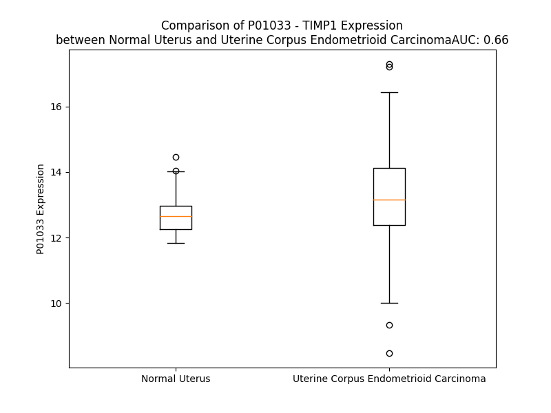

# Detailed Data for P01033

## Introduction to the Detailed Summary

### How to Interpret the Results

- **Summary & Metrics**: This section provides a quick reference to essential protein attributes, including expression changes, family classification, and biomarker applications. Regulation status (upregulated/downregulated) indicates the protein's behavior in a disease context. Some information comes from the original excel file with the proteins selected from literature, while others are derived from the analyses.
- **Expression Comparison**: A visual representation comparing protein expression between normal and disease states. It highlights significant changes in expression levels that might indicate diagnostic or therapeutic relevance. This is data coming from transcriptomics experiments and could not translate similarly to protein levels.
- **Isoform Alignment**: An interactive view of isoform alignments, revealing structural and functional differences between variants of the protein.
- **Interactors & Homologs**: Tables listing known interaction partners and homologous proteins, the more interactors and homologs, the more complex the protein is to design an antibody for.
- **Biological Assemblies**: Information about the structural arrangement of the protein in different assemblies, providing insights into its functional state but also the complexity of the protein to develop antibodies.
- **Combined Per-Residue Information**: A detailed table summarizing residue-level data. This includes predictions for epitope regions, aggregation tendencies, and modifications that might impact the protein's function. Each row corresponds to a residue in the protein, providing insights into specific sites that may be important for research or drug development.
## Summary & Metrics

- **UniProt Accession**: P01033
- **Gene Name**: TIMP-1
- **Protein Name**: Metalloproteinase inhibitor 1
- **Swiss Prot**: TIMP1_HUMAN
- **Family**: other
- **Biomarker Application**: diagnosis,disease progression,efficacy,prognosis,unspecified application
- **Number of Isoforms**: 0
- **Regulation**: 2
- **(transcriptomics) AUC**: 0.66
- **(transcriptomics) Fold Change**: 1.04
- **(transcriptomics) Regulation**: Upregulated
- **Discotope Epitope Count**: 54
- **Max n_uniprots (Homo)**: 1
- **Max n_uniprots (Hetero)**: 2

## Expression Comparison

## Interactors

| preferredName_A   | preferredName_B   |   score |
|:------------------|:------------------|--------:|
| TIMP1             | MMP9              |   0.999 |
| TIMP1             | MMP3              |   0.999 |
| TIMP1             | MMP14             |   0.999 |
| TIMP1             | MMP1              |   0.999 |
| TIMP1             | CD63              |   0.998 |
| TIMP1             | MMP2              |   0.997 |
| TIMP1             | MMP10             |   0.988 |
| TIMP1             | IL10              |   0.954 |
| TIMP1             | FN1               |   0.954 |
| TIMP1             | IL6               |   0.938 |
| TIMP1             | MMP7              |   0.925 |
| TIMP1             | MMP12             |   0.923 |
| TIMP1             | CD44              |   0.922 |

## Homologs

| uniprot_id   | gene_id   |
|:-------------|:----------|
| B4DFW2       | TIMP2     |
| P35625       | TIMP3     |
| Q99727       | TIMP4     |

## Biological Assemblies

|   Unnamed: 0 |   assembly |   n_uniprots | composition   | crystal_id   |
|-------------:|-----------:|-------------:|:--------------|:-------------|
|            0 |          1 |            2 | Hetero        | 1oo9         |
|            0 |          1 |            2 | Hetero        | 7s7l         |
|            0 |          1 |            2 | Hetero        | 6n9d         |
|            0 |          1 |            2 | Hetero        | 3ma2         |
|            1 |          2 |            2 | Hetero        | 3ma2         |
|            0 |          1 |            2 | Hetero        | 1uea         |
|            1 |          2 |            2 | Hetero        | 1uea         |
|            0 |          1 |            2 | Hetero        | 3v96         |
|            0 |          1 |            2 | Hetero        | 6mav         |
|            0 |          1 |            2 | Hetero        | 2j0t         |
|            1 |          2 |            2 | Hetero        | 2j0t         |
|            2 |          3 |            2 | Hetero        | 2j0t         |
|            0 |          1 |            2 | Hetero        | 7s7m         |
|            0 |          1 |            1 | Homo          | 1d2b         |

## Combined Per-Residue Information

|   res | aa   |   epitope_score | epitope   |   relative_surface_accessibility |   modeling_confidence |   Aggregation | modification             | glycosylation                             |
|------:|:-----|----------------:|:----------|---------------------------------:|----------------------:|--------------:|:-------------------------|:------------------------------------------|
|     1 | M    |         0.19629 | False     |                          1.31202 |                 40.94 |         0     | N/A                      | N/A                                       |
|     2 | A    |         0.21081 | False     |                          0.76365 |                 51.4  |         0     | N/A                      | N/A                                       |
|     3 | P    |         0.22442 | False     |                          0.9672  |                 57.14 |         0     | N/A                      | N/A                                       |
|     4 | F    |         0.23799 | False     |                          0.92993 |                 54.75 |         0     | N/A                      | N/A                                       |
|     5 | E    |         0.34098 | True      |                          0.77423 |                 61    |         0     | N/A                      | N/A                                       |
|     6 | P    |         0.25375 | False     |                          0.78233 |                 60    |         0.019 | N/A                      | N/A                                       |
|     7 | L    |         0.20363 | False     |                          0.83769 |                 60.73 |         1.602 | N/A                      | N/A                                       |
|     8 | A    |         0.15893 | False     |                          0.67908 |                 65.07 |         2.364 | N/A                      | N/A                                       |
|     9 | S    |         0.13413 | False     |                          0.57137 |                 69.32 |         3.264 | N/A                      | N/A                                       |
|    10 | G    |         0.20855 | False     |                          0.44281 |                 72.84 |        10.519 | N/A                      | N/A                                       |
|    11 | I    |         0.19817 | False     |                          0.60181 |                 74.51 |        91.056 | N/A                      | N/A                                       |
|    12 | L    |         0.20447 | False     |                          0.67833 |                 74.15 |        98.398 | N/A                      | N/A                                       |
|    13 | L    |         0.24323 | False     |                          0.7548  |                 74.86 |        99.722 | N/A                      | N/A                                       |
|    14 | L    |         0.21716 | False     |                          0.72097 |                 72.86 |        99.944 | N/A                      | N/A                                       |
|    15 | L    |         0.28948 | False     |                          0.62359 |                 73.06 |        99.937 | N/A                      | N/A                                       |
|    16 | W    |         0.30393 | False     |                          0.9304  |                 69.84 |        99.608 | N/A                      | N/A                                       |
|    17 | L    |         0.25458 | False     |                          0.83662 |                 71.52 |        98.138 | N/A                      | N/A                                       |
|    18 | I    |         0.21888 | False     |                          0.69316 |                 66.9  |        90     | N/A                      | N/A                                       |
|    19 | A    |         0.17706 | False     |                          0.75338 |                 68.48 |         0.825 | N/A                      | N/A                                       |
|    20 | P    |         0.2398  | False     |                          0.89078 |                 64.34 |         0.306 | N/A                      | N/A                                       |
|    21 | S    |         0.27862 | False     |                          0.80042 |                 67.41 |         0     | N/A                      | N/A                                       |
|    22 | R    |         0.38928 | True      |                          0.92613 |                 66.78 |         0     | N/A                      | N/A                                       |
|    23 | A    |         0.24538 | False     |                          0.61086 |                 79.22 |         0     | N/A                      | N/A                                       |
|    24 | C    |         0.17431 | False     |                          0.26501 |                 87.94 |         0     | N/A                      | N/A                                       |
|    25 | T    |         0.36375 | True      |                          0.88405 |                 86.18 |         0     | N/A                      | N/A                                       |
|    26 | C    |         0.1178  | False     |                          0.42602 |                 88.19 |         0     | N/A                      | N/A                                       |
|    27 | V    |         0.39583 | True      |                          0.57111 |                 85.22 |         0     | N/A                      | N/A                                       |
|    28 | P    |         0.17074 | False     |                          0.46085 |                 87.26 |         0     | N/A                      | N/A                                       |
|    29 | P    |         0.21391 | False     |                          0.24485 |                 92.81 |         0     | N/A                      | N/A                                       |
|    30 | H    |         0.01031 | False     |                          0       |                 96.38 |         0     | N/A                      | N/A                                       |
|    31 | P    |         0.02052 | False     |                          0.02088 |                 97.54 |         0     | N/A                      | N/A                                       |
|    32 | Q    |         0.01464 | False     |                          0.00517 |                 98.37 |         0     | N/A                      | N/A                                       |
|    33 | T    |         0.20268 | False     |                          0.26346 |                 97.84 |         0     | N/A                      | N/A                                       |
|    34 | A    |         0.05155 | False     |                          0.06377 |                 97.9  |         0     | N/A                      | N/A                                       |
|    35 | F    |         0.05291 | False     |                          0.03694 |                 98.49 |         0     | N/A                      | N/A                                       |
|    36 | C    |         0.11869 | False     |                          0.26711 |                 98    |         0     | N/A                      | N/A                                       |
|    37 | N    |         0.24303 | False     |                          0.5808  |                 96.79 |         0     | N/A                      | N/A                                       |
|    38 | S    |         0.08998 | False     |                          0.07485 |                 97.08 |         0     | N/A                      | N/A                                       |
|    39 | D    |         0.15945 | False     |                          0.29578 |                 95    |         0     | N/A                      | N/A                                       |
|    40 | L    |         0.00562 | False     |                          0.00082 |                 95.08 |         0     | N/A                      | N/A                                       |
|    41 | V    |         0.00286 | False     |                          0       |                 97.16 |         0     | N/A                      | N/A                                       |
|    42 | I    |         0.00719 | False     |                          0       |                 96.49 |         0     | N/A                      | N/A                                       |
|    43 | R    |         0.21762 | False     |                          0.19902 |                 97.3  |         0     | N/A                      | N/A                                       |
|    44 | A    |         0.00373 | False     |                          0       |                 97.58 |         0     | N/A                      | N/A                                       |
|    45 | K    |         0.25259 | False     |                          0.27376 |                 98    |         0     | N/A                      | N/A                                       |
|    46 | F    |         0.07106 | False     |                          0.02592 |                 98.06 |         0     | N/A                      | N/A                                       |
|    47 | V    |         0.22501 | False     |                          0.39259 |                 95.51 |         0     | N/A                      | N/A                                       |
|    48 | G    |         0.18497 | False     |                          0.3238  |                 91.89 |         0     | N/A                      | N/A                                       |
|    49 | T    |         0.33163 | True      |                          0.79262 |                 94.87 |         0     | N/A                      | N/A                                       |
|    50 | P    |         0.20677 | False     |                          0.32758 |                 96.32 |         0     | N/A                      | N/A                                       |
|    51 | E    |         0.30458 | False     |                          0.47201 |                 96.69 |         0     | N/A                      | N/A                                       |
|    52 | V    |         0.38773 | True      |                          0.5848  |                 96.08 |         0     | N/A                      | N/A                                       |
|    53 | N    |         0.42077 | True      |                          0.46972 |                 94.02 |         0     | N/A                      | N-linked (GlcNAc...) (complex) asparagine |
|    54 | Q    |         0.56673 | True      |                          0.80184 |                 91.09 |         0     | N/A                      | N/A                                       |
|    55 | T    |         0.339   | True      |                          0.90708 |                 92.76 |         0     | N/A                      | N/A                                       |
|    56 | T    |         0.42365 | True      |                          0.55721 |                 92.6  |         0     | N/A                      | N/A                                       |
|    57 | L    |         0.41695 | True      |                          0.68106 |                 94.2  |         0     | N/A                      | N/A                                       |
|    58 | Y    |         0.62953 | True      |                          0.37321 |                 96.02 |         0     | N/A                      | N/A                                       |
|    59 | Q    |         0.17574 | False     |                          0.06263 |                 96.78 |         0     | N/A                      | N/A                                       |
|    60 | R    |         0.30097 | False     |                          0.32137 |                 97.36 |         0     | N/A                      | N/A                                       |
|    61 | Y    |         0.05838 | False     |                          0.01213 |                 97.95 |         0     | N/A                      | N/A                                       |
|    62 | E    |         0.20541 | False     |                          0.42481 |                 97.01 |         0     | N/A                      | N/A                                       |
|    63 | I    |         0.1438  | False     |                          0.04139 |                 97.05 |         0     | N/A                      | N/A                                       |
|    64 | K    |         0.34911 | True      |                          0.65539 |                 96.07 |         0     | N/A                      | N/A                                       |
|    65 | M    |         0.1987  | False     |                          0.27704 |                 94.97 |         0     | N/A                      | N/A                                       |
|    66 | T    |         0.31629 | False     |                          0.40742 |                 94.9  |         0     | N/A                      | N/A                                       |
|    67 | K    |         0.28471 | False     |                          0.46932 |                 95    |         0     | N/A                      | N/A                                       |
|    68 | M    |         0.14613 | False     |                          0.14893 |                 94.11 |         0     | N/A                      | N/A                                       |
|    69 | Y    |         0.14144 | False     |                          0.09783 |                 95.18 |         0     | N/A                      | N/A                                       |
|    70 | K    |         0.16407 | False     |                          0.25691 |                 94.81 |         0     | N/A                      | N/A                                       |
|    71 | G    |         0.12697 | False     |                          0.15577 |                 90.97 |         0     | N/A                      | N/A                                       |
|    72 | F    |         0.33803 | True      |                          0.69087 |                 86.82 |         0     | N/A                      | N/A                                       |
|    73 | Q    |         0.37082 | True      |                          0.89788 |                 83.06 |         0     | N/A                      | N/A                                       |
|    74 | A    |         0.23411 | False     |                          0.50572 |                 76.07 |         0     | N/A                      | N/A                                       |
|    75 | L    |         0.27318 | False     |                          0.14967 |                 70.62 |         0     | N/A                      | N/A                                       |
|    76 | G    |         0.3144  | False     |                          0.66686 |                 68.83 |         0     | N/A                      | N/A                                       |
|    77 | D    |         0.3384  | True      |                          0.96005 |                 60.35 |         0     | N/A                      | N/A                                       |
|    78 | A    |         0.19474 | False     |                          0.69733 |                 58.53 |         0     | N/A                      | N/A                                       |
|    79 | A    |         0.27992 | False     |                          0.57187 |                 64.2  |         0     | N/A                      | N/A                                       |
|    80 | D    |         0.15236 | False     |                          0.60316 |                 72.68 |         0.172 | N/A                      | N/A                                       |
|    81 | I    |         0.08915 | False     |                          0.0957  |                 88.09 |         0.172 | N/A                      | N/A                                       |
|    82 | R    |         0.32951 | True      |                          0.58721 |                 93.21 |         0.172 | N/A                      | N/A                                       |
|    83 | F    |         0.33336 | True      |                          0.27472 |                 96.06 |         0.172 | N/A                      | N/A                                       |
|    84 | V    |         0.00483 | False     |                          0       |                 97.54 |         0.172 | N/A                      | N/A                                       |
|    85 | Y    |         0.35096 | True      |                          0.17386 |                 97.52 |         0.172 | N/A                      | N/A                                       |
|    86 | T    |         0.00899 | False     |                          0       |                 98.06 |         0     | N/A                      | N/A                                       |
|    87 | P    |         0.18862 | False     |                          0.13718 |                 96.86 |         0     | N/A                      | N/A                                       |
|    88 | A    |         0.38051 | True      |                          0.26308 |                 95.74 |         0     | N/A                      | N/A                                       |
|    89 | M    |         0.43342 | True      |                          0.60012 |                 92.99 |         0     | N/A                      | N/A                                       |
|    90 | E    |         0.40548 | True      |                          0.47094 |                 91.71 |         0     | N/A                      | N/A                                       |
|    91 | S    |         0.37996 | True      |                          0.45302 |                 90.5  |         0.176 | N/A                      | N/A                                       |
|    92 | V    |         0.41481 | True      |                          0.61256 |                 92.28 |         1.995 | N/A                      | N/A                                       |
|    93 | C    |         0.23235 | False     |                          0.22206 |                 94.69 |         1.995 | N/A                      | N/A                                       |
|    94 | G    |         0.01264 | False     |                          0.00695 |                 96.39 |         1.995 | N/A                      | N/A                                       |
|    95 | Y    |         0.16754 | False     |                          0.12474 |                 96.87 |         1.995 | N/A                      | N/A                                       |
|    96 | F    |         0.37655 | True      |                          0.51559 |                 95.67 |         1.995 | N/A                      | N/A                                       |
|    97 | H    |         0.19903 | False     |                          0.13441 |                 97.15 |         0.399 | N/A                      | N/A                                       |
|    98 | R    |         0.50562 | True      |                          0.69789 |                 94.63 |         0     | N/A                      | N/A                                       |
|    99 | S    |         0.26473 | False     |                          0.24597 |                 95.65 |         0     | N/A                      | N/A                                       |
|   100 | H    |         0.31183 | False     |                          0.97757 |                 94.69 |         0     | N/A                      | N/A                                       |
|   101 | N    |         0.32709 | True      |                          0.55306 |                 96.24 |         0     | N/A                      | N-linked (GlcNAc...) asparagine           |
|   102 | R    |         0.35514 | True      |                          0.64809 |                 95.49 |         0     | N/A                      | N/A                                       |
|   103 | S    |         0.24244 | False     |                          0.61149 |                 96.34 |         0     | N/A                      | N/A                                       |
|   104 | E    |         0.17876 | False     |                          0.25842 |                 98.04 |         0     | N/A                      | N/A                                       |
|   105 | E    |         0.16949 | False     |                          0.20962 |                 98.17 |         0     | N/A                      | N/A                                       |
|   106 | F    |         0.1133  | False     |                          0.06433 |                 98.56 |         3.205 | N/A                      | N/A                                       |
|   107 | L    |         0.006   | False     |                          0       |                 98.37 |         3.205 | N/A                      | N/A                                       |
|   108 | I    |         0.00414 | False     |                          0.00118 |                 98.17 |         3.205 | N/A                      | N/A                                       |
|   109 | A    |         0.02571 | False     |                          0.01919 |                 97.91 |         3.205 | N/A                      | N/A                                       |
|   110 | G    |         0.05806 | False     |                          0.02253 |                 97.05 |         3.205 | N/A                      | N/A                                       |
|   111 | K    |         0.21125 | False     |                          0.46492 |                 95.77 |         0     | N/A                      | N/A                                       |
|   112 | L    |         0.25326 | False     |                          0.25172 |                 93.28 |         0     | N/A                      | N/A                                       |
|   113 | Q    |         0.47715 | True      |                          0.51283 |                 90.74 |         0     | N/A                      | N/A                                       |
|   114 | D    |         0.48889 | True      |                          0.91986 |                 87.81 |         0     | N/A                      | N/A                                       |
|   115 | G    |         0.25734 | False     |                          0.61578 |                 87.62 |         0.174 | N/A                      | N/A                                       |
|   116 | L    |         0.36273 | True      |                          0.45175 |                 91.96 |         2.277 | N/A                      | N/A                                       |
|   117 | L    |         0.0222  | False     |                          0.01156 |                 95.65 |         3.252 | N/A                      | N/A                                       |
|   118 | H    |         0.25826 | False     |                          0.17741 |                 96.99 |         3.431 | N/A                      | N/A                                       |
|   119 | I    |         0.04691 | False     |                          0.01235 |                 97.81 |         4.15  | N/A                      | N/A                                       |
|   120 | T    |         0.33418 | True      |                          0.30597 |                 96.66 |         4.15  | N/A                      | N/A                                       |
|   121 | T    |         0.26258 | False     |                          0.41447 |                 94.63 |         4.15  | N/A                      | N/A                                       |
|   122 | C    |         0.21608 | False     |                          0.25991 |                 94    |         4.15  | N/A                      | N/A                                       |
|   123 | S    |         0.08104 | False     |                          0.24769 |                 96.76 |         4.15  | N/A                      | N/A                                       |
|   124 | F    |         0.07681 | False     |                          0.14918 |                 96.92 |         4.15  | N/A                      | N/A                                       |
|   125 | V    |         0.1624  | False     |                          0.21257 |                 97.48 |         3.985 | N/A                      | N/A                                       |
|   126 | A    |         0.17286 | False     |                          0.16198 |                 96.7  |         0     | N/A                      | N/A                                       |
|   127 | P    |         0.12708 | False     |                          0.31214 |                 97.55 |         0     | N/A                      | N/A                                       |
|   128 | W    |         0.14519 | False     |                          0.14883 |                 97.81 |         0     | N/A                      | N/A                                       |
|   129 | N    |         0.23557 | False     |                          0.81323 |                 96.46 |         0     | N/A                      | N/A                                       |
|   130 | S    |         0.28781 | False     |                          0.5425  |                 95.63 |         0     | N/A                      | N/A                                       |
|   131 | L    |         0.12504 | False     |                          0.05004 |                 96.12 |         0     | N/A                      | N/A                                       |
|   132 | S    |         0.17002 | False     |                          0.11751 |                 95.55 |         0     | N/A                      | N/A                                       |
|   133 | L    |         0.17394 | False     |                          0.80561 |                 95.74 |         0     | N/A                      | N/A                                       |
|   134 | A    |         0.0538  | False     |                          0.03438 |                 96.54 |         0     | N/A                      | N/A                                       |
|   135 | Q    |         0.05279 | False     |                          0.05219 |                 97.36 |         0     | N/A                      | N/A                                       |
|   136 | R    |         0.22458 | False     |                          0.25778 |                 97.57 |         0     | N/A                      | N/A                                       |
|   137 | R    |         0.26338 | False     |                          0.51255 |                 96.79 |         0     | N/A                      | N/A                                       |
|   138 | G    |         0.00639 | False     |                          0.00238 |                 97.98 |         0     | N/A                      | N/A                                       |
|   139 | F    |         0.00606 | False     |                          0.00355 |                 98.05 |         0     | N/A                      | N/A                                       |
|   140 | T    |         0.23528 | False     |                          0.48622 |                 96.2  |         0     | N/A                      | N/A                                       |
|   141 | K    |         0.38147 | True      |                          0.77044 |                 94.41 |         0     | N/A                      | N/A                                       |
|   142 | T    |         0.14204 | False     |                          0.1223  |                 96.75 |         0.198 | N/A                      | N/A                                       |
|   143 | Y    |         0.00996 | False     |                          0.00695 |                 98.33 |         0.198 | N/A                      | N/A                                       |
|   144 | T    |         0.23619 | False     |                          0.49788 |                 96.59 |         0.198 | N/A                      | N/A                                       |
|   145 | V    |         0.30089 | False     |                          0.59575 |                 96.03 |         0.198 | N/A                      | N/A                                       |
|   146 | G    |         0.00456 | False     |                          0       |                 97.41 |         0.198 | N/A                      | N/A                                       |
|   147 | C    |         0.12627 | False     |                          0.31228 |                 97.31 |         0     | N/A                      | N/A                                       |
|   148 | E    |         0.25458 | False     |                          0.83473 |                 93.25 |         0     | N/A                      | N/A                                       |
|   149 | E    |         0.32586 | True      |                          0.36164 |                 95    |         0     | N/A                      | N/A                                       |
|   150 | C    |         0.10172 | False     |                          0.06674 |                 98.32 |         0     | N/A                      | N/A                                       |
|   151 | T    |         0.10979 | False     |                          0.44785 |                 97.82 |         0     | N/A                      | N/A                                       |
|   152 | V    |         0.07404 | False     |                          0.07308 |                 97.49 |         0     | N/A                      | N/A                                       |
|   153 | F    |         0.21159 | False     |                          0.22803 |                 96.35 |         0     | N/A                      | N/A                                       |
|   154 | P    |         0.15126 | False     |                          0.37628 |                 94.1  |         0     | N/A                      | N/A                                       |
|   155 | C    |         0.07543 | False     |                          0.02426 |                 93.4  |         0     | N/A                      | N/A                                       |
|   156 | L    |         0.43076 | True      |                          0.73167 |                 88.7  |         0     | N/A                      | N/A                                       |
|   157 | S    |         0.4164  | True      |                          0.61487 |                 90.26 |         0     | N/A                      | N/A                                       |
|   158 | I    |         0.59012 | True      |                          0.7833  |                 89    |         0     | N/A                      | N/A                                       |
|   159 | P    |         0.60276 | True      |                          0.92575 |                 91.61 |         0     | N/A                      | N/A                                       |
|   160 | C    |         0.14716 | False     |                          0.25349 |                 91.42 |         0     | N/A                      | N/A                                       |
|   161 | K    |         0.34121 | True      |                          0.85755 |                 90.91 |         0     | N/A                      | N/A                                       |
|   162 | L    |         0.37356 | True      |                          0.44283 |                 91.43 |         0     | N/A                      | N/A                                       |
|   163 | Q    |         0.47741 | True      |                          0.76283 |                 91.34 |         0     | N/A                      | N/A                                       |
|   164 | S    |         0.26954 | False     |                          0.3426  |                 95.39 |         0     | N/A                      | N/A                                       |
|   165 | G    |         0.29574 | False     |                          0.4752  |                 96.08 |         0     | N/A                      | N/A                                       |
|   166 | T    |         0.19727 | False     |                          0.18043 |                 97.72 |         0     | N/A                      | N/A                                       |
|   167 | H    |         0.12166 | False     |                          0.1687  |                 98.08 |         0     | N/A                      | N/A                                       |
|   168 | C    |         0.04252 | False     |                          0.03104 |                 97.88 |         0     | N/A                      | N/A                                       |
|   169 | L    |         0.22834 | False     |                          0.32485 |                 96.42 |         0     | N/A                      | N/A                                       |
|   170 | W    |         0.10253 | False     |                          0.03372 |                 95.52 |         0     | N/A                      | N/A                                       |
|   171 | T    |         0.44648 | True      |                          0.267   |                 94.03 |         0     | N/A                      | N/A                                       |
|   172 | D    |         0.16241 | False     |                          0.04872 |                 93.25 |         0     | N/A                      | N/A                                       |
|   173 | Q    |         0.34607 | True      |                          0.19922 |                 84.1  |         0     | N/A                      | N/A                                       |
|   174 | L    |         0.40093 | True      |                          0.45041 |                 87.21 |         0     | N/A                      | N/A                                       |
|   175 | L    |         0.54205 | True      |                          0.72639 |                 83.45 |         0     | N/A                      | N/A                                       |
|   176 | Q    |         0.41948 | True      |                          0.63189 |                 74.66 |         0     | N/A                      | N/A                                       |
|   177 | G    |         0.32401 | True      |                          0.42361 |                 72.36 |         0     | N/A                      | N/A                                       |
|   178 | S    |         0.14209 | False     |                          0.07319 |                 73.94 |         0     | Phosphoserine; by FAM20C | N/A                                       |
|   179 | E    |         0.40738 | True      |                          0.65643 |                 72.5  |         0     | N/A                      | N/A                                       |
|   180 | K    |         0.4176  | True      |                          0.83443 |                 79.31 |         0     | N/A                      | N/A                                       |
|   181 | G    |         0.02803 | False     |                          0       |                 90.31 |         0     | N/A                      | N/A                                       |
|   182 | F    |         0.4738  | True      |                          0.5172  |                 93.51 |         0     | N/A                      | N/A                                       |
|   183 | Q    |         0.15513 | False     |                          0.11107 |                 95.57 |         0     | N/A                      | N/A                                       |
|   184 | S    |         0.03059 | False     |                          0.00855 |                 95.3  |         0     | N/A                      | N/A                                       |
|   185 | R    |         0.17211 | False     |                          0.32619 |                 94.76 |         0     | N/A                      | N/A                                       |
|   186 | H    |         0.20709 | False     |                          0.16874 |                 96.23 |         0     | N/A                      | N/A                                       |
|   187 | L    |         0.24685 | False     |                          0.13303 |                 97.41 |         0     | N/A                      | N/A                                       |
|   188 | A    |         0.00475 | False     |                          0       |                 98.1  |         0     | N/A                      | N/A                                       |
|   189 | C    |         0.00193 | False     |                          0       |                 98.43 |         0     | N/A                      | N/A                                       |
|   190 | L    |         0.1764  | False     |                          0.08903 |                 98.25 |         0     | N/A                      | N/A                                       |
|   191 | P    |         0.11819 | False     |                          0.32457 |                 97.68 |         0     | N/A                      | N/A                                       |
|   192 | R    |         0.43855 | True      |                          0.65134 |                 96.49 |         0     | N/A                      | N/A                                       |
|   193 | E    |         0.33419 | True      |                          0.49916 |                 94.99 |         0     | N/A                      | N/A                                       |
|   194 | P    |         0.35041 | True      |                          0.99651 |                 94.04 |         0     | N/A                      | N/A                                       |
|   195 | G    |         0.1959  | False     |                          0.50244 |                 95.01 |         0     | N/A                      | N/A                                       |
|   196 | L    |         0.26087 | False     |                          0.4196  |                 97.1  |         0     | N/A                      | N/A                                       |
|   197 | C    |         0.12212 | False     |                          0.04461 |                 98.41 |         0     | N/A                      | N/A                                       |
|   198 | T    |         0.27319 | False     |                          0.28156 |                 97.7  |         0     | N/A                      | N/A                                       |
|   199 | W    |         0.1735  | False     |                          0.26602 |                 97.84 |         0     | N/A                      | N/A                                       |
|   200 | Q    |         0.34065 | True      |                          0.3362  |                 97.36 |         0     | N/A                      | N/A                                       |
|   201 | S    |         0.30362 | False     |                          0.52184 |                 96    |         0     | N/A                      | N/A                                       |
|   202 | L    |         0.13781 | False     |                          0.06405 |                 93.97 |         0     | N/A                      | N/A                                       |
|   203 | R    |         0.30549 | False     |                          0.46365 |                 87.69 |         0     | N/A                      | N/A                                       |
|   204 | S    |         0.1238  | False     |                          0.64407 |                 76.27 |         0     | N/A                      | N/A                                       |
|   205 | Q    |         0.16518 | False     |                          0.85573 |                 66.16 |         0     | N/A                      | N/A                                       |
|   206 | I    |         0.18683 | False     |                          1.00952 |                 52.81 |         0     | N/A                      | N/A                                       |
|   207 | A    |         0.11081 | False     |                          1.47039 |                 40.59 |         0     | N/A                      | N/A                                       |

