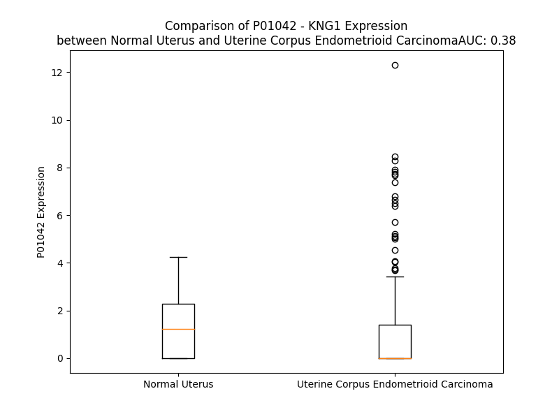

# Detailed Data for P01042

## Introduction to the Detailed Summary

### How to Interpret the Results

- **Summary & Metrics**: This section provides a quick reference to essential protein attributes, including expression changes, family classification, and biomarker applications. Regulation status (upregulated/downregulated) indicates the protein's behavior in a disease context. Some information comes from the original excel file with the proteins selected from literature, while others are derived from the analyses.
- **Expression Comparison**: A visual representation comparing protein expression between normal and disease states. It highlights significant changes in expression levels that might indicate diagnostic or therapeutic relevance. This is data coming from transcriptomics experiments and could not translate similarly to protein levels.
- **Isoform Alignment**: An interactive view of isoform alignments, revealing structural and functional differences between variants of the protein.
- **Interactors & Homologs**: Tables listing known interaction partners and homologous proteins, the more interactors and homologs, the more complex the protein is to design an antibody for.
- **Biological Assemblies**: Information about the structural arrangement of the protein in different assemblies, providing insights into its functional state but also the complexity of the protein to develop antibodies.
- **Combined Per-Residue Information**: A detailed table summarizing residue-level data. This includes predictions for epitope regions, aggregation tendencies, and modifications that might impact the protein's function. Each row corresponds to a residue in the protein, providing insights into specific sites that may be important for research or drug development.
## Summary & Metrics

- **UniProt Accession**: P01042
- **Gene Name**: KNG1
- **Protein Name**: cleaved high molecular weight kininogen
- **Swiss Prot**: KNG1_HUMAN
- **Family**: other
- **Biomarker Application**: efficacy
- **Number of Isoforms**: 3
- **Regulation**: -1
- **(transcriptomics) AUC**: 0.37
- **(transcriptomics) Fold Change**: 1.23
- **(transcriptomics) Regulation**: Downregulated
- **Discotope Epitope Count**: 93
- **Max n_uniprots (Homo)**: 2
- **Max n_uniprots (Hetero)**: 3

## Expression Comparison

## Isoform Alignment

<pre style='font-size:14px; font-family:monospace;'>P01042-1 MKLITILFLCSRLLLSLTQESQSEEIDCNDKDLFKAVDAALKKYNSQNQSNNQFVLYRITEATKTVGSDTFYSFKYEIKEGDCPVQSGKTWQDCEYKDAAKAATGECTATVGKRSSTKFSVATQTCQITPAEGPVVTAQYDCLGCVHPISTQSPDLEPILRHGIQYFNNNTQHSSLFMLNEVKRAQRQVVAGLNFRITYSIVQTNCSKENFLFLTPDCKSLWNGDTGECTDNAYIDIQLRIASFSQNCDIYPGKDFVQPPTKICVGCPRDIPTNSPELEETLTHTITKLNAENNATFYFKIDNVKKARVQVVAGKKYFIDFVARETTCSKESNEELTESCETKKLGQSLDCNAEVYVVPWEKKIYPTVNCQPLGMISLMKRPPGFSPFRSSRIGEIKEETTVSP---------PHTSMAPAQDEERDSGKEQGHTRRHDWGHEKQRKHNLGHGHKHERDQGHGHQRGHGLGHGHEQQHGLGHGHKFKLDDDLEHQGGHVLDHGHKHKHGHGHGKHKNKGKKNGKHNGWKTEHLASSSEDSTTPSAQTQEKTEGPTPIPSLAKPGVTVTFSDFQDSDLIATMMPPISPAPIQSDDDWIPDIQIDPNGLSFNPISDFPDTTSPKCPGRPWKSVSEINPTTQMKESYYFDLTDGLS
P01042-2 MKLITILFLCSRLLLSLTQESQSEEIDCNDKDLFKAVDAALKKYNSQNQSNNQFVLYRITEATKTVGSDTFYSFKYEIKEGDCPVQSGKTWQDCEYKDAAKAATGECTATVGKRSSTKFSVATQTCQITPAEGPVVTAQYDCLGCVHPISTQSPDLEPILRHGIQYFNNNTQHSSLFMLNEVKRAQRQVVAGLNFRITYSIVQTNCSKENFLFLTPDCKSLWNGDTGECTDNAYIDIQLRIASFSQNCDIYPGKDFVQPPTKICVGCPRDIPTNSPELEETLTHTITKLNAENNATFYFKIDNVKKARVQVVAGKKYFIDFVARETTCSKESNEELTESCETKKLGQSLDCNAEVYVVPWEKKIYPTVNCQPLGMISLMKRPPGFSPFRSSRIGEIKEETTSHLRSCEYKGRPPKAGAEPASEREVS----------------------------------------------------------------------------------------------------------------------------------------------------------------------------------------------------------------------------------
P01042-3 MKLITILFLCSRLLLSLTQESQSEEIDCNDKDLFKAVDAALKKYNSQNQSNNQFVLYRITEATKTVGSDTFYSFKYEIKEGDCPVQSGKTWQDCEYKDAAKAATGECTATVGKRSSTKFSVATQTCQITPAEGPVVTAQYDCLGCVHPISTQSPDLEPILRHGIQYFNNNTQHSSLFMLNEVKRAQRQ------------------------------------DTGECTDNAYIDIQLRIASFSQNCDIYPGKDFVQPPTKICVGCPRDIPTNSPELEETLTHTITKLNAENNATFYFKIDNVKKARVQVVAGKKYFIDFVARETTCSKESNEELTESCETKKLGQSLDCNAEVYVVPWEKKIYPTVNCQPLGMISLMKRPPGFSPFRSSRIGEIKEETTSHLRSCEYKGRPPKAGAEPASEREVS----------------------------------------------------------------------------------------------------------------------------------------------------------------------------------------------------------------------------------
</pre>

## Interactors

| preferredName_A   | preferredName_B   |   score |
|:------------------|:------------------|--------:|
| KNG1              | KLKB1             |   0.999 |
| KNG1              | BDKRB2            |   0.999 |
| KNG1              | BDKRB1            |   0.999 |
| KNG1              | F12               |   0.998 |
| KNG1              | C1QBP             |   0.998 |
| KNG1              | F11               |   0.998 |
| KNG1              | KLK4              |   0.997 |
| KNG1              | ACE               |   0.995 |
| KNG1              | AGT               |   0.992 |
| KNG1              | TAC1              |   0.991 |
| KNG1              | THOP1             |   0.988 |
| KNG1              | HRG               |   0.972 |
| KNG1              | AGTR1             |   0.968 |
| KNG1              | SERPING1          |   0.964 |
| KNG1              | ALB               |   0.962 |
| KNG1              | KLK1              |   0.953 |
| KNG1              | REN               |   0.95  |
| KNG1              | NTS               |   0.949 |
| KNG1              | ACE2              |   0.948 |
| KNG1              | SERPINA1          |   0.943 |
| KNG1              | EDNRB             |   0.943 |
| KNG1              | EDNRA             |   0.942 |
| KNG1              | OPRD1             |   0.939 |
| KNG1              | AHSG              |   0.936 |
| KNG1              | TRPA1             |   0.928 |
| KNG1              | ADORA1            |   0.928 |
| KNG1              | A2M               |   0.927 |
| KNG1              | KRT1              |   0.927 |
| KNG1              | TRPV1             |   0.918 |
| KNG1              | FGG               |   0.917 |
| KNG1              | ADORA3            |   0.915 |
| KNG1              | CHRM1             |   0.914 |
| KNG1              | KLK2              |   0.91  |
| KNG1              | FGA               |   0.908 |
| KNG1              | CHRM4             |   0.905 |
| KNG1              | CHRM2             |   0.904 |
| KNG1              | CHRM3             |   0.903 |
| KNG1              | CHRM5             |   0.903 |

## Homologs

| uniprot_id   | gene_id   |
|:-------------|:----------|
| F8WAW1       | FETUB     |
| P04196       | HRG       |
| P02765       | AHSG      |

## Biological Assemblies

|   Unnamed: 0 |   assembly |   n_uniprots | composition   | crystal_id   |
|-------------:|-----------:|-------------:|:--------------|:-------------|
|            0 |          1 |            3 | Hetero        | 7eib         |
|            0 |          1 |            3 | Hetero        | 7f2o         |
|            0 |          1 |            2 | Hetero        | 7qox         |
|            1 |          2 |            2 | Hetero        | 7qox         |
|            0 |          1 |            1 | Homo          | 6f3y         |
|            0 |          1 |            2 | Hetero        | 4asq         |
|            0 |          1 |            3 | Hetero        | 7f6h         |
|            0 |          1 |            2 | Homo          | 4ecb         |
|            0 |          1 |            2 | Hetero        | 2wok         |
|            0 |          1 |            2 | Hetero        | 4asr         |
|            0 |          1 |            1 | Homo          | 6f3x         |
|            0 |          1 |            3 | Hetero        | 7f6i         |
|            0 |          1 |            0 | Hetero        | 6f3v         |
|            0 |          1 |            2 | Hetero        | 7qot         |
|            1 |          2 |            2 | Hetero        | 7qot         |
|            0 |          1 |            1 | Homo          | 4ecc         |
|            0 |          1 |            3 | Hetero        | 1ny2         |
|            0 |          1 |            1 | Homo          | 6f27         |
|            0 |          1 |            1 | Homo          | 6f3w         |
|            0 |          1 |            1 | Homo          | 5i25         |

## Combined Per-Residue Information

|   res | aa   |   epitope_score | epitope   |   relative_surface_accessibility |   modeling_confidence |   Aggregation | modification                                | glycosylation                             |
|------:|:-----|----------------:|:----------|---------------------------------:|----------------------:|--------------:|:--------------------------------------------|:------------------------------------------|
|     1 | M    |         0.0932  | False     |                          1.12245 |                 56.35 |         0     | N/A                                         | N/A                                       |
|     2 | K    |         0.08364 | False     |                          0.87133 |                 55.85 |         0     | N/A                                         | N/A                                       |
|     3 | L    |         0.05237 | False     |                          0.85774 |                 55.76 |        67.155 | N/A                                         | N/A                                       |
|     4 | I    |         0.06025 | False     |                          0.65597 |                 61.79 |        92.187 | N/A                                         | N/A                                       |
|     5 | T    |         0.04529 | False     |                          0.56443 |                 57.01 |        96.544 | N/A                                         | N/A                                       |
|     6 | I    |         0.03414 | False     |                          0.63837 |                 60.27 |        97.126 | N/A                                         | N/A                                       |
|     7 | L    |         0.05242 | False     |                          0.74034 |                 58.96 |        97.132 | N/A                                         | N/A                                       |
|     8 | F    |         0.07651 | False     |                          0.70809 |                 57.47 |        96.448 | N/A                                         | N/A                                       |
|     9 | L    |         0.04755 | False     |                          0.68573 |                 56.69 |        83.065 | N/A                                         | N/A                                       |
|    10 | C    |         0.04101 | False     |                          0.48884 |                 57.75 |         5.992 | N/A                                         | N/A                                       |
|    11 | S    |         0.05056 | False     |                          0.40518 |                 58.54 |         0.664 | N/A                                         | N/A                                       |
|    12 | R    |         0.09595 | False     |                          0.76071 |                 55.44 |         0     | N/A                                         | N/A                                       |
|    13 | L    |         0.07981 | False     |                          0.75348 |                 53.02 |        10.261 | N/A                                         | N/A                                       |
|    14 | L    |         0.06219 | False     |                          0.77835 |                 51.97 |        12.047 | N/A                                         | N/A                                       |
|    15 | L    |         0.08678 | False     |                          0.88626 |                 48.73 |        12.047 | N/A                                         | N/A                                       |
|    16 | S    |         0.08282 | False     |                          0.65312 |                 43.41 |        12.047 | N/A                                         | N/A                                       |
|    17 | L    |         0.09279 | False     |                          0.95409 |                 43.19 |        12.047 | N/A                                         | N/A                                       |
|    18 | T    |         0.08413 | False     |                          0.77671 |                 39.3  |        10.22  | N/A                                         | N/A                                       |
|    19 | Q    |         0.09752 | False     |                          0.89564 |                 41.95 |         0.317 | Pyrrolidone carboxylic acid; in mature form | N/A                                       |
|    20 | E    |         0.07549 | False     |                          0.78829 |                 44.27 |         0     | N/A                                         | N/A                                       |
|    21 | S    |         0.06569 | False     |                          0.48126 |                 54.03 |         0     | N/A                                         | N/A                                       |
|    22 | Q    |         0.09691 | False     |                          0.79902 |                 56.38 |         0     | N/A                                         | N/A                                       |
|    23 | S    |         0.09427 | False     |                          0.56422 |                 71.36 |         0     | N/A                                         | N/A                                       |
|    24 | E    |         0.07171 | False     |                          0.56938 |                 83.64 |         0     | N/A                                         | N/A                                       |
|    25 | E    |         0.06918 | False     |                          0.57129 |                 84.84 |         0     | N/A                                         | N/A                                       |
|    26 | I    |         0.09517 | False     |                          0.19173 |                 87.64 |         0     | N/A                                         | N/A                                       |
|    27 | D    |         0.11791 | True      |                          0.54355 |                 85.76 |         0     | N/A                                         | N/A                                       |
|    28 | C    |         0.02836 | False     |                          0.10411 |                 84.95 |         0     | N/A                                         | N/A                                       |
|    29 | N    |         0.13838 | True      |                          0.84827 |                 83.15 |         0     | N/A                                         | N/A                                       |
|    30 | D    |         0.06757 | False     |                          0.272   |                 88.44 |         0     | N/A                                         | N/A                                       |
|    31 | K    |         0.05727 | False     |                          0.7637  |                 89.64 |         0     | N/A                                         | N/A                                       |
|    32 | D    |         0.0391  | False     |                          0.18085 |                 90.49 |         0     | N/A                                         | N/A                                       |
|    33 | L    |         0.00155 | False     |                          0       |                 92.01 |         0.301 | N/A                                         | N/A                                       |
|    34 | F    |         0.05383 | False     |                          0.2466  |                 91.48 |         0.301 | N/A                                         | N/A                                       |
|    35 | K    |         0.05409 | False     |                          0.33861 |                 92.41 |         0.301 | N/A                                         | N/A                                       |
|    36 | A    |         0.00094 | False     |                          0       |                 93.49 |         0.301 | N/A                                         | N/A                                       |
|    37 | V    |         0.00157 | False     |                          0       |                 94.25 |         0.301 | N/A                                         | N/A                                       |
|    38 | D    |         0.02762 | False     |                          0.13485 |                 93.3  |         0.301 | N/A                                         | N/A                                       |
|    39 | A    |         0.01036 | False     |                          0.21793 |                 92.25 |         0.138 | N/A                                         | N/A                                       |
|    40 | A    |         0.00078 | False     |                          0       |                 93.61 |         0     | N/A                                         | N/A                                       |
|    41 | L    |         0.00157 | False     |                          0       |                 93.22 |         0     | N/A                                         | N/A                                       |
|    42 | K    |         0.04552 | False     |                          0.4514  |                 91.04 |         0     | N/A                                         | N/A                                       |
|    43 | K    |         0.01903 | False     |                          0.31667 |                 88.96 |         0     | N/A                                         | N/A                                       |
|    44 | Y    |         0.01543 | False     |                          0.14583 |                 89.85 |         0     | N/A                                         | N/A                                       |
|    45 | N    |         0.02392 | False     |                          0.05602 |                 89.89 |         0     | N/A                                         | N/A                                       |
|    46 | S    |         0.03528 | False     |                          0.6872  |                 83.4  |         0     | N/A                                         | N/A                                       |
|    47 | Q    |         0.02827 | False     |                          0.34977 |                 76.23 |         0     | N/A                                         | N/A                                       |
|    48 | N    |         0.0454  | False     |                          0.24773 |                 68.72 |         0     | N/A                                         | N-linked (GlcNAc...) (complex) asparagine |
|    49 | Q    |         0.04611 | False     |                          0.40203 |                 59.73 |         0     | N/A                                         | N/A                                       |
|    50 | S    |         0.06246 | False     |                          0.22819 |                 64.51 |         0     | N/A                                         | N/A                                       |
|    51 | N    |         0.09691 | False     |                          0.85136 |                 74.5  |         0     | N/A                                         | N/A                                       |
|    52 | N    |         0.04858 | False     |                          0.14966 |                 87.35 |         0     | N/A                                         | N/A                                       |
|    53 | Q    |         0.0145  | False     |                          0.06141 |                 89.07 |         2.338 | N/A                                         | N/A                                       |
|    54 | F    |         0.01407 | False     |                          0.01274 |                 93    |         3.64  | N/A                                         | N/A                                       |
|    55 | V    |         0.00592 | False     |                          0.02285 |                 93.39 |         3.64  | N/A                                         | N/A                                       |
|    56 | L    |         0.01267 | False     |                          0.00824 |                 94.09 |         3.64  | N/A                                         | N/A                                       |
|    57 | Y    |         0.09129 | False     |                          0.22149 |                 91.48 |         3.64  | N/A                                         | N/A                                       |
|    58 | R    |         0.07257 | False     |                          0.34621 |                 91.04 |         1.302 | N/A                                         | N/A                                       |
|    59 | I    |         0.0449  | False     |                          0.06265 |                 92.15 |         1.302 | N/A                                         | N/A                                       |
|    60 | T    |         0.05283 | False     |                          0.15706 |                 89.12 |         1.302 | N/A                                         | N/A                                       |
|    61 | E    |         0.04975 | False     |                          0.39336 |                 89.85 |         1.302 | N/A                                         | N/A                                       |
|    62 | A    |         0.02995 | False     |                          0.07328 |                 91.74 |         0.429 | N/A                                         | N/A                                       |
|    63 | T    |         0.03146 | False     |                          0.30507 |                 91.15 |         0.16  | N/A                                         | N/A                                       |
|    64 | K    |         0.07811 | False     |                          0.27462 |                 90.01 |         0     | N/A                                         | N/A                                       |
|    65 | T    |         0.03266 | False     |                          0.13884 |                 83.58 |         0     | N/A                                         | N/A                                       |
|    66 | V    |         0.11626 | True      |                          0.58383 |                 79.89 |         0     | N/A                                         | N/A                                       |
|    67 | G    |         0.08907 | False     |                          0.56905 |                 68.86 |         0     | N/A                                         | N/A                                       |
|    68 | S    |         0.08048 | False     |                          0.95665 |                 64.65 |         0     | N/A                                         | N/A                                       |
|    69 | D    |         0.05079 | False     |                          0.30541 |                 70.43 |         0     | N/A                                         | N/A                                       |
|    70 | T    |         0.03666 | False     |                          0.19793 |                 84.37 |         6.26  | N/A                                         | N/A                                       |
|    71 | F    |         0.02051 | False     |                          0.11008 |                 88.2  |         6.609 | N/A                                         | N/A                                       |
|    72 | Y    |         0.01372 | False     |                          0.025   |                 92.12 |         6.609 | N/A                                         | N/A                                       |
|    73 | S    |         0.03413 | False     |                          0.26455 |                 91.73 |         6.609 | N/A                                         | N/A                                       |
|    74 | F    |         0.01477 | False     |                          0.0201  |                 93.71 |         6.792 | N/A                                         | N/A                                       |
|    75 | K    |         0.04892 | False     |                          0.43648 |                 94.02 |         0.739 | N/A                                         | N/A                                       |
|    76 | Y    |         0.0126  | False     |                          0.00814 |                 94.12 |         0.739 | N/A                                         | N/A                                       |
|    77 | E    |         0.02737 | False     |                          0.18105 |                 93.25 |         0.739 | N/A                                         | N/A                                       |
|    78 | I    |         0.00703 | False     |                          0.00612 |                 93.25 |         0.739 | N/A                                         | N/A                                       |
|    79 | K    |         0.05126 | False     |                          0.27138 |                 91.86 |         0     | N/A                                         | N/A                                       |
|    80 | E    |         0.03573 | False     |                          0.08214 |                 91.22 |         0     | N/A                                         | N/A                                       |
|    81 | G    |         0.00649 | False     |                          0       |                 90.84 |         0     | N/A                                         | N/A                                       |
|    82 | D    |         0.16374 | True      |                          0.49545 |                 89.36 |         0     | N/A                                         | N/A                                       |
|    83 | C    |         0.03148 | False     |                          0.038   |                 88.97 |         0     | N/A                                         | N/A                                       |
|    84 | P    |         0.19625 | True      |                          0.52785 |                 86.3  |         0     | N/A                                         | N/A                                       |
|    85 | V    |         0.13117 | True      |                          0.35374 |                 79.23 |         0     | N/A                                         | N/A                                       |
|    86 | Q    |         0.17349 | True      |                          0.8221  |                 73.31 |         0     | N/A                                         | N/A                                       |
|    87 | S    |         0.22718 | True      |                          0.3742  |                 79.31 |         0     | N/A                                         | N/A                                       |
|    88 | G    |         0.15876 | True      |                          0.94365 |                 80.09 |         0     | N/A                                         | N/A                                       |
|    89 | K    |         0.29088 | True      |                          0.55915 |                 85.79 |         0     | N/A                                         | N/A                                       |
|    90 | T    |         0.12109 | True      |                          0.41375 |                 86.82 |         0     | N/A                                         | N/A                                       |
|    91 | W    |         0.01956 | False     |                          0.01022 |                 90.16 |         0     | N/A                                         | N/A                                       |
|    92 | Q    |         0.07344 | False     |                          0.13893 |                 90.53 |         0     | N/A                                         | N/A                                       |
|    93 | D    |         0.13617 | True      |                          0.38405 |                 89.54 |         0     | N/A                                         | N/A                                       |
|    94 | C    |         0.01577 | False     |                          0.00814 |                 89.66 |         0     | N/A                                         | N/A                                       |
|    95 | E    |         0.1467  | True      |                          0.48825 |                 89.81 |         0     | N/A                                         | N/A                                       |
|    96 | Y    |         0.08071 | False     |                          0.32654 |                 89.3  |         0     | N/A                                         | N/A                                       |
|    97 | K    |         0.13183 | True      |                          0.31438 |                 87.23 |         0     | N/A                                         | N/A                                       |
|    98 | D    |         0.22447 | True      |                          0.61406 |                 81.53 |         0     | N/A                                         | N/A                                       |
|    99 | A    |         0.15416 | True      |                          0.9101  |                 71.49 |         0     | N/A                                         | N/A                                       |
|   100 | A    |         0.20931 | True      |                          0.70666 |                 70.2  |         0     | N/A                                         | N/A                                       |
|   101 | K    |         0.16176 | True      |                          0.62757 |                 73.52 |         0     | N/A                                         | N/A                                       |
|   102 | A    |         0.0259  | False     |                          0.05401 |                 83.76 |         0     | N/A                                         | N/A                                       |
|   103 | A    |         0.02797 | False     |                          0.12627 |                 88.92 |         0     | N/A                                         | N/A                                       |
|   104 | T    |         0.04045 | False     |                          0.38473 |                 90.78 |         0     | N/A                                         | N/A                                       |
|   105 | G    |         0.01357 | False     |                          0.04305 |                 91.04 |         0     | N/A                                         | N/A                                       |
|   106 | E    |         0.05262 | False     |                          0.6341  |                 94.05 |         0     | N/A                                         | N/A                                       |
|   107 | C    |         0.01481 | False     |                          0.02646 |                 95.11 |         0     | N/A                                         | N/A                                       |
|   108 | T    |         0.04296 | False     |                          0.49772 |                 94.23 |         0     | N/A                                         | N/A                                       |
|   109 | A    |         0.00337 | False     |                          0.00987 |                 93.8  |         0     | N/A                                         | N/A                                       |
|   110 | T    |         0.01793 | False     |                          0.1094  |                 91.09 |         0     | N/A                                         | N/A                                       |
|   111 | V    |         0.00275 | False     |                          0       |                 90.83 |         0     | N/A                                         | N/A                                       |
|   112 | G    |         0.0014  | False     |                          0       |                 87.1  |         0     | N/A                                         | N/A                                       |
|   113 | K    |         0.08896 | False     |                          0.22091 |                 86.52 |         0     | N/A                                         | N/A                                       |
|   114 | R    |         0.11734 | True      |                          0.2732  |                 69.18 |         0     | N/A                                         | N/A                                       |
|   115 | S    |         0.09561 | False     |                          0.4295  |                 64.99 |         0     | N/A                                         | N/A                                       |
|   116 | S    |         0.18303 | True      |                          0.67408 |                 62.86 |         0     | N/A                                         | N/A                                       |
|   117 | T    |         0.19606 | True      |                          0.77905 |                 69.14 |         0     | N/A                                         | N/A                                       |
|   118 | K    |         0.06823 | False     |                          0.44314 |                 80.39 |         0     | N/A                                         | N/A                                       |
|   119 | F    |         0.03267 | False     |                          0.13564 |                 87.79 |         0.21  | N/A                                         | N/A                                       |
|   120 | S    |         0.02056 | False     |                          0.18538 |                 83.94 |         0.21  | N/A                                         | N/A                                       |
|   121 | V    |         0.0121  | False     |                          0.162   |                 87.43 |         0.21  | N/A                                         | N/A                                       |
|   122 | A    |         0.02531 | False     |                          0.24689 |                 83.5  |         0.21  | N/A                                         | N/A                                       |
|   123 | T    |         0.0262  | False     |                          0.41619 |                 85.41 |         0.21  | N/A                                         | N/A                                       |
|   124 | Q    |         0.02095 | False     |                          0.23352 |                 90.12 |         0     | N/A                                         | N/A                                       |
|   125 | T    |         0.07333 | False     |                          0.60443 |                 89.39 |         0     | N/A                                         | N/A                                       |
|   126 | C    |         0.02062 | False     |                          0.19554 |                 92.03 |         0     | N/A                                         | N/A                                       |
|   127 | Q    |         0.05049 | False     |                          0.65355 |                 90.96 |         0     | N/A                                         | N/A                                       |
|   128 | I    |         0.04332 | False     |                          0.37309 |                 89.04 |         0     | N/A                                         | N/A                                       |
|   129 | T    |         0.0588  | False     |                          0.60905 |                 86.35 |         0     | N/A                                         | N/A                                       |
|   130 | P    |         0.08649 | False     |                          0.76185 |                 82.55 |         0     | N/A                                         | N/A                                       |
|   131 | A    |         0.06958 | False     |                          0.28336 |                 76.29 |         0     | N/A                                         | N/A                                       |
|   132 | E    |         0.20252 | True      |                          0.90097 |                 66.32 |         0     | N/A                                         | N/A                                       |
|   133 | G    |         0.09924 | False     |                          0.46381 |                 56.96 |         0     | N/A                                         | N/A                                       |
|   134 | P    |         0.10743 | False     |                          0.91972 |                 49.68 |         0     | N/A                                         | N/A                                       |
|   135 | V    |         0.15476 | True      |                          0.99029 |                 45.21 |         0.201 | N/A                                         | N/A                                       |
|   136 | V    |         0.10032 | False     |                          0.83456 |                 45.45 |         0.201 | N/A                                         | N/A                                       |
|   137 | T    |         0.14073 | True      |                          0.80106 |                 46.43 |         0.201 | N/A                                         | N/A                                       |
|   138 | A    |         0.10184 | False     |                          0.5624  |                 46.64 |         0.201 | N/A                                         | N/A                                       |
|   139 | Q    |         0.16874 | True      |                          0.72729 |                 52.33 |         0.201 | N/A                                         | N/A                                       |
|   140 | Y    |         0.1359  | True      |                          0.50191 |                 56.9  |         0.201 | N/A                                         | N/A                                       |
|   141 | D    |         0.16515 | True      |                          0.7887  |                 63.41 |         0     | N/A                                         | N/A                                       |
|   142 | C    |         0.07125 | False     |                          0.42338 |                 76.97 |         0     | N/A                                         | N/A                                       |
|   143 | L    |         0.17544 | True      |                          1.07712 |                 71.49 |         0     | N/A                                         | N/A                                       |
|   144 | G    |         0.07321 | False     |                          0.39065 |                 82.13 |         0     | N/A                                         | N/A                                       |
|   145 | C    |         0.06037 | False     |                          0.37862 |                 85.57 |         0     | N/A                                         | N/A                                       |
|   146 | V    |         0.09215 | False     |                          0.52927 |                 88.08 |         0     | N/A                                         | N/A                                       |
|   147 | H    |         0.02329 | False     |                          0.19713 |                 83.54 |         0     | N/A                                         | N/A                                       |
|   148 | P    |         0.02694 | False     |                          0.53782 |                 86.9  |         0     | N/A                                         | N/A                                       |
|   149 | I    |         0.06316 | False     |                          0.19319 |                 88.68 |         0     | N/A                                         | N/A                                       |
|   150 | S    |         0.09408 | False     |                          0.55048 |                 87.62 |         0     | N/A                                         | N/A                                       |
|   151 | T    |         0.08949 | False     |                          0.36721 |                 87.58 |         0     | N/A                                         | N/A                                       |
|   152 | Q    |         0.17193 | True      |                          0.83984 |                 87.22 |         0     | N/A                                         | N/A                                       |
|   153 | S    |         0.06045 | False     |                          0.17719 |                 90.72 |         0     | N/A                                         | N/A                                       |
|   154 | P    |         0.0647  | False     |                          0.8041  |                 92.53 |         0     | N/A                                         | N/A                                       |
|   155 | D    |         0.03633 | False     |                          0.36973 |                 90.99 |         0     | N/A                                         | N/A                                       |
|   156 | L    |         0.0078  | False     |                          0.01072 |                 94.87 |         0     | N/A                                         | N/A                                       |
|   157 | E    |         0.06422 | False     |                          0.51011 |                 94.18 |         0     | N/A                                         | N/A                                       |
|   158 | P    |         0.08464 | False     |                          0.54411 |                 94.36 |         0     | N/A                                         | N/A                                       |
|   159 | I    |         0.00234 | False     |                          0.0008  |                 96.41 |         0     | N/A                                         | N/A                                       |
|   160 | L    |         0.02402 | False     |                          0.07888 |                 97    |         0     | N/A                                         | N/A                                       |
|   161 | R    |         0.07135 | False     |                          0.58092 |                 95.8  |         0     | N/A                                         | N/A                                       |
|   162 | H    |         0.06031 | False     |                          0.36112 |                 95.85 |         0     | N/A                                         | N/A                                       |
|   163 | G    |         0.00246 | False     |                          0       |                 96.92 |         0     | N/A                                         | N/A                                       |
|   164 | I    |         0.02126 | False     |                          0.06    |                 96.46 |         0     | N/A                                         | N/A                                       |
|   165 | Q    |         0.05947 | False     |                          0.52741 |                 95.09 |         0     | N/A                                         | N/A                                       |
|   166 | Y    |         0.05343 | False     |                          0.39767 |                 95.81 |         0     | N/A                                         | N/A                                       |
|   167 | F    |         0.01654 | False     |                          0.06546 |                 96.27 |         0     | N/A                                         | N/A                                       |
|   168 | N    |         0.03497 | False     |                          0.08108 |                 95.66 |         0     | N/A                                         | N/A                                       |
|   169 | N    |         0.13721 | True      |                          0.81918 |                 93.64 |         0     | N/A                                         | N-linked (GlcNAc...) asparagine           |
|   170 | N    |         0.09288 | False     |                          0.5629  |                 93.28 |         0     | N/A                                         | N/A                                       |
|   171 | T    |         0.07229 | False     |                          0.21915 |                 92.33 |         0     | N/A                                         | N/A                                       |
|   172 | Q    |         0.19541 | True      |                          0.91799 |                 91.25 |         0     | N/A                                         | N/A                                       |
|   173 | H    |         0.05831 | False     |                          0.23368 |                 92.25 |         0     | N/A                                         | N/A                                       |
|   174 | S    |         0.11139 | False     |                          0.60708 |                 92.38 |         0.174 | N/A                                         | N/A                                       |
|   175 | S    |         0.05671 | False     |                          0.10516 |                 93.26 |         1.579 | N/A                                         | N/A                                       |
|   176 | L    |         0.00644 | False     |                          0.01237 |                 95.04 |         1.931 | N/A                                         | N/A                                       |
|   177 | F    |         0.00381 | False     |                          0       |                 95.63 |         1.931 | N/A                                         | N/A                                       |
|   178 | M    |         0.02247 | False     |                          0.2838  |                 94.71 |         1.931 | N/A                                         | N/A                                       |
|   179 | L    |         0.0638  | False     |                          0.41064 |                 94.96 |         1.931 | N/A                                         | N/A                                       |
|   180 | N    |         0.0724  | False     |                          0.55588 |                 90.1  |         0.352 | N/A                                         | N/A                                       |
|   181 | E    |         0.09363 | False     |                          0.52924 |                 87.6  |         0     | N/A                                         | N/A                                       |
|   182 | V    |         0.04413 | False     |                          0.15733 |                 89.96 |         0     | N/A                                         | N/A                                       |
|   183 | K    |         0.04471 | False     |                          0.35586 |                 81.84 |         0     | N/A                                         | N/A                                       |
|   184 | R    |         0.03118 | False     |                          0.2078  |                 84.84 |         0     | N/A                                         | N/A                                       |
|   185 | A    |         0.00922 | False     |                          0.01333 |                 90.75 |         0     | N/A                                         | N/A                                       |
|   186 | Q    |         0.02359 | False     |                          0.11175 |                 92.34 |         0     | N/A                                         | N/A                                       |
|   187 | R    |         0.07626 | False     |                          0.33248 |                 92.14 |         0     | N/A                                         | N/A                                       |
|   188 | Q    |         0.05921 | False     |                          0.24643 |                 93.78 |         0     | N/A                                         | N/A                                       |
|   189 | V    |         0.05874 | False     |                          0.5458  |                 91.09 |         1.518 | N/A                                         | N/A                                       |
|   190 | V    |         0.05222 | False     |                          0.42769 |                 90.37 |         1.518 | N/A                                         | N/A                                       |
|   191 | A    |         0.11984 | True      |                          0.77857 |                 91.33 |         1.518 | N/A                                         | N/A                                       |
|   192 | G    |         0.03789 | False     |                          0.12464 |                 92.63 |         1.518 | N/A                                         | N/A                                       |
|   193 | L    |         0.03433 | False     |                          0.26874 |                 93.99 |         1.518 | N/A                                         | N/A                                       |
|   194 | N    |         0.03985 | False     |                          0.3341  |                 95.53 |         0.209 | N/A                                         | N/A                                       |
|   195 | F    |         0.01237 | False     |                          0.0274  |                 96.04 |         0.209 | N/A                                         | N/A                                       |
|   196 | R    |         0.05713 | False     |                          0.42043 |                 95.14 |         0     | N/A                                         | N/A                                       |
|   197 | I    |         0.00228 | False     |                          0.0024  |                 94.54 |         8.62  | N/A                                         | N/A                                       |
|   198 | T    |         0.02693 | False     |                          0.23144 |                 92.01 |         9.308 | N/A                                         | N/A                                       |
|   199 | Y    |         0.00287 | False     |                          0       |                 92.26 |         9.432 | N/A                                         | N/A                                       |
|   200 | S    |         0.01786 | False     |                          0.05179 |                 88.99 |         9.432 | N/A                                         | N/A                                       |
|   201 | I    |         0.00213 | False     |                          0       |                 93.29 |         9.432 | N/A                                         | N/A                                       |
|   202 | V    |         0.01469 | False     |                          0.15328 |                 91.83 |         8.795 | N/A                                         | N/A                                       |
|   203 | Q    |         0.047   | False     |                          0.12979 |                 92.16 |         0.618 | N/A                                         | N/A                                       |
|   204 | T    |         0.01599 | False     |                          0.01056 |                 93.09 |         0.202 | N/A                                         | N/A                                       |
|   205 | N    |         0.12991 | True      |                          0.57463 |                 90.59 |         0     | N/A                                         | N-linked (GlcNAc...) (complex) asparagine |
|   206 | C    |         0.02734 | False     |                          0.01501 |                 92.83 |         0     | N/A                                         | N/A                                       |
|   207 | S    |         0.11795 | True      |                          0.24269 |                 92.55 |         0     | N/A                                         | N/A                                       |
|   208 | K    |         0.10635 | False     |                          0.24927 |                 90.71 |         0     | N/A                                         | N/A                                       |
|   209 | E    |         0.29244 | True      |                          0.85455 |                 88.38 |         0     | N/A                                         | N/A                                       |
|   210 | N    |         0.37707 | True      |                          0.76752 |                 88.75 |        22.879 | N/A                                         | N/A                                       |
|   211 | F    |         0.22249 | True      |                          0.32165 |                 88.48 |        22.997 | N/A                                         | N/A                                       |
|   212 | L    |         0.16082 | True      |                          1.02484 |                 86.38 |        22.997 | N/A                                         | N/A                                       |
|   213 | F    |         0.12047 | True      |                          0.66381 |                 90.1  |        22.997 | N/A                                         | N/A                                       |
|   214 | L    |         0.1308  | True      |                          0.35554 |                 92.28 |        22.997 | N/A                                         | N/A                                       |
|   215 | T    |         0.1923  | True      |                          0.227   |                 90.37 |         0.118 | N/A                                         | N/A                                       |
|   216 | P    |         0.13028 | True      |                          0.9948  |                 87.09 |         0     | N/A                                         | N/A                                       |
|   217 | D    |         0.18344 | True      |                          0.57746 |                 86.28 |         0     | N/A                                         | N/A                                       |
|   218 | C    |         0.02454 | False     |                          0.02987 |                 90.82 |         0     | N/A                                         | N/A                                       |
|   219 | K    |         0.05095 | False     |                          0.4926  |                 88.61 |         0     | N/A                                         | N/A                                       |
|   220 | S    |         0.05168 | False     |                          0.40058 |                 87.61 |         0     | N/A                                         | N/A                                       |
|   221 | L    |         0.08378 | False     |                          0.50802 |                 85.32 |         0     | N/A                                         | N/A                                       |
|   222 | W    |         0.10333 | False     |                          0.65435 |                 65.69 |         0     | N/A                                         | N/A                                       |
|   223 | N    |         0.08986 | False     |                          0.6579  |                 68.02 |         0     | N/A                                         | N/A                                       |
|   224 | G    |         0.02074 | False     |                          0.06123 |                 79.14 |         0     | N/A                                         | N/A                                       |
|   225 | D    |         0.03845 | False     |                          0.17826 |                 88.63 |         0     | N/A                                         | N/A                                       |
|   226 | T    |         0.02297 | False     |                          0.09222 |                 87.21 |         0     | N/A                                         | N/A                                       |
|   227 | G    |         0.00408 | False     |                          0       |                 88.02 |         0     | N/A                                         | N/A                                       |
|   228 | E    |         0.01806 | False     |                          0.2269  |                 88.52 |         0     | N/A                                         | N/A                                       |
|   229 | C    |         0.00379 | False     |                          0.00615 |                 94.04 |         0     | N/A                                         | N/A                                       |
|   230 | T    |         0.01314 | False     |                          0.24579 |                 95.64 |         0     | N/A                                         | N/A                                       |
|   231 | D    |         0.00408 | False     |                          0.00206 |                 96.66 |         0     | N/A                                         | N/A                                       |
|   232 | N    |         0.03608 | False     |                          0.43577 |                 97    |         0     | N/A                                         | N/A                                       |
|   233 | A    |         0.01493 | False     |                          0.03624 |                 97.17 |         0     | N/A                                         | N/A                                       |
|   234 | Y    |         0.04775 | False     |                          0.30752 |                 96.93 |         0     | N/A                                         | N/A                                       |
|   235 | I    |         0.03363 | False     |                          0.08859 |                 95.33 |         0     | N/A                                         | N/A                                       |
|   236 | D    |         0.03494 | False     |                          0.12058 |                 93.89 |         0     | N/A                                         | N/A                                       |
|   237 | I    |         0.1435  | True      |                          0.85464 |                 91.8  |         0     | N/A                                         | N/A                                       |
|   238 | Q    |         0.11517 | True      |                          0.56362 |                 92.38 |         0     | N/A                                         | N/A                                       |
|   239 | L    |         0.17718 | True      |                          0.88436 |                 88.35 |         0     | N/A                                         | N/A                                       |
|   240 | R    |         0.11267 | False     |                          0.56587 |                 93.39 |         0     | N/A                                         | N/A                                       |
|   241 | I    |         0.11288 | False     |                          0.31608 |                 94.56 |         0     | N/A                                         | N/A                                       |
|   242 | A    |         0.09207 | False     |                          0.57276 |                 94.61 |         0     | N/A                                         | N/A                                       |
|   243 | S    |         0.06469 | False     |                          0.51312 |                 95.41 |         0     | N/A                                         | N/A                                       |
|   244 | F    |         0.07182 | False     |                          0.17909 |                 96.74 |         0     | N/A                                         | N/A                                       |
|   245 | S    |         0.05595 | False     |                          0.43564 |                 96.38 |         0     | N/A                                         | N/A                                       |
|   246 | Q    |         0.05291 | False     |                          0.19976 |                 96.06 |         0     | N/A                                         | N/A                                       |
|   247 | N    |         0.05315 | False     |                          0.63123 |                 94.21 |         0     | N/A                                         | N/A                                       |
|   248 | C    |         0.0484  | False     |                          0.22492 |                 93.53 |         0     | N/A                                         | N/A                                       |
|   249 | D    |         0.02805 | False     |                          0.46352 |                 89.06 |         0     | N/A                                         | N/A                                       |
|   250 | I    |         0.04835 | False     |                          0.34292 |                 88.77 |         0     | N/A                                         | N/A                                       |
|   251 | Y    |         0.03944 | False     |                          0.39662 |                 82.31 |         0     | N/A                                         | N/A                                       |
|   252 | P    |         0.0703  | False     |                          0.44634 |                 79.7  |         0     | N/A                                         | N/A                                       |
|   253 | G    |         0.01933 | False     |                          0.06032 |                 64.5  |         0     | N/A                                         | N/A                                       |
|   254 | K    |         0.13841 | True      |                          0.89633 |                 55.77 |         0     | N/A                                         | N/A                                       |
|   255 | D    |         0.081   | False     |                          0.17775 |                 50.96 |         0     | N/A                                         | N/A                                       |
|   256 | F    |         0.0692  | False     |                          0.59988 |                 47.5  |         0     | N/A                                         | N/A                                       |
|   257 | V    |         0.02787 | False     |                          0.08913 |                 50.15 |         0     | N/A                                         | N/A                                       |
|   258 | Q    |         0.05341 | False     |                          0.4847  |                 54.37 |         0     | N/A                                         | N/A                                       |
|   259 | P    |         0.04891 | False     |                          0.36461 |                 54.19 |         0     | N/A                                         | N/A                                       |
|   260 | P    |         0.09    | False     |                          0.40399 |                 52.59 |         0     | N/A                                         | N/A                                       |
|   261 | T    |         0.05721 | False     |                          0.64942 |                 52.29 |         0     | N/A                                         | N/A                                       |
|   262 | K    |         0.10331 | False     |                          0.93973 |                 53.3  |         0     | N/A                                         | N/A                                       |
|   263 | I    |         0.13868 | True      |                          0.78484 |                 53.39 |         0     | N/A                                         | N/A                                       |
|   264 | C    |         0.09444 | False     |                          0.43462 |                 72.32 |         0     | N/A                                         | N/A                                       |
|   265 | V    |         0.15542 | True      |                          1.03231 |                 71.7  |         0     | N/A                                         | N/A                                       |
|   266 | G    |         0.05141 | False     |                          0.37163 |                 76.72 |         0     | N/A                                         | N/A                                       |
|   267 | C    |         0.04373 | False     |                          0.36018 |                 84.6  |         0     | N/A                                         | N/A                                       |
|   268 | P    |         0.07427 | False     |                          0.4451  |                 88.32 |         0     | N/A                                         | N/A                                       |
|   269 | R    |         0.05325 | False     |                          0.54447 |                 86.43 |         0     | N/A                                         | N/A                                       |
|   270 | D    |         0.03676 | False     |                          0.51137 |                 86.63 |         0     | N/A                                         | N/A                                       |
|   271 | I    |         0.03905 | False     |                          0.1565  |                 87.38 |         0     | N/A                                         | N/A                                       |
|   272 | P    |         0.07467 | False     |                          0.29524 |                 84.81 |         0     | N/A                                         | N/A                                       |
|   273 | T    |         0.03727 | False     |                          0.36038 |                 87.76 |         0     | N/A                                         | N/A                                       |
|   274 | N    |         0.08509 | False     |                          0.40596 |                 82.92 |         0     | N/A                                         | N/A                                       |
|   275 | S    |         0.0665  | False     |                          0.14234 |                 88.04 |         0     | N/A                                         | N/A                                       |
|   276 | P    |         0.09529 | False     |                          0.79362 |                 89.66 |         0     | N/A                                         | N/A                                       |
|   277 | E    |         0.05976 | False     |                          0.33787 |                 89.15 |         0     | N/A                                         | N/A                                       |
|   278 | L    |         0.00596 | False     |                          0.00659 |                 92.93 |         0     | N/A                                         | N/A                                       |
|   279 | E    |         0.0924  | False     |                          0.61935 |                 91.52 |         0     | N/A                                         | N/A                                       |
|   280 | E    |         0.0868  | False     |                          0.53209 |                 92.17 |         0     | N/A                                         | N/A                                       |
|   281 | T    |         0.01364 | False     |                          0.01809 |                 94.02 |         0     | N/A                                         | N/A                                       |
|   282 | L    |         0.02773 | False     |                          0.20791 |                 94.96 |         0     | N/A                                         | N/A                                       |
|   283 | T    |         0.04723 | False     |                          0.58568 |                 93.87 |         0     | N/A                                         | N/A                                       |
|   284 | H    |         0.05076 | False     |                          0.38204 |                 94.15 |         0     | N/A                                         | N/A                                       |
|   285 | T    |         0.00159 | False     |                          0       |                 95.91 |         0     | N/A                                         | N/A                                       |
|   286 | I    |         0.03583 | False     |                          0.13519 |                 94.58 |         0     | N/A                                         | N/A                                       |
|   287 | T    |         0.04103 | False     |                          0.59978 |                 93.42 |         0     | N/A                                         | N/A                                       |
|   288 | K    |         0.03419 | False     |                          0.31653 |                 94.87 |         0     | N/A                                         | N/A                                       |
|   289 | L    |         0.01238 | False     |                          0.05523 |                 94.91 |         0     | N/A                                         | N/A                                       |
|   290 | N    |         0.04895 | False     |                          0.0863  |                 93.62 |         0     | N/A                                         | N/A                                       |
|   291 | A    |         0.07714 | False     |                          0.78926 |                 92.09 |         0     | N/A                                         | N/A                                       |
|   292 | E    |         0.07219 | False     |                          0.49484 |                 92.25 |         0     | N/A                                         | N/A                                       |
|   293 | N    |         0.06599 | False     |                          0.26582 |                 90.58 |         0     | N/A                                         | N/A                                       |
|   294 | N    |         0.14977 | True      |                          0.98586 |                 90.51 |         1.715 | N/A                                         | N-linked (GlcNAc...) (complex) asparagine |
|   295 | A    |         0.06184 | False     |                          0.29998 |                 89    |         7.441 | N/A                                         | N/A                                       |
|   296 | T    |         0.10153 | False     |                          0.45428 |                 89.85 |         7.752 | N/A                                         | N/A                                       |
|   297 | F    |         0.09519 | False     |                          0.30173 |                 91.28 |         8.278 | N/A                                         | N/A                                       |
|   298 | Y    |         0.03055 | False     |                          0.17988 |                 92.7  |         8.278 | N/A                                         | N/A                                       |
|   299 | F    |         0.00395 | False     |                          0.00318 |                 93.52 |         8.148 | N/A                                         | N/A                                       |
|   300 | K    |         0.02068 | False     |                          0.1733  |                 92.78 |         1.1   | N/A                                         | N/A                                       |
|   301 | I    |         0.07124 | False     |                          0.26712 |                 92.78 |         1.1   | N/A                                         | N/A                                       |
|   302 | D    |         0.07809 | False     |                          0.38007 |                 90.44 |         1.1   | N/A                                         | N/A                                       |
|   303 | N    |         0.0902  | False     |                          0.57284 |                 89.89 |         0     | N/A                                         | N/A                                       |
|   304 | V    |         0.02526 | False     |                          0.11129 |                 92.74 |         0     | N/A                                         | N/A                                       |
|   305 | K    |         0.06079 | False     |                          0.50307 |                 89.95 |         0     | N/A                                         | N/A                                       |
|   306 | K    |         0.03033 | False     |                          0.43498 |                 91.83 |         0     | N/A                                         | N/A                                       |
|   307 | A    |         0.00487 | False     |                          0.01034 |                 93.24 |         0     | N/A                                         | N/A                                       |
|   308 | R    |         0.04189 | False     |                          0.34289 |                 92.55 |         0     | N/A                                         | N/A                                       |
|   309 | V    |         0.02523 | False     |                          0.13933 |                 92.94 |         0.453 | N/A                                         | N/A                                       |
|   310 | Q    |         0.04617 | False     |                          0.17862 |                 92.41 |         0.453 | N/A                                         | N/A                                       |
|   311 | V    |         0.07982 | False     |                          0.69615 |                 90.24 |         0.453 | N/A                                         | N/A                                       |
|   312 | V    |         0.06918 | False     |                          0.492   |                 88.11 |         0.453 | N/A                                         | N/A                                       |
|   313 | A    |         0.07667 | False     |                          0.63346 |                 90.27 |         0.453 | N/A                                         | N/A                                       |
|   314 | G    |         0.06755 | False     |                          0.06606 |                 91.55 |         0     | N/A                                         | N/A                                       |
|   315 | K    |         0.02801 | False     |                          0.37093 |                 93.46 |         0     | N/A                                         | N/A                                       |
|   316 | K    |         0.03497 | False     |                          0.24242 |                 94.94 |         6.255 | N/A                                         | N/A                                       |
|   317 | Y    |         0.00732 | False     |                          0.0302  |                 96.4  |         7.945 | N/A                                         | N/A                                       |
|   318 | F    |         0.01842 | False     |                          0.20377 |                 96.65 |         9.281 | N/A                                         | N/A                                       |
|   319 | I    |         0.00181 | False     |                          0       |                 96.59 |         9.281 | N/A                                         | N/A                                       |
|   320 | D    |         0.03528 | False     |                          0.23337 |                 95.7  |         9.281 | N/A                                         | N/A                                       |
|   321 | F    |         0.00347 | False     |                          0       |                 95.69 |         9.281 | N/A                                         | N/A                                       |
|   322 | V    |         0.01677 | False     |                          0.139   |                 93.83 |         9.088 | N/A                                         | N/A                                       |
|   323 | A    |         0.00163 | False     |                          0       |                 93.81 |         8.26  | N/A                                         | N/A                                       |
|   324 | R    |         0.04793 | False     |                          0.35728 |                 92.04 |         3.026 | N/A                                         | N/A                                       |
|   325 | E    |         0.03817 | False     |                          0.13091 |                 92.23 |         0     | N/A                                         | N/A                                       |
|   326 | T    |         0.00848 | False     |                          0       |                 92.3  |         0     | N/A                                         | N/A                                       |
|   327 | T    |         0.24279 | True      |                          0.53242 |                 89.45 |         0     | N/A                                         | N/A                                       |
|   328 | C    |         0.0374  | False     |                          0.11391 |                 89.29 |         0     | N/A                                         | N/A                                       |
|   329 | S    |         0.08485 | False     |                          0.17759 |                 88.4  |         0     | N/A                                         | N/A                                       |
|   330 | K    |         0.05539 | False     |                          0.22227 |                 87.15 |         0     | N/A                                         | N/A                                       |
|   331 | E    |         0.23304 | True      |                          0.72188 |                 81.31 |         0     | N/A                                         | N/A                                       |
|   332 | S    |         0.2215  | True      |                          0.46978 |                 76.27 |         0     | Phosphoserine; by FAM20C                    | N/A                                       |
|   333 | N    |         0.18391 | True      |                          0.88925 |                 63.3  |         0     | N/A                                         | N/A                                       |
|   334 | E    |         0.23855 | True      |                          0.41494 |                 66.63 |         0     | N/A                                         | N/A                                       |
|   335 | E    |         0.1978  | True      |                          0.71991 |                 72.79 |         0     | N/A                                         | N/A                                       |
|   336 | L    |         0.08687 | False     |                          0.34483 |                 79.94 |         0     | N/A                                         | N/A                                       |
|   337 | T    |         0.19382 | True      |                          0.45924 |                 77.89 |         0     | N/A                                         | N/A                                       |
|   338 | E    |         0.21603 | True      |                          0.8652  |                 75.64 |         0     | N/A                                         | N/A                                       |
|   339 | S    |         0.26256 | True      |                          0.72153 |                 78.79 |         0     | N/A                                         | N/A                                       |
|   340 | C    |         0.02879 | False     |                          0.02138 |                 84.99 |         0     | N/A                                         | N/A                                       |
|   341 | E    |         0.1302  | True      |                          0.67124 |                 86.3  |         0     | N/A                                         | N/A                                       |
|   342 | T    |         0.08188 | False     |                          0.41148 |                 85.9  |         0     | N/A                                         | N/A                                       |
|   343 | K    |         0.09422 | False     |                          0.26494 |                 85.04 |         0     | N/A                                         | N/A                                       |
|   344 | K    |         0.19109 | True      |                          0.95404 |                 76.54 |         0     | N/A                                         | N/A                                       |
|   345 | L    |         0.20673 | True      |                          1.00225 |                 78.01 |         0     | N/A                                         | N/A                                       |
|   346 | G    |         0.05288 | False     |                          0.08864 |                 77.82 |         0     | N/A                                         | N/A                                       |
|   347 | Q    |         0.04735 | False     |                          0.41696 |                 87.96 |         0     | N/A                                         | N/A                                       |
|   348 | S    |         0.02037 | False     |                          0.19305 |                 90.78 |         0     | N/A                                         | N/A                                       |
|   349 | L    |         0.01864 | False     |                          0.0643  |                 93.3  |         0     | N/A                                         | N/A                                       |
|   350 | D    |         0.0206  | False     |                          0.33792 |                 93.48 |         0     | N/A                                         | N/A                                       |
|   351 | C    |         0.01206 | False     |                          0.02702 |                 96.79 |         0     | N/A                                         | N/A                                       |
|   352 | N    |         0.02839 | False     |                          0.39468 |                 96.89 |         0     | N/A                                         | N/A                                       |
|   353 | A    |         0.00212 | False     |                          0.00189 |                 97.04 |         0     | N/A                                         | N/A                                       |
|   354 | E    |         0.02444 | False     |                          0.31249 |                 96.9  |         0     | N/A                                         | N/A                                       |
|   355 | V    |         0.00239 | False     |                          0       |                 96.61 |         0.238 | N/A                                         | N/A                                       |
|   356 | Y    |         0.05441 | False     |                          0.28446 |                 96.17 |         0.238 | N/A                                         | N/A                                       |
|   357 | V    |         0.03967 | False     |                          0.12187 |                 95.56 |         0.238 | N/A                                         | N/A                                       |
|   358 | V    |         0.03569 | False     |                          0.04711 |                 94.7  |         0.238 | N/A                                         | N/A                                       |
|   359 | P    |         0.17742 | True      |                          0.56237 |                 90.89 |         0.238 | N/A                                         | N/A                                       |
|   360 | W    |         0.1421  | True      |                          0.7503  |                 92.23 |         0     | N/A                                         | N/A                                       |
|   361 | E    |         0.11604 | True      |                          0.42794 |                 93.16 |         0     | N/A                                         | N/A                                       |
|   362 | K    |         0.17896 | True      |                          0.93237 |                 90.59 |         0     | N/A                                         | N/A                                       |
|   363 | K    |         0.07622 | False     |                          0.4712  |                 92.98 |         0     | N/A                                         | N/A                                       |
|   364 | I    |         0.04863 | False     |                          0.21119 |                 94.13 |         0     | N/A                                         | N/A                                       |
|   365 | Y    |         0.17773 | True      |                          0.47619 |                 94.65 |         0     | N/A                                         | N/A                                       |
|   366 | P    |         0.02367 | False     |                          0.17582 |                 95.7  |         0     | N/A                                         | N/A                                       |
|   367 | T    |         0.0433  | False     |                          0.51518 |                 95.92 |         0     | N/A                                         | N/A                                       |
|   368 | V    |         0.02422 | False     |                          0.1232  |                 96.54 |         0     | N/A                                         | N/A                                       |
|   369 | N    |         0.04626 | False     |                          0.61265 |                 95.77 |         0     | N/A                                         | N/A                                       |
|   370 | C    |         0.02471 | False     |                          0.31247 |                 95.5  |         0     | N/A                                         | N/A                                       |
|   371 | Q    |         0.06341 | False     |                          0.67631 |                 92.91 |         0     | N/A                                         | N/A                                       |
|   372 | P    |         0.0595  | False     |                          0.72452 |                 89.34 |         0     | N/A                                         | N/A                                       |
|   373 | L    |         0.11268 | False     |                          0.48354 |                 78.68 |         0     | N/A                                         | N/A                                       |
|   374 | G    |         0.07375 | False     |                          0.76202 |                 60.74 |         0     | N/A                                         | N/A                                       |
|   375 | M    |         0.09444 | False     |                          0.69967 |                 52.74 |         0     | N/A                                         | N/A                                       |
|   376 | I    |         0.07938 | False     |                          0.9792  |                 47.41 |         0     | N/A                                         | N/A                                       |
|   377 | S    |         0.0641  | False     |                          0.67316 |                 40.57 |         0     | N/A                                         | N/A                                       |
|   378 | L    |         0.09888 | False     |                          1.02002 |                 45.52 |         0     | N/A                                         | N/A                                       |
|   379 | M    |         0.11567 | True      |                          0.97138 |                 48.65 |         0     | N/A                                         | N/A                                       |
|   380 | K    |         0.09787 | False     |                          0.96503 |                 53.72 |         0     | N/A                                         | N/A                                       |
|   381 | R    |         0.09428 | False     |                          0.58299 |                 59.96 |         0     | N/A                                         | N/A                                       |
|   382 | P    |         0.11745 | True      |                          0.58287 |                 57.22 |         0     | N/A                                         | N/A                                       |
|   383 | P    |         0.14971 | True      |                          1.0446  |                 64.12 |         0     | 4-hydroxyproline; partial                   | N/A                                       |
|   384 | G    |         0.12011 | True      |                          0.98845 |                 69.73 |         0     | N/A                                         | N/A                                       |
|   385 | F    |         0.10109 | False     |                          0.56313 |                 57.38 |         0     | N/A                                         | N/A                                       |
|   386 | S    |         0.09442 | False     |                          0.47286 |                 57.98 |         0     | N/A                                         | N/A                                       |
|   387 | P    |         0.18987 | True      |                          0.66211 |                 59.37 |         0     | N/A                                         | N/A                                       |
|   388 | F    |         0.16354 | True      |                          0.93993 |                 55.49 |         0     | N/A                                         | N/A                                       |
|   389 | R    |         0.09985 | False     |                          0.78752 |                 49.8  |         0     | N/A                                         | N/A                                       |
|   390 | S    |         0.08532 | False     |                          0.87943 |                 49.94 |         0     | N/A                                         | N/A                                       |
|   391 | S    |         0.10613 | False     |                          0.51773 |                 40.6  |         0     | N/A                                         | N/A                                       |
|   392 | R    |         0.11268 | False     |                          0.97102 |                 42.82 |         0     | N/A                                         | N/A                                       |
|   393 | I    |         0.13331 | True      |                          0.84412 |                 44.81 |         0     | N/A                                         | N/A                                       |
|   394 | G    |         0.07483 | False     |                          0.66665 |                 36.2  |         0     | N/A                                         | N/A                                       |
|   395 | E    |         0.05641 | False     |                          0.7344  |                 38.19 |         0     | N/A                                         | N/A                                       |
|   396 | I    |         0.06025 | False     |                          0.92291 |                 37.84 |         0     | N/A                                         | N/A                                       |
|   397 | K    |         0.05593 | False     |                          0.77489 |                 35.66 |         0     | N/A                                         | N/A                                       |
|   398 | E    |         0.06631 | False     |                          0.79943 |                 31.49 |         0     | N/A                                         | N/A                                       |
|   399 | E    |         0.06802 | False     |                          0.80033 |                 30.63 |         0     | N/A                                         | N/A                                       |
|   400 | T    |         0.07553 | False     |                          0.74967 |                 29.72 |         0     | N/A                                         | N/A                                       |
|   401 | T    |         0.07846 | False     |                          0.77616 |                 29.75 |         0     | N/A                                         | O-linked (GalNAc...) threonine            |
|   402 | V    |         0.07191 | False     |                          0.83415 |                 34.36 |         0     | N/A                                         | N/A                                       |
|   403 | S    |         0.07862 | False     |                          0.61305 |                 35.93 |         0     | N/A                                         | N/A                                       |
|   404 | P    |         0.10285 | False     |                          0.80931 |                 42.59 |         0     | N/A                                         | N/A                                       |
|   405 | P    |         0.0624  | False     |                          0.87263 |                 39.28 |         0     | N/A                                         | N/A                                       |
|   406 | H    |         0.0634  | False     |                          1.06545 |                 33.14 |         0     | N/A                                         | N/A                                       |
|   407 | T    |         0.07793 | False     |                          0.73592 |                 33.89 |         0     | N/A                                         | N/A                                       |
|   408 | S    |         0.08084 | False     |                          0.83687 |                 32.71 |         0     | N/A                                         | N/A                                       |
|   409 | M    |         0.09775 | False     |                          0.92229 |                 38.96 |         0     | N/A                                         | N/A                                       |
|   410 | A    |         0.0969  | False     |                          0.89156 |                 36.95 |         0     | N/A                                         | N/A                                       |
|   411 | P    |         0.07739 | False     |                          0.9681  |                 38.15 |         0     | N/A                                         | N/A                                       |
|   412 | A    |         0.07525 | False     |                          0.95855 |                 37.9  |         0     | N/A                                         | N/A                                       |
|   413 | Q    |         0.06839 | False     |                          0.82432 |                 35.39 |         0     | N/A                                         | N/A                                       |
|   414 | D    |         0.08318 | False     |                          0.89672 |                 37.6  |         0     | N/A                                         | N/A                                       |
|   415 | E    |         0.12477 | True      |                          0.8839  |                 37.19 |         0     | N/A                                         | N/A                                       |
|   416 | E    |         0.0894  | False     |                          0.90782 |                 33.56 |         0     | N/A                                         | N/A                                       |
|   417 | R    |         0.10741 | False     |                          0.92275 |                 36.69 |         0     | N/A                                         | N/A                                       |
|   418 | D    |         0.0522  | False     |                          0.78598 |                 34.77 |         0     | N/A                                         | N/A                                       |
|   419 | S    |         0.06354 | False     |                          0.77773 |                 37.08 |         0     | N/A                                         | N/A                                       |
|   420 | G    |         0.06543 | False     |                          0.82598 |                 37.94 |         0     | N/A                                         | N/A                                       |
|   421 | K    |         0.09847 | False     |                          0.95734 |                 35.76 |         0     | N/A                                         | N/A                                       |
|   422 | E    |         0.0638  | False     |                          0.65403 |                 34.43 |         0     | N/A                                         | N/A                                       |
|   423 | Q    |         0.06386 | False     |                          0.81092 |                 35.1  |         0     | N/A                                         | N/A                                       |
|   424 | G    |         0.05672 | False     |                          0.73729 |                 33.97 |         0     | N/A                                         | N/A                                       |
|   425 | H    |         0.06574 | False     |                          0.95731 |                 38.56 |         0     | N/A                                         | N/A                                       |
|   426 | T    |         0.0413  | False     |                          0.82793 |                 37.94 |         0     | N/A                                         | N/A                                       |
|   427 | R    |         0.05669 | False     |                          0.88196 |                 34.97 |         0     | N/A                                         | N/A                                       |
|   428 | R    |         0.07782 | False     |                          0.81404 |                 36.17 |         0     | N/A                                         | N/A                                       |
|   429 | H    |         0.04563 | False     |                          0.7219  |                 41.48 |         0     | N/A                                         | N/A                                       |
|   430 | D    |         0.06513 | False     |                          0.65881 |                 36.99 |         0     | N/A                                         | N/A                                       |
|   431 | W    |         0.07888 | False     |                          1.08407 |                 38.07 |         0     | N/A                                         | N/A                                       |
|   432 | G    |         0.07183 | False     |                          0.76926 |                 36.59 |         0     | N/A                                         | N/A                                       |
|   433 | H    |         0.05566 | False     |                          0.95132 |                 38.76 |         0     | N/A                                         | N/A                                       |
|   434 | E    |         0.07556 | False     |                          0.77319 |                 35.25 |         0     | N/A                                         | N/A                                       |
|   435 | K    |         0.08694 | False     |                          0.98707 |                 36.83 |         0     | N/A                                         | N/A                                       |
|   436 | Q    |         0.05183 | False     |                          0.87817 |                 33.55 |         0     | N/A                                         | N/A                                       |
|   437 | R    |         0.09989 | False     |                          0.91422 |                 35.44 |         0     | N/A                                         | N/A                                       |
|   438 | K    |         0.05189 | False     |                          0.95666 |                 33.05 |         0     | N/A                                         | N/A                                       |
|   439 | H    |         0.06795 | False     |                          0.86284 |                 39.83 |         0     | N/A                                         | N/A                                       |
|   440 | N    |         0.07364 | False     |                          0.85534 |                 36.28 |         0     | N/A                                         | N/A                                       |
|   441 | L    |         0.07436 | False     |                          1.10401 |                 33.93 |         0     | N/A                                         | N/A                                       |
|   442 | G    |         0.1169  | True      |                          0.79311 |                 35.11 |         0     | N/A                                         | N/A                                       |
|   443 | H    |         0.06874 | False     |                          1.07418 |                 39.99 |         0     | N/A                                         | N/A                                       |
|   444 | G    |         0.06196 | False     |                          0.72335 |                 35.42 |         0     | N/A                                         | N/A                                       |
|   445 | H    |         0.07712 | False     |                          1.09659 |                 40.15 |         0     | N/A                                         | N/A                                       |
|   446 | K    |         0.06068 | False     |                          0.87814 |                 38.29 |         0     | N/A                                         | N/A                                       |
|   447 | H    |         0.09714 | False     |                          0.81594 |                 39.89 |         0     | N/A                                         | N/A                                       |
|   448 | E    |         0.07484 | False     |                          0.74013 |                 37.3  |         0     | N/A                                         | N/A                                       |
|   449 | R    |         0.09658 | False     |                          0.82262 |                 33.99 |         0     | N/A                                         | N/A                                       |
|   450 | D    |         0.06683 | False     |                          0.69973 |                 38.5  |         0     | N/A                                         | N/A                                       |
|   451 | Q    |         0.07366 | False     |                          0.8555  |                 40.83 |         0     | N/A                                         | N/A                                       |
|   452 | G    |         0.0715  | False     |                          0.8592  |                 37.85 |         0     | N/A                                         | N/A                                       |
|   453 | H    |         0.09985 | False     |                          1.0602  |                 43.34 |         0     | N/A                                         | N/A                                       |
|   454 | G    |         0.07959 | False     |                          0.78015 |                 38.88 |         0     | N/A                                         | N/A                                       |
|   455 | H    |         0.07715 | False     |                          1.04911 |                 44.5  |         0     | N/A                                         | N/A                                       |
|   456 | Q    |         0.05325 | False     |                          0.88194 |                 40.06 |         0     | N/A                                         | N/A                                       |
|   457 | R    |         0.05699 | False     |                          1.00824 |                 39.57 |         0     | N/A                                         | N/A                                       |
|   458 | G    |         0.07818 | False     |                          0.88279 |                 38.56 |         0     | N/A                                         | N/A                                       |
|   459 | H    |         0.04599 | False     |                          1.06892 |                 37.7  |         0     | N/A                                         | N/A                                       |
|   460 | G    |         0.07458 | False     |                          0.9425  |                 39.26 |         0     | N/A                                         | N/A                                       |
|   461 | L    |         0.10895 | False     |                          1.14501 |                 38.22 |         0     | N/A                                         | N/A                                       |
|   462 | G    |         0.06894 | False     |                          0.84488 |                 40.78 |         0     | N/A                                         | N/A                                       |
|   463 | H    |         0.05369 | False     |                          1.05559 |                 41.13 |         0     | N/A                                         | N/A                                       |
|   464 | G    |         0.0577  | False     |                          0.74668 |                 36.73 |         0     | N/A                                         | N/A                                       |
|   465 | H    |         0.07584 | False     |                          1.06019 |                 39.12 |         0     | N/A                                         | N/A                                       |
|   466 | E    |         0.06653 | False     |                          0.84906 |                 35.15 |         0     | N/A                                         | N/A                                       |
|   467 | Q    |         0.10043 | False     |                          0.84276 |                 38.21 |         0     | N/A                                         | N/A                                       |
|   468 | Q    |         0.08513 | False     |                          0.80077 |                 36.48 |         0     | N/A                                         | N/A                                       |
|   469 | H    |         0.06627 | False     |                          1.06974 |                 36.49 |         0     | N/A                                         | N/A                                       |
|   470 | G    |         0.09055 | False     |                          0.8717  |                 35.59 |         0     | N/A                                         | N/A                                       |
|   471 | L    |         0.08775 | False     |                          1.16081 |                 36.37 |         0     | N/A                                         | N/A                                       |
|   472 | G    |         0.08116 | False     |                          0.87711 |                 36.1  |         0     | N/A                                         | N/A                                       |
|   473 | H    |         0.08066 | False     |                          1.01875 |                 38.32 |         0     | N/A                                         | N/A                                       |
|   474 | G    |         0.0573  | False     |                          0.84466 |                 30.09 |         0     | N/A                                         | N/A                                       |
|   475 | H    |         0.09557 | False     |                          0.91316 |                 35.53 |         0     | N/A                                         | N/A                                       |
|   476 | K    |         0.08376 | False     |                          0.89592 |                 34.16 |         0     | N/A                                         | N/A                                       |
|   477 | F    |         0.09102 | False     |                          0.99214 |                 33.78 |         0     | N/A                                         | N/A                                       |
|   478 | K    |         0.08727 | False     |                          0.72475 |                 35.19 |         0     | N/A                                         | N/A                                       |
|   479 | L    |         0.06497 | False     |                          1.09858 |                 37.31 |         0     | N/A                                         | N/A                                       |
|   480 | D    |         0.06983 | False     |                          0.68693 |                 35.96 |         0     | N/A                                         | N/A                                       |
|   481 | D    |         0.07765 | False     |                          0.87261 |                 35.75 |         0     | N/A                                         | N/A                                       |
|   482 | D    |         0.11215 | False     |                          0.84468 |                 35.27 |         0     | N/A                                         | N/A                                       |
|   483 | L    |         0.10589 | False     |                          0.9662  |                 41.77 |         0     | N/A                                         | N/A                                       |
|   484 | E    |         0.09709 | False     |                          0.89205 |                 36.43 |         0     | N/A                                         | N/A                                       |
|   485 | H    |         0.08301 | False     |                          0.86832 |                 42.02 |         0     | N/A                                         | N/A                                       |
|   486 | Q    |         0.09645 | False     |                          0.96124 |                 38.89 |         0     | N/A                                         | N/A                                       |
|   487 | G    |         0.07019 | False     |                          0.92858 |                 34.05 |         0     | N/A                                         | N/A                                       |
|   488 | G    |         0.08384 | False     |                          0.8905  |                 38.04 |         0     | N/A                                         | N/A                                       |
|   489 | H    |         0.114   | True      |                          0.96955 |                 37.29 |         0     | N/A                                         | N/A                                       |
|   490 | V    |         0.08862 | False     |                          0.84286 |                 38.13 |         0     | N/A                                         | N/A                                       |
|   491 | L    |         0.07486 | False     |                          1.01632 |                 39.48 |         0     | N/A                                         | N/A                                       |
|   492 | D    |         0.09628 | False     |                          0.65362 |                 38.99 |         0     | N/A                                         | N/A                                       |
|   493 | H    |         0.04022 | False     |                          0.93264 |                 40.73 |         0     | N/A                                         | N/A                                       |
|   494 | G    |         0.0723  | False     |                          0.7676  |                 36.4  |         0     | N/A                                         | N/A                                       |
|   495 | H    |         0.1159  | True      |                          1.06079 |                 41.39 |         0     | N/A                                         | N/A                                       |
|   496 | K    |         0.07548 | False     |                          0.84985 |                 39.33 |         0     | N/A                                         | N/A                                       |
|   497 | H    |         0.12642 | True      |                          0.87423 |                 43.15 |         0     | N/A                                         | N/A                                       |
|   498 | K    |         0.08697 | False     |                          0.86648 |                 40.94 |         0     | N/A                                         | N/A                                       |
|   499 | H    |         0.06977 | False     |                          1.03121 |                 39.67 |         0     | N/A                                         | N/A                                       |
|   500 | G    |         0.07208 | False     |                          0.97978 |                 40.93 |         0     | N/A                                         | N/A                                       |
|   501 | H    |         0.06427 | False     |                          1.00339 |                 38.32 |         0     | N/A                                         | N/A                                       |
|   502 | G    |         0.07682 | False     |                          0.90555 |                 42.63 |         0     | N/A                                         | N/A                                       |
|   503 | H    |         0.06012 | False     |                          0.97886 |                 41.78 |         0     | N/A                                         | N/A                                       |
|   504 | G    |         0.09569 | False     |                          0.95784 |                 44.3  |         0     | N/A                                         | N/A                                       |
|   505 | K    |         0.05233 | False     |                          0.92225 |                 39.66 |         0     | N/A                                         | N/A                                       |
|   506 | H    |         0.05336 | False     |                          1.072   |                 46.46 |         0     | N/A                                         | N/A                                       |
|   507 | K    |         0.05672 | False     |                          0.89387 |                 41.9  |         0     | N/A                                         | N/A                                       |
|   508 | N    |         0.06442 | False     |                          0.92559 |                 49.17 |         0     | N/A                                         | N/A                                       |
|   509 | K    |         0.05291 | False     |                          0.9874  |                 41.75 |         0     | N/A                                         | N/A                                       |
|   510 | G    |         0.07882 | False     |                          0.83328 |                 40.05 |         0     | N/A                                         | N/A                                       |
|   511 | K    |         0.06401 | False     |                          1.00285 |                 45.33 |         0     | N/A                                         | N/A                                       |
|   512 | K    |         0.08368 | False     |                          0.92539 |                 42.6  |         0     | N/A                                         | N/A                                       |
|   513 | N    |         0.0628  | False     |                          0.91205 |                 41.36 |         0     | N/A                                         | N/A                                       |
|   514 | G    |         0.10673 | False     |                          0.86152 |                 41.3  |         0     | N/A                                         | N/A                                       |
|   515 | K    |         0.09734 | False     |                          0.90681 |                 38.24 |         0     | N/A                                         | N/A                                       |
|   516 | H    |         0.07024 | False     |                          0.71818 |                 41.41 |         0     | N/A                                         | N/A                                       |
|   517 | N    |         0.05623 | False     |                          0.88905 |                 41.74 |         0     | N/A                                         | N/A                                       |
|   518 | G    |         0.07828 | False     |                          0.92247 |                 39.74 |         0     | N/A                                         | N/A                                       |
|   519 | W    |         0.07207 | False     |                          1.13057 |                 37.47 |         0     | N/A                                         | N/A                                       |
|   520 | K    |         0.06325 | False     |                          0.67989 |                 37.73 |         0     | N/A                                         | N/A                                       |
|   521 | T    |         0.07057 | False     |                          0.78735 |                 38.96 |         0     | N/A                                         | N/A                                       |
|   522 | E    |         0.09297 | False     |                          0.66248 |                 33.94 |         0     | N/A                                         | N/A                                       |
|   523 | H    |         0.04795 | False     |                          0.99272 |                 30.42 |         0     | N/A                                         | N/A                                       |
|   524 | L    |         0.06102 | False     |                          1.08575 |                 35.41 |         0     | N/A                                         | N/A                                       |
|   525 | A    |         0.07832 | False     |                          0.87381 |                 31.33 |         0     | N/A                                         | N/A                                       |
|   526 | S    |         0.10223 | False     |                          0.77952 |                 33.63 |         0     | N/A                                         | N/A                                       |
|   527 | S    |         0.05379 | False     |                          0.7852  |                 34.08 |         0     | N/A                                         | N/A                                       |
|   528 | S    |         0.0926  | False     |                          0.74295 |                 37.03 |         0     | N/A                                         | N/A                                       |
|   529 | E    |         0.0853  | False     |                          0.88843 |                 42.81 |         0     | N/A                                         | N/A                                       |
|   530 | D    |         0.07462 | False     |                          0.80426 |                 39.02 |         0     | N/A                                         | N/A                                       |
|   531 | S    |         0.11614 | True      |                          0.84776 |                 41.06 |         0     | N/A                                         | N/A                                       |
|   532 | T    |         0.08439 | False     |                          0.83368 |                 36.03 |         0     | N/A                                         | N/A                                       |
|   533 | T    |         0.08748 | False     |                          0.80896 |                 39.41 |         0     | N/A                                         | O-linked (GalNAc...) threonine            |
|   534 | P    |         0.09347 | False     |                          0.82565 |                 41.68 |         0     | N/A                                         | N/A                                       |
|   535 | S    |         0.07442 | False     |                          0.868   |                 36.74 |         0     | N/A                                         | N/A                                       |
|   536 | A    |         0.06608 | False     |                          0.99344 |                 38.51 |         0     | N/A                                         | N/A                                       |
|   537 | Q    |         0.06661 | False     |                          0.87376 |                 36.63 |         0     | N/A                                         | N/A                                       |
|   538 | T    |         0.06668 | False     |                          0.99068 |                 35.65 |         0     | N/A                                         | N/A                                       |
|   539 | Q    |         0.10292 | False     |                          0.84224 |                 36.1  |         0     | N/A                                         | N/A                                       |
|   540 | E    |         0.07785 | False     |                          0.94999 |                 37.91 |         0     | N/A                                         | N/A                                       |
|   541 | K    |         0.05432 | False     |                          0.85205 |                 33.94 |         0     | N/A                                         | N/A                                       |
|   542 | T    |         0.07341 | False     |                          0.90196 |                 38.29 |         0     | N/A                                         | O-linked (GalNAc...) threonine            |
|   543 | E    |         0.04873 | False     |                          0.81464 |                 37.59 |         0     | N/A                                         | N/A                                       |
|   544 | G    |         0.05764 | False     |                          0.81679 |                 33.66 |         0     | N/A                                         | N/A                                       |
|   545 | P    |         0.05146 | False     |                          0.9365  |                 37.48 |         0     | N/A                                         | N/A                                       |
|   546 | T    |         0.07105 | False     |                          0.86992 |                 34.65 |         0     | N/A                                         | O-linked (GalNAc...) threonine            |
|   547 | P    |         0.07215 | False     |                          0.76579 |                 35    |         0     | N/A                                         | N/A                                       |
|   548 | I    |         0.03673 | False     |                          0.94392 |                 33.06 |         0     | N/A                                         | N/A                                       |
|   549 | P    |         0.0815  | False     |                          0.88491 |                 35.32 |         0     | N/A                                         | N/A                                       |
|   550 | S    |         0.04332 | False     |                          0.82482 |                 30.21 |         0     | N/A                                         | N/A                                       |
|   551 | L    |         0.08454 | False     |                          1.07539 |                 36.29 |         0     | N/A                                         | N/A                                       |
|   552 | A    |         0.08399 | False     |                          0.8638  |                 34.61 |         0     | N/A                                         | N/A                                       |
|   553 | K    |         0.09054 | False     |                          0.92357 |                 28.85 |         0     | N/A                                         | N/A                                       |
|   554 | P    |         0.09324 | False     |                          0.90853 |                 38.65 |         0     | N/A                                         | N/A                                       |
|   555 | G    |         0.07864 | False     |                          0.90229 |                 29.26 |         8.332 | N/A                                         | N/A                                       |
|   556 | V    |         0.0942  | False     |                          0.93127 |                 33.17 |        20.739 | N/A                                         | N/A                                       |
|   557 | T    |         0.09982 | False     |                          0.84579 |                 28.7  |        20.855 | N/A                                         | O-linked (GalNAc...) threonine            |
|   558 | V    |         0.07081 | False     |                          0.98759 |                 32.32 |        20.855 | N/A                                         | N/A                                       |
|   559 | T    |         0.0895  | False     |                          0.59967 |                 28.54 |        20.855 | N/A                                         | N/A                                       |
|   560 | F    |         0.06887 | False     |                          0.91187 |                 30.41 |        20.855 | N/A                                         | N/A                                       |
|   561 | S    |         0.07615 | False     |                          0.85326 |                 33.29 |         2.401 | N/A                                         | N/A                                       |
|   562 | D    |         0.06886 | False     |                          0.79469 |                 32.58 |         0     | N/A                                         | N/A                                       |
|   563 | F    |         0.07957 | False     |                          1.0368  |                 33.25 |         0     | N/A                                         | N/A                                       |
|   564 | Q    |         0.05634 | False     |                          0.84737 |                 33.15 |         0     | N/A                                         | N/A                                       |
|   565 | D    |         0.07812 | False     |                          0.89782 |                 35.95 |         0     | N/A                                         | N/A                                       |
|   566 | S    |         0.0502  | False     |                          0.73116 |                 32.63 |         0     | N/A                                         | N/A                                       |
|   567 | D    |         0.06423 | False     |                          0.80117 |                 37.57 |         0     | N/A                                         | N/A                                       |
|   568 | L    |         0.07809 | False     |                          0.82752 |                 36.12 |         0.771 | N/A                                         | N/A                                       |
|   569 | I    |         0.06946 | False     |                          0.90698 |                 36    |         0.771 | N/A                                         | N/A                                       |
|   570 | A    |         0.0569  | False     |                          0.79017 |                 32.5  |         0.771 | N/A                                         | N/A                                       |
|   571 | T    |         0.04997 | False     |                          0.87437 |                 31.69 |         0.771 | N/A                                         | O-linked (GalNAc...) threonine            |
|   572 | M    |         0.06507 | False     |                          0.96507 |                 33.14 |         0.771 | N/A                                         | N/A                                       |
|   573 | M    |         0.05481 | False     |                          0.98767 |                 33.25 |         0     | N/A                                         | N/A                                       |
|   574 | P    |         0.05505 | False     |                          0.91374 |                 46.29 |         0     | N/A                                         | N/A                                       |
|   575 | P    |         0.07563 | False     |                          0.87392 |                 33.12 |         0     | N/A                                         | N/A                                       |
|   576 | I    |         0.06606 | False     |                          0.99675 |                 31.67 |         0     | N/A                                         | N/A                                       |
|   577 | S    |         0.0555  | False     |                          0.78141 |                 33.5  |         0     | N/A                                         | O-linked (GalNAc...) serine               |
|   578 | P    |         0.0956  | False     |                          0.92028 |                 34.6  |         0     | N/A                                         | N/A                                       |
|   579 | A    |         0.0523  | False     |                          0.88163 |                 29.83 |         0     | N/A                                         | N/A                                       |
|   580 | P    |         0.04027 | False     |                          0.94209 |                 38.3  |         0     | N/A                                         | N/A                                       |
|   581 | I    |         0.06614 | False     |                          1.00706 |                 30.66 |         0     | N/A                                         | N/A                                       |
|   582 | Q    |         0.07186 | False     |                          0.8275  |                 37.14 |         0     | N/A                                         | N/A                                       |
|   583 | S    |         0.05181 | False     |                          0.74516 |                 31.96 |         0     | N/A                                         | N/A                                       |
|   584 | D    |         0.06331 | False     |                          0.92057 |                 38.76 |         0     | N/A                                         | N/A                                       |
|   585 | D    |         0.0653  | False     |                          0.89235 |                 35.01 |         0     | N/A                                         | N/A                                       |
|   586 | D    |         0.09066 | False     |                          0.77614 |                 42.29 |         0     | N/A                                         | N/A                                       |
|   587 | W    |         0.08665 | False     |                          1.03877 |                 36.4  |         0     | N/A                                         | N/A                                       |
|   588 | I    |         0.06296 | False     |                          1.00772 |                 41.14 |         0     | N/A                                         | N/A                                       |
|   589 | P    |         0.05809 | False     |                          0.83232 |                 38.77 |         0     | N/A                                         | N/A                                       |
|   590 | D    |         0.09688 | False     |                          0.89716 |                 32.8  |         0     | N/A                                         | N/A                                       |
|   591 | I    |         0.08208 | False     |                          0.89164 |                 39.68 |         0     | N/A                                         | N/A                                       |
|   592 | Q    |         0.08593 | False     |                          0.87566 |                 33.51 |         0     | N/A                                         | N/A                                       |
|   593 | I    |         0.09262 | False     |                          0.91088 |                 41.3  |         0     | N/A                                         | N/A                                       |
|   594 | D    |         0.10501 | False     |                          0.70007 |                 39.57 |         0     | N/A                                         | N/A                                       |
|   595 | P    |         0.06811 | False     |                          0.83399 |                 36.45 |         0     | N/A                                         | N/A                                       |
|   596 | N    |         0.06431 | False     |                          0.96082 |                 39.03 |         0     | N/A                                         | N/A                                       |
|   597 | G    |         0.09478 | False     |                          0.71818 |                 31.95 |         0     | N/A                                         | N/A                                       |
|   598 | L    |         0.09457 | False     |                          0.90548 |                 34.77 |         0     | N/A                                         | N/A                                       |
|   599 | S    |         0.08642 | False     |                          0.87089 |                 33.07 |         0     | N/A                                         | N/A                                       |
|   600 | F    |         0.06886 | False     |                          0.81997 |                 34.8  |         0     | N/A                                         | N/A                                       |
|   601 | N    |         0.10105 | False     |                          0.86739 |                 34.83 |         0     | N/A                                         | N/A                                       |
|   602 | P    |         0.06178 | False     |                          0.89374 |                 39.58 |         0     | N/A                                         | N/A                                       |
|   603 | I    |         0.10937 | False     |                          0.94715 |                 35.41 |         0     | N/A                                         | N/A                                       |
|   604 | S    |         0.17053 | True      |                          0.83429 |                 33.35 |         0     | N/A                                         | N/A                                       |
|   605 | D    |         0.12289 | True      |                          0.77635 |                 37    |         0     | N/A                                         | N/A                                       |
|   606 | F    |         0.09781 | False     |                          0.9639  |                 37.22 |         0     | N/A                                         | N/A                                       |
|   607 | P    |         0.1057  | False     |                          0.89943 |                 36.91 |         0     | N/A                                         | N/A                                       |
|   608 | D    |         0.10377 | False     |                          0.8343  |                 32.47 |         0     | N/A                                         | N/A                                       |
|   609 | T    |         0.11485 | True      |                          0.98481 |                 34.21 |         0     | N/A                                         | N/A                                       |
|   610 | T    |         0.09961 | False     |                          0.7862  |                 44.25 |         0     | N/A                                         | N/A                                       |
|   611 | S    |         0.10849 | False     |                          0.70774 |                 41.14 |         0     | N/A                                         | N/A                                       |
|   612 | P    |         0.1498  | True      |                          0.69011 |                 45.95 |         0     | N/A                                         | N/A                                       |
|   613 | K    |         0.07499 | False     |                          0.72548 |                 53.39 |         0     | N/A                                         | N/A                                       |
|   614 | C    |         0.05655 | False     |                          0.18712 |                 56.59 |         0     | N/A                                         | N/A                                       |
|   615 | P    |         0.08073 | False     |                          0.88339 |                 50.33 |         0     | N/A                                         | N/A                                       |
|   616 | G    |         0.06046 | False     |                          0.18873 |                 54.81 |         0     | N/A                                         | N/A                                       |
|   617 | R    |         0.14771 | True      |                          0.87796 |                 61.77 |         0     | N/A                                         | N/A                                       |
|   618 | P    |         0.17632 | True      |                          0.51152 |                 72.37 |         0     | N/A                                         | N/A                                       |
|   619 | W    |         0.09786 | False     |                          0.40122 |                 74.47 |         0     | N/A                                         | N/A                                       |
|   620 | K    |         0.08495 | False     |                          0.64226 |                 66.39 |         0     | N/A                                         | N/A                                       |
|   621 | S    |         0.07979 | False     |                          0.11443 |                 59.34 |         0     | N/A                                         | N/A                                       |
|   622 | V    |         0.19371 | True      |                          0.60676 |                 55.62 |         0     | N/A                                         | N/A                                       |
|   623 | S    |         0.15188 | True      |                          0.60288 |                 45.03 |         0     | N/A                                         | N/A                                       |
|   624 | E    |         0.10852 | False     |                          0.54413 |                 47.31 |         0     | N/A                                         | N/A                                       |
|   625 | I    |         0.09272 | False     |                          0.60547 |                 41.06 |         0     | N/A                                         | N/A                                       |
|   626 | N    |         0.09685 | False     |                          0.60012 |                 30.43 |         0     | N/A                                         | N/A                                       |
|   627 | P    |         0.09837 | False     |                          0.94788 |                 37.13 |         0     | N/A                                         | N/A                                       |
|   628 | T    |         0.17027 | True      |                          0.8259  |                 36.01 |         0     | N/A                                         | O-linked (GalNAc...) threonine            |
|   629 | T    |         0.06955 | False     |                          0.74383 |                 34.57 |         0     | N/A                                         | N/A                                       |
|   630 | Q    |         0.14619 | True      |                          0.80737 |                 34.83 |         0     | N/A                                         | N/A                                       |
|   631 | M    |         0.10574 | False     |                          1.0005  |                 33.49 |         0     | N/A                                         | N/A                                       |
|   632 | K    |         0.17817 | True      |                          0.93499 |                 34.43 |         0     | N/A                                         | N/A                                       |
|   633 | E    |         0.09615 | False     |                          0.90669 |                 33.62 |         0     | N/A                                         | N/A                                       |
|   634 | S    |         0.09671 | False     |                          0.70555 |                 33.36 |         0     | N/A                                         | N/A                                       |
|   635 | Y    |         0.10004 | False     |                          0.96323 |                 33.59 |         0     | N/A                                         | N/A                                       |
|   636 | Y    |         0.09407 | False     |                          1.03068 |                 37.16 |         0     | N/A                                         | N/A                                       |
|   637 | F    |         0.08309 | False     |                          1.01441 |                 37.64 |         0     | N/A                                         | N/A                                       |
|   638 | D    |         0.11944 | True      |                          0.75971 |                 42.15 |         0     | N/A                                         | N/A                                       |
|   639 | L    |         0.09473 | False     |                          1.06205 |                 39.68 |         0     | N/A                                         | N/A                                       |
|   640 | T    |         0.08335 | False     |                          0.7592  |                 39.73 |         0     | N/A                                         | N/A                                       |
|   641 | D    |         0.13111 | True      |                          0.96092 |                 43.45 |         0     | N/A                                         | N/A                                       |
|   642 | G    |         0.08192 | False     |                          0.91034 |                 41.97 |         0     | N/A                                         | N/A                                       |
|   643 | L    |         0.07637 | False     |                          1.16458 |                 34.06 |         0     | N/A                                         | N/A                                       |
|   644 | S    |         0.06974 | False     |                          1.33893 |                 45.14 |         0     | N/A                                         | N/A                                       |

