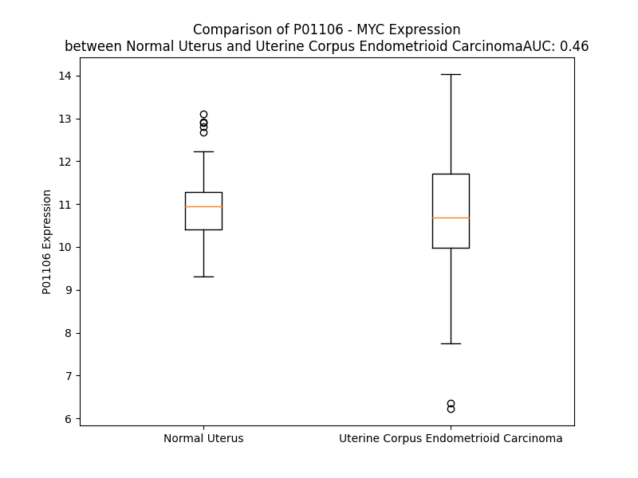

# Detailed Data for P01106

## Introduction to the Detailed Summary

### How to Interpret the Results

- **Summary & Metrics**: This section provides a quick reference to essential protein attributes, including expression changes, family classification, and biomarker applications. Regulation status (upregulated/downregulated) indicates the protein's behavior in a disease context. Some information comes from the original excel file with the proteins selected from literature, while others are derived from the analyses.
- **Expression Comparison**: A visual representation comparing protein expression between normal and disease states. It highlights significant changes in expression levels that might indicate diagnostic or therapeutic relevance. This is data coming from transcriptomics experiments and could not translate similarly to protein levels.
- **Isoform Alignment**: An interactive view of isoform alignments, revealing structural and functional differences between variants of the protein.
- **Interactors & Homologs**: Tables listing known interaction partners and homologous proteins, the more interactors and homologs, the more complex the protein is to design an antibody for.
- **Biological Assemblies**: Information about the structural arrangement of the protein in different assemblies, providing insights into its functional state but also the complexity of the protein to develop antibodies.
- **Combined Per-Residue Information**: A detailed table summarizing residue-level data. This includes predictions for epitope regions, aggregation tendencies, and modifications that might impact the protein's function. Each row corresponds to a residue in the protein, providing insights into specific sites that may be important for research or drug development.
## Summary & Metrics

- **UniProt Accession**: P01106
- **Gene Name**: MYC
- **Protein Name**: Myc proto-oncogene protein
- **Swiss Prot**: MYC_HUMAN
- **Family**: transcription regulator
- **Biomarker Application**: diagnosis,efficacy,prognosis,response to therapy,unspecified application
- **Number of Isoforms**: 0
- **Regulation**: 1
- **(transcriptomics) AUC**: 0.46
- **(transcriptomics) Fold Change**: 1.02
- **(transcriptomics) Regulation**: Downregulated
- **Discotope Epitope Count**: 33
- **Max n_uniprots (Homo)**: 2
- **Max n_uniprots (Hetero)**: 8

## Expression Comparison

## Interactors

| preferredName_A   | preferredName_B   |   score |
|:------------------|:------------------|--------:|
| MYC               | EP300             |   0.999 |
| MYC               | FBXW7             |   0.999 |
| MYC               | TRRAP             |   0.999 |
| MYC               | BRCA1             |   0.999 |
| MYC               | BIN1              |   0.999 |
| MYC               | ZBTB17            |   0.999 |
| MYC               | MAX               |   0.999 |
| MYC               | CDKN2A            |   0.998 |
| MYC               | TP53              |   0.997 |
| MYC               | GSK3B             |   0.996 |
| MYC               | KAT2A             |   0.996 |
| MYC               | CDCA7L            |   0.995 |
| MYC               | E2F1              |   0.995 |
| MYC               | SMAD3             |   0.993 |
| MYC               | HIF1A             |   0.993 |
| MYC               | HDAC1             |   0.991 |
| MYC               | DNMT3A            |   0.991 |
| MYC               | KAT2B             |   0.99  |
| MYC               | SKP1              |   0.989 |
| MYC               | IGF2BP1           |   0.988 |
| MYC               | ZNF346            |   0.987 |
| MYC               | MAPK3             |   0.986 |
| MYC               | STAT3             |   0.985 |
| MYC               | CTNNB1            |   0.985 |
| MYC               | EZH2              |   0.984 |
| MYC               | MAPK1             |   0.983 |
| MYC               | SMAD2             |   0.982 |
| MYC               | ESR1              |   0.982 |
| MYC               | CDKN1A            |   0.981 |
| MYC               | WDR5              |   0.98  |
| MYC               | HSP90AA1          |   0.975 |
| MYC               | CCNT1             |   0.975 |
| MYC               | SKP2              |   0.975 |
| MYC               | KAT5              |   0.974 |
| MYC               | SMARCA4           |   0.974 |
| MYC               | SP1               |   0.974 |
| MYC               | AMOTL1            |   0.972 |
| MYC               | JUN               |   0.97  |
| MYC               | CUL1              |   0.97  |
| MYC               | RUVBL1            |   0.969 |
| MYC               | CCND1             |   0.969 |
| MYC               | MYCBP             |   0.967 |
| MYC               | CDKN2B            |   0.966 |
| MYC               | USP28             |   0.966 |
| MYC               | CDK4              |   0.966 |
| MYC               | KDM5B             |   0.966 |
| MYC               | FOS               |   0.965 |
| MYC               | NFE2L2            |   0.961 |
| MYC               | RUVBL2            |   0.96  |
| MYC               | TFAP2C            |   0.96  |

## Homologs

| uniprot_id   | gene_id   |
|:-------------|:----------|
| P04198       | MYCN      |
| P12524       | MYCL      |

## Biological Assemblies

|   Unnamed: 0 |   assembly |   n_uniprots | composition   | crystal_id   |
|-------------:|-----------:|-------------:|:--------------|:-------------|
|            0 |          1 |            2 | Hetero        | 6g6j         |
|            1 |          2 |            2 | Hetero        | 6g6j         |
|            0 |          1 |            2 | Hetero        | 7t1y         |
|            0 |          1 |            2 | Homo          | 5i4z         |
|            0 |          1 |            8 | Hetero        | 8ott         |
|            0 |          1 |            1 | Homo          | 8q1n         |
|            1 |          2 |            1 | Homo          | 8q1n         |
|            0 |          1 |            2 | Hetero        | 1nkp         |
|            1 |          2 |            2 | Hetero        | 1nkp         |
|            0 |          1 |            2 | Hetero        | 1mv0         |
|            0 |          1 |            2 | Hetero        | 6g6l         |
|            1 |          2 |            2 | Hetero        | 6g6l         |
|            2 |          3 |            2 | Hetero        | 6g6l         |
|            3 |          4 |            2 | Hetero        | 6g6l         |
|            0 |          1 |            0 | Hetero        | 6c4u         |
|            1 |          2 |            0 | Hetero        | 6c4u         |
|            2 |          3 |            0 | Hetero        | 6c4u         |
|            3 |          4 |            0 | Hetero        | 6c4u         |
|            4 |          5 |            0 | Hetero        | 6c4u         |
|            5 |          6 |            0 | Hetero        | 6c4u         |
|            0 |          1 |            1 | Homo          | 8x8v         |
|            0 |          1 |            2 | Hetero        | 7t1z         |
|            0 |          1 |            2 | Hetero        | 1a93         |
|            0 |          1 |            2 | Hetero        | 6g6k         |
|            1 |          2 |            2 | Hetero        | 6g6k         |
|            0 |          1 |            8 | Hetero        | 8ots         |
|            0 |          1 |            1 | Homo          | 8j2q         |
|            0 |          1 |            1 | Homo          | 8wlg         |
|            0 |          1 |            1 | Homo          | 8x8s         |
|            0 |          1 |            2 | Homo          | 5i50         |
|            0 |          1 |            3 | Hetero        | 1ee4         |
|            1 |          2 |            3 | Hetero        | 1ee4         |
|            0 |          1 |            0 | Hetero        | 2or9         |
|            1 |          2 |            0 | Hetero        | 2or9         |
|            0 |          1 |            1 | Homo          | 6e16         |
|            0 |          1 |            1 | Homo          | 6e24         |
|            0 |          1 |            2 | Hetero        | 2a93         |
|            0 |          1 |            1 | Homo          | 4y7r         |

## Combined Per-Residue Information

|   res | aa   |   epitope_score | epitope   |   relative_surface_accessibility |   modeling_confidence |   Aggregation | modification                           | glycosylation                          |
|------:|:-----|----------------:|:----------|---------------------------------:|----------------------:|--------------:|:---------------------------------------|:---------------------------------------|
|     1 | M    |         0.11946 | False     |                          1.28033 |                 44.31 |         0     | N/A                                    | N/A                                    |
|     2 | P    |         0.10069 | False     |                          0.96483 |                 55.7  |         0     | N/A                                    | N/A                                    |
|     3 | L    |         0.115   | False     |                          1.06547 |                 48.74 |         0     | N/A                                    | N/A                                    |
|     4 | N    |         0.09273 | False     |                          0.89024 |                 44.97 |         0     | N/A                                    | N/A                                    |
|     5 | V    |         0.08773 | False     |                          0.84256 |                 46.99 |         0     | N/A                                    | N/A                                    |
|     6 | S    |         0.07476 | False     |                          0.67323 |                 42.86 |         0     | N/A                                    | N/A                                    |
|     7 | F    |         0.08199 | False     |                          0.99128 |                 44.39 |         0     | N/A                                    | N/A                                    |
|     8 | T    |         0.07405 | False     |                          0.86903 |                 47.21 |         0     | N/A                                    | N/A                                    |
|     9 | N    |         0.07578 | False     |                          0.9172  |                 40.51 |         0     | N/A                                    | N/A                                    |
|    10 | R    |         0.09018 | False     |                          0.73584 |                 43.94 |         0     | N/A                                    | N/A                                    |
|    11 | N    |         0.0824  | False     |                          0.71587 |                 45.24 |         0     | N/A                                    | N/A                                    |
|    12 | Y    |         0.13654 | False     |                          0.76661 |                 47.92 |         0     | N/A                                    | N/A                                    |
|    13 | D    |         0.11206 | False     |                          0.78617 |                 52.64 |         0     | N/A                                    | N/A                                    |
|    14 | L    |         0.11074 | False     |                          0.93527 |                 53.06 |         0     | N/A                                    | N/A                                    |
|    15 | D    |         0.13449 | False     |                          0.65761 |                 54.4  |         0     | N/A                                    | N/A                                    |
|    16 | Y    |         0.16151 | True      |                          0.99081 |                 50.43 |         0     | N/A                                    | N/A                                    |
|    17 | D    |         0.13832 | False     |                          0.83128 |                 56.33 |         0     | N/A                                    | N/A                                    |
|    18 | S    |         0.09846 | False     |                          0.78036 |                 57.55 |         0     | N/A                                    | N/A                                    |
|    19 | V    |         0.1008  | False     |                          0.91761 |                 58.56 |         0     | N/A                                    | N/A                                    |
|    20 | Q    |         0.08467 | False     |                          0.74047 |                 52.67 |         0     | N/A                                    | N/A                                    |
|    21 | P    |         0.05534 | False     |                          0.72149 |                 57.07 |         0     | Phosphoserine                          | N/A                                    |
|    22 | Y    |         0.08279 | False     |                          0.89228 |                 50.45 |         0     | N/A                                    | N/A                                    |
|    23 | F    |         0.0622  | False     |                          0.91227 |                 42.5  |         0     | Phosphothreonine; by RAF; in vitro     | N/A                                    |
|    24 | Y    |         0.06549 | False     |                          0.82712 |                 49.59 |         0     | N/A                                    | N/A                                    |
|    25 | C    |         0.07044 | False     |                          0.99601 |                 41.06 |         0     | N/A                                    | N/A                                    |
|    26 | D    |         0.06797 | False     |                          0.64164 |                 47.06 |         0     | N/A                                    | N/A                                    |
|    27 | E    |         0.06312 | False     |                          0.88824 |                 44.63 |         0     | N/A                                    | N/A                                    |
|    28 | E    |         0.08621 | False     |                          0.69627 |                 45.94 |         0     | N/A                                    | N/A                                    |
|    29 | E    |         0.09264 | False     |                          0.87749 |                 44.44 |         0     | N/A                                    | N/A                                    |
|    30 | N    |         0.1067  | False     |                          0.85412 |                 46.24 |         0     | N/A                                    | N/A                                    |
|    31 | F    |         0.08226 | False     |                          0.65854 |                 45.54 |         0     | N/A                                    | N/A                                    |
|    32 | Y    |         0.18288 | True      |                          0.72495 |                 47.47 |         0     | N/A                                    | N/A                                    |
|    33 | Q    |         0.12967 | False     |                          0.74966 |                 50.61 |         0     | N/A                                    | N/A                                    |
|    34 | Q    |         0.1399  | False     |                          0.79043 |                 47.5  |         0     | N/A                                    | N/A                                    |
|    35 | Q    |         0.11792 | False     |                          0.55413 |                 47.59 |         0     | N/A                                    | N/A                                    |
|    36 | Q    |         0.16905 | True      |                          0.76704 |                 48.6  |         0     | N/A                                    | N/A                                    |
|    37 | Q    |         0.15912 | True      |                          0.89103 |                 44.31 |         0     | N/A                                    | N/A                                    |
|    38 | S    |         0.08184 | False     |                          0.67744 |                 37.99 |         0     | N/A                                    | N/A                                    |
|    39 | E    |         0.1114  | False     |                          0.82704 |                 35.33 |         0     | N/A                                    | N/A                                    |
|    40 | L    |         0.11157 | False     |                          0.9743  |                 41.38 |         0     | N/A                                    | N/A                                    |
|    41 | Q    |         0.09402 | False     |                          0.85154 |                 43.02 |         0     | N/A                                    | N/A                                    |
|    42 | P    |         0.13838 | False     |                          0.826   |                 52.06 |         0     | N/A                                    | N/A                                    |
|    43 | P    |         0.10232 | False     |                          0.95785 |                 56.06 |         0     | N/A                                    | N/A                                    |
|    44 | A    |         0.08416 | False     |                          0.80276 |                 58.33 |         0     | N/A                                    | N/A                                    |
|    45 | P    |         0.13689 | False     |                          0.79423 |                 61.95 |         0     | N/A                                    | N/A                                    |
|    46 | S    |         0.10686 | False     |                          0.58267 |                 69.16 |         0     | N/A                                    | N/A                                    |
|    47 | E    |         0.10492 | False     |                          0.8394  |                 64.75 |         0     | N/A                                    | N/A                                    |
|    48 | D    |         0.11037 | False     |                          0.51487 |                 67.46 |         0     | N/A                                    | N/A                                    |
|    49 | I    |         0.09769 | False     |                          0.57581 |                 71.87 |         0     | N/A                                    | N/A                                    |
|    50 | W    |         0.15456 | True      |                          0.87529 |                 66.93 |         0     | N/A                                    | N/A                                    |
|    51 | K    |         0.11992 | False     |                          0.61761 |                 67.45 |         0     | N/A                                    | N/A                                    |
|    52 | K    |         0.14142 | False     |                          0.84418 |                 68.1  |         0     | N/A                                    | N/A                                    |
|    53 | F    |         0.13883 | False     |                          0.69954 |                 64.81 |         0     | N/A                                    | N/A                                    |
|    54 | E    |         0.18145 | True      |                          0.71764 |                 66.23 |         0     | N/A                                    | N/A                                    |
|    55 | L    |         0.13479 | False     |                          0.93587 |                 58.47 |         0     | N/A                                    | N/A                                    |
|    56 | L    |         0.09978 | False     |                          0.8507  |                 62.65 |         0     | N/A                                    | N/A                                    |
|    57 | P    |         0.18276 | True      |                          0.86558 |                 61.27 |         0     | N/A                                    | N/A                                    |
|    58 | T    |         0.13746 | False     |                          0.86495 |                 58.02 |         0     | N/A                                    | N/A                                    |
|    59 | P    |         0.13269 | False     |                          0.79855 |                 57.77 |         0     | N/A                                    | N/A                                    |
|    60 | P    |         0.17175 | True      |                          0.95466 |                 63.07 |         0     | N/A                                    | N/A                                    |
|    61 | L    |         0.14888 | True      |                          1.04504 |                 61.16 |         0     | N/A                                    | N/A                                    |
|    62 | S    |         0.11669 | False     |                          0.77081 |                 67.52 |         0     | N/A                                    | N/A                                    |
|    63 | P    |         0.10893 | False     |                          0.94585 |                 63.63 |         0     | N/A                                    | N/A                                    |
|    64 | S    |         0.13132 | False     |                          0.72661 |                 58.71 |         0     | N/A                                    | N/A                                    |
|    65 | R    |         0.14629 | True      |                          0.98318 |                 53.06 |         0     | N/A                                    | N/A                                    |
|    66 | R    |         0.16868 | True      |                          0.86786 |                 49.1  |         0     | N/A                                    | N/A                                    |
|    67 | S    |         0.10472 | False     |                          0.8825  |                 39.43 |         0     | N/A                                    | N/A                                    |
|    68 | G    |         0.13359 | False     |                          0.85616 |                 42.1  |         0     | N/A                                    | N/A                                    |
|    69 | L    |         0.18868 | True      |                          1.09946 |                 38.59 |         0     | N/A                                    | N/A                                    |
|    70 | C    |         0.08829 | False     |                          0.85677 |                 38.93 |         0     | N/A                                    | N/A                                    |
|    71 | S    |         0.11936 | False     |                          0.8039  |                 36.2  |         0     | N/A                                    | N/A                                    |
|    72 | P    |         0.12799 | False     |                          0.88356 |                 42.93 |         0     | N/A                                    | N/A                                    |
|    73 | S    |         0.11417 | False     |                          0.77677 |                 35.58 |         2.999 | Phosphothreonine; by GSK3; alternate   | O-linked (GlcNAc) threonine; alternate |
|    74 | Y    |         0.11422 | False     |                          0.93778 |                 42.4  |         2.999 | N/A                                    | N/A                                    |
|    75 | V    |         0.09703 | False     |                          0.71555 |                 47.79 |         2.999 | N/A                                    | N/A                                    |
|    76 | A    |         0.07254 | False     |                          0.9312  |                 35.81 |         2.999 | N/A                                    | N/A                                    |
|    77 | V    |         0.11982 | False     |                          0.9581  |                 45.33 |         2.999 | Phosphoserine; by DYRK2, GSK3 and CDK2 | N/A                                    |
|    78 | T    |         0.05677 | False     |                          0.84238 |                 47.11 |         0     | N/A                                    | N/A                                    |
|    79 | P    |         0.07375 | False     |                          0.79925 |                 42.47 |         0     | N/A                                    | N/A                                    |
|    80 | F    |         0.09975 | False     |                          1.0084  |                 41.4  |         0     | N/A                                    | N/A                                    |
|    81 | S    |         0.09082 | False     |                          0.72412 |                 36.7  |         0     | N/A                                    | N/A                                    |
|    82 | L    |         0.0979  | False     |                          1.02562 |                 41.36 |         0     | N/A                                    | N/A                                    |
|    83 | R    |         0.14786 | True      |                          0.89595 |                 41.47 |         0     | N/A                                    | N/A                                    |
|    84 | G    |         0.07741 | False     |                          0.7792  |                 39.63 |         0     | N/A                                    | N/A                                    |
|    85 | D    |         0.09859 | False     |                          0.82632 |                 43.99 |         0     | N/A                                    | N/A                                    |
|    86 | N    |         0.09198 | False     |                          0.9169  |                 46.95 |         0     | Phosphoserine                          | N/A                                    |
|    87 | D    |         0.11386 | False     |                          0.917   |                 46.67 |         0     | N/A                                    | N/A                                    |
|    88 | G    |         0.09806 | False     |                          0.8602  |                 39.78 |         0     | N/A                                    | N/A                                    |
|    89 | G    |         0.11101 | False     |                          0.99043 |                 38.6  |         0     | N/A                                    | N/A                                    |
|    90 | G    |         0.14423 | True      |                          1.10801 |                 33.29 |         0     | N/A                                    | N/A                                    |
|    91 | G    |         0.13232 | False     |                          0.62118 |                 45.48 |         0     | N/A                                    | N/A                                    |
|    92 | S    |         0.10104 | False     |                          0.92816 |                 53.44 |         0     | N/A                                    | N/A                                    |
|    93 | F    |         0.09399 | False     |                          0.79472 |                 55.32 |         0     | N/A                                    | N/A                                    |
|    94 | S    |         0.1229  | False     |                          0.47829 |                 64.23 |         0     | N/A                                    | N/A                                    |
|    95 | T    |         0.07954 | False     |                          0.72618 |                 72.91 |         0     | N/A                                    | N/A                                    |
|    96 | A    |         0.06839 | False     |                          0.61743 |                 76.55 |         0     | N/A                                    | N/A                                    |
|    97 | D    |         0.08051 | False     |                          0.38632 |                 75.82 |         0     | N/A                                    | N/A                                    |
|    98 | Q    |         0.04792 | False     |                          0.55136 |                 72.06 |         0     | N/A                                    | N/A                                    |
|    99 | L    |         0.09121 | False     |                          0.69802 |                 72.32 |         0     | N/A                                    | N/A                                    |
|   100 | E    |         0.08612 | False     |                          0.57723 |                 69.54 |         0     | N/A                                    | N/A                                    |
|   101 | M    |         0.04594 | False     |                          0.64536 |                 65.85 |         0     | N/A                                    | N/A                                    |
|   102 | V    |         0.039   | False     |                          0.48651 |                 63.73 |         0     | N/A                                    | N/A                                    |
|   103 | T    |         0.04836 | False     |                          0.64481 |                 66.58 |         0     | N/A                                    | N/A                                    |
|   104 | E    |         0.04546 | False     |                          0.66758 |                 59.75 |         0     | N/A                                    | N/A                                    |
|   105 | L    |         0.04157 | False     |                          0.92327 |                 55.48 |         0     | N/A                                    | N/A                                    |
|   106 | L    |         0.06407 | False     |                          0.91916 |                 55.43 |         0     | N/A                                    | N/A                                    |
|   107 | G    |         0.07307 | False     |                          0.73652 |                 52.81 |         0     | N/A                                    | N/A                                    |
|   108 | G    |         0.04539 | False     |                          0.47796 |                 40.26 |         0     | N/A                                    | N/A                                    |
|   109 | D    |         0.09541 | False     |                          0.86833 |                 46.79 |         0     | N/A                                    | N/A                                    |
|   110 | M    |         0.07231 | False     |                          0.90882 |                 53.07 |         0     | N/A                                    | N/A                                    |
|   111 | V    |         0.04643 | False     |                          0.96451 |                 49.32 |         0     | N/A                                    | N/A                                    |
|   112 | N    |         0.05691 | False     |                          0.93755 |                 47.39 |         0     | N/A                                    | N/A                                    |
|   113 | Q    |         0.10806 | False     |                          0.86273 |                 39.33 |         0     | N/A                                    | N/A                                    |
|   114 | S    |         0.06867 | False     |                          0.86234 |                 36.28 |         0     | N/A                                    | N/A                                    |
|   115 | F    |         0.05698 | False     |                          0.77263 |                 39.35 |         0     | N/A                                    | N/A                                    |
|   116 | I    |         0.08192 | False     |                          1.05916 |                 40.7  |         0     | N/A                                    | N/A                                    |
|   117 | C    |         0.05158 | False     |                          0.56249 |                 45.5  |         0     | N/A                                    | N/A                                    |
|   118 | D    |         0.08263 | False     |                          0.70168 |                 47.12 |         0     | N/A                                    | N/A                                    |
|   119 | P    |         0.1229  | False     |                          0.93768 |                 52.25 |         0     | N/A                                    | N/A                                    |
|   120 | D    |         0.07435 | False     |                          0.72876 |                 53.94 |         0     | N/A                                    | N/A                                    |
|   121 | D    |         0.08403 | False     |                          0.49113 |                 55.6  |         0     | N/A                                    | N/A                                    |
|   122 | E    |         0.10456 | False     |                          0.55887 |                 60.87 |         0     | N/A                                    | N/A                                    |
|   123 | T    |         0.08294 | False     |                          0.68831 |                 63.19 |         0     | N/A                                    | N/A                                    |
|   124 | F    |         0.06269 | False     |                          0.58796 |                 61.67 |         0     | N/A                                    | N/A                                    |
|   125 | I    |         0.05868 | False     |                          0.51998 |                 64.67 |         0     | N/A                                    | N/A                                    |
|   126 | K    |         0.09337 | False     |                          0.58593 |                 63.06 |         0     | N/A                                    | N/A                                    |
|   127 | N    |         0.05137 | False     |                          0.61678 |                 59.7  |         0.32  | N/A                                    | N/A                                    |
|   128 | I    |         0.05326 | False     |                          0.58613 |                 59.61 |         0.32  | N/A                                    | N/A                                    |
|   129 | I    |         0.10756 | False     |                          0.68822 |                 60.97 |         0.32  | N/A                                    | N/A                                    |
|   130 | I    |         0.1754  | True      |                          0.78497 |                 60.39 |         0.32  | N/A                                    | N/A                                    |
|   131 | Q    |         0.12304 | False     |                          0.74677 |                 60    |         0.32  | N/A                                    | N/A                                    |
|   132 | D    |         0.05792 | False     |                          0.54071 |                 47.55 |         0     | N/A                                    | N/A                                    |
|   133 | C    |         0.08021 | False     |                          0.70536 |                 52.35 |         0     | N/A                                    | N/A                                    |
|   134 | M    |         0.15066 | True      |                          0.96777 |                 60.21 |         0     | N/A                                    | N/A                                    |
|   135 | W    |         0.13888 | False     |                          1.03701 |                 63.16 |         0     | N/A                                    | N/A                                    |
|   136 | S    |         0.05209 | False     |                          0.39633 |                 51.91 |         0     | N/A                                    | N/A                                    |
|   137 | G    |         0.05392 | False     |                          1.03141 |                 50.17 |         0     | N/A                                    | N/A                                    |
|   138 | F    |         0.08225 | False     |                          0.71398 |                 46.35 |         0     | N/A                                    | N/A                                    |
|   139 | S    |         0.04929 | False     |                          0.51917 |                 50.08 |         0     | N/A                                    | N/A                                    |
|   140 | A    |         0.05996 | False     |                          0.70608 |                 52.05 |         0     | N/A                                    | N/A                                    |
|   141 | A    |         0.05304 | False     |                          0.63388 |                 55.61 |         0     | N/A                                    | N/A                                    |
|   142 | A    |         0.05564 | False     |                          0.6034  |                 57.09 |         0     | N/A                                    | N/A                                    |
|   143 | K    |         0.04568 | False     |                          0.61655 |                 57.52 |         0     | N/A                                    | N/A                                    |
|   144 | L    |         0.08954 | False     |                          0.75202 |                 58.46 |         0     | N/A                                    | N/A                                    |
|   145 | V    |         0.06168 | False     |                          0.7475  |                 64.23 |         0     | N/A                                    | N/A                                    |
|   146 | S    |         0.04052 | False     |                          0.49973 |                 65.43 |         0     | N/A                                    | N/A                                    |
|   147 | E    |         0.04668 | False     |                          0.59756 |                 64.3  |         0     | N/A                                    | N/A                                    |
|   148 | K    |         0.04418 | False     |                          0.67422 |                 66.78 |         0     | N/A                                    | N/A                                    |
|   149 | L    |         0.04529 | False     |                          0.65432 |                 67.55 |         0     | N/A                                    | N/A                                    |
|   150 | A    |         0.02826 | False     |                          0.55264 |                 72.12 |         0     | N/A                                    | N/A                                    |
|   151 | S    |         0.04508 | False     |                          0.54793 |                 73.78 |         0     | N/A                                    | N/A                                    |
|   152 | Y    |         0.0483  | False     |                          0.67895 |                 66.07 |         0     | N/A                                    | N/A                                    |
|   153 | Q    |         0.04327 | False     |                          0.5915  |                 72.05 |         0     | N/A                                    | N/A                                    |
|   154 | A    |         0.043   | False     |                          0.64203 |                 66.05 |         0     | N/A                                    | N/A                                    |
|   155 | A    |         0.04033 | False     |                          0.81762 |                 65.24 |         0     | N/A                                    | N/A                                    |
|   156 | R    |         0.10077 | False     |                          0.86547 |                 60.67 |         0     | N/A                                    | N/A                                    |
|   157 | K    |         0.08869 | False     |                          0.89415 |                 55.08 |         0     | N/A                                    | N/A                                    |
|   158 | D    |         0.11774 | False     |                          0.88178 |                 53.07 |         0     | N6-acetyllysine; by PCAF; alternate    | N/A                                    |
|   159 | S    |         0.08395 | False     |                          0.77246 |                 49.36 |         0     | N/A                                    | N/A                                    |
|   160 | G    |         0.07518 | False     |                          0.97725 |                 37.72 |         0     | N/A                                    | N/A                                    |
|   161 | S    |         0.12437 | False     |                          0.83415 |                 42.56 |         0     | N/A                                    | N/A                                    |
|   162 | P    |         0.11442 | False     |                          0.78432 |                 47.53 |         0     | N/A                                    | N/A                                    |
|   163 | N    |         0.09675 | False     |                          0.92941 |                 44.69 |         0     | N6-acetyllysine; alternate             | N/A                                    |
|   164 | P    |         0.11167 | False     |                          0.90374 |                 44.82 |         0     | N/A                                    | N/A                                    |
|   165 | A    |         0.08145 | False     |                          0.91434 |                 41.95 |         0     | N/A                                    | N/A                                    |
|   166 | R    |         0.12048 | False     |                          0.96612 |                 42.5  |         0     | N/A                                    | N/A                                    |
|   167 | G    |         0.10417 | False     |                          0.80694 |                 37.7  |         0     | N/A                                    | N/A                                    |
|   168 | H    |         0.09807 | False     |                          1.00219 |                 43.76 |         0     | N/A                                    | N/A                                    |
|   169 | S    |         0.10863 | False     |                          0.76199 |                 40.59 |         0     | N/A                                    | N/A                                    |
|   170 | V    |         0.0771  | False     |                          0.99466 |                 42.1  |         0     | N/A                                    | N/A                                    |
|   171 | C    |         0.04328 | False     |                          0.69275 |                 38.47 |         0     | N/A                                    | N/A                                    |
|   172 | S    |         0.05039 | False     |                          0.86808 |                 41.7  |         0     | N6-acetyllysine; by PCAF               | N/A                                    |
|   173 | T    |         0.07179 | False     |                          0.70693 |                 48.1  |         0     | N/A                                    | N/A                                    |
|   174 | S    |         0.05166 | False     |                          0.76043 |                 49.81 |         0     | N/A                                    | N/A                                    |
|   175 | S    |         0.07649 | False     |                          0.72726 |                 50.34 |         0     | N/A                                    | N/A                                    |
|   176 | L    |         0.08393 | False     |                          0.7188  |                 54.04 |         0     | Phosphoserine                          | N/A                                    |
|   177 | Y    |         0.1008  | False     |                          0.77373 |                 51.65 |         0     | N/A                                    | N/A                                    |
|   178 | L    |         0.06026 | False     |                          0.88665 |                 54.31 |         0     | N/A                                    | N/A                                    |
|   179 | Q    |         0.04483 | False     |                          0.62106 |                 55.03 |         0     | N/A                                    | N/A                                    |
|   180 | D    |         0.10874 | False     |                          0.58667 |                 52.77 |         0     | N/A                                    | N/A                                    |
|   181 | L    |         0.08142 | False     |                          0.65193 |                 54.62 |         0     | N/A                                    | N/A                                    |
|   182 | S    |         0.05708 | False     |                          0.57744 |                 59    |         0     | N/A                                    | N/A                                    |
|   183 | A    |         0.05861 | False     |                          0.55015 |                 59.64 |         0     | N/A                                    | N/A                                    |
|   184 | A    |         0.06604 | False     |                          0.70303 |                 56.25 |         0     | N/A                                    | N/A                                    |
|   185 | A    |         0.07478 | False     |                          0.74316 |                 57.95 |         0     | N/A                                    | N/A                                    |
|   186 | S    |         0.05936 | False     |                          0.70248 |                 61.5  |         0     | N/A                                    | N/A                                    |
|   187 | E    |         0.09042 | False     |                          0.70967 |                 70.57 |         0     | N/A                                    | N/A                                    |
|   188 | C    |         0.09847 | False     |                          0.86043 |                 73.88 |         0     | N/A                                    | N/A                                    |
|   189 | I    |         0.08764 | False     |                          0.67381 |                 79.44 |         0     | N/A                                    | N/A                                    |
|   190 | D    |         0.118   | False     |                          0.46649 |                 77.22 |         0     | N/A                                    | N/A                                    |
|   191 | P    |         0.07873 | False     |                          0.6563  |                 75.54 |         0     | N/A                                    | N/A                                    |
|   192 | S    |         0.1172  | False     |                          0.66004 |                 77.23 |         0     | N/A                                    | N/A                                    |
|   193 | V    |         0.09904 | False     |                          0.84727 |                 78.84 |         0     | N/A                                    | N/A                                    |
|   194 | V    |         0.07209 | False     |                          0.67446 |                 78.28 |         0     | N/A                                    | N/A                                    |
|   195 | F    |         0.10226 | False     |                          0.67293 |                 62.32 |         0     | N/A                                    | N/A                                    |
|   196 | P    |         0.16691 | True      |                          0.88121 |                 73.25 |         0     | N/A                                    | N/A                                    |
|   197 | Y    |         0.12827 | False     |                          0.79585 |                 58.18 |         0     | N/A                                    | N/A                                    |
|   198 | P    |         0.12925 | False     |                          0.88544 |                 60.99 |         0     | N/A                                    | N/A                                    |
|   199 | L    |         0.14519 | True      |                          1.06063 |                 58.99 |         0     | N/A                                    | N/A                                    |
|   200 | N    |         0.14847 | True      |                          0.92573 |                 52.99 |         0     | N/A                                    | N/A                                    |
|   201 | D    |         0.16647 | True      |                          0.88923 |                 44.5  |         0     | N/A                                    | N/A                                    |
|   202 | S    |         0.15792 | True      |                          0.84097 |                 47.36 |         0     | N/A                                    | N/A                                    |
|   203 | S    |         0.10657 | False     |                          0.84126 |                 46    |         0     | N/A                                    | N/A                                    |
|   204 | S    |         0.11324 | False     |                          0.79827 |                 44.84 |         0     | N/A                                    | N/A                                    |
|   205 | P    |         0.13133 | False     |                          0.96759 |                 42.04 |         0     | N/A                                    | N/A                                    |
|   206 | K    |         0.13076 | False     |                          0.98715 |                 44.55 |         0     | N/A                                    | N/A                                    |
|   207 | S    |         0.09722 | False     |                          0.85202 |                 43.38 |         0     | N/A                                    | N/A                                    |
|   208 | C    |         0.11227 | False     |                          0.90962 |                 37.03 |         0     | N/A                                    | N/A                                    |
|   209 | A    |         0.08823 | False     |                          0.87957 |                 40.43 |         0     | N/A                                    | N/A                                    |
|   210 | S    |         0.09324 | False     |                          0.74895 |                 42.59 |         0     | N/A                                    | N/A                                    |
|   211 | Q    |         0.11476 | False     |                          0.83448 |                 47.75 |         0     | N/A                                    | N/A                                    |
|   212 | D    |         0.11963 | False     |                          0.79441 |                 39.61 |         0     | N/A                                    | N/A                                    |
|   213 | S    |         0.10548 | False     |                          0.74227 |                 49.26 |         0     | N/A                                    | N/A                                    |
|   214 | S    |         0.10056 | False     |                          0.78504 |                 42.93 |         0     | N/A                                    | N/A                                    |
|   215 | A    |         0.09385 | False     |                          0.7424  |                 42.69 |         0     | N/A                                    | N/A                                    |
|   216 | F    |         0.08074 | False     |                          1.07378 |                 44.45 |         0     | N/A                                    | N/A                                    |
|   217 | S    |         0.07688 | False     |                          0.81603 |                 48.42 |         0     | N/A                                    | N/A                                    |
|   218 | P    |         0.06367 | False     |                          0.93816 |                 47.28 |         0     | N/A                                    | N/A                                    |
|   219 | S    |         0.06759 | False     |                          0.91383 |                 42.73 |         0     | N/A                                    | N/A                                    |
|   220 | S    |         0.12609 | False     |                          0.82984 |                 43.38 |         0     | N/A                                    | N/A                                    |
|   221 | D    |         0.0921  | False     |                          0.87521 |                 51.34 |         0     | N/A                                    | N/A                                    |
|   222 | S    |         0.0779  | False     |                          0.64578 |                 47.69 |         0     | N/A                                    | N/A                                    |
|   223 | L    |         0.09483 | False     |                          1.00637 |                 51.16 |         0     | N/A                                    | N/A                                    |
|   224 | L    |         0.05539 | False     |                          1.15176 |                 56.55 |         0     | N/A                                    | N/A                                    |
|   225 | S    |         0.09272 | False     |                          0.73923 |                 40.26 |         0     | N/A                                    | N/A                                    |
|   226 | S    |         0.08096 | False     |                          0.81694 |                 51.63 |         0     | N/A                                    | N/A                                    |
|   227 | T    |         0.13054 | False     |                          0.89842 |                 47.44 |         0     | N/A                                    | N/A                                    |
|   228 | E    |         0.07544 | False     |                          0.94979 |                 50.79 |         0     | N/A                                    | N/A                                    |
|   229 | S    |         0.09816 | False     |                          0.74018 |                 48.19 |         0     | N/A                                    | N/A                                    |
|   230 | S    |         0.07128 | False     |                          0.85164 |                 51.99 |         0     | N/A                                    | N/A                                    |
|   231 | P    |         0.13108 | False     |                          0.88933 |                 48.16 |         0     | N/A                                    | N/A                                    |
|   232 | Q    |         0.12006 | False     |                          0.93539 |                 43.26 |         0     | N/A                                    | N/A                                    |
|   233 | G    |         0.10661 | False     |                          0.95428 |                 42.31 |         0     | N/A                                    | N/A                                    |
|   234 | S    |         0.06009 | False     |                          0.8189  |                 47.32 |         0     | N/A                                    | N/A                                    |
|   235 | P    |         0.08296 | False     |                          0.92527 |                 44.74 |         0     | N/A                                    | N/A                                    |
|   236 | E    |         0.05823 | False     |                          0.65841 |                 46.44 |         0     | N/A                                    | N/A                                    |
|   237 | P    |         0.0882  | False     |                          0.95214 |                 45.03 |         0     | N/A                                    | N/A                                    |
|   238 | L    |         0.07145 | False     |                          0.86581 |                 49.97 |         0     | N/A                                    | N/A                                    |
|   239 | V    |         0.10341 | False     |                          0.96434 |                 43.39 |         0     | N/A                                    | N/A                                    |
|   240 | L    |         0.10174 | False     |                          1.02643 |                 48.26 |         0     | N/A                                    | N/A                                    |
|   241 | H    |         0.10678 | False     |                          0.82367 |                 50.75 |         0     | N/A                                    | N/A                                    |
|   242 | E    |         0.10587 | False     |                          0.83407 |                 42.82 |         0     | N/A                                    | N/A                                    |
|   243 | E    |         0.10208 | False     |                          0.8525  |                 54.78 |         0     | N/A                                    | N/A                                    |
|   244 | T    |         0.11796 | False     |                          0.80298 |                 51.66 |         0     | N/A                                    | N/A                                    |
|   245 | P    |         0.08038 | False     |                          0.80989 |                 48.82 |         0     | N/A                                    | N/A                                    |
|   246 | P    |         0.0799  | False     |                          0.86895 |                 58.97 |         0     | N/A                                    | N/A                                    |
|   247 | T    |         0.12083 | False     |                          0.9376  |                 37.02 |         0     | N/A                                    | N/A                                    |
|   248 | T    |         0.1206  | False     |                          0.83622 |                 47.58 |         0     | N/A                                    | N/A                                    |
|   249 | S    |         0.10673 | False     |                          0.78841 |                 49.26 |         0     | N/A                                    | N/A                                    |
|   250 | S    |         0.10232 | False     |                          0.84775 |                 40.63 |         0     | N/A                                    | N/A                                    |
|   251 | D    |         0.081   | False     |                          0.79523 |                 45.93 |         0     | N/A                                    | N/A                                    |
|   252 | S    |         0.13387 | False     |                          0.77741 |                 40.91 |         0     | N/A                                    | N/A                                    |
|   253 | E    |         0.13216 | False     |                          0.76396 |                 51.93 |         0     | N/A                                    | N/A                                    |
|   254 | E    |         0.12033 | False     |                          0.74704 |                 44.59 |         0     | N/A                                    | N/A                                    |
|   255 | E    |         0.11083 | False     |                          0.85498 |                 50.67 |         0     | N/A                                    | N/A                                    |
|   256 | Q    |         0.12378 | False     |                          0.6783  |                 54.98 |         0     | N/A                                    | N/A                                    |
|   257 | E    |         0.0981  | False     |                          0.8845  |                 59.51 |         0     | N/A                                    | N/A                                    |
|   258 | D    |         0.08787 | False     |                          0.64488 |                 55.44 |         0     | N/A                                    | N/A                                    |
|   259 | E    |         0.09817 | False     |                          0.85982 |                 62.59 |         0     | N/A                                    | N/A                                    |
|   260 | E    |         0.10295 | False     |                          0.84208 |                 67.9  |         0     | N/A                                    | N/A                                    |
|   261 | E    |         0.07761 | False     |                          0.8442  |                 72.81 |         0     | N/A                                    | N/A                                    |
|   262 | I    |         0.0956  | False     |                          0.88845 |                 66.66 |         0     | N/A                                    | N/A                                    |
|   263 | D    |         0.09699 | False     |                          0.72145 |                 74.81 |         0     | N/A                                    | N/A                                    |
|   264 | V    |         0.10875 | False     |                          0.86974 |                 68.27 |         0     | N/A                                    | N/A                                    |
|   265 | V    |         0.0959  | False     |                          0.7113  |                 56.74 |         0     | N/A                                    | N/A                                    |
|   266 | S    |         0.09879 | False     |                          0.75352 |                 62.18 |         0     | N/A                                    | N/A                                    |
|   267 | V    |         0.08266 | False     |                          0.97387 |                 51.48 |         0     | N/A                                    | N/A                                    |
|   268 | E    |         0.11585 | False     |                          0.70257 |                 54.73 |         0     | N/A                                    | N/A                                    |
|   269 | K    |         0.06345 | False     |                          0.88866 |                 52.82 |         0     | N/A                                    | N/A                                    |
|   270 | R    |         0.12171 | False     |                          0.81361 |                 47.09 |         0     | N/A                                    | N/A                                    |
|   271 | Q    |         0.10916 | False     |                          0.90552 |                 45.05 |         0     | N/A                                    | N/A                                    |
|   272 | A    |         0.10136 | False     |                          0.89866 |                 46.99 |         0     | N/A                                    | N/A                                    |
|   273 | P    |         0.09037 | False     |                          0.97611 |                 48.84 |         0     | N/A                                    | N/A                                    |
|   274 | G    |         0.08361 | False     |                          0.94031 |                 43.97 |         0     | N/A                                    | N/A                                    |
|   275 | K    |         0.0871  | False     |                          1.028   |                 54.73 |         0     | N/A                                    | N/A                                    |
|   276 | R    |         0.13503 | False     |                          0.94559 |                 44.3  |         0     | N/A                                    | N/A                                    |
|   277 | S    |         0.0695  | False     |                          0.83694 |                 46.65 |         0     | N/A                                    | N/A                                    |
|   278 | E    |         0.10245 | False     |                          0.89288 |                 46.53 |         0     | N/A                                    | N/A                                    |
|   279 | S    |         0.08124 | False     |                          0.92226 |                 48.99 |         0     | N/A                                    | N/A                                    |
|   280 | G    |         0.10085 | False     |                          0.90879 |                 43.92 |         0     | N/A                                    | N/A                                    |
|   281 | S    |         0.075   | False     |                          0.84627 |                 50.23 |         0     | N/A                                    | N/A                                    |
|   282 | P    |         0.07963 | False     |                          0.97414 |                 39.96 |         0     | N/A                                    | N/A                                    |
|   283 | S    |         0.07587 | False     |                          0.93258 |                 49.25 |         0     | N/A                                    | N/A                                    |
|   284 | A    |         0.10659 | False     |                          0.99228 |                 46.45 |         0     | N/A                                    | N/A                                    |
|   285 | G    |         0.12529 | False     |                          0.98423 |                 42.37 |         0     | N/A                                    | N/A                                    |
|   286 | G    |         0.10339 | False     |                          0.80409 |                 43.99 |         0     | N/A                                    | N/A                                    |
|   287 | H    |         0.12903 | False     |                          1.01831 |                 46.94 |         0     | N/A                                    | N/A                                    |
|   288 | S    |         0.08537 | False     |                          0.82227 |                 47.26 |         0     | N/A                                    | N/A                                    |
|   289 | K    |         0.09488 | False     |                          1.01677 |                 50.55 |         0     | N/A                                    | N/A                                    |
|   290 | P    |         0.0934  | False     |                          0.88765 |                 55.45 |         0     | N6-acetyllysine; by PCAF               | N/A                                    |
|   291 | P    |         0.07323 | False     |                          0.92374 |                 51.72 |         0     | N/A                                    | N/A                                    |
|   292 | H    |         0.15285 | True      |                          1.0671  |                 43.26 |         0     | N/A                                    | N/A                                    |
|   293 | S    |         0.07321 | False     |                          0.71385 |                 53.84 |         0     | N/A                                    | N/A                                    |
|   294 | P    |         0.07041 | False     |                          0.89024 |                 63.33 |         0     | N/A                                    | N/A                                    |
|   295 | L    |         0.09152 | False     |                          1.02536 |                 57.42 |         0     | N/A                                    | N/A                                    |
|   296 | V    |         0.07346 | False     |                          0.90164 |                 60.89 |         0     | N/A                                    | N/A                                    |
|   297 | L    |         0.10464 | False     |                          0.95329 |                 62.52 |         0     | N/A                                    | N/A                                    |
|   298 | K    |         0.09592 | False     |                          0.91973 |                 62.93 |         0     | N/A                                    | N/A                                    |
|   299 | R    |         0.12139 | False     |                          0.92466 |                 57.81 |         0     | N/A                                    | N/A                                    |
|   300 | C    |         0.06454 | False     |                          0.75679 |                 56.14 |         0     | N/A                                    | N/A                                    |
|   301 | H    |         0.09568 | False     |                          0.90495 |                 56.36 |         0     | N/A                                    | N/A                                    |
|   302 | V    |         0.106   | False     |                          0.78064 |                 56.39 |         0     | N/A                                    | N/A                                    |
|   303 | S    |         0.08445 | False     |                          0.53607 |                 48.46 |         0     | N/A                                    | N/A                                    |
|   304 | T    |         0.10061 | False     |                          0.78954 |                 54.52 |         0     | N/A                                    | N/A                                    |
|   305 | H    |         0.12611 | False     |                          0.73991 |                 56.54 |         0     | N/A                                    | N/A                                    |
|   306 | Q    |         0.09204 | False     |                          0.79424 |                 60.18 |         0     | N/A                                    | N/A                                    |
|   307 | H    |         0.11038 | False     |                          0.75976 |                 57.93 |         0     | N/A                                    | N/A                                    |
|   308 | N    |         0.16082 | True      |                          0.73161 |                 69.53 |         0     | Phosphoserine                          | N/A                                    |
|   309 | Y    |         0.28533 | True      |                          0.95942 |                 67.08 |         0     | N/A                                    | N/A                                    |
|   310 | A    |         0.14725 | True      |                          0.89904 |                 71.59 |         0     | N/A                                    | N/A                                    |
|   311 | A    |         0.08585 | False     |                          0.6813  |                 66.79 |         0     | N/A                                    | N/A                                    |
|   312 | P    |         0.12459 | False     |                          0.86439 |                 65.73 |         0     | N/A                                    | N/A                                    |
|   313 | P    |         0.10531 | False     |                          0.89121 |                 62.97 |         0     | N/A                                    | N/A                                    |
|   314 | S    |         0.07981 | False     |                          0.75576 |                 62.3  |         0     | N/A                                    | N/A                                    |
|   315 | T    |         0.11904 | False     |                          0.93187 |                 56.59 |         0     | N/A                                    | N/A                                    |
|   316 | R    |         0.19238 | True      |                          0.90864 |                 48.99 |         0     | N/A                                    | N/A                                    |
|   317 | K    |         0.12155 | False     |                          0.9015  |                 52.07 |         0     | N/A                                    | N/A                                    |
|   318 | D    |         0.13012 | False     |                          0.77489 |                 43.72 |         0     | N/A                                    | N/A                                    |
|   319 | Y    |         0.10692 | False     |                          0.90566 |                 48.78 |         0     | N/A                                    | N/A                                    |
|   320 | P    |         0.15126 | True      |                          0.913   |                 40.49 |         0     | N/A                                    | N/A                                    |
|   321 | A    |         0.09147 | False     |                          0.92203 |                 46.64 |         0     | N/A                                    | N/A                                    |
|   322 | A    |         0.17781 | True      |                          0.82319 |                 47.49 |         0     | N/A                                    | N/A                                    |
|   323 | K    |         0.08522 | False     |                          0.91896 |                 52.79 |         0     | N/A                                    | N/A                                    |
|   324 | R    |         0.17143 | True      |                          0.92597 |                 43.57 |         0     | N/A                                    | N/A                                    |
|   325 | V    |         0.07184 | False     |                          1.05963 |                 53.32 |         0     | N/A                                    | N/A                                    |
|   326 | K    |         0.12638 | False     |                          0.82598 |                 42    |         0     | N/A                                    | N/A                                    |
|   327 | L    |         0.07389 | False     |                          1.0813  |                 52.2  |         0     | N/A                                    | N/A                                    |
|   328 | D    |         0.09494 | False     |                          0.55328 |                 41.89 |         0     | N/A                                    | N/A                                    |
|   329 | S    |         0.04129 | False     |                          0.87586 |                 49.98 |         0     | N/A                                    | N/A                                    |
|   330 | V    |         0.07949 | False     |                          0.87059 |                 40.77 |         0     | N/A                                    | N/A                                    |
|   331 | R    |         0.10196 | False     |                          0.87716 |                 51.73 |         0     | N/A                                    | N/A                                    |
|   332 | V    |         0.09078 | False     |                          0.87457 |                 45.1  |         0     | N6-acetyllysine; by PCAF               | N/A                                    |
|   333 | L    |         0.14905 | True      |                          0.91793 |                 42.93 |         0     | N/A                                    | N/A                                    |
|   334 | R    |         0.11009 | False     |                          0.84955 |                 52.75 |         0     | N/A                                    | N/A                                    |
|   335 | Q    |         0.10921 | False     |                          0.80326 |                 42.04 |         0     | N/A                                    | N/A                                    |
|   336 | I    |         0.07265 | False     |                          0.76397 |                 53.55 |         0     | N/A                                    | N/A                                    |
|   337 | S    |         0.08926 | False     |                          0.79504 |                 52.48 |         0     | N/A                                    | N/A                                    |
|   338 | N    |         0.10701 | False     |                          0.79246 |                 55.46 |         0     | N6-acetyllysine; by PCAF               | N/A                                    |
|   339 | N    |         0.15308 | True      |                          0.93526 |                 48.51 |         0     | N/A                                    | N/A                                    |
|   340 | R    |         0.11687 | False     |                          0.82849 |                 60.53 |         0     | N/A                                    | N/A                                    |
|   341 | K    |         0.11676 | False     |                          0.96639 |                 46.2  |         0     | N/A                                    | N/A                                    |
|   342 | C    |         0.10119 | False     |                          0.90061 |                 49.12 |         0     | N/A                                    | N/A                                    |
|   343 | T    |         0.12391 | False     |                          1.03676 |                 55.61 |         0     | N/A                                    | N/A                                    |
|   344 | S    |         0.10069 | False     |                          0.66546 |                 56.64 |         0     | Phosphoserine; by PIM2; in vitro       | N/A                                    |
|   345 | P    |         0.11844 | False     |                          0.77153 |                 57.57 |         0     | N/A                                    | N/A                                    |
|   346 | R    |         0.13877 | False     |                          0.90356 |                 59.03 |         0     | N/A                                    | N/A                                    |
|   347 | S    |         0.08644 | False     |                          0.49142 |                 60.33 |         0     | N/A                                    | N/A                                    |
|   348 | S    |         0.1274  | False     |                          0.67174 |                 60    |         0     | N/A                                    | N/A                                    |
|   349 | D    |         0.11396 | False     |                          0.65437 |                 64.48 |         0     | N/A                                    | N/A                                    |
|   350 | T    |         0.06307 | False     |                          0.53287 |                 79.01 |         0     | N/A                                    | N/A                                    |
|   351 | E    |         0.07042 | False     |                          0.62613 |                 85.66 |         0     | N/A                                    | N/A                                    |
|   352 | E    |         0.04589 | False     |                          0.48764 |                 91.37 |         0     | N/A                                    | N/A                                    |
|   353 | N    |         0.04452 | False     |                          0.43458 |                 91.93 |         0     | N/A                                    | N/A                                    |
|   354 | V    |         0.02347 | False     |                          0.63979 |                 94.03 |         0     | N/A                                    | N/A                                    |
|   355 | K    |         0.04268 | False     |                          0.72701 |                 95.66 |         0     | N/A                                    | N/A                                    |
|   356 | R    |         0.06251 | False     |                          0.50042 |                 95.48 |         0     | N/A                                    | N/A                                    |
|   357 | R    |         0.05763 | False     |                          0.66106 |                 96.14 |         0     | N/A                                    | N/A                                    |
|   358 | T    |         0.03714 | False     |                          0.49636 |                 97.61 |         0     | N/A                                    | N/A                                    |
|   359 | H    |         0.04065 | False     |                          0.63946 |                 97.63 |         0     | N/A                                    | N/A                                    |
|   360 | N    |         0.04903 | False     |                          0.48545 |                 98.18 |         0     | N/A                                    | N/A                                    |
|   361 | V    |         0.02554 | False     |                          0.63833 |                 98.42 |         0     | N/A                                    | N/A                                    |
|   362 | L    |         0.04213 | False     |                          0.63986 |                 98.47 |         0     | N/A                                    | N/A                                    |
|   363 | E    |         0.03229 | False     |                          0.23904 |                 98.37 |         0     | N/A                                    | N/A                                    |
|   364 | R    |         0.02648 | False     |                          0.62787 |                 98.52 |         0     | N/A                                    | N/A                                    |
|   365 | Q    |         0.038   | False     |                          0.55912 |                 98.62 |         0     | N/A                                    | N/A                                    |
|   366 | R    |         0.05323 | False     |                          0.58119 |                 98.65 |         0     | N/A                                    | N/A                                    |
|   367 | R    |         0.05418 | False     |                          0.589   |                 98.65 |         0     | N/A                                    | N/A                                    |
|   368 | N    |         0.03579 | False     |                          0.45139 |                 98.55 |         0     | N/A                                    | N/A                                    |
|   369 | E    |         0.0204  | False     |                          0.46559 |                 98.66 |         0     | N/A                                    | N/A                                    |
|   370 | L    |         0.02455 | False     |                          0.46023 |                 98.5  |         0     | N/A                                    | N/A                                    |
|   371 | K    |         0.04014 | False     |                          0.56062 |                 98.18 |         0     | N/A                                    | N/A                                    |
|   372 | R    |         0.04735 | False     |                          0.54311 |                 98.08 |         0     | N/A                                    | N/A                                    |
|   373 | S    |         0.02284 | False     |                          0.4267  |                 98.37 |         1.916 | N/A                                    | N/A                                    |
|   374 | F    |         0.03378 | False     |                          0.14406 |                 98.5  |         1.916 | N/A                                    | N/A                                    |
|   375 | F    |         0.04951 | False     |                          0.4095  |                 97.76 |         1.916 | N/A                                    | N/A                                    |
|   376 | A    |         0.03757 | False     |                          0.55969 |                 98.13 |         1.916 | N/A                                    | N/A                                    |
|   377 | L    |         0.02593 | False     |                          0.3818  |                 98.51 |         1.916 | N/A                                    | N/A                                    |
|   378 | R    |         0.08191 | False     |                          0.0924  |                 98.48 |         0     | N/A                                    | N/A                                    |
|   379 | D    |         0.06094 | False     |                          0.40427 |                 97.73 |         0     | N/A                                    | N/A                                    |
|   380 | Q    |         0.03074 | False     |                          0.65074 |                 98.08 |         0     | N/A                                    | N/A                                    |
|   381 | I    |         0.03109 | False     |                          0.03027 |                 98.32 |         0     | N/A                                    | N/A                                    |
|   382 | P    |         0.03682 | False     |                          0.62758 |                 97.66 |         0     | N/A                                    | N/A                                    |
|   383 | E    |         0.06038 | False     |                          0.60851 |                 96.76 |         0     | N/A                                    | N/A                                    |
|   384 | L    |         0.02955 | False     |                          0.04204 |                 97.49 |         0     | N/A                                    | N/A                                    |
|   385 | E    |         0.2008  | True      |                          0.53314 |                 94.04 |         0     | N/A                                    | N/A                                    |
|   386 | N    |         0.09748 | False     |                          0.91394 |                 93.34 |         0     | N6-acetyllysine; by PCAF               | N/A                                    |
|   387 | N    |         0.17687 | True      |                          0.4094  |                 94.74 |         0     | N/A                                    | N/A                                    |
|   388 | E    |         0.12852 | False     |                          0.69301 |                 94.53 |         0     | N/A                                    | N/A                                    |
|   389 | K    |         0.12655 | False     |                          0.86327 |                 95.83 |         0     | N/A                                    | N/A                                    |
|   390 | A    |         0.02302 | False     |                          0.11125 |                 97.04 |         0     | N/A                                    | N/A                                    |
|   391 | P    |         0.11647 | False     |                          0.54873 |                 98    |         0     | N/A                                    | N/A                                    |
|   392 | K    |         0.0932  | False     |                          0.56665 |                 98.34 |         0     | N/A                                    | N/A                                    |
|   393 | V    |         0.09649 | False     |                          0.60759 |                 98.44 |         0     | N/A                                    | N/A                                    |
|   394 | V    |         0.05249 | False     |                          0.34179 |                 98.38 |         0     | N/A                                    | N/A                                    |
|   395 | I    |         0.01276 | False     |                          0.0192  |                 98.61 |         0     | N/A                                    | N/A                                    |
|   396 | L    |         0.06292 | False     |                          0.55542 |                 98.76 |         0     | N/A                                    | N/A                                    |
|   397 | K    |         0.11199 | False     |                          0.70139 |                 98.65 |         0     | N/A                                    | N/A                                    |
|   398 | K    |         0.05234 | False     |                          0.33074 |                 98.53 |         0     | N/A                                    | N/A                                    |
|   399 | A    |         0.01729 | False     |                          0.0829  |                 98.75 |         2.873 | N/A                                    | N/A                                    |
|   400 | T    |         0.05944 | False     |                          0.56333 |                 98.78 |         7.945 | N/A                                    | N/A                                    |
|   401 | A    |         0.08529 | False     |                          0.51964 |                 98.66 |        19.871 | N/A                                    | N/A                                    |
|   402 | Y    |         0.06724 | False     |                          0.38147 |                 98.75 |        32.889 | N/A                                    | N/A                                    |
|   403 | I    |         0.05063 | False     |                          0.55817 |                 98.75 |        32.889 | N/A                                    | N/A                                    |
|   404 | L    |         0.12837 | False     |                          0.66849 |                 98.75 |        32.798 | N/A                                    | N/A                                    |
|   405 | S    |         0.06689 | False     |                          0.47103 |                 98.61 |        30.686 | N/A                                    | N/A                                    |
|   406 | V    |         0.02641 | False     |                          0.46908 |                 98.74 |        29.564 | N/A                                    | N/A                                    |
|   407 | Q    |         0.06194 | False     |                          0.46797 |                 98.83 |         2.798 | N/A                                    | N/A                                    |
|   408 | A    |         0.04889 | False     |                          0.61591 |                 98.71 |         1.557 | N/A                                    | N/A                                    |
|   409 | E    |         0.04877 | False     |                          0.514   |                 98.79 |         0     | N/A                                    | N/A                                    |
|   410 | E    |         0.09781 | False     |                          0.47513 |                 98.8  |         0     | N/A                                    | N/A                                    |
|   411 | Q    |         0.11255 | False     |                          0.54731 |                 98.81 |         0     | N/A                                    | N/A                                    |
|   412 | K    |         0.07967 | False     |                          0.69285 |                 98.8  |         0     | N/A                                    | N/A                                    |
|   413 | L    |         0.04809 | False     |                          0.60093 |                 98.78 |         0     | N/A                                    | N/A                                    |
|   414 | I    |         0.0634  | False     |                          0.47433 |                 98.83 |         0     | N/A                                    | N/A                                    |
|   415 | S    |         0.06023 | False     |                          0.55693 |                 98.64 |         0     | N/A                                    | N/A                                    |
|   416 | E    |         0.04319 | False     |                          0.42592 |                 98.78 |         0     | N/A                                    | N/A                                    |
|   417 | E    |         0.05469 | False     |                          0.41549 |                 98.8  |         0     | N/A                                    | N/A                                    |
|   418 | D    |         0.08951 | False     |                          0.43193 |                 98.74 |         0     | N/A                                    | N/A                                    |
|   419 | L    |         0.07805 | False     |                          0.74018 |                 98.67 |         0     | N/A                                    | N/A                                    |
|   420 | L    |         0.04863 | False     |                          0.66002 |                 98.72 |         0     | N/A                                    | N/A                                    |
|   421 | R    |         0.06808 | False     |                          0.47742 |                 98.67 |         0     | N/A                                    | N/A                                    |
|   422 | K    |         0.0787  | False     |                          0.66779 |                 98.67 |         0     | N/A                                    | N/A                                    |
|   423 | R    |         0.05656 | False     |                          0.5268  |                 98.66 |         0     | N/A                                    | N/A                                    |
|   424 | R    |         0.07986 | False     |                          0.46702 |                 98.63 |         0     | N/A                                    | N/A                                    |
|   425 | E    |         0.06631 | False     |                          0.41444 |                 98.69 |         0     | N/A                                    | N/A                                    |
|   426 | Q    |         0.07519 | False     |                          0.55714 |                 98.51 |         0     | N/A                                    | N/A                                    |
|   427 | L    |         0.04745 | False     |                          0.52764 |                 98.51 |         0     | N/A                                    | N/A                                    |
|   428 | K    |         0.06454 | False     |                          0.5306  |                 98.42 |         0     | N/A                                    | N/A                                    |
|   429 | H    |         0.07925 | False     |                          0.57932 |                 97.99 |         0     | N/A                                    | N/A                                    |
|   430 | K    |         0.06581 | False     |                          0.59706 |                 97.89 |         0     | N/A                                    | N/A                                    |
|   431 | L    |         0.06275 | False     |                          0.54681 |                 97.67 |         0     | N/A                                    | N/A                                    |
|   432 | E    |         0.07444 | False     |                          0.521   |                 97.33 |         0     | N/A                                    | N/A                                    |
|   433 | Q    |         0.08166 | False     |                          0.50491 |                 97.11 |         0     | N/A                                    | N/A                                    |
|   434 | L    |         0.06297 | False     |                          0.65337 |                 97.11 |         0     | N/A                                    | N/A                                    |
|   435 | R    |         0.08379 | False     |                          0.68869 |                 96.2  |         0     | N/A                                    | N/A                                    |
|   436 | N    |         0.07621 | False     |                          0.67718 |                 94.48 |         0     | N/A                                    | N/A                                    |
|   437 | S    |         0.06369 | False     |                          0.67347 |                 93.22 |         0     | N/A                                    | N/A                                    |
|   438 | C    |         0.07067 | False     |                          0.86444 |                 80.41 |         0     | N/A                                    | N/A                                    |
|   439 | A    |         0.05351 | False     |                          1.32247 |                 61.66 |         0     | N/A                                    | N/A                                    |

