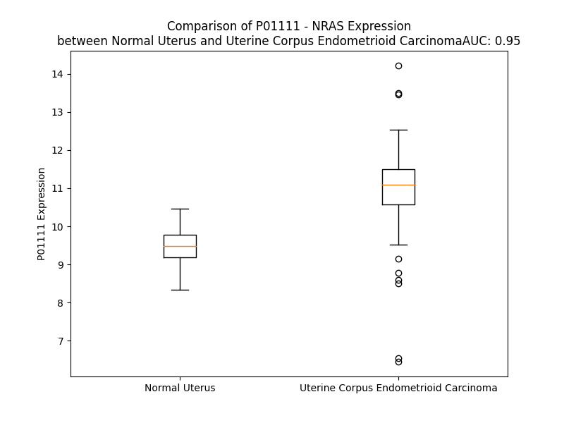

# Detailed Data for P01111

## Introduction to the Detailed Summary

### How to Interpret the Results

- **Summary & Metrics**: This section provides a quick reference to essential protein attributes, including expression changes, family classification, and biomarker applications. Regulation status (upregulated/downregulated) indicates the protein's behavior in a disease context. Some information comes from the original excel file with the proteins selected from literature, while others are derived from the analyses.
- **Expression Comparison**: A visual representation comparing protein expression between normal and disease states. It highlights significant changes in expression levels that might indicate diagnostic or therapeutic relevance. This is data coming from transcriptomics experiments and could not translate similarly to protein levels.
- **Isoform Alignment**: An interactive view of isoform alignments, revealing structural and functional differences between variants of the protein.
- **Interactors & Homologs**: Tables listing known interaction partners and homologous proteins, the more interactors and homologs, the more complex the protein is to design an antibody for.
- **Biological Assemblies**: Information about the structural arrangement of the protein in different assemblies, providing insights into its functional state but also the complexity of the protein to develop antibodies.
- **Combined Per-Residue Information**: A detailed table summarizing residue-level data. This includes predictions for epitope regions, aggregation tendencies, and modifications that might impact the protein's function. Each row corresponds to a residue in the protein, providing insights into specific sites that may be important for research or drug development.
## Summary & Metrics

- **UniProt Accession**: P01111
- **Gene Name**: NRAS
- **Protein Name**: neuroblastoma RAS viral (v-ras) oncogene homolog
- **Swiss Prot**: RASN_HUMAN
- **Family**: enzyme
- **Biomarker Application**: efficacy,prognosis,response to therapy
- **Number of Isoforms**: 0
- **Regulation**: 2
- **(transcriptomics) AUC**: 0.95
- **(transcriptomics) Fold Change**: 1.17
- **(transcriptomics) Regulation**: Upregulated
- **Discotope Epitope Count**: 42
- **Max n_uniprots (Homo)**: 2
- **Max n_uniprots (Hetero)**: 3

## Expression Comparison

## Interactors

| preferredName_A   | preferredName_B   |   score |
|:------------------|:------------------|--------:|
| NRAS              | BRAF              |   0.999 |
| NRAS              | RAF1              |   0.999 |
| NRAS              | PIK3CA            |   0.995 |
| NRAS              | ARAF              |   0.994 |
| NRAS              | NF1               |   0.994 |
| NRAS              | SOS1              |   0.992 |
| NRAS              | EGFR              |   0.991 |
| NRAS              | PIK3CG            |   0.991 |
| NRAS              | RALGDS            |   0.988 |
| NRAS              | SHOC2             |   0.987 |
| NRAS              | ALK               |   0.986 |
| NRAS              | CDKN2A            |   0.984 |
| NRAS              | RASA1             |   0.984 |
| NRAS              | MAP2K1            |   0.983 |
| NRAS              | FGFR3             |   0.981 |
| NRAS              | KIT               |   0.981 |
| NRAS              | FGFR2             |   0.977 |
| NRAS              | AFDN              |   0.975 |
| NRAS              | PLCE1             |   0.974 |
| NRAS              | GNAQ              |   0.974 |
| NRAS              | MAPK3             |   0.97  |
| NRAS              | SRC               |   0.97  |
| NRAS              | MAP2K2            |   0.968 |
| NRAS              | PDGFRA            |   0.967 |
| NRAS              | MET               |   0.966 |
| NRAS              | SOS2              |   0.966 |
| NRAS              | FGFR1             |   0.966 |
| NRAS              | RIN1              |   0.966 |
| NRAS              | IGF1R             |   0.96  |
| NRAS              | RASSF1            |   0.96  |
| NRAS              | CALM3             |   0.959 |
| NRAS              | MAPK1             |   0.959 |
| NRAS              | PDGFRB            |   0.959 |
| NRAS              | CALML5            |   0.958 |
| NRAS              | CALML3            |   0.958 |
| NRAS              | RASA2             |   0.958 |
| NRAS              | RGL2              |   0.957 |
| NRAS              | RASSF5            |   0.957 |
| NRAS              | PIK3R1            |   0.956 |
| NRAS              | RGL1              |   0.956 |
| NRAS              | CALML6            |   0.954 |
| NRAS              | CALML4            |   0.954 |
| NRAS              | RASGRP2           |   0.954 |
| NRAS              | PIK3CD            |   0.954 |
| NRAS              | EML4              |   0.953 |
| NRAS              | RPS6KA1           |   0.952 |
| NRAS              | PTPN11            |   0.952 |
| NRAS              | RASGRP1           |   0.949 |
| NRAS              | MAP3K1            |   0.949 |
| NRAS              | PRKCE             |   0.948 |

## Homologs

| uniprot_id   | gene_id   |
|:-------------|:----------|
| Q96D21       | RASD2     |
| O75628       | REM1      |
| E7ESV4       | RAP1B     |
| F8W1T5       | RHEBL1    |
| P55042       | RRAD      |
| Q96S79       | RASL10B   |
| E9PQC5       | RRAS2     |
| Q7Z444       | ERAS      |
| G5EA41       | RERGL     |
| Q9Y272       | RASD1     |
| A0A087X2C3   | RAP2C     |
| X5D945       | HRAS      |
| C9JYR1       | RALB      |
| E5RJF9       | GEM       |
| O95661       | DIRAS3    |
| A8KAH9       | RAP1A     |
| A0A494C0S1   | RIT1      |
| K7EKE9       | NKIRAS2   |
| Q92737       | RASL10A   |
| F8WBL3       | RHEB      |
| P10114       | RAP2A     |
| P61225       | RAP2B     |
| Q96A58       | RERG      |
| Q96HU8       | DIRAS2    |
| P10301       | RRAS      |
| K7EN06       | DIRAS1    |
| Q8IYK8       | REM2      |
| A0A8I5KUB5   | KRAS      |
| Q6T310       | RASL11A   |
| P11233       | RALA      |
| Q9NYN1       | RASL12    |
| Q9NYS0       | NKIRAS1   |
| Q6FGP0       | MRAS      |
| Q99578       | RIT2      |
| Q9BPW5       | RASL11B   |

## Biological Assemblies

|   Unnamed: 0 |   assembly |   n_uniprots | composition   | crystal_id   |
|-------------:|-----------:|-------------:|:--------------|:-------------|
|            0 |          1 |            1 | Homo          | 6wgh         |
|            1 |          2 |            1 | Homo          | 6wgh         |
|            0 |          1 |            1 | Homo          | 2n9c         |
|            0 |          1 |            3 | Hetero        | 6uon         |
|            1 |          2 |            3 | Hetero        | 6uon         |
|            0 |          1 |            1 | Homo          | 6ziz         |
|            1 |          2 |            1 | Homo          | 6ziz         |
|            0 |          1 |            1 | Homo          | 6e6h         |
|            0 |          1 |            3 | Hetero        | 6ulk         |
|            0 |          1 |            1 | Homo          | 6zir         |
|            0 |          1 |            1 | Homo          | 7f68         |
|            0 |          1 |            3 | Hetero        | 7pb2         |
|            1 |          2 |            3 | Hetero        | 7pb2         |
|            0 |          1 |            2 | Hetero        | 8tbi         |
|            1 |          2 |            2 | Hetero        | 8tbi         |
|            0 |          1 |            3 | Hetero        | 6uli         |
|            0 |          1 |            3 | Hetero        | 6uln         |
|            0 |          1 |            3 | Hetero        | 7ow5         |
|            0 |          1 |            1 | Homo          | 5uhv         |
|            1 |          2 |            1 | Homo          | 5uhv         |
|            0 |          1 |            3 | Hetero        | 7ow3         |
|            1 |          2 |            3 | Hetero        | 7ow3         |
|            2 |          3 |            3 | Hetero        | 7ow3         |
|            3 |          4 |            3 | Hetero        | 7ow3         |
|            0 |          1 |            1 | Homo          | 8vm2         |
|            1 |          2 |            1 | Homo          | 8vm2         |
|            2 |          3 |            1 | Homo          | 8vm2         |
|            0 |          1 |            1 | Homo          | 3con         |
|            0 |          1 |            3 | Hetero        | 7ow6         |
|            0 |          1 |            2 | Homo          | 6zio         |
|            0 |          1 |            2 | Hetero        | 6mpp         |
|            0 |          1 |            3 | Hetero        | 6ulr         |
|            0 |          1 |            3 | Hetero        | 7ow4         |
|            1 |          2 |            3 | Hetero        | 7ow4         |
|            2 |          3 |            3 | Hetero        | 7ow4         |
|            3 |          4 |            3 | Hetero        | 7ow4         |

## Combined Per-Residue Information

|   res | aa   |   epitope_score | epitope   |   relative_surface_accessibility |   modeling_confidence |   Aggregation | modification            | glycosylation                                                             |
|------:|:-----|----------------:|:----------|---------------------------------:|----------------------:|--------------:|:------------------------|:--------------------------------------------------------------------------|
|     1 | M    |         0.16804 | False     |                          0.76902 |                 85.65 |         0     | N/A                     | N/A                                                                       |
|     2 | T    |         0.18503 | False     |                          0.43668 |                 95.72 |         2.993 | N/A                     | N/A                                                                       |
|     3 | E    |         0.17751 | False     |                          0.31558 |                 97.94 |         4.984 | N/A                     | N/A                                                                       |
|     4 | Y    |         0.06804 | False     |                          0.03056 |                 98.49 |         4.984 | N/A                     | N/A                                                                       |
|     5 | K    |         0.15603 | False     |                          0.44893 |                 98.43 |         4.984 | N/A                     | N/A                                                                       |
|     6 | L    |         0.00848 | False     |                          0.00448 |                 98.65 |        29.993 | N/A                     | N/A                                                                       |
|     7 | V    |         0.01232 | False     |                          0.01428 |                 98.38 |        32.105 | N/A                     | N/A                                                                       |
|     8 | V    |         0.00209 | False     |                          0       |                 98.28 |        32.105 | N/A                     | N/A                                                                       |
|     9 | V    |         0.00277 | False     |                          0       |                 97.51 |        31.765 | N/A                     | N/A                                                                       |
|    10 | G    |         0.00684 | False     |                          0.00277 |                 97.52 |        27.782 | N/A                     | N/A                                                                       |
|    11 | A    |         0.15642 | False     |                          0.14631 |                 96.2  |        14.64  | N/A                     | N/A                                                                       |
|    12 | G    |         0.13757 | False     |                          0.35379 |                 94.5  |         1.606 | N/A                     | N/A                                                                       |
|    13 | G    |         0.15058 | False     |                          0.37102 |                 94.36 |         0.461 | N/A                     | N/A                                                                       |
|    14 | V    |         0.01513 | False     |                          0.00817 |                 97.08 |         0.374 | N/A                     | N/A                                                                       |
|    15 | G    |         0.11145 | False     |                          0.18651 |                 97.1  |         0     | N/A                     | N/A                                                                       |
|    16 | K    |         0.10959 | False     |                          0.05777 |                 97.71 |         0     | N/A                     | N/A                                                                       |
|    17 | S    |         0.18772 | False     |                          0.21498 |                 96.79 |         0.177 | N/A                     | N/A                                                                       |
|    18 | A    |         0.16388 | False     |                          0.2154  |                 97.09 |         1.736 | N/A                     | N/A                                                                       |
|    19 | L    |         0.01065 | False     |                          0.00742 |                 98.02 |         6.997 | N/A                     | N/A                                                                       |
|    20 | T    |         0.00595 | False     |                          0       |                 97.25 |         7.85  | N/A                     | N/A                                                                       |
|    21 | I    |         0.24449 | False     |                          0.22639 |                 95.63 |         7.85  | N/A                     | N/A                                                                       |
|    22 | Q    |         0.06775 | False     |                          0.02654 |                 97.29 |         7.85  | N/A                     | N/A                                                                       |
|    23 | L    |         0.04879 | False     |                          0.01441 |                 97.15 |         7.85  | N/A                     | N/A                                                                       |
|    24 | I    |         0.24049 | False     |                          0.22918 |                 95.36 |         7.294 | N/A                     | N/A                                                                       |
|    25 | Q    |         0.46883 | True      |                          0.53718 |                 93.05 |         0.182 | N/A                     | N/A                                                                       |
|    26 | N    |         0.21084 | False     |                          0.55351 |                 93.35 |         0     | N/A                     | N/A                                                                       |
|    27 | H    |         0.39041 | True      |                          0.52806 |                 91.42 |         0     | N/A                     | N/A                                                                       |
|    28 | F    |         0.38058 | True      |                          0.31518 |                 89.67 |         0     | N/A                     | N/A                                                                       |
|    29 | V    |         0.34168 | False     |                          0.53821 |                 84.38 |         0     | N/A                     | N/A                                                                       |
|    30 | D    |         0.49804 | True      |                          0.76087 |                 81.89 |         0     | N/A                     | N/A                                                                       |
|    31 | E    |         0.42879 | True      |                          0.78652 |                 84.89 |         0     | N/A                     | N/A                                                                       |
|    32 | Y    |         0.53021 | True      |                          0.62099 |                 78.13 |         0     | N/A                     | N/A                                                                       |
|    33 | D    |         0.38415 | True      |                          0.73918 |                 83.53 |         0     | N/A                     | N/A                                                                       |
|    34 | P    |         0.31188 | False     |                          0.55495 |                 85.79 |         0     | N/A                     | N/A                                                                       |
|    35 | T    |         0.18951 | False     |                          0.1353  |                 83.03 |         0     | N/A                     | (Microbial infection) O-linked (Glc) threonine; by P.sordellii toxin TcsL |
|    36 | I    |         0.38883 | True      |                          0.58057 |                 82.34 |         0     | N/A                     | N/A                                                                       |
|    37 | E    |         0.28502 | False     |                          0.44534 |                 86.08 |         0     | N/A                     | N/A                                                                       |
|    38 | D    |         0.34922 | True      |                          0.38424 |                 93.09 |         0     | N/A                     | N/A                                                                       |
|    39 | S    |         0.25935 | False     |                          0.60729 |                 94.22 |         0     | N/A                     | N/A                                                                       |
|    40 | Y    |         0.30445 | False     |                          0.20576 |                 96.31 |         0     | N/A                     | N/A                                                                       |
|    41 | R    |         0.42475 | True      |                          0.58122 |                 96.87 |         0     | N/A                     | N/A                                                                       |
|    42 | K    |         0.37042 | True      |                          0.22564 |                 96.41 |         0     | N/A                     | N/A                                                                       |
|    43 | Q    |         0.37066 | True      |                          0.57547 |                 97.82 |         0     | N/A                     | N/A                                                                       |
|    44 | V    |         0.11431 | False     |                          0.07521 |                 97.46 |         0     | N/A                     | N/A                                                                       |
|    45 | V    |         0.31851 | False     |                          0.66372 |                 97.77 |         0     | N/A                     | N/A                                                                       |
|    46 | I    |         0.03116 | False     |                          0.008   |                 97.8  |         0     | N/A                     | N/A                                                                       |
|    47 | D    |         0.26255 | False     |                          0.56517 |                 97.32 |         0     | N/A                     | N/A                                                                       |
|    48 | G    |         0.29622 | False     |                          0.84445 |                 96.97 |         0     | N/A                     | N/A                                                                       |
|    49 | E    |         0.26459 | False     |                          0.5123  |                 96.88 |         0     | N/A                     | N/A                                                                       |
|    50 | T    |         0.26698 | False     |                          0.425   |                 97.75 |         0     | N/A                     | N/A                                                                       |
|    51 | C    |         0.02562 | False     |                          0.00701 |                 97.95 |         0     | N/A                     | N/A                                                                       |
|    52 | L    |         0.19553 | False     |                          0.1896  |                 98.34 |         0     | N/A                     | N/A                                                                       |
|    53 | L    |         0.00427 | False     |                          0       |                 98.41 |         0     | N/A                     | N/A                                                                       |
|    54 | D    |         0.12279 | False     |                          0.12029 |                 98.13 |         0     | N/A                     | N/A                                                                       |
|    55 | I    |         0.00603 | False     |                          0       |                 98.29 |         0     | N/A                     | N/A                                                                       |
|    56 | L    |         0.10423 | False     |                          0.19432 |                 97.52 |         0     | N/A                     | N/A                                                                       |
|    57 | D    |         0.00561 | False     |                          0.00252 |                 95.52 |         0     | N/A                     | N/A                                                                       |
|    58 | T    |         0.04184 | False     |                          0.0166  |                 94.7  |         0     | N/A                     | N/A                                                                       |
|    59 | A    |         0.09984 | False     |                          0.07172 |                 91.6  |         0     | N/A                     | N/A                                                                       |
|    60 | G    |         0.17128 | False     |                          0.10344 |                 85.09 |         0     | N/A                     | N/A                                                                       |
|    61 | Q    |         0.3116  | False     |                          0.20731 |                 83.89 |         0     | N/A                     | N/A                                                                       |
|    62 | E    |         0.41534 | True      |                          0.55767 |                 82.03 |         0     | N/A                     | N/A                                                                       |
|    63 | E    |         0.39517 | True      |                          0.75186 |                 84.62 |         0     | N/A                     | N/A                                                                       |
|    64 | Y    |         0.38079 | True      |                          0.31511 |                 83.57 |         0     | N/A                     | N/A                                                                       |
|    65 | S    |         0.259   | False     |                          0.32108 |                 83.23 |         0     | N/A                     | N/A                                                                       |
|    66 | A    |         0.32003 | False     |                          0.9212  |                 85.1  |         0     | N/A                     | N/A                                                                       |
|    67 | M    |         0.36485 | True      |                          0.53192 |                 85.95 |         0     | N/A                     | N/A                                                                       |
|    68 | R    |         0.13111 | False     |                          0.03714 |                 90.6  |         0     | N/A                     | N/A                                                                       |
|    69 | D    |         0.30939 | False     |                          0.31439 |                 93.35 |         0     | N/A                     | N/A                                                                       |
|    70 | Q    |         0.31573 | False     |                          0.6492  |                 93.24 |         0     | N/A                     | N/A                                                                       |
|    71 | Y    |         0.08241 | False     |                          0.04396 |                 93.29 |         0     | N/A                     | N/A                                                                       |
|    72 | M    |         0.00655 | False     |                          0       |                 95.57 |         0     | N/A                     | N/A                                                                       |
|    73 | R    |         0.40159 | True      |                          0.65849 |                 96.23 |         0     | N/A                     | N/A                                                                       |
|    74 | T    |         0.21187 | False     |                          0.55186 |                 94.28 |         0     | N/A                     | N/A                                                                       |
|    75 | G    |         0.0241  | False     |                          0.00805 |                 97.52 |         0     | N/A                     | N/A                                                                       |
|    76 | E    |         0.18373 | False     |                          0.29025 |                 98.08 |         0     | N/A                     | N/A                                                                       |
|    77 | G    |         0.00385 | False     |                          0       |                 98.65 |         5.926 | N/A                     | N/A                                                                       |
|    78 | F    |         0.00427 | False     |                          0       |                 98.77 |        71.365 | N/A                     | N/A                                                                       |
|    79 | L    |         0.00624 | False     |                          0.00412 |                 98.73 |        84.541 | N/A                     | N/A                                                                       |
|    80 | C    |         0.00626 | False     |                          0.00374 |                 98.63 |        86.758 | N/A                     | N/A                                                                       |
|    81 | V    |         0.00309 | False     |                          0       |                 98.8  |        87.152 | N/A                     | N/A                                                                       |
|    82 | F    |         0.01587 | False     |                          0.00382 |                 98.73 |        87.111 | N/A                     | N/A                                                                       |
|    83 | A    |         0.03583 | False     |                          0.01786 |                 98.45 |        80.944 | N/A                     | N/A                                                                       |
|    84 | I    |         0.01685 | False     |                          0.0056  |                 98.29 |        74.662 | N/A                     | N/A                                                                       |
|    85 | N    |         0.45881 | True      |                          0.30443 |                 97.96 |         3.866 | N/A                     | N/A                                                                       |
|    86 | N    |         0.46382 | True      |                          0.36686 |                 97.73 |         0.716 | N/A                     | N/A                                                                       |
|    87 | S    |         0.38944 | True      |                          0.4394  |                 97.82 |         0.073 | N/A                     | N/A                                                                       |
|    88 | K    |         0.54534 | True      |                          0.69823 |                 97.51 |         0     | N/A                     | N/A                                                                       |
|    89 | S    |         0.02702 | False     |                          0.00786 |                 97.96 |         0     | Phosphoserine; by STK19 | N/A                                                                       |
|    90 | F    |         0.22613 | False     |                          0.09004 |                 98.49 |         0     | N/A                     | N/A                                                                       |
|    91 | A    |         0.42064 | True      |                          0.66902 |                 97.69 |         0     | N/A                     | N/A                                                                       |
|    92 | D    |         0.23555 | False     |                          0.18889 |                 97.12 |         0     | N/A                     | N/A                                                                       |
|    93 | I    |         0.03171 | False     |                          0.0096  |                 98.14 |         0     | N/A                     | N/A                                                                       |
|    94 | N    |         0.46455 | True      |                          0.46801 |                 97.36 |         0     | N/A                     | N/A                                                                       |
|    95 | L    |         0.4898  | True      |                          0.611   |                 95.94 |         0     | N/A                     | N/A                                                                       |
|    96 | Y    |         0.06915 | False     |                          0.03002 |                 96.62 |         0     | N/A                     | N/A                                                                       |
|    97 | R    |         0.21978 | False     |                          0.10371 |                 97.31 |         0     | N/A                     | N/A                                                                       |
|    98 | E    |         0.50174 | True      |                          0.41384 |                 96.83 |         0     | N/A                     | N/A                                                                       |
|    99 | Q    |         0.2553  | False     |                          0.1289  |                 96.12 |         0     | N/A                     | N/A                                                                       |
|   100 | I    |         0.00814 | False     |                          0       |                 97.72 |         0     | N/A                     | N/A                                                                       |
|   101 | K    |         0.20726 | False     |                          0.19374 |                 97.61 |         0     | N/A                     | N/A                                                                       |
|   102 | R    |         0.45513 | True      |                          0.65426 |                 97.16 |         0     | N/A                     | N/A                                                                       |
|   103 | V    |         0.13977 | False     |                          0.14836 |                 96.88 |         0     | N/A                     | N/A                                                                       |
|   104 | K    |         0.17712 | False     |                          0.28291 |                 96.79 |         0     | N/A                     | N/A                                                                       |
|   105 | D    |         0.45774 | True      |                          0.85059 |                 96.51 |         0     | N/A                     | N/A                                                                       |
|   106 | S    |         0.23616 | False     |                          0.25223 |                 95.35 |         0     | N/A                     | N/A                                                                       |
|   107 | D    |         0.2585  | False     |                          0.71283 |                 94.13 |         0     | N/A                     | N/A                                                                       |
|   108 | D    |         0.27059 | False     |                          0.44333 |                 94.52 |         0     | N/A                     | N/A                                                                       |
|   109 | V    |         0.07264 | False     |                          0.08019 |                 97.95 |         0     | N/A                     | N/A                                                                       |
|   110 | P    |         0.05476 | False     |                          0.06561 |                 98.6  |         0.382 | N/A                     | N/A                                                                       |
|   111 | M    |         0.02014 | False     |                          0.01123 |                 98.79 |         2.128 | N/A                     | N/A                                                                       |
|   112 | V    |         0.00173 | False     |                          0       |                 98.87 |         2.128 | N/A                     | N/A                                                                       |
|   113 | L    |         0.00322 | False     |                          0       |                 98.87 |         2.128 | N/A                     | N/A                                                                       |
|   114 | V    |         0.00348 | False     |                          0       |                 98.89 |         2.128 | N/A                     | N/A                                                                       |
|   115 | G    |         0.00733 | False     |                          0       |                 98.8  |         1.899 | N/A                     | N/A                                                                       |
|   116 | N    |         0.03387 | False     |                          0.01163 |                 98.72 |         0     | N/A                     | N/A                                                                       |
|   117 | K    |         0.14721 | False     |                          0.28158 |                 97.87 |         0     | N/A                     | N/A                                                                       |
|   118 | C    |         0.28759 | False     |                          0.21851 |                 97.97 |         0     | N/A                     | N/A                                                                       |
|   119 | D    |         0.50283 | True      |                          0.32537 |                 97.25 |         0     | N/A                     | N/A                                                                       |
|   120 | L    |         0.47823 | True      |                          0.36823 |                 95.43 |         0     | N/A                     | N/A                                                                       |
|   121 | P    |         0.34794 | True      |                          0.93544 |                 93.6  |         0     | N/A                     | N/A                                                                       |
|   122 | T    |         0.48631 | True      |                          0.61981 |                 93.14 |         0     | N/A                     | N/A                                                                       |
|   123 | R    |         0.41496 | True      |                          0.36156 |                 96.94 |         0     | N/A                     | N/A                                                                       |
|   124 | T    |         0.39466 | True      |                          0.55381 |                 97.41 |         0     | N/A                     | N/A                                                                       |
|   125 | V    |         0.0369  | False     |                          0.01047 |                 97.47 |         0     | N/A                     | N/A                                                                       |
|   126 | D    |         0.35536 | True      |                          0.50298 |                 96.29 |         0     | N/A                     | N/A                                                                       |
|   127 | T    |         0.26452 | False     |                          0.42523 |                 96.38 |         0     | N/A                     | N/A                                                                       |
|   128 | K    |         0.38395 | True      |                          0.70579 |                 97.52 |         0     | N/A                     | N/A                                                                       |
|   129 | Q    |         0.43525 | True      |                          0.4741  |                 97.45 |         0     | N/A                     | N/A                                                                       |
|   130 | A    |         0.01387 | False     |                          0.0051  |                 98.18 |         0     | N/A                     | N/A                                                                       |
|   131 | H    |         0.26051 | False     |                          0.58344 |                 98.16 |         0     | N/A                     | N/A                                                                       |
|   132 | E    |         0.44242 | True      |                          0.49185 |                 98.46 |         0     | N/A                     | N/A                                                                       |
|   133 | L    |         0.28839 | False     |                          0.26451 |                 98.21 |         0     | N/A                     | N/A                                                                       |
|   134 | A    |         0.04042 | False     |                          0.01913 |                 98.58 |         0     | N/A                     | N/A                                                                       |
|   135 | K    |         0.3528  | True      |                          0.78319 |                 98.21 |         0     | N/A                     | N/A                                                                       |
|   136 | S    |         0.41711 | True      |                          0.67573 |                 97.7  |         0     | N/A                     | N/A                                                                       |
|   137 | Y    |         0.34004 | False     |                          0.14928 |                 97.69 |         0     | N/A                     | N/A                                                                       |
|   138 | G    |         0.23811 | False     |                          0.78086 |                 97.67 |         0     | N/A                     | N/A                                                                       |
|   139 | I    |         0.16092 | False     |                          0.12814 |                 98.55 |         0     | N/A                     | N/A                                                                       |
|   140 | P    |         0.13858 | False     |                          0.28402 |                 98.69 |         0     | N/A                     | N/A                                                                       |
|   141 | F    |         0.1939  | False     |                          0.17953 |                 98.73 |         0     | N/A                     | N/A                                                                       |
|   142 | I    |         0.17575 | False     |                          0.16799 |                 98.74 |         0     | N/A                     | N/A                                                                       |
|   143 | E    |         0.14407 | False     |                          0.20645 |                 98.62 |         0     | N/A                     | N/A                                                                       |
|   144 | T    |         0.00345 | False     |                          0       |                 98.74 |         0     | N/A                     | N/A                                                                       |
|   145 | S    |         0.0149  | False     |                          0       |                 98.35 |         0     | N/A                     | N/A                                                                       |
|   146 | A    |         0.05971 | False     |                          0.033   |                 97.94 |         0     | N/A                     | N/A                                                                       |
|   147 | K    |         0.37033 | True      |                          0.59539 |                 97.17 |         0     | N/A                     | N/A                                                                       |
|   148 | T    |         0.34    | False     |                          0.54941 |                 97.08 |         0     | N/A                     | N/A                                                                       |
|   149 | R    |         0.2173  | False     |                          0.51113 |                 97.26 |         0     | N/A                     | N/A                                                                       |
|   150 | Q    |         0.31212 | False     |                          0.54178 |                 98.36 |         0     | N/A                     | N/A                                                                       |
|   151 | G    |         0.10479 | False     |                          0.16415 |                 98.26 |         0     | N/A                     | N/A                                                                       |
|   152 | V    |         0.02215 | False     |                          0.02367 |                 98.47 |         0     | N/A                     | N/A                                                                       |
|   153 | E    |         0.25939 | False     |                          0.40569 |                 98.08 |         0     | N/A                     | N/A                                                                       |
|   154 | D    |         0.15165 | False     |                          0.51312 |                 98.49 |         0     | N/A                     | N/A                                                                       |
|   155 | A    |         0.00945 | False     |                          0.00765 |                 98.81 |        16.102 | N/A                     | N/A                                                                       |
|   156 | F    |         0.00468 | False     |                          0.00191 |                 98.66 |        58.606 | N/A                     | N/A                                                                       |
|   157 | Y    |         0.13122 | False     |                          0.15965 |                 98.58 |        58.606 | N/A                     | N/A                                                                       |
|   158 | T    |         0.07886 | False     |                          0.16226 |                 98.82 |        58.606 | N/A                     | N/A                                                                       |
|   159 | L    |         0.00184 | False     |                          0       |                 98.84 |        58.606 | N/A                     | N/A                                                                       |
|   160 | V    |         0.00427 | False     |                          0       |                 98.73 |        55.629 | N/A                     | N/A                                                                       |
|   161 | R    |         0.30722 | False     |                          0.34564 |                 98.65 |         1.403 | N/A                     | N/A                                                                       |
|   162 | E    |         0.11036 | False     |                          0.18998 |                 98.63 |         1.403 | N/A                     | N/A                                                                       |
|   163 | I    |         0.03629 | False     |                          0.0104  |                 98.55 |         1.312 | N/A                     | N/A                                                                       |
|   164 | R    |         0.26653 | False     |                          0.15362 |                 97.87 |         0     | N/A                     | N/A                                                                       |
|   165 | Q    |         0.18244 | False     |                          0.45226 |                 97.2  |         0     | N/A                     | N/A                                                                       |
|   166 | Y    |         0.20965 | False     |                          0.17356 |                 97.09 |         0     | N/A                     | N/A                                                                       |
|   167 | R    |         0.26792 | False     |                          0.31305 |                 95.44 |         0     | N/A                     | N/A                                                                       |
|   168 | M    |         0.2469  | False     |                          0.64788 |                 94.01 |         0     | N/A                     | N/A                                                                       |
|   169 | K    |         0.22846 | False     |                          0.57723 |                 92.68 |         0     | N/A                     | N/A                                                                       |
|   170 | K    |         0.24118 | False     |                          0.56893 |                 89.34 |         0     | N/A                     | N/A                                                                       |
|   171 | L    |         0.19343 | False     |                          0.72672 |                 88.23 |         0     | N/A                     | N/A                                                                       |
|   172 | N    |         0.22752 | False     |                          0.71443 |                 86.67 |         0     | N/A                     | N/A                                                                       |
|   173 | S    |         0.24288 | False     |                          0.68454 |                 81.35 |         0     | N/A                     | N/A                                                                       |
|   174 | S    |         0.24731 | False     |                          0.64121 |                 67.99 |         0     | N/A                     | N/A                                                                       |
|   175 | D    |         0.32988 | False     |                          0.7315  |                 61.21 |         0     | N/A                     | N/A                                                                       |
|   176 | D    |         0.3256  | False     |                          0.83998 |                 57.87 |         0     | N/A                     | N/A                                                                       |
|   177 | G    |         0.38349 | True      |                          0.84549 |                 53.35 |         0     | N/A                     | N/A                                                                       |
|   178 | T    |         0.37643 | True      |                          0.82558 |                 52.03 |         0     | N/A                     | N/A                                                                       |
|   179 | Q    |         0.30797 | False     |                          0.93326 |                 45.9  |         0     | N/A                     | N/A                                                                       |
|   180 | G    |         0.3207  | False     |                          0.85202 |                 41.83 |         0     | N/A                     | N/A                                                                       |
|   181 | C    |         0.25882 | False     |                          0.98949 |                 46.24 |         0     | N/A                     | N/A                                                                       |
|   182 | M    |         0.30358 | False     |                          1.09905 |                 47.16 |         0     | N/A                     | N/A                                                                       |
|   183 | G    |         0.32687 | False     |                          0.73763 |                 49.95 |         0     | N/A                     | N/A                                                                       |
|   184 | L    |         0.25893 | False     |                          1.04404 |                 54.64 |         0     | N/A                     | N/A                                                                       |
|   185 | P    |         0.23122 | False     |                          0.84543 |                 52.28 |         0     | N/A                     | N/A                                                                       |
|   186 | C    |         0.17555 | False     |                          0.94371 |                 57.62 |         0     | N/A                     | N/A                                                                       |
|   187 | V    |         0.24841 | False     |                          0.9271  |                 61.67 |         0     | N/A                     | N/A                                                                       |
|   188 | V    |         0.22172 | False     |                          0.97029 |                 45.56 |         0     | N/A                     | N/A                                                                       |
|   189 | M    |         0.25015 | False     |                          1.32446 |                 49.76 |         0     | N/A                     | N/A                                                                       |

