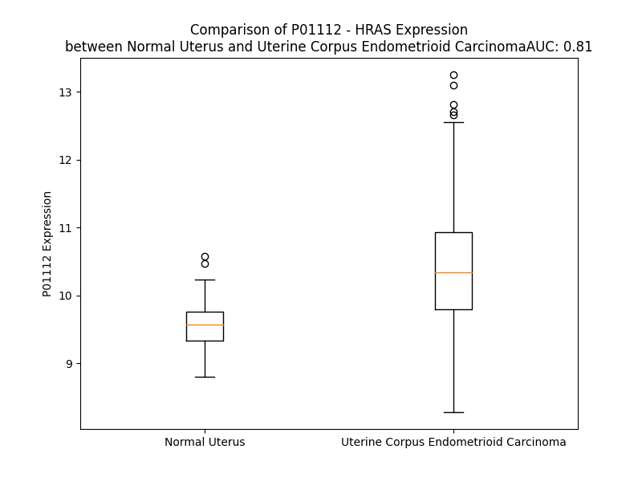

# Detailed Data for P01112

## Introduction to the Detailed Summary

### How to Interpret the Results

- **Summary & Metrics**: This section provides a quick reference to essential protein attributes, including expression changes, family classification, and biomarker applications. Regulation status (upregulated/downregulated) indicates the protein's behavior in a disease context. Some information comes from the original excel file with the proteins selected from literature, while others are derived from the analyses.
- **Expression Comparison**: A visual representation comparing protein expression between normal and disease states. It highlights significant changes in expression levels that might indicate diagnostic or therapeutic relevance. This is data coming from transcriptomics experiments and could not translate similarly to protein levels.
- **Isoform Alignment**: An interactive view of isoform alignments, revealing structural and functional differences between variants of the protein.
- **Interactors & Homologs**: Tables listing known interaction partners and homologous proteins, the more interactors and homologs, the more complex the protein is to design an antibody for.
- **Biological Assemblies**: Information about the structural arrangement of the protein in different assemblies, providing insights into its functional state but also the complexity of the protein to develop antibodies.
- **Combined Per-Residue Information**: A detailed table summarizing residue-level data. This includes predictions for epitope regions, aggregation tendencies, and modifications that might impact the protein's function. Each row corresponds to a residue in the protein, providing insights into specific sites that may be important for research or drug development.
## Summary & Metrics

- **UniProt Accession**: P01112
- **Gene Name**: HRAS
- **Protein Name**: GTPase HRas
- **Swiss Prot**: RASH_HUMAN
- **Family**: nan
- **Biomarker Application**: nan
- **Number of Isoforms**: 2
- **Regulation**: 2
- **(transcriptomics) AUC**: 0.81
- **(transcriptomics) Fold Change**: 1.09
- **(transcriptomics) Regulation**: Upregulated
- **Discotope Epitope Count**: 41
- **Max n_uniprots (Homo)**: 4
- **Max n_uniprots (Hetero)**: 3

## Expression Comparison

## Isoform Alignment

<pre style='font-size:14px; font-family:monospace;'>P01112-1 MTEYKLVVVGAGGVGKSALTIQLIQNHFVDEYDPTIEDSYRKQVVIDGETCLLDILDTAGQEEYSAMRDQYMRTGEGFLCVFAINNTKSFEDIHQYREQIKRVKDSDDVPMVLVGNKCDLAARTVESRQAQDLARSYGIPYIETSAKTRQGVEDAFYTLVREIRQHKLRKLNPPDESGPGCMSCKCVLS
P01112-2 MTEYKLVVVGAGGVGKSALTIQLIQNHFVDEYDPTIEDSYRKQVVIDGETCLLDILDTAGQEEYSAMRDQYMRTGEGFLCVFAINNTKSFEDIHQYREQIKRVKDSDDVPMVLVGNKCDLAARTVESRQAQDLARSYGIPYIETSAKTRQGSRSGSSSSSGTLWD-------P-----PGPM-------
</pre>

## Interactors

| preferredName_A   | preferredName_B   |   score |
|:------------------|:------------------|--------:|
| HRAS              | RALGDS            |   0.999 |
| HRAS              | SOS1              |   0.999 |
| HRAS              | RAF1              |   0.999 |
| HRAS              | RASSF5            |   0.999 |
| HRAS              | BRAF              |   0.999 |
| HRAS              | RASA1             |   0.999 |
| HRAS              | AFDN              |   0.998 |
| HRAS              | PIK3CG            |   0.998 |
| HRAS              | PIK3CA            |   0.995 |
| HRAS              | RASGRF1           |   0.995 |
| HRAS              | ARAF              |   0.995 |
| HRAS              | RASGRP4           |   0.995 |
| HRAS              | SRC               |   0.994 |
| HRAS              | NF1               |   0.994 |
| HRAS              | EGFR              |   0.994 |
| HRAS              | RIN1              |   0.993 |
| HRAS              | RASSF1            |   0.992 |
| HRAS              | KRAS              |   0.992 |
| HRAS              | SHOC2             |   0.99  |
| HRAS              | CDKN2A            |   0.99  |
| HRAS              | PIK3R1            |   0.99  |
| HRAS              | MAP2K1            |   0.989 |
| HRAS              | TRAF3             |   0.986 |
| HRAS              | MAPK8             |   0.985 |
| HRAS              | MAPK3             |   0.983 |
| HRAS              | FGFR3             |   0.982 |
| HRAS              | SOS2              |   0.981 |
| HRAS              | RGL1              |   0.98  |
| HRAS              | RGL2              |   0.98  |
| HRAS              | MAPK1             |   0.979 |
| HRAS              | CAV1              |   0.974 |
| HRAS              | PLCE1             |   0.973 |
| HRAS              | PIK3CD            |   0.971 |
| HRAS              | MAP2K2            |   0.968 |
| HRAS              | GNAQ              |   0.967 |
| HRAS              | ALK               |   0.966 |
| HRAS              | CALM3             |   0.965 |
| HRAS              | RASGRP3           |   0.964 |
| HRAS              | PIK3CB            |   0.963 |
| HRAS              | CALML5            |   0.963 |
| HRAS              | CALML3            |   0.963 |
| HRAS              | PDGFRB            |   0.962 |
| HRAS              | FGFR1             |   0.962 |
| HRAS              | KIT               |   0.962 |
| HRAS              | MET               |   0.961 |
| HRAS              | FGFR2             |   0.961 |
| HRAS              | CALML4            |   0.96  |
| HRAS              | PDGFRA            |   0.96  |
| HRAS              | CALML6            |   0.96  |
| HRAS              | RAPGEF2           |   0.958 |

## Homologs

| uniprot_id   | gene_id   |
|:-------------|:----------|
| X5D945       | HRAS      |
| Q96D21       | RASD2     |
| O75628       | REM1      |
| E7ESV4       | RAP1B     |
| F8W1T5       | RHEBL1    |
| P55042       | RRAD      |
| Q96S79       | RASL10B   |
| E9PQC5       | RRAS2     |
| Q7Z444       | ERAS      |
| G5EA41       | RERGL     |
| Q9Y272       | RASD1     |
| A0A087X2C3   | RAP2C     |
| C9JYR1       | RALB      |
| E5RJF9       | GEM       |
| O95661       | DIRAS3    |
| A8KAH9       | RAP1A     |
| A0A494C0S1   | RIT1      |
| K7EKE9       | NKIRAS2   |
| Q92737       | RASL10A   |
| F8WBL3       | RHEB      |
| P10114       | RAP2A     |
| P61225       | RAP2B     |
| Q96A58       | RERG      |
| Q96HU8       | DIRAS2    |
| Q5U091       | NRAS      |
| P10301       | RRAS      |
| K7EN06       | DIRAS1    |
| Q8IYK8       | REM2      |
| A0A8I5KUB5   | KRAS      |
| Q6T310       | RASL11A   |
| P11233       | RALA      |
| Q9NYN1       | RASL12    |
| Q9NYS0       | NKIRAS1   |
| Q6FGP0       | MRAS      |
| Q99578       | RIT2      |
| Q9BPW5       | RASL11B   |

## Biological Assemblies

|   Unnamed: 0 |   assembly |   n_uniprots | composition   | crystal_id   |
|-------------:|-----------:|-------------:|:--------------|:-------------|
|            0 |          1 |            1 | Homo          | 2lcf         |
|            0 |          1 |            1 | Homo          | 8els         |
|            0 |          1 |            1 | Homo          | 2clc         |
|            0 |          1 |            1 | Homo          | 8elz         |
|            0 |          1 |            1 | Homo          | 3k9l         |
|            1 |          2 |            1 | Homo          | 3k9l         |
|            2 |          3 |            1 | Homo          | 3k9l         |
|            0 |          1 |            1 | Homo          | 1crq         |
|            0 |          1 |            1 | Homo          | 1lf5         |
|            0 |          1 |            1 | Homo          | 5wdp         |
|            0 |          1 |            1 | Homo          | 4dlt         |
|            1 |          2 |            1 | Homo          | 4dlt         |
|            0 |          1 |            1 | Homo          | 2rgd         |
|            0 |          1 |            1 | Homo          | 1plj         |
|            0 |          1 |            2 | Hetero        | 8bos         |
|            0 |          1 |            1 | Homo          | 7dpj         |
|            0 |          1 |            2 | Hetero        | 4ury         |
|            0 |          1 |            2 | Hetero        | 3ddc         |
|            1 |          2 |            2 | Hetero        | 3ddc         |
|            0 |          1 |            1 | Homo          | 4dlz         |
|            1 |          2 |            1 | Homo          | 4dlz         |
|            0 |          1 |            3 | Hetero        | 6cup         |
|            0 |          1 |            3 | Hetero        | 6d5e         |
|            0 |          1 |            1 | Homo          | 8elk         |
|            0 |          1 |            1 | Homo          | 2cl6         |
|            0 |          1 |            1 | Homo          | 3k8y         |
|            0 |          1 |            1 | Homo          | 4l9w         |
|            1 |          2 |            1 | Homo          | 4l9w         |
|            0 |          1 |            1 | Homo          | 8ely         |
|            0 |          1 |            1 | Homo          | 5vbe         |
|            0 |          1 |            3 | Hetero        | 5wfr         |
|            0 |          1 |            3 | Hetero        | 6bvl         |
|            0 |          1 |            2 | Hetero        | 4g3x         |
|            0 |          1 |            1 | Homo          | 2cld         |
|            0 |          1 |            2 | Hetero        | 7vv8         |
|            0 |          1 |            2 | Hetero        | 6ntd         |
|            0 |          1 |            1 | Homo          | 7jig         |
|            0 |          1 |            2 | Hetero        | 1he8         |
|            0 |          1 |            1 | Homo          | 221p         |
|            0 |          1 |            1 | Homo          | 7jih         |
|            1 |          2 |            1 | Homo          | 7jih         |
|            0 |          1 |            1 | Homo          | 3rrz         |
|            0 |          1 |            3 | Hetero        | 6v9m         |
|            0 |          1 |            2 | Hetero        | 8tbg         |
|            1 |          2 |            2 | Hetero        | 8tbg         |
|            0 |          1 |            1 | Homo          | 521p         |
|            0 |          1 |            1 | Homo          | 721p         |
|            0 |          1 |            1 | Homo          | 421p         |
|            0 |          1 |            3 | Hetero        | 1nvv         |
|            1 |          2 |            3 | Hetero        | 1nvv         |
|            2 |          3 |            3 | Hetero        | 1nvv         |
|            3 |          4 |            3 | Hetero        | 1nvv         |
|            0 |          1 |            1 | Homo          | 3rs7         |
|            0 |          1 |            1 | Homo          | 7l0f         |
|            1 |          2 |            1 | Homo          | 7l0f         |
|            2 |          3 |            1 | Homo          | 7l0f         |
|            3 |          4 |            1 | Homo          | 7l0f         |
|            0 |          1 |            1 | Homo          | 8fg3         |
|            0 |          1 |            1 | Homo          | 3rs0         |
|            0 |          1 |            1 | Homo          | 1p2s         |
|            0 |          1 |            2 | Hetero        | 4uru         |
|            0 |          1 |            1 | Homo          | 3l8z         |
|            0 |          1 |            2 | Hetero        | 7vv9         |
|            0 |          1 |            3 | Hetero        | 6cur         |
|            0 |          1 |            2 | Hetero        | 8bea         |
|            0 |          1 |            2 | Hetero        | 3kud         |
|            0 |          1 |            1 | Homo          | 3lo5         |
|            1 |          2 |            1 | Homo          | 3lo5         |
|            2 |          3 |            1 | Homo          | 3lo5         |
|            0 |          1 |            3 | Hetero        | 6bvm         |
|            0 |          1 |            3 | Hetero        | 6bvj         |
|            0 |          1 |            2 | Hetero        | 4us0         |
|            0 |          1 |            1 | Homo          | 5b2z         |
|            0 |          1 |            3 | Hetero        | 6d5l         |
|            0 |          1 |            1 | Homo          | 1ctq         |
|            0 |          1 |            1 | Homo          | 1q21         |
|            0 |          1 |            3 | Hetero        | 5wfp         |
|            0 |          1 |            3 | Hetero        | 1nvx         |
|            0 |          1 |            1 | Homo          | 3i3s         |
|            1 |          2 |            1 | Homo          | 3i3s         |
|            2 |          3 |            1 | Homo          | 3i3s         |
|            3 |          4 |            1 | Homo          | 3i3s         |
|            0 |          1 |            2 | Hetero        | 4urz         |
|            0 |          1 |            1 | Homo          | 8fg4         |
|            0 |          1 |            1 | Homo          | 1p2v         |
|            0 |          1 |            1 | Homo          | 7dph         |
|            0 |          1 |            1 | Homo          | 3lbn         |
|            1 |          2 |            1 | Homo          | 3lbn         |
|            0 |          1 |            1 | Homo          | 7ogf         |
|            0 |          1 |            1 | Homo          | 2x1v         |
|            0 |          1 |            1 | Homo          | 8osn         |
|            0 |          1 |            1 | Homo          | 1aa9         |
|            0 |          1 |            3 | Hetero        | 6cuo         |
|            0 |          1 |            1 | Homo          | 1xj0         |
|            0 |          1 |            3 | Hetero        | 1nvu         |
|            1 |          2 |            3 | Hetero        | 1nvu         |
|            0 |          1 |            1 | Homo          | 5vbz         |
|            1 |          2 |            1 | Homo          | 5vbz         |
|            2 |          3 |            1 | Homo          | 5vbz         |
|            0 |          1 |            3 | Hetero        | 6d55         |
|            0 |          1 |            1 | Homo          | 7ogc         |
|            0 |          1 |            1 | Homo          | 5zc6         |
|            0 |          1 |            1 | Homo          | 2cl7         |
|            0 |          1 |            1 | Homo          | 6e6c         |
|            0 |          1 |            1 | Homo          | 4efn         |
|            0 |          1 |            2 | Hetero        | 4urv         |
|            0 |          1 |            3 | Hetero        | 6d5j         |
|            0 |          1 |            1 | Homo          | 2cl0         |
|            0 |          1 |            1 | Homo          | 8elr         |
|            0 |          1 |            1 | Homo          | 1crr         |
|            0 |          1 |            1 | Homo          | 1qra         |
|            0 |          1 |            3 | Hetero        | 6bvk         |
|            0 |          1 |            3 | Hetero        | 6d5m         |
|            0 |          1 |            2 | Hetero        | 1k8r         |
|            0 |          1 |            1 | Homo          | 6dzh         |
|            1 |          2 |            1 | Homo          | 6dzh         |
|            2 |          3 |            1 | Homo          | 6dzh         |
|            0 |          1 |            1 | Homo          | 7oga         |
|            0 |          1 |            1 | Homo          | 4dlv         |
|            1 |          2 |            1 | Homo          | 4dlv         |
|            0 |          1 |            1 | Homo          | 4efl         |
|            0 |          1 |            1 | Homo          | 1crp         |
|            0 |          1 |            1 | Homo          | 3tgp         |
|            0 |          1 |            2 | Hetero        | 8be6         |
|            0 |          1 |            2 | Hetero        | 4us2         |
|            0 |          1 |            1 | Homo          | 4dls         |
|            1 |          2 |            1 | Homo          | 4dls         |
|            0 |          1 |            3 | Hetero        | 6d5h         |
|            0 |          1 |            1 | Homo          | 3oiw         |
|            1 |          2 |            1 | Homo          | 3oiw         |
|            0 |          1 |            1 | Homo          | 5wdo         |
|            0 |          1 |            1 | Homo          | 5wpl         |
|            1 |          2 |            1 | Homo          | 5wpl         |
|            2 |          3 |            1 | Homo          | 5wpl         |
|            3 |          4 |            1 | Homo          | 5wpl         |
|            0 |          1 |            1 | Homo          | 3rs3         |
|            0 |          1 |            1 | Homo          | 7ogd         |
|            0 |          1 |            3 | Hetero        | 4nyi         |
|            0 |          1 |            1 | Homo          | 1lf0         |
|            0 |          1 |            3 | Hetero        | 1xd2         |
|            0 |          1 |            1 | Homo          | 4xvr         |
|            0 |          1 |            1 | Homo          | 5p21         |
|            0 |          1 |            1 | Homo          | 6zj0         |
|            0 |          1 |            1 | Homo          | 8elt         |
|            0 |          1 |            1 | Homo          | 2rga         |
|            0 |          1 |            3 | Hetero        | 6v9o         |
|            0 |          1 |            1 | Homo          | 1pll         |
|            0 |          1 |            1 | Homo          | 7l0g         |
|            1 |          2 |            1 | Homo          | 7l0g         |
|            2 |          3 |            1 | Homo          | 7l0g         |
|            3 |          4 |            1 | Homo          | 7l0g         |
|            0 |          1 |            1 | Homo          | 3lbi         |
|            1 |          2 |            1 | Homo          | 3lbi         |
|            0 |          1 |            1 | Homo          | 2n42         |
|            0 |          1 |            1 | Homo          | 8osm         |
|            0 |          1 |            1 | Homo          | 6mqt         |
|            1 |          2 |            1 | Homo          | 6mqt         |
|            2 |          3 |            1 | Homo          | 6mqt         |
|            3 |          4 |            1 | Homo          | 6mqt         |
|            4 |          5 |            1 | Homo          | 6mqt         |
|            5 |          6 |            1 | Homo          | 6mqt         |
|            6 |          7 |            1 | Homo          | 6mqt         |
|            7 |          8 |            1 | Homo          | 6mqt         |
|            0 |          1 |            2 | Hetero        | 8be7         |
|            0 |          1 |            1 | Homo          | 3oiu         |
|            1 |          2 |            1 | Homo          | 3oiu         |
|            0 |          1 |            1 | Homo          | 3rs5         |
|            0 |          1 |            1 | Homo          | 6zl3         |
|            0 |          1 |            1 | Homo          | 4dlu         |
|            1 |          2 |            1 | Homo          | 4dlu         |
|            0 |          1 |            1 | Homo          | 4l9s         |
|            0 |          1 |            1 | Homo          | 8elx         |
|            0 |          1 |            1 | Homo          | 4dlw         |
|            1 |          2 |            1 | Homo          | 4dlw         |
|            0 |          1 |            2 | Hetero        | 1lfd         |
|            1 |          2 |            2 | Hetero        | 1lfd         |
|            0 |          1 |            1 | Homo          | 8oso         |
|            0 |          1 |            1 | Homo          | 7jif         |
|            0 |          1 |            3 | Hetero        | 4nym         |
|            0 |          1 |            1 | Homo          | 4efm         |
|            0 |          1 |            3 | Hetero        | 4nyj         |
|            0 |          1 |            1 | Homo          | 1clu         |
|            0 |          1 |            1 | Homo          | 1gnq         |
|            0 |          1 |            1 | Homo          | 2evw         |
|            0 |          1 |            1 | Homo          | 2quz         |
|            0 |          1 |            1 | Homo          | 7oge         |
|            0 |          1 |            2 | Hetero        | 8be9         |
|            0 |          1 |            1 | Homo          | 2rgg         |
|            0 |          1 |            1 | Homo          | 4dly         |
|            1 |          2 |            1 | Homo          | 4dly         |
|            0 |          1 |            2 | Hetero        | 4us1         |
|            0 |          1 |            1 | Homo          | 3kkn         |
|            0 |          1 |            1 | Homo          | 5wdq         |
|            0 |          1 |            3 | Hetero        | 6d5g         |
|            0 |          1 |            2 | Hetero        | 1wq1         |
|            0 |          1 |            1 | Homo          | 2lwi         |
|            0 |          1 |            3 | Hetero        | 6v9l         |
|            0 |          1 |            1 | Homo          | 2n46         |
|            0 |          1 |            1 | Homo          | 2uzi         |
|            0 |          1 |            1 | Homo          | 4xvq         |
|            0 |          1 |            1 | Homo          | 121p         |
|            0 |          1 |            1 | Homo          | 8elv         |
|            0 |          1 |            3 | Hetero        | 6v9f         |
|            0 |          1 |            1 | Homo          | 3lbh         |
|            1 |          2 |            1 | Homo          | 3lbh         |
|            0 |          1 |            1 | Homo          | 4dlr         |
|            1 |          2 |            1 | Homo          | 4dlr         |
|            0 |          1 |            2 | Homo          | 8cnj         |
|            0 |          1 |            2 | Hetero        | 2c5l         |
|            1 |          2 |            2 | Hetero        | 2c5l         |
|            0 |          1 |            3 | Hetero        | 6v9j         |
|            0 |          1 |            2 | Hetero        | 8be8         |
|            0 |          1 |            2 | Hetero        | 6axg         |
|            1 |          2 |            2 | Hetero        | 6axg         |
|            2 |          3 |            2 | Hetero        | 6axg         |
|            3 |          4 |            2 | Hetero        | 6axg         |
|            4 |          5 |            2 | Hetero        | 6axg         |
|            5 |          6 |            2 | Hetero        | 6axg         |
|            0 |          1 |            2 | Hetero        | 4urx         |
|            0 |          1 |            1 | Homo          | 3rry         |
|            0 |          1 |            1 | Homo          | 1iaq         |
|            1 |          2 |            1 | Homo          | 1iaq         |
|            2 |          3 |            1 | Homo          | 1iaq         |
|            0 |          1 |            1 | Homo          | 6e6p         |
|            1 |          2 |            1 | Homo          | 6e6p         |
|            2 |          3 |            1 | Homo          | 6e6p         |
|            0 |          1 |            1 | Homo          | 1p2u         |
|            0 |          1 |            1 | Homo          | 3rsl         |
|            0 |          1 |            1 | Homo          | 1jai         |
|            0 |          1 |            1 | Homo          | 7tam         |
|            0 |          1 |            1 | Homo          | 1plk         |
|            0 |          1 |            3 | Hetero        | 5wfq         |
|            0 |          1 |            2 | Hetero        | 7vvg         |
|            0 |          1 |            1 | Homo          | 7jii         |
|            1 |          2 |            1 | Homo          | 7jii         |
|            0 |          1 |            1 | Homo          | 1gnp         |
|            0 |          1 |            3 | Hetero        | 6d56         |
|            0 |          1 |            1 | Homo          | 2ce2         |
|            0 |          1 |            1 | Homo          | 621p         |
|            0 |          1 |            1 | Homo          | 7ogb         |
|            0 |          1 |            1 | Homo          | 4q21         |
|            0 |          1 |            1 | Homo          | 5e95         |
|            0 |          1 |            1 | Homo          | 1jah         |
|            0 |          1 |            3 | Hetero        | 1nvw         |
|            1 |          2 |            3 | Hetero        | 1nvw         |
|            2 |          3 |            3 | Hetero        | 1nvw         |
|            0 |          1 |            1 | Homo          | 8cnn         |
|            0 |          1 |            2 | Hetero        | 4g0n         |
|            0 |          1 |            3 | Hetero        | 6v9n         |
|            0 |          1 |            1 | Homo          | 3rs4         |
|            0 |          1 |            2 | Hetero        | 1bkd         |
|            0 |          1 |            1 | Homo          | 3rso         |
|            0 |          1 |            1 | Homo          | 1agp         |
|            0 |          1 |            1 | Homo          | 1zvq         |
|            0 |          1 |            1 | Homo          | 821p         |
|            0 |          1 |            2 | Hetero        | 7jhp         |
|            0 |          1 |            1 | Homo          | 7og9         |
|            0 |          1 |            1 | Homo          | 2rgc         |
|            0 |          1 |            4 | Homo          | 6q21         |
|            0 |          1 |            1 | Homo          | 4rsg         |
|            0 |          1 |            2 | Hetero        | 6ntc         |
|            0 |          1 |            3 | Hetero        | 6d5v         |
|            0 |          1 |            1 | Homo          | 1p2t         |
|            0 |          1 |            1 | Homo          | 1gnr         |
|            0 |          1 |            2 | Hetero        | 6amb         |
|            0 |          1 |            1 | Homo          | 1zw6         |
|            0 |          1 |            1 | Homo          | 1ioz         |
|            0 |          1 |            1 | Homo          | 2vh5         |
|            0 |          1 |            1 | Homo          | 8em0         |
|            0 |          1 |            1 | Homo          | 3kkm         |
|            0 |          1 |            1 | Homo          | 1rvd         |
|            0 |          1 |            1 | Homo          | 1xcm         |
|            0 |          1 |            1 | Homo          | 4dst         |
|            0 |          1 |            1 | Homo          | 5b30         |
|            0 |          1 |            3 | Hetero        | 6d59         |
|            0 |          1 |            1 | Homo          | 8elu         |
|            0 |          1 |            1 | Homo          | 3l8y         |
|            0 |          1 |            2 | Hetero        | 4urw         |
|            0 |          1 |            1 | Homo          | 4dsu         |
|            0 |          1 |            3 | Hetero        | 6v94         |
|            0 |          1 |            1 | Homo          | 2rgb         |
|            0 |          1 |            3 | Hetero        | 5wfo         |
|            0 |          1 |            3 | Hetero        | 6d5w         |
|            0 |          1 |            1 | Homo          | 8bwg         |
|            0 |          1 |            1 | Homo          | 3oiv         |
|            1 |          2 |            1 | Homo          | 3oiv         |
|            0 |          1 |            1 | Homo          | 8elw         |
|            0 |          1 |            1 | Homo          | 5x9s         |
|            0 |          1 |            2 | Hetero        | 4k81         |
|            1 |          2 |            2 | Hetero        | 4k81         |
|            2 |          3 |            2 | Hetero        | 4k81         |
|            3 |          4 |            2 | Hetero        | 4k81         |
|            0 |          1 |            3 | Hetero        | 6bvi         |
|            0 |          1 |            1 | Homo          | 3k9n         |
|            0 |          1 |            1 | Homo          | 4dlx         |
|            1 |          2 |            1 | Homo          | 4dlx         |
|            0 |          1 |            1 | Homo          | 2rge         |
|            0 |          1 |            1 | Homo          | 2q21         |
|            0 |          1 |            1 | Homo          | 3rs2         |

## Combined Per-Residue Information

|   res | aa   |   epitope_score | epitope   |   relative_surface_accessibility |   modeling_confidence |   Aggregation | modification                                              | glycosylation                                                             |
|------:|:-----|----------------:|:----------|---------------------------------:|----------------------:|--------------:|:----------------------------------------------------------|:--------------------------------------------------------------------------|
|     1 | M    |         0.17939 | False     |                          0.75264 |                 89.31 |         0     | N-acetylmethionine; in GTPase HRas; alternate             | N/A                                                                       |
|     2 | T    |         0.18821 | False     |                          0.36421 |                 96.61 |         3.005 | N-acetylthreonine; in GTPase HRas, N-terminally processed | N/A                                                                       |
|     3 | E    |         0.19431 | False     |                          0.33019 |                 98.35 |         5.005 | N/A                                                       | N/A                                                                       |
|     4 | Y    |         0.06119 | False     |                          0.02798 |                 98.72 |         5.005 | N/A                                                       | N/A                                                                       |
|     5 | K    |         0.15538 | False     |                          0.43855 |                 98.72 |         5.005 | N/A                                                       | N/A                                                                       |
|     6 | L    |         0.00866 | False     |                          0.00509 |                 98.86 |        30.117 | N/A                                                       | N/A                                                                       |
|     7 | V    |         0.01403 | False     |                          0.0219  |                 98.72 |        32.238 | N/A                                                       | N/A                                                                       |
|     8 | V    |         0.00227 | False     |                          0       |                 98.72 |        32.238 | N/A                                                       | N/A                                                                       |
|     9 | V    |         0.0027  | False     |                          0       |                 98.23 |        31.896 | N/A                                                       | N/A                                                                       |
|    10 | G    |         0.00584 | False     |                          0.00161 |                 98.02 |        27.897 | N/A                                                       | N/A                                                                       |
|    11 | A    |         0.16584 | False     |                          0.16162 |                 96.76 |        14.701 | N/A                                                       | N/A                                                                       |
|    12 | G    |         0.13455 | False     |                          0.36626 |                 94.98 |         1.612 | N/A                                                       | N/A                                                                       |
|    13 | G    |         0.14719 | False     |                          0.34572 |                 94.82 |         0.463 | N/A                                                       | N/A                                                                       |
|    14 | V    |         0.01092 | False     |                          0.00558 |                 97.43 |         0.375 | N/A                                                       | N/A                                                                       |
|    15 | G    |         0.11481 | False     |                          0.18674 |                 97.8  |         0     | N/A                                                       | N/A                                                                       |
|    16 | K    |         0.10658 | False     |                          0.05795 |                 98.1  |         0     | N/A                                                       | N/A                                                                       |
|    17 | S    |         0.16986 | False     |                          0.22796 |                 97.47 |         0.178 | N/A                                                       | N/A                                                                       |
|    18 | A    |         0.11206 | False     |                          0.16237 |                 97.69 |         1.746 | N/A                                                       | N/A                                                                       |
|    19 | L    |         0.00788 | False     |                          0.0033  |                 98.59 |         7.036 | N/A                                                       | N/A                                                                       |
|    20 | T    |         0.00545 | False     |                          0       |                 97.97 |         7.894 | N/A                                                       | N/A                                                                       |
|    21 | I    |         0.23153 | False     |                          0.17599 |                 96.3  |         7.894 | N/A                                                       | N/A                                                                       |
|    22 | Q    |         0.14758 | False     |                          0.05767 |                 97.64 |         7.894 | N/A                                                       | N/A                                                                       |
|    23 | L    |         0.05265 | False     |                          0.01606 |                 97.9  |         7.894 | N/A                                                       | N/A                                                                       |
|    24 | I    |         0.27098 | False     |                          0.22111 |                 96.24 |         7.335 | N/A                                                       | N/A                                                                       |
|    25 | Q    |         0.49054 | True      |                          0.5267  |                 93.95 |         0.183 | N/A                                                       | N/A                                                                       |
|    26 | N    |         0.26585 | False     |                          0.55457 |                 93.65 |         0     | N/A                                                       | N/A                                                                       |
|    27 | H    |         0.38757 | True      |                          0.54847 |                 92.26 |         0     | N/A                                                       | N/A                                                                       |
|    28 | F    |         0.3382  | False     |                          0.29785 |                 91.45 |         0     | N/A                                                       | N/A                                                                       |
|    29 | V    |         0.31841 | False     |                          0.44294 |                 86.62 |         0     | N/A                                                       | N/A                                                                       |
|    30 | D    |         0.51326 | True      |                          0.76729 |                 82.76 |         0     | N/A                                                       | N/A                                                                       |
|    31 | E    |         0.43945 | True      |                          0.79803 |                 86.15 |         0     | N/A                                                       | N/A                                                                       |
|    32 | Y    |         0.51478 | True      |                          0.62666 |                 79.9  |         0     | N/A                                                       | N/A                                                                       |
|    33 | D    |         0.37501 | True      |                          0.73198 |                 87.29 |         0     | N/A                                                       | N/A                                                                       |
|    34 | P    |         0.30737 | False     |                          0.44612 |                 91.56 |         0     | N/A                                                       | N/A                                                                       |
|    35 | T    |         0.22811 | False     |                          0.1596  |                 89.03 |         0     | N/A                                                       | (Microbial infection) O-linked (Glc) threonine; by P.sordellii toxin TcsL |
|    36 | I    |         0.37901 | True      |                          0.56812 |                 88.27 |         0     | N/A                                                       | N/A                                                                       |
|    37 | E    |         0.26973 | False     |                          0.3651  |                 92.32 |         0     | N/A                                                       | N/A                                                                       |
|    38 | D    |         0.41913 | True      |                          0.38948 |                 95.29 |         0     | N/A                                                       | N/A                                                                       |
|    39 | S    |         0.26812 | False     |                          0.59555 |                 96.26 |         0     | N/A                                                       | N/A                                                                       |
|    40 | Y    |         0.31556 | False     |                          0.21175 |                 97.67 |         0     | N/A                                                       | N/A                                                                       |
|    41 | R    |         0.41811 | True      |                          0.57923 |                 97.9  |         0     | N/A                                                       | N/A                                                                       |
|    42 | K    |         0.35522 | True      |                          0.22375 |                 97.54 |         0     | N/A                                                       | N/A                                                                       |
|    43 | Q    |         0.3483  | True      |                          0.56135 |                 98.31 |         0     | N/A                                                       | N/A                                                                       |
|    44 | V    |         0.1459  | False     |                          0.08934 |                 97.86 |         0     | N/A                                                       | N/A                                                                       |
|    45 | V    |         0.28833 | False     |                          0.66823 |                 98.1  |         0     | N/A                                                       | N/A                                                                       |
|    46 | I    |         0.06363 | False     |                          0.0136  |                 98.16 |         0     | N/A                                                       | N/A                                                                       |
|    47 | D    |         0.28045 | False     |                          0.584   |                 97.19 |         0     | N/A                                                       | N/A                                                                       |
|    48 | G    |         0.33349 | False     |                          0.85594 |                 96.76 |         0     | N/A                                                       | N/A                                                                       |
|    49 | E    |         0.2897  | False     |                          0.36529 |                 97.14 |         0     | N/A                                                       | N/A                                                                       |
|    50 | T    |         0.27818 | False     |                          0.39557 |                 98.22 |         0     | N/A                                                       | N/A                                                                       |
|    51 | C    |         0.00866 | False     |                          0       |                 98.37 |         0     | N/A                                                       | N/A                                                                       |
|    52 | L    |         0.24041 | False     |                          0.21103 |                 98.67 |         0     | N/A                                                       | N/A                                                                       |
|    53 | L    |         0.00487 | False     |                          0       |                 98.74 |         0     | N/A                                                       | N/A                                                                       |
|    54 | D    |         0.13525 | False     |                          0.12826 |                 98.53 |         0     | N/A                                                       | N/A                                                                       |
|    55 | I    |         0.0084  | False     |                          0.00202 |                 98.77 |         0     | N/A                                                       | N/A                                                                       |
|    56 | L    |         0.12795 | False     |                          0.20492 |                 98.1  |         0     | N/A                                                       | N/A                                                                       |
|    57 | D    |         0.00509 | False     |                          0.00252 |                 96.26 |         0     | N/A                                                       | N/A                                                                       |
|    58 | T    |         0.02282 | False     |                          0.00778 |                 95.86 |         0     | N/A                                                       | N/A                                                                       |
|    59 | A    |         0.10276 | False     |                          0.05673 |                 93.3  |         0     | N/A                                                       | N/A                                                                       |
|    60 | G    |         0.2043  | False     |                          0.12292 |                 86.95 |         0     | N/A                                                       | N/A                                                                       |
|    61 | Q    |         0.34841 | True      |                          0.31505 |                 85.1  |         0     | N/A                                                       | N/A                                                                       |
|    62 | E    |         0.41484 | True      |                          0.58852 |                 84.36 |         0     | N/A                                                       | N/A                                                                       |
|    63 | E    |         0.37415 | True      |                          0.71982 |                 84.88 |         0     | N/A                                                       | N/A                                                                       |
|    64 | Y    |         0.36989 | True      |                          0.28687 |                 83.81 |         0     | N/A                                                       | N/A                                                                       |
|    65 | S    |         0.25026 | False     |                          0.33959 |                 84.39 |         0     | N/A                                                       | N/A                                                                       |
|    66 | A    |         0.32725 | False     |                          0.91908 |                 85.3  |         0     | N/A                                                       | N/A                                                                       |
|    67 | M    |         0.37237 | True      |                          0.40355 |                 86.85 |         0     | N/A                                                       | N/A                                                                       |
|    68 | R    |         0.17638 | False     |                          0.0625  |                 91.35 |         0     | N/A                                                       | N/A                                                                       |
|    69 | D    |         0.30553 | False     |                          0.30439 |                 93.85 |         0     | N/A                                                       | N/A                                                                       |
|    70 | Q    |         0.34066 | False     |                          0.61312 |                 93.37 |         0     | N/A                                                       | N/A                                                                       |
|    71 | Y    |         0.09356 | False     |                          0.04558 |                 93.96 |         0     | N/A                                                       | N/A                                                                       |
|    72 | M    |         0.0074  | False     |                          0       |                 96.22 |         0     | N/A                                                       | N/A                                                                       |
|    73 | R    |         0.41117 | True      |                          0.60532 |                 96.59 |         0     | N/A                                                       | N/A                                                                       |
|    74 | T    |         0.22011 | False     |                          0.57906 |                 94.81 |         0     | N/A                                                       | N/A                                                                       |
|    75 | G    |         0.03812 | False     |                          0.01204 |                 97.99 |         0     | N/A                                                       | N/A                                                                       |
|    76 | E    |         0.18084 | False     |                          0.26092 |                 98.37 |         0     | N/A                                                       | N/A                                                                       |
|    77 | G    |         0.00403 | False     |                          0       |                 98.8  |         5.947 | N/A                                                       | N/A                                                                       |
|    78 | F    |         0.00498 | False     |                          0       |                 98.88 |        71.543 | N/A                                                       | N/A                                                                       |
|    79 | L    |         0.00243 | False     |                          0       |                 98.9  |        84.694 | N/A                                                       | N/A                                                                       |
|    80 | C    |         0.00748 | False     |                          0.00748 |                 98.84 |        86.908 | N/A                                                       | N/A                                                                       |
|    81 | V    |         0.00332 | False     |                          0       |                 98.93 |        87.302 | N/A                                                       | N/A                                                                       |
|    82 | F    |         0.00642 | False     |                          0       |                 98.87 |        87.26  | N/A                                                       | N/A                                                                       |
|    83 | A    |         0.03101 | False     |                          0.01275 |                 98.78 |        81.107 | N/A                                                       | N/A                                                                       |
|    84 | I    |         0.01067 | False     |                          0.0016  |                 98.77 |        74.839 | N/A                                                       | N/A                                                                       |
|    85 | N    |         0.38182 | True      |                          0.32235 |                 98.48 |         4.172 | N/A                                                       | N/A                                                                       |
|    86 | N    |         0.41361 | True      |                          0.36698 |                 98.4  |         1.024 | N/A                                                       | N/A                                                                       |
|    87 | T    |         0.39412 | True      |                          0.36863 |                 98.53 |         0.382 | N/A                                                       | N/A                                                                       |
|    88 | K    |         0.4816  | True      |                          0.59936 |                 98.35 |         0     | N/A                                                       | N/A                                                                       |
|    89 | S    |         0.02732 | False     |                          0.00657 |                 98.51 |         0     | N/A                                                       | N/A                                                                       |
|    90 | F    |         0.2052  | False     |                          0.06928 |                 98.8  |         0     | N/A                                                       | N/A                                                                       |
|    91 | E    |         0.51733 | True      |                          0.5237  |                 98.37 |         0     | N/A                                                       | N/A                                                                       |
|    92 | D    |         0.20352 | False     |                          0.11854 |                 97.73 |         0     | N/A                                                       | N/A                                                                       |
|    93 | I    |         0.01943 | False     |                          0.0064  |                 98.45 |         0     | N/A                                                       | N/A                                                                       |
|    94 | H    |         0.49824 | True      |                          0.51024 |                 98.06 |         0     | N/A                                                       | N/A                                                                       |
|    95 | Q    |         0.45445 | True      |                          0.59474 |                 96.18 |         0     | N/A                                                       | N/A                                                                       |
|    96 | Y    |         0.06093 | False     |                          0.02826 |                 97.25 |         0     | N/A                                                       | N/A                                                                       |
|    97 | R    |         0.25572 | False     |                          0.13431 |                 97.99 |         0     | N/A                                                       | N/A                                                                       |
|    98 | E    |         0.48128 | True      |                          0.33815 |                 97.65 |         0     | N/A                                                       | N/A                                                                       |
|    99 | Q    |         0.27544 | False     |                          0.14777 |                 97.03 |         0     | N/A                                                       | N/A                                                                       |
|   100 | I    |         0.00838 | False     |                          0       |                 98.21 |         0     | N/A                                                       | N/A                                                                       |
|   101 | K    |         0.22037 | False     |                          0.15536 |                 98.22 |         0     | N/A                                                       | N/A                                                                       |
|   102 | R    |         0.44157 | True      |                          0.66216 |                 97.69 |         0     | N/A                                                       | N/A                                                                       |
|   103 | V    |         0.15541 | False     |                          0.14422 |                 97.51 |         0     | N/A                                                       | N/A                                                                       |
|   104 | K    |         0.16522 | False     |                          0.28667 |                 96.98 |         0     | N/A                                                       | N/A                                                                       |
|   105 | D    |         0.48138 | True      |                          0.84198 |                 96.58 |         0     | N/A                                                       | N/A                                                                       |
|   106 | S    |         0.22121 | False     |                          0.28245 |                 95.93 |         0     | N/A                                                       | N/A                                                                       |
|   107 | D    |         0.28786 | False     |                          0.71283 |                 93.64 |         0     | N/A                                                       | N/A                                                                       |
|   108 | D    |         0.23222 | False     |                          0.41093 |                 94.53 |         0     | N/A                                                       | N/A                                                                       |
|   109 | V    |         0.06125 | False     |                          0.0682  |                 98.25 |         0     | N/A                                                       | N/A                                                                       |
|   110 | P    |         0.05633 | False     |                          0.05865 |                 98.78 |         0.384 | N/A                                                       | N/A                                                                       |
|   111 | M    |         0.02403 | False     |                          0.02178 |                 98.88 |         2.137 | N/A                                                       | N/A                                                                       |
|   112 | V    |         0.00173 | False     |                          0       |                 98.94 |         2.137 | N/A                                                       | N/A                                                                       |
|   113 | L    |         0.00411 | False     |                          0       |                 98.94 |         2.137 | N/A                                                       | N/A                                                                       |
|   114 | V    |         0.00274 | False     |                          0       |                 98.96 |         2.137 | N/A                                                       | N/A                                                                       |
|   115 | G    |         0.00668 | False     |                          0       |                 98.9  |         1.907 | N/A                                                       | N/A                                                                       |
|   116 | N    |         0.02794 | False     |                          0.01015 |                 98.84 |         0     | N/A                                                       | N/A                                                                       |
|   117 | K    |         0.14679 | False     |                          0.28176 |                 98.19 |         0     | N/A                                                       | N/A                                                                       |
|   118 | C    |         0.22215 | False     |                          0.19783 |                 98.4  |         0     | S-nitrosocysteine                                         | N/A                                                                       |
|   119 | D    |         0.47222 | True      |                          0.34682 |                 97.82 |         0     | N/A                                                       | N/A                                                                       |
|   120 | L    |         0.44345 | True      |                          0.41179 |                 96.7  |         0     | N/A                                                       | N/A                                                                       |
|   121 | A    |         0.3452  | True      |                          1.03928 |                 94.62 |         0     | N/A                                                       | N/A                                                                       |
|   122 | A    |         0.37871 | True      |                          0.66052 |                 94.53 |         0     | N/A                                                       | N/A                                                                       |
|   123 | R    |         0.4289  | True      |                          0.27548 |                 98.09 |         0     | N/A                                                       | N/A                                                                       |
|   124 | T    |         0.39784 | True      |                          0.54019 |                 98.32 |         0     | N/A                                                       | N/A                                                                       |
|   125 | V    |         0.01673 | False     |                          0.00306 |                 98.41 |         0     | N/A                                                       | N/A                                                                       |
|   126 | E    |         0.34143 | False     |                          0.53571 |                 98.1  |         0     | N/A                                                       | N/A                                                                       |
|   127 | S    |         0.24362 | False     |                          0.36719 |                 97.92 |         0     | N/A                                                       | N/A                                                                       |
|   128 | R    |         0.57526 | True      |                          0.77907 |                 98.29 |         0     | N/A                                                       | N/A                                                                       |
|   129 | Q    |         0.4534  | True      |                          0.44292 |                 98.06 |         0     | N/A                                                       | N/A                                                                       |
|   130 | A    |         0.00588 | False     |                          0.00128 |                 98.7  |         0     | N/A                                                       | N/A                                                                       |
|   131 | Q    |         0.20711 | False     |                          0.2934  |                 98.74 |         0     | N/A                                                       | N/A                                                                       |
|   132 | D    |         0.36828 | True      |                          0.41802 |                 98.77 |         0     | N/A                                                       | N/A                                                                       |
|   133 | L    |         0.3028  | False     |                          0.25651 |                 98.59 |         0     | N/A                                                       | N/A                                                                       |
|   134 | A    |         0.0063  | False     |                          0       |                 98.82 |         0     | N/A                                                       | N/A                                                                       |
|   135 | R    |         0.40865 | True      |                          0.6796  |                 98.62 |         0     | N/A                                                       | N/A                                                                       |
|   136 | S    |         0.44815 | True      |                          0.65468 |                 98.15 |         0     | N/A                                                       | N/A                                                                       |
|   137 | Y    |         0.36942 | True      |                          0.16162 |                 98.1  |         0     | N/A                                                       | N/A                                                                       |
|   138 | G    |         0.22261 | False     |                          0.79188 |                 97.74 |         0     | N/A                                                       | N/A                                                                       |
|   139 | I    |         0.1193  | False     |                          0.12119 |                 98.67 |         0     | N/A                                                       | N/A                                                                       |
|   140 | P    |         0.15089 | False     |                          0.26699 |                 98.82 |         0     | N/A                                                       | N/A                                                                       |
|   141 | Y    |         0.16373 | False     |                          0.13645 |                 98.86 |         0     | N/A                                                       | N/A                                                                       |
|   142 | I    |         0.16105 | False     |                          0.15999 |                 98.91 |         0     | N/A                                                       | N/A                                                                       |
|   143 | E    |         0.125   | False     |                          0.20626 |                 98.82 |         0     | N/A                                                       | N/A                                                                       |
|   144 | T    |         0.00356 | False     |                          0       |                 98.88 |         0     | N/A                                                       | N/A                                                                       |
|   145 | S    |         0.01425 | False     |                          0.00104 |                 98.61 |         0     | N/A                                                       | N/A                                                                       |
|   146 | A    |         0.05669 | False     |                          0.03828 |                 98.36 |         0     | N/A                                                       | N/A                                                                       |
|   147 | K    |         0.38223 | True      |                          0.60712 |                 97.67 |         0     | N/A                                                       | N/A                                                                       |
|   148 | T    |         0.25735 | False     |                          0.57667 |                 97.73 |         0     | N/A                                                       | N/A                                                                       |
|   149 | R    |         0.2172  | False     |                          0.44283 |                 97.55 |         0     | N/A                                                       | N/A                                                                       |
|   150 | Q    |         0.30984 | False     |                          0.52448 |                 98.56 |         0     | N/A                                                       | N/A                                                                       |
|   151 | G    |         0.09763 | False     |                          0.14896 |                 98.51 |         0     | N/A                                                       | N/A                                                                       |
|   152 | V    |         0.00635 | False     |                          0.00558 |                 98.73 |         0     | N/A                                                       | N/A                                                                       |
|   153 | E    |         0.26315 | False     |                          0.29125 |                 98.47 |         0     | N/A                                                       | N/A                                                                       |
|   154 | D    |         0.16497 | False     |                          0.50176 |                 98.73 |         0     | N/A                                                       | N/A                                                                       |
|   155 | A    |         0.00787 | False     |                          0.00383 |                 98.92 |        16.193 | N/A                                                       | N/A                                                                       |
|   156 | F    |         0.00468 | False     |                          0.00064 |                 98.86 |        58.941 | N/A                                                       | N/A                                                                       |
|   157 | Y    |         0.14708 | False     |                          0.14757 |                 98.79 |        58.941 | N/A                                                       | N/A                                                                       |
|   158 | T    |         0.07893 | False     |                          0.15795 |                 98.92 |        58.941 | N/A                                                       | N/A                                                                       |
|   159 | L    |         0.00209 | False     |                          0       |                 98.91 |        58.941 | N/A                                                       | N/A                                                                       |
|   160 | V    |         0.00371 | False     |                          0       |                 98.85 |        55.949 | N/A                                                       | N/A                                                                       |
|   161 | R    |         0.28415 | False     |                          0.34624 |                 98.79 |         1.411 | N/A                                                       | N/A                                                                       |
|   162 | E    |         0.10399 | False     |                          0.14214 |                 98.78 |         1.411 | N/A                                                       | N/A                                                                       |
|   163 | I    |         0.02317 | False     |                          0.0064  |                 98.71 |         1.319 | N/A                                                       | N/A                                                                       |
|   164 | R    |         0.29192 | False     |                          0.16662 |                 98.09 |         0     | N/A                                                       | N/A                                                                       |
|   165 | Q    |         0.23323 | False     |                          0.39078 |                 97.54 |         0     | N/A                                                       | N/A                                                                       |
|   166 | H    |         0.12775 | False     |                          0.12985 |                 97.34 |         0     | N/A                                                       | N/A                                                                       |
|   167 | K    |         0.22721 | False     |                          0.38273 |                 95.74 |         0     | N/A                                                       | N/A                                                                       |
|   168 | L    |         0.24539 | False     |                          0.65464 |                 93.7  |         0     | N/A                                                       | N/A                                                                       |
|   169 | R    |         0.26471 | False     |                          0.47552 |                 90.82 |         0     | N/A                                                       | N/A                                                                       |
|   170 | K    |         0.26251 | False     |                          0.65547 |                 87.75 |         0     | N/A                                                       | N/A                                                                       |
|   171 | L    |         0.22833 | False     |                          0.83988 |                 87.01 |         0     | N/A                                                       | N/A                                                                       |
|   172 | N    |         0.31794 | False     |                          0.71334 |                 83.72 |         0     | N/A                                                       | N/A                                                                       |
|   173 | P    |         0.34631 | True      |                          0.69439 |                 75.02 |         0     | N/A                                                       | N/A                                                                       |
|   174 | P    |         0.31588 | False     |                          0.82677 |                 69.85 |         0     | N/A                                                       | N/A                                                                       |
|   175 | D    |         0.3302  | False     |                          0.75163 |                 70.15 |         0     | N/A                                                       | N/A                                                                       |
|   176 | E    |         0.28299 | False     |                          0.89092 |                 61.9  |         0     | N/A                                                       | N/A                                                                       |
|   177 | S    |         0.31132 | False     |                          0.64964 |                 53.03 |         0     | N/A                                                       | N/A                                                                       |
|   178 | G    |         0.27675 | False     |                          0.62942 |                 47.67 |         0     | N/A                                                       | N/A                                                                       |
|   179 | P    |         0.22275 | False     |                          0.98591 |                 47.08 |         0     | N/A                                                       | N/A                                                                       |
|   180 | G    |         0.25245 | False     |                          0.7334  |                 42.87 |         0     | N/A                                                       | N/A                                                                       |
|   181 | C    |         0.21981 | False     |                          0.89213 |                 40.62 |         0     | N/A                                                       | N/A                                                                       |
|   182 | M    |         0.25651 | False     |                          1.01431 |                 42.9  |         0     | N/A                                                       | N/A                                                                       |
|   183 | S    |         0.2443  | False     |                          0.6544  |                 41.35 |         0     | N/A                                                       | N/A                                                                       |
|   184 | C    |         0.23666 | False     |                          0.89102 |                 38.88 |         0     | N/A                                                       | N/A                                                                       |
|   185 | K    |         0.18548 | False     |                          0.96888 |                 39.7  |         0     | N/A                                                       | N/A                                                                       |
|   186 | C    |         0.16055 | False     |                          0.77735 |                 42.33 |         0     | Cysteine methyl ester                                     | N/A                                                                       |
|   187 | V    |         0.17825 | False     |                          0.90369 |                 43.79 |         0     | N/A                                                       | N/A                                                                       |
|   188 | L    |         0.20359 | False     |                          1.04783 |                 43.09 |         0     | N/A                                                       | N/A                                                                       |
|   189 | S    |         0.19725 | False     |                          1.22557 |                 43.55 |         0     | N/A                                                       | N/A                                                                       |

