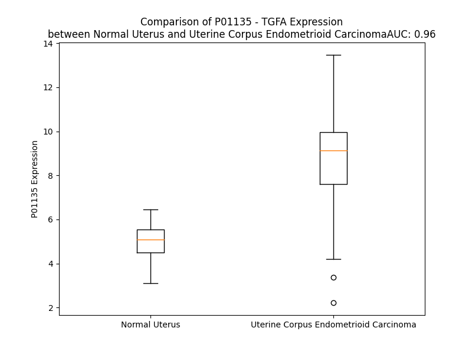

# Detailed Data for P01135

## Introduction to the Detailed Summary

### How to Interpret the Results

- **Summary & Metrics**: This section provides a quick reference to essential protein attributes, including expression changes, family classification, and biomarker applications. Regulation status (upregulated/downregulated) indicates the protein's behavior in a disease context. Some information comes from the original excel file with the proteins selected from literature, while others are derived from the analyses.
- **Expression Comparison**: A visual representation comparing protein expression between normal and disease states. It highlights significant changes in expression levels that might indicate diagnostic or therapeutic relevance. This is data coming from transcriptomics experiments and could not translate similarly to protein levels.
- **Isoform Alignment**: An interactive view of isoform alignments, revealing structural and functional differences between variants of the protein.
- **Interactors & Homologs**: Tables listing known interaction partners and homologous proteins, the more interactors and homologs, the more complex the protein is to design an antibody for.
- **Biological Assemblies**: Information about the structural arrangement of the protein in different assemblies, providing insights into its functional state but also the complexity of the protein to develop antibodies.
- **Combined Per-Residue Information**: A detailed table summarizing residue-level data. This includes predictions for epitope regions, aggregation tendencies, and modifications that might impact the protein's function. Each row corresponds to a residue in the protein, providing insights into specific sites that may be important for research or drug development.
## Summary & Metrics

- **UniProt Accession**: P01135
- **Gene Name**: TGFA
- **Protein Name**: Protransforming growth factor alpha
- **Swiss Prot**: TGFA_HUMAN
- **Family**: growth factor
- **Biomarker Application**: efficacy,response to therapy
- **Number of Isoforms**: 5
- **Regulation**: 1
- **(transcriptomics) AUC**: 0.97
- **(transcriptomics) Fold Change**: 1.61
- **(transcriptomics) Regulation**: Upregulated
- **Discotope Epitope Count**: 25
- **Max n_uniprots (Homo)**: 1
- **Max n_uniprots (Hetero)**: 4

## Expression Comparison

## Isoform Alignment

<pre style='font-size:14px; font-family:monospace;'>P01135-1 MVPSAGQLALFALGIVLAACQALENSTSPLSADPPVAAAVVSHFNDCPDSHTQFCFHGTCRFLVQEDKPACVCHSGYVGARCEHADLLAVVAASQKKQAITALVVVSIVALAVLIITCVLIHCCQVRKHCEWCRALICRHEKPSALLKGRTACCHSETVV---
P01135-2 MVPSAGQLALFALGIVLAACQALENSTSPLS-DPPVAAAVVSHFNDCPDSHTQFCFHGTCRFLVQEDKPACVCHSGYVGARCEHADLLAVVAASQKKQAITALVVVSIVALAVLIITCVLIHCCQVRKHCEWCRALICRHEKPSALLKGRTACCHSETVV---
P01135-3 MVPSAGQLALFALGIVLAACQALENSTSPLS-DPPVAAAVVSHFNDCPDSHTQFCFHGTCRFLVQEDKPACVCHSGYVGARCEHADLLAVVAASQKKQAITALVVVSIVALAVLIITCVLIHCCQVRKHCEWCRALICRHEKPSALLKGRTACCHSETATLG-
P01135-4 MVPSAGQLALFALGIVLAACQALENSTSPLSADPPVAAAVVSHFNDCPDSHTQFCFHGTCRFLVQEDKPACVCHSGYVGARCEHADLLAVVAASQKKQAITALVVVSIVALAVLIITCVLIHCCQVRKHCEWCRALICRHEKPSALLKGRTACCHSETGCRLY
P01135-5 MVPSAGQLALFALGIVLAACQALENSTSPLS-DPPVAAAVVSHFNDCPDSHTQFCFHGTCRFLVQEDKPACVCHSGYVGARCEHADLLAVVAASQKKQAITALVVVSIVALAVLIITCVLIHCCQVRKHCEWCRALICRHEKPSALLKGRTACCHSETGCRLY
</pre>

## Interactors

| preferredName_A   | preferredName_B   |   score |
|:------------------|:------------------|--------:|
| TGFA              | EGFR              |   0.999 |
| TGFA              | ERBB3             |   0.998 |
| TGFA              | ERBB2             |   0.998 |
| TGFA              | EGF               |   0.998 |
| TGFA              | ERBB4             |   0.989 |
| TGFA              | IGF1              |   0.98  |
| TGFA              | AREG              |   0.96  |
| TGFA              | INS               |   0.956 |
| TGFA              | PDGFB             |   0.947 |
| TGFA              | PDGFA             |   0.945 |
| TGFA              | PDGFC             |   0.934 |
| TGFA              | ADAM17            |   0.923 |
| TGFA              | IDE               |   0.923 |
| TGFA              | EREG              |   0.92  |
| TGFA              | PDGFD             |   0.919 |
| TGFA              | HBEGF             |   0.917 |

## Homologs

| uniprot_id   | gene_id   |
|:-------------|:----------|
| Q99075       | HBEGF     |
| O14944       | EREG      |
| Q6UW88       | EPGN      |
| A0A0S2Z437   | BTC       |
| P15514       | AREG      |

## Biological Assemblies

|   Unnamed: 0 |   assembly |   n_uniprots | composition   | crystal_id   |
|-------------:|-----------:|-------------:|:--------------|:-------------|
|            0 |          1 |            1 | Homo          | 1yug         |
|            0 |          1 |            2 | Hetero        | 3e50         |
|            1 |          2 |            2 | Hetero        | 3e50         |
|            0 |          1 |            1 | Homo          | 4tgf         |
|            0 |          1 |            1 | Homo          | 1yuf         |
|            0 |          1 |            1 | Homo          | 1gk5         |
|            0 |          1 |            4 | Hetero        | 7sz7         |
|            0 |          1 |            1 | Homo          | 3tgf         |
|            0 |          1 |            4 | Hetero        | 1mox         |
|            0 |          1 |            4 | Hetero        | 7sz5         |
|            0 |          1 |            1 | Homo          | 5kn5         |
|            1 |          2 |            1 | Homo          | 5kn5         |
|            0 |          1 |            1 | Homo          | 2tgf         |

## Combined Per-Residue Information

|   res | aa   |   epitope_score | epitope   |   relative_surface_accessibility |   modeling_confidence |   Aggregation | modification   | glycosylation                   |
|------:|:-----|----------------:|:----------|---------------------------------:|----------------------:|--------------:|:---------------|:--------------------------------|
|     1 | M    |         0.25112 | False     |                          1.28401 |                 39.54 |         0     | N/A            | N/A                             |
|     2 | V    |         0.33773 | True      |                          0.99964 |                 50.97 |         0     | N/A            | N/A                             |
|     3 | P    |         0.28225 | False     |                          0.38916 |                 51.12 |         0     | N/A            | N/A                             |
|     4 | S    |         0.23638 | False     |                          0.49595 |                 68.14 |         0.024 | N/A            | N/A                             |
|     5 | A    |         0.15324 | False     |                          0.44351 |                 61.34 |         0.222 | N/A            | N/A                             |
|     6 | G    |         0.23967 | False     |                          0.47937 |                 69.04 |         0.456 | N/A            | N/A                             |
|     7 | Q    |         0.13186 | False     |                          0.42795 |                 77.68 |         3.073 | N/A            | N/A                             |
|     8 | L    |         0.26338 | False     |                          0.57465 |                 72.05 |        69.774 | N/A            | N/A                             |
|     9 | A    |         0.1258  | False     |                          0.46242 |                 74.7  |        81.972 | N/A            | N/A                             |
|    10 | L    |         0.1218  | False     |                          0.76557 |                 79.43 |        96.314 | N/A            | N/A                             |
|    11 | F    |         0.15163 | False     |                          0.67818 |                 78.4  |        98.938 | N/A            | N/A                             |
|    12 | A    |         0.09488 | False     |                          0.17541 |                 79.09 |        99.147 | N/A            | N/A                             |
|    13 | L    |         0.16228 | False     |                          0.61981 |                 80.75 |        99.311 | N/A            | N/A                             |
|    14 | G    |         0.09732 | False     |                          0.42859 |                 84.22 |        98.878 | N/A            | N/A                             |
|    15 | I    |         0.09798 | False     |                          0.72493 |                 81.03 |        98.98  | N/A            | N/A                             |
|    16 | V    |         0.10156 | False     |                          0.33989 |                 81.23 |        98.437 | N/A            | N/A                             |
|    17 | L    |         0.153   | False     |                          0.59093 |                 82.69 |        92.002 | N/A            | N/A                             |
|    18 | A    |         0.10599 | False     |                          0.59195 |                 82.57 |        56.759 | N/A            | N/A                             |
|    19 | A    |         0.08216 | False     |                          0.36233 |                 79.45 |        29.077 | N/A            | N/A                             |
|    20 | C    |         0.19821 | False     |                          0.39819 |                 79.34 |         5.541 | N/A            | N/A                             |
|    21 | Q    |         0.16258 | False     |                          0.60477 |                 82.6  |         0.577 | N/A            | N/A                             |
|    22 | A    |         0.11061 | False     |                          0.61085 |                 74.93 |         0.384 | N/A            | N/A                             |
|    23 | L    |         0.14759 | False     |                          0.26483 |                 65.94 |         0.325 | N/A            | N/A                             |
|    24 | E    |         0.2613  | False     |                          0.54595 |                 70.71 |         0     | N/A            | N/A                             |
|    25 | N    |         0.20044 | False     |                          0.76008 |                 71.63 |         0     | N/A            | N-linked (GlcNAc...) asparagine |
|    26 | S    |         0.22558 | False     |                          0.61245 |                 64.41 |         0     | N/A            | N/A                             |
|    27 | T    |         0.25817 | False     |                          0.4888  |                 57.94 |         0     | N/A            | N/A                             |
|    28 | S    |         0.31464 | False     |                          0.69235 |                 51.4  |         0     | N/A            | N/A                             |
|    29 | P    |         0.53412 | True      |                          0.79959 |                 50.54 |         0     | N/A            | N/A                             |
|    30 | L    |         0.38545 | True      |                          0.56021 |                 46.99 |         0     | N/A            | N/A                             |
|    31 | S    |         0.31332 | False     |                          0.74446 |                 42.45 |         0     | N/A            | N/A                             |
|    32 | A    |         0.29933 | False     |                          0.84707 |                 46.27 |         0     | N/A            | N/A                             |
|    33 | D    |         0.26369 | False     |                          0.78313 |                 39.24 |         0     | N/A            | N/A                             |
|    34 | P    |         0.25249 | False     |                          0.79076 |                 39.8  |         0     | N/A            | N/A                             |
|    35 | P    |         0.25358 | False     |                          0.91403 |                 43.47 |         0.15  | N/A            | N/A                             |
|    36 | V    |         0.20745 | False     |                          0.95921 |                 41.93 |        41.098 | N/A            | N/A                             |
|    37 | A    |         0.29575 | False     |                          0.939   |                 42.54 |        44.321 | N/A            | N/A                             |
|    38 | A    |         0.23711 | False     |                          0.83655 |                 48.64 |        44.741 | N/A            | N/A                             |
|    39 | A    |         0.25349 | False     |                          0.71159 |                 45.84 |        44.741 | N/A            | N/A                             |
|    40 | V    |         0.17354 | False     |                          0.85405 |                 44.79 |        44.741 | N/A            | N/A                             |
|    41 | V    |         0.21136 | False     |                          1.01176 |                 48.28 |        41.872 | N/A            | N/A                             |
|    42 | S    |         0.15816 | False     |                          0.29393 |                 52.02 |         5.1   | N/A            | N/A                             |
|    43 | H    |         0.17199 | False     |                          0.7536  |                 61.62 |         0.138 | N/A            | N/A                             |
|    44 | F    |         0.23707 | False     |                          0.38748 |                 64.65 |         0.138 | N/A            | N/A                             |
|    45 | N    |         0.34109 | True      |                          0.50352 |                 68.25 |         0     | N/A            | N/A                             |
|    46 | D    |         0.34182 | True      |                          0.84524 |                 68.57 |         0     | N/A            | N/A                             |
|    47 | C    |         0.20038 | False     |                          0.16314 |                 74.75 |         0     | N/A            | N/A                             |
|    48 | P    |         0.40469 | True      |                          0.50698 |                 66.44 |         0     | N/A            | N/A                             |
|    49 | D    |         0.32703 | False     |                          0.79637 |                 63.52 |         0     | N/A            | N/A                             |
|    50 | S    |         0.39719 | True      |                          0.73794 |                 60.51 |         0     | N/A            | N/A                             |
|    51 | H    |         0.524   | True      |                          0.394   |                 62.19 |         0     | N/A            | N/A                             |
|    52 | T    |         0.27702 | False     |                          0.52203 |                 64.44 |         0     | N/A            | N/A                             |
|    53 | Q    |         0.44776 | True      |                          0.7588  |                 73.49 |         0     | N/A            | N/A                             |
|    54 | F    |         0.41211 | True      |                          0.26966 |                 81.33 |         0     | N/A            | N/A                             |
|    55 | C    |         0.18531 | False     |                          0.10455 |                 86.37 |         0     | N/A            | N/A                             |
|    56 | F    |         0.34542 | True      |                          0.61546 |                 85.63 |         0     | N/A            | N/A                             |
|    57 | H    |         0.31676 | False     |                          0.41624 |                 87.21 |         0     | N/A            | N/A                             |
|    58 | G    |         0.16267 | False     |                          0.19289 |                 85.87 |         0     | N/A            | N/A                             |
|    59 | T    |         0.20264 | False     |                          0.61282 |                 84.98 |         0     | N/A            | N/A                             |
|    60 | C    |         0.14698 | False     |                          0.21885 |                 85.12 |         0     | N/A            | N/A                             |
|    61 | R    |         0.1641  | False     |                          0.33125 |                 83.27 |         0     | N/A            | N/A                             |
|    62 | F    |         0.28608 | False     |                          0.21279 |                 76.59 |         0     | N/A            | N/A                             |
|    63 | L    |         0.27796 | False     |                          0.34705 |                 76.91 |         0     | N/A            | N/A                             |
|    64 | V    |         0.3619  | True      |                          0.46223 |                 71.61 |         0     | N/A            | N/A                             |
|    65 | Q    |         0.26432 | False     |                          0.83794 |                 68.8  |         0     | N/A            | N/A                             |
|    66 | E    |         0.38391 | True      |                          0.49234 |                 69.92 |         0     | N/A            | N/A                             |
|    67 | D    |         0.32536 | False     |                          0.69025 |                 70.45 |         0     | N/A            | N/A                             |
|    68 | K    |         0.49089 | True      |                          0.55386 |                 76.1  |         0     | N/A            | N/A                             |
|    69 | P    |         0.31272 | False     |                          0.21745 |                 77.76 |         0     | N/A            | N/A                             |
|    70 | A    |         0.26347 | False     |                          0.2334  |                 83.16 |         0     | N/A            | N/A                             |
|    71 | C    |         0.22205 | False     |                          0.14149 |                 85.34 |         0     | N/A            | N/A                             |
|    72 | V    |         0.23461 | False     |                          0.51735 |                 83.18 |         0     | N/A            | N/A                             |
|    73 | C    |         0.26331 | False     |                          0.30319 |                 85.08 |         0     | N/A            | N/A                             |
|    74 | H    |         0.20016 | False     |                          0.5552  |                 84.32 |         0     | N/A            | N/A                             |
|    75 | S    |         0.33709 | True      |                          0.88057 |                 78.91 |         0     | N/A            | N/A                             |
|    76 | G    |         0.2208  | False     |                          0.15651 |                 76.39 |         0     | N/A            | N/A                             |
|    77 | Y    |         0.38698 | True      |                          0.30506 |                 80.88 |         0     | N/A            | N/A                             |
|    78 | V    |         0.59475 | True      |                          0.46366 |                 81.58 |         0     | N/A            | N/A                             |
|    79 | G    |         0.32489 | False     |                          0.47811 |                 82.46 |         0     | N/A            | N/A                             |
|    80 | A    |         0.36206 | True      |                          0.8281  |                 82.54 |         0     | N/A            | N/A                             |
|    81 | R    |         0.38059 | True      |                          0.32717 |                 85.39 |         0     | N/A            | N/A                             |
|    82 | C    |         0.03579 | False     |                          0       |                 86.42 |         0     | N/A            | N/A                             |
|    83 | E    |         0.427   | True      |                          0.50803 |                 82.91 |         0     | N/A            | N/A                             |
|    84 | H    |         0.51409 | True      |                          0.57112 |                 84.74 |         0     | N/A            | N/A                             |
|    85 | A    |         0.43511 | True      |                          0.69335 |                 78.82 |         0     | N/A            | N/A                             |
|    86 | D    |         0.40511 | True      |                          0.15981 |                 75.14 |         0     | N/A            | N/A                             |
|    87 | L    |         0.48311 | True      |                          0.79208 |                 68.94 |        63.737 | N/A            | N/A                             |
|    88 | L    |         0.45945 | True      |                          0.87873 |                 64.35 |        71.8   | N/A            | N/A                             |
|    89 | A    |         0.28025 | False     |                          0.33751 |                 62.78 |        73.16  | N/A            | N/A                             |
|    90 | V    |         0.30361 | False     |                          0.56606 |                 60.49 |        73.23  | N/A            | N/A                             |
|    91 | V    |         0.16659 | False     |                          0.50269 |                 61.94 |        73.23  | N/A            | N/A                             |
|    92 | A    |         0.26131 | False     |                          0.41976 |                 61.97 |        53.518 | N/A            | N/A                             |
|    93 | A    |         0.1754  | False     |                          0.36653 |                 62.37 |        33.796 | N/A            | N/A                             |
|    94 | S    |         0.08376 | False     |                          0.34847 |                 63.15 |        15.815 | N/A            | N/A                             |
|    95 | Q    |         0.21091 | False     |                          0.43261 |                 67.83 |         0.221 | N/A            | N/A                             |
|    96 | K    |         0.21355 | False     |                          0.56068 |                 69.31 |         0     | N/A            | N/A                             |
|    97 | K    |         0.10808 | False     |                          0.66003 |                 73.61 |         0     | N/A            | N/A                             |
|    98 | Q    |         0.10326 | False     |                          0.58859 |                 79.38 |         0.006 | N/A            | N/A                             |
|    99 | A    |         0.10491 | False     |                          0.32798 |                 79.03 |         5.037 | N/A            | N/A                             |
|   100 | I    |         0.16038 | False     |                          0.57997 |                 81.49 |        25.491 | N/A            | N/A                             |
|   101 | T    |         0.06492 | False     |                          0.57219 |                 82.78 |        27.5   | N/A            | N/A                             |
|   102 | A    |         0.08636 | False     |                          0.33599 |                 83.14 |        33.599 | N/A            | N/A                             |
|   103 | L    |         0.12197 | False     |                          0.59132 |                 83.84 |        58.404 | N/A            | N/A                             |
|   104 | V    |         0.08983 | False     |                          0.54744 |                 86.5  |        95.626 | N/A            | N/A                             |
|   105 | V    |         0.0922  | False     |                          0.57315 |                 87.88 |        99.363 | N/A            | N/A                             |
|   106 | V    |         0.09278 | False     |                          0.39768 |                 85.96 |        99.705 | N/A            | N/A                             |
|   107 | S    |         0.14525 | False     |                          0.4214  |                 86.94 |        99.735 | N/A            | N/A                             |
|   108 | I    |         0.08394 | False     |                          0.62589 |                 89.65 |        99.973 | N/A            | N/A                             |
|   109 | V    |         0.07835 | False     |                          0.60171 |                 87.9  |        99.995 | N/A            | N/A                             |
|   110 | A    |         0.06566 | False     |                          0.16748 |                 86.11 |        99.996 | N/A            | N/A                             |
|   111 | L    |         0.09225 | False     |                          0.60425 |                 88.34 |        99.998 | N/A            | N/A                             |
|   112 | A    |         0.06587 | False     |                          0.40818 |                 87.86 |        99.994 | N/A            | N/A                             |
|   113 | V    |         0.0712  | False     |                          0.48055 |                 84.34 |        99.992 | N/A            | N/A                             |
|   114 | L    |         0.1263  | False     |                          0.56516 |                 84.5  |        99.957 | N/A            | N/A                             |
|   115 | I    |         0.09349 | False     |                          0.64535 |                 85.62 |        99.765 | N/A            | N/A                             |
|   116 | I    |         0.11068 | False     |                          0.58137 |                 83.38 |        97.664 | N/A            | N/A                             |
|   117 | T    |         0.10003 | False     |                          0.19068 |                 78.76 |        75.482 | N/A            | N/A                             |
|   118 | C    |         0.12225 | False     |                          0.57042 |                 82.12 |        65.032 | N/A            | N/A                             |
|   119 | V    |         0.11104 | False     |                          0.54458 |                 81.9  |        64.334 | N/A            | N/A                             |
|   120 | L    |         0.12747 | False     |                          0.3389  |                 76.86 |        57.741 | N/A            | N/A                             |
|   121 | I    |         0.26084 | False     |                          0.31587 |                 76.16 |        36.609 | N/A            | N/A                             |
|   122 | H    |         0.15045 | False     |                          0.62912 |                 78.58 |         0.717 | N/A            | N/A                             |
|   123 | C    |         0.09147 | False     |                          0.20845 |                 73.33 |         0.051 | N/A            | N/A                             |
|   124 | C    |         0.17753 | False     |                          0.474   |                 69.04 |         0.005 | N/A            | N/A                             |
|   125 | Q    |         0.25293 | False     |                          0.64631 |                 71.37 |         0     | N/A            | N/A                             |
|   126 | V    |         0.18118 | False     |                          0.71448 |                 65.52 |         0     | N/A            | N/A                             |
|   127 | R    |         0.21275 | False     |                          0.5703  |                 58.6  |         0     | N/A            | N/A                             |
|   128 | K    |         0.1929  | False     |                          0.9227  |                 55.64 |         0     | N/A            | N/A                             |
|   129 | H    |         0.22147 | False     |                          0.78222 |                 56.88 |         0     | N/A            | N/A                             |
|   130 | C    |         0.12556 | False     |                          0.17442 |                 53.63 |         0     | N/A            | N/A                             |
|   131 | E    |         0.22913 | False     |                          0.72494 |                 57.14 |         0     | N/A            | N/A                             |
|   132 | W    |         0.23993 | False     |                          0.82817 |                 55.27 |         0     | N/A            | N/A                             |
|   133 | C    |         0.10437 | False     |                          0.10556 |                 55.86 |         0     | N/A            | N/A                             |
|   134 | R    |         0.1847  | False     |                          0.52127 |                 54.18 |         0     | N/A            | N/A                             |
|   135 | A    |         0.14477 | False     |                          0.4393  |                 59.59 |         0     | N/A            | N/A                             |
|   136 | L    |         0.21647 | False     |                          0.69048 |                 57.15 |         0     | N/A            | N/A                             |
|   137 | I    |         0.21616 | False     |                          0.69163 |                 54.64 |         0     | N/A            | N/A                             |
|   138 | C    |         0.25047 | False     |                          0.43943 |                 47.97 |         0     | N/A            | N/A                             |
|   139 | R    |         0.27404 | False     |                          0.80794 |                 52.09 |         0     | N/A            | N/A                             |
|   140 | H    |         0.27613 | False     |                          0.93963 |                 48.35 |         0     | N/A            | N/A                             |
|   141 | E    |         0.16    | False     |                          0.67788 |                 43.02 |         0     | N/A            | N/A                             |
|   142 | K    |         0.16802 | False     |                          0.87173 |                 30.6  |         0     | N/A            | N/A                             |
|   143 | P    |         0.26071 | False     |                          0.72962 |                 45.74 |         0     | N/A            | N/A                             |
|   144 | S    |         0.22047 | False     |                          0.7434  |                 43.22 |         0     | N/A            | N/A                             |
|   145 | A    |         0.23591 | False     |                          0.8924  |                 41.92 |         0     | N/A            | N/A                             |
|   146 | L    |         0.2729  | False     |                          0.99938 |                 47.37 |         0     | N/A            | N/A                             |
|   147 | L    |         0.26643 | False     |                          1.09004 |                 40.39 |         0     | N/A            | N/A                             |
|   148 | K    |         0.23609 | False     |                          1.00154 |                 35.3  |         0     | N/A            | N/A                             |
|   149 | G    |         0.21028 | False     |                          0.81138 |                 34.87 |         0     | N/A            | N/A                             |
|   150 | R    |         0.22397 | False     |                          0.90014 |                 38.05 |         0     | N/A            | N/A                             |
|   151 | T    |         0.19711 | False     |                          1.03923 |                 39.41 |         0     | N/A            | N/A                             |
|   152 | A    |         0.1812  | False     |                          0.71767 |                 38.65 |         0     | N/A            | N/A                             |
|   153 | C    |         0.1308  | False     |                          0.71044 |                 45.75 |         0     | N/A            | N/A                             |
|   154 | C    |         0.15073 | False     |                          0.86529 |                 43.43 |         0     | N/A            | N/A                             |
|   155 | H    |         0.18358 | False     |                          0.94563 |                 39.58 |         0     | N/A            | N/A                             |
|   156 | S    |         0.14597 | False     |                          0.77645 |                 46.09 |         0     | N/A            | N/A                             |
|   157 | E    |         0.21369 | False     |                          0.74227 |                 45.36 |         0     | N/A            | N/A                             |
|   158 | T    |         0.28405 | False     |                          0.91794 |                 48.31 |         0     | N/A            | N/A                             |
|   159 | V    |         0.12687 | False     |                          1.00348 |                 38.57 |         0     | N/A            | N/A                             |
|   160 | V    |         0.13176 | False     |                          1.43536 |                 45.95 |         0     | N/A            | N/A                             |

